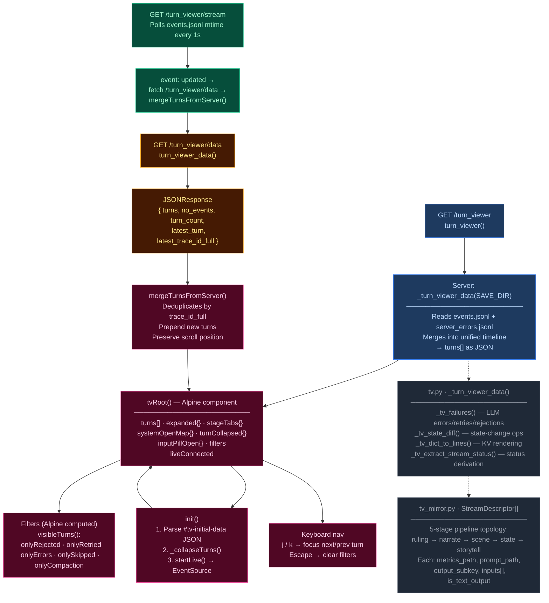
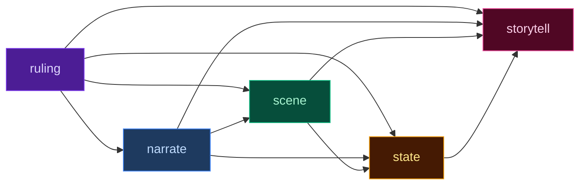

# Turn Viewer (`/turn_viewer`) — Pipeline Debug UI

Standalone turn-inspection tool for debugging the 5-stage pipeline. Shows every turn's inputs, prompts, outputs, status, metrics, state diffs, and server errors in a single scrollable page. Pure Alpine.js — no HTMX.

## Interaction Model

## Turn Card Layout

Each turn renders as a `.tv-turn-card` with header + two-column body:

### Header (collapsed by default, click to expand)
- Turn number, user input text
- Trace ID (short)
- Timing waterfall bar (proportional colored segments for each stage)
- Token counts (total in / total out)
- Status badges: `rejected`, `retries`, `errors`
- Chevron indicator

### Left Column (56%) — Pipeline Stages

Five stage rows, one per pipeline step:

| Stage | Color (CSS var) | Inputs from Upstream |
|-------|-----------------|---------------------|
| `ruling` | `--stage-rules` (violet) | — |
| `narrate` | `--stage-narrate` (blue) | ruling |
| `scene` | `--stage-scene` (green) | ruling, narrate |
| `state` | `--stage-state` (amber) | ruling, narrate, scene |
| `storytell` | `--stage-progress` (pink) | ruling, narrate, scene, state |

**Per stage (collapsible):**
- Stage name + status badge (`ok`/`retried`/`rejected`/`skipped`/`error`) + attempt count
- Token bar (proportional to total) + timing + tokens in/out
- Prompt/Output tabs
  - **Prompt tab**: system prompt (collapsible by default, shows approx token count) + user prompt, both rendered as markdown
  - **Output tab**: narration renders as markdown; other stages render as syntax-highlighted JSON
- **Input pills** (between stage rows): upstream stage outputs as KV lines, toggled expandable. Dot-paths resolved via `_get_nested()` from `tv_mirror.py`.

### Right Column (44%) — Diff Panel (sticky)

Three optional sections:

1. **Failures** — LLM errors, parse retries, validation rejections. Each shows stream name, kind (error/retry/reject), attempt number, message.
2. **Pacing Context** — summary (directive or "neutral"), band label (roll turns only). All rows use 4-column CSS grid (`1.2em 1fr 2fr auto`) — every row includes an empty `` as first child for correct column placement.
3. **State Changes** — ops table showing `+` (add), `-` (remove), `~` (update), `=` (no-op). Each row: op, field path, value. Rejected rows get a `rejected` badge and dimmed styling.

## Filter Bar

Checkboxes bound to Alpine booleans:
- `onlyRejected` — turns with validation rejections
- `onlyRetried` — turns with LLM parse retries
- `onlyErrors` — turns with stage errors
- `onlySkipped` — turns with skipped stages
`visibleTurns()` computed property filters `turns[]` reactively.

## Live Updates

1. `startLive()` opens `EventSource` to `GET /turn_viewer/stream`
2. Server polls `events.jsonl` mtime every 1 second
3. On change, emits `event: updated`
4. JS fetches `GET /turn_viewer/data` → receives `turns[]` JSON
5. `mergeTurnsFromServer()` deduplicates by `trace_id_full`, prepends new turns
6. Scroll position preserved if at top; `liveConnected` flag shows "● live" indicator
7. On error, `liveConnected` set to `false`

## Keyboard Navigation

| Key | Action |
|-----|--------|
| `j` | Focus next visible turn |
| `k` | Focus previous visible turn |
| `Escape` | Clear all filters |

Focused turn auto-expands and scrolls into view.

## Data Preparation (`tv.py` — 583 lines)

| Function | Purpose |
|----------|---------|
| `_turn_viewer_data(save_dir)` | Reads `events.jsonl` + `server_errors.jsonl`, merges into unified timeline sorted by timestamp |
| `_tv_failures()` | Collects LLM errors, parse retries, validation rejections, top-level errors |
| `_tv_state_diff()` | Extracts state-change operations (add/update/remove) from extraction outputs |
| `_tv_dict_to_lines()` | Generic KV renderer — renders every top-level key as a display line with value truncation |
| `_tv_extract_stream_status()` | Derives status string (`ok`/`skipped`/`retried`/`rejected`/`error`) from event data |

### Stream Topology (`tv_mirror.py` — `StreamDescriptor` registry)

Each `StreamDescriptor` defines: `key`, `label`, `stage_css`, `metrics_path` (dot-path into event JSON), `prompt_path`, `output_subkey`, `is_text_output`, `inputs` (upstream keys), `skip_token_display`.

## Status Color Legend

| CSS Token | Meaning | UI Badge |
|-----------|---------|----------|
| `--status-ok` | Stage ran and completed | `.tv-sts-ok` |
| `--status-skipped` | Stream was skipped (no longer used) | `.tv-sts-skipped` |
| `--status-retried` | LLM output required parse retry | `.tv-sts-retried` |
| `--status-rejected` | Post-extract validation rejected delta | `.tv-sts-rejected` |
| `--status-error` | LLM call or parse failed | `.tv-sts-error` |

Stage accent stripes use `--stage-rules` (violet), `--stage-narrate` (blue), `--stage-scene` (green), `--stage-state` (amber), `--stage-progress` (pink) for quick scanning. Status color always wins for the prominent left border.

## CSS Architecture

Turn viewer styles live in **`app.src.css`** lines 2102–3101+:
- `.turn-viewer-page` — full-page grid layout
- `.tv-turn-card` — card container with header + two-column body
- `.tv-pipeline-stage` — stage row with accent stripe, header, expandable body
- `.tv-diff-panel` — right column, sticky within scroll
- `.tv-input-pill` — upstream-stage input display
- `.tv-filter-bar` — checkbox filter row
- `.tv-stage-<name>` / `.tv-sts-<status>` — color classes

## Server Entry Points (`routes.py`)

| Route | Handler | Returns |
|-------|---------|---------|
| `GET /turn_viewer` | `turn_viewer()` (line 466) | `_turn_viewer.html` with server-rendered `turns` JSON |
| `GET /turn_viewer/data` | `turn_viewer_data()` (line 482) | `JSONResponse` of turn data |
| `GET /turn_viewer/stream` | `turn_viewer_stream()` (line 497) | SSE — polls `events.jsonl` mtime every 1s, emits `updated` |

## Dependencies

- **Alpine.js** — reactive UI (no HTMX or React)
- **highlight.js** (`highlight.min.js` + Atom One Dark theme) — JSON syntax highlighting
- **marked** (`marked.min.js`) — markdown rendering for narration prompts and outputs
- **`tv.py`** — data preparation logic (583 lines)
- **`tv_mirror.py`** — stream descriptor registry (113 lines) — single source of truth for pipeline topology
