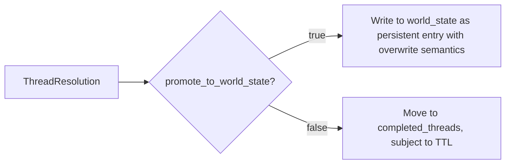

# Arc Resolution Redesign — Successor Threads & World State Bridge

## Purpose

Redesign arc resolution to produce compelling new adventures via structured successor creation, and bridge the gap between resolved threads and permanent world facts. This document is the design authority for plans implementing these changes.

It operates on top of (and does not supersede) the existing arc-system redesign in `docs/design/arc-system-design.md`, which has been partially implemented but whose remaining work (progress removal, key dedup, TTL filtering) falls outside this scope.

## Problem Statement

Two separate problems converge:

1. **Arc resolution produces weak successors.** When an arc resolves via `arc_resolve`, Python creates a new `CampaignArc` from two strings (`visible_goal`, `goal_context`) plus surviving threads carried over from the old arc. No new threads are created as part of resolution, so the successor has no concrete things to do — just a goal string and stale threads. Storytell can emit `thread_add` independently in the same stream, but the pipeline processes arc_resolve first then thread_add: new threads land in the new arc but are not structurally tied to the resolution event.

2. **Thread outcomes vanish after TTL.** When a thread resolves, its outcome lives in `completed_threads`. The existing arc-system redesign plans TTL-based filtering (not yet implemented), but even so there's no mechanism to promote meaningful outcomes to permanent world facts. A resolved thread's outcome (e.g., "the blockade collapsed") should become a durable world fact — not disappear from narrative context after N turns.

## Constraints

- No backward compatibility or migration. Full refactor — remove all dead fields.
- All design decisions in `docs/design/arc-system-design.md` are final where not superseded by this document.
- Storyteller is the only runtime writer to World State (besides conditions/inventory). Ruling has no access to world_state or arc context.
- No silent Python mechanics — all thread state transitions and world state mutations must have explicit narrative justification from storytell.

## Non-goals

- Changes to ruling engine difficulty calculation (ruling doesn't read from World State anyway).
- Changes to seed generation beyond removing dead fields and updating model shapes.
- Thread chaining via explicit references (`promotes`, `unlock_if`). Revisit in a future design.
- Automatic thread culling or hard caps on thread count.
- Consolidation of world state and threads into a single system — both remain separate, with a controlled bridge for thread→world-state promotion at resolution time.
- Removal of `world_state_add`/`world_state_remove` from StorytellerResult. Both are kept with updated prompt guidance.
- The existing arc-system redesign work remaining from `docs/design/arc-system-design.md`: removal of `progress` field, addition of `key` dedup field to ArcThread, and TTL-based filtering of completed_threads/resolved_arcs in prompts.

## Current State — What Exists

### Arc Resolution (turn.py:209-294)

When storytell emits `arc_resolve`:

```mermaid
graph LR
    A[StorytellerResult.arc_resolve] --> B[_apply_arc_resolve]
    B --> C[Store old arc in resolved_arcs with resolution string]
    B --> D[Process thread_directives: drop or move_latent]
    B --> E[Create new CampaignArc from visible_goal + goal_context strings]
    E --> F[threads = surviving_threads from old arc (implicit carry-over)]
    E --> G[completed_threads = empty reset]
```

The new arc has: `visible_goal` (string), `goal_context` (string), inherited `thematic_question`, carried-over threads, and an empty completed_threads list. No new threads are created as part of resolution.

### World State (seeded + runtime)

World state lives in `state.scene.world_state`. Two tiers:

- **Seed entries** (`baseline_0`, etc.) with `tier: permanent` — immutable game rules/constraints
- **Runtime entries** from storytell's `world_state_add` with `tier: persistent` — durable changes like "faction turned hostile" or "bridge destroyed"

Storytell writes up to 2 world_state_add per turn. The existing system prompt instructs a separation rule: "Threads track narrative tension; world state tracks durable reality." ID-based overwrite semantics already exist in `delta_builder.py:322-343` — submitting the same ID updates the entry rather than duplicating.

### Thread Lifecycle (current arc-system-design.md, partially implemented)

- `thread_add`: new thread created by storytell
- `thread_update`: change active/latent/urgency/summary/progress
- `thread_resolve`: move to completed_threads with outcome; TTL-based filtering in prompts is part of remaining arc-system redesign work (not yet implemented — currently all completed threads pass through context.py:98 without pruning)

### Problems with Current State

1. **Arc resolution has no new thread creation.** The successor arc gets carried-over threads (possibly stale) and nothing new. Storytell can emit `thread_add` separately but there's no structural link between resolution and the new adventure's threads.

2. **Resolved threads vanish after TTL.** When a thread resolves, its outcome lives in `completed_threads` then becomes invisible after TTL filtering. No mechanism promotes meaningful outcomes to permanent world facts that persist beyond the narrative window. The thread's outcome is a durable fact about the world (e.g., "the blockade collapsed"), not just narrative history.

3. **JSON schema example in storytell_system.j2:5-15 does not match actual ArcResolution model shape.** The example shows only `resolution`, `visible_goal`, `goal_context` — omitting `thematic_question` and `thread_directives`. This mismatch caused validation errors.

## Proposed Solution

### Core Changes

#### 1. Add `new_threads` to ArcResolution

Replace the current two-string approach with structured output that explicitly creates what's needed for a compelling successor:

```python
class ArcResolution(BaseModel):
    resolution: str                                    # how old arc concluded narratively
    visible_goal: str                                  # next arc's goal (kept)
    goal_context: str                                  # why new goal matters to PC (kept)
    thematic_question: str | None = None               # optional override, inherit if omitted

    drop_threads: list[str] = Field(default_factory=list)   # IDs to drop; everything else carries over (opt-out)
    new_threads: list[ArcThread] = Field(default_factory=list)  # fresh threads for successor
```

Key changes:
- `thread_directives: list[ThreadDirective]` (with drop/move_latent) → `drop_threads: list[str]` — opt-out carry-over. Only threads explicitly listed by ID are dropped. Everything else carries forward into the successor arc. `move_latent` can be done independently via `thread_update {active: false}` in the same turn.
- `new_threads: list[ArcThread]` — structured thread objects created as part of resolution, with concrete summaries/urgency/scope that suggest "here's what happens next."

#### 2. Add `promote_to_world_state` to ThreadResolution — immediate promotion

```python
class ThreadResolution(BaseModel):
    id: str
    resolution_state: Literal["resolved", "failed", "abandoned"]
    outcome: str = ""
    promote_to_world_state: bool = False  # when true, outcome becomes persistent world state entry immediately
```

When `promote_to_world_state` is true, the engine immediately writes the thread's outcome as a persistent world state entry (tier: persistent) using ID-based overwrite semantics. This works regardless of whether `arc_resolve` fires in the same turn — promotion is immediate, not gated on arc resolution boundaries. Thread ID becomes the world state entry ID (or a derived snake_case ID from the outcome text if the thread has no clean ID).

This solves the "resolved threads vanish" problem without creating a mid-arc world fact gap.



#### 3. Keep `world_state_add`/`world_state_remove` with updated prompt guidance

Storytell retains the ability to write mid-arc world facts. The change is in *how* the LLM is instructed to use these fields:

- **Prefer update over create.** When a durable fact already exists in world state, update it by matching ID rather than creating a new entry. The engine's existing overwrite semantics (delta_builder.py:322-343) handle this — LLM just needs to reuse the same ID.
- **Consolidate overlapping facts.** When two world state entries describe the same reality (e.g., `faction_allied_traders` and `traders_friendly_to_pc`), update one and remove the other. Keep the world state list concise.
- **Avoid duplication with threads.** If a fact is narrative tension (something that could still change, a looming threat), it belongs as a thread. If it's settled durable reality (a thing that is now permanently true), it belongs in world state. The boundary is fuzzy at resolution time — that's what `promote_to_world_state` bridges.
- **Max 2 adds/updates per turn** (unchanged from current limit).

No model changes to `world_state_add`/`world_state_remove` — they stay on `StorytellerResult` as-is. The only change is prompt instruction.

#### 4. Fix JSON schema example and consolidate arc resolution prompt

The JSON schema example in `storytell_system.j2:5-15` must match the actual model shape exactly. The arc resolution section (currently ~17 lines) needs rewriting to document `drop_threads` and `new_threads` instead of `thread_directives`.

#### 5. Remove ThreadDirective model

No replacement needed — `drop_threads: list[str]` is the simpler equivalent. The `_apply_arc_resolve` logic for processing thread directives (turn.py:264-280) is rewritten to iterate `drop_threads` instead.

### Alternatives Considered and Rejected

| Alternative | Why rejected |
|---|---|
| Consolidate world_state + threads into single unified system | Both systems describe genuinely different concepts (narrative tension vs durable reality). Keeping both with a controlled bridge (`promote_to_world_state`) is simpler, lower-risk, and avoids mid-arch fact gaps. |
| Remove `world_state_add`/`world_state_remove` entirely; world state only through thread promotion | Creates mid-arc world fact gap. A faction turning hostile mid-arc must wait for arc resolution to be recorded, incentivizing premature arc resolution. |
| `surviving_threads` opt-in listing (only threads explicitly listed carry forward) | High risk of empty successor when LLM forgets to list threads. Opt-out (`drop_threads`) preserves existing behavior while giving explicit control for stale thread removal. |
| Engine-inferred thread promotion from outcomes | Same problem as progress-based completion: no narrative reason. Storyteller should decide which resolved facts are worth preserving permanently. |
| Keep thread_directives with drop/move_latent (no change) | move_latent is redundant — `thread_update {active: false}` in the same turn achieves the same. Simplifying to `drop_threads: list[str]` reduces model surface area and prompt tokens. |

## Decision Table

| Decision | What | Why |
|---|---|---|
| D1 | Add `new_threads: list[ArcThread]` to ArcResolution | Structured output for "what happens next" — concrete things to do, not freeform strings |
| D2 | Replace `thread_directives` with `drop_threads: list[str]` | Opt-out carry-over (safer than opt-in); removes redundant move_latent action |
| D3 | Add `promote_to_world_state: bool` on ThreadResolution — immediate promotion | Thread outcomes become persistent world facts; no mid-arc gap (not gated on arc_resolve) |
| D4 | Keep `world_state_add`/`world_state_remove` on StorytellerResult | Mid-arc durable facts remain writable; updated prompt guidance on conciseness and consolidation |
| D5 | World state prompt guidance: prefer update-by-ID, consolidate overlapping facts, avoid thread duplication | Keeps world state concise without engine enforcement |
| D6 | Remove ThreadDirective model | Replaced by `drop_threads: list[str]` — deleted with no replacement |
| D7 | World State uses overwrite semantics (no TTL) — newer discoveries supersede older ones by ID | Already exists in delta_builder.py:322-343; explicitly documented here |
| D8 | Fix JSON schema example in storytell_system.j2 to match actual model | Prevents validation errors from schema mismatch |

## Failure Modes and Risks

- **Storyteller omits `new_threads` entirely.** If the LLM doesn't emit any threads in arc resolution, the successor has no concrete things to do. Mitigate with prompt instruction requiring at least one new thread per resolution, plus fallback: if `new_threads` is empty and no threads survive from carry-over (unlikely with opt-out), generate a thread from `visible_goal`.
- **LLM drops too many threads via `drop_threads`.** Over-pruning could leave a bare successor. Mitigated by opt-out design — only explicitly listed IDs are dropped. Every thread not in `drop_threads` carries forward. If the LLM lists every thread, the successor starts with zero active threads but the carried threads were intentionally dropped per the LLM's narrative judgment.
- **World state bloat from `world_state_add`.** Existing limit (2 per turn) caps growth. Prompt guidance (prefer update, consolidate) further constrains it. Overwrite semantics prevent ID-based duplication.
- **LLM uses `promote_to_world_state` on every resolved thread.** Over-promotion bloats world state. Mitigated by overwrite semantics (same ID = update, not append) and prompt guidance suggesting promotion for genuinely permanent outcomes only. Engine does not enforce a cap — prompt discipline is the primary mechanism.

## Open Questions

None remaining. All decisions resolved through design review:
- `new_threads` on ArcResolution for structured successor creation.
- `drop_threads: list[str]` opt-out carry-over (not opt-in).
- `promote_to_world_state` on ThreadResolution promotes immediately (not gated on arc resolution).
- `world_state_add`/`world_state_remove` kept with updated prompt guidance (prefer update, consolidate).
- ThreadDirective model deleted.

## What Is Removed

| Removed | From | Notes |
|---|---|---|
| `thread_directives: list[ThreadDirective]` on ArcResolution | models.py (ArcResolution) | Replaced by `drop_threads: list[str]`; simpler opt-out listing |
| ThreadDirective model | models.py | Deleted with no replacement |
| `move_latent` action concept | models.py, turn.py | No longer needed — `thread_update {active: false}` handles dormancy separately |

## What Is Unchanged

- `StorytellerResult.world_state_add` — kept as-is (list of WorldStateFact)
- `StorytellerResult.world_state_remove` — kept as-is (list of str)
- `WorldStateFact` model — unchanged (id, text, tier with default="persistent")
- `CampaignArc.visible_goal`, `thematic_question` — kept, static within an arc's lifetime
- `CampaignArc.goal_context` — kept on model for UI; removed from prompts per existing design (D8 of arc-system-design.md)
- `CampaignArc.threads`, `completed_threads` — core collections unchanged
- `CampaignArc.resolution`, `last_thread_created_turn` — kept as added by existing arc-system redesign
- `resolved_arcs` on state — kept with TTL-based pruning in prompts per remaining arc-system redesign work (not yet implemented)
- `ArcThread` fields: `id`, `summary`, `scope`, `active`, `urgency`, `resolution_state`, `outcome`, `resolved_turn` — all kept. Note: `progress` field still present on current source but slated for removal by separate arc-system redesign work (out of scope here).
- `ThreadUpdate` model — no changes (moved to latent via `active: false` replaces `move_latent` action)
- `StateDelta` — no changes (world_state_add/remove still flow through)
- World state persistence in `delta_builder.py:322-343` — unchanged (overwrite semantics already exist)
- Ruling engine unchanged — still has no access to world_state or arc context
- Key-based dedup and fuzzy auto-merge at thread_add time — kept as safety net against duplicate threads (key field addition is part of remaining arc-system redesign work, out of scope)

## New Model Shapes

```python
class ArcThread(BaseModel):
    id: str
    summary: str
    scope: Literal["scene", "arc"]
    active: bool = True
    urgency: Literal["background", "normal", "urgent"] = "normal"
    progress: str = ""               # present in source; removal out of scope per arc-system-redesign
    resolution_state: str | None = None
    outcome: str | None = None
    resolved_turn: int | None = None


class ArcResolution(BaseModel):
    resolution: str                                   # how old arc concluded narratively

    visible_goal: str                                 # next arc's goal (medium-to-long-term objective)
    goal_context: str                                 # why new goal matters to PC specifically
    thematic_question: str | None = None              # optional override, inherit from old arc if omitted

    drop_threads: list[str] = Field(default_factory=list)       # IDs of threads to drop (opt-out; not listed = carried forward)
    new_threads: list[ArcThread] = Field(default_factory=list)  # fresh thread objects for the successor adventure


class ThreadResolution(BaseModel):
    id: str                                            # which thread is being resolved
    resolution_state: Literal["resolved", "failed", "abandoned"]
    outcome: str = ""                                  # one past-tense sentence of what happened
    promote_to_world_state: bool = False               # when true, outcome becomes persistent world state entry (immediate, not gated on arc_resolve)


class WorldStateFact(BaseModel):
    id: str                                            # unique identifier (snake_case)
    text: str                                          # the fact description
    tier: Literal["permanent", "persistent"] = "persistent"  # permanent=seed-only immutable; persistent=runtime mutable until superseded
```

Note on ArcThread: The existing arc-system redesign added `progress` to current source (models.py line 35). This design does not remove it — that work belongs to the separate arc-system redesign effort.

Removed models (delete):

- `ThreadDirective` (models.py:359-361) — no replacement needed

## Resolved decision: thread_directives vs. drop_threads

The original design proposed `surviving_threads: list[str]` (opt-in: only listed threads carry forward). During review this was rejected in favor of `drop_threads: list[str]` (opt-out: only listed threads are dropped) because:

- Opt-in creates a critical failure mode: if the LLM forgets to list threads, the successor arc has zero threads with no fallback. The empty successor is worse than the stale-thread problem.
- Opt-out preserves the current behavior (everything carries forward unless explicitly told otherwise), which has been working. The LLM can always resolve unwanted threads as "abandoned" in subsequent turns.
- `move_latent` is redundant: `thread_update {active: false}` in the same turn handles dormancy, and the pipeline processes `thread_update` before `arc_resolve`.

## Context for Implementing LLMs

- `ccya/models.py` — ArcResolution: add `drop_threads`, `new_threads` fields; ThreadResolution: add `promote_to_world_state` field; ThreadDirective: delete model
- `ccya/engine/turn.py:209-294` (`_apply_arc_resolve`) — Rewrite thread directive processing: iterate `drop_threads` list instead of `thread_directives`. Add `new_threads` to successor CampaignArc creation. Remove `move_latent` dispatch.
- `ccya/engine/turn.py:297-375` (`_apply_thread_resolutions`) — Add `promote_to_world_state` handling: when true, write thread outcome to `state.scene.world_state[]` as a persistent WorldStateFact with ID matching thread ID (or derived from outcome text). Must use existing overwrite semantics (check delta_builder.py:322-343).
- `ccya/prompts/storytell_system.j2` — Fix JSON schema example (lines 5-15) to include all ArcResolution fields including `drop_threads` and `new_threads`. Rewrite arc resolution section (lines 70-86) to document `drop_threads` and `new_threads`. Update thread_resolve section (lines 56-68) to document `promote_to_world_state`. Update world state rules section (lines 93-106): add guidance on preferring update-by-ID, consolidation, avoiding thread duplication. Keep existing limits (max 2/turn).
- `ccya/prompts/context.py:248-269` (StorytellerBoundary) — Verify world_state still passes through correctly (no changes expected since world_state_add/remove fields are kept).
- `ccya/state/io.py:83` — `resolved_arcs: []` seed — no changes needed.
