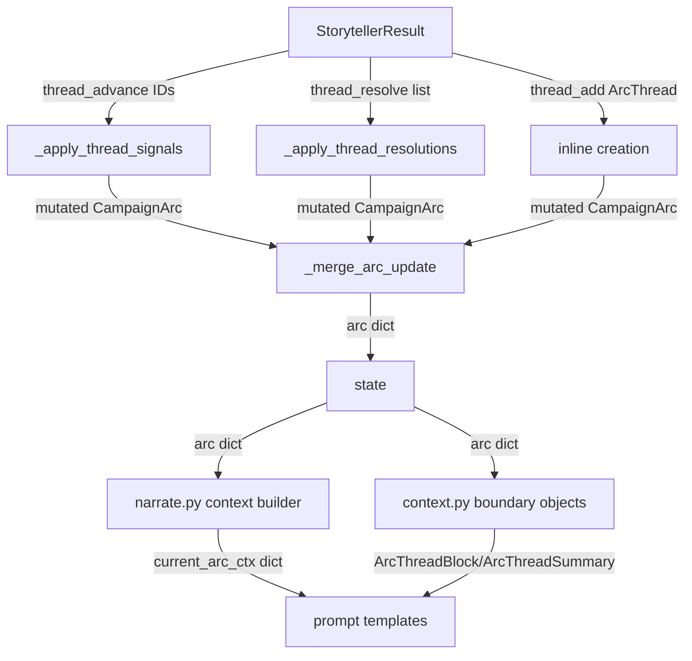

# Arc System Redesign

## Purpose

Design doc for overhauling the arc/thread lifecycle, extraction operations, and prompt contracts. This document is the design authority for plans implementing these changes.

## Problem Statement

The arc/thread system has three core problems:

1. **No arc lifecycle.** CampaignArc has no resolution or completion. Once set, `visible_goal` persists forever. There is no mechanism to create a new arc from accumulated narrative context. The player can end up with a stale or completed goal that never refreshes.

2. **Silent Python mechanics.** Threads auto-complete after counting to 3 (`progress >= thread_completion_threshold`). Threads silently demote from active→latent via `last_seen_turn` timers. Threads silently decay urgency via `urgency_set_turn`. None of these require narrative justification — they happen off-screen with no reason the player can see.

3. **Dead and misallocated fields.** `promotes`, `unlock_if`, `pc_drive`, `hidden_truths`, `discovered_truths`, and `progress` are inert or redundant. `goal_context` leaks into narration prompts but is a UI flavor field. `thread_advance` is the only operation that increments progress, but progress is being removed — making it redundant with `last_seen_turn` tracking.

Secondary: threads lack a mechanism to chain or hand off to each other. Resolved thread outcomes aren't surfaced back into storytelling context, so the LLM can't naturally create follow-up threads from what just happened.

## Constraints

- No backward compatibility or migration. Full refactor — remove all dead fields, no debt left behind.
- No silent engine mechanics. All thread state transitions (active/latent/urgency) are LLM-driven via `thread_update`. The engine never silently demotes, promotes, or completes.
- No hard Python caps or cooldowns on threads. Soft prompt-enforced limits with key-based dedup and fuzzy merge as the safety net.
- `thematic_question` is the persistent thematic thread through the entire game — feeds both storyteller and narrator.
- Resolving an arc requires creating a new arc in the same turn. The player always has a long-term goal.
- Arcs are static artifacts. They don't change — they resolve (succeeded, failed, abandoned) and are replaced by a new arc.
- Completed thread outcomes appear in storyteller context for a TTL window, then drop.
- Resolved arcs appear in storyteller and narrator context for a TTL window, then drop.

## Non-goals

- Thread chaining via explicit references (promotes, unlock_if, or new linking fields). Revisit in a future design.
- Changes to the narrator storytelling model or narration directive system beyond removing dead fields and adding context.
- Changes to world state, conditions, or inventory systems.
- Changes to seed generation beyond removing dead fields from `CampaignArc`.
- Automatic thread culling. Storyteller manages thread lifecycle. Prompt includes thread counts and nudges to resolve stale threads.

## Current State — What Exists

### CampaignArc model (`ccya/models.py:50-59`)

```python
class CampaignArc(BaseModel):
    visible_goal: str = ""
    thematic_question: str = ""
    hidden_truths: list[str] = Field(default_factory=list)
    discovered_truths: list[str] = Field(default_factory=list)
    threads: list[ArcThread] = Field(default_factory=list)
    completed_threads: list[ArcThread] = Field(default_factory=list)
    pc_drive: str = ""
    goal_context: str = ""
```

- No resolution field. No lifecycle states. No way to mark an arc complete or create a successor.
- `hidden_truths` / `discovered_truths` — thread system serves this function now.
- `pc_drive` — never updated after seed, never used mechanically.
- `goal_context` — set once in seed, fed into narration prompts, but has no mechanical purpose.

### ArcThread model (`ccya/models.py:28-47`)

```python
class ArcThread(BaseModel):
    id: str
    summary: str
    scope: Literal["scene", "arc"]
    active: bool = True
    urgency: Literal["background", "normal", "urgent"] = "normal"
    tags: list[str] = Field(default_factory=list)
    progress: int = 0
    last_seen_turn: int | None = None
    added_turn: int | None = None
    urgency_set_turn: int | None = None
    resolution_state: str | None = None
    outcome: str | None = None
    unlock_if: str | None = None
    promotes: list[str] = Field(default_factory=list)
    key: str | None = None
```

- `progress` — incremented by `thread_advance`, auto-completes at threshold. No narrative reason.
- `last_seen_turn` — drives silent active→latent demotion after 5 turns.
- `added_turn` — drives creation cooldown and age sorting. Per-thread when it should be per-arc.
- `urgency_set_turn` — drives silent urgency decay after 8 turns.
- `unlock_if` / `promotes` — never wired to actual logic.
- `key` — used for dedup at thread_add time. Useful, keeping.

### StorytellerResult extraction (`ccya/models.py:383-421`)

```python
thread_advance: list[str]       # IDs of threads "advanced" this turn
thread_resolve: list[ThreadResolution]
thread_add: ArcThread | None
```

- `thread_advance` is the only way to increment progress. Without progress, it serves no purpose.
- No `thread_update` operation — storyteller cannot change active/latent state or urgency.
- No `arc_resolve` operation — storyteller cannot signal arc completion.
- No `arc_update` operation — storyteller cannot adjust visible_goal or thematic_question mid-arc.

### Thread lifecycle engine (`ccya/engine/turn.py:152-416`)

`_apply_thread_signals()`:
- Phase A: Advance progress for IDs in `thread_advance`, increment progress, set last_seen_turn. Auto-complete at `thread_completion_threshold` (default 3).
- Phase B: Enforce latent cap (4). Drop oldest.
- Phase C: Rebuild thread list.
- Phase D: Immediate promotion of latent threads in advance IDs.
- Phase E: Cooldown-gated promotion (3-turn cooldown, `unlock_if` gate).

All of this is Python-managed. The storyteller never explicitly sets a thread to latent or changes its urgency.

### Data flow



### Constants and config (being removed)

| Constant/Config | Location | Purpose (being removed) |
|---|---|---|
| `_EXPIRE_SILENT_TURNS` | `turn.py:145` | Silent active→latent demotion |
| `_PROMOTION_COOLDOWN_TURNS` | `turn.py:148` | Latent promotion cooldown |
| `_ACTIVE_THREAD_CAP` | `turn.py:139` | Hard cap, replacing with prompt guidance |
| `_LATENT_THREAD_CAP` | `turn.py:142` | Hard cap, replacing with prompt guidance |
| `thread_completion_threshold` | `config.py:93` | Progress-based auto-completion |
| `thread_urgency_max_age` | `config.py:78` | Urgency decay |
| `scene_thread_expire_silent_turns` | `config.py:82` | Scene thread lifecycle |
| `track_scene_thread_progress` | `config.py:80` | Scene thread inclusion |
| `thread_creation_cooldown` | `config.py:95` | Cooldown between thread_add |

### Problems with Current State

- **No arc resolution mechanism.** Arcs persist forever with stale goals.
- **Silent Python mechanics** drive thread state (progress→completion, last_seen_turn→demotion, urgency_set_turn→decay) with zero narrative justification.
- **Dead fields** (`promotes`, `unlock_if`, `pc_drive`, `hidden_truths`, `discovered_truths`, `progress`) bloat the model and prompt context.
- **`goal_context`** in prompts is noise — it's a UI tooltip, not a narrative signal.
- **`thread_advance`** is the only indirect mechanism to change thread state, and it only increments a counter. No way for the storyteller to say "this thread should become latent" or "this thread's urgency should increase."
- **Completed thread outcomes** sit in `completed_threads` forever but aren't surfaced with a TTL to give the storyteller narrative memory of what happened.
- **No arc creation from context.** When an arc is "done" (all threads resolved), nothing triggers a new arc. The game just drifts.
- **Hard caps and cooldowns** throttle narrative possibility. The engine rejects valid story beats because a counter says no.

## Proposed Solution

### Core Changes

#### 1. Template Arc Lifecycle

Arcs are **static artifacts**. They don't update — they resolve and are replaced.

**Creation** (seed or `arc_resolve`): An arc is born with `visible_goal`, `thematic_question`, `goal_context`, and any threads it starts with. Threads carry their existing `active`/`latent` state — an arc isn't "active" as a whole; its threads are.

**Stasis**: The arc just *is*. No Python timers modify it. No mid-arc mutations. The storyteller resolves threads, adds threads, updates thread states — but the arc's goal and theme don't shift unless the arc itself is resolved and replaced.

**Resolution**: When the arc's goal is achieved, failed, or abandoned, the storyteller emits `arc_resolve` with a `resolution` string, a `visible_goal` and `goal_context` for the successor arc, an optional `thematic_question` (only if the theme is changing), and optional `thread_directives` to prune threads. By default, **all surviving threads carry over to the new arc as-is** — their active/latent state preserved. The storyteller can optionally specify threads to drop or demote, but this is not required.

**Transition**: The old arc moves to `resolved_arcs` in state, staying in narrator and storyteller context for `resolved_arc_ttl` turns (default 3). After TTL, it's pruned from prompts.

**Failed arc example**: "Recover the council documents" → documents destroyed in the river → arc resolved as failed → new arc: "Find alternate evidence of the council's involvement" with `goal_context` explaining why the PC still cares and how the failure led here.

#### 2. Template Thread Lifecycle

**Creation**: Storyteller emits `thread_add`. Must be genuinely new (key-based dedup + fuzzy merge check), actionable, and arc-relevant. No Python cooldown gating it — soft prompt guidance instead. The `active` field on the new thread determines whether it starts active or latent. The storyteller sets this based on context — a background tension might start latent.

**Active**: Thread is part of the current narrative direction. The storyteller advances it through scenes, updates its urgency or summary via `thread_update`, or resolves it.

**Latent**: Storyteller sets `active: False` via `thread_update`. The thread is dormant — still part of the story world but not pressing. Latent threads appear in prompt context marked as `(latent)` so the LLM can pull them back in. The storyteller can reactivate a latent thread by setting `active: True` via `thread_update`.

**Update**: Storyteller emits `thread_update` to change `active`, `urgency`, or `summary`. This is the only way thread state changes — no Python timers, no silent mechanics.

**Resolution**: Storyteller emits `thread_resolve` with `resolution_state` (resolved/failed/abandoned) and `outcome` (one past-tense sentence). Thread moves to `completed_threads` with `resolved_turn` set. Outcome stays in storyteller context for `completed_thread_ttl` turns (default 3).

**Expiry**: After TTL, completed thread outcomes drop from prompt context. They remain in state for UI/game log.

#### 3. New StorytellerResult Operations

Replace `thread_advance` with `thread_update`. Add `arc_resolve`. Remove `thread_advance`.

| Operation | Type | Purpose |
|---|---|---|
| `thread_resolve` | `list[ThreadResolution]` | (existing) Resolve a thread with narrative reason |
| `thread_add` | `ArcThread \| None` | (existing) Create a new thread |
| `thread_update` | `list[ThreadUpdate]` | (new) Change active/latent state, urgency, or summary |
| `arc_resolve` | `ArcResolution \| None` | (new) Resolve current arc and create successor |

No `arc_update`. Arcs are static until resolved.

#### 4. New Models

**ThreadUpdate**:
```python
class ThreadUpdate(BaseModel):
    id: str
    active: bool | None = None
    urgency: Literal["background", "normal", "urgent"] | None = None
    summary: str | None = None
```

All fields optional except `id`. Only fields present are mutated.

**ThreadDirective** (optional, on arc_resolve):
```python
class ThreadDirective(BaseModel):
    id: str
    action: Literal["drop", "move_latent"]
```

Only `drop` and `move_latent`. Threads not mentioned in `thread_directives` default to **carrying over as-is** (preserving their active/latent state). This makes `thread_directives` purely opt-in — the storyteller only specifies threads that need special handling.

**ArcResolution**:
```python
class ArcResolution(BaseModel):
    resolution: str
    visible_goal: str
    goal_context: str
    thematic_question: str | None = None
    thread_directives: list[ThreadDirective] = Field(default_factory=list)
```

Only emit `thematic_question` if the theme is changing. `thread_directives` defaults to empty — all threads carry over unless explicitly pruned.

#### 5. Updated ArcThread

```python
class ArcThread(BaseModel):
    id: str
    summary: str
    scope: Literal["scene", "arc"]
    active: bool = True
    urgency: Literal["background", "normal", "urgent"] = "normal"
    tags: list[str] = Field(default_factory=list)
    resolution_state: str | None = None
    outcome: str | None = None
    resolved_turn: int | None = None
    key: str | None = None
```

Removed: `progress`, `last_seen_turn`, `added_turn`, `urgency_set_turn`, `unlock_if`, `promotes`.

#### 6. Updated CampaignArc

```python
class CampaignArc(BaseModel):
    visible_goal: str = ""
    thematic_question: str = ""
    goal_context: str = ""
    threads: list[ArcThread] = Field(default_factory=list)
    completed_threads: list[ArcThread] = Field(default_factory=list)
    resolution: str | None = None
    last_thread_created_turn: int = 0
```

Removed: `hidden_truths`, `discovered_truths`, `pc_drive`.
Added: `resolution` (set on arc completion), `last_thread_created_turn` (replaces per-thread `added_turn` for prompt guidance about recent creation, not a hard cooldown).

#### 7. Updated StorytellerResult

```python
class StorytellerResult(BaseModel):
    actions: list[str] = Field(default_factory=list)
    outcome_summary: str = ""
    gm_beat: GMBeat | None = None
    thread_resolve: list[ThreadResolution] = Field(default_factory=list)
    thread_add: ArcThread | None = None
    thread_update: list[ThreadUpdate] = Field(default_factory=list)
    arc_resolve: ArcResolution | None = None
    world_state_add: list[WorldStateFact] = Field(default_factory=list)
    world_state_remove: list[str] = Field(default_factory=list)
```

Removed: `thread_advance`.

#### 8. New State-Level Fields

```python
resolved_arcs: list[CampaignArc] = []  # on state, not CampaignArc
```

Resolved arcs appear in storyteller and narrator prompts with their `resolution` string for `resolved_arc_ttl` turns, then are pruned.

New config fields on `EngineConfig`:
```python
resolved_arc_ttl: int = 3
completed_thread_ttl: int = 3
```

Removed config fields: `thread_completion_threshold`, `thread_urgency_max_age`, `scene_thread_expire_silent_turns`, `track_scene_thread_progress`, `thread_creation_cooldown`.

#### 9. Thread Cap Strategy

No hard Python caps. Storyteller system prompt includes current thread counts and instructions:

- "You have N active and M latent threads."
- "If adding a new thread would exceed narrative focus, consider whether an existing thread already covers this tension, or resolve/drop a thread to make room."
- "Latent threads that remain dormant for many turns should be resolved as abandoned or dropped via arc resolution."

Key-based dedup and fuzzy merge (≥70% token overlap) remain as hard safety nets against duplicate threads.

#### 10. Prompt Changes

- **`_arc.j2`**: Remove `goal_context`, `pc_drive`, `discovered_truths`. Keep `visible_goal` and `thematic_question`. Add `resolved_arc` context (when TTL-active).
- **`_thread_list.j2`**: Remove `last_seen_turn`. Keep scope, active/latent, urgency, summary.
- **`storytell_system.j2`**: Remove `thread_advance` instructions. Add `thread_update` instructions. Add `arc_resolve` instructions. Tighten `thread_add` instructions — threads must be actionable and arc-relevant, not narration rehash. Add thread count context and soft cap guidance. Add instruction to prune stale latent threads.
- **`storytell_user.j2`**: Add resolved arc block (TTL-windowed). Add completed threads with outcomes (TTL-windowed). Current threads as before.
- **`narrate_system.j2`**: Keep thematic_question. Remove pc_drive references. Add instruction that resolved arcs provide narrative continuity.
- **`narrate_user.j2`**: Remove goal_context from narration directive context. Add resolved arc context.

#### 11. Arc Resolution Engine Flow

When `arc_resolve` is processed by the engine:

1. Set `resolution` on the current `CampaignArc`.
2. Move current arc to `state["resolved_arcs"]` with `resolved_turn` set to current turn.
3. Process `thread_directives`: threads marked `drop` are removed, threads marked `move_latent` have `active` set to `False`. All others carry over preserving their current state.
4. Create new `CampaignArc` from `ArcResolution` fields (`visible_goal`, `goal_context`, `thematic_question` if provided) + surviving threads.
5. Process any `thread_add` alongside `arc_resolve` — new threads join the new arc.
6. Engine validates the new arc has a `visible_goal` (minimally).

### Alternatives Considered and Rejected

| Alternative | Why rejected |
|---|---|
| Keep `progress` as urgency indicator (0-3) | Adds complexity for no gain. Storyteller sets urgency directly via `thread_update`. |
| Engine-inferred arc resolution | Same problem as progress-based completion: no narrative reason. LLM should decide when an arc ends. |
| Keep `arc_update` for minor tweaks | Arcs are static artifacts. If the situation changes enough to warrant a different goal, that's a resolution + new arc, not an update. |
| Wire `promotes`/`unlock_if` | Adds complexity. Chaining emerges naturally from completed thread outcomes in context. |
| Keep `last_seen_turn` for display | Encourages treating turn counts as progress. Misleading without the demotion mechanic. |
| Keep hard caps, reject `thread_add` over limit | Blocks valid story beats. Replace with soft prompt guidance + dedup. |
| Separate `arc_new` field on StorytellerResult | Requires validation that both arc_resolve and arc_new are present. Inline in ArcResolution is simpler and enforces the constraint structurally. |
| Per-thread `thread_directives` required (every thread must be specified) | Too heavy for the LLM. Default carry-over with opt-in pruning is simpler. |
| Engine-driven arc synthesis (separate prompt call) | Adds a second LLM call. Storyteller already has the context to propose a new arc inline. |

## Decision Table

| Decision | What | Why |
|---|---|---|
| D1 | Remove `progress` from ArcThread | No auto-completion; storyteller resolves threads explicitly |
| D2 | Remove `last_seen_turn` from ArcThread | No silent demotion mechanic |
| D3 | Remove `added_turn` from ArcThread | Replace per-turn tracking; engine no longer gates thread creation |
| D4 | Remove `urgency_set_turn` from ArcThread | No silent urgency decay; storyteller sets urgency via `thread_update` |
| D5 | Remove `unlock_if` and `promotes` from ArcThread | Never wired; revisit chaining later |
| D6 | Remove `pc_drive` from CampaignArc | No mechanical role; removed from model, seed, prompts |
| D7 | Remove `hidden_truths` and `discovered_truths` from CampaignArc | Dead code; threads serve this function |
| D8 | Remove `goal_context` from all prompt templates | UI-only flavor tooltip; no narrative mechanical purpose |
| D9 | Keep `thematic_question` — mutable via `arc_resolve`, fed to narrator & storyteller | Persistent thematic lens through entire game; only changes when arc resolves |
| D10 | Remove `thread_advance` from StorytellerResult | No progress to advance; replaced by `thread_update` |
| D11 | Add `thread_update` to StorytellerResult | Explicit control of active/latent/urgency by storyteller |
| D12 | Add `arc_resolve` to StorytellerResult | LLM-driven arc completion with narrative reason; includes new arc inline |
| D13 | Remove `arc_update` | Arcs are static until resolved. Goal/theme changes require resolution + new arc |
| D14 | Add `resolution` to CampaignArc | Like `ThreadResolution.outcome`; set on arc completion |
| D15 | Add `resolved_arcs` to state (not CampaignArc) | TTL-windowed context for narrator/storyteller |
| D16 | Add `resolved_turn` to ArcThread (completed_threads) | TTL-based context window for completed thread outcomes |
| D17 | Remove hard caps and cooldowns | `_ACTIVE_THREAD_CAP`, `_LATENT_THREAD_CAP`, `_PROMOTION_COOLDOWN_TURNS`, `thread_creation_cooldown`, all engine timer constants — replace with prompt guidance |
| D18 | Thread directives default to carry-over | `thread_directives` is opt-in; threads not mentioned carry over as-is. Only specify threads to drop or demote |
| D19 | Threads can start latent or active | `thread_add` sets `active` field based on context; storyteller decides |
| D20 | Keep `key` on ArcThread | Used for dedup/auto-merge — still needed |
| D21 | Keep `scope` on ArcThread | Scene vs arc scope distinction still useful |
| D22 | Tighten storytell thread instructions | Threads must be actionable and arc-relevant, not narration rehash |
| D23 | `goal_context` in UI only, not in prompts | Flavor tooltip for the player |
| D24 | No backward compatibility or migration | Full refactor, all dead fields removed |
| D25 | `thematic_question` can carry across arc resolutions | Only change it if the theme is actually shifting |

## Failure Modes and Risks

- **Storyteller never resolves arcs.** If the LLM doesn't emit `arc_resolve`, arc persists indefinitely. Mitigate with prompt instructions and consider a system prompt nudge when all threads are completed or the goal seems unachievable.
- **Storyteller makes threads latent too aggressively.** All threads could go latent, leaving no active threads. Mitigate with prompt instruction: "At least one thread should typically be active." Soft guidance, not enforcement.
- **Thread count bloat.** Without hard caps, storyteller could accumulate many threads. Mitigate with prompt guidance (thread counts visible in context) and key-based dedup. Worst case is self-correcting: noisy context prompts the LLM to resolve stale threads.
- **New arc feels disconnected.** The `resolved_arc_ttl` window (3 turns) may not be long enough. `goal_context` on the new arc must bridge the transition. Monitor and tune TTL.
- **`thread_directives` adds cognitive load.** By making it opt-in (default carry-over), the LLM only specifies what to prune, not what to keep. Reduces burden significantly.

## Open Questions

None. All decisions are final.

## What Is Removed

| Removed | From | Notes |
|---|---|---|
| `progress` | `ArcThread` | No replacement — no counter mechanic |
| `last_seen_turn` | `ArcThread` | No silent demotion |
| `added_turn` | `ArcThread` | Replaced by soft prompt guidance |
| `urgency_set_turn` | `ArcThread` | No silent urgency decay |
| `unlock_if` | `ArcThread` | Deleted with no replacement |
| `promotes` | `ArcThread` | Deleted with no replacement |
| `pc_drive` | `CampaignArc`, `ArcThreadBlock`, `_arc.j2`, `seed.py`, `delta_builder.py`, `narrate.py` | Deleted with no replacement |
| `hidden_truths` | `CampaignArc` | Deleted — threads serve this role |
| `discovered_truths` | `CampaignArc` | Deleted — threads serve this role |
| `goal_context` | All prompt templates | Kept on model for UI; removed from prompts |
| `thread_advance` | `StorytellerResult` | Replaced by `thread_update` |
| `arc_update` | — (was planned, now removed) | Arcs are static; resolve + create new instead |
| `_EXPIRE_SILENT_TURNS` | `turn.py` | No silent demotion |
| `_PROMOTION_COOLDOWN_TURNS` | `turn.py` | No engine-driven promotion |
| `_ACTIVE_THREAD_CAP` | `turn.py` | Replaced by prompt guidance + dedup |
| `_LATENT_THREAD_CAP` | `turn.py` | Replaced by prompt guidance + dedup |
| `thread_completion_threshold` | `EngineConfig` | No progress-based completion |
| `thread_urgency_max_age` | `EngineConfig` | No urgency decay |
| `scene_thread_expire_silent_turns` | `EngineConfig` | No scene thread lifecycle |
| `track_scene_thread_progress` | `EngineConfig` | No progress to track |
| `thread_creation_cooldown` | `EngineConfig` | No cooldown; soft prompt guidance |
| `_apply_thread_signals()` | `turn.py` | Entire function removed |
| Promotion logic (Phase D/E) | `turn.py` | Storyteller manages state explicitly |

## What Is Unchanged

- `ArcThread.id`, `ArcThread.summary`, `ArcThread.scope`, `ArcThread.active`, `ArcThread.urgency`, `ArcThread.tags`, `ArcThread.key` — core thread fields
- `ArcThread.resolution_state`, `ArcThread.outcome` — preservation on completed threads
- `ThreadResolution` model — struct unchanged
- `CampaignArc.visible_goal` — kept, static within an arc's lifetime
- `CampaignArc.threads`, `CampaignArc.completed_threads` — core collections
- `CampaignArc.thematic_question` — kept, carries across resolutions unless changed
- `CampaignArc.goal_context` — kept on model, removed from prompts only
- Key-based dedup and fuzzy auto-merge at thread_add time — kept as safety net
- `_apply_thread_resolutions()` — kept (adds `resolved_turn` to completed threads)
- `_compute_narration_directive()` — unchanged (operates on threads, not removed fields)
- State save/load pipeline — unchanged
- Server routes — unchanged
- `last_thread_created_turn` on CampaignArc — kept for prompt context (so storyteller knows how recently a thread was created), not used as a hard cooldown

## New Model Shapes

```python
class ThreadUpdate(BaseModel):
    id: str
    active: bool | None = None
    urgency: Literal["background", "normal", "urgent"] | None = None
    summary: str | None = None


class ThreadDirective(BaseModel):
    id: str
    action: Literal["drop", "move_latent"]


class ArcResolution(BaseModel):
    resolution: str
    visible_goal: str
    goal_context: str
    thematic_question: str | None = None
    thread_directives: list[ThreadDirective] = Field(default_factory=list)
```

### Updated ArcThread

```python
class ArcThread(BaseModel):
    id: str
    summary: str
    scope: Literal["scene", "arc"]
    active: bool = True
    urgency: Literal["background", "normal", "urgent"] = "normal"
    tags: list[str] = Field(default_factory=list)
    resolution_state: str | None = None
    outcome: str | None = None
    resolved_turn: int | None = None
    key: str | None = None
```

### Updated CampaignArc

```python
class CampaignArc(BaseModel):
    visible_goal: str = ""
    thematic_question: str = ""
    goal_context: str = ""
    threads: list[ArcThread] = Field(default_factory=list)
    completed_threads: list[ArcThread] = Field(default_factory=list)
    resolution: str | None = None
    last_thread_created_turn: int = 0
```

### Updated StorytellerResult

```python
class StorytellerResult(BaseModel):
    actions: list[str] = Field(default_factory=list)
    outcome_summary: str = ""
    gm_beat: GMBeat | None = None
    thread_resolve: list[ThreadResolution] = Field(default_factory=list)
    thread_add: ArcThread | None = None
    thread_update: list[ThreadUpdate] = Field(default_factory=list)
    arc_resolve: ArcResolution | None = None
    world_state_add: list[WorldStateFact] = Field(default_factory=list)
    world_state_remove: list[str] = Field(default_factory=list)
```

### New State Fields

```python
resolved_arcs: list[CampaignArc] = []  # on state, TTL-pruned in prompts
resolved_arc_ttl: int = 3               # on EngineConfig
completed_thread_ttl: int = 3            # on EngineConfig
```

### Removed EngineConfig Fields

```python
# REMOVED (no replacement):
# thread_completion_threshold: int = 3
# thread_urgency_max_age: int = 8
# scene_thread_expire_silent_turns: int = 5
# track_scene_thread_progress: bool = True
# thread_creation_cooldown: int = 3
```

## Context for Implementing LLMs

- `ccya/models.py` — CampaignArc, ArcThread, ThreadResolution, StorytellerResult, StateDelta. All model changes live here.
- `ccya/engine/turn.py` — `_apply_thread_signals()` (lines 152-416) removed entirely. New `_apply_thread_updates()`, `_apply_arc_resolve()` functions needed. `_apply_thread_resolutions()` (lines 418-526) gains `resolved_turn` tracking. Thread creation inline (~line 1344) needs `last_thread_created_turn` update. Constants block (lines 139-149) mostly removed.
- `ccya/state/delta_builder.py` — `_merge_arc_update()` (lines 53-74) needs field updates (remove dead fields, add resolution handling).
- `ccya/prompts/context.py` — `ArcThreadSummary` (lines 76-88) drops `last_seen_turn`. `ArcThreadBlock` (lines 91-139) drops `pc_drive`, `discovered_truths`, `hidden_truths`. Add resolved arcs and TTL-windowed completed threads to storyteller/narrator context.
- `ccya/prompts/sections/_arc.j2` — Remove `goal_context`, `pc_drive`, `discovered_truths` rendering. Add resolved arc context block.
- `ccya/prompts/sections/_thread_list.j2` — Remove `last_seen_turn` rendering.
- `ccya/prompts/storytell_system.j2` — Replace `thread_advance` instructions with `thread_update`. Add `arc_resolve` instructions. Tighten `thread_add` instructions. Add thread count context and soft cap guidance. Add instruction to prune stale latent threads.
- `ccya/prompts/storytell_user.j2` — Add resolved arc block. Add completed threads TTL window.
- `ccya/prompts/narrate_system.j2` — Keep thematic_question, remove pc_drive references.
- `ccya/prompts/narrate_user.j2` — Remove goal_context from narration context. Add resolved arc block.
- `ccya/engine/narrate.py` — Update arc context builder to remove dead fields, add resolved_arcs.
- `ccya/engine/seed.py` — Remove `pc_drive` wiring. Remove `added_turn`/`urgency_set_turn` initialization on seeded threads.
- `ccya/state/io.py` — Update default arc state (remove dead fields, add new fields).
- `ccya/engine/config.py` — Remove dead config fields, add `resolved_arc_ttl` and `completed_thread_ttl`.
- `ccya/templates/_state_left.html` — Update arc display (remove pc_drive, discovered_truths).
- `docs/architecture/campaign-arcs.md` — Update to reflect new lifecycle.
- `docs/architecture/thread-lifecycle.md` — Rewrite for storyteller-driven state management.