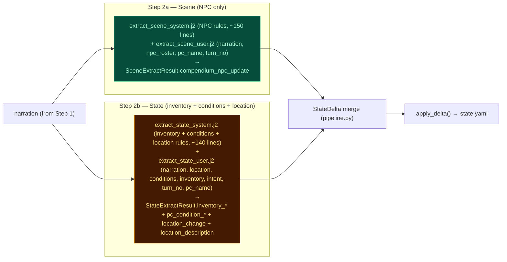

# Consolidate Scene/Location Extraction into State Stream

## Purpose

This document is the design authority for plans that relocate `scene_tagline`, `location_change`, `location_description` from the Scene extraction stream (Step 2a) into the State extraction stream (Step 2b), rename `scene_tagline` to the static `session_name`, drop the `notes` NPC field in favor of an expanded `position`, and simplify the Scene extractor to a pure-NPC compendium manager.

## Problem Statement

The Scene extractor (Step 2a, `_extract_scene_messages`) produces three categories of output: location state (`location_change`, `location_description`), session identity (`scene_tagline`), and NPC compendium updates (`compendium_npc_update`). Two of these (location, tagline) are state-management concerns — they mutate durable state fields that the State extractor (Step 2b, `_extract_state_messages`) already owns conceptually. This split forces the Scene extractor to carry location-related rules (~15 lines of system prompt) and a per-turn scene_tagline requirement, inflating its system prompt to 169 lines — the largest of any pipeline stage.

`scene_tagline` is regenerated every turn but only consumed by the UI (page title, header). It is never referenced in LLM prompts. Generating it per turn is wasted tokens.

`notes` (5–8 words stance/action cue) and `position` (spatial location) overlap in practice. The LLM struggles to keep them distinct. `notes` is flavor text that clears every turn; `position` is more critical for spatial reasoning ("behind a door, not visible") but shares the same real estate.

`location_description` (2–4 sentences) is also regenerated every turn but frequently duplicates the narration. It's written to `state.location.description` and consumed by narrator/storyteller user prompts via `_location.j2`. When it duplicates narration, it wastes context in those downstream prompts.

## Constraints

- Pipeline stages must remain parallelizable (Steps 2a-2c run concurrently).
- `_npc_roster.j2` and `_location.j2` shared includes must not change their rendering contract.
- No backwards compatibility or migration. Existing saved games are intentionally broken by this change. Fresh seed only.

## Non-goals

- Changing the name "scene extractor" in code or docs. It becomes pure-NPC but keeps its name.
- Restructuring the pipeline step numbering.
- Adding or removing LLM calls (still 3 extraction calls).
- Modifying the narrator or storyteller system prompts.
- Changing `pc.tagline` (distinct from `scene.tagline` — that's a PC bio field).

## Decision Table

| Decision | What | Why |
|---|---|---|
| Location fields move to Step 2b | `location_change` and `location_description` produced by StateExtractResult instead of SceneExtractResult | Location is state, not NPC management. State extractor already owns inventory/conditions state. Single source of truth for state-level deltas. |
| `scene_tagline` becomes static `session_name` | Set once at seed generation; stored in `state.meta.session_name`; never extracted at runtime | Regenerating every turn is wasted tokens. Only consumed by UI. Rename clarifies it names the entire game session, not the current scene. Should be general and not tied to any specific detail too closely. |
| `notes` dropped from NPC compendium | Removed from `CompendiumNpcUpdate` model, `_npc_roster.j2`, and `strip_npcs_notes()`. | Redundant with position. Flavor text that doesn't impact gameplay. |
| `position` expanded for spatial reasoning | Prompt instructions updated to include spatial barriers, visibility, and stance. Position not cleared at turn start (unlike notes). | Position is the spatial anchor the LLM uses for scene geometry. Stance/spatial info merged into one field. |
| `location_description` only on tangible change | State extractor produces it only when the environment has materially changed (damage, shift in physical properties). Not every turn. Must offer new details and potential opportunities not in narration. | Producing it every turn is wasteful and duplicates narration. Tangible-practical description of the location that does NOT duplicate narration but offers new interactable details and novel opportunities. |
| Scene extractor becomes pure NPC | User prompt loses `location` section. System prompt drops `scene_tagline`, `location_change`, `location_description` rules and output schema. | Confines NPC compendium logic to a single prompt. Reduces system prompt size ~15 lines. |

## Open Questions

All questions resolved during design review.

- [RESOLVED: Clearing `position` — not at turn start, but on presence transitions to `known`/`departed`, matching historical notes behavior.]
- [RESOLVED: `session_name` fallback — static "Choose Your Own Adventure"]

## Current State — What Exists

### Scene extractor (Step 2a)

**File:** `ccya/engine/extraction/scene.py` (41 lines)
**System prompt:** `ccya/prompts/extract_scene_system.j2` (169 lines, static, zero dynamic variables)
**User prompt:** `ccya/prompts/extract_scene_user.j2` (16 lines, receives: `narration`, `location` (id + name + description), `npc_roster`, `turn_no`, `pc_name`)
**Output model:** `SceneExtractResult` with fields: `scene_tagline`, `location_change`, `location_description`, `compendium_npc_update`

**Inputs:** narration (from Step 1), state.location, npc_roster (built from compendium), turn_no, pc_name

The system prompt dedicates:
- ~5 lines to `scene_tagline` / `location_change` / `location_description` rules
- ~120 lines to NPC compendium rules (alias naming, field requirements, presence, dedup, passive extraction, bio/notes examples)
- ~15 lines to output schema and discipline

### State extractor (Step 2b)

**File:** `ccya/engine/extraction/state.py` (40 lines)
**System prompt:** `ccya/prompts/extract_state_system.j2` (125 lines, static, zero dynamic variables)
**User prompt:** `ccya/prompts/extract_state_user.j2` (12 lines, receives: `pc_name`, `conditions`, `inventory`, `intent`, `turn_no`, `narration`)
**Output model:** `StateExtractResult` with fields: `inventory_change_reason`, `condition_change_reason`, `inventory_add/remove/update`, `pc_condition_add/remove`

Currently has no location awareness.

### Pipeline merge (`ccya/engine/extraction/pipeline.py` lines 287–293)

StateDelta merges both:
```python
StateDelta(
    scene_tagline=scene_result.scene_tagline,
    location_change=scene_result.location_change,
    location_description=scene_result.location_description,
    compendium_npc_update=scene_result.compendium_npc_update,
    # ... state_result fields ...
)
```

### Extraction context (`ccya/engine/extraction/context.py` lines 64–65)

After delta application, `location_this_turn["description"]` is overridden by `scene_result.location_description`.

### Delta application (`ccya/state/delta_builder.py` lines 222–241)

- `delta.location_change`: overwrites `state["location"]` dict, transitions present NPCs to nearby
- `delta.location_description`: overwrites `state["location"]["description"]` when no location_change
- `delta.scene_tagline`: writes to `state["scene"]["tagline"]`

### NPC management (`ccya/state/npcs.py` lines 172–182, 329–332)

- `strip_npcs_notes()`: clears `notes` from all non-departed/archived NPCs at turn start
- `comp_upd.notes is not None`: writes to `entry["notes"]`
- `comp_upd.position is not None`: writes to `entry["position"]`

### State (`ccya/state/io.py` lines 100–103)

```python
"scene": {
    "tags": [],
    "world_state": [],
    "tagline": "",
    "turn_entered": 0,
},
```

`state.meta.game_name` exists but is never read (dead field, default value "default").

### UI consumption (`ccya/templates/index.html`)

- Page title (line 6): `CCYA: {{ state.scene.tagline }}`
- Header logo (line 19): `{{ state.scene.get('tagline') or ... }}`
- JS `_headerTaglineFromState()` (lines 513–524): reads `st.scene.tagline`
- Turn complete handler (lines 1843–1846): updates header and title from `result.state.scene.tagline`

### NPC roster rendering (`ccya/prompts/sections/_npc_roster.j2` line 8)

```
 | {{ n.notes }} | {{ n.position }}
```

Both `notes` and `position` are rendered when present.

### NPC updates in scene extractor system prompt

`notes` field instructions (line 41): "5–8 words max describing the NPC's current stance or action in this scene."
`position` field instructions (line 42): "Where the NPC is in the scene. One short phrase."

### Problems with Current State

1. **Scene extractor system prompt is the largest (169 lines) despite the simplest job.** Location/session rules inflate it unnecessarily.
2. **`scene_tagline` is regenerated every turn but only consumed by the UI.** Zero LLM prompt consumers. Wasted tokens on every turn.
3. **`notes` and `position` overlap semantically.** LLM struggles to keep them distinct. Most `notes` entries could be folded into `position`.
4. **`location_description` (2–4 sentences) frequently duplicates narration.** Wastes context in narrator and storyteller prompts where `_location.j2` renders it.
5. **`state.meta.game_name` is a dead field** — set to "default" in `_default_state()`, never read.
6. **State extractor has no location awareness** despite being the natural home for location state changes.

## Proposed Solution

### Core Changes

#### 1. Move `location_change` and `location_description` to StateExtractResult

```
StateExtractResult (new fields):
  + location_change: LocationRef | None = None
  + location_description: str | None = None

StateExtractBoundary (new field):
  + location: LocationBlock   # passed as user prompt context

extract_state_user.j2 (new section):
  + ## Location
  + {{ location.id }} | {{ location.name }}
  + {{ location.description }}
```

`extract_state_system.j2` gains field rules (~10–15 lines for location_change and location_description schema/rules — matching existing length conventions).

`location_description` is emitted only when the environment has materially changed — damage, structural shift, changes in physical properties, or new interactable elements. Not every turn. The state extractor receives the current `location.description` as input context so it can determine whether something changed.

#### 2. Remove location/tagline from SceneExtractResult

```
SceneExtractResult (removed fields):
  - scene_tagline: str | None
  - location_change: LocationRef | None
  - location_description: str | None

SceneExtractResult (kept):
  + compendium_npc_update: list[CompendiumNpcUpdate]
```

`extract_scene_user.j2` loses the `## location` section (3 lines) and no longer receives `location` as context.

`extract_scene_system.j2` loses:
- `scene_tagline` from output schema and field rules (~5 lines)
- `location_change` / `location_description` from output schema and field rules (~10 lines)
- Net: ~15 lines removed

#### 3. Rename `scene_tagline` to `session_name`, make static

- New state field: `state.meta.session_name: str`
- Seed generation (`generate_seed_system.j2`) emits `session_name` instead of `scene.tagline`. Prompt instruction changes from location-bound description to: "A short, evocative title for this game session (3-6 words). Should capture the campaign's tone and setting without describing a specific scene or character. This name defines the entire playthrough."
- Seed sanitation (`seed.py:38`) renames `tagline` → `session_name`.
- `state.scene.tagline` is stripped entirely — no migration, no backwards compat.
- UI (`index.html`) reads `state.meta.session_name` instead of `state.scene.tagline`.
- `StateDelta.scene_tagline` field is removed (no longer produced by any extractor).

#### 4. Drop `notes` from `CompendiumNpcUpdate`

```
CompendiumNpcUpdate (removed):
  - notes: str | None = None
```

- `_npc_roster.j2` line 8: remove ` | {{ n.notes }}`
- `strip_npcs_notes()` in `ccya/state/npcs.py`: remove function and its call. Position clearing on presence transitions (`known`/`departed`) replaces the notes clearing that was handled by `entry.pop("notes", None)` — change those to `entry.pop("position", None)`.
- `extract_scene_system.j2`: remove `notes` from output schema and field rules (~10 lines including examples).
- NPC presence transitions (`npcs.py` lines 319, 325) that `pop("notes", None)` become no-ops (field gone) — remove those lines.

#### 5. Expand `position` instructions

In `extract_scene_system.j2`, replace the `notes` + `position` rules with an expanded `position` rule:

```
`position`: Where the NPC is in the scene and what they are doing. One short phrase. Include spatial barriers and visibility constraints (e.g., "behind a door, not visible", "across the bar, watching", "standing in the doorway blocking exit", "at the player's elbow, whispering"). Update when narration changes the NPC's position or stance.
```

`position` stays in `CompendiumNpcUpdate` (unchanged field, expanded semantic scope). Position is cleared when presence transitions to `known` or `departed` (matching historical `notes` clearing behavior at `npcs.py:319, 325`). Position is NOT cleared at turn start for present/nearby NPCs — the LLM updates it when the narration implies movement.

#### 6. Update pipeline merge

`ccya/engine/extraction/pipeline.py` lines 287–293:

```python
merged = StateDelta(
    # scene_result only contributes compendium_npc_update
    compendium_npc_update=scene_result.compendium_npc_update,
    # state_result now contributes location fields
    location_change=state_result.location_change,
    location_description=state_result.location_description,
    # ... (rest unchanged)
)
```

`_build_extraction_context()` (`context.py` lines 34–72): `location_description` now comes from `state_result` instead of `scene_result`. The delta still applies it to `location_this_turn["description"]` — the mechanism doesn't change, only the source stream.

### Data flow diagram (after change)



### Alternatives Considered and Rejected

1. **Create a dedicated "Location Extraction" step (Step 2d).** Rejected: adds an LLM call for a small ruleset. State management belongs in Step 2b, which already handles durable state fields.

2. **Keep `scene_tagline` but generate it only on location change.** Rejected: still requires conditionals in the system prompt that complicate extraction. Fully static `session_name` is simpler and sufficient for the UI header.

3. **Keep `notes` but restrict its semantics.** Rejected: the overlap with `position` is inherent — an NPC's stance is tied to their spatial position. A single field eliminates the ambiguity.

4. **Drop `position` instead of `notes`.** Rejected: position carries spatial reasoning information the LLM uses for scene geometry. Notes is flavor text with no gameplay impact.

5. **Merge `session_name` into an existing `meta` field (`game_name`).** Rejected: `game_name` is dead and "game_name" doesn't distinguish from the manifest's game name. `session_name` is explicit.

6. **`location_description` only on `location_change` (future consideration).** Not adopted now. If the on-tangible-change approach proves unreliable (LLM emits description too often or not enough), a future iteration may gate `location_description` behind actual `location_change` events, cutting it down to occasional writes.

## Failure Modes and Risks

- **Location updates lag by one turn if state extractor skips them.** Unlikely — state extractor runs every turn. If it fails, `location_change` defaults to None and location_description defaults to None, matching current behavior.
- **Position may produce stale spatial data for present/nearby NPCs.** The LLM updates position when narration implies movement. If the LLM fails to update position for a present NPC that moved, the old value persists and may be wrong. Mitigation: position is cleared on presence transitions to `known`/`departed`, so stale data only affects NPCs still in the scene. The LLM already handles this pattern (position was never cleared before for any presence level).
- **The state extractor's system prompt grows by ~15 lines.** Net system prompt bytes across both streams are roughly neutral (scene loses ~15, state gains ~15). No net increase in context window pressure.
- **Existing saved games are broken by this change.** No migration. `state.scene.tagline` is deleted; `state.meta.game_name` is deleted. Fresh seed only.

## What Is Removed

| Removed | From | Notes |
|---|---|---|
| `SceneExtractResult.scene_tagline` | `ccya/models/extraction.py` | Replaced by static `state.meta.session_name` |
| `SceneExtractResult.location_change` | `ccya/models/extraction.py` | Moved to `StateExtractResult` |
| `SceneExtractResult.location_description` | `ccya/models/extraction.py` | Moved to `StateExtractResult` |
| `StateDelta.scene_tagline` | `ccya/models/extraction.py` | No longer produced by any stream |
| `CompendiumNpcUpdate.notes` | `ccya/models/extraction.py` | Deleted with no replacement |
| `strip_npcs_notes()` function | `ccya/state/npcs.py` | No notes field to clear |
| `n.notes` rendering in `_npc_roster.j2` | `ccya/prompts/sections/_npc_roster.j2` | Position-only rendering |
| `state.scene.tagline` | `ccya/state/io.py` | Deleted. Replaced by `state.meta.session_name` |
| `state.meta.game_name` | `ccya/state/io.py` | Dead field, deleted |
| `location` input in `_extract_scene_messages()` | `ccya/engine/extraction/scene.py` | Scene extractor no longer receives location |
| `location` from `SceneExtractBoundary` | `ccya/prompts/context.py` | Scene extract boundary loses location field |
| Notes rules + examples in `extract_scene_system.j2` | `ccya/prompts/extract_scene_system.j2` | ~10 lines removed |

## What Is Unchanged

- `CompendiumNpcUpdate.position` field — type, optionality, and write path unchanged. Only clearing behavior expands: now cleared on presence transitions to `known`/`departed` (replacing `notes` clearing). Semantic scope and prompt instructions expand.
- `CompendiumNpcUpdate` all other fields — `id`, `name`, `title`, `bio`, `aliases`, `motivation`, `fear`, `leverage`, `bond`, `personality`, `presence`, `departed_reason`, `departed_turn`, `first_seen_turn`.
- `LocationRef` model — unchanged.
- `_location.j2` template — unchanged. Still renders `location.description` from state.
- `_npc_roster.j2` template — only the `notes` rendering is removed. Position, bond, personality, motivation, fear, leverage, presence labels all stay.
- `StateDelta` — `location_change` and `location_description` stay. Only `scene_tagline` is removed.
- `apply_delta()` in `delta_builder.py` — `delta.location_change` and `delta.location_description` write path unchanged.
- `_build_extraction_context()` in `context.py` — still merges `location_description` into `location_this_turn`. Only the source field changes from `scene_result` to `state_result`.
- Pipeline sequencing and parallelism — Steps 2a/2b/2c still run sequentially in the same 3-stream pipeline.
- Scene extractor name in code (`_extract_scene_messages`, `ExtractSceneResult`, `extract_scene_stream`) — unchanged.
- Narrator and storyteller system/user prompts — no changes.
- `pc.tagline` — unchanged. This is a separate field for PC identity.
- Seed generation (`generate_seed_system.j2`) — still generates a game-level name. Only the field name in the schema changes from `scene.tagline` to `session_name`.
- All NPC presence transition logic in `npcs.py` — the `comp_upd.presence` handling stays identical. Only the now-unnecessary `entry.pop("notes", None)` lines are removed.

## New Model Shapes

### StateExtractResult (expanded)

```python
class StateExtractResult(BaseModel):
    location_change: LocationRef | None = None
    location_description: str | None = None
    condition_change_reason: str = ""
    inventory_change_reason: str = ""
    inventory_add: list[InventoryItem] = Field(default_factory=list, max_length=6)
    inventory_remove: list[InventoryRemove] = Field(default_factory=list)
    inventory_update: list[InventoryUpdate] = Field(default_factory=list, max_length=6)
    pc_condition_add: list[ConditionAdd] = Field(default_factory=list, max_length=2)
    pc_condition_remove: list[ConditionRemove] = Field(default_factory=list)
```

### SceneExtractResult (simplified)

```python
class SceneExtractResult(BaseModel):
    compendium_npc_update: list[CompendiumNpcUpdate] = Field(
        default_factory=list, max_length=12
    )
```

### CompendiumNpcUpdate (notes removed)

```python
class CompendiumNpcUpdate(BaseModel):
    id: str
    name: str | None = None
    title: str | None = None
    bio: str | None = None
    aliases: list[str] = Field(default_factory=list)
    motivation: str | None = None
    fear: str | None = None
    leverage: str | None = None
    presence: str | None = None
    position: str | None = None         # expanded: spatial + stance
    first_seen_turn: int | None = None
    personality: str | None = None
    bond: str | None = None
    departed_reason: str | None = None
    departed_turn: int | None = None
```

### StateDelta (scene_tagline removed)

```python
class StateDelta(BaseModel):
    inventory_change_reason: str = ""
    condition_change_reason: str = ""
    inventory_add: list[InventoryItem] = Field(default_factory=list, max_length=6)
    inventory_remove: list[InventoryRemove] = Field(default_factory=list)
    inventory_update: list[InventoryUpdate] = Field(default_factory=list, max_length=6)
    location_change: LocationRef | None = None
    location_description: str | None = None
    pc_condition_add: list[ConditionAdd] = Field(default_factory=list, max_length=6)
    pc_condition_remove: list[ConditionRemove] = Field(default_factory=list)
    compendium_npc_update: list[CompendiumNpcUpdate] = Field(
        default_factory=list, max_length=12
    )
    actions: list[str] = Field(default_factory=list, max_length=10)
    arc_update: CampaignArc | None = None
```

### State (`_default_state()` update)

```python
"meta": {
    # ... existing fields ...
    "session_name": "",      # new, replaces scene.tagline
    # "game_name" removed
},
"scene": {
    "tags": [],
    "world_state": [],
    # "tagline" removed
    "turn_entered": 0,
},
```

## Context for Implementing LLMs

| File | What it contains | Why it matters |
|---|---|---|
| `ccya/models/extraction.py` | All extraction result models (SceneExtractResult, StateExtractResult, CompendiumNpcUpdate, StateDelta) | Every field addition, removal, and signature change is defined here |
| `ccya/engine/extraction/scene.py` | `_extract_scene_messages()` — builds scene extraction messages | Remove `location` from context dict passed to template |
| `ccya/engine/extraction/state.py` | `_extract_state_messages()` — builds state extraction messages | Add `location` to context dict passed to template |
| `ccya/engine/extraction/pipeline.py` | Pipeline orchestrator — merges 3 streams into StateDelta | Update merge block to read location_change/description from state_result not scene_result |
| `ccya/engine/extraction/context.py` | `_build_extraction_context()` — builds extraction context | Update `location_description` source from scene_result to state_result |
| `ccya/state/delta_builder.py` | `apply_delta()` — writes deltas to state | Remove `delta.scene_tagline` write. Unchanged otherwise. |
| `ccya/state/npcs.py` | `apply_npc_scene_management()` + `strip_npcs_notes()` | Remove `strip_npcs_notes()`. Remove `notes` write path. Remove `entry.pop("notes")` lines. |
| `ccya/state/io.py` | `_default_state()`, load/save | Remove `scene.tagline`, remove `meta.game_name`, add `meta.session_name`. No migration. |
| `ccya/engine/seed.py` | `_sanitize_envelope()` - seed sanitation | Rename `tagline` → `session_name` in sanitizer |
| `ccya/prompts/extract_scene_system.j2` | Scene extraction system prompt | Remove `scene_tagline`, `location_change`, `location_description` from schema and field rules. Remove `notes` from schema and rules. Expand `position` instructions. |
| `ccya/prompts/extract_scene_user.j2` | Scene extraction user prompt | Remove `## location` section |
| `ccya/prompts/extract_state_system.j2` | State extraction system prompt (125 lines) | Add `location_change`/`location_description` schema + field rules |
| `ccya/prompts/extract_state_user.j2` | State extraction user prompt | Add `## location` section with id/name/description |
| `ccya/prompts/context.py` | Template boundary models | Update `SceneExtractBoundary` (remove `location`), add `location` to `StateExtractBoundary`. Remove `scene_tagline` from relevant boundaries. |
| `ccya/prompts/sections/_npc_roster.j2` | NPC roster rendering in all prompts | Remove `n.notes` rendering |
| `ccya/prompts/generate_seed_system.j2` | Seed generation system prompt | Rename `scene.tagline` → `session_name` in output schema (line ~35) |
| `ccya/templates/index.html` | Main UI page | Read `state.meta.session_name` instead of `state.scene.tagline` (lines 6, 19, 516, 1843) |
| `ccya/server/tv.py` | Turn viewer | `location_description` already in `_SKIP_FIELDS` — remove `scene_tagline` from `_SKIP_FIELDS` (no longer emitted) |
