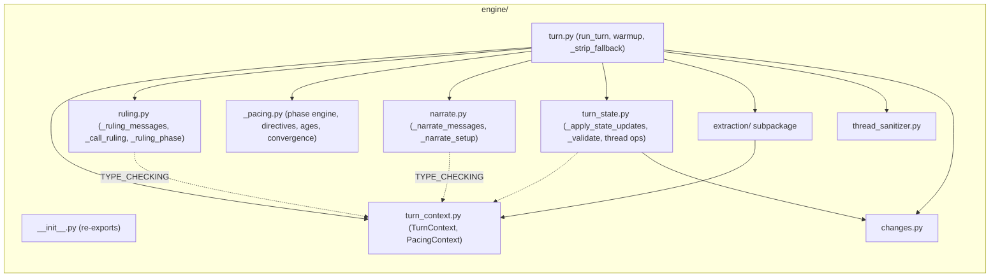

# Engine File Refactoring: Pipeline-Stage Splitting

## Purpose

Design authority for splitting `ccya/engine/turn.py`, `ccya/engine/extraction.py`, and `ccya/models.py` into smaller, pipeline-stage-aligned files. This document governs all plans executing these splits.

## Problem Statement

Three files account for ~45% of engine code (1672 + 803 + 604 = 3079 lines out of 6885), making them the dominant context cost for LLM agents working on the turn pipeline. LLM agents must load irrelevant functions to reach the one they need, and the monolithic structure obscures pipeline-stage boundaries that the architecture already defines.

`turn.py` (1672 lines) is the worst offender — it mixes:
- Dataclass definitions (`TurnContext`, `PacingContext`)
- Phase engine computation (`_compute_scene_phase`, `_compute_narration_directive`, etc.)
- Pipeline stage orchestration (`_ruling_phase`, `_narrate_setup`)
- Post-extraction state application (`_apply_thread_updates`, `_apply_arc_resolve`, `_apply_thread_resolutions`, NPC lifecycle)
- Validation, warmup, strip utilities

These are separate concerns in the architecture doc but live in one file.

`extraction.py` (803 lines) bundles 3 independent LLM streams (scene/state/storytell) with a shared orchestrator, shared utilities, and cross-stream context assembly. The message builders for each stream are small (~30-85 lines each) but the orchestrator is 280 lines.

`models.py` (604 lines) is a flat file of 24 models spanning state shapes, extraction schemas, rules types, compactor stubs, and config helpers — all in one file.

No backwards-compatibility constraints exist.

## Constraints

- No new external dependencies.
- All existing public API surfaces (`ccya/engine.__init__` re-exports) must be preserved: `run_turn`, `warmup`, `generate_seed`, `generate_pack_from_brief`, `generate_pack`, `format_change_lines`, `sanitize_threads`.
- The `ccya/engine` package public API (`__init__.py` re-exports) is the only contract — internal imports between engine submodules can change freely.
- Extraction subpackage internal imports must not create circular dependencies.
- Models split must not create circular imports between `ccya/models/*` submodules.

## Non-goals

- Splitting `ccya/server/routes.py` (958 lines) — deferred.
- Splitting `ccya/ev/*` files — explicitly out of scope per agreement.
- Splitting `ccya/server/tv.py` — explicitly out of scope per agreement.
- Any behavioral changes, type changes, or field renames.
- Adding, removing, or modifying any prompt templates.
- Any performance optimization — the goal is file organization only.
- Rewriting `run_turn()` — it stays as the orchestrator, just thinner.

## Decision Table

| Decision | What | Why |
|---|---|---|
| Pipeline-stage split for turn.py | Each pipeline stage (ruling, pacing, narrate, thread state) gets its own file. The orchestrator (`run_turn`) stays in `turn.py`. | Maps 1:1 to the architecture doc's 5-call pipeline. An agent working on narrate changes loads `narrate.py` + `turn_context.py`, not `turn.py`. |
| Extraction subpackage | `ccya/engine/extraction/` becomes a subpackage with files for each stream + shared utilities + pipeline orchestrator. | Three streams share retry/parse/context machinery but are edited independently. Subpackage structure makes discovery trivial. |
| Models subpackage | `ccya/models/` becomes a subpackage split by domain: state, extraction, rules, config types. | 24 models with distinct consumer groups. No file benefits from monolithic organization. |
| `_apply_state_updates()` extracted | The post-extraction state application block (~211 lines in `run_turn()`) becomes `_apply_state_updates()` in `turn_state.py`. | Single cohesive unit (validate → reconcile → apply → thread ops → NPC lifecycle) that can be understood and tested independently. |
| `_validate()` moves to `turn_state.py` | `_validate(state, delta)` has a single call site inside the `_apply_state_updates` block. Moves with its sole caller. | Avoids circular reads — an agent reading state application doesn't need to jump back to `turn.py` for the validation gate. |
| `_strip_fallback()` stays in `turn.py` | 13-line formatting utility called once in the orchestration flow, between state application and persist. Not pipeline-stage logic. | Isolating 13 lines to its own file is pointless overhead. It lives naturally alongside `run_turn()`. |
| Bare file names (no underscore prefix) | `turn_context.py`, `turn_state.py` — consistent with `ruling.py`, `narrate.py`, `changes.py`. | `_pacing.py` uses underscore because it has no direct public callers from outside the engine; the new files are imported by `turn.py` and are first-class pipeline components. |
| All re-exports from `ccya/engine/__init__.py` preserved unchanged | No function or class moves across the public API boundary. | Downstream consumers (`ccya/server`, `ccya/ev/play.py`, `scripts/debug/ev.py`) import from `ccya.engine`, not from specific submodules. Internal moves don't affect them. |
| Compactor models preserved in their own file | `models/compactor.py` keeps the 3 dormant compactor models. | They are documented as dormant and should not be moved into active model files where they could confuse. |

## Open Questions

- [OPEN: `_validate` already resolved above — moved to `turn_state.py`]
- [OPEN: `_strip_fallback` already resolved above — stays in `turn.py`]

No remaining open questions.

## Current State — What Exists

### `ccya/engine/turn.py` (1672 lines)

**Contents (function → line range → lines):**

| Symbol | Lines | Source Range |
|---|---|---|
| `TurnContext` | 25 | 73–97 |
| `PacingContext` | 11 | 98–108 |
| `_apply_thread_updates` | 143 | 112–254 |
| `_apply_arc_resolve` | 86 | 256–341 |
| `_apply_thread_resolutions` | 92 | 343–434 |
| `_compute_narration_directive` | 26 | 436–461 |
| `_compute_pacing_context` | 37 | 463–499 |
| `_compute_ages` | 14 | 501–514 |
| `_compute_scene_phase` | 69 | 516–584 |
| `_recent_turn_count` | 5 | 586–590 |
| `_ruling_phase` | 148 | 592–739 |
| `_narrate_setup` | 133 | 741–873 |
| `run_turn` | ~650 | 875–1599 (includes finally block + error handlers) |
| `_strip_fallback` | 13 | 1605–1617 |
| `_validate` | ~50 | 1619–1672 |

**Import chain into turn.py** (11 total `from ccya.engine.*` imports, 1 from `ccya.engine.extraction`):
```
turn.py imports:
  extraction.py: _run_extraction_pipeline, _avg_event_ms, _context_meta
  narrate.py: _narrate_messages
  ruling.py: _call_ruling, _log_ruling_outcome, _ruling_messages
  _pacing.py: compute_convergence_score, derive_allowed_beat_types, detect_spiral
  changes.py: _summarize_applied, summarize_changes
  config.py: EngineConfig, _build_jinja_env, _inflight, _log_llm_io, _log_prompts, etc.
  markers.py: strip_trace_markers_in_messages
  names.py: generate_npc_names_split
  npc_roster.py: build_npc_roster
  thread_sanitizer.py: sanitize_threads
```

Also imports from `ccya.models` (9 models), `ccya.rules` (2 functions), `ccya.state` (8 functions), `ccya.state.delta_builder` (1 function), `ccya.errors` (2 symbols), `ccya.llm_client` (3 functions), `ccya.personality` (1 constant).

### `ccya/engine/extraction.py` (803 lines)

**Contents by function group:**

| Group | Functions | Lines |
|---|---|---|
| Shared text utilities | `_text_references_thread`, `_filter_evicted_threads` | 31 |
| Context | `_ExtractionContext` (dataclass), `_build_extraction_context` | 58 |
| Meta helpers | `_context_meta`, `_avg_event_ms` | 37 |
| Inventory helpers | `_capitalize_inventory_names`, `_extract_group_base_type`, `_dedup_compendium_update` | 92 |
| Stream 1 — Scene | `_extract_scene_messages` | 30 |
| Stream 2 — State | `_extract_state_messages` | 30 |
| Stream 3 — Storytell | `_storytell_messages` | 85 |
| JSON/LLM helpers | `_coerce_scene_json`, `_parse_stream_result`, `_call_stream` | 119 |
| Orchestrator | `_run_extraction_pipeline` | 280 |
| Other | `_context_meta`, `_avg_event_ms` | 37 |

Only `turn.py` imports from `ccya.engine.extraction` — it is a single-consumer module. `turn.py` imports `_run_extraction_pipeline`, `_avg_event_ms`, and `_context_meta`.

### `ccya/models.py` (604 lines)

24 models + 3 type aliases + 2 functions grouped by natural domain:

| Domain | Models | Primary Consumers |
|---|---|---|
| State / Thread | `NpcPresence`, `ArcThread`, `CampaignArc`, `Condition`, `ConditionAdd`, `ConditionRemove`, `InventoryItem`, `InventoryRemove`, `InventoryUpdate`, `LocationRef`, `WorldStateFact`, `ProgressEntry`, `ThreadResolution`, `ThreadUpdate`, `ArcResolution` | thread_sanitizer, state/delta_builder, state/npcs, prompts/context, pack |
| Extraction | `CompendiumNpcUpdate`, `StateDelta`, `SceneExtractResult`, `StateExtractResult`, `GMBeat`, `StorytellerResult` | extraction, turn, state/delta_builder, state/npcs |
| Rules | `RulesCheck`, `IntentEnvelope`, `RulesOutcome` | ruling, _pacing, narrate, rules, prompts/context, extraction |
| Config/Top-level | `SkillName`, `Difficulty`, `Band`, `TurnResult`, `load_config()`, `save_config()` | logging_setup, server/routes, server/app, ev/play, ev/eval, ev/check |
| Compactor (dormant) | `CompactorNpcMerge`, `CompactorSanitizationAction`, `CompactorSanitizationResult` | None (no importers) |

### Problems with Current State

- **turn.py has no file-level discoverability**: All 17 top-level symbols are mixed. An agent searching for "how does thread resolution work" must load 1600 lines to find `_apply_thread_resolutions` and trace its callers.
- **turn.py bundles stage orchestration with stage implementation**: `_ruling_phase` (148 lines) lives in turn.py, but `_ruling_messages` + `_call_ruling` (the prompt/parse/retry logic) live in ruling.py. A ruling bug requires loading both files anyway, but the split is arbitrary — why is the ruling phase setup in turn.py but the call in ruling.py? Same problem for narrate: `_narrate_setup` (133 lines) in turn.py, `_narrate_messages` in narrate.py.
- **extraction.py couples 3 independent streams through shared files**: Editing the storytell stream forces the agent to load scene and state message builders too.
- **models.py has no domain grouping**: A consumer importing `StorytellerResult` also imports `CompactorSanitizationResult` and `load_config`. No cohesion benefit.
- **`_apply_state_updates` is an unnamed block**: The ~211-line post-extraction block in `run_turn()` has no function boundary, making it invisible to grep and to agents browsing by symbol.

## Proposed Solution

### 1. Turn pipeline split — stage-per-file

Current → target mapping:

| Symbol | Current File | Target File |
|---|---|---|
| `TurnContext` | `turn.py` | `turn_context.py` |
| `PacingContext` | `turn.py` | `turn_context.py` |
| `_ruling_phase` | `turn.py` | `ruling.py` (extend) |
| `_narrate_setup` | `turn.py` | `narrate.py` (extend) |
| `_compute_narration_directive` | `turn.py` | `_pacing.py` (extend) |
| `_compute_pacing_context` | `turn.py` | `_pacing.py` (extend) |
| `_compute_ages` | `turn.py` | `_pacing.py` (extend) |
| `_compute_scene_phase` | `turn.py` | `_pacing.py` (extend) |
| `_recent_turn_count` | `turn.py` | `_pacing.py` (extend) |
| `_apply_thread_updates` | `turn.py` | `turn_state.py` |
| `_apply_arc_resolve` | `turn.py` | `turn_state.py` |
| `_apply_thread_resolutions` | `turn.py` | `turn_state.py` |
| `_apply_state_updates` *(new)* | inline in `run_turn()` | `turn_state.py` |
| `_validate` | `turn.py` | `turn_state.py` |
| `run_turn` | `turn.py` | `turn.py` (thinned) |
| `warmup` | `turn.py` | `turn.py` (stay) |
| `_strip_fallback` | `turn.py` | `turn.py` (stay) |

**`_apply_state_updates` — new function in `turn_state.py`:**
```
def _apply_state_updates(
    state: dict[str, Any],
    delta: StateDelta | None,
    storyteller_result: StorytellerResult | None,
    config: EngineConfig,
    trace_id: str,
    turn_no: int,
) -> tuple[dict[str, Any], StateDelta | None, dict[str, Any], list[dict[str, Any]], list[str]]:
```
Returns `(state, delta, applied, rejected, reconcile_warnings)`.

Encapsulates the following blocks extracted from `run_turn()` (line numbers approximate in current file):
- Lines ~1130–1140: validate + reconcile + apply_delta
- Lines ~1170–1210: beat history tracking + persist inventory/condition change reasons
- Lines ~1220–1260: NPC compendium stamping (last_presence_turn, last_seen_location)
- Lines ~1260–1430: Arc director — thread updates, goal_update, arc_resolve, thread_resolutions, thread_add, cap eviction, auto-dormant culling
- Lines ~1450–1490: NPC lifecycle — nearby decay to known, departed to archived

Total extracted: ~260 lines (not ~211 as initially estimated — the thread ops alone are ~170 lines).

**`narrate.py` import update**: Currently imports `PacingContext` from `turn.py` inside `TYPE_CHECKING`:
```python
if TYPE_CHECKING:
    from ccya.engine.turn import PacingContext
```
After split:
```python
if TYPE_CHECKING:
    from ccya.engine.turn_context import PacingContext
```
No runtime import cost change — still guarded by `TYPE_CHECKING`.

**`turn.py` import update**: Currently imports `_run_extraction_pipeline`, `_avg_event_ms`, `_context_meta` from `ccya.engine.extraction`. After extraction subpackage, the import path is identical (re-exported by `extraction/__init__.py`).

### 2. Extraction subpackage — `ccya/engine/extraction/`

| File | Contains | Ballpark Lines |
|---|---|---|
| `__init__.py` | Re-export `_run_extraction_pipeline`, `_avg_event_ms`, `_context_meta` | 5 |
| `pipeline.py` | `_run_extraction_pipeline` — orchestrator | 280 |
| `context.py` | `_ExtractionContext` (dataclass), `_build_extraction_context` | 70 |
| `utils.py` | `_call_stream`, `_parse_stream_result`, `_coerce_scene_json`, `_context_meta`, `_avg_event_ms`, `_capitalize_inventory_names`, `_dedup_compendium_update`, `_extract_group_base_type`, `_filter_evicted_threads`, `_text_references_thread` | 160 |
| `scene.py` | `_extract_scene_messages` | 30 |
| `state.py` | `_extract_state_messages` | 30 |
| `storytell.py` | `_storytell_messages` | 85 |

`turn.py` import is unchanged — the subpackage `__init__.py` re-exports the same names:
```python
from ccya.engine.extraction import _run_extraction_pipeline, _avg_event_ms, _context_meta
```

`_context_meta` and `_avg_event_ms` live in `extraction/utils.py` and are re-exported through `extraction/__init__.py`. They are imported by `turn.py` for ruling/narrate event metadata construction — not just extraction pipeline use. This is an acceptable cross-module dependency: extraction utilities are general-purpose, and `turn.py` is a sibling in the same package.

Internal subpackage import graph (no cycles):
```
pipeline.py → scene.py, state.py, storytell.py, context.py, utils.py
context.py → utils.py (indirectly, via shared type imports)
scene.py → utils.py (via _log, type imports)
state.py → utils.py
storytell.py → context.py, utils.py
No file imports back into pipeline.py
```

### 3. Models subpackage — `ccya/models/`

| File | Models | Imports from stdlib |
|---|---|---|
| `__init__.py` | Re-export all public models; preserve `load_config`, `save_config`, type aliases | — |
| `state.py` | `NpcPresence`, `ProgressEntry`, `ArcThread`, `CampaignArc`, `Condition`, `ConditionAdd`, `ConditionRemove`, `InventoryItem`, `InventoryRemove`, `InventoryUpdate`, `LocationRef`, `WorldStateFact`, `ThreadResolution`, `ThreadUpdate`, `ArcResolution` | pydantic, enum, typing |
| `extraction.py` | `CompendiumNpcUpdate`, `StateDelta`, `SceneExtractResult`, `StateExtractResult`, `GMBeat`, `StorytellerResult` | pydantic, typing |
| `rules.py` | `RulesCheck`, `IntentEnvelope`, `RulesOutcome` | pydantic, typing |
| `config.py` | `TurnResult` (dataclass), `load_config()`, `save_config()`, type aliases `SkillName`, `Difficulty`, `Band` | dataclasses, pathlib, yaml, typing |
| `compactor.py` | `CompactorNpcMerge`, `CompactorSanitizationAction`, `CompactorSanitizationResult` | pydantic, typing |

All existing `from ccya.models import X` statements remain valid — `ccya/models/__init__.py` re-exports every symbol from its submodules. The `__init__.py` will look like:
```python
from ccya.models.state import (
    ArcThread, CampaignArc, Condition, ConditionAdd, ConditionRemove,
    InventoryItem, InventoryRemove, InventoryUpdate, LocationRef,
    NpcPresence, ProgressEntry, ThreadResolution, ThreadUpdate,
    ArcResolution, WorldStateFact,
)
from ccya.models.extraction import (
    CompendiumNpcUpdate, GMBeat, SceneExtractResult,
    StateDelta, StateExtractResult, StorytellerResult,
)
from ccya.models.rules import IntentEnvelope, RulesCheck, RulesOutcome
from ccya.models.config import Band, Difficulty, SkillName, TurnResult, load_config, save_config
from ccya.models.compactor import (
    CompactorNpcMerge, CompactorSanitizationAction, CompactorSanitizationResult,
)
```

### 4. Removal of original files

- `ccya/engine/extraction.py` → deleted (replaced by `ccya/engine/extraction/` subpackage)
- `ccya/models.py` → deleted (replaced by `ccya/models/` subpackage)
- `ccya/engine/turn.py` → remains but thinned to ~650 lines

### Data Flow (Post-Split)



### Alternatives Considered and Rejected

- **Keep extraction.py as-is, only split turn.py**: Extraction is 803 lines and already has natural stream boundaries. The user explicitly chose the subpackage approach. Rejected.
- **Merge all 3 stream message builders into one file**: They're tiny (30–85 lines each) but the user wants good LLM routing per stream. Separating them costs ~3 files of 30 lines each — trivial overhead for the discoverability gain. Rejected.
- **Per-file extraction without subpackage** (sibling files `extract_scene.py`, `extract_state.py`, `extract_storytell.py` + shared helpers left in `extraction.py`): User explicitly chose subpackage. Rejected.
- **Keep TurnContext/PacingContext in turn.py**: They're consumed by `narrate.py` (via `TYPE_CHECKING` import) and other stages. Leaving them in `turn.py` forces a circular-import-prone import path. Moving to their own file eliminates this risk. Rejected.
- **Keep `_validate` in turn.py**: Called only during state application. Moving it with its sole caller is the natural reading order. Rejected.
- **Move `_strip_fallback` to a utility file**: 13-line function called once. Creates a 1-purpose file for no benefit. Rejected.
- **Extraction into 2 files (orchestrator + everything else)**: User explicitly chose stream-level granularity. Rejected.

## Failure Modes and Risks

- **Circular imports within `ccya/engine/extraction/`**: `pipeline.py` imports from `scene.py`, `state.py`, `storytell.py`, `context.py`, `utils.py`. None of those files import each other or from `pipeline.py` — no cycle risk.
- **Circular imports within `ccya/models/`**: Models are standalone pydantic/dataclass definitions with no internal dependencies. No cycle risk.
- **Circular imports across `ccya/engine/`**: `narrate.py` currently imports `from ccya.engine.turn import PacingContext` inside `TYPE_CHECKING`. After the split, it imports from `turn_context.py` instead. No other engine submodule imports from `turn.py`. No cycle risk.
- **Missed re-exports in `ccya/engine/__init__.py` or `ccya/models/__init__.py`**: Every public symbol must be verified by grep. Plan must include a verification step that compares exports before/after.
- **`ccya/engine/extraction.py` deleted before subpackage is created**: Plan must create subpackage first, update imports, then delete the old file.
- **`_context_meta` and `_avg_event_ms` move to `extraction/utils.py` but are imported by `turn.py`**: This is fine — `turn.py` imports them via the subpackage's `__init__.py` re-export, which is standard Python package design.
- **LLM agents relying on `ccya/engine/turn.py` train of thought**: The file path changes for several functions. Agents will need to re-discover locations. Acceptable — the repo documentation (`docs/repomap.md`) will be updated to reflect new file paths.

## What Is Removed

| Removed | From | Notes |
|---|---|---|
| `ccya/engine/extraction.py` | Entire file | Replaced by `ccya/engine/extraction/` subpackage |
| `ccya/models.py` | Entire file | Replaced by `ccya/models/` subpackage |
| `_ruling_phase` | `turn.py` | Moved to `ruling.py` |
| `_narrate_setup` | `turn.py` | Moved to `narrate.py` |
| `TurnContext` | `turn.py` | Moved to `turn_context.py` |
| `PacingContext` | `turn.py` | Moved to `turn_context.py` |
| `_apply_thread_updates` | `turn.py` | Moved to `turn_state.py` |
| `_apply_arc_resolve` | `turn.py` | Moved to `turn_state.py` |
| `_apply_thread_resolutions` | `turn.py` | Moved to `turn_state.py` |
| `_validate` | `turn.py` | Moved to `turn_state.py` |
| `_compute_narration_directive` | `turn.py` | Moved to `_pacing.py` |
| `_compute_pacing_context` | `turn.py` | Moved to `_pacing.py` |
| `_compute_ages` | `turn.py` | Moved to `_pacing.py` |
| `_compute_scene_phase` | `turn.py` | Moved to `_pacing.py` |
| `_recent_turn_count` | `turn.py` | Moved to `_pacing.py` |
| Inline state application (~260 lines) | `run_turn()` | Extracted to `_apply_state_updates()` in `turn_state.py` |

## What Is Unchanged

- `run_turn()` — remains the orchestrator in `turn.py`, same public signature: `run_turn(save_dir, user_input, config, *, template_dir, pack_name_locales, pack_narrator_rules, pack_world_rules, pack_factions)`
- `warmup()` — stays in `turn.py`
- `_strip_fallback()` — stays in `turn.py`
- `ccya/engine/__init__.py` — re-exports exactly the same names: `EngineConfig`, `build_engine_config`, `is_turn_in_progress`, `request_cancel`, `is_cancel_requested`, `register_persist`, `clear_cancel`, `clear_all_turn_locks`, `register_turn`, `signal_turn_done`, `await_turn_done`, `generate_seed`, `format_change_lines`, `run_turn`, `warmup`
- All prompt templates (`.j2` files) — unchanged
- All config keys, defaults, and `EngineConfig` struct — unchanged
- All Pydantic model fields, validators, and defaults — unchanged
- All state shape (`state.yaml` schema) — unchanged
- `_call_ruling`, `_ruling_messages`, `_log_ruling_outcome` — already in `ruling.py`, unchanged
- `_narrate_messages` — already in `narrate.py`, unchanged
- All `_pacing.py` exports — unchanged
- `sanitize_threads` — unchanged in `thread_sanitizer.py`
- All `ccya/state/*` modules — unchanged
- All `ccya/server/*` modules — unchanged
- All `ccya/ev/*` modules — unchanged
- All checkers in `ccya/ev/checkers/` — unchanged
- All test files — unchanged (tests are temporarily removed)
- `make lint`, `make typecheck`, `make check` — unchanged commands
- `ccya/engine/changes.py`, `markers.py`, `names.py`, `npc_roster.py`, `generate_pack.py`, `seed.py`, `config.py` — unchanged files

## New Model Shapes

No new models are created. Existing models are moved between files with identical definitions. The only new artifact is:

**`_apply_state_updates(state, delta, storyteller_result, config, trace_id, turn_no) → (state, delta, applied, rejected, reconcile_warnings)`**

This function extracts ~260 lines of inline code into a named function in `turn_state.py`. It is private to the engine package.

## Context for Implementing LLMs

- `ccya/engine/turn.py` — current monolith; read to understand the full scope of what moves where. Pay special attention to the function boundaries (see ranges above) and the inline state application block (~260 lines).
- `ccya/engine/ruling.py` — existing file (184 lines); `_ruling_phase` (148 lines from turn.py) will join `_ruling_messages` and `_call_ruling` already here, making a complete ruling stage module (~330 lines).
- `ccya/engine/narrate.py` — existing file (134 lines); `_narrate_setup` (133 lines from turn.py) will join `_narrate_messages` here, making a complete narrate stage module (~270 lines). After the split, its `TYPE_CHECKING` import of `PacingContext` must be updated to `from ccya.engine.turn_context import PacingContext`.
- `ccya/engine/_pacing.py` — existing file (141 lines); all 5 phase-engine functions move here (total ~280 lines).
- `ccya/engine/extraction.py` (lines 74–131) — `_ExtractionContext` + `_build_extraction_context` → `extraction/context.py`
- `ccya/engine/extraction.py` (lines 132, 781) — `_context_meta`, `_avg_event_ms` → `extraction/utils.py`
- `ccya/engine/extraction.py` (lines 237–380) — `_extract_scene_messages`, `_extract_state_messages`, `_storytell_messages` → `extraction/scene.py`, `extraction/state.py`, `extraction/storytell.py`
- `ccya/engine/extraction.py` (lines 382–500) — `_coerce_scene_json`, `_parse_stream_result`, `_call_stream` → `extraction/utils.py`
- `ccya/engine/extraction.py` (lines 501–780) — `_run_extraction_pipeline` → `extraction/pipeline.py`
- `ccya/models.py` — current flat file; read to understand the 5 domain groupings (state, extraction, rules, config, compactor)
- `docs/repomap.md` — must be updated with new file paths and line ranges after the split
- `docs/architecture/OVERVIEW.md` — update pipeline overview file references
