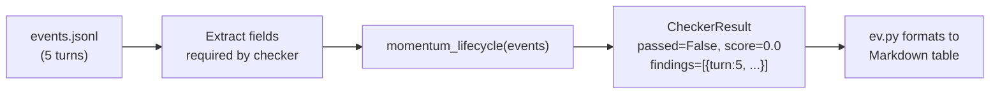
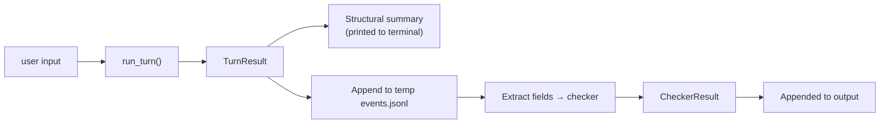
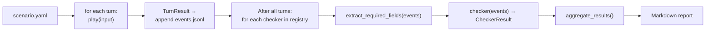

# EV Tooling — Unified Play + Inspect + Check

## Purpose

This document is the design authority for plans that rebuild `ev.py` into the single CLI backbone for playing, inspecting, and evaluating CCYA games. The old `ccya/eval/` harness, `engine_mirror.py`, rubric-based judges, and the `ev` skill's inline reference docs are torn down and replaced.

## Problem Statement

Three disconnected tools with no shared primitives:

1. **ev.py** (2254 lines) — powerful read-only events.jsonl inspector. Cannot play a game, cannot run automated checks.
2. **The eval harness** (`ccya/eval/`) — 14 files, 4 LLM judges with monolithic rubrics (166–212 lines each), an engine mirror that duplicates constants, and a REPORT.md generator. Requires authored Python scenarios. Bundles 6–12 concerns per judge call.
3. **The ev skill** — ~300 lines of reference documentation duplicated against `scripts/debug/README.md` (122 lines). Second source of truth.

An engineer debugging "does momentum update correctly when I fail a roll?" has no fast path. Either: write a scenario and run the full eval harness (~30s + 4 expensive LLM calls), or manually curl the server then inspect events.jsonl. There is no `ev.py play "kick the door down"` followed by `ev.py check 1 momentum_lifecycle`.

The monolithic rubrics mean a single LLM call evaluates 6–12 concerns simultaneously. A failure in inventory extraction contaminates the narrative score. You cannot isolate which mechanic failed. The meta judge tries to untangle this with another expensive LLM call doing its own 12-mechanic analysis — a compounding problem, not a fix.

## Constraints

- **ev.py is the survivor.** Everything else (ccya/eval/, engine_mirror, rubric-based judges, skill inline docs) is deleted and replaced.
- **In-process engine calls only.** ev.py imports and calls `run_turn()` directly — no HTTP, no server dependency.
- **Human-first CLI.** Every command must be useful for a person typing at a terminal. Markdown tables, colors, concise output.
- **Markdown output is default and primary.** Both humans and LLMs consume it. `--json` flag is deferred until a concrete CI/tooling need arises.
- **Single source of truth for documentation.** Repo files only. The skill is a thin pointer.
- **New external dependencies allowed** where they substantially reduce code or improve UX (e.g. `rich` for CLI tables).
- **No backward compatibility.** The old config format, rubric files, scenario files, engine mirror, and judge pipeline can all be deleted.
- **The engine is the source of truth.** Checkers import engine constants directly (`ccya.engine.config`, `ccya.rules`). No more engine mirror.

## Non-goals

- **Interactive web UI.** CLI only. TurnViewer continues to exist as a server-side UI but shares data access primitives with ev.py.
- **Multi-run trend tracking.** Single-run comparisons are fine; time-series dashboards are not this design.
- **Replacing TurnViewer.** TurnViewer is a separate surface (HTML/JS served by the server). Its data access layer is a long-term consolidation target, not part of this design.
- **Server integration.** ev.py does not start or manage the server.

## Decision Table

| Decision | What | Why |
|---|---|---|
| ev.py is the backbone | All play, inspect, check, eval in one CLI | Single entry point; natural workflow |
| ev.py moves to `ccya/ev/` | Package under main module, thin entry script | Closer to engine; supports module split |
| In-process only | `run_turn()` directly, no HTTP | No server dependency, matches eval pattern |
| Lazy engine imports | Engine deps loaded only for play/check/eval | Keeps read-only commands fast |
| Checker library at `ccya/ev/checkers/` | Individual checkers with `CheckerResult` | Shared primitive for play, check, eval |
| Decorator registration | `@register_checker` on each checker | Clean, IDE-friendly, explicit registry |
| Checkers declare data requirements | `requires_fields` in `__checker_meta__` | No single trace template; pull what's needed |
| All old eval code deleted | `ccya/eval/`, `engine_mirror.py`, `evals/rubrics/` | Tear down tech debt; no backward compat |
| Documentation in repo only | `scripts/debug/README.md`, `docs/ev/CHECKERS.md` | Single source of truth |
| Skill is a thin pointer | Reads repo docs instead of inline reference | Eliminates duplication |
| 13 subcommands | Summary, timing, turn, prompt, deltas, mechanics, state, diff, trace, search, play, check, eval | Clearly named, no overlap |
| Markdown output default | Human-readable output. `--json` flag on `turn` included in v1 | Both humans and LLMs read it; `turn --json` covers ad-hoc raw JSON inspection |
| Engine model | Gemma 4-26B for gameplay | Single model loaded at a time |
| Checker model | Configurable (default: engine model) | `--checker-model` flag overrides to e.g. Qwen 35B for heavy analysis. Both models are never in memory simultaneously |
| Player LLM | Engine model (Gemma) | Same model as gameplay; no separate player model loaded |
| turn --json | Included in v1 | Replaces old `outputs` subcommand for raw JSON inspection |
| `--no-sanitize` flag | Available on `play` to disable thread sanitizer | Keeps debug sessions clean; no mid-session LLM calls |
| Sanitizer visibility | `deltas` shows sanitizer changes; `mechanics --sanitize` flags runs; `sanitizer_lifecycle` checker | The kind:sanitizer events are no longer invisible |
| Sanitizer lifecycle checker | `ccya/ev/checkers/` | Deterministic: verifies thread IDs, goal changes, no orphans |
| YAML scenarios first | Simple human-writable format | No Python expertise needed to author a scenario |
| Shared data access layer | `ccya/ev/events.py` | Serves both ev.py and TurnViewer; single path for event reading |
| Checker event filtering | Framework filters to turn events before passing to checkers. Checkers with `needs_non_turn_events=True` get full list | Keeps checkers clean; opt-in for special cases |
| Checker state access | Checkers with `needs_state=True` receive `save_dir` and load state.yaml directly via `load_current_state()` | Sanitizer lifecycle and other cross-event checks need state outside turn events |
| Structured assertions in YAML | Optional `asserts` per-turn using stream/field/expected pattern | Bridges gap between reusable checkers and scenario-specific expectations |
| Checker discovery | Explicit imports in `checkers/__init__.py` | Import errors surface at load time, not runtime; IDE-friendly |
| Missing-field behavior | Pre-validate, warn, skip | Catches checker bugs without crashing; individual event `None` silently |
| Play event persistence | `saves/ev/<session>/events.jsonl` | Follows existing save convention; discoverable; latest symlinked |
| Error handling in play | Always produce structured output + non-zero exit | Scriptable; never crashes with raw traceback |
| Extraction context | Use engine's existing event field directly | Already computed by engine; `event.get("extraction_context", {})` |

## Open Questions

### Resolved — Checker discovery

**Decision: Explicit imports.** Each checker module is listed in `checkers/__init__.py`. A new checker requires editing `__init__.py` to add the import line. This is more robust than auto-discovery because import failures surface at module load time (not silently at checker runtime), and the IDE can find and refactor explicit imports.

### Resolved — Missing-field behavior

**Decision: Pre-validate and warn/skip.** Before running a checker, the framework checks that every required field exists on at least one event. If a required field is entirely absent from the event set, the framework logs a warning and skips that checker. Individual events within the set that lack a field are silently omitted from that checker's view (field returns `None`). This catches checker-authoring bugs without crashing the eval.

### Resolved — `play` temp events file

**Decision: `saves/ev/<session>/`.** Play sessions persist their events to `saves/ev/<session>/events.jsonl` where `<session>` is a timestamped or auto-named directory (e.g., `20260608_ev_debug`). This follows the existing save convention (`saves/default/`) and keeps play artifacts discoverable. The latest session is symlinked as `saves/ev/latest`. Users can clean up old sessions manually or with `ev.py play --clean`.

### Resolved — Error handling in `play`

**Decision: Always produce output, never crash.** When `run_turn()` raises an error (LLM timeout, parse failure, etc.), `play` catches it and produces:
- A structured `Errors` section in the output (same format as the normal output, with an errors block instead of deltas)
- The engine's fallback narrative if available (turn.py already produces one)
- A non-zero exit code
- No raw traceback to stderr

This makes the tool useful for scripting — you can `ev.py play "x" && echo "ok" || echo "fail"` and always get structured output.

### Resolved — Extraction context

**Decision: Use the engine's existing field directly.** The `extraction_context` field is already computed by the engine during `run_turn()` and stored in every turn event. The shared data access layer just extracts it (`event.get("extraction_context", {})`) — no reconstruction needed. The in-turn data flow display in `deltas` is built from this existing field. No separate `extract_extraction_context()` function is necessary beyond the trivial one-liner.

### Remaining: extraction_context display placement

The extraction context data (NPCs, location, scene tags, inventory, conditions as seen by the storyteller) currently appears as a section within `deltas`. This is correct — it's one part of the turn-to-turn delta picture. No separate command needed.

## Current State — What Exists

### ev.py (`scripts/debug/ev.py`)

Read-only CLI with 16 subcommands: `summary`, `timing`, `turn`, `props`, `compact`, `prompt`, `outputs`, `deltas`, `dice`, `mechanics`, `connectors`, `pacing`, `state`, `diff`, `trace`, `search`. Reads `events.jsonl` directly. No ability to drive the engine. Synchronous. No ccya imports.

The main dispatch uses `match/case` over the first positional arg. Stream aliases map user-facing names to data-model keys. Default events file is `saves/default/events.jsonl`.

Missing: play capability, async support, checker library integration, LLM-based checking, structured output mode.

### Eval harness (`ccya/eval/` — 14 files)

Three-phase pipeline: runner (`runner.py`) → judge (`judge.py`, 1231 lines) → report (`report.py`). Uses `run_turn()` in-process. Produces artifacts: `events.jsonl`, `trace.md`, `judge.md`, `REPORT.md`.

Key types to keep (moved, not deleted):
- `TurnResult` — already in `ccya/models.py`, used by the engine. Stays.
- `Scenario` / `Turn` — simple dataclasses, useful concept, move to `ccya/ev/`.
- `TurnAssert` — per-turn structured assertions, useful concept, keep.

Key types to delete:
- `EvalConfig` — config is CLI flags now.
- `JudgeSpec` — replaced by checker library.
- `TraceOptions` — no more trace templates.
- `RunResult` — replaced by direct CLI output.

### Universal asserts (`ccya/eval/universal_asserts.py` — 1037 lines)

24 deterministic checkers. Each takes `(event, prev_event)` → result dict. Covered: momentum lifecycle, GM beat lifecycle, location changes, condition dedup, inventory integrity, pressure tracking, beat-locked triggers, floor relief, action quality, NPC extraction, goal_update, thread_add, etc.

Good logic. Ported to the new checker library; file deleted.

### Engine mirror (`ccya/eval/engine_mirror.py`)

Duplicates engine constants (momentum range, beat type literals, urgency levels, etc.) so the eval harness doesn't need to import the engine. Deleted. Checkers import from the engine directly.

### Rubrics (`evals/rubrics/` — 5 files, 1266 lines total)

| File | Lines | Bundled Concerns |
|---|---|---|
| `state_correctness.md` | 166 | Momentum, beats, arc goals, threads, conditions, inventory, state fidelity, auto-checker, extraction |
| `narrative_interplay.md` | 212 | Directive→tone, beat→narrative, surface_as, beat quality, thread tension, thread resolution, goal_update, conditions, NPCs, pacing (7 sub-concerns) |
| `prompt_pipeline.md` | 156 | 9 criteria x 5 pipelines, mechanic ownership, cross-pipeline I/O, redundancy, adherence |
| `meta.md` | 90 | Score synthesis, inter-judge contradiction, 12-mechanic trace quality, final verdict |
| `default.md` | 642 | Legacy single-judge (unused) |

All deleted or replaced by individual checkers.

### Skill (`~/.config/opencode/skills/ev/SKILL.md`)

~300 lines of inline reference: event shape, command descriptions, format modes, search syntax, mechanics sections. Duplicates `scripts/debug/README.md` (122 lines). Becomes a thin pointer to repo docs.

### Problems with Current State

1. **No play capability in ev.py.** Cannot test "what if I say X" without curl or a full eval scenario.
2. **Monolithic rubrics contaminate scores.** One LLM call evaluates 6–12 concerns. A failure in one (inventory extraction) biases assessment of another (narrative tone).
3. **Cannot isolate individual mechanics.** A `mechanic_lifecycle_score` of 3/5 doesn't tell you which lifecycle failed.
4. **Engine mirror duplicates truth.** Constants live in two places and drift silently.
5. **Documentation has two sources of truth.** Skill and README diverge.
6. **Eval harness is the only automation path.** No lightweight "check this turn for momentum correctness."
7. **Build_trace() is a single giant template.** Every judge gets the same rendered trace regardless of what it needs. The template must be maintained as a separate concern from the evaluation logic.
8. **Too many subcommands.** 16 commands with overlapping concerns (prompt/props/compact, connectors/pacing/mechanics/dice). Some are too narrow to justify their own name.
9. **Thread sanitizer is invisible to ev.py.** The sanitizer runs every N turns (default 5) and mutates arc/thread state between turns, but its events (`kind: "sanitizer"`) are silently skipped by every ev.py command. You cannot see what it changed, when it ran, or verify its effects. This is a blind spot in the state evolution — the sanitizer modifies state outside the normal pipeline's delta tracking.

## Proposed Solution

### Architecture overview

The system has four layers:

```
+---------------------------------------------+
|                 ev.py CLI                     |
|  (argparse dispatch, output formatting)      |
|                                               |
|  summary | prompt | turn  | deltas | mechanics|
|  timing  | state  | diff  | trace  | search  |
|  play    | check  | eval                      |
+---------------------------------------------+
|            Checker library                     |
|  ccya/ev/checkers/                             |
|  Individual mechanic checkers                  |
|  (deterministic + narrow LLM)                  |
|  Registered via @register_checker decorator    |
+---------------------------------------------+
|         Shared data access layer               |
|  ccya/ev/events.py — read events, extract      |
|  fields, compute diffs, extraction context      |
|  Also consumed by TurnViewer (server-side)     |
+---------------------------------------------+
|         Engine (ccya.engine.run_turn)          |
|         State (ccya.state.*)                   |
|         Rules (ccya.rules)                     |
+---------------------------------------------+
```

### Data flow — single checker on existing events



### Data flow — play then check in one command



### Data flow — batch eval run



### Core Changes

#### 1. ev.py architecture — async support, lazy imports, module split

ev.py gains async support via `asyncio.run()` wrappers. The `play` and `game` commands import `run_turn` lazily (only when those subcommands are invoked), keeping read-only commands fast.

The monolithic script splits into a package under `ccya/ev/`:

```
ccya/ev/
  __init__.py       # CLI entry point, dispatch, shared utilities
  events.py         # Shared data access layer: read events, extract fields, compute diffs
  checkers/
    __init__.py     # @register_checker decorator, registry, run_checker()
    momentum.py
    gm_beat.py
    inventory.py
    conditions.py
    threads.py
    ...
  output.py         # Markdown formatting helpers (rich tables to Markdown)
```

`scripts/debug/ev.py` becomes a thin entry point that imports and delegates to `ccya/ev`.

#### 2. Subcommand consolidation

The 16 existing subcommands consolidate to 13 clearly named commands:

| New Command | Old Name(s) | What It Does |
|---|---|---|
| `summary` | summary | One-line overview of all turns: streams active, tokens, rules intent, deltas |
| `timing` | timing | Token counts and elapsed time per stream for every turn |
| `turn` | turn | Full prompts + outputs for all five streams on one turn. `--json` for raw event JSON |
| `prompt` | props, compact, prompt | Examine prompts for one stream. Shows user prompt by default. `--system` flag to include system prompt. `--stream <name>` to pick stream. `--field <name>` for a single field. |
| `deltas` | deltas, connectors | State mutations (turn-to-turn) + extraction context data flow (in-turn: what each extractor received from prior extractors) + sanitizer changes (thread updates/resolutions/additions applied between turns). Three sections separated by dividers. |
| `mechanics` | mechanics, pacing, dice | Rules intent, GM beat, dice summary, pacing context (gate, momentum, band, beat_locked), sanitizer events. Flags: `--pacing`, `--dice`, `--sanitize`. |
| `state` | state | Current game state from state.yaml. Format modes: pc, inventory, location, scene, arc, npcs, compact, full. |
| `diff` | diff | State comparison between two turns: NPCs, inventory, conditions, location, tags, applied. |
| `trace` | trace | Track a field's value across a turn range with change indicators. |
| `search` | search | Structured cross-turn AND-search: `npc:trevor_riddle`, `band:fail`, `rejected`, `input~stolen`. |
| `play` | — (new) | Play one turn via in-process engine. `--interactive` for REPL loop. `--llm "strategy"` for LLM-driven session. |
| `check` | — (new) | Run specific checkers against existing events: `check 5 momentum_lifecycle` or `check --all`. |
| `eval` | — (new) | Batch scenario runner: `eval run scenario.yaml`, `eval list`. |

**Merged details:**
- `prompt` subsumes `props` (shows system+user+output for one stream) and `compact` (user+output only, becomes `prompt --no-system` which is the default anyway) and the old `prompt` (single field, becomes `prompt --field name`)
- `deltas` subsumes `connectors` — the extraction context flow (what data passed from scene→state→storytell) appears as a section within the deltas output. Sanitizer events (thread updates/resolutions/additions between turns) appear as a third section when the sanitizer ran on that turn.
- `mechanics` subsumes `pacing` (becomes `mechanics --pacing`) and `dice` (becomes `mechanics --dice` or appears in summary). Sanitizer runs flagged via `mechanics --sanitize` or automatically highlighted when present on a turn.
- `outputs` is dropped — replaced by `turn --json` (included in v1)
- Total: 13 commands replacing 16

#### 3. `ev.py play <input>`

```
ev.py play <input>                          # One turn via in-process engine
  --save-dir <path>                         # Save dir (default: saves/ev/<session>/)
  --no-sanitize                             # Disable thread sanitizer for this turn
  --check <checker> [--check <checker>]     # Run specific checkers after play
  --model <name>                            # LLM model override
  --temp <float>                            # Temperature override
  --pack <name>                             # Pack to load

ev.py play --interactive                    # REPL loop: result→input→result→...
  --no-sanitize                             # Disable sanitizer for entire session
ev.py play --llm "find the key"             # LLM-driven session
  --turns <N>                               # Max turns (default 20)
  --no-sanitize                             # Disable sanitizer for entire session
```

Output (structure) — normal play:
```
Turn 3  |  trace: a1b2c3d4
------------------------------------------------------
Ruling:    ATTACK (skill: strength, diff: 12)
           Roll: 7 -> Band: SUCCESS (+1 momentum)
Narrative: "You slam your boot against the oak door. It
            groans but holds..." (347 chars)

Momentum:   -1 -> 0  (+1)
Actions:   Force the door, Look for another way, Call for help
Scene:     dusty_hallway, locked_door

Deltas:
  inventory_remove: lockpick_set x1
  npc_update: trevor_riddle -> angry

Errors:    none
Tokens:    in=5241  out=892  ms=3421
```

Output (structure) — error:
```
Turn 3  |  trace: a1b2c3d4
------------------------------------------------------
Errors:
  - LlmcTimeout: LLM call timed out after 30s
  - Fallback narrative: "*An error occurred...*"

Tokens:    in=3241  out=0  ms=30000
```

Error handling: all errors are caught and presented as a structured `Errors` section in the output. The play command never dumps a raw traceback to stderr — it always produces structured output. Exit code is non-zero when errors are present.

##### Event persistence

Play sessions write their events to `saves/ev/<session>/events.jsonl` where `<session>` is a timestamped directory (e.g., `saves/ev/20260608_ev_debug/`). The latest session is symlinked as `saves/ev/latest`. This follows the existing save convention and keeps play artifacts discoverable. Explicit `--save-dir` overrides this default.

##### Async wrapping pattern

`run_turn()` is an async generator yielding `("phase", dict)`, `("token", str)`, and eventually `("complete", TurnResult)`. The `play` command wraps it with a synchronous interface:

- **Single-turn `play`**: A single `asyncio.run(_run(...))` call creates a fresh event loop, iterates the generator, collects all yields, and returns the `TurnResult`.
- **`--interactive`**: A persistent event loop is maintained across the session. Each call is `loop.run_until_complete(_run(...))` on the same loop.
- **`--llm`**: Same persistent loop as `--interactive`.

The player LLM that generates inputs in `--llm` mode is the same engine model (Gemma), not a separate model.

Streamed tokens from `("token", str)` yields are collected into a buffer during iteration. After the generator completes, the tokens are summarized in the final output shown above — token counts, timing, and length. The user never sees raw streaming; the output is always the post-turn summary.

#### 4. Checker library (`ccya/ev/checkers/`)

Individual mechanic checkers with a standard interface and decorator registration.

```python
@dataclass
class CheckerResult:
    checker_id: str
    passed: bool | None        # None = inconclusive
    score: float | None        # 0.0-1.0
    detail: str
    findings: list[dict]
    ms: float = 0.0


# Registration decorator
_checker_registry: dict[str, Callable] = {}

def register_checker(
    checker_id: str,
    checker_type: Literal["deterministic", "llm"],
    requires_fields: list[str],
    description: str,
):
    """Decorator that registers a checker function in the global registry."""
    def decorator(fn):
        fn.__checker_meta__ = {
            "id": checker_id,
            "type": checker_type,
            "requires_fields": requires_fields,
            "description": description,
        }
        _checker_registry[checker_id] = fn
        return fn
    return decorator


@register_checker(
    "momentum_lifecycle", "deterministic",
    requires_fields=["ruling.band", "ruling.momentum_before",
                     "ruling.momentum_after", "applied"],
    description="Verify momentum delta matches roll band",
)
def momentum_lifecycle(events: list[dict]) -> CheckerResult:
    ...
```

##### Event filtering

Checkers receive only turn events (no `kind` field, or `kind == "turn"`). Sanitizer, condition_expired, and other auxiliary events are filtered out before checkers run. A checker that needs non-turn events — such as `sanitizer_lifecycle`, which inspects `kind: "sanitizer"` events — declares `needs_non_turn_events=True` in `@register_checker` metadata. The framework then passes the full unfiltered event list to that checker.

##### State access in checkers

`state_snapshot` exists only on turn events. For checkers that need current state outside a turn event (e.g., `sanitizer_lifecycle` verifying thread IDs against state after sanitizer runs), the checker receives the `save_dir` path and loads `state.yaml` directly via `ccya.state.load_state()`. This is declared via `needs_state=True` in `@register_checker` metadata.

```python
@register_checker(
    "sanitizer_lifecycle", "deterministic",
    requires_fields=["threads_updated", "threads_added", "threads_resolved", "changes_detail"],
    needs_non_turn_events=True,
    needs_state=True,
    description="Verify sanitizer thread operations are valid against current state",
)
def sanitizer_lifecycle(events: list[dict], state: dict) -> CheckerResult:
    ...
```

Initial checkers (deterministic, ported from universal_asserts):

| Checker ID | Fields Required | What It Checks |
|---|---|---|
| `momentum_lifecycle` | ruling.band, ruling.momentum_before/after, applied | Delta correctness, floor/ceiling, band mapping |
| `gm_beat_lifecycle` | event state_snapshot, storytell gm_beat | pending_gm_beat consumed, lifecycle, floor relief |
| `location_change` | applied.location_change, state_snapshot.location | Location applied correctly |
| `inventory_integrity` | applied.inventory_add/remove, state_snapshot | No overdraw, no negative amounts, remove existence |
| `conditions_lifecycle` | applied.pc_condition_add/remove, state_snapshot | Dedup, cap, TTL |
| `thread_lifecycle` | extraction.storytell, state_snapshot | thread_add applied, thread_update IDs valid |
| `arc_goal_updates` | extraction.storytell, state_snapshot | goal_update overwrites visible_goal |
| `npc_presence` | extraction.scene, state_snapshot | NPC extraction, presence tags, scene cap |
| `pacing_directives` | ruling, narrate | Directive rendering, known values |
| `action_quality` | actions | Count, distinctness, variety |

LLM-based checkers (added later, each a focused 20-30 line prompt):

| Checker ID | What It Checks |
|---|---|
| `directive_tone_match` | Does narration tone match the rules directive? (per-turn LLM call) |
| `beat_narrative_chain` | Does the GM beat produce observable narrative consequence? |
| `state_fidelity` | Does extraction match what narration describes? |
| `sanitizer_lifecycle` | Verifies that thread_update IDs point to existing threads, thread_add creates valid threads, goal_change actually updates visible_goal, resolved threads have resolution data, no orphan threads after sanitizer runs. Uses `kind: "sanitizer"` events in addition to regular turn events, plus `state.yaml` for state lookups. |

##### Checker model assignment

The model used for LLM-based checkers is **configurable**, not hardcoded. Default: the engine model (Gemma 4-26B at 4-bit). A separate evaluation model (e.g., Qwen3-35B at 4-bit) can be specified via `--checker-model` flag or config, but is not required.

This means:
- `check --all` runs deterministic checkers only (no model loaded)
- `check --all --llm` runs LLM checkers using the engine model by default
- `check --all --llm --checker-model qwen3-35b` loads the smarter model for heavy analysis
- The engine model and checker model are never held in memory simultaneously — the engine model is unloaded after `play` completes before the checker model loads
- Single-turn `play --check` shares the engine model for both play and deterministic checks (no reload needed)

#### 5. `ev.py check`

```
ev.py check <turn> <checker> [<checker> ...]       # Run specific checkers on turn
  --events <path>                                   # Events file (default: saves/default/events.jsonl)

ev.py check <turn> --all                            # Run all deterministic checkers
  --llm                                             # Include LLM-based checkers

ev.py check --all                                   # Run all checkers on all turns
```

Output:
```
$ ev.py check 5 momentum_lifecycle
## momentum_lifecycle: PASS (score: 1.0)

| Turn | Finding | Detail |
|------|---------|--------|
| 5 | correct_direction | band=success, momentum +1->+2 |

$ ev.py check 5 --all
## momentum_lifecycle: PASS (score: 1.0)
## gm_beat_lifecycle:  PASS (score: 1.0)
## inventory_integrity: FAIL (score: 0.0)

| Turn | Finding | Detail |
|------|---------|--------|
| 5 | overdraw | inventory_remove lockpick_set x1 but only x0 available |
```

#### 6. `ev.py eval` — batch scenario runner

```
ev.py eval run <scenario.yaml>                    # Run scenario and check all turns
  --model <name>  --temp <float>
  --checkers <id> [--checkers <id>]               # Run specific checkers (default: all)
  --report <path>                                  # Write report to file

ev.py eval list                                    # List available scenario files
```

Scenario YAML format:

```yaml
id: momentum_basics
pack: eval-pack
description: Verify momentum moves correctly through a sequence
seed_overrides:
  meta.momentum: 0
turns:
  - input: "Try to kick the door down"
    expects: "roll with strength"
    asserts:
      - stream: ruling
        field: skill
        expected: strength
      - stream: extract.state
        field: inventory_remove
        expected: lockpick_set
        min_amount: 1
  - input: "Look around the room"
    expects: "no roll, explore"
  - input: "Climb the rickety ladder"
    expects: "roll with agility, danger"
```

Structured assertions (`asserts`) are optional per-turn. They use the same stream/field/expected model as the old `TurnAssert`. At runtime, a built-in `turn_assert` checker validates them against event data — no custom checker needed for scenario-specific assertions. This bridges the gap between reusable mechanic checkers and one-off scenario expectations.

The eval runner iterates turns (same pattern as the old runner.py), runs all requested checkers after all turns, and produces a plain report. No LLM judges, no trace.md, no rubric files — just checker results aggregated into a Markdown document.

#### 7. Shared data access layer

`ccya/ev/events.py` provides primitives for reading and extracting data from events.jsonl. This replaces ad-hoc event parsing in both ev.py and TurnViewer (`tv.py`).

```python
# ccya/ev/events.py

def load_events(path: Path) -> list[dict]:
    """Load events from events.jsonl."""

def extract_field(event: dict, dotpath: str) -> Any:
    """Extract a dotpath field (e.g. 'ruling.band') from an event."""

def extract_fields(events: list[dict], dotpaths: list[str]) -> list[dict]:
    """Extract a subset of fields from every event. Used by checkers."""

def filter_turn_events(events: list[dict]) -> list[dict]:
    """Return only turn events (kind absent or 'turn'), excluding sanitizer/condition_expired."""

def extract_extraction_context(event: dict) -> dict:
    """Return the extraction_context sub-dict from a turn event.
    Already computed by the engine at turn time — `event.get("extraction_context", {})`."""

def state_diff(before: dict, after: dict) -> list[str]:
    """Compute human-readable diff between two state snapshots."""

def load_current_state(save_dir: Path) -> dict:
    """Load state.yaml from a save directory. Used by checkers that need state access."""
```

TurnViewer continues to consume events.jsonl directly (it's already doing that) but uses `ccya/ev/events.py` for common operations instead of its own parsing. This is a gradual consolidation — not part of this design's immediate implementation, but the library is structured to enable it.

#### 8. Documentation centralization

- **`scripts/debug/README.md`**: Canonical reference for all ev.py commands, event shape, stream names, mechanics sections, format modes, search syntax.
- **`docs/ev/CHECKERS.md`**: Documents the checker library — each checker's ID, what it checks, what event fields it reads, whether it's deterministic or LLM-based, and CLI invocation examples.
- **`docs/architecture/ev-tooling.md`** (this document): Architecture reference.
- **The ev skill** becomes:

```markdown
# Skill: ev

Read these repo files before using this skill:
- `scripts/debug/README.md` — ev.py command reference, event shape, mechanics sections
- `docs/ev/CHECKERS.md` — checker library documentation
- `docs/architecture/ev-tooling.md` — architecture overview
```

### Alternatives Considered and Rejected

1. **Separate play and eval CLI tools.**
   Rejected: The user explicitly wants ev.py as the single CLI backbone. Splitting would recreate the current problem of disconnected tools.

2. **Keep engine_mirror.py for clean separation.**
   Rejected: The mirror exists only because the old eval harness couldn't import the engine. ev.py lives in the same repo and imports the engine directly. The mirror is tech debt.

3. **HTTP mode for play.**
   Rejected: Adds complexity (SSE parsing, server dependency, latency) for no concrete benefit. In-process calls the engine the same way the server does.

4. **Maintain backward compat with old rubric files.**
   Rejected: The old rubrics bundled too many concerns and produced low-signal scores. The new checker library replaces them entirely.

5. **Keep the meta judge for score synthesis.**
   Rejected: The meta judge was an LLM call trying to untangle contradictions from the domain judges. With individual checkers producing precise pass/fail on specific mechanics, no synthesis is needed.

6. **JSON as primary machine-readable output.**
   Rejected: Markdown is more token-efficient for LLM consumption and equally readable by humans. JSON adds schema maintenance overhead with no concrete consumer identified.

## Failure Modes and Risks

1. **ev.py grows too large.** The module split into `ccya/ev/` mitigates this. Each subcommand cluster becomes its own file.

2. **Async complexity in a CLI tool.** `run_turn()` is async. Mitigation: `asyncio.run()` wrappers are well-understood. If the complexity grows, the `ccya/ev/` package structure can absorb it.

3. **LLM-driven play loops amplify engine bugs.** A player LLM seeing bad state might make bad decisions, creating a feedback loop. Mitigation: the player LLM gets a curated high-level summary, not raw state. Flagged as experimental.

4. **Checker library grows unbounded.** Mitigation: group related concerns (inventory checkers in one file, thread checkers in another). The interface is intentionally minimal.

5. **No LLM-based narrative evaluation initially.** Mitigation: deferred. Deterministic checkers catch the high-signal mechanical failures first. LLM checkers are added after the framework proves useful.

6. **TurnViewer data access layer drift.** TurnViewer currently parses events independently. Mitigation: the shared `ccya/ev/events.py` is available for TurnViewer to adopt gradually, not forced.

## What Is Removed

| Removed | From | Notes |
|---|---|---|
| Entire eval harness | `ccya/eval/` (14 files) | Replaced by `ccya/ev/` + checker library |
| Engine mirror | `ccya/eval/engine_mirror.py` | Deleted; checkers import from engine directly |
| Universal asserts | `ccya/eval/universal_asserts.py` | Logic ported to `ccya/ev/checkers/` |
| All rubrics | `evals/rubrics/` (5 files, 1266 lines) | Replaced by individual checkers |
| Scenario Python files | `evals/scenarios/` (7 files) | Replaced by scenario.yaml |
| Eval config | `evals/config.yaml` | Config is CLI flags now |
| Eval runs directory | `evals/runs/` | Replaced by `ev.py eval run` output |
| Inline reference docs | `.opencode/skills/ev/SKILL.md` | Moved to repo docs |
| Old subcommands | `props`, `compact`, `outputs`, `connectors`, `pacing`, `dice` | Merged into prompt, deltas, mechanics |

## What Is Unchanged

- Existing ev.py read-only subcommands that survive: summary, timing, turn, deltas, mechanics, state, diff, trace, search
- The engine pipeline (turn.py, run_turn() API)
- TurnResult dataclass (ccya/models.py)
- The state system (state/*.py)
- The pack system (ccya/pack.py)
- The server (ccya/server/)
- The LLM client (ccya/llm_client.py)
- The dice resolve (ccya/rules.py)

## New Model Shapes

```python
# CheckerResult — universal return type for all checkers
@dataclass
class CheckerResult:
    checker_id: str
    passed: bool | None        # None = inconclusive
    score: float | None        # 0.0-1.0
    detail: str
    findings: list[dict] = field(default_factory=list)
    ms: float = 0.0

# Checker metadata — attached by @register_checker
CHECKER_META = "__checker_meta__"
class CheckerMeta(TypedDict):
    id: str
    type: Literal["deterministic", "llm"]
    requires_fields: list[str]
    description: str
    needs_non_turn_events: bool      # Opt-in to receive non-turn events (sanitizer, etc.)
    needs_state: bool                 # Opt-in to receive save_dir for state.yaml access

# Checker registry
_checker_registry: dict[str, Callable[[list[dict]], CheckerResult]]

# Registration decorator
def register_checker(
    id, type, requires_fields, description,
    needs_non_turn_events=False, needs_state=False,
) -> Callable: ...

# Run a single checker (framework filters events unless needs_non_turn_events=True)
def run_checker(checker_id: str, events: list[dict], save_dir: Path | None = None) -> CheckerResult: ...

# Run multiple checkers
def run_checkers(checker_ids: list[str], events: list[dict], save_dir: Path | None = None) -> dict[str, CheckerResult]: ...

# Shared event access
def load_events(path: Path) -> list[dict]: ...
def filter_turn_events(events: list[dict]) -> list[dict]: ...
def extract_fields(events: list[dict], dotpaths: list[str]) -> list[dict]: ...
def extract_extraction_context(event: dict) -> dict: ...
def load_current_state(save_dir: Path) -> dict: ...
def state_diff(before: dict, after: dict) -> list[str]: ...
```

## Validation Against Current Architecture

This design document describes a target state. The source code, prompts, event shapes, and engine behavior may have changed between when this document was written and when implementation begins.

**Every plan and implementation must validate against the current source before writing code.** Specifically:

- Read the current `run_turn()` yield types and `TurnResult` fields from `ccya/engine/turn.py` and `ccya/models.py` — they may differ from what this document describes.
- Read the current thread sanitizer implementation in `ccya/engine/thread_sanitizer.py` — the event shape it writes (`kind: "sanitizer"`) may have changed.
- Read the current event shapes by running `ev.py turn 1` against a live game or examining `saves/default/events.jsonl` — the fields present may differ from this document.
- Verify the current model configuration (Gemma 4-26B for engine, Qwen 35B for evaluation) is still what `config.yaml` specifies.
- Check `ccya/engine/config.py` for any new config fields (especially `sanitize_every`, `sanitize_temperature`) that the EV tool needs to expose.
- Verify the current `state.yaml` shape against `_default_state()` in `ccya/state/io.py` — any new state fields need checker support.

If any of these have drifted, update the design doc or flag the discrepancy in the plan. **Do not implement against stale assumptions.**

## Context for Implementing LLMs

- `scripts/debug/ev.py` — The existing CLI tool. Read the full dispatch (`main()`) and current subcommand implementations. Understand the stream alias system and event parsing.

- `ccya/engine/turn.py` — `run_turn()` async generator (line ~904). Yield types: `("phase", dict)`, `("token", str)`, `("complete", TurnResult)`.

- `ccya/models.py` — `TurnResult` dataclass (line 507). The output of `run_turn()` used by `play`.

- `ccya/eval/universal_asserts.py` — 24 deterministic checkers. Implementation source for porting to the new checker library. Each function takes `(event, prev_event)` → result dict.

- `ccya/engine/config.py` — `EngineConfig` dataclass. Source of truth for engine constants (momentum range, beat types, etc.) — no more mirror.

- `ccya/server/tv.py` — TurnViewer data construction. Reference for what data the extraction context flow looks like and how it's currently computed.

- `scripts/debug/README.md` — Existing docs to expand.
