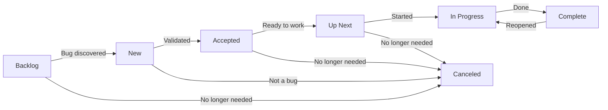

# Linear Workflow Design

## Purpose

Design document for the Linear issue tracking workflow in the CCYA repo. Covers skills, local documentation, CLI commands, status lifecycle, and the full ticket lifecycle from discovery through resolution. For LLM implementers and human reviewers.

## Problem Statement

Linear issue tracking exists as a single minimal section in `AGENTS.md` with no structured workflow, no skill, and no local documentation. The CLI wrapper `linearis` is undocumented. There is no full-cycle pattern for pulling a ticket, planning, executing, and closing it. Labels and statuses are inconsistent with what actually exists in Linear.

## Constraints

- CLI binary is `linearis`, not `linear` — the wrapper is unreliable
- Descriptions with inline code must use heredoc-to-temp-file pattern to avoid shell interpretation
- No cycles configured — iteration tracking is not part of this workflow
- All tickets must be associated with the CCYA project
- Team is PW (Peter)
- Labels are `Bug`, `Feature`, `Improvement` (capitalized)
- Priority: 1=urgent, 2=high, 3=medium, 4=low
- `linearis issues update` edits issue metadata; `linearis issues edit` edits comments — different commands for different purposes
- `linearis issues discuss` creates a root discussion thread; `linearis issues reply` adds a reply to a root thread
- Inline code formatting is lost through the CLI — descriptions cannot contain backticks

## Non-goals

- Cycle/sprint management (explicitly out of scope)
- Milestone/version tracking (no milestones configured)
- Multi-team coordination (single team: PW)
- Linear web UI configuration (statuses configured manually)
- Automation or CI/CD integration with Linear

## Decision Table

| Decision | What | Why |
|---|---|---|
| Single `linear` skill | One skill with frontmatter pointing to `docs/linear/` subfiles | CLI is small enough that splitting adds cognitive overhead without reducing confusion |
| `docs/linear/write.md` | Issue creation, heredoc pattern, full-cycle workflow | Operation-specific guidance that doesn't belong in the skill |
| `docs/linear/read.md` | List, search, read commands | Read-only operations are distinct from write operations |
| `docs/linear/update.md` | Status transitions, label changes, resolution comments | Update operations have their own patterns and pitfalls |
| Bug validation statuses | Bugs start in `New`, move to `Accepted` before `Up Next` | Ensures reported bugs are validated against current source before work begins |
| No inline code in descriptions | Use plain text with file:line references | Backticks get stripped by shell; Linear's markdown auto-links `file:line` anyway |
| All tickets in CCYA project | Every ticket gets `--project "CCYA"` | Single project simplifies filtering and reporting |
| No cycles | Skip cycle assignment entirely | Not configured for team PW; adds noise |

## Open Questions

- Should bug tickets get a `validated` comment in the discussion thread when moved from `New` to `Accepted`?
- Should resolution comments follow a standard template (e.g., "Fixed in commit <hash>. Summary: ...")?
- Should non-bug tickets have a validation step, or go directly from `Backlog` to `Up Next`?

## Current State — What Exists

### AGENTS.md Linear section (lines 122-130)

Minimal section with project/team names, an inaccurate label list (includes non-existent `fix`, `plan`, `resolved-by-plan`), priority mapping, and a one-liner pointing to `linear usage`.

### CLI

`linearis` is installed at `/opt/homebrew/bin/linearis`. It wraps the Linear GraphQL API and outputs JSON. All commands use `linearis <command> [args...]`.

### Skills

Only `ev` skill exists in `.opencode/skills/`. No Linear skill.

### Documentation

No `docs/linear/` directory. No local documentation for Linear commands or workflows.

### Statuses

Seven statuses configured for team PW: `Backlog`, `New`, `Accepted`, `Up Next`, `In Progress`, `Complete`, `Canceled`.

### Labels

Three labels: `Bug`, `Feature`, `Improvement`.

### Project

One project: `CCYA`. No milestones. No cycles.

### Problems with Current State

- Labels in AGENTS.md don't match reality (`fix`, `plan`, `resolved-by-plan` don't exist)
- No skill for Linear operations
- No local documentation for CLI commands
- No full-cycle workflow documented
- No distinction between `update` (issue metadata) and `edit` (comments)
- No heredoc pattern documented for inline code
- No status lifecycle documented
- No ticket-project association enforced

## Proposed Solution

### Core Changes

**1. Create `linear` skill** — thin wrapper in `.opencode/skills/linear/SKILL.md` with frontmatter, inline CLI syntax, and file references to `docs/linear/` subfiles.

**2. Create `docs/linear/write.md`** — issue creation commands, heredoc pattern for inline code, full-cycle workflow (discover → create → validate → plan → execute → resolve → close).

**3. Create `docs/linear/read.md`** — list, search, read commands with filtering examples.

**4. Create `docs/linear/update.md`** — status transitions, label changes, resolution comments, archiving.

**5. Update `AGENTS.md`** — fix labels, update priority mapping, add skill reference, remove `linear usage` pointer.

**6. Delete `plans/findings/LINEAR.md`** — ticket inventory lives in Linear itself; local file is stale by creation. (Done)

### Status Lifecycle



**Bug tickets:** Backlog → New → Accepted → Up Next → In Progress → Complete
**Non-bug tickets:** Backlog → Up Next → In Progress → Complete
**All tickets:** Can be canceled at any stage

### File Structure

```
.opencode/skills/linear/SKILL.md          — thin skill with inline CLI syntax
docs/linear/write.md                      — creation commands, heredoc pattern, full-cycle workflow
docs/linear/read.md                       — list, search, read commands
docs/linear/update.md                     — status transitions, resolution comments, archiving
AGENTS.md (updated)                       — fix labels, add linear skill reference
plans/findings/LINEAR.md                  — DELETED
```

### Alternatives Considered and Rejected

| Alternative | Why rejected |
|---|---|
| Two skills: `linear-discover` + `linear-create` | CLI is small enough that splitting adds cognitive overhead |
| One monolithic `docs/linear.md` | Too large to load efficiently; subfiles let agent read only what it needs |
| Inline all CLI commands in the skill | Operation-specific commands (heredoc, resolution comments) don't belong in the thin skill |
| Keep `plans/findings/LINEAR.md` | Deleted — Linear is the source of truth |
| Use `linear` wrapper instead of `linearis` | Wrapper is unreliable; `linearis` is the actual binary |

## Failure Modes and Risks

- **Stale inline code in descriptions** — If heredoc pattern is not followed, backticks get stripped and descriptions lose formatting. Mitigation: document in `docs/linear/write.md` with examples.
- **Wrong update command** — `linearis issues edit` edits comments, not issues. `linearis issues update` edits issue metadata. Mitigation: document distinction in `docs/linear/update.md`.
- **Status name mismatch** — CLI is case-sensitive and status names must match exactly. Mitigation: document exact names in skill and `docs/linear/update.md`.
- **Ticket-project drift** — Tickets created without `--project "CCYA"` won't appear in project views. Mitigation: enforce in creation workflow.
- **No inline code** — Descriptions cannot contain inline code through CLI. Mitigation: use `file:line` references instead; Linear auto-links them.

## What Is Removed

| Removed | From | Notes |
|---|---|---|
| `plans/findings/LINEAR.md` | `plans/findings/` | Deleted — Linear is source of truth |
| Labels `fix`, `plan`, `resolved-by-plan` | `AGENTS.md` | Don't exist in Linear |
| `linear usage` pointer | `AGENTS.md` | Replaced by `linear` skill reference |
| `linear` CLI wrapper reference | `AGENTS.md` | Use `linearis` instead |

## What Is Unchanged

- `ev` skill (no changes)
- `docs/architecture/` (no changes)
- `docs/ev/` (no changes)
- `docs/repomap.md` (no changes)
- `ccya/` source code (no changes)
- `saves/` (no changes)
- `packs/` (no changes)
- Global `~/.config/opencode/AGENTS.md` (no changes)
- `linearis` CLI binary (no changes)
- Linear team configuration (configured manually in web UI)
- Linear project `CCYA` (already exists)
- Labels `Bug`, `Feature`, `Improvement` (already exist)
- Statuses `Backlog`, `New`, `Accepted`, `Up Next`, `In Progress`, `Complete`, `Canceled` (configured manually in web UI)

## Context for Implementing LLMs

| File | Purpose |
|---|---|
| `.opencode/skills/linear/SKILL.md` | Thin skill with inline CLI syntax and file references |
| `docs/linear/write.md` | Issue creation commands, heredoc pattern, full-cycle workflow |
| `docs/linear/read.md` | List, search, read commands with filtering examples |
| `docs/linear/update.md` | Status transitions, resolution comments, archiving |
| `AGENTS.md` | Global issue tracking conventions (to be updated) |
| `plans/findings/LINEAR.md` | Deleted |
| `scripts/debug/README.md` | ev.py reference (for cross-referencing with Linear tickets) |
| `ccya/ev/checkers/` | Eval checkers referenced by bug tickets |
| `ccya/engine/` | Engine code referenced by bug tickets |
