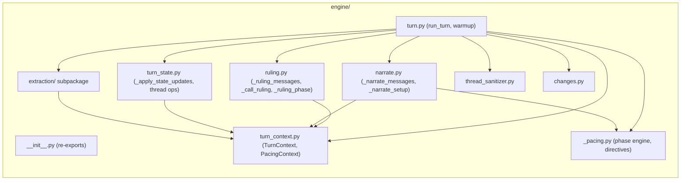

# Engine File Refactoring: Pipeline-Stage Splitting

## Purpose

Design authority for splitting `ccya/engine/turn.py`, `ccya/engine/extraction.py`, and `ccya/models.py` into smaller, pipeline-stage-aligned files. This document governs all plans executing these splits.

## Problem Statement

Three files account for ~45% of engine code (1672 + 803 + 604 = 3079 lines out of 6885), making them the dominant context cost for LLM agents working on the turn pipeline. LLM agents must load irrelevant functions to reach the one they need, and the monolithic structure obscures pipeline-stage boundaries that the architecture already defines.

`turn.py` (1672 lines) is the worst offender — it mixes:
- Dataclass definitions (`TurnContext`, `PacingContext`)
- Phase engine computation (`_compute_scene_phase`, `_compute_narration_directive`, etc.)
- Pipeline stage orchestration (`_ruling_phase`, `_narrate_setup`)
- Post-extraction state application (`_apply_thread_updates`, `_apply_arc_resolve`, `_apply_thread_resolutions`, NPC lifecycle)
- Validation, warmup, strip utilities

These are separate concerns in the architecture doc but live in one file.

`extraction.py` (803 lines) bundles 3 independent LLM streams (scene/state/storytell) with a shared orchestrator, shared utilities, and cross-stream context assembly. The message builders for each stream are small (~30-85 lines each) but the orchestrator is 280 lines.

`models.py` (604 lines) is a flat file of 24 models spanning state shapes, extraction schemas, rules types, compactor stubs, and config helpers — all in one file.

No backwards-compatibility constraints exist.

## Constraints

- No new external dependencies.
- All existing public API surfaces (`ccya/engine.__init__` re-exports) must be preserved: `run_turn`, `warmup`, `generate_seed`, `generate_pack_from_brief`, `generate_pack`, `format_change_lines`, `sanitize_threads`.
- The `ccya/engine` package public API (`__init__.py` re-exports) is the only contract — internal imports between engine submodules can change freely.
- Extraction subpackage internal imports must not create circular dependencies.
- Models split must not create circular imports between `ccya/models/*` submodules.

## Non-goals

- Splitting `ccya/server/routes.py` (958 lines) — design doc only covers engine and models splitting; routes splitting is deferred.
- Splitting `ccya/ev/*` files — explicitly out of scope per agreement.
- Splitting `ccya/server/tv.py` — explicitly out of scope per agreement.
- Any behavioral changes, type changes, or field renames.
- Adding, removing, or modifying any prompt templates.
- Any performance optimization — the goal is file organization only.
- Rewriting `run_turn()` — it stays as the orchestrator, just thinner.

## Decision Table

| Decision | What | Why |
|---|---|---|
| Pipeline-stage split for turn.py | Each pipeline stage (ruling, pacing, narrate, thread state) gets its own file. The orchestrator (`run_turn`) stays in `turn.py`. | Maps 1:1 to the architecture doc's 5-call pipeline. An agent working on narrate changes loads `narrate.py` + `turn_context.py`, not `turn.py`. |
| Extraction subpackage | `ccya/engine/extraction/` becomes a subpackage with files for each stream + shared utilities + pipeline orchestrator. | Three streams share retry/parse/context machinery but are edited independently. Subpackage structure makes discovery trivial. |
| Models subpackage | `ccya/models/` becomes a subpackage split by domain: state, extraction, rules, config types. | 24 models with distinct consumer groups. No file benefits from monolithic organization. |
| `_apply_state_updates()` extracted | The post-extraction state application block (~211 lines in turn.py) becomes a named function in `turn_state.py`. | Single cohesive unit (validate → reconcile → apply → thread ops → NPC lifecycle) that can be understood and tested independently. |
| Bare file names (no underscore prefix) | `turn_context.py`, `turn_state.py` — consistent with `ruling.py`, `narrate.py`, `changes.py`. | `_pacing.py` uses underscore because it has no direct public callers from outside the engine; the new files are imported by `turn.py` and are first-class pipeline components. |
| All re-exports from `ccya/engine/__init__.py` preserved unchanged | No function or class moves across the public API boundary. | Downstream consumers (`ccya/server`, `ccya/ev/play.py`, `scripts/debug/ev.py`) import from `ccya.engine`, not from specific submodules. Internal moves don't affect them. |
| Compactor models preserved in their own file | `models/compactor.py` keeps the 3 dormant compactor models. | They are documented as dormant and should not be moved into active model files where they could confuse. |

## Open Questions

- [OPEN: should `_validate` move into `turn_state.py` with `_apply_state_updates` since it's the validation gate before application, or stay in `turn.py` as a standalone utility used by both the orchestrator and potentially by tests?]
- [OPEN: should `_strip_fallback` move to a utility file or stay in `turn.py`? It's a 13-line function called only at the end of `run_turn`.]

## Current State — What Exists

### `ccya/engine/turn.py` (1672 lines)

**Contents:**
- `TurnContext` dataclass (26 lines) — shared context for all pipeline stages
- `PacingContext` dataclass (13 lines) — pacing output consumed by narrate + storytell
- `_apply_thread_updates` (143 lines) — merge storyteller thread operations into state
- `_apply_arc_resolve` (86 lines) — resolves arc, creates successor arc
- `_apply_thread_resolutions` (92 lines) — thread_resolve → completed_threads
- `_compute_narration_directive` (26 lines) — age-based priority stack
- `_compute_pacing_context` (37 lines) — unified pacing context builder
- `_compute_ages` (14 lines) — scene age calculation
- `_compute_scene_phase` (69 lines) — 5-state phase machine
- `_recent_turn_count` (5 lines) — turns needed for narration context
- `_ruling_phase` (146 lines) — intent classification + dice resolution
- `_narrate_setup` (133 lines) — phase engine + pacing + narrate message build
- `run_turn` (~700 lines) — orchestrator: calls stages, streams LLM, applies state, persists
- `_strip_fallback` (13 lines) — fallback text cleaner
- `_validate` (55 lines) — delta validation
- `warmup` (11 lines) — engine warmup

**Import chain into turn.py** (11 total `from ccya.engine.*` imports, 1 from `ccya.engine.extraction`):
```
turn.py imports:
  extraction.py: _run_extraction_pipeline, _avg_event_ms, _context_meta
  narrate.py: _narrate_messages
  ruling.py: _call_ruling, _log_ruling_outcome, _ruling_messages
  _pacing.py: compute_convergence_score, derive_allowed_beat_types, detect_spiral
  changes.py: _summarize_applied, summarize_changes
  config.py: EngineConfig, _build_jinja_env, _inflight, _log_llm_io, _log_prompts, etc.
  markers.py: strip_trace_markers_in_messages
  names.py: generate_npc_names_split
  npc_roster.py: build_npc_roster
  thread_sanitizer.py: sanitize_threads
  models.py: 9 models
  rules.py: resolve_check, build_directive
  state/__init__.py: apply_delta, append_chronicle, append_event, load_last_narration, etc.
```

### `ccya/engine/extraction.py` (803 lines)

**Contents by stream and function group:**
- Shared utilities: `_text_references_thread` (14), `_filter_evicted_threads` (17), `_capitalize_inventory_names` (26), `_extract_group_base_type` (20), `_dedup_compendium_update` (46)
- Stream 1 — Scene: `_extract_scene_messages` (30 lines)
- Stream 2 — State: `_extract_state_messages` (30 lines)
- Stream 3 — Storytell: `_storytell_messages` (85 lines)
- Cross-stream: `_ExtractionContext` (18 lines), `_build_extraction_context` (40 lines)
- JSON/LLM helpers: `_coerce_scene_json` (30), `_parse_stream_result` (15), `_call_stream` (74)
- Orchestrator: `_run_extraction_pipeline` (280 lines)
- Other: `_avg_event_ms` (23), `_context_meta` (13)

Only `turn.py` imports from `ccya.engine.extraction` — it's a single-consumer module.

### `ccya/models.py` (604 lines)

24 models + 3 type aliases + 2 functions grouped by natural domain:

| Domain | Models | Consumers |
|---|---|---|
| State | NpcPresence, ArcThread, CampaignArc, Condition, ConditionAdd, ConditionRemove, InventoryItem, InventoryRemove, InventoryUpdate, LocationRef, WorldStateFact, ProgressEntry, ThreadResolution, ThreadUpdate, ArcResolution | thread_sanitizer, narrate, extraction, state/delta_builder, state/npcs, prompts/context, pack |
| Extraction | CompendiumNpcUpdate, StateDelta, SceneExtractResult, StateExtractResult, GMBeat, StorytellerResult | extraction, turn, state/delta_builder, state/npcs |
| Rules | RulesCheck, IntentEnvelope, RulesOutcome | ruling, _pacing, narrate, rules, prompts/context |
| Config/Top-level | SkillName (alias), Difficulty (alias), Band (alias), TurnResult (dataclass), load_config(), save_config() | logging_setup, server/routes, server/app, ev/play, ev/eval, ev/check |
| Compactor (dormant) | CompactorNpcMerge, CompactorSanitizationAction, CompactorSanitizationResult | None (no importers) |

### Problems with Current State

- **turn.py has no file-level discoverability**: All 17 top-level symbols are mixed. An agent searching for "how does thread resolution work" must load 1600 lines to find `_apply_thread_resolutions` and trace its callers.
- **turn.py bundles stage orchestration with stage implementation**: `_ruling_phase` (146 lines) lives in turn.py, but `_ruling_messages` + `_call_ruling` (the prompt/parse/retry logic) live in ruling.py. A ruling bug requires loading both files anyway, but the split is arbitrary — why is the ruling phase setup in turn.py but the call in ruling.py?
- **extraction.py couples 3 independent streams through shared files**: Editing the storytell stream forces the agent to load scene and state message builders too. The shared utilities (`_call_stream`, `_parse_stream_result`) are used by all 3 streams but only 1 consumer exists (`turn.py`).
- **models.py has no domain grouping**: A consumer importing `StorytellerResult` also imports `CompactorSanitizationResult` and `load_config`. No cohesion benefit.
- **`_apply_state_updates` is an unnamed block**: The ~211-line post-extraction block in `run_turn()` has no function boundary, making it invisible to grep and to agents browsing by symbol.

## Proposed Solution

### Core Changes

**1. Turn pipeline split — stage-per-file**

Current → target:

| Function | Current File | Target File |
|---|---|---|
| `TurnContext` | `turn.py` | `turn_context.py` |
| `PacingContext` | `turn.py` | `turn_context.py` |
| `_ruling_phase` | `turn.py` | `ruling.py` (extend) |
| `_narrate_setup` | `turn.py` | `narrate.py` (extend) |
| `_compute_narration_directive` | `turn.py` | `_pacing.py` (extend) |
| `_compute_pacing_context` | `turn.py` | `_pacing.py` (extend) |
| `_compute_ages` | `turn.py` | `_pacing.py` (extend) |
| `_compute_scene_phase` | `turn.py` | `_pacing.py` (extend) |
| `_recent_turn_count` | `turn.py` | `_pacing.py` (extend) |
| `_apply_thread_updates` | `turn.py` | `turn_state.py` |
| `_apply_arc_resolve` | `turn.py` | `turn_state.py` |
| `_apply_thread_resolutions` | `turn.py` | `turn_state.py` |
| `_apply_state_updates` *(new)* | *(inline in run_turn)* | `turn_state.py` |
| `_validate` | `turn.py` | `turn_state.py` [OPEN] |
| `_strip_fallback` | `turn.py` | `turn.py` (stay) [OPEN] |
| `run_turn` | `turn.py` | `turn.py` (thinned) |
| `warmup` | `turn.py` | `turn.py` (stay) |

**`_apply_state_updates` interface** (new function in `turn_state.py`):
```
def _apply_state_updates(
    state: dict[str, Any],
    delta: StateDelta | None,
    storyteller_result: StorytellerResult | None,
    config: EngineConfig,
    trace_id: str,
    turn_no: int,
) -> tuple[dict[str, Any], StateDelta | None, dict[str, Any], list[dict[str, Any]], list[str]]:
```
Returns `(state, delta, applied, rejected, reconcile_warnings)`.

**2. Extraction subpackage — `ccya/engine/extraction/`**

| File | Contains | Lines |
|---|---|---|
| `__init__.py` | Re-export `_run_extraction_pipeline` only | ~3 |
| `pipeline.py` | `_run_extraction_pipeline` — orchestrator | ~280 |
| `context.py` | `_ExtractionContext`, `_build_extraction_context` | ~70 |
| `utils.py` | `_call_stream`, `_parse_stream_result`, `_coerce_scene_json`, `_context_meta`, `_avg_event_ms`, `_capitalize_inventory_names`, `_dedup_compendium_update`, `_extract_group_base_type`, `_filter_evicted_threads`, `_text_references_thread` | ~120 |
| `scene.py` | `_extract_scene_messages` | ~30 |
| `state.py` | `_extract_state_messages` | ~30 |
| `storytell.py` | `_storytell_messages` | ~85 |

`turn.py` imports change from:
```python
from ccya.engine.extraction import _run_extraction_pipeline, _avg_event_ms, _context_meta
```
to:
```python
from ccya.engine.extraction import _run_extraction_pipeline, _avg_event_ms, _context_meta
```
(Identical — the subpackage `__init__.py` re-exports them.)

Internal subpackage imports (`utils.py` → `scene.py`, `context.py` → `pipeline.py`, etc.) are handled within the subpackage and do not cross the `ccya.engine` boundary.

**3. Models subpackage — `ccya/models/`**

| File | Models | Imports from |
|---|---|---|
| `__init__.py` | Re-export all public models; preserve `load_config`, `save_config`, type aliases | All submodules |
| `state.py` | `NpcPresence`, `ProgressEntry`, `ArcThread`, `CampaignArc`, `Condition`, `ConditionAdd`, `ConditionRemove`, `InventoryItem`, `InventoryRemove`, `InventoryUpdate`, `LocationRef`, `WorldStateFact`, `ThreadResolution`, `ThreadUpdate`, `ArcResolution` | pydantic |
| `extraction.py` | `CompendiumNpcUpdate`, `StateDelta`, `SceneExtractResult`, `StateExtractResult`, `GMBeat`, `StorytellerResult` | pydantic |
| `rules.py` | `RulesCheck`, `IntentEnvelope`, `RulesOutcome` | pydantic |
| `config.py` | `TurnResult` (dataclass), `load_config()`, `save_config()`, type aliases `SkillName`, `Difficulty`, `Band` | dataclasses, yaml |
| `compactor.py` | `CompactorNpcMerge`, `CompactorSanitizationAction`, `CompactorSanitizationResult` | pydantic |

All existing `from ccya.models import X` statements remain valid — `ccya/models/__init__.py` re-exports every symbol from its submodules exactly as before.

**4. Removal of original files**

- `ccya/engine/turn.py` → remains but thinned (see above)
- `ccya/engine/extraction.py` → deleted (replaced by `ccya/engine/extraction/`)
- `ccya/models.py` → deleted (replaced by `ccya/models/`)

### Data Flow (Post-Split)



### Alternatives Considered and Rejected

- **Keep extraction.py as-is, only split turn.py**: Extraction is 803 lines and already has natural stream boundaries. The user explicitly chose the subpackage approach. Rejected.
- **Merge all 3 stream message builders into one file**: They're tiny (30–85 lines each) but the user wants good LLM routing per stream. Separating them costs ~3 files of 30 lines each — trivial overhead for the discoverability gain. Rejected.
- **Per-file extraction without subpackage** (sibling files `extract_scene.py`, `extract_state.py`, `extract_storytell.py` + shared helpers left in `extraction.py`): User explicitly chose subpackage. Rejected.
- **Keep TurnContext/PacingContext in turn.py**: They're consumed by `narrate.py` (via TYPE_CHECKING import), `pacing.py`, `ruling.py`. Leaving them in `turn.py` would force every consumer to import from `turn.py` — a circular-dependency minefield. Moving to their own file eliminates this risk. Rejected.
- **Keep `_validate` in turn.py**: It's called only during state application, which moves to `turn_state.py`. Moving it with its sole caller is the natural reading order. Rejected. [OPEN: question remains about moving vs keeping]
- **Extraction into 2 files (orchestrator + everything else)**: User explicitly chose stream-level granularity. Rejected.

## Failure Modes and Risks

- **Circular imports within `ccya/engine/extraction/`**: `pipeline.py` imports from `scene.py`, `state.py`, `storytell.py`, `context.py`, `utils.py`. None of those files import each other or from `pipeline.py` — no cycle risk.
- **Circular imports within `ccya/models/`**: Models are standalone pydantic/ dataclass definitions with no internal dependencies. No cycle risk.
- **Circular imports across `ccya/engine/`**: `narrate.py` currently imports `from ccya.engine.turn import PacingContext` inside `TYPE_CHECKING`. After the split, it imports from `turn_context.py` instead — no cycle risk. All other engine submodules import from `config.py` and `_pacing.py` only, which never import back.
- **Missed re-exports in `ccya/engine/__init__.py` or `ccya/models/__init__.py`**: Every public symbol must be verified by grep. Plan must include a verification step that compares exports before/after.
- **`ccya/engine/extraction.py` deleted before subpackage is created**: Plan must create subpackage first, update imports, then delete the old file.
- **LLM agents relying on `ccya/engine/turn.py` train of thought**: The file path changes for several functions. Agents will need to re-discover locations. Acceptable — the repo documentation (`docs/repomap.md`) will be updated to reflect new locations.

## What Is Removed

| Removed | From | Notes |
|---|---|---|
| `ccya/engine/extraction.py` | Entire file | Replaced by `ccya/engine/extraction/` subpackage |
| `ccya/models.py` | Entire file | Replaced by `ccya/models/` subpackage |
| `_ruling_phase` | `turn.py` | Moved to `ruling.py` |
| `_narrate_setup` | `turn.py` | Moved to `narrate.py` |
| `TurnContext` | `turn.py` | Moved to `turn_context.py` |
| `PacingContext` | `turn.py` | Moved to `turn_context.py` |
| `_apply_thread_updates` | `turn.py` | Moved to `turn_state.py` |
| `_apply_arc_resolve` | `turn.py` | Moved to `turn_state.py` |
| `_apply_thread_resolutions` | `turn.py` | Moved to `turn_state.py` |
| `_compute_narration_directive` | `turn.py` | Moved to `_pacing.py` |
| `_compute_pacing_context` | `turn.py` | Moved to `_pacing.py` |
| `_compute_ages` | `turn.py` | Moved to `_pacing.py` |
| `_compute_scene_phase` | `turn.py` | Moved to `_pacing.py` |
| `_recent_turn_count` | `turn.py` | Moved to `_pacing.py` |
| Inline state application (~211 lines) | `run_turn()` | Extracted to `_apply_state_updates()` in `turn_state.py` |

## What Is Unchanged

- `run_turn()` — remains the orchestrator in `turn.py`, same public signature (`save_dir, user_input, config, *, template_dir, pack_name_locales, pack_narrator_rules, pack_world_rules, pack_factions`)
- `warmup()` — stays in `turn.py`
- `ccya/engine/__init__.py` — re-exports unchanged (run_turn, warmup, generate_seed, etc.)
- `_strip_fallback()` — stays in `turn.py` [OPEN]
- `_validate()` — stays in `turn.py` [OPEN] or moves to `turn_state.py`
- All prompt templates — unchanged
- All config keys and defaults — unchanged
- All Pydantic model fields and validators — unchanged
- All state shape (`state.yaml` schema) — unchanged
- `_call_ruling`, `_ruling_messages`, `_log_ruling_outcome` — already in `ruling.py`, unchanged
- `_narrate_messages` — already in `narrate.py`, unchanged
- All `_pacing.py` exports — unchanged
- `sanitize_threads` — unchanged in `thread_sanitizer.py`
- All `ccya/state/*` modules — unchanged
- All `ccya/server/*` modules — unchanged
- All `ccya/ev/*` modules — unchanged
- All checkers — unchanged
- All test files — unchanged (tests are temporarily removed anyway)
- `make lint`, `make typecheck`, `make check` — unchanged commands

## New Model Shapes

No new models are created. Existing models are moved between files with identical definitions. The only new artifact is the `_apply_state_updates` function signature (see Proposed Solution section).

## Context for Implementing LLMs

- `ccya/engine/turn.py` — current monolith; read to understand the full scope of what moves where
- `ccya/engine/ruling.py` — existing separate file; `_ruling_phase` will join the `_ruling_messages` / `_call_ruling` already here
- `ccya/engine/narrate.py` — existing separate file; `_narrate_setup` will join `_narrate_messages`
- `ccya/engine/_pacing.py` — existing separate file; all phase engine computation moves here
- `ccya/engine/extraction.py` — current monolith being replaced by subpackage
- `ccya/engine/extraction.py` lines 74–131 — `_ExtractionContext` and `_build_extraction_context` (move to `extraction/context.py`)
- `ccya/engine/extraction.py` lines 237–380 — stream message builders (move to `extraction/scene.py`, `state.py`, `storytell.py`)
- `ccya/engine/extraction.py` lines 382–500 — JSON/LLM helpers (move to `extraction/utils.py`)
- `ccya/engine/extraction.py` lines 501–780 — pipeline orchestrator (move to `extraction/pipeline.py`)
- `ccya/models.py` — current flat model file; read to understand domain groupings for the split
- `docs/repomap.md` — must be updated with new file paths after the split
- `docs/architecture/OVERVIEW.md` — pipeline overview referencing turn.py; update file references
