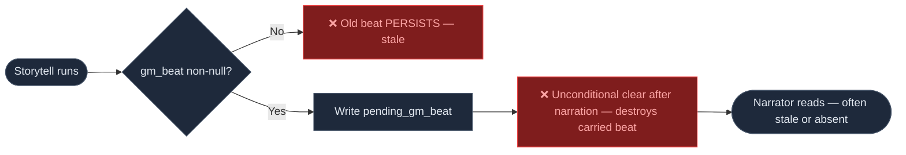
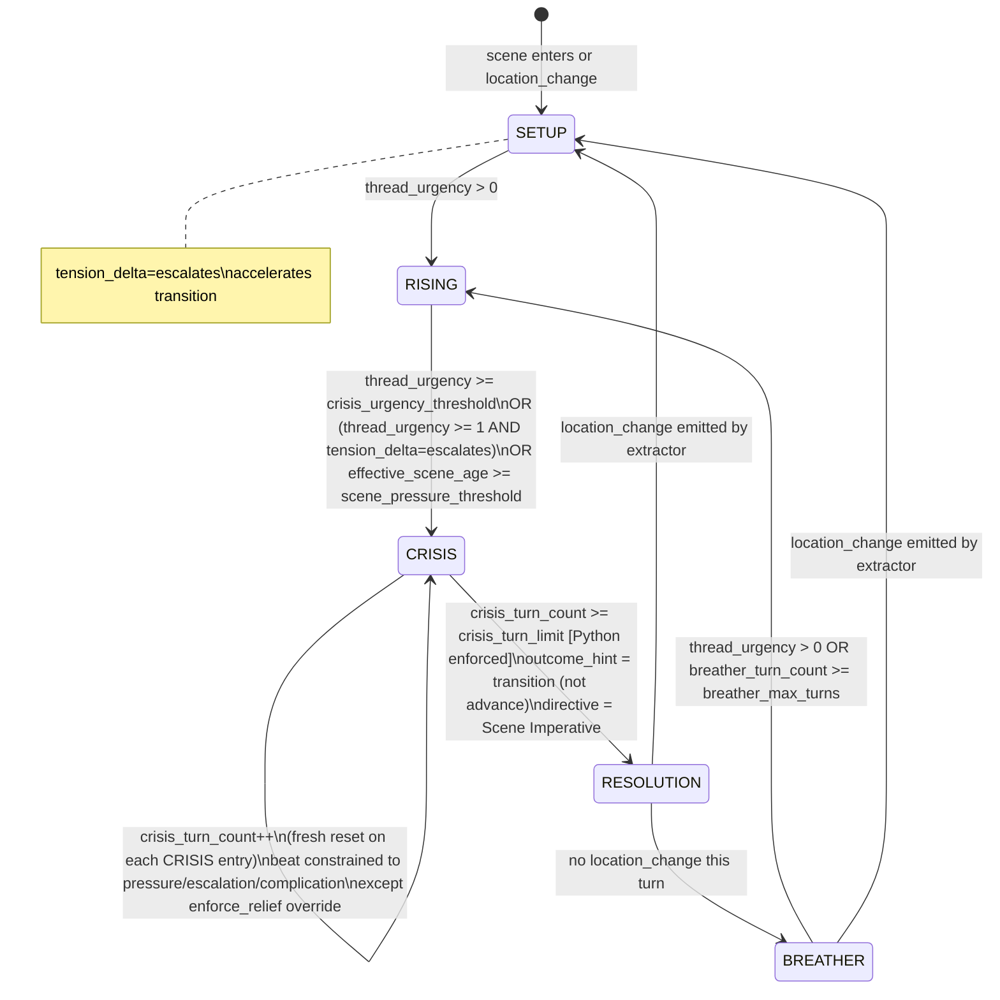
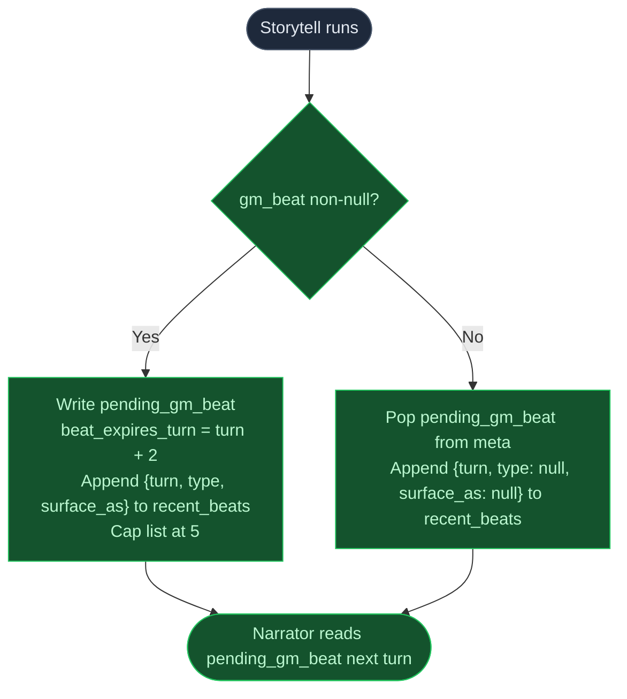
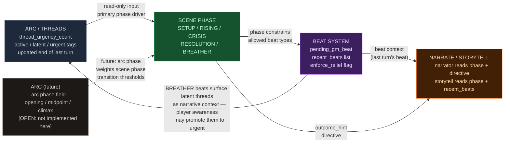

# Scene Phase & Pacing Redesign

## Purpose

This document is the design authority for plans implementing the scene phase system and pacing overhaul in `ccya`. It covers the replacement of `narrative_velocity`, `consecutive_pressure_turns`, and momentum-based pacing with a phase-driven model fed by ruling engine signals, thread state, and beat history. Intended for implementing LLMs and human reviewers.

## Problem Statement

The current pacing system produces unresolvable scenes — combat encounters running 20+ turns with no narrative progression, repeated identical beats, and relief mechanics that are structurally unreachable. Three interlocking failures cause this:

**1. No scene duration enforcement.** There is no mechanism that forces narrative progression after a scene has stalled. `Scene Imperative` fires correctly at `effective_scene_age >= 5` but carries no behavioral weight — it is a label with no enforcement. The narrator and storyteller ignore it because the prompt guidance is advisory and the engine does not change `outcome_hint` based on it.

**2. Pacing signals track the wrong things.** `narrative_velocity` measures whether the player took passive actions, not whether tension is actually de-escalating. `consecutive_pressure_turns` counts `Pressure`/`Overwhelm` directives that never fire (observed: 0/51 turns). `momentum` never reaches its floor threshold (observed minimum: -1 vs. floor of -3). All three signals are either broken or measuring proxies that don't correlate with the actual problem.

**3. Beat diversity is structurally untestable.** The storyteller receives no beat history, so ~50 lines of diversity guidance in `storytell_system.j2` cannot be followed. The LLM generates each beat blind to the prior 5 turns. Result: `npc_behavior` surface type on 64%+ of turns, 4 of 9 beat types used across 51 turns.

**4. Beat relief is unreachable.** The floor relief path requires `beat_locked = True` AND `pending_gm_beat = None`. The first never fires (signals broken, see above). The second is almost never true (storytell emits a beat 80%+ of turns). Two independent blockers, either sufficient to prevent relief.

**5. Pre-narration tension is invisible.** The ruling engine — the only call that sees raw player intent before narrative processing — emits no tension signal. Its read of player action (aggressive, evasive, escalating) is discarded after the ruling decision. This is the best available same-turn signal and it goes unused.

## Constraints

- Pipeline order is fixed: ruling → narrate → extract_scene → extract_state → storytell. The 1-turn beat lag cannot be eliminated without reordering the entire async pipeline.
- The 5-call pipeline structure is unchanged.
- Backwards compatibility with saved game state is not required.
- No new LLM calls may be added. Signal extraction happens within existing calls only.
- Context token budget per turn must not increase net. Removed signals must free tokens that new signals consume.

## Non-goals

- Arc/thread system redesign — the "journal vs. todo list" problem is real but out of scope. This doc calls out the integration boundary; it does not redesign thread lifecycle.
- Arc phase field — adding a `phase` field to `Arc` is called out as a future integration point but not implemented here.
- Thread deduplication via `ArcThread.key` — separate concern, separate plan.
- NPC continuity or `recently_left` removal — already addressed in prior plans.
- Conditions system changes.
- Ruling engine scope expansion beyond the `tension_delta` signal defined here.

## Decision Table

| Decision | What | Why |
|---|---|---|
| Replace momentum, narrative_velocity, consecutive_pressure_turns | Delete all three fields and their computation logic | All three measure proxies that don't correlate with observed failures. Removing them is net simplification with no loss of real signal — their jobs are covered by phase + ruling tension_delta + thread urgency. |
| Introduce `scene_phase` enum | Five values: `SETUP`, `RISING`, `CRISIS`, `RESOLUTION`, `BREATHER`. Stored in `state["scene"]`. | Phase is the explicit, readable, debuggable container for scene state. Every downstream system reads one field instead of inferring state from three broken counters. |
| Phase transitions driven by hard configurable thresholds | Inputs: thread urgency count (primary), ruling `tension_delta` (accelerant), `effective_scene_age` (backstop). Transition conditions use hard `>=` comparisons against configurable int values in pack config. | Hard thresholds are simpler, more debuggable, and less gameable than a weighted sum. Each threshold is a single config field a pack author can tune. Weighted sum held no practical advantage over two explicit checks (thread count + scene age) and added tuning complexity. |
| Phase is parent of beat | Beat types are constrained by phase. `escalation` and `complication` are suppressed in BREATHER. `opportunity` and `breathing_room` are suppressed in CRISIS unless `enforce_relief = True`. | Phase/beat contradictions produced incoherent narration in prior games. One must lead. Phase is the structural signal; beat is the textural content within it. |
| Ruling engine emits `tension_delta` | New field on ruling output: `tension_delta: "escalates" | "maintains" | "de-escalates"`. Derived from player action intent, not scene context. | Ruling engine is the only same-turn, pre-narration signal. It already classifies action difficulty and possibility. `tension_delta` is a natural extension that adds no new LLM call and feeds phase transition logic directly. |
| `tension_delta` is an accelerant, not a decider | Thread urgency can override `tension_delta`. A `de-escalates` ruling during an active urgent thread does not suppress CRISIS. | Ruling engine has limited scene context (no thread state). It will misclassify cautious actions in tense situations. Thread state is the authoritative tension signal. |
| `effective_scene_age` retained as backstop | Scene age with combat boost (+2 in combat) remains as a fallback phase transition trigger. Thresholds configurable per pack. | Prevents phase from stalling indefinitely if thread signals go quiet. Not the primary driver — the safety net. |
| Beat history stored in `state["meta"]["recent_beats"]` | List of last 5 beats: `{turn: int, type: str, surface_as: str \| null}`. Null entries on storytell null turns. | Storyteller currently generates beats blind to prior turns. History is the minimum context needed to make diversity guidance testable by the LLM. 5 entries ≈ 100 tokens. |
| `pending_gm_beat` cleared on null storytell output | Explicit pop when storytell returns null. No unconditional clear after narration. | Stale beats from prior turns were persisting through null turns and shaping narration incorrectly. Lifecycle: write on non-null, pop on null, expire on TTL. |
| RESOLUTION triggered by `location_change` from extractor | Phase transitions to RESOLUTION when extractor emits `location_change`, or when CRISIS turn limit is exceeded (Python-enforced). | `location_change` is already extracted, binary, and requires no new surface. Acknowledged limitation: "won but stayed" edge case. Revisit with storytell `scene_resolved` field if this proves insufficient in play. |
| `location_change` always routes to SETUP, never RESOLUTION | RESOLUTION is entered only via `crisis_turn_count >= crisis_turn_limit`. A `location_change` mid-crisis routes directly to SETUP. | Clean split between physical scene end (`location_change` → SETUP) and narrative scene end (crisis limit → RESOLUTION). Player escaping a crisis gets a SETUP turn in the new location; the crisis resolves implicitly in narration. No ambiguity when both signals fire simultaneously. |
| BREATHER exit driven by new urgent thread | BREATHER → RISING when thread urgency count rises above 0. Beats in BREATHER are weighted toward `opportunity`, `revelation`, `hazard` to surface new threads organically. | BREATHER needs an active exit mechanism or it soft-locks. Beat weighting makes the exit organic — the storyteller surfaces new tension rather than the engine forcing a transition. |
| Crisis turn limit is pack-configurable | `crisis_turn_limit: int` in pack-level config. Default 4. | Different genres need different crisis pacing. Horror: 6. Action: 3. One field, no logic change. |
| BREATHER max turns backstop | `breather_max_turns: int = 3` in pack config. After 3 turns in BREATHER with no urgent thread, force RISING. | Prevents BREATHER soft-lock when beats fail to surface new threads. Independent safety net, not reliant on storyteller compliance. |
| `narrative_velocity` deleted | Remove computation and all consumers | Phase + thread urgency + ruling `tension_delta` cover its signal. Its stealth/calm conflation actively causes wrong behavior (Breathe during raids). Net token savings outweigh any marginal signal. |
| `pacing_gate` (`block_escalate`/`allow`) deleted | Remove from `PacingContext`, `turn.py`, `storytell_system.j2` | Redundant. Phase-constrained `allowed_beat_types` gates `thread_add`-type beats by phase. Explicit post-facto thread-add blocking removed — phase self-corrects next turn. |
| Breathe directive guard simplified | Breathe fires when: ruling `tension_delta == "de-escalates"` AND no urgent threads exist. | Removes velocity dependency. Ruling engine is a better "did the player do something calm" signal than velocity math. |

## Open Questions

- **[OPEN: Arc phase field]** Should `Arc` gain a `phase` field (`opening | midpoint | climax`) to feed scene phase transition weights? Called out as a future integration point. Likely a separate design doc.
- **[OPEN: Storytell `scene_resolved` field]** If `location_change` proves too blunt a RESOLUTION trigger (player moves but scene tension follows them), a `scene_resolved: bool` field on storytell output would allow semantic resolution. Defer until play-testing reveals whether this is needed.
- **[OPEN: Threshold numeric values]** Exact numeric defaults for pack-configurable fields (`crisis_urgency_threshold`, `scene_pressure_threshold`, `breather_max_turns`, `crisis_turn_limit`) require play-testing to tune. Start conservative — thread urgency dominant, `crisis_turn_limit = 4`, `breather_max_turns = 3`.

## Current State — What Exists

### Directive Computation (`_compute_narration_directive`, `turn.py:430–473`)

Priority stack produces one directive per turn from these signals:

```
narrative_velocity < -0.3          → Breathe
effective_scene_age >= 5           → Scene Imperative
3+ urgent scene-scoped threads     → Overwhelm      [never fires: 0/51 turns]
1-2 urgent scene-scoped threads    → Pressure       [never fires: 0/51 turns]
background urgency only            → Tension
effective_scene_age >= 3           → Scene Pressure (secondary append)
```

Observed directive distribution across 51 turns: empty (27), Breathe (11), Scene Imperative (7), Scene Pressure (7), Pressure (0), Overwhelm (0).

### Pacing Context (`_compute_pacing_context`, `turn.py:502–508`)

`beat_locked` triggers when `consecutive_pressure_turns >= 3` OR `momentum <= -3`. Neither ever fires. `consecutive_pressure_turns` tracks `Pressure`/`Overwhelm` directives (0/51 turns). Momentum minimum observed: -1.

### Beat Lifecycle



### Problems with Current State

- `consecutive_pressure_turns` tracks directives that never fire — counter is permanently 0
- `momentum` floor of -3 is structurally unreachable — observed minimum -1
- `narrative_velocity` conflates tactical caution with genuine de-escalation — fires Breathe during active raids
- `pending_gm_beat` cleared unconditionally after narration — destroys intended carryover
- `pending_gm_beat` NOT cleared on null storytell — stale beats persist across multiple turns
- Scene Imperative fires correctly but has no behavioral enforcement — advisory label only
- Storyteller has no beat history — diversity guidance is untestable by LLM
- No pre-narration tension signal — ruling engine output discarded after ruling decision
- No explicit scene state field — phase must be inferred from overlapping broken signals

## Proposed Solution

### System Overview

```mermaid
flowchart TD
    style RUL fill:#1e3a5f,stroke:#3b82f6,color:#bfdbfe
    style TRN fill:#1e3a5f,stroke:#3b82f6,color:#bfdbfe
    style PHA fill:#14532d,stroke:#22c55e,color:#bbf7d0
    style DIR fill:#3b1f5e,stroke:#a855f7,color:#e9d5ff
    style NAR fill:#422006,stroke:#f97316,color:#fed7aa
    style EXT fill:#422006,stroke:#f97316,color:#fed7aa
    style STL fill:#422006,stroke:#f97316,color:#fed7aa
    style BT fill:#1c1917,stroke:#78716c,color:#d6d3d1
    style ST fill:#1c1917,stroke:#78716c,color:#d6d3d1

    TRN([Turn N begins]) --> RUL
    RUL["① RULING ENGINE<br>— ruling decision<br>— emits tension_delta<br>escalates / maintains / de-escalates"]
    RUL --> PHA
    PHA["② PHASE ENGINE<br>reads: scene_phase, thread urgency count,<br>tension_delta, recent_beats, effective_scene_age<br>— computes transition if warranted<br>— writes scene_phase to state<br>— sets outcome_hint='transition' if CRISIS limit hit"]
    PHA --> DIR
    DIR["③ DIRECTIVE COMPUTATION<br>reads: scene_phase, effective_scene_age,<br>tension_delta, thread urgency<br>— emits one directive<br>— Breathe gate: tension_delta=de-escalates AND no urgent threads"]
    DIR --> NAR
    NAR["④ NARRATE<br>reads: directive, outcome_hint,<br>pending_gm_beat from LAST turn"]
    NAR --> EXT
    EXT["⑤ EXTRACT<br>extract_scene + extract_state<br>location_change? → scene_age resets, phase → SETUP"]
    EXT --> STL
    STL["⑥ STORYTELL<br>reads: directive, scene_phase,<br>recent_beats (last 5)<br>— beat type constrained by phase<br>— emits gm_beat or null"]
    STL --> BT
    BT["⑦ BEAT LIFECYCLE<br>non-null: write pending_gm_beat, append recent_beats<br>null: pop pending_gm_beat, append null to recent_beats"]
    BT --> ST(["Turn N complete<br>phase + beat written to state"])
```



### Core Changes

#### 1. `scene_phase` — New Scene State Field

Replaces momentum, narrative_velocity, and consecutive_pressure_turns as the primary pacing primitive.

Stored in `state["scene"]`. Computed by new function `_compute_scene_phase()` called after ruling, before directive computation.

Five values: `SETUP` → `RISING` → `CRISIS` → `RESOLUTION` / `BREATHER`

Phase transition inputs and their roles:

| Signal | Source | Role |
|---|---|---|---|
| `thread_urgency_count` | `state["arc"]["threads"]` (updated end of last turn) | Primary driver. Count of urgent scene-scoped threads. |
| `tension_delta` | Ruling engine output (new field) | Accelerant. Aggressive player action pushes transitions faster. |
| `consecutive_pressure_beats` | `state["meta"]` (new counter, replaces `consecutive_pressure_turns`) | Confirmatory. 3 consecutive pressure beats during CRISIS trigger `enforce_relief`. |
| `effective_scene_age` | `_compute_ages()` (existing) | Backstop. Prevents phase stalling if thread signals go quiet. |
| `crisis_turn_count` | `state["scene"]` (new, int) | CRISIS duration counter. Enforces turn limit. |
| `breather_turn_count` | `state["scene"]` (new, int) | BREATHER duration counter. Enforces backstop transition. |

#### 2. Phase State Machine



#### 3. Beat Phase Constraints

Phase gates which beat types the storyteller may emit. This is enforced in the storytell prompt context — the prompt receives `scene_phase` and `allowed_beat_types` derived from it:

| Phase | Allowed beat types | Suppressed unless override |
|---|---|---|
| `SETUP` | all | — |
| `RISING` | pressure, complication, escalation, revelation, twist | breathing_room, opportunity |
| `CRISIS` | pressure, escalation, complication | breathing_room, opportunity, callback |
| `CRISIS` (enforce_relief) | breathing_room only | all pressure types |
| `RESOLUTION` | breathing_room, callback, revelation | escalation, complication |
| `BREATHER` | opportunity, revelation, callback, breathing_room, hazard | escalation, pressure, complication |

`enforce_relief` fires when `consecutive_pressure_beats >= 3` during CRISIS. Tracked via an independent `consecutive_pressure_beats: int` counter in `state["meta"]` (replaces `consecutive_pressure_turns`), not derived from `recent_beats`. This ensures `enforce_relief` is robust against storytell null turns padding `recent_beats` with null entries that would break streak integrity.

#### 4. Ruling Engine `tension_delta` Signal

New field on ruling output model. Derived from player action classification already performed by the ruling engine. No new LLM call. The ruling engine receives player input, last turn narration, and inventory — sufficient to classify intent.

Field: `tension_delta: Literal["escalates", "maintains", "de-escalates"]`
Default when LLM omits the field: `"maintains"` (safest neutral default — preserves behavior when signal is absent).

This field is consumed by `_compute_scene_phase()` as a transition accelerant and by `_compute_narration_directive()` as the Breathe gate input.

#### 5. Beat Lifecycle Fix



Both unconditional clears (post-narration and storytell-null) have already been removed from the codebase. The beat lifecycle at `turn.py:1025–1034` already implements write-on-non-null/pop-on-null. Verify the implementation matches this spec before proceeding.

#### 6. Directive Computation — Simplified

Replaces the current 6-level priority stack with a 4-level stack driven by phase and clean signals:

```
1. Breathe     — tension_delta == "de-escalates" AND thread_urgency == 0
2. Scene Imperative — (phase == CRISIS AND crisis_turn_count >= crisis_turn_limit)
                      OR effective_scene_age >= scene_imperative_threshold
3. Scene Pressure   — effective_scene_age >= scene_pressure_threshold (pack config)
4. Tension / empty  — default
```

`Overwhelm` and `Pressure` directives removed. Their jobs are handled by phase.

### Arc / Thread Integration Points

The phase engine reads thread state but does not write to it. This is a hard boundary.



**What threads provide to phase today:**
- `thread_urgency_count` — count of urgent scene-scoped threads, the primary phase transition signal
- Thread recency — threads are updated at end of prior turn, available at start of current turn, making them a reliable forward-looking input

**What phase provides to threads (indirectly):**
- BREATHER beat weighting surfaces latent threads as `opportunity` or `revelation` beats, which the narrator integrates — creating an organic pipeline from latent thread → surfaced beat → player awareness → new urgent thread

**Future integration callout:** When `Arc` gains a `phase` field (`opening | midpoint | climax`), it should weight scene phase transition thresholds — climax arc phase lowers the `effective_scene_age` threshold to reach CRISIS, opening arc phase raises it. This is out of scope here but the boundary is clean: arc phase is one more weighted input to `_compute_scene_phase()`.

### Alternatives Considered and Rejected

**Keep momentum as narrator flavor signal.** Rejected. Momentum never reaches meaningful values (observed floor -1 vs threshold -3). Keeping a broken signal as "flavor" adds state, prompt tokens, and confusion for implementing LLMs reading the codebase. If a "how bad is it" signal is needed for narrator flavor, `scene_phase` is more expressive and already present.

**`narrative_velocity` with urgent-thread guard (PBS design).** Rejected. The urgent-thread guard fixes the stealth false-positive but retains a float computed from action passivity as a tension signal. `tension_delta` from the ruling engine is the same concept expressed more cleanly, at a better point in the pipeline, with no float arithmetic. Velocity is the weaker version of a signal the ruling engine already produces.

**Hard-coded crisis turn limit (constant in turn.py).** Rejected. Genre pacing varies. A horror pack needs 6-turn crises; an action pack needs 3. One field in pack config with a sensible default costs nothing and enables meaningful tuning.

**`consecutive_pressure_turns` re-keyed to beat types (PBS design).** Rejected. This is a targeted fix to a broken counter that doesn't address the underlying problem — no explicit scene state. Re-keying the counter makes floor relief reachable but doesn't prevent 20-turn combat loops. Phase replaces the counter entirely and solves both problems.

**Beat system as peer to phase (neither parent nor child).** Rejected. When phase says CRISIS and the storyteller independently emits `breathing_room`, the result is incoherent narration — the narrator receives contradictory signals. One must govern the other. Phase is the structural primitive; it is the correct parent.

**Storytell `scene_resolved` field for RESOLUTION trigger.** Deferred, not rejected. `location_change` is sufficient for an initial implementation and has zero new surface area. If play-testing reveals the "won but stayed" edge case is common, `scene_resolved` is the right follow-on change.

**Weighted sum for phase transitions.** Rejected. Hard configurable thresholds with `>=` comparisons are simpler to debug, more transparent for pack authors, and harder to game. A weighted sum over thread urgency, `tension_delta`, beat recency, and scene age had no practical advantage over two explicit threshold checks (thread count + scene age) and added complex tuning surfaces. Revisit if play reveals hard thresholds are brittle — but start here.

## Failure Modes and Risks

- **Thread signal quality degrades over time.** If threads over-accumulate or urgency tags go stale (a known problem with the current system), phase transitions driven by `thread_urgency_count` will be noisy or suppressed. The `effective_scene_age` backstop provides a floor but cannot fully compensate. This design assumes thread hygiene will be improved in a parallel effort.
- **Ruling engine misclassifies intent.** The ruling engine has limited scene context. "I hide" during a pirate boarding will likely produce `tension_delta = "de-escalates"` even though tension is high. The design mitigates this by making `tension_delta` an accelerant only, not a decider — thread urgency can override. But if thread signals are also weak, both guards fail simultaneously.
- **BREATHER soft-lock.** If no latent threads exist and beats fail to surface new tension, BREATHER has no organic exit. Mitigated by `breather_max_turns: int = 3` backstop — Python-enforced transition to RISING after 3 turns regardless of storyteller output. Primary exit (thread_urgency > 0) is preferred; the backstop is a safety net when the storyteller underperforms.
- **Phase and beat constraint table becomes stale.** The allowed beat types per phase are defined in the storytell prompt context. If beat type vocabulary changes (additions or renames), the constraint table must be updated in sync. There is no runtime enforcement — only prompt guidance. An implementing LLM that misreads the table will produce wrong beat types silently.
- **`crisis_turn_limit` tuned wrong for a pack.** A limit set too low produces rushed, unsatisfying crisis resolution. Too high and the original problem (20-turn loops) re-emerges at a higher threshold. Default of 4 is a starting point; pack authors need to understand what they're tuning.

## What Is Removed

| Removed | From | Notes |
|---|---|---|
| `narrative_velocity` | `turn.py` (`_compute_narrative_velocity()`), `PacingContext`, all consumers | Deleted with no replacement. Signal covered by `tension_delta` + thread urgency. |
| `momentum` | `turn.py`, `state["meta"]`, `PacingContext`, narrator prompt context | Deleted with no replacement. Scene phase is the explicit state signal. |
| `consecutive_pressure_turns` | `turn.py` end-of-turn counter, `state["meta"]` | Deleted. Replaced by new `consecutive_pressure_beats: int` counter in `state["meta"]` tracking consecutive pressure-type beat emissions from storytell. Not a rename — the old counter tracked directives; the new counter tracks beat types. Semantics are different. |
| `beat_locked` | `PacingContext`, `_compute_pacing_context()` | Replaced by `enforce_relief` flag derived from `recent_beats`. |
| `momentum_floor` config field | `EngineConfig` | Deleted with no replacement. |
| `pacing_gate` (`block_escalate`/`allow`) | `PacingContext`, `turn.py`, `storytell_system.j2` (verify — may be `storytell_user.j2`) | Redundant. Phase-constrained `allowed_beat_types` gates `thread_add`-type beats by phase. Explicit post-facto thread-add blocking removed — phase self-corrects next turn. Confirm exact file location before removing from prompt templates. |
| `Pressure` directive | `_compute_narration_directive()`, `narrate_system.j2` | Replaced by phase. Phase = RISING/CRISIS is more expressive. |
| `Overwhelm` directive | `_compute_narration_directive()`, `narrate_system.j2` | Replaced by phase. |
| `narrative_velocity` Breathe trigger | `_compute_narration_directive()` | Replaced by `tension_delta == "de-escalates" AND thread_urgency == 0`. |

## What Is Unchanged

- Pipeline order: ruling → narrate → extract_scene → extract_state → storytell
- `effective_scene_age` computation including combat boost (+2)
- `Scene Imperative` and `Scene Pressure` directive strings and their thresholds (they now fire from phase logic rather than age alone, but the threshold values and prompt text are unchanged)
- `Breathe` directive string and its prompt guidance (only the trigger logic changes)
- `pending_gm_beat` TTL expiry logic (`beat_expires_turn = turn + 2`)
- `ArcThread` lifecycle (active/latent/completed/urgent tags)
- `_apply_thread_signals()` and `_apply_thread_resolutions()`
- `_ACTIVE_THREAD_CAP`, `_LATENT_THREAD_CAP`, `_EXPIRE_SILENT_TURNS`, `_PROMOTION_COOLDOWN_TURNS`
- Beat type vocabulary (9 types) — only frequency and phase-gating change

- `scene_age` reset on `location_change` — unchanged
- Narrator prompt body outside directive definitions
- `EngineConfig` fields not named in What Is Removed above

## New Model Shapes

```python
# state["scene"] additions
scene_phase: Literal["SETUP", "RISING", "CRISIS", "RESOLUTION", "BREATHER"] = "SETUP"
crisis_turn_count: int = 0  # resets to 0 on each fresh CRISIS entry
breather_turn_count: int = 0  # counts turns in BREATHER. Resets to 0 on each entry into BREATHER. Bounce-back (BREATHER → RISING → BREATHER) starts fresh.
```

```python
# state["meta"] additions / renames
recent_beats: list[dict] = []
# Each entry: {"turn": int, "type": str | None, "surface_as": str | None}
# Capped at 5 entries. Null entries appended on storytell null turns.

consecutive_pressure_beats: int = 0  # replaces consecutive_pressure_turns — tracks beat types, not directives
```

```python
# Ruling engine output — new field
tension_delta: Literal["escalates", "maintains", "de-escalates"]
# Default when LLM omits: "maintains"
```

```python
# models.py — outcome_hint enum update
# outcome_hint gains a new valid value: "transition"
# Signals narrator to wrap the current crisis and hand off to next phase.
# Requires adding "transition" to the outcome_hint Literal or enum in models.py.
# Existing values ("advance", "setback", etc.) are unchanged.
```

```python
# EngineConfig additions
crisis_urgency_threshold: int = 2   # urgent threads needed for SETUP/RISING → CRISIS transition
crisis_turn_limit: int = 4          # max turns in CRISIS before forced RESOLUTION
scene_pressure_threshold: int = 3   # effective_scene_age to fire Scene Pressure (existing)
scene_imperative_threshold: int = 4 # effective_scene_age to fire Scene Imperative. Intentional tightening from prior value of 5. Pack authors may adjust.
breather_max_turns: int = 3         # max turns in BREATHER before forced RISING transition
```

```python
# Prompt context additions (not persisted state)
allowed_beat_types: list[str]       # derived from scene_phase, passed to storytell
enforce_relief: bool                # derived from consecutive_pressure_beats during CRISIS
```

## Context for Implementing LLMs

- `ccya/engine/turn.py` — Primary implementation file. Contains `_compute_ages()`, `_compute_narration_directive()`, `_compute_pacing_context()`, `run_turn()`, and the beat lifecycle blocks. All phase computation, directive changes, beat lifecycle fixes, and ruling signal consumption happen here.
- `ccya/models.py` — `ArcThread`, `IntentEnvelope`, `RulesOutcome` (ruling output model). Read before touching any field names. New fields (`tension_delta` on ruling output, `outcome_hint` enum update) must be added here first. Note: `EngineConfig` is in `ccya/engine/config.py`; `PacingContext` is in `ccya/engine/turn.py`.
- `ccya/engine/ruling.py` — Ruling engine implementation. `tension_delta` is a new output field. Understand what the ruling engine currently emits before adding to its output schema.
- `ccya/prompts/storytell_system.j2` — Receives `scene_phase` and `allowed_beat_types`. Beat constraint table is enforced here via prompt context. Directive→beat mapping table must be updated: remove `Pressure` and `Overwhelm` rows, add rows keyed to `RISING` and `CRISIS` phase values. Verify whether `pacing_gate` lives here or in `storytell_user.j2` before removing it.
- `ccya/prompts/storytell_user.j2` — Per-turn user context for storytell. Verify whether `pacing_gate` lives here before removing it. `recent_beats` in `state["meta"]` — verify whether this field already exists before adding it. It was observed rendered in `storytell_user.j2` lines 40–43. If present, this design changes write/pop semantics only and adds null-entry appending on storytell null turns. Do not re-create it as a new field if it already exists.
- `ccya/prompts/narrate_system.j2` — Directive definitions. `Pressure` and `Overwhelm` are removed. `Breathe` trigger description changes. Read current directive section before modifying.
- `docs/design/complete/pacing-beat-system-design.md` — Prior design authority. Beat lifecycle null-clear logic and `recent_beats` history approach originated here. Read for context; this document supersedes it where they conflict.
- `docs/design/complete/gm-signals-design.md` — Prior design authority. `effective_scene_age` combat boost, beat carryover fix, and `consecutive_pressure_turns` approach originated here. Read for context; this document supersedes it where they conflict.

