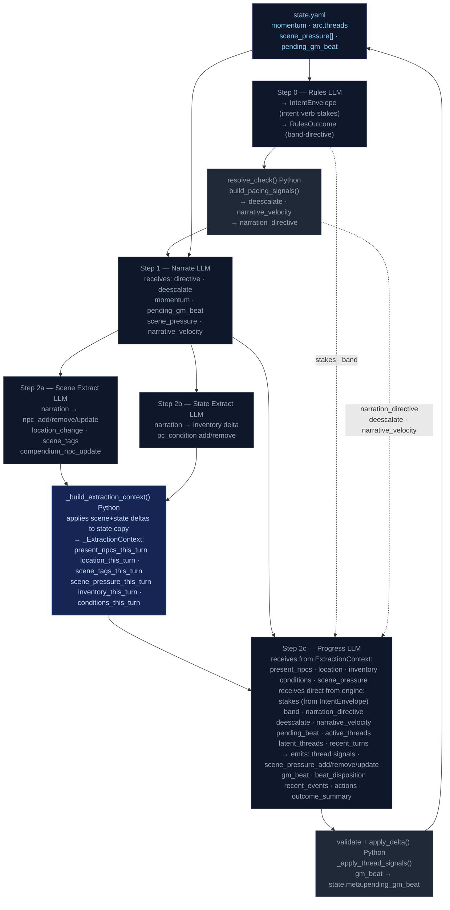
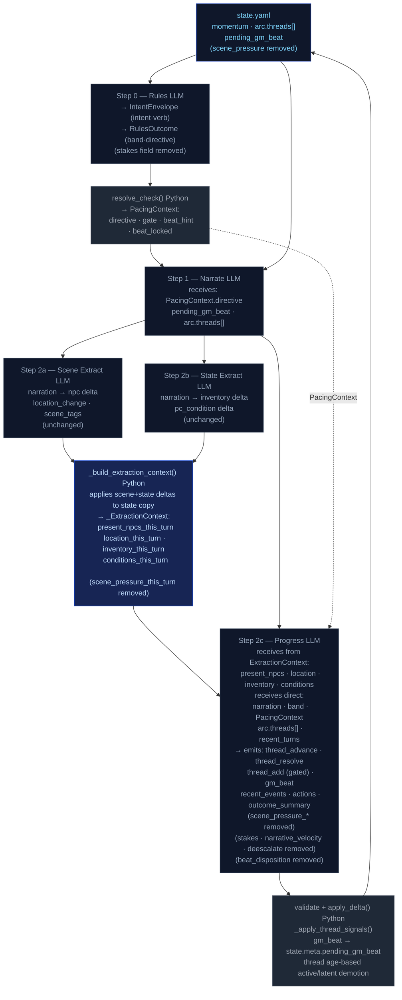

# Narration Simplification Design

## Purpose

This document captures the design decisions made for simplifying the CCYA engine's
narration and extraction pipeline. It is a reference for LLMs producing implementation
plans — not a plan itself. Every decision recorded here is final unless explicitly
reopened.

---

## Current State — What Exists

### Pipeline Overview

Every player turn runs five steps in order:

1. **Step 0 — Rules LLM**: classifies intent, resolves dice, emits `IntentEnvelope`
   (intent, verb, target, stakes, check fields) and `RulesOutcome` (band, directive).
2. **Step 1 — Narrate LLM**: produces prose. Receives the full state plus six separate
   pacing signals: `directive`, `deescalate`, `narrative_velocity`, `momentum`,
   `scene_pressure[]`, `pending_gm_beat`.
3. **Step 2a — Scene Extract LLM**: reads narration, emits NPC and location deltas.
4. **Step 2b — State Extract LLM**: reads narration, emits inventory and condition deltas.
5. **Step 2c — Progress Extract LLM**: reads narration plus `_ExtractionContext` (the
   post-applied scene+state view), emits thread signals, scene pressure lifecycle,
   GM beat, recent events, actions, outcome summary.

After Step 2c, `_build_extraction_context()` has already applied scene and state deltas
to a deep copy of state, and that post-state view is what Progress receives for NPCs,
location, inventory, conditions, and scene pressure.

### Current Data Flow Diagram



### Problems with Current State

- **Two redundant pressure systems**: `scene_pressure[]` (transient, scene-scoped) and
  `arc.threads` (persistent, story-scoped) are managed separately but represent the same
  concept — a named story tension with an urgency and a lifecycle. Progress Extract must
  emit three operations for pressures (`add`, `remove`, `update`) and separate thread
  signals, making its output schema and system prompt significantly larger than necessary.
- **Six independent pacing signals into Progress**: `narration_directive`,
  `narrative_velocity`, `deescalate`, `pending_beat`, `beat_disposition` (output), and
  `quest_threshold_directive` are all computed separately and sent as independent fields.
  An LLM cannot reliably reconcile six competing signals — the directive should be a
  single authoritative value computed in Python.
- **`stakes` is redundant**: `IntentEnvelope.stakes` is a free-text string from the Rules
  LLM describing what's at risk. It flows into Progress to help calibrate failure cost.
  However, the narration already contains the outcome — if the band was FAIL, the narrator
  wrote the failure. Progress reading the narration can observe the cost without Rules
  pre-announcing it. The only case stakes adds signal is if the narrator soft-pedaled a
  severe FAIL, which is a narrator instruction problem, not a stakes problem.
- **`beat_disposition` is an unnecessary output field**: Progress emits `beat_disposition`
  to tell the engine whether the pending beat was consumed or replaced. This can be
  inferred: if Progress emits a `gm_beat`, the old one is replaced; if it emits nothing,
  the beat ages toward expiry; if the beat's `expires_at` turn has passed, the engine
  discards it. No LLM output field needed.
- **`_check_floor_relief()` races with the directive**: The momentum floor relief check
  runs as a separate side-channel that can generate a `breathing_room` beat independently
  of the `narration_directive` computation, creating a conflict when both fire in the same
  turn.

---

## Target State — What It Becomes

### Core Change: Unified `StoryThread`

`scene_pressure[]` and `arc.threads` (active + latent) are merged into a single
`state.arc.threads[]` list. Every thread has a `scope` field:

- `scope: scene` — short-lived, tied to the current scene (replaces `scene_pressure`)
- `scope: arc` — persistent story tension (replaces `arc.active_threads` /
  `arc.latent_threads`)

Both scopes share the same lifecycle: threads are created, advanced, resolved, and aged
by the same Python machinery. The active/latent distinction is preserved implicitly via
an `active: bool` flag driven by Python age rules — it is not stored by the LLM.

Progress Extract emits three unified operations regardless of scope:
- `thread_advance: list[id]`
- `thread_resolve: list[id, resolution_state]`
- `thread_add: StoryThread | null` (gated by `PacingContext.gate`)

### Core Change: Single `PacingContext` Struct

All pacing signals are collapsed into one Python-computed struct passed to both Narrator
and Progress:

```
PacingContext:
  directive: "Breathe" | "Pressure" | "MoveOn" | "Escalate" | ""
  beat_hint: str | None        # type suggestion for the next gm_beat
  beat_locked: bool            # True when floor relief forces breathing_room
  gate: "block_add" | "block_escalate" | "allow"
  summary: str                 # log/debug only, never sent to LLM
```

`beat_locked: True` subsumes `_check_floor_relief()` — the floor relief logic moves
inside `_compute_pacing_context()` and sets this flag rather than running as a separate
side-channel.

The Narrator receives only `PacingContext.directive` and `PacingContext.beat_hint` (when
a beat is pending). Progress receives the full `PacingContext`.

`deescalate`, `narrative_velocity`, and `narration_directive` as separate fields are
removed from all LLM prompts. Their computation remains in Python but feeds into
`PacingContext` as internal inputs, not as prompt variables.

### Target Data Flow Diagram



---

## Decision Table

| Decision | What | Why |
|---|---|---|
| **Remove `stakes`** | Drop `IntentEnvelope.stakes` field and its passage to Progress | Narrator already encodes failure cost in prose; Progress reads narration and band directly |
| **Remove `beat_disposition`** | Drop from `ProgressExtractResult` | Inferable from presence/absence of `gm_beat` output plus turn expiry in Python |
| **Remove `scene_pressure[]`** | Merge into unified `arc.threads[]` with `scope: scene` | Redundant concept; two lifecycles for the same thing doubled the prompt complexity |
| **Remove `active_threads` / `latent_threads` split** | Replace with `active: bool` on unified thread, computed by Python age rules | LLM was labeling urgency unreliably; engine knows actual age |
| **Remove `narrative_velocity` from prompts** | Keep computation in Python, fold into `PacingContext` | Raw float is uninterpretable by LLM; directive derived from it is sufficient |
| **Remove `deescalate` from prompts** | Same as above | Subsumed by `PacingContext.directive` and `PacingContext.gate` |
| **Collapse pacing signals into `PacingContext`** | Single struct replaces six independent fields | LLM cannot reconcile six competing signals; one authoritative directive is better |
| **Move floor relief into `PacingContext`** | `beat_locked: bool` replaces `_check_floor_relief()` side-channel | Eliminates the race condition between directive and floor relief beat generation |
| **Gate `thread_add` via `PacingContext.gate`** | Progress may only add new threads when `gate == "allow"` | Prevents narrative escalation during de-escalation windows |
| **Scene Extract and State Extract unchanged** | Steps 2a and 2b are not modified | They are already minimal and correct; their outputs feed `_ExtractionContext` unchanged |

---

## What Is Removed

| Removed | From | Notes |
|---|---|---|
| `IntentEnvelope.stakes` | `models.py`, `extract_rules_*.j2`, `extract_progress_user.j2`, `turn.py` | Drop field definition, Jinja rendering, and passage into Progress |
| `ProgressExtractResult.beat_disposition` | `models.py`, `extract_progress_system.j2`, `turn.py` | Python infers from `gm_beat` presence + turn expiry |
| `state.scene.scene_pressure[]` | `state.yaml` schema, `models.py` `StateDelta`, `apply_delta()`, `delta.py` | Migrated to `arc.threads[]` with `scope: scene` |
| `ProgressExtractResult.scene_pressure_add/remove/update` | `models.py`, `extract_progress_system.j2`, `extract_progress_user.j2` | Replaced by `thread_advance / thread_resolve / thread_add` |
| `arc.active_threads[]` / `arc.latent_threads[]` split | `state.yaml` schema, `models.py`, `extraction.py` | Replaced by unified `arc.threads[]` with `active: bool` |
| `narrative_velocity` prompt variable | `extract_progress_user.j2`, `extract_narrate_user.j2` (if present) | Computation stays in Python; value folds into `PacingContext` |
| `deescalate` prompt variable | `extract_progress_user.j2`, `extract_narrate_user.j2` | Same as above |
| `narration_directive` as standalone variable | `extract_progress_user.j2`, `extract_narrate_user.j2`, `turn.py` | Becomes `PacingContext.directive`, passed as part of struct |
| `_check_floor_relief()` | `turn.py` or wherever it lives | Logic moves into `_compute_pacing_context()` as `beat_locked` |
| `quest_threshold_directive` | `extract_progress_user.j2` | Subsumed by `PacingContext` |

---

## What Is Unchanged

- **Step 2a (Scene Extract)** — inputs, outputs, and system prompt unchanged.
- **Step 2b (State Extract)** — inputs, outputs, and system prompt unchanged.
- **`_build_extraction_context()`** — logic unchanged except `scene_pressure_this_turn`
  field is removed from `_ExtractionContext` (since `scene_pressure` no longer exists on
  `state.scene`).
- **`_ExtractionContext` structure** — minus the pressure field, the struct is the same.
- **Dice resolution math** — `resolve_check()` formula unchanged.
- **Momentum scalar** — computation and application unchanged; it remains in state and
  feeds `PacingContext` as an input.
- **`pending_gm_beat`** — still stored at `state.meta.pending_gm_beat`, still passed to
  Narrator unchanged, still written by `turn.py` after Progress emits `gm_beat`.
- **Turn expiry on beats** — Python still discards beats past their `expires_at` turn.
- **`_apply_thread_signals()`** — function remains but handles unified threads instead of
  the split lists. Age-based demotion (`active: True → False`) replaces the
  active/latent migration logic.
- **`recent_events` ring buffer** — unchanged.
- **`compendium`** — unchanged.
- **Chronicle / events.jsonl persistence** — unchanged.

---

## Migration Notes for State Files

Existing save files will have `state.scene.scene_pressure[]` and
`state.arc.active_threads[]` / `state.arc.latent_threads[]`. A migration function is
needed:

1. For each entry in `scene_pressure[]`: create a `StoryThread` with
   `scope: scene`, `active: true`, mapping `description → summary`,
   `urgency → urgency`, `tags → tags`, `id → id`.
2. For each entry in `active_threads[]`: create a `StoryThread` with
   `scope: arc`, `active: true`.
3. For each entry in `latent_threads[]`: create a `StoryThread` with
   `scope: arc`, `active: false`.
4. Write the merged list to `state.arc.threads[]`.
5. Remove `state.scene.scene_pressure`, `state.arc.active_threads`,
   `state.arc.latent_threads`.

This migration should be a standalone Python function in `ccya/state/migrate.py` and
called on load if the old keys are detected.

---

## New `StoryThread` Model Shape

```python
class StoryThread(BaseModel):
    id: str
    summary: str
    scope: Literal["scene", "arc"]   # replaces the two collections
    active: bool = True              # False = dormant/latent; set by Python, not LLM
    urgency: Literal["background", "normal", "urgent"] = "normal"
    tags: list[str] = []
    progress: int = 0                # incremented by thread_advance
    last_seen_turn: int | None = None
    added_turn: int | None = None
```

The LLM does not write `active`, `progress`, or `added_turn` — these are Python-managed.

---

## New `PacingContext` Shape

```python
@dataclass
class PacingContext:
    directive: str           # "Breathe" | "Pressure" | "MoveOn" | "Escalate" | ""
    beat_hint: str | None    # suggested gm_beat type, or None
    beat_locked: bool        # True: Progress MUST emit breathing_room beat, gate is force-closed
    gate: str                # "block_add" | "block_escalate" | "allow"
    summary: str             # human-readable log string, never sent to LLM
```

`_compute_pacing_context()` replaces the current scattered pacing functions
(`_compute_narration_directive`, `_compute_narrative_velocity`, `_check_floor_relief`,
`_compute_ages`, `_compute_threat_ages`, `_inject_location_pressure` as it applies to
pressure generation). The inputs are: `momentum`, `consecutive_floor_turns`,
`consecutive_ceil_turns`, `thread_ages`, `location_age`, `avoidance_score`.

---

## Progress Extract Output Schema (After)

Fields removed from `ProgressExtractResult`:

```
scene_pressure_add       ← removed
scene_pressure_remove    ← removed
scene_pressure_update    ← removed
beat_disposition         ← removed
candidate_opportunity    ← removed (rolled into thread_add)
advanced_threads         ← removed (replaced by thread_advance)
```

Fields added:

```
thread_advance: list[str]                   # ids of threads to increment progress
thread_resolve: list[ThreadResolution]      # id + resolution_state
thread_add: StoryThread | None              # new thread, null if gate != "allow"
```

Fields unchanged:

```
gm_beat
recent_events_add / recent_events_update / recent_events_remove
actions
outcome_summary
```

---

## Prompt Token Impact (Estimated)

The Progress Extract system prompt currently contains sections for:
- Scene pressure lifecycle instructions (add/remove/update semantics)
- `beat_disposition` semantics
- `narrative_velocity` interpretation
- `deescalate` interpretation
- `stakes` usage
- Active vs. latent thread distinction
- `advanced_threads` free-string format
- `candidate_opportunity` format

All of these are removed or replaced by the simpler unified thread instructions and
`PacingContext` description. Estimated reduction: 300–500 tokens from the system prompt,
plus removal of ~5 variables from the user prompt template.

---

## Context for Implementing LLMs

- **Read `ccya/engine/extraction.py`** in full before starting. The
  `_extract_progress_messages()` function and `_build_extraction_context()` are the
  primary touch points.
- **Read `ccya/engine/turn.py`** for where pacing signals are computed and passed. The
  pacing signal computation is scattered here; `_compute_pacing_context()` consolidates
  it.
- **Read `ccya/models.py`** for `ProgressExtractResult`, `ScenePressure`,
  `IntentEnvelope`, and the arc thread models. All schema changes originate here.
- **Read `ccya/state/delta.py` and `apply_delta()`** for how `scene_pressure_add/remove`
  currently mutates state — this logic is removed and replaced by thread signal
  application.
- **Read `docs/REPOMAP/`** files for the modules being touched before writing any code.
- **Jinja templates live in `ccya/engine/templates/`**. The templates to modify are
  `extract_progress_system.j2`, `extract_progress_user.j2`, and
  `extract_narrate_user.j2`. Scene and state templates are untouched.
- **Do not modify Step 0 (Rules) system prompt** beyond removing the `stakes` field from
  the output schema definition.
- **The `_ExtractionContext` dataclass** in `extraction.py` loses only
  `scene_pressure_this_turn`. All other fields remain and are passed to Progress
  identically.
- Type hints are required on all new functions per AGENTS.md.
- Structured logging with `turn`, `trace_id` context keys on any new pipeline code.
- `make check && make test` must pass as final validation.
