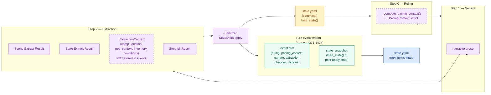

# State Reference — Events, Snapshots, and Internal Contexts

This document catalogs every state object that appears in the CCYA pipeline:
where it's captured, what it represents (pre-turn / post-turn / internal),
and which checkers consume it.

## TL;DR — Which state to use when

| You want to check… | Use this field | Because… |
|---|---|---|
| What the game state looked like AFTER a turn completed | `event["state_snapshot"]` | Full persisted state at end of turn |
| What pacing directive/phase was active DURING the turn | `event["pacing_context"]` | Computed in Step 0, used by Steps 1–2c |
| What the storyteller LLM saw (NPCs/inventory/conditions after deltas) | `extraction.storytell.rendered_user` | Full prompt; `extraction_context` is NOT stored separately |
| What the sanitizer actually changed | `event["changes"]` or `kind:"sanitizer"` events | Post-sanitizer delta |
| What the narrator prose said | `event["narrate"]["prose"]` | Rendered prose output |
| What the ruling said | `event["ruling"]` | Intent + dice outcome |

## State Types

### 1. `state_snapshot` (event field)

**Where:** `engine/turn.py:1423` — captured AFTER all turn processing (ruling, narrate, extract, sanitizer, apply_delta).

**When:** Post-turn. This is the canonical persisted state at the end of the turn.

**Contents:** Full `state.yaml` structure — `arc`, `pc`, `inventory`, `location`, `scene`, `meta`, `compendium`, `world_state`, etc.

**Used by checkers:** `arc_resolution_validity`, `thread_resolution_validity`, `thread_lifecycle`, `arc_goal_updates`, `goal_update_validity`, `beat_narrative_chain`, `npc_presence`, `inventory_integrity`, `conditions_lifecycle`, `compendium_lifecycle`

**⚠️ Critical gotcha:** Because `state_snapshot` is captured post-turn, any thread/arc resolution that happened during the turn is already reflected in it. Checkers that validate `arc_resolve.drop_threads` or `thread_resolve` IDs must compare against the **previous** turn's `state_snapshot` (pre-resolution state), not the current turn's. See the checker fix in commit `677258e` for the pattern.

**Example:**
```python
# WRONG: comparing arc_resolve against current turn's state_snapshot
# (threads already moved to completed_threads)
snap = extract_field(ev, "state_snapshot")

# CORRECT: track previous turn's snapshot
prev_snap = None
for ev in events:
    prev_for_this = prev_snap
    if "state_snapshot" in ev:
        prev_snap = ev["state_snapshot"]
    # now prev_for_this holds pre-resolution state
```

### 2. `pacing_context` (event field)

**Where:** `engine/turn.py:1381-1391` — stored in the event record during turn processing.

**When:** Computed in Step 0 (`_compute_pacing_context()` at `turn.py:441-486`) after the phase engine runs, before narrate/storytell. Stored in the event as a serialized dict.

**Contents:**
```python
{
    "directive": str,              # Phase-driven priority: "Scene Imperative" | "Scene Pressure" | ""
    "outcome_hint": str | None,    # "hold" | "advance" | "transition"
    "spiral_detected": bool,       # Set by detect_spiral() from recent roll history
    "summary": str,                # Human-readable pacing log
    "scene_phase": str,            # SETUP | RISING | CLIMAX | RESOLUTION | BREATHER
    "climax_turn_count": int,      # Turns spent in CLIMAX
    "breather_turn_count": int,    # Turns spent in BREATHER
    "convergence_score": int,      # 0-5, for RISING→CLIMAX transition
    "convergence_components": dict, # Breakdown of convergence score
}
```

**Used by checkers:** `phase_transition`, `climax_turn_counting`, `breather_enforcement`, `beat_phase_validity`, `pacing_directives`

**Note:** The internal `PacingContext` dataclass (used during the pipeline) has the same fields but is NOT stored separately in events. Only the serialized dict in `event["pacing_context"]` is available to checkers.

### 3. `extraction_context` (INTERNAL ONLY — NOT in events)

**Where:** `engine/extraction.py:648` — built by `_build_extraction_context()` during Step 2c (Storytell).

**When:** Internal to the extraction pipeline. Used to build the storyteller LLM prompt. NOT stored in events.

**Contents:**
```python
@dataclass
class _ExtractionContext:
    comp_this_turn: dict[str, Any]       # Post-delta compendium.npcs
    location_this_turn: dict[str, Any]   # Location after location_change
    npc_context: list[dict[str, Any]]    # NPC psychological context for storytell
    inventory_this_turn: list[dict]      # Inventory after inventory deltas
    conditions_this_turn: list[dict]     # PC conditions after condition deltas
```

**How checkers access it:** They don't — it's not in events. Checkers that need this data must either:
- Parse `extraction.storytell.rendered_user` (the full storyteller prompt, which includes the extraction context)
- Use `applied.*` fields from the event (which reflect what was actually applied)
- Use `state_snapshot` (which reflects post-turn state)

**⚠️ Known issue:** Several checkers reference `event.get("extraction_context")` in their `requires_fields` or documentation, but this field is never written to events. Checkers that need extraction context data should use `applied.*` or `state_snapshot` instead. See `ev/compat.py` for detection of this issue.

### 4. `changes` (event field)

**Where:** `engine/turn.py:1371-1419` — the `changes` dict is built by the sanitizer and included in the event.

**When:** Post-sanitizer. Reflects what the sanitizer actually changed.

**Contents:**
```python
{
    "inventory": [...],       # Inventory changes
    "player": [...],          # Player state changes (location_changed, etc.)
    "facts": [...],           # Fact changes
    "threads": [...],         # Thread operations (updated/added/resolved)
}
```

**Used by checkers:** `sanitizer_lifecycle` (also reads separate `kind:"sanitizer"` events), `conditions_lifecycle`, `inventory_integrity`

### 5. Sanitizer events (`kind: "sanitizer"`)

**Where:** `engine/thread_sanitizer.py:100-127` — separate event appended after the turn event.

**When:** After the turn event. Contains detailed sanitizer metrics and change breakdown.

**Contents:**
```python
{
    "kind": "sanitizer",
    "turn": int,
    "trace_id": str,
    "ms": float,
    "tokens_in": int,
    "tokens_out": int,
    "threads_updated": [str],
    "threads_resolved": [str],
    "threads_added": [str],
    "goal_changed": bool,
    "changes_detail": {
        "updated": dict,
        "resolved": list,
        "added": list,
        "goal": {"before": str, "after": str},
    },
}
```

**Used by checkers:** `sanitizer_lifecycle`

### 6. `extraction` (event field)

**Where:** `engine/extraction.py:600-760` — built during the extraction pipeline.

**When:** Post-extraction. Contains all three extraction stream results.

**Contents:**
```python
{
    "scene": {
        "rendered_system": str,
        "rendered_user": str,
        "output": SceneExtractResult,
        "skipped": bool,
        "attempts": int,
        "tokens_in": int,
        "tokens_out": int,
        "ms": float,
    },
    "state": { ... },          # Same structure as scene
    "storytell": { ... },      # Same structure; output is StorytellerResult
}
```

**Used by checkers:** `thread_lifecycle`, `arc_goal_updates`, `arc_resolution_validity`, `thread_resolution_validity`, `new_thread_validity`, `goal_update_validity`, `beat_phase_validity`, `pacing_directives`

### 7. `ruling` (event field)

**Where:** `engine/turn.py:1380` — stored during Step 0.

**When:** Post-ruling (Step 0).

**Contents:** `IntentEnvelope` + `RulesOutcome` — intent, check details, dice roll, band, directive, intent_verb, impossible flag.

**Used by checkers:** `roll_band_consistency`, `directive_tone_match`

### 8. `narrate` (event field)

**Where:** `engine/turn.py:1400` — stored during Step 1.

**When:** Post-narration (Step 1).

**Contents:** `{"prose": str, ...metrics}`

**Used by checkers:** `directive_tone_match`, `beat_narrative_chain`, `state_fidelity`

## State Lifecycle Diagram



## Checker State Selection Guide

When writing or debugging a checker, ask:

1. **Am I checking what the LLM decided?** → Use `extraction.*.output`
2. **Am I checking what actually happened to the game state?** → Use `state_snapshot` (but remember: post-turn!)
3. **Am I checking what the sanitizer changed?** → Use `changes` or `kind:"sanitizer"` events
4. **Am I checking pacing/phase behavior?** → Use `pacing_context`
5. **Am I checking what the LLM saw in its prompt?** → Parse `extraction.*.rendered_user`

### Common checker bugs

| Bug | Cause | Fix |
|---|---|---|
| Comparing `arc_resolve.drop_threads` against current turn's `state_snapshot` | Threads already moved to `completed_threads` by post-turn snapshot | Compare against previous turn's `state_snapshot` |
| Comparing `thread_resolve` IDs against current turn's `state_snapshot` | Same as above | Compare against previous turn's `state_snapshot` |
| Checking `extraction_context` field in events | Field never written to events | Parse `extraction.storytell.rendered_user` or use `applied.*` |
| Substring matching removed directives | Narration text contains word variants ("Overwhelm" vs "overwhelmed") | Use regex word boundaries (`\bOverwhelm\b`) |
