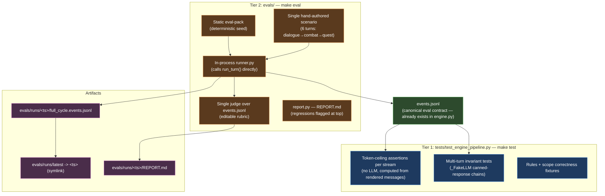

# Eval Harness

Two-tier system. **Tier 1** stays inside `tests/` and runs under `make test` — engine
integration tests (mocked LLM, deterministic, CI-safe). **Tier 2** lives under `evals/`
and runs under `make eval` — live-LLM qualitative pipeline (in-process, single judge,
single scenario in v1).

The original v1 plan conflated these. This redesign separates them by name and by
file layout to prevent that confusion from coming back.

---

## Architecture



---

## File layout (target end-state)

```
ccya/
├── eval/                          # NEW — eval module under existing package
│   ├── __init__.py
│   ├── config.py                  # EvalConfig dataclass + load_eval_config()
│   ├── scenario.py                # Scenario / Turn dataclasses + loader
│   ├── runner.py                  # In-process driver: run_scenario() via run_turn()
│   ├── judge.py                   # Single judge over events.jsonl
│   ├── report.py                  # REPORT.md generator with regression flagging
│   └── cli.py                     # `python -m ccya.eval` entrypoint
└── ...

evals/                             # NEW — sibling of tests/, packs/
├── config.yaml                    # Eval-specific config
├── packs/
│   └── eval-pack/                 # Static, deterministic, exercises edge cases
│       ├── pack.yaml
│       ├── seed_state.yaml
│       ├── opening_scene.md
│       ├── style.md
│       └── extract_examples.yaml
├── scenarios/
│   └── full_cycle.py              # Hand-authored 6-turn scenario
├── rubrics/
│   └── default.md                 # Single-judge rubric (editable)
└── runs/                          # gitignored — eval outputs
    ├── latest -> <ts>/            # symlink updated each run
    └── <ts>/
        ├── full_cycle.events.jsonl
        ├── full_cycle.run.json
        └── REPORT.md

tests/
└── test_engine_pipeline.py        # NEW — engine integration tests
                                   # (token ceilings, multi-turn invariants, rules/scope)

ccya/.gitignore                    # NEW — ignores evals/runs/ and /tmp/ccya-eval

Makefile                           # UPDATED — adds eval, eval-fast, eval-judge-only, eval-pack
```

---

## Master rules — applies to all phases

1. **Execute. Do not replan.** Each phase file gives full code, exact paths, exact
   verification steps. If something looks ambiguous, re-read the phase file before
   inventing a solution.
2. **`apply_delta` is the only write path to state.** Never mutate state directly
   in the runner or eval code. The runner calls `run_turn()`; `run_turn()` uses
   `apply_delta()`.
3. **Never touch `saves/default/`.** Every eval run writes to a temp save-dir under
   `evals/runs/<ts>/save/` (or `/tmp/ccya-eval/<ts>/`). The user's real game must
   remain untouched across runs.
4. **`events.jsonl` is the canonical eval data source.** Do not invent a new schema
   for "phase records" or duplicate event content. The runner copies the engine's
   `events.jsonl` verbatim into the run directory.
5. **No backwards compatibility for in-progress phases.** If a later phase needs to
   change something an earlier phase wrote, change it cleanly. There are no v1 evals
   in the wild yet.
6. **Stop at the STOP HERE marker.** Each phase ends with verification + a handoff
   block describing what the next chat session will start from. The agent must stop,
   confirm verification passed, and hand off — not continue into the next phase
   unprompted.
7. **Read only what the phase file lists.** Don't load `engine.py` (2200 lines) into
   context unless the phase explicitly asks for it. Phase files name the exact files
   and line ranges needed.

---

## Phase index

Each phase is independently executable in a fresh chat session. Run them in order
1 → 7. Each phase file lists its prerequisites, exact files to read, exact code to
write, and a verification checklist. Estimated context usage assumes a 30B model
with 50-80K window.

| Phase | File | What it produces | Est. context |
|---|---|---|---|
| 1 | `eval-harness/01-foundations.md` | `evals/config.yaml`, `ccya/eval/{__init__,config,scenario}.py`, `ccya/.gitignore` | ~25K |
| 2 | `eval-harness/02-eval-pack.md` | `evals/packs/eval-pack/{pack.yaml,seed_state.yaml,opening_scene.md,style.md,extract_examples.yaml}` | ~40K |
| 3 | `eval-harness/03-runner.md` | `ccya/eval/runner.py` | ~45K |
| 4 | `eval-harness/04-report.md` | `ccya/eval/report.py` | ~30K |
| 5 | `eval-harness/05-judge.md` | `ccya/eval/judge.py`, `evals/rubrics/default.md` | ~25K |
| 6 | `eval-harness/06-cli-and-makefile.md` | `ccya/eval/cli.py`, `evals/scenarios/full_cycle.py`, `Makefile` updates | ~25K |
| 7 | `eval-harness/07-engine-pipeline-tests.md` | `tests/test_engine_pipeline.py` | ~50K |

---

## Decisions locked in (do not revisit)

- **Driver:** in-process `run_turn()`. No FastAPI/SSE in eval path.
- **LLM:** real mlx-lm at `:8080`. Production temps by default; `--temp 0` flag for
  greedy/deterministic mode.
- **Cache:** none in v1. Cascade invalidation defeats it for prompt iteration; revisit
  if frequent unchanged re-runs become a workflow.
- **Judge:** single, single LLM call after pipeline finishes, rubric in editable file
  `evals/rubrics/default.md`. Judge model defaults to engine model; configurable.
- **Scenario count v1:** one — `full_cycle` (6 turns, dialogue → combat → quest
  progression). Hand-authored player commands.
- **Pack:** static `eval-pack` is the default; `--pack <id>` lets you point at any
  pack under `packs/` or `evals/packs/`.
- **Output:** `evals/runs/<ts>/` per run; `evals/runs/latest` symlink for jq
  convenience; gitignored. Always exit 0; report flags regressions at the top.
- **Token regression thresholds:** warn at +10%, fail-flag at +25% per stream vs the
  prior `evals/runs/latest`.
- **Baselines (committed snapshots):** out of scope for v1. Future enhancement.

---

## Out of scope for this plan

- Response cache / replay
- Per-stream judges, ensemble judges
- Committed baselines for PR-time diff
- Multiple scenarios beyond `full_cycle`
- Token regression as a CI gate (always exit 0 in v1)
- Cross-pack evals (works via `--pack` flag but no automated suite)

---

## How to start

Open `eval-harness/01-foundations.md` in a fresh chat. Follow it to completion,
verify, then start a new chat with `eval-harness/02-eval-pack.md`. Repeat through
phase 7.
