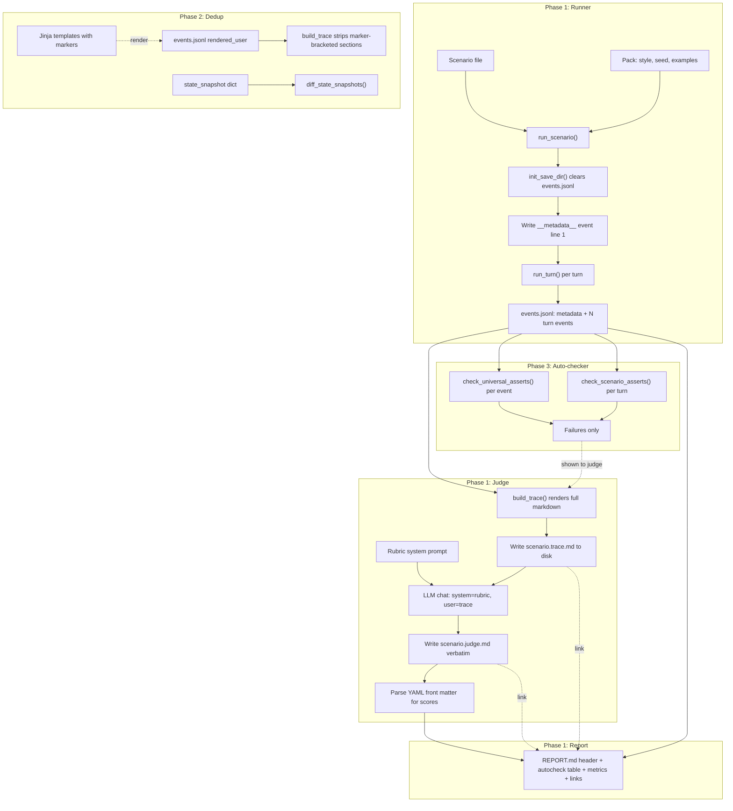
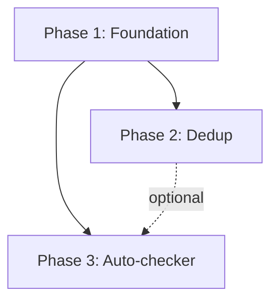

# Eval Engine Rewrite — Full Implementation Spec

## Why this exists

The current eval harness in [ccya/ccya/eval/](ccya/ccya/eval/) has three problems:

1. **Trace is missing what the rubric promises.** [ccya/evals/rubrics/default.md](ccya/evals/rubrics/default.md) tells the judge it will see the world pack style, seed state, engine constants, the 5 system prompts (once), and per-turn user prompts + outputs + state snapshot. The actual `build_trace()` in [ccya/ccya/eval/judge.py](ccya/ccya/eval/judge.py) only emits `constants_block()` plus per-turn output snippets truncated to 800 chars (narration) or 300 chars (extractor outputs). The data exists in `events.jsonl` (`rendered_system`, `rendered_user`, `output` per stream) but is never read.
2. **JSON output schema is too restrictive AND mostly thrown away.** The rubric specifies a deep JSON shape with `mechanical_score`, `narrative_score`, per-pipeline blocks, narrative criteria, etc. `parse_judge_response()` only extracts `overall_score`, `findings`, `comments`, `narrative_recap`, `remediation`. The report shows `Mechanical: ?/5` because the report renderer reads attributes the judge never populates.
3. **Stale plan / failing tests.** [ccya/docs/plans/eval-judge-fixes.md](ccya/docs/plans/eval-judge-fixes.md) and the REPOMAP doc describe the new behavior, and tests in [ccya/tests/test_eval.py](ccya/tests/test_eval.py) (lines 549–694) already test for `_render_static_context`, `__metadata__` events, etc. The plan was never implemented; the tests fail today.

## Decisions locked in

These are NOT to be revisited by the implementer. They are the user's explicit choices.

- **No backward compatibility.** Rip out everything no longer needed. No legacy code paths, no "deprecated" markers.
- **Output flow.** Run dir contains, in addition to the existing `events.jsonl`/`state.yaml`/`run.json`: `<scenario>.trace.md` (exact bytes the judge saw as user message), `<scenario>.judge.md` (exact bytes the judge returned), `REPORT.md` (deterministic header + auto-checker table + token-metrics table + links to trace.md/judge.md).
- **Markdown output, no JSON.** Judge writes a markdown file with a YAML front matter block at the top for scores; the body is structured markdown with required H2/H3 sections.
- **Static context source.** Runner writes a synthetic `__metadata__` event as the FIRST line of `events.jsonl`, containing pack id, pack style text, seed state, and engine constants. System prompts come from turn 1's `rendered_system` fields (already in events.jsonl). Self-contained: events.jsonl + rubric is enough to re-judge any run.
- **Single artifact for the judge's input.** `trace.md` is rendered in full, written to disk before the judge call, and is the EXACT user message bytes sent. No transformation between disk and wire.
- **Auto-checker visibility.** Show only auto-checker FAILURES (with detail) in the trace under a clearly labeled section. Show unopinionated metrics (token counts, parse failures, retries) in a separate metrics section.
- **Dedup mechanism.** In-template HTML-comment markers (`{# trace:immutable_start #}` … `{# trace:immutable_end #}`). `build_trace` strips marker pairs in the per-turn user prompts. Engine sees full text; only the eval trace is deduped. Missing markers degrade gracefully.
- **State diffs.** Turn 1: full snapshot (already in metadata.seed_state). Turns 2..N-1: diff vs previous (full entry on add/remove/change, never just IDs). Turn N: full snapshot.
- **Recent_turns / chronicle dedup.** OUT OF SCOPE. The user is fixing duplication between recent_turns and chronicle in the engine compactor separately.
- **Truncation.** Default OFF. Configurable in `evals/config.yaml`. Order if ever enabled (NOT implemented now, but leave knobs for future): chronicle text in state_snapshot → narration → compendium NPC bios → repeated user-prompt boilerplate.
- **YAML front matter scoring schema.** `mechanical_score: int 1-5`, `narrative_score: int 1-5`, `pipeline_scores: { rules, narrate, extract_scene, extract_state, extract_progress } (each int 1-5)`. Rest of judge output is markdown body.
- **Rubric file location.** Single file at [ccya/evals/rubrics/default.md](ccya/evals/rubrics/default.md). Contains analysis instructions + section criteria + output-format spec.

## Architecture diagram



---

# PHASE 1 — Foundation: trace.md + new build_trace + rubric rewrite + judge.md + report.py rewrite

## Phase 1 background (read this even if no prior context)

You're rewriting the LLM-judge layer of the ccya eval harness end-to-end. The existing layer has the trace builder emitting only output snippets truncated to 800/300 chars; the rubric demanding a deep JSON output that the parser mostly throws away; and the report rendering attributes the judge never populates. This phase replaces all of that atomically with: (a) a full structured-markdown trace including system prompts and seed state once, all user prompts per turn, all outputs uncompressed, state snapshots; (b) a rubric that instructs the judge to emit YAML front matter + structured markdown (no JSON); (c) judge code that saves the response verbatim and parses only the front matter; (d) a report that renders deterministic header + auto-checker table + links to trace.md/judge.md.

No backward compatibility. Delete dead code rather than guarding it.

## Phase 1 goals

1. Runner writes a synthetic `__metadata__` event as the FIRST line of `<save_dir>/events.jsonl` immediately after `init_save_dir()`, containing pack id, pack style text, seed state dict, engine constants dict.
2. `build_trace(events: list[dict]) -> str` produces a full structured markdown string with: static context block (pack style, seed state, engine constants, 5 system prompts pulled from turn 1 of events) once at top, then per-turn blocks (user prompts, outputs, state snapshot, applied/rejected deltas, scope, telemetry).
3. `run_judge()` writes `<output_dir>/<scenario_id>.trace.md` BEFORE calling the LLM (so a crash leaves the input on disk), passes the trace as the user message, writes `<output_dir>/<scenario_id>.judge.md` verbatim with the response, and parses ONLY the YAML front matter for scores.
4. The rubric is rewritten to instruct the judge to emit a YAML front matter block + structured markdown body (per-pipeline H3 sections, narrative-criteria H3 sections, auto-checker H2, additional observations H2, verdict H2).
5. `report.py` is rewritten to use the new `JudgeResult` shape, deterministic header + autocheck table + token table + links to trace.md/judge.md. Score-regression detection reads the prior run's `judge.md` front matter via a small parser.
6. All dead JSON-parsing helpers, truncation constants, `max_input_chars`, etc. are deleted. No commented-out code.

## Phase 1 — files to read first (before changing anything)

Read these in order — they are the entire surface area for this phase:

- [ccya/ccya/eval/runner.py](ccya/ccya/eval/runner.py) — lines 1-200 (engine config, helpers), 410-580 (run_scenario, where metadata event will be written and where current trace artifacts are copied)
- [ccya/ccya/eval/judge.py](ccya/ccya/eval/judge.py) — entire file (340 lines). This file gets the most rewrite.
- [ccya/ccya/eval/report.py](ccya/ccya/eval/report.py) — entire file (635 lines). Significant rewrite.
- [ccya/ccya/eval/config.py](ccya/ccya/eval/config.py) — entire file. Drop `max_input_chars` and `context_economy_warn_tokens` from `JudgeConfig`.
- [ccya/ccya/eval/__init__.py](ccya/ccya/eval/__init__.py) — exports list to clean up.
- [ccya/ccya/eval/cli.py](ccya/ccya/eval/cli.py) — `_cmd_pack()` prints config keys; remove dropped ones.
- [ccya/ccya/eval/engine_mirror.py](ccya/ccya/eval/engine_mirror.py) — `constants_block()` already exists; will be reused.
- [ccya/evals/rubrics/default.md](ccya/evals/rubrics/default.md) — entire file. Rewrite.
- [ccya/evals/config.yaml](ccya/evals/config.yaml) — drop `max_input_chars`, `context_economy_warn_tokens`.
- [ccya/tests/test_eval.py](ccya/tests/test_eval.py) — entire file. Big test changes.
- [ccya/ccya/state/chronicle.py](ccya/ccya/state/chronicle.py) — `append_event()` is here; reuse for metadata event.
- [ccya/ccya/state/io.py](ccya/ccya/state/io.py) — `init_save_dir()` clears events.jsonl on line 169; metadata event must be written after this.
- [ccya/ccya/pack.py](ccya/ccya/pack.py) — `Pack` model has `style_text` (line 209) and `seed: SeedState | None` (line 212). `seed.model_dump()` gives a dict matching the seed_state.yaml shape.
- [ccya/ccya/engine/turn.py](ccya/ccya/engine/turn.py) — lines 526-578 show what fields are written per turn event. `rules_prompt`, `narrate_prompt`, `extraction.{scene,state,progress}` each have `rendered_system`, `rendered_user`, `output`.

A real per-turn event from a recent run has these top-level keys (confirmed):
`ts`, `trace_id`, `turn`, `input`, `applied`, `rejected`, `actions`, `scene_tags`, `rules`, `narrate`, `extract`, `extraction`, `changes`, `failed`, `rules_prompt`, `narrate_prompt`.

`rules_prompt` and `narrate_prompt` each have `rendered_system`, `rendered_user`, `output`, `context_meta`. Each `extraction.{scene|state|progress}` dict has `rendered_system`, `rendered_user`, `output` (output is a dict, not a string), `skipped`, `attempts`, `retry_errors`, `tokens_in`, `tokens_out`, `ms`, `context_meta`. When skipped, only `skipped`, `tokens_in`, `tokens_out`, `ms`, `attempts`, `retry_errors` are present.

## Phase 1 — concrete changes

### 1.1 Runner: write metadata event after `init_save_dir`

In [ccya/ccya/eval/runner.py](ccya/ccya/eval/runner.py), inside `run_scenario()` after the call to `_patch_eval_pack_starting_state(...)` (around line 458) and BEFORE `engine_config = _build_engine_config(eval_cfg)` (line 460), insert:

```python
from ccya.eval.engine_mirror import (
    PRESSURE_BUILDING_AT, PRESSURE_IMMEDIATE_AT, PRESSURE_MAX_AGE,
    URGENCY_LEVELS, MOMENTUM_MIN, MOMENTUM_MAX, MOMENTUM_DELTA,
)
from ccya.state.chronicle import append_event

metadata_event = {
    "__metadata__": True,
    "pack_id": pack.manifest.id,
    "pack_name": pack.manifest.name,
    "pack_style": pack.style_text,
    "seed_state": pack.seed.model_dump(),
    "engine_constants": {
        "pressure_building_at": PRESSURE_BUILDING_AT,
        "pressure_immediate_at": PRESSURE_IMMEDIATE_AT,
        "pressure_max_age": PRESSURE_MAX_AGE,
        "urgency_levels": list(URGENCY_LEVELS),
        "momentum_min": MOMENTUM_MIN,
        "momentum_max": MOMENTUM_MAX,
        "momentum_delta": dict(MOMENTUM_DELTA),
    },
    "scenario_id": scenario.id,
    "scenario_description": scenario.description,
}
append_event(save_dir, metadata_event)
```

This appends to `events.jsonl` which `init_save_dir()` just cleared (see [ccya/ccya/state/io.py](ccya/ccya/state/io.py) line 169). The metadata event becomes line 1.

### 1.2 Runner: skip metadata event when running auto-checker

In `run_scenario()` around line 524 (`events = [json.loads(ln) for ln in events_lines if ln.strip()]`), update to filter out the metadata event before iterating:

```python
events_lines = src_events.read_text().splitlines()
all_events = [json.loads(ln) for ln in events_lines if ln.strip()]
turn_events = [e for e in all_events if not e.get("__metadata__")]
```

Use `turn_events` everywhere downstream in this function instead of `events`. Then in `_extract_parse_failures(events)` and the assert-checking loop, pass `turn_events`.

### 1.3 Runner: also propagate `state_snapshots` into events for the auto-checker

This already happens around line 535. Keep it but apply to `turn_events` only. The `state_snap` for turn N goes into `turn_events[N-1]["state_snapshot"]` as already done.

### 1.4 Runner: write `<scenario_id>.trace.md` and `<scenario_id>.judge.md` paths into RunResult

Add two new fields to `RunResult` dataclass (around line 70):

```python
@dataclass
class RunResult:
    scenario_id: str
    pack: str
    model: str
    temperature_override: float | None
    started_at: str
    finished_at: str
    save_dir: str
    output_dir: str
    events_jsonl_path: str
    state_yaml_path: str
    trace_md_path: str = ""   # NEW: filled in by judge.run_judge
    judge_md_path: str = ""   # NEW: filled in by judge.run_judge
    turns: list[TurnRecord] = field(default_factory=list)
    total_errors: int = 0
```

Update `find_previous_run` and `load_run_result` — `load_run_result` already filters by `known_fields`, so it will gracefully tolerate the new fields.

### 1.5 Runner: drop dead helpers

Delete `_extract_parse_failures` IF unused after this phase (keep it; report.py still wants per-turn parse failure counts on `TurnRecord`). Check; if still used, leave it.

### 1.6 Judge: full rewrite

Rewrite [ccya/ccya/eval/judge.py](ccya/ccya/eval/judge.py) entirely. Skeleton below — implementer fills in helper bodies.

```python
"""Single LLM judge over events.jsonl.

Renders a full structured-markdown trace containing static context (pack
style, seed state, engine constants, 5 system prompts) once at the top,
then per-turn blocks (user prompts, outputs, state, applied/rejected,
scope, telemetry). Saves trace.md to disk before the LLM call, and the
raw judge response to judge.md after. Parses only the YAML front matter
of the response for scores.
"""

from __future__ import annotations

import json
import logging
import re
from dataclasses import dataclass, field
from pathlib import Path
from typing import Any

import yaml

from ccya.eval.config import EvalConfig
from ccya.eval.engine_mirror import constants_block
from ccya.llm_client import chat, strip_thinking
from ccya.models import load_config

_log = logging.getLogger("ccya.eval")

REPO_ROOT = Path(__file__).resolve().parent.parent.parent


@dataclass
class JudgeResult:
    """Structured result of one judge invocation.

    `body_md` is the raw markdown the judge returned (front matter stripped).
    `scores` is the parsed front matter dict. Missing scores are None.
    """
    raw_response: str
    body_md: str
    scores: dict[str, Any]
    rubric_path: str
    model: str
    trace_md_path: str = ""
    judge_md_path: str = ""
    previous_scores: dict[str, Any] | None = None


# ---------------------------------------------------------------------------
# Trace builder
# ---------------------------------------------------------------------------


def build_trace(events: list[dict[str, Any]]) -> str:
    """Render the full markdown trace sent to the judge as the user message.

    Expects events[0] to be a metadata event ({"__metadata__": True, ...}).
    If absent, the static context block falls back to engine constants only.
    Subsequent events are per-turn events with rendered_system, rendered_user,
    output for rules, narrate, and each extraction stream.

    No truncation. No size enforcement. Caller is responsible for choosing
    a judge model with adequate context.
    """
    metadata, turn_events = _split_metadata(events)
    parts: list[str] = []
    parts.append(_render_static_context(metadata, turn_events))
    for ev in turn_events:
        parts.append(_render_turn_context(ev))
    return "\n".join(parts)


def _split_metadata(events: list[dict[str, Any]]) -> tuple[dict[str, Any] | None, list[dict[str, Any]]]:
    if events and events[0].get("__metadata__"):
        return events[0], events[1:]
    return None, list(events)


def _render_static_context(metadata: dict[str, Any] | None, turn_events: list[dict[str, Any]]) -> str:
    """Render: World Pack Style, Seed State, Engine Constants, 5 System Prompts.

    If metadata is None: render only constants_block().
    System prompts come from turn_events[0]'s rendered_system fields. If turn 1
    is a retry-only turn (rules_prompt empty), pull from the first turn that
    has the field populated.
    """
    sections: list[str] = []
    if metadata is not None:
        sections.append("# Static Context (immutable across all turns)\n")
        sections.append("## World Pack Style\n")
        sections.append("```\n" + (metadata.get("pack_style") or "(none)") + "\n```\n")
        sections.append("## Seed State\n")
        sections.append("```json\n" + json.dumps(metadata.get("seed_state") or {}, indent=2, default=str) + "\n```\n")
        sections.append("## Engine Constants\n")
        sections.append("```json\n" + json.dumps(metadata.get("engine_constants") or {}, indent=2) + "\n```\n")
    else:
        sections.append("# Static Context\n")
        sections.append(constants_block())

    sections.append("## System Prompts (from turn 1 — identical every turn)\n")
    sys_prompts = _collect_system_prompts(turn_events)
    for label, key in [
        ("Rules System Prompt", "rules"),
        ("Narrate System Prompt", "narrate"),
        ("Extract Scene System Prompt", "extract_scene"),
        ("Extract State System Prompt", "extract_state"),
        ("Extract Progress System Prompt", "extract_progress"),
    ]:
        sections.append(f"### {label}\n")
        sections.append("```\n" + (sys_prompts.get(key) or "(not captured this run)") + "\n```\n")

    return "\n".join(sections)


def _collect_system_prompts(turn_events: list[dict[str, Any]]) -> dict[str, str]:
    """Find the first event with each rendered_system populated.

    Returns dict with keys: rules, narrate, extract_scene, extract_state, extract_progress.
    """
    out: dict[str, str] = {}
    for ev in turn_events:
        if "rules" not in out:
            v = (ev.get("rules_prompt") or {}).get("rendered_system")
            if v:
                out["rules"] = v
        if "narrate" not in out:
            v = (ev.get("narrate_prompt") or {}).get("rendered_system")
            if v:
                out["narrate"] = v
        ext = ev.get("extraction") or {}
        for stream_key, out_key in [("scene", "extract_scene"), ("state", "extract_state"), ("progress", "extract_progress")]:
            if out_key not in out:
                v = (ext.get(stream_key) or {}).get("rendered_system")
                if v:
                    out[out_key] = v
        if all(k in out for k in ("rules", "narrate", "extract_scene", "extract_state", "extract_progress")):
            break
    return out


def _render_turn_context(event: dict[str, Any]) -> str:
    """Render one TURN block: header, user prompts, engine outputs, state, telemetry."""
    turn = event.get("turn", "?")
    inp = event.get("input", "")
    parts: list[str] = []
    parts.append(f"\n---\n\n# TURN {turn}\n")
    parts.append(f"**Input:** `{inp}`\n")

    parts.append("## User Prompts\n")
    rules_user = (event.get("rules_prompt") or {}).get("rendered_user") or "(no rules call this turn)"
    narrate_user = (event.get("narrate_prompt") or {}).get("rendered_user") or "(no narrate call)"
    ext = event.get("extraction") or {}
    parts.append("### Rules User Prompt\n```\n" + rules_user + "\n```\n")
    parts.append("### Narrate User Prompt\n```\n" + narrate_user + "\n```\n")
    for stream_key, label in [("scene", "Extract Scene User Prompt"), ("state", "Extract State User Prompt"), ("progress", "Extract Progress User Prompt")]:
        s = ext.get(stream_key) or {}
        if s.get("skipped"):
            parts.append(f"### {label}\n*(skipped)*\n")
        else:
            v = s.get("rendered_user") or "(not captured)"
            parts.append(f"### {label}\n```\n" + v + "\n```\n")

    parts.append("## Engine Outputs\n")
    rules = event.get("rules") or {}
    rules_raw = (event.get("rules_prompt") or {}).get("output") or ""
    parts.append("### Rules\n")
    parts.append("**Parsed (engine):**\n```json\n" + json.dumps(rules, indent=2, default=str) + "\n```\n")
    parts.append("**Raw LLM output:**\n```\n" + rules_raw + "\n```\n")

    narrate_out = (event.get("narrate_prompt") or {}).get("output") or ""
    parts.append("### Narration\n")
    parts.append(narrate_out + "\n")

    for stream_key, label in [("scene", "Extract Scene"), ("state", "Extract State"), ("progress", "Extract Progress")]:
        s = ext.get(stream_key) or {}
        parts.append(f"### {label}\n")
        if s.get("skipped"):
            parts.append("*(skipped — domain not active this turn)*\n")
        else:
            out = s.get("output")
            parts.append("```json\n" + json.dumps(out or {}, indent=2, default=str) + "\n```\n")

    parts.append("### Applied Deltas\n")
    parts.append("```json\n" + json.dumps(event.get("applied") or {}, indent=2, default=str) + "\n```\n")
    rejected = event.get("rejected") or []
    parts.append("### Rejected Deltas\n")
    if rejected:
        parts.append("```json\n" + json.dumps(rejected, indent=2, default=str) + "\n```\n")
    else:
        parts.append("*(none)*\n")

    parts.append("### Suggested Actions\n")
    actions = event.get("actions") or []
    if actions:
        for a in actions:
            parts.append(f"- {a}\n")
    else:
        parts.append("*(none)*\n")

    parts.append("### Context Telemetry\n")
    parts.append(_render_context_telemetry(event))

    parts.append("### State After Turn\n")
    snap = event.get("state_snapshot") or {}
    parts.append("```json\n" + json.dumps(snap, indent=2, default=str) + "\n```\n")

    return "\n".join(parts)


def _render_context_telemetry(event: dict[str, Any]) -> str:
    """One-line per-stream token estimate + trim status, for the judge."""
    rows: list[str] = []
    rules_meta = (event.get("rules_prompt") or {}).get("context_meta") or {}
    if rules_meta:
        rows.append(f"- rules: est={rules_meta.get('est_tokens', '?')}t trimmed={bool(rules_meta.get('trimmed'))}")
    narr_meta = (event.get("narrate_prompt") or {}).get("context_meta") or {}
    if narr_meta:
        rows.append(f"- narrate: est={narr_meta.get('est_tokens', '?')}t trimmed={bool(narr_meta.get('trimmed'))}")
    ext = event.get("extraction") or {}
    for stream in ("scene", "state", "progress"):
        s = ext.get(stream) or {}
        if s.get("skipped"):
            rows.append(f"- extract.{stream}: skipped")
            continue
        cm = s.get("context_meta") or {}
        if cm:
            rows.append(f"- extract.{stream}: est={cm.get('est_tokens', '?')}t trimmed={bool(cm.get('trimmed'))} attempts={s.get('attempts', 1)}")
    return "\n".join(rows) + "\n" if rows else "*(no telemetry)*\n"


# ---------------------------------------------------------------------------
# Front matter parsing
# ---------------------------------------------------------------------------

_FM_RE = re.compile(r"^---\s*\n(.*?)\n---\s*\n(.*)\Z", re.DOTALL | re.MULTILINE)


def parse_judge_response(raw: str) -> tuple[dict[str, Any], str]:
    """Strip <think> tags, then split YAML front matter from markdown body.

    Returns (scores, body_md). If no front matter present, scores is empty dict
    and body_md is the entire (think-stripped) response.
    """
    s = strip_thinking(raw or "").strip()
    # Tolerate optional leading code fence
    if s.startswith("```"):
        s = "\n".join(s.splitlines()[1:])
        if s.endswith("```"):
            s = "\n".join(s.splitlines()[:-1])
    m = _FM_RE.match(s)
    if not m:
        return {}, s
    fm_text = m.group(1)
    body = m.group(2)
    try:
        fm = yaml.safe_load(fm_text) or {}
    except yaml.YAMLError as exc:
        _log.warning("judge front matter YAML parse failed: %s", exc)
        return {}, s
    if not isinstance(fm, dict):
        return {}, s
    return _normalize_scores(fm), body


def _normalize_scores(fm: dict[str, Any]) -> dict[str, Any]:
    """Coerce score values to ints clamped 1-5. Pass through other fields untouched."""
    def _coerce(v: Any) -> int | None:
        try:
            n = int(round(float(v)))
        except (TypeError, ValueError):
            return None
        return max(1, min(5, n))

    out: dict[str, Any] = {}
    for k in ("mechanical_score", "narrative_score"):
        if k in fm:
            out[k] = _coerce(fm[k])
    ps = fm.get("pipeline_scores") or {}
    if isinstance(ps, dict):
        out["pipeline_scores"] = {k: _coerce(v) for k, v in ps.items() if k in ("rules", "narrate", "extract_scene", "extract_state", "extract_progress")}
    return out


def parse_previous_judge_md(path: Path) -> dict[str, Any] | None:
    """Load a prior judge.md and return its front matter scores, or None."""
    if not path.exists():
        return None
    txt = path.read_text()
    scores, _ = parse_judge_response(txt)
    return scores or None


# ---------------------------------------------------------------------------
# Main entry point
# ---------------------------------------------------------------------------


async def run_judge(
    events_path: Path,
    *,
    eval_cfg: EvalConfig,
    output_dir: Path,
    scenario_id: str,
    previous_judge_md_path: Path | None = None,
    game_config_path: Path | None = None,
) -> JudgeResult:
    """Read events.jsonl, build trace, write trace.md, call LLM, write judge.md, parse front matter."""
    rubric_path = Path(eval_cfg.judge.rubric_path)
    if not rubric_path.is_absolute():
        rubric_path = REPO_ROOT / rubric_path
    if not rubric_path.exists():
        raise FileNotFoundError(f"rubric not found: {rubric_path}")
    rubric_text = rubric_path.read_text()

    cfg_path = game_config_path or (REPO_ROOT / "config.yaml")
    game_cfg = load_config(cfg_path)
    llm = game_cfg.get("llm", {})
    host = str(llm.get("host", "http://localhost:8080/v1"))
    judge_model = eval_cfg.judge.model or str(llm.get("model", ""))
    if not judge_model:
        raise ValueError("judge model not set")

    events_lines = events_path.read_text().splitlines() if events_path.exists() else []
    events = [json.loads(line) for line in events_lines if line.strip()]
    trace = build_trace(events)
    _log.info("judge: %d events, trace=%d chars", len(events), len(trace))

    trace_md_path = output_dir / f"{scenario_id}.trace.md"
    trace_md_path.write_text(trace)
    _log.info("wrote trace: %s", trace_md_path)

    messages = [
        {"role": "system", "content": rubric_text},
        {"role": "user", "content": trace},
    ]
    resp = await chat(
        host=host,
        model=judge_model,
        messages=messages,
        temperature=eval_cfg.judge.temperature,
    )
    raw = resp.get("response", "") or ""

    judge_md_path = output_dir / f"{scenario_id}.judge.md"
    judge_md_path.write_text(raw)
    _log.info("wrote judge: %s", judge_md_path)

    scores, body = parse_judge_response(raw)

    previous_scores = parse_previous_judge_md(previous_judge_md_path) if previous_judge_md_path else None

    return JudgeResult(
        raw_response=raw,
        body_md=body,
        scores=scores,
        rubric_path=str(rubric_path),
        model=judge_model,
        trace_md_path=str(trace_md_path),
        judge_md_path=str(judge_md_path),
        previous_scores=previous_scores,
    )
```

**DELETE** from old judge.py: `_NARRATE_TRUNC`, `_EXTRACT_TRUNC`, `_summarize_applied`, `_summarize_rejected`, `_trim`, `_context_line`, `_scope_summary`, `_find_json_object`, `_OVERALL_RE`, `_lookup_previous_overall`, `_coerce_score`, the old `parse_judge_response`, `_TRUNC_MARKER` and the truncation logic at the bottom of `build_trace`.

### 1.7 Config: drop dead JudgeConfig fields

In [ccya/ccya/eval/config.py](ccya/ccya/eval/config.py):

```python
@dataclass
class JudgeConfig:
    enabled: bool = True
    model: str | None = None
    rubric_path: str = "evals/rubrics/default.md"
    temperature: float = 0.3
    # NOTE: max_input_chars and context_economy_warn_tokens are GONE.
    # Truncation policy lives in evals/config.yaml under judge.trace.* (Phase 2).
```

In `load_eval_config()`, remove lines parsing `max_input_chars` and `context_economy_warn_tokens`.

### 1.8 Update CLI to drop dead config keys

In [ccya/ccya/eval/cli.py](ccya/ccya/eval/cli.py) `_cmd_pack()`, remove the lines printing `judge.max_input_chars` and `judge.context_economy_warn_tokens`.

In `_cmd_run()` and `_cmd_judge_only()`, the call to `run_judge()` needs new signature:

```python
judge_result = await run_judge(
    Path(rr.events_jsonl_path),
    eval_cfg=eval_cfg,
    output_dir=Path(rr.output_dir),
    scenario_id=scenario.id,            # or rr.scenario_id in judge-only
    previous_judge_md_path=prev_judge_md,
)
```

The previous-run lookup must be updated. Replace lines 105-117 in `_cmd_run`:

```python
prev_judge_md = None
if not args.no_judge and eval_cfg.judge.enabled:
    prev_json = find_previous_run(
        (REPO_ROOT / eval_cfg.runs_dir).resolve(),
        scenario.id,
        exclude=Path(rr.output_dir),
    )
    if prev_json is not None:
        candidate = prev_json.parent / f"{scenario.id}.judge.md"
        if candidate.exists():
            prev_judge_md = candidate
    print("[eval] running judge…", file=sys.stderr)
    judge_result = await run_judge(
        Path(rr.events_jsonl_path),
        eval_cfg=eval_cfg,
        output_dir=Path(rr.output_dir),
        scenario_id=scenario.id,
        previous_judge_md_path=prev_judge_md,
    )
```

Same in `_cmd_judge_only` (use `rr.scenario_id` instead of `scenario.id`).

After the judge call, set `rr.trace_md_path = judge_result.trace_md_path` and `rr.judge_md_path = judge_result.judge_md_path` AND re-write the run.json on disk with the updated paths:

```python
if judge_result is not None:
    rr.trace_md_path = judge_result.trace_md_path
    rr.judge_md_path = judge_result.judge_md_path
    (Path(rr.output_dir) / f"{scenario.id}.run.json").write_text(
        json.dumps(asdict(rr), indent=2, default=str)
    )
```

(Requires `from dataclasses import asdict` and `import json` at the top of cli.py if not already there.)

### 1.9 Report: rewrite for new JudgeResult shape

Rewrite [ccya/ccya/eval/report.py](ccya/ccya/eval/report.py). Keep token-regression detection, autochecker rendering, turn metrics table. REMOVE the old judge-summary block (lines 341-382 in current report.py) — replace with a small block reading `judge_result.scores` and linking to `judge.md` and `trace.md`.

```python
def _render_judge_summary(judge: JudgeResult | None) -> str:
    if judge is None:
        return ""
    parts: list[str] = []
    scores = judge.scores or {}
    mech = scores.get("mechanical_score", "?")
    narr = scores.get("narrative_score", "?")
    parts.append(f"**Mechanical:** {mech}/5  ")
    parts.append(f"**Narrative:** {narr}/5  ")
    parts.append(f"**Rubric:** `{judge.rubric_path}`")
    parts.append(f"**Judge model:** `{judge.model}`")
    ps = scores.get("pipeline_scores") or {}
    if ps:
        parts.append("")
        parts.append("**Pipeline scores:**")
        for k in ("rules", "narrate", "extract_scene", "extract_state", "extract_progress"):
            v = ps.get(k, "?")
            parts.append(f"- {k}: {v}/5")
    parts.append("")
    if judge.previous_scores:
        prev_mech = judge.previous_scores.get("mechanical_score")
        prev_narr = judge.previous_scores.get("narrative_score")
        if prev_mech is not None:
            parts.append(f"**Previous mechanical:** {prev_mech}/5")
        if prev_narr is not None:
            parts.append(f"**Previous narrative:** {prev_narr}/5")
        parts.append("")
    parts.append(f"**Trace:** [`{Path(judge.trace_md_path).name}`]({Path(judge.trace_md_path).name})")
    parts.append(f"**Judge response:** [`{Path(judge.judge_md_path).name}`]({Path(judge.judge_md_path).name})")
    parts.append("")
    return "\n".join(parts)
```

In `_collect_flags`, the `judge_score_drop` block needs to read `judge.scores` instead of attribute access:

```python
if judge is not None:
    prev = (judge.previous_scores or {}).get("mechanical_score") if judge.previous_scores else None
    cur = (judge.scores or {}).get("mechanical_score")
    if prev is not None and cur is not None and (prev - cur) >= 1:
        flags.append(Flag(
            kind="judge_score_drop",
            summary=f"judge mechanical {prev} → {cur} (-{prev - cur})",
            detail="See judge.md for verdict.",
        ))
```

In `generate_report`, REMOVE the `context_economy_warn_tokens` block (lines 583-601). That feature is gone.

The `_summarize_events` reader at line 50 reads from `events_jsonl_path`. **Add filtering** for the metadata event:

```python
def _read_events(events_path: Path) -> list[dict[str, Any]]:
    if not events_path.exists():
        return []
    out: list[dict[str, Any]] = []
    for line in events_path.read_text().splitlines():
        s = line.strip()
        if not s:
            continue
        try:
            ev = json.loads(s)
        except json.JSONDecodeError:
            continue
        if ev.get("__metadata__"):
            continue   # NEW: skip the synthetic metadata event
        out.append(ev)
    return out
```

### 1.10 `__init__.py`: clean up exports

[ccya/ccya/eval/__init__.py](ccya/ccya/eval/__init__.py):

```python
from ccya.eval import engine_mirror as engine_mirror
from ccya.eval.config import EvalConfig, load_eval_config
from ccya.eval.judge import JudgeResult, build_trace, parse_judge_response, run_judge
from ccya.eval.report import generate_report
from ccya.eval.runner import (
    RunResult, TurnRecord, find_previous_run, load_run_result, run_scenario,
)
from ccya.eval.scenario import Scenario, Turn, TurnAssert, discover_scenarios, load_scenario

__all__ = [
    "EvalConfig", "JudgeResult", "RunResult", "Scenario", "Turn",
    "TurnAssert", "TurnRecord", "build_trace", "discover_scenarios",
    "engine_mirror", "find_previous_run", "generate_report",
    "load_eval_config", "load_run_result", "load_scenario",
    "parse_judge_response", "run_judge", "run_scenario",
]
```

### 1.11 Drop dead config fields from evals/config.yaml

In [ccya/evals/config.yaml](ccya/evals/config.yaml), remove these lines from the `judge:` block:

```yaml
  context_economy_warn_tokens: 8000
```

(`max_input_chars` is already not set in the file but was the default in JudgeConfig — gone now.)

### 1.12 Rubric rewrite — full replacement of evals/rubrics/default.md

Replace the entire content of [ccya/evals/rubrics/default.md](ccya/evals/rubrics/default.md) with the new rubric. The new rubric:

- Drops the entire `## Output format` JSON-schema section (lines 215-355 in current).
- Drops the `### Remediation guidance` and `### Scoring notes` (or keeps them in prose form, not JSON-tied).
- Adds an "Output format" section instructing the judge to emit YAML front matter + structured markdown body.

Use this exact YAML front matter spec section text (place it as the LAST section of the rubric, replacing the JSON output spec):

````markdown
## Output format

Return the response as a YAML front matter block followed by a structured markdown body. Use this exact structure:

```
---
mechanical_score: <int 1-5>
narrative_score: <int 1-5>
pipeline_scores:
  rules: <int 1-5>
  narrate: <int 1-5>
  extract_scene: <int 1-5>
  extract_state: <int 1-5>
  extract_progress: <int 1-5>
---

# Mechanical Analysis

## Pipeline: rules

### Trace
<End-to-end trace of one or two representative turns: system instructions key points → user prompt key inputs → LLM output → state mutation. Quote specific fields and values.>

### Scope Analysis
<Track active_domains / skip_domains across turns. Call out turns where scope failed: e.g. narration mentioned an inventory change but inventory was in skip_domains.>

### What Went Well
<At least two paragraphs. Specific to turns and fields.>

### What Went Poorly
<At least two paragraphs. Specific to turns and fields.>

### Prompt Analysis
<What was bloated or redundant in the prompts? What was needed but missing? Cite turns.>

### Issues
- **<short description>** (turns: <list>) — Failure mode: <bad prompt | failed to output key information | failed to input key information | messy logic | scope/domain mismatch | schema drift>. Remediation: <what should change>.
- ...

## Pipeline: narrate
<Same subsections as above.>

## Pipeline: extract_scene
<Same subsections as above.>

## Pipeline: extract_state
<Same subsections as above.>

## Pipeline: extract_progress
<Same subsections as above.>

# Narrative Analysis

## Criterion: quest_arc_quality
**Score:** <1-5>
<Two or more sentences. Cite turns.>

### Issues
- ...

## Criterion: rewards_and_consequences
**Score:** <1-5>
<...>

## Criterion: narrative_compellingness
**Score:** <1-5>
<...>

## Criterion: genre_and_universe_fit
**Score:** <1-5>
<...>

## Criterion: npc_development
**Score:** <1-5>
<...>

## Criterion: player_agency
**Score:** <1-5>
<...>

## Criterion: pacing_and_pressure
**Score:** <1-5>
<Internally weight pressure_mechanics (60%) + narrative_pacing (40%). Call out pressure_mechanics failures explicitly.>

# Auto-Checker Failures

<For every failure shown in the Deterministic Signals section of the trace (Phase 3), explain WHY it failed and propose a remediation. If no failures, write "None.".>

# Additional Observations

<Use this section for patterns or bugs that did not fit into the structured sections above. Always present; may be empty.>

# Verdict

<2-4 sentences. Concrete, specific, actionable. Reference turn numbers. Justify why mechanical_score diverges from narrative_score if applicable.>

# Narrative Recap

<3-5 sentences summarizing the player's arc, items, quests, NPCs. Qualitative only.>
```
````

The earlier sections of the rubric (Section 1: Mechanical Correctness, Section 2: Narrative Quality, Auto-checker integration) should KEEP their analytical content — only the OUTPUT FORMAT section is replaced. Drop the `Return ONLY a JSON object` directive and the JSON example. Drop the `### Remediation guidance` block at the bottom.

Update the **Trace format** section near the top (lines 12-46) to match the new rendered structure:

```markdown
## Trace format

You will receive the trace as a single markdown document with two top-level sections:

### 1. Static Context (immutable across all turns — appears once at the top)

- **World Pack Style** — the game's `style.md` content
- **Seed State** — the initial game state before any turns (full JSON)
- **Engine Constants** — live thresholds (pressure escalation turns, momentum range, momentum delta per band)
- **System Prompts** — the 5 system prompts (rules, narrate, extract scene, extract state, extract progress) pulled from turn 1. They are identical every turn.

### 2. Per-Turn blocks

Each `# TURN N` block contains:
- **Input** — the player command
- **User Prompts** — the rendered user prompt for each of the 5 streams (some may say "(skipped)")
- **Engine Outputs** — Rules (parsed JSON + raw LLM output), Narration (full prose), Extract Scene/State/Progress (full JSON)
- **Applied Deltas** — what the engine actually applied
- **Rejected Deltas** — what was rejected
- **Suggested Actions** — actions field
- **Context Telemetry** — token estimates per stream, trim status
- **State After Turn** — full game state JSON

In Phase 3, two more top-level sections may appear: `## Deterministic Signals: Auto-Checker Failures` and `## Deterministic Signals: Metrics`.

---

## How to evaluate

The system prompts are the ground truth — they define what the engine instructed the LLM to do. They appear ONCE because they are identical across all turns; do not expect to see them repeated per turn.

The trace contains everything the engine sent and received in full. Do not assume information is missing because it is not in a compact summary format.
```

The implementer should preserve the existing analytical guidance in Section 1 and Section 2 of the rubric — those describe HOW to evaluate the pipelines and narrative criteria. Only the trace format description and the output format need replacement.

### 1.13 Tests

Tests in [ccya/tests/test_eval.py](ccya/tests/test_eval.py) need significant changes.

**DELETE these tests** (the helpers they call are gone):
- `test_find_json_object_simple`, `test_find_json_object_nested`, `test_find_json_object_with_trailing_text`, `test_find_json_object_no_braces`, `test_find_json_object_unmatched`, `test_find_json_object_multiline`
- `test_parse_judge_response_trailing_braces` (the new `parse_judge_response` returns `tuple[dict, str]` and only handles YAML front matter)

**REWRITE** `test_load_run_result` to include the new `trace_md_path`, `judge_md_path` fields (or just confirm `load_run_result` ignores extra keys via `known_fields` filtering — which it does, so the test should still pass without modification).

**REPLACE** `test_load_eval_config_default`, `test_load_eval_config_custom`: drop assertions on `judge.context_economy_warn_tokens` (and any on `judge.max_input_chars` if added).

**KEEP** the existing `test_build_trace_*` tests (lines 549–694) — the new `build_trace` matches what they expect (`__metadata__` events, `## World Pack Style`, `## Seed State`, `## Engine Constants`, `## System Prompts (from turn 1`, `### Rules System Prompt`, `### Narrate System Prompt`, `### Extract Scene System Prompt`, `### Extract State System Prompt`, `### Extract Progress System Prompt`, `TURN 1`, `### User Prompts`, `### Engine Outputs`, `#### Rules` ⟶ note: the new code uses `### Rules` not `#### Rules`; **update the test assertion** to `### Rules`, `### Narration`, `### Extract Scene`, `### Extract State`, `### Extract Progress`, `### Applied Deltas`, `### Context Telemetry`, `### State After Turn`).

The test currently checks for `#### Rules`, `#### Narration`, etc. — change to `### Rules`, `### Narration`, etc. The existing test in [ccya/tests/test_eval.py](ccya/tests/test_eval.py) lines 593-600 has H4 (`####`); my spec uses H3 (`###`). Pick H3 and update the test.

**ADD** these tests:

```python
def test_parse_judge_response_with_front_matter():
    from ccya.eval.judge import parse_judge_response
    raw = """---
mechanical_score: 4
narrative_score: 3
pipeline_scores:
  rules: 5
  narrate: 4
  extract_scene: 3
  extract_state: 2
  extract_progress: 4
---

# Mechanical Analysis
some body
"""
    scores, body = parse_judge_response(raw)
    assert scores["mechanical_score"] == 4
    assert scores["narrative_score"] == 3
    assert scores["pipeline_scores"]["rules"] == 5
    assert scores["pipeline_scores"]["extract_state"] == 2
    assert "# Mechanical Analysis" in body


def test_parse_judge_response_no_front_matter():
    from ccya.eval.judge import parse_judge_response
    raw = "# Just a body, no front matter"
    scores, body = parse_judge_response(raw)
    assert scores == {}
    assert body == raw


def test_parse_judge_response_strips_thinking():
    from ccya.eval.judge import parse_judge_response
    raw = "<think>internal</think>\n---\nmechanical_score: 5\n---\n\nbody"
    scores, body = parse_judge_response(raw)
    assert scores["mechanical_score"] == 5


def test_parse_judge_response_clamps_scores():
    from ccya.eval.judge import parse_judge_response
    raw = "---\nmechanical_score: 99\nnarrative_score: -3\n---\n\nbody"
    scores, _ = parse_judge_response(raw)
    assert scores["mechanical_score"] == 5
    assert scores["narrative_score"] == 1
```

**ADD** a runner test for metadata-event emission:

```python
def test_runner_writes_metadata_event_first(tmp_path: Path):
    """run_scenario must write a __metadata__ event as line 1 of events.jsonl."""
    # This is an integration-style test; can be skipped if it would require
    # actually running run_turn (which mocks LLM heavily). Alternative:
    # test the helper that writes the metadata in isolation by extracting
    # it to a small private function.
```

If integrating run_scenario is too hard for the test, extract the metadata-event construction to a small helper `_build_metadata_event(pack, scenario) -> dict` and unit test that.

### 1.14 Docs to update in same PR (per AGENTS.md rule)

- [ccya/docs/REPOMAP/eval.md](ccya/docs/REPOMAP/eval.md) — update to match new function signatures and dropped helpers. The doc already DESCRIBES the new behavior — just verify the function names match (`run_judge` now takes `output_dir`, `scenario_id`, `previous_judge_md_path` etc.) and update the dropped helpers list.
- [ccya/docs/plans/eval-judge-fixes.md](ccya/docs/plans/eval-judge-fixes.md) — move to `docs/plans/completed/` since this PR implements it.
- [ccya/docs/plans/TODO.md](ccya/docs/plans/TODO.md) — mark the corresponding TODO item complete.
- [ccya/FINDINGS.md](ccya/FINDINGS.md) — update or delete the truncation-bug entry (now obsolete; truncation is gone).

## Phase 1 risks and gotchas

- **`init_save_dir()` clears events.jsonl.** The metadata event MUST be written AFTER `init_save_dir()` and AFTER `_patch_eval_pack_starting_state()`. If you write it before, it will be wiped. (Verified: [ccya/ccya/state/io.py](ccya/ccya/state/io.py) line 169 truncates events.jsonl.)
- **`run_turn()` calls `append_event()` for each turn.** Don't double-write. The metadata event is the runner's responsibility; turn events are the engine's.
- **State snapshots in events.** The auto-checker code injects `state_snapshot` into in-memory event dicts but does NOT write it back to disk (lines 535-537). The metadata event is written to disk; the on-disk events.jsonl will have metadata + raw turn events without state_snapshot. The state_snapshot is added in-memory only, AFTER reading from disk. The judge reads from disk and gets ONLY metadata + raw turn events. This means **the judge will NOT see state_snapshot under "### State After Turn" unless we change the runner to also write it to disk OR the judge to compute it from state.yaml.**

  **Fix:** When copying events.jsonl to `<output_dir>/<scenario_id>.events.jsonl` (line 552), enrich each event with `state_snapshot` from the in-memory list. So the COPIED events.jsonl on disk has `state_snapshot`, but the original `<save_dir>/events.jsonl` is unchanged. Concretely, around line 552:

  ```python
  # OLD: shutil.copyfile(src_events, dst_events)
  # NEW: write enriched events
  if events:  # the in-memory enriched list
      dst_events.write_text("\n".join(json.dumps(e, default=str) for e in events) + "\n")
  else:
      dst_events.write_text("")
  ```

  **CAUTION:** the metadata event is in the on-disk events.jsonl but NOT in the `events` in-memory list (we filtered it out as `turn_events` earlier). So when re-writing the COPY, prepend the metadata event:

  ```python
  copy_events = [all_events[0]] + events if all_events and all_events[0].get("__metadata__") else events
  dst_events.write_text("\n".join(json.dumps(e, default=str) for e in copy_events) + "\n")
  ```

- **`raw_response` field on JudgeResult.** Tests or report code might still reference it. Keep the field on JudgeResult so `judge.md` is also addressable in-memory if needed.
- **Judge model context window.** A full 10-turn trace with everything could exceed the judge model's window. Phase 1 does NOT enforce a limit. If the judge call fails or returns garbage, that's a config decision (switch judge models). This is by user request.
- **`<think>` tags in judge response.** `strip_thinking()` is already imported from `ccya.llm_client`. The new `parse_judge_response` calls it before parsing front matter. Existing behavior preserved.
- **YAML edge cases.** If the judge emits something almost-but-not-quite YAML (e.g. tabs, unquoted strings with colons), `yaml.safe_load` raises `yaml.YAMLError`. We log and return empty scores; body is still saved. The report renders `Mechanical: ?/5` for missing scores. This is acceptable — the prose is the primary output.
- **Pre-existing tests for old helpers.** Many tests directly import deleted helpers. They will fail until updated. The Phase 1 implementer must either update or delete them — see the test section above.
- **No emojis.** Per repo style, no emojis in any of the new content (rubric, code, docs).

## Phase 1 exit criteria

1. `make eval` runs to completion against the existing eval-pack scenario, produces:
   - `<run_dir>/<scenario>.events.jsonl` (with metadata event as line 1, all per-turn events with `state_snapshot` injected)
   - `<run_dir>/<scenario>.state.yaml`
   - `<run_dir>/<scenario>.run.json` (with new `trace_md_path` / `judge_md_path` filled)
   - `<run_dir>/<scenario>.trace.md` (the exact bytes sent as user message to the judge)
   - `<run_dir>/<scenario>.judge.md` (the exact bytes returned)
   - `<run_dir>/REPORT.md`
2. `REPORT.md` shows real `**Mechanical:** N/5` and `**Narrative:** N/5` (not `?/5`) IF the judge emits valid front matter.
3. `make eval-judge-only RUN=evals/runs/<ts>` works against a prior run (re-runs judge, regenerates `<scenario>.judge.md` and `REPORT.md`, leaves `<scenario>.trace.md` untouched as proof of original input — actually it WILL be re-rendered since events.jsonl + rubric are stable, but identical).
4. `make check` (lint + typecheck) passes.
5. `make test` passes — all old JSON-parsing tests deleted, new front-matter parse tests added, build_trace tests updated to match new headings.
6. No file in [ccya/ccya/eval/](ccya/ccya/eval/) imports `json` for purposes of parsing the judge response. (Searches for `json.loads` in `judge.py` should only find calls reading the events.jsonl file.)
7. No reference to `_NARRATE_TRUNC`, `_EXTRACT_TRUNC`, `_TRUNC_MARKER`, `max_input_chars`, `context_economy_warn_tokens`, `_find_json_object`, `_OVERALL_RE`, `_lookup_previous_overall`, `_coerce_score`, `_summarize_applied`, `_summarize_rejected`, `_trim`, `_context_line`, `_scope_summary` anywhere in the codebase (checked with `rg`).

---

# PHASE 2 — Dedup: template markers + state diffs + config knobs

## Phase 2 background (read this even if no prior context)

After Phase 1, the eval harness produces a complete markdown trace, but the per-turn user prompts redundantly include sections that don't change across turns (the world-state list, faction list, name pool, nearby locations) or are large state snapshots that mostly stay the same. Phase 2 trims these in two ways:

1. In the Jinja templates for the per-turn user prompts ([ccya/ccya/prompts/narrate_user.j2](ccya/ccya/prompts/narrate_user.j2), [ccya/ccya/prompts/extract_scene_user.j2](ccya/ccya/prompts/extract_scene_user.j2), [ccya/ccya/prompts/extract_state_user.j2](ccya/ccya/prompts/extract_state_user.j2), [ccya/ccya/prompts/extract_progress_user.j2](ccya/ccya/prompts/extract_progress_user.j2)), wrap immutable sections with HTML-comment markers `{# trace:immutable_start #}` … `{# trace:immutable_end #}`. The engine renders the full prompt as before; `build_trace` strips marker pairs in the eval trace only.
2. In `build_trace`, replace the full `state_snapshot` JSON for turns 2..N-1 with a JSON diff vs the prior turn (full entries on add/remove/update — never just IDs). Turn 1 and turn N keep full snapshots.

Both behaviors are toggleable via `evals/config.yaml`:

```yaml
judge:
  trace:
    dedup_immutable_sections: true   # strip marker-bracketed text from per-turn user prompts
    state_as_diff: true              # turns 2..N-1 emit diffs; turn 1 and N stay full
```

Default is ON for both. Setting either to `false` disables that dedup pass.

## Phase 2 goals

1. Add HTML-comment markers around immutable sections in the 4 user templates listed above. Engine behavior unchanged (Jinja ignores HTML comments).
2. Add a `_strip_immutable_sections(text: str) -> str` helper in [ccya/ccya/eval/judge.py](ccya/ccya/eval/judge.py) that removes content between `{# trace:immutable_start #}` and `{# trace:immutable_end #}` markers, replacing it with `(omitted - see Static Context > Seed State)`.
3. Add a `_diff_state_snapshots(prev: dict, cur: dict) -> dict` helper that returns a structured diff dict with keys `added`, `removed`, `changed` — full entries (not IDs).
4. Wire both into `build_trace` and `_render_turn_context`, gated by config.
5. Add `judge.trace.dedup_immutable_sections` and `judge.trace.state_as_diff` config knobs, plumbed through `EvalConfig` → `JudgeConfig` → `judge.run_judge`.
6. Tests cover dedup-on, dedup-off, and missing markers (graceful degradation).

## Phase 2 — files to read first

- [ccya/ccya/eval/judge.py](ccya/ccya/eval/judge.py) (already rewritten in Phase 1; you're adding helpers).
- [ccya/ccya/eval/config.py](ccya/ccya/eval/config.py) — adding nested `TraceConfig` under `JudgeConfig`.
- [ccya/evals/config.yaml](ccya/evals/config.yaml) — add the new knobs.
- [ccya/ccya/prompts/narrate_user.j2](ccya/ccya/prompts/narrate_user.j2) — add markers around `## name_pool`, `## Known Factions`, `## Nearby Locations`, `## World State (immutable)` sections.
- [ccya/ccya/prompts/extract_scene_user.j2](ccya/ccya/prompts/extract_scene_user.j2) — add markers around `## known_characters` (the compendium roster).
- [ccya/ccya/prompts/extract_state_user.j2](ccya/ccya/prompts/extract_state_user.j2) — no obviously immutable sections; SKIP unless one is identified during implementation.
- [ccya/ccya/prompts/extract_progress_user.j2](ccya/ccya/prompts/extract_progress_user.j2) — add markers around `## known_characters` and `## world_state` (when rendered).
- [ccya/tests/test_eval.py](ccya/tests/test_eval.py) — adding tests.

## Phase 2 — concrete changes

### 2.1 Add markers to Jinja templates

In [ccya/ccya/prompts/narrate_user.j2](ccya/ccya/prompts/narrate_user.j2):

Wrap the existing `` block (lines 14-17) with markers:

```jinja

{# trace:immutable_start #}
## World State (immutable)

{# trace:immutable_end #}

```

Wrap `## Known Factions` (lines 115-119):

```jinja

{# trace:immutable_start #}
## Known Factions
- **{{ f.name }}** ({{ f.alignment }}) — your faction

{# trace:immutable_end #}

```

Wrap `## Nearby Locations` (lines 120-124):

```jinja

{# trace:immutable_start #}
## Nearby Locations (use when steering the player toward a new area)
- {{ loc.name }}

{# trace:immutable_end #}

```

Wrap `## name_pool` (lines 125-133):

```jinja

{# trace:immutable_start #}
## name_pool (use one of these when introducing a new named NPC)

**Male:** {{ npc_name_pool.male | join(' · ') }}

**Female:** {{ npc_name_pool.female | join(' · ') }}

{# trace:immutable_end #}

```

In [ccya/ccya/prompts/extract_scene_user.j2](ccya/ccya/prompts/extract_scene_user.j2), wrap `## known_characters` (lines 25-29):

```jinja

{# trace:immutable_start #}
## known_characters (compendium — reuse `id` for npc_add/npc_update)
- `{{ n.id }}` | {{ n.name }} [{{ n.tags | join(",") }}] — {{ n.notes }}

{# trace:immutable_end #}

```

In [ccya/ccya/prompts/extract_progress_user.j2](ccya/ccya/prompts/extract_progress_user.j2), wrap `## world_state` (lines 36-40) and `## known_characters` (lines 46-50):

```jinja

{# trace:immutable_start #}
## world_state (read-only — use to reason about new quests only)
- {{ f if f is string else f.values() | join(': ') }}

{# trace:immutable_end #}


{# ... existing scene_pressure block ... #}


{# trace:immutable_start #}
## known_characters (compendium — reuse id for compendium_npc_update)
- `{{ row.id }}` | {{ row.name }} — {{ row.title }} | {{ row.bio_preview }}

{# trace:immutable_end #}

```

**Verify with the engine team:** Some of these sections may not actually be immutable across turns (e.g. `npc_roster` could grow as compendium NPCs are added). The dedup is OK because: (a) the metadata.seed_state is the snapshot at turn 0; (b) any new compendium entries appear in the per-turn `applied.compendium_npc_update` and in the state_snapshot at end of turn; (c) the judge can reconstruct from those signals. If during implementation a marked section turns out to change frequently (e.g. roster grows every turn), revert that one set of markers and document why.

### 2.2 Add `_strip_immutable_sections` to judge.py

In [ccya/ccya/eval/judge.py](ccya/ccya/eval/judge.py), add:

```python
_IMMUTABLE_MARKER_RE = re.compile(
    r"\{#\s*trace:immutable_start\s*#\}(.*?)\{#\s*trace:immutable_end\s*#\}",
    re.DOTALL,
)

_IMMUTABLE_PLACEHOLDER = "_(immutable section omitted — see Static Context > Seed State)_"


def _strip_immutable_sections(text: str) -> str:
    """Replace marker-bracketed sections with a placeholder.

    Markers are HTML-comment-style Jinja comments that the engine's Jinja
    renderer leaves in the rendered output. (Jinja `{# ... #}` is stripped
    at render time; we use the LITERAL marker text in the SOURCE which gets
    rendered as-is in our case because... wait.)

    NOTE: Jinja `{# ... #}` IS stripped at render time. So the markers will
    NOT appear in events.jsonl rendered_user. Use a different mechanism:
    HTML comments `<!-- trace:immutable_start -->` ... `<!-- trace:immutable_end -->`
    inside a Jinja `` block, OR a literal string emitted by the
    template, OR move dedup to a different mechanism.
    """
```

**CRITICAL DESIGN CORRECTION:** Jinja's `{# ... #}` is a comment that is REMOVED at template-render time. It will NOT appear in the rendered output stored in events.jsonl. **Markers must be HTML comments emitted by the template:**

In each template, use:

```jinja

<!--trace:immutable_start-->
## World State (immutable)

<!--trace:immutable_end-->

```

HTML comments survive Jinja rendering. The engine's downstream consumer (the LLM) treats them as comments and ignores them; they do not affect the LLM's behavior. Verify this assumption: HTML comments inside a markdown-like prompt are typically passed through the model as text. They MAY confuse a model that interprets them. **Safer alternative:** use a unique sentinel string like `<<<TRACE_IMMUTABLE_START>>>` and `<<<TRACE_IMMUTABLE_END>>>` that have ZERO chance of being interpreted by the model as instruction. These sentinels are stripped by build_trace; if dedup is disabled they remain in the trace but are visible to the judge.

**Use this approach** (sentinels, not HTML comments):

In templates:
```jinja

<<<TRACE_IMMUTABLE_START>>>
## World State (immutable)

<<<TRACE_IMMUTABLE_END>>>

```

In `judge.py`:
```python
_IMMUTABLE_MARKER_RE = re.compile(
    r"<<<TRACE_IMMUTABLE_START>>>(.*?)<<<TRACE_IMMUTABLE_END>>>",
    re.DOTALL,
)

_IMMUTABLE_PLACEHOLDER = "_(immutable section omitted — see Static Context > Seed State)_"


def _strip_immutable_sections(text: str) -> str:
    """Replace marker-bracketed sections with a placeholder. No-op if no markers.

    Robust to markers being missing entirely (engine may not have all markers in
    place yet, or a template was edited without markers). Returns text unchanged.
    """
    return _IMMUTABLE_MARKER_RE.sub(_IMMUTABLE_PLACEHOLDER, text)


def _strip_remaining_markers(text: str) -> str:
    """If dedup is DISABLED, still strip the bare sentinels so they don't appear
    in the rendered trace as cruft. The judge should never see <<<TRACE_*>>>.
    """
    return text.replace("<<<TRACE_IMMUTABLE_START>>>", "").replace("<<<TRACE_IMMUTABLE_END>>>", "")
```

**Engine impact check:** The engine ALSO sends these rendered prompts to the LLM (rules, narrate, extract calls). The sentinels will appear in those prompts. They are visible to the production model. This MAY affect the model's behavior. Mitigation:
- Test option A: confirm the production model ignores the sentinels (small ablation: render a prompt with sentinels, run a few turns, compare to no-sentinel baseline).
- Test option B: have the engine ALSO strip sentinels before sending to the LLM. This requires modifying [ccya/ccya/engine/narrate.py](ccya/ccya/engine/narrate.py) and the extraction modules to call `re.sub(r"<<<TRACE_IMMUTABLE_(START|END)>>>", "", rendered)` before chat. Cleaner. Use option B.

**Recommended:** option B. Add a tiny helper in [ccya/ccya/engine/__init__.py](ccya/ccya/engine/__init__.py) or a new `engine/markers.py`:

```python
import re
_TRACE_MARKER_RE = re.compile(r"<<<TRACE_IMMUTABLE_(?:START|END)>>>\s*\n?")
def strip_trace_markers(text: str) -> str:
    """Remove eval-trace sentinel markers before sending text to the LLM."""
    return _TRACE_MARKER_RE.sub("", text)
```

Then in each engine call site that renders a user prompt and sends it to chat, call `strip_trace_markers(rendered_user)` BEFORE chat. The `rendered_user` value stored in events.jsonl should be the **pre-strip** version (so markers are still there for build_trace to dedup). Concretely:

```python
rendered_user = template.render(...)   # HAS markers
event["narrate_prompt"]["rendered_user"] = rendered_user   # store with markers
clean_user = strip_trace_markers(rendered_user)   # strip for LLM
await chat(messages=[..., {"role": "user", "content": clean_user}])
```

Find all 5 chat call sites (rules, narrate, extract.scene, extract.state, extract.progress) and apply this pattern. Starting points:
- `ccya/ccya/engine/rules.py` — rules user prompt assembly
- `ccya/ccya/engine/narrate.py` — narrate user prompt
- `ccya/ccya/engine/extraction.py` — three extraction streams

Locate via `rg "rendered_user" ccya/ccya/engine/`.

### 2.3 Add `_diff_state_snapshots` to judge.py

```python
def _diff_state_snapshots(prev: dict[str, Any], cur: dict[str, Any]) -> dict[str, Any]:
    """Compute a diff between two state snapshots, returning a structured dict.

    For dict values: recurse, returning {key: subdiff} for keys that differ.
    For list-of-dicts values (inventory, present_npcs, conditions, recent_events,
    quests, scene_pressure): emit {added: [...], removed: [...], changed: [{from, to}]}
    using each item's `id` field as identity. For lists without id (e.g. plain
    string lists), fall back to set difference.
    For scalar values: emit {from: prev, to: cur} when different.
    Unchanged keys are omitted entirely.
    """
    out: dict[str, Any] = {}
    all_keys = set(prev.keys()) | set(cur.keys())
    for key in sorted(all_keys):
        pv = prev.get(key)
        cv = cur.get(key)
        if pv == cv:
            continue
        if isinstance(pv, dict) and isinstance(cv, dict):
            sub = _diff_state_snapshots(pv, cv)
            if sub:
                out[key] = sub
        elif isinstance(pv, list) and isinstance(cv, list):
            out[key] = _diff_list(pv, cv)
        else:
            out[key] = {"from": pv, "to": cv}
    return out


def _diff_list(prev: list[Any], cur: list[Any]) -> dict[str, Any]:
    """Diff two lists. If items are dicts with 'id', use id as identity.
    Otherwise diff as sets.
    """
    if all(isinstance(x, dict) and "id" in x for x in prev + cur):
        prev_by_id = {x["id"]: x for x in prev}
        cur_by_id = {x["id"]: x for x in cur}
        added = [v for k, v in cur_by_id.items() if k not in prev_by_id]
        removed = [v for k, v in prev_by_id.items() if k not in cur_by_id]
        changed = []
        for k, cv in cur_by_id.items():
            pv = prev_by_id.get(k)
            if pv is not None and pv != cv:
                changed.append({"from": pv, "to": cv})
        out: dict[str, Any] = {}
        if added: out["added"] = added
        if removed: out["removed"] = removed
        if changed: out["changed"] = changed
        return out
    # Fallback: set diff
    p = set(map(_hashable, prev))
    c = set(map(_hashable, cur))
    return {"added": list(c - p), "removed": list(p - c)} if (c - p) or (p - c) else {}


def _hashable(x: Any) -> Any:
    if isinstance(x, dict):
        return tuple(sorted((k, _hashable(v)) for k, v in x.items()))
    if isinstance(x, list):
        return tuple(_hashable(v) for v in x)
    return x
```

### 2.4 Wire dedup into `build_trace`

Update `build_trace()` and `_render_turn_context()` to take a config:

```python
@dataclass(frozen=True)
class TraceOptions:
    dedup_immutable_sections: bool = True
    state_as_diff: bool = True


def build_trace(events: list[dict[str, Any]], *, options: TraceOptions | None = None) -> str:
    options = options or TraceOptions()
    metadata, turn_events = _split_metadata(events)
    parts: list[str] = []
    parts.append(_render_static_context(metadata, turn_events))
    prev_snap: dict[str, Any] | None = None
    for i, ev in enumerate(turn_events):
        is_first = (i == 0)
        is_last = (i == len(turn_events) - 1)
        parts.append(_render_turn_context(
            ev,
            options=options,
            prev_state_snapshot=prev_snap,
            full_snapshot=is_first or is_last,
        ))
        prev_snap = ev.get("state_snapshot") or prev_snap
    return "\n".join(parts)
```

In `_render_turn_context`, when emitting user prompts:

```python
def _maybe_dedup_user_prompt(text: str, options: TraceOptions) -> str:
    if options.dedup_immutable_sections:
        text = _strip_immutable_sections(text)
    else:
        text = _strip_remaining_markers(text)
    return text

# ... in user-prompt rendering ...
narrate_user = _maybe_dedup_user_prompt(narrate_user, options)
# similar for rules_user and the three extract_*_user values
```

And for the state snapshot:

```python
parts.append("### State After Turn\n")
snap = event.get("state_snapshot") or {}
if options.state_as_diff and not full_snapshot and prev_state_snapshot:
    diff = _diff_state_snapshots(prev_state_snapshot, snap)
    parts.append("*(diff vs previous turn — full snapshot only on first and last turns)*\n")
    parts.append("```json\n" + json.dumps(diff, indent=2, default=str) + "\n```\n")
else:
    parts.append("```json\n" + json.dumps(snap, indent=2, default=str) + "\n```\n")
```

### 2.5 Plumb config through

In [ccya/ccya/eval/config.py](ccya/ccya/eval/config.py), add nested `TraceConfig`:

```python
@dataclass
class TraceConfig:
    dedup_immutable_sections: bool = True
    state_as_diff: bool = True


@dataclass
class JudgeConfig:
    enabled: bool = True
    model: str | None = None
    rubric_path: str = "evals/rubrics/default.md"
    temperature: float = 0.3
    trace: TraceConfig = field(default_factory=TraceConfig)
```

In `load_eval_config()`:

```python
trace_raw = jdg_raw.get("trace") or {}
trace_cfg = TraceConfig(
    dedup_immutable_sections=bool(trace_raw.get("dedup_immutable_sections", True)),
    state_as_diff=bool(trace_raw.get("state_as_diff", True)),
)
# ...
judge=JudgeConfig(
    enabled=bool(jdg_raw.get("enabled", True)),
    model=jdg_raw.get("model"),
    rubric_path=str(jdg_raw.get("rubric_path", "evals/rubrics/default.md")),
    temperature=float(jdg_raw.get("temperature", 0.3)),
    trace=trace_cfg,
),
```

In `judge.run_judge()`, build a `TraceOptions` from `eval_cfg.judge.trace`:

```python
options = TraceOptions(
    dedup_immutable_sections=eval_cfg.judge.trace.dedup_immutable_sections,
    state_as_diff=eval_cfg.judge.trace.state_as_diff,
)
trace = build_trace(events, options=options)
```

### 2.6 Update `evals/config.yaml`

Add to the `judge:` block:

```yaml
judge:
  enabled: true
  model: mlx-community/Qwen3.6-35B-A3B-OptiQ-4bit
  rubric_path: evals/rubrics/default.md
  temperature: 0.3
  trace:
    dedup_immutable_sections: true   # strip marker-bracketed text from per-turn user prompts
    state_as_diff: true              # turns 2..N-1 emit JSON diff vs prior turn; turn 1 and last keep full snapshot
```

### 2.7 Tests for Phase 2

```python
def test_strip_immutable_sections():
    from ccya.eval.judge import _strip_immutable_sections
    text = "before\n<<<TRACE_IMMUTABLE_START>>>\n## Factions\n- one\n- two\n<<<TRACE_IMMUTABLE_END>>>\nafter"
    out = _strip_immutable_sections(text)
    assert "## Factions" not in out
    assert "before" in out
    assert "after" in out
    assert "_(immutable section omitted" in out


def test_strip_immutable_sections_no_markers():
    from ccya.eval.judge import _strip_immutable_sections
    text = "no markers here"
    assert _strip_immutable_sections(text) == text


def test_strip_remaining_markers_when_dedup_off():
    from ccya.eval.judge import _strip_remaining_markers
    text = "before\n<<<TRACE_IMMUTABLE_START>>>\nbody\n<<<TRACE_IMMUTABLE_END>>>\nafter"
    out = _strip_remaining_markers(text)
    assert "<<<TRACE" not in out
    assert "body" in out  # body is preserved when dedup is off


def test_diff_state_snapshots_simple():
    from ccya.eval.judge import _diff_state_snapshots
    prev = {"meta": {"turn": 1}, "pc": {"momentum": 0}}
    cur = {"meta": {"turn": 2}, "pc": {"momentum": 1}}
    diff = _diff_state_snapshots(prev, cur)
    assert diff == {"meta": {"turn": {"from": 1, "to": 2}}, "pc": {"momentum": {"from": 0, "to": 1}}}


def test_diff_state_snapshots_inventory_add_remove():
    from ccya.eval.judge import _diff_state_snapshots
    prev = {"inventory": [{"id": "credits", "amount": 500}]}
    cur = {"inventory": [{"id": "credits", "amount": 500}, {"id": "key", "amount": 1}]}
    diff = _diff_state_snapshots(prev, cur)
    assert diff == {"inventory": {"added": [{"id": "key", "amount": 1}]}}


def test_diff_state_snapshots_inventory_change():
    from ccya.eval.judge import _diff_state_snapshots
    prev = {"inventory": [{"id": "credits", "amount": 500}]}
    cur = {"inventory": [{"id": "credits", "amount": 300}]}
    diff = _diff_state_snapshots(prev, cur)
    assert diff == {"inventory": {"changed": [{"from": {"id": "credits", "amount": 500}, "to": {"id": "credits", "amount": 300}}]}}


def test_build_trace_dedup_off_keeps_immutable():
    from ccya.eval.judge import build_trace, TraceOptions
    metadata = {...}  # use _make_metadata helper
    turn = {
        "turn": 1,
        "input": "hi",
        "narrate_prompt": {
            "rendered_user": "before\n<<<TRACE_IMMUTABLE_START>>>\n## Factions\n- one\n<<<TRACE_IMMUTABLE_END>>>\nafter",
            "output": "narration",
        },
        "extraction": {},
        "state_snapshot": {},
    }
    trace_off = build_trace([metadata, turn], options=TraceOptions(dedup_immutable_sections=False, state_as_diff=False))
    assert "## Factions" in trace_off
    assert "<<<TRACE_IMMUTABLE_START>>>" not in trace_off  # sentinels still stripped


def test_build_trace_dedup_on_strips_immutable():
    from ccya.eval.judge import build_trace, TraceOptions
    metadata = {...}
    turn = {
        "turn": 1,
        "input": "hi",
        "narrate_prompt": {
            "rendered_user": "before\n<<<TRACE_IMMUTABLE_START>>>\n## Factions\n- one\n<<<TRACE_IMMUTABLE_END>>>\nafter",
            "output": "narration",
        },
        "extraction": {},
        "state_snapshot": {},
    }
    trace = build_trace([metadata, turn], options=TraceOptions(dedup_immutable_sections=True, state_as_diff=False))
    assert "## Factions" not in trace
    assert "_(immutable section omitted" in trace


def test_build_trace_state_diff_middle_turns():
    from ccya.eval.judge import build_trace, TraceOptions
    metadata = {...}
    turns = []
    for i in range(1, 4):
        turns.append({
            "turn": i,
            "input": f"t{i}",
            "rules_prompt": {}, "narrate_prompt": {}, "extraction": {},
            "state_snapshot": {"meta": {"turn": i}, "pc": {"momentum": i}},
        })
    trace = build_trace([metadata] + turns, options=TraceOptions(dedup_immutable_sections=False, state_as_diff=True))
    # turn 1 and turn 3 should have full snapshots; turn 2 should have a diff
    assert "diff vs previous turn" in trace
```

Add config tests:

```python
def test_load_eval_config_trace_defaults():
    cfg = load_eval_config()
    assert cfg.judge.trace.dedup_immutable_sections is True
    assert cfg.judge.trace.state_as_diff is True


def test_load_eval_config_trace_custom(tmp_path: Path):
    cfg_yaml = tmp_path / "evals" / "config.yaml"
    cfg_yaml.parent.mkdir()
    cfg_yaml.write_text(yaml.dump({
        "judge": {"trace": {"dedup_immutable_sections": False, "state_as_diff": False}},
    }))
    cfg = load_eval_config(cfg_yaml)
    assert cfg.judge.trace.dedup_immutable_sections is False
    assert cfg.judge.trace.state_as_diff is False
```

### 2.8 Engine-side: strip sentinels before LLM calls

Find the chat call sites (one for each pipeline). Each renders `rendered_user` and stores it in the event, then sends to chat. After Phase 2:

- Store `rendered_user` in the event WITH sentinels (so build_trace can dedup).
- Send to LLM with sentinels stripped.

Add helper at [ccya/ccya/engine/__init__.py](ccya/ccya/engine/__init__.py) or a new file (suggest [ccya/ccya/engine/markers.py](ccya/ccya/engine/markers.py)):

```python
"""Eval-trace marker handling.

Per-turn user prompts are wrapped with <<<TRACE_IMMUTABLE_*>>> sentinels in the
Jinja templates. These let the eval harness dedup immutable sections in the
trace it sends to the judge. The engine strips these sentinels before sending
the prompt to the LLM, so they never affect production behavior.
"""
import re
_RE = re.compile(r"<<<TRACE_IMMUTABLE_(?:START|END)>>>\s*\n?")
def strip_trace_markers(text: str) -> str:
    return _RE.sub("", text)
```

Apply at the chat call sites. After locating them with `rg "rendered_user" ccya/ccya/engine/`, the pattern is:

```python
from ccya.engine.markers import strip_trace_markers

rendered_user = template.render(...)
clean_user = strip_trace_markers(rendered_user)
# ... store rendered_user (with markers) into the event ...
event["narrate_prompt"]["rendered_user"] = rendered_user
# ... send clean to LLM ...
resp = await chat(messages=[..., {"role": "user", "content": clean_user}])
```

## Phase 2 risks and gotchas

- **Markers visible to production LLM if not stripped.** The engine MUST strip sentinels before chat. If not, the production model sees `<<<TRACE_IMMUTABLE_START>>>` literal text, which may bias output. Verify all 5 chat call sites in the engine apply `strip_trace_markers()`.
- **Tests may render Jinja directly without engine.** Existing engine tests that render templates and check substrings may now find sentinel markers in the output. Update the affected assertions to either use `strip_trace_markers` first or check for the marked content as part of a larger string.
- **State diff fidelity.** The diff helper uses `id` as identity for list-of-dict items. If a list has dicts WITHOUT `id` (rare but possible), it falls back to set-diff via `_hashable`. This may be lossy — log a warning when fallback fires.
- **Diff size.** A "changed" entry includes the full from + to objects, NOT just changed fields. This is per the user's "keep entire entry" requirement. If an inventory item with a long `notes` field has its `amount` change, both the old and new full entry are emitted. This is intentional for judge readability.
- **Templates that may grow turn-over-turn but are marked immutable.** If `npc_roster` (the compendium) grows over time, marking it immutable is wrong because the judge wouldn't see the new entries. Mitigation: leave `npc_roster` UNMARKED in [ccya/ccya/prompts/extract_scene_user.j2](ccya/ccya/prompts/extract_scene_user.j2) IF the engine actually grows it per turn. Verify against the engine before marking. The user's seed has 6 npcs; if `npc_roster` only ever contains the seed npcs (immutable per pack), marking is fine. If new npcs are appended (e.g. compendium grows), don't mark it.
- **Eval pack vs. dynamic packs.** Dynamic packs may have different roster behavior. Phase 2 is OK to assume the eval-pack semantics; document any pack-specific assumption.

## Phase 2 exit criteria

1. Markers added to the 4 (or fewer if some are not actually immutable) user templates.
2. `strip_trace_markers()` applied at all 5 engine chat call sites.
3. `_strip_immutable_sections`, `_strip_remaining_markers`, `_diff_state_snapshots`, `TraceOptions` added to `judge.py`.
4. `build_trace()` signature updated: `build_trace(events, *, options: TraceOptions | None = None)`. All call sites updated.
5. `TraceConfig` added to `eval/config.py`; `evals/config.yaml` has the new `judge.trace.*` block.
6. Trace size measurably smaller with dedup ON vs OFF (manual check: run `make eval` once with each setting, compare `<scenario>.trace.md` size).
7. Engine tests pass — sentinels are stripped before LLM calls.
8. New Phase 2 tests pass.
9. `make check && make test` passes.
10. Docs updated: [ccya/docs/REPOMAP/eval.md](ccya/docs/REPOMAP/eval.md) and [ccya/docs/REPOMAP/prompts.md](ccya/docs/REPOMAP/prompts.md) describe the marker convention.

---

# PHASE 3 — Auto-checker expansion + visibility in trace

## Phase 3 background (read this even if no prior context)

After Phase 2, the eval harness produces a deduped, full markdown trace and the judge writes structured markdown with YAML scores. The auto-checker today only runs scenario-specific assertions (declared per-turn in the scenario file). Phase 3 adds a small set of UNIVERSAL cross-pipeline asserts that apply to every event automatically — high-signal mechanical bug detectors that don't require scenario authors to write them out. It also makes auto-checker FAILURES (only failures, not passes) visible to the judge in a clearly labeled trace section, plus a deterministic-metrics section (token counts, parse failures, retries) that the judge has no other way to see.

## Phase 3 goals

1. Add 5 universal cross-pipeline asserts that run on every event:
   - `recent_events_add[].turn != 0` — catches the placeholder-not-stamped bug
   - `pending_gm_beat present in turn N → absent or different in turn N+1` — catches gm_beat persistence bug
   - `applied.location_change → state_snapshot.location.id changed from prior turn` — catches "location_change emitted but didn't apply"
   - `rules.rolled=true → narrate_prompt.rendered_user contains "rules_outcome (BINDING"` — catches rules→narrate handoff break
   - `npc mentioned in narration AND scope.active_domains includes scene → applied.npc_add OR applied.npc_update for that npc` — catches "NPC appeared in prose but extractor missed it"

2. Wire universal asserts into the runner: after scenario-specific `_check_asserts` runs for each turn, also run `_check_universal_asserts` and merge results into `record.assert_results`. Universal failures get a tag (`scope: universal`) so the report can render them differently if needed.

3. Add a `## Deterministic Signals: Auto-Checker Failures` section in `build_trace` showing all FAILURES (universal + scenario-specific). Show only failures, not passes. Include the assertion name, turn, detail.

4. Add a `## Deterministic Signals: Metrics` section in `build_trace` showing per-turn token counts, parse failures, retries. The judge has no other way to see these.

5. Update the rubric to reference both deterministic signal sections and instruct the judge to engage with each failure individually.

6. Expand `engine_mirror.constants_block()` to include the live schema names (band names, intent verbs, skills, difficulties, PC condition cap from delta.py, scene NPC cap=8 from extract_scene_system.j2 prose). The rubric prose can then reference engine constants without hardcoding values.

## Phase 3 — files to read first

- [ccya/ccya/eval/runner.py](ccya/ccya/eval/runner.py) — `_check_asserts` (line 210); auto-checker integration (line 540).
- [ccya/ccya/eval/judge.py](ccya/ccya/eval/judge.py) — `build_trace`, `_render_static_context`, `_render_turn_context`.
- [ccya/ccya/eval/engine_mirror.py](ccya/ccya/eval/engine_mirror.py) — `constants_block` (line 51).
- [ccya/ccya/state/delta.py](ccya/ccya/state/delta.py) — `PC_CONDITIONS_MAX` (line 20).
- [ccya/ccya/rules.py](ccya/ccya/rules.py) — band names; `MOMENTUM_DELTA` keys are the bands.
- [ccya/ccya/prompts/rules_system.j2](ccya/ccya/prompts/rules_system.j2) — skill list (lines 4-9), difficulty list (lines 12-16), intent verb hint (line 60).
- [ccya/evals/rubrics/default.md](ccya/evals/rubrics/default.md) — small additions to mention the new sections.
- [ccya/tests/test_eval.py](ccya/tests/test_eval.py) — adding tests.

## Phase 3 — concrete changes

### 3.1 Universal asserts module

Create [ccya/ccya/eval/universal_asserts.py](ccya/ccya/eval/universal_asserts.py):

```python
"""Universal cross-pipeline assertions that apply to every event.

Each function returns list[dict] with keys: assertion, passed, detail, scope.
`scope` is always 'universal'. If passed=True, the assertion is informational;
the runner discards passes and surfaces only failures.

These catch known classes of mechanical bugs without requiring scenario
authors to write per-turn asserts. Designed to be cheap and high-signal.
"""

from __future__ import annotations

from typing import Any


def check_recent_events_turn_stamped(event: dict[str, Any]) -> dict[str, Any]:
    """recent_events_add[].turn must be the current turn, not 0 (placeholder)."""
    cur_turn = int(event.get("turn") or 0)
    adds = (event.get("applied") or {}).get("recent_events_add") or []
    bad = []
    for e in adds:
        if not isinstance(e, dict):
            continue
        t = e.get("turn")
        if t == 0 or t is None:
            bad.append(e.get("text", "(no text)"))
    if not adds:
        return {"assertion": "universal.recent_events_add.turn_stamped", "passed": True, "detail": "(no adds)", "scope": "universal"}
    if bad:
        return {
            "assertion": "universal.recent_events_add.turn_stamped",
            "passed": False,
            "detail": f"{len(bad)} entries had turn=0/null instead of {cur_turn}: {bad[:3]}",
            "scope": "universal",
        }
    return {"assertion": "universal.recent_events_add.turn_stamped", "passed": True, "detail": f"all {len(adds)} entries stamped with turn={cur_turn}", "scope": "universal"}


def check_pending_gm_beat_consumed(event: dict[str, Any], prev_event: dict[str, Any] | None) -> dict[str, Any]:
    """pending_gm_beat from prior turn must be absent or replaced this turn."""
    if prev_event is None:
        return {"assertion": "universal.pending_gm_beat.consumed", "passed": True, "detail": "(first turn)", "scope": "universal"}
    prev_snap = prev_event.get("state_snapshot") or {}
    cur_snap = event.get("state_snapshot") or {}
    prev_beat = (prev_snap.get("scene") or {}).get("pending_gm_beat")
    cur_beat = (cur_snap.get("scene") or {}).get("pending_gm_beat")
    if prev_beat is None:
        return {"assertion": "universal.pending_gm_beat.consumed", "passed": True, "detail": "(no prior beat)", "scope": "universal"}
    if cur_beat == prev_beat:
        return {
            "assertion": "universal.pending_gm_beat.consumed",
            "passed": False,
            "detail": f"beat persisted unchanged across turns: {prev_beat}",
            "scope": "universal",
        }
    return {"assertion": "universal.pending_gm_beat.consumed", "passed": True, "detail": "beat consumed or replaced", "scope": "universal"}


def check_location_change_applied(event: dict[str, Any], prev_event: dict[str, Any] | None) -> dict[str, Any]:
    """If applied.location_change is set, state_snapshot.location.id must differ from prior turn."""
    applied = event.get("applied") or {}
    lc = applied.get("location_change")
    if not lc:
        return {"assertion": "universal.location_change.applied", "passed": True, "detail": "(no change)", "scope": "universal"}
    if prev_event is None:
        return {"assertion": "universal.location_change.applied", "passed": True, "detail": "(first turn)", "scope": "universal"}
    prev_loc = ((prev_event.get("state_snapshot") or {}).get("location") or {}).get("id")
    cur_loc = ((event.get("state_snapshot") or {}).get("location") or {}).get("id")
    if cur_loc == prev_loc:
        return {
            "assertion": "universal.location_change.applied",
            "passed": False,
            "detail": f"location_change emitted but state.location.id unchanged: {cur_loc}",
            "scope": "universal",
        }
    return {"assertion": "universal.location_change.applied", "passed": True, "detail": f"{prev_loc} -> {cur_loc}", "scope": "universal"}


def check_rolled_implies_binding(event: dict[str, Any]) -> dict[str, Any]:
    """If rules.rolled=true, narrate_prompt.rendered_user must contain 'rules_outcome (BINDING'."""
    rules = event.get("rules") or {}
    if not rules.get("rolled"):
        return {"assertion": "universal.narrate.binding_present", "passed": True, "detail": "(no roll)", "scope": "universal"}
    nu = (event.get("narrate_prompt") or {}).get("rendered_user") or ""
    if "rules_outcome (BINDING" in nu:
        return {"assertion": "universal.narrate.binding_present", "passed": True, "detail": "binding directive included", "scope": "universal"}
    return {
        "assertion": "universal.narrate.binding_present",
        "passed": False,
        "detail": "rolled=true but narrate user prompt did not include rules_outcome BINDING block",
        "scope": "universal",
    }


def check_npc_mention_extracted(event: dict[str, Any]) -> dict[str, Any]:
    """If narration mentions a name AND scope includes scene, scene extract should npc_add/update.

    Heuristic: extract candidate NPC names from narration via simple capitalization
    rule: tokens of length >= 3 that are Capitalized AND not the first token of a
    sentence AND not in a pronoun/article allow-list. If any candidate name does
    NOT appear in applied.npc_add[].name OR applied.npc_update[].name OR existing
    state_snapshot.scene.present_npcs[].name (case-insensitive), flag.

    This is intentionally conservative — we only flag when narration introduces a
    clearly-named character that the scene extractor missed.
    """
    narr = (event.get("narrate_prompt") or {}).get("output") or ""
    if not narr:
        return {"assertion": "universal.npc_mention.extracted", "passed": True, "detail": "(no narration)", "scope": "universal"}
    applied = event.get("applied") or {}
    snap = event.get("state_snapshot") or {}

    known_names: set[str] = set()
    for npc in (applied.get("npc_add") or []) + (applied.get("npc_update") or []):
        if isinstance(npc, dict):
            n = npc.get("name") or npc.get("id") or ""
            if n:
                known_names.add(n.lower())
    for npc in (snap.get("scene") or {}).get("present_npcs") or []:
        if isinstance(npc, dict):
            n = npc.get("name") or npc.get("id") or ""
            if n:
                known_names.add(n.lower())
    for cid, c in ((snap.get("compendium") or {}).get("npcs") or {}).items():
        if isinstance(c, dict):
            n = c.get("name") or cid
            if n:
                known_names.add(n.lower())

    # Crude name candidate extraction. Only flag obvious omissions.
    import re as _re
    # Find tokens like "Caron" or "Matthew Estrada" — Capitalized words, possibly bigrams.
    candidates = set(_re.findall(r"\b([A-Z][a-z]{2,}(?:\s+[A-Z][a-z]{2,})?)\b", narr))
    # Filter common false positives: dialogue tags, sentence-initial words, common nouns.
    stop = {"You", "The", "A", "An", "His", "Her", "Their", "He", "She", "It", "I", "We", "They", "But", "And", "Or", "If", "When", "Then", "Now", "Here", "There", "This", "That", "These", "Those"}
    missing = [c for c in candidates if c not in stop and c.lower() not in known_names]
    if not missing:
        return {"assertion": "universal.npc_mention.extracted", "passed": True, "detail": "no missing NPC names detected", "scope": "universal"}
    # Heuristic — could be locations, items, etc. Flag only if 1-3 missing (not 10+ which is noise).
    if len(missing) > 3:
        return {"assertion": "universal.npc_mention.extracted", "passed": True, "detail": f"{len(missing)} candidates skipped (likely locations/items, not NPCs)", "scope": "universal"}
    return {
        "assertion": "universal.npc_mention.extracted",
        "passed": False,
        "detail": f"narration mentions names not in npc_add/update or known: {missing}",
        "scope": "universal",
    }


def run_all_universal_asserts(event: dict[str, Any], prev_event: dict[str, Any] | None) -> list[dict[str, Any]]:
    return [
        check_recent_events_turn_stamped(event),
        check_pending_gm_beat_consumed(event, prev_event),
        check_location_change_applied(event, prev_event),
        check_rolled_implies_binding(event),
        check_npc_mention_extracted(event),
    ]
```

### 3.2 Wire universal asserts in runner

In [ccya/ccya/eval/runner.py](ccya/ccya/eval/runner.py), after the scenario-specific `_check_asserts` loop (around line 540), add:

```python
from ccya.eval.universal_asserts import run_all_universal_asserts

# Run universal asserts for every turn
prev_ev: dict[str, Any] | None = None
for i, ev in enumerate(events):
    if i >= len(turn_records):
        break
    record = turn_records[i]
    universal_results = run_all_universal_asserts(ev, prev_ev)
    record.assert_results.extend(universal_results)
    prev_ev = ev
```

The `assert_results` already gets serialized into `run.json` and rendered in `REPORT.md` by [ccya/ccya/eval/report.py](ccya/ccya/eval/report.py) `_render_auto_checker_block`. No changes needed there.

### 3.3 Show auto-checker failures + metrics in trace

In [ccya/ccya/eval/judge.py](ccya/ccya/eval/judge.py), add to `build_trace` after the per-turn loop:

```python
def build_trace(
    events: list[dict[str, Any]],
    *,
    options: TraceOptions | None = None,
    auto_checker_failures: list[dict[str, Any]] | None = None,
    metrics_rows: list[dict[str, Any]] | None = None,
) -> str:
    """... (existing docstring)
    auto_checker_failures: optional list of dicts with keys turn, assertion, detail.
                           Pass-through; render at the end of the trace.
    metrics_rows: optional list of per-turn dicts with keys turn, rules_tok_in,
                  narrate_tok_in, scene_tok_in, state_tok_in, progress_tok_in,
                  parse_failures, retries.
    """
    options = options or TraceOptions()
    metadata, turn_events = _split_metadata(events)
    parts: list[str] = []
    parts.append(_render_static_context(metadata, turn_events))
    prev_snap: dict[str, Any] | None = None
    for i, ev in enumerate(turn_events):
        is_first = (i == 0)
        is_last = (i == len(turn_events) - 1)
        parts.append(_render_turn_context(ev, options=options, prev_state_snapshot=prev_snap, full_snapshot=is_first or is_last))
        prev_snap = ev.get("state_snapshot") or prev_snap
    if auto_checker_failures or metrics_rows:
        parts.append(_render_deterministic_signals(auto_checker_failures, metrics_rows))
    return "\n".join(parts)


def _render_deterministic_signals(
    failures: list[dict[str, Any]] | None,
    metrics: list[dict[str, Any]] | None,
) -> str:
    parts: list[str] = ["\n---\n", "# Deterministic Signals\n"]
    parts.append("\n## Auto-Checker Failures\n")
    if failures:
        parts.append("| Turn | Assertion | Detail |\n|---|---|---|\n")
        for f in failures:
            t = f.get("turn", "?")
            a = f.get("assertion", "?")
            d = f.get("detail", "")
            parts.append(f"| {t} | `{a}` | {d} |\n")
    else:
        parts.append("*(no failures)*\n")

    parts.append("\n## Metrics\n")
    if metrics:
        parts.append("| Turn | rules tok_in | narrate tok_in | scene tok_in | state tok_in | progress tok_in | parse_fail | retries |\n")
        parts.append("|---|---:|---:|---:|---:|---:|---:|---:|\n")
        for m in metrics:
            parts.append(
                f"| {m.get('turn','?')} | {m.get('rules_tok_in',0)} | "
                f"{m.get('narrate_tok_in',0)} | {m.get('scene_tok_in',0)} | "
                f"{m.get('state_tok_in',0)} | {m.get('progress_tok_in',0)} | "
                f"{m.get('parse_failures',0)} | {m.get('retries',0)} |\n"
            )
    else:
        parts.append("*(no metrics)*\n")
    return "".join(parts)
```

### 3.4 Pipe failures and metrics from runner result through to build_trace

In `judge.run_judge()`:

```python
# Read events.jsonl on disk for both the judge trace AND for failure/metric extraction
events_lines = events_path.read_text().splitlines() if events_path.exists() else []
events = [json.loads(line) for line in events_lines if line.strip()]

# Build per-turn metrics
metrics_rows = _build_metrics_rows(events)

# Auto-checker failures: read from the run.json's turn records
# (caller passes them in via a new kwarg). Easier: derive from events here using
# universal_asserts module since the runner ran the same checks.
from ccya.eval.universal_asserts import run_all_universal_asserts
turn_events_for_check = [e for e in events if not e.get("__metadata__")]
failures: list[dict[str, Any]] = []
prev_ev: dict[str, Any] | None = None
for ev in turn_events_for_check:
    for r in run_all_universal_asserts(ev, prev_ev):
        if not r.get("passed"):
            failures.append({"turn": ev.get("turn", "?"), "assertion": r["assertion"], "detail": r.get("detail", "")})
    prev_ev = ev

trace = build_trace(events, options=options, auto_checker_failures=failures, metrics_rows=metrics_rows)
```

Add helper `_build_metrics_rows`:

```python
def _build_metrics_rows(events: list[dict[str, Any]]) -> list[dict[str, Any]]:
    rows: list[dict[str, Any]] = []
    for ev in events:
        if ev.get("__metadata__"):
            continue
        rules = ev.get("rules") or {}
        narrate = ev.get("narrate") or {}
        ext = ev.get("extraction") or {}
        retries = 0
        for s in ("scene", "state", "progress"):
            sub = ext.get(s) or {}
            retries += max(0, int(sub.get("attempts") or 1) - 1)
        rows.append({
            "turn": ev.get("turn", "?"),
            "rules_tok_in": int(rules.get("tokens_in") or 0),
            "narrate_tok_in": int(narrate.get("tokens_in") or 0),
            "scene_tok_in": int((ext.get("scene") or {}).get("tokens_in") or 0),
            "state_tok_in": int((ext.get("state") or {}).get("tokens_in") or 0),
            "progress_tok_in": int((ext.get("progress") or {}).get("tokens_in") or 0),
            "parse_failures": sum(len((ext.get(s) or {}).get("retry_errors") or []) for s in ("scene", "state", "progress")),
            "retries": retries,
        })
    return rows
```

Note: scenario-specific assert failures are NOT included in the trace's failure section per the user's "show only auto-checker failures" decision applied to the universal ones. If the user later wants scenario-specific failures shown too, they're available on `RunResult.turns[i].assert_results` and can be passed in. For Phase 3, only universal failures appear in the trace.

### 3.5 Expand `engine_mirror.constants_block`

In [ccya/ccya/eval/engine_mirror.py](ccya/ccya/eval/engine_mirror.py), add imports and constants:

```python
from ccya.state.delta import PC_CONDITIONS_MAX

# Existing pressure/momentum constants ...

# Schema constants — sourced from production code so the rubric stays in sync
BANDS: tuple[str, ...] = ("crit_fail", "fail", "setback", "partial", "success", "crit_success")
SKILLS: tuple[str, ...] = ("strength", "dexterity", "wits", "lore", "charisma", "resolve")
DIFFICULTIES: tuple[str, ...] = ("trivial", "easy", "normal", "hard", "extreme")
INTENT_VERBS_HINT: tuple[str, ...] = (
    "attack", "persuade", "sneak", "hack", "deceive", "intimidate",
    "climb", "repair", "recall", "escape", "negotiate",
)
SCENE_NAMED_NPC_CAP: int = 8  # see ccya/prompts/extract_scene_system.j2 "## NPC scene cap"
PC_CONDITION_CAP: int = PC_CONDITIONS_MAX
```

Update `constants_block()`:

```python
def constants_block() -> str:
    return (
        "## Engine Constants (live — do not override with rubric prose)\n\n"
        f"- Scene pressure: background→building at turn age {PRESSURE_BUILDING_AT}, "
        f"building→immediate at turn age {PRESSURE_IMMEDIATE_AT}, max age {PRESSURE_MAX_AGE}\n"
        f"- Urgency levels (ordered): {' → '.join(URGENCY_LEVELS)}\n"
        f"- Momentum range: [{MOMENTUM_MIN}, {MOMENTUM_MAX}]\n"
        f"- Momentum delta per band: {MOMENTUM_DELTA}\n"
        f"- Bands (ordered worst→best): {', '.join(BANDS)}\n"
        f"- Skills: {', '.join(SKILLS)}\n"
        f"- Difficulties (ordered): {', '.join(DIFFICULTIES)}\n"
        f"- Intent verb hints: {', '.join(INTENT_VERBS_HINT)}\n"
        f"- PC condition cap: {PC_CONDITION_CAP}\n"
        f"- Scene named NPC cap: {SCENE_NAMED_NPC_CAP}\n\n"
    )
```

### 3.6 Rubric updates — add references to new sections

In [ccya/evals/rubrics/default.md](ccya/evals/rubrics/default.md), in the "Trace format" section (rewritten in Phase 1), add a third top-level section description:

```markdown
### 3. Deterministic Signals (after all per-turn blocks)

A `# Deterministic Signals` section appears after the last TURN block, with two subsections:

- **Auto-Checker Failures** — universal cross-pipeline assertions that failed this run. Each row shows the turn, assertion name, and detail. **Engage with each failure: explain WHY it failed mechanically and propose a remediation. Do not skip any.**
- **Metrics** — per-turn token counts, parse failures, retries. Use these for prompt-bloat analysis ("rules took 1500 tokens because the prompt embedded redundant Y") and to confirm or contest your prose-level observations.
```

In the "Auto-checker integration" section near the bottom (rewritten in Phase 1), update to point to the new section:

```markdown
## Auto-checker integration

The trace's `# Deterministic Signals` section lists every universal cross-pipeline assertion that failed. For **every** failure:

1. Explain **why** the assertion failed — what went wrong mechanically.
2. Provide a **remediation** — what needs to happen differently. Categorize the failure mode (bad prompt | failed to output key information | failed to input key information | messy logic | scope/domain mismatch | schema drift).

These failures are deterministic signals — the auto-checker has confirmed them from the raw event data. Do not re-derive whether they passed; engage with the WHY and the FIX.
```

### 3.7 Tests for Phase 3

```python
def test_universal_recent_events_turn_stamped_pass():
    from ccya.eval.universal_asserts import check_recent_events_turn_stamped
    ev = {"turn": 5, "applied": {"recent_events_add": [{"turn": 5, "text": "x"}]}}
    r = check_recent_events_turn_stamped(ev)
    assert r["passed"] is True


def test_universal_recent_events_turn_stamped_fail():
    from ccya.eval.universal_asserts import check_recent_events_turn_stamped
    ev = {"turn": 5, "applied": {"recent_events_add": [{"turn": 0, "text": "x"}]}}
    r = check_recent_events_turn_stamped(ev)
    assert r["passed"] is False
    assert "turn=0" in r["detail"]


def test_universal_pending_gm_beat_persists_fail():
    from ccya.eval.universal_asserts import check_pending_gm_beat_consumed
    prev = {"state_snapshot": {"scene": {"pending_gm_beat": {"type": "complication"}}}}
    cur = {"state_snapshot": {"scene": {"pending_gm_beat": {"type": "complication"}}}}
    r = check_pending_gm_beat_consumed(cur, prev)
    assert r["passed"] is False


def test_universal_pending_gm_beat_consumed_pass():
    from ccya.eval.universal_asserts import check_pending_gm_beat_consumed
    prev = {"state_snapshot": {"scene": {"pending_gm_beat": {"type": "complication"}}}}
    cur = {"state_snapshot": {"scene": {"pending_gm_beat": None}}}
    r = check_pending_gm_beat_consumed(cur, prev)
    assert r["passed"] is True


def test_universal_location_change_applied_pass():
    from ccya.eval.universal_asserts import check_location_change_applied
    prev = {"state_snapshot": {"location": {"id": "marrows_crossing"}}}
    cur = {"state_snapshot": {"location": {"id": "the_road"}}, "applied": {"location_change": {"id": "the_road"}}}
    r = check_location_change_applied(cur, prev)
    assert r["passed"] is True


def test_universal_location_change_applied_fail():
    from ccya.eval.universal_asserts import check_location_change_applied
    prev = {"state_snapshot": {"location": {"id": "marrows_crossing"}}}
    cur = {"state_snapshot": {"location": {"id": "marrows_crossing"}}, "applied": {"location_change": {"id": "the_road"}}}
    r = check_location_change_applied(cur, prev)
    assert r["passed"] is False


def test_universal_rolled_implies_binding_pass():
    from ccya.eval.universal_asserts import check_rolled_implies_binding
    ev = {"rules": {"rolled": True}, "narrate_prompt": {"rendered_user": "stuff\n## rules_outcome (BINDING — narrate this result)\nbla"}}
    r = check_rolled_implies_binding(ev)
    assert r["passed"] is True


def test_universal_rolled_implies_binding_fail():
    from ccya.eval.universal_asserts import check_rolled_implies_binding
    ev = {"rules": {"rolled": True}, "narrate_prompt": {"rendered_user": "stuff with no binding directive"}}
    r = check_rolled_implies_binding(ev)
    assert r["passed"] is False


def test_universal_npc_mention_extracted_pass():
    from ccya.eval.universal_asserts import check_npc_mention_extracted
    ev = {
        "narrate_prompt": {"output": "Caron leans forward and frowns."},
        "applied": {"npc_update": [{"id": "caron", "name": "Caron"}]},
        "state_snapshot": {},
    }
    r = check_npc_mention_extracted(ev)
    assert r["passed"] is True


def test_universal_npc_mention_extracted_fail():
    from ccya.eval.universal_asserts import check_npc_mention_extracted
    ev = {
        "narrate_prompt": {"output": "A man named Brennan stands at the door."},
        "applied": {},
        "state_snapshot": {"scene": {"present_npcs": []}, "compendium": {"npcs": {}}},
    }
    r = check_npc_mention_extracted(ev)
    assert r["passed"] is False


def test_run_all_universal_asserts_returns_five():
    from ccya.eval.universal_asserts import run_all_universal_asserts
    ev = {"turn": 1}
    rs = run_all_universal_asserts(ev, None)
    assert len(rs) == 5


def test_build_trace_includes_deterministic_signals():
    from ccya.eval.judge import build_trace
    metadata = {...}
    turn = {"turn": 1, "input": "x", "rules_prompt": {}, "narrate_prompt": {}, "extraction": {}, "state_snapshot": {}}
    failures = [{"turn": 1, "assertion": "universal.foo", "detail": "bad"}]
    metrics = [{"turn": 1, "rules_tok_in": 100, "narrate_tok_in": 200, "scene_tok_in": 50, "state_tok_in": 0, "progress_tok_in": 80, "parse_failures": 0, "retries": 0}]
    trace = build_trace([metadata, turn], auto_checker_failures=failures, metrics_rows=metrics)
    assert "# Deterministic Signals" in trace
    assert "## Auto-Checker Failures" in trace
    assert "universal.foo" in trace
    assert "## Metrics" in trace
    assert "100" in trace


def test_engine_mirror_constants_block_includes_schema():
    from ccya.eval.engine_mirror import constants_block
    txt = constants_block()
    assert "Bands" in txt and "crit_success" in txt
    assert "Skills" in txt and "charisma" in txt
    assert "Difficulties" in txt
    assert "PC condition cap" in txt
    assert "Scene named NPC cap" in txt
```

### 3.8 Docs to update

- [ccya/docs/REPOMAP/eval.md](ccya/docs/REPOMAP/eval.md) — add `universal_asserts.py` to the file list with a one-line description.
- [ccya/docs/plans/TODO.md](ccya/docs/plans/TODO.md) — mark Phase 3 items complete.
- [ccya/AGENTS.md](ccya/AGENTS.md) — add a one-liner under the eval section pointing to `universal_asserts.py` if there's a relevant index.

## Phase 3 risks and gotchas

- **NPC-name-extraction false positives.** The capitalization heuristic in `check_npc_mention_extracted` will sometimes flag location names (e.g. "Marrow's Crossing"), faction names, item names, etc. The check has a length filter (>3 missing) to suppress noise. Tune the stop list as false positives are observed in real runs. Don't escalate this check above warning-level until the false-positive rate is acceptable.
- **`state_snapshot` may be missing.** Phase 1's runner injects `state_snapshot` into the COPY of events.jsonl, but during the universal-assert run in `judge.run_judge`, we read from disk and the copy already has it. If `judge-only` is run against a pre-Phase-1 run dir, the snapshots won't be there. Handle gracefully (the universal asserts already use `or {}` defensively).
- **`pending_gm_beat` field path.** Confirmed at `state.scene.pending_gm_beat` per [ccya/ccya/eval/runner.py](ccya/ccya/eval/runner.py) line 357 (`(state_snap.get("scene") or {}).get("pending_gm_beat")`).
- **`PC_CONDITIONS_MAX` import.** It's already exported from `ccya.state` via `__init__.py`. Importing from `ccya.state.delta` is also fine.
- **Auto-checker failure deduplication.** If both the runner AND `run_judge` invoke `run_all_universal_asserts`, the universal failures will appear in BOTH `record.assert_results` (in REPORT.md) AND the trace's Deterministic Signals section. That's intentional — REPORT.md sees passes+failures; trace sees only failures. Same data source, different presentations.
- **Rubric prose drift.** The rubric still mentions specific field names ("recent_events_add", "pending_gm_beat", etc.). The expanded `constants_block()` doesn't auto-substitute these; it just makes the live values available to the judge in the static context. If you want stricter sync, a follow-up would extract a rendered "## Engine Constants" block with full schema enums, and the rubric prose can say "see Engine Constants for full enum lists" instead of inlining them. Out of scope for Phase 3.

## Phase 3 exit criteria

1. [ccya/ccya/eval/universal_asserts.py](ccya/ccya/eval/universal_asserts.py) exists with 5 universal-assert functions and a `run_all_universal_asserts` aggregator.
2. Runner injects universal asserts into `record.assert_results` for every turn.
3. `build_trace()` accepts `auto_checker_failures` and `metrics_rows` kwargs and renders `# Deterministic Signals` section after per-turn blocks. `run_judge()` populates them from the events on disk.
4. `engine_mirror.constants_block()` includes BANDS, SKILLS, DIFFICULTIES, INTENT_VERBS_HINT, PC_CONDITION_CAP, SCENE_NAMED_NPC_CAP.
5. Rubric mentions `# Deterministic Signals > Auto-Checker Failures` and instructs judge to engage with each failure individually.
6. New Phase 3 tests pass.
7. `make eval` produces a REPORT.md with universal-assert results visible (some may fail, that's the point), and the judge's `judge.md` engages with each failure under `# Auto-Checker Failures`.
8. `make check && make test` passes.

---

# Cross-phase dependencies



- Phase 2 depends on Phase 1's `build_trace` signature and `TraceOptions`-style config plumbing.
- Phase 3 depends on Phase 1's `build_trace` signature (it adds `auto_checker_failures` and `metrics_rows` kwargs).
- Phase 2 and Phase 3 are independent of each other; they can be implemented in either order after Phase 1.

# Final notes for the implementer

- **Do NOT commit.** Per user directive, leave changes unstaged at the end of each phase. The user will review and commit themselves.
- **Run `make check && make test` only at the end** of each phase, not after every file. Don't waste tokens on incremental runs.
- **Use the StrReplace and Read tools** for file edits. Do not use shell `sed`/`awk`.
- **Update [ccya/docs/REPOMAP/eval.md](ccya/docs/REPOMAP/eval.md) and [ccya/docs/plans/TODO.md](ccya/docs/plans/TODO.md)** in the same logical change-set as the code, per [ccya/AGENTS.md](ccya/AGENTS.md) "When you change code, you must update docs" rule.
- **No emojis, no commented-out code, no `# TODO` for things you can finish in this phase.**
- **If you hit a blocker** (e.g. a test that requires production-LLM behavior, or an engine code path that doesn't yet exist), document it inline in the phase's exit criteria and stop — do not improvise around it.
