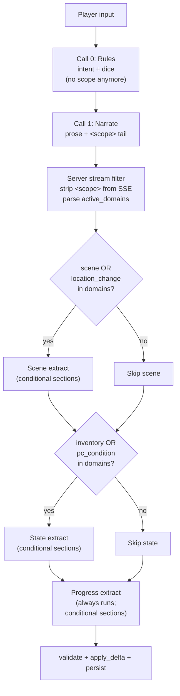
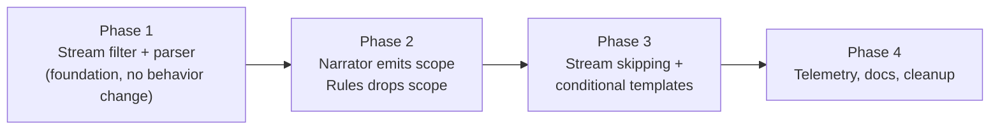
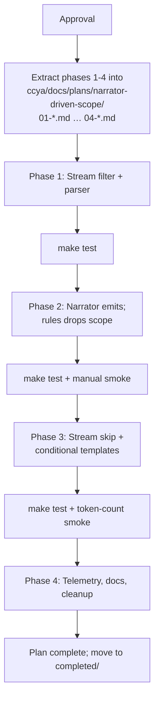

# Narrator-Driven Scope — Master Plan

## Summary

Today, the pre-narration rules LLM (Call 0) emits `scope.active_domains` / `scope.skip_domains`. This is structurally wrong: the rules call has no way to know what the narrator is about to write. Empirical data on `saves/default/` shows: state stream skipped 38% of turns (sometimes incorrectly — e.g. ammo not removed), progress stream skipped 0% (because `compendium_npc` was never even in the rules vocabulary), scene stream always runs.

This plan moves scope decision to the narrator, where it has full context AFTER writing prose:
- The narrator emits `<scope>{"active_domains":["scene","inventory"]}</scope>` as the very last thing in its output.
- Server intercepts the streaming output, strips the tail before it reaches the user, parses it post-stream.
- Extraction pipeline runs only the streams the narrator says are needed; conditional templates cut tokens within streams.
- Progress always runs (storytelling brain — owns gm_beat, recent_events, quest branches).
- Rules LLM stops emitting scope; that field is removed entirely.

Local-only deployment, so KV-cache stability concerns from a tail-position scope tag are not relevant.

## Pipeline (target architecture)



## Key decisions (locked)

1. **Sentinel format**: `<scope>...</scope>` (XML tag style, matches existing `<thinking>...</thinking>` convention in [`ccya/llm_client.py`](ccya/ccya/llm_client.py) line 131). Single-line JSON inside.
2. **Position**: at the very end of narration output, after the closing `</thinking>` if any, after a trailing newline. Last thing the model emits.
3. **Stream filtering**: server-side, in `run_turn` / `run_turn_retry` streaming loops. Holds a sliding tail buffer of `len("<scope>") - 1 = 6` chars. Once `<scope>` is detected anywhere, stops yielding tokens to the SSE consumer. Continues accumulating to `narrative_chunks` for post-stream parsing. Frontend untouched.
4. **Default fallback**: missing or invalid `<scope>` → all 7 domains (run scene + state + progress). Safe.
5. **Empty domains list**: `active_domains: []` is honored — runs only progress, skips scene + state. (Narrator explicitly said nothing changed.)
6. **Domain set** (frozen): `scene, inventory, pc_condition, quest_updates, location_change, recent_events, compendium_npc`. Same 7 as today; just moves from rules to narrator.
7. **Scene skip rule**: stream is skipped when `scene` is not in active_domains AND `location_change` is not in active_domains.
8. **State skip rule**: stream is skipped when `inventory` is not in active_domains AND `pc_condition` is not in active_domains.
9. **Progress always runs**: hardcoded. The check `progress_domains.issubset(skip)` at [`ccya/engine/extraction.py`](ccya/ccya/engine/extraction.py) lines 454-455 is deleted. Active_domains still drives intra-template gating inside the progress stream.
10. **Rules LLM no longer emits scope**: `Scope` class deleted; `IntentEnvelope.scope` removed; rules_system.j2 scope section removed; rules-prompt-derived `_active_domains(intent)` helper deleted.
11. **No backward compatibility**: old events.jsonl entries don't need migration. Old plans/tests get updated/removed in Phase 4.
12. **Conditional templates are first-class**: each extract user template gates its sections by domain so even non-skipped streams send fewer tokens to the LLM.

## Phasing strategy



Each phase is self-contained: clear prerequisites, file-by-file change list, code snippets, and exit criteria. After approval, the very first execution step is to extract Phases 1-4 from this master into separate files at `ccya/docs/plans/narrator-driven-scope/0{1..4}-*.md` so the implementer launches each phase with only that phase's context loaded. The master file then becomes a navigator pointer.

| Phase | Goal | Depends on | Touches |
|---|---|---|---|
| 1 | Streaming tail filter + JSON parser | — | `engine/turn.py`, `llm_client.py` (helper), `tests/` (new file) |
| 2 | Narrator emits scope; rules stops emitting it | Phase 1 | `prompts/narrate_system.j2`, `prompts/rules_system.j2`, `prompts/extract_*_user.j2` (drop dead refs), `models.py`, `engine/rules.py`, `engine/turn.py`, `engine/extraction.py`, `eval/judge.py`, `tests/` |
| 3 | Stream skipping + conditional templates | Phase 2 | `engine/extraction.py`, `prompts/extract_scene_user.j2`, `prompts/extract_state_user.j2`, `prompts/extract_progress_user.j2`, `tests/` |
| 4 | Telemetry, docs, cleanup | Phase 3 | `engine/turn.py` (telemetry), `docs/ARCHITECTURE.md`, `docs/REPOMAP/engine.md`, plan file moves, dead-code deletion |

---

# PHASE 1 — Streaming tail filter + scope parser

## Goal
Add the infrastructure to (a) parse a `<scope>...</scope>` JSON tail out of narrator output and (b) prevent that tail from streaming to the user via SSE. No behavior change in the extraction pipeline yet — defaults are still used.

## Prerequisites
None. This is the foundation.

## Pre-read for the implementer
- [`ccya/AGENTS.md`](ccya/AGENTS.md) — repo conventions
- [`ccya/ccya/engine/turn.py`](ccya/ccya/engine/turn.py) lines 327-341 (run_turn streaming) and lines 810-824 (run_turn_retry streaming)
- [`ccya/ccya/llm_client.py`](ccya/ccya/llm_client.py) lines 131-144 (existing `<thinking>` strip pattern)
- [`ccya/ccya/server/routes.py`](ccya/ccya/server/routes.py) lines 91-140 (SSE consumer of `("token", chunk)`)

## File-by-file changes

### 1. `ccya/ccya/engine/turn.py` — add module-level constants and helpers

Add at module level, after the existing imports (around line 55, after `_log = logging.getLogger("ccya.engine")`):

```python
import json
import re

_ALL_DOMAINS: frozenset[str] = frozenset({
    "scene",
    "inventory",
    "pc_condition",
    "quest_updates",
    "location_change",
    "recent_events",
    "compendium_npc",
})

_DEFAULT_DOMAINS: list[str] = [
    "scene",
    "inventory",
    "pc_condition",
    "quest_updates",
    "location_change",
    "recent_events",
    "compendium_npc",
]

_SCOPE_OPEN = "<scope>"
_SCOPE_CLOSE = "</scope>"
_SCOPE_TAIL_RE = re.compile(r"<scope>(.*?)</scope>", re.DOTALL)
_SCOPE_TAIL_BUFFER_SIZE = len(_SCOPE_OPEN) - 1  # = 6


def _split_scope_tail(text: str) -> tuple[str, list[str] | None]:
    """Extract <scope>...</scope> tail, return (prose, active_domains | None).

    Returns:
        (prose, None)        — no tag found, or malformed JSON, or wrong shape.
                                Caller should use _DEFAULT_DOMAINS.
        (prose, [...])       — valid; list may be empty (intentional skip-everything).
                                Empty list = "run only progress."

    Filters domains against _ALL_DOMAINS; unknown values silently dropped.
    """
    m = _SCOPE_TAIL_RE.search(text)
    if not m:
        return text, None

    prose = (text[:m.start()] + text[m.end():]).rstrip()
    json_str = m.group(1).strip()

    try:
        parsed = json.loads(json_str)
    except (json.JSONDecodeError, ValueError):
        return prose, None

    if not isinstance(parsed, dict):
        return prose, None

    raw = parsed.get("active_domains")
    if not isinstance(raw, list):
        return prose, None

    domains = [d for d in raw if isinstance(d, str) and d in _ALL_DOMAINS]
    return prose, domains


class _StreamTailFilter:
    """Filters a streaming text feed to suppress everything from <scope> onward.

    Maintains a sliding tail buffer of `_SCOPE_TAIL_BUFFER_SIZE` chars to detect
    the opening sentinel even when it crosses chunk boundaries. After the
    sentinel is observed, all subsequent chunks are accumulated internally
    (still recorded in full_text) but `feed()` returns "" so the SSE consumer
    sees no further tokens.

    Usage:
        flt = _StreamTailFilter()
        async for chunk in llm_chat_stream(...):
            visible = flt.feed(chunk)
            if visible:
                yield ("token", visible)
        tail = flt.flush()
        if tail:
            yield ("token", tail)
        full = flt.full_text()  # for post-stream parsing
    """

    __slots__ = ("_buf", "_seen_sentinel", "_chunks")

    def __init__(self) -> None:
        self._buf: str = ""
        self._seen_sentinel: bool = False
        self._chunks: list[str] = []

    def feed(self, chunk: str) -> str:
        self._chunks.append(chunk)
        if self._seen_sentinel:
            return ""
        combined = self._buf + chunk
        idx = combined.find(_SCOPE_OPEN)
        if idx >= 0:
            self._seen_sentinel = True
            self._buf = ""
            return combined[:idx]
        if len(combined) > _SCOPE_TAIL_BUFFER_SIZE:
            emit = combined[:-_SCOPE_TAIL_BUFFER_SIZE]
            self._buf = combined[-_SCOPE_TAIL_BUFFER_SIZE:]
            return emit
        self._buf = combined
        return ""

    def flush(self) -> str:
        if self._seen_sentinel:
            return ""
        out = self._buf
        self._buf = ""
        return out

    def full_text(self) -> str:
        return "".join(self._chunks)
```

### 2. `ccya/ccya/engine/turn.py` — wire filter into `run_turn` streaming loop

Replace the existing block at lines ~317-341 (the `async for chunk in llm_chat_stream` loop and the immediate post-loop `narrative = strip_thinking(...)` line):

Current code:
```python
        first_ms = 0.0
        t0 = asyncio.get_event_loop().time()
        narr_stream_stats: dict[str, Any] = {}
        if config.log_llm_io:
            _log_llm_io(...)
        async for chunk in llm_chat_stream(
            config.host,
            config.model,
            narr_messages,
            temperature=config.narrate_temperature,
            timeout=float(config.request_timeout_s),
            stream_stats=narr_stream_stats,
        ):
            if not narrative_chunks:
                first_ms = (asyncio.get_event_loop().time() - t0) * 1000
            narrative_chunks.append(chunk)
            yield ("token", chunk)

        narr_ms = (asyncio.get_event_loop().time() - t0) * 1000
        narrative = strip_thinking("".join(narrative_chunks))
```

Replace with:
```python
        first_ms = 0.0
        t0 = asyncio.get_event_loop().time()
        narr_stream_stats: dict[str, Any] = {}
        if config.log_llm_io:
            _log_llm_io(
                trace_id=trace_id,
                phase="narrate_request",
                messages=narr_messages,
                max_chars=config.log_llm_io_max_chars,
            )
        scope_filter = _StreamTailFilter()
        first_visible = True
        async for chunk in llm_chat_stream(
            config.host,
            config.model,
            narr_messages,
            temperature=config.narrate_temperature,
            timeout=float(config.request_timeout_s),
            stream_stats=narr_stream_stats,
        ):
            visible = scope_filter.feed(chunk)
            if visible:
                if first_visible:
                    first_ms = (asyncio.get_event_loop().time() - t0) * 1000
                    first_visible = False
                yield ("token", visible)
        tail = scope_filter.flush()
        if tail:
            if first_visible:
                first_ms = (asyncio.get_event_loop().time() - t0) * 1000
            yield ("token", tail)

        narr_ms = (asyncio.get_event_loop().time() - t0) * 1000
        # Keep narrative_chunks compatible with downstream code paths (error fallback).
        narrative_chunks[:] = [scope_filter.full_text()]
        full_with_tail = strip_thinking(scope_filter.full_text())
        narrative, parsed_domains = _split_scope_tail(full_with_tail)
        active_domains = (
            list(parsed_domains) if parsed_domains is not None else list(_DEFAULT_DOMAINS)
        )
```

Notes:
- `narrative_chunks` is reused later in the exception path at line 616 (`fallback = narrative_chunks and "".join(narrative_chunks) or ""`). Replacing its contents with the full text post-loop preserves that fallback behavior.
- `first_ms` now measures first visible token (post-filter), which is what the user actually sees. Before-filter timing is lost — acceptable.
- `active_domains` is computed but NOT yet consumed by the extraction pipeline in Phase 1. It is consumed in Phase 2.

### 3. `ccya/ccya/engine/turn.py` — same wiring in `run_turn_retry`

At lines ~800-824, apply the identical replacement pattern. The block to replace starts at `first_ms = 0.0` and ends at `narrative = strip_thinking("".join(narrative_chunks))`. Use the same code as above (substitute the matching block).

### 4. Phase-1 tests — new file `ccya/tests/test_scope_tail_parser.py`

Create this file with the following test cases. Use `pytest`. No async needed for the parser tests; the filter tests are sync.

```python
"""Unit tests for _split_scope_tail and _StreamTailFilter."""
from __future__ import annotations

import pytest

from ccya.engine.turn import (
    _DEFAULT_DOMAINS,
    _StreamTailFilter,
    _split_scope_tail,
)


class TestSplitScopeTail:
    def test_no_tag_returns_none(self) -> None:
        text = "Just prose, nothing special."
        prose, domains = _split_scope_tail(text)
        assert prose == text
        assert domains is None

    def test_valid_tag_at_end(self) -> None:
        text = 'The guard falls.\n\n<scope>{"active_domains":["scene","inventory"]}</scope>'
        prose, domains = _split_scope_tail(text)
        assert prose == "The guard falls."
        assert domains == ["scene", "inventory"]

    def test_empty_domain_list_honored(self) -> None:
        text = 'Pure dialogue beat.\n<scope>{"active_domains":[]}</scope>'
        prose, domains = _split_scope_tail(text)
        assert prose == "Pure dialogue beat."
        assert domains == []

    def test_unknown_domains_filtered(self) -> None:
        text = '...\n<scope>{"active_domains":["scene","fake_domain","inventory"]}</scope>'
        prose, domains = _split_scope_tail(text)
        assert domains == ["scene", "inventory"]

    def test_invalid_json_returns_none(self) -> None:
        text = '...<scope>{not json}</scope>'
        prose, domains = _split_scope_tail(text)
        assert prose == "..."
        assert domains is None

    def test_missing_active_domains_key(self) -> None:
        text = '...<scope>{"other":1}</scope>'
        _, domains = _split_scope_tail(text)
        assert domains is None

    def test_active_domains_not_list(self) -> None:
        text = '...<scope>{"active_domains":"scene"}</scope>'
        _, domains = _split_scope_tail(text)
        assert domains is None

    def test_tag_in_middle_of_text(self) -> None:
        # Defensive: even if the tag isn't at the end, parser should still find it.
        text = 'before <scope>{"active_domains":["scene"]}</scope> after'
        prose, domains = _split_scope_tail(text)
        assert "<scope>" not in prose
        assert "</scope>" not in prose
        assert domains == ["scene"]


class TestStreamTailFilter:
    def test_no_sentinel_passthrough(self) -> None:
        f = _StreamTailFilter()
        out: list[str] = []
        for chunk in ["hello ", "world", " end"]:
            out.append(f.feed(chunk))
        out.append(f.flush())
        assert "".join(out) == "hello world end"
        assert f.full_text() == "hello world end"

    def test_sentinel_in_single_chunk(self) -> None:
        f = _StreamTailFilter()
        emitted = f.feed('prose here.<scope>{"active_domains":["scene"]}</scope>')
        emitted += f.flush()
        assert emitted == "prose here."
        assert "<scope>" in f.full_text()

    def test_sentinel_split_across_chunks(self) -> None:
        f = _StreamTailFilter()
        emitted = ""
        for chunk in ["pro", "se ", "her", "e.<sc", "ope>", '{"active_domains":[]}', "</scope>"]:
            emitted += f.feed(chunk)
        emitted += f.flush()
        assert emitted == "prose here."
        assert f.full_text() == 'prose here.<scope>{"active_domains":[]}</scope>'

    def test_sentinel_split_at_every_char(self) -> None:
        # Worst-case: each char in its own chunk.
        text = 'abc.<scope>{"active_domains":["scene"]}</scope>'
        f = _StreamTailFilter()
        emitted = "".join(f.feed(c) for c in text)
        emitted += f.flush()
        assert emitted == "abc."

    def test_partial_buffer_flushed_at_end(self) -> None:
        # Stream ends mid-tail-buffer with no sentinel — must flush remainder.
        f = _StreamTailFilter()
        emitted = f.feed("ab")
        emitted += f.feed("c")
        emitted += f.flush()
        assert emitted == "abc"

    def test_no_emission_after_sentinel(self) -> None:
        f = _StreamTailFilter()
        f.feed("intro.<scope>")
        # Anything fed after sentinel must produce empty visible output.
        assert f.feed('{"active_domains":[]}') == ""
        assert f.feed("</scope>") == ""
        assert f.flush() == ""
```

### 5. Optional: integration test stub for Phase 1

Add this test class to the existing [`ccya/tests/test_engine_smoke.py`](ccya/tests/test_engine_smoke.py) file (not a new file — match existing convention). It validates that `run_turn`'s streaming loop strips the tail without affecting the rest of the pipeline yet:

```python
class TestNarrationScopeTailFilter:
    """Phase 1 — verifies <scope> tail never reaches SSE consumer.

    Pipeline behavior is unchanged in Phase 1: defaults are used regardless
    of what's in the tail. We just verify the filter strips visibly.
    """

    async def test_scope_tail_not_in_streamed_tokens(self) -> None:
        # Use the existing FakeLLM stream pattern. Inject chunks that include
        # a <scope> tag at the end. Capture all ("token", chunk) yields and
        # assert no chunk contains "<scope>".
        # Implementation: extend the existing FakeLLM in this file to yield
        # chunks like ["He laughs.", " The room ", "stills.", "\n\n<scope>",
        # '{"active_domains":["scene"]}', "</scope>"] and verify aggregated
        # token output equals "He laughs. The room stills." with no tag fragments.
        ...
```

The implementer should follow the existing `FakeLLM` / `fake_stream` pattern in [`ccya/tests/test_engine_smoke.py`](ccya/tests/test_engine_smoke.py) (see `TestExtractionStreamSkip` at line 1338) for the harness. Replace the `...` body with a working test.

## Exit criteria

- `make test` passes (existing + new tests).
- New tests in `tests/test_scope_tail_parser.py` cover parser + filter and pass.
- New integration test in `tests/test_engine_smoke.py` confirms `<scope>` tag fragments never appear in `("token", chunk)` yields from `run_turn`.
- `_StreamTailFilter` is invoked in both `run_turn` and `run_turn_retry`.
- `active_domains` is computed in both functions but not yet passed to extraction (Phase 2 wires that).
- No regressions in existing tests (they don't yet emit `<scope>`, so filter is a no-op for them).

---

# PHASE 2 — Narrator emits scope; rules drops scope

## Goal
Teach the narrator to emit `<scope>...</scope>` at the end of every response. Remove the now-obsolete scope emission from the rules call. Wire narrator-derived `active_domains` through to the extraction pipeline.

## Prerequisites
- Phase 1 complete: `_split_scope_tail`, `_StreamTailFilter`, and the streaming wiring in `run_turn` / `run_turn_retry` are in place. `active_domains` is being computed but ignored downstream.

## Pre-read for the implementer
- [`ccya/ccya/prompts/narrate_system.j2`](ccya/ccya/prompts/narrate_system.j2) — narrator system prompt (don't change tone; only append a new section)
- [`ccya/ccya/prompts/rules_system.j2`](ccya/ccya/prompts/rules_system.j2) — rules system prompt
- [`ccya/ccya/models.py`](ccya/ccya/models.py) lines 72-86 — `Scope`, `IntentEnvelope`
- [`ccya/ccya/engine/rules.py`](ccya/ccya/engine/rules.py) lines 44-65 — `_call_rules` no-roll fallback
- [`ccya/ccya/engine/extraction.py`](ccya/ccya/engine/extraction.py) lines 46-55 — `_active_domains(intent)` helper
- [`ccya/ccya/engine/extraction.py`](ccya/ccya/engine/extraction.py) lines 340-360 — `_run_extraction_pipeline` signature
- [`ccya/ccya/eval/judge.py`](ccya/ccya/eval/judge.py) lines 104-118 — scope summary helper
- [`ccya/tests/test_engine_pipeline.py`](ccya/tests/test_engine_pipeline.py) lines 458-510 — existing scope-skip tests
- [`ccya/tests/test_engine_smoke.py`](ccya/tests/test_engine_smoke.py) lines 1338-1400 — `TestExtractionStreamSkip`

## File-by-file changes

### 1. `ccya/ccya/prompts/narrate_system.j2` — add scope tail instruction

Append a new section at the very end of the file (after the existing `` block, around line 53). This is the LAST section the narrator sees, mirroring the fact that `<scope>` is the LAST thing the narrator should emit:

```
## Active scope tail
After your prose is complete, on a new line, emit a single line:

<scope>{"active_domains":["..."]}</scope>

Valid domains:
- scene             — scene tags, NPC presence, scene tagline changes
- location_change   — player physically moved or scene shifted significantly
- inventory         — items received, used, dropped, upgraded
- pc_condition      — wounds, fatigue, mental conditions added or resolved
- quest_updates     — quest objective progress, new quest, quest resolved/failed
- recent_events     — narratively significant new fact (politics, intrigue, world)
- compendium_npc    — NPC named for the first time, durable identity change, death

List ONLY domains that genuinely changed THIS turn. Empty list `[]` is valid
and means "nothing changed; advance the storyteller's reasoning only." Do not
list domains speculatively. Do not list domains for things that didn't happen
in your prose above.

Rules:
- The tag MUST be the very last thing in your output, on its own line.
- One JSON object only. No prose after the closing tag.
- If thinking mode is enabled, the tag goes AFTER the closing </thinking> tag.
- The tag and its contents are stripped from the player's view by the engine.
```

Important constraints:
- Do not modify any other section of `narrate_system.j2`. The repo rule (`ccya/AGENTS.md`) says "Do not alter prompts unless explicitly asked to — if you must, preserve the spirit of the existing wording and intent." The new section is additive.
- Do not add `<scope>` instructions to `narrate_user.j2`.

### 2. `ccya/ccya/prompts/rules_system.j2` — drop scope section

Remove these from the schema and field-rules:

In the `## Output schema` block (lines 38-55), remove the `"scope"` block. The schema becomes:
```
{
  "intent": "",
  "intent_verb": "",
  "target": "",
  "stakes": "",
  "check": {
    "required": boolean,
    "skill": "",
    "difficulty": "",
    "tags": []
  }
}
```

Delete lines 67-81 entirely (the `scope.active_domains`, domain mapping examples, `skip_domains`, `implicit_preconditions`, `ambiguities` rules). The trailing `Emit scope.implicit_preconditions...` and `Emit scope.ambiguities...` lines go too.

### 3. `ccya/ccya/prompts/extract_state_user.j2` — drop dead scope refs

Remove lines 4-7:
```

## preconditions_assumed
{{ rules_outcome.scope.implicit_preconditions | join("; ") }}


```

(`RulesOutcome` has no `scope` attribute, so this block was already dead. Removing it.)

### 4. `ccya/ccya/prompts/extract_progress_user.j2` — drop dead scope refs

Remove lines 4-7:
```

## ambiguities_to_resolve
{{ rules_outcome.scope.ambiguities | join("; ") }}


```

### 5. `ccya/ccya/models.py` — drop `Scope` and `IntentEnvelope.scope`

At lines 72-77, delete:
```python
class Scope(BaseModel):
    active_domains: list[str] = Field(default_factory=list)
    skip_domains: list[str] = Field(default_factory=list)
    implicit_preconditions: list[str] = Field(default_factory=list)
    ambiguities: list[str] = Field(default_factory=list)
```

In `IntentEnvelope` (lines 79-85), remove the `scope` field. The class becomes:
```python
class IntentEnvelope(BaseModel):
    intent: str = Field(default="", max_length=200)
    intent_verb: str = Field(default="act", max_length=24)
    target: str = ""
    stakes: str = ""
    check: RulesCheck = Field(default_factory=RulesCheck)
```

### 6. `ccya/ccya/engine/rules.py` — clean up `_call_rules` fallback

In `_call_rules` (line 44), replace:
```python
    _no_intent = IntentEnvelope(
        intent="",
        intent_verb="act",
        check=RulesCheck(required=False),
        scope=Scope(
            active_domains=[
                "scene",
                "inventory",
                "quest_updates",
                "location_change",
                "recent_events",
                "pc_condition",
            ],
            skip_domains=[],
        ),
    )
```

With:
```python
    _no_intent = IntentEnvelope(
        intent="",
        intent_verb="act",
        check=RulesCheck(required=False),
    )
```

Update the import on line 13:
```python
from ccya.models import IntentEnvelope, RulesCheck, RulesOutcome
```
(Remove `Scope`.)

### 7. `ccya/ccya/engine/extraction.py` — accept `active_domains` parameter

Update imports at line 20-28:
```python
from ccya.models import (
    IntentEnvelope,
    ProgressExtractResult,
    RulesOutcome,
    SceneExtractResult,
    StateExtractResult,
    StateDelta,
)
```
(Remove `Scope`.)

Replace the existing `_active_domains` helper at lines 46-55:
```python
def _active_domains(intent: "IntentEnvelope | None") -> list[str]:
    scope = intent.scope if intent else Scope()
    return scope.active_domains or [
        "scene",
        "inventory",
        "quest_updates",
        "location_change",
        "recent_events",
        "pc_condition",
    ]
```

With (delete entirely — we now pass `active_domains` explicitly):

(Just delete the function. Update all callers.)

Update `_extract_scene_messages` (line 82): change signature to take `active_domains: list[str]` directly. Replace the `active = _active_domains(intent)` line with use of the parameter. Same for `_extract_state_messages` (line 124) and `_extract_progress_messages` (line 206).

Update `_run_extraction_pipeline` signature at line 340 to add the parameter:
```python
async def _run_extraction_pipeline(
    env: "Environment",
    state: dict[str, Any],
    narration: str,
    *,
    active_domains: list[str],
    rules_outcome: "RulesOutcome | None" = None,
    intent: "IntentEnvelope | None" = None,
    config: "EngineConfig",
    trace_id: str,
    turn_no: int,
    pack_examples: list["ExtractExample"] | None = None,
    deescalate: bool = False,
    quest_ages: list[dict[str, Any]] | None = None,
) -> tuple["StateDelta", list[str], str, list[str], dict[str, Any], "ProgressExtractResult"]:
```

Inside, delete:
```python
    scope = intent.scope if intent else Scope()
    skip = set(scope.skip_domains or [])
```

Replace with:
```python
    active = set(active_domains)
```

Then in the stream-skip checks at lines 411-412 and 454-455, replace:
```python
    state_domains = {"inventory", "pc_condition"}
    run_state = not state_domains.issubset(skip)
```
With:
```python
    run_state = bool({"inventory", "pc_condition"} & active)
```

For progress (lines 454-455), DO NOT replace — Phase 3 will hardcode it always-runs. For Phase 2, leave the existing skip path in place so Phase 2's behavior is "scope is now narrator-derived" without changing skip semantics. (Phase 3 deletes the progress skip.)

Actually, for Phase 2 simplicity, replace progress's skip too (it will be removed in Phase 3 but the active-set logic is consistent):
```python
    progress_domains = {"quest_updates", "recent_events", "compendium_npc"}
    run_progress = bool(progress_domains & active)
```

Update each `_extract_*_messages` call site inside `_run_extraction_pipeline` to pass `active_domains=active_domains` instead of `intent=intent` for that purpose. (Keep `intent=intent` if other code still uses it; only replace the `_active_domains(intent)` lookups.)

Pass-through plan:
- `_extract_scene_messages(env, narration, state, active_domains=active_domains, rules_outcome=..., enable_thinking=...)`
- `_extract_state_messages(env, narration, state, active_domains=active_domains, scene_result=..., rules_outcome=..., enable_thinking=..., pack_examples=...)`
- `_extract_progress_messages(env, narration, state, active_domains=active_domains, scene_result=..., state_result=..., rules_outcome=..., enable_thinking=..., deescalate=..., quest_ages=...)`

The `intent` parameter on `_run_extraction_pipeline` is still passed by `turn.py` but is no longer used inside (everything that needed scope now uses `active_domains`). Keep the parameter for now (Phase 4 cleanup may remove it if it's truly unused).

### 8. `ccya/ccya/engine/turn.py` — pass `active_domains` to extraction

In `run_turn` at line 374-386, the existing call is:
```python
            delta, actions, outcome_summary, failed, extraction_event, progress_result = (
                await _run_extraction_pipeline(
                    env, state, narrative,
                    rules_outcome=outcome,
                    intent=intent,
                    config=config,
                    trace_id=trace_id,
                    turn_no=turn_no,
                    pack_examples=pack_examples,
                    deescalate=deescalate,
                    quest_ages=quest_ages,
                )
            )
```

Add `active_domains=active_domains,` as a kwarg:
```python
            delta, actions, outcome_summary, failed, extraction_event, progress_result = (
                await _run_extraction_pipeline(
                    env, state, narrative,
                    active_domains=active_domains,
                    rules_outcome=outcome,
                    intent=intent,
                    config=config,
                    ...
                )
            )
```

Same edit in `run_turn_retry` at lines 858-870.

### 9. `ccya/ccya/eval/judge.py` — read scope from narrator output instead of rules output

At lines 104-118, the existing `_scope_summary` reads `scope` from rules output. Replace with reading from the narrative output:

```python
def _scope_summary(rules_event: dict[str, Any] | None, narrate_prompt: dict[str, Any]) -> str:
    """Scope is now in the narrator's <scope>...</scope> tail in narrate output."""
    raw = narrate_prompt.get("output", "")
    raw = strip_thinking(raw or "")
    m = re.search(r"<scope>(.*?)</scope>", raw, re.DOTALL)
    if not m:
        return "active=? (no tail)"
    try:
        data = json.loads(m.group(1).strip())
        active = data.get("active_domains", [])
        return f"active={active}"
    except (json.JSONDecodeError, AttributeError):
        return "active=? (unparseable)"
```

Add `import re` at the top if not present. Update the call site of `_scope_summary` in the same file: it's currently called with `(rules_event, rules_prompt)` somewhere in `build_trace`. Find and update that call to pass `narrate_prompt` instead. Search this file for `_scope_summary(` to find the call site.

### 10. Tests to update

#### a. `ccya/tests/test_engine_pipeline.py`

The existing `_RULES_SKIP_STATE` fixture (lines 458-472) has a `"scope"` key in the JSON. Remove that key entirely:
```python
_RULES_SKIP_STATE = json.dumps(
    {
        "intent": "look around",
        "intent_verb": "observe",
        "target": "",
        "stakes": "",
        "check": {"required": False},
    },
)
```

The existing test `test_rules_scope_skip_state_skips_state_extraction` at line 506 is now testing OBSOLETE behavior (rules-driven skip). Convert it to test narrator-driven skip:

- Rename to `test_narration_scope_tail_skip_state_skips_state_extraction`.
- Make the FakeLLM emit a narrative chunk that includes `<scope>{"active_domains":["scene"]}</scope>` at the end.
- Assert that no state extraction call is made (scene + progress only).

Use the existing `_FakeLLM` pattern; modify the narration `fake_stream` to yield chunks that end with the scope tag.

#### b. `ccya/tests/test_engine_smoke.py`

The existing `TestExtractionStreamSkip` class at line 1338 has `test_state_stream_skipped_when_all_state_domains_skipped` that uses the rules-emitted scope. Same conversion: drop the `scope` key from `rules_with_skip`, instead make the narrative stream emit `<scope>{"active_domains":["scene","quest_updates","recent_events"]}</scope>` at its end.

The existing `_RULES_SKIP_STATE` from `test_engine_pipeline.py` reuse: ensure no other test files depend on a rules response that includes `scope`.

Search for `"scope"` and `"skip_domains"` and `"active_domains"` across the test directory and update each occurrence:

```bash
rg -n '"scope"|"skip_domains"|"active_domains"' ccya/tests
```

For each match, decide: drop the key (if rules fixture) or move to narration tail (if testing skip behavior).

## Exit criteria

- `make test` passes.
- `make typecheck` passes.
- `Scope` class no longer exists in `models.py`. `IntentEnvelope.scope` field removed.
- `rules_system.j2` no longer mentions `scope`, `active_domains`, `skip_domains`, `implicit_preconditions`, or `ambiguities`.
- `narrate_system.j2` includes the new `## Active scope tail` section, unchanged elsewhere.
- `_run_extraction_pipeline` accepts `active_domains: list[str]` and uses it for stream-skip decisions; no references to `Scope` or `intent.scope` remain in `extraction.py`.
- `judge.py` reads scope from narrator output.
- All scope-related tests now exercise narrator-emitted scope.
- An end-to-end smoke turn (real or mocked) shows scope tail correctly stripped from SSE and parsed into `active_domains`.

---

# PHASE 3 — Stream skipping + conditional templates

## Goal
Make the savings real. Hardcode progress to always-run, allow scene to skip, and gate intra-stream prompt sections on `active_domains` so even non-skipped streams send fewer tokens. This is where token/latency wins materialize.

## Prerequisites
- Phase 2 complete: narrator emits scope, `active_domains` flows into `_run_extraction_pipeline`, rules-side scope is gone.

## Pre-read for the implementer
- [`ccya/ccya/engine/extraction.py`](ccya/ccya/engine/extraction.py) lines 376-496 — three streams scaffold
- [`ccya/ccya/prompts/extract_scene_user.j2`](ccya/ccya/prompts/extract_scene_user.j2)
- [`ccya/ccya/prompts/extract_state_user.j2`](ccya/ccya/prompts/extract_state_user.j2)
- [`ccya/ccya/prompts/extract_progress_user.j2`](ccya/ccya/prompts/extract_progress_user.j2)
- [`ccya/docs/ARCHITECTURE.md`](ccya/docs/ARCHITECTURE.md) lines 160-291 — what each stream owns

## File-by-file changes

### 1. `ccya/ccya/engine/extraction.py` — make scene skippable, hardcode progress

The current scaffold:
- Scene always runs (no gate, lines 376-408).
- State runs when `bool({"inventory","pc_condition"} & active)` (Phase 2 added).
- Progress runs when `bool({"quest_updates","recent_events","compendium_npc"} & active)` (Phase 2 added).

Phase 3 changes:
- Scene runs when `bool({"scene","location_change"} & active)`.
- Progress always runs (no gate at all).
- State unchanged from Phase 2.

In `_run_extraction_pipeline`, replace the scene block at lines ~376-408:

Current:
```python
    # --- Stream 1: Scene (always runs) ---
    t_scene = asyncio.get_event_loop().time()
    scene_msgs = _extract_scene_messages(...)
    ...
```

Wrap in a conditional:
```python
    # --- Stream 1: Scene ---
    scene_domains = {"scene", "location_change"}
    run_scene = bool(scene_domains & active)
    if run_scene:
        t_scene = asyncio.get_event_loop().time()
        scene_msgs = _extract_scene_messages(
            env, narration, state,
            active_domains=active_domains,
            rules_outcome=rules_outcome,
            enable_thinking=config.enable_extract_thinking,
        )
        rendered_scene_system = scene_msgs[0]["content"] if scene_msgs else ""
        rendered_scene_user = scene_msgs[-1]["content"] if scene_msgs else ""
        scene_msgs, scene_trimmed, scene_trimmed_chars = trim_messages(scene_msgs, config.prompt_token_budget)
        if config.log_prompts:
            _log_prompts(turn_no, "extract_scene", scene_msgs)
        try:
            scene_result, scene_usage, scene_attempts, scene_retry_errors = await _call_stream(
                scene_msgs, config, trace_id, "extract_scene", SceneExtractResult
            )
            extraction_event["scene"] = {
                "rendered_system": rendered_scene_system,
                "rendered_user": rendered_scene_user,
                "output": scene_result.model_dump(),
                "skipped": False,
                "attempts": scene_attempts,
                "retry_errors": scene_retry_errors,
                "tokens_in": scene_usage.get("prompt_tokens", 0),
                "tokens_out": scene_usage.get("total_tokens", 0),
                "ms": round((asyncio.get_event_loop().time() - t_scene) * 1000, 1),
                "context_meta": _context_meta(rendered_scene_system, rendered_scene_user, scene_trimmed, scene_trimmed_chars),
            }
        except Exception as exc:
            _log.warning("extract_scene failed: %s", exc, extra={"trace_id": trace_id})
            extraction_event["scene"] = {**_SKIPPED, "error": str(exc)}
    else:
        _log.debug("Skipping scene stream — neither scene nor location_change in active_domains")
        extraction_event["scene"] = _SKIPPED
```

Note: the default `scene_result = SceneExtractResult()` initialized at line 371 ensures downstream streams (state, progress) still get a valid `scene_result` object even when scene is skipped.

For progress, replace the `if run_progress:` block (currently at lines ~454-496) by removing the conditional entirely. Progress always runs:
```python
    # --- Stream 3: Progress (always runs — post-narration storytelling brain) ---
    t_progress = asyncio.get_event_loop().time()
    progress_msgs = _extract_progress_messages(
        env, narration, state,
        active_domains=active_domains,
        scene_result=scene_result,
        state_result=state_result,
        rules_outcome=rules_outcome,
        enable_thinking=config.enable_extract_thinking,
        deescalate=deescalate,
        quest_ages=quest_ages,
    )
    rendered_prog_system = progress_msgs[0]["content"] if progress_msgs else ""
    rendered_prog_user = progress_msgs[-1]["content"] if progress_msgs else ""
    progress_msgs, prog_trimmed, prog_trimmed_chars = trim_messages(progress_msgs, config.prompt_token_budget)
    if config.log_prompts:
        _log_prompts(turn_no, "extract_progress", progress_msgs)
    try:
        progress_result, prog_usage, progress_attempts, progress_retry_errors = await _call_stream(
            progress_msgs, config, trace_id, "extract_progress",
            ProgressExtractResult, strip_keys=("_reasoning",),
        )
        extraction_event["progress"] = {
            "rendered_system": rendered_prog_system,
            "rendered_user": rendered_prog_user,
            "output": progress_result.model_dump(),
            "skipped": False,
            "attempts": progress_attempts,
            "retry_errors": progress_retry_errors,
            "tokens_in": prog_usage.get("prompt_tokens", 0),
            "tokens_out": prog_usage.get("total_tokens", 0),
            "ms": round((asyncio.get_event_loop().time() - t_progress) * 1000, 1),
            "context_meta": _context_meta(rendered_prog_system, rendered_prog_user, prog_trimmed, prog_trimmed_chars),
        }
    except Exception as exc:
        _log.warning("extract_progress failed: %s", exc, extra={"trace_id": trace_id})
        extraction_event["progress"] = {**_SKIPPED, "error": str(exc)}
```

The `progress_domains` set + `run_progress` calculation inserted in Phase 2 must be deleted in Phase 3.

### 2. `ccya/ccya/prompts/extract_scene_user.j2` — minor gating

Current file is mostly fine. Already has `## active_domains` header. Keep as-is. The whole template only renders when scene runs (Phase 3 stream gate).

If `npc_roster` is empty (no compendium NPCs), the section already conditionally renders. No changes required.

### 3. `ccya/ccya/prompts/extract_state_user.j2` — confirm gating, no changes

The existing template already gates `## active_conditions` by `pc_condition` (line 29) and `## inventory` by `inventory` (line 34). No changes required, but verify these are still accurate after Phase 2's removal of dead `scope.implicit_preconditions` block.

### 4. `ccya/ccya/prompts/extract_progress_user.j2` — add intra-stream gating

This is the heaviest user template (active_quests + recent_events + scene_pressure + known_characters + quest_threshold + deescalate + quest_ages). Add domain gates so unused sections drop out.

Replace the body. Keep existing logic for sections that are storytelling-brain functions (scene_pressure, gm_beat reasoning) — those are unconditional. Gate the rest.

Current full file replaced with:
```
## active_domains
{{ active_domains | join(", ") }}


## rules_outcome
{{ rules_outcome.band | upper }} on {{ rules_outcome.skill }}.


## no_dice_roll
No dice were rolled this turn. The rules engine determined the action has no mechanical obstacle (pure social, travel, or exploration). Do NOT complete quest objectives on this turn unless the narration explicitly and unambiguously states the objective is fulfilled. Ambiguous or partial narration means the objective is NOT done.


## pc
{{ pc.name }} — {{ pc.tagline }}


## quest_threshold
{{ quest_threshold_directive }}


## active_quests
- `{{ q.id }}` | {{ q.title }}
  objectives:
    {{ loop.index }}. [xf ] {{ o.description }}




⚠ Quest "{{ qa.title }}" stalled for {{ qa.stalled_turns }} turns. Advance it, branch it, or mark an objective failed.






## recent_events (don't duplicate; emit recent_events_add/update/remove for changes)
- {{ event.text if event is mapping else event }}



## world_state (read-only — use to reason about new quests only)
- {{ f if f is string else f.values() | join(': ') }}





## scene_pressure (time-sensitive threats — add/remove/update as fiction demands)
- `{{ p.id }}` [{{ p.urgency }}] {{ p.text }} (added turn {{ p.turn_added }}) max {{ p.max_turns }} turns




## known_characters (compendium — reuse id for compendium_npc_update)
- `{{ row.id }}` | {{ row.name }} — {{ row.title }} | {{ row.bio_preview }}




## items_gained
{{ state_result.items_gained | join(', ') }}



## items_lost
{{ state_result.items_lost | join(', ') }}


## CURRENT TURN NARRATION
{{ narration }}
## END CURRENT TURN NARRATION
```

Notes:
- `scene_pressure` stays unconditional. It's gameplay-critical: scene_pressure can be ADDED by progress based on narration regardless of whether `recent_events` is in active_domains. Same reasoning for `gm_beat` — that's in the system prompt.
- Quest threshold guidance only matters if `quest_updates` is active.
- World state is only useful to seed new quests, so gate by `recent_events` (which represents new-fact extraction context).
- `known_characters` only matters when compendium_npc updates are possible.

### 5. `ccya/ccya/prompts/extract_progress_system.j2` — adjust schema commentary

The system prompt at [`ccya/ccya/prompts/extract_progress_system.j2`](ccya/ccya/prompts/extract_progress_system.j2) tells the LLM to emit empty arrays for unchanged domains. With conditional templates, the LLM will naturally emit empty arrays when sections are absent. No changes needed to the system prompt — the existing instruction "empty arrays for fields with no changes" is correct.

Optionally, add a single sentence after the schema (around line 35):
```
Sections marked active in `active_domains` (in the user prompt) are the only
ones that need work this turn. Other domains: emit empty arrays.
```

Do not remove or restructure existing system-prompt content (per AGENTS.md prompt rule).

### 6. Tests

Add new tests in [`ccya/tests/test_engine_smoke.py`](ccya/tests/test_engine_smoke.py) under a new class `TestNarratorScopeStreamSkip`:

```python
class TestNarratorScopeStreamSkip:
    """Phase 3 — narrator-emitted <scope> tail drives stream skipping."""

    async def test_empty_scope_skips_scene_and_state_runs_progress(self) -> None:
        """active_domains=[] → only progress runs (rules + narrate + progress = 3 chats)."""
        # Setup state, write to save dir.
        # FakeLLM:
        #   chat call 1: rules response (no scope key)
        #   stream call: yields prose chunks ending with <scope>{"active_domains":[]}</scope>
        #   chat call 2: progress response (only one chat call after rules+stream)
        # Assert: total chat calls == 2 (rules + progress); scene + state events marked skipped.
        ...

    async def test_scene_only_runs_scene_and_progress(self) -> None:
        """active_domains=['scene'] → scene + progress, no state."""
        # Total chat calls == 3 (rules + scene + progress); state event skipped.
        ...

    async def test_state_only_runs_state_and_progress(self) -> None:
        """active_domains=['inventory','pc_condition'] → state + progress, no scene."""
        ...

    async def test_default_runs_all_three(self) -> None:
        """No scope tag → defaults applied → all 3 streams run."""
        ...

    async def test_progress_always_runs_even_with_empty_scope(self) -> None:
        """active_domains=[] still runs progress.

        Verify progress's events.jsonl entry is NOT marked skipped.
        """
        ...
```

Add a test verifying conditional template gating in [`ccya/tests/`](ccya/tests/). Create new file `tests/test_extract_progress_template.py`:

```python
"""Verify extract_progress_user.j2 conditional gating by active_domains."""
from __future__ import annotations

from pathlib import Path

import pytest
from jinja2 import Environment, FileSystemLoader


@pytest.fixture
def env() -> Environment:
    prompts_dir = Path(__file__).parent.parent / "ccya" / "prompts"
    return Environment(loader=FileSystemLoader(str(prompts_dir)))


def _render(env: Environment, **ctx) -> str:
    tmpl = env.get_template("extract_progress_user.j2")
    base = {
        "narration": "test prose",
        "pc": {"name": "PC", "tagline": "x"},
        "active_quests": [],
        "recent_events": [],
        "world_state": [],
        "scene_pressure": [],
        "known_characters": [],
        "scene_result": {},
        "state_result": {"items_gained": [], "items_lost": []},
        "rules_outcome": None,
        "active_domains": [],
        "quest_threshold_directive": "test",
        "deescalate": False,
        "quest_ages": [],
    }
    base.update(ctx)
    return tmpl.render(**base)


def test_quest_section_omitted_without_quest_updates_domain(env: Environment) -> None:
    out = _render(env, active_domains=["scene"], active_quests=[{"id": "q1", "title": "T", "objectives": []}])
    assert "## active_quests" not in out
    assert "## quest_threshold" not in out


def test_quest_section_present_with_quest_updates_domain(env: Environment) -> None:
    out = _render(env, active_domains=["quest_updates"], active_quests=[{"id": "q1", "title": "T", "objectives": []}])
    assert "## active_quests" in out
    assert "## quest_threshold" in out


def test_recent_events_omitted_without_domain(env: Environment) -> None:
    out = _render(env, active_domains=[], recent_events=[{"id": "e1", "text": "fact"}])
    assert "## recent_events" not in out


def test_recent_events_included_with_domain(env: Environment) -> None:
    out = _render(env, active_domains=["recent_events"], recent_events=[{"id": "e1", "text": "fact"}])
    assert "## recent_events" in out


def test_known_characters_omitted_without_compendium_domain(env: Environment) -> None:
    out = _render(env, active_domains=[], known_characters=[{"id": "n1", "name": "N"}])
    assert "## known_characters" not in out


def test_known_characters_included_with_compendium_domain(env: Environment) -> None:
    out = _render(env, active_domains=["compendium_npc"], known_characters=[{"id": "n1", "name": "N"}])
    assert "## known_characters" in out


def test_scene_pressure_always_included(env: Environment) -> None:
    pressure = [{"id": "p1", "urgency": "immediate", "text": "fire", "turn_added": 1}]
    out = _render(env, active_domains=[], scene_pressure=pressure)
    assert "## scene_pressure" in out
```

## Exit criteria

- `make test` passes.
- `make typecheck` passes.
- Scene stream skips when `active_domains` excludes both `scene` and `location_change` — verified by per-stream `skipped: True` in `extraction_event`.
- Progress stream has no skip path — `extraction_event["progress"]["skipped"]` is always `False` (or stream produced an error).
- Per-stream extract_*_user templates render only sections relevant to active_domains.
- New `test_extract_progress_template.py` passes; new `TestNarratorScopeStreamSkip` class passes.
- Manual smoke turn shows reduced prompt token counts in `events.jsonl` per-stream `tokens_in` for restricted-scope turns.

---

# PHASE 4 — Telemetry, docs, cleanup

## Goal
Surface skip rates so the user can see scoping behavior at a glance. Update architecture documentation. Move the plan to completed. Delete stale code/docs/tests.

## Prerequisites
- Phase 3 complete: stream skipping driven by narrator scope, conditional templates in place.

## Pre-read for the implementer
- [`ccya/docs/ARCHITECTURE.md`](ccya/docs/ARCHITECTURE.md) — current architecture doc
- [`ccya/docs/REPOMAP/engine.md`](ccya/docs/REPOMAP/engine.md) — engine repomap (if exists)
- [`ccya/docs/plans/TODO.md`](ccya/docs/plans/TODO.md) — TODO list
- [`ccya/docs/plans/narration-active-domains.md`](ccya/docs/plans/narration-active-domains.md) — the OLD plan (delete)
- [`ccya/ccya/server/tv.py`](ccya/ccya/server/tv.py) — turn viewer data prep
- [`ccya/ccya/server/metrics.py`](ccya/ccya/server/metrics.py) — metrics formatting

## File-by-file changes

### 1. `ccya/ccya/engine/turn.py` — add scope-decision telemetry to events.jsonl

In both `run_turn` and `run_turn_retry`, in the `event` dict construction (around lines 549-577 and 1024-1051), add a new top-level field `scope` next to `extraction`:

```python
        event = {
            ...
            "extraction": extraction_event,
            "scope": {
                "active_domains": active_domains,
                "decided_by": "narrator" if parsed_domains is not None else "default",
                "skipped_streams": [
                    s for s, ev in extraction_event.items()
                    if ev.get("skipped")
                ],
            },
            ...
        }
```

`parsed_domains` is the local var from Phase 1 (`narrative, parsed_domains = _split_scope_tail(...)`). Make sure it's still in scope at the event-build site (it is — same function body).

### 2. `ccya/ccya/server/panels.py` or `ccya/ccya/server/metrics.py` — display scope in turn viewer

Find where the rules pill (showing dice info) is rendered for the turn viewer. Add a sibling pill:
- Label: `scope`
- Content: comma-joined `active_domains`, plus a tag `[narrator]` or `[default]` indicating decided_by.

Implementation: search for where `result.rules` is rendered into a pill in the existing turn viewer template/JS. Match the same pattern. The data source is `event["scope"]` from the new telemetry field.

If the turn viewer is too far away in scope, leave the UI work as a TODO comment in the code and document it in this phase's exit notes — but the data field MUST be in events.jsonl.

### 3. `ccya/docs/ARCHITECTURE.md` — update pipeline docs

- In the high-level overview at lines 11-72: add a small note that scope is decided post-narration.
- In Step 0 (rules) at lines 76-117: remove the "Key forward dependency" callout about `scope.active_domains` (it's no longer true). Remove `scope.*` lines from the IntentEnvelope output box.
- In Step 1 (Narrate) at lines 120-156: add a note at the bottom: "Narrator emits `<scope>{active_domains:[...]}</scope>` as the last line. Server-side stream filter strips it before SSE emission. Parsed `active_domains` flows into Steps 2a/2b/2c."
- In Step 2a (Scene) at lines 160-204: scene now skippable; replace the `S8["scope.active_domains (from Step 0)"]` node with `S8["active_domains (from Step 1 tail)"]` and add a note that scene runs only when `scene` or `location_change` is in active_domains.
- In Step 2b (State) at lines 208-251: same input rename. Note state skips when neither inventory nor pc_condition is active.
- In Step 2c (Progress) at lines 254-291: same input rename. Add a callout: "Progress always runs — it's the post-narration storytelling brain that feeds next turn's rules call via `pending_gm_beat`, `recent_events_add`, and `scene_pressure_*`."

### 4. `ccya/docs/REPOMAP/engine.md` — update if exists

If the file exists, search for:
- `scope` / `Scope` / `active_domains` / `skip_domains`
- `_active_domains`
- references to rules-emitted scope

Update to reflect narrator-emitted scope architecture. Add `_split_scope_tail` and `_StreamTailFilter` to the engine.md function inventory.

### 5. Plan files

Delete (or move) these files:
- [`ccya/docs/plans/narration-active-domains.md`](ccya/docs/plans/narration-active-domains.md) — superseded by this plan.
- The old `narration-active-domains.md` may have references in `docs/plans/TODO.md` — update or remove.

Move this plan to:
- [`ccya/docs/plans/completed/narrator-driven-scope.md`](ccya/docs/plans/completed/narrator-driven-scope.md)

If per-phase files were created at `ccya/docs/plans/narrator-driven-scope/01-*.md` etc., move the whole directory to `completed/` as well.

Update [`ccya/docs/plans/TODO.md`](ccya/docs/plans/TODO.md) to mark related items complete and remove the stale entry.

### 6. Dead code/test fixture cleanup

After Phase 3 tests have been updated, search the repo one more time for any leftover references:
```bash
rg -n 'Scope\(|\.scope\.|skip_domains|implicit_preconditions|ambiguities' ccya/
```

Expected matches after Phase 3:
- None in `ccya/ccya/` (engine + prompts + models) — Phase 2 cleared them.
- Possibly in `ccya/tests/` if any fixture still ships unused scope keys — clean up.
- Possibly in `ccya/docs/` references — those should be updated in this phase.

If any references remain, delete or update them. No backward compatibility needed.

Per AGENTS.md: "No dead config keys. No commented-out code. If you remove a feature, remove its config.yaml key, EngineConfig field, and wiring in server/app.py in the same PR." Since `Scope` and the `scope` rules-prompt section are removed, also check:
- `ccya/config.yaml` for any scope-related config keys (unlikely; scope was never config-gated). Confirm none exist; if any, remove.

### 7. Smoke verification

After all phases land, run a real turn against a local LLM:
1. Start the dev server.
2. Submit a turn via the UI.
3. Verify in `events.jsonl` that the new `scope` field is populated.
4. Verify the chronicle.md and turn_complete payload do NOT contain `<scope>` text.
5. Verify per-stream `skipped` reflects `active_domains`.
6. Submit a "look around" turn and confirm scene + state skipped, progress ran.
7. Submit a combat turn and confirm all three streams ran.

## Exit criteria

- `events.jsonl` per-turn entries include `scope: {active_domains, decided_by, skipped_streams}`.
- `ARCHITECTURE.md` updated, no stale references to rules-emitted scope.
- `REPOMAP/engine.md` (if present) updated.
- Old plan file deleted/moved; this plan moved to `completed/`.
- `rg 'Scope\(|skip_domains|implicit_preconditions|ambiguities'` against `ccya/` returns zero application-code matches.
- `make test` and `make typecheck` pass.
- Manual smoke turn validates end-to-end behavior.

---

## Risks & mitigations

| Risk | Mitigation |
|---|---|
| Narrator forgets `<scope>` tag | `_split_scope_tail` returns `None` → `_DEFAULT_DOMAINS` (all 7) → all streams run safely. |
| Narrator emits `<scope>` mid-prose by accident | Filter triggers on first `<scope>` substring; rest of stream is suppressed. Player sees only pre-tag text. Acceptable risk; the tag string is unusual enough that natural prose collision is near-zero. |
| Narrator emits malformed JSON | Parser falls back to `None` → defaults. |
| Streaming chunk boundary splits sentinel | `_StreamTailFilter` holds tail buffer of `len("<scope>") - 1` chars; sentinel is detected even when split arbitrarily. Worst-case test: every char in own chunk — covered in Phase 1 tests. |
| Frontend display flicker if filter slightly delays first token | Tail buffer is 6 chars, ~negligible delay. `first_ms` now measures first VISIBLE token, more accurate metric. |
| Existing tests using rules-emitted scope break | All updated in Phase 2. Search for `"scope"` in tests directory and update each. |
| Eval harness judge's `_scope_summary` looks at wrong place | Updated in Phase 2 to read from narrator output. |
| Progress unconditional run misses cost-saving opportunities | Acknowledged trade-off. Conditional templates inside progress (Phase 3) recover most of the lost savings. Progress is the storytelling brain by design. |
| Scene unconditional NPC notes update | Acknowledged. Narrator can choose not to include `scene` in active_domains for pure-dialogue turns; that fully skips scene including NPC notes. |

## Testing strategy

1. **Phase 1** unit tests cover the parser and stream filter in isolation; integration test confirms streamed tokens never include the tag.
2. **Phase 2** updates all existing scope-related tests to use narrator-emitted scope; rules call no longer carries scope.
3. **Phase 3** adds template-rendering tests (Jinja-only, no LLM mocks needed — fast) and stream-skip integration tests with FakeLLM.
4. **Phase 4** validates telemetry and runs a manual smoke against a real local LLM.

## Implementation order summary



Each phase ends with `make test` (and `make typecheck` for phases that touch Python types). Phases are sequential; no parallel work.