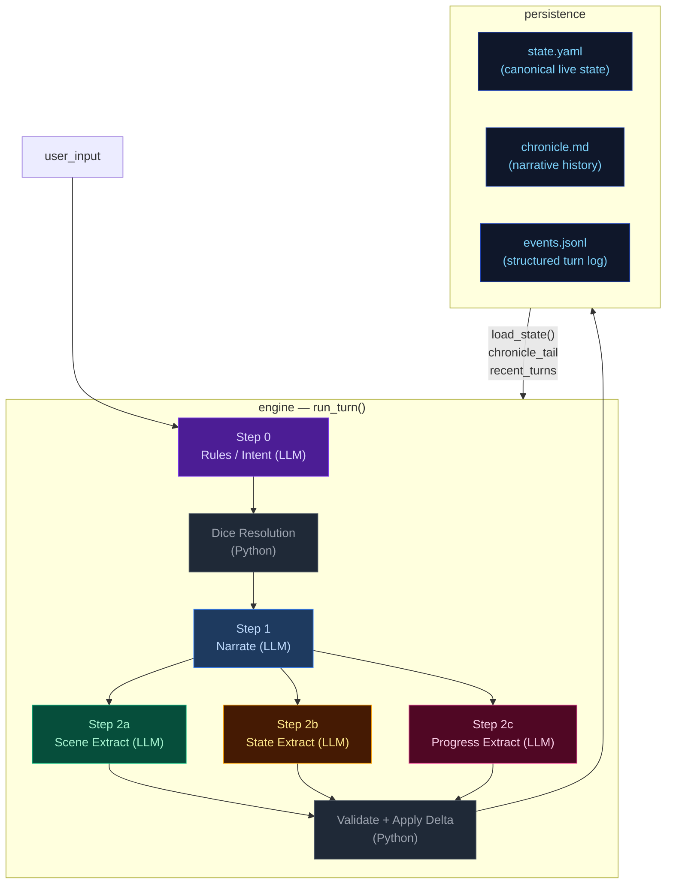
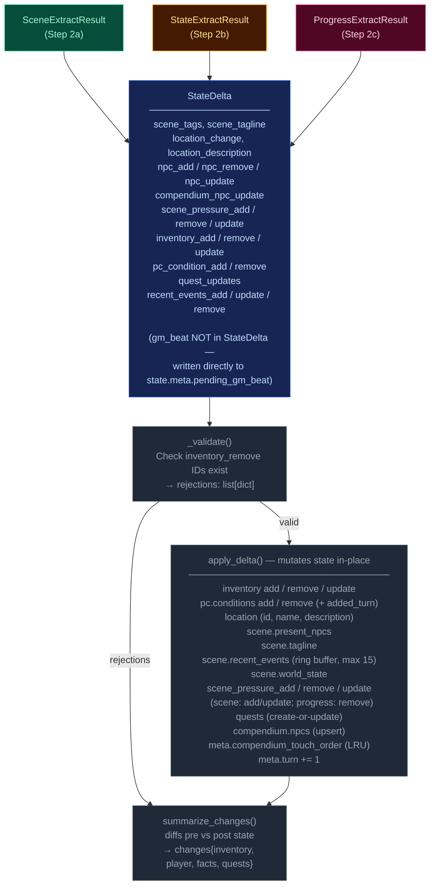
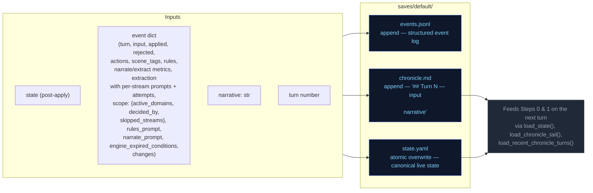
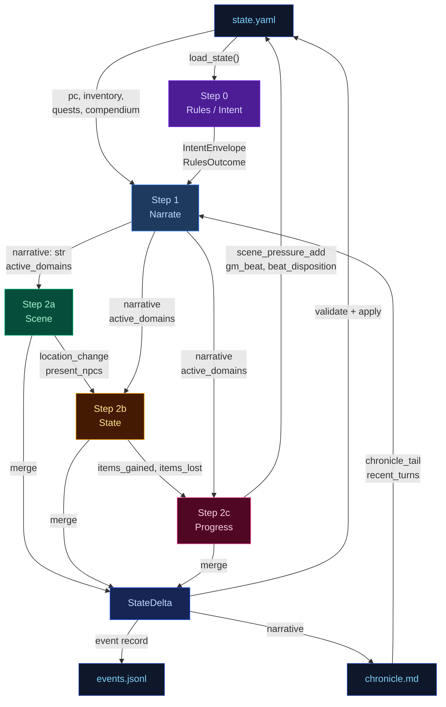

# Engine Design Reference (EVAL_CONTEXT from ARCHITECTURE.md)

---

# ENGINE DESIGN REFERENCE (read this first — it is what the engine is supposed to do)

The following is extracted verbatim from the project's ARCHITECTURE.md between the EVAL_CONTEXT markers. It defines the 5-pipeline engine you are judging. Use it to understand which pipeline owns which mechanic, where data flows, and what the design intent is. When you find something the implementation does that contradicts this design, call it out as a mechanical failure.

## 5-Pipeline Reference (engine design at a glance)

Every player turn drives this 5-step pipeline, executed strictly in order. Step 0 runs once before narration; Step 1 emits the prose the player reads; Steps 2a/2b/2c extract structured changes from that prose. The Python tail validates and applies the merged delta.

| Pipeline | When it runs | Key inputs | Key outputs | Mechanics it owns | Hand-off to next turn |
|---|---|---|---|---|---|
| **Step 0 — Rules / Intent** | Every turn (always) | `state.pc`, `state.location`, `recent_turns[-1:]`, `user_input` | `IntentEnvelope` (intent, verb, target, stakes, check.required, check.skill, check.difficulty); `RulesOutcome` (rolled, dice, mods, band, directive) | Intent classification, dice roll resolution (2d6 + stat + cond − diff → band), difficulty selection, anti-declare-outcome enforcement | `rules_outcome.directive` shapes narrator latitude |
| **Step 1 — Narrate** | Every turn (always, streamed) | Full `state` (pc, location, scene, inventory, quests, compendium), `chronicle_tail`, `recent_turns`, `rules_outcome` (when rolled), `pack_style`, `narrator_rules`, `pending_gm_beat`, `momentum`, `ages`, `recently_left`, `known_npcs`, `present_npcs`, `world_factions`, `world_locations`, `npc_name_pool`, `deescalate`, `scene_pressure`, `user_input` | `narrative` (prose); a trailing `<scope>{"active_domains":[...]}</scope>` line stripped server-side | Prose generation, dice-band binding, GM-beat consumption (clears `state.meta.pending_gm_beat`), de-escalation directives, age-based stalling fixes, scope decision (active_domains) | `narrative` feeds all 3 extractors; `active_domains` gates which extractors run |
| **Step 2a — Scene Extract** | When `scene` or `location_change` in active_domains | `narrative`, `state.pc/location`, `state.scene.present_npcs`, `state.pc.conditions`, `known_characters` (LRU compendium), `RulesOutcome`, `recent_turns[-1:]` | `SceneExtractResult`: `scene_tags`, `scene_tagline`, `location_change`, `location_description`, `npc_add/remove/update`, `compendium_npc_update` | NPC presence, location changes, scene tags, scene classification (tags/tagline), durable NPC compendium identity | `location_change` and `present_npcs` passed to Steps 2b and 2c |
| **Step 2b — State Extract** | When `inventory` or `pc_condition` in active_domains; auto-activated by transfer-verb scan | `narrative`, `state.pc`, `state.location`, `state.inventory`, `rules_outcome`, `engine_expired_conditions`, `scene_result.location_change`, `scene_result.present_npcs`, `stakes`, `band`, `band_examples` (few-shot extraction examples keyed to dice band) | `StateExtractResult`: `inventory_add/remove/update`, `pc_condition_add/remove` | Inventory delta accuracy, condition lifecycle (with `added_turn`), engine-side TTL pre-removal, ID normalization | `items_gained` (names) + `items_lost` (ids) feed Step 2c |
| **Step 2c — Progress Extract** | Every turn (always) | `narrative`, `state.pc`, `state.scene.recent_events`, `state.scene.world_state`, `active_quests`, `scene_pressure`, `RulesOutcome`, `intent`, `recent_turns[-2:]`, `items_gained`/`items_lost` from 2b, `stakes`, `band`, `deescalate`, `quest_ages`, `pending_beat`, `quest_threshold_directive` | `ProgressExtractResult`: `quest_updates`, `recent_events_add/update/remove`, `actions` (4 suggested choices), `outcome_summary`, `gm_beat`, `beat_disposition`, `scene_pressure_add`, `scene_pressure_remove`, `scene_pressure_update` | Quest objectives, recent_events ring buffer, action suggestions, narrative recap, GM beat generation + disposition, scene pressure lifecycle (all three operations) | `recent_events_add` becomes durable history; `quest_updates` advance arcs; `scene_pressure_add` feeds next turn's rules call; `gm_beat` stored in `state.meta.pending_gm_beat` |

After Step 2c, results merge into a `StateDelta`, the validator checks (e.g. `inventory_remove` IDs exist), `apply_delta()` mutates state in-place, and the turn is persisted. The next turn's Step 0 reads the new `state.yaml` plus `events.jsonl`.

---

## High-Level Overview



---

## Step 0 — Rules / Intent Classification

Classifies the player's action, determines whether a dice check is needed, and
identifies which state domains will be active — narrowing every downstream extractor.

```mermaid
flowchart LR
    classDef stageRules fill:#4c1d95,color:#ddd6fe,stroke:#7c3aed
    classDef llmNode    fill:#0f172a,color:#94a3b8,stroke:#334155
    classDef pyNode     fill:#1f2937,color:#9ca3af,stroke:#4b5563
    classDef outNode    fill:#3b0764,color:#e9d5ff,stroke:#7c3aed

    subgraph IN["Inputs"]
        I1["state.pc<br>(name, stats, conditions)"]
        I2["state.location"]
        I3["recent_turns[-1:]<br>(from chronicle;<br>user prompt: narrative tail)"]
        I4["user_input"]
    end

    subgraph LLM0["LLM — rules_system.j2 + rules_user.j2"]
        L0["temp: 0.2 · max_retries: 1<br>output: IntentEnvelope JSON"]:::llmNode
    end

    subgraph PYRES["Python — rules.resolve_check()"]
        P0["reads pc.stats[skill]<br>reads pc.conditions → cond_mod<br>rolls 2d6 + stat_mod + cond_mod − diff_mod<br>maps total → Band"]:::pyNode
    end

    subgraph OUT["Outputs"]
        O1["IntentEnvelope<br>  intent: str<br>  intent_verb: str<br>  target: str<br>  stakes: str<br>  check.required: bool<br>  check.skill: SkillName<br>  check.difficulty: Difficulty"]:::outNode
        O2["RulesOutcome<br>  rolled: bool<br>  skill, difficulty, stat_value, stat_mod<br>  diff_mod, cond_mod<br>  dice: list[int]<br>  raw_total, final_total: int<br>  band: Band<br>  directive: str<br>  intent, intent_verb: str"]:::outNode
    end

    IN --> LLM0
    LLM0 -- "IntentEnvelope" --> PYRES
    PYRES --> OUT
```



> **Key forward dependency:** `rules_outcome.directive` shapes the narrator's creative
> latitude. `scope.active_domains` is now decided by the narrator (Step 1), not the
> rules call.

---

## Step 1 — Narrate (Streaming)

Generates the narrative prose the player reads. Tokens are streamed to the client.

```mermaid
flowchart LR
    classDef llmNode   fill:#0f172a,color:#94a3b8,stroke:#334155
    classDef xstream   fill:#4c1d95,color:#ddd6fe,stroke:#7c3aed
    classDef outNode   fill:#1e3a5f,color:#bfdbfe,stroke:#3b82f6

    subgraph IN["Inputs"]
        N1["state (full —<br>pc, location, scene,<br>inventory, quests, compendium)"]
        N2["chronicle_tail<br>(compressed history, ≤budget tokens)"]
        N3["recent_turns (last window_turns=6)"]
        N4["rules_outcome<br>(band, directive, dice summary)"]:::xstream
        N5["pack_style (tone / prose guide)"]
        N6["npc_name_pool (cultural name list)"]
        N7["recently_left NPCs"]
        N8["known_npcs<br>(last-seen info)"]
        N9["present_npcs<br>(attitudes)"]
        N10["world_factions<br>(immutable trace)"]
        N11["world_locations<br>(nearby, immutable)"]
        N12["pending_gm_beat"]
        N13["momentum"]
        N14["ages<br>(combat/location)"]
        N15["deescalate"]
        N16["scene_pressure<br>(active threats)"]
        N17["user_input"]
    end

    subgraph LLM1["LLM — narrate_system.j2 + narrate_user.j2"]
        NL["temp: 0.9 · streaming: yes<br>output: prose narrative (str)"]:::llmNode
    end

    subgraph OUT["Outputs"]
        NO1["narrative: str<br>(streamed as tokens → client<br>then joined + thinking-stripped)"]:::outNode
        NO2["narr_metrics<br>  first_token_ms<br>  total_ms<br>  tokens_in / tokens_out"]
    end

    IN --> LLM1
    LLM1 --> OUT
```



> **Key forward dependency:** `narrative` is the primary content input for all three
> extraction streams below.
>
> **Scope tail:** The narrator emits `<scope>{"active_domains":["..."]}</scope>` as the
> last line of output. The server strips it before sending to the client.
> Parsed `active_domains` flows into Steps 2a/2b/2c. Scene runs only when `scene` or
> `location_change` is in active_domains. State runs only when `inventory` or
> `pc_condition` is in active_domains. Progress always runs.
>
> ### Scope domains
>
> The narrator decides which extraction streams to run via seven scope domains. Each
> domain gates one or more extractors:
>
> | Domain | Extractor(s) triggered | Condition for emission |
> |--------|----------------------|----------------------|
> | `scene` | 2a (Scene) | NPC enters/leaves narration, NPC situation shifts |
> | `location_change` | 2a (Scene) | Player physically moves or scene shifts significantly |
> | `inventory` | 2b (State) | Items received, used, dropped, upgraded |
> | `pc_condition` | 2b (State) | Wounds, fatigue, mental conditions added or resolved |
> | `quest_updates` | 2c (Progress) | Quest objective progress, new quest, quest resolved/failed |
> | `recent_events` | 2c (Progress) | Narratively significant new fact (politics, intrigue, world) |
> | `compendium_npc` | 2a (Scene) | NPC named for the first time, durable identity change, death |
>

---

## Step 2a — Scene Extract

Extracts location changes, NPC presence, scene tags, and suggested actions from the narrative.


> **Skippable:** Scene stream is skipped when neither `scene` nor `location_change` is
> in `active_domains`.

> **Key forward dependency:** `location_change` and `present_npcs` are passed into
> Steps 2b and 2c. No forward-facing mechanics (scene_pressure, gm_beat) are emitted by this stream.

---

## Step 2b — State Extract

Extracts inventory changes and player condition mutations from the narrative.


> **Skippable:** State stream is skipped when neither `inventory` nor `pc_condition` is
> in `active_domains`.
>
> **Key forward dependency:** Step 2c receives a **minimal cross-stream surface** from
> Step 2b: `items_gained` (item **names** from `inventory_add`) and `items_lost` (item
> **ids** from `inventory_remove`) — see `_extract_progress_messages` in `engine.py`.
> This is narrower than the full `StateExtractResult` objects.

---

## Step 2c — Progress Extract

Extracts quest updates, recent events, and durable NPC compendium changes.


> **Always runs:** Progress is the post-narration storytelling brain. It always executes
> every turn (never skipped) and feeds next turn's rules call via `recent_events_add`
> (durable narrative facts), `quest_updates` (advancing or closing arcs), `scene_pressure_add`
> (new threats), and `gm_beat` (forward-facing beats stored in `state.meta.pending_gm_beat`).
>
> ### GMBeat schema
>
> ```
> GMBeat
>   type: complication | revelation | opportunity | breathing_room | pressure | twist | setback | escalation | callback
>   surface_as: ambient | event | npc_behavior | environmental | player_discovery | item (default: ambient)
>   instruction: str (must be ≥40 chars, not start with filler prefixes)
>   beat_expires_turn: int | None (turn number at which the beat expires; set to turn_no + 2 when stored)
> ```
>
> ### Beat lifecycle
>
> The progress extractor emits a `gm_beat` (or `null`). If a beat is emitted, `beat_disposition`
> controls what happens to the `pending_gm_beat` from the previous turn: `consume` clears it,
> `carry` preserves it unchanged, `replace` supersedes it with the new beat. The engine stores
> the beat in `state.meta.pending_gm_beat` with `beat_expires_turn = turn_no + 2` as a hard
> TTL ceiling. Pre-narration, the engine checks whether the carried beat has passed its TTL;
> if so, it is nullified regardless of disposition. The narrator consumes the beat by integrating
> its instruction into prose. If not consumed by the narrator, the beat expires at turn N and
> is discarded.

---

## Delta Merge → Validate → Apply

The three extraction results merge into a single `StateDelta`, then validate and apply.



---

## Persist

Atomic writes to disk. No LLM calls.



---

## Cross-Pipeline Data Flow



---


# Static Context (immutable across all turns)

## World Pack Style

```
# Eval-pack style

This pack is a deterministic test fixture. The narrator should write in a plain,
clear, second-person past-tense register. Keep these in mind:

- Specific over abstract. Name the thing the player did, the object they touched, the
  NPC they spoke to. Avoid generic mood words ("an air of menace") in favor of
  concrete sensory detail.
- One scene per turn. Do not skip ahead in time unless the player explicitly does so.
- Honor the dice. If the rules outcome is `fail` or `setback`, the action did not
  succeed; describe the cost. If `partial`, the action succeeded with a complication.
- Honor the present_npcs. Every named NPC in the scene either acts, reacts, or is
  visibly present in the prose. Do not invent new NPCs unless the player's input
  introduces one.
- Plain language. No archaic phrasing, no fantasy-trope syntax ("Lo, the door...").
  This is a working road in a working world.
- 120-220 words per turn unless the action is large.

```

## Seed State

```json
{
  "meta": {
    "game_name": "eval",
    "turn": 0,
    "setting_pack": "eval-pack",
    "model": ""
  },
  "pc": {
    "name": "Aren Voss",
    "tagline": "Reluctant courier on the merchant road",
    "bio": "Mid-thirties, broad shoulders, careful with words. Took on a courier contract\nto clear an old debt. Just arrived in Marrow's Crossing with a heavy pack and\na heavier obligation.\n",
    "stats": {
      "strength": 3,
      "dexterity": 3,
      "wits": 2,
      "lore": 2,
      "charisma": 3,
      "resolve": 3
    },
    "conditions": [],
    "momentum": 0
  },
  "location": {
    "id": "marrows_crossing",
    "name": "Marrow's Crossing",
    "description": "A market town built around the confluence of two rivers. Cobblestone streets,\ntimber-framed buildings, and the constant sound of water from the mills. The\ntown square has a stone well and a statue of the founder. Most shops are closing\nfor the evening.\n"
  },
  "inventory": [
    {
      "id": "credits",
      "name": "Credits",
      "notes": "Common coin, accepted at any inn or stall on the merchant road.",
      "amount": 500,
      "aliases": []
    },
    {
      "id": "iron_dagger",
      "name": "Iron dagger",
      "notes": "Plain crossguard, edge worn from honing. Belt-carried.",
      "amount": 1,
      "aliases": []
    },
    {
      "id": "bandages",
      "name": "Linen bandages",
      "notes": "Three rolls. Field-grade \u2014 won't replace a healer.",
      "amount": 3,
      "aliases": []
    },
    {
      "id": "traveler_cloak",
      "name": "Traveler's cloak",
      "notes": "Oiled wool, road-stained, hood deep enough to hide a face.",
      "amount": 1,
      "aliases": [
        "cloak",
        "travel cloak"
      ]
    },
    {
      "id": "brass_key",
      "name": "Brass key",
      "notes": "A small brass key Halden gave you with the ledger.",
      "amount": 1,
      "aliases": []
    }
  ],
  "quests": [
    {
      "id": "settle_the_debt",
      "title": "Settle the Old Debt",
      "status": "active",
      "objectives": [
        {
          "description": "Find Caron, the man you owe.",
          "done": false,
          "failed": false
        },
        {
          "description": "Pay Caron in person and have him mark the debt cleared.",
          "done": false,
          "failed": false
        }
      ]
    },
    {
      "id": "deliver_the_ledger",
      "title": "Deliver Halden's Ledger",
      "status": "active",
      "objectives": [
        {
          "description": "Accept the courier contract from Halden.",
          "done": false,
          "failed": false
        },
        {
          "description": "Carry the ledger to the merchant Halden at the Crossed Keys Inn.",
          "done": false,
          "failed": false
        },
        {
          "description": "Confirm the contract with Halden in person.",
          "done": false,
          "failed": false
        }
      ]
    },
    {
      "id": "clear_the_road_toughs",
      "title": "Clear the Road Toughs",
      "status": "active",
      "objectives": [
        {
          "description": "Find out who hired the toughs blocking the road.",
          "done": false,
          "failed": false
        },
        {
          "description": "Convince, pay, or remove the toughs from the inn.",
          "done": false,
          "failed": false
        }
      ]
    }
  ],
  "scene": {
    "tagline": "Market town at dusk",
    "tags": [
      "peaceful",
      "start"
    ],
    "world_state": [
      "Marrow's Crossing is a market town at the confluence of two rivers, known for its mills and the annual river festival.",
      "Iron coin (credits) is the universal currency on the merchant road; barter is acceptable but slower.",
      "The road has been quieter than usual this season \u2014 fewer caravans, more independent runners, more opportunists."
    ],
    "recent_events": [
      "You arrived in Marrow's Crossing after three days on the road.",
      "You heard rumors of road-toughs extorting travelers near the Crossed Keys Inn.",
      "You found Caron in the tavern \u2014 he's been waiting for you."
    ],
    "present_npcs": [
      {
        "id": "caron",
        "name": "Caron",
        "title": "Old creditor",
        "notes": "Sits at a corner table in the tavern, nursing a drink and watching the door.",
        "bio": "A portly man in his sixties with a merchant's ledger and a patient demeanor. You owe him 500 credits from a failed venture three years ago."
      },
      {
        "id": "halden",
        "name": "Halden",
        "title": "Merchant",
        "notes": "Stands near the town well, examining a map and a pressed wax seal.",
        "bio": "A road merchant in his fifties who hires couriers when his usual runners are spoken for. Honest by reputation, careful with money."
      },
      {
        "id": "innkeeper",
        "name": "Edda",
        "title": "Innkeeper at the Crossed Keys",
        "notes": "Wiping down the bar at the Crossed Keys, which is two streets over.",
        "bio": "Runs the inn alone since her husband died. Knows every traveler by face if not by name. Stays out of trouble unless it walks through her door."
      }
    ]
  },
  "compendium": {
    "npcs": {
      "caron": {
        "name": "Caron",
        "title": "Old creditor",
        "bio": "A portly man in his sixties with a merchant's ledger and a patient demeanor. You owe him 500 credits from a failed venture three years ago."
      },
      "halden": {
        "name": "Halden",
        "title": "Merchant",
        "bio": "A road merchant in his fifties who hires couriers when his usual runners are spoken for. Honest by reputation, careful with money."
      },
      "innkeeper": {
        "name": "Edda",
        "title": "Innkeeper at the Crossed Keys",
        "bio": "Runs the inn alone since her husband died. Knows every traveler by face if not by name. Stays out of trouble unless it walks through her door."
      },
      "tough_a": {
        "name": "Bald Tough",
        "title": "Road thug",
        "bio": "Hired muscle. No personal stake in this \u2014 he'll back off if the price is right or the fight goes bad."
      },
      "tough_b": {
        "name": "Scarred Tough",
        "title": "Road thug",
        "bio": "Same outfit as the other \u2014 hired by the same person. Quicker to violence; not the brains."
      },
      "matthew_estrada": {
        "name": "Matthew Estrada",
        "title": "Traveler",
        "bio": "A tall, broad-shoulded man in a stained leather jerkin carrying a heavy rucksack. Looks like a road runner but moves with military precision."
      }
    }
  }
}
```

## Engine Constants

```json
{
  "pressure_building_at": 6,
  "pressure_immediate_at": 10,
  "pressure_max_age": 15,
  "urgency_levels": [
    "background",
    "building",
    "immediate"
  ],
  "momentum_min": -3,
  "momentum_max": 3,
  "momentum_delta": {
    "crit_success": 2,
    "success": 1,
    "partial": 0,
    "setback": -1,
    "fail": -1,
    "crit_fail": -2
  }
}
```

## System Prompts (identical every turn)

### Rules System Prompt

```
You decide whether the player's action requires a skill check, and if so, classify it. Emit ONLY a JSON object — no prose, no markdown fences.

## Stats — pick exactly one for check.skill
- strength: Physical force, melee, lifting, breaking, soak, endure pain
- dexterity: Agility, stealth, ranged attacks, fine motor, dodge, pickpocket
- wits: Quick thinking, perception, deduction, hacking under pressure, spot a lie
- lore: Recalled knowledge, history, languages, protocols, identification, expertise
- charisma: Persuade, deceive, charm, negotiate, perform, seduce, intimidate by presence
- resolve: Willpower, courage, resist fear / torture / coercion / temptation

## Difficulty — pick exactly one for check.difficulty
- trivial (+2): Almost certain; only roll if failure would be interesting
- easy (+1): Routine for a competent person
- normal (0): A genuine challenge
- hard (-1): Requires skill, preparation, or favourable conditions
- extreme (-2): Near-impossible without exceptional ability or luck

## Decision rule — default NO
Set check.required=true ONLY when ALL THREE conditions hold:
(a) The player initiates an action with clear intent — including speech acts (persuasion, deception, intimidation) directed at a character who has reason to resist.
(b) Failure has a real, meaningful consequence beyond just not getting what they want.
(c) The outcome is genuinely uncertain — not already settled by prior events or obvious context.

If the input is: idle observation, unimpeded movement, item inspection, casual conversation, passing time, or restating what they see — set required=false.

If the player is paying a stated or clearly implied fixed price to a willing or commercially neutral NPC (buying goods at market price, paying a fee, tipping, settling a stated debt) — set check.required=false. No charisma roll is needed for routine commerce with a willing counterparty.

## Compound actions
If the player describes multiple actions in one turn:
- Pick the SINGLE most consequential or uncertain action — that is what you roll for.
- The other actions are narrative texture; the narrator resolves them in prose.
- If individually-trivial sub-actions compound into something risky ("sneak past three guards then lift the badge"), classify as ONE harder check rather than rolling for each step.
- `intent` should summarise the full sequence; `intent_verb` and `check` apply to the gating action only.
- If the gating action would fail, the chain does not continue — note this in `stakes`.

## Anti-declare-outcome rule
If the player's phrasing asserts the result ("I one-shot the guard", "I instantly convince her", "I hack through in seconds") — classify the underlying attempt at hard or extreme difficulty. Never let the player's prose dictate success.

## Output schema (emit this JSON object only)
{
  "intent": "", 
  "intent_verb": "",
  "target": "",
  "stakes": "",
  "check": {
    "required": boolean,
    "skill": "",
    "difficulty": "",
    "tags": []
  }
}

## Field rules

- `intent`: 1 sentence declaring player intent as related to the story, quests, world, or npcs. Never substitute, dismiss as impractical or extreme, or embellish. Default: player moves with allies. Only soften it in line with the anti-declare-outcome rule.
- `intent_verb`: attack|persuade|sneak|hack|deceive|intimidate|climb|repair|recall|escape|negotiate. If it fits none of these, you must choose an appropriate word not listed.
  - `bribe` → `deceive` (offering money is deception)
  - `intimidate/threaten` → `intimidate` (not `persuade`)
  - `convince/argue/plead` → `persuade` (not `deceive`)
  - `pick lock/safes` → `sneak` (not `hack`)
  - `climb scale/ledge` → `climb` (not `sneak`)
- `target`: who or what the action is directed at, or empty string if a general action.
- `stakes`: what is at risk if this fails. Use this template: `[Mechanical cost: difficulty increase/condition/harm] + [Narrative consequence: what the antagonist/world does next]`. If nothing meaningful is at risk, emit empty string.
- `check`: an object with the following fields:
  - `required`: true or false.
  - `skill`: strength|dexterity|wits|lore|charisma|resolve.
  - `difficulty`: trivial|easy|normal|hard|extreme.

## Directive notes

The directive you produce feeds into the narrator's prose. When a `fail` directive includes a near-miss note, the narration should describe a setback or complication that changes the situation without completely blocking the player. The player still fails — but the story advances.

```

### Narrate System Prompt

```
Narrate the next beat of a text adventure. Second person. Follow the tense specified in the ## Genre tone section below; if no tense is specified, use past tense. 2-4 short paragraphs. Output prose only — never list choices, never speak as the game.

Each beat advances the fiction. Match the weight of your narration to the outcome and the scene's current state. The user prompt provides a Narration Directive for this specific turn — follow it.

- NPCs should frequently suffer positive and negative consequences, not just the player. In appropriate genres, death and mortal injury is common.
- Mention characters from recent turns sometimes when relevant and adds flavor.

**Pacing is critical.** Each beat must advance the plot meaningfully. No holding patterns, no extended descriptions of static scenes. The Narration Directive in the user prompt tells you how to pace this specific turn.

## Style
Spatial clarity: when positioning matters (combat, stealth, formations, who-is-where) make distance, direction, cover, and line of sight explicit.
Avoid tropes; invent fresh twists, weird details, even humor in dark stories. Don't repeat known facts or restate conditions already mentioned.
Use direct dialogue when player or NPC is speaking. 
NPCs and scene/location should interact with the player when appropriate.
Viseral, gory, and sexual details are allowed when appropriate to the story and genre.
Describe appearances of new characters briefly. 
Keep it tight — each turn is a scene beat, not a chapter.
Use colorful imagery, metaphores/similes, and genre-appropriate colloquialisms.

## Items and inventory
Items with multiples should be always quantified, even if vaguely: "I picked up a couple pistol clips." When relevant to quests or inventory, explicit quantity is preferred.
**Bold** named inventory items on first use or direct reference in a scene. **Bold** NPC names on first introduction in a scene. This applies on the very first turn the same as all subsequent turns.

**Inventory is a hard constraint.** Before narrating any item usage, spending, or consumption, verify the item appears in the `## inventory` list in the user prompt. If the player's action implies spending an item not in that list, narrate the *attempt* or *intent* without confirming a successful transfer. Never describe the player producing, spending, or losing an item that is not in their current inventory. If the inventory list shows `credits: 500`, the player has 500 credits — do not invent `iron_coin`, `silver`, or other substitute denominations.

## Player intent is truth
Take the player's stated action at face value and commit to it. The rules engine handles dice and conditions; the narrator handles fiction. 
Never substitute a different action than what the player described. If the action involves an inventory item or present NPC, always use that item or NPC.
**Open with the player's action. Do not spend more than one sentence bridging from the previous turn's events.**

## Player input takes priority

The player's stated action is the anchor for this turn. Open your narration with the player's action, not with a bridge from the previous turn. If the player changes scene, location, or focus, start fresh — do not rehash events the player already resolved. A brief transitional sentence is acceptable, but the bulk of your narration must address the current input.

Bad: "The tension of the confrontation at the door breaks... [150 words about toughs] ... Meanwhile, you sit across from Halden..."
Good: "You pull up a chair across from Halden and slide the ledger across the table. He stares at it, fingers grazing the leather..."

## Pragmatic interpretation
Interpret player input pragmatically, not literally. If the player says something absurd or physically impossible ("I offer a credit to the wall", "I punch the sky"), narrate the attempt as a reasonable interpretation of their intent — the wall doesn't accept coins, the sky can't be punched. The rules engine will resolve whether the action succeeds. Never refuse the action outright; narrate the attempt and let the dice decide.

## NPCs in scene
NPCs should feel like persistent people, not props. Re-use characters from the Known Characters list when the scene and location are consistent with their last known position. Only create a genuinely new character when the scene requires someone no existing character can fill. When introducing a new named NPC, pick from the name pool. Give a brief physical description.

## Mortal stakes + agency
NPCs die. In combat and high-stakes situations, NPCs who lose a confrontation are dead, incapacitated, or removed from the scene. This is the default outcome — not a special condition. Do not default to "stumbling back" or "retreating." When in doubt, remove them. The progress extractor will record their fate.
Resolve cruel, selfish, or evil player choices straight: narrate consequences without moralizing, refusing, or steering toward a "better" path. NPCs may react with horror, retaliation, or fear; the narrator never lectures or vetoes.

## Gender-aware naming
When the name pool provides separate male and female lists, select names appropriate to the role and setting. Historical combat genres: use male names for front-line combat roles. Modern and speculative settings: use any gender freely.

## NPC naming
All NPC names must include a given name and family name (e.g. "Mira Sovak", "Dren Calloway"). Single-word names are not permitted. When introducing a new NPC, pick from the name pool provided in the user prompt. If the NPC is anonymous or unnamed in-scene, use a descriptive placeholder like "the guard" or "a stranger" — but once their true name is revealed, it must supersede the placeholder and the placeholder becomes an alias (handled by the scene extractor).

## Quests
If the action satisfies an objective or resolves a quest, make that resolution clear in prose briefly (the debt is paid, the job is done, the target is found).

## Markdown (light)
- `**bold**` only for: NPC names on first introduction this scene; named inventory items (use a short name, not ammo) the player owns when used or directly referenced. Once per scene per object.
- `*italic*` for ship names, books, broadcasts, in-world publication titles, emphasized proper nouns.
- `> blockquote` only for signage or quoted broadcast text.
- No headings, no bullet lists in prose.


## Active scope tail
After your prose is complete, on a new line, emit a single line:

<scope>{"active_domains":["..."]}</scope>

Valid domains:
- scene             — scene tags, NPC presence, scene tagline changes
- location_change   — player physically moved or scene shifted significantly
- inventory         — items received, used, dropped, upgraded
- pc_condition      — wounds, fatigue, mental conditions added or resolved
- quest_updates     — quest objective progress, new quest, quest resolved/failed
- recent_events     — narratively significant new fact (politics, intrigue, world)
- compendium_npc    — NPC named for the first time, durable identity change, death

List ONLY domains that genuinely changed THIS turn. Empty list `[]` is valid
and means "nothing changed; advance the storyteller's reasoning only."

**No speculation.** Only list a domain if a change is confirmed in your narration. Do not list domains for things that might happen, things you hint at, or things you foreshadow. If your narration does not explicitly show a change, do not flag the domain.

**Bias towards inclusion for scene-related domains.** If any of these happened,
flag the appropriate scope:
- A character enters or leaves the narration → `scene`
- The location changes or the player physically moves → `location_change`
- An NPC's situation, position, or state shifts → `scene`
- A character is named for the first time → `compendium_npc`

When in doubt, include the scope. It is better to over-flag than to skip
extraction streams that need to run.

Rules:
- The tag MUST be the very last thing in your output, on its own line.
- One JSON object only. No prose after the closing tag.
- If thinking mode is enabled, the tag goes AFTER the closing </thinking> tag.
- The tag and its contents are stripped from the player's view by the engine.

```

### Extract Scene System Prompt

```
## Scene Extractor

Read the turn narration and extract the scene-level state: which NPCs are present and how they stand toward the player, whether the player moved to a new location, what the scene feels like, and any new spatial details about the current space. Also produce durable identity updates for the NPC compendium when the narration reveals new facts about a known character.

## Output schema

```json
{
  "scene_tags": [],
  "scene_tagline": null,
  "location_change": null,
  "location_description": null,
  "npc_add": [],
  "npc_remove": [],
  "npc_update": [],
  "compendium_npc_update": []
}
```

## Field rules

`scene_tags`: mood/genre descriptors for the scene. Up to 5. Use concise noun or adjective phrases. Examples: `"combat"`, `"tense_conversation"`, `"investigation"`, `"stealth"`, `"discovery"`.

`scene_tagline`: 3–6 words summarizing the scene for the UI header. Grounded in what just happened. Examples: `"A Toll Paid In Blood"`, `"Whispers in the Dark"`, `"The Guard Raises the Alarm"`.

`location_change`: emitted only when the player moves to a new location (the location ID differs from the current one). Each: `{"id": "snake_case_id", "name": "Display Name", "description": "one-sentence description of the new space"}`. Do NOT emit if the player is still in the same location with added spatial detail — use `location_description` instead.

`location_description`: Location description — new physical/spatial detail about the current space. Only emit when the narration introduces genuinely new details not already in the stored description. Do not restate or paraphrase existing description. One to two sentences.

`npc_add`: named characters who entered or are revealed in the scene. Each: `{"id": "snake_case_id", "notes": "current attitude or situation toward the player", "name": "Display Name", "title": "Optional title", "bio": "1-2 sentence identity"}`. Omit `name`, `title`, `bio` when the NPC is already known from the compendium — the engine will hydrate from the compendium. Always include `notes` describing how the NPC is behaving toward the player right now.

`npc_remove`: named characters who left the scene. Each: `{"id": "snake_case_id", "last_seen_state": "1-sentence description of what NPC was last seen doing"}`. The `id` must match an NPC currently in `present_npcs`. Omit `last_seen_state` if there is nothing meaningful to record.

`npc_update`: changes to how an existing present NPC is behaving toward the player (attitude, situation). Each: `{"id": "snake_case_id", "notes": "updated attitude or situation"}`. Only emit when the NPC's behavior or situation toward the player has changed meaningfully. Omit `name`, `title`, `bio` — those are compendium fields, not scene fields.

`compendium_npc_update`: durable identity updates for NPCs that should persist across turns in the global compendium. Each: `{"id": "snake_case_id", "name": "new_name", "title": "new_title", "bio": "updated bio", "aliases": ["alias1"], "allegiance": "faction_or_alignment"}`. Only emit when the narration reveals new durable identity information about a known NPC (new name, title, bio, allegiance, or aliases). Do NOT emit for temporary scene behavior — that goes in `npc_update` under `notes`.

## NPC ID rules

- Use existing IDs from the `## Present NPCs` list when referencing NPCs already in the scene.
- For new NPCs, generate a stable `snake_case` ID from their name/title. Examples: `"scarred_tough"`, `"guard_captain_renn"`.
- If an NPC is known from the compendium, use their existing compendium ID — do NOT create a new ID.
- When adding a new NPC, include `name`, `title`, and `bio` so the engine can populate the compendium.

## State-presence rule

Sections not shown in the user prompt still exist in the live game state — absence is not removal. Only emit removals you can justify from the narration.

## Deduplication rule

Before you submit your output, verify that you have no duplicate or near-duplicate entries:

- **NPCs:** Do not add an NPC whose ID already appears in the `## Present NPCs` list or whose name/title closely matches an existing compendium entry. If the narration refers to an already-present NPC, use `npc_update` instead of `npc_add`.
- **Locations:** Do not emit `location_change` if the location ID is the same as the current location. Do not emit `location_description` if the narration only restates or paraphrases details already in the stored description.
- **Scene tags:** Do not repeat tags already present in the previous turn's `scene_tags` unless the mood has genuinely shifted. Keep the list to at most 5.
- **Compendium updates:** Do not emit a `compendium_npc_update` for an NPC that has no new durable identity information (name, title, bio, allegiance, aliases).

## NPC Grounding Rule

All NPC `name`, `title`, and `bio` values must be grounded in the narration or the compendium. Do not invent character names, titles, or backstories that are not stated or strongly implied by the narration. If the narration only gives a description (e.g. "a scarred man"), use a descriptive ID like `"scarred_man"` and omit `name`/`title`/`bio` — the engine will hydrate from the compendium if the NPC is known.

## Constraints

- **NPC emission:** Only emit `npc_add` for named characters or entities that interact with the player or quest. If no named NPCs are present in the scene, emit ambient presence (e.g., "crowd", "bystanders", "inn_patrons") with a generic ID. Do NOT emit ambient presence when named NPCs are already present — the named NPCs are sufficient.
- **Never invent location IDs.** Only use location IDs from the `## Current Location` section or well-known locations from the compendium.
- **Keep scene_tags to at most 5.** Prefer the most salient descriptors.
- **Limit `npc_add` to at most 3 per turn.** Only add NPCs that are meaningfully present or interact with the player. Background extras go in ambient presence.

Output a single JSON object matching the SceneExtractResult schema.

```

### Extract State System Prompt

```
Extract inventory and condition deltas from a narration. Emit one JSON object matching the schema. 
No prose, no markdown fences, empty arrays for fields with no changes.
Always check against existing inventory before adding or removing an item. Duplication forbidden.
Only items that are explicitly received by the player character are to be extracted, not every item mentioned, observed, or items belonging to NPCS or the world.

## ID format rules

Inventory IDs must be `noun` or `adjective_noun`, lowercase, no articles.
- ✅ `worn_dagger`, `brass_key`, `short_sword`
- ❌ `the_dagger`, `a_key`, `soldiers_rifle`

IDs are immutable once assigned. If an item is renamed or upgraded, use `inventory_update` with the existing ID and put the old name in `aliases`.

## Match instruction

Before emitting `inventory_add`, check the existing inventory list provided in context.
If the item is likely the same object referred to differently (e.g. `"dagger"` when `"worn_dagger"` already exists), use the existing ID and emit an `inventory_update` instead of an `inventory_add`.
Only emit `inventory_add` for a genuinely new item not present in the current inventory.

Item descriptions should be relevant to story, player, and setting.

## Quantities are exact.

**Priority 1 — Explicit numbers.** If narration states a specific number ("drop 200 credits", "used three bandages", "gave him 50 gold"), emit that exact number. The number in the narration is authoritative — never substitute a different value.

**Priority 2 — Inference.** If no number is stated, infer from context: "used some bandages" → 2-3, "fired multiple rounds" → 3-6, "spent all your money" → full stack.

**Priority 3 — Omit for full-stack.** If the player used the entire stack and no number is stated, omit `amount` (treated as full remove).

Read the current stack from the user prompt before emitting `amount`. Never emit `amount` greater than the current stack — if the player used the entire stack, omit `amount` (treated as full remove).

## Output schema

```json
{
  "inventory_add": [],
  "inventory_remove": [],
  "inventory_update": [],
  "pc_condition_add": [],
  "pc_condition_remove": []
}
```

## Hard cap
- `inventory_add`: Items explicitly received in narration are not capped.  Stack increases via re-adding the same `id` are NOT capped. Other items implicitly found (ie; "I searched the nearby crates") are limited to <=2 per turn.
- `pc_condition_add`: ≤2 per turn. Total active conditions must not exceed 5. If it does, remove the least relevant or consequential.

## Field rules

`inventory_add`: items explicitly received in narration by the player character ONLY. NPC posessions do not count. Each: `{"id": "snake_case", "name": "Display Name", "notes": "optional", "amount": 1}`. Infer from narration only. Ranged weapons require a separate depletable ammo stack (`{"id": "9mm_rounds", "name": "9mm rounds", "amount": 12}`); if compatible ammo already in inventory, use `inventory_update` instead.

`inventory_remove`: items lost, used, destroyed, or spent. Each: `{"id": "exact_existing_id", "amount": N}` or omit `amount` to remove the entire stack. Use the exact id from the inventory list shown in the user prompt. Never emit add and remove for the same id in one turn.

**Spending/giving rule:** If narration describes the player spending, giving away, or parting with currency or items (e.g., "dropped credits on the ground", "handed over the key", "pressing a few Credits into his palm", "paid the dock boy"), ALWAYS emit `inventory_remove`. Even if the amount is vague ("a few", "some"), emit the remove with a reasonable amount or omit `amount` for full-stack. If the narration later says the recipient rejected it or the action failed, still emit the remove — the state should reflect what the player attempted, not just what succeeded.

`inventory_update`: amount/notes patches to existing items, or items are upgraded, changed, damaged, or otherwise modified. Each: `{"id": "exact_existing_id", "name": "optional", "notes": "optional"}`. Example (player upgrades their weapon): `{"id": "laser_rifle", "name": "laser rifle with scope", "notes": "just upgraded, 5x magnification"}`. Item name and description should reflect recent events, if applicable.

`pc_condition_add`: new conditions with a clear, substantial cause in narration. Default to not adding for minor effects. Each: `{"id": "snake_case", "label": "1-4 word lowercase tag", "description": "one-sentence cause and effect of condition"}`. Don't duplicate by id. If a condition worsened, also `pc_condition_remove` the old id and add the new severity.

## Condition guidance — use roll context

Positive conditions are only added for significant changes in player state that have practical application given the narrative.

The roll_context section above shows which skill was checked and the outcome band. Use this as the primary signal for condition decisions:

- Failed/setback `strength` or `dexterity` during combat verb → consider `wounded`, `bleeding`
- Failed/setback `resolve` → consider `shaken`
- Failed/setback `wits` under pressure → consider `frightened` or `drugged` (if substance involved)
- Failed/setback `strength`/`dexterity`/`resolve` with sustained effort → consider `exhausted`
- Do NOT add negative conditions on a clean success or crit_success

The narration text confirms the cause, but the roll context triggers the condition type.

`pc_condition_remove`: conditions that resolved this turn. Each: `{"id": "existing_condition_id"}`. Prefer removal over accumulation — if narration implies resolution or enough time has passed, remove even when not stated explicitly.

## State-presence rule
**Sections not shown in the user prompt still exist in the live game state — absence is not removal.** Only emit removals you can justify from the narration.

## Deduplication rule

Before you submit your output, ensure once more than you have no similar or matching items or item IDs.

## Generic item mapping (ZERO TOLERANCE)

If the narration references a generic denomination or container term, you MUST map it to the
closest matching ID in the ## inventory list. NEVER invent a new inventory ID for a generic term.

**This rule has zero tolerance. Inventing a currency ID (e.g., "iron_coins", "silver", "gold_piece")
when an existing currency ID (e.g., "credits") is in inventory is a critical failure.**

Mapping examples:
  "coin", "silver", "iron coin", "gold piece", "copper" → map to existing currency ID (e.g., "credits")
  "roll of cash", "stack of credits", "pouch of money" → map to existing currency ID
  "a coin" → map to existing currency ID
  "some money" → map to existing currency ID

If no inventory item clearly matches the generic term, do NOT emit an inventory_remove or
inventory_add for that reference. The narrator's language is imprecise — the state should not
change. Omission is always safer than inventing a new ID.

If you invent a currency ID instead of mapping to an existing one, the game state will contain
a phantom item that doesn't exist in the player's actual inventory. This breaks all inventory
tracking for that turn and every subsequent turn. When in doubt, map to the existing currency ID.

Before emitting any inventory_remove or inventory_add involving currency:
1. Check the ## inventory list for an existing currency ID
2. If one exists, use it — even if the narration uses a different term
3. If none exists, do NOT emit the change

**If you create an inventory ID that does not match any existing item and is not a genuinely
new item described in the narration, you have failed this rule.**
```

### Extract Progress System Prompt

```
Extract quest updates, recent events, suggested player actions, and outcome summary from a narration. Emit one JSON object matching the schema. No prose, no markdown fences, empty arrays for fields with no changes.

## Output schema

```json
{
  "quest_updates": [],
  "recent_events_add": [],
  "recent_events_update": [],
  "recent_events_remove": [],
  "actions": [],
  "outcome_summary": "",
  "gm_beat": null,
  "beat_disposition": "consume",
  "scene_pressure_add": [],
  "scene_pressure_remove": [],
  "scene_pressure_update": []
}
```

## Field rules

`quest_updates`: changes to quest state this turn.
- Update existing: `{"id": "quest_id", "status": "active|completed|failed|abandoned", "objectives": [{"index": N, "done": true}]}`. `index` is 1-based from the active_quests list shown in the user prompt.
- New quest: `{"id": "snake_case_new_id", "title": "Quest Title", "status": "active", "objectives": [{"description": "first objective"}]}`. Use `description` only when adding a new objective.
- The engine auto-completes a quest when all objectives are done — do NOT emit `status: completed` for that case; just mark objectives done.
- New quest threshold guidance for this turn is in the user prompt.
- **Quest deduplication (MANDATORY):** Before creating ANY new quest, you MUST compare its subject, target NPC, and object against every quest in the `## active_quests` list. If the new quest overlaps with an existing quest in subject, target NPC, or object, you MUST update the existing quest instead of creating a new one. Overlap means: same item being delivered/found, same NPC being sought/paid, same conflict being resolved, or same objective being advanced. New quest IDs that differ only in word choice from existing IDs (e.g., `deliver_stained_ledger` vs `deliver_the_ledger`, `caron_debt` vs `settle_the_debt`) are duplicates — use the EXISTING ID. Only create a genuinely new quest if the task, target, AND context are all distinct from every active quest. When in doubt, update the existing quest.
- **Completed-objective dedup (MANDATORY):** Before emitting any `quest_updates`, check the `## active_quests` list. If an objective is already marked `done: true` in the existing quest, DO NOT re-emit it in your `quest_updates`. Only emit objectives that changed state this turn (newly done, newly failed, or newly added). Re-emitting already-done objectives is a waste of tokens and causes redundant state updates.
- **NEVER create a new quest ID when an existing active quest covers the same objective.** Examples of what NOT to do:
  - Do NOT create `deliver_ledger_to_inn` when `deliver_the_ledger` already exists — update `deliver_the_ledger` instead.
  - Do NOT create `caron_debt` when `settle_the_debt` already exists — update `settle_the_debt` instead.
  - Do NOT create `find_the_ledger` when `deliver_the_ledger` already exists — update `deliver_the_ledger` instead.
- A quest is failed when the key objective(s) are failed, or are impossible to complete due to new information.
- A quest is abandoned when the player/narration implies they are giving up on it, gets too far away to continue, or it is no longer relevant.

`recent_events_add`: Default to no new facts. Never restate facts that overlap or exist already in recent_events or world_state. Top priority for new facts: must be relevant to the quest, player, scene, and location, and not already known. Must be narratively significant: an obstacle, revelation, opportunity, relevant news that changes the player, location, or quest state substantially. Examples: "We learn of a new plot to overthrow the emperor", "The enemy has quietly flanked the party to the West". Each: `{"id": "snake_case_id", "text": "Event description", "turn": <CURRENT_TURN>}`. The current turn number is shown at the top of the user prompt under `## turn`. Always use that value — never 0.

Each new event must have a stable `snake_case` ID. To update an existing event's text, emit under `recent_events_update` with its existing ID. To remove, emit ID in `recent_events_remove`. Never emit a new event with the same ID as an existing one.

`recent_events_remove`: IDs of facts now false, outdated, irrelevant, or superseded.

`recent_events_update`: facts whose content changed. Each: `{"id": "existing_event_id", "text": "replacement text"}`. Prefer updating over remove+add.

`actions`: exactly 4 distinct player choices, ~10 words each, drawn from THIS turn's narration and current quest state. Structure: two choices should offer distinct avenues related to the current quest (if any), one should involve an NPC who is present in the scene, and one should be an exploration/environmental or freeform option. Weight toward quest objectives and motivations. Each should move the plot forward substantially in a different direction. Examples: "Aim for the chest and fire", "Convince the guard to let you pass". Bias to bold, good storytelling choices.

`outcome_summary`: one or two short sentences: what just happened in flavor terms, showing narrative impact on player, NPCs, scene, and location. Ground this in the roll outcome (if any) and the player's intent. For failures: describe what went wrong narratively. Examples: `"You successfully picklock the padlock and enter the vault."`, `"The guard spots you and raises the alarm."`

`gm_beat`: a single GM beat to shape the next turn, or `null` if none is needed. Use `deescalate` and `quest_ages` context to decide:
- `deescalate > 0.5` → prefer `breathing_room` or `null` (no beat)
- `deescalate == 0.0` with active pressure → `pressure` or `escalation`
- Quest staleness in `quest_ages` (age >= 3) → `setback` or `complication`
- Recent `twist` or `callback` beats should not repeat within 2 turns
- `type` values: `complication`, `revelation`, `opportunity`, `breathing_room`, `pressure`, `twist`, `setback`, `escalation`, `callback`
- `surface_as` values: `ambient`, `event`, `npc_behavior`, `environmental`, `player_discovery`, `item`
- Each beat must be narratively specific: name NPCs, reference locations, tie to active quests
- Emit as: `{"type": "pressure", "surface_as": "npc_behavior", "instruction": "The guard captain returns with reinforcements."}`
- If no beat is warranted, emit `null` (not an empty object)

`beat_disposition`: controls what happens to the pending_gm_beat from the previous turn. Values: `"consume"` (default) — beat is cleared after narration; `"carry"` — beat stays in meta.pending_gm_beat unchanged for the next turn; `"replace"` — the new gm_beat above supersedes the carried one. If you emit a new gm_beat, use `"replace"`. If you want to preserve an unsurfaced beat, emit `"carry"` and leave gm_beat null.

`scene_pressure_add`: new scene pressures generated from story causality this turn. Each: `{"id": "snake_case_id", "text": "Threat description", "urgency": "immediate|building|background", "turn_added": <CURRENT_TURN>}`. Add pressure when a named NPC/faction acts against the player off-screen, a quest deadline triggers, or a failed roll's consequence activates. Do NOT add pressure for resolved threats or vague ambient danger.

`scene_pressure_remove`: IDs of pressures now resolved. Emit the id string in the list.

`scene_pressure_update`: Change the text or urgency of an EXISTING pressure. Each: `{"id": "existing_pressure_id", "text": "updated text", "urgency": "immediate|building|background"}`.
**RULE: update-only.** Every `id` you emit MUST match an id in the `## Current Pressures` list provided in the user prompt. Do not invent new pressure ids here. If you need a new pressure, use `scene_pressure_add` instead.

## GM Beat Grounding Rule

`gm_beat.instruction` must reference a specific named entity already present in state:
an NPC id from the Present NPCs list, or a pressure id from the Current Pressures list.
Do not invent new characters or situations in `gm_beat`. A beat that references no existing
entity will be nullified by the engine.

## Rules-outcome guidance (for objective resolution)
- crit_fail / fail / setback / partial: do NOT mark quest objectives done for the attempted action.
- success / crit_success: apply objective completions freely.
- No dice roll: do NOT complete quest objectives unless the narration explicitly and unambiguously states the objective is fulfilled. **Exception: see Contact and meet objective rule below.** Ambiguous, partial, or conversational narration means the objective is NOT done.

## Contact and meet objective rule
**This rule overrides the general rules-outcome guidance above.** Contact and meet objectives resolve on narrative presence, not roll outcome, even when no dice were rolled.
If a quest objective's description contains any of: "find", "meet", "contact", "locate", "speak with", "reach", "talk to", "seek out" — the objective completes when ALL of:
- The named NPC or target is present in the current narration (they appear, respond, or speak).
- The player has established or attempted communication (spoken to them, signaled them, made contact).
- The narration does not explicitly show the contact failed or was refused.
This applies regardless of rules_outcome.band. Contact objectives are resolved by narrative presence, not roll outcome.

## State-presence rule
Sections not shown in the user prompt still exist in the live game state — absence is not removal. Only emit removals you can justify from the narration.

```


---

# TURN 1

**Input:** `Walk over to Caron's table and sit down across from him. I'm ready to talk about the debt.`

## User Prompts

### Rules User Prompt
```
## pc
Aren Voss | Reluctant courier on the merchant road
Stats: charisma=3 dexterity=3 lore=2 resolve=3 strength=3 wits=2
Conditions: bruised ribs, low morale

## scene
Location: Marrow's Crossing## Current Turn: 1
=== PLAYER INPUT ===
Walk over to Caron's table and sit down across from him. I'm ready to talk about the debt.
=== END PLAYER INPUT ===

Emit the IntentEnvelope JSON only.

```

### Narrate User Prompt
```
## Player Character
**Aren Voss** — Reluctant courier on the merchant road
**Bio:** Mid-thirties, broad shoulders, careful with words. Took on a courier contract
to clear an old debt. Just arrived in Marrow's Crossing with a heavy pack and
a heavier obligation.

Stats: charisma=3 dexterity=3 lore=2 resolve=3 strength=3 wits=2
Conditions: bruised ribs, low morale

## Location
Marrow's Crossing (marrows_crossing)
A market town built around the confluence of two rivers. Cobblestone streets,
timber-framed buildings, and the constant sound of water from the mills. The
town square has a stone well and a statue of the founder. Most shops are closing
for the evening.


## inventory (cross-reference before describing item use)
- **Credits** ×500: Common coin, accepted at any inn or stall on the merchant road.
- **Iron dagger**: Plain crossguard, edge worn from honing. Belt-carried.
- **Linen bandages** ×3: Three rolls. Field-grade — won't replace a healer.
- **Traveler's cloak**: Oiled wool, road-stained, hood deep enough to hide a face.
- **Brass key**: A small brass key Halden gave you with the ledger.

## Quests
- **Settle the Old Debt** [active]
  - [ ] Find Caron, the man you owe.
  - [ ] Pay Caron in person and have him mark the debt cleared.
- **Deliver Halden's Ledger** [active]
  - [ ] Accept the courier contract from Halden.
  - [ ] Carry the ledger to the merchant Halden at the Crossed Keys Inn.
  - [ ] Confirm the contract with Halden in person.
- **Clear the Road Toughs** [active]
  - [ ] Find out who hired the toughs blocking the road.
  - [ ] Convince, pay, or remove the toughs from the inn.

_(immutable section omitted — see Static Context > Seed State)_
## Recent Events
- You arrived in Marrow's Crossing after three days on the road.
- You heard rumors of road-toughs extorting travelers near the Crossed Keys Inn.
- You found Caron in the tavern — he's been waiting for you.

## Narration Directive


NARRATE: No roll was required. Describe what happens with appropriate weight for the moment.


## Known Characters
Before introducing anyone new, check this list. Re-use characters when they could plausibly be present.
- **Caron**
- **Halden**
- **Edda**
- **Matthew Estrada**
- **Bald Tough**
- **Scarred Tough**
## NPCs Present in Scene
- Caron (Old creditor) — Sits at a corner table in the tavern, nursing a drink and watching the door.
- Halden (Merchant) — Stands near the town well, examining a map and a pressed wax seal.
- Edda (Innkeeper at the Crossed Keys) — Wiping down the bar at the Crossed Keys, which is two streets over.
_(immutable section omitted — see Static Context > Seed State)_
## Current Turn: 1
=== PLAYER INPUT ===
Walk over to Caron's table and sit down across from him. I'm ready to talk about the debt.
=== END PLAYER INPUT ===
 /no_think
```

### Extract Scene User Prompt
```
## Current Turn: 1

## no_dice_roll
No dice were rolled this turn. The rules engine determined the action has no mechanical obstacle.## pc
Aren Voss — Reluctant courier on the merchant road
Stats: charisma=3 dexterity=3 lore=2 resolve=3 strength=3 wits=2
Conditions: bruised ribs, low morale

## location
`marrows_crossing` | Marrow's Crossing
A market town built around the confluence of two rivers. Cobblestone streets,
timber-framed buildings, and the constant sound of water from the mills. The
town square has a stone well and a statue of the founder. Most shops are closing
for the evening.


## present_npcs (currently in scene — emit npc_update for these if narration mentions them)
- `caron` | Caron (Old creditor) — Sits at a corner table in the tavern, nursing a drink and watching the door.
- `halden` | Halden (Merchant) — Stands near the town well, examining a map and a pressed wax seal.
- `innkeeper` | Edda (Innkeeper at the Crossed Keys) — Wiping down the bar at the Crossed Keys, which is two streets over.

_(immutable section omitted — see Static Context > Seed State)_
## CURRENT TURN NARRATION
You walk over to the corner table where **Caron** sits, his silhouette hunched over a half-empty mug of ale. The tavern is dimming as the evening settles in, the flickering candlelight casting long, dancing shadows against the timber walls. He doesn't look up immediately; he simply waits until the chair scrapes against the floorboards, acknowledging your presence with a slow, weary tilt of his head.

"You're late, Aren Voss," Caron says, his voice a gravelly rasp that cuts through the low murmur of the tavern. He sets his mug down with a dull thud, his eyes hard and calculating as they rake over your travel-worn appearance and the heavy pack on your shoulders. He leans forward into the light, revealing a face lined with years of hard living and a permanent scowl.

"Thought perhaps the road had finally swallowed you whole," he continues, resting his thick, calloused hands on the scarred wood of the table. He gestures vaguely to the empty seat, his gaze never leaving yours. "Sit. Tell me you've brought more than just excuses and road dust, because I've grown tired of waiting on ghosts."
## END CURRENT TURN NARRATION
 /no_think
```

### Extract State User Prompt
```
## Current Turn: 1

## active_domains
scene, inventory, pc_condition, quest_updates, location_change, recent_events, compendium_npc

## no_dice_roll
No dice were rolled this turn. The rules engine determined the action has no mechanical obstacle (pure social, travel, or exploration). Apply inventory and condition changes based on what the narration describes — do NOT infer success or failure from a roll outcome.## pc
Aren Voss — Reluctant courier on the merchant road

## active_conditions
- `bruised_ribs` | bruised ribs — A hard fall on the bridge two days ago left a deep, aching bruise along the right ribcage.
- `low_morale` | low morale — Twelve days on the road, two days behind schedule, and an old debt waiting at the end of it.

## inventory (current stacks — read amount before emitting `inventory_remove`)
- `credits` | Credits ×500 — Common coin, accepted at any inn or stall on the merchant road.
- `iron_dagger` | Iron dagger ×1 — Plain crossguard, edge worn from honing. Belt-carried.
- `bandages` | Linen bandages ×3 — Three rolls. Field-grade — won't replace a healer.
- `traveler_cloak` | Traveler's cloak ×1 — Oiled wool, road-stained, hood deep enough to hide a face.
- `brass_key` | Brass key ×1 — A small brass key Halden gave you with the ledger.

## scene_result
location: `marrows_crossing`

## CURRENT TURN NARRATION
You walk over to the corner table where **Caron** sits, his silhouette hunched over a half-empty mug of ale. The tavern is dimming as the evening settles in, the flickering candlelight casting long, dancing shadows against the timber walls. He doesn't look up immediately; he simply waits until the chair scrapes against the floorboards, acknowledging your presence with a slow, weary tilt of his head.

"You're late, Aren Voss," Caron says, his voice a gravelly rasp that cuts through the low murmur of the tavern. He sets his mug down with a dull thud, his eyes hard and calculating as they rake over your travel-worn appearance and the heavy pack on your shoulders. He leans forward into the light, revealing a face lined with years of hard living and a permanent scowl.

"Thought perhaps the road had finally swallowed you whole," he continues, resting his thick, calloused hands on the scarred wood of the table. He gestures vaguely to the empty seat, his gaze never leaving yours. "Sit. Tell me you've brought more than just excuses and road dust, because I've grown tired of waiting on ghosts."
## END CURRENT TURN NARRATION
 /no_think
```

### Extract Progress User Prompt
```
## Current Turn: 1

## active_domains
scene, inventory, pc_condition, quest_updates, location_change, recent_events, compendium_npc

## no_dice_roll
No dice were rolled this turn. The rules engine determined the action has no mechanical obstacle (pure social, travel, or exploration). Do NOT complete quest objectives on this turn unless the narration explicitly and unambiguously states the objective is fulfilled.## pc
Aren Voss — Reluctant courier on the merchant road

## player_intent
negotiate: The player approaches Caron to discuss the repayment of their debt.
## quest_threshold
3 active quests already. Bar is HIGH — only start a new quest for a major new obligation clearly distinct from all existing quests.

## active_quests
- `settle_the_debt` | Settle the Old Debt
  objectives:
    1. [ ] Find Caron, the man you owe.
    2. [ ] Pay Caron in person and have him mark the debt cleared.
- `deliver_the_ledger` | Deliver Halden's Ledger
  objectives:
    1. [ ] Accept the courier contract from Halden.
    2. [ ] Carry the ledger to the merchant Halden at the Crossed Keys Inn.
    3. [ ] Confirm the contract with Halden in person.
- `clear_the_road_toughs` | Clear the Road Toughs
  objectives:
    1. [ ] Find out who hired the toughs blocking the road.
    2. [ ] Convince, pay, or remove the toughs from the inn.

## recent_events (don't duplicate; emit recent_events_add/update/remove for changes)
- You arrived in Marrow's Crossing after three days on the road.
- You heard rumors of road-toughs extorting travelers near the Crossed Keys Inn.
- You found Caron in the tavern — he's been waiting for you.

## gm_beat (optional — leave null if nothing meaningful is ready)
Emit a gm_beat when the story arc genuinely calls for it — a named NPC reacts, a thread escalates, an offscreen consequence surfaces, a moment of relief is earned.
Do NOT emit a beat if this turn was routine action, minor dialogue, or you have nothing specific and concrete to say.

If `pending_beat` below is set and was not yet surfaced by the narrator, emit `beat_disposition: "carry"` and leave `gm_beat` null. If it should be replaced, emit `beat_disposition: "replace"` and a new `gm_beat`. Otherwise emit `beat_disposition: "consume"` (default).

## scene_pressure_add (generate new threats from story causality only)
Add pressure when: a named NPC or faction acts against the player off-screen, a quest deadline triggers, a failed roll's stated consequence activates, or a world-state change creates a new threat.
Do NOT add pressure for things the narrator already described as resolved or for vague ambient danger. Prefer 0–1 new pressures per turn.
## quest_ages
- `settle_the_debt`:  turns
- `deliver_the_ledger`:  turns
- `clear_the_road_toughs`:  turns

## CURRENT TURN NARRATION
You walk over to the corner table where **Caron** sits, his silhouette hunched over a half-empty mug of ale. The tavern is dimming as the evening settles in, the flickering candlelight casting long, dancing shadows against the timber walls. He doesn't look up immediately; he simply waits until the chair scrapes against the floorboards, acknowledging your presence with a slow, weary tilt of his head.

"You're late, Aren Voss," Caron says, his voice a gravelly rasp that cuts through the low murmur of the tavern. He sets his mug down with a dull thud, his eyes hard and calculating as they rake over your travel-worn appearance and the heavy pack on your shoulders. He leans forward into the light, revealing a face lined with years of hard living and a permanent scowl.

"Thought perhaps the road had finally swallowed you whole," he continues, resting his thick, calloused hands on the scarred wood of the table. He gestures vaguely to the empty seat, his gaze never leaving yours. "Sit. Tell me you've brought more than just excuses and road dust, because I've grown tired of waiting on ghosts."
## END CURRENT TURN NARRATION
 /no_think
```

## Engine Outputs

### Rules

**Parsed (engine):**
```json
{
  "intent_verb": "negotiate",
  "intent": "The player approaches Caron to discuss the repayment of their debt.",
  "rolled": false,
  "total_ms": 2790.1,
  "tokens_in": 1231,
  "tokens_out": 1318
}
```

**Raw LLM output:**
```
{
  "intent": "The player approaches Caron to discuss the repayment of their debt.",
  "intent_verb": "negotiate",
  "target": "Caron",
  "stakes": "",
  "check": {
    "required": false,
    "skill": "charisma",
    "difficulty": "trivial",
    "tags": []
  }
}
```

### Narration

You walk over to the corner table where **Caron** sits, his silhouette hunched over a half-empty mug of ale. The tavern is dimming as the evening settles in, the flickering candlelight casting long, dancing shadows against the timber walls. He doesn't look up immediately; he simply waits until the chair scrapes against the floorboards, acknowledging your presence with a slow, weary tilt of his head.

"You're late, Aren Voss," Caron says, his voice a gravelly rasp that cuts through the low murmur of the tavern. He sets his mug down with a dull thud, his eyes hard and calculating as they rake over your travel-worn appearance and the heavy pack on your shoulders. He leans forward into the light, revealing a face lined with years of hard living and a permanent scowl.

"Thought perhaps the road had finally swallowed you whole," he continues, resting his thick, calloused hands on the scarred wood of the table. He gestures vaguely to the empty seat, his gaze never leaving yours. "Sit. Tell me you've brought more than just excuses and road dust, because I've grown tired of waiting on ghosts."

### Extract Scene

```json
{
  "scene_tags": [
    "tense_conversation",
    "dim_lighting"
  ],
  "scene_tagline": "A Debt Acknowledged",
  "location_change": null,
  "location_description": "The tavern interior is dimming, with flickering candlelight casting long, dancing shadows against the timber-framed walls.",
  "npc_add": [],
  "npc_remove": [],
  "npc_update": [
    {
      "id": "caron",
      "notes": "Sitting at a corner table, acting weary and calculating; demanding answers from Aren.",
      "name": null,
      "title": null,
      "bio": null
    }
  ],
  "compendium_npc_update": []
}
```

### Extract State

```json
{
  "inventory_add": [],
  "inventory_remove": [],
  "inventory_update": [],
  "pc_condition_add": [],
  "pc_condition_remove": []
}
```

### Extract Progress

```json
{
  "quest_updates": [
    {
      "id": "settle_the_debt",
      "title": "",
      "status": "active",
      "objectives": [
        {
          "index": 1,
          "description": null,
          "done": true,
          "failed": null
        }
      ]
    }
  ],
  "recent_events_add": [],
  "recent_events_update": [],
  "recent_events_remove": [],
  "actions": [
    "{'text': 'Explain your delay and offer what coin you have.'}",
    "{'text': 'Ask Caron if he has heard anything about the road-toughs.'}",
    "{'text': 'Try to charm Caron into showing some leniency.'}",
    "{'text': 'Scan the tavern for any suspicious characters watching you.'}"
  ],
  "outcome_summary": "You have successfully located Caron at the Crossed Keys Inn and initiated a confrontation regarding your outstanding debt.",
  "gm_beat": null,
  "beat_disposition": "consume",
  "scene_pressure_add": [],
  "scene_pressure_remove": [],
  "scene_pressure_update": []
}
```

### Applied Deltas

```json
{
  "inventory_add": [],
  "inventory_remove": [],
  "inventory_update": [],
  "location_description": "The tavern interior is dimming, with flickering candlelight casting long, dancing shadows against the timber-framed walls.",
  "quest_updates": [
    {
      "id": "settle_the_debt",
      "title": "",
      "status": "active",
      "objectives": [
        {
          "index": 1,
          "done": true
        }
      ]
    }
  ],
  "pc_condition_add": [],
  "pc_condition_remove": [],
  "scene_tags": [
    "tense_conversation",
    "dim_lighting"
  ],
  "scene_tagline": "A Debt Acknowledged",
  "compendium_npc_update": [],
  "npc_add": [],
  "npc_remove": [],
  "npc_update": [
    {
      "id": "caron",
      "notes": "Sitting at a corner table, acting weary and calculating; demanding answers from Aren."
    }
  ],
  "recent_events_add": [],
  "recent_events_update": [],
  "recent_events_remove": [],
  "scene_pressure_add": [],
  "scene_pressure_remove": [],
  "scene_pressure_update": []
}
```

### Rejected Deltas

*(none)*

### Suggested Actions

- {'text': 'Explain your delay and offer what coin you have.'}

- {'text': 'Ask Caron if he has heard anything about the road-toughs.'}

- {'text': 'Try to charm Caron into showing some leniency.'}

- {'text': 'Scan the tavern for any suspicious characters watching you.'}

### Context Telemetry

- rules: est=1404t trimmed=False
- narrate: est=3308t trimmed=False
- extract.scene: est=2447t trimmed=False attempts=1
- extract.state: est=2890t trimmed=False attempts=1
- extract.progress: est=3805t trimmed=False attempts=1

### State After Turn

```json
{
  "compendium": {
    "npcs": {
      "caron": {
        "bio": "A portly man in his sixties with a merchant's ledger and a patient demeanor. You owe him 500 credits from a failed venture three years ago.",
        "last_seen": {
          "last_seen_state": "",
          "location_id": "marrows_crossing",
          "location_name": "Marrow's Crossing",
          "turn": 1
        },
        "name": "Caron",
        "title": "Old creditor"
      },
      "halden": {
        "bio": "A road merchant in his fifties who hires couriers when his usual runners are spoken for. Honest by reputation, careful with money.",
        "name": "Halden",
        "title": "Merchant"
      },
      "innkeeper": {
        "bio": "Runs the inn alone since her husband died. Knows every traveler by face if not by name. Stays out of trouble unless it walks through her door.",
        "name": "Edda",
        "title": "Innkeeper at the Crossed Keys"
      },
      "matthew_estrada": {
        "bio": "A tall, broad-shoulded man in a stained leather jerkin carrying a heavy rucksack. Looks like a road runner but moves with military precision.",
        "name": "Matthew Estrada",
        "title": "Traveler"
      },
      "tough_a": {
        "bio": "Hired muscle. No personal stake in this \u2014 he'll back off if the price is right or the fight goes bad.",
        "name": "Bald Tough",
        "title": "Road thug"
      },
      "tough_b": {
        "bio": "Same outfit as the other \u2014 hired by the same person. Quicker to violence; not the brains.",
        "name": "Scarred Tough",
        "title": "Road thug"
      }
    }
  },
  "inventory": [
    {
      "aliases": [],
      "amount": 500,
      "id": "credits",
      "name": "Credits",
      "notes": "Common coin, accepted at any inn or stall on the merchant road."
    },
    {
      "aliases": [],
      "amount": 1,
      "id": "iron_dagger",
      "name": "Iron dagger",
      "notes": "Plain crossguard, edge worn from honing. Belt-carried."
    },
    {
      "aliases": [],
      "amount": 3,
      "id": "bandages",
      "name": "Linen bandages",
      "notes": "Three rolls. Field-grade \u2014 won't replace a healer."
    },
    {
      "aliases": [
        "cloak",
        "travel cloak"
      ],
      "amount": 1,
      "id": "traveler_cloak",
      "name": "Traveler's cloak",
      "notes": "Oiled wool, road-stained, hood deep enough to hide a face."
    },
    {
      "aliases": [],
      "amount": 1,
      "id": "brass_key",
      "name": "Brass key",
      "notes": "A small brass key Halden gave you with the ledger."
    }
  ],
  "location": {
    "description": "The tavern interior is dimming, with flickering candlelight casting long, dancing shadows against the timber-framed walls.",
    "id": "marrows_crossing",
    "name": "Marrow's Crossing"
  },
  "meta": {
    "compendium_touch_order": [],
    "game_name": "eval",
    "last_compacted_turn": 0,
    "model": "",
    "pending_gm_beat": null,
    "prior_history": [],
    "setting_pack": "eval-pack",
    "turn": 1
  },
  "pc": {
    "allegiance": null,
    "bio": "Mid-thirties, broad shoulders, careful with words. Took on a courier contract\nto clear an old debt. Just arrived in Marrow's Crossing with a heavy pack and\na heavier obligation.\n",
    "conditions": [
      {
        "added_turn": 8,
        "description": "A hard fall on the bridge two days ago left a deep, aching bruise along the right ribcage.",
        "id": "bruised_ribs",
        "label": "bruised ribs"
      },
      {
        "added_turn": 10,
        "description": "Twelve days on the road, two days behind schedule, and an old debt waiting at the end of it.",
        "id": "low_morale",
        "label": "low morale"
      }
    ],
    "momentum": 0,
    "name": "Aren Voss",
    "stats": {
      "charisma": 3,
      "dexterity": 3,
      "lore": 2,
      "resolve": 3,
      "strength": 3,
      "wits": 2
    },
    "tagline": "Reluctant courier on the merchant road"
  },
  "quests": [
    {
      "id": "settle_the_debt",
      "last_advanced_turn": 0,
      "objectives": [
        {
          "description": "Find Caron, the man you owe.",
          "done": true,
          "failed": false
        },
        {
          "description": "Pay Caron in person and have him mark the debt cleared.",
          "done": false,
          "failed": false
        }
      ],
      "status": "active",
      "title": "Settle the Old Debt"
    },
    {
      "id": "deliver_the_ledger",
      "objectives": [
        {
          "description": "Accept the courier contract from Halden.",
          "done": false,
          "failed": false
        },
        {
          "description": "Carry the ledger to the merchant Halden at the Crossed Keys Inn.",
          "done": false,
          "failed": false
        },
        {
          "description": "Confirm the contract with Halden in person.",
          "done": false,
          "failed": false
        }
      ],
      "status": "active",
      "title": "Deliver Halden's Ledger"
    },
    {
      "id": "clear_the_road_toughs",
      "objectives": [
        {
          "description": "Find out who hired the toughs blocking the road.",
          "done": false,
          "failed": false
        },
        {
          "description": "Convince, pay, or remove the toughs from the inn.",
          "done": false,
          "failed": false
        }
      ],
      "status": "active",
      "title": "Clear the Road Toughs"
    }
  ],
  "scene": {
    "present_npcs": [
      {
        "bio": "A portly man in his sixties with a merchant's ledger and a patient demeanor. You owe him 500 credits from a failed venture three years ago.",
        "id": "caron",
        "name": "Caron",
        "notes": "Sitting at a corner table, acting weary and calculating; demanding answers from Aren.",
        "title": "Old creditor"
      },
      {
        "bio": "A road merchant in his fifties who hires couriers when his usual runners are spoken for. Honest by reputation, careful with money.",
        "id": "halden",
        "name": "Halden",
        "notes": "Stands near the town well, examining a map and a pressed wax seal.",
        "title": "Merchant"
      },
      {
        "bio": "Runs the inn alone since her husband died. Knows every traveler by face if not by name. Stays out of trouble unless it walks through her door.",
        "id": "innkeeper",
        "name": "Edda",
        "notes": "Wiping down the bar at the Crossed Keys, which is two streets over.",
        "title": "Innkeeper at the Crossed Keys"
      }
    ],
    "recent_events": [
      {
        "id": "you_arrived_in_marrows_crossing_after",
        "text": "You arrived in Marrow's Crossing after three days on the road.",
        "turn": 0
      },
      {
        "id": "you_heard_rumors_of_roadtoughs_extorting",
        "text": "You heard rumors of road-toughs extorting travelers near the Crossed Keys Inn.",
        "turn": 0
      },
      {
        "id": "you_found_caron_in_the_tavern",
        "text": "You found Caron in the tavern \u2014 he's been waiting for you.",
        "turn": 0
      }
    ],
    "scene_pressure": [],
    "tagline": "A Debt Acknowledged",
    "tags": [
      "tense_conversation",
      "dim_lighting"
    ],
    "world_state": [
      "Marrow's Crossing is a market town at the confluence of two rivers, known for its mills and the annual river festival.",
      "Iron coin (credits) is the universal currency on the merchant road; barter is acceptable but slower.",
      "The road has been quieter than usual this season \u2014 fewer caravans, more independent runners, more opportunists."
    ]
  },
  "world": {
    "factions": [],
    "locations": []
  }
}
```


---

# TURN 2

**Input:** `I slide 500 credits across the table to Caron and ask him to mark the debt cleared in his ledger.`

## User Prompts

### Rules User Prompt
```
## pc
Aren Voss | Reluctant courier on the merchant road
Stats: charisma=3 dexterity=3 lore=2 resolve=3 strength=3 wits=2
Conditions: bruised ribs, low morale

## scene
Location: Marrow's Crossing
## last_turn (tail of the most recent narrative)
T1: Walk over to Caron's table and sit down across from him. I'm ready to talk about the debt. — You walk over to the corner table where **Caron** sits, his silhouette hunched over a half-empty mug of ale. The tavern is dimming as the evening settles in, the flickering candlelight casting long, dancing shadows against the timber walls. He doesn't look up immediately; he simply waits until the chair scrapes against the floorboards, acknowledging your presence with a slow, weary tilt of his head.

"You're late, Aren Voss," Caron says, his voice a gravelly rasp that cuts through the low murmur of the tavern. He sets his mug down with a dull thud, his eyes hard and calculating as they rake over your travel-worn appearance and the heavy pack on your shoulders. He leans forward into the light, revealing a face lined with years of hard living and a permanent scowl.

"Thought perhaps the road had finally swallowed you whole," he continues, resting his thick, calloused hands on the scarred wood of the table. He gestures vaguely to the empty seat, his gaze never leaving yours. "Sit. Tell me you've brought more than just excuses and road dust, because I've grown tired of waiting on ghosts."

## Current Turn: 2
=== PLAYER INPUT ===
I slide 500 credits across the table to Caron and ask him to mark the debt cleared in his ledger.
=== END PLAYER INPUT ===

Emit the IntentEnvelope JSON only.

```

### Narrate User Prompt
```
## Player Character
**Aren Voss** — Reluctant courier on the merchant road
**Bio:** Mid-thirties, broad shoulders, careful with words. Took on a courier contract
to clear an old debt. Just arrived in Marrow's Crossing with a heavy pack and
a heavier obligation.

Stats: charisma=3 dexterity=3 lore=2 resolve=3 strength=3 wits=2
Conditions: bruised ribs, low morale

## Location
Marrow's Crossing (marrows_crossing)
The tavern interior is dimming, with flickering candlelight casting long, dancing shadows against the timber-framed walls.

## inventory (cross-reference before describing item use)
- **Credits** ×500: Common coin, accepted at any inn or stall on the merchant road.
- **Iron dagger**: Plain crossguard, edge worn from honing. Belt-carried.
- **Linen bandages** ×3: Three rolls. Field-grade — won't replace a healer.
- **Traveler's cloak**: Oiled wool, road-stained, hood deep enough to hide a face.
- **Brass key**: A small brass key Halden gave you with the ledger.

## Quests
- **Settle the Old Debt** [active]
  - [x] Find Caron, the man you owe.
  - [ ] Pay Caron in person and have him mark the debt cleared.
- **Deliver Halden's Ledger** [active]
  - [ ] Accept the courier contract from Halden.
  - [ ] Carry the ledger to the merchant Halden at the Crossed Keys Inn.
  - [ ] Confirm the contract with Halden in person.
- **Clear the Road Toughs** [active]
  - [ ] Find out who hired the toughs blocking the road.
  - [ ] Convince, pay, or remove the toughs from the inn.

_(immutable section omitted — see Static Context > Seed State)_
## Recent Events
- You arrived in Marrow's Crossing after three days on the road.
- You heard rumors of road-toughs extorting travelers near the Crossed Keys Inn.
- You found Caron in the tavern — he's been waiting for you.

## Recent Turns (most recent last — these are done, not current)
## RECENT TURNS
**Turn 1** — Walk over to Caron's table and sit down across from him. I'm ready to talk about the debt.
You walk over to the corner table where **Caron** sits, his silhouette hunched over a half-empty mug of ale. The tavern is dimming as the evening settles in, the flickering candlelight casting long, dancing shadows against the timber walls. He doesn't look up immediately; he simply waits until the chair scrapes against the floorboards, acknowledging your presence with a slow, weary tilt of his head.

"You're late, Aren Voss," Caron says, his voice a gravelly rasp that cuts through the low murmur of the tavern. He sets his mug down with a dull thud, his eyes hard and calculating as they rake over your travel-worn appearance and the heavy pack on your shoulders. He leans forward into the light, revealing a face lined with years of hard living and a permanent scowl.

"Thought perhaps the road had finally swallowed you whole," he continues, resting his thick, calloused hands on the scarred wood of the table. He gestures vaguely to the empty seat, his gaze never leaving yours. "Sit. Tell me you've brought more than just excuses and road dust, because I've grown tired of waiting on ghosts."

## Narration Directive


NARRATE: No roll was required. Describe what happens with appropriate weight for the moment.


## Known Characters
Before introducing anyone new, check this list. Re-use characters when they could plausibly be present.
- **Caron** — last seen Marrow's Crossing
- **Halden**
- **Edda**
- **Matthew Estrada**
- **Bald Tough**
- **Scarred Tough**
## NPCs Present in Scene
- Caron (Old creditor) — Sitting at a corner table, acting weary and calculating; demanding answers from Aren.
- Halden (Merchant) — Stands near the town well, examining a map and a pressed wax seal.
- Edda (Innkeeper at the Crossed Keys) — Wiping down the bar at the Crossed Keys, which is two streets over.
_(immutable section omitted — see Static Context > Seed State)_
## Current Turn: 2
=== PLAYER INPUT ===
I slide 500 credits across the table to Caron and ask him to mark the debt cleared in his ledger.
=== END PLAYER INPUT ===
 /no_think
```

### Extract Scene User Prompt
*(skipped)*

### Extract State User Prompt
```
## Current Turn: 2

## active_domains
quest_updates, inventory

## no_dice_roll
No dice were rolled this turn. The rules engine determined the action has no mechanical obstacle (pure social, travel, or exploration). Apply inventory and condition changes based on what the narration describes — do NOT infer success or failure from a roll outcome.## pc
Aren Voss — Reluctant courier on the merchant road

## inventory (current stacks — read amount before emitting `inventory_remove`)
- `credits` | Credits ×500 — Common coin, accepted at any inn or stall on the merchant road.
- `iron_dagger` | Iron dagger ×1 — Plain crossguard, edge worn from honing. Belt-carried.
- `bandages` | Linen bandages ×3 — Three rolls. Field-grade — won't replace a healer.
- `traveler_cloak` | Traveler's cloak ×1 — Oiled wool, road-stained, hood deep enough to hide a face.
- `brass_key` | Brass key ×1 — A small brass key Halden gave you with the ledger.

## scene_result
location: `marrows_crossing`

## CURRENT TURN NARRATION
You slide 500 **Credits** across the scarred timber of the table, the hard coins clinking softly as they skid toward Caron's calloused hands. The weight of the payment feels meager against the gravity of your name, but the metal reflects the dim candlelight as it comes to rest near his mug. "There," you say, your voice steady despite the ache in your ribs. "The debt is paid. Mark it cleared in your ledger."

**Caron** stares down at the pile of coin, his eyes narrowing as he calculates the sum. He doesn't reach for the money immediately; instead, he lets the silence stretch between you, thick with the smell of spilled ale and old resentment. He reaches into a hidden pocket of his heavy coat and pulls out a small, leather-bound book, flipping through the yellowed pages with a slow, deliberate motion.

"Five hundred," he mutters, more to himself than to you, his thumb tracing the edge of a page. He pulls a charcoal stub from his belt and makes a sharp, decisive stroke through a line of cramped handwriting. He snaps the book shut with a definitive crack that echoes in the quiet corner of the tavern. He pushes the coins back toward you slightly, not as a gesture of kindness, but as if he's finished with the transaction and wants nothing more to do with your presence.

"It's done, Voss," he says, leaning back into the shadows, his hard gaze softening into something closer to boredom. "The debt is dead. Don't come looking for more favors; I've got enough ghosts as it is." He picks up his mug and takes a long, slow draught of ale, effectively dismissing you.
## END CURRENT TURN NARRATION
 /no_think
```

### Extract Progress User Prompt
```
## Current Turn: 2

## active_domains
quest_updates, inventory

## no_dice_roll
No dice were rolled this turn. The rules engine determined the action has no mechanical obstacle (pure social, travel, or exploration). Do NOT complete quest objectives on this turn unless the narration explicitly and unambiguously states the objective is fulfilled.## pc
Aren Voss — Reluctant courier on the merchant road

## player_intent
negotiate: Aren pays 500 credits to Caron to settle his outstanding debt.
## quest_threshold
3 active quests already. Bar is HIGH — only start a new quest for a major new obligation clearly distinct from all existing quests.

## active_quests
- `settle_the_debt` | Settle the Old Debt
  objectives:
    1. [x] Find Caron, the man you owe.
    2. [ ] Pay Caron in person and have him mark the debt cleared.
- `deliver_the_ledger` | Deliver Halden's Ledger
  objectives:
    1. [ ] Accept the courier contract from Halden.
    2. [ ] Carry the ledger to the merchant Halden at the Crossed Keys Inn.
    3. [ ] Confirm the contract with Halden in person.
- `clear_the_road_toughs` | Clear the Road Toughs
  objectives:
    1. [ ] Find out who hired the toughs blocking the road.
    2. [ ] Convince, pay, or remove the toughs from the inn.

## prior_turn_narration (T1 — for outcome_summary and actions context)
You walk over to the corner table where **Caron** sits, his silhouette hunched over a half-empty mug of ale. The tavern is dimming as the evening settles in, the flickering candlelight casting long, dancing shadows against the timber walls. He doesn't look up immediately; he simply waits until the chair scrapes against the floorboards, acknowledging your presence with a slow, weary tilt of his head.

"You're late, Aren Voss," Caron says, his voice a gravelly rasp that cuts through the low murmur of the tavern. He sets his mug down with a dull thud, his eyes hard and calculating as they rake over your travel-worn appearance and the heavy pack on your shoulders. He leans forward into the light, revealing a face lined with years of hard living and a permanent scowl.

"Thought perhaps the road had finally swallowed you whole," he continues, resting his thick, calloused hands on the scarred wood of the table. He gestures vaguely to the empty seat, his gaze never leaving yours. "Sit. Tell me you've brought more than just excuses and road dust, because I've grown tired of waiting on ghosts."

## items_lost
credits

## gm_beat (optional — leave null if nothing meaningful is ready)
Emit a gm_beat when the story arc genuinely calls for it — a named NPC reacts, a thread escalates, an offscreen consequence surfaces, a moment of relief is earned.
Do NOT emit a beat if this turn was routine action, minor dialogue, or you have nothing specific and concrete to say.

If `pending_beat` below is set and was not yet surfaced by the narrator, emit `beat_disposition: "carry"` and leave `gm_beat` null. If it should be replaced, emit `beat_disposition: "replace"` and a new `gm_beat`. Otherwise emit `beat_disposition: "consume"` (default).

## scene_pressure_add (generate new threats from story causality only)
Add pressure when: a named NPC or faction acts against the player off-screen, a quest deadline triggers, a failed roll's stated consequence activates, or a world-state change creates a new threat.
Do NOT add pressure for things the narrator already described as resolved or for vague ambient danger. Prefer 0–1 new pressures per turn.
## quest_ages
- `settle_the_debt`:  turns
- `deliver_the_ledger`:  turns
- `clear_the_road_toughs`:  turns

## CURRENT TURN NARRATION
You slide 500 **Credits** across the scarred timber of the table, the hard coins clinking softly as they skid toward Caron's calloused hands. The weight of the payment feels meager against the gravity of your name, but the metal reflects the dim candlelight as it comes to rest near his mug. "There," you say, your voice steady despite the ache in your ribs. "The debt is paid. Mark it cleared in your ledger."

**Caron** stares down at the pile of coin, his eyes narrowing as he calculates the sum. He doesn't reach for the money immediately; instead, he lets the silence stretch between you, thick with the smell of spilled ale and old resentment. He reaches into a hidden pocket of his heavy coat and pulls out a small, leather-bound book, flipping through the yellowed pages with a slow, deliberate motion.

"Five hundred," he mutters, more to himself than to you, his thumb tracing the edge of a page. He pulls a charcoal stub from his belt and makes a sharp, decisive stroke through a line of cramped handwriting. He snaps the book shut with a definitive crack that echoes in the quiet corner of the tavern. He pushes the coins back toward you slightly, not as a gesture of kindness, but as if he's finished with the transaction and wants nothing more to do with your presence.

"It's done, Voss," he says, leaning back into the shadows, his hard gaze softening into something closer to boredom. "The debt is dead. Don't come looking for more favors; I've got enough ghosts as it is." He picks up his mug and takes a long, slow draught of ale, effectively dismissing you.
## END CURRENT TURN NARRATION
 /no_think
```

## Engine Outputs

### Rules

**Parsed (engine):**
```json
{
  "intent_verb": "negotiate",
  "intent": "Aren pays 500 credits to Caron to settle his outstanding debt.",
  "rolled": false,
  "total_ms": 2652.4,
  "tokens_in": 1516,
  "tokens_out": 1602
}
```

**Raw LLM output:**
```
{
  "intent": "Aren pays 500 credits to Caron to settle his outstanding debt.",
  "intent_verb": "negotiate",
  "target": "Caron",
  "stakes": "",
  "check": {
    "required": false,
    "skill": "",
    "difficulty": "",
    "tags": []
  }
}
```

### Narration

You slide 500 **Credits** across the scarred timber of the table, the hard coins clinking softly as they skid toward Caron's calloused hands. The weight of the payment feels meager against the gravity of your name, but the metal reflects the dim candlelight as it comes to rest near his mug. "There," you say, your voice steady despite the ache in your ribs. "The debt is paid. Mark it cleared in your ledger."

**Caron** stares down at the pile of coin, his eyes narrowing as he calculates the sum. He doesn't reach for the money immediately; instead, he lets the silence stretch between you, thick with the smell of spilled ale and old resentment. He reaches into a hidden pocket of his heavy coat and pulls out a small, leather-bound book, flipping through the yellowed pages with a slow, deliberate motion.

"Five hundred," he mutters, more to himself than to you, his thumb tracing the edge of a page. He pulls a charcoal stub from his belt and makes a sharp, decisive stroke through a line of cramped handwriting. He snaps the book shut with a definitive crack that echoes in the quiet corner of the tavern. He pushes the coins back toward you slightly, not as a gesture of kindness, but as if he's finished with the transaction and wants nothing more to do with your presence.

"It's done, Voss," he says, leaning back into the shadows, his hard gaze softening into something closer to boredom. "The debt is dead. Don't come looking for more favors; I've got enough ghosts as it is." He picks up his mug and takes a long, slow draught of ale, effectively dismissing you.

### Extract Scene

*(skipped — domain not active this turn)*

### Extract State

```json
{
  "inventory_add": [],
  "inventory_remove": [
    {
      "id": "credits",
      "amount": 500
    }
  ],
  "inventory_update": [],
  "pc_condition_add": [],
  "pc_condition_remove": []
}
```

### Extract Progress

```json
{
  "quest_updates": [
    {
      "id": "settle_the_debt",
      "title": "",
      "status": "completed",
      "objectives": [
        {
          "index": 2,
          "description": null,
          "done": true,
          "failed": null
        }
      ]
    }
  ],
  "recent_events_add": [],
  "recent_events_update": [],
  "recent_events_remove": [],
  "actions": [
    "{'text': 'Ask Caron if he knows anything about the road toughs.'}",
    "{'text': 'Leave the tavern and head toward the Crossed Keys Inn.'}",
    "{'text': 'Inquire if Caron has any work for a courier.'}",
    "{'text': 'Scan the tavern for any suspicious characters watching you.'}"
  ],
  "outcome_summary": "You successfully pay Caron 500 credits, and he officially marks your debt as cleared in his ledger.",
  "gm_beat": null,
  "beat_disposition": "consume",
  "scene_pressure_add": [],
  "scene_pressure_remove": [],
  "scene_pressure_update": []
}
```

### Applied Deltas

```json
{
  "inventory_add": [],
  "inventory_remove": [
    {
      "id": "credits",
      "amount": 500
    }
  ],
  "inventory_update": [],
  "quest_updates": [
    {
      "id": "settle_the_debt",
      "title": "",
      "status": "completed",
      "objectives": [
        {
          "index": 2,
          "done": true
        }
      ]
    }
  ],
  "pc_condition_add": [],
  "pc_condition_remove": [],
  "scene_tags": [],
  "compendium_npc_update": [],
  "npc_add": [],
  "npc_remove": [],
  "npc_update": [],
  "recent_events_add": [],
  "recent_events_update": [],
  "recent_events_remove": [],
  "scene_pressure_add": [],
  "scene_pressure_remove": [],
  "scene_pressure_update": []
}
```

### Rejected Deltas

*(none)*

### Suggested Actions

- {'text': 'Ask Caron if he knows anything about the road toughs.'}

- {'text': 'Leave the tavern and head toward the Crossed Keys Inn.'}

- {'text': 'Inquire if Caron has any work for a courier.'}

- {'text': 'Scan the tavern for any suspicious characters watching you.'}

### Context Telemetry

- rules: est=1763t trimmed=False
- narrate: est=3650t trimmed=False
- extract.scene: skipped
- extract.state: est=2929t trimmed=False attempts=1
- extract.progress: est=4178t trimmed=False attempts=1

### State After Turn

*(diff vs previous turn — full snapshot only on first and last turns)*

```json
{
  "inventory": {
    "removed": [
      {
        "aliases": [],
        "amount": 500,
        "id": "credits",
        "name": "Credits",
        "notes": "Common coin, accepted at any inn or stall on the merchant road."
      }
    ]
  },
  "meta": {
    "turn": {
      "from": 1,
      "to": 2
    }
  },
  "quests": {
    "changed": [
      {
        "from": {
          "id": "settle_the_debt",
          "last_advanced_turn": 0,
          "objectives": [
            {
              "description": "Find Caron, the man you owe.",
              "done": true,
              "failed": false
            },
            {
              "description": "Pay Caron in person and have him mark the debt cleared.",
              "done": false,
              "failed": false
            }
          ],
          "status": "active",
          "title": "Settle the Old Debt"
        },
        "to": {
          "id": "settle_the_debt",
          "last_advanced_turn": 0,
          "objectives": [
            {
              "description": "Find Caron, the man you owe.",
              "done": true,
              "failed": false
            },
            {
              "description": "Pay Caron in person and have him mark the debt cleared.",
              "done": true,
              "failed": false
            }
          ],
          "status": "completed",
          "title": "Settle the Old Debt"
        }
      }
    ]
  }
}
```


---

# TURN 3

**Input:** `I find Halden by the town well and offer to carry his ledger to the Crossed Keys Inn. I'll do it for 200 credits.`

## User Prompts

### Rules User Prompt
```
## pc
Aren Voss | Reluctant courier on the merchant road
Stats: charisma=3 dexterity=3 lore=2 resolve=3 strength=3 wits=2
Conditions: bruised ribs, low morale

## scene
Location: Marrow's Crossing
## last_turn (tail of the most recent narrative)
T2: I slide 500 credits across the table to Caron and ask him to mark the debt cleared in his ledger. — You slide 500 **Credits** across the scarred timber of the table, the hard coins clinking softly as they skid toward Caron's calloused hands. The weight of the payment feels meager against the gravity of your name, but the metal reflects the dim candlelight as it comes to rest near his mug. "There," you say, your voice steady despite the ache in your ribs. "The debt is paid. Mark it cleared in your ledger."

**Caron** stares down at the pile of coin, his eyes narrowing as he calculates the sum. He doesn't reach for the money immediately; instead, he lets the silence stretch between you, thick with the smell of spilled ale and old resentment. He reaches into a hidden pocket of his heavy coat and pulls out a small, leather-bound book, flipping through the yellowed pages with a slow, deliberate motion.

"Five hundred," he mutters, more to himself than to you, his thumb tracing the edge of a page. He pulls a charcoal stub from his belt and makes a sharp, decisive stroke through a line of cramped handwriting. He snaps the book shut with a definitive crack that echoes in the quiet corner of the tavern. He pushes the coins back toward you slightly, not as a gesture of kindness, but as if he's finished with the transaction and wants nothing more to do with your presence.

"It's done, Voss," he says, leaning back into the shadows, his hard gaze softening into something closer to boredom. "The debt is dead. Don't come looking for more favors; I've got enough ghosts as it is." He picks up his mug and takes a long, slow draught of ale, effectively dismissing you.

## Current Turn: 3
=== PLAYER INPUT ===
I find Halden by the town well and offer to carry his ledger to the Crossed Keys Inn. I'll do it for 200 credits.
=== END PLAYER INPUT ===

Emit the IntentEnvelope JSON only.

```

### Narrate User Prompt
```
## Player Character
**Aren Voss** — Reluctant courier on the merchant road
**Bio:** Mid-thirties, broad shoulders, careful with words. Took on a courier contract
to clear an old debt. Just arrived in Marrow's Crossing with a heavy pack and
a heavier obligation.

Stats: charisma=3 dexterity=3 lore=2 resolve=3 strength=3 wits=2
Conditions: bruised ribs, low morale

## Location
Marrow's Crossing (marrows_crossing)
The tavern interior is dimming, with flickering candlelight casting long, dancing shadows against the timber-framed walls.

## inventory (cross-reference before describing item use)
- **Iron dagger**: Plain crossguard, edge worn from honing. Belt-carried.
- **Linen bandages** ×3: Three rolls. Field-grade — won't replace a healer.
- **Traveler's cloak**: Oiled wool, road-stained, hood deep enough to hide a face.
- **Brass key**: A small brass key Halden gave you with the ledger.

## Quests
- **Deliver Halden's Ledger** [active]
  - [ ] Accept the courier contract from Halden.
  - [ ] Carry the ledger to the merchant Halden at the Crossed Keys Inn.
  - [ ] Confirm the contract with Halden in person.
- **Clear the Road Toughs** [active]
  - [ ] Find out who hired the toughs blocking the road.
  - [ ] Convince, pay, or remove the toughs from the inn.

_(immutable section omitted — see Static Context > Seed State)_
## Recent Events
- You arrived in Marrow's Crossing after three days on the road.
- You heard rumors of road-toughs extorting travelers near the Crossed Keys Inn.
- You found Caron in the tavern — he's been waiting for you.

## Recent Turns (most recent last — these are done, not current)
## RECENT TURNS
**Turn 1** — Walk over to Caron's table and sit down across from him. I'm ready to talk about the debt.
You walk over to the corner table where **Caron** sits, his silhouette hunched over a half-empty mug of ale. The tavern is dimming as the evening settles in, the flickering candlelight casting long, dancing shadows against the timber walls. He doesn't look up immediately; he simply waits until the chair scrapes against the floorboards, acknowledging your presence with a slow, weary tilt of his head.

"You're late, Aren Voss," Caron says, his voice a gravelly rasp that cuts through the low murmur of the tavern. He sets his mug down with a dull thud, his eyes hard and calculating as they rake over your travel-worn appearance and the heavy pack on your shoulders. He leans forward into the light, revealing a face lined with years of hard living and a permanent scowl.

"Thought perhaps the road had finally swallowed you whole," he continues, resting his thick, calloused hands on the scarred wood of the table. He gestures vaguely to the empty seat, his gaze never leaving yours. "Sit. Tell me you've brought more than just excuses and road dust, because I've grown tired of waiting on ghosts."

**Turn 2** — I slide 500 credits across the table to Caron and ask him to mark the debt cleared in his ledger.
You slide 500 **Credits** across the scarred timber of the table, the hard coins clinking softly as they skid toward Caron's calloused hands. The weight of the payment feels meager against the gravity of your name, but the metal reflects the dim candlelight as it comes to rest near his mug. "There," you say, your voice steady despite the ache in your ribs. "The debt is paid. Mark it cleared in your ledger."

**Caron** stares down at the pile of coin, his eyes narrowing as he calculates the sum. He doesn't reach for the money immediately; instead, he lets the silence stretch between you, thick with the smell of spilled ale and old resentment. He reaches into a hidden pocket of his heavy coat and pulls out a small, leather-bound book, flipping through the yellowed pages with a slow, deliberate motion.

"Five hundred," he mutters, more to himself than to you, his thumb tracing the edge of a page. He pulls a charcoal stub from his belt and makes a sharp, decisive stroke through a line of cramped handwriting. He snaps the book shut with a definitive crack that echoes in the quiet corner of the tavern. He pushes the coins back toward you slightly, not as a gesture of kindness, but as if he's finished with the transaction and wants nothing more to do with your presence.

"It's done, Voss," he says, leaning back into the shadows, his hard gaze softening into something closer to boredom. "The debt is dead. Don't come looking for more favors; I've got enough ghosts as it is." He picks up his mug and takes a long, slow draught of ale, effectively dismissing you.

## Narration Directive


NARRATE: No roll was required. Describe what happens with appropriate weight for the moment.


## Known Characters
Before introducing anyone new, check this list. Re-use characters when they could plausibly be present.
- **Caron** — last seen Marrow's Crossing
- **Halden**
- **Edda**
- **Matthew Estrada**
- **Bald Tough**
- **Scarred Tough**
## NPCs Present in Scene
- Caron (Old creditor) — Sitting at a corner table, acting weary and calculating; demanding answers from Aren.
- Halden (Merchant) — Stands near the town well, examining a map and a pressed wax seal.
- Edda (Innkeeper at the Crossed Keys) — Wiping down the bar at the Crossed Keys, which is two streets over.
_(immutable section omitted — see Static Context > Seed State)_
## Current Turn: 3
=== PLAYER INPUT ===
I find Halden by the town well and offer to carry his ledger to the Crossed Keys Inn. I'll do it for 200 credits.
=== END PLAYER INPUT ===
 /no_think
```

### Extract Scene User Prompt
```
## Current Turn: 3

## no_dice_roll
No dice were rolled this turn. The rules engine determined the action has no mechanical obstacle.## pc
Aren Voss — Reluctant courier on the merchant road
Stats: charisma=3 dexterity=3 lore=2 resolve=3 strength=3 wits=2
Conditions: bruised ribs, low morale

## location
`marrows_crossing` | Marrow's Crossing
The tavern interior is dimming, with flickering candlelight casting long, dancing shadows against the timber-framed walls.

## present_npcs (currently in scene — emit npc_update for these if narration mentions them)
- `caron` | Caron (Old creditor) — Sitting at a corner table, acting weary and calculating; demanding answers from Aren.
- `halden` | Halden (Merchant) — Stands near the town well, examining a map and a pressed wax seal.
- `innkeeper` | Edda (Innkeeper at the Crossed Keys) — Wiping down the bar at the Crossed Keys, which is two streets over.

_(immutable section omitted — see Static Context > Seed State)_


## previous_turn_narration (T2 context)
You slide 500 **Credits** across the scarred timber of the table, the hard coins clinking softly as they skid toward Caron's calloused hands. The weight of the payment feels meager against the gravity of your name, but the metal reflects the dim candlelight as it comes to rest near his mug. "There," you say, your voice steady despite the ache in your ribs. "The debt is paid. Mark it cleared in your ledger."

**Caron** stares down at the pile of coin, his eyes narrowing as he calculates the sum. He doesn't reach for the money immediately; instead, he lets the silence stretch between you, thick with the smell of spilled ale and old resentment. He reaches into a hidden pocket of his heavy coat and pulls out a small, leather-bound book, flipping through the yellowed pages with a slow, deliberate motion.

"Five hundred," he mutters, more to himself than to you, his thumb tracing the edge of a page. He pulls a charcoal stub from his belt and makes a sharp, decisive stroke through a line of cramped handwriting. He snaps the book shut with a definitive crack that echoes in the quiet corner of the tavern. He pushes the coins back toward you slightly, not as a gesture of kindness, but as if he's finished with the transaction and wants nothing more to do with your presence.

"It's done, Voss," he says, leaning back into the shadows, his hard gaze softening into something closer to boredom. "The debt is dead. Don't come looking for more favors; I've got enough ghosts as it is." He picks up his mug and takes a long, slow draught of ale, effectively dismissing you.

## CURRENT TURN NARRATION
You step away from the shadow of Caron's table and navigate the dim tavern toward the door, the cool evening air of Marrow's Crossing hitting your face as you emerge into the street. The town is settling into its nightly rhythm, the distant murmur of the river providing a constant backdrop to the clatter of wagon wheels on cobblestone. You find **Halden** standing near the stone lip of the town well, his silhouette framed by the pale moonlight. He is hunched over a parchment map, his thumb pressing hard against a pressed wax seal as he mutters something about trade routes and river levels.

"Master **Halden**," you call out, approaching him through the gloom. He looks up, blinking against the sudden intrusion, his eyes squinting as he tries to place your face in the low light. You offer your services directly, proposing to take his ledger safely to the Crossed Keys Inn for a fee of 200 credits.

**Halden** pauses, his gaze shifting from the map to your broad shoulders and the weary set of your eyes. He looks you over with the practiced scrutiny of a man who knows exactly how much a man's life is worth in transit. He reaches into his tunic and pulls out a thick, leather-bound volume, cradling it against his chest as if it were more precious than his own life.

"Two hundred? You're a hard bargainer for a man who looks like he's been dragged through a thicket," **Halden** says, though he doesn't sound offended; he sounds relieved. He reaches into a small pouch at his belt and pulls out a handful of hard iron coins, counting them out with quick, nervous fingers. He hands you the coins, the metal cold against your palm, and then extends the heavy ledger toward you. "Take it. The inn is two streets over, near the river bend. Don't let any of the road-toughs catch wind of what's inside. They've been thick as flies near the inn lately."
## END CURRENT TURN NARRATION
 /no_think
```

### Extract State User Prompt
```
## Current Turn: 3

## active_domains
scene, inventory, quest_updates

## no_dice_roll
No dice were rolled this turn. The rules engine determined the action has no mechanical obstacle (pure social, travel, or exploration). Apply inventory and condition changes based on what the narration describes — do NOT infer success or failure from a roll outcome.## pc
Aren Voss — Reluctant courier on the merchant road

## inventory (current stacks — read amount before emitting `inventory_remove`)
- `iron_dagger` | Iron dagger ×1 — Plain crossguard, edge worn from honing. Belt-carried.
- `bandages` | Linen bandages ×3 — Three rolls. Field-grade — won't replace a healer.
- `traveler_cloak` | Traveler's cloak ×1 — Oiled wool, road-stained, hood deep enough to hide a face.
- `brass_key` | Brass key ×1 — A small brass key Halden gave you with the ledger.

## scene_result
location: `marrows_crossing_street`
(location changed)
## CURRENT TURN NARRATION
You step away from the shadow of Caron's table and navigate the dim tavern toward the door, the cool evening air of Marrow's Crossing hitting your face as you emerge into the street. The town is settling into its nightly rhythm, the distant murmur of the river providing a constant backdrop to the clatter of wagon wheels on cobblestone. You find **Halden** standing near the stone lip of the town well, his silhouette framed by the pale moonlight. He is hunched over a parchment map, his thumb pressing hard against a pressed wax seal as he mutters something about trade routes and river levels.

"Master **Halden**," you call out, approaching him through the gloom. He looks up, blinking against the sudden intrusion, his eyes squinting as he tries to place your face in the low light. You offer your services directly, proposing to take his ledger safely to the Crossed Keys Inn for a fee of 200 credits.

**Halden** pauses, his gaze shifting from the map to your broad shoulders and the weary set of your eyes. He looks you over with the practiced scrutiny of a man who knows exactly how much a man's life is worth in transit. He reaches into his tunic and pulls out a thick, leather-bound volume, cradling it against his chest as if it were more precious than his own life.

"Two hundred? You're a hard bargainer for a man who looks like he's been dragged through a thicket," **Halden** says, though he doesn't sound offended; he sounds relieved. He reaches into a small pouch at his belt and pulls out a handful of hard iron coins, counting them out with quick, nervous fingers. He hands you the coins, the metal cold against your palm, and then extends the heavy ledger toward you. "Take it. The inn is two streets over, near the river bend. Don't let any of the road-toughs catch wind of what's inside. They've been thick as flies near the inn lately."
## END CURRENT TURN NARRATION
 /no_think
```

### Extract Progress User Prompt
```
## Current Turn: 3

## active_domains
scene, inventory, quest_updates

## no_dice_roll
No dice were rolled this turn. The rules engine determined the action has no mechanical obstacle (pure social, travel, or exploration). Do NOT complete quest objectives on this turn unless the narration explicitly and unambiguously states the objective is fulfilled.## pc
Aren Voss — Reluctant courier on the merchant road

## player_intent
negotiate: Offer to carry Halden's ledger to the Crossed Keys Inn for 200 credits.
## quest_threshold
Start a new quest only if the narration introduces a clear multi-turn goal distinct from existing quests.

## active_quests
- `deliver_the_ledger` | Deliver Halden's Ledger
  objectives:
    1. [ ] Accept the courier contract from Halden.
    2. [ ] Carry the ledger to the merchant Halden at the Crossed Keys Inn.
    3. [ ] Confirm the contract with Halden in person.
- `clear_the_road_toughs` | Clear the Road Toughs
  objectives:
    1. [ ] Find out who hired the toughs blocking the road.
    2. [ ] Convince, pay, or remove the toughs from the inn.

## prior_turn_narration (T2 — for outcome_summary and actions context)
You slide 500 **Credits** across the scarred timber of the table, the hard coins clinking softly as they skid toward Caron's calloused hands. The weight of the payment feels meager against the gravity of your name, but the metal reflects the dim candlelight as it comes to rest near his mug. "There," you say, your voice steady despite the ache in your ribs. "The debt is paid. Mark it cleared in your ledger."

**Caron** stares down at the pile of coin, his eyes narrowing as he calculates the sum. He doesn't reach for the money immediately; instead, he lets the silence stretch between you, thick with the smell of spilled ale and old resentment. He reaches into a hidden pocket of his heavy coat and pulls out a small, leather-bound book, flipping through the yellowed pages with a slow, deliberate motion.

"Five hundred," he mutters, more to himself than to you, his thumb tracing the edge of a page. He pulls a charcoal stub from his belt and makes a sharp, decisive stroke through a line of cramped handwriting. He snaps the book shut with a definitive crack that echoes in the quiet corner of the tavern. He pushes the coins back toward you slightly, not as a gesture of kindness, but as if he's finished with the transaction and wants nothing more to do with your presence.

"It's done, Voss," he says, leaning back into the shadows, his hard gaze softening into something closer to boredom. "The debt is dead. Don't come looking for more favors; I've got enough ghosts as it is." He picks up his mug and takes a long, slow draught of ale, effectively dismissing you.

## items_gained
leather-bound ledger

## gm_beat (optional — leave null if nothing meaningful is ready)
Emit a gm_beat when the story arc genuinely calls for it — a named NPC reacts, a thread escalates, an offscreen consequence surfaces, a moment of relief is earned.
Do NOT emit a beat if this turn was routine action, minor dialogue, or you have nothing specific and concrete to say.

If `pending_beat` below is set and was not yet surfaced by the narrator, emit `beat_disposition: "carry"` and leave `gm_beat` null. If it should be replaced, emit `beat_disposition: "replace"` and a new `gm_beat`. Otherwise emit `beat_disposition: "consume"` (default).

## scene_pressure_add (generate new threats from story causality only)
Add pressure when: a named NPC or faction acts against the player off-screen, a quest deadline triggers, a failed roll's stated consequence activates, or a world-state change creates a new threat.
Do NOT add pressure for things the narrator already described as resolved or for vague ambient danger. Prefer 0–1 new pressures per turn.
## quest_ages
- `deliver_the_ledger`:  turns
- `clear_the_road_toughs`:  turns

## CURRENT TURN NARRATION
You step away from the shadow of Caron's table and navigate the dim tavern toward the door, the cool evening air of Marrow's Crossing hitting your face as you emerge into the street. The town is settling into its nightly rhythm, the distant murmur of the river providing a constant backdrop to the clatter of wagon wheels on cobblestone. You find **Halden** standing near the stone lip of the town well, his silhouette framed by the pale moonlight. He is hunched over a parchment map, his thumb pressing hard against a pressed wax seal as he mutters something about trade routes and river levels.

"Master **Halden**," you call out, approaching him through the gloom. He looks up, blinking against the sudden intrusion, his eyes squinting as he tries to place your face in the low light. You offer your services directly, proposing to take his ledger safely to the Crossed Keys Inn for a fee of 200 credits.

**Halden** pauses, his gaze shifting from the map to your broad shoulders and the weary set of your eyes. He looks you over with the practiced scrutiny of a man who knows exactly how much a man's life is worth in transit. He reaches into his tunic and pulls out a thick, leather-bound volume, cradling it against his chest as if it were more precious than his own life.

"Two hundred? You're a hard bargainer for a man who looks like he's been dragged through a thicket," **Halden** says, though he doesn't sound offended; he sounds relieved. He reaches into a small pouch at his belt and pulls out a handful of hard iron coins, counting them out with quick, nervous fingers. He hands you the coins, the metal cold against your palm, and then extends the heavy ledger toward you. "Take it. The inn is two streets over, near the river bend. Don't let any of the road-toughs catch wind of what's inside. They've been thick as flies near the inn lately."
## END CURRENT TURN NARRATION
 /no_think
```

## Engine Outputs

### Rules

**Parsed (engine):**
```json
{
  "intent_verb": "negotiate",
  "intent": "Offer to carry Halden's ledger to the Crossed Keys Inn for 200 credits.",
  "rolled": false,
  "total_ms": 2866.3,
  "tokens_in": 1637,
  "tokens_out": 1731
}
```

**Raw LLM output:**
```
{
  "intent": "Offer to carry Halden's ledger to the Crossed Keys Inn for 200 credits.",
  "intent_verb": "negotiate",
  "target": "Halden",
  "stakes": "",
  "check": {
    "required": false,
    "skill": "charisma",
    "difficulty": "trivial",
    "tags": []
  }
}
```

### Narration

You step away from the shadow of Caron's table and navigate the dim tavern toward the door, the cool evening air of Marrow's Crossing hitting your face as you emerge into the street. The town is settling into its nightly rhythm, the distant murmur of the river providing a constant backdrop to the clatter of wagon wheels on cobblestone. You find **Halden** standing near the stone lip of the town well, his silhouette framed by the pale moonlight. He is hunched over a parchment map, his thumb pressing hard against a pressed wax seal as he mutters something about trade routes and river levels.

"Master **Halden**," you call out, approaching him through the gloom. He looks up, blinking against the sudden intrusion, his eyes squinting as he tries to place your face in the low light. You offer your services directly, proposing to take his ledger safely to the Crossed Keys Inn for a fee of 200 credits.

**Halden** pauses, his gaze shifting from the map to your broad shoulders and the weary set of your eyes. He looks you over with the practiced scrutiny of a man who knows exactly how much a man's life is worth in transit. He reaches into his tunic and pulls out a thick, leather-bound volume, cradling it against his chest as if it were more precious than his own life.

"Two hundred? You're a hard bargainer for a man who looks like he's been dragged through a thicket," **Halden** says, though he doesn't sound offended; he sounds relieved. He reaches into a small pouch at his belt and pulls out a handful of hard iron coins, counting them out with quick, nervous fingers. He hands you the coins, the metal cold against your palm, and then extends the heavy ledger toward you. "Take it. The inn is two streets over, near the river bend. Don't let any of the road-toughs catch wind of what's inside. They've been thick as flies near the inn lately."

### Extract Scene

```json
{
  "scene_tags": [
    "negotiation",
    "night",
    "street"
  ],
  "scene_tagline": "A New Contract Formed",
  "location_change": {
    "id": "marrows_crossing_street",
    "name": "Marrow's Crossing Street",
    "description": "A cobblestone street near the town well, illuminated by pale moonlight and the distant murmur of the river."
  },
  "location_description": "The town is settling into its nightly rhythm, with the sound of wagon wheels clattering over cobblestones and the river providing a constant backdrop.",
  "npc_add": [],
  "npc_remove": [
    {
      "id": "caron",
      "last_seen_state": "Dismissed the player after receiving payment and retreated into the shadows of the tavern."
    }
  ],
  "npc_update": [
    {
      "id": "halden",
      "notes": "Relieved to find a courier; has just hired the player to transport a precious ledger to the Crossed Keys Inn.",
      "name": null,
      "title": null,
      "bio": null
    }
  ],
  "compendium_npc_update": []
}
```

### Extract State

```json
{
  "inventory_add": [
    {
      "id": "ledger",
      "name": "leather-bound ledger",
      "notes": "A heavy, valuable volume containing trade routes and river levels.",
      "amount": 1,
      "aliases": []
    }
  ],
  "inventory_remove": [],
  "inventory_update": [],
  "pc_condition_add": [],
  "pc_condition_remove": []
}
```

### Extract Progress

```json
{
  "quest_updates": [
    {
      "id": "deliver_the_ledger",
      "title": "",
      "status": "active",
      "objectives": [
        {
          "index": 1,
          "description": null,
          "done": true,
          "failed": null
        }
      ]
    }
  ],
  "recent_events_add": [],
  "recent_events_update": [],
  "recent_events_remove": [],
  "actions": [
    "Head straight to the Crossed Keys Inn with the ledger.",
    "Ask Halden more about the road-toughs near the inn.",
    "Scan the surrounding streets for any suspicious watchers.",
    "Look for a shortcut through the river-side alleys."
  ],
  "outcome_summary": "You successfully negotiated a contract with Halden, receiving 200 credits and the heavy ledger to deliver to the Crossed Keys Inn.",
  "gm_beat": {
    "type": "pressure",
    "surface_as": "environmental",
    "instruction": "A group of suspicious figures lingers near the entrance of the Crossed Keys Inn.",
    "beat_expires_turn": null
  },
  "beat_disposition": "replace",
  "scene_pressure_add": [
    {
      "id": "road_toughs_presence",
      "text": "Road-toughs are prowling near the Crossed Keys Inn.",
      "urgency": "building",
      "turn_added": 3,
      "max_turns": null
    }
  ],
  "scene_pressure_remove": [],
  "scene_pressure_update": []
}
```

### Applied Deltas

```json
{
  "inventory_add": [
    {
      "id": "ledger",
      "name": "Leather-bound ledger",
      "notes": "A heavy, valuable volume containing trade routes and river levels.",
      "amount": 1,
      "aliases": []
    }
  ],
  "inventory_remove": [],
  "inventory_update": [],
  "location_change": {
    "id": "marrows_crossing_street",
    "name": "Marrow's Crossing Street",
    "description": "A cobblestone street near the town well, illuminated by pale moonlight and the distant murmur of the river."
  },
  "location_description": "The town is settling into its nightly rhythm, with the sound of wagon wheels clattering over cobblestones and the river providing a constant backdrop.",
  "quest_updates": [
    {
      "id": "deliver_the_ledger",
      "title": "",
      "status": "active",
      "objectives": [
        {
          "index": 1,
          "done": true
        }
      ]
    }
  ],
  "pc_condition_add": [],
  "pc_condition_remove": [],
  "scene_tags": [
    "negotiation",
    "night",
    "street"
  ],
  "scene_tagline": "A New Contract Formed",
  "compendium_npc_update": [],
  "npc_add": [],
  "npc_remove": [
    {
      "id": "caron",
      "last_seen_state": "Dismissed the player after receiving payment and retreated into the shadows of the tavern."
    }
  ],
  "npc_update": [
    {
      "id": "halden",
      "notes": "Relieved to find a courier; has just hired the player to transport a precious ledger to the Crossed Keys Inn."
    }
  ],
  "recent_events_add": [],
  "recent_events_update": [],
  "recent_events_remove": [],
  "scene_pressure_add": [
    {
      "id": "road_toughs_presence",
      "text": "Road-toughs are prowling near the Crossed Keys Inn.",
      "urgency": "building",
      "turn_added": 3
    }
  ],
  "scene_pressure_remove": [],
  "scene_pressure_update": []
}
```

### Rejected Deltas

*(none)*

### Suggested Actions

- Head straight to the Crossed Keys Inn with the ledger.

- Ask Halden more about the road-toughs near the inn.

- Scan the surrounding streets for any suspicious watchers.

- Look for a shortcut through the river-side alleys.

### Context Telemetry

- rules: est=1905t trimmed=False
- narrate: est=4078t trimmed=False
- extract.scene: est=3092t trimmed=False attempts=1
- extract.state: est=2993t trimmed=False attempts=1
- extract.progress: est=4342t trimmed=False attempts=1

### State After Turn

*(diff vs previous turn — full snapshot only on first and last turns)*

```json
{
  "compendium": {
    "npcs": {
      "caron": {
        "last_seen_state": {
          "from": null,
          "to": "Dismissed the player after receiving payment and retreated into the shadows of the tavern."
        }
      },
      "halden": {
        "last_seen": {
          "from": null,
          "to": {
            "last_seen_state": "",
            "location_id": "marrows_crossing_street",
            "location_name": "Marrow's Crossing Street",
            "turn": 3
          }
        }
      }
    }
  },
  "inventory": {
    "added": [
      {
        "amount": 1,
        "id": "ledger",
        "name": "Leather-bound ledger",
        "notes": "A heavy, valuable volume containing trade routes and river levels."
      }
    ]
  },
  "location": {
    "description": {
      "from": "The tavern interior is dimming, with flickering candlelight casting long, dancing shadows against the timber-framed walls.",
      "to": "A cobblestone street near the town well, illuminated by pale moonlight and the distant murmur of the river."
    },
    "id": {
      "from": "marrows_crossing",
      "to": "marrows_crossing_street"
    },
    "name": {
      "from": "Marrow's Crossing",
      "to": "Marrow's Crossing Street"
    }
  },
  "meta": {
    "pending_gm_beat": {
      "from": null,
      "to": {
        "beat_expires_turn": 5,
        "instruction": "A group of suspicious figures lingers near the entrance of the Crossed Keys Inn.",
        "surface_as": "environmental",
        "type": "pressure"
      }
    },
    "turn": {
      "from": 2,
      "to": 3
    }
  },
  "quests": {
    "changed": [
      {
        "from": {
          "id": "deliver_the_ledger",
          "objectives": [
            {
              "description": "Accept the courier contract from Halden.",
              "done": false,
              "failed": false
            },
            {
              "description": "Carry the ledger to the merchant Halden at the Crossed Keys Inn.",
              "done": false,
              "failed": false
            },
            {
              "description": "Confirm the contract with Halden in person.",
              "done": false,
              "failed": false
            }
          ],
          "status": "active",
          "title": "Deliver Halden's Ledger"
        },
        "to": {
          "id": "deliver_the_ledger",
          "last_advanced_turn": 2,
          "objectives": [
            {
              "description": "Accept the courier contract from Halden.",
              "done": true,
              "failed": false
            },
            {
              "description": "Carry the ledger to the merchant Halden at the Crossed Keys Inn.",
              "done": false,
              "failed": false
            },
            {
              "description": "Confirm the contract with Halden in person.",
              "done": false,
              "failed": false
            }
          ],
          "status": "active",
          "title": "Deliver Halden's Ledger"
        }
      }
    ]
  },
  "scene": {
    "location_entered_turn": {
      "from": null,
      "to": 2
    },
    "present_npcs": {
      "removed": [
        {
          "bio": "A portly man in his sixties with a merchant's ledger and a patient demeanor. You owe him 500 credits from a failed venture three years ago.",
          "id": "caron",
          "name": "Caron",
          "notes": "Sitting at a corner table, acting weary and calculating; demanding answers from Aren.",
          "title": "Old creditor"
        },
        {
          "bio": "Runs the inn alone since her husband died. Knows every traveler by face if not by name. Stays out of trouble unless it walks through her door.",
          "id": "innkeeper",
          "name": "Edda",
          "notes": "Wiping down the bar at the Crossed Keys, which is two streets over.",
          "title": "Innkeeper at the Crossed Keys"
        }
      ],
      "changed": [
        {
          "from": {
            "bio": "A road merchant in his fifties who hires couriers when his usual runners are spoken for. Honest by reputation, careful with money.",
            "id": "halden",
            "name": "Halden",
            "notes": "Stands near the town well, examining a map and a pressed wax seal.",
            "title": "Merchant"
          },
          "to": {
            "bio": "A road merchant in his fifties who hires couriers when his usual runners are spoken for. Honest by reputation, careful with money.",
            "id": "halden",
            "name": "Halden",
            "notes": "Relieved to find a courier; has just hired the player to transport a precious ledger to the Crossed Keys Inn.",
            "title": "Merchant"
          }
        }
      ]
    },
    "recently_left": {
      "from": null,
      "to": []
    },
    "recently_left_turns": {
      "from": null,
      "to": 0
    },
    "scene_pressure": {
      "added": [
        {
          "id": "road_toughs_presence",
          "max_turns": null,
          "text": "Road-toughs are prowling near the Crossed Keys Inn.",
          "turn_added": 3,
          "urgency": "building"
        }
      ]
    },
    "tagline": {
      "from": "A Debt Acknowledged",
      "to": "A New Contract Formed"
    },
    "tags": {
      "added": [
        "street",
        "night",
        "negotiation"
      ],
      "removed": [
        "tense_conversation",
        "dim_lighting"
      ]
    },
    "turn_entered": {
      "from": null,
      "to": 2
    }
  }
}
```


---

# TURN 4

**Input:** `I leave Marrow's Crossing by the east gate and head for the Crossed Keys Inn, following the merchant road.`

## User Prompts

### Rules User Prompt
```
## pc
Aren Voss | Reluctant courier on the merchant road
Stats: charisma=3 dexterity=3 lore=2 resolve=3 strength=3 wits=2
Conditions: bruised ribs, low morale

## scene
Location: Marrow's Crossing Street
## last_turn (tail of the most recent narrative)
T3: I find Halden by the town well and offer to carry his ledger to the Crossed Keys Inn. I'll do it for 200 credits. — You step away from the shadow of Caron's table and navigate the dim tavern toward the door, the cool evening air of Marrow's Crossing hitting your face as you emerge into the street. The town is settling into its nightly rhythm, the distant murmur of the river providing a constant backdrop to the clatter of wagon wheels on cobblestone. You find **Halden** standing near the stone lip of the town well, his silhouette framed by the pale moonlight. He is hunched over a parchment map, his thumb pressing hard against a pressed wax seal as he mutters something about trade routes and river levels.

"Master **Halden**," you call out, approaching him through the gloom. He looks up, blinking against the sudden intrusion, his eyes squinting as he tries to place your face in the low light. You offer your services directly, proposing to take his ledger safely to the Crossed Keys Inn for a fee of 200 credits.

**Halden** pauses, his gaze shifting from the map to your broad shoulders and the weary set of your eyes. He looks you over with the practiced scrutiny of a man who knows exactly how much a man's life is worth in transit. He reaches into his tunic and pulls out a thick, leather-bound volume, cradling it against his chest as if it were more precious than his own life.

"Two hundred? You're a hard bargainer for a man who looks like he's been dragged through a thicket," **Halden** says, though he doesn't sound offended; he sounds relieved. He reaches into a small pouch at his belt and pulls out a handful of hard iron coins, counting them out with quick, nervous fingers. He hands you the coins, the metal cold against your palm, and then extends the heavy ledger toward you. "Take it. The inn is two streets over, near the river bend. Don't let any of the road-toughs catch wind of what's inside. They've been thick as flies near the inn lately."

## Current Turn: 4
=== PLAYER INPUT ===
I leave Marrow's Crossing by the east gate and head for the Crossed Keys Inn, following the merchant road.
=== END PLAYER INPUT ===

Emit the IntentEnvelope JSON only.

```

### Narrate User Prompt
```
## Player Character
**Aren Voss** — Reluctant courier on the merchant road
**Bio:** Mid-thirties, broad shoulders, careful with words. Took on a courier contract
to clear an old debt. Just arrived in Marrow's Crossing with a heavy pack and
a heavier obligation.

Stats: charisma=3 dexterity=3 lore=2 resolve=3 strength=3 wits=2
Conditions: bruised ribs, low morale

## Location
Marrow's Crossing Street (marrows_crossing_street)
A cobblestone street near the town well, illuminated by pale moonlight and the distant murmur of the river.

## inventory (cross-reference before describing item use)
- **Iron dagger**: Plain crossguard, edge worn from honing. Belt-carried.
- **Linen bandages** ×3: Three rolls. Field-grade — won't replace a healer.
- **Traveler's cloak**: Oiled wool, road-stained, hood deep enough to hide a face.
- **Brass key**: A small brass key Halden gave you with the ledger.
- **Leather-bound ledger**: A heavy, valuable volume containing trade routes and river levels.

## Quests
- **Deliver Halden's Ledger** [active]
  - [x] Accept the courier contract from Halden.
  - [ ] Carry the ledger to the merchant Halden at the Crossed Keys Inn.
  - [ ] Confirm the contract with Halden in person.
- **Clear the Road Toughs** [active]
  - [ ] Find out who hired the toughs blocking the road.
  - [ ] Convince, pay, or remove the toughs from the inn.

_(immutable section omitted — see Static Context > Seed State)_
## ACTIVE THREATS (must be reflected in narration)
- [BUILDING] Road-toughs are prowling near the Crossed Keys Inn.
## Recent Events
- You arrived in Marrow's Crossing after three days on the road.
- You heard rumors of road-toughs extorting travelers near the Crossed Keys Inn.
- You found Caron in the tavern — he's been waiting for you.

## Recent Turns (most recent last — these are done, not current)
## RECENT TURNS
**Turn 1** — Walk over to Caron's table and sit down across from him. I'm ready to talk about the debt.
You walk over to the corner table where **Caron** sits, his silhouette hunched over a half-empty mug of ale. The tavern is dimming as the evening settles in, the flickering candlelight casting long, dancing shadows against the timber walls. He doesn't look up immediately; he simply waits until the chair scrapes against the floorboards, acknowledging your presence with a slow, weary tilt of his head.

"You're late, Aren Voss," Caron says, his voice a gravelly rasp that cuts through the low murmur of the tavern. He sets his mug down with a dull thud, his eyes hard and calculating as they rake over your travel-worn appearance and the heavy pack on your shoulders. He leans forward into the light, revealing a face lined with years of hard living and a permanent scowl.

"Thought perhaps the road had finally swallowed you whole," he continues, resting his thick, calloused hands on the scarred wood of the table. He gestures vaguely to the empty seat, his gaze never leaving yours. "Sit. Tell me you've brought more than just excuses and road dust, because I've grown tired of waiting on ghosts."

**Turn 2** — I slide 500 credits across the table to Caron and ask him to mark the debt cleared in his ledger.
You slide 500 **Credits** across the scarred timber of the table, the hard coins clinking softly as they skid toward Caron's calloused hands. The weight of the payment feels meager against the gravity of your name, but the metal reflects the dim candlelight as it comes to rest near his mug. "There," you say, your voice steady despite the ache in your ribs. "The debt is paid. Mark it cleared in your ledger."

**Caron** stares down at the pile of coin, his eyes narrowing as he calculates the sum. He doesn't reach for the money immediately; instead, he lets the silence stretch between you, thick with the smell of spilled ale and old resentment. He reaches into a hidden pocket of his heavy coat and pulls out a small, leather-bound book, flipping through the yellowed pages with a slow, deliberate motion.

"Five hundred," he mutters, more to himself than to you, his thumb tracing the edge of a page. He pulls a charcoal stub from his belt and makes a sharp, decisive stroke through a line of cramped handwriting. He snaps the book shut with a definitive crack that echoes in the quiet corner of the tavern. He pushes the coins back toward you slightly, not as a gesture of kindness, but as if he's finished with the transaction and wants nothing more to do with your presence.

"It's done, Voss," he says, leaning back into the shadows, his hard gaze softening into something closer to boredom. "The debt is dead. Don't come looking for more favors; I've got enough ghosts as it is." He picks up his mug and takes a long, slow draught of ale, effectively dismissing you.

**Turn 3** — I find Halden by the town well and offer to carry his ledger to the Crossed Keys Inn. I'll do it for 200 credits.
You step away from the shadow of Caron's table and navigate the dim tavern toward the door, the cool evening air of Marrow's Crossing hitting your face as you emerge into the street. The town is settling into its nightly rhythm, the distant murmur of the river providing a constant backdrop to the clatter of wagon wheels on cobblestone. You find **Halden** standing near the stone lip of the town well, his silhouette framed by the pale moonlight. He is hunched over a parchment map, his thumb pressing hard against a pressed wax seal as he mutters something about trade routes and river levels.

"Master **Halden**," you call out, approaching him through the gloom. He looks up, blinking against the sudden intrusion, his eyes squinting as he tries to place your face in the low light. You offer your services directly, proposing to take his ledger safely to the Crossed Keys Inn for a fee of 200 credits.

**Halden** pauses, his gaze shifting from the map to your broad shoulders and the weary set of your eyes. He looks you over with the practiced scrutiny of a man who knows exactly how much a man's life is worth in transit. He reaches into his tunic and pulls out a thick, leather-bound volume, cradling it against his chest as if it were more precious than his own life.

"Two hundred? You're a hard bargainer for a man who looks like he's been dragged through a thicket," **Halden** says, though he doesn't sound offended; he sounds relieved. He reaches into a small pouch at his belt and pulls out a handful of hard iron coins, counting them out with quick, nervous fingers. He hands you the coins, the metal cold against your palm, and then extends the heavy ledger toward you. "Take it. The inn is two streets over, near the river bend. Don't let any of the road-toughs catch wind of what's inside. They've been thick as flies near the inn lately."

GM DIRECTION (PRESSURE, surface as environmental):
A group of suspicious figures lingers near the entrance of the Crossed Keys Inn.
This is a backstage instruction, not player-visible narration. Integrate it naturally.

## Narration Directive


NARRATE: No roll was required. Describe what happens with appropriate weight for the moment.


## Known Characters
Before introducing anyone new, check this list. Re-use characters when they could plausibly be present.
- **Caron** — last seen Marrow's Crossing
- **Halden** — last seen Marrow's Crossing Street
- **Edda**
- **Matthew Estrada**
- **Bald Tough**
- **Scarred Tough**
## NPCs Present in Scene
- Halden (Merchant) — Relieved to find a courier; has just hired the player to transport a precious ledger to the Crossed Keys Inn.
_(immutable section omitted — see Static Context > Seed State)_
## Current Turn: 4
=== PLAYER INPUT ===
I leave Marrow's Crossing by the east gate and head for the Crossed Keys Inn, following the merchant road.
=== END PLAYER INPUT ===
 /no_think
```

### Extract Scene User Prompt
```
## Current Turn: 4

## no_dice_roll
No dice were rolled this turn. The rules engine determined the action has no mechanical obstacle.## pc
Aren Voss — Reluctant courier on the merchant road
Stats: charisma=3 dexterity=3 lore=2 resolve=3 strength=3 wits=2
Conditions: bruised ribs, low morale

## location
`marrows_crossing_street` | Marrow's Crossing Street
A cobblestone street near the town well, illuminated by pale moonlight and the distant murmur of the river.

## present_npcs (currently in scene — emit npc_update for these if narration mentions them)
- `halden` | Halden (Merchant) — Relieved to find a courier; has just hired the player to transport a precious ledger to the Crossed Keys Inn.

_(immutable section omitted — see Static Context > Seed State)_


## previous_turn_narration (T3 context)
You step away from the shadow of Caron's table and navigate the dim tavern toward the door, the cool evening air of Marrow's Crossing hitting your face as you emerge into the street. The town is settling into its nightly rhythm, the distant murmur of the river providing a constant backdrop to the clatter of wagon wheels on cobblestone. You find **Halden** standing near the stone lip of the town well, his silhouette framed by the pale moonlight. He is hunched over a parchment map, his thumb pressing hard against a pressed wax seal as he mutters something about trade routes and river levels.

"Master **Halden**," you call out, approaching him through the gloom. He looks up, blinking against the sudden intrusion, his eyes squinting as he tries to place your face in the low light. You offer your services directly, proposing to take his ledger safely to the Crossed Keys Inn for a fee of 200 credits.

**Halden** pauses, his gaze shifting from the map to your broad shoulders and the weary set of your eyes. He looks you over with the practiced scrutiny of a man who knows exactly how much a man's life is worth in transit. He reaches into his tunic and pulls out a thick, leather-bound volume, cradling it against his chest as if it were more precious than his own life.

"Two hundred? You're a hard bargainer for a man who looks like he's been dragged through a thicket," **Halden** says, though he doesn't sound offended; he sounds relieved. He reaches into a small pouch at his belt and pulls out a handful of hard iron coins, counting them out with quick, nervous fingers. He hands you the coins, the metal cold against your palm, and then extends the heavy ledger toward you. "Take it. The inn is two streets over, near the river bend. Don't let any of the road-toughs catch wind of what's inside. They've been thick as flies near the inn lately."

## CURRENT TURN NARRATION
You turn away from the town well, the weight of the **Leather-bound ledger** pulling at your shoulder as you begin the trek toward the Crossed Keys Inn. The cobblestones of Marrow's Crossing transition into the hard-packed dirt of the merchant road, which winds its way through the outskirts of town toward the river bend. The moonlight casts long, distorted shadows of the riverside trees across your path, and the air grows thick with the scent of damp earth and river silt.

As you approach the inn, the structure comes into view, its timber frame glowing dimly from the hearth fires inside. However, the path to the entrance is not as clear as you hoped. A group of three men are loitering near the inn's heavy oak door, their silhouettes jagged and intimidating against the stone walls. They aren't travelers resting for the night; they stand in a loose, predatory formation, their eyes scanning the road with a restless, hungry energy.

One man, a thick-set fellow with a shaved head and a jagged scar running through his eyebrow, pushes off from the doorframe as you approach. He steps into the center of the road, blocking the most direct line to the inn's entrance. He rests a meaty hand on the hilt of a rusted shortsword at his hip, his gaze fixed on the heavy volume tucked under your arm.

"Easy there, traveler," **David Calloway** says, his voice a low, menacing rumble that carries easily in the quiet night. He gestures with a jerk of his chin toward your pack. "You look like you're carrying something far more interesting than road dust. Why don't you step aside and let us take a look at what's making you walk so heavy?"
## END CURRENT TURN NARRATION
 /no_think
```

### Extract State User Prompt
```
## Current Turn: 4

## active_domains
scene, compendium_npc, inventory

## no_dice_roll
No dice were rolled this turn. The rules engine determined the action has no mechanical obstacle (pure social, travel, or exploration). Apply inventory and condition changes based on what the narration describes — do NOT infer success or failure from a roll outcome.## pc
Aren Voss — Reluctant courier on the merchant road

## inventory (current stacks — read amount before emitting `inventory_remove`)
- `iron_dagger` | Iron dagger ×1 — Plain crossguard, edge worn from honing. Belt-carried.
- `bandages` | Linen bandages ×3 — Three rolls. Field-grade — won't replace a healer.
- `traveler_cloak` | Traveler's cloak ×1 — Oiled wool, road-stained, hood deep enough to hide a face.
- `brass_key` | Brass key ×1 — A small brass key Halden gave you with the ledger.
- `ledger` | Leather-bound ledger ×1 — A heavy, valuable volume containing trade routes and river levels.

## scene_result
location: `crossed_keys_approach`
(location changed)
## CURRENT TURN NARRATION
You turn away from the town well, the weight of the **Leather-bound ledger** pulling at your shoulder as you begin the trek toward the Crossed Keys Inn. The cobblestones of Marrow's Crossing transition into the hard-packed dirt of the merchant road, which winds its way through the outskirts of town toward the river bend. The moonlight casts long, distorted shadows of the riverside trees across your path, and the air grows thick with the scent of damp earth and river silt.

As you approach the inn, the structure comes into view, its timber frame glowing dimly from the hearth fires inside. However, the path to the entrance is not as clear as you hoped. A group of three men are loitering near the inn's heavy oak door, their silhouettes jagged and intimidating against the stone walls. They aren't travelers resting for the night; they stand in a loose, predatory formation, their eyes scanning the road with a restless, hungry energy.

One man, a thick-set fellow with a shaved head and a jagged scar running through his eyebrow, pushes off from the doorframe as you approach. He steps into the center of the road, blocking the most direct line to the inn's entrance. He rests a meaty hand on the hilt of a rusted shortsword at his hip, his gaze fixed on the heavy volume tucked under your arm.

"Easy there, traveler," **David Calloway** says, his voice a low, menacing rumble that carries easily in the quiet night. He gestures with a jerk of his chin toward your pack. "You look like you're carrying something far more interesting than road dust. Why don't you step aside and let us take a look at what's making you walk so heavy?"
## END CURRENT TURN NARRATION
 /no_think
```

### Extract Progress User Prompt
```
## Current Turn: 4

## active_domains
scene, compendium_npc, inventory

## no_dice_roll
No dice were rolled this turn. The rules engine determined the action has no mechanical obstacle (pure social, travel, or exploration). Do NOT complete quest objectives on this turn unless the narration explicitly and unambiguously states the objective is fulfilled.## pc
Aren Voss — Reluctant courier on the merchant road

## player_intent
escape: Aren travels from the town well toward the Crossed Keys Inn via the merchant road while carrying Halden's ledger.
## prior_turn_narration (T3 — for outcome_summary and actions context)
You step away from the shadow of Caron's table and navigate the dim tavern toward the door, the cool evening air of Marrow's Crossing hitting your face as you emerge into the street. The town is settling into its nightly rhythm, the distant murmur of the river providing a constant backdrop to the clatter of wagon wheels on cobblestone. You find **Halden** standing near the stone lip of the town well, his silhouette framed by the pale moonlight. He is hunched over a parchment map, his thumb pressing hard against a pressed wax seal as he mutters something about trade routes and river levels.

"Master **Halden**," you call out, approaching him through the gloom. He looks up, blinking against the sudden intrusion, his eyes squinting as he tries to place your face in the low light. You offer your services directly, proposing to take his ledger safely to the Crossed Keys Inn for a fee of 200 credits.

**Halden** pauses, his gaze shifting from the map to your broad shoulders and the weary set of your eyes. He looks you over with the practiced scrutiny of a man who knows exactly how much a man's life is worth in transit. He reaches into his tunic and pulls out a thick, leather-bound volume, cradling it against his chest as if it were more precious than his own life.

"Two hundred? You're a hard bargainer for a man who looks like he's been dragged through a thicket," **Halden** says, though he doesn't sound offended; he sounds relieved. He reaches into a small pouch at his belt and pulls out a handful of hard iron coins, counting them out with quick, nervous fingers. He hands you the coins, the metal cold against your palm, and then extends the heavy ledger toward you. "Take it. The inn is two streets over, near the river bend. Don't let any of the road-toughs catch wind of what's inside. They've been thick as flies near the inn lately."

## gm_beat (optional — leave null if nothing meaningful is ready)
Emit a gm_beat when the story arc genuinely calls for it — a named NPC reacts, a thread escalates, an offscreen consequence surfaces, a moment of relief is earned.
Do NOT emit a beat if this turn was routine action, minor dialogue, or you have nothing specific and concrete to say.

If `pending_beat` below is set and was not yet surfaced by the narrator, emit `beat_disposition: "carry"` and leave `gm_beat` null. If it should be replaced, emit `beat_disposition: "replace"` and a new `gm_beat`. Otherwise emit `beat_disposition: "consume"` (default).

## scene_pressure_add (generate new threats from story causality only)
Add pressure when: a named NPC or faction acts against the player off-screen, a quest deadline triggers, a failed roll's stated consequence activates, or a world-state change creates a new threat.
Do NOT add pressure for things the narrator already described as resolved or for vague ambient danger. Prefer 0–1 new pressures per turn.
## quest_ages
- `deliver_the_ledger`:  turns
- `clear_the_road_toughs`:  turns

## Current Pressures
- [road_toughs_presence] (building) Road-toughs are prowling near the Crossed Keys Inn.

## CURRENT TURN NARRATION
You turn away from the town well, the weight of the **Leather-bound ledger** pulling at your shoulder as you begin the trek toward the Crossed Keys Inn. The cobblestones of Marrow's Crossing transition into the hard-packed dirt of the merchant road, which winds its way through the outskirts of town toward the river bend. The moonlight casts long, distorted shadows of the riverside trees across your path, and the air grows thick with the scent of damp earth and river silt.

As you approach the inn, the structure comes into view, its timber frame glowing dimly from the hearth fires inside. However, the path to the entrance is not as clear as you hoped. A group of three men are loitering near the inn's heavy oak door, their silhouettes jagged and intimidating against the stone walls. They aren't travelers resting for the night; they stand in a loose, predatory formation, their eyes scanning the road with a restless, hungry energy.

One man, a thick-set fellow with a shaved head and a jagged scar running through his eyebrow, pushes off from the doorframe as you approach. He steps into the center of the road, blocking the most direct line to the inn's entrance. He rests a meaty hand on the hilt of a rusted shortsword at his hip, his gaze fixed on the heavy volume tucked under your arm.

"Easy there, traveler," **David Calloway** says, his voice a low, menacing rumble that carries easily in the quiet night. He gestures with a jerk of his chin toward your pack. "You look like you're carrying something far more interesting than road dust. Why don't you step aside and let us take a look at what's making you walk so heavy?"
## END CURRENT TURN NARRATION
 /no_think
```

## Engine Outputs

### Rules

**Parsed (engine):**
```json
{
  "intent_verb": "escape",
  "intent": "Aren travels from the town well toward the Crossed Keys Inn via the merchant road while carrying Halden's ledger.",
  "rolled": false,
  "total_ms": 2896.0,
  "tokens_in": 1705,
  "tokens_out": 1794
}
```

**Raw LLM output:**
```
{
  "intent": "Aren travels from the town well toward the Crossed Keys Inn via the merchant road while carrying Halden's ledger.",
  "intent_verb": "escape",
  "target": "",
  "stakes": "",
  "check": {
    "required": false,
    "skill": "",
    "difficulty": "",
    "tags": []
  }
}
```

### Narration

You turn away from the town well, the weight of the **Leather-bound ledger** pulling at your shoulder as you begin the trek toward the Crossed Keys Inn. The cobblestones of Marrow's Crossing transition into the hard-packed dirt of the merchant road, which winds its way through the outskirts of town toward the river bend. The moonlight casts long, distorted shadows of the riverside trees across your path, and the air grows thick with the scent of damp earth and river silt.

As you approach the inn, the structure comes into view, its timber frame glowing dimly from the hearth fires inside. However, the path to the entrance is not as clear as you hoped. A group of three men are loitering near the inn's heavy oak door, their silhouettes jagged and intimidating against the stone walls. They aren't travelers resting for the night; they stand in a loose, predatory formation, their eyes scanning the road with a restless, hungry energy.

One man, a thick-set fellow with a shaved head and a jagged scar running through his eyebrow, pushes off from the doorframe as you approach. He steps into the center of the road, blocking the most direct line to the inn's entrance. He rests a meaty hand on the hilt of a rusted shortsword at his hip, his gaze fixed on the heavy volume tucked under your arm.

"Easy there, traveler," **David Calloway** says, his voice a low, menacing rumble that carries easily in the quiet night. He gestures with a jerk of his chin toward your pack. "You look like you're carrying something far more interesting than road dust. Why don't you step aside and let us take a look at what's making you walk so heavy?"

### Extract Scene

```json
{
  "scene_tags": [
    "confrontation",
    "tense",
    "threat"
  ],
  "scene_tagline": "A Predatory Encounter",
  "location_change": {
    "id": "crossed_keys_approach",
    "name": "Crossed Keys Approach",
    "description": "A dirt path near the river bend leading to the inn, characterized by long shadows from riverside trees and the scent of damp earth."
  },
  "location_description": "The path transitions from cobblestone to hard-packed dirt near the river bend, where the scent of river silt hangs heavy in the air.",
  "npc_add": [
    {
      "id": "david_calloway",
      "notes": "Menacingly blocking the player's path and demanding to see the ledger.",
      "name": "David Calloway",
      "title": "Thug",
      "bio": "A thick-set man with a shaved head and a jagged scar through his eyebrow, part of a predatory group near the inn."
    }
  ],
  "npc_remove": [
    {
      "id": "halden",
      "last_seen_state": "Standing by the town well after paying the player."
    }
  ],
  "npc_update": [],
  "compendium_npc_update": []
}
```

### Extract State

```json
{
  "inventory_add": [],
  "inventory_remove": [],
  "inventory_update": [],
  "pc_condition_add": [],
  "pc_condition_remove": []
}
```

### Extract Progress

```json
{
  "quest_updates": [
    {
      "id": "deliver_the_ledger",
      "title": "",
      "status": "active",
      "objectives": [
        {
          "index": 1,
          "description": null,
          "done": false,
          "failed": null
        }
      ]
    }
  ],
  "recent_events_add": [
    {
      "id": "confrontation_at_crossed_keys",
      "text": "David Calloway and his group have intercepted Aren near the Crossed Keys Inn.",
      "turn": 4
    }
  ],
  "recent_events_update": [],
  "recent_events_remove": [],
  "actions": [
    "Try to bribe David Calloway to let you pass.",
    "Intimidate the group by claiming the ledger is protected.",
    "Draw your weapon and prepare for a fight.",
    "Attempt to slip past them through the shadows."
  ],
  "outcome_summary": "You reach the Crossed Keys Inn only to find your path blocked by David Calloway and a group of suspicious men.",
  "gm_beat": {
    "type": "pressure",
    "surface_as": "npc_behavior",
    "instruction": "David Calloway signals his companions to fan out and surround Aren.",
    "beat_expires_turn": null
  },
  "beat_disposition": "replace",
  "scene_pressure_add": [
    {
      "id": "calloway_confrontation",
      "text": "David Calloway is actively blocking your path to the inn.",
      "urgency": "immediate",
      "turn_added": 4,
      "max_turns": null
    }
  ],
  "scene_pressure_remove": [],
  "scene_pressure_update": []
}
```

### Applied Deltas

```json
{
  "inventory_add": [],
  "inventory_remove": [],
  "inventory_update": [],
  "location_change": {
    "id": "crossed_keys_approach",
    "name": "Crossed Keys Approach",
    "description": "A dirt path near the river bend leading to the inn, characterized by long shadows from riverside trees and the scent of damp earth."
  },
  "location_description": "The path transitions from cobblestone to hard-packed dirt near the river bend, where the scent of river silt hangs heavy in the air.",
  "quest_updates": [
    {
      "id": "deliver_the_ledger",
      "title": "",
      "status": "active",
      "objectives": [
        {
          "index": 1,
          "done": false
        }
      ]
    }
  ],
  "pc_condition_add": [],
  "pc_condition_remove": [],
  "scene_tags": [
    "confrontation",
    "tense",
    "threat"
  ],
  "scene_tagline": "A Predatory Encounter",
  "compendium_npc_update": [],
  "npc_add": [
    {
      "id": "david_calloway",
      "notes": "Menacingly blocking the player's path and demanding to see the ledger.",
      "name": "David Calloway",
      "title": "Thug",
      "bio": "A thick-set man with a shaved head and a jagged scar through his eyebrow, part of a predatory group near the inn."
    }
  ],
  "npc_remove": [
    {
      "id": "halden",
      "last_seen_state": "Standing by the town well after paying the player."
    }
  ],
  "npc_update": [],
  "recent_events_add": [
    {
      "id": "confrontation_at_crossed_keys",
      "text": "David Calloway and his group have intercepted Aren near the Crossed Keys Inn.",
      "turn": 4
    }
  ],
  "recent_events_update": [],
  "recent_events_remove": [],
  "scene_pressure_add": [
    {
      "id": "calloway_confrontation",
      "text": "David Calloway is actively blocking your path to the inn.",
      "urgency": "immediate",
      "turn_added": 4
    }
  ],
  "scene_pressure_remove": [],
  "scene_pressure_update": []
}
```

### Rejected Deltas

*(none)*

### Suggested Actions

- Try to bribe David Calloway to let you pass.

- Intimidate the group by claiming the ledger is protected.

- Draw your weapon and prepare for a fight.

- Attempt to slip past them through the shadows.

### Context Telemetry

- rules: est=1991t trimmed=False
- narrate: est=4724t trimmed=False
- extract.scene: est=3053t trimmed=False attempts=1
- extract.state: est=2960t trimmed=False attempts=1
- extract.progress: est=4228t trimmed=False attempts=1

### State After Turn

*(diff vs previous turn — full snapshot only on first and last turns)*

```json
{
  "compendium": {
    "npcs": {
      "david_calloway": {
        "from": null,
        "to": {
          "bio": "A thick-set man with a shaved head and a jagged scar through his eyebrow, part of a predatory group near the inn.",
          "last_seen": {
            "last_seen_state": "",
            "location_id": "crossed_keys_approach",
            "location_name": "Crossed Keys Approach",
            "turn": 4
          },
          "name": "David Calloway",
          "title": "Thug"
        }
      },
      "halden": {
        "last_seen_state": {
          "from": null,
          "to": "Standing by the town well after paying the player."
        }
      }
    }
  },
  "location": {
    "description": {
      "from": "A cobblestone street near the town well, illuminated by pale moonlight and the distant murmur of the river.",
      "to": "A dirt path near the river bend leading to the inn, characterized by long shadows from riverside trees and the scent of damp earth."
    },
    "id": {
      "from": "marrows_crossing_street",
      "to": "crossed_keys_approach"
    },
    "name": {
      "from": "Marrow's Crossing Street",
      "to": "Crossed Keys Approach"
    }
  },
  "meta": {
    "compendium_touch_order": {
      "added": [
        "david_calloway"
      ],
      "removed": []
    },
    "pending_gm_beat": {
      "beat_expires_turn": {
        "from": 5,
        "to": 6
      },
      "instruction": {
        "from": "A group of suspicious figures lingers near the entrance of the Crossed Keys Inn.",
        "to": "David Calloway signals his companions to fan out and surround Aren."
      },
      "surface_as": {
        "from": "environmental",
        "to": "npc_behavior"
      }
    },
    "turn": {
      "from": 3,
      "to": 4
    }
  },
  "quests": {
    "changed": [
      {
        "from": {
          "id": "deliver_the_ledger",
          "last_advanced_turn": 2,
          "objectives": [
            {
              "description": "Accept the courier contract from Halden.",
              "done": true,
              "failed": false
            },
            {
              "description": "Carry the ledger to the merchant Halden at the Crossed Keys Inn.",
              "done": false,
              "failed": false
            },
            {
              "description": "Confirm the contract with Halden in person.",
              "done": false,
              "failed": false
            }
          ],
          "status": "active",
          "title": "Deliver Halden's Ledger"
        },
        "to": {
          "id": "deliver_the_ledger",
          "last_advanced_turn": 3,
          "objectives": [
            {
              "description": "Accept the courier contract from Halden.",
              "done": false,
              "failed": false
            },
            {
              "description": "Carry the ledger to the merchant Halden at the Crossed Keys Inn.",
              "done": false,
              "failed": false
            },
            {
              "description": "Confirm the contract with Halden in person.",
              "done": false,
              "failed": false
            }
          ],
          "status": "active",
          "title": "Deliver Halden's Ledger"
        }
      }
    ]
  },
  "scene": {
    "location_entered_turn": {
      "from": 2,
      "to": 3
    },
    "present_npcs": {
      "added": [
        {
          "bio": "A thick-set man with a shaved head and a jagged scar through his eyebrow, part of a predatory group near the inn.",
          "id": "david_calloway",
          "name": "David Calloway",
          "notes": "Menacingly blocking the player's path and demanding to see the ledger.",
          "title": "Thug"
        }
      ],
      "removed": [
        {
          "bio": "A road merchant in his fifties who hires couriers when his usual runners are spoken for. Honest by reputation, careful with money.",
          "id": "halden",
          "name": "Halden",
          "notes": "Relieved to find a courier; has just hired the player to transport a precious ledger to the Crossed Keys Inn.",
          "title": "Merchant"
        }
      ]
    },
    "recent_events": {
      "added": [
        {
          "id": "confrontation_at_crossed_keys",
          "text": "David Calloway and his group have intercepted Aren near the Crossed Keys Inn.",
          "turn": 4
        }
      ]
    },
    "scene_pressure": {
      "added": [
        {
          "id": "calloway_confrontation",
          "max_turns": null,
          "text": "David Calloway is actively blocking your path to the inn.",
          "turn_added": 4,
          "urgency": "immediate"
        }
      ]
    },
    "tagline": {
      "from": "A New Contract Formed",
      "to": "A Predatory Encounter"
    },
    "tags": {
      "added": [
        "confrontation",
        "tense",
        "threat"
      ],
      "removed": [
        "street",
        "night",
        "negotiation"
      ]
    },
    "turn_entered": {
      "from": 2,
      "to": 3
    }
  }
}
```


---

# TURN 5

**Input:** `I walk up to the two toughs at the inn door and ask them what they're doing here. I'm not leaving until I hear their side.`

## User Prompts

### Rules User Prompt
```
## pc
Aren Voss | Reluctant courier on the merchant road
Stats: charisma=3 dexterity=3 lore=2 resolve=3 strength=3 wits=2
Conditions: bruised ribs, low morale

## scene
Location: Crossed Keys Approach
## last_turn (tail of the most recent narrative)
T4: I leave Marrow's Crossing by the east gate and head for the Crossed Keys Inn, following the merchant road. — You turn away from the town well, the weight of the **Leather-bound ledger** pulling at your shoulder as you begin the trek toward the Crossed Keys Inn. The cobblestones of Marrow's Crossing transition into the hard-packed dirt of the merchant road, which winds its way through the outskirts of town toward the river bend. The moonlight casts long, distorted shadows of the riverside trees across your path, and the air grows thick with the scent of damp earth and river silt.

As you approach the inn, the structure comes into view, its timber frame glowing dimly from the hearth fires inside. However, the path to the entrance is not as clear as you hoped. A group of three men are loitering near the inn's heavy oak door, their silhouettes jagged and intimidating against the stone walls. They aren't travelers resting for the night; they stand in a loose, predatory formation, their eyes scanning the road with a restless, hungry energy.

One man, a thick-set fellow with a shaved head and a jagged scar running through his eyebrow, pushes off from the doorframe as you approach. He steps into the center of the road, blocking the most direct line to the inn's entrance. He rests a meaty hand on the hilt of a rusted shortsword at his hip, his gaze fixed on the heavy volume tucked under your arm.

"Easy there, traveler," **David Calloway** says, his voice a low, menacing rumble that carries easily in the quiet night. He gestures with a jerk of his chin toward your pack. "You look like you're carrying something far more interesting than road dust. Why don't you step aside and let us take a look at what's making you walk so heavy?"

## Current Turn: 5
=== PLAYER INPUT ===
I walk up to the two toughs at the inn door and ask them what they're doing here. I'm not leaving until I hear their side.
=== END PLAYER INPUT ===

Emit the IntentEnvelope JSON only.

```

### Narrate User Prompt
```
## Player Character
**Aren Voss** — Reluctant courier on the merchant road
**Bio:** Mid-thirties, broad shoulders, careful with words. Took on a courier contract
to clear an old debt. Just arrived in Marrow's Crossing with a heavy pack and
a heavier obligation.

Stats: charisma=3 dexterity=3 lore=2 resolve=3 strength=3 wits=2
Conditions: bruised ribs, low morale

## Location
Crossed Keys Approach (crossed_keys_approach)
A dirt path near the river bend leading to the inn, characterized by long shadows from riverside trees and the scent of damp earth.

## inventory (cross-reference before describing item use)
- **Iron dagger**: Plain crossguard, edge worn from honing. Belt-carried.
- **Linen bandages** ×3: Three rolls. Field-grade — won't replace a healer.
- **Traveler's cloak**: Oiled wool, road-stained, hood deep enough to hide a face.
- **Brass key**: A small brass key Halden gave you with the ledger.
- **Leather-bound ledger**: A heavy, valuable volume containing trade routes and river levels.

## Quests
- **Deliver Halden's Ledger** [active]
  - [ ] Accept the courier contract from Halden.
  - [ ] Carry the ledger to the merchant Halden at the Crossed Keys Inn.
  - [ ] Confirm the contract with Halden in person.
- **Clear the Road Toughs** [active]
  - [ ] Find out who hired the toughs blocking the road.
  - [ ] Convince, pay, or remove the toughs from the inn.

_(immutable section omitted — see Static Context > Seed State)_
## ACTIVE THREATS (must be reflected in narration)
- [BUILDING] Road-toughs are prowling near the Crossed Keys Inn.
- [IMMEDIATE] David Calloway is actively blocking your path to the inn.
## Recent Events
- You arrived in Marrow's Crossing after three days on the road.
- You heard rumors of road-toughs extorting travelers near the Crossed Keys Inn.
- You found Caron in the tavern — he's been waiting for you.
- David Calloway and his group have intercepted Aren near the Crossed Keys Inn.

## Prior History (summarized — treat as background, not current scene)


## Turn 1 — Walk over to Caron's table and sit down across from him. I'm ready to talk about the debt.

You walk over to the corner table where **Caron** sits, his silhouette hunched over a half-empty mug of ale. The tavern is dimming as the evening settles in, the flickering candlelight casting long, dancing shadows against the timber walls. He doesn't look up immediately; he simply waits until the chair scrapes against the floorboards, acknowledging your presence with a slow, weary tilt of his head.

"You're late, Aren Voss," Caron says, his voice a gravelly rasp that cuts through the low murmur of the tavern. He sets his mug down with a dull thud, his eyes hard and calculating as they rake over your travel-worn appearance and the heavy pack on your shoulders. He leans forward into the light, revealing a face lined with years of hard living and a permanent scowl.

"Thought perhaps the road had finally swallowed you whole," he continues, resting his thick, calloused hands on the scarred wood of the table. He gestures vaguely to the empty seat, his gaze never leaving yours. "Sit. Tell me you've brought more than just excuses and road dust, because I've grown tired of waiting on ghosts."


## Recent Turns (most recent last — these are done, not current)
## RECENT TURNS
**Turn 2** — I slide 500 credits across the table to Caron and ask him to mark the debt cleared in his ledger.
You slide 500 **Credits** across the scarred timber of the table, the hard coins clinking softly as they skid toward Caron's calloused hands. The weight of the payment feels meager against the gravity of your name, but the metal reflects the dim candlelight as it comes to rest near his mug. "There," you say, your voice steady despite the ache in your ribs. "The debt is paid. Mark it cleared in your ledger."

**Caron** stares down at the pile of coin, his eyes narrowing as he calculates the sum. He doesn't reach for the money immediately; instead, he lets the silence stretch between you, thick with the smell of spilled ale and old resentment. He reaches into a hidden pocket of his heavy coat and pulls out a small, leather-bound book, flipping through the yellowed pages with a slow, deliberate motion.

"Five hundred," he mutters, more to himself than to you, his thumb tracing the edge of a page. He pulls a charcoal stub from his belt and makes a sharp, decisive stroke through a line of cramped handwriting. He snaps the book shut with a definitive crack that echoes in the quiet corner of the tavern. He pushes the coins back toward you slightly, not as a gesture of kindness, but as if he's finished with the transaction and wants nothing more to do with your presence.

"It's done, Voss," he says, leaning back into the shadows, his hard gaze softening into something closer to boredom. "The debt is dead. Don't come looking for more favors; I've got enough ghosts as it is." He picks up his mug and takes a long, slow draught of ale, effectively dismissing you.

**Turn 3** — I find Halden by the town well and offer to carry his ledger to the Crossed Keys Inn. I'll do it for 200 credits.
You step away from the shadow of Caron's table and navigate the dim tavern toward the door, the cool evening air of Marrow's Crossing hitting your face as you emerge into the street. The town is settling into its nightly rhythm, the distant murmur of the river providing a constant backdrop to the clatter of wagon wheels on cobblestone. You find **Halden** standing near the stone lip of the town well, his silhouette framed by the pale moonlight. He is hunched over a parchment map, his thumb pressing hard against a pressed wax seal as he mutters something about trade routes and river levels.

"Master **Halden**," you call out, approaching him through the gloom. He looks up, blinking against the sudden intrusion, his eyes squinting as he tries to place your face in the low light. You offer your services directly, proposing to take his ledger safely to the Crossed Keys Inn for a fee of 200 credits.

**Halden** pauses, his gaze shifting from the map to your broad shoulders and the weary set of your eyes. He looks you over with the practiced scrutiny of a man who knows exactly how much a man's life is worth in transit. He reaches into his tunic and pulls out a thick, leather-bound volume, cradling it against his chest as if it were more precious than his own life.

"Two hundred? You're a hard bargainer for a man who looks like he's been dragged through a thicket," **Halden** says, though he doesn't sound offended; he sounds relieved. He reaches into a small pouch at his belt and pulls out a handful of hard iron coins, counting them out with quick, nervous fingers. He hands you the coins, the metal cold against your palm, and then extends the heavy ledger toward you. "Take it. The inn is two streets over, near the river bend. Don't let any of the road-toughs catch wind of what's inside. They've been thick as flies near the inn lately."

**Turn 4** — I leave Marrow's Crossing by the east gate and head for the Crossed Keys Inn, following the merchant road.
You turn away from the town well, the weight of the **Leather-bound ledger** pulling at your shoulder as you begin the trek toward the Crossed Keys Inn. The cobblestones of Marrow's Crossing transition into the hard-packed dirt of the merchant road, which winds its way through the outskirts of town toward the river bend. The moonlight casts long, distorted shadows of the riverside trees across your path, and the air grows thick with the scent of damp earth and river silt.

As you approach the inn, the structure comes into view, its timber frame glowing dimly from the hearth fires inside. However, the path to the entrance is not as clear as you hoped. A group of three men are loitering near the inn's heavy oak door, their silhouettes jagged and intimidating against the stone walls. They aren't travelers resting for the night; they stand in a loose, predatory formation, their eyes scanning the road with a restless, hungry energy.

One man, a thick-set fellow with a shaved head and a jagged scar running through his eyebrow, pushes off from the doorframe as you approach. He steps into the center of the road, blocking the most direct line to the inn's entrance. He rests a meaty hand on the hilt of a rusted shortsword at his hip, his gaze fixed on the heavy volume tucked under your arm.

"Easy there, traveler," **David Calloway** says, his voice a low, menacing rumble that carries easily in the quiet night. He gestures with a jerk of his chin toward your pack. "You look like you're carrying something far more interesting than road dust. Why don't you step aside and let us take a look at what's making you walk so heavy?"

## rules_outcome (BINDING — narrate this result; do NOT invert)
Charisma (3) | Difficulty: normal
Roll: 5 + 4 +1 (stat) = 10 → SUCCESS
Directive: The persuade succeeds cleanly. Clean success — you do what you intended.

GM DIRECTION (PRESSURE, surface as npc_behavior):
David Calloway signals his companions to fan out and surround Aren.
This is a backstage instruction, not player-visible narration. Integrate it naturally.

## Narration Directive


RESOLUTION: The action lands. Deliver the outcome clearly — one physical, concrete consequence.

BREATHE: A pressure has resolved. Pull back. Let the scene have a moment of relief. No new hook this turn. Show the aftermath, not the next crisis.


## Known Characters
Before introducing anyone new, check this list. Re-use characters when they could plausibly be present.
- **David Calloway** — last seen Crossed Keys Approach
- **Caron** — last seen Marrow's Crossing
- **Halden** — last seen Marrow's Crossing Street
- **Edda**
- **Matthew Estrada**
- **Bald Tough**
- **Scarred Tough**
## NPCs Present in Scene
- David Calloway (Thug) — Menacingly blocking the player's path and demanding to see the ledger.
_(immutable section omitted — see Static Context > Seed State)_
## Current Turn: 5
=== PLAYER INPUT ===
I walk up to the two toughs at the inn door and ask them what they're doing here. I'm not leaving until I hear their side.
=== END PLAYER INPUT ===
 /no_think
```

### Extract Scene User Prompt
```
## Current Turn: 5

## rules_outcome
SUCCESS on charisma — The persuade succeeds cleanly. Clean success — you do what you intended.## pc
Aren Voss — Reluctant courier on the merchant road
Stats: charisma=3 dexterity=3 lore=2 resolve=3 strength=3 wits=2
Conditions: bruised ribs, low morale

## location
`crossed_keys_approach` | Crossed Keys Approach
A dirt path near the river bend leading to the inn, characterized by long shadows from riverside trees and the scent of damp earth.

## present_npcs (currently in scene — emit npc_update for these if narration mentions them)
- `david_calloway` | David Calloway (Thug) — Menacingly blocking the player's path and demanding to see the ledger.

_(immutable section omitted — see Static Context > Seed State)_


## previous_turn_narration (T4 context)
You turn away from the town well, the weight of the **Leather-bound ledger** pulling at your shoulder as you begin the trek toward the Crossed Keys Inn. The cobblestones of Marrow's Crossing transition into the hard-packed dirt of the merchant road, which winds its way through the outskirts of town toward the river bend. The moonlight casts long, distorted shadows of the riverside trees across your path, and the air grows thick with the scent of damp earth and river silt.

As you approach the inn, the structure comes into view, its timber frame glowing dimly from the hearth fires inside. However, the path to the entrance is not as clear as you hoped. A group of three men are loitering near the inn's heavy oak door, their silhouettes jagged and intimidating against the stone walls. They aren't travelers resting for the night; they stand in a loose, predatory formation, their eyes scanning the road with a restless, hungry energy.

One man, a thick-set fellow with a shaved head and a jagged scar running through his eyebrow, pushes off from the doorframe as you approach. He steps into the center of the road, blocking the most direct line to the inn's entrance. He rests a meaty hand on the hilt of a rusted shortsword at his hip, his gaze fixed on the heavy volume tucked under your arm.

"Easy there, traveler," **David Calloway** says, his voice a low, menacing rumble that carries easily in the quiet night. He gestures with a jerk of his chin toward your pack. "You look like you're carrying something far more interesting than road dust. Why don't you step aside and let us take a look at what's making you walk so heavy?"

## CURRENT TURN NARRATION
You march straight toward the group, ignoring the intimidating stance of **David Calloway** and the hard light of the inn's windows. You stop just feet from the thick-set man, your shadow stretching long across the dirt road as you demand to know exactly what they are doing blocking the path. You make it clear that you aren't moving an inch until they explain themselves.

**David Calloway** blinks, clearly caught off guard by your sudden lack of fear. He was expecting a man to cower or reach for a weapon, not a man demanding an explanation like a town magistrate. He glances back at his companions—the **Bald Tough** and the **Scarred Tough**—who have begun to fan out, subtly closing the distance to flank you. The air between you thickens with sudden tension, but the man's intimidating bravado falters under your steady, unyielding gaze.

"Easy now, big man," **David Calloway** says, his voice losing some of its menacing rumble and shifting into a defensive, slightly irritated tone. He rubs the scar on his eyebrow, looking more annoyed than murderous. "We're just keeping the peace. This road's getting messy, and we're the ones making sure only the right kind of people get through to the inn. Call it a service fee for a quiet night."

He gestures vaguely at the road behind you, trying to regain his dominance, but the hard edge of the confrontation has softened into a standoff. The immediate threat of a brawl recedes as he realizes you aren't going to be bullied into a silent surrender. He stands his ground, but he doesn't draw his sword, leaving the standoff in a tense, uneasy equilibrium.
## END CURRENT TURN NARRATION
 /no_think
```

### Extract State User Prompt
```
## Current Turn: 5

## active_domains
scene, inventory, pc_condition, quest_updates, location_change, recent_events, compendium_npc

## rules_outcome
SUCCESS on charisma. The persuade succeeds cleanly. Clean success — you do what you intended.
- crit_fail / fail / setback: action did NOT succeed. Don't add items from a failed grab/purchase. MAY add a condition if new player state has occurred.
- partial: you got what you wanted but at a cost. Apply changes, but note any complications.
- success / crit_success: apply changes freely.

## roll_context
skill: charisma
band: success
directive: The persuade succeeds cleanly. Clean success — you do what you intended.## pc
Aren Voss — Reluctant courier on the merchant road

## active_conditions
- `bruised_ribs` | bruised ribs — A hard fall on the bridge two days ago left a deep, aching bruise along the right ribcage.
- `low_morale` | low morale — Twelve days on the road, two days behind schedule, and an old debt waiting at the end of it.

## inventory (current stacks — read amount before emitting `inventory_remove`)
- `iron_dagger` | Iron dagger ×1 — Plain crossguard, edge worn from honing. Belt-carried.
- `bandages` | Linen bandages ×3 — Three rolls. Field-grade — won't replace a healer.
- `traveler_cloak` | Traveler's cloak ×1 — Oiled wool, road-stained, hood deep enough to hide a face.
- `brass_key` | Brass key ×1 — A small brass key Halden gave you with the ledger.
- `ledger` | Leather-bound ledger ×1 — A heavy, valuable volume containing trade routes and river levels.

## scene_result
location: `crossed_keys_approach`

## CURRENT TURN NARRATION
You march straight toward the group, ignoring the intimidating stance of **David Calloway** and the hard light of the inn's windows. You stop just feet from the thick-set man, your shadow stretching long across the dirt road as you demand to know exactly what they are doing blocking the path. You make it clear that you aren't moving an inch until they explain themselves.

**David Calloway** blinks, clearly caught off guard by your sudden lack of fear. He was expecting a man to cower or reach for a weapon, not a man demanding an explanation like a town magistrate. He glances back at his companions—the **Bald Tough** and the **Scarred Tough**—who have begun to fan out, subtly closing the distance to flank you. The air between you thickens with sudden tension, but the man's intimidating bravado falters under your steady, unyielding gaze.

"Easy now, big man," **David Calloway** says, his voice losing some of its menacing rumble and shifting into a defensive, slightly irritated tone. He rubs the scar on his eyebrow, looking more annoyed than murderous. "We're just keeping the peace. This road's getting messy, and we're the ones making sure only the right kind of people get through to the inn. Call it a service fee for a quiet night."

He gestures vaguely at the road behind you, trying to regain his dominance, but the hard edge of the confrontation has softened into a standoff. The immediate threat of a brawl recedes as he realizes you aren't going to be bullied into a silent surrender. He stands his ground, but he doesn't draw his sword, leaving the standoff in a tense, uneasy equilibrium.
## END CURRENT TURN NARRATION
 /no_think
```

### Extract Progress User Prompt
```
## Current Turn: 5

## active_domains
scene, inventory, pc_condition, quest_updates, location_change, recent_events, compendium_npc

## rules_outcome
SUCCESS on charisma.## pc
Aren Voss — Reluctant courier on the merchant road

## player_intent
persuade: Aren confronts the men blocking the inn entrance to demand an explanation for their presence.
## quest_threshold
Start a new quest only if the narration introduces a clear multi-turn goal distinct from existing quests.

## active_quests
- `deliver_the_ledger` | Deliver Halden's Ledger
  objectives:
    1. [ ] Accept the courier contract from Halden.
    2. [ ] Carry the ledger to the merchant Halden at the Crossed Keys Inn.
    3. [ ] Confirm the contract with Halden in person.
- `clear_the_road_toughs` | Clear the Road Toughs
  objectives:
    1. [ ] Find out who hired the toughs blocking the road.
    2. [ ] Convince, pay, or remove the toughs from the inn.

## recent_events (don't duplicate; emit recent_events_add/update/remove for changes)
- You arrived in Marrow's Crossing after three days on the road.
- You heard rumors of road-toughs extorting travelers near the Crossed Keys Inn.
- You found Caron in the tavern — he's been waiting for you.
- David Calloway and his group have intercepted Aren near the Crossed Keys Inn.

## prior_turn_narration (T4 — for outcome_summary and actions context)
You turn away from the town well, the weight of the **Leather-bound ledger** pulling at your shoulder as you begin the trek toward the Crossed Keys Inn. The cobblestones of Marrow's Crossing transition into the hard-packed dirt of the merchant road, which winds its way through the outskirts of town toward the river bend. The moonlight casts long, distorted shadows of the riverside trees across your path, and the air grows thick with the scent of damp earth and river silt.

As you approach the inn, the structure comes into view, its timber frame glowing dimly from the hearth fires inside. However, the path to the entrance is not as clear as you hoped. A group of three men are loitering near the inn's heavy oak door, their silhouettes jagged and intimidating against the stone walls. They aren't travelers resting for the night; they stand in a loose, predatory formation, their eyes scanning the road with a restless, hungry energy.

One man, a thick-set fellow with a shaved head and a jagged scar running through his eyebrow, pushes off from the doorframe as you approach. He steps into the center of the road, blocking the most direct line to the inn's entrance. He rests a meaty hand on the hilt of a rusted shortsword at his hip, his gaze fixed on the heavy volume tucked under your arm.

"Easy there, traveler," **David Calloway** says, his voice a low, menacing rumble that carries easily in the quiet night. He gestures with a jerk of his chin toward your pack. "You look like you're carrying something far more interesting than road dust. Why don't you step aside and let us take a look at what's making you walk so heavy?"

## rules_stakes
Band: SUCCESS. At-risk cost named by rules engine: [Mechanical cost: charisma check] + [Narrative consequence: the men may turn violent or refuse to answer, forcing a fight or a retreat]
## gm_beat (optional — leave null if nothing meaningful is ready)
Emit a gm_beat when the story arc genuinely calls for it — a named NPC reacts, a thread escalates, an offscreen consequence surfaces, a moment of relief is earned.
Do NOT emit a beat if this turn was routine action, minor dialogue, or you have nothing specific and concrete to say.

If `pending_beat` below is set and was not yet surfaced by the narrator, emit `beat_disposition: "carry"` and leave `gm_beat` null. If it should be replaced, emit `beat_disposition: "replace"` and a new `gm_beat`. Otherwise emit `beat_disposition: "consume"` (default).

## deescalate
A pressure resolved this turn (magnitude: 0.6).
Partial deescalation. Prefer low-urgency beat or no beat.
## scene_pressure_add (generate new threats from story causality only)
Add pressure when: a named NPC or faction acts against the player off-screen, a quest deadline triggers, a failed roll's stated consequence activates, or a world-state change creates a new threat.
Do NOT add pressure for things the narrator already described as resolved or for vague ambient danger. Prefer 0–1 new pressures per turn.
## quest_ages
- `deliver_the_ledger`:  turns
- `clear_the_road_toughs`:  turns

## Current Pressures
- [road_toughs_presence] (building) Road-toughs are prowling near the Crossed Keys Inn.
- [calloway_confrontation] (immediate) David Calloway is actively blocking your path to the inn.

## CURRENT TURN NARRATION
You march straight toward the group, ignoring the intimidating stance of **David Calloway** and the hard light of the inn's windows. You stop just feet from the thick-set man, your shadow stretching long across the dirt road as you demand to know exactly what they are doing blocking the path. You make it clear that you aren't moving an inch until they explain themselves.

**David Calloway** blinks, clearly caught off guard by your sudden lack of fear. He was expecting a man to cower or reach for a weapon, not a man demanding an explanation like a town magistrate. He glances back at his companions—the **Bald Tough** and the **Scarred Tough**—who have begun to fan out, subtly closing the distance to flank you. The air between you thickens with sudden tension, but the man's intimidating bravado falters under your steady, unyielding gaze.

"Easy now, big man," **David Calloway** says, his voice losing some of its menacing rumble and shifting into a defensive, slightly irritated tone. He rubs the scar on his eyebrow, looking more annoyed than murderous. "We're just keeping the peace. This road's getting messy, and we're the ones making sure only the right kind of people get through to the inn. Call it a service fee for a quiet night."

He gestures vaguely at the road behind you, trying to regain his dominance, but the hard edge of the confrontation has softened into a standoff. The immediate threat of a brawl recedes as he realizes you aren't going to be bullied into a silent surrender. He stands his ground, but he doesn't draw his sword, leaving the standoff in a tense, uneasy equilibrium.
## END CURRENT TURN NARRATION
 /no_think
```

## Engine Outputs

### Rules

**Parsed (engine):**
```json
{
  "intent_verb": "persuade",
  "intent": "Aren confronts the men blocking the inn entrance to demand an explanation for their presence.",
  "rolled": true,
  "total_ms": 3429.1,
  "tokens_in": 1639,
  "tokens_out": 1763,
  "skill": "charisma",
  "difficulty": "normal",
  "dice": [
    5,
    4
  ],
  "stat_mod": 1,
  "diff_mod": 0,
  "cond_mod": 0,
  "final_total": 10,
  "band": "success",
  "outcome_summary": "Your unwavering confidence disarms David Calloway, turning a potential brawl into a tense standoff where the toughs reveal they are running an extortion racket."
}
```

**Raw LLM output:**
```
{
  "intent": "Aren confronts the men blocking the inn entrance to demand an explanation for their presence.",
  "intent_verb": "persuade",
  "target": "David Calloway and his companions",
  "stakes": "[Mechanical cost: charisma check] + [Narrative consequence: the men may turn violent or refuse to answer, forcing a fight or a retreat]",
  "check": {
    "required": true,
    "skill": "charisma",
    "difficulty": "normal",
    "tags": []
  }
}
```

### Narration

You march straight toward the group, ignoring the intimidating stance of **David Calloway** and the hard light of the inn's windows. You stop just feet from the thick-set man, your shadow stretching long across the dirt road as you demand to know exactly what they are doing blocking the path. You make it clear that you aren't moving an inch until they explain themselves.

**David Calloway** blinks, clearly caught off guard by your sudden lack of fear. He was expecting a man to cower or reach for a weapon, not a man demanding an explanation like a town magistrate. He glances back at his companions—the **Bald Tough** and the **Scarred Tough**—who have begun to fan out, subtly closing the distance to flank you. The air between you thickens with sudden tension, but the man's intimidating bravado falters under your steady, unyielding gaze.

"Easy now, big man," **David Calloway** says, his voice losing some of its menacing rumble and shifting into a defensive, slightly irritated tone. He rubs the scar on his eyebrow, looking more annoyed than murderous. "We're just keeping the peace. This road's getting messy, and we're the ones making sure only the right kind of people get through to the inn. Call it a service fee for a quiet night."

He gestures vaguely at the road behind you, trying to regain his dominance, but the hard edge of the confrontation has softened into a standoff. The immediate threat of a brawl recedes as he realizes you aren't going to be bullied into a silent surrender. He stands his ground, but he doesn't draw his sword, leaving the standoff in a tense, uneasy equilibrium.

### Extract Scene

```json
{
  "scene_tags": [
    "tense_standoff",
    "confrontation"
  ],
  "scene_tagline": "A Tense Standoff",
  "location_change": null,
  "location_description": null,
  "npc_add": [
    {
      "id": "bald_tough",
      "notes": "Fanning out to flank the player alongside Calloway.",
      "name": "Bald Tough",
      "title": null,
      "bio": null
    },
    {
      "id": "scarred_tough",
      "notes": "Fanning out to flank the player alongside Calloway.",
      "name": "Scarred Tough",
      "title": null,
      "bio": null
    }
  ],
  "npc_remove": [],
  "npc_update": [
    {
      "id": "david_calloway",
      "notes": "Defensive and irritated; his bravado has faltered into an uneasy standoff after being challenged.",
      "name": null,
      "title": null,
      "bio": null
    }
  ],
  "compendium_npc_update": []
}
```

### Extract State

```json
{
  "inventory_add": [],
  "inventory_remove": [],
  "inventory_update": [],
  "pc_condition_add": [],
  "pc_condition_remove": []
}
```

### Extract Progress

```json
{
  "quest_updates": [
    {
      "id": "clear_the_road_toughs",
      "title": "",
      "status": "active",
      "objectives": [
        {
          "index": 1,
          "description": null,
          "done": true,
          "failed": null
        }
      ]
    }
  ],
  "recent_events_add": [],
  "recent_events_update": [],
  "recent_events_remove": [],
  "actions": [
    "{'text': \"Demand to know who is paying them for this 'service'.\"}",
    "{'text': 'Offer a small bribe to let you pass unmolested.'}",
    "{'text': \"Threaten to call for the town watch if they don't move.\"}",
    "{'text': 'Attempt to slip past the group toward the inn entrance.'}"
  ],
  "outcome_summary": "Your unwavering confidence disarms David Calloway, turning a potential brawl into a tense standoff where the toughs reveal they are running an extortion racket.",
  "gm_beat": {
    "type": "complication",
    "surface_as": "npc_behavior",
    "instruction": "The Bald Tough and Scarred Tough continue to circle, looking to Calloway for a signal to escalate.",
    "beat_expires_turn": null
  },
  "beat_disposition": "replace",
  "scene_pressure_add": [],
  "scene_pressure_remove": [
    "calloway_confrontation"
  ],
  "scene_pressure_update": []
}
```

### Applied Deltas

```json
{
  "inventory_add": [],
  "inventory_remove": [],
  "inventory_update": [],
  "quest_updates": [
    {
      "id": "clear_the_road_toughs",
      "title": "",
      "status": "active",
      "objectives": [
        {
          "index": 1,
          "done": true
        }
      ]
    }
  ],
  "pc_condition_add": [],
  "pc_condition_remove": [],
  "scene_tags": [
    "tense_standoff",
    "confrontation"
  ],
  "scene_tagline": "A Tense Standoff",
  "compendium_npc_update": [],
  "npc_add": [],
  "npc_remove": [],
  "npc_update": [
    {
      "id": "david_calloway",
      "notes": "Defensive and irritated; his bravado has faltered into an uneasy standoff after being challenged."
    },
    {
      "id": "tough_a",
      "notes": "Fanning out to flank the player alongside Calloway."
    },
    {
      "id": "tough_b",
      "notes": "Fanning out to flank the player alongside Calloway."
    }
  ],
  "recent_events_add": [],
  "recent_events_update": [],
  "recent_events_remove": [],
  "scene_pressure_add": [],
  "scene_pressure_remove": [
    "calloway_confrontation"
  ],
  "scene_pressure_update": []
}
```

### Rejected Deltas

*(none)*

### Suggested Actions

- {'text': "Demand to know who is paying them for this 'service'."}

- {'text': 'Offer a small bribe to let you pass unmolested.'}

- {'text': "Threaten to call for the town watch if they don't move."}

- {'text': 'Attempt to slip past the group toward the inn entrance.'}

### Context Telemetry

- rules: est=1930t trimmed=False
- narrate: est=5416t trimmed=False
- extract.scene: est=2993t trimmed=False attempts=1
- extract.state: est=3114t trimmed=False attempts=1
- extract.progress: est=4490t trimmed=False attempts=1

### State After Turn

*(diff vs previous turn — full snapshot only on first and last turns)*

```json
{
  "compendium": {
    "npcs": {
      "david_calloway": {
        "last_seen": {
          "turn": {
            "from": 4,
            "to": 5
          }
        }
      },
      "tough_a": {
        "last_seen": {
          "from": null,
          "to": {
            "last_seen_state": "",
            "location_id": "crossed_keys_approach",
            "location_name": "Crossed Keys Approach",
            "turn": 5
          }
        }
      },
      "tough_b": {
        "last_seen": {
          "from": null,
          "to": {
            "last_seen_state": "",
            "location_id": "crossed_keys_approach",
            "location_name": "Crossed Keys Approach",
            "turn": 5
          }
        }
      }
    }
  },
  "meta": {
    "pending_gm_beat": {
      "beat_expires_turn": {
        "from": 6,
        "to": 7
      },
      "instruction": {
        "from": "David Calloway signals his companions to fan out and surround Aren.",
        "to": "The Bald Tough and Scarred Tough continue to circle, looking to Calloway for a signal to escalate."
      },
      "type": {
        "from": "pressure",
        "to": "complication"
      }
    },
    "turn": {
      "from": 4,
      "to": 5
    }
  },
  "pc": {
    "momentum": {
      "from": 0,
      "to": 1
    }
  },
  "quests": {
    "changed": [
      {
        "from": {
          "id": "clear_the_road_toughs",
          "objectives": [
            {
              "description": "Find out who hired the toughs blocking the road.",
              "done": false,
              "failed": false
            },
            {
              "description": "Convince, pay, or remove the toughs from the inn.",
              "done": false,
              "failed": false
            }
          ],
          "status": "active",
          "title": "Clear the Road Toughs"
        },
        "to": {
          "id": "clear_the_road_toughs",
          "last_advanced_turn": 4,
          "objectives": [
            {
              "description": "Find out who hired the toughs blocking the road.",
              "done": true,
              "failed": false
            },
            {
              "description": "Convince, pay, or remove the toughs from the inn.",
              "done": false,
              "failed": false
            }
          ],
          "status": "active",
          "title": "Clear the Road Toughs"
        }
      }
    ]
  },
  "scene": {
    "present_npcs": {
      "added": [
        {
          "bio": "Hired muscle. No personal stake in this \u2014 he'll back off if the price is right or the fight goes bad.",
          "id": "tough_a",
          "name": "Bald Tough",
          "notes": "Fanning out to flank the player alongside Calloway.",
          "title": "Road thug"
        },
        {
          "bio": "Same outfit as the other \u2014 hired by the same person. Quicker to violence; not the brains.",
          "id": "tough_b",
          "name": "Scarred Tough",
          "notes": "Fanning out to flank the player alongside Calloway.",
          "title": "Road thug"
        }
      ],
      "changed": [
        {
          "from": {
            "bio": "A thick-set man with a shaved head and a jagged scar through his eyebrow, part of a predatory group near the inn.",
            "id": "david_calloway",
            "name": "David Calloway",
            "notes": "Menacingly blocking the player's path and demanding to see the ledger.",
            "title": "Thug"
          },
          "to": {
            "bio": "A thick-set man with a shaved head and a jagged scar through his eyebrow, part of a predatory group near the inn.",
            "id": "david_calloway",
            "name": "David Calloway",
            "notes": "Defensive and irritated; his bravado has faltered into an uneasy standoff after being challenged.",
            "title": "Thug"
          }
        }
      ]
    },
    "scene_pressure": {
      "removed": [
        {
          "id": "calloway_confrontation",
          "max_turns": null,
          "text": "David Calloway is actively blocking your path to the inn.",
          "turn_added": 4,
          "urgency": "immediate"
        }
      ]
    },
    "tagline": {
      "from": "A Predatory Encounter",
      "to": "A Tense Standoff"
    },
    "tags": {
      "added": [
        "tense_standoff"
      ],
      "removed": [
        "tense",
        "threat"
      ]
    }
  }
}
```


---

# TURN 6

**Input:** `I drop 200 credits on the ground between the toughs and tell them Caron's coin is paid — they can go home now.`

## User Prompts

### Rules User Prompt
```
## pc
Aren Voss | Reluctant courier on the merchant road
Stats: charisma=3 dexterity=3 lore=2 resolve=3 strength=3 wits=2
Conditions: bruised ribs, low morale

## scene
Location: Crossed Keys Approach
## last_turn (tail of the most recent narrative)
T5: I walk up to the two toughs at the inn door and ask them what they're doing here. I'm not leaving until I hear their side. — You march straight toward the group, ignoring the intimidating stance of **David Calloway** and the hard light of the inn's windows. You stop just feet from the thick-set man, your shadow stretching long across the dirt road as you demand to know exactly what they are doing blocking the path. You make it clear that you aren't moving an inch until they explain themselves.

**David Calloway** blinks, clearly caught off guard by your sudden lack of fear. He was expecting a man to cower or reach for a weapon, not a man demanding an explanation like a town magistrate. He glances back at his companions—the **Bald Tough** and the **Scarred Tough**—who have begun to fan out, subtly closing the distance to flank you. The air between you thickens with sudden tension, but the man's intimidating bravado falters under your steady, unyielding gaze.

"Easy now, big man," **David Calloway** says, his voice losing some of its menacing rumble and shifting into a defensive, slightly irritated tone. He rubs the scar on his eyebrow, looking more annoyed than murderous. "We're just keeping the peace. This road's getting messy, and we're the ones making sure only the right kind of people get through to the inn. Call it a service fee for a quiet night."

He gestures vaguely at the road behind you, trying to regain his dominance, but the hard edge of the confrontation has softened into a standoff. The immediate threat of a brawl recedes as he realizes you aren't going to be bullied into a silent surrender. He stands his ground, but he doesn't draw his sword, leaving the standoff in a tense, uneasy equilibrium.

## Current Turn: 6
=== PLAYER INPUT ===
I drop 200 credits on the ground between the toughs and tell them Caron's coin is paid — they can go home now.
=== END PLAYER INPUT ===

Emit the IntentEnvelope JSON only.

```

### Narrate User Prompt
```
## Player Character
**Aren Voss** — Reluctant courier on the merchant road
**Bio:** Mid-thirties, broad shoulders, careful with words. Took on a courier contract
to clear an old debt. Just arrived in Marrow's Crossing with a heavy pack and
a heavier obligation.

Stats: charisma=3 dexterity=3 lore=2 resolve=3 strength=3 wits=2
Conditions: bruised ribs, low morale

## Location
Crossed Keys Approach (crossed_keys_approach)
A dirt path near the river bend leading to the inn, characterized by long shadows from riverside trees and the scent of damp earth.

## inventory (cross-reference before describing item use)
- **Iron dagger**: Plain crossguard, edge worn from honing. Belt-carried.
- **Linen bandages** ×3: Three rolls. Field-grade — won't replace a healer.
- **Traveler's cloak**: Oiled wool, road-stained, hood deep enough to hide a face.
- **Brass key**: A small brass key Halden gave you with the ledger.
- **Leather-bound ledger**: A heavy, valuable volume containing trade routes and river levels.

## Quests
- **Deliver Halden's Ledger** [active]
  - [ ] Accept the courier contract from Halden.
  - [ ] Carry the ledger to the merchant Halden at the Crossed Keys Inn.
  - [ ] Confirm the contract with Halden in person.
- **Clear the Road Toughs** [active]
  - [x] Find out who hired the toughs blocking the road.
  - [ ] Convince, pay, or remove the toughs from the inn.

_(immutable section omitted — see Static Context > Seed State)_
## ACTIVE THREATS (must be reflected in narration)
- [BUILDING] Road-toughs are prowling near the Crossed Keys Inn.
## Recent Events
- You arrived in Marrow's Crossing after three days on the road.
- You heard rumors of road-toughs extorting travelers near the Crossed Keys Inn.
- You found Caron in the tavern — he's been waiting for you.
- David Calloway and his group have intercepted Aren near the Crossed Keys Inn.

## Prior History (summarized — treat as background, not current scene)


## Turn 1 — Walk over to Caron's table and sit down across from him. I'm ready to talk about the debt.

You walk over to the corner table where **Caron** sits, his silhouette hunched over a half-empty mug of ale. The tavern is dimming as the evening settles in, the flickering candlelight casting long, dancing shadows against the timber walls. He doesn't look up immediately; he simply waits until the chair scrapes against the floorboards, acknowledging your presence with a slow, weary tilt of his head.

"You're late, Aren Voss," Caron says, his voice a gravelly rasp that cuts through the low murmur of the tavern. He sets his mug down with a dull thud, his eyes hard and calculating as they rake over your travel-worn appearance and the heavy pack on your shoulders. He leans forward into the light, revealing a face lined with years of hard living and a permanent scowl.

"Thought perhaps the road had finally swallowed you whole," he continues, resting his thick, calloused hands on the scarred wood of the table. He gestures vaguely to the empty seat, his gaze never leaving yours. "Sit. Tell me you've brought more than just excuses and road dust, because I've grown tired of waiting on ghosts."


## Turn 2 — I slide 500 credits across the table to Caron and ask him to mark the debt cleared in his ledger.

You slide 500 **Credits** across the scarred timber of the table, the hard coins clinking softly as they skid toward Caron's calloused hands. The weight of the payment feels meager against the gravity of your name, but the metal reflects the dim candlelight as it comes to rest near his mug. "There," you say, your voice steady despite the ache in your ribs. "The debt is paid. Mark it cleared in your ledger."

**Caron** stares down at the pile of coin, his eyes narrowing as he calculates the sum. He doesn't reach for the money immediately; instead, he lets the silence stretch between you, thick with the smell of spilled ale and old resentment. He reaches into a hidden pocket of his heavy coat and pulls out a small, leather-bound book, flipping through the yellowed pages with a slow, deliberate motion.

"Five hundred," he mutters, more to himself than to you, his thumb tracing the edge of a page. He pulls a charcoal stub from his belt and makes a sharp, decisive stroke through a line of cramped handwriting. He snaps the book shut with a definitive crack that echoes in the quiet corner of the tavern. He pushes the coins back toward you slightly, not as a gesture of kindness, but as if he's finished with the transaction and wants nothing more to do with your presence.

"It's done, Voss," he says, leaning back into the shadows, his hard gaze softening into something closer to boredom. "The debt is dead. Don't come looking for more favors; I've got enough ghosts as it is." He picks up his mug and takes a long, slow draught of ale, effectively dismissing you.


## Recent Turns (most recent last — these are done, not current)
## RECENT TURNS
**Turn 3** — I find Halden by the town well and offer to carry his ledger to the Crossed Keys Inn. I'll do it for 200 credits.
You step away from the shadow of Caron's table and navigate the dim tavern toward the door, the cool evening air of Marrow's Crossing hitting your face as you emerge into the street. The town is settling into its nightly rhythm, the distant murmur of the river providing a constant backdrop to the clatter of wagon wheels on cobblestone. You find **Halden** standing near the stone lip of the town well, his silhouette framed by the pale moonlight. He is hunched over a parchment map, his thumb pressing hard against a pressed wax seal as he mutters something about trade routes and river levels.

"Master **Halden**," you call out, approaching him through the gloom. He looks up, blinking against the sudden intrusion, his eyes squinting as he tries to place your face in the low light. You offer your services directly, proposing to take his ledger safely to the Crossed Keys Inn for a fee of 200 credits.

**Halden** pauses, his gaze shifting from the map to your broad shoulders and the weary set of your eyes. He looks you over with the practiced scrutiny of a man who knows exactly how much a man's life is worth in transit. He reaches into his tunic and pulls out a thick, leather-bound volume, cradling it against his chest as if it were more precious than his own life.

"Two hundred? You're a hard bargainer for a man who looks like he's been dragged through a thicket," **Halden** says, though he doesn't sound offended; he sounds relieved. He reaches into a small pouch at his belt and pulls out a handful of hard iron coins, counting them out with quick, nervous fingers. He hands you the coins, the metal cold against your palm, and then extends the heavy ledger toward you. "Take it. The inn is two streets over, near the river bend. Don't let any of the road-toughs catch wind of what's inside. They've been thick as flies near the inn lately."

**Turn 4** — I leave Marrow's Crossing by the east gate and head for the Crossed Keys Inn, following the merchant road.
You turn away from the town well, the weight of the **Leather-bound ledger** pulling at your shoulder as you begin the trek toward the Crossed Keys Inn. The cobblestones of Marrow's Crossing transition into the hard-packed dirt of the merchant road, which winds its way through the outskirts of town toward the river bend. The moonlight casts long, distorted shadows of the riverside trees across your path, and the air grows thick with the scent of damp earth and river silt.

As you approach the inn, the structure comes into view, its timber frame glowing dimly from the hearth fires inside. However, the path to the entrance is not as clear as you hoped. A group of three men are loitering near the inn's heavy oak door, their silhouettes jagged and intimidating against the stone walls. They aren't travelers resting for the night; they stand in a loose, predatory formation, their eyes scanning the road with a restless, hungry energy.

One man, a thick-set fellow with a shaved head and a jagged scar running through his eyebrow, pushes off from the doorframe as you approach. He steps into the center of the road, blocking the most direct line to the inn's entrance. He rests a meaty hand on the hilt of a rusted shortsword at his hip, his gaze fixed on the heavy volume tucked under your arm.

"Easy there, traveler," **David Calloway** says, his voice a low, menacing rumble that carries easily in the quiet night. He gestures with a jerk of his chin toward your pack. "You look like you're carrying something far more interesting than road dust. Why don't you step aside and let us take a look at what's making you walk so heavy?"

**Turn 5** — I walk up to the two toughs at the inn door and ask them what they're doing here. I'm not leaving until I hear their side.
You march straight toward the group, ignoring the intimidating stance of **David Calloway** and the hard light of the inn's windows. You stop just feet from the thick-set man, your shadow stretching long across the dirt road as you demand to know exactly what they are doing blocking the path. You make it clear that you aren't moving an inch until they explain themselves.

**David Calloway** blinks, clearly caught off guard by your sudden lack of fear. He was expecting a man to cower or reach for a weapon, not a man demanding an explanation like a town magistrate. He glances back at his companions—the **Bald Tough** and the **Scarred Tough**—who have begun to fan out, subtly closing the distance to flank you. The air between you thickens with sudden tension, but the man's intimidating bravado falters under your steady, unyielding gaze.

"Easy now, big man," **David Calloway** says, his voice losing some of its menacing rumble and shifting into a defensive, slightly irritated tone. He rubs the scar on his eyebrow, looking more annoyed than murderous. "We're just keeping the peace. This road's getting messy, and we're the ones making sure only the right kind of people get through to the inn. Call it a service fee for a quiet night."

He gestures vaguely at the road behind you, trying to regain his dominance, but the hard edge of the confrontation has softened into a standoff. The immediate threat of a brawl recedes as he realizes you aren't going to be bullied into a silent surrender. He stands his ground, but he doesn't draw his sword, leaving the standoff in a tense, uneasy equilibrium.

## rules_outcome (BINDING — narrate this result; do NOT invert)
Charisma (3) | Difficulty: normal
Roll: 5 + 1 +1 (stat) = 7 → SETBACK
Directive: The deceive results in a setback. They're listening, but now they want something in return.

GM DIRECTION (COMPLICATION, surface as npc_behavior):
The Bald Tough and Scarred Tough continue to circle, looking to Calloway for a signal to escalate.
This is a backstage instruction, not player-visible narration. Integrate it naturally.

## Narration Directive


## Known Characters
Before introducing anyone new, check this list. Re-use characters when they could plausibly be present.
- **David Calloway** — last seen Crossed Keys Approach
- **Caron** — last seen Marrow's Crossing
- **Halden** — last seen Marrow's Crossing Street
- **Edda**
- **Matthew Estrada**
- **Bald Tough** — last seen Crossed Keys Approach
- **Scarred Tough** — last seen Crossed Keys Approach
## NPCs Present in Scene
- David Calloway (Thug) — Defensive and irritated; his bravado has faltered into an uneasy standoff after being challenged.
- Bald Tough (Road thug) — Fanning out to flank the player alongside Calloway.
- Scarred Tough (Road thug) — Fanning out to flank the player alongside Calloway.
_(immutable section omitted — see Static Context > Seed State)_
## Current Turn: 6
=== PLAYER INPUT ===
I drop 200 credits on the ground between the toughs and tell them Caron's coin is paid — they can go home now.
=== END PLAYER INPUT ===
 /no_think
```

### Extract Scene User Prompt
```
## Current Turn: 6

## rules_outcome
SETBACK on charisma — The deceive results in a setback. They're listening, but now they want something in return.## pc
Aren Voss — Reluctant courier on the merchant road
Stats: charisma=3 dexterity=3 lore=2 resolve=3 strength=3 wits=2
Conditions: bruised ribs, low morale

## location
`crossed_keys_approach` | Crossed Keys Approach
A dirt path near the river bend leading to the inn, characterized by long shadows from riverside trees and the scent of damp earth.

## present_npcs (currently in scene — emit npc_update for these if narration mentions them)
- `david_calloway` | David Calloway (Thug) — Defensive and irritated; his bravado has faltered into an uneasy standoff after being challenged.
- `tough_a` | Bald Tough (Road thug) — Fanning out to flank the player alongside Calloway.
- `tough_b` | Scarred Tough (Road thug) — Fanning out to flank the player alongside Calloway.

_(immutable section omitted — see Static Context > Seed State)_


## previous_turn_narration (T5 context)
You march straight toward the group, ignoring the intimidating stance of **David Calloway** and the hard light of the inn's windows. You stop just feet from the thick-set man, your shadow stretching long across the dirt road as you demand to know exactly what they are doing blocking the path. You make it clear that you aren't moving an inch until they explain themselves.

**David Calloway** blinks, clearly caught off guard by your sudden lack of fear. He was expecting a man to cower or reach for a weapon, not a man demanding an explanation like a town magistrate. He glances back at his companions—the **Bald Tough** and the **Scarred Tough**—who have begun to fan out, subtly closing the distance to flank you. The air between you thickens with sudden tension, but the man's intimidating bravado falters under your steady, unyielding gaze.

"Easy now, big man," **David Calloway** says, his voice losing some of its menacing rumble and shifting into a defensive, slightly irritated tone. He rubs the scar on his eyebrow, looking more annoyed than murderous. "We're just keeping the peace. This road's getting messy, and we're the ones making sure only the right kind of people get through to the inn. Call it a service fee for a quiet night."

He gestures vaguely at the road behind you, trying to regain his dominance, but the hard edge of the confrontation has softened into a standoff. The immediate threat of a brawl recedes as he realizes you aren't going to be bullied into a silent surrender. He stands his ground, but he doesn't draw his sword, leaving the standoff in a tense, uneasy equilibrium.

## CURRENT TURN NARRATION
You drop 200 **Credits** onto the hard-packed dirt between the three men, the metallic clatter ringing out sharply in the quiet night air. "Caron's coin is paid," you declare, your voice hard and final, "so you can all go home now." You stand your ground, hands visible but close to your belt, hoping the sudden appearance of hard currency will break their predatory focus.

**David Calloway** stares down at the pile of coins, his eyes widening slightly as the greed in his expression wars with his wounded pride. He looks from the money to your face, his jaw tightening. He was prepared to squeeze you for information or a fight, but the sudden offer of a bribe shifts the gravity of the standoff. He realizes that if he pushes further, he might be trading a guaranteed payout for a bloody brawl he isn't sure he wants to win.

However, the sudden wealth doesn't end the confrontation; it only changes the terms. The **Bald Tough** and the **Scarred Tough** do not step back; instead, they tighten their semicircle, their eyes darting between the coins and the heavy **Leather-bound ledger** tucked under your arm. They exchange a silent, knowing look, glancing back at Calloway as if waiting for a signal to decide if they should take the bribe and walk, or take the bribe and take everything else you own.

"Caron's coin, eh?" **David Calloway** says, a slow, ugly grin spreading across his face as he realizes the situation has just become much more profitable. He doesn't move to let you pass. Instead, he nudges one of the coins with the toe of his boot, his eyes gleaming with a new, more dangerous hunger. "That's a fine start, traveler. But we didn't say anything about a 'quiet night' being free. If you've got coin to burn like that, we might decide we want a larger piece of the pie."
## END CURRENT TURN NARRATION
 /no_think
```

### Extract State User Prompt
```
## Current Turn: 6

## active_domains
scene, inventory, pc_condition, quest_updates, location_change, recent_events, compendium_npc

## rules_outcome
SETBACK on charisma. The deceive results in a setback. They're listening, but now they want something in return.
- crit_fail / fail / setback: action did NOT succeed. Don't add items from a failed grab/purchase. MAY add a condition if new player state has occurred.
- partial: you got what you wanted but at a cost. Apply changes, but note any complications.
- success / crit_success: apply changes freely.

## roll_context
skill: charisma
band: setback
directive: The deceive results in a setback. They're listening, but now they want something in return.## pc
Aren Voss — Reluctant courier on the merchant road

## active_conditions
- `bruised_ribs` | bruised ribs — A hard fall on the bridge two days ago left a deep, aching bruise along the right ribcage.
- `low_morale` | low morale — Twelve days on the road, two days behind schedule, and an old debt waiting at the end of it.

## inventory (current stacks — read amount before emitting `inventory_remove`)
- `iron_dagger` | Iron dagger ×1 — Plain crossguard, edge worn from honing. Belt-carried.
- `bandages` | Linen bandages ×3 — Three rolls. Field-grade — won't replace a healer.
- `traveler_cloak` | Traveler's cloak ×1 — Oiled wool, road-stained, hood deep enough to hide a face.
- `brass_key` | Brass key ×1 — A small brass key Halden gave you with the ledger.
- `ledger` | Leather-bound ledger ×1 — A heavy, valuable volume containing trade routes and river levels.

## scene_result
location: `crossed_keys_approach`

## rules_stakes_hint
Rules engine named this cost on failure: [Mechanical cost: difficulty increase] + [Narrative consequence: the toughs reject the bribe and turn to violence or demand more]
If the narration is ambiguous, treat any condition name in the above as a strong signal to apply it.
## CURRENT TURN NARRATION
You drop 200 **Credits** onto the hard-packed dirt between the three men, the metallic clatter ringing out sharply in the quiet night air. "Caron's coin is paid," you declare, your voice hard and final, "so you can all go home now." You stand your ground, hands visible but close to your belt, hoping the sudden appearance of hard currency will break their predatory focus.

**David Calloway** stares down at the pile of coins, his eyes widening slightly as the greed in his expression wars with his wounded pride. He looks from the money to your face, his jaw tightening. He was prepared to squeeze you for information or a fight, but the sudden offer of a bribe shifts the gravity of the standoff. He realizes that if he pushes further, he might be trading a guaranteed payout for a bloody brawl he isn't sure he wants to win.

However, the sudden wealth doesn't end the confrontation; it only changes the terms. The **Bald Tough** and the **Scarred Tough** do not step back; instead, they tighten their semicircle, their eyes darting between the coins and the heavy **Leather-bound ledger** tucked under your arm. They exchange a silent, knowing look, glancing back at Calloway as if waiting for a signal to decide if they should take the bribe and walk, or take the bribe and take everything else you own.

"Caron's coin, eh?" **David Calloway** says, a slow, ugly grin spreading across his face as he realizes the situation has just become much more profitable. He doesn't move to let you pass. Instead, he nudges one of the coins with the toe of his boot, his eyes gleaming with a new, more dangerous hunger. "That's a fine start, traveler. But we didn't say anything about a 'quiet night' being free. If you've got coin to burn like that, we might decide we want a larger piece of the pie."
## END CURRENT TURN NARRATION
 /no_think
```

### Extract Progress User Prompt
```
## Current Turn: 6

## active_domains
scene, inventory, pc_condition, quest_updates, location_change, recent_events, compendium_npc

## rules_outcome
SETBACK on charisma.## pc
Aren Voss — Reluctant courier on the merchant road

## player_intent
deceive: The player attempts to bribe the toughs with 200 credits to clear the path and end the confrontation.
## quest_threshold
Start a new quest only if the narration introduces a clear multi-turn goal distinct from existing quests.

## active_quests
- `deliver_the_ledger` | Deliver Halden's Ledger
  objectives:
    1. [ ] Accept the courier contract from Halden.
    2. [ ] Carry the ledger to the merchant Halden at the Crossed Keys Inn.
    3. [ ] Confirm the contract with Halden in person.
- `clear_the_road_toughs` | Clear the Road Toughs
  objectives:
    1. [x] Find out who hired the toughs blocking the road.
    2. [ ] Convince, pay, or remove the toughs from the inn.

## recent_events (don't duplicate; emit recent_events_add/update/remove for changes)
- You arrived in Marrow's Crossing after three days on the road.
- You heard rumors of road-toughs extorting travelers near the Crossed Keys Inn.
- You found Caron in the tavern — he's been waiting for you.
- David Calloway and his group have intercepted Aren near the Crossed Keys Inn.

## prior_turn_narration (T5 — for outcome_summary and actions context)
You march straight toward the group, ignoring the intimidating stance of **David Calloway** and the hard light of the inn's windows. You stop just feet from the thick-set man, your shadow stretching long across the dirt road as you demand to know exactly what they are doing blocking the path. You make it clear that you aren't moving an inch until they explain themselves.

**David Calloway** blinks, clearly caught off guard by your sudden lack of fear. He was expecting a man to cower or reach for a weapon, not a man demanding an explanation like a town magistrate. He glances back at his companions—the **Bald Tough** and the **Scarred Tough**—who have begun to fan out, subtly closing the distance to flank you. The air between you thickens with sudden tension, but the man's intimidating bravado falters under your steady, unyielding gaze.

"Easy now, big man," **David Calloway** says, his voice losing some of its menacing rumble and shifting into a defensive, slightly irritated tone. He rubs the scar on his eyebrow, looking more annoyed than murderous. "We're just keeping the peace. This road's getting messy, and we're the ones making sure only the right kind of people get through to the inn. Call it a service fee for a quiet night."

He gestures vaguely at the road behind you, trying to regain his dominance, but the hard edge of the confrontation has softened into a standoff. The immediate threat of a brawl recedes as he realizes you aren't going to be bullied into a silent surrender. He stands his ground, but he doesn't draw his sword, leaving the standoff in a tense, uneasy equilibrium.

## rules_stakes
Band: SETBACK. At-risk cost named by rules engine: [Mechanical cost: difficulty increase] + [Narrative consequence: the toughs reject the bribe and turn to violence or demand more]
## gm_beat (optional — leave null if nothing meaningful is ready)
Emit a gm_beat when the story arc genuinely calls for it — a named NPC reacts, a thread escalates, an offscreen consequence surfaces, a moment of relief is earned.
Do NOT emit a beat if this turn was routine action, minor dialogue, or you have nothing specific and concrete to say.

If `pending_beat` below is set and was not yet surfaced by the narrator, emit `beat_disposition: "carry"` and leave `gm_beat` null. If it should be replaced, emit `beat_disposition: "replace"` and a new `gm_beat`. Otherwise emit `beat_disposition: "consume"` (default).

## scene_pressure_add (generate new threats from story causality only)
Add pressure when: a named NPC or faction acts against the player off-screen, a quest deadline triggers, a failed roll's stated consequence activates, or a world-state change creates a new threat.
Do NOT add pressure for things the narrator already described as resolved or for vague ambient danger. Prefer 0–1 new pressures per turn.
## quest_ages
- `deliver_the_ledger`:  turns
- `clear_the_road_toughs`:  turns

## Current Pressures
- [road_toughs_presence] (building) Road-toughs are prowling near the Crossed Keys Inn.

## CURRENT TURN NARRATION
You drop 200 **Credits** onto the hard-packed dirt between the three men, the metallic clatter ringing out sharply in the quiet night air. "Caron's coin is paid," you declare, your voice hard and final, "so you can all go home now." You stand your ground, hands visible but close to your belt, hoping the sudden appearance of hard currency will break their predatory focus.

**David Calloway** stares down at the pile of coins, his eyes widening slightly as the greed in his expression wars with his wounded pride. He looks from the money to your face, his jaw tightening. He was prepared to squeeze you for information or a fight, but the sudden offer of a bribe shifts the gravity of the standoff. He realizes that if he pushes further, he might be trading a guaranteed payout for a bloody brawl he isn't sure he wants to win.

However, the sudden wealth doesn't end the confrontation; it only changes the terms. The **Bald Tough** and the **Scarred Tough** do not step back; instead, they tighten their semicircle, their eyes darting between the coins and the heavy **Leather-bound ledger** tucked under your arm. They exchange a silent, knowing look, glancing back at Calloway as if waiting for a signal to decide if they should take the bribe and walk, or take the bribe and take everything else you own.

"Caron's coin, eh?" **David Calloway** says, a slow, ugly grin spreading across his face as he realizes the situation has just become much more profitable. He doesn't move to let you pass. Instead, he nudges one of the coins with the toe of his boot, his eyes gleaming with a new, more dangerous hunger. "That's a fine start, traveler. But we didn't say anything about a 'quiet night' being free. If you've got coin to burn like that, we might decide we want a larger piece of the pie."
## END CURRENT TURN NARRATION
 /no_think
```

## Engine Outputs

### Rules

**Parsed (engine):**
```json
{
  "intent_verb": "deceive",
  "intent": "The player attempts to bribe the toughs with 200 credits to clear the path and end the confrontation.",
  "rolled": true,
  "total_ms": 3472.3,
  "tokens_in": 1643,
  "tokens_out": 1771,
  "skill": "charisma",
  "difficulty": "normal",
  "dice": [
    5,
    1
  ],
  "stat_mod": 1,
  "diff_mod": 0,
  "cond_mod": 0,
  "final_total": 7,
  "band": "setback",
  "outcome_summary": "Your attempt to bribe the toughs fails to end the standoff; instead, David Calloway and his men see your wealth as an invitation to demand even more."
}
```

**Raw LLM output:**
```
{
  "intent": "The player attempts to bribe the toughs with 200 credits to clear the path and end the confrontation.",
  "intent_verb": "deceive",
  "target": "David Calloway and his companions",
  "stakes": "[Mechanical cost: difficulty increase] + [Narrative consequence: the toughs reject the bribe and turn to violence or demand more]",
  "check": {
    "required": true,
    "skill": "charisma",
    "difficulty": "normal",
    "tags": []
  }
}
```

### Narration

You drop 200 **Credits** onto the hard-packed dirt between the three men, the metallic clatter ringing out sharply in the quiet night air. "Caron's coin is paid," you declare, your voice hard and final, "so you can all go home now." You stand your ground, hands visible but close to your belt, hoping the sudden appearance of hard currency will break their predatory focus.

**David Calloway** stares down at the pile of coins, his eyes widening slightly as the greed in his expression wars with his wounded pride. He looks from the money to your face, his jaw tightening. He was prepared to squeeze you for information or a fight, but the sudden offer of a bribe shifts the gravity of the standoff. He realizes that if he pushes further, he might be trading a guaranteed payout for a bloody brawl he isn't sure he wants to win.

However, the sudden wealth doesn't end the confrontation; it only changes the terms. The **Bald Tough** and the **Scarred Tough** do not step back; instead, they tighten their semicircle, their eyes darting between the coins and the heavy **Leather-bound ledger** tucked under your arm. They exchange a silent, knowing look, glancing back at Calloway as if waiting for a signal to decide if they should take the bribe and walk, or take the bribe and take everything else you own.

"Caron's coin, eh?" **David Calloway** says, a slow, ugly grin spreading across his face as he realizes the situation has just become much more profitable. He doesn't move to let you pass. Instead, he nudges one of the coins with the toe of his boot, his eyes gleaming with a new, more dangerous hunger. "That's a fine start, traveler. But we didn't say anything about a 'quiet night' being free. If you've got coin to burn like that, we might decide we want a larger piece of the pie."

### Extract Scene

```json
{
  "scene_tags": [
    "tense_negotiation",
    "bribery",
    "confrontation"
  ],
  "scene_tagline": "The Price of Passage Increases",
  "location_change": null,
  "location_description": null,
  "npc_add": [],
  "npc_remove": [],
  "npc_update": [
    {
      "id": "david_calloway",
      "notes": "Greedy and predatory; he has shifted from defensive irritation to an opportunistic hunger after seeing the bribe.",
      "name": null,
      "title": null,
      "bio": null
    },
    {
      "id": "tough_a",
      "notes": "Watching the coins and the player's ledger with predatory interest, waiting for Calloway's signal.",
      "name": null,
      "title": null,
      "bio": null
    },
    {
      "id": "tough_b",
      "notes": "Tightening the semicircle around the player, eyeing the bribe and the player's belongings.",
      "name": null,
      "title": null,
      "bio": null
    }
  ],
  "compendium_npc_update": []
}
```

### Extract State

```json
{
  "inventory_add": [],
  "inventory_remove": [],
  "inventory_update": [],
  "pc_condition_add": [],
  "pc_condition_remove": []
}
```

### Extract Progress

```json
{
  "quest_updates": [
    {
      "id": "clear_the_road_toughs",
      "title": "",
      "status": "active",
      "objectives": []
    }
  ],
  "recent_events_add": [],
  "recent_events_update": [],
  "recent_events_remove": [],
  "actions": [
    "{'text': \"Offer more credits to satisfy David Calloway's growing greed.\"}",
    "{'text': 'Threaten to call for help from the Crossed Keys Inn.'}",
    "{'text': 'Draw your weapon and prepare for a violent confrontation.'}",
    "{'text': 'Try to slip away into the darkness toward the inn.'}"
  ],
  "outcome_summary": "Your attempt to bribe the toughs fails to end the standoff; instead, David Calloway and his men see your wealth as an invitation to demand even more.",
  "gm_beat": {
    "type": "escalation",
    "surface_as": "npc_behavior",
    "instruction": "The Bald Tough and Scarred Tough close the circle, eyeing your ledger as they prepare to seize it.",
    "beat_expires_turn": null
  },
  "beat_disposition": "replace",
  "scene_pressure_add": [
    {
      "id": "toughs_extortion_escalation",
      "text": "The toughs have shifted from a standoff to active extortion.",
      "urgency": "immediate",
      "turn_added": 6,
      "max_turns": null
    }
  ],
  "scene_pressure_remove": [],
  "scene_pressure_update": []
}
```

### Applied Deltas

```json
{
  "inventory_add": [],
  "inventory_remove": [],
  "inventory_update": [],
  "quest_updates": [
    {
      "id": "clear_the_road_toughs",
      "title": "",
      "status": "active",
      "objectives": []
    }
  ],
  "pc_condition_add": [],
  "pc_condition_remove": [],
  "scene_tags": [
    "tense_negotiation",
    "bribery",
    "confrontation"
  ],
  "scene_tagline": "The Price of Passage Increases",
  "compendium_npc_update": [],
  "npc_add": [],
  "npc_remove": [],
  "npc_update": [
    {
      "id": "david_calloway",
      "notes": "Greedy and predatory; he has shifted from defensive irritation to an opportunistic hunger after seeing the bribe."
    },
    {
      "id": "tough_a",
      "notes": "Watching the coins and the player's ledger with predatory interest, waiting for Calloway's signal."
    },
    {
      "id": "tough_b",
      "notes": "Tightening the semicircle around the player, eyeing the bribe and the player's belongings."
    }
  ],
  "recent_events_add": [],
  "recent_events_update": [],
  "recent_events_remove": [],
  "scene_pressure_add": [
    {
      "id": "toughs_extortion_escalation",
      "text": "The toughs have shifted from a standoff to active extortion.",
      "urgency": "immediate",
      "turn_added": 6
    }
  ],
  "scene_pressure_remove": [],
  "scene_pressure_update": []
}
```

### Rejected Deltas

*(none)*

### Suggested Actions

- {'text': "Offer more credits to satisfy David Calloway's growing greed."}

- {'text': 'Threaten to call for help from the Crossed Keys Inn.'}

- {'text': 'Draw your weapon and prepare for a violent confrontation.'}

- {'text': 'Try to slip away into the darkness toward the inn.'}

### Context Telemetry

- rules: est=1923t trimmed=False
- narrate: est=5908t trimmed=False
- extract.scene: est=3104t trimmed=False attempts=1
- extract.state: est=3261t trimmed=False attempts=1
- extract.progress: est=4473t trimmed=False attempts=1

### State After Turn

*(diff vs previous turn — full snapshot only on first and last turns)*

```json
{
  "compendium": {
    "npcs": {
      "david_calloway": {
        "last_seen": {
          "turn": {
            "from": 5,
            "to": 6
          }
        }
      },
      "tough_a": {
        "last_seen": {
          "turn": {
            "from": 5,
            "to": 6
          }
        }
      },
      "tough_b": {
        "last_seen": {
          "turn": {
            "from": 5,
            "to": 6
          }
        }
      }
    }
  },
  "meta": {
    "last_compacted_turn": {
      "from": 0,
      "to": 3
    },
    "pending_gm_beat": {
      "beat_expires_turn": {
        "from": 7,
        "to": 8
      },
      "instruction": {
        "from": "The Bald Tough and Scarred Tough continue to circle, looking to Calloway for a signal to escalate.",
        "to": "The Bald Tough and Scarred Tough close the circle, eyeing your ledger as they prepare to seize it."
      },
      "type": {
        "from": "complication",
        "to": "escalation"
      }
    },
    "prior_history": {
      "added": [
        "- [T1] Met with Caron at the tavern to address the outstanding debt.",
        "- [T2] Paid Caron 500 credits, successfully clearing the debt and resolving the obligation.",
        "- [T3] Accepted a contract from Halden to deliver his ledger to the Crossed Keys Inn for 200 credits."
      ],
      "removed": []
    },
    "turn": {
      "from": 5,
      "to": 6
    }
  },
  "pc": {
    "momentum": {
      "from": 1,
      "to": 0
    }
  },
  "quests": {
    "changed": [
      {
        "from": {
          "id": "clear_the_road_toughs",
          "last_advanced_turn": 4,
          "objectives": [
            {
              "description": "Find out who hired the toughs blocking the road.",
              "done": true,
              "failed": false
            },
            {
              "description": "Convince, pay, or remove the toughs from the inn.",
              "done": false,
              "failed": false
            }
          ],
          "status": "active",
          "title": "Clear the Road Toughs"
        },
        "to": {
          "id": "clear_the_road_toughs",
          "last_advanced_turn": 5,
          "objectives": [
            {
              "description": "Find out who hired the toughs blocking the road.",
              "done": true,
              "failed": false
            },
            {
              "description": "Convince, pay, or remove the toughs from the inn.",
              "done": false,
              "failed": false
            }
          ],
          "status": "active",
          "title": "Clear the Road Toughs"
        }
      }
    ]
  },
  "scene": {
    "present_npcs": {
      "changed": [
        {
          "from": {
            "bio": "A thick-set man with a shaved head and a jagged scar through his eyebrow, part of a predatory group near the inn.",
            "id": "david_calloway",
            "name": "David Calloway",
            "notes": "Defensive and irritated; his bravado has faltered into an uneasy standoff after being challenged.",
            "title": "Thug"
          },
          "to": {
            "bio": "A thick-set man with a shaved head and a jagged scar through his eyebrow, part of a predatory group near the inn.",
            "id": "david_calloway",
            "name": "David Calloway",
            "notes": "Greedy and predatory; he has shifted from defensive irritation to an opportunistic hunger after seeing the bribe.",
            "title": "Thug"
          }
        },
        {
          "from": {
            "bio": "Hired muscle. No personal stake in this \u2014 he'll back off if the price is right or the fight goes bad.",
            "id": "tough_a",
            "name": "Bald Tough",
            "notes": "Fanning out to flank the player alongside Calloway.",
            "title": "Road thug"
          },
          "to": {
            "bio": "Hired muscle. No personal stake in this \u2014 he'll back off if the price is right or the fight goes bad.",
            "id": "tough_a",
            "name": "Bald Tough",
            "notes": "Watching the coins and the player's ledger with predatory interest, waiting for Calloway's signal.",
            "title": "Road thug"
          }
        },
        {
          "from": {
            "bio": "Same outfit as the other \u2014 hired by the same person. Quicker to violence; not the brains.",
            "id": "tough_b",
            "name": "Scarred Tough",
            "notes": "Fanning out to flank the player alongside Calloway.",
            "title": "Road thug"
          },
          "to": {
            "bio": "Same outfit as the other \u2014 hired by the same person. Quicker to violence; not the brains.",
            "id": "tough_b",
            "name": "Scarred Tough",
            "notes": "Tightening the semicircle around the player, eyeing the bribe and the player's belongings.",
            "title": "Road thug"
          }
        }
      ]
    },
    "recent_events": {
      "added": [
        {
          "id": "debt_cleared",
          "text": "Your debt to Caron has been settled in full.",
          "turn": 2
        },
        {
          "id": "halden_ledger_contract",
          "text": "Halden has entrusted you with his valuable ledger to deliver to the Crossed Keys Inn.",
          "turn": 3
        },
        {
          "id": "road_toughs_warning",
          "text": "Road-toughs have been active near the Crossed Keys Inn, looking to intercept valuable cargo.",
          "turn": 3
        }
      ],
      "removed": [
        {
          "id": "you_arrived_in_marrows_crossing_after",
          "text": "You arrived in Marrow's Crossing after three days on the road.",
          "turn": 0
        },
        {
          "id": "you_heard_rumors_of_roadtoughs_extorting",
          "text": "You heard rumors of road-toughs extorting travelers near the Crossed Keys Inn.",
          "turn": 0
        },
        {
          "id": "you_found_caron_in_the_tavern",
          "text": "You found Caron in the tavern \u2014 he's been waiting for you.",
          "turn": 0
        },
        {
          "id": "confrontation_at_crossed_keys",
          "text": "David Calloway and his group have intercepted Aren near the Crossed Keys Inn.",
          "turn": 4
        }
      ]
    },
    "scene_pressure": {
      "added": [
        {
          "id": "toughs_extortion_escalation",
          "max_turns": null,
          "text": "The toughs have shifted from a standoff to active extortion.",
          "turn_added": 6,
          "urgency": "immediate"
        }
      ]
    },
    "tagline": {
      "from": "A Tense Standoff",
      "to": "The Price of Passage Increases"
    },
    "tags": {
      "added": [
        "tense_negotiation",
        "bribery"
      ],
      "removed": [
        "tense_standoff"
      ]
    }
  }
}
```


---

# TURN 7

**Input:** `I sit across from Halden at his table, slide the merchant seal across, and hand him the ledger from my coat.`

## User Prompts

### Rules User Prompt
```
## pc
Aren Voss | Reluctant courier on the merchant road
Stats: charisma=3 dexterity=3 lore=2 resolve=3 strength=3 wits=2
Conditions: bruised ribs, low morale

## scene
Location: Crossed Keys Approach
## last_turn (tail of the most recent narrative)
T6: I drop 200 credits on the ground between the toughs and tell them Caron's coin is paid — they can go home now. — You drop 200 **Credits** onto the hard-packed dirt between the three men, the metallic clatter ringing out sharply in the quiet night air. "Caron's coin is paid," you declare, your voice hard and final, "so you can all go home now." You stand your ground, hands visible but close to your belt, hoping the sudden appearance of hard currency will break their predatory focus.

**David Calloway** stares down at the pile of coins, his eyes widening slightly as the greed in his expression wars with his wounded pride. He looks from the money to your face, his jaw tightening. He was prepared to squeeze you for information or a fight, but the sudden offer of a bribe shifts the gravity of the standoff. He realizes that if he pushes further, he might be trading a guaranteed payout for a bloody brawl he isn't sure he wants to win.

However, the sudden wealth doesn't end the confrontation; it only changes the terms. The **Bald Tough** and the **Scarred Tough** do not step back; instead, they tighten their semicircle, their eyes darting between the coins and the heavy **Leather-bound ledger** tucked under your arm. They exchange a silent, knowing look, glancing back at Calloway as if waiting for a signal to decide if they should take the bribe and walk, or take the bribe and take everything else you own.

"Caron's coin, eh?" **David Calloway** says, a slow, ugly grin spreading across his face as he realizes the situation has just become much more profitable. He doesn't move to let you pass. Instead, he nudges one of the coins with the toe of his boot, his eyes gleaming with a new, more dangerous hunger. "That's a fine start, traveler. But we didn't say anything about a 'quiet night' being free. If you've got coin to burn like that, we might decide we want a larger piece of the pie."

## Current Turn: 7
=== PLAYER INPUT ===
I sit across from Halden at his table, slide the merchant seal across, and hand him the ledger from my coat.
=== END PLAYER INPUT ===

Emit the IntentEnvelope JSON only.

```

### Narrate User Prompt
```
## Player Character
**Aren Voss** — Reluctant courier on the merchant road
**Bio:** Mid-thirties, broad shoulders, careful with words. Took on a courier contract
to clear an old debt. Just arrived in Marrow's Crossing with a heavy pack and
a heavier obligation.

Stats: charisma=3 dexterity=3 lore=2 resolve=3 strength=3 wits=2
Conditions: bruised ribs, low morale

## Location
Crossed Keys Approach (crossed_keys_approach)
A dirt path near the river bend leading to the inn, characterized by long shadows from riverside trees and the scent of damp earth.

## inventory (cross-reference before describing item use)
- **Iron dagger**: Plain crossguard, edge worn from honing. Belt-carried.
- **Linen bandages** ×3: Three rolls. Field-grade — won't replace a healer.
- **Traveler's cloak**: Oiled wool, road-stained, hood deep enough to hide a face.
- **Brass key**: A small brass key Halden gave you with the ledger.
- **Leather-bound ledger**: A heavy, valuable volume containing trade routes and river levels.

## Quests
- **Deliver Halden's Ledger** [active]
  - [ ] Accept the courier contract from Halden.
  - [ ] Carry the ledger to the merchant Halden at the Crossed Keys Inn.
  - [ ] Confirm the contract with Halden in person.
- **Clear the Road Toughs** [active]
  - [x] Find out who hired the toughs blocking the road.
  - [ ] Convince, pay, or remove the toughs from the inn.

_(immutable section omitted — see Static Context > Seed State)_
## ACTIVE THREATS (must be reflected in narration)
- [BUILDING] Road-toughs are prowling near the Crossed Keys Inn.
- [IMMEDIATE] The toughs have shifted from a standoff to active extortion.
## Recent Events
- Your debt to Caron has been settled in full.
- Halden has entrusted you with his valuable ledger to deliver to the Crossed Keys Inn.
- Road-toughs have been active near the Crossed Keys Inn, looking to intercept valuable cargo.

## Prior History (summarized — treat as background, not current scene)


## COMPACTED
- [T1] Met with Caron at the tavern to address the outstanding debt.
- [T2] Paid Caron 500 credits, successfully clearing the debt and resolving the obligation.
- [T3] Accepted a contract from Halden to deliver his ledger to the Crossed Keys Inn for 200 credits.


## Recent Turns (most recent last — these are done, not current)
## RECENT TURNS
**Turn 4** — I leave Marrow's Crossing by the east gate and head for the Crossed Keys Inn, following the merchant road.
You turn away from the town well, the weight of the **Leather-bound ledger** pulling at your shoulder as you begin the trek toward the Crossed Keys Inn. The cobblestones of Marrow's Crossing transition into the hard-packed dirt of the merchant road, which winds its way through the outskirts of town toward the river bend. The moonlight casts long, distorted shadows of the riverside trees across your path, and the air grows thick with the scent of damp earth and river silt.

As you approach the inn, the structure comes into view, its timber frame glowing dimly from the hearth fires inside. However, the path to the entrance is not as clear as you hoped. A group of three men are loitering near the inn's heavy oak door, their silhouettes jagged and intimidating against the stone walls. They aren't travelers resting for the night; they stand in a loose, predatory formation, their eyes scanning the road with a restless, hungry energy.

One man, a thick-set fellow with a shaved head and a jagged scar running through his eyebrow, pushes off from the doorframe as you approach. He steps into the center of the road, blocking the most direct line to the inn's entrance. He rests a meaty hand on the hilt of a rusted shortsword at his hip, his gaze fixed on the heavy volume tucked under your arm.

"Easy there, traveler," **David Calloway** says, his voice a low, menacing rumble that carries easily in the quiet night. He gestures with a jerk of his chin toward your pack. "You look like you're carrying something far more interesting than road dust. Why don't you step aside and let us take a look at what's making you walk so heavy?"

**Turn 5** — I walk up to the two toughs at the inn door and ask them what they're doing here. I'm not leaving until I hear their side.
You march straight toward the group, ignoring the intimidating stance of **David Calloway** and the hard light of the inn's windows. You stop just feet from the thick-set man, your shadow stretching long across the dirt road as you demand to know exactly what they are doing blocking the path. You make it clear that you aren't moving an inch until they explain themselves.

**David Calloway** blinks, clearly caught off guard by your sudden lack of fear. He was expecting a man to cower or reach for a weapon, not a man demanding an explanation like a town magistrate. He glances back at his companions—the **Bald Tough** and the **Scarred Tough**—who have begun to fan out, subtly closing the distance to flank you. The air between you thickens with sudden tension, but the man's intimidating bravado falters under your steady, unyielding gaze.

"Easy now, big man," **David Calloway** says, his voice losing some of its menacing rumble and shifting into a defensive, slightly irritated tone. He rubs the scar on his eyebrow, looking more annoyed than murderous. "We're just keeping the peace. This road's getting messy, and we're the ones making sure only the right kind of people get through to the inn. Call it a service fee for a quiet night."

He gestures vaguely at the road behind you, trying to regain his dominance, but the hard edge of the confrontation has softened into a standoff. The immediate threat of a brawl recedes as he realizes you aren't going to be bullied into a silent surrender. He stands his ground, but he doesn't draw his sword, leaving the standoff in a tense, uneasy equilibrium.

**Turn 6** — I drop 200 credits on the ground between the toughs and tell them Caron's coin is paid — they can go home now.
You drop 200 **Credits** onto the hard-packed dirt between the three men, the metallic clatter ringing out sharply in the quiet night air. "Caron's coin is paid," you declare, your voice hard and final, "so you can all go home now." You stand your ground, hands visible but close to your belt, hoping the sudden appearance of hard currency will break their predatory focus.

**David Calloway** stares down at the pile of coins, his eyes widening slightly as the greed in his expression wars with his wounded pride. He looks from the money to your face, his jaw tightening. He was prepared to squeeze you for information or a fight, but the sudden offer of a bribe shifts the gravity of the standoff. He realizes that if he pushes further, he might be trading a guaranteed payout for a bloody brawl he isn't sure he wants to win.

However, the sudden wealth doesn't end the confrontation; it only changes the terms. The **Bald Tough** and the **Scarred Tough** do not step back; instead, they tighten their semicircle, their eyes darting between the coins and the heavy **Leather-bound ledger** tucked under your arm. They exchange a silent, knowing look, glancing back at Calloway as if waiting for a signal to decide if they should take the bribe and walk, or take the bribe and take everything else you own.

"Caron's coin, eh?" **David Calloway** says, a slow, ugly grin spreading across his face as he realizes the situation has just become much more profitable. He doesn't move to let you pass. Instead, he nudges one of the coins with the toe of his boot, his eyes gleaming with a new, more dangerous hunger. "That's a fine start, traveler. But we didn't say anything about a 'quiet night' being free. If you've got coin to burn like that, we might decide we want a larger piece of the pie."

## rules_outcome (BINDING — narrate this result; do NOT invert)
Charisma (3) | Difficulty: normal
Roll: 6 + 6 +1 (stat) = 13 → CRIT SUCCESS
Directive: The persuade succeeds outstandingly. Best possible outcome — something unexpected goes in your favour.

## momentum (engine-computed, advisory only)
MOMENTUM: HIGH (+2). The player is on a strong run. Consider raising the stakes...

GM DIRECTION (ESCALATION, surface as npc_behavior):
The Bald Tough and Scarred Tough close the circle, eyeing your ledger as they prepare to seize it.
This is a backstage instruction, not player-visible narration. Integrate it naturally.

## Narration Directive


RESOLUTION: The action lands. Deliver the outcome clearly — one physical, concrete consequence.

BREATHE: A pressure has resolved. Pull back. Let the scene have a moment of relief. No new hook this turn. Show the aftermath, not the next crisis.


## Known Characters
Before introducing anyone new, check this list. Re-use characters when they could plausibly be present.
- **David Calloway** — last seen Crossed Keys Approach
- **Caron** — last seen Marrow's Crossing
- **Halden** — last seen Marrow's Crossing Street
- **Edda**
- **Matthew Estrada**
- **Bald Tough** — last seen Crossed Keys Approach
- **Scarred Tough** — last seen Crossed Keys Approach
## NPCs Present in Scene
- David Calloway (Thug) — Greedy and predatory; he has shifted from defensive irritation to an opportunistic hunger after seeing the bribe.
- Bald Tough (Road thug) — Watching the coins and the player's ledger with predatory interest, waiting for Calloway's signal.
- Scarred Tough (Road thug) — Tightening the semicircle around the player, eyeing the bribe and the player's belongings.
_(immutable section omitted — see Static Context > Seed State)_
## Current Turn: 7
=== PLAYER INPUT ===
I sit across from Halden at his table, slide the merchant seal across, and hand him the ledger from my coat.
=== END PLAYER INPUT ===
 /no_think
```

### Extract Scene User Prompt
```
## Current Turn: 7

## rules_outcome
CRIT_SUCCESS on charisma — The persuade succeeds outstandingly. Best possible outcome — something unexpected goes in your favour.## pc
Aren Voss — Reluctant courier on the merchant road
Stats: charisma=3 dexterity=3 lore=2 resolve=3 strength=3 wits=2
Conditions: bruised ribs, low morale

## location
`crossed_keys_approach` | Crossed Keys Approach
A dirt path near the river bend leading to the inn, characterized by long shadows from riverside trees and the scent of damp earth.

## present_npcs (currently in scene — emit npc_update for these if narration mentions them)
- `david_calloway` | David Calloway (Thug) — Greedy and predatory; he has shifted from defensive irritation to an opportunistic hunger after seeing the bribe.
- `tough_a` | Bald Tough (Road thug) — Watching the coins and the player's ledger with predatory interest, waiting for Calloway's signal.
- `tough_b` | Scarred Tough (Road thug) — Tightening the semicircle around the player, eyeing the bribe and the player's belongings.

_(immutable section omitted — see Static Context > Seed State)_


## previous_turn_narration (T6 context)
You drop 200 **Credits** onto the hard-packed dirt between the three men, the metallic clatter ringing out sharply in the quiet night air. "Caron's coin is paid," you declare, your voice hard and final, "so you can all go home now." You stand your ground, hands visible but close to your belt, hoping the sudden appearance of hard currency will break their predatory focus.

**David Calloway** stares down at the pile of coins, his eyes widening slightly as the greed in his expression wars with his wounded pride. He looks from the money to your face, his jaw tightening. He was prepared to squeeze you for information or a fight, but the sudden offer of a bribe shifts the gravity of the standoff. He realizes that if he pushes further, he might be trading a guaranteed payout for a bloody brawl he isn't sure he wants to win.

However, the sudden wealth doesn't end the confrontation; it only changes the terms. The **Bald Tough** and the **Scarred Tough** do not step back; instead, they tighten their semicircle, their eyes darting between the coins and the heavy **Leather-bound ledger** tucked under your arm. They exchange a silent, knowing look, glancing back at Calloway as if waiting for a signal to decide if they should take the bribe and walk, or take the bribe and take everything else you own.

"Caron's coin, eh?" **David Calloway** says, a slow, ugly grin spreading across his face as he realizes the situation has just become much more profitable. He doesn't move to let you pass. Instead, he nudges one of the coins with the toe of his boot, his eyes gleaming with a new, more dangerous hunger. "That's a fine start, traveler. But we didn't say anything about a 'quiet night' being free. If you've got coin to burn like that, we might decide we want a larger piece of the pie."

## CURRENT TURN NARRATION
You push past the sudden tension of the road, leaving the standoff behind as you step into the warmth of the *Crossed Keys Inn*. The transition from the damp, predatory night to the amber glow of the tavern's hearth brings a sudden, profound sense of relief. The heavy door thuds shut behind you, cutting off the intimidating silhouettes of **David Calloway** and his companions, leaving their greed and hunger on the other side of the threshold.

You find **Halden** seated at a corner table, the flickering candlelight dancing across his weathered face as he hunches over a mug of ale. You pull out a chair, the wood scraping softly against the floorboards, and sit across from him. With a steady hand, you slide the merchant seal across the scarred timber of the table and place the **Leather-bound ledger** before him.

**Halden** reaches out, his fingers trembling slightly with anticipation as he pulls the volume toward him. He opens it, his eyes scanning the familiar trade routes and ink-stained margins with a look of profound gratitude. He exhales a long, weary breath, the tension in his shoulders visibly evaporating as he realizes his valuable cargo has arrived safely. He nods to you, a silent acknowledgment of a job well done, as the bustling noise of the inn settles into a comfortable, rhythmic hum around you.
## END CURRENT TURN NARRATION
 /no_think
```

### Extract State User Prompt
```
## Current Turn: 7

## active_domains
location_change, quest_updates, inventory

## rules_outcome
CRIT_SUCCESS on charisma. The persuade succeeds outstandingly. Best possible outcome — something unexpected goes in your favour.
- crit_fail / fail / setback: action did NOT succeed. Don't add items from a failed grab/purchase. MAY add a condition if new player state has occurred.
- partial: you got what you wanted but at a cost. Apply changes, but note any complications.
- success / crit_success: apply changes freely.

## roll_context
skill: charisma
band: crit_success
directive: The persuade succeeds outstandingly. Best possible outcome — something unexpected goes in your favour.## pc
Aren Voss — Reluctant courier on the merchant road

## inventory (current stacks — read amount before emitting `inventory_remove`)
- `iron_dagger` | Iron dagger ×1 — Plain crossguard, edge worn from honing. Belt-carried.
- `bandages` | Linen bandages ×3 — Three rolls. Field-grade — won't replace a healer.
- `traveler_cloak` | Traveler's cloak ×1 — Oiled wool, road-stained, hood deep enough to hide a face.
- `brass_key` | Brass key ×1 — A small brass key Halden gave you with the ledger.
- `ledger` | Leather-bound ledger ×1 — A heavy, valuable volume containing trade routes and river levels.

## scene_result
location: `crossed_keys_inn`
(location changed)
## CURRENT TURN NARRATION
You push past the sudden tension of the road, leaving the standoff behind as you step into the warmth of the *Crossed Keys Inn*. The transition from the damp, predatory night to the amber glow of the tavern's hearth brings a sudden, profound sense of relief. The heavy door thuds shut behind you, cutting off the intimidating silhouettes of **David Calloway** and his companions, leaving their greed and hunger on the other side of the threshold.

You find **Halden** seated at a corner table, the flickering candlelight dancing across his weathered face as he hunches over a mug of ale. You pull out a chair, the wood scraping softly against the floorboards, and sit across from him. With a steady hand, you slide the merchant seal across the scarred timber of the table and place the **Leather-bound ledger** before him.

**Halden** reaches out, his fingers trembling slightly with anticipation as he pulls the volume toward him. He opens it, his eyes scanning the familiar trade routes and ink-stained margins with a look of profound gratitude. He exhales a long, weary breath, the tension in his shoulders visibly evaporating as he realizes his valuable cargo has arrived safely. He nods to you, a silent acknowledgment of a job well done, as the bustling noise of the inn settles into a comfortable, rhythmic hum around you.
## END CURRENT TURN NARRATION
 /no_think
```

### Extract Progress User Prompt
```
## Current Turn: 7

## active_domains
location_change, quest_updates, inventory

## rules_outcome
CRIT_SUCCESS on charisma.## pc
Aren Voss — Reluctant courier on the merchant road

## player_intent
persuade: The player attempts to use the merchant seal and ledger to prove their legitimacy or authority to Halden.
## quest_threshold
Start a new quest only if the narration introduces a clear multi-turn goal distinct from existing quests.

## active_quests
- `deliver_the_ledger` | Deliver Halden's Ledger
  objectives:
    1. [ ] Accept the courier contract from Halden.
    2. [ ] Carry the ledger to the merchant Halden at the Crossed Keys Inn.
    3. [ ] Confirm the contract with Halden in person.
- `clear_the_road_toughs` | Clear the Road Toughs
  objectives:
    1. [x] Find out who hired the toughs blocking the road.
    2. [ ] Convince, pay, or remove the toughs from the inn.

## prior_turn_narration (T6 — for outcome_summary and actions context)
You drop 200 **Credits** onto the hard-packed dirt between the three men, the metallic clatter ringing out sharply in the quiet night air. "Caron's coin is paid," you declare, your voice hard and final, "so you can all go home now." You stand your ground, hands visible but close to your belt, hoping the sudden appearance of hard currency will break their predatory focus.

**David Calloway** stares down at the pile of coins, his eyes widening slightly as the greed in his expression wars with his wounded pride. He looks from the money to your face, his jaw tightening. He was prepared to squeeze you for information or a fight, but the sudden offer of a bribe shifts the gravity of the standoff. He realizes that if he pushes further, he might be trading a guaranteed payout for a bloody brawl he isn't sure he wants to win.

However, the sudden wealth doesn't end the confrontation; it only changes the terms. The **Bald Tough** and the **Scarred Tough** do not step back; instead, they tighten their semicircle, their eyes darting between the coins and the heavy **Leather-bound ledger** tucked under your arm. They exchange a silent, knowing look, glancing back at Calloway as if waiting for a signal to decide if they should take the bribe and walk, or take the bribe and take everything else you own.

"Caron's coin, eh?" **David Calloway** says, a slow, ugly grin spreading across his face as he realizes the situation has just become much more profitable. He doesn't move to let you pass. Instead, he nudges one of the coins with the toe of his boot, his eyes gleaming with a new, more dangerous hunger. "That's a fine start, traveler. But we didn't say anything about a 'quiet night' being free. If you've got coin to burn like that, we might decide we want a larger piece of the pie."

## items_lost
ledger

## rules_stakes
Band: CRIT_SUCCESS. At-risk cost named by rules engine: [Mechanical cost: difficulty increase] + [Narrative consequence: Halden rejects the proof, potentially leading to a confrontation or loss of the items]
If a named entity was thwarted, consider a gm_beat of type `opportunity` or `escalation` naming that entity's reaction.
## gm_beat (optional — leave null if nothing meaningful is ready)
Emit a gm_beat when the story arc genuinely calls for it — a named NPC reacts, a thread escalates, an offscreen consequence surfaces, a moment of relief is earned.
Do NOT emit a beat if this turn was routine action, minor dialogue, or you have nothing specific and concrete to say.

If `pending_beat` below is set and was not yet surfaced by the narrator, emit `beat_disposition: "carry"` and leave `gm_beat` null. If it should be replaced, emit `beat_disposition: "replace"` and a new `gm_beat`. Otherwise emit `beat_disposition: "consume"` (default).

## deescalate
A pressure resolved this turn (magnitude: 1.0).
Strong deescalation. Prefer `breathing_room` beat type or no beat. Do not add new immediate pressures.
## scene_pressure_add (generate new threats from story causality only)
Add pressure when: a named NPC or faction acts against the player off-screen, a quest deadline triggers, a failed roll's stated consequence activates, or a world-state change creates a new threat.
Do NOT add pressure for things the narrator already described as resolved or for vague ambient danger. Prefer 0–1 new pressures per turn.
## quest_ages
- `deliver_the_ledger`:  turns
- `clear_the_road_toughs`:  turns

## Current Pressures
- [road_toughs_presence] (building) Road-toughs are prowling near the Crossed Keys Inn.
- [toughs_extortion_escalation] (immediate) The toughs have shifted from a standoff to active extortion.

## CURRENT TURN NARRATION
You push past the sudden tension of the road, leaving the standoff behind as you step into the warmth of the *Crossed Keys Inn*. The transition from the damp, predatory night to the amber glow of the tavern's hearth brings a sudden, profound sense of relief. The heavy door thuds shut behind you, cutting off the intimidating silhouettes of **David Calloway** and his companions, leaving their greed and hunger on the other side of the threshold.

You find **Halden** seated at a corner table, the flickering candlelight dancing across his weathered face as he hunches over a mug of ale. You pull out a chair, the wood scraping softly against the floorboards, and sit across from him. With a steady hand, you slide the merchant seal across the scarred timber of the table and place the **Leather-bound ledger** before him.

**Halden** reaches out, his fingers trembling slightly with anticipation as he pulls the volume toward him. He opens it, his eyes scanning the familiar trade routes and ink-stained margins with a look of profound gratitude. He exhales a long, weary breath, the tension in his shoulders visibly evaporating as he realizes his valuable cargo has arrived safely. He nods to you, a silent acknowledgment of a job well done, as the bustling noise of the inn settles into a comfortable, rhythmic hum around you.
## END CURRENT TURN NARRATION
 /no_think
```

## Engine Outputs

### Rules

**Parsed (engine):**
```json
{
  "intent_verb": "persuade",
  "intent": "The player attempts to use the merchant seal and ledger to prove their legitimacy or authority to Halden.",
  "rolled": true,
  "total_ms": 3374.5,
  "tokens_in": 1692,
  "tokens_out": 1816,
  "skill": "charisma",
  "difficulty": "normal",
  "dice": [
    6,
    6
  ],
  "stat_mod": 1,
  "diff_mod": 0,
  "cond_mod": 0,
  "final_total": 13,
  "band": "crit_success",
  "outcome_summary": "You successfully use the seal and ledger to prove your legitimacy to Halden, completing your delivery and successfully bypassing the toughs' extortion."
}
```

**Raw LLM output:**
```
{
  "intent": "The player attempts to use the merchant seal and ledger to prove their legitimacy or authority to Halden.",
  "intent_verb": "persuade",
  "target": "Halden",
  "stakes": "[Mechanical cost: difficulty increase] + [Narrative consequence: Halden rejects the proof, potentially leading to a confrontation or loss of the items]",
  "check": {
    "required": true,
    "skill": "charisma",
    "difficulty": "normal",
    "tags": []
  }
}
```

### Narration

You push past the sudden tension of the road, leaving the standoff behind as you step into the warmth of the *Crossed Keys Inn*. The transition from the damp, predatory night to the amber glow of the tavern's hearth brings a sudden, profound sense of relief. The heavy door thuds shut behind you, cutting off the intimidating silhouettes of **David Calloway** and his companions, leaving their greed and hunger on the other side of the threshold.

You find **Halden** seated at a corner table, the flickering candlelight dancing across his weathered face as he hunches over a mug of ale. You pull out a chair, the wood scraping softly against the floorboards, and sit across from him. With a steady hand, you slide the merchant seal across the scarred timber of the table and place the **Leather-bound ledger** before him.

**Halden** reaches out, his fingers trembling slightly with anticipation as he pulls the volume toward him. He opens it, his eyes scanning the familiar trade routes and ink-stained margins with a look of profound gratitude. He exhales a long, weary breath, the tension in his shoulders visibly evaporating as he realizes his valuable cargo has arrived safely. He nods to you, a silent acknowledgment of a job well done, as the bustling noise of the inn settles into a comfortable, rhythmic hum around you.

### Extract Scene

```json
{
  "scene_tags": [
    "relief",
    "social_interaction",
    "safe_haven"
  ],
  "scene_tagline": "Safety Found Within the Inn",
  "location_change": {
    "id": "crossed_keys_inn",
    "name": "Crossed Keys Inn",
    "description": "A warm tavern filled with the amber glow of a hearth and the rhythmic hum of bustling patrons."
  },
  "location_description": "The interior is characterized by flickering candlelight, scarred timber tables, and a sense of cozy refuge from the night.",
  "npc_add": [],
  "npc_remove": [
    {
      "id": "david_calloway",
      "last_seen_state": "Left behind outside the inn after the player entered."
    },
    {
      "id": "tough_a",
      "last_seen_state": "Left behind outside the inn after the player entered."
    },
    {
      "id": "tough_b",
      "last_seen_state": "Left behind outside the inn after the player entered."
    }
  ],
  "npc_update": [
    {
      "id": "halden",
      "notes": "Relieved and grateful that the ledger has arrived safely; he is seated at a corner table.",
      "name": null,
      "title": null,
      "bio": null
    }
  ],
  "compendium_npc_update": []
}
```

### Extract State

```json
{
  "inventory_add": [],
  "inventory_remove": [
    {
      "id": "ledger",
      "amount": 1
    }
  ],
  "inventory_update": [],
  "pc_condition_add": [],
  "pc_condition_remove": []
}
```

### Extract Progress

```json
{
  "quest_updates": [
    {
      "id": "deliver_the_ledger",
      "title": "",
      "status": "active",
      "objectives": [
        {
          "index": 2,
          "description": null,
          "done": true,
          "failed": null
        },
        {
          "index": 3,
          "description": null,
          "done": true,
          "failed": null
        }
      ]
    },
    {
      "id": "clear_the_road_toughs",
      "title": "",
      "status": "active",
      "objectives": [
        {
          "index": 2,
          "description": null,
          "done": true,
          "failed": null
        }
      ]
    }
  ],
  "recent_events_add": [],
  "recent_events_update": [],
  "recent_events_remove": [],
  "actions": [
    "Ask Halden for your full payment and reward.",
    "Inquire if Halden knows more about David Calloway.",
    "Order a drink to celebrate your successful delivery.",
    "Scan the inn for any suspicious characters or eyes."
  ],
  "outcome_summary": "You successfully use the seal and ledger to prove your legitimacy to Halden, completing your delivery and successfully bypassing the toughs' extortion.",
  "gm_beat": {
    "type": "breathing_room",
    "surface_as": "ambient",
    "instruction": "The warmth of the Crossed Keys Inn provides a temporary sanctuary from the dangers of the road.",
    "beat_expires_turn": null
  },
  "beat_disposition": "consume",
  "scene_pressure_add": [],
  "scene_pressure_remove": [
    "toughs_extortion_escalation"
  ],
  "scene_pressure_update": []
}
```

### Applied Deltas

```json
{
  "inventory_add": [],
  "inventory_remove": [
    {
      "id": "ledger",
      "amount": 1
    }
  ],
  "inventory_update": [],
  "location_change": {
    "id": "crossed_keys_inn",
    "name": "Crossed Keys Inn",
    "description": "A warm tavern filled with the amber glow of a hearth and the rhythmic hum of bustling patrons."
  },
  "location_description": "The interior is characterized by flickering candlelight, scarred timber tables, and a sense of cozy refuge from the night.",
  "quest_updates": [
    {
      "id": "deliver_the_ledger",
      "title": "",
      "status": "active",
      "objectives": [
        {
          "index": 2,
          "done": true
        },
        {
          "index": 3,
          "done": true
        }
      ]
    },
    {
      "id": "clear_the_road_toughs",
      "title": "",
      "status": "active",
      "objectives": [
        {
          "index": 2,
          "done": true
        }
      ]
    }
  ],
  "pc_condition_add": [],
  "pc_condition_remove": [],
  "scene_tags": [
    "relief",
    "social_interaction",
    "safe_haven"
  ],
  "scene_tagline": "Safety Found Within the Inn",
  "compendium_npc_update": [],
  "npc_add": [],
  "npc_remove": [
    {
      "id": "david_calloway",
      "last_seen_state": "Left behind outside the inn after the player entered."
    },
    {
      "id": "tough_a",
      "last_seen_state": "Left behind outside the inn after the player entered."
    },
    {
      "id": "tough_b",
      "last_seen_state": "Left behind outside the inn after the player entered."
    }
  ],
  "npc_update": [
    {
      "id": "halden",
      "notes": "Relieved and grateful that the ledger has arrived safely; he is seated at a corner table."
    }
  ],
  "recent_events_add": [],
  "recent_events_update": [],
  "recent_events_remove": [],
  "scene_pressure_add": [],
  "scene_pressure_remove": [
    "toughs_extortion_escalation"
  ],
  "scene_pressure_update": []
}
```

### Rejected Deltas

*(none)*

### Suggested Actions

- Ask Halden for your full payment and reward.

- Inquire if Halden knows more about David Calloway.

- Order a drink to celebrate your successful delivery.

- Scan the inn for any suspicious characters or eyes.

### Context Telemetry

- rules: est=1972t trimmed=False
- narrate: est=5285t trimmed=False
- extract.scene: est=3057t trimmed=False attempts=1
- extract.state: est=2964t trimmed=False attempts=1
- extract.progress: est=4399t trimmed=False attempts=1

### State After Turn

*(diff vs previous turn — full snapshot only on first and last turns)*

```json
{
  "compendium": {
    "npcs": {
      "david_calloway": {
        "last_seen_state": {
          "from": null,
          "to": "Left behind outside the inn after the player entered."
        }
      },
      "halden": {
        "last_seen": {
          "last_seen_state": {
            "from": "",
            "to": "Standing by the town well after paying the player."
          },
          "location_id": {
            "from": "marrows_crossing_street",
            "to": "crossed_keys_inn"
          },
          "location_name": {
            "from": "Marrow's Crossing Street",
            "to": "Crossed Keys Inn"
          },
          "turn": {
            "from": 3,
            "to": 7
          }
        }
      },
      "tough_a": {
        "last_seen_state": {
          "from": null,
          "to": "Left behind outside the inn after the player entered."
        }
      },
      "tough_b": {
        "last_seen_state": {
          "from": null,
          "to": "Left behind outside the inn after the player entered."
        }
      }
    }
  },
  "inventory": {
    "removed": [
      {
        "amount": 1,
        "id": "ledger",
        "name": "Leather-bound ledger",
        "notes": "A heavy, valuable volume containing trade routes and river levels."
      }
    ]
  },
  "location": {
    "description": {
      "from": "A dirt path near the river bend leading to the inn, characterized by long shadows from riverside trees and the scent of damp earth.",
      "to": "A warm tavern filled with the amber glow of a hearth and the rhythmic hum of bustling patrons."
    },
    "id": {
      "from": "crossed_keys_approach",
      "to": "crossed_keys_inn"
    },
    "name": {
      "from": "Crossed Keys Approach",
      "to": "Crossed Keys Inn"
    }
  },
  "meta": {
    "pending_gm_beat": {
      "beat_expires_turn": {
        "from": 8,
        "to": 9
      },
      "instruction": {
        "from": "The Bald Tough and Scarred Tough close the circle, eyeing your ledger as they prepare to seize it.",
        "to": "The warmth of the Crossed Keys Inn provides a temporary sanctuary from the dangers of the road."
      },
      "surface_as": {
        "from": "npc_behavior",
        "to": "ambient"
      },
      "type": {
        "from": "escalation",
        "to": "breathing_room"
      }
    },
    "turn": {
      "from": 6,
      "to": 7
    }
  },
  "pc": {
    "momentum": {
      "from": 0,
      "to": 2
    }
  },
  "quests": {
    "changed": [
      {
        "from": {
          "id": "deliver_the_ledger",
          "last_advanced_turn": 3,
          "objectives": [
            {
              "description": "Accept the courier contract from Halden.",
              "done": false,
              "failed": false
            },
            {
              "description": "Carry the ledger to the merchant Halden at the Crossed Keys Inn.",
              "done": false,
              "failed": false
            },
            {
              "description": "Confirm the contract with Halden in person.",
              "done": false,
              "failed": false
            }
          ],
          "status": "active",
          "title": "Deliver Halden's Ledger"
        },
        "to": {
          "id": "deliver_the_ledger",
          "last_advanced_turn": 6,
          "objectives": [
            {
              "description": "Accept the courier contract from Halden.",
              "done": false,
              "failed": false
            },
            {
              "description": "Carry the ledger to the merchant Halden at the Crossed Keys Inn.",
              "done": true,
              "failed": false
            },
            {
              "description": "Confirm the contract with Halden in person.",
              "done": true,
              "failed": false
            }
          ],
          "status": "active",
          "title": "Deliver Halden's Ledger"
        }
      },
      {
        "from": {
          "id": "clear_the_road_toughs",
          "last_advanced_turn": 5,
          "objectives": [
            {
              "description": "Find out who hired the toughs blocking the road.",
              "done": true,
              "failed": false
            },
            {
              "description": "Convince, pay, or remove the toughs from the inn.",
              "done": false,
              "failed": false
            }
          ],
          "status": "active",
          "title": "Clear the Road Toughs"
        },
        "to": {
          "id": "clear_the_road_toughs",
          "last_advanced_turn": 6,
          "objectives": [
            {
              "description": "Find out who hired the toughs blocking the road.",
              "done": true,
              "failed": false
            },
            {
              "description": "Convince, pay, or remove the toughs from the inn.",
              "done": true,
              "failed": false
            }
          ],
          "status": "completed",
          "title": "Clear the Road Toughs"
        }
      }
    ]
  },
  "scene": {
    "location_entered_turn": {
      "from": 3,
      "to": 6
    },
    "present_npcs": {
      "added": [
        {
          "bio": "A road merchant in his fifties who hires couriers when his usual runners are spoken for. Honest by reputation, careful with money.",
          "id": "halden",
          "name": "Halden",
          "notes": "Relieved and grateful that the ledger has arrived safely; he is seated at a corner table.",
          "title": "Merchant"
        }
      ],
      "removed": [
        {
          "bio": "A thick-set man with a shaved head and a jagged scar through his eyebrow, part of a predatory group near the inn.",
          "id": "david_calloway",
          "name": "David Calloway",
          "notes": "Greedy and predatory; he has shifted from defensive irritation to an opportunistic hunger after seeing the bribe.",
          "title": "Thug"
        },
        {
          "bio": "Hired muscle. No personal stake in this \u2014 he'll back off if the price is right or the fight goes bad.",
          "id": "tough_a",
          "name": "Bald Tough",
          "notes": "Watching the coins and the player's ledger with predatory interest, waiting for Calloway's signal.",
          "title": "Road thug"
        },
        {
          "bio": "Same outfit as the other \u2014 hired by the same person. Quicker to violence; not the brains.",
          "id": "tough_b",
          "name": "Scarred Tough",
          "notes": "Tightening the semicircle around the player, eyeing the bribe and the player's belongings.",
          "title": "Road thug"
        }
      ]
    },
    "scene_pressure": {
      "removed": [
        {
          "id": "toughs_extortion_escalation",
          "max_turns": null,
          "text": "The toughs have shifted from a standoff to active extortion.",
          "turn_added": 6,
          "urgency": "immediate"
        }
      ]
    },
    "tagline": {
      "from": "The Price of Passage Increases",
      "to": "Safety Found Within the Inn"
    },
    "tags": {
      "added": [
        "relief",
        "social_interaction",
        "safe_haven"
      ],
      "removed": [
        "tense_negotiation",
        "confrontation",
        "bribery"
      ]
    },
    "turn_entered": {
      "from": 3,
      "to": 6
    }
  }
}
```


---

# TURN 8

**Input:** `I pull out the brass key Halden gave me and try to unlock the inn's front door with it. Maybe it opens a back room.`

## User Prompts

### Rules User Prompt
```
## pc
Aren Voss | Reluctant courier on the merchant road
Stats: charisma=3 dexterity=3 lore=2 resolve=3 strength=3 wits=2
Conditions: bruised ribs, low morale

## scene
Location: Crossed Keys Inn
## last_turn (tail of the most recent narrative)
T7: I sit across from Halden at his table, slide the merchant seal across, and hand him the ledger from my coat. — You push past the sudden tension of the road, leaving the standoff behind as you step into the warmth of the *Crossed Keys Inn*. The transition from the damp, predatory night to the amber glow of the tavern's hearth brings a sudden, profound sense of relief. The heavy door thuds shut behind you, cutting off the intimidating silhouettes of **David Calloway** and his companions, leaving their greed and hunger on the other side of the threshold.

You find **Halden** seated at a corner table, the flickering candlelight dancing across his weathered face as he hunches over a mug of ale. You pull out a chair, the wood scraping softly against the floorboards, and sit across from him. With a steady hand, you slide the merchant seal across the scarred timber of the table and place the **Leather-bound ledger** before him.

**Halden** reaches out, his fingers trembling slightly with anticipation as he pulls the volume toward him. He opens it, his eyes scanning the familiar trade routes and ink-stained margins with a look of profound gratitude. He exhales a long, weary breath, the tension in his shoulders visibly evaporating as he realizes his valuable cargo has arrived safely. He nods to you, a silent acknowledgment of a job well done, as the bustling noise of the inn settles into a comfortable, rhythmic hum around you.

## Current Turn: 8
=== PLAYER INPUT ===
I pull out the brass key Halden gave me and try to unlock the inn's front door with it. Maybe it opens a back room.
=== END PLAYER INPUT ===

Emit the IntentEnvelope JSON only.

```

### Narrate User Prompt
```
## Player Character
**Aren Voss** — Reluctant courier on the merchant road
**Bio:** Mid-thirties, broad shoulders, careful with words. Took on a courier contract
to clear an old debt. Just arrived in Marrow's Crossing with a heavy pack and
a heavier obligation.

Stats: charisma=3 dexterity=3 lore=2 resolve=3 strength=3 wits=2
Conditions: bruised ribs, low morale

## Location
Crossed Keys Inn (crossed_keys_inn)
A warm tavern filled with the amber glow of a hearth and the rhythmic hum of bustling patrons.

## inventory (cross-reference before describing item use)
- **Iron dagger**: Plain crossguard, edge worn from honing. Belt-carried.
- **Linen bandages** ×3: Three rolls. Field-grade — won't replace a healer.
- **Traveler's cloak**: Oiled wool, road-stained, hood deep enough to hide a face.
- **Brass key**: A small brass key Halden gave you with the ledger.

## Quests
- **Deliver Halden's Ledger** [active]
  - [ ] Accept the courier contract from Halden.
  - [x] Carry the ledger to the merchant Halden at the Crossed Keys Inn.
  - [x] Confirm the contract with Halden in person.

_(immutable section omitted — see Static Context > Seed State)_
## ACTIVE THREATS (must be reflected in narration)
- [BUILDING] Road-toughs are prowling near the Crossed Keys Inn.
## Recent Events
- Your debt to Caron has been settled in full.
- Halden has entrusted you with his valuable ledger to deliver to the Crossed Keys Inn.
- Road-toughs have been active near the Crossed Keys Inn, looking to intercept valuable cargo.

## Prior History (summarized — treat as background, not current scene)


## COMPACTED
- [T1] Met with Caron at the tavern to address the outstanding debt.
- [T2] Paid Caron 500 credits, successfully clearing the debt and resolving the obligation.
- [T3] Accepted a contract from Halden to deliver his ledger to the Crossed Keys Inn for 200 credits.

## Turn 4 — I leave Marrow's Crossing by the east gate and head for the Crossed Keys Inn, following the merchant road.

You turn away from the town well, the weight of the **Leather-bound ledger** pulling at your shoulder as you begin the trek toward the Crossed Keys Inn. The cobblestones of Marrow's Crossing transition into the hard-packed dirt of the merchant road, which winds its way through the outskirts of town toward the river bend. The moonlight casts long, distorted shadows of the riverside trees across your path, and the air grows thick with the scent of damp earth and river silt.

As you approach the inn, the structure comes into view, its timber frame glowing dimly from the hearth fires inside. However, the path to the entrance is not as clear as you hoped. A group of three men are loitering near the inn's heavy oak door, their silhouettes jagged and intimidating against the stone walls. They aren't travelers resting for the night; they stand in a loose, predatory formation, their eyes scanning the road with a restless, hungry energy.

One man, a thick-set fellow with a shaved head and a jagged scar running through his eyebrow, pushes off from the doorframe as you approach. He steps into the center of the road, blocking the most direct line to the inn's entrance. He rests a meaty hand on the hilt of a rusted shortsword at his hip, his gaze fixed on the heavy volume tucked under your arm.

"Easy there, traveler," **David Calloway** says, his voice a low, menacing rumble that carries easily in the quiet night. He gestures with a jerk of his chin toward your pack. "You look like you're carrying something far more interesting than road dust. Why don't you step aside and let us take a look at what's making you walk so heavy?"


## Recent Turns (most recent last — these are done, not current)
## RECENT TURNS
**Turn 5** — I walk up to the two toughs at the inn door and ask them what they're doing here. I'm not leaving until I hear their side.
You march straight toward the group, ignoring the intimidating stance of **David Calloway** and the hard light of the inn's windows. You stop just feet from the thick-set man, your shadow stretching long across the dirt road as you demand to know exactly what they are doing blocking the path. You make it clear that you aren't moving an inch until they explain themselves.

**David Calloway** blinks, clearly caught off guard by your sudden lack of fear. He was expecting a man to cower or reach for a weapon, not a man demanding an explanation like a town magistrate. He glances back at his companions—the **Bald Tough** and the **Scarred Tough**—who have begun to fan out, subtly closing the distance to flank you. The air between you thickens with sudden tension, but the man's intimidating bravado falters under your steady, unyielding gaze.

"Easy now, big man," **David Calloway** says, his voice losing some of its menacing rumble and shifting into a defensive, slightly irritated tone. He rubs the scar on his eyebrow, looking more annoyed than murderous. "We're just keeping the peace. This road's getting messy, and we're the ones making sure only the right kind of people get through to the inn. Call it a service fee for a quiet night."

He gestures vaguely at the road behind you, trying to regain his dominance, but the hard edge of the confrontation has softened into a standoff. The immediate threat of a brawl recedes as he realizes you aren't going to be bullied into a silent surrender. He stands his ground, but he doesn't draw his sword, leaving the standoff in a tense, uneasy equilibrium.

**Turn 6** — I drop 200 credits on the ground between the toughs and tell them Caron's coin is paid — they can go home now.
You drop 200 **Credits** onto the hard-packed dirt between the three men, the metallic clatter ringing out sharply in the quiet night air. "Caron's coin is paid," you declare, your voice hard and final, "so you can all go home now." You stand your ground, hands visible but close to your belt, hoping the sudden appearance of hard currency will break their predatory focus.

**David Calloway** stares down at the pile of coins, his eyes widening slightly as the greed in his expression wars with his wounded pride. He looks from the money to your face, his jaw tightening. He was prepared to squeeze you for information or a fight, but the sudden offer of a bribe shifts the gravity of the standoff. He realizes that if he pushes further, he might be trading a guaranteed payout for a bloody brawl he isn't sure he wants to win.

However, the sudden wealth doesn't end the confrontation; it only changes the terms. The **Bald Tough** and the **Scarred Tough** do not step back; instead, they tighten their semicircle, their eyes darting between the coins and the heavy **Leather-bound ledger** tucked under your arm. They exchange a silent, knowing look, glancing back at Calloway as if waiting for a signal to decide if they should take the bribe and walk, or take the bribe and take everything else you own.

"Caron's coin, eh?" **David Calloway** says, a slow, ugly grin spreading across his face as he realizes the situation has just become much more profitable. He doesn't move to let you pass. Instead, he nudges one of the coins with the toe of his boot, his eyes gleaming with a new, more dangerous hunger. "That's a fine start, traveler. But we didn't say anything about a 'quiet night' being free. If you've got coin to burn like that, we might decide we want a larger piece of the pie."

**Turn 7** — I sit across from Halden at his table, slide the merchant seal across, and hand him the ledger from my coat.
You push past the sudden tension of the road, leaving the standoff behind as you step into the warmth of the *Crossed Keys Inn*. The transition from the damp, predatory night to the amber glow of the tavern's hearth brings a sudden, profound sense of relief. The heavy door thuds shut behind you, cutting off the intimidating silhouettes of **David Calloway** and his companions, leaving their greed and hunger on the other side of the threshold.

You find **Halden** seated at a corner table, the flickering candlelight dancing across his weathered face as he hunches over a mug of ale. You pull out a chair, the wood scraping softly against the floorboards, and sit across from him. With a steady hand, you slide the merchant seal across the scarred timber of the table and place the **Leather-bound ledger** before him.

**Halden** reaches out, his fingers trembling slightly with anticipation as he pulls the volume toward him. He opens it, his eyes scanning the familiar trade routes and ink-stained margins with a look of profound gratitude. He exhales a long, weary breath, the tension in his shoulders visibly evaporating as he realizes his valuable cargo has arrived safely. He nods to you, a silent acknowledgment of a job well done, as the bustling noise of the inn settles into a comfortable, rhythmic hum around you.

## rules_outcome (BINDING — narrate this result; do NOT invert)
Dexterity (3) | Difficulty: normal
Roll: 2 + 6 +1 (stat) = 9 → PARTIAL
Directive: The sneak results in a partial. You find it, but you've triggered something: a trap, a witness, a timer.

## momentum (engine-computed, advisory only)
MOMENTUM: HIGH (+2). The player is on a strong run. Consider raising the stakes...

GM DIRECTION (BREATHING_ROOM, surface as ambient):
The warmth of the Crossed Keys Inn provides a temporary sanctuary from the dangers of the road.
This is a backstage instruction, not player-visible narration. Integrate it naturally.

## Narration Directive


COMPLICATION: Partial success. They got something; something else got worse. One new wrinkle — not a catastrophe.


## Known Characters
Before introducing anyone new, check this list. Re-use characters when they could plausibly be present.
- **David Calloway** — last seen Crossed Keys Approach
- **Caron** — last seen Marrow's Crossing
- **Halden** — last seen Crossed Keys Inn: Standing by the town well after paying the player.
- **Edda**
- **Matthew Estrada**
- **Bald Tough** — last seen Crossed Keys Approach
- **Scarred Tough** — last seen Crossed Keys Approach
## NPCs Present in Scene
- Halden (Merchant) — Relieved and grateful that the ledger has arrived safely; he is seated at a corner table.
_(immutable section omitted — see Static Context > Seed State)_
## Current Turn: 8
=== PLAYER INPUT ===
I pull out the brass key Halden gave me and try to unlock the inn's front door with it. Maybe it opens a back room.
=== END PLAYER INPUT ===
 /no_think
```

### Extract Scene User Prompt
```
## Current Turn: 8

## rules_outcome
PARTIAL on dexterity — The sneak results in a partial. You find it, but you've triggered something: a trap, a witness, a timer.## pc
Aren Voss — Reluctant courier on the merchant road
Stats: charisma=3 dexterity=3 lore=2 resolve=3 strength=3 wits=2
Conditions: bruised ribs, low morale

## location
`crossed_keys_inn` | Crossed Keys Inn
A warm tavern filled with the amber glow of a hearth and the rhythmic hum of bustling patrons.

## present_npcs (currently in scene — emit npc_update for these if narration mentions them)
- `halden` | Halden (Merchant) — Relieved and grateful that the ledger has arrived safely; he is seated at a corner table.

_(immutable section omitted — see Static Context > Seed State)_


## previous_turn_narration (T7 context)
You push past the sudden tension of the road, leaving the standoff behind as you step into the warmth of the *Crossed Keys Inn*. The transition from the damp, predatory night to the amber glow of the tavern's hearth brings a sudden, profound sense of relief. The heavy door thuds shut behind you, cutting off the intimidating silhouettes of **David Calloway** and his companions, leaving their greed and hunger on the other side of the threshold.

You find **Halden** seated at a corner table, the flickering candlelight dancing across his weathered face as he hunches over a mug of ale. You pull out a chair, the wood scraping softly against the floorboards, and sit across from him. With a steady hand, you slide the merchant seal across the scarred timber of the table and place the **Leather-bound ledger** before him.

**Halden** reaches out, his fingers trembling slightly with anticipation as he pulls the volume toward him. He opens it, his eyes scanning the familiar trade routes and ink-stained margins with a look of profound gratitude. He exhales a long, weary breath, the tension in his shoulders visibly evaporating as he realizes his valuable cargo has arrived safely. He nods to you, a silent acknowledgment of a job well done, as the bustling noise of the inn settles into a comfortable, rhythmic hum around you.

## CURRENT TURN NARRATION
You reach into your pocket and retrieve the **Brass key**, its metallic surface cool against your palm. Moving away from the warmth of the hearth, you navigate through the crowd of patrons toward the heavy oak door you passed earlier. You find a side service entrance tucked into a shadowy alcove near the rear of the building, partially obscured by a stack of empty ale barrels.

You kneel by the door, the wood grain rough against your fingers, and slide the **Brass key** into the lock. There is a satisfying, heavy *clack* as the mechanism yields, and the door creaks open just a few inches. You slip inside, expecting a quiet storage cellar or a private parlor, but as you step into the dim, cramped space, you realize you've stumbled into more than just a pantry.

The room is a narrow service corridor, smelling strongly of spilled cider and old sawdust. As you move deeper into the gloom, a sudden, sharp rustle comes from behind a stack of crates to your left. A man in a stained apron, **Matthew Estrada**, jumps nearly a foot in the air, clutching a half-empty bottle of wine to his chest. He stares at you with wide, startled eyes, his face pale in the sliver of light spilling from the main tavern.

"Oi! What's a man doing skulking about the larder at this hour?" **Matthew Estrada** whispers harshly, his voice cracking with sudden nerves. He glances nervously toward the door, as if expecting someone to come charging in after you. He doesn't look like a guard, but he certainly looks like he was trying to hide something in the dark.
## END CURRENT TURN NARRATION
 /no_think
```

### Extract State User Prompt
```
## Current Turn: 8

## active_domains
scene, inventory, pc_condition, quest_updates, location_change, recent_events, compendium_npc

## rules_outcome
PARTIAL on dexterity. The sneak results in a partial. You find it, but you've triggered something: a trap, a witness, a timer.
- crit_fail / fail / setback: action did NOT succeed. Don't add items from a failed grab/purchase. MAY add a condition if new player state has occurred.
- partial: you got what you wanted but at a cost. Apply changes, but note any complications.
- success / crit_success: apply changes freely.

## roll_context
skill: dexterity
band: partial
directive: The sneak results in a partial. You find it, but you've triggered something: a trap, a witness, a timer.## pc
Aren Voss — Reluctant courier on the merchant road

## active_conditions
- `bruised_ribs` | bruised ribs — A hard fall on the bridge two days ago left a deep, aching bruise along the right ribcage.
- `low_morale` | low morale — Twelve days on the road, two days behind schedule, and an old debt waiting at the end of it.

## inventory (current stacks — read amount before emitting `inventory_remove`)
- `iron_dagger` | Iron dagger ×1 — Plain crossguard, edge worn from honing. Belt-carried.
- `bandages` | Linen bandages ×3 — Three rolls. Field-grade — won't replace a healer.
- `traveler_cloak` | Traveler's cloak ×1 — Oiled wool, road-stained, hood deep enough to hide a face.
- `brass_key` | Brass key ×1 — A small brass key Halden gave you with the ledger.

## scene_result
location: `crossed_keys_service_corridor`
(location changed)
## CURRENT TURN NARRATION
You reach into your pocket and retrieve the **Brass key**, its metallic surface cool against your palm. Moving away from the warmth of the hearth, you navigate through the crowd of patrons toward the heavy oak door you passed earlier. You find a side service entrance tucked into a shadowy alcove near the rear of the building, partially obscured by a stack of empty ale barrels.

You kneel by the door, the wood grain rough against your fingers, and slide the **Brass key** into the lock. There is a satisfying, heavy *clack* as the mechanism yields, and the door creaks open just a few inches. You slip inside, expecting a quiet storage cellar or a private parlor, but as you step into the dim, cramped space, you realize you've stumbled into more than just a pantry.

The room is a narrow service corridor, smelling strongly of spilled cider and old sawdust. As you move deeper into the gloom, a sudden, sharp rustle comes from behind a stack of crates to your left. A man in a stained apron, **Matthew Estrada**, jumps nearly a foot in the air, clutching a half-empty bottle of wine to his chest. He stares at you with wide, startled eyes, his face pale in the sliver of light spilling from the main tavern.

"Oi! What's a man doing skulking about the larder at this hour?" **Matthew Estrada** whispers harshly, his voice cracking with sudden nerves. He glances nervously toward the door, as if expecting someone to come charging in after you. He doesn't look like a guard, but he certainly looks like he was trying to hide something in the dark.
## END CURRENT TURN NARRATION
 /no_think
```

### Extract Progress User Prompt
```
## Current Turn: 8

## active_domains
scene, inventory, pc_condition, quest_updates, location_change, recent_events, compendium_npc

## rules_outcome
PARTIAL on dexterity.## pc
Aren Voss — Reluctant courier on the merchant road

## player_intent
sneak: The player attempts to use the brass key to find a hidden or private room via the front door.
## quest_threshold
Start a new quest only if the narration introduces a clear multi-turn goal distinct from existing quests.

## active_quests
- `deliver_the_ledger` | Deliver Halden's Ledger
  objectives:
    1. [ ] Accept the courier contract from Halden.
    2. [x] Carry the ledger to the merchant Halden at the Crossed Keys Inn.
    3. [x] Confirm the contract with Halden in person.

## recent_events (don't duplicate; emit recent_events_add/update/remove for changes)
- Your debt to Caron has been settled in full.
- Halden has entrusted you with his valuable ledger to deliver to the Crossed Keys Inn.
- Road-toughs have been active near the Crossed Keys Inn, looking to intercept valuable cargo.

## prior_turn_narration (T7 — for outcome_summary and actions context)
You push past the sudden tension of the road, leaving the standoff behind as you step into the warmth of the *Crossed Keys Inn*. The transition from the damp, predatory night to the amber glow of the tavern's hearth brings a sudden, profound sense of relief. The heavy door thuds shut behind you, cutting off the intimidating silhouettes of **David Calloway** and his companions, leaving their greed and hunger on the other side of the threshold.

You find **Halden** seated at a corner table, the flickering candlelight dancing across his weathered face as he hunches over a mug of ale. You pull out a chair, the wood scraping softly against the floorboards, and sit across from him. With a steady hand, you slide the merchant seal across the scarred timber of the table and place the **Leather-bound ledger** before him.

**Halden** reaches out, his fingers trembling slightly with anticipation as he pulls the volume toward him. He opens it, his eyes scanning the familiar trade routes and ink-stained margins with a look of profound gratitude. He exhales a long, weary breath, the tension in his shoulders visibly evaporating as he realizes his valuable cargo has arrived safely. He nods to you, a silent acknowledgment of a job well done, as the bustling noise of the inn settles into a comfortable, rhythmic hum around you.

## rules_stakes
Band: PARTIAL. At-risk cost named by rules engine: [Mechanical cost: difficulty increase/condition/harm] + [Narrative consequence: discovery by inn staff or being locked out]
## gm_beat (optional — leave null if nothing meaningful is ready)
Emit a gm_beat when the story arc genuinely calls for it — a named NPC reacts, a thread escalates, an offscreen consequence surfaces, a moment of relief is earned.
Do NOT emit a beat if this turn was routine action, minor dialogue, or you have nothing specific and concrete to say.

If `pending_beat` below is set and was not yet surfaced by the narrator, emit `beat_disposition: "carry"` and leave `gm_beat` null. If it should be replaced, emit `beat_disposition: "replace"` and a new `gm_beat`. Otherwise emit `beat_disposition: "consume"` (default).

## scene_pressure_add (generate new threats from story causality only)
Add pressure when: a named NPC or faction acts against the player off-screen, a quest deadline triggers, a failed roll's stated consequence activates, or a world-state change creates a new threat.
Do NOT add pressure for things the narrator already described as resolved or for vague ambient danger. Prefer 0–1 new pressures per turn.
## quest_ages
- `deliver_the_ledger`:  turns

## Current Pressures
- [road_toughs_presence] (building) Road-toughs are prowling near the Crossed Keys Inn.

## CURRENT TURN NARRATION
You reach into your pocket and retrieve the **Brass key**, its metallic surface cool against your palm. Moving away from the warmth of the hearth, you navigate through the crowd of patrons toward the heavy oak door you passed earlier. You find a side service entrance tucked into a shadowy alcove near the rear of the building, partially obscured by a stack of empty ale barrels.

You kneel by the door, the wood grain rough against your fingers, and slide the **Brass key** into the lock. There is a satisfying, heavy *clack* as the mechanism yields, and the door creaks open just a few inches. You slip inside, expecting a quiet storage cellar or a private parlor, but as you step into the dim, cramped space, you realize you've stumbled into more than just a pantry.

The room is a narrow service corridor, smelling strongly of spilled cider and old sawdust. As you move deeper into the gloom, a sudden, sharp rustle comes from behind a stack of crates to your left. A man in a stained apron, **Matthew Estrada**, jumps nearly a foot in the air, clutching a half-empty bottle of wine to his chest. He stares at you with wide, startled eyes, his face pale in the sliver of light spilling from the main tavern.

"Oi! What's a man doing skulking about the larder at this hour?" **Matthew Estrada** whispers harshly, his voice cracking with sudden nerves. He glances nervously toward the door, as if expecting someone to come charging in after you. He doesn't look like a guard, but he certainly looks like he was trying to hide something in the dark.
## END CURRENT TURN NARRATION
 /no_think
```

## Engine Outputs

### Rules

**Parsed (engine):**
```json
{
  "intent_verb": "sneak",
  "intent": "The player attempts to use the brass key to find a hidden or private room via the front door.",
  "rolled": true,
  "total_ms": 3527.2,
  "tokens_in": 1553,
  "tokens_out": 1676,
  "skill": "dexterity",
  "difficulty": "normal",
  "dice": [
    2,
    6
  ],
  "stat_mod": 1,
  "diff_mod": 0,
  "cond_mod": 0,
  "final_total": 9,
  "band": "partial",
  "outcome_summary": "You successfully used the brass key to enter a service corridor, but your presence has startled Matthew Estrada, who seems suspicious of your intrusion."
}
```

**Raw LLM output:**
```
{
  "intent": "The player attempts to use the brass key to find a hidden or private room via the front door.",
  "intent_verb": "sneak",
  "target": "inn's front door",
  "stakes": "[Mechanical cost: difficulty increase/condition/harm] + [Narrative consequence: discovery by inn staff or being locked out]",
  "check": {
    "required": true,
    "skill": "dexterity",
    "difficulty": "normal",
    "tags": []
  }
}
```

### Narration

You reach into your pocket and retrieve the **Brass key**, its metallic surface cool against your palm. Moving away from the warmth of the hearth, you navigate through the crowd of patrons toward the heavy oak door you passed earlier. You find a side service entrance tucked into a shadowy alcove near the rear of the building, partially obscured by a stack of empty ale barrels.

You kneel by the door, the wood grain rough against your fingers, and slide the **Brass key** into the lock. There is a satisfying, heavy *clack* as the mechanism yields, and the door creaks open just a few inches. You slip inside, expecting a quiet storage cellar or a private parlor, but as you step into the dim, cramped space, you realize you've stumbled into more than just a pantry.

The room is a narrow service corridor, smelling strongly of spilled cider and old sawdust. As you move deeper into the gloom, a sudden, sharp rustle comes from behind a stack of crates to your left. A man in a stained apron, **Matthew Estrada**, jumps nearly a foot in the air, clutching a half-empty bottle of wine to his chest. He stares at you with wide, startled eyes, his face pale in the sliver of light spilling from the main tavern.

"Oi! What's a man doing skulking about the larder at this hour?" **Matthew Estrada** whispers harshly, his voice cracking with sudden nerves. He glances nervously toward the door, as if expecting someone to come charging in after you. He doesn't look like a guard, but he certainly looks like he was trying to hide something in the dark.

### Extract Scene

```json
{
  "scene_tags": [
    "stealth",
    "discovery",
    "tense_encounter"
  ],
  "scene_tagline": "A Startled Encounter in the Dark",
  "location_change": {
    "id": "crossed_keys_service_corridor",
    "name": "Service Corridor",
    "description": "A narrow, dim corridor smelling of spilled cider and old sawdust, tucked behind a side entrance."
  },
  "location_description": "The space is cramped and dimly lit, filled with stacks of crates and empty ale barrels that create deep shadows.",
  "npc_add": [
    {
      "id": "matthew_estrada",
      "notes": "Startled and suspicious; he is clutching a wine bottle and whispering harshly, appearing to be hiding something.",
      "name": "Matthew Estrada",
      "title": "Stained Apron",
      "bio": "A man found skulking in the larder, appearing nervous and secretive."
    }
  ],
  "npc_remove": [
    {
      "id": "halden",
      "last_seen_state": "Seated at a corner table in the main tavern area."
    }
  ],
  "npc_update": [],
  "compendium_npc_update": []
}
```

### Extract State

```json
{
  "inventory_add": [],
  "inventory_remove": [],
  "inventory_update": [],
  "pc_condition_add": [],
  "pc_condition_remove": []
}
```

### Extract Progress

```json
{
  "quest_updates": [
    {
      "id": "deliver_the_ledger",
      "title": "",
      "status": "completed",
      "objectives": [
        {
          "index": 1,
          "description": null,
          "done": true,
          "failed": null
        },
        {
          "index": 2,
          "description": null,
          "done": true,
          "failed": null
        },
        {
          "index": 3,
          "description": null,
          "done": true,
          "failed": null
        }
      ]
    }
  ],
  "recent_events_add": [
    {
      "id": "intruding_on_matthew",
      "text": "You have stumbled upon Matthew Estrada in a dark service corridor.",
      "turn": 8
    }
  ],
  "recent_events_update": [],
  "recent_events_remove": [],
  "actions": [
    "Explain your presence to Matthew to avoid a scene.",
    "Quietly search the crates near Matthew for something hidden.",
    "Demand to know why Matthew looks so nervous and secretive.",
    "Slip back out the door before Matthew can raise an alarm."
  ],
  "outcome_summary": "You successfully used the brass key to enter a service corridor, but your presence has startled Matthew Estrada, who seems suspicious of your intrusion.",
  "gm_beat": {
    "type": "complication",
    "surface_as": "npc_behavior",
    "instruction": "Matthew Estrada begins to back away toward the door, looking ready to call for help.",
    "beat_expires_turn": null
  },
  "beat_disposition": "replace",
  "scene_pressure_add": [],
  "scene_pressure_remove": [],
  "scene_pressure_update": []
}
```

### Applied Deltas

```json
{
  "inventory_add": [],
  "inventory_remove": [],
  "inventory_update": [],
  "location_change": {
    "id": "crossed_keys_service_corridor",
    "name": "Service Corridor",
    "description": "A narrow, dim corridor smelling of spilled cider and old sawdust, tucked behind a side entrance."
  },
  "location_description": "The space is cramped and dimly lit, filled with stacks of crates and empty ale barrels that create deep shadows.",
  "quest_updates": [
    {
      "id": "deliver_the_ledger",
      "title": "",
      "status": "completed",
      "objectives": [
        {
          "index": 1,
          "done": true
        },
        {
          "index": 2,
          "done": true
        },
        {
          "index": 3,
          "done": true
        }
      ]
    }
  ],
  "pc_condition_add": [],
  "pc_condition_remove": [],
  "scene_tags": [
    "stealth",
    "discovery",
    "tense_encounter"
  ],
  "scene_tagline": "A Startled Encounter in the Dark",
  "compendium_npc_update": [],
  "npc_add": [],
  "npc_remove": [
    {
      "id": "halden",
      "last_seen_state": "Seated at a corner table in the main tavern area."
    }
  ],
  "npc_update": [
    {
      "id": "matthew_estrada",
      "notes": "Startled and suspicious; he is clutching a wine bottle and whispering harshly, appearing to be hiding something."
    }
  ],
  "recent_events_add": [
    {
      "id": "intruding_on_matthew",
      "text": "You have stumbled upon Matthew Estrada in a dark service corridor.",
      "turn": 8
    }
  ],
  "recent_events_update": [],
  "recent_events_remove": [],
  "scene_pressure_add": [],
  "scene_pressure_remove": [],
  "scene_pressure_update": []
}
```

### Rejected Deltas

*(none)*

### Suggested Actions

- Explain your presence to Matthew to avoid a scene.

- Quietly search the crates near Matthew for something hidden.

- Demand to know why Matthew looks so nervous and secretive.

- Slip back out the door before Matthew can raise an alarm.

### Context Telemetry

- rules: est=1838t trimmed=False
- narrate: est=5491t trimmed=False
- extract.scene: est=2884t trimmed=False attempts=1
- extract.state: est=3092t trimmed=False attempts=1
- extract.progress: est=4238t trimmed=False attempts=1

### State After Turn

*(diff vs previous turn — full snapshot only on first and last turns)*

```json
{
  "compendium": {
    "npcs": {
      "halden": {
        "last_seen_state": {
          "from": "Standing by the town well after paying the player.",
          "to": "Seated at a corner table in the main tavern area."
        }
      },
      "matthew_estrada": {
        "last_seen": {
          "from": null,
          "to": {
            "last_seen_state": "",
            "location_id": "crossed_keys_service_corridor",
            "location_name": "Service Corridor",
            "turn": 8
          }
        }
      }
    }
  },
  "location": {
    "description": {
      "from": "A warm tavern filled with the amber glow of a hearth and the rhythmic hum of bustling patrons.",
      "to": "A narrow, dim corridor smelling of spilled cider and old sawdust, tucked behind a side entrance."
    },
    "id": {
      "from": "crossed_keys_inn",
      "to": "crossed_keys_service_corridor"
    },
    "name": {
      "from": "Crossed Keys Inn",
      "to": "Service Corridor"
    }
  },
  "meta": {
    "pending_gm_beat": {
      "beat_expires_turn": {
        "from": 9,
        "to": 10
      },
      "instruction": {
        "from": "The warmth of the Crossed Keys Inn provides a temporary sanctuary from the dangers of the road.",
        "to": "Matthew Estrada begins to back away toward the door, looking ready to call for help."
      },
      "surface_as": {
        "from": "ambient",
        "to": "npc_behavior"
      },
      "type": {
        "from": "breathing_room",
        "to": "complication"
      }
    },
    "turn": {
      "from": 7,
      "to": 8
    }
  },
  "quests": {
    "changed": [
      {
        "from": {
          "id": "deliver_the_ledger",
          "last_advanced_turn": 6,
          "objectives": [
            {
              "description": "Accept the courier contract from Halden.",
              "done": false,
              "failed": false
            },
            {
              "description": "Carry the ledger to the merchant Halden at the Crossed Keys Inn.",
              "done": true,
              "failed": false
            },
            {
              "description": "Confirm the contract with Halden in person.",
              "done": true,
              "failed": false
            }
          ],
          "status": "active",
          "title": "Deliver Halden's Ledger"
        },
        "to": {
          "id": "deliver_the_ledger",
          "last_advanced_turn": 6,
          "objectives": [
            {
              "description": "Accept the courier contract from Halden.",
              "done": true,
              "failed": false
            },
            {
              "description": "Carry the ledger to the merchant Halden at the Crossed Keys Inn.",
              "done": true,
              "failed": false
            },
            {
              "description": "Confirm the contract with Halden in person.",
              "done": true,
              "failed": false
            }
          ],
          "status": "completed",
          "title": "Deliver Halden's Ledger"
        }
      }
    ]
  },
  "scene": {
    "location_entered_turn": {
      "from": 6,
      "to": 7
    },
    "present_npcs": {
      "added": [
        {
          "bio": "A tall, broad-shoulded man in a stained leather jerkin carrying a heavy rucksack. Looks like a road runner but moves with military precision.",
          "id": "matthew_estrada",
          "name": "Matthew Estrada",
          "notes": "Startled and suspicious; he is clutching a wine bottle and whispering harshly, appearing to be hiding something.",
          "title": "Traveler"
        }
      ],
      "removed": [
        {
          "bio": "A road merchant in his fifties who hires couriers when his usual runners are spoken for. Honest by reputation, careful with money.",
          "id": "halden",
          "name": "Halden",
          "notes": "Relieved and grateful that the ledger has arrived safely; he is seated at a corner table.",
          "title": "Merchant"
        }
      ]
    },
    "recent_events": {
      "added": [
        {
          "id": "intruding_on_matthew",
          "text": "You have stumbled upon Matthew Estrada in a dark service corridor.",
          "turn": 8
        }
      ]
    },
    "tagline": {
      "from": "Safety Found Within the Inn",
      "to": "A Startled Encounter in the Dark"
    },
    "tags": {
      "added": [
        "tense_encounter",
        "discovery",
        "stealth"
      ],
      "removed": [
        "relief",
        "social_interaction",
        "safe_haven"
      ]
    },
    "turn_entered": {
      "from": 6,
      "to": 7
    }
  }
}
```


---

# TURN 9

**Input:** `I press my ear against the inn's stone wall and whisper 'I have credits. Open up.' Then I offer a single credit to the wall.`

## User Prompts

### Rules User Prompt
```
## pc
Aren Voss | Reluctant courier on the merchant road
Stats: charisma=3 dexterity=3 lore=2 resolve=3 strength=3 wits=2
Conditions: bruised ribs, low morale

## scene
Location: Service Corridor
## last_turn (tail of the most recent narrative)
T8: I pull out the brass key Halden gave me and try to unlock the inn's front door with it. Maybe it opens a back room. — You reach into your pocket and retrieve the **Brass key**, its metallic surface cool against your palm. Moving away from the warmth of the hearth, you navigate through the crowd of patrons toward the heavy oak door you passed earlier. You find a side service entrance tucked into a shadowy alcove near the rear of the building, partially obscured by a stack of empty ale barrels.

You kneel by the door, the wood grain rough against your fingers, and slide the **Brass key** into the lock. There is a satisfying, heavy *clack* as the mechanism yields, and the door creaks open just a few inches. You slip inside, expecting a quiet storage cellar or a private parlor, but as you step into the dim, cramped space, you realize you've stumbled into more than just a pantry.

The room is a narrow service corridor, smelling strongly of spilled cider and old sawdust. As you move deeper into the gloom, a sudden, sharp rustle comes from behind a stack of crates to your left. A man in a stained apron, **Matthew Estrada**, jumps nearly a foot in the air, clutching a half-empty bottle of wine to his chest. He stares at you with wide, startled eyes, his face pale in the sliver of light spilling from the main tavern.

"Oi! What's a man doing skulking about the larder at this hour?" **Matthew Estrada** whispers harshly, his voice cracking with sudden nerves. He glances nervously toward the door, as if expecting someone to come charging in after you. He doesn't look like a guard, but he certainly looks like he was trying to hide something in the dark.

## Current Turn: 9
=== PLAYER INPUT ===
I press my ear against the inn's stone wall and whisper 'I have credits. Open up.' Then I offer a single credit to the wall.
=== END PLAYER INPUT ===

Emit the IntentEnvelope JSON only.

```

### Narrate User Prompt
```
## Player Character
**Aren Voss** — Reluctant courier on the merchant road
**Bio:** Mid-thirties, broad shoulders, careful with words. Took on a courier contract
to clear an old debt. Just arrived in Marrow's Crossing with a heavy pack and
a heavier obligation.

Stats: charisma=3 dexterity=3 lore=2 resolve=3 strength=3 wits=2
Conditions: bruised ribs, low morale

## Location
Service Corridor (crossed_keys_service_corridor)
A narrow, dim corridor smelling of spilled cider and old sawdust, tucked behind a side entrance.

## inventory (cross-reference before describing item use)
- **Iron dagger**: Plain crossguard, edge worn from honing. Belt-carried.
- **Linen bandages** ×3: Three rolls. Field-grade — won't replace a healer.
- **Traveler's cloak**: Oiled wool, road-stained, hood deep enough to hide a face.
- **Brass key**: A small brass key Halden gave you with the ledger.

## Quests

_(immutable section omitted — see Static Context > Seed State)_
## ACTIVE THREATS (must be reflected in narration)
- [BUILDING] Road-toughs are prowling near the Crossed Keys Inn.
## Recent Events
- Your debt to Caron has been settled in full.
- Halden has entrusted you with his valuable ledger to deliver to the Crossed Keys Inn.
- Road-toughs have been active near the Crossed Keys Inn, looking to intercept valuable cargo.
- You have stumbled upon Matthew Estrada in a dark service corridor.

## Prior History (summarized — treat as background, not current scene)


## COMPACTED
- [T1] Met with Caron at the tavern to address the outstanding debt.
- [T2] Paid Caron 500 credits, successfully clearing the debt and resolving the obligation.
- [T3] Accepted a contract from Halden to deliver his ledger to the Crossed Keys Inn for 200 credits.

## Turn 4 — I leave Marrow's Crossing by the east gate and head for the Crossed Keys Inn, following the merchant road.

You turn away from the town well, the weight of the **Leather-bound ledger** pulling at your shoulder as you begin the trek toward the Crossed Keys Inn. The cobblestones of Marrow's Crossing transition into the hard-packed dirt of the merchant road, which winds its way through the outskirts of town toward the river bend. The moonlight casts long, distorted shadows of the riverside trees across your path, and the air grows thick with the scent of damp earth and river silt.

As you approach the inn, the structure comes into view, its timber frame glowing dimly from the hearth fires inside. However, the path to the entrance is not as clear as you hoped. A group of three men are loitering near the inn's heavy oak door, their silhouettes jagged and intimidating against the stone walls. They aren't travelers resting for the night; they stand in a loose, predatory formation, their eyes scanning the road with a restless, hungry energy.

One man, a thick-set fellow with a shaved head and a jagged scar running through his eyebrow, pushes off from the doorframe as you approach. He steps into the center of the road, blocking the most direct line to the inn's entrance. He rests a meaty hand on the hilt of a rusted shortsword at his hip, his gaze fixed on the heavy volume tucked under your arm.

"Easy there, traveler," **David Calloway** says, his voice a low, menacing rumble that carries easily in the quiet night. He gestures with a jerk of his chin toward your pack. "You look like you're carrying something far more interesting than road dust. Why don't you step aside and let us take a look at what's making you walk so heavy?"


## Turn 5 — I walk up to the two toughs at the inn door and ask them what they're doing here. I'm not leaving until I hear their side.

You march straight toward the group, ignoring the intimidating stance of **David Calloway** and the hard light of the inn's windows. You stop just feet from the thick-set man, your shadow stretching long across the dirt road as you demand to know exactly what they are doing blocking the path. You make it clear that you aren't moving an inch until they explain themselves.

**David Calloway** blinks, clearly caught off guard by your sudden lack of fear. He was expecting a man to cower or reach for a weapon, not a man demanding an explanation like a town magistrate. He glances back at his companions—the **Bald Tough** and the **Scarred Tough**—who have begun to fan out, subtly closing the distance to flank you. The air between you thickens with sudden tension, but the man's intimidating bravado falters under your steady, unyielding gaze.

"Easy now, big man," **David Calloway** says, his voice losing some of its menacing rumble and shifting into a defensive, slightly irritated tone. He rubs the scar on his eyebrow, looking more annoyed than murderous. "We're just keeping the peace. This road's getting messy, and we're the ones making sure only the right kind of people get through to the inn. Call it a service fee for a quiet night."

He gestures vaguely at the road behind you, trying to regain his dominance, but the hard edge of the confrontation has softened into a standoff. The immediate threat of a brawl recedes as he realizes you aren't going to be bullied into a silent surrender. He stands his ground, but he doesn't draw his sword, leaving the standoff in a tense, uneasy equilibrium.


## Recent Turns (most recent last — these are done, not current)
## RECENT TURNS
**Turn 6** — I drop 200 credits on the ground between the toughs and tell them Caron's coin is paid — they can go home now.
You drop 200 **Credits** onto the hard-packed dirt between the three men, the metallic clatter ringing out sharply in the quiet night air. "Caron's coin is paid," you declare, your voice hard and final, "so you can all go home now." You stand your ground, hands visible but close to your belt, hoping the sudden appearance of hard currency will break their predatory focus.

**David Calloway** stares down at the pile of coins, his eyes widening slightly as the greed in his expression wars with his wounded pride. He looks from the money to your face, his jaw tightening. He was prepared to squeeze you for information or a fight, but the sudden offer of a bribe shifts the gravity of the standoff. He realizes that if he pushes further, he might be trading a guaranteed payout for a bloody brawl he isn't sure he wants to win.

However, the sudden wealth doesn't end the confrontation; it only changes the terms. The **Bald Tough** and the **Scarred Tough** do not step back; instead, they tighten their semicircle, their eyes darting between the coins and the heavy **Leather-bound ledger** tucked under your arm. They exchange a silent, knowing look, glancing back at Calloway as if waiting for a signal to decide if they should take the bribe and walk, or take the bribe and take everything else you own.

"Caron's coin, eh?" **David Calloway** says, a slow, ugly grin spreading across his face as he realizes the situation has just become much more profitable. He doesn't move to let you pass. Instead, he nudges one of the coins with the toe of his boot, his eyes gleaming with a new, more dangerous hunger. "That's a fine start, traveler. But we didn't say anything about a 'quiet night' being free. If you've got coin to burn like that, we might decide we want a larger piece of the pie."

**Turn 7** — I sit across from Halden at his table, slide the merchant seal across, and hand him the ledger from my coat.
You push past the sudden tension of the road, leaving the standoff behind as you step into the warmth of the *Crossed Keys Inn*. The transition from the damp, predatory night to the amber glow of the tavern's hearth brings a sudden, profound sense of relief. The heavy door thuds shut behind you, cutting off the intimidating silhouettes of **David Calloway** and his companions, leaving their greed and hunger on the other side of the threshold.

You find **Halden** seated at a corner table, the flickering candlelight dancing across his weathered face as he hunches over a mug of ale. You pull out a chair, the wood scraping softly against the floorboards, and sit across from him. With a steady hand, you slide the merchant seal across the scarred timber of the table and place the **Leather-bound ledger** before him.

**Halden** reaches out, his fingers trembling slightly with anticipation as he pulls the volume toward him. He opens it, his eyes scanning the familiar trade routes and ink-stained margins with a look of profound gratitude. He exhales a long, weary breath, the tension in his shoulders visibly evaporating as he realizes his valuable cargo has arrived safely. He nods to you, a silent acknowledgment of a job well done, as the bustling noise of the inn settles into a comfortable, rhythmic hum around you.

**Turn 8** — I pull out the brass key Halden gave me and try to unlock the inn's front door with it. Maybe it opens a back room.
You reach into your pocket and retrieve the **Brass key**, its metallic surface cool against your palm. Moving away from the warmth of the hearth, you navigate through the crowd of patrons toward the heavy oak door you passed earlier. You find a side service entrance tucked into a shadowy alcove near the rear of the building, partially obscured by a stack of empty ale barrels.

You kneel by the door, the wood grain rough against your fingers, and slide the **Brass key** into the lock. There is a satisfying, heavy *clack* as the mechanism yields, and the door creaks open just a few inches. You slip inside, expecting a quiet storage cellar or a private parlor, but as you step into the dim, cramped space, you realize you've stumbled into more than just a pantry.

The room is a narrow service corridor, smelling strongly of spilled cider and old sawdust. As you move deeper into the gloom, a sudden, sharp rustle comes from behind a stack of crates to your left. A man in a stained apron, **Matthew Estrada**, jumps nearly a foot in the air, clutching a half-empty bottle of wine to his chest. He stares at you with wide, startled eyes, his face pale in the sliver of light spilling from the main tavern.

"Oi! What's a man doing skulking about the larder at this hour?" **Matthew Estrada** whispers harshly, his voice cracking with sudden nerves. He glances nervously toward the door, as if expecting someone to come charging in after you. He doesn't look like a guard, but he certainly looks like he was trying to hide something in the dark.

## rules_outcome (BINDING — narrate this result; do NOT invert)
Charisma (3) | Difficulty: normal
Roll: 4 + 1 +1 (stat) = 6 → FAIL
Directive: The deceive fails. The attempt fails outright — what you tried to do does not happen. The roll was close — narrate a complication or setback that still allows the story to move forward, rather than a full dead-end punishment.

GM DIRECTION (COMPLICATION, surface as npc_behavior):
Matthew Estrada begins to back away toward the door, looking ready to call for help.
This is a backstage instruction, not player-visible narration. Integrate it naturally.

## Narration Directive


CONSEQUENCE: The action failed. One cost. Don't pile on. If crit_fail, the cost is severe — injury, loss, exposure.


## Known Characters
Before introducing anyone new, check this list. Re-use characters when they could plausibly be present.
- **David Calloway** — last seen Crossed Keys Approach
- **Caron** — last seen Marrow's Crossing
- **Halden** — last seen Crossed Keys Inn: Standing by the town well after paying the player.
- **Edda**
- **Matthew Estrada** — last seen Service Corridor
- **Bald Tough** — last seen Crossed Keys Approach
- **Scarred Tough** — last seen Crossed Keys Approach
## NPCs Present in Scene
- Matthew Estrada (Traveler) — Startled and suspicious; he is clutching a wine bottle and whispering harshly, appearing to be hiding something.
_(immutable section omitted — see Static Context > Seed State)_
## Current Turn: 9
=== PLAYER INPUT ===
I press my ear against the inn's stone wall and whisper 'I have credits. Open up.' Then I offer a single credit to the wall.
=== END PLAYER INPUT ===
 /no_think
```

### Extract Scene User Prompt
```
## Current Turn: 9

## rules_outcome
FAIL on charisma — The deceive fails. The attempt fails outright — what you tried to do does not happen. The roll was close — narrate a complication or setback that still allows the story to move forward, rather than a full dead-end punishment.## pc
Aren Voss — Reluctant courier on the merchant road
Stats: charisma=3 dexterity=3 lore=2 resolve=3 strength=3 wits=2
Conditions: bruised ribs, low morale

## location
`crossed_keys_service_corridor` | Service Corridor
A narrow, dim corridor smelling of spilled cider and old sawdust, tucked behind a side entrance.

## present_npcs (currently in scene — emit npc_update for these if narration mentions them)
- `matthew_estrada` | Matthew Estrada (Traveler) — Startled and suspicious; he is clutching a wine bottle and whispering harshly, appearing to be hiding something.

_(immutable section omitted — see Static Context > Seed State)_


## previous_turn_narration (T8 context)
You reach into your pocket and retrieve the **Brass key**, its metallic surface cool against your palm. Moving away from the warmth of the hearth, you navigate through the crowd of patrons toward the heavy oak door you passed earlier. You find a side service entrance tucked into a shadowy alcove near the rear of the building, partially obscured by a stack of empty ale barrels.

You kneel by the door, the wood grain rough against your fingers, and slide the **Brass key** into the lock. There is a satisfying, heavy *clack* as the mechanism yields, and the door creaks open just a few inches. You slip inside, expecting a quiet storage cellar or a private parlor, but as you step into the dim, cramped space, you realize you've stumbled into more than just a pantry.

The room is a narrow service corridor, smelling strongly of spilled cider and old sawdust. As you move deeper into the gloom, a sudden, sharp rustle comes from behind a stack of crates to your left. A man in a stained apron, **Matthew Estrada**, jumps nearly a foot in the air, clutching a half-empty bottle of wine to his chest. He stares at you with wide, startled eyes, his face pale in the sliver of light spilling from the main tavern.

"Oi! What's a man doing skulking about the larder at this hour?" **Matthew Estrada** whispers harshly, his voice cracking with sudden nerves. He glances nervously toward the door, as if expecting someone to come charging in after you. He doesn't look like a guard, but he certainly looks like he was trying to hide something in the dark.

## CURRENT TURN NARRATION
You press your ear against the cold, damp stone of the inn's wall, trying to catch any muffled sounds from the other side, and whisper, "I have credits. Open up." To bolster your sudden, strange plea, you reach into your pouch and drop a single iron coin against the masonry. The coin hits the stone with a dull, lonely *clink* that seems to echo far too loudly in the cramped, silent corridor.

**Matthew Estrada** does not respond to your offer of coin; instead, his eyes dart toward the door you just entered through. He takes a frantic step backward, his boots scuffing loudly against the sawdust-covered floor. He isn't listening for a bribe; he's listening for the commotion you might have caused. He clutches the wine bottle tighter against his chest, his knuckles white, and he begins to edge toward the service door, his breath coming in shallow, panicked hitches.

"You're mad, you are!" he hisses, his voice trembling with genuine alarm. He reaches for the door handle, his eyes fixed on you as if you're a specter risen from the cellar gloom. He looks ready to bolt into the main tavern to raise the alarm, convinced that a man whispering to walls and throwing coins at stone is either a thief or a lunatic.
## END CURRENT TURN NARRATION
 /no_think
```

### Extract State User Prompt
```
## Current Turn: 9

## active_domains
scene, inventory, pc_condition, quest_updates, location_change, recent_events, compendium_npc

## rules_outcome
FAIL on charisma. The deceive fails. The attempt fails outright — what you tried to do does not happen. The roll was close — narrate a complication or setback that still allows the story to move forward, rather than a full dead-end punishment.
- crit_fail / fail / setback: action did NOT succeed. Don't add items from a failed grab/purchase. MAY add a condition if new player state has occurred.
- partial: you got what you wanted but at a cost. Apply changes, but note any complications.
- success / crit_success: apply changes freely.

## roll_context
skill: charisma
band: fail
directive: The deceive fails. The attempt fails outright — what you tried to do does not happen. The roll was close — narrate a complication or setback that still allows the story to move forward, rather than a full dead-end punishment.## pc
Aren Voss — Reluctant courier on the merchant road

## active_conditions
- `bruised_ribs` | bruised ribs — A hard fall on the bridge two days ago left a deep, aching bruise along the right ribcage.
- `low_morale` | low morale — Twelve days on the road, two days behind schedule, and an old debt waiting at the end of it.

## inventory (current stacks — read amount before emitting `inventory_remove`)
- `iron_dagger` | Iron dagger ×1 — Plain crossguard, edge worn from honing. Belt-carried.
- `bandages` | Linen bandages ×3 — Three rolls. Field-grade — won't replace a healer.
- `traveler_cloak` | Traveler's cloak ×1 — Oiled wool, road-stained, hood deep enough to hide a face.
- `brass_key` | Brass key ×1 — A small brass key Halden gave you with the ledger.

## scene_result
location: `crossed_keys_service_corridor`

## rules_stakes_hint
Rules engine named this cost on failure: [Mechanical cost: difficulty increase] + [Narrative consequence: Matthew alerts the tavern staff or guards to your presence]
If the narration is ambiguous, treat any condition name in the above as a strong signal to apply it.
## CURRENT TURN NARRATION
You press your ear against the cold, damp stone of the inn's wall, trying to catch any muffled sounds from the other side, and whisper, "I have credits. Open up." To bolster your sudden, strange plea, you reach into your pouch and drop a single iron coin against the masonry. The coin hits the stone with a dull, lonely *clink* that seems to echo far too loudly in the cramped, silent corridor.

**Matthew Estrada** does not respond to your offer of coin; instead, his eyes dart toward the door you just entered through. He takes a frantic step backward, his boots scuffing loudly against the sawdust-covered floor. He isn't listening for a bribe; he's listening for the commotion you might have caused. He clutches the wine bottle tighter against his chest, his knuckles white, and he begins to edge toward the service door, his breath coming in shallow, panicked hitches.

"You're mad, you are!" he hisses, his voice trembling with genuine alarm. He reaches for the door handle, his eyes fixed on you as if you're a specter risen from the cellar gloom. He looks ready to bolt into the main tavern to raise the alarm, convinced that a man whispering to walls and throwing coins at stone is either a thief or a lunatic.
## END CURRENT TURN NARRATION
 /no_think
```

### Extract Progress User Prompt
```
## Current Turn: 9

## active_domains
scene, inventory, pc_condition, quest_updates, location_change, recent_events, compendium_npc

## rules_outcome
FAIL on charisma.## pc
Aren Voss — Reluctant courier on the merchant road

## player_intent
deceive: The player attempts to bribe Matthew Estrada to gain access or cooperation.
## quest_threshold
No active quests. Bar for starting a new quest is LOW — any goal that takes more than one turn (a journey, errand, finding someone, resolving a conflict, delivering something) qualifies.

## recent_events (don't duplicate; emit recent_events_add/update/remove for changes)
- Your debt to Caron has been settled in full.
- Halden has entrusted you with his valuable ledger to deliver to the Crossed Keys Inn.
- Road-toughs have been active near the Crossed Keys Inn, looking to intercept valuable cargo.
- You have stumbled upon Matthew Estrada in a dark service corridor.

_(immutable section omitted — see Static Context > Seed State)_
## prior_turn_narration (T8 — for outcome_summary and actions context)
You reach into your pocket and retrieve the **Brass key**, its metallic surface cool against your palm. Moving away from the warmth of the hearth, you navigate through the crowd of patrons toward the heavy oak door you passed earlier. You find a side service entrance tucked into a shadowy alcove near the rear of the building, partially obscured by a stack of empty ale barrels.

You kneel by the door, the wood grain rough against your fingers, and slide the **Brass key** into the lock. There is a satisfying, heavy *clack* as the mechanism yields, and the door creaks open just a few inches. You slip inside, expecting a quiet storage cellar or a private parlor, but as you step into the dim, cramped space, you realize you've stumbled into more than just a pantry.

The room is a narrow service corridor, smelling strongly of spilled cider and old sawdust. As you move deeper into the gloom, a sudden, sharp rustle comes from behind a stack of crates to your left. A man in a stained apron, **Matthew Estrada**, jumps nearly a foot in the air, clutching a half-empty bottle of wine to his chest. He stares at you with wide, startled eyes, his face pale in the sliver of light spilling from the main tavern.

"Oi! What's a man doing skulking about the larder at this hour?" **Matthew Estrada** whispers harshly, his voice cracking with sudden nerves. He glances nervously toward the door, as if expecting someone to come charging in after you. He doesn't look like a guard, but he certainly looks like he was trying to hide something in the dark.

## rules_stakes
Band: FAIL. At-risk cost named by rules engine: [Mechanical cost: difficulty increase] + [Narrative consequence: Matthew alerts the tavern staff or guards to your presence]
If a narrative consequence is named above (e.g. an NPC acting, alarm raised, escape cut off), emit it as a scene_pressure_add entry at `immediate` urgency.
## gm_beat (optional — leave null if nothing meaningful is ready)
Emit a gm_beat when the story arc genuinely calls for it — a named NPC reacts, a thread escalates, an offscreen consequence surfaces, a moment of relief is earned.
Do NOT emit a beat if this turn was routine action, minor dialogue, or you have nothing specific and concrete to say.

If `pending_beat` below is set and was not yet surfaced by the narrator, emit `beat_disposition: "carry"` and leave `gm_beat` null. If it should be replaced, emit `beat_disposition: "replace"` and a new `gm_beat`. Otherwise emit `beat_disposition: "consume"` (default).

## scene_pressure_add (generate new threats from story causality only)
Add pressure when: a named NPC or faction acts against the player off-screen, a quest deadline triggers, a failed roll's stated consequence activates, or a world-state change creates a new threat.
Do NOT add pressure for things the narrator already described as resolved or for vague ambient danger. Prefer 0–1 new pressures per turn.

## Current Pressures
- [road_toughs_presence] (building) Road-toughs are prowling near the Crossed Keys Inn.

## CURRENT TURN NARRATION
You press your ear against the cold, damp stone of the inn's wall, trying to catch any muffled sounds from the other side, and whisper, "I have credits. Open up." To bolster your sudden, strange plea, you reach into your pouch and drop a single iron coin against the masonry. The coin hits the stone with a dull, lonely *clink* that seems to echo far too loudly in the cramped, silent corridor.

**Matthew Estrada** does not respond to your offer of coin; instead, his eyes dart toward the door you just entered through. He takes a frantic step backward, his boots scuffing loudly against the sawdust-covered floor. He isn't listening for a bribe; he's listening for the commotion you might have caused. He clutches the wine bottle tighter against his chest, his knuckles white, and he begins to edge toward the service door, his breath coming in shallow, panicked hitches.

"You're mad, you are!" he hisses, his voice trembling with genuine alarm. He reaches for the door handle, his eyes fixed on you as if you're a specter risen from the cellar gloom. He looks ready to bolt into the main tavern to raise the alarm, convinced that a man whispering to walls and throwing coins at stone is either a thief or a lunatic.
## END CURRENT TURN NARRATION
 /no_think
```

## Engine Outputs

### Rules

**Parsed (engine):**
```json
{
  "intent_verb": "deceive",
  "intent": "The player attempts to bribe Matthew Estrada to gain access or cooperation.",
  "rolled": true,
  "total_ms": 3224.8,
  "tokens_in": 1622,
  "tokens_out": 1733,
  "skill": "charisma",
  "difficulty": "normal",
  "dice": [
    4,
    1
  ],
  "stat_mod": 1,
  "diff_mod": 0,
  "cond_mod": 0,
  "final_total": 6,
  "band": "fail",
  "outcome_summary": "Your attempt to bribe Matthew fails as his panic outweighs his greed; he prepares to flee and alert the tavern staff."
}
```

**Raw LLM output:**
```
{
  "intent": "The player attempts to bribe Matthew Estrada to gain access or cooperation.",
  "intent_verb": "deceive",
  "target": "Matthew Estrada",
  "stakes": "[Mechanical cost: difficulty increase] + [Narrative consequence: Matthew alerts the tavern staff or guards to your presence]",
  "check": {
    "required": true,
    "skill": "charisma",
    "difficulty": "normal",
    "tags": []
  }
}
```

### Narration

You press your ear against the cold, damp stone of the inn's wall, trying to catch any muffled sounds from the other side, and whisper, "I have credits. Open up." To bolster your sudden, strange plea, you reach into your pouch and drop a single iron coin against the masonry. The coin hits the stone with a dull, lonely *clink* that seems to echo far too loudly in the cramped, silent corridor.

**Matthew Estrada** does not respond to your offer of coin; instead, his eyes dart toward the door you just entered through. He takes a frantic step backward, his boots scuffing loudly against the sawdust-covered floor. He isn't listening for a bribe; he's listening for the commotion you might have caused. He clutches the wine bottle tighter against his chest, his knuckles white, and he begins to edge toward the service door, his breath coming in shallow, panicked hitches.

"You're mad, you are!" he hisses, his voice trembling with genuine alarm. He reaches for the door handle, his eyes fixed on you as if you're a specter risen from the cellar gloom. He looks ready to bolt into the main tavern to raise the alarm, convinced that a man whispering to walls and throwing coins at stone is either a thief or a lunatic.

### Extract Scene

```json
{
  "scene_tags": [
    "tense_conversation",
    "suspicion"
  ],
  "scene_tagline": "A Failed Bribe and Rising Panic",
  "location_change": null,
  "location_description": "The corridor feels more claustrophobic as the sound of the dropped coin echoes against the damp stone walls.",
  "npc_add": [],
  "npc_remove": [],
  "npc_update": [
    {
      "id": "matthew_estrada",
      "notes": "Panicked and suspicious; he views the player as a lunatic or a thief and is preparing to flee toward the main tavern to raise an alarm.",
      "name": null,
      "title": null,
      "bio": null
    }
  ],
  "compendium_npc_update": []
}
```

### Extract State

```json
{
  "inventory_add": [],
  "inventory_remove": [],
  "inventory_update": [],
  "pc_condition_add": [
    {
      "id": "shaken",
      "label": "shaken",
      "description": "The failed attempt to bribe Matthew and his panicked reaction leaves you feeling rattled and exposed."
    }
  ],
  "pc_condition_remove": []
}
```

### Extract Progress

```json
{
  "quest_updates": [
    {
      "id": "deliver_halden_ledger",
      "title": "Deliver Halden's Ledger",
      "status": "active",
      "objectives": []
    }
  ],
  "recent_events_add": [],
  "recent_events_update": [],
  "recent_events_remove": [],
  "actions": [
    "Grab Matthew's arm to prevent him from reaching the door",
    "Quickly offer more coin to calm his panicked nerves",
    "Threaten Matthew to keep him quiet and stay put",
    "Slip back out the door before he can raise an alarm"
  ],
  "outcome_summary": "Your attempt to bribe Matthew fails as his panic outweighs his greed; he prepares to flee and alert the tavern staff.",
  "gm_beat": {
    "type": "pressure",
    "surface_as": "npc_behavior",
    "instruction": "Matthew Estrada reaches the door and begins shouting for the tavern keeper.",
    "beat_expires_turn": null
  },
  "beat_disposition": "replace",
  "scene_pressure_add": [
    {
      "id": "matthew_alarm",
      "text": "Matthew Estrada is attempting to raise the alarm in the tavern.",
      "urgency": "immediate",
      "turn_added": 9,
      "max_turns": null
    }
  ],
  "scene_pressure_remove": [],
  "scene_pressure_update": []
}
```

### Applied Deltas

```json
{
  "inventory_add": [],
  "inventory_remove": [],
  "inventory_update": [],
  "location_description": "The corridor feels more claustrophobic as the sound of the dropped coin echoes against the damp stone walls.",
  "quest_updates": [
    {
      "id": "deliver_halden_ledger",
      "title": "Deliver Halden's Ledger",
      "status": "active",
      "objectives": []
    }
  ],
  "pc_condition_add": [
    {
      "id": "shaken",
      "label": "shaken",
      "description": "The failed attempt to bribe Matthew and his panicked reaction leaves you feeling rattled and exposed."
    }
  ],
  "pc_condition_remove": [],
  "scene_tags": [
    "tense_conversation",
    "suspicion"
  ],
  "scene_tagline": "A Failed Bribe and Rising Panic",
  "compendium_npc_update": [],
  "npc_add": [],
  "npc_remove": [],
  "npc_update": [
    {
      "id": "matthew_estrada",
      "notes": "Panicked and suspicious; he views the player as a lunatic or a thief and is preparing to flee toward the main tavern to raise an alarm."
    }
  ],
  "recent_events_add": [],
  "recent_events_update": [],
  "recent_events_remove": [],
  "scene_pressure_add": [
    {
      "id": "matthew_alarm",
      "text": "Matthew Estrada is attempting to raise the alarm in the tavern.",
      "urgency": "immediate",
      "turn_added": 9
    }
  ],
  "scene_pressure_remove": [],
  "scene_pressure_update": []
}
```

### Rejected Deltas

*(none)*

### Suggested Actions

- Grab Matthew's arm to prevent him from reaching the door

- Quickly offer more coin to calm his panicked nerves

- Threaten Matthew to keep him quiet and stay put

- Slip back out the door before he can raise an alarm

### Context Telemetry

- rules: est=1906t trimmed=False
- narrate: est=5952t trimmed=False
- extract.scene: est=2902t trimmed=False attempts=1
- extract.state: est=3141t trimmed=False attempts=1
- extract.progress: est=4331t trimmed=False attempts=1

### State After Turn

*(diff vs previous turn — full snapshot only on first and last turns)*

```json
{
  "compendium": {
    "npcs": {
      "matthew_estrada": {
        "last_seen": {
          "turn": {
            "from": 8,
            "to": 9
          }
        }
      }
    }
  },
  "location": {
    "description": {
      "from": "A narrow, dim corridor smelling of spilled cider and old sawdust, tucked behind a side entrance.",
      "to": "The corridor feels more claustrophobic as the sound of the dropped coin echoes against the damp stone walls."
    }
  },
  "meta": {
    "pending_gm_beat": {
      "beat_expires_turn": {
        "from": 10,
        "to": 11
      },
      "instruction": {
        "from": "Matthew Estrada begins to back away toward the door, looking ready to call for help.",
        "to": "Matthew Estrada reaches the door and begins shouting for the tavern keeper."
      },
      "type": {
        "from": "complication",
        "to": "pressure"
      }
    },
    "turn": {
      "from": 8,
      "to": 9
    }
  },
  "pc": {
    "conditions": {
      "added": [
        {
          "added_turn": 8,
          "description": "The failed attempt to bribe Matthew and his panicked reaction leaves you feeling rattled and exposed.",
          "id": "shaken",
          "label": "shaken"
        }
      ]
    },
    "momentum": {
      "from": 2,
      "to": 1
    }
  },
  "quests": {
    "added": [
      {
        "id": "deliver_halden_ledger",
        "last_advanced_turn": 8,
        "objectives": [],
        "status": "active",
        "title": "Deliver Halden's Ledger"
      }
    ]
  },
  "scene": {
    "present_npcs": {
      "changed": [
        {
          "from": {
            "bio": "A tall, broad-shoulded man in a stained leather jerkin carrying a heavy rucksack. Looks like a road runner but moves with military precision.",
            "id": "matthew_estrada",
            "name": "Matthew Estrada",
            "notes": "Startled and suspicious; he is clutching a wine bottle and whispering harshly, appearing to be hiding something.",
            "title": "Traveler"
          },
          "to": {
            "bio": "A tall, broad-shoulded man in a stained leather jerkin carrying a heavy rucksack. Looks like a road runner but moves with military precision.",
            "id": "matthew_estrada",
            "name": "Matthew Estrada",
            "notes": "Panicked and suspicious; he views the player as a lunatic or a thief and is preparing to flee toward the main tavern to raise an alarm.",
            "title": "Traveler"
          }
        }
      ]
    },
    "scene_pressure": {
      "added": [
        {
          "id": "matthew_alarm",
          "max_turns": null,
          "text": "Matthew Estrada is attempting to raise the alarm in the tavern.",
          "turn_added": 9,
          "urgency": "immediate"
        }
      ]
    },
    "tagline": {
      "from": "A Startled Encounter in the Dark",
      "to": "A Failed Bribe and Rising Panic"
    },
    "tags": {
      "added": [
        "tense_conversation",
        "suspicion"
      ],
      "removed": [
        "tense_encounter",
        "discovery",
        "stealth"
      ]
    }
  }
}
```


---

# TURN 10

**Input:** `I approach Matthew Estrada at the bar, grab his wrist, and demand to know who he really is and why he's watching the room like a soldier.`

## User Prompts

### Rules User Prompt
```
## pc
Aren Voss | Reluctant courier on the merchant road
Stats: charisma=3 dexterity=3 lore=2 resolve=3 strength=3 wits=2
Conditions: bruised ribs, low morale, shaken

## scene
Location: Service Corridor
## last_turn (tail of the most recent narrative)
T9: I press my ear against the inn's stone wall and whisper 'I have credits. Open up.' Then I offer a single credit to the wall. — You press your ear against the cold, damp stone of the inn's wall, trying to catch any muffled sounds from the other side, and whisper, "I have credits. Open up." To bolster your sudden, strange plea, you reach into your pouch and drop a single iron coin against the masonry. The coin hits the stone with a dull, lonely *clink* that seems to echo far too loudly in the cramped, silent corridor.

**Matthew Estrada** does not respond to your offer of coin; instead, his eyes dart toward the door you just entered through. He takes a frantic step backward, his boots scuffing loudly against the sawdust-covered floor. He isn't listening for a bribe; he's listening for the commotion you might have caused. He clutches the wine bottle tighter against his chest, his knuckles white, and he begins to edge toward the service door, his breath coming in shallow, panicked hitches.

"You're mad, you are!" he hisses, his voice trembling with genuine alarm. He reaches for the door handle, his eyes fixed on you as if you're a specter risen from the cellar gloom. He looks ready to bolt into the main tavern to raise the alarm, convinced that a man whispering to walls and throwing coins at stone is either a thief or a lunatic.

## Current Turn: 10
=== PLAYER INPUT ===
I approach Matthew Estrada at the bar, grab his wrist, and demand to know who he really is and why he's watching the room like a soldier.
=== END PLAYER INPUT ===

Emit the IntentEnvelope JSON only.

```

### Narrate User Prompt
```
## Player Character
**Aren Voss** — Reluctant courier on the merchant road
**Bio:** Mid-thirties, broad shoulders, careful with words. Took on a courier contract
to clear an old debt. Just arrived in Marrow's Crossing with a heavy pack and
a heavier obligation.

Stats: charisma=3 dexterity=3 lore=2 resolve=3 strength=3 wits=2
Conditions: bruised ribs, low morale, shaken

## Location
Service Corridor (crossed_keys_service_corridor)
The corridor feels more claustrophobic as the sound of the dropped coin echoes against the damp stone walls.

## inventory (cross-reference before describing item use)
- **Iron dagger**: Plain crossguard, edge worn from honing. Belt-carried.
- **Linen bandages** ×3: Three rolls. Field-grade — won't replace a healer.
- **Traveler's cloak**: Oiled wool, road-stained, hood deep enough to hide a face.
- **Brass key**: A small brass key Halden gave you with the ledger.

## Quests
- **Deliver Halden's Ledger** [active]

_(immutable section omitted — see Static Context > Seed State)_
## ACTIVE THREATS (must be reflected in narration)
- [BUILDING] Road-toughs are prowling near the Crossed Keys Inn.
- [IMMEDIATE] Matthew Estrada is attempting to raise the alarm in the tavern.
## Recent Events
- Your debt to Caron has been settled in full.
- Halden has entrusted you with his valuable ledger to deliver to the Crossed Keys Inn.
- Road-toughs have been active near the Crossed Keys Inn, looking to intercept valuable cargo.
- You have stumbled upon Matthew Estrada in a dark service corridor.

## Prior History (summarized — treat as background, not current scene)


## COMPACTED
- [T1] Met with Caron at the tavern to address the outstanding debt.
- [T2] Paid Caron 500 credits, successfully clearing the debt and resolving the obligation.
- [T3] Accepted a contract from Halden to deliver his ledger to the Crossed Keys Inn for 200 credits.

## Turn 4 — I leave Marrow's Crossing by the east gate and head for the Crossed Keys Inn, following the merchant road.

You turn away from the town well, the weight of the **Leather-bound ledger** pulling at your shoulder as you begin the trek toward the Crossed Keys Inn. The cobblestones of Marrow's Crossing transition into the hard-packed dirt of the merchant road, which winds its way through the outskirts of town toward the river bend. The moonlight casts long, distorted shadows of the riverside trees across your path, and the air grows thick with the scent of damp earth and river silt.

As you approach the inn, the structure comes into view, its timber frame glowing dimly from the hearth fires inside. However, the path to the entrance is not as clear as you hoped. A group of three men are loitering near the inn's heavy oak door, their silhouettes jagged and intimidating against the stone walls. They aren't travelers resting for the night; they stand in a loose, predatory formation, their eyes scanning the road with a restless, hungry energy.

One man, a thick-set fellow with a shaved head and a jagged scar running through his eyebrow, pushes off from the doorframe as you approach. He steps into the center of the road, blocking the most direct line to the inn's entrance. He rests a meaty hand on the hilt of a rusted shortsword at his hip, his gaze fixed on the heavy volume tucked under your arm.

"Easy there, traveler," **David Calloway** says, his voice a low, menacing rumble that carries easily in the quiet night. He gestures with a jerk of his chin toward your pack. "You look like you're carrying something far more interesting than road dust. Why don't you step aside and let us take a look at what's making you walk so heavy?"


## Turn 5 — I walk up to the two toughs at the inn door and ask them what they're doing here. I'm not leaving until I hear their side.

You march straight toward the group, ignoring the intimidating stance of **David Calloway** and the hard light of the inn's windows. You stop just feet from the thick-set man, your shadow stretching long across the dirt road as you demand to know exactly what they are doing blocking the path. You make it clear that you aren't moving an inch until they explain themselves.

**David Calloway** blinks, clearly caught off guard by your sudden lack of fear. He was expecting a man to cower or reach for a weapon, not a man demanding an explanation like a town magistrate. He glances back at his companions—the **Bald Tough** and the **Scarred Tough**—who have begun to fan out, subtly closing the distance to flank you. The air between you thickens with sudden tension, but the man's intimidating bravado falters under your steady, unyielding gaze.

"Easy now, big man," **David Calloway** says, his voice losing some of its menacing rumble and shifting into a defensive, slightly irritated tone. He rubs the scar on his eyebrow, looking more annoyed than murderous. "We're just keeping the peace. This road's getting messy, and we're the ones making sure only the right kind of people get through to the inn. Call it a service fee for a quiet night."

He gestures vaguely at the road behind you, trying to regain his dominance, but the hard edge of the confrontation has softened into a standoff. The immediate threat of a brawl recedes as he realizes you aren't going to be bullied into a silent surrender. He stands his ground, but he doesn't draw his sword, leaving the standoff in a tense, uneasy equilibrium.


## Turn 6 — I drop 200 credits on the ground between the toughs and tell them Caron's coin is paid — they can go home now.

You drop 200 **Credits** onto the hard-packed dirt between the three men, the metallic clatter ringing out sharply in the quiet night air. "Caron's coin is paid," you declare, your voice hard and final, "so you can all go home now." You stand your ground, hands visible but close to your belt, hoping the sudden appearance of hard currency will break their predatory focus.

**David Calloway** stares down at the pile of coins, his eyes widening slightly as the greed in his expression wars with his wounded pride. He looks from the money to your face, his jaw tightening. He was prepared to squeeze you for information or a fight, but the sudden offer of a bribe shifts the gravity of the standoff. He realizes that if he pushes further, he might be trading a guaranteed payout for a bloody brawl he isn't sure he wants to win.

However, the sudden wealth doesn't end the confrontation; it only changes the terms. The **Bald Tough** and the **Scarred Tough** do not step back; instead, they tighten their semicircle, their eyes darting between the coins and the heavy **Leather-bound ledger** tucked under your arm. They exchange a silent, knowing look, glancing back at Calloway as if waiting for a signal to decide if they should take the bribe and walk, or take the bribe and take everything else you own.

"Caron's coin, eh?" **David Calloway** says, a slow, ugly grin spreading across his face as he realizes the situation has just become much more profitable. He doesn't move to let you pass. Instead, he nudges one of the coins with the toe of his boot, his eyes gleaming with a new, more dangerous hunger. "That's a fine start, traveler. But we didn't say anything about a 'quiet night' being free. If you've got coin to burn like that, we might decide we want a larger piece of the pie."


## Recent Turns (most recent last — these are done, not current)
## RECENT TURNS
**Turn 7** — I sit across from Halden at his table, slide the merchant seal across, and hand him the ledger from my coat.
You push past the sudden tension of the road, leaving the standoff behind as you step into the warmth of the *Crossed Keys Inn*. The transition from the damp, predatory night to the amber glow of the tavern's hearth brings a sudden, profound sense of relief. The heavy door thuds shut behind you, cutting off the intimidating silhouettes of **David Calloway** and his companions, leaving their greed and hunger on the other side of the threshold.

You find **Halden** seated at a corner table, the flickering candlelight dancing across his weathered face as he hunches over a mug of ale. You pull out a chair, the wood scraping softly against the floorboards, and sit across from him. With a steady hand, you slide the merchant seal across the scarred timber of the table and place the **Leather-bound ledger** before him.

**Halden** reaches out, his fingers trembling slightly with anticipation as he pulls the volume toward him. He opens it, his eyes scanning the familiar trade routes and ink-stained margins with a look of profound gratitude. He exhales a long, weary breath, the tension in his shoulders visibly evaporating as he realizes his valuable cargo has arrived safely. He nods to you, a silent acknowledgment of a job well done, as the bustling noise of the inn settles into a comfortable, rhythmic hum around you.

**Turn 8** — I pull out the brass key Halden gave me and try to unlock the inn's front door with it. Maybe it opens a back room.
You reach into your pocket and retrieve the **Brass key**, its metallic surface cool against your palm. Moving away from the warmth of the hearth, you navigate through the crowd of patrons toward the heavy oak door you passed earlier. You find a side service entrance tucked into a shadowy alcove near the rear of the building, partially obscured by a stack of empty ale barrels.

You kneel by the door, the wood grain rough against your fingers, and slide the **Brass key** into the lock. There is a satisfying, heavy *clack* as the mechanism yields, and the door creaks open just a few inches. You slip inside, expecting a quiet storage cellar or a private parlor, but as you step into the dim, cramped space, you realize you've stumbled into more than just a pantry.

The room is a narrow service corridor, smelling strongly of spilled cider and old sawdust. As you move deeper into the gloom, a sudden, sharp rustle comes from behind a stack of crates to your left. A man in a stained apron, **Matthew Estrada**, jumps nearly a foot in the air, clutching a half-empty bottle of wine to his chest. He stares at you with wide, startled eyes, his face pale in the sliver of light spilling from the main tavern.

"Oi! What's a man doing skulking about the larder at this hour?" **Matthew Estrada** whispers harshly, his voice cracking with sudden nerves. He glances nervously toward the door, as if expecting someone to come charging in after you. He doesn't look like a guard, but he certainly looks like he was trying to hide something in the dark.

**Turn 9** — I press my ear against the inn's stone wall and whisper 'I have credits. Open up.' Then I offer a single credit to the wall.
You press your ear against the cold, damp stone of the inn's wall, trying to catch any muffled sounds from the other side, and whisper, "I have credits. Open up." To bolster your sudden, strange plea, you reach into your pouch and drop a single iron coin against the masonry. The coin hits the stone with a dull, lonely *clink* that seems to echo far too loudly in the cramped, silent corridor.

**Matthew Estrada** does not respond to your offer of coin; instead, his eyes dart toward the door you just entered through. He takes a frantic step backward, his boots scuffing loudly against the sawdust-covered floor. He isn't listening for a bribe; he's listening for the commotion you might have caused. He clutches the wine bottle tighter against his chest, his knuckles white, and he begins to edge toward the service door, his breath coming in shallow, panicked hitches.

"You're mad, you are!" he hisses, his voice trembling with genuine alarm. He reaches for the door handle, his eyes fixed on you as if you're a specter risen from the cellar gloom. He looks ready to bolt into the main tavern to raise the alarm, convinced that a man whispering to walls and throwing coins at stone is either a thief or a lunatic.

## rules_outcome (BINDING — narrate this result; do NOT invert)
Charisma (3) | Difficulty: normal
Roll: 4 + 2 +1 (stat) = 7 → SETBACK
Directive: The intimidate results in a setback. They're listening, but now they want something in return.

GM DIRECTION (PRESSURE, surface as npc_behavior):
Matthew Estrada reaches the door and begins shouting for the tavern keeper.
This is a backstage instruction, not player-visible narration. Integrate it naturally.

## Narration Directive


## Known Characters
Before introducing anyone new, check this list. Re-use characters when they could plausibly be present.
- **David Calloway** — last seen Crossed Keys Approach
- **Caron** — last seen Marrow's Crossing
- **Halden** — last seen Crossed Keys Inn: Standing by the town well after paying the player.
- **Edda**
- **Matthew Estrada** — last seen Service Corridor
- **Bald Tough** — last seen Crossed Keys Approach
- **Scarred Tough** — last seen Crossed Keys Approach
## NPCs Present in Scene
- Matthew Estrada (Traveler) — Panicked and suspicious; he views the player as a lunatic or a thief and is preparing to flee toward the main tavern to raise an alarm.
_(immutable section omitted — see Static Context > Seed State)_
## Current Turn: 10
=== PLAYER INPUT ===
I approach Matthew Estrada at the bar, grab his wrist, and demand to know who he really is and why he's watching the room like a soldier.
=== END PLAYER INPUT ===
 /no_think
```

### Extract Scene User Prompt
```
## Current Turn: 10

## rules_outcome
SETBACK on charisma — The intimidate results in a setback. They're listening, but now they want something in return.## pc
Aren Voss — Reluctant courier on the merchant road
Stats: charisma=3 dexterity=3 lore=2 resolve=3 strength=3 wits=2
Conditions: bruised ribs, low morale, shaken

## location
`crossed_keys_service_corridor` | Service Corridor
The corridor feels more claustrophobic as the sound of the dropped coin echoes against the damp stone walls.

## present_npcs (currently in scene — emit npc_update for these if narration mentions them)
- `matthew_estrada` | Matthew Estrada (Traveler) — Panicked and suspicious; he views the player as a lunatic or a thief and is preparing to flee toward the main tavern to raise an alarm.

_(immutable section omitted — see Static Context > Seed State)_


## previous_turn_narration (T9 context)
You press your ear against the cold, damp stone of the inn's wall, trying to catch any muffled sounds from the other side, and whisper, "I have credits. Open up." To bolster your sudden, strange plea, you reach into your pouch and drop a single iron coin against the masonry. The coin hits the stone with a dull, lonely *clink* that seems to echo far too loudly in the cramped, silent corridor.

**Matthew Estrada** does not respond to your offer of coin; instead, his eyes dart toward the door you just entered through. He takes a frantic step backward, his boots scuffing loudly against the sawdust-covered floor. He isn't listening for a bribe; he's listening for the commotion you might have caused. He clutches the wine bottle tighter against his chest, his knuckles white, and he begins to edge toward the service door, his breath coming in shallow, panicked hitches.

"You're mad, you are!" he hisses, his voice trembling with genuine alarm. He reaches for the door handle, his eyes fixed on you as if you're a specter risen from the cellar gloom. He looks ready to bolt into the main tavern to raise the alarm, convinced that a man whispering to walls and throwing coins at stone is either a thief or a lunatic.

## CURRENT TURN NARRATION
You lunge forward, closing the distance between you and **Matthew Estrada** before he can reach the door. You seize his wrist in a hard, bruising grip, pulling him away from the handle and forcing him to face you. "Who are you really?" you demand, your voice low and dangerous, cutting through his frantic breathing. "And why are you watching this room like a soldier on duty?"

**Matthew Estrada** let out a sharp, choked gasp as your fingers dug into his skin. He squirms in your grasp, his eyes darting wildly between your face and the door he was so desperate to reach. He isn't a soldier, but the frantic, tactical way he was scanning the shadows suggests a man who knows exactly how to spot a threat—or how to hide from one. He looks less like a tavern hand and more like a man who has spent too much time looking over his shoulder.

"Let go! You're mad, I tell you!" he shrieks, his voice cracking as he struggles against your strength. He manages to wrench one arm free, but he doesn't use it to strike; instead, he lunges toward the door leading into the main tavern, his face twisted in a mask of pure terror. He reaches the threshold and pushes through the heavy wood, his voice rising into a frantic, piercing scream that cuts through the tavern's ambient noise.

"Thief! A madman in the service passage!" **Matthew Estrada** yells, his voice booming into the common room. The sudden outburst causes the rhythmic hum of the inn to snap into a sudden, startled silence. Patrons turn in their seats, and the sudden shift in atmosphere draws eyes toward the service door, where the man stands panting, pointing a trembling finger back at you in the gloom.
## END CURRENT TURN NARRATION
 /no_think
```

### Extract State User Prompt
```
## Current Turn: 10

## active_domains
scene, inventory, pc_condition, quest_updates, location_change, recent_events, compendium_npc

## rules_outcome
SETBACK on charisma. The intimidate results in a setback. They're listening, but now they want something in return.
- crit_fail / fail / setback: action did NOT succeed. Don't add items from a failed grab/purchase. MAY add a condition if new player state has occurred.
- partial: you got what you wanted but at a cost. Apply changes, but note any complications.
- success / crit_success: apply changes freely.

## roll_context
skill: charisma
band: setback
directive: The intimidate results in a setback. They're listening, but now they want something in return.## pc
Aren Voss — Reluctant courier on the merchant road

## active_conditions
- `bruised_ribs` | bruised ribs — A hard fall on the bridge two days ago left a deep, aching bruise along the right ribcage.
- `low_morale` | low morale — Twelve days on the road, two days behind schedule, and an old debt waiting at the end of it.
- `shaken` | shaken — The failed attempt to bribe Matthew and his panicked reaction leaves you feeling rattled and exposed.

## inventory (current stacks — read amount before emitting `inventory_remove`)
- `iron_dagger` | Iron dagger ×1 — Plain crossguard, edge worn from honing. Belt-carried.
- `bandages` | Linen bandages ×3 — Three rolls. Field-grade — won't replace a healer.
- `traveler_cloak` | Traveler's cloak ×1 — Oiled wool, road-stained, hood deep enough to hide a face.
- `brass_key` | Brass key ×1 — A small brass key Halden gave you with the ledger.

## scene_result
location: `crossed_keys_service_corridor`

## rules_stakes_hint
Rules engine named this cost on failure: [Mechanical cost: difficulty increase/condition/harm] + [Narrative consequence: Matthew bolts into the tavern to raise the alarm or calls for help]
If the narration is ambiguous, treat any condition name in the above as a strong signal to apply it.
## CURRENT TURN NARRATION
You lunge forward, closing the distance between you and **Matthew Estrada** before he can reach the door. You seize his wrist in a hard, bruising grip, pulling him away from the handle and forcing him to face you. "Who are you really?" you demand, your voice low and dangerous, cutting through his frantic breathing. "And why are you watching this room like a soldier on duty?"

**Matthew Estrada** let out a sharp, choked gasp as your fingers dug into his skin. He squirms in your grasp, his eyes darting wildly between your face and the door he was so desperate to reach. He isn't a soldier, but the frantic, tactical way he was scanning the shadows suggests a man who knows exactly how to spot a threat—or how to hide from one. He looks less like a tavern hand and more like a man who has spent too much time looking over his shoulder.

"Let go! You're mad, I tell you!" he shrieks, his voice cracking as he struggles against your strength. He manages to wrench one arm free, but he doesn't use it to strike; instead, he lunges toward the door leading into the main tavern, his face twisted in a mask of pure terror. He reaches the threshold and pushes through the heavy wood, his voice rising into a frantic, piercing scream that cuts through the tavern's ambient noise.

"Thief! A madman in the service passage!" **Matthew Estrada** yells, his voice booming into the common room. The sudden outburst causes the rhythmic hum of the inn to snap into a sudden, startled silence. Patrons turn in their seats, and the sudden shift in atmosphere draws eyes toward the service door, where the man stands panting, pointing a trembling finger back at you in the gloom.
## END CURRENT TURN NARRATION
 /no_think
```

### Extract Progress User Prompt
```
## Current Turn: 10

## active_domains
scene, inventory, pc_condition, quest_updates, location_change, recent_events, compendium_npc

## rules_outcome
SETBACK on charisma.## pc
Aren Voss — Reluctant courier on the merchant road

## player_intent
intimidate: The player attempts to physically restrain Matthew Estrada to interrogate him about his true identity and suspicious behavior.
## quest_threshold
Start a new quest only if the narration introduces a clear multi-turn goal distinct from existing quests.

## active_quests
- `deliver_halden_ledger` | Deliver Halden's Ledger
  objectives:

## recent_events (don't duplicate; emit recent_events_add/update/remove for changes)
- Your debt to Caron has been settled in full.
- Halden has entrusted you with his valuable ledger to deliver to the Crossed Keys Inn.
- Road-toughs have been active near the Crossed Keys Inn, looking to intercept valuable cargo.
- You have stumbled upon Matthew Estrada in a dark service corridor.

## prior_turn_narration (T9 — for outcome_summary and actions context)
You press your ear against the cold, damp stone of the inn's wall, trying to catch any muffled sounds from the other side, and whisper, "I have credits. Open up." To bolster your sudden, strange plea, you reach into your pouch and drop a single iron coin against the masonry. The coin hits the stone with a dull, lonely *clink* that seems to echo far too loudly in the cramped, silent corridor.

**Matthew Estrada** does not respond to your offer of coin; instead, his eyes dart toward the door you just entered through. He takes a frantic step backward, his boots scuffing loudly against the sawdust-covered floor. He isn't listening for a bribe; he's listening for the commotion you might have caused. He clutches the wine bottle tighter against his chest, his knuckles white, and he begins to edge toward the service door, his breath coming in shallow, panicked hitches.

"You're mad, you are!" he hisses, his voice trembling with genuine alarm. He reaches for the door handle, his eyes fixed on you as if you're a specter risen from the cellar gloom. He looks ready to bolt into the main tavern to raise the alarm, convinced that a man whispering to walls and throwing coins at stone is either a thief or a lunatic.

## rules_stakes
Band: SETBACK. At-risk cost named by rules engine: [Mechanical cost: difficulty increase/condition/harm] + [Narrative consequence: Matthew bolts into the tavern to raise the alarm or calls for help]
## gm_beat (optional — leave null if nothing meaningful is ready)
Emit a gm_beat when the story arc genuinely calls for it — a named NPC reacts, a thread escalates, an offscreen consequence surfaces, a moment of relief is earned.
Do NOT emit a beat if this turn was routine action, minor dialogue, or you have nothing specific and concrete to say.

If `pending_beat` below is set and was not yet surfaced by the narrator, emit `beat_disposition: "carry"` and leave `gm_beat` null. If it should be replaced, emit `beat_disposition: "replace"` and a new `gm_beat`. Otherwise emit `beat_disposition: "consume"` (default).

## scene_pressure_add (generate new threats from story causality only)
Add pressure when: a named NPC or faction acts against the player off-screen, a quest deadline triggers, a failed roll's stated consequence activates, or a world-state change creates a new threat.
Do NOT add pressure for things the narrator already described as resolved or for vague ambient danger. Prefer 0–1 new pressures per turn.
## quest_ages
- `deliver_halden_ledger`:  turns

## Current Pressures
- [road_toughs_presence] (building) Road-toughs are prowling near the Crossed Keys Inn.
- [matthew_alarm] (immediate) Matthew Estrada is attempting to raise the alarm in the tavern.

## CURRENT TURN NARRATION
You lunge forward, closing the distance between you and **Matthew Estrada** before he can reach the door. You seize his wrist in a hard, bruising grip, pulling him away from the handle and forcing him to face you. "Who are you really?" you demand, your voice low and dangerous, cutting through his frantic breathing. "And why are you watching this room like a soldier on duty?"

**Matthew Estrada** let out a sharp, choked gasp as your fingers dug into his skin. He squirms in your grasp, his eyes darting wildly between your face and the door he was so desperate to reach. He isn't a soldier, but the frantic, tactical way he was scanning the shadows suggests a man who knows exactly how to spot a threat—or how to hide from one. He looks less like a tavern hand and more like a man who has spent too much time looking over his shoulder.

"Let go! You're mad, I tell you!" he shrieks, his voice cracking as he struggles against your strength. He manages to wrench one arm free, but he doesn't use it to strike; instead, he lunges toward the door leading into the main tavern, his face twisted in a mask of pure terror. He reaches the threshold and pushes through the heavy wood, his voice rising into a frantic, piercing scream that cuts through the tavern's ambient noise.

"Thief! A madman in the service passage!" **Matthew Estrada** yells, his voice booming into the common room. The sudden outburst causes the rhythmic hum of the inn to snap into a sudden, startled silence. Patrons turn in their seats, and the sudden shift in atmosphere draws eyes toward the service door, where the man stands panting, pointing a trembling finger back at you in the gloom.
## END CURRENT TURN NARRATION
 /no_think
```

## Engine Outputs

### Rules

**Parsed (engine):**
```json
{
  "intent_verb": "intimidate",
  "intent": "The player attempts to physically restrain Matthew Estrada to interrogate him about his true identity and suspicious behavior.",
  "rolled": true,
  "total_ms": 3326.8,
  "tokens_in": 1561,
  "tokens_out": 1685,
  "skill": "charisma",
  "difficulty": "normal",
  "dice": [
    4,
    2
  ],
  "stat_mod": 1,
  "diff_mod": 0,
  "cond_mod": 0,
  "final_total": 7,
  "band": "setback",
  "outcome_summary": "Your attempt to intimidate Matthew fails; he breaks free and screams for help, drawing the attention of the entire tavern to your position."
}
```

**Raw LLM output:**
```
{
  "intent": "The player attempts to physically restrain Matthew Estrada to interrogate him about his true identity and suspicious behavior.",
  "intent_verb": "intimidate",
  "target": "Matthew Estrada",
  "stakes": "[Mechanical cost: difficulty increase/condition/harm] + [Narrative consequence: Matthew bolts into the tavern to raise the alarm or calls for help]",
  "check": {
    "required": true,
    "skill": "charisma",
    "difficulty": "normal",
    "tags": []
  }
}
```

### Narration

You lunge forward, closing the distance between you and **Matthew Estrada** before he can reach the door. You seize his wrist in a hard, bruising grip, pulling him away from the handle and forcing him to face you. "Who are you really?" you demand, your voice low and dangerous, cutting through his frantic breathing. "And why are you watching this room like a soldier on duty?"

**Matthew Estrada** let out a sharp, choked gasp as your fingers dug into his skin. He squirms in your grasp, his eyes darting wildly between your face and the door he was so desperate to reach. He isn't a soldier, but the frantic, tactical way he was scanning the shadows suggests a man who knows exactly how to spot a threat—or how to hide from one. He looks less like a tavern hand and more like a man who has spent too much time looking over his shoulder.

"Let go! You're mad, I tell you!" he shrieks, his voice cracking as he struggles against your strength. He manages to wrench one arm free, but he doesn't use it to strike; instead, he lunges toward the door leading into the main tavern, his face twisted in a mask of pure terror. He reaches the threshold and pushes through the heavy wood, his voice rising into a frantic, piercing scream that cuts through the tavern's ambient noise.

"Thief! A madman in the service passage!" **Matthew Estrada** yells, his voice booming into the common room. The sudden outburst causes the rhythmic hum of the inn to snap into a sudden, startled silence. Patrons turn in their seats, and the sudden shift in atmosphere draws eyes toward the service door, where the man stands panting, pointing a trembling finger back at you in the gloom.

### Extract Scene

```json
{
  "scene_tags": [
    "confrontation",
    "tense",
    "chaos"
  ],
  "scene_tagline": "The Alarm is Raised",
  "location_change": null,
  "location_description": "The service corridor's silence is shattered by Matthew's piercing scream, drawing the attention of the entire tavern through the service door.",
  "npc_add": [
    {
      "id": "tavern_patrons",
      "notes": "Startled and suspicious; they are all turning to look toward the service door following Matthew's scream.",
      "name": null,
      "title": null,
      "bio": null
    }
  ],
  "npc_remove": [],
  "npc_update": [
    {
      "id": "matthew_estrada",
      "notes": "Terrified and accusatory; he has escaped the player's grip and is actively shouting for help to frame the player as a madman/thief.",
      "name": null,
      "title": null,
      "bio": null
    }
  ],
  "compendium_npc_update": [
    {
      "id": "matthew_estrada",
      "name": null,
      "title": null,
      "bio": "Appears to be more than a simple traveler; possesses a tactical way of scanning shadows and seems accustomed to looking over his shoulder.",
      "aliases": [],
      "allegiance": null
    }
  ]
}
```

### Extract State

```json
{
  "inventory_add": [],
  "inventory_remove": [],
  "inventory_update": [],
  "pc_condition_add": [],
  "pc_condition_remove": []
}
```

### Extract Progress

```json
{
  "quest_updates": [],
  "recent_events_add": [],
  "recent_events_update": [],
  "recent_events_remove": [],
  "actions": [
    "Lunge through the door to silence Matthew before more people react",
    "Try to grab Matthew again and force him into a corner",
    "Quickly explain your intentions to the startled tavern patrons",
    "Slip into the shadows of the corridor to avoid the crowd"
  ],
  "outcome_summary": "Your attempt to intimidate Matthew fails; he breaks free and screams for help, drawing the attention of the entire tavern to your position.",
  "gm_beat": {
    "type": "escalation",
    "surface_as": "npc_behavior",
    "instruction": "The tavern patrons and staff begin to converge on the service door to investigate the commotion.",
    "beat_expires_turn": null
  },
  "beat_disposition": "replace",
  "scene_pressure_add": [],
  "scene_pressure_remove": [
    "matthew_alarm"
  ],
  "scene_pressure_update": []
}
```

### Applied Deltas

```json
{
  "inventory_add": [],
  "inventory_remove": [],
  "inventory_update": [],
  "location_description": "The service corridor's silence is shattered by Matthew's piercing scream, drawing the attention of the entire tavern through the service door.",
  "quest_updates": [],
  "pc_condition_add": [],
  "pc_condition_remove": [],
  "scene_tags": [
    "confrontation",
    "tense",
    "chaos"
  ],
  "scene_tagline": "The Alarm is Raised",
  "compendium_npc_update": [
    {
      "id": "matthew_estrada",
      "bio": "Appears to be more than a simple traveler; possesses a tactical way of scanning shadows and seems accustomed to looking over his shoulder.",
      "aliases": []
    }
  ],
  "npc_add": [
    {
      "id": "tavern_patrons",
      "notes": "Startled and suspicious; they are all turning to look toward the service door following Matthew's scream."
    }
  ],
  "npc_remove": [],
  "npc_update": [
    {
      "id": "matthew_estrada",
      "notes": "Terrified and accusatory; he has escaped the player's grip and is actively shouting for help to frame the player as a madman/thief."
    }
  ],
  "recent_events_add": [],
  "recent_events_update": [],
  "recent_events_remove": [],
  "scene_pressure_add": [],
  "scene_pressure_remove": [
    "matthew_alarm"
  ],
  "scene_pressure_update": []
}
```

### Rejected Deltas

*(none)*

### Suggested Actions

- Lunge through the door to silence Matthew before more people react

- Try to grab Matthew again and force him into a corner

- Quickly explain your intentions to the startled tavern patrons

- Slip into the shadows of the corridor to avoid the crowd

### Context Telemetry

- rules: est=1820t trimmed=False
- narrate: est=6314t trimmed=False
- extract.scene: est=2911t trimmed=False attempts=1
- extract.state: est=3238t trimmed=False attempts=1
- extract.progress: est=4253t trimmed=False attempts=1

### State After Turn

*(diff vs previous turn — full snapshot only on first and last turns)*

```json
{
  "compendium": {
    "npcs": {
      "matthew_estrada": {
        "bio": {
          "from": "A tall, broad-shoulded man in a stained leather jerkin carrying a heavy rucksack. Looks like a road runner but moves with military precision.",
          "to": "Appears to be more than a simple traveler; possesses a tactical way of scanning shadows and seems accustomed to looking over his shoulder."
        },
        "last_seen": {
          "turn": {
            "from": 9,
            "to": 10
          }
        }
      },
      "tavern_patrons": {
        "from": null,
        "to": {
          "bio": "",
          "last_seen": {
            "last_seen_state": "",
            "location_id": "crossed_keys_service_corridor",
            "location_name": "Service Corridor",
            "turn": 10
          },
          "name": "",
          "title": ""
        }
      }
    }
  },
  "location": {
    "description": {
      "from": "The corridor feels more claustrophobic as the sound of the dropped coin echoes against the damp stone walls.",
      "to": "The service corridor's silence is shattered by Matthew's piercing scream, drawing the attention of the entire tavern through the service door."
    }
  },
  "meta": {
    "compendium_touch_order": {
      "added": [
        "matthew_estrada",
        "tavern_patrons"
      ],
      "removed": []
    },
    "pending_gm_beat": {
      "beat_expires_turn": {
        "from": 11,
        "to": 12
      },
      "instruction": {
        "from": "Matthew Estrada reaches the door and begins shouting for the tavern keeper.",
        "to": "The tavern patrons and staff begin to converge on the service door to investigate the commotion."
      },
      "type": {
        "from": "pressure",
        "to": "escalation"
      }
    },
    "turn": {
      "from": 9,
      "to": 10
    }
  },
  "pc": {
    "momentum": {
      "from": 1,
      "to": 0
    }
  },
  "scene": {
    "present_npcs": {
      "added": [
        {
          "bio": "",
          "id": "tavern_patrons",
          "name": "",
          "notes": "Startled and suspicious; they are all turning to look toward the service door following Matthew's scream.",
          "title": ""
        }
      ],
      "changed": [
        {
          "from": {
            "bio": "A tall, broad-shoulded man in a stained leather jerkin carrying a heavy rucksack. Looks like a road runner but moves with military precision.",
            "id": "matthew_estrada",
            "name": "Matthew Estrada",
            "notes": "Panicked and suspicious; he views the player as a lunatic or a thief and is preparing to flee toward the main tavern to raise an alarm.",
            "title": "Traveler"
          },
          "to": {
            "bio": "A tall, broad-shoulded man in a stained leather jerkin carrying a heavy rucksack. Looks like a road runner but moves with military precision.",
            "id": "matthew_estrada",
            "name": "Matthew Estrada",
            "notes": "Terrified and accusatory; he has escaped the player's grip and is actively shouting for help to frame the player as a madman/thief.",
            "title": "Traveler"
          }
        }
      ]
    },
    "scene_pressure": {
      "removed": [
        {
          "id": "matthew_alarm",
          "max_turns": null,
          "text": "Matthew Estrada is attempting to raise the alarm in the tavern.",
          "turn_added": 9,
          "urgency": "immediate"
        }
      ]
    },
    "tagline": {
      "from": "A Failed Bribe and Rising Panic",
      "to": "The Alarm is Raised"
    },
    "tags": {
      "added": [
        "confrontation",
        "chaos",
        "tense"
      ],
      "removed": [
        "tense_conversation",
        "suspicion"
      ]
    }
  }
}
```


---

# TURN 11

**Input:** `Matthew's bodyguard draws a knife! I tackle him into the bar shelves and search his coat while he's dazed.`

## User Prompts

### Rules User Prompt
```
## pc
Aren Voss | Reluctant courier on the merchant road
Stats: charisma=3 dexterity=3 lore=2 resolve=3 strength=3 wits=2
Conditions: bruised ribs, low morale, shaken

## scene
Location: Service Corridor
## last_turn (tail of the most recent narrative)
T10: I approach Matthew Estrada at the bar, grab his wrist, and demand to know who he really is and why he's watching the room like a soldier. — You lunge forward, closing the distance between you and **Matthew Estrada** before he can reach the door. You seize his wrist in a hard, bruising grip, pulling him away from the handle and forcing him to face you. "Who are you really?" you demand, your voice low and dangerous, cutting through his frantic breathing. "And why are you watching this room like a soldier on duty?"

**Matthew Estrada** let out a sharp, choked gasp as your fingers dug into his skin. He squirms in your grasp, his eyes darting wildly between your face and the door he was so desperate to reach. He isn't a soldier, but the frantic, tactical way he was scanning the shadows suggests a man who knows exactly how to spot a threat—or how to hide from one. He looks less like a tavern hand and more like a man who has spent too much time looking over his shoulder.

"Let go! You're mad, I tell you!" he shrieks, his voice cracking as he struggles against your strength. He manages to wrench one arm free, but he doesn't use it to strike; instead, he lunges toward the door leading into the main tavern, his face twisted in a mask of pure terror. He reaches the threshold and pushes through the heavy wood, his voice rising into a frantic, piercing scream that cuts through the tavern's ambient noise.

"Thief! A madman in the service passage!" **Matthew Estrada** yells, his voice booming into the common room. The sudden outburst causes the rhythmic hum of the inn to snap into a sudden, startled silence. Patrons turn in their seats, and the sudden shift in atmosphere draws eyes toward the service door, where the man stands panting, pointing a trembling finger back at you in the gloom.

## Current Turn: 11
=== PLAYER INPUT ===
Matthew's bodyguard draws a knife! I tackle him into the bar shelves and search his coat while he's dazed.
=== END PLAYER INPUT ===

Emit the IntentEnvelope JSON only.

```

### Narrate User Prompt
```
## Player Character
**Aren Voss** — Reluctant courier on the merchant road
**Bio:** Mid-thirties, broad shoulders, careful with words. Took on a courier contract
to clear an old debt. Just arrived in Marrow's Crossing with a heavy pack and
a heavier obligation.

Stats: charisma=3 dexterity=3 lore=2 resolve=3 strength=3 wits=2
Conditions: bruised ribs, low morale, shaken

## Location
Service Corridor (crossed_keys_service_corridor)
The service corridor's silence is shattered by Matthew's piercing scream, drawing the attention of the entire tavern through the service door.

## inventory (cross-reference before describing item use)
- **Iron dagger**: Plain crossguard, edge worn from honing. Belt-carried.
- **Linen bandages** ×3: Three rolls. Field-grade — won't replace a healer.
- **Traveler's cloak**: Oiled wool, road-stained, hood deep enough to hide a face.
- **Brass key**: A small brass key Halden gave you with the ledger.

## Quests
- **Deliver Halden's Ledger** [active]

_(immutable section omitted — see Static Context > Seed State)_
## ACTIVE THREATS (must be reflected in narration)
- [BUILDING] Road-toughs are prowling near the Crossed Keys Inn.
## Recent Events
- Your debt to Caron has been settled in full.
- Halden has entrusted you with his valuable ledger to deliver to the Crossed Keys Inn.
- Road-toughs have been active near the Crossed Keys Inn, looking to intercept valuable cargo.
- You have stumbled upon Matthew Estrada in a dark service corridor.

## Prior History (summarized — treat as background, not current scene)


## COMPACTED
- [T1] Met with Caron at the tavern to address the outstanding debt.
- [T2] Paid Caron 500 credits, successfully clearing the debt and resolving the obligation.
- [T3] Accepted a contract from Halden to deliver his ledger to the Crossed Keys Inn for 200 credits.

## Turn 4 — I leave Marrow's Crossing by the east gate and head for the Crossed Keys Inn, following the merchant road.

You turn away from the town well, the weight of the **Leather-bound ledger** pulling at your shoulder as you begin the trek toward the Crossed Keys Inn. The cobblestones of Marrow's Crossing transition into the hard-packed dirt of the merchant road, which winds its way through the outskirts of town toward the river bend. The moonlight casts long, distorted shadows of the riverside trees across your path, and the air grows thick with the scent of damp earth and river silt.

As you approach the inn, the structure comes into view, its timber frame glowing dimly from the hearth fires inside. However, the path to the entrance is not as clear as you hoped. A group of three men are loitering near the inn's heavy oak door, their silhouettes jagged and intimidating against the stone walls. They aren't travelers resting for the night; they stand in a loose, predatory formation, their eyes scanning the road with a restless, hungry energy.

One man, a thick-set fellow with a shaved head and a jagged scar running through his eyebrow, pushes off from the doorframe as you approach. He steps into the center of the road, blocking the most direct line to the inn's entrance. He rests a meaty hand on the hilt of a rusted shortsword at his hip, his gaze fixed on the heavy volume tucked under your arm.

"Easy there, traveler," **David Calloway** says, his voice a low, menacing rumble that carries easily in the quiet night. He gestures with a jerk of his chin toward your pack. "You look like you're carrying something far more interesting than road dust. Why don't you step aside and let us take a look at what's making you walk so heavy?"


## Turn 5 — I walk up to the two toughs at the inn door and ask them what they're doing here. I'm not leaving until I hear their side.

You march straight toward the group, ignoring the intimidating stance of **David Calloway** and the hard light of the inn's windows. You stop just feet from the thick-set man, your shadow stretching long across the dirt road as you demand to know exactly what they are doing blocking the path. You make it clear that you aren't moving an inch until they explain themselves.

**David Calloway** blinks, clearly caught off guard by your sudden lack of fear. He was expecting a man to cower or reach for a weapon, not a man demanding an explanation like a town magistrate. He glances back at his companions—the **Bald Tough** and the **Scarred Tough**—who have begun to fan out, subtly closing the distance to flank you. The air between you thickens with sudden tension, but the man's intimidating bravado falters under your steady, unyielding gaze.

"Easy now, big man," **David Calloway** says, his voice losing some of its menacing rumble and shifting into a defensive, slightly irritated tone. He rubs the scar on his eyebrow, looking more annoyed than murderous. "We're just keeping the peace. This road's getting messy, and we're the ones making sure only the right kind of people get through to the inn. Call it a service fee for a quiet night."

He gestures vaguely at the road behind you, trying to regain his dominance, but the hard edge of the confrontation has softened into a standoff. The immediate threat of a brawl recedes as he realizes you aren't going to be bullied into a silent surrender. He stands his ground, but he doesn't draw his sword, leaving the standoff in a tense, uneasy equilibrium.


## Turn 6 — I drop 200 credits on the ground between the toughs and tell them Caron's coin is paid — they can go home now.

You drop 200 **Credits** onto the hard-packed dirt between the three men, the metallic clatter ringing out sharply in the quiet night air. "Caron's coin is paid," you declare, your voice hard and final, "so you can all go home now." You stand your ground, hands visible but close to your belt, hoping the sudden appearance of hard currency will break their predatory focus.

**David Calloway** stares down at the pile of coins, his eyes widening slightly as the greed in his expression wars with his wounded pride. He looks from the money to your face, his jaw tightening. He was prepared to squeeze you for information or a fight, but the sudden offer of a bribe shifts the gravity of the standoff. He realizes that if he pushes further, he might be trading a guaranteed payout for a bloody brawl he isn't sure he wants to win.

However, the sudden wealth doesn't end the confrontation; it only changes the terms. The **Bald Tough** and the **Scarred Tough** do not step back; instead, they tighten their semicircle, their eyes darting between the coins and the heavy **Leather-bound ledger** tucked under your arm. They exchange a silent, knowing look, glancing back at Calloway as if waiting for a signal to decide if they should take the bribe and walk, or take the bribe and take everything else you own.

"Caron's coin, eh?" **David Calloway** says, a slow, ugly grin spreading across his face as he realizes the situation has just become much more profitable. He doesn't move to let you pass. Instead, he nudges one of the coins with the toe of his boot, his eyes gleaming with a new, more dangerous hunger. "That's a fine start, traveler. But we didn't say anything about a 'quiet night' being free. If you've got coin to burn like that, we might decide we want a larger piece of the pie."


## Turn 7 — I sit across from Halden at his table, slide the merchant seal across, and hand him the ledger from my coat.

You push past the sudden tension of the road, leaving the standoff behind as you step into the warmth of the *Crossed Keys Inn*. The transition from the damp, predatory night to the amber glow of the tavern's hearth brings a sudden, profound sense of relief. The heavy door thuds shut behind you, cutting off the intimidating silhouettes of **David Calloway** and his companions, leaving their greed and hunger on the other side of the threshold.

You find **Halden** seated at a corner table, the flickering candlelight dancing across his weathered face as he hunches over a mug of ale. You pull out a chair, the wood scraping softly against the floorboards, and sit across from him. With a steady hand, you slide the merchant seal across the scarred timber of the table and place the **Leather-bound ledger** before him.

**Halden** reaches out, his fingers trembling slightly with anticipation as he pulls the volume toward him. He opens it, his eyes scanning the familiar trade routes and ink-stained margins with a look of profound gratitude. He exhales a long, weary breath, the tension in his shoulders visibly evaporating as he realizes his valuable cargo has arrived safely. He nods to you, a silent acknowledgment of a job well done, as the bustling noise of the inn settles into a comfortable, rhythmic hum around you.


## Recent Turns (most recent last — these are done, not current)
## RECENT TURNS
**Turn 8** — I pull out the brass key Halden gave me and try to unlock the inn's front door with it. Maybe it opens a back room.
You reach into your pocket and retrieve the **Brass key**, its metallic surface cool against your palm. Moving away from the warmth of the hearth, you navigate through the crowd of patrons toward the heavy oak door you passed earlier. You find a side service entrance tucked into a shadowy alcove near the rear of the building, partially obscured by a stack of empty ale barrels.

You kneel by the door, the wood grain rough against your fingers, and slide the **Brass key** into the lock. There is a satisfying, heavy *clack* as the mechanism yields, and the door creaks open just a few inches. You slip inside, expecting a quiet storage cellar or a private parlor, but as you step into the dim, cramped space, you realize you've stumbled into more than just a pantry.

The room is a narrow service corridor, smelling strongly of spilled cider and old sawdust. As you move deeper into the gloom, a sudden, sharp rustle comes from behind a stack of crates to your left. A man in a stained apron, **Matthew Estrada**, jumps nearly a foot in the air, clutching a half-empty bottle of wine to his chest. He stares at you with wide, startled eyes, his face pale in the sliver of light spilling from the main tavern.

"Oi! What's a man doing skulking about the larder at this hour?" **Matthew Estrada** whispers harshly, his voice cracking with sudden nerves. He glances nervously toward the door, as if expecting someone to come charging in after you. He doesn't look like a guard, but he certainly looks like he was trying to hide something in the dark.

**Turn 9** — I press my ear against the inn's stone wall and whisper 'I have credits. Open up.' Then I offer a single credit to the wall.
You press your ear against the cold, damp stone of the inn's wall, trying to catch any muffled sounds from the other side, and whisper, "I have credits. Open up." To bolster your sudden, strange plea, you reach into your pouch and drop a single iron coin against the masonry. The coin hits the stone with a dull, lonely *clink* that seems to echo far too loudly in the cramped, silent corridor.

**Matthew Estrada** does not respond to your offer of coin; instead, his eyes dart toward the door you just entered through. He takes a frantic step backward, his boots scuffing loudly against the sawdust-covered floor. He isn't listening for a bribe; he's listening for the commotion you might have caused. He clutches the wine bottle tighter against his chest, his knuckles white, and he begins to edge toward the service door, his breath coming in shallow, panicked hitches.

"You're mad, you are!" he hisses, his voice trembling with genuine alarm. He reaches for the door handle, his eyes fixed on you as if you're a specter risen from the cellar gloom. He looks ready to bolt into the main tavern to raise the alarm, convinced that a man whispering to walls and throwing coins at stone is either a thief or a lunatic.

**Turn 10** — I approach Matthew Estrada at the bar, grab his wrist, and demand to know who he really is and why he's watching the room like a soldier.
You lunge forward, closing the distance between you and **Matthew Estrada** before he can reach the door. You seize his wrist in a hard, bruising grip, pulling him away from the handle and forcing him to face you. "Who are you really?" you demand, your voice low and dangerous, cutting through his frantic breathing. "And why are you watching this room like a soldier on duty?"

**Matthew Estrada** let out a sharp, choked gasp as your fingers dug into his skin. He squirms in your grasp, his eyes darting wildly between your face and the door he was so desperate to reach. He isn't a soldier, but the frantic, tactical way he was scanning the shadows suggests a man who knows exactly how to spot a threat—or how to hide from one. He looks less like a tavern hand and more like a man who has spent too much time looking over his shoulder.

"Let go! You're mad, I tell you!" he shrieks, his voice cracking as he struggles against your strength. He manages to wrench one arm free, but he doesn't use it to strike; instead, he lunges toward the door leading into the main tavern, his face twisted in a mask of pure terror. He reaches the threshold and pushes through the heavy wood, his voice rising into a frantic, piercing scream that cuts through the tavern's ambient noise.

"Thief! A madman in the service passage!" **Matthew Estrada** yells, his voice booming into the common room. The sudden outburst causes the rhythmic hum of the inn to snap into a sudden, startled silence. Patrons turn in their seats, and the sudden shift in atmosphere draws eyes toward the service door, where the man stands panting, pointing a trembling finger back at you in the gloom.

## rules_outcome (BINDING — narrate this result; do NOT invert)
Strength (3) | Difficulty: normal
Roll: 2 + 5 +1 (stat) = 8 → PARTIAL
Directive: The attack results in a partial. You succeed but at a cost — a resource spent, a wound taken, or a complication started.

GM DIRECTION (ESCALATION, surface as npc_behavior):
The tavern patrons and staff begin to converge on the service door to investigate the commotion.
This is a backstage instruction, not player-visible narration. Integrate it naturally.

## Narration Directive


COMPLICATION: Partial success. They got something; something else got worse. One new wrinkle — not a catastrophe.


## Known Characters
Before introducing anyone new, check this list. Re-use characters when they could plausibly be present.
- **Matthew Estrada** — last seen Service Corridor
- **** — last seen Service Corridor
- **David Calloway** — last seen Crossed Keys Approach
- **Caron** — last seen Marrow's Crossing
- **Halden** — last seen Crossed Keys Inn: Standing by the town well after paying the player.
- **Edda**
- **Bald Tough** — last seen Crossed Keys Approach
- **Scarred Tough** — last seen Crossed Keys Approach
## NPCs Present in Scene
- Matthew Estrada (Traveler) — Terrified and accusatory; he has escaped the player's grip and is actively shouting for help to frame the player as a madman/thief.
- tavern_patrons — Startled and suspicious; they are all turning to look toward the service door following Matthew's scream.
_(immutable section omitted — see Static Context > Seed State)_
## Current Turn: 11
=== PLAYER INPUT ===
Matthew's bodyguard draws a knife! I tackle him into the bar shelves and search his coat while he's dazed.
=== END PLAYER INPUT ===
 /no_think
```

### Extract Scene User Prompt
```
## Current Turn: 11

## rules_outcome
PARTIAL on strength — The attack results in a partial. You succeed but at a cost — a resource spent, a wound taken, or a complication started.## pc
Aren Voss — Reluctant courier on the merchant road
Stats: charisma=3 dexterity=3 lore=2 resolve=3 strength=3 wits=2
Conditions: bruised ribs, low morale, shaken

## location
`crossed_keys_service_corridor` | Service Corridor
The service corridor's silence is shattered by Matthew's piercing scream, drawing the attention of the entire tavern through the service door.

## present_npcs (currently in scene — emit npc_update for these if narration mentions them)
- `matthew_estrada` | Matthew Estrada (Traveler) — Terrified and accusatory; he has escaped the player's grip and is actively shouting for help to frame the player as a madman/thief.
- `tavern_patrons` | tavern_patrons — Startled and suspicious; they are all turning to look toward the service door following Matthew's scream.

_(immutable section omitted — see Static Context > Seed State)_


## previous_turn_narration (T10 context)
You lunge forward, closing the distance between you and **Matthew Estrada** before he can reach the door. You seize his wrist in a hard, bruising grip, pulling him away from the handle and forcing him to face you. "Who are you really?" you demand, your voice low and dangerous, cutting through his frantic breathing. "And why are you watching this room like a soldier on duty?"

**Matthew Estrada** let out a sharp, choked gasp as your fingers dug into his skin. He squirms in your grasp, his eyes darting wildly between your face and the door he was so desperate to reach. He isn't a soldier, but the frantic, tactical way he was scanning the shadows suggests a man who knows exactly how to spot a threat—or how to hide from one. He looks less like a tavern hand and more like a man who has spent too much time looking over his shoulder.

"Let go! You're mad, I tell you!" he shrieks, his voice cracking as he struggles against your strength. He manages to wrench one arm free, but he doesn't use it to strike; instead, he lunges toward the door leading into the main tavern, his face twisted in a mask of pure terror. He reaches the threshold and pushes through the heavy wood, his voice rising into a frantic, piercing scream that cuts through the tavern's ambient noise.

"Thief! A madman in the service passage!" **Matthew Estrada** yells, his voice booming into the common room. The sudden outburst causes the rhythmic hum of the inn to snap into a sudden, startled silence. Patrons turn in their seats, and the sudden shift in atmosphere draws eyes toward the service door, where the man stands panting, pointing a trembling finger back at you in the gloom.

## CURRENT TURN NARRATION
You lunge at **Matthew Estrada** as he attempts to flee, throwing your full weight into a tackle that sends him crashing into the heavy wooden shelves behind the service bar. The impact is jarring; bottles of hard cider and expensive spirits shatter against the floor, raining glass and liquid over both of you. As he groans, dazed by the collision, you scramble over him, your hands frantic as you reach into the pockets of his stained apron and coat to find anything of value.

Your fingers brush against something hard and metallic hidden in a secret interior pocket. You wrench it free—a heavy, silver-plated pocket watch on a delicate chain—but as you pull it away, a sudden, sharp sting lances through your side. A man who had been lurking in the shadows of the corridor, previously unseen, lunges forward. He isn't a tavern hand; he moves with the practiced efficiency of a professional. He drives a slender, wicked-looking knife into your side, catching you just below the ribs.

"Get away from him!" a voice barks from the threshold. A man with hard, disciplined features and a short-cropped haircut, **Kenneth Miller**, steps into the service corridor, his eyes cold and focused. He doesn't look like a tavern regular; he looks like a man who was waiting for exactly this moment to strike. He stands between you and the door to the main tavern, his hand resting on a heavy club at his belt, as the sudden crash of breaking glass and the commotion in the common room draws more eyes toward your struggle.
## END CURRENT TURN NARRATION
 /no_think
```

### Extract State User Prompt
```
## Current Turn: 11

## active_domains
scene, inventory, pc_condition, quest_updates, location_change, recent_events, compendium_npc

## rules_outcome
PARTIAL on strength. The attack results in a partial. You succeed but at a cost — a resource spent, a wound taken, or a complication started.
- crit_fail / fail / setback: action did NOT succeed. Don't add items from a failed grab/purchase. MAY add a condition if new player state has occurred.
- partial: you got what you wanted but at a cost. Apply changes, but note any complications.
- success / crit_success: apply changes freely.

## roll_context
skill: strength
band: partial
directive: The attack results in a partial. You succeed but at a cost — a resource spent, a wound taken, or a complication started.## pc
Aren Voss — Reluctant courier on the merchant road

## active_conditions
- `bruised_ribs` | bruised ribs — A hard fall on the bridge two days ago left a deep, aching bruise along the right ribcage.
- `low_morale` | low morale — Twelve days on the road, two days behind schedule, and an old debt waiting at the end of it.
- `shaken` | shaken — The failed attempt to bribe Matthew and his panicked reaction leaves you feeling rattled and exposed.

## inventory (current stacks — read amount before emitting `inventory_remove`)
- `iron_dagger` | Iron dagger ×1 — Plain crossguard, edge worn from honing. Belt-carried.
- `bandages` | Linen bandages ×3 — Three rolls. Field-grade — won't replace a healer.
- `traveler_cloak` | Traveler's cloak ×1 — Oiled wool, road-stained, hood deep enough to hide a face.
- `brass_key` | Brass key ×1 — A small brass key Halden gave you with the ledger.

## scene_result
location: `crossed_keys_service_corridor`

## CURRENT TURN NARRATION
You lunge at **Matthew Estrada** as he attempts to flee, throwing your full weight into a tackle that sends him crashing into the heavy wooden shelves behind the service bar. The impact is jarring; bottles of hard cider and expensive spirits shatter against the floor, raining glass and liquid over both of you. As he groans, dazed by the collision, you scramble over him, your hands frantic as you reach into the pockets of his stained apron and coat to find anything of value.

Your fingers brush against something hard and metallic hidden in a secret interior pocket. You wrench it free—a heavy, silver-plated pocket watch on a delicate chain—but as you pull it away, a sudden, sharp sting lances through your side. A man who had been lurking in the shadows of the corridor, previously unseen, lunges forward. He isn't a tavern hand; he moves with the practiced efficiency of a professional. He drives a slender, wicked-looking knife into your side, catching you just below the ribs.

"Get away from him!" a voice barks from the threshold. A man with hard, disciplined features and a short-cropped haircut, **Kenneth Miller**, steps into the service corridor, his eyes cold and focused. He doesn't look like a tavern regular; he looks like a man who was waiting for exactly this moment to strike. He stands between you and the door to the main tavern, his hand resting on a heavy club at his belt, as the sudden crash of breaking glass and the commotion in the common room draws more eyes toward your struggle.
## END CURRENT TURN NARRATION
 /no_think
```

### Extract Progress User Prompt
```
## Current Turn: 11

## active_domains
scene, inventory, pc_condition, quest_updates, location_change, recent_events, compendium_npc

## rules_outcome
PARTIAL on strength.## pc
Aren Voss — Reluctant courier on the merchant road

## player_intent
attack: Tackle the bodyguard into the bar shelves and search his coat while he is dazed.
## quest_threshold
Start a new quest only if the narration introduces a clear multi-turn goal distinct from existing quests.

## active_quests
- `deliver_halden_ledger` | Deliver Halden's Ledger
  objectives:

## recent_events (don't duplicate; emit recent_events_add/update/remove for changes)
- Your debt to Caron has been settled in full.
- Halden has entrusted you with his valuable ledger to deliver to the Crossed Keys Inn.
- Road-toughs have been active near the Crossed Keys Inn, looking to intercept valuable cargo.
- You have stumbled upon Matthew Estrada in a dark service corridor.

## prior_turn_narration (T10 — for outcome_summary and actions context)
You lunge forward, closing the distance between you and **Matthew Estrada** before he can reach the door. You seize his wrist in a hard, bruising grip, pulling him away from the handle and forcing him to face you. "Who are you really?" you demand, your voice low and dangerous, cutting through his frantic breathing. "And why are you watching this room like a soldier on duty?"

**Matthew Estrada** let out a sharp, choked gasp as your fingers dug into his skin. He squirms in your grasp, his eyes darting wildly between your face and the door he was so desperate to reach. He isn't a soldier, but the frantic, tactical way he was scanning the shadows suggests a man who knows exactly how to spot a threat—or how to hide from one. He looks less like a tavern hand and more like a man who has spent too much time looking over his shoulder.

"Let go! You're mad, I tell you!" he shrieks, his voice cracking as he struggles against your strength. He manages to wrench one arm free, but he doesn't use it to strike; instead, he lunges toward the door leading into the main tavern, his face twisted in a mask of pure terror. He reaches the threshold and pushes through the heavy wood, his voice rising into a frantic, piercing scream that cuts through the tavern's ambient noise.

"Thief! A madman in the service passage!" **Matthew Estrada** yells, his voice booming into the common room. The sudden outburst causes the rhythmic hum of the inn to snap into a sudden, startled silence. Patrons turn in their seats, and the sudden shift in atmosphere draws eyes toward the service door, where the man stands panting, pointing a trembling finger back at you in the gloom.

## items_gained
silver-plated pocket watch

## rules_stakes
Band: PARTIAL. At-risk cost named by rules engine: [Mechanical cost: difficulty increase/condition/harm] + [Narrative consequence: the bodyguard recovers and retaliates or more guards arrive]
## gm_beat (optional — leave null if nothing meaningful is ready)
Emit a gm_beat when the story arc genuinely calls for it — a named NPC reacts, a thread escalates, an offscreen consequence surfaces, a moment of relief is earned.
Do NOT emit a beat if this turn was routine action, minor dialogue, or you have nothing specific and concrete to say.

If `pending_beat` below is set and was not yet surfaced by the narrator, emit `beat_disposition: "carry"` and leave `gm_beat` null. If it should be replaced, emit `beat_disposition: "replace"` and a new `gm_beat`. Otherwise emit `beat_disposition: "consume"` (default).

## scene_pressure_add (generate new threats from story causality only)
Add pressure when: a named NPC or faction acts against the player off-screen, a quest deadline triggers, a failed roll's stated consequence activates, or a world-state change creates a new threat.
Do NOT add pressure for things the narrator already described as resolved or for vague ambient danger. Prefer 0–1 new pressures per turn.
## quest_ages
- `deliver_halden_ledger`:  turns

## Current Pressures
- [road_toughs_presence] (building) Road-toughs are prowling near the Crossed Keys Inn.

## CURRENT TURN NARRATION
You lunge at **Matthew Estrada** as he attempts to flee, throwing your full weight into a tackle that sends him crashing into the heavy wooden shelves behind the service bar. The impact is jarring; bottles of hard cider and expensive spirits shatter against the floor, raining glass and liquid over both of you. As he groans, dazed by the collision, you scramble over him, your hands frantic as you reach into the pockets of his stained apron and coat to find anything of value.

Your fingers brush against something hard and metallic hidden in a secret interior pocket. You wrench it free—a heavy, silver-plated pocket watch on a delicate chain—but as you pull it away, a sudden, sharp sting lances through your side. A man who had been lurking in the shadows of the corridor, previously unseen, lunges forward. He isn't a tavern hand; he moves with the practiced efficiency of a professional. He drives a slender, wicked-looking knife into your side, catching you just below the ribs.

"Get away from him!" a voice barks from the threshold. A man with hard, disciplined features and a short-cropped haircut, **Kenneth Miller**, steps into the service corridor, his eyes cold and focused. He doesn't look like a tavern regular; he looks like a man who was waiting for exactly this moment to strike. He stands between you and the door to the main tavern, his hand resting on a heavy club at his belt, as the sudden crash of breaking glass and the commotion in the common room draws more eyes toward your struggle.
## END CURRENT TURN NARRATION
 /no_think
```

## Engine Outputs

### Rules

**Parsed (engine):**
```json
{
  "intent_verb": "attack",
  "intent": "Tackle the bodyguard into the bar shelves and search his coat while he is dazed.",
  "rolled": true,
  "total_ms": 3294.8,
  "tokens_in": 1654,
  "tokens_out": 1774,
  "skill": "strength",
  "difficulty": "normal",
  "dice": [
    2,
    5
  ],
  "stat_mod": 1,
  "diff_mod": 0,
  "cond_mod": 0,
  "final_total": 8,
  "band": "partial",
  "outcome_summary": "You successfully tackle Matthew Estrada and steal his silver-plated pocket watch, but a hidden assailant stabs you in the side just as Kenneth Miller arrives to intervene."
}
```

**Raw LLM output:**
```
{
  "intent": "Tackle the bodyguard into the bar shelves and search his coat while he is dazed.",
  "intent_verb": "attack",
  "target": "Matthew's bodyguard",
  "stakes": "[Mechanical cost: difficulty increase/condition/harm] + [Narrative consequence: the bodyguard recovers and retaliates or more guards arrive]",
  "check": {
    "required": true,
    "skill": "strength",
    "difficulty": "normal",
    "tags": []
  }
}
```

### Narration

You lunge at **Matthew Estrada** as he attempts to flee, throwing your full weight into a tackle that sends him crashing into the heavy wooden shelves behind the service bar. The impact is jarring; bottles of hard cider and expensive spirits shatter against the floor, raining glass and liquid over both of you. As he groans, dazed by the collision, you scramble over him, your hands frantic as you reach into the pockets of his stained apron and coat to find anything of value.

Your fingers brush against something hard and metallic hidden in a secret interior pocket. You wrench it free—a heavy, silver-plated pocket watch on a delicate chain—but as you pull it away, a sudden, sharp sting lances through your side. A man who had been lurking in the shadows of the corridor, previously unseen, lunges forward. He isn't a tavern hand; he moves with the practiced efficiency of a professional. He drives a slender, wicked-looking knife into your side, catching you just below the ribs.

"Get away from him!" a voice barks from the threshold. A man with hard, disciplined features and a short-cropped haircut, **Kenneth Miller**, steps into the service corridor, his eyes cold and focused. He doesn't look like a tavern regular; he looks like a man who was waiting for exactly this moment to strike. He stands between you and the door to the main tavern, his hand resting on a heavy club at his belt, as the sudden crash of breaking glass and the commotion in the common room draws more eyes toward your struggle.

### Extract Scene

```json
{
  "scene_tags": [
    "combat",
    "tense_confrontation",
    "ambush"
  ],
  "scene_tagline": "A Hidden Blade Strikes",
  "location_change": null,
  "location_description": "The service corridor is now cluttered with shattered glass and spilled spirits from the broken bottles near the service bar.",
  "npc_add": [
    {
      "id": "kenneth_miller",
      "notes": "Hostile and disciplined; he has just stabbed the player to protect Matthew.",
      "name": "Kenneth Miller",
      "title": "Professional",
      "bio": "A man with hard, disciplined features and a short-cropped haircut who moves with practiced efficiency."
    }
  ],
  "npc_remove": [],
  "npc_update": [
    {
      "id": "matthew_estrada",
      "notes": "Dazed and groaning on the floor after being tackled into the shelves.",
      "name": null,
      "title": null,
      "bio": null
    },
    {
      "id": "tavern_patrons",
      "notes": "Startled and watching the commotion from the threshold.",
      "name": null,
      "title": null,
      "bio": null
    }
  ],
  "compendium_npc_update": [
    {
      "id": "kenneth_miller",
      "name": "Kenneth Miller",
      "title": "Professional",
      "bio": "A disciplined man with a short-cropped haircut who acts with professional efficiency and carries a heavy club.",
      "aliases": [],
      "allegiance": "Unknown"
    }
  ]
}
```

### Extract State

```json
{
  "inventory_add": [
    {
      "id": "silver_pocket_watch",
      "name": "silver-plated pocket watch",
      "notes": "Heavy, on a delicate chain, stolen from Matthew Estrada",
      "amount": 1,
      "aliases": []
    }
  ],
  "inventory_remove": [],
  "inventory_update": [],
  "pc_condition_add": [
    {
      "id": "wounded",
      "label": "wounded",
      "description": "A professional's knife strike below the ribs causes a sharp, bleeding wound."
    }
  ],
  "pc_condition_remove": []
}
```

### Extract Progress

```json
{
  "quest_updates": [],
  "recent_events_add": [
    {
      "id": "assassin_ambush",
      "text": "An unknown assailant ambushed Aren in the service corridor, wounding him with a knife.",
      "turn": 11
    },
    {
      "id": "kenneth_miller_intervention",
      "text": "Kenneth Miller has intervened in the struggle, blocking the exit to the tavern.",
      "turn": 11
    }
  ],
  "recent_events_update": [],
  "recent_events_remove": [],
  "actions": [
    "Attempt to strike the assailant before they can retreat",
    "Defend yourself against Kenneth Miller's looming threat",
    "Call out to the tavern patrons for help",
    "Try to scramble past Kenneth Miller into the common room"
  ],
  "outcome_summary": "You successfully tackle Matthew Estrada and steal his silver-plated pocket watch, but a hidden assailant stabs you in the side just as Kenneth Miller arrives to intervene.",
  "gm_beat": {
    "type": "pressure",
    "surface_as": "npc_behavior",
    "instruction": "Kenneth Miller draws his club and prepares to strike to protect the tavern's order.",
    "beat_expires_turn": null
  },
  "beat_disposition": "replace",
  "scene_pressure_add": [
    {
      "id": "combat_in_service_corridor",
      "text": "A violent struggle and stabbing have broken out in the service passage.",
      "urgency": "immediate",
      "turn_added": 11,
      "max_turns": null
    }
  ],
  "scene_pressure_remove": [],
  "scene_pressure_update": []
}
```

### Applied Deltas

```json
{
  "inventory_add": [
    {
      "id": "silver_pocket_watch",
      "name": "Silver-plated pocket watch",
      "notes": "Heavy, on a delicate chain, stolen from Matthew Estrada",
      "amount": 1,
      "aliases": []
    }
  ],
  "inventory_remove": [],
  "inventory_update": [],
  "location_description": "The service corridor is now cluttered with shattered glass and spilled spirits from the broken bottles near the service bar.",
  "quest_updates": [],
  "pc_condition_add": [
    {
      "id": "wounded",
      "label": "wounded",
      "description": "A professional's knife strike below the ribs causes a sharp, bleeding wound."
    }
  ],
  "pc_condition_remove": [],
  "scene_tags": [
    "combat",
    "tense_confrontation",
    "ambush"
  ],
  "scene_tagline": "A Hidden Blade Strikes",
  "compendium_npc_update": [
    {
      "id": "kenneth_miller",
      "name": "Kenneth Miller",
      "title": "Professional",
      "bio": "A disciplined man with a short-cropped haircut who acts with professional efficiency and carries a heavy club.",
      "aliases": [],
      "allegiance": "Unknown"
    }
  ],
  "npc_add": [
    {
      "id": "kenneth_miller",
      "notes": "Hostile and disciplined; he has just stabbed the player to protect Matthew.",
      "name": "Kenneth Miller",
      "title": "Professional",
      "bio": "A man with hard, disciplined features and a short-cropped haircut who moves with practiced efficiency."
    }
  ],
  "npc_remove": [],
  "npc_update": [
    {
      "id": "matthew_estrada",
      "notes": "Dazed and groaning on the floor after being tackled into the shelves."
    },
    {
      "id": "tavern_patrons",
      "notes": "Startled and watching the commotion from the threshold."
    }
  ],
  "recent_events_add": [
    {
      "id": "assassin_ambush",
      "text": "An unknown assailant ambushed Aren in the service corridor, wounding him with a knife.",
      "turn": 11
    },
    {
      "id": "kenneth_miller_intervention",
      "text": "Kenneth Miller has intervened in the struggle, blocking the exit to the tavern.",
      "turn": 11
    }
  ],
  "recent_events_update": [],
  "recent_events_remove": [],
  "scene_pressure_add": [
    {
      "id": "combat_in_service_corridor",
      "text": "A violent struggle and stabbing have broken out in the service passage.",
      "urgency": "immediate",
      "turn_added": 11
    }
  ],
  "scene_pressure_remove": [],
  "scene_pressure_update": []
}
```

### Rejected Deltas

*(none)*

### Suggested Actions

- Attempt to strike the assailant before they can retreat

- Defend yourself against Kenneth Miller's looming threat

- Call out to the tavern patrons for help

- Try to scramble past Kenneth Miller into the common room

### Context Telemetry

- rules: est=1942t trimmed=False
- narrate: est=6906t trimmed=False
- extract.scene: est=3062t trimmed=False attempts=1
- extract.state: est=3120t trimmed=False attempts=1
- extract.progress: est=4307t trimmed=False attempts=1

### State After Turn

*(diff vs previous turn — full snapshot only on first and last turns)*

```json
{
  "compendium": {
    "npcs": {
      "kenneth_miller": {
        "from": null,
        "to": {
          "allegiance": "Unknown",
          "bio": "A disciplined man with a short-cropped haircut who acts with professional efficiency and carries a heavy club.",
          "last_seen": {
            "last_seen_state": "",
            "location_id": "crossed_keys_service_corridor",
            "location_name": "Service Corridor",
            "turn": 11
          },
          "name": "Kenneth Miller",
          "title": "Professional"
        }
      },
      "matthew_estrada": {
        "last_seen": {
          "turn": {
            "from": 10,
            "to": 11
          }
        }
      },
      "tavern_patrons": {
        "last_seen": {
          "turn": {
            "from": 10,
            "to": 11
          }
        }
      }
    }
  },
  "inventory": {
    "added": [
      {
        "amount": 1,
        "id": "silver_pocket_watch",
        "name": "Silver-plated pocket watch",
        "notes": "Heavy, on a delicate chain, stolen from Matthew Estrada"
      }
    ]
  },
  "location": {
    "description": {
      "from": "The service corridor's silence is shattered by Matthew's piercing scream, drawing the attention of the entire tavern through the service door.",
      "to": "The service corridor is now cluttered with shattered glass and spilled spirits from the broken bottles near the service bar."
    }
  },
  "meta": {
    "compendium_touch_order": {
      "added": [
        "kenneth_miller"
      ],
      "removed": []
    },
    "pending_gm_beat": {
      "beat_expires_turn": {
        "from": 12,
        "to": 13
      },
      "instruction": {
        "from": "The tavern patrons and staff begin to converge on the service door to investigate the commotion.",
        "to": "Kenneth Miller draws his club and prepares to strike to protect the tavern's order."
      },
      "type": {
        "from": "escalation",
        "to": "pressure"
      }
    },
    "turn": {
      "from": 10,
      "to": 11
    }
  },
  "pc": {
    "conditions": {
      "added": [
        {
          "added_turn": 10,
          "description": "A professional's knife strike below the ribs causes a sharp, bleeding wound.",
          "id": "wounded",
          "label": "wounded"
        }
      ]
    }
  },
  "scene": {
    "present_npcs": {
      "added": [
        {
          "bio": "A man with hard, disciplined features and a short-cropped haircut who moves with practiced efficiency.",
          "id": "kenneth_miller",
          "name": "Kenneth Miller",
          "notes": "Hostile and disciplined; he has just stabbed the player to protect Matthew.",
          "title": "Professional"
        }
      ],
      "changed": [
        {
          "from": {
            "bio": "A tall, broad-shoulded man in a stained leather jerkin carrying a heavy rucksack. Looks like a road runner but moves with military precision.",
            "id": "matthew_estrada",
            "name": "Matthew Estrada",
            "notes": "Terrified and accusatory; he has escaped the player's grip and is actively shouting for help to frame the player as a madman/thief.",
            "title": "Traveler"
          },
          "to": {
            "bio": "A tall, broad-shoulded man in a stained leather jerkin carrying a heavy rucksack. Looks like a road runner but moves with military precision.",
            "id": "matthew_estrada",
            "name": "Matthew Estrada",
            "notes": "Dazed and groaning on the floor after being tackled into the shelves.",
            "title": "Traveler"
          }
        },
        {
          "from": {
            "bio": "",
            "id": "tavern_patrons",
            "name": "",
            "notes": "Startled and suspicious; they are all turning to look toward the service door following Matthew's scream.",
            "title": ""
          },
          "to": {
            "bio": "",
            "id": "tavern_patrons",
            "name": "",
            "notes": "Startled and watching the commotion from the threshold.",
            "title": ""
          }
        }
      ]
    },
    "recent_events": {
      "added": [
        {
          "id": "assassin_ambush",
          "text": "An unknown assailant ambushed Aren in the service corridor, wounding him with a knife.",
          "turn": 11
        },
        {
          "id": "kenneth_miller_intervention",
          "text": "Kenneth Miller has intervened in the struggle, blocking the exit to the tavern.",
          "turn": 11
        }
      ]
    },
    "scene_pressure": {
      "added": [
        {
          "id": "combat_in_service_corridor",
          "max_turns": null,
          "text": "A violent struggle and stabbing have broken out in the service passage.",
          "turn_added": 11,
          "urgency": "immediate"
        }
      ]
    },
    "tagline": {
      "from": "The Alarm is Raised",
      "to": "A Hidden Blade Strikes"
    },
    "tags": {
      "added": [
        "tense_confrontation",
        "ambush",
        "combat"
      ],
      "removed": [
        "confrontation",
        "chaos",
        "tense"
      ]
    }
  }
}
```


---

# TURN 12

**Input:** `I grab the ledger from my coat and sprint out the back door toward the river dock, shouting for Halden to hold on.`

## User Prompts

### Rules User Prompt
```
## pc
Aren Voss | Reluctant courier on the merchant road
Stats: charisma=3 dexterity=3 lore=2 resolve=3 strength=3 wits=2
Conditions: bruised ribs, low morale, shaken, wounded

## scene
Location: Service Corridor
## last_turn (tail of the most recent narrative)
T11: Matthew's bodyguard draws a knife! I tackle him into the bar shelves and search his coat while he's dazed. — You lunge at **Matthew Estrada** as he attempts to flee, throwing your full weight into a tackle that sends him crashing into the heavy wooden shelves behind the service bar. The impact is jarring; bottles of hard cider and expensive spirits shatter against the floor, raining glass and liquid over both of you. As he groans, dazed by the collision, you scramble over him, your hands frantic as you reach into the pockets of his stained apron and coat to find anything of value.

Your fingers brush against something hard and metallic hidden in a secret interior pocket. You wrench it free—a heavy, silver-plated pocket watch on a delicate chain—but as you pull it away, a sudden, sharp sting lances through your side. A man who had been lurking in the shadows of the corridor, previously unseen, lunges forward. He isn't a tavern hand; he moves with the practiced efficiency of a professional. He drives a slender, wicked-looking knife into your side, catching you just below the ribs.

"Get away from him!" a voice barks from the threshold. A man with hard, disciplined features and a short-cropped haircut, **Kenneth Miller**, steps into the service corridor, his eyes cold and focused. He doesn't look like a tavern regular; he looks like a man who was waiting for exactly this moment to strike. He stands between you and the door to the main tavern, his hand resting on a heavy club at his belt, as the sudden crash of breaking glass and the commotion in the common room draws more eyes toward your struggle.

## Current Turn: 12
=== PLAYER INPUT ===
I grab the ledger from my coat and sprint out the back door toward the river dock, shouting for Halden to hold on.
=== END PLAYER INPUT ===

Emit the IntentEnvelope JSON only.

```

### Narrate User Prompt
```
## Player Character
**Aren Voss** — Reluctant courier on the merchant road
**Bio:** Mid-thirties, broad shoulders, careful with words. Took on a courier contract
to clear an old debt. Just arrived in Marrow's Crossing with a heavy pack and
a heavier obligation.

Stats: charisma=3 dexterity=3 lore=2 resolve=3 strength=3 wits=2
Conditions: bruised ribs, low morale, shaken, wounded

## Location
Service Corridor (crossed_keys_service_corridor)
The service corridor is now cluttered with shattered glass and spilled spirits from the broken bottles near the service bar.

## inventory (cross-reference before describing item use)
- **Iron dagger**: Plain crossguard, edge worn from honing. Belt-carried.
- **Linen bandages** ×3: Three rolls. Field-grade — won't replace a healer.
- **Traveler's cloak**: Oiled wool, road-stained, hood deep enough to hide a face.
- **Brass key**: A small brass key Halden gave you with the ledger.
- **Silver-plated pocket watch**: Heavy, on a delicate chain, stolen from Matthew Estrada

## Quests
- **Deliver Halden's Ledger** [active]

_(immutable section omitted — see Static Context > Seed State)_
## ACTIVE THREATS (must be reflected in narration)
- [BUILDING] Road-toughs are prowling near the Crossed Keys Inn.
- [IMMEDIATE] A violent struggle and stabbing have broken out in the service passage.
## Recent Events
- Your debt to Caron has been settled in full.
- Halden has entrusted you with his valuable ledger to deliver to the Crossed Keys Inn.
- Road-toughs have been active near the Crossed Keys Inn, looking to intercept valuable cargo.
- You have stumbled upon Matthew Estrada in a dark service corridor.
- An unknown assailant ambushed Aren in the service corridor, wounding him with a knife.
- Kenneth Miller has intervened in the struggle, blocking the exit to the tavern.

## Prior History (summarized — treat as background, not current scene)
head for the Crossed Keys Inn, following the merchant road. You turn away from the town well, the weight of the **Leather-bound ledger** pulling at your shoulder as you begin the trek toward the Crossed Keys Inn. The cobblestones of Marrow's Crossing transition into the hard-packed dirt of the merchant road, which winds its way through the outskirts of town toward the river bend. The moonlight casts long, distorted shadows of the riverside trees across your path, and the air grows thick with the scent of damp earth and river silt. As you approach the inn, the structure comes into view, its timber frame glowing dimly from the hearth fires inside. However, the path to the entrance is not as clear as you hoped. A group of three men are loitering near the inn's heavy oak door, their silhouettes jagged and intimidating against the stone walls. They aren't travelers resting for the night; they stand in a loose, predatory formation, their eyes scanning the road with a restless, hungry energy. One man, a thick-set fellow with a shaved head and a jagged scar running through his eyebrow, pushes off from the doorframe as you approach. He steps into the center of the road, blocking the most direct line to the inn's entrance. He rests a meaty hand on the hilt of a rusted shortsword at his hip, his gaze fixed on the heavy volume tucked under your arm. "Easy there, traveler," **David Calloway** says, his voice a low, menacing rumble that carries easily in the quiet night. He gestures with a jerk of his chin toward your pack. "You look like you're carrying something far more interesting than road dust. Why don't you step aside and let us take a look at what's making you walk so heavy?" ## Turn 5 — I walk up to the two toughs at the inn door and ask them what they're doing here. I'm not leaving until I hear their side. You march straight toward the group, ignoring the intimidating stance of **David Calloway** and the hard light of the inn's windows. You stop just feet from the thick-set man, your shadow stretching long across the dirt road as you demand to know exactly what they are doing blocking the path. You make it clear that you aren't moving an inch until they explain themselves. **David Calloway** blinks, clearly caught off guard by your sudden lack of fear. He was expecting a man to cower or reach for a weapon, not a man demanding an explanation like a town magistrate. He glances back at his companions—the **Bald Tough** and the **Scarred Tough**—who have begun to fan out, subtly closing the distance to flank you. The air between you thickens with sudden tension, but the man's intimidating bravado falters under your steady, unyielding gaze. "Easy now, big man," **David Calloway** says, his voice losing some of its menacing rumble and shifting into a defensive, slightly irritated tone. He rubs the scar on his eyebrow, looking more annoyed than murderous. "We're just keeping the peace. This road's getting messy, and we're the ones making sure only the right kind of people get through to the inn. Call it a service fee for a quiet night." He gestures vaguely at the road behind you, trying to regain his dominance, but the hard edge of the confrontation has softened into a standoff. The immediate threat of a brawl recedes as he realizes you aren't going to be bullied into a silent surrender. He stands his ground, but he doesn't draw his sword, leaving the standoff in a tense, uneasy equilibrium. ## Turn 6 — I drop 200 credits on the ground between the toughs and tell them Caron's coin is paid — they can go home now. You drop 200 **Credits** onto the hard-packed dirt between the three men, the metallic clatter ringing out sharply in the quiet night air. "Caron's coin is paid," you declare, your voice hard and final, "so you can all go home now." You stand your ground, hands visible but close to your belt, hoping the sudden appearance of hard currency will break their predatory focus. **David Calloway** stares down at the pile of coins, his eyes widening slightly as the greed in his expression wars with his wounded pride. He looks from the money to your face, his jaw tightening. He was prepared to squeeze you for information or a fight, but the sudden offer of a bribe shifts the gravity of the standoff. He realizes that if he pushes further, he might be trading a guaranteed payout for a bloody brawl he isn't sure he wants to win. However, the sudden wealth doesn't end the confrontation; it only changes the terms. The **Bald Tough** and the **Scarred Tough** do not step back; instead, they tighten their semicircle, their eyes darting between the coins and the heavy **Leather-bound ledger** tucked under your arm. They exchange a silent, knowing look, glancing back at Calloway as if waiting for a signal to decide if they should take the bribe and walk, or take the bribe and take everything else you own. "Caron's coin, eh?" **David Calloway** says, a slow, ugly grin spreading across his face as he realizes the situation has just become much more profitable. He doesn't move to let you pass. Instead, he nudges one of the coins with the toe of his boot, his eyes gleaming with a new, more dangerous hunger. "That's a fine start, traveler. But we didn't say anything about a 'quiet night' being free. If you've got coin to burn like that, we might decide we want a larger piece of the pie." ## Turn 7 — I sit across from Halden at his table, slide the merchant seal across, and hand him the ledger from my coat. You push past the sudden tension of the road, leaving the standoff behind as you step into the warmth of the *Crossed Keys Inn*. The transition from the damp, predatory night to the amber glow of the tavern's hearth brings a sudden, profound sense of relief. The heavy door thuds shut behind you, cutting off the intimidating silhouettes of **David Calloway** and his companions, leaving their greed and hunger on the other side of the threshold. You find **Halden** seated at a corner table, the flickering candlelight dancing across his weathered face as he hunches over a mug of ale. You pull out a chair, the wood scraping softly against the floorboards, and sit across from him. With a steady hand, you slide the merchant seal across the scarred timber of the table and place the **Leather-bound ledger** before him. **Halden** reaches out, his fingers trembling slightly with anticipation as he pulls the volume toward him. He opens it, his eyes scanning the familiar trade routes and ink-stained margins with a look of profound gratitude. He exhales a long, weary breath, the tension in his shoulders visibly evaporating as he realizes his valuable cargo has arrived safely. He nods to you, a silent acknowledgment of a job well done, as the bustling noise of the inn settles into a comfortable, rhythmic hum around you. ## Turn 8 — I pull out the brass key Halden gave me and try to unlock the inn's front door with it. Maybe it opens a back room. You reach into your pocket and retrieve the **Brass key**, its metallic surface cool against your palm. Moving away from the warmth of the hearth, you navigate through the crowd of patrons toward the heavy oak door you passed earlier. You find a side service entrance tucked into a shadowy alcove near the rear of the building, partially obscured by a stack of empty ale barrels. You kneel by the door, the wood grain rough against your fingers, and slide the **Brass key** into the lock. There is a satisfying, heavy *clack* as the mechanism yields, and the door creaks open just a few inches. You slip inside, expecting a quiet storage cellar or a private parlor, but as you step into the dim, cramped space, you realize you've stumbled into more than just a pantry. The room is a narrow service corridor, smelling strongly of spilled cider and old sawdust. As you move deeper into the gloom, a sudden, sharp rustle comes from behind a stack of crates to your left. A man in a stained apron, **Matthew Estrada**, jumps nearly a foot in the air, clutching a half-empty bottle of wine to his chest. He stares at you with wide, startled eyes, his face pale in the sliver of light spilling from the main tavern. "Oi! What's a man doing skulking about the larder at this hour?" **Matthew Estrada** whispers harshly, his voice cracking with sudden nerves. He glances nervously toward the door, as if expecting someone to come charging in after you. He doesn't look like a guard, but he certainly looks like he was trying to hide something in the dark.

## Recent Turns (most recent last — these are done, not current)
## RECENT TURNS
**Turn 9** — I press my ear against the inn's stone wall and whisper 'I have credits. Open up.' Then I offer a single credit to the wall.
You press your ear against the cold, damp stone of the inn's wall, trying to catch any muffled sounds from the other side, and whisper, "I have credits. Open up." To bolster your sudden, strange plea, you reach into your pouch and drop a single iron coin against the masonry. The coin hits the stone with a dull, lonely *clink* that seems to echo far too loudly in the cramped, silent corridor.

**Matthew Estrada** does not respond to your offer of coin; instead, his eyes dart toward the door you just entered through. He takes a frantic step backward, his boots scuffing loudly against the sawdust-covered floor. He isn't listening for a bribe; he's listening for the commotion you might have caused. He clutches the wine bottle tighter against his chest, his knuckles white, and he begins to edge toward the service door, his breath coming in shallow, panicked hitches.

"You're mad, you are!" he hisses, his voice trembling with genuine alarm. He reaches for the door handle, his eyes fixed on you as if you're a specter risen from the cellar gloom. He looks ready to bolt into the main tavern to raise the alarm, convinced that a man whispering to walls and throwing coins at stone is either a thief or a lunatic.

**Turn 10** — I approach Matthew Estrada at the bar, grab his wrist, and demand to know who he really is and why he's watching the room like a soldier.
You lunge forward, closing the distance between you and **Matthew Estrada** before he can reach the door. You seize his wrist in a hard, bruising grip, pulling him away from the handle and forcing him to face you. "Who are you really?" you demand, your voice low and dangerous, cutting through his frantic breathing. "And why are you watching this room like a soldier on duty?"

**Matthew Estrada** let out a sharp, choked gasp as your fingers dug into his skin. He squirms in your grasp, his eyes darting wildly between your face and the door he was so desperate to reach. He isn't a soldier, but the frantic, tactical way he was scanning the shadows suggests a man who knows exactly how to spot a threat—or how to hide from one. He looks less like a tavern hand and more like a man who has spent too much time looking over his shoulder.

"Let go! You're mad, I tell you!" he shrieks, his voice cracking as he struggles against your strength. He manages to wrench one arm free, but he doesn't use it to strike; instead, he lunges toward the door leading into the main tavern, his face twisted in a mask of pure terror. He reaches the threshold and pushes through the heavy wood, his voice rising into a frantic, piercing scream that cuts through the tavern's ambient noise.

"Thief! A madman in the service passage!" **Matthew Estrada** yells, his voice booming into the common room. The sudden outburst causes the rhythmic hum of the inn to snap into a sudden, startled silence. Patrons turn in their seats, and the sudden shift in atmosphere draws eyes toward the service door, where the man stands panting, pointing a trembling finger back at you in the gloom.

**Turn 11** — Matthew's bodyguard draws a knife! I tackle him into the bar shelves and search his coat while he's dazed.
You lunge at **Matthew Estrada** as he attempts to flee, throwing your full weight into a tackle that sends him crashing into the heavy wooden shelves behind the service bar. The impact is jarring; bottles of hard cider and expensive spirits shatter against the floor, raining glass and liquid over both of you. As he groans, dazed by the collision, you scramble over him, your hands frantic as you reach into the pockets of his stained apron and coat to find anything of value.

Your fingers brush against something hard and metallic hidden in a secret interior pocket. You wrench it free—a heavy, silver-plated pocket watch on a delicate chain—but as you pull it away, a sudden, sharp sting lances through your side. A man who had been lurking in the shadows of the corridor, previously unseen, lunges forward. He isn't a tavern hand; he moves with the practiced efficiency of a professional. He drives a slender, wicked-looking knife into your side, catching you just below the ribs.

"Get away from him!" a voice barks from the threshold. A man with hard, disciplined features and a short-cropped haircut, **Kenneth Miller**, steps into the service corridor, his eyes cold and focused. He doesn't look like a tavern regular; he looks like a man who was waiting for exactly this moment to strike. He stands between you and the door to the main tavern, his hand resting on a heavy club at his belt, as the sudden crash of breaking glass and the commotion in the common room draws more eyes toward your struggle.

## rules_outcome (BINDING — narrate this result; do NOT invert)
Dexterity (3) | Difficulty: normal
Roll: 6 + 6 +1 (stat) -1 (cond) = 12 → CRIT SUCCESS
Directive: The escape succeeds outstandingly. Best possible outcome — something unexpected goes in your favour.

## momentum (engine-computed, advisory only)
MOMENTUM: HIGH (+2). The player is on a strong run. Consider raising the stakes...

GM DIRECTION (PRESSURE, surface as npc_behavior):
Kenneth Miller draws his club and prepares to strike to protect the tavern's order.
This is a backstage instruction, not player-visible narration. Integrate it naturally.

## Narration Directive


RESOLUTION: The action lands. Deliver the outcome clearly — one physical, concrete consequence.

BREATHE: A pressure has resolved. Pull back. Let the scene have a moment of relief. No new hook this turn. Show the aftermath, not the next crisis.


LOCATION HINT: 4 turns in this location. If a natural opening to move on presents itself, take it.
## Known Characters
Before introducing anyone new, check this list. Re-use characters when they could plausibly be present.
- **Kenneth Miller** — last seen Service Corridor
- **Matthew Estrada** — last seen Service Corridor
- **** — last seen Service Corridor
- **David Calloway** — last seen Crossed Keys Approach
- **Caron** — last seen Marrow's Crossing
- **Halden** — last seen Crossed Keys Inn: Standing by the town well after paying the player.
- **Edda**
- **Bald Tough** — last seen Crossed Keys Approach
- **Scarred Tough** — last seen Crossed Keys Approach
## NPCs Present in Scene
- Matthew Estrada (Traveler) — Dazed and groaning on the floor after being tackled into the shelves.
- tavern_patrons — Startled and watching the commotion from the threshold.
- Kenneth Miller (Professional) — Hostile and disciplined; he has just stabbed the player to protect Matthew.
_(immutable section omitted — see Static Context > Seed State)_
## Current Turn: 12
=== PLAYER INPUT ===
I grab the ledger from my coat and sprint out the back door toward the river dock, shouting for Halden to hold on.
=== END PLAYER INPUT ===
 /no_think
```

### Extract Scene User Prompt
```
## Current Turn: 12

## rules_outcome
CRIT_SUCCESS on dexterity — The escape succeeds outstandingly. Best possible outcome — something unexpected goes in your favour.## pc
Aren Voss — Reluctant courier on the merchant road
Stats: charisma=3 dexterity=3 lore=2 resolve=3 strength=3 wits=2
Conditions: bruised ribs, low morale, shaken, wounded

## location
`crossed_keys_service_corridor` | Service Corridor
The service corridor is now cluttered with shattered glass and spilled spirits from the broken bottles near the service bar.

## present_npcs (currently in scene — emit npc_update for these if narration mentions them)
- `matthew_estrada` | Matthew Estrada (Traveler) — Dazed and groaning on the floor after being tackled into the shelves.
- `tavern_patrons` | tavern_patrons — Startled and watching the commotion from the threshold.
- `kenneth_miller` | Kenneth Miller (Professional) — Hostile and disciplined; he has just stabbed the player to protect Matthew.

_(immutable section omitted — see Static Context > Seed State)_


## previous_turn_narration (T11 context)
You lunge at **Matthew Estrada** as he attempts to flee, throwing your full weight into a tackle that sends him crashing into the heavy wooden shelves behind the service bar. The impact is jarring; bottles of hard cider and expensive spirits shatter against the floor, raining glass and liquid over both of you. As he groans, dazed by the collision, you scramble over him, your hands frantic as you reach into the pockets of his stained apron and coat to find anything of value.

Your fingers brush against something hard and metallic hidden in a secret interior pocket. You wrench it free—a heavy, silver-plated pocket watch on a delicate chain—but as you pull it away, a sudden, sharp sting lances through your side. A man who had been lurking in the shadows of the corridor, previously unseen, lunges forward. He isn't a tavern hand; he moves with the practiced efficiency of a professional. He drives a slender, wicked-looking knife into your side, catching you just below the ribs.

"Get away from him!" a voice barks from the threshold. A man with hard, disciplined features and a short-cropped haircut, **Kenneth Miller**, steps into the service corridor, his eyes cold and focused. He doesn't look like a tavern regular; he looks like a man who was waiting for exactly this moment to strike. He stands between you and the door to the main tavern, his hand resting on a heavy club at his belt, as the sudden crash of breaking glass and the commotion in the common room draws more eyes toward your struggle.

## CURRENT TURN NARRATION
You wrench the **Leather-bound ledger** from your coat, clutching the heavy volume against your wounded side as you lunge past the threshold. Ignoring the sudden, searing flare of pain in your ribs where the knife found purchase, you sprint through the service door and burst out into the cool night air. You don't head for the main entrance where the crowd gathers; instead, you dive into the side alley leading toward the river, your boots pounding hard against the damp cobblestones as you scream for **Halden** to hold on.

The suddenness of your exit leaves the service corridor in a state of stunned silence. Behind you, the shouts of **Matthew Estrada** and the intimidating presence of **Kenneth Miller** are swallowed by the distance you put between yourself and the inn. The frantic energy of the tavern brawl fades into a dull, distant roar, replaced by the rhythmic, soothing lap of the river against the wooden pilings of the docks.

You stumble onto the muddy banks of the river bend, your breath coming in ragged, burning gasps. The air here is thick with the scent of silt and wet timber, providing a momentary, cooling sanctuary from the chaos you left behind. The frantic pulse in your ears begins to slow as the immediate threat of the inn's occupants recedes into the dark. For a heartbeat, there is nothing but the moonlight reflecting off the dark water and the heavy, relieved weight of the ledger still tucked safely against your chest.
## END CURRENT TURN NARRATION
 /no_think
```

### Extract State User Prompt
*(skipped)*

### Extract Progress User Prompt
```
## Current Turn: 12

## active_domains
location_change

## rules_outcome
CRIT_SUCCESS on dexterity.## pc
Aren Voss — Reluctant courier on the merchant road

## player_intent
escape: The player attempts to flee through the back door toward the river docks while calling out to Halden.
## prior_turn_narration (T11 — for outcome_summary and actions context)
You lunge at **Matthew Estrada** as he attempts to flee, throwing your full weight into a tackle that sends him crashing into the heavy wooden shelves behind the service bar. The impact is jarring; bottles of hard cider and expensive spirits shatter against the floor, raining glass and liquid over both of you. As he groans, dazed by the collision, you scramble over him, your hands frantic as you reach into the pockets of his stained apron and coat to find anything of value.

Your fingers brush against something hard and metallic hidden in a secret interior pocket. You wrench it free—a heavy, silver-plated pocket watch on a delicate chain—but as you pull it away, a sudden, sharp sting lances through your side. A man who had been lurking in the shadows of the corridor, previously unseen, lunges forward. He isn't a tavern hand; he moves with the practiced efficiency of a professional. He drives a slender, wicked-looking knife into your side, catching you just below the ribs.

"Get away from him!" a voice barks from the threshold. A man with hard, disciplined features and a short-cropped haircut, **Kenneth Miller**, steps into the service corridor, his eyes cold and focused. He doesn't look like a tavern regular; he looks like a man who was waiting for exactly this moment to strike. He stands between you and the door to the main tavern, his hand resting on a heavy club at his belt, as the sudden crash of breaking glass and the commotion in the common room draws more eyes toward your struggle.

## rules_stakes
Band: CRIT_SUCCESS. At-risk cost named by rules engine: [Mechanical cost: difficulty increase/condition/harm] + [Narrative consequence: Kenneth Miller intercepts the player or the player is cornered near the docks]
If a named entity was thwarted, consider a gm_beat of type `opportunity` or `escalation` naming that entity's reaction.
## gm_beat (optional — leave null if nothing meaningful is ready)
Emit a gm_beat when the story arc genuinely calls for it — a named NPC reacts, a thread escalates, an offscreen consequence surfaces, a moment of relief is earned.
Do NOT emit a beat if this turn was routine action, minor dialogue, or you have nothing specific and concrete to say.

If `pending_beat` below is set and was not yet surfaced by the narrator, emit `beat_disposition: "carry"` and leave `gm_beat` null. If it should be replaced, emit `beat_disposition: "replace"` and a new `gm_beat`. Otherwise emit `beat_disposition: "consume"` (default).

## deescalate
A pressure resolved this turn (magnitude: 1.0).
Strong deescalation. Prefer `breathing_room` beat type or no beat. Do not add new immediate pressures.
## scene_pressure_add (generate new threats from story causality only)
Add pressure when: a named NPC or faction acts against the player off-screen, a quest deadline triggers, a failed roll's stated consequence activates, or a world-state change creates a new threat.
Do NOT add pressure for things the narrator already described as resolved or for vague ambient danger. Prefer 0–1 new pressures per turn.
## quest_ages
- `deliver_halden_ledger`:  turns

## Current Pressures
- [road_toughs_presence] (building) Road-toughs are prowling near the Crossed Keys Inn.
- [combat_in_service_corridor] (immediate) A violent struggle and stabbing have broken out in the service passage.

## CURRENT TURN NARRATION
You wrench the **Leather-bound ledger** from your coat, clutching the heavy volume against your wounded side as you lunge past the threshold. Ignoring the sudden, searing flare of pain in your ribs where the knife found purchase, you sprint through the service door and burst out into the cool night air. You don't head for the main entrance where the crowd gathers; instead, you dive into the side alley leading toward the river, your boots pounding hard against the damp cobblestones as you scream for **Halden** to hold on.

The suddenness of your exit leaves the service corridor in a state of stunned silence. Behind you, the shouts of **Matthew Estrada** and the intimidating presence of **Kenneth Miller** are swallowed by the distance you put between yourself and the inn. The frantic energy of the tavern brawl fades into a dull, distant roar, replaced by the rhythmic, soothing lap of the river against the wooden pilings of the docks.

You stumble onto the muddy banks of the river bend, your breath coming in ragged, burning gasps. The air here is thick with the scent of silt and wet timber, providing a momentary, cooling sanctuary from the chaos you left behind. The frantic pulse in your ears begins to slow as the immediate threat of the inn's occupants recedes into the dark. For a heartbeat, there is nothing but the moonlight reflecting off the dark water and the heavy, relieved weight of the ledger still tucked safely against your chest.
## END CURRENT TURN NARRATION
 /no_think
```

## Engine Outputs

### Rules

**Parsed (engine):**
```json
{
  "intent_verb": "escape",
  "intent": "The player attempts to flee through the back door toward the river docks while calling out to Halden.",
  "rolled": true,
  "total_ms": 3358.4,
  "tokens_in": 1602,
  "tokens_out": 1728,
  "skill": "dexterity",
  "difficulty": "normal",
  "dice": [
    6,
    6
  ],
  "stat_mod": 1,
  "diff_mod": 0,
  "cond_mod": -1,
  "final_total": 12,
  "band": "crit_success",
  "outcome_summary": "Despite a knife wound to the ribs, you successfully burst from the inn and sprinted through the side alley to reach the safety of the river bend."
}
```

**Raw LLM output:**
```
{
  "intent": "The player attempts to flee through the back door toward the river docks while calling out to Halden.",
  "intent_verb": "escape",
  "target": "Kenneth Miller",
  "stakes": "[Mechanical cost: difficulty increase/condition/harm] + [Narrative consequence: Kenneth Miller intercepts the player or the player is cornered near the docks]",
  "check": {
    "required": true,
    "skill": "dexterity",
    "difficulty": "normal",
    "tags": []
  }
}
```

### Narration

You wrench the **Leather-bound ledger** from your coat, clutching the heavy volume against your wounded side as you lunge past the threshold. Ignoring the sudden, searing flare of pain in your ribs where the knife found purchase, you sprint through the service door and burst out into the cool night air. You don't head for the main entrance where the crowd gathers; instead, you dive into the side alley leading toward the river, your boots pounding hard against the damp cobblestones as you scream for **Halden** to hold on.

The suddenness of your exit leaves the service corridor in a state of stunned silence. Behind you, the shouts of **Matthew Estrada** and the intimidating presence of **Kenneth Miller** are swallowed by the distance you put between yourself and the inn. The frantic energy of the tavern brawl fades into a dull, distant roar, replaced by the rhythmic, soothing lap of the river against the wooden pilings of the docks.

You stumble onto the muddy banks of the river bend, your breath coming in ragged, burning gasps. The air here is thick with the scent of silt and wet timber, providing a momentary, cooling sanctuary from the chaos you left behind. The frantic pulse in your ears begins to slow as the immediate threat of the inn's occupants recedes into the dark. For a heartbeat, there is nothing but the moonlight reflecting off the dark water and the heavy, relieved weight of the ledger still tucked safely against your chest.

### Extract Scene

```json
{
  "scene_tags": [
    "escape",
    "tense",
    "relief",
    "stealth"
  ],
  "scene_tagline": "A Narrow Escape to the River",
  "location_change": {
    "id": "river_bend_muddy_banks",
    "name": "River Bend",
    "description": "A dark, muddy bank beside the river where the scent of silt and wet timber hangs heavy in the air."
  },
  "location_description": "The area is illuminated by moonlight reflecting off the dark water, providing a momentary sanctuary from the tavern's chaos.",
  "npc_add": [],
  "npc_remove": [
    {
      "id": "matthew_estrada",
      "last_seen_state": "Shouting from within the inn after being tackled."
    },
    {
      "id": "kenneth_miller",
      "last_seen_state": "Standing at the service corridor threshold, having just stabbed the player."
    },
    {
      "id": "tavern_patrons",
      "last_seen_state": "Watching the commotion from the threshold of the service corridor."
    }
  ],
  "npc_update": [],
  "compendium_npc_update": []
}
```

### Extract State

*(skipped — domain not active this turn)*

### Extract Progress

```json
{
  "quest_updates": [],
  "recent_events_add": [
    {
      "id": "escape_to_river_docks",
      "text": "Aren Voss successfully fled the Crossed Keys Inn, escaping into the river bend area while wounded.",
      "turn": 12
    }
  ],
  "recent_events_update": [],
  "recent_events_remove": [
    "combat_in_service_corridor"
  ],
  "actions": [
    "Seek Halden near the river docks to deliver the ledger",
    "Tend to your knife wound using riverbank resources",
    "Hide in the shadows of the docks to avoid pursuit",
    "Search the muddy banks for a way to hide the ledger"
  ],
  "outcome_summary": "Despite a knife wound to the ribs, you successfully burst from the inn and sprinted through the side alley to reach the safety of the river bend.",
  "gm_beat": {
    "type": "breathing_room",
    "surface_as": "environmental",
    "instruction": "The quiet of the river bend offers a temporary reprieve, but the sound of heavy footsteps approaching from the alley suggests Kenneth Miller or his allies are not far behind.",
    "beat_expires_turn": null
  },
  "beat_disposition": "replace",
  "scene_pressure_add": [],
  "scene_pressure_remove": [
    "combat_in_service_corridor"
  ],
  "scene_pressure_update": []
}
```

### Applied Deltas

```json
{
  "inventory_add": [],
  "inventory_remove": [],
  "inventory_update": [],
  "location_change": {
    "id": "river_bend_muddy_banks",
    "name": "River Bend",
    "description": "A dark, muddy bank beside the river where the scent of silt and wet timber hangs heavy in the air."
  },
  "location_description": "The area is illuminated by moonlight reflecting off the dark water, providing a momentary sanctuary from the tavern's chaos.",
  "quest_updates": [],
  "pc_condition_add": [],
  "pc_condition_remove": [],
  "scene_tags": [
    "escape",
    "tense",
    "relief",
    "stealth"
  ],
  "scene_tagline": "A Narrow Escape to the River",
  "compendium_npc_update": [],
  "npc_add": [],
  "npc_remove": [
    {
      "id": "matthew_estrada",
      "last_seen_state": "Shouting from within the inn after being tackled."
    },
    {
      "id": "kenneth_miller",
      "last_seen_state": "Standing at the service corridor threshold, having just stabbed the player."
    },
    {
      "id": "tavern_patrons",
      "last_seen_state": "Watching the commotion from the threshold of the service corridor."
    }
  ],
  "npc_update": [],
  "recent_events_add": [
    {
      "id": "escape_to_river_docks",
      "text": "Aren Voss successfully fled the Crossed Keys Inn, escaping into the river bend area while wounded.",
      "turn": 12
    }
  ],
  "recent_events_update": [],
  "recent_events_remove": [
    "combat_in_service_corridor"
  ],
  "scene_pressure_add": [],
  "scene_pressure_remove": [
    "combat_in_service_corridor"
  ],
  "scene_pressure_update": []
}
```

### Rejected Deltas

*(none)*

### Suggested Actions

- Seek Halden near the river docks to deliver the ledger

- Tend to your knife wound using riverbank resources

- Hide in the shadows of the docks to avoid pursuit

- Search the muddy banks for a way to hide the ledger

### Context Telemetry

- rules: est=1895t trimmed=False
- narrate: est=7476t trimmed=False
- extract.scene: est=3016t trimmed=False attempts=1
- extract.state: skipped
- extract.progress: est=4172t trimmed=False attempts=1

### State After Turn

*(diff vs previous turn — full snapshot only on first and last turns)*

```json
{
  "compendium": {
    "npcs": {
      "kenneth_miller": {
        "last_seen_state": {
          "from": null,
          "to": "Standing at the service corridor threshold, having just stabbed the player."
        }
      },
      "matthew_estrada": {
        "last_seen_state": {
          "from": null,
          "to": "Shouting from within the inn after being tackled."
        }
      },
      "tavern_patrons": {
        "last_seen_state": {
          "from": null,
          "to": "Watching the commotion from the threshold of the service corridor."
        }
      }
    }
  },
  "location": {
    "description": {
      "from": "The service corridor is now cluttered with shattered glass and spilled spirits from the broken bottles near the service bar.",
      "to": "A dark, muddy bank beside the river where the scent of silt and wet timber hangs heavy in the air."
    },
    "id": {
      "from": "crossed_keys_service_corridor",
      "to": "river_bend_muddy_banks"
    },
    "name": {
      "from": "Service Corridor",
      "to": "River Bend"
    }
  },
  "meta": {
    "last_compacted_turn": {
      "from": 3,
      "to": 9
    },
    "pending_gm_beat": {
      "beat_expires_turn": {
        "from": 13,
        "to": 14
      },
      "instruction": {
        "from": "Kenneth Miller draws his club and prepares to strike to protect the tavern's order.",
        "to": "The quiet of the river bend offers a temporary reprieve, but the sound of heavy footsteps approaching from the alley suggests Kenneth Miller or his allies are not far behind."
      },
      "surface_as": {
        "from": "npc_behavior",
        "to": "environmental"
      },
      "type": {
        "from": "pressure",
        "to": "breathing_room"
      }
    },
    "prior_history": {
      "added": [
        "- [T7] Successfully delivered the Leather-bound ledger and merchant seal to Halden at the inn.",
        "- [T9] Attempted to bribe Matthew Estrada through a wall, causing him to panic and fear you are a lunatic.",
        "- [T4] Encountered David Calloway and two thugs blocking the entrance to the Crossed Keys Inn.",
        "- [T5] Stood your ground against David Calloway, turning a potential brawl into a tense standoff.",
        "- [T8] Used the brass key to enter a service corridor, startling Matthew Estrada.",
        "- [T6] Attempted to bribe the thugs with 200 credits, but David Calloway demanded more."
      ],
      "removed": []
    },
    "turn": {
      "from": 11,
      "to": 12
    }
  },
  "pc": {
    "conditions": {
      "removed": [
        {
          "added_turn": 8,
          "description": "The failed attempt to bribe Matthew and his panicked reaction leaves you feeling rattled and exposed.",
          "id": "shaken",
          "label": "shaken"
        }
      ]
    },
    "momentum": {
      "from": 0,
      "to": 2
    }
  },
  "quests": {
    "changed": [
      {
        "from": {
          "id": "deliver_halden_ledger",
          "last_advanced_turn": 8,
          "objectives": [],
          "status": "active",
          "title": "Deliver Halden's Ledger"
        },
        "to": {
          "id": "deliver_halden_ledger",
          "last_advanced_turn": 8,
          "objectives": [],
          "status": "completed",
          "title": "Deliver Halden's Ledger"
        }
      }
    ]
  },
  "scene": {
    "location_entered_turn": {
      "from": 7,
      "to": 11
    },
    "present_npcs": {
      "removed": [
        {
          "bio": "A tall, broad-shoulded man in a stained leather jerkin carrying a heavy rucksack. Looks like a road runner but moves with military precision.",
          "id": "matthew_estrada",
          "name": "Matthew Estrada",
          "notes": "Dazed and groaning on the floor after being tackled into the shelves.",
          "title": "Traveler"
        },
        {
          "bio": "",
          "id": "tavern_patrons",
          "name": "",
          "notes": "Startled and watching the commotion from the threshold.",
          "title": ""
        },
        {
          "bio": "A man with hard, disciplined features and a short-cropped haircut who moves with practiced efficiency.",
          "id": "kenneth_miller",
          "name": "Kenneth Miller",
          "notes": "Hostile and disciplined; he has just stabbed the player to protect Matthew.",
          "title": "Professional"
        }
      ]
    },
    "recent_events": {
      "added": [
        {
          "id": "halden_ledger_delivered",
          "text": "The merchant's ledger has been safely delivered to Halden at the Crossed Keys Inn.",
          "turn": 7
        },
        {
          "id": "matthew_estrada_encounter",
          "text": "You have startled Matthew Estrada in the inn's service corridor, leaving him suspicious and alarmed.",
          "turn": 9
        }
      ],
      "removed": [
        {
          "id": "debt_cleared",
          "text": "Your debt to Caron has been settled in full.",
          "turn": 2
        },
        {
          "id": "halden_ledger_contract",
          "text": "Halden has entrusted you with his valuable ledger to deliver to the Crossed Keys Inn.",
          "turn": 3
        },
        {
          "id": "road_toughs_warning",
          "text": "Road-toughs have been active near the Crossed Keys Inn, looking to intercept valuable cargo.",
          "turn": 3
        },
        {
          "id": "intruding_on_matthew",
          "text": "You have stumbled upon Matthew Estrada in a dark service corridor.",
          "turn": 8
        },
        {
          "id": "assassin_ambush",
          "text": "An unknown assailant ambushed Aren in the service corridor, wounding him with a knife.",
          "turn": 11
        },
        {
          "id": "kenneth_miller_intervention",
          "text": "Kenneth Miller has intervened in the struggle, blocking the exit to the tavern.",
          "turn": 11
        }
      ]
    },
    "scene_pressure": {
      "removed": [
        {
          "id": "road_toughs_presence",
          "max_turns": null,
          "text": "Road-toughs are prowling near the Crossed Keys Inn.",
          "turn_added": 3,
          "urgency": "building"
        },
        {
          "id": "combat_in_service_corridor",
          "max_turns": null,
          "text": "A violent struggle and stabbing have broken out in the service passage.",
          "turn_added": 11,
          "urgency": "immediate"
        }
      ]
    },
    "tagline": {
      "from": "A Hidden Blade Strikes",
      "to": "A Narrow Escape to the River"
    },
    "tags": {
      "added": [
        "relief",
        "stealth",
        "escape",
        "tense"
      ],
      "removed": [
        "tense_confrontation",
        "ambush",
        "combat"
      ]
    },
    "turn_entered": {
      "from": 7,
      "to": 11
    }
  }
}
```


---

# TURN 13

**Input:** `I find a quiet corner at the dock and wrap my wounds with my shirt. Then I write a note to Caron about the intercepted courier and pay the dock boy to deliver it.`

## User Prompts

### Rules User Prompt
```
## pc
Aren Voss | Reluctant courier on the merchant road
Stats: charisma=3 dexterity=3 lore=2 resolve=3 strength=3 wits=2
Conditions: bruised ribs, low morale, wounded

## scene
Location: River Bend
## last_turn (tail of the most recent narrative)
T12: I grab the ledger from my coat and sprint out the back door toward the river dock, shouting for Halden to hold on. — You wrench the **Leather-bound ledger** from your coat, clutching the heavy volume against your wounded side as you lunge past the threshold. Ignoring the sudden, searing flare of pain in your ribs where the knife found purchase, you sprint through the service door and burst out into the cool night air. You don't head for the main entrance where the crowd gathers; instead, you dive into the side alley leading toward the river, your boots pounding hard against the damp cobblestones as you scream for **Halden** to hold on.

The suddenness of your exit leaves the service corridor in a state of stunned silence. Behind you, the shouts of **Matthew Estrada** and the intimidating presence of **Kenneth Miller** are swallowed by the distance you put between yourself and the inn. The frantic energy of the tavern brawl fades into a dull, distant roar, replaced by the rhythmic, soothing lap of the river against the wooden pilings of the docks.

You stumble onto the muddy banks of the river bend, your breath coming in ragged, burning gasps. The air here is thick with the scent of silt and wet timber, providing a momentary, cooling sanctuary from the chaos you left behind. The frantic pulse in your ears begins to slow as the immediate threat of the inn's occupants recedes into the dark. For a heartbeat, there is nothing but the moonlight reflecting off the dark water and the heavy, relieved weight of the ledger still tucked safely against your chest.

## Current Turn: 13
=== PLAYER INPUT ===
I find a quiet corner at the dock and wrap my wounds with my shirt. Then I write a note to Caron about the intercepted courier and pay the dock boy to deliver it.
=== END PLAYER INPUT ===

Emit the IntentEnvelope JSON only.

```

### Narrate User Prompt
```
## Player Character
**Aren Voss** — Reluctant courier on the merchant road
**Bio:** Mid-thirties, broad shoulders, careful with words. Took on a courier contract
to clear an old debt. Just arrived in Marrow's Crossing with a heavy pack and
a heavier obligation.

Stats: charisma=3 dexterity=3 lore=2 resolve=3 strength=3 wits=2
Conditions: bruised ribs, low morale, wounded

## Location
River Bend (river_bend_muddy_banks)
A dark, muddy bank beside the river where the scent of silt and wet timber hangs heavy in the air.

## inventory (cross-reference before describing item use)
- **Iron dagger**: Plain crossguard, edge worn from honing. Belt-carried.
- **Linen bandages** ×3: Three rolls. Field-grade — won't replace a healer.
- **Traveler's cloak**: Oiled wool, road-stained, hood deep enough to hide a face.
- **Brass key**: A small brass key Halden gave you with the ledger.
- **Silver-plated pocket watch**: Heavy, on a delicate chain, stolen from Matthew Estrada

## Quests

_(immutable section omitted — see Static Context > Seed State)_
## Recent Events
- The merchant's ledger has been safely delivered to Halden at the Crossed Keys Inn.
- You have startled Matthew Estrada in the inn's service corridor, leaving him suspicious and alarmed.

## Prior History (summarized — treat as background, not current scene)


## COMPACTED
- [T1] Met with Caron at the tavern to address the outstanding debt.
- [T2] Paid Caron 500 credits, successfully clearing the debt and resolving the obligation.
- [T3] Accepted a contract from Halden to deliver his ledger to the Crossed Keys Inn for 200 credits.


- [T4] Encountered David Calloway and two thugs blocking the entrance to the Crossed Keys Inn.
- [T5] Stood your ground against David Calloway, turning a potential brawl into a tense standoff.
- [T6] Attempted to bribe the thugs with 200 credits, but David Calloway demanded more.
- [T7] Successfully delivered the Leather-bound ledger and merchant seal to Halden at the inn.
- [T8] Used the brass key to enter a service corridor, startling Matthew Estrada.
- [T9] Attempted to bribe Matthew Estrada through a wall, causing him to panic and fear you are a lunatic.


## Recent Turns (most recent last — these are done, not current)
## RECENT TURNS
**Turn 10** — I approach Matthew Estrada at the bar, grab his wrist, and demand to know who he really is and why he's watching the room like a soldier.
You lunge forward, closing the distance between you and **Matthew Estrada** before he can reach the door. You seize his wrist in a hard, bruising grip, pulling him away from the handle and forcing him to face you. "Who are you really?" you demand, your voice low and dangerous, cutting through his frantic breathing. "And why are you watching this room like a soldier on duty?"

**Matthew Estrada** let out a sharp, choked gasp as your fingers dug into his skin. He squirms in your grasp, his eyes darting wildly between your face and the door he was so desperate to reach. He isn't a soldier, but the frantic, tactical way he was scanning the shadows suggests a man who knows exactly how to spot a threat—or how to hide from one. He looks less like a tavern hand and more like a man who has spent too much time looking over his shoulder.

"Let go! You're mad, I tell you!" he shrieks, his voice cracking as he struggles against your strength. He manages to wrench one arm free, but he doesn't use it to strike; instead, he lunges toward the door leading into the main tavern, his face twisted in a mask of pure terror. He reaches the threshold and pushes through the heavy wood, his voice rising into a frantic, piercing scream that cuts through the tavern's ambient noise.

"Thief! A madman in the service passage!" **Matthew Estrada** yells, his voice booming into the common room. The sudden outburst causes the rhythmic hum of the inn to snap into a sudden, startled silence. Patrons turn in their seats, and the sudden shift in atmosphere draws eyes toward the service door, where the man stands panting, pointing a trembling finger back at you in the gloom.

**Turn 11** — Matthew's bodyguard draws a knife! I tackle him into the bar shelves and search his coat while he's dazed.
You lunge at **Matthew Estrada** as he attempts to flee, throwing your full weight into a tackle that sends him crashing into the heavy wooden shelves behind the service bar. The impact is jarring; bottles of hard cider and expensive spirits shatter against the floor, raining glass and liquid over both of you. As he groans, dazed by the collision, you scramble over him, your hands frantic as you reach into the pockets of his stained apron and coat to find anything of value.

Your fingers brush against something hard and metallic hidden in a secret interior pocket. You wrench it free—a heavy, silver-plated pocket watch on a delicate chain—but as you pull it away, a sudden, sharp sting lances through your side. A man who had been lurking in the shadows of the corridor, previously unseen, lunges forward. He isn't a tavern hand; he moves with the practiced efficiency of a professional. He drives a slender, wicked-looking knife into your side, catching you just below the ribs.

"Get away from him!" a voice barks from the threshold. A man with hard, disciplined features and a short-cropped haircut, **Kenneth Miller**, steps into the service corridor, his eyes cold and focused. He doesn't look like a tavern regular; he looks like a man who was waiting for exactly this moment to strike. He stands between you and the door to the main tavern, his hand resting on a heavy club at his belt, as the sudden crash of breaking glass and the commotion in the common room draws more eyes toward your struggle.

**Turn 12** — I grab the ledger from my coat and sprint out the back door toward the river dock, shouting for Halden to hold on.
You wrench the **Leather-bound ledger** from your coat, clutching the heavy volume against your wounded side as you lunge past the threshold. Ignoring the sudden, searing flare of pain in your ribs where the knife found purchase, you sprint through the service door and burst out into the cool night air. You don't head for the main entrance where the crowd gathers; instead, you dive into the side alley leading toward the river, your boots pounding hard against the damp cobblestones as you scream for **Halden** to hold on.

The suddenness of your exit leaves the service corridor in a state of stunned silence. Behind you, the shouts of **Matthew Estrada** and the intimidating presence of **Kenneth Miller** are swallowed by the distance you put between yourself and the inn. The frantic energy of the tavern brawl fades into a dull, distant roar, replaced by the rhythmic, soothing lap of the river against the wooden pilings of the docks.

You stumble onto the muddy banks of the river bend, your breath coming in ragged, burning gasps. The air here is thick with the scent of silt and wet timber, providing a momentary, cooling sanctuary from the chaos you left behind. The frantic pulse in your ears begins to slow as the immediate threat of the inn's occupants recedes into the dark. For a heartbeat, there is nothing but the moonlight reflecting off the dark water and the heavy, relieved weight of the ledger still tucked safely against your chest.

## momentum (engine-computed, advisory only)
MOMENTUM: HIGH (+2). The player is on a strong run. Consider raising the stakes...

GM DIRECTION (BREATHING_ROOM, surface as environmental):
The quiet of the river bend offers a temporary reprieve, but the sound of heavy footsteps approaching from the alley suggests Kenneth Miller or his allies are not far behind.
This is a backstage instruction, not player-visible narration. Integrate it naturally.

## Narration Directive


NARRATE: No roll was required. Describe what happens with appropriate weight for the moment.


## Known Characters
Before introducing anyone new, check this list. Re-use characters when they could plausibly be present.
- **Kenneth Miller** — last seen Service Corridor
- **Matthew Estrada** — last seen Service Corridor
- **** — last seen Service Corridor
- **David Calloway** — last seen Crossed Keys Approach
- **Caron** — last seen Marrow's Crossing
- **Halden** — last seen Crossed Keys Inn: Standing by the town well after paying the player.
- **Edda**
- **Bald Tough** — last seen Crossed Keys Approach
- **Scarred Tough** — last seen Crossed Keys Approach
_(immutable section omitted — see Static Context > Seed State)_
## Current Turn: 13
=== PLAYER INPUT ===
I find a quiet corner at the dock and wrap my wounds with my shirt. Then I write a note to Caron about the intercepted courier and pay the dock boy to deliver it.
=== END PLAYER INPUT ===
 /no_think
```

### Extract Scene User Prompt
```
## Current Turn: 13

## no_dice_roll
No dice were rolled this turn. The rules engine determined the action has no mechanical obstacle.## pc
Aren Voss — Reluctant courier on the merchant road
Stats: charisma=3 dexterity=3 lore=2 resolve=3 strength=3 wits=2
Conditions: bruised ribs, low morale, wounded

## location
`river_bend_muddy_banks` | River Bend
A dark, muddy bank beside the river where the scent of silt and wet timber hangs heavy in the air.

_(immutable section omitted — see Static Context > Seed State)_


## previous_turn_narration (T12 context)
You wrench the **Leather-bound ledger** from your coat, clutching the heavy volume against your wounded side as you lunge past the threshold. Ignoring the sudden, searing flare of pain in your ribs where the knife found purchase, you sprint through the service door and burst out into the cool night air. You don't head for the main entrance where the crowd gathers; instead, you dive into the side alley leading toward the river, your boots pounding hard against the damp cobblestones as you scream for **Halden** to hold on.

The suddenness of your exit leaves the service corridor in a state of stunned silence. Behind you, the shouts of **Matthew Estrada** and the intimidating presence of **Kenneth Miller** are swallowed by the distance you put between yourself and the inn. The frantic energy of the tavern brawl fades into a dull, distant roar, replaced by the rhythmic, soothing lap of the river against the wooden pilings of the docks.

You stumble onto the muddy banks of the river bend, your breath coming in ragged, burning gasps. The air here is thick with the scent of silt and wet timber, providing a momentary, cooling sanctuary from the chaos you left behind. The frantic pulse in your ears begins to slow as the immediate threat of the inn's occupants recedes into the dark. For a heartbeat, there is nothing but the moonlight reflecting off the dark water and the heavy, relieved weight of the ledger still tucked safely against your chest.

## CURRENT TURN NARRATION
You collapse into a shadow beneath a rotting timber piling, the dampness of the muddy bank seeping through your clothes. With shaking hands, you tear strips from your shirt, the fabric bunching into makeshift dressings as you press them hard against the stinging puncture wound in your side. The pain is a white-hot flare that makes your vision swim, forcing a low, guttural hiss through your teeth as you struggle to bind the wound tight enough to stem the bleeding.

Nearby, a young boy with a soot-stained face and a tattered cap, **Melvin Calloway**, sits on a crate sorting through a pile of discarded fishing nets. He looks up, eyes widening at the sight of your blood-slicked hands and the frantic desperation in your eyes. You fumble for a scrap of parchment and a charcoal nub from your pack, scribbling a frantic, jagged note to **Caron** about the ambush and the man who was watching the inn. 

"Take this," you wheeze, pulling a few meager coins from your pouch and thrusting them toward the boy. **Melvin Calloway** snatches the payment with a practiced, silent efficiency, his eyes darting toward the alleyway where the distant, heavy thud of boots on cobblestone suggests your pursuers are closing in. He nods once, tucks the note into his tunic, and vanishes into the gloom of the riverside path without a word.
## END CURRENT TURN NARRATION
 /no_think
```

### Extract State User Prompt
```
## Current Turn: 13

## active_domains
pc_condition, scene, compendium_npc, inventory

## no_dice_roll
No dice were rolled this turn. The rules engine determined the action has no mechanical obstacle (pure social, travel, or exploration). Apply inventory and condition changes based on what the narration describes — do NOT infer success or failure from a roll outcome.## pc
Aren Voss — Reluctant courier on the merchant road

## active_conditions
- `bruised_ribs` | bruised ribs — A hard fall on the bridge two days ago left a deep, aching bruise along the right ribcage.
- `low_morale` | low morale — Twelve days on the road, two days behind schedule, and an old debt waiting at the end of it.
- `wounded` | wounded — A professional's knife strike below the ribs causes a sharp, bleeding wound.

## inventory (current stacks — read amount before emitting `inventory_remove`)
- `iron_dagger` | Iron dagger ×1 — Plain crossguard, edge worn from honing. Belt-carried.
- `bandages` | Linen bandages ×3 — Three rolls. Field-grade — won't replace a healer.
- `traveler_cloak` | Traveler's cloak ×1 — Oiled wool, road-stained, hood deep enough to hide a face.
- `brass_key` | Brass key ×1 — A small brass key Halden gave you with the ledger.
- `silver_pocket_watch` | Silver-plated pocket watch ×1 — Heavy, on a delicate chain, stolen from Matthew Estrada

## scene_result
location: `river_bend_muddy_banks`

## CURRENT TURN NARRATION
You collapse into a shadow beneath a rotting timber piling, the dampness of the muddy bank seeping through your clothes. With shaking hands, you tear strips from your shirt, the fabric bunching into makeshift dressings as you press them hard against the stinging puncture wound in your side. The pain is a white-hot flare that makes your vision swim, forcing a low, guttural hiss through your teeth as you struggle to bind the wound tight enough to stem the bleeding.

Nearby, a young boy with a soot-stained face and a tattered cap, **Melvin Calloway**, sits on a crate sorting through a pile of discarded fishing nets. He looks up, eyes widening at the sight of your blood-slicked hands and the frantic desperation in your eyes. You fumble for a scrap of parchment and a charcoal nub from your pack, scribbling a frantic, jagged note to **Caron** about the ambush and the man who was watching the inn. 

"Take this," you wheeze, pulling a few meager coins from your pouch and thrusting them toward the boy. **Melvin Calloway** snatches the payment with a practiced, silent efficiency, his eyes darting toward the alleyway where the distant, heavy thud of boots on cobblestone suggests your pursuers are closing in. He nods once, tucks the note into his tunic, and vanishes into the gloom of the riverside path without a word.
## END CURRENT TURN NARRATION
 /no_think
```

### Extract Progress User Prompt
```
## Current Turn: 13

## active_domains
pc_condition, scene, compendium_npc, inventory

## no_dice_roll
No dice were rolled this turn. The rules engine determined the action has no mechanical obstacle (pure social, travel, or exploration). Do NOT complete quest objectives on this turn unless the narration explicitly and unambiguously states the objective is fulfilled.## pc
Aren Voss — Reluctant courier on the merchant road

## player_intent
negotiate: The player attempts to tend to their wounds and then hire a dock boy to deliver a message to Caron.
## prior_turn_narration (T12 — for outcome_summary and actions context)
You wrench the **Leather-bound ledger** from your coat, clutching the heavy volume against your wounded side as you lunge past the threshold. Ignoring the sudden, searing flare of pain in your ribs where the knife found purchase, you sprint through the service door and burst out into the cool night air. You don't head for the main entrance where the crowd gathers; instead, you dive into the side alley leading toward the river, your boots pounding hard against the damp cobblestones as you scream for **Halden** to hold on.

The suddenness of your exit leaves the service corridor in a state of stunned silence. Behind you, the shouts of **Matthew Estrada** and the intimidating presence of **Kenneth Miller** are swallowed by the distance you put between yourself and the inn. The frantic energy of the tavern brawl fades into a dull, distant roar, replaced by the rhythmic, soothing lap of the river against the wooden pilings of the docks.

You stumble onto the muddy banks of the river bend, your breath coming in ragged, burning gasps. The air here is thick with the scent of silt and wet timber, providing a momentary, cooling sanctuary from the chaos you left behind. The frantic pulse in your ears begins to slow as the immediate threat of the inn's occupants recedes into the dark. For a heartbeat, there is nothing but the moonlight reflecting off the dark water and the heavy, relieved weight of the ledger still tucked safely against your chest.

## gm_beat (optional — leave null if nothing meaningful is ready)
Emit a gm_beat when the story arc genuinely calls for it — a named NPC reacts, a thread escalates, an offscreen consequence surfaces, a moment of relief is earned.
Do NOT emit a beat if this turn was routine action, minor dialogue, or you have nothing specific and concrete to say.

If `pending_beat` below is set and was not yet surfaced by the narrator, emit `beat_disposition: "carry"` and leave `gm_beat` null. If it should be replaced, emit `beat_disposition: "replace"` and a new `gm_beat`. Otherwise emit `beat_disposition: "consume"` (default).

## scene_pressure_add (generate new threats from story causality only)
Add pressure when: a named NPC or faction acts against the player off-screen, a quest deadline triggers, a failed roll's stated consequence activates, or a world-state change creates a new threat.
Do NOT add pressure for things the narrator already described as resolved or for vague ambient danger. Prefer 0–1 new pressures per turn.

## CURRENT TURN NARRATION
You collapse into a shadow beneath a rotting timber piling, the dampness of the muddy bank seeping through your clothes. With shaking hands, you tear strips from your shirt, the fabric bunching into makeshift dressings as you press them hard against the stinging puncture wound in your side. The pain is a white-hot flare that makes your vision swim, forcing a low, guttural hiss through your teeth as you struggle to bind the wound tight enough to stem the bleeding.

Nearby, a young boy with a soot-stained face and a tattered cap, **Melvin Calloway**, sits on a crate sorting through a pile of discarded fishing nets. He looks up, eyes widening at the sight of your blood-slicked hands and the frantic desperation in your eyes. You fumble for a scrap of parchment and a charcoal nub from your pack, scribbling a frantic, jagged note to **Caron** about the ambush and the man who was watching the inn. 

"Take this," you wheeze, pulling a few meager coins from your pouch and thrusting them toward the boy. **Melvin Calloway** snatches the payment with a practiced, silent efficiency, his eyes darting toward the alleyway where the distant, heavy thud of boots on cobblestone suggests your pursuers are closing in. He nods once, tucks the note into his tunic, and vanishes into the gloom of the riverside path without a word.
## END CURRENT TURN NARRATION
 /no_think
```

## Engine Outputs

### Rules

**Parsed (engine):**
```json
{
  "intent_verb": "negotiate",
  "intent": "The player attempts to tend to their wounds and then hire a dock boy to deliver a message to Caron.",
  "rolled": false,
  "total_ms": 3288.2,
  "tokens_in": 1587,
  "tokens_out": 1706
}
```

**Raw LLM output:**
```
{
  "intent": "The player attempts to tend to their wounds and then hire a dock boy to deliver a message to Caron.",
  "intent_verb": "negotiate",
  "target": "dock boy",
  "stakes": "[Mechanical cost: none] + [Narrative consequence: the message fails to reach Caron or the boy is intercepted/unreliable]",
  "check": {
    "required": false,
    "skill": "",
    "difficulty": "",
    "tags": []
  }
}
```

### Narration

You collapse into a shadow beneath a rotting timber piling, the dampness of the muddy bank seeping through your clothes. With shaking hands, you tear strips from your shirt, the fabric bunching into makeshift dressings as you press them hard against the stinging puncture wound in your side. The pain is a white-hot flare that makes your vision swim, forcing a low, guttural hiss through your teeth as you struggle to bind the wound tight enough to stem the bleeding.

Nearby, a young boy with a soot-stained face and a tattered cap, **Melvin Calloway**, sits on a crate sorting through a pile of discarded fishing nets. He looks up, eyes widening at the sight of your blood-slicked hands and the frantic desperation in your eyes. You fumble for a scrap of parchment and a charcoal nub from your pack, scribbling a frantic, jagged note to **Caron** about the ambush and the man who was watching the inn. 

"Take this," you wheeze, pulling a few meager coins from your pouch and thrusting them toward the boy. **Melvin Calloway** snatches the payment with a practiced, silent efficiency, his eyes darting toward the alleyway where the distant, heavy thud of boots on cobblestone suggests your pursuers are closing in. He nods once, tucks the note into his tunic, and vanishes into the gloom of the riverside path without a word.

### Extract Scene

```json
{
  "scene_tags": [
    "wounded",
    "stealth",
    "tense"
  ],
  "scene_tagline": "A Desperate Note and a Silent Witness",
  "location_change": null,
  "location_description": "The muddy bank is dark and damp, providing shadows for concealment near rotting timber pilings.",
  "npc_add": [
    {
      "id": "melvin_calloway",
      "notes": "A soot-stained boy who takes a bribe to deliver a message and then vanishes into the dark.",
      "name": "Melvin Calloway",
      "title": "Street Urchin",
      "bio": "A young boy with a soot-stained face and a tattered cap who works near the riverside."
    }
  ],
  "npc_remove": [],
  "npc_update": [],
  "compendium_npc_update": [
    {
      "id": "melvin_calloway",
      "name": "Melvin Calloway",
      "title": "Street Urchin",
      "bio": "A young boy with a soot-stained face and a tattered cap who works near the riverside.",
      "aliases": [],
      "allegiance": "neutral"
    }
  ]
}
```

### Extract State

```json
{
  "inventory_add": [],
  "inventory_remove": [],
  "inventory_update": [],
  "pc_condition_add": [],
  "pc_condition_remove": []
}
```

### Extract Progress

```json
{
  "quest_updates": [],
  "recent_events_add": [
    {
      "id": "message_to_caron_sent",
      "text": "A message regarding the ambush and the watcher at the inn has been entrusted to Melvin Calloway for delivery to Caron.",
      "turn": 13
    }
  ],
  "recent_events_update": [],
  "recent_events_remove": [],
  "actions": [
    "Search the nearby crates for better medical supplies or bandages.",
    "Hide deeper in the shadows to avoid the approaching boots.",
    "Call out to Melvin Calloway to see if he knows more.",
    "Attempt to find a more secure way to reach Caron."
  ],
  "outcome_summary": "You successfully tend to your wound and hire Melvin Calloway to deliver a frantic warning to Caron just as your pursuers approach.",
  "gm_beat": {
    "type": "pressure",
    "surface_as": "environmental",
    "instruction": "The heavy thud of boots grows louder and closer to your hiding spot.",
    "beat_expires_turn": null
  },
  "beat_disposition": "replace",
  "scene_pressure_add": [
    {
      "id": "pursuers_approaching",
      "text": "Pursuers from the inn are closing in on the riverside path.",
      "urgency": "immediate",
      "turn_added": 13,
      "max_turns": null
    }
  ],
  "scene_pressure_remove": [],
  "scene_pressure_update": []
}
```

### Applied Deltas

```json
{
  "inventory_add": [],
  "inventory_remove": [],
  "inventory_update": [],
  "location_description": "The muddy bank is dark and damp, providing shadows for concealment near rotting timber pilings.",
  "quest_updates": [],
  "pc_condition_add": [],
  "pc_condition_remove": [],
  "scene_tags": [
    "wounded",
    "stealth",
    "tense"
  ],
  "scene_tagline": "A Desperate Note and a Silent Witness",
  "compendium_npc_update": [
    {
      "id": "melvin_calloway",
      "name": "Melvin Calloway",
      "title": "Street Urchin",
      "bio": "A young boy with a soot-stained face and a tattered cap who works near the riverside.",
      "aliases": [],
      "allegiance": "neutral"
    }
  ],
  "npc_add": [
    {
      "id": "melvin_calloway",
      "notes": "A soot-stained boy who takes a bribe to deliver a message and then vanishes into the dark.",
      "name": "Melvin Calloway",
      "title": "Street Urchin",
      "bio": "A young boy with a soot-stained face and a tattered cap who works near the riverside."
    }
  ],
  "npc_remove": [],
  "npc_update": [],
  "recent_events_add": [
    {
      "id": "message_to_caron_sent",
      "text": "A message regarding the ambush and the watcher at the inn has been entrusted to Melvin Calloway for delivery to Caron.",
      "turn": 13
    }
  ],
  "recent_events_update": [],
  "recent_events_remove": [],
  "scene_pressure_add": [
    {
      "id": "pursuers_approaching",
      "text": "Pursuers from the inn are closing in on the riverside path.",
      "urgency": "immediate",
      "turn_added": 13
    }
  ],
  "scene_pressure_remove": [],
  "scene_pressure_update": []
}
```

### Rejected Deltas

*(none)*

### Suggested Actions

- Search the nearby crates for better medical supplies or bandages.

- Hide deeper in the shadows to avoid the approaching boots.

- Call out to Melvin Calloway to see if he knows more.

- Attempt to find a more secure way to reach Caron.

### Context Telemetry

- rules: est=1892t trimmed=False
- narrate: est=5002t trimmed=False
- extract.scene: est=2816t trimmed=False attempts=1
- extract.state: est=2978t trimmed=False attempts=1
- extract.progress: est=3971t trimmed=False attempts=1

### State After Turn

```json
{
  "compendium": {
    "npcs": {
      "caron": {
        "bio": "A portly man in his sixties with a merchant's ledger and a patient demeanor. You owe him 500 credits from a failed venture three years ago.",
        "last_seen": {
          "last_seen_state": "",
          "location_id": "marrows_crossing",
          "location_name": "Marrow's Crossing",
          "turn": 1
        },
        "last_seen_state": "Dismissed the player after receiving payment and retreated into the shadows of the tavern.",
        "name": "Caron",
        "title": "Old creditor"
      },
      "david_calloway": {
        "bio": "A thick-set man with a shaved head and a jagged scar through his eyebrow, part of a predatory group near the inn.",
        "last_seen": {
          "last_seen_state": "",
          "location_id": "crossed_keys_approach",
          "location_name": "Crossed Keys Approach",
          "turn": 6
        },
        "last_seen_state": "Left behind outside the inn after the player entered.",
        "name": "David Calloway",
        "title": "Thug"
      },
      "halden": {
        "bio": "A road merchant in his fifties who hires couriers when his usual runners are spoken for. Honest by reputation, careful with money.",
        "last_seen": {
          "last_seen_state": "Standing by the town well after paying the player.",
          "location_id": "crossed_keys_inn",
          "location_name": "Crossed Keys Inn",
          "turn": 7
        },
        "last_seen_state": "Seated at a corner table in the main tavern area.",
        "name": "Halden",
        "title": "Merchant"
      },
      "innkeeper": {
        "bio": "Runs the inn alone since her husband died. Knows every traveler by face if not by name. Stays out of trouble unless it walks through her door.",
        "name": "Edda",
        "title": "Innkeeper at the Crossed Keys"
      },
      "kenneth_miller": {
        "allegiance": "Unknown",
        "bio": "A disciplined man with a short-cropped haircut who acts with professional efficiency and carries a heavy club.",
        "last_seen": {
          "last_seen_state": "",
          "location_id": "crossed_keys_service_corridor",
          "location_name": "Service Corridor",
          "turn": 11
        },
        "last_seen_state": "Standing at the service corridor threshold, having just stabbed the player.",
        "name": "Kenneth Miller",
        "title": "Professional"
      },
      "matthew_estrada": {
        "bio": "Appears to be more than a simple traveler; possesses a tactical way of scanning shadows and seems accustomed to looking over his shoulder.",
        "last_seen": {
          "last_seen_state": "",
          "location_id": "crossed_keys_service_corridor",
          "location_name": "Service Corridor",
          "turn": 11
        },
        "last_seen_state": "Shouting from within the inn after being tackled.",
        "name": "Matthew Estrada",
        "title": "Traveler"
      },
      "melvin_calloway": {
        "allegiance": "neutral",
        "bio": "A young boy with a soot-stained face and a tattered cap who works near the riverside.",
        "last_seen": {
          "last_seen_state": "",
          "location_id": "river_bend_muddy_banks",
          "location_name": "River Bend",
          "turn": 13
        },
        "name": "Melvin Calloway",
        "title": "Street Urchin"
      },
      "tavern_patrons": {
        "bio": "",
        "last_seen": {
          "last_seen_state": "",
          "location_id": "crossed_keys_service_corridor",
          "location_name": "Service Corridor",
          "turn": 11
        },
        "last_seen_state": "Watching the commotion from the threshold of the service corridor.",
        "name": "",
        "title": ""
      },
      "tough_a": {
        "bio": "Hired muscle. No personal stake in this \u2014 he'll back off if the price is right or the fight goes bad.",
        "last_seen": {
          "last_seen_state": "",
          "location_id": "crossed_keys_approach",
          "location_name": "Crossed Keys Approach",
          "turn": 6
        },
        "last_seen_state": "Left behind outside the inn after the player entered.",
        "name": "Bald Tough",
        "title": "Road thug"
      },
      "tough_b": {
        "bio": "Same outfit as the other \u2014 hired by the same person. Quicker to violence; not the brains.",
        "last_seen": {
          "last_seen_state": "",
          "location_id": "crossed_keys_approach",
          "location_name": "Crossed Keys Approach",
          "turn": 6
        },
        "last_seen_state": "Left behind outside the inn after the player entered.",
        "name": "Scarred Tough",
        "title": "Road thug"
      }
    }
  },
  "inventory": [
    {
      "aliases": [],
      "amount": 1,
      "id": "iron_dagger",
      "name": "Iron dagger",
      "notes": "Plain crossguard, edge worn from honing. Belt-carried."
    },
    {
      "aliases": [],
      "amount": 3,
      "id": "bandages",
      "name": "Linen bandages",
      "notes": "Three rolls. Field-grade \u2014 won't replace a healer."
    },
    {
      "aliases": [
        "cloak",
        "travel cloak"
      ],
      "amount": 1,
      "id": "traveler_cloak",
      "name": "Traveler's cloak",
      "notes": "Oiled wool, road-stained, hood deep enough to hide a face."
    },
    {
      "aliases": [],
      "amount": 1,
      "id": "brass_key",
      "name": "Brass key",
      "notes": "A small brass key Halden gave you with the ledger."
    },
    {
      "amount": 1,
      "id": "silver_pocket_watch",
      "name": "Silver-plated pocket watch",
      "notes": "Heavy, on a delicate chain, stolen from Matthew Estrada"
    }
  ],
  "location": {
    "description": "The muddy bank is dark and damp, providing shadows for concealment near rotting timber pilings.",
    "id": "river_bend_muddy_banks",
    "name": "River Bend"
  },
  "meta": {
    "compendium_touch_order": [
      "david_calloway",
      "tavern_patrons",
      "matthew_estrada",
      "kenneth_miller",
      "melvin_calloway"
    ],
    "game_name": "eval",
    "last_compacted_turn": 9,
    "model": "",
    "pending_gm_beat": {
      "beat_expires_turn": 15,
      "instruction": "The heavy thud of boots grows louder and closer to your hiding spot.",
      "surface_as": "environmental",
      "type": "pressure"
    },
    "prior_history": [
      "- [T1] Met with Caron at the tavern to address the outstanding debt.",
      "- [T2] Paid Caron 500 credits, successfully clearing the debt and resolving the obligation.",
      "- [T3] Accepted a contract from Halden to deliver his ledger to the Crossed Keys Inn for 200 credits.",
      "- [T4] Encountered David Calloway and two thugs blocking the entrance to the Crossed Keys Inn.",
      "- [T5] Stood your ground against David Calloway, turning a potential brawl into a tense standoff.",
      "- [T6] Attempted to bribe the thugs with 200 credits, but David Calloway demanded more.",
      "- [T7] Successfully delivered the Leather-bound ledger and merchant seal to Halden at the inn.",
      "- [T8] Used the brass key to enter a service corridor, startling Matthew Estrada.",
      "- [T9] Attempted to bribe Matthew Estrada through a wall, causing him to panic and fear you are a lunatic."
    ],
    "setting_pack": "eval-pack",
    "turn": 13
  },
  "pc": {
    "allegiance": null,
    "bio": "Mid-thirties, broad shoulders, careful with words. Took on a courier contract\nto clear an old debt. Just arrived in Marrow's Crossing with a heavy pack and\na heavier obligation.\n",
    "conditions": [
      {
        "added_turn": 8,
        "description": "A hard fall on the bridge two days ago left a deep, aching bruise along the right ribcage.",
        "id": "bruised_ribs",
        "label": "bruised ribs"
      },
      {
        "added_turn": 10,
        "description": "Twelve days on the road, two days behind schedule, and an old debt waiting at the end of it.",
        "id": "low_morale",
        "label": "low morale"
      },
      {
        "added_turn": 10,
        "description": "A professional's knife strike below the ribs causes a sharp, bleeding wound.",
        "id": "wounded",
        "label": "wounded"
      }
    ],
    "momentum": 2,
    "name": "Aren Voss",
    "stats": {
      "charisma": 3,
      "dexterity": 3,
      "lore": 2,
      "resolve": 3,
      "strength": 3,
      "wits": 2
    },
    "tagline": "Reluctant courier on the merchant road"
  },
  "quests": [
    {
      "id": "settle_the_debt",
      "last_advanced_turn": 0,
      "objectives": [
        {
          "description": "Find Caron, the man you owe.",
          "done": true,
          "failed": false
        },
        {
          "description": "Pay Caron in person and have him mark the debt cleared.",
          "done": true,
          "failed": false
        }
      ],
      "status": "completed",
      "title": "Settle the Old Debt"
    },
    {
      "id": "deliver_the_ledger",
      "last_advanced_turn": 6,
      "objectives": [
        {
          "description": "Accept the courier contract from Halden.",
          "done": true,
          "failed": false
        },
        {
          "description": "Carry the ledger to the merchant Halden at the Crossed Keys Inn.",
          "done": true,
          "failed": false
        },
        {
          "description": "Confirm the contract with Halden in person.",
          "done": true,
          "failed": false
        }
      ],
      "status": "completed",
      "title": "Deliver Halden's Ledger"
    },
    {
      "id": "clear_the_road_toughs",
      "last_advanced_turn": 6,
      "objectives": [
        {
          "description": "Find out who hired the toughs blocking the road.",
          "done": true,
          "failed": false
        },
        {
          "description": "Convince, pay, or remove the toughs from the inn.",
          "done": true,
          "failed": false
        }
      ],
      "status": "completed",
      "title": "Clear the Road Toughs"
    },
    {
      "id": "deliver_halden_ledger",
      "last_advanced_turn": 8,
      "objectives": [],
      "status": "completed",
      "title": "Deliver Halden's Ledger"
    }
  ],
  "scene": {
    "location_entered_turn": 11,
    "present_npcs": [
      {
        "bio": "A young boy with a soot-stained face and a tattered cap who works near the riverside.",
        "id": "melvin_calloway",
        "name": "Melvin Calloway",
        "notes": "A soot-stained boy who takes a bribe to deliver a message and then vanishes into the dark.",
        "title": "Street Urchin"
      }
    ],
    "recent_events": [
      {
        "id": "halden_ledger_delivered",
        "text": "The merchant's ledger has been safely delivered to Halden at the Crossed Keys Inn.",
        "turn": 7
      },
      {
        "id": "matthew_estrada_encounter",
        "text": "You have startled Matthew Estrada in the inn's service corridor, leaving him suspicious and alarmed.",
        "turn": 9
      },
      {
        "id": "message_to_caron_sent",
        "text": "A message regarding the ambush and the watcher at the inn has been entrusted to Melvin Calloway for delivery to Caron.",
        "turn": 13
      }
    ],
    "recently_left": [],
    "recently_left_turns": 0,
    "scene_pressure": [
      {
        "id": "pursuers_approaching",
        "max_turns": null,
        "text": "Pursuers from the inn are closing in on the riverside path.",
        "turn_added": 13,
        "urgency": "immediate"
      }
    ],
    "tagline": "A Desperate Note and a Silent Witness",
    "tags": [
      "wounded",
      "stealth",
      "tense"
    ],
    "turn_entered": 11,
    "world_state": [
      "Marrow's Crossing is a market town at the confluence of two rivers, known for its mills and the annual river festival.",
      "Iron coin (credits) is the universal currency on the merchant road; barter is acceptable but slower.",
      "The road has been quieter than usual this season \u2014 fewer caravans, more independent runners, more opportunists."
    ]
  },
  "world": {
    "factions": [],
    "locations": []
  }
}
```


---
# Deterministic Signals

## Auto-Checker Failures
| Turn | Assertion | Detail |
|---|---|---|
| 2 | `universal.npc_mention.extracted` | narration mentions names not in npc_add/update or known: ['Credits'] |
| 3 | `universal.npc_mention.extracted` | narration mentions names not in npc_add/update or known: ['Crossed'] |
| 5 | `universal.npc_mention.extracted` | narration mentions names not in npc_add/update or known: ['David', 'Calloway'] |
| 7 | `universal.npc_mention.extracted` | narration mentions names not in npc_add/update or known: ['David', 'Calloway', 'Leather'] |
| 8 | `universal.npc_mention.extracted` | narration mentions names not in npc_add/update or known: ['Estrada', 'Matthew'] |
| 9 | `universal.npc_mention.extracted` | narration mentions names not in npc_add/update or known: ['Estrada', 'Matthew'] |
| 10 | `universal.npc_mention.extracted` | narration mentions names not in npc_add/update or known: ['Estrada', 'Matthew', 'Thief'] |
| 13 | `universal.npc_mention.extracted` | narration mentions names not in npc_add/update or known: ['Calloway', 'Nearby', 'Melvin'] |

## Metrics
| Turn | rules tok_in | narrate tok_in | scene tok_in | state tok_in | progress tok_in | parse_fail | retries |
|---|---:|---:|---:|---:|---:|---:|---:|
| 1 | 1404 | 3308 | 2447 | 2890 | 3805 | 0 | 0 |
| 2 | 1763 | 3650 | 0 | 2929 | 4178 | 0 | 0 |
| 3 | 1905 | 4078 | 3092 | 2993 | 4342 | 0 | 0 |
| 4 | 1991 | 4724 | 3053 | 2960 | 4228 | 0 | 0 |
| 5 | 1930 | 5416 | 2993 | 3114 | 4490 | 0 | 0 |
| 6 | 1923 | 5908 | 3104 | 3261 | 4473 | 0 | 0 |
| 7 | 1972 | 5285 | 3057 | 2964 | 4399 | 0 | 0 |
| 8 | 1838 | 5491 | 2884 | 3092 | 4238 | 0 | 0 |
| 9 | 1906 | 5952 | 2902 | 3141 | 4331 | 0 | 0 |
| 10 | 1820 | 6314 | 2911 | 3238 | 4253 | 0 | 0 |
| 11 | 1942 | 6906 | 3062 | 3120 | 4307 | 0 | 0 |
| 12 | 1895 | 7476 | 3016 | 0 | 4172 | 0 | 0 |
| 13 | 1892 | 5002 | 2816 | 2978 | 3971 | 0 | 0 |

## Prompt Redundancy (cross-stream duplication)
Detected duplicated content blocks (>= 3 lines, each >= 60 chars) appearing in multiple streams. The judge should evaluate whether this duplication is intentional (e.g. the narration is correctly fed to all three extractors) or wasted tokens (e.g. the same PC bio rendered redundantly).

### Top overlaps across all turns

| Streams | Total duplicated blocks | Preview |
|---|---:|---|
| narrate + progress | 9 | `- You arrived in Marrow's Crossing after three days on the r / - You heard rumors of road-toughs extorting travelers near t / - You found Caron in the tavern — he's been waiting for you.` |
| narrate + scene | 1 | `A market town built around the confluence of two rivers. Cob / timber-framed buildings, and the constant sound of water fro / town square has a stone well and a statue of the founder. Mo` |

## Compaction Features
**8 compaction event(s) observed.** For each event below, the judge must evaluate every capability and write `[OK] / [FAIL] / [NA]` with a one-line justification per capability. The 14 capabilities the compactor system prompt promises:

- `bullet_named_npcs` — Preserve named NPCs (first mention, role, title)
- `bullet_location` — Preserve location of the turn
- `bullet_quest_outcomes` — Preserve quest outcomes (resolved/failed/leads)
- `bullet_key_items` — Preserve key items (gained/lost/consumed)
- `bullet_conditions` — Preserve condition changes
- `bullet_irreversible` — Preserve irreversible player choices
- `bullet_deaths` — Preserve deaths/departures of named characters
- `bullet_mech_consequences` — Preserve mechanical consequences (alliances, enmities, oaths)
- `bullet_culling` — Cull atmospherics, dialogue without consequence, blow-by-blow combat, uneventful travel
- `sanitize_npc_merge` — Sanitize: npc_merge for duplicate compendium NPCs
- `sanitize_inventory` — Sanitize: inventory_remove for duplicate items
- `sanitize_quest_close` — Sanitize: quest_close for quests with all objectives done
- `sanitize_pressure` — Sanitize: pressure_remove for resolved scene pressures
- `sanitize_condition` — Sanitize: condition_remove for cured conditions

### Compaction at turn 6

- prior_history: 0 → 3 bullets (3 added)
- recent_events: 4 → 3 entries

**Bullets added:**

  > - [T1] Met with Caron at the tavern to address the outstanding debt.
  > - [T2] Paid Caron 500 credits, successfully clearing the debt and resolving the obligation.
  > - [T3] Accepted a contract from Halden to deliver his ledger to the Crossed Keys Inn for 200 credits.

**Applied sanitization actions:**

  *(none recorded)*

### Compaction at turn 7

- prior_history: 3 → 3 bullets (0 added)
- recent_events: 3 → 3 entries

**Bullets added:**

  *(none — compaction event detected but no bullets appended; flag this)*

**Applied sanitization actions:**

  *(none recorded)*

### Compaction at turn 8

- prior_history: 3 → 3 bullets (0 added)
- recent_events: 3 → 4 entries

**Bullets added:**

  *(none — compaction event detected but no bullets appended; flag this)*

**Applied sanitization actions:**

  *(none recorded)*

### Compaction at turn 9

- prior_history: 3 → 3 bullets (0 added)
- recent_events: 4 → 4 entries

**Bullets added:**

  *(none — compaction event detected but no bullets appended; flag this)*

**Applied sanitization actions:**

  *(none recorded)*

### Compaction at turn 10

- prior_history: 3 → 3 bullets (0 added)
- recent_events: 4 → 4 entries

**Bullets added:**

  *(none — compaction event detected but no bullets appended; flag this)*

**Applied sanitization actions:**

  *(none recorded)*

### Compaction at turn 11

- prior_history: 3 → 3 bullets (0 added)
- recent_events: 4 → 6 entries

**Bullets added:**

  *(none — compaction event detected but no bullets appended; flag this)*

**Applied sanitization actions:**

  *(none recorded)*

### Compaction at turn 12

- prior_history: 3 → 9 bullets (6 added)
- recent_events: 6 → 2 entries

**Bullets added:**

  > - [T4] Encountered David Calloway and two thugs blocking the entrance to the Crossed Keys Inn.
  > - [T5] Stood your ground against David Calloway, turning a potential brawl into a tense standoff.
  > - [T6] Attempted to bribe the thugs with 200 credits, but David Calloway demanded more.
  > - [T7] Successfully delivered the Leather-bound ledger and merchant seal to Halden at the inn.
  > - [T8] Used the brass key to enter a service corridor, startling Matthew Estrada.
  > - [T9] Attempted to bribe Matthew Estrada through a wall, causing him to panic and fear you are a lunatic.

**Applied sanitization actions:**

  *(none recorded)*

### Compaction at turn 13

- prior_history: 9 → 9 bullets (0 added)
- recent_events: 2 → 3 entries

**Bullets added:**

  *(none — compaction event detected but no bullets appended; flag this)*

**Applied sanitization actions:**

  *(none recorded)*

