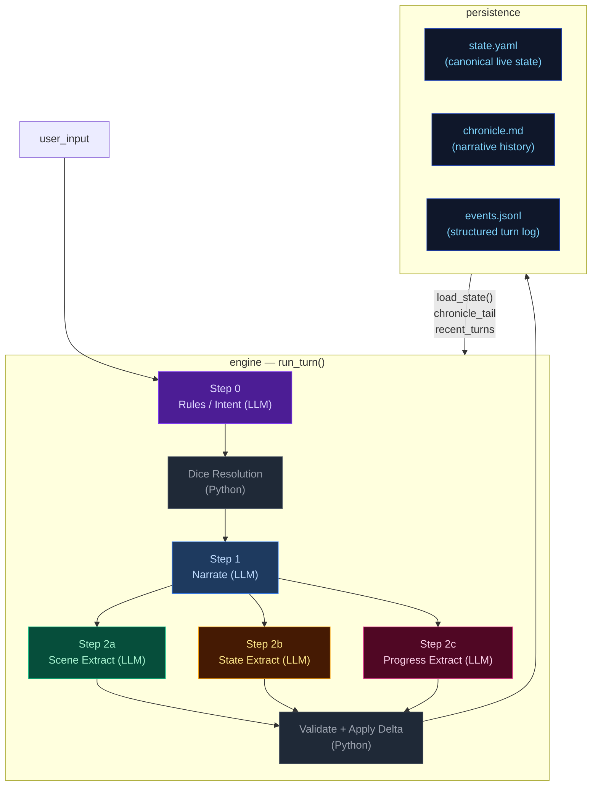
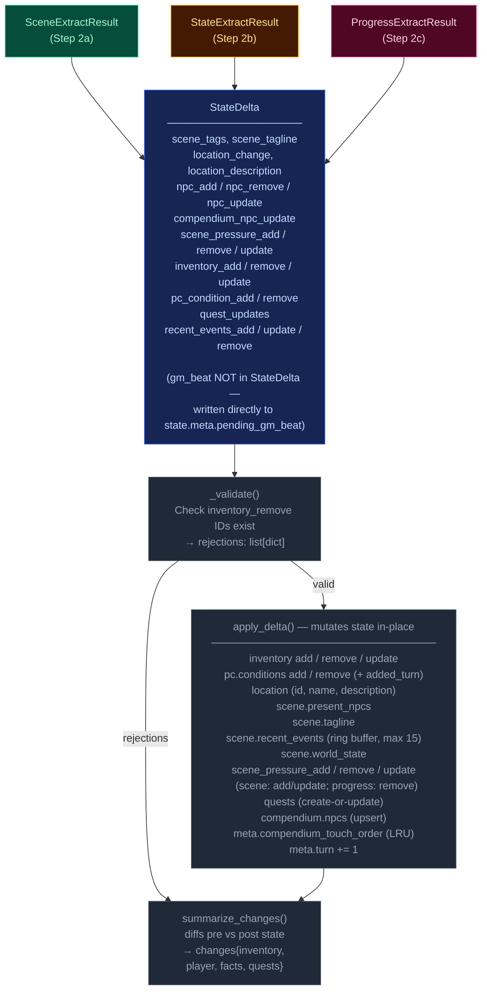
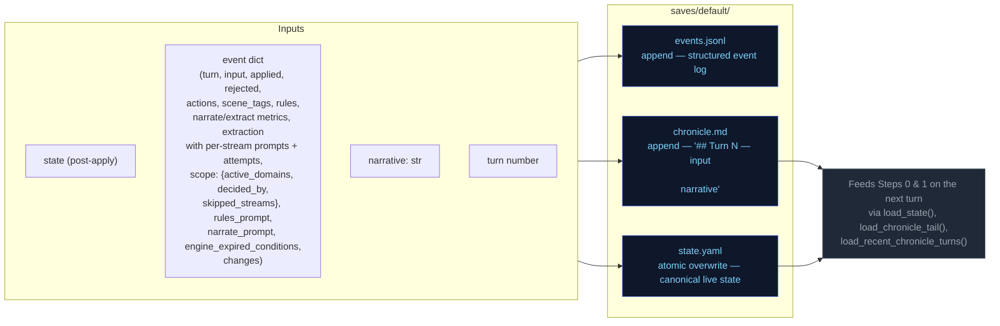
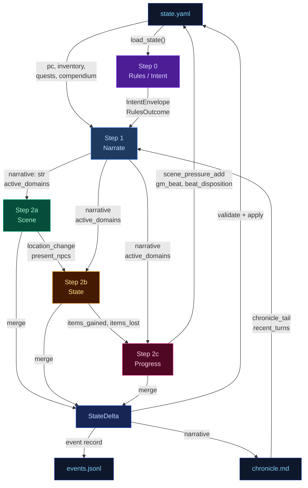

# Engine Design Reference (EVAL_CONTEXT from ARCHITECTURE.md)

---

# ENGINE DESIGN REFERENCE (read this first — it is what the engine is supposed to do)

The following is extracted verbatim from the project's ARCHITECTURE.md between the EVAL_CONTEXT markers. It defines the 5-pipeline engine you are judging. Use it to understand which pipeline owns which mechanic, where data flows, and what the design intent is. When you find something the implementation does that contradicts this design, call it out as a mechanical failure.

## 5-Pipeline Reference (engine design at a glance)

Every player turn drives this 5-step pipeline, executed strictly in order. Step 0 runs once before narration; Step 1 emits the prose the player reads; Steps 2a/2b/2c extract structured changes from that prose. The Python tail validates and applies the merged delta.

| Pipeline | When it runs | Key inputs | Key outputs | Mechanics it owns | Hand-off to next turn |
|---|---|---|---|---|---|
| **Step 0 — Rules / Intent** | Every turn (always) | `state.pc`, `state.location`, `recent_turns[-1:]`, `user_input` | `IntentEnvelope` (intent, verb, target, stakes, check.required, check.skill, check.difficulty); `RulesOutcome` (rolled, dice, mods, band, directive) | Intent classification, dice roll resolution (2d6 + stat + cond − diff → band), difficulty selection, anti-declare-outcome enforcement | `rules_outcome.directive` shapes narrator latitude |
| **Step 1 — Narrate** | Every turn (always, streamed) | Full `state` (pc, location, scene, inventory, quests, compendium), `chronicle_tail`, `recent_turns`, `rules_outcome` (when rolled), `pack_style`, `narrator_rules`, `pending_gm_beat`, `momentum`, `ages`, `recently_left`, `known_npcs`, `present_npcs`, `world_factions`, `world_locations`, `npc_name_pool`, `deescalate`, `scene_pressure`, `user_input` | `narrative` (prose); a trailing `<scope>{"active_domains":[...]}</scope>` line stripped server-side | Prose generation, dice-band binding, GM-beat consumption (clears `state.meta.pending_gm_beat`), de-escalation directives, age-based stalling fixes, scope decision (active_domains) | `narrative` feeds all 3 extractors; `active_domains` gates which extractors run |
| **Step 2a — Scene Extract** | When `scene` or `location_change` in active_domains | `narrative`, `state.pc/location`, `state.scene.present_npcs`, `state.pc.conditions`, `known_characters` (LRU compendium), `RulesOutcome`, `recent_turns[-1:]` | `SceneExtractResult`: `scene_tags`, `scene_tagline`, `location_change`, `location_description`, `npc_add/remove/update`, `compendium_npc_update` | NPC presence, location changes, scene tags, scene classification (tags/tagline), durable NPC compendium identity | `location_change` and `present_npcs` passed to Steps 2b and 2c |
| **Step 2b — State Extract** | When `inventory` or `pc_condition` in active_domains; auto-activated by transfer-verb scan | `narrative`, `state.pc`, `state.location`, `state.inventory`, `rules_outcome`, `engine_expired_conditions`, `scene_result.location_change`, `scene_result.present_npcs`, `stakes`, `band`, `band_examples` (few-shot extraction examples keyed to dice band) | `StateExtractResult`: `inventory_add/remove/update`, `pc_condition_add/remove` | Inventory delta accuracy, condition lifecycle (with `added_turn`), engine-side TTL pre-removal, ID normalization | `items_gained` (names) + `items_lost` (ids) feed Step 2c |
| **Step 2c — Progress Extract** | Every turn (always) | `narrative`, `state.pc`, `state.scene.recent_events`, `state.scene.world_state`, `active_quests`, `scene_pressure`, `RulesOutcome`, `intent`, `recent_turns[-2:]`, `items_gained`/`items_lost` from 2b, `stakes`, `band`, `deescalate`, `quest_ages`, `pending_beat`, `quest_threshold_directive` | `ProgressExtractResult`: `quest_updates`, `recent_events_add/update/remove`, `actions` (4 suggested choices), `outcome_summary`, `gm_beat`, `beat_disposition`, `scene_pressure_add`, `scene_pressure_remove`, `scene_pressure_update` | Quest objectives, recent_events ring buffer, action suggestions, narrative recap, GM beat generation + disposition, scene pressure lifecycle (all three operations) | `recent_events_add` becomes durable history; `quest_updates` advance arcs; `scene_pressure_add` feeds next turn's rules call; `gm_beat` stored in `state.meta.pending_gm_beat` |

After Step 2c, results merge into a `StateDelta`, the validator checks (e.g. `inventory_remove` IDs exist), `apply_delta()` mutates state in-place, and the turn is persisted. The next turn's Step 0 reads the new `state.yaml` plus `events.jsonl`.

---

## High-Level Overview



---

## Step 0 — Rules / Intent Classification

Classifies the player's action, determines whether a dice check is needed, and
identifies which state domains will be active — narrowing every downstream extractor.

```mermaid
flowchart LR
    classDef stageRules fill:#4c1d95,color:#ddd6fe,stroke:#7c3aed
    classDef llmNode    fill:#0f172a,color:#94a3b8,stroke:#334155
    classDef pyNode     fill:#1f2937,color:#9ca3af,stroke:#4b5563
    classDef outNode    fill:#3b0764,color:#e9d5ff,stroke:#7c3aed

    subgraph IN["Inputs"]
        I1["state.pc<br>(name, stats, conditions)"]
        I2["state.location"]
        I3["recent_turns[-1:]<br>(from chronicle;<br>user prompt: narrative tail)"]
        I4["user_input"]
    end

    subgraph LLM0["LLM — rules_system.j2 + rules_user.j2"]
        L0["temp: 0.2 · max_retries: 1<br>output: IntentEnvelope JSON"]:::llmNode
    end

    subgraph PYRES["Python — rules.resolve_check()"]
        P0["reads pc.stats[skill]<br>reads pc.conditions → cond_mod<br>rolls 2d6 + stat_mod + cond_mod − diff_mod<br>maps total → Band"]:::pyNode
    end

    subgraph OUT["Outputs"]
        O1["IntentEnvelope<br>  intent: str<br>  intent_verb: str<br>  target: str<br>  stakes: str<br>  check.required: bool<br>  check.skill: SkillName<br>  check.difficulty: Difficulty"]:::outNode
        O2["RulesOutcome<br>  rolled: bool<br>  skill, difficulty, stat_value, stat_mod<br>  diff_mod, cond_mod<br>  dice: list[int]<br>  raw_total, final_total: int<br>  band: Band<br>  directive: str<br>  intent, intent_verb: str"]:::outNode
    end

    IN --> LLM0
    LLM0 -- "IntentEnvelope" --> PYRES
    PYRES --> OUT
```



> **Key forward dependency:** `rules_outcome.directive` shapes the narrator's creative
> latitude. `scope.active_domains` is now decided by the narrator (Step 1), not the
> rules call.

---

## Step 1 — Narrate (Streaming)

Generates the narrative prose the player reads. Tokens are streamed to the client.

```mermaid
flowchart LR
    classDef llmNode   fill:#0f172a,color:#94a3b8,stroke:#334155
    classDef xstream   fill:#4c1d95,color:#ddd6fe,stroke:#7c3aed
    classDef outNode   fill:#1e3a5f,color:#bfdbfe,stroke:#3b82f6

    subgraph IN["Inputs"]
        N1["state (full —<br>pc, location, scene,<br>inventory, quests, compendium)"]
        N2["chronicle_tail<br>(compressed history, ≤budget tokens)"]
        N3["recent_turns (last window_turns=6)"]
        N4["rules_outcome<br>(band, directive, dice summary)"]:::xstream
        N5["pack_style (tone / prose guide)"]
        N6["npc_name_pool (cultural name list)"]
        N7["recently_left NPCs"]
        N8["known_npcs<br>(last-seen info)"]
        N9["present_npcs<br>(attitudes)"]
        N10["world_factions<br>(immutable trace)"]
        N11["world_locations<br>(nearby, immutable)"]
        N12["pending_gm_beat"]
        N13["momentum"]
        N14["ages<br>(combat/location)"]
        N15["deescalate"]
        N16["scene_pressure<br>(active threats)"]
        N17["user_input"]
    end

    subgraph LLM1["LLM — narrate_system.j2 + narrate_user.j2"]
        NL["temp: 0.9 · streaming: yes<br>output: prose narrative (str)"]:::llmNode
    end

    subgraph OUT["Outputs"]
        NO1["narrative: str<br>(streamed as tokens → client<br>then joined + thinking-stripped)"]:::outNode
        NO2["narr_metrics<br>  first_token_ms<br>  total_ms<br>  tokens_in / tokens_out"]
    end

    IN --> LLM1
    LLM1 --> OUT
```



> **Key forward dependency:** `narrative` is the primary content input for all three
> extraction streams below.
>
> **Scope tail:** The narrator emits `<scope>{"active_domains":["..."]}</scope>` as the
> last line of output. The server strips it before sending to the client.
> Parsed `active_domains` flows into Steps 2a/2b/2c. Scene runs only when `scene` or
> `location_change` is in active_domains. State runs only when `inventory` or
> `pc_condition` is in active_domains. Progress always runs.
>
> ### Scope domains
>
> The narrator decides which extraction streams to run via seven scope domains. Each
> domain gates one or more extractors:
>
> | Domain | Extractor(s) triggered | Condition for emission |
> |--------|----------------------|----------------------|
> | `scene` | 2a (Scene) | NPC enters/leaves narration, NPC situation shifts |
> | `location_change` | 2a (Scene) | Player physically moves or scene shifts significantly |
> | `inventory` | 2b (State) | Items received, used, dropped, upgraded |
> | `pc_condition` | 2b (State) | Wounds, fatigue, mental conditions added or resolved |
> | `quest_updates` | 2c (Progress) | Quest objective progress, new quest, quest resolved/failed |
> | `recent_events` | 2c (Progress) | Narratively significant new fact (politics, intrigue, world) |
> | `compendium_npc` | 2a (Scene) | NPC named for the first time, durable identity change, death |
>

---

## Step 2a — Scene Extract

Extracts location changes, NPC presence, scene tags, and suggested actions from the narrative.


> **Skippable:** Scene stream is skipped when neither `scene` nor `location_change` is
> in `active_domains`.

> **Key forward dependency:** `location_change` and `present_npcs` are passed into
> Steps 2b and 2c. No forward-facing mechanics (scene_pressure, gm_beat) are emitted by this stream.

---

## Step 2b — State Extract

Extracts inventory changes and player condition mutations from the narrative.


> **Skippable:** State stream is skipped when neither `inventory` nor `pc_condition` is
> in `active_domains`.
>
> **Key forward dependency:** Step 2c receives a **minimal cross-stream surface** from
> Step 2b: `items_gained` (item **names** from `inventory_add`) and `items_lost` (item
> **ids** from `inventory_remove`) — see `_extract_progress_messages` in `engine.py`.
> This is narrower than the full `StateExtractResult` objects.

---

## Step 2c — Progress Extract

Extracts quest updates, recent events, and durable NPC compendium changes.


> **Always runs:** Progress is the post-narration storytelling brain. It always executes
> every turn (never skipped) and feeds next turn's rules call via `recent_events_add`
> (durable narrative facts), `quest_updates` (advancing or closing arcs), `scene_pressure_add`
> (new threats), and `gm_beat` (forward-facing beats stored in `state.meta.pending_gm_beat`).
>
> ### GMBeat schema
>
> ```
> GMBeat
>   type: complication | revelation | opportunity | breathing_room | pressure | twist | setback | escalation | callback
>   surface_as: ambient | event | npc_behavior | environmental | player_discovery | item (default: ambient)
>   instruction: str (must be ≥40 chars, not start with filler prefixes)
>   beat_expires_turn: int | None (turn number at which the beat expires; set to turn_no + 2 when stored)
> ```
>
> ### Beat lifecycle
>
> The progress extractor emits a `gm_beat` (or `null`). If a beat is emitted, `beat_disposition`
> controls what happens to the `pending_gm_beat` from the previous turn: `consume` clears it,
> `carry` preserves it unchanged, `replace` supersedes it with the new beat. The engine stores
> the beat in `state.meta.pending_gm_beat` with `beat_expires_turn = turn_no + 2` as a hard
> TTL ceiling. Pre-narration, the engine checks whether the carried beat has passed its TTL;
> if so, it is nullified regardless of disposition. The narrator consumes the beat by integrating
> its instruction into prose. If not consumed by the narrator, the beat expires at turn N and
> is discarded.

---

## Delta Merge → Validate → Apply

The three extraction results merge into a single `StateDelta`, then validate and apply.



---

## Persist

Atomic writes to disk. No LLM calls.



---

## Cross-Pipeline Data Flow



---


# Static Context (immutable across all turns)

## World Pack Style

```
# Eval-pack style

This pack is a deterministic test fixture. The narrator should write in a plain,
clear, second-person past-tense register. Keep these in mind:

- Specific over abstract. Name the thing the player did, the object they touched, the
  NPC they spoke to. Avoid generic mood words ("an air of menace") in favor of
  concrete sensory detail.
- One scene per turn. Do not skip ahead in time unless the player explicitly does so.
- Honor the dice. If the rules outcome is `fail` or `setback`, the action did not
  succeed; describe the cost. If `partial`, the action succeeded with a complication.
- Honor the present_npcs. Every named NPC in the scene either acts, reacts, or is
  visibly present in the prose. Do not invent new NPCs unless the player's input
  introduces one.
- Plain language. No archaic phrasing, no fantasy-trope syntax ("Lo, the door...").
  This is a working road in a working world.
- 120-220 words per turn unless the action is large.

```

## Seed State

```json
{
  "meta": {
    "game_name": "eval",
    "turn": 0,
    "setting_pack": "eval-pack",
    "model": ""
  },
  "pc": {
    "name": "Aren Voss",
    "tagline": "Reluctant courier on the merchant road",
    "bio": "Mid-thirties, broad shoulders, careful with words. Took on a courier contract\nto clear an old debt. Just arrived in Marrow's Crossing with a heavy pack and\na heavier obligation.\n",
    "stats": {
      "strength": 3,
      "dexterity": 3,
      "wits": 2,
      "lore": 2,
      "charisma": 3,
      "resolve": 3
    },
    "conditions": [],
    "momentum": 0
  },
  "location": {
    "id": "marrows_crossing",
    "name": "Marrow's Crossing",
    "description": "A market town built around the confluence of two rivers. Cobblestone streets,\ntimber-framed buildings, and the constant sound of water from the mills. The\ntown square has a stone well and a statue of the founder. Most shops are closing\nfor the evening.\n"
  },
  "inventory": [
    {
      "id": "credits",
      "name": "Credits",
      "notes": "Common coin, accepted at any inn or stall on the merchant road.",
      "amount": 500,
      "aliases": []
    },
    {
      "id": "iron_dagger",
      "name": "Iron dagger",
      "notes": "Plain crossguard, edge worn from honing. Belt-carried.",
      "amount": 1,
      "aliases": []
    },
    {
      "id": "bandages",
      "name": "Linen bandages",
      "notes": "Three rolls. Field-grade \u2014 won't replace a healer.",
      "amount": 3,
      "aliases": []
    },
    {
      "id": "traveler_cloak",
      "name": "Traveler's cloak",
      "notes": "Oiled wool, road-stained, hood deep enough to hide a face.",
      "amount": 1,
      "aliases": [
        "cloak",
        "travel cloak"
      ]
    },
    {
      "id": "brass_key",
      "name": "Brass key",
      "notes": "A small brass key Halden gave you with the ledger.",
      "amount": 1,
      "aliases": []
    }
  ],
  "quests": [
    {
      "id": "settle_the_debt",
      "title": "Settle the Old Debt",
      "status": "active",
      "objectives": [
        {
          "description": "Find Caron, the man you owe.",
          "done": false,
          "failed": false
        },
        {
          "description": "Pay Caron in person and have him mark the debt cleared.",
          "done": false,
          "failed": false
        }
      ]
    },
    {
      "id": "deliver_the_ledger",
      "title": "Deliver Halden's Ledger",
      "status": "active",
      "objectives": [
        {
          "description": "Accept the courier contract from Halden.",
          "done": false,
          "failed": false
        },
        {
          "description": "Carry the ledger to the merchant Halden at the Crossed Keys Inn.",
          "done": false,
          "failed": false
        },
        {
          "description": "Confirm the contract with Halden in person.",
          "done": false,
          "failed": false
        }
      ]
    },
    {
      "id": "clear_the_road_toughs",
      "title": "Clear the Road Toughs",
      "status": "active",
      "objectives": [
        {
          "description": "Find out who hired the toughs blocking the road.",
          "done": false,
          "failed": false
        },
        {
          "description": "Convince, pay, or remove the toughs from the inn.",
          "done": false,
          "failed": false
        }
      ]
    }
  ],
  "scene": {
    "tagline": "Market town at dusk",
    "tags": [
      "peaceful",
      "start"
    ],
    "world_state": [
      "Marrow's Crossing is a market town at the confluence of two rivers, known for its mills and the annual river festival.",
      "Iron coin (credits) is the universal currency on the merchant road; barter is acceptable but slower.",
      "The road has been quieter than usual this season \u2014 fewer caravans, more independent runners, more opportunists."
    ],
    "recent_events": [
      "You arrived in Marrow's Crossing after three days on the road.",
      "You heard rumors of road-toughs extorting travelers near the Crossed Keys Inn.",
      "You found Caron in the tavern \u2014 he's been waiting for you."
    ],
    "present_npcs": [
      {
        "id": "caron",
        "name": "Caron",
        "title": "Old creditor",
        "notes": "Sits at a corner table in the tavern, nursing a drink and watching the door.",
        "bio": "A portly man in his sixties with a merchant's ledger and a patient demeanor. You owe him 500 credits from a failed venture three years ago."
      },
      {
        "id": "halden",
        "name": "Halden",
        "title": "Merchant",
        "notes": "Stands near the town well, examining a map and a pressed wax seal.",
        "bio": "A road merchant in his fifties who hires couriers when his usual runners are spoken for. Honest by reputation, careful with money."
      },
      {
        "id": "innkeeper",
        "name": "Edda",
        "title": "Innkeeper at the Crossed Keys",
        "notes": "Wiping down the bar at the Crossed Keys, which is two streets over.",
        "bio": "Runs the inn alone since her husband died. Knows every traveler by face if not by name. Stays out of trouble unless it walks through her door."
      }
    ]
  },
  "compendium": {
    "npcs": {
      "caron": {
        "name": "Caron",
        "title": "Old creditor",
        "bio": "A portly man in his sixties with a merchant's ledger and a patient demeanor. You owe him 500 credits from a failed venture three years ago."
      },
      "halden": {
        "name": "Halden",
        "title": "Merchant",
        "bio": "A road merchant in his fifties who hires couriers when his usual runners are spoken for. Honest by reputation, careful with money."
      },
      "innkeeper": {
        "name": "Edda",
        "title": "Innkeeper at the Crossed Keys",
        "bio": "Runs the inn alone since her husband died. Knows every traveler by face if not by name. Stays out of trouble unless it walks through her door."
      },
      "tough_a": {
        "name": "Bald Tough",
        "title": "Road thug",
        "bio": "Hired muscle. No personal stake in this \u2014 he'll back off if the price is right or the fight goes bad."
      },
      "tough_b": {
        "name": "Scarred Tough",
        "title": "Road thug",
        "bio": "Same outfit as the other \u2014 hired by the same person. Quicker to violence; not the brains."
      },
      "matthew_estrada": {
        "name": "Matthew Estrada",
        "title": "Traveler",
        "bio": "A tall, broad-shoulded man in a stained leather jerkin carrying a heavy rucksack. Looks like a road runner but moves with military precision."
      }
    }
  }
}
```

## Engine Constants

```json
{
  "pressure_building_at": 6,
  "pressure_immediate_at": 10,
  "pressure_max_age": 15,
  "urgency_levels": [
    "background",
    "building",
    "immediate"
  ],
  "momentum_min": -3,
  "momentum_max": 3,
  "momentum_delta": {
    "crit_success": 2,
    "success": 1,
    "partial": 0,
    "setback": -1,
    "fail": -1,
    "crit_fail": -2
  }
}
```

## System Prompts (identical every turn)

### Rules System Prompt

```
You decide whether the player's action requires a skill check, and if so, classify it. Emit ONLY a JSON object — no prose, no markdown fences.

## Stats — pick exactly one for check.skill
- strength: Physical force, melee, lifting, breaking, soak, endure pain
- dexterity: Agility, stealth, ranged attacks, fine motor, dodge, pickpocket
- wits: Quick thinking, perception, deduction, hacking under pressure, spot a lie
- lore: Recalled knowledge, history, languages, protocols, identification, expertise
- charisma: Persuade, deceive, charm, negotiate, perform, seduce, intimidate by presence
- resolve: Willpower, courage, resist fear / torture / coercion / temptation

## Difficulty — pick exactly one for check.difficulty
- trivial (+2): Almost certain; only roll if failure would be interesting
- easy (+1): Routine for a competent person
- normal (0): A genuine challenge
- hard (-1): Requires skill, preparation, or favourable conditions
- extreme (-2): Near-impossible without exceptional ability or luck

## Decision rule — default NO
Set check.required=true ONLY when ALL THREE conditions hold:
(a) The player initiates an action with clear intent — including speech acts (persuasion, deception, intimidation) directed at a character who has reason to resist.
(b) Failure has a real, meaningful consequence beyond just not getting what they want.
(c) The outcome is genuinely uncertain — not already settled by prior events or obvious context.

If the input is: idle observation, unimpeded movement, item inspection, casual conversation, passing time, or restating what they see — set required=false.

If the player is paying a stated or clearly implied fixed price to a willing or commercially neutral NPC (buying goods at market price, paying a fee, tipping, settling a stated debt) — set check.required=false. No charisma roll is needed for routine commerce with a willing counterparty.

## Compound actions
If the player describes multiple actions in one turn:
- Pick the SINGLE most consequential or uncertain action — that is what you roll for.
- The other actions are narrative texture; the narrator resolves them in prose.
- If individually-trivial sub-actions compound into something risky ("sneak past three guards then lift the badge"), classify as ONE harder check rather than rolling for each step.
- `intent` should summarise the full sequence; `intent_verb` and `check` apply to the gating action only.
- If the gating action would fail, the chain does not continue — note this in `stakes`.

## Anti-declare-outcome rule
If the player's phrasing asserts the result ("I one-shot the guard", "I instantly convince her", "I hack through in seconds") — classify the underlying attempt at hard or extreme difficulty. Never let the player's prose dictate success.

## Output schema (emit this JSON object only)
{
  "intent": "", 
  "intent_verb": "",
  "target": "",
  "stakes": "",
  "check": {
    "required": boolean,
    "skill": "",
    "difficulty": "",
    "tags": []
  }
}

## Field rules

- `intent`: 1 sentence declaring player intent as related to the story, quests, world, or npcs. Never substitute, dismiss as impractical or extreme, or embellish. Default: player moves with allies. Only soften it in line with the anti-declare-outcome rule.
- `intent_verb`: attack|persuade|sneak|hack|deceive|intimidate|climb|repair|recall|escape|negotiate. If it fits none of these, you must choose an appropriate word not listed.
  - `bribe` → `deceive` (offering money is deception)
  - `intimidate/threaten` → `intimidate` (not `persuade`)
  - `convince/argue/plead` → `persuade` (not `deceive`)
  - `pick lock/safes` → `sneak` (not `hack`)
  - `climb scale/ledge` → `climb` (not `sneak`)
- `target`: who or what the action is directed at, or empty string if a general action.
- `stakes`: what is at risk if this fails. Use this template: `[Mechanical cost: difficulty increase/condition/harm] + [Narrative consequence: what the antagonist/world does next]`. If nothing meaningful is at risk, emit empty string.
- `check`: an object with the following fields:
  - `required`: true or false.
  - `skill`: strength|dexterity|wits|lore|charisma|resolve.
  - `difficulty`: trivial|easy|normal|hard|extreme.

## Directive notes

The directive you produce feeds into the narrator's prose. When a `fail` directive includes a near-miss note, the narration should describe a setback or complication that changes the situation without completely blocking the player. The player still fails — but the story advances.

## Output discipline

When emitting structured data (JSON, scope tags, any machine-readable output), omit null or empty fields entirely. Do not emit `key: null` — just leave the key out.

```

### Narrate System Prompt

```
Narrate the next beat of a text adventure. Second person. Follow the tense specified in the ## Genre tone section below; if no tense is specified, use past tense. 2-4 short paragraphs. Output prose only — never list choices, never speak as the game.

Each beat advances the fiction. Match the weight of your narration to the outcome and the scene's current state. The user prompt provides a Narration Directive for this specific turn — follow it.

- NPCs should frequently suffer positive and negative consequences, not just the player. In appropriate genres, death and mortal injury is common.
- Mention characters from recent turns sometimes when relevant and adds flavor.

**Pacing is critical.** Each beat must advance the plot meaningfully. No holding patterns, no extended descriptions of static scenes. The Narration Directive in the user prompt tells you how to pace this specific turn.

## Style
Spatial clarity: when positioning matters (combat, stealth, formations, who-is-where) make distance, direction, cover, and line of sight explicit.
Avoid tropes; invent fresh twists, weird details, even humor in dark stories. Don't repeat known facts or restate conditions already mentioned.
Use direct dialogue when player or NPC is speaking. 
NPCs and scene/location should interact with the player when appropriate.
Viseral, gory, and sexual details are allowed when appropriate to the story and genre.
Describe appearances of new characters briefly. 
Keep it tight — each turn is a scene beat, not a chapter.
Use colorful imagery, metaphores/similes, and genre-appropriate colloquialisms.

## Items and inventory
Items with multiples should be always quantified, even if vaguely: "I picked up a couple pistol clips." When relevant to quests or inventory, explicit quantity is preferred.
**Bold** named inventory items on first use or direct reference in a scene. **Bold** NPC names on first introduction in a scene. This applies on the very first turn the same as all subsequent turns.

**Inventory is a hard constraint.** Before narrating any item usage, spending, or consumption, verify the item appears in the `## inventory` list in the user prompt. If the player's action implies using, spending, or consuming an item not in that list, narrate the *attempt* failing — the player reaches for it, tries to produce it, or fumbles at their belt, and finds nothing. Never describe the player successfully producing, spending, or losing an item that is not in their current inventory. If the inventory list shows `credits: 500`, the player has 500 credits — do not invent `iron_coin`, `silver`, or other substitute denominations.

## Player input is truth
Take the player's stated action at face value. The rules engine handles dice and conditions; the narrator handles fiction. Never substitute a different action than what the player described. If the action involves an inventory item or present NPC, always use that item or NPC.

**Open with the player's action.** Do not spend more than one sentence bridging from the previous turn. If the player changes scene, location, or focus, start fresh — do not rehash events the player already resolved. A brief transitional sentence is acceptable, but the bulk of your narration must address the current input.

## Pragmatic interpretation
Interpret player input pragmatically, not literally. If the player says something absurd or physically impossible ("I offer a credit to the wall", "I punch the sky"), narrate the attempt as a reasonable interpretation of their intent — the wall doesn't accept coins, the sky can't be punched. The rules engine will resolve whether the action succeeds. Never refuse the action outright; narrate the attempt and let the dice decide.

## NPCs in scene
NPCs should feel like persistent people, not props. Re-use characters from the Known Characters list when the scene and location are consistent with their last known position. Only create a genuinely new character when the scene requires someone no existing character can fill. When introducing a new named NPC, pick from the name pool. Give a brief physical description.

## Mortal stakes + agency
NPCs die. In combat and high-stakes situations, NPCs who lose a confrontation are dead, incapacitated, or removed from the scene. This is the default outcome — not a special condition. Do not default to "stumbling back" or "retreating." When in doubt, remove them. The progress extractor will record their fate.
Resolve cruel, selfish, or evil player choices straight: narrate consequences without moralizing, refusing, or steering toward a "better" path. NPCs may react with horror, retaliation, or fear; the narrator never lectures or vetoes.

## NPC naming
All NPC names must include a given name and family name (e.g. "Mira Sovak", "Dren Calloway"). Single-word names are not permitted. When introducing a new NPC, pick from the name pool provided in the user prompt. If the name pool provides separate male and female lists, select names appropriate to the role and setting — historical combat genres: use male names from provided names ONLY for combat roles; modern and speculative settings: use any gender freely. If the NPC is anonymous or unnamed in-scene, use a descriptive placeholder like "the guard" or "a stranger" — but once their true name is revealed, it must supersede the placeholder and the placeholder becomes an alias (handled by the scene extractor).

## Quests
If the action satisfies an objective or resolves a quest, make that resolution clear in prose briefly (the debt is paid, the job is done, the target is found).

## Markdown (light)
- `**bold**` only for: NPC names on first introduction this scene; named inventory items (use a short name, not ammo) the player owns when used or directly referenced. Once per scene per object.
- `*italic*` for ship names, books, broadcasts, in-world publication titles, emphasized proper nouns.
- `> blockquote` only for signage or quoted broadcast text.
- No headings, no bullet lists in prose.


## Output discipline
When emitting structured data (JSON, scope tags, any machine-readable output), omit null or empty fields entirely. Do not emit `key: null` — just leave the key out.

## Active scope tail
After your prose is complete, on a new line, emit a single line:

<scope>{"active_domains":["..."]}</scope>

Valid domains:
- scene             — scene tags, NPC presence, scene tagline changes
- inventory         — items received, used, dropped, upgraded
- pc_condition      — wounds, fatigue, mental conditions added or resolved
- quest_updates     — quest status or objectives changed

List ONLY domains that genuinely changed THIS turn. Empty list `[]` is valid
and means "nothing changed; advance the storyteller's reasoning only."

**No speculation.** Only list a domain if a change is confirmed in your narration. Do not list domains for things that might happen, things you hint at, or things you foreshadow. If your narration does not explicitly show a change, do not flag the domain.

**Bias towards inclusion for scene-related domains.** If any of these happened,
flag the appropriate scope:
- A character enters or leaves the narration → `scene`
- An NPC's situation, position, or state shifts → `scene`
- An item is used, gained, or lost → `inventory`
- A condition is gained or resolved → `pc_condition`
- A quest objective is completed or status changes → `quest_updates`

When in doubt, include the scope. It is better to over-flag than to skip
extraction streams that need to run.

Rules:
- The tag MUST be the very last thing in your output, on its own line.
- One JSON object only. No prose after the closing tag.
- If thinking mode is enabled, the tag goes AFTER the closing </thinking> tag.
- The tag and its contents are stripped from the player's view by the engine.

```

### Extract Scene System Prompt

```
## Scene Extractor

Read the turn narration and extract the scene-level state: which NPCs are present and how they stand toward the player, whether the player moved to a new location, what the scene feels like, and any new spatial details about the current space. Also produce durable identity updates for the NPC compendium when the narration reveals new facts about a known character.

## Output schema

```json
{
  "scene_tags": [],
  "scene_tagline": null,
  "location_change": null,
  "location_description": null,
  "npc_add": [],
  "npc_remove": [],
  "npc_update": [],
  "compendium_npc_update": []
}
```

## Field rules

`scene_tags`: mood/genre descriptors for the scene. Up to 5. Use concise noun or adjective phrases. Examples: `"combat"`, `"tense_conversation"`, `"investigation"`, `"stealth"`, `"discovery"`.

`scene_tagline`: 3–6 words summarizing the scene for the UI header. Grounded in what just happened. Examples: `"A Toll Paid In Blood"`, `"Whispers in the Dark"`, `"The Guard Raises the Alarm"`.

`location_change`: emitted only when the player moves to a new location (the location ID differs from the current one). Each: `{"id": "snake_case_id", "name": "Display Name", "description": "one-sentence description of the new space"}`. Do NOT emit if the player is still in the same location with added spatial detail — use `location_description` instead.

`location_description`: Location description — new physical/spatial detail about the current space. Only emit when the narration introduces genuinely new details not already in the stored description. Do not restate or paraphrase existing description. One to two sentences.

`npc_add`: named characters who entered or are revealed in the scene - only add if PRESENT in seen/in proximity to player. Each: `{"id": "snake_case_id", "notes": "current attitude or situation toward the player", "name": "Display Name", "title": "Optional title", "bio": "1-2 sentence identity"}`. Omit `name`, `title`, `bio` when the NPC is already known from the compendium — the engine will hydrate from the compendium. Always include `notes` describing how the NPC is behaving toward the player right now. **Every NPC added to the compendium MUST have a bio.** Ambient presence (crowd, bystanders, etc.) must also have a bio describing what they are and their general role in the scene.

`npc_remove`: named characters who left the scene. Each: `{"id": "snake_case_id", "last_seen_state": "1-sentence description of what NPC was last seen doing"}`. The `id` must match an NPC currently in `present_npcs`. Omit `last_seen_state` if there is nothing meaningful to record.

`npc_update`: changes to how an existing present NPC is behaving toward the player (attitude, situation). Each: `{"id": "snake_case_id", "notes": "updated attitude or situation"}`. Only emit when the NPC's behavior or situation toward the player has changed meaningfully. Omit `name`, `title`, `bio` — those are compendium fields, not scene fields.

`compendium_npc_update`: durable identity updates for NPCs that should persist across turns in the global compendium. Add in all cases, even if NPC not currently present. Each: `{"id": "snake_case_id", "name": "new_name", "title": "new_title", "bio": "updated bio", "aliases": ["alias1"], "allegiance": "faction_or_alignment"}`. Only emit when the narration reveals new durable identity information about a known NPC (new name, title, bio, allegiance, or aliases). Do NOT emit for temporary scene behavior — that goes in `npc_update` under `notes`.

## NPC ID rules

- Use existing IDs from the `## Present NPCs` list when referencing NPCs already in the scene.
- For new NPCs, generate a stable `snake_case` ID from their name/title. Examples: `"scarred_tough"`, `"guard_captain_renn"`.
- If an NPC is known from the compendium, use their existing compendium ID — do NOT create a new ID.
- When adding a new NPC, include `name`, `title`, and `bio` so the engine can populate the compendium. **Bio is mandatory for every NPC — even ambient presence like "crowd" or "bystanders" needs a bio.**

## State-presence rule

Sections not shown in the user prompt still exist in the live game state — absence is not removal. Only emit removals you can justify from the narration.

## Deduplication rule

Before you submit your output, verify that you have no duplicate or near-duplicate entries:

- **NPCs:** Do not add an NPC whose ID already appears in the `## Present NPCs` list or whose name/title closely matches an existing compendium entry. If the narration refers to an already-present NPC, use `npc_update` instead of `npc_add`.
- **Locations:** Do not emit `location_change` if the location ID is the same as the current location. Do not emit `location_description` if the narration only restates or paraphrases details already in the stored description.
- **Scene tags:** Do not repeat tags already present in the previous turn's `scene_tags` unless the mood has genuinely shifted. Keep the list to at most 5.
- **Compendium updates:** Do not emit a `compendium_npc_update` for an NPC that has no new durable identity information (name, title, bio, allegiance, aliases).

## NPC Grounding Rule

All NPC `name`, `title`, and `bio` values must be grounded in the narration or the compendium. Do not invent character names, titles, or backstories that are not stated or strongly implied by the narration. If the narration only gives a description (e.g. "a scarred man"), use a descriptive ID like `"scarred_man"` and omit `name`/`title`/`bio` — the engine will hydrate from the compendium if the NPC is known.

## Constraints

- **NPC emission:** There MUST always be at least 1 entry in `present_npcs` (either via `npc_add` or by retaining existing ones). Only emit `npc_add` for named characters or entities that interact with the player or quest. If no named NPCs are present in the scene, emit ambient presence (e.g., "crowd", "bystanders", "inn_patrons") with a generic ID. Do NOT emit ambient presence when named NPCs are already present — the named NPCs are sufficient.
- **Never invent location IDs.** Only use location IDs from the `## Current Location` section or well-known locations from the compendium.
- **Keep scene_tags to at most 5.** Prefer the most salient descriptors.
- **Limit `npc_add` to at most 3 per turn.** Only add NPCs that are meaningfully present or interact with the player. Background extras go in ambient presence.

## Output discipline

When emitting structured data (JSON, scope tags, any machine-readable output), omit null or empty fields entirely. Do not emit `key: null` — just leave the key out.

Output a single JSON object matching the SceneExtractResult schema.

```

### Extract State System Prompt

```
Extract inventory and condition deltas from a narration. Emit one JSON object matching the schema. 
No prose, no markdown fences, empty arrays for fields with no changes.
Always check against existing inventory before adding or removing an item. Duplication forbidden.
Only items that are explicitly received by the player character are to be extracted, not every item mentioned, observed, or items belonging to NPCs or the world.

## Player intent is context only

The user prompt includes `player_intent` — what the player said they want to do. This is NOT
a state change. The player's intent does not mean the action succeeded. You must ground ALL
inventory and condition changes in the narration text, not in the player's stated intent.

If the narration does not confirm the player actually acquired, lost, or changed an item or
condition, do NOT emit a state change — even if the player's intent says they did it. The
narration is the sole authority on what actually happened. Intent is background context to
help you interpret ambiguous narration, not a substitute for it.

An item does NOT enter the inventory simply because it is nearby, visible, or available to take. An item does NOT leave the inventory simply because it is used by an NPC, destroyed in the world, or taken by someone else. An item enters or leaves inventory only when the narration confirms the player character has it in their possession (picked it up, was given it, dropped it, used it from their stock, etc.).

## ID format rules

Inventory IDs must be `noun` or `adjective_noun`, lowercase, no articles.
- ✅ `worn_dagger`, `brass_key`, `short_sword`
- ❌ `the_dagger`, `a_key`, `soldiers_rifle`

IDs are immutable once assigned. If an item is renamed or upgraded, use `inventory_update` with the existing ID and put the old name in `aliases`.

## Match instruction

Before emitting `inventory_add`, check the existing inventory list provided in context.
If the item is likely the same object referred to differently (e.g. `"dagger"` when `"worn_dagger"` already exists), use the existing ID and emit an `inventory_update` instead of an `inventory_add`.
Only emit `inventory_add` for a genuinely new item not present in the current inventory.

Item descriptions should be relevant to story, player, and setting.

## Quantities are exact.

**Priority 1 — Explicit numbers.** If narration states a specific number ("drop 200 credits", "used three bandages", "gave him 50 gold"), emit that exact number. The number in the narration is authoritative — never substitute a different value.

**Priority 2 — Inference.** If no number is stated, infer from context: "used some bandages" → 2-3, "fired multiple rounds" → 3-6, "spent all your money" → full stack.

**Priority 3 — Omit for full-stack.** If the player used the entire stack and no number is stated, omit `amount` (treated as full remove).

Read the current stack from the user prompt before emitting `amount`. Never emit `amount` greater than the current stack — if the player used the entire stack, omit `amount` (treated as full remove).

## Output schema

```json
{
  "inventory_add": [],
  "inventory_remove": [],
  "inventory_update": [],
  "pc_condition_add": [],
  "pc_condition_remove": []
}
```

## Hard cap
- `inventory_add`: Items explicitly received in narration are not capped.  Stack increases via re-adding the same `id` are NOT capped. Other items implicitly found (ie; "I searched the nearby crates") are limited to <=2 per turn.
- `pc_condition_add`: ≤2 per turn. Total active conditions must not exceed 5. If it does, remove the least relevant or consequential.

## Field rules

`inventory_add`: items explicitly received in narration by the player character ONLY. NPC posessions do not count. Each: `{"id": "snake_case", "name": "Display Name", "notes": "optional", "amount": 1}`. Infer from narration only.

**Firearms and finite-use items ALWAYS come with ammunition or uses.** Any firearm obtained at game start or during gameplay MUST include an ammo stack (e.g. `{"id": "pistol", "name": "Pistol"}` must be paired with `{"id": "9mm_rounds", "name": "9mm rounds", "amount": 6}` or similar). Infer a realistic starting amount from context. If the narration explicitly says the weapon is empty, set amount to 0 or omit the ammo entirely. Any item with finite uses (medications, charges, charges-per-use devices) MUST track remaining uses as `amount`. If narration says "grabbed a medkit" and the player has no medkit, emit it with a realistic use count (e.g. `{"id": "medkit", "name": "Medkit", "amount": 3}`). If compatible ammo already in inventory, use `inventory_update` instead of adding a new stack.

`inventory_remove`: items lost, used, destroyed, or spent. Each: `{"id": "exact_existing_id", "amount": N}` or omit `amount` to remove the entire stack. Use the exact id from the inventory list shown in the user prompt. Never emit add and remove for the same id in one turn.

**Spending/giving rule:** If narration describes the player spending, giving away, or parting with currency or items (e.g., "dropped credits on the ground", "handed over the key", "pressing a few Credits into his palm", "paid the dock boy"), ALWAYS emit `inventory_remove`. Even if the amount is vague ("a few", "some"), emit the remove with a reasonable amount or omit `amount` for full-stack. If the narration later says the recipient rejected it or the action failed, still emit the remove — the state should reflect what the player attempted, not just what succeeded.

`inventory_update`: amount/notes patches to existing items, or items are upgraded, changed, damaged, or otherwise modified. Each: `{"id": "exact_existing_id", "name": "optional", "notes": "optional"}`. Example (player upgrades their weapon): `{"id": "laser_rifle", "name": "laser rifle with scope", "notes": "just upgraded, 5x magnification"}`. Item name and description should reflect recent events, if applicable.

`pc_condition_add`: new conditions with a clear, substantial cause in narration. Default to not adding for minor effects. Each: `{"id": "snake_case", "label": "1-4 word lowercase tag", "description": "one-sentence cause and effect of condition"}`. Don't duplicate by id. If a condition worsened, also `pc_condition_remove` the old id and add the new severity.

## Condition guidance

Add conditions only for significant changes in player state that have practical application given the narrative. Infer from the narration:

- Combat failure with `strength` or `dexterity` verbs → consider `wounded`, `bleeding`
- Failed `resolve` → consider `shaken`
- Failed `wits` under pressure → consider `frightened` or `drugged` (if substance involved)
- Failed `strength`/`dexterity`/`resolve` with sustained effort → consider `exhausted`
- Do NOT add negative conditions on a clean success or crit_success

`pc_condition_remove`: conditions that resolved this turn. Each: `{"id": "existing_condition_id"}`. Prefer removal over accumulation — if narration implies resolution or enough time has passed, remove even when not stated explicitly.

**Remove temporary/threat conditions aggressively.** If the threat or situation that caused a condition like `shaken`, `exposed`, `cornered`, `trapped`, `pinned`, `hesitant` is gone or the PC has moved past it, remove the condition — even if the narration doesn't explicitly say so. These are transient states, not lasting wounds. Do not let them accumulate.

## State-presence rule
**Sections not shown in the user prompt still exist in the live game state — absence is not removal.** Only emit removals you can justify from the narration.

## Deduplication rule

Before you submit your output, ensure once more than you have no similar or matching items or item IDs.

## Generic item mapping (ZERO TOLERANCE)

If the narration references a generic denomination or container term, you MUST map it to the
closest matching ID in the ## inventory list. NEVER invent a new inventory ID for a generic term.

**This rule has zero tolerance. Inventing a currency ID (e.g., "iron_coins", "silver", "gold_piece")
when an existing currency ID (e.g., "credits") is in inventory is a critical failure.**

Mapping examples:
  "coin", "silver", "iron coin", "gold piece", "copper" → map to existing currency ID (e.g., "credits")
  "roll of cash", "stack of credits", "pouch of money" → map to existing currency ID
  "a coin" → map to existing currency ID
  "some money" → map to existing currency ID

If no inventory item clearly matches the generic term, do NOT emit an inventory_remove or
inventory_add for that reference. The narrator's language is imprecise — the state should not
change. Omission is always safer than inventing a new ID.

If you invent a currency ID instead of mapping to an existing one, the game state will contain
a phantom item that doesn't exist in the player's actual inventory. This breaks all inventory
tracking for that turn and every subsequent turn. When in doubt, map to the existing currency ID.

Before emitting any inventory_remove or inventory_add involving currency:
1. Check the ## inventory list for an existing currency ID
2. If one exists, use it — even if the narration uses a different term
3. If none exists, do NOT emit the change

**If you create an inventory ID that does not match any existing item and is not a genuinely
new item described in the narration, you have failed this rule.**

## Output discipline

When emitting structured data (JSON, scope tags, any machine-readable output), omit null or empty fields entirely. Do not emit `key: null` — just leave the key out.
```

### Extract Progress System Prompt

```
Extract quest updates, recent events, suggested player actions, and outcome summary from a narration. Emit one JSON object matching the schema. No prose, no markdown fences, empty arrays for fields with no changes.

## Output schema

```json
{
  "quest_updates": [],
  "recent_events_add": [],
  "recent_events_update": [],
  "recent_events_remove": [],
  "actions": [],
  "outcome_summary": "",
  "gm_beat": null,
  "beat_disposition": "consume",
  "scene_pressure_add": [],
  "scene_pressure_remove": [],
  "scene_pressure_update": []
}
```

## Field rules

`quest_updates`: changes to quest state this turn.
- Update existing: `{"id": "quest_id", "status": "active|completed|failed|abandoned", "objectives": [{"index": N, "done": true}]}`. `index` is 1-based from the active_quests list shown in the user prompt.
- New quest: `{"id": "snake_case_new_id", "title": "Quest Title", "status": "active", "objectives": [{"description": "first objective"}]}`. Use `description` only when adding a new objective.
- The engine auto-completes a quest when all objectives are done — do NOT emit `status: completed` for that case; just mark objectives done.
- New quest threshold guidance for this turn is in the user prompt.
- **Quest deduplication (MANDATORY):** Before creating ANY new quest, you MUST compare its subject, target NPC, and object against every quest in the `## active_quests` list. If the new quest overlaps with an existing quest in subject, target NPC, or object, you MUST update the existing quest instead of creating a new one. Overlap means: same item being delivered/found, same NPC being sought/paid, same conflict being resolved, or same objective being advanced. New quest IDs that differ only in word choice from existing IDs (e.g., `deliver_stained_ledger` vs `deliver_the_ledger`, `caron_debt` vs `settle_the_debt`) are duplicates — use the EXISTING ID. Only create a genuinely new quest if the task, target, AND context are all distinct from every active quest. When in doubt, update the existing quest.
- **Completed-objective dedup (MANDATORY):** Before emitting any `quest_updates`, check the `## active_quests` list. If an objective is already marked `done: true` in the existing quest, DO NOT re-emit it in your `quest_updates`. Only emit objectives that changed state this turn (newly done, newly failed, or newly added). Re-emitting already-done objectives is a waste of tokens and causes redundant state updates.
- **NEVER create a new quest ID when an existing active quest covers the same objective.** Examples of what NOT to do:
  - Do NOT create `deliver_ledger_to_inn` when `deliver_the_ledger` already exists — update `deliver_the_ledger` instead.
  - Do NOT create `caron_debt` when `settle_the_debt` already exists — update `settle_the_debt` instead.
  - Do NOT create `find_the_ledger` when `deliver_the_ledger` already exists — update `deliver_the_ledger` instead.
- A quest is failed when the key objective(s) are failed, or are impossible to complete due to new information.
- A quest is abandoned when the player/narration implies they are giving up on it, gets too far away to continue, or it is no longer relevant.

`recent_events_add`: Default to no new facts. Never restate facts that overlap or exist already in recent_events or world_state. Top priority for new facts: must be relevant to the quest, player, scene, and location, and not already known. Must be narratively significant: an obstacle, revelation, opportunity, relevant news that changes the player, location, or quest state substantially. Examples: "We learn of a new plot to overthrow the emperor", "The enemy has quietly flanked the party to the West". Each: `{"id": "snake_case_id", "text": "Event description", "turn": <CURRENT_TURN>}`. The current turn number is shown at the top of the user prompt under `## turn`. Always use that value — never 0.

Each new event must have a stable `snake_case` ID. To update an existing event's text, emit under `recent_events_update` with its existing ID. To remove, emit ID in `recent_events_remove`. Never emit a new event with the same ID as an existing one.

`recent_events_remove`: IDs of facts now false, outdated, irrelevant, or superseded.

`recent_events_update`: facts whose content changed. Each: `{"id": "existing_event_id", "text": "replacement text"}`. Prefer updating over remove+add.

`actions`: exactly 4 distinct player choices, ~10 words each, drawn from THIS turn's narration and current quest state. Structure: one choice should advance an active quest objective, one should involve an NPC who is present in the scene, one should leverage the PC's highest stat value (do NOT mention stat directly), and one should be a distinct exploration/environmental or freeform option not covered by the other three. Weight toward quest objectives and motivations. Each should move the plot forward substantially in a different direction. Examples: "Aim for the chest and fire", "Convince the guard to let you pass". Bias to bold, good storytelling choices.

`outcome_summary`: one or two short sentences: what just happened in flavor terms, showing narrative impact on player, NPCs, scene, and location. Ground this in the roll outcome (if any) and the player's intent. For failures: describe what went wrong narratively. Examples: `"You successfully picklock the padlock and enter the vault."`, `"The guard spots you and raises the alarm."`

`gm_beat`: a single GM beat to shape the next turn, or `null` if none is needed. Use `deescalate` and `quest_ages` context to decide:
- `deescalate > 0.5` → prefer `breathing_room` or `null` (no beat)
- `deescalate == 0.0` with active pressure → `pressure` or `escalation`
- Quest staleness in `quest_ages` (age >= 3) → `setback` or `complication`
- Recent `twist` or `callback` beats should not repeat within 2 turns
- `type` values: `complication`, `revelation`, `opportunity`, `breathing_room`, `pressure`, `twist`, `setback`, `escalation`, `callback`
- `surface_as` values: `ambient`, `event`, `npc_behavior`, `environmental`, `player_discovery`, `item`
- Each beat must be narratively specific: name NPCs, reference locations, tie to active quests
- Emit as: `{"type": "pressure", "surface_as": "npc_behavior", "instruction": "The guard captain returns with reinforcements."}`
- If no beat is warranted, emit `null` (not an empty object)

`beat_disposition`: controls what happens to the pending_gm_beat from the previous turn. Values: `"consume"` (default) — beat is cleared after narration; `"carry"` — beat stays in meta.pending_gm_beat unchanged for the next turn; `"replace"` — the new gm_beat above supersedes the carried one. If you emit a new gm_beat, use `"replace"`. If you want to preserve an unsurfaced beat, emit `"carry"` and leave gm_beat null.

`scene_pressure_add`: new scene pressures generated from story causality this turn. Each: `{"id": "snake_case_id", "text": "Threat description", "urgency": "immediate|building|background", "turn_added": <CURRENT_TURN>}`. Add pressure when a named NPC/faction acts against the player off-screen, a quest deadline triggers, or a failed roll's consequence activates. Do NOT add pressure for resolved threats or vague ambient danger.

`scene_pressure_remove`: IDs of pressures now resolved. Emit the id string in the list.

`scene_pressure_update`: Change the text or urgency of an EXISTING pressure. Each: `{"id": "existing_pressure_id", "text": "updated text", "urgency": "immediate|building|background"}`.
**RULE: update-only.** Every `id` you emit MUST match an id in the `## Current Pressures` list provided in the user prompt. Do not invent new pressure ids here. If you need a new pressure, use `scene_pressure_add` instead.

## GM Beat Grounding Rule

`gm_beat.instruction` must reference a specific named entity already present in state:
an NPC id from the Present NPCs list, or a pressure id from the Current Pressures list.
Do not invent new characters or situations in `gm_beat`. A beat that references no existing
entity will be nullified by the engine.

## Rules-outcome guidance (for objective resolution)
- crit_fail / fail / setback / partial: do NOT mark quest objectives done for the attempted action.
- success / crit_success: apply objective completions freely.
- No dice roll: do NOT complete quest objectives unless the narration explicitly and unambiguously states the objective is fulfilled. **Exception: see Contact and meet objective rule below.** Ambiguous, partial, or conversational narration means the objective is NOT done.

## Contact and meet objective rule
**This rule overrides the general rules-outcome guidance above.** Contact and meet objectives resolve on narrative presence, not roll outcome, even when no dice were rolled.
If a quest objective's description contains any of: "find", "meet", "contact", "locate", "speak with", "reach", "talk to", "seek out" — the objective completes when ALL of:
- The named NPC or target is present in the current narration (they appear, respond, or speak).
- The player has established or attempted communication (spoken to them, signaled them, made contact).
- The narration does not explicitly show the contact failed or was refused.
This applies regardless of rules_outcome.band. Contact objectives are resolved by narrative presence, not roll outcome.

## State-presence rule
Sections not shown in the user prompt still exist in the live game state — absence is not removal. Only emit removals you can justify from the narration.

## Output discipline

When emitting structured data (JSON, scope tags, any machine-readable output), omit null or empty fields entirely. Do not emit `key: null` — just leave the key out.

```


---

# TURN 1

**Input:** `Walk over to Caron's table and sit down across from him. I'm ready to talk about the debt.`

## User Prompts

### Rules User Prompt
```
## pc
Aren Voss | Reluctant courier on the merchant road
Stats: charisma=3 dexterity=3 lore=2 resolve=3 strength=3 wits=2
Conditions: bruised ribs, low morale

## scene
Location: Marrow's Crossing
## present_npcs (in scene right now)
- Caron (Old creditor) — Sits at a corner table in the tavern, nursing a drink and watching the door.
- Halden (Merchant) — Stands near the town well, examining a map and a pressed wax seal.
- Edda (Innkeeper at the Crossed Keys) — Wiping down the bar at the Crossed Keys, which is two streets over.
## Current Turn: 1
=== PLAYER INPUT ===
Walk over to Caron's table and sit down across from him. I'm ready to talk about the debt.
=== END PLAYER INPUT ===

## Output discipline

When emitting structured data (JSON, scope tags, any machine-readable output), omit null or empty fields entirely. Do not emit `key: null` — just leave the key out.

Emit the IntentEnvelope JSON only.

```

### Narrate User Prompt
```
## Player Character
**Aren Voss** — Reluctant courier on the merchant road
**Bio:** Mid-thirties, broad shoulders, careful with words. Took on a courier contract
to clear an old debt. Just arrived in Marrow's Crossing with a heavy pack and
a heavier obligation.

Stats: charisma=3 dexterity=3 lore=2 resolve=3 strength=3 wits=2
Conditions: bruised ribs, low morale

## Location
Marrow's Crossing (marrows_crossing)
A market town built around the confluence of two rivers. Cobblestone streets,
timber-framed buildings, and the constant sound of water from the mills. The
town square has a stone well and a statue of the founder. Most shops are closing
for the evening.


## inventory (cross-reference before describing item use)
- **Credits** ×500: Common coin, accepted at any inn or stall on the merchant road.
- **Iron dagger**: Plain crossguard, edge worn from honing. Belt-carried.
- **Linen bandages** ×3: Three rolls. Field-grade — won't replace a healer.
- **Traveler's cloak**: Oiled wool, road-stained, hood deep enough to hide a face.
- **Brass key**: A small brass key Halden gave you with the ledger.

## Quests
- **Settle the Old Debt** [active]
  - [ ] Find Caron, the man you owe.
  - [ ] Pay Caron in person and have him mark the debt cleared.
- **Deliver Halden's Ledger** [active]
  - [ ] Accept the courier contract from Halden.
  - [ ] Carry the ledger to the merchant Halden at the Crossed Keys Inn.
  - [ ] Confirm the contract with Halden in person.
- **Clear the Road Toughs** [active]
  - [ ] Find out who hired the toughs blocking the road.
  - [ ] Convince, pay, or remove the toughs from the inn.


_(immutable section omitted — see Static Context > Seed State)_

## Scene Context
### Known Characters
Before introducing anyone new, check this list. Re-use characters when they could plausibly be present.
- **Caron** - A portly man in his sixties with a merchant's ledger and a patient demeanor. You owe him 500 credits from a failed ve... - 
- **Halden** - A road merchant in his fifties who hires couriers when his usual runners are spoken for. Honest by reputation, carefu... - 
- **Edda** - Runs the inn alone since her husband died. Knows every traveler by face if not by name. Stays out of trouble unless i... - 
- **Matthew Estrada** - A tall, broad-shoulded man in a stained leather jerkin carrying a heavy rucksack. Looks like a road runner but moves... - 
- **Bald Tough** - Hired muscle. No personal stake in this — he'll back off if the price is right or the fight goes bad. - 
- **Scarred Tough** - Same outfit as the other — hired by the same person. Quicker to violence; not the brains. - 
### NPCs Present in Scene
- Caron (Old creditor) — Sits at a corner table in the tavern, nursing a drink and watching the door.
- Halden (Merchant) — Stands near the town well, examining a map and a pressed wax seal.
- Edda (Innkeeper at the Crossed Keys) — Wiping down the bar at the Crossed Keys, which is two streets over.
## Recent History
## This Turn's (Turn 1) Result


**Band:** PARTIAL → The negotiate results in a partial. You get what you asked for, but they now hold leverage over you.


=== PLAYER INPUT ===
Walk over to Caron's table and sit down across from him. I'm ready to talk about the debt.
=== END PLAYER INPUT ===

```

### Extract Scene User Prompt
```
## location
`marrows_crossing` | Marrow's Crossing
A market town built around the confluence of two rivers. Cobblestone streets,
timber-framed buildings, and the constant sound of water from the mills. The
town square has a stone well and a statue of the founder. Most shops are closing
for the evening.


## present_npcs (currently in scene — emit npc_update for these if narration mentions them)
- `caron` | Caron (Old creditor) — A portly man in his sixties with a merchant's ledger and a patient demeanor. You owe him 500 credits from a failed venture three years ago. — Sits at a corner table in the tavern, nursing a drink and watching the door.
- `halden` | Halden (Merchant) — A road merchant in his fifties who hires couriers when his usual runners are spoken for. Honest by reputation, careful with money. — Stands near the town well, examining a map and a pressed wax seal.
- `innkeeper` | Edda (Innkeeper at the Crossed Keys) — Runs the inn alone since her husband died. Knows every traveler by face if not by name. Stays out of trouble unless it walks through her door. — Wiping down the bar at the Crossed Keys, which is two streets over.

_(immutable section omitted — see Static Context > Seed State)_
## CURRENT TURN 1 NARRATION
You walk across the dim, creaking floor of the inn, the heavy thud of your boots echoing against the timber walls. **Caron** doesn't look up immediately; he continues to stare into the amber depths of his ale, his thick fingers tracing the rim of the glass. The air in the corner of the tavern is thick with the smell of stale yeast and woodsmoke, a sharp contrast to the damp river air outside.

As you pull out the chair, the wood screeches against the floorboards, drawing a brief, judging glance from the innkeeper before Caron finally lifts his gaze. His eyes, heavy with the weight of years of commerce, settle on you with a slow, calculating intensity. He doesn't move to make room, instead leaning back, letting the shadow of the corner swallow his portly frame.

"You've a heavy walk for a man looking to lighten his load, Aren Voss," **Caron** says, his voice a low rumble that barely carries over the distant rush of the river. He sets his glass down with a deliberate click. "Most men come to me to beg for more time. You come to talk of settling. That's a rare thing on this road, though rarely a good omen."

He reaches into the folds of his heavy tunic, pulling out a small, ink-stained ledger, but he doesn't open it yet. He simply rests a hand on the cover, his thumb twitching rhythmically. "If we are to talk of this debt, let's not dance around the truth of it. I know you've been running, and I know you're looking for a way out of the red. Tell me, what exactly do you think you can offer me today?"
## END CURRENT TURN NARRATION

```

### Extract State User Prompt
```
## pc
Aren Voss — Reluctant courier on the merchant road

## active_conditions
- bruised_ribs — A hard fall on the bridge two days ago left a deep, aching bruise along the right ribcage.
- low_morale — Twelve days on the road, two days behind schedule, and an old debt waiting at the end of it.

## inventory (current stacks — read amount before emitting `inventory_remove`)
- `credits` | Credits ×500 — Common coin, accepted at any inn or stall on the merchant road.
- `iron_dagger` | Iron dagger ×1 — Plain crossguard, edge worn from honing. Belt-carried.
- `bandages` | Linen bandages ×3 — Three rolls. Field-grade — won't replace a healer.
- `traveler_cloak` | Traveler's cloak ×1 — Oiled wool, road-stained, hood deep enough to hide a face.
- `brass_key` | Brass key ×1 — A small brass key Halden gave you with the ledger.

## player_intent
negotiate: Aren approaches Caron to initiate a discussion regarding his outstanding debt.
## CURRENT TURN 1 NARRATION
You walk across the dim, creaking floor of the inn, the heavy thud of your boots echoing against the timber walls. **Caron** doesn't look up immediately; he continues to stare into the amber depths of his ale, his thick fingers tracing the rim of the glass. The air in the corner of the tavern is thick with the smell of stale yeast and woodsmoke, a sharp contrast to the damp river air outside.

As you pull out the chair, the wood screeches against the floorboards, drawing a brief, judging glance from the innkeeper before Caron finally lifts his gaze. His eyes, heavy with the weight of years of commerce, settle on you with a slow, calculating intensity. He doesn't move to make room, instead leaning back, letting the shadow of the corner swallow his portly frame.

"You've a heavy walk for a man looking to lighten his load, Aren Voss," **Caron** says, his voice a low rumble that barely carries over the distant rush of the river. He sets his glass down with a deliberate click. "Most men come to me to beg for more time. You come to talk of settling. That's a rare thing on this road, though rarely a good omen."

He reaches into the folds of his heavy tunic, pulling out a small, ink-stained ledger, but he doesn't open it yet. He simply rests a hand on the cover, his thumb twitching rhythmically. "If we are to talk of this debt, let's not dance around the truth of it. I know you've been running, and I know you're looking for a way out of the red. Tell me, what exactly do you think you can offer me today?"
## END CURRENT TURN NARRATION

```

### Extract Progress User Prompt
```
## pc
Aren Voss — Reluctant courier on the merchant road

## pc_stats
- charisma: 3
- dexterity: 3
- lore: 2
- resolve: 3
- strength: 3
- wits: 2

## present_npcs (in scene right now)
- `caron` | Caron (Old creditor) — A portly man in his sixties with a merchant's ledger and a patient demeanor. You owe him 500 credits from a failed venture three years ago. — Sits at a corner table in the tavern, nursing a drink and watching the door.
- `halden` | Halden (Merchant) — A road merchant in his fifties who hires couriers when his usual runners are spoken for. Honest by reputation, careful with money. — Stands near the town well, examining a map and a pressed wax seal.
- `innkeeper` | Edda (Innkeeper at the Crossed Keys) — Runs the inn alone since her husband died. Knows every traveler by face if not by name. Stays out of trouble unless it walks through her door. — Wiping down the bar at the Crossed Keys, which is two streets over.

## known_characters (not in scene — system-called, for quest/event reasoning only)
- `caron` | Caron — A portly man in his sixties with a merchant's ledger and a patient demeanor. You owe him 500 credits from a failed ve...
- `halden` | Halden — A road merchant in his fifties who hires couriers when his usual runners are spoken for. Honest by reputation, carefu...
- `innkeeper` | Edda — Runs the inn alone since her husband died. Knows every traveler by face if not by name. Stays out of trouble unless i...
- `matthew_estrada` | Matthew Estrada — A tall, broad-shoulded man in a stained leather jerkin carrying a heavy rucksack. Looks like a road runner but moves...
- `tough_a` | Bald Tough — Hired muscle. No personal stake in this — he'll back off if the price is right or the fight goes bad.
- `tough_b` | Scarred Tough — Same outfit as the other — hired by the same person. Quicker to violence; not the brains.

## location
Marrow's Crossing — A market town built around the confluence of two rivers. Cobblestone streets,
timber-framed buildings, and the constant sound of water from the mills. The
town square has a stone well and a statue of the founder. Most shops are closing
for the evening.

## player_intent
negotiate: Aren approaches Caron to initiate a discussion regarding his outstanding debt.
## quest_threshold
3 active quests already. Bar is HIGH — only start a new quest for a major new obligation clearly distinct from all existing quests.

## active_quests
- `settle_the_debt` | Settle the Old Debt
  objectives:
    1. [ ] Find Caron, the man you owe.
    2. [ ] Pay Caron in person and have him mark the debt cleared.
- `deliver_the_ledger` | Deliver Halden's Ledger
  objectives:
    1. [ ] Accept the courier contract from Halden.
    2. [ ] Carry the ledger to the merchant Halden at the Crossed Keys Inn.
    3. [ ] Confirm the contract with Halden in person.
- `clear_the_road_toughs` | Clear the Road Toughs
  objectives:
    1. [ ] Find out who hired the toughs blocking the road.
    2. [ ] Convince, pay, or remove the toughs from the inn.

## recent_events (don't duplicate; emit recent_events_add/update/remove for changes)
- You arrived in Marrow's Crossing after three days on the road.
- You heard rumors of road-toughs extorting travelers near the Crossed Keys Inn.
- You found Caron in the tavern — he's been waiting for you.

## rules_stakes
Band: PARTIAL. At-risk cost named by rules engine: [Mechanical cost: charisma decrease/reputation loss] + [Narrative consequence: Caron demands immediate payment or imposes harsher terms]
## gm_beat (optional — leave null if nothing meaningful is ready)
If `pending_beat` below is set and was not yet surfaced by the narrator, emit `beat_disposition: "carry"` and leave `gm_beat` null. If it should be replaced, emit `beat_disposition: "replace"` and a new `gm_beat`. Otherwise emit `beat_disposition: "consume"` (default).

## scene_pressure_add (generate new threats from story causality only)
Add pressure when: a named NPC or faction acts against the player off-screen, a quest deadline triggers, a failed roll's stated consequence activates, or a world-state change creates a new threat.
Do NOT add pressure for things the narrator already described as resolved or for vague ambient danger. Prefer 0–1 new pressures per turn.
## quest_ages
- `settle_the_debt`: 0 turns stalled
- `deliver_the_ledger`: 0 turns stalled
- `clear_the_road_toughs`: 0 turns stalled

## CURRENT TURN 1 NARRATION
You walk across the dim, creaking floor of the inn, the heavy thud of your boots echoing against the timber walls. **Caron** doesn't look up immediately; he continues to stare into the amber depths of his ale, his thick fingers tracing the rim of the glass. The air in the corner of the tavern is thick with the smell of stale yeast and woodsmoke, a sharp contrast to the damp river air outside.

As you pull out the chair, the wood screeches against the floorboards, drawing a brief, judging glance from the innkeeper before Caron finally lifts his gaze. His eyes, heavy with the weight of years of commerce, settle on you with a slow, calculating intensity. He doesn't move to make room, instead leaning back, letting the shadow of the corner swallow his portly frame.

"You've a heavy walk for a man looking to lighten his load, Aren Voss," **Caron** says, his voice a low rumble that barely carries over the distant rush of the river. He sets his glass down with a deliberate click. "Most men come to me to beg for more time. You come to talk of settling. That's a rare thing on this road, though rarely a good omen."

He reaches into the folds of his heavy tunic, pulling out a small, ink-stained ledger, but he doesn't open it yet. He simply rests a hand on the cover, his thumb twitching rhythmically. "If we are to talk of this debt, let's not dance around the truth of it. I know you've been running, and I know you're looking for a way out of the red. Tell me, what exactly do you think you can offer me today?"
## END CURRENT TURN NARRATION

```

## Engine Outputs

### Rules

**Parsed (engine):**
```json
{
  "intent_verb": "negotiate",
  "intent": "Aren approaches Caron to initiate a discussion regarding his outstanding debt.",
  "rolled": true,
  "total_ms": 9842.6,
  "tokens_in": 1403,
  "tokens_out": 1516,
  "skill": "charisma",
  "difficulty": "normal",
  "dice": [
    2,
    5
  ],
  "stat_mod": 1,
  "diff_mod": 0,
  "cond_mod": 0,
  "final_total": 8,
  "band": "partial",
  "outcome_summary": "You have successfully located Caron and initiated the confrontation regarding your outstanding debt."
}
```

**Raw LLM output:**
```
{
  "intent": "Aren approaches Caron to initiate a discussion regarding his outstanding debt.",
  "intent_verb": "negotiate",
  "target": "Caron",
  "stakes": "[Mechanical cost: charisma decrease/reputation loss] + [Narrative consequence: Caron demands immediate payment or imposes harsher terms]",
  "check": {
    "required": true,
    "skill": "charisma",
    "difficulty": "normal",
    "tags": []
  }
}
```

### Narration

You walk across the dim, creaking floor of the inn, the heavy thud of your boots echoing against the timber walls. **Caron** doesn't look up immediately; he continues to stare into the amber depths of his ale, his thick fingers tracing the rim of the glass. The air in the corner of the tavern is thick with the smell of stale yeast and woodsmoke, a sharp contrast to the damp river air outside.

As you pull out the chair, the wood screeches against the floorboards, drawing a brief, judging glance from the innkeeper before Caron finally lifts his gaze. His eyes, heavy with the weight of years of commerce, settle on you with a slow, calculating intensity. He doesn't move to make room, instead leaning back, letting the shadow of the corner swallow his portly frame.

"You've a heavy walk for a man looking to lighten his load, Aren Voss," **Caron** says, his voice a low rumble that barely carries over the distant rush of the river. He sets his glass down with a deliberate click. "Most men come to me to beg for more time. You come to talk of settling. That's a rare thing on this road, though rarely a good omen."

He reaches into the folds of his heavy tunic, pulling out a small, ink-stained ledger, but he doesn't open it yet. He simply rests a hand on the cover, his thumb twitching rhythmically. "If we are to talk of this debt, let's not dance around the truth of it. I know you've been running, and I know you're looking for a way out of the red. Tell me, what exactly do you think you can offer me today?"

### Extract Scene

```json
{
  "scene_tags": [
    "tense_conversation",
    "drama"
  ],
  "scene_tagline": "A Debt Re-examined",
  "location_description": "The tavern interior is dim and creaky, filled with the heavy scents of stale yeast and woodsmoke.",
  "npc_add": [],
  "npc_remove": [],
  "npc_update": [
    {
      "id": "caron",
      "notes": "Watching the player with calculating intensity; leaning back in the shadows while discussing the debt and holding his ledger."
    },
    {
      "id": "innkeeper",
      "notes": "Gives the player a brief, judging glance as they sit down."
    }
  ],
  "compendium_npc_update": []
}
```

### Extract State

```json
{
  "inventory_add": [],
  "inventory_remove": [],
  "inventory_update": [],
  "pc_condition_add": [],
  "pc_condition_remove": []
}
```

### Extract Progress

```json
{
  "quest_updates": [
    {
      "id": "settle_the_debt",
      "title": "",
      "status": "active",
      "objectives": [
        {
          "index": 1,
          "done": true
        }
      ]
    }
  ],
  "recent_events_add": [],
  "recent_events_update": [],
  "recent_events_remove": [],
  "actions": [
    "Propose a payment plan to Caron to ease the debt.",
    "Offer to perform a courier job for Caron's interests.",
    "Use your charm to soften Caron's calculating demeanor.",
    "Ask Caron if he knows anything about the road toughs."
  ],
  "outcome_summary": "You have successfully located Caron and initiated the confrontation regarding your outstanding debt.",
  "beat_disposition": "consume",
  "scene_pressure_add": [],
  "scene_pressure_remove": [],
  "scene_pressure_update": []
}
```

### Applied Deltas

```json
{
  "inventory_add": [],
  "inventory_remove": [],
  "inventory_update": [],
  "location_description": "The tavern interior is dim and creaky, filled with the heavy scents of stale yeast and woodsmoke.",
  "quest_updates": [
    {
      "id": "settle_the_debt",
      "title": "",
      "status": "active",
      "objectives": [
        {
          "index": 1,
          "done": true
        }
      ]
    }
  ],
  "pc_condition_add": [],
  "pc_condition_remove": [],
  "scene_tags": [
    "tense_conversation",
    "drama"
  ],
  "scene_tagline": "A Debt Re-examined",
  "compendium_npc_update": [],
  "npc_add": [],
  "npc_remove": [],
  "npc_update": [
    {
      "id": "caron",
      "notes": "Watching the player with calculating intensity; leaning back in the shadows while discussing the debt and holding his ledger."
    },
    {
      "id": "innkeeper",
      "notes": "Gives the player a brief, judging glance as they sit down."
    }
  ],
  "recent_events_add": [],
  "recent_events_update": [],
  "recent_events_remove": [],
  "scene_pressure_add": [],
  "scene_pressure_remove": [],
  "scene_pressure_update": []
}
```

### Rejected Deltas

*(none)*

### Suggested Actions

- Propose a payment plan to Caron to ease the debt.

- Offer to perform a courier job for Caron's interests.

- Use your charm to soften Caron's calculating demeanor.

- Ask Caron if he knows anything about the road toughs.

### Context Telemetry

- rules: est=1608t trimmed=False
- narrate: est=3307t trimmed=False
- extract.scene: est=2834t trimmed=False attempts=1
- extract.state: est=3454t trimmed=False attempts=1
- extract.progress: est=4469t trimmed=False attempts=1

### State After Turn

```json
{
  "compendium": {
    "npcs": {
      "caron": {
        "bio": "A portly man in his sixties with a merchant's ledger and a patient demeanor. You owe him 500 credits from a failed venture three years ago.",
        "last_seen": {
          "last_seen_state": "",
          "location_id": "marrows_crossing",
          "location_name": "Marrow's Crossing",
          "turn": 1
        },
        "name": "Caron",
        "title": "Old creditor"
      },
      "halden": {
        "bio": "A road merchant in his fifties who hires couriers when his usual runners are spoken for. Honest by reputation, careful with money.",
        "name": "Halden",
        "title": "Merchant"
      },
      "innkeeper": {
        "bio": "Runs the inn alone since her husband died. Knows every traveler by face if not by name. Stays out of trouble unless it walks through her door.",
        "last_seen": {
          "last_seen_state": "",
          "location_id": "marrows_crossing",
          "location_name": "Marrow's Crossing",
          "turn": 1
        },
        "name": "Edda",
        "title": "Innkeeper at the Crossed Keys"
      },
      "matthew_estrada": {
        "bio": "A tall, broad-shoulded man in a stained leather jerkin carrying a heavy rucksack. Looks like a road runner but moves with military precision.",
        "name": "Matthew Estrada",
        "title": "Traveler"
      },
      "tough_a": {
        "bio": "Hired muscle. No personal stake in this \u2014 he'll back off if the price is right or the fight goes bad.",
        "name": "Bald Tough",
        "title": "Road thug"
      },
      "tough_b": {
        "bio": "Same outfit as the other \u2014 hired by the same person. Quicker to violence; not the brains.",
        "name": "Scarred Tough",
        "title": "Road thug"
      }
    }
  },
  "inventory": [
    {
      "aliases": [],
      "amount": 500,
      "id": "credits",
      "name": "Credits",
      "notes": "Common coin, accepted at any inn or stall on the merchant road."
    },
    {
      "aliases": [],
      "amount": 1,
      "id": "iron_dagger",
      "name": "Iron dagger",
      "notes": "Plain crossguard, edge worn from honing. Belt-carried."
    },
    {
      "aliases": [],
      "amount": 3,
      "id": "bandages",
      "name": "Linen bandages",
      "notes": "Three rolls. Field-grade \u2014 won't replace a healer."
    },
    {
      "aliases": [
        "cloak",
        "travel cloak"
      ],
      "amount": 1,
      "id": "traveler_cloak",
      "name": "Traveler's cloak",
      "notes": "Oiled wool, road-stained, hood deep enough to hide a face."
    },
    {
      "aliases": [],
      "amount": 1,
      "id": "brass_key",
      "name": "Brass key",
      "notes": "A small brass key Halden gave you with the ledger."
    }
  ],
  "location": {
    "description": "The tavern interior is dim and creaky, filled with the heavy scents of stale yeast and woodsmoke.",
    "id": "marrows_crossing",
    "name": "Marrow's Crossing"
  },
  "meta": {
    "compendium_touch_order": [],
    "game_name": "eval",
    "last_compacted_turn": 0,
    "model": "",
    "pending_gm_beat": null,
    "prior_history": [],
    "setting_pack": "eval-pack",
    "turn": 1
  },
  "pc": {
    "allegiance": null,
    "bio": "Mid-thirties, broad shoulders, careful with words. Took on a courier contract\nto clear an old debt. Just arrived in Marrow's Crossing with a heavy pack and\na heavier obligation.\n",
    "conditions": [
      {
        "added_turn": 8,
        "description": "A hard fall on the bridge two days ago left a deep, aching bruise along the right ribcage.",
        "id": "bruised_ribs",
        "label": "bruised ribs"
      },
      {
        "added_turn": 10,
        "description": "Twelve days on the road, two days behind schedule, and an old debt waiting at the end of it.",
        "id": "low_morale",
        "label": "low morale"
      }
    ],
    "momentum": 0,
    "name": "Aren Voss",
    "stats": {
      "charisma": 3,
      "dexterity": 3,
      "lore": 2,
      "resolve": 3,
      "strength": 3,
      "wits": 2
    },
    "tagline": "Reluctant courier on the merchant road"
  },
  "quests": [
    {
      "id": "settle_the_debt",
      "last_advanced_turn": 0,
      "objectives": [
        {
          "description": "Find Caron, the man you owe.",
          "done": true,
          "failed": false
        },
        {
          "description": "Pay Caron in person and have him mark the debt cleared.",
          "done": false,
          "failed": false
        }
      ],
      "status": "active",
      "title": "Settle the Old Debt"
    },
    {
      "id": "deliver_the_ledger",
      "objectives": [
        {
          "description": "Accept the courier contract from Halden.",
          "done": false,
          "failed": false
        },
        {
          "description": "Carry the ledger to the merchant Halden at the Crossed Keys Inn.",
          "done": false,
          "failed": false
        },
        {
          "description": "Confirm the contract with Halden in person.",
          "done": false,
          "failed": false
        }
      ],
      "status": "active",
      "title": "Deliver Halden's Ledger"
    },
    {
      "id": "clear_the_road_toughs",
      "objectives": [
        {
          "description": "Find out who hired the toughs blocking the road.",
          "done": false,
          "failed": false
        },
        {
          "description": "Convince, pay, or remove the toughs from the inn.",
          "done": false,
          "failed": false
        }
      ],
      "status": "active",
      "title": "Clear the Road Toughs"
    }
  ],
  "scene": {
    "present_npcs": [
      {
        "bio": "A portly man in his sixties with a merchant's ledger and a patient demeanor. You owe him 500 credits from a failed venture three years ago.",
        "id": "caron",
        "name": "Caron",
        "notes": "Watching the player with calculating intensity; leaning back in the shadows while discussing the debt and holding his ledger.",
        "title": "Old creditor"
      },
      {
        "bio": "A road merchant in his fifties who hires couriers when his usual runners are spoken for. Honest by reputation, careful with money.",
        "id": "halden",
        "name": "Halden",
        "notes": "Stands near the town well, examining a map and a pressed wax seal.",
        "title": "Merchant"
      },
      {
        "bio": "Runs the inn alone since her husband died. Knows every traveler by face if not by name. Stays out of trouble unless it walks through her door.",
        "id": "innkeeper",
        "name": "Edda",
        "notes": "Gives the player a brief, judging glance as they sit down.",
        "title": "Innkeeper at the Crossed Keys"
      }
    ],
    "recent_events": [
      {
        "id": "you_arrived_in_marrows_crossing_after",
        "text": "You arrived in Marrow's Crossing after three days on the road.",
        "turn": 0
      },
      {
        "id": "you_heard_rumors_of_roadtoughs_extorting",
        "text": "You heard rumors of road-toughs extorting travelers near the Crossed Keys Inn.",
        "turn": 0
      },
      {
        "id": "you_found_caron_in_the_tavern",
        "text": "You found Caron in the tavern \u2014 he's been waiting for you.",
        "turn": 0
      }
    ],
    "scene_pressure": [],
    "tagline": "A Debt Re-examined",
    "tags": [
      "tense_conversation",
      "drama"
    ],
    "world_state": [
      "Marrow's Crossing is a market town at the confluence of two rivers, known for its mills and the annual river festival.",
      "Iron coin (credits) is the universal currency on the merchant road; barter is acceptable but slower.",
      "The road has been quieter than usual this season \u2014 fewer caravans, more independent runners, more opportunists."
    ]
  },
  "world": {
    "factions": [],
    "locations": []
  }
}
```


---

# TURN 2

**Input:** `I slide 500 credits across the table to Caron and ask him to mark the debt cleared in his ledger.`

## User Prompts

### Rules User Prompt
```
## pc
Aren Voss | Reluctant courier on the merchant road
Stats: charisma=3 dexterity=3 lore=2 resolve=3 strength=3 wits=2
Conditions: bruised ribs, low morale

## scene
Location: Marrow's Crossing
## present_npcs (in scene right now)
- Caron (Old creditor) — Watching the player with calculating intensity; leaning back in the shadows while discussing the debt and holding his ledger.
- Halden (Merchant) — Stands near the town well, examining a map and a pressed wax seal.
- Edda (Innkeeper at the Crossed Keys) — Gives the player a brief, judging glance as they sit down.

## last_turn (tail of the most recent narrative)
T1: Walk over to Caron's table and sit down across from him. I'm ready to talk about the debt. — You walk across the dim, creaking floor of the inn, the heavy thud of your boots echoing against the timber walls. **Caron** doesn't look up immediately; he continues to stare into the amber depths of his ale, his thick fingers tracing the rim of the glass. The air in the corner of the tavern is thick with the smell of stale yeast and woodsmoke, a sharp contrast to the damp river air outside.

As you pull out the chair, the wood screeches against the floorboards, drawing a brief, judging glance from the innkeeper before Caron finally lifts his gaze. His eyes, heavy with the weight of years of commerce, settle on you with a slow, calculating intensity. He doesn't move to make room, instead leaning back, letting the shadow of the corner swallow his portly frame.

"You've a heavy walk for a man looking to lighten his load, Aren Voss," **Caron** says, his voice a low rumble that barely carries over the distant rush of the river. He sets his glass down with a deliberate click. "Most men come to me to beg for more time. You come to talk of settling. That's a rare thing on this road, though rarely a good omen."

He reaches into the folds of his heavy tunic, pulling out a small, ink-stained ledger, but he doesn't open it yet. He simply rests a hand on the cover, his thumb twitching rhythmically. "If we are to talk of this debt, let's not dance around the truth of it. I know you've been running, and I know you're looking for a way out of the red. Tell me, what exactly do you think you can offer me today?"

## Current Turn: 2
=== PLAYER INPUT ===
I slide 500 credits across the table to Caron and ask him to mark the debt cleared in his ledger.
=== END PLAYER INPUT ===

## Output discipline

When emitting structured data (JSON, scope tags, any machine-readable output), omit null or empty fields entirely. Do not emit `key: null` — just leave the key out.

Emit the IntentEnvelope JSON only.

```

### Narrate User Prompt
```
## Player Character
**Aren Voss** — Reluctant courier on the merchant road
**Bio:** Mid-thirties, broad shoulders, careful with words. Took on a courier contract
to clear an old debt. Just arrived in Marrow's Crossing with a heavy pack and
a heavier obligation.

Stats: charisma=3 dexterity=3 lore=2 resolve=3 strength=3 wits=2
Conditions: bruised ribs, low morale

## Location
Marrow's Crossing (marrows_crossing)
The tavern interior is dim and creaky, filled with the heavy scents of stale yeast and woodsmoke.

## inventory (cross-reference before describing item use)
- **Credits** ×500: Common coin, accepted at any inn or stall on the merchant road.
- **Iron dagger**: Plain crossguard, edge worn from honing. Belt-carried.
- **Linen bandages** ×3: Three rolls. Field-grade — won't replace a healer.
- **Traveler's cloak**: Oiled wool, road-stained, hood deep enough to hide a face.
- **Brass key**: A small brass key Halden gave you with the ledger.

## Quests
- **Settle the Old Debt** [active]
  - [x] Find Caron, the man you owe.
  - [ ] Pay Caron in person and have him mark the debt cleared.
- **Deliver Halden's Ledger** [active]
  - [ ] Accept the courier contract from Halden.
  - [ ] Carry the ledger to the merchant Halden at the Crossed Keys Inn.
  - [ ] Confirm the contract with Halden in person.
- **Clear the Road Toughs** [active]
  - [ ] Find out who hired the toughs blocking the road.
  - [ ] Convince, pay, or remove the toughs from the inn.


_(immutable section omitted — see Static Context > Seed State)_

## Scene Context
### Known Characters
Before introducing anyone new, check this list. Re-use characters when they could plausibly be present.
- **Caron** - A portly man in his sixties with a merchant's ledger and a patient demeanor. You owe him 500 credits from a failed ve... -  last seen inMarrow's Crossing in: 
- **Halden** - A road merchant in his fifties who hires couriers when his usual runners are spoken for. Honest by reputation, carefu... - 
- **Edda** - Runs the inn alone since her husband died. Knows every traveler by face if not by name. Stays out of trouble unless i... -  last seen inMarrow's Crossing in: 
- **Matthew Estrada** - A tall, broad-shoulded man in a stained leather jerkin carrying a heavy rucksack. Looks like a road runner but moves... - 
- **Bald Tough** - Hired muscle. No personal stake in this — he'll back off if the price is right or the fight goes bad. - 
- **Scarred Tough** - Same outfit as the other — hired by the same person. Quicker to violence; not the brains. - 
### NPCs Present in Scene
- Caron (Old creditor) — Watching the player with calculating intensity; leaning back in the shadows while discussing the debt and holding his ledger.
- Halden (Merchant) — Stands near the town well, examining a map and a pressed wax seal.
- Edda (Innkeeper at the Crossed Keys) — Gives the player a brief, judging glance as they sit down.
## Recent History

**T1:** You walk across the dim, creaking floor of the inn, the heavy thud of your boots echoing against the timber walls. **Caron** doesn't look up immediately; he continues to stare into the amber depths of his ale, his thick fingers tracing the rim of the glass. The air in the corner of the tavern is thick with the smell of stale yeast and woodsmoke, a sharp contrast to the damp river air outside.

As you pull out the chair, the wood screeches against the floorboards, drawing a brief, judging glance from the innkeeper before Caron finally lifts his gaze. His eyes, heavy with the weight of years of commerce, settle on you with a slow, calculating intensity. He doesn't move to make room, instead leaning back, letting the shadow of the corner swallow his portly frame.

"You've a heavy walk for a man looking to lighten his load, Aren Voss," **Caron** says, his voice a low rumble that barely carries over the distant rush of the river. He sets his glass down with a deliberate click. "Most men come to me to beg for more time. You come to talk of settling. That's a rare thing on this road, though rarely a good omen."

He reaches into the folds of his heavy tunic, pulling out a small, ink-stained ledger, but he doesn't open it yet. He simply rests a hand on the cover, his thumb twitching rhythmically. "If we are to talk of this debt, let's not dance around the truth of it. I know you've been running, and I know you're looking for a way out of the red. Tell me, what exactly do you think you can offer me today?"

## This Turn's (Turn 2) Result


**No roll required.** Describe what happens with appropriate weight for the moment.


=== PLAYER INPUT ===
I slide 500 credits across the table to Caron and ask him to mark the debt cleared in his ledger.
=== END PLAYER INPUT ===

```

### Extract Scene User Prompt
```
## location
`marrows_crossing` | Marrow's Crossing
The tavern interior is dim and creaky, filled with the heavy scents of stale yeast and woodsmoke.

## present_npcs (currently in scene — emit npc_update for these if narration mentions them)
- `caron` | Caron (Old creditor) — A portly man in his sixties with a merchant's ledger and a patient demeanor. You owe him 500 credits from a failed venture three years ago. — Watching the player with calculating intensity; leaning back in the shadows while discussing the debt and holding his ledger. — last seen in Marrow's Crossing: 
- `halden` | Halden (Merchant) — A road merchant in his fifties who hires couriers when his usual runners are spoken for. Honest by reputation, careful with money. — Stands near the town well, examining a map and a pressed wax seal.
- `innkeeper` | Edda (Innkeeper at the Crossed Keys) — Runs the inn alone since her husband died. Knows every traveler by face if not by name. Stays out of trouble unless it walks through her door. — Gives the player a brief, judging glance as they sit down. — last seen in Marrow's Crossing: 

_(immutable section omitted — see Static Context > Seed State)_


## previous_turn_narration (T1 context)
You walk across the dim, creaking floor of the inn, the heavy thud of your boots echoing against the timber walls. **Caron** doesn't look up immediately; he continues to stare into the amber depths of his ale, his thick fingers tracing the rim of the glass. The air in the corner of the tavern is thick with the smell of stale yeast and woodsmoke, a sharp contrast to the damp river air outside.

As you pull out the chair, the wood screeches against the floorboards, drawing a brief, judging glance from the innkeeper before Caron finally lifts his gaze. His eyes, heavy with the weight of years of commerce, settle on you with a slow, calculating intensity. He doesn't move to make room, instead leaning back, letting the shadow of the corner swallow his portly frame.

"You've a heavy walk for a man looking to lighten his load, Aren Voss," **Caron** says, his voice a low rumble that barely carries over the distant rush of the river. He sets his glass down with a deliberate click. "Most men come to me to beg for more time. You come to talk of settling. That's a rare thing on this road, though rarely a good omen."

He reaches into the folds of his heavy tunic, pulling out a small, ink-stained ledger, but he doesn't open it yet. He simply rests a hand on the cover, his thumb twitching rhythmically. "If we are to talk of this debt, let's not dance around the truth of it. I know you've been running, and I know you're looking for a way out of the red. Tell me, what exactly do you think you can offer me today?"

## CURRENT TURN 2 NARRATION
You reach into your pouch and pull out the heavy clutch of **Credits**, the metal clinking with a dull, weighty sound as you slide the 500 coins across the scarred wood of the table. The coins skip over a ring of dried ale before coming to a halt inches from Caron's ink-stained fingers. "This is the full amount," you say, your voice steady despite the ache in your ribs. "Mark the debt as cleared in your ledger. I want no more of this hanging over me."

**Caron** stares at the pile of coin for a long moment, his eyes unblinking. The silence in the corner of the inn stretches, thick and uncomfortable, as the innkeeper, **Edda**, wipes a glass nearby with a rhythmic, aggressive motion. Finally, the old man reaches out, his thick fingers sweeping the coins into a small leather pouch with practiced efficiency. He doesn't smile; the transaction is purely business, a settling of accounts between two men who have seen too much of the road's cruelty.

With a slow, deliberate movement, **Caron** flips open the ink-stained ledger. The parchment creaks under his touch. He find the entry, his quill scratching a sharp, decisive line through the red ink of your name before he scribbles a final notation. He snaps the book shut with a heavy thud that seems to echo more loudly than intended in the dim tavern.

"It is done," **Caron** says, leaning forward so the amber light of a nearby candle catches the shrewdness in his eyes. "The red is gone, Aren Voss. You walk free of me, though a man with nothing left to owe is often a man with nothing left to live for. Don't find yourself back in my shadow before the next moon turns."
## END CURRENT TURN NARRATION

```

### Extract State User Prompt
```
## pc
Aren Voss — Reluctant courier on the merchant road

## active_conditions
- bruised_ribs — A hard fall on the bridge two days ago left a deep, aching bruise along the right ribcage.
- low_morale — Twelve days on the road, two days behind schedule, and an old debt waiting at the end of it.

## inventory (current stacks — read amount before emitting `inventory_remove`)
- `credits` | Credits ×500 — Common coin, accepted at any inn or stall on the merchant road.
- `iron_dagger` | Iron dagger ×1 — Plain crossguard, edge worn from honing. Belt-carried.
- `bandages` | Linen bandages ×3 — Three rolls. Field-grade — won't replace a healer.
- `traveler_cloak` | Traveler's cloak ×1 — Oiled wool, road-stained, hood deep enough to hide a face.
- `brass_key` | Brass key ×1 — A small brass key Halden gave you with the ledger.

## player_intent
negotiate: The player offers 500 credits to Caron to settle their outstanding debt.
## CURRENT TURN 2 NARRATION
You reach into your pouch and pull out the heavy clutch of **Credits**, the metal clinking with a dull, weighty sound as you slide the 500 coins across the scarred wood of the table. The coins skip over a ring of dried ale before coming to a halt inches from Caron's ink-stained fingers. "This is the full amount," you say, your voice steady despite the ache in your ribs. "Mark the debt as cleared in your ledger. I want no more of this hanging over me."

**Caron** stares at the pile of coin for a long moment, his eyes unblinking. The silence in the corner of the inn stretches, thick and uncomfortable, as the innkeeper, **Edda**, wipes a glass nearby with a rhythmic, aggressive motion. Finally, the old man reaches out, his thick fingers sweeping the coins into a small leather pouch with practiced efficiency. He doesn't smile; the transaction is purely business, a settling of accounts between two men who have seen too much of the road's cruelty.

With a slow, deliberate movement, **Caron** flips open the ink-stained ledger. The parchment creaks under his touch. He find the entry, his quill scratching a sharp, decisive line through the red ink of your name before he scribbles a final notation. He snaps the book shut with a heavy thud that seems to echo more loudly than intended in the dim tavern.

"It is done," **Caron** says, leaning forward so the amber light of a nearby candle catches the shrewdness in his eyes. "The red is gone, Aren Voss. You walk free of me, though a man with nothing left to owe is often a man with nothing left to live for. Don't find yourself back in my shadow before the next moon turns."
## END CURRENT TURN NARRATION

```

### Extract Progress User Prompt
```
## pc
Aren Voss — Reluctant courier on the merchant road

## pc_stats
- charisma: 3
- dexterity: 3
- lore: 2
- resolve: 3
- strength: 3
- wits: 2

## present_npcs (in scene right now)
- `caron` | Caron (Old creditor) — A portly man in his sixties with a merchant's ledger and a patient demeanor. You owe him 500 credits from a failed venture three years ago. — Watching the player with calculating intensity; leaning back in the shadows while discussing the debt and holding his ledger.
- `halden` | Halden (Merchant) — A road merchant in his fifties who hires couriers when his usual runners are spoken for. Honest by reputation, careful with money. — Stands near the town well, examining a map and a pressed wax seal.
- `innkeeper` | Edda (Innkeeper at the Crossed Keys) — Runs the inn alone since her husband died. Knows every traveler by face if not by name. Stays out of trouble unless it walks through her door. — Gives the player a brief, judging glance as they sit down.

## known_characters (not in scene — system-called, for quest/event reasoning only)
- `caron` | Caron — A portly man in his sixties with a merchant's ledger and a patient demeanor. You owe him 500 credits from a failed ve... — last seen in Marrow's Crossing: 
- `halden` | Halden — A road merchant in his fifties who hires couriers when his usual runners are spoken for. Honest by reputation, carefu...
- `innkeeper` | Edda — Runs the inn alone since her husband died. Knows every traveler by face if not by name. Stays out of trouble unless i... — last seen in Marrow's Crossing: 
- `matthew_estrada` | Matthew Estrada — A tall, broad-shoulded man in a stained leather jerkin carrying a heavy rucksack. Looks like a road runner but moves...
- `tough_a` | Bald Tough — Hired muscle. No personal stake in this — he'll back off if the price is right or the fight goes bad.
- `tough_b` | Scarred Tough — Same outfit as the other — hired by the same person. Quicker to violence; not the brains.

## location
Marrow's Crossing — The tavern interior is dim and creaky, filled with the heavy scents of stale yeast and woodsmoke.
## player_intent
negotiate: The player offers 500 credits to Caron to settle their outstanding debt.
## quest_threshold
3 active quests already. Bar is HIGH — only start a new quest for a major new obligation clearly distinct from all existing quests.

## active_quests
- `settle_the_debt` | Settle the Old Debt
  objectives:
    1. [x] Find Caron, the man you owe.
    2. [ ] Pay Caron in person and have him mark the debt cleared.
- `deliver_the_ledger` | Deliver Halden's Ledger
  objectives:
    1. [ ] Accept the courier contract from Halden.
    2. [ ] Carry the ledger to the merchant Halden at the Crossed Keys Inn.
    3. [ ] Confirm the contract with Halden in person.
- `clear_the_road_toughs` | Clear the Road Toughs
  objectives:
    1. [ ] Find out who hired the toughs blocking the road.
    2. [ ] Convince, pay, or remove the toughs from the inn.

## recent_events (don't duplicate; emit recent_events_add/update/remove for changes)
- You arrived in Marrow's Crossing after three days on the road.
- You heard rumors of road-toughs extorting travelers near the Crossed Keys Inn.
- You found Caron in the tavern — he's been waiting for you.

## items_lost
credits

## gm_beat (optional — leave null if nothing meaningful is ready)
If `pending_beat` below is set and was not yet surfaced by the narrator, emit `beat_disposition: "carry"` and leave `gm_beat` null. If it should be replaced, emit `beat_disposition: "replace"` and a new `gm_beat`. Otherwise emit `beat_disposition: "consume"` (default).

## scene_pressure_add (generate new threats from story causality only)
Add pressure when: a named NPC or faction acts against the player off-screen, a quest deadline triggers, a failed roll's stated consequence activates, or a world-state change creates a new threat.
Do NOT add pressure for things the narrator already described as resolved or for vague ambient danger. Prefer 0–1 new pressures per turn.
## quest_ages
- `settle_the_debt`: 0 turns stalled
- `deliver_the_ledger`: 0 turns stalled
- `clear_the_road_toughs`: 0 turns stalled

## last_turn_narration (T1)
You walk across the dim, creaking floor of the inn, the heavy thud of your boots echoing against the timber walls. **Caron** doesn't look up immediately; he continues to stare into the amber depths of his ale, his thick fingers tracing the rim of the glass. The air in the corner of the tavern is thick with the smell of stale yeast and woodsmoke, a sharp contrast to the damp river air outside.

As you pull out the chair, the wood screeches against the floorboards, drawing a brief, judging glance from the innkeeper before Caron finally lifts his gaze. His eyes, heavy with the weight of years of commerce, settle on you with a slow, calculating intensity. He doesn't move to make room, instead leaning back, letting the shadow of the corner swallow his portly frame.

"You've a heavy walk for a man looking to lighten his load, Aren Voss," **Caron** says, his voice a low rumble that barely carries over the distant rush of the river. He sets his glass down with a deliberate click. "Most men come to me to beg for more time. You come to talk of settling. That's a rare thing on this road, though rarely a good omen."

He reaches into the folds of his heavy tunic, pulling out a small, ink-stained ledger, but he doesn't open it yet. He simply rests a hand on the cover, his thumb twitching rhythmically. "If we are to talk of this debt, let's not dance around the truth of it. I know you've been running, and I know you're looking for a way out of the red. Tell me, what exactly do you think you can offer me today?"

## CURRENT TURN 2 NARRATION
You reach into your pouch and pull out the heavy clutch of **Credits**, the metal clinking with a dull, weighty sound as you slide the 500 coins across the scarred wood of the table. The coins skip over a ring of dried ale before coming to a halt inches from Caron's ink-stained fingers. "This is the full amount," you say, your voice steady despite the ache in your ribs. "Mark the debt as cleared in your ledger. I want no more of this hanging over me."

**Caron** stares at the pile of coin for a long moment, his eyes unblinking. The silence in the corner of the inn stretches, thick and uncomfortable, as the innkeeper, **Edda**, wipes a glass nearby with a rhythmic, aggressive motion. Finally, the old man reaches out, his thick fingers sweeping the coins into a small leather pouch with practiced efficiency. He doesn't smile; the transaction is purely business, a settling of accounts between two men who have seen too much of the road's cruelty.

With a slow, deliberate movement, **Caron** flips open the ink-stained ledger. The parchment creaks under his touch. He find the entry, his quill scratching a sharp, decisive line through the red ink of your name before he scribbles a final notation. He snaps the book shut with a heavy thud that seems to echo more loudly than intended in the dim tavern.

"It is done," **Caron** says, leaning forward so the amber light of a nearby candle catches the shrewdness in his eyes. "The red is gone, Aren Voss. You walk free of me, though a man with nothing left to owe is often a man with nothing left to live for. Don't find yourself back in my shadow before the next moon turns."
## END CURRENT TURN NARRATION

```

## Engine Outputs

### Rules

**Parsed (engine):**
```json
{
  "intent_verb": "negotiate",
  "intent": "The player offers 500 credits to Caron to settle their outstanding debt.",
  "rolled": false,
  "total_ms": 2560.4,
  "tokens_in": 1808,
  "tokens_out": 1876
}
```

**Raw LLM output:**
```
{
  "intent": "The player offers 500 credits to Caron to settle their outstanding debt.",
  "intent_verb": "negotiate",
  "target": "Caron",
  "stakes": "",
  "check": {
    "required": false
  }
}
```

### Narration

You reach into your pouch and pull out the heavy clutch of **Credits**, the metal clinking with a dull, weighty sound as you slide the 500 coins across the scarred wood of the table. The coins skip over a ring of dried ale before coming to a halt inches from Caron's ink-stained fingers. "This is the full amount," you say, your voice steady despite the ache in your ribs. "Mark the debt as cleared in your ledger. I want no more of this hanging over me."

**Caron** stares at the pile of coin for a long moment, his eyes unblinking. The silence in the corner of the inn stretches, thick and uncomfortable, as the innkeeper, **Edda**, wipes a glass nearby with a rhythmic, aggressive motion. Finally, the old man reaches out, his thick fingers sweeping the coins into a small leather pouch with practiced efficiency. He doesn't smile; the transaction is purely business, a settling of accounts between two men who have seen too much of the road's cruelty.

With a slow, deliberate movement, **Caron** flips open the ink-stained ledger. The parchment creaks under his touch. He find the entry, his quill scratching a sharp, decisive line through the red ink of your name before he scribbles a final notation. He snaps the book shut with a heavy thud that seems to echo more loudly than intended in the dim tavern.

"It is done," **Caron** says, leaning forward so the amber light of a nearby candle catches the shrewdness in his eyes. "The red is gone, Aren Voss. You walk free of me, though a man with nothing left to owe is often a man with nothing left to live for. Don't find yourself back in my shadow before the next moon turns."

### Extract Scene

```json
{
  "scene_tags": [
    "tense_transaction",
    "resolution"
  ],
  "scene_tagline": "A Debt Settled in Coin",
  "npc_add": [],
  "npc_remove": [],
  "npc_update": [
    {
      "id": "caron",
      "notes": "Has officially cleared the player's debt in his ledger and warned them against returning to his shadow."
    },
    {
      "id": "innkeeper",
      "notes": "Watching the transaction with a rhythmic, aggressive glass-wiping motion."
    }
  ],
  "compendium_npc_update": [
    {
      "id": "caron",
      "name": "Caron",
      "title": "Old creditor",
      "bio": "A portly man in his sixties with a merchant's ledger and a patient, calculating demeanor. He deals in debts and knows the weight of the road's cruelty.",
      "aliases": [],
      "allegiance": "Neutral"
    }
  ]
}
```

### Extract State

```json
{
  "inventory_add": [],
  "inventory_remove": [
    {
      "id": "credits",
      "amount": 500
    }
  ],
  "inventory_update": [],
  "pc_condition_add": [],
  "pc_condition_remove": [
    {
      "id": "low_morale"
    }
  ]
}
```

### Extract Progress

```json
{
  "quest_updates": [
    {
      "id": "settle_the_debt",
      "title": "",
      "status": "completed",
      "objectives": [
        {
          "index": 2,
          "done": true
        }
      ]
    }
  ],
  "recent_events_add": [],
  "recent_events_update": [],
  "recent_events_remove": [],
  "actions": [
    "Ask Caron for any rumors or leads on the road-toughs.",
    "Approach Halden at the well to discuss the courier contract.",
    "Order a drink from Edda to steady your nerves.",
    "Scan the tavern for any suspicious characters watching the exchange."
  ],
  "outcome_summary": "You successfully pay Caron the 500 credits, and he marks your debt as cleared in his ledger.",
  "beat_disposition": "consume",
  "scene_pressure_add": [],
  "scene_pressure_remove": [],
  "scene_pressure_update": []
}
```

### Applied Deltas

```json
{
  "inventory_add": [],
  "inventory_remove": [
    {
      "id": "credits",
      "amount": 500
    }
  ],
  "inventory_update": [],
  "quest_updates": [
    {
      "id": "settle_the_debt",
      "title": "",
      "status": "completed",
      "objectives": [
        {
          "index": 2,
          "done": true
        }
      ]
    }
  ],
  "pc_condition_add": [],
  "pc_condition_remove": [
    {
      "id": "low_morale"
    }
  ],
  "scene_tags": [
    "tense_transaction",
    "resolution"
  ],
  "scene_tagline": "A Debt Settled in Coin",
  "compendium_npc_update": [
    {
      "id": "caron",
      "name": "Caron",
      "title": "Old creditor",
      "bio": "A portly man in his sixties with a merchant's ledger and a patient, calculating demeanor. He deals in debts and knows the weight of the road's cruelty.",
      "aliases": [],
      "allegiance": "Neutral"
    }
  ],
  "npc_add": [],
  "npc_remove": [],
  "npc_update": [
    {
      "id": "caron",
      "notes": "Has officially cleared the player's debt in his ledger and warned them against returning to his shadow."
    },
    {
      "id": "innkeeper",
      "notes": "Watching the transaction with a rhythmic, aggressive glass-wiping motion."
    }
  ],
  "recent_events_add": [],
  "recent_events_update": [],
  "recent_events_remove": [],
  "scene_pressure_add": [],
  "scene_pressure_remove": [],
  "scene_pressure_update": []
}
```

### Rejected Deltas

*(none)*

### Suggested Actions

- Ask Caron for any rumors or leads on the road-toughs.

- Approach Halden at the well to discuss the courier contract.

- Order a drink from Edda to steady your nerves.

- Scan the tavern for any suspicious characters watching the exchange.

### Context Telemetry

- rules: est=2098t trimmed=False
- narrate: est=3721t trimmed=False
- extract.scene: est=3300t trimmed=False attempts=1
- extract.state: est=3485t trimmed=False attempts=1
- extract.progress: est=4878t trimmed=False attempts=1

### State After Turn

*(diff vs previous turn — full snapshot only on first and last turns)*

```json
{
  "compendium": {
    "npcs": {
      "caron": {
        "allegiance": {
          "from": null,
          "to": "Neutral"
        },
        "bio": {
          "from": "A portly man in his sixties with a merchant's ledger and a patient demeanor. You owe him 500 credits from a failed venture three years ago.",
          "to": "A portly man in his sixties with a merchant's ledger and a patient, calculating demeanor. He deals in debts and knows the weight of the road's cruelty."
        },
        "last_seen": {
          "turn": {
            "from": 1,
            "to": 2
          }
        }
      },
      "innkeeper": {
        "last_seen": {
          "turn": {
            "from": 1,
            "to": 2
          }
        }
      }
    }
  },
  "inventory": {
    "removed": [
      {
        "aliases": [],
        "amount": 500,
        "id": "credits",
        "name": "Credits",
        "notes": "Common coin, accepted at any inn or stall on the merchant road."
      }
    ]
  },
  "meta": {
    "compendium_touch_order": {
      "added": [
        "caron"
      ],
      "removed": []
    },
    "turn": {
      "from": 1,
      "to": 2
    }
  },
  "pc": {
    "conditions": {
      "removed": [
        {
          "added_turn": 10,
          "description": "Twelve days on the road, two days behind schedule, and an old debt waiting at the end of it.",
          "id": "low_morale",
          "label": "low morale"
        }
      ]
    }
  },
  "quests": {
    "changed": [
      {
        "from": {
          "id": "settle_the_debt",
          "last_advanced_turn": 0,
          "objectives": [
            {
              "description": "Find Caron, the man you owe.",
              "done": true,
              "failed": false
            },
            {
              "description": "Pay Caron in person and have him mark the debt cleared.",
              "done": false,
              "failed": false
            }
          ],
          "status": "active",
          "title": "Settle the Old Debt"
        },
        "to": {
          "id": "settle_the_debt",
          "last_advanced_turn": 0,
          "objectives": [
            {
              "description": "Find Caron, the man you owe.",
              "done": true,
              "failed": false
            },
            {
              "description": "Pay Caron in person and have him mark the debt cleared.",
              "done": true,
              "failed": false
            }
          ],
          "status": "completed",
          "title": "Settle the Old Debt"
        }
      }
    ]
  },
  "scene": {
    "present_npcs": {
      "changed": [
        {
          "from": {
            "bio": "A portly man in his sixties with a merchant's ledger and a patient demeanor. You owe him 500 credits from a failed venture three years ago.",
            "id": "caron",
            "name": "Caron",
            "notes": "Watching the player with calculating intensity; leaning back in the shadows while discussing the debt and holding his ledger.",
            "title": "Old creditor"
          },
          "to": {
            "bio": "A portly man in his sixties with a merchant's ledger and a patient demeanor. You owe him 500 credits from a failed venture three years ago.",
            "id": "caron",
            "name": "Caron",
            "notes": "Has officially cleared the player's debt in his ledger and warned them against returning to his shadow.",
            "title": "Old creditor"
          }
        },
        {
          "from": {
            "bio": "Runs the inn alone since her husband died. Knows every traveler by face if not by name. Stays out of trouble unless it walks through her door.",
            "id": "innkeeper",
            "name": "Edda",
            "notes": "Gives the player a brief, judging glance as they sit down.",
            "title": "Innkeeper at the Crossed Keys"
          },
          "to": {
            "bio": "Runs the inn alone since her husband died. Knows every traveler by face if not by name. Stays out of trouble unless it walks through her door.",
            "id": "innkeeper",
            "name": "Edda",
            "notes": "Watching the transaction with a rhythmic, aggressive glass-wiping motion.",
            "title": "Innkeeper at the Crossed Keys"
          }
        }
      ]
    },
    "tagline": {
      "from": "A Debt Re-examined",
      "to": "A Debt Settled in Coin"
    },
    "tags": {
      "added": [
        "resolution",
        "tense_transaction"
      ],
      "removed": [
        "drama",
        "tense_conversation"
      ]
    }
  }
}
```


---

# TURN 3

**Input:** `I find Halden by the town well and offer to carry his ledger to the Crossed Keys Inn. I'll do it for 200 credits.`

## User Prompts

### Rules User Prompt
```
## pc
Aren Voss | Reluctant courier on the merchant road
Stats: charisma=3 dexterity=3 lore=2 resolve=3 strength=3 wits=2
Conditions: bruised ribs

## scene
Location: Marrow's Crossing
## present_npcs (in scene right now)
- Caron (Old creditor) — Has officially cleared the player's debt in his ledger and warned them against returning to his shadow.
- Halden (Merchant) — Stands near the town well, examining a map and a pressed wax seal.
- Edda (Innkeeper at the Crossed Keys) — Watching the transaction with a rhythmic, aggressive glass-wiping motion.

## last_turn (tail of the most recent narrative)
T2: I slide 500 credits across the table to Caron and ask him to mark the debt cleared in his ledger. — You reach into your pouch and pull out the heavy clutch of **Credits**, the metal clinking with a dull, weighty sound as you slide the 500 coins across the scarred wood of the table. The coins skip over a ring of dried ale before coming to a halt inches from Caron's ink-stained fingers. "This is the full amount," you say, your voice steady despite the ache in your ribs. "Mark the debt as cleared in your ledger. I want no more of this hanging over me."

**Caron** stares at the pile of coin for a long moment, his eyes unblinking. The silence in the corner of the inn stretches, thick and uncomfortable, as the innkeeper, **Edda**, wipes a glass nearby with a rhythmic, aggressive motion. Finally, the old man reaches out, his thick fingers sweeping the coins into a small leather pouch with practiced efficiency. He doesn't smile; the transaction is purely business, a settling of accounts between two men who have seen too much of the road's cruelty.

With a slow, deliberate movement, **Caron** flips open the ink-stained ledger. The parchment creaks under his touch. He find the entry, his quill scratching a sharp, decisive line through the red ink of your name before he scribbles a final notation. He snaps the book shut with a heavy thud that seems to echo more loudly than intended in the dim tavern.

"It is done," **Caron** says, leaning forward so the amber light of a nearby candle catches the shrewdness in his eyes. "The red is gone, Aren Voss. You walk free of me, though a man with nothing left to owe is often a man with nothing left to live for. Don't find yourself back in my shadow before the next moon turns."

## Current Turn: 3
=== PLAYER INPUT ===
I find Halden by the town well and offer to carry his ledger to the Crossed Keys Inn. I'll do it for 200 credits.
=== END PLAYER INPUT ===

## Output discipline

When emitting structured data (JSON, scope tags, any machine-readable output), omit null or empty fields entirely. Do not emit `key: null` — just leave the key out.

Emit the IntentEnvelope JSON only.

```

### Narrate User Prompt
```
## Player Character
**Aren Voss** — Reluctant courier on the merchant road
**Bio:** Mid-thirties, broad shoulders, careful with words. Took on a courier contract
to clear an old debt. Just arrived in Marrow's Crossing with a heavy pack and
a heavier obligation.

Stats: charisma=3 dexterity=3 lore=2 resolve=3 strength=3 wits=2
Conditions: bruised ribs

## Location
Marrow's Crossing (marrows_crossing)
The tavern interior is dim and creaky, filled with the heavy scents of stale yeast and woodsmoke.

## inventory (cross-reference before describing item use)
- **Iron dagger**: Plain crossguard, edge worn from honing. Belt-carried.
- **Linen bandages** ×3: Three rolls. Field-grade — won't replace a healer.
- **Traveler's cloak**: Oiled wool, road-stained, hood deep enough to hide a face.
- **Brass key**: A small brass key Halden gave you with the ledger.

## Quests
- **Deliver Halden's Ledger** [active]
  - [ ] Accept the courier contract from Halden.
  - [ ] Carry the ledger to the merchant Halden at the Crossed Keys Inn.
  - [ ] Confirm the contract with Halden in person.
- **Clear the Road Toughs** [active]
  - [ ] Find out who hired the toughs blocking the road.
  - [ ] Convince, pay, or remove the toughs from the inn.


_(immutable section omitted — see Static Context > Seed State)_

## Scene Context
### Known Characters
Before introducing anyone new, check this list. Re-use characters when they could plausibly be present.
- **Caron** - A portly man in his sixties with a merchant's ledger and a patient, calculating demeanor. He deals in debts and knows... -  last seen inMarrow's Crossing in: 
- **Halden** - A road merchant in his fifties who hires couriers when his usual runners are spoken for. Honest by reputation, carefu... - 
- **Edda** - Runs the inn alone since her husband died. Knows every traveler by face if not by name. Stays out of trouble unless i... -  last seen inMarrow's Crossing in: 
- **Matthew Estrada** - A tall, broad-shoulded man in a stained leather jerkin carrying a heavy rucksack. Looks like a road runner but moves... - 
- **Bald Tough** - Hired muscle. No personal stake in this — he'll back off if the price is right or the fight goes bad. - 
- **Scarred Tough** - Same outfit as the other — hired by the same person. Quicker to violence; not the brains. - 
### NPCs Present in Scene
- Caron (Old creditor) — Has officially cleared the player's debt in his ledger and warned them against returning to his shadow.
- Halden (Merchant) — Stands near the town well, examining a map and a pressed wax seal.
- Edda (Innkeeper at the Crossed Keys) — Watching the transaction with a rhythmic, aggressive glass-wiping motion.
## Recent History

**T1:** You walk across the dim, creaking floor of the inn, the heavy thud of your boots echoing against the timber walls. **Caron** doesn't look up immediately; he continues to stare into the amber depths of his ale, his thick fingers tracing the rim of the glass. The air in the corner of the tavern is thick with the smell of stale yeast and woodsmoke, a sharp contrast to the damp river air outside.

As you pull out the chair, the wood screeches against the floorboards, drawing a brief, judging glance from the innkeeper before Caron finally lifts his gaze. His eyes, heavy with the weight of years of commerce, settle on you with a slow, calculating intensity. He doesn't move to make room, instead leaning back, letting the shadow of the corner swallow his portly frame.

"You've a heavy walk for a man looking to lighten his load, Aren Voss," **Caron** says, his voice a low rumble that barely carries over the distant rush of the river. He sets his glass down with a deliberate click. "Most men come to me to beg for more time. You come to talk of settling. That's a rare thing on this road, though rarely a good omen."

He reaches into the folds of his heavy tunic, pulling out a small, ink-stained ledger, but he doesn't open it yet. He simply rests a hand on the cover, his thumb twitching rhythmically. "If we are to talk of this debt, let's not dance around the truth of it. I know you've been running, and I know you're looking for a way out of the red. Tell me, what exactly do you think you can offer me today?"


**T2:** You reach into your pouch and pull out the heavy clutch of **Credits**, the metal clinking with a dull, weighty sound as you slide the 500 coins across the scarred wood of the table. The coins skip over a ring of dried ale before coming to a halt inches from Caron's ink-stained fingers. "This is the full amount," you say, your voice steady despite the ache in your ribs. "Mark the debt as cleared in your ledger. I want no more of this hanging over me."

**Caron** stares at the pile of coin for a long moment, his eyes unblinking. The silence in the corner of the inn stretches, thick and uncomfortable, as the innkeeper, **Edda**, wipes a glass nearby with a rhythmic, aggressive motion. Finally, the old man reaches out, his thick fingers sweeping the coins into a small leather pouch with practiced efficiency. He doesn't smile; the transaction is purely business, a settling of accounts between two men who have seen too much of the road's cruelty.

With a slow, deliberate movement, **Caron** flips open the ink-stained ledger. The parchment creaks under his touch. He find the entry, his quill scratching a sharp, decisive line through the red ink of your name before he scribbles a final notation. He snaps the book shut with a heavy thud that seems to echo more loudly than intended in the dim tavern.

"It is done," **Caron** says, leaning forward so the amber light of a nearby candle catches the shrewdness in his eyes. "The red is gone, Aren Voss. You walk free of me, though a man with nothing left to owe is often a man with nothing left to live for. Don't find yourself back in my shadow before the next moon turns."

## This Turn's (Turn 3) Result


**Band:** CRIT FAIL → The negotiate fails catastrophically. Something precious is lost, damaged, or turned against you.


**Momentum:** LOW (-2). The player has been struggling. Unless the fiction demands punishment, offer a small break.


=== PLAYER INPUT ===
I find Halden by the town well and offer to carry his ledger to the Crossed Keys Inn. I'll do it for 200 credits.
=== END PLAYER INPUT ===

```

### Extract Scene User Prompt
```
## location
`marrows_crossing` | Marrow's Crossing
The tavern interior is dim and creaky, filled with the heavy scents of stale yeast and woodsmoke.

## present_npcs (currently in scene — emit npc_update for these if narration mentions them)
- `caron` | Caron (Old creditor) — A portly man in his sixties with a merchant's ledger and a patient demeanor. You owe him 500 credits from a failed venture three years ago. — Has officially cleared the player's debt in his ledger and warned them against returning to his shadow. — last seen in Marrow's Crossing: 
- `halden` | Halden (Merchant) — A road merchant in his fifties who hires couriers when his usual runners are spoken for. Honest by reputation, careful with money. — Stands near the town well, examining a map and a pressed wax seal.
- `innkeeper` | Edda (Innkeeper at the Crossed Keys) — Runs the inn alone since her husband died. Knows every traveler by face if not by name. Stays out of trouble unless it walks through her door. — Watching the transaction with a rhythmic, aggressive glass-wiping motion. — last seen in Marrow's Crossing: 

_(immutable section omitted — see Static Context > Seed State)_


## previous_turn_narration (T2 context)
You reach into your pouch and pull out the heavy clutch of **Credits**, the metal clinking with a dull, weighty sound as you slide the 500 coins across the scarred wood of the table. The coins skip over a ring of dried ale before coming to a halt inches from Caron's ink-stained fingers. "This is the full amount," you say, your voice steady despite the ache in your ribs. "Mark the debt as cleared in your ledger. I want no more of this hanging over me."

**Caron** stares at the pile of coin for a long moment, his eyes unblinking. The silence in the corner of the inn stretches, thick and uncomfortable, as the innkeeper, **Edda**, wipes a glass nearby with a rhythmic, aggressive motion. Finally, the old man reaches out, his thick fingers sweeping the coins into a small leather pouch with practiced efficiency. He doesn't smile; the transaction is purely business, a settling of accounts between two men who have seen too much of the road's cruelty.

With a slow, deliberate movement, **Caron** flips open the ink-stained ledger. The parchment creaks under his touch. He find the entry, his quill scratching a sharp, decisive line through the red ink of your name before he scribbles a final notation. He snaps the book shut with a heavy thud that seems to echo more loudly than intended in the dim tavern.

"It is done," **Caron** says, leaning forward so the amber light of a nearby candle catches the shrewdness in his eyes. "The red is gone, Aren Voss. You walk free of me, though a man with nothing left to owe is often a man with nothing left to live for. Don't find yourself back in my shadow before the next moon turns."

## CURRENT TURN 3 NARRATION
You find **Halden** leaning over the stone rim of the town well, the late afternoon light casting long, distorted shadows across the cobbles. He is hunched over a map, his thumb pressing hard against a pressed wax seal as if trying to find a way through the ink. When you approach, the heavy thud of your boots causes him to jump, the map fluttering in the breeze before he catches it with a frustrated sigh.

"Two hundred?" **Halden** scoffs, looking you up and down with a weary, cynical squint. "You're a bold one, Voss. Most would ask for more given the state of the roads, or less because they're desperate. Two hundred is a steep price for a walk of a few miles, even with the toll-toughs making a nuisance of themselves near the crossroads." 

He reaches into a heavy satchel at his hip, pulling out a thick, leather-bound volume wrapped in protective oilcloth. As he moves to hand it to you, his hands tremble slightly, and the heavy book slips from his grasp. It hits the uneven cobblestones with a sickening, wet crunch of breaking parchment and snapping binding. **Halden** lets out a strangled cry of dismay, dropping to his knees to retrieve the book, but the damage is visible: the corner of the ledger is crushed, and a dark, ink-like stain of crushed dried berries—likely a seal or a marking—bleeds across the outer casing of the precious thing.

"Blast it all!" **Halden** hisses, his face flushing a deep, panicked red as he cradles the damaged book against his chest. "This was meant for the merchant at the inn, a delicate thing of records and oaths! Now the spine is buckled and the ink is a mess of smears. You want two hundred credits to deliver a ruined mess? I can't give you a single copper for a job that's already gone sour before you've even walked a mile!"
## END CURRENT TURN NARRATION

```

### Extract State User Prompt
```
## pc
Aren Voss — Reluctant courier on the merchant road

## active_conditions
- bruised_ribs — A hard fall on the bridge two days ago left a deep, aching bruise along the right ribcage.

## inventory (current stacks — read amount before emitting `inventory_remove`)
- `iron_dagger` | Iron dagger ×1 — Plain crossguard, edge worn from honing. Belt-carried.
- `bandages` | Linen bandages ×3 — Three rolls. Field-grade — won't replace a healer.
- `traveler_cloak` | Traveler's cloak ×1 — Oiled wool, road-stained, hood deep enough to hide a face.
- `brass_key` | Brass key ×1 — A small brass key Halden gave you with the ledger.

## player_intent
negotiate: Aren offers to transport Halden's ledger to the Crossed Keys Inn for a fee of 200 credits.
## CURRENT TURN 3 NARRATION
You find **Halden** leaning over the stone rim of the town well, the late afternoon light casting long, distorted shadows across the cobbles. He is hunched over a map, his thumb pressing hard against a pressed wax seal as if trying to find a way through the ink. When you approach, the heavy thud of your boots causes him to jump, the map fluttering in the breeze before he catches it with a frustrated sigh.

"Two hundred?" **Halden** scoffs, looking you up and down with a weary, cynical squint. "You're a bold one, Voss. Most would ask for more given the state of the roads, or less because they're desperate. Two hundred is a steep price for a walk of a few miles, even with the toll-toughs making a nuisance of themselves near the crossroads." 

He reaches into a heavy satchel at his hip, pulling out a thick, leather-bound volume wrapped in protective oilcloth. As he moves to hand it to you, his hands tremble slightly, and the heavy book slips from his grasp. It hits the uneven cobblestones with a sickening, wet crunch of breaking parchment and snapping binding. **Halden** lets out a strangled cry of dismay, dropping to his knees to retrieve the book, but the damage is visible: the corner of the ledger is crushed, and a dark, ink-like stain of crushed dried berries—likely a seal or a marking—bleeds across the outer casing of the precious thing.

"Blast it all!" **Halden** hisses, his face flushing a deep, panicked red as he cradles the damaged book against his chest. "This was meant for the merchant at the inn, a delicate thing of records and oaths! Now the spine is buckled and the ink is a mess of smears. You want two hundred credits to deliver a ruined mess? I can't give you a single copper for a job that's already gone sour before you've even walked a mile!"
## END CURRENT TURN NARRATION

```

### Extract Progress User Prompt
```
## pc
Aren Voss — Reluctant courier on the merchant road

## pc_stats
- charisma: 3
- dexterity: 3
- lore: 2
- resolve: 3
- strength: 3
- wits: 2

## present_npcs (in scene right now)
- `caron` | Caron (Old creditor) — A portly man in his sixties with a merchant's ledger and a patient demeanor. You owe him 500 credits from a failed venture three years ago. — Has officially cleared the player's debt in his ledger and warned them against returning to his shadow.
- `halden` | Halden (Merchant) — A road merchant in his fifties who hires couriers when his usual runners are spoken for. Honest by reputation, careful with money. — Stands near the town well, examining a map and a pressed wax seal.
- `innkeeper` | Edda (Innkeeper at the Crossed Keys) — Runs the inn alone since her husband died. Knows every traveler by face if not by name. Stays out of trouble unless it walks through her door. — Watching the transaction with a rhythmic, aggressive glass-wiping motion.

## known_characters (not in scene — system-called, for quest/event reasoning only)
- `caron` | Caron — A portly man in his sixties with a merchant's ledger and a patient, calculating demeanor. He deals in debts and knows... — last seen in Marrow's Crossing: 
- `halden` | Halden — A road merchant in his fifties who hires couriers when his usual runners are spoken for. Honest by reputation, carefu...
- `innkeeper` | Edda — Runs the inn alone since her husband died. Knows every traveler by face if not by name. Stays out of trouble unless i... — last seen in Marrow's Crossing: 
- `matthew_estrada` | Matthew Estrada — A tall, broad-shoulded man in a stained leather jerkin carrying a heavy rucksack. Looks like a road runner but moves...
- `tough_a` | Bald Tough — Hired muscle. No personal stake in this — he'll back off if the price is right or the fight goes bad.
- `tough_b` | Scarred Tough — Same outfit as the other — hired by the same person. Quicker to violence; not the brains.

## location
Marrow's Crossing — The tavern interior is dim and creaky, filled with the heavy scents of stale yeast and woodsmoke.
## player_intent
negotiate: Aren offers to transport Halden's ledger to the Crossed Keys Inn for a fee of 200 credits.
## quest_threshold
Start a new quest only if the narration introduces a clear multi-turn goal distinct from existing quests.

## active_quests
- `deliver_the_ledger` | Deliver Halden's Ledger
  objectives:
    1. [ ] Accept the courier contract from Halden.
    2. [ ] Carry the ledger to the merchant Halden at the Crossed Keys Inn.
    3. [ ] Confirm the contract with Halden in person.
- `clear_the_road_toughs` | Clear the Road Toughs
  objectives:
    1. [ ] Find out who hired the toughs blocking the road.
    2. [ ] Convince, pay, or remove the toughs from the inn.

## recent_events (don't duplicate; emit recent_events_add/update/remove for changes)
- You arrived in Marrow's Crossing after three days on the road.
- You heard rumors of road-toughs extorting travelers near the Crossed Keys Inn.
- You found Caron in the tavern — he's been waiting for you.

## rules_stakes
Band: CRIT_FAIL. At-risk cost named by rules engine: [Mechanical cost: difficulty increase/condition/harm] + [Narrative consequence: Halden refuses the offer or suspects a scam, leaving Aren without work]
If a narrative consequence is named above (e.g. an NPC acting, alarm raised, escape cut off), emit it as a scene_pressure_add entry at `immediate` urgency.
## gm_beat (optional — leave null if nothing meaningful is ready)
If `pending_beat` below is set and was not yet surfaced by the narrator, emit `beat_disposition: "carry"` and leave `gm_beat` null. If it should be replaced, emit `beat_disposition: "replace"` and a new `gm_beat`. Otherwise emit `beat_disposition: "consume"` (default).

## scene_pressure_add (generate new threats from story causality only)
Add pressure when: a named NPC or faction acts against the player off-screen, a quest deadline triggers, a failed roll's stated consequence activates, or a world-state change creates a new threat.
Do NOT add pressure for things the narrator already described as resolved or for vague ambient danger. Prefer 0–1 new pressures per turn.
## quest_ages
- `deliver_the_ledger`: 0 turns stalled
- `clear_the_road_toughs`: 0 turns stalled

## last_turn_narration (T2)
You reach into your pouch and pull out the heavy clutch of **Credits**, the metal clinking with a dull, weighty sound as you slide the 500 coins across the scarred wood of the table. The coins skip over a ring of dried ale before coming to a halt inches from Caron's ink-stained fingers. "This is the full amount," you say, your voice steady despite the ache in your ribs. "Mark the debt as cleared in your ledger. I want no more of this hanging over me."

**Caron** stares at the pile of coin for a long moment, his eyes unblinking. The silence in the corner of the inn stretches, thick and uncomfortable, as the innkeeper, **Edda**, wipes a glass nearby with a rhythmic, aggressive motion. Finally, the old man reaches out, his thick fingers sweeping the coins into a small leather pouch with practiced efficiency. He doesn't smile; the transaction is purely business, a settling of accounts between two men who have seen too much of the road's cruelty.

With a slow, deliberate movement, **Caron** flips open the ink-stained ledger. The parchment creaks under his touch. He find the entry, his quill scratching a sharp, decisive line through the red ink of your name before he scribbles a final notation. He snaps the book shut with a heavy thud that seems to echo more loudly than intended in the dim tavern.

"It is done," **Caron** says, leaning forward so the amber light of a nearby candle catches the shrewdness in his eyes. "The red is gone, Aren Voss. You walk free of me, though a man with nothing left to owe is often a man with nothing left to live for. Don't find yourself back in my shadow before the next moon turns."

## CURRENT TURN 3 NARRATION
You find **Halden** leaning over the stone rim of the town well, the late afternoon light casting long, distorted shadows across the cobbles. He is hunched over a map, his thumb pressing hard against a pressed wax seal as if trying to find a way through the ink. When you approach, the heavy thud of your boots causes him to jump, the map fluttering in the breeze before he catches it with a frustrated sigh.

"Two hundred?" **Halden** scoffs, looking you up and down with a weary, cynical squint. "You're a bold one, Voss. Most would ask for more given the state of the roads, or less because they're desperate. Two hundred is a steep price for a walk of a few miles, even with the toll-toughs making a nuisance of themselves near the crossroads." 

He reaches into a heavy satchel at his hip, pulling out a thick, leather-bound volume wrapped in protective oilcloth. As he moves to hand it to you, his hands tremble slightly, and the heavy book slips from his grasp. It hits the uneven cobblestones with a sickening, wet crunch of breaking parchment and snapping binding. **Halden** lets out a strangled cry of dismay, dropping to his knees to retrieve the book, but the damage is visible: the corner of the ledger is crushed, and a dark, ink-like stain of crushed dried berries—likely a seal or a marking—bleeds across the outer casing of the precious thing.

"Blast it all!" **Halden** hisses, his face flushing a deep, panicked red as he cradles the damaged book against his chest. "This was meant for the merchant at the inn, a delicate thing of records and oaths! Now the spine is buckled and the ink is a mess of smears. You want two hundred credits to deliver a ruined mess? I can't give you a single copper for a job that's already gone sour before you've even walked a mile!"
## END CURRENT TURN NARRATION

```

## Engine Outputs

### Rules

**Parsed (engine):**
```json
{
  "intent_verb": "negotiate",
  "intent": "Aren offers to transport Halden's ledger to the Crossed Keys Inn for a fee of 200 credits.",
  "rolled": true,
  "total_ms": 3599.9,
  "tokens_in": 1825,
  "tokens_out": 1948,
  "skill": "charisma",
  "difficulty": "easy",
  "dice": [
    1,
    1
  ],
  "stat_mod": 1,
  "diff_mod": 1,
  "cond_mod": 0,
  "final_total": 4,
  "band": "crit_fail",
  "outcome_summary": "Halden's ledger was accidentally dropped and damaged, causing him to refuse the original delivery fee."
}
```

**Raw LLM output:**
```
{
  "intent": "Aren offers to transport Halden's ledger to the Crossed Keys Inn for a fee of 200 credits.",
  "intent_verb": "negotiate",
  "target": "Halden",
  "stakes": "[Mechanical cost: difficulty increase/condition/harm] + [Narrative consequence: Halden refuses the offer or suspects a scam, leaving Aren without work]",
  "check": {
    "required": true,
    "skill": "charisma",
    "difficulty": "easy"
  }
}
```

### Narration

You find **Halden** leaning over the stone rim of the town well, the late afternoon light casting long, distorted shadows across the cobbles. He is hunched over a map, his thumb pressing hard against a pressed wax seal as if trying to find a way through the ink. When you approach, the heavy thud of your boots causes him to jump, the map fluttering in the breeze before he catches it with a frustrated sigh.

"Two hundred?" **Halden** scoffs, looking you up and down with a weary, cynical squint. "You're a bold one, Voss. Most would ask for more given the state of the roads, or less because they're desperate. Two hundred is a steep price for a walk of a few miles, even with the toll-toughs making a nuisance of themselves near the crossroads." 

He reaches into a heavy satchel at his hip, pulling out a thick, leather-bound volume wrapped in protective oilcloth. As he moves to hand it to you, his hands tremble slightly, and the heavy book slips from his grasp. It hits the uneven cobblestones with a sickening, wet crunch of breaking parchment and snapping binding. **Halden** lets out a strangled cry of dismay, dropping to his knees to retrieve the book, but the damage is visible: the corner of the ledger is crushed, and a dark, ink-like stain of crushed dried berries—likely a seal or a marking—bleeds across the outer casing of the precious thing.

"Blast it all!" **Halden** hisses, his face flushing a deep, panicked red as he cradles the damaged book against his chest. "This was meant for the merchant at the inn, a delicate thing of records and oaths! Now the spine is buckled and the ink is a mess of smears. You want two hundred credits to deliver a ruined mess? I can't give you a single copper for a job that's already gone sour before you've even walked a mile!"

### Extract Scene

```json
{
  "scene_tags": [
    "tense_conversation",
    "unfortunate_accident"
  ],
  "scene_tagline": "A Ruined Delivery",
  "location_change": {
    "id": "marrows_crossing_well",
    "name": "Marrow's Crossing Well",
    "description": "A stone-rimmed well in the center of the town, where the late afternoon light casts long, distorted shadows across the uneven cobblestones."
  },
  "npc_add": [],
  "npc_remove": [],
  "npc_update": [
    {
      "id": "halden",
      "notes": "Panicked and frustrated after accidentally dropping and damaging a precious ledger."
    }
  ],
  "compendium_npc_update": [
    {
      "id": "halden",
      "name": "Halden",
      "title": "Merchant",
      "bio": "A road merchant in his fifties who hires couriers. He carries a precious, leather-bound volume of records and oaths that was recently damaged.",
      "aliases": [],
      "allegiance": "Neutral"
    }
  ]
}
```

### Extract State

```json
{
  "inventory_add": [],
  "inventory_remove": [],
  "inventory_update": [],
  "pc_condition_add": [],
  "pc_condition_remove": []
}
```

### Extract Progress

```json
{
  "quest_updates": [
    {
      "id": "deliver_the_ledger",
      "title": "",
      "status": "active",
      "objectives": [
        {
          "index": 1,
          "done": true
        }
      ]
    }
  ],
  "recent_events_add": [
    {
      "id": "halden_ledger_damaged",
      "text": "Halden's ledger was damaged when it fell onto the cobblestones.",
      "turn": 3
    }
  ],
  "recent_events_update": [],
  "recent_events_remove": [],
  "actions": [
    "Try to repair the ledger's spine and clean the stains.",
    "Persuade Halden that the damage won't affect the contents.",
    "Offer to deliver it for a much lower fee.",
    "Examine the cobblestones and surroundings for any way to help."
  ],
  "outcome_summary": "Halden's ledger was accidentally dropped and damaged, causing him to refuse the original delivery fee.",
  "gm_beat": {
    "type": "complication",
    "surface_as": "npc_behavior",
    "instruction": "Halden becomes increasingly agitated and begins to suspect the damage might be your fault."
  },
  "beat_disposition": "replace",
  "scene_pressure_add": [
    {
      "id": "halden_distrust",
      "text": "Halden suspects the damage might be a ploy or your fault.",
      "urgency": "immediate",
      "turn_added": 3
    }
  ],
  "scene_pressure_remove": [],
  "scene_pressure_update": []
}
```

### Applied Deltas

```json
{
  "inventory_add": [],
  "inventory_remove": [],
  "inventory_update": [],
  "location_change": {
    "id": "marrows_crossing_well",
    "name": "Marrow's Crossing Well",
    "description": "A stone-rimmed well in the center of the town, where the late afternoon light casts long, distorted shadows across the uneven cobblestones."
  },
  "quest_updates": [
    {
      "id": "deliver_the_ledger",
      "title": "",
      "status": "active",
      "objectives": [
        {
          "index": 1,
          "done": true
        }
      ]
    }
  ],
  "pc_condition_add": [],
  "pc_condition_remove": [],
  "scene_tags": [
    "tense_conversation",
    "unfortunate_accident"
  ],
  "scene_tagline": "A Ruined Delivery",
  "compendium_npc_update": [
    {
      "id": "halden",
      "name": "Halden",
      "title": "Merchant",
      "bio": "A road merchant in his fifties who hires couriers. He carries a precious, leather-bound volume of records and oaths that was recently damaged.",
      "aliases": [],
      "allegiance": "Neutral"
    }
  ],
  "npc_add": [],
  "npc_remove": [],
  "npc_update": [
    {
      "id": "halden",
      "notes": "Panicked and frustrated after accidentally dropping and damaging a precious ledger."
    }
  ],
  "recent_events_add": [
    {
      "id": "halden_ledger_damaged",
      "text": "Halden's ledger was damaged when it fell onto the cobblestones.",
      "turn": 3
    }
  ],
  "recent_events_update": [],
  "recent_events_remove": [],
  "scene_pressure_add": [
    {
      "id": "halden_distrust",
      "text": "Halden suspects the damage might be a ploy or your fault.",
      "urgency": "immediate",
      "turn_added": 3
    }
  ],
  "scene_pressure_remove": [],
  "scene_pressure_update": []
}
```

### Rejected Deltas

*(none)*

### Suggested Actions

- Try to repair the ledger's spine and clean the stains.

- Persuade Halden that the damage won't affect the contents.

- Offer to deliver it for a much lower fee.

- Examine the cobblestones and surroundings for any way to help.

### Context Telemetry

- rules: est=2132t trimmed=False
- narrate: est=4174t trimmed=False
- extract.scene: est=3374t trimmed=False attempts=1
- extract.state: est=3476t trimmed=False attempts=1
- extract.progress: est=4993t trimmed=False attempts=1

### State After Turn

*(diff vs previous turn — full snapshot only on first and last turns)*

```json
{
  "compendium": {
    "npcs": {
      "halden": {
        "allegiance": {
          "from": null,
          "to": "Neutral"
        },
        "bio": {
          "from": "A road merchant in his fifties who hires couriers when his usual runners are spoken for. Honest by reputation, careful with money.",
          "to": "A road merchant in his fifties who hires couriers. He carries a precious, leather-bound volume of records and oaths that was recently damaged."
        },
        "last_seen": {
          "from": null,
          "to": {
            "last_seen_state": "",
            "location_id": "marrows_crossing_well",
            "location_name": "Marrow's Crossing Well",
            "turn": 3
          }
        }
      }
    }
  },
  "location": {
    "description": {
      "from": "The tavern interior is dim and creaky, filled with the heavy scents of stale yeast and woodsmoke.",
      "to": "A stone-rimmed well in the center of the town, where the late afternoon light casts long, distorted shadows across the uneven cobblestones."
    },
    "id": {
      "from": "marrows_crossing",
      "to": "marrows_crossing_well"
    },
    "name": {
      "from": "Marrow's Crossing",
      "to": "Marrow's Crossing Well"
    }
  },
  "meta": {
    "compendium_touch_order": {
      "added": [
        "halden"
      ],
      "removed": []
    },
    "pending_gm_beat": {
      "from": null,
      "to": {
        "beat_expires_turn": 5,
        "instruction": "Halden becomes increasingly agitated and begins to suspect the damage might be your fault.",
        "surface_as": "npc_behavior",
        "type": "complication"
      }
    },
    "turn": {
      "from": 2,
      "to": 3
    }
  },
  "pc": {
    "momentum": {
      "from": 0,
      "to": -2
    }
  },
  "quests": {
    "changed": [
      {
        "from": {
          "id": "deliver_the_ledger",
          "objectives": [
            {
              "description": "Accept the courier contract from Halden.",
              "done": false,
              "failed": false
            },
            {
              "description": "Carry the ledger to the merchant Halden at the Crossed Keys Inn.",
              "done": false,
              "failed": false
            },
            {
              "description": "Confirm the contract with Halden in person.",
              "done": false,
              "failed": false
            }
          ],
          "status": "active",
          "title": "Deliver Halden's Ledger"
        },
        "to": {
          "id": "deliver_the_ledger",
          "last_advanced_turn": 2,
          "objectives": [
            {
              "description": "Accept the courier contract from Halden.",
              "done": true,
              "failed": false
            },
            {
              "description": "Carry the ledger to the merchant Halden at the Crossed Keys Inn.",
              "done": false,
              "failed": false
            },
            {
              "description": "Confirm the contract with Halden in person.",
              "done": false,
              "failed": false
            }
          ],
          "status": "active",
          "title": "Deliver Halden's Ledger"
        }
      }
    ]
  },
  "scene": {
    "location_entered_turn": {
      "from": null,
      "to": 2
    },
    "present_npcs": {
      "removed": [
        {
          "bio": "A portly man in his sixties with a merchant's ledger and a patient demeanor. You owe him 500 credits from a failed venture three years ago.",
          "id": "caron",
          "name": "Caron",
          "notes": "Has officially cleared the player's debt in his ledger and warned them against returning to his shadow.",
          "title": "Old creditor"
        },
        {
          "bio": "Runs the inn alone since her husband died. Knows every traveler by face if not by name. Stays out of trouble unless it walks through her door.",
          "id": "innkeeper",
          "name": "Edda",
          "notes": "Watching the transaction with a rhythmic, aggressive glass-wiping motion.",
          "title": "Innkeeper at the Crossed Keys"
        }
      ],
      "changed": [
        {
          "from": {
            "bio": "A road merchant in his fifties who hires couriers when his usual runners are spoken for. Honest by reputation, careful with money.",
            "id": "halden",
            "name": "Halden",
            "notes": "Stands near the town well, examining a map and a pressed wax seal.",
            "title": "Merchant"
          },
          "to": {
            "bio": "A road merchant in his fifties who hires couriers when his usual runners are spoken for. Honest by reputation, careful with money.",
            "id": "halden",
            "name": "Halden",
            "notes": "Panicked and frustrated after accidentally dropping and damaging a precious ledger.",
            "title": "Merchant"
          }
        }
      ]
    },
    "recent_events": {
      "added": [
        {
          "id": "halden_ledger_damaged",
          "text": "Halden's ledger was damaged when it fell onto the cobblestones.",
          "turn": 3
        }
      ]
    },
    "recently_left": {
      "from": null,
      "to": []
    },
    "recently_left_turns": {
      "from": null,
      "to": 0
    },
    "scene_pressure": {
      "added": [
        {
          "id": "halden_distrust",
          "max_turns": null,
          "text": "Halden suspects the damage might be a ploy or your fault.",
          "turn_added": 3,
          "urgency": "immediate"
        }
      ]
    },
    "tagline": {
      "from": "A Debt Settled in Coin",
      "to": "A Ruined Delivery"
    },
    "tags": {
      "added": [
        "tense_conversation",
        "unfortunate_accident"
      ],
      "removed": [
        "resolution",
        "tense_transaction"
      ]
    },
    "turn_entered": {
      "from": null,
      "to": 2
    }
  }
}
```


---

# TURN 4

**Input:** `I leave Marrow's Crossing by the east gate and head for the Crossed Keys Inn, following the merchant road.`

## User Prompts

### Rules User Prompt
```
## pc
Aren Voss | Reluctant courier on the merchant road
Stats: charisma=3 dexterity=3 lore=2 resolve=3 strength=3 wits=2
Conditions: bruised ribs

## scene
Location: Marrow's Crossing Well
## present_npcs (in scene right now)
- Halden (Merchant) — Panicked and frustrated after accidentally dropping and damaging a precious ledger.

## last_turn (tail of the most recent narrative)
T3: I find Halden by the town well and offer to carry his ledger to the Crossed Keys Inn. I'll do it for 200 credits. — You find **Halden** leaning over the stone rim of the town well, the late afternoon light casting long, distorted shadows across the cobbles. He is hunched over a map, his thumb pressing hard against a pressed wax seal as if trying to find a way through the ink. When you approach, the heavy thud of your boots causes him to jump, the map fluttering in the breeze before he catches it with a frustrated sigh.

"Two hundred?" **Halden** scoffs, looking you up and down with a weary, cynical squint. "You're a bold one, Voss. Most would ask for more given the state of the roads, or less because they're desperate. Two hundred is a steep price for a walk of a few miles, even with the toll-toughs making a nuisance of themselves near the crossroads." 

He reaches into a heavy satchel at his hip, pulling out a thick, leather-bound volume wrapped in protective oilcloth. As he moves to hand it to you, his hands tremble slightly, and the heavy book slips from his grasp. It hits the uneven cobblestones with a sickening, wet crunch of breaking parchment and snapping binding. **Halden** lets out a strangled cry of dismay, dropping to his knees to retrieve the book, but the damage is visible: the corner of the ledger is crushed, and a dark, ink-like stain of crushed dried berries—likely a seal or a marking—bleeds across the outer casing of the precious thing.

"Blast it all!" **Halden** hisses, his face flushing a deep, panicked red as he cradles the damaged book against his chest. "This was meant for the merchant at the inn, a delicate thing of records and oaths! Now the spine is buckled and the ink is a mess of smears. You want two hundred credits to deliver a ruined mess? I can't give you a single copper for a job that's already gone sour before you've even walked a mile!"

## Current Turn: 4
=== PLAYER INPUT ===
I leave Marrow's Crossing by the east gate and head for the Crossed Keys Inn, following the merchant road.
=== END PLAYER INPUT ===

## Output discipline

When emitting structured data (JSON, scope tags, any machine-readable output), omit null or empty fields entirely. Do not emit `key: null` — just leave the key out.

Emit the IntentEnvelope JSON only.

```

### Narrate User Prompt
```
## Player Character
**Aren Voss** — Reluctant courier on the merchant road
**Bio:** Mid-thirties, broad shoulders, careful with words. Took on a courier contract
to clear an old debt. Just arrived in Marrow's Crossing with a heavy pack and
a heavier obligation.

Stats: charisma=3 dexterity=3 lore=2 resolve=3 strength=3 wits=2
Conditions: bruised ribs

## Location
Marrow's Crossing Well (marrows_crossing_well)
A stone-rimmed well in the center of the town, where the late afternoon light casts long, distorted shadows across the uneven cobblestones.

## inventory (cross-reference before describing item use)
- **Iron dagger**: Plain crossguard, edge worn from honing. Belt-carried.
- **Linen bandages** ×3: Three rolls. Field-grade — won't replace a healer.
- **Traveler's cloak**: Oiled wool, road-stained, hood deep enough to hide a face.
- **Brass key**: A small brass key Halden gave you with the ledger.

## Quests
- **Deliver Halden's Ledger** [active]
  - [x] Accept the courier contract from Halden.
  - [ ] Carry the ledger to the merchant Halden at the Crossed Keys Inn.
  - [ ] Confirm the contract with Halden in person.
- **Clear the Road Toughs** [active]
  - [ ] Find out who hired the toughs blocking the road.
  - [ ] Convince, pay, or remove the toughs from the inn.


_(immutable section omitted — see Static Context > Seed State)_

## Scene Context
### Active Threats
- [IMMEDIATE] Halden suspects the damage might be a ploy or your fault.
### Known Characters
Before introducing anyone new, check this list. Re-use characters when they could plausibly be present.
- **Halden** - A road merchant in his fifties who hires couriers. He carries a precious, leather-bound volume of records and oaths t... -  last seen inMarrow's Crossing Well in: 
- **Caron** - A portly man in his sixties with a merchant's ledger and a patient, calculating demeanor. He deals in debts and knows... -  last seen inMarrow's Crossing in: 
- **Edda** - Runs the inn alone since her husband died. Knows every traveler by face if not by name. Stays out of trouble unless i... -  last seen inMarrow's Crossing in: 
- **Matthew Estrada** - A tall, broad-shoulded man in a stained leather jerkin carrying a heavy rucksack. Looks like a road runner but moves... - 
- **Bald Tough** - Hired muscle. No personal stake in this — he'll back off if the price is right or the fight goes bad. - 
- **Scarred Tough** - Same outfit as the other — hired by the same person. Quicker to violence; not the brains. - 
### NPCs Present in Scene
- Halden (Merchant) — Panicked and frustrated after accidentally dropping and damaging a precious ledger.
## Recent History

**T1:** You walk across the dim, creaking floor of the inn, the heavy thud of your boots echoing against the timber walls. **Caron** doesn't look up immediately; he continues to stare into the amber depths of his ale, his thick fingers tracing the rim of the glass. The air in the corner of the tavern is thick with the smell of stale yeast and woodsmoke, a sharp contrast to the damp river air outside.

As you pull out the chair, the wood screeches against the floorboards, drawing a brief, judging glance from the innkeeper before Caron finally lifts his gaze. His eyes, heavy with the weight of years of commerce, settle on you with a slow, calculating intensity. He doesn't move to make room, instead leaning back, letting the shadow of the corner swallow his portly frame.

"You've a heavy walk for a man looking to lighten his load, Aren Voss," **Caron** says, his voice a low rumble that barely carries over the distant rush of the river. He sets his glass down with a deliberate click. "Most men come to me to beg for more time. You come to talk of settling. That's a rare thing on this road, though rarely a good omen."

He reaches into the folds of his heavy tunic, pulling out a small, ink-stained ledger, but he doesn't open it yet. He simply rests a hand on the cover, his thumb twitching rhythmically. "If we are to talk of this debt, let's not dance around the truth of it. I know you've been running, and I know you're looking for a way out of the red. Tell me, what exactly do you think you can offer me today?"


**T2:** You reach into your pouch and pull out the heavy clutch of **Credits**, the metal clinking with a dull, weighty sound as you slide the 500 coins across the scarred wood of the table. The coins skip over a ring of dried ale before coming to a halt inches from Caron's ink-stained fingers. "This is the full amount," you say, your voice steady despite the ache in your ribs. "Mark the debt as cleared in your ledger. I want no more of this hanging over me."

**Caron** stares at the pile of coin for a long moment, his eyes unblinking. The silence in the corner of the inn stretches, thick and uncomfortable, as the innkeeper, **Edda**, wipes a glass nearby with a rhythmic, aggressive motion. Finally, the old man reaches out, his thick fingers sweeping the coins into a small leather pouch with practiced efficiency. He doesn't smile; the transaction is purely business, a settling of accounts between two men who have seen too much of the road's cruelty.

With a slow, deliberate movement, **Caron** flips open the ink-stained ledger. The parchment creaks under his touch. He find the entry, his quill scratching a sharp, decisive line through the red ink of your name before he scribbles a final notation. He snaps the book shut with a heavy thud that seems to echo more loudly than intended in the dim tavern.

"It is done," **Caron** says, leaning forward so the amber light of a nearby candle catches the shrewdness in his eyes. "The red is gone, Aren Voss. You walk free of me, though a man with nothing left to owe is often a man with nothing left to live for. Don't find yourself back in my shadow before the next moon turns."


**T3:** You find **Halden** leaning over the stone rim of the town well, the late afternoon light casting long, distorted shadows across the cobbles. He is hunched over a map, his thumb pressing hard against a pressed wax seal as if trying to find a way through the ink. When you approach, the heavy thud of your boots causes him to jump, the map fluttering in the breeze before he catches it with a frustrated sigh.

"Two hundred?" **Halden** scoffs, looking you up and down with a weary, cynical squint. "You're a bold one, Voss. Most would ask for more given the state of the roads, or less because they're desperate. Two hundred is a steep price for a walk of a few miles, even with the toll-toughs making a nuisance of themselves near the crossroads." 

He reaches into a heavy satchel at his hip, pulling out a thick, leather-bound volume wrapped in protective oilcloth. As he moves to hand it to you, his hands tremble slightly, and the heavy book slips from his grasp. It hits the uneven cobblestones with a sickening, wet crunch of breaking parchment and snapping binding. **Halden** lets out a strangled cry of dismay, dropping to his knees to retrieve the book, but the damage is visible: the corner of the ledger is crushed, and a dark, ink-like stain of crushed dried berries—likely a seal or a marking—bleeds across the outer casing of the precious thing.

"Blast it all!" **Halden** hisses, his face flushing a deep, panicked red as he cradles the damaged book against his chest. "This was meant for the merchant at the inn, a delicate thing of records and oaths! Now the spine is buckled and the ink is a mess of smears. You want two hundred credits to deliver a ruined mess? I can't give you a single copper for a job that's already gone sour before you've even walked a mile!"

## This Turn's (Turn 4) Result


**No roll required.** Describe what happens with appropriate weight for the moment.


**GM Beat:** Halden becomes increasingly agitated and begins to suspect the damage might be your fault.
Surface as npc_behavior. This is backstage direction — integrate it naturally, not as player-visible narration.


**Momentum:** LOW (-2). The player has been struggling. Unless the fiction demands punishment, offer a small break.


=== PLAYER INPUT ===
I leave Marrow's Crossing by the east gate and head for the Crossed Keys Inn, following the merchant road.
=== END PLAYER INPUT ===

```

### Extract Scene User Prompt
```
## location
`marrows_crossing_well` | Marrow's Crossing Well
A stone-rimmed well in the center of the town, where the late afternoon light casts long, distorted shadows across the uneven cobblestones.

## present_npcs (currently in scene — emit npc_update for these if narration mentions them)
- `halden` | Halden (Merchant) — A road merchant in his fifties who hires couriers when his usual runners are spoken for. Honest by reputation, careful with money. — Panicked and frustrated after accidentally dropping and damaging a precious ledger. — last seen in Marrow's Crossing Well: 

_(immutable section omitted — see Static Context > Seed State)_


## previous_turn_narration (T3 context)
You find **Halden** leaning over the stone rim of the town well, the late afternoon light casting long, distorted shadows across the cobbles. He is hunched over a map, his thumb pressing hard against a pressed wax seal as if trying to find a way through the ink. When you approach, the heavy thud of your boots causes him to jump, the map fluttering in the breeze before he catches it with a frustrated sigh.

"Two hundred?" **Halden** scoffs, looking you up and down with a weary, cynical squint. "You're a bold one, Voss. Most would ask for more given the state of the roads, or less because they're desperate. Two hundred is a steep price for a walk of a few miles, even with the toll-toughs making a nuisance of themselves near the crossroads." 

He reaches into a heavy satchel at his hip, pulling out a thick, leather-bound volume wrapped in protective oilcloth. As he moves to hand it to you, his hands tremble slightly, and the heavy book slips from his grasp. It hits the uneven cobblestones with a sickening, wet crunch of breaking parchment and snapping binding. **Halden** lets out a strangled cry of dismay, dropping to his knees to retrieve the book, but the damage is visible: the corner of the ledger is crushed, and a dark, ink-like stain of crushed dried berries—likely a seal or a marking—bleeds across the outer casing of the precious thing.

"Blast it all!" **Halden** hisses, his face flushing a deep, panicked red as he cradles the damaged book against his chest. "This was meant for the merchant at the inn, a delicate thing of records and oaths! Now the spine is buckled and the ink is a mess of smears. You want two hundred credits to deliver a ruined mess? I can't give you a single copper for a job that's already gone sour before you've even walked a mile!"

## CURRENT TURN 4 NARRATION
You turn your back on the well, leaving **Halden** kneeling amidst the shadows of the late afternoon, his frantic muttering about ruined oaths and lost luck fading into the distance. The walk toward the east gate is a grim one; the ache in your ribs flares with every heavy stride, a constant reminder of the road's toll. The cobblestones of Marrow's Crossing give way to the packed dirt of the merchant road, a winding path of dust and dried mud that leads straight toward the *Crossed Keys Inn*.

The road ahead is deceptively quiet, the late sun casting a sickly orange glow over the tall grass lining the path. You keep your eyes peeled for the silhouettes of the toll-toughs, but for now, the way is clear of any immediate threats. The inn appears on the horizon, its timber frame a dark smudge against the darkening sky, promising the warmth of a hearth and the sanctuary of a closed door.

However, the silence of the road feels heavy, more of a lull before a storm than a true peace. As you approach the inn, you notice the distant, rhythmic clatter of a cart approaching from the opposite direction, its driver leaning low over the reins, eyes darting toward the roadside thickets with more caution than a simple merchant would typically display.
## END CURRENT TURN NARRATION

```

### Extract State User Prompt
```
## pc
Aren Voss — Reluctant courier on the merchant road

## active_conditions
- bruised_ribs — A hard fall on the bridge two days ago left a deep, aching bruise along the right ribcage.

## inventory (current stacks — read amount before emitting `inventory_remove`)
- `iron_dagger` | Iron dagger ×1 — Plain crossguard, edge worn from honing. Belt-carried.
- `bandages` | Linen bandages ×3 — Three rolls. Field-grade — won't replace a healer.
- `traveler_cloak` | Traveler's cloak ×1 — Oiled wool, road-stained, hood deep enough to hide a face.
- `brass_key` | Brass key ×1 — A small brass key Halden gave you with the ledger.

## player_intent
move: Voss leaves the well and begins the journey toward the Crossed Keys Inn along the merchant road.
## CURRENT TURN 4 NARRATION
You turn your back on the well, leaving **Halden** kneeling amidst the shadows of the late afternoon, his frantic muttering about ruined oaths and lost luck fading into the distance. The walk toward the east gate is a grim one; the ache in your ribs flares with every heavy stride, a constant reminder of the road's toll. The cobblestones of Marrow's Crossing give way to the packed dirt of the merchant road, a winding path of dust and dried mud that leads straight toward the *Crossed Keys Inn*.

The road ahead is deceptively quiet, the late sun casting a sickly orange glow over the tall grass lining the path. You keep your eyes peeled for the silhouettes of the toll-toughs, but for now, the way is clear of any immediate threats. The inn appears on the horizon, its timber frame a dark smudge against the darkening sky, promising the warmth of a hearth and the sanctuary of a closed door.

However, the silence of the road feels heavy, more of a lull before a storm than a true peace. As you approach the inn, you notice the distant, rhythmic clatter of a cart approaching from the opposite direction, its driver leaning low over the reins, eyes darting toward the roadside thickets with more caution than a simple merchant would typically display.
## END CURRENT TURN NARRATION

```

### Extract Progress User Prompt
```
## pc
Aren Voss — Reluctant courier on the merchant road

## pc_stats
- charisma: 3
- dexterity: 3
- lore: 2
- resolve: 3
- strength: 3
- wits: 2

## present_npcs (in scene right now)
- `halden` | Halden (Merchant) — A road merchant in his fifties who hires couriers when his usual runners are spoken for. Honest by reputation, careful with money. — Panicked and frustrated after accidentally dropping and damaging a precious ledger.

## known_characters (not in scene — system-called, for quest/event reasoning only)
- `halden` | Halden — A road merchant in his fifties who hires couriers. He carries a precious, leather-bound volume of records and oaths t... — last seen in Marrow's Crossing Well: 
- `caron` | Caron — A portly man in his sixties with a merchant's ledger and a patient, calculating demeanor. He deals in debts and knows... — last seen in Marrow's Crossing: 
- `innkeeper` | Edda — Runs the inn alone since her husband died. Knows every traveler by face if not by name. Stays out of trouble unless i... — last seen in Marrow's Crossing: 
- `matthew_estrada` | Matthew Estrada — A tall, broad-shoulded man in a stained leather jerkin carrying a heavy rucksack. Looks like a road runner but moves...
- `tough_a` | Bald Tough — Hired muscle. No personal stake in this — he'll back off if the price is right or the fight goes bad.
- `tough_b` | Scarred Tough — Same outfit as the other — hired by the same person. Quicker to violence; not the brains.

## location
Marrow's Crossing Well — A stone-rimmed well in the center of the town, where the late afternoon light casts long, distorted shadows across the uneven cobblestones.
## player_intent
move: Voss leaves the well and begins the journey toward the Crossed Keys Inn along the merchant road.
## quest_threshold
Start a new quest only if the narration introduces a clear multi-turn goal distinct from existing quests.

## active_quests
- `deliver_the_ledger` | Deliver Halden's Ledger
  objectives:
    1. [x] Accept the courier contract from Halden.
    2. [ ] Carry the ledger to the merchant Halden at the Crossed Keys Inn.
    3. [ ] Confirm the contract with Halden in person.
- `clear_the_road_toughs` | Clear the Road Toughs
  objectives:
    1. [ ] Find out who hired the toughs blocking the road.
    2. [ ] Convince, pay, or remove the toughs from the inn.

## recent_events (don't duplicate; emit recent_events_add/update/remove for changes)
- You arrived in Marrow's Crossing after three days on the road.
- You heard rumors of road-toughs extorting travelers near the Crossed Keys Inn.
- You found Caron in the tavern — he's been waiting for you.
- Halden's ledger was damaged when it fell onto the cobblestones.

## gm_beat (optional — leave null if nothing meaningful is ready)
If `pending_beat` below is set and was not yet surfaced by the narrator, emit `beat_disposition: "carry"` and leave `gm_beat` null. If it should be replaced, emit `beat_disposition: "replace"` and a new `gm_beat`. Otherwise emit `beat_disposition: "consume"` (default).

## scene_pressure_add (generate new threats from story causality only)
Add pressure when: a named NPC or faction acts against the player off-screen, a quest deadline triggers, a failed roll's stated consequence activates, or a world-state change creates a new threat.
Do NOT add pressure for things the narrator already described as resolved or for vague ambient danger. Prefer 0–1 new pressures per turn.
## quest_ages
- `deliver_the_ledger`: 2 turns stalled
- `clear_the_road_toughs`: 0 turns stalled

## Current Pressures
- [halden_distrust] (immediate) Halden suspects the damage might be a ploy or your fault.

## last_turn_narration (T3)
You find **Halden** leaning over the stone rim of the town well, the late afternoon light casting long, distorted shadows across the cobbles. He is hunched over a map, his thumb pressing hard against a pressed wax seal as if trying to find a way through the ink. When you approach, the heavy thud of your boots causes him to jump, the map fluttering in the breeze before he catches it with a frustrated sigh.

"Two hundred?" **Halden** scoffs, looking you up and down with a weary, cynical squint. "You're a bold one, Voss. Most would ask for more given the state of the roads, or less because they're desperate. Two hundred is a steep price for a walk of a few miles, even with the toll-toughs making a nuisance of themselves near the crossroads." 

He reaches into a heavy satchel at his hip, pulling out a thick, leather-bound volume wrapped in protective oilcloth. As he moves to hand it to you, his hands tremble slightly, and the heavy book slips from his grasp. It hits the uneven cobblestones with a sickening, wet crunch of breaking parchment and snapping binding. **Halden** lets out a strangled cry of dismay, dropping to his knees to retrieve the book, but the damage is visible: the corner of the ledger is crushed, and a dark, ink-like stain of crushed dried berries—likely a seal or a marking—bleeds across the outer casing of the precious thing.

"Blast it all!" **Halden** hisses, his face flushing a deep, panicked red as he cradles the damaged book against his chest. "This was meant for the merchant at the inn, a delicate thing of records and oaths! Now the spine is buckled and the ink is a mess of smears. You want two hundred credits to deliver a ruined mess? I can't give you a single copper for a job that's already gone sour before you've even walked a mile!"

## CURRENT TURN 4 NARRATION
You turn your back on the well, leaving **Halden** kneeling amidst the shadows of the late afternoon, his frantic muttering about ruined oaths and lost luck fading into the distance. The walk toward the east gate is a grim one; the ache in your ribs flares with every heavy stride, a constant reminder of the road's toll. The cobblestones of Marrow's Crossing give way to the packed dirt of the merchant road, a winding path of dust and dried mud that leads straight toward the *Crossed Keys Inn*.

The road ahead is deceptively quiet, the late sun casting a sickly orange glow over the tall grass lining the path. You keep your eyes peeled for the silhouettes of the toll-toughs, but for now, the way is clear of any immediate threats. The inn appears on the horizon, its timber frame a dark smudge against the darkening sky, promising the warmth of a hearth and the sanctuary of a closed door.

However, the silence of the road feels heavy, more of a lull before a storm than a true peace. As you approach the inn, you notice the distant, rhythmic clatter of a cart approaching from the opposite direction, its driver leaning low over the reins, eyes darting toward the roadside thickets with more caution than a simple merchant would typically display.
## END CURRENT TURN NARRATION

```

## Engine Outputs

### Rules

**Parsed (engine):**
```json
{
  "intent_verb": "move",
  "intent": "Voss leaves the well and begins the journey toward the Crossed Keys Inn along the merchant road.",
  "rolled": false,
  "total_ms": 2485.0,
  "tokens_in": 1804,
  "tokens_out": 1864
}
```

**Raw LLM output:**
```
{
  "intent": "Voss leaves the well and begins the journey toward the Crossed Keys Inn along the merchant road.",
  "intent_verb": "move",
  "target": "",
  "check": {
    "required": false
  }
}
```

### Narration

You turn your back on the well, leaving **Halden** kneeling amidst the shadows of the late afternoon, his frantic muttering about ruined oaths and lost luck fading into the distance. The walk toward the east gate is a grim one; the ache in your ribs flares with every heavy stride, a constant reminder of the road's toll. The cobblestones of Marrow's Crossing give way to the packed dirt of the merchant road, a winding path of dust and dried mud that leads straight toward the *Crossed Keys Inn*.

The road ahead is deceptively quiet, the late sun casting a sickly orange glow over the tall grass lining the path. You keep your eyes peeled for the silhouettes of the toll-toughs, but for now, the way is clear of any immediate threats. The inn appears on the horizon, its timber frame a dark smudge against the darkening sky, promising the warmth of a hearth and the sanctuary of a closed door.

However, the silence of the road feels heavy, more of a lull before a storm than a true peace. As you approach the inn, you notice the distant, rhythmic clatter of a cart approaching from the opposite direction, its driver leaning low over the reins, eyes darting toward the roadside thickets with more caution than a simple merchant would typically display.

### Extract Scene

```json
{
  "scene_tags": [
    "tense",
    "travel"
  ],
  "scene_tagline": "A Heavy Silence on the Road",
  "location_change": {
    "id": "merchant_road_east",
    "name": "Merchant Road",
    "description": "A winding path of packed dirt and dried mud lined with tall grass, leading toward the Crossed Keys Inn."
  },
  "npc_add": [
    {
      "id": "cautious_cart_driver",
      "notes": "Approaching from the opposite direction, displaying visible caution and scanning the roadside thickets.",
      "name": "Cautious Driver",
      "title": "Cart Driver",
      "bio": "A driver operating a rhythmic clattering cart, appearing wary of the surrounding environment."
    }
  ],
  "npc_remove": [
    {
      "id": "halden",
      "last_seen_state": "Kneeling by the well, frantically muttering over his damaged ledger."
    }
  ],
  "npc_update": [],
  "compendium_npc_update": [
    {
      "id": "halden",
      "name": "Halden",
      "title": "Merchant",
      "bio": "A road merchant in his fifties who recently suffered the loss of a precious, damaged ledger containing records and oaths.",
      "aliases": []
    }
  ]
}
```

### Extract State

```json
{
  "inventory_add": [],
  "inventory_remove": [],
  "inventory_update": [],
  "pc_condition_add": [],
  "pc_condition_remove": []
}
```

### Extract Progress

```json
{
  "quest_updates": [
    {
      "id": "deliver_the_ledger",
      "title": "",
      "status": "active",
      "objectives": [
        {
          "index": 2,
          "done": false
        }
      ]
    }
  ],
  "recent_events_add": [
    {
      "id": "approaching_cart",
      "text": "A cautious merchant cart is approaching from the opposite direction on the road to the inn.",
      "turn": 4
    }
  ],
  "recent_events_update": [],
  "recent_events_remove": [],
  "actions": [
    "Continue toward the Crossed Keys Inn to deliver the damaged ledger.",
    "Intercept the approaching cart to see if the driver knows more about the road-toughs.",
    "Hide in the roadside thickets to observe the cart's driver more closely.",
    "Scan the horizon for any sign of the toll-toughs near the inn."
  ],
  "outcome_summary": "You leave a distraught Halden behind and begin the trek toward the Crossed Keys Inn, noting a suspicious merchant cart approaching from the opposite direction.",
  "gm_beat": {
    "type": "complication",
    "surface_as": "environmental",
    "instruction": "The approaching cart driver's horse spooks, causing a commotion that draws attention to the path ahead."
  },
  "beat_disposition": "replace",
  "scene_pressure_add": [],
  "scene_pressure_remove": [],
  "scene_pressure_update": []
}
```

### Applied Deltas

```json
{
  "inventory_add": [],
  "inventory_remove": [],
  "inventory_update": [],
  "location_change": {
    "id": "merchant_road_east",
    "name": "Merchant Road",
    "description": "A winding path of packed dirt and dried mud lined with tall grass, leading toward the Crossed Keys Inn."
  },
  "quest_updates": [
    {
      "id": "deliver_the_ledger",
      "title": "",
      "status": "active",
      "objectives": [
        {
          "index": 2,
          "done": false
        }
      ]
    }
  ],
  "pc_condition_add": [],
  "pc_condition_remove": [],
  "scene_tags": [
    "tense",
    "travel"
  ],
  "scene_tagline": "A Heavy Silence on the Road",
  "compendium_npc_update": [
    {
      "id": "halden",
      "name": "Halden",
      "title": "Merchant",
      "bio": "A road merchant in his fifties who recently suffered the loss of a precious, damaged ledger containing records and oaths.",
      "aliases": []
    }
  ],
  "npc_add": [
    {
      "id": "cautious_cart_driver",
      "notes": "Approaching from the opposite direction, displaying visible caution and scanning the roadside thickets.",
      "name": "Cautious Driver",
      "title": "Cart Driver",
      "bio": "A driver operating a rhythmic clattering cart, appearing wary of the surrounding environment."
    }
  ],
  "npc_remove": [
    {
      "id": "halden",
      "last_seen_state": "Kneeling by the well, frantically muttering over his damaged ledger."
    }
  ],
  "npc_update": [],
  "recent_events_add": [
    {
      "id": "approaching_cart",
      "text": "A cautious merchant cart is approaching from the opposite direction on the road to the inn.",
      "turn": 4
    }
  ],
  "recent_events_update": [],
  "recent_events_remove": [],
  "scene_pressure_add": [],
  "scene_pressure_remove": [],
  "scene_pressure_update": []
}
```

### Rejected Deltas

*(none)*

### Suggested Actions

- Continue toward the Crossed Keys Inn to deliver the damaged ledger.

- Intercept the approaching cart to see if the driver knows more about the road-toughs.

- Hide in the roadside thickets to observe the cart's driver more closely.

- Scan the horizon for any sign of the toll-toughs near the inn.

### Context Telemetry

- rules: est=2114t trimmed=False
- narrate: est=4722t trimmed=False
- extract.scene: est=3118t trimmed=False attempts=1
- extract.state: est=3324t trimmed=False attempts=1
- extract.progress: est=4700t trimmed=False attempts=1

### State After Turn

*(diff vs previous turn — full snapshot only on first and last turns)*

```json
{
  "compendium": {
    "npcs": {
      "cautious_cart_driver": {
        "from": null,
        "to": {
          "bio": "A driver operating a rhythmic clattering cart, appearing wary of the surrounding environment.",
          "last_seen": {
            "last_seen_state": "",
            "location_id": "merchant_road_east",
            "location_name": "Merchant Road",
            "turn": 4
          },
          "name": "Cautious Driver",
          "title": "Cart Driver"
        }
      },
      "halden": {
        "bio": {
          "from": "A road merchant in his fifties who hires couriers. He carries a precious, leather-bound volume of records and oaths that was recently damaged.",
          "to": "A road merchant in his fifties who recently suffered the loss of a precious, damaged ledger containing records and oaths."
        },
        "last_seen": {
          "last_seen_state": {
            "from": "",
            "to": "Kneeling by the well, frantically muttering over his damaged ledger."
          },
          "location_id": {
            "from": "marrows_crossing_well",
            "to": "merchant_road_east"
          },
          "location_name": {
            "from": "Marrow's Crossing Well",
            "to": "Merchant Road"
          },
          "turn": {
            "from": 3,
            "to": 4
          }
        },
        "last_seen_state": {
          "from": null,
          "to": "Kneeling by the well, frantically muttering over his damaged ledger."
        }
      }
    }
  },
  "location": {
    "description": {
      "from": "A stone-rimmed well in the center of the town, where the late afternoon light casts long, distorted shadows across the uneven cobblestones.",
      "to": "A winding path of packed dirt and dried mud lined with tall grass, leading toward the Crossed Keys Inn."
    },
    "id": {
      "from": "marrows_crossing_well",
      "to": "merchant_road_east"
    },
    "name": {
      "from": "Marrow's Crossing Well",
      "to": "Merchant Road"
    }
  },
  "meta": {
    "compendium_touch_order": {
      "added": [
        "cautious_cart_driver"
      ],
      "removed": []
    },
    "pending_gm_beat": {
      "beat_expires_turn": {
        "from": 5,
        "to": 6
      },
      "instruction": {
        "from": "Halden becomes increasingly agitated and begins to suspect the damage might be your fault.",
        "to": "The approaching cart driver's horse spooks, causing a commotion that draws attention to the path ahead."
      },
      "surface_as": {
        "from": "npc_behavior",
        "to": "environmental"
      }
    },
    "turn": {
      "from": 3,
      "to": 4
    }
  },
  "quests": {
    "changed": [
      {
        "from": {
          "id": "deliver_the_ledger",
          "last_advanced_turn": 2,
          "objectives": [
            {
              "description": "Accept the courier contract from Halden.",
              "done": true,
              "failed": false
            },
            {
              "description": "Carry the ledger to the merchant Halden at the Crossed Keys Inn.",
              "done": false,
              "failed": false
            },
            {
              "description": "Confirm the contract with Halden in person.",
              "done": false,
              "failed": false
            }
          ],
          "status": "active",
          "title": "Deliver Halden's Ledger"
        },
        "to": {
          "id": "deliver_the_ledger",
          "last_advanced_turn": 3,
          "objectives": [
            {
              "description": "Accept the courier contract from Halden.",
              "done": true,
              "failed": false
            },
            {
              "description": "Carry the ledger to the merchant Halden at the Crossed Keys Inn.",
              "done": false,
              "failed": false
            },
            {
              "description": "Confirm the contract with Halden in person.",
              "done": false,
              "failed": false
            }
          ],
          "status": "active",
          "title": "Deliver Halden's Ledger"
        }
      }
    ]
  },
  "scene": {
    "location_entered_turn": {
      "from": 2,
      "to": 3
    },
    "present_npcs": {
      "added": [
        {
          "bio": "A driver operating a rhythmic clattering cart, appearing wary of the surrounding environment.",
          "id": "cautious_cart_driver",
          "name": "Cautious Driver",
          "notes": "Approaching from the opposite direction, displaying visible caution and scanning the roadside thickets.",
          "title": "Cart Driver"
        }
      ],
      "removed": [
        {
          "bio": "A road merchant in his fifties who hires couriers when his usual runners are spoken for. Honest by reputation, careful with money.",
          "id": "halden",
          "name": "Halden",
          "notes": "Panicked and frustrated after accidentally dropping and damaging a precious ledger.",
          "title": "Merchant"
        }
      ]
    },
    "recent_events": {
      "added": [
        {
          "id": "approaching_cart",
          "text": "A cautious merchant cart is approaching from the opposite direction on the road to the inn.",
          "turn": 4
        }
      ]
    },
    "tagline": {
      "from": "A Ruined Delivery",
      "to": "A Heavy Silence on the Road"
    },
    "tags": {
      "added": [
        "travel",
        "tense"
      ],
      "removed": [
        "tense_conversation",
        "unfortunate_accident"
      ]
    },
    "turn_entered": {
      "from": 2,
      "to": 3
    }
  }
}
```


---

# TURN 5

**Input:** `I walk up to the two toughs at the inn door and ask them what they're doing here. I'm not leaving until I hear their side.`

## User Prompts

### Rules User Prompt
```
## pc
Aren Voss | Reluctant courier on the merchant road
Stats: charisma=3 dexterity=3 lore=2 resolve=3 strength=3 wits=2
Conditions: bruised ribs

## scene
Location: Merchant Road
## present_npcs (in scene right now)
- Cautious Driver (Cart Driver) — Approaching from the opposite direction, displaying visible caution and scanning the roadside thickets.

## last_turn (tail of the most recent narrative)
T4: I leave Marrow's Crossing by the east gate and head for the Crossed Keys Inn, following the merchant road. — You turn your back on the well, leaving **Halden** kneeling amidst the shadows of the late afternoon, his frantic muttering about ruined oaths and lost luck fading into the distance. The walk toward the east gate is a grim one; the ache in your ribs flares with every heavy stride, a constant reminder of the road's toll. The cobblestones of Marrow's Crossing give way to the packed dirt of the merchant road, a winding path of dust and dried mud that leads straight toward the *Crossed Keys Inn*.

The road ahead is deceptively quiet, the late sun casting a sickly orange glow over the tall grass lining the path. You keep your eyes peeled for the silhouettes of the toll-toughs, but for now, the way is clear of any immediate threats. The inn appears on the horizon, its timber frame a dark smudge against the darkening sky, promising the warmth of a hearth and the sanctuary of a closed door.

However, the silence of the road feels heavy, more of a lull before a storm than a true peace. As you approach the inn, you notice the distant, rhythmic clatter of a cart approaching from the opposite direction, its driver leaning low over the reins, eyes darting toward the roadside thickets with more caution than a simple merchant would typically display.

## Current Turn: 5
=== PLAYER INPUT ===
I walk up to the two toughs at the inn door and ask them what they're doing here. I'm not leaving until I hear their side.
=== END PLAYER INPUT ===

## Output discipline

When emitting structured data (JSON, scope tags, any machine-readable output), omit null or empty fields entirely. Do not emit `key: null` — just leave the key out.

Emit the IntentEnvelope JSON only.

```

### Narrate User Prompt
```
## Player Character
**Aren Voss** — Reluctant courier on the merchant road
**Bio:** Mid-thirties, broad shoulders, careful with words. Took on a courier contract
to clear an old debt. Just arrived in Marrow's Crossing with a heavy pack and
a heavier obligation.

Stats: charisma=3 dexterity=3 lore=2 resolve=3 strength=3 wits=2
Conditions: bruised ribs

## Location
Merchant Road (merchant_road_east)
A winding path of packed dirt and dried mud lined with tall grass, leading toward the Crossed Keys Inn.

## inventory (cross-reference before describing item use)
- **Iron dagger**: Plain crossguard, edge worn from honing. Belt-carried.
- **Linen bandages** ×3: Three rolls. Field-grade — won't replace a healer.
- **Traveler's cloak**: Oiled wool, road-stained, hood deep enough to hide a face.
- **Brass key**: A small brass key Halden gave you with the ledger.

## Quests
- **Deliver Halden's Ledger** [active]
  - [x] Accept the courier contract from Halden.
  - [ ] Carry the ledger to the merchant Halden at the Crossed Keys Inn.
  - [ ] Confirm the contract with Halden in person.
- **Clear the Road Toughs** [active]
  - [ ] Find out who hired the toughs blocking the road.
  - [ ] Convince, pay, or remove the toughs from the inn.


_(immutable section omitted — see Static Context > Seed State)_

## Scene Context
### Active Threats
- [IMMEDIATE] Halden suspects the damage might be a ploy or your fault.
### Known Characters
Before introducing anyone new, check this list. Re-use characters when they could plausibly be present.
- **Halden** - A road merchant in his fifties who recently suffered the loss of a precious, damaged ledger containing records and oa... -  last seen inMerchant Road in: : Kneeling by the well, frantically muttering over his damaged ledger.
- **Cautious Driver** - A driver operating a rhythmic clattering cart, appearing wary of the surrounding environment. -  last seen inMerchant Road in: 
- **Caron** - A portly man in his sixties with a merchant's ledger and a patient, calculating demeanor. He deals in debts and knows... -  last seen inMarrow's Crossing in: 
- **Edda** - Runs the inn alone since her husband died. Knows every traveler by face if not by name. Stays out of trouble unless i... -  last seen inMarrow's Crossing in: 
- **Matthew Estrada** - A tall, broad-shoulded man in a stained leather jerkin carrying a heavy rucksack. Looks like a road runner but moves... - 
- **Bald Tough** - Hired muscle. No personal stake in this — he'll back off if the price is right or the fight goes bad. - 
- **Scarred Tough** - Same outfit as the other — hired by the same person. Quicker to violence; not the brains. - 
### NPCs Present in Scene
- Cautious Driver (Cart Driver) — Approaching from the opposite direction, displaying visible caution and scanning the roadside thickets.
## Recent History

**T2:** You reach into your pouch and pull out the heavy clutch of **Credits**, the metal clinking with a dull, weighty sound as you slide the 500 coins across the scarred wood of the table. The coins skip over a ring of dried ale before coming to a halt inches from Caron's ink-stained fingers. "This is the full amount," you say, your voice steady despite the ache in your ribs. "Mark the debt as cleared in your ledger. I want no more of this hanging over me."

**Caron** stares at the pile of coin for a long moment, his eyes unblinking. The silence in the corner of the inn stretches, thick and uncomfortable, as the innkeeper, **Edda**, wipes a glass nearby with a rhythmic, aggressive motion. Finally, the old man reaches out, his thick fingers sweeping the coins into a small leather pouch with practiced efficiency. He doesn't smile; the transaction is purely business, a settling of accounts between two men who have seen too much of the road's cruelty.

With a slow, deliberate movement, **Caron** flips open the ink-stained ledger. The parchment creaks under his touch. He find the entry, his quill scratching a sharp, decisive line through the red ink of your name before he scribbles a final notation. He snaps the book shut with a heavy thud that seems to echo more loudly than intended in the dim tavern.

"It is done," **Caron** says, leaning forward so the amber light of a nearby candle catches the shrewdness in his eyes. "The red is gone, Aren Voss. You walk free of me, though a man with nothing left to owe is often a man with nothing left to live for. Don't find yourself back in my shadow before the next moon turns."


**T3:** You find **Halden** leaning over the stone rim of the town well, the late afternoon light casting long, distorted shadows across the cobbles. He is hunched over a map, his thumb pressing hard against a pressed wax seal as if trying to find a way through the ink. When you approach, the heavy thud of your boots causes him to jump, the map fluttering in the breeze before he catches it with a frustrated sigh.

"Two hundred?" **Halden** scoffs, looking you up and down with a weary, cynical squint. "You're a bold one, Voss. Most would ask for more given the state of the roads, or less because they're desperate. Two hundred is a steep price for a walk of a few miles, even with the toll-toughs making a nuisance of themselves near the crossroads." 

He reaches into a heavy satchel at his hip, pulling out a thick, leather-bound volume wrapped in protective oilcloth. As he moves to hand it to you, his hands tremble slightly, and the heavy book slips from his grasp. It hits the uneven cobblestones with a sickening, wet crunch of breaking parchment and snapping binding. **Halden** lets out a strangled cry of dismay, dropping to his knees to retrieve the book, but the damage is visible: the corner of the ledger is crushed, and a dark, ink-like stain of crushed dried berries—likely a seal or a marking—bleeds across the outer casing of the precious thing.

"Blast it all!" **Halden** hisses, his face flushing a deep, panicked red as he cradles the damaged book against his chest. "This was meant for the merchant at the inn, a delicate thing of records and oaths! Now the spine is buckled and the ink is a mess of smears. You want two hundred credits to deliver a ruined mess? I can't give you a single copper for a job that's already gone sour before you've even walked a mile!"


**T4:** You turn your back on the well, leaving **Halden** kneeling amidst the shadows of the late afternoon, his frantic muttering about ruined oaths and lost luck fading into the distance. The walk toward the east gate is a grim one; the ache in your ribs flares with every heavy stride, a constant reminder of the road's toll. The cobblestones of Marrow's Crossing give way to the packed dirt of the merchant road, a winding path of dust and dried mud that leads straight toward the *Crossed Keys Inn*.

The road ahead is deceptively quiet, the late sun casting a sickly orange glow over the tall grass lining the path. You keep your eyes peeled for the silhouettes of the toll-toughs, but for now, the way is clear of any immediate threats. The inn appears on the horizon, its timber frame a dark smudge against the darkening sky, promising the warmth of a hearth and the sanctuary of a closed door.

However, the silence of the road feels heavy, more of a lull before a storm than a true peace. As you approach the inn, you notice the distant, rhythmic clatter of a cart approaching from the opposite direction, its driver leaning low over the reins, eyes darting toward the roadside thickets with more caution than a simple merchant would typically display.

## This Turn's (Turn 5) Result


**Band:** SETBACK → The persuade results in a setback. They're listening, but now they want something in return.


**GM Beat:** The approaching cart driver's horse spooks, causing a commotion that draws attention to the path ahead.
Surface as environmental. This is backstage direction — integrate it naturally, not as player-visible narration.


**Momentum:** LOW (-3). The player has been struggling. Unless the fiction demands punishment, offer a small break.


=== PLAYER INPUT ===
I walk up to the two toughs at the inn door and ask them what they're doing here. I'm not leaving until I hear their side.
=== END PLAYER INPUT ===

```

### Extract Scene User Prompt
```
## location
`merchant_road_east` | Merchant Road
A winding path of packed dirt and dried mud lined with tall grass, leading toward the Crossed Keys Inn.

## present_npcs (currently in scene — emit npc_update for these if narration mentions them)
- `cautious_cart_driver` | Cautious Driver (Cart Driver) — A driver operating a rhythmic clattering cart, appearing wary of the surrounding environment. — Approaching from the opposite direction, displaying visible caution and scanning the roadside thickets. — last seen in Merchant Road: 

_(immutable section omitted — see Static Context > Seed State)_


## previous_turn_narration (T4 context)
You turn your back on the well, leaving **Halden** kneeling amidst the shadows of the late afternoon, his frantic muttering about ruined oaths and lost luck fading into the distance. The walk toward the east gate is a grim one; the ache in your ribs flares with every heavy stride, a constant reminder of the road's toll. The cobblestones of Marrow's Crossing give way to the packed dirt of the merchant road, a winding path of dust and dried mud that leads straight toward the *Crossed Keys Inn*.

The road ahead is deceptively quiet, the late sun casting a sickly orange glow over the tall grass lining the path. You keep your eyes peeled for the silhouettes of the toll-toughs, but for now, the way is clear of any immediate threats. The inn appears on the horizon, its timber frame a dark smudge against the darkening sky, promising the warmth of a hearth and the sanctuary of a closed door.

However, the silence of the road feels heavy, more of a lull before a storm than a true peace. As you approach the inn, you notice the distant, rhythmic clatter of a cart approaching from the opposite direction, its driver leaning low over the reins, eyes darting toward the roadside thickets with more caution than a simple merchant would typically display.

## CURRENT TURN 5 NARRATION
You stride toward the entrance of the *Crossed Keys Inn*, your shadow stretching long and thin across the dirt before you reach the two men leaning against the timber frame. **Bald Tough**, a man with a thick neck and a face like a slab of unworked granite, straightens up, while **Scarred Tough**, whose cheek bears a jagged, red-rimmed line of old violence, pushes off the wall with a slow, predatory grace. They stand shoulder-to-shoulder, blocking the primary entrance, their eyes scanning you with a mixture of boredom and sudden, sharp interest.

"Not leaving, are you?" **Scarred Tough** asks, a slow, mocking grin spreading across his face as he reaches for a heavy club tucked into his belt. "You've got more grit than sense, courier. Most people see us and find a different road to walk." He glances at his partner, a silent communication passing between them before he turns his gaze back to you, his eyes narrowing. "We're just collecting the local tax. A small fee for the privilege of a safe passage through this stretch of the road. It's a heavy burden, keeping the riff-raff out of the inn's business."

**Bald Tough** steps forward, his massive frame casting a shadow that swallows you whole. He doesn't look angry, just heavy and immovable, like a boulder dropped in the middle of the path. "He wants to hear our side, Scar," the big man rumbles, his voice a low, grating bass. "Well, here's the side: the road is expensive, and the inn is currently under new management of a sort." He reaches into a pouch at his waist, jingling a handful of iron coins with a sound that is more of a threat than a display of wealth.

"If you want the full story," **Scarred Tough** adds, leaning in closer until you can smell the sour tang of cheap ale on his breath, "it's going to cost you more than just a few words. We don't give out free lessons on how the world works. You want to talk? You pay the toll. Otherwise, you can find your way around us, or find your way into the dirt."
## END CURRENT TURN NARRATION

```

### Extract State User Prompt
```
## pc
Aren Voss — Reluctant courier on the merchant road

## active_conditions
- bruised_ribs — A hard fall on the bridge two days ago left a deep, aching bruise along the right ribcage.

## inventory (current stacks — read amount before emitting `inventory_remove`)
- `iron_dagger` | Iron dagger ×1 — Plain crossguard, edge worn from honing. Belt-carried.
- `bandages` | Linen bandages ×3 — Three rolls. Field-grade — won't replace a healer.
- `traveler_cloak` | Traveler's cloak ×1 — Oiled wool, road-stained, hood deep enough to hide a face.
- `brass_key` | Brass key ×1 — A small brass key Halden gave you with the ledger.

## player_intent
persuade: Confront the two toughs at the inn door to demand an explanation for their presence.
## CURRENT TURN 5 NARRATION
You stride toward the entrance of the *Crossed Keys Inn*, your shadow stretching long and thin across the dirt before you reach the two men leaning against the timber frame. **Bald Tough**, a man with a thick neck and a face like a slab of unworked granite, straightens up, while **Scarred Tough**, whose cheek bears a jagged, red-rimmed line of old violence, pushes off the wall with a slow, predatory grace. They stand shoulder-to-shoulder, blocking the primary entrance, their eyes scanning you with a mixture of boredom and sudden, sharp interest.

"Not leaving, are you?" **Scarred Tough** asks, a slow, mocking grin spreading across his face as he reaches for a heavy club tucked into his belt. "You've got more grit than sense, courier. Most people see us and find a different road to walk." He glances at his partner, a silent communication passing between them before he turns his gaze back to you, his eyes narrowing. "We're just collecting the local tax. A small fee for the privilege of a safe passage through this stretch of the road. It's a heavy burden, keeping the riff-raff out of the inn's business."

**Bald Tough** steps forward, his massive frame casting a shadow that swallows you whole. He doesn't look angry, just heavy and immovable, like a boulder dropped in the middle of the path. "He wants to hear our side, Scar," the big man rumbles, his voice a low, grating bass. "Well, here's the side: the road is expensive, and the inn is currently under new management of a sort." He reaches into a pouch at his waist, jingling a handful of iron coins with a sound that is more of a threat than a display of wealth.

"If you want the full story," **Scarred Tough** adds, leaning in closer until you can smell the sour tang of cheap ale on his breath, "it's going to cost you more than just a few words. We don't give out free lessons on how the world works. You want to talk? You pay the toll. Otherwise, you can find your way around us, or find your way into the dirt."
## END CURRENT TURN NARRATION

```

### Extract Progress User Prompt
```
## pc
Aren Voss — Reluctant courier on the merchant road

## pc_stats
- charisma: 3
- dexterity: 3
- lore: 2
- resolve: 3
- strength: 3
- wits: 2

## present_npcs (in scene right now)
- `cautious_cart_driver` | Cautious Driver (Cart Driver) — A driver operating a rhythmic clattering cart, appearing wary of the surrounding environment. — Approaching from the opposite direction, displaying visible caution and scanning the roadside thickets.

## known_characters (not in scene — system-called, for quest/event reasoning only)
- `halden` | Halden — A road merchant in his fifties who recently suffered the loss of a precious, damaged ledger containing records and oa... — last seen in Merchant Road: Kneeling by the well, frantically muttering over his damaged ledger.
- `cautious_cart_driver` | Cautious Driver — A driver operating a rhythmic clattering cart, appearing wary of the surrounding environment. — last seen in Merchant Road: 
- `caron` | Caron — A portly man in his sixties with a merchant's ledger and a patient, calculating demeanor. He deals in debts and knows... — last seen in Marrow's Crossing: 
- `innkeeper` | Edda — Runs the inn alone since her husband died. Knows every traveler by face if not by name. Stays out of trouble unless i... — last seen in Marrow's Crossing: 
- `matthew_estrada` | Matthew Estrada — A tall, broad-shoulded man in a stained leather jerkin carrying a heavy rucksack. Looks like a road runner but moves...
- `tough_a` | Bald Tough — Hired muscle. No personal stake in this — he'll back off if the price is right or the fight goes bad.
- `tough_b` | Scarred Tough — Same outfit as the other — hired by the same person. Quicker to violence; not the brains.

## location
Merchant Road — A winding path of packed dirt and dried mud lined with tall grass, leading toward the Crossed Keys Inn.
## player_intent
persuade: Confront the two toughs at the inn door to demand an explanation for their presence.
## quest_threshold
Start a new quest only if the narration introduces a clear multi-turn goal distinct from existing quests.

## active_quests
- `deliver_the_ledger` | Deliver Halden's Ledger
  objectives:
    1. [x] Accept the courier contract from Halden.
    2. [ ] Carry the ledger to the merchant Halden at the Crossed Keys Inn.
    3. [ ] Confirm the contract with Halden in person.
- `clear_the_road_toughs` | Clear the Road Toughs
  objectives:
    1. [ ] Find out who hired the toughs blocking the road.
    2. [ ] Convince, pay, or remove the toughs from the inn.

## recent_events (don't duplicate; emit recent_events_add/update/remove for changes)
- You arrived in Marrow's Crossing after three days on the road.
- You heard rumors of road-toughs extorting travelers near the Crossed Keys Inn.
- You found Caron in the tavern — he's been waiting for you.
- Halden's ledger was damaged when it fell onto the cobblestones.
- A cautious merchant cart is approaching from the opposite direction on the road to the inn.

## rules_stakes
Band: SETBACK. At-risk cost named by rules engine: [Mechanical cost: charisma check] + [Narrative consequence: the toughs may become hostile or refuse to speak, escalating the tension at the inn entrance]
## gm_beat (optional — leave null if nothing meaningful is ready)
If `pending_beat` below is set and was not yet surfaced by the narrator, emit `beat_disposition: "carry"` and leave `gm_beat` null. If it should be replaced, emit `beat_disposition: "replace"` and a new `gm_beat`. Otherwise emit `beat_disposition: "consume"` (default).

## scene_pressure_add (generate new threats from story causality only)
Add pressure when: a named NPC or faction acts against the player off-screen, a quest deadline triggers, a failed roll's stated consequence activates, or a world-state change creates a new threat.
Do NOT add pressure for things the narrator already described as resolved or for vague ambient danger. Prefer 0–1 new pressures per turn.
## quest_ages
- `deliver_the_ledger`: 2 turns stalled
- `clear_the_road_toughs`: 0 turns stalled

## Current Pressures
- [halden_distrust] (immediate) Halden suspects the damage might be a ploy or your fault.

## last_turn_narration (T4)
You turn your back on the well, leaving **Halden** kneeling amidst the shadows of the late afternoon, his frantic muttering about ruined oaths and lost luck fading into the distance. The walk toward the east gate is a grim one; the ache in your ribs flares with every heavy stride, a constant reminder of the road's toll. The cobblestones of Marrow's Crossing give way to the packed dirt of the merchant road, a winding path of dust and dried mud that leads straight toward the *Crossed Keys Inn*.

The road ahead is deceptively quiet, the late sun casting a sickly orange glow over the tall grass lining the path. You keep your eyes peeled for the silhouettes of the toll-toughs, but for now, the way is clear of any immediate threats. The inn appears on the horizon, its timber frame a dark smudge against the darkening sky, promising the warmth of a hearth and the sanctuary of a closed door.

However, the silence of the road feels heavy, more of a lull before a storm than a true peace. As you approach the inn, you notice the distant, rhythmic clatter of a cart approaching from the opposite direction, its driver leaning low over the reins, eyes darting toward the roadside thickets with more caution than a simple merchant would typically display.

## CURRENT TURN 5 NARRATION
You stride toward the entrance of the *Crossed Keys Inn*, your shadow stretching long and thin across the dirt before you reach the two men leaning against the timber frame. **Bald Tough**, a man with a thick neck and a face like a slab of unworked granite, straightens up, while **Scarred Tough**, whose cheek bears a jagged, red-rimmed line of old violence, pushes off the wall with a slow, predatory grace. They stand shoulder-to-shoulder, blocking the primary entrance, their eyes scanning you with a mixture of boredom and sudden, sharp interest.

"Not leaving, are you?" **Scarred Tough** asks, a slow, mocking grin spreading across his face as he reaches for a heavy club tucked into his belt. "You've got more grit than sense, courier. Most people see us and find a different road to walk." He glances at his partner, a silent communication passing between them before he turns his gaze back to you, his eyes narrowing. "We're just collecting the local tax. A small fee for the privilege of a safe passage through this stretch of the road. It's a heavy burden, keeping the riff-raff out of the inn's business."

**Bald Tough** steps forward, his massive frame casting a shadow that swallows you whole. He doesn't look angry, just heavy and immovable, like a boulder dropped in the middle of the path. "He wants to hear our side, Scar," the big man rumbles, his voice a low, grating bass. "Well, here's the side: the road is expensive, and the inn is currently under new management of a sort." He reaches into a pouch at his waist, jingling a handful of iron coins with a sound that is more of a threat than a display of wealth.

"If you want the full story," **Scarred Tough** adds, leaning in closer until you can smell the sour tang of cheap ale on his breath, "it's going to cost you more than just a few words. We don't give out free lessons on how the world works. You want to talk? You pay the toll. Otherwise, you can find your way around us, or find your way into the dirt."
## END CURRENT TURN NARRATION

```

## Engine Outputs

### Rules

**Parsed (engine):**
```json
{
  "intent_verb": "persuade",
  "intent": "Confront the two toughs at the inn door to demand an explanation for their presence.",
  "rolled": true,
  "total_ms": 3825.3,
  "tokens_in": 1662,
  "tokens_out": 1792,
  "skill": "charisma",
  "difficulty": "normal",
  "dice": [
    3,
    3
  ],
  "stat_mod": 1,
  "diff_mod": 0,
  "cond_mod": 0,
  "final_total": 7,
  "band": "setback",
  "outcome_summary": "You confront the toughs at the inn entrance, but they demand a 'tax' for passage and threaten violence if you refuse to pay."
}
```

**Raw LLM output:**
```
{
  "intent": "Confront the two toughs at the inn door to demand an explanation for their presence.",
  "intent_verb": "persuade",
  "target": "the two toughs at the inn door",
  "stakes": "[Mechanical cost: charisma check] + [Narrative consequence: the toughs may become hostile or refuse to speak, escalating the tension at the inn entrance]",
  "check": {
    "required": true,
    "skill": "charisma",
    "difficulty": "normal",
    "tags": []
  }
}
```

### Narration

You stride toward the entrance of the *Crossed Keys Inn*, your shadow stretching long and thin across the dirt before you reach the two men leaning against the timber frame. **Bald Tough**, a man with a thick neck and a face like a slab of unworked granite, straightens up, while **Scarred Tough**, whose cheek bears a jagged, red-rimmed line of old violence, pushes off the wall with a slow, predatory grace. They stand shoulder-to-shoulder, blocking the primary entrance, their eyes scanning you with a mixture of boredom and sudden, sharp interest.

"Not leaving, are you?" **Scarred Tough** asks, a slow, mocking grin spreading across his face as he reaches for a heavy club tucked into his belt. "You've got more grit than sense, courier. Most people see us and find a different road to walk." He glances at his partner, a silent communication passing between them before he turns his gaze back to you, his eyes narrowing. "We're just collecting the local tax. A small fee for the privilege of a safe passage through this stretch of the road. It's a heavy burden, keeping the riff-raff out of the inn's business."

**Bald Tough** steps forward, his massive frame casting a shadow that swallows you whole. He doesn't look angry, just heavy and immovable, like a boulder dropped in the middle of the path. "He wants to hear our side, Scar," the big man rumbles, his voice a low, grating bass. "Well, here's the side: the road is expensive, and the inn is currently under new management of a sort." He reaches into a pouch at his waist, jingling a handful of iron coins with a sound that is more of a threat than a display of wealth.

"If you want the full story," **Scarred Tough** adds, leaning in closer until you can smell the sour tang of cheap ale on his breath, "it's going to cost you more than just a few words. We don't give out free lessons on how the world works. You want to talk? You pay the toll. Otherwise, you can find your way around us, or find your way into the dirt."

### Extract Scene

```json
{
  "scene_tags": [
    "confrontation",
    "tense_conversation",
    "threat"
  ],
  "scene_tagline": "A Toll Paid In Blood",
  "location_description": "The entrance of the Crossed Keys Inn, where the timber frame of the building looms over the dirt path.",
  "npc_add": [],
  "npc_remove": [
    {
      "id": "cautious_cart_driver",
      "last_seen_state": "Approaching from the opposite direction on the merchant road."
    }
  ],
  "npc_update": [
    {
      "id": "tough_a",
      "notes": "Standing shoulder-to-shoulder with Scarred Tough, blocking the inn entrance and intimidating the player with his massive frame."
    },
    {
      "id": "tough_b",
      "notes": "Leaning in close to the player with a mocking grin, threatening them with a heavy club and demanding a toll."
    }
  ],
  "compendium_npc_update": [
    {
      "id": "tough_a",
      "name": "Bald Tough",
      "title": "Road Thug",
      "bio": "A massive man with a thick neck and a face like unworked granite; he acts as an immovable enforcer for the road's 'tax'.",
      "aliases": [],
      "allegiance": "Road Thugs"
    },
    {
      "id": "tough_b",
      "name": "Scarred Tough",
      "title": "Road Thug",
      "bio": "A predatory man with a jagged scar on his cheek who demands tolls from travelers passing the inn.",
      "aliases": [],
      "allegiance": "Road Thugs"
    }
  ]
}
```

### Extract State

```json
{
  "inventory_add": [],
  "inventory_remove": [],
  "inventory_update": [],
  "pc_condition_add": [],
  "pc_condition_remove": []
}
```

### Extract Progress

```json
{
  "quest_updates": [],
  "recent_events_add": [
    {
      "id": "toughs_extortion_at_inn",
      "text": "Bald Tough and Scarred Tough are extorting travelers at the Crossed Keys Inn entrance.",
      "turn": 5
    }
  ],
  "recent_events_update": [],
  "recent_events_remove": [],
  "actions": [
    "Try to charm the toughs into revealing their employer.",
    "Demand they step aside and let you reach the inn.",
    "Offer a portion of your coin to bypass the toll.",
    "Search the surrounding area for a way around the entrance."
  ],
  "outcome_summary": "You confront the toughs at the inn entrance, but they demand a 'tax' for passage and threaten violence if you refuse to pay.",
  "gm_beat": {
    "type": "pressure",
    "surface_as": "npc_behavior",
    "instruction": "Bald Tough and Scarred Tough close the distance, preparing to enforce their toll."
  },
  "beat_disposition": "replace",
  "scene_pressure_add": [
    {
      "id": "inn_entrance_blockade",
      "text": "Bald Tough and Scarred Tough are physically blocking the inn entrance and demanding a toll.",
      "urgency": "immediate",
      "turn_added": 5
    }
  ],
  "scene_pressure_remove": [],
  "scene_pressure_update": []
}
```

### Applied Deltas

```json
{
  "inventory_add": [],
  "inventory_remove": [],
  "inventory_update": [],
  "location_description": "The entrance of the Crossed Keys Inn, where the timber frame of the building looms over the dirt path.",
  "quest_updates": [],
  "pc_condition_add": [],
  "pc_condition_remove": [],
  "scene_tags": [
    "confrontation",
    "tense_conversation",
    "threat"
  ],
  "scene_tagline": "A Toll Paid In Blood",
  "compendium_npc_update": [
    {
      "id": "tough_a",
      "name": "Bald Tough",
      "title": "Road Thug",
      "bio": "A massive man with a thick neck and a face like unworked granite; he acts as an immovable enforcer for the road's 'tax'.",
      "aliases": [],
      "allegiance": "Road Thugs"
    },
    {
      "id": "tough_b",
      "name": "Scarred Tough",
      "title": "Road Thug",
      "bio": "A predatory man with a jagged scar on his cheek who demands tolls from travelers passing the inn.",
      "aliases": [],
      "allegiance": "Road Thugs"
    }
  ],
  "npc_add": [],
  "npc_remove": [
    {
      "id": "cautious_cart_driver",
      "last_seen_state": "Approaching from the opposite direction on the merchant road."
    }
  ],
  "npc_update": [
    {
      "id": "tough_a",
      "notes": "Standing shoulder-to-shoulder with Scarred Tough, blocking the inn entrance and intimidating the player with his massive frame."
    },
    {
      "id": "tough_b",
      "notes": "Leaning in close to the player with a mocking grin, threatening them with a heavy club and demanding a toll."
    }
  ],
  "recent_events_add": [
    {
      "id": "toughs_extortion_at_inn",
      "text": "Bald Tough and Scarred Tough are extorting travelers at the Crossed Keys Inn entrance.",
      "turn": 5
    }
  ],
  "recent_events_update": [],
  "recent_events_remove": [],
  "scene_pressure_add": [
    {
      "id": "inn_entrance_blockade",
      "text": "Bald Tough and Scarred Tough are physically blocking the inn entrance and demanding a toll.",
      "urgency": "immediate",
      "turn_added": 5
    }
  ],
  "scene_pressure_remove": [],
  "scene_pressure_update": []
}
```

### Rejected Deltas

*(none)*

### Suggested Actions

- Try to charm the toughs into revealing their employer.

- Demand they step aside and let you reach the inn.

- Offer a portion of your coin to bypass the toll.

- Search the surrounding area for a way around the entrance.

### Context Telemetry

- rules: est=1972t trimmed=False
- narrate: est=4724t trimmed=False
- extract.scene: est=3185t trimmed=False attempts=1
- extract.state: est=3532t trimmed=False attempts=1
- extract.progress: est=4901t trimmed=False attempts=1

### State After Turn

*(diff vs previous turn — full snapshot only on first and last turns)*

```json
{
  "compendium": {
    "npcs": {
      "cautious_cart_driver": {
        "last_seen_state": {
          "from": null,
          "to": "Approaching from the opposite direction on the merchant road."
        }
      },
      "tough_a": {
        "allegiance": {
          "from": null,
          "to": "Road Thugs"
        },
        "bio": {
          "from": "Hired muscle. No personal stake in this \u2014 he'll back off if the price is right or the fight goes bad.",
          "to": "A massive man with a thick neck and a face like unworked granite; he acts as an immovable enforcer for the road's 'tax'."
        },
        "last_seen": {
          "from": null,
          "to": {
            "last_seen_state": "",
            "location_id": "merchant_road_east",
            "location_name": "Merchant Road",
            "turn": 5
          }
        },
        "title": {
          "from": "Road thug",
          "to": "Road Thug"
        }
      },
      "tough_b": {
        "allegiance": {
          "from": null,
          "to": "Road Thugs"
        },
        "bio": {
          "from": "Same outfit as the other \u2014 hired by the same person. Quicker to violence; not the brains.",
          "to": "A predatory man with a jagged scar on his cheek who demands tolls from travelers passing the inn."
        },
        "last_seen": {
          "from": null,
          "to": {
            "last_seen_state": "",
            "location_id": "merchant_road_east",
            "location_name": "Merchant Road",
            "turn": 5
          }
        },
        "title": {
          "from": "Road thug",
          "to": "Road Thug"
        }
      }
    }
  },
  "location": {
    "description": {
      "from": "A winding path of packed dirt and dried mud lined with tall grass, leading toward the Crossed Keys Inn.",
      "to": "The entrance of the Crossed Keys Inn, where the timber frame of the building looms over the dirt path."
    }
  },
  "meta": {
    "compendium_touch_order": {
      "added": [
        "tough_b",
        "tough_a"
      ],
      "removed": []
    },
    "pending_gm_beat": {
      "beat_expires_turn": {
        "from": 6,
        "to": 7
      },
      "instruction": {
        "from": "The approaching cart driver's horse spooks, causing a commotion that draws attention to the path ahead.",
        "to": "Bald Tough and Scarred Tough close the distance, preparing to enforce their toll."
      },
      "surface_as": {
        "from": "environmental",
        "to": "npc_behavior"
      },
      "type": {
        "from": "complication",
        "to": "pressure"
      }
    },
    "turn": {
      "from": 4,
      "to": 5
    }
  },
  "pc": {
    "momentum": {
      "from": -2,
      "to": -3
    }
  },
  "scene": {
    "present_npcs": {
      "added": [
        {
          "bio": "Hired muscle. No personal stake in this \u2014 he'll back off if the price is right or the fight goes bad.",
          "id": "tough_a",
          "name": "Bald Tough",
          "notes": "Standing shoulder-to-shoulder with Scarred Tough, blocking the inn entrance and intimidating the player with his massive frame.",
          "title": "Road thug"
        },
        {
          "bio": "Same outfit as the other \u2014 hired by the same person. Quicker to violence; not the brains.",
          "id": "tough_b",
          "name": "Scarred Tough",
          "notes": "Leaning in close to the player with a mocking grin, threatening them with a heavy club and demanding a toll.",
          "title": "Road thug"
        }
      ],
      "removed": [
        {
          "bio": "A driver operating a rhythmic clattering cart, appearing wary of the surrounding environment.",
          "id": "cautious_cart_driver",
          "name": "Cautious Driver",
          "notes": "Approaching from the opposite direction, displaying visible caution and scanning the roadside thickets.",
          "title": "Cart Driver"
        }
      ]
    },
    "recent_events": {
      "added": [
        {
          "id": "toughs_extortion_at_inn",
          "text": "Bald Tough and Scarred Tough are extorting travelers at the Crossed Keys Inn entrance.",
          "turn": 5
        }
      ]
    },
    "recently_left": {
      "added": [
        {
          "id": "cautious_cart_driver",
          "name": "Cautious Driver",
          "title": "Cart Driver"
        }
      ]
    },
    "scene_pressure": {
      "added": [
        {
          "id": "inn_entrance_blockade",
          "max_turns": null,
          "text": "Bald Tough and Scarred Tough are physically blocking the inn entrance and demanding a toll.",
          "turn_added": 5,
          "urgency": "immediate"
        }
      ]
    },
    "tagline": {
      "from": "A Heavy Silence on the Road",
      "to": "A Toll Paid In Blood"
    },
    "tags": {
      "added": [
        "threat",
        "confrontation",
        "tense_conversation"
      ],
      "removed": [
        "travel",
        "tense"
      ]
    }
  }
}
```


---

# TURN 6

**Input:** `I drop 200 credits on the ground between the toughs and tell them Caron's coin is paid — they can go home now.`

## User Prompts

### Rules User Prompt
```
## pc
Aren Voss | Reluctant courier on the merchant road
Stats: charisma=3 dexterity=3 lore=2 resolve=3 strength=3 wits=2
Conditions: bruised ribs

## scene
Location: Merchant Road
## present_npcs (in scene right now)
- Bald Tough (Road thug) — Standing shoulder-to-shoulder with Scarred Tough, blocking the inn entrance and intimidating the player with his massive frame.
- Scarred Tough (Road thug) — Leaning in close to the player with a mocking grin, threatening them with a heavy club and demanding a toll.

## last_turn (tail of the most recent narrative)
T5: I walk up to the two toughs at the inn door and ask them what they're doing here. I'm not leaving until I hear their side. — You stride toward the entrance of the *Crossed Keys Inn*, your shadow stretching long and thin across the dirt before you reach the two men leaning against the timber frame. **Bald Tough**, a man with a thick neck and a face like a slab of unworked granite, straightens up, while **Scarred Tough**, whose cheek bears a jagged, red-rimmed line of old violence, pushes off the wall with a slow, predatory grace. They stand shoulder-to-shoulder, blocking the primary entrance, their eyes scanning you with a mixture of boredom and sudden, sharp interest.

"Not leaving, are you?" **Scarred Tough** asks, a slow, mocking grin spreading across his face as he reaches for a heavy club tucked into his belt. "You've got more grit than sense, courier. Most people see us and find a different road to walk." He glances at his partner, a silent communication passing between them before he turns his gaze back to you, his eyes narrowing. "We're just collecting the local tax. A small fee for the privilege of a safe passage through this stretch of the road. It's a heavy burden, keeping the riff-raff out of the inn's business."

**Bald Tough** steps forward, his massive frame casting a shadow that swallows you whole. He doesn't look angry, just heavy and immovable, like a boulder dropped in the middle of the path. "He wants to hear our side, Scar," the big man rumbles, his voice a low, grating bass. "Well, here's the side: the road is expensive, and the inn is currently under new management of a sort." He reaches into a pouch at his waist, jingling a handful of iron coins with a sound that is more of a threat than a display of wealth.

"If you want the full story," **Scarred Tough** adds, leaning in closer until you can smell the sour tang of cheap ale on his breath, "it's going to cost you more than just a few words. We don't give out free lessons on how the world works. You want to talk? You pay the toll. Otherwise, you can find your way around us, or find your way into the dirt."

## Current Turn: 6
=== PLAYER INPUT ===
I drop 200 credits on the ground between the toughs and tell them Caron's coin is paid — they can go home now.
=== END PLAYER INPUT ===

## Output discipline

When emitting structured data (JSON, scope tags, any machine-readable output), omit null or empty fields entirely. Do not emit `key: null` — just leave the key out.

Emit the IntentEnvelope JSON only.

```

### Narrate User Prompt
```
## Player Character
**Aren Voss** — Reluctant courier on the merchant road
**Bio:** Mid-thirties, broad shoulders, careful with words. Took on a courier contract
to clear an old debt. Just arrived in Marrow's Crossing with a heavy pack and
a heavier obligation.

Stats: charisma=3 dexterity=3 lore=2 resolve=3 strength=3 wits=2
Conditions: bruised ribs

## Location
Merchant Road (merchant_road_east)
The entrance of the Crossed Keys Inn, where the timber frame of the building looms over the dirt path.

## Recently Left (do NOT write dialogue or action for these — may briefly acknowledge their departure)
- Cautious Driver (Cart Driver)
## inventory (cross-reference before describing item use)
- **Iron dagger**: Plain crossguard, edge worn from honing. Belt-carried.
- **Linen bandages** ×3: Three rolls. Field-grade — won't replace a healer.
- **Traveler's cloak**: Oiled wool, road-stained, hood deep enough to hide a face.
- **Brass key**: A small brass key Halden gave you with the ledger.

## Quests
- **Deliver Halden's Ledger** [active]
  - [x] Accept the courier contract from Halden.
  - [ ] Carry the ledger to the merchant Halden at the Crossed Keys Inn.
  - [ ] Confirm the contract with Halden in person.
- **Clear the Road Toughs** [active]
  - [ ] Find out who hired the toughs blocking the road.
  - [ ] Convince, pay, or remove the toughs from the inn.


_(immutable section omitted — see Static Context > Seed State)_

## Scene Context
### Active Threats
- [IMMEDIATE] Halden suspects the damage might be a ploy or your fault.
- [IMMEDIATE] Bald Tough and Scarred Tough are physically blocking the inn entrance and demanding a toll.
### Known Characters
Before introducing anyone new, check this list. Re-use characters when they could plausibly be present.
- **Scarred Tough** - A predatory man with a jagged scar on his cheek who demands tolls from travelers passing the inn. -  last seen inMerchant Road in: 
- **Bald Tough** - A massive man with a thick neck and a face like unworked granite; he acts as an immovable enforcer for the road's 'tax'. -  last seen inMerchant Road in: 
- **Halden** - A road merchant in his fifties who recently suffered the loss of a precious, damaged ledger containing records and oa... -  last seen inMerchant Road in: : Kneeling by the well, frantically muttering over his damaged ledger.
- **Cautious Driver** - A driver operating a rhythmic clattering cart, appearing wary of the surrounding environment. -  last seen inMerchant Road in: 
- **Caron** - A portly man in his sixties with a merchant's ledger and a patient, calculating demeanor. He deals in debts and knows... -  last seen inMarrow's Crossing in: 
- **Edda** - Runs the inn alone since her husband died. Knows every traveler by face if not by name. Stays out of trouble unless i... -  last seen inMarrow's Crossing in: 
- **Matthew Estrada** - A tall, broad-shoulded man in a stained leather jerkin carrying a heavy rucksack. Looks like a road runner but moves... - 
### NPCs Present in Scene
- Bald Tough (Road thug) — Standing shoulder-to-shoulder with Scarred Tough, blocking the inn entrance and intimidating the player with his massive frame.
- Scarred Tough (Road thug) — Leaning in close to the player with a mocking grin, threatening them with a heavy club and demanding a toll.
## Recent History

**T3:** You find **Halden** leaning over the stone rim of the town well, the late afternoon light casting long, distorted shadows across the cobbles. He is hunched over a map, his thumb pressing hard against a pressed wax seal as if trying to find a way through the ink. When you approach, the heavy thud of your boots causes him to jump, the map fluttering in the breeze before he catches it with a frustrated sigh.

"Two hundred?" **Halden** scoffs, looking you up and down with a weary, cynical squint. "You're a bold one, Voss. Most would ask for more given the state of the roads, or less because they're desperate. Two hundred is a steep price for a walk of a few miles, even with the toll-toughs making a nuisance of themselves near the crossroads." 

He reaches into a heavy satchel at his hip, pulling out a thick, leather-bound volume wrapped in protective oilcloth. As he moves to hand it to you, his hands tremble slightly, and the heavy book slips from his grasp. It hits the uneven cobblestones with a sickening, wet crunch of breaking parchment and snapping binding. **Halden** lets out a strangled cry of dismay, dropping to his knees to retrieve the book, but the damage is visible: the corner of the ledger is crushed, and a dark, ink-like stain of crushed dried berries—likely a seal or a marking—bleeds across the outer casing of the precious thing.

"Blast it all!" **Halden** hisses, his face flushing a deep, panicked red as he cradles the damaged book against his chest. "This was meant for the merchant at the inn, a delicate thing of records and oaths! Now the spine is buckled and the ink is a mess of smears. You want two hundred credits to deliver a ruined mess? I can't give you a single copper for a job that's already gone sour before you've even walked a mile!"


**T4:** You turn your back on the well, leaving **Halden** kneeling amidst the shadows of the late afternoon, his frantic muttering about ruined oaths and lost luck fading into the distance. The walk toward the east gate is a grim one; the ache in your ribs flares with every heavy stride, a constant reminder of the road's toll. The cobblestones of Marrow's Crossing give way to the packed dirt of the merchant road, a winding path of dust and dried mud that leads straight toward the *Crossed Keys Inn*.

The road ahead is deceptively quiet, the late sun casting a sickly orange glow over the tall grass lining the path. You keep your eyes peeled for the silhouettes of the toll-toughs, but for now, the way is clear of any immediate threats. The inn appears on the horizon, its timber frame a dark smudge against the darkening sky, promising the warmth of a hearth and the sanctuary of a closed door.

However, the silence of the road feels heavy, more of a lull before a storm than a true peace. As you approach the inn, you notice the distant, rhythmic clatter of a cart approaching from the opposite direction, its driver leaning low over the reins, eyes darting toward the roadside thickets with more caution than a simple merchant would typically display.


**T5:** You stride toward the entrance of the *Crossed Keys Inn*, your shadow stretching long and thin across the dirt before you reach the two men leaning against the timber frame. **Bald Tough**, a man with a thick neck and a face like a slab of unworked granite, straightens up, while **Scarred Tough**, whose cheek bears a jagged, red-rimmed line of old violence, pushes off the wall with a slow, predatory grace. They stand shoulder-to-shoulder, blocking the primary entrance, their eyes scanning you with a mixture of boredom and sudden, sharp interest.

"Not leaving, are you?" **Scarred Tough** asks, a slow, mocking grin spreading across his face as he reaches for a heavy club tucked into his belt. "You've got more grit than sense, courier. Most people see us and find a different road to walk." He glances at his partner, a silent communication passing between them before he turns his gaze back to you, his eyes narrowing. "We're just collecting the local tax. A small fee for the privilege of a safe passage through this stretch of the road. It's a heavy burden, keeping the riff-raff out of the inn's business."

**Bald Tough** steps forward, his massive frame casting a shadow that swallows you whole. He doesn't look angry, just heavy and immovable, like a boulder dropped in the middle of the path. "He wants to hear our side, Scar," the big man rumbles, his voice a low, grating bass. "Well, here's the side: the road is expensive, and the inn is currently under new management of a sort." He reaches into a pouch at his waist, jingling a handful of iron coins with a sound that is more of a threat than a display of wealth.

"If you want the full story," **Scarred Tough** adds, leaning in closer until you can smell the sour tang of cheap ale on his breath, "it's going to cost you more than just a few words. We don't give out free lessons on how the world works. You want to talk? You pay the toll. Otherwise, you can find your way around us, or find your way into the dirt."

## This Turn's (Turn 6) Result


**Band:** PARTIAL → The deceive results in a partial. You get what you asked for, but they now hold leverage over you.


**GM Beat:** Bald Tough and Scarred Tough close the distance, preparing to enforce their toll.
Surface as npc_behavior. This is backstage direction — integrate it naturally, not as player-visible narration.


**Momentum:** LOW (-3). The player has been struggling. Unless the fiction demands punishment, offer a small break.


=== PLAYER INPUT ===
I drop 200 credits on the ground between the toughs and tell them Caron's coin is paid — they can go home now.
=== END PLAYER INPUT ===

```

### Extract Scene User Prompt
```
## location
`merchant_road_east` | Merchant Road
The entrance of the Crossed Keys Inn, where the timber frame of the building looms over the dirt path.

## present_npcs (currently in scene — emit npc_update for these if narration mentions them)
- `tough_a` | Bald Tough (Road thug) — Hired muscle. No personal stake in this — he'll back off if the price is right or the fight goes bad. — Standing shoulder-to-shoulder with Scarred Tough, blocking the inn entrance and intimidating the player with his massive frame. — last seen in Merchant Road: 
- `tough_b` | Scarred Tough (Road thug) — Same outfit as the other — hired by the same person. Quicker to violence; not the brains. — Leaning in close to the player with a mocking grin, threatening them with a heavy club and demanding a toll. — last seen in Merchant Road: 

_(immutable section omitted — see Static Context > Seed State)_


## previous_turn_narration (T5 context)
You stride toward the entrance of the *Crossed Keys Inn*, your shadow stretching long and thin across the dirt before you reach the two men leaning against the timber frame. **Bald Tough**, a man with a thick neck and a face like a slab of unworked granite, straightens up, while **Scarred Tough**, whose cheek bears a jagged, red-rimmed line of old violence, pushes off the wall with a slow, predatory grace. They stand shoulder-to-shoulder, blocking the primary entrance, their eyes scanning you with a mixture of boredom and sudden, sharp interest.

"Not leaving, are you?" **Scarred Tough** asks, a slow, mocking grin spreading across his face as he reaches for a heavy club tucked into his belt. "You've got more grit than sense, courier. Most people see us and find a different road to walk." He glances at his partner, a silent communication passing between them before he turns his gaze back to you, his eyes narrowing. "We're just collecting the local tax. A small fee for the privilege of a safe passage through this stretch of the road. It's a heavy burden, keeping the riff-raff out of the inn's business."

**Bald Tough** steps forward, his massive frame casting a shadow that swallows you whole. He doesn't look angry, just heavy and immovable, like a boulder dropped in the middle of the path. "He wants to hear our side, Scar," the big man rumbles, his voice a low, grating bass. "Well, here's the side: the road is expensive, and the inn is currently under new management of a sort." He reaches into a pouch at his waist, jingling a handful of iron coins with a sound that is more of a threat than a display of wealth.

"If you want the full story," **Scarred Tough** adds, leaning in closer until you can smell the sour tang of cheap ale on his breath, "it's going to cost you more than just a few words. We don't give out free lessons on how the world works. You want to talk? You pay the toll. Otherwise, you can find your way around us, or find your way into the dirt."

## CURRENT TURN 6 NARRATION
You reach into your heavy pack, fingers searching for the weight of the coins before realizing the pouch is empty of the specific sum required for such a blatant bribe. You fumble at your belt, searching for the credits you lack, find nothing but the worn leather of your gear, and find yourself standing before them with nothing to offer but words. 

"Caron's coin is paid," you lie, your voice steady despite the sudden hollow feeling in your chest. "He's already seen to the toll for this stretch. You can go home now."

**Scarred Tough** lets out a sharp, barking laugh, leaning so close that the heat of his breath hits your face. He reaches down, picking up the imaginary coins you've offered with a mocking, sweeping gesture of his hand before dropping his hand back to the heavy club at his waist. "Caron, is it? The old merchant with the ink-stained fingers?" He glances up at **Bald Tough**, his eyes gleaming with a sudden, predatory realization. "He thinks we're on the payroll of a man who can't even keep his own ledgers straight."

**Bald Tough** doesn't laugh. He steps even closer, his massive chest nearly brushing your shoulders, forcing you to tilt your head back to maintain eye contact. The shadow of his bulk feels like a physical weight pressing against your bruised ribs. "Caron doesn't pay us to walk away, little courier," the big man rumbles, his granite-like face inches from yours. "Caron pays us to keep the road *orderly*. And right now, you're looking very disorderly." He reaches out, a thick, calloused hand gripping your shoulder with enough force to make your ribs scream in protest. "If Caron's coin is paid, then we're just here to collect the interest. And we'll find it one way or another."
## END CURRENT TURN NARRATION

```

### Extract State User Prompt
```
## pc
Aren Voss — Reluctant courier on the merchant road

## active_conditions
- bruised_ribs — A hard fall on the bridge two days ago left a deep, aching bruise along the right ribcage.

## inventory (current stacks — read amount before emitting `inventory_remove`)
- `iron_dagger` | Iron dagger ×1 — Plain crossguard, edge worn from honing. Belt-carried.
- `bandages` | Linen bandages ×3 — Three rolls. Field-grade — won't replace a healer.
- `traveler_cloak` | Traveler's cloak ×1 — Oiled wool, road-stained, hood deep enough to hide a face.
- `brass_key` | Brass key ×1 — A small brass key Halden gave you with the ledger.

## player_intent
deceive: The player attempts to bribe the thugs with 200 credits to resolve the confrontation.
## CURRENT TURN 6 NARRATION
You reach into your heavy pack, fingers searching for the weight of the coins before realizing the pouch is empty of the specific sum required for such a blatant bribe. You fumble at your belt, searching for the credits you lack, find nothing but the worn leather of your gear, and find yourself standing before them with nothing to offer but words. 

"Caron's coin is paid," you lie, your voice steady despite the sudden hollow feeling in your chest. "He's already seen to the toll for this stretch. You can go home now."

**Scarred Tough** lets out a sharp, barking laugh, leaning so close that the heat of his breath hits your face. He reaches down, picking up the imaginary coins you've offered with a mocking, sweeping gesture of his hand before dropping his hand back to the heavy club at his waist. "Caron, is it? The old merchant with the ink-stained fingers?" He glances up at **Bald Tough**, his eyes gleaming with a sudden, predatory realization. "He thinks we're on the payroll of a man who can't even keep his own ledgers straight."

**Bald Tough** doesn't laugh. He steps even closer, his massive chest nearly brushing your shoulders, forcing you to tilt your head back to maintain eye contact. The shadow of his bulk feels like a physical weight pressing against your bruised ribs. "Caron doesn't pay us to walk away, little courier," the big man rumbles, his granite-like face inches from yours. "Caron pays us to keep the road *orderly*. And right now, you're looking very disorderly." He reaches out, a thick, calloused hand gripping your shoulder with enough force to make your ribs scream in protest. "If Caron's coin is paid, then we're just here to collect the interest. And we'll find it one way or another."
## END CURRENT TURN NARRATION

```

### Extract Progress User Prompt
```
## pc
Aren Voss — Reluctant courier on the merchant road

## pc_stats
- charisma: 3
- dexterity: 3
- lore: 2
- resolve: 3
- strength: 3
- wits: 2

## present_npcs (in scene right now)
- `tough_a` | Bald Tough (Road thug) — Hired muscle. No personal stake in this — he'll back off if the price is right or the fight goes bad. — Standing shoulder-to-shoulder with Scarred Tough, blocking the inn entrance and intimidating the player with his massive frame.
- `tough_b` | Scarred Tough (Road thug) — Same outfit as the other — hired by the same person. Quicker to violence; not the brains. — Leaning in close to the player with a mocking grin, threatening them with a heavy club and demanding a toll.

## known_characters (not in scene — system-called, for quest/event reasoning only)
- `tough_b` | Scarred Tough — A predatory man with a jagged scar on his cheek who demands tolls from travelers passing the inn. — last seen in Merchant Road: 
- `tough_a` | Bald Tough — A massive man with a thick neck and a face like unworked granite; he acts as an immovable enforcer for the road's 'tax'. — last seen in Merchant Road: 
- `halden` | Halden — A road merchant in his fifties who recently suffered the loss of a precious, damaged ledger containing records and oa... — last seen in Merchant Road: Kneeling by the well, frantically muttering over his damaged ledger.
- `cautious_cart_driver` | Cautious Driver — A driver operating a rhythmic clattering cart, appearing wary of the surrounding environment. — last seen in Merchant Road: 
- `caron` | Caron — A portly man in his sixties with a merchant's ledger and a patient, calculating demeanor. He deals in debts and knows... — last seen in Marrow's Crossing: 
- `innkeeper` | Edda — Runs the inn alone since her husband died. Knows every traveler by face if not by name. Stays out of trouble unless i... — last seen in Marrow's Crossing: 
- `matthew_estrada` | Matthew Estrada — A tall, broad-shoulded man in a stained leather jerkin carrying a heavy rucksack. Looks like a road runner but moves...

## location
Merchant Road — The entrance of the Crossed Keys Inn, where the timber frame of the building looms over the dirt path.
## player_intent
deceive: The player attempts to bribe the thugs with 200 credits to resolve the confrontation.
## quest_threshold
Start a new quest only if the narration introduces a clear multi-turn goal distinct from existing quests.

## active_quests
- `deliver_the_ledger` | Deliver Halden's Ledger
  objectives:
    1. [x] Accept the courier contract from Halden.
    2. [ ] Carry the ledger to the merchant Halden at the Crossed Keys Inn.
    3. [ ] Confirm the contract with Halden in person.
- `clear_the_road_toughs` | Clear the Road Toughs
  objectives:
    1. [ ] Find out who hired the toughs blocking the road.
    2. [ ] Convince, pay, or remove the toughs from the inn.

## recent_events (don't duplicate; emit recent_events_add/update/remove for changes)
- You arrived in Marrow's Crossing after three days on the road.
- You heard rumors of road-toughs extorting travelers near the Crossed Keys Inn.
- You found Caron in the tavern — he's been waiting for you.
- Halden's ledger was damaged when it fell onto the cobblestones.
- A cautious merchant cart is approaching from the opposite direction on the road to the inn.
- Bald Tough and Scarred Tough are extorting travelers at the Crossed Keys Inn entrance.

## rules_stakes
Band: PARTIAL. At-risk cost named by rules engine: [Mechanical cost: difficulty increase] + [Narrative consequence: the thugs reject the bribe and escalate to physical violence]
## gm_beat (optional — leave null if nothing meaningful is ready)
If `pending_beat` below is set and was not yet surfaced by the narrator, emit `beat_disposition: "carry"` and leave `gm_beat` null. If it should be replaced, emit `beat_disposition: "replace"` and a new `gm_beat`. Otherwise emit `beat_disposition: "consume"` (default).

## scene_pressure_add (generate new threats from story causality only)
Add pressure when: a named NPC or faction acts against the player off-screen, a quest deadline triggers, a failed roll's stated consequence activates, or a world-state change creates a new threat.
Do NOT add pressure for things the narrator already described as resolved or for vague ambient danger. Prefer 0–1 new pressures per turn.
## quest_ages
- `deliver_the_ledger`: 3 turns stalled
- `clear_the_road_toughs`: 0 turns stalled

## Current Pressures
- [halden_distrust] (immediate) Halden suspects the damage might be a ploy or your fault.
- [inn_entrance_blockade] (immediate) Bald Tough and Scarred Tough are physically blocking the inn entrance and demanding a toll.

## last_turn_narration (T5)
You stride toward the entrance of the *Crossed Keys Inn*, your shadow stretching long and thin across the dirt before you reach the two men leaning against the timber frame. **Bald Tough**, a man with a thick neck and a face like a slab of unworked granite, straightens up, while **Scarred Tough**, whose cheek bears a jagged, red-rimmed line of old violence, pushes off the wall with a slow, predatory grace. They stand shoulder-to-shoulder, blocking the primary entrance, their eyes scanning you with a mixture of boredom and sudden, sharp interest.

"Not leaving, are you?" **Scarred Tough** asks, a slow, mocking grin spreading across his face as he reaches for a heavy club tucked into his belt. "You've got more grit than sense, courier. Most people see us and find a different road to walk." He glances at his partner, a silent communication passing between them before he turns his gaze back to you, his eyes narrowing. "We're just collecting the local tax. A small fee for the privilege of a safe passage through this stretch of the road. It's a heavy burden, keeping the riff-raff out of the inn's business."

**Bald Tough** steps forward, his massive frame casting a shadow that swallows you whole. He doesn't look angry, just heavy and immovable, like a boulder dropped in the middle of the path. "He wants to hear our side, Scar," the big man rumbles, his voice a low, grating bass. "Well, here's the side: the road is expensive, and the inn is currently under new management of a sort." He reaches into a pouch at his waist, jingling a handful of iron coins with a sound that is more of a threat than a display of wealth.

"If you want the full story," **Scarred Tough** adds, leaning in closer until you can smell the sour tang of cheap ale on his breath, "it's going to cost you more than just a few words. We don't give out free lessons on how the world works. You want to talk? You pay the toll. Otherwise, you can find your way around us, or find your way into the dirt."

## CURRENT TURN 6 NARRATION
You reach into your heavy pack, fingers searching for the weight of the coins before realizing the pouch is empty of the specific sum required for such a blatant bribe. You fumble at your belt, searching for the credits you lack, find nothing but the worn leather of your gear, and find yourself standing before them with nothing to offer but words. 

"Caron's coin is paid," you lie, your voice steady despite the sudden hollow feeling in your chest. "He's already seen to the toll for this stretch. You can go home now."

**Scarred Tough** lets out a sharp, barking laugh, leaning so close that the heat of his breath hits your face. He reaches down, picking up the imaginary coins you've offered with a mocking, sweeping gesture of his hand before dropping his hand back to the heavy club at his waist. "Caron, is it? The old merchant with the ink-stained fingers?" He glances up at **Bald Tough**, his eyes gleaming with a sudden, predatory realization. "He thinks we're on the payroll of a man who can't even keep his own ledgers straight."

**Bald Tough** doesn't laugh. He steps even closer, his massive chest nearly brushing your shoulders, forcing you to tilt your head back to maintain eye contact. The shadow of his bulk feels like a physical weight pressing against your bruised ribs. "Caron doesn't pay us to walk away, little courier," the big man rumbles, his granite-like face inches from yours. "Caron pays us to keep the road *orderly*. And right now, you're looking very disorderly." He reaches out, a thick, calloused hand gripping your shoulder with enough force to make your ribs scream in protest. "If Caron's coin is paid, then we're just here to collect the interest. And we'll find it one way or another."
## END CURRENT TURN NARRATION

```

## Engine Outputs

### Rules

**Parsed (engine):**
```json
{
  "intent_verb": "deceive",
  "intent": "The player attempts to bribe the thugs with 200 credits to resolve the confrontation.",
  "rolled": true,
  "total_ms": 4369.7,
  "tokens_in": 1906,
  "tokens_out": 2035,
  "skill": "charisma",
  "difficulty": "normal",
  "dice": [
    1,
    6
  ],
  "stat_mod": 1,
  "diff_mod": 0,
  "cond_mod": 0,
  "final_total": 8,
  "band": "partial",
  "outcome_summary": "Your attempt to bribe the thugs with a lie about Caron's payment fails spectacularly, leaving you cornered and physically intimidated."
}
```

**Raw LLM output:**
```
{
  "intent": "The player attempts to bribe the thugs with 200 credits to resolve the confrontation.",
  "intent_verb": "deceive",
  "target": "Bald Tough and Scarred Tough",
  "stakes": "[Mechanical cost: difficulty increase] + [Narrative consequence: the thugs reject the bribe and escalate to physical violence]",
  "check": {
    "required": true,
    "skill": "charisma",
    "difficulty": "normal",
    "tags": [
      "bribe"
    ]
  }
}
```

### Narration

You reach into your heavy pack, fingers searching for the weight of the coins before realizing the pouch is empty of the specific sum required for such a blatant bribe. You fumble at your belt, searching for the credits you lack, find nothing but the worn leather of your gear, and find yourself standing before them with nothing to offer but words. 

"Caron's coin is paid," you lie, your voice steady despite the sudden hollow feeling in your chest. "He's already seen to the toll for this stretch. You can go home now."

**Scarred Tough** lets out a sharp, barking laugh, leaning so close that the heat of his breath hits your face. He reaches down, picking up the imaginary coins you've offered with a mocking, sweeping gesture of his hand before dropping his hand back to the heavy club at his waist. "Caron, is it? The old merchant with the ink-stained fingers?" He glances up at **Bald Tough**, his eyes gleaming with a sudden, predatory realization. "He thinks we're on the payroll of a man who can't even keep his own ledgers straight."

**Bald Tough** doesn't laugh. He steps even closer, his massive chest nearly brushing your shoulders, forcing you to tilt your head back to maintain eye contact. The shadow of his bulk feels like a physical weight pressing against your bruised ribs. "Caron doesn't pay us to walk away, little courier," the big man rumbles, his granite-like face inches from yours. "Caron pays us to keep the road *orderly*. And right now, you're looking very disorderly." He reaches out, a thick, calloused hand gripping your shoulder with enough force to make your ribs scream in protest. "If Caron's coin is paid, then we're just here to collect the interest. And we'll find it one way or another."

### Extract Scene

```json
{
  "scene_tags": [
    "tense_confrontation",
    "intimidation"
  ],
  "scene_tagline": "A Debt of Interest",
  "npc_add": [],
  "npc_remove": [],
  "npc_update": [
    {
      "id": "tough_a",
      "notes": "Stepping into the player's personal space, gripping their shoulder with painful force and threatening them."
    },
    {
      "id": "tough_b",
      "notes": "Mocking the player's lie about Caron and preparing for potential violence; leaning in close with a predatory grin."
    }
  ],
  "compendium_npc_update": [
    {
      "id": "caron",
      "name": "Caron",
      "title": "Old Merchant",
      "bio": "An old merchant with ink-stained fingers, known for his ledgers and dealings on the road.",
      "aliases": []
    }
  ]
}
```

### Extract State

```json
{
  "inventory_add": [],
  "inventory_remove": [],
  "inventory_update": [],
  "pc_condition_add": [],
  "pc_condition_remove": []
}
```

### Extract Progress

```json
{
  "quest_updates": [
    {
      "id": "clear_the_road_toughs",
      "title": "",
      "status": "active",
      "objectives": [
        {
          "index": 2,
          "done": false
        }
      ]
    }
  ],
  "recent_events_add": [],
  "recent_events_update": [],
  "recent_events_remove": [],
  "actions": [
    "Try to talk your way out of the situation using Caron's name.",
    "Attempt to shove Bald Tough's hand off your shoulder and retreat.",
    "Search your belongings one last time for any hidden valuables.",
    "Call out to Halden or Edda for help from the inn entrance."
  ],
  "outcome_summary": "Your attempt to bribe the thugs with a lie about Caron's payment fails spectacularly, leaving you cornered and physically intimidated.",
  "gm_beat": {
    "type": "escalation",
    "surface_as": "npc_behavior",
    "instruction": "Bald Tough tightens his grip, preparing to drag you toward the side of the inn to 'settle the interest' privately."
  },
  "beat_disposition": "replace",
  "scene_pressure_add": [
    {
      "id": "failed_bribe_consequence",
      "text": "The thugs have realized you are lying and are turning violent.",
      "urgency": "immediate",
      "turn_added": 6
    }
  ],
  "scene_pressure_remove": [],
  "scene_pressure_update": []
}
```

### Applied Deltas

```json
{
  "inventory_add": [],
  "inventory_remove": [],
  "inventory_update": [],
  "quest_updates": [
    {
      "id": "clear_the_road_toughs",
      "title": "",
      "status": "active",
      "objectives": [
        {
          "index": 2,
          "done": false
        }
      ]
    }
  ],
  "pc_condition_add": [],
  "pc_condition_remove": [],
  "scene_tags": [
    "tense_confrontation",
    "intimidation"
  ],
  "scene_tagline": "A Debt of Interest",
  "compendium_npc_update": [
    {
      "id": "caron",
      "name": "Caron",
      "title": "Old Merchant",
      "bio": "An old merchant with ink-stained fingers, known for his ledgers and dealings on the road.",
      "aliases": []
    }
  ],
  "npc_add": [],
  "npc_remove": [],
  "npc_update": [
    {
      "id": "tough_a",
      "notes": "Stepping into the player's personal space, gripping their shoulder with painful force and threatening them."
    },
    {
      "id": "tough_b",
      "notes": "Mocking the player's lie about Caron and preparing for potential violence; leaning in close with a predatory grin."
    }
  ],
  "recent_events_add": [],
  "recent_events_update": [],
  "recent_events_remove": [],
  "scene_pressure_add": [
    {
      "id": "failed_bribe_consequence",
      "text": "The thugs have realized you are lying and are turning violent.",
      "urgency": "immediate",
      "turn_added": 6
    }
  ],
  "scene_pressure_remove": [],
  "scene_pressure_update": []
}
```

### Rejected Deltas

*(none)*

### Suggested Actions

- Try to talk your way out of the situation using Caron's name.

- Attempt to shove Bald Tough's hand off your shoulder and retreat.

- Search your belongings one last time for any hidden valuables.

- Call out to Halden or Edda for help from the inn entrance.

### Context Telemetry

- rules: est=2227t trimmed=False
- narrate: est=4953t trimmed=False
- extract.scene: est=3402t trimmed=False attempts=1
- extract.state: est=3458t trimmed=False attempts=1
- extract.progress: est=5190t trimmed=False attempts=1

### State After Turn

*(diff vs previous turn — full snapshot only on first and last turns)*

```json
{
  "compendium": {
    "npcs": {
      "caron": {
        "bio": {
          "from": "A portly man in his sixties with a merchant's ledger and a patient, calculating demeanor. He deals in debts and knows the weight of the road's cruelty.",
          "to": "An old merchant with ink-stained fingers, known for his ledgers and dealings on the road."
        },
        "last_seen": {
          "location_id": {
            "from": "marrows_crossing",
            "to": "merchant_road_east"
          },
          "location_name": {
            "from": "Marrow's Crossing",
            "to": "Merchant Road"
          },
          "turn": {
            "from": 2,
            "to": 6
          }
        },
        "title": {
          "from": "Old creditor",
          "to": "Old Merchant"
        }
      },
      "tough_a": {
        "last_seen": {
          "turn": {
            "from": 5,
            "to": 6
          }
        }
      },
      "tough_b": {
        "last_seen": {
          "turn": {
            "from": 5,
            "to": 6
          }
        }
      }
    }
  },
  "meta": {
    "compendium_touch_order": {},
    "last_compacted_turn": {
      "from": 0,
      "to": 3
    },
    "pending_gm_beat": {
      "beat_expires_turn": {
        "from": 7,
        "to": 8
      },
      "instruction": {
        "from": "Bald Tough and Scarred Tough close the distance, preparing to enforce their toll.",
        "to": "Bald Tough tightens his grip, preparing to drag you toward the side of the inn to 'settle the interest' privately."
      },
      "type": {
        "from": "pressure",
        "to": "escalation"
      }
    },
    "prior_history": {
      "added": [
        "- [T2] Settled the debt in full by paying Caron 500 credits; the debt is now cleared.",
        "- [T1] Met with Caron at the inn to discuss the outstanding debt.",
        "- [T3] Met Halden at the town well to accept a courier contract, but the ledger was severely damaged when it fell from his hands."
      ],
      "removed": []
    },
    "turn": {
      "from": 5,
      "to": 6
    }
  },
  "quests": {
    "changed": [
      {
        "from": {
          "id": "clear_the_road_toughs",
          "objectives": [
            {
              "description": "Find out who hired the toughs blocking the road.",
              "done": false,
              "failed": false
            },
            {
              "description": "Convince, pay, or remove the toughs from the inn.",
              "done": false,
              "failed": false
            }
          ],
          "status": "active",
          "title": "Clear the Road Toughs"
        },
        "to": {
          "id": "clear_the_road_toughs",
          "last_advanced_turn": 5,
          "objectives": [
            {
              "description": "Find out who hired the toughs blocking the road.",
              "done": false,
              "failed": false
            },
            {
              "description": "Convince, pay, or remove the toughs from the inn.",
              "done": false,
              "failed": false
            }
          ],
          "status": "active",
          "title": "Clear the Road Toughs"
        }
      }
    ]
  },
  "scene": {
    "present_npcs": {
      "changed": [
        {
          "from": {
            "bio": "Hired muscle. No personal stake in this \u2014 he'll back off if the price is right or the fight goes bad.",
            "id": "tough_a",
            "name": "Bald Tough",
            "notes": "Standing shoulder-to-shoulder with Scarred Tough, blocking the inn entrance and intimidating the player with his massive frame.",
            "title": "Road thug"
          },
          "to": {
            "bio": "Hired muscle. No personal stake in this \u2014 he'll back off if the price is right or the fight goes bad.",
            "id": "tough_a",
            "name": "Bald Tough",
            "notes": "Stepping into the player's personal space, gripping their shoulder with painful force and threatening them.",
            "title": "Road thug"
          }
        },
        {
          "from": {
            "bio": "Same outfit as the other \u2014 hired by the same person. Quicker to violence; not the brains.",
            "id": "tough_b",
            "name": "Scarred Tough",
            "notes": "Leaning in close to the player with a mocking grin, threatening them with a heavy club and demanding a toll.",
            "title": "Road thug"
          },
          "to": {
            "bio": "Same outfit as the other \u2014 hired by the same person. Quicker to violence; not the brains.",
            "id": "tough_b",
            "name": "Scarred Tough",
            "notes": "Mocking the player's lie about Caron and preparing for potential violence; leaning in close with a predatory grin.",
            "title": "Road thug"
          }
        }
      ]
    },
    "recent_events": {
      "added": [
        {
          "id": "debt_cleared",
          "text": "Your debt to Caron has been settled in full; you walk free of his shadow.",
          "turn": 2
        }
      ],
      "removed": [
        {
          "id": "you_arrived_in_marrows_crossing_after",
          "text": "You arrived in Marrow's Crossing after three days on the road.",
          "turn": 0
        },
        {
          "id": "you_heard_rumors_of_roadtoughs_extorting",
          "text": "You heard rumors of road-toughs extorting travelers near the Crossed Keys Inn.",
          "turn": 0
        },
        {
          "id": "you_found_caron_in_the_tavern",
          "text": "You found Caron in the tavern \u2014 he's been waiting for you.",
          "turn": 0
        },
        {
          "id": "approaching_cart",
          "text": "A cautious merchant cart is approaching from the opposite direction on the road to the inn.",
          "turn": 4
        },
        {
          "id": "toughs_extortion_at_inn",
          "text": "Bald Tough and Scarred Tough are extorting travelers at the Crossed Keys Inn entrance.",
          "turn": 5
        }
      ],
      "changed": [
        {
          "from": {
            "id": "halden_ledger_damaged",
            "text": "Halden's ledger was damaged when it fell onto the cobblestones.",
            "turn": 3
          },
          "to": {
            "id": "halden_ledger_damaged",
            "text": "Halden's ledger was badly damaged when it fell onto the cobblestones, souring the courier contract.",
            "turn": 3
          }
        }
      ]
    },
    "scene_pressure": {
      "added": [
        {
          "id": "failed_bribe_consequence",
          "max_turns": null,
          "text": "The thugs have realized you are lying and are turning violent.",
          "turn_added": 6,
          "urgency": "immediate"
        }
      ]
    },
    "tagline": {
      "from": "A Toll Paid In Blood",
      "to": "A Debt of Interest"
    },
    "tags": {
      "added": [
        "tense_confrontation",
        "intimidation"
      ],
      "removed": [
        "threat",
        "confrontation",
        "tense_conversation"
      ]
    }
  }
}
```


---

# TURN 7

**Input:** `I sit across from Halden at his table, slide the merchant seal across, and hand him the ledger from my coat.`

## User Prompts

### Rules User Prompt
```
## pc
Aren Voss | Reluctant courier on the merchant road
Stats: charisma=3 dexterity=3 lore=2 resolve=3 strength=3 wits=2
Conditions: bruised ribs

## scene
Location: Merchant Road
## present_npcs (in scene right now)
- Bald Tough (Road thug) — Stepping into the player's personal space, gripping their shoulder with painful force and threatening them.
- Scarred Tough (Road thug) — Mocking the player's lie about Caron and preparing for potential violence; leaning in close with a predatory grin.

## last_turn (tail of the most recent narrative)
T6: I drop 200 credits on the ground between the toughs and tell them Caron's coin is paid — they can go home now. — You reach into your heavy pack, fingers searching for the weight of the coins before realizing the pouch is empty of the specific sum required for such a blatant bribe. You fumble at your belt, searching for the credits you lack, find nothing but the worn leather of your gear, and find yourself standing before them with nothing to offer but words. 

"Caron's coin is paid," you lie, your voice steady despite the sudden hollow feeling in your chest. "He's already seen to the toll for this stretch. You can go home now."

**Scarred Tough** lets out a sharp, barking laugh, leaning so close that the heat of his breath hits your face. He reaches down, picking up the imaginary coins you've offered with a mocking, sweeping gesture of his hand before dropping his hand back to the heavy club at his waist. "Caron, is it? The old merchant with the ink-stained fingers?" He glances up at **Bald Tough**, his eyes gleaming with a sudden, predatory realization. "He thinks we're on the payroll of a man who can't even keep his own ledgers straight."

**Bald Tough** doesn't laugh. He steps even closer, his massive chest nearly brushing your shoulders, forcing you to tilt your head back to maintain eye contact. The shadow of his bulk feels like a physical weight pressing against your bruised ribs. "Caron doesn't pay us to walk away, little courier," the big man rumbles, his granite-like face inches from yours. "Caron pays us to keep the road *orderly*. And right now, you're looking very disorderly." He reaches out, a thick, calloused hand gripping your shoulder with enough force to make your ribs scream in protest. "If Caron's coin is paid, then we're just here to collect the interest. And we'll find it one way or another."

## Current Turn: 7
=== PLAYER INPUT ===
I sit across from Halden at his table, slide the merchant seal across, and hand him the ledger from my coat.
=== END PLAYER INPUT ===

## Output discipline

When emitting structured data (JSON, scope tags, any machine-readable output), omit null or empty fields entirely. Do not emit `key: null` — just leave the key out.

Emit the IntentEnvelope JSON only.

```

### Narrate User Prompt
```
## Player Character
**Aren Voss** — Reluctant courier on the merchant road
**Bio:** Mid-thirties, broad shoulders, careful with words. Took on a courier contract
to clear an old debt. Just arrived in Marrow's Crossing with a heavy pack and
a heavier obligation.

Stats: charisma=3 dexterity=3 lore=2 resolve=3 strength=3 wits=2
Conditions: bruised ribs

## Location
Merchant Road (merchant_road_east)
The entrance of the Crossed Keys Inn, where the timber frame of the building looms over the dirt path.

## Recently Left (do NOT write dialogue or action for these — may briefly acknowledge their departure)
- Cautious Driver (Cart Driver)
## inventory (cross-reference before describing item use)
- **Iron dagger**: Plain crossguard, edge worn from honing. Belt-carried.
- **Linen bandages** ×3: Three rolls. Field-grade — won't replace a healer.
- **Traveler's cloak**: Oiled wool, road-stained, hood deep enough to hide a face.
- **Brass key**: A small brass key Halden gave you with the ledger.

## Quests
- **Deliver Halden's Ledger** [active]
  - [x] Accept the courier contract from Halden.
  - [ ] Carry the ledger to the merchant Halden at the Crossed Keys Inn.
  - [ ] Confirm the contract with Halden in person.
- **Clear the Road Toughs** [active]
  - [ ] Find out who hired the toughs blocking the road.
  - [ ] Convince, pay, or remove the toughs from the inn.


_(immutable section omitted — see Static Context > Seed State)_

## Scene Context
### Active Threats
- [IMMEDIATE] Halden suspects the damage might be a ploy or your fault.
- [IMMEDIATE] Bald Tough and Scarred Tough are physically blocking the inn entrance and demanding a toll.
- [IMMEDIATE] The thugs have realized you are lying and are turning violent.
### Known Characters
Before introducing anyone new, check this list. Re-use characters when they could plausibly be present.
- **Caron** - An old merchant with ink-stained fingers, known for his ledgers and dealings on the road. -  last seen inMerchant Road in: 
- **Scarred Tough** - A predatory man with a jagged scar on his cheek who demands tolls from travelers passing the inn. -  last seen inMerchant Road in: 
- **Bald Tough** - A massive man with a thick neck and a face like unworked granite; he acts as an immovable enforcer for the road's 'tax'. -  last seen inMerchant Road in: 
- **Halden** - A road merchant in his fifties who recently suffered the loss of a precious, damaged ledger containing records and oa... -  last seen inMerchant Road in: : Kneeling by the well, frantically muttering over his damaged ledger.
- **Cautious Driver** - A driver operating a rhythmic clattering cart, appearing wary of the surrounding environment. -  last seen inMerchant Road in: 
- **Edda** - Runs the inn alone since her husband died. Knows every traveler by face if not by name. Stays out of trouble unless i... -  last seen inMarrow's Crossing in: 
- **Matthew Estrada** - A tall, broad-shoulded man in a stained leather jerkin carrying a heavy rucksack. Looks like a road runner but moves... - 
### NPCs Present in Scene
- Bald Tough (Road thug) — Stepping into the player's personal space, gripping their shoulder with painful force and threatening them.
- Scarred Tough (Road thug) — Mocking the player's lie about Caron and preparing for potential violence; leaning in close with a predatory grin.
## Recent History
## COMPACTED

- [T1] Met with Caron at the inn to discuss the outstanding debt.
- [T2] Settled the debt in full by paying Caron 500 credits; the debt is now cleared.
- [T3] Met Halden at the town well to accept a courier contract, but the ledger was severely damaged when it fell from his hands.


**T4:** You turn your back on the well, leaving **Halden** kneeling amidst the shadows of the late afternoon, his frantic muttering about ruined oaths and lost luck fading into the distance. The walk toward the east gate is a grim one; the ache in your ribs flares with every heavy stride, a constant reminder of the road's toll. The cobblestones of Marrow's Crossing give way to the packed dirt of the merchant road, a winding path of dust and dried mud that leads straight toward the *Crossed Keys Inn*.

The road ahead is deceptively quiet, the late sun casting a sickly orange glow over the tall grass lining the path. You keep your eyes peeled for the silhouettes of the toll-toughs, but for now, the way is clear of any immediate threats. The inn appears on the horizon, its timber frame a dark smudge against the darkening sky, promising the warmth of a hearth and the sanctuary of a closed door.

However, the silence of the road feels heavy, more of a lull before a storm than a true peace. As you approach the inn, you notice the distant, rhythmic clatter of a cart approaching from the opposite direction, its driver leaning low over the reins, eyes darting toward the roadside thickets with more caution than a simple merchant would typically display.


**T5:** You stride toward the entrance of the *Crossed Keys Inn*, your shadow stretching long and thin across the dirt before you reach the two men leaning against the timber frame. **Bald Tough**, a man with a thick neck and a face like a slab of unworked granite, straightens up, while **Scarred Tough**, whose cheek bears a jagged, red-rimmed line of old violence, pushes off the wall with a slow, predatory grace. They stand shoulder-to-shoulder, blocking the primary entrance, their eyes scanning you with a mixture of boredom and sudden, sharp interest.

"Not leaving, are you?" **Scarred Tough** asks, a slow, mocking grin spreading across his face as he reaches for a heavy club tucked into his belt. "You've got more grit than sense, courier. Most people see us and find a different road to walk." He glances at his partner, a silent communication passing between them before he turns his gaze back to you, his eyes narrowing. "We're just collecting the local tax. A small fee for the privilege of a safe passage through this stretch of the road. It's a heavy burden, keeping the riff-raff out of the inn's business."

**Bald Tough** steps forward, his massive frame casting a shadow that swallows you whole. He doesn't look angry, just heavy and immovable, like a boulder dropped in the middle of the path. "He wants to hear our side, Scar," the big man rumbles, his voice a low, grating bass. "Well, here's the side: the road is expensive, and the inn is currently under new management of a sort." He reaches into a pouch at his waist, jingling a handful of iron coins with a sound that is more of a threat than a display of wealth.

"If you want the full story," **Scarred Tough** adds, leaning in closer until you can smell the sour tang of cheap ale on his breath, "it's going to cost you more than just a few words. We don't give out free lessons on how the world works. You want to talk? You pay the toll. Otherwise, you can find your way around us, or find your way into the dirt."


**T6:** You reach into your heavy pack, fingers searching for the weight of the coins before realizing the pouch is empty of the specific sum required for such a blatant bribe. You fumble at your belt, searching for the credits you lack, find nothing but the worn leather of your gear, and find yourself standing before them with nothing to offer but words. 

"Caron's coin is paid," you lie, your voice steady despite the sudden hollow feeling in your chest. "He's already seen to the toll for this stretch. You can go home now."

**Scarred Tough** lets out a sharp, barking laugh, leaning so close that the heat of his breath hits your face. He reaches down, picking up the imaginary coins you've offered with a mocking, sweeping gesture of his hand before dropping his hand back to the heavy club at his waist. "Caron, is it? The old merchant with the ink-stained fingers?" He glances up at **Bald Tough**, his eyes gleaming with a sudden, predatory realization. "He thinks we're on the payroll of a man who can't even keep his own ledgers straight."

**Bald Tough** doesn't laugh. He steps even closer, his massive chest nearly brushing your shoulders, forcing you to tilt your head back to maintain eye contact. The shadow of his bulk feels like a physical weight pressing against your bruised ribs. "Caron doesn't pay us to walk away, little courier," the big man rumbles, his granite-like face inches from yours. "Caron pays us to keep the road *orderly*. And right now, you're looking very disorderly." He reaches out, a thick, calloused hand gripping your shoulder with enough force to make your ribs scream in protest. "If Caron's coin is paid, then we're just here to collect the interest. And we'll find it one way or another."

## This Turn's (Turn 7) Result


**Band:** FAIL → The persuade fails. The attempt fails outright — what you tried to do does not happen.


**GM Beat:** Bald Tough tightens his grip, preparing to drag you toward the side of the inn to 'settle the interest' privately.
Surface as npc_behavior. This is backstage direction — integrate it naturally, not as player-visible narration.


**Momentum:** LOW (-3). The player has been struggling. Unless the fiction demands punishment, offer a small break.


**Location Pressure:** 3 turns here. Start winding down — introduce a reason to leave (a development elsewhere, a closing window, a new lead).


=== PLAYER INPUT ===
I sit across from Halden at his table, slide the merchant seal across, and hand him the ledger from my coat.
=== END PLAYER INPUT ===

```

### Extract Scene User Prompt
```
## location
`merchant_road_east` | Merchant Road
The entrance of the Crossed Keys Inn, where the timber frame of the building looms over the dirt path.

## present_npcs (currently in scene — emit npc_update for these if narration mentions them)
- `tough_a` | Bald Tough (Road thug) — Hired muscle. No personal stake in this — he'll back off if the price is right or the fight goes bad. — Stepping into the player's personal space, gripping their shoulder with painful force and threatening them. — last seen in Merchant Road: 
- `tough_b` | Scarred Tough (Road thug) — Same outfit as the other — hired by the same person. Quicker to violence; not the brains. — Mocking the player's lie about Caron and preparing for potential violence; leaning in close with a predatory grin. — last seen in Merchant Road: 

_(immutable section omitted — see Static Context > Seed State)_


## previous_turn_narration (T6 context)
You reach into your heavy pack, fingers searching for the weight of the coins before realizing the pouch is empty of the specific sum required for such a blatant bribe. You fumble at your belt, searching for the credits you lack, find nothing but the worn leather of your gear, and find yourself standing before them with nothing to offer but words. 

"Caron's coin is paid," you lie, your voice steady despite the sudden hollow feeling in your chest. "He's already seen to the toll for this stretch. You can go home now."

**Scarred Tough** lets out a sharp, barking laugh, leaning so close that the heat of his breath hits your face. He reaches down, picking up the imaginary coins you've offered with a mocking, sweeping gesture of his hand before dropping his hand back to the heavy club at his waist. "Caron, is it? The old merchant with the ink-stained fingers?" He glances up at **Bald Tough**, his eyes gleaming with a sudden, predatory realization. "He thinks we're on the payroll of a man who can't even keep his own ledgers straight."

**Bald Tough** doesn't laugh. He steps even closer, his massive chest nearly brushing your shoulders, forcing you to tilt your head back to maintain eye contact. The shadow of his bulk feels like a physical weight pressing against your bruised ribs. "Caron doesn't pay us to walk away, little courier," the big man rumbles, his granite-like face inches from yours. "Caron pays us to keep the road *orderly*. And right now, you're looking very disorderly." He reaches out, a thick, calloused hand gripping your shoulder with enough force to make your ribs scream in protest. "If Caron's coin is paid, then we're just here to collect the interest. And we'll find it one way or another."

## CURRENT TURN 7 NARRATION
You reach for the heavy pack, intending to produce the ledger or a pouch of coins to de-escalate the confrontation, but your hands find only the empty, familiar textures of your gear. The **Iron dagger** remains heavy at your belt, and the **Brass key** is tucked away, but the specific currency or the official seal you need to prove your claim is nowhere to be found in your current reach. The sudden realization of your lack of leverage leaves you momentarily hollowed out before the thugs before you.

**Bald Tough** ignores your confusion, his thick fingers digging deeper into your shoulder, the pressure sending a fresh, white-hot spike of pain through your bruised ribs. He begins to steer you bodily toward the darkened shadow of the inn's side wall, away from the main path of the road. "Interest is due, courier," he grunts, his voice a low vibration you can feel in your own chest. "And we don't take credit on a handshake."

**Scarred Tough** watches with a grin, leaning his weight against the timber frame of the *Crossed Keys Inn*. "Don't be in such a rush, big man," the smaller of the two calls out, though his eyes remain fixed on you with a hungry, violent intent. "Let's see if the little runner has anything more interesting hidden in that pack before we move him."

Just as the heavy hand of **Bald Tough** begins to pull you toward the alley, the heavy oak doors of the inn creak open. **Edda**, the innkeeper, steps out onto the porch, wiping her hands on a flour-dusted apron. She eyes the confrontation with a weary, practiced lack of concern, though she calls out over the tension, "If you're planning on settling debts, do it in the dirt, not on my doorstep! I've just swept the entrance!"
## END CURRENT TURN NARRATION

```

### Extract State User Prompt
```
## pc
Aren Voss — Reluctant courier on the merchant road

## active_conditions
- bruised_ribs — A hard fall on the bridge two days ago left a deep, aching bruise along the right ribcage.

## inventory (current stacks — read amount before emitting `inventory_remove`)
- `iron_dagger` | Iron dagger ×1 — Plain crossguard, edge worn from honing. Belt-carried.
- `bandages` | Linen bandages ×3 — Three rolls. Field-grade — won't replace a healer.
- `traveler_cloak` | Traveler's cloak ×1 — Oiled wool, road-stained, hood deep enough to hide a face.
- `brass_key` | Brass key ×1 — A small brass key Halden gave you with the ledger.

## player_intent
persuade: The player attempts to use the merchant seal and ledger to prove their legitimacy to Halden.
## CURRENT TURN 7 NARRATION
You reach for the heavy pack, intending to produce the ledger or a pouch of coins to de-escalate the confrontation, but your hands find only the empty, familiar textures of your gear. The **Iron dagger** remains heavy at your belt, and the **Brass key** is tucked away, but the specific currency or the official seal you need to prove your claim is nowhere to be found in your current reach. The sudden realization of your lack of leverage leaves you momentarily hollowed out before the thugs before you.

**Bald Tough** ignores your confusion, his thick fingers digging deeper into your shoulder, the pressure sending a fresh, white-hot spike of pain through your bruised ribs. He begins to steer you bodily toward the darkened shadow of the inn's side wall, away from the main path of the road. "Interest is due, courier," he grunts, his voice a low vibration you can feel in your own chest. "And we don't take credit on a handshake."

**Scarred Tough** watches with a grin, leaning his weight against the timber frame of the *Crossed Keys Inn*. "Don't be in such a rush, big man," the smaller of the two calls out, though his eyes remain fixed on you with a hungry, violent intent. "Let's see if the little runner has anything more interesting hidden in that pack before we move him."

Just as the heavy hand of **Bald Tough** begins to pull you toward the alley, the heavy oak doors of the inn creak open. **Edda**, the innkeeper, steps out onto the porch, wiping her hands on a flour-dusted apron. She eyes the confrontation with a weary, practiced lack of concern, though she calls out over the tension, "If you're planning on settling debts, do it in the dirt, not on my doorstep! I've just swept the entrance!"
## END CURRENT TURN NARRATION

```

### Extract Progress User Prompt
```
## pc
Aren Voss — Reluctant courier on the merchant road

## pc_stats
- charisma: 3
- dexterity: 3
- lore: 2
- resolve: 3
- strength: 3
- wits: 2

## present_npcs (in scene right now)
- `tough_a` | Bald Tough (Road thug) — Hired muscle. No personal stake in this — he'll back off if the price is right or the fight goes bad. — Stepping into the player's personal space, gripping their shoulder with painful force and threatening them.
- `tough_b` | Scarred Tough (Road thug) — Same outfit as the other — hired by the same person. Quicker to violence; not the brains. — Mocking the player's lie about Caron and preparing for potential violence; leaning in close with a predatory grin.

## known_characters (not in scene — system-called, for quest/event reasoning only)
- `caron` | Caron — An old merchant with ink-stained fingers, known for his ledgers and dealings on the road. — last seen in Merchant Road: 
- `tough_b` | Scarred Tough — A predatory man with a jagged scar on his cheek who demands tolls from travelers passing the inn. — last seen in Merchant Road: 
- `tough_a` | Bald Tough — A massive man with a thick neck and a face like unworked granite; he acts as an immovable enforcer for the road's 'tax'. — last seen in Merchant Road: 
- `halden` | Halden — A road merchant in his fifties who recently suffered the loss of a precious, damaged ledger containing records and oa... — last seen in Merchant Road: Kneeling by the well, frantically muttering over his damaged ledger.
- `cautious_cart_driver` | Cautious Driver — A driver operating a rhythmic clattering cart, appearing wary of the surrounding environment. — last seen in Merchant Road: 
- `innkeeper` | Edda — Runs the inn alone since her husband died. Knows every traveler by face if not by name. Stays out of trouble unless i... — last seen in Marrow's Crossing: 
- `matthew_estrada` | Matthew Estrada — A tall, broad-shoulded man in a stained leather jerkin carrying a heavy rucksack. Looks like a road runner but moves...

## location
Merchant Road — The entrance of the Crossed Keys Inn, where the timber frame of the building looms over the dirt path.
## player_intent
persuade: The player attempts to use the merchant seal and ledger to prove their legitimacy to Halden.
## quest_threshold
Start a new quest only if the narration introduces a clear multi-turn goal distinct from existing quests.

## active_quests
- `deliver_the_ledger` | Deliver Halden's Ledger
  objectives:
    1. [x] Accept the courier contract from Halden.
    2. [ ] Carry the ledger to the merchant Halden at the Crossed Keys Inn.
    3. [ ] Confirm the contract with Halden in person.
- `clear_the_road_toughs` | Clear the Road Toughs
  objectives:
    1. [ ] Find out who hired the toughs blocking the road.
    2. [ ] Convince, pay, or remove the toughs from the inn.

## recent_events (don't duplicate; emit recent_events_add/update/remove for changes)
- Your debt to Caron has been settled in full; you walk free of his shadow.
- Halden's ledger was badly damaged when it fell onto the cobblestones, souring the courier contract.

## rules_stakes
Band: FAIL. At-risk cost named by rules engine: [Mechanical cost: difficulty increase/condition/harm] + [Narrative consequence: Halden rejects the proof, potentially leading to immediate confrontation or loss of credibility with the merchant.]
If a narrative consequence is named above (e.g. an NPC acting, alarm raised, escape cut off), emit it as a scene_pressure_add entry at `immediate` urgency.
## gm_beat (optional — leave null if nothing meaningful is ready)
If `pending_beat` below is set and was not yet surfaced by the narrator, emit `beat_disposition: "carry"` and leave `gm_beat` null. If it should be replaced, emit `beat_disposition: "replace"` and a new `gm_beat`. Otherwise emit `beat_disposition: "consume"` (default).

## scene_pressure_add (generate new threats from story causality only)
Add pressure when: a named NPC or faction acts against the player off-screen, a quest deadline triggers, a failed roll's stated consequence activates, or a world-state change creates a new threat.
Do NOT add pressure for things the narrator already described as resolved or for vague ambient danger. Prefer 0–1 new pressures per turn.
## quest_ages
- `deliver_the_ledger`: 4 turns stalled
- `clear_the_road_toughs`: 2 turns stalled

## Current Pressures
- [halden_distrust] (immediate) Halden suspects the damage might be a ploy or your fault.
- [inn_entrance_blockade] (immediate) Bald Tough and Scarred Tough are physically blocking the inn entrance and demanding a toll.
- [failed_bribe_consequence] (immediate) The thugs have realized you are lying and are turning violent.

## last_turn_narration (T6)
You reach into your heavy pack, fingers searching for the weight of the coins before realizing the pouch is empty of the specific sum required for such a blatant bribe. You fumble at your belt, searching for the credits you lack, find nothing but the worn leather of your gear, and find yourself standing before them with nothing to offer but words. 

"Caron's coin is paid," you lie, your voice steady despite the sudden hollow feeling in your chest. "He's already seen to the toll for this stretch. You can go home now."

**Scarred Tough** lets out a sharp, barking laugh, leaning so close that the heat of his breath hits your face. He reaches down, picking up the imaginary coins you've offered with a mocking, sweeping gesture of his hand before dropping his hand back to the heavy club at his waist. "Caron, is it? The old merchant with the ink-stained fingers?" He glances up at **Bald Tough**, his eyes gleaming with a sudden, predatory realization. "He thinks we're on the payroll of a man who can't even keep his own ledgers straight."

**Bald Tough** doesn't laugh. He steps even closer, his massive chest nearly brushing your shoulders, forcing you to tilt your head back to maintain eye contact. The shadow of his bulk feels like a physical weight pressing against your bruised ribs. "Caron doesn't pay us to walk away, little courier," the big man rumbles, his granite-like face inches from yours. "Caron pays us to keep the road *orderly*. And right now, you're looking very disorderly." He reaches out, a thick, calloused hand gripping your shoulder with enough force to make your ribs scream in protest. "If Caron's coin is paid, then we're just here to collect the interest. And we'll find it one way or another."

## CURRENT TURN 7 NARRATION
You reach for the heavy pack, intending to produce the ledger or a pouch of coins to de-escalate the confrontation, but your hands find only the empty, familiar textures of your gear. The **Iron dagger** remains heavy at your belt, and the **Brass key** is tucked away, but the specific currency or the official seal you need to prove your claim is nowhere to be found in your current reach. The sudden realization of your lack of leverage leaves you momentarily hollowed out before the thugs before you.

**Bald Tough** ignores your confusion, his thick fingers digging deeper into your shoulder, the pressure sending a fresh, white-hot spike of pain through your bruised ribs. He begins to steer you bodily toward the darkened shadow of the inn's side wall, away from the main path of the road. "Interest is due, courier," he grunts, his voice a low vibration you can feel in your own chest. "And we don't take credit on a handshake."

**Scarred Tough** watches with a grin, leaning his weight against the timber frame of the *Crossed Keys Inn*. "Don't be in such a rush, big man," the smaller of the two calls out, though his eyes remain fixed on you with a hungry, violent intent. "Let's see if the little runner has anything more interesting hidden in that pack before we move him."

Just as the heavy hand of **Bald Tough** begins to pull you toward the alley, the heavy oak doors of the inn creak open. **Edda**, the innkeeper, steps out onto the porch, wiping her hands on a flour-dusted apron. She eyes the confrontation with a weary, practiced lack of concern, though she calls out over the tension, "If you're planning on settling debts, do it in the dirt, not on my doorstep! I've just swept the entrance!"
## END CURRENT TURN NARRATION

```

## Engine Outputs

### Rules

**Parsed (engine):**
```json
{
  "intent_verb": "persuade",
  "intent": "The player attempts to use the merchant seal and ledger to prove their legitimacy to Halden.",
  "rolled": true,
  "total_ms": 4192.8,
  "tokens_in": 1825,
  "tokens_out": 1954,
  "skill": "charisma",
  "difficulty": "normal",
  "dice": [
    2,
    1
  ],
  "stat_mod": 1,
  "diff_mod": 0,
  "cond_mod": 0,
  "final_total": 4,
  "band": "fail",
  "outcome_summary": "The thugs realize you have no coin and attempt to drag you into the shadows, while Edda emerges from the inn to scold the commotion."
}
```

**Raw LLM output:**
```
{
  "intent": "The player attempts to use the merchant seal and ledger to prove their legitimacy to Halden.",
  "intent_verb": "persuade",
  "target": "Halden",
  "stakes": "[Mechanical cost: difficulty increase/condition/harm] + [Narrative consequence: Halden rejects the proof, potentially leading to immediate confrontation or loss of credibility with the merchant.]",
  "check": {
    "required": true,
    "skill": "charisma",
    "difficulty": "normal",
    "tags": []
  }
}
```

### Narration

You reach for the heavy pack, intending to produce the ledger or a pouch of coins to de-escalate the confrontation, but your hands find only the empty, familiar textures of your gear. The **Iron dagger** remains heavy at your belt, and the **Brass key** is tucked away, but the specific currency or the official seal you need to prove your claim is nowhere to be found in your current reach. The sudden realization of your lack of leverage leaves you momentarily hollowed out before the thugs before you.

**Bald Tough** ignores your confusion, his thick fingers digging deeper into your shoulder, the pressure sending a fresh, white-hot spike of pain through your bruised ribs. He begins to steer you bodily toward the darkened shadow of the inn's side wall, away from the main path of the road. "Interest is due, courier," he grunts, his voice a low vibration you can feel in your own chest. "And we don't take credit on a handshake."

**Scarred Tough** watches with a grin, leaning his weight against the timber frame of the *Crossed Keys Inn*. "Don't be in such a rush, big man," the smaller of the two calls out, though his eyes remain fixed on you with a hungry, violent intent. "Let's see if the little runner has anything more interesting hidden in that pack before we move him."

Just as the heavy hand of **Bald Tough** begins to pull you toward the alley, the heavy oak doors of the inn creak open. **Edda**, the innkeeper, steps out onto the porch, wiping her hands on a flour-dusted apron. She eyes the confrontation with a weary, practiced lack of concern, though she calls out over the tension, "If you're planning on settling debts, do it in the dirt, not on my doorstep! I've just swept the entrance!"

### Extract Scene

```json
{
  "scene_tags": [
    "confrontation",
    "tense",
    "threat"
  ],
  "scene_tagline": "A Debt Collected in Pain",
  "location_description": "The side wall of the Crossed Keys Inn casts a long, dark shadow over the dirt path where the confrontation is moving.",
  "npc_add": [
    {
      "id": "edd_innkeeper",
      "notes": "Watching the confrontation with weary indifference, telling the thugs to move their business away from her doorstep.",
      "name": "Edda",
      "title": "Innkeeper",
      "bio": "The weary and no-nonsense proprietor of the Crossed Keys Inn."
    }
  ],
  "npc_remove": [],
  "npc_update": [
    {
      "id": "tough_a",
      "notes": "Physically forcing the player toward the darkened side wall of the inn, digging his fingers into their shoulder."
    },
    {
      "id": "tough_b",
      "notes": "Leaning against the inn's timber frame, watching the player with hungry, violent intent while waiting to see if they have more loot."
    }
  ],
  "compendium_npc_update": [
    {
      "id": "innkeeper",
      "name": "Edda",
      "title": "Innkeeper",
      "bio": "The weary and no-nonsense proprietor of the Crossed Keys Inn.",
      "aliases": []
    }
  ]
}
```

### Extract State

```json
{
  "inventory_add": [],
  "inventory_remove": [],
  "inventory_update": [],
  "pc_condition_add": [
    {
      "id": "shaken",
      "label": "shaken",
      "description": "The sudden realization of having no leverage against the thugs leaves you feeling hollow and vulnerable."
    }
  ],
  "pc_condition_remove": []
}
```

### Extract Progress

```json
{
  "quest_updates": [
    {
      "id": "deliver_the_ledger",
      "title": "",
      "status": "active",
      "objectives": [
        {
          "index": 2,
          "done": false
        }
      ]
    }
  ],
  "recent_events_add": [],
  "recent_events_update": [],
  "recent_events_remove": [],
  "actions": [
    "Try to shout for Edda's help to interrupt the thugs.",
    "Draw your iron dagger and fight off Bald Tough's grip.",
    "Attempt to charm Edda into intervening in the confrontation.",
    "Quickly search your pack for any other valuable items."
  ],
  "outcome_summary": "The thugs realize you have no coin and attempt to drag you into the shadows, while Edda emerges from the inn to scold the commotion.",
  "gm_beat": {
    "type": "pressure",
    "surface_as": "npc_behavior",
    "instruction": "Edda's intervention draws more eyes from the inn, making a quiet struggle more difficult."
  },
  "beat_disposition": "replace",
  "scene_pressure_add": [
    {
      "id": "inn_witness_pressure",
      "text": "Edda's presence and the noise draw attention from other patrons.",
      "urgency": "building",
      "turn_added": 7
    }
  ],
  "scene_pressure_remove": [
    "failed_bribe_consequence"
  ],
  "scene_pressure_update": []
}
```

### Applied Deltas

```json
{
  "inventory_add": [],
  "inventory_remove": [],
  "inventory_update": [],
  "location_description": "The side wall of the Crossed Keys Inn casts a long, dark shadow over the dirt path where the confrontation is moving.",
  "quest_updates": [
    {
      "id": "deliver_the_ledger",
      "title": "",
      "status": "active",
      "objectives": [
        {
          "index": 2,
          "done": false
        }
      ]
    }
  ],
  "pc_condition_add": [
    {
      "id": "shaken",
      "label": "shaken",
      "description": "The sudden realization of having no leverage against the thugs leaves you feeling hollow and vulnerable."
    }
  ],
  "pc_condition_remove": [],
  "scene_tags": [
    "confrontation",
    "tense",
    "threat"
  ],
  "scene_tagline": "A Debt Collected in Pain",
  "compendium_npc_update": [
    {
      "id": "innkeeper",
      "name": "Edda",
      "title": "Innkeeper",
      "bio": "The weary and no-nonsense proprietor of the Crossed Keys Inn.",
      "aliases": []
    }
  ],
  "npc_add": [],
  "npc_remove": [],
  "npc_update": [
    {
      "id": "tough_a",
      "notes": "Physically forcing the player toward the darkened side wall of the inn, digging his fingers into their shoulder."
    },
    {
      "id": "tough_b",
      "notes": "Leaning against the inn's timber frame, watching the player with hungry, violent intent while waiting to see if they have more loot."
    },
    {
      "id": "innkeeper",
      "notes": "Watching the confrontation with weary indifference, telling the thugs to move their business away from her doorstep."
    }
  ],
  "recent_events_add": [],
  "recent_events_update": [],
  "recent_events_remove": [],
  "scene_pressure_add": [
    {
      "id": "inn_witness_pressure",
      "text": "Edda's presence and the noise draw attention from other patrons.",
      "urgency": "building",
      "turn_added": 7
    }
  ],
  "scene_pressure_remove": [
    "failed_bribe_consequence"
  ],
  "scene_pressure_update": []
}
```

### Rejected Deltas

*(none)*

### Suggested Actions

- Try to shout for Edda's help to interrupt the thugs.

- Draw your iron dagger and fight off Bald Tough's grip.

- Attempt to charm Edda into intervening in the confrontation.

- Quickly search your pack for any other valuable items.

### Context Telemetry

- rules: est=2145t trimmed=False
- narrate: est=5077t trimmed=False
- extract.scene: est=3320t trimmed=False attempts=1
- extract.state: est=3457t trimmed=False attempts=1
- extract.progress: est=5114t trimmed=False attempts=1

### State After Turn

*(diff vs previous turn — full snapshot only on first and last turns)*

```json
{
  "compendium": {
    "npcs": {
      "innkeeper": {
        "bio": {
          "from": "Runs the inn alone since her husband died. Knows every traveler by face if not by name. Stays out of trouble unless it walks through her door.",
          "to": "The weary and no-nonsense proprietor of the Crossed Keys Inn."
        },
        "last_seen": {
          "location_id": {
            "from": "marrows_crossing",
            "to": "merchant_road_east"
          },
          "location_name": {
            "from": "Marrow's Crossing",
            "to": "Merchant Road"
          },
          "turn": {
            "from": 2,
            "to": 7
          }
        },
        "title": {
          "from": "Innkeeper at the Crossed Keys",
          "to": "Innkeeper"
        }
      },
      "tough_a": {
        "last_seen": {
          "turn": {
            "from": 6,
            "to": 7
          }
        }
      },
      "tough_b": {
        "last_seen": {
          "turn": {
            "from": 6,
            "to": 7
          }
        }
      }
    }
  },
  "location": {
    "description": {
      "from": "The entrance of the Crossed Keys Inn, where the timber frame of the building looms over the dirt path.",
      "to": "The side wall of the Crossed Keys Inn casts a long, dark shadow over the dirt path where the confrontation is moving."
    }
  },
  "meta": {
    "compendium_touch_order": {
      "added": [
        "innkeeper"
      ],
      "removed": []
    },
    "pending_gm_beat": {
      "beat_expires_turn": {
        "from": 8,
        "to": 9
      },
      "instruction": {
        "from": "Bald Tough tightens his grip, preparing to drag you toward the side of the inn to 'settle the interest' privately.",
        "to": "Edda's intervention draws more eyes from the inn, making a quiet struggle more difficult."
      },
      "type": {
        "from": "escalation",
        "to": "pressure"
      }
    },
    "turn": {
      "from": 6,
      "to": 7
    }
  },
  "pc": {
    "conditions": {
      "added": [
        {
          "added_turn": 6,
          "description": "The sudden realization of having no leverage against the thugs leaves you feeling hollow and vulnerable.",
          "id": "shaken",
          "label": "shaken"
        }
      ]
    }
  },
  "quests": {
    "changed": [
      {
        "from": {
          "id": "deliver_the_ledger",
          "last_advanced_turn": 3,
          "objectives": [
            {
              "description": "Accept the courier contract from Halden.",
              "done": true,
              "failed": false
            },
            {
              "description": "Carry the ledger to the merchant Halden at the Crossed Keys Inn.",
              "done": false,
              "failed": false
            },
            {
              "description": "Confirm the contract with Halden in person.",
              "done": false,
              "failed": false
            }
          ],
          "status": "active",
          "title": "Deliver Halden's Ledger"
        },
        "to": {
          "id": "deliver_the_ledger",
          "last_advanced_turn": 6,
          "objectives": [
            {
              "description": "Accept the courier contract from Halden.",
              "done": true,
              "failed": false
            },
            {
              "description": "Carry the ledger to the merchant Halden at the Crossed Keys Inn.",
              "done": false,
              "failed": false
            },
            {
              "description": "Confirm the contract with Halden in person.",
              "done": false,
              "failed": false
            }
          ],
          "status": "active",
          "title": "Deliver Halden's Ledger"
        }
      }
    ]
  },
  "scene": {
    "present_npcs": {
      "added": [
        {
          "bio": "Runs the inn alone since her husband died. Knows every traveler by face if not by name. Stays out of trouble unless it walks through her door.",
          "id": "innkeeper",
          "name": "Edda",
          "notes": "Watching the confrontation with weary indifference, telling the thugs to move their business away from her doorstep.",
          "title": "Innkeeper at the Crossed Keys"
        }
      ],
      "changed": [
        {
          "from": {
            "bio": "Hired muscle. No personal stake in this \u2014 he'll back off if the price is right or the fight goes bad.",
            "id": "tough_a",
            "name": "Bald Tough",
            "notes": "Stepping into the player's personal space, gripping their shoulder with painful force and threatening them.",
            "title": "Road thug"
          },
          "to": {
            "bio": "Hired muscle. No personal stake in this \u2014 he'll back off if the price is right or the fight goes bad.",
            "id": "tough_a",
            "name": "Bald Tough",
            "notes": "Physically forcing the player toward the darkened side wall of the inn, digging his fingers into their shoulder.",
            "title": "Road thug"
          }
        },
        {
          "from": {
            "bio": "Same outfit as the other \u2014 hired by the same person. Quicker to violence; not the brains.",
            "id": "tough_b",
            "name": "Scarred Tough",
            "notes": "Mocking the player's lie about Caron and preparing for potential violence; leaning in close with a predatory grin.",
            "title": "Road thug"
          },
          "to": {
            "bio": "Same outfit as the other \u2014 hired by the same person. Quicker to violence; not the brains.",
            "id": "tough_b",
            "name": "Scarred Tough",
            "notes": "Leaning against the inn's timber frame, watching the player with hungry, violent intent while waiting to see if they have more loot.",
            "title": "Road thug"
          }
        }
      ]
    },
    "scene_pressure": {
      "added": [
        {
          "id": "inn_witness_pressure",
          "max_turns": null,
          "text": "Edda's presence and the noise draw attention from other patrons.",
          "turn_added": 7,
          "urgency": "building"
        }
      ],
      "removed": [
        {
          "id": "failed_bribe_consequence",
          "max_turns": null,
          "text": "The thugs have realized you are lying and are turning violent.",
          "turn_added": 6,
          "urgency": "immediate"
        }
      ]
    },
    "tagline": {
      "from": "A Debt of Interest",
      "to": "A Debt Collected in Pain"
    },
    "tags": {
      "added": [
        "threat",
        "confrontation",
        "tense"
      ],
      "removed": [
        "tense_confrontation",
        "intimidation"
      ]
    }
  }
}
```


---

# TURN 8

**Input:** `I pull out the brass key Halden gave me and try to unlock the inn's front door with it. Maybe it opens a back room.`

## User Prompts

### Rules User Prompt
```
## pc
Aren Voss | Reluctant courier on the merchant road
Stats: charisma=3 dexterity=3 lore=2 resolve=3 strength=3 wits=2
Conditions: bruised ribs, shaken

## scene
Location: Merchant Road
## present_npcs (in scene right now)
- Bald Tough (Road thug) — Physically forcing the player toward the darkened side wall of the inn, digging his fingers into their shoulder.
- Scarred Tough (Road thug) — Leaning against the inn's timber frame, watching the player with hungry, violent intent while waiting to see if they have more loot.
- Edda (Innkeeper at the Crossed Keys) — Watching the confrontation with weary indifference, telling the thugs to move their business away from her doorstep.

## last_turn (tail of the most recent narrative)
T7: I sit across from Halden at his table, slide the merchant seal across, and hand him the ledger from my coat. — You reach for the heavy pack, intending to produce the ledger or a pouch of coins to de-escalate the confrontation, but your hands find only the empty, familiar textures of your gear. The **Iron dagger** remains heavy at your belt, and the **Brass key** is tucked away, but the specific currency or the official seal you need to prove your claim is nowhere to be found in your current reach. The sudden realization of your lack of leverage leaves you momentarily hollowed out before the thugs before you.

**Bald Tough** ignores your confusion, his thick fingers digging deeper into your shoulder, the pressure sending a fresh, white-hot spike of pain through your bruised ribs. He begins to steer you bodily toward the darkened shadow of the inn's side wall, away from the main path of the road. "Interest is due, courier," he grunts, his voice a low vibration you can feel in your own chest. "And we don't take credit on a handshake."

**Scarred Tough** watches with a grin, leaning his weight against the timber frame of the *Crossed Keys Inn*. "Don't be in such a rush, big man," the smaller of the two calls out, though his eyes remain fixed on you with a hungry, violent intent. "Let's see if the little runner has anything more interesting hidden in that pack before we move him."

Just as the heavy hand of **Bald Tough** begins to pull you toward the alley, the heavy oak doors of the inn creak open. **Edda**, the innkeeper, steps out onto the porch, wiping her hands on a flour-dusted apron. She eyes the confrontation with a weary, practiced lack of concern, though she calls out over the tension, "If you're planning on settling debts, do it in the dirt, not on my doorstep! I've just swept the entrance!"

## Current Turn: 8
=== PLAYER INPUT ===
I pull out the brass key Halden gave me and try to unlock the inn's front door with it. Maybe it opens a back room.
=== END PLAYER INPUT ===

## Output discipline

When emitting structured data (JSON, scope tags, any machine-readable output), omit null or empty fields entirely. Do not emit `key: null` — just leave the key out.

Emit the IntentEnvelope JSON only.

```

### Narrate User Prompt
```
## Player Character
**Aren Voss** — Reluctant courier on the merchant road
**Bio:** Mid-thirties, broad shoulders, careful with words. Took on a courier contract
to clear an old debt. Just arrived in Marrow's Crossing with a heavy pack and
a heavier obligation.

Stats: charisma=3 dexterity=3 lore=2 resolve=3 strength=3 wits=2
Conditions: bruised ribs, shaken

## Location
Merchant Road (merchant_road_east)
The side wall of the Crossed Keys Inn casts a long, dark shadow over the dirt path where the confrontation is moving.

## Recently Left (do NOT write dialogue or action for these — may briefly acknowledge their departure)
- Cautious Driver (Cart Driver)
## inventory (cross-reference before describing item use)
- **Iron dagger**: Plain crossguard, edge worn from honing. Belt-carried.
- **Linen bandages** ×3: Three rolls. Field-grade — won't replace a healer.
- **Traveler's cloak**: Oiled wool, road-stained, hood deep enough to hide a face.
- **Brass key**: A small brass key Halden gave you with the ledger.

## Quests
- **Deliver Halden's Ledger** [active]
  - [x] Accept the courier contract from Halden.
  - [ ] Carry the ledger to the merchant Halden at the Crossed Keys Inn.
  - [ ] Confirm the contract with Halden in person.
- **Clear the Road Toughs** [active]
  - [ ] Find out who hired the toughs blocking the road.
  - [ ] Convince, pay, or remove the toughs from the inn.


_(immutable section omitted — see Static Context > Seed State)_

## Scene Context
### Active Threats
- [IMMEDIATE] Halden suspects the damage might be a ploy or your fault.
- [IMMEDIATE] Bald Tough and Scarred Tough are physically blocking the inn entrance and demanding a toll.
- [BUILDING] Edda's presence and the noise draw attention from other patrons.
### Known Characters
Before introducing anyone new, check this list. Re-use characters when they could plausibly be present.
- **Edda** - The weary and no-nonsense proprietor of the Crossed Keys Inn. -  last seen inMerchant Road in: 
- **Caron** - An old merchant with ink-stained fingers, known for his ledgers and dealings on the road. -  last seen inMerchant Road in: 
- **Scarred Tough** - A predatory man with a jagged scar on his cheek who demands tolls from travelers passing the inn. -  last seen inMerchant Road in: 
- **Bald Tough** - A massive man with a thick neck and a face like unworked granite; he acts as an immovable enforcer for the road's 'tax'. -  last seen inMerchant Road in: 
- **Halden** - A road merchant in his fifties who recently suffered the loss of a precious, damaged ledger containing records and oa... -  last seen inMerchant Road in: : Kneeling by the well, frantically muttering over his damaged ledger.
- **Cautious Driver** - A driver operating a rhythmic clattering cart, appearing wary of the surrounding environment. -  last seen inMerchant Road in: 
- **Matthew Estrada** - A tall, broad-shoulded man in a stained leather jerkin carrying a heavy rucksack. Looks like a road runner but moves... - 
### NPCs Present in Scene
- Bald Tough (Road thug) — Physically forcing the player toward the darkened side wall of the inn, digging his fingers into their shoulder.
- Scarred Tough (Road thug) — Leaning against the inn's timber frame, watching the player with hungry, violent intent while waiting to see if they have more loot.
- Edda (Innkeeper at the Crossed Keys) — Watching the confrontation with weary indifference, telling the thugs to move their business away from her doorstep.
## Recent History
## COMPACTED

- [T1] Met with Caron at the inn to discuss the outstanding debt.
- [T2] Settled the debt in full by paying Caron 500 credits; the debt is now cleared.
- [T3] Met Halden at the town well to accept a courier contract, but the ledger was severely damaged when it fell from his hands.


**T5:** You stride toward the entrance of the *Crossed Keys Inn*, your shadow stretching long and thin across the dirt before you reach the two men leaning against the timber frame. **Bald Tough**, a man with a thick neck and a face like a slab of unworked granite, straightens up, while **Scarred Tough**, whose cheek bears a jagged, red-rimmed line of old violence, pushes off the wall with a slow, predatory grace. They stand shoulder-to-shoulder, blocking the primary entrance, their eyes scanning you with a mixture of boredom and sudden, sharp interest.

"Not leaving, are you?" **Scarred Tough** asks, a slow, mocking grin spreading across his face as he reaches for a heavy club tucked into his belt. "You've got more grit than sense, courier. Most people see us and find a different road to walk." He glances at his partner, a silent communication passing between them before he turns his gaze back to you, his eyes narrowing. "We're just collecting the local tax. A small fee for the privilege of a safe passage through this stretch of the road. It's a heavy burden, keeping the riff-raff out of the inn's business."

**Bald Tough** steps forward, his massive frame casting a shadow that swallows you whole. He doesn't look angry, just heavy and immovable, like a boulder dropped in the middle of the path. "He wants to hear our side, Scar," the big man rumbles, his voice a low, grating bass. "Well, here's the side: the road is expensive, and the inn is currently under new management of a sort." He reaches into a pouch at his waist, jingling a handful of iron coins with a sound that is more of a threat than a display of wealth.

"If you want the full story," **Scarred Tough** adds, leaning in closer until you can smell the sour tang of cheap ale on his breath, "it's going to cost you more than just a few words. We don't give out free lessons on how the world works. You want to talk? You pay the toll. Otherwise, you can find your way around us, or find your way into the dirt."


**T6:** You reach into your heavy pack, fingers searching for the weight of the coins before realizing the pouch is empty of the specific sum required for such a blatant bribe. You fumble at your belt, searching for the credits you lack, find nothing but the worn leather of your gear, and find yourself standing before them with nothing to offer but words. 

"Caron's coin is paid," you lie, your voice steady despite the sudden hollow feeling in your chest. "He's already seen to the toll for this stretch. You can go home now."

**Scarred Tough** lets out a sharp, barking laugh, leaning so close that the heat of his breath hits your face. He reaches down, picking up the imaginary coins you've offered with a mocking, sweeping gesture of his hand before dropping his hand back to the heavy club at his waist. "Caron, is it? The old merchant with the ink-stained fingers?" He glances up at **Bald Tough**, his eyes gleaming with a sudden, predatory realization. "He thinks we're on the payroll of a man who can't even keep his own ledgers straight."

**Bald Tough** doesn't laugh. He steps even closer, his massive chest nearly brushing your shoulders, forcing you to tilt your head back to maintain eye contact. The shadow of his bulk feels like a physical weight pressing against your bruised ribs. "Caron doesn't pay us to walk away, little courier," the big man rumbles, his granite-like face inches from yours. "Caron pays us to keep the road *orderly*. And right now, you're looking very disorderly." He reaches out, a thick, calloused hand gripping your shoulder with enough force to make your ribs scream in protest. "If Caron's coin is paid, then we're just here to collect the interest. And we'll find it one way or another."


**T7:** You reach for the heavy pack, intending to produce the ledger or a pouch of coins to de-escalate the confrontation, but your hands find only the empty, familiar textures of your gear. The **Iron dagger** remains heavy at your belt, and the **Brass key** is tucked away, but the specific currency or the official seal you need to prove your claim is nowhere to be found in your current reach. The sudden realization of your lack of leverage leaves you momentarily hollowed out before the thugs before you.

**Bald Tough** ignores your confusion, his thick fingers digging deeper into your shoulder, the pressure sending a fresh, white-hot spike of pain through your bruised ribs. He begins to steer you bodily toward the darkened shadow of the inn's side wall, away from the main path of the road. "Interest is due, courier," he grunts, his voice a low vibration you can feel in your own chest. "And we don't take credit on a handshake."

**Scarred Tough** watches with a grin, leaning his weight against the timber frame of the *Crossed Keys Inn*. "Don't be in such a rush, big man," the smaller of the two calls out, though his eyes remain fixed on you with a hungry, violent intent. "Let's see if the little runner has anything more interesting hidden in that pack before we move him."

Just as the heavy hand of **Bald Tough** begins to pull you toward the alley, the heavy oak doors of the inn creak open. **Edda**, the innkeeper, steps out onto the porch, wiping her hands on a flour-dusted apron. She eyes the confrontation with a weary, practiced lack of concern, though she calls out over the tension, "If you're planning on settling debts, do it in the dirt, not on my doorstep! I've just swept the entrance!"

## This Turn's (Turn 8) Result


**Band:** FAIL → The sneak fails. The attempt fails outright — what you tried to do does not happen.


**GM Beat:** Edda's intervention draws more eyes from the inn, making a quiet struggle more difficult.
Surface as npc_behavior. This is backstage direction — integrate it naturally, not as player-visible narration.


**Momentum:** LOW (-3). The player has been struggling. Unless the fiction demands punishment, offer a small break.


**Location Pressure:** 4 turns here. Start winding down — introduce a reason to leave (a development elsewhere, a closing window, a new lead).


=== PLAYER INPUT ===
I pull out the brass key Halden gave me and try to unlock the inn's front door with it. Maybe it opens a back room.
=== END PLAYER INPUT ===

```

### Extract Scene User Prompt
```
## location
`merchant_road_east` | Merchant Road
The side wall of the Crossed Keys Inn casts a long, dark shadow over the dirt path where the confrontation is moving.

## present_npcs (currently in scene — emit npc_update for these if narration mentions them)
- `tough_a` | Bald Tough (Road thug) — Hired muscle. No personal stake in this — he'll back off if the price is right or the fight goes bad. — Physically forcing the player toward the darkened side wall of the inn, digging his fingers into their shoulder. — last seen in Merchant Road: 
- `tough_b` | Scarred Tough (Road thug) — Same outfit as the other — hired by the same person. Quicker to violence; not the brains. — Leaning against the inn's timber frame, watching the player with hungry, violent intent while waiting to see if they have more loot. — last seen in Merchant Road: 
- `innkeeper` | Edda (Innkeeper at the Crossed Keys) — Runs the inn alone since her husband died. Knows every traveler by face if not by name. Stays out of trouble unless it walks through her door. — Watching the confrontation with weary indifference, telling the thugs to move their business away from her doorstep. — last seen in Merchant Road: 

_(immutable section omitted — see Static Context > Seed State)_


## previous_turn_narration (T7 context)
You reach for the heavy pack, intending to produce the ledger or a pouch of coins to de-escalate the confrontation, but your hands find only the empty, familiar textures of your gear. The **Iron dagger** remains heavy at your belt, and the **Brass key** is tucked away, but the specific currency or the official seal you need to prove your claim is nowhere to be found in your current reach. The sudden realization of your lack of leverage leaves you momentarily hollowed out before the thugs before you.

**Bald Tough** ignores your confusion, his thick fingers digging deeper into your shoulder, the pressure sending a fresh, white-hot spike of pain through your bruised ribs. He begins to steer you bodily toward the darkened shadow of the inn's side wall, away from the main path of the road. "Interest is due, courier," he grunts, his voice a low vibration you can feel in your own chest. "And we don't take credit on a handshake."

**Scarred Tough** watches with a grin, leaning his weight against the timber frame of the *Crossed Keys Inn*. "Don't be in such a rush, big man," the smaller of the two calls out, though his eyes remain fixed on you with a hungry, violent intent. "Let's see if the little runner has anything more interesting hidden in that pack before we move him."

Just as the heavy hand of **Bald Tough** begins to pull you toward the alley, the heavy oak doors of the inn creak open. **Edda**, the innkeeper, steps out onto the porch, wiping her hands on a flour-dusted apron. She eyes the confrontation with a weary, practiced lack of concern, though she calls out over the tension, "If you're planning on settling debts, do it in the dirt, not on my doorstep! I've just swept the entrance!"

## CURRENT TURN 8 NARRATION
You reach for the **Brass key** at your belt, hoping the small object might offer some secret leverage or a hidden escape, but as you move to thrust it into the heavy lock of the inn's front entrance, the reality of the situation hits you. The key is meant for a specific lock, not the massive, iron-studded doors of the *Crossed Keys Inn*, and the heavy timber of the entrance offers no keyhole for your small prize.

**Bald Tough** reacts to your sudden, frantic movement before you can even find a place to insert the metal. He jerks your arm downward, the sudden motion sending a jarring shock of pain through your bruised ribs. "Looking for a way in? The only thing you're getting into is a shallow grave if you keep acting twitchy," the big man growls, his grip tightening like a vise on your shoulder.

The commotion of the failed attempt, combined with **Edda's** sharp voice, causes more heads to turn within the inn. A few patrons peer through the grime-streaked windows, their eyes darting between the thugs and your struggling form, though no one moves to intervene. The atmosphere of the roadside stall shifts from a localized shakedown to a public spectacle, the eyes of the inn's occupants weighing the cost of your survival against the peace of their meal.

"Leave the brat to us, **Edda**," **Scarred Tough** calls out, his eyes never leaving you as he pushes off the wall to close the distance, cutting off your path of retreat toward the road. "We're just helping him find a more... private place to settle his accounts." From the shadows of the inn's interior, you catch a glimpse of a figure moving toward the window—someone watching the struggle with more than just idle curiosity.
## END CURRENT TURN NARRATION

```

### Extract State User Prompt
```
## pc
Aren Voss — Reluctant courier on the merchant road

## active_conditions
- bruised_ribs — A hard fall on the bridge two days ago left a deep, aching bruise along the right ribcage.
- shaken — The sudden realization of having no leverage against the thugs leaves you feeling hollow and vulnerable.

## inventory (current stacks — read amount before emitting `inventory_remove`)
- `iron_dagger` | Iron dagger ×1 — Plain crossguard, edge worn from honing. Belt-carried.
- `bandages` | Linen bandages ×3 — Three rolls. Field-grade — won't replace a healer.
- `traveler_cloak` | Traveler's cloak ×1 — Oiled wool, road-stained, hood deep enough to hide a face.
- `brass_key` | Brass key ×1 — A small brass key Halden gave you with the ledger.

## player_intent
sneak: The player attempts to use the brass key to unlock the inn's front door to find an escape route or a back room.
## CURRENT TURN 8 NARRATION
You reach for the **Brass key** at your belt, hoping the small object might offer some secret leverage or a hidden escape, but as you move to thrust it into the heavy lock of the inn's front entrance, the reality of the situation hits you. The key is meant for a specific lock, not the massive, iron-studded doors of the *Crossed Keys Inn*, and the heavy timber of the entrance offers no keyhole for your small prize.

**Bald Tough** reacts to your sudden, frantic movement before you can even find a place to insert the metal. He jerks your arm downward, the sudden motion sending a jarring shock of pain through your bruised ribs. "Looking for a way in? The only thing you're getting into is a shallow grave if you keep acting twitchy," the big man growls, his grip tightening like a vise on your shoulder.

The commotion of the failed attempt, combined with **Edda's** sharp voice, causes more heads to turn within the inn. A few patrons peer through the grime-streaked windows, their eyes darting between the thugs and your struggling form, though no one moves to intervene. The atmosphere of the roadside stall shifts from a localized shakedown to a public spectacle, the eyes of the inn's occupants weighing the cost of your survival against the peace of their meal.

"Leave the brat to us, **Edda**," **Scarred Tough** calls out, his eyes never leaving you as he pushes off the wall to close the distance, cutting off your path of retreat toward the road. "We're just helping him find a more... private place to settle his accounts." From the shadows of the inn's interior, you catch a glimpse of a figure moving toward the window—someone watching the struggle with more than just idle curiosity.
## END CURRENT TURN NARRATION

```

### Extract Progress User Prompt
```
## pc
Aren Voss — Reluctant courier on the merchant road

## pc_stats
- charisma: 3
- dexterity: 3
- lore: 2
- resolve: 3
- strength: 3
- wits: 2

## present_npcs (in scene right now)
- `tough_a` | Bald Tough (Road thug) — Hired muscle. No personal stake in this — he'll back off if the price is right or the fight goes bad. — Physically forcing the player toward the darkened side wall of the inn, digging his fingers into their shoulder.
- `tough_b` | Scarred Tough (Road thug) — Same outfit as the other — hired by the same person. Quicker to violence; not the brains. — Leaning against the inn's timber frame, watching the player with hungry, violent intent while waiting to see if they have more loot.
- `innkeeper` | Edda (Innkeeper at the Crossed Keys) — Runs the inn alone since her husband died. Knows every traveler by face if not by name. Stays out of trouble unless it walks through her door. — Watching the confrontation with weary indifference, telling the thugs to move their business away from her doorstep.

## known_characters (not in scene — system-called, for quest/event reasoning only)
- `innkeeper` | Edda — The weary and no-nonsense proprietor of the Crossed Keys Inn. — last seen in Merchant Road: 
- `caron` | Caron — An old merchant with ink-stained fingers, known for his ledgers and dealings on the road. — last seen in Merchant Road: 
- `tough_b` | Scarred Tough — A predatory man with a jagged scar on his cheek who demands tolls from travelers passing the inn. — last seen in Merchant Road: 
- `tough_a` | Bald Tough — A massive man with a thick neck and a face like unworked granite; he acts as an immovable enforcer for the road's 'tax'. — last seen in Merchant Road: 
- `halden` | Halden — A road merchant in his fifties who recently suffered the loss of a precious, damaged ledger containing records and oa... — last seen in Merchant Road: Kneeling by the well, frantically muttering over his damaged ledger.
- `cautious_cart_driver` | Cautious Driver — A driver operating a rhythmic clattering cart, appearing wary of the surrounding environment. — last seen in Merchant Road: 
- `matthew_estrada` | Matthew Estrada — A tall, broad-shoulded man in a stained leather jerkin carrying a heavy rucksack. Looks like a road runner but moves...

## location
Merchant Road — The side wall of the Crossed Keys Inn casts a long, dark shadow over the dirt path where the confrontation is moving.
## player_intent
sneak: The player attempts to use the brass key to unlock the inn's front door to find an escape route or a back room.
## quest_threshold
Start a new quest only if the narration introduces a clear multi-turn goal distinct from existing quests.

## active_quests
- `deliver_the_ledger` | Deliver Halden's Ledger
  objectives:
    1. [x] Accept the courier contract from Halden.
    2. [ ] Carry the ledger to the merchant Halden at the Crossed Keys Inn.
    3. [ ] Confirm the contract with Halden in person.
- `clear_the_road_toughs` | Clear the Road Toughs
  objectives:
    1. [ ] Find out who hired the toughs blocking the road.
    2. [ ] Convince, pay, or remove the toughs from the inn.

## recent_events (don't duplicate; emit recent_events_add/update/remove for changes)
- Your debt to Caron has been settled in full; you walk free of his shadow.
- Halden's ledger was badly damaged when it fell onto the cobblestones, souring the courier contract.

## rules_stakes
Band: FAIL. At-risk cost named by rules engine: [Mechanical cost: difficulty increase/condition/harm] + [Narrative consequence: The thugs notice the attempt to flee and escalate their physical force or violence.]
If a narrative consequence is named above (e.g. an NPC acting, alarm raised, escape cut off), emit it as a scene_pressure_add entry at `immediate` urgency.
## gm_beat (optional — leave null if nothing meaningful is ready)
If `pending_beat` below is set and was not yet surfaced by the narrator, emit `beat_disposition: "carry"` and leave `gm_beat` null. If it should be replaced, emit `beat_disposition: "replace"` and a new `gm_beat`. Otherwise emit `beat_disposition: "consume"` (default).

## scene_pressure_add (generate new threats from story causality only)
Add pressure when: a named NPC or faction acts against the player off-screen, a quest deadline triggers, a failed roll's stated consequence activates, or a world-state change creates a new threat.
Do NOT add pressure for things the narrator already described as resolved or for vague ambient danger. Prefer 0–1 new pressures per turn.
## quest_ages
- `deliver_the_ledger`: 2 turns stalled
- `clear_the_road_toughs`: 3 turns stalled

## Current Pressures
- [halden_distrust] (immediate) Halden suspects the damage might be a ploy or your fault.
- [inn_entrance_blockade] (immediate) Bald Tough and Scarred Tough are physically blocking the inn entrance and demanding a toll.
- [inn_witness_pressure] (building) Edda's presence and the noise draw attention from other patrons.

## last_turn_narration (T7)
You reach for the heavy pack, intending to produce the ledger or a pouch of coins to de-escalate the confrontation, but your hands find only the empty, familiar textures of your gear. The **Iron dagger** remains heavy at your belt, and the **Brass key** is tucked away, but the specific currency or the official seal you need to prove your claim is nowhere to be found in your current reach. The sudden realization of your lack of leverage leaves you momentarily hollowed out before the thugs before you.

**Bald Tough** ignores your confusion, his thick fingers digging deeper into your shoulder, the pressure sending a fresh, white-hot spike of pain through your bruised ribs. He begins to steer you bodily toward the darkened shadow of the inn's side wall, away from the main path of the road. "Interest is due, courier," he grunts, his voice a low vibration you can feel in your own chest. "And we don't take credit on a handshake."

**Scarred Tough** watches with a grin, leaning his weight against the timber frame of the *Crossed Keys Inn*. "Don't be in such a rush, big man," the smaller of the two calls out, though his eyes remain fixed on you with a hungry, violent intent. "Let's see if the little runner has anything more interesting hidden in that pack before we move him."

Just as the heavy hand of **Bald Tough** begins to pull you toward the alley, the heavy oak doors of the inn creak open. **Edda**, the innkeeper, steps out onto the porch, wiping her hands on a flour-dusted apron. She eyes the confrontation with a weary, practiced lack of concern, though she calls out over the tension, "If you're planning on settling debts, do it in the dirt, not on my doorstep! I've just swept the entrance!"

## CURRENT TURN 8 NARRATION
You reach for the **Brass key** at your belt, hoping the small object might offer some secret leverage or a hidden escape, but as you move to thrust it into the heavy lock of the inn's front entrance, the reality of the situation hits you. The key is meant for a specific lock, not the massive, iron-studded doors of the *Crossed Keys Inn*, and the heavy timber of the entrance offers no keyhole for your small prize.

**Bald Tough** reacts to your sudden, frantic movement before you can even find a place to insert the metal. He jerks your arm downward, the sudden motion sending a jarring shock of pain through your bruised ribs. "Looking for a way in? The only thing you're getting into is a shallow grave if you keep acting twitchy," the big man growls, his grip tightening like a vise on your shoulder.

The commotion of the failed attempt, combined with **Edda's** sharp voice, causes more heads to turn within the inn. A few patrons peer through the grime-streaked windows, their eyes darting between the thugs and your struggling form, though no one moves to intervene. The atmosphere of the roadside stall shifts from a localized shakedown to a public spectacle, the eyes of the inn's occupants weighing the cost of your survival against the peace of their meal.

"Leave the brat to us, **Edda**," **Scarred Tough** calls out, his eyes never leaving you as he pushes off the wall to close the distance, cutting off your path of retreat toward the road. "We're just helping him find a more... private place to settle his accounts." From the shadows of the inn's interior, you catch a glimpse of a figure moving toward the window—someone watching the struggle with more than just idle curiosity.
## END CURRENT TURN NARRATION

```

## Engine Outputs

### Rules

**Parsed (engine):**
```json
{
  "intent_verb": "sneak",
  "intent": "The player attempts to use the brass key to unlock the inn's front door to find an escape route or a back room.",
  "rolled": true,
  "total_ms": 4205.3,
  "tokens_in": 1857,
  "tokens_out": 2002,
  "skill": "dexterity",
  "difficulty": "normal",
  "dice": [
    2,
    1
  ],
  "stat_mod": 1,
  "diff_mod": 0,
  "cond_mod": 0,
  "final_total": 4,
  "band": "fail",
  "outcome_summary": "Your attempt to use the brass key fails as the lock proves incompatible, and Bald Tough's grip tightens, pinning you against the inn's entrance while Scarred Tough closes in."
}
```

**Raw LLM output:**
```
{
  "intent": "The player attempts to use the brass key to unlock the inn's front door to find an escape route or a back room.",
  "intent_verb": "sneak",
  "target": "inn's front door",
  "stakes": "[Mechanical cost: difficulty increase/condition/harm] + [Narrative consequence: The thugs notice the attempt to flee and escalate their physical force or violence.]",
  "check": {
    "required": true,
    "skill": "dexterity",
    "difficulty": "normal",
    "tags": [
      "stealth"
    ]
  }
}
```

### Narration

You reach for the **Brass key** at your belt, hoping the small object might offer some secret leverage or a hidden escape, but as you move to thrust it into the heavy lock of the inn's front entrance, the reality of the situation hits you. The key is meant for a specific lock, not the massive, iron-studded doors of the *Crossed Keys Inn*, and the heavy timber of the entrance offers no keyhole for your small prize.

**Bald Tough** reacts to your sudden, frantic movement before you can even find a place to insert the metal. He jerks your arm downward, the sudden motion sending a jarring shock of pain through your bruised ribs. "Looking for a way in? The only thing you're getting into is a shallow grave if you keep acting twitchy," the big man growls, his grip tightening like a vise on your shoulder.

The commotion of the failed attempt, combined with **Edda's** sharp voice, causes more heads to turn within the inn. A few patrons peer through the grime-streaked windows, their eyes darting between the thugs and your struggling form, though no one moves to intervene. The atmosphere of the roadside stall shifts from a localized shakedown to a public spectacle, the eyes of the inn's occupants weighing the cost of your survival against the peace of their meal.

"Leave the brat to us, **Edda**," **Scarred Tough** calls out, his eyes never leaving you as he pushes off the wall to close the distance, cutting off your path of retreat toward the road. "We're just helping him find a more... private place to settle his accounts." From the shadows of the inn's interior, you catch a glimpse of a figure moving toward the window—someone watching the struggle with more than just idle curiosity.

### Extract Scene

```json
{
  "scene_tags": [
    "tense_confrontation",
    "public_spectacle"
  ],
  "scene_tagline": "A Public Spectacle",
  "location_description": "The inn's entrance is now crowded with peering eyes through grime-streaked windows, turning the confrontation into a witnessed struggle.",
  "npc_add": [
    {
      "id": "inn_patrons",
      "notes": "Peering through the grime-streaked windows, watching the struggle with varying levels of interest.",
      "name": "Inn Patrons",
      "title": "Bystanders",
      "bio": "Travelers and locals inside the Crossed Keys Inn watching the roadside confrontation from behind the glass."
    },
    {
      "id": "shadowy_figure",
      "notes": "Moving toward the window, watching the struggle with intense curiosity.",
      "name": "Shadowy Figure",
      "title": "Unknown Observer",
      "bio": "A mysterious individual moving through the inn's interior toward the window to witness the confrontation."
    }
  ],
  "npc_remove": [],
  "npc_update": [
    {
      "id": "tough_a",
      "notes": "Jerks the player's arm downward and tightens his grip like a vise after the player's frantic movement."
    },
    {
      "id": "tough_b",
      "notes": "Pushes off the wall to close the distance, cutting off the player's path of retreat."
    },
    {
      "id": "innkeeper",
      "notes": "Watching the struggle while patrons peer through the windows."
    }
  ],
  "compendium_npc_update": []
}
```

### Extract State

```json
{
  "inventory_add": [],
  "inventory_remove": [],
  "inventory_update": [],
  "pc_condition_add": [
    {
      "id": "strained_ribs",
      "label": "strained ribs",
      "description": "The sudden jarring shock of the thug's grip has aggravated your existing bruising."
    }
  ],
  "pc_condition_remove": [
    {
      "id": "shaken"
    }
  ]
}
```

### Extract Progress

```json
{
  "quest_updates": [],
  "recent_events_add": [
    {
      "id": "witnessed_spectacle",
      "text": "The confrontation at the inn has become a public spectacle, drawing the attention of wary patrons.",
      "turn": 8
    }
  ],
  "recent_events_update": [],
  "recent_events_remove": [],
  "actions": [
    "Try to shove Bald Tough away and bolt for the road.",
    "Shout to Edda for help to draw more eyes to the thugs.",
    "Use your wits to bluff that you have more than just a key.",
    "Attempt to slip into the shadows of the side wall to hide."
  ],
  "outcome_summary": "Your attempt to use the brass key fails as the lock proves incompatible, and Bald Tough's grip tightens, pinning you against the inn's entrance while Scarred Tough closes in.",
  "gm_beat": {
    "type": "escalation",
    "surface_as": "npc_behavior",
    "instruction": "Scarred Tough moves to physically block your path of retreat, cutting off the road."
  },
  "beat_disposition": "replace",
  "scene_pressure_add": [
    {
      "id": "thug_escalation",
      "text": "Scarred Tough is closing the distance to corner you.",
      "urgency": "immediate",
      "turn_added": 8
    }
  ],
  "scene_pressure_remove": [],
  "scene_pressure_update": [
    {
      "id": "inn_witness_pressure",
      "text": "Patrons are watching the struggle through the windows, turning the fight into a spectacle.",
      "urgency": "building",
      "turn_added": 0
    }
  ]
}
```

### Applied Deltas

```json
{
  "inventory_add": [],
  "inventory_remove": [],
  "inventory_update": [],
  "location_description": "The inn's entrance is now crowded with peering eyes through grime-streaked windows, turning the confrontation into a witnessed struggle.",
  "quest_updates": [],
  "pc_condition_add": [
    {
      "id": "strained_ribs",
      "label": "strained ribs",
      "description": "The sudden jarring shock of the thug's grip has aggravated your existing bruising."
    }
  ],
  "pc_condition_remove": [
    {
      "id": "shaken"
    }
  ],
  "scene_tags": [
    "tense_confrontation",
    "public_spectacle"
  ],
  "scene_tagline": "A Public Spectacle",
  "compendium_npc_update": [],
  "npc_add": [
    {
      "id": "inn_patrons",
      "notes": "Peering through the grime-streaked windows, watching the struggle with varying levels of interest.",
      "name": "Inn Patrons",
      "title": "Bystanders",
      "bio": "Travelers and locals inside the Crossed Keys Inn watching the roadside confrontation from behind the glass."
    },
    {
      "id": "shadowy_figure",
      "notes": "Moving toward the window, watching the struggle with intense curiosity.",
      "name": "Shadowy Figure",
      "title": "Unknown Observer",
      "bio": "A mysterious individual moving through the inn's interior toward the window to witness the confrontation."
    }
  ],
  "npc_remove": [],
  "npc_update": [
    {
      "id": "tough_a",
      "notes": "Jerks the player's arm downward and tightens his grip like a vise after the player's frantic movement."
    },
    {
      "id": "tough_b",
      "notes": "Pushes off the wall to close the distance, cutting off the player's path of retreat."
    },
    {
      "id": "innkeeper",
      "notes": "Watching the struggle while patrons peer through the windows."
    }
  ],
  "recent_events_add": [
    {
      "id": "witnessed_spectacle",
      "text": "The confrontation at the inn has become a public spectacle, drawing the attention of wary patrons.",
      "turn": 8
    }
  ],
  "recent_events_update": [],
  "recent_events_remove": [],
  "scene_pressure_add": [
    {
      "id": "thug_escalation",
      "text": "Scarred Tough is closing the distance to corner you.",
      "urgency": "immediate",
      "turn_added": 8
    }
  ],
  "scene_pressure_remove": [],
  "scene_pressure_update": [
    {
      "id": "inn_witness_pressure",
      "text": "Patrons are watching the struggle through the windows, turning the fight into a spectacle.",
      "urgency": "building",
      "turn_added": 0
    }
  ]
}
```

### Rejected Deltas

*(none)*

### Suggested Actions

- Try to shove Bald Tough away and bolt for the road.

- Shout to Edda for help to draw more eyes to the thugs.

- Use your wits to bluff that you have more than just a key.

- Attempt to slip into the shadows of the side wall to hide.

### Context Telemetry

- rules: est=2197t trimmed=False
- narrate: est=5243t trimmed=False
- extract.scene: est=3417t trimmed=False attempts=1
- extract.state: est=3490t trimmed=False attempts=1
- extract.progress: est=5184t trimmed=False attempts=1

### State After Turn

*(diff vs previous turn — full snapshot only on first and last turns)*

```json
{
  "compendium": {
    "npcs": {
      "inn_patrons": {
        "from": null,
        "to": {
          "bio": "Travelers and locals inside the Crossed Keys Inn watching the roadside confrontation from behind the glass.",
          "last_seen": {
            "last_seen_state": "",
            "location_id": "merchant_road_east",
            "location_name": "Merchant Road",
            "turn": 8
          },
          "name": "Inn Patrons",
          "title": "Bystanders"
        }
      },
      "innkeeper": {
        "last_seen": {
          "turn": {
            "from": 7,
            "to": 8
          }
        }
      },
      "shadowy_figure": {
        "from": null,
        "to": {
          "bio": "A mysterious individual moving through the inn's interior toward the window to witness the confrontation.",
          "last_seen": {
            "last_seen_state": "",
            "location_id": "merchant_road_east",
            "location_name": "Merchant Road",
            "turn": 8
          },
          "name": "Shadowy Figure",
          "title": "Unknown Observer"
        }
      },
      "tough_a": {
        "last_seen": {
          "turn": {
            "from": 7,
            "to": 8
          }
        }
      },
      "tough_b": {
        "last_seen": {
          "turn": {
            "from": 7,
            "to": 8
          }
        }
      }
    }
  },
  "location": {
    "description": {
      "from": "The side wall of the Crossed Keys Inn casts a long, dark shadow over the dirt path where the confrontation is moving.",
      "to": "The inn's entrance is now crowded with peering eyes through grime-streaked windows, turning the confrontation into a witnessed struggle."
    }
  },
  "meta": {
    "compendium_touch_order": {
      "added": [
        "shadowy_figure",
        "inn_patrons"
      ],
      "removed": []
    },
    "pending_gm_beat": {
      "beat_expires_turn": {
        "from": 9,
        "to": 10
      },
      "instruction": {
        "from": "Edda's intervention draws more eyes from the inn, making a quiet struggle more difficult.",
        "to": "Scarred Tough moves to physically block your path of retreat, cutting off the road."
      },
      "type": {
        "from": "pressure",
        "to": "escalation"
      }
    },
    "turn": {
      "from": 7,
      "to": 8
    }
  },
  "pc": {
    "conditions": {
      "added": [
        {
          "added_turn": 7,
          "description": "The sudden jarring shock of the thug's grip has aggravated your existing bruising.",
          "id": "strained_ribs",
          "label": "strained ribs"
        }
      ],
      "removed": [
        {
          "added_turn": 6,
          "description": "The sudden realization of having no leverage against the thugs leaves you feeling hollow and vulnerable.",
          "id": "shaken",
          "label": "shaken"
        }
      ]
    }
  },
  "scene": {
    "present_npcs": {
      "added": [
        {
          "bio": "Travelers and locals inside the Crossed Keys Inn watching the roadside confrontation from behind the glass.",
          "id": "inn_patrons",
          "name": "Inn Patrons",
          "notes": "Peering through the grime-streaked windows, watching the struggle with varying levels of interest.",
          "title": "Bystanders"
        },
        {
          "bio": "A mysterious individual moving through the inn's interior toward the window to witness the confrontation.",
          "id": "shadowy_figure",
          "name": "Shadowy Figure",
          "notes": "Moving toward the window, watching the struggle with intense curiosity.",
          "title": "Unknown Observer"
        }
      ],
      "changed": [
        {
          "from": {
            "bio": "Hired muscle. No personal stake in this \u2014 he'll back off if the price is right or the fight goes bad.",
            "id": "tough_a",
            "name": "Bald Tough",
            "notes": "Physically forcing the player toward the darkened side wall of the inn, digging his fingers into their shoulder.",
            "title": "Road thug"
          },
          "to": {
            "bio": "Hired muscle. No personal stake in this \u2014 he'll back off if the price is right or the fight goes bad.",
            "id": "tough_a",
            "name": "Bald Tough",
            "notes": "Jerks the player's arm downward and tightens his grip like a vise after the player's frantic movement.",
            "title": "Road thug"
          }
        },
        {
          "from": {
            "bio": "Same outfit as the other \u2014 hired by the same person. Quicker to violence; not the brains.",
            "id": "tough_b",
            "name": "Scarred Tough",
            "notes": "Leaning against the inn's timber frame, watching the player with hungry, violent intent while waiting to see if they have more loot.",
            "title": "Road thug"
          },
          "to": {
            "bio": "Same outfit as the other \u2014 hired by the same person. Quicker to violence; not the brains.",
            "id": "tough_b",
            "name": "Scarred Tough",
            "notes": "Pushes off the wall to close the distance, cutting off the player's path of retreat.",
            "title": "Road thug"
          }
        },
        {
          "from": {
            "bio": "Runs the inn alone since her husband died. Knows every traveler by face if not by name. Stays out of trouble unless it walks through her door.",
            "id": "innkeeper",
            "name": "Edda",
            "notes": "Watching the confrontation with weary indifference, telling the thugs to move their business away from her doorstep.",
            "title": "Innkeeper at the Crossed Keys"
          },
          "to": {
            "bio": "Runs the inn alone since her husband died. Knows every traveler by face if not by name. Stays out of trouble unless it walks through her door.",
            "id": "innkeeper",
            "name": "Edda",
            "notes": "Watching the struggle while patrons peer through the windows.",
            "title": "Innkeeper at the Crossed Keys"
          }
        }
      ]
    },
    "recent_events": {
      "added": [
        {
          "id": "witnessed_spectacle",
          "text": "The confrontation at the inn has become a public spectacle, drawing the attention of wary patrons.",
          "turn": 8
        }
      ]
    },
    "scene_pressure": {
      "added": [
        {
          "id": "thug_escalation",
          "max_turns": null,
          "text": "Scarred Tough is closing the distance to corner you.",
          "turn_added": 8,
          "urgency": "immediate"
        }
      ],
      "changed": [
        {
          "from": {
            "id": "inn_witness_pressure",
            "max_turns": null,
            "text": "Edda's presence and the noise draw attention from other patrons.",
            "turn_added": 7,
            "urgency": "building"
          },
          "to": {
            "id": "inn_witness_pressure",
            "max_turns": null,
            "text": "Patrons are watching the struggle through the windows, turning the fight into a spectacle.",
            "turn_added": 7,
            "urgency": "building"
          }
        }
      ]
    },
    "tagline": {
      "from": "A Debt Collected in Pain",
      "to": "A Public Spectacle"
    },
    "tags": {
      "added": [
        "tense_confrontation",
        "public_spectacle"
      ],
      "removed": [
        "threat",
        "confrontation",
        "tense"
      ]
    }
  }
}
```


---

# TURN 9

**Input:** `I press my ear against the inn's stone wall and whisper 'I have credits. Open up.' Then I offer a single credit to the wall.`

## User Prompts

### Rules User Prompt
```
## pc
Aren Voss | Reluctant courier on the merchant road
Stats: charisma=3 dexterity=3 lore=2 resolve=3 strength=3 wits=2
Conditions: bruised ribs, strained ribs

## scene
Location: Merchant Road
## present_npcs (in scene right now)
- Bald Tough (Road thug) — Jerks the player's arm downward and tightens his grip like a vise after the player's frantic movement.
- Scarred Tough (Road thug) — Pushes off the wall to close the distance, cutting off the player's path of retreat.
- Edda (Innkeeper at the Crossed Keys) — Watching the struggle while patrons peer through the windows.
- Inn Patrons (Bystanders) — Peering through the grime-streaked windows, watching the struggle with varying levels of interest.
- Shadowy Figure (Unknown Observer) — Moving toward the window, watching the struggle with intense curiosity.

## last_turn (tail of the most recent narrative)
T8: I pull out the brass key Halden gave me and try to unlock the inn's front door with it. Maybe it opens a back room. — You reach for the **Brass key** at your belt, hoping the small object might offer some secret leverage or a hidden escape, but as you move to thrust it into the heavy lock of the inn's front entrance, the reality of the situation hits you. The key is meant for a specific lock, not the massive, iron-studded doors of the *Crossed Keys Inn*, and the heavy timber of the entrance offers no keyhole for your small prize.

**Bald Tough** reacts to your sudden, frantic movement before you can even find a place to insert the metal. He jerks your arm downward, the sudden motion sending a jarring shock of pain through your bruised ribs. "Looking for a way in? The only thing you're getting into is a shallow grave if you keep acting twitchy," the big man growls, his grip tightening like a vise on your shoulder.

The commotion of the failed attempt, combined with **Edda's** sharp voice, causes more heads to turn within the inn. A few patrons peer through the grime-streaked windows, their eyes darting between the thugs and your struggling form, though no one moves to intervene. The atmosphere of the roadside stall shifts from a localized shakedown to a public spectacle, the eyes of the inn's occupants weighing the cost of your survival against the peace of their meal.

"Leave the brat to us, **Edda**," **Scarred Tough** calls out, his eyes never leaving you as he pushes off the wall to close the distance, cutting off your path of retreat toward the road. "We're just helping him find a more... private place to settle his accounts." From the shadows of the inn's interior, you catch a glimpse of a figure moving toward the window—someone watching the struggle with more than just idle curiosity.

## Current Turn: 9
=== PLAYER INPUT ===
I press my ear against the inn's stone wall and whisper 'I have credits. Open up.' Then I offer a single credit to the wall.
=== END PLAYER INPUT ===

## Output discipline

When emitting structured data (JSON, scope tags, any machine-readable output), omit null or empty fields entirely. Do not emit `key: null` — just leave the key out.

Emit the IntentEnvelope JSON only.

```

### Narrate User Prompt
```
## Player Character
**Aren Voss** — Reluctant courier on the merchant road
**Bio:** Mid-thirties, broad shoulders, careful with words. Took on a courier contract
to clear an old debt. Just arrived in Marrow's Crossing with a heavy pack and
a heavier obligation.

Stats: charisma=3 dexterity=3 lore=2 resolve=3 strength=3 wits=2
Conditions: bruised ribs, strained ribs

## Location
Merchant Road (merchant_road_east)
The inn's entrance is now crowded with peering eyes through grime-streaked windows, turning the confrontation into a witnessed struggle.

## Recently Left (do NOT write dialogue or action for these — may briefly acknowledge their departure)
- Cautious Driver (Cart Driver)
## inventory (cross-reference before describing item use)
- **Iron dagger**: Plain crossguard, edge worn from honing. Belt-carried.
- **Linen bandages** ×3: Three rolls. Field-grade — won't replace a healer.
- **Traveler's cloak**: Oiled wool, road-stained, hood deep enough to hide a face.
- **Brass key**: A small brass key Halden gave you with the ledger.

## Quests
- **Deliver Halden's Ledger** [active]
  - [x] Accept the courier contract from Halden.
  - [ ] Carry the ledger to the merchant Halden at the Crossed Keys Inn.
  - [ ] Confirm the contract with Halden in person.
- **Clear the Road Toughs** [active]
  - [ ] Find out who hired the toughs blocking the road.
  - [ ] Convince, pay, or remove the toughs from the inn.


_(immutable section omitted — see Static Context > Seed State)_

## Scene Context
### Active Threats
- [IMMEDIATE] Halden suspects the damage might be a ploy or your fault.
- [IMMEDIATE] Bald Tough and Scarred Tough are physically blocking the inn entrance and demanding a toll.
- [BUILDING] Patrons are watching the struggle through the windows, turning the fight into a spectacle.
- [IMMEDIATE] Scarred Tough is closing the distance to corner you.
### Known Characters
Before introducing anyone new, check this list. Re-use characters when they could plausibly be present.
- **Shadowy Figure** - A mysterious individual moving through the inn's interior toward the window to witness the confrontation. -  last seen inMerchant Road in: 
- **Inn Patrons** - Travelers and locals inside the Crossed Keys Inn watching the roadside confrontation from behind the glass. -  last seen inMerchant Road in: 
- **Edda** - The weary and no-nonsense proprietor of the Crossed Keys Inn. -  last seen inMerchant Road in: 
- **Caron** - An old merchant with ink-stained fingers, known for his ledgers and dealings on the road. -  last seen inMerchant Road in: 
- **Scarred Tough** - A predatory man with a jagged scar on his cheek who demands tolls from travelers passing the inn. -  last seen inMerchant Road in: 
- **Bald Tough** - A massive man with a thick neck and a face like unworked granite; he acts as an immovable enforcer for the road's 'tax'. -  last seen inMerchant Road in: 
- **Halden** - A road merchant in his fifties who recently suffered the loss of a precious, damaged ledger containing records and oa... -  last seen inMerchant Road in: : Kneeling by the well, frantically muttering over his damaged ledger.
- **Cautious Driver** - A driver operating a rhythmic clattering cart, appearing wary of the surrounding environment. -  last seen inMerchant Road in: 
- **Matthew Estrada** - A tall, broad-shoulded man in a stained leather jerkin carrying a heavy rucksack. Looks like a road runner but moves... - 
### NPCs Present in Scene
- Bald Tough (Road thug) — Jerks the player's arm downward and tightens his grip like a vise after the player's frantic movement.
- Scarred Tough (Road thug) — Pushes off the wall to close the distance, cutting off the player's path of retreat.
- Edda (Innkeeper at the Crossed Keys) — Watching the struggle while patrons peer through the windows.
- Inn Patrons (Bystanders) — Peering through the grime-streaked windows, watching the struggle with varying levels of interest.
- Shadowy Figure (Unknown Observer) — Moving toward the window, watching the struggle with intense curiosity.
## Recent History
## COMPACTED

- [T1] Met with Caron at the inn to discuss the outstanding debt.
- [T2] Settled the debt in full by paying Caron 500 credits; the debt is now cleared.
- [T3] Met Halden at the town well to accept a courier contract, but the ledger was severely damaged when it fell from his hands.


**T6:** You reach into your heavy pack, fingers searching for the weight of the coins before realizing the pouch is empty of the specific sum required for such a blatant bribe. You fumble at your belt, searching for the credits you lack, find nothing but the worn leather of your gear, and find yourself standing before them with nothing to offer but words. 

"Caron's coin is paid," you lie, your voice steady despite the sudden hollow feeling in your chest. "He's already seen to the toll for this stretch. You can go home now."

**Scarred Tough** lets out a sharp, barking laugh, leaning so close that the heat of his breath hits your face. He reaches down, picking up the imaginary coins you've offered with a mocking, sweeping gesture of his hand before dropping his hand back to the heavy club at his waist. "Caron, is it? The old merchant with the ink-stained fingers?" He glances up at **Bald Tough**, his eyes gleaming with a sudden, predatory realization. "He thinks we're on the payroll of a man who can't even keep his own ledgers straight."

**Bald Tough** doesn't laugh. He steps even closer, his massive chest nearly brushing your shoulders, forcing you to tilt your head back to maintain eye contact. The shadow of his bulk feels like a physical weight pressing against your bruised ribs. "Caron doesn't pay us to walk away, little courier," the big man rumbles, his granite-like face inches from yours. "Caron pays us to keep the road *orderly*. And right now, you're looking very disorderly." He reaches out, a thick, calloused hand gripping your shoulder with enough force to make your ribs scream in protest. "If Caron's coin is paid, then we're just here to collect the interest. And we'll find it one way or another."


**T7:** You reach for the heavy pack, intending to produce the ledger or a pouch of coins to de-escalate the confrontation, but your hands find only the empty, familiar textures of your gear. The **Iron dagger** remains heavy at your belt, and the **Brass key** is tucked away, but the specific currency or the official seal you need to prove your claim is nowhere to be found in your current reach. The sudden realization of your lack of leverage leaves you momentarily hollowed out before the thugs before you.

**Bald Tough** ignores your confusion, his thick fingers digging deeper into your shoulder, the pressure sending a fresh, white-hot spike of pain through your bruised ribs. He begins to steer you bodily toward the darkened shadow of the inn's side wall, away from the main path of the road. "Interest is due, courier," he grunts, his voice a low vibration you can feel in your own chest. "And we don't take credit on a handshake."

**Scarred Tough** watches with a grin, leaning his weight against the timber frame of the *Crossed Keys Inn*. "Don't be in such a rush, big man," the smaller of the two calls out, though his eyes remain fixed on you with a hungry, violent intent. "Let's see if the little runner has anything more interesting hidden in that pack before we move him."

Just as the heavy hand of **Bald Tough** begins to pull you toward the alley, the heavy oak doors of the inn creak open. **Edda**, the innkeeper, steps out onto the porch, wiping her hands on a flour-dusted apron. She eyes the confrontation with a weary, practiced lack of concern, though she calls out over the tension, "If you're planning on settling debts, do it in the dirt, not on my doorstep! I've just swept the entrance!"


**T8:** You reach for the **Brass key** at your belt, hoping the small object might offer some secret leverage or a hidden escape, but as you move to thrust it into the heavy lock of the inn's front entrance, the reality of the situation hits you. The key is meant for a specific lock, not the massive, iron-studded doors of the *Crossed Keys Inn*, and the heavy timber of the entrance offers no keyhole for your small prize.

**Bald Tough** reacts to your sudden, frantic movement before you can even find a place to insert the metal. He jerks your arm downward, the sudden motion sending a jarring shock of pain through your bruised ribs. "Looking for a way in? The only thing you're getting into is a shallow grave if you keep acting twitchy," the big man growls, his grip tightening like a vise on your shoulder.

The commotion of the failed attempt, combined with **Edda's** sharp voice, causes more heads to turn within the inn. A few patrons peer through the grime-streaked windows, their eyes darting between the thugs and your struggling form, though no one moves to intervene. The atmosphere of the roadside stall shifts from a localized shakedown to a public spectacle, the eyes of the inn's occupants weighing the cost of your survival against the peace of their meal.

"Leave the brat to us, **Edda**," **Scarred Tough** calls out, his eyes never leaving you as he pushes off the wall to close the distance, cutting off your path of retreat toward the road. "We're just helping him find a more... private place to settle his accounts." From the shadows of the inn's interior, you catch a glimpse of a figure moving toward the window—someone watching the struggle with more than just idle curiosity.

## This Turn's (Turn 9) Result


**Band:** FAIL → The bribe fails. The attempt fails outright — what you tried to do does not happen.


**GM Beat:** Scarred Tough moves to physically block your path of retreat, cutting off the road.
Surface as npc_behavior. This is backstage direction — integrate it naturally, not as player-visible narration.


**Momentum:** LOW (-3). The player has been struggling. Unless the fiction demands punishment, offer a small break.


**Location Imperative:** 5 turns in this location. The story needs to move — advance the plot, force a decision, or push the party toward a new place. Stagnation is failure.


=== PLAYER INPUT ===
I press my ear against the inn's stone wall and whisper 'I have credits. Open up.' Then I offer a single credit to the wall.
=== END PLAYER INPUT ===

```

### Extract Scene User Prompt
```
## location
`merchant_road_east` | Merchant Road
The inn's entrance is now crowded with peering eyes through grime-streaked windows, turning the confrontation into a witnessed struggle.

## present_npcs (currently in scene — emit npc_update for these if narration mentions them)
- `tough_a` | Bald Tough (Road thug) — Hired muscle. No personal stake in this — he'll back off if the price is right or the fight goes bad. — Jerks the player's arm downward and tightens his grip like a vise after the player's frantic movement. — last seen in Merchant Road: 
- `tough_b` | Scarred Tough (Road thug) — Same outfit as the other — hired by the same person. Quicker to violence; not the brains. — Pushes off the wall to close the distance, cutting off the player's path of retreat. — last seen in Merchant Road: 
- `innkeeper` | Edda (Innkeeper at the Crossed Keys) — Runs the inn alone since her husband died. Knows every traveler by face if not by name. Stays out of trouble unless it walks through her door. — Watching the struggle while patrons peer through the windows. — last seen in Merchant Road: 
- `inn_patrons` | Inn Patrons (Bystanders) — Travelers and locals inside the Crossed Keys Inn watching the roadside confrontation from behind the glass. — Peering through the grime-streaked windows, watching the struggle with varying levels of interest. — last seen in Merchant Road: 
- `shadowy_figure` | Shadowy Figure (Unknown Observer) — A mysterious individual moving through the inn's interior toward the window to witness the confrontation. — Moving toward the window, watching the struggle with intense curiosity. — last seen in Merchant Road: 

_(immutable section omitted — see Static Context > Seed State)_


## previous_turn_narration (T8 context)
You reach for the **Brass key** at your belt, hoping the small object might offer some secret leverage or a hidden escape, but as you move to thrust it into the heavy lock of the inn's front entrance, the reality of the situation hits you. The key is meant for a specific lock, not the massive, iron-studded doors of the *Crossed Keys Inn*, and the heavy timber of the entrance offers no keyhole for your small prize.

**Bald Tough** reacts to your sudden, frantic movement before you can even find a place to insert the metal. He jerks your arm downward, the sudden motion sending a jarring shock of pain through your bruised ribs. "Looking for a way in? The only thing you're getting into is a shallow grave if you keep acting twitchy," the big man growls, his grip tightening like a vise on your shoulder.

The commotion of the failed attempt, combined with **Edda's** sharp voice, causes more heads to turn within the inn. A few patrons peer through the grime-streaked windows, their eyes darting between the thugs and your struggling form, though no one moves to intervene. The atmosphere of the roadside stall shifts from a localized shakedown to a public spectacle, the eyes of the inn's occupants weighing the cost of your survival against the peace of their meal.

"Leave the brat to us, **Edda**," **Scarred Tough** calls out, his eyes never leaving you as he pushes off the wall to close the distance, cutting off your path of retreat toward the road. "We're just helping him find a more... private place to settle his accounts." From the shadows of the inn's interior, you catch a glimpse of a figure moving toward the window—someone watching the struggle with more than just idle curiosity.

## CURRENT TURN 9 NARRATION
You press your ear against the rough, cold stone of the inn's wall, leaning into the grit of the foundation as you whisper a desperate, hollow plea to the building itself: "I have credits. Open up." Your hand reaches into your pocket, searching for a single coin to offer the unyielding masonry, but your fingers find only the frayed lining of your garment. The wall remains silent, indifferent to your bribery, its ancient stones offering no more warmth or welcome than the thugs currently cornering you.

**Scarred Tough** lets out a harsh, mocking whistle, stepping into your personal space to block the narrow gap between you and the road. "Listen to him! The little runner's gone mad," he jeers, his shadow stretching long across the dirt as he cuts off your only line of retreat. "Talking to the stones like they're a tavern wench. Is that your plan, courier? Bribe the architecture before we break your legs?"

**Bald Tough** gives your shoulder a violent, downward jerk, the sudden movement forcing a sharp gasp of pain from your lungs as your ribs protest the sudden shift. He ignores your whispered nonsense, leaning his massive weight into you to pin you more firmly against the inn's exterior. "Stop wasting breath on the wall," the big man rumbles, his breath smelling of stale ale and unwashed skin. "The innkeeper's seen enough of your nonsense. Now, we're taking you to the alley, one way or another."

Inside, the **Shadowy Figure** reaches the glass of the window, their silhouette a dark, unmoving stain against the dim light of the inn, watching the three of you with a stillness that feels more predatory than the thugs themselves.
## END CURRENT TURN NARRATION

```

### Extract State User Prompt
```
## pc
Aren Voss — Reluctant courier on the merchant road

## active_conditions
- bruised_ribs — A hard fall on the bridge two days ago left a deep, aching bruise along the right ribcage.
- strained_ribs — The sudden jarring shock of the thug's grip has aggravated your existing bruising.

## inventory (current stacks — read amount before emitting `inventory_remove`)
- `iron_dagger` | Iron dagger ×1 — Plain crossguard, edge worn from honing. Belt-carried.
- `bandages` | Linen bandages ×3 — Three rolls. Field-grade — won't replace a healer.
- `traveler_cloak` | Traveler's cloak ×1 — Oiled wool, road-stained, hood deep enough to hide a face.
- `brass_key` | Brass key ×1 — A small brass key Halden gave you with the ledger.

## player_intent
bribe: The player attempts to bribe the innkeeper through the wall to gain entry and escape the thugs.
## CURRENT TURN 9 NARRATION
You press your ear against the rough, cold stone of the inn's wall, leaning into the grit of the foundation as you whisper a desperate, hollow plea to the building itself: "I have credits. Open up." Your hand reaches into your pocket, searching for a single coin to offer the unyielding masonry, but your fingers find only the frayed lining of your garment. The wall remains silent, indifferent to your bribery, its ancient stones offering no more warmth or welcome than the thugs currently cornering you.

**Scarred Tough** lets out a harsh, mocking whistle, stepping into your personal space to block the narrow gap between you and the road. "Listen to him! The little runner's gone mad," he jeers, his shadow stretching long across the dirt as he cuts off your only line of retreat. "Talking to the stones like they're a tavern wench. Is that your plan, courier? Bribe the architecture before we break your legs?"

**Bald Tough** gives your shoulder a violent, downward jerk, the sudden movement forcing a sharp gasp of pain from your lungs as your ribs protest the sudden shift. He ignores your whispered nonsense, leaning his massive weight into you to pin you more firmly against the inn's exterior. "Stop wasting breath on the wall," the big man rumbles, his breath smelling of stale ale and unwashed skin. "The innkeeper's seen enough of your nonsense. Now, we're taking you to the alley, one way or another."

Inside, the **Shadowy Figure** reaches the glass of the window, their silhouette a dark, unmoving stain against the dim light of the inn, watching the three of you with a stillness that feels more predatory than the thugs themselves.
## END CURRENT TURN NARRATION

```

### Extract Progress User Prompt
```
## pc
Aren Voss — Reluctant courier on the merchant road

## pc_stats
- charisma: 3
- dexterity: 3
- lore: 2
- resolve: 3
- strength: 3
- wits: 2

## present_npcs (in scene right now)
- `tough_a` | Bald Tough (Road thug) — Hired muscle. No personal stake in this — he'll back off if the price is right or the fight goes bad. — Jerks the player's arm downward and tightens his grip like a vise after the player's frantic movement.
- `tough_b` | Scarred Tough (Road thug) — Same outfit as the other — hired by the same person. Quicker to violence; not the brains. — Pushes off the wall to close the distance, cutting off the player's path of retreat.
- `innkeeper` | Edda (Innkeeper at the Crossed Keys) — Runs the inn alone since her husband died. Knows every traveler by face if not by name. Stays out of trouble unless it walks through her door. — Watching the struggle while patrons peer through the windows.
- `inn_patrons` | Inn Patrons (Bystanders) — Travelers and locals inside the Crossed Keys Inn watching the roadside confrontation from behind the glass. — Peering through the grime-streaked windows, watching the struggle with varying levels of interest.
- `shadowy_figure` | Shadowy Figure (Unknown Observer) — A mysterious individual moving through the inn's interior toward the window to witness the confrontation. — Moving toward the window, watching the struggle with intense curiosity.

## known_characters (not in scene — system-called, for quest/event reasoning only)
- `shadowy_figure` | Shadowy Figure — A mysterious individual moving through the inn's interior toward the window to witness the confrontation. — last seen in Merchant Road: 
- `inn_patrons` | Inn Patrons — Travelers and locals inside the Crossed Keys Inn watching the roadside confrontation from behind the glass. — last seen in Merchant Road: 
- `innkeeper` | Edda — The weary and no-nonsense proprietor of the Crossed Keys Inn. — last seen in Merchant Road: 
- `caron` | Caron — An old merchant with ink-stained fingers, known for his ledgers and dealings on the road. — last seen in Merchant Road: 
- `tough_b` | Scarred Tough — A predatory man with a jagged scar on his cheek who demands tolls from travelers passing the inn. — last seen in Merchant Road: 
- `tough_a` | Bald Tough — A massive man with a thick neck and a face like unworked granite; he acts as an immovable enforcer for the road's 'tax'. — last seen in Merchant Road: 
- `halden` | Halden — A road merchant in his fifties who recently suffered the loss of a precious, damaged ledger containing records and oa... — last seen in Merchant Road: Kneeling by the well, frantically muttering over his damaged ledger.
- `cautious_cart_driver` | Cautious Driver — A driver operating a rhythmic clattering cart, appearing wary of the surrounding environment. — last seen in Merchant Road: 
- `matthew_estrada` | Matthew Estrada — A tall, broad-shoulded man in a stained leather jerkin carrying a heavy rucksack. Looks like a road runner but moves...

## location
Merchant Road — The inn's entrance is now crowded with peering eyes through grime-streaked windows, turning the confrontation into a witnessed struggle.
## player_intent
bribe: The player attempts to bribe the innkeeper through the wall to gain entry and escape the thugs.
## quest_threshold
Start a new quest only if the narration introduces a clear multi-turn goal distinct from existing quests.

## active_quests
- `deliver_the_ledger` | Deliver Halden's Ledger
  objectives:
    1. [x] Accept the courier contract from Halden.
    2. [ ] Carry the ledger to the merchant Halden at the Crossed Keys Inn.
    3. [ ] Confirm the contract with Halden in person.
- `clear_the_road_toughs` | Clear the Road Toughs
  objectives:
    1. [ ] Find out who hired the toughs blocking the road.
    2. [ ] Convince, pay, or remove the toughs from the inn.

## recent_events (don't duplicate; emit recent_events_add/update/remove for changes)
- Your debt to Caron has been settled in full; you walk free of his shadow.
- Halden's ledger was badly damaged when it fell onto the cobblestones, souring the courier contract.
- The confrontation at the inn has become a public spectacle, drawing the attention of wary patrons.

## rules_stakes
Band: FAIL. At-risk cost named by rules engine: [Mechanical cost: difficulty increase] + [Narrative consequence: The thugs overpower the player or the innkeeper ignores the plea, leaving the player trapped outside]
If a narrative consequence is named above (e.g. an NPC acting, alarm raised, escape cut off), emit it as a scene_pressure_add entry at `immediate` urgency.
## gm_beat (optional — leave null if nothing meaningful is ready)
If `pending_beat` below is set and was not yet surfaced by the narrator, emit `beat_disposition: "carry"` and leave `gm_beat` null. If it should be replaced, emit `beat_disposition: "replace"` and a new `gm_beat`. Otherwise emit `beat_disposition: "consume"` (default).

## scene_pressure_add (generate new threats from story causality only)
Add pressure when: a named NPC or faction acts against the player off-screen, a quest deadline triggers, a failed roll's stated consequence activates, or a world-state change creates a new threat.
Do NOT add pressure for things the narrator already described as resolved or for vague ambient danger. Prefer 0–1 new pressures per turn.
## quest_ages
- `deliver_the_ledger`: 3 turns stalled
- `clear_the_road_toughs`: 4 turns stalled

## Current Pressures
- [halden_distrust] (immediate) Halden suspects the damage might be a ploy or your fault.
- [inn_entrance_blockade] (immediate) Bald Tough and Scarred Tough are physically blocking the inn entrance and demanding a toll.
- [inn_witness_pressure] (building) Patrons are watching the struggle through the windows, turning the fight into a spectacle.
- [thug_escalation] (immediate) Scarred Tough is closing the distance to corner you.

## last_turn_narration (T8)
You reach for the **Brass key** at your belt, hoping the small object might offer some secret leverage or a hidden escape, but as you move to thrust it into the heavy lock of the inn's front entrance, the reality of the situation hits you. The key is meant for a specific lock, not the massive, iron-studded doors of the *Crossed Keys Inn*, and the heavy timber of the entrance offers no keyhole for your small prize.

**Bald Tough** reacts to your sudden, frantic movement before you can even find a place to insert the metal. He jerks your arm downward, the sudden motion sending a jarring shock of pain through your bruised ribs. "Looking for a way in? The only thing you're getting into is a shallow grave if you keep acting twitchy," the big man growls, his grip tightening like a vise on your shoulder.

The commotion of the failed attempt, combined with **Edda's** sharp voice, causes more heads to turn within the inn. A few patrons peer through the grime-streaked windows, their eyes darting between the thugs and your struggling form, though no one moves to intervene. The atmosphere of the roadside stall shifts from a localized shakedown to a public spectacle, the eyes of the inn's occupants weighing the cost of your survival against the peace of their meal.

"Leave the brat to us, **Edda**," **Scarred Tough** calls out, his eyes never leaving you as he pushes off the wall to close the distance, cutting off your path of retreat toward the road. "We're just helping him find a more... private place to settle his accounts." From the shadows of the inn's interior, you catch a glimpse of a figure moving toward the window—someone watching the struggle with more than just idle curiosity.

## CURRENT TURN 9 NARRATION
You press your ear against the rough, cold stone of the inn's wall, leaning into the grit of the foundation as you whisper a desperate, hollow plea to the building itself: "I have credits. Open up." Your hand reaches into your pocket, searching for a single coin to offer the unyielding masonry, but your fingers find only the frayed lining of your garment. The wall remains silent, indifferent to your bribery, its ancient stones offering no more warmth or welcome than the thugs currently cornering you.

**Scarred Tough** lets out a harsh, mocking whistle, stepping into your personal space to block the narrow gap between you and the road. "Listen to him! The little runner's gone mad," he jeers, his shadow stretching long across the dirt as he cuts off your only line of retreat. "Talking to the stones like they're a tavern wench. Is that your plan, courier? Bribe the architecture before we break your legs?"

**Bald Tough** gives your shoulder a violent, downward jerk, the sudden movement forcing a sharp gasp of pain from your lungs as your ribs protest the sudden shift. He ignores your whispered nonsense, leaning his massive weight into you to pin you more firmly against the inn's exterior. "Stop wasting breath on the wall," the big man rumbles, his breath smelling of stale ale and unwashed skin. "The innkeeper's seen enough of your nonsense. Now, we're taking you to the alley, one way or another."

Inside, the **Shadowy Figure** reaches the glass of the window, their silhouette a dark, unmoving stain against the dim light of the inn, watching the three of you with a stillness that feels more predatory than the thugs themselves.
## END CURRENT TURN NARRATION

```

## Engine Outputs

### Rules

**Parsed (engine):**
```json
{
  "intent_verb": "bribe",
  "intent": "The player attempts to bribe the innkeeper through the wall to gain entry and escape the thugs.",
  "rolled": true,
  "total_ms": 3698.3,
  "tokens_in": 1890,
  "tokens_out": 2022,
  "skill": "charisma",
  "difficulty": "normal",
  "dice": [
    1,
    3
  ],
  "stat_mod": 1,
  "diff_mod": 0,
  "cond_mod": 0,
  "final_total": 5,
  "band": "fail",
  "outcome_summary": "Your desperate attempt to bribe the inn through the wall fails, leaving you pinned against the stone and mocked by the thugs."
}
```

**Raw LLM output:**
```
{
  "intent": "The player attempts to bribe the innkeeper through the wall to gain entry and escape the thugs.",
  "intent_verb": "bribe",
  "target": "Edda",
  "stakes": "[Mechanical cost: difficulty increase] + [Narrative consequence: The thugs overpower the player or the innkeeper ignores the plea, leaving the player trapped outside]",
  "check": {
    "required": true,
    "skill": "charisma",
    "difficulty": "normal",
    "tags": [
      "social"
    ]
  }
}
```

### Narration

You press your ear against the rough, cold stone of the inn's wall, leaning into the grit of the foundation as you whisper a desperate, hollow plea to the building itself: "I have credits. Open up." Your hand reaches into your pocket, searching for a single coin to offer the unyielding masonry, but your fingers find only the frayed lining of your garment. The wall remains silent, indifferent to your bribery, its ancient stones offering no more warmth or welcome than the thugs currently cornering you.

**Scarred Tough** lets out a harsh, mocking whistle, stepping into your personal space to block the narrow gap between you and the road. "Listen to him! The little runner's gone mad," he jeers, his shadow stretching long across the dirt as he cuts off your only line of retreat. "Talking to the stones like they're a tavern wench. Is that your plan, courier? Bribe the architecture before we break your legs?"

**Bald Tough** gives your shoulder a violent, downward jerk, the sudden movement forcing a sharp gasp of pain from your lungs as your ribs protest the sudden shift. He ignores your whispered nonsense, leaning his massive weight into you to pin you more firmly against the inn's exterior. "Stop wasting breath on the wall," the big man rumbles, his breath smelling of stale ale and unwashed skin. "The innkeeper's seen enough of your nonsense. Now, we're taking you to the alley, one way or another."

Inside, the **Shadowy Figure** reaches the glass of the window, their silhouette a dark, unmoving stain against the dim light of the inn, watching the three of you with a stillness that feels more predatory than the thugs themselves.

### Extract Scene

```json
{
  "scene_tags": [
    "tense_confrontation",
    "physical_struggle",
    "hostile"
  ],
  "scene_tagline": "Cornered Against the Stone",
  "location_description": "The player is pinned against the rough, cold stone of the inn's exterior wall, feeling the grit of the foundation against their ear.",
  "npc_add": [],
  "npc_remove": [],
  "npc_update": [
    {
      "id": "tough_a",
      "notes": "Pinning the player more firmly against the inn's exterior wall using his massive weight."
    },
    {
      "id": "tough_b",
      "notes": "Mocking the player's desperate attempt to bribe the wall and blocking the path to the road."
    },
    {
      "id": "shadowy_figure",
      "notes": "Watching the struggle from behind the window glass with a predatory stillness."
    }
  ],
  "compendium_npc_update": []
}
```

### Extract State

```json
{
  "inventory_add": [],
  "inventory_remove": [],
  "inventory_update": [],
  "pc_condition_add": [],
  "pc_condition_remove": []
}
```

### Extract Progress

```json
{
  "quest_updates": [],
  "recent_events_add": [],
  "recent_events_update": [],
  "recent_events_remove": [],
  "actions": [
    "Try to shove Bald Tough away and bolt for the road.",
    "Shout to Edda for help while pinned against the wall.",
    "Use your wits to trick the thugs into a momentary lapse.",
    "Attempt to reason with Scarred Tough to avoid a fight."
  ],
  "outcome_summary": "Your desperate attempt to bribe the inn through the wall fails, leaving you pinned against the stone and mocked by the thugs.",
  "gm_beat": {
    "type": "pressure",
    "surface_as": "npc_behavior",
    "instruction": "Bald Tough begins dragging you toward the dark alleyway away from the inn's entrance."
  },
  "beat_disposition": "replace",
  "scene_pressure_add": [
    {
      "id": "forced_abduction",
      "text": "The thugs are attempting to drag you into the alley.",
      "urgency": "immediate",
      "turn_added": 9
    }
  ],
  "scene_pressure_remove": [
    "inn_entrance_blockade"
  ],
  "scene_pressure_update": []
}
```

### Applied Deltas

```json
{
  "inventory_add": [],
  "inventory_remove": [],
  "inventory_update": [],
  "location_description": "The player is pinned against the rough, cold stone of the inn's exterior wall, feeling the grit of the foundation against their ear.",
  "quest_updates": [],
  "pc_condition_add": [],
  "pc_condition_remove": [],
  "scene_tags": [
    "tense_confrontation",
    "physical_struggle",
    "hostile"
  ],
  "scene_tagline": "Cornered Against the Stone",
  "compendium_npc_update": [],
  "npc_add": [],
  "npc_remove": [],
  "npc_update": [
    {
      "id": "tough_a",
      "notes": "Pinning the player more firmly against the inn's exterior wall using his massive weight."
    },
    {
      "id": "tough_b",
      "notes": "Mocking the player's desperate attempt to bribe the wall and blocking the path to the road."
    },
    {
      "id": "shadowy_figure",
      "notes": "Watching the struggle from behind the window glass with a predatory stillness."
    }
  ],
  "recent_events_add": [],
  "recent_events_update": [],
  "recent_events_remove": [],
  "scene_pressure_add": [
    {
      "id": "forced_abduction",
      "text": "The thugs are attempting to drag you into the alley.",
      "urgency": "immediate",
      "turn_added": 9
    }
  ],
  "scene_pressure_remove": [
    "inn_entrance_blockade"
  ],
  "scene_pressure_update": []
}
```

### Rejected Deltas

*(none)*

### Suggested Actions

- Try to shove Bald Tough away and bolt for the road.

- Shout to Edda for help while pinned against the wall.

- Use your wits to trick the thugs into a momentary lapse.

- Attempt to reason with Scarred Tough to avoid a fight.

### Context Telemetry

- rules: est=2235t trimmed=False
- narrate: est=5336t trimmed=False
- extract.scene: est=3568t trimmed=False attempts=1
- extract.state: est=3467t trimmed=False attempts=1
- extract.progress: est=5434t trimmed=False attempts=1

### State After Turn

*(diff vs previous turn — full snapshot only on first and last turns)*

```json
{
  "compendium": {
    "npcs": {
      "shadowy_figure": {
        "last_seen": {
          "turn": {
            "from": 8,
            "to": 9
          }
        }
      },
      "tough_a": {
        "last_seen": {
          "turn": {
            "from": 8,
            "to": 9
          }
        }
      },
      "tough_b": {
        "last_seen": {
          "turn": {
            "from": 8,
            "to": 9
          }
        }
      }
    }
  },
  "location": {
    "description": {
      "from": "The inn's entrance is now crowded with peering eyes through grime-streaked windows, turning the confrontation into a witnessed struggle.",
      "to": "The player is pinned against the rough, cold stone of the inn's exterior wall, feeling the grit of the foundation against their ear."
    }
  },
  "meta": {
    "pending_gm_beat": {
      "beat_expires_turn": {
        "from": 10,
        "to": 11
      },
      "instruction": {
        "from": "Scarred Tough moves to physically block your path of retreat, cutting off the road.",
        "to": "Bald Tough begins dragging you toward the dark alleyway away from the inn's entrance."
      },
      "type": {
        "from": "escalation",
        "to": "pressure"
      }
    },
    "turn": {
      "from": 8,
      "to": 9
    }
  },
  "scene": {
    "present_npcs": {
      "changed": [
        {
          "from": {
            "bio": "Hired muscle. No personal stake in this \u2014 he'll back off if the price is right or the fight goes bad.",
            "id": "tough_a",
            "name": "Bald Tough",
            "notes": "Jerks the player's arm downward and tightens his grip like a vise after the player's frantic movement.",
            "title": "Road thug"
          },
          "to": {
            "bio": "Hired muscle. No personal stake in this \u2014 he'll back off if the price is right or the fight goes bad.",
            "id": "tough_a",
            "name": "Bald Tough",
            "notes": "Pinning the player more firmly against the inn's exterior wall using his massive weight.",
            "title": "Road thug"
          }
        },
        {
          "from": {
            "bio": "Same outfit as the other \u2014 hired by the same person. Quicker to violence; not the brains.",
            "id": "tough_b",
            "name": "Scarred Tough",
            "notes": "Pushes off the wall to close the distance, cutting off the player's path of retreat.",
            "title": "Road thug"
          },
          "to": {
            "bio": "Same outfit as the other \u2014 hired by the same person. Quicker to violence; not the brains.",
            "id": "tough_b",
            "name": "Scarred Tough",
            "notes": "Mocking the player's desperate attempt to bribe the wall and blocking the path to the road.",
            "title": "Road thug"
          }
        },
        {
          "from": {
            "bio": "A mysterious individual moving through the inn's interior toward the window to witness the confrontation.",
            "id": "shadowy_figure",
            "name": "Shadowy Figure",
            "notes": "Moving toward the window, watching the struggle with intense curiosity.",
            "title": "Unknown Observer"
          },
          "to": {
            "bio": "A mysterious individual moving through the inn's interior toward the window to witness the confrontation.",
            "id": "shadowy_figure",
            "name": "Shadowy Figure",
            "notes": "Watching the struggle from behind the window glass with a predatory stillness.",
            "title": "Unknown Observer"
          }
        }
      ]
    },
    "scene_pressure": {
      "added": [
        {
          "id": "forced_abduction",
          "max_turns": null,
          "text": "The thugs are attempting to drag you into the alley.",
          "turn_added": 9,
          "urgency": "immediate"
        }
      ],
      "removed": [
        {
          "id": "inn_entrance_blockade",
          "max_turns": null,
          "text": "Bald Tough and Scarred Tough are physically blocking the inn entrance and demanding a toll.",
          "turn_added": 5,
          "urgency": "immediate"
        }
      ]
    },
    "tagline": {
      "from": "A Public Spectacle",
      "to": "Cornered Against the Stone"
    },
    "tags": {
      "added": [
        "physical_struggle",
        "hostile"
      ],
      "removed": [
        "public_spectacle"
      ]
    }
  }
}
```


---

# TURN 10

**Input:** `I approach Matthew Estrada at the bar, grab his wrist, and demand to know who he really is and why he's watching the room like a soldier.`

## User Prompts

### Rules User Prompt
```
## pc
Aren Voss | Reluctant courier on the merchant road
Stats: charisma=3 dexterity=3 lore=2 resolve=3 strength=3 wits=2
Conditions: bruised ribs, strained ribs

## scene
Location: Merchant Road
## present_npcs (in scene right now)
- Bald Tough (Road thug) — Pinning the player more firmly against the inn's exterior wall using his massive weight.
- Scarred Tough (Road thug) — Mocking the player's desperate attempt to bribe the wall and blocking the path to the road.
- Edda (Innkeeper at the Crossed Keys) — Watching the struggle while patrons peer through the windows.
- Inn Patrons (Bystanders) — Peering through the grime-streaked windows, watching the struggle with varying levels of interest.
- Shadowy Figure (Unknown Observer) — Watching the struggle from behind the window glass with a predatory stillness.

## last_turn (tail of the most recent narrative)
T9: I press my ear against the inn's stone wall and whisper 'I have credits. Open up.' Then I offer a single credit to the wall. — You press your ear against the rough, cold stone of the inn's wall, leaning into the grit of the foundation as you whisper a desperate, hollow plea to the building itself: "I have credits. Open up." Your hand reaches into your pocket, searching for a single coin to offer the unyielding masonry, but your fingers find only the frayed lining of your garment. The wall remains silent, indifferent to your bribery, its ancient stones offering no more warmth or welcome than the thugs currently cornering you.

**Scarred Tough** lets out a harsh, mocking whistle, stepping into your personal space to block the narrow gap between you and the road. "Listen to him! The little runner's gone mad," he jeers, his shadow stretching long across the dirt as he cuts off your only line of retreat. "Talking to the stones like they're a tavern wench. Is that your plan, courier? Bribe the architecture before we break your legs?"

**Bald Tough** gives your shoulder a violent, downward jerk, the sudden movement forcing a sharp gasp of pain from your lungs as your ribs protest the sudden shift. He ignores your whispered nonsense, leaning his massive weight into you to pin you more firmly against the inn's exterior. "Stop wasting breath on the wall," the big man rumbles, his breath smelling of stale ale and unwashed skin. "The innkeeper's seen enough of your nonsense. Now, we're taking you to the alley, one way or another."

Inside, the **Shadowy Figure** reaches the glass of the window, their silhouette a dark, unmoving stain against the dim light of the inn, watching the three of you with a stillness that feels more predatory than the thugs themselves.

## Current Turn: 10
=== PLAYER INPUT ===
I approach Matthew Estrada at the bar, grab his wrist, and demand to know who he really is and why he's watching the room like a soldier.
=== END PLAYER INPUT ===

## Output discipline

When emitting structured data (JSON, scope tags, any machine-readable output), omit null or empty fields entirely. Do not emit `key: null` — just leave the key out.

Emit the IntentEnvelope JSON only.

```

### Narrate User Prompt
```
## Player Character
**Aren Voss** — Reluctant courier on the merchant road
**Bio:** Mid-thirties, broad shoulders, careful with words. Took on a courier contract
to clear an old debt. Just arrived in Marrow's Crossing with a heavy pack and
a heavier obligation.

Stats: charisma=3 dexterity=3 lore=2 resolve=3 strength=3 wits=2
Conditions: bruised ribs, strained ribs

## Location
Merchant Road (merchant_road_east)
The player is pinned against the rough, cold stone of the inn's exterior wall, feeling the grit of the foundation against their ear.

## Recently Left (do NOT write dialogue or action for these — may briefly acknowledge their departure)
- Cautious Driver (Cart Driver)
## inventory (cross-reference before describing item use)
- **Iron dagger**: Plain crossguard, edge worn from honing. Belt-carried.
- **Linen bandages** ×3: Three rolls. Field-grade — won't replace a healer.
- **Traveler's cloak**: Oiled wool, road-stained, hood deep enough to hide a face.
- **Brass key**: A small brass key Halden gave you with the ledger.

## Quests
- **Deliver Halden's Ledger** [active]
  - [x] Accept the courier contract from Halden.
  - [ ] Carry the ledger to the merchant Halden at the Crossed Keys Inn.
  - [ ] Confirm the contract with Halden in person.
- **Clear the Road Toughs** [active]
  - [ ] Find out who hired the toughs blocking the road.
  - [ ] Convince, pay, or remove the toughs from the inn.


_(immutable section omitted — see Static Context > Seed State)_

## Scene Context
### Active Threats
- [IMMEDIATE] Halden suspects the damage might be a ploy or your fault.
- [BUILDING] Patrons are watching the struggle through the windows, turning the fight into a spectacle.
- [IMMEDIATE] Scarred Tough is closing the distance to corner you.
- [IMMEDIATE] The thugs are attempting to drag you into the alley.
### Known Characters
Before introducing anyone new, check this list. Re-use characters when they could plausibly be present.
- **Shadowy Figure** - A mysterious individual moving through the inn's interior toward the window to witness the confrontation. -  last seen inMerchant Road in: 
- **Inn Patrons** - Travelers and locals inside the Crossed Keys Inn watching the roadside confrontation from behind the glass. -  last seen inMerchant Road in: 
- **Edda** - The weary and no-nonsense proprietor of the Crossed Keys Inn. -  last seen inMerchant Road in: 
- **Caron** - An old merchant with ink-stained fingers, known for his ledgers and dealings on the road. -  last seen inMerchant Road in: 
- **Scarred Tough** - A predatory man with a jagged scar on his cheek who demands tolls from travelers passing the inn. -  last seen inMerchant Road in: 
- **Bald Tough** - A massive man with a thick neck and a face like unworked granite; he acts as an immovable enforcer for the road's 'tax'. -  last seen inMerchant Road in: 
- **Halden** - A road merchant in his fifties who recently suffered the loss of a precious, damaged ledger containing records and oa... -  last seen inMerchant Road in: : Kneeling by the well, frantically muttering over his damaged ledger.
- **Cautious Driver** - A driver operating a rhythmic clattering cart, appearing wary of the surrounding environment. -  last seen inMerchant Road in: 
- **Matthew Estrada** - A tall, broad-shoulded man in a stained leather jerkin carrying a heavy rucksack. Looks like a road runner but moves... - 
### NPCs Present in Scene
- Bald Tough (Road thug) — Pinning the player more firmly against the inn's exterior wall using his massive weight.
- Scarred Tough (Road thug) — Mocking the player's desperate attempt to bribe the wall and blocking the path to the road.
- Edda (Innkeeper at the Crossed Keys) — Watching the struggle while patrons peer through the windows.
- Inn Patrons (Bystanders) — Peering through the grime-streaked windows, watching the struggle with varying levels of interest.
- Shadowy Figure (Unknown Observer) — Watching the struggle from behind the window glass with a predatory stillness.
## Recent History
## COMPACTED

- [T1] Met with Caron at the inn to discuss the outstanding debt.
- [T2] Settled the debt in full by paying Caron 500 credits; the debt is now cleared.
- [T3] Met Halden at the town well to accept a courier contract, but the ledger was severely damaged when it fell from his hands.


**T7:** You reach for the heavy pack, intending to produce the ledger or a pouch of coins to de-escalate the confrontation, but your hands find only the empty, familiar textures of your gear. The **Iron dagger** remains heavy at your belt, and the **Brass key** is tucked away, but the specific currency or the official seal you need to prove your claim is nowhere to be found in your current reach. The sudden realization of your lack of leverage leaves you momentarily hollowed out before the thugs before you.

**Bald Tough** ignores your confusion, his thick fingers digging deeper into your shoulder, the pressure sending a fresh, white-hot spike of pain through your bruised ribs. He begins to steer you bodily toward the darkened shadow of the inn's side wall, away from the main path of the road. "Interest is due, courier," he grunts, his voice a low vibration you can feel in your own chest. "And we don't take credit on a handshake."

**Scarred Tough** watches with a grin, leaning his weight against the timber frame of the *Crossed Keys Inn*. "Don't be in such a rush, big man," the smaller of the two calls out, though his eyes remain fixed on you with a hungry, violent intent. "Let's see if the little runner has anything more interesting hidden in that pack before we move him."

Just as the heavy hand of **Bald Tough** begins to pull you toward the alley, the heavy oak doors of the inn creak open. **Edda**, the innkeeper, steps out onto the porch, wiping her hands on a flour-dusted apron. She eyes the confrontation with a weary, practiced lack of concern, though she calls out over the tension, "If you're planning on settling debts, do it in the dirt, not on my doorstep! I've just swept the entrance!"


**T8:** You reach for the **Brass key** at your belt, hoping the small object might offer some secret leverage or a hidden escape, but as you move to thrust it into the heavy lock of the inn's front entrance, the reality of the situation hits you. The key is meant for a specific lock, not the massive, iron-studded doors of the *Crossed Keys Inn*, and the heavy timber of the entrance offers no keyhole for your small prize.

**Bald Tough** reacts to your sudden, frantic movement before you can even find a place to insert the metal. He jerks your arm downward, the sudden motion sending a jarring shock of pain through your bruised ribs. "Looking for a way in? The only thing you're getting into is a shallow grave if you keep acting twitchy," the big man growls, his grip tightening like a vise on your shoulder.

The commotion of the failed attempt, combined with **Edda's** sharp voice, causes more heads to turn within the inn. A few patrons peer through the grime-streaked windows, their eyes darting between the thugs and your struggling form, though no one moves to intervene. The atmosphere of the roadside stall shifts from a localized shakedown to a public spectacle, the eyes of the inn's occupants weighing the cost of your survival against the peace of their meal.

"Leave the brat to us, **Edda**," **Scarred Tough** calls out, his eyes never leaving you as he pushes off the wall to close the distance, cutting off your path of retreat toward the road. "We're just helping him find a more... private place to settle his accounts." From the shadows of the inn's interior, you catch a glimpse of a figure moving toward the window—someone watching the struggle with more than just idle curiosity.


**T9:** You press your ear against the rough, cold stone of the inn's wall, leaning into the grit of the foundation as you whisper a desperate, hollow plea to the building itself: "I have credits. Open up." Your hand reaches into your pocket, searching for a single coin to offer the unyielding masonry, but your fingers find only the frayed lining of your garment. The wall remains silent, indifferent to your bribery, its ancient stones offering no more warmth or welcome than the thugs currently cornering you.

**Scarred Tough** lets out a harsh, mocking whistle, stepping into your personal space to block the narrow gap between you and the road. "Listen to him! The little runner's gone mad," he jeers, his shadow stretching long across the dirt as he cuts off your only line of retreat. "Talking to the stones like they're a tavern wench. Is that your plan, courier? Bribe the architecture before we break your legs?"

**Bald Tough** gives your shoulder a violent, downward jerk, the sudden movement forcing a sharp gasp of pain from your lungs as your ribs protest the sudden shift. He ignores your whispered nonsense, leaning his massive weight into you to pin you more firmly against the inn's exterior. "Stop wasting breath on the wall," the big man rumbles, his breath smelling of stale ale and unwashed skin. "The innkeeper's seen enough of your nonsense. Now, we're taking you to the alley, one way or another."

Inside, the **Shadowy Figure** reaches the glass of the window, their silhouette a dark, unmoving stain against the dim light of the inn, watching the three of you with a stillness that feels more predatory than the thugs themselves.

## This Turn's (Turn 10) Result


**Band:** SETBACK → The intimidate results in a setback. They're listening, but now they want something in return.


**GM Beat:** Bald Tough begins dragging you toward the dark alleyway away from the inn's entrance.
Surface as npc_behavior. This is backstage direction — integrate it naturally, not as player-visible narration.


**Momentum:** LOW (-3). The player has been struggling. Unless the fiction demands punishment, offer a small break.


**Location Imperative:** 6 turns in this location. The story needs to move — advance the plot, force a decision, or push the party toward a new place. Stagnation is failure.


=== PLAYER INPUT ===
I approach Matthew Estrada at the bar, grab his wrist, and demand to know who he really is and why he's watching the room like a soldier.
=== END PLAYER INPUT ===

```

### Extract Scene User Prompt
```
## location
`merchant_road_east` | Merchant Road
The player is pinned against the rough, cold stone of the inn's exterior wall, feeling the grit of the foundation against their ear.

## present_npcs (currently in scene — emit npc_update for these if narration mentions them)
- `tough_a` | Bald Tough (Road thug) — Hired muscle. No personal stake in this — he'll back off if the price is right or the fight goes bad. — Pinning the player more firmly against the inn's exterior wall using his massive weight. — last seen in Merchant Road: 
- `tough_b` | Scarred Tough (Road thug) — Same outfit as the other — hired by the same person. Quicker to violence; not the brains. — Mocking the player's desperate attempt to bribe the wall and blocking the path to the road. — last seen in Merchant Road: 
- `innkeeper` | Edda (Innkeeper at the Crossed Keys) — Runs the inn alone since her husband died. Knows every traveler by face if not by name. Stays out of trouble unless it walks through her door. — Watching the struggle while patrons peer through the windows. — last seen in Merchant Road: 
- `inn_patrons` | Inn Patrons (Bystanders) — Travelers and locals inside the Crossed Keys Inn watching the roadside confrontation from behind the glass. — Peering through the grime-streaked windows, watching the struggle with varying levels of interest. — last seen in Merchant Road: 
- `shadowy_figure` | Shadowy Figure (Unknown Observer) — A mysterious individual moving through the inn's interior toward the window to witness the confrontation. — Watching the struggle from behind the window glass with a predatory stillness. — last seen in Merchant Road: 

_(immutable section omitted — see Static Context > Seed State)_


## previous_turn_narration (T9 context)
You press your ear against the rough, cold stone of the inn's wall, leaning into the grit of the foundation as you whisper a desperate, hollow plea to the building itself: "I have credits. Open up." Your hand reaches into your pocket, searching for a single coin to offer the unyielding masonry, but your fingers find only the frayed lining of your garment. The wall remains silent, indifferent to your bribery, its ancient stones offering no more warmth or welcome than the thugs currently cornering you.

**Scarred Tough** lets out a harsh, mocking whistle, stepping into your personal space to block the narrow gap between you and the road. "Listen to him! The little runner's gone mad," he jeers, his shadow stretching long across the dirt as he cuts off your only line of retreat. "Talking to the stones like they're a tavern wench. Is that your plan, courier? Bribe the architecture before we break your legs?"

**Bald Tough** gives your shoulder a violent, downward jerk, the sudden movement forcing a sharp gasp of pain from your lungs as your ribs protest the sudden shift. He ignores your whispered nonsense, leaning his massive weight into you to pin you more firmly against the inn's exterior. "Stop wasting breath on the wall," the big man rumbles, his breath smelling of stale ale and unwashed skin. "The innkeeper's seen enough of your nonsense. Now, we're taking you to the alley, one way or another."

Inside, the **Shadowy Figure** reaches the glass of the window, their silhouette a dark, unmoving stain against the dim light of the inn, watching the three of you with a stillness that feels more predatory than the thugs themselves.

## CURRENT TURN 10 NARRATION
You lunge toward the inn's entrance, breaking free of the thugs' immediate grasp with a desperate, stumbling surge of adrenaline, but the heavy oak doors of the *Crossed Keys Inn* remain a solid, unyielding barrier between you and the sanctuary of the bar. Your fingers claw at the thick timber, searching for a handle or a gap, but find only the rough grain of the wood and the unmoving weight of the entrance. The sudden, frantic dash leaves you breathless, your ribs screaming in protest as you find yourself more exposed than before, caught in the transition between the grit of the roadside and the warmth of the inn.

**Bald Tough** lets out a low, guttural snarl of annoyance, his massive hand sweeping through the air to catch the back of your **Traveler's cloak**. With a violent tug, he yanks you backward, the fabric straining against your neck before the momentum of his pull sends you stumbling into the dirt of the alleyway entrance. "Going somewhere, little bird?" he bellows, his shadow looming over you like a mountain of muscle and malice. He doesn't bother with subtleties anymore, his intent to drag you into the darkness of the side wall becoming a physical reality as he shoves you toward the shadows of the inn's flank.

**Scarred Tough** laughs, a sharp, barking sound that cuts through the sudden tension of the onlookers. He moves to flank you, stepping into the narrow space between the inn wall and the approaching brute, effectively herding you into the dim, narrow passage of the alley. "He thinks he can walk right in," the smaller man mocks, his eyes darting toward the window where the **Shadowy Figure** remains a silent, judging presence. "He thinks this is a place for questions instead of payments."

Inside the inn, the atmosphere of idle curiosity curdles into a heavy, expectant silence. **Edda** stands on the porch, her arms crossed tightly over her floury apron, her eyes narrowed as she watches the struggle move closer to the edge of her property. The patrons behind the glass have stopped their drinking, leaning forward in their seats, their faces illuminated by the amber glow of the hearth, creating a wall of eyes that tracks your every desperate move toward the dark, narrow alley.
## END CURRENT TURN NARRATION

```

### Extract State User Prompt
```
## pc
Aren Voss — Reluctant courier on the merchant road

## active_conditions
- bruised_ribs — A hard fall on the bridge two days ago left a deep, aching bruise along the right ribcage.
- strained_ribs — The sudden jarring shock of the thug's grip has aggravated your existing bruising.

## inventory (current stacks — read amount before emitting `inventory_remove`)
- `iron_dagger` | Iron dagger ×1 — Plain crossguard, edge worn from honing. Belt-carried.
- `bandages` | Linen bandages ×3 — Three rolls. Field-grade — won't replace a healer.
- `traveler_cloak` | Traveler's cloak ×1 — Oiled wool, road-stained, hood deep enough to hide a face.
- `brass_key` | Brass key ×1 — A small brass key Halden gave you with the ledger.

## player_intent
intimidate: The player attempts to confront Matthew Estrada to uncover his true identity and motives.
## CURRENT TURN 10 NARRATION
You lunge toward the inn's entrance, breaking free of the thugs' immediate grasp with a desperate, stumbling surge of adrenaline, but the heavy oak doors of the *Crossed Keys Inn* remain a solid, unyielding barrier between you and the sanctuary of the bar. Your fingers claw at the thick timber, searching for a handle or a gap, but find only the rough grain of the wood and the unmoving weight of the entrance. The sudden, frantic dash leaves you breathless, your ribs screaming in protest as you find yourself more exposed than before, caught in the transition between the grit of the roadside and the warmth of the inn.

**Bald Tough** lets out a low, guttural snarl of annoyance, his massive hand sweeping through the air to catch the back of your **Traveler's cloak**. With a violent tug, he yanks you backward, the fabric straining against your neck before the momentum of his pull sends you stumbling into the dirt of the alleyway entrance. "Going somewhere, little bird?" he bellows, his shadow looming over you like a mountain of muscle and malice. He doesn't bother with subtleties anymore, his intent to drag you into the darkness of the side wall becoming a physical reality as he shoves you toward the shadows of the inn's flank.

**Scarred Tough** laughs, a sharp, barking sound that cuts through the sudden tension of the onlookers. He moves to flank you, stepping into the narrow space between the inn wall and the approaching brute, effectively herding you into the dim, narrow passage of the alley. "He thinks he can walk right in," the smaller man mocks, his eyes darting toward the window where the **Shadowy Figure** remains a silent, judging presence. "He thinks this is a place for questions instead of payments."

Inside the inn, the atmosphere of idle curiosity curdles into a heavy, expectant silence. **Edda** stands on the porch, her arms crossed tightly over her floury apron, her eyes narrowed as she watches the struggle move closer to the edge of her property. The patrons behind the glass have stopped their drinking, leaning forward in their seats, their faces illuminated by the amber glow of the hearth, creating a wall of eyes that tracks your every desperate move toward the dark, narrow alley.
## END CURRENT TURN NARRATION

```

### Extract Progress User Prompt
```
## pc
Aren Voss — Reluctant courier on the merchant road

## pc_stats
- charisma: 3
- dexterity: 3
- lore: 2
- resolve: 3
- strength: 3
- wits: 2

## present_npcs (in scene right now)
- `tough_a` | Bald Tough (Road thug) — Hired muscle. No personal stake in this — he'll back off if the price is right or the fight goes bad. — Pinning the player more firmly against the inn's exterior wall using his massive weight.
- `tough_b` | Scarred Tough (Road thug) — Same outfit as the other — hired by the same person. Quicker to violence; not the brains. — Mocking the player's desperate attempt to bribe the wall and blocking the path to the road.
- `innkeeper` | Edda (Innkeeper at the Crossed Keys) — Runs the inn alone since her husband died. Knows every traveler by face if not by name. Stays out of trouble unless it walks through her door. — Watching the struggle while patrons peer through the windows.
- `inn_patrons` | Inn Patrons (Bystanders) — Travelers and locals inside the Crossed Keys Inn watching the roadside confrontation from behind the glass. — Peering through the grime-streaked windows, watching the struggle with varying levels of interest.
- `shadowy_figure` | Shadowy Figure (Unknown Observer) — A mysterious individual moving through the inn's interior toward the window to witness the confrontation. — Watching the struggle from behind the window glass with a predatory stillness.

## known_characters (not in scene — system-called, for quest/event reasoning only)
- `shadowy_figure` | Shadowy Figure — A mysterious individual moving through the inn's interior toward the window to witness the confrontation. — last seen in Merchant Road: 
- `inn_patrons` | Inn Patrons — Travelers and locals inside the Crossed Keys Inn watching the roadside confrontation from behind the glass. — last seen in Merchant Road: 
- `innkeeper` | Edda — The weary and no-nonsense proprietor of the Crossed Keys Inn. — last seen in Merchant Road: 
- `caron` | Caron — An old merchant with ink-stained fingers, known for his ledgers and dealings on the road. — last seen in Merchant Road: 
- `tough_b` | Scarred Tough — A predatory man with a jagged scar on his cheek who demands tolls from travelers passing the inn. — last seen in Merchant Road: 
- `tough_a` | Bald Tough — A massive man with a thick neck and a face like unworked granite; he acts as an immovable enforcer for the road's 'tax'. — last seen in Merchant Road: 
- `halden` | Halden — A road merchant in his fifties who recently suffered the loss of a precious, damaged ledger containing records and oa... — last seen in Merchant Road: Kneeling by the well, frantically muttering over his damaged ledger.
- `cautious_cart_driver` | Cautious Driver — A driver operating a rhythmic clattering cart, appearing wary of the surrounding environment. — last seen in Merchant Road: 
- `matthew_estrada` | Matthew Estrada — A tall, broad-shoulded man in a stained leather jerkin carrying a heavy rucksack. Looks like a road runner but moves...

## location
Merchant Road — The player is pinned against the rough, cold stone of the inn's exterior wall, feeling the grit of the foundation against their ear.
## player_intent
intimidate: The player attempts to confront Matthew Estrada to uncover his true identity and motives.
## quest_threshold
Start a new quest only if the narration introduces a clear multi-turn goal distinct from existing quests.

## active_quests
- `deliver_the_ledger` | Deliver Halden's Ledger
  objectives:
    1. [x] Accept the courier contract from Halden.
    2. [ ] Carry the ledger to the merchant Halden at the Crossed Keys Inn.
    3. [ ] Confirm the contract with Halden in person.
- `clear_the_road_toughs` | Clear the Road Toughs
  objectives:
    1. [ ] Find out who hired the toughs blocking the road.
    2. [ ] Convince, pay, or remove the toughs from the inn.

## recent_events (don't duplicate; emit recent_events_add/update/remove for changes)
- Your debt to Caron has been settled in full; you walk free of his shadow.
- Halden's ledger was badly damaged when it fell onto the cobblestones, souring the courier contract.
- The confrontation at the inn has become a public spectacle, drawing the attention of wary patrons.

## rules_stakes
Band: SETBACK. At-risk cost named by rules engine: [Mechanical cost: difficulty increase/condition/harm] + [Narrative consequence: Matthew reacts defensively or calls for help, potentially escalating the confrontation with the thugs.]
## gm_beat (optional — leave null if nothing meaningful is ready)
If `pending_beat` below is set and was not yet surfaced by the narrator, emit `beat_disposition: "carry"` and leave `gm_beat` null. If it should be replaced, emit `beat_disposition: "replace"` and a new `gm_beat`. Otherwise emit `beat_disposition: "consume"` (default).

## scene_pressure_add (generate new threats from story causality only)
Add pressure when: a named NPC or faction acts against the player off-screen, a quest deadline triggers, a failed roll's stated consequence activates, or a world-state change creates a new threat.
Do NOT add pressure for things the narrator already described as resolved or for vague ambient danger. Prefer 0–1 new pressures per turn.
## quest_ages
- `deliver_the_ledger`: 4 turns stalled
- `clear_the_road_toughs`: 5 turns stalled

## Current Pressures
- [halden_distrust] (immediate) Halden suspects the damage might be a ploy or your fault.
- [inn_witness_pressure] (building) Patrons are watching the struggle through the windows, turning the fight into a spectacle.
- [thug_escalation] (immediate) Scarred Tough is closing the distance to corner you.
- [forced_abduction] (immediate) The thugs are attempting to drag you into the alley.

## last_turn_narration (T9)
You press your ear against the rough, cold stone of the inn's wall, leaning into the grit of the foundation as you whisper a desperate, hollow plea to the building itself: "I have credits. Open up." Your hand reaches into your pocket, searching for a single coin to offer the unyielding masonry, but your fingers find only the frayed lining of your garment. The wall remains silent, indifferent to your bribery, its ancient stones offering no more warmth or welcome than the thugs currently cornering you.

**Scarred Tough** lets out a harsh, mocking whistle, stepping into your personal space to block the narrow gap between you and the road. "Listen to him! The little runner's gone mad," he jeers, his shadow stretching long across the dirt as he cuts off your only line of retreat. "Talking to the stones like they're a tavern wench. Is that your plan, courier? Bribe the architecture before we break your legs?"

**Bald Tough** gives your shoulder a violent, downward jerk, the sudden movement forcing a sharp gasp of pain from your lungs as your ribs protest the sudden shift. He ignores your whispered nonsense, leaning his massive weight into you to pin you more firmly against the inn's exterior. "Stop wasting breath on the wall," the big man rumbles, his breath smelling of stale ale and unwashed skin. "The innkeeper's seen enough of your nonsense. Now, we're taking you to the alley, one way or another."

Inside, the **Shadowy Figure** reaches the glass of the window, their silhouette a dark, unmoving stain against the dim light of the inn, watching the three of you with a stillness that feels more predatory than the thugs themselves.

## CURRENT TURN 10 NARRATION
You lunge toward the inn's entrance, breaking free of the thugs' immediate grasp with a desperate, stumbling surge of adrenaline, but the heavy oak doors of the *Crossed Keys Inn* remain a solid, unyielding barrier between you and the sanctuary of the bar. Your fingers claw at the thick timber, searching for a handle or a gap, but find only the rough grain of the wood and the unmoving weight of the entrance. The sudden, frantic dash leaves you breathless, your ribs screaming in protest as you find yourself more exposed than before, caught in the transition between the grit of the roadside and the warmth of the inn.

**Bald Tough** lets out a low, guttural snarl of annoyance, his massive hand sweeping through the air to catch the back of your **Traveler's cloak**. With a violent tug, he yanks you backward, the fabric straining against your neck before the momentum of his pull sends you stumbling into the dirt of the alleyway entrance. "Going somewhere, little bird?" he bellows, his shadow looming over you like a mountain of muscle and malice. He doesn't bother with subtleties anymore, his intent to drag you into the darkness of the side wall becoming a physical reality as he shoves you toward the shadows of the inn's flank.

**Scarred Tough** laughs, a sharp, barking sound that cuts through the sudden tension of the onlookers. He moves to flank you, stepping into the narrow space between the inn wall and the approaching brute, effectively herding you into the dim, narrow passage of the alley. "He thinks he can walk right in," the smaller man mocks, his eyes darting toward the window where the **Shadowy Figure** remains a silent, judging presence. "He thinks this is a place for questions instead of payments."

Inside the inn, the atmosphere of idle curiosity curdles into a heavy, expectant silence. **Edda** stands on the porch, her arms crossed tightly over her floury apron, her eyes narrowed as she watches the struggle move closer to the edge of her property. The patrons behind the glass have stopped their drinking, leaning forward in their seats, their faces illuminated by the amber glow of the hearth, creating a wall of eyes that tracks your every desperate move toward the dark, narrow alley.
## END CURRENT TURN NARRATION

```

## Engine Outputs

### Rules

**Parsed (engine):**
```json
{
  "intent_verb": "intimidate",
  "intent": "The player attempts to confront Matthew Estrada to uncover his true identity and motives.",
  "rolled": true,
  "total_ms": 3509.6,
  "tokens_in": 1869,
  "tokens_out": 1992,
  "skill": "charisma",
  "difficulty": "normal",
  "dice": [
    1,
    5
  ],
  "stat_mod": 1,
  "diff_mod": 0,
  "cond_mod": 0,
  "final_total": 7,
  "band": "setback",
  "outcome_summary": "Your attempt to reach the inn fails as Bald Tough yanks you back by your cloak, herding you toward the dark alleyway."
}
```

**Raw LLM output:**
```
{
  "intent": "The player attempts to confront Matthew Estrada to uncover his true identity and motives.",
  "intent_verb": "intimidate",
  "target": "Matthew Estrada",
  "stakes": "[Mechanical cost: difficulty increase/condition/harm] + [Narrative consequence: Matthew reacts defensively or calls for help, potentially escalating the confrontation with the thugs.]",
  "check": {
    "required": true,
    "skill": "charisma",
    "difficulty": "normal",
    "tags": []
  }
}
```

### Narration

You lunge toward the inn's entrance, breaking free of the thugs' immediate grasp with a desperate, stumbling surge of adrenaline, but the heavy oak doors of the *Crossed Keys Inn* remain a solid, unyielding barrier between you and the sanctuary of the bar. Your fingers claw at the thick timber, searching for a handle or a gap, but find only the rough grain of the wood and the unmoving weight of the entrance. The sudden, frantic dash leaves you breathless, your ribs screaming in protest as you find yourself more exposed than before, caught in the transition between the grit of the roadside and the warmth of the inn.

**Bald Tough** lets out a low, guttural snarl of annoyance, his massive hand sweeping through the air to catch the back of your **Traveler's cloak**. With a violent tug, he yanks you backward, the fabric straining against your neck before the momentum of his pull sends you stumbling into the dirt of the alleyway entrance. "Going somewhere, little bird?" he bellows, his shadow looming over you like a mountain of muscle and malice. He doesn't bother with subtleties anymore, his intent to drag you into the darkness of the side wall becoming a physical reality as he shoves you toward the shadows of the inn's flank.

**Scarred Tough** laughs, a sharp, barking sound that cuts through the sudden tension of the onlookers. He moves to flank you, stepping into the narrow space between the inn wall and the approaching brute, effectively herding you into the dim, narrow passage of the alley. "He thinks he can walk right in," the smaller man mocks, his eyes darting toward the window where the **Shadowy Figure** remains a silent, judging presence. "He thinks this is a place for questions instead of payments."

Inside the inn, the atmosphere of idle curiosity curdles into a heavy, expectant silence. **Edda** stands on the porch, her arms crossed tightly over her floury apron, her eyes narrowed as she watches the struggle move closer to the edge of her property. The patrons behind the glass have stopped their drinking, leaning forward in their seats, their faces illuminated by the amber glow of the hearth, creating a wall of eyes that tracks your every desperate move toward the dark, narrow alley.

### Extract Scene

```json
{
  "scene_tags": [
    "combat",
    "tense_confrontation",
    "desperate_struggle"
  ],
  "scene_tagline": "Cornered in the Alleyway",
  "location_description": "The player is being herded into the dim, narrow passage of the alleyway at the inn's flank.",
  "npc_add": [],
  "npc_remove": [],
  "npc_update": [
    {
      "id": "tough_a",
      "notes": "Violently yanking the player's cloak and shoving them toward the shadows of the alleyway."
    },
    {
      "id": "tough_b",
      "notes": "Flanking the player and herding them into the narrow alley passage while mocking them."
    },
    {
      "id": "innkeeper",
      "notes": "Standing on the porch with arms crossed, watching the struggle move toward the edge of her property."
    },
    {
      "id": "inn_patrons",
      "notes": "Watching the struggle from behind the glass with heavy, expectant silence."
    },
    {
      "id": "shadowy_figure",
      "notes": "A silent, judging presence watching from the window."
    }
  ],
  "compendium_npc_update": []
}
```

### Extract State

```json
{
  "inventory_add": [],
  "inventory_remove": [],
  "inventory_update": [],
  "pc_condition_add": [
    {
      "id": "exhausted",
      "label": "exhausted",
      "description": "The frantic dash and physical struggle have left you breathless and physically spent."
    }
  ],
  "pc_condition_remove": []
}
```

### Extract Progress

```json
{
  "quest_updates": [],
  "recent_events_add": [],
  "recent_events_update": [],
  "recent_events_remove": [],
  "actions": [
    "Fight back against Bald Tough to avoid being dragged away.",
    "Shout for Edda's help to draw the innkeeper into the fray.",
    "Try to slip past Scarred Tough and reach the road.",
    "Use your wits to spot a weakness in the thugs' formation."
  ],
  "outcome_summary": "Your attempt to reach the inn fails as Bald Tough yanks you back by your cloak, herding you toward the dark alleyway.",
  "gm_beat": {
    "type": "escalation",
    "surface_as": "npc_behavior",
    "instruction": "Bald Tough and Scarred Tough begin physically dragging you into the alleyway to isolate you from the crowd."
  },
  "beat_disposition": "replace",
  "scene_pressure_add": [],
  "scene_pressure_remove": [
    "forced_abduction"
  ],
  "scene_pressure_update": [
    {
      "id": "forced_abduction",
      "text": "The thugs are successfully herding you into the dark alleyway.",
      "urgency": "immediate",
      "turn_added": 0
    }
  ]
}
```

### Applied Deltas

```json
{
  "inventory_add": [],
  "inventory_remove": [],
  "inventory_update": [],
  "location_description": "The player is being herded into the dim, narrow passage of the alleyway at the inn's flank.",
  "quest_updates": [],
  "pc_condition_add": [
    {
      "id": "exhausted",
      "label": "exhausted",
      "description": "The frantic dash and physical struggle have left you breathless and physically spent."
    }
  ],
  "pc_condition_remove": [],
  "scene_tags": [
    "combat",
    "tense_confrontation",
    "desperate_struggle"
  ],
  "scene_tagline": "Cornered in the Alleyway",
  "compendium_npc_update": [],
  "npc_add": [],
  "npc_remove": [],
  "npc_update": [
    {
      "id": "tough_a",
      "notes": "Violently yanking the player's cloak and shoving them toward the shadows of the alleyway."
    },
    {
      "id": "tough_b",
      "notes": "Flanking the player and herding them into the narrow alley passage while mocking them."
    },
    {
      "id": "innkeeper",
      "notes": "Standing on the porch with arms crossed, watching the struggle move toward the edge of her property."
    },
    {
      "id": "inn_patrons",
      "notes": "Watching the struggle from behind the glass with heavy, expectant silence."
    },
    {
      "id": "shadowy_figure",
      "notes": "A silent, judging presence watching from the window."
    }
  ],
  "recent_events_add": [],
  "recent_events_update": [],
  "recent_events_remove": [],
  "scene_pressure_add": [],
  "scene_pressure_remove": [
    "forced_abduction"
  ],
  "scene_pressure_update": [
    {
      "id": "forced_abduction",
      "text": "The thugs are successfully herding you into the dark alleyway.",
      "urgency": "immediate",
      "turn_added": 0
    }
  ]
}
```

### Rejected Deltas

*(none)*

### Suggested Actions

- Fight back against Bald Tough to avoid being dragged away.

- Shout for Edda's help to draw the innkeeper into the fray.

- Try to slip past Scarred Tough and reach the road.

- Use your wits to spot a weakness in the thugs' formation.

### Context Telemetry

- rules: est=2227t trimmed=False
- narrate: est=5307t trimmed=False
- extract.scene: est=3718t trimmed=False attempts=1
- extract.state: est=3632t trimmed=False attempts=1
- extract.progress: est=5533t trimmed=False attempts=1

### State After Turn

*(diff vs previous turn — full snapshot only on first and last turns)*

```json
{
  "compendium": {
    "npcs": {
      "inn_patrons": {
        "last_seen": {
          "turn": {
            "from": 8,
            "to": 10
          }
        }
      },
      "innkeeper": {
        "last_seen": {
          "turn": {
            "from": 8,
            "to": 10
          }
        }
      },
      "shadowy_figure": {
        "last_seen": {
          "turn": {
            "from": 9,
            "to": 10
          }
        }
      },
      "tough_a": {
        "last_seen": {
          "turn": {
            "from": 9,
            "to": 10
          }
        }
      },
      "tough_b": {
        "last_seen": {
          "turn": {
            "from": 9,
            "to": 10
          }
        }
      }
    }
  },
  "location": {
    "description": {
      "from": "The player is pinned against the rough, cold stone of the inn's exterior wall, feeling the grit of the foundation against their ear.",
      "to": "The player is being herded into the dim, narrow passage of the alleyway at the inn's flank."
    }
  },
  "meta": {
    "pending_gm_beat": {
      "beat_expires_turn": {
        "from": 11,
        "to": 12
      },
      "instruction": {
        "from": "Bald Tough begins dragging you toward the dark alleyway away from the inn's entrance.",
        "to": "Bald Tough and Scarred Tough begin physically dragging you into the alleyway to isolate you from the crowd."
      },
      "type": {
        "from": "pressure",
        "to": "escalation"
      }
    },
    "turn": {
      "from": 9,
      "to": 10
    }
  },
  "pc": {
    "conditions": {
      "added": [
        {
          "added_turn": 9,
          "description": "The frantic dash and physical struggle have left you breathless and physically spent.",
          "id": "exhausted",
          "label": "exhausted"
        }
      ]
    }
  },
  "scene": {
    "present_npcs": {
      "changed": [
        {
          "from": {
            "bio": "Hired muscle. No personal stake in this \u2014 he'll back off if the price is right or the fight goes bad.",
            "id": "tough_a",
            "name": "Bald Tough",
            "notes": "Pinning the player more firmly against the inn's exterior wall using his massive weight.",
            "title": "Road thug"
          },
          "to": {
            "bio": "Hired muscle. No personal stake in this \u2014 he'll back off if the price is right or the fight goes bad.",
            "id": "tough_a",
            "name": "Bald Tough",
            "notes": "Violently yanking the player's cloak and shoving them toward the shadows of the alleyway.",
            "title": "Road thug"
          }
        },
        {
          "from": {
            "bio": "Same outfit as the other \u2014 hired by the same person. Quicker to violence; not the brains.",
            "id": "tough_b",
            "name": "Scarred Tough",
            "notes": "Mocking the player's desperate attempt to bribe the wall and blocking the path to the road.",
            "title": "Road thug"
          },
          "to": {
            "bio": "Same outfit as the other \u2014 hired by the same person. Quicker to violence; not the brains.",
            "id": "tough_b",
            "name": "Scarred Tough",
            "notes": "Flanking the player and herding them into the narrow alley passage while mocking them.",
            "title": "Road thug"
          }
        },
        {
          "from": {
            "bio": "Runs the inn alone since her husband died. Knows every traveler by face if not by name. Stays out of trouble unless it walks through her door.",
            "id": "innkeeper",
            "name": "Edda",
            "notes": "Watching the struggle while patrons peer through the windows.",
            "title": "Innkeeper at the Crossed Keys"
          },
          "to": {
            "bio": "Runs the inn alone since her husband died. Knows every traveler by face if not by name. Stays out of trouble unless it walks through her door.",
            "id": "innkeeper",
            "name": "Edda",
            "notes": "Standing on the porch with arms crossed, watching the struggle move toward the edge of her property.",
            "title": "Innkeeper at the Crossed Keys"
          }
        },
        {
          "from": {
            "bio": "Travelers and locals inside the Crossed Keys Inn watching the roadside confrontation from behind the glass.",
            "id": "inn_patrons",
            "name": "Inn Patrons",
            "notes": "Peering through the grime-streaked windows, watching the struggle with varying levels of interest.",
            "title": "Bystanders"
          },
          "to": {
            "bio": "Travelers and locals inside the Crossed Keys Inn watching the roadside confrontation from behind the glass.",
            "id": "inn_patrons",
            "name": "Inn Patrons",
            "notes": "Watching the struggle from behind the glass with heavy, expectant silence.",
            "title": "Bystanders"
          }
        },
        {
          "from": {
            "bio": "A mysterious individual moving through the inn's interior toward the window to witness the confrontation.",
            "id": "shadowy_figure",
            "name": "Shadowy Figure",
            "notes": "Watching the struggle from behind the window glass with a predatory stillness.",
            "title": "Unknown Observer"
          },
          "to": {
            "bio": "A mysterious individual moving through the inn's interior toward the window to witness the confrontation.",
            "id": "shadowy_figure",
            "name": "Shadowy Figure",
            "notes": "A silent, judging presence watching from the window.",
            "title": "Unknown Observer"
          }
        }
      ]
    },
    "scene_pressure": {
      "removed": [
        {
          "id": "forced_abduction",
          "max_turns": null,
          "text": "The thugs are attempting to drag you into the alley.",
          "turn_added": 9,
          "urgency": "immediate"
        }
      ]
    },
    "tagline": {
      "from": "Cornered Against the Stone",
      "to": "Cornered in the Alleyway"
    },
    "tags": {
      "added": [
        "combat",
        "desperate_struggle"
      ],
      "removed": [
        "physical_struggle",
        "hostile"
      ]
    }
  }
}
```


---

# TURN 11

**Input:** `Matthew's bodyguard draws a knife! I tackle him into the bar shelves and search his coat while he's dazed.`

## User Prompts

### Rules User Prompt
```
## pc
Aren Voss | Reluctant courier on the merchant road
Stats: charisma=3 dexterity=3 lore=2 resolve=3 strength=3 wits=2
Conditions: bruised ribs, strained ribs, exhausted

## scene
Location: Merchant Road
## present_npcs (in scene right now)
- Bald Tough (Road thug) — Violently yanking the player's cloak and shoving them toward the shadows of the alleyway.
- Scarred Tough (Road thug) — Flanking the player and herding them into the narrow alley passage while mocking them.
- Edda (Innkeeper at the Crossed Keys) — Standing on the porch with arms crossed, watching the struggle move toward the edge of her property.
- Inn Patrons (Bystanders) — Watching the struggle from behind the glass with heavy, expectant silence.
- Shadowy Figure (Unknown Observer) — A silent, judging presence watching from the window.

## last_turn (tail of the most recent narrative)
T10: I approach Matthew Estrada at the bar, grab his wrist, and demand to know who he really is and why he's watching the room like a soldier. — You lunge toward the inn's entrance, breaking free of the thugs' immediate grasp with a desperate, stumbling surge of adrenaline, but the heavy oak doors of the *Crossed Keys Inn* remain a solid, unyielding barrier between you and the sanctuary of the bar. Your fingers claw at the thick timber, searching for a handle or a gap, but find only the rough grain of the wood and the unmoving weight of the entrance. The sudden, frantic dash leaves you breathless, your ribs screaming in protest as you find yourself more exposed than before, caught in the transition between the grit of the roadside and the warmth of the inn.

**Bald Tough** lets out a low, guttural snarl of annoyance, his massive hand sweeping through the air to catch the back of your **Traveler's cloak**. With a violent tug, he yanks you backward, the fabric straining against your neck before the momentum of his pull sends you stumbling into the dirt of the alleyway entrance. "Going somewhere, little bird?" he bellows, his shadow looming over you like a mountain of muscle and malice. He doesn't bother with subtleties anymore, his intent to drag you into the darkness of the side wall becoming a physical reality as he shoves you toward the shadows of the inn's flank.

**Scarred Tough** laughs, a sharp, barking sound that cuts through the sudden tension of the onlookers. He moves to flank you, stepping into the narrow space between the inn wall and the approaching brute, effectively herding you into the dim, narrow passage of the alley. "He thinks he can walk right in," the smaller man mocks, his eyes darting toward the window where the **Shadowy Figure** remains a silent, judging presence. "He thinks this is a place for questions instead of payments."

Inside the inn, the atmosphere of idle curiosity curdles into a heavy, expectant silence. **Edda** stands on the porch, her arms crossed tightly over her floury apron, her eyes narrowed as she watches the struggle move closer to the edge of her property. The patrons behind the glass have stopped their drinking, leaning forward in their seats, their faces illuminated by the amber glow of the hearth, creating a wall of eyes that tracks your every desperate move toward the dark, narrow alley.

## Current Turn: 11
=== PLAYER INPUT ===
Matthew's bodyguard draws a knife! I tackle him into the bar shelves and search his coat while he's dazed.
=== END PLAYER INPUT ===

## Output discipline

When emitting structured data (JSON, scope tags, any machine-readable output), omit null or empty fields entirely. Do not emit `key: null` — just leave the key out.

Emit the IntentEnvelope JSON only.

```

### Narrate User Prompt
```
## Player Character
**Aren Voss** — Reluctant courier on the merchant road
**Bio:** Mid-thirties, broad shoulders, careful with words. Took on a courier contract
to clear an old debt. Just arrived in Marrow's Crossing with a heavy pack and
a heavier obligation.

Stats: charisma=3 dexterity=3 lore=2 resolve=3 strength=3 wits=2
Conditions: bruised ribs, strained ribs, exhausted

## Location
Merchant Road (merchant_road_east)
The player is being herded into the dim, narrow passage of the alleyway at the inn's flank.

## Recently Left (do NOT write dialogue or action for these — may briefly acknowledge their departure)
- Cautious Driver (Cart Driver)
## inventory (cross-reference before describing item use)
- **Iron dagger**: Plain crossguard, edge worn from honing. Belt-carried.
- **Linen bandages** ×3: Three rolls. Field-grade — won't replace a healer.
- **Traveler's cloak**: Oiled wool, road-stained, hood deep enough to hide a face.
- **Brass key**: A small brass key Halden gave you with the ledger.

## Quests
- **Deliver Halden's Ledger** [active]
  - [x] Accept the courier contract from Halden.
  - [ ] Carry the ledger to the merchant Halden at the Crossed Keys Inn.
  - [ ] Confirm the contract with Halden in person.
- **Clear the Road Toughs** [active]
  - [ ] Find out who hired the toughs blocking the road.
  - [ ] Convince, pay, or remove the toughs from the inn.


_(immutable section omitted — see Static Context > Seed State)_

## Scene Context
### Active Threats
- [IMMEDIATE] Halden suspects the damage might be a ploy or your fault.
- [BUILDING] Patrons are watching the struggle through the windows, turning the fight into a spectacle.
- [IMMEDIATE] Scarred Tough is closing the distance to corner you.
### Known Characters
Before introducing anyone new, check this list. Re-use characters when they could plausibly be present.
- **Shadowy Figure** - A mysterious individual moving through the inn's interior toward the window to witness the confrontation. -  last seen inMerchant Road in: 
- **Inn Patrons** - Travelers and locals inside the Crossed Keys Inn watching the roadside confrontation from behind the glass. -  last seen inMerchant Road in: 
- **Edda** - The weary and no-nonsense proprietor of the Crossed Keys Inn. -  last seen inMerchant Road in: 
- **Caron** - An old merchant with ink-stained fingers, known for his ledgers and dealings on the road. -  last seen inMerchant Road in: 
- **Scarred Tough** - A predatory man with a jagged scar on his cheek who demands tolls from travelers passing the inn. -  last seen inMerchant Road in: 
- **Bald Tough** - A massive man with a thick neck and a face like unworked granite; he acts as an immovable enforcer for the road's 'tax'. -  last seen inMerchant Road in: 
- **Halden** - A road merchant in his fifties who recently suffered the loss of a precious, damaged ledger containing records and oa... -  last seen inMerchant Road in: : Kneeling by the well, frantically muttering over his damaged ledger.
- **Cautious Driver** - A driver operating a rhythmic clattering cart, appearing wary of the surrounding environment. -  last seen inMerchant Road in: 
- **Matthew Estrada** - A tall, broad-shoulded man in a stained leather jerkin carrying a heavy rucksack. Looks like a road runner but moves... - 
### NPCs Present in Scene
- Bald Tough (Road thug) — Violently yanking the player's cloak and shoving them toward the shadows of the alleyway.
- Scarred Tough (Road thug) — Flanking the player and herding them into the narrow alley passage while mocking them.
- Edda (Innkeeper at the Crossed Keys) — Standing on the porch with arms crossed, watching the struggle move toward the edge of her property.
- Inn Patrons (Bystanders) — Watching the struggle from behind the glass with heavy, expectant silence.
- Shadowy Figure (Unknown Observer) — A silent, judging presence watching from the window.
## Recent History
## COMPACTED

- [T1] Met with Caron at the inn to discuss the outstanding debt.
- [T2] Settled the debt in full by paying Caron 500 credits; the debt is now cleared.
- [T3] Met Halden at the town well to accept a courier contract, but the ledger was severely damaged when it fell from his hands.


**T8:** You reach for the **Brass key** at your belt, hoping the small object might offer some secret leverage or a hidden escape, but as you move to thrust it into the heavy lock of the inn's front entrance, the reality of the situation hits you. The key is meant for a specific lock, not the massive, iron-studded doors of the *Crossed Keys Inn*, and the heavy timber of the entrance offers no keyhole for your small prize.

**Bald Tough** reacts to your sudden, frantic movement before you can even find a place to insert the metal. He jerks your arm downward, the sudden motion sending a jarring shock of pain through your bruised ribs. "Looking for a way in? The only thing you're getting into is a shallow grave if you keep acting twitchy," the big man growls, his grip tightening like a vise on your shoulder.

The commotion of the failed attempt, combined with **Edda's** sharp voice, causes more heads to turn within the inn. A few patrons peer through the grime-streaked windows, their eyes darting between the thugs and your struggling form, though no one moves to intervene. The atmosphere of the roadside stall shifts from a localized shakedown to a public spectacle, the eyes of the inn's occupants weighing the cost of your survival against the peace of their meal.

"Leave the brat to us, **Edda**," **Scarred Tough** calls out, his eyes never leaving you as he pushes off the wall to close the distance, cutting off your path of retreat toward the road. "We're just helping him find a more... private place to settle his accounts." From the shadows of the inn's interior, you catch a glimpse of a figure moving toward the window—someone watching the struggle with more than just idle curiosity.


**T9:** You press your ear against the rough, cold stone of the inn's wall, leaning into the grit of the foundation as you whisper a desperate, hollow plea to the building itself: "I have credits. Open up." Your hand reaches into your pocket, searching for a single coin to offer the unyielding masonry, but your fingers find only the frayed lining of your garment. The wall remains silent, indifferent to your bribery, its ancient stones offering no more warmth or welcome than the thugs currently cornering you.

**Scarred Tough** lets out a harsh, mocking whistle, stepping into your personal space to block the narrow gap between you and the road. "Listen to him! The little runner's gone mad," he jeers, his shadow stretching long across the dirt as he cuts off your only line of retreat. "Talking to the stones like they're a tavern wench. Is that your plan, courier? Bribe the architecture before we break your legs?"

**Bald Tough** gives your shoulder a violent, downward jerk, the sudden movement forcing a sharp gasp of pain from your lungs as your ribs protest the sudden shift. He ignores your whispered nonsense, leaning his massive weight into you to pin you more firmly against the inn's exterior. "Stop wasting breath on the wall," the big man rumbles, his breath smelling of stale ale and unwashed skin. "The innkeeper's seen enough of your nonsense. Now, we're taking you to the alley, one way or another."

Inside, the **Shadowy Figure** reaches the glass of the window, their silhouette a dark, unmoving stain against the dim light of the inn, watching the three of you with a stillness that feels more predatory than the thugs themselves.


**T10:** You lunge toward the inn's entrance, breaking free of the thugs' immediate grasp with a desperate, stumbling surge of adrenaline, but the heavy oak doors of the *Crossed Keys Inn* remain a solid, unyielding barrier between you and the sanctuary of the bar. Your fingers claw at the thick timber, searching for a handle or a gap, but find only the rough grain of the wood and the unmoving weight of the entrance. The sudden, frantic dash leaves you breathless, your ribs screaming in protest as you find yourself more exposed than before, caught in the transition between the grit of the roadside and the warmth of the inn.

**Bald Tough** lets out a low, guttural snarl of annoyance, his massive hand sweeping through the air to catch the back of your **Traveler's cloak**. With a violent tug, he yanks you backward, the fabric straining against your neck before the momentum of his pull sends you stumbling into the dirt of the alleyway entrance. "Going somewhere, little bird?" he bellows, his shadow looming over you like a mountain of muscle and malice. He doesn't bother with subtleties anymore, his intent to drag you into the darkness of the side wall becoming a physical reality as he shoves you toward the shadows of the inn's flank.

**Scarred Tough** laughs, a sharp, barking sound that cuts through the sudden tension of the onlookers. He moves to flank you, stepping into the narrow space between the inn wall and the approaching brute, effectively herding you into the dim, narrow passage of the alley. "He thinks he can walk right in," the smaller man mocks, his eyes darting toward the window where the **Shadowy Figure** remains a silent, judging presence. "He thinks this is a place for questions instead of payments."

Inside the inn, the atmosphere of idle curiosity curdles into a heavy, expectant silence. **Edda** stands on the porch, her arms crossed tightly over her floury apron, her eyes narrowed as she watches the struggle move closer to the edge of her property. The patrons behind the glass have stopped their drinking, leaning forward in their seats, their faces illuminated by the amber glow of the hearth, creating a wall of eyes that tracks your every desperate move toward the dark, narrow alley.

## This Turn's (Turn 11) Result


**Band:** FAIL → The strength fails. The attempt fails outright — what you tried to do does not happen.


**GM Beat:** Bald Tough and Scarred Tough begin physically dragging you into the alleyway to isolate you from the crowd.
Surface as npc_behavior. This is backstage direction — integrate it naturally, not as player-visible narration.


**Momentum:** LOW (-3). The player has been struggling. Unless the fiction demands punishment, offer a small break.


**Location Imperative:** 7 turns in this location. The story needs to move — advance the plot, force a decision, or push the party toward a new place. Stagnation is failure.


=== PLAYER INPUT ===
Matthew's bodyguard draws a knife! I tackle him into the bar shelves and search his coat while he's dazed.
=== END PLAYER INPUT ===

```

### Extract Scene User Prompt
```
## location
`merchant_road_east` | Merchant Road
The player is being herded into the dim, narrow passage of the alleyway at the inn's flank.

## present_npcs (currently in scene — emit npc_update for these if narration mentions them)
- `tough_a` | Bald Tough (Road thug) — Hired muscle. No personal stake in this — he'll back off if the price is right or the fight goes bad. — Violently yanking the player's cloak and shoving them toward the shadows of the alleyway. — last seen in Merchant Road: 
- `tough_b` | Scarred Tough (Road thug) — Same outfit as the other — hired by the same person. Quicker to violence; not the brains. — Flanking the player and herding them into the narrow alley passage while mocking them. — last seen in Merchant Road: 
- `innkeeper` | Edda (Innkeeper at the Crossed Keys) — Runs the inn alone since her husband died. Knows every traveler by face if not by name. Stays out of trouble unless it walks through her door. — Standing on the porch with arms crossed, watching the struggle move toward the edge of her property. — last seen in Merchant Road: 
- `inn_patrons` | Inn Patrons (Bystanders) — Travelers and locals inside the Crossed Keys Inn watching the roadside confrontation from behind the glass. — Watching the struggle from behind the glass with heavy, expectant silence. — last seen in Merchant Road: 
- `shadowy_figure` | Shadowy Figure (Unknown Observer) — A mysterious individual moving through the inn's interior toward the window to witness the confrontation. — A silent, judging presence watching from the window. — last seen in Merchant Road: 

_(immutable section omitted — see Static Context > Seed State)_


## previous_turn_narration (T10 context)
You lunge toward the inn's entrance, breaking free of the thugs' immediate grasp with a desperate, stumbling surge of adrenaline, but the heavy oak doors of the *Crossed Keys Inn* remain a solid, unyielding barrier between you and the sanctuary of the bar. Your fingers claw at the thick timber, searching for a handle or a gap, but find only the rough grain of the wood and the unmoving weight of the entrance. The sudden, frantic dash leaves you breathless, your ribs screaming in protest as you find yourself more exposed than before, caught in the transition between the grit of the roadside and the warmth of the inn.

**Bald Tough** lets out a low, guttural snarl of annoyance, his massive hand sweeping through the air to catch the back of your **Traveler's cloak**. With a violent tug, he yanks you backward, the fabric straining against your neck before the momentum of his pull sends you stumbling into the dirt of the alleyway entrance. "Going somewhere, little bird?" he bellows, his shadow looming over you like a mountain of muscle and malice. He doesn't bother with subtleties anymore, his intent to drag you into the darkness of the side wall becoming a physical reality as he shoves you toward the shadows of the inn's flank.

**Scarred Tough** laughs, a sharp, barking sound that cuts through the sudden tension of the onlookers. He moves to flank you, stepping into the narrow space between the inn wall and the approaching brute, effectively herding you into the dim, narrow passage of the alley. "He thinks he can walk right in," the smaller man mocks, his eyes darting toward the window where the **Shadowy Figure** remains a silent, judging presence. "He thinks this is a place for questions instead of payments."

Inside the inn, the atmosphere of idle curiosity curdles into a heavy, expectant silence. **Edda** stands on the porch, her arms crossed tightly over her floury apron, her eyes narrowed as she watches the struggle move closer to the edge of her property. The patrons behind the glass have stopped their drinking, leaning forward in their seats, their faces illuminated by the amber glow of the hearth, creating a wall of eyes that tracks your every desperate move toward the dark, narrow alley.

## CURRENT TURN 11 NARRATION
You lunge with a desperate, uncoordinated surge of strength, throwing your weight into **Scarred Tough** just as his hand reaches for your collar. The impact is clumsy, hampered by the sharp, stabbing pain in your ribs, but the momentum of your tackle catches him off guard. He stumbles backward, his boots skidding on the uneven dirt before he crashes into a stack of heavy wooden crates leaning against the inn's exterior wall. The wood splinters with a loud crack, sending a cascade of debris over him as he collapses into a heap of shadow and splinters.

Adrenaline masks the agony in your chest for a fleeting second as you scramble over his twitching form, your hands searching frantically through the heavy, grease-stained folds of his coat. Your fingers brush against something hard and metallic before finally closing around a small, leather pouch tucked into a hidden interior pocket. You pull it free, the sudden movement of your limbs causing a fresh wave of dizziness to wash over you, but you don't let go of the prize.

**Bald Tough** lets out a roar of pure, unadulterated fury, his massive frame lunging forward to intercept you before you can find your footing. "You little rat!" he bellows, his shadow sweeping over you like a falling curtain of night. From the porch, **Edda** recoils, her eyes widening as the roadside scuffle spills into a more violent confrontation, her hands flying to her mouth. Inside, the **Shadowy Figure** shifts, leaning closer to the glass of the window, their eyes fixed intently on the sudden eruption of violence in the alleyway entrance.
## END CURRENT TURN NARRATION

```

### Extract State User Prompt
```
## pc
Aren Voss — Reluctant courier on the merchant road

## active_conditions
- bruised_ribs — A hard fall on the bridge two days ago left a deep, aching bruise along the right ribcage.
- strained_ribs — The sudden jarring shock of the thug's grip has aggravated your existing bruising.
- exhausted — The frantic dash and physical struggle have left you breathless and physically spent.

## inventory (current stacks — read amount before emitting `inventory_remove`)
- `iron_dagger` | Iron dagger ×1 — Plain crossguard, edge worn from honing. Belt-carried.
- `bandages` | Linen bandages ×3 — Three rolls. Field-grade — won't replace a healer.
- `traveler_cloak` | Traveler's cloak ×1 — Oiled wool, road-stained, hood deep enough to hide a face.
- `brass_key` | Brass key ×1 — A small brass key Halden gave you with the ledger.

## player_intent
strength: Tackle the bodyguard into the bar shelves and search his coat while he is dazed.
## CURRENT TURN 11 NARRATION
You lunge with a desperate, uncoordinated surge of strength, throwing your weight into **Scarred Tough** just as his hand reaches for your collar. The impact is clumsy, hampered by the sharp, stabbing pain in your ribs, but the momentum of your tackle catches him off guard. He stumbles backward, his boots skidding on the uneven dirt before he crashes into a stack of heavy wooden crates leaning against the inn's exterior wall. The wood splinters with a loud crack, sending a cascade of debris over him as he collapses into a heap of shadow and splinters.

Adrenaline masks the agony in your chest for a fleeting second as you scramble over his twitching form, your hands searching frantically through the heavy, grease-stained folds of his coat. Your fingers brush against something hard and metallic before finally closing around a small, leather pouch tucked into a hidden interior pocket. You pull it free, the sudden movement of your limbs causing a fresh wave of dizziness to wash over you, but you don't let go of the prize.

**Bald Tough** lets out a roar of pure, unadulterated fury, his massive frame lunging forward to intercept you before you can find your footing. "You little rat!" he bellows, his shadow sweeping over you like a falling curtain of night. From the porch, **Edda** recoils, her eyes widening as the roadside scuffle spills into a more violent confrontation, her hands flying to her mouth. Inside, the **Shadowy Figure** shifts, leaning closer to the glass of the window, their eyes fixed intently on the sudden eruption of violence in the alleyway entrance.
## END CURRENT TURN NARRATION

```

### Extract Progress User Prompt
```
## pc
Aren Voss — Reluctant courier on the merchant road

## pc_stats
- charisma: 3
- dexterity: 3
- lore: 2
- resolve: 3
- strength: 3
- wits: 2

## present_npcs (in scene right now)
- `tough_a` | Bald Tough (Road thug) — Hired muscle. No personal stake in this — he'll back off if the price is right or the fight goes bad. — Violently yanking the player's cloak and shoving them toward the shadows of the alleyway.
- `tough_b` | Scarred Tough (Road thug) — Same outfit as the other — hired by the same person. Quicker to violence; not the brains. — Flanking the player and herding them into the narrow alley passage while mocking them.
- `innkeeper` | Edda (Innkeeper at the Crossed Keys) — Runs the inn alone since her husband died. Knows every traveler by face if not by name. Stays out of trouble unless it walks through her door. — Standing on the porch with arms crossed, watching the struggle move toward the edge of her property.
- `inn_patrons` | Inn Patrons (Bystanders) — Travelers and locals inside the Crossed Keys Inn watching the roadside confrontation from behind the glass. — Watching the struggle from behind the glass with heavy, expectant silence.
- `shadowy_figure` | Shadowy Figure (Unknown Observer) — A mysterious individual moving through the inn's interior toward the window to witness the confrontation. — A silent, judging presence watching from the window.

## known_characters (not in scene — system-called, for quest/event reasoning only)
- `shadowy_figure` | Shadowy Figure — A mysterious individual moving through the inn's interior toward the window to witness the confrontation. — last seen in Merchant Road: 
- `inn_patrons` | Inn Patrons — Travelers and locals inside the Crossed Keys Inn watching the roadside confrontation from behind the glass. — last seen in Merchant Road: 
- `innkeeper` | Edda — The weary and no-nonsense proprietor of the Crossed Keys Inn. — last seen in Merchant Road: 
- `caron` | Caron — An old merchant with ink-stained fingers, known for his ledgers and dealings on the road. — last seen in Merchant Road: 
- `tough_b` | Scarred Tough — A predatory man with a jagged scar on his cheek who demands tolls from travelers passing the inn. — last seen in Merchant Road: 
- `tough_a` | Bald Tough — A massive man with a thick neck and a face like unworked granite; he acts as an immovable enforcer for the road's 'tax'. — last seen in Merchant Road: 
- `halden` | Halden — A road merchant in his fifties who recently suffered the loss of a precious, damaged ledger containing records and oa... — last seen in Merchant Road: Kneeling by the well, frantically muttering over his damaged ledger.
- `cautious_cart_driver` | Cautious Driver — A driver operating a rhythmic clattering cart, appearing wary of the surrounding environment. — last seen in Merchant Road: 
- `matthew_estrada` | Matthew Estrada — A tall, broad-shoulded man in a stained leather jerkin carrying a heavy rucksack. Looks like a road runner but moves...

## location
Merchant Road — The player is being herded into the dim, narrow passage of the alleyway at the inn's flank.
## player_intent
strength: Tackle the bodyguard into the bar shelves and search his coat while he is dazed.
## quest_threshold
Start a new quest only if the narration introduces a clear multi-turn goal distinct from existing quests.

## active_quests
- `deliver_the_ledger` | Deliver Halden's Ledger
  objectives:
    1. [x] Accept the courier contract from Halden.
    2. [ ] Carry the ledger to the merchant Halden at the Crossed Keys Inn.
    3. [ ] Confirm the contract with Halden in person.
- `clear_the_road_toughs` | Clear the Road Toughs
  objectives:
    1. [ ] Find out who hired the toughs blocking the road.
    2. [ ] Convince, pay, or remove the toughs from the inn.

## recent_events (don't duplicate; emit recent_events_add/update/remove for changes)
- Your debt to Caron has been settled in full; you walk free of his shadow.
- Halden's ledger was badly damaged when it fell onto the cobblestones, souring the courier contract.
- The confrontation at the inn has become a public spectacle, drawing the attention of wary patrons.

## items_gained
Leather pouch

## rules_stakes
Band: FAIL. At-risk cost named by rules engine: [Mechanical cost: difficulty increase/condition/harm] + [Narrative consequence: the bodyguard recovers and retaliates, or the patrons intervene to stop the brawl]
If a narrative consequence is named above (e.g. an NPC acting, alarm raised, escape cut off), emit it as a scene_pressure_add entry at `immediate` urgency.
## gm_beat (optional — leave null if nothing meaningful is ready)
If `pending_beat` below is set and was not yet surfaced by the narrator, emit `beat_disposition: "carry"` and leave `gm_beat` null. If it should be replaced, emit `beat_disposition: "replace"` and a new `gm_beat`. Otherwise emit `beat_disposition: "consume"` (default).

## scene_pressure_add (generate new threats from story causality only)
Add pressure when: a named NPC or faction acts against the player off-screen, a quest deadline triggers, a failed roll's stated consequence activates, or a world-state change creates a new threat.
Do NOT add pressure for things the narrator already described as resolved or for vague ambient danger. Prefer 0–1 new pressures per turn.
## quest_ages
- `deliver_the_ledger`: 5 turns stalled
- `clear_the_road_toughs`: 6 turns stalled

## Current Pressures
- [halden_distrust] (immediate) Halden suspects the damage might be a ploy or your fault.
- [inn_witness_pressure] (building) Patrons are watching the struggle through the windows, turning the fight into a spectacle.
- [thug_escalation] (immediate) Scarred Tough is closing the distance to corner you.

## last_turn_narration (T10)
You lunge toward the inn's entrance, breaking free of the thugs' immediate grasp with a desperate, stumbling surge of adrenaline, but the heavy oak doors of the *Crossed Keys Inn* remain a solid, unyielding barrier between you and the sanctuary of the bar. Your fingers claw at the thick timber, searching for a handle or a gap, but find only the rough grain of the wood and the unmoving weight of the entrance. The sudden, frantic dash leaves you breathless, your ribs screaming in protest as you find yourself more exposed than before, caught in the transition between the grit of the roadside and the warmth of the inn.

**Bald Tough** lets out a low, guttural snarl of annoyance, his massive hand sweeping through the air to catch the back of your **Traveler's cloak**. With a violent tug, he yanks you backward, the fabric straining against your neck before the momentum of his pull sends you stumbling into the dirt of the alleyway entrance. "Going somewhere, little bird?" he bellows, his shadow looming over you like a mountain of muscle and malice. He doesn't bother with subtleties anymore, his intent to drag you into the darkness of the side wall becoming a physical reality as he shoves you toward the shadows of the inn's flank.

**Scarred Tough** laughs, a sharp, barking sound that cuts through the sudden tension of the onlookers. He moves to flank you, stepping into the narrow space between the inn wall and the approaching brute, effectively herding you into the dim, narrow passage of the alley. "He thinks he can walk right in," the smaller man mocks, his eyes darting toward the window where the **Shadowy Figure** remains a silent, judging presence. "He thinks this is a place for questions instead of payments."

Inside the inn, the atmosphere of idle curiosity curdles into a heavy, expectant silence. **Edda** stands on the porch, her arms crossed tightly over her floury apron, her eyes narrowed as she watches the struggle move closer to the edge of her property. The patrons behind the glass have stopped their drinking, leaning forward in their seats, their faces illuminated by the amber glow of the hearth, creating a wall of eyes that tracks your every desperate move toward the dark, narrow alley.

## CURRENT TURN 11 NARRATION
You lunge with a desperate, uncoordinated surge of strength, throwing your weight into **Scarred Tough** just as his hand reaches for your collar. The impact is clumsy, hampered by the sharp, stabbing pain in your ribs, but the momentum of your tackle catches him off guard. He stumbles backward, his boots skidding on the uneven dirt before he crashes into a stack of heavy wooden crates leaning against the inn's exterior wall. The wood splinters with a loud crack, sending a cascade of debris over him as he collapses into a heap of shadow and splinters.

Adrenaline masks the agony in your chest for a fleeting second as you scramble over his twitching form, your hands searching frantically through the heavy, grease-stained folds of his coat. Your fingers brush against something hard and metallic before finally closing around a small, leather pouch tucked into a hidden interior pocket. You pull it free, the sudden movement of your limbs causing a fresh wave of dizziness to wash over you, but you don't let go of the prize.

**Bald Tough** lets out a roar of pure, unadulterated fury, his massive frame lunging forward to intercept you before you can find your footing. "You little rat!" he bellows, his shadow sweeping over you like a falling curtain of night. From the porch, **Edda** recoils, her eyes widening as the roadside scuffle spills into a more violent confrontation, her hands flying to her mouth. Inside, the **Shadowy Figure** shifts, leaning closer to the glass of the window, their eyes fixed intently on the sudden eruption of violence in the alleyway entrance.
## END CURRENT TURN NARRATION

```

## Engine Outputs

### Rules

**Parsed (engine):**
```json
{
  "intent_verb": "strength",
  "intent": "Tackle the bodyguard into the bar shelves and search his coat while he is dazed.",
  "rolled": true,
  "total_ms": 3827.3,
  "tokens_in": 1978,
  "tokens_out": 2116,
  "skill": "strength",
  "difficulty": "hard",
  "dice": [
    2,
    1
  ],
  "stat_mod": 1,
  "diff_mod": -1,
  "cond_mod": -1,
  "final_total": 2,
  "band": "fail",
  "outcome_summary": "You successfully tackle Scarred Tough into some crates and manage to snatch a leather pouch from his coat, but your victory draws the immediate fury of Bald Tough."
}
```

**Raw LLM output:**
```
{
  "intent": "Tackle the bodyguard into the bar shelves and search his coat while he is dazed.",
  "intent_verb": "strength",
  "target": "Matthew's bodyguard",
  "stakes": "[Mechanical cost: difficulty increase/condition/harm] + [Narrative consequence: the bodyguard recovers and retaliates, or the patrons intervene to stop the brawl]",
  "check": {
    "required": true,
    "skill": "strength",
    "difficulty": "hard",
    "tags": [
      "melee",
      "physical"
    ]
  }
}
```

### Narration

You lunge with a desperate, uncoordinated surge of strength, throwing your weight into **Scarred Tough** just as his hand reaches for your collar. The impact is clumsy, hampered by the sharp, stabbing pain in your ribs, but the momentum of your tackle catches him off guard. He stumbles backward, his boots skidding on the uneven dirt before he crashes into a stack of heavy wooden crates leaning against the inn's exterior wall. The wood splinters with a loud crack, sending a cascade of debris over him as he collapses into a heap of shadow and splinters.

Adrenaline masks the agony in your chest for a fleeting second as you scramble over his twitching form, your hands searching frantically through the heavy, grease-stained folds of his coat. Your fingers brush against something hard and metallic before finally closing around a small, leather pouch tucked into a hidden interior pocket. You pull it free, the sudden movement of your limbs causing a fresh wave of dizziness to wash over you, but you don't let go of the prize.

**Bald Tough** lets out a roar of pure, unadulterated fury, his massive frame lunging forward to intercept you before you can find your footing. "You little rat!" he bellows, his shadow sweeping over you like a falling curtain of night. From the porch, **Edda** recoils, her eyes widening as the roadside scuffle spills into a more violent confrontation, her hands flying to her mouth. Inside, the **Shadowy Figure** shifts, leaning closer to the glass of the window, their eyes fixed intently on the sudden eruption of violence in the alleyway entrance.

### Extract Scene

```json
{
  "scene_tags": [
    "combat",
    "tense",
    "desperate"
  ],
  "scene_tagline": "A Desperate Theft",
  "location_description": "The alleyway entrance is cluttered with splintered wooden crates and debris from the recent collision.",
  "npc_add": [],
  "npc_remove": [],
  "npc_update": [
    {
      "id": "tough_a",
      "notes": "Roaring with fury and lunging at the player to intercept them."
    },
    {
      "id": "tough_b",
      "notes": "Has been tackled and is currently a heap of shadow and splinters amidst broken crates."
    },
    {
      "id": "innkeeper",
      "notes": "Recoiling in shock, watching the violence escalate with wide eyes."
    },
    {
      "id": "shadowy_figure",
      "notes": "Leaning closer to the window, watching the eruption of violence with intense focus."
    }
  ],
  "compendium_npc_update": []
}
```

### Extract State

```json
{
  "inventory_add": [
    {
      "id": "leather_pouch",
      "name": "Leather pouch",
      "notes": "Found in the bodyguard's coat",
      "amount": 1,
      "aliases": []
    }
  ],
  "inventory_remove": [],
  "inventory_update": [],
  "pc_condition_add": [
    {
      "id": "dizzy",
      "label": "dizzy",
      "description": "A fresh wave of dizziness from sudden, painful movement."
    }
  ],
  "pc_condition_remove": [
    {
      "id": "exhausted"
    }
  ]
}
```

### Extract Progress

```json
{
  "quest_updates": [
    {
      "id": "clear_the_road_toughs",
      "title": "",
      "status": "active",
      "objectives": [
        {
          "index": 2,
          "done": true
        }
      ]
    }
  ],
  "recent_events_add": [
    {
      "id": "stolen_thug_pouch",
      "text": "You successfully snatched a leather pouch from Scarred Tough's coat during the scuffle.",
      "turn": 11
    }
  ],
  "recent_events_update": [],
  "recent_events_remove": [],
  "actions": [
    "Use the stolen pouch to bribe Bald Tough and escape.",
    "Attempt to shove Bald Tough into the crates to incapacitate him.",
    "Sprint toward the inn doors while Bald Tough is distracted.",
    "Call out to Edda for help as the fight escalates."
  ],
  "outcome_summary": "You successfully tackle Scarred Tough into some crates and manage to snatch a leather pouch from his coat, but your victory draws the immediate fury of Bald Tough.",
  "gm_beat": {
    "type": "pressure",
    "surface_as": "npc_behavior",
    "instruction": "Bald Tough lunges at you with full force to reclaim the pouch and punish your theft."
  },
  "beat_disposition": "replace",
  "scene_pressure_add": [
    {
      "id": "bald_tough_retaliation",
      "text": "Bald Tough is enraged by the theft and is charging you.",
      "urgency": "immediate",
      "turn_added": 11
    }
  ],
  "scene_pressure_remove": [
    "thug_escalation"
  ],
  "scene_pressure_update": []
}
```

### Applied Deltas

```json
{
  "inventory_add": [
    {
      "id": "leather_pouch",
      "name": "Leather pouch",
      "notes": "Found in the bodyguard's coat",
      "amount": 1,
      "aliases": []
    }
  ],
  "inventory_remove": [],
  "inventory_update": [],
  "location_description": "The alleyway entrance is cluttered with splintered wooden crates and debris from the recent collision.",
  "quest_updates": [
    {
      "id": "clear_the_road_toughs",
      "title": "",
      "status": "active",
      "objectives": [
        {
          "index": 2,
          "done": true
        }
      ]
    }
  ],
  "pc_condition_add": [
    {
      "id": "dizzy",
      "label": "dizzy",
      "description": "A fresh wave of dizziness from sudden, painful movement."
    }
  ],
  "pc_condition_remove": [
    {
      "id": "exhausted"
    }
  ],
  "scene_tags": [
    "combat",
    "tense",
    "desperate"
  ],
  "scene_tagline": "A Desperate Theft",
  "compendium_npc_update": [],
  "npc_add": [],
  "npc_remove": [],
  "npc_update": [
    {
      "id": "tough_a",
      "notes": "Roaring with fury and lunging at the player to intercept them."
    },
    {
      "id": "tough_b",
      "notes": "Has been tackled and is currently a heap of shadow and splinters amidst broken crates."
    },
    {
      "id": "innkeeper",
      "notes": "Recoiling in shock, watching the violence escalate with wide eyes."
    },
    {
      "id": "shadowy_figure",
      "notes": "Leaning closer to the window, watching the eruption of violence with intense focus."
    }
  ],
  "recent_events_add": [
    {
      "id": "stolen_thug_pouch",
      "text": "You successfully snatched a leather pouch from Scarred Tough's coat during the scuffle.",
      "turn": 11
    }
  ],
  "recent_events_update": [],
  "recent_events_remove": [],
  "scene_pressure_add": [
    {
      "id": "bald_tough_retaliation",
      "text": "Bald Tough is enraged by the theft and is charging you.",
      "urgency": "immediate",
      "turn_added": 11
    }
  ],
  "scene_pressure_remove": [
    "thug_escalation"
  ],
  "scene_pressure_update": []
}
```

### Rejected Deltas

*(none)*

### Suggested Actions

- Use the stolen pouch to bribe Bald Tough and escape.

- Attempt to shove Bald Tough into the crates to incapacitate him.

- Sprint toward the inn doors while Bald Tough is distracted.

- Call out to Edda for help as the fight escalates.

### Context Telemetry

- rules: est=2387t trimmed=False
- narrate: est=5418t trimmed=False
- extract.scene: est=3685t trimmed=False attempts=1
- extract.state: est=3474t trimmed=False attempts=1
- extract.progress: est=5518t trimmed=False attempts=1

### State After Turn

*(diff vs previous turn — full snapshot only on first and last turns)*

```json
{
  "compendium": {
    "npcs": {
      "innkeeper": {
        "last_seen": {
          "turn": {
            "from": 10,
            "to": 11
          }
        }
      },
      "shadowy_figure": {
        "last_seen": {
          "turn": {
            "from": 10,
            "to": 11
          }
        }
      },
      "tough_a": {
        "last_seen": {
          "turn": {
            "from": 10,
            "to": 11
          }
        }
      },
      "tough_b": {
        "last_seen": {
          "turn": {
            "from": 10,
            "to": 11
          }
        }
      }
    }
  },
  "inventory": {
    "added": [
      {
        "amount": 1,
        "id": "leather_pouch",
        "name": "Leather pouch",
        "notes": "Found in the bodyguard's coat"
      }
    ]
  },
  "location": {
    "description": {
      "from": "The player is being herded into the dim, narrow passage of the alleyway at the inn's flank.",
      "to": "The alleyway entrance is cluttered with splintered wooden crates and debris from the recent collision."
    }
  },
  "meta": {
    "pending_gm_beat": {
      "beat_expires_turn": {
        "from": 12,
        "to": 13
      },
      "instruction": {
        "from": "Bald Tough and Scarred Tough begin physically dragging you into the alleyway to isolate you from the crowd.",
        "to": "Bald Tough lunges at you with full force to reclaim the pouch and punish your theft."
      },
      "type": {
        "from": "escalation",
        "to": "pressure"
      }
    },
    "turn": {
      "from": 10,
      "to": 11
    }
  },
  "pc": {
    "conditions": {
      "added": [
        {
          "added_turn": 10,
          "description": "A fresh wave of dizziness from sudden, painful movement.",
          "id": "dizzy",
          "label": "dizzy"
        }
      ],
      "removed": [
        {
          "added_turn": 9,
          "description": "The frantic dash and physical struggle have left you breathless and physically spent.",
          "id": "exhausted",
          "label": "exhausted"
        }
      ]
    }
  },
  "quests": {
    "changed": [
      {
        "from": {
          "id": "clear_the_road_toughs",
          "last_advanced_turn": 5,
          "objectives": [
            {
              "description": "Find out who hired the toughs blocking the road.",
              "done": false,
              "failed": false
            },
            {
              "description": "Convince, pay, or remove the toughs from the inn.",
              "done": false,
              "failed": false
            }
          ],
          "status": "active",
          "title": "Clear the Road Toughs"
        },
        "to": {
          "id": "clear_the_road_toughs",
          "last_advanced_turn": 10,
          "objectives": [
            {
              "description": "Find out who hired the toughs blocking the road.",
              "done": false,
              "failed": false
            },
            {
              "description": "Convince, pay, or remove the toughs from the inn.",
              "done": true,
              "failed": false
            }
          ],
          "status": "active",
          "title": "Clear the Road Toughs"
        }
      }
    ]
  },
  "scene": {
    "present_npcs": {
      "changed": [
        {
          "from": {
            "bio": "Hired muscle. No personal stake in this \u2014 he'll back off if the price is right or the fight goes bad.",
            "id": "tough_a",
            "name": "Bald Tough",
            "notes": "Violently yanking the player's cloak and shoving them toward the shadows of the alleyway.",
            "title": "Road thug"
          },
          "to": {
            "bio": "Hired muscle. No personal stake in this \u2014 he'll back off if the price is right or the fight goes bad.",
            "id": "tough_a",
            "name": "Bald Tough",
            "notes": "Roaring with fury and lunging at the player to intercept them.",
            "title": "Road thug"
          }
        },
        {
          "from": {
            "bio": "Same outfit as the other \u2014 hired by the same person. Quicker to violence; not the brains.",
            "id": "tough_b",
            "name": "Scarred Tough",
            "notes": "Flanking the player and herding them into the narrow alley passage while mocking them.",
            "title": "Road thug"
          },
          "to": {
            "bio": "Same outfit as the other \u2014 hired by the same person. Quicker to violence; not the brains.",
            "id": "tough_b",
            "name": "Scarred Tough",
            "notes": "Has been tackled and is currently a heap of shadow and splinters amidst broken crates.",
            "title": "Road thug"
          }
        },
        {
          "from": {
            "bio": "Runs the inn alone since her husband died. Knows every traveler by face if not by name. Stays out of trouble unless it walks through her door.",
            "id": "innkeeper",
            "name": "Edda",
            "notes": "Standing on the porch with arms crossed, watching the struggle move toward the edge of her property.",
            "title": "Innkeeper at the Crossed Keys"
          },
          "to": {
            "bio": "Runs the inn alone since her husband died. Knows every traveler by face if not by name. Stays out of trouble unless it walks through her door.",
            "id": "innkeeper",
            "name": "Edda",
            "notes": "Recoiling in shock, watching the violence escalate with wide eyes.",
            "title": "Innkeeper at the Crossed Keys"
          }
        },
        {
          "from": {
            "bio": "A mysterious individual moving through the inn's interior toward the window to witness the confrontation.",
            "id": "shadowy_figure",
            "name": "Shadowy Figure",
            "notes": "A silent, judging presence watching from the window.",
            "title": "Unknown Observer"
          },
          "to": {
            "bio": "A mysterious individual moving through the inn's interior toward the window to witness the confrontation.",
            "id": "shadowy_figure",
            "name": "Shadowy Figure",
            "notes": "Leaning closer to the window, watching the eruption of violence with intense focus.",
            "title": "Unknown Observer"
          }
        }
      ]
    },
    "recent_events": {
      "added": [
        {
          "id": "stolen_thug_pouch",
          "text": "You successfully snatched a leather pouch from Scarred Tough's coat during the scuffle.",
          "turn": 11
        }
      ]
    },
    "scene_pressure": {
      "added": [
        {
          "id": "bald_tough_retaliation",
          "max_turns": null,
          "text": "Bald Tough is enraged by the theft and is charging you.",
          "turn_added": 11,
          "urgency": "immediate"
        }
      ],
      "removed": [
        {
          "id": "thug_escalation",
          "max_turns": null,
          "text": "Scarred Tough is closing the distance to corner you.",
          "turn_added": 8,
          "urgency": "immediate"
        }
      ]
    },
    "tagline": {
      "from": "Cornered in the Alleyway",
      "to": "A Desperate Theft"
    },
    "tags": {
      "added": [
        "desperate",
        "tense"
      ],
      "removed": [
        "tense_confrontation",
        "desperate_struggle"
      ]
    }
  }
}
```


---

# TURN 12

**Input:** `I grab the ledger from my coat and sprint out the back door toward the river dock, shouting for Halden to hold on.`

## User Prompts

### Rules User Prompt
```
## pc
Aren Voss | Reluctant courier on the merchant road
Stats: charisma=3 dexterity=3 lore=2 resolve=3 strength=3 wits=2
Conditions: bruised ribs, strained ribs, dizzy

## scene
Location: Merchant Road
## present_npcs (in scene right now)
- Bald Tough (Road thug) — Roaring with fury and lunging at the player to intercept them.
- Scarred Tough (Road thug) — Has been tackled and is currently a heap of shadow and splinters amidst broken crates.
- Edda (Innkeeper at the Crossed Keys) — Recoiling in shock, watching the violence escalate with wide eyes.
- Inn Patrons (Bystanders) — Watching the struggle from behind the glass with heavy, expectant silence.
- Shadowy Figure (Unknown Observer) — Leaning closer to the window, watching the eruption of violence with intense focus.

## last_turn (tail of the most recent narrative)
T11: Matthew's bodyguard draws a knife! I tackle him into the bar shelves and search his coat while he's dazed. — You lunge with a desperate, uncoordinated surge of strength, throwing your weight into **Scarred Tough** just as his hand reaches for your collar. The impact is clumsy, hampered by the sharp, stabbing pain in your ribs, but the momentum of your tackle catches him off guard. He stumbles backward, his boots skidding on the uneven dirt before he crashes into a stack of heavy wooden crates leaning against the inn's exterior wall. The wood splinters with a loud crack, sending a cascade of debris over him as he collapses into a heap of shadow and splinters.

Adrenaline masks the agony in your chest for a fleeting second as you scramble over his twitching form, your hands searching frantically through the heavy, grease-stained folds of his coat. Your fingers brush against something hard and metallic before finally closing around a small, leather pouch tucked into a hidden interior pocket. You pull it free, the sudden movement of your limbs causing a fresh wave of dizziness to wash over you, but you don't let go of the prize.

**Bald Tough** lets out a roar of pure, unadulterated fury, his massive frame lunging forward to intercept you before you can find your footing. "You little rat!" he bellows, his shadow sweeping over you like a falling curtain of night. From the porch, **Edda** recoils, her eyes widening as the roadside scuffle spills into a more violent confrontation, her hands flying to her mouth. Inside, the **Shadowy Figure** shifts, leaning closer to the glass of the window, their eyes fixed intently on the sudden eruption of violence in the alleyway entrance.

## Current Turn: 12
=== PLAYER INPUT ===
I grab the ledger from my coat and sprint out the back door toward the river dock, shouting for Halden to hold on.
=== END PLAYER INPUT ===

## Output discipline

When emitting structured data (JSON, scope tags, any machine-readable output), omit null or empty fields entirely. Do not emit `key: null` — just leave the key out.

Emit the IntentEnvelope JSON only.

```

### Narrate User Prompt
```
## Player Character
**Aren Voss** — Reluctant courier on the merchant road
**Bio:** Mid-thirties, broad shoulders, careful with words. Took on a courier contract
to clear an old debt. Just arrived in Marrow's Crossing with a heavy pack and
a heavier obligation.

Stats: charisma=3 dexterity=3 lore=2 resolve=3 strength=3 wits=2
Conditions: bruised ribs, strained ribs, dizzy

## Location
Merchant Road (merchant_road_east)
The alleyway entrance is cluttered with splintered wooden crates and debris from the recent collision.

## Recently Left (do NOT write dialogue or action for these — may briefly acknowledge their departure)
- Cautious Driver (Cart Driver)
## inventory (cross-reference before describing item use)
- **Iron dagger**: Plain crossguard, edge worn from honing. Belt-carried.
- **Linen bandages** ×3: Three rolls. Field-grade — won't replace a healer.
- **Traveler's cloak**: Oiled wool, road-stained, hood deep enough to hide a face.
- **Brass key**: A small brass key Halden gave you with the ledger.
- **Leather pouch**: Found in the bodyguard's coat

## Quests
- **Deliver Halden's Ledger** [active]
  - [x] Accept the courier contract from Halden.
  - [ ] Carry the ledger to the merchant Halden at the Crossed Keys Inn.
  - [ ] Confirm the contract with Halden in person.
- **Clear the Road Toughs** [active]
  - [ ] Find out who hired the toughs blocking the road.
  - [x] Convince, pay, or remove the toughs from the inn.


_(immutable section omitted — see Static Context > Seed State)_

## Scene Context
### Active Threats
- [IMMEDIATE] Halden suspects the damage might be a ploy or your fault.
- [BUILDING] Patrons are watching the struggle through the windows, turning the fight into a spectacle.
- [IMMEDIATE] Bald Tough is enraged by the theft and is charging you.
### Known Characters
Before introducing anyone new, check this list. Re-use characters when they could plausibly be present.
- **Shadowy Figure** - A mysterious individual moving through the inn's interior toward the window to witness the confrontation. -  last seen inMerchant Road in: 
- **Inn Patrons** - Travelers and locals inside the Crossed Keys Inn watching the roadside confrontation from behind the glass. -  last seen inMerchant Road in: 
- **Edda** - The weary and no-nonsense proprietor of the Crossed Keys Inn. -  last seen inMerchant Road in: 
- **Caron** - An old merchant with ink-stained fingers, known for his ledgers and dealings on the road. -  last seen inMerchant Road in: 
- **Scarred Tough** - A predatory man with a jagged scar on his cheek who demands tolls from travelers passing the inn. -  last seen inMerchant Road in: 
- **Bald Tough** - A massive man with a thick neck and a face like unworked granite; he acts as an immovable enforcer for the road's 'tax'. -  last seen inMerchant Road in: 
- **Halden** - A road merchant in his fifties who recently suffered the loss of a precious, damaged ledger containing records and oa... -  last seen inMerchant Road in: : Kneeling by the well, frantically muttering over his damaged ledger.
- **Cautious Driver** - A driver operating a rhythmic clattering cart, appearing wary of the surrounding environment. -  last seen inMerchant Road in: 
- **Matthew Estrada** - A tall, broad-shoulded man in a stained leather jerkin carrying a heavy rucksack. Looks like a road runner but moves... - 
### NPCs Present in Scene
- Bald Tough (Road thug) — Roaring with fury and lunging at the player to intercept them.
- Scarred Tough (Road thug) — Has been tackled and is currently a heap of shadow and splinters amidst broken crates.
- Edda (Innkeeper at the Crossed Keys) — Recoiling in shock, watching the violence escalate with wide eyes.
- Inn Patrons (Bystanders) — Watching the struggle from behind the glass with heavy, expectant silence.
- Shadowy Figure (Unknown Observer) — Leaning closer to the window, watching the eruption of violence with intense focus.
## Recent History
## COMPACTED

- [T1] Met with Caron at the inn to discuss the outstanding debt.
- [T2] Settled the debt in full by paying Caron 500 credits; the debt is now cleared.
- [T3] Met Halden at the town well to accept a courier contract, but the ledger was severely damaged when it fell from his hands.


**T9:** You press your ear against the rough, cold stone of the inn's wall, leaning into the grit of the foundation as you whisper a desperate, hollow plea to the building itself: "I have credits. Open up." Your hand reaches into your pocket, searching for a single coin to offer the unyielding masonry, but your fingers find only the frayed lining of your garment. The wall remains silent, indifferent to your bribery, its ancient stones offering no more warmth or welcome than the thugs currently cornering you.

**Scarred Tough** lets out a harsh, mocking whistle, stepping into your personal space to block the narrow gap between you and the road. "Listen to him! The little runner's gone mad," he jeers, his shadow stretching long across the dirt as he cuts off your only line of retreat. "Talking to the stones like they're a tavern wench. Is that your plan, courier? Bribe the architecture before we break your legs?"

**Bald Tough** gives your shoulder a violent, downward jerk, the sudden movement forcing a sharp gasp of pain from your lungs as your ribs protest the sudden shift. He ignores your whispered nonsense, leaning his massive weight into you to pin you more firmly against the inn's exterior. "Stop wasting breath on the wall," the big man rumbles, his breath smelling of stale ale and unwashed skin. "The innkeeper's seen enough of your nonsense. Now, we're taking you to the alley, one way or another."

Inside, the **Shadowy Figure** reaches the glass of the window, their silhouette a dark, unmoving stain against the dim light of the inn, watching the three of you with a stillness that feels more predatory than the thugs themselves.


**T10:** You lunge toward the inn's entrance, breaking free of the thugs' immediate grasp with a desperate, stumbling surge of adrenaline, but the heavy oak doors of the *Crossed Keys Inn* remain a solid, unyielding barrier between you and the sanctuary of the bar. Your fingers claw at the thick timber, searching for a handle or a gap, but find only the rough grain of the wood and the unmoving weight of the entrance. The sudden, frantic dash leaves you breathless, your ribs screaming in protest as you find yourself more exposed than before, caught in the transition between the grit of the roadside and the warmth of the inn.

**Bald Tough** lets out a low, guttural snarl of annoyance, his massive hand sweeping through the air to catch the back of your **Traveler's cloak**. With a violent tug, he yanks you backward, the fabric straining against your neck before the momentum of his pull sends you stumbling into the dirt of the alleyway entrance. "Going somewhere, little bird?" he bellows, his shadow looming over you like a mountain of muscle and malice. He doesn't bother with subtleties anymore, his intent to drag you into the darkness of the side wall becoming a physical reality as he shoves you toward the shadows of the inn's flank.

**Scarred Tough** laughs, a sharp, barking sound that cuts through the sudden tension of the onlookers. He moves to flank you, stepping into the narrow space between the inn wall and the approaching brute, effectively herding you into the dim, narrow passage of the alley. "He thinks he can walk right in," the smaller man mocks, his eyes darting toward the window where the **Shadowy Figure** remains a silent, judging presence. "He thinks this is a place for questions instead of payments."

Inside the inn, the atmosphere of idle curiosity curdles into a heavy, expectant silence. **Edda** stands on the porch, her arms crossed tightly over her floury apron, her eyes narrowed as she watches the struggle move closer to the edge of her property. The patrons behind the glass have stopped their drinking, leaning forward in their seats, their faces illuminated by the amber glow of the hearth, creating a wall of eyes that tracks your every desperate move toward the dark, narrow alley.


**T11:** You lunge with a desperate, uncoordinated surge of strength, throwing your weight into **Scarred Tough** just as his hand reaches for your collar. The impact is clumsy, hampered by the sharp, stabbing pain in your ribs, but the momentum of your tackle catches him off guard. He stumbles backward, his boots skidding on the uneven dirt before he crashes into a stack of heavy wooden crates leaning against the inn's exterior wall. The wood splinters with a loud crack, sending a cascade of debris over him as he collapses into a heap of shadow and splinters.

Adrenaline masks the agony in your chest for a fleeting second as you scramble over his twitching form, your hands searching frantically through the heavy, grease-stained folds of his coat. Your fingers brush against something hard and metallic before finally closing around a small, leather pouch tucked into a hidden interior pocket. You pull it free, the sudden movement of your limbs causing a fresh wave of dizziness to wash over you, but you don't let go of the prize.

**Bald Tough** lets out a roar of pure, unadulterated fury, his massive frame lunging forward to intercept you before you can find your footing. "You little rat!" he bellows, his shadow sweeping over you like a falling curtain of night. From the porch, **Edda** recoils, her eyes widening as the roadside scuffle spills into a more violent confrontation, her hands flying to her mouth. Inside, the **Shadowy Figure** shifts, leaning closer to the glass of the window, their eyes fixed intently on the sudden eruption of violence in the alleyway entrance.

## This Turn's (Turn 12) Result


**Band:** PARTIAL → The escape results in a partial. You get what you wanted, but something is taken from you or goes wrong in the process.


**GM Beat:** Bald Tough lunges at you with full force to reclaim the pouch and punish your theft.
Surface as npc_behavior. This is backstage direction — integrate it naturally, not as player-visible narration.


**Momentum:** LOW (-3). The player has been struggling. Unless the fiction demands punishment, offer a small break.


**Location Imperative:** 8 turns in this location. The story needs to move — advance the plot, force a decision, or push the party toward a new place. Stagnation is failure.


=== PLAYER INPUT ===
I grab the ledger from my coat and sprint out the back door toward the river dock, shouting for Halden to hold on.
=== END PLAYER INPUT ===

```

### Extract Scene User Prompt
```
## location
`merchant_road_east` | Merchant Road
The alleyway entrance is cluttered with splintered wooden crates and debris from the recent collision.

## present_npcs (currently in scene — emit npc_update for these if narration mentions them)
- `tough_a` | Bald Tough (Road thug) — Hired muscle. No personal stake in this — he'll back off if the price is right or the fight goes bad. — Roaring with fury and lunging at the player to intercept them. — last seen in Merchant Road: 
- `tough_b` | Scarred Tough (Road thug) — Same outfit as the other — hired by the same person. Quicker to violence; not the brains. — Has been tackled and is currently a heap of shadow and splinters amidst broken crates. — last seen in Merchant Road: 
- `innkeeper` | Edda (Innkeeper at the Crossed Keys) — Runs the inn alone since her husband died. Knows every traveler by face if not by name. Stays out of trouble unless it walks through her door. — Recoiling in shock, watching the violence escalate with wide eyes. — last seen in Merchant Road: 
- `inn_patrons` | Inn Patrons (Bystanders) — Travelers and locals inside the Crossed Keys Inn watching the roadside confrontation from behind the glass. — Watching the struggle from behind the glass with heavy, expectant silence. — last seen in Merchant Road: 
- `shadowy_figure` | Shadowy Figure (Unknown Observer) — A mysterious individual moving through the inn's interior toward the window to witness the confrontation. — Leaning closer to the window, watching the eruption of violence with intense focus. — last seen in Merchant Road: 

_(immutable section omitted — see Static Context > Seed State)_


## previous_turn_narration (T11 context)
You lunge with a desperate, uncoordinated surge of strength, throwing your weight into **Scarred Tough** just as his hand reaches for your collar. The impact is clumsy, hampered by the sharp, stabbing pain in your ribs, but the momentum of your tackle catches him off guard. He stumbles backward, his boots skidding on the uneven dirt before he crashes into a stack of heavy wooden crates leaning against the inn's exterior wall. The wood splinters with a loud crack, sending a cascade of debris over him as he collapses into a heap of shadow and splinters.

Adrenaline masks the agony in your chest for a fleeting second as you scramble over his twitching form, your hands searching frantically through the heavy, grease-stained folds of his coat. Your fingers brush against something hard and metallic before finally closing around a small, leather pouch tucked into a hidden interior pocket. You pull it free, the sudden movement of your limbs causing a fresh wave of dizziness to wash over you, but you don't let go of the prize.

**Bald Tough** lets out a roar of pure, unadulterated fury, his massive frame lunging forward to intercept you before you can find your footing. "You little rat!" he bellows, his shadow sweeping over you like a falling curtain of night. From the porch, **Edda** recoils, her eyes widening as the roadside scuffle spills into a more violent confrontation, her hands flying to her mouth. Inside, the **Shadowy Figure** shifts, leaning closer to the glass of the window, their eyes fixed intently on the sudden eruption of violence in the alleyway entrance.

## CURRENT TURN 12 NARRATION
You scramble to your feet, your breath hitching in a ragged, shallow rhythm as you clutch the **Leather pouch** tightly against your chest. Ignoring the white-hot flare of pain in your ribs, you lunge past the wreckage of the crates, your eyes searching the dimness of the inn's side entrance for any possible exit. You find a heavy, weather-beaten door meant for deliveries, and with a desperate, lunging heave, you throw yourself through it, stumbling out of the inn's shadow and into the more open, albeit chaotic, space of the rear courtyard.

"Halden! Hold on!" you scream, your voice cracking with the strain of your exertion as you sprint toward the direction of the river docks, hoping the merchant is still within earshot of the commotion. The sudden burst of speed sends a fresh wave of dizziness through your skull, making the cobblestones of the courtyard tilt and sway beneath your boots, but the terror of the heavy footsteps behind you keeps your legs moving.

**Bald Tough** bursts through the delivery door a heartbeat after you, his face a mask of porcine rage. He doesn't bother with a tactical approach; instead, he hurls his massive bulk forward in a blind, heavy charge, his heavy boots thudding rhythmically against the ground like a war drum. "Get back here, you thieving cur!" he bellows, his shadow stretching out to swallow the path before you, his massive hands reaching out to snatch the very air you are trying to breathe.

Behind you, the sounds of the inn fade into a muffled roar of confusion, replaced by the distant, rhythmic lapping of the river against the docks. The alleyway narrows as you approach the water's edge, the smell of silt and wet wood rising to meet you, even as the heavy, thundering footsteps of the brute draw closer, closing the distance with terrifying speed.
## END CURRENT TURN NARRATION

```

### Extract State User Prompt
```
## pc
Aren Voss — Reluctant courier on the merchant road

## active_conditions
- bruised_ribs — A hard fall on the bridge two days ago left a deep, aching bruise along the right ribcage.
- strained_ribs — The sudden jarring shock of the thug's grip has aggravated your existing bruising.
- dizzy — A fresh wave of dizziness from sudden, painful movement.

## inventory (current stacks — read amount before emitting `inventory_remove`)
- `iron_dagger` | Iron dagger ×1 — Plain crossguard, edge worn from honing. Belt-carried.
- `bandages` | Linen bandages ×3 — Three rolls. Field-grade — won't replace a healer.
- `traveler_cloak` | Traveler's cloak ×1 — Oiled wool, road-stained, hood deep enough to hide a face.
- `brass_key` | Brass key ×1 — A small brass key Halden gave you with the ledger.
- `leather_pouch` | Leather pouch ×1 — Found in the bodyguard's coat

## player_intent
escape: Aren attempts to flee the scene toward the river docks while calling out to Halden.
## CURRENT TURN 12 NARRATION
You scramble to your feet, your breath hitching in a ragged, shallow rhythm as you clutch the **Leather pouch** tightly against your chest. Ignoring the white-hot flare of pain in your ribs, you lunge past the wreckage of the crates, your eyes searching the dimness of the inn's side entrance for any possible exit. You find a heavy, weather-beaten door meant for deliveries, and with a desperate, lunging heave, you throw yourself through it, stumbling out of the inn's shadow and into the more open, albeit chaotic, space of the rear courtyard.

"Halden! Hold on!" you scream, your voice cracking with the strain of your exertion as you sprint toward the direction of the river docks, hoping the merchant is still within earshot of the commotion. The sudden burst of speed sends a fresh wave of dizziness through your skull, making the cobblestones of the courtyard tilt and sway beneath your boots, but the terror of the heavy footsteps behind you keeps your legs moving.

**Bald Tough** bursts through the delivery door a heartbeat after you, his face a mask of porcine rage. He doesn't bother with a tactical approach; instead, he hurls his massive bulk forward in a blind, heavy charge, his heavy boots thudding rhythmically against the ground like a war drum. "Get back here, you thieving cur!" he bellows, his shadow stretching out to swallow the path before you, his massive hands reaching out to snatch the very air you are trying to breathe.

Behind you, the sounds of the inn fade into a muffled roar of confusion, replaced by the distant, rhythmic lapping of the river against the docks. The alleyway narrows as you approach the water's edge, the smell of silt and wet wood rising to meet you, even as the heavy, thundering footsteps of the brute draw closer, closing the distance with terrifying speed.
## END CURRENT TURN NARRATION

```

### Extract Progress User Prompt
```
## pc
Aren Voss — Reluctant courier on the merchant road

## pc_stats
- charisma: 3
- dexterity: 3
- lore: 2
- resolve: 3
- strength: 3
- wits: 2

## present_npcs (in scene right now)
- `tough_a` | Bald Tough (Road thug) — Hired muscle. No personal stake in this — he'll back off if the price is right or the fight goes bad. — Roaring with fury and lunging at the player to intercept them.
- `tough_b` | Scarred Tough (Road thug) — Same outfit as the other — hired by the same person. Quicker to violence; not the brains. — Has been tackled and is currently a heap of shadow and splinters amidst broken crates.
- `innkeeper` | Edda (Innkeeper at the Crossed Keys) — Runs the inn alone since her husband died. Knows every traveler by face if not by name. Stays out of trouble unless it walks through her door. — Recoiling in shock, watching the violence escalate with wide eyes.
- `inn_patrons` | Inn Patrons (Bystanders) — Travelers and locals inside the Crossed Keys Inn watching the roadside confrontation from behind the glass. — Watching the struggle from behind the glass with heavy, expectant silence.
- `shadowy_figure` | Shadowy Figure (Unknown Observer) — A mysterious individual moving through the inn's interior toward the window to witness the confrontation. — Leaning closer to the window, watching the eruption of violence with intense focus.

## known_characters (not in scene — system-called, for quest/event reasoning only)
- `shadowy_figure` | Shadowy Figure — A mysterious individual moving through the inn's interior toward the window to witness the confrontation. — last seen in Merchant Road: 
- `inn_patrons` | Inn Patrons — Travelers and locals inside the Crossed Keys Inn watching the roadside confrontation from behind the glass. — last seen in Merchant Road: 
- `innkeeper` | Edda — The weary and no-nonsense proprietor of the Crossed Keys Inn. — last seen in Merchant Road: 
- `caron` | Caron — An old merchant with ink-stained fingers, known for his ledgers and dealings on the road. — last seen in Merchant Road: 
- `tough_b` | Scarred Tough — A predatory man with a jagged scar on his cheek who demands tolls from travelers passing the inn. — last seen in Merchant Road: 
- `tough_a` | Bald Tough — A massive man with a thick neck and a face like unworked granite; he acts as an immovable enforcer for the road's 'tax'. — last seen in Merchant Road: 
- `halden` | Halden — A road merchant in his fifties who recently suffered the loss of a precious, damaged ledger containing records and oa... — last seen in Merchant Road: Kneeling by the well, frantically muttering over his damaged ledger.
- `cautious_cart_driver` | Cautious Driver — A driver operating a rhythmic clattering cart, appearing wary of the surrounding environment. — last seen in Merchant Road: 
- `matthew_estrada` | Matthew Estrada — A tall, broad-shoulded man in a stained leather jerkin carrying a heavy rucksack. Looks like a road runner but moves...

## location
Merchant Road — The alleyway entrance is cluttered with splintered wooden crates and debris from the recent collision.
## player_intent
escape: Aren attempts to flee the scene toward the river docks while calling out to Halden.
## quest_threshold
Start a new quest only if the narration introduces a clear multi-turn goal distinct from existing quests.

## active_quests
- `deliver_the_ledger` | Deliver Halden's Ledger
  objectives:
    1. [x] Accept the courier contract from Halden.
    2. [ ] Carry the ledger to the merchant Halden at the Crossed Keys Inn.
    3. [ ] Confirm the contract with Halden in person.
- `clear_the_road_toughs` | Clear the Road Toughs
  objectives:
    1. [ ] Find out who hired the toughs blocking the road.
    2. [x] Convince, pay, or remove the toughs from the inn.

## recent_events (don't duplicate; emit recent_events_add/update/remove for changes)
- Your debt to Caron has been settled in full; you walk free of his shadow.
- Halden's ledger was badly damaged when it fell onto the cobblestones, souring the courier contract.
- The confrontation at the inn has become a public spectacle, drawing the attention of wary patrons.
- You successfully snatched a leather pouch from Scarred Tough's coat during the scuffle.

## rules_stakes
Band: PARTIAL. At-risk cost named by rules engine: [Mechanical cost: difficulty increase/condition/harm] + [Narrative consequence: Bald Tough intercepts the escape or causes injury]
## gm_beat (optional — leave null if nothing meaningful is ready)
If `pending_beat` below is set and was not yet surfaced by the narrator, emit `beat_disposition: "carry"` and leave `gm_beat` null. If it should be replaced, emit `beat_disposition: "replace"` and a new `gm_beat`. Otherwise emit `beat_disposition: "consume"` (default).

## scene_pressure_add (generate new threats from story causality only)
Add pressure when: a named NPC or faction acts against the player off-screen, a quest deadline triggers, a failed roll's stated consequence activates, or a world-state change creates a new threat.
Do NOT add pressure for things the narrator already described as resolved or for vague ambient danger. Prefer 0–1 new pressures per turn.
## quest_ages
- `deliver_the_ledger`: 6 turns stalled
- `clear_the_road_toughs`: 2 turns stalled

## Current Pressures
- [halden_distrust] (immediate) Halden suspects the damage might be a ploy or your fault.
- [inn_witness_pressure] (building) Patrons are watching the struggle through the windows, turning the fight into a spectacle.
- [bald_tough_retaliation] (immediate) Bald Tough is enraged by the theft and is charging you.

## last_turn_narration (T11)
You lunge with a desperate, uncoordinated surge of strength, throwing your weight into **Scarred Tough** just as his hand reaches for your collar. The impact is clumsy, hampered by the sharp, stabbing pain in your ribs, but the momentum of your tackle catches him off guard. He stumbles backward, his boots skidding on the uneven dirt before he crashes into a stack of heavy wooden crates leaning against the inn's exterior wall. The wood splinters with a loud crack, sending a cascade of debris over him as he collapses into a heap of shadow and splinters.

Adrenaline masks the agony in your chest for a fleeting second as you scramble over his twitching form, your hands searching frantically through the heavy, grease-stained folds of his coat. Your fingers brush against something hard and metallic before finally closing around a small, leather pouch tucked into a hidden interior pocket. You pull it free, the sudden movement of your limbs causing a fresh wave of dizziness to wash over you, but you don't let go of the prize.

**Bald Tough** lets out a roar of pure, unadulterated fury, his massive frame lunging forward to intercept you before you can find your footing. "You little rat!" he bellows, his shadow sweeping over you like a falling curtain of night. From the porch, **Edda** recoils, her eyes widening as the roadside scuffle spills into a more violent confrontation, her hands flying to her mouth. Inside, the **Shadowy Figure** shifts, leaning closer to the glass of the window, their eyes fixed intently on the sudden eruption of violence in the alleyway entrance.

## CURRENT TURN 12 NARRATION
You scramble to your feet, your breath hitching in a ragged, shallow rhythm as you clutch the **Leather pouch** tightly against your chest. Ignoring the white-hot flare of pain in your ribs, you lunge past the wreckage of the crates, your eyes searching the dimness of the inn's side entrance for any possible exit. You find a heavy, weather-beaten door meant for deliveries, and with a desperate, lunging heave, you throw yourself through it, stumbling out of the inn's shadow and into the more open, albeit chaotic, space of the rear courtyard.

"Halden! Hold on!" you scream, your voice cracking with the strain of your exertion as you sprint toward the direction of the river docks, hoping the merchant is still within earshot of the commotion. The sudden burst of speed sends a fresh wave of dizziness through your skull, making the cobblestones of the courtyard tilt and sway beneath your boots, but the terror of the heavy footsteps behind you keeps your legs moving.

**Bald Tough** bursts through the delivery door a heartbeat after you, his face a mask of porcine rage. He doesn't bother with a tactical approach; instead, he hurls his massive bulk forward in a blind, heavy charge, his heavy boots thudding rhythmically against the ground like a war drum. "Get back here, you thieving cur!" he bellows, his shadow stretching out to swallow the path before you, his massive hands reaching out to snatch the very air you are trying to breathe.

Behind you, the sounds of the inn fade into a muffled roar of confusion, replaced by the distant, rhythmic lapping of the river against the docks. The alleyway narrows as you approach the water's edge, the smell of silt and wet wood rising to meet you, even as the heavy, thundering footsteps of the brute draw closer, closing the distance with terrifying speed.
## END CURRENT TURN NARRATION

```

## Engine Outputs

### Rules

**Parsed (engine):**
```json
{
  "intent_verb": "escape",
  "intent": "Aren attempts to flee the scene toward the river docks while calling out to Halden.",
  "rolled": true,
  "total_ms": 3628.5,
  "tokens_in": 1832,
  "tokens_out": 1963,
  "skill": "dexterity",
  "difficulty": "normal",
  "dice": [
    1,
    6
  ],
  "stat_mod": 1,
  "diff_mod": 0,
  "cond_mod": 0,
  "final_total": 8,
  "band": "partial",
  "outcome_summary": "You burst through the delivery door into the rear courtyard, desperately calling for Halden while Bald Tough pursues you in a blind rage."
}
```

**Raw LLM output:**
```
{
  "intent": "Aren attempts to flee the scene toward the river docks while calling out to Halden.",
  "intent_verb": "escape",
  "target": "Bald Tough",
  "stakes": "[Mechanical cost: difficulty increase/condition/harm] + [Narrative consequence: Bald Tough intercepts the escape or causes injury]",
  "check": {
    "required": true,
    "skill": "dexterity",
    "difficulty": "normal",
    "tags": [
      "movement",
      "evasion"
    ]
  }
}
```

### Narration

You scramble to your feet, your breath hitching in a ragged, shallow rhythm as you clutch the **Leather pouch** tightly against your chest. Ignoring the white-hot flare of pain in your ribs, you lunge past the wreckage of the crates, your eyes searching the dimness of the inn's side entrance for any possible exit. You find a heavy, weather-beaten door meant for deliveries, and with a desperate, lunging heave, you throw yourself through it, stumbling out of the inn's shadow and into the more open, albeit chaotic, space of the rear courtyard.

"Halden! Hold on!" you scream, your voice cracking with the strain of your exertion as you sprint toward the direction of the river docks, hoping the merchant is still within earshot of the commotion. The sudden burst of speed sends a fresh wave of dizziness through your skull, making the cobblestones of the courtyard tilt and sway beneath your boots, but the terror of the heavy footsteps behind you keeps your legs moving.

**Bald Tough** bursts through the delivery door a heartbeat after you, his face a mask of porcine rage. He doesn't bother with a tactical approach; instead, he hurls his massive bulk forward in a blind, heavy charge, his heavy boots thudding rhythmically against the ground like a war drum. "Get back here, you thieving cur!" he bellows, his shadow stretching out to swallow the path before you, his massive hands reaching out to snatch the very air you are trying to breathe.

Behind you, the sounds of the inn fade into a muffled roar of confusion, replaced by the distant, rhythmic lapping of the river against the docks. The alleyway narrows as you approach the water's edge, the smell of silt and wet wood rising to meet you, even as the heavy, thundering footsteps of the brute draw closer, closing the distance with terrifying speed.

### Extract Scene

```json
{
  "scene_tags": [
    "chase",
    "tense",
    "action"
  ],
  "scene_tagline": "A Desperate Flight to the Docks",
  "location_change": {
    "id": "rear_courtyard",
    "name": "Rear Courtyard",
    "description": "A chaotic, open space behind the inn that narrows as it approaches the river docks."
  },
  "location_description": "The air grows heavy with the smell of silt and wet wood as the path approaches the river's edge.",
  "npc_add": [],
  "npc_remove": [
    {
      "id": "tough_b",
      "last_seen_state": "Collapsed in a heap of shadow and splinters amidst broken crates."
    },
    {
      "id": "innkeeper",
      "last_seen_state": "Watching the violence from the porch of the Crossed Keys."
    },
    {
      "id": "inn_patrons",
      "last_seen_state": "Watching the struggle from behind the glass of the inn."
    },
    {
      "id": "shadowy_figure",
      "last_seen_state": "Watching the eruption of violence through the inn window."
    }
  ],
  "npc_update": [
    {
      "id": "tough_a",
      "notes": "Charging blindly after the player with porcine rage, attempting to intercept them in the courtyard."
    }
  ],
  "compendium_npc_update": []
}
```

### Extract State

```json
{
  "inventory_add": [],
  "inventory_remove": [],
  "inventory_update": [],
  "pc_condition_add": [],
  "pc_condition_remove": [
    {
      "id": "dizzy"
    }
  ]
}
```

### Extract Progress

```json
{
  "quest_updates": [
    {
      "id": "clear_the_road_toughs",
      "title": "",
      "status": "active",
      "objectives": [
        {
          "index": 2,
          "done": true
        }
      ]
    }
  ],
  "recent_events_add": [],
  "recent_events_update": [],
  "recent_events_remove": [],
  "actions": [
    "Sprint toward the river docks to find Halden.",
    "Use the stolen pouch to bribe Bald Tough.",
    "Dodge Bald Tough's charge and dive toward the river.",
    "Look for a narrow passage to lose your pursuer."
  ],
  "outcome_summary": "You burst through the delivery door into the rear courtyard, desperately calling for Halden while Bald Tough pursues you in a blind rage.",
  "gm_beat": {
    "type": "pressure",
    "surface_as": "npc_behavior",
    "instruction": "Bald Tough's heavy charge threatens to intercept you before you reach the docks."
  },
  "beat_disposition": "replace",
  "scene_pressure_add": [],
  "scene_pressure_remove": [
    "inn_witness_pressure"
  ],
  "scene_pressure_update": []
}
```

### Applied Deltas

```json
{
  "inventory_add": [],
  "inventory_remove": [],
  "inventory_update": [],
  "location_change": {
    "id": "rear_courtyard",
    "name": "Rear Courtyard",
    "description": "A chaotic, open space behind the inn that narrows as it approaches the river docks."
  },
  "location_description": "The air grows heavy with the smell of silt and wet wood as the path approaches the river's edge.",
  "quest_updates": [
    {
      "id": "clear_the_road_toughs",
      "title": "",
      "status": "active",
      "objectives": [
        {
          "index": 2,
          "done": true
        }
      ]
    }
  ],
  "pc_condition_add": [],
  "pc_condition_remove": [
    {
      "id": "dizzy"
    }
  ],
  "scene_tags": [
    "chase",
    "tense",
    "action"
  ],
  "scene_tagline": "A Desperate Flight to the Docks",
  "compendium_npc_update": [],
  "npc_add": [],
  "npc_remove": [
    {
      "id": "tough_b",
      "last_seen_state": "Collapsed in a heap of shadow and splinters amidst broken crates."
    },
    {
      "id": "innkeeper",
      "last_seen_state": "Watching the violence from the porch of the Crossed Keys."
    },
    {
      "id": "inn_patrons",
      "last_seen_state": "Watching the struggle from behind the glass of the inn."
    },
    {
      "id": "shadowy_figure",
      "last_seen_state": "Watching the eruption of violence through the inn window."
    }
  ],
  "npc_update": [
    {
      "id": "tough_a",
      "notes": "Charging blindly after the player with porcine rage, attempting to intercept them in the courtyard."
    }
  ],
  "recent_events_add": [],
  "recent_events_update": [],
  "recent_events_remove": [],
  "scene_pressure_add": [],
  "scene_pressure_remove": [
    "inn_witness_pressure"
  ],
  "scene_pressure_update": []
}
```

### Rejected Deltas

*(none)*

### Suggested Actions

- Sprint toward the river docks to find Halden.

- Use the stolen pouch to bribe Bald Tough.

- Dodge Bald Tough's charge and dive toward the river.

- Look for a narrow passage to lose your pursuer.

### Context Telemetry

- rules: est=2187t trimmed=False
- narrate: est=5398t trimmed=False
- extract.scene: est=3560t trimmed=False attempts=1
- extract.state: est=3550t trimmed=False attempts=1
- extract.progress: est=5361t trimmed=False attempts=1

### State After Turn

*(diff vs previous turn — full snapshot only on first and last turns)*

```json
{
  "compendium": {
    "npcs": {
      "inn_patrons": {
        "last_seen_state": {
          "from": null,
          "to": "Watching the struggle from behind the glass of the inn."
        }
      },
      "innkeeper": {
        "last_seen_state": {
          "from": null,
          "to": "Watching the violence from the porch of the Crossed Keys."
        }
      },
      "shadowy_figure": {
        "last_seen_state": {
          "from": null,
          "to": "Watching the eruption of violence through the inn window."
        }
      },
      "tough_a": {
        "last_seen": {
          "location_id": {
            "from": "merchant_road_east",
            "to": "rear_courtyard"
          },
          "location_name": {
            "from": "Merchant Road",
            "to": "Rear Courtyard"
          },
          "turn": {
            "from": 11,
            "to": 12
          }
        }
      },
      "tough_b": {
        "last_seen_state": {
          "from": null,
          "to": "Collapsed in a heap of shadow and splinters amidst broken crates."
        }
      }
    }
  },
  "location": {
    "description": {
      "from": "The alleyway entrance is cluttered with splintered wooden crates and debris from the recent collision.",
      "to": "A chaotic, open space behind the inn that narrows as it approaches the river docks."
    },
    "id": {
      "from": "merchant_road_east",
      "to": "rear_courtyard"
    },
    "name": {
      "from": "Merchant Road",
      "to": "Rear Courtyard"
    }
  },
  "meta": {
    "last_compacted_turn": {
      "from": 3,
      "to": 9
    },
    "pending_gm_beat": {
      "beat_expires_turn": {
        "from": 13,
        "to": 14
      },
      "instruction": {
        "from": "Bald Tough lunges at you with full force to reclaim the pouch and punish your theft.",
        "to": "Bald Tough's heavy charge threatens to intercept you before you reach the docks."
      }
    },
    "prior_history": {
      "added": [
        "- [T9] Attempted to bribe the inn walls with a single credit; Bald Tough continues to pin you against the stone while a Shadowy Figure watches from the window.",
        "- [T4] Uneventful \u2014 no mechanical changes.",
        "- [T5] Encountered Bald Tough and Scarred Tough at the Crossed Keys Inn; they are demanding a toll for passage.",
        "- [T6] Attempted to bribe the toughs with a lie about Caron's payment, but they rejected the claim and Bald Tough grabbed you by the shoulder.",
        "- [T7] Edda the innkeeper intervened as Bald Tough attempted to drag you toward the alley.",
        "- [T8] Attempted to use the Brass key on the inn's front door, which failed; the confrontation has become a public spectacle."
      ],
      "removed": []
    },
    "turn": {
      "from": 11,
      "to": 12
    }
  },
  "pc": {
    "conditions": {
      "removed": [
        {
          "added_turn": 10,
          "description": "A fresh wave of dizziness from sudden, painful movement.",
          "id": "dizzy",
          "label": "dizzy"
        }
      ]
    }
  },
  "quests": {
    "changed": [
      {
        "from": {
          "id": "clear_the_road_toughs",
          "last_advanced_turn": 10,
          "objectives": [
            {
              "description": "Find out who hired the toughs blocking the road.",
              "done": false,
              "failed": false
            },
            {
              "description": "Convince, pay, or remove the toughs from the inn.",
              "done": true,
              "failed": false
            }
          ],
          "status": "active",
          "title": "Clear the Road Toughs"
        },
        "to": {
          "id": "clear_the_road_toughs",
          "last_advanced_turn": 11,
          "objectives": [
            {
              "description": "Find out who hired the toughs blocking the road.",
              "done": false,
              "failed": false
            },
            {
              "description": "Convince, pay, or remove the toughs from the inn.",
              "done": true,
              "failed": false
            }
          ],
          "status": "active",
          "title": "Clear the Road Toughs"
        }
      }
    ]
  },
  "scene": {
    "location_entered_turn": {
      "from": 3,
      "to": 11
    },
    "present_npcs": {
      "removed": [
        {
          "bio": "Same outfit as the other \u2014 hired by the same person. Quicker to violence; not the brains.",
          "id": "tough_b",
          "name": "Scarred Tough",
          "notes": "Has been tackled and is currently a heap of shadow and splinters amidst broken crates.",
          "title": "Road thug"
        },
        {
          "bio": "Runs the inn alone since her husband died. Knows every traveler by face if not by name. Stays out of trouble unless it walks through her door.",
          "id": "innkeeper",
          "name": "Edda",
          "notes": "Recoiling in shock, watching the violence escalate with wide eyes.",
          "title": "Innkeeper at the Crossed Keys"
        },
        {
          "bio": "Travelers and locals inside the Crossed Keys Inn watching the roadside confrontation from behind the glass.",
          "id": "inn_patrons",
          "name": "Inn Patrons",
          "notes": "Watching the struggle from behind the glass with heavy, expectant silence.",
          "title": "Bystanders"
        },
        {
          "bio": "A mysterious individual moving through the inn's interior toward the window to witness the confrontation.",
          "id": "shadowy_figure",
          "name": "Shadowy Figure",
          "notes": "Leaning closer to the window, watching the eruption of violence with intense focus.",
          "title": "Unknown Observer"
        }
      ],
      "changed": [
        {
          "from": {
            "bio": "Hired muscle. No personal stake in this \u2014 he'll back off if the price is right or the fight goes bad.",
            "id": "tough_a",
            "name": "Bald Tough",
            "notes": "Roaring with fury and lunging at the player to intercept them.",
            "title": "Road thug"
          },
          "to": {
            "bio": "A massive man with a thick neck and a face like unworked granite; he acts as an immovable enforcer for the road's 'tax'.",
            "id": "tough_a",
            "name": "Bald Tough",
            "notes": "Charging blindly after the player with porcine rage, attempting to intercept them in the courtyard.",
            "title": "Road Thug"
          }
        }
      ]
    },
    "recent_events": {
      "added": [
        {
          "id": "inn_confrontation",
          "text": "The confrontation with the road toughs at the Crossed Keys Inn has become a public spectacle, drawing wary eyes from the patrons.",
          "turn": 8
        },
        {
          "id": "shadowy_observer",
          "text": "A mysterious figure watches your struggle from the shadows of the inn's window.",
          "turn": 9
        }
      ],
      "removed": [
        {
          "id": "debt_cleared",
          "text": "Your debt to Caron has been settled in full; you walk free of his shadow.",
          "turn": 2
        },
        {
          "id": "witnessed_spectacle",
          "text": "The confrontation at the inn has become a public spectacle, drawing the attention of wary patrons.",
          "turn": 8
        },
        {
          "id": "stolen_thug_pouch",
          "text": "You successfully snatched a leather pouch from Scarred Tough's coat during the scuffle.",
          "turn": 11
        }
      ],
      "changed": [
        {
          "from": {
            "id": "halden_ledger_damaged",
            "text": "Halden's ledger was badly damaged when it fell onto the cobblestones, souring the courier contract.",
            "turn": 3
          },
          "to": {
            "id": "halden_ledger_damaged",
            "text": "Halden's ledger remains damaged, casting doubt on the courier contract.",
            "turn": 3
          }
        }
      ]
    },
    "recently_left": {
      "removed": [
        {
          "id": "cautious_cart_driver",
          "name": "Cautious Driver",
          "title": "Cart Driver"
        }
      ]
    },
    "scene_pressure": {
      "removed": [
        {
          "id": "inn_witness_pressure",
          "max_turns": null,
          "text": "Patrons are watching the struggle through the windows, turning the fight into a spectacle.",
          "turn_added": 7,
          "urgency": "building"
        }
      ]
    },
    "tagline": {
      "from": "A Desperate Theft",
      "to": "A Desperate Flight to the Docks"
    },
    "tags": {
      "added": [
        "chase",
        "action"
      ],
      "removed": [
        "combat",
        "desperate"
      ]
    },
    "turn_entered": {
      "from": 3,
      "to": 11
    }
  }
}
```


---

# TURN 13

**Input:** `I find a quiet corner at the dock and wrap my wounds with my shirt. Then I write a note to Caron about the intercepted courier and pay the dock boy to deliver it.`

## User Prompts

### Rules User Prompt
```
## pc
Aren Voss | Reluctant courier on the merchant road
Stats: charisma=3 dexterity=3 lore=2 resolve=3 strength=3 wits=2
Conditions: bruised ribs, strained ribs

## scene
Location: Rear Courtyard
## present_npcs (in scene right now)
- Bald Tough (Road Thug) — Charging blindly after the player with porcine rage, attempting to intercept them in the courtyard.

## last_turn (tail of the most recent narrative)
T12: I grab the ledger from my coat and sprint out the back door toward the river dock, shouting for Halden to hold on. — You scramble to your feet, your breath hitching in a ragged, shallow rhythm as you clutch the **Leather pouch** tightly against your chest. Ignoring the white-hot flare of pain in your ribs, you lunge past the wreckage of the crates, your eyes searching the dimness of the inn's side entrance for any possible exit. You find a heavy, weather-beaten door meant for deliveries, and with a desperate, lunging heave, you throw yourself through it, stumbling out of the inn's shadow and into the more open, albeit chaotic, space of the rear courtyard.

"Halden! Hold on!" you scream, your voice cracking with the strain of your exertion as you sprint toward the direction of the river docks, hoping the merchant is still within earshot of the commotion. The sudden burst of speed sends a fresh wave of dizziness through your skull, making the cobblestones of the courtyard tilt and sway beneath your boots, but the terror of the heavy footsteps behind you keeps your legs moving.

**Bald Tough** bursts through the delivery door a heartbeat after you, his face a mask of porcine rage. He doesn't bother with a tactical approach; instead, he hurls his massive bulk forward in a blind, heavy charge, his heavy boots thudding rhythmically against the ground like a war drum. "Get back here, you thieving cur!" he bellows, his shadow stretching out to swallow the path before you, his massive hands reaching out to snatch the very air you are trying to breathe.

Behind you, the sounds of the inn fade into a muffled roar of confusion, replaced by the distant, rhythmic lapping of the river against the docks. The alleyway narrows as you approach the water's edge, the smell of silt and wet wood rising to meet you, even as the heavy, thundering footsteps of the brute draw closer, closing the distance with terrifying speed.

## Current Turn: 13
=== PLAYER INPUT ===
I find a quiet corner at the dock and wrap my wounds with my shirt. Then I write a note to Caron about the intercepted courier and pay the dock boy to deliver it.
=== END PLAYER INPUT ===

## Output discipline

When emitting structured data (JSON, scope tags, any machine-readable output), omit null or empty fields entirely. Do not emit `key: null` — just leave the key out.

Emit the IntentEnvelope JSON only.

```

### Narrate User Prompt
```
## Player Character
**Aren Voss** — Reluctant courier on the merchant road
**Bio:** Mid-thirties, broad shoulders, careful with words. Took on a courier contract
to clear an old debt. Just arrived in Marrow's Crossing with a heavy pack and
a heavier obligation.

Stats: charisma=3 dexterity=3 lore=2 resolve=3 strength=3 wits=2
Conditions: bruised ribs, strained ribs

## Location
Rear Courtyard (rear_courtyard)
A chaotic, open space behind the inn that narrows as it approaches the river docks.

## inventory (cross-reference before describing item use)
- **Iron dagger**: Plain crossguard, edge worn from honing. Belt-carried.
- **Linen bandages** ×3: Three rolls. Field-grade — won't replace a healer.
- **Traveler's cloak**: Oiled wool, road-stained, hood deep enough to hide a face.
- **Brass key**: A small brass key Halden gave you with the ledger.
- **Leather pouch**: Found in the bodyguard's coat

## Quests
- **Deliver Halden's Ledger** [active]
  - [x] Accept the courier contract from Halden.
  - [ ] Carry the ledger to the merchant Halden at the Crossed Keys Inn.
  - [ ] Confirm the contract with Halden in person.
- **Clear the Road Toughs** [active]
  - [ ] Find out who hired the toughs blocking the road.
  - [x] Convince, pay, or remove the toughs from the inn.


_(immutable section omitted — see Static Context > Seed State)_

## Scene Context
### Active Threats
- [IMMEDIATE] Halden suspects the damage might be a ploy or your fault.
- [IMMEDIATE] Bald Tough is enraged by the theft and is charging you.
### Known Characters
Before introducing anyone new, check this list. Re-use characters when they could plausibly be present.
- **Shadowy Figure** - A mysterious individual moving through the inn's interior toward the window to witness the confrontation. -  last seen inMerchant Road in: 
- **Inn Patrons** - Travelers and locals inside the Crossed Keys Inn watching the roadside confrontation from behind the glass. -  last seen inMerchant Road in: 
- **Edda** - The weary and no-nonsense proprietor of the Crossed Keys Inn. -  last seen inMerchant Road in: 
- **Caron** - An old merchant with ink-stained fingers, known for his ledgers and dealings on the road. -  last seen inMerchant Road in: 
- **Scarred Tough** - A predatory man with a jagged scar on his cheek who demands tolls from travelers passing the inn. -  last seen inMerchant Road in: 
- **Bald Tough** - A massive man with a thick neck and a face like unworked granite; he acts as an immovable enforcer for the road's 'tax'. -  last seen inRear Courtyard in: 
- **Halden** - A road merchant in his fifties who recently suffered the loss of a precious, damaged ledger containing records and oa... -  last seen inMerchant Road in: : Kneeling by the well, frantically muttering over his damaged ledger.
- **Cautious Driver** - A driver operating a rhythmic clattering cart, appearing wary of the surrounding environment. -  last seen inMerchant Road in: 
- **Matthew Estrada** - A tall, broad-shoulded man in a stained leather jerkin carrying a heavy rucksack. Looks like a road runner but moves... - 
### NPCs Present in Scene
- Bald Tough (Road Thug) — Charging blindly after the player with porcine rage, attempting to intercept them in the courtyard.
## Recent History
## COMPACTED

- [T1] Met with Caron at the inn to discuss the outstanding debt.
- [T2] Settled the debt in full by paying Caron 500 credits; the debt is now cleared.
- [T3] Met Halden at the town well to accept a courier contract, but the ledger was severely damaged when it fell from his hands.


- [T4] Uneventful — no mechanical changes.
- [T5] Encountered Bald Tough and Scarred Tough at the Crossed Keys Inn; they are demanding a toll for passage.
- [T6] Attempted to bribe the toughs with a lie about Caron's payment, but they rejected the claim and Bald Tough grabbed you by the shoulder.
- [T7] Edda the innkeeper intervened as Bald Tough attempted to drag you toward the alley.
- [T8] Attempted to use the Brass key on the inn's front door, which failed; the confrontation has become a public spectacle.
- [T9] Attempted to bribe the inn walls with a single credit; Bald Tough continues to pin you against the stone while a Shadowy Figure watches from the window.


**T10:** You lunge toward the inn's entrance, breaking free of the thugs' immediate grasp with a desperate, stumbling surge of adrenaline, but the heavy oak doors of the *Crossed Keys Inn* remain a solid, unyielding barrier between you and the sanctuary of the bar. Your fingers claw at the thick timber, searching for a handle or a gap, but find only the rough grain of the wood and the unmoving weight of the entrance. The sudden, frantic dash leaves you breathless, your ribs screaming in protest as you find yourself more exposed than before, caught in the transition between the grit of the roadside and the warmth of the inn.

**Bald Tough** lets out a low, guttural snarl of annoyance, his massive hand sweeping through the air to catch the back of your **Traveler's cloak**. With a violent tug, he yanks you backward, the fabric straining against your neck before the momentum of his pull sends you stumbling into the dirt of the alleyway entrance. "Going somewhere, little bird?" he bellows, his shadow looming over you like a mountain of muscle and malice. He doesn't bother with subtleties anymore, his intent to drag you into the darkness of the side wall becoming a physical reality as he shoves you toward the shadows of the inn's flank.

**Scarred Tough** laughs, a sharp, barking sound that cuts through the sudden tension of the onlookers. He moves to flank you, stepping into the narrow space between the inn wall and the approaching brute, effectively herding you into the dim, narrow passage of the alley. "He thinks he can walk right in," the smaller man mocks, his eyes darting toward the window where the **Shadowy Figure** remains a silent, judging presence. "He thinks this is a place for questions instead of payments."

Inside the inn, the atmosphere of idle curiosity curdles into a heavy, expectant silence. **Edda** stands on the porch, her arms crossed tightly over her floury apron, her eyes narrowed as she watches the struggle move closer to the edge of her property. The patrons behind the glass have stopped their drinking, leaning forward in their seats, their faces illuminated by the amber glow of the hearth, creating a wall of eyes that tracks your every desperate move toward the dark, narrow alley.


**T11:** You lunge with a desperate, uncoordinated surge of strength, throwing your weight into **Scarred Tough** just as his hand reaches for your collar. The impact is clumsy, hampered by the sharp, stabbing pain in your ribs, but the momentum of your tackle catches him off guard. He stumbles backward, his boots skidding on the uneven dirt before he crashes into a stack of heavy wooden crates leaning against the inn's exterior wall. The wood splinters with a loud crack, sending a cascade of debris over him as he collapses into a heap of shadow and splinters.

Adrenaline masks the agony in your chest for a fleeting second as you scramble over his twitching form, your hands searching frantically through the heavy, grease-stained folds of his coat. Your fingers brush against something hard and metallic before finally closing around a small, leather pouch tucked into a hidden interior pocket. You pull it free, the sudden movement of your limbs causing a fresh wave of dizziness to wash over you, but you don't let go of the prize.

**Bald Tough** lets out a roar of pure, unadulterated fury, his massive frame lunging forward to intercept you before you can find your footing. "You little rat!" he bellows, his shadow sweeping over you like a falling curtain of night. From the porch, **Edda** recoils, her eyes widening as the roadside scuffle spills into a more violent confrontation, her hands flying to her mouth. Inside, the **Shadowy Figure** shifts, leaning closer to the glass of the window, their eyes fixed intently on the sudden eruption of violence in the alleyway entrance.


**T12:** You scramble to your feet, your breath hitching in a ragged, shallow rhythm as you clutch the **Leather pouch** tightly against your chest. Ignoring the white-hot flare of pain in your ribs, you lunge past the wreckage of the crates, your eyes searching the dimness of the inn's side entrance for any possible exit. You find a heavy, weather-beaten door meant for deliveries, and with a desperate, lunging heave, you throw yourself through it, stumbling out of the inn's shadow and into the more open, albeit chaotic, space of the rear courtyard.

"Halden! Hold on!" you scream, your voice cracking with the strain of your exertion as you sprint toward the direction of the river docks, hoping the merchant is still within earshot of the commotion. The sudden burst of speed sends a fresh wave of dizziness through your skull, making the cobblestones of the courtyard tilt and sway beneath your boots, but the terror of the heavy footsteps behind you keeps your legs moving.

**Bald Tough** bursts through the delivery door a heartbeat after you, his face a mask of porcine rage. He doesn't bother with a tactical approach; instead, he hurls his massive bulk forward in a blind, heavy charge, his heavy boots thudding rhythmically against the ground like a war drum. "Get back here, you thieving cur!" he bellows, his shadow stretching out to swallow the path before you, his massive hands reaching out to snatch the very air you are trying to breathe.

Behind you, the sounds of the inn fade into a muffled roar of confusion, replaced by the distant, rhythmic lapping of the river against the docks. The alleyway narrows as you approach the water's edge, the smell of silt and wet wood rising to meet you, even as the heavy, thundering footsteps of the brute draw closer, closing the distance with terrifying speed.

## This Turn's (Turn 13) Result


**No roll required.** Describe what happens with appropriate weight for the moment.


**GM Beat:** Bald Tough's heavy charge threatens to intercept you before you reach the docks.
Surface as npc_behavior. This is backstage direction — integrate it naturally, not as player-visible narration.


**Momentum:** LOW (-3). The player has been struggling. Unless the fiction demands punishment, offer a small break.


=== PLAYER INPUT ===
I find a quiet corner at the dock and wrap my wounds with my shirt. Then I write a note to Caron about the intercepted courier and pay the dock boy to deliver it.
=== END PLAYER INPUT ===

```

### Extract Scene User Prompt
```
## location
`rear_courtyard` | Rear Courtyard
A chaotic, open space behind the inn that narrows as it approaches the river docks.

## present_npcs (currently in scene — emit npc_update for these if narration mentions them)
- `tough_a` | Bald Tough (Road Thug) — A massive man with a thick neck and a face like unworked granite; he acts as an immovable enforcer for the road's 'tax'. — Charging blindly after the player with porcine rage, attempting to intercept them in the courtyard. — last seen in Rear Courtyard: 

_(immutable section omitted — see Static Context > Seed State)_


## previous_turn_narration (T12 context)
You scramble to your feet, your breath hitching in a ragged, shallow rhythm as you clutch the **Leather pouch** tightly against your chest. Ignoring the white-hot flare of pain in your ribs, you lunge past the wreckage of the crates, your eyes searching the dimness of the inn's side entrance for any possible exit. You find a heavy, weather-beaten door meant for deliveries, and with a desperate, lunging heave, you throw yourself through it, stumbling out of the inn's shadow and into the more open, albeit chaotic, space of the rear courtyard.

"Halden! Hold on!" you scream, your voice cracking with the strain of your exertion as you sprint toward the direction of the river docks, hoping the merchant is still within earshot of the commotion. The sudden burst of speed sends a fresh wave of dizziness through your skull, making the cobblestones of the courtyard tilt and sway beneath your boots, but the terror of the heavy footsteps behind you keeps your legs moving.

**Bald Tough** bursts through the delivery door a heartbeat after you, his face a mask of porcine rage. He doesn't bother with a tactical approach; instead, he hurls his massive bulk forward in a blind, heavy charge, his heavy boots thudding rhythmically against the ground like a war drum. "Get back here, you thieving cur!" he bellows, his shadow stretching out to swallow the path before you, his massive hands reaching out to snatch the very air you are trying to breathe.

Behind you, the sounds of the inn fade into a muffled roar of confusion, replaced by the distant, rhythmic lapping of the river against the docks. The alleyway narrows as you approach the water's edge, the smell of silt and wet wood rising to meet you, even as the heavy, thundering footsteps of the brute draw closer, closing the distance with terrifying speed.

## CURRENT TURN 13 NARRATION
You duck behind a stack of salt-crusted barrels near the edge of the river docks, the damp, rotting scent of silt providing a momentary veil of privacy. Your breath comes in ragged, shallow gasps, each one sending a fresh spike of agony through your bruised ribs. Trembling, you reach for your **Linen bandages**, but find your fingers too clumsy with the adrenaline crash; instead, you tear a strip of fabric from your own shirt, pressing the rough cloth against the throbbing pain in your chest to steady your breathing. The water of the river laps rhythmically against the pylons, a hollow, lonely sound that masks the distant, muffled shouts of **Bald Tough** searching the courtyard behind you.

With shaking hands, you pull a scrap of parchment from your pack and scrawl a hurried, frantic note to **Caron**, warning him of the ambush and the thugs intercepting couriers on the road. You fold the paper tightly, your eyes darting toward the entrance of the docks to ensure no heavy footsteps are approaching. A young, wiry boy with skin tanned dark by the river sun, **Melvin Calloway**, scurries past with a basket of fresh catch, looking more interested in the silt than the drama of the inn. You intercept him, pressing a few coins from the **Leather pouch** into his hand, gesturing urgently toward the inn. "Get this to Caron," you hiss, your voice a low rasp, "and tell him to watch his back."

**Melvin Calloway** eyes the coins with a sudden, sharp interest, his eyes darting from the money to your blood-stained shirt before he nods curtly and ducks into the crowd of the market, disappearing toward the main road before you can even find your breath. You lean your head back against the damp wood of the barrels, the sudden silence of the corner feeling more dangerous than the noise of the fight. The heavy, rhythmic thud of boots on the cobblestones begins to move closer to the docks, the sound of a man who is not running, but hunting with the steady, terrifying confidence of someone who knows his prey is cornered.
## END CURRENT TURN NARRATION

```

### Extract State User Prompt
```
## pc
Aren Voss — Reluctant courier on the merchant road

## active_conditions
- bruised_ribs — A hard fall on the bridge two days ago left a deep, aching bruise along the right ribcage.
- strained_ribs — The sudden jarring shock of the thug's grip has aggravated your existing bruising.

## inventory (current stacks — read amount before emitting `inventory_remove`)
- `iron_dagger` | Iron dagger ×1 — Plain crossguard, edge worn from honing. Belt-carried.
- `bandages` | Linen bandages ×3 — Three rolls. Field-grade — won't replace a healer.
- `traveler_cloak` | Traveler's cloak ×1 — Oiled wool, road-stained, hood deep enough to hide a face.
- `brass_key` | Brass key ×1 — A small brass key Halden gave you with the ledger.
- `leather_pouch` | Leather pouch ×1 — Found in the bodyguard's coat

## player_intent
negotiate: The player attempts to find cover and pay a dock boy to deliver a message to Caron.
## CURRENT TURN 13 NARRATION
You duck behind a stack of salt-crusted barrels near the edge of the river docks, the damp, rotting scent of silt providing a momentary veil of privacy. Your breath comes in ragged, shallow gasps, each one sending a fresh spike of agony through your bruised ribs. Trembling, you reach for your **Linen bandages**, but find your fingers too clumsy with the adrenaline crash; instead, you tear a strip of fabric from your own shirt, pressing the rough cloth against the throbbing pain in your chest to steady your breathing. The water of the river laps rhythmically against the pylons, a hollow, lonely sound that masks the distant, muffled shouts of **Bald Tough** searching the courtyard behind you.

With shaking hands, you pull a scrap of parchment from your pack and scrawl a hurried, frantic note to **Caron**, warning him of the ambush and the thugs intercepting couriers on the road. You fold the paper tightly, your eyes darting toward the entrance of the docks to ensure no heavy footsteps are approaching. A young, wiry boy with skin tanned dark by the river sun, **Melvin Calloway**, scurries past with a basket of fresh catch, looking more interested in the silt than the drama of the inn. You intercept him, pressing a few coins from the **Leather pouch** into his hand, gesturing urgently toward the inn. "Get this to Caron," you hiss, your voice a low rasp, "and tell him to watch his back."

**Melvin Calloway** eyes the coins with a sudden, sharp interest, his eyes darting from the money to your blood-stained shirt before he nods curtly and ducks into the crowd of the market, disappearing toward the main road before you can even find your breath. You lean your head back against the damp wood of the barrels, the sudden silence of the corner feeling more dangerous than the noise of the fight. The heavy, rhythmic thud of boots on the cobblestones begins to move closer to the docks, the sound of a man who is not running, but hunting with the steady, terrifying confidence of someone who knows his prey is cornered.
## END CURRENT TURN NARRATION

```

### Extract Progress User Prompt
```
## pc
Aren Voss — Reluctant courier on the merchant road

## pc_stats
- charisma: 3
- dexterity: 3
- lore: 2
- resolve: 3
- strength: 3
- wits: 2

## present_npcs (in scene right now)
- `tough_a` | Bald Tough (Road Thug) — A massive man with a thick neck and a face like unworked granite; he acts as an immovable enforcer for the road's 'tax'. — Charging blindly after the player with porcine rage, attempting to intercept them in the courtyard.

## known_characters (not in scene — system-called, for quest/event reasoning only)
- `shadowy_figure` | Shadowy Figure — A mysterious individual moving through the inn's interior toward the window to witness the confrontation. — last seen in Merchant Road: 
- `inn_patrons` | Inn Patrons — Travelers and locals inside the Crossed Keys Inn watching the roadside confrontation from behind the glass. — last seen in Merchant Road: 
- `innkeeper` | Edda — The weary and no-nonsense proprietor of the Crossed Keys Inn. — last seen in Merchant Road: 
- `caron` | Caron — An old merchant with ink-stained fingers, known for his ledgers and dealings on the road. — last seen in Merchant Road: 
- `tough_b` | Scarred Tough — A predatory man with a jagged scar on his cheek who demands tolls from travelers passing the inn. — last seen in Merchant Road: 
- `tough_a` | Bald Tough — A massive man with a thick neck and a face like unworked granite; he acts as an immovable enforcer for the road's 'tax'. — last seen in Rear Courtyard: 
- `halden` | Halden — A road merchant in his fifties who recently suffered the loss of a precious, damaged ledger containing records and oa... — last seen in Merchant Road: Kneeling by the well, frantically muttering over his damaged ledger.
- `cautious_cart_driver` | Cautious Driver — A driver operating a rhythmic clattering cart, appearing wary of the surrounding environment. — last seen in Merchant Road: 
- `matthew_estrada` | Matthew Estrada — A tall, broad-shoulded man in a stained leather jerkin carrying a heavy rucksack. Looks like a road runner but moves...

## location
Rear Courtyard — A chaotic, open space behind the inn that narrows as it approaches the river docks.
## player_intent
negotiate: The player attempts to find cover and pay a dock boy to deliver a message to Caron.
## quest_threshold
Start a new quest only if the narration introduces a clear multi-turn goal distinct from existing quests.

## active_quests
- `deliver_the_ledger` | Deliver Halden's Ledger
  objectives:
    1. [x] Accept the courier contract from Halden.
    2. [ ] Carry the ledger to the merchant Halden at the Crossed Keys Inn.
    3. [ ] Confirm the contract with Halden in person.
- `clear_the_road_toughs` | Clear the Road Toughs
  objectives:
    1. [ ] Find out who hired the toughs blocking the road.
    2. [x] Convince, pay, or remove the toughs from the inn.

## recent_events (don't duplicate; emit recent_events_add/update/remove for changes)
- Halden's ledger remains damaged, casting doubt on the courier contract.
- The confrontation with the road toughs at the Crossed Keys Inn has become a public spectacle, drawing wary eyes from the patrons.
- A mysterious figure watches your struggle from the shadows of the inn's window.

## items_lost
leather_pouch

## gm_beat (optional — leave null if nothing meaningful is ready)
If `pending_beat` below is set and was not yet surfaced by the narrator, emit `beat_disposition: "carry"` and leave `gm_beat` null. If it should be replaced, emit `beat_disposition: "replace"` and a new `gm_beat`. Otherwise emit `beat_disposition: "consume"` (default).

## scene_pressure_add (generate new threats from story causality only)
Add pressure when: a named NPC or faction acts against the player off-screen, a quest deadline triggers, a failed roll's stated consequence activates, or a world-state change creates a new threat.
Do NOT add pressure for things the narrator already described as resolved or for vague ambient danger. Prefer 0–1 new pressures per turn.
## quest_ages
- `deliver_the_ledger`: 7 turns stalled
- `clear_the_road_toughs`: 2 turns stalled

## Current Pressures
- [halden_distrust] (immediate) Halden suspects the damage might be a ploy or your fault.
- [bald_tough_retaliation] (immediate) Bald Tough is enraged by the theft and is charging you.

## last_turn_narration (T12)
You scramble to your feet, your breath hitching in a ragged, shallow rhythm as you clutch the **Leather pouch** tightly against your chest. Ignoring the white-hot flare of pain in your ribs, you lunge past the wreckage of the crates, your eyes searching the dimness of the inn's side entrance for any possible exit. You find a heavy, weather-beaten door meant for deliveries, and with a desperate, lunging heave, you throw yourself through it, stumbling out of the inn's shadow and into the more open, albeit chaotic, space of the rear courtyard.

"Halden! Hold on!" you scream, your voice cracking with the strain of your exertion as you sprint toward the direction of the river docks, hoping the merchant is still within earshot of the commotion. The sudden burst of speed sends a fresh wave of dizziness through your skull, making the cobblestones of the courtyard tilt and sway beneath your boots, but the terror of the heavy footsteps behind you keeps your legs moving.

**Bald Tough** bursts through the delivery door a heartbeat after you, his face a mask of porcine rage. He doesn't bother with a tactical approach; instead, he hurls his massive bulk forward in a blind, heavy charge, his heavy boots thudding rhythmically against the ground like a war drum. "Get back here, you thieving cur!" he bellows, his shadow stretching out to swallow the path before you, his massive hands reaching out to snatch the very air you are trying to breathe.

Behind you, the sounds of the inn fade into a muffled roar of confusion, replaced by the distant, rhythmic lapping of the river against the docks. The alleyway narrows as you approach the water's edge, the smell of silt and wet wood rising to meet you, even as the heavy, thundering footsteps of the brute draw closer, closing the distance with terrifying speed.

## CURRENT TURN 13 NARRATION
You duck behind a stack of salt-crusted barrels near the edge of the river docks, the damp, rotting scent of silt providing a momentary veil of privacy. Your breath comes in ragged, shallow gasps, each one sending a fresh spike of agony through your bruised ribs. Trembling, you reach for your **Linen bandages**, but find your fingers too clumsy with the adrenaline crash; instead, you tear a strip of fabric from your own shirt, pressing the rough cloth against the throbbing pain in your chest to steady your breathing. The water of the river laps rhythmically against the pylons, a hollow, lonely sound that masks the distant, muffled shouts of **Bald Tough** searching the courtyard behind you.

With shaking hands, you pull a scrap of parchment from your pack and scrawl a hurried, frantic note to **Caron**, warning him of the ambush and the thugs intercepting couriers on the road. You fold the paper tightly, your eyes darting toward the entrance of the docks to ensure no heavy footsteps are approaching. A young, wiry boy with skin tanned dark by the river sun, **Melvin Calloway**, scurries past with a basket of fresh catch, looking more interested in the silt than the drama of the inn. You intercept him, pressing a few coins from the **Leather pouch** into his hand, gesturing urgently toward the inn. "Get this to Caron," you hiss, your voice a low rasp, "and tell him to watch his back."

**Melvin Calloway** eyes the coins with a sudden, sharp interest, his eyes darting from the money to your blood-stained shirt before he nods curtly and ducks into the crowd of the market, disappearing toward the main road before you can even find your breath. You lean your head back against the damp wood of the barrels, the sudden silence of the corner feeling more dangerous than the noise of the fight. The heavy, rhythmic thud of boots on the cobblestones begins to move closer to the docks, the sound of a man who is not running, but hunting with the steady, terrifying confidence of someone who knows his prey is cornered.
## END CURRENT TURN NARRATION

```

## Engine Outputs

### Rules

**Parsed (engine):**
```json
{
  "intent_verb": "negotiate",
  "intent": "The player attempts to find cover and pay a dock boy to deliver a message to Caron.",
  "rolled": false,
  "total_ms": 3161.0,
  "tokens_in": 1797,
  "tokens_out": 1901
}
```

**Raw LLM output:**
```
{
  "intent": "The player attempts to find cover and pay a dock boy to deliver a message to Caron.",
  "intent_verb": "negotiate",
  "target": "dock boy",
  "stakes": "[Mechanical cost: none] + [Narrative consequence: The message is not delivered, or the dock boy's attention draws the thug to the player's location]",
  "check": {
    "required": false
  }
}
```

### Narration

You duck behind a stack of salt-crusted barrels near the edge of the river docks, the damp, rotting scent of silt providing a momentary veil of privacy. Your breath comes in ragged, shallow gasps, each one sending a fresh spike of agony through your bruised ribs. Trembling, you reach for your **Linen bandages**, but find your fingers too clumsy with the adrenaline crash; instead, you tear a strip of fabric from your own shirt, pressing the rough cloth against the throbbing pain in your chest to steady your breathing. The water of the river laps rhythmically against the pylons, a hollow, lonely sound that masks the distant, muffled shouts of **Bald Tough** searching the courtyard behind you.

With shaking hands, you pull a scrap of parchment from your pack and scrawl a hurried, frantic note to **Caron**, warning him of the ambush and the thugs intercepting couriers on the road. You fold the paper tightly, your eyes darting toward the entrance of the docks to ensure no heavy footsteps are approaching. A young, wiry boy with skin tanned dark by the river sun, **Melvin Calloway**, scurries past with a basket of fresh catch, looking more interested in the silt than the drama of the inn. You intercept him, pressing a few coins from the **Leather pouch** into his hand, gesturing urgently toward the inn. "Get this to Caron," you hiss, your voice a low rasp, "and tell him to watch his back."

**Melvin Calloway** eyes the coins with a sudden, sharp interest, his eyes darting from the money to your blood-stained shirt before he nods curtly and ducks into the crowd of the market, disappearing toward the main road before you can even find your breath. You lean your head back against the damp wood of the barrels, the sudden silence of the corner feeling more dangerous than the noise of the fight. The heavy, rhythmic thud of boots on the cobblestones begins to move closer to the docks, the sound of a man who is not running, but hunting with the steady, terrifying confidence of someone who knows his prey is cornered.

### Extract Scene

```json
{
  "scene_tags": [
    "stealth",
    "tense",
    "evasion"
  ],
  "scene_tagline": "Hiding in the River's Shadow",
  "location_description": "The river docks are damp and smell of silt and rotting wood, with pylons lapping rhythmically against the water's edge.",
  "npc_add": [
    {
      "id": "melvin_calloway",
      "notes": "Briefly intercepted by the player to deliver a message; seemingly indifferent to the player's distress.",
      "name": "Melvin Calloway",
      "title": "River Boy",
      "bio": "A young, wiry boy with sun-tanned skin who works near the river docks carrying baskets of fresh catch."
    }
  ],
  "npc_remove": [],
  "npc_update": [
    {
      "id": "tough_a",
      "notes": "Hunting the player with steady, terrifying confidence, moving closer to the docks."
    }
  ],
  "compendium_npc_update": [
    {
      "id": "melvin_calloway",
      "name": "Melvin Calloway",
      "title": "River Boy",
      "bio": "A young, wiry boy with sun-tanned skin who works near the river docks carrying baskets of fresh catch.",
      "aliases": [],
      "allegiance": "neutral"
    }
  ]
}
```

### Extract State

```json
{
  "inventory_add": [],
  "inventory_remove": [
    {
      "id": "leather_pouch",
      "amount": 3
    }
  ],
  "inventory_update": [],
  "pc_condition_add": [],
  "pc_condition_remove": []
}
```

### Extract Progress

```json
{
  "quest_updates": [
    {
      "id": "clear_the_road_toughs",
      "title": "",
      "status": "active",
      "objectives": [
        {
          "index": 2,
          "done": true
        }
      ]
    }
  ],
  "recent_events_add": [
    {
      "id": "melvin_message_sent",
      "text": "Melvin Calloway has been paid to deliver a warning to Caron regarding the road ambush.",
      "turn": 13
    }
  ],
  "recent_events_update": [],
  "recent_events_remove": [],
  "actions": [
    "Hide deeper in the shadows of the docks to avoid Bald Tough.",
    "Attempt to use the river to escape the pursuing brute.",
    "Confront Bald Tough before he can corner you against the water.",
    "Search the nearby crates for something to use as a weapon or shield."
  ],
  "outcome_summary": "You successfully bribe Melvin Calloway to deliver a warning to Caron, but you remain cornered and injured near the river docks as Bald Tough closes in.",
  "gm_beat": {
    "type": "pressure",
    "surface_as": "npc_behavior",
    "instruction": "Bald Tough reaches the edge of the docks and begins scanning the barrels for your hiding spot."
  },
  "beat_disposition": "replace",
  "scene_pressure_add": [],
  "scene_pressure_remove": [
    "bald_tough_retaliation"
  ],
  "scene_pressure_update": []
}
```

### Applied Deltas

```json
{
  "inventory_add": [],
  "inventory_remove": [
    {
      "id": "leather_pouch",
      "amount": 3
    }
  ],
  "inventory_update": [],
  "location_description": "The river docks are damp and smell of silt and rotting wood, with pylons lapping rhythmically against the water's edge.",
  "quest_updates": [
    {
      "id": "clear_the_road_toughs",
      "title": "",
      "status": "active",
      "objectives": [
        {
          "index": 2,
          "done": true
        }
      ]
    }
  ],
  "pc_condition_add": [],
  "pc_condition_remove": [],
  "scene_tags": [
    "stealth",
    "tense",
    "evasion"
  ],
  "scene_tagline": "Hiding in the River's Shadow",
  "compendium_npc_update": [
    {
      "id": "melvin_calloway",
      "name": "Melvin Calloway",
      "title": "River Boy",
      "bio": "A young, wiry boy with sun-tanned skin who works near the river docks carrying baskets of fresh catch.",
      "aliases": [],
      "allegiance": "neutral"
    }
  ],
  "npc_add": [
    {
      "id": "melvin_calloway",
      "notes": "Briefly intercepted by the player to deliver a message; seemingly indifferent to the player's distress.",
      "name": "Melvin Calloway",
      "title": "River Boy",
      "bio": "A young, wiry boy with sun-tanned skin who works near the river docks carrying baskets of fresh catch."
    }
  ],
  "npc_remove": [],
  "npc_update": [
    {
      "id": "tough_a",
      "notes": "Hunting the player with steady, terrifying confidence, moving closer to the docks."
    }
  ],
  "recent_events_add": [
    {
      "id": "melvin_message_sent",
      "text": "Melvin Calloway has been paid to deliver a warning to Caron regarding the road ambush.",
      "turn": 13
    }
  ],
  "recent_events_update": [],
  "recent_events_remove": [],
  "scene_pressure_add": [],
  "scene_pressure_remove": [
    "bald_tough_retaliation"
  ],
  "scene_pressure_update": []
}
```

### Rejected Deltas

```json
[
  {
    "field": "inventory_remove",
    "kind": "warn_overdraw",
    "value": "leather_pouch",
    "requested": 3,
    "current": 1,
    "reason": "Over-draw on 'leather_pouch': requested 3 but stack is 1. apply_delta will clamp to a full-stack remove."
  }
]
```

### Suggested Actions

- Hide deeper in the shadows of the docks to avoid Bald Tough.

- Attempt to use the river to escape the pursuing brute.

- Confront Bald Tough before he can corner you against the water.

- Search the nearby crates for something to use as a weapon or shield.

### Context Telemetry

- rules: est=2148t trimmed=False
- narrate: est=5391t trimmed=False
- extract.scene: est=3386t trimmed=False attempts=1
- extract.state: est=3594t trimmed=False attempts=1
- extract.progress: est=5116t trimmed=False attempts=1

### State After Turn

```json
{
  "compendium": {
    "npcs": {
      "caron": {
        "allegiance": "Neutral",
        "bio": "An old merchant with ink-stained fingers, known for his ledgers and dealings on the road.",
        "last_seen": {
          "last_seen_state": "",
          "location_id": "merchant_road_east",
          "location_name": "Merchant Road",
          "turn": 6
        },
        "name": "Caron",
        "title": "Old Merchant"
      },
      "cautious_cart_driver": {
        "bio": "A driver operating a rhythmic clattering cart, appearing wary of the surrounding environment.",
        "last_seen": {
          "last_seen_state": "",
          "location_id": "merchant_road_east",
          "location_name": "Merchant Road",
          "turn": 4
        },
        "last_seen_state": "Approaching from the opposite direction on the merchant road.",
        "name": "Cautious Driver",
        "title": "Cart Driver"
      },
      "halden": {
        "allegiance": "Neutral",
        "bio": "A road merchant in his fifties who recently suffered the loss of a precious, damaged ledger containing records and oaths.",
        "last_seen": {
          "last_seen_state": "Kneeling by the well, frantically muttering over his damaged ledger.",
          "location_id": "merchant_road_east",
          "location_name": "Merchant Road",
          "turn": 4
        },
        "last_seen_state": "Kneeling by the well, frantically muttering over his damaged ledger.",
        "name": "Halden",
        "title": "Merchant"
      },
      "inn_patrons": {
        "bio": "Travelers and locals inside the Crossed Keys Inn watching the roadside confrontation from behind the glass.",
        "last_seen": {
          "last_seen_state": "",
          "location_id": "merchant_road_east",
          "location_name": "Merchant Road",
          "turn": 10
        },
        "last_seen_state": "Watching the struggle from behind the glass of the inn.",
        "name": "Inn Patrons",
        "title": "Bystanders"
      },
      "innkeeper": {
        "bio": "The weary and no-nonsense proprietor of the Crossed Keys Inn.",
        "last_seen": {
          "last_seen_state": "",
          "location_id": "merchant_road_east",
          "location_name": "Merchant Road",
          "turn": 11
        },
        "last_seen_state": "Watching the violence from the porch of the Crossed Keys.",
        "name": "Edda",
        "title": "Innkeeper"
      },
      "matthew_estrada": {
        "bio": "A tall, broad-shoulded man in a stained leather jerkin carrying a heavy rucksack. Looks like a road runner but moves with military precision.",
        "name": "Matthew Estrada",
        "title": "Traveler"
      },
      "melvin_calloway": {
        "allegiance": "neutral",
        "bio": "A young, wiry boy with sun-tanned skin who works near the river docks carrying baskets of fresh catch.",
        "last_seen": {
          "last_seen_state": "",
          "location_id": "rear_courtyard",
          "location_name": "Rear Courtyard",
          "turn": 13
        },
        "name": "Melvin Calloway",
        "title": "River Boy"
      },
      "shadowy_figure": {
        "bio": "A mysterious individual moving through the inn's interior toward the window to witness the confrontation.",
        "last_seen": {
          "last_seen_state": "",
          "location_id": "merchant_road_east",
          "location_name": "Merchant Road",
          "turn": 11
        },
        "last_seen_state": "Watching the eruption of violence through the inn window.",
        "name": "Shadowy Figure",
        "title": "Unknown Observer"
      },
      "tough_a": {
        "allegiance": "Road Thugs",
        "bio": "A massive man with a thick neck and a face like unworked granite; he acts as an immovable enforcer for the road's 'tax'.",
        "last_seen": {
          "last_seen_state": "",
          "location_id": "rear_courtyard",
          "location_name": "Rear Courtyard",
          "turn": 13
        },
        "name": "Bald Tough",
        "title": "Road Thug"
      },
      "tough_b": {
        "allegiance": "Road Thugs",
        "bio": "A predatory man with a jagged scar on his cheek who demands tolls from travelers passing the inn.",
        "last_seen": {
          "last_seen_state": "",
          "location_id": "merchant_road_east",
          "location_name": "Merchant Road",
          "turn": 11
        },
        "last_seen_state": "Collapsed in a heap of shadow and splinters amidst broken crates.",
        "name": "Scarred Tough",
        "title": "Road Thug"
      }
    }
  },
  "inventory": [
    {
      "aliases": [],
      "amount": 1,
      "id": "iron_dagger",
      "name": "Iron dagger",
      "notes": "Plain crossguard, edge worn from honing. Belt-carried."
    },
    {
      "aliases": [],
      "amount": 3,
      "id": "bandages",
      "name": "Linen bandages",
      "notes": "Three rolls. Field-grade \u2014 won't replace a healer."
    },
    {
      "aliases": [
        "cloak",
        "travel cloak"
      ],
      "amount": 1,
      "id": "traveler_cloak",
      "name": "Traveler's cloak",
      "notes": "Oiled wool, road-stained, hood deep enough to hide a face."
    },
    {
      "aliases": [],
      "amount": 1,
      "id": "brass_key",
      "name": "Brass key",
      "notes": "A small brass key Halden gave you with the ledger."
    }
  ],
  "location": {
    "description": "The river docks are damp and smell of silt and rotting wood, with pylons lapping rhythmically against the water's edge.",
    "id": "rear_courtyard",
    "name": "Rear Courtyard"
  },
  "meta": {
    "compendium_touch_order": [
      "cautious_cart_driver",
      "halden",
      "tough_a",
      "tough_b",
      "caron",
      "innkeeper",
      "inn_patrons",
      "shadowy_figure",
      "melvin_calloway"
    ],
    "game_name": "eval",
    "last_compacted_turn": 9,
    "model": "",
    "pending_gm_beat": {
      "beat_expires_turn": 15,
      "instruction": "Bald Tough reaches the edge of the docks and begins scanning the barrels for your hiding spot.",
      "surface_as": "npc_behavior",
      "type": "pressure"
    },
    "prior_history": [
      "- [T1] Met with Caron at the inn to discuss the outstanding debt.",
      "- [T2] Settled the debt in full by paying Caron 500 credits; the debt is now cleared.",
      "- [T3] Met Halden at the town well to accept a courier contract, but the ledger was severely damaged when it fell from his hands.",
      "- [T4] Uneventful \u2014 no mechanical changes.",
      "- [T5] Encountered Bald Tough and Scarred Tough at the Crossed Keys Inn; they are demanding a toll for passage.",
      "- [T6] Attempted to bribe the toughs with a lie about Caron's payment, but they rejected the claim and Bald Tough grabbed you by the shoulder.",
      "- [T7] Edda the innkeeper intervened as Bald Tough attempted to drag you toward the alley.",
      "- [T8] Attempted to use the Brass key on the inn's front door, which failed; the confrontation has become a public spectacle.",
      "- [T9] Attempted to bribe the inn walls with a single credit; Bald Tough continues to pin you against the stone while a Shadowy Figure watches from the window."
    ],
    "setting_pack": "eval-pack",
    "turn": 13
  },
  "pc": {
    "allegiance": null,
    "bio": "Mid-thirties, broad shoulders, careful with words. Took on a courier contract\nto clear an old debt. Just arrived in Marrow's Crossing with a heavy pack and\na heavier obligation.\n",
    "conditions": [
      {
        "added_turn": 8,
        "description": "A hard fall on the bridge two days ago left a deep, aching bruise along the right ribcage.",
        "id": "bruised_ribs",
        "label": "bruised ribs"
      },
      {
        "added_turn": 7,
        "description": "The sudden jarring shock of the thug's grip has aggravated your existing bruising.",
        "id": "strained_ribs",
        "label": "strained ribs"
      }
    ],
    "momentum": -3,
    "name": "Aren Voss",
    "stats": {
      "charisma": 3,
      "dexterity": 3,
      "lore": 2,
      "resolve": 3,
      "strength": 3,
      "wits": 2
    },
    "tagline": "Reluctant courier on the merchant road"
  },
  "quests": [
    {
      "id": "settle_the_debt",
      "last_advanced_turn": 0,
      "objectives": [
        {
          "description": "Find Caron, the man you owe.",
          "done": true,
          "failed": false
        },
        {
          "description": "Pay Caron in person and have him mark the debt cleared.",
          "done": true,
          "failed": false
        }
      ],
      "status": "completed",
      "title": "Settle the Old Debt"
    },
    {
      "id": "deliver_the_ledger",
      "last_advanced_turn": 6,
      "objectives": [
        {
          "description": "Accept the courier contract from Halden.",
          "done": true,
          "failed": false
        },
        {
          "description": "Carry the ledger to the merchant Halden at the Crossed Keys Inn.",
          "done": false,
          "failed": false
        },
        {
          "description": "Confirm the contract with Halden in person.",
          "done": false,
          "failed": false
        }
      ],
      "status": "active",
      "title": "Deliver Halden's Ledger"
    },
    {
      "id": "clear_the_road_toughs",
      "last_advanced_turn": 12,
      "objectives": [
        {
          "description": "Find out who hired the toughs blocking the road.",
          "done": false,
          "failed": false
        },
        {
          "description": "Convince, pay, or remove the toughs from the inn.",
          "done": true,
          "failed": false
        }
      ],
      "status": "active",
      "title": "Clear the Road Toughs"
    }
  ],
  "scene": {
    "location_entered_turn": 11,
    "present_npcs": [
      {
        "bio": "A massive man with a thick neck and a face like unworked granite; he acts as an immovable enforcer for the road's 'tax'.",
        "id": "tough_a",
        "name": "Bald Tough",
        "notes": "Hunting the player with steady, terrifying confidence, moving closer to the docks.",
        "title": "Road Thug"
      },
      {
        "bio": "A young, wiry boy with sun-tanned skin who works near the river docks carrying baskets of fresh catch.",
        "id": "melvin_calloway",
        "name": "Melvin Calloway",
        "notes": "Briefly intercepted by the player to deliver a message; seemingly indifferent to the player's distress.",
        "title": "River Boy"
      }
    ],
    "recent_events": [
      {
        "id": "halden_ledger_damaged",
        "text": "Halden's ledger remains damaged, casting doubt on the courier contract.",
        "turn": 3
      },
      {
        "id": "inn_confrontation",
        "text": "The confrontation with the road toughs at the Crossed Keys Inn has become a public spectacle, drawing wary eyes from the patrons.",
        "turn": 8
      },
      {
        "id": "shadowy_observer",
        "text": "A mysterious figure watches your struggle from the shadows of the inn's window.",
        "turn": 9
      },
      {
        "id": "melvin_message_sent",
        "text": "Melvin Calloway has been paid to deliver a warning to Caron regarding the road ambush.",
        "turn": 13
      }
    ],
    "recently_left": [],
    "recently_left_turns": 0,
    "scene_pressure": [
      {
        "id": "halden_distrust",
        "max_turns": null,
        "text": "Halden suspects the damage might be a ploy or your fault.",
        "turn_added": 3,
        "urgency": "immediate"
      }
    ],
    "tagline": "Hiding in the River's Shadow",
    "tags": [
      "stealth",
      "tense",
      "evasion"
    ],
    "turn_entered": 11,
    "world_state": [
      "Marrow's Crossing is a market town at the confluence of two rivers, known for its mills and the annual river festival.",
      "Iron coin (credits) is the universal currency on the merchant road; barter is acceptable but slower.",
      "The road has been quieter than usual this season \u2014 fewer caravans, more independent runners, more opportunists."
    ]
  },
  "world": {
    "factions": [],
    "locations": []
  }
}
```


---
# Deterministic Signals

## Auto-Checker Failures
| Turn | Assertion | Detail |
|---|---|---|
| 1 | `universal.narrate.binding_present` | rolled=true but narrate user prompt did not include rules_outcome BINDING block |
| 2 | `universal.npc_mention.extracted` | narration mentions names not in npc_add/update or known: ['Finally', 'Credits'] |
| 2 | `progress.quest_id_collision` | quest_updates re-creates already-completed quest id='settle_the_debt' |
| 3 | `universal.narrate.binding_present` | rolled=true but narrate user prompt did not include rules_outcome BINDING block |
| 5 | `universal.narrate.binding_present` | rolled=true but narrate user prompt did not include rules_outcome BINDING block |
| 5 | `universal.npc_mention.extracted` | narration mentions names not in npc_add/update or known: ['Otherwise', 'Crossed'] |
| 6 | `universal.narrate.binding_present` | rolled=true but narrate user prompt did not include rules_outcome BINDING block |
| 7 | `universal.narrate.binding_present` | rolled=true but narrate user prompt did not include rules_outcome BINDING block |
| 7 | `universal.npc_mention.extracted` | narration mentions names not in npc_add/update or known: ['Crossed'] |
| 8 | `universal.narrate.binding_present` | rolled=true but narrate user prompt did not include rules_outcome BINDING block |
| 8 | `universal.npc_mention.extracted` | narration mentions names not in npc_add/update or known: ['Crossed'] |
| 9 | `universal.narrate.binding_present` | rolled=true but narrate user prompt did not include rules_outcome BINDING block |
| 9 | `universal.npc_mention.extracted` | narration mentions names not in npc_add/update or known: ['Shadowy', 'Figure', 'Inside'] |
| 10 | `universal.narrate.binding_present` | rolled=true but narrate user prompt did not include rules_outcome BINDING block |
| 11 | `universal.narrate.binding_present` | rolled=true but narrate user prompt did not include rules_outcome BINDING block |
| 11 | `universal.npc_mention.extracted` | narration mentions names not in npc_add/update or known: ['Shadowy', 'Figure', 'Inside'] |
| 12 | `universal.narrate.binding_present` | rolled=true but narrate user prompt did not include rules_outcome BINDING block |

## Metrics
| Turn | rules tok_in | narrate tok_in | scene tok_in | state tok_in | progress tok_in | parse_fail | retries |
|---|---:|---:|---:|---:|---:|---:|---:|
| 1 | 1608 | 3307 | 2834 | 3454 | 4469 | 0 | 0 |
| 2 | 2098 | 3721 | 3300 | 3485 | 4878 | 0 | 0 |
| 3 | 2132 | 4174 | 3374 | 3476 | 4993 | 0 | 0 |
| 4 | 2114 | 4722 | 3118 | 3324 | 4700 | 0 | 0 |
| 5 | 1972 | 4724 | 3185 | 3532 | 4901 | 0 | 0 |
| 6 | 2227 | 4953 | 3402 | 3458 | 5190 | 0 | 0 |
| 7 | 2145 | 5077 | 3320 | 3457 | 5114 | 0 | 0 |
| 8 | 2197 | 5243 | 3417 | 3490 | 5184 | 0 | 0 |
| 9 | 2235 | 5336 | 3568 | 3467 | 5434 | 0 | 0 |
| 10 | 2227 | 5307 | 3718 | 3632 | 5533 | 0 | 0 |
| 11 | 2387 | 5418 | 3685 | 3474 | 5518 | 0 | 0 |
| 12 | 2187 | 5398 | 3560 | 3550 | 5361 | 0 | 0 |
| 13 | 2148 | 5391 | 3386 | 3594 | 5116 | 0 | 0 |

## Prompt Redundancy (cross-stream duplication)
Detected duplicated content blocks (>= 3 lines, each >= 60 chars) appearing in multiple streams. The judge should evaluate whether this duplication is intentional (e.g. the narration is correctly fed to all three extractors) or wasted tokens (e.g. the same PC bio rendered redundantly).

### Top overlaps across all turns

| Streams | Total duplicated blocks | Preview |
|---|---:|---|
| narrate + rules | 16 | `- Caron (Old creditor) — Sits at a corner table in the taver / - Halden (Merchant) — Stands near the town well, examining a / - Edda (Innkeeper at the Crossed Keys) — Wiping down the bar` |
| narrate + scene | 1 | `A market town built around the confluence of two rivers. Cob / timber-framed buildings, and the constant sound of water fro / town square has a stone well and a statue of the founder. Mo` |
| progress + scene | 1 | `- `caron` | Caron (Old creditor) — A portly man in his sixti / - `halden` | Halden (Merchant) — A road merchant in his fift / - `innkeeper` | Edda (Innkeeper at the Crossed Keys) — Runs ` |

## Compaction Features
**8 compaction event(s) observed.** For each event below, the judge must evaluate every capability and write `[OK] / [FAIL] / [NA]` with a one-line justification per capability. The 14 capabilities the compactor system prompt promises:

- `bullet_named_npcs` — Preserve named NPCs (first mention, role, title)
- `bullet_location` — Preserve location of the turn
- `bullet_quest_outcomes` — Preserve quest outcomes (resolved/failed/leads)
- `bullet_key_items` — Preserve key items (gained/lost/consumed)
- `bullet_conditions` — Preserve condition changes
- `bullet_irreversible` — Preserve irreversible player choices
- `bullet_deaths` — Preserve deaths/departures of named characters
- `bullet_mech_consequences` — Preserve mechanical consequences (alliances, enmities, oaths)
- `bullet_culling` — Cull atmospherics, dialogue without consequence, blow-by-blow combat, uneventful travel
- `sanitize_npc_merge` — Sanitize: npc_merge for duplicate compendium NPCs
- `sanitize_inventory` — Sanitize: inventory_remove for duplicate items
- `sanitize_quest_close` — Sanitize: quest_close for quests with all objectives done
- `sanitize_pressure` — Sanitize: pressure_remove for resolved scene pressures
- `sanitize_condition` — Sanitize: condition_remove for cured conditions

### Compaction at turn 6

- prior_history: 0 → 3 bullets (3 added)
- recent_events: 6 → 2 entries

**Bullets added:**

  > - [T1] Met with Caron at the inn to discuss the outstanding debt.
  > - [T2] Settled the debt in full by paying Caron 500 credits; the debt is now cleared.
  > - [T3] Met Halden at the town well to accept a courier contract, but the ledger was severely damaged when it fell from his hands.

**Applied sanitization actions:**

  *(none recorded)*

### Compaction at turn 7

- prior_history: 3 → 3 bullets (0 added)
- recent_events: 2 → 2 entries

**Bullets added:**

  *(none — compaction event detected but no bullets appended; flag this)*

**Applied sanitization actions:**

  *(none recorded)*

### Compaction at turn 8

- prior_history: 3 → 3 bullets (0 added)
- recent_events: 2 → 3 entries

**Bullets added:**

  *(none — compaction event detected but no bullets appended; flag this)*

**Applied sanitization actions:**

  *(none recorded)*

### Compaction at turn 9

- prior_history: 3 → 3 bullets (0 added)
- recent_events: 3 → 3 entries

**Bullets added:**

  *(none — compaction event detected but no bullets appended; flag this)*

**Applied sanitization actions:**

  *(none recorded)*

### Compaction at turn 10

- prior_history: 3 → 3 bullets (0 added)
- recent_events: 3 → 3 entries

**Bullets added:**

  *(none — compaction event detected but no bullets appended; flag this)*

**Applied sanitization actions:**

  *(none recorded)*

### Compaction at turn 11

- prior_history: 3 → 3 bullets (0 added)
- recent_events: 3 → 4 entries

**Bullets added:**

  *(none — compaction event detected but no bullets appended; flag this)*

**Applied sanitization actions:**

  *(none recorded)*

### Compaction at turn 12

- prior_history: 3 → 9 bullets (6 added)
- recent_events: 4 → 3 entries

**Bullets added:**

  > - [T4] Uneventful — no mechanical changes.
  > - [T5] Encountered Bald Tough and Scarred Tough at the Crossed Keys Inn; they are demanding a toll for passage.
  > - [T6] Attempted to bribe the toughs with a lie about Caron's payment, but they rejected the claim and Bald Tough grabbed you by the shoulder.
  > - [T7] Edda the innkeeper intervened as Bald Tough attempted to drag you toward the alley.
  > - [T8] Attempted to use the Brass key on the inn's front door, which failed; the confrontation has become a public spectacle.
  > - [T9] Attempted to bribe the inn walls with a single credit; Bald Tough continues to pin you against the stone while a Shadowy Figure watches from the window.

**Applied sanitization actions:**

  *(none recorded)*

### Compaction at turn 13

- prior_history: 9 → 9 bullets (0 added)
- recent_events: 3 → 4 entries

**Bullets added:**

  *(none — compaction event detected but no bullets appended; flag this)*

**Applied sanitization actions:**

  *(none recorded)*

