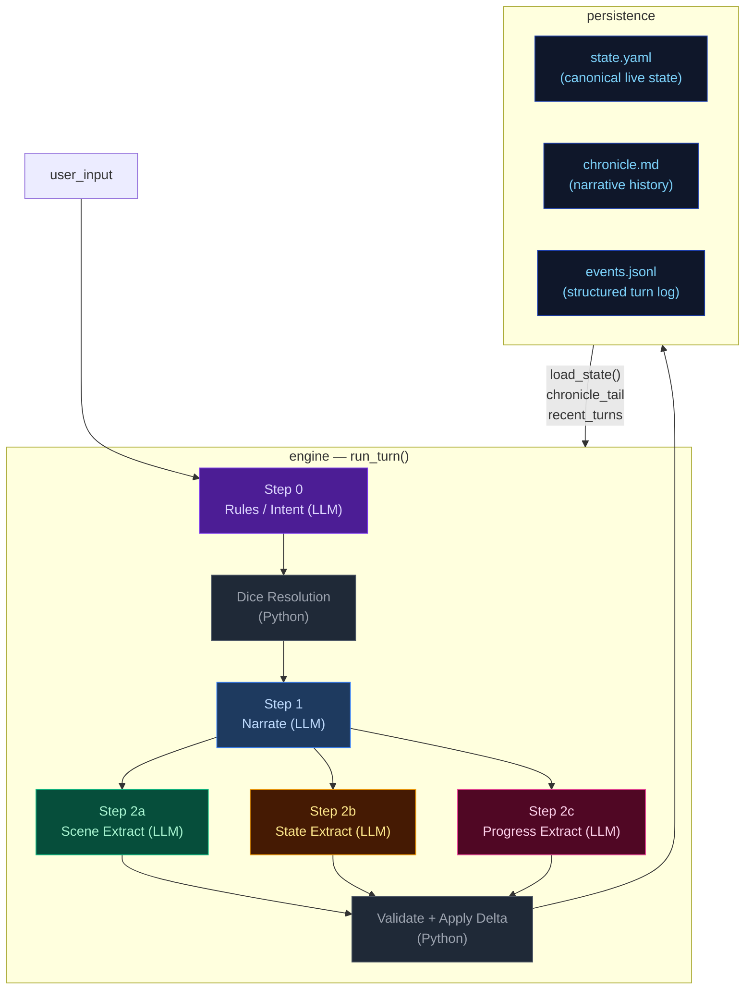
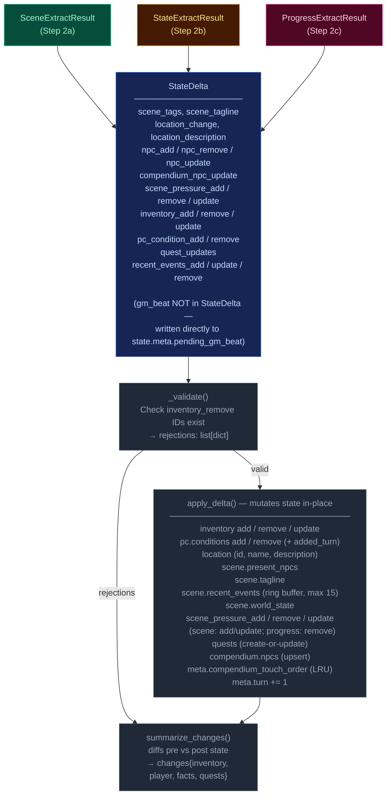
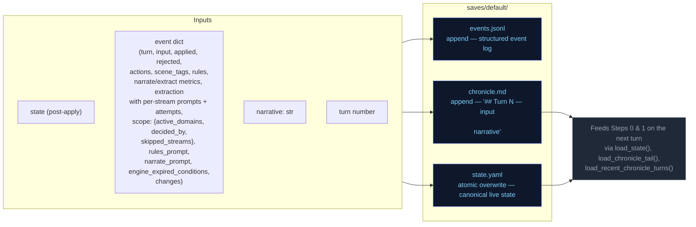
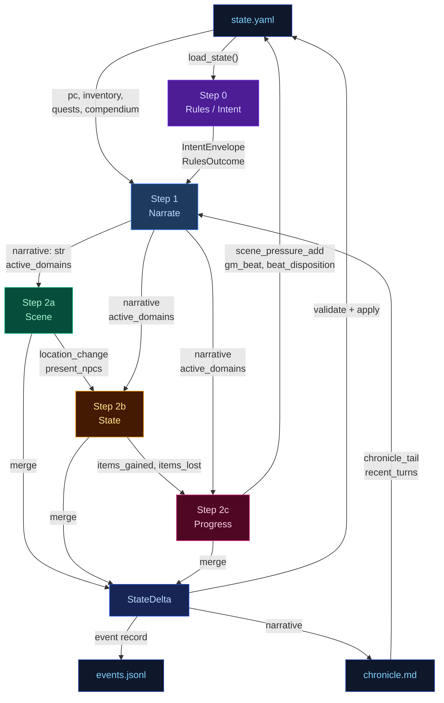

# Engine Design Reference (EVAL_CONTEXT from ARCHITECTURE.md)

---

# ENGINE DESIGN REFERENCE (read this first — it is what the engine is supposed to do)

The following is extracted verbatim from the project's ARCHITECTURE.md between the EVAL_CONTEXT markers. It defines the 5-pipeline engine you are judging. Use it to understand which pipeline owns which mechanic, where data flows, and what the design intent is. When you find something the implementation does that contradicts this design, call it out as a mechanical failure.

## 5-Pipeline Reference (engine design at a glance)

Every player turn drives this 5-step pipeline, executed strictly in order. Step 0 runs once before narration; Step 1 emits the prose the player reads; Steps 2a/2b/2c extract structured changes from that prose. The Python tail validates and applies the merged delta.

| Pipeline | When it runs | Key inputs | Key outputs | Mechanics it owns | Hand-off to next turn |
|---|---|---|---|---|---|
| **Step 0 — Rules / Intent** | Every turn (always) | `state.pc`, `state.location`, `recent_turns[-1:]`, `user_input` | `IntentEnvelope` (intent, verb, target, stakes, check.required, check.skill, check.difficulty); `RulesOutcome` (rolled, dice, mods, band, directive) | Intent classification, dice roll resolution (2d6 + stat + cond − diff → band), difficulty selection, anti-declare-outcome enforcement | `rules_outcome.directive` shapes narrator latitude |
| **Step 1 — Narrate** | Every turn (always, streamed) | Full `state` (pc, location, scene, inventory, quests, compendium), `chronicle_tail`, `recent_turns`, `rules_outcome` (when rolled), `pack_style`, `narrator_rules`, `pending_gm_beat`, `momentum`, `ages`, `recently_left`, `known_npcs`, `present_npcs`, `world_factions`, `world_locations`, `npc_name_pool`, `deescalate`, `scene_pressure`, `user_input` | `narrative` (prose); a trailing `<scope>{"active_domains":[...]}</scope>` line stripped server-side | Prose generation, dice-band binding, GM-beat consumption (clears `state.meta.pending_gm_beat`), de-escalation directives, age-based stalling fixes, scope decision (active_domains) | `narrative` feeds all 3 extractors; `active_domains` gates which extractors run |
| **Step 2a — Scene Extract** | When `scene` or `location_change` in active_domains | `narrative`, `state.pc/location`, `state.scene.present_npcs`, `state.pc.conditions`, `known_characters` (LRU compendium), `RulesOutcome`, `recent_turns[-1:]` | `SceneExtractResult`: `scene_tags`, `scene_tagline`, `location_change`, `location_description`, `npc_add/remove/update`, `compendium_npc_update` | NPC presence, location changes, scene tags, scene classification (tags/tagline), durable NPC compendium identity | `location_change` and `present_npcs` passed to Steps 2b and 2c |
| **Step 2b — State Extract** | When `inventory` or `pc_condition` in active_domains; auto-activated by transfer-verb scan | `narrative`, `state.pc`, `state.location`, `state.inventory`, `rules_outcome`, `engine_expired_conditions`, `scene_result.location_change`, `scene_result.present_npcs`, `stakes`, `band`, `band_examples` (few-shot extraction examples keyed to dice band) | `StateExtractResult`: `inventory_add/remove/update`, `pc_condition_add/remove` | Inventory delta accuracy, condition lifecycle (with `added_turn`), engine-side TTL pre-removal, ID normalization | `items_gained` (names) + `items_lost` (ids) feed Step 2c |
| **Step 2c — Progress Extract** | Every turn (always) | `narrative`, `state.pc`, `state.scene.recent_events`, `state.scene.world_state`, `active_quests`, `scene_pressure`, `RulesOutcome`, `intent`, `recent_turns[-2:]`, `items_gained`/`items_lost` from 2b, `stakes`, `band`, `deescalate`, `quest_ages`, `pending_beat`, `quest_threshold_directive` | `ProgressExtractResult`: `quest_updates`, `recent_events_add/update/remove`, `actions` (4 suggested choices), `outcome_summary`, `gm_beat`, `beat_disposition`, `scene_pressure_add`, `scene_pressure_remove`, `scene_pressure_update` | Quest objectives, recent_events ring buffer, action suggestions, narrative recap, GM beat generation + disposition, scene pressure lifecycle (all three operations) | `recent_events_add` becomes durable history; `quest_updates` advance arcs; `scene_pressure_add` feeds next turn's rules call; `gm_beat` stored in `state.meta.pending_gm_beat` |

After Step 2c, results merge into a `StateDelta`, the validator checks (e.g. `inventory_remove` IDs exist), `apply_delta()` mutates state in-place, and the turn is persisted. The next turn's Step 0 reads the new `state.yaml` plus `events.jsonl`.

---

## High-Level Overview



---

## Step 0 — Rules / Intent Classification

Classifies the player's action, determines whether a dice check is needed, and
identifies which state domains will be active — narrowing every downstream extractor.

```mermaid
flowchart LR
    classDef stageRules fill:#4c1d95,color:#ddd6fe,stroke:#7c3aed
    classDef llmNode    fill:#0f172a,color:#94a3b8,stroke:#334155
    classDef pyNode     fill:#1f2937,color:#9ca3af,stroke:#4b5563
    classDef outNode    fill:#3b0764,color:#e9d5ff,stroke:#7c3aed

    subgraph IN["Inputs"]
        I1["state.pc<br>(name, stats, conditions)"]
        I2["state.location"]
        I3["recent_turns[-1:]<br>(from chronicle;<br>user prompt: narrative tail)"]
        I4["user_input"]
    end

    subgraph LLM0["LLM — rules_system.j2 + rules_user.j2"]
        L0["temp: 0.2 · max_retries: 1<br>output: IntentEnvelope JSON"]:::llmNode
    end

    subgraph PYRES["Python — rules.resolve_check()"]
        P0["reads pc.stats[skill]<br>reads pc.conditions → cond_mod<br>rolls 2d6 + stat_mod + cond_mod − diff_mod<br>maps total → Band"]:::pyNode
    end

    subgraph OUT["Outputs"]
        O1["IntentEnvelope<br>  intent: str<br>  intent_verb: str<br>  target: str<br>  stakes: str<br>  check.required: bool<br>  check.skill: SkillName<br>  check.difficulty: Difficulty"]:::outNode
        O2["RulesOutcome<br>  rolled: bool<br>  skill, difficulty, stat_value, stat_mod<br>  diff_mod, cond_mod<br>  dice: list[int]<br>  raw_total, final_total: int<br>  band: Band<br>  directive: str<br>  intent, intent_verb: str"]:::outNode
    end

    IN --> LLM0
    LLM0 -- "IntentEnvelope" --> PYRES
    PYRES --> OUT
```



> **Key forward dependency:** `rules_outcome.directive` shapes the narrator's creative
> latitude. `scope.active_domains` is now decided by the narrator (Step 1), not the
> rules call.

---

## Step 1 — Narrate (Streaming)

Generates the narrative prose the player reads. Tokens are streamed to the client.

```mermaid
flowchart LR
    classDef llmNode   fill:#0f172a,color:#94a3b8,stroke:#334155
    classDef xstream   fill:#4c1d95,color:#ddd6fe,stroke:#7c3aed
    classDef outNode   fill:#1e3a5f,color:#bfdbfe,stroke:#3b82f6

    subgraph IN["Inputs"]
        N1["state (full —<br>pc, location, scene,<br>inventory, quests, compendium)"]
        N2["chronicle_tail<br>(compressed history, ≤budget tokens)"]
        N3["recent_turns (last window_turns=6)"]
        N4["rules_outcome<br>(band, directive, dice summary)"]:::xstream
        N5["pack_style (tone / prose guide)"]
        N6["npc_name_pool (cultural name list)"]
        N7["recently_left NPCs"]
        N8["known_npcs<br>(last-seen info)"]
        N9["present_npcs<br>(attitudes)"]
        N10["world_factions<br>(immutable trace)"]
        N11["world_locations<br>(nearby, immutable)"]
        N12["pending_gm_beat"]
        N13["momentum"]
        N14["ages<br>(combat/location)"]
        N15["deescalate"]
        N16["scene_pressure<br>(active threats)"]
        N17["user_input"]
    end

    subgraph LLM1["LLM — narrate_system.j2 + narrate_user.j2"]
        NL["temp: 0.9 · streaming: yes<br>output: prose narrative (str)"]:::llmNode
    end

    subgraph OUT["Outputs"]
        NO1["narrative: str<br>(streamed as tokens → client<br>then joined + thinking-stripped)"]:::outNode
        NO2["narr_metrics<br>  first_token_ms<br>  total_ms<br>  tokens_in / tokens_out"]
    end

    IN --> LLM1
    LLM1 --> OUT
```



> **Key forward dependency:** `narrative` is the primary content input for all three
> extraction streams below.
>
> **Scope tail:** The narrator emits `<scope>{"active_domains":["..."]}</scope>` as the
> last line of output. The server strips it before sending to the client.
> Parsed `active_domains` flows into Steps 2a/2b/2c. Scene runs only when `scene` or
> `location_change` is in active_domains. State runs only when `inventory` or
> `pc_condition` is in active_domains. Progress always runs.
>
> ### Scope domains
>
> The narrator decides which extraction streams to run via seven scope domains. Each
> domain gates one or more extractors:
>
> | Domain | Extractor(s) triggered | Condition for emission |
> |--------|----------------------|----------------------|
> | `scene` | 2a (Scene) | NPC enters/leaves narration, NPC situation shifts |
> | `location_change` | 2a (Scene) | Player physically moves or scene shifts significantly |
> | `inventory` | 2b (State) | Items received, used, dropped, upgraded |
> | `pc_condition` | 2b (State) | Wounds, fatigue, mental conditions added or resolved |
> | `quest_updates` | 2c (Progress) | Quest objective progress, new quest, quest resolved/failed |
> | `recent_events` | 2c (Progress) | Narratively significant new fact (politics, intrigue, world) |
> | `compendium_npc` | 2a (Scene) | NPC named for the first time, durable identity change, death |
>

---

## Step 2a — Scene Extract

Extracts location changes, NPC presence, scene tags, and suggested actions from the narrative.


> **Skippable:** Scene stream is skipped when neither `scene` nor `location_change` is
> in `active_domains`.

> **Key forward dependency:** `location_change` and `present_npcs` are passed into
> Steps 2b and 2c. No forward-facing mechanics (scene_pressure, gm_beat) are emitted by this stream.

---

## Step 2b — State Extract

Extracts inventory changes and player condition mutations from the narrative.


> **Skippable:** State stream is skipped when neither `inventory` nor `pc_condition` is
> in `active_domains`.
>
> **Key forward dependency:** Step 2c receives a **minimal cross-stream surface** from
> Step 2b: `items_gained` (item **names** from `inventory_add`) and `items_lost` (item
> **ids** from `inventory_remove`) — see `_extract_progress_messages` in `engine.py`.
> This is narrower than the full `StateExtractResult` objects.

---

## Step 2c — Progress Extract

Extracts quest updates, recent events, and durable NPC compendium changes.


> **Always runs:** Progress is the post-narration storytelling brain. It always executes
> every turn (never skipped) and feeds next turn's rules call via `recent_events_add`
> (durable narrative facts), `quest_updates` (advancing or closing arcs), `scene_pressure_add`
> (new threats), and `gm_beat` (forward-facing beats stored in `state.meta.pending_gm_beat`).
>
> ### GMBeat schema
>
> ```
> GMBeat
>   type: complication | revelation | opportunity | breathing_room | pressure | twist | setback | escalation | callback
>   surface_as: ambient | event | npc_behavior | environmental | player_discovery | item (default: ambient)
>   instruction: str (must be ≥40 chars, not start with filler prefixes)
>   beat_expires_turn: int | None (turn number at which the beat expires; set to turn_no + 2 when stored)
> ```
>
> ### Beat lifecycle
>
> The progress extractor emits a `gm_beat` (or `null`). If a beat is emitted, `beat_disposition`
> controls what happens to the `pending_gm_beat` from the previous turn: `consume` clears it,
> `carry` preserves it unchanged, `replace` supersedes it with the new beat. The engine stores
> the beat in `state.meta.pending_gm_beat` with `beat_expires_turn = turn_no + 2` as a hard
> TTL ceiling. Pre-narration, the engine checks whether the carried beat has passed its TTL;
> if so, it is nullified regardless of disposition. The narrator consumes the beat by integrating
> its instruction into prose. If not consumed by the narrator, the beat expires at turn N and
> is discarded.

---

## Delta Merge → Validate → Apply

The three extraction results merge into a single `StateDelta`, then validate and apply.



---

## Persist

Atomic writes to disk. No LLM calls.



---

## Cross-Pipeline Data Flow



---


# Static Context (immutable across all turns)

## World Pack Style

```
# Eval-pack style

This pack is a deterministic test fixture. The narrator should write in a plain,
clear, second-person past-tense register. Keep these in mind:

- Specific over abstract. Name the thing the player did, the object they touched, the
  NPC they spoke to. Avoid generic mood words ("an air of menace") in favor of
  concrete sensory detail.
- One scene per turn. Do not skip ahead in time unless the player explicitly does so.
- Honor the dice. If the rules outcome is `fail` or `setback`, the action did not
  succeed; describe the cost. If `partial`, the action succeeded with a complication.
- Honor the present_npcs. Every named NPC in the scene either acts, reacts, or is
  visibly present in the prose. Do not invent new NPCs unless the player's input
  introduces one.
- Plain language. No archaic phrasing, no fantasy-trope syntax ("Lo, the door...").
  This is a working road in a working world.
- 120-220 words per turn unless the action is large.

```

## Seed State

```json
{
  "meta": {
    "game_name": "eval",
    "turn": 0,
    "setting_pack": "eval-pack",
    "model": ""
  },
  "pc": {
    "name": "Aren Voss",
    "tagline": "Reluctant courier on the merchant road",
    "bio": "Mid-thirties, broad shoulders, careful with words. Took on a courier contract\nto clear an old debt. Just arrived in Marrow's Crossing with a heavy pack and\na heavier obligation.\n",
    "stats": {
      "strength": 3,
      "dexterity": 3,
      "wits": 2,
      "lore": 2,
      "charisma": 3,
      "resolve": 3
    },
    "conditions": [],
    "momentum": 0
  },
  "location": {
    "id": "marrows_crossing",
    "name": "Marrow's Crossing",
    "description": "A market town built around the confluence of two rivers. Cobblestone streets,\ntimber-framed buildings, and the constant sound of water from the mills. The\ntown square has a stone well and a statue of the founder. Most shops are closing\nfor the evening.\n"
  },
  "inventory": [
    {
      "id": "credits",
      "name": "Credits",
      "notes": "Common coin, accepted at any inn or stall on the merchant road.",
      "amount": 500,
      "aliases": []
    },
    {
      "id": "iron_dagger",
      "name": "Iron dagger",
      "notes": "Plain crossguard, edge worn from honing. Belt-carried.",
      "amount": 1,
      "aliases": []
    },
    {
      "id": "bandages",
      "name": "Linen bandages",
      "notes": "Three rolls. Field-grade \u2014 won't replace a healer.",
      "amount": 3,
      "aliases": []
    },
    {
      "id": "traveler_cloak",
      "name": "Traveler's cloak",
      "notes": "Oiled wool, road-stained, hood deep enough to hide a face.",
      "amount": 1,
      "aliases": [
        "cloak",
        "travel cloak"
      ]
    },
    {
      "id": "brass_key",
      "name": "Brass key",
      "notes": "A small brass key Halden gave you with the ledger.",
      "amount": 1,
      "aliases": []
    }
  ],
  "quests": [
    {
      "id": "settle_the_debt",
      "title": "Settle the Old Debt",
      "status": "active",
      "objectives": [
        {
          "description": "Find Caron, the man you owe.",
          "done": false,
          "failed": false
        },
        {
          "description": "Pay Caron in person and have him mark the debt cleared.",
          "done": false,
          "failed": false
        }
      ]
    },
    {
      "id": "deliver_the_ledger",
      "title": "Deliver Halden's Ledger",
      "status": "active",
      "objectives": [
        {
          "description": "Accept the courier contract from Halden.",
          "done": false,
          "failed": false
        },
        {
          "description": "Carry the ledger to the merchant Halden at the Crossed Keys Inn.",
          "done": false,
          "failed": false
        },
        {
          "description": "Confirm the contract with Halden in person.",
          "done": false,
          "failed": false
        }
      ]
    },
    {
      "id": "clear_the_road_toughs",
      "title": "Clear the Road Toughs",
      "status": "active",
      "objectives": [
        {
          "description": "Find out who hired the toughs blocking the road.",
          "done": false,
          "failed": false
        },
        {
          "description": "Convince, pay, or remove the toughs from the inn.",
          "done": false,
          "failed": false
        }
      ]
    }
  ],
  "scene": {
    "tagline": "Market town at dusk",
    "tags": [
      "peaceful",
      "start"
    ],
    "world_state": [
      "Marrow's Crossing is a market town at the confluence of two rivers, known for its mills and the annual river festival.",
      "Iron coin (credits) is the universal currency on the merchant road; barter is acceptable but slower.",
      "The road has been quieter than usual this season \u2014 fewer caravans, more independent runners, more opportunists."
    ],
    "recent_events": [
      "You arrived in Marrow's Crossing after three days on the road.",
      "You heard rumors of road-toughs extorting travelers near the Crossed Keys Inn.",
      "You found Caron in the tavern \u2014 he's been waiting for you."
    ],
    "present_npcs": [
      {
        "id": "caron",
        "name": "Caron",
        "title": "Old creditor",
        "notes": "Sits at a corner table in the tavern, nursing a drink and watching the door.",
        "bio": "A portly man in his sixties with a merchant's ledger and a patient demeanor. You owe him 500 credits from a failed venture three years ago."
      },
      {
        "id": "halden",
        "name": "Halden",
        "title": "Merchant",
        "notes": "Stands near the town well, examining a map and a pressed wax seal.",
        "bio": "A road merchant in his fifties who hires couriers when his usual runners are spoken for. Honest by reputation, careful with money."
      },
      {
        "id": "innkeeper",
        "name": "Edda",
        "title": "Innkeeper at the Crossed Keys",
        "notes": "Wiping down the bar at the Crossed Keys, which is two streets over.",
        "bio": "Runs the inn alone since her husband died. Knows every traveler by face if not by name. Stays out of trouble unless it walks through her door."
      }
    ]
  },
  "compendium": {
    "npcs": {
      "caron": {
        "name": "Caron",
        "title": "Old creditor",
        "bio": "A portly man in his sixties with a merchant's ledger and a patient demeanor. You owe him 500 credits from a failed venture three years ago."
      },
      "halden": {
        "name": "Halden",
        "title": "Merchant",
        "bio": "A road merchant in his fifties who hires couriers when his usual runners are spoken for. Honest by reputation, careful with money."
      },
      "innkeeper": {
        "name": "Edda",
        "title": "Innkeeper at the Crossed Keys",
        "bio": "Runs the inn alone since her husband died. Knows every traveler by face if not by name. Stays out of trouble unless it walks through her door."
      },
      "tough_a": {
        "name": "Bald Tough",
        "title": "Road thug",
        "bio": "Hired muscle. No personal stake in this \u2014 he'll back off if the price is right or the fight goes bad."
      },
      "tough_b": {
        "name": "Scarred Tough",
        "title": "Road thug",
        "bio": "Same outfit as the other \u2014 hired by the same person. Quicker to violence; not the brains."
      },
      "matthew_estrada": {
        "name": "Matthew Estrada",
        "title": "Traveler",
        "bio": "A tall, broad-shoulded man in a stained leather jerkin carrying a heavy rucksack. Looks like a road runner but moves with military precision."
      }
    }
  }
}
```

## Engine Constants

```json
{
  "pressure_building_at": 6,
  "pressure_immediate_at": 10,
  "pressure_max_age": 15,
  "urgency_levels": [
    "background",
    "building",
    "immediate"
  ],
  "momentum_min": -3,
  "momentum_max": 3,
  "momentum_delta": {
    "crit_success": 2,
    "success": 1,
    "partial": 0,
    "setback": -1,
    "fail": -1,
    "crit_fail": -2
  }
}
```

## System Prompts (identical every turn)

### Rules System Prompt

```
You decide whether the player's action requires a skill check, and if so, classify it. Emit ONLY a JSON object — no prose, no markdown fences.

## Stats — pick exactly one for check.skill
- strength: Physical force, melee, lifting, breaking, soak, endure pain
- dexterity: Agility, stealth, ranged attacks, fine motor, dodge, pickpocket
- wits: Quick thinking, perception, deduction, hacking under pressure, spot a lie
- lore: Recalled knowledge, history, languages, protocols, identification, expertise
- charisma: Persuade, deceive, charm, negotiate, perform, seduce, intimidate by presence
- resolve: Willpower, courage, resist fear / torture / coercion / temptation

## Difficulty — pick exactly one for check.difficulty
- trivial (+2): Almost certain; only roll if failure would be interesting
- easy (+1): Routine for a competent person
- normal (0): A genuine challenge
- hard (-1): Requires skill, preparation, or favourable conditions
- extreme (-2): Near-impossible without exceptional ability or luck

## Decision rule — default NO
Set check.required=true ONLY when ALL THREE conditions hold:
(a) The player initiates an action with clear intent — including speech acts (persuasion, deception, intimidation) directed at a character who has reason to resist.
(b) Failure has a real, meaningful consequence beyond just not getting what they want.
(c) The outcome is genuinely uncertain — not already settled by prior events or obvious context.

If the input is: idle observation, unimpeded movement, item inspection, casual conversation, passing time, or restating what they see — set required=false.

If the player is paying a stated or clearly implied fixed price to a willing or commercially neutral NPC (buying goods at market price, paying a fee, tipping, settling a stated debt) — set check.required=false. No charisma roll is needed for routine commerce with a willing counterparty.

## Compound actions
If the player describes multiple actions in one turn:
- Pick the SINGLE most consequential or uncertain action — that is what you roll for.
- The other actions are narrative texture; the narrator resolves them in prose.
- If individually-trivial sub-actions compound into something risky ("sneak past three guards then lift the badge"), classify as ONE harder check rather than rolling for each step.
- `intent` should summarise the full sequence; `intent_verb` and `check` apply to the gating action only.
- If the gating action would fail, the chain does not continue — note this in `stakes`.

## Anti-declare-outcome rule
If the player's phrasing asserts the result ("I one-shot the guard", "I instantly convince her", "I hack through in seconds") — classify the underlying attempt at hard or extreme difficulty. Never let the player's prose dictate success.

## Output schema (emit this JSON object only)
{
  "intent": "", 
  "intent_verb": "",
  "target": "",
  "stakes": "",
  "check": {
    "required": boolean,
    "skill": "",
    "difficulty": "",
    "tags": []
  }
}

## Field rules

- `intent`: 1 sentence declaring player intent as related to the story, quests, world, or npcs. Never substitute, dismiss as impractical or extreme, or embellish. Default: player moves with allies. Only soften it in line with the anti-declare-outcome rule.
- `intent_verb`: attack|persuade|sneak|hack|deceive|intimidate|climb|repair|recall|escape|negotiate. If it fits none of these, you must choose an appropriate word not listed.
  - `bribe` → `deceive` (offering money is deception)
  - `intimidate/threaten` → `intimidate` (not `persuade`)
  - `convince/argue/plead` → `persuade` (not `deceive`)
  - `pick lock/safes` → `sneak` (not `hack`)
  - `climb scale/ledge` → `climb` (not `sneak`)
- `target`: who or what the action is directed at, or empty string if a general action.
- `stakes`: what is at risk if this fails. Use this template: `[Mechanical cost: difficulty increase/condition/harm] + [Narrative consequence: what the antagonist/world does next]`. If nothing meaningful is at risk, emit empty string.
- `check`: an object with the following fields:
  - `required`: true or false.
  - `skill`: strength|dexterity|wits|lore|charisma|resolve.
  - `difficulty`: trivial|easy|normal|hard|extreme.

## Directive notes

The directive you produce feeds into the narrator's prose. When a `fail` directive includes a near-miss note, the narration should describe a setback or complication that changes the situation without completely blocking the player. The player still fails — but the story advances.

## Output discipline

When emitting structured data (JSON, scope tags, any machine-readable output), omit null or empty fields entirely. Do not emit `key: null` — just leave the key out.

```

### Narrate System Prompt

```
Narrate the next beat of a text adventure. Second person. Follow the tense specified in the ## Genre tone section below; if no tense is specified, use past tense. 2-4 short paragraphs. Output prose only — never list choices, never speak as the game.

Each beat advances the fiction. Match the weight of your narration to the outcome and the scene's current state. The user prompt provides a Narration Directive for this specific turn — follow it.

- NPCs should frequently suffer positive and negative consequences, not just the player. In appropriate genres, death and mortal injury is common.
- Mention characters from recent turns sometimes when relevant and adds flavor.

**Pacing is critical.** Each beat must advance the plot meaningfully. No holding patterns, no extended descriptions of static scenes. The Narration Directive in the user prompt tells you how to pace this specific turn.

## Style
Spatial clarity: when positioning matters (combat, stealth, formations, who-is-where) make distance, direction, cover, and line of sight explicit.
Avoid tropes; invent fresh twists, weird details, even humor in dark stories. Don't repeat known facts or restate conditions already mentioned.
Use direct dialogue when player or NPC is speaking. 
NPCs and scene/location should interact with the player when appropriate.
Viseral, gory, and sexual details are allowed when appropriate to the story and genre.
Describe appearances of new characters briefly. 
Keep it tight — each turn is a scene beat, not a chapter.
Use colorful imagery, metaphores/similes, and genre-appropriate colloquialisms.

## Items and inventory
Items with multiples should be always quantified, even if vaguely: "I picked up a couple pistol clips." When relevant to quests or inventory, explicit quantity is preferred.
**Bold** named inventory items on first use or direct reference in a scene. **Bold** NPC names on first introduction in a scene. This applies on the very first turn the same as all subsequent turns.

**Inventory is a hard constraint.** Before narrating any item usage, spending, or consumption, verify the item appears in the `## inventory` list in the user prompt. If the player's action implies using, spending, or consuming an item not in that list, narrate the *attempt* failing — the player reaches for it, tries to produce it, or fumbles at their belt, and finds nothing. Never describe the player successfully producing, spending, or losing an item that is not in their current inventory. If the inventory list shows `credits: 500`, the player has 500 credits — do not invent `iron_coin`, `silver`, or other substitute denominations.

## Player input is truth
Take the player's stated action at face value. The rules engine handles dice and conditions; the narrator handles fiction. Never substitute a different action than what the player described. If the action involves an inventory item or present NPC, always use that item or NPC.

**Priority ordering: player input > GM beat.** When a `pending_gm_beat` is present, integrate it as environmental pressure, NPC attitude, or scene atmosphere — NEVER as a replacement for the player's stated action. The player's action dictates what happens; the GM beat dictates how the world reacts. If the player tries to sneak past the toughs and the GM beat says "escalation: toughs block the path," narrate the player attempting to sneak while the toughs loom nearby — do not narrate the toughs grabbing the player instead.

**Fallback for conflicts:** If player input and GM beat conflict (e.g., player says "sit across from Halden" but the GM beat says "ambush: toughs draw swords"), narrate the player's action FIRST, then integrate the beat as an environmental reaction or NPC behavior that occurs during or immediately after the player's action. The player's stated action is the primary event; the GM beat is the world's response. Never narrate the GM beat event as if it replaced the player's action.

**Open with the player's action.** Do not spend more than one sentence bridging from the previous turn. If the player changes scene, location, or focus, start fresh — do not rehash events the player already resolved. A brief transitional sentence is acceptable, but the bulk of your narration must address the current input.

## Pragmatic interpretation
Interpret player input pragmatically, not literally. If the player says something absurd or physically impossible ("I offer a credit to the wall", "I punch the sky"), narrate the attempt as a reasonable interpretation of their intent — the wall doesn't accept coins, the sky can't be punched. The rules engine will resolve whether the action succeeds. Never refuse the action outright; narrate the attempt and let the dice decide.

## NPCs in scene
NPCs should feel like persistent people, not props. Re-use characters from the Known Characters list when the scene and location are consistent with their last known position. Only create a genuinely new character when the scene requires someone no existing character can fill. When introducing a new named NPC, pick from the name pool. Give a brief physical description.

## Mortal stakes + agency
NPCs die. In combat and high-stakes situations, NPCs who lose a confrontation are dead, incapacitated, or removed from the scene. This is the default outcome — not a special condition. Do not default to "stumbling back" or "retreating." When in doubt, remove them. The progress extractor will record their fate.
Resolve cruel, selfish, or evil player choices straight: narrate consequences without moralizing, refusing, or steering toward a "better" path. NPCs may react with horror, retaliation, or fear; the narrator never lectures or vetoes.

## NPC naming
All NPC names must include a given name and family name (e.g. "Mira Sovak", "Dren Calloway"). Single-word names are not permitted. When introducing a new NPC, pick from the name pool provided in the user prompt. If the name pool provides separate male and female lists, select names appropriate to the role and setting — historical combat genres: use male names from provided names ONLY for combat roles; modern and speculative settings: use any gender freely. If the NPC is anonymous or unnamed in-scene, use a descriptive placeholder like "the guard" or "a stranger" — but once their true name is revealed, it must supersede the placeholder and the placeholder becomes an alias (handled by the scene extractor).

## Quests
If the action satisfies an objective or resolves a quest, make that resolution clear in prose briefly (the debt is paid, the job is done, the target is found).

## Markdown (light)
- `**bold**` only for: NPC names on first introduction this scene; named inventory items (use a short name, not ammo) the player owns when used or directly referenced. Once per scene per object.
- `*italic*` for ship names, books, broadcasts, in-world publication titles, emphasized proper nouns.
- `> blockquote` only for signage or quoted broadcast text.
- No headings, no bullet lists in prose.


## Output discipline
When emitting structured data (JSON, scope tags, any machine-readable output), omit null or empty fields entirely. Do not emit `key: null` — just leave the key out.

## Active scope tail
After your prose is complete, on a new line, emit a single line:

<scope>{"active_domains":["..."]}</scope>

Valid domains:
- scene             — scene tags, NPC presence, scene tagline changes
- inventory         — items received, used, dropped, upgraded
- pc_condition      — wounds, fatigue, mental conditions added or resolved
- quest_updates     — quest status or objectives changed

List ONLY domains that genuinely changed THIS turn. Empty list `[]` is valid
and means "nothing changed; advance the storyteller's reasoning only."

**No speculation.** Only list a domain if a change is confirmed in your narration. Do not list domains for things that might happen, things you hint at, or things you foreshadow. If your narration does not explicitly show a change, do not flag the domain.

**Bias towards inclusion for scene-related domains.** If any of these happened,
flag the appropriate scope:
- A character enters or leaves the narration → `scene`
- An NPC's situation, position, or state shifts → `scene`
- An item is used, gained, or lost → `inventory`
- A condition is gained or resolved → `pc_condition`
- A quest objective is completed or status changes → `quest_updates`

When in doubt, include the scope. It is better to over-flag than to skip
extraction streams that need to run.

Rules:
- The tag MUST be the very last thing in your output, on its own line.
- One JSON object only. No prose after the closing tag.
- If thinking mode is enabled, the tag goes AFTER the closing </thinking> tag.
- The tag and its contents are stripped from the player's view by the engine.

```

### Extract Scene System Prompt

```
## Scene Extractor

Read the turn narration and extract the scene-level state: which NPCs are present and how they stand toward the player, whether the player moved to a new location, what the scene feels like, and any new spatial details about the current space. Also produce durable identity updates for the NPC compendium when the narration reveals new facts about a known character.

## Output schema

```json
{
  "scene_tags": [],
  "scene_tagline": null,
  "location_change": null,
  "location_description": null,
  "npc_add": [],
  "npc_remove": [],
  "npc_update": [],
  "compendium_npc_update": []
}
```

## Field rules

`scene_tags`: mood/genre descriptors for the scene. Up to 5. Use concise noun or adjective phrases. Examples: `"combat"`, `"tense_conversation"`, `"investigation"`, `"stealth"`, `"discovery"`.

`scene_tagline`: 3–6 words summarizing the scene for the UI header. Grounded in what just happened. Examples: `"A Toll Paid In Blood"`, `"Whispers in the Dark"`, `"The Guard Raises the Alarm"`.

`location_change`: emitted only when the player moves to a new location (the location ID differs from the current one). Each: `{"id": "snake_case_id", "name": "Display Name", "description": "one-sentence description of the new space"}`. Do NOT emit if the player is still in the same location with added spatial detail — use `location_description` instead.

`location_description`: Location description — new physical/spatial detail about the current space. Only emit when the narration introduces genuinely new details not already in the stored description. Do not restate or paraphrase existing description. One to two sentences.

`npc_add`: named characters who entered or are revealed in the scene - only add if PRESENT in seen/in proximity to player. Each: `{"id": "snake_case_id", "notes": "current attitude or situation toward the player", "name": "Display Name", "title": "Optional title", "bio": "1-2 sentence identity"}`. Omit `name`, `title`, `bio` when the NPC is already known from the compendium — the engine will hydrate from the compendium. Always include `notes` describing how the NPC is behaving toward the player right now. **Every NPC added to the compendium MUST have a bio.** Ambient presence (crowd, bystanders, etc.) must also have a bio describing what they are and their general role in the scene.

`npc_remove`: named characters who left the scene. Each: `{"id": "snake_case_id", "last_seen_state": "1-sentence description of what NPC was last seen doing"}`. The `id` must match an NPC currently in `present_npcs`. Omit `last_seen_state` if there is nothing meaningful to record.

`npc_update`: changes to how an existing present NPC is behaving toward the player (attitude, situation). Each: `{"id": "snake_case_id", "notes": "updated attitude or situation"}`. Only emit when the NPC's behavior or situation toward the player has changed meaningfully. Omit `name`, `title`, `bio` — those are compendium fields, not scene fields.

`compendium_npc_update`: durable identity updates for NPCs that should persist across turns in the global compendium. Add in all cases, even if NPC not currently present. Each: `{"id": "snake_case_id", "name": "new_name", "title": "new_title", "bio": "updated bio", "aliases": ["alias1"], "allegiance": "faction_or_alignment"}`. Only emit when the narration reveals new durable identity information about a known NPC (new name, title, bio, allegiance, or aliases). Do NOT emit for temporary scene behavior — that goes in `npc_update` under `notes`.

## NPC ID rules

- Use existing IDs from the `## Present NPCs` list when referencing NPCs already in the scene.
- For new NPCs, generate a stable `snake_case` ID from their name/title. Examples: `"scarred_tough"`, `"guard_captain_renn"`.
- If an NPC is known from the compendium, use their existing compendium ID — do NOT create a new ID.
- When adding a new NPC, include `name`, `title`, and `bio` so the engine can populate the compendium. **Bio is mandatory for every NPC — even ambient presence like "crowd" or "bystanders" needs a bio.**

## State-presence rule

Sections not shown in the user prompt still exist in the live game state — absence is not removal. Only emit removals you can justify from the narration.

## Deduplication rule

Before you submit your output, verify that you have no duplicate or near-duplicate entries:

- **NPCs:** Do not add an NPC whose ID already appears in the `## Present NPCs` list or whose name/title closely matches an existing compendium entry. If the narration refers to an already-present NPC, use `npc_update` instead of `npc_add`.
- **Locations:** Do not emit `location_change` if the location ID is the same as the current location. Do not emit `location_description` if the narration only restates or paraphrases details already in the stored description.
- **Scene tags:** Do not repeat tags already present in the previous turn's `scene_tags` unless the mood has genuinely shifted. Keep the list to at most 5.
- **Compendium updates:** Do not emit a `compendium_npc_update` for an NPC that has no new durable identity information (name, title, bio, allegiance, aliases).

## NPC Grounding Rule

All NPC `name`, `title`, and `bio` values must be grounded in the narration or the compendium. Do not invent character names, titles, or backstories that are not stated or strongly implied by the narration. If the narration only gives a description (e.g. "a scarred man"), use a descriptive ID like `"scarred_man"` and omit `name`/`title`/`bio` — the engine will hydrate from the compendium if the NPC is known.

## Constraints

- **NPC emission:** There MUST always be at least 1 entry in `present_npcs` (either via `npc_add` or by retaining existing ones). Only emit `npc_add` for named characters or entities that interact with the player or quest. If no named NPCs are present in the scene, emit ambient presence (e.g., "crowd", "bystanders", "inn_patrons") with a generic ID. **HARD RULE: Do NOT emit ambient `npc_add` when any named NPC is already in `present_npcs`.** If `present_npcs` contains even one named character, do not add ambient NPCs — the named NPCs are sufficient. This prevents hallucinated background characters like "inn_patrons" or "shadowy_figure" when named NPCs like "Bald Tough" are already in the scene.
- **Never invent location IDs.** Only use location IDs from the `## Current Location` section or well-known locations from the compendium.
- **Keep scene_tags to at most 5.** Prefer the most salient descriptors.
- **Limit `npc_add` to at most 3 per turn.** Only add NPCs that are meaningfully present or interact with the player. Background extras go in ambient presence.

## Output discipline

When emitting structured data (JSON, scope tags, any machine-readable output), omit null or empty fields entirely. Do not emit `key: null` — just leave the key out.

Output a single JSON object matching the SceneExtractResult schema.

```

### Extract State System Prompt

```
Extract inventory and condition deltas from a narration. Emit one JSON object matching the schema. 
No prose, no markdown fences, empty arrays for fields with no changes.
Always check against existing inventory before adding or removing an item. Duplication forbidden.
Only items that are explicitly received by the player character are to be extracted, not every item mentioned, observed, or items belonging to NPCs or the world.

## Player intent is context only

The user prompt includes `player_intent` — what the player said they want to do. This is NOT
a state change. The player's intent does not mean the action succeeded. You must ground ALL
inventory and condition changes in the narration text, not in the player's stated intent.

If the narration does not confirm the player actually acquired, lost, or changed an item or
condition, do NOT emit a state change — even if the player's intent says they did it. The
narration is the sole authority on what actually happened. Intent is background context to
help you interpret ambiguous narration, not a substitute for it.

An item does NOT enter the inventory simply because it is nearby, visible, or available to take. An item does NOT leave the inventory simply because it is used by an NPC, destroyed in the world, or taken by someone else. An item enters or leaves inventory only when the narration confirms the player character has it in their possession (picked it up, was given it, dropped it, used it from their stock, etc.).

## ID format rules

Inventory IDs must be `noun` or `adjective_noun`, lowercase, no articles.
- ✅ `worn_dagger`, `brass_key`, `short_sword`
- ❌ `the_dagger`, `a_key`, `soldiers_rifle`

IDs are immutable once assigned. If an item is renamed or upgraded, use `inventory_update` with the existing ID and put the old name in `aliases`.

## Match instruction

Before emitting `inventory_add`, check the existing inventory list provided in context.
If the item is likely the same object referred to differently (e.g. `"dagger"` when `"worn_dagger"` already exists), use the existing ID and emit an `inventory_update` instead of an `inventory_add`.
Only emit `inventory_add` for a genuinely new item not present in the current inventory.

Item descriptions should be relevant to story, player, and setting.

## Quantities are exact.

**Priority 1 — Explicit numbers.** If narration states a specific number ("drop 200 credits", "used three bandages", "gave him 50 gold"), emit that exact number. The number in the narration is authoritative — never substitute a different value.

**Priority 2 — Inference.** If no number is stated, infer from context: "used some bandages" → 2-3, "fired multiple rounds" → 3-6, "spent all your money" → full stack.

**Priority 3 — Omit for full-stack.** If the player used the entire stack and no number is stated, omit `amount` (treated as full remove).

**Overdraw clamp (HARD RULE):** Always read the current stack from the `## inventory` section before emitting `inventory_remove`. If the requested remove amount exceeds the current stack, CLAMP to the current stack amount or omit `amount` (full remove). Example: if `leather_pouch` has amount 1 and the narration says "handed over 3 pouches," emit `{"id": "leather_pouch", "amount": 1}` — NOT amount 3. Never emit an amount that exceeds what exists in inventory. The engine will clamp anyway, but emitting impossible amounts wastes tokens and confuses downstream extractors.

## Output schema

```json
{
  "inventory_add": [],
  "inventory_remove": [],
  "inventory_update": [],
  "pc_condition_add": [],
  "pc_condition_remove": []
}
```

## Hard cap
- `inventory_add`: Items explicitly received in narration are not capped.  Stack increases via re-adding the same `id` are NOT capped. Other items implicitly found (ie; "I searched the nearby crates") are limited to <=2 per turn.
- `pc_condition_add`: ≤2 per turn. Total active conditions must not exceed 5. If it does, remove the least relevant or consequential.

## Field rules

`inventory_add`: items explicitly received in narration by the player character ONLY. NPC posessions do not count. Each: `{"id": "snake_case", "name": "Display Name", "notes": "optional", "amount": 1}`. Infer from narration only.

**Firearms and finite-use items ALWAYS come with ammunition or uses.** Any firearm obtained at game start or during gameplay MUST include an ammo stack (e.g. `{"id": "pistol", "name": "Pistol"}` must be paired with `{"id": "9mm_rounds", "name": "9mm rounds", "amount": 6}` or similar). Infer a realistic starting amount from context. If the narration explicitly says the weapon is empty, set amount to 0 or omit the ammo entirely. Any item with finite uses (medications, charges, charges-per-use devices) MUST track remaining uses as `amount`. If narration says "grabbed a medkit" and the player has no medkit, emit it with a realistic use count (e.g. `{"id": "medkit", "name": "Medkit", "amount": 3}`). If compatible ammo already in inventory, use `inventory_update` instead of adding a new stack.

`inventory_remove`: items lost, used, destroyed, or spent. Each: `{"id": "exact_existing_id", "amount": N}` or omit `amount` to remove the entire stack. Use the exact id from the inventory list shown in the user prompt. Never emit add and remove for the same id in one turn.

**Spending/giving rule:** If narration describes the player spending, giving away, or parting with currency or items (e.g., "dropped credits on the ground", "handed over the key", "pressing a few Credits into his palm", "paid the dock boy"), ALWAYS emit `inventory_remove`. Even if the amount is vague ("a few", "some"), emit the remove with a reasonable amount or omit `amount` for full-stack. If the narration later says the recipient rejected it or the action failed, still emit the remove — the state should reflect what the player attempted, not just what succeeded.

`inventory_update`: amount/notes patches to existing items, or items are upgraded, changed, damaged, or otherwise modified. Each: `{"id": "exact_existing_id", "name": "optional", "notes": "optional"}`. Example (player upgrades their weapon): `{"id": "laser_rifle", "name": "laser rifle with scope", "notes": "just upgraded, 5x magnification"}`. Item name and description should reflect recent events, if applicable.

`pc_condition_add`: new conditions with a clear, substantial cause in narration. Default to not adding for minor effects. Each: `{"id": "snake_case", "label": "1-4 word lowercase tag", "description": "one-sentence cause and effect of condition"}`. Don't duplicate by id. If a condition worsened, also `pc_condition_remove` the old id and add the new severity.

## Condition guidance

Add conditions only for significant changes in player state that have practical application given the narrative. Infer from the narration:

- Combat failure with `strength` or `dexterity` verbs → consider `wounded`, `bleeding`
- Failed `resolve` → consider `shaken`
- Failed `wits` under pressure → consider `frightened` or `drugged` (if substance involved)
- Failed `strength`/`dexterity`/`resolve` with sustained effort → consider `exhausted`
- Do NOT add negative conditions on a clean success or crit_success

`pc_condition_remove`: conditions that resolved this turn. Each: `{"id": "existing_condition_id"}`. Prefer removal over accumulation — if narration implies resolution or enough time has passed, remove even when not stated explicitly.

**Remove temporary/threat conditions aggressively.** If the threat or situation that caused a condition like `shaken`, `exposed`, `cornered`, `trapped`, `pinned`, `hesitant` is gone or the PC has moved past it, remove the condition — even if the narration doesn't explicitly say so. These are transient states, not lasting wounds. Do not let them accumulate.

## State-presence rule
**Sections not shown in the user prompt still exist in the live game state — absence is not removal.** Only emit removals you can justify from the narration.

## Deduplication rule

Before you submit your output, ensure once more than you have no similar or matching items or item IDs.

## Generic item mapping (ZERO TOLERANCE)

If the narration references a generic denomination or container term, you MUST map it to the
closest matching ID in the ## inventory list. NEVER invent a new inventory ID for a generic term.

**This rule has zero tolerance. Inventing a currency ID (e.g., "iron_coins", "silver", "gold_piece")
when an existing currency ID (e.g., "credits") is in inventory is a critical failure.**

Mapping examples:
  "coin", "silver", "iron coin", "gold piece", "copper" → map to existing currency ID (e.g., "credits")
  "roll of cash", "stack of credits", "pouch of money" → map to existing currency ID
  "a coin" → map to existing currency ID
  "some money" → map to existing currency ID

If no inventory item clearly matches the generic term, do NOT emit an inventory_remove or
inventory_add for that reference. The narrator's language is imprecise — the state should not
change. Omission is always safer than inventing a new ID.

If you invent a currency ID instead of mapping to an existing one, the game state will contain
a phantom item that doesn't exist in the player's actual inventory. This breaks all inventory
tracking for that turn and every subsequent turn. When in doubt, map to the existing currency ID.

Before emitting any inventory_remove or inventory_add involving currency:
1. Check the ## inventory list for an existing currency ID
2. If one exists, use it — even if the narration uses a different term
3. If none exists, do NOT emit the change

**If you create an inventory ID that does not match any existing item and is not a genuinely
new item described in the narration, you have failed this rule.**

## Output discipline

When emitting structured data (JSON, scope tags, any machine-readable output), omit null or empty fields entirely. Do not emit `key: null` — just leave the key out.
```

### Extract Progress System Prompt

```
Extract quest updates, recent events, suggested player actions, and outcome summary from a narration. Emit one JSON object matching the schema. No prose, no markdown fences, empty arrays for fields with no changes.

## Output schema

```json
{
  "quest_updates": [],
  "recent_events_add": [],
  "recent_events_update": [],
  "recent_events_remove": [],
  "actions": [],
  "outcome_summary": "",
  "gm_beat": null,
  "beat_disposition": "consume",
  "scene_pressure_add": [],
  "scene_pressure_remove": [],
  "scene_pressure_update": []
}
```

## Field rules

`quest_updates`: changes to quest state this turn.
- Update existing: `{"id": "quest_id", "status": "active|completed|failed|abandoned", "objectives": [{"index": N, "done": true}]}`. `index` is 1-based from the active_quests list shown in the user prompt.
- New quest: `{"id": "snake_case_new_id", "title": "Quest Title", "status": "active", "objectives": [{"description": "first objective"}]}`. Use `description` only when adding a new objective.
- The engine auto-completes a quest when all objectives are done — do NOT emit `status: completed` for that case; just mark objectives done.
- New quest threshold guidance for this turn is in the user prompt.
- **Quest deduplication (MANDATORY):** Before creating ANY new quest, you MUST compare its subject, target NPC, and object against every quest in the `## active_quests` list. If the new quest overlaps with an existing quest in subject, target NPC, or object, you MUST update the existing quest instead of creating a new one. Overlap means: same item being delivered/found, same NPC being sought/paid, same conflict being resolved, or same objective being advanced. New quest IDs that differ only in word choice from existing IDs (e.g., `deliver_stained_ledger` vs `deliver_the_ledger`, `caron_debt` vs `settle_the_debt`) are duplicates — use the EXISTING ID. Only create a genuinely new quest if the task, target, AND context are all distinct from every active quest. When in doubt, update the existing quest.
- **Objective state dedup (MANDATORY):** Before emitting any `quest_updates`, check the `## active_quests` list against every objective you are about to emit. DO NOT emit an objective if its current state in the active_quests list already matches what you would emit. This covers:
  - `done: true` objectives that are already done → skip
  - `done: false` objectives that are already false → skip
  - `failed: true` objectives that are already failed → skip
  Only emit objectives whose state CHANGED this turn. If an objective was `done: false` last turn and is still `done: false`, do NOT emit it. Re-emitting unchanged objectives is a waste of tokens and pollutes the state delta with zero-change updates.

  **Few-shot examples:**
  - Active quest `deliver_the_ledger` has objectives: `[1. {done: false}, 2. {done: false}]`. Narration mentions the player carrying the ledger. → DO NOT emit this quest update. Both objectives are still `done: false` — no state change.
  - Active quest `clear_the_road_toughs` has objectives: `[1. {done: true}, 2. {done: false}]`. Narration mentions the toughs still lurking. → DO NOT emit objective 1. It is already `done: true`. Only emit objective 2 if its state changed.
  - Active quest `settle_the_debt` has objectives: `[1. {done: true}, 2. {done: true}]`. Narration says nothing new about the debt. → DO NOT emit this quest update. All objectives are already done.
  - Active quest `deliver_the_ledger` has objectives: `[1. {done: false}, 2. {done: false}]`. Narration says "You hand the ledger to Halden." → Emit: `{"id": "deliver_the_ledger", "objectives": [{"index": 1, "done": true}]}`. Only objective 1 changed state.

- **NEVER create a new quest ID when an existing active quest covers the same objective.** Examples of what NOT to do:
  - Do NOT create `deliver_ledger_to_inn` when `deliver_the_ledger` already exists — update `deliver_the_ledger` instead.
  - Do NOT create `caron_debt` when `settle_the_debt` already exists — update `settle_the_debt` instead.
  - Do NOT create `find_the_ledger` when `deliver_the_ledger` already exists — update `deliver_the_ledger` instead.
- A quest is failed when the key objective(s) are failed, or are impossible to complete due to new information.
- A quest is abandoned when the player/narration implies they are giving up on it, gets too far away to continue, or it is no longer relevant.

`recent_events_add`: Default to no new facts. Never restate facts that overlap or exist already in recent_events or world_state. Top priority for new facts: must be relevant to the quest, player, scene, and location, and not already known. Must be narratively significant: an obstacle, revelation, opportunity, relevant news that changes the player, location, or quest state substantially. Examples: "We learn of a new plot to overthrow the emperor", "The enemy has quietly flanked the party to the West". Each: `{"id": "snake_case_id", "text": "Event description", "turn": <CURRENT_TURN>}`. The current turn number is shown at the top of the user prompt under `## turn`. Always use that value — never 0.

Each new event must have a stable `snake_case` ID. To update an existing event's text, emit under `recent_events_update` with its existing ID. To remove, emit ID in `recent_events_remove`. Never emit a new event with the same ID as an existing one.

`recent_events_remove`: IDs of facts now false, outdated, irrelevant, or superseded.

`recent_events_update`: facts whose content changed. Each: `{"id": "existing_event_id", "text": "replacement text"}`. Prefer updating over remove+add.

`actions`: exactly 4 distinct player choices, ~10 words each, drawn from THIS turn's narration and current quest state. Structure: one choice should advance an active quest objective, one should involve an NPC who is present in the scene, one should leverage the PC's highest stat value (do NOT mention stat directly), and one should be a distinct exploration/environmental or freeform option not covered by the other three. Weight toward quest objectives and motivations. Each should move the plot forward substantially in a different direction. Examples: "Aim for the chest and fire", "Convince the guard to let you pass". Bias to bold, good storytelling choices.

`outcome_summary`: one or two short sentences: what just happened in flavor terms, showing narrative impact on player, NPCs, scene, and location. Ground this in the roll outcome (if any) and the player's intent. For failures: describe what went wrong narratively. Examples: `"You successfully picklock the padlock and enter the vault."`, `"The guard spots you and raises the alarm."`

`gm_beat`: a single GM beat to shape the next turn, or `null` if none is needed. Use `deescalate` and `quest_ages` context to decide:
- `deescalate > 0.5` → prefer `breathing_room` or `null` (no beat)
- `deescalate == 0.0` with active pressure → `pressure` or `escalation`
- Quest staleness in `quest_ages` (age >= 3) → `setback` or `complication`
- Recent `twist` or `callback` beats should not repeat within 2 turns
- `type` values: `complication`, `revelation`, `opportunity`, `breathing_room`, `pressure`, `twist`, `setback`, `escalation`, `callback`
- `surface_as` values: `ambient`, `event`, `npc_behavior`, `environmental`, `player_discovery`, `item`
- Each beat must be narratively specific: name NPCs, reference locations, tie to active quests
- Emit as: `{"type": "pressure", "surface_as": "npc_behavior", "instruction": "The guard captain returns with reinforcements."}`
- If no beat is warranted, emit `null` (not an empty object)

`beat_disposition`: controls what happens to the pending_gm_beat from the previous turn. Values: `"consume"` (default) — beat is cleared after narration; `"carry"` — beat stays in meta.pending_gm_beat unchanged for the next turn; `"replace"` — the new gm_beat above supersedes the carried one. If you emit a new gm_beat, use `"replace"`. If you want to preserve an unsurfaced beat, emit `"carry"` and leave gm_beat null.

`scene_pressure_add`: new scene pressures generated from story causality this turn. Each: `{"id": "snake_case_id", "text": "Threat description", "urgency": "immediate|building|background", "turn_added": <CURRENT_TURN>}`. Add pressure when a named NPC/faction acts against the player off-screen, a quest deadline triggers, or a failed roll's consequence activates. Do NOT add pressure for resolved threats or vague ambient danger.

`scene_pressure_remove`: IDs of pressures now resolved. Emit the id string in the list.

`scene_pressure_update`: Change the text or urgency of an EXISTING pressure. Each: `{"id": "existing_pressure_id", "text": "updated text", "urgency": "immediate|building|background"}`.
**RULE: update-only.** Every `id` you emit MUST match an id in the `## Current Pressures` list provided in the user prompt. Do not invent new pressure ids here. If you need a new pressure, use `scene_pressure_add` instead.

## GM Beat Grounding Rule

`gm_beat.instruction` must reference a specific named entity already present in state:
an NPC id from the Present NPCs list, or a pressure id from the Current Pressures list.
Do not invent new characters or situations in `gm_beat`. A beat that references no existing
entity will be nullified by the engine.

## Rules-outcome guidance (for objective resolution)
- crit_fail / fail / setback / partial: do NOT mark quest objectives done for the attempted action.
- success / crit_success: apply objective completions freely.
- No dice roll: do NOT complete quest objectives unless the narration explicitly and unambiguously states the objective is fulfilled. **Exception: see Contact and meet objective rule below.** Ambiguous, partial, or conversational narration means the objective is NOT done.

## Contact and meet objective rule
**This rule overrides the general rules-outcome guidance above.** Contact and meet objectives resolve on narrative presence, not roll outcome, even when no dice were rolled.
If a quest objective's description contains any of: "find", "meet", "contact", "locate", "speak with", "reach", "talk to", "seek out" — the objective completes when ALL of:
- The named NPC or target is present in the current narration (they appear, respond, or speak).
- The player has established or attempted communication (spoken to them, signaled them, made contact).
- The narration does not explicitly show the contact failed or was refused.
This applies regardless of rules_outcome.band. Contact objectives are resolved by narrative presence, not roll outcome.

## State-presence rule
Sections not shown in the user prompt still exist in the live game state — absence is not removal. Only emit removals you can justify from the narration.

## Output discipline

When emitting structured data (JSON, scope tags, any machine-readable output), omit null or empty fields entirely. Do not emit `key: null` — just leave the key out.

```


---

# TURN 1

**Input:** `Walk over to Caron's table and sit down across from him. I'm ready to talk about the debt.`

## User Prompts

### Rules User Prompt
```
## pc
Aren Voss | Reluctant courier on the merchant road
Stats: charisma=3 dexterity=3 lore=2 resolve=3 strength=3 wits=2
Conditions: bruised ribs, low morale

## scene
Location: Marrow's Crossing
## present_npcs (in scene right now)
- Caron (Old creditor) — Sits at a corner table in the tavern, nursing a drink and watching the door.
- Halden (Merchant) — Stands near the town well, examining a map and a pressed wax seal.
- Edda (Innkeeper at the Crossed Keys) — Wiping down the bar at the Crossed Keys, which is two streets over.
## Current Turn: 1
=== PLAYER INPUT ===
Walk over to Caron's table and sit down across from him. I'm ready to talk about the debt.
=== END PLAYER INPUT ===

## Output discipline

When emitting structured data (JSON, scope tags, any machine-readable output), omit null or empty fields entirely. Do not emit `key: null` — just leave the key out.

Emit the IntentEnvelope JSON only.

```

### Narrate User Prompt
```
## Player Character
**Aren Voss** — Reluctant courier on the merchant road
**Bio:** Mid-thirties, broad shoulders, careful with words. Took on a courier contract
to clear an old debt. Just arrived in Marrow's Crossing with a heavy pack and
a heavier obligation.

Stats: charisma=3 dexterity=3 lore=2 resolve=3 strength=3 wits=2
Conditions: bruised ribs, low morale

## Location
Marrow's Crossing (marrows_crossing)
A market town built around the confluence of two rivers. Cobblestone streets,
timber-framed buildings, and the constant sound of water from the mills. The
town square has a stone well and a statue of the founder. Most shops are closing
for the evening.


## inventory (cross-reference before describing item use)
- **Credits** ×500: Common coin, accepted at any inn or stall on the merchant road.
- **Iron dagger**: Plain crossguard, edge worn from honing. Belt-carried.
- **Linen bandages** ×3: Three rolls. Field-grade — won't replace a healer.
- **Traveler's cloak**: Oiled wool, road-stained, hood deep enough to hide a face.
- **Brass key**: A small brass key Halden gave you with the ledger.

## Quests
- **Settle the Old Debt** [active]
  - [ ] Find Caron, the man you owe.
  - [ ] Pay Caron in person and have him mark the debt cleared.
- **Deliver Halden's Ledger** [active]
  - [ ] Accept the courier contract from Halden.
  - [ ] Carry the ledger to the merchant Halden at the Crossed Keys Inn.
  - [ ] Confirm the contract with Halden in person.
- **Clear the Road Toughs** [active]
  - [ ] Find out who hired the toughs blocking the road.
  - [ ] Convince, pay, or remove the toughs from the inn.


_(immutable section omitted — see Static Context > Seed State)_

## Scene Context
### Known Characters
Before introducing anyone new, check this list. Re-use characters when they could plausibly be present.
- **Caron** - A portly man in his sixties with a merchant's ledger and a patient demeanor. You owe him 500 credits from a failed ve... - 
- **Halden** - A road merchant in his fifties who hires couriers when his usual runners are spoken for. Honest by reputation, carefu... - 
- **Edda** - Runs the inn alone since her husband died. Knows every traveler by face if not by name. Stays out of trouble unless i... - 
- **Matthew Estrada** - A tall, broad-shoulded man in a stained leather jerkin carrying a heavy rucksack. Looks like a road runner but moves... - 
- **Bald Tough** - Hired muscle. No personal stake in this — he'll back off if the price is right or the fight goes bad. - 
- **Scarred Tough** - Same outfit as the other — hired by the same person. Quicker to violence; not the brains. - 
### NPCs Present in Scene
- Caron (Old creditor) — Sits at a corner table in the tavern, nursing a drink and watching the door.
- Halden (Merchant) — Stands near the town well, examining a map and a pressed wax seal.
- Edda (Innkeeper at the Crossed Keys) — Wiping down the bar at the Crossed Keys, which is two streets over.
## Recent History
## This Turn's (Turn 1) Result


**Band:** PARTIAL → The negotiate results in a partial. You get what you asked for, but they now hold leverage over you.

**rules_outcome (BINDING):** Your narration must reflect this band and directive. A `success` band means the player achieves their goal (with possible complications). A `partial` band means they succeed at a cost. A `setback`/`fail` band means they face a complication or partial failure. A `crit_fail` band means things go badly. The directive tells you the narrative flavor — follow it. Never contradict the band outcome.


=== PLAYER INPUT ===
Walk over to Caron's table and sit down across from him. I'm ready to talk about the debt.
=== END PLAYER INPUT ===

```

### Extract Scene User Prompt
```
## location
`marrows_crossing` | Marrow's Crossing
A market town built around the confluence of two rivers. Cobblestone streets,
timber-framed buildings, and the constant sound of water from the mills. The
town square has a stone well and a statue of the founder. Most shops are closing
for the evening.


## present_npcs (currently in scene — emit npc_update for these if narration mentions them)
- `caron` | Caron (Old creditor) — A portly man in his sixties with a merchant's ledger and a patient demeanor. You owe him 500 credits from a failed venture three years ago. — Sits at a corner table in the tavern, nursing a drink and watching the door.
- `halden` | Halden (Merchant) — A road merchant in his fifties who hires couriers when his usual runners are spoken for. Honest by reputation, careful with money. — Stands near the town well, examining a map and a pressed wax seal.
- `innkeeper` | Edda (Innkeeper at the Crossed Keys) — Runs the inn alone since her husband died. Knows every traveler by face if not by name. Stays out of trouble unless it walks through her door. — Wiping down the bar at the Crossed Keys, which is two streets over.

_(immutable section omitted — see Static Context > Seed State)_
## CURRENT TURN 1 NARRATION
You push through the heavy timber door of the inn, the smell of stale ale and roasted fat hitting you instantly. The room is dim, lit only by a few sputtering tallow candles that cast long, dancing shadows against the timber-framed walls. You spot **Caron** near the back, his portly frame hunched over a small, circular table, his fingers tracing the rim of a pewter mug.

As you approach, the old man looks up, his eyes squinting through the gloom. He doesn't smile, but he pulls out the empty chair opposite him with a slow, deliberate scrape against the floorboards. "You've finally shown your face, Aren Voss," he says, his voice a gravelly rasp that cuts through the low murmur of the room. "I was starting to think you'd decided the road was more important than your word."

You take the seat, the wood creaking under your weight, and face him directly. Caron leans forward, the candlelight catching the silver stubble on his chin. He taps a finger against the ledger resting near his elbow, a silent reminder of the five hundred credits hanging between you. "I'm not a patient man, and interest waits for no one," he adds, his gaze unwavering. "Tell me how you intend to make this right, before I decide to send someone more... persistent... to collect."
## END CURRENT TURN NARRATION

```

### Extract State User Prompt
```
## pc
Aren Voss — Reluctant courier on the merchant road

## active_conditions
- bruised_ribs — A hard fall on the bridge two days ago left a deep, aching bruise along the right ribcage.
- low_morale — Twelve days on the road, two days behind schedule, and an old debt waiting at the end of it.

## inventory (current stacks — read amount before emitting `inventory_remove`)
- `credits` | Credits ×500 — Common coin, accepted at any inn or stall on the merchant road.
- `iron_dagger` | Iron dagger ×1 — Plain crossguard, edge worn from honing. Belt-carried.
- `bandages` | Linen bandages ×3 — Three rolls. Field-grade — won't replace a healer.
- `traveler_cloak` | Traveler's cloak ×1 — Oiled wool, road-stained, hood deep enough to hide a face.
- `brass_key` | Brass key ×1 — A small brass key Halden gave you with the ledger.

## player_intent
negotiate: Aren approaches Caron to discuss the repayment of his debt.
## CURRENT TURN 1 NARRATION
You push through the heavy timber door of the inn, the smell of stale ale and roasted fat hitting you instantly. The room is dim, lit only by a few sputtering tallow candles that cast long, dancing shadows against the timber-framed walls. You spot **Caron** near the back, his portly frame hunched over a small, circular table, his fingers tracing the rim of a pewter mug.

As you approach, the old man looks up, his eyes squinting through the gloom. He doesn't smile, but he pulls out the empty chair opposite him with a slow, deliberate scrape against the floorboards. "You've finally shown your face, Aren Voss," he says, his voice a gravelly rasp that cuts through the low murmur of the room. "I was starting to think you'd decided the road was more important than your word."

You take the seat, the wood creaking under your weight, and face him directly. Caron leans forward, the candlelight catching the silver stubble on his chin. He taps a finger against the ledger resting near his elbow, a silent reminder of the five hundred credits hanging between you. "I'm not a patient man, and interest waits for no one," he adds, his gaze unwavering. "Tell me how you intend to make this right, before I decide to send someone more... persistent... to collect."
## END CURRENT TURN NARRATION

```

### Extract Progress User Prompt
```
## pc
Aren Voss — Reluctant courier on the merchant road

## pc_stats
- charisma: 3
- dexterity: 3
- lore: 2
- resolve: 3
- strength: 3
- wits: 2

## present_npcs (in scene right now)
- `caron` | Caron (Old creditor) — A portly man in his sixties with a merchant's ledger and a patient demeanor. You owe him 500 credits from a failed venture three years ago. — Sits at a corner table in the tavern, nursing a drink and watching the door.
- `halden` | Halden (Merchant) — A road merchant in his fifties who hires couriers when his usual runners are spoken for. Honest by reputation, careful with money. — Stands near the town well, examining a map and a pressed wax seal.
- `innkeeper` | Edda (Innkeeper at the Crossed Keys) — Runs the inn alone since her husband died. Knows every traveler by face if not by name. Stays out of trouble unless it walks through her door. — Wiping down the bar at the Crossed Keys, which is two streets over.

## known_characters (not in scene — system-called, for quest/event reasoning only)
- `caron` | Caron — A portly man in his sixties with a merchant's ledger and a patient demeanor. You owe him 500 credits from a failed ve...
- `halden` | Halden — A road merchant in his fifties who hires couriers when his usual runners are spoken for. Honest by reputation, carefu...
- `innkeeper` | Edda — Runs the inn alone since her husband died. Knows every traveler by face if not by name. Stays out of trouble unless i...
- `matthew_estrada` | Matthew Estrada — A tall, broad-shoulded man in a stained leather jerkin carrying a heavy rucksack. Looks like a road runner but moves...
- `tough_a` | Bald Tough — Hired muscle. No personal stake in this — he'll back off if the price is right or the fight goes bad.
- `tough_b` | Scarred Tough — Same outfit as the other — hired by the same person. Quicker to violence; not the brains.

## location
Marrow's Crossing — A market town built around the confluence of two rivers. Cobblestone streets,
timber-framed buildings, and the constant sound of water from the mills. The
town square has a stone well and a statue of the founder. Most shops are closing
for the evening.

## player_intent
negotiate: Aren approaches Caron to discuss the repayment of his debt.
## quest_threshold
3 active quests already. Bar is HIGH — only start a new quest for a major new obligation clearly distinct from all existing quests.

## active_quests
- `settle_the_debt` | Settle the Old Debt
  objectives:
    1. [ ] Find Caron, the man you owe.
    2. [ ] Pay Caron in person and have him mark the debt cleared.
- `deliver_the_ledger` | Deliver Halden's Ledger
  objectives:
    1. [ ] Accept the courier contract from Halden.
    2. [ ] Carry the ledger to the merchant Halden at the Crossed Keys Inn.
    3. [ ] Confirm the contract with Halden in person.
- `clear_the_road_toughs` | Clear the Road Toughs
  objectives:
    1. [ ] Find out who hired the toughs blocking the road.
    2. [ ] Convince, pay, or remove the toughs from the inn.

## recent_events (don't duplicate; emit recent_events_add/update/remove for changes)
- You arrived in Marrow's Crossing after three days on the road.
- You heard rumors of road-toughs extorting travelers near the Crossed Keys Inn.
- You found Caron in the tavern — he's been waiting for you.

## rules_stakes
Band: PARTIAL. At-risk cost named by rules engine: [Mechanical cost: charisma decrease/reputation loss] + [Narrative consequence: Caron demands immediate payment or imposes harsher terms]
## gm_beat (optional — leave null if nothing meaningful is ready)
If `pending_beat` below is set and was not yet surfaced by the narrator, emit `beat_disposition: "carry"` and leave `gm_beat` null. If it should be replaced, emit `beat_disposition: "replace"` and a new `gm_beat`. Otherwise emit `beat_disposition: "consume"` (default).

## scene_pressure_add (generate new threats from story causality only)
Add pressure when: a named NPC or faction acts against the player off-screen, a quest deadline triggers, a failed roll's stated consequence activates, or a world-state change creates a new threat.
Do NOT add pressure for things the narrator already described as resolved or for vague ambient danger. Prefer 0–1 new pressures per turn.
## quest_ages
- `settle_the_debt`: 0 turns stalled
- `deliver_the_ledger`: 0 turns stalled
- `clear_the_road_toughs`: 0 turns stalled

## CURRENT TURN 1 NARRATION
You push through the heavy timber door of the inn, the smell of stale ale and roasted fat hitting you instantly. The room is dim, lit only by a few sputtering tallow candles that cast long, dancing shadows against the timber-framed walls. You spot **Caron** near the back, his portly frame hunched over a small, circular table, his fingers tracing the rim of a pewter mug.

As you approach, the old man looks up, his eyes squinting through the gloom. He doesn't smile, but he pulls out the empty chair opposite him with a slow, deliberate scrape against the floorboards. "You've finally shown your face, Aren Voss," he says, his voice a gravelly rasp that cuts through the low murmur of the room. "I was starting to think you'd decided the road was more important than your word."

You take the seat, the wood creaking under your weight, and face him directly. Caron leans forward, the candlelight catching the silver stubble on his chin. He taps a finger against the ledger resting near his elbow, a silent reminder of the five hundred credits hanging between you. "I'm not a patient man, and interest waits for no one," he adds, his gaze unwavering. "Tell me how you intend to make this right, before I decide to send someone more... persistent... to collect."
## END CURRENT TURN NARRATION

```

## Engine Outputs

### Rules

**Parsed (engine):**
```json
{
  "intent_verb": "negotiate",
  "intent": "Aren approaches Caron to discuss the repayment of his debt.",
  "rolled": true,
  "total_ms": 10423.4,
  "tokens_in": 1403,
  "tokens_out": 1515,
  "skill": "charisma",
  "difficulty": "normal",
  "dice": [
    2,
    5
  ],
  "stat_mod": 1,
  "diff_mod": 0,
  "cond_mod": 0,
  "final_total": 8,
  "band": "partial",
  "outcome_summary": "You have successfully located Caron and confronted him about your outstanding debt."
}
```

**Raw LLM output:**
```
{
  "intent": "Aren approaches Caron to discuss the repayment of his debt.",
  "intent_verb": "negotiate",
  "target": "Caron",
  "stakes": "[Mechanical cost: charisma decrease/reputation loss] + [Narrative consequence: Caron demands immediate payment or imposes harsher terms]",
  "check": {
    "required": true,
    "skill": "charisma",
    "difficulty": "normal",
    "tags": []
  }
}
```

### Narration

You push through the heavy timber door of the inn, the smell of stale ale and roasted fat hitting you instantly. The room is dim, lit only by a few sputtering tallow candles that cast long, dancing shadows against the timber-framed walls. You spot **Caron** near the back, his portly frame hunched over a small, circular table, his fingers tracing the rim of a pewter mug.

As you approach, the old man looks up, his eyes squinting through the gloom. He doesn't smile, but he pulls out the empty chair opposite him with a slow, deliberate scrape against the floorboards. "You've finally shown your face, Aren Voss," he says, his voice a gravelly rasp that cuts through the low murmur of the room. "I was starting to think you'd decided the road was more important than your word."

You take the seat, the wood creaking under your weight, and face him directly. Caron leans forward, the candlelight catching the silver stubble on his chin. He taps a finger against the ledger resting near his elbow, a silent reminder of the five hundred credits hanging between you. "I'm not a patient man, and interest waits for no one," he adds, his gaze unwavering. "Tell me how you intend to make this right, before I decide to send someone more... persistent... to collect."

### Extract Scene

```json
{
  "scene_tags": [
    "tense_conversation",
    "confrontation"
  ],
  "scene_tagline": "A Debt Unpaid",
  "location_description": "The interior of the Crossed Keys is dim and lit by sputtering tallow candles, smelling of stale ale and roasted fat.",
  "npc_add": [],
  "npc_remove": [],
  "npc_update": [
    {
      "id": "caron",
      "notes": "Confronting the player about their debt; demanding a repayment plan with a threatening undertone."
    }
  ],
  "compendium_npc_update": [
    {
      "id": "caron",
      "name": "Caron",
      "title": "Old creditor",
      "bio": "A portly man in his sixties with a merchant's ledger and a patient demeanor, though he is losing his patience regarding a 500 credit debt.",
      "aliases": [],
      "allegiance": "Neutral"
    }
  ]
}
```

### Extract State

```json
{
  "inventory_add": [],
  "inventory_remove": [],
  "inventory_update": [],
  "pc_condition_add": [],
  "pc_condition_remove": []
}
```

### Extract Progress

```json
{
  "quest_updates": [
    {
      "id": "settle_the_debt",
      "title": "",
      "status": "active",
      "objectives": [
        {
          "index": 1,
          "done": true
        }
      ]
    }
  ],
  "recent_events_add": [],
  "recent_events_update": [],
  "recent_events_remove": [],
  "actions": [
    "Offer a partial payment to delay the interest.",
    "Propose a new job to work off the debt.",
    "Use your charm to smooth over his irritation.",
    "Ask Caron if he knows anything about the road toughs."
  ],
  "outcome_summary": "You have successfully located Caron and confronted him about your outstanding debt.",
  "beat_disposition": "consume",
  "scene_pressure_add": [
    {
      "id": "caron_collection_threat",
      "text": "Caron may send persistent collectors if the debt isn't addressed.",
      "urgency": "building",
      "turn_added": 1
    }
  ],
  "scene_pressure_remove": [],
  "scene_pressure_update": []
}
```

### Applied Deltas

```json
{
  "inventory_add": [],
  "inventory_remove": [],
  "inventory_update": [],
  "location_description": "The interior of the Crossed Keys is dim and lit by sputtering tallow candles, smelling of stale ale and roasted fat.",
  "quest_updates": [
    {
      "id": "settle_the_debt",
      "title": "",
      "status": "active",
      "objectives": [
        {
          "index": 1,
          "done": true
        }
      ]
    }
  ],
  "pc_condition_add": [],
  "pc_condition_remove": [],
  "scene_tags": [
    "tense_conversation",
    "confrontation"
  ],
  "scene_tagline": "A Debt Unpaid",
  "compendium_npc_update": [
    {
      "id": "caron",
      "name": "Caron",
      "title": "Old creditor",
      "bio": "A portly man in his sixties with a merchant's ledger and a patient demeanor, though he is losing his patience regarding a 500 credit debt.",
      "aliases": [],
      "allegiance": "Neutral"
    }
  ],
  "npc_add": [],
  "npc_remove": [],
  "npc_update": [
    {
      "id": "caron",
      "notes": "Confronting the player about their debt; demanding a repayment plan with a threatening undertone."
    }
  ],
  "recent_events_add": [],
  "recent_events_update": [],
  "recent_events_remove": [],
  "scene_pressure_add": [
    {
      "id": "caron_collection_threat",
      "text": "Caron may send persistent collectors if the debt isn't addressed.",
      "urgency": "building",
      "turn_added": 1
    }
  ],
  "scene_pressure_remove": [],
  "scene_pressure_update": []
}
```

### Rejected Deltas

*(none)*

### Suggested Actions

- Offer a partial payment to delay the interest.

- Propose a new job to work off the debt.

- Use your charm to smooth over his irritation.

- Ask Caron if he knows anything about the road toughs.

### Context Telemetry

- rules: est=1608t trimmed=False
- narrate: est=3718t trimmed=False
- extract.scene: est=2833t trimmed=False attempts=1
- extract.state: est=3482t trimmed=False attempts=1
- extract.progress: est=4747t trimmed=False attempts=1

### State After Turn

```json
{
  "compendium": {
    "npcs": {
      "caron": {
        "allegiance": "Neutral",
        "bio": "A portly man in his sixties with a merchant's ledger and a patient demeanor, though he is losing his patience regarding a 500 credit debt.",
        "last_seen": {
          "last_seen_state": "",
          "location_id": "marrows_crossing",
          "location_name": "Marrow's Crossing",
          "turn": 1
        },
        "name": "Caron",
        "title": "Old creditor"
      },
      "halden": {
        "bio": "A road merchant in his fifties who hires couriers when his usual runners are spoken for. Honest by reputation, careful with money.",
        "name": "Halden",
        "title": "Merchant"
      },
      "innkeeper": {
        "bio": "Runs the inn alone since her husband died. Knows every traveler by face if not by name. Stays out of trouble unless it walks through her door.",
        "name": "Edda",
        "title": "Innkeeper at the Crossed Keys"
      },
      "matthew_estrada": {
        "bio": "A tall, broad-shoulded man in a stained leather jerkin carrying a heavy rucksack. Looks like a road runner but moves with military precision.",
        "name": "Matthew Estrada",
        "title": "Traveler"
      },
      "tough_a": {
        "bio": "Hired muscle. No personal stake in this \u2014 he'll back off if the price is right or the fight goes bad.",
        "name": "Bald Tough",
        "title": "Road thug"
      },
      "tough_b": {
        "bio": "Same outfit as the other \u2014 hired by the same person. Quicker to violence; not the brains.",
        "name": "Scarred Tough",
        "title": "Road thug"
      }
    }
  },
  "inventory": [
    {
      "aliases": [],
      "amount": 500,
      "id": "credits",
      "name": "Credits",
      "notes": "Common coin, accepted at any inn or stall on the merchant road."
    },
    {
      "aliases": [],
      "amount": 1,
      "id": "iron_dagger",
      "name": "Iron dagger",
      "notes": "Plain crossguard, edge worn from honing. Belt-carried."
    },
    {
      "aliases": [],
      "amount": 3,
      "id": "bandages",
      "name": "Linen bandages",
      "notes": "Three rolls. Field-grade \u2014 won't replace a healer."
    },
    {
      "aliases": [
        "cloak",
        "travel cloak"
      ],
      "amount": 1,
      "id": "traveler_cloak",
      "name": "Traveler's cloak",
      "notes": "Oiled wool, road-stained, hood deep enough to hide a face."
    },
    {
      "aliases": [],
      "amount": 1,
      "id": "brass_key",
      "name": "Brass key",
      "notes": "A small brass key Halden gave you with the ledger."
    }
  ],
  "location": {
    "description": "The interior of the Crossed Keys is dim and lit by sputtering tallow candles, smelling of stale ale and roasted fat.",
    "id": "marrows_crossing",
    "name": "Marrow's Crossing"
  },
  "meta": {
    "compendium_touch_order": [
      "caron"
    ],
    "game_name": "eval",
    "last_compacted_turn": 0,
    "model": "",
    "pending_gm_beat": null,
    "prior_history": [],
    "setting_pack": "eval-pack",
    "turn": 1
  },
  "pc": {
    "allegiance": null,
    "bio": "Mid-thirties, broad shoulders, careful with words. Took on a courier contract\nto clear an old debt. Just arrived in Marrow's Crossing with a heavy pack and\na heavier obligation.\n",
    "conditions": [
      {
        "added_turn": 8,
        "description": "A hard fall on the bridge two days ago left a deep, aching bruise along the right ribcage.",
        "id": "bruised_ribs",
        "label": "bruised ribs"
      },
      {
        "added_turn": 10,
        "description": "Twelve days on the road, two days behind schedule, and an old debt waiting at the end of it.",
        "id": "low_morale",
        "label": "low morale"
      }
    ],
    "momentum": 0,
    "name": "Aren Voss",
    "stats": {
      "charisma": 3,
      "dexterity": 3,
      "lore": 2,
      "resolve": 3,
      "strength": 3,
      "wits": 2
    },
    "tagline": "Reluctant courier on the merchant road"
  },
  "quests": [
    {
      "id": "settle_the_debt",
      "last_advanced_turn": 0,
      "objectives": [
        {
          "description": "Find Caron, the man you owe.",
          "done": true,
          "failed": false
        },
        {
          "description": "Pay Caron in person and have him mark the debt cleared.",
          "done": false,
          "failed": false
        }
      ],
      "status": "active",
      "title": "Settle the Old Debt"
    },
    {
      "id": "deliver_the_ledger",
      "objectives": [
        {
          "description": "Accept the courier contract from Halden.",
          "done": false,
          "failed": false
        },
        {
          "description": "Carry the ledger to the merchant Halden at the Crossed Keys Inn.",
          "done": false,
          "failed": false
        },
        {
          "description": "Confirm the contract with Halden in person.",
          "done": false,
          "failed": false
        }
      ],
      "status": "active",
      "title": "Deliver Halden's Ledger"
    },
    {
      "id": "clear_the_road_toughs",
      "objectives": [
        {
          "description": "Find out who hired the toughs blocking the road.",
          "done": false,
          "failed": false
        },
        {
          "description": "Convince, pay, or remove the toughs from the inn.",
          "done": false,
          "failed": false
        }
      ],
      "status": "active",
      "title": "Clear the Road Toughs"
    }
  ],
  "scene": {
    "present_npcs": [
      {
        "bio": "A portly man in his sixties with a merchant's ledger and a patient demeanor. You owe him 500 credits from a failed venture three years ago.",
        "id": "caron",
        "name": "Caron",
        "notes": "Confronting the player about their debt; demanding a repayment plan with a threatening undertone.",
        "title": "Old creditor"
      },
      {
        "bio": "A road merchant in his fifties who hires couriers when his usual runners are spoken for. Honest by reputation, careful with money.",
        "id": "halden",
        "name": "Halden",
        "notes": "Stands near the town well, examining a map and a pressed wax seal.",
        "title": "Merchant"
      },
      {
        "bio": "Runs the inn alone since her husband died. Knows every traveler by face if not by name. Stays out of trouble unless it walks through her door.",
        "id": "innkeeper",
        "name": "Edda",
        "notes": "Wiping down the bar at the Crossed Keys, which is two streets over.",
        "title": "Innkeeper at the Crossed Keys"
      }
    ],
    "recent_events": [
      {
        "id": "you_arrived_in_marrows_crossing_after",
        "text": "You arrived in Marrow's Crossing after three days on the road.",
        "turn": 0
      },
      {
        "id": "you_heard_rumors_of_roadtoughs_extorting",
        "text": "You heard rumors of road-toughs extorting travelers near the Crossed Keys Inn.",
        "turn": 0
      },
      {
        "id": "you_found_caron_in_the_tavern",
        "text": "You found Caron in the tavern \u2014 he's been waiting for you.",
        "turn": 0
      }
    ],
    "scene_pressure": [
      {
        "id": "caron_collection_threat",
        "max_turns": null,
        "text": "Caron may send persistent collectors if the debt isn't addressed.",
        "turn_added": 1,
        "urgency": "building"
      }
    ],
    "tagline": "A Debt Unpaid",
    "tags": [
      "tense_conversation",
      "confrontation"
    ],
    "world_state": [
      "Marrow's Crossing is a market town at the confluence of two rivers, known for its mills and the annual river festival.",
      "Iron coin (credits) is the universal currency on the merchant road; barter is acceptable but slower.",
      "The road has been quieter than usual this season \u2014 fewer caravans, more independent runners, more opportunists."
    ]
  },
  "world": {
    "factions": [],
    "locations": []
  }
}
```


---

# TURN 2

**Input:** `I slide 500 credits across the table to Caron and ask him to mark the debt cleared in his ledger.`

## User Prompts

### Rules User Prompt
```
## pc
Aren Voss | Reluctant courier on the merchant road
Stats: charisma=3 dexterity=3 lore=2 resolve=3 strength=3 wits=2
Conditions: bruised ribs, low morale

## scene
Location: Marrow's Crossing
## present_npcs (in scene right now)
- Caron (Old creditor) — Confronting the player about their debt; demanding a repayment plan with a threatening undertone.
- Halden (Merchant) — Stands near the town well, examining a map and a pressed wax seal.
- Edda (Innkeeper at the Crossed Keys) — Wiping down the bar at the Crossed Keys, which is two streets over.

## last_turn (tail of the most recent narrative)
T1: Walk over to Caron's table and sit down across from him. I'm ready to talk about the debt. — You push through the heavy timber door of the inn, the smell of stale ale and roasted fat hitting you instantly. The room is dim, lit only by a few sputtering tallow candles that cast long, dancing shadows against the timber-framed walls. You spot **Caron** near the back, his portly frame hunched over a small, circular table, his fingers tracing the rim of a pewter mug.

As you approach, the old man looks up, his eyes squinting through the gloom. He doesn't smile, but he pulls out the empty chair opposite him with a slow, deliberate scrape against the floorboards. "You've finally shown your face, Aren Voss," he says, his voice a gravelly rasp that cuts through the low murmur of the room. "I was starting to think you'd decided the road was more important than your word."

You take the seat, the wood creaking under your weight, and face him directly. Caron leans forward, the candlelight catching the silver stubble on his chin. He taps a finger against the ledger resting near his elbow, a silent reminder of the five hundred credits hanging between you. "I'm not a patient man, and interest waits for no one," he adds, his gaze unwavering. "Tell me how you intend to make this right, before I decide to send someone more... persistent... to collect."

## Current Turn: 2
=== PLAYER INPUT ===
I slide 500 credits across the table to Caron and ask him to mark the debt cleared in his ledger.
=== END PLAYER INPUT ===

## Output discipline

When emitting structured data (JSON, scope tags, any machine-readable output), omit null or empty fields entirely. Do not emit `key: null` — just leave the key out.

Emit the IntentEnvelope JSON only.

```

### Narrate User Prompt
```
## Player Character
**Aren Voss** — Reluctant courier on the merchant road
**Bio:** Mid-thirties, broad shoulders, careful with words. Took on a courier contract
to clear an old debt. Just arrived in Marrow's Crossing with a heavy pack and
a heavier obligation.

Stats: charisma=3 dexterity=3 lore=2 resolve=3 strength=3 wits=2
Conditions: bruised ribs, low morale

## Location
Marrow's Crossing (marrows_crossing)
The interior of the Crossed Keys is dim and lit by sputtering tallow candles, smelling of stale ale and roasted fat.

## inventory (cross-reference before describing item use)
- **Credits** ×500: Common coin, accepted at any inn or stall on the merchant road.
- **Iron dagger**: Plain crossguard, edge worn from honing. Belt-carried.
- **Linen bandages** ×3: Three rolls. Field-grade — won't replace a healer.
- **Traveler's cloak**: Oiled wool, road-stained, hood deep enough to hide a face.
- **Brass key**: A small brass key Halden gave you with the ledger.

## Quests
- **Settle the Old Debt** [active]
  - [x] Find Caron, the man you owe.
  - [ ] Pay Caron in person and have him mark the debt cleared.
- **Deliver Halden's Ledger** [active]
  - [ ] Accept the courier contract from Halden.
  - [ ] Carry the ledger to the merchant Halden at the Crossed Keys Inn.
  - [ ] Confirm the contract with Halden in person.
- **Clear the Road Toughs** [active]
  - [ ] Find out who hired the toughs blocking the road.
  - [ ] Convince, pay, or remove the toughs from the inn.


_(immutable section omitted — see Static Context > Seed State)_

## Scene Context
### Active Threats
- [BUILDING] Caron may send persistent collectors if the debt isn't addressed.
### Known Characters
Before introducing anyone new, check this list. Re-use characters when they could plausibly be present.
- **Caron** - A portly man in his sixties with a merchant's ledger and a patient demeanor, though he is losing his patience regardi... -  last seen inMarrow's Crossing in: 
- **Halden** - A road merchant in his fifties who hires couriers when his usual runners are spoken for. Honest by reputation, carefu... - 
- **Edda** - Runs the inn alone since her husband died. Knows every traveler by face if not by name. Stays out of trouble unless i... - 
- **Matthew Estrada** - A tall, broad-shoulded man in a stained leather jerkin carrying a heavy rucksack. Looks like a road runner but moves... - 
- **Bald Tough** - Hired muscle. No personal stake in this — he'll back off if the price is right or the fight goes bad. - 
- **Scarred Tough** - Same outfit as the other — hired by the same person. Quicker to violence; not the brains. - 
### NPCs Present in Scene
- Caron (Old creditor) — Confronting the player about their debt; demanding a repayment plan with a threatening undertone.
- Halden (Merchant) — Stands near the town well, examining a map and a pressed wax seal.
- Edda (Innkeeper at the Crossed Keys) — Wiping down the bar at the Crossed Keys, which is two streets over.
## Recent History

**T1:** You push through the heavy timber door of the inn, the smell of stale ale and roasted fat hitting you instantly. The room is dim, lit only by a few sputtering tallow candles that cast long, dancing shadows against the timber-framed walls. You spot **Caron** near the back, his portly frame hunched over a small, circular table, his fingers tracing the rim of a pewter mug.

As you approach, the old man looks up, his eyes squinting through the gloom. He doesn't smile, but he pulls out the empty chair opposite him with a slow, deliberate scrape against the floorboards. "You've finally shown your face, Aren Voss," he says, his voice a gravelly rasp that cuts through the low murmur of the room. "I was starting to think you'd decided the road was more important than your word."

You take the seat, the wood creaking under your weight, and face him directly. Caron leans forward, the candlelight catching the silver stubble on his chin. He taps a finger against the ledger resting near his elbow, a silent reminder of the five hundred credits hanging between you. "I'm not a patient man, and interest waits for no one," he adds, his gaze unwavering. "Tell me how you intend to make this right, before I decide to send someone more... persistent... to collect."

## This Turn's (Turn 2) Result


**No roll required.** Describe what happens with appropriate weight for the moment.


=== PLAYER INPUT ===
I slide 500 credits across the table to Caron and ask him to mark the debt cleared in his ledger.
=== END PLAYER INPUT ===

```

### Extract Scene User Prompt
```
## location
`marrows_crossing` | Marrow's Crossing
The interior of the Crossed Keys is dim and lit by sputtering tallow candles, smelling of stale ale and roasted fat.

## present_npcs (currently in scene — emit npc_update for these if narration mentions them)
- `caron` | Caron (Old creditor) — A portly man in his sixties with a merchant's ledger and a patient demeanor. You owe him 500 credits from a failed venture three years ago. — Confronting the player about their debt; demanding a repayment plan with a threatening undertone. — last seen in Marrow's Crossing: 
- `halden` | Halden (Merchant) — A road merchant in his fifties who hires couriers when his usual runners are spoken for. Honest by reputation, careful with money. — Stands near the town well, examining a map and a pressed wax seal.
- `innkeeper` | Edda (Innkeeper at the Crossed Keys) — Runs the inn alone since her husband died. Knows every traveler by face if not by name. Stays out of trouble unless it walks through her door. — Wiping down the bar at the Crossed Keys, which is two streets over.

_(immutable section omitted — see Static Context > Seed State)_


## previous_turn_narration (T1 context)
You push through the heavy timber door of the inn, the smell of stale ale and roasted fat hitting you instantly. The room is dim, lit only by a few sputtering tallow candles that cast long, dancing shadows against the timber-framed walls. You spot **Caron** near the back, his portly frame hunched over a small, circular table, his fingers tracing the rim of a pewter mug.

As you approach, the old man looks up, his eyes squinting through the gloom. He doesn't smile, but he pulls out the empty chair opposite him with a slow, deliberate scrape against the floorboards. "You've finally shown your face, Aren Voss," he says, his voice a gravelly rasp that cuts through the low murmur of the room. "I was starting to think you'd decided the road was more important than your word."

You take the seat, the wood creaking under your weight, and face him directly. Caron leans forward, the candlelight catching the silver stubble on his chin. He taps a finger against the ledger resting near his elbow, a silent reminder of the five hundred credits hanging between you. "I'm not a patient man, and interest waits for no one," he adds, his gaze unwavering. "Tell me how you intend to make this right, before I decide to send someone more... persistent... to collect."

## CURRENT TURN 2 NARRATION
You reach into your pouch and slide your last **Credits** across the scarred wood, the singing clatter of the coins sounding unnaturally loud in the quiet room. The pile of five hundred coins stops just short of **Caron**'s ink-stained fingers. The old man stares at the pile, his eyes darting from the gold to your face, searching for a sign of deception or a hidden reserve.

A slow, calculating grin spreads across his face, though it never quite reaches his eyes. He sweeps the coins toward his chest with a swift, practiced motion, gathering them into a small leather drawstring bag. "Generous, Aren. Perhaps more generous than your current situation suggests," he muses, his voice losing some of its gravelly edge but none of its weight.

He pulls the heavy ledger toward him, flipping through the parchment pages until he finds the entry marked with your name. The quill scratches harshly against the paper as he makes a swift, decisive stroke through the debt. He slams the book shut with a heavy thud that echoes against the timber walls. "Consider it settled. For now," he says, leaning back and exhaling a plume of stale breath. "Don't make me regret being a man of my word."
## END CURRENT TURN NARRATION

```

### Extract State User Prompt
```
## pc
Aren Voss — Reluctant courier on the merchant road

## active_conditions
- bruised_ribs — A hard fall on the bridge two days ago left a deep, aching bruise along the right ribcage.
- low_morale — Twelve days on the road, two days behind schedule, and an old debt waiting at the end of it.

## inventory (current stacks — read amount before emitting `inventory_remove`)
- `credits` | Credits ×500 — Common coin, accepted at any inn or stall on the merchant road.
- `iron_dagger` | Iron dagger ×1 — Plain crossguard, edge worn from honing. Belt-carried.
- `bandages` | Linen bandages ×3 — Three rolls. Field-grade — won't replace a healer.
- `traveler_cloak` | Traveler's cloak ×1 — Oiled wool, road-stained, hood deep enough to hide a face.
- `brass_key` | Brass key ×1 — A small brass key Halden gave you with the ledger.

## player_intent
negotiate: Aren pays his full debt to Caron to clear his standing.
## CURRENT TURN 2 NARRATION
You reach into your pouch and slide your last **Credits** across the scarred wood, the singing clatter of the coins sounding unnaturally loud in the quiet room. The pile of five hundred coins stops just short of **Caron**'s ink-stained fingers. The old man stares at the pile, his eyes darting from the gold to your face, searching for a sign of deception or a hidden reserve.

A slow, calculating grin spreads across his face, though it never quite reaches his eyes. He sweeps the coins toward his chest with a swift, practiced motion, gathering them into a small leather drawstring bag. "Generous, Aren. Perhaps more generous than your current situation suggests," he muses, his voice losing some of its gravelly edge but none of its weight.

He pulls the heavy ledger toward him, flipping through the parchment pages until he finds the entry marked with your name. The quill scratches harshly against the paper as he makes a swift, decisive stroke through the debt. He slams the book shut with a heavy thud that echoes against the timber walls. "Consider it settled. For now," he says, leaning back and exhaling a plume of stale breath. "Don't make me regret being a man of my word."
## END CURRENT TURN NARRATION

```

### Extract Progress User Prompt
```
## pc
Aren Voss — Reluctant courier on the merchant road

## pc_stats
- charisma: 3
- dexterity: 3
- lore: 2
- resolve: 3
- strength: 3
- wits: 2

## present_npcs (in scene right now)
- `caron` | Caron (Old creditor) — A portly man in his sixties with a merchant's ledger and a patient demeanor. You owe him 500 credits from a failed venture three years ago. — Confronting the player about their debt; demanding a repayment plan with a threatening undertone.
- `halden` | Halden (Merchant) — A road merchant in his fifties who hires couriers when his usual runners are spoken for. Honest by reputation, careful with money. — Stands near the town well, examining a map and a pressed wax seal.
- `innkeeper` | Edda (Innkeeper at the Crossed Keys) — Runs the inn alone since her husband died. Knows every traveler by face if not by name. Stays out of trouble unless it walks through her door. — Wiping down the bar at the Crossed Keys, which is two streets over.

## known_characters (not in scene — system-called, for quest/event reasoning only)
- `caron` | Caron — A portly man in his sixties with a merchant's ledger and a patient demeanor, though he is losing his patience regardi... — last seen in Marrow's Crossing: 
- `halden` | Halden — A road merchant in his fifties who hires couriers when his usual runners are spoken for. Honest by reputation, carefu...
- `innkeeper` | Edda — Runs the inn alone since her husband died. Knows every traveler by face if not by name. Stays out of trouble unless i...
- `matthew_estrada` | Matthew Estrada — A tall, broad-shoulded man in a stained leather jerkin carrying a heavy rucksack. Looks like a road runner but moves...
- `tough_a` | Bald Tough — Hired muscle. No personal stake in this — he'll back off if the price is right or the fight goes bad.
- `tough_b` | Scarred Tough — Same outfit as the other — hired by the same person. Quicker to violence; not the brains.

## location
Marrow's Crossing — The interior of the Crossed Keys is dim and lit by sputtering tallow candles, smelling of stale ale and roasted fat.
## player_intent
negotiate: Aren pays his full debt to Caron to clear his standing.
## quest_threshold
3 active quests already. Bar is HIGH — only start a new quest for a major new obligation clearly distinct from all existing quests.

## active_quests
- `settle_the_debt` | Settle the Old Debt
  objectives:
    1. [x] Find Caron, the man you owe.
    2. [ ] Pay Caron in person and have him mark the debt cleared.
- `deliver_the_ledger` | Deliver Halden's Ledger
  objectives:
    1. [ ] Accept the courier contract from Halden.
    2. [ ] Carry the ledger to the merchant Halden at the Crossed Keys Inn.
    3. [ ] Confirm the contract with Halden in person.
- `clear_the_road_toughs` | Clear the Road Toughs
  objectives:
    1. [ ] Find out who hired the toughs blocking the road.
    2. [ ] Convince, pay, or remove the toughs from the inn.

## recent_events (don't duplicate; emit recent_events_add/update/remove for changes)
- You arrived in Marrow's Crossing after three days on the road.
- You heard rumors of road-toughs extorting travelers near the Crossed Keys Inn.
- You found Caron in the tavern — he's been waiting for you.

## items_lost
credits

## gm_beat (optional — leave null if nothing meaningful is ready)
If `pending_beat` below is set and was not yet surfaced by the narrator, emit `beat_disposition: "carry"` and leave `gm_beat` null. If it should be replaced, emit `beat_disposition: "replace"` and a new `gm_beat`. Otherwise emit `beat_disposition: "consume"` (default).

## scene_pressure_add (generate new threats from story causality only)
Add pressure when: a named NPC or faction acts against the player off-screen, a quest deadline triggers, a failed roll's stated consequence activates, or a world-state change creates a new threat.
Do NOT add pressure for things the narrator already described as resolved or for vague ambient danger. Prefer 0–1 new pressures per turn.
## quest_ages
- `settle_the_debt`: 0 turns stalled
- `deliver_the_ledger`: 0 turns stalled
- `clear_the_road_toughs`: 0 turns stalled

## Current Pressures
- [caron_collection_threat] (building) Caron may send persistent collectors if the debt isn't addressed.

## last_turn_narration (T1)
You push through the heavy timber door of the inn, the smell of stale ale and roasted fat hitting you instantly. The room is dim, lit only by a few sputtering tallow candles that cast long, dancing shadows against the timber-framed walls. You spot **Caron** near the back, his portly frame hunched over a small, circular table, his fingers tracing the rim of a pewter mug.

As you approach, the old man looks up, his eyes squinting through the gloom. He doesn't smile, but he pulls out the empty chair opposite him with a slow, deliberate scrape against the floorboards. "You've finally shown your face, Aren Voss," he says, his voice a gravelly rasp that cuts through the low murmur of the room. "I was starting to think you'd decided the road was more important than your word."

You take the seat, the wood creaking under your weight, and face him directly. Caron leans forward, the candlelight catching the silver stubble on his chin. He taps a finger against the ledger resting near his elbow, a silent reminder of the five hundred credits hanging between you. "I'm not a patient man, and interest waits for no one," he adds, his gaze unwavering. "Tell me how you intend to make this right, before I decide to send someone more... persistent... to collect."

## CURRENT TURN 2 NARRATION
You reach into your pouch and slide your last **Credits** across the scarred wood, the singing clatter of the coins sounding unnaturally loud in the quiet room. The pile of five hundred coins stops just short of **Caron**'s ink-stained fingers. The old man stares at the pile, his eyes darting from the gold to your face, searching for a sign of deception or a hidden reserve.

A slow, calculating grin spreads across his face, though it never quite reaches his eyes. He sweeps the coins toward his chest with a swift, practiced motion, gathering them into a small leather drawstring bag. "Generous, Aren. Perhaps more generous than your current situation suggests," he muses, his voice losing some of its gravelly edge but none of its weight.

He pulls the heavy ledger toward him, flipping through the parchment pages until he finds the entry marked with your name. The quill scratches harshly against the paper as he makes a swift, decisive stroke through the debt. He slams the book shut with a heavy thud that echoes against the timber walls. "Consider it settled. For now," he says, leaning back and exhaling a plume of stale breath. "Don't make me regret being a man of my word."
## END CURRENT TURN NARRATION

```

## Engine Outputs

### Rules

**Parsed (engine):**
```json
{
  "intent_verb": "negotiate",
  "intent": "Aren pays his full debt to Caron to clear his standing.",
  "rolled": false,
  "total_ms": 2432.1,
  "tokens_in": 1729,
  "tokens_out": 1793
}
```

**Raw LLM output:**
```
{
  "intent": "Aren pays his full debt to Caron to clear his standing.",
  "intent_verb": "negotiate",
  "target": "Caron",
  "stakes": "",
  "check": {
    "required": false
  }
}
```

### Narration

You reach into your pouch and slide your last **Credits** across the scarred wood, the singing clatter of the coins sounding unnaturally loud in the quiet room. The pile of five hundred coins stops just short of **Caron**'s ink-stained fingers. The old man stares at the pile, his eyes darting from the gold to your face, searching for a sign of deception or a hidden reserve.

A slow, calculating grin spreads across his face, though it never quite reaches his eyes. He sweeps the coins toward his chest with a swift, practiced motion, gathering them into a small leather drawstring bag. "Generous, Aren. Perhaps more generous than your current situation suggests," he muses, his voice losing some of its gravelly edge but none of its weight.

He pulls the heavy ledger toward him, flipping through the parchment pages until he finds the entry marked with your name. The quill scratches harshly against the paper as he makes a swift, decisive stroke through the debt. He slams the book shut with a heavy thud that echoes against the timber walls. "Consider it settled. For now," he says, leaning back and exhaling a plume of stale breath. "Don't make me regret being a man of my word."

### Extract Scene

```json
{
  "scene_tags": [
    "tense_conversation",
    "transaction"
  ],
  "scene_tagline": "A Debt Settled in Gold",
  "npc_add": [],
  "npc_remove": [],
  "npc_update": [
    {
      "id": "caron",
      "notes": "Satisfied and calculating; has officially marked the debt as settled in his ledger but remains wary of the player."
    }
  ],
  "compendium_npc_update": [
    {
      "id": "caron",
      "name": "Caron",
      "title": "Old creditor",
      "bio": "A portly man in his sixties with a merchant's ledger and a calculating demeanor. He is a creditor who demands repayment with a threatening undertone.",
      "aliases": [],
      "allegiance": "Neutral"
    }
  ]
}
```

### Extract State

```json
{
  "inventory_add": [],
  "inventory_remove": [
    {
      "id": "credits",
      "amount": 500
    }
  ],
  "inventory_update": [],
  "pc_condition_add": [],
  "pc_condition_remove": [
    {
      "id": "low_morale"
    }
  ]
}
```

### Extract Progress

```json
{
  "quest_updates": [
    {
      "id": "settle_the_debt",
      "title": "",
      "status": "active",
      "objectives": [
        {
          "index": 2,
          "done": true
        }
      ]
    }
  ],
  "recent_events_add": [],
  "recent_events_update": [],
  "recent_events_remove": [],
  "actions": [
    "Ask Caron if he has any work for a reliable courier.",
    "Seek out Halden to discuss the ledger delivery contract.",
    "Scan the room for the toughs mentioned in recent rumors.",
    "Order a drink from Edda to settle your nerves."
  ],
  "outcome_summary": "You successfully pay Caron the five hundred credits, and he officially marks your debt as settled in his ledger.",
  "beat_disposition": "consume",
  "scene_pressure_add": [],
  "scene_pressure_remove": [
    "caron_collection_threat"
  ],
  "scene_pressure_update": []
}
```

### Applied Deltas

```json
{
  "inventory_add": [],
  "inventory_remove": [
    {
      "id": "credits",
      "amount": 500
    }
  ],
  "inventory_update": [],
  "quest_updates": [
    {
      "id": "settle_the_debt",
      "title": "",
      "status": "active",
      "objectives": [
        {
          "index": 2,
          "done": true
        }
      ]
    }
  ],
  "pc_condition_add": [],
  "pc_condition_remove": [
    {
      "id": "low_morale"
    }
  ],
  "scene_tags": [
    "tense_conversation",
    "transaction"
  ],
  "scene_tagline": "A Debt Settled in Gold",
  "compendium_npc_update": [
    {
      "id": "caron",
      "name": "Caron",
      "title": "Old creditor",
      "bio": "A portly man in his sixties with a merchant's ledger and a calculating demeanor. He is a creditor who demands repayment with a threatening undertone.",
      "aliases": [],
      "allegiance": "Neutral"
    }
  ],
  "npc_add": [],
  "npc_remove": [],
  "npc_update": [
    {
      "id": "caron",
      "notes": "Satisfied and calculating; has officially marked the debt as settled in his ledger but remains wary of the player."
    }
  ],
  "recent_events_add": [],
  "recent_events_update": [],
  "recent_events_remove": [],
  "scene_pressure_add": [],
  "scene_pressure_remove": [
    "caron_collection_threat"
  ],
  "scene_pressure_update": []
}
```

### Rejected Deltas

*(none)*

### Suggested Actions

- Ask Caron if he has any work for a reliable courier.

- Seek out Halden to discuss the ledger delivery contract.

- Scan the room for the toughs mentioned in recent rumors.

- Order a drink from Edda to settle your nerves.

### Context Telemetry

- rules: est=2019t trimmed=False
- narrate: est=3954t trimmed=False
- extract.scene: est=3161t trimmed=False attempts=1
- extract.state: est=3459t trimmed=False attempts=1
- extract.progress: est=5055t trimmed=False attempts=1

### State After Turn

*(diff vs previous turn — full snapshot only on first and last turns)*

```json
{
  "compendium": {
    "npcs": {
      "caron": {
        "bio": {
          "from": "A portly man in his sixties with a merchant's ledger and a patient demeanor, though he is losing his patience regarding a 500 credit debt.",
          "to": "A portly man in his sixties with a merchant's ledger and a calculating demeanor. He is a creditor who demands repayment with a threatening undertone."
        },
        "last_seen": {
          "turn": {
            "from": 1,
            "to": 2
          }
        }
      }
    }
  },
  "inventory": {
    "removed": [
      {
        "aliases": [],
        "amount": 500,
        "id": "credits",
        "name": "Credits",
        "notes": "Common coin, accepted at any inn or stall on the merchant road."
      }
    ]
  },
  "meta": {
    "turn": {
      "from": 1,
      "to": 2
    }
  },
  "pc": {
    "conditions": {
      "removed": [
        {
          "added_turn": 10,
          "description": "Twelve days on the road, two days behind schedule, and an old debt waiting at the end of it.",
          "id": "low_morale",
          "label": "low morale"
        }
      ]
    }
  },
  "quests": {
    "changed": [
      {
        "from": {
          "id": "settle_the_debt",
          "last_advanced_turn": 0,
          "objectives": [
            {
              "description": "Find Caron, the man you owe.",
              "done": true,
              "failed": false
            },
            {
              "description": "Pay Caron in person and have him mark the debt cleared.",
              "done": false,
              "failed": false
            }
          ],
          "status": "active",
          "title": "Settle the Old Debt"
        },
        "to": {
          "id": "settle_the_debt",
          "last_advanced_turn": 1,
          "objectives": [
            {
              "description": "Find Caron, the man you owe.",
              "done": true,
              "failed": false
            },
            {
              "description": "Pay Caron in person and have him mark the debt cleared.",
              "done": true,
              "failed": false
            }
          ],
          "status": "completed",
          "title": "Settle the Old Debt"
        }
      }
    ]
  },
  "scene": {
    "present_npcs": {
      "changed": [
        {
          "from": {
            "bio": "A portly man in his sixties with a merchant's ledger and a patient demeanor. You owe him 500 credits from a failed venture three years ago.",
            "id": "caron",
            "name": "Caron",
            "notes": "Confronting the player about their debt; demanding a repayment plan with a threatening undertone.",
            "title": "Old creditor"
          },
          "to": {
            "bio": "A portly man in his sixties with a merchant's ledger and a patient demeanor. You owe him 500 credits from a failed venture three years ago.",
            "id": "caron",
            "name": "Caron",
            "notes": "Satisfied and calculating; has officially marked the debt as settled in his ledger but remains wary of the player.",
            "title": "Old creditor"
          }
        }
      ]
    },
    "scene_pressure": {
      "removed": [
        {
          "id": "caron_collection_threat",
          "max_turns": null,
          "text": "Caron may send persistent collectors if the debt isn't addressed.",
          "turn_added": 1,
          "urgency": "building"
        }
      ]
    },
    "tagline": {
      "from": "A Debt Unpaid",
      "to": "A Debt Settled in Gold"
    },
    "tags": {
      "added": [
        "transaction"
      ],
      "removed": [
        "confrontation"
      ]
    }
  }
}
```


---

# TURN 3

**Input:** `I find Halden by the town well and offer to carry his ledger to the Crossed Keys Inn. I'll do it for 200 credits.`

## User Prompts

### Rules User Prompt
```
## pc
Aren Voss | Reluctant courier on the merchant road
Stats: charisma=3 dexterity=3 lore=2 resolve=3 strength=3 wits=2
Conditions: bruised ribs

## scene
Location: Marrow's Crossing
## present_npcs (in scene right now)
- Caron (Old creditor) — Satisfied and calculating; has officially marked the debt as settled in his ledger but remains wary of the player.
- Halden (Merchant) — Stands near the town well, examining a map and a pressed wax seal.
- Edda (Innkeeper at the Crossed Keys) — Wiping down the bar at the Crossed Keys, which is two streets over.

## last_turn (tail of the most recent narrative)
T2: I slide 500 credits across the table to Caron and ask him to mark the debt cleared in his ledger. — You reach into your pouch and slide your last **Credits** across the scarred wood, the singing clatter of the coins sounding unnaturally loud in the quiet room. The pile of five hundred coins stops just short of **Caron**'s ink-stained fingers. The old man stares at the pile, his eyes darting from the gold to your face, searching for a sign of deception or a hidden reserve.

A slow, calculating grin spreads across his face, though it never quite reaches his eyes. He sweeps the coins toward his chest with a swift, practiced motion, gathering them into a small leather drawstring bag. "Generous, Aren. Perhaps more generous than your current situation suggests," he muses, his voice losing some of its gravelly edge but none of its weight.

He pulls the heavy ledger toward him, flipping through the parchment pages until he finds the entry marked with your name. The quill scratches harshly against the paper as he makes a swift, decisive stroke through the debt. He slams the book shut with a heavy thud that echoes against the timber walls. "Consider it settled. For now," he says, leaning back and exhaling a plume of stale breath. "Don't make me regret being a man of my word."

## Current Turn: 3
=== PLAYER INPUT ===
I find Halden by the town well and offer to carry his ledger to the Crossed Keys Inn. I'll do it for 200 credits.
=== END PLAYER INPUT ===

## Output discipline

When emitting structured data (JSON, scope tags, any machine-readable output), omit null or empty fields entirely. Do not emit `key: null` — just leave the key out.

Emit the IntentEnvelope JSON only.

```

### Narrate User Prompt
```
## Player Character
**Aren Voss** — Reluctant courier on the merchant road
**Bio:** Mid-thirties, broad shoulders, careful with words. Took on a courier contract
to clear an old debt. Just arrived in Marrow's Crossing with a heavy pack and
a heavier obligation.

Stats: charisma=3 dexterity=3 lore=2 resolve=3 strength=3 wits=2
Conditions: bruised ribs

## Location
Marrow's Crossing (marrows_crossing)
The interior of the Crossed Keys is dim and lit by sputtering tallow candles, smelling of stale ale and roasted fat.

## inventory (cross-reference before describing item use)
- **Iron dagger**: Plain crossguard, edge worn from honing. Belt-carried.
- **Linen bandages** ×3: Three rolls. Field-grade — won't replace a healer.
- **Traveler's cloak**: Oiled wool, road-stained, hood deep enough to hide a face.
- **Brass key**: A small brass key Halden gave you with the ledger.

## Quests
- **Deliver Halden's Ledger** [active]
  - [ ] Accept the courier contract from Halden.
  - [ ] Carry the ledger to the merchant Halden at the Crossed Keys Inn.
  - [ ] Confirm the contract with Halden in person.
- **Clear the Road Toughs** [active]
  - [ ] Find out who hired the toughs blocking the road.
  - [ ] Convince, pay, or remove the toughs from the inn.


_(immutable section omitted — see Static Context > Seed State)_

## Scene Context
### Known Characters
Before introducing anyone new, check this list. Re-use characters when they could plausibly be present.
- **Caron** - A portly man in his sixties with a merchant's ledger and a calculating demeanor. He is a creditor who demands repayme... -  last seen inMarrow's Crossing in: 
- **Halden** - A road merchant in his fifties who hires couriers when his usual runners are spoken for. Honest by reputation, carefu... - 
- **Edda** - Runs the inn alone since her husband died. Knows every traveler by face if not by name. Stays out of trouble unless i... - 
- **Matthew Estrada** - A tall, broad-shoulded man in a stained leather jerkin carrying a heavy rucksack. Looks like a road runner but moves... - 
- **Bald Tough** - Hired muscle. No personal stake in this — he'll back off if the price is right or the fight goes bad. - 
- **Scarred Tough** - Same outfit as the other — hired by the same person. Quicker to violence; not the brains. - 
### NPCs Present in Scene
- Caron (Old creditor) — Satisfied and calculating; has officially marked the debt as settled in his ledger but remains wary of the player.
- Halden (Merchant) — Stands near the town well, examining a map and a pressed wax seal.
- Edda (Innkeeper at the Crossed Keys) — Wiping down the bar at the Crossed Keys, which is two streets over.
## Recent History

**T1:** You push through the heavy timber door of the inn, the smell of stale ale and roasted fat hitting you instantly. The room is dim, lit only by a few sputtering tallow candles that cast long, dancing shadows against the timber-framed walls. You spot **Caron** near the back, his portly frame hunched over a small, circular table, his fingers tracing the rim of a pewter mug.

As you approach, the old man looks up, his eyes squinting through the gloom. He doesn't smile, but he pulls out the empty chair opposite him with a slow, deliberate scrape against the floorboards. "You've finally shown your face, Aren Voss," he says, his voice a gravelly rasp that cuts through the low murmur of the room. "I was starting to think you'd decided the road was more important than your word."

You take the seat, the wood creaking under your weight, and face him directly. Caron leans forward, the candlelight catching the silver stubble on his chin. He taps a finger against the ledger resting near his elbow, a silent reminder of the five hundred credits hanging between you. "I'm not a patient man, and interest waits for no one," he adds, his gaze unwavering. "Tell me how you intend to make this right, before I decide to send someone more... persistent... to collect."


**T2:** You reach into your pouch and slide your last **Credits** across the scarred wood, the singing clatter of the coins sounding unnaturally loud in the quiet room. The pile of five hundred coins stops just short of **Caron**'s ink-stained fingers. The old man stares at the pile, his eyes darting from the gold to your face, searching for a sign of deception or a hidden reserve.

A slow, calculating grin spreads across his face, though it never quite reaches his eyes. He sweeps the coins toward his chest with a swift, practiced motion, gathering them into a small leather drawstring bag. "Generous, Aren. Perhaps more generous than your current situation suggests," he muses, his voice losing some of its gravelly edge but none of its weight.

He pulls the heavy ledger toward him, flipping through the parchment pages until he finds the entry marked with your name. The quill scratches harshly against the paper as he makes a swift, decisive stroke through the debt. He slams the book shut with a heavy thud that echoes against the timber walls. "Consider it settled. For now," he says, leaning back and exhaling a plume of stale breath. "Don't make me regret being a man of my word."

## This Turn's (Turn 3) Result


**Band:** CRIT SUCCESS → The negotiate succeeds outstandingly. Best possible outcome — something unexpected goes in your favour.

**rules_outcome (BINDING):** Your narration must reflect this band and directive. A `success` band means the player achieves their goal (with possible complications). A `partial` band means they succeed at a cost. A `setback`/`fail` band means they face a complication or partial failure. A `crit_fail` band means things go badly. The directive tells you the narrative flavor — follow it. Never contradict the band outcome.


**Momentum:** HIGH (+2). The player is on a strong run. Consider raising the stakes.


=== PLAYER INPUT ===
I find Halden by the town well and offer to carry his ledger to the Crossed Keys Inn. I'll do it for 200 credits.
=== END PLAYER INPUT ===

```

### Extract Scene User Prompt
```
## location
`marrows_crossing` | Marrow's Crossing
The interior of the Crossed Keys is dim and lit by sputtering tallow candles, smelling of stale ale and roasted fat.

## present_npcs (currently in scene — emit npc_update for these if narration mentions them)
- `caron` | Caron (Old creditor) — A portly man in his sixties with a merchant's ledger and a patient demeanor. You owe him 500 credits from a failed venture three years ago. — Satisfied and calculating; has officially marked the debt as settled in his ledger but remains wary of the player. — last seen in Marrow's Crossing: 
- `halden` | Halden (Merchant) — A road merchant in his fifties who hires couriers when his usual runners are spoken for. Honest by reputation, careful with money. — Stands near the town well, examining a map and a pressed wax seal.
- `innkeeper` | Edda (Innkeeper at the Crossed Keys) — Runs the inn alone since her husband died. Knows every traveler by face if not by name. Stays out of trouble unless it walks through her door. — Wiping down the bar at the Crossed Keys, which is two streets over.

_(immutable section omitted — see Static Context > Seed State)_


## previous_turn_narration (T2 context)
You reach into your pouch and slide your last **Credits** across the scarred wood, the singing clatter of the coins sounding unnaturally loud in the quiet room. The pile of five hundred coins stops just short of **Caron**'s ink-stained fingers. The old man stares at the pile, his eyes darting from the gold to your face, searching for a sign of deception or a hidden reserve.

A slow, calculating grin spreads across his face, though it never quite reaches his eyes. He sweeps the coins toward his chest with a swift, practiced motion, gathering them into a small leather drawstring bag. "Generous, Aren. Perhaps more generous than your current situation suggests," he muses, his voice losing some of its gravelly edge but none of its weight.

He pulls the heavy ledger toward him, flipping through the parchment pages until he finds the entry marked with your name. The quill scratches harshly against the paper as he makes a swift, decisive stroke through the debt. He slams the book shut with a heavy thud that echoes against the timber walls. "Consider it settled. For now," he says, leaning back and exhaling a plume of stale breath. "Don't make me regret being a man of my word."

## CURRENT TURN 3 NARRATION
You step out from the dim, stale air of the inn and into the cool evening light of Marrow's Crossing. The town well sits near the center of the square, its stone rim worn smooth by generations of thirsty travelers. You spot **Halden** standing near the well, his brow furrowed as he hunches over a map, a pressed wax seal clutched in one hand. The light from a nearby street lamp glints off the parchment, illuminating the maps of the merchant roads.

As you approach, you pitch your terms clearly, your voice steady despite the ache in your ribs. **Halden** looks up, squinting against the sudden movement. He studies your face, weighing your reputation against the urgency of his task. After a tense silence, a relieved smile breaks through his weathered features. "Two hundred? You're a bold one, Aren Voss, but I can't afford to wait for anyone else," he says, reaching into a heavy leather satchel at his hip.

He pulls out a thick, leather-bound book—the legendary ledger—and hands it to you with a nod of profound gratitude. "Take it. Every hour that book sits in my hands is an hour I'm vulnerable to more than just bad weather," he murmurs, his eyes darting toward the shadows of the alleyways. As you take the weight of the book, he reaches into his pouch and presses a heavy clatter of iron coins into your palm. "There's your advance. Get that back to the inn, and the rest follows once the contract is signed."
## END CURRENT TURN NARRATION

```

### Extract State User Prompt
```
## pc
Aren Voss — Reluctant courier on the merchant road

## active_conditions
- bruised_ribs — A hard fall on the bridge two days ago left a deep, aching bruise along the right ribcage.

## inventory (current stacks — read amount before emitting `inventory_remove`)
- `iron_dagger` | Iron dagger ×1 — Plain crossguard, edge worn from honing. Belt-carried.
- `bandages` | Linen bandages ×3 — Three rolls. Field-grade — won't replace a healer.
- `traveler_cloak` | Traveler's cloak ×1 — Oiled wool, road-stained, hood deep enough to hide a face.
- `brass_key` | Brass key ×1 — A small brass key Halden gave you with the ledger.

## player_intent
negotiate: Aren offers to transport Halden's ledger to the Crossed Keys Inn for a fee of 200 credits.
## CURRENT TURN 3 NARRATION
You step out from the dim, stale air of the inn and into the cool evening light of Marrow's Crossing. The town well sits near the center of the square, its stone rim worn smooth by generations of thirsty travelers. You spot **Halden** standing near the well, his brow furrowed as he hunches over a map, a pressed wax seal clutched in one hand. The light from a nearby street lamp glints off the parchment, illuminating the maps of the merchant roads.

As you approach, you pitch your terms clearly, your voice steady despite the ache in your ribs. **Halden** looks up, squinting against the sudden movement. He studies your face, weighing your reputation against the urgency of his task. After a tense silence, a relieved smile breaks through his weathered features. "Two hundred? You're a bold one, Aren Voss, but I can't afford to wait for anyone else," he says, reaching into a heavy leather satchel at his hip.

He pulls out a thick, leather-bound book—the legendary ledger—and hands it to you with a nod of profound gratitude. "Take it. Every hour that book sits in my hands is an hour I'm vulnerable to more than just bad weather," he murmurs, his eyes darting toward the shadows of the alleyways. As you take the weight of the book, he reaches into his pouch and presses a heavy clatter of iron coins into your palm. "There's your advance. Get that back to the inn, and the rest follows once the contract is signed."
## END CURRENT TURN NARRATION

```

### Extract Progress User Prompt
```
## pc
Aren Voss — Reluctant courier on the merchant road

## pc_stats
- charisma: 3
- dexterity: 3
- lore: 2
- resolve: 3
- strength: 3
- wits: 2

## present_npcs (in scene right now)
- `caron` | Caron (Old creditor) — A portly man in his sixties with a merchant's ledger and a patient demeanor. You owe him 500 credits from a failed venture three years ago. — Satisfied and calculating; has officially marked the debt as settled in his ledger but remains wary of the player.
- `halden` | Halden (Merchant) — A road merchant in his fifties who hires couriers when his usual runners are spoken for. Honest by reputation, careful with money. — Stands near the town well, examining a map and a pressed wax seal.
- `innkeeper` | Edda (Innkeeper at the Crossed Keys) — Runs the inn alone since her husband died. Knows every traveler by face if not by name. Stays out of trouble unless it walks through her door. — Wiping down the bar at the Crossed Keys, which is two streets over.

## known_characters (not in scene — system-called, for quest/event reasoning only)
- `caron` | Caron — A portly man in his sixties with a merchant's ledger and a calculating demeanor. He is a creditor who demands repayme... — last seen in Marrow's Crossing: 
- `halden` | Halden — A road merchant in his fifties who hires couriers when his usual runners are spoken for. Honest by reputation, carefu...
- `innkeeper` | Edda — Runs the inn alone since her husband died. Knows every traveler by face if not by name. Stays out of trouble unless i...
- `matthew_estrada` | Matthew Estrada — A tall, broad-shoulded man in a stained leather jerkin carrying a heavy rucksack. Looks like a road runner but moves...
- `tough_a` | Bald Tough — Hired muscle. No personal stake in this — he'll back off if the price is right or the fight goes bad.
- `tough_b` | Scarred Tough — Same outfit as the other — hired by the same person. Quicker to violence; not the brains.

## location
Marrow's Crossing — The interior of the Crossed Keys is dim and lit by sputtering tallow candles, smelling of stale ale and roasted fat.
## player_intent
negotiate: Aren offers to transport Halden's ledger to the Crossed Keys Inn for a fee of 200 credits.
## quest_threshold
Start a new quest only if the narration introduces a clear multi-turn goal distinct from existing quests.

## active_quests
- `deliver_the_ledger` | Deliver Halden's Ledger
  objectives:
    1. [ ] Accept the courier contract from Halden.
    2. [ ] Carry the ledger to the merchant Halden at the Crossed Keys Inn.
    3. [ ] Confirm the contract with Halden in person.
- `clear_the_road_toughs` | Clear the Road Toughs
  objectives:
    1. [ ] Find out who hired the toughs blocking the road.
    2. [ ] Convince, pay, or remove the toughs from the inn.

## recent_events (don't duplicate; emit recent_events_add/update/remove for changes)
- You arrived in Marrow's Crossing after three days on the road.
- You heard rumors of road-toughs extorting travelers near the Crossed Keys Inn.
- You found Caron in the tavern — he's been waiting for you.

## items_gained
Merchant Ledger

## rules_stakes
Band: CRIT_SUCCESS. At-risk cost named by rules engine: [Mechanical cost: loss of potential credits] + [Narrative consequence: Halden rejects the offer or remains suspicious, leaving Aren without extra income]
If a named entity was thwarted, consider a gm_beat of type `opportunity` or `escalation` naming that entity's reaction.
## gm_beat (optional — leave null if nothing meaningful is ready)
If `pending_beat` below is set and was not yet surfaced by the narrator, emit `beat_disposition: "carry"` and leave `gm_beat` null. If it should be replaced, emit `beat_disposition: "replace"` and a new `gm_beat`. Otherwise emit `beat_disposition: "consume"` (default).

## scene_pressure_add (generate new threats from story causality only)
Add pressure when: a named NPC or faction acts against the player off-screen, a quest deadline triggers, a failed roll's stated consequence activates, or a world-state change creates a new threat.
Do NOT add pressure for things the narrator already described as resolved or for vague ambient danger. Prefer 0–1 new pressures per turn.
## quest_ages
- `deliver_the_ledger`: 0 turns stalled
- `clear_the_road_toughs`: 0 turns stalled

## last_turn_narration (T2)
You reach into your pouch and slide your last **Credits** across the scarred wood, the singing clatter of the coins sounding unnaturally loud in the quiet room. The pile of five hundred coins stops just short of **Caron**'s ink-stained fingers. The old man stares at the pile, his eyes darting from the gold to your face, searching for a sign of deception or a hidden reserve.

A slow, calculating grin spreads across his face, though it never quite reaches his eyes. He sweeps the coins toward his chest with a swift, practiced motion, gathering them into a small leather drawstring bag. "Generous, Aren. Perhaps more generous than your current situation suggests," he muses, his voice losing some of its gravelly edge but none of its weight.

He pulls the heavy ledger toward him, flipping through the parchment pages until he finds the entry marked with your name. The quill scratches harshly against the paper as he makes a swift, decisive stroke through the debt. He slams the book shut with a heavy thud that echoes against the timber walls. "Consider it settled. For now," he says, leaning back and exhaling a plume of stale breath. "Don't make me regret being a man of my word."

## CURRENT TURN 3 NARRATION
You step out from the dim, stale air of the inn and into the cool evening light of Marrow's Crossing. The town well sits near the center of the square, its stone rim worn smooth by generations of thirsty travelers. You spot **Halden** standing near the well, his brow furrowed as he hunches over a map, a pressed wax seal clutched in one hand. The light from a nearby street lamp glints off the parchment, illuminating the maps of the merchant roads.

As you approach, you pitch your terms clearly, your voice steady despite the ache in your ribs. **Halden** looks up, squinting against the sudden movement. He studies your face, weighing your reputation against the urgency of his task. After a tense silence, a relieved smile breaks through his weathered features. "Two hundred? You're a bold one, Aren Voss, but I can't afford to wait for anyone else," he says, reaching into a heavy leather satchel at his hip.

He pulls out a thick, leather-bound book—the legendary ledger—and hands it to you with a nod of profound gratitude. "Take it. Every hour that book sits in my hands is an hour I'm vulnerable to more than just bad weather," he murmurs, his eyes darting toward the shadows of the alleyways. As you take the weight of the book, he reaches into his pouch and presses a heavy clatter of iron coins into your palm. "There's your advance. Get that back to the inn, and the rest follows once the contract is signed."
## END CURRENT TURN NARRATION

```

## Engine Outputs

### Rules

**Parsed (engine):**
```json
{
  "intent_verb": "negotiate",
  "intent": "Aren offers to transport Halden's ledger to the Crossed Keys Inn for a fee of 200 credits.",
  "rolled": true,
  "total_ms": 3370.1,
  "tokens_in": 1710,
  "tokens_out": 1831,
  "skill": "charisma",
  "difficulty": "easy",
  "dice": [
    5,
    5
  ],
  "stat_mod": 1,
  "diff_mod": 1,
  "cond_mod": 0,
  "final_total": 12,
  "band": "crit_success",
  "outcome_summary": "You successfully negotiated a contract with Halden and received an advance for transporting his ledger."
}
```

**Raw LLM output:**
```
{
  "intent": "Aren offers to transport Halden's ledger to the Crossed Keys Inn for a fee of 200 credits.",
  "intent_verb": "negotiate",
  "target": "Halden",
  "stakes": "[Mechanical cost: loss of potential credits] + [Narrative consequence: Halden rejects the offer or remains suspicious, leaving Aren without extra income]",
  "check": {
    "required": true,
    "skill": "charisma",
    "difficulty": "easy"
  }
}
```

### Narration

You step out from the dim, stale air of the inn and into the cool evening light of Marrow's Crossing. The town well sits near the center of the square, its stone rim worn smooth by generations of thirsty travelers. You spot **Halden** standing near the well, his brow furrowed as he hunches over a map, a pressed wax seal clutched in one hand. The light from a nearby street lamp glints off the parchment, illuminating the maps of the merchant roads.

As you approach, you pitch your terms clearly, your voice steady despite the ache in your ribs. **Halden** looks up, squinting against the sudden movement. He studies your face, weighing your reputation against the urgency of his task. After a tense silence, a relieved smile breaks through his weathered features. "Two hundred? You're a bold one, Aren Voss, but I can't afford to wait for anyone else," he says, reaching into a heavy leather satchel at his hip.

He pulls out a thick, leather-bound book—the legendary ledger—and hands it to you with a nod of profound gratitude. "Take it. Every hour that book sits in my hands is an hour I'm vulnerable to more than just bad weather," he murmurs, his eyes darting toward the shadows of the alleyways. As you take the weight of the book, he reaches into his pouch and presses a heavy clatter of iron coins into your palm. "There's your advance. Get that back to the inn, and the rest follows once the contract is signed."

### Extract Scene

```json
{
  "scene_tags": [
    "negotiation",
    "discovery"
  ],
  "scene_tagline": "A Contract Signed in Iron",
  "location_change": {
    "id": "marrows_crossing_square",
    "name": "Marrow's Crossing Square",
    "description": "A central town square featuring a worn stone well and street lamps that illuminate the merchant roads."
  },
  "npc_add": [],
  "npc_remove": [
    {
      "id": "caron",
      "last_seen_state": "Settling a debt inside the Crossed Keys."
    },
    {
      "id": "innkeeper",
      "last_seen_state": "Wiping down the bar inside the inn."
    }
  ],
  "npc_update": [
    {
      "id": "halden",
      "notes": "Relieved and grateful; has just handed over a legendary ledger and provided an advance for a courier task."
    }
  ],
  "compendium_npc_update": [
    {
      "id": "halden",
      "name": "Halden",
      "title": "Merchant",
      "bio": "A road merchant who hires couriers and carries a legendary ledger that makes him vulnerable to threats.",
      "aliases": [],
      "allegiance": "Neutral"
    }
  ]
}
```

### Extract State

```json
{
  "inventory_add": [
    {
      "id": "merchant_ledger",
      "name": "Merchant Ledger",
      "notes": "A thick, leather-bound book containing valuable merchant records.",
      "amount": 1,
      "aliases": []
    }
  ],
  "inventory_remove": [],
  "inventory_update": [
    {
      "id": "credits",
      "name": "Credits",
      "notes": "Advance payment from Halden."
    }
  ],
  "pc_condition_add": [],
  "pc_condition_remove": []
}
```

### Extract Progress

```json
{
  "quest_updates": [
    {
      "id": "deliver_the_ledger",
      "title": "",
      "status": "active",
      "objectives": [
        {
          "index": 1,
          "done": true
        }
      ]
    }
  ],
  "recent_events_add": [],
  "recent_events_update": [],
  "recent_events_remove": [],
  "actions": [
    "Head straight to the Crossed Keys to deliver the ledger.",
    "Ask Halden more about the dangers on the roads.",
    "Search the nearby alleyways for any signs of the toughs.",
    "Use your wits to charm Halden for a higher bonus."
  ],
  "outcome_summary": "You successfully negotiated a contract with Halden and received an advance for transporting his ledger.",
  "beat_disposition": "consume",
  "scene_pressure_add": [],
  "scene_pressure_remove": [],
  "scene_pressure_update": []
}
```

### Applied Deltas

```json
{
  "inventory_add": [
    {
      "id": "merchant_ledger",
      "name": "Merchant Ledger",
      "notes": "A thick, leather-bound book containing valuable merchant records.",
      "amount": 1,
      "aliases": []
    }
  ],
  "inventory_remove": [],
  "inventory_update": [
    {
      "id": "credits",
      "name": "Credits",
      "notes": "Advance payment from Halden."
    }
  ],
  "location_change": {
    "id": "marrows_crossing_square",
    "name": "Marrow's Crossing Square",
    "description": "A central town square featuring a worn stone well and street lamps that illuminate the merchant roads."
  },
  "quest_updates": [
    {
      "id": "deliver_the_ledger",
      "title": "",
      "status": "active",
      "objectives": [
        {
          "index": 1,
          "done": true
        }
      ]
    }
  ],
  "pc_condition_add": [],
  "pc_condition_remove": [],
  "scene_tags": [
    "negotiation",
    "discovery"
  ],
  "scene_tagline": "A Contract Signed in Iron",
  "compendium_npc_update": [
    {
      "id": "halden",
      "name": "Halden",
      "title": "Merchant",
      "bio": "A road merchant who hires couriers and carries a legendary ledger that makes him vulnerable to threats.",
      "aliases": [],
      "allegiance": "Neutral"
    }
  ],
  "npc_add": [],
  "npc_remove": [
    {
      "id": "caron",
      "last_seen_state": "Settling a debt inside the Crossed Keys."
    },
    {
      "id": "innkeeper",
      "last_seen_state": "Wiping down the bar inside the inn."
    }
  ],
  "npc_update": [
    {
      "id": "halden",
      "notes": "Relieved and grateful; has just handed over a legendary ledger and provided an advance for a courier task."
    }
  ],
  "recent_events_add": [],
  "recent_events_update": [],
  "recent_events_remove": [],
  "scene_pressure_add": [],
  "scene_pressure_remove": [],
  "scene_pressure_update": []
}
```

### Rejected Deltas

*(none)*

### Suggested Actions

- Head straight to the Crossed Keys to deliver the ledger.

- Ask Halden more about the dangers on the roads.

- Search the nearby alleyways for any signs of the toughs.

- Use your wits to charm Halden for a higher bonus.

### Context Telemetry

- rules: est=2005t trimmed=False
- narrate: est=4374t trimmed=False
- extract.scene: est=3212t trimmed=False attempts=1
- extract.state: est=3479t trimmed=False attempts=1
- extract.progress: est=5117t trimmed=False attempts=1

### State After Turn

*(diff vs previous turn — full snapshot only on first and last turns)*

```json
{
  "compendium": {
    "npcs": {
      "caron": {
        "last_seen_state": {
          "from": null,
          "to": "Settling a debt inside the Crossed Keys."
        }
      },
      "halden": {
        "allegiance": {
          "from": null,
          "to": "Neutral"
        },
        "bio": {
          "from": "A road merchant in his fifties who hires couriers when his usual runners are spoken for. Honest by reputation, careful with money.",
          "to": "A road merchant who hires couriers and carries a legendary ledger that makes him vulnerable to threats."
        },
        "last_seen": {
          "from": null,
          "to": {
            "last_seen_state": "",
            "location_id": "marrows_crossing_square",
            "location_name": "Marrow's Crossing Square",
            "turn": 3
          }
        }
      },
      "innkeeper": {
        "last_seen_state": {
          "from": null,
          "to": "Wiping down the bar inside the inn."
        }
      }
    }
  },
  "inventory": {
    "added": [
      {
        "amount": 1,
        "id": "merchant_ledger",
        "name": "Merchant Ledger",
        "notes": "A thick, leather-bound book containing valuable merchant records."
      }
    ]
  },
  "location": {
    "description": {
      "from": "The interior of the Crossed Keys is dim and lit by sputtering tallow candles, smelling of stale ale and roasted fat.",
      "to": "A central town square featuring a worn stone well and street lamps that illuminate the merchant roads."
    },
    "id": {
      "from": "marrows_crossing",
      "to": "marrows_crossing_square"
    },
    "name": {
      "from": "Marrow's Crossing",
      "to": "Marrow's Crossing Square"
    }
  },
  "meta": {
    "compendium_touch_order": {
      "added": [
        "halden"
      ],
      "removed": []
    },
    "turn": {
      "from": 2,
      "to": 3
    }
  },
  "pc": {
    "momentum": {
      "from": 0,
      "to": 2
    }
  },
  "quests": {
    "changed": [
      {
        "from": {
          "id": "deliver_the_ledger",
          "objectives": [
            {
              "description": "Accept the courier contract from Halden.",
              "done": false,
              "failed": false
            },
            {
              "description": "Carry the ledger to the merchant Halden at the Crossed Keys Inn.",
              "done": false,
              "failed": false
            },
            {
              "description": "Confirm the contract with Halden in person.",
              "done": false,
              "failed": false
            }
          ],
          "status": "active",
          "title": "Deliver Halden's Ledger"
        },
        "to": {
          "id": "deliver_the_ledger",
          "last_advanced_turn": 2,
          "objectives": [
            {
              "description": "Accept the courier contract from Halden.",
              "done": true,
              "failed": false
            },
            {
              "description": "Carry the ledger to the merchant Halden at the Crossed Keys Inn.",
              "done": false,
              "failed": false
            },
            {
              "description": "Confirm the contract with Halden in person.",
              "done": false,
              "failed": false
            }
          ],
          "status": "active",
          "title": "Deliver Halden's Ledger"
        }
      }
    ]
  },
  "scene": {
    "location_entered_turn": {
      "from": null,
      "to": 2
    },
    "present_npcs": {
      "removed": [
        {
          "bio": "A portly man in his sixties with a merchant's ledger and a patient demeanor. You owe him 500 credits from a failed venture three years ago.",
          "id": "caron",
          "name": "Caron",
          "notes": "Satisfied and calculating; has officially marked the debt as settled in his ledger but remains wary of the player.",
          "title": "Old creditor"
        },
        {
          "bio": "Runs the inn alone since her husband died. Knows every traveler by face if not by name. Stays out of trouble unless it walks through her door.",
          "id": "innkeeper",
          "name": "Edda",
          "notes": "Wiping down the bar at the Crossed Keys, which is two streets over.",
          "title": "Innkeeper at the Crossed Keys"
        }
      ],
      "changed": [
        {
          "from": {
            "bio": "A road merchant in his fifties who hires couriers when his usual runners are spoken for. Honest by reputation, careful with money.",
            "id": "halden",
            "name": "Halden",
            "notes": "Stands near the town well, examining a map and a pressed wax seal.",
            "title": "Merchant"
          },
          "to": {
            "bio": "A road merchant in his fifties who hires couriers when his usual runners are spoken for. Honest by reputation, careful with money.",
            "id": "halden",
            "name": "Halden",
            "notes": "Relieved and grateful; has just handed over a legendary ledger and provided an advance for a courier task.",
            "title": "Merchant"
          }
        }
      ]
    },
    "recently_left": {
      "from": null,
      "to": []
    },
    "recently_left_turns": {
      "from": null,
      "to": 0
    },
    "tagline": {
      "from": "A Debt Settled in Gold",
      "to": "A Contract Signed in Iron"
    },
    "tags": {
      "added": [
        "negotiation",
        "discovery"
      ],
      "removed": [
        "tense_conversation",
        "transaction"
      ]
    },
    "turn_entered": {
      "from": null,
      "to": 2
    }
  }
}
```


---

# TURN 4

**Input:** `I leave Marrow's Crossing by the east gate and head for the Crossed Keys Inn, following the merchant road.`

## User Prompts

### Rules User Prompt
```
## pc
Aren Voss | Reluctant courier on the merchant road
Stats: charisma=3 dexterity=3 lore=2 resolve=3 strength=3 wits=2
Conditions: bruised ribs

## scene
Location: Marrow's Crossing Square
## present_npcs (in scene right now)
- Halden (Merchant) — Relieved and grateful; has just handed over a legendary ledger and provided an advance for a courier task.

## last_turn (tail of the most recent narrative)
T3: I find Halden by the town well and offer to carry his ledger to the Crossed Keys Inn. I'll do it for 200 credits. — You step out from the dim, stale air of the inn and into the cool evening light of Marrow's Crossing. The town well sits near the center of the square, its stone rim worn smooth by generations of thirsty travelers. You spot **Halden** standing near the well, his brow furrowed as he hunches over a map, a pressed wax seal clutched in one hand. The light from a nearby street lamp glints off the parchment, illuminating the maps of the merchant roads.

As you approach, you pitch your terms clearly, your voice steady despite the ache in your ribs. **Halden** looks up, squinting against the sudden movement. He studies your face, weighing your reputation against the urgency of his task. After a tense silence, a relieved smile breaks through his weathered features. "Two hundred? You're a bold one, Aren Voss, but I can't afford to wait for anyone else," he says, reaching into a heavy leather satchel at his hip.

He pulls out a thick, leather-bound book—the legendary ledger—and hands it to you with a nod of profound gratitude. "Take it. Every hour that book sits in my hands is an hour I'm vulnerable to more than just bad weather," he murmurs, his eyes darting toward the shadows of the alleyways. As you take the weight of the book, he reaches into his pouch and presses a heavy clatter of iron coins into your palm. "There's your advance. Get that back to the inn, and the rest follows once the contract is signed."

## Current Turn: 4
=== PLAYER INPUT ===
I leave Marrow's Crossing by the east gate and head for the Crossed Keys Inn, following the merchant road.
=== END PLAYER INPUT ===

## Output discipline

When emitting structured data (JSON, scope tags, any machine-readable output), omit null or empty fields entirely. Do not emit `key: null` — just leave the key out.

Emit the IntentEnvelope JSON only.

```

### Narrate User Prompt
```
## Player Character
**Aren Voss** — Reluctant courier on the merchant road
**Bio:** Mid-thirties, broad shoulders, careful with words. Took on a courier contract
to clear an old debt. Just arrived in Marrow's Crossing with a heavy pack and
a heavier obligation.

Stats: charisma=3 dexterity=3 lore=2 resolve=3 strength=3 wits=2
Conditions: bruised ribs

## Location
Marrow's Crossing Square (marrows_crossing_square)
A central town square featuring a worn stone well and street lamps that illuminate the merchant roads.

## inventory (cross-reference before describing item use)
- **Iron dagger**: Plain crossguard, edge worn from honing. Belt-carried.
- **Linen bandages** ×3: Three rolls. Field-grade — won't replace a healer.
- **Traveler's cloak**: Oiled wool, road-stained, hood deep enough to hide a face.
- **Brass key**: A small brass key Halden gave you with the ledger.
- **Merchant Ledger**: A thick, leather-bound book containing valuable merchant records.

## Quests
- **Deliver Halden's Ledger** [active]
  - [x] Accept the courier contract from Halden.
  - [ ] Carry the ledger to the merchant Halden at the Crossed Keys Inn.
  - [ ] Confirm the contract with Halden in person.
- **Clear the Road Toughs** [active]
  - [ ] Find out who hired the toughs blocking the road.
  - [ ] Convince, pay, or remove the toughs from the inn.


_(immutable section omitted — see Static Context > Seed State)_

## Scene Context
### Known Characters
Before introducing anyone new, check this list. Re-use characters when they could plausibly be present.
- **Halden** - A road merchant who hires couriers and carries a legendary ledger that makes him vulnerable to threats. -  last seen inMarrow's Crossing Square in: 
- **Caron** - A portly man in his sixties with a merchant's ledger and a calculating demeanor. He is a creditor who demands repayme... -  last seen inMarrow's Crossing in: 
- **Edda** - Runs the inn alone since her husband died. Knows every traveler by face if not by name. Stays out of trouble unless i... - 
- **Matthew Estrada** - A tall, broad-shoulded man in a stained leather jerkin carrying a heavy rucksack. Looks like a road runner but moves... - 
- **Bald Tough** - Hired muscle. No personal stake in this — he'll back off if the price is right or the fight goes bad. - 
- **Scarred Tough** - Same outfit as the other — hired by the same person. Quicker to violence; not the brains. - 
### NPCs Present in Scene
- Halden (Merchant) — Relieved and grateful; has just handed over a legendary ledger and provided an advance for a courier task.
## Recent History

**T1:** You push through the heavy timber door of the inn, the smell of stale ale and roasted fat hitting you instantly. The room is dim, lit only by a few sputtering tallow candles that cast long, dancing shadows against the timber-framed walls. You spot **Caron** near the back, his portly frame hunched over a small, circular table, his fingers tracing the rim of a pewter mug.

As you approach, the old man looks up, his eyes squinting through the gloom. He doesn't smile, but he pulls out the empty chair opposite him with a slow, deliberate scrape against the floorboards. "You've finally shown your face, Aren Voss," he says, his voice a gravelly rasp that cuts through the low murmur of the room. "I was starting to think you'd decided the road was more important than your word."

You take the seat, the wood creaking under your weight, and face him directly. Caron leans forward, the candlelight catching the silver stubble on his chin. He taps a finger against the ledger resting near his elbow, a silent reminder of the five hundred credits hanging between you. "I'm not a patient man, and interest waits for no one," he adds, his gaze unwavering. "Tell me how you intend to make this right, before I decide to send someone more... persistent... to collect."


**T2:** You reach into your pouch and slide your last **Credits** across the scarred wood, the singing clatter of the coins sounding unnaturally loud in the quiet room. The pile of five hundred coins stops just short of **Caron**'s ink-stained fingers. The old man stares at the pile, his eyes darting from the gold to your face, searching for a sign of deception or a hidden reserve.

A slow, calculating grin spreads across his face, though it never quite reaches his eyes. He sweeps the coins toward his chest with a swift, practiced motion, gathering them into a small leather drawstring bag. "Generous, Aren. Perhaps more generous than your current situation suggests," he muses, his voice losing some of its gravelly edge but none of its weight.

He pulls the heavy ledger toward him, flipping through the parchment pages until he finds the entry marked with your name. The quill scratches harshly against the paper as he makes a swift, decisive stroke through the debt. He slams the book shut with a heavy thud that echoes against the timber walls. "Consider it settled. For now," he says, leaning back and exhaling a plume of stale breath. "Don't make me regret being a man of my word."


**T3:** You step out from the dim, stale air of the inn and into the cool evening light of Marrow's Crossing. The town well sits near the center of the square, its stone rim worn smooth by generations of thirsty travelers. You spot **Halden** standing near the well, his brow furrowed as he hunches over a map, a pressed wax seal clutched in one hand. The light from a nearby street lamp glints off the parchment, illuminating the maps of the merchant roads.

As you approach, you pitch your terms clearly, your voice steady despite the ache in your ribs. **Halden** looks up, squinting against the sudden movement. He studies your face, weighing your reputation against the urgency of his task. After a tense silence, a relieved smile breaks through his weathered features. "Two hundred? You're a bold one, Aren Voss, but I can't afford to wait for anyone else," he says, reaching into a heavy leather satchel at his hip.

He pulls out a thick, leather-bound book—the legendary ledger—and hands it to you with a nod of profound gratitude. "Take it. Every hour that book sits in my hands is an hour I'm vulnerable to more than just bad weather," he murmurs, his eyes darting toward the shadows of the alleyways. As you take the weight of the book, he reaches into his pouch and presses a heavy clatter of iron coins into your palm. "There's your advance. Get that back to the inn, and the rest follows once the contract is signed."

## This Turn's (Turn 4) Result


**No roll required.** Describe what happens with appropriate weight for the moment.


**Momentum:** HIGH (+2). The player is on a strong run. Consider raising the stakes.


=== PLAYER INPUT ===
I leave Marrow's Crossing by the east gate and head for the Crossed Keys Inn, following the merchant road.
=== END PLAYER INPUT ===

```

### Extract Scene User Prompt
```
## location
`marrows_crossing_square` | Marrow's Crossing Square
A central town square featuring a worn stone well and street lamps that illuminate the merchant roads.

## present_npcs (currently in scene — emit npc_update for these if narration mentions them)
- `halden` | Halden (Merchant) — A road merchant in his fifties who hires couriers when his usual runners are spoken for. Honest by reputation, careful with money. — Relieved and grateful; has just handed over a legendary ledger and provided an advance for a courier task. — last seen in Marrow's Crossing Square: 

_(immutable section omitted — see Static Context > Seed State)_


## previous_turn_narration (T3 context)
You step out from the dim, stale air of the inn and into the cool evening light of Marrow's Crossing. The town well sits near the center of the square, its stone rim worn smooth by generations of thirsty travelers. You spot **Halden** standing near the well, his brow furrowed as he hunches over a map, a pressed wax seal clutched in one hand. The light from a nearby street lamp glints off the parchment, illuminating the maps of the merchant roads.

As you approach, you pitch your terms clearly, your voice steady despite the ache in your ribs. **Halden** looks up, squinting against the sudden movement. He studies your face, weighing your reputation against the urgency of his task. After a tense silence, a relieved smile breaks through his weathered features. "Two hundred? You're a bold one, Aren Voss, but I can't afford to wait for anyone else," he says, reaching into a heavy leather satchel at his hip.

He pulls out a thick, leather-bound book—the legendary ledger—and hands it to you with a nod of profound gratitude. "Take it. Every hour that book sits in my hands is an hour I'm vulnerable to more than just bad weather," he murmurs, his eyes darting toward the shadows of the alleyways. As you take the weight of the book, he reaches into his pouch and presses a heavy clatter of iron coins into your palm. "There's your advance. Get that back to the inn, and the rest follows once the contract is signed."

## CURRENT TURN 4 NARRATION
You shoulder the weight of the **Merchant Ledger**, its heavy presence a constant reminder of the task at hand, and begin the trek toward the east gate. The evening air is crisp, biting at your skin, but the rhythmic clatter of your boots against the cobblestones provides a steady, comforting pace. The town of Marrow's Crossing begins to slip behind you, its flickering street lamps growing more distant as the merchant road opens up into the darkening landscape.

As you pass through the timbered archway of the east gate, the singing of crickets from the tall grass replaces the muffled chatter of the town. The road ahead is a ribbon of packed dirt and stone, winding its way toward the silhouette of the inn on the horizon. The weight of the advance in your pocket feels substantial, but your eyes remain wary, scanning the thickenings of trees and the sudden dips in the terrain that might conceal more than just shadows.

Halfway between the gate and the inn, the singing of the crickets is abruptly cut short. A sudden, sharp crack—the sound of a dry branch snapping under a heavy boot—echoes from the brush to your left. Before you can even reach for your **Iron dagger**, two figures step out from the gloom of the roadside ditch, blocking your path. They aren't singing merchants or singing travelers; one is a hulking man with a jagged scar running from temple to jaw, and the other is a wiry, restless fellow with eyes that dart toward your heavy pack with predatory hunger.

"That's a mighty fine-looking book you're lugging, courier," the one with the scar says, his voice a low, menacing rumble. He rests a hand on the hilt of a notched shortsword, stepping further into the center of the road to cut off your retreat. The wiry one, **Scarred Tough**, circles toward your flank, his movements twitchy and aggressive. "And that pack looks like it's full of more than just parchment. Why don't you make this easy on ourselves and hand over the goods?"
## END CURRENT TURN NARRATION

```

### Extract State User Prompt
```
## pc
Aren Voss — Reluctant courier on the merchant road

## active_conditions
- bruised_ribs — A hard fall on the bridge two days ago left a deep, aching bruise along the right ribcage.

## inventory (current stacks — read amount before emitting `inventory_remove`)
- `iron_dagger` | Iron dagger ×1 — Plain crossguard, edge worn from honing. Belt-carried.
- `bandages` | Linen bandages ×3 — Three rolls. Field-grade — won't replace a healer.
- `traveler_cloak` | Traveler's cloak ×1 — Oiled wool, road-stained, hood deep enough to hide a face.
- `brass_key` | Brass key ×1 — A small brass key Halden gave you with the ledger.
- `merchant_ledger` | Merchant Ledger ×1 — A thick, leather-bound book containing valuable merchant records.

## player_intent
move: Aren Voss travels along the merchant road toward the Crossed Keys Inn while carrying the legendary ledger.
## CURRENT TURN 4 NARRATION
You shoulder the weight of the **Merchant Ledger**, its heavy presence a constant reminder of the task at hand, and begin the trek toward the east gate. The evening air is crisp, biting at your skin, but the rhythmic clatter of your boots against the cobblestones provides a steady, comforting pace. The town of Marrow's Crossing begins to slip behind you, its flickering street lamps growing more distant as the merchant road opens up into the darkening landscape.

As you pass through the timbered archway of the east gate, the singing of crickets from the tall grass replaces the muffled chatter of the town. The road ahead is a ribbon of packed dirt and stone, winding its way toward the silhouette of the inn on the horizon. The weight of the advance in your pocket feels substantial, but your eyes remain wary, scanning the thickenings of trees and the sudden dips in the terrain that might conceal more than just shadows.

Halfway between the gate and the inn, the singing of the crickets is abruptly cut short. A sudden, sharp crack—the sound of a dry branch snapping under a heavy boot—echoes from the brush to your left. Before you can even reach for your **Iron dagger**, two figures step out from the gloom of the roadside ditch, blocking your path. They aren't singing merchants or singing travelers; one is a hulking man with a jagged scar running from temple to jaw, and the other is a wiry, restless fellow with eyes that dart toward your heavy pack with predatory hunger.

"That's a mighty fine-looking book you're lugging, courier," the one with the scar says, his voice a low, menacing rumble. He rests a hand on the hilt of a notched shortsword, stepping further into the center of the road to cut off your retreat. The wiry one, **Scarred Tough**, circles toward your flank, his movements twitchy and aggressive. "And that pack looks like it's full of more than just parchment. Why don't you make this easy on ourselves and hand over the goods?"
## END CURRENT TURN NARRATION

```

### Extract Progress User Prompt
```
## pc
Aren Voss — Reluctant courier on the merchant road

## pc_stats
- charisma: 3
- dexterity: 3
- lore: 2
- resolve: 3
- strength: 3
- wits: 2

## present_npcs (in scene right now)
- `halden` | Halden (Merchant) — A road merchant in his fifties who hires couriers when his usual runners are spoken for. Honest by reputation, careful with money. — Relieved and grateful; has just handed over a legendary ledger and provided an advance for a courier task.

## known_characters (not in scene — system-called, for quest/event reasoning only)
- `halden` | Halden — A road merchant who hires couriers and carries a legendary ledger that makes him vulnerable to threats. — last seen in Marrow's Crossing Square: 
- `caron` | Caron — A portly man in his sixties with a merchant's ledger and a calculating demeanor. He is a creditor who demands repayme... — last seen in Marrow's Crossing: 
- `innkeeper` | Edda — Runs the inn alone since her husband died. Knows every traveler by face if not by name. Stays out of trouble unless i...
- `matthew_estrada` | Matthew Estrada — A tall, broad-shoulded man in a stained leather jerkin carrying a heavy rucksack. Looks like a road runner but moves...
- `tough_a` | Bald Tough — Hired muscle. No personal stake in this — he'll back off if the price is right or the fight goes bad.
- `tough_b` | Scarred Tough — Same outfit as the other — hired by the same person. Quicker to violence; not the brains.

## location
Marrow's Crossing Square — A central town square featuring a worn stone well and street lamps that illuminate the merchant roads.
## player_intent
move: Aren Voss travels along the merchant road toward the Crossed Keys Inn while carrying the legendary ledger.
## quest_threshold
Start a new quest only if the narration introduces a clear multi-turn goal distinct from existing quests.

## active_quests
- `deliver_the_ledger` | Deliver Halden's Ledger
  objectives:
    1. [x] Accept the courier contract from Halden.
    2. [ ] Carry the ledger to the merchant Halden at the Crossed Keys Inn.
    3. [ ] Confirm the contract with Halden in person.
- `clear_the_road_toughs` | Clear the Road Toughs
  objectives:
    1. [ ] Find out who hired the toughs blocking the road.
    2. [ ] Convince, pay, or remove the toughs from the inn.

## recent_events (don't duplicate; emit recent_events_add/update/remove for changes)
- You arrived in Marrow's Crossing after three days on the road.
- You heard rumors of road-toughs extorting travelers near the Crossed Keys Inn.
- You found Caron in the tavern — he's been waiting for you.

## gm_beat (optional — leave null if nothing meaningful is ready)
If `pending_beat` below is set and was not yet surfaced by the narrator, emit `beat_disposition: "carry"` and leave `gm_beat` null. If it should be replaced, emit `beat_disposition: "replace"` and a new `gm_beat`. Otherwise emit `beat_disposition: "consume"` (default).

## scene_pressure_add (generate new threats from story causality only)
Add pressure when: a named NPC or faction acts against the player off-screen, a quest deadline triggers, a failed roll's stated consequence activates, or a world-state change creates a new threat.
Do NOT add pressure for things the narrator already described as resolved or for vague ambient danger. Prefer 0–1 new pressures per turn.
## quest_ages
- `deliver_the_ledger`: 2 turns stalled
- `clear_the_road_toughs`: 0 turns stalled

## last_turn_narration (T3)
You step out from the dim, stale air of the inn and into the cool evening light of Marrow's Crossing. The town well sits near the center of the square, its stone rim worn smooth by generations of thirsty travelers. You spot **Halden** standing near the well, his brow furrowed as he hunches over a map, a pressed wax seal clutched in one hand. The light from a nearby street lamp glints off the parchment, illuminating the maps of the merchant roads.

As you approach, you pitch your terms clearly, your voice steady despite the ache in your ribs. **Halden** looks up, squinting against the sudden movement. He studies your face, weighing your reputation against the urgency of his task. After a tense silence, a relieved smile breaks through his weathered features. "Two hundred? You're a bold one, Aren Voss, but I can't afford to wait for anyone else," he says, reaching into a heavy leather satchel at his hip.

He pulls out a thick, leather-bound book—the legendary ledger—and hands it to you with a nod of profound gratitude. "Take it. Every hour that book sits in my hands is an hour I'm vulnerable to more than just bad weather," he murmurs, his eyes darting toward the shadows of the alleyways. As you take the weight of the book, he reaches into his pouch and presses a heavy clatter of iron coins into your palm. "There's your advance. Get that back to the inn, and the rest follows once the contract is signed."

## CURRENT TURN 4 NARRATION
You shoulder the weight of the **Merchant Ledger**, its heavy presence a constant reminder of the task at hand, and begin the trek toward the east gate. The evening air is crisp, biting at your skin, but the rhythmic clatter of your boots against the cobblestones provides a steady, comforting pace. The town of Marrow's Crossing begins to slip behind you, its flickering street lamps growing more distant as the merchant road opens up into the darkening landscape.

As you pass through the timbered archway of the east gate, the singing of crickets from the tall grass replaces the muffled chatter of the town. The road ahead is a ribbon of packed dirt and stone, winding its way toward the silhouette of the inn on the horizon. The weight of the advance in your pocket feels substantial, but your eyes remain wary, scanning the thickenings of trees and the sudden dips in the terrain that might conceal more than just shadows.

Halfway between the gate and the inn, the singing of the crickets is abruptly cut short. A sudden, sharp crack—the sound of a dry branch snapping under a heavy boot—echoes from the brush to your left. Before you can even reach for your **Iron dagger**, two figures step out from the gloom of the roadside ditch, blocking your path. They aren't singing merchants or singing travelers; one is a hulking man with a jagged scar running from temple to jaw, and the other is a wiry, restless fellow with eyes that dart toward your heavy pack with predatory hunger.

"That's a mighty fine-looking book you're lugging, courier," the one with the scar says, his voice a low, menacing rumble. He rests a hand on the hilt of a notched shortsword, stepping further into the center of the road to cut off your retreat. The wiry one, **Scarred Tough**, circles toward your flank, his movements twitchy and aggressive. "And that pack looks like it's full of more than just parchment. Why don't you make this easy on ourselves and hand over the goods?"
## END CURRENT TURN NARRATION

```

## Engine Outputs

### Rules

**Parsed (engine):**
```json
{
  "intent_verb": "move",
  "intent": "Aren Voss travels along the merchant road toward the Crossed Keys Inn while carrying the legendary ledger.",
  "rolled": false,
  "total_ms": 2531.8,
  "tokens_in": 1727,
  "tokens_out": 1792
}
```

**Raw LLM output:**
```
{
  "intent": "Aren Voss travels along the merchant road toward the Crossed Keys Inn while carrying the legendary ledger.",
  "intent_verb": "move",
  "target": "",
  "stakes": "",
  "check": {
    "required": false
  }
}
```

### Narration

You shoulder the weight of the **Merchant Ledger**, its heavy presence a constant reminder of the task at hand, and begin the trek toward the east gate. The evening air is crisp, biting at your skin, but the rhythmic clatter of your boots against the cobblestones provides a steady, comforting pace. The town of Marrow's Crossing begins to slip behind you, its flickering street lamps growing more distant as the merchant road opens up into the darkening landscape.

As you pass through the timbered archway of the east gate, the singing of crickets from the tall grass replaces the muffled chatter of the town. The road ahead is a ribbon of packed dirt and stone, winding its way toward the silhouette of the inn on the horizon. The weight of the advance in your pocket feels substantial, but your eyes remain wary, scanning the thickenings of trees and the sudden dips in the terrain that might conceal more than just shadows.

Halfway between the gate and the inn, the singing of the crickets is abruptly cut short. A sudden, sharp crack—the sound of a dry branch snapping under a heavy boot—echoes from the brush to your left. Before you can even reach for your **Iron dagger**, two figures step out from the gloom of the roadside ditch, blocking your path. They aren't singing merchants or singing travelers; one is a hulking man with a jagged scar running from temple to jaw, and the other is a wiry, restless fellow with eyes that dart toward your heavy pack with predatory hunger.

"That's a mighty fine-looking book you're lugging, courier," the one with the scar says, his voice a low, menacing rumble. He rests a hand on the hilt of a notched shortsword, stepping further into the center of the road to cut off your retreat. The wiry one, **Scarred Tough**, circles toward your flank, his movements twitchy and aggressive. "And that pack looks like it's full of more than just parchment. Why don't you make this easy on ourselves and hand over the goods?"

### Extract Scene

```json
{
  "scene_tags": [
    "combat",
    "ambush",
    "tense"
  ],
  "scene_tagline": "An Ambush on the Road",
  "location_change": {
    "id": "east_gate_road",
    "name": "East Gate Road",
    "description": "A winding ribbon of packed dirt and stone leading away from the town toward the distant inn."
  },
  "npc_add": [
    {
      "id": "scarred_tough",
      "notes": "Aggressive and circling the player's flank, eyeing the player's pack with predatory hunger.",
      "name": "Scarred Tough",
      "title": "Road Thug",
      "bio": "A wiry, restless man with twitchy movements and a predatory gaze."
    },
    {
      "id": "hulking_scarred_man",
      "notes": "Menacingly blocking the player's path with a hand on his sword hilt.",
      "name": "Hulking Scarred Man",
      "title": "Road Thug",
      "bio": "A large, imposing man with a jagged scar running from his temple to his jaw."
    }
  ],
  "npc_remove": [
    {
      "id": "halden",
      "last_seen_state": "Handed over the ledger and coins in Marrow's Crossing Square."
    }
  ],
  "npc_update": [],
  "compendium_npc_update": [
    {
      "id": "tough_b",
      "name": "Scarred Tough",
      "title": "Road Thug",
      "bio": "A wiry, restless road thug with predatory eyes and twitchy movements.",
      "aliases": []
    }
  ]
}
```

### Extract State

```json
{
  "inventory_add": [],
  "inventory_remove": [],
  "inventory_update": [],
  "pc_condition_add": [],
  "pc_condition_remove": []
}
```

### Extract Progress

```json
{
  "quest_updates": [
    {
      "id": "deliver_the_ledger",
      "title": "",
      "status": "active",
      "objectives": [
        {
          "index": 2,
          "done": false
        }
      ]
    }
  ],
  "recent_events_add": [
    {
      "id": "road_ambush_east_gate",
      "text": "Two toughs, including a scarred man, have ambushed you on the road between the east gate and the inn.",
      "turn": 4
    }
  ],
  "recent_events_update": [],
  "recent_events_remove": [],
  "actions": [
    "Draw your iron dagger and prepare for a fight.",
    "Try to intimidate them into letting you pass peacefully.",
    "Attempt to dash past the scarred man toward the inn.",
    "Offer them some of your coin to leave you alone."
  ],
  "outcome_summary": "You are ambushed on the road by two thugs who demand your ledger and pack.",
  "gm_beat": {
    "type": "pressure",
    "surface_as": "npc_behavior",
    "instruction": "The Scarred Tough attempts to circle behind you to cut off your escape."
  },
  "beat_disposition": "replace",
  "scene_pressure_add": [
    {
      "id": "road_ambush_threat",
      "text": "Scarred Tough and his companion are blocking the road and demanding your goods.",
      "urgency": "immediate",
      "turn_added": 4
    }
  ],
  "scene_pressure_remove": [],
  "scene_pressure_update": []
}
```

### Applied Deltas

```json
{
  "inventory_add": [],
  "inventory_remove": [],
  "inventory_update": [],
  "location_change": {
    "id": "east_gate_road",
    "name": "East Gate Road",
    "description": "A winding ribbon of packed dirt and stone leading away from the town toward the distant inn."
  },
  "quest_updates": [
    {
      "id": "deliver_the_ledger",
      "title": "",
      "status": "active",
      "objectives": [
        {
          "index": 2,
          "done": false
        }
      ]
    }
  ],
  "pc_condition_add": [],
  "pc_condition_remove": [],
  "scene_tags": [
    "combat",
    "ambush",
    "tense"
  ],
  "scene_tagline": "An Ambush on the Road",
  "compendium_npc_update": [
    {
      "id": "tough_b",
      "name": "Scarred Tough",
      "title": "Road Thug",
      "bio": "A wiry, restless road thug with predatory eyes and twitchy movements.",
      "aliases": []
    }
  ],
  "npc_add": [
    {
      "id": "hulking_scarred_man",
      "notes": "Menacingly blocking the player's path with a hand on his sword hilt.",
      "name": "Hulking Scarred Man",
      "title": "Road Thug",
      "bio": "A large, imposing man with a jagged scar running from his temple to his jaw."
    }
  ],
  "npc_remove": [
    {
      "id": "halden",
      "last_seen_state": "Handed over the ledger and coins in Marrow's Crossing Square."
    }
  ],
  "npc_update": [
    {
      "id": "tough_b",
      "notes": "Aggressive and circling the player's flank, eyeing the player's pack with predatory hunger."
    }
  ],
  "recent_events_add": [
    {
      "id": "road_ambush_east_gate",
      "text": "Two toughs, including a scarred man, have ambushed you on the road between the east gate and the inn.",
      "turn": 4
    }
  ],
  "recent_events_update": [],
  "recent_events_remove": [],
  "scene_pressure_add": [
    {
      "id": "road_ambush_threat",
      "text": "Scarred Tough and his companion are blocking the road and demanding your goods.",
      "urgency": "immediate",
      "turn_added": 4
    }
  ],
  "scene_pressure_remove": [],
  "scene_pressure_update": []
}
```

### Rejected Deltas

*(none)*

### Suggested Actions

- Draw your iron dagger and prepare for a fight.

- Try to intimidate them into letting you pass peacefully.

- Attempt to dash past the scarred man toward the inn.

- Offer them some of your coin to leave you alone.

### Context Telemetry

- rules: est=2018t trimmed=False
- narrate: est=4617t trimmed=False
- extract.scene: est=3288t trimmed=False attempts=1
- extract.state: est=3669t trimmed=False attempts=1
- extract.progress: est=5091t trimmed=False attempts=1

### State After Turn

*(diff vs previous turn — full snapshot only on first and last turns)*

```json
{
  "compendium": {
    "npcs": {
      "halden": {
        "last_seen_state": {
          "from": null,
          "to": "Handed over the ledger and coins in Marrow's Crossing Square."
        }
      },
      "hulking_scarred_man": {
        "from": null,
        "to": {
          "bio": "A large, imposing man with a jagged scar running from his temple to his jaw.",
          "last_seen": {
            "last_seen_state": "",
            "location_id": "east_gate_road",
            "location_name": "East Gate Road",
            "turn": 4
          },
          "name": "Hulking Scarred Man",
          "title": "Road Thug"
        }
      },
      "tough_b": {
        "bio": {
          "from": "Same outfit as the other \u2014 hired by the same person. Quicker to violence; not the brains.",
          "to": "A wiry, restless road thug with predatory eyes and twitchy movements."
        },
        "last_seen": {
          "from": null,
          "to": {
            "last_seen_state": "",
            "location_id": "east_gate_road",
            "location_name": "East Gate Road",
            "turn": 4
          }
        },
        "title": {
          "from": "Road thug",
          "to": "Road Thug"
        }
      }
    }
  },
  "location": {
    "description": {
      "from": "A central town square featuring a worn stone well and street lamps that illuminate the merchant roads.",
      "to": "A winding ribbon of packed dirt and stone leading away from the town toward the distant inn."
    },
    "id": {
      "from": "marrows_crossing_square",
      "to": "east_gate_road"
    },
    "name": {
      "from": "Marrow's Crossing Square",
      "to": "East Gate Road"
    }
  },
  "meta": {
    "compendium_touch_order": {
      "added": [
        "tough_b",
        "hulking_scarred_man"
      ],
      "removed": []
    },
    "pending_gm_beat": {
      "from": null,
      "to": {
        "beat_expires_turn": 6,
        "instruction": "The Scarred Tough attempts to circle behind you to cut off your escape.",
        "surface_as": "npc_behavior",
        "type": "pressure"
      }
    },
    "turn": {
      "from": 3,
      "to": 4
    }
  },
  "quests": {
    "changed": [
      {
        "from": {
          "id": "deliver_the_ledger",
          "last_advanced_turn": 2,
          "objectives": [
            {
              "description": "Accept the courier contract from Halden.",
              "done": true,
              "failed": false
            },
            {
              "description": "Carry the ledger to the merchant Halden at the Crossed Keys Inn.",
              "done": false,
              "failed": false
            },
            {
              "description": "Confirm the contract with Halden in person.",
              "done": false,
              "failed": false
            }
          ],
          "status": "active",
          "title": "Deliver Halden's Ledger"
        },
        "to": {
          "id": "deliver_the_ledger",
          "last_advanced_turn": 3,
          "objectives": [
            {
              "description": "Accept the courier contract from Halden.",
              "done": true,
              "failed": false
            },
            {
              "description": "Carry the ledger to the merchant Halden at the Crossed Keys Inn.",
              "done": false,
              "failed": false
            },
            {
              "description": "Confirm the contract with Halden in person.",
              "done": false,
              "failed": false
            }
          ],
          "status": "active",
          "title": "Deliver Halden's Ledger"
        }
      }
    ]
  },
  "scene": {
    "location_entered_turn": {
      "from": 2,
      "to": 3
    },
    "present_npcs": {
      "added": [
        {
          "bio": "Same outfit as the other \u2014 hired by the same person. Quicker to violence; not the brains.",
          "id": "tough_b",
          "name": "Scarred Tough",
          "notes": "Aggressive and circling the player's flank, eyeing the player's pack with predatory hunger.",
          "title": "Road thug"
        },
        {
          "bio": "A large, imposing man with a jagged scar running from his temple to his jaw.",
          "id": "hulking_scarred_man",
          "name": "Hulking Scarred Man",
          "notes": "Menacingly blocking the player's path with a hand on his sword hilt.",
          "title": "Road Thug"
        }
      ],
      "removed": [
        {
          "bio": "A road merchant in his fifties who hires couriers when his usual runners are spoken for. Honest by reputation, careful with money.",
          "id": "halden",
          "name": "Halden",
          "notes": "Relieved and grateful; has just handed over a legendary ledger and provided an advance for a courier task.",
          "title": "Merchant"
        }
      ]
    },
    "recent_events": {
      "added": [
        {
          "id": "road_ambush_east_gate",
          "text": "Two toughs, including a scarred man, have ambushed you on the road between the east gate and the inn.",
          "turn": 4
        }
      ]
    },
    "scene_pressure": {
      "added": [
        {
          "id": "road_ambush_threat",
          "max_turns": null,
          "text": "Scarred Tough and his companion are blocking the road and demanding your goods.",
          "turn_added": 4,
          "urgency": "immediate"
        }
      ]
    },
    "tagline": {
      "from": "A Contract Signed in Iron",
      "to": "An Ambush on the Road"
    },
    "tags": {
      "added": [
        "combat",
        "ambush",
        "tense"
      ],
      "removed": [
        "negotiation",
        "discovery"
      ]
    },
    "turn_entered": {
      "from": 2,
      "to": 3
    }
  }
}
```


---

# TURN 5

**Input:** `I walk up to the two toughs at the inn door and ask them what they're doing here. I'm not leaving until I hear their side.`

## User Prompts

### Rules User Prompt
```
## pc
Aren Voss | Reluctant courier on the merchant road
Stats: charisma=3 dexterity=3 lore=2 resolve=3 strength=3 wits=2
Conditions: bruised ribs

## scene
Location: East Gate Road
## present_npcs (in scene right now)
- Scarred Tough (Road thug) — Aggressive and circling the player's flank, eyeing the player's pack with predatory hunger.
- Hulking Scarred Man (Road Thug) — Menacingly blocking the player's path with a hand on his sword hilt.

## last_turn (tail of the most recent narrative)
T4: I leave Marrow's Crossing by the east gate and head for the Crossed Keys Inn, following the merchant road. — You shoulder the weight of the **Merchant Ledger**, its heavy presence a constant reminder of the task at hand, and begin the trek toward the east gate. The evening air is crisp, biting at your skin, but the rhythmic clatter of your boots against the cobblestones provides a steady, comforting pace. The town of Marrow's Crossing begins to slip behind you, its flickering street lamps growing more distant as the merchant road opens up into the darkening landscape.

As you pass through the timbered archway of the east gate, the singing of crickets from the tall grass replaces the muffled chatter of the town. The road ahead is a ribbon of packed dirt and stone, winding its way toward the silhouette of the inn on the horizon. The weight of the advance in your pocket feels substantial, but your eyes remain wary, scanning the thickenings of trees and the sudden dips in the terrain that might conceal more than just shadows.

Halfway between the gate and the inn, the singing of the crickets is abruptly cut short. A sudden, sharp crack—the sound of a dry branch snapping under a heavy boot—echoes from the brush to your left. Before you can even reach for your **Iron dagger**, two figures step out from the gloom of the roadside ditch, blocking your path. They aren't singing merchants or singing travelers; one is a hulking man with a jagged scar running from temple to jaw, and the other is a wiry, restless fellow with eyes that dart toward your heavy pack with predatory hunger.

"That's a mighty fine-looking book you're lugging, courier," the one with the scar says, his voice a low, menacing rumble. He rests a hand on the hilt of a notched shortsword, stepping further into the center of the road to cut off your retreat. The wiry one, **Scarred Tough**, circles toward your flank, his movements twitchy and aggressive. "And that pack looks like it's full of more than just parchment. Why don't you make this easy on ourselves and hand over the goods?"

## Current Turn: 5
=== PLAYER INPUT ===
I walk up to the two toughs at the inn door and ask them what they're doing here. I'm not leaving until I hear their side.
=== END PLAYER INPUT ===

## Output discipline

When emitting structured data (JSON, scope tags, any machine-readable output), omit null or empty fields entirely. Do not emit `key: null` — just leave the key out.

Emit the IntentEnvelope JSON only.

```

### Narrate User Prompt
```
## Player Character
**Aren Voss** — Reluctant courier on the merchant road
**Bio:** Mid-thirties, broad shoulders, careful with words. Took on a courier contract
to clear an old debt. Just arrived in Marrow's Crossing with a heavy pack and
a heavier obligation.

Stats: charisma=3 dexterity=3 lore=2 resolve=3 strength=3 wits=2
Conditions: bruised ribs

## Location
East Gate Road (east_gate_road)
A winding ribbon of packed dirt and stone leading away from the town toward the distant inn.

## inventory (cross-reference before describing item use)
- **Iron dagger**: Plain crossguard, edge worn from honing. Belt-carried.
- **Linen bandages** ×3: Three rolls. Field-grade — won't replace a healer.
- **Traveler's cloak**: Oiled wool, road-stained, hood deep enough to hide a face.
- **Brass key**: A small brass key Halden gave you with the ledger.
- **Merchant Ledger**: A thick, leather-bound book containing valuable merchant records.

## Quests
- **Deliver Halden's Ledger** [active]
  - [x] Accept the courier contract from Halden.
  - [ ] Carry the ledger to the merchant Halden at the Crossed Keys Inn.
  - [ ] Confirm the contract with Halden in person.
- **Clear the Road Toughs** [active]
  - [ ] Find out who hired the toughs blocking the road.
  - [ ] Convince, pay, or remove the toughs from the inn.


_(immutable section omitted — see Static Context > Seed State)_

## Scene Context
### Active Threats
- [IMMEDIATE] Scarred Tough and his companion are blocking the road and demanding your goods.
### Known Characters
Before introducing anyone new, check this list. Re-use characters when they could plausibly be present.
- **Scarred Tough** - A wiry, restless road thug with predatory eyes and twitchy movements. -  last seen inEast Gate Road in: 
- **Hulking Scarred Man** - A large, imposing man with a jagged scar running from his temple to his jaw. -  last seen inEast Gate Road in: 
- **Halden** - A road merchant who hires couriers and carries a legendary ledger that makes him vulnerable to threats. -  last seen inMarrow's Crossing Square in: 
- **Caron** - A portly man in his sixties with a merchant's ledger and a calculating demeanor. He is a creditor who demands repayme... -  last seen inMarrow's Crossing in: 
- **Edda** - Runs the inn alone since her husband died. Knows every traveler by face if not by name. Stays out of trouble unless i... - 
- **Matthew Estrada** - A tall, broad-shoulded man in a stained leather jerkin carrying a heavy rucksack. Looks like a road runner but moves... - 
- **Bald Tough** - Hired muscle. No personal stake in this — he'll back off if the price is right or the fight goes bad. - 
### NPCs Present in Scene
- Scarred Tough (Road thug) — Aggressive and circling the player's flank, eyeing the player's pack with predatory hunger.
- Hulking Scarred Man (Road Thug) — Menacingly blocking the player's path with a hand on his sword hilt.
## Recent History

**T2:** You reach into your pouch and slide your last **Credits** across the scarred wood, the singing clatter of the coins sounding unnaturally loud in the quiet room. The pile of five hundred coins stops just short of **Caron**'s ink-stained fingers. The old man stares at the pile, his eyes darting from the gold to your face, searching for a sign of deception or a hidden reserve.

A slow, calculating grin spreads across his face, though it never quite reaches his eyes. He sweeps the coins toward his chest with a swift, practiced motion, gathering them into a small leather drawstring bag. "Generous, Aren. Perhaps more generous than your current situation suggests," he muses, his voice losing some of its gravelly edge but none of its weight.

He pulls the heavy ledger toward him, flipping through the parchment pages until he finds the entry marked with your name. The quill scratches harshly against the paper as he makes a swift, decisive stroke through the debt. He slams the book shut with a heavy thud that echoes against the timber walls. "Consider it settled. For now," he says, leaning back and exhaling a plume of stale breath. "Don't make me regret being a man of my word."


**T3:** You step out from the dim, stale air of the inn and into the cool evening light of Marrow's Crossing. The town well sits near the center of the square, its stone rim worn smooth by generations of thirsty travelers. You spot **Halden** standing near the well, his brow furrowed as he hunches over a map, a pressed wax seal clutched in one hand. The light from a nearby street lamp glints off the parchment, illuminating the maps of the merchant roads.

As you approach, you pitch your terms clearly, your voice steady despite the ache in your ribs. **Halden** looks up, squinting against the sudden movement. He studies your face, weighing your reputation against the urgency of his task. After a tense silence, a relieved smile breaks through his weathered features. "Two hundred? You're a bold one, Aren Voss, but I can't afford to wait for anyone else," he says, reaching into a heavy leather satchel at his hip.

He pulls out a thick, leather-bound book—the legendary ledger—and hands it to you with a nod of profound gratitude. "Take it. Every hour that book sits in my hands is an hour I'm vulnerable to more than just bad weather," he murmurs, his eyes darting toward the shadows of the alleyways. As you take the weight of the book, he reaches into his pouch and presses a heavy clatter of iron coins into your palm. "There's your advance. Get that back to the inn, and the rest follows once the contract is signed."


**T4:** You shoulder the weight of the **Merchant Ledger**, its heavy presence a constant reminder of the task at hand, and begin the trek toward the east gate. The evening air is crisp, biting at your skin, but the rhythmic clatter of your boots against the cobblestones provides a steady, comforting pace. The town of Marrow's Crossing begins to slip behind you, its flickering street lamps growing more distant as the merchant road opens up into the darkening landscape.

As you pass through the timbered archway of the east gate, the singing of crickets from the tall grass replaces the muffled chatter of the town. The road ahead is a ribbon of packed dirt and stone, winding its way toward the silhouette of the inn on the horizon. The weight of the advance in your pocket feels substantial, but your eyes remain wary, scanning the thickenings of trees and the sudden dips in the terrain that might conceal more than just shadows.

Halfway between the gate and the inn, the singing of the crickets is abruptly cut short. A sudden, sharp crack—the sound of a dry branch snapping under a heavy boot—echoes from the brush to your left. Before you can even reach for your **Iron dagger**, two figures step out from the gloom of the roadside ditch, blocking your path. They aren't singing merchants or singing travelers; one is a hulking man with a jagged scar running from temple to jaw, and the other is a wiry, restless fellow with eyes that dart toward your heavy pack with predatory hunger.

"That's a mighty fine-looking book you're lugging, courier," the one with the scar says, his voice a low, menacing rumble. He rests a hand on the hilt of a notched shortsword, stepping further into the center of the road to cut off your retreat. The wiry one, **Scarred Tough**, circles toward your flank, his movements twitchy and aggressive. "And that pack looks like it's full of more than just parchment. Why don't you make this easy on ourselves and hand over the goods?"

## This Turn's (Turn 5) Result


**Band:** SUCCESS → The persuade succeeds cleanly. Clean success — you do what you intended.

**rules_outcome (BINDING):** Your narration must reflect this band and directive. A `success` band means the player achieves their goal (with possible complications). A `partial` band means they succeed at a cost. A `setback`/`fail` band means they face a complication or partial failure. A `crit_fail` band means things go badly. The directive tells you the narrative flavor — follow it. Never contradict the band outcome.


**GM Beat:** The Scarred Tough attempts to circle behind you to cut off your escape.
Surface as npc_behavior. This is backstage direction — integrate it naturally, not as player-visible narration.


**Momentum:** HIGH (+3). The player is on a strong run. Consider raising the stakes.


**Breathe:** A pressure has resolved. Pull back. Let the scene have a moment of relief. No new hook this turn.


=== PLAYER INPUT ===
I walk up to the two toughs at the inn door and ask them what they're doing here. I'm not leaving until I hear their side.
=== END PLAYER INPUT ===

```

### Extract Scene User Prompt
```
## location
`east_gate_road` | East Gate Road
A winding ribbon of packed dirt and stone leading away from the town toward the distant inn.

## present_npcs (currently in scene — emit npc_update for these if narration mentions them)
- `tough_b` | Scarred Tough (Road thug) — Same outfit as the other — hired by the same person. Quicker to violence; not the brains. — Aggressive and circling the player's flank, eyeing the player's pack with predatory hunger. — last seen in East Gate Road: 
- `hulking_scarred_man` | Hulking Scarred Man (Road Thug) — A large, imposing man with a jagged scar running from his temple to his jaw. — Menacingly blocking the player's path with a hand on his sword hilt. — last seen in East Gate Road: 

_(immutable section omitted — see Static Context > Seed State)_


## previous_turn_narration (T4 context)
You shoulder the weight of the **Merchant Ledger**, its heavy presence a constant reminder of the task at hand, and begin the trek toward the east gate. The evening air is crisp, biting at your skin, but the rhythmic clatter of your boots against the cobblestones provides a steady, comforting pace. The town of Marrow's Crossing begins to slip behind you, its flickering street lamps growing more distant as the merchant road opens up into the darkening landscape.

As you pass through the timbered archway of the east gate, the singing of crickets from the tall grass replaces the muffled chatter of the town. The road ahead is a ribbon of packed dirt and stone, winding its way toward the silhouette of the inn on the horizon. The weight of the advance in your pocket feels substantial, but your eyes remain wary, scanning the thickenings of trees and the sudden dips in the terrain that might conceal more than just shadows.

Halfway between the gate and the inn, the singing of the crickets is abruptly cut short. A sudden, sharp crack—the sound of a dry branch snapping under a heavy boot—echoes from the brush to your left. Before you can even reach for your **Iron dagger**, two figures step out from the gloom of the roadside ditch, blocking your path. They aren't singing merchants or singing travelers; one is a hulking man with a jagged scar running from temple to jaw, and the other is a wiry, restless fellow with eyes that dart toward your heavy pack with predatory hunger.

"That's a mighty fine-looking book you're lugging, courier," the one with the scar says, his voice a low, menacing rumble. He rests a hand on the hilt of a notched shortsword, stepping further into the center of the road to cut off your retreat. The wiry one, **Scarred Tough**, circles toward your flank, his movements twitchy and aggressive. "And that pack looks like it's full of more than just parchment. Why don't you make this easy on ourselves and hand over the goods?"

## CURRENT TURN 5 NARRATION
You take a heavy, deliberate step toward them, closing the distance between yourself and the road's sudden barricade. The weight of the **Merchant Ledger** shifts against your back, but you don't reach for your steel; instead, you fix your gaze on the large man, standing your ground despite the singing of your bruised ribs. "What's this about?" you demand, your voice cutting through the evening stillness. "I'm not moving an inch further until I hear exactly what you're doing out here on this road."

The **Hulking Scarred Man** blinks, clearly caught off guard by your lack of fear. He had clearly expected a frantic scramble for your coin or a desperate plea for mercy, not a confrontation of words. Behind you, the wiry **Scarred Tough** completes his wide, predatory arc, his boots crunching softly on the gravel as he moves to slip behind your shoulder, attempting to box you in from the rear.

The larger man lets out a short, dry bark of a laugh, though his hand remains tense on his sword hilt. He glances toward his twitchy companion, then back at you, his expression shifting from menace to a strange, begrudging curiosity. "You've got more grit than most of the soft-bellied merchants that pass through here, courier," he grunts, lowering his stance just a fraction. "We aren't here for your life—yet. We're just collecting a toll for the 'protection' of this stretch of road. Word is, some people've been singing about a heavy pack passing through tonight, and we're just here to collect what's owed to the road."
## END CURRENT TURN NARRATION

```

### Extract State User Prompt
```
## pc
Aren Voss — Reluctant courier on the merchant road

## active_conditions
- bruised_ribs — A hard fall on the bridge two days ago left a deep, aching bruise along the right ribcage.

## inventory (current stacks — read amount before emitting `inventory_remove`)
- `iron_dagger` | Iron dagger ×1 — Plain crossguard, edge worn from honing. Belt-carried.
- `bandages` | Linen bandages ×3 — Three rolls. Field-grade — won't replace a healer.
- `traveler_cloak` | Traveler's cloak ×1 — Oiled wool, road-stained, hood deep enough to hide a face.
- `brass_key` | Brass key ×1 — A small brass key Halden gave you with the ledger.
- `merchant_ledger` | Merchant Ledger ×1 — A thick, leather-bound book containing valuable merchant records.

## player_intent
persuade: The player confronts the two thugs to demand an explanation for their presence and intentions.
## CURRENT TURN 5 NARRATION
You take a heavy, deliberate step toward them, closing the distance between yourself and the road's sudden barricade. The weight of the **Merchant Ledger** shifts against your back, but you don't reach for your steel; instead, you fix your gaze on the large man, standing your ground despite the singing of your bruised ribs. "What's this about?" you demand, your voice cutting through the evening stillness. "I'm not moving an inch further until I hear exactly what you're doing out here on this road."

The **Hulking Scarred Man** blinks, clearly caught off guard by your lack of fear. He had clearly expected a frantic scramble for your coin or a desperate plea for mercy, not a confrontation of words. Behind you, the wiry **Scarred Tough** completes his wide, predatory arc, his boots crunching softly on the gravel as he moves to slip behind your shoulder, attempting to box you in from the rear.

The larger man lets out a short, dry bark of a laugh, though his hand remains tense on his sword hilt. He glances toward his twitchy companion, then back at you, his expression shifting from menace to a strange, begrudging curiosity. "You've got more grit than most of the soft-bellied merchants that pass through here, courier," he grunts, lowering his stance just a fraction. "We aren't here for your life—yet. We're just collecting a toll for the 'protection' of this stretch of road. Word is, some people've been singing about a heavy pack passing through tonight, and we're just here to collect what's owed to the road."
## END CURRENT TURN NARRATION

```

### Extract Progress User Prompt
```
## pc
Aren Voss — Reluctant courier on the merchant road

## pc_stats
- charisma: 3
- dexterity: 3
- lore: 2
- resolve: 3
- strength: 3
- wits: 2

## present_npcs (in scene right now)
- `tough_b` | Scarred Tough (Road thug) — Same outfit as the other — hired by the same person. Quicker to violence; not the brains. — Aggressive and circling the player's flank, eyeing the player's pack with predatory hunger.
- `hulking_scarred_man` | Hulking Scarred Man (Road Thug) — A large, imposing man with a jagged scar running from his temple to his jaw. — Menacingly blocking the player's path with a hand on his sword hilt.

## known_characters (not in scene — system-called, for quest/event reasoning only)
- `tough_b` | Scarred Tough — A wiry, restless road thug with predatory eyes and twitchy movements. — last seen in East Gate Road: 
- `hulking_scarred_man` | Hulking Scarred Man — A large, imposing man with a jagged scar running from his temple to his jaw. — last seen in East Gate Road: 
- `halden` | Halden — A road merchant who hires couriers and carries a legendary ledger that makes him vulnerable to threats. — last seen in Marrow's Crossing Square: 
- `caron` | Caron — A portly man in his sixties with a merchant's ledger and a calculating demeanor. He is a creditor who demands repayme... — last seen in Marrow's Crossing: 
- `innkeeper` | Edda — Runs the inn alone since her husband died. Knows every traveler by face if not by name. Stays out of trouble unless i...
- `matthew_estrada` | Matthew Estrada — A tall, broad-shoulded man in a stained leather jerkin carrying a heavy rucksack. Looks like a road runner but moves...
- `tough_a` | Bald Tough — Hired muscle. No personal stake in this — he'll back off if the price is right or the fight goes bad.

## location
East Gate Road — A winding ribbon of packed dirt and stone leading away from the town toward the distant inn.
## player_intent
persuade: The player confronts the two thugs to demand an explanation for their presence and intentions.
## quest_threshold
Start a new quest only if the narration introduces a clear multi-turn goal distinct from existing quests.

## active_quests
- `deliver_the_ledger` | Deliver Halden's Ledger
  objectives:
    1. [x] Accept the courier contract from Halden.
    2. [ ] Carry the ledger to the merchant Halden at the Crossed Keys Inn.
    3. [ ] Confirm the contract with Halden in person.
- `clear_the_road_toughs` | Clear the Road Toughs
  objectives:
    1. [ ] Find out who hired the toughs blocking the road.
    2. [ ] Convince, pay, or remove the toughs from the inn.

## recent_events (don't duplicate; emit recent_events_add/update/remove for changes)
- You arrived in Marrow's Crossing after three days on the road.
- You heard rumors of road-toughs extorting travelers near the Crossed Keys Inn.
- You found Caron in the tavern — he's been waiting for you.
- Two toughs, including a scarred man, have ambushed you on the road between the east gate and the inn.

## rules_stakes
Band: SUCCESS. At-risk cost named by rules engine: [Mechanical cost: difficulty increase/condition/harm] + [Narrative consequence: the thugs may bypass dialogue and initiate a violent robbery or ambush]
## gm_beat (optional — leave null if nothing meaningful is ready)
If `pending_beat` below is set and was not yet surfaced by the narrator, emit `beat_disposition: "carry"` and leave `gm_beat` null. If it should be replaced, emit `beat_disposition: "replace"` and a new `gm_beat`. Otherwise emit `beat_disposition: "consume"` (default).

## deescalate
A pressure resolved this turn (magnitude: 0.6).
Partial deescalation. Prefer low-urgency beat or no beat.
## scene_pressure_add (generate new threats from story causality only)
Add pressure when: a named NPC or faction acts against the player off-screen, a quest deadline triggers, a failed roll's stated consequence activates, or a world-state change creates a new threat.
Do NOT add pressure for things the narrator already described as resolved or for vague ambient danger. Prefer 0–1 new pressures per turn.
## quest_ages
- `deliver_the_ledger`: 2 turns stalled
- `clear_the_road_toughs`: 0 turns stalled

## Current Pressures
- [road_ambush_threat] (immediate) Scarred Tough and his companion are blocking the road and demanding your goods.

## last_turn_narration (T4)
You shoulder the weight of the **Merchant Ledger**, its heavy presence a constant reminder of the task at hand, and begin the trek toward the east gate. The evening air is crisp, biting at your skin, but the rhythmic clatter of your boots against the cobblestones provides a steady, comforting pace. The town of Marrow's Crossing begins to slip behind you, its flickering street lamps growing more distant as the merchant road opens up into the darkening landscape.

As you pass through the timbered archway of the east gate, the singing of crickets from the tall grass replaces the muffled chatter of the town. The road ahead is a ribbon of packed dirt and stone, winding its way toward the silhouette of the inn on the horizon. The weight of the advance in your pocket feels substantial, but your eyes remain wary, scanning the thickenings of trees and the sudden dips in the terrain that might conceal more than just shadows.

Halfway between the gate and the inn, the singing of the crickets is abruptly cut short. A sudden, sharp crack—the sound of a dry branch snapping under a heavy boot—echoes from the brush to your left. Before you can even reach for your **Iron dagger**, two figures step out from the gloom of the roadside ditch, blocking your path. They aren't singing merchants or singing travelers; one is a hulking man with a jagged scar running from temple to jaw, and the other is a wiry, restless fellow with eyes that dart toward your heavy pack with predatory hunger.

"That's a mighty fine-looking book you're lugging, courier," the one with the scar says, his voice a low, menacing rumble. He rests a hand on the hilt of a notched shortsword, stepping further into the center of the road to cut off your retreat. The wiry one, **Scarred Tough**, circles toward your flank, his movements twitchy and aggressive. "And that pack looks like it's full of more than just parchment. Why don't you make this easy on ourselves and hand over the goods?"

## CURRENT TURN 5 NARRATION
You take a heavy, deliberate step toward them, closing the distance between yourself and the road's sudden barricade. The weight of the **Merchant Ledger** shifts against your back, but you don't reach for your steel; instead, you fix your gaze on the large man, standing your ground despite the singing of your bruised ribs. "What's this about?" you demand, your voice cutting through the evening stillness. "I'm not moving an inch further until I hear exactly what you're doing out here on this road."

The **Hulking Scarred Man** blinks, clearly caught off guard by your lack of fear. He had clearly expected a frantic scramble for your coin or a desperate plea for mercy, not a confrontation of words. Behind you, the wiry **Scarred Tough** completes his wide, predatory arc, his boots crunching softly on the gravel as he moves to slip behind your shoulder, attempting to box you in from the rear.

The larger man lets out a short, dry bark of a laugh, though his hand remains tense on his sword hilt. He glances toward his twitchy companion, then back at you, his expression shifting from menace to a strange, begrudging curiosity. "You've got more grit than most of the soft-bellied merchants that pass through here, courier," he grunts, lowering his stance just a fraction. "We aren't here for your life—yet. We're just collecting a toll for the 'protection' of this stretch of road. Word is, some people've been singing about a heavy pack passing through tonight, and we're just here to collect what's owed to the road."
## END CURRENT TURN NARRATION

```

## Engine Outputs

### Rules

**Parsed (engine):**
```json
{
  "intent_verb": "persuade",
  "intent": "The player confronts the two thugs to demand an explanation for their presence and intentions.",
  "rolled": true,
  "total_ms": 3800.4,
  "tokens_in": 1857,
  "tokens_out": 1994,
  "skill": "charisma",
  "difficulty": "normal",
  "dice": [
    4,
    5
  ],
  "stat_mod": 1,
  "diff_mod": 0,
  "cond_mod": 0,
  "final_total": 10,
  "band": "success",
  "outcome_summary": "You stand your ground against the thugs, surprising them with your resolve and forcing them to reveal they are operating under the guise of a 'protection toll'."
}
```

**Raw LLM output:**
```
{
  "intent": "The player confronts the two thugs to demand an explanation for their presence and intentions.",
  "intent_verb": "persuade",
  "target": "Scarred Tough and Hulking Scarred Man",
  "stakes": "[Mechanical cost: difficulty increase/condition/harm] + [Narrative consequence: the thugs may bypass dialogue and initiate a violent robbery or ambush]",
  "check": {
    "required": true,
    "skill": "charisma",
    "difficulty": "normal",
    "tags": [
      "confrontation"
    ]
  }
}
```

### Narration

You take a heavy, deliberate step toward them, closing the distance between yourself and the road's sudden barricade. The weight of the **Merchant Ledger** shifts against your back, but you don't reach for your steel; instead, you fix your gaze on the large man, standing your ground despite the singing of your bruised ribs. "What's this about?" you demand, your voice cutting through the evening stillness. "I'm not moving an inch further until I hear exactly what you're doing out here on this road."

The **Hulking Scarred Man** blinks, clearly caught off guard by your lack of fear. He had clearly expected a frantic scramble for your coin or a desperate plea for mercy, not a confrontation of words. Behind you, the wiry **Scarred Tough** completes his wide, predatory arc, his boots crunching softly on the gravel as he moves to slip behind your shoulder, attempting to box you in from the rear.

The larger man lets out a short, dry bark of a laugh, though his hand remains tense on his sword hilt. He glances toward his twitchy companion, then back at you, his expression shifting from menace to a strange, begrudging curiosity. "You've got more grit than most of the soft-bellied merchants that pass through here, courier," he grunts, lowering his stance just a fraction. "We aren't here for your life—yet. We're just collecting a toll for the 'protection' of this stretch of road. Word is, some people've been singing about a heavy pack passing through tonight, and we're just here to collect what's owed to the road."

### Extract Scene

```json
{
  "scene_tags": [
    "confrontation",
    "tense_conversation"
  ],
  "scene_tagline": "A Toll for Protection",
  "npc_add": [],
  "npc_remove": [],
  "npc_update": [
    {
      "id": "hulking_scarred_man",
      "notes": "Caught off guard by the player's grit; shifting from pure menace to begrudging curiosity while explaining their demand for a 'toll'."
    },
    {
      "id": "tough_b",
      "notes": "Completing a wide arc to slip behind the player's shoulder to box them in."
    }
  ],
  "compendium_npc_update": []
}
```

### Extract State

```json
{
  "inventory_add": [],
  "inventory_remove": [],
  "inventory_update": [],
  "pc_condition_add": [],
  "pc_condition_remove": []
}
```

### Extract Progress

```json
{
  "quest_updates": [
    {
      "id": "clear_the_road_toughs",
      "title": "",
      "status": "active",
      "objectives": [
        {
          "index": 1,
          "done": false
        }
      ]
    }
  ],
  "recent_events_add": [
    {
      "id": "road_toll_extortion",
      "text": "The thugs claim they are collecting a 'protection toll' for the road, citing rumors of a heavy pack.",
      "turn": 5
    }
  ],
  "recent_events_update": [],
  "recent_events_remove": [],
  "actions": [
    "Demand to know who specifically sent them to collect this toll.",
    "Offer a smaller bribe to let you pass without a fight.",
    "Intimidate them by standing your ground and threatening to call for help.",
    "Quickly draw your dagger and prepare for a sudden ambush."
  ],
  "outcome_summary": "You stand your ground against the thugs, surprising them with your resolve and forcing them to reveal they are operating under the guise of a 'protection toll'.",
  "gm_beat": {
    "type": "complication",
    "surface_as": "npc_behavior",
    "instruction": "The Scarred Tough moves closer to your flank, his hand drifting toward a concealed knife as the tension rises."
  },
  "beat_disposition": "replace",
  "scene_pressure_add": [
    {
      "id": "impending_violence",
      "text": "The thugs are circling you, looking for any excuse to turn this confrontation violent.",
      "urgency": "immediate",
      "turn_added": 5
    }
  ],
  "scene_pressure_remove": [
    "road_ambush_threat"
  ],
  "scene_pressure_update": []
}
```

### Applied Deltas

```json
{
  "inventory_add": [],
  "inventory_remove": [],
  "inventory_update": [],
  "quest_updates": [
    {
      "id": "clear_the_road_toughs",
      "title": "",
      "status": "active",
      "objectives": [
        {
          "index": 1,
          "done": false
        }
      ]
    }
  ],
  "pc_condition_add": [],
  "pc_condition_remove": [],
  "scene_tags": [
    "confrontation",
    "tense_conversation"
  ],
  "scene_tagline": "A Toll for Protection",
  "compendium_npc_update": [],
  "npc_add": [],
  "npc_remove": [],
  "npc_update": [
    {
      "id": "hulking_scarred_man",
      "notes": "Caught off guard by the player's grit; shifting from pure menace to begrudging curiosity while explaining their demand for a 'toll'."
    },
    {
      "id": "tough_b",
      "notes": "Completing a wide arc to slip behind the player's shoulder to box them in."
    }
  ],
  "recent_events_add": [
    {
      "id": "road_toll_extortion",
      "text": "The thugs claim they are collecting a 'protection toll' for the road, citing rumors of a heavy pack.",
      "turn": 5
    }
  ],
  "recent_events_update": [],
  "recent_events_remove": [],
  "scene_pressure_add": [
    {
      "id": "impending_violence",
      "text": "The thugs are circling you, looking for any excuse to turn this confrontation violent.",
      "urgency": "immediate",
      "turn_added": 5
    }
  ],
  "scene_pressure_remove": [
    "road_ambush_threat",
    "road_ambush_threat"
  ],
  "scene_pressure_update": []
}
```

### Rejected Deltas

*(none)*

### Suggested Actions

- Demand to know who specifically sent them to collect this toll.

- Offer a smaller bribe to let you pass without a fight.

- Intimidate them by standing your ground and threatening to call for help.

- Quickly draw your dagger and prepare for a sudden ambush.

### Context Telemetry

- rules: est=2200t trimmed=False
- narrate: est=5136t trimmed=False
- extract.scene: est=3384t trimmed=False attempts=1
- extract.state: est=3542t trimmed=False attempts=1
- extract.progress: est=5373t trimmed=False attempts=1

### State After Turn

*(diff vs previous turn — full snapshot only on first and last turns)*

```json
{
  "compendium": {
    "npcs": {
      "hulking_scarred_man": {
        "last_seen": {
          "turn": {
            "from": 4,
            "to": 5
          }
        }
      },
      "tough_b": {
        "last_seen": {
          "turn": {
            "from": 4,
            "to": 5
          }
        }
      }
    }
  },
  "meta": {
    "pending_gm_beat": {
      "beat_expires_turn": {
        "from": 6,
        "to": 7
      },
      "instruction": {
        "from": "The Scarred Tough attempts to circle behind you to cut off your escape.",
        "to": "The Scarred Tough moves closer to your flank, his hand drifting toward a concealed knife as the tension rises."
      },
      "type": {
        "from": "pressure",
        "to": "complication"
      }
    },
    "turn": {
      "from": 4,
      "to": 5
    }
  },
  "pc": {
    "momentum": {
      "from": 2,
      "to": 3
    }
  },
  "quests": {
    "changed": [
      {
        "from": {
          "id": "clear_the_road_toughs",
          "objectives": [
            {
              "description": "Find out who hired the toughs blocking the road.",
              "done": false,
              "failed": false
            },
            {
              "description": "Convince, pay, or remove the toughs from the inn.",
              "done": false,
              "failed": false
            }
          ],
          "status": "active",
          "title": "Clear the Road Toughs"
        },
        "to": {
          "id": "clear_the_road_toughs",
          "last_advanced_turn": 4,
          "objectives": [
            {
              "description": "Find out who hired the toughs blocking the road.",
              "done": false,
              "failed": false
            },
            {
              "description": "Convince, pay, or remove the toughs from the inn.",
              "done": false,
              "failed": false
            }
          ],
          "status": "active",
          "title": "Clear the Road Toughs"
        }
      }
    ]
  },
  "scene": {
    "present_npcs": {
      "changed": [
        {
          "from": {
            "bio": "Same outfit as the other \u2014 hired by the same person. Quicker to violence; not the brains.",
            "id": "tough_b",
            "name": "Scarred Tough",
            "notes": "Aggressive and circling the player's flank, eyeing the player's pack with predatory hunger.",
            "title": "Road thug"
          },
          "to": {
            "bio": "Same outfit as the other \u2014 hired by the same person. Quicker to violence; not the brains.",
            "id": "tough_b",
            "name": "Scarred Tough",
            "notes": "Completing a wide arc to slip behind the player's shoulder to box them in.",
            "title": "Road thug"
          }
        },
        {
          "from": {
            "bio": "A large, imposing man with a jagged scar running from his temple to his jaw.",
            "id": "hulking_scarred_man",
            "name": "Hulking Scarred Man",
            "notes": "Menacingly blocking the player's path with a hand on his sword hilt.",
            "title": "Road Thug"
          },
          "to": {
            "bio": "A large, imposing man with a jagged scar running from his temple to his jaw.",
            "id": "hulking_scarred_man",
            "name": "Hulking Scarred Man",
            "notes": "Caught off guard by the player's grit; shifting from pure menace to begrudging curiosity while explaining their demand for a 'toll'.",
            "title": "Road Thug"
          }
        }
      ]
    },
    "recent_events": {
      "added": [
        {
          "id": "road_toll_extortion",
          "text": "The thugs claim they are collecting a 'protection toll' for the road, citing rumors of a heavy pack.",
          "turn": 5
        }
      ]
    },
    "scene_pressure": {
      "added": [
        {
          "id": "impending_violence",
          "max_turns": null,
          "text": "The thugs are circling you, looking for any excuse to turn this confrontation violent.",
          "turn_added": 5,
          "urgency": "immediate"
        }
      ],
      "removed": [
        {
          "id": "road_ambush_threat",
          "max_turns": null,
          "text": "Scarred Tough and his companion are blocking the road and demanding your goods.",
          "turn_added": 4,
          "urgency": "immediate"
        }
      ]
    },
    "tagline": {
      "from": "An Ambush on the Road",
      "to": "A Toll for Protection"
    },
    "tags": {
      "added": [
        "tense_conversation",
        "confrontation"
      ],
      "removed": [
        "combat",
        "ambush",
        "tense"
      ]
    }
  }
}
```


---

# TURN 6

**Input:** `I drop 200 credits on the ground between the toughs and tell them Caron's coin is paid — they can go home now.`

## User Prompts

### Rules User Prompt
```
## pc
Aren Voss | Reluctant courier on the merchant road
Stats: charisma=3 dexterity=3 lore=2 resolve=3 strength=3 wits=2
Conditions: bruised ribs

## scene
Location: East Gate Road
## present_npcs (in scene right now)
- Scarred Tough (Road thug) — Completing a wide arc to slip behind the player's shoulder to box them in.
- Hulking Scarred Man (Road Thug) — Caught off guard by the player's grit; shifting from pure menace to begrudging curiosity while explaining their demand for a 'toll'.

## last_turn (tail of the most recent narrative)
T5: I walk up to the two toughs at the inn door and ask them what they're doing here. I'm not leaving until I hear their side. — You take a heavy, deliberate step toward them, closing the distance between yourself and the road's sudden barricade. The weight of the **Merchant Ledger** shifts against your back, but you don't reach for your steel; instead, you fix your gaze on the large man, standing your ground despite the singing of your bruised ribs. "What's this about?" you demand, your voice cutting through the evening stillness. "I'm not moving an inch further until I hear exactly what you're doing out here on this road."

The **Hulking Scarred Man** blinks, clearly caught off guard by your lack of fear. He had clearly expected a frantic scramble for your coin or a desperate plea for mercy, not a confrontation of words. Behind you, the wiry **Scarred Tough** completes his wide, predatory arc, his boots crunching softly on the gravel as he moves to slip behind your shoulder, attempting to box you in from the rear.

The larger man lets out a short, dry bark of a laugh, though his hand remains tense on his sword hilt. He glances toward his twitchy companion, then back at you, his expression shifting from menace to a strange, begrudging curiosity. "You've got more grit than most of the soft-bellied merchants that pass through here, courier," he grunts, lowering his stance just a fraction. "We aren't here for your life—yet. We're just collecting a toll for the 'protection' of this stretch of road. Word is, some people've been singing about a heavy pack passing through tonight, and we're just here to collect what's owed to the road."

## Current Turn: 6
=== PLAYER INPUT ===
I drop 200 credits on the ground between the toughs and tell them Caron's coin is paid — they can go home now.
=== END PLAYER INPUT ===

## Output discipline

When emitting structured data (JSON, scope tags, any machine-readable output), omit null or empty fields entirely. Do not emit `key: null` — just leave the key out.

Emit the IntentEnvelope JSON only.

```

### Narrate User Prompt
```
## Player Character
**Aren Voss** — Reluctant courier on the merchant road
**Bio:** Mid-thirties, broad shoulders, careful with words. Took on a courier contract
to clear an old debt. Just arrived in Marrow's Crossing with a heavy pack and
a heavier obligation.

Stats: charisma=3 dexterity=3 lore=2 resolve=3 strength=3 wits=2
Conditions: bruised ribs

## Location
East Gate Road (east_gate_road)
A winding ribbon of packed dirt and stone leading away from the town toward the distant inn.

## inventory (cross-reference before describing item use)
- **Iron dagger**: Plain crossguard, edge worn from honing. Belt-carried.
- **Linen bandages** ×3: Three rolls. Field-grade — won't replace a healer.
- **Traveler's cloak**: Oiled wool, road-stained, hood deep enough to hide a face.
- **Brass key**: A small brass key Halden gave you with the ledger.
- **Merchant Ledger**: A thick, leather-bound book containing valuable merchant records.

## Quests
- **Deliver Halden's Ledger** [active]
  - [x] Accept the courier contract from Halden.
  - [ ] Carry the ledger to the merchant Halden at the Crossed Keys Inn.
  - [ ] Confirm the contract with Halden in person.
- **Clear the Road Toughs** [active]
  - [ ] Find out who hired the toughs blocking the road.
  - [ ] Convince, pay, or remove the toughs from the inn.


_(immutable section omitted — see Static Context > Seed State)_

## Scene Context
### Active Threats
- [IMMEDIATE] The thugs are circling you, looking for any excuse to turn this confrontation violent.
### Known Characters
Before introducing anyone new, check this list. Re-use characters when they could plausibly be present.
- **Scarred Tough** - A wiry, restless road thug with predatory eyes and twitchy movements. -  last seen inEast Gate Road in: 
- **Hulking Scarred Man** - A large, imposing man with a jagged scar running from his temple to his jaw. -  last seen inEast Gate Road in: 
- **Halden** - A road merchant who hires couriers and carries a legendary ledger that makes him vulnerable to threats. -  last seen inMarrow's Crossing Square in: 
- **Caron** - A portly man in his sixties with a merchant's ledger and a calculating demeanor. He is a creditor who demands repayme... -  last seen inMarrow's Crossing in: 
- **Edda** - Runs the inn alone since her husband died. Knows every traveler by face if not by name. Stays out of trouble unless i... - 
- **Matthew Estrada** - A tall, broad-shoulded man in a stained leather jerkin carrying a heavy rucksack. Looks like a road runner but moves... - 
- **Bald Tough** - Hired muscle. No personal stake in this — he'll back off if the price is right or the fight goes bad. - 
### NPCs Present in Scene
- Scarred Tough (Road thug) — Completing a wide arc to slip behind the player's shoulder to box them in.
- Hulking Scarred Man (Road Thug) — Caught off guard by the player's grit; shifting from pure menace to begrudging curiosity while explaining their demand for a 'toll'.
## Recent History

**T3:** You step out from the dim, stale air of the inn and into the cool evening light of Marrow's Crossing. The town well sits near the center of the square, its stone rim worn smooth by generations of thirsty travelers. You spot **Halden** standing near the well, his brow furrowed as he hunches over a map, a pressed wax seal clutched in one hand. The light from a nearby street lamp glints off the parchment, illuminating the maps of the merchant roads.

As you approach, you pitch your terms clearly, your voice steady despite the ache in your ribs. **Halden** looks up, squinting against the sudden movement. He studies your face, weighing your reputation against the urgency of his task. After a tense silence, a relieved smile breaks through his weathered features. "Two hundred? You're a bold one, Aren Voss, but I can't afford to wait for anyone else," he says, reaching into a heavy leather satchel at his hip.

He pulls out a thick, leather-bound book—the legendary ledger—and hands it to you with a nod of profound gratitude. "Take it. Every hour that book sits in my hands is an hour I'm vulnerable to more than just bad weather," he murmurs, his eyes darting toward the shadows of the alleyways. As you take the weight of the book, he reaches into his pouch and presses a heavy clatter of iron coins into your palm. "There's your advance. Get that back to the inn, and the rest follows once the contract is signed."


**T4:** You shoulder the weight of the **Merchant Ledger**, its heavy presence a constant reminder of the task at hand, and begin the trek toward the east gate. The evening air is crisp, biting at your skin, but the rhythmic clatter of your boots against the cobblestones provides a steady, comforting pace. The town of Marrow's Crossing begins to slip behind you, its flickering street lamps growing more distant as the merchant road opens up into the darkening landscape.

As you pass through the timbered archway of the east gate, the singing of crickets from the tall grass replaces the muffled chatter of the town. The road ahead is a ribbon of packed dirt and stone, winding its way toward the silhouette of the inn on the horizon. The weight of the advance in your pocket feels substantial, but your eyes remain wary, scanning the thickenings of trees and the sudden dips in the terrain that might conceal more than just shadows.

Halfway between the gate and the inn, the singing of the crickets is abruptly cut short. A sudden, sharp crack—the sound of a dry branch snapping under a heavy boot—echoes from the brush to your left. Before you can even reach for your **Iron dagger**, two figures step out from the gloom of the roadside ditch, blocking your path. They aren't singing merchants or singing travelers; one is a hulking man with a jagged scar running from temple to jaw, and the other is a wiry, restless fellow with eyes that dart toward your heavy pack with predatory hunger.

"That's a mighty fine-looking book you're lugging, courier," the one with the scar says, his voice a low, menacing rumble. He rests a hand on the hilt of a notched shortsword, stepping further into the center of the road to cut off your retreat. The wiry one, **Scarred Tough**, circles toward your flank, his movements twitchy and aggressive. "And that pack looks like it's full of more than just parchment. Why don't you make this easy on ourselves and hand over the goods?"


**T5:** You take a heavy, deliberate step toward them, closing the distance between yourself and the road's sudden barricade. The weight of the **Merchant Ledger** shifts against your back, but you don't reach for your steel; instead, you fix your gaze on the large man, standing your ground despite the singing of your bruised ribs. "What's this about?" you demand, your voice cutting through the evening stillness. "I'm not moving an inch further until I hear exactly what you're doing out here on this road."

The **Hulking Scarred Man** blinks, clearly caught off guard by your lack of fear. He had clearly expected a frantic scramble for your coin or a desperate plea for mercy, not a confrontation of words. Behind you, the wiry **Scarred Tough** completes his wide, predatory arc, his boots crunching softly on the gravel as he moves to slip behind your shoulder, attempting to box you in from the rear.

The larger man lets out a short, dry bark of a laugh, though his hand remains tense on his sword hilt. He glances toward his twitchy companion, then back at you, his expression shifting from menace to a strange, begrudging curiosity. "You've got more grit than most of the soft-bellied merchants that pass through here, courier," he grunts, lowering his stance just a fraction. "We aren't here for your life—yet. We're just collecting a toll for the 'protection' of this stretch of road. Word is, some people've been singing about a heavy pack passing through tonight, and we're just here to collect what's owed to the road."

## This Turn's (Turn 6) Result


**Band:** PARTIAL → The deceive results in a partial. You get what you asked for, but they now hold leverage over you.

**rules_outcome (BINDING):** Your narration must reflect this band and directive. A `success` band means the player achieves their goal (with possible complications). A `partial` band means they succeed at a cost. A `setback`/`fail` band means they face a complication or partial failure. A `crit_fail` band means things go badly. The directive tells you the narrative flavor — follow it. Never contradict the band outcome.


**GM Beat:** The Scarred Tough moves closer to your flank, his hand drifting toward a concealed knife as the tension rises.
Surface as npc_behavior. This is backstage direction — integrate it naturally, not as player-visible narration.


**Momentum:** HIGH (+3). The player is on a strong run. Consider raising the stakes.


=== PLAYER INPUT ===
I drop 200 credits on the ground between the toughs and tell them Caron's coin is paid — they can go home now.
=== END PLAYER INPUT ===

```

### Extract Scene User Prompt
```
## location
`east_gate_road` | East Gate Road
A winding ribbon of packed dirt and stone leading away from the town toward the distant inn.

## present_npcs (currently in scene — emit npc_update for these if narration mentions them)
- `tough_b` | Scarred Tough (Road thug) — Same outfit as the other — hired by the same person. Quicker to violence; not the brains. — Completing a wide arc to slip behind the player's shoulder to box them in. — last seen in East Gate Road: 
- `hulking_scarred_man` | Hulking Scarred Man (Road Thug) — A large, imposing man with a jagged scar running from his temple to his jaw. — Caught off guard by the player's grit; shifting from pure menace to begrudging curiosity while explaining their demand for a 'toll'. — last seen in East Gate Road: 

_(immutable section omitted — see Static Context > Seed State)_


## previous_turn_narration (T5 context)
You take a heavy, deliberate step toward them, closing the distance between yourself and the road's sudden barricade. The weight of the **Merchant Ledger** shifts against your back, but you don't reach for your steel; instead, you fix your gaze on the large man, standing your ground despite the singing of your bruised ribs. "What's this about?" you demand, your voice cutting through the evening stillness. "I'm not moving an inch further until I hear exactly what you're doing out here on this road."

The **Hulking Scarred Man** blinks, clearly caught off guard by your lack of fear. He had clearly expected a frantic scramble for your coin or a desperate plea for mercy, not a confrontation of words. Behind you, the wiry **Scarred Tough** completes his wide, predatory arc, his boots crunching softly on the gravel as he moves to slip behind your shoulder, attempting to box you in from the rear.

The larger man lets out a short, dry bark of a laugh, though his hand remains tense on his sword hilt. He glances toward his twitchy companion, then back at you, his expression shifting from menace to a strange, begrudging curiosity. "You've got more grit than most of the soft-bellied merchants that pass through here, courier," he grunts, lowering his stance just a fraction. "We aren't here for your life—yet. We're just collecting a toll for the 'protection' of this stretch of road. Word is, some people've been singing about a heavy pack passing through tonight, and we're just here to collect what's owed to the road."

## CURRENT TURN 6 NARRATION
You reach into your pocket, fingers brushing against the heavy clatter of the advance, and pull out the iron coins. With a swift, decisive motion, you hurl the pile onto the dirt between them. The coins spray across the road, singing a metallic tune as they settle in the dust. "Caron's coin is already paid," you lie, your voice projecting a confidence your bruised ribs struggle to support. "Take this and go home. This road is already spoken for."

The **Hulking Scarred Man** stares down at the shimmering pile of iron, his eyes widening as he calculates the value. The sudden influx of wealth clearly complicates his predatory intent; he looks from the coins to your face, weighing the certainty of the gold against the risk of a fight. Behind you, the **Scarred Tough** stops his circling, his hand drifting toward a concealed knife at his belt, his eyes narrowing as he senses the shift in power. He doesn't back off, but he hesitates, pulled between the greed singing in his gut and the sudden, strange weight of your bluff.

"Caron, is it?" the large man muses, his voice losing some of its murderous edge but none of its suspicion. He gestures toward the coins, but he doesn't reach for them yet. Instead, he takes a heavy step closer, looming over the pile. "You're singing a dangerous tune, courier. If Caron's already paid, then why's he singing about more 'tolls' needed for the road tonight?" He looks toward his twitchy companion, a silent communication passing between them that tells you the lie has bought you a moment of peace, but has also pulled the noose a little tighter.
## END CURRENT TURN NARRATION

```

### Extract State User Prompt
```
## pc
Aren Voss — Reluctant courier on the merchant road

## active_conditions
- bruised_ribs — A hard fall on the bridge two days ago left a deep, aching bruise along the right ribcage.

## inventory (current stacks — read amount before emitting `inventory_remove`)
- `iron_dagger` | Iron dagger ×1 — Plain crossguard, edge worn from honing. Belt-carried.
- `bandages` | Linen bandages ×3 — Three rolls. Field-grade — won't replace a healer.
- `traveler_cloak` | Traveler's cloak ×1 — Oiled wool, road-stained, hood deep enough to hide a face.
- `brass_key` | Brass key ×1 — A small brass key Halden gave you with the ledger.
- `merchant_ledger` | Merchant Ledger ×1 — A thick, leather-bound book containing valuable merchant records.

## player_intent
deceive: The player attempts to bribe the thugs with 200 credits to avoid conflict and convince them to leave.
## CURRENT TURN 6 NARRATION
You reach into your pocket, fingers brushing against the heavy clatter of the advance, and pull out the iron coins. With a swift, decisive motion, you hurl the pile onto the dirt between them. The coins spray across the road, singing a metallic tune as they settle in the dust. "Caron's coin is already paid," you lie, your voice projecting a confidence your bruised ribs struggle to support. "Take this and go home. This road is already spoken for."

The **Hulking Scarred Man** stares down at the shimmering pile of iron, his eyes widening as he calculates the value. The sudden influx of wealth clearly complicates his predatory intent; he looks from the coins to your face, weighing the certainty of the gold against the risk of a fight. Behind you, the **Scarred Tough** stops his circling, his hand drifting toward a concealed knife at his belt, his eyes narrowing as he senses the shift in power. He doesn't back off, but he hesitates, pulled between the greed singing in his gut and the sudden, strange weight of your bluff.

"Caron, is it?" the large man muses, his voice losing some of its murderous edge but none of its suspicion. He gestures toward the coins, but he doesn't reach for them yet. Instead, he takes a heavy step closer, looming over the pile. "You're singing a dangerous tune, courier. If Caron's already paid, then why's he singing about more 'tolls' needed for the road tonight?" He looks toward his twitchy companion, a silent communication passing between them that tells you the lie has bought you a moment of peace, but has also pulled the noose a little tighter.
## END CURRENT TURN NARRATION

```

### Extract Progress User Prompt
```
## pc
Aren Voss — Reluctant courier on the merchant road

## pc_stats
- charisma: 3
- dexterity: 3
- lore: 2
- resolve: 3
- strength: 3
- wits: 2

## present_npcs (in scene right now)
- `tough_b` | Scarred Tough (Road thug) — Same outfit as the other — hired by the same person. Quicker to violence; not the brains. — Completing a wide arc to slip behind the player's shoulder to box them in.
- `hulking_scarred_man` | Hulking Scarred Man (Road Thug) — A large, imposing man with a jagged scar running from his temple to his jaw. — Caught off guard by the player's grit; shifting from pure menace to begrudging curiosity while explaining their demand for a 'toll'.

## known_characters (not in scene — system-called, for quest/event reasoning only)
- `tough_b` | Scarred Tough — A wiry, restless road thug with predatory eyes and twitchy movements. — last seen in East Gate Road: 
- `hulking_scarred_man` | Hulking Scarred Man — A large, imposing man with a jagged scar running from his temple to his jaw. — last seen in East Gate Road: 
- `halden` | Halden — A road merchant who hires couriers and carries a legendary ledger that makes him vulnerable to threats. — last seen in Marrow's Crossing Square: 
- `caron` | Caron — A portly man in his sixties with a merchant's ledger and a calculating demeanor. He is a creditor who demands repayme... — last seen in Marrow's Crossing: 
- `innkeeper` | Edda — Runs the inn alone since her husband died. Knows every traveler by face if not by name. Stays out of trouble unless i...
- `matthew_estrada` | Matthew Estrada — A tall, broad-shoulded man in a stained leather jerkin carrying a heavy rucksack. Looks like a road runner but moves...
- `tough_a` | Bald Tough — Hired muscle. No personal stake in this — he'll back off if the price is right or the fight goes bad.

## location
East Gate Road — A winding ribbon of packed dirt and stone leading away from the town toward the distant inn.
## player_intent
deceive: The player attempts to bribe the thugs with 200 credits to avoid conflict and convince them to leave.
## quest_threshold
Start a new quest only if the narration introduces a clear multi-turn goal distinct from existing quests.

## active_quests
- `deliver_the_ledger` | Deliver Halden's Ledger
  objectives:
    1. [x] Accept the courier contract from Halden.
    2. [ ] Carry the ledger to the merchant Halden at the Crossed Keys Inn.
    3. [ ] Confirm the contract with Halden in person.
- `clear_the_road_toughs` | Clear the Road Toughs
  objectives:
    1. [ ] Find out who hired the toughs blocking the road.
    2. [ ] Convince, pay, or remove the toughs from the inn.

## recent_events (don't duplicate; emit recent_events_add/update/remove for changes)
- You arrived in Marrow's Crossing after three days on the road.
- You heard rumors of road-toughs extorting travelers near the Crossed Keys Inn.
- You found Caron in the tavern — he's been waiting for you.
- Two toughs, including a scarred man, have ambushed you on the road between the east gate and the inn.
- The thugs claim they are collecting a 'protection toll' for the road, citing rumors of a heavy pack.

## rules_stakes
Band: PARTIAL. At-risk cost named by rules engine: [Mechanical cost: difficulty increase] + [Narrative consequence: the thugs reject the bribe and attack or demand more]
## gm_beat (optional — leave null if nothing meaningful is ready)
If `pending_beat` below is set and was not yet surfaced by the narrator, emit `beat_disposition: "carry"` and leave `gm_beat` null. If it should be replaced, emit `beat_disposition: "replace"` and a new `gm_beat`. Otherwise emit `beat_disposition: "consume"` (default).

## scene_pressure_add (generate new threats from story causality only)
Add pressure when: a named NPC or faction acts against the player off-screen, a quest deadline triggers, a failed roll's stated consequence activates, or a world-state change creates a new threat.
Do NOT add pressure for things the narrator already described as resolved or for vague ambient danger. Prefer 0–1 new pressures per turn.
## quest_ages
- `deliver_the_ledger`: 3 turns stalled
- `clear_the_road_toughs`: 2 turns stalled

## Current Pressures
- [impending_violence] (immediate) The thugs are circling you, looking for any excuse to turn this confrontation violent.

## last_turn_narration (T5)
You take a heavy, deliberate step toward them, closing the distance between yourself and the road's sudden barricade. The weight of the **Merchant Ledger** shifts against your back, but you don't reach for your steel; instead, you fix your gaze on the large man, standing your ground despite the singing of your bruised ribs. "What's this about?" you demand, your voice cutting through the evening stillness. "I'm not moving an inch further until I hear exactly what you're doing out here on this road."

The **Hulking Scarred Man** blinks, clearly caught off guard by your lack of fear. He had clearly expected a frantic scramble for your coin or a desperate plea for mercy, not a confrontation of words. Behind you, the wiry **Scarred Tough** completes his wide, predatory arc, his boots crunching softly on the gravel as he moves to slip behind your shoulder, attempting to box you in from the rear.

The larger man lets out a short, dry bark of a laugh, though his hand remains tense on his sword hilt. He glances toward his twitchy companion, then back at you, his expression shifting from menace to a strange, begrudging curiosity. "You've got more grit than most of the soft-bellied merchants that pass through here, courier," he grunts, lowering his stance just a fraction. "We aren't here for your life—yet. We're just collecting a toll for the 'protection' of this stretch of road. Word is, some people've been singing about a heavy pack passing through tonight, and we're just here to collect what's owed to the road."

## CURRENT TURN 6 NARRATION
You reach into your pocket, fingers brushing against the heavy clatter of the advance, and pull out the iron coins. With a swift, decisive motion, you hurl the pile onto the dirt between them. The coins spray across the road, singing a metallic tune as they settle in the dust. "Caron's coin is already paid," you lie, your voice projecting a confidence your bruised ribs struggle to support. "Take this and go home. This road is already spoken for."

The **Hulking Scarred Man** stares down at the shimmering pile of iron, his eyes widening as he calculates the value. The sudden influx of wealth clearly complicates his predatory intent; he looks from the coins to your face, weighing the certainty of the gold against the risk of a fight. Behind you, the **Scarred Tough** stops his circling, his hand drifting toward a concealed knife at his belt, his eyes narrowing as he senses the shift in power. He doesn't back off, but he hesitates, pulled between the greed singing in his gut and the sudden, strange weight of your bluff.

"Caron, is it?" the large man muses, his voice losing some of its murderous edge but none of its suspicion. He gestures toward the coins, but he doesn't reach for them yet. Instead, he takes a heavy step closer, looming over the pile. "You're singing a dangerous tune, courier. If Caron's already paid, then why's he singing about more 'tolls' needed for the road tonight?" He looks toward his twitchy companion, a silent communication passing between them that tells you the lie has bought you a moment of peace, but has also pulled the noose a little tighter.
## END CURRENT TURN NARRATION

```

## Engine Outputs

### Rules

**Parsed (engine):**
```json
{
  "intent_verb": "deceive",
  "intent": "The player attempts to bribe the thugs with 200 credits to avoid conflict and convince them to leave.",
  "rolled": true,
  "total_ms": 3732.2,
  "tokens_in": 1794,
  "tokens_out": 1931,
  "skill": "charisma",
  "difficulty": "normal",
  "dice": [
    6,
    1
  ],
  "stat_mod": 1,
  "diff_mod": 0,
  "cond_mod": 0,
  "final_total": 8,
  "band": "partial",
  "outcome_summary": "You attempt to bribe the thugs with 200 credits and a lie about Caron, buying a tense moment of hesitation but increasing their suspicion."
}
```

**Raw LLM output:**
```
{
  "intent": "The player attempts to bribe the thugs with 200 credits to avoid conflict and convince them to leave.",
  "intent_verb": "deceive",
  "target": "Hulking Scarred Man and Scarred Tough",
  "stakes": "[Mechanical cost: difficulty increase] + [Narrative consequence: the thugs reject the bribe and attack or demand more]",
  "check": {
    "required": true,
    "skill": "charisma",
    "difficulty": "normal",
    "tags": [
      "bribe"
    ]
  }
}
```

### Narration

You reach into your pocket, fingers brushing against the heavy clatter of the advance, and pull out the iron coins. With a swift, decisive motion, you hurl the pile onto the dirt between them. The coins spray across the road, singing a metallic tune as they settle in the dust. "Caron's coin is already paid," you lie, your voice projecting a confidence your bruised ribs struggle to support. "Take this and go home. This road is already spoken for."

The **Hulking Scarred Man** stares down at the shimmering pile of iron, his eyes widening as he calculates the value. The sudden influx of wealth clearly complicates his predatory intent; he looks from the coins to your face, weighing the certainty of the gold against the risk of a fight. Behind you, the **Scarred Tough** stops his circling, his hand drifting toward a concealed knife at his belt, his eyes narrowing as he senses the shift in power. He doesn't back off, but he hesitates, pulled between the greed singing in his gut and the sudden, strange weight of your bluff.

"Caron, is it?" the large man muses, his voice losing some of its murderous edge but none of its suspicion. He gestures toward the coins, but he doesn't reach for them yet. Instead, he takes a heavy step closer, looming over the pile. "You're singing a dangerous tune, courier. If Caron's already paid, then why's he singing about more 'tolls' needed for the road tonight?" He looks toward his twitchy companion, a silent communication passing between them that tells you the lie has bought you a moment of peace, but has also pulled the noose a little tighter.

### Extract Scene

```json
{
  "scene_tags": [
    "tense_negotiation",
    "confrontation"
  ],
  "scene_tagline": "A Risky Bluff",
  "npc_add": [],
  "npc_remove": [],
  "npc_update": [
    {
      "id": "hulking_scarred_man",
      "notes": "Calculating the value of the coins; suspicious of the player's claim regarding Caron."
    },
    {
      "id": "tough_b",
      "notes": "Hesitating between greed and caution; hand drifting toward a concealed knife."
    }
  ],
  "compendium_npc_update": []
}
```

### Extract State

```json
{
  "inventory_add": [],
  "inventory_remove": [],
  "inventory_update": [],
  "pc_condition_add": [],
  "pc_condition_remove": []
}
```

### Extract Progress

```json
{
  "quest_updates": [
    {
      "id": "clear_the_road_toughs",
      "title": "",
      "status": "active",
      "objectives": [
        {
          "index": 2,
          "done": false
        }
      ]
    }
  ],
  "recent_events_add": [],
  "recent_events_update": [],
  "recent_events_remove": [],
  "actions": [
    "Double down on the lie about Caron's payments.",
    "Attempt to grab the coins and run toward the inn.",
    "Intimidate the Scarred Tough to back away from your rear.",
    "Search the surroundings for a way to escape the encirclement."
  ],
  "outcome_summary": "You attempt to bribe the thugs with 200 credits and a lie about Caron, buying a tense moment of hesitation but increasing their suspicion.",
  "gm_beat": {
    "type": "complication",
    "surface_as": "npc_behavior",
    "instruction": "The Scarred Tough draws his knife, sensing the Hulking Scarred Man's hesitation as an opportunity to strike."
  },
  "beat_disposition": "replace",
  "scene_pressure_add": [],
  "scene_pressure_remove": [],
  "scene_pressure_update": []
}
```

### Applied Deltas

```json
{
  "inventory_add": [],
  "inventory_remove": [],
  "inventory_update": [],
  "quest_updates": [
    {
      "id": "clear_the_road_toughs",
      "title": "",
      "status": "active",
      "objectives": [
        {
          "index": 2,
          "done": false
        }
      ]
    }
  ],
  "pc_condition_add": [],
  "pc_condition_remove": [],
  "scene_tags": [
    "tense_negotiation",
    "confrontation"
  ],
  "scene_tagline": "A Risky Bluff",
  "compendium_npc_update": [],
  "npc_add": [],
  "npc_remove": [],
  "npc_update": [
    {
      "id": "hulking_scarred_man",
      "notes": "Calculating the value of the coins; suspicious of the player's claim regarding Caron."
    },
    {
      "id": "tough_b",
      "notes": "Hesitating between greed and caution; hand drifting toward a concealed knife."
    }
  ],
  "recent_events_add": [],
  "recent_events_update": [],
  "recent_events_remove": [],
  "scene_pressure_add": [],
  "scene_pressure_remove": [],
  "scene_pressure_update": []
}
```

### Rejected Deltas

*(none)*

### Suggested Actions

- Double down on the lie about Caron's payments.

- Attempt to grab the coins and run toward the inn.

- Intimidate the Scarred Tough to back away from your rear.

- Search the surroundings for a way to escape the encirclement.

### Context Telemetry

- rules: est=2090t trimmed=False
- narrate: est=5230t trimmed=False
- extract.scene: est=3292t trimmed=False attempts=1
- extract.state: est=3562t trimmed=False attempts=1
- extract.progress: est=5270t trimmed=False attempts=1

### State After Turn

*(diff vs previous turn — full snapshot only on first and last turns)*

```json
{
  "compendium": {
    "npcs": {
      "hulking_scarred_man": {
        "last_seen": {
          "turn": {
            "from": 5,
            "to": 6
          }
        }
      },
      "tough_b": {
        "last_seen": {
          "turn": {
            "from": 5,
            "to": 6
          }
        }
      }
    }
  },
  "meta": {
    "last_compacted_turn": {
      "from": 0,
      "to": 3
    },
    "pending_gm_beat": {
      "beat_expires_turn": {
        "from": 7,
        "to": 8
      },
      "instruction": {
        "from": "The Scarred Tough moves closer to your flank, his hand drifting toward a concealed knife as the tension rises.",
        "to": "The Scarred Tough draws his knife, sensing the Hulking Scarred Man's hesitation as an opportunity to strike."
      }
    },
    "prior_history": {
      "added": [
        "- [T1] Met with Caron at the Crossed Keys Inn to discuss the outstanding debt.",
        "- [T3] Accepted a contract from Halden to deliver his merchant ledger to the Crossed Keys Inn for 200 credits.",
        "- [T2] Paid Caron 500 credits, successfully settling the debt and clearing the ledger."
      ],
      "removed": []
    },
    "turn": {
      "from": 5,
      "to": 6
    }
  },
  "quests": {
    "changed": [
      {
        "from": {
          "id": "clear_the_road_toughs",
          "last_advanced_turn": 4,
          "objectives": [
            {
              "description": "Find out who hired the toughs blocking the road.",
              "done": false,
              "failed": false
            },
            {
              "description": "Convince, pay, or remove the toughs from the inn.",
              "done": false,
              "failed": false
            }
          ],
          "status": "active",
          "title": "Clear the Road Toughs"
        },
        "to": {
          "id": "clear_the_road_toughs",
          "last_advanced_turn": 5,
          "objectives": [
            {
              "description": "Find out who hired the toughs blocking the road.",
              "done": false,
              "failed": false
            },
            {
              "description": "Convince, pay, or remove the toughs from the inn.",
              "done": false,
              "failed": false
            }
          ],
          "status": "active",
          "title": "Clear the Road Toughs"
        }
      }
    ]
  },
  "scene": {
    "present_npcs": {
      "changed": [
        {
          "from": {
            "bio": "Same outfit as the other \u2014 hired by the same person. Quicker to violence; not the brains.",
            "id": "tough_b",
            "name": "Scarred Tough",
            "notes": "Completing a wide arc to slip behind the player's shoulder to box them in.",
            "title": "Road thug"
          },
          "to": {
            "bio": "Same outfit as the other \u2014 hired by the same person. Quicker to violence; not the brains.",
            "id": "tough_b",
            "name": "Scarred Tough",
            "notes": "Hesitating between greed and caution; hand drifting toward a concealed knife.",
            "title": "Road thug"
          }
        },
        {
          "from": {
            "bio": "A large, imposing man with a jagged scar running from his temple to his jaw.",
            "id": "hulking_scarred_man",
            "name": "Hulking Scarred Man",
            "notes": "Caught off guard by the player's grit; shifting from pure menace to begrudging curiosity while explaining their demand for a 'toll'.",
            "title": "Road Thug"
          },
          "to": {
            "bio": "A large, imposing man with a jagged scar running from his temple to his jaw.",
            "id": "hulking_scarred_man",
            "name": "Hulking Scarred Man",
            "notes": "Calculating the value of the coins; suspicious of the player's claim regarding Caron.",
            "title": "Road Thug"
          }
        }
      ]
    },
    "recent_events": {
      "added": [
        {
          "id": "marrows_crossing_arrival",
          "text": "You have arrived in Marrow's Crossing after a long journey on the road.",
          "turn": 6
        },
        {
          "id": "road_toughs_threat",
          "text": "Rumors of road-toughs extorting travelers near the Crossed Keys Inn persist.",
          "turn": 6
        },
        {
          "id": "debt_settled_caron",
          "text": "Your debt to Caron has been settled in full.",
          "turn": 2
        },
        {
          "id": "halden_ledger_contract",
          "text": "Halden has entrusted you with his merchant ledger to deliver to the Crossed Keys Inn.",
          "turn": 3
        }
      ],
      "removed": [
        {
          "id": "you_arrived_in_marrows_crossing_after",
          "text": "You arrived in Marrow's Crossing after three days on the road.",
          "turn": 0
        },
        {
          "id": "you_heard_rumors_of_roadtoughs_extorting",
          "text": "You heard rumors of road-toughs extorting travelers near the Crossed Keys Inn.",
          "turn": 0
        },
        {
          "id": "you_found_caron_in_the_tavern",
          "text": "You found Caron in the tavern \u2014 he's been waiting for you.",
          "turn": 0
        },
        {
          "id": "road_ambush_east_gate",
          "text": "Two toughs, including a scarred man, have ambushed you on the road between the east gate and the inn.",
          "turn": 4
        },
        {
          "id": "road_toll_extortion",
          "text": "The thugs claim they are collecting a 'protection toll' for the road, citing rumors of a heavy pack.",
          "turn": 5
        }
      ]
    },
    "tagline": {
      "from": "A Toll for Protection",
      "to": "A Risky Bluff"
    },
    "tags": {
      "added": [
        "tense_negotiation"
      ],
      "removed": [
        "tense_conversation"
      ]
    }
  }
}
```


---

# TURN 7

**Input:** `I sit across from Halden at his table, slide the merchant seal across, and hand him the ledger from my coat.`

## User Prompts

### Rules User Prompt
```
## pc
Aren Voss | Reluctant courier on the merchant road
Stats: charisma=3 dexterity=3 lore=2 resolve=3 strength=3 wits=2
Conditions: bruised ribs

## scene
Location: East Gate Road
## present_npcs (in scene right now)
- Scarred Tough (Road thug) — Hesitating between greed and caution; hand drifting toward a concealed knife.
- Hulking Scarred Man (Road Thug) — Calculating the value of the coins; suspicious of the player's claim regarding Caron.

## last_turn (tail of the most recent narrative)
T6: I drop 200 credits on the ground between the toughs and tell them Caron's coin is paid — they can go home now. — You reach into your pocket, fingers brushing against the heavy clatter of the advance, and pull out the iron coins. With a swift, decisive motion, you hurl the pile onto the dirt between them. The coins spray across the road, singing a metallic tune as they settle in the dust. "Caron's coin is already paid," you lie, your voice projecting a confidence your bruised ribs struggle to support. "Take this and go home. This road is already spoken for."

The **Hulking Scarred Man** stares down at the shimmering pile of iron, his eyes widening as he calculates the value. The sudden influx of wealth clearly complicates his predatory intent; he looks from the coins to your face, weighing the certainty of the gold against the risk of a fight. Behind you, the **Scarred Tough** stops his circling, his hand drifting toward a concealed knife at his belt, his eyes narrowing as he senses the shift in power. He doesn't back off, but he hesitates, pulled between the greed singing in his gut and the sudden, strange weight of your bluff.

"Caron, is it?" the large man muses, his voice losing some of its murderous edge but none of its suspicion. He gestures toward the coins, but he doesn't reach for them yet. Instead, he takes a heavy step closer, looming over the pile. "You're singing a dangerous tune, courier. If Caron's already paid, then why's he singing about more 'tolls' needed for the road tonight?" He looks toward his twitchy companion, a silent communication passing between them that tells you the lie has bought you a moment of peace, but has also pulled the noose a little tighter.

## Current Turn: 7
=== PLAYER INPUT ===
I sit across from Halden at his table, slide the merchant seal across, and hand him the ledger from my coat.
=== END PLAYER INPUT ===

## Output discipline

When emitting structured data (JSON, scope tags, any machine-readable output), omit null or empty fields entirely. Do not emit `key: null` — just leave the key out.

Emit the IntentEnvelope JSON only.

```

### Narrate User Prompt
```
## Player Character
**Aren Voss** — Reluctant courier on the merchant road
**Bio:** Mid-thirties, broad shoulders, careful with words. Took on a courier contract
to clear an old debt. Just arrived in Marrow's Crossing with a heavy pack and
a heavier obligation.

Stats: charisma=3 dexterity=3 lore=2 resolve=3 strength=3 wits=2
Conditions: bruised ribs

## Location
East Gate Road (east_gate_road)
A winding ribbon of packed dirt and stone leading away from the town toward the distant inn.

## inventory (cross-reference before describing item use)
- **Iron dagger**: Plain crossguard, edge worn from honing. Belt-carried.
- **Linen bandages** ×3: Three rolls. Field-grade — won't replace a healer.
- **Traveler's cloak**: Oiled wool, road-stained, hood deep enough to hide a face.
- **Brass key**: A small brass key Halden gave you with the ledger.
- **Merchant Ledger**: A thick, leather-bound book containing valuable merchant records.

## Quests
- **Deliver Halden's Ledger** [active]
  - [x] Accept the courier contract from Halden.
  - [ ] Carry the ledger to the merchant Halden at the Crossed Keys Inn.
  - [ ] Confirm the contract with Halden in person.
- **Clear the Road Toughs** [active]
  - [ ] Find out who hired the toughs blocking the road.
  - [ ] Convince, pay, or remove the toughs from the inn.


_(immutable section omitted — see Static Context > Seed State)_

## Scene Context
### Active Threats
- [IMMEDIATE] The thugs are circling you, looking for any excuse to turn this confrontation violent.
### Known Characters
Before introducing anyone new, check this list. Re-use characters when they could plausibly be present.
- **Scarred Tough** - A wiry, restless road thug with predatory eyes and twitchy movements. -  last seen inEast Gate Road in: 
- **Hulking Scarred Man** - A large, imposing man with a jagged scar running from his temple to his jaw. -  last seen inEast Gate Road in: 
- **Halden** - A road merchant who hires couriers and carries a legendary ledger that makes him vulnerable to threats. -  last seen inMarrow's Crossing Square in: 
- **Caron** - A portly man in his sixties with a merchant's ledger and a calculating demeanor. He is a creditor who demands repayme... -  last seen inMarrow's Crossing in: 
- **Edda** - Runs the inn alone since her husband died. Knows every traveler by face if not by name. Stays out of trouble unless i... - 
- **Matthew Estrada** - A tall, broad-shoulded man in a stained leather jerkin carrying a heavy rucksack. Looks like a road runner but moves... - 
- **Bald Tough** - Hired muscle. No personal stake in this — he'll back off if the price is right or the fight goes bad. - 
### NPCs Present in Scene
- Scarred Tough (Road thug) — Hesitating between greed and caution; hand drifting toward a concealed knife.
- Hulking Scarred Man (Road Thug) — Calculating the value of the coins; suspicious of the player's claim regarding Caron.
## Recent History
## COMPACTED

- [T1] Met with Caron at the Crossed Keys Inn to discuss the outstanding debt.
- [T2] Paid Caron 500 credits, successfully settling the debt and clearing the ledger.
- [T3] Accepted a contract from Halden to deliver his merchant ledger to the Crossed Keys Inn for 200 credits.


**T4:** You shoulder the weight of the **Merchant Ledger**, its heavy presence a constant reminder of the task at hand, and begin the trek toward the east gate. The evening air is crisp, biting at your skin, but the rhythmic clatter of your boots against the cobblestones provides a steady, comforting pace. The town of Marrow's Crossing begins to slip behind you, its flickering street lamps growing more distant as the merchant road opens up into the darkening landscape.

As you pass through the timbered archway of the east gate, the singing of crickets from the tall grass replaces the muffled chatter of the town. The road ahead is a ribbon of packed dirt and stone, winding its way toward the silhouette of the inn on the horizon. The weight of the advance in your pocket feels substantial, but your eyes remain wary, scanning the thickenings of trees and the sudden dips in the terrain that might conceal more than just shadows.

Halfway between the gate and the inn, the singing of the crickets is abruptly cut short. A sudden, sharp crack—the sound of a dry branch snapping under a heavy boot—echoes from the brush to your left. Before you can even reach for your **Iron dagger**, two figures step out from the gloom of the roadside ditch, blocking your path. They aren't singing merchants or singing travelers; one is a hulking man with a jagged scar running from temple to jaw, and the other is a wiry, restless fellow with eyes that dart toward your heavy pack with predatory hunger.

"That's a mighty fine-looking book you're lugging, courier," the one with the scar says, his voice a low, menacing rumble. He rests a hand on the hilt of a notched shortsword, stepping further into the center of the road to cut off your retreat. The wiry one, **Scarred Tough**, circles toward your flank, his movements twitchy and aggressive. "And that pack looks like it's full of more than just parchment. Why don't you make this easy on ourselves and hand over the goods?"


**T5:** You take a heavy, deliberate step toward them, closing the distance between yourself and the road's sudden barricade. The weight of the **Merchant Ledger** shifts against your back, but you don't reach for your steel; instead, you fix your gaze on the large man, standing your ground despite the singing of your bruised ribs. "What's this about?" you demand, your voice cutting through the evening stillness. "I'm not moving an inch further until I hear exactly what you're doing out here on this road."

The **Hulking Scarred Man** blinks, clearly caught off guard by your lack of fear. He had clearly expected a frantic scramble for your coin or a desperate plea for mercy, not a confrontation of words. Behind you, the wiry **Scarred Tough** completes his wide, predatory arc, his boots crunching softly on the gravel as he moves to slip behind your shoulder, attempting to box you in from the rear.

The larger man lets out a short, dry bark of a laugh, though his hand remains tense on his sword hilt. He glances toward his twitchy companion, then back at you, his expression shifting from menace to a strange, begrudging curiosity. "You've got more grit than most of the soft-bellied merchants that pass through here, courier," he grunts, lowering his stance just a fraction. "We aren't here for your life—yet. We're just collecting a toll for the 'protection' of this stretch of road. Word is, some people've been singing about a heavy pack passing through tonight, and we're just here to collect what's owed to the road."


**T6:** You reach into your pocket, fingers brushing against the heavy clatter of the advance, and pull out the iron coins. With a swift, decisive motion, you hurl the pile onto the dirt between them. The coins spray across the road, singing a metallic tune as they settle in the dust. "Caron's coin is already paid," you lie, your voice projecting a confidence your bruised ribs struggle to support. "Take this and go home. This road is already spoken for."

The **Hulking Scarred Man** stares down at the shimmering pile of iron, his eyes widening as he calculates the value. The sudden influx of wealth clearly complicates his predatory intent; he looks from the coins to your face, weighing the certainty of the gold against the risk of a fight. Behind you, the **Scarred Tough** stops his circling, his hand drifting toward a concealed knife at his belt, his eyes narrowing as he senses the shift in power. He doesn't back off, but he hesitates, pulled between the greed singing in his gut and the sudden, strange weight of your bluff.

"Caron, is it?" the large man muses, his voice losing some of its murderous edge but none of its suspicion. He gestures toward the coins, but he doesn't reach for them yet. Instead, he takes a heavy step closer, looming over the pile. "You're singing a dangerous tune, courier. If Caron's already paid, then why's he singing about more 'tolls' needed for the road tonight?" He looks toward his twitchy companion, a silent communication passing between them that tells you the lie has bought you a moment of peace, but has also pulled the noose a little tighter.

## This Turn's (Turn 7) Result


**Band:** SUCCESS → The persuade succeeds cleanly. Clean success — you do what you intended.

**rules_outcome (BINDING):** Your narration must reflect this band and directive. A `success` band means the player achieves their goal (with possible complications). A `partial` band means they succeed at a cost. A `setback`/`fail` band means they face a complication or partial failure. A `crit_fail` band means things go badly. The directive tells you the narrative flavor — follow it. Never contradict the band outcome.


**GM Beat:** The Scarred Tough draws his knife, sensing the Hulking Scarred Man's hesitation as an opportunity to strike.
Surface as npc_behavior. This is backstage direction — integrate it naturally, not as player-visible narration.


**Momentum:** HIGH (+3). The player is on a strong run. Consider raising the stakes.


**Breathe:** A pressure has resolved. Pull back. Let the scene have a moment of relief. No new hook this turn.


**Location Pressure:** 3 turns here. Start winding down — introduce a reason to leave (a development elsewhere, a closing window, a new lead).


=== PLAYER INPUT ===
I sit across from Halden at his table, slide the merchant seal across, and hand him the ledger from my coat.
=== END PLAYER INPUT ===

```

### Extract Scene User Prompt
```
## location
`east_gate_road` | East Gate Road
A winding ribbon of packed dirt and stone leading away from the town toward the distant inn.

## present_npcs (currently in scene — emit npc_update for these if narration mentions them)
- `tough_b` | Scarred Tough (Road thug) — Same outfit as the other — hired by the same person. Quicker to violence; not the brains. — Hesitating between greed and caution; hand drifting toward a concealed knife. — last seen in East Gate Road: 
- `hulking_scarred_man` | Hulking Scarred Man (Road Thug) — A large, imposing man with a jagged scar running from his temple to his jaw. — Calculating the value of the coins; suspicious of the player's claim regarding Caron. — last seen in East Gate Road: 

_(immutable section omitted — see Static Context > Seed State)_


## previous_turn_narration (T6 context)
You reach into your pocket, fingers brushing against the heavy clatter of the advance, and pull out the iron coins. With a swift, decisive motion, you hurl the pile onto the dirt between them. The coins spray across the road, singing a metallic tune as they settle in the dust. "Caron's coin is already paid," you lie, your voice projecting a confidence your bruised ribs struggle to support. "Take this and go home. This road is already spoken for."

The **Hulking Scarred Man** stares down at the shimmering pile of iron, his eyes widening as he calculates the value. The sudden influx of wealth clearly complicates his predatory intent; he looks from the coins to your face, weighing the certainty of the gold against the risk of a fight. Behind you, the **Scarred Tough** stops his circling, his hand drifting toward a concealed knife at his belt, his eyes narrowing as he senses the shift in power. He doesn't back off, but he hesitates, pulled between the greed singing in his gut and the sudden, strange weight of your bluff.

"Caron, is it?" the large man muses, his voice losing some of its murderous edge but none of its suspicion. He gestures toward the coins, but he doesn't reach for them yet. Instead, he takes a heavy step closer, looming over the pile. "You're singing a dangerous tune, courier. If Caron's already paid, then why's he singing about more 'tolls' needed for the road tonight?" He looks toward his twitchy companion, a silent communication passing between them that tells you the lie has bought you a moment of peace, but has also pulled the noose a little tighter.

## CURRENT TURN 7 NARRATION
You attempt to complete your task, but as you reach toward your coat, the sudden, sharp movement sends a singing jolt of pain through your bruised ribs. The distraction is all the opening the wiry man needs; seeing the larger man's hesitation, **Scarred Tough** lashes out, drawing a wicked, notched knife from his belt with a rasp of steel. He doesn't go for your throat, but instead lunges toward your hip, aiming to slice the straps of your pack and claim the prize for himself.

The **Hulking Scarred Man** lets out a guttural snarl, more out of frustration than malice, as he realizes the easy payday is dissolving into a chaotic scramble. He lunges forward, not to strike you, but to snatch the singing pile of iron coins from the dirt before they can be kicked away or lost in the fray. The sudden violence breaks the tense standoff, turning the quiet road into a desperate, muddy struggle for survival.

As the steel glints in the dying light, a sudden, distant sound echoes from the direction of the inn—the heavy, rhythmic tolling of the evening bell from Marrow's Crossing. The sound cuts through the tension like a cold blade, a reminder that the night is closing in and the safety of the town is growing more distant with every passing second. The window for a peaceful resolution is slamming shut; either you settle this here, or you'll be fighting them in the pitch black of the woods.
## END CURRENT TURN NARRATION

```

### Extract State User Prompt
```
## pc
Aren Voss — Reluctant courier on the merchant road

## active_conditions
- bruised_ribs — A hard fall on the bridge two days ago left a deep, aching bruise along the right ribcage.

## inventory (current stacks — read amount before emitting `inventory_remove`)
- `iron_dagger` | Iron dagger ×1 — Plain crossguard, edge worn from honing. Belt-carried.
- `bandages` | Linen bandages ×3 — Three rolls. Field-grade — won't replace a healer.
- `traveler_cloak` | Traveler's cloak ×1 — Oiled wool, road-stained, hood deep enough to hide a face.
- `brass_key` | Brass key ×1 — A small brass key Halden gave you with the ledger.
- `merchant_ledger` | Merchant Ledger ×1 — A thick, leather-bound book containing valuable merchant records.

## player_intent
persuade: The player presents a merchant seal and a ledger to Halden to validate their claim and resolve the confrontation.
## CURRENT TURN 7 NARRATION
You attempt to complete your task, but as you reach toward your coat, the sudden, sharp movement sends a singing jolt of pain through your bruised ribs. The distraction is all the opening the wiry man needs; seeing the larger man's hesitation, **Scarred Tough** lashes out, drawing a wicked, notched knife from his belt with a rasp of steel. He doesn't go for your throat, but instead lunges toward your hip, aiming to slice the straps of your pack and claim the prize for himself.

The **Hulking Scarred Man** lets out a guttural snarl, more out of frustration than malice, as he realizes the easy payday is dissolving into a chaotic scramble. He lunges forward, not to strike you, but to snatch the singing pile of iron coins from the dirt before they can be kicked away or lost in the fray. The sudden violence breaks the tense standoff, turning the quiet road into a desperate, muddy struggle for survival.

As the steel glints in the dying light, a sudden, distant sound echoes from the direction of the inn—the heavy, rhythmic tolling of the evening bell from Marrow's Crossing. The sound cuts through the tension like a cold blade, a reminder that the night is closing in and the safety of the town is growing more distant with every passing second. The window for a peaceful resolution is slamming shut; either you settle this here, or you'll be fighting them in the pitch black of the woods.
## END CURRENT TURN NARRATION

```

### Extract Progress User Prompt
```
## pc
Aren Voss — Reluctant courier on the merchant road

## pc_stats
- charisma: 3
- dexterity: 3
- lore: 2
- resolve: 3
- strength: 3
- wits: 2

## present_npcs (in scene right now)
- `tough_b` | Scarred Tough (Road thug) — Same outfit as the other — hired by the same person. Quicker to violence; not the brains. — Hesitating between greed and caution; hand drifting toward a concealed knife.
- `hulking_scarred_man` | Hulking Scarred Man (Road Thug) — A large, imposing man with a jagged scar running from his temple to his jaw. — Calculating the value of the coins; suspicious of the player's claim regarding Caron.

## known_characters (not in scene — system-called, for quest/event reasoning only)
- `tough_b` | Scarred Tough — A wiry, restless road thug with predatory eyes and twitchy movements. — last seen in East Gate Road: 
- `hulking_scarred_man` | Hulking Scarred Man — A large, imposing man with a jagged scar running from his temple to his jaw. — last seen in East Gate Road: 
- `halden` | Halden — A road merchant who hires couriers and carries a legendary ledger that makes him vulnerable to threats. — last seen in Marrow's Crossing Square: 
- `caron` | Caron — A portly man in his sixties with a merchant's ledger and a calculating demeanor. He is a creditor who demands repayme... — last seen in Marrow's Crossing: 
- `innkeeper` | Edda — Runs the inn alone since her husband died. Knows every traveler by face if not by name. Stays out of trouble unless i...
- `matthew_estrada` | Matthew Estrada — A tall, broad-shoulded man in a stained leather jerkin carrying a heavy rucksack. Looks like a road runner but moves...
- `tough_a` | Bald Tough — Hired muscle. No personal stake in this — he'll back off if the price is right or the fight goes bad.

## location
East Gate Road — A winding ribbon of packed dirt and stone leading away from the town toward the distant inn.
## player_intent
persuade: The player presents a merchant seal and a ledger to Halden to validate their claim and resolve the confrontation.
## quest_threshold
Start a new quest only if the narration introduces a clear multi-turn goal distinct from existing quests.

## active_quests
- `deliver_the_ledger` | Deliver Halden's Ledger
  objectives:
    1. [x] Accept the courier contract from Halden.
    2. [ ] Carry the ledger to the merchant Halden at the Crossed Keys Inn.
    3. [ ] Confirm the contract with Halden in person.
- `clear_the_road_toughs` | Clear the Road Toughs
  objectives:
    1. [ ] Find out who hired the toughs blocking the road.
    2. [ ] Convince, pay, or remove the toughs from the inn.

## recent_events (don't duplicate; emit recent_events_add/update/remove for changes)
- You have arrived in Marrow's Crossing after a long journey on the road.
- Rumors of road-toughs extorting travelers near the Crossed Keys Inn persist.
- Your debt to Caron has been settled in full.
- Halden has entrusted you with his merchant ledger to deliver to the Crossed Keys Inn.

## rules_stakes
Band: SUCCESS. At-risk cost named by rules engine: [Mechanical cost: difficulty increase] + [Narrative consequence: The thugs reject the proof and turn violent, or demand more than just the coins.]
## gm_beat (optional — leave null if nothing meaningful is ready)
If `pending_beat` below is set and was not yet surfaced by the narrator, emit `beat_disposition: "carry"` and leave `gm_beat` null. If it should be replaced, emit `beat_disposition: "replace"` and a new `gm_beat`. Otherwise emit `beat_disposition: "consume"` (default).

## deescalate
A pressure resolved this turn (magnitude: 0.6).
Partial deescalation. Prefer low-urgency beat or no beat.
## scene_pressure_add (generate new threats from story causality only)
Add pressure when: a named NPC or faction acts against the player off-screen, a quest deadline triggers, a failed roll's stated consequence activates, or a world-state change creates a new threat.
Do NOT add pressure for things the narrator already described as resolved or for vague ambient danger. Prefer 0–1 new pressures per turn.
## quest_ages
- `deliver_the_ledger`: 4 turns stalled
- `clear_the_road_toughs`: 2 turns stalled

## Current Pressures
- [impending_violence] (immediate) The thugs are circling you, looking for any excuse to turn this confrontation violent.

## last_turn_narration (T6)
You reach into your pocket, fingers brushing against the heavy clatter of the advance, and pull out the iron coins. With a swift, decisive motion, you hurl the pile onto the dirt between them. The coins spray across the road, singing a metallic tune as they settle in the dust. "Caron's coin is already paid," you lie, your voice projecting a confidence your bruised ribs struggle to support. "Take this and go home. This road is already spoken for."

The **Hulking Scarred Man** stares down at the shimmering pile of iron, his eyes widening as he calculates the value. The sudden influx of wealth clearly complicates his predatory intent; he looks from the coins to your face, weighing the certainty of the gold against the risk of a fight. Behind you, the **Scarred Tough** stops his circling, his hand drifting toward a concealed knife at his belt, his eyes narrowing as he senses the shift in power. He doesn't back off, but he hesitates, pulled between the greed singing in his gut and the sudden, strange weight of your bluff.

"Caron, is it?" the large man muses, his voice losing some of its murderous edge but none of its suspicion. He gestures toward the coins, but he doesn't reach for them yet. Instead, he takes a heavy step closer, looming over the pile. "You're singing a dangerous tune, courier. If Caron's already paid, then why's he singing about more 'tolls' needed for the road tonight?" He looks toward his twitchy companion, a silent communication passing between them that tells you the lie has bought you a moment of peace, but has also pulled the noose a little tighter.

## CURRENT TURN 7 NARRATION
You attempt to complete your task, but as you reach toward your coat, the sudden, sharp movement sends a singing jolt of pain through your bruised ribs. The distraction is all the opening the wiry man needs; seeing the larger man's hesitation, **Scarred Tough** lashes out, drawing a wicked, notched knife from his belt with a rasp of steel. He doesn't go for your throat, but instead lunges toward your hip, aiming to slice the straps of your pack and claim the prize for himself.

The **Hulking Scarred Man** lets out a guttural snarl, more out of frustration than malice, as he realizes the easy payday is dissolving into a chaotic scramble. He lunges forward, not to strike you, but to snatch the singing pile of iron coins from the dirt before they can be kicked away or lost in the fray. The sudden violence breaks the tense standoff, turning the quiet road into a desperate, muddy struggle for survival.

As the steel glints in the dying light, a sudden, distant sound echoes from the direction of the inn—the heavy, rhythmic tolling of the evening bell from Marrow's Crossing. The sound cuts through the tension like a cold blade, a reminder that the night is closing in and the safety of the town is growing more distant with every passing second. The window for a peaceful resolution is slamming shut; either you settle this here, or you'll be fighting them in the pitch black of the woods.
## END CURRENT TURN NARRATION

```

## Engine Outputs

### Rules

**Parsed (engine):**
```json
{
  "intent_verb": "persuade",
  "intent": "The player presents a merchant seal and a ledger to Halden to validate their claim and resolve the confrontation.",
  "rolled": true,
  "total_ms": 3731.5,
  "tokens_in": 1781,
  "tokens_out": 1922,
  "skill": "charisma",
  "difficulty": "normal",
  "dice": [
    5,
    4
  ],
  "stat_mod": 1,
  "diff_mod": 0,
  "cond_mod": 0,
  "final_total": 10,
  "band": "success",
  "outcome_summary": "The tense standoff shatters into violence as the Scarred Tough lunges for your pack and the Hulking Man dives for the coins."
}
```

**Raw LLM output:**
```
{
  "intent": "The player presents a merchant seal and a ledger to Halden to validate their claim and resolve the confrontation.",
  "intent_verb": "persuade",
  "target": "Halden",
  "stakes": "[Mechanical cost: difficulty increase] + [Narrative consequence: The thugs reject the proof and turn violent, or demand more than just the coins.]",
  "check": {
    "required": true,
    "skill": "charisma",
    "difficulty": "normal",
    "tags": [
      "deception",
      "negotiation"
    ]
  }
}
```

### Narration

You attempt to complete your task, but as you reach toward your coat, the sudden, sharp movement sends a singing jolt of pain through your bruised ribs. The distraction is all the opening the wiry man needs; seeing the larger man's hesitation, **Scarred Tough** lashes out, drawing a wicked, notched knife from his belt with a rasp of steel. He doesn't go for your throat, but instead lunges toward your hip, aiming to slice the straps of your pack and claim the prize for himself.

The **Hulking Scarred Man** lets out a guttural snarl, more out of frustration than malice, as he realizes the easy payday is dissolving into a chaotic scramble. He lunges forward, not to strike you, but to snatch the singing pile of iron coins from the dirt before they can be kicked away or lost in the fray. The sudden violence breaks the tense standoff, turning the quiet road into a desperate, muddy struggle for survival.

As the steel glints in the dying light, a sudden, distant sound echoes from the direction of the inn—the heavy, rhythmic tolling of the evening bell from Marrow's Crossing. The sound cuts through the tension like a cold blade, a reminder that the night is closing in and the safety of the town is growing more distant with every passing second. The window for a peaceful resolution is slamming shut; either you settle this here, or you'll be fighting them in the pitch black of the woods.

### Extract Scene

```json
{
  "scene_tags": [
    "combat",
    "tense",
    "desperate"
  ],
  "scene_tagline": "A Desperate Scramble for Gold",
  "location_description": "The quiet road has descended into a chaotic struggle, the air thick with the sound of clashing steel and the distant, rhythmic tolling of the evening bell.",
  "npc_add": [],
  "npc_remove": [],
  "npc_update": [
    {
      "id": "tough_b",
      "notes": "Has broken his hesitation and lunged at the player, drawing a notched knife to slice at their pack straps."
    },
    {
      "id": "hulking_scarred_man",
      "notes": "Has abandoned his calculation of the player's lie to lunge for the pile of iron coins amidst the sudden violence."
    }
  ],
  "compendium_npc_update": []
}
```

### Extract State

```json
{
  "inventory_add": [],
  "inventory_remove": [],
  "inventory_update": [],
  "pc_condition_add": [],
  "pc_condition_remove": []
}
```

### Extract Progress

```json
{
  "quest_updates": [
    {
      "id": "clear_the_road_toughs",
      "title": "",
      "status": "active",
      "objectives": [
        {
          "index": 2,
          "done": false
        }
      ]
    }
  ],
  "recent_events_add": [
    {
      "id": "road_ambush_escalation",
      "text": "The standoff with the road thugs has broken into a chaotic physical struggle.",
      "turn": 7
    }
  ],
  "recent_events_update": [],
  "recent_events_remove": [],
  "actions": [
    "Draw a weapon and defend your pack from the Scarred Tough.",
    "Attempt to grab the iron coins before the Hulking Man can.",
    "Use your resolve to push through the pain and strike back.",
    "Sprint toward the sound of the evening bell at the inn."
  ],
  "outcome_summary": "The tense standoff shatters into violence as the Scarred Tough lunges for your pack and the Hulking Man dives for the coins.",
  "gm_beat": {
    "type": "pressure",
    "surface_as": "environmental",
    "instruction": "The fading light and the tolling bell make the road increasingly dangerous and visibility low."
  },
  "beat_disposition": "replace",
  "scene_pressure_add": [
    {
      "id": "approaching_nightfall",
      "text": "The evening bell tolls; darkness is falling, making combat more dangerous.",
      "urgency": "building",
      "turn_added": 7
    }
  ],
  "scene_pressure_remove": [
    "impending_violence"
  ],
  "scene_pressure_update": []
}
```

### Applied Deltas

```json
{
  "inventory_add": [],
  "inventory_remove": [],
  "inventory_update": [],
  "location_description": "The quiet road has descended into a chaotic struggle, the air thick with the sound of clashing steel and the distant, rhythmic tolling of the evening bell.",
  "quest_updates": [
    {
      "id": "clear_the_road_toughs",
      "title": "",
      "status": "active",
      "objectives": [
        {
          "index": 2,
          "done": false
        }
      ]
    }
  ],
  "pc_condition_add": [],
  "pc_condition_remove": [],
  "scene_tags": [
    "combat",
    "tense",
    "desperate"
  ],
  "scene_tagline": "A Desperate Scramble for Gold",
  "compendium_npc_update": [],
  "npc_add": [],
  "npc_remove": [],
  "npc_update": [
    {
      "id": "tough_b",
      "notes": "Has broken his hesitation and lunged at the player, drawing a notched knife to slice at their pack straps."
    },
    {
      "id": "hulking_scarred_man",
      "notes": "Has abandoned his calculation of the player's lie to lunge for the pile of iron coins amidst the sudden violence."
    }
  ],
  "recent_events_add": [
    {
      "id": "road_ambush_escalation",
      "text": "The standoff with the road thugs has broken into a chaotic physical struggle.",
      "turn": 7
    }
  ],
  "recent_events_update": [],
  "recent_events_remove": [],
  "scene_pressure_add": [
    {
      "id": "approaching_nightfall",
      "text": "The evening bell tolls; darkness is falling, making combat more dangerous.",
      "urgency": "building",
      "turn_added": 7
    }
  ],
  "scene_pressure_remove": [
    "impending_violence"
  ],
  "scene_pressure_update": []
}
```

### Rejected Deltas

*(none)*

### Suggested Actions

- Draw a weapon and defend your pack from the Scarred Tough.

- Attempt to grab the iron coins before the Hulking Man can.

- Use your resolve to push through the pain and strike back.

- Sprint toward the sound of the evening bell at the inn.

### Context Telemetry

- rules: est=2092t trimmed=False
- narrate: est=5415t trimmed=False
- extract.scene: est=3242t trimmed=False attempts=1
- extract.state: est=3510t trimmed=False attempts=1
- extract.progress: est=5231t trimmed=False attempts=1

### State After Turn

*(diff vs previous turn — full snapshot only on first and last turns)*

```json
{
  "compendium": {
    "npcs": {
      "hulking_scarred_man": {
        "last_seen": {
          "turn": {
            "from": 6,
            "to": 7
          }
        }
      },
      "tough_b": {
        "last_seen": {
          "turn": {
            "from": 6,
            "to": 7
          }
        }
      }
    }
  },
  "location": {
    "description": {
      "from": "A winding ribbon of packed dirt and stone leading away from the town toward the distant inn.",
      "to": "The quiet road has descended into a chaotic struggle, the air thick with the sound of clashing steel and the distant, rhythmic tolling of the evening bell."
    }
  },
  "meta": {
    "pending_gm_beat": {
      "beat_expires_turn": {
        "from": 8,
        "to": 9
      },
      "instruction": {
        "from": "The Scarred Tough draws his knife, sensing the Hulking Scarred Man's hesitation as an opportunity to strike.",
        "to": "The fading light and the tolling bell make the road increasingly dangerous and visibility low."
      },
      "surface_as": {
        "from": "npc_behavior",
        "to": "environmental"
      },
      "type": {
        "from": "complication",
        "to": "pressure"
      }
    },
    "turn": {
      "from": 6,
      "to": 7
    }
  },
  "quests": {
    "changed": [
      {
        "from": {
          "id": "clear_the_road_toughs",
          "last_advanced_turn": 5,
          "objectives": [
            {
              "description": "Find out who hired the toughs blocking the road.",
              "done": false,
              "failed": false
            },
            {
              "description": "Convince, pay, or remove the toughs from the inn.",
              "done": false,
              "failed": false
            }
          ],
          "status": "active",
          "title": "Clear the Road Toughs"
        },
        "to": {
          "id": "clear_the_road_toughs",
          "last_advanced_turn": 6,
          "objectives": [
            {
              "description": "Find out who hired the toughs blocking the road.",
              "done": false,
              "failed": false
            },
            {
              "description": "Convince, pay, or remove the toughs from the inn.",
              "done": false,
              "failed": false
            }
          ],
          "status": "active",
          "title": "Clear the Road Toughs"
        }
      }
    ]
  },
  "scene": {
    "present_npcs": {
      "changed": [
        {
          "from": {
            "bio": "Same outfit as the other \u2014 hired by the same person. Quicker to violence; not the brains.",
            "id": "tough_b",
            "name": "Scarred Tough",
            "notes": "Hesitating between greed and caution; hand drifting toward a concealed knife.",
            "title": "Road thug"
          },
          "to": {
            "bio": "Same outfit as the other \u2014 hired by the same person. Quicker to violence; not the brains.",
            "id": "tough_b",
            "name": "Scarred Tough",
            "notes": "Has broken his hesitation and lunged at the player, drawing a notched knife to slice at their pack straps.",
            "title": "Road thug"
          }
        },
        {
          "from": {
            "bio": "A large, imposing man with a jagged scar running from his temple to his jaw.",
            "id": "hulking_scarred_man",
            "name": "Hulking Scarred Man",
            "notes": "Calculating the value of the coins; suspicious of the player's claim regarding Caron.",
            "title": "Road Thug"
          },
          "to": {
            "bio": "A large, imposing man with a jagged scar running from his temple to his jaw.",
            "id": "hulking_scarred_man",
            "name": "Hulking Scarred Man",
            "notes": "Has abandoned his calculation of the player's lie to lunge for the pile of iron coins amidst the sudden violence.",
            "title": "Road Thug"
          }
        }
      ]
    },
    "recent_events": {
      "added": [
        {
          "id": "road_ambush_escalation",
          "text": "The standoff with the road thugs has broken into a chaotic physical struggle.",
          "turn": 7
        }
      ]
    },
    "scene_pressure": {
      "added": [
        {
          "id": "approaching_nightfall",
          "max_turns": null,
          "text": "The evening bell tolls; darkness is falling, making combat more dangerous.",
          "turn_added": 7,
          "urgency": "building"
        }
      ],
      "removed": [
        {
          "id": "impending_violence",
          "max_turns": null,
          "text": "The thugs are circling you, looking for any excuse to turn this confrontation violent.",
          "turn_added": 5,
          "urgency": "immediate"
        }
      ]
    },
    "tagline": {
      "from": "A Risky Bluff",
      "to": "A Desperate Scramble for Gold"
    },
    "tags": {
      "added": [
        "combat",
        "desperate",
        "tense"
      ],
      "removed": [
        "tense_negotiation",
        "confrontation"
      ]
    }
  }
}
```


---

# TURN 8

**Input:** `I pull out the brass key Halden gave me and try to unlock the inn's front door with it. Maybe it opens a back room.`

## User Prompts

### Rules User Prompt
```
## pc
Aren Voss | Reluctant courier on the merchant road
Stats: charisma=3 dexterity=3 lore=2 resolve=3 strength=3 wits=2
Conditions: bruised ribs

## scene
Location: East Gate Road
## present_npcs (in scene right now)
- Scarred Tough (Road thug) — Has broken his hesitation and lunged at the player, drawing a notched knife to slice at their pack straps.
- Hulking Scarred Man (Road Thug) — Has abandoned his calculation of the player's lie to lunge for the pile of iron coins amidst the sudden violence.

## last_turn (tail of the most recent narrative)
T7: I sit across from Halden at his table, slide the merchant seal across, and hand him the ledger from my coat. — You attempt to complete your task, but as you reach toward your coat, the sudden, sharp movement sends a singing jolt of pain through your bruised ribs. The distraction is all the opening the wiry man needs; seeing the larger man's hesitation, **Scarred Tough** lashes out, drawing a wicked, notched knife from his belt with a rasp of steel. He doesn't go for your throat, but instead lunges toward your hip, aiming to slice the straps of your pack and claim the prize for himself.

The **Hulking Scarred Man** lets out a guttural snarl, more out of frustration than malice, as he realizes the easy payday is dissolving into a chaotic scramble. He lunges forward, not to strike you, but to snatch the singing pile of iron coins from the dirt before they can be kicked away or lost in the fray. The sudden violence breaks the tense standoff, turning the quiet road into a desperate, muddy struggle for survival.

As the steel glints in the dying light, a sudden, distant sound echoes from the direction of the inn—the heavy, rhythmic tolling of the evening bell from Marrow's Crossing. The sound cuts through the tension like a cold blade, a reminder that the night is closing in and the safety of the town is growing more distant with every passing second. The window for a peaceful resolution is slamming shut; either you settle this here, or you'll be fighting them in the pitch black of the woods.

## Current Turn: 8
=== PLAYER INPUT ===
I pull out the brass key Halden gave me and try to unlock the inn's front door with it. Maybe it opens a back room.
=== END PLAYER INPUT ===

## Output discipline

When emitting structured data (JSON, scope tags, any machine-readable output), omit null or empty fields entirely. Do not emit `key: null` — just leave the key out.

Emit the IntentEnvelope JSON only.

```

### Narrate User Prompt
```
## Player Character
**Aren Voss** — Reluctant courier on the merchant road
**Bio:** Mid-thirties, broad shoulders, careful with words. Took on a courier contract
to clear an old debt. Just arrived in Marrow's Crossing with a heavy pack and
a heavier obligation.

Stats: charisma=3 dexterity=3 lore=2 resolve=3 strength=3 wits=2
Conditions: bruised ribs

## Location
East Gate Road (east_gate_road)
The quiet road has descended into a chaotic struggle, the air thick with the sound of clashing steel and the distant, rhythmic tolling of the evening bell.

## inventory (cross-reference before describing item use)
- **Iron dagger**: Plain crossguard, edge worn from honing. Belt-carried.
- **Linen bandages** ×3: Three rolls. Field-grade — won't replace a healer.
- **Traveler's cloak**: Oiled wool, road-stained, hood deep enough to hide a face.
- **Brass key**: A small brass key Halden gave you with the ledger.
- **Merchant Ledger**: A thick, leather-bound book containing valuable merchant records.

## Quests
- **Deliver Halden's Ledger** [active]
  - [x] Accept the courier contract from Halden.
  - [ ] Carry the ledger to the merchant Halden at the Crossed Keys Inn.
  - [ ] Confirm the contract with Halden in person.
- **Clear the Road Toughs** [active]
  - [ ] Find out who hired the toughs blocking the road.
  - [ ] Convince, pay, or remove the toughs from the inn.


_(immutable section omitted — see Static Context > Seed State)_

## Scene Context
### Active Threats
- [BUILDING] The evening bell tolls; darkness is falling, making combat more dangerous.
### Known Characters
Before introducing anyone new, check this list. Re-use characters when they could plausibly be present.
- **Scarred Tough** - A wiry, restless road thug with predatory eyes and twitchy movements. -  last seen inEast Gate Road in: 
- **Hulking Scarred Man** - A large, imposing man with a jagged scar running from his temple to his jaw. -  last seen inEast Gate Road in: 
- **Halden** - A road merchant who hires couriers and carries a legendary ledger that makes him vulnerable to threats. -  last seen inMarrow's Crossing Square in: 
- **Caron** - A portly man in his sixties with a merchant's ledger and a calculating demeanor. He is a creditor who demands repayme... -  last seen inMarrow's Crossing in: 
- **Edda** - Runs the inn alone since her husband died. Knows every traveler by face if not by name. Stays out of trouble unless i... - 
- **Matthew Estrada** - A tall, broad-shoulded man in a stained leather jerkin carrying a heavy rucksack. Looks like a road runner but moves... - 
- **Bald Tough** - Hired muscle. No personal stake in this — he'll back off if the price is right or the fight goes bad. - 
### NPCs Present in Scene
- Scarred Tough (Road thug) — Has broken his hesitation and lunged at the player, drawing a notched knife to slice at their pack straps.
- Hulking Scarred Man (Road Thug) — Has abandoned his calculation of the player's lie to lunge for the pile of iron coins amidst the sudden violence.
## Recent History
## COMPACTED

- [T1] Met with Caron at the Crossed Keys Inn to discuss the outstanding debt.
- [T2] Paid Caron 500 credits, successfully settling the debt and clearing the ledger.
- [T3] Accepted a contract from Halden to deliver his merchant ledger to the Crossed Keys Inn for 200 credits.


**T5:** You take a heavy, deliberate step toward them, closing the distance between yourself and the road's sudden barricade. The weight of the **Merchant Ledger** shifts against your back, but you don't reach for your steel; instead, you fix your gaze on the large man, standing your ground despite the singing of your bruised ribs. "What's this about?" you demand, your voice cutting through the evening stillness. "I'm not moving an inch further until I hear exactly what you're doing out here on this road."

The **Hulking Scarred Man** blinks, clearly caught off guard by your lack of fear. He had clearly expected a frantic scramble for your coin or a desperate plea for mercy, not a confrontation of words. Behind you, the wiry **Scarred Tough** completes his wide, predatory arc, his boots crunching softly on the gravel as he moves to slip behind your shoulder, attempting to box you in from the rear.

The larger man lets out a short, dry bark of a laugh, though his hand remains tense on his sword hilt. He glances toward his twitchy companion, then back at you, his expression shifting from menace to a strange, begrudging curiosity. "You've got more grit than most of the soft-bellied merchants that pass through here, courier," he grunts, lowering his stance just a fraction. "We aren't here for your life—yet. We're just collecting a toll for the 'protection' of this stretch of road. Word is, some people've been singing about a heavy pack passing through tonight, and we're just here to collect what's owed to the road."


**T6:** You reach into your pocket, fingers brushing against the heavy clatter of the advance, and pull out the iron coins. With a swift, decisive motion, you hurl the pile onto the dirt between them. The coins spray across the road, singing a metallic tune as they settle in the dust. "Caron's coin is already paid," you lie, your voice projecting a confidence your bruised ribs struggle to support. "Take this and go home. This road is already spoken for."

The **Hulking Scarred Man** stares down at the shimmering pile of iron, his eyes widening as he calculates the value. The sudden influx of wealth clearly complicates his predatory intent; he looks from the coins to your face, weighing the certainty of the gold against the risk of a fight. Behind you, the **Scarred Tough** stops his circling, his hand drifting toward a concealed knife at his belt, his eyes narrowing as he senses the shift in power. He doesn't back off, but he hesitates, pulled between the greed singing in his gut and the sudden, strange weight of your bluff.

"Caron, is it?" the large man muses, his voice losing some of its murderous edge but none of its suspicion. He gestures toward the coins, but he doesn't reach for them yet. Instead, he takes a heavy step closer, looming over the pile. "You're singing a dangerous tune, courier. If Caron's already paid, then why's he singing about more 'tolls' needed for the road tonight?" He looks toward his twitchy companion, a silent communication passing between them that tells you the lie has bought you a moment of peace, but has also pulled the noose a little tighter.


**T7:** You attempt to complete your task, but as you reach toward your coat, the sudden, sharp movement sends a singing jolt of pain through your bruised ribs. The distraction is all the opening the wiry man needs; seeing the larger man's hesitation, **Scarred Tough** lashes out, drawing a wicked, notched knife from his belt with a rasp of steel. He doesn't go for your throat, but instead lunges toward your hip, aiming to slice the straps of your pack and claim the prize for himself.

The **Hulking Scarred Man** lets out a guttural snarl, more out of frustration than malice, as he realizes the easy payday is dissolving into a chaotic scramble. He lunges forward, not to strike you, but to snatch the singing pile of iron coins from the dirt before they can be kicked away or lost in the fray. The sudden violence breaks the tense standoff, turning the quiet road into a desperate, muddy struggle for survival.

As the steel glints in the dying light, a sudden, distant sound echoes from the direction of the inn—the heavy, rhythmic tolling of the evening bell from Marrow's Crossing. The sound cuts through the tension like a cold blade, a reminder that the night is closing in and the safety of the town is growing more distant with every passing second. The window for a peaceful resolution is slamming shut; either you settle this here, or you'll be fighting them in the pitch black of the woods.

## This Turn's (Turn 8) Result


**Band:** PARTIAL → The sneak results in a partial. You find it, but you've triggered something: a trap, a witness, a timer.

**rules_outcome (BINDING):** Your narration must reflect this band and directive. A `success` band means the player achieves their goal (with possible complications). A `partial` band means they succeed at a cost. A `setback`/`fail` band means they face a complication or partial failure. A `crit_fail` band means things go badly. The directive tells you the narrative flavor — follow it. Never contradict the band outcome.


**GM Beat:** The fading light and the tolling bell make the road increasingly dangerous and visibility low.
Surface as environmental. This is backstage direction — integrate it naturally, not as player-visible narration.


**Momentum:** HIGH (+3). The player is on a strong run. Consider raising the stakes.


**Location Pressure:** 4 turns here. Start winding down — introduce a reason to leave (a development elsewhere, a closing window, a new lead).


=== PLAYER INPUT ===
I pull out the brass key Halden gave me and try to unlock the inn's front door with it. Maybe it opens a back room.
=== END PLAYER INPUT ===

```

### Extract Scene User Prompt
```
## location
`east_gate_road` | East Gate Road
The quiet road has descended into a chaotic struggle, the air thick with the sound of clashing steel and the distant, rhythmic tolling of the evening bell.

## present_npcs (currently in scene — emit npc_update for these if narration mentions them)
- `tough_b` | Scarred Tough (Road thug) — Same outfit as the other — hired by the same person. Quicker to violence; not the brains. — Has broken his hesitation and lunged at the player, drawing a notched knife to slice at their pack straps. — last seen in East Gate Road: 
- `hulking_scarred_man` | Hulking Scarred Man (Road Thug) — A large, imposing man with a jagged scar running from his temple to his jaw. — Has abandoned his calculation of the player's lie to lunge for the pile of iron coins amidst the sudden violence. — last seen in East Gate Road: 

_(immutable section omitted — see Static Context > Seed State)_


## previous_turn_narration (T7 context)
You attempt to complete your task, but as you reach toward your coat, the sudden, sharp movement sends a singing jolt of pain through your bruised ribs. The distraction is all the opening the wiry man needs; seeing the larger man's hesitation, **Scarred Tough** lashes out, drawing a wicked, notched knife from his belt with a rasp of steel. He doesn't go for your throat, but instead lunges toward your hip, aiming to slice the straps of your pack and claim the prize for himself.

The **Hulking Scarred Man** lets out a guttural snarl, more out of frustration than malice, as he realizes the easy payday is dissolving into a chaotic scramble. He lunges forward, not to strike you, but to snatch the singing pile of iron coins from the dirt before they can be kicked away or lost in the fray. The sudden violence breaks the tense standoff, turning the quiet road into a desperate, muddy struggle for survival.

As the steel glints in the dying light, a sudden, distant sound echoes from the direction of the inn—the heavy, rhythmic tolling of the evening bell from Marrow's Crossing. The sound cuts through the tension like a cold blade, a reminder that the night is closing in and the safety of the town is growing more distant with every passing second. The window for a peaceful resolution is slamming shut; either you settle this here, or you'll be fighting them in the pitch black of the woods.

## CURRENT TURN 8 NARRATION
You scramble backward, your boots skidding on the loose gravel as you break from the immediate reach of the **Scarred Tough**. The singing pain in your ribs flares white-hot, forcing a ragged gasp from your lungs, but you don't stop to recover. Instead, you turn and bolt toward the approaching silhouette of the *Crossed Keys Inn*, your eyes fixed on the heavy timber door as the evening bell continues its relentless, rhythmic tolling.

Reaching the inn, you fumble blindly at your belt, your fingers finally closing around the cold, notched metal of the **Brass key**. You lunge toward the entrance, desperate for the sanctuary of walls and light, but as you jam the key into the lock, you realize the front door is barred from the inside against the evening's unrest. The mechanism resists, grinding stubbornly against the lock, and as you strain against it, the sudden, jarring vibration sends a fresh spike of agony through your torso.

The light is failing fast, swallowing the road in long, distorted shadows that make every movement more treacherous. Behind you, the heavy thud of approaching footsteps and the clatter of steel against stone signal that the thugs aren't letting you slip away so easily. The shadows near the inn's side entrance seem to thicken, and as you frantically probe the lock, you spot a smaller, weathered door tucked near the kitchen garden—a potential back entrance, but one that leads into the pitch-black gloom of the alleyways.
## END CURRENT TURN NARRATION

```

### Extract State User Prompt
```
## pc
Aren Voss — Reluctant courier on the merchant road

## active_conditions
- bruised_ribs — A hard fall on the bridge two days ago left a deep, aching bruise along the right ribcage.

## inventory (current stacks — read amount before emitting `inventory_remove`)
- `iron_dagger` | Iron dagger ×1 — Plain crossguard, edge worn from honing. Belt-carried.
- `bandages` | Linen bandages ×3 — Three rolls. Field-grade — won't replace a healer.
- `traveler_cloak` | Traveler's cloak ×1 — Oiled wool, road-stained, hood deep enough to hide a face.
- `brass_key` | Brass key ×1 — A small brass key Halden gave you with the ledger.
- `merchant_ledger` | Merchant Ledger ×1 — A thick, leather-bound book containing valuable merchant records.

## player_intent
sneak: The player attempts to use the brass key to unlock the inn's front door to find a back room or escape.
## CURRENT TURN 8 NARRATION
You scramble backward, your boots skidding on the loose gravel as you break from the immediate reach of the **Scarred Tough**. The singing pain in your ribs flares white-hot, forcing a ragged gasp from your lungs, but you don't stop to recover. Instead, you turn and bolt toward the approaching silhouette of the *Crossed Keys Inn*, your eyes fixed on the heavy timber door as the evening bell continues its relentless, rhythmic tolling.

Reaching the inn, you fumble blindly at your belt, your fingers finally closing around the cold, notched metal of the **Brass key**. You lunge toward the entrance, desperate for the sanctuary of walls and light, but as you jam the key into the lock, you realize the front door is barred from the inside against the evening's unrest. The mechanism resists, grinding stubbornly against the lock, and as you strain against it, the sudden, jarring vibration sends a fresh spike of agony through your torso.

The light is failing fast, swallowing the road in long, distorted shadows that make every movement more treacherous. Behind you, the heavy thud of approaching footsteps and the clatter of steel against stone signal that the thugs aren't letting you slip away so easily. The shadows near the inn's side entrance seem to thicken, and as you frantically probe the lock, you spot a smaller, weathered door tucked near the kitchen garden—a potential back entrance, but one that leads into the pitch-black gloom of the alleyways.
## END CURRENT TURN NARRATION

```

### Extract Progress User Prompt
```
## pc
Aren Voss — Reluctant courier on the merchant road

## pc_stats
- charisma: 3
- dexterity: 3
- lore: 2
- resolve: 3
- strength: 3
- wits: 2

## present_npcs (in scene right now)
- `tough_b` | Scarred Tough (Road thug) — Same outfit as the other — hired by the same person. Quicker to violence; not the brains. — Has broken his hesitation and lunged at the player, drawing a notched knife to slice at their pack straps.
- `hulking_scarred_man` | Hulking Scarred Man (Road Thug) — A large, imposing man with a jagged scar running from his temple to his jaw. — Has abandoned his calculation of the player's lie to lunge for the pile of iron coins amidst the sudden violence.

## known_characters (not in scene — system-called, for quest/event reasoning only)
- `tough_b` | Scarred Tough — A wiry, restless road thug with predatory eyes and twitchy movements. — last seen in East Gate Road: 
- `hulking_scarred_man` | Hulking Scarred Man — A large, imposing man with a jagged scar running from his temple to his jaw. — last seen in East Gate Road: 
- `halden` | Halden — A road merchant who hires couriers and carries a legendary ledger that makes him vulnerable to threats. — last seen in Marrow's Crossing Square: 
- `caron` | Caron — A portly man in his sixties with a merchant's ledger and a calculating demeanor. He is a creditor who demands repayme... — last seen in Marrow's Crossing: 
- `innkeeper` | Edda — Runs the inn alone since her husband died. Knows every traveler by face if not by name. Stays out of trouble unless i...
- `matthew_estrada` | Matthew Estrada — A tall, broad-shoulded man in a stained leather jerkin carrying a heavy rucksack. Looks like a road runner but moves...
- `tough_a` | Bald Tough — Hired muscle. No personal stake in this — he'll back off if the price is right or the fight goes bad.

## location
East Gate Road — The quiet road has descended into a chaotic struggle, the air thick with the sound of clashing steel and the distant, rhythmic tolling of the evening bell.
## player_intent
sneak: The player attempts to use the brass key to unlock the inn's front door to find a back room or escape.
## quest_threshold
Start a new quest only if the narration introduces a clear multi-turn goal distinct from existing quests.

## active_quests
- `deliver_the_ledger` | Deliver Halden's Ledger
  objectives:
    1. [x] Accept the courier contract from Halden.
    2. [ ] Carry the ledger to the merchant Halden at the Crossed Keys Inn.
    3. [ ] Confirm the contract with Halden in person.
- `clear_the_road_toughs` | Clear the Road Toughs
  objectives:
    1. [ ] Find out who hired the toughs blocking the road.
    2. [ ] Convince, pay, or remove the toughs from the inn.

## recent_events (don't duplicate; emit recent_events_add/update/remove for changes)
- Your debt to Caron has been settled in full.
- Halden has entrusted you with his merchant ledger to deliver to the Crossed Keys Inn.
- You have arrived in Marrow's Crossing after a long journey on the road.
- Rumors of road-toughs extorting travelers near the Crossed Keys Inn persist.
- The standoff with the road thugs has broken into a chaotic physical struggle.

## rules_stakes
Band: PARTIAL. At-risk cost named by rules engine: [Mechanical cost: difficulty increase] + [Narrative consequence: the thugs catch up to the player before they can find sanctuary]
## gm_beat (optional — leave null if nothing meaningful is ready)
If `pending_beat` below is set and was not yet surfaced by the narrator, emit `beat_disposition: "carry"` and leave `gm_beat` null. If it should be replaced, emit `beat_disposition: "replace"` and a new `gm_beat`. Otherwise emit `beat_disposition: "consume"` (default).

## scene_pressure_add (generate new threats from story causality only)
Add pressure when: a named NPC or faction acts against the player off-screen, a quest deadline triggers, a failed roll's stated consequence activates, or a world-state change creates a new threat.
Do NOT add pressure for things the narrator already described as resolved or for vague ambient danger. Prefer 0–1 new pressures per turn.
## quest_ages
- `deliver_the_ledger`: 5 turns stalled
- `clear_the_road_toughs`: 2 turns stalled

## Current Pressures
- [approaching_nightfall] (building) The evening bell tolls; darkness is falling, making combat more dangerous.

## last_turn_narration (T7)
You attempt to complete your task, but as you reach toward your coat, the sudden, sharp movement sends a singing jolt of pain through your bruised ribs. The distraction is all the opening the wiry man needs; seeing the larger man's hesitation, **Scarred Tough** lashes out, drawing a wicked, notched knife from his belt with a rasp of steel. He doesn't go for your throat, but instead lunges toward your hip, aiming to slice the straps of your pack and claim the prize for himself.

The **Hulking Scarred Man** lets out a guttural snarl, more out of frustration than malice, as he realizes the easy payday is dissolving into a chaotic scramble. He lunges forward, not to strike you, but to snatch the singing pile of iron coins from the dirt before they can be kicked away or lost in the fray. The sudden violence breaks the tense standoff, turning the quiet road into a desperate, muddy struggle for survival.

As the steel glints in the dying light, a sudden, distant sound echoes from the direction of the inn—the heavy, rhythmic tolling of the evening bell from Marrow's Crossing. The sound cuts through the tension like a cold blade, a reminder that the night is closing in and the safety of the town is growing more distant with every passing second. The window for a peaceful resolution is slamming shut; either you settle this here, or you'll be fighting them in the pitch black of the woods.

## CURRENT TURN 8 NARRATION
You scramble backward, your boots skidding on the loose gravel as you break from the immediate reach of the **Scarred Tough**. The singing pain in your ribs flares white-hot, forcing a ragged gasp from your lungs, but you don't stop to recover. Instead, you turn and bolt toward the approaching silhouette of the *Crossed Keys Inn*, your eyes fixed on the heavy timber door as the evening bell continues its relentless, rhythmic tolling.

Reaching the inn, you fumble blindly at your belt, your fingers finally closing around the cold, notched metal of the **Brass key**. You lunge toward the entrance, desperate for the sanctuary of walls and light, but as you jam the key into the lock, you realize the front door is barred from the inside against the evening's unrest. The mechanism resists, grinding stubbornly against the lock, and as you strain against it, the sudden, jarring vibration sends a fresh spike of agony through your torso.

The light is failing fast, swallowing the road in long, distorted shadows that make every movement more treacherous. Behind you, the heavy thud of approaching footsteps and the clatter of steel against stone signal that the thugs aren't letting you slip away so easily. The shadows near the inn's side entrance seem to thicken, and as you frantically probe the lock, you spot a smaller, weathered door tucked near the kitchen garden—a potential back entrance, but one that leads into the pitch-black gloom of the alleyways.
## END CURRENT TURN NARRATION

```

## Engine Outputs

### Rules

**Parsed (engine):**
```json
{
  "intent_verb": "sneak",
  "intent": "The player attempts to use the brass key to unlock the inn's front door to find a back room or escape.",
  "rolled": true,
  "total_ms": 3606.0,
  "tokens_in": 1742,
  "tokens_out": 1877,
  "skill": "dexterity",
  "difficulty": "normal",
  "dice": [
    1,
    6
  ],
  "stat_mod": 1,
  "diff_mod": 0,
  "cond_mod": 0,
  "final_total": 8,
  "band": "partial",
  "outcome_summary": "Your attempt to enter the inn through the front door fails as the door is barred from the inside, leaving you exposed as the thugs close in."
}
```

**Raw LLM output:**
```
{
  "intent": "The player attempts to use the brass key to unlock the inn's front door to find a back room or escape.",
  "intent_verb": "sneak",
  "target": "inn's front door",
  "stakes": "[Mechanical cost: difficulty increase] + [Narrative consequence: the thugs catch up to the player before they can find sanctuary]",
  "check": {
    "required": true,
    "skill": "dexterity",
    "difficulty": "normal",
    "tags": [
      "escape"
    ]
  }
}
```

### Narration

You scramble backward, your boots skidding on the loose gravel as you break from the immediate reach of the **Scarred Tough**. The singing pain in your ribs flares white-hot, forcing a ragged gasp from your lungs, but you don't stop to recover. Instead, you turn and bolt toward the approaching silhouette of the *Crossed Keys Inn*, your eyes fixed on the heavy timber door as the evening bell continues its relentless, rhythmic tolling.

Reaching the inn, you fumble blindly at your belt, your fingers finally closing around the cold, notched metal of the **Brass key**. You lunge toward the entrance, desperate for the sanctuary of walls and light, but as you jam the key into the lock, you realize the front door is barred from the inside against the evening's unrest. The mechanism resists, grinding stubbornly against the lock, and as you strain against it, the sudden, jarring vibration sends a fresh spike of agony through your torso.

The light is failing fast, swallowing the road in long, distorted shadows that make every movement more treacherous. Behind you, the heavy thud of approaching footsteps and the clatter of steel against stone signal that the thugs aren't letting you slip away so easily. The shadows near the inn's side entrance seem to thicken, and as you frantically probe the lock, you spot a smaller, weathered door tucked near the kitchen garden—a potential back entrance, but one that leads into the pitch-black gloom of the alleyways.

### Extract Scene

```json
{
  "scene_tags": [
    "combat",
    "tense",
    "escape"
  ],
  "scene_tagline": "A Barred Door and Shadows",
  "location_change": {
    "id": "crossed_keys_inn_entrance",
    "name": "Crossed Keys Inn Entrance",
    "description": "The heavy timber front door of the inn, currently barred from the inside, sits beside a weathered side entrance leading toward the dark kitchen garden alleyways."
  },
  "npc_add": [],
  "npc_remove": [],
  "npc_update": [
    {
      "id": "tough_b",
      "notes": "Chasing the player toward the inn."
    },
    {
      "id": "hulking_scarred_man",
      "notes": "Approaching from behind with heavy footsteps and clattering steel."
    }
  ],
  "compendium_npc_update": []
}
```

### Extract State

```json
{
  "inventory_add": [],
  "inventory_remove": [],
  "inventory_update": [],
  "pc_condition_add": [
    {
      "id": "strained_ribs",
      "label": "strained ribs",
      "description": "The jarring vibration of the locked door caused a fresh spike of intense pain in your bruised ribs."
    }
  ],
  "pc_condition_remove": [
    {
      "id": "bruised_ribs"
    }
  ]
}
```

### Extract Progress

```json
{
  "quest_updates": [],
  "recent_events_add": [],
  "recent_events_update": [],
  "recent_events_remove": [],
  "actions": [
    "Force the barred front door open despite the pain.",
    "Sprint for the weathered back entrance near the garden.",
    "Turn and strike at the Scarred Tough with your brass key.",
    "Use your wits to find a way around the thugs."
  ],
  "outcome_summary": "Your attempt to enter the inn through the front door fails as the door is barred from the inside, leaving you exposed as the thugs close in.",
  "gm_beat": {
    "type": "pressure",
    "surface_as": "environmental",
    "instruction": "The shadows of the alleyway swallow the back entrance, making it difficult to see what lies beyond."
  },
  "beat_disposition": "replace",
  "scene_pressure_add": [
    {
      "id": "thugs_in_pursuit",
      "text": "The Scarred Tough and Hulking Man are closing the distance.",
      "urgency": "immediate",
      "turn_added": 8
    }
  ],
  "scene_pressure_remove": [],
  "scene_pressure_update": []
}
```

### Applied Deltas

```json
{
  "inventory_add": [],
  "inventory_remove": [],
  "inventory_update": [],
  "location_change": {
    "id": "crossed_keys_inn_entrance",
    "name": "Crossed Keys Inn Entrance",
    "description": "The heavy timber front door of the inn, currently barred from the inside, sits beside a weathered side entrance leading toward the dark kitchen garden alleyways."
  },
  "quest_updates": [],
  "pc_condition_add": [
    {
      "id": "strained_ribs",
      "label": "strained ribs",
      "description": "The jarring vibration of the locked door caused a fresh spike of intense pain in your bruised ribs."
    }
  ],
  "pc_condition_remove": [
    {
      "id": "bruised_ribs"
    }
  ],
  "scene_tags": [
    "combat",
    "tense",
    "escape"
  ],
  "scene_tagline": "A Barred Door and Shadows",
  "compendium_npc_update": [],
  "npc_add": [],
  "npc_remove": [],
  "npc_update": [
    {
      "id": "tough_b",
      "notes": "Chasing the player toward the inn."
    },
    {
      "id": "hulking_scarred_man",
      "notes": "Approaching from behind with heavy footsteps and clattering steel."
    }
  ],
  "recent_events_add": [],
  "recent_events_update": [],
  "recent_events_remove": [],
  "scene_pressure_add": [
    {
      "id": "thugs_in_pursuit",
      "text": "The Scarred Tough and Hulking Man are closing the distance.",
      "urgency": "immediate",
      "turn_added": 8
    }
  ],
  "scene_pressure_remove": [],
  "scene_pressure_update": []
}
```

### Rejected Deltas

*(none)*

### Suggested Actions

- Force the barred front door open despite the pain.

- Sprint for the weathered back entrance near the garden.

- Turn and strike at the Scarred Tough with your brass key.

- Use your wits to find a way around the thugs.

### Context Telemetry

- rules: est=2054t trimmed=False
- narrate: est=5258t trimmed=False
- extract.scene: est=3240t trimmed=False attempts=1
- extract.state: est=3525t trimmed=False attempts=1
- extract.progress: est=5205t trimmed=False attempts=1

### State After Turn

*(diff vs previous turn — full snapshot only on first and last turns)*

```json
{
  "compendium": {
    "npcs": {
      "hulking_scarred_man": {
        "last_seen": {
          "location_id": {
            "from": "east_gate_road",
            "to": "crossed_keys_inn_entrance"
          },
          "location_name": {
            "from": "East Gate Road",
            "to": "Crossed Keys Inn Entrance"
          },
          "turn": {
            "from": 7,
            "to": 8
          }
        }
      },
      "tough_b": {
        "last_seen": {
          "location_id": {
            "from": "east_gate_road",
            "to": "crossed_keys_inn_entrance"
          },
          "location_name": {
            "from": "East Gate Road",
            "to": "Crossed Keys Inn Entrance"
          },
          "turn": {
            "from": 7,
            "to": 8
          }
        }
      }
    }
  },
  "location": {
    "description": {
      "from": "The quiet road has descended into a chaotic struggle, the air thick with the sound of clashing steel and the distant, rhythmic tolling of the evening bell.",
      "to": "The heavy timber front door of the inn, currently barred from the inside, sits beside a weathered side entrance leading toward the dark kitchen garden alleyways."
    },
    "id": {
      "from": "east_gate_road",
      "to": "crossed_keys_inn_entrance"
    },
    "name": {
      "from": "East Gate Road",
      "to": "Crossed Keys Inn Entrance"
    }
  },
  "meta": {
    "pending_gm_beat": {
      "beat_expires_turn": {
        "from": 9,
        "to": 10
      },
      "instruction": {
        "from": "The fading light and the tolling bell make the road increasingly dangerous and visibility low.",
        "to": "The shadows of the alleyway swallow the back entrance, making it difficult to see what lies beyond."
      }
    },
    "turn": {
      "from": 7,
      "to": 8
    }
  },
  "pc": {
    "conditions": {
      "added": [
        {
          "added_turn": 7,
          "description": "The jarring vibration of the locked door caused a fresh spike of intense pain in your bruised ribs.",
          "id": "strained_ribs",
          "label": "strained ribs"
        }
      ],
      "removed": [
        {
          "added_turn": 8,
          "description": "A hard fall on the bridge two days ago left a deep, aching bruise along the right ribcage.",
          "id": "bruised_ribs",
          "label": "bruised ribs"
        }
      ]
    }
  },
  "scene": {
    "location_entered_turn": {
      "from": 3,
      "to": 7
    },
    "present_npcs": {
      "changed": [
        {
          "from": {
            "bio": "Same outfit as the other \u2014 hired by the same person. Quicker to violence; not the brains.",
            "id": "tough_b",
            "name": "Scarred Tough",
            "notes": "Has broken his hesitation and lunged at the player, drawing a notched knife to slice at their pack straps.",
            "title": "Road thug"
          },
          "to": {
            "bio": "A wiry, restless road thug with predatory eyes and twitchy movements.",
            "id": "tough_b",
            "name": "Scarred Tough",
            "notes": "Chasing the player toward the inn.",
            "title": "Road Thug"
          }
        },
        {
          "from": {
            "bio": "A large, imposing man with a jagged scar running from his temple to his jaw.",
            "id": "hulking_scarred_man",
            "name": "Hulking Scarred Man",
            "notes": "Has abandoned his calculation of the player's lie to lunge for the pile of iron coins amidst the sudden violence.",
            "title": "Road Thug"
          },
          "to": {
            "bio": "A large, imposing man with a jagged scar running from his temple to his jaw.",
            "id": "hulking_scarred_man",
            "name": "Hulking Scarred Man",
            "notes": "Approaching from behind with heavy footsteps and clattering steel.",
            "title": "Road Thug"
          }
        }
      ]
    },
    "scene_pressure": {
      "added": [
        {
          "id": "thugs_in_pursuit",
          "max_turns": null,
          "text": "The Scarred Tough and Hulking Man are closing the distance.",
          "turn_added": 8,
          "urgency": "immediate"
        }
      ]
    },
    "tagline": {
      "from": "A Desperate Scramble for Gold",
      "to": "A Barred Door and Shadows"
    },
    "tags": {
      "added": [
        "escape"
      ],
      "removed": [
        "desperate"
      ]
    },
    "turn_entered": {
      "from": 3,
      "to": 7
    }
  }
}
```


---

# TURN 9

**Input:** `I press my ear against the inn's stone wall and whisper 'I have credits. Open up.' Then I offer a single credit to the wall.`

## User Prompts

### Rules User Prompt
```
## pc
Aren Voss | Reluctant courier on the merchant road
Stats: charisma=3 dexterity=3 lore=2 resolve=3 strength=3 wits=2
Conditions: strained ribs

## scene
Location: Crossed Keys Inn Entrance
## present_npcs (in scene right now)
- Scarred Tough (Road Thug) — Chasing the player toward the inn.
- Hulking Scarred Man (Road Thug) — Approaching from behind with heavy footsteps and clattering steel.

## last_turn (tail of the most recent narrative)
T8: I pull out the brass key Halden gave me and try to unlock the inn's front door with it. Maybe it opens a back room. — You scramble backward, your boots skidding on the loose gravel as you break from the immediate reach of the **Scarred Tough**. The singing pain in your ribs flares white-hot, forcing a ragged gasp from your lungs, but you don't stop to recover. Instead, you turn and bolt toward the approaching silhouette of the *Crossed Keys Inn*, your eyes fixed on the heavy timber door as the evening bell continues its relentless, rhythmic tolling.

Reaching the inn, you fumble blindly at your belt, your fingers finally closing around the cold, notched metal of the **Brass key**. You lunge toward the entrance, desperate for the sanctuary of walls and light, but as you jam the key into the lock, you realize the front door is barred from the inside against the evening's unrest. The mechanism resists, grinding stubbornly against the lock, and as you strain against it, the sudden, jarring vibration sends a fresh spike of agony through your torso.

The light is failing fast, swallowing the road in long, distorted shadows that make every movement more treacherous. Behind you, the heavy thud of approaching footsteps and the clatter of steel against stone signal that the thugs aren't letting you slip away so easily. The shadows near the inn's side entrance seem to thicken, and as you frantically probe the lock, you spot a smaller, weathered door tucked near the kitchen garden—a potential back entrance, but one that leads into the pitch-black gloom of the alleyways.

## Current Turn: 9
=== PLAYER INPUT ===
I press my ear against the inn's stone wall and whisper 'I have credits. Open up.' Then I offer a single credit to the wall.
=== END PLAYER INPUT ===

## Output discipline

When emitting structured data (JSON, scope tags, any machine-readable output), omit null or empty fields entirely. Do not emit `key: null` — just leave the key out.

Emit the IntentEnvelope JSON only.

```

### Narrate User Prompt
```
## Player Character
**Aren Voss** — Reluctant courier on the merchant road
**Bio:** Mid-thirties, broad shoulders, careful with words. Took on a courier contract
to clear an old debt. Just arrived in Marrow's Crossing with a heavy pack and
a heavier obligation.

Stats: charisma=3 dexterity=3 lore=2 resolve=3 strength=3 wits=2
Conditions: strained ribs

## Location
Crossed Keys Inn Entrance (crossed_keys_inn_entrance)
The heavy timber front door of the inn, currently barred from the inside, sits beside a weathered side entrance leading toward the dark kitchen garden alleyways.

## inventory (cross-reference before describing item use)
- **Iron dagger**: Plain crossguard, edge worn from honing. Belt-carried.
- **Linen bandages** ×3: Three rolls. Field-grade — won't replace a healer.
- **Traveler's cloak**: Oiled wool, road-stained, hood deep enough to hide a face.
- **Brass key**: A small brass key Halden gave you with the ledger.
- **Merchant Ledger**: A thick, leather-bound book containing valuable merchant records.

## Quests
- **Deliver Halden's Ledger** [active]
  - [x] Accept the courier contract from Halden.
  - [ ] Carry the ledger to the merchant Halden at the Crossed Keys Inn.
  - [ ] Confirm the contract with Halden in person.
- **Clear the Road Toughs** [active]
  - [ ] Find out who hired the toughs blocking the road.
  - [ ] Convince, pay, or remove the toughs from the inn.


_(immutable section omitted — see Static Context > Seed State)_

## Scene Context
### Active Threats
- [BUILDING] The evening bell tolls; darkness is falling, making combat more dangerous.
- [IMMEDIATE] The Scarred Tough and Hulking Man are closing the distance.
### Known Characters
Before introducing anyone new, check this list. Re-use characters when they could plausibly be present.
- **Scarred Tough** - A wiry, restless road thug with predatory eyes and twitchy movements. -  last seen inCrossed Keys Inn Entrance in: 
- **Hulking Scarred Man** - A large, imposing man with a jagged scar running from his temple to his jaw. -  last seen inCrossed Keys Inn Entrance in: 
- **Halden** - A road merchant who hires couriers and carries a legendary ledger that makes him vulnerable to threats. -  last seen inMarrow's Crossing Square in: 
- **Caron** - A portly man in his sixties with a merchant's ledger and a calculating demeanor. He is a creditor who demands repayme... -  last seen inMarrow's Crossing in: 
- **Edda** - Runs the inn alone since her husband died. Knows every traveler by face if not by name. Stays out of trouble unless i... - 
- **Matthew Estrada** - A tall, broad-shoulded man in a stained leather jerkin carrying a heavy rucksack. Looks like a road runner but moves... - 
- **Bald Tough** - Hired muscle. No personal stake in this — he'll back off if the price is right or the fight goes bad. - 
### NPCs Present in Scene
- Scarred Tough (Road Thug) — Chasing the player toward the inn.
- Hulking Scarred Man (Road Thug) — Approaching from behind with heavy footsteps and clattering steel.
## Recent History
## COMPACTED

- [T1] Met with Caron at the Crossed Keys Inn to discuss the outstanding debt.
- [T2] Paid Caron 500 credits, successfully settling the debt and clearing the ledger.
- [T3] Accepted a contract from Halden to deliver his merchant ledger to the Crossed Keys Inn for 200 credits.


**T6:** You reach into your pocket, fingers brushing against the heavy clatter of the advance, and pull out the iron coins. With a swift, decisive motion, you hurl the pile onto the dirt between them. The coins spray across the road, singing a metallic tune as they settle in the dust. "Caron's coin is already paid," you lie, your voice projecting a confidence your bruised ribs struggle to support. "Take this and go home. This road is already spoken for."

The **Hulking Scarred Man** stares down at the shimmering pile of iron, his eyes widening as he calculates the value. The sudden influx of wealth clearly complicates his predatory intent; he looks from the coins to your face, weighing the certainty of the gold against the risk of a fight. Behind you, the **Scarred Tough** stops his circling, his hand drifting toward a concealed knife at his belt, his eyes narrowing as he senses the shift in power. He doesn't back off, but he hesitates, pulled between the greed singing in his gut and the sudden, strange weight of your bluff.

"Caron, is it?" the large man muses, his voice losing some of its murderous edge but none of its suspicion. He gestures toward the coins, but he doesn't reach for them yet. Instead, he takes a heavy step closer, looming over the pile. "You're singing a dangerous tune, courier. If Caron's already paid, then why's he singing about more 'tolls' needed for the road tonight?" He looks toward his twitchy companion, a silent communication passing between them that tells you the lie has bought you a moment of peace, but has also pulled the noose a little tighter.


**T7:** You attempt to complete your task, but as you reach toward your coat, the sudden, sharp movement sends a singing jolt of pain through your bruised ribs. The distraction is all the opening the wiry man needs; seeing the larger man's hesitation, **Scarred Tough** lashes out, drawing a wicked, notched knife from his belt with a rasp of steel. He doesn't go for your throat, but instead lunges toward your hip, aiming to slice the straps of your pack and claim the prize for himself.

The **Hulking Scarred Man** lets out a guttural snarl, more out of frustration than malice, as he realizes the easy payday is dissolving into a chaotic scramble. He lunges forward, not to strike you, but to snatch the singing pile of iron coins from the dirt before they can be kicked away or lost in the fray. The sudden violence breaks the tense standoff, turning the quiet road into a desperate, muddy struggle for survival.

As the steel glints in the dying light, a sudden, distant sound echoes from the direction of the inn—the heavy, rhythmic tolling of the evening bell from Marrow's Crossing. The sound cuts through the tension like a cold blade, a reminder that the night is closing in and the safety of the town is growing more distant with every passing second. The window for a peaceful resolution is slamming shut; either you settle this here, or you'll be fighting them in the pitch black of the woods.


**T8:** You scramble backward, your boots skidding on the loose gravel as you break from the immediate reach of the **Scarred Tough**. The singing pain in your ribs flares white-hot, forcing a ragged gasp from your lungs, but you don't stop to recover. Instead, you turn and bolt toward the approaching silhouette of the *Crossed Keys Inn*, your eyes fixed on the heavy timber door as the evening bell continues its relentless, rhythmic tolling.

Reaching the inn, you fumble blindly at your belt, your fingers finally closing around the cold, notched metal of the **Brass key**. You lunge toward the entrance, desperate for the sanctuary of walls and light, but as you jam the key into the lock, you realize the front door is barred from the inside against the evening's unrest. The mechanism resists, grinding stubbornly against the lock, and as you strain against it, the sudden, jarring vibration sends a fresh spike of agony through your torso.

The light is failing fast, swallowing the road in long, distorted shadows that make every movement more treacherous. Behind you, the heavy thud of approaching footsteps and the clatter of steel against stone signal that the thugs aren't letting you slip away so easily. The shadows near the inn's side entrance seem to thicken, and as you frantically probe the lock, you spot a smaller, weathered door tucked near the kitchen garden—a potential back entrance, but one that leads into the pitch-black gloom of the alleyways.

## This Turn's (Turn 9) Result


**Band:** SETBACK → The persuade results in a setback. They're listening, but now they want something in return.

**rules_outcome (BINDING):** Your narration must reflect this band and directive. A `success` band means the player achieves their goal (with possible complications). A `partial` band means they succeed at a cost. A `setback`/`fail` band means they face a complication or partial failure. A `crit_fail` band means things go badly. The directive tells you the narrative flavor — follow it. Never contradict the band outcome.


**GM Beat:** The shadows of the alleyway swallow the back entrance, making it difficult to see what lies beyond.
Surface as environmental. This is backstage direction — integrate it naturally, not as player-visible narration.


**Momentum:** HIGH (+2). The player is on a strong run. Consider raising the stakes.


=== PLAYER INPUT ===
I press my ear against the inn's stone wall and whisper 'I have credits. Open up.' Then I offer a single credit to the wall.
=== END PLAYER INPUT ===

```

### Extract Scene User Prompt
```
## location
`crossed_keys_inn_entrance` | Crossed Keys Inn Entrance
The heavy timber front door of the inn, currently barred from the inside, sits beside a weathered side entrance leading toward the dark kitchen garden alleyways.

## present_npcs (currently in scene — emit npc_update for these if narration mentions them)
- `tough_b` | Scarred Tough (Road Thug) — A wiry, restless road thug with predatory eyes and twitchy movements. — Chasing the player toward the inn. — last seen in Crossed Keys Inn Entrance: 
- `hulking_scarred_man` | Hulking Scarred Man (Road Thug) — A large, imposing man with a jagged scar running from his temple to his jaw. — Approaching from behind with heavy footsteps and clattering steel. — last seen in Crossed Keys Inn Entrance: 

_(immutable section omitted — see Static Context > Seed State)_


## previous_turn_narration (T8 context)
You scramble backward, your boots skidding on the loose gravel as you break from the immediate reach of the **Scarred Tough**. The singing pain in your ribs flares white-hot, forcing a ragged gasp from your lungs, but you don't stop to recover. Instead, you turn and bolt toward the approaching silhouette of the *Crossed Keys Inn*, your eyes fixed on the heavy timber door as the evening bell continues its relentless, rhythmic tolling.

Reaching the inn, you fumble blindly at your belt, your fingers finally closing around the cold, notched metal of the **Brass key**. You lunge toward the entrance, desperate for the sanctuary of walls and light, but as you jam the key into the lock, you realize the front door is barred from the inside against the evening's unrest. The mechanism resists, grinding stubbornly against the lock, and as you strain against it, the sudden, jarring vibration sends a fresh spike of agony through your torso.

The light is failing fast, swallowing the road in long, distorted shadows that make every movement more treacherous. Behind you, the heavy thud of approaching footsteps and the clatter of steel against stone signal that the thugs aren't letting you slip away so easily. The shadows near the inn's side entrance seem to thicken, and as you frantically probe the lock, you spot a smaller, weathered door tucked near the kitchen garden—a potential back entrance, but one that leads into the pitch-black gloom of the alleyways.

## CURRENT TURN 9 NARRATION
You press your ear against the cold, uneven stone of the inn, your breath hitching as the singing pain in your ribs protests the sudden movement. "I have credits! Open up!" you shout, your voice cracking against the heavy timber of the barricaded door. Desperate to bridge the growing distance between you and the approaching predators, you reach for your pouch, fishing out a single, solitary iron coin. You press the cold metal against the stone wall, more a gesture of frantic superstition than a practical bribe, as if the building itself might sense the value and yield.

The wall, of course, remains indifferent to your offering. The single coin clatters uselessly against the masonry, singing a lonely, hollow note that seems to mock your desperation. Instead of the latch clicking open, the sound of your voice only serves to alert those approaching. The heavy, rhythmic thud of the **Hulking Scarred Man**'s boots grows louder, more certain, as he closes the gap, his shadow stretching long and monstrous toward your feet in the dying light.

From the pitch-black gloom of the kitchen garden alleyways, a sudden, muffled scrape of wood against stone echoes near the side entrance. The shadows there are thick and impenetrable, swallowing the weathered back door entirely, but the sound suggests something—or someone—is shifting within that darkness. The evening bell gives one final, heavy toll, leaving a ringing silence that is quickly filled by the rasp of the **Scarred Tough**'s knife as he breaks from the tree line, his eyes locked onto your back.
## END CURRENT TURN NARRATION

```

### Extract State User Prompt
```
## pc
Aren Voss — Reluctant courier on the merchant road

## active_conditions
- strained_ribs — The jarring vibration of the locked door caused a fresh spike of intense pain in your bruised ribs.

## inventory (current stacks — read amount before emitting `inventory_remove`)
- `iron_dagger` | Iron dagger ×1 — Plain crossguard, edge worn from honing. Belt-carried.
- `bandages` | Linen bandages ×3 — Three rolls. Field-grade — won't replace a healer.
- `traveler_cloak` | Traveler's cloak ×1 — Oiled wool, road-stained, hood deep enough to hide a face.
- `brass_key` | Brass key ×1 — A small brass key Halden gave you with the ledger.
- `merchant_ledger` | Merchant Ledger ×1 — A thick, leather-bound book containing valuable merchant records.

## player_intent
persuade: The player attempts to bribe the innkeeper through the wall to gain entry and escape the thugs.
## CURRENT TURN 9 NARRATION
You press your ear against the cold, uneven stone of the inn, your breath hitching as the singing pain in your ribs protests the sudden movement. "I have credits! Open up!" you shout, your voice cracking against the heavy timber of the barricaded door. Desperate to bridge the growing distance between you and the approaching predators, you reach for your pouch, fishing out a single, solitary iron coin. You press the cold metal against the stone wall, more a gesture of frantic superstition than a practical bribe, as if the building itself might sense the value and yield.

The wall, of course, remains indifferent to your offering. The single coin clatters uselessly against the masonry, singing a lonely, hollow note that seems to mock your desperation. Instead of the latch clicking open, the sound of your voice only serves to alert those approaching. The heavy, rhythmic thud of the **Hulking Scarred Man**'s boots grows louder, more certain, as he closes the gap, his shadow stretching long and monstrous toward your feet in the dying light.

From the pitch-black gloom of the kitchen garden alleyways, a sudden, muffled scrape of wood against stone echoes near the side entrance. The shadows there are thick and impenetrable, swallowing the weathered back door entirely, but the sound suggests something—or someone—is shifting within that darkness. The evening bell gives one final, heavy toll, leaving a ringing silence that is quickly filled by the rasp of the **Scarred Tough**'s knife as he breaks from the tree line, his eyes locked onto your back.
## END CURRENT TURN NARRATION

```

### Extract Progress User Prompt
```
## pc
Aren Voss — Reluctant courier on the merchant road

## pc_stats
- charisma: 3
- dexterity: 3
- lore: 2
- resolve: 3
- strength: 3
- wits: 2

## present_npcs (in scene right now)
- `tough_b` | Scarred Tough (Road Thug) — A wiry, restless road thug with predatory eyes and twitchy movements. — Chasing the player toward the inn.
- `hulking_scarred_man` | Hulking Scarred Man (Road Thug) — A large, imposing man with a jagged scar running from his temple to his jaw. — Approaching from behind with heavy footsteps and clattering steel.

## known_characters (not in scene — system-called, for quest/event reasoning only)
- `tough_b` | Scarred Tough — A wiry, restless road thug with predatory eyes and twitchy movements. — last seen in Crossed Keys Inn Entrance: 
- `hulking_scarred_man` | Hulking Scarred Man — A large, imposing man with a jagged scar running from his temple to his jaw. — last seen in Crossed Keys Inn Entrance: 
- `halden` | Halden — A road merchant who hires couriers and carries a legendary ledger that makes him vulnerable to threats. — last seen in Marrow's Crossing Square: 
- `caron` | Caron — A portly man in his sixties with a merchant's ledger and a calculating demeanor. He is a creditor who demands repayme... — last seen in Marrow's Crossing: 
- `innkeeper` | Edda — Runs the inn alone since her husband died. Knows every traveler by face if not by name. Stays out of trouble unless i...
- `matthew_estrada` | Matthew Estrada — A tall, broad-shoulded man in a stained leather jerkin carrying a heavy rucksack. Looks like a road runner but moves...
- `tough_a` | Bald Tough — Hired muscle. No personal stake in this — he'll back off if the price is right or the fight goes bad.

## location
Crossed Keys Inn Entrance — The heavy timber front door of the inn, currently barred from the inside, sits beside a weathered side entrance leading toward the dark kitchen garden alleyways.
## player_intent
persuade: The player attempts to bribe the innkeeper through the wall to gain entry and escape the thugs.
## quest_threshold
Start a new quest only if the narration introduces a clear multi-turn goal distinct from existing quests.

## active_quests
- `deliver_the_ledger` | Deliver Halden's Ledger
  objectives:
    1. [x] Accept the courier contract from Halden.
    2. [ ] Carry the ledger to the merchant Halden at the Crossed Keys Inn.
    3. [ ] Confirm the contract with Halden in person.
- `clear_the_road_toughs` | Clear the Road Toughs
  objectives:
    1. [ ] Find out who hired the toughs blocking the road.
    2. [ ] Convince, pay, or remove the toughs from the inn.

## recent_events (don't duplicate; emit recent_events_add/update/remove for changes)
- Your debt to Caron has been settled in full.
- Halden has entrusted you with his merchant ledger to deliver to the Crossed Keys Inn.
- You have arrived in Marrow's Crossing after a long journey on the road.
- Rumors of road-toughs extorting travelers near the Crossed Keys Inn persist.
- The standoff with the road thugs has broken into a chaotic physical struggle.

## rules_stakes
Band: SETBACK. At-risk cost named by rules engine: [Mechanical cost: difficulty increase] + [Narrative consequence: The thugs catch the player before the door opens]
## gm_beat (optional — leave null if nothing meaningful is ready)
If `pending_beat` below is set and was not yet surfaced by the narrator, emit `beat_disposition: "carry"` and leave `gm_beat` null. If it should be replaced, emit `beat_disposition: "replace"` and a new `gm_beat`. Otherwise emit `beat_disposition: "consume"` (default).

## scene_pressure_add (generate new threats from story causality only)
Add pressure when: a named NPC or faction acts against the player off-screen, a quest deadline triggers, a failed roll's stated consequence activates, or a world-state change creates a new threat.
Do NOT add pressure for things the narrator already described as resolved or for vague ambient danger. Prefer 0–1 new pressures per turn.
## quest_ages
- `deliver_the_ledger`: 6 turns stalled
- `clear_the_road_toughs`: 3 turns stalled

## Current Pressures
- [approaching_nightfall] (building) The evening bell tolls; darkness is falling, making combat more dangerous.
- [thugs_in_pursuit] (immediate) The Scarred Tough and Hulking Man are closing the distance.

## last_turn_narration (T8)
You scramble backward, your boots skidding on the loose gravel as you break from the immediate reach of the **Scarred Tough**. The singing pain in your ribs flares white-hot, forcing a ragged gasp from your lungs, but you don't stop to recover. Instead, you turn and bolt toward the approaching silhouette of the *Crossed Keys Inn*, your eyes fixed on the heavy timber door as the evening bell continues its relentless, rhythmic tolling.

Reaching the inn, you fumble blindly at your belt, your fingers finally closing around the cold, notched metal of the **Brass key**. You lunge toward the entrance, desperate for the sanctuary of walls and light, but as you jam the key into the lock, you realize the front door is barred from the inside against the evening's unrest. The mechanism resists, grinding stubbornly against the lock, and as you strain against it, the sudden, jarring vibration sends a fresh spike of agony through your torso.

The light is failing fast, swallowing the road in long, distorted shadows that make every movement more treacherous. Behind you, the heavy thud of approaching footsteps and the clatter of steel against stone signal that the thugs aren't letting you slip away so easily. The shadows near the inn's side entrance seem to thicken, and as you frantically probe the lock, you spot a smaller, weathered door tucked near the kitchen garden—a potential back entrance, but one that leads into the pitch-black gloom of the alleyways.

## CURRENT TURN 9 NARRATION
You press your ear against the cold, uneven stone of the inn, your breath hitching as the singing pain in your ribs protests the sudden movement. "I have credits! Open up!" you shout, your voice cracking against the heavy timber of the barricaded door. Desperate to bridge the growing distance between you and the approaching predators, you reach for your pouch, fishing out a single, solitary iron coin. You press the cold metal against the stone wall, more a gesture of frantic superstition than a practical bribe, as if the building itself might sense the value and yield.

The wall, of course, remains indifferent to your offering. The single coin clatters uselessly against the masonry, singing a lonely, hollow note that seems to mock your desperation. Instead of the latch clicking open, the sound of your voice only serves to alert those approaching. The heavy, rhythmic thud of the **Hulking Scarred Man**'s boots grows louder, more certain, as he closes the gap, his shadow stretching long and monstrous toward your feet in the dying light.

From the pitch-black gloom of the kitchen garden alleyways, a sudden, muffled scrape of wood against stone echoes near the side entrance. The shadows there are thick and impenetrable, swallowing the weathered back door entirely, but the sound suggests something—or someone—is shifting within that darkness. The evening bell gives one final, heavy toll, leaving a ringing silence that is quickly filled by the rasp of the **Scarred Tough**'s knife as he breaks from the tree line, his eyes locked onto your back.
## END CURRENT TURN NARRATION

```

## Engine Outputs

### Rules

**Parsed (engine):**
```json
{
  "intent_verb": "persuade",
  "intent": "The player attempts to bribe the innkeeper through the wall to gain entry and escape the thugs.",
  "rolled": true,
  "total_ms": 3411.5,
  "tokens_in": 1722,
  "tokens_out": 1846,
  "skill": "charisma",
  "difficulty": "normal",
  "dice": [
    2,
    4
  ],
  "stat_mod": 1,
  "diff_mod": 0,
  "cond_mod": 0,
  "final_total": 7,
  "band": "setback",
  "outcome_summary": "Your desperate attempt to bribe the innkeeper fails, and your shouts only serve to alert the approaching thugs to your location."
}
```

**Raw LLM output:**
```
{
  "intent": "The player attempts to bribe the innkeeper through the wall to gain entry and escape the thugs.",
  "intent_verb": "persuade",
  "target": "Innkeeper",
  "stakes": "[Mechanical cost: difficulty increase] + [Narrative consequence: The thugs catch the player before the door opens]",
  "check": {
    "required": true,
    "skill": "charisma",
    "difficulty": "normal",
    "tags": [
      "social"
    ]
  }
}
```

### Narration

You press your ear against the cold, uneven stone of the inn, your breath hitching as the singing pain in your ribs protests the sudden movement. "I have credits! Open up!" you shout, your voice cracking against the heavy timber of the barricaded door. Desperate to bridge the growing distance between you and the approaching predators, you reach for your pouch, fishing out a single, solitary iron coin. You press the cold metal against the stone wall, more a gesture of frantic superstition than a practical bribe, as if the building itself might sense the value and yield.

The wall, of course, remains indifferent to your offering. The single coin clatters uselessly against the masonry, singing a lonely, hollow note that seems to mock your desperation. Instead of the latch clicking open, the sound of your voice only serves to alert those approaching. The heavy, rhythmic thud of the **Hulking Scarred Man**'s boots grows louder, more certain, as he closes the gap, his shadow stretching long and monstrous toward your feet in the dying light.

From the pitch-black gloom of the kitchen garden alleyways, a sudden, muffled scrape of wood against stone echoes near the side entrance. The shadows there are thick and impenetrable, swallowing the weathered back door entirely, but the sound suggests something—or someone—is shifting within that darkness. The evening bell gives one final, heavy toll, leaving a ringing silence that is quickly filled by the rasp of the **Scarred Tough**'s knife as he breaks from the tree line, his eyes locked onto your back.

### Extract Scene

```json
{
  "scene_tags": [
    "tense_confrontation",
    "desperation",
    "approaching_threat"
  ],
  "scene_tagline": "Trapped at the Barred Door",
  "npc_add": [],
  "npc_remove": [],
  "npc_update": [
    {
      "id": "hulking_scarred_man",
      "notes": "Closing the distance rapidly, his shadow looming over the player."
    },
    {
      "id": "tough_b",
      "notes": "Breaking from the tree line with a knife drawn, eyes fixed on the player's back."
    }
  ],
  "compendium_npc_update": []
}
```

### Extract State

```json
{
  "inventory_add": [],
  "inventory_remove": [],
  "inventory_update": [],
  "pc_condition_add": [],
  "pc_condition_remove": []
}
```

### Extract Progress

```json
{
  "quest_updates": [
    {
      "id": "clear_the_road_toughs",
      "title": "",
      "status": "active",
      "objectives": [
        {
          "index": 2,
          "done": false
        }
      ]
    }
  ],
  "recent_events_add": [
    {
      "id": "failed_bribe_attempt",
      "text": "The attempt to bribe the innkeeper through the wall failed, alerting the thugs to your exact position.",
      "turn": 9
    }
  ],
  "recent_events_update": [],
  "recent_events_remove": [],
  "actions": [
    "Bolt for the weathered side entrance in the kitchen garden.",
    "Turn and face the Scarred Tough to defend yourself.",
    "Try to shout for Edda through the side door's cracks.",
    "Use the brass key to force the side entrance open."
  ],
  "outcome_summary": "Your desperate attempt to bribe the innkeeper fails, and your shouts only serve to alert the approaching thugs to your location.",
  "gm_beat": {
    "type": "pressure",
    "surface_as": "npc_behavior",
    "instruction": "The Scarred Tough lunges from the tree line to cut off your retreat to the side door."
  },
  "beat_disposition": "replace",
  "scene_pressure_add": [],
  "scene_pressure_remove": [],
  "scene_pressure_update": [
    {
      "id": "thugs_in_pursuit",
      "text": "The Scarred Tough and Hulking Man are closing in for the kill.",
      "urgency": "immediate",
      "turn_added": 0
    }
  ]
}
```

### Applied Deltas

```json
{
  "inventory_add": [],
  "inventory_remove": [],
  "inventory_update": [],
  "quest_updates": [
    {
      "id": "clear_the_road_toughs",
      "title": "",
      "status": "active",
      "objectives": [
        {
          "index": 2,
          "done": false
        }
      ]
    }
  ],
  "pc_condition_add": [],
  "pc_condition_remove": [],
  "scene_tags": [
    "tense_confrontation",
    "desperation",
    "approaching_threat"
  ],
  "scene_tagline": "Trapped at the Barred Door",
  "compendium_npc_update": [],
  "npc_add": [],
  "npc_remove": [],
  "npc_update": [
    {
      "id": "hulking_scarred_man",
      "notes": "Closing the distance rapidly, his shadow looming over the player."
    },
    {
      "id": "tough_b",
      "notes": "Breaking from the tree line with a knife drawn, eyes fixed on the player's back."
    }
  ],
  "recent_events_add": [
    {
      "id": "failed_bribe_attempt",
      "text": "The attempt to bribe the innkeeper through the wall failed, alerting the thugs to your exact position.",
      "turn": 9
    }
  ],
  "recent_events_update": [],
  "recent_events_remove": [],
  "scene_pressure_add": [],
  "scene_pressure_remove": [
    "thugs_in_pursuit"
  ],
  "scene_pressure_update": [
    {
      "id": "thugs_in_pursuit",
      "text": "The Scarred Tough and Hulking Man are closing in for the kill.",
      "urgency": "immediate",
      "turn_added": 0
    }
  ]
}
```

### Rejected Deltas

*(none)*

### Suggested Actions

- Bolt for the weathered side entrance in the kitchen garden.

- Turn and face the Scarred Tough to defend yourself.

- Try to shout for Edda through the side door's cracks.

- Use the brass key to force the side entrance open.

### Context Telemetry

- rules: est=2047t trimmed=False
- narrate: est=5204t trimmed=False
- extract.scene: est=3261t trimmed=False attempts=1
- extract.state: est=3554t trimmed=False attempts=1
- extract.progress: est=5244t trimmed=False attempts=1

### State After Turn

*(diff vs previous turn — full snapshot only on first and last turns)*

```json
{
  "compendium": {
    "npcs": {
      "hulking_scarred_man": {
        "last_seen": {
          "turn": {
            "from": 8,
            "to": 9
          }
        }
      },
      "tough_b": {
        "last_seen": {
          "turn": {
            "from": 8,
            "to": 9
          }
        }
      }
    }
  },
  "meta": {
    "pending_gm_beat": {
      "beat_expires_turn": {
        "from": 10,
        "to": 11
      },
      "instruction": {
        "from": "The shadows of the alleyway swallow the back entrance, making it difficult to see what lies beyond.",
        "to": "The Scarred Tough lunges from the tree line to cut off your retreat to the side door."
      },
      "surface_as": {
        "from": "environmental",
        "to": "npc_behavior"
      }
    },
    "turn": {
      "from": 8,
      "to": 9
    }
  },
  "pc": {
    "momentum": {
      "from": 3,
      "to": 2
    }
  },
  "quests": {
    "changed": [
      {
        "from": {
          "id": "clear_the_road_toughs",
          "last_advanced_turn": 6,
          "objectives": [
            {
              "description": "Find out who hired the toughs blocking the road.",
              "done": false,
              "failed": false
            },
            {
              "description": "Convince, pay, or remove the toughs from the inn.",
              "done": false,
              "failed": false
            }
          ],
          "status": "active",
          "title": "Clear the Road Toughs"
        },
        "to": {
          "id": "clear_the_road_toughs",
          "last_advanced_turn": 8,
          "objectives": [
            {
              "description": "Find out who hired the toughs blocking the road.",
              "done": false,
              "failed": false
            },
            {
              "description": "Convince, pay, or remove the toughs from the inn.",
              "done": false,
              "failed": false
            }
          ],
          "status": "active",
          "title": "Clear the Road Toughs"
        }
      }
    ]
  },
  "scene": {
    "present_npcs": {
      "changed": [
        {
          "from": {
            "bio": "A wiry, restless road thug with predatory eyes and twitchy movements.",
            "id": "tough_b",
            "name": "Scarred Tough",
            "notes": "Chasing the player toward the inn.",
            "title": "Road Thug"
          },
          "to": {
            "bio": "A wiry, restless road thug with predatory eyes and twitchy movements.",
            "id": "tough_b",
            "name": "Scarred Tough",
            "notes": "Breaking from the tree line with a knife drawn, eyes fixed on the player's back.",
            "title": "Road Thug"
          }
        },
        {
          "from": {
            "bio": "A large, imposing man with a jagged scar running from his temple to his jaw.",
            "id": "hulking_scarred_man",
            "name": "Hulking Scarred Man",
            "notes": "Approaching from behind with heavy footsteps and clattering steel.",
            "title": "Road Thug"
          },
          "to": {
            "bio": "A large, imposing man with a jagged scar running from his temple to his jaw.",
            "id": "hulking_scarred_man",
            "name": "Hulking Scarred Man",
            "notes": "Closing the distance rapidly, his shadow looming over the player.",
            "title": "Road Thug"
          }
        }
      ]
    },
    "recent_events": {
      "added": [
        {
          "id": "failed_bribe_attempt",
          "text": "The attempt to bribe the innkeeper through the wall failed, alerting the thugs to your exact position.",
          "turn": 9
        }
      ]
    },
    "scene_pressure": {
      "removed": [
        {
          "id": "thugs_in_pursuit",
          "max_turns": null,
          "text": "The Scarred Tough and Hulking Man are closing the distance.",
          "turn_added": 8,
          "urgency": "immediate"
        }
      ]
    },
    "tagline": {
      "from": "A Barred Door and Shadows",
      "to": "Trapped at the Barred Door"
    },
    "tags": {
      "added": [
        "desperation",
        "approaching_threat",
        "tense_confrontation"
      ],
      "removed": [
        "combat",
        "tense",
        "escape"
      ]
    }
  }
}
```


---

# TURN 10

**Input:** `I approach Matthew Estrada at the bar, grab his wrist, and demand to know who he really is and why he's watching the room like a soldier.`

## User Prompts

### Rules User Prompt
```
## pc
Aren Voss | Reluctant courier on the merchant road
Stats: charisma=3 dexterity=3 lore=2 resolve=3 strength=3 wits=2
Conditions: strained ribs

## scene
Location: Crossed Keys Inn Entrance
## present_npcs (in scene right now)
- Scarred Tough (Road Thug) — Breaking from the tree line with a knife drawn, eyes fixed on the player's back.
- Hulking Scarred Man (Road Thug) — Closing the distance rapidly, his shadow looming over the player.

## last_turn (tail of the most recent narrative)
T9: I press my ear against the inn's stone wall and whisper 'I have credits. Open up.' Then I offer a single credit to the wall. — You press your ear against the cold, uneven stone of the inn, your breath hitching as the singing pain in your ribs protests the sudden movement. "I have credits! Open up!" you shout, your voice cracking against the heavy timber of the barricaded door. Desperate to bridge the growing distance between you and the approaching predators, you reach for your pouch, fishing out a single, solitary iron coin. You press the cold metal against the stone wall, more a gesture of frantic superstition than a practical bribe, as if the building itself might sense the value and yield.

The wall, of course, remains indifferent to your offering. The single coin clatters uselessly against the masonry, singing a lonely, hollow note that seems to mock your desperation. Instead of the latch clicking open, the sound of your voice only serves to alert those approaching. The heavy, rhythmic thud of the **Hulking Scarred Man**'s boots grows louder, more certain, as he closes the gap, his shadow stretching long and monstrous toward your feet in the dying light.

From the pitch-black gloom of the kitchen garden alleyways, a sudden, muffled scrape of wood against stone echoes near the side entrance. The shadows there are thick and impenetrable, swallowing the weathered back door entirely, but the sound suggests something—or someone—is shifting within that darkness. The evening bell gives one final, heavy toll, leaving a ringing silence that is quickly filled by the rasp of the **Scarred Tough**'s knife as he breaks from the tree line, his eyes locked onto your back.

## Current Turn: 10
=== PLAYER INPUT ===
I approach Matthew Estrada at the bar, grab his wrist, and demand to know who he really is and why he's watching the room like a soldier.
=== END PLAYER INPUT ===

## Output discipline

When emitting structured data (JSON, scope tags, any machine-readable output), omit null or empty fields entirely. Do not emit `key: null` — just leave the key out.

Emit the IntentEnvelope JSON only.

```

### Narrate User Prompt
```
## Player Character
**Aren Voss** — Reluctant courier on the merchant road
**Bio:** Mid-thirties, broad shoulders, careful with words. Took on a courier contract
to clear an old debt. Just arrived in Marrow's Crossing with a heavy pack and
a heavier obligation.

Stats: charisma=3 dexterity=3 lore=2 resolve=3 strength=3 wits=2
Conditions: strained ribs

## Location
Crossed Keys Inn Entrance (crossed_keys_inn_entrance)
The heavy timber front door of the inn, currently barred from the inside, sits beside a weathered side entrance leading toward the dark kitchen garden alleyways.

## inventory (cross-reference before describing item use)
- **Iron dagger**: Plain crossguard, edge worn from honing. Belt-carried.
- **Linen bandages** ×3: Three rolls. Field-grade — won't replace a healer.
- **Traveler's cloak**: Oiled wool, road-stained, hood deep enough to hide a face.
- **Brass key**: A small brass key Halden gave you with the ledger.
- **Merchant Ledger**: A thick, leather-bound book containing valuable merchant records.

## Quests
- **Deliver Halden's Ledger** [active]
  - [x] Accept the courier contract from Halden.
  - [ ] Carry the ledger to the merchant Halden at the Crossed Keys Inn.
  - [ ] Confirm the contract with Halden in person.
- **Clear the Road Toughs** [active]
  - [ ] Find out who hired the toughs blocking the road.
  - [ ] Convince, pay, or remove the toughs from the inn.


_(immutable section omitted — see Static Context > Seed State)_

## Scene Context
### Active Threats
- [BUILDING] The evening bell tolls; darkness is falling, making combat more dangerous.
### Known Characters
Before introducing anyone new, check this list. Re-use characters when they could plausibly be present.
- **Scarred Tough** - A wiry, restless road thug with predatory eyes and twitchy movements. -  last seen inCrossed Keys Inn Entrance in: 
- **Hulking Scarred Man** - A large, imposing man with a jagged scar running from his temple to his jaw. -  last seen inCrossed Keys Inn Entrance in: 
- **Halden** - A road merchant who hires couriers and carries a legendary ledger that makes him vulnerable to threats. -  last seen inMarrow's Crossing Square in: 
- **Caron** - A portly man in his sixties with a merchant's ledger and a calculating demeanor. He is a creditor who demands repayme... -  last seen inMarrow's Crossing in: 
- **Edda** - Runs the inn alone since her husband died. Knows every traveler by face if not by name. Stays out of trouble unless i... - 
- **Matthew Estrada** - A tall, broad-shoulded man in a stained leather jerkin carrying a heavy rucksack. Looks like a road runner but moves... - 
- **Bald Tough** - Hired muscle. No personal stake in this — he'll back off if the price is right or the fight goes bad. - 
### NPCs Present in Scene
- Scarred Tough (Road Thug) — Breaking from the tree line with a knife drawn, eyes fixed on the player's back.
- Hulking Scarred Man (Road Thug) — Closing the distance rapidly, his shadow looming over the player.
## Recent History
## COMPACTED

- [T1] Met with Caron at the Crossed Keys Inn to discuss the outstanding debt.
- [T2] Paid Caron 500 credits, successfully settling the debt and clearing the ledger.
- [T3] Accepted a contract from Halden to deliver his merchant ledger to the Crossed Keys Inn for 200 credits.


**T7:** You attempt to complete your task, but as you reach toward your coat, the sudden, sharp movement sends a singing jolt of pain through your bruised ribs. The distraction is all the opening the wiry man needs; seeing the larger man's hesitation, **Scarred Tough** lashes out, drawing a wicked, notched knife from his belt with a rasp of steel. He doesn't go for your throat, but instead lunges toward your hip, aiming to slice the straps of your pack and claim the prize for himself.

The **Hulking Scarred Man** lets out a guttural snarl, more out of frustration than malice, as he realizes the easy payday is dissolving into a chaotic scramble. He lunges forward, not to strike you, but to snatch the singing pile of iron coins from the dirt before they can be kicked away or lost in the fray. The sudden violence breaks the tense standoff, turning the quiet road into a desperate, muddy struggle for survival.

As the steel glints in the dying light, a sudden, distant sound echoes from the direction of the inn—the heavy, rhythmic tolling of the evening bell from Marrow's Crossing. The sound cuts through the tension like a cold blade, a reminder that the night is closing in and the safety of the town is growing more distant with every passing second. The window for a peaceful resolution is slamming shut; either you settle this here, or you'll be fighting them in the pitch black of the woods.


**T8:** You scramble backward, your boots skidding on the loose gravel as you break from the immediate reach of the **Scarred Tough**. The singing pain in your ribs flares white-hot, forcing a ragged gasp from your lungs, but you don't stop to recover. Instead, you turn and bolt toward the approaching silhouette of the *Crossed Keys Inn*, your eyes fixed on the heavy timber door as the evening bell continues its relentless, rhythmic tolling.

Reaching the inn, you fumble blindly at your belt, your fingers finally closing around the cold, notched metal of the **Brass key**. You lunge toward the entrance, desperate for the sanctuary of walls and light, but as you jam the key into the lock, you realize the front door is barred from the inside against the evening's unrest. The mechanism resists, grinding stubbornly against the lock, and as you strain against it, the sudden, jarring vibration sends a fresh spike of agony through your torso.

The light is failing fast, swallowing the road in long, distorted shadows that make every movement more treacherous. Behind you, the heavy thud of approaching footsteps and the clatter of steel against stone signal that the thugs aren't letting you slip away so easily. The shadows near the inn's side entrance seem to thicken, and as you frantically probe the lock, you spot a smaller, weathered door tucked near the kitchen garden—a potential back entrance, but one that leads into the pitch-black gloom of the alleyways.


**T9:** You press your ear against the cold, uneven stone of the inn, your breath hitching as the singing pain in your ribs protests the sudden movement. "I have credits! Open up!" you shout, your voice cracking against the heavy timber of the barricaded door. Desperate to bridge the growing distance between you and the approaching predators, you reach for your pouch, fishing out a single, solitary iron coin. You press the cold metal against the stone wall, more a gesture of frantic superstition than a practical bribe, as if the building itself might sense the value and yield.

The wall, of course, remains indifferent to your offering. The single coin clatters uselessly against the masonry, singing a lonely, hollow note that seems to mock your desperation. Instead of the latch clicking open, the sound of your voice only serves to alert those approaching. The heavy, rhythmic thud of the **Hulking Scarred Man**'s boots grows louder, more certain, as he closes the gap, his shadow stretching long and monstrous toward your feet in the dying light.

From the pitch-black gloom of the kitchen garden alleyways, a sudden, muffled scrape of wood against stone echoes near the side entrance. The shadows there are thick and impenetrable, swallowing the weathered back door entirely, but the sound suggests something—or someone—is shifting within that darkness. The evening bell gives one final, heavy toll, leaving a ringing silence that is quickly filled by the rasp of the **Scarred Tough**'s knife as he breaks from the tree line, his eyes locked onto your back.

## This Turn's (Turn 10) Result


**Band:** FAIL → The intimidate fails. The attempt fails outright — what you tried to do does not happen.

**rules_outcome (BINDING):** Your narration must reflect this band and directive. A `success` band means the player achieves their goal (with possible complications). A `partial` band means they succeed at a cost. A `setback`/`fail` band means they face a complication or partial failure. A `crit_fail` band means things go badly. The directive tells you the narrative flavor — follow it. Never contradict the band outcome.


**GM Beat:** The Scarred Tough lunges from the tree line to cut off your retreat to the side door.
Surface as npc_behavior. This is backstage direction — integrate it naturally, not as player-visible narration.


=== PLAYER INPUT ===
I approach Matthew Estrada at the bar, grab his wrist, and demand to know who he really is and why he's watching the room like a soldier.
=== END PLAYER INPUT ===

```

### Extract Scene User Prompt
```
## location
`crossed_keys_inn_entrance` | Crossed Keys Inn Entrance
The heavy timber front door of the inn, currently barred from the inside, sits beside a weathered side entrance leading toward the dark kitchen garden alleyways.

## present_npcs (currently in scene — emit npc_update for these if narration mentions them)
- `tough_b` | Scarred Tough (Road Thug) — A wiry, restless road thug with predatory eyes and twitchy movements. — Breaking from the tree line with a knife drawn, eyes fixed on the player's back. — last seen in Crossed Keys Inn Entrance: 
- `hulking_scarred_man` | Hulking Scarred Man (Road Thug) — A large, imposing man with a jagged scar running from his temple to his jaw. — Closing the distance rapidly, his shadow looming over the player. — last seen in Crossed Keys Inn Entrance: 

_(immutable section omitted — see Static Context > Seed State)_


## previous_turn_narration (T9 context)
You press your ear against the cold, uneven stone of the inn, your breath hitching as the singing pain in your ribs protests the sudden movement. "I have credits! Open up!" you shout, your voice cracking against the heavy timber of the barricaded door. Desperate to bridge the growing distance between you and the approaching predators, you reach for your pouch, fishing out a single, solitary iron coin. You press the cold metal against the stone wall, more a gesture of frantic superstition than a practical bribe, as if the building itself might sense the value and yield.

The wall, of course, remains indifferent to your offering. The single coin clatters uselessly against the masonry, singing a lonely, hollow note that seems to mock your desperation. Instead of the latch clicking open, the sound of your voice only serves to alert those approaching. The heavy, rhythmic thud of the **Hulking Scarred Man**'s boots grows louder, more certain, as he closes the gap, his shadow stretching long and monstrous toward your feet in the dying light.

From the pitch-black gloom of the kitchen garden alleyways, a sudden, muffled scrape of wood against stone echoes near the side entrance. The shadows there are thick and impenetrable, swallowing the weathered back door entirely, but the sound suggests something—or someone—is shifting within that darkness. The evening bell gives one final, heavy toll, leaving a ringing silence that is quickly filled by the rasp of the **Scarred Tough**'s knife as he breaks from the tree line, his eyes locked onto your back.

## CURRENT TURN 10 NARRATION
You lunge toward the bar, your boots skidding on the uneven floorboards as you bypass the barricaded front door and slip through the side entrance, propelled more by blind instinct than a clear path. The interior of the inn is a dim, amber-lit refuge, smelling of stale ale and woodsmoke, but your frantic movement brings you crashing toward the heavy timber of the bar. You reach out, your fingers clamping like a vice around the wrist of **Matthew Estrada**, who sits hunched over a mug near the hearth.

"Who are you?" you demand, your voice a ragged, desperate rasp that cuts through the low murmur of the room. "Why are you watching this room like a soldier?" Your grip is tight, fueled by the adrenaline singing through your veins, but your ribs scream in protest at the sudden tension, forcing a stifled groan from your throat.

**Matthew Estrada** doesn't flinch. His eyes, sharp and unnervingly calm, snap from the room to yours, meeting your gaze with a cold, professional detachment that belies his stained leather jerkin. He doesn't pull his arm away; instead, he slowly turns his wrist within your grasp, his strength surprising you as he maintains a steady, unwavering posture. The room seems to go still for a heartbeat, the patrons' chatter dying down as they sense the sudden, volatile friction at the center of the room.

"Easy, courier," **Matthew Estrada** says, his voice low and level, devoid of the panic that is currently clawing at your chest. He doesn't release your hand, but his grip on his mug tightens, his knuckles whitening. "You're leaking more than just secrets, and you're making a scene that's going to get us both more trouble than we're paid for." Behind him, near the shadowed corner of the kitchen door, the latch rattles violently, as if something—or someone—is pressing against the wood from the outside.
## END CURRENT TURN NARRATION

```

### Extract State User Prompt
```
## pc
Aren Voss — Reluctant courier on the merchant road

## active_conditions
- strained_ribs — The jarring vibration of the locked door caused a fresh spike of intense pain in your bruised ribs.

## inventory (current stacks — read amount before emitting `inventory_remove`)
- `iron_dagger` | Iron dagger ×1 — Plain crossguard, edge worn from honing. Belt-carried.
- `bandages` | Linen bandages ×3 — Three rolls. Field-grade — won't replace a healer.
- `traveler_cloak` | Traveler's cloak ×1 — Oiled wool, road-stained, hood deep enough to hide a face.
- `brass_key` | Brass key ×1 — A small brass key Halden gave you with the ledger.
- `merchant_ledger` | Merchant Ledger ×1 — A thick, leather-bound book containing valuable merchant records.

## player_intent
intimidate: The player attempts to forcefully interrogate Matthew Estrada about his true identity and suspicious behavior.
## CURRENT TURN 10 NARRATION
You lunge toward the bar, your boots skidding on the uneven floorboards as you bypass the barricaded front door and slip through the side entrance, propelled more by blind instinct than a clear path. The interior of the inn is a dim, amber-lit refuge, smelling of stale ale and woodsmoke, but your frantic movement brings you crashing toward the heavy timber of the bar. You reach out, your fingers clamping like a vice around the wrist of **Matthew Estrada**, who sits hunched over a mug near the hearth.

"Who are you?" you demand, your voice a ragged, desperate rasp that cuts through the low murmur of the room. "Why are you watching this room like a soldier?" Your grip is tight, fueled by the adrenaline singing through your veins, but your ribs scream in protest at the sudden tension, forcing a stifled groan from your throat.

**Matthew Estrada** doesn't flinch. His eyes, sharp and unnervingly calm, snap from the room to yours, meeting your gaze with a cold, professional detachment that belies his stained leather jerkin. He doesn't pull his arm away; instead, he slowly turns his wrist within your grasp, his strength surprising you as he maintains a steady, unwavering posture. The room seems to go still for a heartbeat, the patrons' chatter dying down as they sense the sudden, volatile friction at the center of the room.

"Easy, courier," **Matthew Estrada** says, his voice low and level, devoid of the panic that is currently clawing at your chest. He doesn't release your hand, but his grip on his mug tightens, his knuckles whitening. "You're leaking more than just secrets, and you're making a scene that's going to get us both more trouble than we're paid for." Behind him, near the shadowed corner of the kitchen door, the latch rattles violently, as if something—or someone—is pressing against the wood from the outside.
## END CURRENT TURN NARRATION

```

### Extract Progress User Prompt
```
## pc
Aren Voss — Reluctant courier on the merchant road

## pc_stats
- charisma: 3
- dexterity: 3
- lore: 2
- resolve: 3
- strength: 3
- wits: 2

## present_npcs (in scene right now)
- `tough_b` | Scarred Tough (Road Thug) — A wiry, restless road thug with predatory eyes and twitchy movements. — Breaking from the tree line with a knife drawn, eyes fixed on the player's back.
- `hulking_scarred_man` | Hulking Scarred Man (Road Thug) — A large, imposing man with a jagged scar running from his temple to his jaw. — Closing the distance rapidly, his shadow looming over the player.

## known_characters (not in scene — system-called, for quest/event reasoning only)
- `tough_b` | Scarred Tough — A wiry, restless road thug with predatory eyes and twitchy movements. — last seen in Crossed Keys Inn Entrance: 
- `hulking_scarred_man` | Hulking Scarred Man — A large, imposing man with a jagged scar running from his temple to his jaw. — last seen in Crossed Keys Inn Entrance: 
- `halden` | Halden — A road merchant who hires couriers and carries a legendary ledger that makes him vulnerable to threats. — last seen in Marrow's Crossing Square: 
- `caron` | Caron — A portly man in his sixties with a merchant's ledger and a calculating demeanor. He is a creditor who demands repayme... — last seen in Marrow's Crossing: 
- `innkeeper` | Edda — Runs the inn alone since her husband died. Knows every traveler by face if not by name. Stays out of trouble unless i...
- `matthew_estrada` | Matthew Estrada — A tall, broad-shoulded man in a stained leather jerkin carrying a heavy rucksack. Looks like a road runner but moves...
- `tough_a` | Bald Tough — Hired muscle. No personal stake in this — he'll back off if the price is right or the fight goes bad.

## location
Crossed Keys Inn Entrance — The heavy timber front door of the inn, currently barred from the inside, sits beside a weathered side entrance leading toward the dark kitchen garden alleyways.
## player_intent
intimidate: The player attempts to forcefully interrogate Matthew Estrada about his true identity and suspicious behavior.
## quest_threshold
Start a new quest only if the narration introduces a clear multi-turn goal distinct from existing quests.

## active_quests
- `deliver_the_ledger` | Deliver Halden's Ledger
  objectives:
    1. [x] Accept the courier contract from Halden.
    2. [ ] Carry the ledger to the merchant Halden at the Crossed Keys Inn.
    3. [ ] Confirm the contract with Halden in person.
- `clear_the_road_toughs` | Clear the Road Toughs
  objectives:
    1. [ ] Find out who hired the toughs blocking the road.
    2. [ ] Convince, pay, or remove the toughs from the inn.

## recent_events (don't duplicate; emit recent_events_add/update/remove for changes)
- Your debt to Caron has been settled in full.
- Halden has entrusted you with his merchant ledger to deliver to the Crossed Keys Inn.
- You have arrived in Marrow's Crossing after a long journey on the road.
- Rumors of road-toughs extorting travelers near the Crossed Keys Inn persist.
- The standoff with the road thugs has broken into a chaotic physical struggle.
- The attempt to bribe the innkeeper through the wall failed, alerting the thugs to your exact position.

## rules_stakes
Band: FAIL. At-risk cost named by rules engine: [Mechanical cost: difficulty increase/condition/harm] + [Narrative consequence: Matthew reacts defensively or calls for help, potentially drawing the attention of the approaching thugs inside or outside]
If a narrative consequence is named above (e.g. an NPC acting, alarm raised, escape cut off), emit it as a scene_pressure_add entry at `immediate` urgency.
## gm_beat (optional — leave null if nothing meaningful is ready)
If `pending_beat` below is set and was not yet surfaced by the narrator, emit `beat_disposition: "carry"` and leave `gm_beat` null. If it should be replaced, emit `beat_disposition: "replace"` and a new `gm_beat`. Otherwise emit `beat_disposition: "consume"` (default).

## scene_pressure_add (generate new threats from story causality only)
Add pressure when: a named NPC or faction acts against the player off-screen, a quest deadline triggers, a failed roll's stated consequence activates, or a world-state change creates a new threat.
Do NOT add pressure for things the narrator already described as resolved or for vague ambient danger. Prefer 0–1 new pressures per turn.
## quest_ages
- `deliver_the_ledger`: 7 turns stalled
- `clear_the_road_toughs`: 2 turns stalled

## Current Pressures
- [approaching_nightfall] (building) The evening bell tolls; darkness is falling, making combat more dangerous.

## last_turn_narration (T9)
You press your ear against the cold, uneven stone of the inn, your breath hitching as the singing pain in your ribs protests the sudden movement. "I have credits! Open up!" you shout, your voice cracking against the heavy timber of the barricaded door. Desperate to bridge the growing distance between you and the approaching predators, you reach for your pouch, fishing out a single, solitary iron coin. You press the cold metal against the stone wall, more a gesture of frantic superstition than a practical bribe, as if the building itself might sense the value and yield.

The wall, of course, remains indifferent to your offering. The single coin clatters uselessly against the masonry, singing a lonely, hollow note that seems to mock your desperation. Instead of the latch clicking open, the sound of your voice only serves to alert those approaching. The heavy, rhythmic thud of the **Hulking Scarred Man**'s boots grows louder, more certain, as he closes the gap, his shadow stretching long and monstrous toward your feet in the dying light.

From the pitch-black gloom of the kitchen garden alleyways, a sudden, muffled scrape of wood against stone echoes near the side entrance. The shadows there are thick and impenetrable, swallowing the weathered back door entirely, but the sound suggests something—or someone—is shifting within that darkness. The evening bell gives one final, heavy toll, leaving a ringing silence that is quickly filled by the rasp of the **Scarred Tough**'s knife as he breaks from the tree line, his eyes locked onto your back.

## CURRENT TURN 10 NARRATION
You lunge toward the bar, your boots skidding on the uneven floorboards as you bypass the barricaded front door and slip through the side entrance, propelled more by blind instinct than a clear path. The interior of the inn is a dim, amber-lit refuge, smelling of stale ale and woodsmoke, but your frantic movement brings you crashing toward the heavy timber of the bar. You reach out, your fingers clamping like a vice around the wrist of **Matthew Estrada**, who sits hunched over a mug near the hearth.

"Who are you?" you demand, your voice a ragged, desperate rasp that cuts through the low murmur of the room. "Why are you watching this room like a soldier?" Your grip is tight, fueled by the adrenaline singing through your veins, but your ribs scream in protest at the sudden tension, forcing a stifled groan from your throat.

**Matthew Estrada** doesn't flinch. His eyes, sharp and unnervingly calm, snap from the room to yours, meeting your gaze with a cold, professional detachment that belies his stained leather jerkin. He doesn't pull his arm away; instead, he slowly turns his wrist within your grasp, his strength surprising you as he maintains a steady, unwavering posture. The room seems to go still for a heartbeat, the patrons' chatter dying down as they sense the sudden, volatile friction at the center of the room.

"Easy, courier," **Matthew Estrada** says, his voice low and level, devoid of the panic that is currently clawing at your chest. He doesn't release your hand, but his grip on his mug tightens, his knuckles whitening. "You're leaking more than just secrets, and you're making a scene that's going to get us both more trouble than we're paid for." Behind him, near the shadowed corner of the kitchen door, the latch rattles violently, as if something—or someone—is pressing against the wood from the outside.
## END CURRENT TURN NARRATION

```

## Engine Outputs

### Rules

**Parsed (engine):**
```json
{
  "intent_verb": "intimidate",
  "intent": "The player attempts to forcefully interrogate Matthew Estrada about his true identity and suspicious behavior.",
  "rolled": true,
  "total_ms": 3632.1,
  "tokens_in": 1754,
  "tokens_out": 1890,
  "skill": "charisma",
  "difficulty": "normal",
  "dice": [
    2,
    1
  ],
  "stat_mod": 1,
  "diff_mod": 0,
  "cond_mod": 0,
  "final_total": 4,
  "band": "fail",
  "outcome_summary": "You successfully slip into the inn and confront Matthew Estrada, but your aggressive interrogation draws unwanted attention to the room just as the thugs begin battering the side door."
}
```

**Raw LLM output:**
```
{
  "intent": "The player attempts to forcefully interrogate Matthew Estrada about his true identity and suspicious behavior.",
  "intent_verb": "intimidate",
  "target": "Matthew Estrada",
  "stakes": "[Mechanical cost: difficulty increase/condition/harm] + [Narrative consequence: Matthew reacts defensively or calls for help, potentially drawing the attention of the approaching thugs inside or outside]",
  "check": {
    "required": true,
    "skill": "charisma",
    "difficulty": "normal",
    "tags": [
      "interrogation"
    ]
  }
}
```

### Narration

You lunge toward the bar, your boots skidding on the uneven floorboards as you bypass the barricaded front door and slip through the side entrance, propelled more by blind instinct than a clear path. The interior of the inn is a dim, amber-lit refuge, smelling of stale ale and woodsmoke, but your frantic movement brings you crashing toward the heavy timber of the bar. You reach out, your fingers clamping like a vice around the wrist of **Matthew Estrada**, who sits hunched over a mug near the hearth.

"Who are you?" you demand, your voice a ragged, desperate rasp that cuts through the low murmur of the room. "Why are you watching this room like a soldier?" Your grip is tight, fueled by the adrenaline singing through your veins, but your ribs scream in protest at the sudden tension, forcing a stifled groan from your throat.

**Matthew Estrada** doesn't flinch. His eyes, sharp and unnervingly calm, snap from the room to yours, meeting your gaze with a cold, professional detachment that belies his stained leather jerkin. He doesn't pull his arm away; instead, he slowly turns his wrist within your grasp, his strength surprising you as he maintains a steady, unwavering posture. The room seems to go still for a heartbeat, the patrons' chatter dying down as they sense the sudden, volatile friction at the center of the room.

"Easy, courier," **Matthew Estrada** says, his voice low and level, devoid of the panic that is currently clawing at your chest. He doesn't release your hand, but his grip on his mug tightens, his knuckles whitening. "You're leaking more than just secrets, and you're making a scene that's going to get us both more trouble than we're paid for." Behind him, near the shadowed corner of the kitchen door, the latch rattles violently, as if something—or someone—is pressing against the wood from the outside.

### Extract Scene

```json
{
  "scene_tags": [
    "tense_confrontation",
    "suspense"
  ],
  "scene_tagline": "A Desperate Grip",
  "location_change": {
    "id": "crossed_keys_inn_interior",
    "name": "Crossed Keys Inn Interior",
    "description": "A dim, amber-lit refuge smelling of stale ale and woodsmoke, featuring a heavy timber bar and a hearth."
  },
  "location_description": "The interior is filled with a low murmur of patrons that falls silent as tension rises near the hearth.",
  "npc_add": [
    {
      "id": "matthew_estrada",
      "notes": "Unnervingly calm and professional; currently being grabbed by the player.",
      "name": "Matthew Estrada",
      "title": "Traveler",
      "bio": "A calm and observant traveler wearing a stained leather jerkin, possessing a soldier-like vigilance."
    }
  ],
  "npc_remove": [
    {
      "id": "tough_b",
      "last_seen_state": "Breaking from the tree line with a knife drawn."
    },
    {
      "id": "hulking_scarred_man",
      "last_seen_state": "Closing the distance rapidly toward the player's back."
    }
  ],
  "npc_update": [
    {
      "id": "matthew_estrada",
      "notes": "Maintaining a steady, unwavering posture despite the player's frantic grip; observing the player with cold detachment."
    }
  ],
  "compendium_npc_update": [
    {
      "id": "matthew_estrada",
      "name": "Matthew Estrada",
      "title": "Traveler",
      "bio": "A calm and observant traveler wearing a stained leather jerkin, possessing a soldier-like vigilance.",
      "aliases": []
    }
  ]
}
```

### Extract State

```json
{
  "inventory_add": [],
  "inventory_remove": [],
  "inventory_update": [],
  "pc_condition_add": [],
  "pc_condition_remove": []
}
```

### Extract Progress

```json
{
  "quest_updates": [],
  "recent_events_add": [],
  "recent_events_update": [],
  "recent_events_remove": [],
  "actions": [
    "Force Matthew to reveal his true identity and employer.",
    "Demand Matthew help you defend the inn against the thugs.",
    "Use your wits to spot a way out through the kitchen.",
    "Draw your weapon and prepare for the door to burst open."
  ],
  "outcome_summary": "You successfully slip into the inn and confront Matthew Estrada, but your aggressive interrogation draws unwanted attention to the room just as the thugs begin battering the side door.",
  "gm_beat": {
    "type": "pressure",
    "surface_as": "environmental",
    "instruction": "The side door latch gives way, and the Scarred Tough and Hulking Scarred Man burst into the inn."
  },
  "beat_disposition": "replace",
  "scene_pressure_add": [
    {
      "id": "thugs_breaching_inn",
      "text": "The thugs are actively breaking into the side entrance.",
      "urgency": "immediate",
      "turn_added": 10
    }
  ],
  "scene_pressure_remove": [],
  "scene_pressure_update": []
}
```

### Applied Deltas

```json
{
  "inventory_add": [],
  "inventory_remove": [],
  "inventory_update": [],
  "location_change": {
    "id": "crossed_keys_inn_interior",
    "name": "Crossed Keys Inn Interior",
    "description": "A dim, amber-lit refuge smelling of stale ale and woodsmoke, featuring a heavy timber bar and a hearth."
  },
  "location_description": "The interior is filled with a low murmur of patrons that falls silent as tension rises near the hearth.",
  "quest_updates": [],
  "pc_condition_add": [],
  "pc_condition_remove": [],
  "scene_tags": [
    "tense_confrontation",
    "suspense"
  ],
  "scene_tagline": "A Desperate Grip",
  "compendium_npc_update": [
    {
      "id": "matthew_estrada",
      "name": "Matthew Estrada",
      "title": "Traveler",
      "bio": "A calm and observant traveler wearing a stained leather jerkin, possessing a soldier-like vigilance.",
      "aliases": []
    }
  ],
  "npc_add": [],
  "npc_remove": [
    {
      "id": "tough_b",
      "last_seen_state": "Breaking from the tree line with a knife drawn."
    },
    {
      "id": "hulking_scarred_man",
      "last_seen_state": "Closing the distance rapidly toward the player's back."
    }
  ],
  "npc_update": [
    {
      "id": "matthew_estrada",
      "notes": "Maintaining a steady, unwavering posture despite the player's frantic grip; observing the player with cold detachment."
    },
    {
      "id": "matthew_estrada",
      "notes": "Unnervingly calm and professional; currently being grabbed by the player."
    }
  ],
  "recent_events_add": [],
  "recent_events_update": [],
  "recent_events_remove": [],
  "scene_pressure_add": [
    {
      "id": "thugs_breaching_inn",
      "text": "The thugs are actively breaking into the side entrance.",
      "urgency": "immediate",
      "turn_added": 10
    }
  ],
  "scene_pressure_remove": [],
  "scene_pressure_update": []
}
```

### Rejected Deltas

*(none)*

### Suggested Actions

- Force Matthew to reveal his true identity and employer.

- Demand Matthew help you defend the inn against the thugs.

- Use your wits to spot a way out through the kitchen.

- Draw your weapon and prepare for the door to burst open.

### Context Telemetry

- rules: est=2094t trimmed=False
- narrate: est=5157t trimmed=False
- extract.scene: est=3383t trimmed=False attempts=1
- extract.state: est=3640t trimmed=False attempts=1
- extract.progress: est=5443t trimmed=False attempts=1

### State After Turn

*(diff vs previous turn — full snapshot only on first and last turns)*

```json
{
  "compendium": {
    "npcs": {
      "hulking_scarred_man": {
        "last_seen_state": {
          "from": null,
          "to": "Closing the distance rapidly toward the player's back."
        }
      },
      "matthew_estrada": {
        "bio": {
          "from": "A tall, broad-shoulded man in a stained leather jerkin carrying a heavy rucksack. Looks like a road runner but moves with military precision.",
          "to": "A calm and observant traveler wearing a stained leather jerkin, possessing a soldier-like vigilance."
        },
        "last_seen": {
          "from": null,
          "to": {
            "last_seen_state": "",
            "location_id": "crossed_keys_inn_interior",
            "location_name": "Crossed Keys Inn Interior",
            "turn": 10
          }
        }
      },
      "tough_b": {
        "last_seen_state": {
          "from": null,
          "to": "Breaking from the tree line with a knife drawn."
        }
      }
    }
  },
  "location": {
    "description": {
      "from": "The heavy timber front door of the inn, currently barred from the inside, sits beside a weathered side entrance leading toward the dark kitchen garden alleyways.",
      "to": "A dim, amber-lit refuge smelling of stale ale and woodsmoke, featuring a heavy timber bar and a hearth."
    },
    "id": {
      "from": "crossed_keys_inn_entrance",
      "to": "crossed_keys_inn_interior"
    },
    "name": {
      "from": "Crossed Keys Inn Entrance",
      "to": "Crossed Keys Inn Interior"
    }
  },
  "meta": {
    "compendium_touch_order": {
      "added": [
        "matthew_estrada"
      ],
      "removed": []
    },
    "pending_gm_beat": {
      "beat_expires_turn": {
        "from": 11,
        "to": 12
      },
      "instruction": {
        "from": "The Scarred Tough lunges from the tree line to cut off your retreat to the side door.",
        "to": "The side door latch gives way, and the Scarred Tough and Hulking Scarred Man burst into the inn."
      },
      "surface_as": {
        "from": "npc_behavior",
        "to": "environmental"
      }
    },
    "turn": {
      "from": 9,
      "to": 10
    }
  },
  "pc": {
    "momentum": {
      "from": 2,
      "to": 1
    }
  },
  "scene": {
    "location_entered_turn": {
      "from": 7,
      "to": 9
    },
    "present_npcs": {
      "added": [
        {
          "bio": "A tall, broad-shoulded man in a stained leather jerkin carrying a heavy rucksack. Looks like a road runner but moves with military precision.",
          "id": "matthew_estrada",
          "name": "Matthew Estrada",
          "notes": "Unnervingly calm and professional; currently being grabbed by the player.",
          "title": "Traveler"
        }
      ],
      "removed": [
        {
          "bio": "A wiry, restless road thug with predatory eyes and twitchy movements.",
          "id": "tough_b",
          "name": "Scarred Tough",
          "notes": "Breaking from the tree line with a knife drawn, eyes fixed on the player's back.",
          "title": "Road Thug"
        },
        {
          "bio": "A large, imposing man with a jagged scar running from his temple to his jaw.",
          "id": "hulking_scarred_man",
          "name": "Hulking Scarred Man",
          "notes": "Closing the distance rapidly, his shadow looming over the player.",
          "title": "Road Thug"
        }
      ]
    },
    "scene_pressure": {
      "added": [
        {
          "id": "thugs_breaching_inn",
          "max_turns": null,
          "text": "The thugs are actively breaking into the side entrance.",
          "turn_added": 10,
          "urgency": "immediate"
        }
      ]
    },
    "tagline": {
      "from": "Trapped at the Barred Door",
      "to": "A Desperate Grip"
    },
    "tags": {
      "added": [
        "suspense"
      ],
      "removed": [
        "desperation",
        "approaching_threat"
      ]
    },
    "turn_entered": {
      "from": 7,
      "to": 9
    }
  }
}
```


---

# TURN 11

**Input:** `Matthew's bodyguard draws a knife! I tackle him into the bar shelves and search his coat while he's dazed.`

## User Prompts

### Rules User Prompt
```
## pc
Aren Voss | Reluctant courier on the merchant road
Stats: charisma=3 dexterity=3 lore=2 resolve=3 strength=3 wits=2
Conditions: strained ribs

## scene
Location: Crossed Keys Inn Interior
## present_npcs (in scene right now)
- Matthew Estrada (Traveler) — Unnervingly calm and professional; currently being grabbed by the player.

## last_turn (tail of the most recent narrative)
T10: I approach Matthew Estrada at the bar, grab his wrist, and demand to know who he really is and why he's watching the room like a soldier. — You lunge toward the bar, your boots skidding on the uneven floorboards as you bypass the barricaded front door and slip through the side entrance, propelled more by blind instinct than a clear path. The interior of the inn is a dim, amber-lit refuge, smelling of stale ale and woodsmoke, but your frantic movement brings you crashing toward the heavy timber of the bar. You reach out, your fingers clamping like a vice around the wrist of **Matthew Estrada**, who sits hunched over a mug near the hearth.

"Who are you?" you demand, your voice a ragged, desperate rasp that cuts through the low murmur of the room. "Why are you watching this room like a soldier?" Your grip is tight, fueled by the adrenaline singing through your veins, but your ribs scream in protest at the sudden tension, forcing a stifled groan from your throat.

**Matthew Estrada** doesn't flinch. His eyes, sharp and unnervingly calm, snap from the room to yours, meeting your gaze with a cold, professional detachment that belies his stained leather jerkin. He doesn't pull his arm away; instead, he slowly turns his wrist within your grasp, his strength surprising you as he maintains a steady, unwavering posture. The room seems to go still for a heartbeat, the patrons' chatter dying down as they sense the sudden, volatile friction at the center of the room.

"Easy, courier," **Matthew Estrada** says, his voice low and level, devoid of the panic that is currently clawing at your chest. He doesn't release your hand, but his grip on his mug tightens, his knuckles whitening. "You're leaking more than just secrets, and you're making a scene that's going to get us both more trouble than we're paid for." Behind him, near the shadowed corner of the kitchen door, the latch rattles violently, as if something—or someone—is pressing against the wood from the outside.

## Current Turn: 11
=== PLAYER INPUT ===
Matthew's bodyguard draws a knife! I tackle him into the bar shelves and search his coat while he's dazed.
=== END PLAYER INPUT ===

## Output discipline

When emitting structured data (JSON, scope tags, any machine-readable output), omit null or empty fields entirely. Do not emit `key: null` — just leave the key out.

Emit the IntentEnvelope JSON only.

```

### Narrate User Prompt
```
## Player Character
**Aren Voss** — Reluctant courier on the merchant road
**Bio:** Mid-thirties, broad shoulders, careful with words. Took on a courier contract
to clear an old debt. Just arrived in Marrow's Crossing with a heavy pack and
a heavier obligation.

Stats: charisma=3 dexterity=3 lore=2 resolve=3 strength=3 wits=2
Conditions: strained ribs

## Location
Crossed Keys Inn Interior (crossed_keys_inn_interior)
A dim, amber-lit refuge smelling of stale ale and woodsmoke, featuring a heavy timber bar and a hearth.

## inventory (cross-reference before describing item use)
- **Iron dagger**: Plain crossguard, edge worn from honing. Belt-carried.
- **Linen bandages** ×3: Three rolls. Field-grade — won't replace a healer.
- **Traveler's cloak**: Oiled wool, road-stained, hood deep enough to hide a face.
- **Brass key**: A small brass key Halden gave you with the ledger.
- **Merchant Ledger**: A thick, leather-bound book containing valuable merchant records.

## Quests
- **Deliver Halden's Ledger** [active]
  - [x] Accept the courier contract from Halden.
  - [ ] Carry the ledger to the merchant Halden at the Crossed Keys Inn.
  - [ ] Confirm the contract with Halden in person.
- **Clear the Road Toughs** [active]
  - [ ] Find out who hired the toughs blocking the road.
  - [ ] Convince, pay, or remove the toughs from the inn.


_(immutable section omitted — see Static Context > Seed State)_

## Scene Context
### Active Threats
- [BUILDING] The evening bell tolls; darkness is falling, making combat more dangerous.
- [IMMEDIATE] The thugs are actively breaking into the side entrance.
### Known Characters
Before introducing anyone new, check this list. Re-use characters when they could plausibly be present.
- **Matthew Estrada** - A calm and observant traveler wearing a stained leather jerkin, possessing a soldier-like vigilance. -  last seen inCrossed Keys Inn Interior in: 
- **Scarred Tough** - A wiry, restless road thug with predatory eyes and twitchy movements. -  last seen inCrossed Keys Inn Entrance in: 
- **Hulking Scarred Man** - A large, imposing man with a jagged scar running from his temple to his jaw. -  last seen inCrossed Keys Inn Entrance in: 
- **Halden** - A road merchant who hires couriers and carries a legendary ledger that makes him vulnerable to threats. -  last seen inMarrow's Crossing Square in: 
- **Caron** - A portly man in his sixties with a merchant's ledger and a calculating demeanor. He is a creditor who demands repayme... -  last seen inMarrow's Crossing in: 
- **Edda** - Runs the inn alone since her husband died. Knows every traveler by face if not by name. Stays out of trouble unless i... - 
- **Bald Tough** - Hired muscle. No personal stake in this — he'll back off if the price is right or the fight goes bad. - 
### NPCs Present in Scene
- Matthew Estrada (Traveler) — Unnervingly calm and professional; currently being grabbed by the player.
## Recent History
## COMPACTED

- [T1] Met with Caron at the Crossed Keys Inn to discuss the outstanding debt.
- [T2] Paid Caron 500 credits, successfully settling the debt and clearing the ledger.
- [T3] Accepted a contract from Halden to deliver his merchant ledger to the Crossed Keys Inn for 200 credits.


**T8:** You scramble backward, your boots skidding on the loose gravel as you break from the immediate reach of the **Scarred Tough**. The singing pain in your ribs flares white-hot, forcing a ragged gasp from your lungs, but you don't stop to recover. Instead, you turn and bolt toward the approaching silhouette of the *Crossed Keys Inn*, your eyes fixed on the heavy timber door as the evening bell continues its relentless, rhythmic tolling.

Reaching the inn, you fumble blindly at your belt, your fingers finally closing around the cold, notched metal of the **Brass key**. You lunge toward the entrance, desperate for the sanctuary of walls and light, but as you jam the key into the lock, you realize the front door is barred from the inside against the evening's unrest. The mechanism resists, grinding stubbornly against the lock, and as you strain against it, the sudden, jarring vibration sends a fresh spike of agony through your torso.

The light is failing fast, swallowing the road in long, distorted shadows that make every movement more treacherous. Behind you, the heavy thud of approaching footsteps and the clatter of steel against stone signal that the thugs aren't letting you slip away so easily. The shadows near the inn's side entrance seem to thicken, and as you frantically probe the lock, you spot a smaller, weathered door tucked near the kitchen garden—a potential back entrance, but one that leads into the pitch-black gloom of the alleyways.


**T9:** You press your ear against the cold, uneven stone of the inn, your breath hitching as the singing pain in your ribs protests the sudden movement. "I have credits! Open up!" you shout, your voice cracking against the heavy timber of the barricaded door. Desperate to bridge the growing distance between you and the approaching predators, you reach for your pouch, fishing out a single, solitary iron coin. You press the cold metal against the stone wall, more a gesture of frantic superstition than a practical bribe, as if the building itself might sense the value and yield.

The wall, of course, remains indifferent to your offering. The single coin clatters uselessly against the masonry, singing a lonely, hollow note that seems to mock your desperation. Instead of the latch clicking open, the sound of your voice only serves to alert those approaching. The heavy, rhythmic thud of the **Hulking Scarred Man**'s boots grows louder, more certain, as he closes the gap, his shadow stretching long and monstrous toward your feet in the dying light.

From the pitch-black gloom of the kitchen garden alleyways, a sudden, muffled scrape of wood against stone echoes near the side entrance. The shadows there are thick and impenetrable, swallowing the weathered back door entirely, but the sound suggests something—or someone—is shifting within that darkness. The evening bell gives one final, heavy toll, leaving a ringing silence that is quickly filled by the rasp of the **Scarred Tough**'s knife as he breaks from the tree line, his eyes locked onto your back.


**T10:** You lunge toward the bar, your boots skidding on the uneven floorboards as you bypass the barricaded front door and slip through the side entrance, propelled more by blind instinct than a clear path. The interior of the inn is a dim, amber-lit refuge, smelling of stale ale and woodsmoke, but your frantic movement brings you crashing toward the heavy timber of the bar. You reach out, your fingers clamping like a vice around the wrist of **Matthew Estrada**, who sits hunched over a mug near the hearth.

"Who are you?" you demand, your voice a ragged, desperate rasp that cuts through the low murmur of the room. "Why are you watching this room like a soldier?" Your grip is tight, fueled by the adrenaline singing through your veins, but your ribs scream in protest at the sudden tension, forcing a stifled groan from your throat.

**Matthew Estrada** doesn't flinch. His eyes, sharp and unnervingly calm, snap from the room to yours, meeting your gaze with a cold, professional detachment that belies his stained leather jerkin. He doesn't pull his arm away; instead, he slowly turns his wrist within your grasp, his strength surprising you as he maintains a steady, unwavering posture. The room seems to go still for a heartbeat, the patrons' chatter dying down as they sense the sudden, volatile friction at the center of the room.

"Easy, courier," **Matthew Estrada** says, his voice low and level, devoid of the panic that is currently clawing at your chest. He doesn't release your hand, but his grip on his mug tightens, his knuckles whitening. "You're leaking more than just secrets, and you're making a scene that's going to get us both more trouble than we're paid for." Behind him, near the shadowed corner of the kitchen door, the latch rattles violently, as if something—or someone—is pressing against the wood from the outside.

## This Turn's (Turn 11) Result


**Band:** PARTIAL → The attack results in a partial. You succeed but at a cost — a resource spent, a wound taken, or a complication started.

**rules_outcome (BINDING):** Your narration must reflect this band and directive. A `success` band means the player achieves their goal (with possible complications). A `partial` band means they succeed at a cost. A `setback`/`fail` band means they face a complication or partial failure. A `crit_fail` band means things go badly. The directive tells you the narrative flavor — follow it. Never contradict the band outcome.


**GM Beat:** The side door latch gives way, and the Scarred Tough and Hulking Scarred Man burst into the inn.
Surface as environmental. This is backstage direction — integrate it naturally, not as player-visible narration.


=== PLAYER INPUT ===
Matthew's bodyguard draws a knife! I tackle him into the bar shelves and search his coat while he's dazed.
=== END PLAYER INPUT ===

```

### Extract Scene User Prompt
```
## location
`crossed_keys_inn_interior` | Crossed Keys Inn Interior
A dim, amber-lit refuge smelling of stale ale and woodsmoke, featuring a heavy timber bar and a hearth.

## present_npcs (currently in scene — emit npc_update for these if narration mentions them)
- `matthew_estrada` | Matthew Estrada (Traveler) — A tall, broad-shoulded man in a stained leather jerkin carrying a heavy rucksack. Looks like a road runner but moves with military precision. — Unnervingly calm and professional; currently being grabbed by the player. — last seen in Crossed Keys Inn Interior: 

_(immutable section omitted — see Static Context > Seed State)_


## previous_turn_narration (T10 context)
You lunge toward the bar, your boots skidding on the uneven floorboards as you bypass the barricaded front door and slip through the side entrance, propelled more by blind instinct than a clear path. The interior of the inn is a dim, amber-lit refuge, smelling of stale ale and woodsmoke, but your frantic movement brings you crashing toward the heavy timber of the bar. You reach out, your fingers clamping like a vice around the wrist of **Matthew Estrada**, who sits hunched over a mug near the hearth.

"Who are you?" you demand, your voice a ragged, desperate rasp that cuts through the low murmur of the room. "Why are you watching this room like a soldier?" Your grip is tight, fueled by the adrenaline singing through your veins, but your ribs scream in protest at the sudden tension, forcing a stifled groan from your throat.

**Matthew Estrada** doesn't flinch. His eyes, sharp and unnervingly calm, snap from the room to yours, meeting your gaze with a cold, professional detachment that belies his stained leather jerkin. He doesn't pull his arm away; instead, he slowly turns his wrist within your grasp, his strength surprising you as he maintains a steady, unwavering posture. The room seems to go still for a heartbeat, the patrons' chatter dying down as they sense the sudden, volatile friction at the center of the room.

"Easy, courier," **Matthew Estrada** says, his voice low and level, devoid of the panic that is currently clawing at your chest. He doesn't release your hand, but his grip on his mug tightens, his knuckles whitening. "You're leaking more than just secrets, and you're making a scene that's going to get us both more trouble than we're paid for." Behind him, near the shadowed corner of the kitchen door, the latch rattles violently, as if something—or someone—is pressing against the wood from the outside.

## CURRENT TURN 11 NARRATION
You lunge forward, throwing your weight against **Matthew Estrada** with a desperate, uncoordinated heave. The sudden, violent impact sends both of you crashing backward; your shoulder slams into the heavy timber of the bar, and the sudden jarring motion sends a blinding, white-hot spike of agony through your ribs that steals your breath. The shelves behind the bar groan under the sudden weight, sending a shower of pewter mugs and glass bottles clattering onto the floorboards with a deafening, chaotic spray of liquid and light.

**Matthew Estrada** grunts, more from the impact than from pain, as he is pinned against the shelving. As he reels from the blow, his hand instinctively flies toward his belt, fingers curling around the hilt of a wicked, narrow knife. Before he can clear the steel from its sheath, you scramble over him, your fingers frantically clawing at the coarse fabric of his leather jerkin. You fumble blindly against his ribs, searching for a hidden pocket or a loose fold, your breath coming in shallow, ragged hitches as you try to find anything of value while his head lolls back against a bottle of cheap rye.

The sudden crash of your tackle is punctuated by a much more violent sound from the kitchen entrance. The latch on the side door finally snaps with a splintering crack, and the door is kicked inward with such force that it slams against the interior wall. The **Scarred Tough** and the **Hulking Scarred Man** burst into the room like a sudden storm, their silhouettes framed against the dying light of the doorway, eyes wild and hungry as they scan the room for their quarry.
## END CURRENT TURN NARRATION

```

### Extract State User Prompt
```
## pc
Aren Voss — Reluctant courier on the merchant road

## active_conditions
- strained_ribs — The jarring vibration of the locked door caused a fresh spike of intense pain in your bruised ribs.

## inventory (current stacks — read amount before emitting `inventory_remove`)
- `iron_dagger` | Iron dagger ×1 — Plain crossguard, edge worn from honing. Belt-carried.
- `bandages` | Linen bandages ×3 — Three rolls. Field-grade — won't replace a healer.
- `traveler_cloak` | Traveler's cloak ×1 — Oiled wool, road-stained, hood deep enough to hide a face.
- `brass_key` | Brass key ×1 — A small brass key Halden gave you with the ledger.
- `merchant_ledger` | Merchant Ledger ×1 — A thick, leather-bound book containing valuable merchant records.

## player_intent
attack: Tackle Matthew Estrada into the bar shelves and search his coat while he is dazed.
## CURRENT TURN 11 NARRATION
You lunge forward, throwing your weight against **Matthew Estrada** with a desperate, uncoordinated heave. The sudden, violent impact sends both of you crashing backward; your shoulder slams into the heavy timber of the bar, and the sudden jarring motion sends a blinding, white-hot spike of agony through your ribs that steals your breath. The shelves behind the bar groan under the sudden weight, sending a shower of pewter mugs and glass bottles clattering onto the floorboards with a deafening, chaotic spray of liquid and light.

**Matthew Estrada** grunts, more from the impact than from pain, as he is pinned against the shelving. As he reels from the blow, his hand instinctively flies toward his belt, fingers curling around the hilt of a wicked, narrow knife. Before he can clear the steel from its sheath, you scramble over him, your fingers frantically clawing at the coarse fabric of his leather jerkin. You fumble blindly against his ribs, searching for a hidden pocket or a loose fold, your breath coming in shallow, ragged hitches as you try to find anything of value while his head lolls back against a bottle of cheap rye.

The sudden crash of your tackle is punctuated by a much more violent sound from the kitchen entrance. The latch on the side door finally snaps with a splintering crack, and the door is kicked inward with such force that it slams against the interior wall. The **Scarred Tough** and the **Hulking Scarred Man** burst into the room like a sudden storm, their silhouettes framed against the dying light of the doorway, eyes wild and hungry as they scan the room for their quarry.
## END CURRENT TURN NARRATION

```

### Extract Progress User Prompt
```
## pc
Aren Voss — Reluctant courier on the merchant road

## pc_stats
- charisma: 3
- dexterity: 3
- lore: 2
- resolve: 3
- strength: 3
- wits: 2

## present_npcs (in scene right now)
- `matthew_estrada` | Matthew Estrada (Traveler) — A tall, broad-shoulded man in a stained leather jerkin carrying a heavy rucksack. Looks like a road runner but moves with military precision. — Unnervingly calm and professional; currently being grabbed by the player.

## known_characters (not in scene — system-called, for quest/event reasoning only)
- `matthew_estrada` | Matthew Estrada — A calm and observant traveler wearing a stained leather jerkin, possessing a soldier-like vigilance. — last seen in Crossed Keys Inn Interior: 
- `tough_b` | Scarred Tough — A wiry, restless road thug with predatory eyes and twitchy movements. — last seen in Crossed Keys Inn Entrance: 
- `hulking_scarred_man` | Hulking Scarred Man — A large, imposing man with a jagged scar running from his temple to his jaw. — last seen in Crossed Keys Inn Entrance: 
- `halden` | Halden — A road merchant who hires couriers and carries a legendary ledger that makes him vulnerable to threats. — last seen in Marrow's Crossing Square: 
- `caron` | Caron — A portly man in his sixties with a merchant's ledger and a calculating demeanor. He is a creditor who demands repayme... — last seen in Marrow's Crossing: 
- `innkeeper` | Edda — Runs the inn alone since her husband died. Knows every traveler by face if not by name. Stays out of trouble unless i...
- `tough_a` | Bald Tough — Hired muscle. No personal stake in this — he'll back off if the price is right or the fight goes bad.

## location
Crossed Keys Inn Interior — A dim, amber-lit refuge smelling of stale ale and woodsmoke, featuring a heavy timber bar and a hearth.
## player_intent
attack: Tackle Matthew Estrada into the bar shelves and search his coat while he is dazed.
## quest_threshold
Start a new quest only if the narration introduces a clear multi-turn goal distinct from existing quests.

## active_quests
- `deliver_the_ledger` | Deliver Halden's Ledger
  objectives:
    1. [x] Accept the courier contract from Halden.
    2. [ ] Carry the ledger to the merchant Halden at the Crossed Keys Inn.
    3. [ ] Confirm the contract with Halden in person.
- `clear_the_road_toughs` | Clear the Road Toughs
  objectives:
    1. [ ] Find out who hired the toughs blocking the road.
    2. [ ] Convince, pay, or remove the toughs from the inn.

## recent_events (don't duplicate; emit recent_events_add/update/remove for changes)
- Your debt to Caron has been settled in full.
- Halden has entrusted you with his merchant ledger to deliver to the Crossed Keys Inn.
- You have arrived in Marrow's Crossing after a long journey on the road.
- Rumors of road-toughs extorting travelers near the Crossed Keys Inn persist.
- The standoff with the road thugs has broken into a chaotic physical struggle.
- The attempt to bribe the innkeeper through the wall failed, alerting the thugs to your exact position.

## rules_stakes
Band: PARTIAL. At-risk cost named by rules engine: [Mechanical cost: difficulty increase/condition/harm] + [Narrative consequence: Matthew or his bodyguard retaliates or the commotion draws more attention/danger]
## gm_beat (optional — leave null if nothing meaningful is ready)
If `pending_beat` below is set and was not yet surfaced by the narrator, emit `beat_disposition: "carry"` and leave `gm_beat` null. If it should be replaced, emit `beat_disposition: "replace"` and a new `gm_beat`. Otherwise emit `beat_disposition: "consume"` (default).

## scene_pressure_add (generate new threats from story causality only)
Add pressure when: a named NPC or faction acts against the player off-screen, a quest deadline triggers, a failed roll's stated consequence activates, or a world-state change creates a new threat.
Do NOT add pressure for things the narrator already described as resolved or for vague ambient danger. Prefer 0–1 new pressures per turn.
## quest_ages
- `deliver_the_ledger`: 8 turns stalled
- `clear_the_road_toughs`: 3 turns stalled

## Current Pressures
- [approaching_nightfall] (building) The evening bell tolls; darkness is falling, making combat more dangerous.
- [thugs_breaching_inn] (immediate) The thugs are actively breaking into the side entrance.

## last_turn_narration (T10)
You lunge toward the bar, your boots skidding on the uneven floorboards as you bypass the barricaded front door and slip through the side entrance, propelled more by blind instinct than a clear path. The interior of the inn is a dim, amber-lit refuge, smelling of stale ale and woodsmoke, but your frantic movement brings you crashing toward the heavy timber of the bar. You reach out, your fingers clamping like a vice around the wrist of **Matthew Estrada**, who sits hunched over a mug near the hearth.

"Who are you?" you demand, your voice a ragged, desperate rasp that cuts through the low murmur of the room. "Why are you watching this room like a soldier?" Your grip is tight, fueled by the adrenaline singing through your veins, but your ribs scream in protest at the sudden tension, forcing a stifled groan from your throat.

**Matthew Estrada** doesn't flinch. His eyes, sharp and unnervingly calm, snap from the room to yours, meeting your gaze with a cold, professional detachment that belies his stained leather jerkin. He doesn't pull his arm away; instead, he slowly turns his wrist within your grasp, his strength surprising you as he maintains a steady, unwavering posture. The room seems to go still for a heartbeat, the patrons' chatter dying down as they sense the sudden, volatile friction at the center of the room.

"Easy, courier," **Matthew Estrada** says, his voice low and level, devoid of the panic that is currently clawing at your chest. He doesn't release your hand, but his grip on his mug tightens, his knuckles whitening. "You're leaking more than just secrets, and you're making a scene that's going to get us both more trouble than we're paid for." Behind him, near the shadowed corner of the kitchen door, the latch rattles violently, as if something—or someone—is pressing against the wood from the outside.

## CURRENT TURN 11 NARRATION
You lunge forward, throwing your weight against **Matthew Estrada** with a desperate, uncoordinated heave. The sudden, violent impact sends both of you crashing backward; your shoulder slams into the heavy timber of the bar, and the sudden jarring motion sends a blinding, white-hot spike of agony through your ribs that steals your breath. The shelves behind the bar groan under the sudden weight, sending a shower of pewter mugs and glass bottles clattering onto the floorboards with a deafening, chaotic spray of liquid and light.

**Matthew Estrada** grunts, more from the impact than from pain, as he is pinned against the shelving. As he reels from the blow, his hand instinctively flies toward his belt, fingers curling around the hilt of a wicked, narrow knife. Before he can clear the steel from its sheath, you scramble over him, your fingers frantically clawing at the coarse fabric of his leather jerkin. You fumble blindly against his ribs, searching for a hidden pocket or a loose fold, your breath coming in shallow, ragged hitches as you try to find anything of value while his head lolls back against a bottle of cheap rye.

The sudden crash of your tackle is punctuated by a much more violent sound from the kitchen entrance. The latch on the side door finally snaps with a splintering crack, and the door is kicked inward with such force that it slams against the interior wall. The **Scarred Tough** and the **Hulking Scarred Man** burst into the room like a sudden storm, their silhouettes framed against the dying light of the doorway, eyes wild and hungry as they scan the room for their quarry.
## END CURRENT TURN NARRATION

```

## Engine Outputs

### Rules

**Parsed (engine):**
```json
{
  "intent_verb": "attack",
  "intent": "Tackle Matthew Estrada into the bar shelves and search his coat while he is dazed.",
  "rolled": true,
  "total_ms": 3694.1,
  "tokens_in": 1803,
  "tokens_out": 1939,
  "skill": "strength",
  "difficulty": "hard",
  "dice": [
    5,
    3
  ],
  "stat_mod": 1,
  "diff_mod": -1,
  "cond_mod": 0,
  "final_total": 8,
  "band": "partial",
  "outcome_summary": "You tackle Matthew Estrada into the bar shelves, causing a chaotic crash of glassware, just as the Scarred Tough and Hulking Scarred Man burst through the kitchen door."
}
```

**Raw LLM output:**
```
{
  "intent": "Tackle Matthew Estrada into the bar shelves and search his coat while he is dazed.",
  "intent_verb": "attack",
  "target": "Matthew Estrada",
  "stakes": "[Mechanical cost: difficulty increase/condition/harm] + [Narrative consequence: Matthew or his bodyguard retaliates or the commotion draws more attention/danger]",
  "check": {
    "required": true,
    "skill": "strength",
    "difficulty": "hard",
    "tags": [
      "melee",
      "grapple"
    ]
  }
}
```

### Narration

You lunge forward, throwing your weight against **Matthew Estrada** with a desperate, uncoordinated heave. The sudden, violent impact sends both of you crashing backward; your shoulder slams into the heavy timber of the bar, and the sudden jarring motion sends a blinding, white-hot spike of agony through your ribs that steals your breath. The shelves behind the bar groan under the sudden weight, sending a shower of pewter mugs and glass bottles clattering onto the floorboards with a deafening, chaotic spray of liquid and light.

**Matthew Estrada** grunts, more from the impact than from pain, as he is pinned against the shelving. As he reels from the blow, his hand instinctively flies toward his belt, fingers curling around the hilt of a wicked, narrow knife. Before he can clear the steel from its sheath, you scramble over him, your fingers frantically clawing at the coarse fabric of his leather jerkin. You fumble blindly against his ribs, searching for a hidden pocket or a loose fold, your breath coming in shallow, ragged hitches as you try to find anything of value while his head lolls back against a bottle of cheap rye.

The sudden crash of your tackle is punctuated by a much more violent sound from the kitchen entrance. The latch on the side door finally snaps with a splintering crack, and the door is kicked inward with such force that it slams against the interior wall. The **Scarred Tough** and the **Hulking Scarred Man** burst into the room like a sudden storm, their silhouettes framed against the dying light of the doorway, eyes wild and hungry as they scan the room for their quarry.

### Extract Scene

```json
{
  "scene_tags": [
    "combat",
    "chaos",
    "tense"
  ],
  "scene_tagline": "A Violent Collision",
  "location_description": "The bar area is now a mess of shattered glass, spilled liquid, and clattering pewter mugs scattered across the floorboards.",
  "npc_add": [
    {
      "id": "scarred_tough",
      "notes": "Bursting into the room with wild, hungry eyes, scanning for a quarry.",
      "name": "Scarred Tough",
      "title": "Road Thug",
      "bio": "A violent road thug looking for a target."
    },
    {
      "id": "hulking_scarred_man",
      "notes": "Bursting into the room alongside the Scarred Tough, eyes wild and hungry.",
      "name": "Hulking Scarred Man",
      "title": "Road Thug",
      "bio": "A large, menacing road thug looking for a target."
    }
  ],
  "npc_remove": [],
  "npc_update": [
    {
      "id": "matthew_estrada",
      "notes": "Pinned against the bar shelving after being tackled; reaching for a knife at his belt."
    }
  ],
  "compendium_npc_update": [
    {
      "id": "matthew_estrada",
      "name": "Matthew Estrada",
      "title": "Traveler",
      "bio": "A tall, broad-shouldered man who moves with military precision and carries a wicked, narrow knife.",
      "aliases": []
    }
  ]
}
```

### Extract State

```json
{
  "inventory_add": [],
  "inventory_remove": [],
  "inventory_update": [
    {
      "id": "strained_ribs",
      "notes": "The impact of the tackle caused a fresh spike of intense pain."
    }
  ],
  "pc_condition_add": [],
  "pc_condition_remove": []
}
```

### Extract Progress

```json
{
  "quest_updates": [],
  "recent_events_add": [
    {
      "id": "thugs_breach_kitchen",
      "text": "The Scarred Tough and Hulking Scarred Man have successfully breached the kitchen entrance.",
      "turn": 11
    }
  ],
  "recent_events_update": [],
  "recent_events_remove": [],
  "actions": [
    "Finish searching Matthew's jerkin for valuables or intel.",
    "Draw a weapon and face the thugs bursting through the door.",
    "Use your strength to shove Matthew toward the thugs as a distraction.",
    "Dive behind the bar to find cover from the incoming attackers."
  ],
  "outcome_summary": "You tackle Matthew Estrada into the bar shelves, causing a chaotic crash of glassware, just as the Scarred Tough and Hulking Scarred Man burst through the kitchen door.",
  "gm_beat": {
    "type": "escalation",
    "surface_as": "npc_behavior",
    "instruction": "The Scarred Tough and Hulking Scarred Man charge toward the commotion at the bar."
  },
  "beat_disposition": "replace",
  "scene_pressure_add": [
    {
      "id": "thugs_in_inn",
      "text": "The thugs have entered the inn and are looking for a fight.",
      "urgency": "immediate",
      "turn_added": 11
    }
  ],
  "scene_pressure_remove": [
    "thugs_breaching_inn"
  ],
  "scene_pressure_update": []
}
```

### Applied Deltas

```json
{
  "inventory_add": [],
  "inventory_remove": [],
  "inventory_update": [
    {
      "id": "strained_ribs",
      "notes": "The impact of the tackle caused a fresh spike of intense pain."
    }
  ],
  "location_description": "The bar area is now a mess of shattered glass, spilled liquid, and clattering pewter mugs scattered across the floorboards.",
  "quest_updates": [],
  "pc_condition_add": [],
  "pc_condition_remove": [],
  "scene_tags": [
    "combat",
    "chaos",
    "tense"
  ],
  "scene_tagline": "A Violent Collision",
  "compendium_npc_update": [
    {
      "id": "matthew_estrada",
      "name": "Matthew Estrada",
      "title": "Traveler",
      "bio": "A tall, broad-shouldered man who moves with military precision and carries a wicked, narrow knife.",
      "aliases": []
    }
  ],
  "npc_add": [],
  "npc_remove": [],
  "npc_update": [
    {
      "id": "matthew_estrada",
      "notes": "Pinned against the bar shelving after being tackled; reaching for a knife at his belt."
    },
    {
      "id": "tough_b",
      "notes": "Bursting into the room with wild, hungry eyes, scanning for a quarry."
    },
    {
      "id": "hulking_scarred_man",
      "notes": "Bursting into the room alongside the Scarred Tough, eyes wild and hungry."
    }
  ],
  "recent_events_add": [
    {
      "id": "thugs_breach_kitchen",
      "text": "The Scarred Tough and Hulking Scarred Man have successfully breached the kitchen entrance.",
      "turn": 11
    }
  ],
  "recent_events_update": [],
  "recent_events_remove": [],
  "scene_pressure_add": [
    {
      "id": "thugs_in_inn",
      "text": "The thugs have entered the inn and are looking for a fight.",
      "urgency": "immediate",
      "turn_added": 11
    }
  ],
  "scene_pressure_remove": [
    "thugs_breaching_inn"
  ],
  "scene_pressure_update": []
}
```

### Rejected Deltas

*(none)*

### Suggested Actions

- Finish searching Matthew's jerkin for valuables or intel.

- Draw a weapon and face the thugs bursting through the door.

- Use your strength to shove Matthew toward the thugs as a distraction.

- Dive behind the bar to find cover from the incoming attackers.

### Context Telemetry

- rules: est=2140t trimmed=False
- narrate: est=5270t trimmed=False
- extract.scene: est=3332t trimmed=False attempts=1
- extract.state: est=3566t trimmed=False attempts=1
- extract.progress: est=5374t trimmed=False attempts=1

### State After Turn

*(diff vs previous turn — full snapshot only on first and last turns)*

```json
{
  "compendium": {
    "npcs": {
      "hulking_scarred_man": {
        "last_seen": {
          "last_seen_state": {
            "from": "",
            "to": "Closing the distance rapidly toward the player's back."
          },
          "location_id": {
            "from": "crossed_keys_inn_entrance",
            "to": "crossed_keys_inn_interior"
          },
          "location_name": {
            "from": "Crossed Keys Inn Entrance",
            "to": "Crossed Keys Inn Interior"
          },
          "turn": {
            "from": 9,
            "to": 11
          }
        }
      },
      "matthew_estrada": {
        "bio": {
          "from": "A calm and observant traveler wearing a stained leather jerkin, possessing a soldier-like vigilance.",
          "to": "A tall, broad-shouldered man who moves with military precision and carries a wicked, narrow knife."
        },
        "last_seen": {
          "turn": {
            "from": 10,
            "to": 11
          }
        }
      },
      "tough_b": {
        "last_seen": {
          "last_seen_state": {
            "from": "",
            "to": "Breaking from the tree line with a knife drawn."
          },
          "location_id": {
            "from": "crossed_keys_inn_entrance",
            "to": "crossed_keys_inn_interior"
          },
          "location_name": {
            "from": "Crossed Keys Inn Entrance",
            "to": "Crossed Keys Inn Interior"
          },
          "turn": {
            "from": 9,
            "to": 11
          }
        }
      }
    }
  },
  "location": {
    "description": {
      "from": "A dim, amber-lit refuge smelling of stale ale and woodsmoke, featuring a heavy timber bar and a hearth.",
      "to": "The bar area is now a mess of shattered glass, spilled liquid, and clattering pewter mugs scattered across the floorboards."
    }
  },
  "meta": {
    "pending_gm_beat": {
      "beat_expires_turn": {
        "from": 12,
        "to": 13
      },
      "instruction": {
        "from": "The side door latch gives way, and the Scarred Tough and Hulking Scarred Man burst into the inn.",
        "to": "The Scarred Tough and Hulking Scarred Man charge toward the commotion at the bar."
      },
      "surface_as": {
        "from": "environmental",
        "to": "npc_behavior"
      },
      "type": {
        "from": "pressure",
        "to": "escalation"
      }
    },
    "turn": {
      "from": 10,
      "to": 11
    }
  },
  "scene": {
    "present_npcs": {
      "added": [
        {
          "bio": "A wiry, restless road thug with predatory eyes and twitchy movements.",
          "id": "tough_b",
          "name": "Scarred Tough",
          "notes": "Bursting into the room with wild, hungry eyes, scanning for a quarry.",
          "title": "Road Thug"
        },
        {
          "bio": "A large, imposing man with a jagged scar running from his temple to his jaw.",
          "id": "hulking_scarred_man",
          "name": "Hulking Scarred Man",
          "notes": "Bursting into the room alongside the Scarred Tough, eyes wild and hungry.",
          "title": "Road Thug"
        }
      ],
      "changed": [
        {
          "from": {
            "bio": "A tall, broad-shoulded man in a stained leather jerkin carrying a heavy rucksack. Looks like a road runner but moves with military precision.",
            "id": "matthew_estrada",
            "name": "Matthew Estrada",
            "notes": "Unnervingly calm and professional; currently being grabbed by the player.",
            "title": "Traveler"
          },
          "to": {
            "bio": "A tall, broad-shoulded man in a stained leather jerkin carrying a heavy rucksack. Looks like a road runner but moves with military precision.",
            "id": "matthew_estrada",
            "name": "Matthew Estrada",
            "notes": "Pinned against the bar shelving after being tackled; reaching for a knife at his belt.",
            "title": "Traveler"
          }
        }
      ]
    },
    "recent_events": {
      "added": [
        {
          "id": "thugs_breach_kitchen",
          "text": "The Scarred Tough and Hulking Scarred Man have successfully breached the kitchen entrance.",
          "turn": 11
        }
      ]
    },
    "scene_pressure": {
      "added": [
        {
          "id": "thugs_in_inn",
          "max_turns": null,
          "text": "The thugs have entered the inn and are looking for a fight.",
          "turn_added": 11,
          "urgency": "immediate"
        }
      ],
      "removed": [
        {
          "id": "thugs_breaching_inn",
          "max_turns": null,
          "text": "The thugs are actively breaking into the side entrance.",
          "turn_added": 10,
          "urgency": "immediate"
        }
      ]
    },
    "tagline": {
      "from": "A Desperate Grip",
      "to": "A Violent Collision"
    },
    "tags": {
      "added": [
        "combat",
        "chaos",
        "tense"
      ],
      "removed": [
        "tense_confrontation",
        "suspense"
      ]
    }
  }
}
```


---

# TURN 12

**Input:** `I grab the ledger from my coat and sprint out the back door toward the river dock, shouting for Halden to hold on.`

## User Prompts

### Rules User Prompt
```
## pc
Aren Voss | Reluctant courier on the merchant road
Stats: charisma=3 dexterity=3 lore=2 resolve=3 strength=3 wits=2
Conditions: strained ribs

## scene
Location: Crossed Keys Inn Interior
## present_npcs (in scene right now)
- Matthew Estrada (Traveler) — Pinned against the bar shelving after being tackled; reaching for a knife at his belt.
- Scarred Tough (Road Thug) — Bursting into the room with wild, hungry eyes, scanning for a quarry.
- Hulking Scarred Man (Road Thug) — Bursting into the room alongside the Scarred Tough, eyes wild and hungry.

## last_turn (tail of the most recent narrative)
T11: Matthew's bodyguard draws a knife! I tackle him into the bar shelves and search his coat while he's dazed. — You lunge forward, throwing your weight against **Matthew Estrada** with a desperate, uncoordinated heave. The sudden, violent impact sends both of you crashing backward; your shoulder slams into the heavy timber of the bar, and the sudden jarring motion sends a blinding, white-hot spike of agony through your ribs that steals your breath. The shelves behind the bar groan under the sudden weight, sending a shower of pewter mugs and glass bottles clattering onto the floorboards with a deafening, chaotic spray of liquid and light.

**Matthew Estrada** grunts, more from the impact than from pain, as he is pinned against the shelving. As he reels from the blow, his hand instinctively flies toward his belt, fingers curling around the hilt of a wicked, narrow knife. Before he can clear the steel from its sheath, you scramble over him, your fingers frantically clawing at the coarse fabric of his leather jerkin. You fumble blindly against his ribs, searching for a hidden pocket or a loose fold, your breath coming in shallow, ragged hitches as you try to find anything of value while his head lolls back against a bottle of cheap rye.

The sudden crash of your tackle is punctuated by a much more violent sound from the kitchen entrance. The latch on the side door finally snaps with a splintering crack, and the door is kicked inward with such force that it slams against the interior wall. The **Scarred Tough** and the **Hulking Scarred Man** burst into the room like a sudden storm, their silhouettes framed against the dying light of the doorway, eyes wild and hungry as they scan the room for their quarry.

## Current Turn: 12
=== PLAYER INPUT ===
I grab the ledger from my coat and sprint out the back door toward the river dock, shouting for Halden to hold on.
=== END PLAYER INPUT ===

## Output discipline

When emitting structured data (JSON, scope tags, any machine-readable output), omit null or empty fields entirely. Do not emit `key: null` — just leave the key out.

Emit the IntentEnvelope JSON only.

```

### Narrate User Prompt
```
## Player Character
**Aren Voss** — Reluctant courier on the merchant road
**Bio:** Mid-thirties, broad shoulders, careful with words. Took on a courier contract
to clear an old debt. Just arrived in Marrow's Crossing with a heavy pack and
a heavier obligation.

Stats: charisma=3 dexterity=3 lore=2 resolve=3 strength=3 wits=2
Conditions: strained ribs

## Location
Crossed Keys Inn Interior (crossed_keys_inn_interior)
The bar area is now a mess of shattered glass, spilled liquid, and clattering pewter mugs scattered across the floorboards.

## inventory (cross-reference before describing item use)
- **Iron dagger**: Plain crossguard, edge worn from honing. Belt-carried.
- **Linen bandages** ×3: Three rolls. Field-grade — won't replace a healer.
- **Traveler's cloak**: Oiled wool, road-stained, hood deep enough to hide a face.
- **Brass key**: A small brass key Halden gave you with the ledger.
- **Merchant Ledger**: A thick, leather-bound book containing valuable merchant records.

## Quests
- **Deliver Halden's Ledger** [active]
  - [x] Accept the courier contract from Halden.
  - [ ] Carry the ledger to the merchant Halden at the Crossed Keys Inn.
  - [ ] Confirm the contract with Halden in person.
- **Clear the Road Toughs** [active]
  - [ ] Find out who hired the toughs blocking the road.
  - [ ] Convince, pay, or remove the toughs from the inn.


_(immutable section omitted — see Static Context > Seed State)_

## Scene Context
### Active Threats
- [BUILDING] The evening bell tolls; darkness is falling, making combat more dangerous.
- [IMMEDIATE] The thugs have entered the inn and are looking for a fight.
### Known Characters
Before introducing anyone new, check this list. Re-use characters when they could plausibly be present.
- **Matthew Estrada** - A tall, broad-shouldered man who moves with military precision and carries a wicked, narrow knife. -  last seen inCrossed Keys Inn Interior in: 
- **Scarred Tough** - A wiry, restless road thug with predatory eyes and twitchy movements. -  last seen inCrossed Keys Inn Interior in: : Breaking from the tree line with a knife drawn.
- **Hulking Scarred Man** - A large, imposing man with a jagged scar running from his temple to his jaw. -  last seen inCrossed Keys Inn Interior in: : Closing the distance rapidly toward the player's back.
- **Halden** - A road merchant who hires couriers and carries a legendary ledger that makes him vulnerable to threats. -  last seen inMarrow's Crossing Square in: 
- **Caron** - A portly man in his sixties with a merchant's ledger and a calculating demeanor. He is a creditor who demands repayme... -  last seen inMarrow's Crossing in: 
- **Edda** - Runs the inn alone since her husband died. Knows every traveler by face if not by name. Stays out of trouble unless i... - 
- **Bald Tough** - Hired muscle. No personal stake in this — he'll back off if the price is right or the fight goes bad. - 
### NPCs Present in Scene
- Matthew Estrada (Traveler) — Pinned against the bar shelving after being tackled; reaching for a knife at his belt.
- Scarred Tough (Road Thug) — Bursting into the room with wild, hungry eyes, scanning for a quarry.
- Hulking Scarred Man (Road Thug) — Bursting into the room alongside the Scarred Tough, eyes wild and hungry.
## Recent History
## COMPACTED

- [T1] Met with Caron at the Crossed Keys Inn to discuss the outstanding debt.
- [T2] Paid Caron 500 credits, successfully settling the debt and clearing the ledger.
- [T3] Accepted a contract from Halden to deliver his merchant ledger to the Crossed Keys Inn for 200 credits.


**T9:** You press your ear against the cold, uneven stone of the inn, your breath hitching as the singing pain in your ribs protests the sudden movement. "I have credits! Open up!" you shout, your voice cracking against the heavy timber of the barricaded door. Desperate to bridge the growing distance between you and the approaching predators, you reach for your pouch, fishing out a single, solitary iron coin. You press the cold metal against the stone wall, more a gesture of frantic superstition than a practical bribe, as if the building itself might sense the value and yield.

The wall, of course, remains indifferent to your offering. The single coin clatters uselessly against the masonry, singing a lonely, hollow note that seems to mock your desperation. Instead of the latch clicking open, the sound of your voice only serves to alert those approaching. The heavy, rhythmic thud of the **Hulking Scarred Man**'s boots grows louder, more certain, as he closes the gap, his shadow stretching long and monstrous toward your feet in the dying light.

From the pitch-black gloom of the kitchen garden alleyways, a sudden, muffled scrape of wood against stone echoes near the side entrance. The shadows there are thick and impenetrable, swallowing the weathered back door entirely, but the sound suggests something—or someone—is shifting within that darkness. The evening bell gives one final, heavy toll, leaving a ringing silence that is quickly filled by the rasp of the **Scarred Tough**'s knife as he breaks from the tree line, his eyes locked onto your back.


**T10:** You lunge toward the bar, your boots skidding on the uneven floorboards as you bypass the barricaded front door and slip through the side entrance, propelled more by blind instinct than a clear path. The interior of the inn is a dim, amber-lit refuge, smelling of stale ale and woodsmoke, but your frantic movement brings you crashing toward the heavy timber of the bar. You reach out, your fingers clamping like a vice around the wrist of **Matthew Estrada**, who sits hunched over a mug near the hearth.

"Who are you?" you demand, your voice a ragged, desperate rasp that cuts through the low murmur of the room. "Why are you watching this room like a soldier?" Your grip is tight, fueled by the adrenaline singing through your veins, but your ribs scream in protest at the sudden tension, forcing a stifled groan from your throat.

**Matthew Estrada** doesn't flinch. His eyes, sharp and unnervingly calm, snap from the room to yours, meeting your gaze with a cold, professional detachment that belies his stained leather jerkin. He doesn't pull his arm away; instead, he slowly turns his wrist within your grasp, his strength surprising you as he maintains a steady, unwavering posture. The room seems to go still for a heartbeat, the patrons' chatter dying down as they sense the sudden, volatile friction at the center of the room.

"Easy, courier," **Matthew Estrada** says, his voice low and level, devoid of the panic that is currently clawing at your chest. He doesn't release your hand, but his grip on his mug tightens, his knuckles whitening. "You're leaking more than just secrets, and you're making a scene that's going to get us both more trouble than we're paid for." Behind him, near the shadowed corner of the kitchen door, the latch rattles violently, as if something—or someone—is pressing against the wood from the outside.


**T11:** You lunge forward, throwing your weight against **Matthew Estrada** with a desperate, uncoordinated heave. The sudden, violent impact sends both of you crashing backward; your shoulder slams into the heavy timber of the bar, and the sudden jarring motion sends a blinding, white-hot spike of agony through your ribs that steals your breath. The shelves behind the bar groan under the sudden weight, sending a shower of pewter mugs and glass bottles clattering onto the floorboards with a deafening, chaotic spray of liquid and light.

**Matthew Estrada** grunts, more from the impact than from pain, as he is pinned against the shelving. As he reels from the blow, his hand instinctively flies toward his belt, fingers curling around the hilt of a wicked, narrow knife. Before he can clear the steel from its sheath, you scramble over him, your fingers frantically clawing at the coarse fabric of his leather jerkin. You fumble blindly against his ribs, searching for a hidden pocket or a loose fold, your breath coming in shallow, ragged hitches as you try to find anything of value while his head lolls back against a bottle of cheap rye.

The sudden crash of your tackle is punctuated by a much more violent sound from the kitchen entrance. The latch on the side door finally snaps with a splintering crack, and the door is kicked inward with such force that it slams against the interior wall. The **Scarred Tough** and the **Hulking Scarred Man** burst into the room like a sudden storm, their silhouettes framed against the dying light of the doorway, eyes wild and hungry as they scan the room for their quarry.

## This Turn's (Turn 12) Result


**Band:** SUCCESS → The escape succeeds cleanly. Clean success — you do what you intended.

**rules_outcome (BINDING):** Your narration must reflect this band and directive. A `success` band means the player achieves their goal (with possible complications). A `partial` band means they succeed at a cost. A `setback`/`fail` band means they face a complication or partial failure. A `crit_fail` band means things go badly. The directive tells you the narrative flavor — follow it. Never contradict the band outcome.


**GM Beat:** The Scarred Tough and Hulking Scarred Man charge toward the commotion at the bar.
Surface as npc_behavior. This is backstage direction — integrate it naturally, not as player-visible narration.


**Momentum:** HIGH (+2). The player is on a strong run. Consider raising the stakes.


**Breathe:** A pressure has resolved. Pull back. Let the scene have a moment of relief. No new hook this turn.


=== PLAYER INPUT ===
I grab the ledger from my coat and sprint out the back door toward the river dock, shouting for Halden to hold on.
=== END PLAYER INPUT ===

```

### Extract Scene User Prompt
```
## location
`crossed_keys_inn_interior` | Crossed Keys Inn Interior
The bar area is now a mess of shattered glass, spilled liquid, and clattering pewter mugs scattered across the floorboards.

## present_npcs (currently in scene — emit npc_update for these if narration mentions them)
- `matthew_estrada` | Matthew Estrada (Traveler) — A tall, broad-shoulded man in a stained leather jerkin carrying a heavy rucksack. Looks like a road runner but moves with military precision. — Pinned against the bar shelving after being tackled; reaching for a knife at his belt. — last seen in Crossed Keys Inn Interior: 
- `tough_b` | Scarred Tough (Road Thug) — A wiry, restless road thug with predatory eyes and twitchy movements. — Bursting into the room with wild, hungry eyes, scanning for a quarry. — last seen in Crossed Keys Inn Interior: Breaking from the tree line with a knife drawn.
- `hulking_scarred_man` | Hulking Scarred Man (Road Thug) — A large, imposing man with a jagged scar running from his temple to his jaw. — Bursting into the room alongside the Scarred Tough, eyes wild and hungry. — last seen in Crossed Keys Inn Interior: Closing the distance rapidly toward the player's back.

_(immutable section omitted — see Static Context > Seed State)_


## previous_turn_narration (T11 context)
You lunge forward, throwing your weight against **Matthew Estrada** with a desperate, uncoordinated heave. The sudden, violent impact sends both of you crashing backward; your shoulder slams into the heavy timber of the bar, and the sudden jarring motion sends a blinding, white-hot spike of agony through your ribs that steals your breath. The shelves behind the bar groan under the sudden weight, sending a shower of pewter mugs and glass bottles clattering onto the floorboards with a deafening, chaotic spray of liquid and light.

**Matthew Estrada** grunts, more from the impact than from pain, as he is pinned against the shelving. As he reels from the blow, his hand instinctively flies toward his belt, fingers curling around the hilt of a wicked, narrow knife. Before he can clear the steel from its sheath, you scramble over him, your fingers frantically clawing at the coarse fabric of his leather jerkin. You fumble blindly against his ribs, searching for a hidden pocket or a loose fold, your breath coming in shallow, ragged hitches as you try to find anything of value while his head lolls back against a bottle of cheap rye.

The sudden crash of your tackle is punctuated by a much more violent sound from the kitchen entrance. The latch on the side door finally snaps with a splintering crack, and the door is kicked inward with such force that it slams against the interior wall. The **Scarred Tough** and the **Hulking Scarred Man** burst into the room like a sudden storm, their silhouettes framed against the dying light of the doorway, eyes wild and hungry as they scan the room for their quarry.

## CURRENT TURN 12 NARRATION
You wrench the **Merchant Ledger** from your coat, clutching the heavy, leather-bound book against your chest like a shield as you scramble upward from the wreckage of the bar. The sudden, explosive movement sends a fresh wave of agony through your ribs, but the adrenaline burns hotter than the pain. Ignoring the confused, startled glare from **Matthew Estrada**, you vault over a cluster of overturned stools and lunge toward the splintered kitchen door, your boots skidding on the spilled ale.

"Halden! Hold on!" you bellow, your voice cracking as you burst through the doorway and into the cool, damp night air. Behind you, the heavy, rhythmic thud of approaching boots echoes from within the inn, but you don't look back. You sprint toward the river docks, your breath coming in ragged, desperate gasps that plume like white smoke in the evening chill. The scent of river silt and rotting wood rises to meet you, guiding your path through the winding, shadowed alleyways toward the water's edge.

The chaos of the inn fades into a muffled roar behind you, replaced by the rhythmic lapping of the river against the wooden pilings. The docks loom ahead, a skeletal landscape of masts and crates silhouetted against the darkening sky. For a fleeting second, the singing pain in your side dulls to a rhythmic throb, providing a momentary, hollow reprieve as you push your legs harder, desperate to reach the safety of the riverfront before the shadows can reclaim you.
## END CURRENT TURN NARRATION

```

### Extract State User Prompt
```
## pc
Aren Voss — Reluctant courier on the merchant road

## active_conditions
- strained_ribs — The jarring vibration of the locked door caused a fresh spike of intense pain in your bruised ribs.

## inventory (current stacks — read amount before emitting `inventory_remove`)
- `iron_dagger` | Iron dagger ×1 — Plain crossguard, edge worn from honing. Belt-carried.
- `bandages` | Linen bandages ×3 — Three rolls. Field-grade — won't replace a healer.
- `traveler_cloak` | Traveler's cloak ×1 — Oiled wool, road-stained, hood deep enough to hide a face.
- `brass_key` | Brass key ×1 — A small brass key Halden gave you with the ledger.
- `merchant_ledger` | Merchant Ledger ×1 — A thick, leather-bound book containing valuable merchant records.

## player_intent
escape: Aren grabs the ledger and attempts to flee through the back door toward the river docks while calling out to Halden.
## CURRENT TURN 12 NARRATION
You wrench the **Merchant Ledger** from your coat, clutching the heavy, leather-bound book against your chest like a shield as you scramble upward from the wreckage of the bar. The sudden, explosive movement sends a fresh wave of agony through your ribs, but the adrenaline burns hotter than the pain. Ignoring the confused, startled glare from **Matthew Estrada**, you vault over a cluster of overturned stools and lunge toward the splintered kitchen door, your boots skidding on the spilled ale.

"Halden! Hold on!" you bellow, your voice cracking as you burst through the doorway and into the cool, damp night air. Behind you, the heavy, rhythmic thud of approaching boots echoes from within the inn, but you don't look back. You sprint toward the river docks, your breath coming in ragged, desperate gasps that plume like white smoke in the evening chill. The scent of river silt and rotting wood rises to meet you, guiding your path through the winding, shadowed alleyways toward the water's edge.

The chaos of the inn fades into a muffled roar behind you, replaced by the rhythmic lapping of the river against the wooden pilings. The docks loom ahead, a skeletal landscape of masts and crates silhouetted against the darkening sky. For a fleeting second, the singing pain in your side dulls to a rhythmic throb, providing a momentary, hollow reprieve as you push your legs harder, desperate to reach the safety of the riverfront before the shadows can reclaim you.
## END CURRENT TURN NARRATION

```

### Extract Progress User Prompt
```
## pc
Aren Voss — Reluctant courier on the merchant road

## pc_stats
- charisma: 3
- dexterity: 3
- lore: 2
- resolve: 3
- strength: 3
- wits: 2

## present_npcs (in scene right now)
- `matthew_estrada` | Matthew Estrada (Traveler) — A tall, broad-shoulded man in a stained leather jerkin carrying a heavy rucksack. Looks like a road runner but moves with military precision. — Pinned against the bar shelving after being tackled; reaching for a knife at his belt.
- `tough_b` | Scarred Tough (Road Thug) — A wiry, restless road thug with predatory eyes and twitchy movements. — Bursting into the room with wild, hungry eyes, scanning for a quarry.
- `hulking_scarred_man` | Hulking Scarred Man (Road Thug) — A large, imposing man with a jagged scar running from his temple to his jaw. — Bursting into the room alongside the Scarred Tough, eyes wild and hungry.

## known_characters (not in scene — system-called, for quest/event reasoning only)
- `matthew_estrada` | Matthew Estrada — A tall, broad-shouldered man who moves with military precision and carries a wicked, narrow knife. — last seen in Crossed Keys Inn Interior: 
- `tough_b` | Scarred Tough — A wiry, restless road thug with predatory eyes and twitchy movements. — last seen in Crossed Keys Inn Interior: Breaking from the tree line with a knife drawn.
- `hulking_scarred_man` | Hulking Scarred Man — A large, imposing man with a jagged scar running from his temple to his jaw. — last seen in Crossed Keys Inn Interior: Closing the distance rapidly toward the player's back.
- `halden` | Halden — A road merchant who hires couriers and carries a legendary ledger that makes him vulnerable to threats. — last seen in Marrow's Crossing Square: 
- `caron` | Caron — A portly man in his sixties with a merchant's ledger and a calculating demeanor. He is a creditor who demands repayme... — last seen in Marrow's Crossing: 
- `innkeeper` | Edda — Runs the inn alone since her husband died. Knows every traveler by face if not by name. Stays out of trouble unless i...
- `tough_a` | Bald Tough — Hired muscle. No personal stake in this — he'll back off if the price is right or the fight goes bad.

## location
Crossed Keys Inn Interior — The bar area is now a mess of shattered glass, spilled liquid, and clattering pewter mugs scattered across the floorboards.
## player_intent
escape: Aren grabs the ledger and attempts to flee through the back door toward the river docks while calling out to Halden.
## quest_threshold
Start a new quest only if the narration introduces a clear multi-turn goal distinct from existing quests.

## active_quests
- `deliver_the_ledger` | Deliver Halden's Ledger
  objectives:
    1. [x] Accept the courier contract from Halden.
    2. [ ] Carry the ledger to the merchant Halden at the Crossed Keys Inn.
    3. [ ] Confirm the contract with Halden in person.
- `clear_the_road_toughs` | Clear the Road Toughs
  objectives:
    1. [ ] Find out who hired the toughs blocking the road.
    2. [ ] Convince, pay, or remove the toughs from the inn.

## recent_events (don't duplicate; emit recent_events_add/update/remove for changes)
- Your debt to Caron has been settled in full.
- Halden has entrusted you with his merchant ledger to deliver to the Crossed Keys Inn.
- You have arrived in Marrow's Crossing after a long journey on the road.
- Rumors of road-toughs extorting travelers near the Crossed Keys Inn persist.
- The standoff with the road thugs has broken into a chaotic physical struggle.
- The attempt to bribe the innkeeper through the wall failed, alerting the thugs to your exact position.
- The Scarred Tough and Hulking Scarred Man have successfully breached the kitchen entrance.

## rules_stakes
Band: SUCCESS. At-risk cost named by rules engine: [Mechanical cost: difficulty increase/condition] + [Narrative consequence: the thugs intercept the player or the player's ribs cause a stumble, leading to a confrontation]
## gm_beat (optional — leave null if nothing meaningful is ready)
If `pending_beat` below is set and was not yet surfaced by the narrator, emit `beat_disposition: "carry"` and leave `gm_beat` null. If it should be replaced, emit `beat_disposition: "replace"` and a new `gm_beat`. Otherwise emit `beat_disposition: "consume"` (default).

## deescalate
A pressure resolved this turn (magnitude: 0.6).
Partial deescalation. Prefer low-urgency beat or no beat.
## scene_pressure_add (generate new threats from story causality only)
Add pressure when: a named NPC or faction acts against the player off-screen, a quest deadline triggers, a failed roll's stated consequence activates, or a world-state change creates a new threat.
Do NOT add pressure for things the narrator already described as resolved or for vague ambient danger. Prefer 0–1 new pressures per turn.
## quest_ages
- `deliver_the_ledger`: 9 turns stalled
- `clear_the_road_toughs`: 4 turns stalled

## Current Pressures
- [approaching_nightfall] (building) The evening bell tolls; darkness is falling, making combat more dangerous.
- [thugs_in_inn] (immediate) The thugs have entered the inn and are looking for a fight.

## last_turn_narration (T11)
You lunge forward, throwing your weight against **Matthew Estrada** with a desperate, uncoordinated heave. The sudden, violent impact sends both of you crashing backward; your shoulder slams into the heavy timber of the bar, and the sudden jarring motion sends a blinding, white-hot spike of agony through your ribs that steals your breath. The shelves behind the bar groan under the sudden weight, sending a shower of pewter mugs and glass bottles clattering onto the floorboards with a deafening, chaotic spray of liquid and light.

**Matthew Estrada** grunts, more from the impact than from pain, as he is pinned against the shelving. As he reels from the blow, his hand instinctively flies toward his belt, fingers curling around the hilt of a wicked, narrow knife. Before he can clear the steel from its sheath, you scramble over him, your fingers frantically clawing at the coarse fabric of his leather jerkin. You fumble blindly against his ribs, searching for a hidden pocket or a loose fold, your breath coming in shallow, ragged hitches as you try to find anything of value while his head lolls back against a bottle of cheap rye.

The sudden crash of your tackle is punctuated by a much more violent sound from the kitchen entrance. The latch on the side door finally snaps with a splintering crack, and the door is kicked inward with such force that it slams against the interior wall. The **Scarred Tough** and the **Hulking Scarred Man** burst into the room like a sudden storm, their silhouettes framed against the dying light of the doorway, eyes wild and hungry as they scan the room for their quarry.

## CURRENT TURN 12 NARRATION
You wrench the **Merchant Ledger** from your coat, clutching the heavy, leather-bound book against your chest like a shield as you scramble upward from the wreckage of the bar. The sudden, explosive movement sends a fresh wave of agony through your ribs, but the adrenaline burns hotter than the pain. Ignoring the confused, startled glare from **Matthew Estrada**, you vault over a cluster of overturned stools and lunge toward the splintered kitchen door, your boots skidding on the spilled ale.

"Halden! Hold on!" you bellow, your voice cracking as you burst through the doorway and into the cool, damp night air. Behind you, the heavy, rhythmic thud of approaching boots echoes from within the inn, but you don't look back. You sprint toward the river docks, your breath coming in ragged, desperate gasps that plume like white smoke in the evening chill. The scent of river silt and rotting wood rises to meet you, guiding your path through the winding, shadowed alleyways toward the water's edge.

The chaos of the inn fades into a muffled roar behind you, replaced by the rhythmic lapping of the river against the wooden pilings. The docks loom ahead, a skeletal landscape of masts and crates silhouetted against the darkening sky. For a fleeting second, the singing pain in your side dulls to a rhythmic throb, providing a momentary, hollow reprieve as you push your legs harder, desperate to reach the safety of the riverfront before the shadows can reclaim you.
## END CURRENT TURN NARRATION

```

## Engine Outputs

### Rules

**Parsed (engine):**
```json
{
  "intent_verb": "escape",
  "intent": "Aren grabs the ledger and attempts to flee through the back door toward the river docks while calling out to Halden.",
  "rolled": true,
  "total_ms": 3863.0,
  "tokens_in": 1784,
  "tokens_out": 1932,
  "skill": "dexterity",
  "difficulty": "normal",
  "dice": [
    5,
    5
  ],
  "stat_mod": 1,
  "diff_mod": 0,
  "cond_mod": 0,
  "final_total": 11,
  "band": "success",
  "outcome_summary": "You successfully grab the ledger and burst out of the inn, fleeing into the night toward the river docks despite your agonizing ribs."
}
```

**Raw LLM output:**
```
{
  "intent": "Aren grabs the ledger and attempts to flee through the back door toward the river docks while calling out to Halden.",
  "intent_verb": "escape",
  "target": "the thugs and the exit",
  "stakes": "[Mechanical cost: difficulty increase/condition] + [Narrative consequence: the thugs intercept the player or the player's ribs cause a stumble, leading to a confrontation]",
  "check": {
    "required": true,
    "skill": "dexterity",
    "difficulty": "normal",
    "tags": [
      "movement",
      "escape"
    ]
  }
}
```

### Narration

You wrench the **Merchant Ledger** from your coat, clutching the heavy, leather-bound book against your chest like a shield as you scramble upward from the wreckage of the bar. The sudden, explosive movement sends a fresh wave of agony through your ribs, but the adrenaline burns hotter than the pain. Ignoring the confused, startled glare from **Matthew Estrada**, you vault over a cluster of overturned stools and lunge toward the splintered kitchen door, your boots skidding on the spilled ale.

"Halden! Hold on!" you bellow, your voice cracking as you burst through the doorway and into the cool, damp night air. Behind you, the heavy, rhythmic thud of approaching boots echoes from within the inn, but you don't look back. You sprint toward the river docks, your breath coming in ragged, desperate gasps that plume like white smoke in the evening chill. The scent of river silt and rotting wood rises to meet you, guiding your path through the winding, shadowed alleyways toward the water's edge.

The chaos of the inn fades into a muffled roar behind you, replaced by the rhythmic lapping of the river against the wooden pilings. The docks loom ahead, a skeletal landscape of masts and crates silhouetted against the darkening sky. For a fleeting second, the singing pain in your side dulls to a rhythmic throb, providing a momentary, hollow reprieve as you push your legs harder, desperate to reach the safety of the riverfront before the shadows can reclaim you.

### Extract Scene

```json
{
  "scene_tags": [
    "escape",
    "tense",
    "chase"
  ],
  "scene_tagline": "A Desperate Flight to the Docks",
  "location_change": {
    "id": "river_docks",
    "name": "River Docks",
    "description": "A skeletal landscape of masts and crates silhouetted against the darkening sky, smelling of river silt and rotting wood."
  },
  "npc_add": [],
  "npc_remove": [
    {
      "id": "matthew_estrada",
      "last_seen_state": "Pinned against the bar shelving, looking at the player with a confused and startled glare."
    },
    {
      "id": "tough_b",
      "last_seen_state": "Bursting into the room through the kitchen door."
    },
    {
      "id": "hulking_scarred_man",
      "last_seen_state": "Bursting into the room through the kitchen door."
    }
  ],
  "npc_update": [],
  "compendium_npc_update": [
    {
      "id": "matthew_estrada",
      "name": "Matthew Estrada",
      "title": "Traveler",
      "bio": "A tall, broad-shouldered man in a stained leather jerkin who moves with military precision.",
      "aliases": [],
      "allegiance": "Unknown"
    }
  ]
}
```

### Extract State

```json
{
  "inventory_add": [],
  "inventory_remove": [],
  "inventory_update": [
    {
      "id": "merchant_ledger",
      "notes": "clutched tightly against the chest"
    }
  ],
  "pc_condition_add": [],
  "pc_condition_remove": []
}
```

### Extract Progress

```json
{
  "quest_updates": [
    {
      "id": "deliver_the_ledger",
      "title": "",
      "status": "active",
      "objectives": [
        {
          "index": 2,
          "done": true
        }
      ]
    }
  ],
  "recent_events_add": [
    {
      "id": "escape_to_docks",
      "text": "Aren has fled the inn, heading toward the river docks to escape the thugs.",
      "turn": 12
    }
  ],
  "recent_events_update": [],
  "recent_events_remove": [],
  "actions": [
    "Sprint for the docks to find a boat and escape.",
    "Look for Halden near the riverfront to deliver the ledger.",
    "Hide in the shadows of the alleyways to lose your pursuers.",
    "Use your wits to navigate the dark docks and find a quick exit."
  ],
  "outcome_summary": "You successfully grab the ledger and burst out of the inn, fleeing into the night toward the river docks despite your agonizing ribs.",
  "gm_beat": {
    "type": "pressure",
    "surface_as": "environmental",
    "instruction": "The thugs emerge from the kitchen door, pursuing you into the dark alleyways."
  },
  "beat_disposition": "replace",
  "scene_pressure_add": [
    {
      "id": "pursuit_in_darkness",
      "text": "The thugs are hot on your heels through the winding alleyways.",
      "urgency": "immediate",
      "turn_added": 12
    }
  ],
  "scene_pressure_remove": [
    "thugs_in_inn"
  ],
  "scene_pressure_update": []
}
```

### Applied Deltas

```json
{
  "inventory_add": [],
  "inventory_remove": [],
  "inventory_update": [
    {
      "id": "merchant_ledger",
      "notes": "clutched tightly against the chest"
    }
  ],
  "location_change": {
    "id": "river_docks",
    "name": "River Docks",
    "description": "A skeletal landscape of masts and crates silhouetted against the darkening sky, smelling of river silt and rotting wood."
  },
  "quest_updates": [
    {
      "id": "deliver_the_ledger",
      "title": "",
      "status": "active",
      "objectives": [
        {
          "index": 2,
          "done": true
        }
      ]
    }
  ],
  "pc_condition_add": [],
  "pc_condition_remove": [],
  "scene_tags": [
    "escape",
    "tense",
    "chase"
  ],
  "scene_tagline": "A Desperate Flight to the Docks",
  "compendium_npc_update": [
    {
      "id": "matthew_estrada",
      "name": "Matthew Estrada",
      "title": "Traveler",
      "bio": "A tall, broad-shouldered man in a stained leather jerkin who moves with military precision.",
      "aliases": [],
      "allegiance": "Unknown"
    }
  ],
  "npc_add": [],
  "npc_remove": [
    {
      "id": "matthew_estrada",
      "last_seen_state": "Pinned against the bar shelving, looking at the player with a confused and startled glare."
    },
    {
      "id": "tough_b",
      "last_seen_state": "Bursting into the room through the kitchen door."
    },
    {
      "id": "hulking_scarred_man",
      "last_seen_state": "Bursting into the room through the kitchen door."
    }
  ],
  "npc_update": [],
  "recent_events_add": [
    {
      "id": "escape_to_docks",
      "text": "Aren has fled the inn, heading toward the river docks to escape the thugs.",
      "turn": 12
    }
  ],
  "recent_events_update": [],
  "recent_events_remove": [],
  "scene_pressure_add": [
    {
      "id": "pursuit_in_darkness",
      "text": "The thugs are hot on your heels through the winding alleyways.",
      "urgency": "immediate",
      "turn_added": 12
    }
  ],
  "scene_pressure_remove": [
    "thugs_in_inn"
  ],
  "scene_pressure_update": []
}
```

### Rejected Deltas

*(none)*

### Suggested Actions

- Sprint for the docks to find a boat and escape.

- Look for Halden near the riverfront to deliver the ledger.

- Hide in the shadows of the alleyways to lose your pursuers.

- Use your wits to navigate the dark docks and find a quick exit.

### Context Telemetry

- rules: est=2132t trimmed=False
- narrate: est=5452t trimmed=False
- extract.scene: est=3402t trimmed=False attempts=1
- extract.state: est=3534t trimmed=False attempts=1
- extract.progress: est=5490t trimmed=False attempts=1

### State After Turn

*(diff vs previous turn — full snapshot only on first and last turns)*

```json
{
  "compendium": {
    "npcs": {
      "hulking_scarred_man": {
        "last_seen_state": {
          "from": "Closing the distance rapidly toward the player's back.",
          "to": "Bursting into the room through the kitchen door."
        }
      },
      "matthew_estrada": {
        "allegiance": {
          "from": null,
          "to": "Unknown"
        },
        "bio": {
          "from": "A tall, broad-shouldered man who moves with military precision and carries a wicked, narrow knife.",
          "to": "A tall, broad-shouldered man in a stained leather jerkin who moves with military precision."
        },
        "last_seen": {
          "last_seen_state": {
            "from": "",
            "to": "Pinned against the bar shelving, looking at the player with a confused and startled glare."
          },
          "location_id": {
            "from": "crossed_keys_inn_interior",
            "to": "river_docks"
          },
          "location_name": {
            "from": "Crossed Keys Inn Interior",
            "to": "River Docks"
          },
          "turn": {
            "from": 11,
            "to": 12
          }
        },
        "last_seen_state": {
          "from": null,
          "to": "Pinned against the bar shelving, looking at the player with a confused and startled glare."
        }
      },
      "tough_b": {
        "last_seen_state": {
          "from": "Breaking from the tree line with a knife drawn.",
          "to": "Bursting into the room through the kitchen door."
        }
      }
    }
  },
  "inventory": {
    "changed": [
      {
        "from": {
          "amount": 1,
          "id": "merchant_ledger",
          "name": "Merchant Ledger",
          "notes": "A thick, leather-bound book containing valuable merchant records."
        },
        "to": {
          "amount": 1,
          "id": "merchant_ledger",
          "name": "Merchant Ledger",
          "notes": "clutched tightly against the chest"
        }
      }
    ]
  },
  "location": {
    "description": {
      "from": "The bar area is now a mess of shattered glass, spilled liquid, and clattering pewter mugs scattered across the floorboards.",
      "to": "A skeletal landscape of masts and crates silhouetted against the darkening sky, smelling of river silt and rotting wood."
    },
    "id": {
      "from": "crossed_keys_inn_interior",
      "to": "river_docks"
    },
    "name": {
      "from": "Crossed Keys Inn Interior",
      "to": "River Docks"
    }
  },
  "meta": {
    "last_compacted_turn": {
      "from": 3,
      "to": 9
    },
    "pending_gm_beat": {
      "beat_expires_turn": {
        "from": 13,
        "to": 14
      },
      "instruction": {
        "from": "The Scarred Tough and Hulking Scarred Man charge toward the commotion at the bar.",
        "to": "The thugs emerge from the kitchen door, pursuing you into the dark alleyways."
      },
      "surface_as": {
        "from": "npc_behavior",
        "to": "environmental"
      },
      "type": {
        "from": "escalation",
        "to": "pressure"
      }
    },
    "prior_history": {
      "added": [
        "- [T9] Attempted to bribe the inn through the wall, which failed and alerted the approaching thugs.",
        "- [T6] Attempted to bluff the thugs by offering 200 credits and claiming Caron's debt was paid.",
        "- [T7] The standoff turned violent as the Scarred Tough lunged for your pack and the Hulking Scarred Man grabbed the coins.",
        "- [T5] Confronted the thugs, who claimed they were collecting a toll for road protection.",
        "- [T4] Encountered the Hulking Scarred Man and Scarred Tough on the road to the Crossed Keys Inn.",
        "- [T8] Fled to the Crossed Keys Inn, but found the front door barred from the inside."
      ],
      "removed": []
    },
    "turn": {
      "from": 11,
      "to": 12
    }
  },
  "pc": {
    "momentum": {
      "from": 1,
      "to": 2
    }
  },
  "quests": {
    "changed": [
      {
        "from": {
          "id": "deliver_the_ledger",
          "last_advanced_turn": 3,
          "objectives": [
            {
              "description": "Accept the courier contract from Halden.",
              "done": true,
              "failed": false
            },
            {
              "description": "Carry the ledger to the merchant Halden at the Crossed Keys Inn.",
              "done": false,
              "failed": false
            },
            {
              "description": "Confirm the contract with Halden in person.",
              "done": false,
              "failed": false
            }
          ],
          "status": "active",
          "title": "Deliver Halden's Ledger"
        },
        "to": {
          "id": "deliver_the_ledger",
          "last_advanced_turn": 11,
          "objectives": [
            {
              "description": "Accept the courier contract from Halden.",
              "done": true,
              "failed": false
            },
            {
              "description": "Carry the ledger to the merchant Halden at the Crossed Keys Inn.",
              "done": true,
              "failed": false
            },
            {
              "description": "Confirm the contract with Halden in person.",
              "done": false,
              "failed": false
            }
          ],
          "status": "active",
          "title": "Deliver Halden's Ledger"
        }
      }
    ]
  },
  "scene": {
    "location_entered_turn": {
      "from": 9,
      "to": 11
    },
    "present_npcs": {
      "removed": [
        {
          "bio": "A tall, broad-shoulded man in a stained leather jerkin carrying a heavy rucksack. Looks like a road runner but moves with military precision.",
          "id": "matthew_estrada",
          "name": "Matthew Estrada",
          "notes": "Pinned against the bar shelving after being tackled; reaching for a knife at his belt.",
          "title": "Traveler"
        },
        {
          "bio": "A wiry, restless road thug with predatory eyes and twitchy movements.",
          "id": "tough_b",
          "name": "Scarred Tough",
          "notes": "Bursting into the room with wild, hungry eyes, scanning for a quarry.",
          "title": "Road Thug"
        },
        {
          "bio": "A large, imposing man with a jagged scar running from his temple to his jaw.",
          "id": "hulking_scarred_man",
          "name": "Hulking Scarred Man",
          "notes": "Bursting into the room alongside the Scarred Tough, eyes wild and hungry.",
          "title": "Road Thug"
        }
      ]
    },
    "recent_events": {
      "added": [
        {
          "id": "road_toughs_ambush",
          "text": "The standoff with the road thugs has escalated into a violent pursuit as you flee toward the inn.",
          "turn": 7
        },
        {
          "id": "inn_barricaded",
          "text": "The Crossed Keys Inn remains barred from the inside, leaving you exposed to the approaching thugs.",
          "turn": 9
        }
      ],
      "removed": [
        {
          "id": "debt_settled_caron",
          "text": "Your debt to Caron has been settled in full.",
          "turn": 2
        },
        {
          "id": "marrows_crossing_arrival",
          "text": "You have arrived in Marrow's Crossing after a long journey on the road.",
          "turn": 6
        },
        {
          "id": "road_toughs_threat",
          "text": "Rumors of road-toughs extorting travelers near the Crossed Keys Inn persist.",
          "turn": 6
        },
        {
          "id": "road_ambush_escalation",
          "text": "The standoff with the road thugs has broken into a chaotic physical struggle.",
          "turn": 7
        },
        {
          "id": "failed_bribe_attempt",
          "text": "The attempt to bribe the innkeeper through the wall failed, alerting the thugs to your exact position.",
          "turn": 9
        },
        {
          "id": "thugs_breach_kitchen",
          "text": "The Scarred Tough and Hulking Scarred Man have successfully breached the kitchen entrance.",
          "turn": 11
        }
      ]
    },
    "scene_pressure": {
      "added": [
        {
          "id": "pursuit_in_darkness",
          "max_turns": null,
          "text": "The thugs are hot on your heels through the winding alleyways.",
          "turn_added": 12,
          "urgency": "immediate"
        }
      ],
      "removed": [
        {
          "id": "thugs_in_inn",
          "max_turns": null,
          "text": "The thugs have entered the inn and are looking for a fight.",
          "turn_added": 11,
          "urgency": "immediate"
        }
      ]
    },
    "tagline": {
      "from": "A Violent Collision",
      "to": "A Desperate Flight to the Docks"
    },
    "tags": {
      "added": [
        "chase",
        "escape"
      ],
      "removed": [
        "combat",
        "chaos"
      ]
    },
    "turn_entered": {
      "from": 9,
      "to": 11
    }
  }
}
```


---

# TURN 13

**Input:** `I find a quiet corner at the dock and wrap my wounds with my shirt. Then I write a note to Caron about the intercepted courier and pay the dock boy to deliver it.`

## User Prompts

### Rules User Prompt
```
## pc
Aren Voss | Reluctant courier on the merchant road
Stats: charisma=3 dexterity=3 lore=2 resolve=3 strength=3 wits=2
Conditions: strained ribs

## scene
Location: River Docks
## last_turn (tail of the most recent narrative)
T12: I grab the ledger from my coat and sprint out the back door toward the river dock, shouting for Halden to hold on. — You wrench the **Merchant Ledger** from your coat, clutching the heavy, leather-bound book against your chest like a shield as you scramble upward from the wreckage of the bar. The sudden, explosive movement sends a fresh wave of agony through your ribs, but the adrenaline burns hotter than the pain. Ignoring the confused, startled glare from **Matthew Estrada**, you vault over a cluster of overturned stools and lunge toward the splintered kitchen door, your boots skidding on the spilled ale.

"Halden! Hold on!" you bellow, your voice cracking as you burst through the doorway and into the cool, damp night air. Behind you, the heavy, rhythmic thud of approaching boots echoes from within the inn, but you don't look back. You sprint toward the river docks, your breath coming in ragged, desperate gasps that plume like white smoke in the evening chill. The scent of river silt and rotting wood rises to meet you, guiding your path through the winding, shadowed alleyways toward the water's edge.

The chaos of the inn fades into a muffled roar behind you, replaced by the rhythmic lapping of the river against the wooden pilings. The docks loom ahead, a skeletal landscape of masts and crates silhouetted against the darkening sky. For a fleeting second, the singing pain in your side dulls to a rhythmic throb, providing a momentary, hollow reprieve as you push your legs harder, desperate to reach the safety of the riverfront before the shadows can reclaim you.

## Current Turn: 13
=== PLAYER INPUT ===
I find a quiet corner at the dock and wrap my wounds with my shirt. Then I write a note to Caron about the intercepted courier and pay the dock boy to deliver it.
=== END PLAYER INPUT ===

## Output discipline

When emitting structured data (JSON, scope tags, any machine-readable output), omit null or empty fields entirely. Do not emit `key: null` — just leave the key out.

Emit the IntentEnvelope JSON only.

```

### Narrate User Prompt
```
## Player Character
**Aren Voss** — Reluctant courier on the merchant road
**Bio:** Mid-thirties, broad shoulders, careful with words. Took on a courier contract
to clear an old debt. Just arrived in Marrow's Crossing with a heavy pack and
a heavier obligation.

Stats: charisma=3 dexterity=3 lore=2 resolve=3 strength=3 wits=2
Conditions: strained ribs

## Location
River Docks (river_docks)
A skeletal landscape of masts and crates silhouetted against the darkening sky, smelling of river silt and rotting wood.

## inventory (cross-reference before describing item use)
- **Iron dagger**: Plain crossguard, edge worn from honing. Belt-carried.
- **Linen bandages** ×3: Three rolls. Field-grade — won't replace a healer.
- **Traveler's cloak**: Oiled wool, road-stained, hood deep enough to hide a face.
- **Brass key**: A small brass key Halden gave you with the ledger.
- **Merchant Ledger**: clutched tightly against the chest

## Quests
- **Deliver Halden's Ledger** [active]
  - [x] Accept the courier contract from Halden.
  - [x] Carry the ledger to the merchant Halden at the Crossed Keys Inn.
  - [ ] Confirm the contract with Halden in person.
- **Clear the Road Toughs** [active]
  - [ ] Find out who hired the toughs blocking the road.
  - [ ] Convince, pay, or remove the toughs from the inn.


_(immutable section omitted — see Static Context > Seed State)_

## Scene Context
### Active Threats
- [BUILDING] The evening bell tolls; darkness is falling, making combat more dangerous.
- [IMMEDIATE] The thugs are hot on your heels through the winding alleyways.
### Known Characters
Before introducing anyone new, check this list. Re-use characters when they could plausibly be present.
- **Matthew Estrada** - A tall, broad-shouldered man in a stained leather jerkin who moves with military precision. -  last seen inRiver Docks in: : Pinned against the bar shelving, looking at the player with a confused and startled glare.
- **Scarred Tough** - A wiry, restless road thug with predatory eyes and twitchy movements. -  last seen inCrossed Keys Inn Interior in: : Breaking from the tree line with a knife drawn.
- **Hulking Scarred Man** - A large, imposing man with a jagged scar running from his temple to his jaw. -  last seen inCrossed Keys Inn Interior in: : Closing the distance rapidly toward the player's back.
- **Halden** - A road merchant who hires couriers and carries a legendary ledger that makes him vulnerable to threats. -  last seen inMarrow's Crossing Square in: 
- **Caron** - A portly man in his sixties with a merchant's ledger and a calculating demeanor. He is a creditor who demands repayme... -  last seen inMarrow's Crossing in: 
- **Edda** - Runs the inn alone since her husband died. Knows every traveler by face if not by name. Stays out of trouble unless i... - 
- **Bald Tough** - Hired muscle. No personal stake in this — he'll back off if the price is right or the fight goes bad. - 
## Recent History
## COMPACTED

- [T1] Met with Caron at the Crossed Keys Inn to discuss the outstanding debt.
- [T2] Paid Caron 500 credits, successfully settling the debt and clearing the ledger.
- [T3] Accepted a contract from Halden to deliver his merchant ledger to the Crossed Keys Inn for 200 credits.


- [T4] Encountered the Hulking Scarred Man and Scarred Tough on the road to the Crossed Keys Inn.
- [T5] Confronted the thugs, who claimed they were collecting a toll for road protection.
- [T6] Attempted to bluff the thugs by offering 200 credits and claiming Caron's debt was paid.
- [T7] The standoff turned violent as the Scarred Tough lunged for your pack and the Hulking Scarred Man grabbed the coins.
- [T8] Fled to the Crossed Keys Inn, but found the front door barred from the inside.
- [T9] Attempted to bribe the inn through the wall, which failed and alerted the approaching thugs.
- [T4] Encountered the Hulking Scarred Man and Scarred Tough on the road to the Crossed Keys Inn.
- [T5] Confronted the thugs, who claimed they were collecting a toll for road protection.
- [T6] Attempted to bluff the thugs by offering 200 credits and claiming Caron's debt was paid.
- [T7] The standoff turned violent as the Scarred Tough lunged for your pack and the Hulking Scarred Man grabbed the coins.
- [T8] Fled to the Crossed Keys Inn, but found the front door barred from the inside.
- [T9] Attempted to bribe the inn through the wall, which failed and alerted the approaching thugs.


**T10:** You lunge toward the bar, your boots skidding on the uneven floorboards as you bypass the barricaded front door and slip through the side entrance, propelled more by blind instinct than a clear path. The interior of the inn is a dim, amber-lit refuge, smelling of stale ale and woodsmoke, but your frantic movement brings you crashing toward the heavy timber of the bar. You reach out, your fingers clamping like a vice around the wrist of **Matthew Estrada**, who sits hunched over a mug near the hearth.

"Who are you?" you demand, your voice a ragged, desperate rasp that cuts through the low murmur of the room. "Why are you watching this room like a soldier?" Your grip is tight, fueled by the adrenaline singing through your veins, but your ribs scream in protest at the sudden tension, forcing a stifled groan from your throat.

**Matthew Estrada** doesn't flinch. His eyes, sharp and unnervingly calm, snap from the room to yours, meeting your gaze with a cold, professional detachment that belies his stained leather jerkin. He doesn't pull his arm away; instead, he slowly turns his wrist within your grasp, his strength surprising you as he maintains a steady, unwavering posture. The room seems to go still for a heartbeat, the patrons' chatter dying down as they sense the sudden, volatile friction at the center of the room.

"Easy, courier," **Matthew Estrada** says, his voice low and level, devoid of the panic that is currently clawing at your chest. He doesn't release your hand, but his grip on his mug tightens, his knuckles whitening. "You're leaking more than just secrets, and you're making a scene that's going to get us both more trouble than we're paid for." Behind him, near the shadowed corner of the kitchen door, the latch rattles violently, as if something—or someone—is pressing against the wood from the outside.


**T11:** You lunge forward, throwing your weight against **Matthew Estrada** with a desperate, uncoordinated heave. The sudden, violent impact sends both of you crashing backward; your shoulder slams into the heavy timber of the bar, and the sudden jarring motion sends a blinding, white-hot spike of agony through your ribs that steals your breath. The shelves behind the bar groan under the sudden weight, sending a shower of pewter mugs and glass bottles clattering onto the floorboards with a deafening, chaotic spray of liquid and light.

**Matthew Estrada** grunts, more from the impact than from pain, as he is pinned against the shelving. As he reels from the blow, his hand instinctively flies toward his belt, fingers curling around the hilt of a wicked, narrow knife. Before he can clear the steel from its sheath, you scramble over him, your fingers frantically clawing at the coarse fabric of his leather jerkin. You fumble blindly against his ribs, searching for a hidden pocket or a loose fold, your breath coming in shallow, ragged hitches as you try to find anything of value while his head lolls back against a bottle of cheap rye.

The sudden crash of your tackle is punctuated by a much more violent sound from the kitchen entrance. The latch on the side door finally snaps with a splintering crack, and the door is kicked inward with such force that it slams against the interior wall. The **Scarred Tough** and the **Hulking Scarred Man** burst into the room like a sudden storm, their silhouettes framed against the dying light of the doorway, eyes wild and hungry as they scan the room for their quarry.


**T12:** You wrench the **Merchant Ledger** from your coat, clutching the heavy, leather-bound book against your chest like a shield as you scramble upward from the wreckage of the bar. The sudden, explosive movement sends a fresh wave of agony through your ribs, but the adrenaline burns hotter than the pain. Ignoring the confused, startled glare from **Matthew Estrada**, you vault over a cluster of overturned stools and lunge toward the splintered kitchen door, your boots skidding on the spilled ale.

"Halden! Hold on!" you bellow, your voice cracking as you burst through the doorway and into the cool, damp night air. Behind you, the heavy, rhythmic thud of approaching boots echoes from within the inn, but you don't look back. You sprint toward the river docks, your breath coming in ragged, desperate gasps that plume like white smoke in the evening chill. The scent of river silt and rotting wood rises to meet you, guiding your path through the winding, shadowed alleyways toward the water's edge.

The chaos of the inn fades into a muffled roar behind you, replaced by the rhythmic lapping of the river against the wooden pilings. The docks loom ahead, a skeletal landscape of masts and crates silhouetted against the darkening sky. For a fleeting second, the singing pain in your side dulls to a rhythmic throb, providing a momentary, hollow reprieve as you push your legs harder, desperate to reach the safety of the riverfront before the shadows can reclaim you.

## This Turn's (Turn 13) Result


**No roll required.** Describe what happens with appropriate weight for the moment.


**GM Beat:** The thugs emerge from the kitchen door, pursuing you into the dark alleyways.
Surface as environmental. This is backstage direction — integrate it naturally, not as player-visible narration.


**Momentum:** HIGH (+2). The player is on a strong run. Consider raising the stakes.


=== PLAYER INPUT ===
I find a quiet corner at the dock and wrap my wounds with my shirt. Then I write a note to Caron about the intercepted courier and pay the dock boy to deliver it.
=== END PLAYER INPUT ===

```

### Extract Scene User Prompt
```
## location
`river_docks` | River Docks
A skeletal landscape of masts and crates silhouetted against the darkening sky, smelling of river silt and rotting wood.

_(immutable section omitted — see Static Context > Seed State)_


## previous_turn_narration (T12 context)
You wrench the **Merchant Ledger** from your coat, clutching the heavy, leather-bound book against your chest like a shield as you scramble upward from the wreckage of the bar. The sudden, explosive movement sends a fresh wave of agony through your ribs, but the adrenaline burns hotter than the pain. Ignoring the confused, startled glare from **Matthew Estrada**, you vault over a cluster of overturned stools and lunge toward the splintered kitchen door, your boots skidding on the spilled ale.

"Halden! Hold on!" you bellow, your voice cracking as you burst through the doorway and into the cool, damp night air. Behind you, the heavy, rhythmic thud of approaching boots echoes from within the inn, but you don't look back. You sprint toward the river docks, your breath coming in ragged, desperate gasps that plume like white smoke in the evening chill. The scent of river silt and rotting wood rises to meet you, guiding your path through the winding, shadowed alleyways toward the water's edge.

The chaos of the inn fades into a muffled roar behind you, replaced by the rhythmic lapping of the river against the wooden pilings. The docks loom ahead, a skeletal landscape of masts and crates silhouetted against the darkening sky. For a fleeting second, the singing pain in your side dulls to a rhythmic throb, providing a momentary, hollow reprieve as you push your legs harder, desperate to reach the safety of the riverfront before the shadows can reclaim you.

## CURRENT TURN 13 NARRATION
You duck behind a stack of salt-crusted crates near the edge of the pier, your lungs burning as you sink into the shadows. The damp, salt-heavy air bites at your skin, but you ignore it, focused entirely on the agonizing throb in your side. Fumbling with your clothing, you tear a strip from your shirt, your fingers trembling as you press the fabric against your ribs. The blood is warm and slick, staining the cloth a dark, bruised crimson as you wrap the makeshift bandage tight, stifling a guttural hiss of pain.

With your hands still shaking, you pull a scrap of parchment from your pack and a charcoal stub, your movements frantic yet focused. You scrawl a jagged, hurried message to **Caron**, warning him that the courier route has been compromised by armed interceptors. You can hear the distant, muffled shouts of the **Scarred Tough** and the **Hulking Scarred Man** echoing from the inn's entrance, their heavy footfalls growing more rhythmic as they begin to sweep the alleyways near the docks.

A young, wide-eyed boy, no older than twelve, lingers near a cluster of fishing nets, his face pale in the moonlight. You press a few copper coins into his palm, your eyes darting toward the mouth of the alley where the shadows seem to thicken with approaching movement. "Take this to the Crossed Keys," you whisper, your voice barely more than a ghost of a sound. "Find **Caron**. Tell him the road is no longer safe." The boy nods, swallowing hard, and vanishes into the gloom, his small form darting between the skeletal masts of the docked ships.
## END CURRENT TURN NARRATION

```

### Extract State User Prompt
```
## pc
Aren Voss — Reluctant courier on the merchant road

## active_conditions
- strained_ribs — The jarring vibration of the locked door caused a fresh spike of intense pain in your bruised ribs.

## inventory (current stacks — read amount before emitting `inventory_remove`)
- `iron_dagger` | Iron dagger ×1 — Plain crossguard, edge worn from honing. Belt-carried.
- `bandages` | Linen bandages ×3 — Three rolls. Field-grade — won't replace a healer.
- `traveler_cloak` | Traveler's cloak ×1 — Oiled wool, road-stained, hood deep enough to hide a face.
- `brass_key` | Brass key ×1 — A small brass key Halden gave you with the ledger.
- `merchant_ledger` | Merchant Ledger ×1 — clutched tightly against the chest

## player_intent
negotiate: The player attempts to find a secluded spot to tend to their injuries and then pays a dock boy to deliver a message to Caron.
## CURRENT TURN 13 NARRATION
You duck behind a stack of salt-crusted crates near the edge of the pier, your lungs burning as you sink into the shadows. The damp, salt-heavy air bites at your skin, but you ignore it, focused entirely on the agonizing throb in your side. Fumbling with your clothing, you tear a strip from your shirt, your fingers trembling as you press the fabric against your ribs. The blood is warm and slick, staining the cloth a dark, bruised crimson as you wrap the makeshift bandage tight, stifling a guttural hiss of pain.

With your hands still shaking, you pull a scrap of parchment from your pack and a charcoal stub, your movements frantic yet focused. You scrawl a jagged, hurried message to **Caron**, warning him that the courier route has been compromised by armed interceptors. You can hear the distant, muffled shouts of the **Scarred Tough** and the **Hulking Scarred Man** echoing from the inn's entrance, their heavy footfalls growing more rhythmic as they begin to sweep the alleyways near the docks.

A young, wide-eyed boy, no older than twelve, lingers near a cluster of fishing nets, his face pale in the moonlight. You press a few copper coins into his palm, your eyes darting toward the mouth of the alley where the shadows seem to thicken with approaching movement. "Take this to the Crossed Keys," you whisper, your voice barely more than a ghost of a sound. "Find **Caron**. Tell him the road is no longer safe." The boy nods, swallowing hard, and vanishes into the gloom, his small form darting between the skeletal masts of the docked ships.
## END CURRENT TURN NARRATION

```

### Extract Progress User Prompt
```
## pc
Aren Voss — Reluctant courier on the merchant road

## pc_stats
- charisma: 3
- dexterity: 3
- lore: 2
- resolve: 3
- strength: 3
- wits: 2

## known_characters (not in scene — system-called, for quest/event reasoning only)
- `matthew_estrada` | Matthew Estrada — A tall, broad-shouldered man in a stained leather jerkin who moves with military precision. — last seen in River Docks: Pinned against the bar shelving, looking at the player with a confused and startled glare.
- `tough_b` | Scarred Tough — A wiry, restless road thug with predatory eyes and twitchy movements. — last seen in Crossed Keys Inn Interior: Breaking from the tree line with a knife drawn.
- `hulking_scarred_man` | Hulking Scarred Man — A large, imposing man with a jagged scar running from his temple to his jaw. — last seen in Crossed Keys Inn Interior: Closing the distance rapidly toward the player's back.
- `halden` | Halden — A road merchant who hires couriers and carries a legendary ledger that makes him vulnerable to threats. — last seen in Marrow's Crossing Square: 
- `caron` | Caron — A portly man in his sixties with a merchant's ledger and a calculating demeanor. He is a creditor who demands repayme... — last seen in Marrow's Crossing: 
- `innkeeper` | Edda — Runs the inn alone since her husband died. Knows every traveler by face if not by name. Stays out of trouble unless i...
- `tough_a` | Bald Tough — Hired muscle. No personal stake in this — he'll back off if the price is right or the fight goes bad.

## location
River Docks — A skeletal landscape of masts and crates silhouetted against the darkening sky, smelling of river silt and rotting wood.
## player_intent
negotiate: The player attempts to find a secluded spot to tend to their injuries and then pays a dock boy to deliver a message to Caron.
## quest_threshold
Start a new quest only if the narration introduces a clear multi-turn goal distinct from existing quests.

## active_quests
- `deliver_the_ledger` | Deliver Halden's Ledger
  objectives:
    1. [x] Accept the courier contract from Halden.
    2. [x] Carry the ledger to the merchant Halden at the Crossed Keys Inn.
    3. [ ] Confirm the contract with Halden in person.
- `clear_the_road_toughs` | Clear the Road Toughs
  objectives:
    1. [ ] Find out who hired the toughs blocking the road.
    2. [ ] Convince, pay, or remove the toughs from the inn.

## recent_events (don't duplicate; emit recent_events_add/update/remove for changes)
- Halden has entrusted you with his merchant ledger to deliver to the Crossed Keys Inn.
- The standoff with the road thugs has escalated into a violent pursuit as you flee toward the inn.
- The Crossed Keys Inn remains barred from the inside, leaving you exposed to the approaching thugs.

## gm_beat (optional — leave null if nothing meaningful is ready)
If `pending_beat` below is set and was not yet surfaced by the narrator, emit `beat_disposition: "carry"` and leave `gm_beat` null. If it should be replaced, emit `beat_disposition: "replace"` and a new `gm_beat`. Otherwise emit `beat_disposition: "consume"` (default).

## scene_pressure_add (generate new threats from story causality only)
Add pressure when: a named NPC or faction acts against the player off-screen, a quest deadline triggers, a failed roll's stated consequence activates, or a world-state change creates a new threat.
Do NOT add pressure for things the narrator already described as resolved or for vague ambient danger. Prefer 0–1 new pressures per turn.
## quest_ages
- `deliver_the_ledger`: 2 turns stalled
- `clear_the_road_toughs`: 5 turns stalled

## Current Pressures
- [approaching_nightfall] (building) The evening bell tolls; darkness is falling, making combat more dangerous.
- [pursuit_in_darkness] (immediate) The thugs are hot on your heels through the winding alleyways.

## last_turn_narration (T12)
You wrench the **Merchant Ledger** from your coat, clutching the heavy, leather-bound book against your chest like a shield as you scramble upward from the wreckage of the bar. The sudden, explosive movement sends a fresh wave of agony through your ribs, but the adrenaline burns hotter than the pain. Ignoring the confused, startled glare from **Matthew Estrada**, you vault over a cluster of overturned stools and lunge toward the splintered kitchen door, your boots skidding on the spilled ale.

"Halden! Hold on!" you bellow, your voice cracking as you burst through the doorway and into the cool, damp night air. Behind you, the heavy, rhythmic thud of approaching boots echoes from within the inn, but you don't look back. You sprint toward the river docks, your breath coming in ragged, desperate gasps that plume like white smoke in the evening chill. The scent of river silt and rotting wood rises to meet you, guiding your path through the winding, shadowed alleyways toward the water's edge.

The chaos of the inn fades into a muffled roar behind you, replaced by the rhythmic lapping of the river against the wooden pilings. The docks loom ahead, a skeletal landscape of masts and crates silhouetted against the darkening sky. For a fleeting second, the singing pain in your side dulls to a rhythmic throb, providing a momentary, hollow reprieve as you push your legs harder, desperate to reach the safety of the riverfront before the shadows can reclaim you.

## CURRENT TURN 13 NARRATION
You duck behind a stack of salt-crusted crates near the edge of the pier, your lungs burning as you sink into the shadows. The damp, salt-heavy air bites at your skin, but you ignore it, focused entirely on the agonizing throb in your side. Fumbling with your clothing, you tear a strip from your shirt, your fingers trembling as you press the fabric against your ribs. The blood is warm and slick, staining the cloth a dark, bruised crimson as you wrap the makeshift bandage tight, stifling a guttural hiss of pain.

With your hands still shaking, you pull a scrap of parchment from your pack and a charcoal stub, your movements frantic yet focused. You scrawl a jagged, hurried message to **Caron**, warning him that the courier route has been compromised by armed interceptors. You can hear the distant, muffled shouts of the **Scarred Tough** and the **Hulking Scarred Man** echoing from the inn's entrance, their heavy footfalls growing more rhythmic as they begin to sweep the alleyways near the docks.

A young, wide-eyed boy, no older than twelve, lingers near a cluster of fishing nets, his face pale in the moonlight. You press a few copper coins into his palm, your eyes darting toward the mouth of the alley where the shadows seem to thicken with approaching movement. "Take this to the Crossed Keys," you whisper, your voice barely more than a ghost of a sound. "Find **Caron**. Tell him the road is no longer safe." The boy nods, swallowing hard, and vanishes into the gloom, his small form darting between the skeletal masts of the docked ships.
## END CURRENT TURN NARRATION

```

## Engine Outputs

### Rules

**Parsed (engine):**
```json
{
  "intent_verb": "negotiate",
  "intent": "The player attempts to find a secluded spot to tend to their injuries and then pays a dock boy to deliver a message to Caron.",
  "rolled": false,
  "total_ms": 2635.4,
  "tokens_in": 1672,
  "tokens_out": 1750
}
```

**Raw LLM output:**
```
{
  "intent": "The player attempts to find a secluded spot to tend to their injuries and then pays a dock boy to deliver a message to Caron.",
  "intent_verb": "negotiate",
  "target": "dock boy",
  "stakes": "",
  "check": {
    "required": false
  }
}
```

### Narration

You duck behind a stack of salt-crusted crates near the edge of the pier, your lungs burning as you sink into the shadows. The damp, salt-heavy air bites at your skin, but you ignore it, focused entirely on the agonizing throb in your side. Fumbling with your clothing, you tear a strip from your shirt, your fingers trembling as you press the fabric against your ribs. The blood is warm and slick, staining the cloth a dark, bruised crimson as you wrap the makeshift bandage tight, stifling a guttural hiss of pain.

With your hands still shaking, you pull a scrap of parchment from your pack and a charcoal stub, your movements frantic yet focused. You scrawl a jagged, hurried message to **Caron**, warning him that the courier route has been compromised by armed interceptors. You can hear the distant, muffled shouts of the **Scarred Tough** and the **Hulking Scarred Man** echoing from the inn's entrance, their heavy footfalls growing more rhythmic as they begin to sweep the alleyways near the docks.

A young, wide-eyed boy, no older than twelve, lingers near a cluster of fishing nets, his face pale in the moonlight. You press a few copper coins into his palm, your eyes darting toward the mouth of the alley where the shadows seem to thicken with approaching movement. "Take this to the Crossed Keys," you whisper, your voice barely more than a ghost of a sound. "Find **Caron**. Tell him the road is no longer safe." The boy nods, swallowing hard, and vanishes into the gloom, his small form darting between the skeletal masts of the docked ships.

### Extract Scene

```json
{
  "scene_tags": [
    "stealth",
    "tense",
    "injury"
  ],
  "scene_tagline": "A Desperate Message Sent",
  "location_description": "The pier is lined with salt-crusted crates and clusters of fishing nets, situated near the edge of the water.",
  "npc_add": [
    {
      "id": "dock_boy",
      "notes": "A wide-eyed, pale boy who has just been tasked with delivering a warning to Caron.",
      "name": "Dock Boy",
      "title": "Messenger",
      "bio": "A young boy, no older than twelve, working near the fishing nets at the river docks."
    }
  ],
  "npc_remove": [],
  "npc_update": [
    {
      "id": "tough_b",
      "notes": "Searching the alleyways near the docks after escaping the inn."
    },
    {
      "id": "hulking_scarred_man",
      "notes": "Searching the alleyways near the docks after escaping the inn."
    }
  ],
  "compendium_npc_update": []
}
```

### Extract State

```json
{
  "inventory_add": [],
  "inventory_remove": [],
  "inventory_update": [],
  "pc_condition_add": [],
  "pc_condition_remove": []
}
```

### Extract Progress

```json
{
  "quest_updates": [],
  "recent_events_add": [
    {
      "id": "courier_route_compromised",
      "text": "The courier route is compromised by armed interceptors, as warned to Caron.",
      "turn": 13
    }
  ],
  "recent_events_update": [],
  "recent_events_remove": [],
  "actions": [
    "Hide deeper in the crates to avoid the approaching thugs.",
    "Search the nearby crates for anything useful to defend yourself.",
    "Attempt to signal the boy to ensure the message reaches Caron.",
    "Use your wits to find a more permanent hiding spot in the docks."
  ],
  "outcome_summary": "You tend to your rib injuries and successfully bribe a dock boy to deliver a warning to Caron about the compromised route.",
  "gm_beat": {
    "type": "pressure",
    "surface_as": "npc_behavior",
    "instruction": "The Scarred Tough and Hulking Scarred Man enter the dock area, searching the crates."
  },
  "beat_disposition": "replace",
  "scene_pressure_add": [
    {
      "id": "thugs_searching_docks",
      "text": "The Scarred Tough and Hulking Scarred Man are sweeping the docks.",
      "urgency": "immediate",
      "turn_added": 13
    }
  ],
  "scene_pressure_remove": [
    "pursuit_in_darkness"
  ],
  "scene_pressure_update": []
}
```

### Applied Deltas

```json
{
  "inventory_add": [],
  "inventory_remove": [],
  "inventory_update": [],
  "location_description": "The pier is lined with salt-crusted crates and clusters of fishing nets, situated near the edge of the water.",
  "quest_updates": [],
  "pc_condition_add": [],
  "pc_condition_remove": [],
  "scene_tags": [
    "stealth",
    "tense",
    "injury"
  ],
  "scene_tagline": "A Desperate Message Sent",
  "compendium_npc_update": [],
  "npc_add": [
    {
      "id": "dock_boy",
      "notes": "A wide-eyed, pale boy who has just been tasked with delivering a warning to Caron.",
      "name": "Dock Boy",
      "title": "Messenger",
      "bio": "A young boy, no older than twelve, working near the fishing nets at the river docks."
    }
  ],
  "npc_remove": [],
  "npc_update": [
    {
      "id": "tough_b",
      "notes": "Searching the alleyways near the docks after escaping the inn."
    },
    {
      "id": "hulking_scarred_man",
      "notes": "Searching the alleyways near the docks after escaping the inn."
    }
  ],
  "recent_events_add": [
    {
      "id": "courier_route_compromised",
      "text": "The courier route is compromised by armed interceptors, as warned to Caron.",
      "turn": 13
    }
  ],
  "recent_events_update": [],
  "recent_events_remove": [],
  "scene_pressure_add": [
    {
      "id": "thugs_searching_docks",
      "text": "The Scarred Tough and Hulking Scarred Man are sweeping the docks.",
      "urgency": "immediate",
      "turn_added": 13
    }
  ],
  "scene_pressure_remove": [
    "pursuit_in_darkness"
  ],
  "scene_pressure_update": []
}
```

### Rejected Deltas

*(none)*

### Suggested Actions

- Hide deeper in the crates to avoid the approaching thugs.

- Search the nearby crates for anything useful to defend yourself.

- Attempt to signal the boy to ensure the message reaches Caron.

- Use your wits to find a more permanent hiding spot in the docks.

### Context Telemetry

- rules: est=1997t trimmed=False
- narrate: est=5526t trimmed=False
- extract.scene: est=3090t trimmed=False attempts=1
- extract.state: est=3554t trimmed=False attempts=1
- extract.progress: est=5108t trimmed=False attempts=1

### State After Turn

```json
{
  "compendium": {
    "npcs": {
      "caron": {
        "allegiance": "Neutral",
        "bio": "A portly man in his sixties with a merchant's ledger and a calculating demeanor. He is a creditor who demands repayment with a threatening undertone.",
        "last_seen": {
          "last_seen_state": "",
          "location_id": "marrows_crossing",
          "location_name": "Marrow's Crossing",
          "turn": 2
        },
        "last_seen_state": "Settling a debt inside the Crossed Keys.",
        "name": "Caron",
        "title": "Old creditor"
      },
      "dock_boy": {
        "bio": "A young boy, no older than twelve, working near the fishing nets at the river docks.",
        "last_seen": {
          "last_seen_state": "",
          "location_id": "river_docks",
          "location_name": "River Docks",
          "turn": 13
        },
        "name": "Dock Boy",
        "title": "Messenger"
      },
      "halden": {
        "allegiance": "Neutral",
        "bio": "A road merchant who hires couriers and carries a legendary ledger that makes him vulnerable to threats.",
        "last_seen": {
          "last_seen_state": "",
          "location_id": "marrows_crossing_square",
          "location_name": "Marrow's Crossing Square",
          "turn": 3
        },
        "last_seen_state": "Handed over the ledger and coins in Marrow's Crossing Square.",
        "name": "Halden",
        "title": "Merchant"
      },
      "hulking_scarred_man": {
        "bio": "A large, imposing man with a jagged scar running from his temple to his jaw.",
        "last_seen": {
          "last_seen_state": "Bursting into the room through the kitchen door.",
          "location_id": "river_docks",
          "location_name": "River Docks",
          "turn": 13
        },
        "last_seen_state": "Bursting into the room through the kitchen door.",
        "name": "Hulking Scarred Man",
        "title": "Road Thug"
      },
      "innkeeper": {
        "bio": "Runs the inn alone since her husband died. Knows every traveler by face if not by name. Stays out of trouble unless it walks through her door.",
        "last_seen_state": "Wiping down the bar inside the inn.",
        "name": "Edda",
        "title": "Innkeeper at the Crossed Keys"
      },
      "matthew_estrada": {
        "allegiance": "Unknown",
        "bio": "A tall, broad-shouldered man in a stained leather jerkin who moves with military precision.",
        "last_seen": {
          "last_seen_state": "Pinned against the bar shelving, looking at the player with a confused and startled glare.",
          "location_id": "river_docks",
          "location_name": "River Docks",
          "turn": 12
        },
        "last_seen_state": "Pinned against the bar shelving, looking at the player with a confused and startled glare.",
        "name": "Matthew Estrada",
        "title": "Traveler"
      },
      "tough_a": {
        "bio": "Hired muscle. No personal stake in this \u2014 he'll back off if the price is right or the fight goes bad.",
        "name": "Bald Tough",
        "title": "Road thug"
      },
      "tough_b": {
        "bio": "A wiry, restless road thug with predatory eyes and twitchy movements.",
        "last_seen": {
          "last_seen_state": "Bursting into the room through the kitchen door.",
          "location_id": "river_docks",
          "location_name": "River Docks",
          "turn": 13
        },
        "last_seen_state": "Bursting into the room through the kitchen door.",
        "name": "Scarred Tough",
        "title": "Road Thug"
      }
    }
  },
  "inventory": [
    {
      "aliases": [],
      "amount": 1,
      "id": "iron_dagger",
      "name": "Iron dagger",
      "notes": "Plain crossguard, edge worn from honing. Belt-carried."
    },
    {
      "aliases": [],
      "amount": 3,
      "id": "bandages",
      "name": "Linen bandages",
      "notes": "Three rolls. Field-grade \u2014 won't replace a healer."
    },
    {
      "aliases": [
        "cloak",
        "travel cloak"
      ],
      "amount": 1,
      "id": "traveler_cloak",
      "name": "Traveler's cloak",
      "notes": "Oiled wool, road-stained, hood deep enough to hide a face."
    },
    {
      "aliases": [],
      "amount": 1,
      "id": "brass_key",
      "name": "Brass key",
      "notes": "A small brass key Halden gave you with the ledger."
    },
    {
      "amount": 1,
      "id": "merchant_ledger",
      "name": "Merchant Ledger",
      "notes": "clutched tightly against the chest"
    }
  ],
  "location": {
    "description": "The pier is lined with salt-crusted crates and clusters of fishing nets, situated near the edge of the water.",
    "id": "river_docks",
    "name": "River Docks"
  },
  "meta": {
    "compendium_touch_order": [
      "caron",
      "halden",
      "hulking_scarred_man",
      "tough_b",
      "matthew_estrada",
      "dock_boy"
    ],
    "game_name": "eval",
    "last_compacted_turn": 9,
    "model": "",
    "pending_gm_beat": {
      "beat_expires_turn": 15,
      "instruction": "The Scarred Tough and Hulking Scarred Man enter the dock area, searching the crates.",
      "surface_as": "npc_behavior",
      "type": "pressure"
    },
    "prior_history": [
      "- [T1] Met with Caron at the Crossed Keys Inn to discuss the outstanding debt.",
      "- [T2] Paid Caron 500 credits, successfully settling the debt and clearing the ledger.",
      "- [T3] Accepted a contract from Halden to deliver his merchant ledger to the Crossed Keys Inn for 200 credits.",
      "- [T4] Encountered the Hulking Scarred Man and Scarred Tough on the road to the Crossed Keys Inn.",
      "- [T5] Confronted the thugs, who claimed they were collecting a toll for road protection.",
      "- [T6] Attempted to bluff the thugs by offering 200 credits and claiming Caron's debt was paid.",
      "- [T7] The standoff turned violent as the Scarred Tough lunged for your pack and the Hulking Scarred Man grabbed the coins.",
      "- [T8] Fled to the Crossed Keys Inn, but found the front door barred from the inside.",
      "- [T9] Attempted to bribe the inn through the wall, which failed and alerted the approaching thugs.",
      "- [T4] Encountered the Hulking Scarred Man and Scarred Tough on the road to the Crossed Keys Inn.",
      "- [T5] Confronted the thugs, who claimed they were collecting a toll for road protection.",
      "- [T6] Attempted to bluff the thugs by offering 200 credits and claiming Caron's debt was paid.",
      "- [T7] The standoff turned violent as the Scarred Tough lunged for your pack and the Hulking Scarred Man grabbed the coins.",
      "- [T8] Fled to the Crossed Keys Inn, but found the front door barred from the inside.",
      "- [T9] Attempted to bribe the inn through the wall, which failed and alerted the approaching thugs."
    ],
    "setting_pack": "eval-pack",
    "turn": 13
  },
  "pc": {
    "allegiance": null,
    "bio": "Mid-thirties, broad shoulders, careful with words. Took on a courier contract\nto clear an old debt. Just arrived in Marrow's Crossing with a heavy pack and\na heavier obligation.\n",
    "conditions": [
      {
        "added_turn": 7,
        "description": "The jarring vibration of the locked door caused a fresh spike of intense pain in your bruised ribs.",
        "id": "strained_ribs",
        "label": "strained ribs"
      }
    ],
    "momentum": 2,
    "name": "Aren Voss",
    "stats": {
      "charisma": 3,
      "dexterity": 3,
      "lore": 2,
      "resolve": 3,
      "strength": 3,
      "wits": 2
    },
    "tagline": "Reluctant courier on the merchant road"
  },
  "quests": [
    {
      "id": "settle_the_debt",
      "last_advanced_turn": 1,
      "objectives": [
        {
          "description": "Find Caron, the man you owe.",
          "done": true,
          "failed": false
        },
        {
          "description": "Pay Caron in person and have him mark the debt cleared.",
          "done": true,
          "failed": false
        }
      ],
      "status": "completed",
      "title": "Settle the Old Debt"
    },
    {
      "id": "deliver_the_ledger",
      "last_advanced_turn": 11,
      "objectives": [
        {
          "description": "Accept the courier contract from Halden.",
          "done": true,
          "failed": false
        },
        {
          "description": "Carry the ledger to the merchant Halden at the Crossed Keys Inn.",
          "done": true,
          "failed": false
        },
        {
          "description": "Confirm the contract with Halden in person.",
          "done": false,
          "failed": false
        }
      ],
      "status": "active",
      "title": "Deliver Halden's Ledger"
    },
    {
      "id": "clear_the_road_toughs",
      "last_advanced_turn": 8,
      "objectives": [
        {
          "description": "Find out who hired the toughs blocking the road.",
          "done": false,
          "failed": false
        },
        {
          "description": "Convince, pay, or remove the toughs from the inn.",
          "done": false,
          "failed": false
        }
      ],
      "status": "active",
      "title": "Clear the Road Toughs"
    }
  ],
  "scene": {
    "location_entered_turn": 11,
    "present_npcs": [
      {
        "bio": "A wiry, restless road thug with predatory eyes and twitchy movements.",
        "id": "tough_b",
        "name": "Scarred Tough",
        "notes": "Searching the alleyways near the docks after escaping the inn.",
        "title": "Road Thug"
      },
      {
        "bio": "A large, imposing man with a jagged scar running from his temple to his jaw.",
        "id": "hulking_scarred_man",
        "name": "Hulking Scarred Man",
        "notes": "Searching the alleyways near the docks after escaping the inn.",
        "title": "Road Thug"
      },
      {
        "bio": "A young boy, no older than twelve, working near the fishing nets at the river docks.",
        "id": "dock_boy",
        "name": "Dock Boy",
        "notes": "A wide-eyed, pale boy who has just been tasked with delivering a warning to Caron.",
        "title": "Messenger"
      }
    ],
    "recent_events": [
      {
        "id": "halden_ledger_contract",
        "text": "Halden has entrusted you with his merchant ledger to deliver to the Crossed Keys Inn.",
        "turn": 3
      },
      {
        "id": "road_toughs_ambush",
        "text": "The standoff with the road thugs has escalated into a violent pursuit as you flee toward the inn.",
        "turn": 7
      },
      {
        "id": "inn_barricaded",
        "text": "The Crossed Keys Inn remains barred from the inside, leaving you exposed to the approaching thugs.",
        "turn": 9
      },
      {
        "id": "courier_route_compromised",
        "text": "The courier route is compromised by armed interceptors, as warned to Caron.",
        "turn": 13
      }
    ],
    "recently_left": [],
    "recently_left_turns": 0,
    "scene_pressure": [
      {
        "id": "approaching_nightfall",
        "max_turns": null,
        "text": "The evening bell tolls; darkness is falling, making combat more dangerous.",
        "turn_added": 7,
        "urgency": "building"
      },
      {
        "id": "thugs_searching_docks",
        "max_turns": null,
        "text": "The Scarred Tough and Hulking Scarred Man are sweeping the docks.",
        "turn_added": 13,
        "urgency": "immediate"
      }
    ],
    "tagline": "A Desperate Message Sent",
    "tags": [
      "stealth",
      "tense",
      "injury"
    ],
    "turn_entered": 11,
    "world_state": [
      "Marrow's Crossing is a market town at the confluence of two rivers, known for its mills and the annual river festival.",
      "Iron coin (credits) is the universal currency on the merchant road; barter is acceptable but slower.",
      "The road has been quieter than usual this season \u2014 fewer caravans, more independent runners, more opportunists."
    ]
  },
  "world": {
    "factions": [],
    "locations": []
  }
}
```


---
# Deterministic Signals

## Auto-Checker Failures
| Turn | Assertion | Detail |
|---|---|---|
| 2 | `universal.npc_mention.extracted` | narration mentions names not in npc_add/update or known: ['Credits', 'Generous'] |
| 2 | `progress.quest_id_collision` | quest_updates re-creates already-completed quest id='settle_the_debt' |
| 4 | `universal.npc_mention.extracted` | narration mentions names not in npc_add/update or known: ['Marrow', 'Crossing'] |
| 5 | `universal.npc_mention.extracted` | narration mentions names not in npc_add/update or known: ['Hulking'] |
| 6 | `universal.npc_mention.extracted` | narration mentions names not in npc_add/update or known: ['Hulking', 'Instead'] |
| 7 | `universal.npc_mention.extracted` | narration mentions names not in npc_add/update or known: ['Hulking', 'Marrow', 'Crossing'] |
| 8 | `universal.npc_mention.extracted` | narration mentions names not in npc_add/update or known: ['Instead'] |
| 9 | `universal.npc_mention.extracted` | narration mentions names not in npc_add/update or known: ['Hulking'] |
| 10 | `universal.npc_mention.extracted` | narration mentions names not in npc_add/update or known: ['Behind', 'Matthew', 'Estrada'] |
| 11 | `universal.npc_mention.extracted` | narration mentions names not in npc_add/update or known: ['Hulking', 'Matthew', 'Estrada'] |
| 12 | `universal.npc_mention.extracted` | narration mentions names not in npc_add/update or known: ['Matthew', 'Estrada'] |
| 13 | `universal.npc_mention.extracted` | narration mentions names not in npc_add/update or known: ['Crossed', 'Hulking'] |

## Metrics
| Turn | rules tok_in | narrate tok_in | scene tok_in | state tok_in | progress tok_in | parse_fail | retries |
|---|---:|---:|---:|---:|---:|---:|---:|
| 1 | 1608 | 3718 | 2833 | 3482 | 4747 | 0 | 0 |
| 2 | 2019 | 3954 | 3161 | 3459 | 5055 | 0 | 0 |
| 3 | 2005 | 4374 | 3212 | 3479 | 5117 | 0 | 0 |
| 4 | 2018 | 4617 | 3288 | 3669 | 5091 | 0 | 0 |
| 5 | 2200 | 5136 | 3384 | 3542 | 5373 | 0 | 0 |
| 6 | 2090 | 5230 | 3292 | 3562 | 5270 | 0 | 0 |
| 7 | 2092 | 5415 | 3242 | 3510 | 5231 | 0 | 0 |
| 8 | 2054 | 5258 | 3240 | 3525 | 5205 | 0 | 0 |
| 9 | 2047 | 5204 | 3261 | 3554 | 5244 | 0 | 0 |
| 10 | 2094 | 5157 | 3383 | 3640 | 5443 | 0 | 0 |
| 11 | 2140 | 5270 | 3332 | 3566 | 5374 | 0 | 0 |
| 12 | 2132 | 5452 | 3402 | 3534 | 5490 | 0 | 0 |
| 13 | 1997 | 5526 | 3090 | 3554 | 5108 | 0 | 0 |

## Prompt Redundancy (cross-stream duplication)
Detected duplicated content blocks (>= 3 lines, each >= 60 chars) appearing in multiple streams. The judge should evaluate whether this duplication is intentional (e.g. the narration is correctly fed to all three extractors) or wasted tokens (e.g. the same PC bio rendered redundantly).

### Top overlaps across all turns

| Streams | Total duplicated blocks | Preview |
|---|---:|---|
| narrate + rules | 4 | `- Caron (Old creditor) — Sits at a corner table in the taver / - Halden (Merchant) — Stands near the town well, examining a / - Edda (Innkeeper at the Crossed Keys) — Wiping down the bar` |
| narrate + scene | 1 | `A market town built around the confluence of two rivers. Cob / timber-framed buildings, and the constant sound of water fro / town square has a stone well and a statue of the founder. Mo` |
| progress + scene | 1 | `- `caron` | Caron (Old creditor) — A portly man in his sixti / - `halden` | Halden (Merchant) — A road merchant in his fift / - `innkeeper` | Edda (Innkeeper at the Crossed Keys) — Runs ` |

## Compaction Features
**2 compaction event(s) observed.** For each event below, the judge must evaluate every capability and write `[OK] / [FAIL] / [NA]` with a one-line justification per capability. The 14 capabilities the compactor system prompt promises:

- `bullet_named_npcs` — Preserve named NPCs (first mention, role, title)
- `bullet_location` — Preserve location of the turn
- `bullet_quest_outcomes` — Preserve quest outcomes (resolved/failed/leads)
- `bullet_key_items` — Preserve key items (gained/lost/consumed)
- `bullet_conditions` — Preserve condition changes
- `bullet_irreversible` — Preserve irreversible player choices
- `bullet_deaths` — Preserve deaths/departures of named characters
- `bullet_mech_consequences` — Preserve mechanical consequences (alliances, enmities, oaths)
- `bullet_culling` — Cull atmospherics, dialogue without consequence, blow-by-blow combat, uneventful travel
- `sanitize_npc_merge` — Sanitize: npc_merge for duplicate compendium NPCs
- `sanitize_inventory` — Sanitize: inventory_remove for duplicate items
- `sanitize_quest_close` — Sanitize: quest_close for quests with all objectives done
- `sanitize_pressure` — Sanitize: pressure_remove for resolved scene pressures
- `sanitize_condition` — Sanitize: condition_remove for cured conditions

### Compaction at turn 6

- prior_history: 0 → 3 bullets (3 added)
- recent_events: 5 → 4 entries

**Bullets added:**

  > - [T1] Met with Caron at the Crossed Keys Inn to discuss the outstanding debt.
  > - [T2] Paid Caron 500 credits, successfully settling the debt and clearing the ledger.
  > - [T3] Accepted a contract from Halden to deliver his merchant ledger to the Crossed Keys Inn for 200 credits.

**Applied sanitization actions:**

  *(none recorded)*

### Compaction at turn 12

- prior_history: 3 → 15 bullets (12 added)
- recent_events: 7 → 3 entries

**Bullets added:**

  > - [T4] Encountered the Hulking Scarred Man and Scarred Tough on the road to the Crossed Keys Inn.
  > - [T5] Confronted the thugs, who claimed they were collecting a toll for road protection.
  > - [T6] Attempted to bluff the thugs by offering 200 credits and claiming Caron's debt was paid.
  > - [T7] The standoff turned violent as the Scarred Tough lunged for your pack and the Hulking Scarred Man grabbed the coins.
  > - [T8] Fled to the Crossed Keys Inn, but found the front door barred from the inside.
  > - [T9] Attempted to bribe the inn through the wall, which failed and alerted the approaching thugs.
  > - [T4] Encountered the Hulking Scarred Man and Scarred Tough on the road to the Crossed Keys Inn.
  > - [T5] Confronted the thugs, who claimed they were collecting a toll for road protection.
  > - [T6] Attempted to bluff the thugs by offering 200 credits and claiming Caron's debt was paid.
  > - [T7] The standoff turned violent as the Scarred Tough lunged for your pack and the Hulking Scarred Man grabbed the coins.
  > - [T8] Fled to the Crossed Keys Inn, but found the front door barred from the inside.
  > - [T9] Attempted to bribe the inn through the wall, which failed and alerted the approaching thugs.

**Applied sanitization actions:**

  *(none recorded)*

