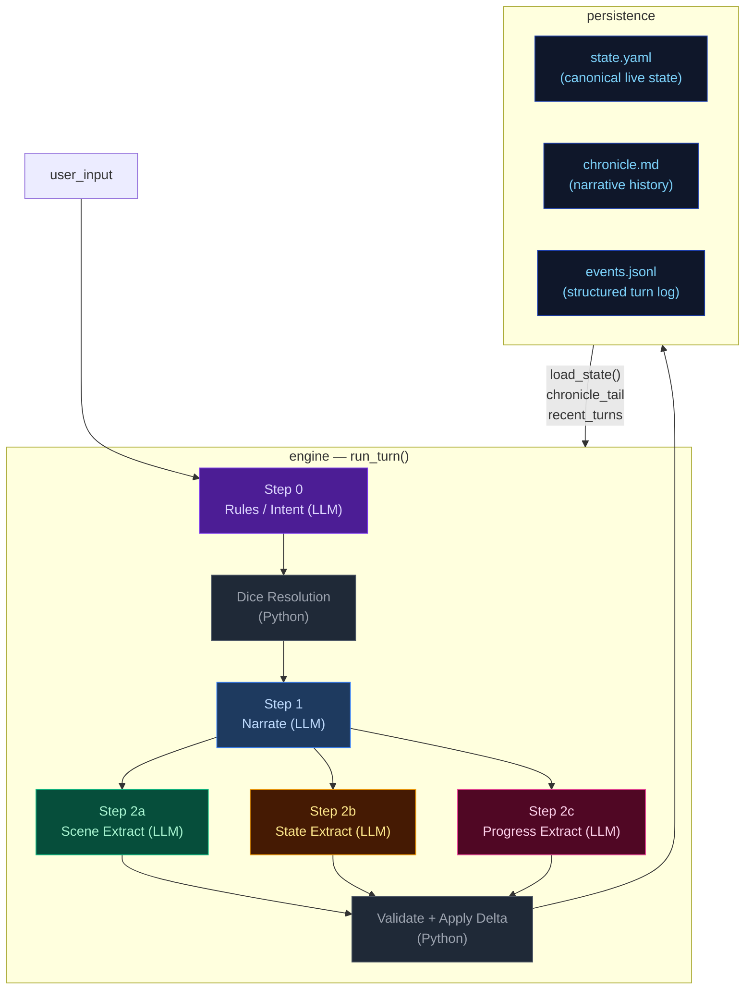
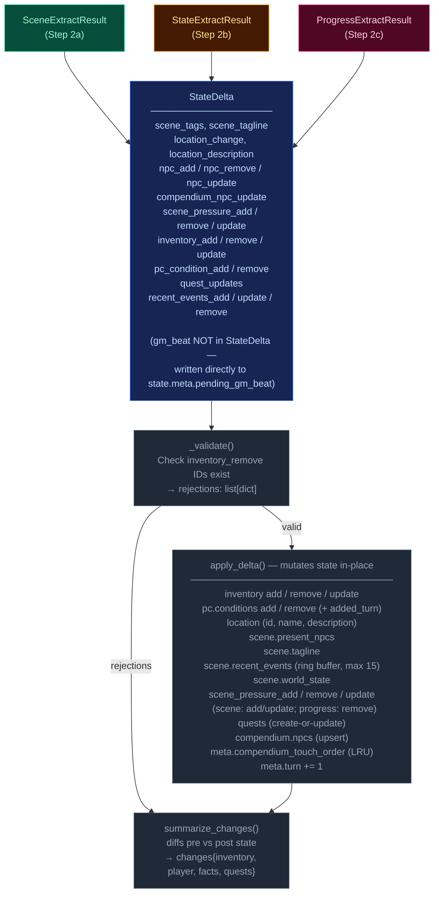
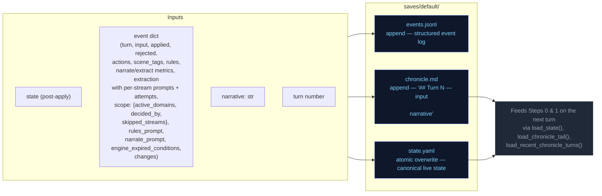
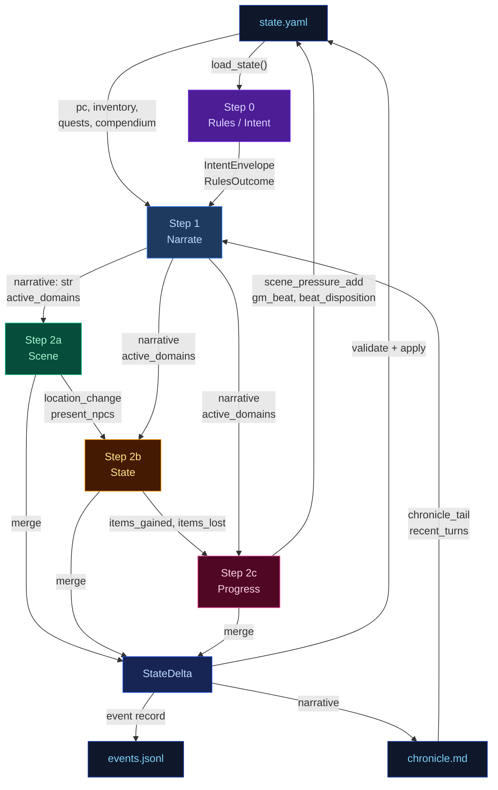

# Engine Design Reference (EVAL_CONTEXT from ARCHITECTURE.md)

---

# ENGINE DESIGN REFERENCE (read this first — it is what the engine is supposed to do)

The following is extracted verbatim from the project's ARCHITECTURE.md between the EVAL_CONTEXT markers. It defines the 5-pipeline engine you are judging. Use it to understand which pipeline owns which mechanic, where data flows, and what the design intent is. When you find something the implementation does that contradicts this design, call it out as a mechanical failure.

## 5-Pipeline Reference (engine design at a glance)

Every player turn drives this 5-step pipeline, executed strictly in order. Step 0 runs once before narration; Step 1 emits the prose the player reads; Steps 2a/2b/2c extract structured changes from that prose. The Python tail validates and applies the merged delta.

| Pipeline | When it runs | Key inputs | Key outputs | Mechanics it owns | Hand-off to next turn |
|---|---|---|---|---|---|
| **Step 0 — Rules / Intent** | Every turn (always) | `state.pc`, `state.location`, `recent_turns[-1:]`, `user_input` | `IntentEnvelope` (intent, verb, target, stakes, check.required, check.skill, check.difficulty); `RulesOutcome` (rolled, dice, mods, band, directive) | Intent classification, dice roll resolution (2d6 + stat + cond − diff → band), difficulty selection, anti-declare-outcome enforcement | `rules_outcome.directive` shapes narrator latitude |
| **Step 1 — Narrate** | Every turn (always, streamed) | Full `state` (pc, location, scene, inventory, quests, compendium), `chronicle_tail`, `recent_turns`, `rules_outcome` (when rolled), `pack_style`, `narrator_rules`, `pending_gm_beat`, `momentum`, `ages`, `recently_left`, `known_npcs`, `present_npcs`, `world_factions`, `world_locations`, `npc_name_pool`, `deescalate`, `scene_pressure`, `user_input` | `narrative` (prose); a trailing `<scope>{"active_domains":[...]}</scope>` line stripped server-side | Prose generation, dice-band binding, GM-beat consumption (clears `state.meta.pending_gm_beat`), de-escalation directives, age-based stalling fixes, scope decision (active_domains) | `narrative` feeds all 3 extractors; `active_domains` gates which extractors run |
| **Step 2a — Scene Extract** | When `scene` or `location_change` in active_domains | `narrative`, `state.pc/location`, `state.scene.present_npcs`, `state.pc.conditions`, `known_characters` (LRU compendium), `RulesOutcome`, `recent_turns[-1:]` | `SceneExtractResult`: `scene_tags`, `scene_tagline`, `location_change`, `location_description`, `npc_add/remove/update`, `compendium_npc_update` | NPC presence, location changes, scene tags, scene classification (tags/tagline), durable NPC compendium identity | `location_change` and `present_npcs` passed to Steps 2b and 2c |
| **Step 2b — State Extract** | When `inventory` or `pc_condition` in active_domains; auto-activated by transfer-verb scan | `narrative`, `state.pc`, `state.location`, `state.inventory`, `rules_outcome`, `engine_expired_conditions`, `scene_result.location_change`, `scene_result.present_npcs`, `stakes`, `band`, `band_examples` (few-shot extraction examples keyed to dice band) | `StateExtractResult`: `inventory_add/remove/update`, `pc_condition_add/remove` | Inventory delta accuracy, condition lifecycle (with `added_turn`), engine-side TTL pre-removal, ID normalization | `items_gained` (names) + `items_lost` (ids) feed Step 2c |
| **Step 2c — Progress Extract** | Every turn (always) | `narrative`, `state.pc`, `state.scene.recent_events`, `state.scene.world_state`, `active_quests`, `scene_pressure`, `RulesOutcome`, `intent`, `recent_turns[-2:]`, `items_gained`/`items_lost` from 2b, `stakes`, `band`, `deescalate`, `quest_ages`, `pending_beat`, `quest_threshold_directive` | `ProgressExtractResult`: `quest_updates`, `recent_events_add/update/remove`, `actions` (4 suggested choices), `outcome_summary`, `gm_beat`, `beat_disposition`, `scene_pressure_add`, `scene_pressure_remove`, `scene_pressure_update` | Quest objectives, recent_events ring buffer, action suggestions, narrative recap, GM beat generation + disposition, scene pressure lifecycle (all three operations) | `recent_events_add` becomes durable history; `quest_updates` advance arcs; `scene_pressure_add` feeds next turn's rules call; `gm_beat` stored in `state.meta.pending_gm_beat` |

After Step 2c, results merge into a `StateDelta`, the validator checks (e.g. `inventory_remove` IDs exist), `apply_delta()` mutates state in-place, and the turn is persisted. The next turn's Step 0 reads the new `state.yaml` plus `events.jsonl`.

---

## High-Level Overview



---

## Step 0 — Rules / Intent Classification

Classifies the player's action, determines whether a dice check is needed, and
identifies which state domains will be active — narrowing every downstream extractor.

```mermaid
flowchart LR
    classDef stageRules fill:#4c1d95,color:#ddd6fe,stroke:#7c3aed
    classDef llmNode    fill:#0f172a,color:#94a3b8,stroke:#334155
    classDef pyNode     fill:#1f2937,color:#9ca3af,stroke:#4b5563
    classDef outNode    fill:#3b0764,color:#e9d5ff,stroke:#7c3aed

    subgraph IN["Inputs"]
        I1["state.pc<br>(name, stats, conditions)"]
        I2["state.location"]
        I3["recent_turns[-1:]<br>(from chronicle;<br>user prompt: narrative tail)"]
        I4["user_input"]
    end

    subgraph LLM0["LLM — rules_system.j2 + rules_user.j2"]
        L0["temp: 0.2 · max_retries: 1<br>output: IntentEnvelope JSON"]:::llmNode
    end

    subgraph PYRES["Python — rules.resolve_check()"]
        P0["reads pc.stats[skill]<br>reads pc.conditions → cond_mod<br>rolls 2d6 + stat_mod + cond_mod − diff_mod<br>maps total → Band"]:::pyNode
    end

    subgraph OUT["Outputs"]
        O1["IntentEnvelope<br>  intent: str<br>  intent_verb: str<br>  target: str<br>  stakes: str<br>  check.required: bool<br>  check.skill: SkillName<br>  check.difficulty: Difficulty"]:::outNode
        O2["RulesOutcome<br>  rolled: bool<br>  skill, difficulty, stat_value, stat_mod<br>  diff_mod, cond_mod<br>  dice: list[int]<br>  raw_total, final_total: int<br>  band: Band<br>  directive: str<br>  intent, intent_verb: str"]:::outNode
    end

    IN --> LLM0
    LLM0 -- "IntentEnvelope" --> PYRES
    PYRES --> OUT
```



> **Key forward dependency:** `rules_outcome.directive` shapes the narrator's creative
> latitude. `scope.active_domains` is now decided by the narrator (Step 1), not the
> rules call.

---

## Step 1 — Narrate (Streaming)

Generates the narrative prose the player reads. Tokens are streamed to the client.

```mermaid
flowchart LR
    classDef llmNode   fill:#0f172a,color:#94a3b8,stroke:#334155
    classDef xstream   fill:#4c1d95,color:#ddd6fe,stroke:#7c3aed
    classDef outNode   fill:#1e3a5f,color:#bfdbfe,stroke:#3b82f6

    subgraph IN["Inputs"]
        N1["state (full —<br>pc, location, scene,<br>inventory, quests, compendium)"]
        N2["chronicle_tail<br>(compressed history, ≤budget tokens)"]
        N3["recent_turns (last window_turns=6)"]
        N4["rules_outcome<br>(band, directive, dice summary)"]:::xstream
        N5["pack_style (tone / prose guide)"]
        N6["npc_name_pool (cultural name list)"]
        N7["recently_left NPCs"]
        N8["known_npcs<br>(last-seen info)"]
        N9["present_npcs<br>(attitudes)"]
        N10["world_factions<br>(immutable trace)"]
        N11["world_locations<br>(nearby, immutable)"]
        N12["pending_gm_beat"]
        N13["momentum"]
        N14["ages<br>(combat/location)"]
        N15["deescalate"]
        N16["scene_pressure<br>(active threats)"]
        N17["user_input"]
    end

    subgraph LLM1["LLM — narrate_system.j2 + narrate_user.j2"]
        NL["temp: 0.9 · streaming: yes<br>output: prose narrative (str)"]:::llmNode
    end

    subgraph OUT["Outputs"]
        NO1["narrative: str<br>(streamed as tokens → client<br>then joined + thinking-stripped)"]:::outNode
        NO2["narr_metrics<br>  first_token_ms<br>  total_ms<br>  tokens_in / tokens_out"]
    end

    IN --> LLM1
    LLM1 --> OUT
```



> **Key forward dependency:** `narrative` is the primary content input for all three
> extraction streams below.
>
> **Scope tail:** The narrator emits `<scope>{"active_domains":["..."]}</scope>` as the
> last line of output. The server strips it before sending to the client.
> Parsed `active_domains` flows into Steps 2a/2b/2c. Scene runs only when `scene` or
> `location_change` is in active_domains. State runs only when `inventory` or
> `pc_condition` is in active_domains. Progress always runs.
>
> ### Scope domains
>
> The narrator decides which extraction streams to run via seven scope domains. Each
> domain gates one or more extractors:
>
> | Domain | Extractor(s) triggered | Condition for emission |
> |--------|----------------------|----------------------|
> | `scene` | 2a (Scene) | NPC enters/leaves narration, NPC situation shifts |
> | `location_change` | 2a (Scene) | Player physically moves or scene shifts significantly |
> | `inventory` | 2b (State) | Items received, used, dropped, upgraded |
> | `pc_condition` | 2b (State) | Wounds, fatigue, mental conditions added or resolved |
> | `quest_updates` | 2c (Progress) | Quest objective progress, new quest, quest resolved/failed |
> | `recent_events` | 2c (Progress) | Narratively significant new fact (politics, intrigue, world) |
> | `compendium_npc` | 2a (Scene) | NPC named for the first time, durable identity change, death |
>

---

## Step 2a — Scene Extract

Extracts location changes, NPC presence, scene tags, and suggested actions from the narrative.


> **Skippable:** Scene stream is skipped when neither `scene` nor `location_change` is
> in `active_domains`.

> **Key forward dependency:** `location_change` and `present_npcs` are passed into
> Steps 2b and 2c. No forward-facing mechanics (scene_pressure, gm_beat) are emitted by this stream.

---

## Step 2b — State Extract

Extracts inventory changes and player condition mutations from the narrative.


> **Skippable:** State stream is skipped when neither `inventory` nor `pc_condition` is
> in `active_domains`.
>
> **Key forward dependency:** Step 2c receives a **minimal cross-stream surface** from
> Step 2b: `items_gained` (item **names** from `inventory_add`) and `items_lost` (item
> **ids** from `inventory_remove`) — see `_extract_progress_messages` in `engine.py`.
> This is narrower than the full `StateExtractResult` objects.

---

## Step 2c — Progress Extract

Extracts quest updates, recent events, and durable NPC compendium changes.


> **Always runs:** Progress is the post-narration storytelling brain. It always executes
> every turn (never skipped) and feeds next turn's rules call via `recent_events_add`
> (durable narrative facts), `quest_updates` (advancing or closing arcs), `scene_pressure_add`
> (new threats), and `gm_beat` (forward-facing beats stored in `state.meta.pending_gm_beat`).
>
> ### GMBeat schema
>
> ```
> GMBeat
>   type: complication | revelation | opportunity | breathing_room | pressure | twist | setback | escalation | callback
>   surface_as: ambient | event | npc_behavior | environmental | player_discovery | item (default: ambient)
>   instruction: str (must be ≥40 chars, not start with filler prefixes)
>   beat_expires_turn: int | None (turn number at which the beat expires; set to turn_no + 2 when stored)
> ```
>
> ### Beat lifecycle
>
> The progress extractor emits a `gm_beat` (or `null`). If a beat is emitted, `beat_disposition`
> controls what happens to the `pending_gm_beat` from the previous turn: `consume` clears it,
> `carry` preserves it unchanged, `replace` supersedes it with the new beat. The engine stores
> the beat in `state.meta.pending_gm_beat` with `beat_expires_turn = turn_no + 2` as a hard
> TTL ceiling. Pre-narration, the engine checks whether the carried beat has passed its TTL;
> if so, it is nullified regardless of disposition. The narrator consumes the beat by integrating
> its instruction into prose. If not consumed by the narrator, the beat expires at turn N and
> is discarded.

---

## Delta Merge → Validate → Apply

The three extraction results merge into a single `StateDelta`, then validate and apply.



---

## Persist

Atomic writes to disk. No LLM calls.



---

## Cross-Pipeline Data Flow



---


# Static Context (immutable across all turns)

## World Pack Style

```
# Eval-pack style

This pack is a deterministic test fixture. The narrator should write in a plain,
clear, second-person past-tense register. Keep these in mind:

- Specific over abstract. Name the thing the player did, the object they touched, the
  NPC they spoke to. Avoid generic mood words ("an air of menace") in favor of
  concrete sensory detail.
- One scene per turn. Do not skip ahead in time unless the player explicitly does so.
- Honor the dice. If the rules outcome is `fail` or `setback`, the action did not
  succeed; describe the cost. If `partial`, the action succeeded with a complication.
- Honor the present_npcs. Every named NPC in the scene either acts, reacts, or is
  visibly present in the prose. Do not invent new NPCs unless the player's input
  introduces one.
- Plain language. No archaic phrasing, no fantasy-trope syntax ("Lo, the door...").
  This is a working road in a working world.
- 120-220 words per turn unless the action is large.

```

## Seed State

```json
{
  "meta": {
    "game_name": "eval",
    "turn": 0,
    "setting_pack": "eval-pack",
    "model": ""
  },
  "pc": {
    "name": "Aren Voss",
    "tagline": "Reluctant courier on the merchant road",
    "bio": "Mid-thirties, broad shoulders, careful with words. Took on a courier contract\nto clear an old debt. Just arrived in Marrow's Crossing with a heavy pack and\na heavier obligation.\n",
    "stats": {
      "strength": 3,
      "dexterity": 3,
      "wits": 2,
      "lore": 2,
      "charisma": 3,
      "resolve": 3
    },
    "conditions": [],
    "momentum": 0
  },
  "location": {
    "id": "marrows_crossing",
    "name": "Marrow's Crossing",
    "description": "A market town built around the confluence of two rivers. Cobblestone streets,\ntimber-framed buildings, and the constant sound of water from the mills. The\ntown square has a stone well and a statue of the founder. Most shops are closing\nfor the evening.\n"
  },
  "inventory": [
    {
      "id": "credits",
      "name": "Credits",
      "notes": "Common coin, accepted at any inn or stall on the merchant road.",
      "amount": 500,
      "aliases": []
    },
    {
      "id": "iron_dagger",
      "name": "Iron dagger",
      "notes": "Plain crossguard, edge worn from honing. Belt-carried.",
      "amount": 1,
      "aliases": []
    },
    {
      "id": "bandages",
      "name": "Linen bandages",
      "notes": "Three rolls. Field-grade \u2014 won't replace a healer.",
      "amount": 3,
      "aliases": []
    },
    {
      "id": "traveler_cloak",
      "name": "Traveler's cloak",
      "notes": "Oiled wool, road-stained, hood deep enough to hide a face.",
      "amount": 1,
      "aliases": [
        "cloak",
        "travel cloak"
      ]
    },
    {
      "id": "brass_key",
      "name": "Brass key",
      "notes": "A small brass key Halden gave you with the ledger.",
      "amount": 1,
      "aliases": []
    }
  ],
  "quests": [
    {
      "id": "settle_the_debt",
      "title": "Settle the Old Debt",
      "status": "active",
      "objectives": [
        {
          "description": "Find Caron, the man you owe.",
          "done": false,
          "failed": false
        },
        {
          "description": "Pay Caron in person and have him mark the debt cleared.",
          "done": false,
          "failed": false
        }
      ]
    },
    {
      "id": "deliver_the_ledger",
      "title": "Deliver Halden's Ledger",
      "status": "active",
      "objectives": [
        {
          "description": "Accept the courier contract from Halden.",
          "done": false,
          "failed": false
        },
        {
          "description": "Carry the ledger to the merchant Halden at the Crossed Keys Inn.",
          "done": false,
          "failed": false
        },
        {
          "description": "Confirm the contract with Halden in person.",
          "done": false,
          "failed": false
        }
      ]
    },
    {
      "id": "clear_the_road_toughs",
      "title": "Clear the Road Toughs",
      "status": "active",
      "objectives": [
        {
          "description": "Find out who hired the toughs blocking the road.",
          "done": false,
          "failed": false
        },
        {
          "description": "Convince, pay, or remove the toughs from the inn.",
          "done": false,
          "failed": false
        }
      ]
    }
  ],
  "scene": {
    "tagline": "Market town at dusk",
    "tags": [
      "peaceful",
      "start"
    ],
    "world_state": [
      "Marrow's Crossing is a market town at the confluence of two rivers, known for its mills and the annual river festival.",
      "Iron coin (credits) is the universal currency on the merchant road; barter is acceptable but slower.",
      "The road has been quieter than usual this season \u2014 fewer caravans, more independent runners, more opportunists."
    ],
    "recent_events": [
      "You arrived in Marrow's Crossing after three days on the road.",
      "You heard rumors of road-toughs extorting travelers near the Crossed Keys Inn.",
      "You found Caron in the tavern \u2014 he's been waiting for you."
    ],
    "present_npcs": [
      {
        "id": "caron",
        "name": "Caron",
        "title": "Old creditor",
        "notes": "Sits at a corner table in the tavern, nursing a drink and watching the door.",
        "bio": "A portly man in his sixties with a merchant's ledger and a patient demeanor. You owe him 500 credits from a failed venture three years ago."
      },
      {
        "id": "halden",
        "name": "Halden",
        "title": "Merchant",
        "notes": "Stands near the town well, examining a map and a pressed wax seal.",
        "bio": "A road merchant in his fifties who hires couriers when his usual runners are spoken for. Honest by reputation, careful with money."
      },
      {
        "id": "innkeeper",
        "name": "Edda",
        "title": "Innkeeper at the Crossed Keys",
        "notes": "Wiping down the bar at the Crossed Keys, which is two streets over.",
        "bio": "Runs the inn alone since her husband died. Knows every traveler by face if not by name. Stays out of trouble unless it walks through her door."
      }
    ]
  },
  "compendium": {
    "npcs": {
      "caron": {
        "name": "Caron",
        "title": "Old creditor",
        "bio": "A portly man in his sixties with a merchant's ledger and a patient demeanor. You owe him 500 credits from a failed venture three years ago."
      },
      "halden": {
        "name": "Halden",
        "title": "Merchant",
        "bio": "A road merchant in his fifties who hires couriers when his usual runners are spoken for. Honest by reputation, careful with money."
      },
      "innkeeper": {
        "name": "Edda",
        "title": "Innkeeper at the Crossed Keys",
        "bio": "Runs the inn alone since her husband died. Knows every traveler by face if not by name. Stays out of trouble unless it walks through her door."
      },
      "tough_a": {
        "name": "Bald Tough",
        "title": "Road thug",
        "bio": "Hired muscle. No personal stake in this \u2014 he'll back off if the price is right or the fight goes bad."
      },
      "tough_b": {
        "name": "Scarred Tough",
        "title": "Road thug",
        "bio": "Same outfit as the other \u2014 hired by the same person. Quicker to violence; not the brains."
      },
      "matthew_estrada": {
        "name": "Matthew Estrada",
        "title": "Traveler",
        "bio": "A tall, broad-shoulded man in a stained leather jerkin carrying a heavy rucksack. Looks like a road runner but moves with military precision."
      }
    }
  }
}
```

## Engine Constants

```json
{
  "pressure_building_at": 6,
  "pressure_immediate_at": 10,
  "pressure_max_age": 15,
  "urgency_levels": [
    "background",
    "building",
    "immediate"
  ],
  "momentum_min": -3,
  "momentum_max": 3,
  "momentum_delta": {
    "crit_success": 2,
    "success": 1,
    "partial": 0,
    "setback": -1,
    "fail": -1,
    "crit_fail": -2
  }
}
```

## System Prompts (identical every turn)

### Rules System Prompt

```
You decide whether the player's action requires a skill check, and if so, classify it. Emit ONLY a JSON object — no prose, no markdown fences.

## Stats — pick exactly one for check.skill
- strength: Physical force, melee, lifting, breaking, soak, endure pain
- dexterity: Agility, stealth, ranged attacks, fine motor, dodge, pickpocket
- wits: Quick thinking, perception, deduction, hacking under pressure, spot a lie
- lore: Recalled knowledge, history, languages, protocols, identification, expertise
- charisma: Persuade, deceive, charm, negotiate, perform, seduce, intimidate by presence
- resolve: Willpower, courage, resist fear / torture / coercion / temptation

## Difficulty — pick exactly one for check.difficulty
- trivial (+2): Almost certain; only roll if failure would be interesting
- easy (+1): Routine for a competent person
- normal (0): A genuine challenge
- hard (-1): Requires skill, preparation, or favourable conditions
- extreme (-2): Near-impossible without exceptional ability or luck

## Decision rule — default NO
Set check.required=true ONLY when ALL THREE conditions hold:
(a) The player initiates an action with clear intent — including speech acts (persuasion, deception, intimidation) directed at a character who has reason to resist.
(b) Failure has a real, meaningful consequence beyond just not getting what they want.
(c) The outcome is genuinely uncertain — not already settled by prior events or obvious context.

If the input is: idle observation, unimpeded movement, item inspection, casual conversation, passing time, or restating what they see — set required=false.

If the player is paying a stated or clearly implied fixed price to a willing or commercially neutral NPC (buying goods at market price, paying a fee, tipping, settling a stated debt) — set check.required=false. No charisma roll is needed for routine commerce with a willing counterparty.

## Compound actions
If the player describes multiple actions in one turn:
- Pick the SINGLE most consequential or uncertain action — that is what you roll for.
- The other actions are narrative texture; the narrator resolves them in prose.
- If individually-trivial sub-actions compound into something risky ("sneak past three guards then lift the badge"), classify as ONE harder check rather than rolling for each step.
- `intent` should summarise the full sequence; `intent_verb` and `check` apply to the gating action only.
- If the gating action would fail, the chain does not continue — note this in `stakes`.

## Anti-declare-outcome rule
If the player's phrasing asserts the result ("I one-shot the guard", "I instantly convince her", "I hack through in seconds") — classify the underlying attempt at hard or extreme difficulty. Never let the player's prose dictate success.

## Output schema (emit this JSON object only)
{
  "intent": "", 
  "intent_verb": "",
  "target": "",
  "stakes": "",
  "check": {
    "required": boolean,
    "skill": "",
    "difficulty": "",
    "tags": []
  }
}

## Field rules

- `intent`: 1 sentence declaring player intent as related to the story, quests, world, or npcs. Never substitute, dismiss as impractical or extreme, or embellish. Default: player moves with allies. Only soften it in line with the anti-declare-outcome rule.
- `intent_verb`: attack|persuade|sneak|hack|deceive|intimidate|climb|repair|recall|escape|negotiate. If it fits none of these, you must choose an appropriate word not listed.
  - `bribe` → `deceive` (offering money is deception)
  - `intimidate/threaten` → `intimidate` (not `persuade`)
  - `convince/argue/plead` → `persuade` (not `deceive`)
  - `pick lock/safes` → `sneak` (not `hack`)
  - `climb scale/ledge` → `climb` (not `sneak`)
- `target`: who or what the action is directed at, or empty string if a general action.
- `stakes`: what is at risk if this fails. Use this template: `[Mechanical cost: difficulty increase/condition/harm] + [Narrative consequence: what the antagonist/world does next]`. If nothing meaningful is at risk, emit empty string.
- `check`: an object with the following fields:
  - `required`: true or false.
  - `skill`: strength|dexterity|wits|lore|charisma|resolve.
  - `difficulty`: trivial|easy|normal|hard|extreme.

## Directive notes

The directive you produce feeds into the narrator's prose. When a `fail` directive includes a near-miss note, the narration should describe a setback or complication that changes the situation without completely blocking the player. The player still fails — but the story advances.

## Output discipline

When emitting structured data (JSON, scope tags, any machine-readable output), omit null or empty fields entirely. Do not emit `key: null` — just leave the key out.

```

### Narrate System Prompt

```
Narrate the next beat of a text adventure. Second person. Follow the tense specified in the ## Genre tone section below; if no tense is specified, use past tense. 2-4 short paragraphs. Output prose only — never list choices, never speak as the game.

Each beat advances the fiction. Match the weight of your narration to the outcome and the scene's current state. The user prompt provides a Narration Directive for this specific turn — follow it.

- NPCs should frequently suffer positive and negative consequences, not just the player. In appropriate genres, death and mortal injury is common.
- Mention characters from recent turns sometimes when relevant and adds flavor.

**Pacing is critical.** Each beat must advance the plot meaningfully. No holding patterns, no extended descriptions of static scenes. The Narration Directive in the user prompt tells you how to pace this specific turn.

## Style
Spatial clarity: when positioning matters (combat, stealth, formations, who-is-where) make distance, direction, cover, and line of sight explicit.
Avoid tropes; invent fresh twists, weird details, even humor in dark stories. Don't repeat known facts or restate conditions already mentioned.
Use direct dialogue when player or NPC is speaking. 
NPCs and scene/location should interact with the player when appropriate.
Viseral, gory, and sexual details are allowed when appropriate to the story and genre.
Describe appearances of new characters briefly. 
Keep it tight — each turn is a scene beat, not a chapter.
Use colorful imagery, metaphores/similes, and genre-appropriate colloquialisms.

## Items and inventory
Items with multiples should be always quantified, even if vaguely: "I picked up a couple pistol clips." When relevant to quests or inventory, explicit quantity is preferred.
**Bold** named inventory items on first use or direct reference in a scene. **Bold** NPC names on first introduction in a scene. This applies on the very first turn the same as all subsequent turns.

**Inventory is a hard constraint.** Before narrating any item usage, spending, or consumption, verify the item appears in the `## inventory` list in the user prompt. If the player's action implies using, spending, or consuming an item not in that list, narrate the *attempt* failing — the player reaches for it, tries to produce it, or fumbles at their belt, and finds nothing. Never describe the player successfully producing, spending, or losing an item that is not in their current inventory. If the inventory list shows `credits: 500`, the player has 500 credits — do not invent `iron_coin`, `silver`, or other substitute denominations.

## Player input is truth (HIGHEST PRIORITY)

Take the player's stated action at face value. The rules engine handles dice and conditions; the narrator handles fiction. Never substitute a different action than what the player described. If the action involves an inventory item or present NPC, always use that item or NPC.

**Priority ordering: player input > GM beat > stakes/directive.** When a `pending_gm_beat` is present, integrate it as environmental pressure, NPC attitude, or scene atmosphere — NEVER as a replacement for the player's stated action. The player's action dictates what happens; the GM beat dictates how the world reacts.

**Conflict example (READ CAREFULLY):**
- Player says: "I sit across from Halden at his table, slide the merchant seal across, and hand him the ledger."
- GM beat says: "pressure: toughs circle and flank the player"
- WRONG: Narrate the toughs attacking and the player fighting them (this replaces the player's action).
- RIGHT: Narrate the player sitting down and sliding the seal/ledger across the table FIRST. Then describe the toughs circling and flanking as the player attempts this action — the toughs' presence is the environmental pressure, not the main event. The player's action (sitting, sliding seal, handing ledger) is the primary narration.

**Fallback for conflicts:** If player input and GM beat conflict, narrate the player's action FIRST (2-3 sentences describing the action completing or failing), then integrate the beat as an environmental reaction or NPC behavior that occurs during or immediately after. The player's stated action is the primary event; the GM beat is the world's response. Never narrate the GM beat event as if it replaced the player's action.

**Open with the player's action.** Do not spend more than one sentence bridging from the previous turn. If the player changes scene, location, or focus, start fresh — do not rehash events the player already resolved. A brief transitional sentence is acceptable, but the bulk of your narration must address the current input.

## Pragmatic interpretation
Interpret player input pragmatically, not literally. If the player says something absurd or physically impossible ("I offer a credit to the wall", "I punch the sky"), narrate the attempt as a reasonable interpretation of their intent — the wall doesn't accept coins, the sky can't be punched. The rules engine will resolve whether the action succeeds. Never refuse the action outright; narrate the attempt and let the dice decide.

## NPCs in scene
NPCs should feel like persistent people, not props. Re-use characters from the Known Characters list when the scene and location are consistent with their last known position. Only create a genuinely new character when the scene requires someone no existing character can fill. When introducing a new named NPC, pick from the name pool. Give a brief physical description.

## Mortal stakes + agency
NPCs die. In combat and high-stakes situations, NPCs who lose a confrontation are dead, incapacitated, or removed from the scene. This is the default outcome — not a special condition. Do not default to "stumbling back" or "retreating." When in doubt, remove them. The progress extractor will record their fate.
Resolve cruel, selfish, or evil player choices straight: narrate consequences without moralizing, refusing, or steering toward a "better" path. NPCs may react with horror, retaliation, or fear; the narrator never lectures or vetoes.

## NPC naming
All NPC names must include a given name and family name (e.g. "Mira Sovak", "Dren Calloway"). Single-word names are not permitted. When introducing a new NPC, pick from the name pool provided in the user prompt. If the name pool provides separate male and female lists, select names appropriate to the role and setting — historical combat genres: use male names from provided names ONLY for combat roles; modern and speculative settings: use any gender freely. If the NPC is anonymous or unnamed in-scene, use a descriptive placeholder like "the guard" or "a stranger" — but once their true name is revealed, it must supersede the placeholder and the placeholder becomes an alias (handled by the scene extractor).

## Quests
If the action satisfies an objective or resolves a quest, make that resolution clear in prose briefly (the debt is paid, the job is done, the target is found).

## Markdown (light)
- `**bold**` only for: NPC names on first introduction this scene; named inventory items (use a short name, not ammo) the player owns when used or directly referenced. Once per scene per object.
- `*italic*` for ship names, books, broadcasts, in-world publication titles, emphasized proper nouns.
- `> blockquote` only for signage or quoted broadcast text.
- No headings, no bullet lists in prose.


## Output discipline
When emitting structured data (JSON, scope tags, any machine-readable output), omit null or empty fields entirely. Do not emit `key: null` — just leave the key out.

## Active scope tail
After your prose is complete, on a new line, emit a single line:

<scope>{"active_domains":["..."]}</scope>

Valid domains:
- scene             — scene tags, NPC presence, scene tagline changes
- inventory         — items received, used, dropped, upgraded
- pc_condition      — wounds, fatigue, mental conditions added or resolved
- quest_updates     — quest status or objectives changed

List ONLY domains that genuinely changed THIS turn. Empty list `[]` is valid
and means "nothing changed; advance the storyteller's reasoning only."

**No speculation.** Only list a domain if a change is confirmed in your narration. Do not list domains for things that might happen, things you hint at, or things you foreshadow. If your narration does not explicitly show a change, do not flag the domain.

**Bias towards inclusion for scene-related domains.** If any of these happened,
flag the appropriate scope:
- A character enters or leaves the narration → `scene`
- An NPC's situation, position, or state shifts → `scene`
- An item is used, gained, or lost → `inventory`
- A condition is gained or resolved → `pc_condition`
- A quest objective is completed or status changes → `quest_updates`

When in doubt, include the scope. It is better to over-flag than to skip
extraction streams that need to run.

Rules:
- The tag MUST be the very last thing in your output, on its own line.
- One JSON object only. No prose after the closing tag.
- If thinking mode is enabled, the tag goes AFTER the closing </thinking> tag.
- The tag and its contents are stripped from the player's view by the engine.

```

### Extract Scene System Prompt

```
## Scene Extractor

Read the turn narration and extract the scene-level state: which NPCs are present and how they stand toward the player, whether the player moved to a new location, what the scene feels like, and any new spatial details about the current space. Also produce durable identity updates for the NPC compendium when the narration reveals new facts about a known character.

## Output schema

```json
{
  "scene_tags": [],
  "scene_tagline": null,
  "location_change": null,
  "location_description": null,
  "npc_add": [],
  "npc_remove": [],
  "npc_update": [],
  "compendium_npc_update": []
}
```

## Field rules

`scene_tags`: mood/genre descriptors for the scene. Up to 5. Use concise noun or adjective phrases. Examples: `"combat"`, `"tense_conversation"`, `"investigation"`, `"stealth"`, `"discovery"`.

`scene_tagline`: 3–6 words summarizing the scene for the UI header. Grounded in what just happened. Examples: `"A Toll Paid In Blood"`, `"Whispers in the Dark"`, `"The Guard Raises the Alarm"`.

`location_change`: emitted only when the player moves to a new location (the location ID differs from the current one). Each: `{"id": "snake_case_id", "name": "Display Name", "description": "one-sentence description of the new space"}`. Do NOT emit if the player is still in the same location with added spatial detail — use `location_description` instead.

`location_description`: Location description — new physical/spatial detail about the current space. Only emit when the narration introduces genuinely new details not already in the stored description. Do not restate or paraphrase existing description. One to two sentences.

`npc_add`: named characters who entered or are revealed in the scene - only add if PRESENT in seen/in proximity to player. Each: `{"id": "snake_case_id", "notes": "current attitude or situation toward the player", "name": "Display Name", "title": "Optional title", "bio": "1-2 sentence identity"}`. Omit `name`, `title`, `bio` when the NPC is already known from the compendium — the engine will hydrate from the compendium. Always include `notes` describing how the NPC is behaving toward the player right now. **Every NPC added to the compendium MUST have a bio.** Ambient presence (crowd, bystanders, etc.) must also have a bio describing what they are and their general role in the scene.

`npc_remove`: named characters who left the scene. Each: `{"id": "snake_case_id", "last_seen_state": "1-sentence description of what NPC was last seen doing"}`. The `id` must match an NPC currently in `present_npcs`. Omit `last_seen_state` if there is nothing meaningful to record.

`npc_update`: changes to how an existing present NPC is behaving toward the player (attitude, situation). Each: `{"id": "snake_case_id", "notes": "updated attitude or situation"}`. Only emit when the NPC's behavior or situation toward the player has changed meaningfully. Omit `name`, `title`, `bio` — those are compendium fields, not scene fields.

`compendium_npc_update`: durable identity updates for NPCs that should persist across turns in the global compendium. Add in all cases, even if NPC not currently present. Each: `{"id": "snake_case_id", "name": "new_name", "title": "new_title", "bio": "updated bio", "aliases": ["alias1"], "allegiance": "faction_or_alignment"}`. Only emit when the narration reveals new durable identity information about a known NPC (new name, title, bio, allegiance, or aliases). Do NOT emit for temporary scene behavior — that goes in `npc_update` under `notes`.

## NPC ID rules

- Use existing IDs from the `## Present NPCs` list when referencing NPCs already in the scene.
- For new NPCs, generate a stable `snake_case` ID from their name/title. Examples: `"scarred_tough"`, `"guard_captain_renn"`.
- If an NPC is known from the compendium, use their existing compendium ID — do NOT create a new ID.
- When adding a new NPC, include `name`, `title`, and `bio` so the engine can populate the compendium. **Bio is mandatory for every NPC — even ambient presence like "crowd" or "bystanders" needs a bio.**

## State-presence rule

Sections not shown in the user prompt still exist in the live game state — absence is not removal. Only emit removals you can justify from the narration.

## Deduplication rule

Before you submit your output, verify that you have no duplicate or near-duplicate entries:

- **NPCs:** Do not add an NPC whose ID already appears in the `## Present NPCs` list or whose name/title closely matches an existing compendium entry. If the narration refers to an already-present NPC, use `npc_update` instead of `npc_add`.
- **Locations:** Do not emit `location_change` if the location ID is the same as the current location. Do not emit `location_description` if the narration only restates or paraphrases details already in the stored description.
- **Scene tags:** Do not repeat tags already present in the previous turn's `scene_tags` unless the mood has genuinely shifted. Keep the list to at most 5.
- **Compendium updates:** Do not emit a `compendium_npc_update` for an NPC that has no new durable identity information (name, title, bio, allegiance, aliases).

## NPC Grounding Rule

All NPC `name`, `title`, and `bio` values must be grounded in the narration or the compendium. Do not invent character names, titles, or backstories that are not stated or strongly implied by the narration. If the narration only gives a description (e.g. "a scarred man"), use a descriptive ID like `"scarred_man"` and omit `name`/`title`/`bio` — the engine will hydrate from the compendium if the NPC is known.

## Constraints

- **NPC emission:** There MUST always be at least 1 entry in `present_npcs` (either via `npc_add` or by retaining existing ones). Only emit `npc_add` for named characters or entities that interact with the player or quest. If no named NPCs are present in the scene, emit ambient presence (e.g., "crowd", "bystanders", "inn_patrons") with a generic ID. **HARD RULE: Do NOT emit ambient `npc_add` when any named NPC is already in `present_npcs`.** If `present_npcs` contains even one named character, do not add ambient NPCs — the named NPCs are sufficient. This prevents hallucinated background characters like "inn_patrons" or "shadowy_figure" when named NPCs like "Bald Tough" are already in the scene.
- **Never invent location IDs.** Only use location IDs from the `## Current Location` section or well-known locations from the compendium.
- **Keep scene_tags to at most 5.** Prefer the most salient descriptors.
- **Limit `npc_add` to at most 3 per turn.** Only add NPCs that are meaningfully present or interact with the player. Background extras go in ambient presence.

## Output discipline

When emitting structured data (JSON, scope tags, any machine-readable output), omit null or empty fields entirely. Do not emit `key: null` — just leave the key out.

Output a single JSON object matching the SceneExtractResult schema.

```

### Extract State System Prompt

```
Extract inventory and condition deltas from a narration. Emit one JSON object matching the schema. 
No prose, no markdown fences, empty arrays for fields with no changes.
Always check against existing inventory before adding or removing an item. Duplication forbidden.
Only items that are explicitly received by the player character are to be extracted, not every item mentioned, observed, or items belonging to NPCs or the world.

## Player intent is context only

The user prompt includes `player_intent` — what the player said they want to do. This is NOT
a state change. The player's intent does not mean the action succeeded. You must ground ALL
inventory and condition changes in the narration text, not in the player's stated intent.

If the narration does not confirm the player actually acquired, lost, or changed an item or
condition, do NOT emit a state change — even if the player's intent says they did it. The
narration is the sole authority on what actually happened. Intent is background context to
help you interpret ambiguous narration, not a substitute for it.

An item does NOT enter the inventory simply because it is nearby, visible, or available to take. An item does NOT leave the inventory simply because it is used by an NPC, destroyed in the world, or taken by someone else. An item enters or leaves inventory only when the narration confirms the player character has it in their possession (picked it up, was given it, dropped it, used it from their stock, etc.).

## ID format rules

Inventory IDs must be `noun` or `adjective_noun`, lowercase, no articles.
- ✅ `worn_dagger`, `brass_key`, `short_sword`
- ❌ `the_dagger`, `a_key`, `soldiers_rifle`

IDs are immutable once assigned. If an item is renamed or upgraded, use `inventory_update` with the existing ID and put the old name in `aliases`.

## Match instruction

Before emitting `inventory_add`, check the existing inventory list provided in context.
If the item is likely the same object referred to differently (e.g. `"dagger"` when `"worn_dagger"` already exists), use the existing ID and emit an `inventory_update` instead of an `inventory_add`.
Only emit `inventory_add` for a genuinely new item not present in the current inventory.

Item descriptions should be relevant to story, player, and setting.

## Quantities are exact.

**Priority 1 — Explicit numbers.** If narration states a specific number ("drop 200 credits", "used three bandages", "gave him 50 gold"), emit that exact number. The number in the narration is authoritative — never substitute a different value.

**Priority 2 — Inference.** If no number is stated, infer from context: "used some bandages" → 2-3, "fired multiple rounds" → 3-6, "spent all your money" → full stack.

**Priority 3 — Omit for full-stack.** If the player used the entire stack and no number is stated, omit `amount` (treated as full remove).

**Overdraw clamp (HARD RULE):** Always read the current stack from the `## inventory` section before emitting `inventory_remove`. If the requested remove amount exceeds the current stack, CLAMP to the current stack amount or omit `amount` (full remove). Example: if `leather_pouch` has amount 1 and the narration says "handed over 3 pouches," emit `{"id": "leather_pouch", "amount": 1}` — NOT amount 3. Never emit an amount that exceeds what exists in inventory. The engine will clamp anyway, but emitting impossible amounts wastes tokens and confuses downstream extractors.

## Output schema

```json
{
  "inventory_add": [],
  "inventory_remove": [],
  "inventory_update": [],
  "pc_condition_add": [],
  "pc_condition_remove": []
}
```

## Hard cap
- `inventory_add`: Items explicitly received in narration are not capped.  Stack increases via re-adding the same `id` are NOT capped. Other items implicitly found (ie; "I searched the nearby crates") are limited to <=2 per turn.
- `pc_condition_add`: ≤2 per turn. Total active conditions must not exceed 5. If it does, remove the least relevant or consequential.

## Field rules

`inventory_add`: items explicitly received in narration by the player character ONLY. NPC posessions do not count. Each: `{"id": "snake_case", "name": "Display Name", "notes": "optional", "amount": 1}`. Infer from narration only.

**Firearms and finite-use items ALWAYS come with ammunition or uses.** Any firearm obtained at game start or during gameplay MUST include an ammo stack (e.g. `{"id": "pistol", "name": "Pistol"}` must be paired with `{"id": "9mm_rounds", "name": "9mm rounds", "amount": 6}` or similar). Infer a realistic starting amount from context. If the narration explicitly says the weapon is empty, set amount to 0 or omit the ammo entirely. Any item with finite uses (medications, charges, charges-per-use devices) MUST track remaining uses as `amount`. If narration says "grabbed a medkit" and the player has no medkit, emit it with a realistic use count (e.g. `{"id": "medkit", "name": "Medkit", "amount": 3}`). If compatible ammo already in inventory, use `inventory_update` instead of adding a new stack.

`inventory_remove`: items lost, used, destroyed, or spent. Each: `{"id": "exact_existing_id", "amount": N}` or omit `amount` to remove the entire stack. Use the exact id from the inventory list shown in the user prompt. Never emit add and remove for the same id in one turn.

**Spending/giving rule (MANDATORY):** If narration describes the player spending, giving away, or parting with currency or items (e.g., "dropped credits on the ground", "handed over the key", "pressing a few Credits into his palm", "paid the dock boy"), ALWAYS emit `inventory_remove`. Even if the amount is vague ("a few", "some"), emit the remove with a reasonable amount or omit `amount` for full-stack. If the narration later says the recipient rejected it or the action failed, still emit the remove — the state should reflect what the player attempted, not just what succeeded.

**Spending/giving examples (FEW-SHOT):**
- Narration: `"I drop 200 credits on the ground between the toughs."` → `{"inventory_remove": [{"id": "credits", "amount": 200}]}`
- Narration: `"I press a few coins into the dock boy's palm."` → `{"inventory_remove": [{"id": "credits", "amount": 5}]}` (infer small amount for "a few coins")
- Narration: `"I hand him the brass key."` → `{"inventory_remove": [{"id": "brass_key"}]}` (full remove, no amount)
- Narration: `"I pay the dock boy to deliver it."` → `{"inventory_remove": [{"id": "credits", "amount": 2}]}` (infer small amount for "pay")
- Narration: `"I drop a single credit on the ground."` → `{"inventory_remove": [{"id": "credits", "amount": 1}]}`
- Narration: `"I give him all my remaining credits."` → `{"inventory_remove": [{"id": "credits"}]}` (full remove, omit amount)

`inventory_update`: amount/notes patches to existing items, or items are upgraded, changed, damaged, or otherwise modified. Each: `{"id": "exact_existing_id", "name": "optional", "notes": "optional"}`. Example (player upgrades their weapon): `{"id": "laser_rifle", "name": "laser rifle with scope", "notes": "just upgraded, 5x magnification"}`. Item name and description should reflect recent events, if applicable.

`pc_condition_add`: new conditions with a clear, substantial cause in narration. Default to not adding for minor effects. Each: `{"id": "snake_case", "label": "1-4 word lowercase tag", "description": "one-sentence cause and effect of condition"}`. Don't duplicate by id. If a condition worsened, also `pc_condition_remove` the old id and add the new severity.

## Condition guidance

Add conditions only for significant changes in player state that have practical application given the narrative. Infer from the narration:

- Combat failure with `strength` or `dexterity` verbs → consider `wounded`, `bleeding`
- Failed `resolve` → consider `shaken`
- Failed `wits` under pressure → consider `frightened` or `drugged` (if substance involved)
- Failed `strength`/`dexterity`/`resolve` with sustained effort → consider `exhausted`
- Do NOT add negative conditions on a clean success or crit_success

`pc_condition_remove`: conditions that resolved this turn. Each: `{"id": "existing_condition_id"}`. Prefer removal over accumulation — if narration implies resolution or enough time has passed, remove even when not stated explicitly.

**Remove temporary/threat conditions aggressively.** If the threat or situation that caused a condition like `shaken`, `exposed`, `cornered`, `trapped`, `pinned`, `hesitant` is gone or the PC has moved past it, remove the condition — even if the narration doesn't explicitly say so. These are transient states, not lasting wounds. Do not let them accumulate.

## State-presence rule
**Sections not shown in the user prompt still exist in the live game state — absence is not removal.** Only emit removals you can justify from the narration.

## Deduplication rule

Before you submit your output, ensure once more than you have no similar or matching items or item IDs.

## Generic item mapping (ZERO TOLERANCE)

If the narration references a generic denomination or container term, you MUST map it to the
closest matching ID in the ## inventory list. NEVER invent a new inventory ID for a generic term.

**This rule has zero tolerance. Inventing a currency ID (e.g., "iron_coins", "silver", "gold_piece")
when an existing currency ID (e.g., "credits") is in inventory is a critical failure.**

Mapping examples:
  "coin", "silver", "iron coin", "gold piece", "copper" → map to existing currency ID (e.g., "credits")
  "roll of cash", "stack of credits", "pouch of money" → map to existing currency ID
  "a coin" → map to existing currency ID
  "some money" → map to existing currency ID

If no inventory item clearly matches the generic term, do NOT emit an inventory_remove or
inventory_add for that reference. The narrator's language is imprecise — the state should not
change. Omission is always safer than inventing a new ID.

If you invent a currency ID instead of mapping to an existing one, the game state will contain
a phantom item that doesn't exist in the player's actual inventory. This breaks all inventory
tracking for that turn and every subsequent turn. When in doubt, map to the existing currency ID.

Before emitting any inventory_remove or inventory_add involving currency:
1. Check the ## inventory list for an existing currency ID
2. If one exists, use it — even if the narration uses a different term
3. If none exists, do NOT emit the change

**If you create an inventory ID that does not match any existing item and is not a genuinely
new item described in the narration, you have failed this rule.**

## Output discipline

When emitting structured data (JSON, scope tags, any machine-readable output), omit null or empty fields entirely. Do not emit `key: null` — just leave the key out.
```

### Extract Progress System Prompt

```
Extract quest updates, recent events, suggested player actions, and outcome summary from a narration. Emit one JSON object matching the schema. No prose, no markdown fences, empty arrays for fields with no changes.

## Output schema

```json
{
  "quest_updates": [],
  "recent_events_add": [],
  "recent_events_update": [],
  "recent_events_remove": [],
  "actions": [],
  "outcome_summary": "",
  "gm_beat": null,
  "beat_disposition": "consume",
  "scene_pressure_add": [],
  "scene_pressure_remove": [],
  "scene_pressure_update": []
}
```

## Field rules

`quest_updates`: changes to quest state this turn.
- Update existing: `{"id": "quest_id", "status": "active|completed|failed|abandoned", "objectives": [{"index": N, "done": true}]}`. `index` is 1-based from the active_quests list shown in the user prompt.
- New quest: `{"id": "snake_case_new_id", "title": "Quest Title", "status": "active", "objectives": [{"description": "first objective"}]}`. Use `description` only when adding a new objective.
- **Auto-close (MANDATORY):** If all objectives for a quest are `done: true`, you MUST emit the quest with all objectives marked done. The engine will auto-close it — do NOT manually set `status: completed`. Just mark all objectives done and the engine handles the rest.
- **Auto-close example:** Active quest `clear_the_road_toughs` has objectives `[1. {done: true}, 2. {done: false}]`. Narration says "You drive the last tough away with a well-placed kick." → Emit: `{"id": "clear_the_road_toughs", "objectives": [{"index": 2, "done": true}]}`. The engine will auto-close this quest.
- New quest threshold guidance for this turn is in the user prompt.
- **Quest deduplication (MANDATORY):** Before creating ANY new quest, you MUST compare its subject, target NPC, and object against every quest in the `## active_quests` list. If the new quest overlaps with an existing quest in subject, target NPC, or object, you MUST update the existing quest instead of creating a new one. Overlap means: same item being delivered/found, same NPC being sought/paid, same conflict being resolved, or same objective being advanced. New quest IDs that differ only in word choice from existing IDs (e.g., `deliver_stained_ledger` vs `deliver_the_ledger`, `caron_debt` vs `settle_the_debt`) are duplicates — use the EXISTING ID. Only create a genuinely new quest if the task, target, AND context are all distinct from every active quest. When in doubt, update the existing quest.
- **Objective state dedup (MANDATORY):** Before emitting any `quest_updates`, check the `## active_quests` list against every objective you are about to emit. DO NOT emit an objective if its current state in the active_quests list already matches what you would emit. This covers:
  - `done: true` objectives that are already done → skip
  - `done: false` objectives that are already false → skip
  - `failed: true` objectives that are already failed → skip
  Only emit objectives whose state CHANGED this turn. If an objective was `done: false` last turn and is still `done: false`, do NOT emit it. Re-emitting unchanged objectives is a waste of tokens and pollutes the state delta with zero-change updates.

  **Few-shot examples:**
  - Active quest `deliver_the_ledger` has objectives: `[1. {done: false}, 2. {done: false}]`. Narration mentions the player carrying the ledger. → DO NOT emit this quest update. Both objectives are still `done: false` — no state change.
  - Active quest `clear_the_road_toughs` has objectives: `[1. {done: true}, 2. {done: false}]`. Narration mentions the toughs still lurking. → DO NOT emit objective 1. It is already `done: true`. Only emit objective 2 if its state changed.
  - Active quest `settle_the_debt` has objectives: `[1. {done: true}, 2. {done: true}]`. Narration says nothing new about the debt. → DO NOT emit this quest update. All objectives are already done.
  - Active quest `deliver_the_ledger` has objectives: `[1. {done: false}, 2. {done: false}]`. Narration says "You hand the ledger to Halden." → Emit: `{"id": "deliver_the_ledger", "objectives": [{"index": 1, "done": true}]}`. Only objective 1 changed state.

- **NEVER create a new quest ID when an existing active quest covers the same objective.** Examples of what NOT to do:
  - Do NOT create `deliver_ledger_to_inn` when `deliver_the_ledger` already exists — update `deliver_the_ledger` instead.
  - Do NOT create `caron_debt` when `settle_the_debt` already exists — update `settle_the_debt` instead.
  - Do NOT create `find_the_ledger` when `deliver_the_ledger` already exists — update `deliver_the_ledger` instead.
- A quest is failed when the key objective(s) are failed, or are impossible to complete due to new information.
- A quest is abandoned when the player/narration implies they are giving up on it, gets too far away to continue, or it is no longer relevant.

`recent_events_add`: Default to no new facts. Never restate facts that overlap or exist already in recent_events or world_state. Top priority for new facts: must be relevant to the quest, player, scene, and location, and not already known. Must be narratively significant: an obstacle, revelation, opportunity, relevant news that changes the player, location, or quest state substantially. Examples: "We learn of a new plot to overthrow the emperor", "The enemy has quietly flanked the party to the West". Each: `{"id": "snake_case_id", "text": "Event description", "turn": <CURRENT_TURN>}`. The current turn number is shown at the top of the user prompt under `## turn`. Always use that value — never 0.

Each new event must have a stable `snake_case` ID. To update an existing event's text, emit under `recent_events_update` with its existing ID. To remove, emit ID in `recent_events_remove`. Never emit a new event with the same ID as an existing one.

`recent_events_remove`: IDs of facts now false, outdated, irrelevant, or superseded.

`recent_events_update`: facts whose content changed. Each: `{"id": "existing_event_id", "text": "replacement text"}`. Prefer updating over remove+add.

`actions`: exactly 4 distinct player choices, ~10 words each, drawn from THIS turn's narration and current quest state. Structure: one choice should advance an active quest objective, one should involve an NPC who is present in the scene, one should leverage the PC's highest stat value (do NOT mention stat directly), and one should be a distinct exploration/environmental or freeform option not covered by the other three. Weight toward quest objectives and motivations. Each should move the plot forward substantially in a different direction. Examples: "Aim for the chest and fire", "Convince the guard to let you pass". Bias to bold, good storytelling choices.

`outcome_summary`: one or two short sentences: what just happened in flavor terms, showing narrative impact on player, NPCs, scene, and location. Ground this in the roll outcome (if any) and the player's intent. For failures: describe what went wrong narratively. Examples: `"You successfully picklock the padlock and enter the vault."`, `"The guard spots you and raises the alarm."`

`gm_beat`: a single GM beat to shape the next turn, or `null` if none is needed. Use `deescalate` and `quest_ages` context to decide:
- `deescalate > 0.5` → prefer `breathing_room` or `null` (no beat)
- `deescalate == 0.0` with active pressure → `pressure` or `escalation`
- Quest staleness in `quest_ages` (age >= 3) → `setback` or `complication`
- Recent `twist` or `callback` beats should not repeat within 2 turns
- `type` values: `complication`, `revelation`, `opportunity`, `breathing_room`, `pressure`, `twist`, `setback`, `escalation`, `callback`
- `surface_as` values: `ambient`, `event`, `npc_behavior`, `environmental`, `player_discovery`, `item`
- Each beat must be narratively specific: name NPCs, reference locations, tie to active quests
- Emit as: `{"type": "pressure", "surface_as": "npc_behavior", "instruction": "The guard captain returns with reinforcements."}`
- If no beat is warranted, emit `null` (not an empty object)

`beat_disposition`: controls what happens to the pending_gm_beat from the previous turn. Values: `"consume"` (default) — beat is cleared after narration; `"carry"` — beat stays in meta.pending_gm_beat unchanged for the next turn; `"replace"` — the new gm_beat above supersedes the carried one. If you emit a new gm_beat, use `"replace"`. If you want to preserve an unsurfaced beat, emit `"carry"` and leave gm_beat null.

`scene_pressure_add`: new scene pressures generated from story causality this turn. Each: `{"id": "snake_case_id", "text": "Threat description", "urgency": "immediate|building|background", "turn_added": <CURRENT_TURN>}`. Add pressure when a named NPC/faction acts against the player off-screen, a quest deadline triggers, or a failed roll's consequence activates. Do NOT add pressure for resolved threats or vague ambient danger.

`scene_pressure_remove`: IDs of pressures now resolved. Emit the id string in the list.

`scene_pressure_update`: Change the text or urgency of an EXISTING pressure. Each: `{"id": "existing_pressure_id", "text": "updated text", "urgency": "immediate|building|background"}`.
**RULE: update-only.** Every `id` you emit MUST match an id in the `## Current Pressures` list provided in the user prompt. Do not invent new pressure ids here. If you need a new pressure, use `scene_pressure_add` instead.

## GM Beat Grounding Rule

`gm_beat.instruction` must reference a specific named entity already present in state:
an NPC id from the Present NPCs list, or a pressure id from the Current Pressures list.
Do not invent new characters or situations in `gm_beat`. A beat that references no existing
entity will be nullified by the engine.

## Rules-outcome guidance (for objective resolution)
- crit_fail / fail / setback / partial: do NOT mark quest objectives done for the attempted action.
- success / crit_success: apply objective completions freely.
- No dice roll: do NOT complete quest objectives unless the narration explicitly and unambiguously states the objective is fulfilled. **Exception: see Contact and meet objective rule below.** Ambiguous, partial, or conversational narration means the objective is NOT done.

## Contact and meet objective rule
**This rule overrides the general rules-outcome guidance above.** Contact and meet objectives resolve on narrative presence, not roll outcome, even when no dice were rolled.
If a quest objective's description contains any of: "find", "meet", "contact", "locate", "speak with", "reach", "talk to", "seek out" — the objective completes when ALL of:
- The named NPC or target is present in the current narration (they appear, respond, or speak).
- The player has established or attempted communication (spoken to them, signaled them, made contact).
- The narration does not explicitly show the contact failed or was refused.
This applies regardless of rules_outcome.band. Contact objectives are resolved by narrative presence, not roll outcome.

## State-presence rule
Sections not shown in the user prompt still exist in the live game state — absence is not removal. Only emit removals you can justify from the narration.

## Output discipline

When emitting structured data (JSON, scope tags, any machine-readable output), omit null or empty fields entirely. Do not emit `key: null` — just leave the key out.

```


---

# TURN 1

**Input:** `Walk over to Caron's table and sit down across from him. I'm ready to talk about the debt.`

## User Prompts

### Rules User Prompt
```
## pc
Aren Voss | Reluctant courier on the merchant road
Stats: charisma=3 dexterity=3 lore=2 resolve=3 strength=3 wits=2
Conditions: bruised ribs, low morale

## scene
Location: Marrow's Crossing
## present_npcs (in scene right now)
- Caron (Old creditor) — Sits at a corner table in the tavern, nursing a drink and watching the door.
- Halden (Merchant) — Stands near the town well, examining a map and a pressed wax seal.
- Edda (Innkeeper at the Crossed Keys) — Wiping down the bar at the Crossed Keys, which is two streets over.
## Current Turn: 1
=== PLAYER INPUT ===
Walk over to Caron's table and sit down across from him. I'm ready to talk about the debt.
=== END PLAYER INPUT ===

## Output discipline

When emitting structured data (JSON, scope tags, any machine-readable output), omit null or empty fields entirely. Do not emit `key: null` — just leave the key out.

Emit the IntentEnvelope JSON only.

```

### Narrate User Prompt
```
## Player Character
**Aren Voss** — Reluctant courier on the merchant road
**Bio:** Mid-thirties, broad shoulders, careful with words. Took on a courier contract
to clear an old debt. Just arrived in Marrow's Crossing with a heavy pack and
a heavier obligation.

Stats: charisma=3 dexterity=3 lore=2 resolve=3 strength=3 wits=2
Conditions: bruised ribs, low morale

## Location
Marrow's Crossing (marrows_crossing)
A market town built around the confluence of two rivers. Cobblestone streets,
timber-framed buildings, and the constant sound of water from the mills. The
town square has a stone well and a statue of the founder. Most shops are closing
for the evening.


## inventory (cross-reference before describing item use)
- **Credits** ×500: Common coin, accepted at any inn or stall on the merchant road.
- **Iron dagger**: Plain crossguard, edge worn from honing. Belt-carried.
- **Linen bandages** ×3: Three rolls. Field-grade — won't replace a healer.
- **Traveler's cloak**: Oiled wool, road-stained, hood deep enough to hide a face.
- **Brass key**: A small brass key Halden gave you with the ledger.

## Quests
- **Settle the Old Debt** [active]
  - [ ] Find Caron, the man you owe.
  - [ ] Pay Caron in person and have him mark the debt cleared.
- **Deliver Halden's Ledger** [active]
  - [ ] Accept the courier contract from Halden.
  - [ ] Carry the ledger to the merchant Halden at the Crossed Keys Inn.
  - [ ] Confirm the contract with Halden in person.
- **Clear the Road Toughs** [active]
  - [ ] Find out who hired the toughs blocking the road.
  - [ ] Convince, pay, or remove the toughs from the inn.


_(immutable section omitted — see Static Context > Seed State)_

## Scene Context
### Known Characters
Before introducing anyone new, check this list. Re-use characters when they could plausibly be present.
- **Caron** - A portly man in his sixties with a merchant's ledger and a patient demeanor. You owe him 500 credits from a failed ve... - 
- **Halden** - A road merchant in his fifties who hires couriers when his usual runners are spoken for. Honest by reputation, carefu... - 
- **Edda** - Runs the inn alone since her husband died. Knows every traveler by face if not by name. Stays out of trouble unless i... - 
- **Matthew Estrada** - A tall, broad-shoulded man in a stained leather jerkin carrying a heavy rucksack. Looks like a road runner but moves... - 
- **Bald Tough** - Hired muscle. No personal stake in this — he'll back off if the price is right or the fight goes bad. - 
- **Scarred Tough** - Same outfit as the other — hired by the same person. Quicker to violence; not the brains. - 
### NPCs Present in Scene
- Caron (Old creditor) — Sits at a corner table in the tavern, nursing a drink and watching the door.
- Halden (Merchant) — Stands near the town well, examining a map and a pressed wax seal.
- Edda (Innkeeper at the Crossed Keys) — Wiping down the bar at the Crossed Keys, which is two streets over.
## Recent History
## This Turn's (Turn 1) Result


**Band:** FAIL → The negotiate fails. The attempt fails outright — what you tried to do does not happen. The roll was close — narrate a complication or setback that still allows the story to move forward, rather than a full dead-end punishment.

**rules_outcome (BINDING):** Your narration must reflect this band and directive. A `success` band means the player achieves their goal (with possible complications). A `partial` band means they succeed at a cost. A `setback`/`fail` band means they face a complication or partial failure. A `crit_fail` band means things go badly. The directive tells you the narrative flavor — follow it. Never contradict the band outcome.


=== PLAYER INPUT ===
Walk over to Caron's table and sit down across from him. I'm ready to talk about the debt.
=== END PLAYER INPUT ===

```

### Extract Scene User Prompt
```
## location
`marrows_crossing` | Marrow's Crossing
A market town built around the confluence of two rivers. Cobblestone streets,
timber-framed buildings, and the constant sound of water from the mills. The
town square has a stone well and a statue of the founder. Most shops are closing
for the evening.


## present_npcs (currently in scene — emit npc_update for these if narration mentions them)
- `caron` | Caron (Old creditor) — A portly man in his sixties with a merchant's ledger and a patient demeanor. You owe him 500 credits from a failed venture three years ago. — Sits at a corner table in the tavern, nursing a drink and watching the door.
- `halden` | Halden (Merchant) — A road merchant in his fifties who hires couriers when his usual runners are spoken for. Honest by reputation, careful with money. — Stands near the town well, examining a map and a pressed wax seal.
- `innkeeper` | Edda (Innkeeper at the Crossed Keys) — Runs the inn alone since her husband died. Knows every traveler by face if not by name. Stays out of trouble unless it walks through her door. — Wiping down the bar at the Crossed Keys, which is two streets over.

_(immutable section omitted — see Static Context > Seed State)_
## CURRENT TURN 1 NARRATION
You walk toward the dim corner of the tavern, your boots thudding heavily on the floorboards. **Caron** does not look up immediately; he continues to stare into the amber depths of his drink, his portly frame cast in sharp shadow by a flickering tallow candle. When you pull out the heavy wooden chair and sit, the screech of wood against stone echoes too loudly in the quiet room.

The older man finally lifts his gaze. His eyes are tired, rimmed with the weariness of a man who has spent too many years counting other people's failures. He sets his mug down with a soft thud and leans forward, the candlelight catching the silver stubble on his chin. 

"You have a lot of nerve showing your face here, Aren Voss," **Caron** says, his voice a low rumble that carries no warmth. He doesn't reach for a ledger or a coin purse; instead, he simply laces his fingers together on the table. "I expected you to stay in the shadows until you had something more substantial than an apology. Talking won't wipe the ink off those books."

He gestures vaguely toward the door, his expression hardening. "If you're looking for mercy, you've walked into the wrong establishment. I deal in iron and coin, not sentiment. If you want to settle this, you'd better have more than just words to offer me tonight."
## END CURRENT TURN NARRATION

```

### Extract State User Prompt
```
## pc
Aren Voss — Reluctant courier on the merchant road

## active_conditions
- bruised_ribs — A hard fall on the bridge two days ago left a deep, aching bruise along the right ribcage.
- low_morale — Twelve days on the road, two days behind schedule, and an old debt waiting at the end of it.

## inventory (current stacks — read amount before emitting `inventory_remove`)
- `credits` | Credits ×500 — Common coin, accepted at any inn or stall on the merchant road.
- `iron_dagger` | Iron dagger ×1 — Plain crossguard, edge worn from honing. Belt-carried.
- `bandages` | Linen bandages ×3 — Three rolls. Field-grade — won't replace a healer.
- `traveler_cloak` | Traveler's cloak ×1 — Oiled wool, road-stained, hood deep enough to hide a face.
- `brass_key` | Brass key ×1 — A small brass key Halden gave you with the ledger.

## player_intent
negotiate: Aren approaches Caron to discuss and negotiate the repayment of his debt.
## CURRENT TURN 1 NARRATION
You walk toward the dim corner of the tavern, your boots thudding heavily on the floorboards. **Caron** does not look up immediately; he continues to stare into the amber depths of his drink, his portly frame cast in sharp shadow by a flickering tallow candle. When you pull out the heavy wooden chair and sit, the screech of wood against stone echoes too loudly in the quiet room.

The older man finally lifts his gaze. His eyes are tired, rimmed with the weariness of a man who has spent too many years counting other people's failures. He sets his mug down with a soft thud and leans forward, the candlelight catching the silver stubble on his chin. 

"You have a lot of nerve showing your face here, Aren Voss," **Caron** says, his voice a low rumble that carries no warmth. He doesn't reach for a ledger or a coin purse; instead, he simply laces his fingers together on the table. "I expected you to stay in the shadows until you had something more substantial than an apology. Talking won't wipe the ink off those books."

He gestures vaguely toward the door, his expression hardening. "If you're looking for mercy, you've walked into the wrong establishment. I deal in iron and coin, not sentiment. If you want to settle this, you'd better have more than just words to offer me tonight."
## END CURRENT TURN NARRATION

```

### Extract Progress User Prompt
```
## pc
Aren Voss — Reluctant courier on the merchant road

## pc_stats
- charisma: 3
- dexterity: 3
- lore: 2
- resolve: 3
- strength: 3
- wits: 2

## present_npcs (in scene right now)
- `caron` | Caron (Old creditor) — A portly man in his sixties with a merchant's ledger and a patient demeanor. You owe him 500 credits from a failed venture three years ago. — Sits at a corner table in the tavern, nursing a drink and watching the door.
- `halden` | Halden (Merchant) — A road merchant in his fifties who hires couriers when his usual runners are spoken for. Honest by reputation, careful with money. — Stands near the town well, examining a map and a pressed wax seal.
- `innkeeper` | Edda (Innkeeper at the Crossed Keys) — Runs the inn alone since her husband died. Knows every traveler by face if not by name. Stays out of trouble unless it walks through her door. — Wiping down the bar at the Crossed Keys, which is two streets over.

## known_characters (not in scene — system-called, for quest/event reasoning only)
- `caron` | Caron — A portly man in his sixties with a merchant's ledger and a patient demeanor. You owe him 500 credits from a failed ve...
- `halden` | Halden — A road merchant in his fifties who hires couriers when his usual runners are spoken for. Honest by reputation, carefu...
- `innkeeper` | Edda — Runs the inn alone since her husband died. Knows every traveler by face if not by name. Stays out of trouble unless i...
- `matthew_estrada` | Matthew Estrada — A tall, broad-shoulded man in a stained leather jerkin carrying a heavy rucksack. Looks like a road runner but moves...
- `tough_a` | Bald Tough — Hired muscle. No personal stake in this — he'll back off if the price is right or the fight goes bad.
- `tough_b` | Scarred Tough — Same outfit as the other — hired by the same person. Quicker to violence; not the brains.

## location
Marrow's Crossing — A market town built around the confluence of two rivers. Cobblestone streets,
timber-framed buildings, and the constant sound of water from the mills. The
town square has a stone well and a statue of the founder. Most shops are closing
for the evening.

## player_intent
negotiate: Aren approaches Caron to discuss and negotiate the repayment of his debt.
## quest_threshold
3 active quests already. Bar is HIGH — only start a new quest for a major new obligation clearly distinct from all existing quests.

## active_quests
- `settle_the_debt` | Settle the Old Debt
  objectives:
    1. [ ] Find Caron, the man you owe.
    2. [ ] Pay Caron in person and have him mark the debt cleared.
- `deliver_the_ledger` | Deliver Halden's Ledger
  objectives:
    1. [ ] Accept the courier contract from Halden.
    2. [ ] Carry the ledger to the merchant Halden at the Crossed Keys Inn.
    3. [ ] Confirm the contract with Halden in person.
- `clear_the_road_toughs` | Clear the Road Toughs
  objectives:
    1. [ ] Find out who hired the toughs blocking the road.
    2. [ ] Convince, pay, or remove the toughs from the inn.

## recent_events (don't duplicate; emit recent_events_add/update/remove for changes)
- You arrived in Marrow's Crossing after three days on the road.
- You heard rumors of road-toughs extorting travelers near the Crossed Keys Inn.
- You found Caron in the tavern — he's been waiting for you.

## rules_stakes
Band: FAIL. At-risk cost named by rules engine: [Mechanical cost: charisma check] + [Narrative consequence: Caron may demand immediate payment or escalate the pressure of the debt collection]
If a narrative consequence is named above (e.g. an NPC acting, alarm raised, escape cut off), emit it as a scene_pressure_add entry at `immediate` urgency.
## gm_beat (optional — leave null if nothing meaningful is ready)
If `pending_beat` below is set and was not yet surfaced by the narrator, emit `beat_disposition: "carry"` and leave `gm_beat` null. If it should be replaced, emit `beat_disposition: "replace"` and a new `gm_beat`. Otherwise emit `beat_disposition: "consume"` (default).

## scene_pressure_add (generate new threats from story causality only)
Add pressure when: a named NPC or faction acts against the player off-screen, a quest deadline triggers, a failed roll's stated consequence activates, or a world-state change creates a new threat.
Do NOT add pressure for things the narrator already described as resolved or for vague ambient danger. Prefer 0–1 new pressures per turn.
## quest_ages
- `settle_the_debt`: 0 turns stalled
- `deliver_the_ledger`: 0 turns stalled
- `clear_the_road_toughs`: 0 turns stalled

## CURRENT TURN 1 NARRATION
You walk toward the dim corner of the tavern, your boots thudding heavily on the floorboards. **Caron** does not look up immediately; he continues to stare into the amber depths of his drink, his portly frame cast in sharp shadow by a flickering tallow candle. When you pull out the heavy wooden chair and sit, the screech of wood against stone echoes too loudly in the quiet room.

The older man finally lifts his gaze. His eyes are tired, rimmed with the weariness of a man who has spent too many years counting other people's failures. He sets his mug down with a soft thud and leans forward, the candlelight catching the silver stubble on his chin. 

"You have a lot of nerve showing your face here, Aren Voss," **Caron** says, his voice a low rumble that carries no warmth. He doesn't reach for a ledger or a coin purse; instead, he simply laces his fingers together on the table. "I expected you to stay in the shadows until you had something more substantial than an apology. Talking won't wipe the ink off those books."

He gestures vaguely toward the door, his expression hardening. "If you're looking for mercy, you've walked into the wrong establishment. I deal in iron and coin, not sentiment. If you want to settle this, you'd better have more than just words to offer me tonight."
## END CURRENT TURN NARRATION

```

## Engine Outputs

### Rules

**Parsed (engine):**
```json
{
  "intent_verb": "negotiate",
  "intent": "Aren approaches Caron to discuss and negotiate the repayment of his debt.",
  "rolled": true,
  "total_ms": 11986.9,
  "tokens_in": 1403,
  "tokens_out": 1518,
  "skill": "charisma",
  "difficulty": "normal",
  "dice": [
    1,
    4
  ],
  "stat_mod": 1,
  "diff_mod": 0,
  "cond_mod": 0,
  "final_total": 6,
  "band": "fail",
  "outcome_summary": "You have successfully located Caron and confronted him, but he remains unmoved by your presence and demands more than mere words."
}
```

**Raw LLM output:**
```
{
  "intent": "Aren approaches Caron to discuss and negotiate the repayment of his debt.",
  "intent_verb": "negotiate",
  "target": "Caron",
  "stakes": "[Mechanical cost: charisma check] + [Narrative consequence: Caron may demand immediate payment or escalate the pressure of the debt collection]",
  "check": {
    "required": true,
    "skill": "charisma",
    "difficulty": "normal",
    "tags": []
  }
}
```

### Narration

You walk toward the dim corner of the tavern, your boots thudding heavily on the floorboards. **Caron** does not look up immediately; he continues to stare into the amber depths of his drink, his portly frame cast in sharp shadow by a flickering tallow candle. When you pull out the heavy wooden chair and sit, the screech of wood against stone echoes too loudly in the quiet room.

The older man finally lifts his gaze. His eyes are tired, rimmed with the weariness of a man who has spent too many years counting other people's failures. He sets his mug down with a soft thud and leans forward, the candlelight catching the silver stubble on his chin. 

"You have a lot of nerve showing your face here, Aren Voss," **Caron** says, his voice a low rumble that carries no warmth. He doesn't reach for a ledger or a coin purse; instead, he simply laces his fingers together on the table. "I expected you to stay in the shadows until you had something more substantial than an apology. Talking won't wipe the ink off those books."

He gestures vaguely toward the door, his expression hardening. "If you're looking for mercy, you've walked into the wrong establishment. I deal in iron and coin, not sentiment. If you want to settle this, you'd better have more than just words to offer me tonight."

### Extract Scene

```json
{
  "scene_tags": [
    "tense_conversation",
    "confrontation"
  ],
  "scene_tagline": "A Debt Unpaid",
  "npc_add": [],
  "npc_remove": [],
  "npc_update": [
    {
      "id": "caron",
      "notes": "Confrontational and weary; demanding more than words to settle the debt."
    }
  ],
  "compendium_npc_update": [
    {
      "id": "caron",
      "name": "Caron",
      "title": "Old Creditor",
      "bio": "A portly man in his sixties with a merchant's ledger and a patient demeanor, though he holds a grudge over a 500 credit debt.",
      "aliases": []
    }
  ]
}
```

### Extract State

```json
{
  "inventory_add": [],
  "inventory_remove": [],
  "inventory_update": [],
  "pc_condition_add": [],
  "pc_condition_remove": []
}
```

### Extract Progress

```json
{
  "quest_updates": [
    {
      "id": "settle_the_debt",
      "title": "",
      "status": "active",
      "objectives": [
        {
          "index": 1,
          "done": true
        }
      ]
    }
  ],
  "recent_events_add": [],
  "recent_events_update": [],
  "recent_events_remove": [],
  "actions": [
    "Offer a partial payment to show good faith.",
    "Negotiate a new payment schedule with Caron.",
    "Use your wits to find a loophole in the debt.",
    "Ask Caron if he knows anything about the road toughs."
  ],
  "outcome_summary": "You have successfully located Caron and confronted him, but he remains unmoved by your presence and demands more than mere words.",
  "beat_disposition": "consume",
  "scene_pressure_add": [
    {
      "id": "caron_debt_escalation",
      "text": "Caron demands immediate coin or iron to settle the debt.",
      "urgency": "immediate",
      "turn_added": 1
    }
  ],
  "scene_pressure_remove": [],
  "scene_pressure_update": []
}
```

### Applied Deltas

```json
{
  "inventory_add": [],
  "inventory_remove": [],
  "inventory_update": [],
  "quest_updates": [
    {
      "id": "settle_the_debt",
      "title": "",
      "status": "active",
      "objectives": [
        {
          "index": 1,
          "done": true
        }
      ]
    }
  ],
  "pc_condition_add": [],
  "pc_condition_remove": [],
  "scene_tags": [
    "tense_conversation",
    "confrontation"
  ],
  "scene_tagline": "A Debt Unpaid",
  "compendium_npc_update": [
    {
      "id": "caron",
      "name": "Caron",
      "title": "Old Creditor",
      "bio": "A portly man in his sixties with a merchant's ledger and a patient demeanor, though he holds a grudge over a 500 credit debt.",
      "aliases": []
    }
  ],
  "npc_add": [],
  "npc_remove": [],
  "npc_update": [
    {
      "id": "caron",
      "notes": "Confrontational and weary; demanding more than words to settle the debt."
    }
  ],
  "recent_events_add": [],
  "recent_events_update": [],
  "recent_events_remove": [],
  "scene_pressure_add": [
    {
      "id": "caron_debt_escalation",
      "text": "Caron demands immediate coin or iron to settle the debt.",
      "urgency": "immediate",
      "turn_added": 1
    }
  ],
  "scene_pressure_remove": [],
  "scene_pressure_update": []
}
```

### Rejected Deltas

*(none)*

### Suggested Actions

- Offer a partial payment to show good faith.

- Negotiate a new payment schedule with Caron.

- Use your wits to find a loophole in the debt.

- Ask Caron if he knows anything about the road toughs.

### Context Telemetry

- rules: est=1608t trimmed=False
- narrate: est=3871t trimmed=False
- extract.scene: est=2842t trimmed=False attempts=1
- extract.state: est=3736t trimmed=False attempts=1
- extract.progress: est=4933t trimmed=False attempts=1

### State After Turn

```json
{
  "compendium": {
    "npcs": {
      "caron": {
        "bio": "A portly man in his sixties with a merchant's ledger and a patient demeanor, though he holds a grudge over a 500 credit debt.",
        "last_seen": {
          "last_seen_state": "",
          "location_id": "marrows_crossing",
          "location_name": "Marrow's Crossing",
          "turn": 1
        },
        "name": "Caron",
        "title": "Old Creditor"
      },
      "halden": {
        "bio": "A road merchant in his fifties who hires couriers when his usual runners are spoken for. Honest by reputation, careful with money.",
        "name": "Halden",
        "title": "Merchant"
      },
      "innkeeper": {
        "bio": "Runs the inn alone since her husband died. Knows every traveler by face if not by name. Stays out of trouble unless it walks through her door.",
        "name": "Edda",
        "title": "Innkeeper at the Crossed Keys"
      },
      "matthew_estrada": {
        "bio": "A tall, broad-shoulded man in a stained leather jerkin carrying a heavy rucksack. Looks like a road runner but moves with military precision.",
        "name": "Matthew Estrada",
        "title": "Traveler"
      },
      "tough_a": {
        "bio": "Hired muscle. No personal stake in this \u2014 he'll back off if the price is right or the fight goes bad.",
        "name": "Bald Tough",
        "title": "Road thug"
      },
      "tough_b": {
        "bio": "Same outfit as the other \u2014 hired by the same person. Quicker to violence; not the brains.",
        "name": "Scarred Tough",
        "title": "Road thug"
      }
    }
  },
  "inventory": [
    {
      "aliases": [],
      "amount": 500,
      "id": "credits",
      "name": "Credits",
      "notes": "Common coin, accepted at any inn or stall on the merchant road."
    },
    {
      "aliases": [],
      "amount": 1,
      "id": "iron_dagger",
      "name": "Iron dagger",
      "notes": "Plain crossguard, edge worn from honing. Belt-carried."
    },
    {
      "aliases": [],
      "amount": 3,
      "id": "bandages",
      "name": "Linen bandages",
      "notes": "Three rolls. Field-grade \u2014 won't replace a healer."
    },
    {
      "aliases": [
        "cloak",
        "travel cloak"
      ],
      "amount": 1,
      "id": "traveler_cloak",
      "name": "Traveler's cloak",
      "notes": "Oiled wool, road-stained, hood deep enough to hide a face."
    },
    {
      "aliases": [],
      "amount": 1,
      "id": "brass_key",
      "name": "Brass key",
      "notes": "A small brass key Halden gave you with the ledger."
    }
  ],
  "location": {
    "description": "A market town built around the confluence of two rivers. Cobblestone streets,\ntimber-framed buildings, and the constant sound of water from the mills. The\ntown square has a stone well and a statue of the founder. Most shops are closing\nfor the evening.\n",
    "id": "marrows_crossing",
    "name": "Marrow's Crossing"
  },
  "meta": {
    "compendium_touch_order": [
      "caron"
    ],
    "game_name": "eval",
    "last_compacted_turn": 0,
    "model": "",
    "pending_gm_beat": null,
    "prior_history": [],
    "setting_pack": "eval-pack",
    "turn": 1
  },
  "pc": {
    "allegiance": null,
    "bio": "Mid-thirties, broad shoulders, careful with words. Took on a courier contract\nto clear an old debt. Just arrived in Marrow's Crossing with a heavy pack and\na heavier obligation.\n",
    "conditions": [
      {
        "added_turn": 8,
        "description": "A hard fall on the bridge two days ago left a deep, aching bruise along the right ribcage.",
        "id": "bruised_ribs",
        "label": "bruised ribs"
      },
      {
        "added_turn": 10,
        "description": "Twelve days on the road, two days behind schedule, and an old debt waiting at the end of it.",
        "id": "low_morale",
        "label": "low morale"
      }
    ],
    "momentum": -1,
    "name": "Aren Voss",
    "stats": {
      "charisma": 3,
      "dexterity": 3,
      "lore": 2,
      "resolve": 3,
      "strength": 3,
      "wits": 2
    },
    "tagline": "Reluctant courier on the merchant road"
  },
  "quests": [
    {
      "id": "settle_the_debt",
      "last_advanced_turn": 0,
      "objectives": [
        {
          "description": "Find Caron, the man you owe.",
          "done": true,
          "failed": false
        },
        {
          "description": "Pay Caron in person and have him mark the debt cleared.",
          "done": false,
          "failed": false
        }
      ],
      "status": "active",
      "title": "Settle the Old Debt"
    },
    {
      "id": "deliver_the_ledger",
      "objectives": [
        {
          "description": "Accept the courier contract from Halden.",
          "done": false,
          "failed": false
        },
        {
          "description": "Carry the ledger to the merchant Halden at the Crossed Keys Inn.",
          "done": false,
          "failed": false
        },
        {
          "description": "Confirm the contract with Halden in person.",
          "done": false,
          "failed": false
        }
      ],
      "status": "active",
      "title": "Deliver Halden's Ledger"
    },
    {
      "id": "clear_the_road_toughs",
      "objectives": [
        {
          "description": "Find out who hired the toughs blocking the road.",
          "done": false,
          "failed": false
        },
        {
          "description": "Convince, pay, or remove the toughs from the inn.",
          "done": false,
          "failed": false
        }
      ],
      "status": "active",
      "title": "Clear the Road Toughs"
    }
  ],
  "scene": {
    "present_npcs": [
      {
        "bio": "A portly man in his sixties with a merchant's ledger and a patient demeanor. You owe him 500 credits from a failed venture three years ago.",
        "id": "caron",
        "name": "Caron",
        "notes": "Confrontational and weary; demanding more than words to settle the debt.",
        "title": "Old creditor"
      },
      {
        "bio": "A road merchant in his fifties who hires couriers when his usual runners are spoken for. Honest by reputation, careful with money.",
        "id": "halden",
        "name": "Halden",
        "notes": "Stands near the town well, examining a map and a pressed wax seal.",
        "title": "Merchant"
      },
      {
        "bio": "Runs the inn alone since her husband died. Knows every traveler by face if not by name. Stays out of trouble unless it walks through her door.",
        "id": "innkeeper",
        "name": "Edda",
        "notes": "Wiping down the bar at the Crossed Keys, which is two streets over.",
        "title": "Innkeeper at the Crossed Keys"
      }
    ],
    "recent_events": [
      {
        "id": "you_arrived_in_marrows_crossing_after",
        "text": "You arrived in Marrow's Crossing after three days on the road.",
        "turn": 0
      },
      {
        "id": "you_heard_rumors_of_roadtoughs_extorting",
        "text": "You heard rumors of road-toughs extorting travelers near the Crossed Keys Inn.",
        "turn": 0
      },
      {
        "id": "you_found_caron_in_the_tavern",
        "text": "You found Caron in the tavern \u2014 he's been waiting for you.",
        "turn": 0
      }
    ],
    "scene_pressure": [
      {
        "id": "caron_debt_escalation",
        "max_turns": null,
        "text": "Caron demands immediate coin or iron to settle the debt.",
        "turn_added": 1,
        "urgency": "immediate"
      }
    ],
    "tagline": "A Debt Unpaid",
    "tags": [
      "tense_conversation",
      "confrontation"
    ],
    "world_state": [
      "Marrow's Crossing is a market town at the confluence of two rivers, known for its mills and the annual river festival.",
      "Iron coin (credits) is the universal currency on the merchant road; barter is acceptable but slower.",
      "The road has been quieter than usual this season \u2014 fewer caravans, more independent runners, more opportunists."
    ]
  },
  "world": {
    "factions": [],
    "locations": []
  }
}
```


---

# TURN 2

**Input:** `I slide 500 credits across the table to Caron and ask him to mark the debt cleared in his ledger.`

## User Prompts

### Rules User Prompt
```
## pc
Aren Voss | Reluctant courier on the merchant road
Stats: charisma=3 dexterity=3 lore=2 resolve=3 strength=3 wits=2
Conditions: bruised ribs, low morale

## scene
Location: Marrow's Crossing
## present_npcs (in scene right now)
- Caron (Old creditor) — Confrontational and weary; demanding more than words to settle the debt.
- Halden (Merchant) — Stands near the town well, examining a map and a pressed wax seal.
- Edda (Innkeeper at the Crossed Keys) — Wiping down the bar at the Crossed Keys, which is two streets over.

## last_turn (tail of the most recent narrative)
T1: Walk over to Caron's table and sit down across from him. I'm ready to talk about the debt. — You walk toward the dim corner of the tavern, your boots thudding heavily on the floorboards. **Caron** does not look up immediately; he continues to stare into the amber depths of his drink, his portly frame cast in sharp shadow by a flickering tallow candle. When you pull out the heavy wooden chair and sit, the screech of wood against stone echoes too loudly in the quiet room.

The older man finally lifts his gaze. His eyes are tired, rimmed with the weariness of a man who has spent too many years counting other people's failures. He sets his mug down with a soft thud and leans forward, the candlelight catching the silver stubble on his chin. 

"You have a lot of nerve showing your face here, Aren Voss," **Caron** says, his voice a low rumble that carries no warmth. He doesn't reach for a ledger or a coin purse; instead, he simply laces his fingers together on the table. "I expected you to stay in the shadows until you had something more substantial than an apology. Talking won't wipe the ink off those books."

He gestures vaguely toward the door, his expression hardening. "If you're looking for mercy, you've walked into the wrong establishment. I deal in iron and coin, not sentiment. If you want to settle this, you'd better have more than just words to offer me tonight."

## Current Turn: 2
=== PLAYER INPUT ===
I slide 500 credits across the table to Caron and ask him to mark the debt cleared in his ledger.
=== END PLAYER INPUT ===

## Output discipline

When emitting structured data (JSON, scope tags, any machine-readable output), omit null or empty fields entirely. Do not emit `key: null` — just leave the key out.

Emit the IntentEnvelope JSON only.

```

### Narrate User Prompt
```
## Player Character
**Aren Voss** — Reluctant courier on the merchant road
**Bio:** Mid-thirties, broad shoulders, careful with words. Took on a courier contract
to clear an old debt. Just arrived in Marrow's Crossing with a heavy pack and
a heavier obligation.

Stats: charisma=3 dexterity=3 lore=2 resolve=3 strength=3 wits=2
Conditions: bruised ribs, low morale

## Location
Marrow's Crossing (marrows_crossing)
A market town built around the confluence of two rivers. Cobblestone streets,
timber-framed buildings, and the constant sound of water from the mills. The
town square has a stone well and a statue of the founder. Most shops are closing
for the evening.


## inventory (cross-reference before describing item use)
- **Credits** ×500: Common coin, accepted at any inn or stall on the merchant road.
- **Iron dagger**: Plain crossguard, edge worn from honing. Belt-carried.
- **Linen bandages** ×3: Three rolls. Field-grade — won't replace a healer.
- **Traveler's cloak**: Oiled wool, road-stained, hood deep enough to hide a face.
- **Brass key**: A small brass key Halden gave you with the ledger.

## Quests
- **Settle the Old Debt** [active]
  - [x] Find Caron, the man you owe.
  - [ ] Pay Caron in person and have him mark the debt cleared.
- **Deliver Halden's Ledger** [active]
  - [ ] Accept the courier contract from Halden.
  - [ ] Carry the ledger to the merchant Halden at the Crossed Keys Inn.
  - [ ] Confirm the contract with Halden in person.
- **Clear the Road Toughs** [active]
  - [ ] Find out who hired the toughs blocking the road.
  - [ ] Convince, pay, or remove the toughs from the inn.


_(immutable section omitted — see Static Context > Seed State)_

## Scene Context
### Active Threats
- [IMMEDIATE] Caron demands immediate coin or iron to settle the debt.
### Known Characters
Before introducing anyone new, check this list. Re-use characters when they could plausibly be present.
- **Caron** - A portly man in his sixties with a merchant's ledger and a patient demeanor, though he holds a grudge over a 500 cred... -  last seen inMarrow's Crossing in: 
- **Halden** - A road merchant in his fifties who hires couriers when his usual runners are spoken for. Honest by reputation, carefu... - 
- **Edda** - Runs the inn alone since her husband died. Knows every traveler by face if not by name. Stays out of trouble unless i... - 
- **Matthew Estrada** - A tall, broad-shoulded man in a stained leather jerkin carrying a heavy rucksack. Looks like a road runner but moves... - 
- **Bald Tough** - Hired muscle. No personal stake in this — he'll back off if the price is right or the fight goes bad. - 
- **Scarred Tough** - Same outfit as the other — hired by the same person. Quicker to violence; not the brains. - 
### NPCs Present in Scene
- Caron (Old creditor) — Confrontational and weary; demanding more than words to settle the debt.
- Halden (Merchant) — Stands near the town well, examining a map and a pressed wax seal.
- Edda (Innkeeper at the Crossed Keys) — Wiping down the bar at the Crossed Keys, which is two streets over.
## Recent History

**T1:** You walk toward the dim corner of the tavern, your boots thudding heavily on the floorboards. **Caron** does not look up immediately; he continues to stare into the amber depths of his drink, his portly frame cast in sharp shadow by a flickering tallow candle. When you pull out the heavy wooden chair and sit, the screech of wood against stone echoes too loudly in the quiet room.

The older man finally lifts his gaze. His eyes are tired, rimmed with the weariness of a man who has spent too many years counting other people's failures. He sets his mug down with a soft thud and leans forward, the candlelight catching the silver stubble on his chin. 

"You have a lot of nerve showing your face here, Aren Voss," **Caron** says, his voice a low rumble that carries no warmth. He doesn't reach for a ledger or a coin purse; instead, he simply laces his fingers together on the table. "I expected you to stay in the shadows until you had something more substantial than an apology. Talking won't wipe the ink off those books."

He gestures vaguely toward the door, his expression hardening. "If you're looking for mercy, you've walked into the wrong establishment. I deal in iron and coin, not sentiment. If you want to settle this, you'd better have more than just words to offer me tonight."

## This Turn's (Turn 2) Result


**No roll required.** Describe what happens with appropriate weight for the moment.


=== PLAYER INPUT ===
I slide 500 credits across the table to Caron and ask him to mark the debt cleared in his ledger.
=== END PLAYER INPUT ===

```

### Extract Scene User Prompt
```
## location
`marrows_crossing` | Marrow's Crossing
A market town built around the confluence of two rivers. Cobblestone streets,
timber-framed buildings, and the constant sound of water from the mills. The
town square has a stone well and a statue of the founder. Most shops are closing
for the evening.


## present_npcs (currently in scene — emit npc_update for these if narration mentions them)
- `caron` | Caron (Old creditor) — A portly man in his sixties with a merchant's ledger and a patient demeanor. You owe him 500 credits from a failed venture three years ago. — Confrontational and weary; demanding more than words to settle the debt. — last seen in Marrow's Crossing: 
- `halden` | Halden (Merchant) — A road merchant in his fifties who hires couriers when his usual runners are spoken for. Honest by reputation, careful with money. — Stands near the town well, examining a map and a pressed wax seal.
- `innkeeper` | Edda (Innkeeper at the Crossed Keys) — Runs the inn alone since her husband died. Knows every traveler by face if not by name. Stays out of trouble unless it walks through her door. — Wiping down the bar at the Crossed Keys, which is two streets over.

_(immutable section omitted — see Static Context > Seed State)_


## previous_turn_narration (T1 context)
You walk toward the dim corner of the tavern, your boots thudding heavily on the floorboards. **Caron** does not look up immediately; he continues to stare into the amber depths of his drink, his portly frame cast in sharp shadow by a flickering tallow candle. When you pull out the heavy wooden chair and sit, the screech of wood against stone echoes too loudly in the quiet room.

The older man finally lifts his gaze. His eyes are tired, rimmed with the weariness of a man who has spent too many years counting other people's failures. He sets his mug down with a soft thud and leans forward, the candlelight catching the silver stubble on his chin. 

"You have a lot of nerve showing your face here, Aren Voss," **Caron** says, his voice a low rumble that carries no warmth. He doesn't reach for a ledger or a coin purse; instead, he simply laces his fingers together on the table. "I expected you to stay in the shadows until you had something more substantial than an apology. Talking won't wipe the ink off those books."

He gestures vaguely toward the door, his expression hardening. "If you're looking for mercy, you've walked into the wrong establishment. I deal in iron and coin, not sentiment. If you want to settle this, you'd better have more than just words to offer me tonight."

## CURRENT TURN 2 NARRATION
You reach into your pouch and pull out the heavy stack of **Credits**, sliding the 500 coins across the scarred wood. The metal clinks and scrapes against the tabletop, a sharp, rhythmic sound that cuts through the low murmur of the tavern. You meet his tired gaze, your voice steady despite the ache in your ribs. "Here. Five hundred. Mark the debt as cleared."

**Caron** stares at the pile of coin for a long moment. He doesn't reach for it immediately; instead, he looks from the money up to your face, searching for a catch or a lie. The silence stretches, heavy and thick with the smell of stale ale and tallow. Finally, he exhales a long, ragged breath that seems to deflate his portly frame. He reaches out with a trembling hand and sweeps the coins toward his side of the table.

He reaches into the folds of his tunic and produces a small, battered ledger. With a practiced flick of a quill, he finds the page marked with your name. The scratch of the nib against the parchment is the only sound in your immediate vicinity. He makes a sharp, decisive stroke through the entry, then slams the book shut. 

"It's done," **Caron** mutters, his eyes narrowing as he tucks the ledger away. He doesn't offer a handshake or a word of forgiveness. He simply leans back, the tension leaving his shoulders only to be replaced by a hollow sort of exhaustion. "Don't let me catch you on my books again, Voss. I have enough headaches without men like you coming back for more."
## END CURRENT TURN NARRATION

```

### Extract State User Prompt
```
## pc
Aren Voss — Reluctant courier on the merchant road

## active_conditions
- bruised_ribs — A hard fall on the bridge two days ago left a deep, aching bruise along the right ribcage.
- low_morale — Twelve days on the road, two days behind schedule, and an old debt waiting at the end of it.

## inventory (current stacks — read amount before emitting `inventory_remove`)
- `credits` | Credits ×500 — Common coin, accepted at any inn or stall on the merchant road.
- `iron_dagger` | Iron dagger ×1 — Plain crossguard, edge worn from honing. Belt-carried.
- `bandages` | Linen bandages ×3 — Three rolls. Field-grade — won't replace a healer.
- `traveler_cloak` | Traveler's cloak ×1 — Oiled wool, road-stained, hood deep enough to hide a face.
- `brass_key` | Brass key ×1 — A small brass key Halden gave you with the ledger.

## player_intent
negotiate: Aren offers 500 credits to Caron to settle his outstanding debt.
## CURRENT TURN 2 NARRATION
You reach into your pouch and pull out the heavy stack of **Credits**, sliding the 500 coins across the scarred wood. The metal clinks and scrapes against the tabletop, a sharp, rhythmic sound that cuts through the low murmur of the tavern. You meet his tired gaze, your voice steady despite the ache in your ribs. "Here. Five hundred. Mark the debt as cleared."

**Caron** stares at the pile of coin for a long moment. He doesn't reach for it immediately; instead, he looks from the money up to your face, searching for a catch or a lie. The silence stretches, heavy and thick with the smell of stale ale and tallow. Finally, he exhales a long, ragged breath that seems to deflate his portly frame. He reaches out with a trembling hand and sweeps the coins toward his side of the table.

He reaches into the folds of his tunic and produces a small, battered ledger. With a practiced flick of a quill, he finds the page marked with your name. The scratch of the nib against the parchment is the only sound in your immediate vicinity. He makes a sharp, decisive stroke through the entry, then slams the book shut. 

"It's done," **Caron** mutters, his eyes narrowing as he tucks the ledger away. He doesn't offer a handshake or a word of forgiveness. He simply leans back, the tension leaving his shoulders only to be replaced by a hollow sort of exhaustion. "Don't let me catch you on my books again, Voss. I have enough headaches without men like you coming back for more."
## END CURRENT TURN NARRATION

```

### Extract Progress User Prompt
```
## pc
Aren Voss — Reluctant courier on the merchant road

## pc_stats
- charisma: 3
- dexterity: 3
- lore: 2
- resolve: 3
- strength: 3
- wits: 2

## present_npcs (in scene right now)
- `caron` | Caron (Old creditor) — A portly man in his sixties with a merchant's ledger and a patient demeanor. You owe him 500 credits from a failed venture three years ago. — Confrontational and weary; demanding more than words to settle the debt.
- `halden` | Halden (Merchant) — A road merchant in his fifties who hires couriers when his usual runners are spoken for. Honest by reputation, careful with money. — Stands near the town well, examining a map and a pressed wax seal.
- `innkeeper` | Edda (Innkeeper at the Crossed Keys) — Runs the inn alone since her husband died. Knows every traveler by face if not by name. Stays out of trouble unless it walks through her door. — Wiping down the bar at the Crossed Keys, which is two streets over.

## known_characters (not in scene — system-called, for quest/event reasoning only)
- `caron` | Caron — A portly man in his sixties with a merchant's ledger and a patient demeanor, though he holds a grudge over a 500 cred... — last seen in Marrow's Crossing: 
- `halden` | Halden — A road merchant in his fifties who hires couriers when his usual runners are spoken for. Honest by reputation, carefu...
- `innkeeper` | Edda — Runs the inn alone since her husband died. Knows every traveler by face if not by name. Stays out of trouble unless i...
- `matthew_estrada` | Matthew Estrada — A tall, broad-shoulded man in a stained leather jerkin carrying a heavy rucksack. Looks like a road runner but moves...
- `tough_a` | Bald Tough — Hired muscle. No personal stake in this — he'll back off if the price is right or the fight goes bad.
- `tough_b` | Scarred Tough — Same outfit as the other — hired by the same person. Quicker to violence; not the brains.

## location
Marrow's Crossing — A market town built around the confluence of two rivers. Cobblestone streets,
timber-framed buildings, and the constant sound of water from the mills. The
town square has a stone well and a statue of the founder. Most shops are closing
for the evening.

## player_intent
negotiate: Aren offers 500 credits to Caron to settle his outstanding debt.
## quest_threshold
3 active quests already. Bar is HIGH — only start a new quest for a major new obligation clearly distinct from all existing quests.

## active_quests
- `settle_the_debt` | Settle the Old Debt
  objectives:
    1. [x] Find Caron, the man you owe.
    2. [ ] Pay Caron in person and have him mark the debt cleared.
- `deliver_the_ledger` | Deliver Halden's Ledger
  objectives:
    1. [ ] Accept the courier contract from Halden.
    2. [ ] Carry the ledger to the merchant Halden at the Crossed Keys Inn.
    3. [ ] Confirm the contract with Halden in person.
- `clear_the_road_toughs` | Clear the Road Toughs
  objectives:
    1. [ ] Find out who hired the toughs blocking the road.
    2. [ ] Convince, pay, or remove the toughs from the inn.

## recent_events (don't duplicate; emit recent_events_add/update/remove for changes)
- You arrived in Marrow's Crossing after three days on the road.
- You heard rumors of road-toughs extorting travelers near the Crossed Keys Inn.
- You found Caron in the tavern — he's been waiting for you.

## items_lost
credits

## gm_beat (optional — leave null if nothing meaningful is ready)
If `pending_beat` below is set and was not yet surfaced by the narrator, emit `beat_disposition: "carry"` and leave `gm_beat` null. If it should be replaced, emit `beat_disposition: "replace"` and a new `gm_beat`. Otherwise emit `beat_disposition: "consume"` (default).

## scene_pressure_add (generate new threats from story causality only)
Add pressure when: a named NPC or faction acts against the player off-screen, a quest deadline triggers, a failed roll's stated consequence activates, or a world-state change creates a new threat.
Do NOT add pressure for things the narrator already described as resolved or for vague ambient danger. Prefer 0–1 new pressures per turn.
## quest_ages
- `settle_the_debt`: 0 turns stalled
- `deliver_the_ledger`: 0 turns stalled
- `clear_the_road_toughs`: 0 turns stalled

## Current Pressures
- [caron_debt_escalation] (immediate) Caron demands immediate coin or iron to settle the debt.

## last_turn_narration (T1)
You walk toward the dim corner of the tavern, your boots thudding heavily on the floorboards. **Caron** does not look up immediately; he continues to stare into the amber depths of his drink, his portly frame cast in sharp shadow by a flickering tallow candle. When you pull out the heavy wooden chair and sit, the screech of wood against stone echoes too loudly in the quiet room.

The older man finally lifts his gaze. His eyes are tired, rimmed with the weariness of a man who has spent too many years counting other people's failures. He sets his mug down with a soft thud and leans forward, the candlelight catching the silver stubble on his chin. 

"You have a lot of nerve showing your face here, Aren Voss," **Caron** says, his voice a low rumble that carries no warmth. He doesn't reach for a ledger or a coin purse; instead, he simply laces his fingers together on the table. "I expected you to stay in the shadows until you had something more substantial than an apology. Talking won't wipe the ink off those books."

He gestures vaguely toward the door, his expression hardening. "If you're looking for mercy, you've walked into the wrong establishment. I deal in iron and coin, not sentiment. If you want to settle this, you'd better have more than just words to offer me tonight."

## CURRENT TURN 2 NARRATION
You reach into your pouch and pull out the heavy stack of **Credits**, sliding the 500 coins across the scarred wood. The metal clinks and scrapes against the tabletop, a sharp, rhythmic sound that cuts through the low murmur of the tavern. You meet his tired gaze, your voice steady despite the ache in your ribs. "Here. Five hundred. Mark the debt as cleared."

**Caron** stares at the pile of coin for a long moment. He doesn't reach for it immediately; instead, he looks from the money up to your face, searching for a catch or a lie. The silence stretches, heavy and thick with the smell of stale ale and tallow. Finally, he exhales a long, ragged breath that seems to deflate his portly frame. He reaches out with a trembling hand and sweeps the coins toward his side of the table.

He reaches into the folds of his tunic and produces a small, battered ledger. With a practiced flick of a quill, he finds the page marked with your name. The scratch of the nib against the parchment is the only sound in your immediate vicinity. He makes a sharp, decisive stroke through the entry, then slams the book shut. 

"It's done," **Caron** mutters, his eyes narrowing as he tucks the ledger away. He doesn't offer a handshake or a word of forgiveness. He simply leans back, the tension leaving his shoulders only to be replaced by a hollow sort of exhaustion. "Don't let me catch you on my books again, Voss. I have enough headaches without men like you coming back for more."
## END CURRENT TURN NARRATION

```

## Engine Outputs

### Rules

**Parsed (engine):**
```json
{
  "intent_verb": "negotiate",
  "intent": "Aren offers 500 credits to Caron to settle his outstanding debt.",
  "rolled": false,
  "total_ms": 2472.7,
  "tokens_in": 1734,
  "tokens_out": 1801
}
```

**Raw LLM output:**
```
{
  "intent": "Aren offers 500 credits to Caron to settle his outstanding debt.",
  "intent_verb": "negotiate",
  "target": "Caron",
  "stakes": "",
  "check": {
    "required": false
  }
}
```

### Narration

You reach into your pouch and pull out the heavy stack of **Credits**, sliding the 500 coins across the scarred wood. The metal clinks and scrapes against the tabletop, a sharp, rhythmic sound that cuts through the low murmur of the tavern. You meet his tired gaze, your voice steady despite the ache in your ribs. "Here. Five hundred. Mark the debt as cleared."

**Caron** stares at the pile of coin for a long moment. He doesn't reach for it immediately; instead, he looks from the money up to your face, searching for a catch or a lie. The silence stretches, heavy and thick with the smell of stale ale and tallow. Finally, he exhales a long, ragged breath that seems to deflate his portly frame. He reaches out with a trembling hand and sweeps the coins toward his side of the table.

He reaches into the folds of his tunic and produces a small, battered ledger. With a practiced flick of a quill, he finds the page marked with your name. The scratch of the nib against the parchment is the only sound in your immediate vicinity. He makes a sharp, decisive stroke through the entry, then slams the book shut. 

"It's done," **Caron** mutters, his eyes narrowing as he tucks the ledger away. He doesn't offer a handshake or a word of forgiveness. He simply leans back, the tension leaving his shoulders only to be replaced by a hollow sort of exhaustion. "Don't let me catch you on my books again, Voss. I have enough headaches without men like you coming back for more."

### Extract Scene

```json
{
  "scene_tags": [
    "tense_conversation",
    "resolution"
  ],
  "scene_tagline": "A Debt Finally Settled",
  "npc_add": [],
  "npc_remove": [],
  "npc_update": [
    {
      "id": "caron",
      "notes": "Relieved but exhausted; has officially cleared the player's debt and warned them to stay away."
    }
  ],
  "compendium_npc_update": [
    {
      "id": "caron",
      "name": "Caron",
      "title": "Old Creditor",
      "bio": "A portly man in his sixties who deals in iron and coin; recently cleared a 500 credit debt for Aren Voss.",
      "aliases": []
    }
  ]
}
```

### Extract State

```json
{
  "inventory_add": [],
  "inventory_remove": [
    {
      "id": "credits",
      "amount": 500
    }
  ],
  "inventory_update": [],
  "pc_condition_add": [],
  "pc_condition_remove": []
}
```

### Extract Progress

```json
{
  "quest_updates": [
    {
      "id": "settle_the_debt",
      "title": "",
      "status": "active",
      "objectives": [
        {
          "index": 2,
          "done": true
        }
      ]
    }
  ],
  "recent_events_add": [],
  "recent_events_update": [],
  "recent_events_remove": [],
  "actions": [
    "Ask Caron if he knows anything about the road toughs.",
    "Head to the well to find Halden and his ledger.",
    "Try to charm Caron into a more friendly disposition.",
    "Leave the tavern and head toward the Crossed Keys Inn."
  ],
  "outcome_summary": "You successfully pay Caron the 500 credits, and he officially clears your debt in his ledger.",
  "beat_disposition": "consume",
  "scene_pressure_add": [],
  "scene_pressure_remove": [
    "caron_debt_escalation"
  ],
  "scene_pressure_update": []
}
```

### Applied Deltas

```json
{
  "inventory_add": [],
  "inventory_remove": [
    {
      "id": "credits",
      "amount": 500
    }
  ],
  "inventory_update": [],
  "quest_updates": [
    {
      "id": "settle_the_debt",
      "title": "",
      "status": "active",
      "objectives": [
        {
          "index": 2,
          "done": true
        }
      ]
    }
  ],
  "pc_condition_add": [],
  "pc_condition_remove": [],
  "scene_tags": [
    "tense_conversation",
    "resolution"
  ],
  "scene_tagline": "A Debt Finally Settled",
  "compendium_npc_update": [
    {
      "id": "caron",
      "name": "Caron",
      "title": "Old Creditor",
      "bio": "A portly man in his sixties who deals in iron and coin; recently cleared a 500 credit debt for Aren Voss.",
      "aliases": []
    }
  ],
  "npc_add": [],
  "npc_remove": [],
  "npc_update": [
    {
      "id": "caron",
      "notes": "Relieved but exhausted; has officially cleared the player's debt and warned them to stay away."
    }
  ],
  "recent_events_add": [],
  "recent_events_update": [],
  "recent_events_remove": [],
  "scene_pressure_add": [],
  "scene_pressure_remove": [
    "caron_debt_escalation"
  ],
  "scene_pressure_update": []
}
```

### Rejected Deltas

*(none)*

### Suggested Actions

- Ask Caron if he knows anything about the road toughs.

- Head to the well to find Halden and his ledger.

- Try to charm Caron into a more friendly disposition.

- Leave the tavern and head toward the Crossed Keys Inn.

### Context Telemetry

- rules: est=2021t trimmed=False
- narrate: est=4111t trimmed=False
- extract.scene: est=3284t trimmed=False attempts=1
- extract.state: est=3785t trimmed=False attempts=1
- extract.progress: est=5305t trimmed=False attempts=1

### State After Turn

*(diff vs previous turn — full snapshot only on first and last turns)*

```json
{
  "compendium": {
    "npcs": {
      "caron": {
        "bio": {
          "from": "A portly man in his sixties with a merchant's ledger and a patient demeanor, though he holds a grudge over a 500 credit debt.",
          "to": "A portly man in his sixties who deals in iron and coin; recently cleared a 500 credit debt for Aren Voss."
        },
        "last_seen": {
          "turn": {
            "from": 1,
            "to": 2
          }
        }
      }
    }
  },
  "inventory": {
    "removed": [
      {
        "aliases": [],
        "amount": 500,
        "id": "credits",
        "name": "Credits",
        "notes": "Common coin, accepted at any inn or stall on the merchant road."
      }
    ]
  },
  "meta": {
    "turn": {
      "from": 1,
      "to": 2
    }
  },
  "quests": {
    "changed": [
      {
        "from": {
          "id": "settle_the_debt",
          "last_advanced_turn": 0,
          "objectives": [
            {
              "description": "Find Caron, the man you owe.",
              "done": true,
              "failed": false
            },
            {
              "description": "Pay Caron in person and have him mark the debt cleared.",
              "done": false,
              "failed": false
            }
          ],
          "status": "active",
          "title": "Settle the Old Debt"
        },
        "to": {
          "id": "settle_the_debt",
          "last_advanced_turn": 1,
          "objectives": [
            {
              "description": "Find Caron, the man you owe.",
              "done": true,
              "failed": false
            },
            {
              "description": "Pay Caron in person and have him mark the debt cleared.",
              "done": true,
              "failed": false
            }
          ],
          "status": "completed",
          "title": "Settle the Old Debt"
        }
      }
    ]
  },
  "scene": {
    "present_npcs": {
      "changed": [
        {
          "from": {
            "bio": "A portly man in his sixties with a merchant's ledger and a patient demeanor. You owe him 500 credits from a failed venture three years ago.",
            "id": "caron",
            "name": "Caron",
            "notes": "Confrontational and weary; demanding more than words to settle the debt.",
            "title": "Old creditor"
          },
          "to": {
            "bio": "A portly man in his sixties with a merchant's ledger and a patient demeanor. You owe him 500 credits from a failed venture three years ago.",
            "id": "caron",
            "name": "Caron",
            "notes": "Relieved but exhausted; has officially cleared the player's debt and warned them to stay away.",
            "title": "Old creditor"
          }
        }
      ]
    },
    "scene_pressure": {
      "removed": [
        {
          "id": "caron_debt_escalation",
          "max_turns": null,
          "text": "Caron demands immediate coin or iron to settle the debt.",
          "turn_added": 1,
          "urgency": "immediate"
        }
      ]
    },
    "tagline": {
      "from": "A Debt Unpaid",
      "to": "A Debt Finally Settled"
    },
    "tags": {
      "added": [
        "resolution"
      ],
      "removed": [
        "confrontation"
      ]
    }
  }
}
```


---

# TURN 3

**Input:** `I find Halden by the town well and offer to carry his ledger to the Crossed Keys Inn. I'll do it for 200 credits.`

## User Prompts

### Rules User Prompt
```
## pc
Aren Voss | Reluctant courier on the merchant road
Stats: charisma=3 dexterity=3 lore=2 resolve=3 strength=3 wits=2
Conditions: bruised ribs, low morale

## scene
Location: Marrow's Crossing
## present_npcs (in scene right now)
- Caron (Old creditor) — Relieved but exhausted; has officially cleared the player's debt and warned them to stay away.
- Halden (Merchant) — Stands near the town well, examining a map and a pressed wax seal.
- Edda (Innkeeper at the Crossed Keys) — Wiping down the bar at the Crossed Keys, which is two streets over.

## last_turn (tail of the most recent narrative)
T2: I slide 500 credits across the table to Caron and ask him to mark the debt cleared in his ledger. — You reach into your pouch and pull out the heavy stack of **Credits**, sliding the 500 coins across the scarred wood. The metal clinks and scrapes against the tabletop, a sharp, rhythmic sound that cuts through the low murmur of the tavern. You meet his tired gaze, your voice steady despite the ache in your ribs. "Here. Five hundred. Mark the debt as cleared."

**Caron** stares at the pile of coin for a long moment. He doesn't reach for it immediately; instead, he looks from the money up to your face, searching for a catch or a lie. The silence stretches, heavy and thick with the smell of stale ale and tallow. Finally, he exhales a long, ragged breath that seems to deflate his portly frame. He reaches out with a trembling hand and sweeps the coins toward his side of the table.

He reaches into the folds of his tunic and produces a small, battered ledger. With a practiced flick of a quill, he finds the page marked with your name. The scratch of the nib against the parchment is the only sound in your immediate vicinity. He makes a sharp, decisive stroke through the entry, then slams the book shut. 

"It's done," **Caron** mutters, his eyes narrowing as he tucks the ledger away. He doesn't offer a handshake or a word of forgiveness. He simply leans back, the tension leaving his shoulders only to be replaced by a hollow sort of exhaustion. "Don't let me catch you on my books again, Voss. I have enough headaches without men like you coming back for more."

## Current Turn: 3
=== PLAYER INPUT ===
I find Halden by the town well and offer to carry his ledger to the Crossed Keys Inn. I'll do it for 200 credits.
=== END PLAYER INPUT ===

## Output discipline

When emitting structured data (JSON, scope tags, any machine-readable output), omit null or empty fields entirely. Do not emit `key: null` — just leave the key out.

Emit the IntentEnvelope JSON only.

```

### Narrate User Prompt
```
## Player Character
**Aren Voss** — Reluctant courier on the merchant road
**Bio:** Mid-thirties, broad shoulders, careful with words. Took on a courier contract
to clear an old debt. Just arrived in Marrow's Crossing with a heavy pack and
a heavier obligation.

Stats: charisma=3 dexterity=3 lore=2 resolve=3 strength=3 wits=2
Conditions: bruised ribs, low morale

## Location
Marrow's Crossing (marrows_crossing)
A market town built around the confluence of two rivers. Cobblestone streets,
timber-framed buildings, and the constant sound of water from the mills. The
town square has a stone well and a statue of the founder. Most shops are closing
for the evening.


## inventory (cross-reference before describing item use)
- **Iron dagger**: Plain crossguard, edge worn from honing. Belt-carried.
- **Linen bandages** ×3: Three rolls. Field-grade — won't replace a healer.
- **Traveler's cloak**: Oiled wool, road-stained, hood deep enough to hide a face.
- **Brass key**: A small brass key Halden gave you with the ledger.

## Quests
- **Deliver Halden's Ledger** [active]
  - [ ] Accept the courier contract from Halden.
  - [ ] Carry the ledger to the merchant Halden at the Crossed Keys Inn.
  - [ ] Confirm the contract with Halden in person.
- **Clear the Road Toughs** [active]
  - [ ] Find out who hired the toughs blocking the road.
  - [ ] Convince, pay, or remove the toughs from the inn.


_(immutable section omitted — see Static Context > Seed State)_

## Scene Context
### Known Characters
Before introducing anyone new, check this list. Re-use characters when they could plausibly be present.
- **Caron** - A portly man in his sixties who deals in iron and coin; recently cleared a 500 credit debt for Aren Voss. -  last seen inMarrow's Crossing in: 
- **Halden** - A road merchant in his fifties who hires couriers when his usual runners are spoken for. Honest by reputation, carefu... - 
- **Edda** - Runs the inn alone since her husband died. Knows every traveler by face if not by name. Stays out of trouble unless i... - 
- **Matthew Estrada** - A tall, broad-shoulded man in a stained leather jerkin carrying a heavy rucksack. Looks like a road runner but moves... - 
- **Bald Tough** - Hired muscle. No personal stake in this — he'll back off if the price is right or the fight goes bad. - 
- **Scarred Tough** - Same outfit as the other — hired by the same person. Quicker to violence; not the brains. - 
### NPCs Present in Scene
- Caron (Old creditor) — Relieved but exhausted; has officially cleared the player's debt and warned them to stay away.
- Halden (Merchant) — Stands near the town well, examining a map and a pressed wax seal.
- Edda (Innkeeper at the Crossed Keys) — Wiping down the bar at the Crossed Keys, which is two streets over.
## Recent History

**T1:** You walk toward the dim corner of the tavern, your boots thudding heavily on the floorboards. **Caron** does not look up immediately; he continues to stare into the amber depths of his drink, his portly frame cast in sharp shadow by a flickering tallow candle. When you pull out the heavy wooden chair and sit, the screech of wood against stone echoes too loudly in the quiet room.

The older man finally lifts his gaze. His eyes are tired, rimmed with the weariness of a man who has spent too many years counting other people's failures. He sets his mug down with a soft thud and leans forward, the candlelight catching the silver stubble on his chin. 

"You have a lot of nerve showing your face here, Aren Voss," **Caron** says, his voice a low rumble that carries no warmth. He doesn't reach for a ledger or a coin purse; instead, he simply laces his fingers together on the table. "I expected you to stay in the shadows until you had something more substantial than an apology. Talking won't wipe the ink off those books."

He gestures vaguely toward the door, his expression hardening. "If you're looking for mercy, you've walked into the wrong establishment. I deal in iron and coin, not sentiment. If you want to settle this, you'd better have more than just words to offer me tonight."


**T2:** You reach into your pouch and pull out the heavy stack of **Credits**, sliding the 500 coins across the scarred wood. The metal clinks and scrapes against the tabletop, a sharp, rhythmic sound that cuts through the low murmur of the tavern. You meet his tired gaze, your voice steady despite the ache in your ribs. "Here. Five hundred. Mark the debt as cleared."

**Caron** stares at the pile of coin for a long moment. He doesn't reach for it immediately; instead, he looks from the money up to your face, searching for a catch or a lie. The silence stretches, heavy and thick with the smell of stale ale and tallow. Finally, he exhales a long, ragged breath that seems to deflate his portly frame. He reaches out with a trembling hand and sweeps the coins toward his side of the table.

He reaches into the folds of his tunic and produces a small, battered ledger. With a practiced flick of a quill, he finds the page marked with your name. The scratch of the nib against the parchment is the only sound in your immediate vicinity. He makes a sharp, decisive stroke through the entry, then slams the book shut. 

"It's done," **Caron** mutters, his eyes narrowing as he tucks the ledger away. He doesn't offer a handshake or a word of forgiveness. He simply leans back, the tension leaving his shoulders only to be replaced by a hollow sort of exhaustion. "Don't let me catch you on my books again, Voss. I have enough headaches without men like you coming back for more."

## This Turn's (Turn 3) Result


**Band:** PARTIAL → The negotiate results in a partial. You get what you asked for, but they now hold leverage over you.

**rules_outcome (BINDING):** Your narration must reflect this band and directive. A `success` band means the player achieves their goal (with possible complications). A `partial` band means they succeed at a cost. A `setback`/`fail` band means they face a complication or partial failure. A `crit_fail` band means things go badly. The directive tells you the narrative flavor — follow it. Never contradict the band outcome.


=== PLAYER INPUT ===
I find Halden by the town well and offer to carry his ledger to the Crossed Keys Inn. I'll do it for 200 credits.
=== END PLAYER INPUT ===

```

### Extract Scene User Prompt
```
## location
`marrows_crossing` | Marrow's Crossing
A market town built around the confluence of two rivers. Cobblestone streets,
timber-framed buildings, and the constant sound of water from the mills. The
town square has a stone well and a statue of the founder. Most shops are closing
for the evening.


## present_npcs (currently in scene — emit npc_update for these if narration mentions them)
- `caron` | Caron (Old creditor) — A portly man in his sixties with a merchant's ledger and a patient demeanor. You owe him 500 credits from a failed venture three years ago. — Relieved but exhausted; has officially cleared the player's debt and warned them to stay away. — last seen in Marrow's Crossing: 
- `halden` | Halden (Merchant) — A road merchant in his fifties who hires couriers when his usual runners are spoken for. Honest by reputation, careful with money. — Stands near the town well, examining a map and a pressed wax seal.
- `innkeeper` | Edda (Innkeeper at the Crossed Keys) — Runs the inn alone since her husband died. Knows every traveler by face if not by name. Stays out of trouble unless it walks through her door. — Wiping down the bar at the Crossed Keys, which is two streets over.

_(immutable section omitted — see Static Context > Seed State)_


## previous_turn_narration (T2 context)
You reach into your pouch and pull out the heavy stack of **Credits**, sliding the 500 coins across the scarred wood. The metal clinks and scrapes against the tabletop, a sharp, rhythmic sound that cuts through the low murmur of the tavern. You meet his tired gaze, your voice steady despite the ache in your ribs. "Here. Five hundred. Mark the debt as cleared."

**Caron** stares at the pile of coin for a long moment. He doesn't reach for it immediately; instead, he looks from the money up to your face, searching for a catch or a lie. The silence stretches, heavy and thick with the smell of stale ale and tallow. Finally, he exhales a long, ragged breath that seems to deflate his portly frame. He reaches out with a trembling hand and sweeps the coins toward his side of the table.

He reaches into the folds of his tunic and produces a small, battered ledger. With a practiced flick of a quill, he finds the page marked with your name. The scratch of the nib against the parchment is the only sound in your immediate vicinity. He makes a sharp, decisive stroke through the entry, then slams the book shut. 

"It's done," **Caron** mutters, his eyes narrowing as he tucks the ledger away. He doesn't offer a handshake or a word of forgiveness. He simply leans back, the tension leaving his shoulders only to be replaced by a hollow sort of exhaustion. "Don't let me catch you on my books again, Voss. I have enough headaches without men like you coming back for more."

## CURRENT TURN 3 NARRATION
You step out of the dim warmth of the tavern and into the cooling evening air of Marrow's Crossing. The scent of river silt and woodsmoke hangs heavy as you navigate the cobblestone streets toward the center of town. You find **Halden** standing near the stone well, the flickering light of a nearby street lamp casting long, dancing shadows across the map he is intently studying. He looks up as you approach, his brow furrowed beneath a weathered cap.

"I'm looking for a runner who won't ask questions or lose their nerve," **Halden** says, his eyes scanning your broad shoulders and the weary set of your jaw. When you propose the terms—delivering the ledger to the *Crossed Keys Inn* for 200 credits—he pauses, his thumb tracing the edge of a pressed wax seal. He looks you over once more, his gaze lingering on the way you favor your side.

"Two hundred is steep for a short trot across the square, Voss," he replies, though he doesn't reject the offer. He pulls a small leather pouch from his belt, the soft clink of metal echoing against the stone of the well. He counts out a portion of the coins, his movements precise. "I'll give you a hundred now as a deposit. The other hundred when the ledger is safely in my hands at the inn. But mark me—if that book goes missing or if you find yourself getting distracted by the local distractions, I won't be looking for an apology. I'll be looking for my property."

He hands you the advance, the coins feeling heavy and cold in your palm. He then holds out a heavy, leather-bound book, its surface worn smooth by years of travel. "Don't let the toughs on the road catch wind of what you're carrying. People have a habit of getting violent when they see a merchant's seal."
## END CURRENT TURN NARRATION

```

### Extract State User Prompt
```
## pc
Aren Voss — Reluctant courier on the merchant road

## active_conditions
- bruised_ribs — A hard fall on the bridge two days ago left a deep, aching bruise along the right ribcage.
- low_morale — Twelve days on the road, two days behind schedule, and an old debt waiting at the end of it.

## inventory (current stacks — read amount before emitting `inventory_remove`)
- `iron_dagger` | Iron dagger ×1 — Plain crossguard, edge worn from honing. Belt-carried.
- `bandages` | Linen bandages ×3 — Three rolls. Field-grade — won't replace a healer.
- `traveler_cloak` | Traveler's cloak ×1 — Oiled wool, road-stained, hood deep enough to hide a face.
- `brass_key` | Brass key ×1 — A small brass key Halden gave you with the ledger.

## player_intent
negotiate: Voss offers to courier Halden's ledger to the Crossed Keys Inn for 200 credits.
## CURRENT TURN 3 NARRATION
You step out of the dim warmth of the tavern and into the cooling evening air of Marrow's Crossing. The scent of river silt and woodsmoke hangs heavy as you navigate the cobblestone streets toward the center of town. You find **Halden** standing near the stone well, the flickering light of a nearby street lamp casting long, dancing shadows across the map he is intently studying. He looks up as you approach, his brow furrowed beneath a weathered cap.

"I'm looking for a runner who won't ask questions or lose their nerve," **Halden** says, his eyes scanning your broad shoulders and the weary set of your jaw. When you propose the terms—delivering the ledger to the *Crossed Keys Inn* for 200 credits—he pauses, his thumb tracing the edge of a pressed wax seal. He looks you over once more, his gaze lingering on the way you favor your side.

"Two hundred is steep for a short trot across the square, Voss," he replies, though he doesn't reject the offer. He pulls a small leather pouch from his belt, the soft clink of metal echoing against the stone of the well. He counts out a portion of the coins, his movements precise. "I'll give you a hundred now as a deposit. The other hundred when the ledger is safely in my hands at the inn. But mark me—if that book goes missing or if you find yourself getting distracted by the local distractions, I won't be looking for an apology. I'll be looking for my property."

He hands you the advance, the coins feeling heavy and cold in your palm. He then holds out a heavy, leather-bound book, its surface worn smooth by years of travel. "Don't let the toughs on the road catch wind of what you're carrying. People have a habit of getting violent when they see a merchant's seal."
## END CURRENT TURN NARRATION

```

### Extract Progress User Prompt
```
## pc
Aren Voss — Reluctant courier on the merchant road

## pc_stats
- charisma: 3
- dexterity: 3
- lore: 2
- resolve: 3
- strength: 3
- wits: 2

## present_npcs (in scene right now)
- `caron` | Caron (Old creditor) — A portly man in his sixties with a merchant's ledger and a patient demeanor. You owe him 500 credits from a failed venture three years ago. — Relieved but exhausted; has officially cleared the player's debt and warned them to stay away.
- `halden` | Halden (Merchant) — A road merchant in his fifties who hires couriers when his usual runners are spoken for. Honest by reputation, careful with money. — Stands near the town well, examining a map and a pressed wax seal.
- `innkeeper` | Edda (Innkeeper at the Crossed Keys) — Runs the inn alone since her husband died. Knows every traveler by face if not by name. Stays out of trouble unless it walks through her door. — Wiping down the bar at the Crossed Keys, which is two streets over.

## known_characters (not in scene — system-called, for quest/event reasoning only)
- `caron` | Caron — A portly man in his sixties who deals in iron and coin; recently cleared a 500 credit debt for Aren Voss. — last seen in Marrow's Crossing: 
- `halden` | Halden — A road merchant in his fifties who hires couriers when his usual runners are spoken for. Honest by reputation, carefu...
- `innkeeper` | Edda — Runs the inn alone since her husband died. Knows every traveler by face if not by name. Stays out of trouble unless i...
- `matthew_estrada` | Matthew Estrada — A tall, broad-shoulded man in a stained leather jerkin carrying a heavy rucksack. Looks like a road runner but moves...
- `tough_a` | Bald Tough — Hired muscle. No personal stake in this — he'll back off if the price is right or the fight goes bad.
- `tough_b` | Scarred Tough — Same outfit as the other — hired by the same person. Quicker to violence; not the brains.

## location
Marrow's Crossing — A market town built around the confluence of two rivers. Cobblestone streets,
timber-framed buildings, and the constant sound of water from the mills. The
town square has a stone well and a statue of the founder. Most shops are closing
for the evening.

## player_intent
negotiate: Voss offers to courier Halden's ledger to the Crossed Keys Inn for 200 credits.
## quest_threshold
Start a new quest only if the narration introduces a clear multi-turn goal distinct from existing quests.

## active_quests
- `deliver_the_ledger` | Deliver Halden's Ledger
  objectives:
    1. [ ] Accept the courier contract from Halden.
    2. [ ] Carry the ledger to the merchant Halden at the Crossed Keys Inn.
    3. [ ] Confirm the contract with Halden in person.
- `clear_the_road_toughs` | Clear the Road Toughs
  objectives:
    1. [ ] Find out who hired the toughs blocking the road.
    2. [ ] Convince, pay, or remove the toughs from the inn.

## recent_events (don't duplicate; emit recent_events_add/update/remove for changes)
- You arrived in Marrow's Crossing after three days on the road.
- You heard rumors of road-toughs extorting travelers near the Crossed Keys Inn.
- You found Caron in the tavern — he's been waiting for you.

## items_gained
Merchant's Ledger

## rules_stakes
Band: PARTIAL. At-risk cost named by rules engine: [Mechanical cost: difficulty increase] + [Narrative consequence: Halden refuses the offer or demands a different service/price, leaving Voss without extra credits]
## gm_beat (optional — leave null if nothing meaningful is ready)
If `pending_beat` below is set and was not yet surfaced by the narrator, emit `beat_disposition: "carry"` and leave `gm_beat` null. If it should be replaced, emit `beat_disposition: "replace"` and a new `gm_beat`. Otherwise emit `beat_disposition: "consume"` (default).

## scene_pressure_add (generate new threats from story causality only)
Add pressure when: a named NPC or faction acts against the player off-screen, a quest deadline triggers, a failed roll's stated consequence activates, or a world-state change creates a new threat.
Do NOT add pressure for things the narrator already described as resolved or for vague ambient danger. Prefer 0–1 new pressures per turn.
## quest_ages
- `deliver_the_ledger`: 0 turns stalled
- `clear_the_road_toughs`: 0 turns stalled

## last_turn_narration (T2)
You reach into your pouch and pull out the heavy stack of **Credits**, sliding the 500 coins across the scarred wood. The metal clinks and scrapes against the tabletop, a sharp, rhythmic sound that cuts through the low murmur of the tavern. You meet his tired gaze, your voice steady despite the ache in your ribs. "Here. Five hundred. Mark the debt as cleared."

**Caron** stares at the pile of coin for a long moment. He doesn't reach for it immediately; instead, he looks from the money up to your face, searching for a catch or a lie. The silence stretches, heavy and thick with the smell of stale ale and tallow. Finally, he exhales a long, ragged breath that seems to deflate his portly frame. He reaches out with a trembling hand and sweeps the coins toward his side of the table.

He reaches into the folds of his tunic and produces a small, battered ledger. With a practiced flick of a quill, he finds the page marked with your name. The scratch of the nib against the parchment is the only sound in your immediate vicinity. He makes a sharp, decisive stroke through the entry, then slams the book shut. 

"It's done," **Caron** mutters, his eyes narrowing as he tucks the ledger away. He doesn't offer a handshake or a word of forgiveness. He simply leans back, the tension leaving his shoulders only to be replaced by a hollow sort of exhaustion. "Don't let me catch you on my books again, Voss. I have enough headaches without men like you coming back for more."

## CURRENT TURN 3 NARRATION
You step out of the dim warmth of the tavern and into the cooling evening air of Marrow's Crossing. The scent of river silt and woodsmoke hangs heavy as you navigate the cobblestone streets toward the center of town. You find **Halden** standing near the stone well, the flickering light of a nearby street lamp casting long, dancing shadows across the map he is intently studying. He looks up as you approach, his brow furrowed beneath a weathered cap.

"I'm looking for a runner who won't ask questions or lose their nerve," **Halden** says, his eyes scanning your broad shoulders and the weary set of your jaw. When you propose the terms—delivering the ledger to the *Crossed Keys Inn* for 200 credits—he pauses, his thumb tracing the edge of a pressed wax seal. He looks you over once more, his gaze lingering on the way you favor your side.

"Two hundred is steep for a short trot across the square, Voss," he replies, though he doesn't reject the offer. He pulls a small leather pouch from his belt, the soft clink of metal echoing against the stone of the well. He counts out a portion of the coins, his movements precise. "I'll give you a hundred now as a deposit. The other hundred when the ledger is safely in my hands at the inn. But mark me—if that book goes missing or if you find yourself getting distracted by the local distractions, I won't be looking for an apology. I'll be looking for my property."

He hands you the advance, the coins feeling heavy and cold in your palm. He then holds out a heavy, leather-bound book, its surface worn smooth by years of travel. "Don't let the toughs on the road catch wind of what you're carrying. People have a habit of getting violent when they see a merchant's seal."
## END CURRENT TURN NARRATION

```

## Engine Outputs

### Rules

**Parsed (engine):**
```json
{
  "intent_verb": "negotiate",
  "intent": "Voss offers to courier Halden's ledger to the Crossed Keys Inn for 200 credits.",
  "rolled": true,
  "total_ms": 3632.0,
  "tokens_in": 1789,
  "tokens_out": 1916,
  "skill": "charisma",
  "difficulty": "easy",
  "dice": [
    1,
    6
  ],
  "stat_mod": 1,
  "diff_mod": 1,
  "cond_mod": 0,
  "final_total": 9,
  "band": "partial",
  "outcome_summary": "You successfully negotiate a courier contract with Halden, receiving a 100 credit deposit to deliver his ledger to the Crossed Keys Inn."
}
```

**Raw LLM output:**
```
{
  "intent": "Voss offers to courier Halden's ledger to the Crossed Keys Inn for 200 credits.",
  "intent_verb": "negotiate",
  "target": "Halden",
  "stakes": "[Mechanical cost: difficulty increase] + [Narrative consequence: Halden refuses the offer or demands a different service/price, leaving Voss without extra credits]",
  "check": {
    "required": true,
    "skill": "charisma",
    "difficulty": "easy",
    "tags": []
  }
}
```

### Narration

You step out of the dim warmth of the tavern and into the cooling evening air of Marrow's Crossing. The scent of river silt and woodsmoke hangs heavy as you navigate the cobblestone streets toward the center of town. You find **Halden** standing near the stone well, the flickering light of a nearby street lamp casting long, dancing shadows across the map he is intently studying. He looks up as you approach, his brow furrowed beneath a weathered cap.

"I'm looking for a runner who won't ask questions or lose their nerve," **Halden** says, his eyes scanning your broad shoulders and the weary set of your jaw. When you propose the terms—delivering the ledger to the *Crossed Keys Inn* for 200 credits—he pauses, his thumb tracing the edge of a pressed wax seal. He looks you over once more, his gaze lingering on the way you favor your side.

"Two hundred is steep for a short trot across the square, Voss," he replies, though he doesn't reject the offer. He pulls a small leather pouch from his belt, the soft clink of metal echoing against the stone of the well. He counts out a portion of the coins, his movements precise. "I'll give you a hundred now as a deposit. The other hundred when the ledger is safely in my hands at the inn. But mark me—if that book goes missing or if you find yourself getting distracted by the local distractions, I won't be looking for an apology. I'll be looking for my property."

He hands you the advance, the coins feeling heavy and cold in your palm. He then holds out a heavy, leather-bound book, its surface worn smooth by years of travel. "Don't let the toughs on the road catch wind of what you're carrying. People have a habit of getting violent when they see a merchant's seal."

### Extract Scene

```json
{
  "scene_tags": [
    "negotiation",
    "evening"
  ],
  "scene_tagline": "A Merchant's Risky Contract",
  "location_description": "The town square is bathed in the flickering light of street lamps, casting long shadows across the cobblestones near the stone well.",
  "npc_add": [],
  "npc_remove": [
    {
      "id": "caron",
      "last_seen_state": "Left the tavern after clearing the player's debt."
    },
    {
      "id": "innkeeper",
      "last_seen_state": "Still at the Crossed Keys Inn."
    }
  ],
  "npc_update": [
    {
      "id": "halden",
      "notes": "Engaged in a negotiation; has hired the player as a courier for a heavy ledger and provided a 100 credit deposit."
    }
  ],
  "compendium_npc_update": [
    {
      "id": "halden",
      "name": "Halden",
      "title": "Merchant",
      "bio": "A road merchant in his fifties who hires couriers when his usual runners are spoken for. Honest by reputation, careful with money.",
      "aliases": [],
      "allegiance": "Neutral"
    }
  ]
}
```

### Extract State

```json
{
  "inventory_add": [
    {
      "id": "ledger",
      "name": "Merchant's Ledger",
      "notes": "A heavy, leather-bound book with a pressed wax seal.",
      "amount": 1,
      "aliases": []
    }
  ],
  "inventory_remove": [],
  "inventory_update": [
    {
      "id": "credits",
      "name": "credits"
    }
  ],
  "pc_condition_add": [],
  "pc_condition_remove": []
}
```

### Extract Progress

```json
{
  "quest_updates": [
    {
      "id": "deliver_the_ledger",
      "title": "",
      "status": "active",
      "objectives": [
        {
          "index": 1,
          "done": true
        }
      ]
    }
  ],
  "recent_events_add": [
    {
      "id": "halden_contract_accepted",
      "text": "Halden has hired you to deliver his ledger to the Crossed Keys Inn for a total of 200 credits.",
      "turn": 3
    }
  ],
  "recent_events_update": [],
  "recent_events_remove": [],
  "actions": [
    "Head straight to the Crossed Keys Inn to deliver the ledger.",
    "Ask Halden more about the toughs and why they target merchants.",
    "Use your wits to find a more discreet route to the inn.",
    "Look around the square for any sign of the road toughs."
  ],
  "outcome_summary": "You successfully negotiate a courier contract with Halden, receiving a 100 credit deposit to deliver his ledger to the Crossed Keys Inn.",
  "beat_disposition": "consume",
  "scene_pressure_add": [],
  "scene_pressure_remove": [],
  "scene_pressure_update": []
}
```

### Applied Deltas

```json
{
  "inventory_add": [
    {
      "id": "ledger",
      "name": "Merchant's Ledger",
      "notes": "A heavy, leather-bound book with a pressed wax seal.",
      "amount": 1,
      "aliases": []
    }
  ],
  "inventory_remove": [],
  "inventory_update": [
    {
      "id": "credits",
      "name": "Credits"
    }
  ],
  "location_description": "The town square is bathed in the flickering light of street lamps, casting long shadows across the cobblestones near the stone well.",
  "quest_updates": [
    {
      "id": "deliver_the_ledger",
      "title": "",
      "status": "active",
      "objectives": [
        {
          "index": 1,
          "done": true
        }
      ]
    }
  ],
  "pc_condition_add": [],
  "pc_condition_remove": [],
  "scene_tags": [
    "negotiation",
    "evening"
  ],
  "scene_tagline": "A Merchant's Risky Contract",
  "compendium_npc_update": [
    {
      "id": "halden",
      "name": "Halden",
      "title": "Merchant",
      "bio": "A road merchant in his fifties who hires couriers when his usual runners are spoken for. Honest by reputation, careful with money.",
      "aliases": [],
      "allegiance": "Neutral"
    }
  ],
  "npc_add": [],
  "npc_remove": [
    {
      "id": "caron",
      "last_seen_state": "Left the tavern after clearing the player's debt."
    },
    {
      "id": "innkeeper",
      "last_seen_state": "Still at the Crossed Keys Inn."
    }
  ],
  "npc_update": [
    {
      "id": "halden",
      "notes": "Engaged in a negotiation; has hired the player as a courier for a heavy ledger and provided a 100 credit deposit."
    }
  ],
  "recent_events_add": [
    {
      "id": "halden_contract_accepted",
      "text": "Halden has hired you to deliver his ledger to the Crossed Keys Inn for a total of 200 credits.",
      "turn": 3
    }
  ],
  "recent_events_update": [],
  "recent_events_remove": [],
  "scene_pressure_add": [],
  "scene_pressure_remove": [],
  "scene_pressure_update": []
}
```

### Rejected Deltas

*(none)*

### Suggested Actions

- Head straight to the Crossed Keys Inn to deliver the ledger.

- Ask Halden more about the toughs and why they target merchants.

- Use your wits to find a more discreet route to the inn.

- Look around the square for any sign of the road toughs.

### Context Telemetry

- rules: est=2085t trimmed=False
- narrate: est=4588t trimmed=False
- extract.scene: est=3414t trimmed=False attempts=1
- extract.state: est=3834t trimmed=False attempts=1
- extract.progress: est=5406t trimmed=False attempts=1

### State After Turn

*(diff vs previous turn — full snapshot only on first and last turns)*

```json
{
  "compendium": {
    "npcs": {
      "caron": {
        "last_seen_state": {
          "from": null,
          "to": "Left the tavern after clearing the player's debt."
        }
      },
      "halden": {
        "allegiance": {
          "from": null,
          "to": "Neutral"
        },
        "last_seen": {
          "from": null,
          "to": {
            "last_seen_state": "",
            "location_id": "marrows_crossing",
            "location_name": "Marrow's Crossing",
            "turn": 3
          }
        }
      },
      "innkeeper": {
        "last_seen_state": {
          "from": null,
          "to": "Still at the Crossed Keys Inn."
        }
      }
    }
  },
  "inventory": {
    "added": [
      {
        "amount": 1,
        "id": "ledger",
        "name": "Merchant's Ledger",
        "notes": "A heavy, leather-bound book with a pressed wax seal."
      }
    ]
  },
  "location": {
    "description": {
      "from": "A market town built around the confluence of two rivers. Cobblestone streets,\ntimber-framed buildings, and the constant sound of water from the mills. The\ntown square has a stone well and a statue of the founder. Most shops are closing\nfor the evening.\n",
      "to": "The town square is bathed in the flickering light of street lamps, casting long shadows across the cobblestones near the stone well."
    }
  },
  "meta": {
    "compendium_touch_order": {
      "added": [
        "halden"
      ],
      "removed": []
    },
    "turn": {
      "from": 2,
      "to": 3
    }
  },
  "quests": {
    "changed": [
      {
        "from": {
          "id": "deliver_the_ledger",
          "objectives": [
            {
              "description": "Accept the courier contract from Halden.",
              "done": false,
              "failed": false
            },
            {
              "description": "Carry the ledger to the merchant Halden at the Crossed Keys Inn.",
              "done": false,
              "failed": false
            },
            {
              "description": "Confirm the contract with Halden in person.",
              "done": false,
              "failed": false
            }
          ],
          "status": "active",
          "title": "Deliver Halden's Ledger"
        },
        "to": {
          "id": "deliver_the_ledger",
          "last_advanced_turn": 2,
          "objectives": [
            {
              "description": "Accept the courier contract from Halden.",
              "done": true,
              "failed": false
            },
            {
              "description": "Carry the ledger to the merchant Halden at the Crossed Keys Inn.",
              "done": false,
              "failed": false
            },
            {
              "description": "Confirm the contract with Halden in person.",
              "done": false,
              "failed": false
            }
          ],
          "status": "active",
          "title": "Deliver Halden's Ledger"
        }
      }
    ]
  },
  "scene": {
    "present_npcs": {
      "removed": [
        {
          "bio": "A portly man in his sixties with a merchant's ledger and a patient demeanor. You owe him 500 credits from a failed venture three years ago.",
          "id": "caron",
          "name": "Caron",
          "notes": "Relieved but exhausted; has officially cleared the player's debt and warned them to stay away.",
          "title": "Old creditor"
        },
        {
          "bio": "Runs the inn alone since her husband died. Knows every traveler by face if not by name. Stays out of trouble unless it walks through her door.",
          "id": "innkeeper",
          "name": "Edda",
          "notes": "Wiping down the bar at the Crossed Keys, which is two streets over.",
          "title": "Innkeeper at the Crossed Keys"
        }
      ],
      "changed": [
        {
          "from": {
            "bio": "A road merchant in his fifties who hires couriers when his usual runners are spoken for. Honest by reputation, careful with money.",
            "id": "halden",
            "name": "Halden",
            "notes": "Stands near the town well, examining a map and a pressed wax seal.",
            "title": "Merchant"
          },
          "to": {
            "bio": "A road merchant in his fifties who hires couriers when his usual runners are spoken for. Honest by reputation, careful with money.",
            "id": "halden",
            "name": "Halden",
            "notes": "Engaged in a negotiation; has hired the player as a courier for a heavy ledger and provided a 100 credit deposit.",
            "title": "Merchant"
          }
        }
      ]
    },
    "recent_events": {
      "added": [
        {
          "id": "halden_contract_accepted",
          "text": "Halden has hired you to deliver his ledger to the Crossed Keys Inn for a total of 200 credits.",
          "turn": 3
        }
      ]
    },
    "recently_left": {
      "from": null,
      "to": [
        {
          "id": "caron",
          "name": "Caron",
          "title": "Old Creditor"
        },
        {
          "id": "innkeeper",
          "name": "Edda",
          "title": "Innkeeper at the Crossed Keys"
        }
      ]
    },
    "recently_left_turns": {
      "from": null,
      "to": 1
    },
    "tagline": {
      "from": "A Debt Finally Settled",
      "to": "A Merchant's Risky Contract"
    },
    "tags": {
      "added": [
        "evening",
        "negotiation"
      ],
      "removed": [
        "resolution",
        "tense_conversation"
      ]
    }
  }
}
```


---

# TURN 4

**Input:** `I leave Marrow's Crossing by the east gate and head for the Crossed Keys Inn, following the merchant road.`

## User Prompts

### Rules User Prompt
```
## pc
Aren Voss | Reluctant courier on the merchant road
Stats: charisma=3 dexterity=3 lore=2 resolve=3 strength=3 wits=2
Conditions: bruised ribs, low morale

## scene
Location: Marrow's Crossing
## present_npcs (in scene right now)
- Halden (Merchant) — Engaged in a negotiation; has hired the player as a courier for a heavy ledger and provided a 100 credit deposit.

## last_turn (tail of the most recent narrative)
T3: I find Halden by the town well and offer to carry his ledger to the Crossed Keys Inn. I'll do it for 200 credits. — You step out of the dim warmth of the tavern and into the cooling evening air of Marrow's Crossing. The scent of river silt and woodsmoke hangs heavy as you navigate the cobblestone streets toward the center of town. You find **Halden** standing near the stone well, the flickering light of a nearby street lamp casting long, dancing shadows across the map he is intently studying. He looks up as you approach, his brow furrowed beneath a weathered cap.

"I'm looking for a runner who won't ask questions or lose their nerve," **Halden** says, his eyes scanning your broad shoulders and the weary set of your jaw. When you propose the terms—delivering the ledger to the *Crossed Keys Inn* for 200 credits—he pauses, his thumb tracing the edge of a pressed wax seal. He looks you over once more, his gaze lingering on the way you favor your side.

"Two hundred is steep for a short trot across the square, Voss," he replies, though he doesn't reject the offer. He pulls a small leather pouch from his belt, the soft clink of metal echoing against the stone of the well. He counts out a portion of the coins, his movements precise. "I'll give you a hundred now as a deposit. The other hundred when the ledger is safely in my hands at the inn. But mark me—if that book goes missing or if you find yourself getting distracted by the local distractions, I won't be looking for an apology. I'll be looking for my property."

He hands you the advance, the coins feeling heavy and cold in your palm. He then holds out a heavy, leather-bound book, its surface worn smooth by years of travel. "Don't let the toughs on the road catch wind of what you're carrying. People have a habit of getting violent when they see a merchant's seal."

## Current Turn: 4
=== PLAYER INPUT ===
I leave Marrow's Crossing by the east gate and head for the Crossed Keys Inn, following the merchant road.
=== END PLAYER INPUT ===

## Output discipline

When emitting structured data (JSON, scope tags, any machine-readable output), omit null or empty fields entirely. Do not emit `key: null` — just leave the key out.

Emit the IntentEnvelope JSON only.

```

### Narrate User Prompt
```
## Player Character
**Aren Voss** — Reluctant courier on the merchant road
**Bio:** Mid-thirties, broad shoulders, careful with words. Took on a courier contract
to clear an old debt. Just arrived in Marrow's Crossing with a heavy pack and
a heavier obligation.

Stats: charisma=3 dexterity=3 lore=2 resolve=3 strength=3 wits=2
Conditions: bruised ribs, low morale

## Location
Marrow's Crossing (marrows_crossing)
The town square is bathed in the flickering light of street lamps, casting long shadows across the cobblestones near the stone well.

## Recently Left (do NOT write dialogue or action for these — may briefly acknowledge their departure)
- Caron (Old Creditor)
- Edda (Innkeeper at the Crossed Keys)
## inventory (cross-reference before describing item use)
- **Iron dagger**: Plain crossguard, edge worn from honing. Belt-carried.
- **Linen bandages** ×3: Three rolls. Field-grade — won't replace a healer.
- **Traveler's cloak**: Oiled wool, road-stained, hood deep enough to hide a face.
- **Brass key**: A small brass key Halden gave you with the ledger.
- **Merchant's Ledger**: A heavy, leather-bound book with a pressed wax seal.

## Quests
- **Deliver Halden's Ledger** [active]
  - [x] Accept the courier contract from Halden.
  - [ ] Carry the ledger to the merchant Halden at the Crossed Keys Inn.
  - [ ] Confirm the contract with Halden in person.
- **Clear the Road Toughs** [active]
  - [ ] Find out who hired the toughs blocking the road.
  - [ ] Convince, pay, or remove the toughs from the inn.


_(immutable section omitted — see Static Context > Seed State)_

## Scene Context
### Known Characters
Before introducing anyone new, check this list. Re-use characters when they could plausibly be present.
- **Halden** - A road merchant in his fifties who hires couriers when his usual runners are spoken for. Honest by reputation, carefu... -  last seen inMarrow's Crossing in: 
- **Caron** - A portly man in his sixties who deals in iron and coin; recently cleared a 500 credit debt for Aren Voss. -  last seen inMarrow's Crossing in: 
- **Edda** - Runs the inn alone since her husband died. Knows every traveler by face if not by name. Stays out of trouble unless i... - 
- **Matthew Estrada** - A tall, broad-shoulded man in a stained leather jerkin carrying a heavy rucksack. Looks like a road runner but moves... - 
- **Bald Tough** - Hired muscle. No personal stake in this — he'll back off if the price is right or the fight goes bad. - 
- **Scarred Tough** - Same outfit as the other — hired by the same person. Quicker to violence; not the brains. - 
### NPCs Present in Scene
- Halden (Merchant) — Engaged in a negotiation; has hired the player as a courier for a heavy ledger and provided a 100 credit deposit.
## Recent History

**T1:** You walk toward the dim corner of the tavern, your boots thudding heavily on the floorboards. **Caron** does not look up immediately; he continues to stare into the amber depths of his drink, his portly frame cast in sharp shadow by a flickering tallow candle. When you pull out the heavy wooden chair and sit, the screech of wood against stone echoes too loudly in the quiet room.

The older man finally lifts his gaze. His eyes are tired, rimmed with the weariness of a man who has spent too many years counting other people's failures. He sets his mug down with a soft thud and leans forward, the candlelight catching the silver stubble on his chin. 

"You have a lot of nerve showing your face here, Aren Voss," **Caron** says, his voice a low rumble that carries no warmth. He doesn't reach for a ledger or a coin purse; instead, he simply laces his fingers together on the table. "I expected you to stay in the shadows until you had something more substantial than an apology. Talking won't wipe the ink off those books."

He gestures vaguely toward the door, his expression hardening. "If you're looking for mercy, you've walked into the wrong establishment. I deal in iron and coin, not sentiment. If you want to settle this, you'd better have more than just words to offer me tonight."


**T2:** You reach into your pouch and pull out the heavy stack of **Credits**, sliding the 500 coins across the scarred wood. The metal clinks and scrapes against the tabletop, a sharp, rhythmic sound that cuts through the low murmur of the tavern. You meet his tired gaze, your voice steady despite the ache in your ribs. "Here. Five hundred. Mark the debt as cleared."

**Caron** stares at the pile of coin for a long moment. He doesn't reach for it immediately; instead, he looks from the money up to your face, searching for a catch or a lie. The silence stretches, heavy and thick with the smell of stale ale and tallow. Finally, he exhales a long, ragged breath that seems to deflate his portly frame. He reaches out with a trembling hand and sweeps the coins toward his side of the table.

He reaches into the folds of his tunic and produces a small, battered ledger. With a practiced flick of a quill, he finds the page marked with your name. The scratch of the nib against the parchment is the only sound in your immediate vicinity. He makes a sharp, decisive stroke through the entry, then slams the book shut. 

"It's done," **Caron** mutters, his eyes narrowing as he tucks the ledger away. He doesn't offer a handshake or a word of forgiveness. He simply leans back, the tension leaving his shoulders only to be replaced by a hollow sort of exhaustion. "Don't let me catch you on my books again, Voss. I have enough headaches without men like you coming back for more."


**T3:** You step out of the dim warmth of the tavern and into the cooling evening air of Marrow's Crossing. The scent of river silt and woodsmoke hangs heavy as you navigate the cobblestone streets toward the center of town. You find **Halden** standing near the stone well, the flickering light of a nearby street lamp casting long, dancing shadows across the map he is intently studying. He looks up as you approach, his brow furrowed beneath a weathered cap.

"I'm looking for a runner who won't ask questions or lose their nerve," **Halden** says, his eyes scanning your broad shoulders and the weary set of your jaw. When you propose the terms—delivering the ledger to the *Crossed Keys Inn* for 200 credits—he pauses, his thumb tracing the edge of a pressed wax seal. He looks you over once more, his gaze lingering on the way you favor your side.

"Two hundred is steep for a short trot across the square, Voss," he replies, though he doesn't reject the offer. He pulls a small leather pouch from his belt, the soft clink of metal echoing against the stone of the well. He counts out a portion of the coins, his movements precise. "I'll give you a hundred now as a deposit. The other hundred when the ledger is safely in my hands at the inn. But mark me—if that book goes missing or if you find yourself getting distracted by the local distractions, I won't be looking for an apology. I'll be looking for my property."

He hands you the advance, the coins feeling heavy and cold in your palm. He then holds out a heavy, leather-bound book, its surface worn smooth by years of travel. "Don't let the toughs on the road catch wind of what you're carrying. People have a habit of getting violent when they see a merchant's seal."

## This Turn's (Turn 4) Result


**No roll required.** Describe what happens with appropriate weight for the moment.


=== PLAYER INPUT ===
I leave Marrow's Crossing by the east gate and head for the Crossed Keys Inn, following the merchant road.
=== END PLAYER INPUT ===

```

### Extract Scene User Prompt
```
## location
`marrows_crossing` | Marrow's Crossing
The town square is bathed in the flickering light of street lamps, casting long shadows across the cobblestones near the stone well.

## present_npcs (currently in scene — emit npc_update for these if narration mentions them)
- `halden` | Halden (Merchant) — A road merchant in his fifties who hires couriers when his usual runners are spoken for. Honest by reputation, careful with money. — Engaged in a negotiation; has hired the player as a courier for a heavy ledger and provided a 100 credit deposit. — last seen in Marrow's Crossing: 

_(immutable section omitted — see Static Context > Seed State)_


## previous_turn_narration (T3 context)
You step out of the dim warmth of the tavern and into the cooling evening air of Marrow's Crossing. The scent of river silt and woodsmoke hangs heavy as you navigate the cobblestone streets toward the center of town. You find **Halden** standing near the stone well, the flickering light of a nearby street lamp casting long, dancing shadows across the map he is intently studying. He looks up as you approach, his brow furrowed beneath a weathered cap.

"I'm looking for a runner who won't ask questions or lose their nerve," **Halden** says, his eyes scanning your broad shoulders and the weary set of your jaw. When you propose the terms—delivering the ledger to the *Crossed Keys Inn* for 200 credits—he pauses, his thumb tracing the edge of a pressed wax seal. He looks you over once more, his gaze lingering on the way you favor your side.

"Two hundred is steep for a short trot across the square, Voss," he replies, though he doesn't reject the offer. He pulls a small leather pouch from his belt, the soft clink of metal echoing against the stone of the well. He counts out a portion of the coins, his movements precise. "I'll give you a hundred now as a deposit. The other hundred when the ledger is safely in my hands at the inn. But mark me—if that book goes missing or if you find yourself getting distracted by the local distractions, I won't be looking for an apology. I'll be looking for my property."

He hands you the advance, the coins feeling heavy and cold in your palm. He then holds out a heavy, leather-bound book, its surface worn smooth by years of travel. "Don't let the toughs on the road catch wind of what you're carrying. People have a habit of getting violent when they see a merchant's seal."

## CURRENT TURN 4 NARRATION
You shoulder the weight of the **Merchant's Ledger** and turn away from the stone well, your boots striking the uneven cobblestones as you head toward the east gate. The transition from the town center to the outskirts is marked by a shift in atmosphere; the flickering warmth of the street lamps gives way to the oppressive gloom cast by the heavy timbered walls of the eastern exit. The air grows sharper, carrying the biting chill of the nearby river.

As you pass through the gate and onto the merchant road, the wide path stretches out before you, flanked by dense thickets of shadow. The silence of the outskirts is unsettling, broken only by the rhythmic thud of your own footsteps and the distant, lonely call of a night bird. You keep a practiced eye on the treeline, your hand hovering near the **Iron dagger** at your belt. 

The road ahead is wide enough for a heavy caravan, but the recent reports of trouble cast a shadow over the path. You follow the bend in the road that leads toward the *Crossed Keys Inn*, keeping your head low beneath the hood of your **Traveler's cloak**. The inn should be visible soon, a beacon of light against the dark horizon, but for now, you are alone on the road with a heavy debt on your mind and a heavy book in your hands.
## END CURRENT TURN NARRATION

```

### Extract State User Prompt
```
## pc
Aren Voss — Reluctant courier on the merchant road

## active_conditions
- bruised_ribs — A hard fall on the bridge two days ago left a deep, aching bruise along the right ribcage.
- low_morale — Twelve days on the road, two days behind schedule, and an old debt waiting at the end of it.

## inventory (current stacks — read amount before emitting `inventory_remove`)
- `iron_dagger` | Iron dagger ×1 — Plain crossguard, edge worn from honing. Belt-carried.
- `bandages` | Linen bandages ×3 — Three rolls. Field-grade — won't replace a healer.
- `traveler_cloak` | Traveler's cloak ×1 — Oiled wool, road-stained, hood deep enough to hide a face.
- `brass_key` | Brass key ×1 — A small brass key Halden gave you with the ledger.
- `ledger` | Merchant's Ledger ×1 — A heavy, leather-bound book with a pressed wax seal.

## player_intent
move: Voss travels via the merchant road toward the Crossed Keys Inn while carrying the heavy ledger.
## CURRENT TURN 4 NARRATION
You shoulder the weight of the **Merchant's Ledger** and turn away from the stone well, your boots striking the uneven cobblestones as you head toward the east gate. The transition from the town center to the outskirts is marked by a shift in atmosphere; the flickering warmth of the street lamps gives way to the oppressive gloom cast by the heavy timbered walls of the eastern exit. The air grows sharper, carrying the biting chill of the nearby river.

As you pass through the gate and onto the merchant road, the wide path stretches out before you, flanked by dense thickets of shadow. The silence of the outskirts is unsettling, broken only by the rhythmic thud of your own footsteps and the distant, lonely call of a night bird. You keep a practiced eye on the treeline, your hand hovering near the **Iron dagger** at your belt. 

The road ahead is wide enough for a heavy caravan, but the recent reports of trouble cast a shadow over the path. You follow the bend in the road that leads toward the *Crossed Keys Inn*, keeping your head low beneath the hood of your **Traveler's cloak**. The inn should be visible soon, a beacon of light against the dark horizon, but for now, you are alone on the road with a heavy debt on your mind and a heavy book in your hands.
## END CURRENT TURN NARRATION

```

### Extract Progress User Prompt
```
## pc
Aren Voss — Reluctant courier on the merchant road

## pc_stats
- charisma: 3
- dexterity: 3
- lore: 2
- resolve: 3
- strength: 3
- wits: 2

## present_npcs (in scene right now)
- `halden` | Halden (Merchant) — A road merchant in his fifties who hires couriers when his usual runners are spoken for. Honest by reputation, careful with money. — Engaged in a negotiation; has hired the player as a courier for a heavy ledger and provided a 100 credit deposit.

## known_characters (not in scene — system-called, for quest/event reasoning only)
- `halden` | Halden — A road merchant in his fifties who hires couriers when his usual runners are spoken for. Honest by reputation, carefu... — last seen in Marrow's Crossing: 
- `caron` | Caron — A portly man in his sixties who deals in iron and coin; recently cleared a 500 credit debt for Aren Voss. — last seen in Marrow's Crossing: 
- `innkeeper` | Edda — Runs the inn alone since her husband died. Knows every traveler by face if not by name. Stays out of trouble unless i...
- `matthew_estrada` | Matthew Estrada — A tall, broad-shoulded man in a stained leather jerkin carrying a heavy rucksack. Looks like a road runner but moves...
- `tough_a` | Bald Tough — Hired muscle. No personal stake in this — he'll back off if the price is right or the fight goes bad.
- `tough_b` | Scarred Tough — Same outfit as the other — hired by the same person. Quicker to violence; not the brains.

## location
Marrow's Crossing — The town square is bathed in the flickering light of street lamps, casting long shadows across the cobblestones near the stone well.
## player_intent
move: Voss travels via the merchant road toward the Crossed Keys Inn while carrying the heavy ledger.
## quest_threshold
Start a new quest only if the narration introduces a clear multi-turn goal distinct from existing quests.

## active_quests
- `deliver_the_ledger` | Deliver Halden's Ledger
  objectives:
    1. [x] Accept the courier contract from Halden.
    2. [ ] Carry the ledger to the merchant Halden at the Crossed Keys Inn.
    3. [ ] Confirm the contract with Halden in person.
- `clear_the_road_toughs` | Clear the Road Toughs
  objectives:
    1. [ ] Find out who hired the toughs blocking the road.
    2. [ ] Convince, pay, or remove the toughs from the inn.

## recent_events (don't duplicate; emit recent_events_add/update/remove for changes)
- You arrived in Marrow's Crossing after three days on the road.
- You heard rumors of road-toughs extorting travelers near the Crossed Keys Inn.
- You found Caron in the tavern — he's been waiting for you.
- Halden has hired you to deliver his ledger to the Crossed Keys Inn for a total of 200 credits.

## gm_beat (optional — leave null if nothing meaningful is ready)
If `pending_beat` below is set and was not yet surfaced by the narrator, emit `beat_disposition: "carry"` and leave `gm_beat` null. If it should be replaced, emit `beat_disposition: "replace"` and a new `gm_beat`. Otherwise emit `beat_disposition: "consume"` (default).

## scene_pressure_add (generate new threats from story causality only)
Add pressure when: a named NPC or faction acts against the player off-screen, a quest deadline triggers, a failed roll's stated consequence activates, or a world-state change creates a new threat.
Do NOT add pressure for things the narrator already described as resolved or for vague ambient danger. Prefer 0–1 new pressures per turn.
## quest_ages
- `deliver_the_ledger`: 2 turns stalled
- `clear_the_road_toughs`: 0 turns stalled

## last_turn_narration (T3)
You step out of the dim warmth of the tavern and into the cooling evening air of Marrow's Crossing. The scent of river silt and woodsmoke hangs heavy as you navigate the cobblestone streets toward the center of town. You find **Halden** standing near the stone well, the flickering light of a nearby street lamp casting long, dancing shadows across the map he is intently studying. He looks up as you approach, his brow furrowed beneath a weathered cap.

"I'm looking for a runner who won't ask questions or lose their nerve," **Halden** says, his eyes scanning your broad shoulders and the weary set of your jaw. When you propose the terms—delivering the ledger to the *Crossed Keys Inn* for 200 credits—he pauses, his thumb tracing the edge of a pressed wax seal. He looks you over once more, his gaze lingering on the way you favor your side.

"Two hundred is steep for a short trot across the square, Voss," he replies, though he doesn't reject the offer. He pulls a small leather pouch from his belt, the soft clink of metal echoing against the stone of the well. He counts out a portion of the coins, his movements precise. "I'll give you a hundred now as a deposit. The other hundred when the ledger is safely in my hands at the inn. But mark me—if that book goes missing or if you find yourself getting distracted by the local distractions, I won't be looking for an apology. I'll be looking for my property."

He hands you the advance, the coins feeling heavy and cold in your palm. He then holds out a heavy, leather-bound book, its surface worn smooth by years of travel. "Don't let the toughs on the road catch wind of what you're carrying. People have a habit of getting violent when they see a merchant's seal."

## CURRENT TURN 4 NARRATION
You shoulder the weight of the **Merchant's Ledger** and turn away from the stone well, your boots striking the uneven cobblestones as you head toward the east gate. The transition from the town center to the outskirts is marked by a shift in atmosphere; the flickering warmth of the street lamps gives way to the oppressive gloom cast by the heavy timbered walls of the eastern exit. The air grows sharper, carrying the biting chill of the nearby river.

As you pass through the gate and onto the merchant road, the wide path stretches out before you, flanked by dense thickets of shadow. The silence of the outskirts is unsettling, broken only by the rhythmic thud of your own footsteps and the distant, lonely call of a night bird. You keep a practiced eye on the treeline, your hand hovering near the **Iron dagger** at your belt. 

The road ahead is wide enough for a heavy caravan, but the recent reports of trouble cast a shadow over the path. You follow the bend in the road that leads toward the *Crossed Keys Inn*, keeping your head low beneath the hood of your **Traveler's cloak**. The inn should be visible soon, a beacon of light against the dark horizon, but for now, you are alone on the road with a heavy debt on your mind and a heavy book in your hands.
## END CURRENT TURN NARRATION

```

## Engine Outputs

### Rules

**Parsed (engine):**
```json
{
  "intent_verb": "move",
  "intent": "Voss travels via the merchant road toward the Crossed Keys Inn while carrying the heavy ledger.",
  "rolled": false,
  "total_ms": 2498.1,
  "tokens_in": 1807,
  "tokens_out": 1866
}
```

**Raw LLM output:**
```
{
  "intent": "Voss travels via the merchant road toward the Crossed Keys Inn while carrying the heavy ledger.",
  "intent_verb": "move",
  "target": "",
  "check": {
    "required": false
  }
}
```

### Narration

You shoulder the weight of the **Merchant's Ledger** and turn away from the stone well, your boots striking the uneven cobblestones as you head toward the east gate. The transition from the town center to the outskirts is marked by a shift in atmosphere; the flickering warmth of the street lamps gives way to the oppressive gloom cast by the heavy timbered walls of the eastern exit. The air grows sharper, carrying the biting chill of the nearby river.

As you pass through the gate and onto the merchant road, the wide path stretches out before you, flanked by dense thickets of shadow. The silence of the outskirts is unsettling, broken only by the rhythmic thud of your own footsteps and the distant, lonely call of a night bird. You keep a practiced eye on the treeline, your hand hovering near the **Iron dagger** at your belt. 

The road ahead is wide enough for a heavy caravan, but the recent reports of trouble cast a shadow over the path. You follow the bend in the road that leads toward the *Crossed Keys Inn*, keeping your head low beneath the hood of your **Traveler's cloak**. The inn should be visible soon, a beacon of light against the dark horizon, but for now, you are alone on the road with a heavy debt on your mind and a heavy book in your hands.

### Extract Scene

```json
{
  "scene_tags": [
    "travel",
    "tense",
    "solitary"
  ],
  "scene_tagline": "A Heavy Burden on the Road",
  "location_change": {
    "id": "merchant_road_east",
    "name": "Merchant Road",
    "description": "A wide path flanked by dense thickets and shadowed by heavy timbered walls near the eastern gate."
  },
  "location_description": "The air is biting and sharp with the chill of the nearby river, and the silence is broken only by the rhythmic thud of footsteps and a distant night bird.",
  "npc_add": [],
  "npc_remove": [
    {
      "id": "halden",
      "last_seen_state": "Standing by the stone well in the town square after paying a deposit."
    }
  ],
  "npc_update": [],
  "compendium_npc_update": [
    {
      "id": "halden",
      "name": "Halden",
      "title": "Merchant",
      "bio": "A road merchant in his fifties who hires couriers when his usual runners are spoken for. Honest by reputation, careful with money.",
      "aliases": [],
      "allegiance": "Neutral"
    }
  ]
}
```

### Extract State

```json
{
  "inventory_add": [],
  "inventory_remove": [],
  "inventory_update": [],
  "pc_condition_add": [],
  "pc_condition_remove": []
}
```

### Extract Progress

```json
{
  "quest_updates": [
    {
      "id": "deliver_the_ledger",
      "title": "",
      "status": "active",
      "objectives": [
        {
          "index": 2,
          "done": false
        }
      ]
    }
  ],
  "recent_events_add": [],
  "recent_events_update": [],
  "recent_events_remove": [],
  "actions": [
    "Keep a sharp eye on the treeline for any movement.",
    "Quickly scan the road ahead for signs of the toughs.",
    "Adjust the heavy ledger to ensure it is secure.",
    "Head straight for the light of the Crossed Keys Inn."
  ],
  "outcome_summary": "You depart Marrow's Crossing with the ledger and Halden's deposit, heading into the dark outskirts toward the inn.",
  "beat_disposition": "consume",
  "scene_pressure_add": [],
  "scene_pressure_remove": [],
  "scene_pressure_update": []
}
```

### Applied Deltas

```json
{
  "inventory_add": [],
  "inventory_remove": [],
  "inventory_update": [],
  "location_change": {
    "id": "merchant_road_east",
    "name": "Merchant Road",
    "description": "A wide path flanked by dense thickets and shadowed by heavy timbered walls near the eastern gate."
  },
  "location_description": "The air is biting and sharp with the chill of the nearby river, and the silence is broken only by the rhythmic thud of footsteps and a distant night bird.",
  "quest_updates": [
    {
      "id": "deliver_the_ledger",
      "title": "",
      "status": "active",
      "objectives": [
        {
          "index": 2,
          "done": false
        }
      ]
    }
  ],
  "pc_condition_add": [],
  "pc_condition_remove": [],
  "scene_tags": [
    "travel",
    "tense",
    "solitary"
  ],
  "scene_tagline": "A Heavy Burden on the Road",
  "compendium_npc_update": [
    {
      "id": "halden",
      "name": "Halden",
      "title": "Merchant",
      "bio": "A road merchant in his fifties who hires couriers when his usual runners are spoken for. Honest by reputation, careful with money.",
      "aliases": [],
      "allegiance": "Neutral"
    }
  ],
  "npc_add": [],
  "npc_remove": [
    {
      "id": "halden",
      "last_seen_state": "Standing by the stone well in the town square after paying a deposit."
    }
  ],
  "npc_update": [],
  "recent_events_add": [],
  "recent_events_update": [],
  "recent_events_remove": [],
  "scene_pressure_add": [],
  "scene_pressure_remove": [],
  "scene_pressure_update": []
}
```

### Rejected Deltas

*(none)*

### Suggested Actions

- Keep a sharp eye on the treeline for any movement.

- Quickly scan the road ahead for signs of the toughs.

- Adjust the heavy ledger to ensure it is secure.

- Head straight for the light of the Crossed Keys Inn.

### Context Telemetry

- rules: est=2107t trimmed=False
- narrate: est=4940t trimmed=False
- extract.scene: est=3180t trimmed=False attempts=1
- extract.state: est=3733t trimmed=False attempts=1
- extract.progress: est=5138t trimmed=False attempts=1

### State After Turn

*(diff vs previous turn — full snapshot only on first and last turns)*

```json
{
  "compendium": {
    "npcs": {
      "halden": {
        "last_seen": {
          "last_seen_state": {
            "from": "",
            "to": "Standing by the stone well in the town square after paying a deposit."
          },
          "location_id": {
            "from": "marrows_crossing",
            "to": "merchant_road_east"
          },
          "location_name": {
            "from": "Marrow's Crossing",
            "to": "Merchant Road"
          },
          "turn": {
            "from": 3,
            "to": 4
          }
        },
        "last_seen_state": {
          "from": null,
          "to": "Standing by the stone well in the town square after paying a deposit."
        }
      }
    }
  },
  "location": {
    "description": {
      "from": "The town square is bathed in the flickering light of street lamps, casting long shadows across the cobblestones near the stone well.",
      "to": "A wide path flanked by dense thickets and shadowed by heavy timbered walls near the eastern gate."
    },
    "id": {
      "from": "marrows_crossing",
      "to": "merchant_road_east"
    },
    "name": {
      "from": "Marrow's Crossing",
      "to": "Merchant Road"
    }
  },
  "meta": {
    "turn": {
      "from": 3,
      "to": 4
    }
  },
  "quests": {
    "changed": [
      {
        "from": {
          "id": "deliver_the_ledger",
          "last_advanced_turn": 2,
          "objectives": [
            {
              "description": "Accept the courier contract from Halden.",
              "done": true,
              "failed": false
            },
            {
              "description": "Carry the ledger to the merchant Halden at the Crossed Keys Inn.",
              "done": false,
              "failed": false
            },
            {
              "description": "Confirm the contract with Halden in person.",
              "done": false,
              "failed": false
            }
          ],
          "status": "active",
          "title": "Deliver Halden's Ledger"
        },
        "to": {
          "id": "deliver_the_ledger",
          "last_advanced_turn": 3,
          "objectives": [
            {
              "description": "Accept the courier contract from Halden.",
              "done": true,
              "failed": false
            },
            {
              "description": "Carry the ledger to the merchant Halden at the Crossed Keys Inn.",
              "done": false,
              "failed": false
            },
            {
              "description": "Confirm the contract with Halden in person.",
              "done": false,
              "failed": false
            }
          ],
          "status": "active",
          "title": "Deliver Halden's Ledger"
        }
      }
    ]
  },
  "scene": {
    "location_entered_turn": {
      "from": null,
      "to": 3
    },
    "present_npcs": {
      "removed": [
        {
          "bio": "A road merchant in his fifties who hires couriers when his usual runners are spoken for. Honest by reputation, careful with money.",
          "id": "halden",
          "name": "Halden",
          "notes": "Engaged in a negotiation; has hired the player as a courier for a heavy ledger and provided a 100 credit deposit.",
          "title": "Merchant"
        }
      ]
    },
    "recently_left": {
      "removed": [
        {
          "id": "caron",
          "name": "Caron",
          "title": "Old Creditor"
        },
        {
          "id": "innkeeper",
          "name": "Edda",
          "title": "Innkeeper at the Crossed Keys"
        }
      ]
    },
    "recently_left_turns": {
      "from": 1,
      "to": 0
    },
    "tagline": {
      "from": "A Merchant's Risky Contract",
      "to": "A Heavy Burden on the Road"
    },
    "tags": {
      "added": [
        "tense",
        "travel",
        "solitary"
      ],
      "removed": [
        "evening",
        "negotiation"
      ]
    },
    "turn_entered": {
      "from": null,
      "to": 3
    }
  }
}
```


---

# TURN 5

**Input:** `I walk up to the two toughs at the inn door and ask them what they're doing here. I'm not leaving until I hear their side.`

## User Prompts

### Rules User Prompt
```
## pc
Aren Voss | Reluctant courier on the merchant road
Stats: charisma=3 dexterity=3 lore=2 resolve=3 strength=3 wits=2
Conditions: bruised ribs, low morale

## scene
Location: Merchant Road
## last_turn (tail of the most recent narrative)
T4: I leave Marrow's Crossing by the east gate and head for the Crossed Keys Inn, following the merchant road. — You shoulder the weight of the **Merchant's Ledger** and turn away from the stone well, your boots striking the uneven cobblestones as you head toward the east gate. The transition from the town center to the outskirts is marked by a shift in atmosphere; the flickering warmth of the street lamps gives way to the oppressive gloom cast by the heavy timbered walls of the eastern exit. The air grows sharper, carrying the biting chill of the nearby river.

As you pass through the gate and onto the merchant road, the wide path stretches out before you, flanked by dense thickets of shadow. The silence of the outskirts is unsettling, broken only by the rhythmic thud of your own footsteps and the distant, lonely call of a night bird. You keep a practiced eye on the treeline, your hand hovering near the **Iron dagger** at your belt. 

The road ahead is wide enough for a heavy caravan, but the recent reports of trouble cast a shadow over the path. You follow the bend in the road that leads toward the *Crossed Keys Inn*, keeping your head low beneath the hood of your **Traveler's cloak**. The inn should be visible soon, a beacon of light against the dark horizon, but for now, you are alone on the road with a heavy debt on your mind and a heavy book in your hands.

## Current Turn: 5
=== PLAYER INPUT ===
I walk up to the two toughs at the inn door and ask them what they're doing here. I'm not leaving until I hear their side.
=== END PLAYER INPUT ===

## Output discipline

When emitting structured data (JSON, scope tags, any machine-readable output), omit null or empty fields entirely. Do not emit `key: null` — just leave the key out.

Emit the IntentEnvelope JSON only.

```

### Narrate User Prompt
```
## Player Character
**Aren Voss** — Reluctant courier on the merchant road
**Bio:** Mid-thirties, broad shoulders, careful with words. Took on a courier contract
to clear an old debt. Just arrived in Marrow's Crossing with a heavy pack and
a heavier obligation.

Stats: charisma=3 dexterity=3 lore=2 resolve=3 strength=3 wits=2
Conditions: bruised ribs, low morale

## Location
Merchant Road (merchant_road_east)
A wide path flanked by dense thickets and shadowed by heavy timbered walls near the eastern gate.

## inventory (cross-reference before describing item use)
- **Iron dagger**: Plain crossguard, edge worn from honing. Belt-carried.
- **Linen bandages** ×3: Three rolls. Field-grade — won't replace a healer.
- **Traveler's cloak**: Oiled wool, road-stained, hood deep enough to hide a face.
- **Brass key**: A small brass key Halden gave you with the ledger.
- **Merchant's Ledger**: A heavy, leather-bound book with a pressed wax seal.

## Quests
- **Deliver Halden's Ledger** [active]
  - [x] Accept the courier contract from Halden.
  - [ ] Carry the ledger to the merchant Halden at the Crossed Keys Inn.
  - [ ] Confirm the contract with Halden in person.
- **Clear the Road Toughs** [active]
  - [ ] Find out who hired the toughs blocking the road.
  - [ ] Convince, pay, or remove the toughs from the inn.


_(immutable section omitted — see Static Context > Seed State)_

## Scene Context
### Known Characters
Before introducing anyone new, check this list. Re-use characters when they could plausibly be present.
- **Halden** - A road merchant in his fifties who hires couriers when his usual runners are spoken for. Honest by reputation, carefu... -  last seen inMerchant Road in: : Standing by the stone well in the town square after paying a deposit.
- **Caron** - A portly man in his sixties who deals in iron and coin; recently cleared a 500 credit debt for Aren Voss. -  last seen inMarrow's Crossing in: 
- **Edda** - Runs the inn alone since her husband died. Knows every traveler by face if not by name. Stays out of trouble unless i... - 
- **Matthew Estrada** - A tall, broad-shoulded man in a stained leather jerkin carrying a heavy rucksack. Looks like a road runner but moves... - 
- **Bald Tough** - Hired muscle. No personal stake in this — he'll back off if the price is right or the fight goes bad. - 
- **Scarred Tough** - Same outfit as the other — hired by the same person. Quicker to violence; not the brains. - 
## Recent History

**T2:** You reach into your pouch and pull out the heavy stack of **Credits**, sliding the 500 coins across the scarred wood. The metal clinks and scrapes against the tabletop, a sharp, rhythmic sound that cuts through the low murmur of the tavern. You meet his tired gaze, your voice steady despite the ache in your ribs. "Here. Five hundred. Mark the debt as cleared."

**Caron** stares at the pile of coin for a long moment. He doesn't reach for it immediately; instead, he looks from the money up to your face, searching for a catch or a lie. The silence stretches, heavy and thick with the smell of stale ale and tallow. Finally, he exhales a long, ragged breath that seems to deflate his portly frame. He reaches out with a trembling hand and sweeps the coins toward his side of the table.

He reaches into the folds of his tunic and produces a small, battered ledger. With a practiced flick of a quill, he finds the page marked with your name. The scratch of the nib against the parchment is the only sound in your immediate vicinity. He makes a sharp, decisive stroke through the entry, then slams the book shut. 

"It's done," **Caron** mutters, his eyes narrowing as he tucks the ledger away. He doesn't offer a handshake or a word of forgiveness. He simply leans back, the tension leaving his shoulders only to be replaced by a hollow sort of exhaustion. "Don't let me catch you on my books again, Voss. I have enough headaches without men like you coming back for more."


**T3:** You step out of the dim warmth of the tavern and into the cooling evening air of Marrow's Crossing. The scent of river silt and woodsmoke hangs heavy as you navigate the cobblestone streets toward the center of town. You find **Halden** standing near the stone well, the flickering light of a nearby street lamp casting long, dancing shadows across the map he is intently studying. He looks up as you approach, his brow furrowed beneath a weathered cap.

"I'm looking for a runner who won't ask questions or lose their nerve," **Halden** says, his eyes scanning your broad shoulders and the weary set of your jaw. When you propose the terms—delivering the ledger to the *Crossed Keys Inn* for 200 credits—he pauses, his thumb tracing the edge of a pressed wax seal. He looks you over once more, his gaze lingering on the way you favor your side.

"Two hundred is steep for a short trot across the square, Voss," he replies, though he doesn't reject the offer. He pulls a small leather pouch from his belt, the soft clink of metal echoing against the stone of the well. He counts out a portion of the coins, his movements precise. "I'll give you a hundred now as a deposit. The other hundred when the ledger is safely in my hands at the inn. But mark me—if that book goes missing or if you find yourself getting distracted by the local distractions, I won't be looking for an apology. I'll be looking for my property."

He hands you the advance, the coins feeling heavy and cold in your palm. He then holds out a heavy, leather-bound book, its surface worn smooth by years of travel. "Don't let the toughs on the road catch wind of what you're carrying. People have a habit of getting violent when they see a merchant's seal."


**T4:** You shoulder the weight of the **Merchant's Ledger** and turn away from the stone well, your boots striking the uneven cobblestones as you head toward the east gate. The transition from the town center to the outskirts is marked by a shift in atmosphere; the flickering warmth of the street lamps gives way to the oppressive gloom cast by the heavy timbered walls of the eastern exit. The air grows sharper, carrying the biting chill of the nearby river.

As you pass through the gate and onto the merchant road, the wide path stretches out before you, flanked by dense thickets of shadow. The silence of the outskirts is unsettling, broken only by the rhythmic thud of your own footsteps and the distant, lonely call of a night bird. You keep a practiced eye on the treeline, your hand hovering near the **Iron dagger** at your belt. 

The road ahead is wide enough for a heavy caravan, but the recent reports of trouble cast a shadow over the path. You follow the bend in the road that leads toward the *Crossed Keys Inn*, keeping your head low beneath the hood of your **Traveler's cloak**. The inn should be visible soon, a beacon of light against the dark horizon, but for now, you are alone on the road with a heavy debt on your mind and a heavy book in your hands.

## This Turn's (Turn 5) Result


**Band:** CRIT SUCCESS → The persuade succeeds outstandingly. Best possible outcome — something unexpected goes in your favour.

**rules_outcome (BINDING):** Your narration must reflect this band and directive. A `success` band means the player achieves their goal (with possible complications). A `partial` band means they succeed at a cost. A `setback`/`fail` band means they face a complication or partial failure. A `crit_fail` band means things go badly. The directive tells you the narrative flavor — follow it. Never contradict the band outcome.


=== PLAYER INPUT ===
I walk up to the two toughs at the inn door and ask them what they're doing here. I'm not leaving until I hear their side.
=== END PLAYER INPUT ===

```

### Extract Scene User Prompt
```
## location
`merchant_road_east` | Merchant Road
A wide path flanked by dense thickets and shadowed by heavy timbered walls near the eastern gate.

_(immutable section omitted — see Static Context > Seed State)_


## previous_turn_narration (T4 context)
You shoulder the weight of the **Merchant's Ledger** and turn away from the stone well, your boots striking the uneven cobblestones as you head toward the east gate. The transition from the town center to the outskirts is marked by a shift in atmosphere; the flickering warmth of the street lamps gives way to the oppressive gloom cast by the heavy timbered walls of the eastern exit. The air grows sharper, carrying the biting chill of the nearby river.

As you pass through the gate and onto the merchant road, the wide path stretches out before you, flanked by dense thickets of shadow. The silence of the outskirts is unsettling, broken only by the rhythmic thud of your own footsteps and the distant, lonely call of a night bird. You keep a practiced eye on the treeline, your hand hovering near the **Iron dagger** at your belt. 

The road ahead is wide enough for a heavy caravan, but the recent reports of trouble cast a shadow over the path. You follow the bend in the road that leads toward the *Crossed Keys Inn*, keeping your head low beneath the hood of your **Traveler's cloak**. The inn should be visible soon, a beacon of light against the dark horizon, but for now, you are alone on the road with a heavy debt on your mind and a heavy book in your hands.

## CURRENT TURN 5 NARRATION
You stride toward the entrance of the *Crossed Keys Inn*, the warm amber light from its windows spilling out onto the dirt path. Blocking the threshold like two unwanted pillars of muscle are the men you've heard rumors about. **Bald Tough** stands center, his massive frame leaning against the doorframe with practiced indifference, while **Scarred Tough** stands a few paces back, his hands resting near the hilts of his blades.

"What are you two doing here?" you ask, your voice cutting through the evening chill. You plant your feet firmly on the ground, making it clear you aren't turning back until you get an answer. You aren't some wide-eyed traveler to be brushed aside; you have a job to do, and you aren't moving until the air is cleared.

**Bald Tough** shifts his weight, his eyes traveling from your face down to the heavy pack on your shoulders. He looks ready to scoff, but something in your steady, unyielding posture gives him pause. He glances back at **Scarred Tough**, who has straightened up, his eyes narrowing. The tension in the air is thick enough to taste, but instead of a fist or a blade, a strange, begrudging respect flickers in the big man's gaze.

"Easy now, traveler. No need for the grit," **Bald Tough** says, his voice a low rumble. He exhales a plume of breath into the cold air. "We ain't looking for a scrap with a man who stands his ground like that. We were told the road was getting too soft for honest men. A man named **James Calloway** paid us a handsome sum to ensure only the 'right kind' of merchants were using this entrance tonight. He said the Crossing needed a bit of... selective taxation." He gestures vaguely toward the inn. "We ain't here to hurt you, friend. We're just on the clock."
## END CURRENT TURN NARRATION

```

### Extract State User Prompt
```
## pc
Aren Voss — Reluctant courier on the merchant road

## active_conditions
- bruised_ribs — A hard fall on the bridge two days ago left a deep, aching bruise along the right ribcage.
- low_morale — Twelve days on the road, two days behind schedule, and an old debt waiting at the end of it.

## inventory (current stacks — read amount before emitting `inventory_remove`)
- `iron_dagger` | Iron dagger ×1 — Plain crossguard, edge worn from honing. Belt-carried.
- `bandages` | Linen bandages ×3 — Three rolls. Field-grade — won't replace a healer.
- `traveler_cloak` | Traveler's cloak ×1 — Oiled wool, road-stained, hood deep enough to hide a face.
- `brass_key` | Brass key ×1 — A small brass key Halden gave you with the ledger.
- `ledger` | Merchant's Ledger ×1 — A heavy, leather-bound book with a pressed wax seal.

## player_intent
persuade: Confront the two guards at the inn door to demand an explanation for their presence.
## CURRENT TURN 5 NARRATION
You stride toward the entrance of the *Crossed Keys Inn*, the warm amber light from its windows spilling out onto the dirt path. Blocking the threshold like two unwanted pillars of muscle are the men you've heard rumors about. **Bald Tough** stands center, his massive frame leaning against the doorframe with practiced indifference, while **Scarred Tough** stands a few paces back, his hands resting near the hilts of his blades.

"What are you two doing here?" you ask, your voice cutting through the evening chill. You plant your feet firmly on the ground, making it clear you aren't turning back until you get an answer. You aren't some wide-eyed traveler to be brushed aside; you have a job to do, and you aren't moving until the air is cleared.

**Bald Tough** shifts his weight, his eyes traveling from your face down to the heavy pack on your shoulders. He looks ready to scoff, but something in your steady, unyielding posture gives him pause. He glances back at **Scarred Tough**, who has straightened up, his eyes narrowing. The tension in the air is thick enough to taste, but instead of a fist or a blade, a strange, begrudging respect flickers in the big man's gaze.

"Easy now, traveler. No need for the grit," **Bald Tough** says, his voice a low rumble. He exhales a plume of breath into the cold air. "We ain't looking for a scrap with a man who stands his ground like that. We were told the road was getting too soft for honest men. A man named **James Calloway** paid us a handsome sum to ensure only the 'right kind' of merchants were using this entrance tonight. He said the Crossing needed a bit of... selective taxation." He gestures vaguely toward the inn. "We ain't here to hurt you, friend. We're just on the clock."
## END CURRENT TURN NARRATION

```

### Extract Progress User Prompt
```
## pc
Aren Voss — Reluctant courier on the merchant road

## pc_stats
- charisma: 3
- dexterity: 3
- lore: 2
- resolve: 3
- strength: 3
- wits: 2

## known_characters (not in scene — system-called, for quest/event reasoning only)
- `halden` | Halden — A road merchant in his fifties who hires couriers when his usual runners are spoken for. Honest by reputation, carefu... — last seen in Merchant Road: Standing by the stone well in the town square after paying a deposit.
- `caron` | Caron — A portly man in his sixties who deals in iron and coin; recently cleared a 500 credit debt for Aren Voss. — last seen in Marrow's Crossing: 
- `innkeeper` | Edda — Runs the inn alone since her husband died. Knows every traveler by face if not by name. Stays out of trouble unless i...
- `matthew_estrada` | Matthew Estrada — A tall, broad-shoulded man in a stained leather jerkin carrying a heavy rucksack. Looks like a road runner but moves...
- `tough_a` | Bald Tough — Hired muscle. No personal stake in this — he'll back off if the price is right or the fight goes bad.
- `tough_b` | Scarred Tough — Same outfit as the other — hired by the same person. Quicker to violence; not the brains.

## location
Merchant Road — A wide path flanked by dense thickets and shadowed by heavy timbered walls near the eastern gate.
## player_intent
persuade: Confront the two guards at the inn door to demand an explanation for their presence.
## quest_threshold
Start a new quest only if the narration introduces a clear multi-turn goal distinct from existing quests.

## active_quests
- `deliver_the_ledger` | Deliver Halden's Ledger
  objectives:
    1. [x] Accept the courier contract from Halden.
    2. [ ] Carry the ledger to the merchant Halden at the Crossed Keys Inn.
    3. [ ] Confirm the contract with Halden in person.
- `clear_the_road_toughs` | Clear the Road Toughs
  objectives:
    1. [ ] Find out who hired the toughs blocking the road.
    2. [ ] Convince, pay, or remove the toughs from the inn.

## recent_events (don't duplicate; emit recent_events_add/update/remove for changes)
- You arrived in Marrow's Crossing after three days on the road.
- You heard rumors of road-toughs extorting travelers near the Crossed Keys Inn.
- You found Caron in the tavern — he's been waiting for you.
- Halden has hired you to deliver his ledger to the Crossed Keys Inn for a total of 200 credits.

## rules_stakes
Band: CRIT_SUCCESS. At-risk cost named by rules engine: [Mechanical cost: charisma check] + [Narrative consequence: the toughs may become hostile or refuse to speak, potentially leading to a confrontation or being barred from the inn]
If a named entity was thwarted, consider a gm_beat of type `opportunity` or `escalation` naming that entity's reaction.
## gm_beat (optional — leave null if nothing meaningful is ready)
If `pending_beat` below is set and was not yet surfaced by the narrator, emit `beat_disposition: "carry"` and leave `gm_beat` null. If it should be replaced, emit `beat_disposition: "replace"` and a new `gm_beat`. Otherwise emit `beat_disposition: "consume"` (default).

## scene_pressure_add (generate new threats from story causality only)
Add pressure when: a named NPC or faction acts against the player off-screen, a quest deadline triggers, a failed roll's stated consequence activates, or a world-state change creates a new threat.
Do NOT add pressure for things the narrator already described as resolved or for vague ambient danger. Prefer 0–1 new pressures per turn.
## quest_ages
- `deliver_the_ledger`: 2 turns stalled
- `clear_the_road_toughs`: 0 turns stalled

## last_turn_narration (T4)
You shoulder the weight of the **Merchant's Ledger** and turn away from the stone well, your boots striking the uneven cobblestones as you head toward the east gate. The transition from the town center to the outskirts is marked by a shift in atmosphere; the flickering warmth of the street lamps gives way to the oppressive gloom cast by the heavy timbered walls of the eastern exit. The air grows sharper, carrying the biting chill of the nearby river.

As you pass through the gate and onto the merchant road, the wide path stretches out before you, flanked by dense thickets of shadow. The silence of the outskirts is unsettling, broken only by the rhythmic thud of your own footsteps and the distant, lonely call of a night bird. You keep a practiced eye on the treeline, your hand hovering near the **Iron dagger** at your belt. 

The road ahead is wide enough for a heavy caravan, but the recent reports of trouble cast a shadow over the path. You follow the bend in the road that leads toward the *Crossed Keys Inn*, keeping your head low beneath the hood of your **Traveler's cloak**. The inn should be visible soon, a beacon of light against the dark horizon, but for now, you are alone on the road with a heavy debt on your mind and a heavy book in your hands.

## CURRENT TURN 5 NARRATION
You stride toward the entrance of the *Crossed Keys Inn*, the warm amber light from its windows spilling out onto the dirt path. Blocking the threshold like two unwanted pillars of muscle are the men you've heard rumors about. **Bald Tough** stands center, his massive frame leaning against the doorframe with practiced indifference, while **Scarred Tough** stands a few paces back, his hands resting near the hilts of his blades.

"What are you two doing here?" you ask, your voice cutting through the evening chill. You plant your feet firmly on the ground, making it clear you aren't turning back until you get an answer. You aren't some wide-eyed traveler to be brushed aside; you have a job to do, and you aren't moving until the air is cleared.

**Bald Tough** shifts his weight, his eyes traveling from your face down to the heavy pack on your shoulders. He looks ready to scoff, but something in your steady, unyielding posture gives him pause. He glances back at **Scarred Tough**, who has straightened up, his eyes narrowing. The tension in the air is thick enough to taste, but instead of a fist or a blade, a strange, begrudging respect flickers in the big man's gaze.

"Easy now, traveler. No need for the grit," **Bald Tough** says, his voice a low rumble. He exhales a plume of breath into the cold air. "We ain't looking for a scrap with a man who stands his ground like that. We were told the road was getting too soft for honest men. A man named **James Calloway** paid us a handsome sum to ensure only the 'right kind' of merchants were using this entrance tonight. He said the Crossing needed a bit of... selective taxation." He gestures vaguely toward the inn. "We ain't here to hurt you, friend. We're just on the clock."
## END CURRENT TURN NARRATION

```

## Engine Outputs

### Rules

**Parsed (engine):**
```json
{
  "intent_verb": "persuade",
  "intent": "Confront the two guards at the inn door to demand an explanation for their presence.",
  "rolled": true,
  "total_ms": 3671.9,
  "tokens_in": 1633,
  "tokens_out": 1774,
  "skill": "charisma",
  "difficulty": "normal",
  "dice": [
    5,
    6
  ],
  "stat_mod": 1,
  "diff_mod": 0,
  "cond_mod": 0,
  "final_total": 12,
  "band": "crit_success",
  "outcome_summary": "Your steady confrontation earns a begrudging respect from the guards, who reveal they are working for James Calloway to collect 'selective taxation'."
}
```

**Raw LLM output:**
```
{
  "intent": "Confront the two guards at the inn door to demand an explanation for their presence.",
  "intent_verb": "persuade",
  "target": "the two toughs at the inn door",
  "stakes": "[Mechanical cost: charisma check] + [Narrative consequence: the toughs may become hostile or refuse to speak, potentially leading to a confrontation or being barred from the inn]",
  "check": {
    "required": true,
    "skill": "charisma",
    "difficulty": "normal",
    "tags": [
      "social"
    ]
  }
}
```

### Narration

You stride toward the entrance of the *Crossed Keys Inn*, the warm amber light from its windows spilling out onto the dirt path. Blocking the threshold like two unwanted pillars of muscle are the men you've heard rumors about. **Bald Tough** stands center, his massive frame leaning against the doorframe with practiced indifference, while **Scarred Tough** stands a few paces back, his hands resting near the hilts of his blades.

"What are you two doing here?" you ask, your voice cutting through the evening chill. You plant your feet firmly on the ground, making it clear you aren't turning back until you get an answer. You aren't some wide-eyed traveler to be brushed aside; you have a job to do, and you aren't moving until the air is cleared.

**Bald Tough** shifts his weight, his eyes traveling from your face down to the heavy pack on your shoulders. He looks ready to scoff, but something in your steady, unyielding posture gives him pause. He glances back at **Scarred Tough**, who has straightened up, his eyes narrowing. The tension in the air is thick enough to taste, but instead of a fist or a blade, a strange, begrudging respect flickers in the big man's gaze.

"Easy now, traveler. No need for the grit," **Bald Tough** says, his voice a low rumble. He exhales a plume of breath into the cold air. "We ain't looking for a scrap with a man who stands his ground like that. We were told the road was getting too soft for honest men. A man named **James Calloway** paid us a handsome sum to ensure only the 'right kind' of merchants were using this entrance tonight. He said the Crossing needed a bit of... selective taxation." He gestures vaguely toward the inn. "We ain't here to hurt you, friend. We're just on the clock."

### Extract Scene

```json
{
  "scene_tags": [
    "tense_confrontation",
    "suspense"
  ],
  "scene_tagline": "A Toll Paid In Blood",
  "location_description": "The entrance to the Crossed Keys Inn, where amber light spills from the windows onto a dirt path.",
  "npc_add": [
    {
      "id": "james_calloway",
      "notes": "Mentioned as the employer of the thugs; currently not present.",
      "name": "James Calloway",
      "title": "Employer",
      "bio": "A man who pays for selective taxation and control over the merchant road."
    }
  ],
  "npc_remove": [],
  "npc_update": [
    {
      "id": "tough_a",
      "notes": "Leaning against the doorframe; shows a begrudging respect for the player's steady posture."
    },
    {
      "id": "tough_b",
      "notes": "Standing a few paces back with hands near his blades; eyes narrowing at the player."
    }
  ],
  "compendium_npc_update": [
    {
      "id": "james_calloway",
      "name": "James Calloway",
      "title": "Employer",
      "bio": "A man who pays thugs to ensure only 'the right kind' of merchants use the crossing.",
      "aliases": [],
      "allegiance": "unknown"
    }
  ]
}
```

### Extract State

```json
{
  "inventory_add": [],
  "inventory_remove": [],
  "inventory_update": [],
  "pc_condition_add": [],
  "pc_condition_remove": []
}
```

### Extract Progress

```json
{
  "quest_updates": [
    {
      "id": "clear_the_road_toughs",
      "title": "",
      "status": "active",
      "objectives": [
        {
          "index": 1,
          "done": true
        }
      ]
    }
  ],
  "recent_events_add": [
    {
      "id": "calloway_taxation_plot",
      "text": "James Calloway has hired toughs to extort 'selective taxation' from merchants at the Crossed Keys Inn.",
      "turn": 5
    }
  ],
  "recent_events_update": [],
  "recent_events_remove": [],
  "actions": [
    "Offer a bribe to Bald Tough to let you pass.",
    "Confront Bald Tough about James Calloway's true motives.",
    "Try to slip past the toughs and enter the inn quietly.",
    "Demand to see the ledger to prove your merchant status."
  ],
  "outcome_summary": "Your steady confrontation earns a begrudging respect from the guards, who reveal they are working for James Calloway to collect 'selective taxation'.",
  "gm_beat": {
    "type": "revelation",
    "surface_as": "npc_behavior",
    "instruction": "Scarred Tough eyes the ledger in your pack, sensing a lucrative target for Calloway's scheme."
  },
  "beat_disposition": "replace",
  "scene_pressure_add": [],
  "scene_pressure_remove": [],
  "scene_pressure_update": []
}
```

### Applied Deltas

```json
{
  "inventory_add": [],
  "inventory_remove": [],
  "inventory_update": [],
  "location_description": "The entrance to the Crossed Keys Inn, where amber light spills from the windows onto a dirt path.",
  "quest_updates": [
    {
      "id": "clear_the_road_toughs",
      "title": "",
      "status": "active",
      "objectives": [
        {
          "index": 1,
          "done": true
        }
      ]
    }
  ],
  "pc_condition_add": [],
  "pc_condition_remove": [],
  "scene_tags": [
    "tense_confrontation",
    "suspense"
  ],
  "scene_tagline": "A Toll Paid In Blood",
  "compendium_npc_update": [
    {
      "id": "james_calloway",
      "name": "James Calloway",
      "title": "Employer",
      "bio": "A man who pays thugs to ensure only 'the right kind' of merchants use the crossing.",
      "aliases": [],
      "allegiance": "unknown"
    }
  ],
  "npc_add": [
    {
      "id": "james_calloway",
      "notes": "Mentioned as the employer of the thugs; currently not present.",
      "name": "James Calloway",
      "title": "Employer",
      "bio": "A man who pays for selective taxation and control over the merchant road."
    }
  ],
  "npc_remove": [],
  "npc_update": [
    {
      "id": "tough_a",
      "notes": "Leaning against the doorframe; shows a begrudging respect for the player's steady posture."
    },
    {
      "id": "tough_b",
      "notes": "Standing a few paces back with hands near his blades; eyes narrowing at the player."
    }
  ],
  "recent_events_add": [
    {
      "id": "calloway_taxation_plot",
      "text": "James Calloway has hired toughs to extort 'selective taxation' from merchants at the Crossed Keys Inn.",
      "turn": 5
    }
  ],
  "recent_events_update": [],
  "recent_events_remove": [],
  "scene_pressure_add": [],
  "scene_pressure_remove": [],
  "scene_pressure_update": []
}
```

### Rejected Deltas

*(none)*

### Suggested Actions

- Offer a bribe to Bald Tough to let you pass.

- Confront Bald Tough about James Calloway's true motives.

- Try to slip past the toughs and enter the inn quietly.

- Demand to see the ledger to prove your merchant status.

### Context Telemetry

- rules: est=1929t trimmed=False
- narrate: est=4992t trimmed=False
- extract.scene: est=3058t trimmed=False attempts=1
- extract.state: est=3866t trimmed=False attempts=1
- extract.progress: est=5163t trimmed=False attempts=1

### State After Turn

*(diff vs previous turn — full snapshot only on first and last turns)*

```json
{
  "compendium": {
    "npcs": {
      "james_calloway": {
        "from": null,
        "to": {
          "allegiance": "unknown",
          "bio": "A man who pays thugs to ensure only 'the right kind' of merchants use the crossing.",
          "last_seen": {
            "last_seen_state": "",
            "location_id": "merchant_road_east",
            "location_name": "Merchant Road",
            "turn": 5
          },
          "name": "James Calloway",
          "title": "Employer"
        }
      },
      "tough_a": {
        "last_seen": {
          "from": null,
          "to": {
            "last_seen_state": "",
            "location_id": "merchant_road_east",
            "location_name": "Merchant Road",
            "turn": 5
          }
        }
      },
      "tough_b": {
        "last_seen": {
          "from": null,
          "to": {
            "last_seen_state": "",
            "location_id": "merchant_road_east",
            "location_name": "Merchant Road",
            "turn": 5
          }
        }
      }
    }
  },
  "location": {
    "description": {
      "from": "A wide path flanked by dense thickets and shadowed by heavy timbered walls near the eastern gate.",
      "to": "The entrance to the Crossed Keys Inn, where amber light spills from the windows onto a dirt path."
    }
  },
  "meta": {
    "compendium_touch_order": {
      "added": [
        "james_calloway"
      ],
      "removed": []
    },
    "pending_gm_beat": {
      "from": null,
      "to": {
        "beat_expires_turn": 7,
        "instruction": "Scarred Tough eyes the ledger in your pack, sensing a lucrative target for Calloway's scheme.",
        "surface_as": "npc_behavior",
        "type": "revelation"
      }
    },
    "turn": {
      "from": 4,
      "to": 5
    }
  },
  "pc": {
    "momentum": {
      "from": -1,
      "to": 1
    }
  },
  "quests": {
    "changed": [
      {
        "from": {
          "id": "clear_the_road_toughs",
          "objectives": [
            {
              "description": "Find out who hired the toughs blocking the road.",
              "done": false,
              "failed": false
            },
            {
              "description": "Convince, pay, or remove the toughs from the inn.",
              "done": false,
              "failed": false
            }
          ],
          "status": "active",
          "title": "Clear the Road Toughs"
        },
        "to": {
          "id": "clear_the_road_toughs",
          "last_advanced_turn": 4,
          "objectives": [
            {
              "description": "Find out who hired the toughs blocking the road.",
              "done": true,
              "failed": false
            },
            {
              "description": "Convince, pay, or remove the toughs from the inn.",
              "done": false,
              "failed": false
            }
          ],
          "status": "active",
          "title": "Clear the Road Toughs"
        }
      }
    ]
  },
  "scene": {
    "present_npcs": {
      "added": [
        {
          "bio": "Hired muscle. No personal stake in this \u2014 he'll back off if the price is right or the fight goes bad.",
          "id": "tough_a",
          "name": "Bald Tough",
          "notes": "Leaning against the doorframe; shows a begrudging respect for the player's steady posture.",
          "title": "Road thug"
        },
        {
          "bio": "Same outfit as the other \u2014 hired by the same person. Quicker to violence; not the brains.",
          "id": "tough_b",
          "name": "Scarred Tough",
          "notes": "Standing a few paces back with hands near his blades; eyes narrowing at the player.",
          "title": "Road thug"
        },
        {
          "bio": "A man who pays for selective taxation and control over the merchant road.",
          "id": "james_calloway",
          "name": "James Calloway",
          "notes": "Mentioned as the employer of the thugs; currently not present.",
          "title": "Employer"
        }
      ]
    },
    "recent_events": {
      "added": [
        {
          "id": "calloway_taxation_plot",
          "text": "James Calloway has hired toughs to extort 'selective taxation' from merchants at the Crossed Keys Inn.",
          "turn": 5
        }
      ]
    },
    "tagline": {
      "from": "A Heavy Burden on the Road",
      "to": "A Toll Paid In Blood"
    },
    "tags": {
      "added": [
        "suspense",
        "tense_confrontation"
      ],
      "removed": [
        "tense",
        "travel",
        "solitary"
      ]
    }
  }
}
```


---

# TURN 6

**Input:** `I drop 200 credits on the ground between the toughs and tell them Caron's coin is paid — they can go home now.`

## User Prompts

### Rules User Prompt
```
## pc
Aren Voss | Reluctant courier on the merchant road
Stats: charisma=3 dexterity=3 lore=2 resolve=3 strength=3 wits=2
Conditions: bruised ribs, low morale

## scene
Location: Merchant Road
## present_npcs (in scene right now)
- Bald Tough (Road thug) — Leaning against the doorframe; shows a begrudging respect for the player's steady posture.
- Scarred Tough (Road thug) — Standing a few paces back with hands near his blades; eyes narrowing at the player.
- James Calloway (Employer) — Mentioned as the employer of the thugs; currently not present.

## last_turn (tail of the most recent narrative)
T5: I walk up to the two toughs at the inn door and ask them what they're doing here. I'm not leaving until I hear their side. — You stride toward the entrance of the *Crossed Keys Inn*, the warm amber light from its windows spilling out onto the dirt path. Blocking the threshold like two unwanted pillars of muscle are the men you've heard rumors about. **Bald Tough** stands center, his massive frame leaning against the doorframe with practiced indifference, while **Scarred Tough** stands a few paces back, his hands resting near the hilts of his blades.

"What are you two doing here?" you ask, your voice cutting through the evening chill. You plant your feet firmly on the ground, making it clear you aren't turning back until you get an answer. You aren't some wide-eyed traveler to be brushed aside; you have a job to do, and you aren't moving until the air is cleared.

**Bald Tough** shifts his weight, his eyes traveling from your face down to the heavy pack on your shoulders. He looks ready to scoff, but something in your steady, unyielding posture gives him pause. He glances back at **Scarred Tough**, who has straightened up, his eyes narrowing. The tension in the air is thick enough to taste, but instead of a fist or a blade, a strange, begrudging respect flickers in the big man's gaze.

"Easy now, traveler. No need for the grit," **Bald Tough** says, his voice a low rumble. He exhales a plume of breath into the cold air. "We ain't looking for a scrap with a man who stands his ground like that. We were told the road was getting too soft for honest men. A man named **James Calloway** paid us a handsome sum to ensure only the 'right kind' of merchants were using this entrance tonight. He said the Crossing needed a bit of... selective taxation." He gestures vaguely toward the inn. "We ain't here to hurt you, friend. We're just on the clock."

## Current Turn: 6
=== PLAYER INPUT ===
I drop 200 credits on the ground between the toughs and tell them Caron's coin is paid — they can go home now.
=== END PLAYER INPUT ===

## Output discipline

When emitting structured data (JSON, scope tags, any machine-readable output), omit null or empty fields entirely. Do not emit `key: null` — just leave the key out.

Emit the IntentEnvelope JSON only.

```

### Narrate User Prompt
```
## Player Character
**Aren Voss** — Reluctant courier on the merchant road
**Bio:** Mid-thirties, broad shoulders, careful with words. Took on a courier contract
to clear an old debt. Just arrived in Marrow's Crossing with a heavy pack and
a heavier obligation.

Stats: charisma=3 dexterity=3 lore=2 resolve=3 strength=3 wits=2
Conditions: bruised ribs, low morale

## Location
Merchant Road (merchant_road_east)
The entrance to the Crossed Keys Inn, where amber light spills from the windows onto a dirt path.

## inventory (cross-reference before describing item use)
- **Iron dagger**: Plain crossguard, edge worn from honing. Belt-carried.
- **Linen bandages** ×3: Three rolls. Field-grade — won't replace a healer.
- **Traveler's cloak**: Oiled wool, road-stained, hood deep enough to hide a face.
- **Brass key**: A small brass key Halden gave you with the ledger.
- **Merchant's Ledger**: A heavy, leather-bound book with a pressed wax seal.

## Quests
- **Deliver Halden's Ledger** [active]
  - [x] Accept the courier contract from Halden.
  - [ ] Carry the ledger to the merchant Halden at the Crossed Keys Inn.
  - [ ] Confirm the contract with Halden in person.
- **Clear the Road Toughs** [active]
  - [x] Find out who hired the toughs blocking the road.
  - [ ] Convince, pay, or remove the toughs from the inn.


_(immutable section omitted — see Static Context > Seed State)_

## Scene Context
### Known Characters
Before introducing anyone new, check this list. Re-use characters when they could plausibly be present.
- **James Calloway** - A man who pays thugs to ensure only 'the right kind' of merchants use the crossing. -  last seen inMerchant Road in: 
- **Halden** - A road merchant in his fifties who hires couriers when his usual runners are spoken for. Honest by reputation, carefu... -  last seen inMerchant Road in: : Standing by the stone well in the town square after paying a deposit.
- **Caron** - A portly man in his sixties who deals in iron and coin; recently cleared a 500 credit debt for Aren Voss. -  last seen inMarrow's Crossing in: 
- **Edda** - Runs the inn alone since her husband died. Knows every traveler by face if not by name. Stays out of trouble unless i... - 
- **Matthew Estrada** - A tall, broad-shoulded man in a stained leather jerkin carrying a heavy rucksack. Looks like a road runner but moves... - 
- **Bald Tough** - Hired muscle. No personal stake in this — he'll back off if the price is right or the fight goes bad. -  last seen inMerchant Road in: 
- **Scarred Tough** - Same outfit as the other — hired by the same person. Quicker to violence; not the brains. -  last seen inMerchant Road in: 
### NPCs Present in Scene
- Bald Tough (Road thug) — Leaning against the doorframe; shows a begrudging respect for the player's steady posture.
- Scarred Tough (Road thug) — Standing a few paces back with hands near his blades; eyes narrowing at the player.
- James Calloway (Employer) — Mentioned as the employer of the thugs; currently not present.
## Recent History

**T3:** You step out of the dim warmth of the tavern and into the cooling evening air of Marrow's Crossing. The scent of river silt and woodsmoke hangs heavy as you navigate the cobblestone streets toward the center of town. You find **Halden** standing near the stone well, the flickering light of a nearby street lamp casting long, dancing shadows across the map he is intently studying. He looks up as you approach, his brow furrowed beneath a weathered cap.

"I'm looking for a runner who won't ask questions or lose their nerve," **Halden** says, his eyes scanning your broad shoulders and the weary set of your jaw. When you propose the terms—delivering the ledger to the *Crossed Keys Inn* for 200 credits—he pauses, his thumb tracing the edge of a pressed wax seal. He looks you over once more, his gaze lingering on the way you favor your side.

"Two hundred is steep for a short trot across the square, Voss," he replies, though he doesn't reject the offer. He pulls a small leather pouch from his belt, the soft clink of metal echoing against the stone of the well. He counts out a portion of the coins, his movements precise. "I'll give you a hundred now as a deposit. The other hundred when the ledger is safely in my hands at the inn. But mark me—if that book goes missing or if you find yourself getting distracted by the local distractions, I won't be looking for an apology. I'll be looking for my property."

He hands you the advance, the coins feeling heavy and cold in your palm. He then holds out a heavy, leather-bound book, its surface worn smooth by years of travel. "Don't let the toughs on the road catch wind of what you're carrying. People have a habit of getting violent when they see a merchant's seal."


**T4:** You shoulder the weight of the **Merchant's Ledger** and turn away from the stone well, your boots striking the uneven cobblestones as you head toward the east gate. The transition from the town center to the outskirts is marked by a shift in atmosphere; the flickering warmth of the street lamps gives way to the oppressive gloom cast by the heavy timbered walls of the eastern exit. The air grows sharper, carrying the biting chill of the nearby river.

As you pass through the gate and onto the merchant road, the wide path stretches out before you, flanked by dense thickets of shadow. The silence of the outskirts is unsettling, broken only by the rhythmic thud of your own footsteps and the distant, lonely call of a night bird. You keep a practiced eye on the treeline, your hand hovering near the **Iron dagger** at your belt. 

The road ahead is wide enough for a heavy caravan, but the recent reports of trouble cast a shadow over the path. You follow the bend in the road that leads toward the *Crossed Keys Inn*, keeping your head low beneath the hood of your **Traveler's cloak**. The inn should be visible soon, a beacon of light against the dark horizon, but for now, you are alone on the road with a heavy debt on your mind and a heavy book in your hands.


**T5:** You stride toward the entrance of the *Crossed Keys Inn*, the warm amber light from its windows spilling out onto the dirt path. Blocking the threshold like two unwanted pillars of muscle are the men you've heard rumors about. **Bald Tough** stands center, his massive frame leaning against the doorframe with practiced indifference, while **Scarred Tough** stands a few paces back, his hands resting near the hilts of his blades.

"What are you two doing here?" you ask, your voice cutting through the evening chill. You plant your feet firmly on the ground, making it clear you aren't turning back until you get an answer. You aren't some wide-eyed traveler to be brushed aside; you have a job to do, and you aren't moving until the air is cleared.

**Bald Tough** shifts his weight, his eyes traveling from your face down to the heavy pack on your shoulders. He looks ready to scoff, but something in your steady, unyielding posture gives him pause. He glances back at **Scarred Tough**, who has straightened up, his eyes narrowing. The tension in the air is thick enough to taste, but instead of a fist or a blade, a strange, begrudging respect flickers in the big man's gaze.

"Easy now, traveler. No need for the grit," **Bald Tough** says, his voice a low rumble. He exhales a plume of breath into the cold air. "We ain't looking for a scrap with a man who stands his ground like that. We were told the road was getting too soft for honest men. A man named **James Calloway** paid us a handsome sum to ensure only the 'right kind' of merchants were using this entrance tonight. He said the Crossing needed a bit of... selective taxation." He gestures vaguely toward the inn. "We ain't here to hurt you, friend. We're just on the clock."

## This Turn's (Turn 6) Result


**Band:** SETBACK → The deceive results in a setback. They're listening, but now they want something in return.

**rules_outcome (BINDING):** Your narration must reflect this band and directive. A `success` band means the player achieves their goal (with possible complications). A `partial` band means they succeed at a cost. A `setback`/`fail` band means they face a complication or partial failure. A `crit_fail` band means things go badly. The directive tells you the narrative flavor — follow it. Never contradict the band outcome.


**GM Beat:** Scarred Tough eyes the ledger in your pack, sensing a lucrative target for Calloway's scheme.
Surface as npc_behavior. This is backstage direction — integrate it naturally, not as player-visible narration.


=== PLAYER INPUT ===
I drop 200 credits on the ground between the toughs and tell them Caron's coin is paid — they can go home now.
=== END PLAYER INPUT ===

```

### Extract Scene User Prompt
```
## location
`merchant_road_east` | Merchant Road
The entrance to the Crossed Keys Inn, where amber light spills from the windows onto a dirt path.

## present_npcs (currently in scene — emit npc_update for these if narration mentions them)
- `tough_a` | Bald Tough (Road thug) — Hired muscle. No personal stake in this — he'll back off if the price is right or the fight goes bad. — Leaning against the doorframe; shows a begrudging respect for the player's steady posture. — last seen in Merchant Road: 
- `tough_b` | Scarred Tough (Road thug) — Same outfit as the other — hired by the same person. Quicker to violence; not the brains. — Standing a few paces back with hands near his blades; eyes narrowing at the player. — last seen in Merchant Road: 
- `james_calloway` | James Calloway (Employer) — A man who pays for selective taxation and control over the merchant road. — Mentioned as the employer of the thugs; currently not present. — last seen in Merchant Road: 

_(immutable section omitted — see Static Context > Seed State)_


## previous_turn_narration (T5 context)
You stride toward the entrance of the *Crossed Keys Inn*, the warm amber light from its windows spilling out onto the dirt path. Blocking the threshold like two unwanted pillars of muscle are the men you've heard rumors about. **Bald Tough** stands center, his massive frame leaning against the doorframe with practiced indifference, while **Scarred Tough** stands a few paces back, his hands resting near the hilts of his blades.

"What are you two doing here?" you ask, your voice cutting through the evening chill. You plant your feet firmly on the ground, making it clear you aren't turning back until you get an answer. You aren't some wide-eyed traveler to be brushed aside; you have a job to do, and you aren't moving until the air is cleared.

**Bald Tough** shifts his weight, his eyes traveling from your face down to the heavy pack on your shoulders. He looks ready to scoff, but something in your steady, unyielding posture gives him pause. He glances back at **Scarred Tough**, who has straightened up, his eyes narrowing. The tension in the air is thick enough to taste, but instead of a fist or a blade, a strange, begrudging respect flickers in the big man's gaze.

"Easy now, traveler. No need for the grit," **Bald Tough** says, his voice a low rumble. He exhales a plume of breath into the cold air. "We ain't looking for a scrap with a man who stands his ground like that. We were told the road was getting too soft for honest men. A man named **James Calloway** paid us a handsome sum to ensure only the 'right kind' of merchants were using this entrance tonight. He said the Crossing needed a bit of... selective taxation." He gestures vaguely toward the inn. "We ain't here to hurt you, friend. We're just on the clock."

## CURRENT TURN 6 NARRATION
You reach into your pouch and pull out the heavy coins, letting them clatter onto the dirt path between you and the men. The sound of metal striking stone rings sharp in the quiet evening air. "Caron's coin is paid," you state firmly, your voice hard as the iron you carry. "You've had your fill. Go home."

**Bald Tough** stares down at the pile of credits, his eyes widening slightly. He looks from the money up to your face, a flicker of hesitation crossing his features. He clearly didn't expect a solo traveler to carry such a significant sum, let alone cast it aside like common gravel. He makes a move toward the coins, his hand twitching, but he stops when he feels a sharp nudge from his companion.

**Scarred Tough** has stepped forward, his gaze dropping from your face to the unmistakable shape of the **Merchant's Ledger** bulging in your pack. He ignores the coins on the ground, his eyes gleaming with a predatory hunger. He leans toward the larger man, whispering something low and urgent that makes **Bald Tough** straighten up. The begrudging respect from moments ago evaporates, replaced by a sharp, calculated greed.

"Caron ain't the one paying us tonight, friend," **Scarred Tough** says, his hand sliding fully onto the hilt of his blade. He ignores the pile of credits entirely, his focus locked on the heavy book you carry. "And a man with that kind of coin and a book like that... well, that sounds like a much bigger windfall than a few scraps on the dirt. I think we might have changed our minds about the taxation."
## END CURRENT TURN NARRATION

```

### Extract State User Prompt
```
## pc
Aren Voss — Reluctant courier on the merchant road

## active_conditions
- bruised_ribs — A hard fall on the bridge two days ago left a deep, aching bruise along the right ribcage.
- low_morale — Twelve days on the road, two days behind schedule, and an old debt waiting at the end of it.

## inventory (current stacks — read amount before emitting `inventory_remove`)
- `iron_dagger` | Iron dagger ×1 — Plain crossguard, edge worn from honing. Belt-carried.
- `bandages` | Linen bandages ×3 — Three rolls. Field-grade — won't replace a healer.
- `traveler_cloak` | Traveler's cloak ×1 — Oiled wool, road-stained, hood deep enough to hide a face.
- `brass_key` | Brass key ×1 — A small brass key Halden gave you with the ledger.
- `ledger` | Merchant's Ledger ×1 — A heavy, leather-bound book with a pressed wax seal.

## player_intent
deceive: The player attempts to bribe the thugs with 200 credits to convince them to leave.
## CURRENT TURN 6 NARRATION
You reach into your pouch and pull out the heavy coins, letting them clatter onto the dirt path between you and the men. The sound of metal striking stone rings sharp in the quiet evening air. "Caron's coin is paid," you state firmly, your voice hard as the iron you carry. "You've had your fill. Go home."

**Bald Tough** stares down at the pile of credits, his eyes widening slightly. He looks from the money up to your face, a flicker of hesitation crossing his features. He clearly didn't expect a solo traveler to carry such a significant sum, let alone cast it aside like common gravel. He makes a move toward the coins, his hand twitching, but he stops when he feels a sharp nudge from his companion.

**Scarred Tough** has stepped forward, his gaze dropping from your face to the unmistakable shape of the **Merchant's Ledger** bulging in your pack. He ignores the coins on the ground, his eyes gleaming with a predatory hunger. He leans toward the larger man, whispering something low and urgent that makes **Bald Tough** straighten up. The begrudging respect from moments ago evaporates, replaced by a sharp, calculated greed.

"Caron ain't the one paying us tonight, friend," **Scarred Tough** says, his hand sliding fully onto the hilt of his blade. He ignores the pile of credits entirely, his focus locked on the heavy book you carry. "And a man with that kind of coin and a book like that... well, that sounds like a much bigger windfall than a few scraps on the dirt. I think we might have changed our minds about the taxation."
## END CURRENT TURN NARRATION

```

### Extract Progress User Prompt
```
## pc
Aren Voss — Reluctant courier on the merchant road

## pc_stats
- charisma: 3
- dexterity: 3
- lore: 2
- resolve: 3
- strength: 3
- wits: 2

## present_npcs (in scene right now)
- `tough_a` | Bald Tough (Road thug) — Hired muscle. No personal stake in this — he'll back off if the price is right or the fight goes bad. — Leaning against the doorframe; shows a begrudging respect for the player's steady posture.
- `tough_b` | Scarred Tough (Road thug) — Same outfit as the other — hired by the same person. Quicker to violence; not the brains. — Standing a few paces back with hands near his blades; eyes narrowing at the player.
- `james_calloway` | James Calloway (Employer) — A man who pays for selective taxation and control over the merchant road. — Mentioned as the employer of the thugs; currently not present.

## known_characters (not in scene — system-called, for quest/event reasoning only)
- `james_calloway` | James Calloway — A man who pays thugs to ensure only 'the right kind' of merchants use the crossing. — last seen in Merchant Road: 
- `halden` | Halden — A road merchant in his fifties who hires couriers when his usual runners are spoken for. Honest by reputation, carefu... — last seen in Merchant Road: Standing by the stone well in the town square after paying a deposit.
- `caron` | Caron — A portly man in his sixties who deals in iron and coin; recently cleared a 500 credit debt for Aren Voss. — last seen in Marrow's Crossing: 
- `innkeeper` | Edda — Runs the inn alone since her husband died. Knows every traveler by face if not by name. Stays out of trouble unless i...
- `matthew_estrada` | Matthew Estrada — A tall, broad-shoulded man in a stained leather jerkin carrying a heavy rucksack. Looks like a road runner but moves...
- `tough_a` | Bald Tough — Hired muscle. No personal stake in this — he'll back off if the price is right or the fight goes bad. — last seen in Merchant Road: 
- `tough_b` | Scarred Tough — Same outfit as the other — hired by the same person. Quicker to violence; not the brains. — last seen in Merchant Road: 

## location
Merchant Road — The entrance to the Crossed Keys Inn, where amber light spills from the windows onto a dirt path.
## player_intent
deceive: The player attempts to bribe the thugs with 200 credits to convince them to leave.
## quest_threshold
Start a new quest only if the narration introduces a clear multi-turn goal distinct from existing quests.

## active_quests
- `deliver_the_ledger` | Deliver Halden's Ledger
  objectives:
    1. [x] Accept the courier contract from Halden.
    2. [ ] Carry the ledger to the merchant Halden at the Crossed Keys Inn.
    3. [ ] Confirm the contract with Halden in person.
- `clear_the_road_toughs` | Clear the Road Toughs
  objectives:
    1. [x] Find out who hired the toughs blocking the road.
    2. [ ] Convince, pay, or remove the toughs from the inn.

## recent_events (don't duplicate; emit recent_events_add/update/remove for changes)
- You arrived in Marrow's Crossing after three days on the road.
- You heard rumors of road-toughs extorting travelers near the Crossed Keys Inn.
- You found Caron in the tavern — he's been waiting for you.
- Halden has hired you to deliver his ledger to the Crossed Keys Inn for a total of 200 credits.
- James Calloway has hired toughs to extort 'selective taxation' from merchants at the Crossed Keys Inn.

## items_lost
credits

## rules_stakes
Band: SETBACK. At-risk cost named by rules engine: [Mechanical cost: difficulty increase] + [Narrative consequence: the thugs refuse the bribe and demand more or turn violent]
## gm_beat (optional — leave null if nothing meaningful is ready)
If `pending_beat` below is set and was not yet surfaced by the narrator, emit `beat_disposition: "carry"` and leave `gm_beat` null. If it should be replaced, emit `beat_disposition: "replace"` and a new `gm_beat`. Otherwise emit `beat_disposition: "consume"` (default).

## scene_pressure_add (generate new threats from story causality only)
Add pressure when: a named NPC or faction acts against the player off-screen, a quest deadline triggers, a failed roll's stated consequence activates, or a world-state change creates a new threat.
Do NOT add pressure for things the narrator already described as resolved or for vague ambient danger. Prefer 0–1 new pressures per turn.
## quest_ages
- `deliver_the_ledger`: 3 turns stalled
- `clear_the_road_toughs`: 2 turns stalled

## last_turn_narration (T5)
You stride toward the entrance of the *Crossed Keys Inn*, the warm amber light from its windows spilling out onto the dirt path. Blocking the threshold like two unwanted pillars of muscle are the men you've heard rumors about. **Bald Tough** stands center, his massive frame leaning against the doorframe with practiced indifference, while **Scarred Tough** stands a few paces back, his hands resting near the hilts of his blades.

"What are you two doing here?" you ask, your voice cutting through the evening chill. You plant your feet firmly on the ground, making it clear you aren't turning back until you get an answer. You aren't some wide-eyed traveler to be brushed aside; you have a job to do, and you aren't moving until the air is cleared.

**Bald Tough** shifts his weight, his eyes traveling from your face down to the heavy pack on your shoulders. He looks ready to scoff, but something in your steady, unyielding posture gives him pause. He glances back at **Scarred Tough**, who has straightened up, his eyes narrowing. The tension in the air is thick enough to taste, but instead of a fist or a blade, a strange, begrudging respect flickers in the big man's gaze.

"Easy now, traveler. No need for the grit," **Bald Tough** says, his voice a low rumble. He exhales a plume of breath into the cold air. "We ain't looking for a scrap with a man who stands his ground like that. We were told the road was getting too soft for honest men. A man named **James Calloway** paid us a handsome sum to ensure only the 'right kind' of merchants were using this entrance tonight. He said the Crossing needed a bit of... selective taxation." He gestures vaguely toward the inn. "We ain't here to hurt you, friend. We're just on the clock."

## CURRENT TURN 6 NARRATION
You reach into your pouch and pull out the heavy coins, letting them clatter onto the dirt path between you and the men. The sound of metal striking stone rings sharp in the quiet evening air. "Caron's coin is paid," you state firmly, your voice hard as the iron you carry. "You've had your fill. Go home."

**Bald Tough** stares down at the pile of credits, his eyes widening slightly. He looks from the money up to your face, a flicker of hesitation crossing his features. He clearly didn't expect a solo traveler to carry such a significant sum, let alone cast it aside like common gravel. He makes a move toward the coins, his hand twitching, but he stops when he feels a sharp nudge from his companion.

**Scarred Tough** has stepped forward, his gaze dropping from your face to the unmistakable shape of the **Merchant's Ledger** bulging in your pack. He ignores the coins on the ground, his eyes gleaming with a predatory hunger. He leans toward the larger man, whispering something low and urgent that makes **Bald Tough** straighten up. The begrudging respect from moments ago evaporates, replaced by a sharp, calculated greed.

"Caron ain't the one paying us tonight, friend," **Scarred Tough** says, his hand sliding fully onto the hilt of his blade. He ignores the pile of credits entirely, his focus locked on the heavy book you carry. "And a man with that kind of coin and a book like that... well, that sounds like a much bigger windfall than a few scraps on the dirt. I think we might have changed our minds about the taxation."
## END CURRENT TURN NARRATION

```

## Engine Outputs

### Rules

**Parsed (engine):**
```json
{
  "intent_verb": "deceive",
  "intent": "The player attempts to bribe the thugs with 200 credits to convince them to leave.",
  "rolled": true,
  "total_ms": 3606.7,
  "tokens_in": 1855,
  "tokens_out": 1986,
  "skill": "charisma",
  "difficulty": "normal",
  "dice": [
    1,
    5
  ],
  "stat_mod": 1,
  "diff_mod": 0,
  "cond_mod": 0,
  "final_total": 7,
  "band": "setback",
  "outcome_summary": "Your attempt to bribe the thugs fails as Scarred Tough spots the ledger and decides the book is worth more than the coins."
}
```

**Raw LLM output:**
```
{
  "intent": "The player attempts to bribe the thugs with 200 credits to convince them to leave.",
  "intent_verb": "deceive",
  "target": "Bald Tough and Scarred Tough",
  "stakes": "[Mechanical cost: difficulty increase] + [Narrative consequence: the thugs refuse the bribe and demand more or turn violent]",
  "check": {
    "required": true,
    "skill": "charisma",
    "difficulty": "normal",
    "tags": [
      "bribe"
    ]
  }
}
```

### Narration

You reach into your pouch and pull out the heavy coins, letting them clatter onto the dirt path between you and the men. The sound of metal striking stone rings sharp in the quiet evening air. "Caron's coin is paid," you state firmly, your voice hard as the iron you carry. "You've had your fill. Go home."

**Bald Tough** stares down at the pile of credits, his eyes widening slightly. He looks from the money up to your face, a flicker of hesitation crossing his features. He clearly didn't expect a solo traveler to carry such a significant sum, let alone cast it aside like common gravel. He makes a move toward the coins, his hand twitching, but he stops when he feels a sharp nudge from his companion.

**Scarred Tough** has stepped forward, his gaze dropping from your face to the unmistakable shape of the **Merchant's Ledger** bulging in your pack. He ignores the coins on the ground, his eyes gleaming with a predatory hunger. He leans toward the larger man, whispering something low and urgent that makes **Bald Tough** straighten up. The begrudging respect from moments ago evaporates, replaced by a sharp, calculated greed.

"Caron ain't the one paying us tonight, friend," **Scarred Tough** says, his hand sliding fully onto the hilt of his blade. He ignores the pile of credits entirely, his focus locked on the heavy book you carry. "And a man with that kind of coin and a book like that... well, that sounds like a much bigger windfall than a few scraps on the dirt. I think we might have changed our minds about the taxation."

*That action didn't resolve as expected. Trace `b3c5c507` — try rephrasing.*

### Extract Scene

```json
{
  "scene_tags": [
    "tense_confrontation",
    "greed",
    "imminent_combat"
  ],
  "scene_tagline": "Greed Overrides the Coin",
  "npc_add": [],
  "npc_remove": [],
  "npc_update": [
    {
      "id": "tough_a",
      "notes": "Hesitates when seeing the coins, but becomes greedy and alert after Scarred Tough's whisper."
    },
    {
      "id": "tough_b",
      "notes": "Aggressive and predatory; has abandoned the idea of taking the coins in favor of stealing the player's ledger."
    }
  ],
  "compendium_npc_update": []
}
```

### Extract State

```json
{
  "inventory_add": [],
  "inventory_remove": [
    {
      "id": "credits",
      "amount": 200
    }
  ],
  "inventory_update": [],
  "pc_condition_add": [],
  "pc_condition_remove": []
}
```

### Extract Progress

```json
{
  "quest_updates": [
    {
      "id": "clear_the_road_toughs",
      "title": "",
      "status": "active",
      "objectives": [
        {
          "index": 1,
          "done": true
        }
      ]
    }
  ],
  "recent_events_add": [],
  "recent_events_update": [],
  "recent_events_remove": [],
  "actions": [
    "Draw your weapon and defend the ledger from the thugs.",
    "Try to intimidate them by threatening to call for help.",
    "Quickly grab the credits and bolt for the inn entrance.",
    "Reason with Bald Tough to turn him against his partner."
  ],
  "outcome_summary": "Your attempt to bribe the thugs fails as Scarred Tough spots the ledger and decides the book is worth more than the coins.",
  "gm_beat": {
    "type": "escalation",
    "surface_as": "npc_behavior",
    "instruction": "Scarred Tough draws his blade and lunges toward your pack."
  },
  "beat_disposition": "replace",
  "scene_pressure_add": [],
  "scene_pressure_remove": [],
  "scene_pressure_update": []
}
```

### Applied Deltas

```json
{}
```

### Rejected Deltas

```json
[
  {
    "field": "inventory_remove",
    "value": "credits",
    "reason": "Inventory item 'credits' does not exist"
  }
]
```

### Suggested Actions

- Draw your weapon and defend the ledger from the thugs.

- Try to intimidate them by threatening to call for help.

- Quickly grab the credits and bolt for the inn entrance.

- Reason with Bald Tough to turn him against his partner.

### Context Telemetry

- rules: est=2169t trimmed=False
- narrate: est=5279t trimmed=False
- extract.scene: est=3391t trimmed=False attempts=1
- extract.state: est=3808t trimmed=False attempts=1
- extract.progress: est=5481t trimmed=False attempts=1

### State After Turn

*(diff vs previous turn — full snapshot only on first and last turns)*

```json
{
  "meta": {
    "last_compacted_turn": {
      "from": 0,
      "to": 3
    },
    "pending_gm_beat": {
      "beat_expires_turn": {
        "from": 7,
        "to": 8
      },
      "instruction": {
        "from": "Scarred Tough eyes the ledger in your pack, sensing a lucrative target for Calloway's scheme.",
        "to": "Scarred Tough draws his blade and lunges toward your pack."
      },
      "type": {
        "from": "revelation",
        "to": "escalation"
      }
    },
    "prior_history": {
      "added": [
        "- [T1] Met with Caron at the tavern to discuss the outstanding debt.",
        "- [T2] Settled the debt with Caron by paying 500 credits; the debt is now officially cleared.",
        "- [T3] Accepted a contract from Halden to deliver his merchant's ledger to the Crossed Keys Inn for 200 credits, receiving a 100 credit deposit."
      ],
      "removed": []
    },
    "turn": {
      "from": 5,
      "to": 6
    }
  },
  "pc": {
    "momentum": {
      "from": 1,
      "to": 0
    }
  },
  "scene": {
    "recent_events": {
      "added": [
        {
          "id": "marrows_crossing_arrival",
          "text": "You have arrived in Marrow's Crossing after a long journey on the road.",
          "turn": 6
        },
        {
          "id": "road_toughs_rumors",
          "text": "Rumors persist of road-toughs extorting travelers near the Crossed Keys Inn.",
          "turn": 6
        },
        {
          "id": "debt_settled_caron",
          "text": "Your debt to Caron has been settled in full \u2014 the ledger is cleared.",
          "turn": 2
        },
        {
          "id": "halden_courier_contract",
          "text": "Halden has hired you to deliver his merchant's ledger to the Crossed Keys Inn for 200 credits.",
          "turn": 3
        }
      ],
      "removed": [
        {
          "id": "you_arrived_in_marrows_crossing_after",
          "text": "You arrived in Marrow's Crossing after three days on the road.",
          "turn": 0
        },
        {
          "id": "you_heard_rumors_of_roadtoughs_extorting",
          "text": "You heard rumors of road-toughs extorting travelers near the Crossed Keys Inn.",
          "turn": 0
        },
        {
          "id": "you_found_caron_in_the_tavern",
          "text": "You found Caron in the tavern \u2014 he's been waiting for you.",
          "turn": 0
        },
        {
          "id": "halden_contract_accepted",
          "text": "Halden has hired you to deliver his ledger to the Crossed Keys Inn for a total of 200 credits.",
          "turn": 3
        },
        {
          "id": "calloway_taxation_plot",
          "text": "James Calloway has hired toughs to extort 'selective taxation' from merchants at the Crossed Keys Inn.",
          "turn": 5
        }
      ]
    }
  }
}
```


---

# TURN 7

**Input:** `I sit across from Halden at his table, slide the merchant seal across, and hand him the ledger from my coat.`

## User Prompts

### Rules User Prompt
```
## pc
Aren Voss | Reluctant courier on the merchant road
Stats: charisma=3 dexterity=3 lore=2 resolve=3 strength=3 wits=2
Conditions: bruised ribs, low morale

## scene
Location: Merchant Road
## present_npcs (in scene right now)
- Bald Tough (Road thug) — Leaning against the doorframe; shows a begrudging respect for the player's steady posture.
- Scarred Tough (Road thug) — Standing a few paces back with hands near his blades; eyes narrowing at the player.
- James Calloway (Employer) — Mentioned as the employer of the thugs; currently not present.

## last_turn (tail of the most recent narrative)
T6: I drop 200 credits on the ground between the toughs and tell them Caron's coin is paid — they can go home now. — You reach into your pouch and pull out the heavy coins, letting them clatter onto the dirt path between you and the men. The sound of metal striking stone rings sharp in the quiet evening air. "Caron's coin is paid," you state firmly, your voice hard as the iron you carry. "You've had your fill. Go home."

**Bald Tough** stares down at the pile of credits, his eyes widening slightly. He looks from the money up to your face, a flicker of hesitation crossing his features. He clearly didn't expect a solo traveler to carry such a significant sum, let alone cast it aside like common gravel. He makes a move toward the coins, his hand twitching, but he stops when he feels a sharp nudge from his companion.

**Scarred Tough** has stepped forward, his gaze dropping from your face to the unmistakable shape of the **Merchant's Ledger** bulging in your pack. He ignores the coins on the ground, his eyes gleaming with a predatory hunger. He leans toward the larger man, whispering something low and urgent that makes **Bald Tough** straighten up. The begrudging respect from moments ago evaporates, replaced by a sharp, calculated greed.

"Caron ain't the one paying us tonight, friend," **Scarred Tough** says, his hand sliding fully onto the hilt of his blade. He ignores the pile of credits entirely, his focus locked on the heavy book you carry. "And a man with that kind of coin and a book like that... well, that sounds like a much bigger windfall than a few scraps on the dirt. I think we might have changed our minds about the taxation."

*That action didn't resolve as expected. Trace `b3c5c507` — try rephrasing.*

## Current Turn: 7
=== PLAYER INPUT ===
I sit across from Halden at his table, slide the merchant seal across, and hand him the ledger from my coat.
=== END PLAYER INPUT ===

## Output discipline

When emitting structured data (JSON, scope tags, any machine-readable output), omit null or empty fields entirely. Do not emit `key: null` — just leave the key out.

Emit the IntentEnvelope JSON only.

```

### Narrate User Prompt
```
## Player Character
**Aren Voss** — Reluctant courier on the merchant road
**Bio:** Mid-thirties, broad shoulders, careful with words. Took on a courier contract
to clear an old debt. Just arrived in Marrow's Crossing with a heavy pack and
a heavier obligation.

Stats: charisma=3 dexterity=3 lore=2 resolve=3 strength=3 wits=2
Conditions: bruised ribs, low morale

## Location
Merchant Road (merchant_road_east)
The entrance to the Crossed Keys Inn, where amber light spills from the windows onto a dirt path.

## inventory (cross-reference before describing item use)
- **Iron dagger**: Plain crossguard, edge worn from honing. Belt-carried.
- **Linen bandages** ×3: Three rolls. Field-grade — won't replace a healer.
- **Traveler's cloak**: Oiled wool, road-stained, hood deep enough to hide a face.
- **Brass key**: A small brass key Halden gave you with the ledger.
- **Merchant's Ledger**: A heavy, leather-bound book with a pressed wax seal.

## Quests
- **Deliver Halden's Ledger** [active]
  - [x] Accept the courier contract from Halden.
  - [ ] Carry the ledger to the merchant Halden at the Crossed Keys Inn.
  - [ ] Confirm the contract with Halden in person.
- **Clear the Road Toughs** [active]
  - [x] Find out who hired the toughs blocking the road.
  - [ ] Convince, pay, or remove the toughs from the inn.


_(immutable section omitted — see Static Context > Seed State)_

## Scene Context
### Known Characters
Before introducing anyone new, check this list. Re-use characters when they could plausibly be present.
- **James Calloway** - A man who pays thugs to ensure only 'the right kind' of merchants use the crossing. -  last seen inMerchant Road in: 
- **Halden** - A road merchant in his fifties who hires couriers when his usual runners are spoken for. Honest by reputation, carefu... -  last seen inMerchant Road in: : Standing by the stone well in the town square after paying a deposit.
- **Caron** - A portly man in his sixties who deals in iron and coin; recently cleared a 500 credit debt for Aren Voss. -  last seen inMarrow's Crossing in: 
- **Edda** - Runs the inn alone since her husband died. Knows every traveler by face if not by name. Stays out of trouble unless i... - 
- **Matthew Estrada** - A tall, broad-shoulded man in a stained leather jerkin carrying a heavy rucksack. Looks like a road runner but moves... - 
- **Bald Tough** - Hired muscle. No personal stake in this — he'll back off if the price is right or the fight goes bad. -  last seen inMerchant Road in: 
- **Scarred Tough** - Same outfit as the other — hired by the same person. Quicker to violence; not the brains. -  last seen inMerchant Road in: 
### NPCs Present in Scene
- Bald Tough (Road thug) — Leaning against the doorframe; shows a begrudging respect for the player's steady posture.
- Scarred Tough (Road thug) — Standing a few paces back with hands near his blades; eyes narrowing at the player.
- James Calloway (Employer) — Mentioned as the employer of the thugs; currently not present.
## Recent History
## COMPACTED

- [T1] Met with Caron at the tavern to discuss the outstanding debt.
- [T2] Settled the debt with Caron by paying 500 credits; the debt is now officially cleared.
- [T3] Accepted a contract from Halden to deliver his merchant's ledger to the Crossed Keys Inn for 200 credits, receiving a 100 credit deposit.


**T4:** You shoulder the weight of the **Merchant's Ledger** and turn away from the stone well, your boots striking the uneven cobblestones as you head toward the east gate. The transition from the town center to the outskirts is marked by a shift in atmosphere; the flickering warmth of the street lamps gives way to the oppressive gloom cast by the heavy timbered walls of the eastern exit. The air grows sharper, carrying the biting chill of the nearby river.

As you pass through the gate and onto the merchant road, the wide path stretches out before you, flanked by dense thickets of shadow. The silence of the outskirts is unsettling, broken only by the rhythmic thud of your own footsteps and the distant, lonely call of a night bird. You keep a practiced eye on the treeline, your hand hovering near the **Iron dagger** at your belt. 

The road ahead is wide enough for a heavy caravan, but the recent reports of trouble cast a shadow over the path. You follow the bend in the road that leads toward the *Crossed Keys Inn*, keeping your head low beneath the hood of your **Traveler's cloak**. The inn should be visible soon, a beacon of light against the dark horizon, but for now, you are alone on the road with a heavy debt on your mind and a heavy book in your hands.


**T5:** You stride toward the entrance of the *Crossed Keys Inn*, the warm amber light from its windows spilling out onto the dirt path. Blocking the threshold like two unwanted pillars of muscle are the men you've heard rumors about. **Bald Tough** stands center, his massive frame leaning against the doorframe with practiced indifference, while **Scarred Tough** stands a few paces back, his hands resting near the hilts of his blades.

"What are you two doing here?" you ask, your voice cutting through the evening chill. You plant your feet firmly on the ground, making it clear you aren't turning back until you get an answer. You aren't some wide-eyed traveler to be brushed aside; you have a job to do, and you aren't moving until the air is cleared.

**Bald Tough** shifts his weight, his eyes traveling from your face down to the heavy pack on your shoulders. He looks ready to scoff, but something in your steady, unyielding posture gives him pause. He glances back at **Scarred Tough**, who has straightened up, his eyes narrowing. The tension in the air is thick enough to taste, but instead of a fist or a blade, a strange, begrudging respect flickers in the big man's gaze.

"Easy now, traveler. No need for the grit," **Bald Tough** says, his voice a low rumble. He exhales a plume of breath into the cold air. "We ain't looking for a scrap with a man who stands his ground like that. We were told the road was getting too soft for honest men. A man named **James Calloway** paid us a handsome sum to ensure only the 'right kind' of merchants were using this entrance tonight. He said the Crossing needed a bit of... selective taxation." He gestures vaguely toward the inn. "We ain't here to hurt you, friend. We're just on the clock."


**T6:** You reach into your pouch and pull out the heavy coins, letting them clatter onto the dirt path between you and the men. The sound of metal striking stone rings sharp in the quiet evening air. "Caron's coin is paid," you state firmly, your voice hard as the iron you carry. "You've had your fill. Go home."

**Bald Tough** stares down at the pile of credits, his eyes widening slightly. He looks from the money up to your face, a flicker of hesitation crossing his features. He clearly didn't expect a solo traveler to carry such a significant sum, let alone cast it aside like common gravel. He makes a move toward the coins, his hand twitching, but he stops when he feels a sharp nudge from his companion.

**Scarred Tough** has stepped forward, his gaze dropping from your face to the unmistakable shape of the **Merchant's Ledger** bulging in your pack. He ignores the coins on the ground, his eyes gleaming with a predatory hunger. He leans toward the larger man, whispering something low and urgent that makes **Bald Tough** straighten up. The begrudging respect from moments ago evaporates, replaced by a sharp, calculated greed.

"Caron ain't the one paying us tonight, friend," **Scarred Tough** says, his hand sliding fully onto the hilt of his blade. He ignores the pile of credits entirely, his focus locked on the heavy book you carry. "And a man with that kind of coin and a book like that... well, that sounds like a much bigger windfall than a few scraps on the dirt. I think we might have changed our minds about the taxation."

*That action didn't resolve as expected. Trace `b3c5c507` — try rephrasing.*

## This Turn's (Turn 7) Result


**Band:** PARTIAL → The negotiate results in a partial. You get what you asked for, but they now hold leverage over you.

**rules_outcome (BINDING):** Your narration must reflect this band and directive. A `success` band means the player achieves their goal (with possible complications). A `partial` band means they succeed at a cost. A `setback`/`fail` band means they face a complication or partial failure. A `crit_fail` band means things go badly. The directive tells you the narrative flavor — follow it. Never contradict the band outcome.


**GM Beat:** Scarred Tough draws his blade and lunges toward your pack.
Surface as npc_behavior. This is backstage direction — integrate it naturally, not as player-visible narration.


**Location Pressure:** 3 turns here. Start winding down — introduce a reason to leave (a development elsewhere, a closing window, a new lead).


=== PLAYER INPUT ===
I sit across from Halden at his table, slide the merchant seal across, and hand him the ledger from my coat.
=== END PLAYER INPUT ===

```

### Extract Scene User Prompt
```
## location
`merchant_road_east` | Merchant Road
The entrance to the Crossed Keys Inn, where amber light spills from the windows onto a dirt path.

## present_npcs (currently in scene — emit npc_update for these if narration mentions them)
- `tough_a` | Bald Tough (Road thug) — Hired muscle. No personal stake in this — he'll back off if the price is right or the fight goes bad. — Leaning against the doorframe; shows a begrudging respect for the player's steady posture. — last seen in Merchant Road: 
- `tough_b` | Scarred Tough (Road thug) — Same outfit as the other — hired by the same person. Quicker to violence; not the brains. — Standing a few paces back with hands near his blades; eyes narrowing at the player. — last seen in Merchant Road: 
- `james_calloway` | James Calloway (Employer) — A man who pays for selective taxation and control over the merchant road. — Mentioned as the employer of the thugs; currently not present. — last seen in Merchant Road: 

_(immutable section omitted — see Static Context > Seed State)_


## previous_turn_narration (T6 context)
You reach into your pouch and pull out the heavy coins, letting them clatter onto the dirt path between you and the men. The sound of metal striking stone rings sharp in the quiet evening air. "Caron's coin is paid," you state firmly, your voice hard as the iron you carry. "You've had your fill. Go home."

**Bald Tough** stares down at the pile of credits, his eyes widening slightly. He looks from the money up to your face, a flicker of hesitation crossing his features. He clearly didn't expect a solo traveler to carry such a significant sum, let alone cast it aside like common gravel. He makes a move toward the coins, his hand twitching, but he stops when he feels a sharp nudge from his companion.

**Scarred Tough** has stepped forward, his gaze dropping from your face to the unmistakable shape of the **Merchant's Ledger** bulging in your pack. He ignores the coins on the ground, his eyes gleaming with a predatory hunger. He leans toward the larger man, whispering something low and urgent that makes **Bald Tough** straighten up. The begrudging respect from moments ago evaporates, replaced by a sharp, calculated greed.

"Caron ain't the one paying us tonight, friend," **Scarred Tough** says, his hand sliding fully onto the hilt of his blade. He ignores the pile of credits entirely, his focus locked on the heavy book you carry. "And a man with that kind of coin and a book like that... well, that sounds like a much bigger windfall than a few scraps on the dirt. I think we might have changed our minds about the taxation."

*That action didn't resolve as expected. Trace `b3c5c507` — try rephrasing.*

## CURRENT TURN 7 NARRATION
You attempt to sidestep the confrontation by turning toward the inn, but the men aren't interested in your coin. As you reach for the **Merchant's Ledger** to prioritize its safety, **Scarred Tough** lunges forward with a sudden, violent burst of speed. His blade clears its scabbard with a rasping hiss, aiming not for your vitals, but for the heavy leather book strapped to your person. 

The sudden assault forces you to stumble backward toward the heavy timbered entrance of the *Crossed Keys Inn*. You manage to avoid the initial slash, but the sheer aggression of the move breaks the stalemate. While you struggle to keep your footing on the uneven dirt, **Bald Tough** moves to flank you, cutting off your path toward the warmth of the amber light. He isn't looking at the credits on the ground anymore; he’s looking at you like a problem that needs to be solved.

Inside the inn, the muffled sounds of a lute and low chatter suddenly cease. The heavy door creaks on its hinges as the commotion spills out onto the porch. **Edda** appears in the doorway, her silhouette sharp against the internal glow. She doesn't look frightened; she looks exhausted. 

"Not on my doorstep!" **Edda** yells, her voice cutting through the tension like a whip. "I don't care who's paying you, but if you draw steel on my porch, you'll be answering to the town guard before the moon sets!" Her warning adds a frantic new layer to the air; the local authorities are close enough to hear a blade drawn, and the window for a quiet robbery is slamming shut.
## END CURRENT TURN NARRATION

```

### Extract State User Prompt
```
## pc
Aren Voss — Reluctant courier on the merchant road

## active_conditions
- bruised_ribs — A hard fall on the bridge two days ago left a deep, aching bruise along the right ribcage.
- low_morale — Twelve days on the road, two days behind schedule, and an old debt waiting at the end of it.

## inventory (current stacks — read amount before emitting `inventory_remove`)
- `iron_dagger` | Iron dagger ×1 — Plain crossguard, edge worn from honing. Belt-carried.
- `bandages` | Linen bandages ×3 — Three rolls. Field-grade — won't replace a healer.
- `traveler_cloak` | Traveler's cloak ×1 — Oiled wool, road-stained, hood deep enough to hide a face.
- `brass_key` | Brass key ×1 — A small brass key Halden gave you with the ledger.
- `ledger` | Merchant's Ledger ×1 — A heavy, leather-bound book with a pressed wax seal.

## player_intent
negotiate: The player attempts to hand over the merchant seal and the ledger to Halden to settle the situation.
## CURRENT TURN 7 NARRATION
You attempt to sidestep the confrontation by turning toward the inn, but the men aren't interested in your coin. As you reach for the **Merchant's Ledger** to prioritize its safety, **Scarred Tough** lunges forward with a sudden, violent burst of speed. His blade clears its scabbard with a rasping hiss, aiming not for your vitals, but for the heavy leather book strapped to your person. 

The sudden assault forces you to stumble backward toward the heavy timbered entrance of the *Crossed Keys Inn*. You manage to avoid the initial slash, but the sheer aggression of the move breaks the stalemate. While you struggle to keep your footing on the uneven dirt, **Bald Tough** moves to flank you, cutting off your path toward the warmth of the amber light. He isn't looking at the credits on the ground anymore; he’s looking at you like a problem that needs to be solved.

Inside the inn, the muffled sounds of a lute and low chatter suddenly cease. The heavy door creaks on its hinges as the commotion spills out onto the porch. **Edda** appears in the doorway, her silhouette sharp against the internal glow. She doesn't look frightened; she looks exhausted. 

"Not on my doorstep!" **Edda** yells, her voice cutting through the tension like a whip. "I don't care who's paying you, but if you draw steel on my porch, you'll be answering to the town guard before the moon sets!" Her warning adds a frantic new layer to the air; the local authorities are close enough to hear a blade drawn, and the window for a quiet robbery is slamming shut.
## END CURRENT TURN NARRATION

```

### Extract Progress User Prompt
```
## pc
Aren Voss — Reluctant courier on the merchant road

## pc_stats
- charisma: 3
- dexterity: 3
- lore: 2
- resolve: 3
- strength: 3
- wits: 2

## present_npcs (in scene right now)
- `tough_a` | Bald Tough (Road thug) — Hired muscle. No personal stake in this — he'll back off if the price is right or the fight goes bad. — Leaning against the doorframe; shows a begrudging respect for the player's steady posture.
- `tough_b` | Scarred Tough (Road thug) — Same outfit as the other — hired by the same person. Quicker to violence; not the brains. — Standing a few paces back with hands near his blades; eyes narrowing at the player.
- `james_calloway` | James Calloway (Employer) — A man who pays for selective taxation and control over the merchant road. — Mentioned as the employer of the thugs; currently not present.

## known_characters (not in scene — system-called, for quest/event reasoning only)
- `james_calloway` | James Calloway — A man who pays thugs to ensure only 'the right kind' of merchants use the crossing. — last seen in Merchant Road: 
- `halden` | Halden — A road merchant in his fifties who hires couriers when his usual runners are spoken for. Honest by reputation, carefu... — last seen in Merchant Road: Standing by the stone well in the town square after paying a deposit.
- `caron` | Caron — A portly man in his sixties who deals in iron and coin; recently cleared a 500 credit debt for Aren Voss. — last seen in Marrow's Crossing: 
- `innkeeper` | Edda — Runs the inn alone since her husband died. Knows every traveler by face if not by name. Stays out of trouble unless i...
- `matthew_estrada` | Matthew Estrada — A tall, broad-shoulded man in a stained leather jerkin carrying a heavy rucksack. Looks like a road runner but moves...
- `tough_a` | Bald Tough — Hired muscle. No personal stake in this — he'll back off if the price is right or the fight goes bad. — last seen in Merchant Road: 
- `tough_b` | Scarred Tough — Same outfit as the other — hired by the same person. Quicker to violence; not the brains. — last seen in Merchant Road: 

## location
Merchant Road — The entrance to the Crossed Keys Inn, where amber light spills from the windows onto a dirt path.
## player_intent
negotiate: The player attempts to hand over the merchant seal and the ledger to Halden to settle the situation.
## quest_threshold
Start a new quest only if the narration introduces a clear multi-turn goal distinct from existing quests.

## active_quests
- `deliver_the_ledger` | Deliver Halden's Ledger
  objectives:
    1. [x] Accept the courier contract from Halden.
    2. [ ] Carry the ledger to the merchant Halden at the Crossed Keys Inn.
    3. [ ] Confirm the contract with Halden in person.
- `clear_the_road_toughs` | Clear the Road Toughs
  objectives:
    1. [x] Find out who hired the toughs blocking the road.
    2. [ ] Convince, pay, or remove the toughs from the inn.

## recent_events (don't duplicate; emit recent_events_add/update/remove for changes)
- You have arrived in Marrow's Crossing after a long journey on the road.
- Rumors persist of road-toughs extorting travelers near the Crossed Keys Inn.
- Your debt to Caron has been settled in full — the ledger is cleared.
- Halden has hired you to deliver his merchant's ledger to the Crossed Keys Inn for 200 credits.

## rules_stakes
Band: PARTIAL. At-risk cost named by rules engine: [Mechanical cost: difficulty increase/condition/harm] + [Narrative consequence: The thugs may reject the bribe and attack to seize the ledger and seal by force.]
## gm_beat (optional — leave null if nothing meaningful is ready)
If `pending_beat` below is set and was not yet surfaced by the narrator, emit `beat_disposition: "carry"` and leave `gm_beat` null. If it should be replaced, emit `beat_disposition: "replace"` and a new `gm_beat`. Otherwise emit `beat_disposition: "consume"` (default).

## scene_pressure_add (generate new threats from story causality only)
Add pressure when: a named NPC or faction acts against the player off-screen, a quest deadline triggers, a failed roll's stated consequence activates, or a world-state change creates a new threat.
Do NOT add pressure for things the narrator already described as resolved or for vague ambient danger. Prefer 0–1 new pressures per turn.
## quest_ages
- `deliver_the_ledger`: 4 turns stalled
- `clear_the_road_toughs`: 3 turns stalled

## last_turn_narration (T6)
You reach into your pouch and pull out the heavy coins, letting them clatter onto the dirt path between you and the men. The sound of metal striking stone rings sharp in the quiet evening air. "Caron's coin is paid," you state firmly, your voice hard as the iron you carry. "You've had your fill. Go home."

**Bald Tough** stares down at the pile of credits, his eyes widening slightly. He looks from the money up to your face, a flicker of hesitation crossing his features. He clearly didn't expect a solo traveler to carry such a significant sum, let alone cast it aside like common gravel. He makes a move toward the coins, his hand twitching, but he stops when he feels a sharp nudge from his companion.

**Scarred Tough** has stepped forward, his gaze dropping from your face to the unmistakable shape of the **Merchant's Ledger** bulging in your pack. He ignores the coins on the ground, his eyes gleaming with a predatory hunger. He leans toward the larger man, whispering something low and urgent that makes **Bald Tough** straighten up. The begrudging respect from moments ago evaporates, replaced by a sharp, calculated greed.

"Caron ain't the one paying us tonight, friend," **Scarred Tough** says, his hand sliding fully onto the hilt of his blade. He ignores the pile of credits entirely, his focus locked on the heavy book you carry. "And a man with that kind of coin and a book like that... well, that sounds like a much bigger windfall than a few scraps on the dirt. I think we might have changed our minds about the taxation."

*That action didn't resolve as expected. Trace `b3c5c507` — try rephrasing.*

## CURRENT TURN 7 NARRATION
You attempt to sidestep the confrontation by turning toward the inn, but the men aren't interested in your coin. As you reach for the **Merchant's Ledger** to prioritize its safety, **Scarred Tough** lunges forward with a sudden, violent burst of speed. His blade clears its scabbard with a rasping hiss, aiming not for your vitals, but for the heavy leather book strapped to your person. 

The sudden assault forces you to stumble backward toward the heavy timbered entrance of the *Crossed Keys Inn*. You manage to avoid the initial slash, but the sheer aggression of the move breaks the stalemate. While you struggle to keep your footing on the uneven dirt, **Bald Tough** moves to flank you, cutting off your path toward the warmth of the amber light. He isn't looking at the credits on the ground anymore; he’s looking at you like a problem that needs to be solved.

Inside the inn, the muffled sounds of a lute and low chatter suddenly cease. The heavy door creaks on its hinges as the commotion spills out onto the porch. **Edda** appears in the doorway, her silhouette sharp against the internal glow. She doesn't look frightened; she looks exhausted. 

"Not on my doorstep!" **Edda** yells, her voice cutting through the tension like a whip. "I don't care who's paying you, but if you draw steel on my porch, you'll be answering to the town guard before the moon sets!" Her warning adds a frantic new layer to the air; the local authorities are close enough to hear a blade drawn, and the window for a quiet robbery is slamming shut.
## END CURRENT TURN NARRATION

```

## Engine Outputs

### Rules

**Parsed (engine):**
```json
{
  "intent_verb": "negotiate",
  "intent": "The player attempts to hand over the merchant seal and the ledger to Halden to settle the situation.",
  "rolled": true,
  "total_ms": 3616.9,
  "tokens_in": 1820,
  "tokens_out": 1948,
  "skill": "charisma",
  "difficulty": "normal",
  "dice": [
    5,
    3
  ],
  "stat_mod": 1,
  "diff_mod": 0,
  "cond_mod": 0,
  "final_total": 9,
  "band": "partial",
  "outcome_summary": "Scarred Tough's sudden strike for the ledger forces a violent confrontation, while Edda's intervention introduces the looming threat of the town guard."
}
```

**Raw LLM output:**
```
{
  "intent": "The player attempts to hand over the merchant seal and the ledger to Halden to settle the situation.",
  "intent_verb": "negotiate",
  "target": "Halden",
  "stakes": "[Mechanical cost: difficulty increase/condition/harm] + [Narrative consequence: The thugs may reject the bribe and attack to seize the ledger and seal by force.]",
  "check": {
    "required": true,
    "skill": "charisma",
    "difficulty": "normal",
    "tags": []
  }
}
```

### Narration

You attempt to sidestep the confrontation by turning toward the inn, but the men aren't interested in your coin. As you reach for the **Merchant's Ledger** to prioritize its safety, **Scarred Tough** lunges forward with a sudden, violent burst of speed. His blade clears its scabbard with a rasping hiss, aiming not for your vitals, but for the heavy leather book strapped to your person. 

The sudden assault forces you to stumble backward toward the heavy timbered entrance of the *Crossed Keys Inn*. You manage to avoid the initial slash, but the sheer aggression of the move breaks the stalemate. While you struggle to keep your footing on the uneven dirt, **Bald Tough** moves to flank you, cutting off your path toward the warmth of the amber light. He isn't looking at the credits on the ground anymore; he’s looking at you like a problem that needs to be solved.

Inside the inn, the muffled sounds of a lute and low chatter suddenly cease. The heavy door creaks on its hinges as the commotion spills out onto the porch. **Edda** appears in the doorway, her silhouette sharp against the internal glow. She doesn't look frightened; she looks exhausted. 

"Not on my doorstep!" **Edda** yells, her voice cutting through the tension like a whip. "I don't care who's paying you, but if you draw steel on my porch, you'll be answering to the town guard before the moon sets!" Her warning adds a frantic new layer to the air; the local authorities are close enough to hear a blade drawn, and the window for a quiet robbery is slamming shut.

### Extract Scene

```json
{
  "scene_tags": [
    "combat",
    "tense_confrontation",
    "sudden_violence"
  ],
  "scene_tagline": "A Violent Ambush at the Inn",
  "location_description": "The uneven dirt path near the heavy timbered entrance of the Crossed Keys Inn, now a site of sudden aggression.",
  "npc_add": [
    {
      "id": "edda",
      "notes": "Standing in the doorway, yelling a warning to the thugs to prevent violence on her doorstep.",
      "name": "Edda",
      "title": "Innkeeper",
      "bio": "The exhausted and no-nonsense innkeeper of the Crossed Keys."
    }
  ],
  "npc_remove": [],
  "npc_update": [
    {
      "id": "tough_a",
      "notes": "Moving to flank the player, treating them as a problem to be solved rather than a source of coin."
    },
    {
      "id": "tough_b",
      "notes": "Lunging forward aggressively, attempting to steal the Merchant's Ledger with a drawn blade."
    }
  ],
  "compendium_npc_update": [
    {
      "id": "edda",
      "name": "Edda",
      "title": "Innkeeper",
      "bio": "The exhausted and no-nonsense innkeeper of the Crossed Keys.",
      "aliases": []
    }
  ]
}
```

### Extract State

```json
{
  "inventory_add": [],
  "inventory_remove": [],
  "inventory_update": [],
  "pc_condition_add": [],
  "pc_condition_remove": []
}
```

### Extract Progress

```json
{
  "quest_updates": [
    {
      "id": "clear_the_road_toughs",
      "title": "",
      "status": "active",
      "objectives": [
        {
          "index": 2,
          "done": false
        }
      ]
    }
  ],
  "recent_events_add": [
    {
      "id": "innkeeper_intervention",
      "text": "Edda the innkeeper has threatened to call the town guard if the fighting continues on her doorstep.",
      "turn": 7
    }
  ],
  "recent_events_update": [],
  "recent_events_remove": [],
  "actions": [
    "Draw your weapon and defend the ledger from Scarred Tough.",
    "Try to reason with Edda to gain her protection.",
    "Use your wits to maneuver between the thugs and the inn entrance.",
    "Dash past Bald Tough into the safety of the Crossed Keys Inn."
  ],
  "outcome_summary": "Scarred Tough's sudden strike for the ledger forces a violent confrontation, while Edda's intervention introduces the looming threat of the town guard.",
  "gm_beat": {
    "type": "pressure",
    "surface_as": "environmental",
    "instruction": "The sound of approaching footsteps suggests the town guard might be responding to Edda's shout."
  },
  "beat_disposition": "replace",
  "scene_pressure_add": [
    {
      "id": "town_guard_threat",
      "text": "The town guard may arrive if the violence escalates on the inn porch.",
      "urgency": "building",
      "turn_added": 7
    }
  ],
  "scene_pressure_remove": [],
  "scene_pressure_update": []
}
```

### Applied Deltas

```json
{
  "inventory_add": [],
  "inventory_remove": [],
  "inventory_update": [],
  "location_description": "The uneven dirt path near the heavy timbered entrance of the Crossed Keys Inn, now a site of sudden aggression.",
  "quest_updates": [
    {
      "id": "clear_the_road_toughs",
      "title": "",
      "status": "active",
      "objectives": [
        {
          "index": 2,
          "done": false
        }
      ]
    }
  ],
  "pc_condition_add": [],
  "pc_condition_remove": [],
  "scene_tags": [
    "combat",
    "tense_confrontation",
    "sudden_violence"
  ],
  "scene_tagline": "A Violent Ambush at the Inn",
  "compendium_npc_update": [
    {
      "id": "innkeeper",
      "name": "Edda",
      "title": "Innkeeper",
      "bio": "The exhausted and no-nonsense innkeeper of the Crossed Keys.",
      "aliases": []
    }
  ],
  "npc_add": [],
  "npc_remove": [],
  "npc_update": [
    {
      "id": "tough_a",
      "notes": "Moving to flank the player, treating them as a problem to be solved rather than a source of coin."
    },
    {
      "id": "tough_b",
      "notes": "Lunging forward aggressively, attempting to steal the Merchant's Ledger with a drawn blade."
    },
    {
      "id": "innkeeper",
      "notes": "Standing in the doorway, yelling a warning to the thugs to prevent violence on her doorstep."
    }
  ],
  "recent_events_add": [
    {
      "id": "innkeeper_intervention",
      "text": "Edda the innkeeper has threatened to call the town guard if the fighting continues on her doorstep.",
      "turn": 7
    }
  ],
  "recent_events_update": [],
  "recent_events_remove": [],
  "scene_pressure_add": [
    {
      "id": "town_guard_threat",
      "text": "The town guard may arrive if the violence escalates on the inn porch.",
      "urgency": "building",
      "turn_added": 7
    }
  ],
  "scene_pressure_remove": [],
  "scene_pressure_update": []
}
```

### Rejected Deltas

*(none)*

### Suggested Actions

- Draw your weapon and defend the ledger from Scarred Tough.

- Try to reason with Edda to gain her protection.

- Use your wits to maneuver between the thugs and the inn entrance.

- Dash past Bald Tough into the safety of the Crossed Keys Inn.

### Context Telemetry

- rules: est=2130t trimmed=False
- narrate: est=5376t trimmed=False
- extract.scene: est=3356t trimmed=False attempts=1
- extract.state: est=3814t trimmed=False attempts=1
- extract.progress: est=5430t trimmed=False attempts=1

### State After Turn

*(diff vs previous turn — full snapshot only on first and last turns)*

```json
{
  "compendium": {
    "npcs": {
      "innkeeper": {
        "bio": {
          "from": "Runs the inn alone since her husband died. Knows every traveler by face if not by name. Stays out of trouble unless it walks through her door.",
          "to": "The exhausted and no-nonsense innkeeper of the Crossed Keys."
        },
        "last_seen": {
          "from": null,
          "to": {
            "last_seen_state": "Still at the Crossed Keys Inn.",
            "location_id": "merchant_road_east",
            "location_name": "Merchant Road",
            "turn": 7
          }
        },
        "title": {
          "from": "Innkeeper at the Crossed Keys",
          "to": "Innkeeper"
        }
      },
      "tough_a": {
        "last_seen": {
          "turn": {
            "from": 5,
            "to": 7
          }
        }
      },
      "tough_b": {
        "last_seen": {
          "turn": {
            "from": 5,
            "to": 7
          }
        }
      }
    }
  },
  "location": {
    "description": {
      "from": "The entrance to the Crossed Keys Inn, where amber light spills from the windows onto a dirt path.",
      "to": "The uneven dirt path near the heavy timbered entrance of the Crossed Keys Inn, now a site of sudden aggression."
    }
  },
  "meta": {
    "compendium_touch_order": {
      "added": [
        "innkeeper"
      ],
      "removed": []
    },
    "pending_gm_beat": {
      "beat_expires_turn": {
        "from": 8,
        "to": 9
      },
      "instruction": {
        "from": "Scarred Tough draws his blade and lunges toward your pack.",
        "to": "The sound of approaching footsteps suggests the town guard might be responding to Edda's shout."
      },
      "surface_as": {
        "from": "npc_behavior",
        "to": "environmental"
      },
      "type": {
        "from": "escalation",
        "to": "pressure"
      }
    },
    "turn": {
      "from": 6,
      "to": 7
    }
  },
  "quests": {
    "changed": [
      {
        "from": {
          "id": "clear_the_road_toughs",
          "last_advanced_turn": 4,
          "objectives": [
            {
              "description": "Find out who hired the toughs blocking the road.",
              "done": true,
              "failed": false
            },
            {
              "description": "Convince, pay, or remove the toughs from the inn.",
              "done": false,
              "failed": false
            }
          ],
          "status": "active",
          "title": "Clear the Road Toughs"
        },
        "to": {
          "id": "clear_the_road_toughs",
          "last_advanced_turn": 6,
          "objectives": [
            {
              "description": "Find out who hired the toughs blocking the road.",
              "done": true,
              "failed": false
            },
            {
              "description": "Convince, pay, or remove the toughs from the inn.",
              "done": false,
              "failed": false
            }
          ],
          "status": "active",
          "title": "Clear the Road Toughs"
        }
      }
    ]
  },
  "scene": {
    "present_npcs": {
      "added": [
        {
          "bio": "Runs the inn alone since her husband died. Knows every traveler by face if not by name. Stays out of trouble unless it walks through her door.",
          "id": "innkeeper",
          "name": "Edda",
          "notes": "Standing in the doorway, yelling a warning to the thugs to prevent violence on her doorstep.",
          "title": "Innkeeper at the Crossed Keys"
        }
      ],
      "changed": [
        {
          "from": {
            "bio": "Hired muscle. No personal stake in this \u2014 he'll back off if the price is right or the fight goes bad.",
            "id": "tough_a",
            "name": "Bald Tough",
            "notes": "Leaning against the doorframe; shows a begrudging respect for the player's steady posture.",
            "title": "Road thug"
          },
          "to": {
            "bio": "Hired muscle. No personal stake in this \u2014 he'll back off if the price is right or the fight goes bad.",
            "id": "tough_a",
            "name": "Bald Tough",
            "notes": "Moving to flank the player, treating them as a problem to be solved rather than a source of coin.",
            "title": "Road thug"
          }
        },
        {
          "from": {
            "bio": "Same outfit as the other \u2014 hired by the same person. Quicker to violence; not the brains.",
            "id": "tough_b",
            "name": "Scarred Tough",
            "notes": "Standing a few paces back with hands near his blades; eyes narrowing at the player.",
            "title": "Road thug"
          },
          "to": {
            "bio": "Same outfit as the other \u2014 hired by the same person. Quicker to violence; not the brains.",
            "id": "tough_b",
            "name": "Scarred Tough",
            "notes": "Lunging forward aggressively, attempting to steal the Merchant's Ledger with a drawn blade.",
            "title": "Road thug"
          }
        }
      ]
    },
    "recent_events": {
      "added": [
        {
          "id": "innkeeper_intervention",
          "text": "Edda the innkeeper has threatened to call the town guard if the fighting continues on her doorstep.",
          "turn": 7
        }
      ]
    },
    "scene_pressure": {
      "added": [
        {
          "id": "town_guard_threat",
          "max_turns": null,
          "text": "The town guard may arrive if the violence escalates on the inn porch.",
          "turn_added": 7,
          "urgency": "building"
        }
      ]
    },
    "tagline": {
      "from": "A Toll Paid In Blood",
      "to": "A Violent Ambush at the Inn"
    },
    "tags": {
      "added": [
        "combat",
        "sudden_violence"
      ],
      "removed": [
        "suspense"
      ]
    }
  }
}
```


---

# TURN 8

**Input:** `I pull out the brass key Halden gave me and try to unlock the inn's front door with it. Maybe it opens a back room.`

## User Prompts

### Rules User Prompt
```
## pc
Aren Voss | Reluctant courier on the merchant road
Stats: charisma=3 dexterity=3 lore=2 resolve=3 strength=3 wits=2
Conditions: bruised ribs, low morale

## scene
Location: Merchant Road
## present_npcs (in scene right now)
- Bald Tough (Road thug) — Moving to flank the player, treating them as a problem to be solved rather than a source of coin.
- Scarred Tough (Road thug) — Lunging forward aggressively, attempting to steal the Merchant's Ledger with a drawn blade.
- James Calloway (Employer) — Mentioned as the employer of the thugs; currently not present.
- Edda (Innkeeper at the Crossed Keys) — Standing in the doorway, yelling a warning to the thugs to prevent violence on her doorstep.

## last_turn (tail of the most recent narrative)
T7: I sit across from Halden at his table, slide the merchant seal across, and hand him the ledger from my coat. — You attempt to sidestep the confrontation by turning toward the inn, but the men aren't interested in your coin. As you reach for the **Merchant's Ledger** to prioritize its safety, **Scarred Tough** lunges forward with a sudden, violent burst of speed. His blade clears its scabbard with a rasping hiss, aiming not for your vitals, but for the heavy leather book strapped to your person. 

The sudden assault forces you to stumble backward toward the heavy timbered entrance of the *Crossed Keys Inn*. You manage to avoid the initial slash, but the sheer aggression of the move breaks the stalemate. While you struggle to keep your footing on the uneven dirt, **Bald Tough** moves to flank you, cutting off your path toward the warmth of the amber light. He isn't looking at the credits on the ground anymore; he’s looking at you like a problem that needs to be solved.

Inside the inn, the muffled sounds of a lute and low chatter suddenly cease. The heavy door creaks on its hinges as the commotion spills out onto the porch. **Edda** appears in the doorway, her silhouette sharp against the internal glow. She doesn't look frightened; she looks exhausted. 

"Not on my doorstep!" **Edda** yells, her voice cutting through the tension like a whip. "I don't care who's paying you, but if you draw steel on my porch, you'll be answering to the town guard before the moon sets!" Her warning adds a frantic new layer to the air; the local authorities are close enough to hear a blade drawn, and the window for a quiet robbery is slamming shut.

## Current Turn: 8
=== PLAYER INPUT ===
I pull out the brass key Halden gave me and try to unlock the inn's front door with it. Maybe it opens a back room.
=== END PLAYER INPUT ===

## Output discipline

When emitting structured data (JSON, scope tags, any machine-readable output), omit null or empty fields entirely. Do not emit `key: null` — just leave the key out.

Emit the IntentEnvelope JSON only.

```

### Narrate User Prompt
```
## Player Character
**Aren Voss** — Reluctant courier on the merchant road
**Bio:** Mid-thirties, broad shoulders, careful with words. Took on a courier contract
to clear an old debt. Just arrived in Marrow's Crossing with a heavy pack and
a heavier obligation.

Stats: charisma=3 dexterity=3 lore=2 resolve=3 strength=3 wits=2
Conditions: bruised ribs, low morale

## Location
Merchant Road (merchant_road_east)
The uneven dirt path near the heavy timbered entrance of the Crossed Keys Inn, now a site of sudden aggression.

## inventory (cross-reference before describing item use)
- **Iron dagger**: Plain crossguard, edge worn from honing. Belt-carried.
- **Linen bandages** ×3: Three rolls. Field-grade — won't replace a healer.
- **Traveler's cloak**: Oiled wool, road-stained, hood deep enough to hide a face.
- **Brass key**: A small brass key Halden gave you with the ledger.
- **Merchant's Ledger**: A heavy, leather-bound book with a pressed wax seal.

## Quests
- **Deliver Halden's Ledger** [active]
  - [x] Accept the courier contract from Halden.
  - [ ] Carry the ledger to the merchant Halden at the Crossed Keys Inn.
  - [ ] Confirm the contract with Halden in person.
- **Clear the Road Toughs** [active]
  - [x] Find out who hired the toughs blocking the road.
  - [ ] Convince, pay, or remove the toughs from the inn.


_(immutable section omitted — see Static Context > Seed State)_

## Scene Context
### Active Threats
- [BUILDING] The town guard may arrive if the violence escalates on the inn porch.
### Known Characters
Before introducing anyone new, check this list. Re-use characters when they could plausibly be present.
- **Edda** - The exhausted and no-nonsense innkeeper of the Crossed Keys. -  last seen inMerchant Road in: : Still at the Crossed Keys Inn.
- **James Calloway** - A man who pays thugs to ensure only 'the right kind' of merchants use the crossing. -  last seen inMerchant Road in: 
- **Halden** - A road merchant in his fifties who hires couriers when his usual runners are spoken for. Honest by reputation, carefu... -  last seen inMerchant Road in: : Standing by the stone well in the town square after paying a deposit.
- **Caron** - A portly man in his sixties who deals in iron and coin; recently cleared a 500 credit debt for Aren Voss. -  last seen inMarrow's Crossing in: 
- **Matthew Estrada** - A tall, broad-shoulded man in a stained leather jerkin carrying a heavy rucksack. Looks like a road runner but moves... - 
- **Bald Tough** - Hired muscle. No personal stake in this — he'll back off if the price is right or the fight goes bad. -  last seen inMerchant Road in: 
- **Scarred Tough** - Same outfit as the other — hired by the same person. Quicker to violence; not the brains. -  last seen inMerchant Road in: 
### NPCs Present in Scene
- Bald Tough (Road thug) — Moving to flank the player, treating them as a problem to be solved rather than a source of coin.
- Scarred Tough (Road thug) — Lunging forward aggressively, attempting to steal the Merchant's Ledger with a drawn blade.
- James Calloway (Employer) — Mentioned as the employer of the thugs; currently not present.
- Edda (Innkeeper at the Crossed Keys) — Standing in the doorway, yelling a warning to the thugs to prevent violence on her doorstep.
## Recent History
## COMPACTED

- [T1] Met with Caron at the tavern to discuss the outstanding debt.
- [T2] Settled the debt with Caron by paying 500 credits; the debt is now officially cleared.
- [T3] Accepted a contract from Halden to deliver his merchant's ledger to the Crossed Keys Inn for 200 credits, receiving a 100 credit deposit.


**T5:** You stride toward the entrance of the *Crossed Keys Inn*, the warm amber light from its windows spilling out onto the dirt path. Blocking the threshold like two unwanted pillars of muscle are the men you've heard rumors about. **Bald Tough** stands center, his massive frame leaning against the doorframe with practiced indifference, while **Scarred Tough** stands a few paces back, his hands resting near the hilts of his blades.

"What are you two doing here?" you ask, your voice cutting through the evening chill. You plant your feet firmly on the ground, making it clear you aren't turning back until you get an answer. You aren't some wide-eyed traveler to be brushed aside; you have a job to do, and you aren't moving until the air is cleared.

**Bald Tough** shifts his weight, his eyes traveling from your face down to the heavy pack on your shoulders. He looks ready to scoff, but something in your steady, unyielding posture gives him pause. He glances back at **Scarred Tough**, who has straightened up, his eyes narrowing. The tension in the air is thick enough to taste, but instead of a fist or a blade, a strange, begrudging respect flickers in the big man's gaze.

"Easy now, traveler. No need for the grit," **Bald Tough** says, his voice a low rumble. He exhales a plume of breath into the cold air. "We ain't looking for a scrap with a man who stands his ground like that. We were told the road was getting too soft for honest men. A man named **James Calloway** paid us a handsome sum to ensure only the 'right kind' of merchants were using this entrance tonight. He said the Crossing needed a bit of... selective taxation." He gestures vaguely toward the inn. "We ain't here to hurt you, friend. We're just on the clock."


**T6:** You reach into your pouch and pull out the heavy coins, letting them clatter onto the dirt path between you and the men. The sound of metal striking stone rings sharp in the quiet evening air. "Caron's coin is paid," you state firmly, your voice hard as the iron you carry. "You've had your fill. Go home."

**Bald Tough** stares down at the pile of credits, his eyes widening slightly. He looks from the money up to your face, a flicker of hesitation crossing his features. He clearly didn't expect a solo traveler to carry such a significant sum, let alone cast it aside like common gravel. He makes a move toward the coins, his hand twitching, but he stops when he feels a sharp nudge from his companion.

**Scarred Tough** has stepped forward, his gaze dropping from your face to the unmistakable shape of the **Merchant's Ledger** bulging in your pack. He ignores the coins on the ground, his eyes gleaming with a predatory hunger. He leans toward the larger man, whispering something low and urgent that makes **Bald Tough** straighten up. The begrudging respect from moments ago evaporates, replaced by a sharp, calculated greed.

"Caron ain't the one paying us tonight, friend," **Scarred Tough** says, his hand sliding fully onto the hilt of his blade. He ignores the pile of credits entirely, his focus locked on the heavy book you carry. "And a man with that kind of coin and a book like that... well, that sounds like a much bigger windfall than a few scraps on the dirt. I think we might have changed our minds about the taxation."

*That action didn't resolve as expected. Trace `b3c5c507` — try rephrasing.*


**T7:** You attempt to sidestep the confrontation by turning toward the inn, but the men aren't interested in your coin. As you reach for the **Merchant's Ledger** to prioritize its safety, **Scarred Tough** lunges forward with a sudden, violent burst of speed. His blade clears its scabbard with a rasping hiss, aiming not for your vitals, but for the heavy leather book strapped to your person. 

The sudden assault forces you to stumble backward toward the heavy timbered entrance of the *Crossed Keys Inn*. You manage to avoid the initial slash, but the sheer aggression of the move breaks the stalemate. While you struggle to keep your footing on the uneven dirt, **Bald Tough** moves to flank you, cutting off your path toward the warmth of the amber light. He isn't looking at the credits on the ground anymore; he’s looking at you like a problem that needs to be solved.

Inside the inn, the muffled sounds of a lute and low chatter suddenly cease. The heavy door creaks on its hinges as the commotion spills out onto the porch. **Edda** appears in the doorway, her silhouette sharp against the internal glow. She doesn't look frightened; she looks exhausted. 

"Not on my doorstep!" **Edda** yells, her voice cutting through the tension like a whip. "I don't care who's paying you, but if you draw steel on my porch, you'll be answering to the town guard before the moon sets!" Her warning adds a frantic new layer to the air; the local authorities are close enough to hear a blade drawn, and the window for a quiet robbery is slamming shut.

## This Turn's (Turn 8) Result


**Band:** SETBACK → The sneak results in a setback. You find a lead, but you've made noise — someone knows you're looking.

**rules_outcome (BINDING):** Your narration must reflect this band and directive. A `success` band means the player achieves their goal (with possible complications). A `partial` band means they succeed at a cost. A `setback`/`fail` band means they face a complication or partial failure. A `crit_fail` band means things go badly. The directive tells you the narrative flavor — follow it. Never contradict the band outcome.


**GM Beat:** The sound of approaching footsteps suggests the town guard might be responding to Edda's shout.
Surface as environmental. This is backstage direction — integrate it naturally, not as player-visible narration.


**Location Pressure:** 4 turns here. Start winding down — introduce a reason to leave (a development elsewhere, a closing window, a new lead).


=== PLAYER INPUT ===
I pull out the brass key Halden gave me and try to unlock the inn's front door with it. Maybe it opens a back room.
=== END PLAYER INPUT ===

```

### Extract Scene User Prompt
```
## location
`merchant_road_east` | Merchant Road
The uneven dirt path near the heavy timbered entrance of the Crossed Keys Inn, now a site of sudden aggression.

## present_npcs (currently in scene — emit npc_update for these if narration mentions them)
- `tough_a` | Bald Tough (Road thug) — Hired muscle. No personal stake in this — he'll back off if the price is right or the fight goes bad. — Moving to flank the player, treating them as a problem to be solved rather than a source of coin. — last seen in Merchant Road: 
- `tough_b` | Scarred Tough (Road thug) — Same outfit as the other — hired by the same person. Quicker to violence; not the brains. — Lunging forward aggressively, attempting to steal the Merchant's Ledger with a drawn blade. — last seen in Merchant Road: 
- `james_calloway` | James Calloway (Employer) — A man who pays for selective taxation and control over the merchant road. — Mentioned as the employer of the thugs; currently not present. — last seen in Merchant Road: 
- `innkeeper` | Edda (Innkeeper at the Crossed Keys) — Runs the inn alone since her husband died. Knows every traveler by face if not by name. Stays out of trouble unless it walks through her door. — Standing in the doorway, yelling a warning to the thugs to prevent violence on her doorstep. — last seen in Merchant Road: Still at the Crossed Keys Inn.

_(immutable section omitted — see Static Context > Seed State)_


## previous_turn_narration (T7 context)
You attempt to sidestep the confrontation by turning toward the inn, but the men aren't interested in your coin. As you reach for the **Merchant's Ledger** to prioritize its safety, **Scarred Tough** lunges forward with a sudden, violent burst of speed. His blade clears its scabbard with a rasping hiss, aiming not for your vitals, but for the heavy leather book strapped to your person. 

The sudden assault forces you to stumble backward toward the heavy timbered entrance of the *Crossed Keys Inn*. You manage to avoid the initial slash, but the sheer aggression of the move breaks the stalemate. While you struggle to keep your footing on the uneven dirt, **Bald Tough** moves to flank you, cutting off your path toward the warmth of the amber light. He isn't looking at the credits on the ground anymore; he’s looking at you like a problem that needs to be solved.

Inside the inn, the muffled sounds of a lute and low chatter suddenly cease. The heavy door creaks on its hinges as the commotion spills out onto the porch. **Edda** appears in the doorway, her silhouette sharp against the internal glow. She doesn't look frightened; she looks exhausted. 

"Not on my doorstep!" **Edda** yells, her voice cutting through the tension like a whip. "I don't care who's paying you, but if you draw steel on my porch, you'll be answering to the town guard before the moon sets!" Her warning adds a frantic new layer to the air; the local authorities are close enough to hear a blade drawn, and the window for a quiet robbery is slamming shut.

## CURRENT TURN 8 NARRATION
You fumble for the **Brass key** at your belt, your fingers trembling slightly from the adrenaline of the near-miss. You lung toward the heavy timbered door of the *Crossed Keys Inn*, hoping the key might grant you access to a side entrance or a secure back room to escape the immediate threat. You jam the metal into the lock mechanism, twisting with a frantic strength, but the mechanism resists. The key turns with a hollow, grinding click that tells you clearly: this key is meant for a specific chest or a specific internal door, not the main entrance.

**Scarred Tough** let out a sharp, jagged laugh as he saw your desperate attempt to flee. He doesn't follow you into the doorway, sensing the shift in the air. He stays poised on the porch, blade still drawn, watching your struggle with a predator's patience. **Bald Tough** takes a heavy step toward you, closing the distance and cutting off your angle to the side. You are trapped between the unyielding wood of the inn and the advancing muscle of the men.

The heavy thud of rhythmic footfalls echoes from the nearby alleyway, growing louder and more insistent. The sound of iron-shod boots striking the cobblestones suggests the town guard is responding to **Edda**'s outburst. The approaching authority creates a frantic pressure; the men know their window of opportunity is closing. If you don't move now, you'll be caught in a messy skirmish with the law closing in on all sides.
## END CURRENT TURN NARRATION

```

### Extract State User Prompt
```
## pc
Aren Voss — Reluctant courier on the merchant road

## active_conditions
- bruised_ribs — A hard fall on the bridge two days ago left a deep, aching bruise along the right ribcage.
- low_morale — Twelve days on the road, two days behind schedule, and an old debt waiting at the end of it.

## inventory (current stacks — read amount before emitting `inventory_remove`)
- `iron_dagger` | Iron dagger ×1 — Plain crossguard, edge worn from honing. Belt-carried.
- `bandages` | Linen bandages ×3 — Three rolls. Field-grade — won't replace a healer.
- `traveler_cloak` | Traveler's cloak ×1 — Oiled wool, road-stained, hood deep enough to hide a face.
- `brass_key` | Brass key ×1 — A small brass key Halden gave you with the ledger.
- `ledger` | Merchant's Ledger ×1 — A heavy, leather-bound book with a pressed wax seal.

## player_intent
sneak: The player attempts to use a brass key to unlock the inn's front door to find a back room or escape route.
## CURRENT TURN 8 NARRATION
You fumble for the **Brass key** at your belt, your fingers trembling slightly from the adrenaline of the near-miss. You lung toward the heavy timbered door of the *Crossed Keys Inn*, hoping the key might grant you access to a side entrance or a secure back room to escape the immediate threat. You jam the metal into the lock mechanism, twisting with a frantic strength, but the mechanism resists. The key turns with a hollow, grinding click that tells you clearly: this key is meant for a specific chest or a specific internal door, not the main entrance.

**Scarred Tough** let out a sharp, jagged laugh as he saw your desperate attempt to flee. He doesn't follow you into the doorway, sensing the shift in the air. He stays poised on the porch, blade still drawn, watching your struggle with a predator's patience. **Bald Tough** takes a heavy step toward you, closing the distance and cutting off your angle to the side. You are trapped between the unyielding wood of the inn and the advancing muscle of the men.

The heavy thud of rhythmic footfalls echoes from the nearby alleyway, growing louder and more insistent. The sound of iron-shod boots striking the cobblestones suggests the town guard is responding to **Edda**'s outburst. The approaching authority creates a frantic pressure; the men know their window of opportunity is closing. If you don't move now, you'll be caught in a messy skirmish with the law closing in on all sides.
## END CURRENT TURN NARRATION

```

### Extract Progress User Prompt
```
## pc
Aren Voss — Reluctant courier on the merchant road

## pc_stats
- charisma: 3
- dexterity: 3
- lore: 2
- resolve: 3
- strength: 3
- wits: 2

## present_npcs (in scene right now)
- `tough_a` | Bald Tough (Road thug) — Hired muscle. No personal stake in this — he'll back off if the price is right or the fight goes bad. — Moving to flank the player, treating them as a problem to be solved rather than a source of coin.
- `tough_b` | Scarred Tough (Road thug) — Same outfit as the other — hired by the same person. Quicker to violence; not the brains. — Lunging forward aggressively, attempting to steal the Merchant's Ledger with a drawn blade.
- `james_calloway` | James Calloway (Employer) — A man who pays for selective taxation and control over the merchant road. — Mentioned as the employer of the thugs; currently not present.
- `innkeeper` | Edda (Innkeeper at the Crossed Keys) — Runs the inn alone since her husband died. Knows every traveler by face if not by name. Stays out of trouble unless it walks through her door. — Standing in the doorway, yelling a warning to the thugs to prevent violence on her doorstep.

## known_characters (not in scene — system-called, for quest/event reasoning only)
- `innkeeper` | Edda — The exhausted and no-nonsense innkeeper of the Crossed Keys. — last seen in Merchant Road: Still at the Crossed Keys Inn.
- `james_calloway` | James Calloway — A man who pays thugs to ensure only 'the right kind' of merchants use the crossing. — last seen in Merchant Road: 
- `halden` | Halden — A road merchant in his fifties who hires couriers when his usual runners are spoken for. Honest by reputation, carefu... — last seen in Merchant Road: Standing by the stone well in the town square after paying a deposit.
- `caron` | Caron — A portly man in his sixties who deals in iron and coin; recently cleared a 500 credit debt for Aren Voss. — last seen in Marrow's Crossing: 
- `matthew_estrada` | Matthew Estrada — A tall, broad-shoulded man in a stained leather jerkin carrying a heavy rucksack. Looks like a road runner but moves...
- `tough_a` | Bald Tough — Hired muscle. No personal stake in this — he'll back off if the price is right or the fight goes bad. — last seen in Merchant Road: 
- `tough_b` | Scarred Tough — Same outfit as the other — hired by the same person. Quicker to violence; not the brains. — last seen in Merchant Road: 

## location
Merchant Road — The uneven dirt path near the heavy timbered entrance of the Crossed Keys Inn, now a site of sudden aggression.
## player_intent
sneak: The player attempts to use a brass key to unlock the inn's front door to find a back room or escape route.
## quest_threshold
Start a new quest only if the narration introduces a clear multi-turn goal distinct from existing quests.

## active_quests
- `deliver_the_ledger` | Deliver Halden's Ledger
  objectives:
    1. [x] Accept the courier contract from Halden.
    2. [ ] Carry the ledger to the merchant Halden at the Crossed Keys Inn.
    3. [ ] Confirm the contract with Halden in person.
- `clear_the_road_toughs` | Clear the Road Toughs
  objectives:
    1. [x] Find out who hired the toughs blocking the road.
    2. [ ] Convince, pay, or remove the toughs from the inn.

## recent_events (don't duplicate; emit recent_events_add/update/remove for changes)
- Your debt to Caron has been settled in full — the ledger is cleared.
- Halden has hired you to deliver his merchant's ledger to the Crossed Keys Inn for 200 credits.
- You have arrived in Marrow's Crossing after a long journey on the road.
- Rumors persist of road-toughs extorting travelers near the Crossed Keys Inn.
- Edda the innkeeper has threatened to call the town guard if the fighting continues on her doorstep.

## rules_stakes
Band: SETBACK. At-risk cost named by rules engine: [Mechanical cost: difficulty increase] + [Narrative consequence: the thugs close in or the door remains locked, leaving the player trapped between the attackers and the inn entrance]
## gm_beat (optional — leave null if nothing meaningful is ready)
If `pending_beat` below is set and was not yet surfaced by the narrator, emit `beat_disposition: "carry"` and leave `gm_beat` null. If it should be replaced, emit `beat_disposition: "replace"` and a new `gm_beat`. Otherwise emit `beat_disposition: "consume"` (default).

## scene_pressure_add (generate new threats from story causality only)
Add pressure when: a named NPC or faction acts against the player off-screen, a quest deadline triggers, a failed roll's stated consequence activates, or a world-state change creates a new threat.
Do NOT add pressure for things the narrator already described as resolved or for vague ambient danger. Prefer 0–1 new pressures per turn.
## quest_ages
- `deliver_the_ledger`: 5 turns stalled
- `clear_the_road_toughs`: 2 turns stalled

## Current Pressures
- [town_guard_threat] (building) The town guard may arrive if the violence escalates on the inn porch.

## last_turn_narration (T7)
You attempt to sidestep the confrontation by turning toward the inn, but the men aren't interested in your coin. As you reach for the **Merchant's Ledger** to prioritize its safety, **Scarred Tough** lunges forward with a sudden, violent burst of speed. His blade clears its scabbard with a rasping hiss, aiming not for your vitals, but for the heavy leather book strapped to your person. 

The sudden assault forces you to stumble backward toward the heavy timbered entrance of the *Crossed Keys Inn*. You manage to avoid the initial slash, but the sheer aggression of the move breaks the stalemate. While you struggle to keep your footing on the uneven dirt, **Bald Tough** moves to flank you, cutting off your path toward the warmth of the amber light. He isn't looking at the credits on the ground anymore; he’s looking at you like a problem that needs to be solved.

Inside the inn, the muffled sounds of a lute and low chatter suddenly cease. The heavy door creaks on its hinges as the commotion spills out onto the porch. **Edda** appears in the doorway, her silhouette sharp against the internal glow. She doesn't look frightened; she looks exhausted. 

"Not on my doorstep!" **Edda** yells, her voice cutting through the tension like a whip. "I don't care who's paying you, but if you draw steel on my porch, you'll be answering to the town guard before the moon sets!" Her warning adds a frantic new layer to the air; the local authorities are close enough to hear a blade drawn, and the window for a quiet robbery is slamming shut.

## CURRENT TURN 8 NARRATION
You fumble for the **Brass key** at your belt, your fingers trembling slightly from the adrenaline of the near-miss. You lung toward the heavy timbered door of the *Crossed Keys Inn*, hoping the key might grant you access to a side entrance or a secure back room to escape the immediate threat. You jam the metal into the lock mechanism, twisting with a frantic strength, but the mechanism resists. The key turns with a hollow, grinding click that tells you clearly: this key is meant for a specific chest or a specific internal door, not the main entrance.

**Scarred Tough** let out a sharp, jagged laugh as he saw your desperate attempt to flee. He doesn't follow you into the doorway, sensing the shift in the air. He stays poised on the porch, blade still drawn, watching your struggle with a predator's patience. **Bald Tough** takes a heavy step toward you, closing the distance and cutting off your angle to the side. You are trapped between the unyielding wood of the inn and the advancing muscle of the men.

The heavy thud of rhythmic footfalls echoes from the nearby alleyway, growing louder and more insistent. The sound of iron-shod boots striking the cobblestones suggests the town guard is responding to **Edda**'s outburst. The approaching authority creates a frantic pressure; the men know their window of opportunity is closing. If you don't move now, you'll be caught in a messy skirmish with the law closing in on all sides.
## END CURRENT TURN NARRATION

```

## Engine Outputs

### Rules

**Parsed (engine):**
```json
{
  "intent_verb": "sneak",
  "intent": "The player attempts to use a brass key to unlock the inn's front door to find a back room or escape route.",
  "rolled": true,
  "total_ms": 4034.8,
  "tokens_in": 1827,
  "tokens_out": 1979,
  "skill": "dexterity",
  "difficulty": "normal",
  "dice": [
    4,
    2
  ],
  "stat_mod": 1,
  "diff_mod": 0,
  "cond_mod": 0,
  "final_total": 7,
  "band": "setback",
  "outcome_summary": "Your attempt to unlock the inn door fails as the key doesn't fit the main entrance, leaving you pinned between the thugs and the building."
}
```

**Raw LLM output:**
```
{
  "intent": "The player attempts to use a brass key to unlock the inn's front door to find a back room or escape route.",
  "intent_verb": "sneak",
  "target": "inn's front door",
  "stakes": "[Mechanical cost: difficulty increase] + [Narrative consequence: the thugs close in or the door remains locked, leaving the player trapped between the attackers and the inn entrance]",
  "check": {
    "required": true,
    "skill": "dexterity",
    "difficulty": "normal",
    "tags": [
      "finesse",
      "escape"
    ]
  }
}
```

### Narration

You fumble for the **Brass key** at your belt, your fingers trembling slightly from the adrenaline of the near-miss. You lung toward the heavy timbered door of the *Crossed Keys Inn*, hoping the key might grant you access to a side entrance or a secure back room to escape the immediate threat. You jam the metal into the lock mechanism, twisting with a frantic strength, but the mechanism resists. The key turns with a hollow, grinding click that tells you clearly: this key is meant for a specific chest or a specific internal door, not the main entrance.

**Scarred Tough** let out a sharp, jagged laugh as he saw your desperate attempt to flee. He doesn't follow you into the doorway, sensing the shift in the air. He stays poised on the porch, blade still drawn, watching your struggle with a predator's patience. **Bald Tough** takes a heavy step toward you, closing the distance and cutting off your angle to the side. You are trapped between the unyielding wood of the inn and the advancing muscle of the men.

The heavy thud of rhythmic footfalls echoes from the nearby alleyway, growing louder and more insistent. The sound of iron-shod boots striking the cobblestones suggests the town guard is responding to **Edda**'s outburst. The approaching authority creates a frantic pressure; the men know their window of opportunity is closing. If you don't move now, you'll be caught in a messy skirmish with the law closing in on all sides.

### Extract Scene

```json
{
  "scene_tags": [
    "combat",
    "tense_confrontation",
    "escape_attempt"
  ],
  "scene_tagline": "Trapped at the Threshold",
  "location_description": "The heavy timbered door of the Crossed Keys Inn proves unyielding, its lock mechanism grinding uselessly against the brass key.",
  "npc_add": [],
  "npc_remove": [],
  "npc_update": [
    {
      "id": "tough_a",
      "notes": "Closing the distance to trap the player against the inn door."
    },
    {
      "id": "tough_b",
      "notes": "Staying poised on the porch with a drawn blade, watching the player's struggle with predatory patience."
    }
  ],
  "compendium_npc_update": []
}
```

### Extract State

```json
{
  "inventory_add": [],
  "inventory_remove": [],
  "inventory_update": [],
  "pc_condition_add": [],
  "pc_condition_remove": []
}
```

### Extract Progress

```json
{
  "quest_updates": [
    {
      "id": "clear_the_road_toughs",
      "title": "",
      "status": "active",
      "objectives": [
        {
          "index": 2,
          "done": false
        }
      ]
    }
  ],
  "recent_events_add": [
    {
      "id": "town_guard_approaching",
      "text": "The town guard is approaching from a nearby alleyway following Edda's warning.",
      "turn": 8
    }
  ],
  "recent_events_update": [],
  "recent_events_remove": [],
  "actions": [
    "Fight Bald Tough to keep him from cutting off your escape.",
    "Try to reason with Scarred Tough before the guards arrive.",
    "Use your wits to find a secondary way into the inn.",
    "Abandon the ledger and bolt into the alleyway to escape."
  ],
  "outcome_summary": "Your attempt to unlock the inn door fails as the key doesn't fit the main entrance, leaving you pinned between the thugs and the building.",
  "gm_beat": {
    "type": "pressure",
    "surface_as": "event",
    "instruction": "The town guard rounds the corner into the street, eyes scanning the commotion."
  },
  "beat_disposition": "replace",
  "scene_pressure_add": [
    {
      "id": "guard_arrival_imminent",
      "text": "The town guard is nearly upon the scene, threatening to intervene.",
      "urgency": "immediate",
      "turn_added": 8
    }
  ],
  "scene_pressure_remove": [],
  "scene_pressure_update": [
    {
      "id": "town_guard_threat",
      "text": "The town guard is actively approaching the inn due to the commotion.",
      "urgency": "immediate",
      "turn_added": 0
    }
  ]
}
```

### Applied Deltas

```json
{
  "inventory_add": [],
  "inventory_remove": [],
  "inventory_update": [],
  "location_description": "The heavy timbered door of the Crossed Keys Inn proves unyielding, its lock mechanism grinding uselessly against the brass key.",
  "quest_updates": [
    {
      "id": "clear_the_road_toughs",
      "title": "",
      "status": "active",
      "objectives": [
        {
          "index": 2,
          "done": false
        }
      ]
    }
  ],
  "pc_condition_add": [],
  "pc_condition_remove": [],
  "scene_tags": [
    "combat",
    "tense_confrontation",
    "escape_attempt"
  ],
  "scene_tagline": "Trapped at the Threshold",
  "compendium_npc_update": [],
  "npc_add": [],
  "npc_remove": [],
  "npc_update": [
    {
      "id": "tough_a",
      "notes": "Closing the distance to trap the player against the inn door."
    },
    {
      "id": "tough_b",
      "notes": "Staying poised on the porch with a drawn blade, watching the player's struggle with predatory patience."
    }
  ],
  "recent_events_add": [
    {
      "id": "town_guard_approaching",
      "text": "The town guard is approaching from a nearby alleyway following Edda's warning.",
      "turn": 8
    }
  ],
  "recent_events_update": [],
  "recent_events_remove": [],
  "scene_pressure_add": [
    {
      "id": "guard_arrival_imminent",
      "text": "The town guard is nearly upon the scene, threatening to intervene.",
      "urgency": "immediate",
      "turn_added": 8
    }
  ],
  "scene_pressure_remove": [],
  "scene_pressure_update": [
    {
      "id": "town_guard_threat",
      "text": "The town guard is actively approaching the inn due to the commotion.",
      "urgency": "immediate",
      "turn_added": 0
    }
  ]
}
```

### Rejected Deltas

*(none)*

### Suggested Actions

- Fight Bald Tough to keep him from cutting off your escape.

- Try to reason with Scarred Tough before the guards arrive.

- Use your wits to find a secondary way into the inn.

- Abandon the ledger and bolt into the alleyway to escape.

### Context Telemetry

- rules: est=2152t trimmed=False
- narrate: est=5543t trimmed=False
- extract.scene: est=3409t trimmed=False attempts=1
- extract.state: est=3786t trimmed=False attempts=1
- extract.progress: est=5544t trimmed=False attempts=1

### State After Turn

*(diff vs previous turn — full snapshot only on first and last turns)*

```json
{
  "compendium": {
    "npcs": {
      "tough_a": {
        "last_seen": {
          "turn": {
            "from": 7,
            "to": 8
          }
        }
      },
      "tough_b": {
        "last_seen": {
          "turn": {
            "from": 7,
            "to": 8
          }
        }
      }
    }
  },
  "location": {
    "description": {
      "from": "The uneven dirt path near the heavy timbered entrance of the Crossed Keys Inn, now a site of sudden aggression.",
      "to": "The heavy timbered door of the Crossed Keys Inn proves unyielding, its lock mechanism grinding uselessly against the brass key."
    }
  },
  "meta": {
    "pending_gm_beat": {
      "beat_expires_turn": {
        "from": 9,
        "to": 10
      },
      "instruction": {
        "from": "The sound of approaching footsteps suggests the town guard might be responding to Edda's shout.",
        "to": "The town guard rounds the corner into the street, eyes scanning the commotion."
      },
      "surface_as": {
        "from": "environmental",
        "to": "event"
      }
    },
    "turn": {
      "from": 7,
      "to": 8
    }
  },
  "pc": {
    "momentum": {
      "from": 0,
      "to": -1
    }
  },
  "quests": {
    "changed": [
      {
        "from": {
          "id": "clear_the_road_toughs",
          "last_advanced_turn": 6,
          "objectives": [
            {
              "description": "Find out who hired the toughs blocking the road.",
              "done": true,
              "failed": false
            },
            {
              "description": "Convince, pay, or remove the toughs from the inn.",
              "done": false,
              "failed": false
            }
          ],
          "status": "active",
          "title": "Clear the Road Toughs"
        },
        "to": {
          "id": "clear_the_road_toughs",
          "last_advanced_turn": 7,
          "objectives": [
            {
              "description": "Find out who hired the toughs blocking the road.",
              "done": true,
              "failed": false
            },
            {
              "description": "Convince, pay, or remove the toughs from the inn.",
              "done": false,
              "failed": false
            }
          ],
          "status": "active",
          "title": "Clear the Road Toughs"
        }
      }
    ]
  },
  "scene": {
    "present_npcs": {
      "changed": [
        {
          "from": {
            "bio": "Hired muscle. No personal stake in this \u2014 he'll back off if the price is right or the fight goes bad.",
            "id": "tough_a",
            "name": "Bald Tough",
            "notes": "Moving to flank the player, treating them as a problem to be solved rather than a source of coin.",
            "title": "Road thug"
          },
          "to": {
            "bio": "Hired muscle. No personal stake in this \u2014 he'll back off if the price is right or the fight goes bad.",
            "id": "tough_a",
            "name": "Bald Tough",
            "notes": "Closing the distance to trap the player against the inn door.",
            "title": "Road thug"
          }
        },
        {
          "from": {
            "bio": "Same outfit as the other \u2014 hired by the same person. Quicker to violence; not the brains.",
            "id": "tough_b",
            "name": "Scarred Tough",
            "notes": "Lunging forward aggressively, attempting to steal the Merchant's Ledger with a drawn blade.",
            "title": "Road thug"
          },
          "to": {
            "bio": "Same outfit as the other \u2014 hired by the same person. Quicker to violence; not the brains.",
            "id": "tough_b",
            "name": "Scarred Tough",
            "notes": "Staying poised on the porch with a drawn blade, watching the player's struggle with predatory patience.",
            "title": "Road thug"
          }
        }
      ]
    },
    "recent_events": {
      "added": [
        {
          "id": "town_guard_approaching",
          "text": "The town guard is approaching from a nearby alleyway following Edda's warning.",
          "turn": 8
        }
      ]
    },
    "scene_pressure": {
      "added": [
        {
          "id": "guard_arrival_imminent",
          "max_turns": null,
          "text": "The town guard is nearly upon the scene, threatening to intervene.",
          "turn_added": 8,
          "urgency": "immediate"
        }
      ],
      "changed": [
        {
          "from": {
            "id": "town_guard_threat",
            "max_turns": null,
            "text": "The town guard may arrive if the violence escalates on the inn porch.",
            "turn_added": 7,
            "urgency": "building"
          },
          "to": {
            "id": "town_guard_threat",
            "max_turns": null,
            "text": "The town guard is actively approaching the inn due to the commotion.",
            "turn_added": 7,
            "urgency": "immediate"
          }
        }
      ]
    },
    "tagline": {
      "from": "A Violent Ambush at the Inn",
      "to": "Trapped at the Threshold"
    },
    "tags": {
      "added": [
        "escape_attempt"
      ],
      "removed": [
        "sudden_violence"
      ]
    }
  }
}
```


---

# TURN 9

**Input:** `I press my ear against the inn's stone wall and whisper 'I have credits. Open up.' Then I offer a single credit to the wall.`

## User Prompts

### Rules User Prompt
```
## pc
Aren Voss | Reluctant courier on the merchant road
Stats: charisma=3 dexterity=3 lore=2 resolve=3 strength=3 wits=2
Conditions: bruised ribs, low morale

## scene
Location: Merchant Road
## present_npcs (in scene right now)
- Bald Tough (Road thug) — Closing the distance to trap the player against the inn door.
- Scarred Tough (Road thug) — Staying poised on the porch with a drawn blade, watching the player's struggle with predatory patience.
- James Calloway (Employer) — Mentioned as the employer of the thugs; currently not present.
- Edda (Innkeeper at the Crossed Keys) — Standing in the doorway, yelling a warning to the thugs to prevent violence on her doorstep.

## last_turn (tail of the most recent narrative)
T8: I pull out the brass key Halden gave me and try to unlock the inn's front door with it. Maybe it opens a back room. — You fumble for the **Brass key** at your belt, your fingers trembling slightly from the adrenaline of the near-miss. You lung toward the heavy timbered door of the *Crossed Keys Inn*, hoping the key might grant you access to a side entrance or a secure back room to escape the immediate threat. You jam the metal into the lock mechanism, twisting with a frantic strength, but the mechanism resists. The key turns with a hollow, grinding click that tells you clearly: this key is meant for a specific chest or a specific internal door, not the main entrance.

**Scarred Tough** let out a sharp, jagged laugh as he saw your desperate attempt to flee. He doesn't follow you into the doorway, sensing the shift in the air. He stays poised on the porch, blade still drawn, watching your struggle with a predator's patience. **Bald Tough** takes a heavy step toward you, closing the distance and cutting off your angle to the side. You are trapped between the unyielding wood of the inn and the advancing muscle of the men.

The heavy thud of rhythmic footfalls echoes from the nearby alleyway, growing louder and more insistent. The sound of iron-shod boots striking the cobblestones suggests the town guard is responding to **Edda**'s outburst. The approaching authority creates a frantic pressure; the men know their window of opportunity is closing. If you don't move now, you'll be caught in a messy skirmish with the law closing in on all sides.

## Current Turn: 9
=== PLAYER INPUT ===
I press my ear against the inn's stone wall and whisper 'I have credits. Open up.' Then I offer a single credit to the wall.
=== END PLAYER INPUT ===

## Output discipline

When emitting structured data (JSON, scope tags, any machine-readable output), omit null or empty fields entirely. Do not emit `key: null` — just leave the key out.

Emit the IntentEnvelope JSON only.

```

### Narrate User Prompt
```
## Player Character
**Aren Voss** — Reluctant courier on the merchant road
**Bio:** Mid-thirties, broad shoulders, careful with words. Took on a courier contract
to clear an old debt. Just arrived in Marrow's Crossing with a heavy pack and
a heavier obligation.

Stats: charisma=3 dexterity=3 lore=2 resolve=3 strength=3 wits=2
Conditions: bruised ribs, low morale

## Location
Merchant Road (merchant_road_east)
The heavy timbered door of the Crossed Keys Inn proves unyielding, its lock mechanism grinding uselessly against the brass key.

## inventory (cross-reference before describing item use)
- **Iron dagger**: Plain crossguard, edge worn from honing. Belt-carried.
- **Linen bandages** ×3: Three rolls. Field-grade — won't replace a healer.
- **Traveler's cloak**: Oiled wool, road-stained, hood deep enough to hide a face.
- **Brass key**: A small brass key Halden gave you with the ledger.
- **Merchant's Ledger**: A heavy, leather-bound book with a pressed wax seal.

## Quests
- **Deliver Halden's Ledger** [active]
  - [x] Accept the courier contract from Halden.
  - [ ] Carry the ledger to the merchant Halden at the Crossed Keys Inn.
  - [ ] Confirm the contract with Halden in person.
- **Clear the Road Toughs** [active]
  - [x] Find out who hired the toughs blocking the road.
  - [ ] Convince, pay, or remove the toughs from the inn.


_(immutable section omitted — see Static Context > Seed State)_

## Scene Context
### Active Threats
- [IMMEDIATE] The town guard is actively approaching the inn due to the commotion.
- [IMMEDIATE] The town guard is nearly upon the scene, threatening to intervene.
### Known Characters
Before introducing anyone new, check this list. Re-use characters when they could plausibly be present.
- **Edda** - The exhausted and no-nonsense innkeeper of the Crossed Keys. -  last seen inMerchant Road in: : Still at the Crossed Keys Inn.
- **James Calloway** - A man who pays thugs to ensure only 'the right kind' of merchants use the crossing. -  last seen inMerchant Road in: 
- **Halden** - A road merchant in his fifties who hires couriers when his usual runners are spoken for. Honest by reputation, carefu... -  last seen inMerchant Road in: : Standing by the stone well in the town square after paying a deposit.
- **Caron** - A portly man in his sixties who deals in iron and coin; recently cleared a 500 credit debt for Aren Voss. -  last seen inMarrow's Crossing in: 
- **Matthew Estrada** - A tall, broad-shoulded man in a stained leather jerkin carrying a heavy rucksack. Looks like a road runner but moves... - 
- **Bald Tough** - Hired muscle. No personal stake in this — he'll back off if the price is right or the fight goes bad. -  last seen inMerchant Road in: 
- **Scarred Tough** - Same outfit as the other — hired by the same person. Quicker to violence; not the brains. -  last seen inMerchant Road in: 
### NPCs Present in Scene
- Bald Tough (Road thug) — Closing the distance to trap the player against the inn door.
- Scarred Tough (Road thug) — Staying poised on the porch with a drawn blade, watching the player's struggle with predatory patience.
- James Calloway (Employer) — Mentioned as the employer of the thugs; currently not present.
- Edda (Innkeeper at the Crossed Keys) — Standing in the doorway, yelling a warning to the thugs to prevent violence on her doorstep.
## Recent History
## COMPACTED

- [T1] Met with Caron at the tavern to discuss the outstanding debt.
- [T2] Settled the debt with Caron by paying 500 credits; the debt is now officially cleared.
- [T3] Accepted a contract from Halden to deliver his merchant's ledger to the Crossed Keys Inn for 200 credits, receiving a 100 credit deposit.


**T6:** You reach into your pouch and pull out the heavy coins, letting them clatter onto the dirt path between you and the men. The sound of metal striking stone rings sharp in the quiet evening air. "Caron's coin is paid," you state firmly, your voice hard as the iron you carry. "You've had your fill. Go home."

**Bald Tough** stares down at the pile of credits, his eyes widening slightly. He looks from the money up to your face, a flicker of hesitation crossing his features. He clearly didn't expect a solo traveler to carry such a significant sum, let alone cast it aside like common gravel. He makes a move toward the coins, his hand twitching, but he stops when he feels a sharp nudge from his companion.

**Scarred Tough** has stepped forward, his gaze dropping from your face to the unmistakable shape of the **Merchant's Ledger** bulging in your pack. He ignores the coins on the ground, his eyes gleaming with a predatory hunger. He leans toward the larger man, whispering something low and urgent that makes **Bald Tough** straighten up. The begrudging respect from moments ago evaporates, replaced by a sharp, calculated greed.

"Caron ain't the one paying us tonight, friend," **Scarred Tough** says, his hand sliding fully onto the hilt of his blade. He ignores the pile of credits entirely, his focus locked on the heavy book you carry. "And a man with that kind of coin and a book like that... well, that sounds like a much bigger windfall than a few scraps on the dirt. I think we might have changed our minds about the taxation."

*That action didn't resolve as expected. Trace `b3c5c507` — try rephrasing.*


**T7:** You attempt to sidestep the confrontation by turning toward the inn, but the men aren't interested in your coin. As you reach for the **Merchant's Ledger** to prioritize its safety, **Scarred Tough** lunges forward with a sudden, violent burst of speed. His blade clears its scabbard with a rasping hiss, aiming not for your vitals, but for the heavy leather book strapped to your person. 

The sudden assault forces you to stumble backward toward the heavy timbered entrance of the *Crossed Keys Inn*. You manage to avoid the initial slash, but the sheer aggression of the move breaks the stalemate. While you struggle to keep your footing on the uneven dirt, **Bald Tough** moves to flank you, cutting off your path toward the warmth of the amber light. He isn't looking at the credits on the ground anymore; he’s looking at you like a problem that needs to be solved.

Inside the inn, the muffled sounds of a lute and low chatter suddenly cease. The heavy door creaks on its hinges as the commotion spills out onto the porch. **Edda** appears in the doorway, her silhouette sharp against the internal glow. She doesn't look frightened; she looks exhausted. 

"Not on my doorstep!" **Edda** yells, her voice cutting through the tension like a whip. "I don't care who's paying you, but if you draw steel on my porch, you'll be answering to the town guard before the moon sets!" Her warning adds a frantic new layer to the air; the local authorities are close enough to hear a blade drawn, and the window for a quiet robbery is slamming shut.


**T8:** You fumble for the **Brass key** at your belt, your fingers trembling slightly from the adrenaline of the near-miss. You lung toward the heavy timbered door of the *Crossed Keys Inn*, hoping the key might grant you access to a side entrance or a secure back room to escape the immediate threat. You jam the metal into the lock mechanism, twisting with a frantic strength, but the mechanism resists. The key turns with a hollow, grinding click that tells you clearly: this key is meant for a specific chest or a specific internal door, not the main entrance.

**Scarred Tough** let out a sharp, jagged laugh as he saw your desperate attempt to flee. He doesn't follow you into the doorway, sensing the shift in the air. He stays poised on the porch, blade still drawn, watching your struggle with a predator's patience. **Bald Tough** takes a heavy step toward you, closing the distance and cutting off your angle to the side. You are trapped between the unyielding wood of the inn and the advancing muscle of the men.

The heavy thud of rhythmic footfalls echoes from the nearby alleyway, growing louder and more insistent. The sound of iron-shod boots striking the cobblestones suggests the town guard is responding to **Edda**'s outburst. The approaching authority creates a frantic pressure; the men know their window of opportunity is closing. If you don't move now, you'll be caught in a messy skirmish with the law closing in on all sides.

## This Turn's (Turn 9) Result


**Band:** SUCCESS → The deceive succeeds cleanly. Clean success — you do what you intended.

**rules_outcome (BINDING):** Your narration must reflect this band and directive. A `success` band means the player achieves their goal (with possible complications). A `partial` band means they succeed at a cost. A `setback`/`fail` band means they face a complication or partial failure. A `crit_fail` band means things go badly. The directive tells you the narrative flavor — follow it. Never contradict the band outcome.


**GM Beat:** The town guard rounds the corner into the street, eyes scanning the commotion.
Surface as event. This is backstage direction — integrate it naturally, not as player-visible narration.


**Breathe:** A pressure has resolved. Pull back. Let the scene have a moment of relief. No new hook this turn.


**Location Imperative:** 5 turns in this location. The story needs to move — advance the plot, force a decision, or push the party toward a new place. Stagnation is failure.


=== PLAYER INPUT ===
I press my ear against the inn's stone wall and whisper 'I have credits. Open up.' Then I offer a single credit to the wall.
=== END PLAYER INPUT ===

```

### Extract Scene User Prompt
```
## location
`merchant_road_east` | Merchant Road
The heavy timbered door of the Crossed Keys Inn proves unyielding, its lock mechanism grinding uselessly against the brass key.

## present_npcs (currently in scene — emit npc_update for these if narration mentions them)
- `tough_a` | Bald Tough (Road thug) — Hired muscle. No personal stake in this — he'll back off if the price is right or the fight goes bad. — Closing the distance to trap the player against the inn door. — last seen in Merchant Road: 
- `tough_b` | Scarred Tough (Road thug) — Same outfit as the other — hired by the same person. Quicker to violence; not the brains. — Staying poised on the porch with a drawn blade, watching the player's struggle with predatory patience. — last seen in Merchant Road: 
- `james_calloway` | James Calloway (Employer) — A man who pays for selective taxation and control over the merchant road. — Mentioned as the employer of the thugs; currently not present. — last seen in Merchant Road: 
- `innkeeper` | Edda (Innkeeper at the Crossed Keys) — Runs the inn alone since her husband died. Knows every traveler by face if not by name. Stays out of trouble unless it walks through her door. — Standing in the doorway, yelling a warning to the thugs to prevent violence on her doorstep. — last seen in Merchant Road: Still at the Crossed Keys Inn.

_(immutable section omitted — see Static Context > Seed State)_


## previous_turn_narration (T8 context)
You fumble for the **Brass key** at your belt, your fingers trembling slightly from the adrenaline of the near-miss. You lung toward the heavy timbered door of the *Crossed Keys Inn*, hoping the key might grant you access to a side entrance or a secure back room to escape the immediate threat. You jam the metal into the lock mechanism, twisting with a frantic strength, but the mechanism resists. The key turns with a hollow, grinding click that tells you clearly: this key is meant for a specific chest or a specific internal door, not the main entrance.

**Scarred Tough** let out a sharp, jagged laugh as he saw your desperate attempt to flee. He doesn't follow you into the doorway, sensing the shift in the air. He stays poised on the porch, blade still drawn, watching your struggle with a predator's patience. **Bald Tough** takes a heavy step toward you, closing the distance and cutting off your angle to the side. You are trapped between the unyielding wood of the inn and the advancing muscle of the men.

The heavy thud of rhythmic footfalls echoes from the nearby alleyway, growing louder and more insistent. The sound of iron-shod boots striking the cobblestones suggests the town guard is responding to **Edda**'s outburst. The approaching authority creates a frantic pressure; the men know their window of opportunity is closing. If you don't move now, you'll be caught in a messy skirmish with the law closing in on all sides.

## CURRENT TURN 9 NARRATION
You press your ear against the cold, rough stone of the *Crossed Keys Inn*, the vibration of the lute music from inside thumping like a frantic heartbeat against your skull. "I have credits. Open up!" you hiss toward the masonry, your voice a desperate, ragged whisper. Reaching into your pouch, you pull out a single iron coin and press it against the stone wall, a futile offering to the inanimate structure.

The coin clinks hollowly against the rock, a pathetic sound that does nothing to loosen the heavy timbered door. The wall does not answer, remaining as indifferent to your plea as the men closing in on your back. The attempt to bribe the very architecture of the inn leaves you feeling more exposed than before, a frantic gesture cast into the dark.

The immediate tension of the blade at your throat breaks as the heavy, rhythmic thud of iron-shod boots strikes the cobblestones nearby. The town guard rounds the corner into the street, their lanterns casting long, swaying shadows that dance across the porch. The sight of the law causes a sudden shift in the air; the predatory stillness of the men breaks as they cast frantic, sideways glances toward the approaching authority.
## END CURRENT TURN NARRATION

```

### Extract State User Prompt
```
## pc
Aren Voss — Reluctant courier on the merchant road

## active_conditions
- bruised_ribs — A hard fall on the bridge two days ago left a deep, aching bruise along the right ribcage.
- low_morale — Twelve days on the road, two days behind schedule, and an old debt waiting at the end of it.

## inventory (current stacks — read amount before emitting `inventory_remove`)
- `iron_dagger` | Iron dagger ×1 — Plain crossguard, edge worn from honing. Belt-carried.
- `bandages` | Linen bandages ×3 — Three rolls. Field-grade — won't replace a healer.
- `traveler_cloak` | Traveler's cloak ×1 — Oiled wool, road-stained, hood deep enough to hide a face.
- `brass_key` | Brass key ×1 — A small brass key Halden gave you with the ledger.
- `ledger` | Merchant's Ledger ×1 — A heavy, leather-bound book with a pressed wax seal.

## player_intent
deceive: The player attempts to bribe Edda through the door to gain entry to the inn.
## CURRENT TURN 9 NARRATION
You press your ear against the cold, rough stone of the *Crossed Keys Inn*, the vibration of the lute music from inside thumping like a frantic heartbeat against your skull. "I have credits. Open up!" you hiss toward the masonry, your voice a desperate, ragged whisper. Reaching into your pouch, you pull out a single iron coin and press it against the stone wall, a futile offering to the inanimate structure.

The coin clinks hollowly against the rock, a pathetic sound that does nothing to loosen the heavy timbered door. The wall does not answer, remaining as indifferent to your plea as the men closing in on your back. The attempt to bribe the very architecture of the inn leaves you feeling more exposed than before, a frantic gesture cast into the dark.

The immediate tension of the blade at your throat breaks as the heavy, rhythmic thud of iron-shod boots strikes the cobblestones nearby. The town guard rounds the corner into the street, their lanterns casting long, swaying shadows that dance across the porch. The sight of the law causes a sudden shift in the air; the predatory stillness of the men breaks as they cast frantic, sideways glances toward the approaching authority.
## END CURRENT TURN NARRATION

```

### Extract Progress User Prompt
```
## pc
Aren Voss — Reluctant courier on the merchant road

## pc_stats
- charisma: 3
- dexterity: 3
- lore: 2
- resolve: 3
- strength: 3
- wits: 2

## present_npcs (in scene right now)
- `tough_a` | Bald Tough (Road thug) — Hired muscle. No personal stake in this — he'll back off if the price is right or the fight goes bad. — Closing the distance to trap the player against the inn door.
- `tough_b` | Scarred Tough (Road thug) — Same outfit as the other — hired by the same person. Quicker to violence; not the brains. — Staying poised on the porch with a drawn blade, watching the player's struggle with predatory patience.
- `james_calloway` | James Calloway (Employer) — A man who pays for selective taxation and control over the merchant road. — Mentioned as the employer of the thugs; currently not present.
- `innkeeper` | Edda (Innkeeper at the Crossed Keys) — Runs the inn alone since her husband died. Knows every traveler by face if not by name. Stays out of trouble unless it walks through her door. — Standing in the doorway, yelling a warning to the thugs to prevent violence on her doorstep.

## known_characters (not in scene — system-called, for quest/event reasoning only)
- `innkeeper` | Edda — The exhausted and no-nonsense innkeeper of the Crossed Keys. — last seen in Merchant Road: Still at the Crossed Keys Inn.
- `james_calloway` | James Calloway — A man who pays thugs to ensure only 'the right kind' of merchants use the crossing. — last seen in Merchant Road: 
- `halden` | Halden — A road merchant in his fifties who hires couriers when his usual runners are spoken for. Honest by reputation, carefu... — last seen in Merchant Road: Standing by the stone well in the town square after paying a deposit.
- `caron` | Caron — A portly man in his sixties who deals in iron and coin; recently cleared a 500 credit debt for Aren Voss. — last seen in Marrow's Crossing: 
- `matthew_estrada` | Matthew Estrada — A tall, broad-shoulded man in a stained leather jerkin carrying a heavy rucksack. Looks like a road runner but moves...
- `tough_a` | Bald Tough — Hired muscle. No personal stake in this — he'll back off if the price is right or the fight goes bad. — last seen in Merchant Road: 
- `tough_b` | Scarred Tough — Same outfit as the other — hired by the same person. Quicker to violence; not the brains. — last seen in Merchant Road: 

## location
Merchant Road — The heavy timbered door of the Crossed Keys Inn proves unyielding, its lock mechanism grinding uselessly against the brass key.
## player_intent
deceive: The player attempts to bribe Edda through the door to gain entry to the inn.
## quest_threshold
Start a new quest only if the narration introduces a clear multi-turn goal distinct from existing quests.

## active_quests
- `deliver_the_ledger` | Deliver Halden's Ledger
  objectives:
    1. [x] Accept the courier contract from Halden.
    2. [ ] Carry the ledger to the merchant Halden at the Crossed Keys Inn.
    3. [ ] Confirm the contract with Halden in person.
- `clear_the_road_toughs` | Clear the Road Toughs
  objectives:
    1. [x] Find out who hired the toughs blocking the road.
    2. [ ] Convince, pay, or remove the toughs from the inn.

## recent_events (don't duplicate; emit recent_events_add/update/remove for changes)
- Your debt to Caron has been settled in full — the ledger is cleared.
- Halden has hired you to deliver his merchant's ledger to the Crossed Keys Inn for 200 credits.
- You have arrived in Marrow's Crossing after a long journey on the road.
- Rumors persist of road-toughs extorting travelers near the Crossed Keys Inn.
- Edda the innkeeper has threatened to call the town guard if the fighting continues on her doorstep.
- The town guard is approaching from a nearby alleyway following Edda's warning.

## items_lost
credits

## rules_stakes
Band: SUCCESS. At-risk cost named by rules engine: [Mechanical cost: difficulty increase] + [Narrative consequence: Edda refuses or the thugs close the distance before she can react]
## gm_beat (optional — leave null if nothing meaningful is ready)
If `pending_beat` below is set and was not yet surfaced by the narrator, emit `beat_disposition: "carry"` and leave `gm_beat` null. If it should be replaced, emit `beat_disposition: "replace"` and a new `gm_beat`. Otherwise emit `beat_disposition: "consume"` (default).

## deescalate
A pressure resolved this turn (magnitude: 0.6).
Partial deescalation. Prefer low-urgency beat or no beat.
## scene_pressure_add (generate new threats from story causality only)
Add pressure when: a named NPC or faction acts against the player off-screen, a quest deadline triggers, a failed roll's stated consequence activates, or a world-state change creates a new threat.
Do NOT add pressure for things the narrator already described as resolved or for vague ambient danger. Prefer 0–1 new pressures per turn.
## quest_ages
- `deliver_the_ledger`: 6 turns stalled
- `clear_the_road_toughs`: 2 turns stalled

## Current Pressures
- [town_guard_threat] (immediate) The town guard is actively approaching the inn due to the commotion.
- [guard_arrival_imminent] (immediate) The town guard is nearly upon the scene, threatening to intervene.

## last_turn_narration (T8)
You fumble for the **Brass key** at your belt, your fingers trembling slightly from the adrenaline of the near-miss. You lung toward the heavy timbered door of the *Crossed Keys Inn*, hoping the key might grant you access to a side entrance or a secure back room to escape the immediate threat. You jam the metal into the lock mechanism, twisting with a frantic strength, but the mechanism resists. The key turns with a hollow, grinding click that tells you clearly: this key is meant for a specific chest or a specific internal door, not the main entrance.

**Scarred Tough** let out a sharp, jagged laugh as he saw your desperate attempt to flee. He doesn't follow you into the doorway, sensing the shift in the air. He stays poised on the porch, blade still drawn, watching your struggle with a predator's patience. **Bald Tough** takes a heavy step toward you, closing the distance and cutting off your angle to the side. You are trapped between the unyielding wood of the inn and the advancing muscle of the men.

The heavy thud of rhythmic footfalls echoes from the nearby alleyway, growing louder and more insistent. The sound of iron-shod boots striking the cobblestones suggests the town guard is responding to **Edda**'s outburst. The approaching authority creates a frantic pressure; the men know their window of opportunity is closing. If you don't move now, you'll be caught in a messy skirmish with the law closing in on all sides.

## CURRENT TURN 9 NARRATION
You press your ear against the cold, rough stone of the *Crossed Keys Inn*, the vibration of the lute music from inside thumping like a frantic heartbeat against your skull. "I have credits. Open up!" you hiss toward the masonry, your voice a desperate, ragged whisper. Reaching into your pouch, you pull out a single iron coin and press it against the stone wall, a futile offering to the inanimate structure.

The coin clinks hollowly against the rock, a pathetic sound that does nothing to loosen the heavy timbered door. The wall does not answer, remaining as indifferent to your plea as the men closing in on your back. The attempt to bribe the very architecture of the inn leaves you feeling more exposed than before, a frantic gesture cast into the dark.

The immediate tension of the blade at your throat breaks as the heavy, rhythmic thud of iron-shod boots strikes the cobblestones nearby. The town guard rounds the corner into the street, their lanterns casting long, swaying shadows that dance across the porch. The sight of the law causes a sudden shift in the air; the predatory stillness of the men breaks as they cast frantic, sideways glances toward the approaching authority.
## END CURRENT TURN NARRATION

```

## Engine Outputs

### Rules

**Parsed (engine):**
```json
{
  "intent_verb": "deceive",
  "intent": "The player attempts to bribe Edda through the door to gain entry to the inn.",
  "rolled": true,
  "total_ms": 3552.4,
  "tokens_in": 1791,
  "tokens_out": 1917,
  "skill": "charisma",
  "difficulty": "normal",
  "dice": [
    5,
    5
  ],
  "stat_mod": 1,
  "diff_mod": 0,
  "cond_mod": 0,
  "final_total": 11,
  "band": "success",
  "outcome_summary": "Your desperate attempt to bribe the innkeeper through the wall fails miserably, leaving you exposed as the town guard arrives on the scene."
}
```

**Raw LLM output:**
```
{
  "intent": "The player attempts to bribe Edda through the door to gain entry to the inn.",
  "intent_verb": "deceive",
  "target": "Edda",
  "stakes": "[Mechanical cost: difficulty increase] + [Narrative consequence: Edda refuses or the thugs close the distance before she can react]",
  "check": {
    "required": true,
    "skill": "charisma",
    "difficulty": "normal",
    "tags": [
      "social"
    ]
  }
}
```

### Narration

You press your ear against the cold, rough stone of the *Crossed Keys Inn*, the vibration of the lute music from inside thumping like a frantic heartbeat against your skull. "I have credits. Open up!" you hiss toward the masonry, your voice a desperate, ragged whisper. Reaching into your pouch, you pull out a single iron coin and press it against the stone wall, a futile offering to the inanimate structure.

The coin clinks hollowly against the rock, a pathetic sound that does nothing to loosen the heavy timbered door. The wall does not answer, remaining as indifferent to your plea as the men closing in on your back. The attempt to bribe the very architecture of the inn leaves you feeling more exposed than before, a frantic gesture cast into the dark.

The immediate tension of the blade at your throat breaks as the heavy, rhythmic thud of iron-shod boots strikes the cobblestones nearby. The town guard rounds the corner into the street, their lanterns casting long, swaying shadows that dance across the porch. The sight of the law causes a sudden shift in the air; the predatory stillness of the men breaks as they cast frantic, sideways glances toward the approaching authority.

*That action didn't resolve as expected. Trace `38285a62` — try rephrasing.*

### Extract Scene

```json
{
  "scene_tags": [
    "tense_confrontation",
    "impending_authority",
    "desperation"
  ],
  "scene_tagline": "The Law Approaches",
  "location_description": "The inn's stone walls vibrate with the muffled thumping of lute music from within.",
  "npc_add": [
    {
      "id": "town_guard",
      "notes": "Approaching the scene with lanterns, creating a sudden shift in the confrontation.",
      "name": "Town Guard",
      "title": "Law Enforcement",
      "bio": "Local authorities responding to the commotion near the Crossed Keys Inn."
    }
  ],
  "npc_remove": [],
  "npc_update": [
    {
      "id": "tough_a",
      "notes": "Casting frantic, sideways glances toward the approaching town guard."
    },
    {
      "id": "tough_b",
      "notes": "Casting frantic, sideways glances toward the approaching town guard."
    },
    {
      "id": "innkeeper",
      "notes": "Standing in the doorway, watching the tension between the player and the thugs."
    }
  ],
  "compendium_npc_update": []
}
```

### Extract State

```json
{
  "inventory_add": [],
  "inventory_remove": [
    {
      "id": "credits",
      "amount": 1
    }
  ],
  "inventory_update": [],
  "pc_condition_add": [],
  "pc_condition_remove": []
}
```

### Extract Progress

```json
{
  "quest_updates": [],
  "recent_events_add": [],
  "recent_events_update": [],
  "recent_events_remove": [],
  "actions": [
    "Beg Edda to let you in before the guards arrive",
    "Reason with the thugs to stand down before the law intervenes",
    "Use your wits to find a secondary entrance or window",
    "Prepare to defend yourself against the thugs if they strike"
  ],
  "outcome_summary": "Your desperate attempt to bribe the innkeeper through the wall fails miserably, leaving you exposed as the town guard arrives on the scene.",
  "gm_beat": {
    "type": "pressure",
    "surface_as": "npc_behavior",
    "instruction": "The town guard enters the street, demanding the thugs and the player identify themselves."
  },
  "beat_disposition": "replace",
  "scene_pressure_add": [],
  "scene_pressure_remove": [
    "guard_arrival_imminent"
  ],
  "scene_pressure_update": []
}
```

### Applied Deltas

```json
{}
```

### Rejected Deltas

```json
[
  {
    "field": "inventory_remove",
    "value": "credits",
    "reason": "Inventory item 'credits' does not exist"
  }
]
```

### Suggested Actions

- Beg Edda to let you in before the guards arrive

- Reason with the thugs to stand down before the law intervenes

- Use your wits to find a secondary entrance or window

- Prepare to defend yourself against the thugs if they strike

### Context Telemetry

- rules: est=2122t trimmed=False
- narrate: est=5509t trimmed=False
- extract.scene: est=3307t trimmed=False attempts=1
- extract.state: est=3706t trimmed=False attempts=1
- extract.progress: est=5513t trimmed=False attempts=1

### State After Turn

*(diff vs previous turn — full snapshot only on first and last turns)*

```json
{
  "meta": {
    "pending_gm_beat": {
      "beat_expires_turn": {
        "from": 10,
        "to": 11
      },
      "instruction": {
        "from": "The town guard rounds the corner into the street, eyes scanning the commotion.",
        "to": "The town guard enters the street, demanding the thugs and the player identify themselves."
      },
      "surface_as": {
        "from": "event",
        "to": "npc_behavior"
      }
    },
    "turn": {
      "from": 8,
      "to": 9
    }
  },
  "pc": {
    "momentum": {
      "from": -1,
      "to": 0
    }
  }
}
```


---

# TURN 10

**Input:** `I approach Matthew Estrada at the bar, grab his wrist, and demand to know who he really is and why he's watching the room like a soldier.`

## User Prompts

### Rules User Prompt
```
## pc
Aren Voss | Reluctant courier on the merchant road
Stats: charisma=3 dexterity=3 lore=2 resolve=3 strength=3 wits=2
Conditions: bruised ribs, low morale

## scene
Location: Merchant Road
## present_npcs (in scene right now)
- Bald Tough (Road thug) — Closing the distance to trap the player against the inn door.
- Scarred Tough (Road thug) — Staying poised on the porch with a drawn blade, watching the player's struggle with predatory patience.
- James Calloway (Employer) — Mentioned as the employer of the thugs; currently not present.
- Edda (Innkeeper at the Crossed Keys) — Standing in the doorway, yelling a warning to the thugs to prevent violence on her doorstep.

## last_turn (tail of the most recent narrative)
T9: I press my ear against the inn's stone wall and whisper 'I have credits. Open up.' Then I offer a single credit to the wall. — You press your ear against the cold, rough stone of the *Crossed Keys Inn*, the vibration of the lute music from inside thumping like a frantic heartbeat against your skull. "I have credits. Open up!" you hiss toward the masonry, your voice a desperate, ragged whisper. Reaching into your pouch, you pull out a single iron coin and press it against the stone wall, a futile offering to the inanimate structure.

The coin clinks hollowly against the rock, a pathetic sound that does nothing to loosen the heavy timbered door. The wall does not answer, remaining as indifferent to your plea as the men closing in on your back. The attempt to bribe the very architecture of the inn leaves you feeling more exposed than before, a frantic gesture cast into the dark.

The immediate tension of the blade at your throat breaks as the heavy, rhythmic thud of iron-shod boots strikes the cobblestones nearby. The town guard rounds the corner into the street, their lanterns casting long, swaying shadows that dance across the porch. The sight of the law causes a sudden shift in the air; the predatory stillness of the men breaks as they cast frantic, sideways glances toward the approaching authority.

*That action didn't resolve as expected. Trace `38285a62` — try rephrasing.*

## Current Turn: 10
=== PLAYER INPUT ===
I approach Matthew Estrada at the bar, grab his wrist, and demand to know who he really is and why he's watching the room like a soldier.
=== END PLAYER INPUT ===

## Output discipline

When emitting structured data (JSON, scope tags, any machine-readable output), omit null or empty fields entirely. Do not emit `key: null` — just leave the key out.

Emit the IntentEnvelope JSON only.

```

### Narrate User Prompt
```
## Player Character
**Aren Voss** — Reluctant courier on the merchant road
**Bio:** Mid-thirties, broad shoulders, careful with words. Took on a courier contract
to clear an old debt. Just arrived in Marrow's Crossing with a heavy pack and
a heavier obligation.

Stats: charisma=3 dexterity=3 lore=2 resolve=3 strength=3 wits=2
Conditions: bruised ribs, low morale

## Location
Merchant Road (merchant_road_east)
The heavy timbered door of the Crossed Keys Inn proves unyielding, its lock mechanism grinding uselessly against the brass key.

## inventory (cross-reference before describing item use)
- **Iron dagger**: Plain crossguard, edge worn from honing. Belt-carried.
- **Linen bandages** ×3: Three rolls. Field-grade — won't replace a healer.
- **Traveler's cloak**: Oiled wool, road-stained, hood deep enough to hide a face.
- **Brass key**: A small brass key Halden gave you with the ledger.
- **Merchant's Ledger**: A heavy, leather-bound book with a pressed wax seal.

## Quests
- **Deliver Halden's Ledger** [active]
  - [x] Accept the courier contract from Halden.
  - [ ] Carry the ledger to the merchant Halden at the Crossed Keys Inn.
  - [ ] Confirm the contract with Halden in person.
- **Clear the Road Toughs** [active]
  - [x] Find out who hired the toughs blocking the road.
  - [ ] Convince, pay, or remove the toughs from the inn.


_(immutable section omitted — see Static Context > Seed State)_

## Scene Context
### Active Threats
- [IMMEDIATE] The town guard is actively approaching the inn due to the commotion.
- [IMMEDIATE] The town guard is nearly upon the scene, threatening to intervene.
### Known Characters
Before introducing anyone new, check this list. Re-use characters when they could plausibly be present.
- **Edda** - The exhausted and no-nonsense innkeeper of the Crossed Keys. -  last seen inMerchant Road in: : Still at the Crossed Keys Inn.
- **James Calloway** - A man who pays thugs to ensure only 'the right kind' of merchants use the crossing. -  last seen inMerchant Road in: 
- **Halden** - A road merchant in his fifties who hires couriers when his usual runners are spoken for. Honest by reputation, carefu... -  last seen inMerchant Road in: : Standing by the stone well in the town square after paying a deposit.
- **Caron** - A portly man in his sixties who deals in iron and coin; recently cleared a 500 credit debt for Aren Voss. -  last seen inMarrow's Crossing in: 
- **Matthew Estrada** - A tall, broad-shoulded man in a stained leather jerkin carrying a heavy rucksack. Looks like a road runner but moves... - 
- **Bald Tough** - Hired muscle. No personal stake in this — he'll back off if the price is right or the fight goes bad. -  last seen inMerchant Road in: 
- **Scarred Tough** - Same outfit as the other — hired by the same person. Quicker to violence; not the brains. -  last seen inMerchant Road in: 
### NPCs Present in Scene
- Bald Tough (Road thug) — Closing the distance to trap the player against the inn door.
- Scarred Tough (Road thug) — Staying poised on the porch with a drawn blade, watching the player's struggle with predatory patience.
- James Calloway (Employer) — Mentioned as the employer of the thugs; currently not present.
- Edda (Innkeeper at the Crossed Keys) — Standing in the doorway, yelling a warning to the thugs to prevent violence on her doorstep.
## Recent History
## COMPACTED

- [T1] Met with Caron at the tavern to discuss the outstanding debt.
- [T2] Settled the debt with Caron by paying 500 credits; the debt is now officially cleared.
- [T3] Accepted a contract from Halden to deliver his merchant's ledger to the Crossed Keys Inn for 200 credits, receiving a 100 credit deposit.


**T7:** You attempt to sidestep the confrontation by turning toward the inn, but the men aren't interested in your coin. As you reach for the **Merchant's Ledger** to prioritize its safety, **Scarred Tough** lunges forward with a sudden, violent burst of speed. His blade clears its scabbard with a rasping hiss, aiming not for your vitals, but for the heavy leather book strapped to your person. 

The sudden assault forces you to stumble backward toward the heavy timbered entrance of the *Crossed Keys Inn*. You manage to avoid the initial slash, but the sheer aggression of the move breaks the stalemate. While you struggle to keep your footing on the uneven dirt, **Bald Tough** moves to flank you, cutting off your path toward the warmth of the amber light. He isn't looking at the credits on the ground anymore; he’s looking at you like a problem that needs to be solved.

Inside the inn, the muffled sounds of a lute and low chatter suddenly cease. The heavy door creaks on its hinges as the commotion spills out onto the porch. **Edda** appears in the doorway, her silhouette sharp against the internal glow. She doesn't look frightened; she looks exhausted. 

"Not on my doorstep!" **Edda** yells, her voice cutting through the tension like a whip. "I don't care who's paying you, but if you draw steel on my porch, you'll be answering to the town guard before the moon sets!" Her warning adds a frantic new layer to the air; the local authorities are close enough to hear a blade drawn, and the window for a quiet robbery is slamming shut.


**T8:** You fumble for the **Brass key** at your belt, your fingers trembling slightly from the adrenaline of the near-miss. You lung toward the heavy timbered door of the *Crossed Keys Inn*, hoping the key might grant you access to a side entrance or a secure back room to escape the immediate threat. You jam the metal into the lock mechanism, twisting with a frantic strength, but the mechanism resists. The key turns with a hollow, grinding click that tells you clearly: this key is meant for a specific chest or a specific internal door, not the main entrance.

**Scarred Tough** let out a sharp, jagged laugh as he saw your desperate attempt to flee. He doesn't follow you into the doorway, sensing the shift in the air. He stays poised on the porch, blade still drawn, watching your struggle with a predator's patience. **Bald Tough** takes a heavy step toward you, closing the distance and cutting off your angle to the side. You are trapped between the unyielding wood of the inn and the advancing muscle of the men.

The heavy thud of rhythmic footfalls echoes from the nearby alleyway, growing louder and more insistent. The sound of iron-shod boots striking the cobblestones suggests the town guard is responding to **Edda**'s outburst. The approaching authority creates a frantic pressure; the men know their window of opportunity is closing. If you don't move now, you'll be caught in a messy skirmish with the law closing in on all sides.


**T9:** You press your ear against the cold, rough stone of the *Crossed Keys Inn*, the vibration of the lute music from inside thumping like a frantic heartbeat against your skull. "I have credits. Open up!" you hiss toward the masonry, your voice a desperate, ragged whisper. Reaching into your pouch, you pull out a single iron coin and press it against the stone wall, a futile offering to the inanimate structure.

The coin clinks hollowly against the rock, a pathetic sound that does nothing to loosen the heavy timbered door. The wall does not answer, remaining as indifferent to your plea as the men closing in on your back. The attempt to bribe the very architecture of the inn leaves you feeling more exposed than before, a frantic gesture cast into the dark.

The immediate tension of the blade at your throat breaks as the heavy, rhythmic thud of iron-shod boots strikes the cobblestones nearby. The town guard rounds the corner into the street, their lanterns casting long, swaying shadows that dance across the porch. The sight of the law causes a sudden shift in the air; the predatory stillness of the men breaks as they cast frantic, sideways glances toward the approaching authority.

*That action didn't resolve as expected. Trace `38285a62` — try rephrasing.*

## This Turn's (Turn 10) Result


**Band:** FAIL → The intimidate fails. The attempt fails outright — what you tried to do does not happen.

**rules_outcome (BINDING):** Your narration must reflect this band and directive. A `success` band means the player achieves their goal (with possible complications). A `partial` band means they succeed at a cost. A `setback`/`fail` band means they face a complication or partial failure. A `crit_fail` band means things go badly. The directive tells you the narrative flavor — follow it. Never contradict the band outcome.


**GM Beat:** The town guard enters the street, demanding the thugs and the player identify themselves.
Surface as npc_behavior. This is backstage direction — integrate it naturally, not as player-visible narration.


**Location Imperative:** 6 turns in this location. The story needs to move — advance the plot, force a decision, or push the party toward a new place. Stagnation is failure.


=== PLAYER INPUT ===
I approach Matthew Estrada at the bar, grab his wrist, and demand to know who he really is and why he's watching the room like a soldier.
=== END PLAYER INPUT ===

```

### Extract Scene User Prompt
```
## location
`merchant_road_east` | Merchant Road
The heavy timbered door of the Crossed Keys Inn proves unyielding, its lock mechanism grinding uselessly against the brass key.

## present_npcs (currently in scene — emit npc_update for these if narration mentions them)
- `tough_a` | Bald Tough (Road thug) — Hired muscle. No personal stake in this — he'll back off if the price is right or the fight goes bad. — Closing the distance to trap the player against the inn door. — last seen in Merchant Road: 
- `tough_b` | Scarred Tough (Road thug) — Same outfit as the other — hired by the same person. Quicker to violence; not the brains. — Staying poised on the porch with a drawn blade, watching the player's struggle with predatory patience. — last seen in Merchant Road: 
- `james_calloway` | James Calloway (Employer) — A man who pays for selective taxation and control over the merchant road. — Mentioned as the employer of the thugs; currently not present. — last seen in Merchant Road: 
- `innkeeper` | Edda (Innkeeper at the Crossed Keys) — Runs the inn alone since her husband died. Knows every traveler by face if not by name. Stays out of trouble unless it walks through her door. — Standing in the doorway, yelling a warning to the thugs to prevent violence on her doorstep. — last seen in Merchant Road: Still at the Crossed Keys Inn.

_(immutable section omitted — see Static Context > Seed State)_


## previous_turn_narration (T9 context)
You press your ear against the cold, rough stone of the *Crossed Keys Inn*, the vibration of the lute music from inside thumping like a frantic heartbeat against your skull. "I have credits. Open up!" you hiss toward the masonry, your voice a desperate, ragged whisper. Reaching into your pouch, you pull out a single iron coin and press it against the stone wall, a futile offering to the inanimate structure.

The coin clinks hollowly against the rock, a pathetic sound that does nothing to loosen the heavy timbered door. The wall does not answer, remaining as indifferent to your plea as the men closing in on your back. The attempt to bribe the very architecture of the inn leaves you feeling more exposed than before, a frantic gesture cast into the dark.

The immediate tension of the blade at your throat breaks as the heavy, rhythmic thud of iron-shod boots strikes the cobblestones nearby. The town guard rounds the corner into the street, their lanterns casting long, swaying shadows that dance across the porch. The sight of the law causes a sudden shift in the air; the predatory stillness of the men breaks as they cast frantic, sideways glances toward the approaching authority.

*That action didn't resolve as expected. Trace `38285a62` — try rephrasing.*

## CURRENT TURN 10 NARRATION
You lunge toward the bar, your movements frantic and uncoordinated as you prioritize a confrontation with the man you've been tracking. You reach out and seize the wrist of **Matthew Estrada**, your fingers digging into the tough leather of his sleeve. "Who are you?" you hiss, your voice trembling with a mix of exhaustion and desperation. "Why are you watching this room like a soldier on duty?"

**Matthew Estrada** does not flinch. He doesn't even look surprised by your sudden, aggressive contact. He simply turns his head toward you, his gaze cool and analytical, possessing the practiced stillness of a man used to assessing threats. He doesn't pull his arm away; instead, he holds your gaze with an unsettling intensity that makes your grip feel clumsy and amateurish. 

"Lower your voice, courier," **Matthew Estrada** says, his tone low and devoid of warmth. He doesn't struggle against your hold, but the sheer weight of his presence makes your attempt at intimidation feel hollow. "You're making a scene that nobody in this room wants to be a part of."

The heavy thud of boots on the porch suddenly turns into a sharp command. "Hold there! No more trouble on this street!" A pair of town guards burst through the entrance, their lanterns swinging wildly and casting jagged light across the tavern floor. The guards move toward the center of the room, their hands resting on the pommels of their sidearms. The sudden intrusion of authority fractures the moment; the men on the porch scramble toward the shadows of the alleyway, and the patrons at the bar dive for cover.
## END CURRENT TURN NARRATION

```

### Extract State User Prompt
```
## pc
Aren Voss — Reluctant courier on the merchant road

## active_conditions
- bruised_ribs — A hard fall on the bridge two days ago left a deep, aching bruise along the right ribcage.
- low_morale — Twelve days on the road, two days behind schedule, and an old debt waiting at the end of it.

## inventory (current stacks — read amount before emitting `inventory_remove`)
- `iron_dagger` | Iron dagger ×1 — Plain crossguard, edge worn from honing. Belt-carried.
- `bandages` | Linen bandages ×3 — Three rolls. Field-grade — won't replace a healer.
- `traveler_cloak` | Traveler's cloak ×1 — Oiled wool, road-stained, hood deep enough to hide a face.
- `brass_key` | Brass key ×1 — A small brass key Halden gave you with the ledger.
- `ledger` | Merchant's Ledger ×1 — A heavy, leather-bound book with a pressed wax seal.

## player_intent
intimidate: The player confronts Matthew Estrada at the bar to demand his true identity and motives.
## CURRENT TURN 10 NARRATION
You lunge toward the bar, your movements frantic and uncoordinated as you prioritize a confrontation with the man you've been tracking. You reach out and seize the wrist of **Matthew Estrada**, your fingers digging into the tough leather of his sleeve. "Who are you?" you hiss, your voice trembling with a mix of exhaustion and desperation. "Why are you watching this room like a soldier on duty?"

**Matthew Estrada** does not flinch. He doesn't even look surprised by your sudden, aggressive contact. He simply turns his head toward you, his gaze cool and analytical, possessing the practiced stillness of a man used to assessing threats. He doesn't pull his arm away; instead, he holds your gaze with an unsettling intensity that makes your grip feel clumsy and amateurish. 

"Lower your voice, courier," **Matthew Estrada** says, his tone low and devoid of warmth. He doesn't struggle against your hold, but the sheer weight of his presence makes your attempt at intimidation feel hollow. "You're making a scene that nobody in this room wants to be a part of."

The heavy thud of boots on the porch suddenly turns into a sharp command. "Hold there! No more trouble on this street!" A pair of town guards burst through the entrance, their lanterns swinging wildly and casting jagged light across the tavern floor. The guards move toward the center of the room, their hands resting on the pommels of their sidearms. The sudden intrusion of authority fractures the moment; the men on the porch scramble toward the shadows of the alleyway, and the patrons at the bar dive for cover.
## END CURRENT TURN NARRATION

```

### Extract Progress User Prompt
```
## pc
Aren Voss — Reluctant courier on the merchant road

## pc_stats
- charisma: 3
- dexterity: 3
- lore: 2
- resolve: 3
- strength: 3
- wits: 2

## present_npcs (in scene right now)
- `tough_a` | Bald Tough (Road thug) — Hired muscle. No personal stake in this — he'll back off if the price is right or the fight goes bad. — Closing the distance to trap the player against the inn door.
- `tough_b` | Scarred Tough (Road thug) — Same outfit as the other — hired by the same person. Quicker to violence; not the brains. — Staying poised on the porch with a drawn blade, watching the player's struggle with predatory patience.
- `james_calloway` | James Calloway (Employer) — A man who pays for selective taxation and control over the merchant road. — Mentioned as the employer of the thugs; currently not present.
- `innkeeper` | Edda (Innkeeper at the Crossed Keys) — Runs the inn alone since her husband died. Knows every traveler by face if not by name. Stays out of trouble unless it walks through her door. — Standing in the doorway, yelling a warning to the thugs to prevent violence on her doorstep.

## known_characters (not in scene — system-called, for quest/event reasoning only)
- `innkeeper` | Edda — The exhausted and no-nonsense innkeeper of the Crossed Keys. — last seen in Merchant Road: Still at the Crossed Keys Inn.
- `james_calloway` | James Calloway — A man who pays thugs to ensure only 'the right kind' of merchants use the crossing. — last seen in Merchant Road: 
- `halden` | Halden — A road merchant in his fifties who hires couriers when his usual runners are spoken for. Honest by reputation, carefu... — last seen in Merchant Road: Standing by the stone well in the town square after paying a deposit.
- `caron` | Caron — A portly man in his sixties who deals in iron and coin; recently cleared a 500 credit debt for Aren Voss. — last seen in Marrow's Crossing: 
- `matthew_estrada` | Matthew Estrada — A tall, broad-shoulded man in a stained leather jerkin carrying a heavy rucksack. Looks like a road runner but moves...
- `tough_a` | Bald Tough — Hired muscle. No personal stake in this — he'll back off if the price is right or the fight goes bad. — last seen in Merchant Road: 
- `tough_b` | Scarred Tough — Same outfit as the other — hired by the same person. Quicker to violence; not the brains. — last seen in Merchant Road: 

## location
Merchant Road — The heavy timbered door of the Crossed Keys Inn proves unyielding, its lock mechanism grinding uselessly against the brass key.
## player_intent
intimidate: The player confronts Matthew Estrada at the bar to demand his true identity and motives.
## quest_threshold
Start a new quest only if the narration introduces a clear multi-turn goal distinct from existing quests.

## active_quests
- `deliver_the_ledger` | Deliver Halden's Ledger
  objectives:
    1. [x] Accept the courier contract from Halden.
    2. [ ] Carry the ledger to the merchant Halden at the Crossed Keys Inn.
    3. [ ] Confirm the contract with Halden in person.
- `clear_the_road_toughs` | Clear the Road Toughs
  objectives:
    1. [x] Find out who hired the toughs blocking the road.
    2. [ ] Convince, pay, or remove the toughs from the inn.

## recent_events (don't duplicate; emit recent_events_add/update/remove for changes)
- Your debt to Caron has been settled in full — the ledger is cleared.
- Halden has hired you to deliver his merchant's ledger to the Crossed Keys Inn for 200 credits.
- You have arrived in Marrow's Crossing after a long journey on the road.
- Rumors persist of road-toughs extorting travelers near the Crossed Keys Inn.
- Edda the innkeeper has threatened to call the town guard if the fighting continues on her doorstep.
- The town guard is approaching from a nearby alleyway following Edda's warning.

## rules_stakes
Band: FAIL. At-risk cost named by rules engine: [Mechanical cost: difficulty increase/condition/harm] + [Narrative consequence: Matthew reacts aggressively or calls for help, escalating the tension in the inn.]
If a narrative consequence is named above (e.g. an NPC acting, alarm raised, escape cut off), emit it as a scene_pressure_add entry at `immediate` urgency.
## gm_beat (optional — leave null if nothing meaningful is ready)
If `pending_beat` below is set and was not yet surfaced by the narrator, emit `beat_disposition: "carry"` and leave `gm_beat` null. If it should be replaced, emit `beat_disposition: "replace"` and a new `gm_beat`. Otherwise emit `beat_disposition: "consume"` (default).

## scene_pressure_add (generate new threats from story causality only)
Add pressure when: a named NPC or faction acts against the player off-screen, a quest deadline triggers, a failed roll's stated consequence activates, or a world-state change creates a new threat.
Do NOT add pressure for things the narrator already described as resolved or for vague ambient danger. Prefer 0–1 new pressures per turn.
## quest_ages
- `deliver_the_ledger`: 7 turns stalled
- `clear_the_road_toughs`: 3 turns stalled

## Current Pressures
- [town_guard_threat] (immediate) The town guard is actively approaching the inn due to the commotion.
- [guard_arrival_imminent] (immediate) The town guard is nearly upon the scene, threatening to intervene.

## last_turn_narration (T9)
You press your ear against the cold, rough stone of the *Crossed Keys Inn*, the vibration of the lute music from inside thumping like a frantic heartbeat against your skull. "I have credits. Open up!" you hiss toward the masonry, your voice a desperate, ragged whisper. Reaching into your pouch, you pull out a single iron coin and press it against the stone wall, a futile offering to the inanimate structure.

The coin clinks hollowly against the rock, a pathetic sound that does nothing to loosen the heavy timbered door. The wall does not answer, remaining as indifferent to your plea as the men closing in on your back. The attempt to bribe the very architecture of the inn leaves you feeling more exposed than before, a frantic gesture cast into the dark.

The immediate tension of the blade at your throat breaks as the heavy, rhythmic thud of iron-shod boots strikes the cobblestones nearby. The town guard rounds the corner into the street, their lanterns casting long, swaying shadows that dance across the porch. The sight of the law causes a sudden shift in the air; the predatory stillness of the men breaks as they cast frantic, sideways glances toward the approaching authority.

*That action didn't resolve as expected. Trace `38285a62` — try rephrasing.*

## CURRENT TURN 10 NARRATION
You lunge toward the bar, your movements frantic and uncoordinated as you prioritize a confrontation with the man you've been tracking. You reach out and seize the wrist of **Matthew Estrada**, your fingers digging into the tough leather of his sleeve. "Who are you?" you hiss, your voice trembling with a mix of exhaustion and desperation. "Why are you watching this room like a soldier on duty?"

**Matthew Estrada** does not flinch. He doesn't even look surprised by your sudden, aggressive contact. He simply turns his head toward you, his gaze cool and analytical, possessing the practiced stillness of a man used to assessing threats. He doesn't pull his arm away; instead, he holds your gaze with an unsettling intensity that makes your grip feel clumsy and amateurish. 

"Lower your voice, courier," **Matthew Estrada** says, his tone low and devoid of warmth. He doesn't struggle against your hold, but the sheer weight of his presence makes your attempt at intimidation feel hollow. "You're making a scene that nobody in this room wants to be a part of."

The heavy thud of boots on the porch suddenly turns into a sharp command. "Hold there! No more trouble on this street!" A pair of town guards burst through the entrance, their lanterns swinging wildly and casting jagged light across the tavern floor. The guards move toward the center of the room, their hands resting on the pommels of their sidearms. The sudden intrusion of authority fractures the moment; the men on the porch scramble toward the shadows of the alleyway, and the patrons at the bar dive for cover.
## END CURRENT TURN NARRATION

```

## Engine Outputs

### Rules

**Parsed (engine):**
```json
{
  "intent_verb": "intimidate",
  "intent": "The player confronts Matthew Estrada at the bar to demand his true identity and motives.",
  "rolled": true,
  "total_ms": 3601.3,
  "tokens_in": 1755,
  "tokens_out": 1888,
  "skill": "charisma",
  "difficulty": "normal",
  "dice": [
    2,
    2
  ],
  "stat_mod": 1,
  "diff_mod": 0,
  "cond_mod": 0,
  "final_total": 5,
  "band": "fail",
  "outcome_summary": "Your attempt to intimidate Matthew Estrada fails to rattle him, but the sudden arrival of the town guards breaks the tension and scatters the thugs into the shadows."
}
```

**Raw LLM output:**
```
{
  "intent": "The player confronts Matthew Estrada at the bar to demand his true identity and motives.",
  "intent_verb": "intimidate",
  "target": "Matthew Estrada",
  "stakes": "[Mechanical cost: difficulty increase/condition/harm] + [Narrative consequence: Matthew reacts aggressively or calls for help, escalating the tension in the inn.]",
  "check": {
    "required": true,
    "skill": "charisma",
    "difficulty": "normal",
    "tags": [
      "confrontation"
    ]
  }
}
```

### Narration

You lunge toward the bar, your movements frantic and uncoordinated as you prioritize a confrontation with the man you've been tracking. You reach out and seize the wrist of **Matthew Estrada**, your fingers digging into the tough leather of his sleeve. "Who are you?" you hiss, your voice trembling with a mix of exhaustion and desperation. "Why are you watching this room like a soldier on duty?"

**Matthew Estrada** does not flinch. He doesn't even look surprised by your sudden, aggressive contact. He simply turns his head toward you, his gaze cool and analytical, possessing the practiced stillness of a man used to assessing threats. He doesn't pull his arm away; instead, he holds your gaze with an unsettling intensity that makes your grip feel clumsy and amateurish. 

"Lower your voice, courier," **Matthew Estrada** says, his tone low and devoid of warmth. He doesn't struggle against your hold, but the sheer weight of his presence makes your attempt at intimidation feel hollow. "You're making a scene that nobody in this room wants to be a part of."

The heavy thud of boots on the porch suddenly turns into a sharp command. "Hold there! No more trouble on this street!" A pair of town guards burst through the entrance, their lanterns swinging wildly and casting jagged light across the tavern floor. The guards move toward the center of the room, their hands resting on the pommels of their sidearms. The sudden intrusion of authority fractures the moment; the men on the porch scramble toward the shadows of the alleyway, and the patrons at the bar dive for cover.

### Extract Scene

```json
{
  "scene_tags": [
    "confrontation",
    "tense_atmosphere",
    "authority_intervention"
  ],
  "scene_tagline": "The Law Intervenes",
  "location_change": {
    "id": "crossed_keys_inn_interior",
    "name": "Crossed Keys Inn",
    "description": "A bustling tavern interior filled with the sound of lute music and the sudden chaos of a guard raid."
  },
  "npc_add": [
    {
      "id": "matthew_estrada",
      "notes": "Cool, analytical, and unimpressed by the player's aggression; observing the room like a soldier.",
      "name": "Matthew Estrada",
      "title": "Traveler",
      "bio": "A man possessing a practiced stillness and a soldier-like ability to assess threats."
    },
    {
      "id": "town_guards",
      "notes": "Assertive and commanding, moving to restore order in the tavern.",
      "name": "Town Guards",
      "title": "Law Enforcement",
      "bio": "Armed officials patrolling the streets and intervening in tavern disturbances."
    }
  ],
  "npc_remove": [
    {
      "id": "tough_a",
      "last_seen_state": "Scrambled toward the shadows of the alleyway to avoid the guards."
    },
    {
      "id": "tough_b",
      "last_seen_state": "Scrambled toward the shadows of the alleyway to avoid the guards."
    }
  ],
  "npc_update": [
    {
      "id": "innkeeper",
      "notes": "Present inside the inn as guards burst through the entrance."
    }
  ],
  "compendium_npc_update": [
    {
      "id": "matthew_estrada",
      "name": "Matthew Estrada",
      "title": "Traveler",
      "bio": "A calm and analytical traveler who observes surroundings with a soldier's discipline.",
      "aliases": []
    }
  ]
}
```

### Extract State

```json
{
  "inventory_add": [],
  "inventory_remove": [],
  "inventory_update": [],
  "pc_condition_add": [
    {
      "id": "shaken",
      "label": "shaken",
      "description": "Your failed attempt at intimidation and the sudden arrival of guards has left you feeling unsteady and exposed."
    }
  ],
  "pc_condition_remove": [
    {
      "id": "lowmorale"
    }
  ]
}
```

### Extract Progress

```json
{
  "quest_updates": [],
  "recent_events_add": [
    {
      "id": "matthew_estrada_identity_reveal",
      "text": "Matthew Estrada has been confronted by Aren Voss, revealing a calm and potentially military-trained demeanor.",
      "turn": 10
    }
  ],
  "recent_events_update": [],
  "recent_events_remove": [],
  "actions": [
    "Demand Matthew Estrada reveal his true affiliation and employer.",
    "Use the distraction of the guards to slip away from the thugs.",
    "Reason with the town guards to explain the thugs' presence.",
    "Search the area near the bar for any dropped items during the scuffle."
  ],
  "outcome_summary": "Your attempt to intimidate Matthew Estrada fails to rattle him, but the sudden arrival of the town guards breaks the tension and scatters the thugs into the shadows.",
  "gm_beat": {
    "type": "complication",
    "surface_as": "npc_behavior",
    "instruction": "The town guards begin questioning the patrons, including Matthew Estrada, about the recent commotion."
  },
  "beat_disposition": "replace",
  "scene_pressure_add": [
    {
      "id": "guard_intervention_tension",
      "text": "The town guards are actively intervening and questioning everyone in the inn.",
      "urgency": "immediate",
      "turn_added": 10
    }
  ],
  "scene_pressure_remove": [
    "town_guard_threat",
    "guard_arrival_imminent"
  ],
  "scene_pressure_update": []
}
```

### Applied Deltas

```json
{
  "inventory_add": [],
  "inventory_remove": [],
  "inventory_update": [],
  "location_change": {
    "id": "crossed_keys_inn_interior",
    "name": "Crossed Keys Inn",
    "description": "A bustling tavern interior filled with the sound of lute music and the sudden chaos of a guard raid."
  },
  "quest_updates": [],
  "pc_condition_add": [
    {
      "id": "shaken",
      "label": "shaken",
      "description": "Your failed attempt at intimidation and the sudden arrival of guards has left you feeling unsteady and exposed."
    }
  ],
  "pc_condition_remove": [
    {
      "id": "lowmorale"
    }
  ],
  "scene_tags": [
    "confrontation",
    "tense_atmosphere",
    "authority_intervention"
  ],
  "scene_tagline": "The Law Intervenes",
  "compendium_npc_update": [
    {
      "id": "matthew_estrada",
      "name": "Matthew Estrada",
      "title": "Traveler",
      "bio": "A calm and analytical traveler who observes surroundings with a soldier's discipline.",
      "aliases": []
    }
  ],
  "npc_add": [
    {
      "id": "town_guards",
      "notes": "Assertive and commanding, moving to restore order in the tavern.",
      "name": "Town Guards",
      "title": "Law Enforcement",
      "bio": "Armed officials patrolling the streets and intervening in tavern disturbances."
    }
  ],
  "npc_remove": [
    {
      "id": "tough_a",
      "last_seen_state": "Scrambled toward the shadows of the alleyway to avoid the guards."
    },
    {
      "id": "tough_b",
      "last_seen_state": "Scrambled toward the shadows of the alleyway to avoid the guards."
    }
  ],
  "npc_update": [
    {
      "id": "innkeeper",
      "notes": "Present inside the inn as guards burst through the entrance."
    },
    {
      "id": "matthew_estrada",
      "notes": "Cool, analytical, and unimpressed by the player's aggression; observing the room like a soldier."
    }
  ],
  "recent_events_add": [
    {
      "id": "matthew_estrada_identity_reveal",
      "text": "Matthew Estrada has been confronted by Aren Voss, revealing a calm and potentially military-trained demeanor.",
      "turn": 10
    }
  ],
  "recent_events_update": [],
  "recent_events_remove": [],
  "scene_pressure_add": [
    {
      "id": "guard_intervention_tension",
      "text": "The town guards are actively intervening and questioning everyone in the inn.",
      "urgency": "immediate",
      "turn_added": 10
    }
  ],
  "scene_pressure_remove": [
    "town_guard_threat",
    "guard_arrival_imminent"
  ],
  "scene_pressure_update": []
}
```

### Rejected Deltas

*(none)*

### Suggested Actions

- Demand Matthew Estrada reveal his true affiliation and employer.

- Use the distraction of the guards to slip away from the thugs.

- Reason with the town guards to explain the thugs' presence.

- Search the area near the bar for any dropped items during the scuffle.

### Context Telemetry

- rules: est=2078t trimmed=False
- narrate: est=5387t trimmed=False
- extract.scene: est=3369t trimmed=False attempts=1
- extract.state: est=3822t trimmed=False attempts=1
- extract.progress: est=5591t trimmed=False attempts=1

### State After Turn

*(diff vs previous turn — full snapshot only on first and last turns)*

```json
{
  "compendium": {
    "npcs": {
      "innkeeper": {
        "last_seen": {
          "location_id": {
            "from": "merchant_road_east",
            "to": "crossed_keys_inn_interior"
          },
          "location_name": {
            "from": "Merchant Road",
            "to": "Crossed Keys Inn"
          },
          "turn": {
            "from": 7,
            "to": 10
          }
        }
      },
      "matthew_estrada": {
        "bio": {
          "from": "A tall, broad-shoulded man in a stained leather jerkin carrying a heavy rucksack. Looks like a road runner but moves with military precision.",
          "to": "A calm and analytical traveler who observes surroundings with a soldier's discipline."
        },
        "last_seen": {
          "from": null,
          "to": {
            "last_seen_state": "",
            "location_id": "crossed_keys_inn_interior",
            "location_name": "Crossed Keys Inn",
            "turn": 10
          }
        }
      },
      "tough_a": {
        "last_seen_state": {
          "from": null,
          "to": "Scrambled toward the shadows of the alleyway to avoid the guards."
        }
      },
      "tough_b": {
        "last_seen_state": {
          "from": null,
          "to": "Scrambled toward the shadows of the alleyway to avoid the guards."
        }
      },
      "town_guards": {
        "from": null,
        "to": {
          "bio": "Armed officials patrolling the streets and intervening in tavern disturbances.",
          "last_seen": {
            "last_seen_state": "",
            "location_id": "crossed_keys_inn_interior",
            "location_name": "Crossed Keys Inn",
            "turn": 10
          },
          "name": "Town Guards",
          "title": "Law Enforcement"
        }
      }
    }
  },
  "location": {
    "description": {
      "from": "The heavy timbered door of the Crossed Keys Inn proves unyielding, its lock mechanism grinding uselessly against the brass key.",
      "to": "A bustling tavern interior filled with the sound of lute music and the sudden chaos of a guard raid."
    },
    "id": {
      "from": "merchant_road_east",
      "to": "crossed_keys_inn_interior"
    },
    "name": {
      "from": "Merchant Road",
      "to": "Crossed Keys Inn"
    }
  },
  "meta": {
    "compendium_touch_order": {
      "added": [
        "matthew_estrada",
        "town_guards"
      ],
      "removed": []
    },
    "pending_gm_beat": {
      "beat_expires_turn": {
        "from": 11,
        "to": 12
      },
      "instruction": {
        "from": "The town guard enters the street, demanding the thugs and the player identify themselves.",
        "to": "The town guards begin questioning the patrons, including Matthew Estrada, about the recent commotion."
      },
      "type": {
        "from": "pressure",
        "to": "complication"
      }
    },
    "turn": {
      "from": 9,
      "to": 10
    }
  },
  "pc": {
    "conditions": {
      "added": [
        {
          "added_turn": 9,
          "description": "Your failed attempt at intimidation and the sudden arrival of guards has left you feeling unsteady and exposed.",
          "id": "shaken",
          "label": "shaken"
        }
      ]
    },
    "momentum": {
      "from": 0,
      "to": -1
    }
  },
  "scene": {
    "location_entered_turn": {
      "from": 3,
      "to": 9
    },
    "present_npcs": {
      "added": [
        {
          "bio": "A tall, broad-shoulded man in a stained leather jerkin carrying a heavy rucksack. Looks like a road runner but moves with military precision.",
          "id": "matthew_estrada",
          "name": "Matthew Estrada",
          "notes": "Cool, analytical, and unimpressed by the player's aggression; observing the room like a soldier.",
          "title": "Traveler"
        },
        {
          "bio": "Armed officials patrolling the streets and intervening in tavern disturbances.",
          "id": "town_guards",
          "name": "Town Guards",
          "notes": "Assertive and commanding, moving to restore order in the tavern.",
          "title": "Law Enforcement"
        }
      ],
      "removed": [
        {
          "bio": "Hired muscle. No personal stake in this \u2014 he'll back off if the price is right or the fight goes bad.",
          "id": "tough_a",
          "name": "Bald Tough",
          "notes": "Closing the distance to trap the player against the inn door.",
          "title": "Road thug"
        },
        {
          "bio": "Same outfit as the other \u2014 hired by the same person. Quicker to violence; not the brains.",
          "id": "tough_b",
          "name": "Scarred Tough",
          "notes": "Staying poised on the porch with a drawn blade, watching the player's struggle with predatory patience.",
          "title": "Road thug"
        },
        {
          "bio": "A man who pays for selective taxation and control over the merchant road.",
          "id": "james_calloway",
          "name": "James Calloway",
          "notes": "Mentioned as the employer of the thugs; currently not present.",
          "title": "Employer"
        }
      ],
      "changed": [
        {
          "from": {
            "bio": "Runs the inn alone since her husband died. Knows every traveler by face if not by name. Stays out of trouble unless it walks through her door.",
            "id": "innkeeper",
            "name": "Edda",
            "notes": "Standing in the doorway, yelling a warning to the thugs to prevent violence on her doorstep.",
            "title": "Innkeeper at the Crossed Keys"
          },
          "to": {
            "bio": "The exhausted and no-nonsense innkeeper of the Crossed Keys.",
            "id": "innkeeper",
            "name": "Edda",
            "notes": "Present inside the inn as guards burst through the entrance.",
            "title": "Innkeeper"
          }
        }
      ]
    },
    "recent_events": {
      "added": [
        {
          "id": "matthew_estrada_identity_reveal",
          "text": "Matthew Estrada has been confronted by Aren Voss, revealing a calm and potentially military-trained demeanor.",
          "turn": 10
        }
      ]
    },
    "scene_pressure": {
      "added": [
        {
          "id": "guard_intervention_tension",
          "max_turns": null,
          "text": "The town guards are actively intervening and questioning everyone in the inn.",
          "turn_added": 10,
          "urgency": "immediate"
        }
      ],
      "removed": [
        {
          "id": "town_guard_threat",
          "max_turns": null,
          "text": "The town guard is actively approaching the inn due to the commotion.",
          "turn_added": 7,
          "urgency": "immediate"
        },
        {
          "id": "guard_arrival_imminent",
          "max_turns": null,
          "text": "The town guard is nearly upon the scene, threatening to intervene.",
          "turn_added": 8,
          "urgency": "immediate"
        }
      ]
    },
    "tagline": {
      "from": "Trapped at the Threshold",
      "to": "The Law Intervenes"
    },
    "tags": {
      "added": [
        "confrontation",
        "authority_intervention",
        "tense_atmosphere"
      ],
      "removed": [
        "combat",
        "tense_confrontation",
        "escape_attempt"
      ]
    },
    "turn_entered": {
      "from": 3,
      "to": 9
    }
  }
}
```


---

# TURN 11

**Input:** `Matthew's bodyguard draws a knife! I tackle him into the bar shelves and search his coat while he's dazed.`

## User Prompts

### Rules User Prompt
```
## pc
Aren Voss | Reluctant courier on the merchant road
Stats: charisma=3 dexterity=3 lore=2 resolve=3 strength=3 wits=2
Conditions: bruised ribs, low morale, shaken

## scene
Location: Crossed Keys Inn
## present_npcs (in scene right now)
- Edda (Innkeeper) — Present inside the inn as guards burst through the entrance.
- Matthew Estrada (Traveler) — Cool, analytical, and unimpressed by the player's aggression; observing the room like a soldier.
- Town Guards (Law Enforcement) — Assertive and commanding, moving to restore order in the tavern.

## last_turn (tail of the most recent narrative)
T10: I approach Matthew Estrada at the bar, grab his wrist, and demand to know who he really is and why he's watching the room like a soldier. — You lunge toward the bar, your movements frantic and uncoordinated as you prioritize a confrontation with the man you've been tracking. You reach out and seize the wrist of **Matthew Estrada**, your fingers digging into the tough leather of his sleeve. "Who are you?" you hiss, your voice trembling with a mix of exhaustion and desperation. "Why are you watching this room like a soldier on duty?"

**Matthew Estrada** does not flinch. He doesn't even look surprised by your sudden, aggressive contact. He simply turns his head toward you, his gaze cool and analytical, possessing the practiced stillness of a man used to assessing threats. He doesn't pull his arm away; instead, he holds your gaze with an unsettling intensity that makes your grip feel clumsy and amateurish. 

"Lower your voice, courier," **Matthew Estrada** says, his tone low and devoid of warmth. He doesn't struggle against your hold, but the sheer weight of his presence makes your attempt at intimidation feel hollow. "You're making a scene that nobody in this room wants to be a part of."

The heavy thud of boots on the porch suddenly turns into a sharp command. "Hold there! No more trouble on this street!" A pair of town guards burst through the entrance, their lanterns swinging wildly and casting jagged light across the tavern floor. The guards move toward the center of the room, their hands resting on the pommels of their sidearms. The sudden intrusion of authority fractures the moment; the men on the porch scramble toward the shadows of the alleyway, and the patrons at the bar dive for cover.

## Current Turn: 11
=== PLAYER INPUT ===
Matthew's bodyguard draws a knife! I tackle him into the bar shelves and search his coat while he's dazed.
=== END PLAYER INPUT ===

## Output discipline

When emitting structured data (JSON, scope tags, any machine-readable output), omit null or empty fields entirely. Do not emit `key: null` — just leave the key out.

Emit the IntentEnvelope JSON only.

```

### Narrate User Prompt
```
## Player Character
**Aren Voss** — Reluctant courier on the merchant road
**Bio:** Mid-thirties, broad shoulders, careful with words. Took on a courier contract
to clear an old debt. Just arrived in Marrow's Crossing with a heavy pack and
a heavier obligation.

Stats: charisma=3 dexterity=3 lore=2 resolve=3 strength=3 wits=2
Conditions: bruised ribs, low morale, shaken

## Location
Crossed Keys Inn (crossed_keys_inn_interior)
A bustling tavern interior filled with the sound of lute music and the sudden chaos of a guard raid.

## inventory (cross-reference before describing item use)
- **Iron dagger**: Plain crossguard, edge worn from honing. Belt-carried.
- **Linen bandages** ×3: Three rolls. Field-grade — won't replace a healer.
- **Traveler's cloak**: Oiled wool, road-stained, hood deep enough to hide a face.
- **Brass key**: A small brass key Halden gave you with the ledger.
- **Merchant's Ledger**: A heavy, leather-bound book with a pressed wax seal.

## Quests
- **Deliver Halden's Ledger** [active]
  - [x] Accept the courier contract from Halden.
  - [ ] Carry the ledger to the merchant Halden at the Crossed Keys Inn.
  - [ ] Confirm the contract with Halden in person.
- **Clear the Road Toughs** [active]
  - [x] Find out who hired the toughs blocking the road.
  - [ ] Convince, pay, or remove the toughs from the inn.


_(immutable section omitted — see Static Context > Seed State)_

## Scene Context
### Active Threats
- [IMMEDIATE] The town guards are actively intervening and questioning everyone in the inn.
### Known Characters
Before introducing anyone new, check this list. Re-use characters when they could plausibly be present.
- **Matthew Estrada** - A calm and analytical traveler who observes surroundings with a soldier's discipline. -  last seen inCrossed Keys Inn in: 
- **Town Guards** - Armed officials patrolling the streets and intervening in tavern disturbances. -  last seen inCrossed Keys Inn in: 
- **Edda** - The exhausted and no-nonsense innkeeper of the Crossed Keys. -  last seen inCrossed Keys Inn in: : Still at the Crossed Keys Inn.
- **James Calloway** - A man who pays thugs to ensure only 'the right kind' of merchants use the crossing. -  last seen inMerchant Road in: 
- **Halden** - A road merchant in his fifties who hires couriers when his usual runners are spoken for. Honest by reputation, carefu... -  last seen inMerchant Road in: : Standing by the stone well in the town square after paying a deposit.
- **Caron** - A portly man in his sixties who deals in iron and coin; recently cleared a 500 credit debt for Aren Voss. -  last seen inMarrow's Crossing in: 
- **Bald Tough** - Hired muscle. No personal stake in this — he'll back off if the price is right or the fight goes bad. -  last seen inMerchant Road in: 
- **Scarred Tough** - Same outfit as the other — hired by the same person. Quicker to violence; not the brains. -  last seen inMerchant Road in: 
### NPCs Present in Scene
- Edda (Innkeeper) — Present inside the inn as guards burst through the entrance.
- Matthew Estrada (Traveler) — Cool, analytical, and unimpressed by the player's aggression; observing the room like a soldier.
- Town Guards (Law Enforcement) — Assertive and commanding, moving to restore order in the tavern.
## Recent History
## COMPACTED

- [T1] Met with Caron at the tavern to discuss the outstanding debt.
- [T2] Settled the debt with Caron by paying 500 credits; the debt is now officially cleared.
- [T3] Accepted a contract from Halden to deliver his merchant's ledger to the Crossed Keys Inn for 200 credits, receiving a 100 credit deposit.


**T8:** You fumble for the **Brass key** at your belt, your fingers trembling slightly from the adrenaline of the near-miss. You lung toward the heavy timbered door of the *Crossed Keys Inn*, hoping the key might grant you access to a side entrance or a secure back room to escape the immediate threat. You jam the metal into the lock mechanism, twisting with a frantic strength, but the mechanism resists. The key turns with a hollow, grinding click that tells you clearly: this key is meant for a specific chest or a specific internal door, not the main entrance.

**Scarred Tough** let out a sharp, jagged laugh as he saw your desperate attempt to flee. He doesn't follow you into the doorway, sensing the shift in the air. He stays poised on the porch, blade still drawn, watching your struggle with a predator's patience. **Bald Tough** takes a heavy step toward you, closing the distance and cutting off your angle to the side. You are trapped between the unyielding wood of the inn and the advancing muscle of the men.

The heavy thud of rhythmic footfalls echoes from the nearby alleyway, growing louder and more insistent. The sound of iron-shod boots striking the cobblestones suggests the town guard is responding to **Edda**'s outburst. The approaching authority creates a frantic pressure; the men know their window of opportunity is closing. If you don't move now, you'll be caught in a messy skirmish with the law closing in on all sides.


**T9:** You press your ear against the cold, rough stone of the *Crossed Keys Inn*, the vibration of the lute music from inside thumping like a frantic heartbeat against your skull. "I have credits. Open up!" you hiss toward the masonry, your voice a desperate, ragged whisper. Reaching into your pouch, you pull out a single iron coin and press it against the stone wall, a futile offering to the inanimate structure.

The coin clinks hollowly against the rock, a pathetic sound that does nothing to loosen the heavy timbered door. The wall does not answer, remaining as indifferent to your plea as the men closing in on your back. The attempt to bribe the very architecture of the inn leaves you feeling more exposed than before, a frantic gesture cast into the dark.

The immediate tension of the blade at your throat breaks as the heavy, rhythmic thud of iron-shod boots strikes the cobblestones nearby. The town guard rounds the corner into the street, their lanterns casting long, swaying shadows that dance across the porch. The sight of the law causes a sudden shift in the air; the predatory stillness of the men breaks as they cast frantic, sideways glances toward the approaching authority.

*That action didn't resolve as expected. Trace `38285a62` — try rephrasing.*


**T10:** You lunge toward the bar, your movements frantic and uncoordinated as you prioritize a confrontation with the man you've been tracking. You reach out and seize the wrist of **Matthew Estrada**, your fingers digging into the tough leather of his sleeve. "Who are you?" you hiss, your voice trembling with a mix of exhaustion and desperation. "Why are you watching this room like a soldier on duty?"

**Matthew Estrada** does not flinch. He doesn't even look surprised by your sudden, aggressive contact. He simply turns his head toward you, his gaze cool and analytical, possessing the practiced stillness of a man used to assessing threats. He doesn't pull his arm away; instead, he holds your gaze with an unsettling intensity that makes your grip feel clumsy and amateurish. 

"Lower your voice, courier," **Matthew Estrada** says, his tone low and devoid of warmth. He doesn't struggle against your hold, but the sheer weight of his presence makes your attempt at intimidation feel hollow. "You're making a scene that nobody in this room wants to be a part of."

The heavy thud of boots on the porch suddenly turns into a sharp command. "Hold there! No more trouble on this street!" A pair of town guards burst through the entrance, their lanterns swinging wildly and casting jagged light across the tavern floor. The guards move toward the center of the room, their hands resting on the pommels of their sidearms. The sudden intrusion of authority fractures the moment; the men on the porch scramble toward the shadows of the alleyway, and the patrons at the bar dive for cover.

## This Turn's (Turn 11) Result


**Band:** FAIL → The sneak fails. The attempt fails outright — what you tried to do does not happen. The roll was close — narrate a complication or setback that still allows the story to move forward, rather than a full dead-end punishment.

**rules_outcome (BINDING):** Your narration must reflect this band and directive. A `success` band means the player achieves their goal (with possible complications). A `partial` band means they succeed at a cost. A `setback`/`fail` band means they face a complication or partial failure. A `crit_fail` band means things go badly. The directive tells you the narrative flavor — follow it. Never contradict the band outcome.


**GM Beat:** The town guards begin questioning the patrons, including Matthew Estrada, about the recent commotion.
Surface as npc_behavior. This is backstage direction — integrate it naturally, not as player-visible narration.


**Momentum:** LOW (-2). The player has been struggling. Unless the fiction demands punishment, offer a small break.


=== PLAYER INPUT ===
Matthew's bodyguard draws a knife! I tackle him into the bar shelves and search his coat while he's dazed.
=== END PLAYER INPUT ===

```

### Extract Scene User Prompt
```
## location
`crossed_keys_inn_interior` | Crossed Keys Inn
A bustling tavern interior filled with the sound of lute music and the sudden chaos of a guard raid.

## present_npcs (currently in scene — emit npc_update for these if narration mentions them)
- `innkeeper` | Edda (Innkeeper) — The exhausted and no-nonsense innkeeper of the Crossed Keys. — Present inside the inn as guards burst through the entrance. — last seen in Crossed Keys Inn: Still at the Crossed Keys Inn.
- `matthew_estrada` | Matthew Estrada (Traveler) — A tall, broad-shoulded man in a stained leather jerkin carrying a heavy rucksack. Looks like a road runner but moves with military precision. — Cool, analytical, and unimpressed by the player's aggression; observing the room like a soldier. — last seen in Crossed Keys Inn: 
- `town_guards` | Town Guards (Law Enforcement) — Armed officials patrolling the streets and intervening in tavern disturbances. — Assertive and commanding, moving to restore order in the tavern. — last seen in Crossed Keys Inn: 

_(immutable section omitted — see Static Context > Seed State)_


## previous_turn_narration (T10 context)
You lunge toward the bar, your movements frantic and uncoordinated as you prioritize a confrontation with the man you've been tracking. You reach out and seize the wrist of **Matthew Estrada**, your fingers digging into the tough leather of his sleeve. "Who are you?" you hiss, your voice trembling with a mix of exhaustion and desperation. "Why are you watching this room like a soldier on duty?"

**Matthew Estrada** does not flinch. He doesn't even look surprised by your sudden, aggressive contact. He simply turns his head toward you, his gaze cool and analytical, possessing the practiced stillness of a man used to assessing threats. He doesn't pull his arm away; instead, he holds your gaze with an unsettling intensity that makes your grip feel clumsy and amateurish. 

"Lower your voice, courier," **Matthew Estrada** says, his tone low and devoid of warmth. He doesn't struggle against your hold, but the sheer weight of his presence makes your attempt at intimidation feel hollow. "You're making a scene that nobody in this room wants to be a part of."

The heavy thud of boots on the porch suddenly turns into a sharp command. "Hold there! No more trouble on this street!" A pair of town guards burst through the entrance, their lanterns swinging wildly and casting jagged light across the tavern floor. The guards move toward the center of the room, their hands resting on the pommels of their sidearms. The sudden intrusion of authority fractures the moment; the men on the porch scramble toward the shadows of the alleyway, and the patrons at the bar dive for cover.

## CURRENT TURN 11 NARRATION
You lunge forward, throwing your weight toward the man suddenly lunging from the shadows behind **Matthew Estrada**. The man, a grim-faced fellow with a notched blade, barely has time to hiss a curse before your shoulder slams into his chest. The impact is messy; you catch him mid-stride, and the two of you crash sideways into the heavy timbered bar shelves. Bottles of cheap ale and jars of pickled preserves shatter against the floor with a cacophony of breaking glass and splashing liquid.

The man groans as he hits the floor among the shards, his head snapping back against a support beam. He slumps against the base of the bar, dazed and clutching a bruised rib. While he struggles to clear the ringing from his ears, you scramble toward him, your hands frantic as you pat down the heavy wool of his coat. Your fingers catch on something hard and metallic tucked into a hidden interior pocket.

Before you can wrench the object free, the heavy thud of iron-shod boots returns, louder and more aggressive. "Quiet down in there!" a voice bellows. Two **Town Guards** charge toward the wreckage of the bar, their lanterns swinging violently. One guard levels a spear toward your chest, his eyes narrowing at the sight of you hovering over a downed man amidst a pile of broken glass. 

**Matthew Estrada** remains seated, his expression unchanged despite the chaos. He watches the guards approach with a practiced, neutral gaze, seemingly unmoved by the violence. "He attacked first," the guard yells, stepping into the light of your frantic struggle. "Hands where we can see them, courier!"
## END CURRENT TURN NARRATION

```

### Extract State User Prompt
```
## pc
Aren Voss — Reluctant courier on the merchant road

## active_conditions
- bruised_ribs — A hard fall on the bridge two days ago left a deep, aching bruise along the right ribcage.
- low_morale — Twelve days on the road, two days behind schedule, and an old debt waiting at the end of it.
- shaken — Your failed attempt at intimidation and the sudden arrival of guards has left you feeling unsteady and exposed.

## inventory (current stacks — read amount before emitting `inventory_remove`)
- `iron_dagger` | Iron dagger ×1 — Plain crossguard, edge worn from honing. Belt-carried.
- `bandages` | Linen bandages ×3 — Three rolls. Field-grade — won't replace a healer.
- `traveler_cloak` | Traveler's cloak ×1 — Oiled wool, road-stained, hood deep enough to hide a face.
- `brass_key` | Brass key ×1 — A small brass key Halden gave you with the ledger.
- `ledger` | Merchant's Ledger ×1 — A heavy, leather-bound book with a pressed wax seal.

## player_intent
sneak: Tackle Matthew's bodyguard into the bar shelves and search his coat while he is dazed.
## CURRENT TURN 11 NARRATION
You lunge forward, throwing your weight toward the man suddenly lunging from the shadows behind **Matthew Estrada**. The man, a grim-faced fellow with a notched blade, barely has time to hiss a curse before your shoulder slams into his chest. The impact is messy; you catch him mid-stride, and the two of you crash sideways into the heavy timbered bar shelves. Bottles of cheap ale and jars of pickled preserves shatter against the floor with a cacophony of breaking glass and splashing liquid.

The man groans as he hits the floor among the shards, his head snapping back against a support beam. He slumps against the base of the bar, dazed and clutching a bruised rib. While he struggles to clear the ringing from his ears, you scramble toward him, your hands frantic as you pat down the heavy wool of his coat. Your fingers catch on something hard and metallic tucked into a hidden interior pocket.

Before you can wrench the object free, the heavy thud of iron-shod boots returns, louder and more aggressive. "Quiet down in there!" a voice bellows. Two **Town Guards** charge toward the wreckage of the bar, their lanterns swinging violently. One guard levels a spear toward your chest, his eyes narrowing at the sight of you hovering over a downed man amidst a pile of broken glass. 

**Matthew Estrada** remains seated, his expression unchanged despite the chaos. He watches the guards approach with a practiced, neutral gaze, seemingly unmoved by the violence. "He attacked first," the guard yells, stepping into the light of your frantic struggle. "Hands where we can see them, courier!"
## END CURRENT TURN NARRATION

```

### Extract Progress User Prompt
```
## pc
Aren Voss — Reluctant courier on the merchant road

## pc_stats
- charisma: 3
- dexterity: 3
- lore: 2
- resolve: 3
- strength: 3
- wits: 2

## present_npcs (in scene right now)
- `innkeeper` | Edda (Innkeeper) — The exhausted and no-nonsense innkeeper of the Crossed Keys. — Present inside the inn as guards burst through the entrance.
- `matthew_estrada` | Matthew Estrada (Traveler) — A tall, broad-shoulded man in a stained leather jerkin carrying a heavy rucksack. Looks like a road runner but moves with military precision. — Cool, analytical, and unimpressed by the player's aggression; observing the room like a soldier.
- `town_guards` | Town Guards (Law Enforcement) — Armed officials patrolling the streets and intervening in tavern disturbances. — Assertive and commanding, moving to restore order in the tavern.

## known_characters (not in scene — system-called, for quest/event reasoning only)
- `matthew_estrada` | Matthew Estrada — A calm and analytical traveler who observes surroundings with a soldier's discipline. — last seen in Crossed Keys Inn: 
- `town_guards` | Town Guards — Armed officials patrolling the streets and intervening in tavern disturbances. — last seen in Crossed Keys Inn: 
- `innkeeper` | Edda — The exhausted and no-nonsense innkeeper of the Crossed Keys. — last seen in Crossed Keys Inn: Still at the Crossed Keys Inn.
- `james_calloway` | James Calloway — A man who pays thugs to ensure only 'the right kind' of merchants use the crossing. — last seen in Merchant Road: 
- `halden` | Halden — A road merchant in his fifties who hires couriers when his usual runners are spoken for. Honest by reputation, carefu... — last seen in Merchant Road: Standing by the stone well in the town square after paying a deposit.
- `caron` | Caron — A portly man in his sixties who deals in iron and coin; recently cleared a 500 credit debt for Aren Voss. — last seen in Marrow's Crossing: 
- `tough_a` | Bald Tough — Hired muscle. No personal stake in this — he'll back off if the price is right or the fight goes bad. — last seen in Merchant Road: 
- `tough_b` | Scarred Tough — Same outfit as the other — hired by the same person. Quicker to violence; not the brains. — last seen in Merchant Road: 

## location
Crossed Keys Inn — A bustling tavern interior filled with the sound of lute music and the sudden chaos of a guard raid.
## player_intent
sneak: Tackle Matthew's bodyguard into the bar shelves and search his coat while he is dazed.
## quest_threshold
Start a new quest only if the narration introduces a clear multi-turn goal distinct from existing quests.

## active_quests
- `deliver_the_ledger` | Deliver Halden's Ledger
  objectives:
    1. [x] Accept the courier contract from Halden.
    2. [ ] Carry the ledger to the merchant Halden at the Crossed Keys Inn.
    3. [ ] Confirm the contract with Halden in person.
- `clear_the_road_toughs` | Clear the Road Toughs
  objectives:
    1. [x] Find out who hired the toughs blocking the road.
    2. [ ] Convince, pay, or remove the toughs from the inn.

## recent_events (don't duplicate; emit recent_events_add/update/remove for changes)
- Your debt to Caron has been settled in full — the ledger is cleared.
- Halden has hired you to deliver his merchant's ledger to the Crossed Keys Inn for 200 credits.
- You have arrived in Marrow's Crossing after a long journey on the road.
- Rumors persist of road-toughs extorting travelers near the Crossed Keys Inn.
- Edda the innkeeper has threatened to call the town guard if the fighting continues on her doorstep.
- The town guard is approaching from a nearby alleyway following Edda's warning.
- Matthew Estrada has been confronted by Aren Voss, revealing a calm and potentially military-trained demeanor.

## items_gained
Iron key

## rules_stakes
Band: FAIL. At-risk cost named by rules engine: [Mechanical cost: difficulty increase/condition/harm] + [Narrative consequence: The bodyguard recovers quickly or the guards intervene to arrest the player for the assault.]
If a narrative consequence is named above (e.g. an NPC acting, alarm raised, escape cut off), emit it as a scene_pressure_add entry at `immediate` urgency.
## gm_beat (optional — leave null if nothing meaningful is ready)
If `pending_beat` below is set and was not yet surfaced by the narrator, emit `beat_disposition: "carry"` and leave `gm_beat` null. If it should be replaced, emit `beat_disposition: "replace"` and a new `gm_beat`. Otherwise emit `beat_disposition: "consume"` (default).

## scene_pressure_add (generate new threats from story causality only)
Add pressure when: a named NPC or faction acts against the player off-screen, a quest deadline triggers, a failed roll's stated consequence activates, or a world-state change creates a new threat.
Do NOT add pressure for things the narrator already described as resolved or for vague ambient danger. Prefer 0–1 new pressures per turn.
## quest_ages
- `deliver_the_ledger`: 8 turns stalled
- `clear_the_road_toughs`: 4 turns stalled

## Current Pressures
- [guard_intervention_tension] (immediate) The town guards are actively intervening and questioning everyone in the inn.

## last_turn_narration (T10)
You lunge toward the bar, your movements frantic and uncoordinated as you prioritize a confrontation with the man you've been tracking. You reach out and seize the wrist of **Matthew Estrada**, your fingers digging into the tough leather of his sleeve. "Who are you?" you hiss, your voice trembling with a mix of exhaustion and desperation. "Why are you watching this room like a soldier on duty?"

**Matthew Estrada** does not flinch. He doesn't even look surprised by your sudden, aggressive contact. He simply turns his head toward you, his gaze cool and analytical, possessing the practiced stillness of a man used to assessing threats. He doesn't pull his arm away; instead, he holds your gaze with an unsettling intensity that makes your grip feel clumsy and amateurish. 

"Lower your voice, courier," **Matthew Estrada** says, his tone low and devoid of warmth. He doesn't struggle against your hold, but the sheer weight of his presence makes your attempt at intimidation feel hollow. "You're making a scene that nobody in this room wants to be a part of."

The heavy thud of boots on the porch suddenly turns into a sharp command. "Hold there! No more trouble on this street!" A pair of town guards burst through the entrance, their lanterns swinging wildly and casting jagged light across the tavern floor. The guards move toward the center of the room, their hands resting on the pommels of their sidearms. The sudden intrusion of authority fractures the moment; the men on the porch scramble toward the shadows of the alleyway, and the patrons at the bar dive for cover.

## CURRENT TURN 11 NARRATION
You lunge forward, throwing your weight toward the man suddenly lunging from the shadows behind **Matthew Estrada**. The man, a grim-faced fellow with a notched blade, barely has time to hiss a curse before your shoulder slams into his chest. The impact is messy; you catch him mid-stride, and the two of you crash sideways into the heavy timbered bar shelves. Bottles of cheap ale and jars of pickled preserves shatter against the floor with a cacophony of breaking glass and splashing liquid.

The man groans as he hits the floor among the shards, his head snapping back against a support beam. He slumps against the base of the bar, dazed and clutching a bruised rib. While he struggles to clear the ringing from his ears, you scramble toward him, your hands frantic as you pat down the heavy wool of his coat. Your fingers catch on something hard and metallic tucked into a hidden interior pocket.

Before you can wrench the object free, the heavy thud of iron-shod boots returns, louder and more aggressive. "Quiet down in there!" a voice bellows. Two **Town Guards** charge toward the wreckage of the bar, their lanterns swinging violently. One guard levels a spear toward your chest, his eyes narrowing at the sight of you hovering over a downed man amidst a pile of broken glass. 

**Matthew Estrada** remains seated, his expression unchanged despite the chaos. He watches the guards approach with a practiced, neutral gaze, seemingly unmoved by the violence. "He attacked first," the guard yells, stepping into the light of your frantic struggle. "Hands where we can see them, courier!"
## END CURRENT TURN NARRATION

```

## Engine Outputs

### Rules

**Parsed (engine):**
```json
{
  "intent_verb": "sneak",
  "intent": "Tackle Matthew's bodyguard into the bar shelves and search his coat while he is dazed.",
  "rolled": true,
  "total_ms": 3782.8,
  "tokens_in": 1783,
  "tokens_out": 1927,
  "skill": "dexterity",
  "difficulty": "hard",
  "dice": [
    1,
    5
  ],
  "stat_mod": 1,
  "diff_mod": -1,
  "cond_mod": 0,
  "final_total": 6,
  "band": "fail",
  "outcome_summary": "You successfully tackled Matthew Estrada's bodyguard into the bar shelves, dazing him and finding a hard metallic object in his pocket, but your actions have drawn the immediate attention of the town guards."
}
```

**Raw LLM output:**
```
{
  "intent": "Tackle Matthew's bodyguard into the bar shelves and search his coat while he is dazed.",
  "intent_verb": "sneak",
  "target": "Matthew's bodyguard",
  "stakes": "[Mechanical cost: difficulty increase/condition/harm] + [Narrative consequence: The bodyguard recovers quickly or the guards intervene to arrest the player for the assault.]",
  "check": {
    "required": true,
    "skill": "dexterity",
    "difficulty": "hard",
    "tags": [
      "combat",
      "stealth"
    ]
  }
}
```

### Narration

You lunge forward, throwing your weight toward the man suddenly lunging from the shadows behind **Matthew Estrada**. The man, a grim-faced fellow with a notched blade, barely has time to hiss a curse before your shoulder slams into his chest. The impact is messy; you catch him mid-stride, and the two of you crash sideways into the heavy timbered bar shelves. Bottles of cheap ale and jars of pickled preserves shatter against the floor with a cacophony of breaking glass and splashing liquid.

The man groans as he hits the floor among the shards, his head snapping back against a support beam. He slumps against the base of the bar, dazed and clutching a bruised rib. While he struggles to clear the ringing from his ears, you scramble toward him, your hands frantic as you pat down the heavy wool of his coat. Your fingers catch on something hard and metallic tucked into a hidden interior pocket.

Before you can wrench the object free, the heavy thud of iron-shod boots returns, louder and more aggressive. "Quiet down in there!" a voice bellows. Two **Town Guards** charge toward the wreckage of the bar, their lanterns swinging violently. One guard levels a spear toward your chest, his eyes narrowing at the sight of you hovering over a downed man amidst a pile of broken glass. 

**Matthew Estrada** remains seated, his expression unchanged despite the chaos. He watches the guards approach with a practiced, neutral gaze, seemingly unmoved by the violence. "He attacked first," the guard yells, stepping into the light of your frantic struggle. "Hands where we can see them, courier!"

### Extract Scene

```json
{
  "scene_tags": [
    "combat",
    "chaos",
    "confrontation"
  ],
  "scene_tagline": "Chaos at the Bar",
  "location_description": "The area around the bar is now a mess of shattered glass, spilled ale, and smashed jars of preserves.",
  "npc_add": [
    {
      "id": "grim_faced_attacker",
      "notes": "Dazed and clutching a bruised rib after being slammed into the bar.",
      "name": "Grim-faced Attacker",
      "title": "Shadowy assailant",
      "bio": "A grim-faced man with a notched blade who attempted a sudden attack from the shadows."
    }
  ],
  "npc_remove": [],
  "npc_update": [
    {
      "id": "matthew_estrada",
      "notes": "Remains seated and neutral, watching the guards approach with a practiced gaze."
    },
    {
      "id": "town_guards",
      "notes": "Aggressive and commanding; one guard is leveling a spear at the player."
    }
  ],
  "compendium_npc_update": [
    {
      "id": "matthew_estrada",
      "name": "Matthew Estrada",
      "title": "Traveler",
      "bio": "A tall, broad-shouldered man who moves with military precision and possesses a cool, analytical demeanor.",
      "aliases": []
    }
  ]
}
```

### Extract State

```json
{
  "inventory_add": [
    {
      "id": "iron_key",
      "name": "Iron key",
      "notes": "A hard, metallic key found in a bodyguard's coat pocket.",
      "amount": 1,
      "aliases": []
    }
  ],
  "inventory_remove": [],
  "inventory_update": [],
  "pc_condition_add": [],
  "pc_condition_remove": [
    {
      "id": "shaken"
    }
  ]
}
```

### Extract Progress

```json
{
  "quest_updates": [],
  "recent_events_add": [
    {
      "id": "bodyguard_confrontation",
      "text": "You collided with Matthew Estrada's bodyguard, causing a scene and discovering a hard metallic object in his coat.",
      "turn": 11
    }
  ],
  "recent_events_update": [],
  "recent_events_remove": [],
  "actions": [
    "Quickly snatch the metallic object and try to blend into the crowd.",
    "Surrender your hands and try to explain the bodyguard's aggression to the guards.",
    "Use your wits to lie and claim the man attacked you first.",
    "Attempt to slip away through the chaos toward the alleyway exit."
  ],
  "outcome_summary": "You successfully tackled Matthew Estrada's bodyguard into the bar shelves, dazing him and finding a hard metallic object in his pocket, but your actions have drawn the immediate attention of the town guards.",
  "gm_beat": {
    "type": "pressure",
    "surface_as": "npc_behavior",
    "instruction": "The town guards move to detain you and the downed bodyguard for the disturbance."
  },
  "beat_disposition": "replace",
  "scene_pressure_add": [
    {
      "id": "guard_arrest_threat",
      "text": "The town guards are preparing to arrest you for the brawl and the assault on the bodyguard.",
      "urgency": "immediate",
      "turn_added": 11
    }
  ],
  "scene_pressure_remove": [
    "guard_intervention_tension"
  ],
  "scene_pressure_update": []
}
```

### Applied Deltas

```json
{
  "inventory_add": [
    {
      "id": "iron_key",
      "name": "Iron key",
      "notes": "A hard, metallic key found in a bodyguard's coat pocket.",
      "amount": 1,
      "aliases": []
    }
  ],
  "inventory_remove": [],
  "inventory_update": [],
  "location_description": "The area around the bar is now a mess of shattered glass, spilled ale, and smashed jars of preserves.",
  "quest_updates": [],
  "pc_condition_add": [],
  "pc_condition_remove": [
    {
      "id": "shaken"
    }
  ],
  "scene_tags": [
    "combat",
    "chaos",
    "confrontation"
  ],
  "scene_tagline": "Chaos at the Bar",
  "compendium_npc_update": [
    {
      "id": "matthew_estrada",
      "name": "Matthew Estrada",
      "title": "Traveler",
      "bio": "A tall, broad-shouldered man who moves with military precision and possesses a cool, analytical demeanor.",
      "aliases": []
    }
  ],
  "npc_add": [
    {
      "id": "grim_faced_attacker",
      "notes": "Dazed and clutching a bruised rib after being slammed into the bar.",
      "name": "Grim-faced Attacker",
      "title": "Shadowy assailant",
      "bio": "A grim-faced man with a notched blade who attempted a sudden attack from the shadows."
    }
  ],
  "npc_remove": [],
  "npc_update": [
    {
      "id": "matthew_estrada",
      "notes": "Remains seated and neutral, watching the guards approach with a practiced gaze."
    },
    {
      "id": "town_guards",
      "notes": "Aggressive and commanding; one guard is leveling a spear at the player."
    }
  ],
  "recent_events_add": [
    {
      "id": "bodyguard_confrontation",
      "text": "You collided with Matthew Estrada's bodyguard, causing a scene and discovering a hard metallic object in his coat.",
      "turn": 11
    }
  ],
  "recent_events_update": [],
  "recent_events_remove": [],
  "scene_pressure_add": [
    {
      "id": "guard_arrest_threat",
      "text": "The town guards are preparing to arrest you for the brawl and the assault on the bodyguard.",
      "urgency": "immediate",
      "turn_added": 11
    }
  ],
  "scene_pressure_remove": [
    "guard_intervention_tension"
  ],
  "scene_pressure_update": []
}
```

### Rejected Deltas

*(none)*

### Suggested Actions

- Quickly snatch the metallic object and try to blend into the crowd.

- Surrender your hands and try to explain the bodyguard's aggression to the guards.

- Use your wits to lie and claim the man attacked you first.

- Attempt to slip away through the chaos toward the alleyway exit.

### Context Telemetry

- rules: est=2125t trimmed=False
- narrate: est=5393t trimmed=False
- extract.scene: est=3391t trimmed=False attempts=1
- extract.state: est=3859t trimmed=False attempts=1
- extract.progress: est=5656t trimmed=False attempts=1

### State After Turn

*(diff vs previous turn — full snapshot only on first and last turns)*

```json
{
  "compendium": {
    "npcs": {
      "grim_faced_attacker": {
        "from": null,
        "to": {
          "bio": "A grim-faced man with a notched blade who attempted a sudden attack from the shadows.",
          "last_seen": {
            "last_seen_state": "",
            "location_id": "crossed_keys_inn_interior",
            "location_name": "Crossed Keys Inn",
            "turn": 11
          },
          "name": "Grim-faced Attacker",
          "title": "Shadowy assailant"
        }
      },
      "matthew_estrada": {
        "bio": {
          "from": "A calm and analytical traveler who observes surroundings with a soldier's discipline.",
          "to": "A tall, broad-shouldered man who moves with military precision and possesses a cool, analytical demeanor."
        },
        "last_seen": {
          "turn": {
            "from": 10,
            "to": 11
          }
        }
      },
      "town_guards": {
        "last_seen": {
          "turn": {
            "from": 10,
            "to": 11
          }
        }
      }
    }
  },
  "inventory": {
    "added": [
      {
        "amount": 1,
        "id": "iron_key",
        "name": "Iron key",
        "notes": "A hard, metallic key found in a bodyguard's coat pocket."
      }
    ]
  },
  "location": {
    "description": {
      "from": "A bustling tavern interior filled with the sound of lute music and the sudden chaos of a guard raid.",
      "to": "The area around the bar is now a mess of shattered glass, spilled ale, and smashed jars of preserves."
    }
  },
  "meta": {
    "compendium_touch_order": {
      "added": [
        "grim_faced_attacker"
      ],
      "removed": []
    },
    "pending_gm_beat": {
      "beat_expires_turn": {
        "from": 12,
        "to": 13
      },
      "instruction": {
        "from": "The town guards begin questioning the patrons, including Matthew Estrada, about the recent commotion.",
        "to": "The town guards move to detain you and the downed bodyguard for the disturbance."
      },
      "type": {
        "from": "complication",
        "to": "pressure"
      }
    },
    "turn": {
      "from": 10,
      "to": 11
    }
  },
  "pc": {
    "conditions": {
      "removed": [
        {
          "added_turn": 9,
          "description": "Your failed attempt at intimidation and the sudden arrival of guards has left you feeling unsteady and exposed.",
          "id": "shaken",
          "label": "shaken"
        }
      ]
    },
    "momentum": {
      "from": -1,
      "to": -2
    }
  },
  "scene": {
    "present_npcs": {
      "added": [
        {
          "bio": "A grim-faced man with a notched blade who attempted a sudden attack from the shadows.",
          "id": "grim_faced_attacker",
          "name": "Grim-faced Attacker",
          "notes": "Dazed and clutching a bruised rib after being slammed into the bar.",
          "title": "Shadowy assailant"
        }
      ],
      "changed": [
        {
          "from": {
            "bio": "A tall, broad-shoulded man in a stained leather jerkin carrying a heavy rucksack. Looks like a road runner but moves with military precision.",
            "id": "matthew_estrada",
            "name": "Matthew Estrada",
            "notes": "Cool, analytical, and unimpressed by the player's aggression; observing the room like a soldier.",
            "title": "Traveler"
          },
          "to": {
            "bio": "A tall, broad-shoulded man in a stained leather jerkin carrying a heavy rucksack. Looks like a road runner but moves with military precision.",
            "id": "matthew_estrada",
            "name": "Matthew Estrada",
            "notes": "Remains seated and neutral, watching the guards approach with a practiced gaze.",
            "title": "Traveler"
          }
        },
        {
          "from": {
            "bio": "Armed officials patrolling the streets and intervening in tavern disturbances.",
            "id": "town_guards",
            "name": "Town Guards",
            "notes": "Assertive and commanding, moving to restore order in the tavern.",
            "title": "Law Enforcement"
          },
          "to": {
            "bio": "Armed officials patrolling the streets and intervening in tavern disturbances.",
            "id": "town_guards",
            "name": "Town Guards",
            "notes": "Aggressive and commanding; one guard is leveling a spear at the player.",
            "title": "Law Enforcement"
          }
        }
      ]
    },
    "recent_events": {
      "added": [
        {
          "id": "bodyguard_confrontation",
          "text": "You collided with Matthew Estrada's bodyguard, causing a scene and discovering a hard metallic object in his coat.",
          "turn": 11
        }
      ]
    },
    "scene_pressure": {
      "added": [
        {
          "id": "guard_arrest_threat",
          "max_turns": null,
          "text": "The town guards are preparing to arrest you for the brawl and the assault on the bodyguard.",
          "turn_added": 11,
          "urgency": "immediate"
        }
      ],
      "removed": [
        {
          "id": "guard_intervention_tension",
          "max_turns": null,
          "text": "The town guards are actively intervening and questioning everyone in the inn.",
          "turn_added": 10,
          "urgency": "immediate"
        }
      ]
    },
    "tagline": {
      "from": "The Law Intervenes",
      "to": "Chaos at the Bar"
    },
    "tags": {
      "added": [
        "combat",
        "chaos"
      ],
      "removed": [
        "authority_intervention",
        "tense_atmosphere"
      ]
    }
  }
}
```


---

# TURN 12

**Input:** `I grab the ledger from my coat and sprint out the back door toward the river dock, shouting for Halden to hold on.`

## User Prompts

### Rules User Prompt
```
## pc
Aren Voss | Reluctant courier on the merchant road
Stats: charisma=3 dexterity=3 lore=2 resolve=3 strength=3 wits=2
Conditions: bruised ribs, low morale

## scene
Location: Crossed Keys Inn
## present_npcs (in scene right now)
- Edda (Innkeeper) — Present inside the inn as guards burst through the entrance.
- Matthew Estrada (Traveler) — Remains seated and neutral, watching the guards approach with a practiced gaze.
- Town Guards (Law Enforcement) — Aggressive and commanding; one guard is leveling a spear at the player.
- Grim-faced Attacker (Shadowy assailant) — Dazed and clutching a bruised rib after being slammed into the bar.

## last_turn (tail of the most recent narrative)
T11: Matthew's bodyguard draws a knife! I tackle him into the bar shelves and search his coat while he's dazed. — You lunge forward, throwing your weight toward the man suddenly lunging from the shadows behind **Matthew Estrada**. The man, a grim-faced fellow with a notched blade, barely has time to hiss a curse before your shoulder slams into his chest. The impact is messy; you catch him mid-stride, and the two of you crash sideways into the heavy timbered bar shelves. Bottles of cheap ale and jars of pickled preserves shatter against the floor with a cacophony of breaking glass and splashing liquid.

The man groans as he hits the floor among the shards, his head snapping back against a support beam. He slumps against the base of the bar, dazed and clutching a bruised rib. While he struggles to clear the ringing from his ears, you scramble toward him, your hands frantic as you pat down the heavy wool of his coat. Your fingers catch on something hard and metallic tucked into a hidden interior pocket.

Before you can wrench the object free, the heavy thud of iron-shod boots returns, louder and more aggressive. "Quiet down in there!" a voice bellows. Two **Town Guards** charge toward the wreckage of the bar, their lanterns swinging violently. One guard levels a spear toward your chest, his eyes narrowing at the sight of you hovering over a downed man amidst a pile of broken glass. 

**Matthew Estrada** remains seated, his expression unchanged despite the chaos. He watches the guards approach with a practiced, neutral gaze, seemingly unmoved by the violence. "He attacked first," the guard yells, stepping into the light of your frantic struggle. "Hands where we can see them, courier!"

## Current Turn: 12
=== PLAYER INPUT ===
I grab the ledger from my coat and sprint out the back door toward the river dock, shouting for Halden to hold on.
=== END PLAYER INPUT ===

## Output discipline

When emitting structured data (JSON, scope tags, any machine-readable output), omit null or empty fields entirely. Do not emit `key: null` — just leave the key out.

Emit the IntentEnvelope JSON only.

```

### Narrate User Prompt
```
## Player Character
**Aren Voss** — Reluctant courier on the merchant road
**Bio:** Mid-thirties, broad shoulders, careful with words. Took on a courier contract
to clear an old debt. Just arrived in Marrow's Crossing with a heavy pack and
a heavier obligation.

Stats: charisma=3 dexterity=3 lore=2 resolve=3 strength=3 wits=2
Conditions: bruised ribs, low morale

## Location
Crossed Keys Inn (crossed_keys_inn_interior)
The area around the bar is now a mess of shattered glass, spilled ale, and smashed jars of preserves.

## inventory (cross-reference before describing item use)
- **Iron dagger**: Plain crossguard, edge worn from honing. Belt-carried.
- **Linen bandages** ×3: Three rolls. Field-grade — won't replace a healer.
- **Traveler's cloak**: Oiled wool, road-stained, hood deep enough to hide a face.
- **Brass key**: A small brass key Halden gave you with the ledger.
- **Merchant's Ledger**: A heavy, leather-bound book with a pressed wax seal.
- **Iron key**: A hard, metallic key found in a bodyguard's coat pocket.

## Quests
- **Deliver Halden's Ledger** [active]
  - [x] Accept the courier contract from Halden.
  - [ ] Carry the ledger to the merchant Halden at the Crossed Keys Inn.
  - [ ] Confirm the contract with Halden in person.
- **Clear the Road Toughs** [active]
  - [x] Find out who hired the toughs blocking the road.
  - [ ] Convince, pay, or remove the toughs from the inn.


_(immutable section omitted — see Static Context > Seed State)_

## Scene Context
### Active Threats
- [IMMEDIATE] The town guards are preparing to arrest you for the brawl and the assault on the bodyguard.
### Known Characters
Before introducing anyone new, check this list. Re-use characters when they could plausibly be present.
- **Matthew Estrada** - A tall, broad-shouldered man who moves with military precision and possesses a cool, analytical demeanor. -  last seen inCrossed Keys Inn in: 
- **Grim-faced Attacker** - A grim-faced man with a notched blade who attempted a sudden attack from the shadows. -  last seen inCrossed Keys Inn in: 
- **Town Guards** - Armed officials patrolling the streets and intervening in tavern disturbances. -  last seen inCrossed Keys Inn in: 
- **Edda** - The exhausted and no-nonsense innkeeper of the Crossed Keys. -  last seen inCrossed Keys Inn in: : Still at the Crossed Keys Inn.
- **James Calloway** - A man who pays thugs to ensure only 'the right kind' of merchants use the crossing. -  last seen inMerchant Road in: 
- **Halden** - A road merchant in his fifties who hires couriers when his usual runners are spoken for. Honest by reputation, carefu... -  last seen inMerchant Road in: : Standing by the stone well in the town square after paying a deposit.
- **Caron** - A portly man in his sixties who deals in iron and coin; recently cleared a 500 credit debt for Aren Voss. -  last seen inMarrow's Crossing in: 
- **Bald Tough** - Hired muscle. No personal stake in this — he'll back off if the price is right or the fight goes bad. -  last seen inMerchant Road in: 
- **Scarred Tough** - Same outfit as the other — hired by the same person. Quicker to violence; not the brains. -  last seen inMerchant Road in: 
### NPCs Present in Scene
- Edda (Innkeeper) — Present inside the inn as guards burst through the entrance.
- Matthew Estrada (Traveler) — Remains seated and neutral, watching the guards approach with a practiced gaze.
- Town Guards (Law Enforcement) — Aggressive and commanding; one guard is leveling a spear at the player.
- Grim-faced Attacker (Shadowy assailant) — Dazed and clutching a bruised rib after being slammed into the bar.
## Recent History
## COMPACTED

- [T1] Met with Caron at the tavern to discuss the outstanding debt.
- [T2] Settled the debt with Caron by paying 500 credits; the debt is now officially cleared.
- [T3] Accepted a contract from Halden to deliver his merchant's ledger to the Crossed Keys Inn for 200 credits, receiving a 100 credit deposit.


**T9:** You press your ear against the cold, rough stone of the *Crossed Keys Inn*, the vibration of the lute music from inside thumping like a frantic heartbeat against your skull. "I have credits. Open up!" you hiss toward the masonry, your voice a desperate, ragged whisper. Reaching into your pouch, you pull out a single iron coin and press it against the stone wall, a futile offering to the inanimate structure.

The coin clinks hollowly against the rock, a pathetic sound that does nothing to loosen the heavy timbered door. The wall does not answer, remaining as indifferent to your plea as the men closing in on your back. The attempt to bribe the very architecture of the inn leaves you feeling more exposed than before, a frantic gesture cast into the dark.

The immediate tension of the blade at your throat breaks as the heavy, rhythmic thud of iron-shod boots strikes the cobblestones nearby. The town guard rounds the corner into the street, their lanterns casting long, swaying shadows that dance across the porch. The sight of the law causes a sudden shift in the air; the predatory stillness of the men breaks as they cast frantic, sideways glances toward the approaching authority.

*That action didn't resolve as expected. Trace `38285a62` — try rephrasing.*


**T10:** You lunge toward the bar, your movements frantic and uncoordinated as you prioritize a confrontation with the man you've been tracking. You reach out and seize the wrist of **Matthew Estrada**, your fingers digging into the tough leather of his sleeve. "Who are you?" you hiss, your voice trembling with a mix of exhaustion and desperation. "Why are you watching this room like a soldier on duty?"

**Matthew Estrada** does not flinch. He doesn't even look surprised by your sudden, aggressive contact. He simply turns his head toward you, his gaze cool and analytical, possessing the practiced stillness of a man used to assessing threats. He doesn't pull his arm away; instead, he holds your gaze with an unsettling intensity that makes your grip feel clumsy and amateurish. 

"Lower your voice, courier," **Matthew Estrada** says, his tone low and devoid of warmth. He doesn't struggle against your hold, but the sheer weight of his presence makes your attempt at intimidation feel hollow. "You're making a scene that nobody in this room wants to be a part of."

The heavy thud of boots on the porch suddenly turns into a sharp command. "Hold there! No more trouble on this street!" A pair of town guards burst through the entrance, their lanterns swinging wildly and casting jagged light across the tavern floor. The guards move toward the center of the room, their hands resting on the pommels of their sidearms. The sudden intrusion of authority fractures the moment; the men on the porch scramble toward the shadows of the alleyway, and the patrons at the bar dive for cover.


**T11:** You lunge forward, throwing your weight toward the man suddenly lunging from the shadows behind **Matthew Estrada**. The man, a grim-faced fellow with a notched blade, barely has time to hiss a curse before your shoulder slams into his chest. The impact is messy; you catch him mid-stride, and the two of you crash sideways into the heavy timbered bar shelves. Bottles of cheap ale and jars of pickled preserves shatter against the floor with a cacophony of breaking glass and splashing liquid.

The man groans as he hits the floor among the shards, his head snapping back against a support beam. He slumps against the base of the bar, dazed and clutching a bruised rib. While he struggles to clear the ringing from his ears, you scramble toward him, your hands frantic as you pat down the heavy wool of his coat. Your fingers catch on something hard and metallic tucked into a hidden interior pocket.

Before you can wrench the object free, the heavy thud of iron-shod boots returns, louder and more aggressive. "Quiet down in there!" a voice bellows. Two **Town Guards** charge toward the wreckage of the bar, their lanterns swinging violently. One guard levels a spear toward your chest, his eyes narrowing at the sight of you hovering over a downed man amidst a pile of broken glass. 

**Matthew Estrada** remains seated, his expression unchanged despite the chaos. He watches the guards approach with a practiced, neutral gaze, seemingly unmoved by the violence. "He attacked first," the guard yells, stepping into the light of your frantic struggle. "Hands where we can see them, courier!"

## This Turn's (Turn 12) Result


**Band:** PARTIAL → The escape results in a partial. You get what you wanted, but something is taken from you or goes wrong in the process.

**rules_outcome (BINDING):** Your narration must reflect this band and directive. A `success` band means the player achieves their goal (with possible complications). A `partial` band means they succeed at a cost. A `setback`/`fail` band means they face a complication or partial failure. A `crit_fail` band means things go badly. The directive tells you the narrative flavor — follow it. Never contradict the band outcome.


**GM Beat:** The town guards move to detain you and the downed bodyguard for the disturbance.
Surface as npc_behavior. This is backstage direction — integrate it naturally, not as player-visible narration.


**Momentum:** LOW (-2). The player has been struggling. Unless the fiction demands punishment, offer a small break.


=== PLAYER INPUT ===
I grab the ledger from my coat and sprint out the back door toward the river dock, shouting for Halden to hold on.
=== END PLAYER INPUT ===

```

### Extract Scene User Prompt
```
## location
`crossed_keys_inn_interior` | Crossed Keys Inn
The area around the bar is now a mess of shattered glass, spilled ale, and smashed jars of preserves.

## present_npcs (currently in scene — emit npc_update for these if narration mentions them)
- `innkeeper` | Edda (Innkeeper) — The exhausted and no-nonsense innkeeper of the Crossed Keys. — Present inside the inn as guards burst through the entrance. — last seen in Crossed Keys Inn: Still at the Crossed Keys Inn.
- `matthew_estrada` | Matthew Estrada (Traveler) — A tall, broad-shoulded man in a stained leather jerkin carrying a heavy rucksack. Looks like a road runner but moves with military precision. — Remains seated and neutral, watching the guards approach with a practiced gaze. — last seen in Crossed Keys Inn: 
- `town_guards` | Town Guards (Law Enforcement) — Armed officials patrolling the streets and intervening in tavern disturbances. — Aggressive and commanding; one guard is leveling a spear at the player. — last seen in Crossed Keys Inn: 
- `grim_faced_attacker` | Grim-faced Attacker (Shadowy assailant) — A grim-faced man with a notched blade who attempted a sudden attack from the shadows. — Dazed and clutching a bruised rib after being slammed into the bar. — last seen in Crossed Keys Inn: 

_(immutable section omitted — see Static Context > Seed State)_


## previous_turn_narration (T11 context)
You lunge forward, throwing your weight toward the man suddenly lunging from the shadows behind **Matthew Estrada**. The man, a grim-faced fellow with a notched blade, barely has time to hiss a curse before your shoulder slams into his chest. The impact is messy; you catch him mid-stride, and the two of you crash sideways into the heavy timbered bar shelves. Bottles of cheap ale and jars of pickled preserves shatter against the floor with a cacophony of breaking glass and splashing liquid.

The man groans as he hits the floor among the shards, his head snapping back against a support beam. He slumps against the base of the bar, dazed and clutching a bruised rib. While he struggles to clear the ringing from his ears, you scramble toward him, your hands frantic as you pat down the heavy wool of his coat. Your fingers catch on something hard and metallic tucked into a hidden interior pocket.

Before you can wrench the object free, the heavy thud of iron-shod boots returns, louder and more aggressive. "Quiet down in there!" a voice bellows. Two **Town Guards** charge toward the wreckage of the bar, their lanterns swinging violently. One guard levels a spear toward your chest, his eyes narrowing at the sight of you hovering over a downed man amidst a pile of broken glass. 

**Matthew Estrada** remains seated, his expression unchanged despite the chaos. He watches the guards approach with a practiced, neutral gaze, seemingly unmoved by the violence. "He attacked first," the guard yells, stepping into the light of your frantic struggle. "Hands where we can see them, courier!"

## CURRENT TURN 12 NARRATION
You wrench the **Merchant's Ledger** from your coat, clutching the heavy, leather-bound book against your chest like a shield. Ignoring the stinging protest of your bruised ribs, you scramble up from the wreckage of the bar. You dive past the dazed **Grim-faced Attacker** and bolt toward the rear exit, your boots skidding on the slick, ale-soaked floorboards. "Halden! Hold on!" you scream toward the back door, your voice cracking with the frantic energy of a man running for his life.

The heavy timber door slams against the wall as you burst out into the cool night air. Behind you, the chaos of the inn erupts; you hear the sharp clatter of spear shafts and the angry shouts of the **Town Guards** as they close in on the wreckage. One guard yells a command to halt, his voice booming through the doorway you just vacated. You don't look back. You prioritize the narrow alleyway that leads toward the river docks, your lungs burning as you push your legs toward a frantic sprint.

The transition from the stuffy, ale-scented air of the inn to the sharp, biting chill of the docks does little to clear your head. The cobblestones give way to muddy, uneven paths as you head toward the water. While you successfully clear the immediate perimeter of the inn, the frantic shouting of the guards suggests they aren't letting you go without a chase. You catch a glimpse of a lantern light flickering near the docks—the river is close, but the path is treacherous.
## END CURRENT TURN NARRATION

```

### Extract State User Prompt
```
## pc
Aren Voss — Reluctant courier on the merchant road

## active_conditions
- bruised_ribs — A hard fall on the bridge two days ago left a deep, aching bruise along the right ribcage.
- low_morale — Twelve days on the road, two days behind schedule, and an old debt waiting at the end of it.

## inventory (current stacks — read amount before emitting `inventory_remove`)
- `iron_dagger` | Iron dagger ×1 — Plain crossguard, edge worn from honing. Belt-carried.
- `bandages` | Linen bandages ×3 — Three rolls. Field-grade — won't replace a healer.
- `traveler_cloak` | Traveler's cloak ×1 — Oiled wool, road-stained, hood deep enough to hide a face.
- `brass_key` | Brass key ×1 — A small brass key Halden gave you with the ledger.
- `ledger` | Merchant's Ledger ×1 — A heavy, leather-bound book with a pressed wax seal.
- `iron_key` | Iron key ×1 — A hard, metallic key found in a bodyguard's coat pocket.

## player_intent
escape: Aren grabs his ledger and attempts to flee through the back door toward the river docks while calling out to Halden.
## CURRENT TURN 12 NARRATION
You wrench the **Merchant's Ledger** from your coat, clutching the heavy, leather-bound book against your chest like a shield. Ignoring the stinging protest of your bruised ribs, you scramble up from the wreckage of the bar. You dive past the dazed **Grim-faced Attacker** and bolt toward the rear exit, your boots skidding on the slick, ale-soaked floorboards. "Halden! Hold on!" you scream toward the back door, your voice cracking with the frantic energy of a man running for his life.

The heavy timber door slams against the wall as you burst out into the cool night air. Behind you, the chaos of the inn erupts; you hear the sharp clatter of spear shafts and the angry shouts of the **Town Guards** as they close in on the wreckage. One guard yells a command to halt, his voice booming through the doorway you just vacated. You don't look back. You prioritize the narrow alleyway that leads toward the river docks, your lungs burning as you push your legs toward a frantic sprint.

The transition from the stuffy, ale-scented air of the inn to the sharp, biting chill of the docks does little to clear your head. The cobblestones give way to muddy, uneven paths as you head toward the water. While you successfully clear the immediate perimeter of the inn, the frantic shouting of the guards suggests they aren't letting you go without a chase. You catch a glimpse of a lantern light flickering near the docks—the river is close, but the path is treacherous.
## END CURRENT TURN NARRATION

```

### Extract Progress User Prompt
```
## pc
Aren Voss — Reluctant courier on the merchant road

## pc_stats
- charisma: 3
- dexterity: 3
- lore: 2
- resolve: 3
- strength: 3
- wits: 2

## present_npcs (in scene right now)
- `innkeeper` | Edda (Innkeeper) — The exhausted and no-nonsense innkeeper of the Crossed Keys. — Present inside the inn as guards burst through the entrance.
- `matthew_estrada` | Matthew Estrada (Traveler) — A tall, broad-shoulded man in a stained leather jerkin carrying a heavy rucksack. Looks like a road runner but moves with military precision. — Remains seated and neutral, watching the guards approach with a practiced gaze.
- `town_guards` | Town Guards (Law Enforcement) — Armed officials patrolling the streets and intervening in tavern disturbances. — Aggressive and commanding; one guard is leveling a spear at the player.
- `grim_faced_attacker` | Grim-faced Attacker (Shadowy assailant) — A grim-faced man with a notched blade who attempted a sudden attack from the shadows. — Dazed and clutching a bruised rib after being slammed into the bar.

## known_characters (not in scene — system-called, for quest/event reasoning only)
- `matthew_estrada` | Matthew Estrada — A tall, broad-shouldered man who moves with military precision and possesses a cool, analytical demeanor. — last seen in Crossed Keys Inn: 
- `grim_faced_attacker` | Grim-faced Attacker — A grim-faced man with a notched blade who attempted a sudden attack from the shadows. — last seen in Crossed Keys Inn: 
- `town_guards` | Town Guards — Armed officials patrolling the streets and intervening in tavern disturbances. — last seen in Crossed Keys Inn: 
- `innkeeper` | Edda — The exhausted and no-nonsense innkeeper of the Crossed Keys. — last seen in Crossed Keys Inn: Still at the Crossed Keys Inn.
- `james_calloway` | James Calloway — A man who pays thugs to ensure only 'the right kind' of merchants use the crossing. — last seen in Merchant Road: 
- `halden` | Halden — A road merchant in his fifties who hires couriers when his usual runners are spoken for. Honest by reputation, carefu... — last seen in Merchant Road: Standing by the stone well in the town square after paying a deposit.
- `caron` | Caron — A portly man in his sixties who deals in iron and coin; recently cleared a 500 credit debt for Aren Voss. — last seen in Marrow's Crossing: 
- `tough_a` | Bald Tough — Hired muscle. No personal stake in this — he'll back off if the price is right or the fight goes bad. — last seen in Merchant Road: 
- `tough_b` | Scarred Tough — Same outfit as the other — hired by the same person. Quicker to violence; not the brains. — last seen in Merchant Road: 

## location
Crossed Keys Inn — The area around the bar is now a mess of shattered glass, spilled ale, and smashed jars of preserves.
## player_intent
escape: Aren grabs his ledger and attempts to flee through the back door toward the river docks while calling out to Halden.
## quest_threshold
Start a new quest only if the narration introduces a clear multi-turn goal distinct from existing quests.

## active_quests
- `deliver_the_ledger` | Deliver Halden's Ledger
  objectives:
    1. [x] Accept the courier contract from Halden.
    2. [ ] Carry the ledger to the merchant Halden at the Crossed Keys Inn.
    3. [ ] Confirm the contract with Halden in person.
- `clear_the_road_toughs` | Clear the Road Toughs
  objectives:
    1. [x] Find out who hired the toughs blocking the road.
    2. [ ] Convince, pay, or remove the toughs from the inn.

## recent_events (don't duplicate; emit recent_events_add/update/remove for changes)
- Your debt to Caron has been settled in full — the ledger is cleared.
- Halden has hired you to deliver his merchant's ledger to the Crossed Keys Inn for 200 credits.
- You have arrived in Marrow's Crossing after a long journey on the road.
- Rumors persist of road-toughs extorting travelers near the Crossed Keys Inn.
- Edda the innkeeper has threatened to call the town guard if the fighting continues on her doorstep.
- The town guard is approaching from a nearby alleyway following Edda's warning.
- Matthew Estrada has been confronted by Aren Voss, revealing a calm and potentially military-trained demeanor.
- You collided with Matthew Estrada's bodyguard, causing a scene and discovering a hard metallic object in his coat.

## rules_stakes
Band: PARTIAL. At-risk cost named by rules engine: [Mechanical cost: difficulty increase/condition/harm] + [Narrative consequence: The guards intercept the player, leading to arrest or a more dangerous confrontation near the docks.]
## gm_beat (optional — leave null if nothing meaningful is ready)
If `pending_beat` below is set and was not yet surfaced by the narrator, emit `beat_disposition: "carry"` and leave `gm_beat` null. If it should be replaced, emit `beat_disposition: "replace"` and a new `gm_beat`. Otherwise emit `beat_disposition: "consume"` (default).

## scene_pressure_add (generate new threats from story causality only)
Add pressure when: a named NPC or faction acts against the player off-screen, a quest deadline triggers, a failed roll's stated consequence activates, or a world-state change creates a new threat.
Do NOT add pressure for things the narrator already described as resolved or for vague ambient danger. Prefer 0–1 new pressures per turn.
## quest_ages
- `deliver_the_ledger`: 9 turns stalled
- `clear_the_road_toughs`: 5 turns stalled

## Current Pressures
- [guard_arrest_threat] (immediate) The town guards are preparing to arrest you for the brawl and the assault on the bodyguard.

## last_turn_narration (T11)
You lunge forward, throwing your weight toward the man suddenly lunging from the shadows behind **Matthew Estrada**. The man, a grim-faced fellow with a notched blade, barely has time to hiss a curse before your shoulder slams into his chest. The impact is messy; you catch him mid-stride, and the two of you crash sideways into the heavy timbered bar shelves. Bottles of cheap ale and jars of pickled preserves shatter against the floor with a cacophony of breaking glass and splashing liquid.

The man groans as he hits the floor among the shards, his head snapping back against a support beam. He slumps against the base of the bar, dazed and clutching a bruised rib. While he struggles to clear the ringing from his ears, you scramble toward him, your hands frantic as you pat down the heavy wool of his coat. Your fingers catch on something hard and metallic tucked into a hidden interior pocket.

Before you can wrench the object free, the heavy thud of iron-shod boots returns, louder and more aggressive. "Quiet down in there!" a voice bellows. Two **Town Guards** charge toward the wreckage of the bar, their lanterns swinging violently. One guard levels a spear toward your chest, his eyes narrowing at the sight of you hovering over a downed man amidst a pile of broken glass. 

**Matthew Estrada** remains seated, his expression unchanged despite the chaos. He watches the guards approach with a practiced, neutral gaze, seemingly unmoved by the violence. "He attacked first," the guard yells, stepping into the light of your frantic struggle. "Hands where we can see them, courier!"

## CURRENT TURN 12 NARRATION
You wrench the **Merchant's Ledger** from your coat, clutching the heavy, leather-bound book against your chest like a shield. Ignoring the stinging protest of your bruised ribs, you scramble up from the wreckage of the bar. You dive past the dazed **Grim-faced Attacker** and bolt toward the rear exit, your boots skidding on the slick, ale-soaked floorboards. "Halden! Hold on!" you scream toward the back door, your voice cracking with the frantic energy of a man running for his life.

The heavy timber door slams against the wall as you burst out into the cool night air. Behind you, the chaos of the inn erupts; you hear the sharp clatter of spear shafts and the angry shouts of the **Town Guards** as they close in on the wreckage. One guard yells a command to halt, his voice booming through the doorway you just vacated. You don't look back. You prioritize the narrow alleyway that leads toward the river docks, your lungs burning as you push your legs toward a frantic sprint.

The transition from the stuffy, ale-scented air of the inn to the sharp, biting chill of the docks does little to clear your head. The cobblestones give way to muddy, uneven paths as you head toward the water. While you successfully clear the immediate perimeter of the inn, the frantic shouting of the guards suggests they aren't letting you go without a chase. You catch a glimpse of a lantern light flickering near the docks—the river is close, but the path is treacherous.
## END CURRENT TURN NARRATION

```

## Engine Outputs

### Rules

**Parsed (engine):**
```json
{
  "intent_verb": "escape",
  "intent": "Aren grabs his ledger and attempts to flee through the back door toward the river docks while calling out to Halden.",
  "rolled": true,
  "total_ms": 3824.3,
  "tokens_in": 1797,
  "tokens_out": 1943,
  "skill": "dexterity",
  "difficulty": "normal",
  "dice": [
    1,
    6
  ],
  "stat_mod": 1,
  "diff_mod": 0,
  "cond_mod": 0,
  "final_total": 8,
  "band": "partial",
  "outcome_summary": "You successfully grab the ledger and flee the inn, narrowly escaping the immediate grasp of the guards but entering a frantic chase toward the docks."
}
```

**Raw LLM output:**
```
{
  "intent": "Aren grabs his ledger and attempts to flee through the back door toward the river docks while calling out to Halden.",
  "intent_verb": "escape",
  "target": "Town Guards",
  "stakes": "[Mechanical cost: difficulty increase/condition/harm] + [Narrative consequence: The guards intercept the player, leading to arrest or a more dangerous confrontation near the docks.]",
  "check": {
    "required": true,
    "skill": "dexterity",
    "difficulty": "normal",
    "tags": [
      "escape",
      "movement"
    ]
  }
}
```

### Narration

You wrench the **Merchant's Ledger** from your coat, clutching the heavy, leather-bound book against your chest like a shield. Ignoring the stinging protest of your bruised ribs, you scramble up from the wreckage of the bar. You dive past the dazed **Grim-faced Attacker** and bolt toward the rear exit, your boots skidding on the slick, ale-soaked floorboards. "Halden! Hold on!" you scream toward the back door, your voice cracking with the frantic energy of a man running for his life.

The heavy timber door slams against the wall as you burst out into the cool night air. Behind you, the chaos of the inn erupts; you hear the sharp clatter of spear shafts and the angry shouts of the **Town Guards** as they close in on the wreckage. One guard yells a command to halt, his voice booming through the doorway you just vacated. You don't look back. You prioritize the narrow alleyway that leads toward the river docks, your lungs burning as you push your legs toward a frantic sprint.

The transition from the stuffy, ale-scented air of the inn to the sharp, biting chill of the docks does little to clear your head. The cobblestones give way to muddy, uneven paths as you head toward the water. While you successfully clear the immediate perimeter of the inn, the frantic shouting of the guards suggests they aren't letting you go without a chase. You catch a glimpse of a lantern light flickering near the docks—the river is close, but the path is treacherous.

### Extract Scene

```json
{
  "scene_tags": [
    "chase",
    "escape",
    "tense"
  ],
  "scene_tagline": "A Frantic Flight to the Docks",
  "location_change": {
    "id": "river_docks_alleyway",
    "name": "River Docks Alleyway",
    "description": "A treacherous path of muddy, uneven cobblestones leading toward the river, illuminated by flickering lantern light."
  },
  "npc_add": [],
  "npc_remove": [
    {
      "id": "innkeeper",
      "last_seen_state": "Inside the inn amidst the chaos of the guards and the fight."
    },
    {
      "id": "matthew_estrada",
      "last_seen_state": "Seated calmly at the bar watching the guards."
    },
    {
      "id": "town_guards",
      "last_seen_state": "Charging toward the wreckage of the bar and shouting commands."
    },
    {
      "id": "grim_faced_attacker",
      "last_seen_state": "Slumped against the base of the bar, dazed and clutching a bruised rib."
    }
  ],
  "npc_update": [],
  "compendium_npc_update": [
    {
      "id": "halden",
      "name": "Halden",
      "title": "Merchant",
      "bio": "A merchant whom the player is attempting to reach or warn.",
      "aliases": []
    }
  ]
}
```

### Extract State

```json
{
  "inventory_add": [],
  "inventory_remove": [],
  "inventory_update": [],
  "pc_condition_add": [],
  "pc_condition_remove": []
}
```

### Extract Progress

```json
{
  "quest_updates": [
    {
      "id": "deliver_the_ledger",
      "title": "",
      "status": "active",
      "objectives": [
        {
          "index": 2,
          "done": true
        }
      ]
    }
  ],
  "recent_events_add": [
    {
      "id": "guard_chase_initiated",
      "text": "The town guards have begun a pursuit of Aren after the brawl at the Crossed Keys.",
      "turn": 12
    }
  ],
  "recent_events_update": [],
  "recent_events_remove": [],
  "actions": [
    "Sprint toward the flickering lantern light near the river docks.",
    "Look for a quick way to lose the guards in the muddy alleys.",
    "Call out to Halden again to see if he can help.",
    "Hide the stolen metallic object from the attacker in a nearby crate."
  ],
  "outcome_summary": "You successfully grab the ledger and flee the inn, narrowly escaping the immediate grasp of the guards but entering a frantic chase toward the docks.",
  "gm_beat": {
    "type": "pressure",
    "surface_as": "environmental",
    "instruction": "The muddy, uneven paths of the docks make footing difficult during the pursuit."
  },
  "beat_disposition": "replace",
  "scene_pressure_add": [
    {
      "id": "guard_chase_pressure",
      "text": "Town guards are pursuing you through the alleys toward the docks.",
      "urgency": "immediate",
      "turn_added": 12
    }
  ],
  "scene_pressure_remove": [
    "guard_arrest_threat"
  ],
  "scene_pressure_update": []
}
```

### Applied Deltas

```json
{
  "inventory_add": [],
  "inventory_remove": [],
  "inventory_update": [],
  "location_change": {
    "id": "river_docks_alleyway",
    "name": "River Docks Alleyway",
    "description": "A treacherous path of muddy, uneven cobblestones leading toward the river, illuminated by flickering lantern light."
  },
  "quest_updates": [
    {
      "id": "deliver_the_ledger",
      "title": "",
      "status": "active",
      "objectives": [
        {
          "index": 2,
          "done": true
        }
      ]
    }
  ],
  "pc_condition_add": [],
  "pc_condition_remove": [],
  "scene_tags": [
    "chase",
    "escape",
    "tense"
  ],
  "scene_tagline": "A Frantic Flight to the Docks",
  "compendium_npc_update": [
    {
      "id": "halden",
      "name": "Halden",
      "title": "Merchant",
      "bio": "A merchant whom the player is attempting to reach or warn.",
      "aliases": []
    }
  ],
  "npc_add": [],
  "npc_remove": [
    {
      "id": "innkeeper",
      "last_seen_state": "Inside the inn amidst the chaos of the guards and the fight."
    },
    {
      "id": "matthew_estrada",
      "last_seen_state": "Seated calmly at the bar watching the guards."
    },
    {
      "id": "town_guards",
      "last_seen_state": "Charging toward the wreckage of the bar and shouting commands."
    },
    {
      "id": "grim_faced_attacker",
      "last_seen_state": "Slumped against the base of the bar, dazed and clutching a bruised rib."
    }
  ],
  "npc_update": [],
  "recent_events_add": [
    {
      "id": "guard_chase_initiated",
      "text": "The town guards have begun a pursuit of Aren after the brawl at the Crossed Keys.",
      "turn": 12
    }
  ],
  "recent_events_update": [],
  "recent_events_remove": [],
  "scene_pressure_add": [
    {
      "id": "guard_chase_pressure",
      "text": "Town guards are pursuing you through the alleys toward the docks.",
      "urgency": "immediate",
      "turn_added": 12
    }
  ],
  "scene_pressure_remove": [
    "guard_arrest_threat"
  ],
  "scene_pressure_update": []
}
```

### Rejected Deltas

*(none)*

### Suggested Actions

- Sprint toward the flickering lantern light near the river docks.

- Look for a quick way to lose the guards in the muddy alleys.

- Call out to Halden again to see if he can help.

- Hide the stolen metallic object from the attacker in a nearby crate.

### Context Telemetry

- rules: est=2149t trimmed=False
- narrate: est=5502t trimmed=False
- extract.scene: est=3452t trimmed=False attempts=1
- extract.state: est=3820t trimmed=False attempts=1
- extract.progress: est=5732t trimmed=False attempts=1

### State After Turn

*(diff vs previous turn — full snapshot only on first and last turns)*

```json
{
  "compendium": {
    "npcs": {
      "grim_faced_attacker": {
        "last_seen_state": {
          "from": null,
          "to": "Slumped against the base of the bar, dazed and clutching a bruised rib."
        }
      },
      "halden": {
        "bio": {
          "from": "A road merchant in his fifties who hires couriers when his usual runners are spoken for. Honest by reputation, careful with money.",
          "to": "A merchant whom the player is attempting to reach or warn."
        },
        "last_seen": {
          "location_id": {
            "from": "merchant_road_east",
            "to": "river_docks_alleyway"
          },
          "location_name": {
            "from": "Merchant Road",
            "to": "River Docks Alleyway"
          },
          "turn": {
            "from": 4,
            "to": 12
          }
        }
      },
      "innkeeper": {
        "last_seen_state": {
          "from": "Still at the Crossed Keys Inn.",
          "to": "Inside the inn amidst the chaos of the guards and the fight."
        }
      },
      "matthew_estrada": {
        "last_seen_state": {
          "from": null,
          "to": "Seated calmly at the bar watching the guards."
        }
      },
      "town_guards": {
        "last_seen_state": {
          "from": null,
          "to": "Charging toward the wreckage of the bar and shouting commands."
        }
      }
    }
  },
  "location": {
    "description": {
      "from": "The area around the bar is now a mess of shattered glass, spilled ale, and smashed jars of preserves.",
      "to": "A treacherous path of muddy, uneven cobblestones leading toward the river, illuminated by flickering lantern light."
    },
    "id": {
      "from": "crossed_keys_inn_interior",
      "to": "river_docks_alleyway"
    },
    "name": {
      "from": "Crossed Keys Inn",
      "to": "River Docks Alleyway"
    }
  },
  "meta": {
    "compendium_touch_order": {},
    "last_compacted_turn": {
      "from": 3,
      "to": 9
    },
    "pending_gm_beat": {
      "beat_expires_turn": {
        "from": 13,
        "to": 14
      },
      "instruction": {
        "from": "The town guards move to detain you and the downed bodyguard for the disturbance.",
        "to": "The muddy, uneven paths of the docks make footing difficult during the pursuit."
      },
      "surface_as": {
        "from": "npc_behavior",
        "to": "environmental"
      }
    },
    "prior_history": {
      "added": [
        "- [T9] Attempted to bribe the inn wall with a single credit; the town guard arrived on the scene, causing the toughs to hesitate.",
        "- [T7] Scarred Tough attacked the player for the ledger, prompting Edda the innkeeper to threaten intervention by the town guard.",
        "- [T6] Attempted to bribe the toughs with 200 credits, but Scarred Tough rejected the coin, targeting the Merchant's Ledger instead.",
        "- [T8] Failed to use the brass key to enter the inn; Bald Tough moved to flank the player as the town guard approached.",
        "- [T5] Confronted Bald Tough and Scarred Tough at the inn; they revealed they were hired by James Calloway for \"selective taxation.\"",
        "- [T4] Traveled from Marrow's Crossing to the Crossed Keys Inn via the merchant road."
      ],
      "removed": []
    },
    "turn": {
      "from": 11,
      "to": 12
    }
  },
  "quests": {
    "changed": [
      {
        "from": {
          "id": "deliver_the_ledger",
          "last_advanced_turn": 3,
          "objectives": [
            {
              "description": "Accept the courier contract from Halden.",
              "done": true,
              "failed": false
            },
            {
              "description": "Carry the ledger to the merchant Halden at the Crossed Keys Inn.",
              "done": false,
              "failed": false
            },
            {
              "description": "Confirm the contract with Halden in person.",
              "done": false,
              "failed": false
            }
          ],
          "status": "active",
          "title": "Deliver Halden's Ledger"
        },
        "to": {
          "id": "deliver_the_ledger",
          "last_advanced_turn": 11,
          "objectives": [
            {
              "description": "Accept the courier contract from Halden.",
              "done": true,
              "failed": false
            },
            {
              "description": "Carry the ledger to the merchant Halden at the Crossed Keys Inn.",
              "done": true,
              "failed": false
            },
            {
              "description": "Confirm the contract with Halden in person.",
              "done": false,
              "failed": false
            }
          ],
          "status": "active",
          "title": "Deliver Halden's Ledger"
        }
      }
    ]
  },
  "scene": {
    "location_entered_turn": {
      "from": 9,
      "to": 11
    },
    "present_npcs": {
      "removed": [
        {
          "bio": "The exhausted and no-nonsense innkeeper of the Crossed Keys.",
          "id": "innkeeper",
          "name": "Edda",
          "notes": "Present inside the inn as guards burst through the entrance.",
          "title": "Innkeeper"
        },
        {
          "bio": "A tall, broad-shoulded man in a stained leather jerkin carrying a heavy rucksack. Looks like a road runner but moves with military precision.",
          "id": "matthew_estrada",
          "name": "Matthew Estrada",
          "notes": "Remains seated and neutral, watching the guards approach with a practiced gaze.",
          "title": "Traveler"
        },
        {
          "bio": "Armed officials patrolling the streets and intervening in tavern disturbances.",
          "id": "town_guards",
          "name": "Town Guards",
          "notes": "Aggressive and commanding; one guard is leveling a spear at the player.",
          "title": "Law Enforcement"
        },
        {
          "bio": "A grim-faced man with a notched blade who attempted a sudden attack from the shadows.",
          "id": "grim_faced_attacker",
          "name": "Grim-faced Attacker",
          "notes": "Dazed and clutching a bruised rib after being slammed into the bar.",
          "title": "Shadowy assailant"
        }
      ]
    },
    "recent_events": {
      "added": [
        {
          "id": "road_toughs_confrontation",
          "text": "The toughs at the Crossed Keys Inn, hired by James Calloway, have turned their sights on your ledger rather than your coin.",
          "turn": 6
        },
        {
          "id": "guard_arrival",
          "text": "The town guard has arrived at the inn following the commotion.",
          "turn": 9
        },
        {
          "id": "matthew_estrada_incident",
          "text": "A confrontation involving Matthew Estrada and his bodyguard has added further tension to the local area.",
          "turn": 11
        }
      ],
      "removed": [
        {
          "id": "debt_settled_caron",
          "text": "Your debt to Caron has been settled in full \u2014 the ledger is cleared.",
          "turn": 2
        },
        {
          "id": "marrows_crossing_arrival",
          "text": "You have arrived in Marrow's Crossing after a long journey on the road.",
          "turn": 6
        },
        {
          "id": "road_toughs_rumors",
          "text": "Rumors persist of road-toughs extorting travelers near the Crossed Keys Inn.",
          "turn": 6
        },
        {
          "id": "town_guard_approaching",
          "text": "The town guard is approaching from a nearby alleyway following Edda's warning.",
          "turn": 8
        },
        {
          "id": "matthew_estrada_identity_reveal",
          "text": "Matthew Estrada has been confronted by Aren Voss, revealing a calm and potentially military-trained demeanor.",
          "turn": 10
        },
        {
          "id": "bodyguard_confrontation",
          "text": "You collided with Matthew Estrada's bodyguard, causing a scene and discovering a hard metallic object in his coat.",
          "turn": 11
        }
      ],
      "changed": [
        {
          "from": {
            "id": "halden_courier_contract",
            "text": "Halden has hired you to deliver his merchant's ledger to the Crossed Keys Inn for 200 credits.",
            "turn": 3
          },
          "to": {
            "id": "halden_courier_contract",
            "text": "Halden has hired you to deliver his merchant's ledger to the Crossed Keys Inn.",
            "turn": 3
          }
        },
        {
          "from": {
            "id": "innkeeper_intervention",
            "text": "Edda the innkeeper has threatened to call the town guard if the fighting continues on her doorstep.",
            "turn": 7
          },
          "to": {
            "id": "innkeeper_intervention",
            "text": "Edda the innkeeper has threatened to call the town guard if any more blood is spilled on her porch.",
            "turn": 7
          }
        }
      ]
    },
    "scene_pressure": {
      "removed": [
        {
          "id": "guard_arrest_threat",
          "max_turns": null,
          "text": "The town guards are preparing to arrest you for the brawl and the assault on the bodyguard.",
          "turn_added": 11,
          "urgency": "immediate"
        }
      ]
    },
    "tagline": {
      "from": "Chaos at the Bar",
      "to": "A Frantic Flight to the Docks"
    },
    "tags": {
      "added": [
        "chase",
        "tense",
        "escape"
      ],
      "removed": [
        "combat",
        "confrontation",
        "chaos"
      ]
    },
    "turn_entered": {
      "from": 9,
      "to": 11
    }
  }
}
```


---

# TURN 13

**Input:** `I find a quiet corner at the dock and wrap my wounds with my shirt. Then I write a note to Caron about the intercepted courier and pay the dock boy to deliver it.`

## User Prompts

### Rules User Prompt
```
## pc
Aren Voss | Reluctant courier on the merchant road
Stats: charisma=3 dexterity=3 lore=2 resolve=3 strength=3 wits=2
Conditions: bruised ribs, low morale

## scene
Location: River Docks Alleyway
## last_turn (tail of the most recent narrative)
T12: I grab the ledger from my coat and sprint out the back door toward the river dock, shouting for Halden to hold on. — You wrench the **Merchant's Ledger** from your coat, clutching the heavy, leather-bound book against your chest like a shield. Ignoring the stinging protest of your bruised ribs, you scramble up from the wreckage of the bar. You dive past the dazed **Grim-faced Attacker** and bolt toward the rear exit, your boots skidding on the slick, ale-soaked floorboards. "Halden! Hold on!" you scream toward the back door, your voice cracking with the frantic energy of a man running for his life.

The heavy timber door slams against the wall as you burst out into the cool night air. Behind you, the chaos of the inn erupts; you hear the sharp clatter of spear shafts and the angry shouts of the **Town Guards** as they close in on the wreckage. One guard yells a command to halt, his voice booming through the doorway you just vacated. You don't look back. You prioritize the narrow alleyway that leads toward the river docks, your lungs burning as you push your legs toward a frantic sprint.

The transition from the stuffy, ale-scented air of the inn to the sharp, biting chill of the docks does little to clear your head. The cobblestones give way to muddy, uneven paths as you head toward the water. While you successfully clear the immediate perimeter of the inn, the frantic shouting of the guards suggests they aren't letting you go without a chase. You catch a glimpse of a lantern light flickering near the docks—the river is close, but the path is treacherous.

## Current Turn: 13
=== PLAYER INPUT ===
I find a quiet corner at the dock and wrap my wounds with my shirt. Then I write a note to Caron about the intercepted courier and pay the dock boy to deliver it.
=== END PLAYER INPUT ===

## Output discipline

When emitting structured data (JSON, scope tags, any machine-readable output), omit null or empty fields entirely. Do not emit `key: null` — just leave the key out.

Emit the IntentEnvelope JSON only.

```

### Narrate User Prompt
```
## Player Character
**Aren Voss** — Reluctant courier on the merchant road
**Bio:** Mid-thirties, broad shoulders, careful with words. Took on a courier contract
to clear an old debt. Just arrived in Marrow's Crossing with a heavy pack and
a heavier obligation.

Stats: charisma=3 dexterity=3 lore=2 resolve=3 strength=3 wits=2
Conditions: bruised ribs, low morale

## Location
River Docks Alleyway (river_docks_alleyway)
A treacherous path of muddy, uneven cobblestones leading toward the river, illuminated by flickering lantern light.

## inventory (cross-reference before describing item use)
- **Iron dagger**: Plain crossguard, edge worn from honing. Belt-carried.
- **Linen bandages** ×3: Three rolls. Field-grade — won't replace a healer.
- **Traveler's cloak**: Oiled wool, road-stained, hood deep enough to hide a face.
- **Brass key**: A small brass key Halden gave you with the ledger.
- **Merchant's Ledger**: A heavy, leather-bound book with a pressed wax seal.
- **Iron key**: A hard, metallic key found in a bodyguard's coat pocket.

## Quests
- **Deliver Halden's Ledger** [active]
  - [x] Accept the courier contract from Halden.
  - [x] Carry the ledger to the merchant Halden at the Crossed Keys Inn.
  - [ ] Confirm the contract with Halden in person.
- **Clear the Road Toughs** [active]
  - [x] Find out who hired the toughs blocking the road.
  - [ ] Convince, pay, or remove the toughs from the inn.


_(immutable section omitted — see Static Context > Seed State)_

## Scene Context
### Known Characters
Before introducing anyone new, check this list. Re-use characters when they could plausibly be present.
- **Halden** - A merchant whom the player is attempting to reach or warn. -  last seen inRiver Docks Alleyway in: : Standing by the stone well in the town square after paying a deposit.
- **Matthew Estrada** - A tall, broad-shouldered man who moves with military precision and possesses a cool, analytical demeanor. -  last seen inCrossed Keys Inn in: 
- **Grim-faced Attacker** - A grim-faced man with a notched blade who attempted a sudden attack from the shadows. -  last seen inCrossed Keys Inn in: 
- **Town Guards** - Armed officials patrolling the streets and intervening in tavern disturbances. -  last seen inCrossed Keys Inn in: 
- **Edda** - The exhausted and no-nonsense innkeeper of the Crossed Keys. -  last seen inCrossed Keys Inn in: : Still at the Crossed Keys Inn.
- **James Calloway** - A man who pays thugs to ensure only 'the right kind' of merchants use the crossing. -  last seen inMerchant Road in: 
- **Caron** - A portly man in his sixties who deals in iron and coin; recently cleared a 500 credit debt for Aren Voss. -  last seen inMarrow's Crossing in: 
- **Bald Tough** - Hired muscle. No personal stake in this — he'll back off if the price is right or the fight goes bad. -  last seen inMerchant Road in: 
- **Scarred Tough** - Same outfit as the other — hired by the same person. Quicker to violence; not the brains. -  last seen inMerchant Road in: 
## Recent History
## COMPACTED

- [T1] Met with Caron at the tavern to discuss the outstanding debt.
- [T2] Settled the debt with Caron by paying 500 credits; the debt is now officially cleared.
- [T3] Accepted a contract from Halden to deliver his merchant's ledger to the Crossed Keys Inn for 200 credits, receiving a 100 credit deposit.


- [T4] Traveled from Marrow's Crossing to the Crossed Keys Inn via the merchant road.
- [T5] Confronted Bald Tough and Scarred Tough at the inn; they revealed they were hired by James Calloway for "selective taxation."
- [T6] Attempted to bribe the toughs with 200 credits, but Scarred Tough rejected the coin, targeting the Merchant's Ledger instead.
- [T7] Scarred Tough attacked the player for the ledger, prompting Edda the innkeeper to threaten intervention by the town guard.
- [T8] Failed to use the brass key to enter the inn; Bald Tough moved to flank the player as the town guard approached.
- [T9] Attempted to bribe the inn wall with a single credit; the town guard arrived on the scene, causing the toughs to hesitate.


**T10:** You lunge toward the bar, your movements frantic and uncoordinated as you prioritize a confrontation with the man you've been tracking. You reach out and seize the wrist of **Matthew Estrada**, your fingers digging into the tough leather of his sleeve. "Who are you?" you hiss, your voice trembling with a mix of exhaustion and desperation. "Why are you watching this room like a soldier on duty?"

**Matthew Estrada** does not flinch. He doesn't even look surprised by your sudden, aggressive contact. He simply turns his head toward you, his gaze cool and analytical, possessing the practiced stillness of a man used to assessing threats. He doesn't pull his arm away; instead, he holds your gaze with an unsettling intensity that makes your grip feel clumsy and amateurish. 

"Lower your voice, courier," **Matthew Estrada** says, his tone low and devoid of warmth. He doesn't struggle against your hold, but the sheer weight of his presence makes your attempt at intimidation feel hollow. "You're making a scene that nobody in this room wants to be a part of."

The heavy thud of boots on the porch suddenly turns into a sharp command. "Hold there! No more trouble on this street!" A pair of town guards burst through the entrance, their lanterns swinging wildly and casting jagged light across the tavern floor. The guards move toward the center of the room, their hands resting on the pommels of their sidearms. The sudden intrusion of authority fractures the moment; the men on the porch scramble toward the shadows of the alleyway, and the patrons at the bar dive for cover.


**T11:** You lunge forward, throwing your weight toward the man suddenly lunging from the shadows behind **Matthew Estrada**. The man, a grim-faced fellow with a notched blade, barely has time to hiss a curse before your shoulder slams into his chest. The impact is messy; you catch him mid-stride, and the two of you crash sideways into the heavy timbered bar shelves. Bottles of cheap ale and jars of pickled preserves shatter against the floor with a cacophony of breaking glass and splashing liquid.

The man groans as he hits the floor among the shards, his head snapping back against a support beam. He slumps against the base of the bar, dazed and clutching a bruised rib. While he struggles to clear the ringing from his ears, you scramble toward him, your hands frantic as you pat down the heavy wool of his coat. Your fingers catch on something hard and metallic tucked into a hidden interior pocket.

Before you can wrench the object free, the heavy thud of iron-shod boots returns, louder and more aggressive. "Quiet down in there!" a voice bellows. Two **Town Guards** charge toward the wreckage of the bar, their lanterns swinging violently. One guard levels a spear toward your chest, his eyes narrowing at the sight of you hovering over a downed man amidst a pile of broken glass. 

**Matthew Estrada** remains seated, his expression unchanged despite the chaos. He watches the guards approach with a practiced, neutral gaze, seemingly unmoved by the violence. "He attacked first," the guard yells, stepping into the light of your frantic struggle. "Hands where we can see them, courier!"


**T12:** You wrench the **Merchant's Ledger** from your coat, clutching the heavy, leather-bound book against your chest like a shield. Ignoring the stinging protest of your bruised ribs, you scramble up from the wreckage of the bar. You dive past the dazed **Grim-faced Attacker** and bolt toward the rear exit, your boots skidding on the slick, ale-soaked floorboards. "Halden! Hold on!" you scream toward the back door, your voice cracking with the frantic energy of a man running for his life.

The heavy timber door slams against the wall as you burst out into the cool night air. Behind you, the chaos of the inn erupts; you hear the sharp clatter of spear shafts and the angry shouts of the **Town Guards** as they close in on the wreckage. One guard yells a command to halt, his voice booming through the doorway you just vacated. You don't look back. You prioritize the narrow alleyway that leads toward the river docks, your lungs burning as you push your legs toward a frantic sprint.

The transition from the stuffy, ale-scented air of the inn to the sharp, biting chill of the docks does little to clear your head. The cobblestones give way to muddy, uneven paths as you head toward the water. While you successfully clear the immediate perimeter of the inn, the frantic shouting of the guards suggests they aren't letting you go without a chase. You catch a glimpse of a lantern light flickering near the docks—the river is close, but the path is treacherous.

## This Turn's (Turn 13) Result


**No roll required.** Describe what happens with appropriate weight for the moment.


**GM Beat:** The muddy, uneven paths of the docks make footing difficult during the pursuit.
Surface as environmental. This is backstage direction — integrate it naturally, not as player-visible narration.


**Momentum:** LOW (-2). The player has been struggling. Unless the fiction demands punishment, offer a small break.


=== PLAYER INPUT ===
I find a quiet corner at the dock and wrap my wounds with my shirt. Then I write a note to Caron about the intercepted courier and pay the dock boy to deliver it.
=== END PLAYER INPUT ===

```

### Extract Scene User Prompt
```
## location
`river_docks_alleyway` | River Docks Alleyway
A treacherous path of muddy, uneven cobblestones leading toward the river, illuminated by flickering lantern light.

_(immutable section omitted — see Static Context > Seed State)_


## previous_turn_narration (T12 context)
You wrench the **Merchant's Ledger** from your coat, clutching the heavy, leather-bound book against your chest like a shield. Ignoring the stinging protest of your bruised ribs, you scramble up from the wreckage of the bar. You dive past the dazed **Grim-faced Attacker** and bolt toward the rear exit, your boots skidding on the slick, ale-soaked floorboards. "Halden! Hold on!" you scream toward the back door, your voice cracking with the frantic energy of a man running for his life.

The heavy timber door slams against the wall as you burst out into the cool night air. Behind you, the chaos of the inn erupts; you hear the sharp clatter of spear shafts and the angry shouts of the **Town Guards** as they close in on the wreckage. One guard yells a command to halt, his voice booming through the doorway you just vacated. You don't look back. You prioritize the narrow alleyway that leads toward the river docks, your lungs burning as you push your legs toward a frantic sprint.

The transition from the stuffy, ale-scented air of the inn to the sharp, biting chill of the docks does little to clear your head. The cobblestones give way to muddy, uneven paths as you head toward the water. While you successfully clear the immediate perimeter of the inn, the frantic shouting of the guards suggests they aren't letting you go without a chase. You catch a glimpse of a lantern light flickering near the docks—the river is close, but the path is treacherous.

## CURRENT TURN 13 NARRATION
You stumble into a narrow alcove between two rotting timber warehouses, the smell of brackish water and drying fish thick in the air. Your breath comes in ragged, shallow gasps that send sharp stabs of pain through your chest. Huddled in the shadows, you fumble at your waist, pulling out your **Linen bandages** to wrap tightly around your aching ribs. The fabric is coarse against your skin, but the pressure provides a grim sort of relief as you lean your head back against the damp wood to catch your breath.

The sounds of the pursuit—the distant shouting of the **Town Guards** and the frantic splashing of boots on cobblestone—begin to fade into the rhythmic lapping of the river against the pilings. You realize you cannot stay here long. Reaching into your pack, you pull out a scrap of parchment and a charcoal nub. With trembling hands, you scrawl a frantic message to **Caron**, warning him that the courier route has been compromised by men working for **James Calloway** and that the chaos at the inn was a coordinated strike.

A young boy, no older than twelve with a face smudged by soot and river silt, slips into the alcove. He looks at your bloodied bandages and wide, frantic eyes with a practiced lack of concern. You press a few coins into his palm—the weight of the loss stings more than the ribs—and gesture toward the main road. He nods once, tucking the coin into his oversized tunic, and vanishes back into the darkness toward the market district. You sit alone in the gloom, clutching the **Merchant's Ledger** to your chest, listening to the heavy silence of the docks.
## END CURRENT TURN NARRATION

```

### Extract State User Prompt
```
## pc
Aren Voss — Reluctant courier on the merchant road

## active_conditions
- bruised_ribs — A hard fall on the bridge two days ago left a deep, aching bruise along the right ribcage.
- low_morale — Twelve days on the road, two days behind schedule, and an old debt waiting at the end of it.

## inventory (current stacks — read amount before emitting `inventory_remove`)
- `iron_dagger` | Iron dagger ×1 — Plain crossguard, edge worn from honing. Belt-carried.
- `bandages` | Linen bandages ×3 — Three rolls. Field-grade — won't replace a healer.
- `traveler_cloak` | Traveler's cloak ×1 — Oiled wool, road-stained, hood deep enough to hide a face.
- `brass_key` | Brass key ×1 — A small brass key Halden gave you with the ledger.
- `ledger` | Merchant's Ledger ×1 — A heavy, leather-bound book with a pressed wax seal.
- `iron_key` | Iron key ×1 — A hard, metallic key found in a bodyguard's coat pocket.

## player_intent
negotiate: The player attempts to find a secluded spot to tend to their injuries and then pays a dock boy to deliver a message to Caron.
## CURRENT TURN 13 NARRATION
You stumble into a narrow alcove between two rotting timber warehouses, the smell of brackish water and drying fish thick in the air. Your breath comes in ragged, shallow gasps that send sharp stabs of pain through your chest. Huddled in the shadows, you fumble at your waist, pulling out your **Linen bandages** to wrap tightly around your aching ribs. The fabric is coarse against your skin, but the pressure provides a grim sort of relief as you lean your head back against the damp wood to catch your breath.

The sounds of the pursuit—the distant shouting of the **Town Guards** and the frantic splashing of boots on cobblestone—begin to fade into the rhythmic lapping of the river against the pilings. You realize you cannot stay here long. Reaching into your pack, you pull out a scrap of parchment and a charcoal nub. With trembling hands, you scrawl a frantic message to **Caron**, warning him that the courier route has been compromised by men working for **James Calloway** and that the chaos at the inn was a coordinated strike.

A young boy, no older than twelve with a face smudged by soot and river silt, slips into the alcove. He looks at your bloodied bandages and wide, frantic eyes with a practiced lack of concern. You press a few coins into his palm—the weight of the loss stings more than the ribs—and gesture toward the main road. He nods once, tucking the coin into his oversized tunic, and vanishes back into the darkness toward the market district. You sit alone in the gloom, clutching the **Merchant's Ledger** to your chest, listening to the heavy silence of the docks.
## END CURRENT TURN NARRATION

```

### Extract Progress User Prompt
```
## pc
Aren Voss — Reluctant courier on the merchant road

## pc_stats
- charisma: 3
- dexterity: 3
- lore: 2
- resolve: 3
- strength: 3
- wits: 2

## known_characters (not in scene — system-called, for quest/event reasoning only)
- `halden` | Halden — A merchant whom the player is attempting to reach or warn. — last seen in River Docks Alleyway: Standing by the stone well in the town square after paying a deposit.
- `matthew_estrada` | Matthew Estrada — A tall, broad-shouldered man who moves with military precision and possesses a cool, analytical demeanor. — last seen in Crossed Keys Inn: 
- `grim_faced_attacker` | Grim-faced Attacker — A grim-faced man with a notched blade who attempted a sudden attack from the shadows. — last seen in Crossed Keys Inn: 
- `town_guards` | Town Guards — Armed officials patrolling the streets and intervening in tavern disturbances. — last seen in Crossed Keys Inn: 
- `innkeeper` | Edda — The exhausted and no-nonsense innkeeper of the Crossed Keys. — last seen in Crossed Keys Inn: Still at the Crossed Keys Inn.
- `james_calloway` | James Calloway — A man who pays thugs to ensure only 'the right kind' of merchants use the crossing. — last seen in Merchant Road: 
- `caron` | Caron — A portly man in his sixties who deals in iron and coin; recently cleared a 500 credit debt for Aren Voss. — last seen in Marrow's Crossing: 
- `tough_a` | Bald Tough — Hired muscle. No personal stake in this — he'll back off if the price is right or the fight goes bad. — last seen in Merchant Road: 
- `tough_b` | Scarred Tough — Same outfit as the other — hired by the same person. Quicker to violence; not the brains. — last seen in Merchant Road: 

## location
River Docks Alleyway — A treacherous path of muddy, uneven cobblestones leading toward the river, illuminated by flickering lantern light.
## player_intent
negotiate: The player attempts to find a secluded spot to tend to their injuries and then pays a dock boy to deliver a message to Caron.
## quest_threshold
Start a new quest only if the narration introduces a clear multi-turn goal distinct from existing quests.

## active_quests
- `deliver_the_ledger` | Deliver Halden's Ledger
  objectives:
    1. [x] Accept the courier contract from Halden.
    2. [x] Carry the ledger to the merchant Halden at the Crossed Keys Inn.
    3. [ ] Confirm the contract with Halden in person.
- `clear_the_road_toughs` | Clear the Road Toughs
  objectives:
    1. [x] Find out who hired the toughs blocking the road.
    2. [ ] Convince, pay, or remove the toughs from the inn.

## recent_events (don't duplicate; emit recent_events_add/update/remove for changes)
- Halden has hired you to deliver his merchant's ledger to the Crossed Keys Inn.
- The toughs at the Crossed Keys Inn, hired by James Calloway, have turned their sights on your ledger rather than your coin.
- Edda the innkeeper has threatened to call the town guard if any more blood is spilled on her porch.
- The town guard has arrived at the inn following the commotion.
- A confrontation involving Matthew Estrada and his bodyguard has added further tension to the local area.

## items_lost
bandages, credits

## gm_beat (optional — leave null if nothing meaningful is ready)
If `pending_beat` below is set and was not yet surfaced by the narrator, emit `beat_disposition: "carry"` and leave `gm_beat` null. If it should be replaced, emit `beat_disposition: "replace"` and a new `gm_beat`. Otherwise emit `beat_disposition: "consume"` (default).

## scene_pressure_add (generate new threats from story causality only)
Add pressure when: a named NPC or faction acts against the player off-screen, a quest deadline triggers, a failed roll's stated consequence activates, or a world-state change creates a new threat.
Do NOT add pressure for things the narrator already described as resolved or for vague ambient danger. Prefer 0–1 new pressures per turn.
## quest_ages
- `deliver_the_ledger`: 2 turns stalled
- `clear_the_road_toughs`: 6 turns stalled

## last_turn_narration (T12)
You wrench the **Merchant's Ledger** from your coat, clutching the heavy, leather-bound book against your chest like a shield. Ignoring the stinging protest of your bruised ribs, you scramble up from the wreckage of the bar. You dive past the dazed **Grim-faced Attacker** and bolt toward the rear exit, your boots skidding on the slick, ale-soaked floorboards. "Halden! Hold on!" you scream toward the back door, your voice cracking with the frantic energy of a man running for his life.

The heavy timber door slams against the wall as you burst out into the cool night air. Behind you, the chaos of the inn erupts; you hear the sharp clatter of spear shafts and the angry shouts of the **Town Guards** as they close in on the wreckage. One guard yells a command to halt, his voice booming through the doorway you just vacated. You don't look back. You prioritize the narrow alleyway that leads toward the river docks, your lungs burning as you push your legs toward a frantic sprint.

The transition from the stuffy, ale-scented air of the inn to the sharp, biting chill of the docks does little to clear your head. The cobblestones give way to muddy, uneven paths as you head toward the water. While you successfully clear the immediate perimeter of the inn, the frantic shouting of the guards suggests they aren't letting you go without a chase. You catch a glimpse of a lantern light flickering near the docks—the river is close, but the path is treacherous.

## CURRENT TURN 13 NARRATION
You stumble into a narrow alcove between two rotting timber warehouses, the smell of brackish water and drying fish thick in the air. Your breath comes in ragged, shallow gasps that send sharp stabs of pain through your chest. Huddled in the shadows, you fumble at your waist, pulling out your **Linen bandages** to wrap tightly around your aching ribs. The fabric is coarse against your skin, but the pressure provides a grim sort of relief as you lean your head back against the damp wood to catch your breath.

The sounds of the pursuit—the distant shouting of the **Town Guards** and the frantic splashing of boots on cobblestone—begin to fade into the rhythmic lapping of the river against the pilings. You realize you cannot stay here long. Reaching into your pack, you pull out a scrap of parchment and a charcoal nub. With trembling hands, you scrawl a frantic message to **Caron**, warning him that the courier route has been compromised by men working for **James Calloway** and that the chaos at the inn was a coordinated strike.

A young boy, no older than twelve with a face smudged by soot and river silt, slips into the alcove. He looks at your bloodied bandages and wide, frantic eyes with a practiced lack of concern. You press a few coins into his palm—the weight of the loss stings more than the ribs—and gesture toward the main road. He nods once, tucking the coin into his oversized tunic, and vanishes back into the darkness toward the market district. You sit alone in the gloom, clutching the **Merchant's Ledger** to your chest, listening to the heavy silence of the docks.
## END CURRENT TURN NARRATION

```

## Engine Outputs

### Rules

**Parsed (engine):**
```json
{
  "intent_verb": "negotiate",
  "intent": "The player attempts to find a secluded spot to tend to their injuries and then pays a dock boy to deliver a message to Caron.",
  "rolled": false,
  "total_ms": 2637.9,
  "tokens_in": 1691,
  "tokens_out": 1769
}
```

**Raw LLM output:**
```
{
  "intent": "The player attempts to find a secluded spot to tend to their injuries and then pays a dock boy to deliver a message to Caron.",
  "intent_verb": "negotiate",
  "target": "dock boy",
  "stakes": "",
  "check": {
    "required": false
  }
}
```

### Narration

You stumble into a narrow alcove between two rotting timber warehouses, the smell of brackish water and drying fish thick in the air. Your breath comes in ragged, shallow gasps that send sharp stabs of pain through your chest. Huddled in the shadows, you fumble at your waist, pulling out your **Linen bandages** to wrap tightly around your aching ribs. The fabric is coarse against your skin, but the pressure provides a grim sort of relief as you lean your head back against the damp wood to catch your breath.

The sounds of the pursuit—the distant shouting of the **Town Guards** and the frantic splashing of boots on cobblestone—begin to fade into the rhythmic lapping of the river against the pilings. You realize you cannot stay here long. Reaching into your pack, you pull out a scrap of parchment and a charcoal nub. With trembling hands, you scrawl a frantic message to **Caron**, warning him that the courier route has been compromised by men working for **James Calloway** and that the chaos at the inn was a coordinated strike.

A young boy, no older than twelve with a face smudged by soot and river silt, slips into the alcove. He looks at your bloodied bandages and wide, frantic eyes with a practiced lack of concern. You press a few coins into his palm—the weight of the loss stings more than the ribs—and gesture toward the main road. He nods once, tucking the coin into his oversized tunic, and vanishes back into the darkness toward the market district. You sit alone in the gloom, clutching the **Merchant's Ledger** to your chest, listening to the heavy silence of the docks.

*That action didn't resolve as expected. Trace `80554f84` — try rephrasing.*

### Extract Scene

```json
{
  "scene_tags": [
    "stealth",
    "tense",
    "recovery"
  ],
  "scene_tagline": "Hiding in the Shadows",
  "location_description": "A narrow alcove between two rotting timber warehouses, smelling of brackish water and drying fish.",
  "npc_add": [
    {
      "id": "soot_stained_boy",
      "notes": "Indifferent to the player's injury; takes a coin and leaves.",
      "name": "Soot-stained Boy",
      "title": "Street Urchin",
      "bio": "A young boy around twelve years old, smudged with soot and river silt, accustomed to the rough life of the docks."
    }
  ],
  "npc_remove": [
    {
      "id": "grim_faced_attacker",
      "last_seen_state": "Left behind in the wreckage of the inn."
    }
  ],
  "npc_update": [],
  "compendium_npc_update": [
    {
      "id": "james_calloway",
      "bio": "An employer involved in a coordinated strike against courier routes.",
      "aliases": []
    }
  ]
}
```

### Extract State

```json
{
  "inventory_add": [],
  "inventory_remove": [
    {
      "id": "bandages",
      "amount": 1
    },
    {
      "id": "credits",
      "amount": 5
    }
  ],
  "inventory_update": [],
  "pc_condition_add": [],
  "pc_condition_remove": [
    {
      "id": "bruised_ribs"
    }
  ]
}
```

### Extract Progress

```json
{
  "quest_updates": [],
  "recent_events_add": [
    {
      "id": "message_to_caron_sent",
      "text": "Aren Voss sent a frantic warning to Caron regarding James Calloway's involvement in the courier route compromise.",
      "turn": 13
    }
  ],
  "recent_events_update": [],
  "recent_events_remove": [],
  "actions": [
    "Search the nearby warehouses for a more secure hiding spot.",
    "Head toward the river to find a boat and escape the guards.",
    "Use your wits to find a way to contact Halden safely.",
    "Wait in the shadows to see if the guards pass by."
  ],
  "outcome_summary": "You find a moment of respite in a warehouse alcove to tend your wounds and dispatch a warning to Caron via a dock boy.",
  "beat_disposition": "consume",
  "scene_pressure_add": [
    {
      "id": "guard_search_docks",
      "text": "Town Guards are patrolling the docks looking for the source of the inn commotion.",
      "urgency": "building",
      "turn_added": 13
    }
  ],
  "scene_pressure_remove": [],
  "scene_pressure_update": []
}
```

### Applied Deltas

```json
{}
```

### Rejected Deltas

```json
[
  {
    "field": "inventory_remove",
    "value": "credits",
    "reason": "Inventory item 'credits' does not exist"
  }
]
```

### Suggested Actions

- Search the nearby warehouses for a more secure hiding spot.

- Head toward the river to find a boat and escape the guards.

- Use your wits to find a way to contact Halden safely.

- Wait in the shadows to see if the guards pass by.

### Context Telemetry

- rules: est=2001t trimmed=False
- narrate: est=5471t trimmed=False
- extract.scene: est=3137t trimmed=False attempts=1
- extract.state: est=3862t trimmed=False attempts=1
- extract.progress: est=5293t trimmed=False attempts=1

### State After Turn

```json
{
  "compendium": {
    "npcs": {
      "caron": {
        "bio": "A portly man in his sixties who deals in iron and coin; recently cleared a 500 credit debt for Aren Voss.",
        "last_seen": {
          "last_seen_state": "",
          "location_id": "marrows_crossing",
          "location_name": "Marrow's Crossing",
          "turn": 2
        },
        "last_seen_state": "Left the tavern after clearing the player's debt.",
        "name": "Caron",
        "title": "Old Creditor"
      },
      "grim_faced_attacker": {
        "bio": "A grim-faced man with a notched blade who attempted a sudden attack from the shadows.",
        "last_seen": {
          "last_seen_state": "",
          "location_id": "crossed_keys_inn_interior",
          "location_name": "Crossed Keys Inn",
          "turn": 11
        },
        "last_seen_state": "Slumped against the base of the bar, dazed and clutching a bruised rib.",
        "name": "Grim-faced Attacker",
        "title": "Shadowy assailant"
      },
      "halden": {
        "allegiance": "Neutral",
        "bio": "A merchant whom the player is attempting to reach or warn.",
        "last_seen": {
          "last_seen_state": "Standing by the stone well in the town square after paying a deposit.",
          "location_id": "river_docks_alleyway",
          "location_name": "River Docks Alleyway",
          "turn": 12
        },
        "last_seen_state": "Standing by the stone well in the town square after paying a deposit.",
        "name": "Halden",
        "title": "Merchant"
      },
      "innkeeper": {
        "bio": "The exhausted and no-nonsense innkeeper of the Crossed Keys.",
        "last_seen": {
          "last_seen_state": "Still at the Crossed Keys Inn.",
          "location_id": "crossed_keys_inn_interior",
          "location_name": "Crossed Keys Inn",
          "turn": 10
        },
        "last_seen_state": "Inside the inn amidst the chaos of the guards and the fight.",
        "name": "Edda",
        "title": "Innkeeper"
      },
      "james_calloway": {
        "allegiance": "unknown",
        "bio": "A man who pays thugs to ensure only 'the right kind' of merchants use the crossing.",
        "last_seen": {
          "last_seen_state": "",
          "location_id": "merchant_road_east",
          "location_name": "Merchant Road",
          "turn": 5
        },
        "name": "James Calloway",
        "title": "Employer"
      },
      "matthew_estrada": {
        "bio": "A tall, broad-shouldered man who moves with military precision and possesses a cool, analytical demeanor.",
        "last_seen": {
          "last_seen_state": "",
          "location_id": "crossed_keys_inn_interior",
          "location_name": "Crossed Keys Inn",
          "turn": 11
        },
        "last_seen_state": "Seated calmly at the bar watching the guards.",
        "name": "Matthew Estrada",
        "title": "Traveler"
      },
      "tough_a": {
        "bio": "Hired muscle. No personal stake in this \u2014 he'll back off if the price is right or the fight goes bad.",
        "last_seen": {
          "last_seen_state": "",
          "location_id": "merchant_road_east",
          "location_name": "Merchant Road",
          "turn": 8
        },
        "last_seen_state": "Scrambled toward the shadows of the alleyway to avoid the guards.",
        "name": "Bald Tough",
        "title": "Road thug"
      },
      "tough_b": {
        "bio": "Same outfit as the other \u2014 hired by the same person. Quicker to violence; not the brains.",
        "last_seen": {
          "last_seen_state": "",
          "location_id": "merchant_road_east",
          "location_name": "Merchant Road",
          "turn": 8
        },
        "last_seen_state": "Scrambled toward the shadows of the alleyway to avoid the guards.",
        "name": "Scarred Tough",
        "title": "Road thug"
      },
      "town_guards": {
        "bio": "Armed officials patrolling the streets and intervening in tavern disturbances.",
        "last_seen": {
          "last_seen_state": "",
          "location_id": "crossed_keys_inn_interior",
          "location_name": "Crossed Keys Inn",
          "turn": 11
        },
        "last_seen_state": "Charging toward the wreckage of the bar and shouting commands.",
        "name": "Town Guards",
        "title": "Law Enforcement"
      }
    }
  },
  "inventory": [
    {
      "aliases": [],
      "amount": 1,
      "id": "iron_dagger",
      "name": "Iron dagger",
      "notes": "Plain crossguard, edge worn from honing. Belt-carried."
    },
    {
      "aliases": [],
      "amount": 3,
      "id": "bandages",
      "name": "Linen bandages",
      "notes": "Three rolls. Field-grade \u2014 won't replace a healer."
    },
    {
      "aliases": [
        "cloak",
        "travel cloak"
      ],
      "amount": 1,
      "id": "traveler_cloak",
      "name": "Traveler's cloak",
      "notes": "Oiled wool, road-stained, hood deep enough to hide a face."
    },
    {
      "aliases": [],
      "amount": 1,
      "id": "brass_key",
      "name": "Brass key",
      "notes": "A small brass key Halden gave you with the ledger."
    },
    {
      "amount": 1,
      "id": "ledger",
      "name": "Merchant's Ledger",
      "notes": "A heavy, leather-bound book with a pressed wax seal."
    },
    {
      "amount": 1,
      "id": "iron_key",
      "name": "Iron key",
      "notes": "A hard, metallic key found in a bodyguard's coat pocket."
    }
  ],
  "location": {
    "description": "A treacherous path of muddy, uneven cobblestones leading toward the river, illuminated by flickering lantern light.",
    "id": "river_docks_alleyway",
    "name": "River Docks Alleyway"
  },
  "meta": {
    "compendium_touch_order": [
      "caron",
      "james_calloway",
      "innkeeper",
      "town_guards",
      "grim_faced_attacker",
      "matthew_estrada",
      "halden"
    ],
    "game_name": "eval",
    "last_compacted_turn": 9,
    "model": "",
    "pending_gm_beat": null,
    "prior_history": [
      "- [T1] Met with Caron at the tavern to discuss the outstanding debt.",
      "- [T2] Settled the debt with Caron by paying 500 credits; the debt is now officially cleared.",
      "- [T3] Accepted a contract from Halden to deliver his merchant's ledger to the Crossed Keys Inn for 200 credits, receiving a 100 credit deposit.",
      "- [T4] Traveled from Marrow's Crossing to the Crossed Keys Inn via the merchant road.",
      "- [T5] Confronted Bald Tough and Scarred Tough at the inn; they revealed they were hired by James Calloway for \"selective taxation.\"",
      "- [T6] Attempted to bribe the toughs with 200 credits, but Scarred Tough rejected the coin, targeting the Merchant's Ledger instead.",
      "- [T7] Scarred Tough attacked the player for the ledger, prompting Edda the innkeeper to threaten intervention by the town guard.",
      "- [T8] Failed to use the brass key to enter the inn; Bald Tough moved to flank the player as the town guard approached.",
      "- [T9] Attempted to bribe the inn wall with a single credit; the town guard arrived on the scene, causing the toughs to hesitate."
    ],
    "setting_pack": "eval-pack",
    "turn": 13
  },
  "pc": {
    "allegiance": null,
    "bio": "Mid-thirties, broad shoulders, careful with words. Took on a courier contract\nto clear an old debt. Just arrived in Marrow's Crossing with a heavy pack and\na heavier obligation.\n",
    "conditions": [
      {
        "added_turn": 8,
        "description": "A hard fall on the bridge two days ago left a deep, aching bruise along the right ribcage.",
        "id": "bruised_ribs",
        "label": "bruised ribs"
      },
      {
        "added_turn": 10,
        "description": "Twelve days on the road, two days behind schedule, and an old debt waiting at the end of it.",
        "id": "low_morale",
        "label": "low morale"
      }
    ],
    "momentum": -2,
    "name": "Aren Voss",
    "stats": {
      "charisma": 3,
      "dexterity": 3,
      "lore": 2,
      "resolve": 3,
      "strength": 3,
      "wits": 2
    },
    "tagline": "Reluctant courier on the merchant road"
  },
  "quests": [
    {
      "id": "settle_the_debt",
      "last_advanced_turn": 1,
      "objectives": [
        {
          "description": "Find Caron, the man you owe.",
          "done": true,
          "failed": false
        },
        {
          "description": "Pay Caron in person and have him mark the debt cleared.",
          "done": true,
          "failed": false
        }
      ],
      "status": "completed",
      "title": "Settle the Old Debt"
    },
    {
      "id": "deliver_the_ledger",
      "last_advanced_turn": 11,
      "objectives": [
        {
          "description": "Accept the courier contract from Halden.",
          "done": true,
          "failed": false
        },
        {
          "description": "Carry the ledger to the merchant Halden at the Crossed Keys Inn.",
          "done": true,
          "failed": false
        },
        {
          "description": "Confirm the contract with Halden in person.",
          "done": false,
          "failed": false
        }
      ],
      "status": "active",
      "title": "Deliver Halden's Ledger"
    },
    {
      "id": "clear_the_road_toughs",
      "last_advanced_turn": 7,
      "objectives": [
        {
          "description": "Find out who hired the toughs blocking the road.",
          "done": true,
          "failed": false
        },
        {
          "description": "Convince, pay, or remove the toughs from the inn.",
          "done": false,
          "failed": false
        }
      ],
      "status": "active",
      "title": "Clear the Road Toughs"
    }
  ],
  "scene": {
    "location_entered_turn": 11,
    "present_npcs": [],
    "recent_events": [
      {
        "id": "halden_courier_contract",
        "text": "Halden has hired you to deliver his merchant's ledger to the Crossed Keys Inn.",
        "turn": 3
      },
      {
        "id": "road_toughs_confrontation",
        "text": "The toughs at the Crossed Keys Inn, hired by James Calloway, have turned their sights on your ledger rather than your coin.",
        "turn": 6
      },
      {
        "id": "innkeeper_intervention",
        "text": "Edda the innkeeper has threatened to call the town guard if any more blood is spilled on her porch.",
        "turn": 7
      },
      {
        "id": "guard_arrival",
        "text": "The town guard has arrived at the inn following the commotion.",
        "turn": 9
      },
      {
        "id": "matthew_estrada_incident",
        "text": "A confrontation involving Matthew Estrada and his bodyguard has added further tension to the local area.",
        "turn": 11
      }
    ],
    "recently_left": [],
    "recently_left_turns": 0,
    "scene_pressure": [],
    "tagline": "A Frantic Flight to the Docks",
    "tags": [
      "chase",
      "escape",
      "tense"
    ],
    "turn_entered": 11,
    "world_state": [
      "Marrow's Crossing is a market town at the confluence of two rivers, known for its mills and the annual river festival.",
      "Iron coin (credits) is the universal currency on the merchant road; barter is acceptable but slower.",
      "The road has been quieter than usual this season \u2014 fewer caravans, more independent runners, more opportunists."
    ]
  },
  "world": {
    "factions": [],
    "locations": []
  }
}
```


---
# Deterministic Signals

## Auto-Checker Failures
| Turn | Assertion | Detail |
|---|---|---|
| 2 | `universal.npc_mention.extracted` | narration mentions names not in npc_add/update or known: ['Finally'] |
| 2 | `progress.quest_id_collision` | quest_updates re-creates already-completed quest id='settle_the_debt' |
| 3 | `universal.npc_mention.extracted` | narration mentions names not in npc_add/update or known: ['Crossed'] |
| 4 | `universal.npc_mention.extracted` | narration mentions names not in npc_add/update or known: ['Crossed'] |
| 5 | `universal.npc_mention.extracted` | narration mentions names not in npc_add/update or known: ['Crossed', 'Crossing'] |
| 7 | `universal.npc_mention.extracted` | narration mentions names not in npc_add/update or known: ['Crossed'] |
| 8 | `universal.npc_mention.extracted` | narration mentions names not in npc_add/update or known: ['Crossed'] |
| 9 | `universal.npc_mention.extracted` | narration mentions names not in npc_add/update or known: ['Crossed'] |

## Metrics
| Turn | rules tok_in | narrate tok_in | scene tok_in | state tok_in | progress tok_in | parse_fail | retries |
|---|---:|---:|---:|---:|---:|---:|---:|
| 1 | 1608 | 3871 | 2842 | 3736 | 4933 | 0 | 0 |
| 2 | 2021 | 4111 | 3284 | 3785 | 5305 | 0 | 0 |
| 3 | 2085 | 4588 | 3414 | 3834 | 5406 | 0 | 0 |
| 4 | 2107 | 4940 | 3180 | 3733 | 5138 | 0 | 0 |
| 5 | 1929 | 4992 | 3058 | 3866 | 5163 | 0 | 0 |
| 6 | 2169 | 5279 | 3391 | 3808 | 5481 | 0 | 0 |
| 7 | 2130 | 5376 | 3356 | 3814 | 5430 | 0 | 0 |
| 8 | 2152 | 5543 | 3409 | 3786 | 5544 | 0 | 0 |
| 9 | 2122 | 5509 | 3307 | 3706 | 5513 | 0 | 0 |
| 10 | 2078 | 5387 | 3369 | 3822 | 5591 | 0 | 0 |
| 11 | 2125 | 5393 | 3391 | 3859 | 5656 | 0 | 0 |
| 12 | 2149 | 5502 | 3452 | 3820 | 5732 | 0 | 0 |
| 13 | 2001 | 5471 | 3137 | 3862 | 5293 | 0 | 0 |

## Prompt Redundancy (cross-stream duplication)
Detected duplicated content blocks (>= 3 lines, each >= 60 chars) appearing in multiple streams. The judge should evaluate whether this duplication is intentional (e.g. the narration is correctly fed to all three extractors) or wasted tokens (e.g. the same PC bio rendered redundantly).

### Top overlaps across all turns

| Streams | Total duplicated blocks | Preview |
|---|---:|---|
| narrate + rules | 14 | `- Caron (Old creditor) — Sits at a corner table in the taver / - Halden (Merchant) — Stands near the town well, examining a / - Edda (Innkeeper at the Crossed Keys) — Wiping down the bar` |
| narrate + scene | 3 | `A market town built around the confluence of two rivers. Cob / timber-framed buildings, and the constant sound of water fro / town square has a stone well and a statue of the founder. Mo` |
| progress + scene | 1 | `- `caron` | Caron (Old creditor) — A portly man in his sixti / - `halden` | Halden (Merchant) — A road merchant in his fift / - `innkeeper` | Edda (Innkeeper at the Crossed Keys) — Runs ` |

## Compaction Features
**2 compaction event(s) observed.** For each event below, the judge must evaluate every capability and write `[OK] / [FAIL] / [NA]` with a one-line justification per capability. The 14 capabilities the compactor system prompt promises:

- `bullet_named_npcs` — Preserve named NPCs (first mention, role, title)
- `bullet_location` — Preserve location of the turn
- `bullet_quest_outcomes` — Preserve quest outcomes (resolved/failed/leads)
- `bullet_key_items` — Preserve key items (gained/lost/consumed)
- `bullet_conditions` — Preserve condition changes
- `bullet_irreversible` — Preserve irreversible player choices
- `bullet_deaths` — Preserve deaths/departures of named characters
- `bullet_mech_consequences` — Preserve mechanical consequences (alliances, enmities, oaths)
- `bullet_culling` — Cull atmospherics, dialogue without consequence, blow-by-blow combat, uneventful travel
- `sanitize_npc_merge` — Sanitize: npc_merge for duplicate compendium NPCs
- `sanitize_inventory` — Sanitize: inventory_remove for duplicate items
- `sanitize_quest_close` — Sanitize: quest_close for quests with all objectives done
- `sanitize_pressure` — Sanitize: pressure_remove for resolved scene pressures
- `sanitize_condition` — Sanitize: condition_remove for cured conditions

### Compaction at turn 6

- prior_history: 0 → 3 bullets (3 added)
- recent_events: 5 → 4 entries

**Bullets added:**

  > - [T1] Met with Caron at the tavern to discuss the outstanding debt.
  > - [T2] Settled the debt with Caron by paying 500 credits; the debt is now officially cleared.
  > - [T3] Accepted a contract from Halden to deliver his merchant's ledger to the Crossed Keys Inn for 200 credits, receiving a 100 credit deposit.

**Applied sanitization actions:**

  *(none recorded)*

### Compaction at turn 12

- prior_history: 3 → 9 bullets (6 added)
- recent_events: 8 → 5 entries

**Bullets added:**

  > - [T4] Traveled from Marrow's Crossing to the Crossed Keys Inn via the merchant road.
  > - [T5] Confronted Bald Tough and Scarred Tough at the inn; they revealed they were hired by James Calloway for "selective taxation."
  > - [T6] Attempted to bribe the toughs with 200 credits, but Scarred Tough rejected the coin, targeting the Merchant's Ledger instead.
  > - [T7] Scarred Tough attacked the player for the ledger, prompting Edda the innkeeper to threaten intervention by the town guard.
  > - [T8] Failed to use the brass key to enter the inn; Bald Tough moved to flank the player as the town guard approached.
  > - [T9] Attempted to bribe the inn wall with a single credit; the town guard arrived on the scene, causing the toughs to hesitate.

**Applied sanitization actions:**

  *(none recorded)*

