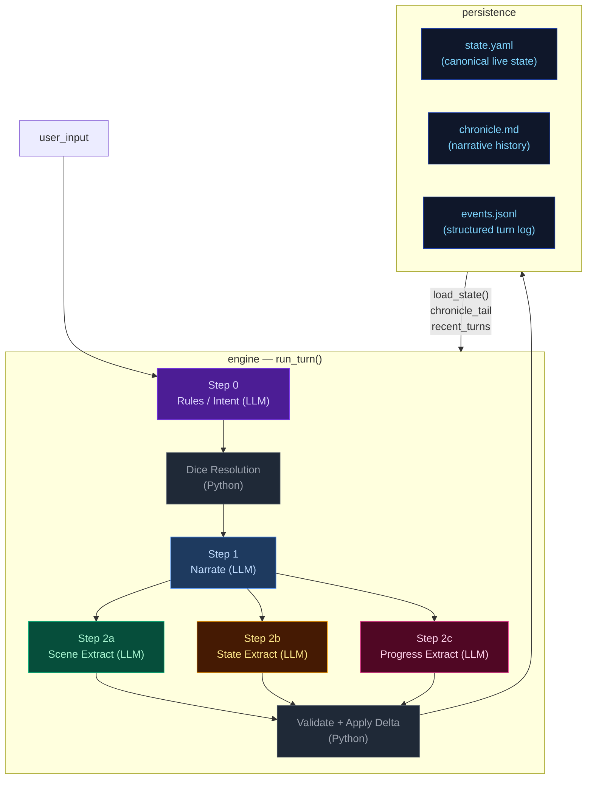
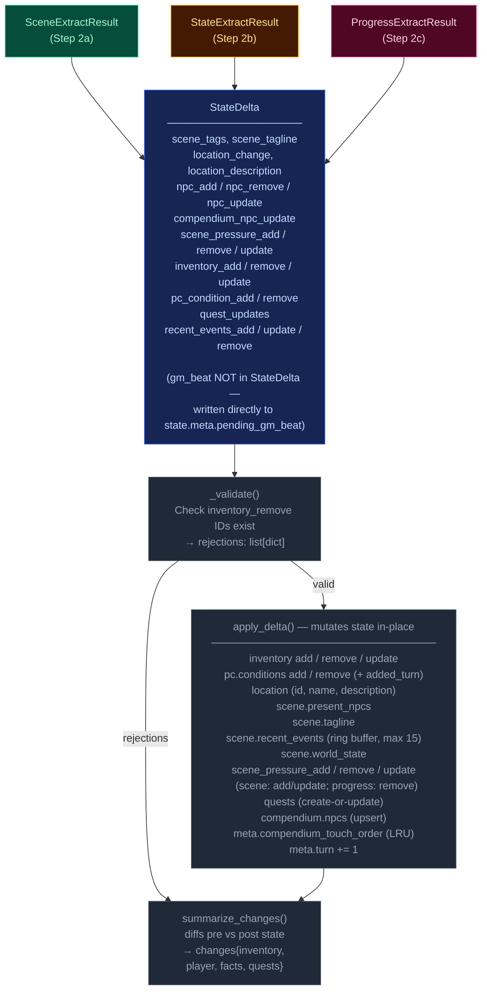
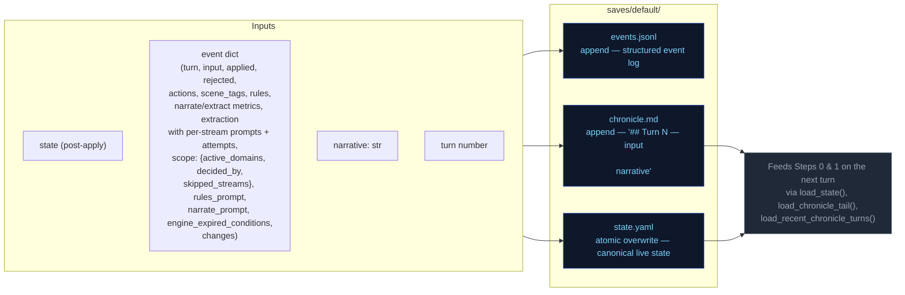
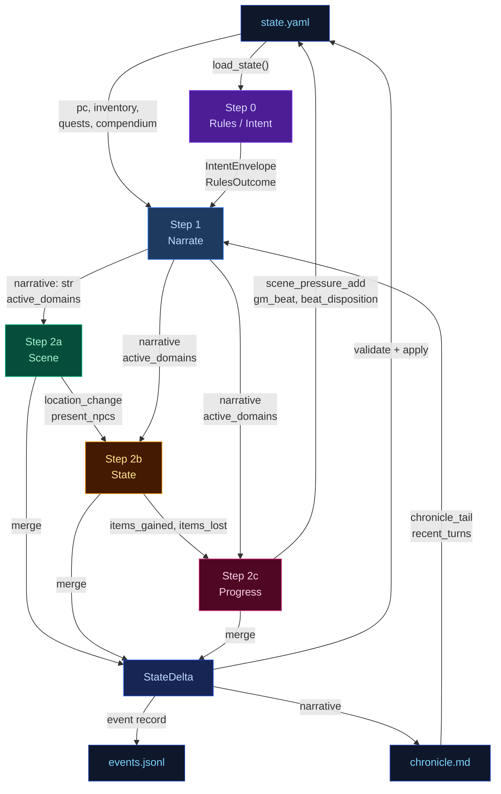

# Engine Design Reference (EVAL_CONTEXT from ARCHITECTURE.md)

---

# ENGINE DESIGN REFERENCE (read this first — it is what the engine is supposed to do)

The following is extracted verbatim from the project's ARCHITECTURE.md between the EVAL_CONTEXT markers. It defines the 5-pipeline engine you are judging. Use it to understand which pipeline owns which mechanic, where data flows, and what the design intent is. When you find something the implementation does that contradicts this design, call it out as a mechanical failure.

## 5-Pipeline Reference (engine design at a glance)

Every player turn drives this 5-step pipeline, executed strictly in order. Step 0 runs once before narration; Step 1 emits the prose the player reads; Steps 2a/2b/2c extract structured changes from that prose. The Python tail validates and applies the merged delta.

| Pipeline | When it runs | Key inputs | Key outputs | Mechanics it owns | Hand-off to next turn |
|---|---|---|---|---|---|
| **Step 0 — Rules / Intent** | Every turn (always) | `state.pc`, `state.location`, `recent_turns[-1:]`, `user_input` | `IntentEnvelope` (intent, verb, target, stakes, check.required, check.skill, check.difficulty); `RulesOutcome` (rolled, dice, mods, band, directive) | Intent classification, dice roll resolution (2d6 + stat + cond − diff → band), difficulty selection, anti-declare-outcome enforcement | `rules_outcome.directive` shapes narrator latitude |
| **Step 1 — Narrate** | Every turn (always, streamed) | Full `state` (pc, location, scene, inventory, quests, compendium), `chronicle_tail`, `recent_turns`, `rules_outcome` (when rolled), `pack_style`, `narrator_rules`, `pending_gm_beat`, `momentum`, `ages`, `recently_left`, `known_npcs`, `present_npcs`, `world_factions`, `world_locations`, `npc_name_pool`, `deescalate`, `scene_pressure`, `user_input` | `narrative` (prose); a trailing `<scope>{"active_domains":[...]}</scope>` line stripped server-side | Prose generation, dice-band binding, GM-beat consumption (clears `state.meta.pending_gm_beat`), de-escalation directives, age-based stalling fixes, scope decision (active_domains) | `narrative` feeds all 3 extractors; `active_domains` gates which extractors run |
| **Step 2a — Scene Extract** | When `scene` or `location_change` in active_domains | `narrative`, `state.pc/location`, `state.scene.present_npcs`, `state.pc.conditions`, `known_characters` (LRU compendium), `RulesOutcome`, `recent_turns[-1:]` | `SceneExtractResult`: `scene_tags`, `scene_tagline`, `location_change`, `location_description`, `npc_add/remove/update`, `compendium_npc_update` | NPC presence, location changes, scene tags, scene classification (tags/tagline), durable NPC compendium identity | `location_change` and `present_npcs` passed to Steps 2b and 2c |
| **Step 2b — State Extract** | When `inventory` or `pc_condition` in active_domains; auto-activated by transfer-verb scan | `narrative`, `state.pc`, `state.location`, `state.inventory`, `rules_outcome`, `engine_expired_conditions`, `scene_result.location_change`, `scene_result.present_npcs`, `stakes`, `band`, `band_examples` (few-shot extraction examples keyed to dice band) | `StateExtractResult`: `inventory_add/remove/update`, `pc_condition_add/remove` | Inventory delta accuracy, condition lifecycle (with `added_turn`), engine-side TTL pre-removal, ID normalization | `items_gained` (names) + `items_lost` (ids) feed Step 2c |
| **Step 2c — Progress Extract** | Every turn (always) | `narrative`, `state.pc`, `state.scene.recent_events`, `state.scene.world_state`, `active_quests`, `scene_pressure`, `RulesOutcome`, `intent`, `recent_turns[-2:]`, `items_gained`/`items_lost` from 2b, `stakes`, `band`, `deescalate`, `quest_ages`, `pending_beat`, `quest_threshold_directive` | `ProgressExtractResult`: `quest_updates`, `recent_events_add/update/remove`, `actions` (4 suggested choices), `outcome_summary`, `gm_beat`, `beat_disposition`, `scene_pressure_add`, `scene_pressure_remove`, `scene_pressure_update` | Quest objectives, recent_events ring buffer, action suggestions, narrative recap, GM beat generation + disposition, scene pressure lifecycle (all three operations) | `recent_events_add` becomes durable history; `quest_updates` advance arcs; `scene_pressure_add` feeds next turn's rules call; `gm_beat` stored in `state.meta.pending_gm_beat` |

After Step 2c, results merge into a `StateDelta`, the validator checks (e.g. `inventory_remove` IDs exist), `apply_delta()` mutates state in-place, and the turn is persisted. The next turn's Step 0 reads the new `state.yaml` plus `events.jsonl`.

---

## High-Level Overview



---

## Step 0 — Rules / Intent Classification

Classifies the player's action, determines whether a dice check is needed, and
identifies which state domains will be active — narrowing every downstream extractor.

```mermaid
flowchart LR
    classDef stageRules fill:#4c1d95,color:#ddd6fe,stroke:#7c3aed
    classDef llmNode    fill:#0f172a,color:#94a3b8,stroke:#334155
    classDef pyNode     fill:#1f2937,color:#9ca3af,stroke:#4b5563
    classDef outNode    fill:#3b0764,color:#e9d5ff,stroke:#7c3aed

    subgraph IN["Inputs"]
        I1["state.pc<br>(name, stats, conditions)"]
        I2["state.location"]
        I3["recent_turns[-1:]<br>(from chronicle;<br>user prompt: narrative tail)"]
        I4["user_input"]
    end

    subgraph LLM0["LLM — rules_system.j2 + rules_user.j2"]
        L0["temp: 0.2 · max_retries: 1<br>output: IntentEnvelope JSON"]:::llmNode
    end

    subgraph PYRES["Python — rules.resolve_check()"]
        P0["reads pc.stats[skill]<br>reads pc.conditions → cond_mod<br>rolls 2d6 + stat_mod + cond_mod − diff_mod<br>maps total → Band"]:::pyNode
    end

    subgraph OUT["Outputs"]
        O1["IntentEnvelope<br>  intent: str<br>  intent_verb: str<br>  target: str<br>  stakes: str<br>  check.required: bool<br>  check.skill: SkillName<br>  check.difficulty: Difficulty"]:::outNode
        O2["RulesOutcome<br>  rolled: bool<br>  skill, difficulty, stat_value, stat_mod<br>  diff_mod, cond_mod<br>  dice: list[int]<br>  raw_total, final_total: int<br>  band: Band<br>  directive: str<br>  intent, intent_verb: str"]:::outNode
    end

    IN --> LLM0
    LLM0 -- "IntentEnvelope" --> PYRES
    PYRES --> OUT
```



> **Key forward dependency:** `rules_outcome.directive` shapes the narrator's creative
> latitude. `scope.active_domains` is now decided by the narrator (Step 1), not the
> rules call.

---

## Step 1 — Narrate (Streaming)

Generates the narrative prose the player reads. Tokens are streamed to the client.

```mermaid
flowchart LR
    classDef llmNode   fill:#0f172a,color:#94a3b8,stroke:#334155
    classDef xstream   fill:#4c1d95,color:#ddd6fe,stroke:#7c3aed
    classDef outNode   fill:#1e3a5f,color:#bfdbfe,stroke:#3b82f6

    subgraph IN["Inputs"]
        N1["state (full —<br>pc, location, scene,<br>inventory, quests, compendium)"]
        N2["chronicle_tail<br>(compressed history, ≤budget tokens)"]
        N3["recent_turns (last window_turns=6)"]
        N4["rules_outcome<br>(band, directive, dice summary)"]:::xstream
        N5["pack_style (tone / prose guide)"]
        N6["npc_name_pool (cultural name list)"]
        N7["recently_left NPCs"]
        N8["known_npcs<br>(last-seen info)"]
        N9["present_npcs<br>(attitudes)"]
        N10["world_factions<br>(immutable trace)"]
        N11["world_locations<br>(nearby, immutable)"]
        N12["pending_gm_beat"]
        N13["momentum"]
        N14["ages<br>(combat/location)"]
        N15["deescalate"]
        N16["scene_pressure<br>(active threats)"]
        N17["user_input"]
    end

    subgraph LLM1["LLM — narrate_system.j2 + narrate_user.j2"]
        NL["temp: 0.9 · streaming: yes<br>output: prose narrative (str)"]:::llmNode
    end

    subgraph OUT["Outputs"]
        NO1["narrative: str<br>(streamed as tokens → client<br>then joined + thinking-stripped)"]:::outNode
        NO2["narr_metrics<br>  first_token_ms<br>  total_ms<br>  tokens_in / tokens_out"]
    end

    IN --> LLM1
    LLM1 --> OUT
```



> **Key forward dependency:** `narrative` is the primary content input for all three
> extraction streams below.
>
> **Scope tail:** The narrator emits `<scope>{"active_domains":["..."]}</scope>` as the
> last line of output. The server strips it before sending to the client.
> Parsed `active_domains` flows into Steps 2a/2b/2c. Scene runs only when `scene` or
> `location_change` is in active_domains. State runs only when `inventory` or
> `pc_condition` is in active_domains. Progress always runs.
>
> ### Scope domains
>
> The narrator decides which extraction streams to run via seven scope domains. Each
> domain gates one or more extractors:
>
> | Domain | Extractor(s) triggered | Condition for emission |
> |--------|----------------------|----------------------|
> | `scene` | 2a (Scene) | NPC enters/leaves narration, NPC situation shifts |
> | `location_change` | 2a (Scene) | Player physically moves or scene shifts significantly |
> | `inventory` | 2b (State) | Items received, used, dropped, upgraded |
> | `pc_condition` | 2b (State) | Wounds, fatigue, mental conditions added or resolved |
> | `quest_updates` | 2c (Progress) | Quest objective progress, new quest, quest resolved/failed |
> | `recent_events` | 2c (Progress) | Narratively significant new fact (politics, intrigue, world) |
> | `compendium_npc` | 2a (Scene) | NPC named for the first time, durable identity change, death |
>

---

## Step 2a — Scene Extract

Extracts location changes, NPC presence, scene tags, and suggested actions from the narrative.


> **Skippable:** Scene stream is skipped when neither `scene` nor `location_change` is
> in `active_domains`.

> **Key forward dependency:** `location_change` and `present_npcs` are passed into
> Steps 2b and 2c. No forward-facing mechanics (scene_pressure, gm_beat) are emitted by this stream.

---

## Step 2b — State Extract

Extracts inventory changes and player condition mutations from the narrative.


> **Skippable:** State stream is skipped when neither `inventory` nor `pc_condition` is
> in `active_domains`.
>
> **Key forward dependency:** Step 2c receives a **minimal cross-stream surface** from
> Step 2b: `items_gained` (item **names** from `inventory_add`) and `items_lost` (item
> **ids** from `inventory_remove`) — see `_extract_progress_messages` in `engine.py`.
> This is narrower than the full `StateExtractResult` objects.

---

## Step 2c — Progress Extract

Extracts quest updates, recent events, and durable NPC compendium changes.


> **Always runs:** Progress is the post-narration storytelling brain. It always executes
> every turn (never skipped) and feeds next turn's rules call via `recent_events_add`
> (durable narrative facts), `quest_updates` (advancing or closing arcs), `scene_pressure_add`
> (new threats), and `gm_beat` (forward-facing beats stored in `state.meta.pending_gm_beat`).
>
> ### GMBeat schema
>
> ```
> GMBeat
>   type: complication | revelation | opportunity | breathing_room | pressure | twist | setback | escalation | callback
>   surface_as: ambient | event | npc_behavior | environmental | player_discovery | item (default: ambient)
>   instruction: str (must be ≥40 chars, not start with filler prefixes)
>   beat_expires_turn: int | None (turn number at which the beat expires; set to turn_no + 2 when stored)
> ```
>
> ### Beat lifecycle
>
> The progress extractor emits a `gm_beat` (or `null`). If a beat is emitted, `beat_disposition`
> controls what happens to the `pending_gm_beat` from the previous turn: `consume` clears it,
> `carry` preserves it unchanged, `replace` supersedes it with the new beat. The engine stores
> the beat in `state.meta.pending_gm_beat` with `beat_expires_turn = turn_no + 2` as a hard
> TTL ceiling. Pre-narration, the engine checks whether the carried beat has passed its TTL;
> if so, it is nullified regardless of disposition. The narrator consumes the beat by integrating
> its instruction into prose. If not consumed by the narrator, the beat expires at turn N and
> is discarded.

---

## Delta Merge → Validate → Apply

The three extraction results merge into a single `StateDelta`, then validate and apply.



---

## Persist

Atomic writes to disk. No LLM calls.



---

## Cross-Pipeline Data Flow



---


# Static Context (immutable across all turns)

## World Pack Style

```
# Eval-pack style

This pack is a deterministic test fixture. The narrator should write in a plain,
clear, second-person past-tense register. Keep these in mind:

- Specific over abstract. Name the thing the player did, the object they touched, the
  NPC they spoke to. Avoid generic mood words ("an air of menace") in favor of
  concrete sensory detail.
- One scene per turn. Do not skip ahead in time unless the player explicitly does so.
- Honor the dice. If the rules outcome is `fail` or `setback`, the action did not
  succeed; describe the cost. If `partial`, the action succeeded with a complication.
- Honor the present_npcs. Every named NPC in the scene either acts, reacts, or is
  visibly present in the prose. Do not invent new NPCs unless the player's input
  introduces one.
- Plain language. No archaic phrasing, no fantasy-trope syntax ("Lo, the door...").
  This is a working road in a working world.
- 120-220 words per turn unless the action is large.

```

## Seed State

```json
{
  "meta": {
    "game_name": "eval",
    "turn": 0,
    "setting_pack": "eval-pack",
    "model": ""
  },
  "pc": {
    "name": "Aren Voss",
    "tagline": "Reluctant courier on the merchant road",
    "bio": "Mid-thirties, broad shoulders, careful with words. Took on a courier contract\nto clear an old debt. Just arrived in Marrow's Crossing with a heavy pack and\na heavier obligation.\n",
    "stats": {
      "strength": 3,
      "dexterity": 3,
      "wits": 2,
      "lore": 2,
      "charisma": 3,
      "resolve": 3
    },
    "conditions": [],
    "momentum": 0
  },
  "location": {
    "id": "marrows_crossing",
    "name": "Marrow's Crossing",
    "description": "A market town built around the confluence of two rivers. Cobblestone streets,\ntimber-framed buildings, and the constant sound of water from the mills. The\ntown square has a stone well and a statue of the founder. Most shops are closing\nfor the evening.\n"
  },
  "inventory": [
    {
      "id": "credits",
      "name": "Credits",
      "notes": "Common coin, accepted at any inn or stall on the merchant road.",
      "amount": 500,
      "aliases": []
    },
    {
      "id": "iron_dagger",
      "name": "Iron dagger",
      "notes": "Plain crossguard, edge worn from honing. Belt-carried.",
      "amount": 1,
      "aliases": []
    },
    {
      "id": "bandages",
      "name": "Linen bandages",
      "notes": "Three rolls. Field-grade \u2014 won't replace a healer.",
      "amount": 3,
      "aliases": []
    },
    {
      "id": "traveler_cloak",
      "name": "Traveler's cloak",
      "notes": "Oiled wool, road-stained, hood deep enough to hide a face.",
      "amount": 1,
      "aliases": [
        "cloak",
        "travel cloak"
      ]
    },
    {
      "id": "brass_key",
      "name": "Brass key",
      "notes": "A small brass key Halden gave you with the ledger.",
      "amount": 1,
      "aliases": []
    }
  ],
  "quests": [
    {
      "id": "settle_the_debt",
      "title": "Settle the Old Debt",
      "status": "active",
      "objectives": [
        {
          "description": "Find Caron, the man you owe.",
          "done": false,
          "failed": false
        },
        {
          "description": "Pay Caron in person and have him mark the debt cleared.",
          "done": false,
          "failed": false
        }
      ]
    },
    {
      "id": "deliver_the_ledger",
      "title": "Deliver Halden's Ledger",
      "status": "active",
      "objectives": [
        {
          "description": "Accept the courier contract from Halden.",
          "done": false,
          "failed": false
        },
        {
          "description": "Carry the ledger to the merchant Halden at the Crossed Keys Inn.",
          "done": false,
          "failed": false
        },
        {
          "description": "Confirm the contract with Halden in person.",
          "done": false,
          "failed": false
        }
      ]
    },
    {
      "id": "clear_the_road_toughs",
      "title": "Clear the Road Toughs",
      "status": "active",
      "objectives": [
        {
          "description": "Find out who hired the toughs blocking the road.",
          "done": false,
          "failed": false
        },
        {
          "description": "Convince, pay, or remove the toughs from the inn.",
          "done": false,
          "failed": false
        }
      ]
    }
  ],
  "scene": {
    "tagline": "Market town at dusk",
    "tags": [
      "peaceful",
      "start"
    ],
    "world_state": [
      "Marrow's Crossing is a market town at the confluence of two rivers, known for its mills and the annual river festival.",
      "Iron coin (credits) is the universal currency on the merchant road; barter is acceptable but slower.",
      "The road has been quieter than usual this season \u2014 fewer caravans, more independent runners, more opportunists."
    ],
    "recent_events": [
      "You arrived in Marrow's Crossing after three days on the road.",
      "You heard rumors of road-toughs extorting travelers near the Crossed Keys Inn.",
      "You found Caron in the tavern \u2014 he's been waiting for you."
    ],
    "present_npcs": [
      {
        "id": "caron",
        "name": "Caron",
        "title": "Old creditor",
        "notes": "Sits at a corner table in the tavern, nursing a drink and watching the door.",
        "bio": "A portly man in his sixties with a merchant's ledger and a patient demeanor. You owe him 500 credits from a failed venture three years ago."
      },
      {
        "id": "halden",
        "name": "Halden",
        "title": "Merchant",
        "notes": "Stands near the town well, examining a map and a pressed wax seal.",
        "bio": "A road merchant in his fifties who hires couriers when his usual runners are spoken for. Honest by reputation, careful with money."
      },
      {
        "id": "innkeeper",
        "name": "Edda",
        "title": "Innkeeper at the Crossed Keys",
        "notes": "Wiping down the bar at the Crossed Keys, which is two streets over.",
        "bio": "Runs the inn alone since her husband died. Knows every traveler by face if not by name. Stays out of trouble unless it walks through her door."
      }
    ]
  },
  "compendium": {
    "npcs": {
      "caron": {
        "name": "Caron",
        "title": "Old creditor",
        "bio": "A portly man in his sixties with a merchant's ledger and a patient demeanor. You owe him 500 credits from a failed venture three years ago."
      },
      "halden": {
        "name": "Halden",
        "title": "Merchant",
        "bio": "A road merchant in his fifties who hires couriers when his usual runners are spoken for. Honest by reputation, careful with money."
      },
      "innkeeper": {
        "name": "Edda",
        "title": "Innkeeper at the Crossed Keys",
        "bio": "Runs the inn alone since her husband died. Knows every traveler by face if not by name. Stays out of trouble unless it walks through her door."
      },
      "tough_a": {
        "name": "Bald Tough",
        "title": "Road thug",
        "bio": "Hired muscle. No personal stake in this \u2014 he'll back off if the price is right or the fight goes bad."
      },
      "tough_b": {
        "name": "Scarred Tough",
        "title": "Road thug",
        "bio": "Same outfit as the other \u2014 hired by the same person. Quicker to violence; not the brains."
      },
      "matthew_estrada": {
        "name": "Matthew Estrada",
        "title": "Traveler",
        "bio": "A tall, broad-shoulded man in a stained leather jerkin carrying a heavy rucksack. Looks like a road runner but moves with military precision."
      }
    }
  }
}
```

## Engine Constants

```json
{
  "pressure_building_at": 6,
  "pressure_immediate_at": 10,
  "pressure_max_age": 15,
  "urgency_levels": [
    "background",
    "building",
    "immediate"
  ],
  "momentum_min": -3,
  "momentum_max": 3,
  "momentum_delta": {
    "crit_success": 2,
    "success": 1,
    "partial": 0,
    "setback": -1,
    "fail": -1,
    "crit_fail": -2
  }
}
```

## System Prompts (identical every turn)

### Rules System Prompt

```
You decide whether the player's action requires a skill check, and if so, classify it. Emit ONLY a JSON object — no prose, no markdown fences.

## Stats — pick exactly one for check.skill
- strength: Physical force, melee, lifting, breaking, soak, endure pain
- dexterity: Agility, stealth, ranged attacks, fine motor, dodge, pickpocket
- wits: Quick thinking, perception, deduction, hacking under pressure, spot a lie
- lore: Recalled knowledge, history, languages, protocols, identification, expertise
- charisma: Persuade, deceive, charm, negotiate, perform, seduce, intimidate by presence
- resolve: Willpower, courage, resist fear / torture / coercion / temptation

## Difficulty — pick exactly one for check.difficulty
- trivial (+2): Almost certain; only roll if failure would be interesting
- easy (+1): Routine for a competent person
- normal (0): A genuine challenge
- hard (-1): Requires skill, preparation, or favourable conditions
- extreme (-2): Near-impossible without exceptional ability or luck

## Decision rule — default NO
Set check.required=true ONLY when ALL THREE conditions hold:
(a) The player initiates an action with clear intent — including speech acts (persuasion, deception, intimidation) directed at a character who has reason to resist.
(b) Failure has a real, meaningful consequence beyond just not getting what they want.
(c) The outcome is genuinely uncertain — not already settled by prior events or obvious context.

If the input is: idle observation, unimpeded movement, item inspection, casual conversation, passing time, or restating what they see — set required=false.

If the player is paying a stated or clearly implied fixed price to a willing or commercially neutral NPC (buying goods at market price, paying a fee, tipping, settling a stated debt) — set check.required=false. No charisma roll is needed for routine commerce with a willing counterparty.

## Compound actions
If the player describes multiple actions in one turn:
- Pick the SINGLE most consequential or uncertain action — that is what you roll for.
- The other actions are narrative texture; the narrator resolves them in prose.
- If individually-trivial sub-actions compound into something risky ("sneak past three guards then lift the badge"), classify as ONE harder check rather than rolling for each step.
- `intent` should summarise the full sequence; `intent_verb` and `check` apply to the gating action only.
- If the gating action would fail, the chain does not continue — note this in `stakes`.

## Anti-declare-outcome rule
If the player's phrasing asserts the result ("I one-shot the guard", "I instantly convince her", "I hack through in seconds") — classify the underlying attempt at hard or extreme difficulty. Never let the player's prose dictate success.

## Output schema (emit this JSON object only)
{
  "intent": "", 
  "intent_verb": "",
  "target": "",
  "stakes": "",
  "check": {
    "required": boolean,
    "skill": "",
    "difficulty": "",
    "tags": []
  }
}

## Field rules

- `intent`: 1 sentence declaring player intent as related to the story, quests, world, or npcs. Never substitute, dismiss as impractical or extreme, or embellish. Default: player moves with allies. Only soften it in line with the anti-declare-outcome rule.
- `intent_verb`: attack|persuade|sneak|hack|deceive|intimidate|climb|repair|recall|escape|negotiate. If it fits none of these, you must choose an appropriate word not listed.
  - `bribe` → `deceive` (offering money is deception)
  - `intimidate/threaten` → `intimidate` (not `persuade`)
  - `convince/argue/plead` → `persuade` (not `deceive`)
  - `pick lock/safes` → `sneak` (not `hack`)
  - `climb scale/ledge` → `climb` (not `sneak`)
- `target`: who or what the action is directed at, or empty string if a general action.
- `stakes`: what is at risk if this fails. Use this template: `[Mechanical cost: difficulty increase/condition/harm] + [Narrative consequence: what the antagonist/world does next]`. If nothing meaningful is at risk, emit empty string.
- `check`: an object with the following fields:
  - `required`: true or false.
  - `skill`: strength|dexterity|wits|lore|charisma|resolve.
  - `difficulty`: trivial|easy|normal|hard|extreme.

## Directive notes

The directive you produce feeds into the narrator's prose. When a `fail` directive includes a near-miss note, the narration should describe a setback or complication that changes the situation without completely blocking the player. The player still fails — but the story advances.

## Output discipline

When emitting structured data (JSON, scope tags, any machine-readable output), omit null or empty fields entirely. Do not emit `key: null` — just leave the key out.

```

### Narrate System Prompt

```
Narrate the next beat of a text adventure. Second person. Follow the tense specified in the ## Genre tone section below; if no tense is specified, use past tense. 2-4 short paragraphs. Output prose only — never list choices, never speak as the game.

Each beat advances the fiction. Match the weight of your narration to the outcome and the scene's current state. The user prompt provides a Narration Directive for this specific turn — follow it.

- NPCs should frequently suffer positive and negative consequences, not just the player. In appropriate genres, death and mortal injury is common.
- Mention characters from recent turns sometimes when relevant and adds flavor.

**Pacing is critical.** Each beat must advance the plot meaningfully. No holding patterns, no extended descriptions of static scenes. The Narration Directive in the user prompt tells you how to pace this specific turn.

## Style
Spatial clarity: when positioning matters (combat, stealth, formations, who-is-where) make distance, direction, cover, and line of sight explicit.
Avoid tropes; invent fresh twists, weird details, even humor in dark stories. Don't repeat known facts or restate conditions already mentioned.
Use direct dialogue when player or NPC is speaking. 
NPCs and scene/location should interact with the player when appropriate.
Viseral, gory, and sexual details are allowed when appropriate to the story and genre.
Describe appearances of new characters briefly. 
Keep it tight — each turn is a scene beat, not a chapter.
Use colorful imagery, metaphores/similes, and genre-appropriate colloquialisms.

## Items and inventory
Items with multiples should be always quantified, even if vaguely: "I picked up a couple pistol clips." When relevant to quests or inventory, explicit quantity is preferred.
**Bold** named inventory items on first use or direct reference in a scene. **Bold** NPC names on first introduction in a scene. This applies on the very first turn the same as all subsequent turns.

**Inventory is a hard constraint.** Before narrating any item usage, spending, or consumption, verify the item appears in the `## inventory` list in the user prompt. If the player's action implies using, spending, or consuming an item not in that list, narrate the *attempt* failing — the player reaches for it, tries to produce it, or fumbles at their belt, and finds nothing. Never describe the player successfully producing, spending, or losing an item that is not in their current inventory. If the inventory list shows `credits: 500`, the player has 500 credits — do not invent `iron_coin`, `silver`, or other substitute denominations.

## Player input is truth (HIGHEST PRIORITY)

Take the player's stated action at face value. The rules engine handles dice and conditions; the narrator handles fiction. Never substitute a different action than what the player described. If the action involves an inventory item or present NPC, always use that item or NPC.

**Priority ordering: player input > GM beat > stakes/directive.** When a `pending_gm_beat` is present, integrate it as environmental pressure, NPC attitude, or scene atmosphere — NEVER as a replacement for the player's stated action. The player's action dictates what happens; the GM beat dictates how the world reacts.

**Conflict example (READ CAREFULLY):**
- Player says: "I sit across from Halden at his table, slide the merchant seal across, and hand him the ledger."
- GM beat says: "pressure: toughs circle and flank the player"
- WRONG: Narrate the toughs attacking and the player fighting them (this replaces the player's action).
- RIGHT: Narrate the player sitting down and sliding the seal/ledger across the table FIRST. Then describe the toughs circling and flanking as the player attempts this action — the toughs' presence is the environmental pressure, not the main event. The player's action (sitting, sliding seal, handing ledger) is the primary narration.

**Fallback for conflicts:** If player input and GM beat conflict, narrate the player's action FIRST (2-3 sentences describing the action completing or failing), then integrate the beat as an environmental reaction or NPC behavior that occurs during or immediately after. The player's stated action is the primary event; the GM beat is the world's response. Never narrate the GM beat event as if it replaced the player's action.

**Open with the player's action.** Do not spend more than one sentence bridging from the previous turn. If the player changes scene, location, or focus, start fresh — do not rehash events the player already resolved. A brief transitional sentence is acceptable, but the bulk of your narration must address the current input.

## Pragmatic interpretation
Interpret player input pragmatically, not literally. If the player says something absurd or physically impossible ("I offer a credit to the wall", "I punch the sky"), narrate the attempt as a reasonable interpretation of their intent — the wall doesn't accept coins, the sky can't be punched. The rules engine will resolve whether the action succeeds. Never refuse the action outright; narrate the attempt and let the dice decide.

## NPCs in scene
NPCs should feel like persistent people, not props. Re-use characters from the Known Characters list when the scene and location are consistent with their last known position. Only create a genuinely new character when the scene requires someone no existing character can fill. When introducing a new named NPC, pick from the name pool. Give a brief physical description.

**NPC QUANTITY RULE:** When introducing or describing a group of unnamed NPCs, always give a specific number or a tight qualifier: "four guards," "a dozen soldiers," "three dock workers." Never use vague collective nouns alone: not "guards" or "some soldiers" or "a group of men." Named individuals are exempt. Vague groups make state tracking impossible.

## Mortal stakes + agency
NPCs die. In combat and high-stakes situations, NPCs who lose a confrontation are dead, incapacitated, or removed from the scene. This is the default outcome — not a special condition. Do not default to "stumbling back" or "retreating." When in doubt, remove them. The progress extractor will record their fate.
Resolve cruel, selfish, or evil player choices straight: narrate consequences without moralizing, refusing, or steering toward a "better" path. NPCs may react with horror, retaliation, or fear; the narrator never lectures or vetoes.

## NPC naming
All NPC names must include a given name and family name (e.g. "Mira Sovak", "Dren Calloway"). Single-word names are not permitted. When introducing a new NPC, pick from the name pool provided in the user prompt. If the name pool provides separate male and female lists, select names appropriate to the role and setting — historical combat genres: use male names from provided names ONLY for combat roles; modern and speculative settings: use any gender freely. If the NPC is anonymous or unnamed in-scene, use a descriptive placeholder like "the guard" or "a stranger" — but once their true name is revealed, it must supersede the placeholder and the placeholder becomes an alias (handled by the scene extractor).

## Quests
If the action satisfies an objective or resolves a quest, make that resolution clear in prose briefly (the debt is paid, the job is done, the target is found).

## Markdown (light)
- `**bold**` only for: NPC names on first introduction this scene; named inventory items (use a short name, not ammo) the player owns when used or directly referenced. Once per scene per object.
- `*italic*` for ship names, books, broadcasts, in-world publication titles, emphasized proper nouns.
- `> blockquote` only for signage or quoted broadcast text.
- No headings, no bullet lists in prose.


## Output discipline
When emitting structured data (JSON, scope tags, any machine-readable output), omit null or empty fields entirely. Do not emit `key: null` — just leave the key out.

**NO REPETITION RULE:** Do not reuse sensory details, metaphors, descriptive phrases, or imagery from the immediately preceding turn's narration. If the previous turn described "the rain hammering the cobblestones," this turn must find a different image. The world changes with each turn; the narration must reflect that.

## Active scope tail
After your prose is complete, on a new line, emit a single line:

<scope>{"active_domains":["..."]}</scope>

Valid domains:
- scene             — scene tags, NPC presence, scene tagline changes
- inventory         — items received, used, dropped, upgraded
- pc_condition      — wounds, fatigue, mental conditions added or resolved
- quest_updates     — quest status or objectives changed

List ONLY domains that genuinely changed THIS turn. Empty list `[]` is valid
and means "nothing changed; advance the storyteller's reasoning only."

**No speculation.** Only list a domain if a change is confirmed in your narration. Do not list domains for things that might happen, things you hint at, or things you foreshadow. If your narration does not explicitly show a change, do not flag the domain.

**Bias towards inclusion for scene-related domains.** If any of these happened,
flag the appropriate scope:
- A character enters or leaves the narration → `scene`
- An NPC's situation, position, or state shifts → `scene`
- An item is used, gained, or lost → `inventory`
- A condition is gained or resolved → `pc_condition`
- A quest objective is completed or status changes → `quest_updates`

When in doubt, include the scope. It is better to over-flag than to skip
extraction streams that need to run.

Rules:
- The tag MUST be the very last thing in your output, on its own line.
- One JSON object only. No prose after the closing tag.
- If thinking mode is enabled, the tag goes AFTER the closing </thinking> tag.
- The tag and its contents are stripped from the player's view by the engine.

```

### Extract Scene System Prompt

```
## Scene Extractor

Read the turn narration and extract the scene-level state: which NPCs are present and how they stand toward the player, whether the player moved to a new location, what the scene feels like, and any new spatial details about the current space. Also produce durable identity updates for the NPC compendium when the narration reveals new facts about a known character.

## Output schema

```json
{
  "scene_tags": [],
  "scene_tagline": null,
  "location_change": null,
  "location_description": null,
  "npc_add": [],
  "npc_remove": [],
  "npc_update": [],
  "compendium_npc_update": []
}
```

## Field rules

`scene_tags`: mood/genre descriptors for the scene. Up to 5. Use concise noun or adjective phrases. Examples: `"combat"`, `"tense_conversation"`, `"investigation"`, `"stealth"`, `"discovery"`.

`scene_tagline`: 3–6 words summarizing the scene for the UI header. Grounded in what just happened. Examples: `"A Toll Paid In Blood"`, `"Whispers in the Dark"`, `"The Guard Raises the Alarm"`.

`location_change`: emitted only when the player moves to a new location (the location ID differs from the current one). Each: `{"id": "snake_case_id", "name": "Display Name", "description": "one-sentence description of the new space"}`. Do NOT emit if the player is still in the same location with added spatial detail — use `location_description` instead.

`location_description`: Location description — new physical/spatial detail about the current space. Only emit when the narration introduces genuinely new details not already in the stored description. Do not restate or paraphrase existing description. One to two sentences.

`npc_add`: named characters who entered or are revealed in the scene - only add if PRESENT in seen/in proximity to player. Each: `{"id": "snake_case_id", "notes": "current attitude or situation toward the player", "name": "Display Name", "title": "Optional title", "bio": "1-2 sentence identity"}`. Omit `name`, `title`, `bio` when the NPC is already known from the compendium — the engine will hydrate from the compendium. Always include `notes` describing how the NPC is behaving toward the player right now. **Every NPC added to the compendium MUST have a bio.** Ambient presence (crowd, bystanders, etc.) must also have a bio describing what they are and their general role in the scene.

`npc_remove`: named characters who left the scene. Each: `{"id": "snake_case_id", "last_seen_state": "1-sentence description of what NPC was last seen doing"}`. The `id` must match an NPC currently in `present_npcs`. Omit `last_seen_state` if there is nothing meaningful to record.

`npc_update`: changes to how an existing present NPC is behaving toward the player (attitude, situation). Each: `{"id": "snake_case_id", "notes": "updated attitude or situation"}`. Only emit when the NPC's behavior or situation toward the player has changed meaningfully. Omit `name`, `title`, `bio` — those are compendium fields, not scene fields.

`compendium_npc_update`: durable identity updates for NPCs that should persist across turns in the global compendium. Add in all cases, even if NPC not currently present. Each: `{"id": "snake_case_id", "name": "new_name", "title": "new_title", "bio": "updated bio", "aliases": ["alias1"], "allegiance": "faction_or_alignment"}`. Only emit when the narration reveals new durable identity information about a known NPC (new name, title, bio, allegiance, or aliases). Do NOT emit for temporary scene behavior — that goes in `npc_update` under `notes`.

## NPC ID rules

- Use existing IDs from the `## Present NPCs` list when referencing NPCs already in the scene.
- For new NPCs, generate a stable `snake_case` ID from their name/title. Examples: `"scarred_tough"`, `"guard_captain_renn"`.
- If an NPC is known from the compendium, use their existing compendium ID — do NOT create a new ID.
- When adding a new NPC, include `name`, `title`, and `bio` so the engine can populate the compendium. **Bio is mandatory for every NPC — even ambient presence like "crowd" or "bystanders" needs a bio.**

**NPC ENTER/EXIT RULE (MANDATORY):**
- Emit `npc_add` for every named NPC who appears in the narration for the first time this turn and is NOT already in `present_npcs`.
- Emit `npc_remove` for every named NPC who narration indicates has left, fled, died, fainted, or been removed from the scene.
- Do NOT emit `npc_add` for NPCs already in `present_npcs` — that causes duplicates.
- Do NOT emit `npc_remove` for NPCs who are simply not mentioned — only remove if narration actively indicates departure.
- Unnamed ambient characters ("a group of guards," "bystanders") do not require `npc_add`/`npc_remove` tracking.

EXAMPLE — NPC enters (correct):
Narration: "A red-haired man in boiled leather steps through the door and locks eyes with you."
`present_npcs` before: [caron]
→ Emit: `npc_add: { id: "red_haired_man", name: "Red-Haired Man", ... }`

EXAMPLE — NPC exits (correct):
Narration: "Caron spits on the floor and shoves through the crowd, disappearing into the street."
→ Emit: `npc_remove: { id: "caron" }`

EXAMPLE — NPC not mentioned, no remove (correct):
Narration does not mention Halden this turn.
→ Do NOT emit `npc_remove: { id: "halden" }` — absence ≠ departure.

## State-presence rule

Sections not shown in the user prompt still exist in the live game state — absence is not removal. Only emit removals you can justify from the narration.

## Deduplication rule

Before you submit your output, verify that you have no duplicate or near-duplicate entries:

- **NPCs:** Do not add an NPC whose ID already appears in the `## Present NPCs` list or whose name/title closely matches an existing compendium entry. If the narration refers to an already-present NPC, use `npc_update` instead of `npc_add`.
- **Locations:** Do not emit `location_change` if the location ID is the same as the current location. Do not emit `location_description` if the narration only restates or paraphrases details already in the stored description.
- **Scene tags:** Do not repeat tags already present in the previous turn's `scene_tags` unless the mood has genuinely shifted. Keep the list to at most 5.
- **Compendium updates:** Do not emit a `compendium_npc_update` for an NPC that has no new durable identity information (name, title, bio, allegiance, aliases).

## NPC Grounding Rule

All NPC `name`, `title`, and `bio` values must be grounded in the narration or the compendium. Do not invent character names, titles, or backstories that are not stated or strongly implied by the narration. If the narration only gives a description (e.g. "a scarred man"), use a descriptive ID like `"scarred_man"` and omit `name`/`title`/`bio` — the engine will hydrate from the compendium if the NPC is known.

## Constraints

- **NPC emission:** There MUST always be at least 1 entry in `present_npcs` (either via `npc_add` or by retaining existing ones). Only emit `npc_add` for named characters or entities that interact with the player or quest. If no named NPCs are present in the scene, emit ambient presence (e.g., "crowd", "bystanders", "inn_patrons") with a generic ID. **HARD RULE: Do NOT emit ambient `npc_add` when any named NPC is already in `present_npcs`.** If `present_npcs` contains even one named character, do not add ambient NPCs — the named NPCs are sufficient. This prevents hallucinated background characters like "inn_patrons" or "shadowy_figure" when named NPCs like "Bald Tough" are already in the scene.
- **Never invent location IDs.** Only use location IDs from the `## Current Location` section or well-known locations from the compendium.
- **Keep scene_tags to at most 5.** Prefer the most salient descriptors.
- **Limit `npc_add` to at most 3 per turn.** Only add NPCs that are meaningfully present or interact with the player. Background extras go in ambient presence.

## Output discipline

When emitting structured data (JSON, scope tags, any machine-readable output), omit null or empty fields entirely. Do not emit `key: null` — just leave the key out.

Output a single JSON object matching the SceneExtractResult schema.

```

### Extract State System Prompt

```
Extract inventory and condition deltas from a narration. Emit one JSON object matching the schema. 
No prose, no markdown fences, empty arrays for fields with no changes.
Always check against existing inventory before adding or removing an item. Duplication forbidden.
Only items that are explicitly received by the player character are to be extracted, not every item mentioned, observed, or items belonging to NPCs or the world.

## Player intent is context only

The user prompt includes `player_intent` — what the player said they want to do. This is NOT
a state change. The player's intent does not mean the action succeeded. You must ground ALL
inventory and condition changes in the narration text, not in the player's stated intent.

If the narration does not confirm the player actually acquired, lost, or changed an item or
condition, do NOT emit a state change — even if the player's intent says they did it. The
narration is the sole authority on what actually happened. Intent is background context to
help you interpret ambiguous narration, not a substitute for it.

An item does NOT enter the inventory simply because it is nearby, visible, or available to take. An item does NOT leave the inventory simply because it is used by an NPC, destroyed in the world, or taken by someone else. An item enters or leaves inventory only when the narration confirms the player character has it in their possession (picked it up, was given it, dropped it, used it from their stock, etc.).

## ID format rules

Inventory IDs must be `noun` or `adjective_noun`, lowercase, no articles.
- ✅ `worn_dagger`, `brass_key`, `short_sword`
- ❌ `the_dagger`, `a_key`, `soldiers_rifle`

IDs are immutable once assigned. If an item is renamed or upgraded, use `inventory_update` with the existing ID and put the old name in `aliases`.

## Match instruction

Before emitting `inventory_add`, check the existing inventory list provided in context.
If the item is likely the same object referred to differently (e.g. `"dagger"` when `"worn_dagger"` already exists), use the existing ID and emit an `inventory_update` instead of an `inventory_add`.
Only emit `inventory_add` for a genuinely new item not present in the current inventory.

Item descriptions should be relevant to story, player, and setting.

## Quantities are exact.

**Priority 1 — Explicit numbers.** If narration states a specific number ("drop 200 credits", "used three bandages", "gave him 50 gold"), emit that exact number. The number in the narration is authoritative — never substitute a different value.

**Priority 2 — Inference.** If no number is stated, infer from context: "used some bandages" → 2-3, "fired multiple rounds" → 3-6, "spent all your money" → full stack.

**Priority 3 — Omit for full-stack.** If the player used the entire stack and no number is stated, omit `amount` (treated as full remove).

**Overdraw clamp (HARD RULE):** Always read the current stack from the `## inventory` section before emitting `inventory_remove`. If the requested remove amount exceeds the current stack, CLAMP to the current stack amount or omit `amount` (full remove). Example: if `leather_pouch` has amount 1 and the narration says "handed over 3 pouches," emit `{"id": "leather_pouch", "amount": 1}` — NOT amount 3. Never emit an amount that exceeds what exists in inventory. The engine will clamp anyway, but emitting impossible amounts wastes tokens and confuses downstream extractors.

## Output schema

```json
{
  "inventory_add": [],
  "inventory_remove": [],
  "inventory_update": [],
  "pc_condition_add": [],
  "pc_condition_remove": []
}
```

## Hard cap
- `inventory_add`: Items explicitly received in narration are not capped.  Stack increases via re-adding the same `id` are NOT capped. Other items implicitly found (ie; "I searched the nearby crates") are limited to <=2 per turn.
- `pc_condition_add`: ≤2 per turn. Total active conditions must not exceed 5. If it does, remove the least relevant or consequential.

## Field rules

`inventory_add`: items explicitly received in narration by the player character ONLY. NPC posessions do not count. Each: `{"id": "snake_case", "name": "Display Name", "notes": "optional", "amount": 1}`. Infer from narration only.

**Firearms and finite-use items ALWAYS come with ammunition or uses.** Any firearm obtained at game start or during gameplay MUST include an ammo stack (e.g. `{"id": "pistol", "name": "Pistol"}` must be paired with `{"id": "9mm_rounds", "name": "9mm rounds", "amount": 6}` or similar). Infer a realistic starting amount from context. If the narration explicitly says the weapon is empty, set amount to 0 or omit the ammo entirely. Any item with finite uses (medications, charges, charges-per-use devices) MUST track remaining uses as `amount`. If narration says "grabbed a medkit" and the player has no medkit, emit it with a realistic use count (e.g. `{"id": "medkit", "name": "Medkit", "amount": 3}`). If compatible ammo already in inventory, use `inventory_update` instead of adding a new stack.

`inventory_remove`: items lost, used, destroyed, or spent. Each: `{"id": "exact_existing_id", "amount": N}` or omit `amount` to remove the entire stack. Use the exact id from the inventory list shown in the user prompt. Never emit add and remove for the same id in one turn.

**Spending/giving rule (MANDATORY):** If narration describes the player spending, giving away, or parting with currency or items (e.g., "dropped credits on the ground", "handed over the key", "pressing a few Credits into his palm", "paid the dock boy"), ALWAYS emit `inventory_remove`. Even if the amount is vague ("a few", "some"), emit the remove with a reasonable amount or omit `amount` for full-stack. If the narration later says the recipient rejected it or the action failed, still emit the remove — the state should reflect what the player attempted, not just what succeeded.

**Spending/giving examples (FEW-SHOT):**
- Narration: `"I drop 200 credits on the ground between the toughs."` → `{"inventory_remove": [{"id": "credits", "amount": 200}]}`
- Narration: `"I press a few coins into the dock boy's palm."` → `{"inventory_remove": [{"id": "credits", "amount": 5}]}` (infer small amount for "a few coins")
- Narration: `"I hand him the brass key."` → `{"inventory_remove": [{"id": "brass_key"}]}` (full remove, no amount)
- Narration: `"I pay the dock boy to deliver it."` → `{"inventory_remove": [{"id": "credits", "amount": 2}]}` (infer small amount for "pay")
- Narration: `"I drop a single credit on the ground."` → `{"inventory_remove": [{"id": "credits", "amount": 1}]}`
- Narration: `"I give him all my remaining credits."` → `{"inventory_remove": [{"id": "credits"}]}` (full remove, omit amount)

`inventory_update`: amount/notes patches to existing items, or items are upgraded, changed, damaged, or otherwise modified. Each: `{"id": "exact_existing_id", "name": "optional", "notes": "optional"}`. Example (player upgrades their weapon): `{"id": "laser_rifle", "name": "laser rifle with scope", "notes": "just upgraded, 5x magnification"}`. Item name and description should reflect recent events, if applicable.

`pc_condition_add`: new conditions with a clear, substantial cause in narration. Default to not adding for minor effects. Each: `{"id": "snake_case", "label": "1-4 word lowercase tag", "description": "one-sentence cause and effect of condition"}`. Don't duplicate by id. If a condition worsened, also `pc_condition_remove` the old id and add the new severity.

## Condition guidance

Add conditions only for significant changes in player state that have practical application given the narrative. Infer from the narration:

- Combat failure with `strength` or `dexterity` verbs → consider `wounded`, `bleeding`
- Failed `resolve` → consider `shaken`
- Failed `wits` under pressure → consider `frightened` or `drugged` (if substance involved)
- Failed `strength`/`dexterity`/`resolve` with sustained effort → consider `exhausted`
- Do NOT add negative conditions on a clean success or crit_success

`pc_condition_remove`: conditions that resolved this turn. Each: `{"id": "existing_condition_id"}`. Prefer removal over accumulation — if narration implies resolution or enough time has passed, remove even when not stated explicitly.

**Remove temporary/threat conditions aggressively.** If the threat or situation that caused a condition like `shaken`, `exposed`, `cornered`, `trapped`, `pinned`, `hesitant` is gone or the PC has moved past it, remove the condition — even if the narration doesn't explicitly say so. These are transient states, not lasting wounds. Do not let them accumulate.

**CONDITION DURATION GUIDE:** When emitting a `condition_add`, set `turns_remaining` using this taxonomy:
- **brief (1–2 turns):** Single-event physical/sensory conditions — dust in eyes, winded, startled, tripped. These resolve in 1–2 turns naturally.
- **short (3–4 turns):** Minor debuffs — rattled, shaken, minor bruise, light wound. Resolve within the same encounter.
- **medium (5–8 turns):** Significant injuries or ongoing environmental effects — injured arm, frightened, smoke inhalation. Last through an encounter and into the next.
- **long (9+ turns):** Major injuries, persistent effects. Requires explicit narrative justification. Do not use for minor encounters.
- **Permanent (omit turns_remaining / null):** Only for irreversible effects like amputations or magical curses.

**CONDITION RELEVANCE RULE:** Only add a condition if it would plausibly affect at least one future dice roll in the current scene context. Do not add flavor conditions with no mechanical relevance. If unsure, omit.

## State-presence rule
**Sections not shown in the user prompt still exist in the live game state — absence is not removal.** Only emit removals you can justify from the narration.

## Deduplication rule

Before you submit your output, ensure once more than you have no similar or matching items or item IDs.

## Generic item mapping (ZERO TOLERANCE)

If the narration references a generic denomination or container term, you MUST map it to the
closest matching ID in the ## inventory list. NEVER invent a new inventory ID for a generic term.

**This rule has zero tolerance. Inventing a currency ID (e.g., "iron_coins", "silver", "gold_piece")
when an existing currency ID (e.g., "credits") is in inventory is a critical failure.**

Mapping examples:
  "coin", "silver", "iron coin", "gold piece", "copper" → map to existing currency ID (e.g., "credits")
  "roll of cash", "stack of credits", "pouch of money" → map to existing currency ID
  "a coin" → map to existing currency ID
  "some money" → map to existing currency ID

If no inventory item clearly matches the generic term, do NOT emit an inventory_remove or
inventory_add for that reference. The narrator's language is imprecise — the state should not
change. Omission is always safer than inventing a new ID.

If you invent a currency ID instead of mapping to an existing one, the game state will contain
a phantom item that doesn't exist in the player's actual inventory. This breaks all inventory
tracking for that turn and every subsequent turn. When in doubt, map to the existing currency ID.

Before emitting any inventory_remove or inventory_add involving currency:
1. Check the ## inventory list for an existing currency ID
2. If one exists, use it — even if the narration uses a different term
3. If none exists, do NOT emit the change

**If you create an inventory ID that does not match any existing item and is not a genuinely
new item described in the narration, you have failed this rule.**

## Output discipline

When emitting structured data (JSON, scope tags, any machine-readable output), omit null or empty fields entirely. Do not emit `key: null` — just leave the key out.
```

### Extract Progress System Prompt

```
Extract quest updates, recent events, suggested player actions, and outcome summary from a narration. Emit one JSON object matching the schema. No prose, no markdown fences, empty arrays for fields with no changes.

## Output schema

```json
{
  "quest_updates": [],
  "recent_events_add": [],
  "recent_events_update": [],
  "recent_events_remove": [],
  "actions": [],
  "outcome_summary": "",
  "gm_beat": null,
  "beat_disposition": "consume",
  "scene_pressure_add": [],
  "scene_pressure_remove": [],
  "scene_pressure_update": []
}
```

## Field rules

`quest_updates`: changes to quest state this turn.
- Update existing: `{"id": "quest_id", "status": "active|completed|failed|abandoned", "objectives": [{"index": N, "done": true}]}`. `index` is 1-based from the active_quests list shown in the user prompt.
- New quest: `{"id": "snake_case_new_id", "title": "Quest Title", "status": "active", "objectives": [{"description": "first objective"}]}`. Use `description` only when adding a new objective.
- **Auto-close (MANDATORY):** If all objectives for a quest are `done: true`, you MUST emit the quest with all objectives marked done. The engine will auto-close it — do NOT manually set `status: completed`. Just mark all objectives done and the engine handles the rest.
- **Auto-close example:** Active quest `clear_the_road_toughs` has objectives `[1. {done: true}, 2. {done: false}]`. Narration says "You drive the last tough away with a well-placed kick." → Emit: `{"id": "clear_the_road_toughs", "objectives": [{"index": 2, "done": true}]}`. The engine will auto-close this quest.
- New quest threshold guidance for this turn is in the user prompt.
- **Quest deduplication (MANDATORY):** Before creating ANY new quest, you MUST compare its subject, target NPC, and object against every quest in the `## active_quests` list. If the new quest overlaps with an existing quest in subject, target NPC, or object, you MUST update the existing quest instead of creating a new one. Overlap means: same item being delivered/found, same NPC being sought/paid, same conflict being resolved, or same objective being advanced. New quest IDs that differ only in word choice from existing IDs (e.g., `deliver_stained_ledger` vs `deliver_the_ledger`, `caron_debt` vs `settle_the_debt`) are duplicates — use the EXISTING ID. Only create a genuinely new quest if the task, target, AND context are all distinct from every active quest. When in doubt, update the existing quest.
- **Objective state dedup (MANDATORY):** Before emitting any `quest_updates`, check the `## active_quests` list against every objective you are about to emit. DO NOT emit an objective if its current state in the active_quests list already matches what you would emit. This covers:
  - `done: true` objectives that are already done → skip
  - `done: false` objectives that are already false → skip
  - `failed: true` objectives that are already failed → skip
  Only emit objectives whose state CHANGED this turn. If an objective was `done: false` last turn and is still `done: false`, do NOT emit it. Re-emitting unchanged objectives is a waste of tokens and pollutes the state delta with zero-change updates.

  **Few-shot examples:**
  - Active quest `deliver_the_ledger` has objectives: `[1. {done: false}, 2. {done: false}]`. Narration mentions the player carrying the ledger. → DO NOT emit this quest update. Both objectives are still `done: false` — no state change.
  - Active quest `clear_the_road_toughs` has objectives: `[1. {done: true}, 2. {done: false}]`. Narration mentions the toughs still lurking. → DO NOT emit objective 1. It is already `done: true`. Only emit objective 2 if its state changed.
  - Active quest `settle_the_debt` has objectives: `[1. {done: true}, 2. {done: true}]`. Narration says nothing new about the debt. → DO NOT emit this quest update. All objectives are already done.
  - Active quest `deliver_the_ledger` has objectives: `[1. {done: false}, 2. {done: false}]`. Narration says "You hand the ledger to Halden." → Emit: `{"id": "deliver_the_ledger", "objectives": [{"index": 1, "done": true}]}`. Only objective 1 changed state.

- **NEVER create a new quest ID when an existing active quest covers the same objective.** Examples of what NOT to do:
  - Do NOT create `deliver_ledger_to_inn` when `deliver_the_ledger` already exists — update `deliver_the_ledger` instead.
  - Do NOT create `caron_debt` when `settle_the_debt` already exists — update `settle_the_debt` instead.
  - Do NOT create `find_the_ledger` when `deliver_the_ledger` already exists — update `deliver_the_ledger` instead.
- A quest is failed when the key objective(s) are failed, or are impossible to complete due to new information.
- A quest is abandoned when the player/narration implies they are giving up on it, gets too far away to continue, or it is no longer relevant.

`recent_events_add`: Default to no new facts. Never restate facts that overlap or exist already in recent_events or world_state. Top priority for new facts: must be relevant to the quest, player, scene, and location, and not already known. Must be narratively significant: an obstacle, revelation, opportunity, relevant news that changes the player, location, or quest state substantially. Examples: "We learn of a new plot to overthrow the emperor", "The enemy has quietly flanked the party to the West". Each: `{"id": "snake_case_id", "text": "Event description", "turn": <CURRENT_TURN>}`. The current turn number is shown at the top of the user prompt under `## turn`. Always use that value — never 0.

Each new event must have a stable `snake_case` ID. To update an existing event's text, emit under `recent_events_update` with its existing ID. To remove, emit ID in `recent_events_remove`. Never emit a new event with the same ID as an existing one.

`recent_events_remove`: IDs of facts now false, outdated, irrelevant, or superseded.

`recent_events_update`: facts whose content changed. Each: `{"id": "existing_event_id", "text": "replacement text"}`. Prefer updating over remove+add.

`actions`: exactly 4 distinct player choices, ~10 words each, drawn from THIS turn's narration and current quest state. Structure: one choice should advance an active quest objective, one should involve an NPC who is present in the scene, one should leverage the PC's highest stat value (do NOT mention stat directly), and one should be a distinct exploration/environmental or freeform option not covered by the other three. Weight toward quest objectives and motivations. Each should move the plot forward substantially in a different direction. Examples: "Aim for the chest and fire", "Convince the guard to let you pass". Bias to bold, good storytelling choices.

`outcome_summary`: one or two short sentences: what just happened in flavor terms, showing narrative impact on player, NPCs, scene, and location. Ground this in the roll outcome (if any) and the player's intent. For failures: describe what went wrong narratively. Examples: `"You successfully picklock the padlock and enter the vault."`, `"The guard spots you and raises the alarm."`

`gm_beat`: a single GM beat to shape the next turn, or `null` if none is needed. Use `deescalate` and `quest_ages` context to decide:
- `deescalate > 0.5` → prefer `breathing_room` or `null` (no beat)
- `deescalate == 0.0` with active pressure → `pressure` or `escalation`
- Quest staleness in `quest_ages` (age >= 3) → `setback` or `complication`
- Recent `twist` or `callback` beats should not repeat within 2 turns
- `type` values: `complication`, `revelation`, `opportunity`, `breathing_room`, `pressure`, `twist`, `setback`, `escalation`, `callback`
- `surface_as` values: `ambient`, `event`, `npc_behavior`, `environmental`, `player_discovery`, `item`
- Each beat must be narratively specific: name NPCs, reference locations, tie to active quests
- Emit as: `{"type": "pressure", "surface_as": "npc_behavior", "instruction": "The guard captain returns with reinforcements."}`
- If no beat is warranted, emit `null` (not an empty object)

`beat_disposition`: controls what happens to the pending_gm_beat from the previous turn. Values: `"consume"` (default) — beat is cleared after narration; `"carry"` — beat stays in meta.pending_gm_beat unchanged for the next turn; `"replace"` — the new gm_beat above supersedes the carried one. If you emit a new gm_beat, use `"replace"`. If you want to preserve an unsurfaced beat, emit `"carry"` and leave gm_beat null.

`scene_pressure_add`: new scene pressures generated from story causality this turn. Each: `{"id": "snake_case_id", "text": "Threat description", "urgency": "immediate|building|background", "turn_added": <CURRENT_TURN>}`. Add pressure when a named NPC/faction acts against the player off-screen, a quest deadline triggers, or a failed roll's consequence activates. Do NOT add pressure for resolved threats or vague ambient danger.

`scene_pressure_remove`: IDs of pressures now resolved. Emit the id string in the list.

`scene_pressure_update`: Change the text or urgency of an EXISTING pressure. Each: `{"id": "existing_pressure_id", "text": "updated text", "urgency": "immediate|building|background"}`.
**RULE: update-only.** Every `id` you emit MUST match an id in the `## Current Pressures` list provided in the user prompt. Do not invent new pressure ids here. If you need a new pressure, use `scene_pressure_add` instead.

## GM Beat Grounding Rule

`gm_beat.instruction` must reference a specific named entity already present in state:
an NPC id from the Present NPCs list, or a pressure id from the Current Pressures list.
Do not invent new characters or situations in `gm_beat`. A beat that references no existing
entity will be nullified by the engine.

## Rules-outcome guidance (for objective resolution)
- crit_fail / fail / setback / partial: do NOT mark quest objectives done for the attempted action.
- success / crit_success: apply objective completions freely.
- No dice roll: do NOT complete quest objectives unless the narration explicitly and unambiguously states the objective is fulfilled. **Exception: see Contact and meet objective rule below.** Ambiguous, partial, or conversational narration means the objective is NOT done.

## Contact and meet objective rule
**This rule overrides the general rules-outcome guidance above.** Contact and meet objectives resolve on narrative presence, not roll outcome, even when no dice were rolled.
If a quest objective's description contains any of: "find", "meet", "contact", "locate", "speak with", "reach", "talk to", "seek out" — the objective completes when ALL of:
- The named NPC or target is present in the current narration (they appear, respond, or speak).
- The player has established or attempted communication (spoken to them, signaled them, made contact).
- The narration does not explicitly show the contact failed or was refused.
This applies regardless of rules_outcome.band. Contact objectives are resolved by narrative presence, not roll outcome.

## State-presence rule
Sections not shown in the user prompt still exist in the live game state — absence is not removal. Only emit removals you can justify from the narration.

## Output discipline

When emitting structured data (JSON, scope tags, any machine-readable output), omit null or empty fields entirely. Do not emit `key: null` — just leave the key out.

```


---

# TURN 1

**Input:** `Walk over to Caron's table and sit down across from him. I'm ready to talk about the debt.`

## User Prompts

### Rules User Prompt
```
## pc
Aren Voss | Reluctant courier on the merchant road
Stats: charisma=3 dexterity=3 lore=2 resolve=3 strength=3 wits=2
Conditions: bruised ribs, low morale

## scene
Location: Marrow's Crossing
## present_npcs (in scene right now)
- Caron (Old creditor) — Sits at a corner table in the tavern, nursing a drink and watching the door.
- Halden (Merchant) — Stands near the town well, examining a map and a pressed wax seal.
- Edda (Innkeeper at the Crossed Keys) — Wiping down the bar at the Crossed Keys, which is two streets over.
## Current Turn: 1
=== PLAYER INPUT ===
Walk over to Caron's table and sit down across from him. I'm ready to talk about the debt.
=== END PLAYER INPUT ===

## Output discipline

When emitting structured data (JSON, scope tags, any machine-readable output), omit null or empty fields entirely. Do not emit `key: null` — just leave the key out.

Emit the IntentEnvelope JSON only.

```

### Narrate User Prompt
```
## Player Character
**Aren Voss** — Reluctant courier on the merchant road
**Bio:** Mid-thirties, broad shoulders, careful with words. Took on a courier contract
to clear an old debt. Just arrived in Marrow's Crossing with a heavy pack and
a heavier obligation.

Stats: charisma=3 dexterity=3 lore=2 resolve=3 strength=3 wits=2
Conditions: bruised ribs, low morale

## Location
Marrow's Crossing (marrows_crossing)
A market town built around the confluence of two rivers. Cobblestone streets,
timber-framed buildings, and the constant sound of water from the mills. The
town square has a stone well and a statue of the founder. Most shops are closing
for the evening.


## inventory (cross-reference before describing item use)
- **Credits** ×500: Common coin, accepted at any inn or stall on the merchant road.
- **Iron dagger**: Plain crossguard, edge worn from honing. Belt-carried.
- **Linen bandages** ×3: Three rolls. Field-grade — won't replace a healer.
- **Traveler's cloak**: Oiled wool, road-stained, hood deep enough to hide a face.
- **Brass key**: A small brass key Halden gave you with the ledger.

## Quests
- **Settle the Old Debt** [active]
  - [ ] Find Caron, the man you owe.
  - [ ] Pay Caron in person and have him mark the debt cleared.
- **Deliver Halden's Ledger** [active]
  - [ ] Accept the courier contract from Halden.
  - [ ] Carry the ledger to the merchant Halden at the Crossed Keys Inn.
  - [ ] Confirm the contract with Halden in person.
- **Clear the Road Toughs** [active]
  - [ ] Find out who hired the toughs blocking the road.
  - [ ] Convince, pay, or remove the toughs from the inn.


_(immutable section omitted — see Static Context > Seed State)_

## Scene Context
### Known Characters
Before introducing anyone new, check this list. Re-use characters when they could plausibly be present.
- **Caron** - A portly man in his sixties with a merchant's ledger and a patient demeanor. You owe him 500 credits from a failed ve... - 
- **Halden** - A road merchant in his fifties who hires couriers when his usual runners are spoken for. Honest by reputation, carefu... - 
- **Edda** - Runs the inn alone since her husband died. Knows every traveler by face if not by name. Stays out of trouble unless i... - 
- **Matthew Estrada** - A tall, broad-shoulded man in a stained leather jerkin carrying a heavy rucksack. Looks like a road runner but moves... - 
- **Bald Tough** - Hired muscle. No personal stake in this — he'll back off if the price is right or the fight goes bad. - 
- **Scarred Tough** - Same outfit as the other — hired by the same person. Quicker to violence; not the brains. - 
### NPCs Present in Scene
- Caron (Old creditor) — Sits at a corner table in the tavern, nursing a drink and watching the door.
- Halden (Merchant) — Stands near the town well, examining a map and a pressed wax seal.
- Edda (Innkeeper at the Crossed Keys) — Wiping down the bar at the Crossed Keys, which is two streets over.
## Recent History
## This Turn's (Turn 1) Result


**Band:** FAIL → The negotiate fails. The attempt fails outright — what you tried to do does not happen. The roll was close — narrate a complication or setback that still allows the story to move forward, rather than a full dead-end punishment.

**rules_outcome (BINDING):** Your narration must reflect this band and directive. A `success` band means the player achieves their goal (with possible complications). A `partial` band means they succeed at a cost. A `setback`/`fail` band means they face a complication or partial failure. A `crit_fail` band means things go badly. The directive tells you the narrative flavor — follow it. Never contradict the band outcome.


=== PLAYER INPUT ===
Walk over to Caron's table and sit down across from him. I'm ready to talk about the debt.
=== END PLAYER INPUT ===

```

### Extract Scene User Prompt
```
## location
`marrows_crossing` | Marrow's Crossing
A market town built around the confluence of two rivers. Cobblestone streets,
timber-framed buildings, and the constant sound of water from the mills. The
town square has a stone well and a statue of the founder. Most shops are closing
for the evening.


## present_npcs (currently in scene — emit npc_update for these if narration mentions them)
- `caron` | Caron (Old creditor) — A portly man in his sixties with a merchant's ledger and a patient demeanor. You owe him 500 credits from a failed venture three years ago. — Sits at a corner table in the tavern, nursing a drink and watching the door.
- `halden` | Halden (Merchant) — A road merchant in his fifties who hires couriers when his usual runners are spoken for. Honest by reputation, careful with money. — Stands near the town well, examining a map and a pressed wax seal.
- `innkeeper` | Edda (Innkeeper at the Crossed Keys) — Runs the inn alone since her husband died. Knows every traveler by face if not by name. Stays out of trouble unless it walks through her door. — Wiping down the bar at the Crossed Keys, which is two streets over.

_(immutable section omitted — see Static Context > Seed State)_
## CURRENT TURN 1 NARRATION
You approach the shadowed corner of the tavern, your boots thudding softly on the sawdust-covered floor. **Caron** doesn't look up immediately; he continues to swirl the amber liquid in his mug, his eyes fixed on the swirling eddies of the drink. As you pull out the heavy wooden chair and settle into it, the protest of the furniture echoes too loudly in the nearly empty room.

When he finally lifts his gaze, his expression isn't one of greeting, but of grim recognition. He sets his mug down with a deliberate click that sounds like a gavel striking stone. "I knew the road would bring you eventually, Aren Voss," he says, his voice a low rumble that lacks any warmth. "But I didn't expect you to come crawling in here looking for a conversation instead of a miracle."

He leans forward, the candlelight catching the deep lines etched into his forehead. He doesn't offer you a seat at his level of comfort; instead, he spreads a small, worn piece of parchment on the table between you, his thick fingers tapping a rhythmic, impatient beat against the wood. "Talking won't erase the interest that's accrued while you were playing courier for Halden. You want to settle? Then show me you aren't just here to waste more of my time with promises."
## END CURRENT TURN NARRATION

```

### Extract State User Prompt
```
## pc
Aren Voss — Reluctant courier on the merchant road

## active_conditions
- bruised_ribs — A hard fall on the bridge two days ago left a deep, aching bruise along the right ribcage.
- low_morale — Twelve days on the road, two days behind schedule, and an old debt waiting at the end of it.

## inventory (current stacks — read amount before emitting `inventory_remove`)
- `credits` | Credits ×500 — Common coin, accepted at any inn or stall on the merchant road.
- `iron_dagger` | Iron dagger ×1 — Plain crossguard, edge worn from honing. Belt-carried.
- `bandages` | Linen bandages ×3 — Three rolls. Field-grade — won't replace a healer.
- `traveler_cloak` | Traveler's cloak ×1 — Oiled wool, road-stained, hood deep enough to hide a face.
- `brass_key` | Brass key ×1 — A small brass key Halden gave you with the ledger.

## player_intent
negotiate: Aren approaches Caron to discuss the repayment of his debt.
## CURRENT TURN 1 NARRATION
You approach the shadowed corner of the tavern, your boots thudding softly on the sawdust-covered floor. **Caron** doesn't look up immediately; he continues to swirl the amber liquid in his mug, his eyes fixed on the swirling eddies of the drink. As you pull out the heavy wooden chair and settle into it, the protest of the furniture echoes too loudly in the nearly empty room.

When he finally lifts his gaze, his expression isn't one of greeting, but of grim recognition. He sets his mug down with a deliberate click that sounds like a gavel striking stone. "I knew the road would bring you eventually, Aren Voss," he says, his voice a low rumble that lacks any warmth. "But I didn't expect you to come crawling in here looking for a conversation instead of a miracle."

He leans forward, the candlelight catching the deep lines etched into his forehead. He doesn't offer you a seat at his level of comfort; instead, he spreads a small, worn piece of parchment on the table between you, his thick fingers tapping a rhythmic, impatient beat against the wood. "Talking won't erase the interest that's accrued while you were playing courier for Halden. You want to settle? Then show me you aren't just here to waste more of my time with promises."
## END CURRENT TURN NARRATION

```

### Extract Progress User Prompt
```
## pc
Aren Voss — Reluctant courier on the merchant road

## pc_stats
- charisma: 3
- dexterity: 3
- lore: 2
- resolve: 3
- strength: 3
- wits: 2

## present_npcs (in scene right now)
- `caron` | Caron (Old creditor) — A portly man in his sixties with a merchant's ledger and a patient demeanor. You owe him 500 credits from a failed venture three years ago. — Sits at a corner table in the tavern, nursing a drink and watching the door.
- `halden` | Halden (Merchant) — A road merchant in his fifties who hires couriers when his usual runners are spoken for. Honest by reputation, careful with money. — Stands near the town well, examining a map and a pressed wax seal.
- `innkeeper` | Edda (Innkeeper at the Crossed Keys) — Runs the inn alone since her husband died. Knows every traveler by face if not by name. Stays out of trouble unless it walks through her door. — Wiping down the bar at the Crossed Keys, which is two streets over.

## known_characters (not in scene — system-called, for quest/event reasoning only)
- `caron` | Caron — A portly man in his sixties with a merchant's ledger and a patient demeanor. You owe him 500 credits from a failed ve...
- `halden` | Halden — A road merchant in his fifties who hires couriers when his usual runners are spoken for. Honest by reputation, carefu...
- `innkeeper` | Edda — Runs the inn alone since her husband died. Knows every traveler by face if not by name. Stays out of trouble unless i...
- `matthew_estrada` | Matthew Estrada — A tall, broad-shoulded man in a stained leather jerkin carrying a heavy rucksack. Looks like a road runner but moves...
- `tough_a` | Bald Tough — Hired muscle. No personal stake in this — he'll back off if the price is right or the fight goes bad.
- `tough_b` | Scarred Tough — Same outfit as the other — hired by the same person. Quicker to violence; not the brains.

## location
Marrow's Crossing — A market town built around the confluence of two rivers. Cobblestone streets,
timber-framed buildings, and the constant sound of water from the mills. The
town square has a stone well and a statue of the founder. Most shops are closing
for the evening.

## player_intent
negotiate: Aren approaches Caron to discuss the repayment of his debt.
## quest_threshold
3 active quests already. Bar is HIGH — only start a new quest for a major new obligation clearly distinct from all existing quests.

## active_quests
- `settle_the_debt` | Settle the Old Debt
  objectives:
    1. [ ] Find Caron, the man you owe.
    2. [ ] Pay Caron in person and have him mark the debt cleared.
- `deliver_the_ledger` | Deliver Halden's Ledger
  objectives:
    1. [ ] Accept the courier contract from Halden.
    2. [ ] Carry the ledger to the merchant Halden at the Crossed Keys Inn.
    3. [ ] Confirm the contract with Halden in person.
- `clear_the_road_toughs` | Clear the Road Toughs
  objectives:
    1. [ ] Find out who hired the toughs blocking the road.
    2. [ ] Convince, pay, or remove the toughs from the inn.

## recent_events (don't duplicate; emit recent_events_add/update/remove for changes)
- You arrived in Marrow's Crossing after three days on the road.
- You heard rumors of road-toughs extorting travelers near the Crossed Keys Inn.
- You found Caron in the tavern — he's been waiting for you.

## rules_stakes
Band: FAIL. At-risk cost named by rules engine: [Mechanical cost: charisma decrease/debt increase] + [Narrative consequence: Caron demands immediate payment or imposes harsher terms]
If a narrative consequence is named above (e.g. an NPC acting, alarm raised, escape cut off), emit it as a scene_pressure_add entry at `immediate` urgency.
## gm_beat (optional — leave null if nothing meaningful is ready)
If `pending_beat` below is set and was not yet surfaced by the narrator, emit `beat_disposition: "carry"` and leave `gm_beat` null. If it should be replaced, emit `beat_disposition: "replace"` and a new `gm_beat`. Otherwise emit `beat_disposition: "consume"` (default).

## scene_pressure_add (generate new threats from story causality only)
Add pressure when: a named NPC or faction acts against the player off-screen, a quest deadline triggers, a failed roll's stated consequence activates, or a world-state change creates a new threat.
Do NOT add pressure for things the narrator already described as resolved or for vague ambient danger. Prefer 0–1 new pressures per turn.
## quest_ages
- `settle_the_debt`: 0 turns stalled
- `deliver_the_ledger`: 0 turns stalled
- `clear_the_road_toughs`: 0 turns stalled

## CURRENT TURN 1 NARRATION
You approach the shadowed corner of the tavern, your boots thudding softly on the sawdust-covered floor. **Caron** doesn't look up immediately; he continues to swirl the amber liquid in his mug, his eyes fixed on the swirling eddies of the drink. As you pull out the heavy wooden chair and settle into it, the protest of the furniture echoes too loudly in the nearly empty room.

When he finally lifts his gaze, his expression isn't one of greeting, but of grim recognition. He sets his mug down with a deliberate click that sounds like a gavel striking stone. "I knew the road would bring you eventually, Aren Voss," he says, his voice a low rumble that lacks any warmth. "But I didn't expect you to come crawling in here looking for a conversation instead of a miracle."

He leans forward, the candlelight catching the deep lines etched into his forehead. He doesn't offer you a seat at his level of comfort; instead, he spreads a small, worn piece of parchment on the table between you, his thick fingers tapping a rhythmic, impatient beat against the wood. "Talking won't erase the interest that's accrued while you were playing courier for Halden. You want to settle? Then show me you aren't just here to waste more of my time with promises."
## END CURRENT TURN NARRATION

```

## Engine Outputs

### Rules

**Parsed (engine):**
```json
{
  "intent_verb": "negotiate",
  "intent": "Aren approaches Caron to discuss the repayment of his debt.",
  "rolled": true,
  "total_ms": 10673.6,
  "tokens_in": 1403,
  "tokens_out": 111,
  "skill": "charisma",
  "difficulty": "normal",
  "dice": [
    1,
    4
  ],
  "stat_mod": 1,
  "diff_mod": 0,
  "cond_mod": 0,
  "final_total": 6,
  "band": "fail",
  "outcome_summary": "You have successfully located Caron, but he is unimpressed by your arrival and demands immediate proof of your intent to pay."
}
```

**Raw LLM output:**
```
{
  "intent": "Aren approaches Caron to discuss the repayment of his debt.",
  "intent_verb": "negotiate",
  "target": "Caron",
  "stakes": "[Mechanical cost: charisma decrease/debt increase] + [Narrative consequence: Caron demands immediate payment or imposes harsher terms]",
  "check": {
    "required": true,
    "skill": "charisma",
    "difficulty": "normal",
    "tags": []
  }
}
```

### Narration

You approach the shadowed corner of the tavern, your boots thudding softly on the sawdust-covered floor. **Caron** doesn't look up immediately; he continues to swirl the amber liquid in his mug, his eyes fixed on the swirling eddies of the drink. As you pull out the heavy wooden chair and settle into it, the protest of the furniture echoes too loudly in the nearly empty room.

When he finally lifts his gaze, his expression isn't one of greeting, but of grim recognition. He sets his mug down with a deliberate click that sounds like a gavel striking stone. "I knew the road would bring you eventually, Aren Voss," he says, his voice a low rumble that lacks any warmth. "But I didn't expect you to come crawling in here looking for a conversation instead of a miracle."

He leans forward, the candlelight catching the deep lines etched into his forehead. He doesn't offer you a seat at his level of comfort; instead, he spreads a small, worn piece of parchment on the table between you, his thick fingers tapping a rhythmic, impatient beat against the wood. "Talking won't erase the interest that's accrued while you were playing courier for Halden. You want to settle? Then show me you aren't just here to waste more of my time with promises."

### Extract Scene

```json
{
  "scene_tags": [
    "tense_conversation",
    "confrontation"
  ],
  "scene_tagline": "A Debt Reclaimed",
  "location_description": "The tavern interior is nearly empty, with sawdust-covered floors and dim candlelight casting long shadows across the wooden furniture.",
  "npc_add": [],
  "npc_remove": [],
  "npc_update": [
    {
      "id": "caron",
      "notes": "Grim and impatient; he is confronting the player about their outstanding debt and demanding more than just promises."
    }
  ],
  "compendium_npc_update": [
    {
      "id": "caron",
      "name": "Caron",
      "title": "Old Creditor",
      "bio": "A portly man in his sixties with a merchant's ledger and a patient demeanor, though he holds a grim grudge against Aren Voss over a 500 credit debt.",
      "aliases": [],
      "allegiance": "Neutral"
    }
  ]
}
```

### Extract State

```json
{
  "inventory_add": [],
  "inventory_remove": [],
  "inventory_update": [],
  "pc_condition_add": [],
  "pc_condition_remove": []
}
```

### Extract Progress

```json
{
  "quest_updates": [
    {
      "id": "settle_the_debt",
      "title": "",
      "status": "active",
      "objectives": [
        {
          "index": 1,
          "done": true
        }
      ]
    }
  ],
  "recent_events_add": [
    {
      "id": "caron_confrontation",
      "text": "Caron confronts Aren in the tavern, demanding more than just empty promises to settle the debt.",
      "turn": 1
    }
  ],
  "recent_events_update": [],
  "recent_events_remove": [],
  "actions": [
    "Offer a partial payment to show good faith.",
    "Negotiate a new repayment schedule with Caron.",
    "Use your wits to deflect his accusations of wasting time.",
    "Ask Caron if he knows anything about the road toughs."
  ],
  "outcome_summary": "You have successfully located Caron, but he is unimpressed by your arrival and demands immediate proof of your intent to pay.",
  "beat_disposition": "consume",
  "scene_pressure_add": [
    {
      "id": "caron_impatience",
      "text": "Caron demands immediate payment or imposes harsher terms.",
      "urgency": "immediate",
      "turn_added": 1
    }
  ],
  "scene_pressure_remove": [],
  "scene_pressure_update": []
}
```

### Applied Deltas

```json
{
  "inventory_add": [],
  "inventory_remove": [],
  "inventory_update": [],
  "location_description": "The tavern interior is nearly empty, with sawdust-covered floors and dim candlelight casting long shadows across the wooden furniture.",
  "quest_updates": [
    {
      "id": "settle_the_debt",
      "title": "",
      "status": "active",
      "objectives": [
        {
          "index": 1,
          "done": true
        }
      ]
    }
  ],
  "pc_condition_add": [],
  "pc_condition_remove": [],
  "scene_tags": [
    "tense_conversation",
    "confrontation"
  ],
  "scene_tagline": "A Debt Reclaimed",
  "compendium_npc_update": [
    {
      "id": "caron",
      "name": "Caron",
      "title": "Old Creditor",
      "bio": "A portly man in his sixties with a merchant's ledger and a patient demeanor, though he holds a grim grudge against Aren Voss over a 500 credit debt.",
      "aliases": [],
      "allegiance": "Neutral"
    }
  ],
  "npc_add": [],
  "npc_remove": [],
  "npc_update": [
    {
      "id": "caron",
      "notes": "Grim and impatient; he is confronting the player about their outstanding debt and demanding more than just promises."
    }
  ],
  "recent_events_add": [
    {
      "id": "caron_confrontation",
      "text": "Caron confronts Aren in the tavern, demanding more than just empty promises to settle the debt.",
      "turn": 1
    }
  ],
  "recent_events_update": [],
  "recent_events_remove": [],
  "scene_pressure_add": [
    {
      "id": "caron_impatience",
      "text": "Caron demands immediate payment or imposes harsher terms.",
      "urgency": "immediate",
      "turn_added": 1
    }
  ],
  "scene_pressure_remove": [],
  "scene_pressure_update": []
}
```

### Rejected Deltas

*(none)*

### Suggested Actions

- Offer a partial payment to show good faith.

- Negotiate a new repayment schedule with Caron.

- Use your wits to deflect his accusations of wasting time.

- Ask Caron if he knows anything about the road toughs.

### Context Telemetry

- rules: est=1608t trimmed=False
- narrate: est=4065t trimmed=False
- extract.scene: est=3166t trimmed=False attempts=1
- extract.state: est=4007t trimmed=False attempts=1
- extract.progress: est=4913t trimmed=False attempts=1

### State After Turn

```json
{
  "compendium": {
    "npcs": {
      "caron": {
        "allegiance": "Neutral",
        "bio": "A portly man in his sixties with a merchant's ledger and a patient demeanor, though he holds a grim grudge against Aren Voss over a 500 credit debt.",
        "last_seen": {
          "last_seen_state": "",
          "location_id": "marrows_crossing",
          "location_name": "Marrow's Crossing",
          "turn": 1
        },
        "name": "Caron",
        "title": "Old Creditor"
      },
      "halden": {
        "bio": "A road merchant in his fifties who hires couriers when his usual runners are spoken for. Honest by reputation, careful with money.",
        "name": "Halden",
        "title": "Merchant"
      },
      "innkeeper": {
        "bio": "Runs the inn alone since her husband died. Knows every traveler by face if not by name. Stays out of trouble unless it walks through her door.",
        "name": "Edda",
        "title": "Innkeeper at the Crossed Keys"
      },
      "matthew_estrada": {
        "bio": "A tall, broad-shoulded man in a stained leather jerkin carrying a heavy rucksack. Looks like a road runner but moves with military precision.",
        "name": "Matthew Estrada",
        "title": "Traveler"
      },
      "tough_a": {
        "bio": "Hired muscle. No personal stake in this \u2014 he'll back off if the price is right or the fight goes bad.",
        "name": "Bald Tough",
        "title": "Road thug"
      },
      "tough_b": {
        "bio": "Same outfit as the other \u2014 hired by the same person. Quicker to violence; not the brains.",
        "name": "Scarred Tough",
        "title": "Road thug"
      }
    }
  },
  "inventory": [
    {
      "aliases": [],
      "amount": 500,
      "id": "credits",
      "name": "Credits",
      "notes": "Common coin, accepted at any inn or stall on the merchant road."
    },
    {
      "aliases": [],
      "amount": 1,
      "id": "iron_dagger",
      "name": "Iron dagger",
      "notes": "Plain crossguard, edge worn from honing. Belt-carried."
    },
    {
      "aliases": [],
      "amount": 3,
      "id": "bandages",
      "name": "Linen bandages",
      "notes": "Three rolls. Field-grade \u2014 won't replace a healer."
    },
    {
      "aliases": [
        "cloak",
        "travel cloak"
      ],
      "amount": 1,
      "id": "traveler_cloak",
      "name": "Traveler's cloak",
      "notes": "Oiled wool, road-stained, hood deep enough to hide a face."
    },
    {
      "aliases": [],
      "amount": 1,
      "id": "brass_key",
      "name": "Brass key",
      "notes": "A small brass key Halden gave you with the ledger."
    }
  ],
  "location": {
    "description": "The tavern interior is nearly empty, with sawdust-covered floors and dim candlelight casting long shadows across the wooden furniture.",
    "id": "marrows_crossing",
    "name": "Marrow's Crossing"
  },
  "meta": {
    "compendium_touch_order": [
      "caron"
    ],
    "consecutive_floor_count": 0,
    "game_name": "eval",
    "last_compacted_turn": 0,
    "model": "",
    "pending_gm_beat": null,
    "prior_history": [],
    "setting_pack": "eval-pack",
    "turn": 1
  },
  "pc": {
    "allegiance": null,
    "bio": "Mid-thirties, broad shoulders, careful with words. Took on a courier contract\nto clear an old debt. Just arrived in Marrow's Crossing with a heavy pack and\na heavier obligation.\n",
    "conditions": [
      {
        "added_turn": 8,
        "description": "A hard fall on the bridge two days ago left a deep, aching bruise along the right ribcage.",
        "id": "bruised_ribs",
        "label": "bruised ribs"
      },
      {
        "added_turn": 10,
        "description": "Twelve days on the road, two days behind schedule, and an old debt waiting at the end of it.",
        "id": "low_morale",
        "label": "low morale"
      }
    ],
    "momentum": -1,
    "name": "Aren Voss",
    "stats": {
      "charisma": 3,
      "dexterity": 3,
      "lore": 2,
      "resolve": 3,
      "strength": 3,
      "wits": 2
    },
    "tagline": "Reluctant courier on the merchant road"
  },
  "quests": [
    {
      "id": "settle_the_debt",
      "last_advanced_turn": 0,
      "objectives": [
        {
          "description": "Find Caron, the man you owe.",
          "done": true,
          "failed": false
        },
        {
          "description": "Pay Caron in person and have him mark the debt cleared.",
          "done": false,
          "failed": false
        }
      ],
      "status": "active",
      "title": "Settle the Old Debt"
    },
    {
      "id": "deliver_the_ledger",
      "objectives": [
        {
          "description": "Accept the courier contract from Halden.",
          "done": false,
          "failed": false
        },
        {
          "description": "Carry the ledger to the merchant Halden at the Crossed Keys Inn.",
          "done": false,
          "failed": false
        },
        {
          "description": "Confirm the contract with Halden in person.",
          "done": false,
          "failed": false
        }
      ],
      "status": "active",
      "title": "Deliver Halden's Ledger"
    },
    {
      "id": "clear_the_road_toughs",
      "objectives": [
        {
          "description": "Find out who hired the toughs blocking the road.",
          "done": false,
          "failed": false
        },
        {
          "description": "Convince, pay, or remove the toughs from the inn.",
          "done": false,
          "failed": false
        }
      ],
      "status": "active",
      "title": "Clear the Road Toughs"
    }
  ],
  "scene": {
    "present_npcs": [
      {
        "bio": "A portly man in his sixties with a merchant's ledger and a patient demeanor. You owe him 500 credits from a failed venture three years ago.",
        "id": "caron",
        "name": "Caron",
        "notes": "Grim and impatient; he is confronting the player about their outstanding debt and demanding more than just promises.",
        "title": "Old creditor"
      },
      {
        "bio": "A road merchant in his fifties who hires couriers when his usual runners are spoken for. Honest by reputation, careful with money.",
        "id": "halden",
        "name": "Halden",
        "notes": "Stands near the town well, examining a map and a pressed wax seal.",
        "title": "Merchant"
      },
      {
        "bio": "Runs the inn alone since her husband died. Knows every traveler by face if not by name. Stays out of trouble unless it walks through her door.",
        "id": "innkeeper",
        "name": "Edda",
        "notes": "Wiping down the bar at the Crossed Keys, which is two streets over.",
        "title": "Innkeeper at the Crossed Keys"
      }
    ],
    "recent_events": [
      {
        "id": "you_arrived_in_marrows_crossing_after",
        "text": "You arrived in Marrow's Crossing after three days on the road.",
        "turn": 0
      },
      {
        "id": "you_heard_rumors_of_roadtoughs_extorting",
        "text": "You heard rumors of road-toughs extorting travelers near the Crossed Keys Inn.",
        "turn": 0
      },
      {
        "id": "you_found_caron_in_the_tavern",
        "text": "You found Caron in the tavern \u2014 he's been waiting for you.",
        "turn": 0
      },
      {
        "id": "caron_confrontation",
        "text": "Caron confronts Aren in the tavern, demanding more than just empty promises to settle the debt.",
        "turn": 1
      }
    ],
    "scene_pressure": [
      {
        "id": "caron_impatience",
        "max_turns": null,
        "text": "Caron demands immediate payment or imposes harsher terms.",
        "turn_added": 1,
        "urgency": "immediate"
      }
    ],
    "tagline": "A Debt Reclaimed",
    "tags": [
      "tense_conversation",
      "confrontation"
    ],
    "world_state": [
      "Marrow's Crossing is a market town at the confluence of two rivers, known for its mills and the annual river festival.",
      "Iron coin (credits) is the universal currency on the merchant road; barter is acceptable but slower.",
      "The road has been quieter than usual this season \u2014 fewer caravans, more independent runners, more opportunists."
    ]
  },
  "world": {
    "factions": [],
    "locations": []
  }
}
```


---

# TURN 2

**Input:** `I slide 500 credits across the table to Caron and ask him to mark the debt cleared in his ledger.`

## User Prompts

### Rules User Prompt
```
## pc
Aren Voss | Reluctant courier on the merchant road
Stats: charisma=3 dexterity=3 lore=2 resolve=3 strength=3 wits=2
Conditions: bruised ribs, low morale

## scene
Location: Marrow's Crossing
## present_npcs (in scene right now)
- Caron (Old creditor) — Grim and impatient; he is confronting the player about their outstanding debt and demanding more than just promises.
- Halden (Merchant) — Stands near the town well, examining a map and a pressed wax seal.
- Edda (Innkeeper at the Crossed Keys) — Wiping down the bar at the Crossed Keys, which is two streets over.

## last_turn (tail of the most recent narrative)
T1: Walk over to Caron's table and sit down across from him. I'm ready to talk about the debt. — You approach the shadowed corner of the tavern, your boots thudding softly on the sawdust-covered floor. **Caron** doesn't look up immediately; he continues to swirl the amber liquid in his mug, his eyes fixed on the swirling eddies of the drink. As you pull out the heavy wooden chair and settle into it, the protest of the furniture echoes too loudly in the nearly empty room.

When he finally lifts his gaze, his expression isn't one of greeting, but of grim recognition. He sets his mug down with a deliberate click that sounds like a gavel striking stone. "I knew the road would bring you eventually, Aren Voss," he says, his voice a low rumble that lacks any warmth. "But I didn't expect you to come crawling in here looking for a conversation instead of a miracle."

He leans forward, the candlelight catching the deep lines etched into his forehead. He doesn't offer you a seat at his level of comfort; instead, he spreads a small, worn piece of parchment on the table between you, his thick fingers tapping a rhythmic, impatient beat against the wood. "Talking won't erase the interest that's accrued while you were playing courier for Halden. You want to settle? Then show me you aren't just here to waste more of my time with promises."

## Current Turn: 2
=== PLAYER INPUT ===
I slide 500 credits across the table to Caron and ask him to mark the debt cleared in his ledger.
=== END PLAYER INPUT ===

## Output discipline

When emitting structured data (JSON, scope tags, any machine-readable output), omit null or empty fields entirely. Do not emit `key: null` — just leave the key out.

Emit the IntentEnvelope JSON only.

```

### Narrate User Prompt
```
## Player Character
**Aren Voss** — Reluctant courier on the merchant road
**Bio:** Mid-thirties, broad shoulders, careful with words. Took on a courier contract
to clear an old debt. Just arrived in Marrow's Crossing with a heavy pack and
a heavier obligation.

Stats: charisma=3 dexterity=3 lore=2 resolve=3 strength=3 wits=2
Conditions: bruised ribs, low morale

## Location
Marrow's Crossing (marrows_crossing)
The tavern interior is nearly empty, with sawdust-covered floors and dim candlelight casting long shadows across the wooden furniture.

## inventory (cross-reference before describing item use)
- **Credits** ×500: Common coin, accepted at any inn or stall on the merchant road.
- **Iron dagger**: Plain crossguard, edge worn from honing. Belt-carried.
- **Linen bandages** ×3: Three rolls. Field-grade — won't replace a healer.
- **Traveler's cloak**: Oiled wool, road-stained, hood deep enough to hide a face.
- **Brass key**: A small brass key Halden gave you with the ledger.

## Quests
- **Settle the Old Debt** [active]
  - [x] Find Caron, the man you owe.
  - [ ] Pay Caron in person and have him mark the debt cleared.
- **Deliver Halden's Ledger** [active]
  - [ ] Accept the courier contract from Halden.
  - [ ] Carry the ledger to the merchant Halden at the Crossed Keys Inn.
  - [ ] Confirm the contract with Halden in person.
- **Clear the Road Toughs** [active]
  - [ ] Find out who hired the toughs blocking the road.
  - [ ] Convince, pay, or remove the toughs from the inn.


_(immutable section omitted — see Static Context > Seed State)_

## Scene Context
### Active Threats
- [IMMEDIATE] Caron demands immediate payment or imposes harsher terms.
### Known Characters
Before introducing anyone new, check this list. Re-use characters when they could plausibly be present.
- **Caron** - A portly man in his sixties with a merchant's ledger and a patient demeanor, though he holds a grim grudge against Ar... -  last seen inMarrow's Crossing in: 
- **Halden** - A road merchant in his fifties who hires couriers when his usual runners are spoken for. Honest by reputation, carefu... - 
- **Edda** - Runs the inn alone since her husband died. Knows every traveler by face if not by name. Stays out of trouble unless i... - 
- **Matthew Estrada** - A tall, broad-shoulded man in a stained leather jerkin carrying a heavy rucksack. Looks like a road runner but moves... - 
- **Bald Tough** - Hired muscle. No personal stake in this — he'll back off if the price is right or the fight goes bad. - 
- **Scarred Tough** - Same outfit as the other — hired by the same person. Quicker to violence; not the brains. - 
### NPCs Present in Scene
- Caron (Old creditor) — Grim and impatient; he is confronting the player about their outstanding debt and demanding more than just promises.
- Halden (Merchant) — Stands near the town well, examining a map and a pressed wax seal.
- Edda (Innkeeper at the Crossed Keys) — Wiping down the bar at the Crossed Keys, which is two streets over.
## Recent History

**T1:** You approach the shadowed corner of the tavern, your boots thudding softly on the sawdust-covered floor. **Caron** doesn't look up immediately; he continues to swirl the amber liquid in his mug, his eyes fixed on the swirling eddies of the drink. As you pull out the heavy wooden chair and settle into it, the protest of the furniture echoes too loudly in the nearly empty room.

When he finally lifts his gaze, his expression isn't one of greeting, but of grim recognition. He sets his mug down with a deliberate click that sounds like a gavel striking stone. "I knew the road would bring you eventually, Aren Voss," he says, his voice a low rumble that lacks any warmth. "But I didn't expect you to come crawling in here looking for a conversation instead of a miracle."

He leans forward, the candlelight catching the deep lines etched into his forehead. He doesn't offer you a seat at his level of comfort; instead, he spreads a small, worn piece of parchment on the table between you, his thick fingers tapping a rhythmic, impatient beat against the wood. "Talking won't erase the interest that's accrued while you were playing courier for Halden. You want to settle? Then show me you aren't just here to waste more of my time with promises."

## This Turn's (Turn 2) Result


**No roll required.** Describe what happens with appropriate weight for the moment.


**Pressure:** Active immediate threat(s). Keep them present and felt.


=== PLAYER INPUT ===
I slide 500 credits across the table to Caron and ask him to mark the debt cleared in his ledger.
=== END PLAYER INPUT ===

```

### Extract Scene User Prompt
```
## location
`marrows_crossing` | Marrow's Crossing
The tavern interior is nearly empty, with sawdust-covered floors and dim candlelight casting long shadows across the wooden furniture.

## present_npcs (currently in scene — emit npc_update for these if narration mentions them)
- `caron` | Caron (Old creditor) — A portly man in his sixties with a merchant's ledger and a patient demeanor. You owe him 500 credits from a failed venture three years ago. — Grim and impatient; he is confronting the player about their outstanding debt and demanding more than just promises. — last seen in Marrow's Crossing: 
- `halden` | Halden (Merchant) — A road merchant in his fifties who hires couriers when his usual runners are spoken for. Honest by reputation, careful with money. — Stands near the town well, examining a map and a pressed wax seal.
- `innkeeper` | Edda (Innkeeper at the Crossed Keys) — Runs the inn alone since her husband died. Knows every traveler by face if not by name. Stays out of trouble unless it walks through her door. — Wiping down the bar at the Crossed Keys, which is two streets over.

_(immutable section omitted — see Static Context > Seed State)_


## previous_turn_narration (T1 context)
You approach the shadowed corner of the tavern, your boots thudding softly on the sawdust-covered floor. **Caron** doesn't look up immediately; he continues to swirl the amber liquid in his mug, his eyes fixed on the swirling eddies of the drink. As you pull out the heavy wooden chair and settle into it, the protest of the furniture echoes too loudly in the nearly empty room.

When he finally lifts his gaze, his expression isn't one of greeting, but of grim recognition. He sets his mug down with a deliberate click that sounds like a gavel striking stone. "I knew the road would bring you eventually, Aren Voss," he says, his voice a low rumble that lacks any warmth. "But I didn't expect you to come crawling in here looking for a conversation instead of a miracle."

He leans forward, the candlelight catching the deep lines etched into his forehead. He doesn't offer you a seat at his level of comfort; instead, he spreads a small, worn piece of parchment on the table between you, his thick fingers tapping a rhythmic, impatient beat against the wood. "Talking won't erase the interest that's accrued while you were playing courier for Halden. You want to settle? Then show me you aren't just here to waste more of my time with promises."

## CURRENT TURN 2 NARRATION
You slide the heavy pouch of **Credits** across the sawdust, the metal clinking with a dull, heavy sound that seems to vibrate through the table. The coins spill out slightly, a glittering pile of iron that catches the flickering candlelight. "Take it," you say, your voice steady despite the ache in your ribs. "Mark it cleared. I want that ledger closed today."

**Caron** stares at the pile for a long moment, his eyes narrowing as he calculates the weight of the metal against the weight of his grudge. He doesn't smile; the tension in his jaw remains as rigid as ever. Slowly, he reaches out with a calloused hand and pulls the coins toward his chest, gathering them into a loose grip. He reaches into his tunic and pulls out a thick, leather-bound book—the ledger that has shadowed your footsteps for months.

He flips through the yellowed pages with practiced efficiency, his finger tracing lines of ink until he finds your name. The scratch of his quill is the only sound in the quiet tavern as he makes a heavy, decisive stroke through the entry. "It's marked," he grunts, snapping the book shut with a definitive thud that echoes in the empty room. "But don't think this makes us friends, Voss. A man who spends his last coin just to breathe easier is a man who's going to find himself hungry on the road again soon."

He stands up, the chair scraping harshly against the floorboards, and pockets both the coins and the ledger. He gives you one last, lingering look—not of respect, but of cold assessment—before turning his back on you to head toward the door.
## END CURRENT TURN NARRATION

```

### Extract State User Prompt
```
## pc
Aren Voss — Reluctant courier on the merchant road

## active_conditions
- bruised_ribs — A hard fall on the bridge two days ago left a deep, aching bruise along the right ribcage.
- low_morale — Twelve days on the road, two days behind schedule, and an old debt waiting at the end of it.

## inventory (current stacks — read amount before emitting `inventory_remove`)
- `credits` | Credits ×500 — Common coin, accepted at any inn or stall on the merchant road.
- `iron_dagger` | Iron dagger ×1 — Plain crossguard, edge worn from honing. Belt-carried.
- `bandages` | Linen bandages ×3 — Three rolls. Field-grade — won't replace a healer.
- `traveler_cloak` | Traveler's cloak ×1 — Oiled wool, road-stained, hood deep enough to hide a face.
- `brass_key` | Brass key ×1 — A small brass key Halden gave you with the ledger.

## player_intent
negotiate: Aren offers 500 credits to Caron to settle the outstanding debt and clear his ledger.
## CURRENT TURN 2 NARRATION
You slide the heavy pouch of **Credits** across the sawdust, the metal clinking with a dull, heavy sound that seems to vibrate through the table. The coins spill out slightly, a glittering pile of iron that catches the flickering candlelight. "Take it," you say, your voice steady despite the ache in your ribs. "Mark it cleared. I want that ledger closed today."

**Caron** stares at the pile for a long moment, his eyes narrowing as he calculates the weight of the metal against the weight of his grudge. He doesn't smile; the tension in his jaw remains as rigid as ever. Slowly, he reaches out with a calloused hand and pulls the coins toward his chest, gathering them into a loose grip. He reaches into his tunic and pulls out a thick, leather-bound book—the ledger that has shadowed your footsteps for months.

He flips through the yellowed pages with practiced efficiency, his finger tracing lines of ink until he finds your name. The scratch of his quill is the only sound in the quiet tavern as he makes a heavy, decisive stroke through the entry. "It's marked," he grunts, snapping the book shut with a definitive thud that echoes in the empty room. "But don't think this makes us friends, Voss. A man who spends his last coin just to breathe easier is a man who's going to find himself hungry on the road again soon."

He stands up, the chair scraping harshly against the floorboards, and pockets both the coins and the ledger. He gives you one last, lingering look—not of respect, but of cold assessment—before turning his back on you to head toward the door.
## END CURRENT TURN NARRATION

```

### Extract Progress User Prompt
```
## pc
Aren Voss — Reluctant courier on the merchant road

## pc_stats
- charisma: 3
- dexterity: 3
- lore: 2
- resolve: 3
- strength: 3
- wits: 2

## present_npcs (in scene right now)
- `caron` | Caron (Old creditor) — A portly man in his sixties with a merchant's ledger and a patient demeanor. You owe him 500 credits from a failed venture three years ago. — Grim and impatient; he is confronting the player about their outstanding debt and demanding more than just promises.
- `halden` | Halden (Merchant) — A road merchant in his fifties who hires couriers when his usual runners are spoken for. Honest by reputation, careful with money. — Stands near the town well, examining a map and a pressed wax seal.
- `innkeeper` | Edda (Innkeeper at the Crossed Keys) — Runs the inn alone since her husband died. Knows every traveler by face if not by name. Stays out of trouble unless it walks through her door. — Wiping down the bar at the Crossed Keys, which is two streets over.

## known_characters (not in scene — system-called, for quest/event reasoning only)
- `caron` | Caron — A portly man in his sixties with a merchant's ledger and a patient demeanor, though he holds a grim grudge against Ar... — last seen in Marrow's Crossing: 
- `halden` | Halden — A road merchant in his fifties who hires couriers when his usual runners are spoken for. Honest by reputation, carefu...
- `innkeeper` | Edda — Runs the inn alone since her husband died. Knows every traveler by face if not by name. Stays out of trouble unless i...
- `matthew_estrada` | Matthew Estrada — A tall, broad-shoulded man in a stained leather jerkin carrying a heavy rucksack. Looks like a road runner but moves...
- `tough_a` | Bald Tough — Hired muscle. No personal stake in this — he'll back off if the price is right or the fight goes bad.
- `tough_b` | Scarred Tough — Same outfit as the other — hired by the same person. Quicker to violence; not the brains.

## location
Marrow's Crossing — The tavern interior is nearly empty, with sawdust-covered floors and dim candlelight casting long shadows across the wooden furniture.
## player_intent
negotiate: Aren offers 500 credits to Caron to settle the outstanding debt and clear his ledger.
## quest_threshold
3 active quests already. Bar is HIGH — only start a new quest for a major new obligation clearly distinct from all existing quests.

## active_quests
- `settle_the_debt` | Settle the Old Debt
  objectives:
    1. [x] Find Caron, the man you owe.
    2. [ ] Pay Caron in person and have him mark the debt cleared.
- `deliver_the_ledger` | Deliver Halden's Ledger
  objectives:
    1. [ ] Accept the courier contract from Halden.
    2. [ ] Carry the ledger to the merchant Halden at the Crossed Keys Inn.
    3. [ ] Confirm the contract with Halden in person.
- `clear_the_road_toughs` | Clear the Road Toughs
  objectives:
    1. [ ] Find out who hired the toughs blocking the road.
    2. [ ] Convince, pay, or remove the toughs from the inn.

## recent_events (don't duplicate; emit recent_events_add/update/remove for changes)
- You arrived in Marrow's Crossing after three days on the road.
- You heard rumors of road-toughs extorting travelers near the Crossed Keys Inn.
- You found Caron in the tavern — he's been waiting for you.
- Caron confronts Aren in the tavern, demanding more than just empty promises to settle the debt.

## items_lost
credits

## gm_beat (optional — leave null if nothing meaningful is ready)
If `pending_beat` below is set and was not yet surfaced by the narrator, emit `beat_disposition: "carry"` and leave `gm_beat` null. If it should be replaced, emit `beat_disposition: "replace"` and a new `gm_beat`. Otherwise emit `beat_disposition: "consume"` (default).

## scene_pressure_add (generate new threats from story causality only)
Add pressure when: a named NPC or faction acts against the player off-screen, a quest deadline triggers, a failed roll's stated consequence activates, or a world-state change creates a new threat.
Do NOT add pressure for things the narrator already described as resolved or for vague ambient danger. Prefer 0–1 new pressures per turn.
## quest_ages
- `settle_the_debt`: 0 turns stalled
- `deliver_the_ledger`: 0 turns stalled
- `clear_the_road_toughs`: 0 turns stalled

## Current Pressures
- [caron_impatience] (immediate) Caron demands immediate payment or imposes harsher terms.

## last_turn_narration (T1)
You approach the shadowed corner of the tavern, your boots thudding softly on the sawdust-covered floor. **Caron** doesn't look up immediately; he continues to swirl the amber liquid in his mug, his eyes fixed on the swirling eddies of the drink. As you pull out the heavy wooden chair and settle into it, the protest of the furniture echoes too loudly in the nearly empty room.

When he finally lifts his gaze, his expression isn't one of greeting, but of grim recognition. He sets his mug down with a deliberate click that sounds like a gavel striking stone. "I knew the road would bring you eventually, Aren Voss," he says, his voice a low rumble that lacks any warmth. "But I didn't expect you to come crawling in here looking for a conversation instead of a miracle."

He leans forward, the candlelight catching the deep lines etched into his forehead. He doesn't offer you a seat at his level of comfort; instead, he spreads a small, worn piece of parchment on the table between you, his thick fingers tapping a rhythmic, impatient beat against the wood. "Talking won't erase the interest that's accrued while you were playing courier for Halden. You want to settle? Then show me you aren't just here to waste more of my time with promises."

## CURRENT TURN 2 NARRATION
You slide the heavy pouch of **Credits** across the sawdust, the metal clinking with a dull, heavy sound that seems to vibrate through the table. The coins spill out slightly, a glittering pile of iron that catches the flickering candlelight. "Take it," you say, your voice steady despite the ache in your ribs. "Mark it cleared. I want that ledger closed today."

**Caron** stares at the pile for a long moment, his eyes narrowing as he calculates the weight of the metal against the weight of his grudge. He doesn't smile; the tension in his jaw remains as rigid as ever. Slowly, he reaches out with a calloused hand and pulls the coins toward his chest, gathering them into a loose grip. He reaches into his tunic and pulls out a thick, leather-bound book—the ledger that has shadowed your footsteps for months.

He flips through the yellowed pages with practiced efficiency, his finger tracing lines of ink until he finds your name. The scratch of his quill is the only sound in the quiet tavern as he makes a heavy, decisive stroke through the entry. "It's marked," he grunts, snapping the book shut with a definitive thud that echoes in the empty room. "But don't think this makes us friends, Voss. A man who spends his last coin just to breathe easier is a man who's going to find himself hungry on the road again soon."

He stands up, the chair scraping harshly against the floorboards, and pockets both the coins and the ledger. He gives you one last, lingering look—not of respect, but of cold assessment—before turning his back on you to head toward the door.
## END CURRENT TURN NARRATION

```

## Engine Outputs

### Rules

**Parsed (engine):**
```json
{
  "intent_verb": "negotiate",
  "intent": "Aren offers 500 credits to Caron to settle the outstanding debt and clear his ledger.",
  "rolled": false,
  "total_ms": 2701.2,
  "tokens_in": 1721,
  "tokens_out": 71
}
```

**Raw LLM output:**
```
{
  "intent": "Aren offers 500 credits to Caron to settle the outstanding debt and clear his ledger.",
  "intent_verb": "negotiate",
  "target": "Caron",
  "stakes": "",
  "check": {
    "required": false
  }
}
```

### Narration

You slide the heavy pouch of **Credits** across the sawdust, the metal clinking with a dull, heavy sound that seems to vibrate through the table. The coins spill out slightly, a glittering pile of iron that catches the flickering candlelight. "Take it," you say, your voice steady despite the ache in your ribs. "Mark it cleared. I want that ledger closed today."

**Caron** stares at the pile for a long moment, his eyes narrowing as he calculates the weight of the metal against the weight of his grudge. He doesn't smile; the tension in his jaw remains as rigid as ever. Slowly, he reaches out with a calloused hand and pulls the coins toward his chest, gathering them into a loose grip. He reaches into his tunic and pulls out a thick, leather-bound book—the ledger that has shadowed your footsteps for months.

He flips through the yellowed pages with practiced efficiency, his finger tracing lines of ink until he finds your name. The scratch of his quill is the only sound in the quiet tavern as he makes a heavy, decisive stroke through the entry. "It's marked," he grunts, snapping the book shut with a definitive thud that echoes in the empty room. "But don't think this makes us friends, Voss. A man who spends his last coin just to breathe easier is a man who's going to find himself hungry on the road again soon."

He stands up, the chair scraping harshly against the floorboards, and pockets both the coins and the ledger. He gives you one last, lingering look—not of respect, but of cold assessment—before turning his back on you to head toward the door.

### Extract Scene

```json
{
  "scene_tags": [
    "tense_transaction",
    "resolution"
  ],
  "scene_tagline": "The Debt Is Settled",
  "npc_add": [],
  "npc_remove": [],
  "npc_update": [
    {
      "id": "caron",
      "notes": "Has just accepted the payment and officially cleared the player's debt in his ledger, though he remains cold and judgmental."
    }
  ],
  "compendium_npc_update": [
    {
      "id": "caron",
      "name": "Caron",
      "title": "Old Creditor",
      "bio": "A portly man in his sixties who maintains a grim and impatient demeanor. He has officially cleared Aren Voss's debt after receiving a heavy pouch of credits.",
      "aliases": [],
      "allegiance": "Neutral"
    }
  ]
}
```

### Extract State

```json
{
  "inventory_add": [],
  "inventory_remove": [
    {
      "id": "credits",
      "amount": 500
    }
  ],
  "inventory_update": [],
  "pc_condition_add": [],
  "pc_condition_remove": [
    {
      "id": "low_morale"
    }
  ]
}
```

### Extract Progress

```json
{
  "quest_updates": [
    {
      "id": "settle_the_debt",
      "title": "",
      "status": "active",
      "objectives": [
        {
          "index": 2,
          "done": true
        }
      ]
    }
  ],
  "recent_events_add": [],
  "recent_events_update": [],
  "recent_events_remove": [],
  "actions": [
    "Follow Caron to see where he is heading.",
    "Seek out Halden to discuss the courier contract.",
    "Head to the Crossed Keys to find Edda.",
    "Search the tavern for clues about the road toughs."
  ],
  "outcome_summary": "You successfully pay Caron the 500 credits, and he marks your debt as cleared in his ledger.",
  "beat_disposition": "consume",
  "scene_pressure_add": [],
  "scene_pressure_remove": [
    "caron_impatience"
  ],
  "scene_pressure_update": []
}
```

### Applied Deltas

```json
{
  "inventory_add": [],
  "inventory_remove": [
    {
      "id": "credits",
      "amount": 500
    }
  ],
  "inventory_update": [],
  "quest_updates": [
    {
      "id": "settle_the_debt",
      "title": "",
      "status": "active",
      "objectives": [
        {
          "index": 2,
          "done": true
        }
      ]
    }
  ],
  "pc_condition_add": [],
  "pc_condition_remove": [
    {
      "id": "low_morale"
    }
  ],
  "scene_tags": [
    "tense_transaction",
    "resolution"
  ],
  "scene_tagline": "The Debt Is Settled",
  "compendium_npc_update": [
    {
      "id": "caron",
      "name": "Caron",
      "title": "Old Creditor",
      "bio": "A portly man in his sixties who maintains a grim and impatient demeanor. He has officially cleared Aren Voss's debt after receiving a heavy pouch of credits.",
      "aliases": [],
      "allegiance": "Neutral"
    }
  ],
  "npc_add": [],
  "npc_remove": [],
  "npc_update": [
    {
      "id": "caron",
      "notes": "Has just accepted the payment and officially cleared the player's debt in his ledger, though he remains cold and judgmental."
    }
  ],
  "recent_events_add": [],
  "recent_events_update": [],
  "recent_events_remove": [],
  "scene_pressure_add": [],
  "scene_pressure_remove": [
    "caron_impatience"
  ],
  "scene_pressure_update": []
}
```

### Rejected Deltas

*(none)*

### Suggested Actions

- Follow Caron to see where he is heading.

- Seek out Halden to discuss the courier contract.

- Head to the Crossed Keys to find Edda.

- Search the tavern for clues about the road toughs.

### Context Telemetry

- rules: est=2020t trimmed=False
- narrate: est=4292t trimmed=False
- extract.scene: est=3615t trimmed=False attempts=1
- extract.state: est=4107t trimmed=False attempts=1
- extract.progress: est=5331t trimmed=False attempts=1

### State After Turn

*(diff vs previous turn — full snapshot only on first and last turns)*

```json
{
  "compendium": {
    "npcs": {
      "caron": {
        "bio": {
          "from": "A portly man in his sixties with a merchant's ledger and a patient demeanor, though he holds a grim grudge against Aren Voss over a 500 credit debt.",
          "to": "A portly man in his sixties who maintains a grim and impatient demeanor. He has officially cleared Aren Voss's debt after receiving a heavy pouch of credits."
        },
        "last_seen": {
          "turn": {
            "from": 1,
            "to": 2
          }
        }
      }
    }
  },
  "inventory": {
    "removed": [
      {
        "aliases": [],
        "amount": 500,
        "id": "credits",
        "name": "Credits",
        "notes": "Common coin, accepted at any inn or stall on the merchant road."
      }
    ]
  },
  "meta": {
    "turn": {
      "from": 1,
      "to": 2
    }
  },
  "pc": {
    "conditions": {
      "removed": [
        {
          "added_turn": 10,
          "description": "Twelve days on the road, two days behind schedule, and an old debt waiting at the end of it.",
          "id": "low_morale",
          "label": "low morale"
        }
      ]
    }
  },
  "quests": {
    "changed": [
      {
        "from": {
          "id": "settle_the_debt",
          "last_advanced_turn": 0,
          "objectives": [
            {
              "description": "Find Caron, the man you owe.",
              "done": true,
              "failed": false
            },
            {
              "description": "Pay Caron in person and have him mark the debt cleared.",
              "done": false,
              "failed": false
            }
          ],
          "status": "active",
          "title": "Settle the Old Debt"
        },
        "to": {
          "id": "settle_the_debt",
          "last_advanced_turn": 1,
          "objectives": [
            {
              "description": "Find Caron, the man you owe.",
              "done": true,
              "failed": false
            },
            {
              "description": "Pay Caron in person and have him mark the debt cleared.",
              "done": true,
              "failed": false
            }
          ],
          "status": "completed",
          "title": "Settle the Old Debt"
        }
      }
    ]
  },
  "scene": {
    "present_npcs": {
      "changed": [
        {
          "from": {
            "bio": "A portly man in his sixties with a merchant's ledger and a patient demeanor. You owe him 500 credits from a failed venture three years ago.",
            "id": "caron",
            "name": "Caron",
            "notes": "Grim and impatient; he is confronting the player about their outstanding debt and demanding more than just promises.",
            "title": "Old creditor"
          },
          "to": {
            "bio": "A portly man in his sixties with a merchant's ledger and a patient demeanor. You owe him 500 credits from a failed venture three years ago.",
            "id": "caron",
            "name": "Caron",
            "notes": "Has just accepted the payment and officially cleared the player's debt in his ledger, though he remains cold and judgmental.",
            "title": "Old creditor"
          }
        }
      ]
    },
    "scene_pressure": {
      "removed": [
        {
          "id": "caron_impatience",
          "max_turns": null,
          "text": "Caron demands immediate payment or imposes harsher terms.",
          "turn_added": 1,
          "urgency": "immediate"
        }
      ]
    },
    "tagline": {
      "from": "A Debt Reclaimed",
      "to": "The Debt Is Settled"
    },
    "tags": {
      "added": [
        "resolution",
        "tense_transaction"
      ],
      "removed": [
        "tense_conversation",
        "confrontation"
      ]
    }
  }
}
```


---

# TURN 3

**Input:** `I find Halden by the town well and offer to carry his ledger to the Crossed Keys Inn. I'll do it for 200 credits.`

## User Prompts

### Rules User Prompt
```
## pc
Aren Voss | Reluctant courier on the merchant road
Stats: charisma=3 dexterity=3 lore=2 resolve=3 strength=3 wits=2
Conditions: bruised ribs

## scene
Location: Marrow's Crossing
## present_npcs (in scene right now)
- Caron (Old creditor) — Has just accepted the payment and officially cleared the player's debt in his ledger, though he remains cold and judgmental.
- Halden (Merchant) — Stands near the town well, examining a map and a pressed wax seal.
- Edda (Innkeeper at the Crossed Keys) — Wiping down the bar at the Crossed Keys, which is two streets over.

## last_turn (tail of the most recent narrative)
T2: I slide 500 credits across the table to Caron and ask him to mark the debt cleared in his ledger. — You slide the heavy pouch of **Credits** across the sawdust, the metal clinking with a dull, heavy sound that seems to vibrate through the table. The coins spill out slightly, a glittering pile of iron that catches the flickering candlelight. "Take it," you say, your voice steady despite the ache in your ribs. "Mark it cleared. I want that ledger closed today."

**Caron** stares at the pile for a long moment, his eyes narrowing as he calculates the weight of the metal against the weight of his grudge. He doesn't smile; the tension in his jaw remains as rigid as ever. Slowly, he reaches out with a calloused hand and pulls the coins toward his chest, gathering them into a loose grip. He reaches into his tunic and pulls out a thick, leather-bound book—the ledger that has shadowed your footsteps for months.

He flips through the yellowed pages with practiced efficiency, his finger tracing lines of ink until he finds your name. The scratch of his quill is the only sound in the quiet tavern as he makes a heavy, decisive stroke through the entry. "It's marked," he grunts, snapping the book shut with a definitive thud that echoes in the empty room. "But don't think this makes us friends, Voss. A man who spends his last coin just to breathe easier is a man who's going to find himself hungry on the road again soon."

He stands up, the chair scraping harshly against the floorboards, and pockets both the coins and the ledger. He gives you one last, lingering look—not of respect, but of cold assessment—before turning his back on you to head toward the door.

## Current Turn: 3
=== PLAYER INPUT ===
I find Halden by the town well and offer to carry his ledger to the Crossed Keys Inn. I'll do it for 200 credits.
=== END PLAYER INPUT ===

## Output discipline

When emitting structured data (JSON, scope tags, any machine-readable output), omit null or empty fields entirely. Do not emit `key: null` — just leave the key out.

Emit the IntentEnvelope JSON only.

```

### Narrate User Prompt
```
## Player Character
**Aren Voss** — Reluctant courier on the merchant road
**Bio:** Mid-thirties, broad shoulders, careful with words. Took on a courier contract
to clear an old debt. Just arrived in Marrow's Crossing with a heavy pack and
a heavier obligation.

Stats: charisma=3 dexterity=3 lore=2 resolve=3 strength=3 wits=2
Conditions: bruised ribs

## Location
Marrow's Crossing (marrows_crossing)
The tavern interior is nearly empty, with sawdust-covered floors and dim candlelight casting long shadows across the wooden furniture.

## inventory (cross-reference before describing item use)
- **Iron dagger**: Plain crossguard, edge worn from honing. Belt-carried.
- **Linen bandages** ×3: Three rolls. Field-grade — won't replace a healer.
- **Traveler's cloak**: Oiled wool, road-stained, hood deep enough to hide a face.
- **Brass key**: A small brass key Halden gave you with the ledger.

## Quests
- **Deliver Halden's Ledger** [active]
  - [ ] Accept the courier contract from Halden.
  - [ ] Carry the ledger to the merchant Halden at the Crossed Keys Inn.
  - [ ] Confirm the contract with Halden in person.
- **Clear the Road Toughs** [active]
  - [ ] Find out who hired the toughs blocking the road.
  - [ ] Convince, pay, or remove the toughs from the inn.


_(immutable section omitted — see Static Context > Seed State)_

## Scene Context
### Known Characters
Before introducing anyone new, check this list. Re-use characters when they could plausibly be present.
- **Caron** - A portly man in his sixties who maintains a grim and impatient demeanor. He has officially cleared Aren Voss's debt a... -  last seen inMarrow's Crossing in: 
- **Halden** - A road merchant in his fifties who hires couriers when his usual runners are spoken for. Honest by reputation, carefu... - 
- **Edda** - Runs the inn alone since her husband died. Knows every traveler by face if not by name. Stays out of trouble unless i... - 
- **Matthew Estrada** - A tall, broad-shoulded man in a stained leather jerkin carrying a heavy rucksack. Looks like a road runner but moves... - 
- **Bald Tough** - Hired muscle. No personal stake in this — he'll back off if the price is right or the fight goes bad. - 
- **Scarred Tough** - Same outfit as the other — hired by the same person. Quicker to violence; not the brains. - 
### NPCs Present in Scene
- Caron (Old creditor) — Has just accepted the payment and officially cleared the player's debt in his ledger, though he remains cold and judgmental.
- Halden (Merchant) — Stands near the town well, examining a map and a pressed wax seal.
- Edda (Innkeeper at the Crossed Keys) — Wiping down the bar at the Crossed Keys, which is two streets over.
## Recent History

**T1:** You approach the shadowed corner of the tavern, your boots thudding softly on the sawdust-covered floor. **Caron** doesn't look up immediately; he continues to swirl the amber liquid in his mug, his eyes fixed on the swirling eddies of the drink. As you pull out the heavy wooden chair and settle into it, the protest of the furniture echoes too loudly in the nearly empty room.

When he finally lifts his gaze, his expression isn't one of greeting, but of grim recognition. He sets his mug down with a deliberate click that sounds like a gavel striking stone. "I knew the road would bring you eventually, Aren Voss," he says, his voice a low rumble that lacks any warmth. "But I didn't expect you to come crawling in here looking for a conversation instead of a miracle."

He leans forward, the candlelight catching the deep lines etched into his forehead. He doesn't offer you a seat at his level of comfort; instead, he spreads a small, worn piece of parchment on the table between you, his thick fingers tapping a rhythmic, impatient beat against the wood. "Talking won't erase the interest that's accrued while you were playing courier for Halden. You want to settle? Then show me you aren't just here to waste more of my time with promises."


**T2:** You slide the heavy pouch of **Credits** across the sawdust, the metal clinking with a dull, heavy sound that seems to vibrate through the table. The coins spill out slightly, a glittering pile of iron that catches the flickering candlelight. "Take it," you say, your voice steady despite the ache in your ribs. "Mark it cleared. I want that ledger closed today."

**Caron** stares at the pile for a long moment, his eyes narrowing as he calculates the weight of the metal against the weight of his grudge. He doesn't smile; the tension in his jaw remains as rigid as ever. Slowly, he reaches out with a calloused hand and pulls the coins toward his chest, gathering them into a loose grip. He reaches into his tunic and pulls out a thick, leather-bound book—the ledger that has shadowed your footsteps for months.

He flips through the yellowed pages with practiced efficiency, his finger tracing lines of ink until he finds your name. The scratch of his quill is the only sound in the quiet tavern as he makes a heavy, decisive stroke through the entry. "It's marked," he grunts, snapping the book shut with a definitive thud that echoes in the empty room. "But don't think this makes us friends, Voss. A man who spends his last coin just to breathe easier is a man who's going to find himself hungry on the road again soon."

He stands up, the chair scraping harshly against the floorboards, and pockets both the coins and the ledger. He gives you one last, lingering look—not of respect, but of cold assessment—before turning his back on you to head toward the door.

## This Turn's (Turn 3) Result


**Band:** FAIL → The negotiate fails. The attempt fails outright — what you tried to do does not happen. The roll was close — narrate a complication or setback that still allows the story to move forward, rather than a full dead-end punishment.

**rules_outcome (BINDING):** Your narration must reflect this band and directive. A `success` band means the player achieves their goal (with possible complications). A `partial` band means they succeed at a cost. A `setback`/`fail` band means they face a complication or partial failure. A `crit_fail` band means things go badly. The directive tells you the narrative flavor — follow it. Never contradict the band outcome.


**Momentum LOW (-2):** The player is struggling. Look for the one thing going slightly in their favor and name it. If the player attempts retreat, disengagement, or rest, allow the attempt to feel like it matters narratively.


=== PLAYER INPUT ===
I find Halden by the town well and offer to carry his ledger to the Crossed Keys Inn. I'll do it for 200 credits.
=== END PLAYER INPUT ===

```

### Extract Scene User Prompt
```
## location
`marrows_crossing` | Marrow's Crossing
The tavern interior is nearly empty, with sawdust-covered floors and dim candlelight casting long shadows across the wooden furniture.

## present_npcs (currently in scene — emit npc_update for these if narration mentions them)
- `caron` | Caron (Old creditor) — A portly man in his sixties with a merchant's ledger and a patient demeanor. You owe him 500 credits from a failed venture three years ago. — Has just accepted the payment and officially cleared the player's debt in his ledger, though he remains cold and judgmental. — last seen in Marrow's Crossing: 
- `halden` | Halden (Merchant) — A road merchant in his fifties who hires couriers when his usual runners are spoken for. Honest by reputation, careful with money. — Stands near the town well, examining a map and a pressed wax seal.
- `innkeeper` | Edda (Innkeeper at the Crossed Keys) — Runs the inn alone since her husband died. Knows every traveler by face if not by name. Stays out of trouble unless it walks through her door. — Wiping down the bar at the Crossed Keys, which is two streets over.

_(immutable section omitted — see Static Context > Seed State)_


## previous_turn_narration (T2 context)
You slide the heavy pouch of **Credits** across the sawdust, the metal clinking with a dull, heavy sound that seems to vibrate through the table. The coins spill out slightly, a glittering pile of iron that catches the flickering candlelight. "Take it," you say, your voice steady despite the ache in your ribs. "Mark it cleared. I want that ledger closed today."

**Caron** stares at the pile for a long moment, his eyes narrowing as he calculates the weight of the metal against the weight of his grudge. He doesn't smile; the tension in his jaw remains as rigid as ever. Slowly, he reaches out with a calloused hand and pulls the coins toward his chest, gathering them into a loose grip. He reaches into his tunic and pulls out a thick, leather-bound book—the ledger that has shadowed your footsteps for months.

He flips through the yellowed pages with practiced efficiency, his finger tracing lines of ink until he finds your name. The scratch of his quill is the only sound in the quiet tavern as he makes a heavy, decisive stroke through the entry. "It's marked," he grunts, snapping the book shut with a definitive thud that echoes in the empty room. "But don't think this makes us friends, Voss. A man who spends his last coin just to breathe easier is a man who's going to find himself hungry on the road again soon."

He stands up, the chair scraping harshly against the floorboards, and pockets both the coins and the ledger. He gives you one last, lingering look—not of respect, but of cold assessment—before turning his back on you to head toward the door.

## CURRENT TURN 3 NARRATION
You push through the heavy tavern doors, the sudden chill of the evening air biting at your face as you step into the street. The town well stands in the center of the square, a stone monolith surrounded by the deepening shadows of Marrow's Crossing. You spot **Halden** near the well, his silhouette hunched over a map in the dim light.

As you approach, you present your offer, naming the price for the transit. **Halden** looks up, his brow furrowing as he rubs a hand over his weathered face. He doesn't agree immediately; instead, he gestures toward the dark stretch of road leading toward the inn. "Two hundred? You've got a steep price for a man who just spent his last coin on a debt," he mutters, his eyes darting toward the mouth of the alleyway near the well. "The roads aren't as empty as they look, Voss. There are eyes on the transit that aren't looking for trade."

He reaches into his heavy coat, his fingers fumbling for a small leather pouch, but he pauses, his expression turning grim. "I can't give you the full amount upfront, and I won't pay a premium for a courier who might vanish into the night. I'll give you a hundred now, and another hundred when that ledger is safely in **Edda**'s hands at the inn." He holds out the pouch, the clink of metal sounding thin and uncertain in the quiet square. "Take it or leave it. But if you take it, you take the risk that comes with it."
## END CURRENT TURN NARRATION

```

### Extract State User Prompt
```
## pc
Aren Voss — Reluctant courier on the merchant road

## active_conditions
- bruised_ribs — A hard fall on the bridge two days ago left a deep, aching bruise along the right ribcage.

## inventory (current stacks — read amount before emitting `inventory_remove`)
- `iron_dagger` | Iron dagger ×1 — Plain crossguard, edge worn from honing. Belt-carried.
- `bandages` | Linen bandages ×3 — Three rolls. Field-grade — won't replace a healer.
- `traveler_cloak` | Traveler's cloak ×1 — Oiled wool, road-stained, hood deep enough to hide a face.
- `brass_key` | Brass key ×1 — A small brass key Halden gave you with the ledger.

## player_intent
negotiate: Offer to carry Halden's ledger to the Crossed Keys Inn for 200 credits.
## CURRENT TURN 3 NARRATION
You push through the heavy tavern doors, the sudden chill of the evening air biting at your face as you step into the street. The town well stands in the center of the square, a stone monolith surrounded by the deepening shadows of Marrow's Crossing. You spot **Halden** near the well, his silhouette hunched over a map in the dim light.

As you approach, you present your offer, naming the price for the transit. **Halden** looks up, his brow furrowing as he rubs a hand over his weathered face. He doesn't agree immediately; instead, he gestures toward the dark stretch of road leading toward the inn. "Two hundred? You've got a steep price for a man who just spent his last coin on a debt," he mutters, his eyes darting toward the mouth of the alleyway near the well. "The roads aren't as empty as they look, Voss. There are eyes on the transit that aren't looking for trade."

He reaches into his heavy coat, his fingers fumbling for a small leather pouch, but he pauses, his expression turning grim. "I can't give you the full amount upfront, and I won't pay a premium for a courier who might vanish into the night. I'll give you a hundred now, and another hundred when that ledger is safely in **Edda**'s hands at the inn." He holds out the pouch, the clink of metal sounding thin and uncertain in the quiet square. "Take it or leave it. But if you take it, you take the risk that comes with it."
## END CURRENT TURN NARRATION

```

### Extract Progress User Prompt
```
## pc
Aren Voss — Reluctant courier on the merchant road

## pc_stats
- charisma: 3
- dexterity: 3
- lore: 2
- resolve: 3
- strength: 3
- wits: 2

## present_npcs (in scene right now)
- `caron` | Caron (Old creditor) — A portly man in his sixties with a merchant's ledger and a patient demeanor. You owe him 500 credits from a failed venture three years ago. — Has just accepted the payment and officially cleared the player's debt in his ledger, though he remains cold and judgmental.
- `halden` | Halden (Merchant) — A road merchant in his fifties who hires couriers when his usual runners are spoken for. Honest by reputation, careful with money. — Stands near the town well, examining a map and a pressed wax seal.
- `innkeeper` | Edda (Innkeeper at the Crossed Keys) — Runs the inn alone since her husband died. Knows every traveler by face if not by name. Stays out of trouble unless it walks through her door. — Wiping down the bar at the Crossed Keys, which is two streets over.

## known_characters (not in scene — system-called, for quest/event reasoning only)
- `caron` | Caron — A portly man in his sixties who maintains a grim and impatient demeanor. He has officially cleared Aren Voss's debt a... — last seen in Marrow's Crossing: 
- `halden` | Halden — A road merchant in his fifties who hires couriers when his usual runners are spoken for. Honest by reputation, carefu...
- `innkeeper` | Edda — Runs the inn alone since her husband died. Knows every traveler by face if not by name. Stays out of trouble unless i...
- `matthew_estrada` | Matthew Estrada — A tall, broad-shoulded man in a stained leather jerkin carrying a heavy rucksack. Looks like a road runner but moves...
- `tough_a` | Bald Tough — Hired muscle. No personal stake in this — he'll back off if the price is right or the fight goes bad.
- `tough_b` | Scarred Tough — Same outfit as the other — hired by the same person. Quicker to violence; not the brains.

## location
Marrow's Crossing — The tavern interior is nearly empty, with sawdust-covered floors and dim candlelight casting long shadows across the wooden furniture.
## player_intent
negotiate: Offer to carry Halden's ledger to the Crossed Keys Inn for 200 credits.
## quest_threshold
Start a new quest only if the narration introduces a clear multi-turn goal distinct from existing quests.

## active_quests
- `deliver_the_ledger` | Deliver Halden's Ledger
  objectives:
    1. [ ] Accept the courier contract from Halden.
    2. [ ] Carry the ledger to the merchant Halden at the Crossed Keys Inn.
    3. [ ] Confirm the contract with Halden in person.
- `clear_the_road_toughs` | Clear the Road Toughs
  objectives:
    1. [ ] Find out who hired the toughs blocking the road.
    2. [ ] Convince, pay, or remove the toughs from the inn.

## recent_events (don't duplicate; emit recent_events_add/update/remove for changes)
- You arrived in Marrow's Crossing after three days on the road.
- You heard rumors of road-toughs extorting travelers near the Crossed Keys Inn.
- You found Caron in the tavern — he's been waiting for you.
- Caron confronts Aren in the tavern, demanding more than just empty promises to settle the debt.

## items_gained
credits

## rules_stakes
Band: FAIL. At-risk cost named by rules engine: [Mechanical cost: loss of potential income] + [Narrative consequence: Halden rejects the offer or finds a more reliable courier, leaving Voss without work]
If a narrative consequence is named above (e.g. an NPC acting, alarm raised, escape cut off), emit it as a scene_pressure_add entry at `immediate` urgency.
## gm_beat (optional — leave null if nothing meaningful is ready)
If `pending_beat` below is set and was not yet surfaced by the narrator, emit `beat_disposition: "carry"` and leave `gm_beat` null. If it should be replaced, emit `beat_disposition: "replace"` and a new `gm_beat`. Otherwise emit `beat_disposition: "consume"` (default).

## scene_pressure_add (generate new threats from story causality only)
Add pressure when: a named NPC or faction acts against the player off-screen, a quest deadline triggers, a failed roll's stated consequence activates, or a world-state change creates a new threat.
Do NOT add pressure for things the narrator already described as resolved or for vague ambient danger. Prefer 0–1 new pressures per turn.
## quest_ages
- `deliver_the_ledger`: 0 turns stalled
- `clear_the_road_toughs`: 0 turns stalled

## last_turn_narration (T2)
You slide the heavy pouch of **Credits** across the sawdust, the metal clinking with a dull, heavy sound that seems to vibrate through the table. The coins spill out slightly, a glittering pile of iron that catches the flickering candlelight. "Take it," you say, your voice steady despite the ache in your ribs. "Mark it cleared. I want that ledger closed today."

**Caron** stares at the pile for a long moment, his eyes narrowing as he calculates the weight of the metal against the weight of his grudge. He doesn't smile; the tension in his jaw remains as rigid as ever. Slowly, he reaches out with a calloused hand and pulls the coins toward his chest, gathering them into a loose grip. He reaches into his tunic and pulls out a thick, leather-bound book—the ledger that has shadowed your footsteps for months.

He flips through the yellowed pages with practiced efficiency, his finger tracing lines of ink until he finds your name. The scratch of his quill is the only sound in the quiet tavern as he makes a heavy, decisive stroke through the entry. "It's marked," he grunts, snapping the book shut with a definitive thud that echoes in the empty room. "But don't think this makes us friends, Voss. A man who spends his last coin just to breathe easier is a man who's going to find himself hungry on the road again soon."

He stands up, the chair scraping harshly against the floorboards, and pockets both the coins and the ledger. He gives you one last, lingering look—not of respect, but of cold assessment—before turning his back on you to head toward the door.

## CURRENT TURN 3 NARRATION
You push through the heavy tavern doors, the sudden chill of the evening air biting at your face as you step into the street. The town well stands in the center of the square, a stone monolith surrounded by the deepening shadows of Marrow's Crossing. You spot **Halden** near the well, his silhouette hunched over a map in the dim light.

As you approach, you present your offer, naming the price for the transit. **Halden** looks up, his brow furrowing as he rubs a hand over his weathered face. He doesn't agree immediately; instead, he gestures toward the dark stretch of road leading toward the inn. "Two hundred? You've got a steep price for a man who just spent his last coin on a debt," he mutters, his eyes darting toward the mouth of the alleyway near the well. "The roads aren't as empty as they look, Voss. There are eyes on the transit that aren't looking for trade."

He reaches into his heavy coat, his fingers fumbling for a small leather pouch, but he pauses, his expression turning grim. "I can't give you the full amount upfront, and I won't pay a premium for a courier who might vanish into the night. I'll give you a hundred now, and another hundred when that ledger is safely in **Edda**'s hands at the inn." He holds out the pouch, the clink of metal sounding thin and uncertain in the quiet square. "Take it or leave it. But if you take it, you take the risk that comes with it."
## END CURRENT TURN NARRATION

```

## Engine Outputs

### Rules

**Parsed (engine):**
```json
{
  "intent_verb": "negotiate",
  "intent": "Offer to carry Halden's ledger to the Crossed Keys Inn for 200 credits.",
  "rolled": true,
  "total_ms": 3565.9,
  "tokens_in": 1802,
  "tokens_out": 125,
  "skill": "charisma",
  "difficulty": "easy",
  "dice": [
    3,
    1
  ],
  "stat_mod": 1,
  "diff_mod": 1,
  "cond_mod": 0,
  "final_total": 6,
  "band": "fail",
  "outcome_summary": "You approached Halden at the well to negotiate, and he countered with a split payment of 100 credits now and 100 upon delivery to Edda."
}
```

**Raw LLM output:**
```
{
  "intent": "Offer to carry Halden's ledger to the Crossed Keys Inn for 200 credits.",
  "intent_verb": "negotiate",
  "target": "Halden",
  "stakes": "[Mechanical cost: loss of potential income] + [Narrative consequence: Halden rejects the offer or finds a more reliable courier, leaving Voss without work]",
  "check": {
    "required": true,
    "skill": "charisma",
    "difficulty": "easy",
    "tags": []
  }
}
```

### Narration

You push through the heavy tavern doors, the sudden chill of the evening air biting at your face as you step into the street. The town well stands in the center of the square, a stone monolith surrounded by the deepening shadows of Marrow's Crossing. You spot **Halden** near the well, his silhouette hunched over a map in the dim light.

As you approach, you present your offer, naming the price for the transit. **Halden** looks up, his brow furrowing as he rubs a hand over his weathered face. He doesn't agree immediately; instead, he gestures toward the dark stretch of road leading toward the inn. "Two hundred? You've got a steep price for a man who just spent his last coin on a debt," he mutters, his eyes darting toward the mouth of the alleyway near the well. "The roads aren't as empty as they look, Voss. There are eyes on the transit that aren't looking for trade."

He reaches into his heavy coat, his fingers fumbling for a small leather pouch, but he pauses, his expression turning grim. "I can't give you the full amount upfront, and I won't pay a premium for a courier who might vanish into the night. I'll give you a hundred now, and another hundred when that ledger is safely in **Edda**'s hands at the inn." He holds out the pouch, the clink of metal sounding thin and uncertain in the quiet square. "Take it or leave it. But if you take it, you take the risk that comes with it."

### Extract Scene

```json
{
  "scene_tags": [
    "tense_negotiation",
    "suspense"
  ],
  "scene_tagline": "A Risky Bargain",
  "location_change": {
    "id": "marrows_crossing_square",
    "name": "Marrow's Crossing Square",
    "description": "A town square dominated by a stone well, now cast in deepening evening shadows."
  },
  "npc_add": [],
  "npc_remove": [
    {
      "id": "caron",
      "last_seen_state": ""
    }
  ],
  "npc_update": [
    {
      "id": "halden",
      "notes": "Negotiating a split payment for transit; seems wary of road dangers and the player's financial state."
    }
  ],
  "compendium_npc_update": [
    {
      "id": "caron",
      "name": "Caron",
      "title": "Old Creditor",
      "bio": "A portly man in his sixties who holds grudges as heavily as his ledgers. He recently cleared Voss's debt but remains cold and judgmental.",
      "aliases": [],
      "allegiance": "Neutral"
    }
  ]
}
```

### Extract State

```json
{
  "inventory_add": [
    {
      "id": "credits",
      "name": "credits",
      "notes": "",
      "amount": 100,
      "aliases": []
    }
  ],
  "inventory_remove": [],
  "inventory_update": [],
  "pc_condition_add": [],
  "pc_condition_remove": []
}
```

### Extract Progress

```json
{
  "quest_updates": [
    {
      "id": "deliver_the_ledger",
      "title": "",
      "status": "active",
      "objectives": [
        {
          "index": 1,
          "done": true
        }
      ]
    }
  ],
  "recent_events_add": [
    {
      "id": "halden_offer_made",
      "text": "Halden offers a split payment of 100 credits now and 100 upon successful delivery to Edda.",
      "turn": 3
    }
  ],
  "recent_events_update": [],
  "recent_events_remove": [],
  "actions": [
    "Accept Halden's split payment and commit to the delivery.",
    "Attempt to negotiate for more credits upfront using your charisma.",
    "Ask Halden for more details about the 'eyes' watching the road.",
    "Head straight to the Crossed Keys to scout the path ahead."
  ],
  "outcome_summary": "You approached Halden at the well to negotiate, and he countered with a split payment of 100 credits now and 100 upon delivery to Edda.",
  "beat_disposition": "consume",
  "scene_pressure_add": [
    {
      "id": "road_surveillance",
      "text": "Unknown eyes are watching the roads near the inn.",
      "urgency": "building",
      "turn_added": 3
    }
  ],
  "scene_pressure_remove": [],
  "scene_pressure_update": []
}
```

### Applied Deltas

```json
{
  "inventory_add": [
    {
      "id": "credits",
      "name": "Credits",
      "notes": "",
      "amount": 100,
      "aliases": []
    }
  ],
  "inventory_remove": [],
  "inventory_update": [],
  "location_change": {
    "id": "marrows_crossing_square",
    "name": "Marrow's Crossing Square",
    "description": "A town square dominated by a stone well, now cast in deepening evening shadows."
  },
  "quest_updates": [
    {
      "id": "deliver_the_ledger",
      "title": "",
      "status": "active",
      "objectives": [
        {
          "index": 1,
          "done": true
        }
      ]
    }
  ],
  "pc_condition_add": [],
  "pc_condition_remove": [],
  "scene_tags": [
    "tense_negotiation",
    "suspense"
  ],
  "scene_tagline": "A Risky Bargain",
  "compendium_npc_update": [
    {
      "id": "caron",
      "name": "Caron",
      "title": "Old Creditor",
      "bio": "A portly man in his sixties who holds grudges as heavily as his ledgers. He recently cleared Voss's debt but remains cold and judgmental.",
      "aliases": [],
      "allegiance": "Neutral"
    }
  ],
  "npc_add": [],
  "npc_remove": [
    {
      "id": "caron",
      "last_seen_state": ""
    }
  ],
  "npc_update": [
    {
      "id": "halden",
      "notes": "Negotiating a split payment for transit; seems wary of road dangers and the player's financial state."
    }
  ],
  "recent_events_add": [
    {
      "id": "halden_offer_made",
      "text": "Halden offers a split payment of 100 credits now and 100 upon successful delivery to Edda.",
      "turn": 3
    }
  ],
  "recent_events_update": [],
  "recent_events_remove": [],
  "scene_pressure_add": [
    {
      "id": "road_surveillance",
      "text": "Unknown eyes are watching the roads near the inn.",
      "urgency": "building",
      "turn_added": 3
    }
  ],
  "scene_pressure_remove": [],
  "scene_pressure_update": []
}
```

### Rejected Deltas

*(none)*

### Suggested Actions

- Accept Halden's split payment and commit to the delivery.

- Attempt to negotiate for more credits upfront using your charisma.

- Ask Halden for more details about the 'eyes' watching the road.

- Head straight to the Crossed Keys to scout the path ahead.

### Context Telemetry

- rules: est=2118t trimmed=False
- narrate: est=4872t trimmed=False
- extract.scene: est=3662t trimmed=False attempts=1
- extract.state: est=3997t trimmed=False attempts=1
- extract.progress: est=5384t trimmed=False attempts=1

### State After Turn

*(diff vs previous turn — full snapshot only on first and last turns)*

```json
{
  "compendium": {
    "npcs": {
      "caron": {
        "bio": {
          "from": "A portly man in his sixties who maintains a grim and impatient demeanor. He has officially cleared Aren Voss's debt after receiving a heavy pouch of credits.",
          "to": "A portly man in his sixties who holds grudges as heavily as his ledgers. He recently cleared Voss's debt but remains cold and judgmental."
        },
        "last_seen": {
          "location_id": {
            "from": "marrows_crossing",
            "to": "marrows_crossing_square"
          },
          "location_name": {
            "from": "Marrow's Crossing",
            "to": "Marrow's Crossing Square"
          },
          "turn": {
            "from": 2,
            "to": 3
          }
        }
      },
      "halden": {
        "last_seen": {
          "from": null,
          "to": {
            "last_seen_state": "",
            "location_id": "marrows_crossing_square",
            "location_name": "Marrow's Crossing Square",
            "turn": 3
          }
        }
      }
    }
  },
  "inventory": {
    "added": [
      {
        "amount": 100,
        "id": "credits",
        "name": "Credits",
        "notes": ""
      }
    ]
  },
  "location": {
    "description": {
      "from": "The tavern interior is nearly empty, with sawdust-covered floors and dim candlelight casting long shadows across the wooden furniture.",
      "to": "A town square dominated by a stone well, now cast in deepening evening shadows."
    },
    "id": {
      "from": "marrows_crossing",
      "to": "marrows_crossing_square"
    },
    "name": {
      "from": "Marrow's Crossing",
      "to": "Marrow's Crossing Square"
    }
  },
  "meta": {
    "turn": {
      "from": 2,
      "to": 3
    }
  },
  "pc": {
    "momentum": {
      "from": -1,
      "to": -2
    }
  },
  "quests": {
    "changed": [
      {
        "from": {
          "id": "deliver_the_ledger",
          "objectives": [
            {
              "description": "Accept the courier contract from Halden.",
              "done": false,
              "failed": false
            },
            {
              "description": "Carry the ledger to the merchant Halden at the Crossed Keys Inn.",
              "done": false,
              "failed": false
            },
            {
              "description": "Confirm the contract with Halden in person.",
              "done": false,
              "failed": false
            }
          ],
          "status": "active",
          "title": "Deliver Halden's Ledger"
        },
        "to": {
          "id": "deliver_the_ledger",
          "last_advanced_turn": 2,
          "objectives": [
            {
              "description": "Accept the courier contract from Halden.",
              "done": true,
              "failed": false
            },
            {
              "description": "Carry the ledger to the merchant Halden at the Crossed Keys Inn.",
              "done": false,
              "failed": false
            },
            {
              "description": "Confirm the contract with Halden in person.",
              "done": false,
              "failed": false
            }
          ],
          "status": "active",
          "title": "Deliver Halden's Ledger"
        }
      }
    ]
  },
  "scene": {
    "location_entered_turn": {
      "from": null,
      "to": 2
    },
    "present_npcs": {
      "removed": [
        {
          "bio": "A portly man in his sixties with a merchant's ledger and a patient demeanor. You owe him 500 credits from a failed venture three years ago.",
          "id": "caron",
          "name": "Caron",
          "notes": "Has just accepted the payment and officially cleared the player's debt in his ledger, though he remains cold and judgmental.",
          "title": "Old creditor"
        },
        {
          "bio": "Runs the inn alone since her husband died. Knows every traveler by face if not by name. Stays out of trouble unless it walks through her door.",
          "id": "innkeeper",
          "name": "Edda",
          "notes": "Wiping down the bar at the Crossed Keys, which is two streets over.",
          "title": "Innkeeper at the Crossed Keys"
        }
      ],
      "changed": [
        {
          "from": {
            "bio": "A road merchant in his fifties who hires couriers when his usual runners are spoken for. Honest by reputation, careful with money.",
            "id": "halden",
            "name": "Halden",
            "notes": "Stands near the town well, examining a map and a pressed wax seal.",
            "title": "Merchant"
          },
          "to": {
            "bio": "A road merchant in his fifties who hires couriers when his usual runners are spoken for. Honest by reputation, careful with money.",
            "id": "halden",
            "name": "Halden",
            "notes": "Negotiating a split payment for transit; seems wary of road dangers and the player's financial state.",
            "title": "Merchant"
          }
        }
      ]
    },
    "recent_events": {
      "added": [
        {
          "id": "halden_offer_made",
          "text": "Halden offers a split payment of 100 credits now and 100 upon successful delivery to Edda.",
          "turn": 3
        }
      ]
    },
    "recently_left": {
      "from": null,
      "to": []
    },
    "recently_left_turns": {
      "from": null,
      "to": 0
    },
    "scene_pressure": {
      "added": [
        {
          "id": "road_surveillance",
          "max_turns": null,
          "text": "Unknown eyes are watching the roads near the inn.",
          "turn_added": 3,
          "urgency": "building"
        }
      ]
    },
    "tagline": {
      "from": "The Debt Is Settled",
      "to": "A Risky Bargain"
    },
    "tags": {
      "added": [
        "suspense",
        "tense_negotiation"
      ],
      "removed": [
        "resolution",
        "tense_transaction"
      ]
    },
    "turn_entered": {
      "from": null,
      "to": 2
    }
  }
}
```


---

# TURN 4

**Input:** `I leave Marrow's Crossing by the east gate and head for the Crossed Keys Inn, following the merchant road.`

## User Prompts

### Rules User Prompt
```
## pc
Aren Voss | Reluctant courier on the merchant road
Stats: charisma=3 dexterity=3 lore=2 resolve=3 strength=3 wits=2
Conditions: bruised ribs

## scene
Location: Marrow's Crossing Square
## present_npcs (in scene right now)
- Halden (Merchant) — Negotiating a split payment for transit; seems wary of road dangers and the player's financial state.

## last_turn (tail of the most recent narrative)
T3: I find Halden by the town well and offer to carry his ledger to the Crossed Keys Inn. I'll do it for 200 credits. — You push through the heavy tavern doors, the sudden chill of the evening air biting at your face as you step into the street. The town well stands in the center of the square, a stone monolith surrounded by the deepening shadows of Marrow's Crossing. You spot **Halden** near the well, his silhouette hunched over a map in the dim light.

As you approach, you present your offer, naming the price for the transit. **Halden** looks up, his brow furrowing as he rubs a hand over his weathered face. He doesn't agree immediately; instead, he gestures toward the dark stretch of road leading toward the inn. "Two hundred? You've got a steep price for a man who just spent his last coin on a debt," he mutters, his eyes darting toward the mouth of the alleyway near the well. "The roads aren't as empty as they look, Voss. There are eyes on the transit that aren't looking for trade."

He reaches into his heavy coat, his fingers fumbling for a small leather pouch, but he pauses, his expression turning grim. "I can't give you the full amount upfront, and I won't pay a premium for a courier who might vanish into the night. I'll give you a hundred now, and another hundred when that ledger is safely in **Edda**'s hands at the inn." He holds out the pouch, the clink of metal sounding thin and uncertain in the quiet square. "Take it or leave it. But if you take it, you take the risk that comes with it."

## Current Turn: 4
=== PLAYER INPUT ===
I leave Marrow's Crossing by the east gate and head for the Crossed Keys Inn, following the merchant road.
=== END PLAYER INPUT ===

## Output discipline

When emitting structured data (JSON, scope tags, any machine-readable output), omit null or empty fields entirely. Do not emit `key: null` — just leave the key out.

Emit the IntentEnvelope JSON only.

```

### Narrate User Prompt
```
## Player Character
**Aren Voss** — Reluctant courier on the merchant road
**Bio:** Mid-thirties, broad shoulders, careful with words. Took on a courier contract
to clear an old debt. Just arrived in Marrow's Crossing with a heavy pack and
a heavier obligation.

Stats: charisma=3 dexterity=3 lore=2 resolve=3 strength=3 wits=2
Conditions: bruised ribs

## Location
Marrow's Crossing Square (marrows_crossing_square)
A town square dominated by a stone well, now cast in deepening evening shadows.

## inventory (cross-reference before describing item use)
- **Credits** ×100
- **Iron dagger**: Plain crossguard, edge worn from honing. Belt-carried.
- **Linen bandages** ×3: Three rolls. Field-grade — won't replace a healer.
- **Traveler's cloak**: Oiled wool, road-stained, hood deep enough to hide a face.
- **Brass key**: A small brass key Halden gave you with the ledger.

## Quests
- **Deliver Halden's Ledger** [active]
  - [x] Accept the courier contract from Halden.
  - [ ] Carry the ledger to the merchant Halden at the Crossed Keys Inn.
  - [ ] Confirm the contract with Halden in person.
- **Clear the Road Toughs** [active]
  - [ ] Find out who hired the toughs blocking the road.
  - [ ] Convince, pay, or remove the toughs from the inn.


_(immutable section omitted — see Static Context > Seed State)_

## Scene Context
### Active Threats
- [BUILDING] Unknown eyes are watching the roads near the inn.
### Known Characters
Before introducing anyone new, check this list. Re-use characters when they could plausibly be present.
- **Caron** - A portly man in his sixties who holds grudges as heavily as his ledgers. He recently cleared Voss's debt but remains... -  last seen inMarrow's Crossing Square in: 
- **Halden** - A road merchant in his fifties who hires couriers when his usual runners are spoken for. Honest by reputation, carefu... -  last seen inMarrow's Crossing Square in: 
- **Edda** - Runs the inn alone since her husband died. Knows every traveler by face if not by name. Stays out of trouble unless i... - 
- **Matthew Estrada** - A tall, broad-shoulded man in a stained leather jerkin carrying a heavy rucksack. Looks like a road runner but moves... - 
- **Bald Tough** - Hired muscle. No personal stake in this — he'll back off if the price is right or the fight goes bad. - 
- **Scarred Tough** - Same outfit as the other — hired by the same person. Quicker to violence; not the brains. - 
### NPCs Present in Scene
- Halden (Merchant) — Negotiating a split payment for transit; seems wary of road dangers and the player's financial state.
## Recent History

**T1:** You approach the shadowed corner of the tavern, your boots thudding softly on the sawdust-covered floor. **Caron** doesn't look up immediately; he continues to swirl the amber liquid in his mug, his eyes fixed on the swirling eddies of the drink. As you pull out the heavy wooden chair and settle into it, the protest of the furniture echoes too loudly in the nearly empty room.

When he finally lifts his gaze, his expression isn't one of greeting, but of grim recognition. He sets his mug down with a deliberate click that sounds like a gavel striking stone. "I knew the road would bring you eventually, Aren Voss," he says, his voice a low rumble that lacks any warmth. "But I didn't expect you to come crawling in here looking for a conversation instead of a miracle."

He leans forward, the candlelight catching the deep lines etched into his forehead. He doesn't offer you a seat at his level of comfort; instead, he spreads a small, worn piece of parchment on the table between you, his thick fingers tapping a rhythmic, impatient beat against the wood. "Talking won't erase the interest that's accrued while you were playing courier for Halden. You want to settle? Then show me you aren't just here to waste more of my time with promises."


**T2:** You slide the heavy pouch of **Credits** across the sawdust, the metal clinking with a dull, heavy sound that seems to vibrate through the table. The coins spill out slightly, a glittering pile of iron that catches the flickering candlelight. "Take it," you say, your voice steady despite the ache in your ribs. "Mark it cleared. I want that ledger closed today."

**Caron** stares at the pile for a long moment, his eyes narrowing as he calculates the weight of the metal against the weight of his grudge. He doesn't smile; the tension in his jaw remains as rigid as ever. Slowly, he reaches out with a calloused hand and pulls the coins toward his chest, gathering them into a loose grip. He reaches into his tunic and pulls out a thick, leather-bound book—the ledger that has shadowed your footsteps for months.

He flips through the yellowed pages with practiced efficiency, his finger tracing lines of ink until he finds your name. The scratch of his quill is the only sound in the quiet tavern as he makes a heavy, decisive stroke through the entry. "It's marked," he grunts, snapping the book shut with a definitive thud that echoes in the empty room. "But don't think this makes us friends, Voss. A man who spends his last coin just to breathe easier is a man who's going to find himself hungry on the road again soon."

He stands up, the chair scraping harshly against the floorboards, and pockets both the coins and the ledger. He gives you one last, lingering look—not of respect, but of cold assessment—before turning his back on you to head toward the door.


**T3:** You push through the heavy tavern doors, the sudden chill of the evening air biting at your face as you step into the street. The town well stands in the center of the square, a stone monolith surrounded by the deepening shadows of Marrow's Crossing. You spot **Halden** near the well, his silhouette hunched over a map in the dim light.

As you approach, you present your offer, naming the price for the transit. **Halden** looks up, his brow furrowing as he rubs a hand over his weathered face. He doesn't agree immediately; instead, he gestures toward the dark stretch of road leading toward the inn. "Two hundred? You've got a steep price for a man who just spent his last coin on a debt," he mutters, his eyes darting toward the mouth of the alleyway near the well. "The roads aren't as empty as they look, Voss. There are eyes on the transit that aren't looking for trade."

He reaches into his heavy coat, his fingers fumbling for a small leather pouch, but he pauses, his expression turning grim. "I can't give you the full amount upfront, and I won't pay a premium for a courier who might vanish into the night. I'll give you a hundred now, and another hundred when that ledger is safely in **Edda**'s hands at the inn." He holds out the pouch, the clink of metal sounding thin and uncertain in the quiet square. "Take it or leave it. But if you take it, you take the risk that comes with it."

## This Turn's (Turn 4) Result


**No roll required.** Describe what happens with appropriate weight for the moment.


**Momentum LOW (-2):** The player is struggling. Look for the one thing going slightly in their favor and name it. If the player attempts retreat, disengagement, or rest, allow the attempt to feel like it matters narratively.


**Tension:** Danger is building — show it in the environment and character behavior, not in explicit new threats.


=== PLAYER INPUT ===
I leave Marrow's Crossing by the east gate and head for the Crossed Keys Inn, following the merchant road.
=== END PLAYER INPUT ===

```

### Extract Scene User Prompt
```
## location
`marrows_crossing_square` | Marrow's Crossing Square
A town square dominated by a stone well, now cast in deepening evening shadows.

## present_npcs (currently in scene — emit npc_update for these if narration mentions them)
- `halden` | Halden (Merchant) — A road merchant in his fifties who hires couriers when his usual runners are spoken for. Honest by reputation, careful with money. — Negotiating a split payment for transit; seems wary of road dangers and the player's financial state. — last seen in Marrow's Crossing Square: 

_(immutable section omitted — see Static Context > Seed State)_


## previous_turn_narration (T3 context)
You push through the heavy tavern doors, the sudden chill of the evening air biting at your face as you step into the street. The town well stands in the center of the square, a stone monolith surrounded by the deepening shadows of Marrow's Crossing. You spot **Halden** near the well, his silhouette hunched over a map in the dim light.

As you approach, you present your offer, naming the price for the transit. **Halden** looks up, his brow furrowing as he rubs a hand over his weathered face. He doesn't agree immediately; instead, he gestures toward the dark stretch of road leading toward the inn. "Two hundred? You've got a steep price for a man who just spent his last coin on a debt," he mutters, his eyes darting toward the mouth of the alleyway near the well. "The roads aren't as empty as they look, Voss. There are eyes on the transit that aren't looking for trade."

He reaches into his heavy coat, his fingers fumbling for a small leather pouch, but he pauses, his expression turning grim. "I can't give you the full amount upfront, and I won't pay a premium for a courier who might vanish into the night. I'll give you a hundred now, and another hundred when that ledger is safely in **Edda**'s hands at the inn." He holds out the pouch, the clink of metal sounding thin and uncertain in the quiet square. "Take it or leave it. But if you take it, you take the risk that comes with it."

## CURRENT TURN 4 NARRATION
You take the pouch from **Halden**, the weight of the hundred **Credits** feeling deceptively light in your palm compared to the heavy burden of the task ahead. You offer a curt nod, turning your back on the well and the merchant to follow the eastern exit of the square. The cobblestones transition into the packed dirt of the merchant road, which stretches away into the deepening gloom like a dark vein cutting through the landscape.

The eastern gate of Marrow's Crossing looms ahead, a heavy timber structure that seems to groan under the weight of the evening wind. As you pass through the threshold, the sounds of the town—the distant murmur of voices and the clatter of carts—fade into a heavy, oppressive silence. The road ahead is flanked by dense thickets of brambles that claw at the edges of the path, their skeletal branches swaying in the breeze like reaching fingers.

The path toward the *Crossed Keys Inn* is uncomfortably quiet. Even the usual evening insects seem to have gone silent, leaving only the sound of your own boots striking the earth. To your left, the shadows beneath the roadside trees seem to pool more deeply than they should, shifting ever so slightly whenever you glance toward them. You keep your hand near the **Iron dagger** at your belt, your eyes scanning the treeline for any movement that doesn't belong to the wind.
## END CURRENT TURN NARRATION

```

### Extract State User Prompt
```
## pc
Aren Voss — Reluctant courier on the merchant road

## active_conditions
- bruised_ribs — A hard fall on the bridge two days ago left a deep, aching bruise along the right ribcage.

## inventory (current stacks — read amount before emitting `inventory_remove`)
- `credits` | Credits ×100
- `iron_dagger` | Iron dagger ×1 — Plain crossguard, edge worn from honing. Belt-carried.
- `bandages` | Linen bandages ×3 — Three rolls. Field-grade — won't replace a healer.
- `traveler_cloak` | Traveler's cloak ×1 — Oiled wool, road-stained, hood deep enough to hide a face.
- `brass_key` | Brass key ×1 — A small brass key Halden gave you with the ledger.

## player_intent
move: Aren leaves the town square and begins the journey toward the Crossed Keys Inn via the merchant road.
## CURRENT TURN 4 NARRATION
You take the pouch from **Halden**, the weight of the hundred **Credits** feeling deceptively light in your palm compared to the heavy burden of the task ahead. You offer a curt nod, turning your back on the well and the merchant to follow the eastern exit of the square. The cobblestones transition into the packed dirt of the merchant road, which stretches away into the deepening gloom like a dark vein cutting through the landscape.

The eastern gate of Marrow's Crossing looms ahead, a heavy timber structure that seems to groan under the weight of the evening wind. As you pass through the threshold, the sounds of the town—the distant murmur of voices and the clatter of carts—fade into a heavy, oppressive silence. The road ahead is flanked by dense thickets of brambles that claw at the edges of the path, their skeletal branches swaying in the breeze like reaching fingers.

The path toward the *Crossed Keys Inn* is uncomfortably quiet. Even the usual evening insects seem to have gone silent, leaving only the sound of your own boots striking the earth. To your left, the shadows beneath the roadside trees seem to pool more deeply than they should, shifting ever so slightly whenever you glance toward them. You keep your hand near the **Iron dagger** at your belt, your eyes scanning the treeline for any movement that doesn't belong to the wind.
## END CURRENT TURN NARRATION

```

### Extract Progress User Prompt
```
## pc
Aren Voss — Reluctant courier on the merchant road

## pc_stats
- charisma: 3
- dexterity: 3
- lore: 2
- resolve: 3
- strength: 3
- wits: 2

## present_npcs (in scene right now)
- `halden` | Halden (Merchant) — A road merchant in his fifties who hires couriers when his usual runners are spoken for. Honest by reputation, careful with money. — Negotiating a split payment for transit; seems wary of road dangers and the player's financial state.

## known_characters (not in scene — system-called, for quest/event reasoning only)
- `caron` | Caron — A portly man in his sixties who holds grudges as heavily as his ledgers. He recently cleared Voss's debt but remains... — last seen in Marrow's Crossing Square: 
- `halden` | Halden — A road merchant in his fifties who hires couriers when his usual runners are spoken for. Honest by reputation, carefu... — last seen in Marrow's Crossing Square: 
- `innkeeper` | Edda — Runs the inn alone since her husband died. Knows every traveler by face if not by name. Stays out of trouble unless i...
- `matthew_estrada` | Matthew Estrada — A tall, broad-shoulded man in a stained leather jerkin carrying a heavy rucksack. Looks like a road runner but moves...
- `tough_a` | Bald Tough — Hired muscle. No personal stake in this — he'll back off if the price is right or the fight goes bad.
- `tough_b` | Scarred Tough — Same outfit as the other — hired by the same person. Quicker to violence; not the brains.

## location
Marrow's Crossing Square — A town square dominated by a stone well, now cast in deepening evening shadows.
## player_intent
move: Aren leaves the town square and begins the journey toward the Crossed Keys Inn via the merchant road.
## quest_threshold
Start a new quest only if the narration introduces a clear multi-turn goal distinct from existing quests.

## active_quests
- `deliver_the_ledger` | Deliver Halden's Ledger
  objectives:
    1. [x] Accept the courier contract from Halden.
    2. [ ] Carry the ledger to the merchant Halden at the Crossed Keys Inn.
    3. [ ] Confirm the contract with Halden in person.
- `clear_the_road_toughs` | Clear the Road Toughs
  objectives:
    1. [ ] Find out who hired the toughs blocking the road.
    2. [ ] Convince, pay, or remove the toughs from the inn.

## recent_events (don't duplicate; emit recent_events_add/update/remove for changes)
- You arrived in Marrow's Crossing after three days on the road.
- You heard rumors of road-toughs extorting travelers near the Crossed Keys Inn.
- You found Caron in the tavern — he's been waiting for you.
- Caron confronts Aren in the tavern, demanding more than just empty promises to settle the debt.
- Halden offers a split payment of 100 credits now and 100 upon successful delivery to Edda.

## items_gained
Credits

## gm_beat (optional — leave null if nothing meaningful is ready)
If `pending_beat` below is set and was not yet surfaced by the narrator, emit `beat_disposition: "carry"` and leave `gm_beat` null. If it should be replaced, emit `beat_disposition: "replace"` and a new `gm_beat`. Otherwise emit `beat_disposition: "consume"` (default).

## scene_pressure_add (generate new threats from story causality only)
Add pressure when: a named NPC or faction acts against the player off-screen, a quest deadline triggers, a failed roll's stated consequence activates, or a world-state change creates a new threat.
Do NOT add pressure for things the narrator already described as resolved or for vague ambient danger. Prefer 0–1 new pressures per turn.
## quest_ages
- `deliver_the_ledger`: 2 turns stalled
- `clear_the_road_toughs`: 0 turns stalled

## Current Pressures
- [road_surveillance] (building) Unknown eyes are watching the roads near the inn.

## last_turn_narration (T3)
You push through the heavy tavern doors, the sudden chill of the evening air biting at your face as you step into the street. The town well stands in the center of the square, a stone monolith surrounded by the deepening shadows of Marrow's Crossing. You spot **Halden** near the well, his silhouette hunched over a map in the dim light.

As you approach, you present your offer, naming the price for the transit. **Halden** looks up, his brow furrowing as he rubs a hand over his weathered face. He doesn't agree immediately; instead, he gestures toward the dark stretch of road leading toward the inn. "Two hundred? You've got a steep price for a man who just spent his last coin on a debt," he mutters, his eyes darting toward the mouth of the alleyway near the well. "The roads aren't as empty as they look, Voss. There are eyes on the transit that aren't looking for trade."

He reaches into his heavy coat, his fingers fumbling for a small leather pouch, but he pauses, his expression turning grim. "I can't give you the full amount upfront, and I won't pay a premium for a courier who might vanish into the night. I'll give you a hundred now, and another hundred when that ledger is safely in **Edda**'s hands at the inn." He holds out the pouch, the clink of metal sounding thin and uncertain in the quiet square. "Take it or leave it. But if you take it, you take the risk that comes with it."

## CURRENT TURN 4 NARRATION
You take the pouch from **Halden**, the weight of the hundred **Credits** feeling deceptively light in your palm compared to the heavy burden of the task ahead. You offer a curt nod, turning your back on the well and the merchant to follow the eastern exit of the square. The cobblestones transition into the packed dirt of the merchant road, which stretches away into the deepening gloom like a dark vein cutting through the landscape.

The eastern gate of Marrow's Crossing looms ahead, a heavy timber structure that seems to groan under the weight of the evening wind. As you pass through the threshold, the sounds of the town—the distant murmur of voices and the clatter of carts—fade into a heavy, oppressive silence. The road ahead is flanked by dense thickets of brambles that claw at the edges of the path, their skeletal branches swaying in the breeze like reaching fingers.

The path toward the *Crossed Keys Inn* is uncomfortably quiet. Even the usual evening insects seem to have gone silent, leaving only the sound of your own boots striking the earth. To your left, the shadows beneath the roadside trees seem to pool more deeply than they should, shifting ever so slightly whenever you glance toward them. You keep your hand near the **Iron dagger** at your belt, your eyes scanning the treeline for any movement that doesn't belong to the wind.
## END CURRENT TURN NARRATION

```

## Engine Outputs

### Rules

**Parsed (engine):**
```json
{
  "intent_verb": "move",
  "intent": "Aren leaves the town square and begins the journey toward the Crossed Keys Inn via the merchant road.",
  "rolled": false,
  "total_ms": 2486.0,
  "tokens_in": 1733,
  "tokens_out": 66
}
```

**Raw LLM output:**
```
{
  "intent": "Aren leaves the town square and begins the journey toward the Crossed Keys Inn via the merchant road.",
  "intent_verb": "move",
  "target": "",
  "stakes": "",
  "check": {
    "required": false
  }
}
```

### Narration

You take the pouch from **Halden**, the weight of the hundred **Credits** feeling deceptively light in your palm compared to the heavy burden of the task ahead. You offer a curt nod, turning your back on the well and the merchant to follow the eastern exit of the square. The cobblestones transition into the packed dirt of the merchant road, which stretches away into the deepening gloom like a dark vein cutting through the landscape.

The eastern gate of Marrow's Crossing looms ahead, a heavy timber structure that seems to groan under the weight of the evening wind. As you pass through the threshold, the sounds of the town—the distant murmur of voices and the clatter of carts—fade into a heavy, oppressive silence. The road ahead is flanked by dense thickets of brambles that claw at the edges of the path, their skeletal branches swaying in the breeze like reaching fingers.

The path toward the *Crossed Keys Inn* is uncomfortably quiet. Even the usual evening insects seem to have gone silent, leaving only the sound of your own boots striking the earth. To your left, the shadows beneath the roadside trees seem to pool more deeply than they should, shifting ever so slightly whenever you glance toward them. You keep your hand near the **Iron dagger** at your belt, your eyes scanning the treeline for any movement that doesn't belong to the wind.

### Extract Scene

```json
{
  "scene_tags": [
    "tense",
    "suspenseful",
    "eerie"
  ],
  "scene_tagline": "Into the Oppressive Silence",
  "location_change": {
    "id": "merchant_road_east",
    "name": "Merchant Road",
    "description": "A dirt path flanked by dense, skeletal brambles and shifting shadows that leads toward the Crossed Keys Inn."
  },
  "npc_add": [],
  "npc_remove": [
    {
      "id": "halden",
      "last_seen_state": "Handed over a pouch of credits and remained near the town well."
    }
  ],
  "npc_update": [],
  "compendium_npc_update": []
}
```

### Extract State

```json
{
  "inventory_add": [
    {
      "id": "credits",
      "name": "Credits",
      "notes": "",
      "amount": 100,
      "aliases": []
    }
  ],
  "inventory_remove": [],
  "inventory_update": [
    {
      "id": "credits",
      "name": "Credits",
      "notes": "Added pouch from Halden"
    }
  ],
  "pc_condition_add": [],
  "pc_condition_remove": []
}
```

### Extract Progress

```json
{
  "quest_updates": [
    {
      "id": "deliver_the_ledger",
      "title": "",
      "status": "active",
      "objectives": [
        {
          "index": 2,
          "done": false
        }
      ]
    }
  ],
  "recent_events_add": [
    {
      "id": "journey_to_crossed_keys_begins",
      "text": "Aren has departed Marrow's Crossing and begun the trek toward the Crossed Keys Inn.",
      "turn": 4
    }
  ],
  "recent_events_update": [],
  "recent_events_remove": [],
  "actions": [
    "Keep a sharp eye on the treeline for movement.",
    "Speed up your pace to reach the inn before dark.",
    "Search the brambles for any signs of recent travelers.",
    "Draw your iron dagger and prepare for a potential ambush."
  ],
  "outcome_summary": "You accept Halden's split payment and begin the lonely trek toward the Crossed Keys Inn under a heavy, watchful silence.",
  "beat_disposition": "consume",
  "scene_pressure_add": [
    {
      "id": "road_ambush_threat",
      "text": "The silence on the road suggests something is waiting in the shadows.",
      "urgency": "building",
      "turn_added": 4
    }
  ],
  "scene_pressure_remove": [],
  "scene_pressure_update": []
}
```

### Applied Deltas

```json
{
  "inventory_add": [
    {
      "id": "credits",
      "name": "Credits",
      "notes": "",
      "amount": 100,
      "aliases": []
    }
  ],
  "inventory_remove": [],
  "inventory_update": [
    {
      "id": "credits",
      "name": "Credits",
      "notes": "Added pouch from Halden"
    }
  ],
  "location_change": {
    "id": "merchant_road_east",
    "name": "Merchant Road",
    "description": "A dirt path flanked by dense, skeletal brambles and shifting shadows that leads toward the Crossed Keys Inn."
  },
  "quest_updates": [
    {
      "id": "deliver_the_ledger",
      "title": "",
      "status": "active",
      "objectives": [
        {
          "index": 2,
          "done": false
        }
      ]
    }
  ],
  "pc_condition_add": [],
  "pc_condition_remove": [],
  "scene_tags": [
    "tense",
    "suspenseful",
    "eerie"
  ],
  "scene_tagline": "Into the Oppressive Silence",
  "compendium_npc_update": [],
  "npc_add": [],
  "npc_remove": [
    {
      "id": "halden",
      "last_seen_state": "Handed over a pouch of credits and remained near the town well."
    }
  ],
  "npc_update": [],
  "recent_events_add": [
    {
      "id": "journey_to_crossed_keys_begins",
      "text": "Aren has departed Marrow's Crossing and begun the trek toward the Crossed Keys Inn.",
      "turn": 4
    }
  ],
  "recent_events_update": [],
  "recent_events_remove": [],
  "scene_pressure_add": [
    {
      "id": "road_ambush_threat",
      "text": "The silence on the road suggests something is waiting in the shadows.",
      "urgency": "building",
      "turn_added": 4
    }
  ],
  "scene_pressure_remove": [],
  "scene_pressure_update": []
}
```

### Rejected Deltas

*(none)*

### Suggested Actions

- Keep a sharp eye on the treeline for movement.

- Speed up your pace to reach the inn before dark.

- Search the brambles for any signs of recent travelers.

- Draw your iron dagger and prepare for a potential ambush.

### Context Telemetry

- rules: est=2010t trimmed=False
- narrate: est=5106t trimmed=False
- extract.scene: est=3439t trimmed=False attempts=1
- extract.state: est=4000t trimmed=False attempts=1
- extract.progress: est=5128t trimmed=False attempts=1

### State After Turn

*(diff vs previous turn — full snapshot only on first and last turns)*

```json
{
  "compendium": {
    "npcs": {
      "halden": {
        "last_seen_state": {
          "from": null,
          "to": "Handed over a pouch of credits and remained near the town well."
        }
      }
    }
  },
  "inventory": {
    "changed": [
      {
        "from": {
          "amount": 100,
          "id": "credits",
          "name": "Credits",
          "notes": ""
        },
        "to": {
          "amount": 200,
          "id": "credits",
          "name": "Credits",
          "notes": "Added pouch from Halden"
        }
      }
    ]
  },
  "location": {
    "description": {
      "from": "A town square dominated by a stone well, now cast in deepening evening shadows.",
      "to": "A dirt path flanked by dense, skeletal brambles and shifting shadows that leads toward the Crossed Keys Inn."
    },
    "id": {
      "from": "marrows_crossing_square",
      "to": "merchant_road_east"
    },
    "name": {
      "from": "Marrow's Crossing Square",
      "to": "Merchant Road"
    }
  },
  "meta": {
    "turn": {
      "from": 3,
      "to": 4
    }
  },
  "quests": {
    "changed": [
      {
        "from": {
          "id": "deliver_the_ledger",
          "last_advanced_turn": 2,
          "objectives": [
            {
              "description": "Accept the courier contract from Halden.",
              "done": true,
              "failed": false
            },
            {
              "description": "Carry the ledger to the merchant Halden at the Crossed Keys Inn.",
              "done": false,
              "failed": false
            },
            {
              "description": "Confirm the contract with Halden in person.",
              "done": false,
              "failed": false
            }
          ],
          "status": "active",
          "title": "Deliver Halden's Ledger"
        },
        "to": {
          "id": "deliver_the_ledger",
          "last_advanced_turn": 3,
          "objectives": [
            {
              "description": "Accept the courier contract from Halden.",
              "done": true,
              "failed": false
            },
            {
              "description": "Carry the ledger to the merchant Halden at the Crossed Keys Inn.",
              "done": false,
              "failed": false
            },
            {
              "description": "Confirm the contract with Halden in person.",
              "done": false,
              "failed": false
            }
          ],
          "status": "active",
          "title": "Deliver Halden's Ledger"
        }
      }
    ]
  },
  "scene": {
    "location_entered_turn": {
      "from": 2,
      "to": 3
    },
    "present_npcs": {
      "removed": [
        {
          "bio": "A road merchant in his fifties who hires couriers when his usual runners are spoken for. Honest by reputation, careful with money.",
          "id": "halden",
          "name": "Halden",
          "notes": "Negotiating a split payment for transit; seems wary of road dangers and the player's financial state.",
          "title": "Merchant"
        }
      ]
    },
    "recent_events": {
      "added": [
        {
          "id": "journey_to_crossed_keys_begins",
          "text": "Aren has departed Marrow's Crossing and begun the trek toward the Crossed Keys Inn.",
          "turn": 4
        }
      ]
    },
    "scene_pressure": {
      "added": [
        {
          "id": "road_ambush_threat",
          "max_turns": null,
          "text": "The silence on the road suggests something is waiting in the shadows.",
          "turn_added": 4,
          "urgency": "building"
        }
      ]
    },
    "tagline": {
      "from": "A Risky Bargain",
      "to": "Into the Oppressive Silence"
    },
    "tags": {
      "added": [
        "suspenseful",
        "tense",
        "eerie"
      ],
      "removed": [
        "suspense",
        "tense_negotiation"
      ]
    },
    "turn_entered": {
      "from": 2,
      "to": 3
    }
  }
}
```


---

# TURN 5

**Input:** `I walk up to the two toughs at the inn door and ask them what they're doing here. I'm not leaving until I hear their side.`

## User Prompts

### Rules User Prompt
```
## pc
Aren Voss | Reluctant courier on the merchant road
Stats: charisma=3 dexterity=3 lore=2 resolve=3 strength=3 wits=2
Conditions: bruised ribs

## scene
Location: Merchant Road
## last_turn (tail of the most recent narrative)
T4: I leave Marrow's Crossing by the east gate and head for the Crossed Keys Inn, following the merchant road. — You take the pouch from **Halden**, the weight of the hundred **Credits** feeling deceptively light in your palm compared to the heavy burden of the task ahead. You offer a curt nod, turning your back on the well and the merchant to follow the eastern exit of the square. The cobblestones transition into the packed dirt of the merchant road, which stretches away into the deepening gloom like a dark vein cutting through the landscape.

The eastern gate of Marrow's Crossing looms ahead, a heavy timber structure that seems to groan under the weight of the evening wind. As you pass through the threshold, the sounds of the town—the distant murmur of voices and the clatter of carts—fade into a heavy, oppressive silence. The road ahead is flanked by dense thickets of brambles that claw at the edges of the path, their skeletal branches swaying in the breeze like reaching fingers.

The path toward the *Crossed Keys Inn* is uncomfortably quiet. Even the usual evening insects seem to have gone silent, leaving only the sound of your own boots striking the earth. To your left, the shadows beneath the roadside trees seem to pool more deeply than they should, shifting ever so slightly whenever you glance toward them. You keep your hand near the **Iron dagger** at your belt, your eyes scanning the treeline for any movement that doesn't belong to the wind.

## Current Turn: 5
=== PLAYER INPUT ===
I walk up to the two toughs at the inn door and ask them what they're doing here. I'm not leaving until I hear their side.
=== END PLAYER INPUT ===

## Output discipline

When emitting structured data (JSON, scope tags, any machine-readable output), omit null or empty fields entirely. Do not emit `key: null` — just leave the key out.

Emit the IntentEnvelope JSON only.

```

### Narrate User Prompt
```
## Player Character
**Aren Voss** — Reluctant courier on the merchant road
**Bio:** Mid-thirties, broad shoulders, careful with words. Took on a courier contract
to clear an old debt. Just arrived in Marrow's Crossing with a heavy pack and
a heavier obligation.

Stats: charisma=3 dexterity=3 lore=2 resolve=3 strength=3 wits=2
Conditions: bruised ribs

## Location
Merchant Road (merchant_road_east)
A dirt path flanked by dense, skeletal brambles and shifting shadows that leads toward the Crossed Keys Inn.

## inventory (cross-reference before describing item use)
- **Credits** ×200: Added pouch from Halden
- **Iron dagger**: Plain crossguard, edge worn from honing. Belt-carried.
- **Linen bandages** ×3: Three rolls. Field-grade — won't replace a healer.
- **Traveler's cloak**: Oiled wool, road-stained, hood deep enough to hide a face.
- **Brass key**: A small brass key Halden gave you with the ledger.

## Quests
- **Deliver Halden's Ledger** [active]
  - [x] Accept the courier contract from Halden.
  - [ ] Carry the ledger to the merchant Halden at the Crossed Keys Inn.
  - [ ] Confirm the contract with Halden in person.
- **Clear the Road Toughs** [active]
  - [ ] Find out who hired the toughs blocking the road.
  - [ ] Convince, pay, or remove the toughs from the inn.


_(immutable section omitted — see Static Context > Seed State)_

## Scene Context
### Active Threats
- [BUILDING] Unknown eyes are watching the roads near the inn.
- [BUILDING] The silence on the road suggests something is waiting in the shadows.
### Known Characters
Before introducing anyone new, check this list. Re-use characters when they could plausibly be present.
- **Caron** - A portly man in his sixties who holds grudges as heavily as his ledgers. He recently cleared Voss's debt but remains... -  last seen inMarrow's Crossing Square in: 
- **Halden** - A road merchant in his fifties who hires couriers when his usual runners are spoken for. Honest by reputation, carefu... -  last seen inMarrow's Crossing Square in: 
- **Edda** - Runs the inn alone since her husband died. Knows every traveler by face if not by name. Stays out of trouble unless i... - 
- **Matthew Estrada** - A tall, broad-shoulded man in a stained leather jerkin carrying a heavy rucksack. Looks like a road runner but moves... - 
- **Bald Tough** - Hired muscle. No personal stake in this — he'll back off if the price is right or the fight goes bad. - 
- **Scarred Tough** - Same outfit as the other — hired by the same person. Quicker to violence; not the brains. - 
## Recent History

**T2:** You slide the heavy pouch of **Credits** across the sawdust, the metal clinking with a dull, heavy sound that seems to vibrate through the table. The coins spill out slightly, a glittering pile of iron that catches the flickering candlelight. "Take it," you say, your voice steady despite the ache in your ribs. "Mark it cleared. I want that ledger closed today."

**Caron** stares at the pile for a long moment, his eyes narrowing as he calculates the weight of the metal against the weight of his grudge. He doesn't smile; the tension in his jaw remains as rigid as ever. Slowly, he reaches out with a calloused hand and pulls the coins toward his chest, gathering them into a loose grip. He reaches into his tunic and pulls out a thick, leather-bound book—the ledger that has shadowed your footsteps for months.

He flips through the yellowed pages with practiced efficiency, his finger tracing lines of ink until he finds your name. The scratch of his quill is the only sound in the quiet tavern as he makes a heavy, decisive stroke through the entry. "It's marked," he grunts, snapping the book shut with a definitive thud that echoes in the empty room. "But don't think this makes us friends, Voss. A man who spends his last coin just to breathe easier is a man who's going to find himself hungry on the road again soon."

He stands up, the chair scraping harshly against the floorboards, and pockets both the coins and the ledger. He gives you one last, lingering look—not of respect, but of cold assessment—before turning his back on you to head toward the door.


**T3:** You push through the heavy tavern doors, the sudden chill of the evening air biting at your face as you step into the street. The town well stands in the center of the square, a stone monolith surrounded by the deepening shadows of Marrow's Crossing. You spot **Halden** near the well, his silhouette hunched over a map in the dim light.

As you approach, you present your offer, naming the price for the transit. **Halden** looks up, his brow furrowing as he rubs a hand over his weathered face. He doesn't agree immediately; instead, he gestures toward the dark stretch of road leading toward the inn. "Two hundred? You've got a steep price for a man who just spent his last coin on a debt," he mutters, his eyes darting toward the mouth of the alleyway near the well. "The roads aren't as empty as they look, Voss. There are eyes on the transit that aren't looking for trade."

He reaches into his heavy coat, his fingers fumbling for a small leather pouch, but he pauses, his expression turning grim. "I can't give you the full amount upfront, and I won't pay a premium for a courier who might vanish into the night. I'll give you a hundred now, and another hundred when that ledger is safely in **Edda**'s hands at the inn." He holds out the pouch, the clink of metal sounding thin and uncertain in the quiet square. "Take it or leave it. But if you take it, you take the risk that comes with it."


**T4:** You take the pouch from **Halden**, the weight of the hundred **Credits** feeling deceptively light in your palm compared to the heavy burden of the task ahead. You offer a curt nod, turning your back on the well and the merchant to follow the eastern exit of the square. The cobblestones transition into the packed dirt of the merchant road, which stretches away into the deepening gloom like a dark vein cutting through the landscape.

The eastern gate of Marrow's Crossing looms ahead, a heavy timber structure that seems to groan under the weight of the evening wind. As you pass through the threshold, the sounds of the town—the distant murmur of voices and the clatter of carts—fade into a heavy, oppressive silence. The road ahead is flanked by dense thickets of brambles that claw at the edges of the path, their skeletal branches swaying in the breeze like reaching fingers.

The path toward the *Crossed Keys Inn* is uncomfortably quiet. Even the usual evening insects seem to have gone silent, leaving only the sound of your own boots striking the earth. To your left, the shadows beneath the roadside trees seem to pool more deeply than they should, shifting ever so slightly whenever you glance toward them. You keep your hand near the **Iron dagger** at your belt, your eyes scanning the treeline for any movement that doesn't belong to the wind.

## This Turn's (Turn 5) Result


**Band:** CRIT SUCCESS → The persuade succeeds outstandingly. Best possible outcome — something unexpected goes in your favour.

**rules_outcome (BINDING):** Your narration must reflect this band and directive. A `success` band means the player achieves their goal (with possible complications). A `partial` band means they succeed at a cost. A `setback`/`fail` band means they face a complication or partial failure. A `crit_fail` band means things go badly. The directive tells you the narrative flavor — follow it. Never contradict the band outcome.


**Breathe:** A pressure has resolved — the player earned this. Pull back. Describe what quiet or relief feels like in this moment. No new hook, no new threat this turn. If the player retreated or disengaged to earn this, acknowledge it — they made a smart call and the world reflects it.


=== PLAYER INPUT ===
I walk up to the two toughs at the inn door and ask them what they're doing here. I'm not leaving until I hear their side.
=== END PLAYER INPUT ===

```

### Extract Scene User Prompt
```
## location
`merchant_road_east` | Merchant Road
A dirt path flanked by dense, skeletal brambles and shifting shadows that leads toward the Crossed Keys Inn.

_(immutable section omitted — see Static Context > Seed State)_


## previous_turn_narration (T4 context)
You take the pouch from **Halden**, the weight of the hundred **Credits** feeling deceptively light in your palm compared to the heavy burden of the task ahead. You offer a curt nod, turning your back on the well and the merchant to follow the eastern exit of the square. The cobblestones transition into the packed dirt of the merchant road, which stretches away into the deepening gloom like a dark vein cutting through the landscape.

The eastern gate of Marrow's Crossing looms ahead, a heavy timber structure that seems to groan under the weight of the evening wind. As you pass through the threshold, the sounds of the town—the distant murmur of voices and the clatter of carts—fade into a heavy, oppressive silence. The road ahead is flanked by dense thickets of brambles that claw at the edges of the path, their skeletal branches swaying in the breeze like reaching fingers.

The path toward the *Crossed Keys Inn* is uncomfortably quiet. Even the usual evening insects seem to have gone silent, leaving only the sound of your own boots striking the earth. To your left, the shadows beneath the roadside trees seem to pool more deeply than they should, shifting ever so slightly whenever you glance toward them. You keep your hand near the **Iron dagger** at your belt, your eyes scanning the treeline for any movement that doesn't belong to the wind.

## CURRENT TURN 5 NARRATION
You march straight toward the entrance of the *Crossed Keys Inn*, your boots crunching loudly on the dirt as you approach the two men blocking the threshold. **Bald Tough**, a man with a neck as wide as his skull, and **Scarred Tough**, whose face is a map of jagged, poorly healed lines, both shift their weight as you close the distance. They had clearly expected a traveler to skirt around them or offer a bribe, not a man walking up with his jaw set and eyes burning with a demand for answers.

"Who asked for your opinion, runner?" **Scarred Tough** sneers, his hand hovering near a heavy club tucked into his belt. He looks ready to spit in your face, his posture coiled for a fight. But as you stand your ground, refusing to budge or show a hint of intimidation, the aggression in his eyes falters into something else: confusion. He glances at his partner, expecting him to drive you off, but **Bald Tough** just stares at you with a dull, unreadable expression.

The tension that had been prickling at the back of your neck for the last mile suddenly begins to dissipate. It isn't that the danger has vanished, but the confrontation has taken a turn you didn't expect. Instead of drawing steel, **Bald Tough** lets out a long, weary sigh that whistles through his teeth. "Look, man, we aren't here for your coin or your business," he grumbles, his shoulders slumping in a display of profound exhaustion. "We're just doing a job. Someone paid us to make sure nobody else makes it to that door tonight. It ain't personal, it's just... well, it's just work."

The heavy weight in your chest lightens as the immediate threat of a brawl melts into a conversation. They aren't a hunting party looking for blood; they are just two tired men stuck in a bad situation, acting on orders that clearly weigh on them as much as they weigh on you. The oppressive silence of the road feels further away now, replaced by the mundane, heavy reality of men just trying to earn enough to eat.
## END CURRENT TURN NARRATION

```

### Extract State User Prompt
```
## pc
Aren Voss — Reluctant courier on the merchant road

## active_conditions
- bruised_ribs — A hard fall on the bridge two days ago left a deep, aching bruise along the right ribcage.

## inventory (current stacks — read amount before emitting `inventory_remove`)
- `credits` | Credits ×200 — Added pouch from Halden
- `iron_dagger` | Iron dagger ×1 — Plain crossguard, edge worn from honing. Belt-carried.
- `bandages` | Linen bandages ×3 — Three rolls. Field-grade — won't replace a healer.
- `traveler_cloak` | Traveler's cloak ×1 — Oiled wool, road-stained, hood deep enough to hide a face.
- `brass_key` | Brass key ×1 — A small brass key Halden gave you with the ledger.

## player_intent
persuade: Confront the two toughs at the inn door to demand an explanation for their presence.
## CURRENT TURN 5 NARRATION
You march straight toward the entrance of the *Crossed Keys Inn*, your boots crunching loudly on the dirt as you approach the two men blocking the threshold. **Bald Tough**, a man with a neck as wide as his skull, and **Scarred Tough**, whose face is a map of jagged, poorly healed lines, both shift their weight as you close the distance. They had clearly expected a traveler to skirt around them or offer a bribe, not a man walking up with his jaw set and eyes burning with a demand for answers.

"Who asked for your opinion, runner?" **Scarred Tough** sneers, his hand hovering near a heavy club tucked into his belt. He looks ready to spit in your face, his posture coiled for a fight. But as you stand your ground, refusing to budge or show a hint of intimidation, the aggression in his eyes falters into something else: confusion. He glances at his partner, expecting him to drive you off, but **Bald Tough** just stares at you with a dull, unreadable expression.

The tension that had been prickling at the back of your neck for the last mile suddenly begins to dissipate. It isn't that the danger has vanished, but the confrontation has taken a turn you didn't expect. Instead of drawing steel, **Bald Tough** lets out a long, weary sigh that whistles through his teeth. "Look, man, we aren't here for your coin or your business," he grumbles, his shoulders slumping in a display of profound exhaustion. "We're just doing a job. Someone paid us to make sure nobody else makes it to that door tonight. It ain't personal, it's just... well, it's just work."

The heavy weight in your chest lightens as the immediate threat of a brawl melts into a conversation. They aren't a hunting party looking for blood; they are just two tired men stuck in a bad situation, acting on orders that clearly weigh on them as much as they weigh on you. The oppressive silence of the road feels further away now, replaced by the mundane, heavy reality of men just trying to earn enough to eat.
## END CURRENT TURN NARRATION

```

### Extract Progress User Prompt
```
## pc
Aren Voss — Reluctant courier on the merchant road

## pc_stats
- charisma: 3
- dexterity: 3
- lore: 2
- resolve: 3
- strength: 3
- wits: 2

## known_characters (not in scene — system-called, for quest/event reasoning only)
- `caron` | Caron — A portly man in his sixties who holds grudges as heavily as his ledgers. He recently cleared Voss's debt but remains... — last seen in Marrow's Crossing Square: 
- `halden` | Halden — A road merchant in his fifties who hires couriers when his usual runners are spoken for. Honest by reputation, carefu... — last seen in Marrow's Crossing Square: 
- `innkeeper` | Edda — Runs the inn alone since her husband died. Knows every traveler by face if not by name. Stays out of trouble unless i...
- `matthew_estrada` | Matthew Estrada — A tall, broad-shoulded man in a stained leather jerkin carrying a heavy rucksack. Looks like a road runner but moves...
- `tough_a` | Bald Tough — Hired muscle. No personal stake in this — he'll back off if the price is right or the fight goes bad.
- `tough_b` | Scarred Tough — Same outfit as the other — hired by the same person. Quicker to violence; not the brains.

## location
Merchant Road — A dirt path flanked by dense, skeletal brambles and shifting shadows that leads toward the Crossed Keys Inn.
## player_intent
persuade: Confront the two toughs at the inn door to demand an explanation for their presence.
## quest_threshold
Start a new quest only if the narration introduces a clear multi-turn goal distinct from existing quests.

## active_quests
- `deliver_the_ledger` | Deliver Halden's Ledger
  objectives:
    1. [x] Accept the courier contract from Halden.
    2. [ ] Carry the ledger to the merchant Halden at the Crossed Keys Inn.
    3. [ ] Confirm the contract with Halden in person.
- `clear_the_road_toughs` | Clear the Road Toughs
  objectives:
    1. [ ] Find out who hired the toughs blocking the road.
    2. [ ] Convince, pay, or remove the toughs from the inn.

## recent_events (don't duplicate; emit recent_events_add/update/remove for changes)
- You arrived in Marrow's Crossing after three days on the road.
- You heard rumors of road-toughs extorting travelers near the Crossed Keys Inn.
- You found Caron in the tavern — he's been waiting for you.
- Caron confronts Aren in the tavern, demanding more than just empty promises to settle the debt.
- Halden offers a split payment of 100 credits now and 100 upon successful delivery to Edda.
- Aren has departed Marrow's Crossing and begun the trek toward the Crossed Keys Inn.

## rules_stakes
Band: CRIT_SUCCESS. At-risk cost named by rules engine: [Mechanical cost: charisma check] + [Narrative consequence: the toughs may become hostile or refuse to speak, potentially leading to a fight or being barred from the inn]
If a named entity was thwarted, consider a gm_beat of type `opportunity` or `escalation` naming that entity's reaction.
## gm_beat (optional — leave null if nothing meaningful is ready)
If `pending_beat` below is set and was not yet surfaced by the narrator, emit `beat_disposition: "carry"` and leave `gm_beat` null. If it should be replaced, emit `beat_disposition: "replace"` and a new `gm_beat`. Otherwise emit `beat_disposition: "consume"` (default).

## deescalate
A pressure resolved this turn (magnitude: 1.0).
Strong deescalation. Prefer `breathing_room` beat type or no beat. Do not add new immediate pressures.
## scene_pressure_add (generate new threats from story causality only)
Add pressure when: a named NPC or faction acts against the player off-screen, a quest deadline triggers, a failed roll's stated consequence activates, or a world-state change creates a new threat.
Do NOT add pressure for things the narrator already described as resolved or for vague ambient danger. Prefer 0–1 new pressures per turn.
## quest_ages
- `deliver_the_ledger`: 2 turns stalled
- `clear_the_road_toughs`: 0 turns stalled

## Current Pressures
- [road_surveillance] (building) Unknown eyes are watching the roads near the inn.
- [road_ambush_threat] (building) The silence on the road suggests something is waiting in the shadows.

## last_turn_narration (T4)
You take the pouch from **Halden**, the weight of the hundred **Credits** feeling deceptively light in your palm compared to the heavy burden of the task ahead. You offer a curt nod, turning your back on the well and the merchant to follow the eastern exit of the square. The cobblestones transition into the packed dirt of the merchant road, which stretches away into the deepening gloom like a dark vein cutting through the landscape.

The eastern gate of Marrow's Crossing looms ahead, a heavy timber structure that seems to groan under the weight of the evening wind. As you pass through the threshold, the sounds of the town—the distant murmur of voices and the clatter of carts—fade into a heavy, oppressive silence. The road ahead is flanked by dense thickets of brambles that claw at the edges of the path, their skeletal branches swaying in the breeze like reaching fingers.

The path toward the *Crossed Keys Inn* is uncomfortably quiet. Even the usual evening insects seem to have gone silent, leaving only the sound of your own boots striking the earth. To your left, the shadows beneath the roadside trees seem to pool more deeply than they should, shifting ever so slightly whenever you glance toward them. You keep your hand near the **Iron dagger** at your belt, your eyes scanning the treeline for any movement that doesn't belong to the wind.

## CURRENT TURN 5 NARRATION
You march straight toward the entrance of the *Crossed Keys Inn*, your boots crunching loudly on the dirt as you approach the two men blocking the threshold. **Bald Tough**, a man with a neck as wide as his skull, and **Scarred Tough**, whose face is a map of jagged, poorly healed lines, both shift their weight as you close the distance. They had clearly expected a traveler to skirt around them or offer a bribe, not a man walking up with his jaw set and eyes burning with a demand for answers.

"Who asked for your opinion, runner?" **Scarred Tough** sneers, his hand hovering near a heavy club tucked into his belt. He looks ready to spit in your face, his posture coiled for a fight. But as you stand your ground, refusing to budge or show a hint of intimidation, the aggression in his eyes falters into something else: confusion. He glances at his partner, expecting him to drive you off, but **Bald Tough** just stares at you with a dull, unreadable expression.

The tension that had been prickling at the back of your neck for the last mile suddenly begins to dissipate. It isn't that the danger has vanished, but the confrontation has taken a turn you didn't expect. Instead of drawing steel, **Bald Tough** lets out a long, weary sigh that whistles through his teeth. "Look, man, we aren't here for your coin or your business," he grumbles, his shoulders slumping in a display of profound exhaustion. "We're just doing a job. Someone paid us to make sure nobody else makes it to that door tonight. It ain't personal, it's just... well, it's just work."

The heavy weight in your chest lightens as the immediate threat of a brawl melts into a conversation. They aren't a hunting party looking for blood; they are just two tired men stuck in a bad situation, acting on orders that clearly weigh on them as much as they weigh on you. The oppressive silence of the road feels further away now, replaced by the mundane, heavy reality of men just trying to earn enough to eat.
## END CURRENT TURN NARRATION

```

## Engine Outputs

### Rules

**Parsed (engine):**
```json
{
  "intent_verb": "persuade",
  "intent": "Confront the two toughs at the inn door to demand an explanation for their presence.",
  "rolled": true,
  "total_ms": 4003.4,
  "tokens_in": 1639,
  "tokens_out": 140,
  "skill": "charisma",
  "difficulty": "normal",
  "dice": [
    6,
    6
  ],
  "stat_mod": 1,
  "diff_mod": 0,
  "cond_mod": 0,
  "final_total": 13,
  "band": "crit_success",
  "outcome_summary": "Your steady gaze and refusal to back down disarm the toughs, turning a potential brawl into a weary conversation about their job."
}
```

**Raw LLM output:**
```
{
  "intent": "Confront the two toughs at the inn door to demand an explanation for their presence.",
  "intent_verb": "persuade",
  "target": "the two toughs",
  "stakes": "[Mechanical cost: charisma check] + [Narrative consequence: the toughs may become hostile or refuse to speak, potentially leading to a fight or being barred from the inn]",
  "check": {
    "required": true,
    "skill": "charisma",
    "difficulty": "normal",
    "tags": [
      "confrontation"
    ]
  }
}
```

### Narration

You march straight toward the entrance of the *Crossed Keys Inn*, your boots crunching loudly on the dirt as you approach the two men blocking the threshold. **Bald Tough**, a man with a neck as wide as his skull, and **Scarred Tough**, whose face is a map of jagged, poorly healed lines, both shift their weight as you close the distance. They had clearly expected a traveler to skirt around them or offer a bribe, not a man walking up with his jaw set and eyes burning with a demand for answers.

"Who asked for your opinion, runner?" **Scarred Tough** sneers, his hand hovering near a heavy club tucked into his belt. He looks ready to spit in your face, his posture coiled for a fight. But as you stand your ground, refusing to budge or show a hint of intimidation, the aggression in his eyes falters into something else: confusion. He glances at his partner, expecting him to drive you off, but **Bald Tough** just stares at you with a dull, unreadable expression.

The tension that had been prickling at the back of your neck for the last mile suddenly begins to dissipate. It isn't that the danger has vanished, but the confrontation has taken a turn you didn't expect. Instead of drawing steel, **Bald Tough** lets out a long, weary sigh that whistles through his teeth. "Look, man, we aren't here for your coin or your business," he grumbles, his shoulders slumping in a display of profound exhaustion. "We're just doing a job. Someone paid us to make sure nobody else makes it to that door tonight. It ain't personal, it's just... well, it's just work."

The heavy weight in your chest lightens as the immediate threat of a brawl melts into a conversation. They aren't a hunting party looking for blood; they are just two tired men stuck in a bad situation, acting on orders that clearly weigh on them as much as they weigh on you. The oppressive silence of the road feels further away now, replaced by the mundane, heavy reality of men just trying to earn enough to eat.

### Extract Scene

```json
{
  "scene_tags": [
    "tense_confrontation",
    "dialogue"
  ],
  "scene_tagline": "A Weary Confrontation",
  "npc_add": [],
  "npc_remove": [],
  "npc_update": [
    {
      "id": "tough_a",
      "notes": "Exhausted and unreadable; claims they are just doing a job and aren't looking for a fight."
    },
    {
      "id": "tough_b",
      "notes": "Initially aggressive and sneering, but becomes confused by the player's lack of intimidation."
    }
  ],
  "compendium_npc_update": [
    {
      "id": "tough_a",
      "name": "Bald Tough",
      "title": "Road Thug",
      "bio": "A man with a neck as wide as his skull; a hired hand who seems more exhausted by his work than interested in violence.",
      "aliases": [],
      "allegiance": "mercenary"
    },
    {
      "id": "tough_b",
      "name": "Scarred Tough",
      "title": "Road Thug",
      "bio": "A man with a face like a map of jagged, poorly healed lines; a hired hand tasked with guarding the inn entrance.",
      "aliases": [],
      "allegiance": "mercenary"
    }
  ]
}
```

### Extract State

```json
{
  "inventory_add": [],
  "inventory_remove": [],
  "inventory_update": [],
  "pc_condition_add": [],
  "pc_condition_remove": []
}
```

### Extract Progress

```json
{
  "quest_updates": [
    {
      "id": "clear_the_road_toughs",
      "title": "",
      "status": "active",
      "objectives": [
        {
          "index": 1,
          "done": true
        }
      ]
    }
  ],
  "recent_events_add": [
    {
      "id": "tough_employment_revelation",
      "text": "The toughs at the inn are hired hands tasked with blocking the entrance for a mysterious employer.",
      "turn": 5
    }
  ],
  "recent_events_update": [],
  "recent_events_remove": [],
  "actions": [
    "Press Bald Tough for the identity of their employer.",
    "Offer the toughs enough coin to let you pass peacefully.",
    "Attempt to charm them into revealing why the inn is being blocked.",
    "Ignore the men and try to slip past them into the inn."
  ],
  "outcome_summary": "Your steady gaze and refusal to back down disarm the toughs, turning a potential brawl into a weary conversation about their job.",
  "gm_beat": {
    "type": "revelation",
    "surface_as": "npc_behavior",
    "instruction": "Bald Tough mentions a specific name or faction that hired them to guard the door."
  },
  "beat_disposition": "replace",
  "scene_pressure_add": [],
  "scene_pressure_remove": [],
  "scene_pressure_update": []
}
```

### Applied Deltas

```json
{
  "inventory_add": [],
  "inventory_remove": [],
  "inventory_update": [],
  "quest_updates": [
    {
      "id": "clear_the_road_toughs",
      "title": "",
      "status": "active",
      "objectives": [
        {
          "index": 1,
          "done": true
        }
      ]
    }
  ],
  "pc_condition_add": [],
  "pc_condition_remove": [],
  "scene_tags": [
    "tense_confrontation",
    "dialogue"
  ],
  "scene_tagline": "A Weary Confrontation",
  "compendium_npc_update": [
    {
      "id": "tough_a",
      "name": "Bald Tough",
      "title": "Road Thug",
      "bio": "A man with a neck as wide as his skull; a hired hand who seems more exhausted by his work than interested in violence.",
      "aliases": [],
      "allegiance": "mercenary"
    },
    {
      "id": "tough_b",
      "name": "Scarred Tough",
      "title": "Road Thug",
      "bio": "A man with a face like a map of jagged, poorly healed lines; a hired hand tasked with guarding the inn entrance.",
      "aliases": [],
      "allegiance": "mercenary"
    }
  ],
  "npc_add": [],
  "npc_remove": [],
  "npc_update": [
    {
      "id": "tough_a",
      "notes": "Exhausted and unreadable; claims they are just doing a job and aren't looking for a fight."
    },
    {
      "id": "tough_b",
      "notes": "Initially aggressive and sneering, but becomes confused by the player's lack of intimidation."
    }
  ],
  "recent_events_add": [
    {
      "id": "tough_employment_revelation",
      "text": "The toughs at the inn are hired hands tasked with blocking the entrance for a mysterious employer.",
      "turn": 5
    }
  ],
  "recent_events_update": [],
  "recent_events_remove": [],
  "scene_pressure_add": [],
  "scene_pressure_remove": [],
  "scene_pressure_update": []
}
```

### Rejected Deltas

*(none)*

### Suggested Actions

- Press Bald Tough for the identity of their employer.

- Offer the toughs enough coin to let you pass peacefully.

- Attempt to charm them into revealing why the inn is being blocked.

- Ignore the men and try to slip past them into the inn.

### Context Telemetry

- rules: est=1951t trimmed=False
- narrate: est=5256t trimmed=False
- extract.scene: est=3493t trimmed=False attempts=1
- extract.state: est=4181t trimmed=False attempts=1
- extract.progress: est=5405t trimmed=False attempts=1

### State After Turn

*(diff vs previous turn — full snapshot only on first and last turns)*

```json
{
  "compendium": {
    "npcs": {
      "tough_a": {
        "allegiance": {
          "from": null,
          "to": "mercenary"
        },
        "bio": {
          "from": "Hired muscle. No personal stake in this \u2014 he'll back off if the price is right or the fight goes bad.",
          "to": "A man with a neck as wide as his skull; a hired hand who seems more exhausted by his work than interested in violence."
        },
        "last_seen": {
          "from": null,
          "to": {
            "last_seen_state": "",
            "location_id": "merchant_road_east",
            "location_name": "Merchant Road",
            "turn": 5
          }
        },
        "title": {
          "from": "Road thug",
          "to": "Road Thug"
        }
      },
      "tough_b": {
        "allegiance": {
          "from": null,
          "to": "mercenary"
        },
        "bio": {
          "from": "Same outfit as the other \u2014 hired by the same person. Quicker to violence; not the brains.",
          "to": "A man with a face like a map of jagged, poorly healed lines; a hired hand tasked with guarding the inn entrance."
        },
        "last_seen": {
          "from": null,
          "to": {
            "last_seen_state": "",
            "location_id": "merchant_road_east",
            "location_name": "Merchant Road",
            "turn": 5
          }
        },
        "title": {
          "from": "Road thug",
          "to": "Road Thug"
        }
      }
    }
  },
  "meta": {
    "compendium_touch_order": {
      "added": [
        "tough_a",
        "tough_b"
      ],
      "removed": []
    },
    "pending_gm_beat": {
      "from": null,
      "to": {
        "beat_expires_turn": 7,
        "instruction": "Bald Tough mentions a specific name or faction that hired them to guard the door.",
        "surface_as": "npc_behavior",
        "type": "revelation"
      }
    },
    "turn": {
      "from": 4,
      "to": 5
    }
  },
  "pc": {
    "momentum": {
      "from": -2,
      "to": 0
    }
  },
  "quests": {
    "changed": [
      {
        "from": {
          "id": "clear_the_road_toughs",
          "objectives": [
            {
              "description": "Find out who hired the toughs blocking the road.",
              "done": false,
              "failed": false
            },
            {
              "description": "Convince, pay, or remove the toughs from the inn.",
              "done": false,
              "failed": false
            }
          ],
          "status": "active",
          "title": "Clear the Road Toughs"
        },
        "to": {
          "id": "clear_the_road_toughs",
          "last_advanced_turn": 4,
          "objectives": [
            {
              "description": "Find out who hired the toughs blocking the road.",
              "done": true,
              "failed": false
            },
            {
              "description": "Convince, pay, or remove the toughs from the inn.",
              "done": false,
              "failed": false
            }
          ],
          "status": "active",
          "title": "Clear the Road Toughs"
        }
      }
    ]
  },
  "scene": {
    "present_npcs": {
      "added": [
        {
          "bio": "Hired muscle. No personal stake in this \u2014 he'll back off if the price is right or the fight goes bad.",
          "id": "tough_a",
          "name": "Bald Tough",
          "notes": "Exhausted and unreadable; claims they are just doing a job and aren't looking for a fight.",
          "title": "Road thug"
        },
        {
          "bio": "Same outfit as the other \u2014 hired by the same person. Quicker to violence; not the brains.",
          "id": "tough_b",
          "name": "Scarred Tough",
          "notes": "Initially aggressive and sneering, but becomes confused by the player's lack of intimidation.",
          "title": "Road thug"
        }
      ]
    },
    "recent_events": {
      "added": [
        {
          "id": "tough_employment_revelation",
          "text": "The toughs at the inn are hired hands tasked with blocking the entrance for a mysterious employer.",
          "turn": 5
        }
      ]
    },
    "tagline": {
      "from": "Into the Oppressive Silence",
      "to": "A Weary Confrontation"
    },
    "tags": {
      "added": [
        "tense_confrontation",
        "dialogue"
      ],
      "removed": [
        "suspenseful",
        "tense",
        "eerie"
      ]
    }
  }
}
```


---

# TURN 6

**Input:** `I drop 200 credits on the ground between the toughs and tell them Caron's coin is paid — they can go home now.`

## User Prompts

### Rules User Prompt
```
## pc
Aren Voss | Reluctant courier on the merchant road
Stats: charisma=3 dexterity=3 lore=2 resolve=3 strength=3 wits=2
Conditions: bruised ribs

## scene
Location: Merchant Road
## present_npcs (in scene right now)
- Bald Tough (Road thug) — Exhausted and unreadable; claims they are just doing a job and aren't looking for a fight.
- Scarred Tough (Road thug) — Initially aggressive and sneering, but becomes confused by the player's lack of intimidation.

## last_turn (tail of the most recent narrative)
T5: I walk up to the two toughs at the inn door and ask them what they're doing here. I'm not leaving until I hear their side. — You march straight toward the entrance of the *Crossed Keys Inn*, your boots crunching loudly on the dirt as you approach the two men blocking the threshold. **Bald Tough**, a man with a neck as wide as his skull, and **Scarred Tough**, whose face is a map of jagged, poorly healed lines, both shift their weight as you close the distance. They had clearly expected a traveler to skirt around them or offer a bribe, not a man walking up with his jaw set and eyes burning with a demand for answers.

"Who asked for your opinion, runner?" **Scarred Tough** sneers, his hand hovering near a heavy club tucked into his belt. He looks ready to spit in your face, his posture coiled for a fight. But as you stand your ground, refusing to budge or show a hint of intimidation, the aggression in his eyes falters into something else: confusion. He glances at his partner, expecting him to drive you off, but **Bald Tough** just stares at you with a dull, unreadable expression.

The tension that had been prickling at the back of your neck for the last mile suddenly begins to dissipate. It isn't that the danger has vanished, but the confrontation has taken a turn you didn't expect. Instead of drawing steel, **Bald Tough** lets out a long, weary sigh that whistles through his teeth. "Look, man, we aren't here for your coin or your business," he grumbles, his shoulders slumping in a display of profound exhaustion. "We're just doing a job. Someone paid us to make sure nobody else makes it to that door tonight. It ain't personal, it's just... well, it's just work."

The heavy weight in your chest lightens as the immediate threat of a brawl melts into a conversation. They aren't a hunting party looking for blood; they are just two tired men stuck in a bad situation, acting on orders that clearly weigh on them as much as they weigh on you. The oppressive silence of the road feels further away now, replaced by the mundane, heavy reality of men just trying to earn enough to eat.

## Current Turn: 6
=== PLAYER INPUT ===
I drop 200 credits on the ground between the toughs and tell them Caron's coin is paid — they can go home now.
=== END PLAYER INPUT ===

## Output discipline

When emitting structured data (JSON, scope tags, any machine-readable output), omit null or empty fields entirely. Do not emit `key: null` — just leave the key out.

Emit the IntentEnvelope JSON only.

```

### Narrate User Prompt
```
## Player Character
**Aren Voss** — Reluctant courier on the merchant road
**Bio:** Mid-thirties, broad shoulders, careful with words. Took on a courier contract
to clear an old debt. Just arrived in Marrow's Crossing with a heavy pack and
a heavier obligation.

Stats: charisma=3 dexterity=3 lore=2 resolve=3 strength=3 wits=2
Conditions: bruised ribs

## Location
Merchant Road (merchant_road_east)
A dirt path flanked by dense, skeletal brambles and shifting shadows that leads toward the Crossed Keys Inn.

## inventory (cross-reference before describing item use)
- **Credits** ×200: Added pouch from Halden
- **Iron dagger**: Plain crossguard, edge worn from honing. Belt-carried.
- **Linen bandages** ×3: Three rolls. Field-grade — won't replace a healer.
- **Traveler's cloak**: Oiled wool, road-stained, hood deep enough to hide a face.
- **Brass key**: A small brass key Halden gave you with the ledger.

## Quests
- **Deliver Halden's Ledger** [active]
  - [x] Accept the courier contract from Halden.
  - [ ] Carry the ledger to the merchant Halden at the Crossed Keys Inn.
  - [ ] Confirm the contract with Halden in person.
- **Clear the Road Toughs** [active]
  - [x] Find out who hired the toughs blocking the road.
  - [ ] Convince, pay, or remove the toughs from the inn.


_(immutable section omitted — see Static Context > Seed State)_

## Scene Context
### Active Threats
- [BUILDING] Unknown eyes are watching the roads near the inn.
- [BUILDING] The silence on the road suggests something is waiting in the shadows.
### Known Characters
Before introducing anyone new, check this list. Re-use characters when they could plausibly be present.
- **Scarred Tough** - A man with a face like a map of jagged, poorly healed lines; a hired hand tasked with guarding the inn entrance. -  last seen inMerchant Road in: 
- **Bald Tough** - A man with a neck as wide as his skull; a hired hand who seems more exhausted by his work than interested in violence. -  last seen inMerchant Road in: 
- **Caron** - A portly man in his sixties who holds grudges as heavily as his ledgers. He recently cleared Voss's debt but remains... -  last seen inMarrow's Crossing Square in: 
- **Halden** - A road merchant in his fifties who hires couriers when his usual runners are spoken for. Honest by reputation, carefu... -  last seen inMarrow's Crossing Square in: 
- **Edda** - Runs the inn alone since her husband died. Knows every traveler by face if not by name. Stays out of trouble unless i... - 
- **Matthew Estrada** - A tall, broad-shoulded man in a stained leather jerkin carrying a heavy rucksack. Looks like a road runner but moves... - 
### NPCs Present in Scene
- Bald Tough (Road thug) — Exhausted and unreadable; claims they are just doing a job and aren't looking for a fight.
- Scarred Tough (Road thug) — Initially aggressive and sneering, but becomes confused by the player's lack of intimidation.
## Recent History

**T3:** You push through the heavy tavern doors, the sudden chill of the evening air biting at your face as you step into the street. The town well stands in the center of the square, a stone monolith surrounded by the deepening shadows of Marrow's Crossing. You spot **Halden** near the well, his silhouette hunched over a map in the dim light.

As you approach, you present your offer, naming the price for the transit. **Halden** looks up, his brow furrowing as he rubs a hand over his weathered face. He doesn't agree immediately; instead, he gestures toward the dark stretch of road leading toward the inn. "Two hundred? You've got a steep price for a man who just spent his last coin on a debt," he mutters, his eyes darting toward the mouth of the alleyway near the well. "The roads aren't as empty as they look, Voss. There are eyes on the transit that aren't looking for trade."

He reaches into his heavy coat, his fingers fumbling for a small leather pouch, but he pauses, his expression turning grim. "I can't give you the full amount upfront, and I won't pay a premium for a courier who might vanish into the night. I'll give you a hundred now, and another hundred when that ledger is safely in **Edda**'s hands at the inn." He holds out the pouch, the clink of metal sounding thin and uncertain in the quiet square. "Take it or leave it. But if you take it, you take the risk that comes with it."


**T4:** You take the pouch from **Halden**, the weight of the hundred **Credits** feeling deceptively light in your palm compared to the heavy burden of the task ahead. You offer a curt nod, turning your back on the well and the merchant to follow the eastern exit of the square. The cobblestones transition into the packed dirt of the merchant road, which stretches away into the deepening gloom like a dark vein cutting through the landscape.

The eastern gate of Marrow's Crossing looms ahead, a heavy timber structure that seems to groan under the weight of the evening wind. As you pass through the threshold, the sounds of the town—the distant murmur of voices and the clatter of carts—fade into a heavy, oppressive silence. The road ahead is flanked by dense thickets of brambles that claw at the edges of the path, their skeletal branches swaying in the breeze like reaching fingers.

The path toward the *Crossed Keys Inn* is uncomfortably quiet. Even the usual evening insects seem to have gone silent, leaving only the sound of your own boots striking the earth. To your left, the shadows beneath the roadside trees seem to pool more deeply than they should, shifting ever so slightly whenever you glance toward them. You keep your hand near the **Iron dagger** at your belt, your eyes scanning the treeline for any movement that doesn't belong to the wind.


**T5:** You march straight toward the entrance of the *Crossed Keys Inn*, your boots crunching loudly on the dirt as you approach the two men blocking the threshold. **Bald Tough**, a man with a neck as wide as his skull, and **Scarred Tough**, whose face is a map of jagged, poorly healed lines, both shift their weight as you close the distance. They had clearly expected a traveler to skirt around them or offer a bribe, not a man walking up with his jaw set and eyes burning with a demand for answers.

"Who asked for your opinion, runner?" **Scarred Tough** sneers, his hand hovering near a heavy club tucked into his belt. He looks ready to spit in your face, his posture coiled for a fight. But as you stand your ground, refusing to budge or show a hint of intimidation, the aggression in his eyes falters into something else: confusion. He glances at his partner, expecting him to drive you off, but **Bald Tough** just stares at you with a dull, unreadable expression.

The tension that had been prickling at the back of your neck for the last mile suddenly begins to dissipate. It isn't that the danger has vanished, but the confrontation has taken a turn you didn't expect. Instead of drawing steel, **Bald Tough** lets out a long, weary sigh that whistles through his teeth. "Look, man, we aren't here for your coin or your business," he grumbles, his shoulders slumping in a display of profound exhaustion. "We're just doing a job. Someone paid us to make sure nobody else makes it to that door tonight. It ain't personal, it's just... well, it's just work."

The heavy weight in your chest lightens as the immediate threat of a brawl melts into a conversation. They aren't a hunting party looking for blood; they are just two tired men stuck in a bad situation, acting on orders that clearly weigh on them as much as they weigh on you. The oppressive silence of the road feels further away now, replaced by the mundane, heavy reality of men just trying to earn enough to eat.

## This Turn's (Turn 6) Result


**Band:** PARTIAL → The deceive results in a partial. You get what you asked for, but they now hold leverage over you.

**rules_outcome (BINDING):** Your narration must reflect this band and directive. A `success` band means the player achieves their goal (with possible complications). A `partial` band means they succeed at a cost. A `setback`/`fail` band means they face a complication or partial failure. A `crit_fail` band means things go badly. The directive tells you the narrative flavor — follow it. Never contradict the band outcome.


**GM Beat:** Bald Tough mentions a specific name or faction that hired them to guard the door.
Surface as npc_behavior. This is backstage direction — integrate it naturally, not as player-visible narration.


**Tension:** Danger is building — show it in the environment and character behavior, not in explicit new threats.


=== PLAYER INPUT ===
I drop 200 credits on the ground between the toughs and tell them Caron's coin is paid — they can go home now.
=== END PLAYER INPUT ===

```

### Extract Scene User Prompt
```
## location
`merchant_road_east` | Merchant Road
A dirt path flanked by dense, skeletal brambles and shifting shadows that leads toward the Crossed Keys Inn.

## present_npcs (currently in scene — emit npc_update for these if narration mentions them)
- `tough_a` | Bald Tough (Road thug) — Hired muscle. No personal stake in this — he'll back off if the price is right or the fight goes bad. — Exhausted and unreadable; claims they are just doing a job and aren't looking for a fight. — last seen in Merchant Road: 
- `tough_b` | Scarred Tough (Road thug) — Same outfit as the other — hired by the same person. Quicker to violence; not the brains. — Initially aggressive and sneering, but becomes confused by the player's lack of intimidation. — last seen in Merchant Road: 

_(immutable section omitted — see Static Context > Seed State)_


## previous_turn_narration (T5 context)
You march straight toward the entrance of the *Crossed Keys Inn*, your boots crunching loudly on the dirt as you approach the two men blocking the threshold. **Bald Tough**, a man with a neck as wide as his skull, and **Scarred Tough**, whose face is a map of jagged, poorly healed lines, both shift their weight as you close the distance. They had clearly expected a traveler to skirt around them or offer a bribe, not a man walking up with his jaw set and eyes burning with a demand for answers.

"Who asked for your opinion, runner?" **Scarred Tough** sneers, his hand hovering near a heavy club tucked into his belt. He looks ready to spit in your face, his posture coiled for a fight. But as you stand your ground, refusing to budge or show a hint of intimidation, the aggression in his eyes falters into something else: confusion. He glances at his partner, expecting him to drive you off, but **Bald Tough** just stares at you with a dull, unreadable expression.

The tension that had been prickling at the back of your neck for the last mile suddenly begins to dissipate. It isn't that the danger has vanished, but the confrontation has taken a turn you didn't expect. Instead of drawing steel, **Bald Tough** lets out a long, weary sigh that whistles through his teeth. "Look, man, we aren't here for your coin or your business," he grumbles, his shoulders slumping in a display of profound exhaustion. "We're just doing a job. Someone paid us to make sure nobody else makes it to that door tonight. It ain't personal, it's just... well, it's just work."

The heavy weight in your chest lightens as the immediate threat of a brawl melts into a conversation. They aren't a hunting party looking for blood; they are just two tired men stuck in a bad situation, acting on orders that clearly weigh on them as much as they weigh on you. The oppressive silence of the road feels further away now, replaced by the mundane, heavy reality of men just trying to earn enough to eat.

## CURRENT TURN 6 NARRATION
You reach into your pouch and pull out both stacks of **Credits**, letting them fall onto the dirt with a heavy, metallic clatter that echoes too loudly in the unnatural stillness. "Caron's coin is paid," you state, your voice level and cold as you stare them down. "The debt is settled. You can go home now."

**Scarred Tough** looks down at the coins, his sneer replaced by a predatory gleam. He doesn't reach for the money; instead, he shifts his weight, his eyes darting toward the dark treeline behind you before settling back on your face. "Caron, huh?" he muses, his voice dropping to a low, dangerous rasp. "He's got deep pockets, I'll give 'im that. But he didn't pay us to go home. He paid us to keep the door shut."

**Bald Tough** rubs his thick neck, his expression deepening into a grimace of genuine unease. He looks at the pile of coins, then at the shadowed eaves of the *Crossed Keys Inn*, his eyes wide with a sudden, flickering anxiety. "You shouldn't have done that, runner," he mutters, his voice barely a whisper. "Now we're stuck between a man who won't take 'no' for an answer and a man who won't take 'yes' for free. You just made us both targets."

The wind picks up, whistling through the skeletal brambles with a sound like a dying man's breath. The shadows at the edge of the inn's porch seem to stretch and thicken, pressing inward toward the light of the doorway as if reacting to the sudden tension.
## END CURRENT TURN NARRATION

```

### Extract State User Prompt
```
## pc
Aren Voss — Reluctant courier on the merchant road

## active_conditions
- bruised_ribs — A hard fall on the bridge two days ago left a deep, aching bruise along the right ribcage.

## inventory (current stacks — read amount before emitting `inventory_remove`)
- `credits` | Credits ×200 — Added pouch from Halden
- `iron_dagger` | Iron dagger ×1 — Plain crossguard, edge worn from honing. Belt-carried.
- `bandages` | Linen bandages ×3 — Three rolls. Field-grade — won't replace a healer.
- `traveler_cloak` | Traveler's cloak ×1 — Oiled wool, road-stained, hood deep enough to hide a face.
- `brass_key` | Brass key ×1 — A small brass key Halden gave you with the ledger.

## player_intent
deceive: The player attempts to bribe the thugs with 200 credits to convince them to abandon their post.
## CURRENT TURN 6 NARRATION
You reach into your pouch and pull out both stacks of **Credits**, letting them fall onto the dirt with a heavy, metallic clatter that echoes too loudly in the unnatural stillness. "Caron's coin is paid," you state, your voice level and cold as you stare them down. "The debt is settled. You can go home now."

**Scarred Tough** looks down at the coins, his sneer replaced by a predatory gleam. He doesn't reach for the money; instead, he shifts his weight, his eyes darting toward the dark treeline behind you before settling back on your face. "Caron, huh?" he muses, his voice dropping to a low, dangerous rasp. "He's got deep pockets, I'll give 'im that. But he didn't pay us to go home. He paid us to keep the door shut."

**Bald Tough** rubs his thick neck, his expression deepening into a grimace of genuine unease. He looks at the pile of coins, then at the shadowed eaves of the *Crossed Keys Inn*, his eyes wide with a sudden, flickering anxiety. "You shouldn't have done that, runner," he mutters, his voice barely a whisper. "Now we're stuck between a man who won't take 'no' for an answer and a man who won't take 'yes' for free. You just made us both targets."

The wind picks up, whistling through the skeletal brambles with a sound like a dying man's breath. The shadows at the edge of the inn's porch seem to stretch and thicken, pressing inward toward the light of the doorway as if reacting to the sudden tension.
## END CURRENT TURN NARRATION

```

### Extract Progress User Prompt
```
## pc
Aren Voss — Reluctant courier on the merchant road

## pc_stats
- charisma: 3
- dexterity: 3
- lore: 2
- resolve: 3
- strength: 3
- wits: 2

## present_npcs (in scene right now)
- `tough_a` | Bald Tough (Road thug) — Hired muscle. No personal stake in this — he'll back off if the price is right or the fight goes bad. — Exhausted and unreadable; claims they are just doing a job and aren't looking for a fight.
- `tough_b` | Scarred Tough (Road thug) — Same outfit as the other — hired by the same person. Quicker to violence; not the brains. — Initially aggressive and sneering, but becomes confused by the player's lack of intimidation.

## known_characters (not in scene — system-called, for quest/event reasoning only)
- `tough_b` | Scarred Tough — A man with a face like a map of jagged, poorly healed lines; a hired hand tasked with guarding the inn entrance. — last seen in Merchant Road: 
- `tough_a` | Bald Tough — A man with a neck as wide as his skull; a hired hand who seems more exhausted by his work than interested in violence. — last seen in Merchant Road: 
- `caron` | Caron — A portly man in his sixties who holds grudges as heavily as his ledgers. He recently cleared Voss's debt but remains... — last seen in Marrow's Crossing Square: 
- `halden` | Halden — A road merchant in his fifties who hires couriers when his usual runners are spoken for. Honest by reputation, carefu... — last seen in Marrow's Crossing Square: 
- `innkeeper` | Edda — Runs the inn alone since her husband died. Knows every traveler by face if not by name. Stays out of trouble unless i...
- `matthew_estrada` | Matthew Estrada — A tall, broad-shoulded man in a stained leather jerkin carrying a heavy rucksack. Looks like a road runner but moves...

## location
Merchant Road — A dirt path flanked by dense, skeletal brambles and shifting shadows that leads toward the Crossed Keys Inn.
## player_intent
deceive: The player attempts to bribe the thugs with 200 credits to convince them to abandon their post.
## quest_threshold
Start a new quest only if the narration introduces a clear multi-turn goal distinct from existing quests.

## active_quests
- `deliver_the_ledger` | Deliver Halden's Ledger
  objectives:
    1. [x] Accept the courier contract from Halden.
    2. [ ] Carry the ledger to the merchant Halden at the Crossed Keys Inn.
    3. [ ] Confirm the contract with Halden in person.
- `clear_the_road_toughs` | Clear the Road Toughs
  objectives:
    1. [x] Find out who hired the toughs blocking the road.
    2. [ ] Convince, pay, or remove the toughs from the inn.

## recent_events (don't duplicate; emit recent_events_add/update/remove for changes)
- You arrived in Marrow's Crossing after three days on the road.
- You heard rumors of road-toughs extorting travelers near the Crossed Keys Inn.
- You found Caron in the tavern — he's been waiting for you.
- Caron confronts Aren in the tavern, demanding more than just empty promises to settle the debt.
- Halden offers a split payment of 100 credits now and 100 upon successful delivery to Edda.
- Aren has departed Marrow's Crossing and begun the trek toward the Crossed Keys Inn.
- The toughs at the inn are hired hands tasked with blocking the entrance for a mysterious employer.

## items_lost
credits

## rules_stakes
Band: PARTIAL. At-risk cost named by rules engine: [Mechanical cost: difficulty increase] + [Narrative consequence: the thugs reject the bribe and turn violent or call for reinforcements]
## gm_beat (optional — leave null if nothing meaningful is ready)
If `pending_beat` below is set and was not yet surfaced by the narrator, emit `beat_disposition: "carry"` and leave `gm_beat` null. If it should be replaced, emit `beat_disposition: "replace"` and a new `gm_beat`. Otherwise emit `beat_disposition: "consume"` (default).

## scene_pressure_add (generate new threats from story causality only)
Add pressure when: a named NPC or faction acts against the player off-screen, a quest deadline triggers, a failed roll's stated consequence activates, or a world-state change creates a new threat.
Do NOT add pressure for things the narrator already described as resolved or for vague ambient danger. Prefer 0–1 new pressures per turn.
## quest_ages
- `deliver_the_ledger`: 3 turns stalled
- `clear_the_road_toughs`: 2 turns stalled

## Current Pressures
- [road_surveillance] (building) Unknown eyes are watching the roads near the inn.
- [road_ambush_threat] (building) The silence on the road suggests something is waiting in the shadows.

## last_turn_narration (T5)
You march straight toward the entrance of the *Crossed Keys Inn*, your boots crunching loudly on the dirt as you approach the two men blocking the threshold. **Bald Tough**, a man with a neck as wide as his skull, and **Scarred Tough**, whose face is a map of jagged, poorly healed lines, both shift their weight as you close the distance. They had clearly expected a traveler to skirt around them or offer a bribe, not a man walking up with his jaw set and eyes burning with a demand for answers.

"Who asked for your opinion, runner?" **Scarred Tough** sneers, his hand hovering near a heavy club tucked into his belt. He looks ready to spit in your face, his posture coiled for a fight. But as you stand your ground, refusing to budge or show a hint of intimidation, the aggression in his eyes falters into something else: confusion. He glances at his partner, expecting him to drive you off, but **Bald Tough** just stares at you with a dull, unreadable expression.

The tension that had been prickling at the back of your neck for the last mile suddenly begins to dissipate. It isn't that the danger has vanished, but the confrontation has taken a turn you didn't expect. Instead of drawing steel, **Bald Tough** lets out a long, weary sigh that whistles through his teeth. "Look, man, we aren't here for your coin or your business," he grumbles, his shoulders slumping in a display of profound exhaustion. "We're just doing a job. Someone paid us to make sure nobody else makes it to that door tonight. It ain't personal, it's just... well, it's just work."

The heavy weight in your chest lightens as the immediate threat of a brawl melts into a conversation. They aren't a hunting party looking for blood; they are just two tired men stuck in a bad situation, acting on orders that clearly weigh on them as much as they weigh on you. The oppressive silence of the road feels further away now, replaced by the mundane, heavy reality of men just trying to earn enough to eat.

## CURRENT TURN 6 NARRATION
You reach into your pouch and pull out both stacks of **Credits**, letting them fall onto the dirt with a heavy, metallic clatter that echoes too loudly in the unnatural stillness. "Caron's coin is paid," you state, your voice level and cold as you stare them down. "The debt is settled. You can go home now."

**Scarred Tough** looks down at the coins, his sneer replaced by a predatory gleam. He doesn't reach for the money; instead, he shifts his weight, his eyes darting toward the dark treeline behind you before settling back on your face. "Caron, huh?" he muses, his voice dropping to a low, dangerous rasp. "He's got deep pockets, I'll give 'im that. But he didn't pay us to go home. He paid us to keep the door shut."

**Bald Tough** rubs his thick neck, his expression deepening into a grimace of genuine unease. He looks at the pile of coins, then at the shadowed eaves of the *Crossed Keys Inn*, his eyes wide with a sudden, flickering anxiety. "You shouldn't have done that, runner," he mutters, his voice barely a whisper. "Now we're stuck between a man who won't take 'no' for an answer and a man who won't take 'yes' for free. You just made us both targets."

The wind picks up, whistling through the skeletal brambles with a sound like a dying man's breath. The shadows at the edge of the inn's porch seem to stretch and thicken, pressing inward toward the light of the doorway as if reacting to the sudden tension.
## END CURRENT TURN NARRATION

```

## Engine Outputs

### Rules

**Parsed (engine):**
```json
{
  "intent_verb": "deceive",
  "intent": "The player attempts to bribe the thugs with 200 credits to convince them to abandon their post.",
  "rolled": true,
  "total_ms": 4403.9,
  "tokens_in": 1880,
  "tokens_out": 134,
  "skill": "charisma",
  "difficulty": "normal",
  "dice": [
    2,
    5
  ],
  "stat_mod": 1,
  "diff_mod": 0,
  "cond_mod": 0,
  "final_total": 8,
  "band": "partial",
  "outcome_summary": "Your attempt to bribe the thugs backfires; instead of leaving, they feel cornered and more defensive of their employer's orders."
}
```

**Raw LLM output:**
```
{
  "intent": "The player attempts to bribe the thugs with 200 credits to convince them to abandon their post.",
  "intent_verb": "deceive",
  "target": "Bald Tough and Scarred Tough",
  "stakes": "[Mechanical cost: difficulty increase] + [Narrative consequence: the thugs reject the bribe and turn violent or call for reinforcements]",
  "check": {
    "required": true,
    "skill": "charisma",
    "difficulty": "normal",
    "tags": [
      "bribe"
    ]
  }
}
```

### Narration

You reach into your pouch and pull out both stacks of **Credits**, letting them fall onto the dirt with a heavy, metallic clatter that echoes too loudly in the unnatural stillness. "Caron's coin is paid," you state, your voice level and cold as you stare them down. "The debt is settled. You can go home now."

**Scarred Tough** looks down at the coins, his sneer replaced by a predatory gleam. He doesn't reach for the money; instead, he shifts his weight, his eyes darting toward the dark treeline behind you before settling back on your face. "Caron, huh?" he muses, his voice dropping to a low, dangerous rasp. "He's got deep pockets, I'll give 'im that. But he didn't pay us to go home. He paid us to keep the door shut."

**Bald Tough** rubs his thick neck, his expression deepening into a grimace of genuine unease. He looks at the pile of coins, then at the shadowed eaves of the *Crossed Keys Inn*, his eyes wide with a sudden, flickering anxiety. "You shouldn't have done that, runner," he mutters, his voice barely a whisper. "Now we're stuck between a man who won't take 'no' for an answer and a man who won't take 'yes' for free. You just made us both targets."

The wind picks up, whistling through the skeletal brambles with a sound like a dying man's breath. The shadows at the edge of the inn's porch seem to stretch and thicken, pressing inward toward the light of the doorway as if reacting to the sudden tension.

### Extract Scene

```json
{
  "scene_tags": [
    "tense_confrontation",
    "suspense"
  ],
  "scene_tagline": "A Debt Settled, A Target Made",
  "location_description": "The shadows at the edge of the inn's porch seem to stretch and thicken, pressing inward toward the light of the doorway.",
  "npc_add": [],
  "npc_remove": [],
  "npc_update": [
    {
      "id": "tough_b",
      "notes": "His sneer has been replaced by a predatory gleam; he is eyeing the treeline and seems more dangerous than before."
    },
    {
      "id": "tough_a",
      "notes": "Deepening into a grimace of genuine unease and anxiety; he feels caught between Caron and the player."
    }
  ],
  "compendium_npc_update": [
    {
      "id": "caron",
      "name": "Caron",
      "title": "Old Creditor",
      "bio": "A man with deep pockets who pays thugs to keep the door of the Crossed Keys Inn shut.",
      "aliases": [],
      "allegiance": "unknown"
    }
  ]
}
```

### Extract State

```json
{
  "inventory_add": [],
  "inventory_remove": [
    {
      "id": "credits",
      "amount": 200
    }
  ],
  "inventory_update": [],
  "pc_condition_add": [],
  "pc_condition_remove": []
}
```

### Extract Progress

```json
{
  "quest_updates": [
    {
      "id": "clear_the_road_toughs",
      "title": "",
      "status": "active",
      "objectives": [
        {
          "index": 2,
          "done": false
        }
      ]
    }
  ],
  "recent_events_add": [
    {
      "id": "bribe_failed_tension_rise",
      "text": "The attempt to bribe the toughs with 200 credits failed, instead raising their anxiety and making them feel targeted.",
      "turn": 6
    }
  ],
  "recent_events_update": [],
  "recent_events_remove": [],
  "actions": [
    "Demand to know exactly who hired them to block the door.",
    "Attempt to intimidate Scarred Tough into stepping aside.",
    "Use your wits to convince Bald Tough to desert his post.",
    "Ignore the thugs and try to push past them into the inn."
  ],
  "outcome_summary": "Your attempt to bribe the thugs backfires; instead of leaving, they feel cornered and more defensive of their employer's orders.",
  "gm_beat": {
    "type": "pressure",
    "surface_as": "environmental",
    "instruction": "The shadows near the inn porch deepen as a figure watches from the treeline."
  },
  "beat_disposition": "replace",
  "scene_pressure_add": [],
  "scene_pressure_remove": [],
  "scene_pressure_update": []
}
```

### Applied Deltas

```json
{
  "inventory_add": [],
  "inventory_remove": [
    {
      "id": "credits",
      "amount": 200
    }
  ],
  "inventory_update": [],
  "location_description": "The shadows at the edge of the inn's porch seem to stretch and thicken, pressing inward toward the light of the doorway.",
  "quest_updates": [
    {
      "id": "clear_the_road_toughs",
      "title": "",
      "status": "active",
      "objectives": [
        {
          "index": 2,
          "done": false
        }
      ]
    }
  ],
  "pc_condition_add": [],
  "pc_condition_remove": [],
  "scene_tags": [
    "tense_confrontation",
    "suspense"
  ],
  "scene_tagline": "A Debt Settled, A Target Made",
  "compendium_npc_update": [
    {
      "id": "caron",
      "name": "Caron",
      "title": "Old Creditor",
      "bio": "A man with deep pockets who pays thugs to keep the door of the Crossed Keys Inn shut.",
      "aliases": [],
      "allegiance": "unknown"
    }
  ],
  "npc_add": [],
  "npc_remove": [],
  "npc_update": [
    {
      "id": "tough_b",
      "notes": "His sneer has been replaced by a predatory gleam; he is eyeing the treeline and seems more dangerous than before."
    },
    {
      "id": "tough_a",
      "notes": "Deepening into a grimace of genuine unease and anxiety; he feels caught between Caron and the player."
    }
  ],
  "recent_events_add": [
    {
      "id": "bribe_failed_tension_rise",
      "text": "The attempt to bribe the toughs with 200 credits failed, instead raising their anxiety and making them feel targeted.",
      "turn": 6
    }
  ],
  "recent_events_update": [],
  "recent_events_remove": [],
  "scene_pressure_add": [],
  "scene_pressure_remove": [],
  "scene_pressure_update": []
}
```

### Rejected Deltas

*(none)*

### Suggested Actions

- Demand to know exactly who hired them to block the door.

- Attempt to intimidate Scarred Tough into stepping aside.

- Use your wits to convince Bald Tough to desert his post.

- Ignore the thugs and try to push past them into the inn.

### Context Telemetry

- rules: est=2210t trimmed=False
- narrate: est=5482t trimmed=False
- extract.scene: est=3690t trimmed=False attempts=1
- extract.state: est=4027t trimmed=False attempts=1
- extract.progress: est=5544t trimmed=False attempts=1

### State After Turn

*(diff vs previous turn — full snapshot only on first and last turns)*

```json
{
  "compendium": {
    "npcs": {
      "caron": {
        "allegiance": {
          "from": "Neutral",
          "to": "unknown"
        },
        "bio": {
          "from": "A portly man in his sixties who holds grudges as heavily as his ledgers. He recently cleared Voss's debt but remains cold and judgmental.",
          "to": "A man with deep pockets who pays thugs to keep the door of the Crossed Keys Inn shut."
        },
        "last_seen": {
          "location_id": {
            "from": "marrows_crossing_square",
            "to": "merchant_road_east"
          },
          "location_name": {
            "from": "Marrow's Crossing Square",
            "to": "Merchant Road"
          },
          "turn": {
            "from": 3,
            "to": 6
          }
        }
      },
      "tough_a": {
        "last_seen": {
          "turn": {
            "from": 5,
            "to": 6
          }
        }
      },
      "tough_b": {
        "last_seen": {
          "turn": {
            "from": 5,
            "to": 6
          }
        }
      }
    }
  },
  "inventory": {
    "removed": [
      {
        "amount": 200,
        "id": "credits",
        "name": "Credits",
        "notes": "Added pouch from Halden"
      }
    ]
  },
  "location": {
    "description": {
      "from": "A dirt path flanked by dense, skeletal brambles and shifting shadows that leads toward the Crossed Keys Inn.",
      "to": "The shadows at the edge of the inn's porch seem to stretch and thicken, pressing inward toward the light of the doorway."
    }
  },
  "meta": {
    "compendium_touch_order": {},
    "last_compacted_turn": {
      "from": 0,
      "to": 3
    },
    "pending_gm_beat": {
      "beat_expires_turn": {
        "from": 7,
        "to": 8
      },
      "instruction": {
        "from": "Bald Tough mentions a specific name or faction that hired them to guard the door.",
        "to": "The shadows near the inn porch deepen as a figure watches from the treeline."
      },
      "surface_as": {
        "from": "npc_behavior",
        "to": "environmental"
      },
      "type": {
        "from": "revelation",
        "to": "pressure"
      }
    },
    "prior_history": {
      "added": [
        "- [T1] Aren Voss met with Caron at the tavern to discuss the outstanding debt.",
        "- [T2] Aren paid 500 credits to Caron, successfully clearing the debt in his ledger.",
        "- [T3] Aren accepted a contract from Halden to deliver a ledger to Edda at the Crossed Keys Inn for a total of 200 credits (100 upfront)."
      ],
      "removed": []
    },
    "turn": {
      "from": 5,
      "to": 6
    }
  },
  "quests": {
    "changed": [
      {
        "from": {
          "id": "clear_the_road_toughs",
          "last_advanced_turn": 4,
          "objectives": [
            {
              "description": "Find out who hired the toughs blocking the road.",
              "done": true,
              "failed": false
            },
            {
              "description": "Convince, pay, or remove the toughs from the inn.",
              "done": false,
              "failed": false
            }
          ],
          "status": "active",
          "title": "Clear the Road Toughs"
        },
        "to": {
          "id": "clear_the_road_toughs",
          "last_advanced_turn": 5,
          "objectives": [
            {
              "description": "Find out who hired the toughs blocking the road.",
              "done": true,
              "failed": false
            },
            {
              "description": "Convince, pay, or remove the toughs from the inn.",
              "done": false,
              "failed": false
            }
          ],
          "status": "active",
          "title": "Clear the Road Toughs"
        }
      }
    ]
  },
  "scene": {
    "present_npcs": {
      "changed": [
        {
          "from": {
            "bio": "Hired muscle. No personal stake in this \u2014 he'll back off if the price is right or the fight goes bad.",
            "id": "tough_a",
            "name": "Bald Tough",
            "notes": "Exhausted and unreadable; claims they are just doing a job and aren't looking for a fight.",
            "title": "Road thug"
          },
          "to": {
            "bio": "Hired muscle. No personal stake in this \u2014 he'll back off if the price is right or the fight goes bad.",
            "id": "tough_a",
            "name": "Bald Tough",
            "notes": "Deepening into a grimace of genuine unease and anxiety; he feels caught between Caron and the player.",
            "title": "Road thug"
          }
        },
        {
          "from": {
            "bio": "Same outfit as the other \u2014 hired by the same person. Quicker to violence; not the brains.",
            "id": "tough_b",
            "name": "Scarred Tough",
            "notes": "Initially aggressive and sneering, but becomes confused by the player's lack of intimidation.",
            "title": "Road thug"
          },
          "to": {
            "bio": "Same outfit as the other \u2014 hired by the same person. Quicker to violence; not the brains.",
            "id": "tough_b",
            "name": "Scarred Tough",
            "notes": "His sneer has been replaced by a predatory gleam; he is eyeing the treeline and seems more dangerous than before.",
            "title": "Road thug"
          }
        }
      ]
    },
    "recent_events": {
      "added": [
        {
          "id": "debt_settled",
          "text": "The debt to Caron has been settled in full, though the tension between you remains.",
          "turn": 2
        },
        {
          "id": "halden_contract",
          "text": "Halden has tasked you with delivering his ledger to Edda at the Crossed Keys Inn for a split payment of 200 credits.",
          "turn": 3
        },
        {
          "id": "road_dangers",
          "text": "Rumors of road-toughs extorting travelers persist, and eyes seem to be watching the paths near the inn.",
          "turn": 3
        },
        {
          "id": "bruised_ribs",
          "text": "Your ribs still ache from your recent fall on the bridge.",
          "turn": 3
        }
      ],
      "removed": [
        {
          "id": "you_arrived_in_marrows_crossing_after",
          "text": "You arrived in Marrow's Crossing after three days on the road.",
          "turn": 0
        },
        {
          "id": "you_heard_rumors_of_roadtoughs_extorting",
          "text": "You heard rumors of road-toughs extorting travelers near the Crossed Keys Inn.",
          "turn": 0
        },
        {
          "id": "you_found_caron_in_the_tavern",
          "text": "You found Caron in the tavern \u2014 he's been waiting for you.",
          "turn": 0
        },
        {
          "id": "caron_confrontation",
          "text": "Caron confronts Aren in the tavern, demanding more than just empty promises to settle the debt.",
          "turn": 1
        },
        {
          "id": "halden_offer_made",
          "text": "Halden offers a split payment of 100 credits now and 100 upon successful delivery to Edda.",
          "turn": 3
        },
        {
          "id": "journey_to_crossed_keys_begins",
          "text": "Aren has departed Marrow's Crossing and begun the trek toward the Crossed Keys Inn.",
          "turn": 4
        },
        {
          "id": "tough_employment_revelation",
          "text": "The toughs at the inn are hired hands tasked with blocking the entrance for a mysterious employer.",
          "turn": 5
        }
      ]
    },
    "tagline": {
      "from": "A Weary Confrontation",
      "to": "A Debt Settled, A Target Made"
    },
    "tags": {
      "added": [
        "suspense"
      ],
      "removed": [
        "dialogue"
      ]
    }
  }
}
```


---

# TURN 7

**Input:** `I sit across from Halden at his table, slide the merchant seal across, and hand him the ledger from my coat.`

## User Prompts

### Rules User Prompt
```
## pc
Aren Voss | Reluctant courier on the merchant road
Stats: charisma=3 dexterity=3 lore=2 resolve=3 strength=3 wits=2
Conditions: bruised ribs

## scene
Location: Merchant Road
## present_npcs (in scene right now)
- Bald Tough (Road thug) — Deepening into a grimace of genuine unease and anxiety; he feels caught between Caron and the player.
- Scarred Tough (Road thug) — His sneer has been replaced by a predatory gleam; he is eyeing the treeline and seems more dangerous than before.

## last_turn (tail of the most recent narrative)
T6: I drop 200 credits on the ground between the toughs and tell them Caron's coin is paid — they can go home now. — You reach into your pouch and pull out both stacks of **Credits**, letting them fall onto the dirt with a heavy, metallic clatter that echoes too loudly in the unnatural stillness. "Caron's coin is paid," you state, your voice level and cold as you stare them down. "The debt is settled. You can go home now."

**Scarred Tough** looks down at the coins, his sneer replaced by a predatory gleam. He doesn't reach for the money; instead, he shifts his weight, his eyes darting toward the dark treeline behind you before settling back on your face. "Caron, huh?" he muses, his voice dropping to a low, dangerous rasp. "He's got deep pockets, I'll give 'im that. But he didn't pay us to go home. He paid us to keep the door shut."

**Bald Tough** rubs his thick neck, his expression deepening into a grimace of genuine unease. He looks at the pile of coins, then at the shadowed eaves of the *Crossed Keys Inn*, his eyes wide with a sudden, flickering anxiety. "You shouldn't have done that, runner," he mutters, his voice barely a whisper. "Now we're stuck between a man who won't take 'no' for an answer and a man who won't take 'yes' for free. You just made us both targets."

The wind picks up, whistling through the skeletal brambles with a sound like a dying man's breath. The shadows at the edge of the inn's porch seem to stretch and thicken, pressing inward toward the light of the doorway as if reacting to the sudden tension.

## Current Turn: 7
=== PLAYER INPUT ===
I sit across from Halden at his table, slide the merchant seal across, and hand him the ledger from my coat.
=== END PLAYER INPUT ===

## Output discipline

When emitting structured data (JSON, scope tags, any machine-readable output), omit null or empty fields entirely. Do not emit `key: null` — just leave the key out.

Emit the IntentEnvelope JSON only.

```

### Narrate User Prompt
```
## Player Character
**Aren Voss** — Reluctant courier on the merchant road
**Bio:** Mid-thirties, broad shoulders, careful with words. Took on a courier contract
to clear an old debt. Just arrived in Marrow's Crossing with a heavy pack and
a heavier obligation.

Stats: charisma=3 dexterity=3 lore=2 resolve=3 strength=3 wits=2
Conditions: bruised ribs

## Location
Merchant Road (merchant_road_east)
The shadows at the edge of the inn's porch seem to stretch and thicken, pressing inward toward the light of the doorway.

## inventory (cross-reference before describing item use)
- **Iron dagger**: Plain crossguard, edge worn from honing. Belt-carried.
- **Linen bandages** ×3: Three rolls. Field-grade — won't replace a healer.
- **Traveler's cloak**: Oiled wool, road-stained, hood deep enough to hide a face.
- **Brass key**: A small brass key Halden gave you with the ledger.

## Quests
- **Deliver Halden's Ledger** [active]
  - [x] Accept the courier contract from Halden.
  - [ ] Carry the ledger to the merchant Halden at the Crossed Keys Inn.
  - [ ] Confirm the contract with Halden in person.
- **Clear the Road Toughs** [active]
  - [x] Find out who hired the toughs blocking the road.
  - [ ] Convince, pay, or remove the toughs from the inn.


_(immutable section omitted — see Static Context > Seed State)_

## Scene Context
### Active Threats
- [BUILDING] Unknown eyes are watching the roads near the inn.
- [BUILDING] The silence on the road suggests something is waiting in the shadows.
### Known Characters
Before introducing anyone new, check this list. Re-use characters when they could plausibly be present.
- **Caron** - A man with deep pockets who pays thugs to keep the door of the Crossed Keys Inn shut. -  last seen inMerchant Road in: 
- **Scarred Tough** - A man with a face like a map of jagged, poorly healed lines; a hired hand tasked with guarding the inn entrance. -  last seen inMerchant Road in: 
- **Bald Tough** - A man with a neck as wide as his skull; a hired hand who seems more exhausted by his work than interested in violence. -  last seen inMerchant Road in: 
- **Halden** - A road merchant in his fifties who hires couriers when his usual runners are spoken for. Honest by reputation, carefu... -  last seen inMarrow's Crossing Square in: 
- **Edda** - Runs the inn alone since her husband died. Knows every traveler by face if not by name. Stays out of trouble unless i... - 
- **Matthew Estrada** - A tall, broad-shoulded man in a stained leather jerkin carrying a heavy rucksack. Looks like a road runner but moves... - 
### NPCs Present in Scene
- Bald Tough (Road thug) — Deepening into a grimace of genuine unease and anxiety; he feels caught between Caron and the player.
- Scarred Tough (Road thug) — His sneer has been replaced by a predatory gleam; he is eyeing the treeline and seems more dangerous than before.
## Recent History
## COMPACTED

- [T1] Aren Voss met with Caron at the tavern to discuss the outstanding debt.
- [T2] Aren paid 500 credits to Caron, successfully clearing the debt in his ledger.
- [T3] Aren accepted a contract from Halden to deliver a ledger to Edda at the Crossed Keys Inn for a total of 200 credits (100 upfront).


**T4:** You take the pouch from **Halden**, the weight of the hundred **Credits** feeling deceptively light in your palm compared to the heavy burden of the task ahead. You offer a curt nod, turning your back on the well and the merchant to follow the eastern exit of the square. The cobblestones transition into the packed dirt of the merchant road, which stretches away into the deepening gloom like a dark vein cutting through the landscape.

The eastern gate of Marrow's Crossing looms ahead, a heavy timber structure that seems to groan under the weight of the evening wind. As you pass through the threshold, the sounds of the town—the distant murmur of voices and the clatter of carts—fade into a heavy, oppressive silence. The road ahead is flanked by dense thickets of brambles that claw at the edges of the path, their skeletal branches swaying in the breeze like reaching fingers.

The path toward the *Crossed Keys Inn* is uncomfortably quiet. Even the usual evening insects seem to have gone silent, leaving only the sound of your own boots striking the earth. To your left, the shadows beneath the roadside trees seem to pool more deeply than they should, shifting ever so slightly whenever you glance toward them. You keep your hand near the **Iron dagger** at your belt, your eyes scanning the treeline for any movement that doesn't belong to the wind.


**T5:** You march straight toward the entrance of the *Crossed Keys Inn*, your boots crunching loudly on the dirt as you approach the two men blocking the threshold. **Bald Tough**, a man with a neck as wide as his skull, and **Scarred Tough**, whose face is a map of jagged, poorly healed lines, both shift their weight as you close the distance. They had clearly expected a traveler to skirt around them or offer a bribe, not a man walking up with his jaw set and eyes burning with a demand for answers.

"Who asked for your opinion, runner?" **Scarred Tough** sneers, his hand hovering near a heavy club tucked into his belt. He looks ready to spit in your face, his posture coiled for a fight. But as you stand your ground, refusing to budge or show a hint of intimidation, the aggression in his eyes falters into something else: confusion. He glances at his partner, expecting him to drive you off, but **Bald Tough** just stares at you with a dull, unreadable expression.

The tension that had been prickling at the back of your neck for the last mile suddenly begins to dissipate. It isn't that the danger has vanished, but the confrontation has taken a turn you didn't expect. Instead of drawing steel, **Bald Tough** lets out a long, weary sigh that whistles through his teeth. "Look, man, we aren't here for your coin or your business," he grumbles, his shoulders slumping in a display of profound exhaustion. "We're just doing a job. Someone paid us to make sure nobody else makes it to that door tonight. It ain't personal, it's just... well, it's just work."

The heavy weight in your chest lightens as the immediate threat of a brawl melts into a conversation. They aren't a hunting party looking for blood; they are just two tired men stuck in a bad situation, acting on orders that clearly weigh on them as much as they weigh on you. The oppressive silence of the road feels further away now, replaced by the mundane, heavy reality of men just trying to earn enough to eat.


**T6:** You reach into your pouch and pull out both stacks of **Credits**, letting them fall onto the dirt with a heavy, metallic clatter that echoes too loudly in the unnatural stillness. "Caron's coin is paid," you state, your voice level and cold as you stare them down. "The debt is settled. You can go home now."

**Scarred Tough** looks down at the coins, his sneer replaced by a predatory gleam. He doesn't reach for the money; instead, he shifts his weight, his eyes darting toward the dark treeline behind you before settling back on your face. "Caron, huh?" he muses, his voice dropping to a low, dangerous rasp. "He's got deep pockets, I'll give 'im that. But he didn't pay us to go home. He paid us to keep the door shut."

**Bald Tough** rubs his thick neck, his expression deepening into a grimace of genuine unease. He looks at the pile of coins, then at the shadowed eaves of the *Crossed Keys Inn*, his eyes wide with a sudden, flickering anxiety. "You shouldn't have done that, runner," he mutters, his voice barely a whisper. "Now we're stuck between a man who won't take 'no' for an answer and a man who won't take 'yes' for free. You just made us both targets."

The wind picks up, whistling through the skeletal brambles with a sound like a dying man's breath. The shadows at the edge of the inn's porch seem to stretch and thicken, pressing inward toward the light of the doorway as if reacting to the sudden tension.

## This Turn's (Turn 7) Result


**No roll required.** Describe what happens with appropriate weight for the moment.


**GM Beat:** The shadows near the inn porch deepen as a figure watches from the treeline.
Surface as environmental. This is backstage direction — integrate it naturally, not as player-visible narration.


**Tension:** Danger is building — show it in the environment and character behavior, not in explicit new threats.


**Location Pressure:** 3 turns here. Start winding down — introduce a reason to leave (a development elsewhere, a closing window, a new lead).


=== PLAYER INPUT ===
I sit across from Halden at his table, slide the merchant seal across, and hand him the ledger from my coat.
=== END PLAYER INPUT ===

```

### Extract Scene User Prompt
```
## location
`merchant_road_east` | Merchant Road
The shadows at the edge of the inn's porch seem to stretch and thicken, pressing inward toward the light of the doorway.

## present_npcs (currently in scene — emit npc_update for these if narration mentions them)
- `tough_a` | Bald Tough (Road thug) — Hired muscle. No personal stake in this — he'll back off if the price is right or the fight goes bad. — Deepening into a grimace of genuine unease and anxiety; he feels caught between Caron and the player. — last seen in Merchant Road: 
- `tough_b` | Scarred Tough (Road thug) — Same outfit as the other — hired by the same person. Quicker to violence; not the brains. — His sneer has been replaced by a predatory gleam; he is eyeing the treeline and seems more dangerous than before. — last seen in Merchant Road: 

_(immutable section omitted — see Static Context > Seed State)_


## previous_turn_narration (T6 context)
You reach into your pouch and pull out both stacks of **Credits**, letting them fall onto the dirt with a heavy, metallic clatter that echoes too loudly in the unnatural stillness. "Caron's coin is paid," you state, your voice level and cold as you stare them down. "The debt is settled. You can go home now."

**Scarred Tough** looks down at the coins, his sneer replaced by a predatory gleam. He doesn't reach for the money; instead, he shifts his weight, his eyes darting toward the dark treeline behind you before settling back on your face. "Caron, huh?" he muses, his voice dropping to a low, dangerous rasp. "He's got deep pockets, I'll give 'im that. But he didn't pay us to go home. He paid us to keep the door shut."

**Bald Tough** rubs his thick neck, his expression deepening into a grimace of genuine unease. He looks at the pile of coins, then at the shadowed eaves of the *Crossed Keys Inn*, his eyes wide with a sudden, flickering anxiety. "You shouldn't have done that, runner," he mutters, his voice barely a whisper. "Now we're stuck between a man who won't take 'no' for an answer and a man who won't take 'yes' for free. You just made us both targets."

The wind picks up, whistling through the skeletal brambles with a sound like a dying man's breath. The shadows at the edge of the inn's porch seem to stretch and thicken, pressing inward toward the light of the doorway as if reacting to the sudden tension.

## CURRENT TURN 7 NARRATION
You realize that standing in the dirt with two armed men is a conversation that won't be won with words alone. You turn your back on the tension at the threshold, pushing through the heavy timber doors of the *Crossed Keys Inn*. Inside, the air is thick with the smell of stale ale and woodsmoke, a warm contrast to the chilling wind outside. You spot **Halden** seated at a corner table, his face shadowed by the flickering candlelight as he hunches over a mug.

Moving with a heavy, deliberate stride, you approach his table. You reach into your coat, drawing out the heavy **Halden's Ledger**, and slide it across the scarred wood toward him. Along with it, you place the merchant seal, the metal catching the dim light as it rests near his trembling hands. "The delivery is made," you say, your voice cutting through the low murmur of the common room. "The contract is complete."

**Halden** stares at the ledger for a long moment, his fingers hovering just inches from the leather binding. He looks up at you, his eyes wide and darting toward the door you just entered. "You shouldn't have come here tonight, **Aren Voss**," he whispers, his voice strained with a sudden, frantic urgency. "The road... it isn't just quiet. It's being watched. There are eyes in the brambles that aren't looking for coin."

He quickly pulls the ledger toward his chest, shielding it like a stolen treasure. "Take your pay and go. Don't linger in the square, and for the love of the river, don't follow that road back the way you came. There is a different path through the eastern mill-district—take it, and move quickly." He gestures toward a side exit near the kitchens, his knuckles white as he grips the book.
## END CURRENT TURN NARRATION

```

### Extract State User Prompt
```
## pc
Aren Voss — Reluctant courier on the merchant road

## active_conditions
- bruised_ribs — A hard fall on the bridge two days ago left a deep, aching bruise along the right ribcage.

## inventory (current stacks — read amount before emitting `inventory_remove`)
- `iron_dagger` | Iron dagger ×1 — Plain crossguard, edge worn from honing. Belt-carried.
- `bandages` | Linen bandages ×3 — Three rolls. Field-grade — won't replace a healer.
- `traveler_cloak` | Traveler's cloak ×1 — Oiled wool, road-stained, hood deep enough to hide a face.
- `brass_key` | Brass key ×1 — A small brass key Halden gave you with the ledger.

## player_intent
negotiate: The player presents the merchant seal and ledger to Halden to complete a transaction or verification.
## CURRENT TURN 7 NARRATION
You realize that standing in the dirt with two armed men is a conversation that won't be won with words alone. You turn your back on the tension at the threshold, pushing through the heavy timber doors of the *Crossed Keys Inn*. Inside, the air is thick with the smell of stale ale and woodsmoke, a warm contrast to the chilling wind outside. You spot **Halden** seated at a corner table, his face shadowed by the flickering candlelight as he hunches over a mug.

Moving with a heavy, deliberate stride, you approach his table. You reach into your coat, drawing out the heavy **Halden's Ledger**, and slide it across the scarred wood toward him. Along with it, you place the merchant seal, the metal catching the dim light as it rests near his trembling hands. "The delivery is made," you say, your voice cutting through the low murmur of the common room. "The contract is complete."

**Halden** stares at the ledger for a long moment, his fingers hovering just inches from the leather binding. He looks up at you, his eyes wide and darting toward the door you just entered. "You shouldn't have come here tonight, **Aren Voss**," he whispers, his voice strained with a sudden, frantic urgency. "The road... it isn't just quiet. It's being watched. There are eyes in the brambles that aren't looking for coin."

He quickly pulls the ledger toward his chest, shielding it like a stolen treasure. "Take your pay and go. Don't linger in the square, and for the love of the river, don't follow that road back the way you came. There is a different path through the eastern mill-district—take it, and move quickly." He gestures toward a side exit near the kitchens, his knuckles white as he grips the book.
## END CURRENT TURN NARRATION

```

### Extract Progress User Prompt
```
## pc
Aren Voss — Reluctant courier on the merchant road

## pc_stats
- charisma: 3
- dexterity: 3
- lore: 2
- resolve: 3
- strength: 3
- wits: 2

## present_npcs (in scene right now)
- `tough_a` | Bald Tough (Road thug) — Hired muscle. No personal stake in this — he'll back off if the price is right or the fight goes bad. — Deepening into a grimace of genuine unease and anxiety; he feels caught between Caron and the player.
- `tough_b` | Scarred Tough (Road thug) — Same outfit as the other — hired by the same person. Quicker to violence; not the brains. — His sneer has been replaced by a predatory gleam; he is eyeing the treeline and seems more dangerous than before.

## known_characters (not in scene — system-called, for quest/event reasoning only)
- `caron` | Caron — A man with deep pockets who pays thugs to keep the door of the Crossed Keys Inn shut. — last seen in Merchant Road: 
- `tough_b` | Scarred Tough — A man with a face like a map of jagged, poorly healed lines; a hired hand tasked with guarding the inn entrance. — last seen in Merchant Road: 
- `tough_a` | Bald Tough — A man with a neck as wide as his skull; a hired hand who seems more exhausted by his work than interested in violence. — last seen in Merchant Road: 
- `halden` | Halden — A road merchant in his fifties who hires couriers when his usual runners are spoken for. Honest by reputation, carefu... — last seen in Marrow's Crossing Square: 
- `innkeeper` | Edda — Runs the inn alone since her husband died. Knows every traveler by face if not by name. Stays out of trouble unless i...
- `matthew_estrada` | Matthew Estrada — A tall, broad-shoulded man in a stained leather jerkin carrying a heavy rucksack. Looks like a road runner but moves...

## location
Merchant Road — The shadows at the edge of the inn's porch seem to stretch and thicken, pressing inward toward the light of the doorway.
## player_intent
negotiate: The player presents the merchant seal and ledger to Halden to complete a transaction or verification.
## quest_threshold
Start a new quest only if the narration introduces a clear multi-turn goal distinct from existing quests.

## active_quests
- `deliver_the_ledger` | Deliver Halden's Ledger
  objectives:
    1. [x] Accept the courier contract from Halden.
    2. [ ] Carry the ledger to the merchant Halden at the Crossed Keys Inn.
    3. [ ] Confirm the contract with Halden in person.
- `clear_the_road_toughs` | Clear the Road Toughs
  objectives:
    1. [x] Find out who hired the toughs blocking the road.
    2. [ ] Convince, pay, or remove the toughs from the inn.

## recent_events (don't duplicate; emit recent_events_add/update/remove for changes)
- The debt to Caron has been settled in full, though the tension between you remains.
- Halden has tasked you with delivering his ledger to Edda at the Crossed Keys Inn for a split payment of 200 credits.
- Rumors of road-toughs extorting travelers persist, and eyes seem to be watching the paths near the inn.
- Your ribs still ache from your recent fall on the bridge.

## items_lost
brass_key

## gm_beat (optional — leave null if nothing meaningful is ready)
If `pending_beat` below is set and was not yet surfaced by the narrator, emit `beat_disposition: "carry"` and leave `gm_beat` null. If it should be replaced, emit `beat_disposition: "replace"` and a new `gm_beat`. Otherwise emit `beat_disposition: "consume"` (default).

## scene_pressure_add (generate new threats from story causality only)
Add pressure when: a named NPC or faction acts against the player off-screen, a quest deadline triggers, a failed roll's stated consequence activates, or a world-state change creates a new threat.
Do NOT add pressure for things the narrator already described as resolved or for vague ambient danger. Prefer 0–1 new pressures per turn.
## quest_ages
- `deliver_the_ledger`: 4 turns stalled
- `clear_the_road_toughs`: 2 turns stalled

## Current Pressures
- [road_surveillance] (building) Unknown eyes are watching the roads near the inn.
- [road_ambush_threat] (building) The silence on the road suggests something is waiting in the shadows.

## last_turn_narration (T6)
You reach into your pouch and pull out both stacks of **Credits**, letting them fall onto the dirt with a heavy, metallic clatter that echoes too loudly in the unnatural stillness. "Caron's coin is paid," you state, your voice level and cold as you stare them down. "The debt is settled. You can go home now."

**Scarred Tough** looks down at the coins, his sneer replaced by a predatory gleam. He doesn't reach for the money; instead, he shifts his weight, his eyes darting toward the dark treeline behind you before settling back on your face. "Caron, huh?" he muses, his voice dropping to a low, dangerous rasp. "He's got deep pockets, I'll give 'im that. But he didn't pay us to go home. He paid us to keep the door shut."

**Bald Tough** rubs his thick neck, his expression deepening into a grimace of genuine unease. He looks at the pile of coins, then at the shadowed eaves of the *Crossed Keys Inn*, his eyes wide with a sudden, flickering anxiety. "You shouldn't have done that, runner," he mutters, his voice barely a whisper. "Now we're stuck between a man who won't take 'no' for an answer and a man who won't take 'yes' for free. You just made us both targets."

The wind picks up, whistling through the skeletal brambles with a sound like a dying man's breath. The shadows at the edge of the inn's porch seem to stretch and thicken, pressing inward toward the light of the doorway as if reacting to the sudden tension.

## CURRENT TURN 7 NARRATION
You realize that standing in the dirt with two armed men is a conversation that won't be won with words alone. You turn your back on the tension at the threshold, pushing through the heavy timber doors of the *Crossed Keys Inn*. Inside, the air is thick with the smell of stale ale and woodsmoke, a warm contrast to the chilling wind outside. You spot **Halden** seated at a corner table, his face shadowed by the flickering candlelight as he hunches over a mug.

Moving with a heavy, deliberate stride, you approach his table. You reach into your coat, drawing out the heavy **Halden's Ledger**, and slide it across the scarred wood toward him. Along with it, you place the merchant seal, the metal catching the dim light as it rests near his trembling hands. "The delivery is made," you say, your voice cutting through the low murmur of the common room. "The contract is complete."

**Halden** stares at the ledger for a long moment, his fingers hovering just inches from the leather binding. He looks up at you, his eyes wide and darting toward the door you just entered. "You shouldn't have come here tonight, **Aren Voss**," he whispers, his voice strained with a sudden, frantic urgency. "The road... it isn't just quiet. It's being watched. There are eyes in the brambles that aren't looking for coin."

He quickly pulls the ledger toward his chest, shielding it like a stolen treasure. "Take your pay and go. Don't linger in the square, and for the love of the river, don't follow that road back the way you came. There is a different path through the eastern mill-district—take it, and move quickly." He gestures toward a side exit near the kitchens, his knuckles white as he grips the book.
## END CURRENT TURN NARRATION

```

## Engine Outputs

### Rules

**Parsed (engine):**
```json
{
  "intent_verb": "negotiate",
  "intent": "The player presents the merchant seal and ledger to Halden to complete a transaction or verification.",
  "rolled": false,
  "total_ms": 2734.2,
  "tokens_in": 1788,
  "tokens_out": 69
}
```

**Raw LLM output:**
```
{
  "intent": "The player presents the merchant seal and ledger to Halden to complete a transaction or verification.",
  "intent_verb": "negotiate",
  "target": "Halden",
  "stakes": "",
  "check": {
    "required": false
  }
}
```

### Narration

You realize that standing in the dirt with two armed men is a conversation that won't be won with words alone. You turn your back on the tension at the threshold, pushing through the heavy timber doors of the *Crossed Keys Inn*. Inside, the air is thick with the smell of stale ale and woodsmoke, a warm contrast to the chilling wind outside. You spot **Halden** seated at a corner table, his face shadowed by the flickering candlelight as he hunches over a mug.

Moving with a heavy, deliberate stride, you approach his table. You reach into your coat, drawing out the heavy **Halden's Ledger**, and slide it across the scarred wood toward him. Along with it, you place the merchant seal, the metal catching the dim light as it rests near his trembling hands. "The delivery is made," you say, your voice cutting through the low murmur of the common room. "The contract is complete."

**Halden** stares at the ledger for a long moment, his fingers hovering just inches from the leather binding. He looks up at you, his eyes wide and darting toward the door you just entered. "You shouldn't have come here tonight, **Aren Voss**," he whispers, his voice strained with a sudden, frantic urgency. "The road... it isn't just quiet. It's being watched. There are eyes in the brambles that aren't looking for coin."

He quickly pulls the ledger toward his chest, shielding it like a stolen treasure. "Take your pay and go. Don't linger in the square, and for the love of the river, don't follow that road back the way you came. There is a different path through the eastern mill-district—take it, and move quickly." He gestures toward a side exit near the kitchens, his knuckles white as he grips the book.

### Extract Scene

```json
{
  "scene_tags": [
    "tense_conversation",
    "suspense"
  ],
  "scene_tagline": "A Warning in the Dark",
  "location_change": {
    "id": "crossed_keys_inn",
    "name": "Crossed Keys Inn",
    "description": "A warm interior smelling of stale ale and woodsmoke, lit by flickering candlelight."
  },
  "npc_add": [
    {
      "id": "halden",
      "notes": "Strained and frantic; warns the player of unseen watchers in the brambles.",
      "name": "Halden",
      "title": "Merchant",
      "bio": "A merchant who appears visibly shaken by the current state of the road."
    }
  ],
  "npc_remove": [
    {
      "id": "tough_a",
      "last_seen_state": "Left outside on the Merchant Road after the player entered the inn."
    },
    {
      "id": "tough_b",
      "last_seen_state": "Left outside on the Merchant Road after the player entered the inn."
    }
  ],
  "npc_update": [
    {
      "id": "halden",
      "notes": "Frantic and urgent; shielding the ledger and warning the player to flee via the mill-district."
    }
  ],
  "compendium_npc_update": [
    {
      "id": "halden",
      "name": "Halden",
      "title": "Merchant",
      "bio": "A merchant who possesses a ledger and seems to know more about the dangers on the road than he lets on.",
      "aliases": []
    }
  ]
}
```

### Extract State

```json
{
  "inventory_add": [],
  "inventory_remove": [
    {
      "id": "brass_key"
    }
  ],
  "inventory_update": [],
  "pc_condition_add": [],
  "pc_condition_remove": []
}
```

### Extract Progress

```json
{
  "quest_updates": [
    {
      "id": "deliver_the_ledger",
      "title": "",
      "status": "active",
      "objectives": [
        {
          "index": 2,
          "done": true
        },
        {
          "index": 3,
          "done": true
        }
      ]
    }
  ],
  "recent_events_add": [
    {
      "id": "halden_warning",
      "text": "Halden warns that the road is being watched by more than just thugs looking for coin.",
      "turn": 7
    }
  ],
  "recent_events_update": [],
  "recent_events_remove": [],
  "actions": [
    "Collect your payment from Halden and leave immediately.",
    "Ask Halden for more information about the eyes in the brambles.",
    "Use your wits to deduce if Halden is hiding something else.",
    "Exit through the kitchen side door to avoid the road."
  ],
  "outcome_summary": "You successfully deliver the ledger and merchant seal to Halden, completing your contract, but receive a frantic warning about unseen watchers on the road.",
  "gm_beat": {
    "type": "pressure",
    "surface_as": "environmental",
    "instruction": "The shadows from the treeline begin to move toward the inn's side exit."
  },
  "beat_disposition": "replace",
  "scene_pressure_add": [],
  "scene_pressure_remove": [],
  "scene_pressure_update": []
}
```

### Applied Deltas

```json
{
  "inventory_add": [],
  "inventory_remove": [
    {
      "id": "brass_key"
    }
  ],
  "inventory_update": [],
  "location_change": {
    "id": "crossed_keys_inn",
    "name": "Crossed Keys Inn",
    "description": "A warm interior smelling of stale ale and woodsmoke, lit by flickering candlelight."
  },
  "quest_updates": [
    {
      "id": "deliver_the_ledger",
      "title": "",
      "status": "active",
      "objectives": [
        {
          "index": 2,
          "done": true
        },
        {
          "index": 3,
          "done": true
        }
      ]
    }
  ],
  "pc_condition_add": [],
  "pc_condition_remove": [],
  "scene_tags": [
    "tense_conversation",
    "suspense"
  ],
  "scene_tagline": "A Warning in the Dark",
  "compendium_npc_update": [
    {
      "id": "halden",
      "name": "Halden",
      "title": "Merchant",
      "bio": "A merchant who possesses a ledger and seems to know more about the dangers on the road than he lets on.",
      "aliases": []
    }
  ],
  "npc_add": [],
  "npc_remove": [
    {
      "id": "tough_a",
      "last_seen_state": "Left outside on the Merchant Road after the player entered the inn."
    },
    {
      "id": "tough_b",
      "last_seen_state": "Left outside on the Merchant Road after the player entered the inn."
    }
  ],
  "npc_update": [
    {
      "id": "halden",
      "notes": "Frantic and urgent; shielding the ledger and warning the player to flee via the mill-district."
    },
    {
      "id": "halden",
      "notes": "Strained and frantic; warns the player of unseen watchers in the brambles."
    }
  ],
  "recent_events_add": [
    {
      "id": "halden_warning",
      "text": "Halden warns that the road is being watched by more than just thugs looking for coin.",
      "turn": 7
    }
  ],
  "recent_events_update": [],
  "recent_events_remove": [],
  "scene_pressure_add": [],
  "scene_pressure_remove": [],
  "scene_pressure_update": []
}
```

### Rejected Deltas

*(none)*

### Suggested Actions

- Collect your payment from Halden and leave immediately.

- Ask Halden for more information about the eyes in the brambles.

- Use your wits to deduce if Halden is hiding something else.

- Exit through the kitchen side door to avoid the road.

### Context Telemetry

- rules: est=2058t trimmed=False
- narrate: est=5476t trimmed=False
- extract.scene: est=3622t trimmed=False attempts=1
- extract.state: est=4091t trimmed=False attempts=1
- extract.progress: est=5346t trimmed=False attempts=1

### State After Turn

*(diff vs previous turn — full snapshot only on first and last turns)*

```json
{
  "compendium": {
    "npcs": {
      "halden": {
        "bio": {
          "from": "A road merchant in his fifties who hires couriers when his usual runners are spoken for. Honest by reputation, careful with money.",
          "to": "A merchant who possesses a ledger and seems to know more about the dangers on the road than he lets on."
        },
        "last_seen": {
          "last_seen_state": {
            "from": "",
            "to": "Handed over a pouch of credits and remained near the town well."
          },
          "location_id": {
            "from": "marrows_crossing_square",
            "to": "crossed_keys_inn"
          },
          "location_name": {
            "from": "Marrow's Crossing Square",
            "to": "Crossed Keys Inn"
          },
          "turn": {
            "from": 3,
            "to": 7
          }
        }
      },
      "tough_a": {
        "last_seen_state": {
          "from": null,
          "to": "Left outside on the Merchant Road after the player entered the inn."
        }
      },
      "tough_b": {
        "last_seen_state": {
          "from": null,
          "to": "Left outside on the Merchant Road after the player entered the inn."
        }
      }
    }
  },
  "inventory": {
    "removed": [
      {
        "aliases": [],
        "amount": 1,
        "id": "brass_key",
        "name": "Brass key",
        "notes": "A small brass key Halden gave you with the ledger."
      }
    ]
  },
  "location": {
    "description": {
      "from": "The shadows at the edge of the inn's porch seem to stretch and thicken, pressing inward toward the light of the doorway.",
      "to": "A warm interior smelling of stale ale and woodsmoke, lit by flickering candlelight."
    },
    "id": {
      "from": "merchant_road_east",
      "to": "crossed_keys_inn"
    },
    "name": {
      "from": "Merchant Road",
      "to": "Crossed Keys Inn"
    }
  },
  "meta": {
    "compendium_touch_order": {
      "added": [
        "halden"
      ],
      "removed": []
    },
    "pending_gm_beat": {
      "beat_expires_turn": {
        "from": 8,
        "to": 9
      },
      "instruction": {
        "from": "The shadows near the inn porch deepen as a figure watches from the treeline.",
        "to": "The shadows from the treeline begin to move toward the inn's side exit."
      }
    },
    "turn": {
      "from": 6,
      "to": 7
    }
  },
  "quests": {
    "changed": [
      {
        "from": {
          "id": "deliver_the_ledger",
          "last_advanced_turn": 3,
          "objectives": [
            {
              "description": "Accept the courier contract from Halden.",
              "done": true,
              "failed": false
            },
            {
              "description": "Carry the ledger to the merchant Halden at the Crossed Keys Inn.",
              "done": false,
              "failed": false
            },
            {
              "description": "Confirm the contract with Halden in person.",
              "done": false,
              "failed": false
            }
          ],
          "status": "active",
          "title": "Deliver Halden's Ledger"
        },
        "to": {
          "id": "deliver_the_ledger",
          "last_advanced_turn": 6,
          "objectives": [
            {
              "description": "Accept the courier contract from Halden.",
              "done": true,
              "failed": false
            },
            {
              "description": "Carry the ledger to the merchant Halden at the Crossed Keys Inn.",
              "done": true,
              "failed": false
            },
            {
              "description": "Confirm the contract with Halden in person.",
              "done": true,
              "failed": false
            }
          ],
          "status": "completed",
          "title": "Deliver Halden's Ledger"
        }
      }
    ]
  },
  "scene": {
    "location_entered_turn": {
      "from": 3,
      "to": 6
    },
    "present_npcs": {
      "added": [
        {
          "bio": "A road merchant in his fifties who hires couriers when his usual runners are spoken for. Honest by reputation, careful with money.",
          "id": "halden",
          "name": "Halden",
          "notes": "Strained and frantic; warns the player of unseen watchers in the brambles.",
          "title": "Merchant"
        }
      ],
      "removed": [
        {
          "bio": "Hired muscle. No personal stake in this \u2014 he'll back off if the price is right or the fight goes bad.",
          "id": "tough_a",
          "name": "Bald Tough",
          "notes": "Deepening into a grimace of genuine unease and anxiety; he feels caught between Caron and the player.",
          "title": "Road thug"
        },
        {
          "bio": "Same outfit as the other \u2014 hired by the same person. Quicker to violence; not the brains.",
          "id": "tough_b",
          "name": "Scarred Tough",
          "notes": "His sneer has been replaced by a predatory gleam; he is eyeing the treeline and seems more dangerous than before.",
          "title": "Road thug"
        }
      ]
    },
    "recent_events": {
      "added": [
        {
          "id": "halden_warning",
          "text": "Halden warns that the road is being watched by more than just thugs looking for coin.",
          "turn": 7
        }
      ]
    },
    "tagline": {
      "from": "A Debt Settled, A Target Made",
      "to": "A Warning in the Dark"
    },
    "tags": {
      "added": [
        "tense_conversation"
      ],
      "removed": [
        "tense_confrontation"
      ]
    },
    "turn_entered": {
      "from": 3,
      "to": 6
    }
  }
}
```


---

# TURN 8

**Input:** `I pull out the brass key Halden gave me and try to unlock the inn's front door with it. Maybe it opens a back room.`

## User Prompts

### Rules User Prompt
```
## pc
Aren Voss | Reluctant courier on the merchant road
Stats: charisma=3 dexterity=3 lore=2 resolve=3 strength=3 wits=2
Conditions: bruised ribs

## scene
Location: Crossed Keys Inn
## present_npcs (in scene right now)
- Halden (Merchant) — Strained and frantic; warns the player of unseen watchers in the brambles.

## last_turn (tail of the most recent narrative)
T7: I sit across from Halden at his table, slide the merchant seal across, and hand him the ledger from my coat. — You realize that standing in the dirt with two armed men is a conversation that won't be won with words alone. You turn your back on the tension at the threshold, pushing through the heavy timber doors of the *Crossed Keys Inn*. Inside, the air is thick with the smell of stale ale and woodsmoke, a warm contrast to the chilling wind outside. You spot **Halden** seated at a corner table, his face shadowed by the flickering candlelight as he hunches over a mug.

Moving with a heavy, deliberate stride, you approach his table. You reach into your coat, drawing out the heavy **Halden's Ledger**, and slide it across the scarred wood toward him. Along with it, you place the merchant seal, the metal catching the dim light as it rests near his trembling hands. "The delivery is made," you say, your voice cutting through the low murmur of the common room. "The contract is complete."

**Halden** stares at the ledger for a long moment, his fingers hovering just inches from the leather binding. He looks up at you, his eyes wide and darting toward the door you just entered. "You shouldn't have come here tonight, **Aren Voss**," he whispers, his voice strained with a sudden, frantic urgency. "The road... it isn't just quiet. It's being watched. There are eyes in the brambles that aren't looking for coin."

He quickly pulls the ledger toward his chest, shielding it like a stolen treasure. "Take your pay and go. Don't linger in the square, and for the love of the river, don't follow that road back the way you came. There is a different path through the eastern mill-district—take it, and move quickly." He gestures toward a side exit near the kitchens, his knuckles white as he grips the book.

## Current Turn: 8
=== PLAYER INPUT ===
I pull out the brass key Halden gave me and try to unlock the inn's front door with it. Maybe it opens a back room.
=== END PLAYER INPUT ===

## Output discipline

When emitting structured data (JSON, scope tags, any machine-readable output), omit null or empty fields entirely. Do not emit `key: null` — just leave the key out.

Emit the IntentEnvelope JSON only.

```

### Narrate User Prompt
```
## Player Character
**Aren Voss** — Reluctant courier on the merchant road
**Bio:** Mid-thirties, broad shoulders, careful with words. Took on a courier contract
to clear an old debt. Just arrived in Marrow's Crossing with a heavy pack and
a heavier obligation.

Stats: charisma=3 dexterity=3 lore=2 resolve=3 strength=3 wits=2
Conditions: bruised ribs

## Location
Crossed Keys Inn (crossed_keys_inn)
A warm interior smelling of stale ale and woodsmoke, lit by flickering candlelight.

## inventory (cross-reference before describing item use)
- **Iron dagger**: Plain crossguard, edge worn from honing. Belt-carried.
- **Linen bandages** ×3: Three rolls. Field-grade — won't replace a healer.
- **Traveler's cloak**: Oiled wool, road-stained, hood deep enough to hide a face.

## Quests
- **Clear the Road Toughs** [active]
  - [x] Find out who hired the toughs blocking the road.
  - [ ] Convince, pay, or remove the toughs from the inn.


_(immutable section omitted — see Static Context > Seed State)_

## Scene Context
### Active Threats
- [BUILDING] Unknown eyes are watching the roads near the inn.
- [BUILDING] The silence on the road suggests something is waiting in the shadows.
### Known Characters
Before introducing anyone new, check this list. Re-use characters when they could plausibly be present.
- **Halden** - A merchant who possesses a ledger and seems to know more about the dangers on the road than he lets on. -  last seen inCrossed Keys Inn in: : Handed over a pouch of credits and remained near the town well.
- **Caron** - A man with deep pockets who pays thugs to keep the door of the Crossed Keys Inn shut. -  last seen inMerchant Road in: 
- **Scarred Tough** - A man with a face like a map of jagged, poorly healed lines; a hired hand tasked with guarding the inn entrance. -  last seen inMerchant Road in: 
- **Bald Tough** - A man with a neck as wide as his skull; a hired hand who seems more exhausted by his work than interested in violence. -  last seen inMerchant Road in: 
- **Edda** - Runs the inn alone since her husband died. Knows every traveler by face if not by name. Stays out of trouble unless i... - 
- **Matthew Estrada** - A tall, broad-shoulded man in a stained leather jerkin carrying a heavy rucksack. Looks like a road runner but moves... - 
### NPCs Present in Scene
- Halden (Merchant) — Strained and frantic; warns the player of unseen watchers in the brambles.
## Recent History
## COMPACTED

- [T1] Aren Voss met with Caron at the tavern to discuss the outstanding debt.
- [T2] Aren paid 500 credits to Caron, successfully clearing the debt in his ledger.
- [T3] Aren accepted a contract from Halden to deliver a ledger to Edda at the Crossed Keys Inn for a total of 200 credits (100 upfront).


**T5:** You march straight toward the entrance of the *Crossed Keys Inn*, your boots crunching loudly on the dirt as you approach the two men blocking the threshold. **Bald Tough**, a man with a neck as wide as his skull, and **Scarred Tough**, whose face is a map of jagged, poorly healed lines, both shift their weight as you close the distance. They had clearly expected a traveler to skirt around them or offer a bribe, not a man walking up with his jaw set and eyes burning with a demand for answers.

"Who asked for your opinion, runner?" **Scarred Tough** sneers, his hand hovering near a heavy club tucked into his belt. He looks ready to spit in your face, his posture coiled for a fight. But as you stand your ground, refusing to budge or show a hint of intimidation, the aggression in his eyes falters into something else: confusion. He glances at his partner, expecting him to drive you off, but **Bald Tough** just stares at you with a dull, unreadable expression.

The tension that had been prickling at the back of your neck for the last mile suddenly begins to dissipate. It isn't that the danger has vanished, but the confrontation has taken a turn you didn't expect. Instead of drawing steel, **Bald Tough** lets out a long, weary sigh that whistles through his teeth. "Look, man, we aren't here for your coin or your business," he grumbles, his shoulders slumping in a display of profound exhaustion. "We're just doing a job. Someone paid us to make sure nobody else makes it to that door tonight. It ain't personal, it's just... well, it's just work."

The heavy weight in your chest lightens as the immediate threat of a brawl melts into a conversation. They aren't a hunting party looking for blood; they are just two tired men stuck in a bad situation, acting on orders that clearly weigh on them as much as they weigh on you. The oppressive silence of the road feels further away now, replaced by the mundane, heavy reality of men just trying to earn enough to eat.


**T6:** You reach into your pouch and pull out both stacks of **Credits**, letting them fall onto the dirt with a heavy, metallic clatter that echoes too loudly in the unnatural stillness. "Caron's coin is paid," you state, your voice level and cold as you stare them down. "The debt is settled. You can go home now."

**Scarred Tough** looks down at the coins, his sneer replaced by a predatory gleam. He doesn't reach for the money; instead, he shifts his weight, his eyes darting toward the dark treeline behind you before settling back on your face. "Caron, huh?" he muses, his voice dropping to a low, dangerous rasp. "He's got deep pockets, I'll give 'im that. But he didn't pay us to go home. He paid us to keep the door shut."

**Bald Tough** rubs his thick neck, his expression deepening into a grimace of genuine unease. He looks at the pile of coins, then at the shadowed eaves of the *Crossed Keys Inn*, his eyes wide with a sudden, flickering anxiety. "You shouldn't have done that, runner," he mutters, his voice barely a whisper. "Now we're stuck between a man who won't take 'no' for an answer and a man who won't take 'yes' for free. You just made us both targets."

The wind picks up, whistling through the skeletal brambles with a sound like a dying man's breath. The shadows at the edge of the inn's porch seem to stretch and thicken, pressing inward toward the light of the doorway as if reacting to the sudden tension.


**T7:** You realize that standing in the dirt with two armed men is a conversation that won't be won with words alone. You turn your back on the tension at the threshold, pushing through the heavy timber doors of the *Crossed Keys Inn*. Inside, the air is thick with the smell of stale ale and woodsmoke, a warm contrast to the chilling wind outside. You spot **Halden** seated at a corner table, his face shadowed by the flickering candlelight as he hunches over a mug.

Moving with a heavy, deliberate stride, you approach his table. You reach into your coat, drawing out the heavy **Halden's Ledger**, and slide it across the scarred wood toward him. Along with it, you place the merchant seal, the metal catching the dim light as it rests near his trembling hands. "The delivery is made," you say, your voice cutting through the low murmur of the common room. "The contract is complete."

**Halden** stares at the ledger for a long moment, his fingers hovering just inches from the leather binding. He looks up at you, his eyes wide and darting toward the door you just entered. "You shouldn't have come here tonight, **Aren Voss**," he whispers, his voice strained with a sudden, frantic urgency. "The road... it isn't just quiet. It's being watched. There are eyes in the brambles that aren't looking for coin."

He quickly pulls the ledger toward his chest, shielding it like a stolen treasure. "Take your pay and go. Don't linger in the square, and for the love of the river, don't follow that road back the way you came. There is a different path through the eastern mill-district—take it, and move quickly." He gestures toward a side exit near the kitchens, his knuckles white as he grips the book.

## This Turn's (Turn 8) Result


**Band:** SUCCESS → The sneak succeeds cleanly. Clean success — you do what you intended.

**rules_outcome (BINDING):** Your narration must reflect this band and directive. A `success` band means the player achieves their goal (with possible complications). A `partial` band means they succeed at a cost. A `setback`/`fail` band means they face a complication or partial failure. A `crit_fail` band means things go badly. The directive tells you the narrative flavor — follow it. Never contradict the band outcome.


**GM Beat:** The shadows from the treeline begin to move toward the inn's side exit.
Surface as environmental. This is backstage direction — integrate it naturally, not as player-visible narration.


**Breathe:** A pressure has resolved — the player earned this. Pull back. Describe what quiet or relief feels like in this moment. No new hook, no new threat this turn. If the player retreated or disengaged to earn this, acknowledge it — they made a smart call and the world reflects it.


=== PLAYER INPUT ===
I pull out the brass key Halden gave me and try to unlock the inn's front door with it. Maybe it opens a back room.
=== END PLAYER INPUT ===

```

### Extract Scene User Prompt
```
## location
`crossed_keys_inn` | Crossed Keys Inn
A warm interior smelling of stale ale and woodsmoke, lit by flickering candlelight.

## present_npcs (currently in scene — emit npc_update for these if narration mentions them)
- `halden` | Halden (Merchant) — A road merchant in his fifties who hires couriers when his usual runners are spoken for. Honest by reputation, careful with money. — Strained and frantic; warns the player of unseen watchers in the brambles. — last seen in Crossed Keys Inn: Handed over a pouch of credits and remained near the town well.

_(immutable section omitted — see Static Context > Seed State)_


## previous_turn_narration (T7 context)
You realize that standing in the dirt with two armed men is a conversation that won't be won with words alone. You turn your back on the tension at the threshold, pushing through the heavy timber doors of the *Crossed Keys Inn*. Inside, the air is thick with the smell of stale ale and woodsmoke, a warm contrast to the chilling wind outside. You spot **Halden** seated at a corner table, his face shadowed by the flickering candlelight as he hunches over a mug.

Moving with a heavy, deliberate stride, you approach his table. You reach into your coat, drawing out the heavy **Halden's Ledger**, and slide it across the scarred wood toward him. Along with it, you place the merchant seal, the metal catching the dim light as it rests near his trembling hands. "The delivery is made," you say, your voice cutting through the low murmur of the common room. "The contract is complete."

**Halden** stares at the ledger for a long moment, his fingers hovering just inches from the leather binding. He looks up at you, his eyes wide and darting toward the door you just entered. "You shouldn't have come here tonight, **Aren Voss**," he whispers, his voice strained with a sudden, frantic urgency. "The road... it isn't just quiet. It's being watched. There are eyes in the brambles that aren't looking for coin."

He quickly pulls the ledger toward his chest, shielding it like a stolen treasure. "Take your pay and go. Don't linger in the square, and for the love of the river, don't follow that road back the way you came. There is a different path through the eastern mill-district—take it, and move quickly." He gestures toward a side exit near the kitchens, his knuckles white as he grips the book.

## CURRENT TURN 8 NARRATION
You reach into your pocket and produce the heavy brass **Inn Key**, its metal cold against your palm. You move toward the heavy timber door you just passed through, the one guarded by the two men outside, and fit the teeth of the key into the lock. It turns with a heavy, satisfying click that seems to vibrate through the wood, granting you access to the small, shadowed storage room just inside the main entrance.

The room is cramped, smelling of dry grain and floor wax, providing a momentary sanctuary from the frantic energy of the common room. As you step inside and pull the door nearly shut, the muffled sounds of the inn—the clinking of mugs and the low murmur of voices—fade into a dull hum. It is a small, stolen pocket of stillness, a brief respite where the weight of the contract and the merchant's frantic warnings feel momentarily distant.

Outside, the wind continues its low moan, but for a second, the pressing tension of the road and the watchful eyes in the brambles feel like they belong to another life. You stand in the dim light of the storage room, drawing a long, steady breath as the adrenaline begins to subside, allowing the physical ache in your ribs to settle into a manageable throb.
## END CURRENT TURN NARRATION

```

### Extract State User Prompt
```
## pc
Aren Voss — Reluctant courier on the merchant road

## active_conditions
- bruised_ribs — A hard fall on the bridge two days ago left a deep, aching bruise along the right ribcage.

## inventory (current stacks — read amount before emitting `inventory_remove`)
- `iron_dagger` | Iron dagger ×1 — Plain crossguard, edge worn from honing. Belt-carried.
- `bandages` | Linen bandages ×3 — Three rolls. Field-grade — won't replace a healer.
- `traveler_cloak` | Traveler's cloak ×1 — Oiled wool, road-stained, hood deep enough to hide a face.

## player_intent
sneak: The player attempts to use a brass key to unlock the inn's front door to find a back room.
## CURRENT TURN 8 NARRATION
You reach into your pocket and produce the heavy brass **Inn Key**, its metal cold against your palm. You move toward the heavy timber door you just passed through, the one guarded by the two men outside, and fit the teeth of the key into the lock. It turns with a heavy, satisfying click that seems to vibrate through the wood, granting you access to the small, shadowed storage room just inside the main entrance.

The room is cramped, smelling of dry grain and floor wax, providing a momentary sanctuary from the frantic energy of the common room. As you step inside and pull the door nearly shut, the muffled sounds of the inn—the clinking of mugs and the low murmur of voices—fade into a dull hum. It is a small, stolen pocket of stillness, a brief respite where the weight of the contract and the merchant's frantic warnings feel momentarily distant.

Outside, the wind continues its low moan, but for a second, the pressing tension of the road and the watchful eyes in the brambles feel like they belong to another life. You stand in the dim light of the storage room, drawing a long, steady breath as the adrenaline begins to subside, allowing the physical ache in your ribs to settle into a manageable throb.
## END CURRENT TURN NARRATION

```

### Extract Progress User Prompt
```
## pc
Aren Voss — Reluctant courier on the merchant road

## pc_stats
- charisma: 3
- dexterity: 3
- lore: 2
- resolve: 3
- strength: 3
- wits: 2

## present_npcs (in scene right now)
- `halden` | Halden (Merchant) — A road merchant in his fifties who hires couriers when his usual runners are spoken for. Honest by reputation, careful with money. — Strained and frantic; warns the player of unseen watchers in the brambles.

## known_characters (not in scene — system-called, for quest/event reasoning only)
- `halden` | Halden — A merchant who possesses a ledger and seems to know more about the dangers on the road than he lets on. — last seen in Crossed Keys Inn: Handed over a pouch of credits and remained near the town well.
- `caron` | Caron — A man with deep pockets who pays thugs to keep the door of the Crossed Keys Inn shut. — last seen in Merchant Road: 
- `tough_b` | Scarred Tough — A man with a face like a map of jagged, poorly healed lines; a hired hand tasked with guarding the inn entrance. — last seen in Merchant Road: 
- `tough_a` | Bald Tough — A man with a neck as wide as his skull; a hired hand who seems more exhausted by his work than interested in violence. — last seen in Merchant Road: 
- `innkeeper` | Edda — Runs the inn alone since her husband died. Knows every traveler by face if not by name. Stays out of trouble unless i...
- `matthew_estrada` | Matthew Estrada — A tall, broad-shoulded man in a stained leather jerkin carrying a heavy rucksack. Looks like a road runner but moves...

## location
Crossed Keys Inn — A warm interior smelling of stale ale and woodsmoke, lit by flickering candlelight.
## player_intent
sneak: The player attempts to use a brass key to unlock the inn's front door to find a back room.
## quest_threshold
Start a new quest only if the narration introduces a clear multi-turn goal distinct from existing quests.

## active_quests
- `clear_the_road_toughs` | Clear the Road Toughs
  objectives:
    1. [x] Find out who hired the toughs blocking the road.
    2. [ ] Convince, pay, or remove the toughs from the inn.

## recent_events (don't duplicate; emit recent_events_add/update/remove for changes)
- The debt to Caron has been settled in full, though the tension between you remains.
- Halden has tasked you with delivering his ledger to Edda at the Crossed Keys Inn for a split payment of 200 credits.
- Rumors of road-toughs extorting travelers persist, and eyes seem to be watching the paths near the inn.
- Your ribs still ache from your recent fall on the bridge.
- Halden warns that the road is being watched by more than just thugs looking for coin.

## items_gained
Brass Inn Key

## rules_stakes
Band: SUCCESS. At-risk cost named by rules engine: [Mechanical cost: difficulty increase] + [Narrative consequence: the door remains locked or the noise attracts the watchers Halden warned about]
## gm_beat (optional — leave null if nothing meaningful is ready)
If `pending_beat` below is set and was not yet surfaced by the narrator, emit `beat_disposition: "carry"` and leave `gm_beat` null. If it should be replaced, emit `beat_disposition: "replace"` and a new `gm_beat`. Otherwise emit `beat_disposition: "consume"` (default).

## deescalate
A pressure resolved this turn (magnitude: 0.6).
Partial deescalation. Prefer low-urgency beat or no beat.
## scene_pressure_add (generate new threats from story causality only)
Add pressure when: a named NPC or faction acts against the player off-screen, a quest deadline triggers, a failed roll's stated consequence activates, or a world-state change creates a new threat.
Do NOT add pressure for things the narrator already described as resolved or for vague ambient danger. Prefer 0–1 new pressures per turn.
## quest_ages
- `clear_the_road_toughs`: 3 turns stalled

## Current Pressures
- [road_surveillance] (building) Unknown eyes are watching the roads near the inn.
- [road_ambush_threat] (building) The silence on the road suggests something is waiting in the shadows.

## last_turn_narration (T7)
You realize that standing in the dirt with two armed men is a conversation that won't be won with words alone. You turn your back on the tension at the threshold, pushing through the heavy timber doors of the *Crossed Keys Inn*. Inside, the air is thick with the smell of stale ale and woodsmoke, a warm contrast to the chilling wind outside. You spot **Halden** seated at a corner table, his face shadowed by the flickering candlelight as he hunches over a mug.

Moving with a heavy, deliberate stride, you approach his table. You reach into your coat, drawing out the heavy **Halden's Ledger**, and slide it across the scarred wood toward him. Along with it, you place the merchant seal, the metal catching the dim light as it rests near his trembling hands. "The delivery is made," you say, your voice cutting through the low murmur of the common room. "The contract is complete."

**Halden** stares at the ledger for a long moment, his fingers hovering just inches from the leather binding. He looks up at you, his eyes wide and darting toward the door you just entered. "You shouldn't have come here tonight, **Aren Voss**," he whispers, his voice strained with a sudden, frantic urgency. "The road... it isn't just quiet. It's being watched. There are eyes in the brambles that aren't looking for coin."

He quickly pulls the ledger toward his chest, shielding it like a stolen treasure. "Take your pay and go. Don't linger in the square, and for the love of the river, don't follow that road back the way you came. There is a different path through the eastern mill-district—take it, and move quickly." He gestures toward a side exit near the kitchens, his knuckles white as he grips the book.

## CURRENT TURN 8 NARRATION
You reach into your pocket and produce the heavy brass **Inn Key**, its metal cold against your palm. You move toward the heavy timber door you just passed through, the one guarded by the two men outside, and fit the teeth of the key into the lock. It turns with a heavy, satisfying click that seems to vibrate through the wood, granting you access to the small, shadowed storage room just inside the main entrance.

The room is cramped, smelling of dry grain and floor wax, providing a momentary sanctuary from the frantic energy of the common room. As you step inside and pull the door nearly shut, the muffled sounds of the inn—the clinking of mugs and the low murmur of voices—fade into a dull hum. It is a small, stolen pocket of stillness, a brief respite where the weight of the contract and the merchant's frantic warnings feel momentarily distant.

Outside, the wind continues its low moan, but for a second, the pressing tension of the road and the watchful eyes in the brambles feel like they belong to another life. You stand in the dim light of the storage room, drawing a long, steady breath as the adrenaline begins to subside, allowing the physical ache in your ribs to settle into a manageable throb.
## END CURRENT TURN NARRATION

```

## Engine Outputs

### Rules

**Parsed (engine):**
```json
{
  "intent_verb": "sneak",
  "intent": "The player attempts to use a brass key to unlock the inn's front door to find a back room.",
  "rolled": true,
  "total_ms": 3664.4,
  "tokens_in": 1777,
  "tokens_out": 136,
  "skill": "dexterity",
  "difficulty": "easy",
  "dice": [
    3,
    5
  ],
  "stat_mod": 1,
  "diff_mod": 1,
  "cond_mod": 0,
  "final_total": 10,
  "band": "success",
  "outcome_summary": "You successfully use the brass key to slip into a quiet storage room, finding a brief moment of sanctuary from the tension outside."
}
```

**Raw LLM output:**
```
{
  "intent": "The player attempts to use a brass key to unlock the inn's front door to find a back room.",
  "intent_verb": "sneak",
  "target": "inn's front door",
  "stakes": "[Mechanical cost: difficulty increase] + [Narrative consequence: the door remains locked or the noise attracts the watchers Halden warned about]",
  "check": {
    "required": true,
    "skill": "dexterity",
    "difficulty": "easy",
    "tags": [
      "stealth"
    ]
  }
}
```

### Narration

You reach into your pocket and produce the heavy brass **Inn Key**, its metal cold against your palm. You move toward the heavy timber door you just passed through, the one guarded by the two men outside, and fit the teeth of the key into the lock. It turns with a heavy, satisfying click that seems to vibrate through the wood, granting you access to the small, shadowed storage room just inside the main entrance.

The room is cramped, smelling of dry grain and floor wax, providing a momentary sanctuary from the frantic energy of the common room. As you step inside and pull the door nearly shut, the muffled sounds of the inn—the clinking of mugs and the low murmur of voices—fade into a dull hum. It is a small, stolen pocket of stillness, a brief respite where the weight of the contract and the merchant's frantic warnings feel momentarily distant.

Outside, the wind continues its low moan, but for a second, the pressing tension of the road and the watchful eyes in the brambles feel like they belong to another life. You stand in the dim light of the storage room, drawing a long, steady breath as the adrenaline begins to subside, allowing the physical ache in your ribs to settle into a manageable throb.

### Extract Scene

```json
{
  "scene_tags": [
    "stealth",
    "solitude",
    "tense_respite"
  ],
  "scene_tagline": "A Moment of Stolen Stillness",
  "location_change": {
    "id": "inn_storage_room",
    "name": "Inn Storage Room",
    "description": "A cramped, shadowed room smelling of dry grain and floor wax, offering a quiet refuge from the common room."
  },
  "npc_add": [],
  "npc_remove": [],
  "npc_update": [
    {
      "id": "halden",
      "notes": "Remains in the common room, distant and frantic."
    }
  ],
  "compendium_npc_update": []
}
```

### Extract State

```json
{
  "inventory_add": [
    {
      "id": "brass_key",
      "name": "Brass Inn Key",
      "notes": "Heavy metal key used to unlock the inn's front door.",
      "amount": 1,
      "aliases": []
    }
  ],
  "inventory_remove": [],
  "inventory_update": [],
  "pc_condition_add": [],
  "pc_condition_remove": []
}
```

### Extract Progress

```json
{
  "quest_updates": [
    {
      "id": "deliver_halden_ledger",
      "title": "",
      "status": "active",
      "objectives": [
        {
          "index": 1,
          "done": true
        }
      ]
    }
  ],
  "recent_events_add": [],
  "recent_events_update": [],
  "recent_events_remove": [],
  "actions": [
    "Search the storage room for anything useful or hidden.",
    "Slip back into the common room to find Halden.",
    "Use your wits to find a discreet exit from the inn.",
    "Wait in the shadows to see if anyone follows you."
  ],
  "outcome_summary": "You successfully use the brass key to slip into a quiet storage room, finding a brief moment of sanctuary from the tension outside.",
  "beat_disposition": "consume",
  "scene_pressure_add": [
    {
      "id": "storage_room_confinement",
      "text": "The cramped storage room offers little room for a quick escape.",
      "urgency": "background",
      "turn_added": 8
    }
  ],
  "scene_pressure_remove": [],
  "scene_pressure_update": []
}
```

### Applied Deltas

```json
{
  "inventory_add": [
    {
      "id": "brass_key",
      "name": "Brass Inn Key",
      "notes": "Heavy metal key used to unlock the inn's front door.",
      "amount": 1,
      "aliases": []
    }
  ],
  "inventory_remove": [],
  "inventory_update": [],
  "location_change": {
    "id": "inn_storage_room",
    "name": "Inn Storage Room",
    "description": "A cramped, shadowed room smelling of dry grain and floor wax, offering a quiet refuge from the common room."
  },
  "quest_updates": [
    {
      "id": "deliver_halden_ledger",
      "title": "",
      "status": "active",
      "objectives": [
        {
          "index": 1,
          "done": true
        }
      ]
    }
  ],
  "pc_condition_add": [],
  "pc_condition_remove": [],
  "scene_tags": [
    "stealth",
    "solitude",
    "tense_respite"
  ],
  "scene_tagline": "A Moment of Stolen Stillness",
  "compendium_npc_update": [],
  "npc_add": [],
  "npc_remove": [],
  "npc_update": [
    {
      "id": "halden",
      "notes": "Remains in the common room, distant and frantic."
    }
  ],
  "recent_events_add": [],
  "recent_events_update": [],
  "recent_events_remove": [],
  "scene_pressure_add": [
    {
      "id": "storage_room_confinement",
      "text": "The cramped storage room offers little room for a quick escape.",
      "urgency": "background",
      "turn_added": 8
    }
  ],
  "scene_pressure_remove": [],
  "scene_pressure_update": []
}
```

### Rejected Deltas

*(none)*

### Suggested Actions

- Search the storage room for anything useful or hidden.

- Slip back into the common room to find Halden.

- Use your wits to find a discreet exit from the inn.

- Wait in the shadows to see if anyone follows you.

### Context Telemetry

- rules: est=2086t trimmed=False
- narrate: est=5574t trimmed=False
- extract.scene: est=3488t trimmed=False attempts=1
- extract.state: est=3925t trimmed=False attempts=1
- extract.progress: est=5250t trimmed=False attempts=1

### State After Turn

*(diff vs previous turn — full snapshot only on first and last turns)*

```json
{
  "compendium": {
    "npcs": {
      "halden": {
        "last_seen": {
          "location_id": {
            "from": "crossed_keys_inn",
            "to": "inn_storage_room"
          },
          "location_name": {
            "from": "Crossed Keys Inn",
            "to": "Inn Storage Room"
          },
          "turn": {
            "from": 7,
            "to": 8
          }
        }
      }
    }
  },
  "inventory": {
    "added": [
      {
        "amount": 1,
        "id": "brass_key",
        "name": "Brass Inn Key",
        "notes": "Heavy metal key used to unlock the inn's front door."
      }
    ]
  },
  "location": {
    "description": {
      "from": "A warm interior smelling of stale ale and woodsmoke, lit by flickering candlelight.",
      "to": "A cramped, shadowed room smelling of dry grain and floor wax, offering a quiet refuge from the common room."
    },
    "id": {
      "from": "crossed_keys_inn",
      "to": "inn_storage_room"
    },
    "name": {
      "from": "Crossed Keys Inn",
      "to": "Inn Storage Room"
    }
  },
  "meta": {
    "pending_gm_beat": {
      "from": {
        "beat_expires_turn": 9,
        "instruction": "The shadows from the treeline begin to move toward the inn's side exit.",
        "surface_as": "environmental",
        "type": "pressure"
      },
      "to": null
    },
    "turn": {
      "from": 7,
      "to": 8
    }
  },
  "pc": {
    "momentum": {
      "from": 0,
      "to": 1
    }
  },
  "quests": {
    "added": [
      {
        "id": "deliver_halden_ledger",
        "last_advanced_turn": 7,
        "objectives": [],
        "status": "active",
        "title": ""
      }
    ]
  },
  "scene": {
    "location_entered_turn": {
      "from": 6,
      "to": 7
    },
    "present_npcs": {
      "changed": [
        {
          "from": {
            "bio": "A road merchant in his fifties who hires couriers when his usual runners are spoken for. Honest by reputation, careful with money.",
            "id": "halden",
            "name": "Halden",
            "notes": "Strained and frantic; warns the player of unseen watchers in the brambles.",
            "title": "Merchant"
          },
          "to": {
            "bio": "A merchant who possesses a ledger and seems to know more about the dangers on the road than he lets on.",
            "id": "halden",
            "name": "Halden",
            "notes": "Remains in the common room, distant and frantic.",
            "title": "Merchant"
          }
        }
      ]
    },
    "scene_pressure": {
      "added": [
        {
          "id": "storage_room_confinement",
          "max_turns": null,
          "text": "The cramped storage room offers little room for a quick escape.",
          "turn_added": 8,
          "urgency": "background"
        }
      ],
      "changed": [
        {
          "from": {
            "id": "road_surveillance",
            "max_turns": null,
            "text": "Unknown eyes are watching the roads near the inn.",
            "turn_added": 3,
            "urgency": "building"
          },
          "to": {
            "id": "road_surveillance",
            "max_turns": 15,
            "text": "Unknown eyes are watching the roads near the inn.",
            "turn_added": 3,
            "turn_became_immediate": 7,
            "urgency": "immediate"
          }
        }
      ]
    },
    "tagline": {
      "from": "A Warning in the Dark",
      "to": "A Moment of Stolen Stillness"
    },
    "tags": {
      "added": [
        "solitude",
        "stealth",
        "tense_respite"
      ],
      "removed": [
        "tense_conversation",
        "suspense"
      ]
    },
    "turn_entered": {
      "from": 6,
      "to": 7
    }
  }
}
```


---

# TURN 9

**Input:** `I press my ear against the inn's stone wall and whisper 'I have credits. Open up.' Then I offer a single credit to the wall.`

## User Prompts

### Rules User Prompt
```
## pc
Aren Voss | Reluctant courier on the merchant road
Stats: charisma=3 dexterity=3 lore=2 resolve=3 strength=3 wits=2
Conditions: bruised ribs

## scene
Location: Inn Storage Room
## present_npcs (in scene right now)
- Halden (Merchant) — Remains in the common room, distant and frantic.

## last_turn (tail of the most recent narrative)
T8: I pull out the brass key Halden gave me and try to unlock the inn's front door with it. Maybe it opens a back room. — You reach into your pocket and produce the heavy brass **Inn Key**, its metal cold against your palm. You move toward the heavy timber door you just passed through, the one guarded by the two men outside, and fit the teeth of the key into the lock. It turns with a heavy, satisfying click that seems to vibrate through the wood, granting you access to the small, shadowed storage room just inside the main entrance.

The room is cramped, smelling of dry grain and floor wax, providing a momentary sanctuary from the frantic energy of the common room. As you step inside and pull the door nearly shut, the muffled sounds of the inn—the clinking of mugs and the low murmur of voices—fade into a dull hum. It is a small, stolen pocket of stillness, a brief respite where the weight of the contract and the merchant's frantic warnings feel momentarily distant.

Outside, the wind continues its low moan, but for a second, the pressing tension of the road and the watchful eyes in the brambles feel like they belong to another life. You stand in the dim light of the storage room, drawing a long, steady breath as the adrenaline begins to subside, allowing the physical ache in your ribs to settle into a manageable throb.

## Current Turn: 9
=== PLAYER INPUT ===
I press my ear against the inn's stone wall and whisper 'I have credits. Open up.' Then I offer a single credit to the wall.
=== END PLAYER INPUT ===

## Output discipline

When emitting structured data (JSON, scope tags, any machine-readable output), omit null or empty fields entirely. Do not emit `key: null` — just leave the key out.

Emit the IntentEnvelope JSON only.

```

### Narrate User Prompt
```
## Player Character
**Aren Voss** — Reluctant courier on the merchant road
**Bio:** Mid-thirties, broad shoulders, careful with words. Took on a courier contract
to clear an old debt. Just arrived in Marrow's Crossing with a heavy pack and
a heavier obligation.

Stats: charisma=3 dexterity=3 lore=2 resolve=3 strength=3 wits=2
Conditions: bruised ribs

## Location
Inn Storage Room (inn_storage_room)
A cramped, shadowed room smelling of dry grain and floor wax, offering a quiet refuge from the common room.

## inventory (cross-reference before describing item use)
- **Iron dagger**: Plain crossguard, edge worn from honing. Belt-carried.
- **Linen bandages** ×3: Three rolls. Field-grade — won't replace a healer.
- **Traveler's cloak**: Oiled wool, road-stained, hood deep enough to hide a face.
- **Brass Inn Key**: Heavy metal key used to unlock the inn's front door.

## Quests
- **Clear the Road Toughs** [active]
  - [x] Find out who hired the toughs blocking the road.
  - [ ] Convince, pay, or remove the toughs from the inn.
- **** [active]


_(immutable section omitted — see Static Context > Seed State)_

## Scene Context
### Active Threats
- [IMMEDIATE] Unknown eyes are watching the roads near the inn.
- [BUILDING] The silence on the road suggests something is waiting in the shadows.
- [BACKGROUND] The cramped storage room offers little room for a quick escape.
### Known Characters
Before introducing anyone new, check this list. Re-use characters when they could plausibly be present.
- **Halden** - A merchant who possesses a ledger and seems to know more about the dangers on the road than he lets on. -  last seen inInn Storage Room in: : Handed over a pouch of credits and remained near the town well.
- **Caron** - A man with deep pockets who pays thugs to keep the door of the Crossed Keys Inn shut. -  last seen inMerchant Road in: 
- **Scarred Tough** - A man with a face like a map of jagged, poorly healed lines; a hired hand tasked with guarding the inn entrance. -  last seen inMerchant Road in: 
- **Bald Tough** - A man with a neck as wide as his skull; a hired hand who seems more exhausted by his work than interested in violence. -  last seen inMerchant Road in: 
- **Edda** - Runs the inn alone since her husband died. Knows every traveler by face if not by name. Stays out of trouble unless i... - 
- **Matthew Estrada** - A tall, broad-shoulded man in a stained leather jerkin carrying a heavy rucksack. Looks like a road runner but moves... - 
### NPCs Present in Scene
- Halden (Merchant) — Remains in the common room, distant and frantic.
## Recent History
## COMPACTED

- [T1] Aren Voss met with Caron at the tavern to discuss the outstanding debt.
- [T2] Aren paid 500 credits to Caron, successfully clearing the debt in his ledger.
- [T3] Aren accepted a contract from Halden to deliver a ledger to Edda at the Crossed Keys Inn for a total of 200 credits (100 upfront).


**T6:** You reach into your pouch and pull out both stacks of **Credits**, letting them fall onto the dirt with a heavy, metallic clatter that echoes too loudly in the unnatural stillness. "Caron's coin is paid," you state, your voice level and cold as you stare them down. "The debt is settled. You can go home now."

**Scarred Tough** looks down at the coins, his sneer replaced by a predatory gleam. He doesn't reach for the money; instead, he shifts his weight, his eyes darting toward the dark treeline behind you before settling back on your face. "Caron, huh?" he muses, his voice dropping to a low, dangerous rasp. "He's got deep pockets, I'll give 'im that. But he didn't pay us to go home. He paid us to keep the door shut."

**Bald Tough** rubs his thick neck, his expression deepening into a grimace of genuine unease. He looks at the pile of coins, then at the shadowed eaves of the *Crossed Keys Inn*, his eyes wide with a sudden, flickering anxiety. "You shouldn't have done that, runner," he mutters, his voice barely a whisper. "Now we're stuck between a man who won't take 'no' for an answer and a man who won't take 'yes' for free. You just made us both targets."

The wind picks up, whistling through the skeletal brambles with a sound like a dying man's breath. The shadows at the edge of the inn's porch seem to stretch and thicken, pressing inward toward the light of the doorway as if reacting to the sudden tension.


**T7:** You realize that standing in the dirt with two armed men is a conversation that won't be won with words alone. You turn your back on the tension at the threshold, pushing through the heavy timber doors of the *Crossed Keys Inn*. Inside, the air is thick with the smell of stale ale and woodsmoke, a warm contrast to the chilling wind outside. You spot **Halden** seated at a corner table, his face shadowed by the flickering candlelight as he hunches over a mug.

Moving with a heavy, deliberate stride, you approach his table. You reach into your coat, drawing out the heavy **Halden's Ledger**, and slide it across the scarred wood toward him. Along with it, you place the merchant seal, the metal catching the dim light as it rests near his trembling hands. "The delivery is made," you say, your voice cutting through the low murmur of the common room. "The contract is complete."

**Halden** stares at the ledger for a long moment, his fingers hovering just inches from the leather binding. He looks up at you, his eyes wide and darting toward the door you just entered. "You shouldn't have come here tonight, **Aren Voss**," he whispers, his voice strained with a sudden, frantic urgency. "The road... it isn't just quiet. It's being watched. There are eyes in the brambles that aren't looking for coin."

He quickly pulls the ledger toward his chest, shielding it like a stolen treasure. "Take your pay and go. Don't linger in the square, and for the love of the river, don't follow that road back the way you came. There is a different path through the eastern mill-district—take it, and move quickly." He gestures toward a side exit near the kitchens, his knuckles white as he grips the book.


**T8:** You reach into your pocket and produce the heavy brass **Inn Key**, its metal cold against your palm. You move toward the heavy timber door you just passed through, the one guarded by the two men outside, and fit the teeth of the key into the lock. It turns with a heavy, satisfying click that seems to vibrate through the wood, granting you access to the small, shadowed storage room just inside the main entrance.

The room is cramped, smelling of dry grain and floor wax, providing a momentary sanctuary from the frantic energy of the common room. As you step inside and pull the door nearly shut, the muffled sounds of the inn—the clinking of mugs and the low murmur of voices—fade into a dull hum. It is a small, stolen pocket of stillness, a brief respite where the weight of the contract and the merchant's frantic warnings feel momentarily distant.

Outside, the wind continues its low moan, but for a second, the pressing tension of the road and the watchful eyes in the brambles feel like they belong to another life. You stand in the dim light of the storage room, drawing a long, steady breath as the adrenaline begins to subside, allowing the physical ache in your ribs to settle into a manageable throb.

## This Turn's (Turn 9) Result


**No roll required.** Describe what happens with appropriate weight for the moment.


**Pressure:** Active immediate threat(s). Keep them present and felt.


=== PLAYER INPUT ===
I press my ear against the inn's stone wall and whisper 'I have credits. Open up.' Then I offer a single credit to the wall.
=== END PLAYER INPUT ===

```

### Extract Scene User Prompt
```
## location
`inn_storage_room` | Inn Storage Room
A cramped, shadowed room smelling of dry grain and floor wax, offering a quiet refuge from the common room.

## present_npcs (currently in scene — emit npc_update for these if narration mentions them)
- `halden` | Halden (Merchant) — A merchant who possesses a ledger and seems to know more about the dangers on the road than he lets on. — Remains in the common room, distant and frantic. — last seen in Inn Storage Room: Handed over a pouch of credits and remained near the town well.

_(immutable section omitted — see Static Context > Seed State)_


## previous_turn_narration (T8 context)
You reach into your pocket and produce the heavy brass **Inn Key**, its metal cold against your palm. You move toward the heavy timber door you just passed through, the one guarded by the two men outside, and fit the teeth of the key into the lock. It turns with a heavy, satisfying click that seems to vibrate through the wood, granting you access to the small, shadowed storage room just inside the main entrance.

The room is cramped, smelling of dry grain and floor wax, providing a momentary sanctuary from the frantic energy of the common room. As you step inside and pull the door nearly shut, the muffled sounds of the inn—the clinking of mugs and the low murmur of voices—fade into a dull hum. It is a small, stolen pocket of stillness, a brief respite where the weight of the contract and the merchant's frantic warnings feel momentarily distant.

Outside, the wind continues its low moan, but for a second, the pressing tension of the road and the watchful eyes in the brambles feel like they belong to another life. You stand in the dim light of the storage room, drawing a long, steady breath as the adrenaline begins to subside, allowing the physical ache in your ribs to settle into a manageable throb.

## CURRENT TURN 9 NARRATION
You press your ear against the cold, damp stone of the inn's wall, trying to pierce through the heavy timber to hear what awaits on the other side. "I have credits. Open up," you whisper into the masonry, your voice barely a breath against the grit. You reach into your pouch, fumbling for a single coin, and press it against the rough surface of the wall as if trying to bribe the very foundation of the building.

The single coin clinks uselessly against the stone, a tiny, pathetic sound that is immediately swallowed by the heavy silence of the room. There is no response from the wall, no magical movement of stone or sudden greeting from a hidden host. Instead, the silence is broken by a much more visceral sound: the heavy, rhythmic thud of boots on the floorboards just outside the storage room door.

The latch on the door rattles violently as someone throws their weight against it from the common room side. "Who's in there?" a voice barks—it is the gruff, impatient tone of **Scarred Tough**, his presence pressing against the wood like a physical weight. "The boss says nobody stays in the storage room after the pay is dealt. Out! Now!"

Beyond the door, you hear the heavy, uneven footsteps of **Bald Tough** pacing nearby, his presence acting as a second layer of containment. The door groans under the pressure of the man's shoulder, and for a moment, the wood seems to bow inward, threatening to buckle and spill the two hired hands into your small, shadowed sanctuary.
## END CURRENT TURN NARRATION

```

### Extract State User Prompt
```
## pc
Aren Voss — Reluctant courier on the merchant road

## active_conditions
- bruised_ribs — A hard fall on the bridge two days ago left a deep, aching bruise along the right ribcage.

## inventory (current stacks — read amount before emitting `inventory_remove`)
- `iron_dagger` | Iron dagger ×1 — Plain crossguard, edge worn from honing. Belt-carried.
- `bandages` | Linen bandages ×3 — Three rolls. Field-grade — won't replace a healer.
- `traveler_cloak` | Traveler's cloak ×1 — Oiled wool, road-stained, hood deep enough to hide a face.
- `brass_key` | Brass Inn Key ×1 — Heavy metal key used to unlock the inn's front door.

## player_intent
deceive: The player attempts to bribe the wall of the inn with a single credit to elicit a response.
## CURRENT TURN 9 NARRATION
You press your ear against the cold, damp stone of the inn's wall, trying to pierce through the heavy timber to hear what awaits on the other side. "I have credits. Open up," you whisper into the masonry, your voice barely a breath against the grit. You reach into your pouch, fumbling for a single coin, and press it against the rough surface of the wall as if trying to bribe the very foundation of the building.

The single coin clinks uselessly against the stone, a tiny, pathetic sound that is immediately swallowed by the heavy silence of the room. There is no response from the wall, no magical movement of stone or sudden greeting from a hidden host. Instead, the silence is broken by a much more visceral sound: the heavy, rhythmic thud of boots on the floorboards just outside the storage room door.

The latch on the door rattles violently as someone throws their weight against it from the common room side. "Who's in there?" a voice barks—it is the gruff, impatient tone of **Scarred Tough**, his presence pressing against the wood like a physical weight. "The boss says nobody stays in the storage room after the pay is dealt. Out! Now!"

Beyond the door, you hear the heavy, uneven footsteps of **Bald Tough** pacing nearby, his presence acting as a second layer of containment. The door groans under the pressure of the man's shoulder, and for a moment, the wood seems to bow inward, threatening to buckle and spill the two hired hands into your small, shadowed sanctuary.
## END CURRENT TURN NARRATION

```

### Extract Progress User Prompt
```
## pc
Aren Voss — Reluctant courier on the merchant road

## pc_stats
- charisma: 3
- dexterity: 3
- lore: 2
- resolve: 3
- strength: 3
- wits: 2

## present_npcs (in scene right now)
- `halden` | Halden (Merchant) — A merchant who possesses a ledger and seems to know more about the dangers on the road than he lets on. — Remains in the common room, distant and frantic.

## known_characters (not in scene — system-called, for quest/event reasoning only)
- `halden` | Halden — A merchant who possesses a ledger and seems to know more about the dangers on the road than he lets on. — last seen in Inn Storage Room: Handed over a pouch of credits and remained near the town well.
- `caron` | Caron — A man with deep pockets who pays thugs to keep the door of the Crossed Keys Inn shut. — last seen in Merchant Road: 
- `tough_b` | Scarred Tough — A man with a face like a map of jagged, poorly healed lines; a hired hand tasked with guarding the inn entrance. — last seen in Merchant Road: 
- `tough_a` | Bald Tough — A man with a neck as wide as his skull; a hired hand who seems more exhausted by his work than interested in violence. — last seen in Merchant Road: 
- `innkeeper` | Edda — Runs the inn alone since her husband died. Knows every traveler by face if not by name. Stays out of trouble unless i...
- `matthew_estrada` | Matthew Estrada — A tall, broad-shoulded man in a stained leather jerkin carrying a heavy rucksack. Looks like a road runner but moves...

## location
Inn Storage Room — A cramped, shadowed room smelling of dry grain and floor wax, offering a quiet refuge from the common room.
## player_intent
deceive: The player attempts to bribe the wall of the inn with a single credit to elicit a response.
## quest_threshold
Start a new quest only if the narration introduces a clear multi-turn goal distinct from existing quests.

## active_quests
- `clear_the_road_toughs` | Clear the Road Toughs
  objectives:
    1. [x] Find out who hired the toughs blocking the road.
    2. [ ] Convince, pay, or remove the toughs from the inn.
- `deliver_halden_ledger` | 
  objectives:

## recent_events (don't duplicate; emit recent_events_add/update/remove for changes)
- The debt to Caron has been settled in full, though the tension between you remains.
- Halden has tasked you with delivering his ledger to Edda at the Crossed Keys Inn for a split payment of 200 credits.
- Rumors of road-toughs extorting travelers persist, and eyes seem to be watching the paths near the inn.
- Your ribs still ache from your recent fall on the bridge.
- Halden warns that the road is being watched by more than just thugs looking for coin.

## items_lost
credits

## gm_beat (optional — leave null if nothing meaningful is ready)
If `pending_beat` below is set and was not yet surfaced by the narrator, emit `beat_disposition: "carry"` and leave `gm_beat` null. If it should be replaced, emit `beat_disposition: "replace"` and a new `gm_beat`. Otherwise emit `beat_disposition: "consume"` (default).

## scene_pressure_add (generate new threats from story causality only)
Add pressure when: a named NPC or faction acts against the player off-screen, a quest deadline triggers, a failed roll's stated consequence activates, or a world-state change creates a new threat.
Do NOT add pressure for things the narrator already described as resolved or for vague ambient danger. Prefer 0–1 new pressures per turn.
## quest_ages
- `clear_the_road_toughs`: 4 turns stalled
- `deliver_halden_ledger`: 2 turns stalled

## Current Pressures
- [road_surveillance] (immediate) Unknown eyes are watching the roads near the inn.
- [road_ambush_threat] (building) The silence on the road suggests something is waiting in the shadows.
- [storage_room_confinement] (background) The cramped storage room offers little room for a quick escape.

## last_turn_narration (T8)
You reach into your pocket and produce the heavy brass **Inn Key**, its metal cold against your palm. You move toward the heavy timber door you just passed through, the one guarded by the two men outside, and fit the teeth of the key into the lock. It turns with a heavy, satisfying click that seems to vibrate through the wood, granting you access to the small, shadowed storage room just inside the main entrance.

The room is cramped, smelling of dry grain and floor wax, providing a momentary sanctuary from the frantic energy of the common room. As you step inside and pull the door nearly shut, the muffled sounds of the inn—the clinking of mugs and the low murmur of voices—fade into a dull hum. It is a small, stolen pocket of stillness, a brief respite where the weight of the contract and the merchant's frantic warnings feel momentarily distant.

Outside, the wind continues its low moan, but for a second, the pressing tension of the road and the watchful eyes in the brambles feel like they belong to another life. You stand in the dim light of the storage room, drawing a long, steady breath as the adrenaline begins to subside, allowing the physical ache in your ribs to settle into a manageable throb.

## CURRENT TURN 9 NARRATION
You press your ear against the cold, damp stone of the inn's wall, trying to pierce through the heavy timber to hear what awaits on the other side. "I have credits. Open up," you whisper into the masonry, your voice barely a breath against the grit. You reach into your pouch, fumbling for a single coin, and press it against the rough surface of the wall as if trying to bribe the very foundation of the building.

The single coin clinks uselessly against the stone, a tiny, pathetic sound that is immediately swallowed by the heavy silence of the room. There is no response from the wall, no magical movement of stone or sudden greeting from a hidden host. Instead, the silence is broken by a much more visceral sound: the heavy, rhythmic thud of boots on the floorboards just outside the storage room door.

The latch on the door rattles violently as someone throws their weight against it from the common room side. "Who's in there?" a voice barks—it is the gruff, impatient tone of **Scarred Tough**, his presence pressing against the wood like a physical weight. "The boss says nobody stays in the storage room after the pay is dealt. Out! Now!"

Beyond the door, you hear the heavy, uneven footsteps of **Bald Tough** pacing nearby, his presence acting as a second layer of containment. The door groans under the pressure of the man's shoulder, and for a moment, the wood seems to bow inward, threatening to buckle and spill the two hired hands into your small, shadowed sanctuary.
## END CURRENT TURN NARRATION

```

## Engine Outputs

### Rules

**Parsed (engine):**
```json
{
  "intent_verb": "deceive",
  "intent": "The player attempts to bribe the wall of the inn with a single credit to elicit a response.",
  "rolled": false,
  "total_ms": 2583.8,
  "tokens_in": 1645,
  "tokens_out": 74
}
```

**Raw LLM output:**
```
{
  "intent": "The player attempts to bribe the wall of the inn with a single credit to elicit a response.",
  "intent_verb": "deceive",
  "target": "the inn's wall",
  "stakes": "",
  "check": {
    "required": false
  }
}
```

### Narration

You press your ear against the cold, damp stone of the inn's wall, trying to pierce through the heavy timber to hear what awaits on the other side. "I have credits. Open up," you whisper into the masonry, your voice barely a breath against the grit. You reach into your pouch, fumbling for a single coin, and press it against the rough surface of the wall as if trying to bribe the very foundation of the building.

The single coin clinks uselessly against the stone, a tiny, pathetic sound that is immediately swallowed by the heavy silence of the room. There is no response from the wall, no magical movement of stone or sudden greeting from a hidden host. Instead, the silence is broken by a much more visceral sound: the heavy, rhythmic thud of boots on the floorboards just outside the storage room door.

The latch on the door rattles violently as someone throws their weight against it from the common room side. "Who's in there?" a voice barks—it is the gruff, impatient tone of **Scarred Tough**, his presence pressing against the wood like a physical weight. "The boss says nobody stays in the storage room after the pay is dealt. Out! Now!"

Beyond the door, you hear the heavy, uneven footsteps of **Bald Tough** pacing nearby, his presence acting as a second layer of containment. The door groans under the pressure of the man's shoulder, and for a moment, the wood seems to bow inward, threatening to buckle and spill the two hired hands into your small, shadowed sanctuary.

*That action didn't resolve as expected. Trace `8d0f3cc1` — try rephrasing.*

### Extract Scene

```json
{
  "scene_tags": [
    "tense_confrontation",
    "suspense"
  ],
  "scene_tagline": "Trapped in the Shadows",
  "npc_add": [
    {
      "id": "scarred_tough",
      "notes": "Aggressively demanding you exit the storage room on orders from his boss.",
      "name": "Scarred Tough",
      "title": "Road Thug"
    },
    {
      "id": "bald_tough",
      "notes": "Pacing outside the door, acting as a second layer of containment.",
      "name": "Bald Tough",
      "title": "Road Thug"
    }
  ],
  "npc_remove": [
    {
      "id": "halden",
      "last_seen_state": "Remained in the common room, distant and frantic."
    }
  ],
  "npc_update": [],
  "compendium_npc_update": [
    {
      "id": "tough_b",
      "name": "Scarred Tough",
      "title": "Road Thug",
      "bio": "A hired hand and road thug working under a boss, known for his gruff and impatient demeanor.",
      "aliases": []
    },
    {
      "id": "tough_a",
      "name": "Bald Tough",
      "title": "Road Thug",
      "bio": "A hired hand and road thug who acts as muscle for a boss.",
      "aliases": []
    }
  ]
}
```

### Extract State

```json
{
  "inventory_add": [],
  "inventory_remove": [
    {
      "id": "credits",
      "amount": 1
    }
  ],
  "inventory_update": [],
  "pc_condition_add": [],
  "pc_condition_remove": []
}
```

### Extract Progress

```json
{
  "quest_updates": [
    {
      "id": "clear_the_road_toughs",
      "title": "",
      "status": "active",
      "objectives": [
        {
          "index": 2,
          "done": false
        }
      ]
    }
  ],
  "recent_events_add": [
    {
      "id": "tough_confrontation_storage",
      "text": "Scarred Tough and Bald Tough have discovered you in the storage room and are demanding you exit.",
      "turn": 9
    }
  ],
  "recent_events_update": [],
  "recent_events_remove": [],
  "actions": [
    "Attempt to reason with Scarred Tough through the door.",
    "Use the Inn Key to bolt the door more securely.",
    "Try to slip out a window or back exit if one exists.",
    "Prepare to fight your way out if the door buckles."
  ],
  "outcome_summary": "Your attempt to bribe the wall fails, and you are immediately discovered by the toughs outside the storage room door.",
  "gm_beat": {
    "type": "pressure",
    "surface_as": "npc_behavior",
    "instruction": "Scarred Tough begins to force the door open with his shoulder."
  },
  "beat_disposition": "replace",
  "scene_pressure_add": [],
  "scene_pressure_remove": [],
  "scene_pressure_update": []
}
```

### Applied Deltas

```json
{}
```

### Rejected Deltas

```json
[
  {
    "field": "inventory_remove",
    "value": "credits",
    "reason": "Inventory item 'credits' does not exist"
  }
]
```

### Suggested Actions

- Attempt to reason with Scarred Tough through the door.

- Use the Inn Key to bolt the door more securely.

- Try to slip out a window or back exit if one exists.

- Prepare to fight your way out if the door buckles.

### Context Telemetry

- rules: est=1946t trimmed=False
- narrate: est=5167t trimmed=False
- extract.scene: est=3419t trimmed=False attempts=1
- extract.state: est=4029t trimmed=False attempts=1
- extract.progress: est=5140t trimmed=False attempts=1

### State After Turn

*(diff vs previous turn — full snapshot only on first and last turns)*

```json
{
  "meta": {
    "pending_gm_beat": {
      "from": null,
      "to": {
        "beat_expires_turn": 11,
        "instruction": "Scarred Tough begins to force the door open with his shoulder.",
        "surface_as": "npc_behavior",
        "type": "pressure"
      }
    },
    "turn": {
      "from": 8,
      "to": 9
    }
  },
  "scene": {
    "scene_pressure": {
      "changed": [
        {
          "from": {
            "id": "road_ambush_threat",
            "max_turns": null,
            "text": "The silence on the road suggests something is waiting in the shadows.",
            "turn_added": 4,
            "urgency": "building"
          },
          "to": {
            "id": "road_ambush_threat",
            "max_turns": 16,
            "text": "The silence on the road suggests something is waiting in the shadows.",
            "turn_added": 4,
            "turn_became_immediate": 8,
            "urgency": "immediate"
          }
        }
      ]
    }
  }
}
```


---

# TURN 10

**Input:** `I approach Matthew Estrada at the bar, grab his wrist, and demand to know who he really is and why he's watching the room like a soldier.`

## User Prompts

### Rules User Prompt
```
## pc
Aren Voss | Reluctant courier on the merchant road
Stats: charisma=3 dexterity=3 lore=2 resolve=3 strength=3 wits=2
Conditions: bruised ribs

## scene
Location: Inn Storage Room
## present_npcs (in scene right now)
- Halden (Merchant) — Remains in the common room, distant and frantic.

## last_turn (tail of the most recent narrative)
T9: I press my ear against the inn's stone wall and whisper 'I have credits. Open up.' Then I offer a single credit to the wall. — You press your ear against the cold, damp stone of the inn's wall, trying to pierce through the heavy timber to hear what awaits on the other side. "I have credits. Open up," you whisper into the masonry, your voice barely a breath against the grit. You reach into your pouch, fumbling for a single coin, and press it against the rough surface of the wall as if trying to bribe the very foundation of the building.

The single coin clinks uselessly against the stone, a tiny, pathetic sound that is immediately swallowed by the heavy silence of the room. There is no response from the wall, no magical movement of stone or sudden greeting from a hidden host. Instead, the silence is broken by a much more visceral sound: the heavy, rhythmic thud of boots on the floorboards just outside the storage room door.

The latch on the door rattles violently as someone throws their weight against it from the common room side. "Who's in there?" a voice barks—it is the gruff, impatient tone of **Scarred Tough**, his presence pressing against the wood like a physical weight. "The boss says nobody stays in the storage room after the pay is dealt. Out! Now!"

Beyond the door, you hear the heavy, uneven footsteps of **Bald Tough** pacing nearby, his presence acting as a second layer of containment. The door groans under the pressure of the man's shoulder, and for a moment, the wood seems to bow inward, threatening to buckle and spill the two hired hands into your small, shadowed sanctuary.

*That action didn't resolve as expected. Trace `8d0f3cc1` — try rephrasing.*

## Current Turn: 10
=== PLAYER INPUT ===
I approach Matthew Estrada at the bar, grab his wrist, and demand to know who he really is and why he's watching the room like a soldier.
=== END PLAYER INPUT ===

## Output discipline

When emitting structured data (JSON, scope tags, any machine-readable output), omit null or empty fields entirely. Do not emit `key: null` — just leave the key out.

Emit the IntentEnvelope JSON only.

```

### Narrate User Prompt
```
## Player Character
**Aren Voss** — Reluctant courier on the merchant road
**Bio:** Mid-thirties, broad shoulders, careful with words. Took on a courier contract
to clear an old debt. Just arrived in Marrow's Crossing with a heavy pack and
a heavier obligation.

Stats: charisma=3 dexterity=3 lore=2 resolve=3 strength=3 wits=2
Conditions: bruised ribs

## Location
Inn Storage Room (inn_storage_room)
A cramped, shadowed room smelling of dry grain and floor wax, offering a quiet refuge from the common room.

## inventory (cross-reference before describing item use)
- **Iron dagger**: Plain crossguard, edge worn from honing. Belt-carried.
- **Linen bandages** ×3: Three rolls. Field-grade — won't replace a healer.
- **Traveler's cloak**: Oiled wool, road-stained, hood deep enough to hide a face.
- **Brass Inn Key**: Heavy metal key used to unlock the inn's front door.

## Quests
- **Clear the Road Toughs** [active]
  - [x] Find out who hired the toughs blocking the road.
  - [ ] Convince, pay, or remove the toughs from the inn.
- **** [active]


_(immutable section omitted — see Static Context > Seed State)_

## Scene Context
### Active Threats
- [IMMEDIATE] Unknown eyes are watching the roads near the inn.
- [IMMEDIATE] The silence on the road suggests something is waiting in the shadows.
- [BACKGROUND] The cramped storage room offers little room for a quick escape.
### Known Characters
Before introducing anyone new, check this list. Re-use characters when they could plausibly be present.
- **Halden** - A merchant who possesses a ledger and seems to know more about the dangers on the road than he lets on. -  last seen inInn Storage Room in: : Handed over a pouch of credits and remained near the town well.
- **Caron** - A man with deep pockets who pays thugs to keep the door of the Crossed Keys Inn shut. -  last seen inMerchant Road in: 
- **Scarred Tough** - A man with a face like a map of jagged, poorly healed lines; a hired hand tasked with guarding the inn entrance. -  last seen inMerchant Road in: 
- **Bald Tough** - A man with a neck as wide as his skull; a hired hand who seems more exhausted by his work than interested in violence. -  last seen inMerchant Road in: 
- **Edda** - Runs the inn alone since her husband died. Knows every traveler by face if not by name. Stays out of trouble unless i... - 
- **Matthew Estrada** - A tall, broad-shoulded man in a stained leather jerkin carrying a heavy rucksack. Looks like a road runner but moves... - 
### NPCs Present in Scene
- Halden (Merchant) — Remains in the common room, distant and frantic.
## Recent History
## COMPACTED

- [T1] Aren Voss met with Caron at the tavern to discuss the outstanding debt.
- [T2] Aren paid 500 credits to Caron, successfully clearing the debt in his ledger.
- [T3] Aren accepted a contract from Halden to deliver a ledger to Edda at the Crossed Keys Inn for a total of 200 credits (100 upfront).


**T7:** You realize that standing in the dirt with two armed men is a conversation that won't be won with words alone. You turn your back on the tension at the threshold, pushing through the heavy timber doors of the *Crossed Keys Inn*. Inside, the air is thick with the smell of stale ale and woodsmoke, a warm contrast to the chilling wind outside. You spot **Halden** seated at a corner table, his face shadowed by the flickering candlelight as he hunches over a mug.

Moving with a heavy, deliberate stride, you approach his table. You reach into your coat, drawing out the heavy **Halden's Ledger**, and slide it across the scarred wood toward him. Along with it, you place the merchant seal, the metal catching the dim light as it rests near his trembling hands. "The delivery is made," you say, your voice cutting through the low murmur of the common room. "The contract is complete."

**Halden** stares at the ledger for a long moment, his fingers hovering just inches from the leather binding. He looks up at you, his eyes wide and darting toward the door you just entered. "You shouldn't have come here tonight, **Aren Voss**," he whispers, his voice strained with a sudden, frantic urgency. "The road... it isn't just quiet. It's being watched. There are eyes in the brambles that aren't looking for coin."

He quickly pulls the ledger toward his chest, shielding it like a stolen treasure. "Take your pay and go. Don't linger in the square, and for the love of the river, don't follow that road back the way you came. There is a different path through the eastern mill-district—take it, and move quickly." He gestures toward a side exit near the kitchens, his knuckles white as he grips the book.


**T8:** You reach into your pocket and produce the heavy brass **Inn Key**, its metal cold against your palm. You move toward the heavy timber door you just passed through, the one guarded by the two men outside, and fit the teeth of the key into the lock. It turns with a heavy, satisfying click that seems to vibrate through the wood, granting you access to the small, shadowed storage room just inside the main entrance.

The room is cramped, smelling of dry grain and floor wax, providing a momentary sanctuary from the frantic energy of the common room. As you step inside and pull the door nearly shut, the muffled sounds of the inn—the clinking of mugs and the low murmur of voices—fade into a dull hum. It is a small, stolen pocket of stillness, a brief respite where the weight of the contract and the merchant's frantic warnings feel momentarily distant.

Outside, the wind continues its low moan, but for a second, the pressing tension of the road and the watchful eyes in the brambles feel like they belong to another life. You stand in the dim light of the storage room, drawing a long, steady breath as the adrenaline begins to subside, allowing the physical ache in your ribs to settle into a manageable throb.


**T9:** You press your ear against the cold, damp stone of the inn's wall, trying to pierce through the heavy timber to hear what awaits on the other side. "I have credits. Open up," you whisper into the masonry, your voice barely a breath against the grit. You reach into your pouch, fumbling for a single coin, and press it against the rough surface of the wall as if trying to bribe the very foundation of the building.

The single coin clinks uselessly against the stone, a tiny, pathetic sound that is immediately swallowed by the heavy silence of the room. There is no response from the wall, no magical movement of stone or sudden greeting from a hidden host. Instead, the silence is broken by a much more visceral sound: the heavy, rhythmic thud of boots on the floorboards just outside the storage room door.

The latch on the door rattles violently as someone throws their weight against it from the common room side. "Who's in there?" a voice barks—it is the gruff, impatient tone of **Scarred Tough**, his presence pressing against the wood like a physical weight. "The boss says nobody stays in the storage room after the pay is dealt. Out! Now!"

Beyond the door, you hear the heavy, uneven footsteps of **Bald Tough** pacing nearby, his presence acting as a second layer of containment. The door groans under the pressure of the man's shoulder, and for a moment, the wood seems to bow inward, threatening to buckle and spill the two hired hands into your small, shadowed sanctuary.

*That action didn't resolve as expected. Trace `8d0f3cc1` — try rephrasing.*

## This Turn's (Turn 10) Result


**Band:** CRIT SUCCESS → The intimidate succeeds outstandingly. Best possible outcome — something unexpected goes in your favour.

**rules_outcome (BINDING):** Your narration must reflect this band and directive. A `success` band means the player achieves their goal (with possible complications). A `partial` band means they succeed at a cost. A `setback`/`fail` band means they face a complication or partial failure. A `crit_fail` band means things go badly. The directive tells you the narrative flavor — follow it. Never contradict the band outcome.


**GM Beat:** Scarred Tough begins to force the door open with his shoulder.
Surface as npc_behavior. This is backstage direction — integrate it naturally, not as player-visible narration.


**Momentum:** HIGH (+3). The player is on a strong run. Consider raising the stakes.


**Breathe:** A pressure has resolved — the player earned this. Pull back. Describe what quiet or relief feels like in this moment. No new hook, no new threat this turn. If the player retreated or disengaged to earn this, acknowledge it — they made a smart call and the world reflects it.


=== PLAYER INPUT ===
I approach Matthew Estrada at the bar, grab his wrist, and demand to know who he really is and why he's watching the room like a soldier.
=== END PLAYER INPUT ===

```

### Extract Scene User Prompt
```
## location
`inn_storage_room` | Inn Storage Room
A cramped, shadowed room smelling of dry grain and floor wax, offering a quiet refuge from the common room.

## present_npcs (currently in scene — emit npc_update for these if narration mentions them)
- `halden` | Halden (Merchant) — A merchant who possesses a ledger and seems to know more about the dangers on the road than he lets on. — Remains in the common room, distant and frantic. — last seen in Inn Storage Room: Handed over a pouch of credits and remained near the town well.

_(immutable section omitted — see Static Context > Seed State)_


## previous_turn_narration (T9 context)
You press your ear against the cold, damp stone of the inn's wall, trying to pierce through the heavy timber to hear what awaits on the other side. "I have credits. Open up," you whisper into the masonry, your voice barely a breath against the grit. You reach into your pouch, fumbling for a single coin, and press it against the rough surface of the wall as if trying to bribe the very foundation of the building.

The single coin clinks uselessly against the stone, a tiny, pathetic sound that is immediately swallowed by the heavy silence of the room. There is no response from the wall, no magical movement of stone or sudden greeting from a hidden host. Instead, the silence is broken by a much more visceral sound: the heavy, rhythmic thud of boots on the floorboards just outside the storage room door.

The latch on the door rattles violently as someone throws their weight against it from the common room side. "Who's in there?" a voice barks—it is the gruff, impatient tone of **Scarred Tough**, his presence pressing against the wood like a physical weight. "The boss says nobody stays in the storage room after the pay is dealt. Out! Now!"

Beyond the door, you hear the heavy, uneven footsteps of **Bald Tough** pacing nearby, his presence acting as a second layer of containment. The door groans under the pressure of the man's shoulder, and for a moment, the wood seems to bow inward, threatening to buckle and spill the two hired hands into your small, shadowed sanctuary.

*That action didn't resolve as expected. Trace `8d0f3cc1` — try rephrasing.*

## CURRENT TURN 10 NARRATION
You burst from the shadowed sanctuary of the storage room, the heavy door swinging wide as you march toward the center of the common room. You bypass the frantic, hunched figure of **Halden** and head straight for the man who has felt more like a predator than a traveler. **Matthew Estrada** sits at the edge of the bar, his broad shoulders casting a long shadow across the floorboards, his eyes scanning the room with a cold, practiced efficiency that has nothing to do with enjoying a pint.

You reach out and seize his wrist in a sudden, iron grip, your fingers digging into the worn leather of his sleeve. "Who are you really?" you demand, your voice low and dangerous, cutting through the idle chatter of the inn. "And why are you watching this room like a soldier on sentry duty?"

The room falls into a sudden, uneasy hush. **Scarred Tough** and **Bald Tough**, who had been hovering near the door, pause mid-stride, their hands drifting toward the weapons at their belts. **Matthew Estrada** doesn't flinch at your touch. Instead, he slowly turns his head to meet your gaze, his expression unreadable and unnervingly calm. He doesn't pull his arm away; he simply holds your stare with eyes that have seen far more than the usual merchant roads.

"A man with a heavy hand and a short temper," **Matthew Estrada** replies, his voice a smooth, terrifyingly level baritone that lacks any hint of intimidation. He doesn't struggle against your grip, but the stillness in his posture makes him feel like a coiled spring. "As for the watching... some of us prefer to know which way the wind is blowing before the storm hits. You'd be wise to do the same, courier."
## END CURRENT TURN NARRATION

```

### Extract State User Prompt
```
## pc
Aren Voss — Reluctant courier on the merchant road

## active_conditions
- bruised_ribs — A hard fall on the bridge two days ago left a deep, aching bruise along the right ribcage.

## inventory (current stacks — read amount before emitting `inventory_remove`)
- `iron_dagger` | Iron dagger ×1 — Plain crossguard, edge worn from honing. Belt-carried.
- `bandages` | Linen bandages ×3 — Three rolls. Field-grade — won't replace a healer.
- `traveler_cloak` | Traveler's cloak ×1 — Oiled wool, road-stained, hood deep enough to hide a face.
- `brass_key` | Brass Inn Key ×1 — Heavy metal key used to unlock the inn's front door.

## player_intent
intimidate: Aren confronts Matthew Estrada at the bar to demand his true identity and purpose.
## CURRENT TURN 10 NARRATION
You burst from the shadowed sanctuary of the storage room, the heavy door swinging wide as you march toward the center of the common room. You bypass the frantic, hunched figure of **Halden** and head straight for the man who has felt more like a predator than a traveler. **Matthew Estrada** sits at the edge of the bar, his broad shoulders casting a long shadow across the floorboards, his eyes scanning the room with a cold, practiced efficiency that has nothing to do with enjoying a pint.

You reach out and seize his wrist in a sudden, iron grip, your fingers digging into the worn leather of his sleeve. "Who are you really?" you demand, your voice low and dangerous, cutting through the idle chatter of the inn. "And why are you watching this room like a soldier on sentry duty?"

The room falls into a sudden, uneasy hush. **Scarred Tough** and **Bald Tough**, who had been hovering near the door, pause mid-stride, their hands drifting toward the weapons at their belts. **Matthew Estrada** doesn't flinch at your touch. Instead, he slowly turns his head to meet your gaze, his expression unreadable and unnervingly calm. He doesn't pull his arm away; he simply holds your stare with eyes that have seen far more than the usual merchant roads.

"A man with a heavy hand and a short temper," **Matthew Estrada** replies, his voice a smooth, terrifyingly level baritone that lacks any hint of intimidation. He doesn't struggle against your grip, but the stillness in his posture makes him feel like a coiled spring. "As for the watching... some of us prefer to know which way the wind is blowing before the storm hits. You'd be wise to do the same, courier."
## END CURRENT TURN NARRATION

```

### Extract Progress User Prompt
```
## pc
Aren Voss — Reluctant courier on the merchant road

## pc_stats
- charisma: 3
- dexterity: 3
- lore: 2
- resolve: 3
- strength: 3
- wits: 2

## present_npcs (in scene right now)
- `halden` | Halden (Merchant) — A merchant who possesses a ledger and seems to know more about the dangers on the road than he lets on. — Remains in the common room, distant and frantic.

## known_characters (not in scene — system-called, for quest/event reasoning only)
- `halden` | Halden — A merchant who possesses a ledger and seems to know more about the dangers on the road than he lets on. — last seen in Inn Storage Room: Handed over a pouch of credits and remained near the town well.
- `caron` | Caron — A man with deep pockets who pays thugs to keep the door of the Crossed Keys Inn shut. — last seen in Merchant Road: 
- `tough_b` | Scarred Tough — A man with a face like a map of jagged, poorly healed lines; a hired hand tasked with guarding the inn entrance. — last seen in Merchant Road: 
- `tough_a` | Bald Tough — A man with a neck as wide as his skull; a hired hand who seems more exhausted by his work than interested in violence. — last seen in Merchant Road: 
- `innkeeper` | Edda — Runs the inn alone since her husband died. Knows every traveler by face if not by name. Stays out of trouble unless i...
- `matthew_estrada` | Matthew Estrada — A tall, broad-shoulded man in a stained leather jerkin carrying a heavy rucksack. Looks like a road runner but moves...

## location
Inn Storage Room — A cramped, shadowed room smelling of dry grain and floor wax, offering a quiet refuge from the common room.
## player_intent
intimidate: Aren confronts Matthew Estrada at the bar to demand his true identity and purpose.
## quest_threshold
Start a new quest only if the narration introduces a clear multi-turn goal distinct from existing quests.

## active_quests
- `clear_the_road_toughs` | Clear the Road Toughs
  objectives:
    1. [x] Find out who hired the toughs blocking the road.
    2. [ ] Convince, pay, or remove the toughs from the inn.
- `deliver_halden_ledger` | 
  objectives:

## recent_events (don't duplicate; emit recent_events_add/update/remove for changes)
- The debt to Caron has been settled in full, though the tension between you remains.
- Halden has tasked you with delivering his ledger to Edda at the Crossed Keys Inn for a split payment of 200 credits.
- Rumors of road-toughs extorting travelers persist, and eyes seem to be watching the paths near the inn.
- Your ribs still ache from your recent fall on the bridge.
- Halden warns that the road is being watched by more than just thugs looking for coin.

## rules_stakes
Band: CRIT_SUCCESS. At-risk cost named by rules engine: [Mechanical cost: difficulty increase] + [Narrative consequence: Matthew reacts aggressively or alerts the toughs to Aren's confrontation]
If a named entity was thwarted, consider a gm_beat of type `opportunity` or `escalation` naming that entity's reaction.
## gm_beat (optional — leave null if nothing meaningful is ready)
If `pending_beat` below is set and was not yet surfaced by the narrator, emit `beat_disposition: "carry"` and leave `gm_beat` null. If it should be replaced, emit `beat_disposition: "replace"` and a new `gm_beat`. Otherwise emit `beat_disposition: "consume"` (default).

## deescalate
A pressure resolved this turn (magnitude: 1.0).
Strong deescalation. Prefer `breathing_room` beat type or no beat. Do not add new immediate pressures.
## scene_pressure_add (generate new threats from story causality only)
Add pressure when: a named NPC or faction acts against the player off-screen, a quest deadline triggers, a failed roll's stated consequence activates, or a world-state change creates a new threat.
Do NOT add pressure for things the narrator already described as resolved or for vague ambient danger. Prefer 0–1 new pressures per turn.
## quest_ages
- `clear_the_road_toughs`: 5 turns stalled
- `deliver_halden_ledger`: 3 turns stalled

## Current Pressures
- [road_surveillance] (immediate) Unknown eyes are watching the roads near the inn.
- [road_ambush_threat] (immediate) The silence on the road suggests something is waiting in the shadows.
- [storage_room_confinement] (background) The cramped storage room offers little room for a quick escape.

## last_turn_narration (T9)
You press your ear against the cold, damp stone of the inn's wall, trying to pierce through the heavy timber to hear what awaits on the other side. "I have credits. Open up," you whisper into the masonry, your voice barely a breath against the grit. You reach into your pouch, fumbling for a single coin, and press it against the rough surface of the wall as if trying to bribe the very foundation of the building.

The single coin clinks uselessly against the stone, a tiny, pathetic sound that is immediately swallowed by the heavy silence of the room. There is no response from the wall, no magical movement of stone or sudden greeting from a hidden host. Instead, the silence is broken by a much more visceral sound: the heavy, rhythmic thud of boots on the floorboards just outside the storage room door.

The latch on the door rattles violently as someone throws their weight against it from the common room side. "Who's in there?" a voice barks—it is the gruff, impatient tone of **Scarred Tough**, his presence pressing against the wood like a physical weight. "The boss says nobody stays in the storage room after the pay is dealt. Out! Now!"

Beyond the door, you hear the heavy, uneven footsteps of **Bald Tough** pacing nearby, his presence acting as a second layer of containment. The door groans under the pressure of the man's shoulder, and for a moment, the wood seems to bow inward, threatening to buckle and spill the two hired hands into your small, shadowed sanctuary.

*That action didn't resolve as expected. Trace `8d0f3cc1` — try rephrasing.*

## CURRENT TURN 10 NARRATION
You burst from the shadowed sanctuary of the storage room, the heavy door swinging wide as you march toward the center of the common room. You bypass the frantic, hunched figure of **Halden** and head straight for the man who has felt more like a predator than a traveler. **Matthew Estrada** sits at the edge of the bar, his broad shoulders casting a long shadow across the floorboards, his eyes scanning the room with a cold, practiced efficiency that has nothing to do with enjoying a pint.

You reach out and seize his wrist in a sudden, iron grip, your fingers digging into the worn leather of his sleeve. "Who are you really?" you demand, your voice low and dangerous, cutting through the idle chatter of the inn. "And why are you watching this room like a soldier on sentry duty?"

The room falls into a sudden, uneasy hush. **Scarred Tough** and **Bald Tough**, who had been hovering near the door, pause mid-stride, their hands drifting toward the weapons at their belts. **Matthew Estrada** doesn't flinch at your touch. Instead, he slowly turns his head to meet your gaze, his expression unreadable and unnervingly calm. He doesn't pull his arm away; he simply holds your stare with eyes that have seen far more than the usual merchant roads.

"A man with a heavy hand and a short temper," **Matthew Estrada** replies, his voice a smooth, terrifyingly level baritone that lacks any hint of intimidation. He doesn't struggle against your grip, but the stillness in his posture makes him feel like a coiled spring. "As for the watching... some of us prefer to know which way the wind is blowing before the storm hits. You'd be wise to do the same, courier."
## END CURRENT TURN NARRATION

```

## Engine Outputs

### Rules

**Parsed (engine):**
```json
{
  "intent_verb": "intimidate",
  "intent": "Aren confronts Matthew Estrada at the bar to demand his true identity and purpose.",
  "rolled": true,
  "total_ms": 3495.9,
  "tokens_in": 1745,
  "tokens_out": 126,
  "skill": "charisma",
  "difficulty": "normal",
  "dice": [
    5,
    6
  ],
  "stat_mod": 1,
  "diff_mod": 0,
  "cond_mod": 0,
  "final_total": 12,
  "band": "crit_success",
  "outcome_summary": "Your attempt to intimidate Matthew Estrada fails to rattle him; he remains unnervingly calm and warns you of an approaching storm."
}
```

**Raw LLM output:**
```
{
  "intent": "Aren confronts Matthew Estrada at the bar to demand his true identity and purpose.",
  "intent_verb": "intimidate",
  "target": "Matthew Estrada",
  "stakes": "[Mechanical cost: difficulty increase] + [Narrative consequence: Matthew reacts aggressively or alerts the toughs to Aren's confrontation]",
  "check": {
    "required": true,
    "skill": "charisma",
    "difficulty": "normal",
    "tags": [
      "confrontation"
    ]
  }
}
```

### Narration

You burst from the shadowed sanctuary of the storage room, the heavy door swinging wide as you march toward the center of the common room. You bypass the frantic, hunched figure of **Halden** and head straight for the man who has felt more like a predator than a traveler. **Matthew Estrada** sits at the edge of the bar, his broad shoulders casting a long shadow across the floorboards, his eyes scanning the room with a cold, practiced efficiency that has nothing to do with enjoying a pint.

You reach out and seize his wrist in a sudden, iron grip, your fingers digging into the worn leather of his sleeve. "Who are you really?" you demand, your voice low and dangerous, cutting through the idle chatter of the inn. "And why are you watching this room like a soldier on sentry duty?"

The room falls into a sudden, uneasy hush. **Scarred Tough** and **Bald Tough**, who had been hovering near the door, pause mid-stride, their hands drifting toward the weapons at their belts. **Matthew Estrada** doesn't flinch at your touch. Instead, he slowly turns his head to meet your gaze, his expression unreadable and unnervingly calm. He doesn't pull his arm away; he simply holds your stare with eyes that have seen far more than the usual merchant roads.

"A man with a heavy hand and a short temper," **Matthew Estrada** replies, his voice a smooth, terrifyingly level baritone that lacks any hint of intimidation. He doesn't struggle against your grip, but the stillness in his posture makes him feel like a coiled spring. "As for the watching... some of us prefer to know which way the wind is blowing before the storm hits. You'd be wise to do the same, courier."

### Extract Scene

```json
{
  "scene_tags": [
    "confrontation",
    "tense_atmosphere",
    "suspense"
  ],
  "scene_tagline": "A Sudden Confrontation",
  "location_change": {
    "id": "inn_common_room",
    "name": "Inn Common Room",
    "description": "A bustling social hub of the inn, now fallen into an uneasy hush following a sudden outburst."
  },
  "npc_add": [
    {
      "id": "matthew_estrada",
      "notes": "Unnervingly calm and unmoving despite being grabbed; watching the room with soldier-like efficiency.",
      "name": "Matthew Estrada",
      "title": "Traveler",
      "bio": "A man with a smooth, level baritone and a watchful, practiced gaze that suggests military training."
    }
  ],
  "npc_remove": [
    {
      "id": "halden",
      "last_seen_state": "Bypassed by the player as they rushed into the common room."
    }
  ],
  "npc_update": [
    {
      "id": "tough_a",
      "notes": "Pausing mid-stride with hands drifting toward his weapon in response to the player's aggression."
    },
    {
      "id": "tough_b",
      "notes": "Pausing mid-stride with hands drifting toward his weapon in response to the player's aggression."
    }
  ],
  "compendium_npc_update": [
    {
      "id": "matthew_estrada",
      "name": "Matthew Estrada",
      "title": "Watcher",
      "bio": "A calm, observant man with a soldier's efficiency who watches the room like a sentry on duty.",
      "aliases": [],
      "allegiance": "unknown"
    }
  ]
}
```

### Extract State

```json
{
  "inventory_add": [],
  "inventory_remove": [],
  "inventory_update": [],
  "pc_condition_add": [],
  "pc_condition_remove": []
}
```

### Extract Progress

```json
{
  "quest_updates": [
    {
      "id": "clear_the_road_toughs",
      "title": "",
      "status": "active",
      "objectives": [
        {
          "index": 1,
          "done": false
        }
      ]
    }
  ],
  "recent_events_add": [
    {
      "id": "matthew_estrada_suspicion",
      "text": "Matthew Estrada's calm demeanor and watchful eyes suggest he is more than a mere traveler.",
      "turn": 10
    }
  ],
  "recent_events_update": [],
  "recent_events_remove": [],
  "actions": [
    "Press Matthew for more details about the coming storm.",
    "Release Matthew and try to charm him for information.",
    "Scan the room to see if the toughs are drawing weapons.",
    "Quickly retreat toward the exit before the situation escalates."
  ],
  "outcome_summary": "Your attempt to intimidate Matthew Estrada fails to rattle him; he remains unnervingly calm and warns you of an approaching storm.",
  "gm_beat": {
    "type": "escalation",
    "surface_as": "npc_behavior",
    "instruction": "Scarred Tough and Bald Tough move closer to the bar, hands on their weapons, sensing a fight."
  },
  "beat_disposition": "replace",
  "scene_pressure_add": [],
  "scene_pressure_remove": [],
  "scene_pressure_update": []
}
```

### Applied Deltas

```json
{
  "inventory_add": [],
  "inventory_remove": [],
  "inventory_update": [],
  "location_change": {
    "id": "inn_common_room",
    "name": "Inn Common Room",
    "description": "A bustling social hub of the inn, now fallen into an uneasy hush following a sudden outburst."
  },
  "quest_updates": [
    {
      "id": "clear_the_road_toughs",
      "title": "",
      "status": "active",
      "objectives": [
        {
          "index": 1,
          "done": false
        }
      ]
    }
  ],
  "pc_condition_add": [],
  "pc_condition_remove": [],
  "scene_tags": [
    "confrontation",
    "tense_atmosphere",
    "suspense"
  ],
  "scene_tagline": "A Sudden Confrontation",
  "compendium_npc_update": [
    {
      "id": "matthew_estrada",
      "name": "Matthew Estrada",
      "title": "Watcher",
      "bio": "A calm, observant man with a soldier's efficiency who watches the room like a sentry on duty.",
      "aliases": [],
      "allegiance": "unknown"
    }
  ],
  "npc_add": [],
  "npc_remove": [
    {
      "id": "halden",
      "last_seen_state": "Bypassed by the player as they rushed into the common room."
    }
  ],
  "npc_update": [
    {
      "id": "tough_a",
      "notes": "Pausing mid-stride with hands drifting toward his weapon in response to the player's aggression."
    },
    {
      "id": "tough_b",
      "notes": "Pausing mid-stride with hands drifting toward his weapon in response to the player's aggression."
    },
    {
      "id": "matthew_estrada",
      "notes": "Unnervingly calm and unmoving despite being grabbed; watching the room with soldier-like efficiency."
    }
  ],
  "recent_events_add": [
    {
      "id": "matthew_estrada_suspicion",
      "text": "Matthew Estrada's calm demeanor and watchful eyes suggest he is more than a mere traveler.",
      "turn": 10
    }
  ],
  "recent_events_update": [],
  "recent_events_remove": [],
  "scene_pressure_add": [],
  "scene_pressure_remove": [
    "storage_room_confinement"
  ],
  "scene_pressure_update": []
}
```

### Rejected Deltas

*(none)*

### Suggested Actions

- Press Matthew for more details about the coming storm.

- Release Matthew and try to charm him for information.

- Scan the room to see if the toughs are drawing weapons.

- Quickly retreat toward the exit before the situation escalates.

### Context Telemetry

- rules: est=2052t trimmed=False
- narrate: est=5482t trimmed=False
- extract.scene: est=3570t trimmed=False attempts=1
- extract.state: est=4078t trimmed=False attempts=1
- extract.progress: est=5424t trimmed=False attempts=1

### State After Turn

*(diff vs previous turn — full snapshot only on first and last turns)*

```json
{
  "compendium": {
    "npcs": {
      "halden": {
        "last_seen_state": {
          "from": "Handed over a pouch of credits and remained near the town well.",
          "to": "Bypassed by the player as they rushed into the common room."
        }
      },
      "matthew_estrada": {
        "allegiance": {
          "from": null,
          "to": "unknown"
        },
        "bio": {
          "from": "A tall, broad-shoulded man in a stained leather jerkin carrying a heavy rucksack. Looks like a road runner but moves with military precision.",
          "to": "A calm, observant man with a soldier's efficiency who watches the room like a sentry on duty."
        },
        "last_seen": {
          "from": null,
          "to": {
            "last_seen_state": "",
            "location_id": "inn_common_room",
            "location_name": "Inn Common Room",
            "turn": 10
          }
        },
        "title": {
          "from": "Traveler",
          "to": "Watcher"
        }
      },
      "tough_a": {
        "last_seen": {
          "last_seen_state": {
            "from": "",
            "to": "Left outside on the Merchant Road after the player entered the inn."
          },
          "location_id": {
            "from": "merchant_road_east",
            "to": "inn_common_room"
          },
          "location_name": {
            "from": "Merchant Road",
            "to": "Inn Common Room"
          },
          "turn": {
            "from": 6,
            "to": 10
          }
        }
      },
      "tough_b": {
        "last_seen": {
          "last_seen_state": {
            "from": "",
            "to": "Left outside on the Merchant Road after the player entered the inn."
          },
          "location_id": {
            "from": "merchant_road_east",
            "to": "inn_common_room"
          },
          "location_name": {
            "from": "Merchant Road",
            "to": "Inn Common Room"
          },
          "turn": {
            "from": 6,
            "to": 10
          }
        }
      }
    }
  },
  "location": {
    "description": {
      "from": "A cramped, shadowed room smelling of dry grain and floor wax, offering a quiet refuge from the common room.",
      "to": "A bustling social hub of the inn, now fallen into an uneasy hush following a sudden outburst."
    },
    "id": {
      "from": "inn_storage_room",
      "to": "inn_common_room"
    },
    "name": {
      "from": "Inn Storage Room",
      "to": "Inn Common Room"
    }
  },
  "meta": {
    "compendium_touch_order": {
      "added": [
        "matthew_estrada"
      ],
      "removed": []
    },
    "pending_gm_beat": {
      "beat_expires_turn": {
        "from": 11,
        "to": 12
      },
      "instruction": {
        "from": "Scarred Tough begins to force the door open with his shoulder.",
        "to": "Scarred Tough and Bald Tough move closer to the bar, hands on their weapons, sensing a fight."
      },
      "type": {
        "from": "pressure",
        "to": "escalation"
      }
    },
    "turn": {
      "from": 9,
      "to": 10
    }
  },
  "pc": {
    "momentum": {
      "from": 1,
      "to": 3
    }
  },
  "quests": {
    "changed": [
      {
        "from": {
          "id": "clear_the_road_toughs",
          "last_advanced_turn": 5,
          "objectives": [
            {
              "description": "Find out who hired the toughs blocking the road.",
              "done": true,
              "failed": false
            },
            {
              "description": "Convince, pay, or remove the toughs from the inn.",
              "done": false,
              "failed": false
            }
          ],
          "status": "active",
          "title": "Clear the Road Toughs"
        },
        "to": {
          "id": "clear_the_road_toughs",
          "last_advanced_turn": 9,
          "objectives": [
            {
              "description": "Find out who hired the toughs blocking the road.",
              "done": false,
              "failed": false
            },
            {
              "description": "Convince, pay, or remove the toughs from the inn.",
              "done": false,
              "failed": false
            }
          ],
          "status": "active",
          "title": "Clear the Road Toughs"
        }
      }
    ]
  },
  "scene": {
    "location_entered_turn": {
      "from": 7,
      "to": 9
    },
    "present_npcs": {
      "added": [
        {
          "bio": "A man with a neck as wide as his skull; a hired hand who seems more exhausted by his work than interested in violence.",
          "id": "tough_a",
          "name": "Bald Tough",
          "notes": "Pausing mid-stride with hands drifting toward his weapon in response to the player's aggression.",
          "title": "Road Thug"
        },
        {
          "bio": "A man with a face like a map of jagged, poorly healed lines; a hired hand tasked with guarding the inn entrance.",
          "id": "tough_b",
          "name": "Scarred Tough",
          "notes": "Pausing mid-stride with hands drifting toward his weapon in response to the player's aggression.",
          "title": "Road Thug"
        },
        {
          "bio": "A tall, broad-shoulded man in a stained leather jerkin carrying a heavy rucksack. Looks like a road runner but moves with military precision.",
          "id": "matthew_estrada",
          "name": "Matthew Estrada",
          "notes": "Unnervingly calm and unmoving despite being grabbed; watching the room with soldier-like efficiency.",
          "title": "Traveler"
        }
      ],
      "removed": [
        {
          "bio": "A merchant who possesses a ledger and seems to know more about the dangers on the road than he lets on.",
          "id": "halden",
          "name": "Halden",
          "notes": "Remains in the common room, distant and frantic.",
          "title": "Merchant"
        }
      ]
    },
    "recent_events": {
      "added": [
        {
          "id": "matthew_estrada_suspicion",
          "text": "Matthew Estrada's calm demeanor and watchful eyes suggest he is more than a mere traveler.",
          "turn": 10
        }
      ]
    },
    "scene_pressure": {
      "removed": [
        {
          "id": "storage_room_confinement",
          "max_turns": null,
          "text": "The cramped storage room offers little room for a quick escape.",
          "turn_added": 8,
          "urgency": "background"
        }
      ]
    },
    "tagline": {
      "from": "A Moment of Stolen Stillness",
      "to": "A Sudden Confrontation"
    },
    "tags": {
      "added": [
        "tense_atmosphere",
        "suspense",
        "confrontation"
      ],
      "removed": [
        "solitude",
        "stealth",
        "tense_respite"
      ]
    },
    "turn_entered": {
      "from": 7,
      "to": 9
    }
  }
}
```


---

# TURN 11

**Input:** `Matthew's bodyguard draws a knife! I tackle him into the bar shelves and search his coat while he's dazed.`

## User Prompts

### Rules User Prompt
```
## pc
Aren Voss | Reluctant courier on the merchant road
Stats: charisma=3 dexterity=3 lore=2 resolve=3 strength=3 wits=2
Conditions: bruised ribs

## scene
Location: Inn Common Room
## present_npcs (in scene right now)
- Bald Tough (Road Thug) — Pausing mid-stride with hands drifting toward his weapon in response to the player's aggression.
- Scarred Tough (Road Thug) — Pausing mid-stride with hands drifting toward his weapon in response to the player's aggression.
- Matthew Estrada (Traveler) — Unnervingly calm and unmoving despite being grabbed; watching the room with soldier-like efficiency.

## last_turn (tail of the most recent narrative)
T10: I approach Matthew Estrada at the bar, grab his wrist, and demand to know who he really is and why he's watching the room like a soldier. — You burst from the shadowed sanctuary of the storage room, the heavy door swinging wide as you march toward the center of the common room. You bypass the frantic, hunched figure of **Halden** and head straight for the man who has felt more like a predator than a traveler. **Matthew Estrada** sits at the edge of the bar, his broad shoulders casting a long shadow across the floorboards, his eyes scanning the room with a cold, practiced efficiency that has nothing to do with enjoying a pint.

You reach out and seize his wrist in a sudden, iron grip, your fingers digging into the worn leather of his sleeve. "Who are you really?" you demand, your voice low and dangerous, cutting through the idle chatter of the inn. "And why are you watching this room like a soldier on sentry duty?"

The room falls into a sudden, uneasy hush. **Scarred Tough** and **Bald Tough**, who had been hovering near the door, pause mid-stride, their hands drifting toward the weapons at their belts. **Matthew Estrada** doesn't flinch at your touch. Instead, he slowly turns his head to meet your gaze, his expression unreadable and unnervingly calm. He doesn't pull his arm away; he simply holds your stare with eyes that have seen far more than the usual merchant roads.

"A man with a heavy hand and a short temper," **Matthew Estrada** replies, his voice a smooth, terrifyingly level baritone that lacks any hint of intimidation. He doesn't struggle against your grip, but the stillness in his posture makes him feel like a coiled spring. "As for the watching... some of us prefer to know which way the wind is blowing before the storm hits. You'd be wise to do the same, courier."

## Current Turn: 11
=== PLAYER INPUT ===
Matthew's bodyguard draws a knife! I tackle him into the bar shelves and search his coat while he's dazed.
=== END PLAYER INPUT ===

## Output discipline

When emitting structured data (JSON, scope tags, any machine-readable output), omit null or empty fields entirely. Do not emit `key: null` — just leave the key out.

Emit the IntentEnvelope JSON only.

```

### Narrate User Prompt
```
## Player Character
**Aren Voss** — Reluctant courier on the merchant road
**Bio:** Mid-thirties, broad shoulders, careful with words. Took on a courier contract
to clear an old debt. Just arrived in Marrow's Crossing with a heavy pack and
a heavier obligation.

Stats: charisma=3 dexterity=3 lore=2 resolve=3 strength=3 wits=2
Conditions: bruised ribs

## Location
Inn Common Room (inn_common_room)
A bustling social hub of the inn, now fallen into an uneasy hush following a sudden outburst.

## inventory (cross-reference before describing item use)
- **Iron dagger**: Plain crossguard, edge worn from honing. Belt-carried.
- **Linen bandages** ×3: Three rolls. Field-grade — won't replace a healer.
- **Traveler's cloak**: Oiled wool, road-stained, hood deep enough to hide a face.
- **Brass Inn Key**: Heavy metal key used to unlock the inn's front door.

## Quests
- **Clear the Road Toughs** [active]
  - [ ] Find out who hired the toughs blocking the road.
  - [ ] Convince, pay, or remove the toughs from the inn.
- **** [active]


_(immutable section omitted — see Static Context > Seed State)_

## Scene Context
### Active Threats
- [IMMEDIATE] Unknown eyes are watching the roads near the inn.
- [IMMEDIATE] The silence on the road suggests something is waiting in the shadows.
### Known Characters
Before introducing anyone new, check this list. Re-use characters when they could plausibly be present.
- **Matthew Estrada** - A calm, observant man with a soldier's efficiency who watches the room like a sentry on duty. -  last seen inInn Common Room in: 
- **Halden** - A merchant who possesses a ledger and seems to know more about the dangers on the road than he lets on. -  last seen inInn Storage Room in: : Handed over a pouch of credits and remained near the town well.
- **Caron** - A man with deep pockets who pays thugs to keep the door of the Crossed Keys Inn shut. -  last seen inMerchant Road in: 
- **Scarred Tough** - A man with a face like a map of jagged, poorly healed lines; a hired hand tasked with guarding the inn entrance. -  last seen inInn Common Room in: : Left outside on the Merchant Road after the player entered the inn.
- **Bald Tough** - A man with a neck as wide as his skull; a hired hand who seems more exhausted by his work than interested in violence. -  last seen inInn Common Room in: : Left outside on the Merchant Road after the player entered the inn.
- **Edda** - Runs the inn alone since her husband died. Knows every traveler by face if not by name. Stays out of trouble unless i... - 
### NPCs Present in Scene
- Bald Tough (Road Thug) — Pausing mid-stride with hands drifting toward his weapon in response to the player's aggression.
- Scarred Tough (Road Thug) — Pausing mid-stride with hands drifting toward his weapon in response to the player's aggression.
- Matthew Estrada (Traveler) — Unnervingly calm and unmoving despite being grabbed; watching the room with soldier-like efficiency.
## Recent History
## COMPACTED

- [T1] Aren Voss met with Caron at the tavern to discuss the outstanding debt.
- [T2] Aren paid 500 credits to Caron, successfully clearing the debt in his ledger.
- [T3] Aren accepted a contract from Halden to deliver a ledger to Edda at the Crossed Keys Inn for a total of 200 credits (100 upfront).


**T8:** You reach into your pocket and produce the heavy brass **Inn Key**, its metal cold against your palm. You move toward the heavy timber door you just passed through, the one guarded by the two men outside, and fit the teeth of the key into the lock. It turns with a heavy, satisfying click that seems to vibrate through the wood, granting you access to the small, shadowed storage room just inside the main entrance.

The room is cramped, smelling of dry grain and floor wax, providing a momentary sanctuary from the frantic energy of the common room. As you step inside and pull the door nearly shut, the muffled sounds of the inn—the clinking of mugs and the low murmur of voices—fade into a dull hum. It is a small, stolen pocket of stillness, a brief respite where the weight of the contract and the merchant's frantic warnings feel momentarily distant.

Outside, the wind continues its low moan, but for a second, the pressing tension of the road and the watchful eyes in the brambles feel like they belong to another life. You stand in the dim light of the storage room, drawing a long, steady breath as the adrenaline begins to subside, allowing the physical ache in your ribs to settle into a manageable throb.


**T9:** You press your ear against the cold, damp stone of the inn's wall, trying to pierce through the heavy timber to hear what awaits on the other side. "I have credits. Open up," you whisper into the masonry, your voice barely a breath against the grit. You reach into your pouch, fumbling for a single coin, and press it against the rough surface of the wall as if trying to bribe the very foundation of the building.

The single coin clinks uselessly against the stone, a tiny, pathetic sound that is immediately swallowed by the heavy silence of the room. There is no response from the wall, no magical movement of stone or sudden greeting from a hidden host. Instead, the silence is broken by a much more visceral sound: the heavy, rhythmic thud of boots on the floorboards just outside the storage room door.

The latch on the door rattles violently as someone throws their weight against it from the common room side. "Who's in there?" a voice barks—it is the gruff, impatient tone of **Scarred Tough**, his presence pressing against the wood like a physical weight. "The boss says nobody stays in the storage room after the pay is dealt. Out! Now!"

Beyond the door, you hear the heavy, uneven footsteps of **Bald Tough** pacing nearby, his presence acting as a second layer of containment. The door groans under the pressure of the man's shoulder, and for a moment, the wood seems to bow inward, threatening to buckle and spill the two hired hands into your small, shadowed sanctuary.

*That action didn't resolve as expected. Trace `8d0f3cc1` — try rephrasing.*


**T10:** You burst from the shadowed sanctuary of the storage room, the heavy door swinging wide as you march toward the center of the common room. You bypass the frantic, hunched figure of **Halden** and head straight for the man who has felt more like a predator than a traveler. **Matthew Estrada** sits at the edge of the bar, his broad shoulders casting a long shadow across the floorboards, his eyes scanning the room with a cold, practiced efficiency that has nothing to do with enjoying a pint.

You reach out and seize his wrist in a sudden, iron grip, your fingers digging into the worn leather of his sleeve. "Who are you really?" you demand, your voice low and dangerous, cutting through the idle chatter of the inn. "And why are you watching this room like a soldier on sentry duty?"

The room falls into a sudden, uneasy hush. **Scarred Tough** and **Bald Tough**, who had been hovering near the door, pause mid-stride, their hands drifting toward the weapons at their belts. **Matthew Estrada** doesn't flinch at your touch. Instead, he slowly turns his head to meet your gaze, his expression unreadable and unnervingly calm. He doesn't pull his arm away; he simply holds your stare with eyes that have seen far more than the usual merchant roads.

"A man with a heavy hand and a short temper," **Matthew Estrada** replies, his voice a smooth, terrifyingly level baritone that lacks any hint of intimidation. He doesn't struggle against your grip, but the stillness in his posture makes him feel like a coiled spring. "As for the watching... some of us prefer to know which way the wind is blowing before the storm hits. You'd be wise to do the same, courier."

## This Turn's (Turn 11) Result


**Band:** PARTIAL → The sneak results in a partial. You find it, but you've triggered something: a trap, a witness, a timer.

**rules_outcome (BINDING):** Your narration must reflect this band and directive. A `success` band means the player achieves their goal (with possible complications). A `partial` band means they succeed at a cost. A `setback`/`fail` band means they face a complication or partial failure. A `crit_fail` band means things go badly. The directive tells you the narrative flavor — follow it. Never contradict the band outcome.


**GM Beat:** Scarred Tough and Bald Tough move closer to the bar, hands on their weapons, sensing a fight.
Surface as npc_behavior. This is backstage direction — integrate it naturally, not as player-visible narration.


**Momentum:** HIGH (+3). The player is on a strong run. Consider raising the stakes.


**Pressure:** Active immediate threat(s). Keep them present and felt.


=== PLAYER INPUT ===
Matthew's bodyguard draws a knife! I tackle him into the bar shelves and search his coat while he's dazed.
=== END PLAYER INPUT ===

```

### Extract Scene User Prompt
```
## location
`inn_common_room` | Inn Common Room
A bustling social hub of the inn, now fallen into an uneasy hush following a sudden outburst.

## present_npcs (currently in scene — emit npc_update for these if narration mentions them)
- `tough_a` | Bald Tough (Road Thug) — A man with a neck as wide as his skull; a hired hand who seems more exhausted by his work than interested in violence. — Pausing mid-stride with hands drifting toward his weapon in response to the player's aggression. — last seen in Inn Common Room: Left outside on the Merchant Road after the player entered the inn.
- `tough_b` | Scarred Tough (Road Thug) — A man with a face like a map of jagged, poorly healed lines; a hired hand tasked with guarding the inn entrance. — Pausing mid-stride with hands drifting toward his weapon in response to the player's aggression. — last seen in Inn Common Room: Left outside on the Merchant Road after the player entered the inn.
- `matthew_estrada` | Matthew Estrada (Traveler) — A tall, broad-shoulded man in a stained leather jerkin carrying a heavy rucksack. Looks like a road runner but moves with military precision. — Unnervingly calm and unmoving despite being grabbed; watching the room with soldier-like efficiency. — last seen in Inn Common Room: 

_(immutable section omitted — see Static Context > Seed State)_


## previous_turn_narration (T10 context)
You burst from the shadowed sanctuary of the storage room, the heavy door swinging wide as you march toward the center of the common room. You bypass the frantic, hunched figure of **Halden** and head straight for the man who has felt more like a predator than a traveler. **Matthew Estrada** sits at the edge of the bar, his broad shoulders casting a long shadow across the floorboards, his eyes scanning the room with a cold, practiced efficiency that has nothing to do with enjoying a pint.

You reach out and seize his wrist in a sudden, iron grip, your fingers digging into the worn leather of his sleeve. "Who are you really?" you demand, your voice low and dangerous, cutting through the idle chatter of the inn. "And why are you watching this room like a soldier on sentry duty?"

The room falls into a sudden, uneasy hush. **Scarred Tough** and **Bald Tough**, who had been hovering near the door, pause mid-stride, their hands drifting toward the weapons at their belts. **Matthew Estrada** doesn't flinch at your touch. Instead, he slowly turns his head to meet your gaze, his expression unreadable and unnervingly calm. He doesn't pull his arm away; he simply holds your stare with eyes that have seen far more than the usual merchant roads.

"A man with a heavy hand and a short temper," **Matthew Estrada** replies, his voice a smooth, terrifyingly level baritone that lacks any hint of intimidation. He doesn't struggle against your grip, but the stillness in his posture makes him feel like a coiled spring. "As for the watching... some of us prefer to know which way the wind is blowing before the storm hits. You'd be wise to do the same, courier."

## CURRENT TURN 11 NARRATION
You lunge forward, abandoning your grip on **Matthew Estrada** to drive your weight into the man reacting to your outburst. **Scarred Tough** had indeed reached for a blade, his fingers curling around a hilt, but you strike before the steel can clear the leather. You tackle him mid-lunge, your shoulder connecting with his midsection with a sickening thud that sends both of you crashing into the heavy timber bar shelves.

The impact is violent; bottles of cheap ale and jars of preserved fruit shatter against the floor, raining glass and sticky liquid over both of you. **Scarred Tough** lets out a choked grunt as his head snaps back against the wood, his eyes rolling for a fleeting second as the breath is knocked from his lungs. As he slumps against the base of the bar, dazed and gasping for air, you scramble over him, your hands frantic as you claw at the pockets of his heavy, dirt-stained coat.

The common room erupts into chaos. **Bald Tough** bellows a curse, drawing his own weapon as he closes the distance toward the bar, his heavy boots thudding rhythmically on the floorboards. **Matthew Estrada** remains seated, his expression shifting from calm indifference to a sharp, predatory intensity, his eyes tracking the movement of the approaching thug rather than the brawl at his feet.

Your fingers brush against something hard and rectangular tucked deep within the inner lining of the man's coat.
## END CURRENT TURN NARRATION

```

### Extract State User Prompt
```
## pc
Aren Voss — Reluctant courier on the merchant road

## active_conditions
- bruised_ribs — A hard fall on the bridge two days ago left a deep, aching bruise along the right ribcage.

## inventory (current stacks — read amount before emitting `inventory_remove`)
- `iron_dagger` | Iron dagger ×1 — Plain crossguard, edge worn from honing. Belt-carried.
- `bandages` | Linen bandages ×3 — Three rolls. Field-grade — won't replace a healer.
- `traveler_cloak` | Traveler's cloak ×1 — Oiled wool, road-stained, hood deep enough to hide a face.
- `brass_key` | Brass Inn Key ×1 — Heavy metal key used to unlock the inn's front door.

## player_intent
sneak: Tackle Matthew Estrada into the bar shelves and search his coat while he is dazed.
## CURRENT TURN 11 NARRATION
You lunge forward, abandoning your grip on **Matthew Estrada** to drive your weight into the man reacting to your outburst. **Scarred Tough** had indeed reached for a blade, his fingers curling around a hilt, but you strike before the steel can clear the leather. You tackle him mid-lunge, your shoulder connecting with his midsection with a sickening thud that sends both of you crashing into the heavy timber bar shelves.

The impact is violent; bottles of cheap ale and jars of preserved fruit shatter against the floor, raining glass and sticky liquid over both of you. **Scarred Tough** lets out a choked grunt as his head snaps back against the wood, his eyes rolling for a fleeting second as the breath is knocked from his lungs. As he slumps against the base of the bar, dazed and gasping for air, you scramble over him, your hands frantic as you claw at the pockets of his heavy, dirt-stained coat.

The common room erupts into chaos. **Bald Tough** bellows a curse, drawing his own weapon as he closes the distance toward the bar, his heavy boots thudding rhythmically on the floorboards. **Matthew Estrada** remains seated, his expression shifting from calm indifference to a sharp, predatory intensity, his eyes tracking the movement of the approaching thug rather than the brawl at his feet.

Your fingers brush against something hard and rectangular tucked deep within the inner lining of the man's coat.
## END CURRENT TURN NARRATION

```

### Extract Progress User Prompt
```
## pc
Aren Voss — Reluctant courier on the merchant road

## pc_stats
- charisma: 3
- dexterity: 3
- lore: 2
- resolve: 3
- strength: 3
- wits: 2

## present_npcs (in scene right now)
- `tough_a` | Bald Tough (Road Thug) — A man with a neck as wide as his skull; a hired hand who seems more exhausted by his work than interested in violence. — Pausing mid-stride with hands drifting toward his weapon in response to the player's aggression.
- `tough_b` | Scarred Tough (Road Thug) — A man with a face like a map of jagged, poorly healed lines; a hired hand tasked with guarding the inn entrance. — Pausing mid-stride with hands drifting toward his weapon in response to the player's aggression.
- `matthew_estrada` | Matthew Estrada (Traveler) — A tall, broad-shoulded man in a stained leather jerkin carrying a heavy rucksack. Looks like a road runner but moves with military precision. — Unnervingly calm and unmoving despite being grabbed; watching the room with soldier-like efficiency.

## known_characters (not in scene — system-called, for quest/event reasoning only)
- `matthew_estrada` | Matthew Estrada — A calm, observant man with a soldier's efficiency who watches the room like a sentry on duty. — last seen in Inn Common Room: 
- `halden` | Halden — A merchant who possesses a ledger and seems to know more about the dangers on the road than he lets on. — last seen in Inn Storage Room: Handed over a pouch of credits and remained near the town well.
- `caron` | Caron — A man with deep pockets who pays thugs to keep the door of the Crossed Keys Inn shut. — last seen in Merchant Road: 
- `tough_b` | Scarred Tough — A man with a face like a map of jagged, poorly healed lines; a hired hand tasked with guarding the inn entrance. — last seen in Inn Common Room: Left outside on the Merchant Road after the player entered the inn.
- `tough_a` | Bald Tough — A man with a neck as wide as his skull; a hired hand who seems more exhausted by his work than interested in violence. — last seen in Inn Common Room: Left outside on the Merchant Road after the player entered the inn.
- `innkeeper` | Edda — Runs the inn alone since her husband died. Knows every traveler by face if not by name. Stays out of trouble unless i...

## location
Inn Common Room — A bustling social hub of the inn, now fallen into an uneasy hush following a sudden outburst.
## player_intent
sneak: Tackle Matthew Estrada into the bar shelves and search his coat while he is dazed.
## quest_threshold
Start a new quest only if the narration introduces a clear multi-turn goal distinct from existing quests.

## active_quests
- `clear_the_road_toughs` | Clear the Road Toughs
  objectives:
    1. [ ] Find out who hired the toughs blocking the road.
    2. [ ] Convince, pay, or remove the toughs from the inn.
- `deliver_halden_ledger` | 
  objectives:

## recent_events (don't duplicate; emit recent_events_add/update/remove for changes)
- The debt to Caron has been settled in full, though the tension between you remains.
- Halden has tasked you with delivering his ledger to Edda at the Crossed Keys Inn for a split payment of 200 credits.
- Rumors of road-toughs extorting travelers persist, and eyes seem to be watching the paths near the inn.
- Your ribs still ache from your recent fall on the bridge.
- Halden warns that the road is being watched by more than just thugs looking for coin.
- Matthew Estrada's calm demeanor and watchful eyes suggest he is more than a mere traveler.

## rules_stakes
Band: PARTIAL. At-risk cost named by rules engine: [Mechanical cost: difficulty increase/condition/harm] + [Narrative consequence: Matthew or his bodyguards retaliate with violence]
## gm_beat (optional — leave null if nothing meaningful is ready)
If `pending_beat` below is set and was not yet surfaced by the narrator, emit `beat_disposition: "carry"` and leave `gm_beat` null. If it should be replaced, emit `beat_disposition: "replace"` and a new `gm_beat`. Otherwise emit `beat_disposition: "consume"` (default).

## scene_pressure_add (generate new threats from story causality only)
Add pressure when: a named NPC or faction acts against the player off-screen, a quest deadline triggers, a failed roll's stated consequence activates, or a world-state change creates a new threat.
Do NOT add pressure for things the narrator already described as resolved or for vague ambient danger. Prefer 0–1 new pressures per turn.
## quest_ages
- `clear_the_road_toughs`: 2 turns stalled
- `deliver_halden_ledger`: 4 turns stalled

## Current Pressures
- [road_surveillance] (immediate) Unknown eyes are watching the roads near the inn.
- [road_ambush_threat] (immediate) The silence on the road suggests something is waiting in the shadows.

## last_turn_narration (T10)
You burst from the shadowed sanctuary of the storage room, the heavy door swinging wide as you march toward the center of the common room. You bypass the frantic, hunched figure of **Halden** and head straight for the man who has felt more like a predator than a traveler. **Matthew Estrada** sits at the edge of the bar, his broad shoulders casting a long shadow across the floorboards, his eyes scanning the room with a cold, practiced efficiency that has nothing to do with enjoying a pint.

You reach out and seize his wrist in a sudden, iron grip, your fingers digging into the worn leather of his sleeve. "Who are you really?" you demand, your voice low and dangerous, cutting through the idle chatter of the inn. "And why are you watching this room like a soldier on sentry duty?"

The room falls into a sudden, uneasy hush. **Scarred Tough** and **Bald Tough**, who had been hovering near the door, pause mid-stride, their hands drifting toward the weapons at their belts. **Matthew Estrada** doesn't flinch at your touch. Instead, he slowly turns his head to meet your gaze, his expression unreadable and unnervingly calm. He doesn't pull his arm away; he simply holds your stare with eyes that have seen far more than the usual merchant roads.

"A man with a heavy hand and a short temper," **Matthew Estrada** replies, his voice a smooth, terrifyingly level baritone that lacks any hint of intimidation. He doesn't struggle against your grip, but the stillness in his posture makes him feel like a coiled spring. "As for the watching... some of us prefer to know which way the wind is blowing before the storm hits. You'd be wise to do the same, courier."

## CURRENT TURN 11 NARRATION
You lunge forward, abandoning your grip on **Matthew Estrada** to drive your weight into the man reacting to your outburst. **Scarred Tough** had indeed reached for a blade, his fingers curling around a hilt, but you strike before the steel can clear the leather. You tackle him mid-lunge, your shoulder connecting with his midsection with a sickening thud that sends both of you crashing into the heavy timber bar shelves.

The impact is violent; bottles of cheap ale and jars of preserved fruit shatter against the floor, raining glass and sticky liquid over both of you. **Scarred Tough** lets out a choked grunt as his head snaps back against the wood, his eyes rolling for a fleeting second as the breath is knocked from his lungs. As he slumps against the base of the bar, dazed and gasping for air, you scramble over him, your hands frantic as you claw at the pockets of his heavy, dirt-stained coat.

The common room erupts into chaos. **Bald Tough** bellows a curse, drawing his own weapon as he closes the distance toward the bar, his heavy boots thudding rhythmically on the floorboards. **Matthew Estrada** remains seated, his expression shifting from calm indifference to a sharp, predatory intensity, his eyes tracking the movement of the approaching thug rather than the brawl at his feet.

Your fingers brush against something hard and rectangular tucked deep within the inner lining of the man's coat.
## END CURRENT TURN NARRATION

```

## Engine Outputs

### Rules

**Parsed (engine):**
```json
{
  "intent_verb": "sneak",
  "intent": "Tackle Matthew Estrada into the bar shelves and search his coat while he is dazed.",
  "rolled": true,
  "total_ms": 3674.1,
  "tokens_in": 1830,
  "tokens_out": 133,
  "skill": "dexterity",
  "difficulty": "hard",
  "dice": [
    3,
    6
  ],
  "stat_mod": 1,
  "diff_mod": -1,
  "cond_mod": 0,
  "final_total": 9,
  "band": "partial",
  "outcome_summary": "You successfully tackle Scarred Tough into the bar shelves, dazing him and allowing you to begin searching his coat amidst the shattering glass."
}
```

**Raw LLM output:**
```
{
  "intent": "Tackle Matthew Estrada into the bar shelves and search his coat while he is dazed.",
  "intent_verb": "sneak",
  "target": "Matthew Estrada",
  "stakes": "[Mechanical cost: difficulty increase/condition/harm] + [Narrative consequence: Matthew or his bodyguards retaliate with violence]",
  "check": {
    "required": true,
    "skill": "dexterity",
    "difficulty": "hard",
    "tags": [
      "combat",
      "stealth"
    ]
  }
}
```

### Narration

You lunge forward, abandoning your grip on **Matthew Estrada** to drive your weight into the man reacting to your outburst. **Scarred Tough** had indeed reached for a blade, his fingers curling around a hilt, but you strike before the steel can clear the leather. You tackle him mid-lunge, your shoulder connecting with his midsection with a sickening thud that sends both of you crashing into the heavy timber bar shelves.

The impact is violent; bottles of cheap ale and jars of preserved fruit shatter against the floor, raining glass and sticky liquid over both of you. **Scarred Tough** lets out a choked grunt as his head snaps back against the wood, his eyes rolling for a fleeting second as the breath is knocked from his lungs. As he slumps against the base of the bar, dazed and gasping for air, you scramble over him, your hands frantic as you claw at the pockets of his heavy, dirt-stained coat.

The common room erupts into chaos. **Bald Tough** bellows a curse, drawing his own weapon as he closes the distance toward the bar, his heavy boots thudding rhythmically on the floorboards. **Matthew Estrada** remains seated, his expression shifting from calm indifference to a sharp, predatory intensity, his eyes tracking the movement of the approaching thug rather than the brawl at his feet.

Your fingers brush against something hard and rectangular tucked deep within the inner lining of the man's coat.

### Extract Scene

```json
{
  "scene_tags": [
    "combat",
    "chaos",
    "brawl"
  ],
  "scene_tagline": "Chaos at the Bar",
  "location_description": "The heavy timber bar shelves have been smashed, scattering shattered glass and sticky ale across the floorboards.",
  "npc_add": [],
  "npc_remove": [],
  "npc_update": [
    {
      "id": "tough_a",
      "notes": "Aggressively closing the distance to the bar, drawing his weapon to attack the player."
    },
    {
      "id": "tough_b",
      "notes": "Dazed and gasping for air after being tackled into the bar shelves."
    },
    {
      "id": "matthew_estrada",
      "notes": "Watching the approaching Bald Tough with sharp, predatory intensity."
    }
  ],
  "compendium_npc_update": [
    {
      "id": "matthew_estrada",
      "name": "Matthew Estrada",
      "title": "Watcher",
      "bio": "A man with a smooth, terrifyingly level baritone voice and a soldier-like efficiency; he possesses a predatory intensity and seems to be anticipating a coming storm.",
      "aliases": [],
      "allegiance": "unknown"
    }
  ]
}
```

### Extract State

```json
{
  "inventory_add": [],
  "inventory_remove": [],
  "inventory_update": [],
  "pc_condition_add": [],
  "pc_condition_remove": []
}
```

### Extract Progress

```json
{
  "quest_updates": [
    {
      "id": "clear_the_road_toughs",
      "title": "",
      "status": "active",
      "objectives": [
        {
          "index": 2,
          "done": false
        }
      ]
    }
  ],
  "recent_events_add": [
    {
      "id": "inn_brawl_start",
      "text": "A violent brawl has erupted in the Inn Common Room after you tackled Scarred Tough into the bar.",
      "turn": 11
    }
  ],
  "recent_events_update": [],
  "recent_events_remove": [],
  "actions": [
    "Quickly snatch the hard object from Scarred Tough's coat.",
    "Draw your weapon to defend against Bald Tough's charge.",
    "Attempt to reason with Matthew Estrada amidst the chaos.",
    "Dive behind the bar to find cover from the fighting."
  ],
  "outcome_summary": "You successfully tackle Scarred Tough into the bar shelves, dazing him and allowing you to begin searching his coat amidst the shattering glass.",
  "gm_beat": {
    "type": "pressure",
    "surface_as": "npc_behavior",
    "instruction": "Bald Tough lunges at you with his weapon drawn to avenge his partner."
  },
  "beat_disposition": "replace",
  "scene_pressure_add": [
    {
      "id": "inn_brawl_chaos",
      "text": "A violent brawl is unfolding in the common room.",
      "urgency": "immediate",
      "turn_added": 11
    }
  ],
  "scene_pressure_remove": [],
  "scene_pressure_update": []
}
```

### Applied Deltas

```json
{
  "inventory_add": [],
  "inventory_remove": [],
  "inventory_update": [],
  "location_description": "The heavy timber bar shelves have been smashed, scattering shattered glass and sticky ale across the floorboards.",
  "quest_updates": [
    {
      "id": "clear_the_road_toughs",
      "title": "",
      "status": "active",
      "objectives": [
        {
          "index": 2,
          "done": false
        }
      ]
    }
  ],
  "pc_condition_add": [],
  "pc_condition_remove": [],
  "scene_tags": [
    "combat",
    "chaos",
    "brawl"
  ],
  "scene_tagline": "Chaos at the Bar",
  "compendium_npc_update": [
    {
      "id": "matthew_estrada",
      "name": "Matthew Estrada",
      "title": "Watcher",
      "bio": "A man with a smooth, terrifyingly level baritone voice and a soldier-like efficiency; he possesses a predatory intensity and seems to be anticipating a coming storm.",
      "aliases": [],
      "allegiance": "unknown"
    }
  ],
  "npc_add": [],
  "npc_remove": [],
  "npc_update": [
    {
      "id": "tough_a",
      "notes": "Aggressively closing the distance to the bar, drawing his weapon to attack the player."
    },
    {
      "id": "tough_b",
      "notes": "Dazed and gasping for air after being tackled into the bar shelves."
    },
    {
      "id": "matthew_estrada",
      "notes": "Watching the approaching Bald Tough with sharp, predatory intensity."
    }
  ],
  "recent_events_add": [
    {
      "id": "inn_brawl_start",
      "text": "A violent brawl has erupted in the Inn Common Room after you tackled Scarred Tough into the bar.",
      "turn": 11
    }
  ],
  "recent_events_update": [],
  "recent_events_remove": [],
  "scene_pressure_add": [
    {
      "id": "inn_brawl_chaos",
      "text": "A violent brawl is unfolding in the common room.",
      "urgency": "immediate",
      "turn_added": 11
    }
  ],
  "scene_pressure_remove": [],
  "scene_pressure_update": []
}
```

### Rejected Deltas

*(none)*

### Suggested Actions

- Quickly snatch the hard object from Scarred Tough's coat.

- Draw your weapon to defend against Bald Tough's charge.

- Attempt to reason with Matthew Estrada amidst the chaos.

- Dive behind the bar to find cover from the fighting.

### Context Telemetry

- rules: est=2164t trimmed=False
- narrate: est=5516t trimmed=False
- extract.scene: est=3739t trimmed=False attempts=1
- extract.state: est=4006t trimmed=False attempts=1
- extract.progress: est=5506t trimmed=False attempts=1

### State After Turn

*(diff vs previous turn — full snapshot only on first and last turns)*

```json
{
  "compendium": {
    "npcs": {
      "matthew_estrada": {
        "bio": {
          "from": "A calm, observant man with a soldier's efficiency who watches the room like a sentry on duty.",
          "to": "A man with a smooth, terrifyingly level baritone voice and a soldier-like efficiency; he possesses a predatory intensity and seems to be anticipating a coming storm."
        },
        "last_seen": {
          "turn": {
            "from": 10,
            "to": 11
          }
        }
      },
      "tough_a": {
        "last_seen": {
          "turn": {
            "from": 10,
            "to": 11
          }
        }
      },
      "tough_b": {
        "last_seen": {
          "turn": {
            "from": 10,
            "to": 11
          }
        }
      }
    }
  },
  "location": {
    "description": {
      "from": "A bustling social hub of the inn, now fallen into an uneasy hush following a sudden outburst.",
      "to": "The heavy timber bar shelves have been smashed, scattering shattered glass and sticky ale across the floorboards."
    }
  },
  "meta": {
    "pending_gm_beat": {
      "beat_expires_turn": {
        "from": 12,
        "to": 13
      },
      "instruction": {
        "from": "Scarred Tough and Bald Tough move closer to the bar, hands on their weapons, sensing a fight.",
        "to": "Bald Tough lunges at you with his weapon drawn to avenge his partner."
      },
      "type": {
        "from": "escalation",
        "to": "pressure"
      }
    },
    "turn": {
      "from": 10,
      "to": 11
    }
  },
  "quests": {
    "changed": [
      {
        "from": {
          "id": "clear_the_road_toughs",
          "last_advanced_turn": 9,
          "objectives": [
            {
              "description": "Find out who hired the toughs blocking the road.",
              "done": false,
              "failed": false
            },
            {
              "description": "Convince, pay, or remove the toughs from the inn.",
              "done": false,
              "failed": false
            }
          ],
          "status": "active",
          "title": "Clear the Road Toughs"
        },
        "to": {
          "id": "clear_the_road_toughs",
          "last_advanced_turn": 10,
          "objectives": [
            {
              "description": "Find out who hired the toughs blocking the road.",
              "done": false,
              "failed": false
            },
            {
              "description": "Convince, pay, or remove the toughs from the inn.",
              "done": false,
              "failed": false
            }
          ],
          "status": "active",
          "title": "Clear the Road Toughs"
        }
      }
    ]
  },
  "scene": {
    "present_npcs": {
      "changed": [
        {
          "from": {
            "bio": "A man with a neck as wide as his skull; a hired hand who seems more exhausted by his work than interested in violence.",
            "id": "tough_a",
            "name": "Bald Tough",
            "notes": "Pausing mid-stride with hands drifting toward his weapon in response to the player's aggression.",
            "title": "Road Thug"
          },
          "to": {
            "bio": "A man with a neck as wide as his skull; a hired hand who seems more exhausted by his work than interested in violence.",
            "id": "tough_a",
            "name": "Bald Tough",
            "notes": "Aggressively closing the distance to the bar, drawing his weapon to attack the player.",
            "title": "Road Thug"
          }
        },
        {
          "from": {
            "bio": "A man with a face like a map of jagged, poorly healed lines; a hired hand tasked with guarding the inn entrance.",
            "id": "tough_b",
            "name": "Scarred Tough",
            "notes": "Pausing mid-stride with hands drifting toward his weapon in response to the player's aggression.",
            "title": "Road Thug"
          },
          "to": {
            "bio": "A man with a face like a map of jagged, poorly healed lines; a hired hand tasked with guarding the inn entrance.",
            "id": "tough_b",
            "name": "Scarred Tough",
            "notes": "Dazed and gasping for air after being tackled into the bar shelves.",
            "title": "Road Thug"
          }
        },
        {
          "from": {
            "bio": "A tall, broad-shoulded man in a stained leather jerkin carrying a heavy rucksack. Looks like a road runner but moves with military precision.",
            "id": "matthew_estrada",
            "name": "Matthew Estrada",
            "notes": "Unnervingly calm and unmoving despite being grabbed; watching the room with soldier-like efficiency.",
            "title": "Traveler"
          },
          "to": {
            "bio": "A tall, broad-shoulded man in a stained leather jerkin carrying a heavy rucksack. Looks like a road runner but moves with military precision.",
            "id": "matthew_estrada",
            "name": "Matthew Estrada",
            "notes": "Watching the approaching Bald Tough with sharp, predatory intensity.",
            "title": "Traveler"
          }
        }
      ]
    },
    "recent_events": {
      "added": [
        {
          "id": "inn_brawl_start",
          "text": "A violent brawl has erupted in the Inn Common Room after you tackled Scarred Tough into the bar.",
          "turn": 11
        }
      ]
    },
    "scene_pressure": {
      "added": [
        {
          "id": "inn_brawl_chaos",
          "max_turns": null,
          "text": "A violent brawl is unfolding in the common room.",
          "turn_added": 11,
          "urgency": "immediate"
        }
      ]
    },
    "tagline": {
      "from": "A Sudden Confrontation",
      "to": "Chaos at the Bar"
    },
    "tags": {
      "added": [
        "combat",
        "chaos",
        "brawl"
      ],
      "removed": [
        "tense_atmosphere",
        "suspense",
        "confrontation"
      ]
    }
  }
}
```


---

# TURN 12

**Input:** `I grab the ledger from my coat and sprint out the back door toward the river dock, shouting for Halden to hold on.`

## User Prompts

### Rules User Prompt
```
## pc
Aren Voss | Reluctant courier on the merchant road
Stats: charisma=3 dexterity=3 lore=2 resolve=3 strength=3 wits=2
Conditions: bruised ribs

## scene
Location: Inn Common Room
## present_npcs (in scene right now)
- Bald Tough (Road Thug) — Aggressively closing the distance to the bar, drawing his weapon to attack the player.
- Scarred Tough (Road Thug) — Dazed and gasping for air after being tackled into the bar shelves.
- Matthew Estrada (Traveler) — Watching the approaching Bald Tough with sharp, predatory intensity.

## last_turn (tail of the most recent narrative)
T11: Matthew's bodyguard draws a knife! I tackle him into the bar shelves and search his coat while he's dazed. — You lunge forward, abandoning your grip on **Matthew Estrada** to drive your weight into the man reacting to your outburst. **Scarred Tough** had indeed reached for a blade, his fingers curling around a hilt, but you strike before the steel can clear the leather. You tackle him mid-lunge, your shoulder connecting with his midsection with a sickening thud that sends both of you crashing into the heavy timber bar shelves.

The impact is violent; bottles of cheap ale and jars of preserved fruit shatter against the floor, raining glass and sticky liquid over both of you. **Scarred Tough** lets out a choked grunt as his head snaps back against the wood, his eyes rolling for a fleeting second as the breath is knocked from his lungs. As he slumps against the base of the bar, dazed and gasping for air, you scramble over him, your hands frantic as you claw at the pockets of his heavy, dirt-stained coat.

The common room erupts into chaos. **Bald Tough** bellows a curse, drawing his own weapon as he closes the distance toward the bar, his heavy boots thudding rhythmically on the floorboards. **Matthew Estrada** remains seated, his expression shifting from calm indifference to a sharp, predatory intensity, his eyes tracking the movement of the approaching thug rather than the brawl at his feet.

Your fingers brush against something hard and rectangular tucked deep within the inner lining of the man's coat.

## Current Turn: 12
=== PLAYER INPUT ===
I grab the ledger from my coat and sprint out the back door toward the river dock, shouting for Halden to hold on.
=== END PLAYER INPUT ===

## Output discipline

When emitting structured data (JSON, scope tags, any machine-readable output), omit null or empty fields entirely. Do not emit `key: null` — just leave the key out.

Emit the IntentEnvelope JSON only.

```

### Narrate User Prompt
```
## Player Character
**Aren Voss** — Reluctant courier on the merchant road
**Bio:** Mid-thirties, broad shoulders, careful with words. Took on a courier contract
to clear an old debt. Just arrived in Marrow's Crossing with a heavy pack and
a heavier obligation.

Stats: charisma=3 dexterity=3 lore=2 resolve=3 strength=3 wits=2
Conditions: bruised ribs

## Location
Inn Common Room (inn_common_room)
The heavy timber bar shelves have been smashed, scattering shattered glass and sticky ale across the floorboards.

## inventory (cross-reference before describing item use)
- **Iron dagger**: Plain crossguard, edge worn from honing. Belt-carried.
- **Linen bandages** ×3: Three rolls. Field-grade — won't replace a healer.
- **Traveler's cloak**: Oiled wool, road-stained, hood deep enough to hide a face.
- **Brass Inn Key**: Heavy metal key used to unlock the inn's front door.

## Quests
- **Clear the Road Toughs** [active]
  - [ ] Find out who hired the toughs blocking the road.
  - [ ] Convince, pay, or remove the toughs from the inn.
- **** [active]


_(immutable section omitted — see Static Context > Seed State)_

## Scene Context
### Active Threats
- [IMMEDIATE] Unknown eyes are watching the roads near the inn.
- [IMMEDIATE] The silence on the road suggests something is waiting in the shadows.
- [IMMEDIATE] A violent brawl is unfolding in the common room.
### Known Characters
Before introducing anyone new, check this list. Re-use characters when they could plausibly be present.
- **Matthew Estrada** - A man with a smooth, terrifyingly level baritone voice and a soldier-like efficiency; he possesses a predatory intens... -  last seen inInn Common Room in: 
- **Halden** - A merchant who possesses a ledger and seems to know more about the dangers on the road than he lets on. -  last seen inInn Storage Room in: : Handed over a pouch of credits and remained near the town well.
- **Caron** - A man with deep pockets who pays thugs to keep the door of the Crossed Keys Inn shut. -  last seen inMerchant Road in: 
- **Scarred Tough** - A man with a face like a map of jagged, poorly healed lines; a hired hand tasked with guarding the inn entrance. -  last seen inInn Common Room in: : Left outside on the Merchant Road after the player entered the inn.
- **Bald Tough** - A man with a neck as wide as his skull; a hired hand who seems more exhausted by his work than interested in violence. -  last seen inInn Common Room in: : Left outside on the Merchant Road after the player entered the inn.
- **Edda** - Runs the inn alone since her husband died. Knows every traveler by face if not by name. Stays out of trouble unless i... - 
### NPCs Present in Scene
- Bald Tough (Road Thug) — Aggressively closing the distance to the bar, drawing his weapon to attack the player.
- Scarred Tough (Road Thug) — Dazed and gasping for air after being tackled into the bar shelves.
- Matthew Estrada (Traveler) — Watching the approaching Bald Tough with sharp, predatory intensity.
## Recent History
## COMPACTED

- [T1] Aren Voss met with Caron at the tavern to discuss the outstanding debt.
- [T2] Aren paid 500 credits to Caron, successfully clearing the debt in his ledger.
- [T3] Aren accepted a contract from Halden to deliver a ledger to Edda at the Crossed Keys Inn for a total of 200 credits (100 upfront).


**T9:** You press your ear against the cold, damp stone of the inn's wall, trying to pierce through the heavy timber to hear what awaits on the other side. "I have credits. Open up," you whisper into the masonry, your voice barely a breath against the grit. You reach into your pouch, fumbling for a single coin, and press it against the rough surface of the wall as if trying to bribe the very foundation of the building.

The single coin clinks uselessly against the stone, a tiny, pathetic sound that is immediately swallowed by the heavy silence of the room. There is no response from the wall, no magical movement of stone or sudden greeting from a hidden host. Instead, the silence is broken by a much more visceral sound: the heavy, rhythmic thud of boots on the floorboards just outside the storage room door.

The latch on the door rattles violently as someone throws their weight against it from the common room side. "Who's in there?" a voice barks—it is the gruff, impatient tone of **Scarred Tough**, his presence pressing against the wood like a physical weight. "The boss says nobody stays in the storage room after the pay is dealt. Out! Now!"

Beyond the door, you hear the heavy, uneven footsteps of **Bald Tough** pacing nearby, his presence acting as a second layer of containment. The door groans under the pressure of the man's shoulder, and for a moment, the wood seems to bow inward, threatening to buckle and spill the two hired hands into your small, shadowed sanctuary.

*That action didn't resolve as expected. Trace `8d0f3cc1` — try rephrasing.*


**T10:** You burst from the shadowed sanctuary of the storage room, the heavy door swinging wide as you march toward the center of the common room. You bypass the frantic, hunched figure of **Halden** and head straight for the man who has felt more like a predator than a traveler. **Matthew Estrada** sits at the edge of the bar, his broad shoulders casting a long shadow across the floorboards, his eyes scanning the room with a cold, practiced efficiency that has nothing to do with enjoying a pint.

You reach out and seize his wrist in a sudden, iron grip, your fingers digging into the worn leather of his sleeve. "Who are you really?" you demand, your voice low and dangerous, cutting through the idle chatter of the inn. "And why are you watching this room like a soldier on sentry duty?"

The room falls into a sudden, uneasy hush. **Scarred Tough** and **Bald Tough**, who had been hovering near the door, pause mid-stride, their hands drifting toward the weapons at their belts. **Matthew Estrada** doesn't flinch at your touch. Instead, he slowly turns his head to meet your gaze, his expression unreadable and unnervingly calm. He doesn't pull his arm away; he simply holds your stare with eyes that have seen far more than the usual merchant roads.

"A man with a heavy hand and a short temper," **Matthew Estrada** replies, his voice a smooth, terrifyingly level baritone that lacks any hint of intimidation. He doesn't struggle against your grip, but the stillness in his posture makes him feel like a coiled spring. "As for the watching... some of us prefer to know which way the wind is blowing before the storm hits. You'd be wise to do the same, courier."


**T11:** You lunge forward, abandoning your grip on **Matthew Estrada** to drive your weight into the man reacting to your outburst. **Scarred Tough** had indeed reached for a blade, his fingers curling around a hilt, but you strike before the steel can clear the leather. You tackle him mid-lunge, your shoulder connecting with his midsection with a sickening thud that sends both of you crashing into the heavy timber bar shelves.

The impact is violent; bottles of cheap ale and jars of preserved fruit shatter against the floor, raining glass and sticky liquid over both of you. **Scarred Tough** lets out a choked grunt as his head snaps back against the wood, his eyes rolling for a fleeting second as the breath is knocked from his lungs. As he slumps against the base of the bar, dazed and gasping for air, you scramble over him, your hands frantic as you claw at the pockets of his heavy, dirt-stained coat.

The common room erupts into chaos. **Bald Tough** bellows a curse, drawing his own weapon as he closes the distance toward the bar, his heavy boots thudding rhythmically on the floorboards. **Matthew Estrada** remains seated, his expression shifting from calm indifference to a sharp, predatory intensity, his eyes tracking the movement of the approaching thug rather than the brawl at his feet.

Your fingers brush against something hard and rectangular tucked deep within the inner lining of the man's coat.

## This Turn's (Turn 12) Result


**Band:** CRIT SUCCESS → The escape succeeds outstandingly. Best possible outcome — something unexpected goes in your favour.

**rules_outcome (BINDING):** Your narration must reflect this band and directive. A `success` band means the player achieves their goal (with possible complications). A `partial` band means they succeed at a cost. A `setback`/`fail` band means they face a complication or partial failure. A `crit_fail` band means things go badly. The directive tells you the narrative flavor — follow it. Never contradict the band outcome.


**GM Beat:** Bald Tough lunges at you with his weapon drawn to avenge his partner.
Surface as npc_behavior. This is backstage direction — integrate it naturally, not as player-visible narration.


**Momentum:** HIGH (+3). The player is on a strong run. Consider raising the stakes.


**Breathe:** A pressure has resolved — the player earned this. Pull back. Describe what quiet or relief feels like in this moment. No new hook, no new threat this turn. If the player retreated or disengaged to earn this, acknowledge it — they made a smart call and the world reflects it.


=== PLAYER INPUT ===
I grab the ledger from my coat and sprint out the back door toward the river dock, shouting for Halden to hold on.
=== END PLAYER INPUT ===

```

### Extract Scene User Prompt
```
## location
`inn_common_room` | Inn Common Room
The heavy timber bar shelves have been smashed, scattering shattered glass and sticky ale across the floorboards.

## present_npcs (currently in scene — emit npc_update for these if narration mentions them)
- `tough_a` | Bald Tough (Road Thug) — A man with a neck as wide as his skull; a hired hand who seems more exhausted by his work than interested in violence. — Aggressively closing the distance to the bar, drawing his weapon to attack the player. — last seen in Inn Common Room: Left outside on the Merchant Road after the player entered the inn.
- `tough_b` | Scarred Tough (Road Thug) — A man with a face like a map of jagged, poorly healed lines; a hired hand tasked with guarding the inn entrance. — Dazed and gasping for air after being tackled into the bar shelves. — last seen in Inn Common Room: Left outside on the Merchant Road after the player entered the inn.
- `matthew_estrada` | Matthew Estrada (Traveler) — A tall, broad-shoulded man in a stained leather jerkin carrying a heavy rucksack. Looks like a road runner but moves with military precision. — Watching the approaching Bald Tough with sharp, predatory intensity. — last seen in Inn Common Room: 

_(immutable section omitted — see Static Context > Seed State)_


## previous_turn_narration (T11 context)
You lunge forward, abandoning your grip on **Matthew Estrada** to drive your weight into the man reacting to your outburst. **Scarred Tough** had indeed reached for a blade, his fingers curling around a hilt, but you strike before the steel can clear the leather. You tackle him mid-lunge, your shoulder connecting with his midsection with a sickening thud that sends both of you crashing into the heavy timber bar shelves.

The impact is violent; bottles of cheap ale and jars of preserved fruit shatter against the floor, raining glass and sticky liquid over both of you. **Scarred Tough** lets out a choked grunt as his head snaps back against the wood, his eyes rolling for a fleeting second as the breath is knocked from his lungs. As he slumps against the base of the bar, dazed and gasping for air, you scramble over him, your hands frantic as you claw at the pockets of his heavy, dirt-stained coat.

The common room erupts into chaos. **Bald Tough** bellows a curse, drawing his own weapon as he closes the distance toward the bar, his heavy boots thudding rhythmically on the floorboards. **Matthew Estrada** remains seated, his expression shifting from calm indifference to a sharp, predatory intensity, his eyes tracking the movement of the approaching thug rather than the brawl at his feet.

Your fingers brush against something hard and rectangular tucked deep within the inner lining of the man's coat.

## CURRENT TURN 12 NARRATION
Your fingers curl around the hard, rectangular object—the stolen ledger—and you yank it free from the lining of **Scarred Tough**'s coat just as his partner's weight shifts beneath you. You don't wait to see if the man recovers from the impact; instead, you scramble upward, using the shattered bar shelves for leverage to spring away from the melee.

The heavy door to the rear exit is your only salvation. You throw your weight against it, bursting out into the cool, damp night air just as the roar of the common room fight fades into a muffled, chaotic din behind the timber walls. You sprint toward the river docks, your boots skidding on the wet cobblestones as you shout over your shoulder, " **Halden**! Hold on! I'm coming!"

The frantic adrenaline that fueled your tackle begins to subside, replaced by the rhythmic, burning heave of your lungs. For a fleeting second, the transition from the violence of the inn to the open, misty expanse of the riverfront offers a momentary, stolen breath of clarity. The river flows steadily beside the docks, its dark surface reflecting the moonlight in long, shimmering ribbons, providing a brief, quiet sanctuary from the steel and shouting you just left behind.
## END CURRENT TURN NARRATION

```

### Extract State User Prompt
```
## pc
Aren Voss — Reluctant courier on the merchant road

## active_conditions
- bruised_ribs — A hard fall on the bridge two days ago left a deep, aching bruise along the right ribcage.

## inventory (current stacks — read amount before emitting `inventory_remove`)
- `iron_dagger` | Iron dagger ×1 — Plain crossguard, edge worn from honing. Belt-carried.
- `bandages` | Linen bandages ×3 — Three rolls. Field-grade — won't replace a healer.
- `traveler_cloak` | Traveler's cloak ×1 — Oiled wool, road-stained, hood deep enough to hide a face.
- `brass_key` | Brass Inn Key ×1 — Heavy metal key used to unlock the inn's front door.

## player_intent
escape: Aren attempts to flee the inn through the back door with the stolen ledger while calling out to Halden.
## CURRENT TURN 12 NARRATION
Your fingers curl around the hard, rectangular object—the stolen ledger—and you yank it free from the lining of **Scarred Tough**'s coat just as his partner's weight shifts beneath you. You don't wait to see if the man recovers from the impact; instead, you scramble upward, using the shattered bar shelves for leverage to spring away from the melee.

The heavy door to the rear exit is your only salvation. You throw your weight against it, bursting out into the cool, damp night air just as the roar of the common room fight fades into a muffled, chaotic din behind the timber walls. You sprint toward the river docks, your boots skidding on the wet cobblestones as you shout over your shoulder, " **Halden**! Hold on! I'm coming!"

The frantic adrenaline that fueled your tackle begins to subside, replaced by the rhythmic, burning heave of your lungs. For a fleeting second, the transition from the violence of the inn to the open, misty expanse of the riverfront offers a momentary, stolen breath of clarity. The river flows steadily beside the docks, its dark surface reflecting the moonlight in long, shimmering ribbons, providing a brief, quiet sanctuary from the steel and shouting you just left behind.
## END CURRENT TURN NARRATION

```

### Extract Progress User Prompt
```
## pc
Aren Voss — Reluctant courier on the merchant road

## pc_stats
- charisma: 3
- dexterity: 3
- lore: 2
- resolve: 3
- strength: 3
- wits: 2

## present_npcs (in scene right now)
- `tough_a` | Bald Tough (Road Thug) — A man with a neck as wide as his skull; a hired hand who seems more exhausted by his work than interested in violence. — Aggressively closing the distance to the bar, drawing his weapon to attack the player.
- `tough_b` | Scarred Tough (Road Thug) — A man with a face like a map of jagged, poorly healed lines; a hired hand tasked with guarding the inn entrance. — Dazed and gasping for air after being tackled into the bar shelves.
- `matthew_estrada` | Matthew Estrada (Traveler) — A tall, broad-shoulded man in a stained leather jerkin carrying a heavy rucksack. Looks like a road runner but moves with military precision. — Watching the approaching Bald Tough with sharp, predatory intensity.

## known_characters (not in scene — system-called, for quest/event reasoning only)
- `matthew_estrada` | Matthew Estrada — A man with a smooth, terrifyingly level baritone voice and a soldier-like efficiency; he possesses a predatory intens... — last seen in Inn Common Room: 
- `halden` | Halden — A merchant who possesses a ledger and seems to know more about the dangers on the road than he lets on. — last seen in Inn Storage Room: Handed over a pouch of credits and remained near the town well.
- `caron` | Caron — A man with deep pockets who pays thugs to keep the door of the Crossed Keys Inn shut. — last seen in Merchant Road: 
- `tough_b` | Scarred Tough — A man with a face like a map of jagged, poorly healed lines; a hired hand tasked with guarding the inn entrance. — last seen in Inn Common Room: Left outside on the Merchant Road after the player entered the inn.
- `tough_a` | Bald Tough — A man with a neck as wide as his skull; a hired hand who seems more exhausted by his work than interested in violence. — last seen in Inn Common Room: Left outside on the Merchant Road after the player entered the inn.
- `innkeeper` | Edda — Runs the inn alone since her husband died. Knows every traveler by face if not by name. Stays out of trouble unless i...

## location
Inn Common Room — The heavy timber bar shelves have been smashed, scattering shattered glass and sticky ale across the floorboards.
## player_intent
escape: Aren attempts to flee the inn through the back door with the stolen ledger while calling out to Halden.
## quest_threshold
Start a new quest only if the narration introduces a clear multi-turn goal distinct from existing quests.

## active_quests
- `clear_the_road_toughs` | Clear the Road Toughs
  objectives:
    1. [ ] Find out who hired the toughs blocking the road.
    2. [ ] Convince, pay, or remove the toughs from the inn.
- `deliver_halden_ledger` | 
  objectives:

## recent_events (don't duplicate; emit recent_events_add/update/remove for changes)
- The debt to Caron has been settled in full, though the tension between you remains.
- Halden has tasked you with delivering his ledger to Edda at the Crossed Keys Inn for a split payment of 200 credits.
- Rumors of road-toughs extorting travelers persist, and eyes seem to be watching the paths near the inn.
- Your ribs still ache from your recent fall on the bridge.
- Halden warns that the road is being watched by more than just thugs looking for coin.
- Matthew Estrada's calm demeanor and watchful eyes suggest he is more than a mere traveler.
- A violent brawl has erupted in the Inn Common Room after you tackled Scarred Tough into the bar.

## items_gained
Stolen Ledger

## rules_stakes
Band: CRIT_SUCCESS. At-risk cost named by rules engine: [Mechanical cost: difficulty increase/condition/harm] + [Narrative consequence: Bald Tough intercepts the escape or the ledger is lost in the chaos]
If a named entity was thwarted, consider a gm_beat of type `opportunity` or `escalation` naming that entity's reaction.
## gm_beat (optional — leave null if nothing meaningful is ready)
If `pending_beat` below is set and was not yet surfaced by the narrator, emit `beat_disposition: "carry"` and leave `gm_beat` null. If it should be replaced, emit `beat_disposition: "replace"` and a new `gm_beat`. Otherwise emit `beat_disposition: "consume"` (default).

## deescalate
A pressure resolved this turn (magnitude: 1.0).
Strong deescalation. Prefer `breathing_room` beat type or no beat. Do not add new immediate pressures.
## scene_pressure_add (generate new threats from story causality only)
Add pressure when: a named NPC or faction acts against the player off-screen, a quest deadline triggers, a failed roll's stated consequence activates, or a world-state change creates a new threat.
Do NOT add pressure for things the narrator already described as resolved or for vague ambient danger. Prefer 0–1 new pressures per turn.
## quest_ages
- `clear_the_road_toughs`: 2 turns stalled
- `deliver_halden_ledger`: 5 turns stalled

## Current Pressures
- [road_surveillance] (immediate) Unknown eyes are watching the roads near the inn.
- [road_ambush_threat] (immediate) The silence on the road suggests something is waiting in the shadows.
- [inn_brawl_chaos] (immediate) A violent brawl is unfolding in the common room.

## last_turn_narration (T11)
You lunge forward, abandoning your grip on **Matthew Estrada** to drive your weight into the man reacting to your outburst. **Scarred Tough** had indeed reached for a blade, his fingers curling around a hilt, but you strike before the steel can clear the leather. You tackle him mid-lunge, your shoulder connecting with his midsection with a sickening thud that sends both of you crashing into the heavy timber bar shelves.

The impact is violent; bottles of cheap ale and jars of preserved fruit shatter against the floor, raining glass and sticky liquid over both of you. **Scarred Tough** lets out a choked grunt as his head snaps back against the wood, his eyes rolling for a fleeting second as the breath is knocked from his lungs. As he slumps against the base of the bar, dazed and gasping for air, you scramble over him, your hands frantic as you claw at the pockets of his heavy, dirt-stained coat.

The common room erupts into chaos. **Bald Tough** bellows a curse, drawing his own weapon as he closes the distance toward the bar, his heavy boots thudding rhythmically on the floorboards. **Matthew Estrada** remains seated, his expression shifting from calm indifference to a sharp, predatory intensity, his eyes tracking the movement of the approaching thug rather than the brawl at his feet.

Your fingers brush against something hard and rectangular tucked deep within the inner lining of the man's coat.

## CURRENT TURN 12 NARRATION
Your fingers curl around the hard, rectangular object—the stolen ledger—and you yank it free from the lining of **Scarred Tough**'s coat just as his partner's weight shifts beneath you. You don't wait to see if the man recovers from the impact; instead, you scramble upward, using the shattered bar shelves for leverage to spring away from the melee.

The heavy door to the rear exit is your only salvation. You throw your weight against it, bursting out into the cool, damp night air just as the roar of the common room fight fades into a muffled, chaotic din behind the timber walls. You sprint toward the river docks, your boots skidding on the wet cobblestones as you shout over your shoulder, " **Halden**! Hold on! I'm coming!"

The frantic adrenaline that fueled your tackle begins to subside, replaced by the rhythmic, burning heave of your lungs. For a fleeting second, the transition from the violence of the inn to the open, misty expanse of the riverfront offers a momentary, stolen breath of clarity. The river flows steadily beside the docks, its dark surface reflecting the moonlight in long, shimmering ribbons, providing a brief, quiet sanctuary from the steel and shouting you just left behind.
## END CURRENT TURN NARRATION

```

## Engine Outputs

### Rules

**Parsed (engine):**
```json
{
  "intent_verb": "escape",
  "intent": "Aren attempts to flee the inn through the back door with the stolen ledger while calling out to Halden.",
  "rolled": true,
  "total_ms": 3712.3,
  "tokens_in": 1738,
  "tokens_out": 140,
  "skill": "dexterity",
  "difficulty": "normal",
  "dice": [
    5,
    6
  ],
  "stat_mod": 1,
  "diff_mod": 0,
  "cond_mod": 0,
  "final_total": 12,
  "band": "crit_success",
  "outcome_summary": "You successfully snatched the stolen ledger from Scarred Tough and escaped the chaotic inn, bursting out into the cool night air toward the river docks."
}
```

**Raw LLM output:**
```
{
  "intent": "Aren attempts to flee the inn through the back door with the stolen ledger while calling out to Halden.",
  "intent_verb": "escape",
  "target": "Bald Tough",
  "stakes": "[Mechanical cost: difficulty increase/condition/harm] + [Narrative consequence: Bald Tough intercepts the escape or the ledger is lost in the chaos]",
  "check": {
    "required": true,
    "skill": "dexterity",
    "difficulty": "normal",
    "tags": [
      "escape",
      "sprint"
    ]
  }
}
```

### Narration

Your fingers curl around the hard, rectangular object—the stolen ledger—and you yank it free from the lining of **Scarred Tough**'s coat just as his partner's weight shifts beneath you. You don't wait to see if the man recovers from the impact; instead, you scramble upward, using the shattered bar shelves for leverage to spring away from the melee.

The heavy door to the rear exit is your only salvation. You throw your weight against it, bursting out into the cool, damp night air just as the roar of the common room fight fades into a muffled, chaotic din behind the timber walls. You sprint toward the river docks, your boots skidding on the wet cobblestones as you shout over your shoulder, " **Halden**! Hold on! I'm coming!"

The frantic adrenaline that fueled your tackle begins to subside, replaced by the rhythmic, burning heave of your lungs. For a fleeting second, the transition from the violence of the inn to the open, misty expanse of the riverfront offers a momentary, stolen breath of clarity. The river flows steadily beside the docks, its dark surface reflecting the moonlight in long, shimmering ribbons, providing a brief, quiet sanctuary from the steel and shouting you just left behind.

### Extract Scene

```json
{
  "scene_tags": [
    "escape",
    "action",
    "tense"
  ],
  "scene_tagline": "Escape into the Misty Night",
  "location_change": {
    "id": "river_docks",
    "name": "River Docks",
    "description": "A misty expanse of wet cobblestones beside a dark, moonlit river."
  },
  "npc_add": [],
  "npc_remove": [
    {
      "id": "tough_a",
      "last_seen_state": "Charging toward the bar with a weapon drawn."
    },
    {
      "id": "tough_b",
      "last_seen_state": "Slumped against the base of the bar, dazed and gasping for air."
    },
    {
      "id": "matthew_estrada",
      "last_seen_state": "Watching the fight with predatory intensity from his seat."
    }
  ],
  "npc_update": [],
  "compendium_npc_update": []
}
```

### Extract State

```json
{
  "inventory_add": [
    {
      "id": "stolen_ledger",
      "name": "Stolen Ledger",
      "notes": "A hard, rectangular book snatched from a scarred tough's coat.",
      "amount": 1,
      "aliases": []
    }
  ],
  "inventory_remove": [],
  "inventory_update": [],
  "pc_condition_add": [],
  "pc_condition_remove": []
}
```

### Extract Progress

```json
{
  "quest_updates": [
    {
      "id": "deliver_halden_ledger",
      "title": "",
      "status": "active",
      "objectives": [
        {
          "index": 1,
          "done": true
        }
      ]
    }
  ],
  "recent_events_add": [
    {
      "id": "ledger_retrieved_from_tough",
      "text": "You successfully snatched the stolen ledger from Scarred Tough's coat during the brawl.",
      "turn": 12
    }
  ],
  "recent_events_update": [],
  "recent_events_remove": [
    "inn_brawl_chaos"
  ],
  "actions": [
    "Sprint toward the river docks to find Halden.",
    "Search the misty docks for a place to hide.",
    "Call out to Halden again to confirm his location.",
    "Check the ledger for any immediate clues or maps."
  ],
  "outcome_summary": "You successfully snatched the stolen ledger from Scarred Tough and escaped the chaotic inn, bursting out into the cool night air toward the river docks.",
  "gm_beat": {
    "type": "breathing_room",
    "surface_as": "environmental",
    "instruction": "The mist on the river docks provides temporary cover, but the sound of heavy footsteps approaches from the shadows."
  },
  "beat_disposition": "replace",
  "scene_pressure_add": [],
  "scene_pressure_remove": [
    "inn_brawl_chaos"
  ],
  "scene_pressure_update": []
}
```

### Applied Deltas

```json
{
  "inventory_add": [
    {
      "id": "stolen_ledger",
      "name": "Stolen Ledger",
      "notes": "A hard, rectangular book snatched from a scarred tough's coat.",
      "amount": 1,
      "aliases": []
    }
  ],
  "inventory_remove": [],
  "inventory_update": [],
  "location_change": {
    "id": "river_docks",
    "name": "River Docks",
    "description": "A misty expanse of wet cobblestones beside a dark, moonlit river."
  },
  "quest_updates": [
    {
      "id": "deliver_halden_ledger",
      "title": "",
      "status": "active",
      "objectives": [
        {
          "index": 1,
          "done": true
        }
      ]
    }
  ],
  "pc_condition_add": [],
  "pc_condition_remove": [],
  "scene_tags": [
    "escape",
    "action",
    "tense"
  ],
  "scene_tagline": "Escape into the Misty Night",
  "compendium_npc_update": [],
  "npc_add": [],
  "npc_remove": [
    {
      "id": "tough_a",
      "last_seen_state": "Charging toward the bar with a weapon drawn."
    },
    {
      "id": "tough_b",
      "last_seen_state": "Slumped against the base of the bar, dazed and gasping for air."
    },
    {
      "id": "matthew_estrada",
      "last_seen_state": "Watching the fight with predatory intensity from his seat."
    }
  ],
  "npc_update": [],
  "recent_events_add": [
    {
      "id": "ledger_retrieved_from_tough",
      "text": "You successfully snatched the stolen ledger from Scarred Tough's coat during the brawl.",
      "turn": 12
    }
  ],
  "recent_events_update": [],
  "recent_events_remove": [
    "inn_brawl_chaos"
  ],
  "scene_pressure_add": [],
  "scene_pressure_remove": [
    "inn_brawl_chaos"
  ],
  "scene_pressure_update": []
}
```

### Rejected Deltas

*(none)*

### Suggested Actions

- Sprint toward the river docks to find Halden.

- Search the misty docks for a place to hide.

- Call out to Halden again to confirm his location.

- Check the ledger for any immediate clues or maps.

### Context Telemetry

- rules: est=2067t trimmed=False
- narrate: est=5640t trimmed=False
- extract.scene: est=3595t trimmed=False attempts=1
- extract.state: est=3953t trimmed=False attempts=1
- extract.progress: est=5524t trimmed=False attempts=1

### State After Turn

*(diff vs previous turn — full snapshot only on first and last turns)*

```json
{
  "compendium": {
    "npcs": {
      "matthew_estrada": {
        "last_seen_state": {
          "from": null,
          "to": "Watching the fight with predatory intensity from his seat."
        }
      },
      "tough_a": {
        "last_seen_state": {
          "from": "Left outside on the Merchant Road after the player entered the inn.",
          "to": "Charging toward the bar with a weapon drawn."
        }
      },
      "tough_b": {
        "last_seen_state": {
          "from": "Left outside on the Merchant Road after the player entered the inn.",
          "to": "Slumped against the base of the bar, dazed and gasping for air."
        }
      }
    }
  },
  "inventory": {
    "added": [
      {
        "amount": 1,
        "id": "stolen_ledger",
        "name": "Stolen Ledger",
        "notes": "A hard, rectangular book snatched from a scarred tough's coat."
      }
    ]
  },
  "location": {
    "description": {
      "from": "The heavy timber bar shelves have been smashed, scattering shattered glass and sticky ale across the floorboards.",
      "to": "A misty expanse of wet cobblestones beside a dark, moonlit river."
    },
    "id": {
      "from": "inn_common_room",
      "to": "river_docks"
    },
    "name": {
      "from": "Inn Common Room",
      "to": "River Docks"
    }
  },
  "meta": {
    "last_compacted_turn": {
      "from": 3,
      "to": 9
    },
    "pending_gm_beat": {
      "beat_expires_turn": {
        "from": 13,
        "to": 14
      },
      "instruction": {
        "from": "Bald Tough lunges at you with his weapon drawn to avenge his partner.",
        "to": "The mist on the river docks provides temporary cover, but the sound of heavy footsteps approaches from the shadows."
      },
      "surface_as": {
        "from": "npc_behavior",
        "to": "environmental"
      },
      "type": {
        "from": "pressure",
        "to": "breathing_room"
      }
    },
    "prior_history": {
      "added": [
        "- [T5] Aren Voss confronted Bald Tough and Scarred Tough at the inn entrance; they revealed they were hired to block the door.",
        "- [T4] Aren Voss left Marrow's Crossing and traveled the merchant road toward the Crossed Keys Inn.",
        "- [T9] Scarred Tough and Bald Tough began pounding on the storage room door, demanding Aren Voss exit.",
        "- [T6] Aren Voss offered 200 credits to the toughs to leave, but they refused, stating they were bound by their employer's orders.",
        "- [T8] Aren Voss used the brass key to enter a small storage room just inside the inn's entrance.",
        "- [T7] Aren Voss delivered the ledger and merchant seal to Halden inside the inn; Halden warned of eyes watching from the brambles and advised using the eastern mill-district path."
      ],
      "removed": []
    },
    "turn": {
      "from": 11,
      "to": 12
    }
  },
  "quests": {
    "changed": [
      {
        "from": {
          "id": "deliver_halden_ledger",
          "last_advanced_turn": 7,
          "objectives": [],
          "status": "active",
          "title": ""
        },
        "to": {
          "id": "deliver_halden_ledger",
          "last_advanced_turn": 11,
          "objectives": [],
          "status": "active",
          "title": ""
        }
      }
    ]
  },
  "scene": {
    "location_entered_turn": {
      "from": 9,
      "to": 11
    },
    "present_npcs": {
      "removed": [
        {
          "bio": "A man with a neck as wide as his skull; a hired hand who seems more exhausted by his work than interested in violence.",
          "id": "tough_a",
          "name": "Bald Tough",
          "notes": "Aggressively closing the distance to the bar, drawing his weapon to attack the player.",
          "title": "Road Thug"
        },
        {
          "bio": "A man with a face like a map of jagged, poorly healed lines; a hired hand tasked with guarding the inn entrance.",
          "id": "tough_b",
          "name": "Scarred Tough",
          "notes": "Dazed and gasping for air after being tackled into the bar shelves.",
          "title": "Road Thug"
        },
        {
          "bio": "A tall, broad-shoulded man in a stained leather jerkin carrying a heavy rucksack. Looks like a road runner but moves with military precision.",
          "id": "matthew_estrada",
          "name": "Matthew Estrada",
          "notes": "Watching the approaching Bald Tough with sharp, predatory intensity.",
          "title": "Traveler"
        }
      ]
    },
    "recent_events": {
      "added": [
        {
          "id": "inn_confrontation",
          "text": "The toughs hired to guard the inn have cornered you in the storage room, demanding you come out.",
          "turn": 9
        }
      ],
      "removed": [
        {
          "id": "halden_contract",
          "text": "Halden has tasked you with delivering his ledger to Edda at the Crossed Keys Inn for a split payment of 200 credits.",
          "turn": 3
        },
        {
          "id": "road_dangers",
          "text": "Rumors of road-toughs extorting travelers persist, and eyes seem to be watching the paths near the inn.",
          "turn": 3
        },
        {
          "id": "matthew_estrada_suspicion",
          "text": "Matthew Estrada's calm demeanor and watchful eyes suggest he is more than a mere traveler.",
          "turn": 10
        },
        {
          "id": "inn_brawl_start",
          "text": "A violent brawl has erupted in the Inn Common Room after you tackled Scarred Tough into the bar.",
          "turn": 11
        }
      ],
      "changed": [
        {
          "from": {
            "id": "debt_settled",
            "text": "The debt to Caron has been settled in full, though the tension between you remains.",
            "turn": 2
          },
          "to": {
            "id": "debt_settled",
            "text": "The debt to Caron has been settled in full.",
            "turn": 2
          }
        },
        {
          "from": {
            "id": "halden_warning",
            "text": "Halden warns that the road is being watched by more than just thugs looking for coin.",
            "turn": 7
          },
          "to": {
            "id": "halden_warning",
            "text": "Halden has received his ledger, but warns that eyes are watching from the brambles and the road is no longer safe.",
            "turn": 7
          }
        },
        {
          "from": {
            "id": "bruised_ribs",
            "text": "Your ribs still ache from your recent fall on the bridge.",
            "turn": 3
          },
          "to": {
            "id": "bruised_ribs",
            "text": "Your ribs continue to ache from your recent fall.",
            "turn": 3
          }
        }
      ]
    },
    "scene_pressure": {
      "removed": [
        {
          "id": "inn_brawl_chaos",
          "max_turns": null,
          "text": "A violent brawl is unfolding in the common room.",
          "turn_added": 11,
          "urgency": "immediate"
        }
      ]
    },
    "tagline": {
      "from": "Chaos at the Bar",
      "to": "Escape into the Misty Night"
    },
    "tags": {
      "added": [
        "escape",
        "action",
        "tense"
      ],
      "removed": [
        "combat",
        "chaos",
        "brawl"
      ]
    },
    "turn_entered": {
      "from": 9,
      "to": 11
    }
  }
}
```


---

# TURN 13

**Input:** `I find a quiet corner at the dock and wrap my wounds with my shirt. Then I write a note to Caron about the intercepted courier and pay the dock boy to deliver it.`

## User Prompts

### Rules User Prompt
```
## pc
Aren Voss | Reluctant courier on the merchant road
Stats: charisma=3 dexterity=3 lore=2 resolve=3 strength=3 wits=2
Conditions: bruised ribs

## scene
Location: River Docks
## last_turn (tail of the most recent narrative)
T12: I grab the ledger from my coat and sprint out the back door toward the river dock, shouting for Halden to hold on. — Your fingers curl around the hard, rectangular object—the stolen ledger—and you yank it free from the lining of **Scarred Tough**'s coat just as his partner's weight shifts beneath you. You don't wait to see if the man recovers from the impact; instead, you scramble upward, using the shattered bar shelves for leverage to spring away from the melee.

The heavy door to the rear exit is your only salvation. You throw your weight against it, bursting out into the cool, damp night air just as the roar of the common room fight fades into a muffled, chaotic din behind the timber walls. You sprint toward the river docks, your boots skidding on the wet cobblestones as you shout over your shoulder, " **Halden**! Hold on! I'm coming!"

The frantic adrenaline that fueled your tackle begins to subside, replaced by the rhythmic, burning heave of your lungs. For a fleeting second, the transition from the violence of the inn to the open, misty expanse of the riverfront offers a momentary, stolen breath of clarity. The river flows steadily beside the docks, its dark surface reflecting the moonlight in long, shimmering ribbons, providing a brief, quiet sanctuary from the steel and shouting you just left behind.

## Current Turn: 13
=== PLAYER INPUT ===
I find a quiet corner at the dock and wrap my wounds with my shirt. Then I write a note to Caron about the intercepted courier and pay the dock boy to deliver it.
=== END PLAYER INPUT ===

## Output discipline

When emitting structured data (JSON, scope tags, any machine-readable output), omit null or empty fields entirely. Do not emit `key: null` — just leave the key out.

Emit the IntentEnvelope JSON only.

```

### Narrate User Prompt
```
## Player Character
**Aren Voss** — Reluctant courier on the merchant road
**Bio:** Mid-thirties, broad shoulders, careful with words. Took on a courier contract
to clear an old debt. Just arrived in Marrow's Crossing with a heavy pack and
a heavier obligation.

Stats: charisma=3 dexterity=3 lore=2 resolve=3 strength=3 wits=2
Conditions: bruised ribs

## Location
River Docks (river_docks)
A misty expanse of wet cobblestones beside a dark, moonlit river.

## inventory (cross-reference before describing item use)
- **Iron dagger**: Plain crossguard, edge worn from honing. Belt-carried.
- **Linen bandages** ×3: Three rolls. Field-grade — won't replace a healer.
- **Traveler's cloak**: Oiled wool, road-stained, hood deep enough to hide a face.
- **Brass Inn Key**: Heavy metal key used to unlock the inn's front door.
- **Stolen Ledger**: A hard, rectangular book snatched from a scarred tough's coat.

## Quests
- **Clear the Road Toughs** [active]
  - [ ] Find out who hired the toughs blocking the road.
  - [ ] Convince, pay, or remove the toughs from the inn.
- **** [active]


_(immutable section omitted — see Static Context > Seed State)_

## Scene Context
### Active Threats
- [IMMEDIATE] Unknown eyes are watching the roads near the inn.
- [IMMEDIATE] The silence on the road suggests something is waiting in the shadows.
### Known Characters
Before introducing anyone new, check this list. Re-use characters when they could plausibly be present.
- **Matthew Estrada** - A man with a smooth, terrifyingly level baritone voice and a soldier-like efficiency; he possesses a predatory intens... -  last seen inInn Common Room in: 
- **Halden** - A merchant who possesses a ledger and seems to know more about the dangers on the road than he lets on. -  last seen inInn Storage Room in: : Handed over a pouch of credits and remained near the town well.
- **Caron** - A man with deep pockets who pays thugs to keep the door of the Crossed Keys Inn shut. -  last seen inMerchant Road in: 
- **Scarred Tough** - A man with a face like a map of jagged, poorly healed lines; a hired hand tasked with guarding the inn entrance. -  last seen inInn Common Room in: : Left outside on the Merchant Road after the player entered the inn.
- **Bald Tough** - A man with a neck as wide as his skull; a hired hand who seems more exhausted by his work than interested in violence. -  last seen inInn Common Room in: : Left outside on the Merchant Road after the player entered the inn.
- **Edda** - Runs the inn alone since her husband died. Knows every traveler by face if not by name. Stays out of trouble unless i... - 
## Recent History
## COMPACTED

- [T1] Aren Voss met with Caron at the tavern to discuss the outstanding debt.
- [T2] Aren paid 500 credits to Caron, successfully clearing the debt in his ledger.
- [T3] Aren accepted a contract from Halden to deliver a ledger to Edda at the Crossed Keys Inn for a total of 200 credits (100 upfront).


- [T4] Aren Voss left Marrow's Crossing and traveled the merchant road toward the Crossed Keys Inn.
- [T5] Aren Voss confronted Bald Tough and Scarred Tough at the inn entrance; they revealed they were hired to block the door.
- [T6] Aren Voss offered 200 credits to the toughs to leave, but they refused, stating they were bound by their employer's orders.
- [T7] Aren Voss delivered the ledger and merchant seal to Halden inside the inn; Halden warned of eyes watching from the brambles and advised using the eastern mill-district path.
- [T8] Aren Voss used the brass key to enter a small storage room just inside the inn's entrance.
- [T9] Scarred Tough and Bald Tough began pounding on the storage room door, demanding Aren Voss exit.


**T10:** You burst from the shadowed sanctuary of the storage room, the heavy door swinging wide as you march toward the center of the common room. You bypass the frantic, hunched figure of **Halden** and head straight for the man who has felt more like a predator than a traveler. **Matthew Estrada** sits at the edge of the bar, his broad shoulders casting a long shadow across the floorboards, his eyes scanning the room with a cold, practiced efficiency that has nothing to do with enjoying a pint.

You reach out and seize his wrist in a sudden, iron grip, your fingers digging into the worn leather of his sleeve. "Who are you really?" you demand, your voice low and dangerous, cutting through the idle chatter of the inn. "And why are you watching this room like a soldier on sentry duty?"

The room falls into a sudden, uneasy hush. **Scarred Tough** and **Bald Tough**, who had been hovering near the door, pause mid-stride, their hands drifting toward the weapons at their belts. **Matthew Estrada** doesn't flinch at your touch. Instead, he slowly turns his head to meet your gaze, his expression unreadable and unnervingly calm. He doesn't pull his arm away; he simply holds your stare with eyes that have seen far more than the usual merchant roads.

"A man with a heavy hand and a short temper," **Matthew Estrada** replies, his voice a smooth, terrifyingly level baritone that lacks any hint of intimidation. He doesn't struggle against your grip, but the stillness in his posture makes him feel like a coiled spring. "As for the watching... some of us prefer to know which way the wind is blowing before the storm hits. You'd be wise to do the same, courier."


**T11:** You lunge forward, abandoning your grip on **Matthew Estrada** to drive your weight into the man reacting to your outburst. **Scarred Tough** had indeed reached for a blade, his fingers curling around a hilt, but you strike before the steel can clear the leather. You tackle him mid-lunge, your shoulder connecting with his midsection with a sickening thud that sends both of you crashing into the heavy timber bar shelves.

The impact is violent; bottles of cheap ale and jars of preserved fruit shatter against the floor, raining glass and sticky liquid over both of you. **Scarred Tough** lets out a choked grunt as his head snaps back against the wood, his eyes rolling for a fleeting second as the breath is knocked from his lungs. As he slumps against the base of the bar, dazed and gasping for air, you scramble over him, your hands frantic as you claw at the pockets of his heavy, dirt-stained coat.

The common room erupts into chaos. **Bald Tough** bellows a curse, drawing his own weapon as he closes the distance toward the bar, his heavy boots thudding rhythmically on the floorboards. **Matthew Estrada** remains seated, his expression shifting from calm indifference to a sharp, predatory intensity, his eyes tracking the movement of the approaching thug rather than the brawl at his feet.

Your fingers brush against something hard and rectangular tucked deep within the inner lining of the man's coat.


**T12:** Your fingers curl around the hard, rectangular object—the stolen ledger—and you yank it free from the lining of **Scarred Tough**'s coat just as his partner's weight shifts beneath you. You don't wait to see if the man recovers from the impact; instead, you scramble upward, using the shattered bar shelves for leverage to spring away from the melee.

The heavy door to the rear exit is your only salvation. You throw your weight against it, bursting out into the cool, damp night air just as the roar of the common room fight fades into a muffled, chaotic din behind the timber walls. You sprint toward the river docks, your boots skidding on the wet cobblestones as you shout over your shoulder, " **Halden**! Hold on! I'm coming!"

The frantic adrenaline that fueled your tackle begins to subside, replaced by the rhythmic, burning heave of your lungs. For a fleeting second, the transition from the violence of the inn to the open, misty expanse of the riverfront offers a momentary, stolen breath of clarity. The river flows steadily beside the docks, its dark surface reflecting the moonlight in long, shimmering ribbons, providing a brief, quiet sanctuary from the steel and shouting you just left behind.

## This Turn's (Turn 13) Result


**No roll required.** Describe what happens with appropriate weight for the moment.


**GM Beat:** The mist on the river docks provides temporary cover, but the sound of heavy footsteps approaches from the shadows.
Surface as environmental. This is backstage direction — integrate it naturally, not as player-visible narration.


**Momentum:** HIGH (+3). The player is on a strong run. Consider raising the stakes.


**Pressure:** Active immediate threat(s). Keep them present and felt.


=== PLAYER INPUT ===
I find a quiet corner at the dock and wrap my wounds with my shirt. Then I write a note to Caron about the intercepted courier and pay the dock boy to deliver it.
=== END PLAYER INPUT ===

```

### Extract Scene User Prompt
```
## location
`river_docks` | River Docks
A misty expanse of wet cobblestones beside a dark, moonlit river.

_(immutable section omitted — see Static Context > Seed State)_


## previous_turn_narration (T12 context)
Your fingers curl around the hard, rectangular object—the stolen ledger—and you yank it free from the lining of **Scarred Tough**'s coat just as his partner's weight shifts beneath you. You don't wait to see if the man recovers from the impact; instead, you scramble upward, using the shattered bar shelves for leverage to spring away from the melee.

The heavy door to the rear exit is your only salvation. You throw your weight against it, bursting out into the cool, damp night air just as the roar of the common room fight fades into a muffled, chaotic din behind the timber walls. You sprint toward the river docks, your boots skidding on the wet cobblestones as you shout over your shoulder, " **Halden**! Hold on! I'm coming!"

The frantic adrenaline that fueled your tackle begins to subside, replaced by the rhythmic, burning heave of your lungs. For a fleeting second, the transition from the violence of the inn to the open, misty expanse of the riverfront offers a momentary, stolen breath of clarity. The river flows steadily beside the docks, its dark surface reflecting the moonlight in long, shimmering ribbons, providing a brief, quiet sanctuary from the steel and shouting you just left behind.

## CURRENT TURN 13 NARRATION
You duck into a shadowed alcove between two rotting timber crates, your breath coming in ragged, burning gasps that bloom like white ghosts in the misty night air. Your hands tremble as you reach for your shirt, tearing at the fabric to fashion a crude compress for your bruised ribs. The damp cold of the river docks seeps through your **Traveler's cloak**, making the sting of your injuries feel sharper, more visceral, as you press the cloth against your side to stem the ache.

Searching for a moment of respite, you pull the **Stolen Ledger** from your belt to use as a makeshift desk, fumbling for a scrap of parchment in your pack. You scratch out a frantic, jagged note to **Caron**, detailing the interception of the courier and the predicament with the toughs. A young dock boy, no older than twelve with hair plastered to his forehead by the river mist, lingers near a stack of fishing nets. You press a few coins into his palm, gesturing toward the inn with a sharp, urgent nod that commands his compliance. He takes the bribe with a wide-eyed stare and vanishes into the grey haze toward the inn's rear entrance.

The silence that follows is deceptive. As you lean your head back against the damp wood of the crates, the rhythmic lapping of the river against the pilings is punctuated by a new sound: the heavy, deliberate thud of boots striking wet cobblestones. It isn't the frantic pacing of a single man, but the coordinated, heavy footfalls of multiple people moving with purpose through the fog. The mist clings to the ground, obscuring the distance, but the sound is drawing closer from the direction of the inn, cutting through the quiet of the docks like a blade.
## END CURRENT TURN NARRATION

```

### Extract State User Prompt
```
## pc
Aren Voss — Reluctant courier on the merchant road

## active_conditions
- bruised_ribs — A hard fall on the bridge two days ago left a deep, aching bruise along the right ribcage.

## inventory (current stacks — read amount before emitting `inventory_remove`)
- `iron_dagger` | Iron dagger ×1 — Plain crossguard, edge worn from honing. Belt-carried.
- `bandages` | Linen bandages ×3 — Three rolls. Field-grade — won't replace a healer.
- `traveler_cloak` | Traveler's cloak ×1 — Oiled wool, road-stained, hood deep enough to hide a face.
- `brass_key` | Brass Inn Key ×1 — Heavy metal key used to unlock the inn's front door.
- `stolen_ledger` | Stolen Ledger ×1 — A hard, rectangular book snatched from a scarred tough's coat.

## player_intent
negotiate: The player attempts to treat their injuries and send a message via a dock boy.
## CURRENT TURN 13 NARRATION
You duck into a shadowed alcove between two rotting timber crates, your breath coming in ragged, burning gasps that bloom like white ghosts in the misty night air. Your hands tremble as you reach for your shirt, tearing at the fabric to fashion a crude compress for your bruised ribs. The damp cold of the river docks seeps through your **Traveler's cloak**, making the sting of your injuries feel sharper, more visceral, as you press the cloth against your side to stem the ache.

Searching for a moment of respite, you pull the **Stolen Ledger** from your belt to use as a makeshift desk, fumbling for a scrap of parchment in your pack. You scratch out a frantic, jagged note to **Caron**, detailing the interception of the courier and the predicament with the toughs. A young dock boy, no older than twelve with hair plastered to his forehead by the river mist, lingers near a stack of fishing nets. You press a few coins into his palm, gesturing toward the inn with a sharp, urgent nod that commands his compliance. He takes the bribe with a wide-eyed stare and vanishes into the grey haze toward the inn's rear entrance.

The silence that follows is deceptive. As you lean your head back against the damp wood of the crates, the rhythmic lapping of the river against the pilings is punctuated by a new sound: the heavy, deliberate thud of boots striking wet cobblestones. It isn't the frantic pacing of a single man, but the coordinated, heavy footfalls of multiple people moving with purpose through the fog. The mist clings to the ground, obscuring the distance, but the sound is drawing closer from the direction of the inn, cutting through the quiet of the docks like a blade.
## END CURRENT TURN NARRATION

```

### Extract Progress User Prompt
```
## pc
Aren Voss — Reluctant courier on the merchant road

## pc_stats
- charisma: 3
- dexterity: 3
- lore: 2
- resolve: 3
- strength: 3
- wits: 2

## known_characters (not in scene — system-called, for quest/event reasoning only)
- `matthew_estrada` | Matthew Estrada — A man with a smooth, terrifyingly level baritone voice and a soldier-like efficiency; he possesses a predatory intens... — last seen in Inn Common Room: 
- `halden` | Halden — A merchant who possesses a ledger and seems to know more about the dangers on the road than he lets on. — last seen in Inn Storage Room: Handed over a pouch of credits and remained near the town well.
- `caron` | Caron — A man with deep pockets who pays thugs to keep the door of the Crossed Keys Inn shut. — last seen in Merchant Road: 
- `tough_b` | Scarred Tough — A man with a face like a map of jagged, poorly healed lines; a hired hand tasked with guarding the inn entrance. — last seen in Inn Common Room: Left outside on the Merchant Road after the player entered the inn.
- `tough_a` | Bald Tough — A man with a neck as wide as his skull; a hired hand who seems more exhausted by his work than interested in violence. — last seen in Inn Common Room: Left outside on the Merchant Road after the player entered the inn.
- `innkeeper` | Edda — Runs the inn alone since her husband died. Knows every traveler by face if not by name. Stays out of trouble unless i...

## location
River Docks — A misty expanse of wet cobblestones beside a dark, moonlit river.
## player_intent
negotiate: The player attempts to treat their injuries and send a message via a dock boy.
## quest_threshold
Start a new quest only if the narration introduces a clear multi-turn goal distinct from existing quests.

## active_quests
- `clear_the_road_toughs` | Clear the Road Toughs
  objectives:
    1. [ ] Find out who hired the toughs blocking the road.
    2. [ ] Convince, pay, or remove the toughs from the inn.
- `deliver_halden_ledger` | 
  objectives:

## recent_events (don't duplicate; emit recent_events_add/update/remove for changes)
- The debt to Caron has been settled in full.
- Halden has received his ledger, but warns that eyes are watching from the brambles and the road is no longer safe.
- The toughs hired to guard the inn have cornered you in the storage room, demanding you come out.
- Your ribs continue to ache from your recent fall.

## items_lost
credits

## gm_beat (optional — leave null if nothing meaningful is ready)
If `pending_beat` below is set and was not yet surfaced by the narrator, emit `beat_disposition: "carry"` and leave `gm_beat` null. If it should be replaced, emit `beat_disposition: "replace"` and a new `gm_beat`. Otherwise emit `beat_disposition: "consume"` (default).

## scene_pressure_add (generate new threats from story causality only)
Add pressure when: a named NPC or faction acts against the player off-screen, a quest deadline triggers, a failed roll's stated consequence activates, or a world-state change creates a new threat.
Do NOT add pressure for things the narrator already described as resolved or for vague ambient danger. Prefer 0–1 new pressures per turn.
## quest_ages
- `clear_the_road_toughs`: 3 turns stalled
- `deliver_halden_ledger`: 2 turns stalled

## Current Pressures
- [road_surveillance] (immediate) Unknown eyes are watching the roads near the inn.
- [road_ambush_threat] (immediate) The silence on the road suggests something is waiting in the shadows.

## last_turn_narration (T12)
Your fingers curl around the hard, rectangular object—the stolen ledger—and you yank it free from the lining of **Scarred Tough**'s coat just as his partner's weight shifts beneath you. You don't wait to see if the man recovers from the impact; instead, you scramble upward, using the shattered bar shelves for leverage to spring away from the melee.

The heavy door to the rear exit is your only salvation. You throw your weight against it, bursting out into the cool, damp night air just as the roar of the common room fight fades into a muffled, chaotic din behind the timber walls. You sprint toward the river docks, your boots skidding on the wet cobblestones as you shout over your shoulder, " **Halden**! Hold on! I'm coming!"

The frantic adrenaline that fueled your tackle begins to subside, replaced by the rhythmic, burning heave of your lungs. For a fleeting second, the transition from the violence of the inn to the open, misty expanse of the riverfront offers a momentary, stolen breath of clarity. The river flows steadily beside the docks, its dark surface reflecting the moonlight in long, shimmering ribbons, providing a brief, quiet sanctuary from the steel and shouting you just left behind.

## CURRENT TURN 13 NARRATION
You duck into a shadowed alcove between two rotting timber crates, your breath coming in ragged, burning gasps that bloom like white ghosts in the misty night air. Your hands tremble as you reach for your shirt, tearing at the fabric to fashion a crude compress for your bruised ribs. The damp cold of the river docks seeps through your **Traveler's cloak**, making the sting of your injuries feel sharper, more visceral, as you press the cloth against your side to stem the ache.

Searching for a moment of respite, you pull the **Stolen Ledger** from your belt to use as a makeshift desk, fumbling for a scrap of parchment in your pack. You scratch out a frantic, jagged note to **Caron**, detailing the interception of the courier and the predicament with the toughs. A young dock boy, no older than twelve with hair plastered to his forehead by the river mist, lingers near a stack of fishing nets. You press a few coins into his palm, gesturing toward the inn with a sharp, urgent nod that commands his compliance. He takes the bribe with a wide-eyed stare and vanishes into the grey haze toward the inn's rear entrance.

The silence that follows is deceptive. As you lean your head back against the damp wood of the crates, the rhythmic lapping of the river against the pilings is punctuated by a new sound: the heavy, deliberate thud of boots striking wet cobblestones. It isn't the frantic pacing of a single man, but the coordinated, heavy footfalls of multiple people moving with purpose through the fog. The mist clings to the ground, obscuring the distance, but the sound is drawing closer from the direction of the inn, cutting through the quiet of the docks like a blade.
## END CURRENT TURN NARRATION

```

## Engine Outputs

### Rules

**Parsed (engine):**
```json
{
  "intent_verb": "negotiate",
  "intent": "The player attempts to treat their injuries and send a message via a dock boy.",
  "rolled": false,
  "total_ms": 2407.1,
  "tokens_in": 1621,
  "tokens_out": 67
}
```

**Raw LLM output:**
```
{
  "intent": "The player attempts to treat their injuries and send a message via a dock boy.",
  "intent_verb": "negotiate",
  "target": "dock boy",
  "stakes": "",
  "check": {
    "required": false
  }
}
```

### Narration

You duck into a shadowed alcove between two rotting timber crates, your breath coming in ragged, burning gasps that bloom like white ghosts in the misty night air. Your hands tremble as you reach for your shirt, tearing at the fabric to fashion a crude compress for your bruised ribs. The damp cold of the river docks seeps through your **Traveler's cloak**, making the sting of your injuries feel sharper, more visceral, as you press the cloth against your side to stem the ache.

Searching for a moment of respite, you pull the **Stolen Ledger** from your belt to use as a makeshift desk, fumbling for a scrap of parchment in your pack. You scratch out a frantic, jagged note to **Caron**, detailing the interception of the courier and the predicament with the toughs. A young dock boy, no older than twelve with hair plastered to his forehead by the river mist, lingers near a stack of fishing nets. You press a few coins into his palm, gesturing toward the inn with a sharp, urgent nod that commands his compliance. He takes the bribe with a wide-eyed stare and vanishes into the grey haze toward the inn's rear entrance.

The silence that follows is deceptive. As you lean your head back against the damp wood of the crates, the rhythmic lapping of the river against the pilings is punctuated by a new sound: the heavy, deliberate thud of boots striking wet cobblestones. It isn't the frantic pacing of a single man, but the coordinated, heavy footfalls of multiple people moving with purpose through the fog. The mist clings to the ground, obscuring the distance, but the sound is drawing closer from the direction of the inn, cutting through the quiet of the docks like a blade.

*That action didn't resolve as expected. Trace `64c9e139` — try rephrasing.*

### Extract Scene

```json
{
  "scene_tags": [
    "stealth",
    "tense",
    "suspense"
  ],
  "scene_tagline": "Footsteps in the Mist",
  "location_description": "The mist clings heavily to the ground, obscuring distance and muffling sound, while rotting timber crates provide a cramped, shadowed alcove for cover.",
  "npc_add": [
    {
      "id": "dock_boy",
      "notes": "Took a bribe and hurried back toward the inn.",
      "name": "Dock Boy",
      "title": "Messenger",
      "bio": "A young boy, no older than twelve, working the river docks."
    }
  ],
  "npc_remove": [
    {
      "id": "dock_boy",
      "last_seen_state": ""
    }
  ],
  "npc_update": [],
  "compendium_npc_update": []
}
```

### Extract State

```json
{
  "inventory_add": [],
  "inventory_remove": [
    {
      "id": "credits",
      "amount": 5
    }
  ],
  "inventory_update": [],
  "pc_condition_add": [],
  "pc_condition_remove": []
}
```

### Extract Progress

```json
{
  "quest_updates": [
    {
      "id": "deliver_halden_ledger",
      "title": "",
      "status": "active",
      "objectives": [
        {
          "index": 1,
          "done": true
        }
      ]
    }
  ],
  "recent_events_add": [
    {
      "id": "coordinated_pursuit",
      "text": "Multiple sets of heavy footsteps are approaching through the mist from the direction of the inn.",
      "turn": 13
    }
  ],
  "recent_events_update": [],
  "recent_events_remove": [],
  "actions": [
    "Hide deeper in the shadows to avoid the approaching footsteps.",
    "Prepare to defend yourself with a nearby heavy crate or tool.",
    "Attempt to slip into the river to evade the pursuers.",
    "Use the stolen ledger to find information about the pursuers' employer."
  ],
  "outcome_summary": "You successfully send a message to Caron via a dock boy and tend to your ribs, but the sound of approaching, coordinated footsteps breaks the silence of the docks.",
  "gm_beat": {
    "type": "pressure",
    "surface_as": "environmental",
    "instruction": "The heavy footsteps emerge from the mist, revealing a group of armed men closing in on your alcove."
  },
  "beat_disposition": "replace",
  "scene_pressure_add": [
    {
      "id": "approaching_pursuers",
      "text": "Coordinated footsteps are closing in on your position from the inn.",
      "urgency": "immediate",
      "turn_added": 13
    }
  ],
  "scene_pressure_remove": [],
  "scene_pressure_update": []
}
```

### Applied Deltas

```json
{}
```

### Rejected Deltas

```json
[
  {
    "field": "inventory_remove",
    "value": "credits",
    "reason": "Inventory item 'credits' does not exist"
  }
]
```

### Suggested Actions

- Hide deeper in the shadows to avoid the approaching footsteps.

- Prepare to defend yourself with a nearby heavy crate or tool.

- Attempt to slip into the river to evade the pursuers.

- Use the stolen ledger to find information about the pursuers' employer.

### Context Telemetry

- rules: est=1923t trimmed=False
- narrate: est=5477t trimmed=False
- extract.scene: est=3352t trimmed=False attempts=1
- extract.state: est=4111t trimmed=False attempts=1
- extract.progress: est=5092t trimmed=False attempts=1

### State After Turn

```json
{
  "compendium": {
    "npcs": {
      "caron": {
        "allegiance": "unknown",
        "bio": "A man with deep pockets who pays thugs to keep the door of the Crossed Keys Inn shut.",
        "last_seen": {
          "last_seen_state": "",
          "location_id": "merchant_road_east",
          "location_name": "Merchant Road",
          "turn": 6
        },
        "name": "Caron",
        "title": "Old Creditor"
      },
      "halden": {
        "bio": "A merchant who possesses a ledger and seems to know more about the dangers on the road than he lets on.",
        "last_seen": {
          "last_seen_state": "Handed over a pouch of credits and remained near the town well.",
          "location_id": "inn_storage_room",
          "location_name": "Inn Storage Room",
          "turn": 8
        },
        "last_seen_state": "Bypassed by the player as they rushed into the common room.",
        "name": "Halden",
        "title": "Merchant"
      },
      "innkeeper": {
        "bio": "Runs the inn alone since her husband died. Knows every traveler by face if not by name. Stays out of trouble unless it walks through her door.",
        "name": "Edda",
        "title": "Innkeeper at the Crossed Keys"
      },
      "matthew_estrada": {
        "allegiance": "unknown",
        "bio": "A man with a smooth, terrifyingly level baritone voice and a soldier-like efficiency; he possesses a predatory intensity and seems to be anticipating a coming storm.",
        "last_seen": {
          "last_seen_state": "",
          "location_id": "inn_common_room",
          "location_name": "Inn Common Room",
          "turn": 11
        },
        "last_seen_state": "Watching the fight with predatory intensity from his seat.",
        "name": "Matthew Estrada",
        "title": "Watcher"
      },
      "tough_a": {
        "allegiance": "mercenary",
        "bio": "A man with a neck as wide as his skull; a hired hand who seems more exhausted by his work than interested in violence.",
        "last_seen": {
          "last_seen_state": "Left outside on the Merchant Road after the player entered the inn.",
          "location_id": "inn_common_room",
          "location_name": "Inn Common Room",
          "turn": 11
        },
        "last_seen_state": "Charging toward the bar with a weapon drawn.",
        "name": "Bald Tough",
        "title": "Road Thug"
      },
      "tough_b": {
        "allegiance": "mercenary",
        "bio": "A man with a face like a map of jagged, poorly healed lines; a hired hand tasked with guarding the inn entrance.",
        "last_seen": {
          "last_seen_state": "Left outside on the Merchant Road after the player entered the inn.",
          "location_id": "inn_common_room",
          "location_name": "Inn Common Room",
          "turn": 11
        },
        "last_seen_state": "Slumped against the base of the bar, dazed and gasping for air.",
        "name": "Scarred Tough",
        "title": "Road Thug"
      }
    }
  },
  "inventory": [
    {
      "aliases": [],
      "amount": 1,
      "id": "iron_dagger",
      "name": "Iron dagger",
      "notes": "Plain crossguard, edge worn from honing. Belt-carried."
    },
    {
      "aliases": [],
      "amount": 3,
      "id": "bandages",
      "name": "Linen bandages",
      "notes": "Three rolls. Field-grade \u2014 won't replace a healer."
    },
    {
      "aliases": [
        "cloak",
        "travel cloak"
      ],
      "amount": 1,
      "id": "traveler_cloak",
      "name": "Traveler's cloak",
      "notes": "Oiled wool, road-stained, hood deep enough to hide a face."
    },
    {
      "amount": 1,
      "id": "brass_key",
      "name": "Brass Inn Key",
      "notes": "Heavy metal key used to unlock the inn's front door."
    },
    {
      "amount": 1,
      "id": "stolen_ledger",
      "name": "Stolen Ledger",
      "notes": "A hard, rectangular book snatched from a scarred tough's coat."
    }
  ],
  "location": {
    "description": "A misty expanse of wet cobblestones beside a dark, moonlit river.",
    "id": "river_docks",
    "name": "River Docks"
  },
  "meta": {
    "compendium_touch_order": [
      "tough_a",
      "tough_b",
      "caron",
      "halden",
      "matthew_estrada"
    ],
    "consecutive_floor_count": 0,
    "game_name": "eval",
    "last_compacted_turn": 9,
    "model": "",
    "pending_gm_beat": {
      "beat_expires_turn": 15,
      "instruction": "The heavy footsteps emerge from the mist, revealing a group of armed men closing in on your alcove.",
      "surface_as": "environmental",
      "type": "pressure"
    },
    "prior_history": [
      "- [T1] Aren Voss met with Caron at the tavern to discuss the outstanding debt.",
      "- [T2] Aren paid 500 credits to Caron, successfully clearing the debt in his ledger.",
      "- [T3] Aren accepted a contract from Halden to deliver a ledger to Edda at the Crossed Keys Inn for a total of 200 credits (100 upfront).",
      "- [T4] Aren Voss left Marrow's Crossing and traveled the merchant road toward the Crossed Keys Inn.",
      "- [T5] Aren Voss confronted Bald Tough and Scarred Tough at the inn entrance; they revealed they were hired to block the door.",
      "- [T6] Aren Voss offered 200 credits to the toughs to leave, but they refused, stating they were bound by their employer's orders.",
      "- [T7] Aren Voss delivered the ledger and merchant seal to Halden inside the inn; Halden warned of eyes watching from the brambles and advised using the eastern mill-district path.",
      "- [T8] Aren Voss used the brass key to enter a small storage room just inside the inn's entrance.",
      "- [T9] Scarred Tough and Bald Tough began pounding on the storage room door, demanding Aren Voss exit."
    ],
    "setting_pack": "eval-pack",
    "turn": 13
  },
  "pc": {
    "allegiance": null,
    "bio": "Mid-thirties, broad shoulders, careful with words. Took on a courier contract\nto clear an old debt. Just arrived in Marrow's Crossing with a heavy pack and\na heavier obligation.\n",
    "conditions": [
      {
        "added_turn": 8,
        "description": "A hard fall on the bridge two days ago left a deep, aching bruise along the right ribcage.",
        "id": "bruised_ribs",
        "label": "bruised ribs"
      }
    ],
    "momentum": 3,
    "name": "Aren Voss",
    "stats": {
      "charisma": 3,
      "dexterity": 3,
      "lore": 2,
      "resolve": 3,
      "strength": 3,
      "wits": 2
    },
    "tagline": "Reluctant courier on the merchant road"
  },
  "quests": [
    {
      "id": "settle_the_debt",
      "last_advanced_turn": 1,
      "objectives": [
        {
          "description": "Find Caron, the man you owe.",
          "done": true,
          "failed": false
        },
        {
          "description": "Pay Caron in person and have him mark the debt cleared.",
          "done": true,
          "failed": false
        }
      ],
      "status": "completed",
      "title": "Settle the Old Debt"
    },
    {
      "id": "deliver_the_ledger",
      "last_advanced_turn": 6,
      "objectives": [
        {
          "description": "Accept the courier contract from Halden.",
          "done": true,
          "failed": false
        },
        {
          "description": "Carry the ledger to the merchant Halden at the Crossed Keys Inn.",
          "done": true,
          "failed": false
        },
        {
          "description": "Confirm the contract with Halden in person.",
          "done": true,
          "failed": false
        }
      ],
      "status": "completed",
      "title": "Deliver Halden's Ledger"
    },
    {
      "id": "clear_the_road_toughs",
      "last_advanced_turn": 10,
      "objectives": [
        {
          "description": "Find out who hired the toughs blocking the road.",
          "done": false,
          "failed": false
        },
        {
          "description": "Convince, pay, or remove the toughs from the inn.",
          "done": false,
          "failed": false
        }
      ],
      "status": "active",
      "title": "Clear the Road Toughs"
    },
    {
      "id": "deliver_halden_ledger",
      "last_advanced_turn": 11,
      "objectives": [],
      "status": "active",
      "title": ""
    }
  ],
  "scene": {
    "location_entered_turn": 11,
    "present_npcs": [],
    "recent_events": [
      {
        "id": "debt_settled",
        "text": "The debt to Caron has been settled in full.",
        "turn": 2
      },
      {
        "id": "halden_warning",
        "text": "Halden has received his ledger, but warns that eyes are watching from the brambles and the road is no longer safe.",
        "turn": 7
      },
      {
        "id": "inn_confrontation",
        "text": "The toughs hired to guard the inn have cornered you in the storage room, demanding you come out.",
        "turn": 9
      },
      {
        "id": "bruised_ribs",
        "text": "Your ribs continue to ache from your recent fall.",
        "turn": 3
      }
    ],
    "recently_left": [],
    "recently_left_turns": 0,
    "scene_pressure": [
      {
        "id": "road_surveillance",
        "max_turns": 15,
        "text": "Unknown eyes are watching the roads near the inn.",
        "turn_added": 3,
        "turn_became_immediate": 7,
        "urgency": "immediate"
      },
      {
        "id": "road_ambush_threat",
        "max_turns": 16,
        "text": "The silence on the road suggests something is waiting in the shadows.",
        "turn_added": 4,
        "turn_became_immediate": 8,
        "urgency": "immediate"
      }
    ],
    "tagline": "Escape into the Misty Night",
    "tags": [
      "escape",
      "action",
      "tense"
    ],
    "turn_entered": 11,
    "world_state": [
      "Marrow's Crossing is a market town at the confluence of two rivers, known for its mills and the annual river festival.",
      "Iron coin (credits) is the universal currency on the merchant road; barter is acceptable but slower.",
      "The road has been quieter than usual this season \u2014 fewer caravans, more independent runners, more opportunists."
    ]
  },
  "world": {
    "factions": [],
    "locations": []
  }
}
```


---
# Deterministic Signals

## Auto-Checker Failures
| Turn | Assertion | Detail |
|---|---|---|
| 1 | `universal.narrate.pressure_directive_rendered` | 1 immediate pressures but no Pressure/Overwhelm directive in narrate user prompt |
| 2 | `universal.npc_mention.extracted` | narration mentions names not in npc_add/update or known: ['Slowly'] |
| 2 | `progress.quest_id_collision` | quest_updates re-creates already-completed quest id='settle_the_debt' |
| 4 | `universal.npc_mention.extracted` | narration mentions names not in npc_add/update or known: ['Marrow', 'Crossing', 'Crossed'] |
| 5 | `universal.npc_mention.extracted` | narration mentions names not in npc_add/update or known: ['Crossed'] |
| 6 | `universal.npc_mention.extracted` | narration mentions names not in npc_add/update or known: ['Crossed'] |
| 7 | `universal.npc_mention.extracted` | narration mentions names not in npc_add/update or known: ['Ledger', 'Inside'] |
| 7 | `progress.quest_id_collision` | quest_updates re-creates already-completed quest id='deliver_the_ledger' |
| 8 | `universal.npc_mention.extracted` | narration mentions names not in npc_add/update or known: ['Outside'] |
| 8 | `universal.narrate.pressure_directive_rendered` | 1 immediate pressures but no Pressure/Overwhelm directive in narrate user prompt |
| 9 | `universal.npc_mention.extracted` | narration mentions names not in npc_add/update or known: ['Beyond'] |
| 10 | `universal.narrate.pressure_directive_rendered` | 2 immediate pressures but no Pressure/Overwhelm directive in narrate user prompt |
| 12 | `universal.narrate.pressure_directive_rendered` | 2 immediate pressures but no Pressure/Overwhelm directive in narrate user prompt |

## Metrics
| Turn | rules tok_in | narrate tok_in | scene tok_in | state tok_in | progress tok_in | parse_fail | retries |
|---|---:|---:|---:|---:|---:|---:|---:|
| 1 | 1608 | 4065 | 3166 | 4007 | 4913 | 0 | 0 |
| 2 | 2020 | 4292 | 3615 | 4107 | 5331 | 0 | 0 |
| 3 | 2118 | 4872 | 3662 | 3997 | 5384 | 0 | 0 |
| 4 | 2010 | 5106 | 3439 | 4000 | 5128 | 0 | 0 |
| 5 | 1951 | 5256 | 3493 | 4181 | 5405 | 0 | 0 |
| 6 | 2210 | 5482 | 3690 | 4027 | 5544 | 0 | 0 |
| 7 | 2058 | 5476 | 3622 | 4091 | 5346 | 0 | 0 |
| 8 | 2086 | 5574 | 3488 | 3925 | 5250 | 0 | 0 |
| 9 | 1946 | 5167 | 3419 | 4029 | 5140 | 0 | 0 |
| 10 | 2052 | 5482 | 3570 | 4078 | 5424 | 0 | 0 |
| 11 | 2164 | 5516 | 3739 | 4006 | 5506 | 0 | 0 |
| 12 | 2067 | 5640 | 3595 | 3953 | 5524 | 0 | 0 |
| 13 | 1923 | 5477 | 3352 | 4111 | 5092 | 0 | 0 |

## Prompt Redundancy (cross-stream duplication)
Detected duplicated content blocks (>= 3 lines, each >= 60 chars) appearing in multiple streams. The judge should evaluate whether this duplication is intentional (e.g. the narration is correctly fed to all three extractors) or wasted tokens (e.g. the same PC bio rendered redundantly).

### Top overlaps across all turns

| Streams | Total duplicated blocks | Preview |
|---|---:|---|
| narrate + rules | 5 | `- Caron (Old creditor) — Sits at a corner table in the taver / - Halden (Merchant) — Stands near the town well, examining a / - Edda (Innkeeper at the Crossed Keys) — Wiping down the bar` |
| narrate + scene | 1 | `A market town built around the confluence of two rivers. Cob / timber-framed buildings, and the constant sound of water fro / town square has a stone well and a statue of the founder. Mo` |
| progress + scene | 1 | `- `caron` | Caron (Old creditor) — A portly man in his sixti / - `halden` | Halden (Merchant) — A road merchant in his fift / - `innkeeper` | Edda (Innkeeper at the Crossed Keys) — Runs ` |

## Compaction Features
**2 compaction event(s) observed.** For each event below, the judge must evaluate every capability and write `[OK] / [FAIL] / [NA]` with a one-line justification per capability. The 14 capabilities the compactor system prompt promises:

- `bullet_named_npcs` — Preserve named NPCs (first mention, role, title)
- `bullet_location` — Preserve location of the turn
- `bullet_quest_outcomes` — Preserve quest outcomes (resolved/failed/leads)
- `bullet_key_items` — Preserve key items (gained/lost/consumed)
- `bullet_conditions` — Preserve condition changes
- `bullet_irreversible` — Preserve irreversible player choices
- `bullet_deaths` — Preserve deaths/departures of named characters
- `bullet_mech_consequences` — Preserve mechanical consequences (alliances, enmities, oaths)
- `bullet_culling` — Cull atmospherics, dialogue without consequence, blow-by-blow combat, uneventful travel
- `sanitize_npc_merge` — Sanitize: npc_merge for duplicate compendium NPCs
- `sanitize_inventory` — Sanitize: inventory_remove for duplicate items
- `sanitize_quest_close` — Sanitize: quest_close for quests with all objectives done
- `sanitize_pressure` — Sanitize: pressure_remove for resolved scene pressures
- `sanitize_condition` — Sanitize: condition_remove for cured conditions

### Compaction at turn 6

- prior_history: 0 → 3 bullets (3 added)
- recent_events: 7 → 4 entries

**Bullets added:**

  > - [T1] Aren Voss met with Caron at the tavern to discuss the outstanding debt.
  > - [T2] Aren paid 500 credits to Caron, successfully clearing the debt in his ledger.
  > - [T3] Aren accepted a contract from Halden to deliver a ledger to Edda at the Crossed Keys Inn for a total of 200 credits (100 upfront).

**Applied sanitization actions:**

  *(none recorded)*

### Compaction at turn 12

- prior_history: 3 → 9 bullets (6 added)
- recent_events: 7 → 4 entries

**Bullets added:**

  > - [T4] Aren Voss left Marrow's Crossing and traveled the merchant road toward the Crossed Keys Inn.
  > - [T5] Aren Voss confronted Bald Tough and Scarred Tough at the inn entrance; they revealed they were hired to block the door.
  > - [T6] Aren Voss offered 200 credits to the toughs to leave, but they refused, stating they were bound by their employer's orders.
  > - [T7] Aren Voss delivered the ledger and merchant seal to Halden inside the inn; Halden warned of eyes watching from the brambles and advised using the eastern mill-district path.
  > - [T8] Aren Voss used the brass key to enter a small storage room just inside the inn's entrance.
  > - [T9] Scarred Tough and Bald Tough began pounding on the storage room door, demanding Aren Voss exit.

**Applied sanitization actions:**

  *(none recorded)*

