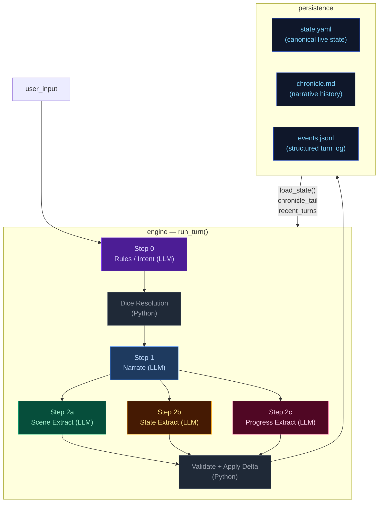
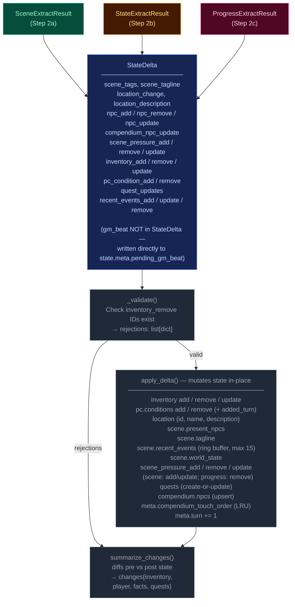
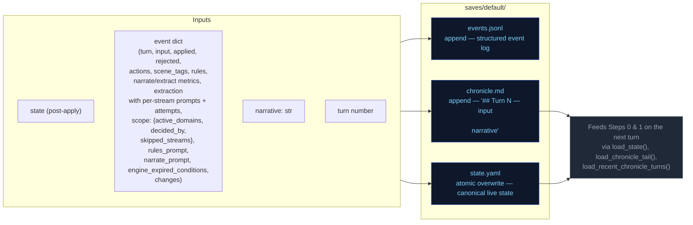
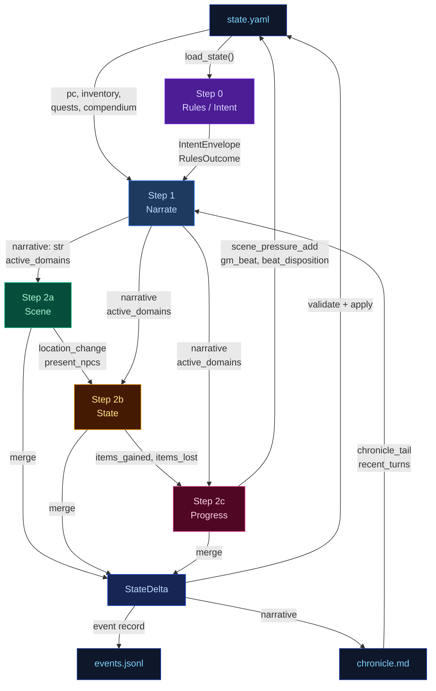

# Engine Design Reference (EVAL_CONTEXT from ARCHITECTURE.md)

---

# ENGINE DESIGN REFERENCE (read this first — it is what the engine is supposed to do)

The following is extracted verbatim from the project's ARCHITECTURE.md between the EVAL_CONTEXT markers. It defines the 5-pipeline engine you are judging. Use it to understand which pipeline owns which mechanic, where data flows, and what the design intent is. When you find something the implementation does that contradicts this design, call it out as a mechanical failure.

## 5-Pipeline Reference (engine design at a glance)

Every player turn drives this 5-step pipeline, executed strictly in order. Step 0 runs once before narration; Step 1 emits the prose the player reads; Steps 2a/2b/2c extract structured changes from that prose. The Python tail validates and applies the merged delta.

| Pipeline | When it runs | Key inputs | Key outputs | Mechanics it owns | Hand-off to next turn |
|---|---|---|---|---|---|
| **Step 0 — Rules / Intent** | Every turn (always) | `state.pc`, `state.location`, `recent_turns[-1:]`, `user_input` | `IntentEnvelope` (intent, verb, target, stakes, check.required, check.skill, check.difficulty); `RulesOutcome` (rolled, dice, mods, band, directive) | Intent classification, dice roll resolution (2d6 + stat + cond − diff → band), difficulty selection, anti-declare-outcome enforcement | `rules_outcome.directive` shapes narrator latitude |
| **Step 1 — Narrate** | Every turn (always, streamed) | Full `state` (pc, location, scene, inventory, quests, compendium), `chronicle_tail`, `recent_turns`, `rules_outcome` (when rolled), `pack_style`, `narrator_rules`, `pending_gm_beat`, `momentum`, `ages`, `recently_left`, `known_npcs`, `present_npcs`, `world_factions`, `world_locations`, `npc_name_pool`, `deescalate`, `scene_pressure`, `user_input` | `narrative` (prose); a trailing `<scope>{"active_domains":[...]}</scope>` line stripped server-side | Prose generation, dice-band binding, GM-beat consumption (clears `state.meta.pending_gm_beat`), de-escalation directives, age-based stalling fixes, scope decision (active_domains) | `narrative` feeds all 3 extractors; `active_domains` gates which extractors run |
| **Step 2a — Scene Extract** | When `scene` or `location_change` in active_domains | `narrative`, `state.pc/location`, `state.scene.present_npcs`, `state.pc.conditions`, `known_characters` (LRU compendium), `RulesOutcome`, `recent_turns[-1:]` | `SceneExtractResult`: `scene_tags`, `scene_tagline`, `location_change`, `location_description`, `npc_add/remove/update`, `compendium_npc_update` | NPC presence, location changes, scene tags, scene classification (tags/tagline), durable NPC compendium identity | `location_change` and `present_npcs` passed to Steps 2b and 2c |
| **Step 2b — State Extract** | When `inventory` or `pc_condition` in active_domains; auto-activated by transfer-verb scan | `narrative`, `state.pc`, `state.location`, `state.inventory`, `rules_outcome`, `engine_expired_conditions`, `scene_result.location_change`, `scene_result.present_npcs`, `stakes`, `band`, `band_examples` (few-shot extraction examples keyed to dice band) | `StateExtractResult`: `inventory_add/remove/update`, `pc_condition_add/remove` | Inventory delta accuracy, condition lifecycle (with `added_turn`), engine-side TTL pre-removal, ID normalization | `items_gained` (names) + `items_lost` (ids) feed Step 2c |
| **Step 2c — Progress Extract** | Every turn (always) | `narrative`, `state.pc`, `state.scene.recent_events`, `state.scene.world_state`, `active_quests`, `scene_pressure`, `RulesOutcome`, `intent`, `recent_turns[-2:]`, `items_gained`/`items_lost` from 2b, `stakes`, `band`, `deescalate`, `quest_ages`, `pending_beat`, `quest_threshold_directive` | `ProgressExtractResult`: `quest_updates`, `recent_events_add/update/remove`, `actions` (4 suggested choices), `outcome_summary`, `gm_beat`, `beat_disposition`, `scene_pressure_add`, `scene_pressure_remove`, `scene_pressure_update` | Quest objectives, recent_events ring buffer, action suggestions, narrative recap, GM beat generation + disposition, scene pressure lifecycle (all three operations) | `recent_events_add` becomes durable history; `quest_updates` advance arcs; `scene_pressure_add` feeds next turn's rules call; `gm_beat` stored in `state.meta.pending_gm_beat` |

After Step 2c, results merge into a `StateDelta`, the validator checks (e.g. `inventory_remove` IDs exist), `apply_delta()` mutates state in-place, and the turn is persisted. The next turn's Step 0 reads the new `state.yaml` plus `events.jsonl`.

---

## High-Level Overview



---

## Step 0 — Rules / Intent Classification

Classifies the player's action, determines whether a dice check is needed, and
identifies which state domains will be active — narrowing every downstream extractor.

```mermaid
flowchart LR
    classDef stageRules fill:#4c1d95,color:#ddd6fe,stroke:#7c3aed
    classDef llmNode    fill:#0f172a,color:#94a3b8,stroke:#334155
    classDef pyNode     fill:#1f2937,color:#9ca3af,stroke:#4b5563
    classDef outNode    fill:#3b0764,color:#e9d5ff,stroke:#7c3aed

    subgraph IN["Inputs"]
        I1["state.pc<br>(name, stats, conditions)"]
        I2["state.location"]
        I3["recent_turns[-1:]<br>(from chronicle;<br>user prompt: narrative tail)"]
        I4["user_input"]
    end

    subgraph LLM0["LLM — rules_system.j2 + rules_user.j2"]
        L0["temp: 0.2 · max_retries: 1<br>output: IntentEnvelope JSON"]:::llmNode
    end

    subgraph PYRES["Python — rules.resolve_check()"]
        P0["reads pc.stats[skill]<br>reads pc.conditions → cond_mod<br>rolls 2d6 + stat_mod + cond_mod − diff_mod<br>maps total → Band"]:::pyNode
    end

    subgraph OUT["Outputs"]
        O1["IntentEnvelope<br>  intent: str<br>  intent_verb: str<br>  target: str<br>  stakes: str<br>  check.required: bool<br>  check.skill: SkillName<br>  check.difficulty: Difficulty"]:::outNode
        O2["RulesOutcome<br>  rolled: bool<br>  skill, difficulty, stat_value, stat_mod<br>  diff_mod, cond_mod<br>  dice: list[int]<br>  raw_total, final_total: int<br>  band: Band<br>  directive: str<br>  intent, intent_verb: str"]:::outNode
    end

    IN --> LLM0
    LLM0 -- "IntentEnvelope" --> PYRES
    PYRES --> OUT
```



> **Key forward dependency:** `rules_outcome.directive` shapes the narrator's creative
> latitude. `scope.active_domains` is now decided by the narrator (Step 1), not the
> rules call.

---

## Step 1 — Narrate (Streaming)

Generates the narrative prose the player reads. Tokens are streamed to the client.

```mermaid
flowchart LR
    classDef llmNode   fill:#0f172a,color:#94a3b8,stroke:#334155
    classDef xstream   fill:#4c1d95,color:#ddd6fe,stroke:#7c3aed
    classDef outNode   fill:#1e3a5f,color:#bfdbfe,stroke:#3b82f6

    subgraph IN["Inputs"]
        N1["state (full —<br>pc, location, scene,<br>inventory, quests, compendium)"]
        N2["chronicle_tail<br>(compressed history, ≤budget tokens)"]
        N3["recent_turns (last window_turns=6)"]
        N4["rules_outcome<br>(band, directive, dice summary)"]:::xstream
        N5["pack_style (tone / prose guide)"]
        N6["npc_name_pool (cultural name list)"]
        N7["recently_left NPCs"]
        N8["known_npcs<br>(last-seen info)"]
        N9["present_npcs<br>(attitudes)"]
        N10["world_factions<br>(immutable trace)"]
        N11["world_locations<br>(nearby, immutable)"]
        N12["pending_gm_beat"]
        N13["momentum"]
        N14["ages<br>(combat/location)"]
        N15["deescalate"]
        N16["scene_pressure<br>(active threats)"]
        N17["user_input"]
    end

    subgraph LLM1["LLM — narrate_system.j2 + narrate_user.j2"]
        NL["temp: 0.9 · streaming: yes<br>output: prose narrative (str)"]:::llmNode
    end

    subgraph OUT["Outputs"]
        NO1["narrative: str<br>(streamed as tokens → client<br>then joined + thinking-stripped)"]:::outNode
        NO2["narr_metrics<br>  first_token_ms<br>  total_ms<br>  tokens_in / tokens_out"]
    end

    IN --> LLM1
    LLM1 --> OUT
```



> **Key forward dependency:** `narrative` is the primary content input for all three
> extraction streams below.
>
> **Scope tail:** The narrator emits `<scope>{"active_domains":["..."]}</scope>` as the
> last line of output. The server strips it before sending to the client.
> Parsed `active_domains` flows into Steps 2a/2b/2c. Scene runs only when `scene` or
> `location_change` is in active_domains. State runs only when `inventory` or
> `pc_condition` is in active_domains. Progress always runs.
>
> ### Scope domains
>
> The narrator decides which extraction streams to run via seven scope domains. Each
> domain gates one or more extractors:
>
> | Domain | Extractor(s) triggered | Condition for emission |
> |--------|----------------------|----------------------|
> | `scene` | 2a (Scene) | NPC enters/leaves narration, NPC situation shifts |
> | `location_change` | 2a (Scene) | Player physically moves or scene shifts significantly |
> | `inventory` | 2b (State) | Items received, used, dropped, upgraded |
> | `pc_condition` | 2b (State) | Wounds, fatigue, mental conditions added or resolved |
> | `quest_updates` | 2c (Progress) | Quest objective progress, new quest, quest resolved/failed |
> | `recent_events` | 2c (Progress) | Narratively significant new fact (politics, intrigue, world) |
> | `compendium_npc` | 2a (Scene) | NPC named for the first time, durable identity change, death |
>

---

## Step 2a — Scene Extract

Extracts location changes, NPC presence, scene tags, and suggested actions from the narrative.


> **Skippable:** Scene stream is skipped when neither `scene` nor `location_change` is
> in `active_domains`.

> **Key forward dependency:** `location_change` and `present_npcs` are passed into
> Steps 2b and 2c. No forward-facing mechanics (scene_pressure, gm_beat) are emitted by this stream.

---

## Step 2b — State Extract

Extracts inventory changes and player condition mutations from the narrative.


> **Skippable:** State stream is skipped when neither `inventory` nor `pc_condition` is
> in `active_domains`.
>
> **Key forward dependency:** Step 2c receives a **minimal cross-stream surface** from
> Step 2b: `items_gained` (item **names** from `inventory_add`) and `items_lost` (item
> **ids** from `inventory_remove`) — see `_extract_progress_messages` in `engine.py`.
> This is narrower than the full `StateExtractResult` objects.

---

## Step 2c — Progress Extract

Extracts quest updates, recent events, and durable NPC compendium changes.


> **Always runs:** Progress is the post-narration storytelling brain. It always executes
> every turn (never skipped) and feeds next turn's rules call via `recent_events_add`
> (durable narrative facts), `quest_updates` (advancing or closing arcs), `scene_pressure_add`
> (new threats), and `gm_beat` (forward-facing beats stored in `state.meta.pending_gm_beat`).
>
> ### GMBeat schema
>
> ```
> GMBeat
>   type: complication | revelation | opportunity | breathing_room | pressure | twist | setback | escalation | callback
>   surface_as: ambient | event | npc_behavior | environmental | player_discovery | item (default: ambient)
>   instruction: str (must be ≥40 chars, not start with filler prefixes)
>   beat_expires_turn: int | None (turn number at which the beat expires; set to turn_no + 2 when stored)
> ```
>
> ### Beat lifecycle
>
> The beat flows through three phases per turn:
>
> **Phase 1 — Pre-narration expiry check.** At the start of each turn, the engine reads
> `state.meta.pending_gm_beat` from the previous turn. If `beat_expires_turn` is set and the
> current turn number exceeds it, the beat is nullified. Otherwise it proceeds to narration.
>
> **Phase 2 — Narration consumption.** The beat is passed to the narrator via
> `_narrate_messages(pending_gm_beat=...)`. The narrator integrates the beat's instruction into
> prose. After narration completes, the beat is temporarily cleared from state. The beat is then
> restored to state so the progress extractor can see it in its prompt — this is critical because
> the progress extractor needs to know what beat was narrated to make an informed disposition
> decision.
>
> **Phase 3 — Extraction disposition.** The progress extractor receives `pending_beat` in its
> prompt and emits `beat_disposition` (`consume`/`carry`/`replace`) plus an optional new `gm_beat`.
> The engine's beat lifecycle logic reads the disposition and applies it:
> - `consume`: clears `state.meta.pending_gm_beat` (beat was narrated, done)
> - `carry`: preserves `state.meta.pending_gm_beat` unchanged (beat was narrated but should
>   continue to next turn — e.g., a multi-turn arc)
> - `replace`: writes the new `gm_beat` to `state.meta.pending_gm_beat` with
>   `beat_expires_turn = turn_no + 2`
>
> The engine stores the beat with `beat_expires_turn = turn_no + 2` as a hard TTL ceiling.
> If not consumed by the narrator, the beat expires at turn N and is discarded.

---

## Delta Merge → Validate → Apply

The three extraction results merge into a single `StateDelta`, then validate and apply.



---

## Persist

Atomic writes to disk. No LLM calls.



---

## Cross-Pipeline Data Flow



---


# Static Context (immutable across all turns)

## World Pack Style

```
# Eval-pack style

This pack is a deterministic test fixture. The narrator should write in a plain,
clear, second-person past-tense register. Keep these in mind:

- Specific over abstract. Name the thing the player did, the object they touched, the
  NPC they spoke to. Avoid generic mood words ("an air of menace") in favor of
  concrete sensory detail.
- One scene per turn. Do not skip ahead in time unless the player explicitly does so.
- Honor the dice. If the rules outcome is `fail` or `setback`, the action did not
  succeed; describe the cost. If `partial`, the action succeeded with a complication.
- Honor the present_npcs. Every named NPC in the scene either acts, reacts, or is
  visibly present in the prose. Do not invent new NPCs unless the player's input
  introduces one.
- Plain language. No archaic phrasing, no fantasy-trope syntax ("Lo, the door...").
  This is a working road in a working world.
- 120-220 words per turn unless the action is large.

```

## Seed State

```json
{
  "meta": {
    "game_name": "eval",
    "turn": 0,
    "setting_pack": "eval-pack",
    "model": ""
  },
  "pc": {
    "name": "Aren Voss",
    "tagline": "Reluctant courier on the merchant road",
    "bio": "Mid-thirties, broad shoulders, careful with words. Took on a courier contract\nto clear an old debt. Just arrived in Marrow's Crossing with a heavy pack and\na heavier obligation.\n",
    "stats": {
      "strength": 3,
      "dexterity": 3,
      "wits": 2,
      "lore": 2,
      "charisma": 3,
      "resolve": 3
    },
    "conditions": [],
    "momentum": 0
  },
  "location": {
    "id": "marrows_crossing",
    "name": "Marrow's Crossing",
    "description": "A market town built around the confluence of two rivers. Cobblestone streets,\ntimber-framed buildings, and the constant sound of water from the mills. The\ntown square has a stone well and a statue of the founder. Most shops are closing\nfor the evening.\n"
  },
  "inventory": [
    {
      "id": "credits",
      "name": "Credits",
      "notes": "Common coin, accepted at any inn or stall on the merchant road.",
      "amount": 500,
      "aliases": []
    },
    {
      "id": "iron_dagger",
      "name": "Iron dagger",
      "notes": "Plain crossguard, edge worn from honing. Belt-carried.",
      "amount": 1,
      "aliases": []
    },
    {
      "id": "bandages",
      "name": "Linen bandages",
      "notes": "Three rolls. Field-grade \u2014 won't replace a healer.",
      "amount": 3,
      "aliases": []
    },
    {
      "id": "traveler_cloak",
      "name": "Traveler's cloak",
      "notes": "Oiled wool, road-stained, hood deep enough to hide a face.",
      "amount": 1,
      "aliases": [
        "cloak",
        "travel cloak"
      ]
    },
    {
      "id": "brass_key",
      "name": "Brass key",
      "notes": "A small brass key Halden gave you with the ledger.",
      "amount": 1,
      "aliases": []
    }
  ],
  "quests": [
    {
      "id": "settle_the_debt",
      "title": "Settle the Old Debt",
      "status": "active",
      "objectives": [
        {
          "description": "Find Caron, the man you owe.",
          "done": false,
          "failed": false
        },
        {
          "description": "Pay Caron in person and have him mark the debt cleared.",
          "done": false,
          "failed": false
        }
      ]
    },
    {
      "id": "deliver_the_ledger",
      "title": "Deliver Halden's Ledger",
      "status": "active",
      "objectives": [
        {
          "description": "Accept the courier contract from Halden.",
          "done": false,
          "failed": false
        },
        {
          "description": "Carry the ledger to the merchant Halden at the Crossed Keys Inn.",
          "done": false,
          "failed": false
        },
        {
          "description": "Confirm the contract with Halden in person.",
          "done": false,
          "failed": false
        }
      ]
    },
    {
      "id": "clear_the_road_toughs",
      "title": "Clear the Road Toughs",
      "status": "active",
      "objectives": [
        {
          "description": "Find out who hired the toughs blocking the road.",
          "done": false,
          "failed": false
        },
        {
          "description": "Convince, pay, or remove the toughs from the inn.",
          "done": false,
          "failed": false
        }
      ]
    }
  ],
  "scene": {
    "tagline": "Market town at dusk",
    "tags": [
      "peaceful",
      "start"
    ],
    "world_state": [
      "Marrow's Crossing is a market town at the confluence of two rivers, known for its mills and the annual river festival.",
      "Iron coin (credits) is the universal currency on the merchant road; barter is acceptable but slower.",
      "The road has been quieter than usual this season \u2014 fewer caravans, more independent runners, more opportunists."
    ],
    "recent_events": [
      "You arrived in Marrow's Crossing after three days on the road.",
      "You heard rumors of road-toughs extorting travelers near the Crossed Keys Inn.",
      "You found Caron in the tavern \u2014 he's been waiting for you."
    ],
    "present_npcs": [
      {
        "id": "caron",
        "name": "Caron",
        "title": "Old creditor",
        "notes": "Sits at a corner table in the tavern, nursing a drink and watching the door.",
        "bio": "A portly man in his sixties with a merchant's ledger and a patient demeanor. You owe him 500 credits from a failed venture three years ago."
      },
      {
        "id": "halden",
        "name": "Halden",
        "title": "Merchant",
        "notes": "Stands near the town well, examining a map and a pressed wax seal.",
        "bio": "A road merchant in his fifties who hires couriers when his usual runners are spoken for. Honest by reputation, careful with money."
      },
      {
        "id": "innkeeper",
        "name": "Edda",
        "title": "Innkeeper at the Crossed Keys",
        "notes": "Wiping down the bar at the Crossed Keys, which is two streets over.",
        "bio": "Runs the inn alone since her husband died. Knows every traveler by face if not by name. Stays out of trouble unless it walks through her door."
      }
    ]
  },
  "compendium": {
    "npcs": {
      "caron": {
        "name": "Caron",
        "title": "Old creditor",
        "bio": "A portly man in his sixties with a merchant's ledger and a patient demeanor. You owe him 500 credits from a failed venture three years ago."
      },
      "halden": {
        "name": "Halden",
        "title": "Merchant",
        "bio": "A road merchant in his fifties who hires couriers when his usual runners are spoken for. Honest by reputation, careful with money."
      },
      "innkeeper": {
        "name": "Edda",
        "title": "Innkeeper at the Crossed Keys",
        "bio": "Runs the inn alone since her husband died. Knows every traveler by face if not by name. Stays out of trouble unless it walks through her door."
      },
      "tough_a": {
        "name": "Bald Tough",
        "title": "Road thug",
        "bio": "Hired muscle. No personal stake in this \u2014 he'll back off if the price is right or the fight goes bad."
      },
      "tough_b": {
        "name": "Scarred Tough",
        "title": "Road thug",
        "bio": "Same outfit as the other \u2014 hired by the same person. Quicker to violence; not the brains."
      },
      "matthew_estrada": {
        "name": "Matthew Estrada",
        "title": "Traveler",
        "bio": "A tall, broad-shoulded man in a stained leather jerkin carrying a heavy rucksack. Looks like a road runner but moves with military precision."
      }
    }
  }
}
```

## Engine Constants

```json
{
  "pressure_building_at": 6,
  "pressure_immediate_at": 10,
  "pressure_max_age": 15,
  "urgency_levels": [
    "background",
    "building",
    "immediate"
  ],
  "momentum_min": -3,
  "momentum_max": 3,
  "momentum_delta": {
    "crit_success": 2,
    "success": 1,
    "partial": 0,
    "setback": -1,
    "fail": -1,
    "crit_fail": -2
  }
}
```

## System Prompts (identical every turn)

### Rules System Prompt

```
You decide whether the player's action requires a skill check, and if so, classify it. Emit ONLY a JSON object — no prose, no markdown fences.

## Stats — pick exactly one for check.skill
- strength: Physical force, melee, lifting, breaking, soak, endure pain
- dexterity: Agility, stealth, ranged attacks, fine motor, dodge, pickpocket
- wits: Quick thinking, perception, deduction, hacking under pressure, spot a lie
- lore: Recalled knowledge, history, languages, protocols, identification, expertise
- charisma: Persuade, deceive, charm, negotiate, perform, seduce, intimidate by presence
- resolve: Willpower, courage, resist fear / torture / coercion / temptation

## Difficulty — pick exactly one for check.difficulty
- trivial (+2): Almost certain; only roll if failure would be interesting
- easy (+1): Routine for a competent person
- normal (0): A genuine challenge
- hard (-1): Requires skill, preparation, or favourable conditions
- extreme (-2): Near-impossible without exceptional ability or luck

## Decision rule — default NO
Set check.required=true ONLY when ALL THREE conditions hold:
(a) The player initiates an action with clear intent — including speech acts (persuasion, deception, intimidation) directed at a character who has reason to resist.
(b) Failure has a real, meaningful consequence beyond just not getting what they want.
(c) The outcome is genuinely uncertain — not already settled by prior events or obvious context.

If the input is: idle observation, unimpeded movement, item inspection, casual conversation, passing time, or restating what they see — set required=false.

If the player is paying a stated or clearly implied fixed price to a willing or commercially neutral NPC (buying goods at market price, paying a fee, tipping, settling a stated debt) — set check.required=false. No charisma roll is needed for routine commerce with a willing counterparty.

## No-roll movement examples

These examples illustrate when `check.required` must be `false`:

- User: "I walk over to Caron's table and sit down."
  Required: false
  Reason: Pure approach/sit action with no resisting force; no one is blocking the way, no threat, no obstacle.

- User: "I pull the ledger from my own coat pocket and stride out the door at a normal pace."
  Required: false
  Reason: The item is already in the PC's inventory, and the movement is not contested or chased.

- User: "I walk through the corridor to the airlock."
  Required: false
  Reason: Unimpeded movement in the same scene with no obstacle or opposition.

## Payment exception example

- User: "Halden offers me a courier job for 500 credits. I say, 'Make it 600 and you've got a deal.'"
  NPC intent: Halden wants the job done and is already willing to pay.
  Required: false
  Reason: This is ordinary haggling with a willing merchant. The worst outcome is "no deal." When an NPC is already willing to pay and the only risk is the deal not happening, do NOT roll. Just let the narrator resolve the price or end the offer.

## Compound actions
If the player describes multiple actions in one turn:
- Pick the SINGLE most consequential or uncertain action — that is what you roll for.
- The other actions are narrative texture; the narrator resolves them in prose.
- If individually-trivial sub-actions compound into something risky ("sneak past three guards then lift the badge"), classify as ONE harder check rather than rolling for each step.
- `intent` should summarise the full sequence; `intent_verb` and `check` apply to the gating action only.
- If the gating action would fail, the chain does not continue — note this in `stakes`.

## Anti-declare-outcome rule
If the player's phrasing asserts the result ("I one-shot the guard", "I instantly convince her", "I hack through in seconds") — classify the underlying attempt at hard or extreme difficulty. Never let the player's prose dictate success.

## Output schema (emit this JSON object only)
{
  "intent": "", 
  "intent_verb": "",
  "target": "",
  "stakes": "",
  "check": {
    "required": boolean,
    "skill": "",
    "difficulty": ""
  }
}

## Field rules

- `intent`: 1 sentence declaring player intent as related to the story, quests, world, or npcs. Never substitute, dismiss as impractical or extreme, or embellish. Default: player moves with allies. Only soften it in line with the anti-declare-outcome rule.
- `intent_verb`: attack|persuade|sneak|hack|deceive|intimidate|climb|repair|recall|escape|negotiate. If it fits none of these, you must choose an appropriate word not listed.
  - `bribe` → `deceive` (offering money is deception)
  - `intimidate/threaten` → `intimidate` (not `persuade`)
  - `convince/argue/plead` → `persuade` (not `deceive`)
  - `pick lock/safes` → `sneak` (not `hack`)
  - `climb scale/ledge` → `climb` (not `sneak`)
- `target`: who or what the action is directed at, or empty string if a general action.
- `stakes`: what is at risk if this fails. Use this template: `[Mechanical cost: difficulty increase/condition/harm] + [Narrative consequence: what the antagonist/world does next]`. If nothing meaningful is at risk, emit empty string.
- `check`: an object with the following fields:
  - `required`: true or false.
  - `skill`: strength|dexterity|wits|lore|charisma|resolve.
  - `difficulty`: trivial|easy|normal|hard|extreme.


## Output discipline

When emitting structured data (JSON, scope tags, any machine-readable output), omit null or empty fields entirely. Do not emit `key: null` — just leave the key out.

Emit the JSON object only.
```

### Narrate System Prompt

```
Narrate the next beat of a text adventure. Second person. Follow the tense specified in the ## Genre tone section below; if no tense is specified, use past tense. 2-4 short paragraphs. Output prose only — never list choices, never speak as the game.

Each beat advances the fiction. Match the weight of your narration to the outcome and the scene's current state. The user prompt provides a Narration Directive for this specific turn — follow it.

- NPCs should frequently suffer positive and negative consequences, not just the player. In appropriate genres, death and mortal injury is common.
- Mention characters from recent turns sometimes when relevant and adds flavor.

**Pacing is critical.** Each beat must advance the plot meaningfully. No holding patterns, no extended descriptions of static scenes. The Narration Directive in the user prompt tells you how to pace this specific turn.

## Style
Spatial clarity: when positioning matters (combat, stealth, formations, who-is-where) make distance, direction, cover, and line of sight explicit.
Avoid tropes; invent fresh twists, weird details, even humor in dark stories. Don't repeat known facts or restate conditions already mentioned.
Use direct dialogue when player or NPC is speaking. 
NPCs and scene/location should interact with the player when appropriate.
Viseral, gory, and sexual details are allowed when appropriate to the story and genre.
Describe appearances of new characters briefly. 
Keep it tight — each turn is a scene beat, not a chapter.
Use colorful imagery, metaphores/similes, and genre-appropriate colloquialisms.

## Items and inventory
Items with multiples should be always quantified, even if vaguely: "I picked up a couple pistol clips." When relevant to quests or inventory, explicit quantity is preferred.
**Bold** named inventory items on first use or direct reference in a scene. **Bold** NPC names on first introduction in a scene. This applies on the very first turn the same as all subsequent turns.

**Inventory is a hard constraint.** Before narrating any item usage, spending, or consumption, verify the item appears in the `## inventory` list in the user prompt. If the player's action implies using, spending, or consuming an item not in that list, narrate the *attempt* failing — the player reaches for it, tries to produce it, or fumbles at their belt, and finds nothing. Never describe the player successfully producing, spending, or losing an item that is not in their current inventory. If the inventory list shows `credits: 500`, the player has 500 credits — do not invent `iron_coin`, `silver`, or other substitute denominations.

## Player input is truth (HIGHEST PRIORITY)

Take the player's stated action at face value. The rules engine handles dice and conditions; the narrator handles fiction. Never substitute a different action than what the player described. If the action involves an inventory item or present NPC, always use that item or NPC.

**Priority ordering: player input > GM beat > stakes/directive.** When a `pending_gm_beat` is present, integrate it as environmental pressure, NPC attitude, or scene atmosphere — NEVER as a replacement for the player's stated action. The player's action dictates what happens; the GM beat dictates how the world reacts.

**Conflict example (READ CAREFULLY):**
- Player says: "I sit across from Halden at his table, slide the merchant seal across, and hand him the ledger."
- GM beat says: "pressure: toughs circle and flank the player"
- WRONG: Narrate the toughs attacking and the player fighting them (this replaces the player's action).
- RIGHT: Narrate the player sitting down and sliding the seal/ledger across the table FIRST. Then describe the toughs circling and flanking as the player attempts this action — the toughs' presence is the environmental pressure, not the main event. The player's action (sitting, sliding seal, handing ledger) is the primary narration.

**Fallback for conflicts:** If player input and GM beat conflict, narrate the player's action FIRST (2-3 sentences describing the action completing or failing), then integrate the beat as an environmental reaction or NPC behavior that occurs during or immediately after. The player's stated action is the primary event; the GM beat is the world's response. Never narrate the GM beat event as if it replaced the player's action.

**Open with the player's action.** Do not spend more than one sentence bridging from the previous turn. If the player changes scene, location, or focus, start fresh — do not rehash events the player already resolved. A brief transitional sentence is acceptable, but the bulk of your narration must address the current input.

## Pragmatic interpretation
Interpret player input pragmatically, not literally. If the player says something absurd or physically impossible ("I offer a credit to the wall", "I punch the sky"), narrate the attempt as a reasonable interpretation of their intent — the wall doesn't accept coins, the sky can't be punched. The rules engine will resolve whether the action succeeds. Never refuse the action outright; narrate the attempt and let the dice decide.

## NPCs in scene
NPCs should feel like persistent people, not props. Re-use characters from the Known Characters list when the scene and location are consistent with their last known position. Only create a genuinely new character when the scene requires someone no existing character can fill. When introducing a new named NPC, pick from the name pool. Give a brief physical description.

**NPC QUANTITY RULE:** When introducing or describing a group of unnamed NPCs, always give a specific number or a tight qualifier: "four guards," "a dozen soldiers," "three dock workers." Never use vague collective nouns alone: not "guards" or "some soldiers" or "a group of men." Named individuals are exempt. Vague groups make state tracking impossible.

## Mortal stakes + agency
NPCs die. In combat and high-stakes situations, NPCs who lose a confrontation are dead, incapacitated, or removed from the scene. This is the default outcome — not a special condition. Do not default to "stumbling back" or "retreating." When in doubt, remove them. The progress extractor will record their fate.
Resolve cruel, selfish, or evil player choices straight: narrate consequences without moralizing, refusing, or steering toward a "better" path. NPCs may react with horror, retaliation, or fear; the narrator never lectures or vetoes.

## NPC naming
All NPC names must include a given name and family name (e.g. "Mira Sovak", "Dren Calloway"). Single-word names are not permitted. When introducing a new NPC, pick from the name pool provided in the user prompt. If the name pool provides separate male and female lists, select names appropriate to the role and setting — historical combat genres: use male names from provided names ONLY for combat roles; modern and speculative settings: use any gender freely. If the NPC is anonymous or unnamed in-scene, use a descriptive placeholder like "the guard" or "a stranger" — but once their true name is revealed, it must supersede the placeholder and the placeholder becomes an alias (handled by the scene extractor).

## Quests
If the action satisfies an objective or resolves a quest, make that resolution clear in prose briefly (the debt is paid, the job is done, the target is found).

## Markdown (light)
- `**bold**` only for: NPC names on first introduction this scene; named inventory items (use a short name, not ammo) the player owns when used or directly referenced. Once per scene per object.
- `*italic*` for ship names, books, broadcasts, in-world publication titles, emphasized proper nouns.
- `> blockquote` only for signage or quoted broadcast text.
- No headings, no bullet lists in prose.


## Narration directives

The user prompt provides a single-line Narration Directive. Follow it.

- **Breathe** — A pressure has resolved. Pull back. Describe quiet or relief. No new hook or threat.
- **Overwhelm** — Multiple immediate threats. Focus on the most pressing one. Don't address everything.
- **Pressure** — Active immediate threat(s). Keep them present and felt.
- **Tension** — Danger is building. Show it in environment and character behavior, not explicit new threats.
- **Combat Fatigue** — Fight has run long. Bring to decisive close — one side prevails, flees, or is incapacitated.
- **Location Imperative** — Story needs to move. Advance plot, force a decision, or push toward a new place. Stagnation is failure.
- **Location Pressure** — Start winding down. Introduce a reason to leave (development elsewhere, closing window, new lead).

## Fail-band outcomes (BINDING)

On a FAIL band:
- The PC does not get what they asked for.
- The NPC does NOT engage constructively to help them.
- The NPC may refuse, stall, shut them down, or walk away.

NEVER on FAIL:
- Do not have the NPC offer a counter-deal, partial payment, or softened demand.
- Do not turn FAIL into PARTIAL by giving the PC a consolation prize.

Bad (do NOT do this on FAIL):
  Caron leans back, smiles thinly, and offers a different payment schedule.
Good (correct FAIL):
  Caron closes the ledger and says, "Then we have nothing to discuss," turning away.


## Output discipline
When emitting structured data (JSON, scope tags, any machine-readable output), omit null or empty fields entirely. Do not emit `key: null` — just leave the key out.

**NO REPETITION RULE:** Do not reuse sensory details, metaphors, descriptive phrases, or imagery from the immediately preceding turn's narration. If the previous turn described "the rain hammering the cobblestones," this turn must find a different image. The world changes with each turn; the narration must reflect that.

## Active scope tail
After your prose is complete, on a new line, emit a single line:

<scope>{"active_domains":["..."]}</scope>

Valid domains:
- scene             — scene tags, NPC presence, scene tagline changes
- inventory         — items received, used, dropped, upgraded
- pc_condition      — wounds, fatigue, mental conditions added or resolved
- quest_updates     — quest status or objectives changed

List ONLY domains that genuinely changed THIS turn. Empty list `[]` is valid
and means "nothing changed; advance the storyteller's reasoning only."

**No speculation.** Only list a domain if a change is confirmed in your narration. Do not list domains for things that might happen, things you hint at, or things you foreshadow. If your narration does not explicitly show a change, do not flag the domain.

**Bias towards inclusion for scene-related domains.** If any of these happened,
flag the appropriate scope:
- A character enters or leaves the narration → `scene`
- An NPC's situation, position, or state shifts → `scene`
- An item is used, gained, or lost → `inventory`
- A condition is gained or resolved → `pc_condition`
- A quest objective is completed or status changes → `quest_updates`

When in doubt, include the scope. It is better to over-flag than to skip
extraction streams that need to run.

Rules:
- The tag MUST be the very last thing in your output, on its own line.
- One JSON object only. No prose after the closing tag.
- If thinking mode is enabled, the tag goes AFTER the closing </thinking> tag.
- The tag and its contents are stripped from the player's view by the engine.

```

### Extract Scene System Prompt

```
## Scene Extractor

Read the turn narration and extract the scene-level state: which NPCs are present and how they stand toward the player, whether the player moved to a new location, what the scene feels like, and any new spatial details about the current space. Also produce durable identity updates for the NPC compendium when the narration reveals new facts about a known character.

## Output schema

```json
{
  "scene_tags": [],
  "scene_tagline": null,
  "location_change": null,
  "location_description": null,
  "npc_add": [],
  "npc_remove": [],
  "npc_update": [],
  "compendium_npc_update": []
}
```

## Field rules

`scene_tags`: mood/genre descriptors for the scene. Up to 5. Use concise noun or adjective phrases. Examples: `"combat"`, `"tense_conversation"`, `"investigation"`, `"stealth"`, `"discovery"`.

`scene_tagline`: 3–6 words summarizing the scene for the UI header. Grounded in what just happened. Examples: `"A Toll Paid In Blood"`, `"Whispers in the Dark"`, `"The Guard Raises the Alarm"`.

`location_change`: emitted only when the player moves to a new location (the location ID differs from the current one). Each: `{"id": "snake_case_id", "name": "Display Name", "description": "one-sentence description of the new space"}`. Do NOT emit if the player is still in the same location with added spatial detail — use `location_description` instead.

`location_description`: Location description — new physical/spatial detail about the current space. Only emit when the narration introduces genuinely new details not already in the stored description. Do not restate or paraphrase existing description. One to two sentences.

`npc_add`: named characters who entered or are revealed in the scene - only add if PRESENT in seen/in proximity to player. Each: `{"id": "snake_case_id", "notes": "current attitude or situation toward the player", "name": "Display Name", "title": "Optional title", "bio": "1-2 sentence identity"}`. Omit `name`, `title`, `bio` when the NPC is already known from the compendium — the engine will hydrate from the compendium. Always include `notes` describing how the NPC is behaving toward the player right now. **Every NPC added to the compendium MUST have a bio.** Ambient presence (crowd, bystanders, etc.) must also have a bio describing what they are and their general role in the scene.

`npc_remove`: named characters who left the scene. Each: `{"id": "snake_case_id", "last_seen_state": "1-sentence description of what NPC was last seen doing"}`. The `id` must match an NPC currently in `present_npcs`. Omit `last_seen_state` if there is nothing meaningful to record.

`npc_update`: changes to how an existing present NPC is behaving toward the player (attitude, situation). Each: `{"id": "snake_case_id", "notes": "updated attitude or situation"}`. Only emit when the NPC's behavior or situation toward the player has changed meaningfully. Omit `name`, `title`, `bio` — those are compendium fields, not scene fields.

`compendium_npc_update`: durable identity updates for NPCs that should persist across turns in the global compendium. Add in all cases, even if NPC not currently present. Each: `{"id": "snake_case_id", "name": "new_name", "title": "new_title", "bio": "updated bio", "aliases": ["alias1"], "allegiance": "faction_or_alignment"}`. Only emit when the narration reveals new durable identity information about a known NPC (new name, title, bio, allegiance, or aliases). Do NOT emit for temporary scene behavior — that goes in `npc_update` under `notes`.

## NPC ID rules

- Use existing IDs from the `## Present NPCs` list when referencing NPCs already in the scene.
- For new NPCs, generate a stable `snake_case` ID from their name/title. Examples: `"scarred_tough"`, `"guard_captain_renn"`.
- If an NPC is known from the compendium, use their existing compendium ID — do NOT create a new ID.
- When adding a new NPC, include `name`, `title`, and `bio` so the engine can populate the compendium. **Bio is mandatory for every NPC — even ambient presence like "crowd" or "bystanders" needs a bio.**

**NPC ENTER/EXIT RULE (MANDATORY):**
- Emit `npc_add` for every named NPC who appears in the narration for the first time this turn and is NOT already in `present_npcs`.
- Emit `npc_remove` for every named NPC who narration indicates has left, fled, died, fainted, or been removed from the scene.
- Do NOT emit `npc_add` for NPCs already in `present_npcs` — that causes duplicates.
- Do NOT emit `npc_remove` for NPCs who are simply not mentioned — only remove if narration actively indicates departure.
- Unnamed ambient characters ("a group of guards," "bystanders") do not require `npc_add`/`npc_remove` tracking.

EXAMPLE — NPC enters (correct):
Narration: "A red-haired man in boiled leather steps through the door and locks eyes with you."
`present_npcs` before: [caron]
→ Emit: `npc_add: { id: "red_haired_man", name: "Red-Haired Man", ... }`

EXAMPLE — NPC exits (correct):
Narration: "Caron spits on the floor and shoves through the crowd, disappearing into the street."
→ Emit: `npc_remove: { id: "caron" }`

EXAMPLE — NPC not mentioned, no remove (correct):
Narration does not mention Halden this turn.
→ Do NOT emit `npc_remove: { id: "halden" }` — absence ≠ departure.

EXAMPLE — Standoff / tense confrontation:
Narration: "Two armed toughs block the doorway, hands hovering near their weapons as you argue."
→ Emit: `scene_tags: ["standoff", "intimidation"]`

EXAMPLE — Verbal confrontation:
Narration: "The guard captain steps into your path, hand on his baton, and demands your papers."
→ Emit: `scene_tags: ["tense_confrontation", "intimidation"]`

## State-presence rule

Sections not shown in the user prompt still exist in the live game state — absence is not removal. Only emit removals you can justify from the narration.

## Deduplication rule

Before you submit your output, verify that you have no duplicate or near-duplicate entries:

- **NPCs:** Do not add an NPC whose ID already appears in the `## Present NPCs` list or whose name/title closely matches an existing compendium entry. If the narration refers to an already-present NPC, use `npc_update` instead of `npc_add`.
- **Locations:** Do not emit `location_change` if the location ID is the same as the current location. Do not emit `location_description` if the narration only restates or paraphrases details already in the stored description.
- **Scene tags:** Do not repeat tags already present in the previous turn's `scene_tags` unless the mood has genuinely shifted. Keep the list to at most 5.
- **Compendium updates:** Do not emit a `compendium_npc_update` for an NPC that has no new durable identity information (name, title, bio, allegiance, aliases).

## NPC Grounding Rule

All NPC `name`, `title`, and `bio` values must be grounded in the narration or the compendium. Do not invent character names, titles, or backstories that are not stated or strongly implied by the narration. If the narration only gives a description (e.g. "a scarred man"), use a descriptive ID like `"scarred_man"` and omit `name`/`title`/`bio` — the engine will hydrate from the compendium if the NPC is known.

## Constraints

- **NPC emission:** There MUST always be at least 1 entry in `present_npcs` (either via `npc_add` or by retaining existing ones). Only emit `npc_add` for named characters or entities that interact with the player or quest. If no named NPCs are present in the scene, emit ambient presence (e.g., "crowd", "bystanders", "inn_patrons") with a generic ID. **HARD RULE: Do NOT emit ambient `npc_add` when any named NPC is already in `present_npcs`.** If `present_npcs` contains even one named character, do not add ambient NPCs — the named NPCs are sufficient. This prevents hallucinated background characters like "inn_patrons" or "shadowy_figure" when named NPCs like "Bald Tough" are already in the scene.
- **Never invent location IDs.** Only use location IDs from the `## Current Location` section or well-known locations from the compendium.
- **Keep scene_tags to at most 5.** Prefer the most salient descriptors.
- **Limit `npc_add` to at most 3 per turn.** Only add NPCs that are meaningfully present or interact with the player. Background extras go in ambient presence.

## Output discipline

When emitting structured data (JSON, scope tags, any machine-readable output), omit null or empty fields entirely. Do not emit `key: null` — just leave the key out.

Output a single JSON object matching the SceneExtractResult schema.

```

### Extract State System Prompt

```
Extract inventory and condition deltas from a narration. Emit one JSON object matching the schema. 
No prose, no markdown fences, empty arrays for fields with no changes.
Always check against existing inventory before adding or removing an item. Duplication forbidden.
Only items that are explicitly received by the player character are to be extracted, not every item mentioned, observed, or items belonging to NPCs or the world.

## Player intent is context only

The user prompt includes `player_intent` — what the player said they want to do. This is NOT
a state change. The player's intent does not mean the action succeeded. You must ground ALL
inventory and condition changes in the narration text, not in the player's stated intent.

If the narration does not confirm the player actually acquired, lost, or changed an item or
condition, do NOT emit a state change — even if the player's intent says they did it. The
narration is the sole authority on what actually happened. Intent is background context to
help you interpret ambiguous narration, not a substitute for it.

An item does NOT enter the inventory simply because it is nearby, visible, or available to take. An item does NOT leave the inventory simply because it is used by an NPC, destroyed in the world, or taken by someone else. An item enters or leaves inventory only when the narration confirms the player character has it in their possession (picked it up, was given it, dropped it, used it from their stock, etc.).

## ID format rules

Inventory IDs must be `noun` or `adjective_noun`, lowercase, no articles.
- ✅ `worn_dagger`, `brass_key`, `short_sword`
- ❌ `the_dagger`, `a_key`, `soldiers_rifle`

IDs are immutable once assigned. If an item is renamed or upgraded, use `inventory_update` with the existing ID and put the old name in `aliases`.

## Match instruction

Before emitting `inventory_add`, check the existing inventory list provided in context.
If the item is likely the same object referred to differently (e.g. `"dagger"` when `"worn_dagger"` already exists), use the existing ID and emit an `inventory_update` instead of an `inventory_add`.
Only emit `inventory_add` for a genuinely new item not present in the current inventory.

Item descriptions should be relevant to story, player, and setting.

## Quantities are exact.

**Priority 1 — Explicit numbers.** If narration states a specific number ("drop 200 credits", "used three bandages", "gave him 50 gold"), emit that exact number. The number in the narration is authoritative — never substitute a different value.

**Priority 2 — Inference.** If no number is stated, infer from context: "used some bandages" → 2-3, "fired multiple rounds" → 3-6, "spent all your money" → full stack.

**Priority 3 — Omit for full-stack.** If the player used the entire stack and no number is stated, omit `amount` (treated as full remove).

**Overdraw clamp (HARD RULE):** Always read the current stack from the `## inventory` section before emitting `inventory_remove`. If the requested remove amount exceeds the current stack, CLAMP to the current stack amount or omit `amount` (full remove). Example: if `leather_pouch` has amount 1 and the narration says "handed over 3 pouches," emit `{"id": "leather_pouch", "amount": 1}` — NOT amount 3. Never emit an amount that exceeds what exists in inventory. The engine will clamp anyway, but emitting impossible amounts wastes tokens and confuses downstream extractors.

## Output schema

```json
{
  "inventory_add": [],
  "inventory_remove": [],
  "inventory_update": [],
  "pc_condition_add": [],
  "pc_condition_remove": []
}
```

## Hard cap
- `inventory_add`: Items explicitly received in narration are not capped.  Stack increases via re-adding the same `id` are NOT capped. Other items implicitly found (ie; "I searched the nearby crates") are limited to <=2 per turn.
- `pc_condition_add`: ≤2 per turn. Total active conditions must not exceed 5. If it does, remove the least relevant or consequential.

## Field rules

`inventory_add`: items explicitly received in narration by the player character ONLY. NPC posessions do not count. Each: `{"id": "snake_case", "name": "Display Name", "notes": "optional", "amount": 1}`. Infer from narration only.

**Firearms and finite-use items ALWAYS come with ammunition or uses.** Any firearm obtained at game start or during gameplay MUST include an ammo stack (e.g. `{"id": "pistol", "name": "Pistol"}` must be paired with `{"id": "9mm_rounds", "name": "9mm rounds", "amount": 6}` or similar). Infer a realistic starting amount from context. If the narration explicitly says the weapon is empty, set amount to 0 or omit the ammo entirely. Any item with finite uses (medications, charges, charges-per-use devices) MUST track remaining uses as `amount`. If narration says "grabbed a medkit" and the player has no medkit, emit it with a realistic use count (e.g. `{"id": "medkit", "name": "Medkit", "amount": 3}`). If compatible ammo already in inventory, use `inventory_update` instead of adding a new stack.

`inventory_remove`: items lost, used, destroyed, or spent. Each: `{"id": "exact_existing_id", "amount": N}` or omit `amount` to remove the entire stack. Use the exact id from the inventory list shown in the user prompt. Never emit add and remove for the same id in one turn.

**Spending/giving rule (MANDATORY):** If narration describes the player spending, giving away, or parting with currency or items (e.g., "dropped credits on the ground", "handed over the key", "pressing a few Credits into his palm", "paid the dock boy"), ALWAYS emit `inventory_remove`. Even if the amount is vague ("a few", "some"), emit the remove with a reasonable amount or omit `amount` for full-stack. If the narration later says the recipient rejected it or the action failed, still emit the remove — the state should reflect what the player attempted, not just what succeeded.

**Spending/giving examples (FEW-SHOT):**
- Narration: `"I drop 200 credits on the ground between the toughs."` → `{"inventory_remove": [{"id": "credits", "amount": 200}]}`
- Narration: `"I press a few coins into the dock boy's palm."` → `{"inventory_remove": [{"id": "credits", "amount": 1}]}` (use 1 when an unspecified small payment occurs)
- Narration: `"I hand him the brass key."` → `{"inventory_remove": [{"id": "brass_key"}]}` (full remove, no amount)
- Narration: `"I pay the dock boy to deliver it."` → `{"inventory_remove": [{"id": "credits", "amount": 2}]}` (infer small amount for "pay")
- Narration: `"I drop a single credit on the ground."` → `{"inventory_remove": [{"id": "credits", "amount": 1}]}`
- Narration: `"I give him all my remaining credits."` → `{"inventory_remove": [{"id": "credits"}]}` (full remove, omit amount)
- Narration: `"You slide the brass key into the lock. It turns with a click and the door swings open."` → `{"inventory_remove": [{"id": "brass_key"}]}` (full remove, no amount)
- Narration: `"Halden counts out a hundred credits into a small pouch and presses it into your hand."` → `{"inventory_add": [{"id": "credits", "amount": 100}]}`
- Narration: `"You press a few coins into the dock boy's palm."` → `{"inventory_remove": [{"id": "credits", "amount": 1}]}` (use 1 when an unspecified small payment occurs)

`inventory_update`: amount/notes patches to existing items, or items are upgraded, changed, damaged, or otherwise modified. Each: `{"id": "exact_existing_id", "name": "optional", "notes": "optional"}`. Example (player upgrades their weapon): `{"id": "laser_rifle", "name": "laser rifle with scope", "notes": "just upgraded, 5x magnification"}`. Item name and description should reflect recent events, if applicable.

`pc_condition_add`: new conditions with a clear, substantial cause in narration. Default to not adding for minor effects. Each: `{"id": "snake_case", "label": "1-4 word lowercase tag", "description": "one-sentence cause and effect of condition"}`. Don't duplicate by id. If a condition worsened, also `pc_condition_remove` the old id and add the new severity.

## Condition guidance

Add conditions only for significant changes in player state that have practical application given the narrative. Infer from the narration:

- Combat failure with `strength` or `dexterity` verbs → consider `wounded`, `bleeding`
- Failed `resolve` → consider `shaken`
- Failed `wits` under pressure → consider `frightened` or `drugged` (if substance involved)
- Failed `strength`/`dexterity`/`resolve` with sustained effort → consider `exhausted`
- Do NOT add negative conditions on a clean success or crit_success

`pc_condition_remove`: conditions that resolved this turn. Each: `{"id": "existing_condition_id"}`. Prefer removal over accumulation — if narration implies resolution or enough time has passed, remove even when not stated explicitly.

**Remove temporary/threat conditions aggressively.** If the threat or situation that caused a condition like `shaken`, `exposed`, `cornered`, `trapped`, `pinned`, `hesitant` is gone or the PC has moved past it, remove the condition — even if the narration doesn't explicitly say so. These are transient states, not lasting wounds. Do not let them accumulate.

**CONDITION DURATION GUIDE:** When emitting a `condition_add`, set `turns_remaining` using this taxonomy:
- **brief (1–2 turns):** Single-event physical/sensory conditions — dust in eyes, winded, startled, tripped. These resolve in 1–2 turns naturally.
- **short (3–4 turns):** Minor debuffs — rattled, shaken, minor bruise, light wound. Resolve within the same encounter.
- **medium (5–8 turns):** Significant injuries or ongoing environmental effects — injured arm, frightened, smoke inhalation. Last through an encounter and into the next.
- **long (9+ turns):** Major injuries, persistent effects. Requires explicit narrative justification. Do not use for minor encounters.
- **Permanent (omit turns_remaining / null):** Only for irreversible effects like amputations or magical curses.

**CONDITION RELEVANCE RULE:** Only add a condition if it would plausibly affect at least one future dice roll in the current scene context. Do not add flavor conditions with no mechanical relevance. If unsure, omit.

## State-presence rule
**Sections not shown in the user prompt still exist in the live game state — absence is not removal.** Only emit removals you can justify from the narration.

## Deduplication rule

Before you submit your output, ensure once more than you have no similar or matching items or item IDs.

## Generic item mapping (ZERO TOLERANCE)

If the narration references a generic denomination or container term, you MUST map it to the
closest matching ID in the ## inventory list. NEVER invent a new inventory ID for a generic term.

**This rule has zero tolerance. Inventing a currency ID (e.g., "iron_coins", "silver", "gold_piece")
when an existing currency ID (e.g., "credits") is in inventory is a critical failure.**

Mapping examples:
  "coin", "silver", "iron coin", "gold piece", "copper" → map to existing currency ID (e.g., "credits")
  "roll of cash", "stack of credits", "pouch of money" → map to existing currency ID
  "a coin" → map to existing currency ID
  "some money" → map to existing currency ID

If no inventory item clearly matches the generic term, do NOT emit an inventory_remove or
inventory_add for that reference. The narrator's language is imprecise — the state should not
change. Omission is always safer than inventing a new ID.

If you invent a currency ID instead of mapping to an existing one, the game state will contain
a phantom item that doesn't exist in the player's actual inventory. This breaks all inventory
tracking for that turn and every subsequent turn. When in doubt, map to the existing currency ID.

Before emitting any inventory_remove or inventory_add involving currency:
1. Check the ## inventory list for an existing currency ID
2. If one exists, use it — even if the narration uses a different term
3. If none exists, do NOT emit the change

**If you create an inventory ID that does not match any existing item and is not a genuinely
new item described in the narration, you have failed this rule.**

## Output discipline

When emitting structured data (JSON, scope tags, any machine-readable output), omit null or empty fields entirely. Do not emit `key: null` — just leave the key out.
```

### Extract Progress System Prompt

```
Extract quest updates, recent events, suggested player actions, and outcome summary from a narration. Emit one JSON object matching the schema. No prose, no markdown fences, empty arrays for fields with no changes.

## Output schema

```json
{
  "quest_updates": [],
  "recent_events_add": [],
  "recent_events_update": [],
  "recent_events_remove": [],
  "actions": [],
  "outcome_summary": "",
  "gm_beat": null,
  "beat_disposition": "consume",
  "scene_pressure_add": [],
  "scene_pressure_remove": [],
  "scene_pressure_update": []
}
```

## Field rules

`quest_updates`: changes to quest state this turn.
- Update existing: `{"id": "quest_id", "status": "active|completed|failed|abandoned", "objectives": [{"index": N, "done": true}]}`. `index` is 1-based from the active_quests list shown in the user prompt.
- New quest: `{"id": "snake_case_new_id", "title": "Quest Title", "status": "active", "objectives": [{"description": "first objective"}]}`. Use `description` only when adding a new objective.
- **Auto-close (MANDATORY):** If all objectives for a quest are `done: true`, you MUST emit the quest with all objectives marked done. The engine will auto-close it — do NOT manually set `status: completed`. Just mark all objectives done and the engine handles the rest.
- **Auto-close example:** Active quest `clear_the_road_toughs` has objectives `[1. {done: true}, 2. {done: false}]`. Narration says "You drive the last tough away with a well-placed kick." → Emit: `{"id": "clear_the_road_toughs", "objectives": [{"index": 2, "done": true}]}`. The engine will auto-close this quest.
- New quest threshold guidance for this turn is in the user prompt.
- **Quest deduplication (MANDATORY):** Before creating ANY new quest, you MUST compare its subject, target NPC, and object against every quest in the `## active_quests` list. If the new quest overlaps with an existing quest in subject, target NPC, or object, you MUST update the existing quest instead of creating a new one. Overlap means: same item being delivered/found, same NPC being sought/paid, same conflict being resolved, or same objective being advanced. New quest IDs that differ only in word choice from existing IDs (e.g., `deliver_stained_ledger` vs `deliver_the_ledger`, `caron_debt` vs `settle_the_debt`) are duplicates — use the EXISTING ID. Only create a genuinely new quest if the task, target, AND context are all distinct from every active quest. When in doubt, update the existing quest.
- **Objective state dedup (MANDATORY):** Before emitting any `quest_updates`, check the `## active_quests` list against every objective you are about to emit. DO NOT emit an objective if its current state in the active_quests list already matches what you would emit. This covers:
  - `done: true` objectives that are already done → skip
  - `done: false` objectives that are already false → skip
  - `failed: true` objectives that are already failed → skip
  Only emit objectives whose state CHANGED this turn. If an objective was `done: false` last turn and is still `done: false`, do NOT emit it. Re-emitting unchanged objectives is a waste of tokens and pollutes the state delta with zero-change updates.

  **Few-shot examples:**
  - Active quest `deliver_the_ledger` has objectives: `[1. {done: false}, 2. {done: false}]`. Narration mentions the player carrying the ledger. → DO NOT emit this quest update. Both objectives are still `done: false` — no state change.
  - Active quest `clear_the_road_toughs` has objectives: `[1. {done: true}, 2. {done: false}]`. Narration mentions the toughs still lurking. → DO NOT emit objective 1. It is already `done: true`. Only emit objective 2 if its state changed.
  - Active quest `settle_the_debt` has objectives: `[1. {done: true}, 2. {done: true}]`. Narration says nothing new about the debt. → DO NOT emit this quest update. All objectives are already done.
  - Active quest `deliver_the_ledger` has objectives: `[1. {done: false}, 2. {done: false}]`. Narration says "You hand the ledger to Halden." → Emit: `{"id": "deliver_the_ledger", "objectives": [{"index": 1, "done": true}]}`. Only objective 1 changed state.

  - **NEVER emit a completed quest again:**
    State says: `settle_the_debt.status = "completed"`
    Narration: "You shake hands; the debt is settled."
    Wrong extract: `{"id": "settle_the_debt", "status": "active", "objectives": [...]}` — This is WRONG. Do not re-activate completed quests.
    Correct extract: (omit entirely — the quest is already completed, no update needed)

- **NEVER create a new quest ID when an existing active quest covers the same objective.** Examples of what NOT to do:
  - Do NOT create `deliver_ledger_to_inn` when `deliver_the_ledger` already exists — update `deliver_the_ledger` instead.
  - Do NOT create `caron_debt` when `settle_the_debt` already exists — update `settle_the_debt` instead.
  - Do NOT create `find_the_ledger` when `deliver_the_ledger` already exists — update `deliver_the_ledger` instead.
- A quest is failed when the key objective(s) are failed, or are impossible to complete due to new information.
- A quest is abandoned when the player/narration implies they are giving up on it, gets too far away to continue, or it is no longer relevant.

`recent_events_add`: Default to no new facts. Never restate facts that overlap or exist already in recent_events or world_state. Top priority for new facts: must be relevant to the quest, player, scene, and location, and not already known. Must be narratively significant: an obstacle, revelation, opportunity, relevant news that changes the player, location, or quest state substantially. Examples: "We learn of a new plot to overthrow the emperor", "The enemy has quietly flanked the party to the West". Each: `{"id": "snake_case_id", "text": "Event description", "turn": <CURRENT_TURN>}`. The current turn number is shown at the top of the user prompt under `## turn`. Always use that value — never 0.

Each new event must have a stable `snake_case` ID. To update an existing event's text, emit under `recent_events_update` with its existing ID. To remove, emit ID in `recent_events_remove`. Never emit a new event with the same ID as an existing one.

`recent_events_remove`: IDs of facts now false, outdated, irrelevant, or superseded.

`recent_events_update`: facts whose content changed. Each: `{"id": "existing_event_id", "text": "replacement text"}`. Prefer updating over remove+add.

`actions`: exactly 4 distinct player choices, ~10 words each, drawn from THIS turn's narration and current quest state. Structure: one choice should advance an active quest objective, one should involve an NPC who is present in the scene, one should leverage the PC's highest stat value (do NOT mention stat directly), and one should be a distinct exploration/environmental or freeform option not covered by the other three. Weight toward quest objectives and motivations. Each should move the plot forward substantially in a different direction. Examples: "Aim for the chest and fire", "Convince the guard to let you pass". Bias to bold, good storytelling choices.

`outcome_summary`: one or two short sentences: what just happened in flavor terms, showing narrative impact on player, NPCs, scene, and location. Ground this in the roll outcome (if any) and the player's intent. For failures: describe what went wrong narratively. Examples: `"You successfully picklock the padlock and enter the vault."`, `"The guard spots you and raises the alarm."`

`gm_beat`: a single GM beat to shape the next turn, or `null` if none is needed. Use `deescalate` and `quest_ages` context to decide:
- `deescalate > 0.5` → prefer `breathing_room` or `null` (no beat)
- `deescalate == 0.0` with active pressure → `pressure` or `escalation`
- Quest staleness in `quest_ages` (age >= 3) → `setback` or `complication`
- Recent `twist` or `callback` beats should not repeat within 2 turns
- `type` values: `complication`, `revelation`, `opportunity`, `breathing_room`, `pressure`, `twist`, `setback`, `escalation`, `callback`
- `surface_as` values: `ambient`, `event`, `npc_behavior`, `environmental`, `player_discovery`, `item`
- Each beat must be narratively specific: name NPCs, reference locations, tie to active quests
- Emit as: `{"type": "pressure", "surface_as": "npc_behavior", "instruction": "The guard captain returns with reinforcements."}`
- If no beat is warranted, emit `null` (not an empty object)

`beat_disposition`: controls what happens to the pending_gm_beat from the previous turn. Values: `"consume"` (default) — beat is cleared after narration; `"carry"` — beat stays in meta.pending_gm_beat unchanged for the next turn; `"replace"` — the new gm_beat above supersedes the carried one. If you emit a new gm_beat, use `"replace"`. If you want to preserve an unsurfaced beat (it has not appeared in narration yet), emit `"carry"` and leave gm_beat null.

**Disposition decision tree:**
1. Is there a `pending_beat` from the previous turn? If no → emit `"consume"` (default), omit beat_disposition if you prefer.
2. Was the pending beat NOT surfaced by the narrator (it was not woven into narration)? → emit `"carry"` and leave `gm_beat` null. The beat persists to the next turn.
3. Was the pending beat narrated AND no new beat is needed? → emit `"consume"` (default). Beat is cleared.
4. Was the pending beat narrated AND you want to generate a new beat? → emit `"replace"` with the new `gm_beat`. The new beat supersedes the old one.
5. Was the pending beat narrated AND you want to preserve it for another turn (multi-turn arc)? → emit `"carry"` and leave `gm_beat` null. Do NOT generate a new beat — the existing one continues.

**Critical: do NOT generate a new beat every turn.** Only emit `gm_beat` when there is a genuine narrative development that warrants shaping the next turn. If the current beat is still relevant and being carried, do NOT replace it with a new beat just to fill space. Beats should be sparse and meaningful, not constant.

`scene_pressure_add`: new scene pressures generated from story causality this turn. Each: `{"id": "snake_case_id", "text": "Threat description", "urgency": "immediate|building|background", "turn_added": <CURRENT_TURN>}`. Add pressure when a named NPC/faction acts against the player off-screen, a quest deadline triggers, or a failed roll's consequence activates. Do NOT add pressure for resolved threats or vague ambient danger.

`scene_pressure_remove`: IDs of pressures now resolved. Emit the id string in the list.

`scene_pressure_update`: Change the text or urgency of an EXISTING pressure. Each: `{"id": "existing_pressure_id", "text": "updated text", "urgency": "immediate|building|background"}`.
**RULE: update-only.** Every `id` you emit MUST match an id in the `## Current Pressures` list provided in the user prompt. Do not invent new pressure ids here. If you need a new pressure, use `scene_pressure_add` instead.

## GM Beat Grounding Rule

`gm_beat.instruction` must reference a specific named entity already present in state:
an NPC id from the Present NPCs list, or a pressure id from the Current Pressures list.
Do not invent new characters or situations in `gm_beat`. A beat that references no existing
entity will be nullified by the engine.

## Rules-outcome guidance (for objective resolution)
- crit_fail / fail / setback / partial: do NOT mark quest objectives done for the attempted action.
- success / crit_success: apply objective completions freely.
- No dice roll: do NOT complete quest objectives unless the narration explicitly and unambiguously states the objective is fulfilled. **Exception: see Contact and meet objective rule below.** Ambiguous, partial, or conversational narration means the objective is NOT done.

## Contact and meet objective rule
**This rule overrides the general rules-outcome guidance above.** Contact and meet objectives resolve on narrative presence, not roll outcome, even when no dice were rolled.
If a quest objective's description contains any of: "find", "meet", "contact", "locate", "speak with", "reach", "talk to", "seek out" — the objective completes when ALL of:
- The named NPC or target is present in the current narration (they appear, respond, or speak).
- The player has established or attempted communication (spoken to them, signaled them, made contact).
- The narration does not explicitly show the contact failed or was refused.
This applies regardless of rules_outcome.band. Contact objectives are resolved by narrative presence, not roll outcome.

## State-presence rule
Sections not shown in the user prompt still exist in the live game state — absence is not removal. Only emit removals you can justify from the narration.

## Output discipline

When emitting structured data (JSON, scope tags, any machine-readable output), omit null or empty fields entirely. Do not emit `key: null` — just leave the key out.

```


---

# TURN 1

**Input:** `Walk over to Caron's table and sit down across from him. I'm ready to talk about the debt.`

## User Prompts

### Rules User Prompt
```
## Player Character
**Aren Voss** — Reluctant courier on the merchant road

**Stats:** charisma=3 dexterity=3 lore=2 resolve=3 strength=3 wits=2

**Conditions:** bruised ribs, low morale

## scene
Location: Marrow's Crossing
## Present NPCs (in scene right now)
- Caron (Old creditor) — Sits at a corner table in the tavern, nursing a drink and watching the door.
- Halden (Merchant) — Stands near the town well, examining a map and a pressed wax seal.
- Edda (Innkeeper at the Crossed Keys) — Wiping down the bar at the Crossed Keys, which is two streets over.
## Current Turn: 1
=== PLAYER INPUT ===
Walk over to Caron's table and sit down across from him. I'm ready to talk about the debt.
=== END PLAYER INPUT ===


```

### Narrate User Prompt
```
## Player Character
**Aren Voss** — Reluctant courier on the merchant road

**Stats:** charisma=3 dexterity=3 lore=2 resolve=3 strength=3 wits=2

**Conditions:** bruised ribs, low morale

## Location
Marrow's Crossing (marrows_crossing)
A market town built around the confluence of two rivers. Cobblestone streets,
timber-framed buildings, and the constant sound of water from the mills. The
town square has a stone well and a statue of the founder. Most shops are closing
for the evening.


## inventory (cross-reference before describing item use)
- **Credits** ×500: Common coin, accepted at any inn or stall on the merchant road.
- **Iron dagger**: Plain crossguard, edge worn from honing. Belt-carried.
- **Linen bandages** ×3: Three rolls. Field-grade — won't replace a healer.
- **Traveler's cloak**: Oiled wool, road-stained, hood deep enough to hide a face.
- **Brass key**: A small brass key Halden gave you with the ledger.

## Quests
- **Settle the Old Debt** [active]
  - [ ] Find Caron, the man you owe.
  - [ ] Pay Caron in person and have him mark the debt cleared.
- **Deliver Halden's Ledger** [active]
  - [ ] Accept the courier contract from Halden.
  - [ ] Carry the ledger to the merchant Halden at the Crossed Keys Inn.
  - [ ] Confirm the contract with Halden in person.
- **Clear the Road Toughs** [active]
  - [ ] Find out who hired the toughs blocking the road.
  - [ ] Convince, pay, or remove the toughs from the inn.


_(immutable section omitted — see Static Context > Seed State)_

## Scene Context
### Known Characters
Before introducing anyone new, check this list. Re-use characters when they could plausibly be present.
- **Caron** - A portly man in his sixties with a merchant's ledger and a patient demeanor. You owe him 500 credits from a failed ve... - 
- **Halden** - A road merchant in his fifties who hires couriers when his usual runners are spoken for. Honest by reputation, carefu... - 
- **Edda** - Runs the inn alone since her husband died. Knows every traveler by face if not by name. Stays out of trouble unless i... - 
- **Matthew Estrada** - A tall, broad-shoulded man in a stained leather jerkin carrying a heavy rucksack. Looks like a road runner but moves... - 
- **Bald Tough** - Hired muscle. No personal stake in this — he'll back off if the price is right or the fight goes bad. - 
- **Scarred Tough** - Same outfit as the other — hired by the same person. Quicker to violence; not the brains. - 
### NPCs Present in Scene
- **Caron** (Old creditor) — Sits at a corner table in the tavern, nursing a drink and watching the door.
- **Halden** (Merchant) — Stands near the town well, examining a map and a pressed wax seal.
- **Edda** (Innkeeper at the Crossed Keys) — Wiping down the bar at the Crossed Keys, which is two streets over.
## Recent History
## This Turn's (Turn 1) Result


**No roll required.** Describe what happens with appropriate weight for the moment.


=== PLAYER INPUT ===
Walk over to Caron's table and sit down across from him. I'm ready to talk about the debt.
=== END PLAYER INPUT ===

```

### Extract Scene User Prompt
```
## location
`marrows_crossing` | Marrow's Crossing
A market town built around the confluence of two rivers. Cobblestone streets,
timber-framed buildings, and the constant sound of water from the mills. The
town square has a stone well and a statue of the founder. Most shops are closing
for the evening.


## present_npcs (currently in scene — emit npc_update for these if narration mentions them)
- `caron` | **Caron** (Old creditor) — Sits at a corner table in the tavern, nursing a drink and watching the door.
- `halden` | **Halden** (Merchant) — Stands near the town well, examining a map and a pressed wax seal.
- `innkeeper` | **Edda** (Innkeeper at the Crossed Keys) — Wiping down the bar at the Crossed Keys, which is two streets over.

_(immutable section omitted — see Static Context > Seed State)_
## CURRENT TURN 1 NARRATION
You push through the heavy oak door of the Crossed Keys, the sudden warmth of the hearth and the smell of stale ale hitting you like a physical weight. Your ribs protest with every heavy step, a dull, throbbing reminder of the road, but you keep your gaze fixed on the corner table where **Caron** sits. He looks up as you approach, his eyes narrowing slightly behind the rim of his tankard, but he doesn't say a word as you pull out the heavy chair and settle yourself across from him.

The tavern is settling into its evening hush, the chatter of a few remaining patrons providing a low drone that makes the silence between you and the old man feel even heavier. **Caron** sets his drink down with a controlled, deliberate motion, his thick fingers tapping once against the scarred wood of the table. He leans forward, the lamplight catching the creases of his weary, expectant face.

"You look like you've been dragged through the riverbed, **Aren Voss**," he says, his voice a low, gravelly rumble that barely carries over the crackle of the fire. He reaches for his ledger, his movements slow and methodical, as if he is already calculating the cost of your presence. "I was starting to think you'd decided the debt wasn't worth the walk. Sit. Tell me you have what I'm looking for."
## END CURRENT TURN NARRATION

```

### Extract State User Prompt
```
## active_conditions
- bruised_ribs — A hard fall on the bridge two days ago left a deep, aching bruise along the right ribcage.
- low_morale — Twelve days on the road, two days behind schedule, and an old debt waiting at the end of it.

## inventory (current stacks — read amount before emitting `inventory_remove`)
- `credits` | Credits ×500 — Common coin, accepted at any inn or stall on the merchant road.
- `iron_dagger` | Iron dagger ×1 — Plain crossguard, edge worn from honing. Belt-carried.
- `bandages` | Linen bandages ×3 — Three rolls. Field-grade — won't replace a healer.
- `traveler_cloak` | Traveler's cloak ×1 — Oiled wool, road-stained, hood deep enough to hide a face.
- `brass_key` | Brass key ×1 — A small brass key Halden gave you with the ledger.

## player_intent
negotiate: Approach Caron to discuss the outstanding debt.
## CURRENT TURN 1 NARRATION
You push through the heavy oak door of the Crossed Keys, the sudden warmth of the hearth and the smell of stale ale hitting you like a physical weight. Your ribs protest with every heavy step, a dull, throbbing reminder of the road, but you keep your gaze fixed on the corner table where **Caron** sits. He looks up as you approach, his eyes narrowing slightly behind the rim of his tankard, but he doesn't say a word as you pull out the heavy chair and settle yourself across from him.

The tavern is settling into its evening hush, the chatter of a few remaining patrons providing a low drone that makes the silence between you and the old man feel even heavier. **Caron** sets his drink down with a controlled, deliberate motion, his thick fingers tapping once against the scarred wood of the table. He leans forward, the lamplight catching the creases of his weary, expectant face.

"You look like you've been dragged through the riverbed, **Aren Voss**," he says, his voice a low, gravelly rumble that barely carries over the crackle of the fire. He reaches for his ledger, his movements slow and methodical, as if he is already calculating the cost of your presence. "I was starting to think you'd decided the debt wasn't worth the walk. Sit. Tell me you have what I'm looking for."
## END CURRENT TURN NARRATION

```

### Extract Progress User Prompt
```
## present_npcs (in scene right now)
- `caron` | Caron (Old creditor) — A portly man in his sixties with a merchant's ledger and a patient demeanor. You owe him 500 credits from a failed venture three years ago. — Sits at a corner table in the tavern, nursing a drink and watching the door.
- `halden` | Halden (Merchant) — A road merchant in his fifties who hires couriers when his usual runners are spoken for. Honest by reputation, careful with money. — Stands near the town well, examining a map and a pressed wax seal.
- `innkeeper` | Edda (Innkeeper at the Crossed Keys) — Runs the inn alone since her husband died. Knows every traveler by face if not by name. Stays out of trouble unless it walks through her door. — Wiping down the bar at the Crossed Keys, which is two streets over.

## known_characters (not in scene — system-called, for quest/event reasoning only)
- `caron` | Caron — A portly man in his sixties with a merchant's ledger and a patient demeanor. You owe him 500 credits from a failed ve...
- `halden` | Halden — A road merchant in his fifties who hires couriers when his usual runners are spoken for. Honest by reputation, carefu...
- `innkeeper` | Edda — Runs the inn alone since her husband died. Knows every traveler by face if not by name. Stays out of trouble unless i...
- `matthew_estrada` | Matthew Estrada — A tall, broad-shoulded man in a stained leather jerkin carrying a heavy rucksack. Looks like a road runner but moves...
- `tough_a` | Bald Tough — Hired muscle. No personal stake in this — he'll back off if the price is right or the fight goes bad.
- `tough_b` | Scarred Tough — Same outfit as the other — hired by the same person. Quicker to violence; not the brains.

## location
Marrow's Crossing — A market town built around the confluence of two rivers. Cobblestone streets,
timber-framed buildings, and the constant sound of water from the mills. The
town square has a stone well and a statue of the founder. Most shops are closing
for the evening.

## player_intent
negotiate: Approach Caron to discuss the outstanding debt.
## quest_threshold
3 active quests already. Bar is HIGH — only start a new quest for a major new obligation clearly distinct from all existing quests.

## active_quests
- `settle_the_debt` | Settle the Old Debt
  objectives:
    1. [ ] Find Caron, the man you owe.
    2. [ ] Pay Caron in person and have him mark the debt cleared.
- `deliver_the_ledger` | Deliver Halden's Ledger
  objectives:
    1. [ ] Accept the courier contract from Halden.
    2. [ ] Carry the ledger to the merchant Halden at the Crossed Keys Inn.
    3. [ ] Confirm the contract with Halden in person.
- `clear_the_road_toughs` | Clear the Road Toughs
  objectives:
    1. [ ] Find out who hired the toughs blocking the road.
    2. [ ] Convince, pay, or remove the toughs from the inn.

## recent_events (don't duplicate; emit recent_events_add/update/remove for changes)
- You arrived in Marrow's Crossing after three days on the road.
- You heard rumors of road-toughs extorting travelers near the Crossed Keys Inn.
- You found Caron in the tavern — he's been waiting for you.

## gm_beat (optional — leave null if nothing meaningful is ready)
If `pending_beat` below is set and was not yet surfaced by the narrator, emit `beat_disposition: "carry"` and leave `gm_beat` null. If it should be replaced, emit `beat_disposition: "replace"` and a new `gm_beat`. Otherwise emit `beat_disposition: "consume"` (default).

## scene_pressure_add (generate new threats from story causality only)
Add pressure when: a named NPC or faction acts against the player off-screen, a quest deadline triggers, a failed roll's stated consequence activates, or a world-state change creates a new threat.
Do NOT add pressure for things the narrator already described as resolved or for vague ambient danger. Prefer 0–1 new pressures per turn.
## quest_ages
- `settle_the_debt`: 0 turns stalled
- `deliver_the_ledger`: 0 turns stalled
- `clear_the_road_toughs`: 0 turns stalled

## CURRENT TURN 1 NARRATION
You push through the heavy oak door of the Crossed Keys, the sudden warmth of the hearth and the smell of stale ale hitting you like a physical weight. Your ribs protest with every heavy step, a dull, throbbing reminder of the road, but you keep your gaze fixed on the corner table where **Caron** sits. He looks up as you approach, his eyes narrowing slightly behind the rim of his tankard, but he doesn't say a word as you pull out the heavy chair and settle yourself across from him.

The tavern is settling into its evening hush, the chatter of a few remaining patrons providing a low drone that makes the silence between you and the old man feel even heavier. **Caron** sets his drink down with a controlled, deliberate motion, his thick fingers tapping once against the scarred wood of the table. He leans forward, the lamplight catching the creases of his weary, expectant face.

"You look like you've been dragged through the riverbed, **Aren Voss**," he says, his voice a low, gravelly rumble that barely carries over the crackle of the fire. He reaches for his ledger, his movements slow and methodical, as if he is already calculating the cost of your presence. "I was starting to think you'd decided the debt wasn't worth the walk. Sit. Tell me you have what I'm looking for."
## END CURRENT TURN NARRATION

```

## Engine Outputs

### Rules

**Parsed (engine):**
```json
{
  "intent_verb": "negotiate",
  "intent": "Approach Caron to discuss the outstanding debt.",
  "rolled": false,
  "total_ms": 9015.5,
  "tokens_in": 1583,
  "tokens_out": 60
}
```

**Raw LLM output:**
```
{
  "intent": "Approach Caron to discuss the outstanding debt.",
  "intent_verb": "negotiate",
  "target": "Caron",
  "stakes": "",
  "check": {
    "required": false
  }
}
```

### Narration

You push through the heavy oak door of the Crossed Keys, the sudden warmth of the hearth and the smell of stale ale hitting you like a physical weight. Your ribs protest with every heavy step, a dull, throbbing reminder of the road, but you keep your gaze fixed on the corner table where **Caron** sits. He looks up as you approach, his eyes narrowing slightly behind the rim of his tankard, but he doesn't say a word as you pull out the heavy chair and settle yourself across from him.

The tavern is settling into its evening hush, the chatter of a few remaining patrons providing a low drone that makes the silence between you and the old man feel even heavier. **Caron** sets his drink down with a controlled, deliberate motion, his thick fingers tapping once against the scarred wood of the table. He leans forward, the lamplight catching the creases of his weary, expectant face.

"You look like you've been dragged through the riverbed, **Aren Voss**," he says, his voice a low, gravelly rumble that barely carries over the crackle of the fire. He reaches for his ledger, his movements slow and methodical, as if he is already calculating the cost of your presence. "I was starting to think you'd decided the debt wasn't worth the walk. Sit. Tell me you have what I'm looking for."

### Extract Scene

```json
{
  "scene_tags": [
    "tense_conversation",
    "confrontation"
  ],
  "scene_tagline": "A Debt Acknowledged",
  "location_description": "The Crossed Keys tavern is warm and smells of stale ale, with a crackling hearth providing light and sound to the evening hush.",
  "npc_add": [],
  "npc_remove": [],
  "npc_update": [
    {
      "id": "caron",
      "notes": "Watching the player expectantly and methodically preparing to discuss the debt."
    }
  ],
  "compendium_npc_update": []
}
```

### Extract State

```json
{
  "inventory_add": [],
  "inventory_remove": [],
  "inventory_update": [],
  "pc_condition_add": [],
  "pc_condition_remove": []
}
```

### Extract Progress

```json
{
  "quest_updates": [
    {
      "id": "settle_the_debt",
      "title": "",
      "status": "active",
      "objectives": [
        {
          "index": 1,
          "done": true
        }
      ]
    }
  ],
  "recent_events_add": [],
  "recent_events_update": [],
  "recent_events_remove": [],
  "actions": [
    "Explain your situation and propose a payment plan to Caron.",
    "Offer to take a job for Caron to work off the debt.",
    "Try to charm Caron into showing more leniency with his ledger.",
    "Scan the tavern for any potential threats or allies while talking."
  ],
  "outcome_summary": "You successfully located Caron at the Crossed Keys and established contact to begin negotiating your debt.",
  "beat_disposition": "consume",
  "scene_pressure_add": [],
  "scene_pressure_remove": [],
  "scene_pressure_update": []
}
```

### Applied Deltas

```json
{
  "inventory_add": [],
  "inventory_remove": [],
  "inventory_update": [],
  "location_description": "The Crossed Keys tavern is warm and smells of stale ale, with a crackling hearth providing light and sound to the evening hush.",
  "quest_updates": [
    {
      "id": "settle_the_debt",
      "title": "",
      "status": "active",
      "objectives": [
        {
          "index": 1,
          "done": true
        }
      ]
    }
  ],
  "pc_condition_add": [],
  "pc_condition_remove": [],
  "scene_tags": [
    "tense_conversation",
    "confrontation"
  ],
  "scene_tagline": "A Debt Acknowledged",
  "compendium_npc_update": [],
  "npc_add": [],
  "npc_remove": [],
  "npc_update": [
    {
      "id": "caron",
      "notes": "Watching the player expectantly and methodically preparing to discuss the debt."
    }
  ],
  "recent_events_add": [],
  "recent_events_update": [],
  "recent_events_remove": [],
  "scene_pressure_add": [],
  "scene_pressure_remove": [],
  "scene_pressure_update": []
}
```

### Rejected Deltas

*(none)*

### Suggested Actions

- Explain your situation and propose a payment plan to Caron.

- Offer to take a job for Caron to work off the debt.

- Try to charm Caron into showing more leniency with his ledger.

- Scan the tavern for any potential threats or allies while talking.

### Context Telemetry

- rules: est=1786t trimmed=False
- narrate: est=4263t trimmed=False
- extract.scene: est=3335t trimmed=False attempts=1
- extract.state: est=4148t trimmed=False attempts=1
- extract.progress: est=5213t trimmed=False attempts=1

### State After Turn

```json
{
  "compendium": {
    "npcs": {
      "caron": {
        "bio": "A portly man in his sixties with a merchant's ledger and a patient demeanor. You owe him 500 credits from a failed venture three years ago.",
        "last_seen": {
          "last_seen_state": "",
          "location_id": "marrows_crossing",
          "location_name": "Marrow's Crossing",
          "turn": 1
        },
        "name": "Caron",
        "title": "Old creditor"
      },
      "halden": {
        "bio": "A road merchant in his fifties who hires couriers when his usual runners are spoken for. Honest by reputation, careful with money.",
        "name": "Halden",
        "title": "Merchant"
      },
      "innkeeper": {
        "bio": "Runs the inn alone since her husband died. Knows every traveler by face if not by name. Stays out of trouble unless it walks through her door.",
        "name": "Edda",
        "title": "Innkeeper at the Crossed Keys"
      },
      "matthew_estrada": {
        "bio": "A tall, broad-shoulded man in a stained leather jerkin carrying a heavy rucksack. Looks like a road runner but moves with military precision.",
        "name": "Matthew Estrada",
        "title": "Traveler"
      },
      "tough_a": {
        "bio": "Hired muscle. No personal stake in this \u2014 he'll back off if the price is right or the fight goes bad.",
        "name": "Bald Tough",
        "title": "Road thug"
      },
      "tough_b": {
        "bio": "Same outfit as the other \u2014 hired by the same person. Quicker to violence; not the brains.",
        "name": "Scarred Tough",
        "title": "Road thug"
      }
    }
  },
  "inventory": [
    {
      "aliases": [],
      "amount": 500,
      "id": "credits",
      "name": "Credits",
      "notes": "Common coin, accepted at any inn or stall on the merchant road."
    },
    {
      "aliases": [],
      "amount": 1,
      "id": "iron_dagger",
      "name": "Iron dagger",
      "notes": "Plain crossguard, edge worn from honing. Belt-carried."
    },
    {
      "aliases": [],
      "amount": 3,
      "id": "bandages",
      "name": "Linen bandages",
      "notes": "Three rolls. Field-grade \u2014 won't replace a healer."
    },
    {
      "aliases": [
        "cloak",
        "travel cloak"
      ],
      "amount": 1,
      "id": "traveler_cloak",
      "name": "Traveler's cloak",
      "notes": "Oiled wool, road-stained, hood deep enough to hide a face."
    },
    {
      "aliases": [],
      "amount": 1,
      "id": "brass_key",
      "name": "Brass key",
      "notes": "A small brass key Halden gave you with the ledger."
    }
  ],
  "location": {
    "description": "The Crossed Keys tavern is warm and smells of stale ale, with a crackling hearth providing light and sound to the evening hush.",
    "id": "marrows_crossing",
    "name": "Marrow's Crossing"
  },
  "meta": {
    "compendium_touch_order": [],
    "consecutive_floor_count": 0,
    "game_name": "eval",
    "last_compacted_turn": 0,
    "model": "",
    "pending_gm_beat": null,
    "prior_history": [],
    "setting_pack": "eval-pack",
    "turn": 1
  },
  "pc": {
    "allegiance": null,
    "bio": "Mid-thirties, broad shoulders, careful with words. Took on a courier contract\nto clear an old debt. Just arrived in Marrow's Crossing with a heavy pack and\na heavier obligation.\n",
    "conditions": [
      {
        "added_turn": 8,
        "description": "A hard fall on the bridge two days ago left a deep, aching bruise along the right ribcage.",
        "id": "bruised_ribs",
        "label": "bruised ribs"
      },
      {
        "added_turn": 10,
        "description": "Twelve days on the road, two days behind schedule, and an old debt waiting at the end of it.",
        "id": "low_morale",
        "label": "low morale"
      }
    ],
    "momentum": 0,
    "name": "Aren Voss",
    "stats": {
      "charisma": 3,
      "dexterity": 3,
      "lore": 2,
      "resolve": 3,
      "strength": 3,
      "wits": 2
    },
    "tagline": "Reluctant courier on the merchant road"
  },
  "quests": [
    {
      "id": "settle_the_debt",
      "last_advanced_turn": 0,
      "objectives": [
        {
          "description": "Find Caron, the man you owe.",
          "done": true,
          "failed": false
        },
        {
          "description": "Pay Caron in person and have him mark the debt cleared.",
          "done": false,
          "failed": false
        }
      ],
      "status": "active",
      "title": "Settle the Old Debt"
    },
    {
      "id": "deliver_the_ledger",
      "objectives": [
        {
          "description": "Accept the courier contract from Halden.",
          "done": false,
          "failed": false
        },
        {
          "description": "Carry the ledger to the merchant Halden at the Crossed Keys Inn.",
          "done": false,
          "failed": false
        },
        {
          "description": "Confirm the contract with Halden in person.",
          "done": false,
          "failed": false
        }
      ],
      "status": "active",
      "title": "Deliver Halden's Ledger"
    },
    {
      "id": "clear_the_road_toughs",
      "objectives": [
        {
          "description": "Find out who hired the toughs blocking the road.",
          "done": false,
          "failed": false
        },
        {
          "description": "Convince, pay, or remove the toughs from the inn.",
          "done": false,
          "failed": false
        }
      ],
      "status": "active",
      "title": "Clear the Road Toughs"
    }
  ],
  "scene": {
    "present_npcs": [
      {
        "bio": "A portly man in his sixties with a merchant's ledger and a patient demeanor. You owe him 500 credits from a failed venture three years ago.",
        "id": "caron",
        "name": "Caron",
        "notes": "Watching the player expectantly and methodically preparing to discuss the debt.",
        "title": "Old creditor"
      },
      {
        "bio": "A road merchant in his fifties who hires couriers when his usual runners are spoken for. Honest by reputation, careful with money.",
        "id": "halden",
        "name": "Halden",
        "notes": "Stands near the town well, examining a map and a pressed wax seal.",
        "title": "Merchant"
      },
      {
        "bio": "Runs the inn alone since her husband died. Knows every traveler by face if not by name. Stays out of trouble unless it walks through her door.",
        "id": "innkeeper",
        "name": "Edda",
        "notes": "Wiping down the bar at the Crossed Keys, which is two streets over.",
        "title": "Innkeeper at the Crossed Keys"
      }
    ],
    "recent_events": [
      {
        "id": "you_arrived_in_marrows_crossing_after",
        "text": "You arrived in Marrow's Crossing after three days on the road.",
        "turn": 0
      },
      {
        "id": "you_heard_rumors_of_roadtoughs_extorting",
        "text": "You heard rumors of road-toughs extorting travelers near the Crossed Keys Inn.",
        "turn": 0
      },
      {
        "id": "you_found_caron_in_the_tavern",
        "text": "You found Caron in the tavern \u2014 he's been waiting for you.",
        "turn": 0
      }
    ],
    "scene_pressure": [],
    "tagline": "A Debt Acknowledged",
    "tags": [
      "tense_conversation",
      "confrontation"
    ],
    "world_state": [
      "Marrow's Crossing is a market town at the confluence of two rivers, known for its mills and the annual river festival.",
      "Iron coin (credits) is the universal currency on the merchant road; barter is acceptable but slower.",
      "The road has been quieter than usual this season \u2014 fewer caravans, more independent runners, more opportunists."
    ]
  },
  "world": {
    "factions": [],
    "locations": []
  }
}
```


---

# TURN 2

**Input:** `I slide 500 credits across the table to Caron and ask him to mark the debt cleared in his ledger.`

## User Prompts

### Rules User Prompt
```
## Player Character
**Aren Voss** — Reluctant courier on the merchant road

**Stats:** charisma=3 dexterity=3 lore=2 resolve=3 strength=3 wits=2

**Conditions:** bruised ribs, low morale

## scene
Location: Marrow's Crossing
## Present NPCs (in scene right now)
- Caron (Old creditor) — Watching the player expectantly and methodically preparing to discuss the debt.
- Halden (Merchant) — Stands near the town well, examining a map and a pressed wax seal.
- Edda (Innkeeper at the Crossed Keys) — Wiping down the bar at the Crossed Keys, which is two streets over.

## Last Turn Narrative
T1: You push through the heavy oak door of the Crossed Keys, the sudden warmth of the hearth and the smell of stale ale hitting you like a physical weight. Your ribs protest with every heavy step, a dull, throbbing reminder of the road, but you keep your gaze fixed on the corner table where **Caron** sits. He looks up as you approach, his eyes narrowing slightly behind the rim of his tankard, but he doesn't say a word as you pull out the heavy chair and settle yourself across from him.

The tavern is settling into its evening hush, the chatter of a few remaining patrons providing a low drone that makes the silence between you and the old man feel even heavier. **Caron** sets his drink down with a controlled, deliberate motion, his thick fingers tapping once against the scarred wood of the table. He leans forward, the lamplight catching the creases of his weary, expectant face.

"You look like you've been dragged through the riverbed, **Aren Voss**," he says, his voice a low, gravelly rumble that barely carries over the crackle of the fire. He reaches for his ledger, his movements slow and methodical, as if he is already calculating the cost of your presence. "I was starting to think you'd decided the debt wasn't worth the walk. Sit. Tell me you have what I'm looking for."

## Current Turn: 2
=== PLAYER INPUT ===
I slide 500 credits across the table to Caron and ask him to mark the debt cleared in his ledger.
=== END PLAYER INPUT ===


```

### Narrate User Prompt
```
## Player Character
**Aren Voss** — Reluctant courier on the merchant road

**Stats:** charisma=3 dexterity=3 lore=2 resolve=3 strength=3 wits=2

**Conditions:** bruised ribs, low morale

## Location
Marrow's Crossing (marrows_crossing)
The Crossed Keys tavern is warm and smells of stale ale, with a crackling hearth providing light and sound to the evening hush.

## inventory (cross-reference before describing item use)
- **Credits** ×500: Common coin, accepted at any inn or stall on the merchant road.
- **Iron dagger**: Plain crossguard, edge worn from honing. Belt-carried.
- **Linen bandages** ×3: Three rolls. Field-grade — won't replace a healer.
- **Traveler's cloak**: Oiled wool, road-stained, hood deep enough to hide a face.
- **Brass key**: A small brass key Halden gave you with the ledger.

## Quests
- **Settle the Old Debt** [active]
  - [x] Find Caron, the man you owe.
  - [ ] Pay Caron in person and have him mark the debt cleared.
- **Deliver Halden's Ledger** [active]
  - [ ] Accept the courier contract from Halden.
  - [ ] Carry the ledger to the merchant Halden at the Crossed Keys Inn.
  - [ ] Confirm the contract with Halden in person.
- **Clear the Road Toughs** [active]
  - [ ] Find out who hired the toughs blocking the road.
  - [ ] Convince, pay, or remove the toughs from the inn.


_(immutable section omitted — see Static Context > Seed State)_

## Scene Context
### Known Characters
Before introducing anyone new, check this list. Re-use characters when they could plausibly be present.
- **Caron** - A portly man in his sixties with a merchant's ledger and a patient demeanor. You owe him 500 credits from a failed ve... -  last seen in: Marrow's Crossing 
- **Halden** - A road merchant in his fifties who hires couriers when his usual runners are spoken for. Honest by reputation, carefu... - 
- **Edda** - Runs the inn alone since her husband died. Knows every traveler by face if not by name. Stays out of trouble unless i... - 
- **Matthew Estrada** - A tall, broad-shoulded man in a stained leather jerkin carrying a heavy rucksack. Looks like a road runner but moves... - 
- **Bald Tough** - Hired muscle. No personal stake in this — he'll back off if the price is right or the fight goes bad. - 
- **Scarred Tough** - Same outfit as the other — hired by the same person. Quicker to violence; not the brains. - 
### NPCs Present in Scene
- **Caron** (Old creditor) — Watching the player expectantly and methodically preparing to discuss the debt.
- **Halden** (Merchant) — Stands near the town well, examining a map and a pressed wax seal.
- **Edda** (Innkeeper at the Crossed Keys) — Wiping down the bar at the Crossed Keys, which is two streets over.
## Recent History

**T1:** You push through the heavy oak door of the Crossed Keys, the sudden warmth of the hearth and the smell of stale ale hitting you like a physical weight. Your ribs protest with every heavy step, a dull, throbbing reminder of the road, but you keep your gaze fixed on the corner table where **Caron** sits. He looks up as you approach, his eyes narrowing slightly behind the rim of his tankard, but he doesn't say a word as you pull out the heavy chair and settle yourself across from him.

The tavern is settling into its evening hush, the chatter of a few remaining patrons providing a low drone that makes the silence between you and the old man feel even heavier. **Caron** sets his drink down with a controlled, deliberate motion, his thick fingers tapping once against the scarred wood of the table. He leans forward, the lamplight catching the creases of his weary, expectant face.

"You look like you've been dragged through the riverbed, **Aren Voss**," he says, his voice a low, gravelly rumble that barely carries over the crackle of the fire. He reaches for his ledger, his movements slow and methodical, as if he is already calculating the cost of your presence. "I was starting to think you'd decided the debt wasn't worth the walk. Sit. Tell me you have what I'm looking for."

## This Turn's (Turn 2) Result


**No roll required.** Describe what happens with appropriate weight for the moment.


=== PLAYER INPUT ===
I slide 500 credits across the table to Caron and ask him to mark the debt cleared in his ledger.
=== END PLAYER INPUT ===

```

### Extract Scene User Prompt
```
## location
`marrows_crossing` | Marrow's Crossing
The Crossed Keys tavern is warm and smells of stale ale, with a crackling hearth providing light and sound to the evening hush.

## present_npcs (currently in scene — emit npc_update for these if narration mentions them)
- `caron` | **Caron** (Old creditor) — Watching the player expectantly and methodically preparing to discuss the debt. — last seen in Marrow's Crossing: 
- `halden` | **Halden** (Merchant) — Stands near the town well, examining a map and a pressed wax seal.
- `innkeeper` | **Edda** (Innkeeper at the Crossed Keys) — Wiping down the bar at the Crossed Keys, which is two streets over.

_(immutable section omitted — see Static Context > Seed State)_


## previous_turn_narration (T1 context)
You push through the heavy oak door of the Crossed Keys, the sudden warmth of the hearth and the smell of stale ale hitting you like a physical weight. Your ribs protest with every heavy step, a dull, throbbing reminder of the road, but you keep your gaze fixed on the corner table where **Caron** sits. He looks up as you approach, his eyes narrowing slightly behind the rim of his tankard, but he doesn't say a word as you pull out the heavy chair and settle yourself across from him.

The tavern is settling into its evening hush, the chatter of a few remaining patrons providing a low drone that makes the silence between you and the old man feel even heavier. **Caron** sets his drink down with a controlled, deliberate motion, his thick fingers tapping once against the scarred wood of the table. He leans forward, the lamplight catching the creases of his weary, expectant face.

"You look like you've been dragged through the riverbed, **Aren Voss**," he says, his voice a low, gravelly rumble that barely carries over the crackle of the fire. He reaches for his ledger, his movements slow and methodical, as if he is already calculating the cost of your presence. "I was starting to think you'd decided the debt wasn't worth the walk. Sit. Tell me you have what I'm looking for."

## CURRENT TURN 2 NARRATION
You reach into your pouch and pull out the heavy pouch of **Credits**, sliding the pile of coin across the scarred wood of the table. The metal clinks softly, a sharp, rhythmic sound that seems to resonate through the sudden stillness of the corner table. You meet **Caron**'s gaze, your voice steady despite the dull ache in your ribs, as you demand he mark the debt as settled.

**Caron** stares at the pile of coin for a long beat, his eyes tracing the edges of the metal as if searching for a reason to protest. His thick fingers reach out, not to push the money back, but to pull it closer, gathering the coins into a small, controlled heap. He doesn't smile; instead, a heavy sigh escapes his lips, a sound of weary finality that seems to deflate his portly frame.

Slowly, he unscrews the cap of his pen and flips through the thick, parchment pages of his ledger until he finds the entry marked with your name. The scratching of the quill is the only sound between you as he makes a heavy, decisive stroke through the line of debt. He closes the book with a muffled thud, the heavy leather cover settling like a gavel.

"It is done, **Aren Voss**," **Caron** says, his voice devoid of warmth but lacking its previous edge of expectation. He pushes the ledger back toward the center of the table, his eyes already drifting toward the hearth as if the business of your life is already a memory to him. "Don't come looking for more charity once the road gets harder again."
## END CURRENT TURN NARRATION

```

### Extract State User Prompt
```
## active_conditions
- bruised_ribs — A hard fall on the bridge two days ago left a deep, aching bruise along the right ribcage.
- low_morale — Twelve days on the road, two days behind schedule, and an old debt waiting at the end of it.

## inventory (current stacks — read amount before emitting `inventory_remove`)
- `credits` | Credits ×500 — Common coin, accepted at any inn or stall on the merchant road.
- `iron_dagger` | Iron dagger ×1 — Plain crossguard, edge worn from honing. Belt-carried.
- `bandages` | Linen bandages ×3 — Three rolls. Field-grade — won't replace a healer.
- `traveler_cloak` | Traveler's cloak ×1 — Oiled wool, road-stained, hood deep enough to hide a face.
- `brass_key` | Brass key ×1 — A small brass key Halden gave you with the ledger.

## player_intent
negotiate: The player attempts to settle their debt with Caron using 500 credits.
## CURRENT TURN 2 NARRATION
You reach into your pouch and pull out the heavy pouch of **Credits**, sliding the pile of coin across the scarred wood of the table. The metal clinks softly, a sharp, rhythmic sound that seems to resonate through the sudden stillness of the corner table. You meet **Caron**'s gaze, your voice steady despite the dull ache in your ribs, as you demand he mark the debt as settled.

**Caron** stares at the pile of coin for a long beat, his eyes tracing the edges of the metal as if searching for a reason to protest. His thick fingers reach out, not to push the money back, but to pull it closer, gathering the coins into a small, controlled heap. He doesn't smile; instead, a heavy sigh escapes his lips, a sound of weary finality that seems to deflate his portly frame.

Slowly, he unscrews the cap of his pen and flips through the thick, parchment pages of his ledger until he finds the entry marked with your name. The scratching of the quill is the only sound between you as he makes a heavy, decisive stroke through the line of debt. He closes the book with a muffled thud, the heavy leather cover settling like a gavel.

"It is done, **Aren Voss**," **Caron** says, his voice devoid of warmth but lacking its previous edge of expectation. He pushes the ledger back toward the center of the table, his eyes already drifting toward the hearth as if the business of your life is already a memory to him. "Don't come looking for more charity once the road gets harder again."
## END CURRENT TURN NARRATION

```

### Extract Progress User Prompt
```
## present_npcs (in scene right now)
- `caron` | Caron (Old creditor) — A portly man in his sixties with a merchant's ledger and a patient demeanor. You owe him 500 credits from a failed venture three years ago. — Watching the player expectantly and methodically preparing to discuss the debt.
- `halden` | Halden (Merchant) — A road merchant in his fifties who hires couriers when his usual runners are spoken for. Honest by reputation, careful with money. — Stands near the town well, examining a map and a pressed wax seal.
- `innkeeper` | Edda (Innkeeper at the Crossed Keys) — Runs the inn alone since her husband died. Knows every traveler by face if not by name. Stays out of trouble unless it walks through her door. — Wiping down the bar at the Crossed Keys, which is two streets over.

## known_characters (not in scene — system-called, for quest/event reasoning only)
- `caron` | Caron — A portly man in his sixties with a merchant's ledger and a patient demeanor. You owe him 500 credits from a failed ve... — last seen in Marrow's Crossing: 
- `halden` | Halden — A road merchant in his fifties who hires couriers when his usual runners are spoken for. Honest by reputation, carefu...
- `innkeeper` | Edda — Runs the inn alone since her husband died. Knows every traveler by face if not by name. Stays out of trouble unless i...
- `matthew_estrada` | Matthew Estrada — A tall, broad-shoulded man in a stained leather jerkin carrying a heavy rucksack. Looks like a road runner but moves...
- `tough_a` | Bald Tough — Hired muscle. No personal stake in this — he'll back off if the price is right or the fight goes bad.
- `tough_b` | Scarred Tough — Same outfit as the other — hired by the same person. Quicker to violence; not the brains.

## location
Marrow's Crossing — The Crossed Keys tavern is warm and smells of stale ale, with a crackling hearth providing light and sound to the evening hush.
## player_intent
negotiate: The player attempts to settle their debt with Caron using 500 credits.
## quest_threshold
3 active quests already. Bar is HIGH — only start a new quest for a major new obligation clearly distinct from all existing quests.

## active_quests
- `settle_the_debt` | Settle the Old Debt
  objectives:
    1. [x] Find Caron, the man you owe.
    2. [ ] Pay Caron in person and have him mark the debt cleared.
- `deliver_the_ledger` | Deliver Halden's Ledger
  objectives:
    1. [ ] Accept the courier contract from Halden.
    2. [ ] Carry the ledger to the merchant Halden at the Crossed Keys Inn.
    3. [ ] Confirm the contract with Halden in person.
- `clear_the_road_toughs` | Clear the Road Toughs
  objectives:
    1. [ ] Find out who hired the toughs blocking the road.
    2. [ ] Convince, pay, or remove the toughs from the inn.

## recent_events (don't duplicate; emit recent_events_add/update/remove for changes)
- You arrived in Marrow's Crossing after three days on the road.
- You heard rumors of road-toughs extorting travelers near the Crossed Keys Inn.
- You found Caron in the tavern — he's been waiting for you.

## items_lost
credits

## gm_beat (optional — leave null if nothing meaningful is ready)
If `pending_beat` below is set and was not yet surfaced by the narrator, emit `beat_disposition: "carry"` and leave `gm_beat` null. If it should be replaced, emit `beat_disposition: "replace"` and a new `gm_beat`. Otherwise emit `beat_disposition: "consume"` (default).

## scene_pressure_add (generate new threats from story causality only)
Add pressure when: a named NPC or faction acts against the player off-screen, a quest deadline triggers, a failed roll's stated consequence activates, or a world-state change creates a new threat.
Do NOT add pressure for things the narrator already described as resolved or for vague ambient danger. Prefer 0–1 new pressures per turn.
## quest_ages
- `settle_the_debt`: 0 turns stalled
- `deliver_the_ledger`: 0 turns stalled
- `clear_the_road_toughs`: 0 turns stalled

## last_turn_narration (T1)
## CURRENT TURN 2 NARRATION
You reach into your pouch and pull out the heavy pouch of **Credits**, sliding the pile of coin across the scarred wood of the table. The metal clinks softly, a sharp, rhythmic sound that seems to resonate through the sudden stillness of the corner table. You meet **Caron**'s gaze, your voice steady despite the dull ache in your ribs, as you demand he mark the debt as settled.

**Caron** stares at the pile of coin for a long beat, his eyes tracing the edges of the metal as if searching for a reason to protest. His thick fingers reach out, not to push the money back, but to pull it closer, gathering the coins into a small, controlled heap. He doesn't smile; instead, a heavy sigh escapes his lips, a sound of weary finality that seems to deflate his portly frame.

Slowly, he unscrews the cap of his pen and flips through the thick, parchment pages of his ledger until he finds the entry marked with your name. The scratching of the quill is the only sound between you as he makes a heavy, decisive stroke through the line of debt. He closes the book with a muffled thud, the heavy leather cover settling like a gavel.

"It is done, **Aren Voss**," **Caron** says, his voice devoid of warmth but lacking its previous edge of expectation. He pushes the ledger back toward the center of the table, his eyes already drifting toward the hearth as if the business of your life is already a memory to him. "Don't come looking for more charity once the road gets harder again."
## END CURRENT TURN NARRATION

```

## Engine Outputs

### Rules

**Parsed (engine):**
```json
{
  "intent_verb": "negotiate",
  "intent": "The player attempts to settle their debt with Caron using 500 credits.",
  "rolled": false,
  "total_ms": 2601.2,
  "tokens_in": 1874,
  "tokens_out": 68
}
```

**Raw LLM output:**
```
{
  "intent": "The player attempts to settle their debt with Caron using 500 credits.",
  "intent_verb": "negotiate",
  "target": "Caron",
  "stakes": "",
  "check": {
    "required": false
  }
}
```

### Narration

You reach into your pouch and pull out the heavy pouch of **Credits**, sliding the pile of coin across the scarred wood of the table. The metal clinks softly, a sharp, rhythmic sound that seems to resonate through the sudden stillness of the corner table. You meet **Caron**'s gaze, your voice steady despite the dull ache in your ribs, as you demand he mark the debt as settled.

**Caron** stares at the pile of coin for a long beat, his eyes tracing the edges of the metal as if searching for a reason to protest. His thick fingers reach out, not to push the money back, but to pull it closer, gathering the coins into a small, controlled heap. He doesn't smile; instead, a heavy sigh escapes his lips, a sound of weary finality that seems to deflate his portly frame.

Slowly, he unscrews the cap of his pen and flips through the thick, parchment pages of his ledger until he finds the entry marked with your name. The scratching of the quill is the only sound between you as he makes a heavy, decisive stroke through the line of debt. He closes the book with a muffled thud, the heavy leather cover settling like a gavel.

"It is done, **Aren Voss**," **Caron** says, his voice devoid of warmth but lacking its previous edge of expectation. He pushes the ledger back toward the center of the table, his eyes already drifting toward the hearth as if the business of your life is already a memory to him. "Don't come looking for more charity once the road gets harder again."

### Extract Scene

```json
{
  "scene_tags": [
    "tense_conversation",
    "resolution"
  ],
  "scene_tagline": "The Debt Is Settled",
  "npc_add": [],
  "npc_remove": [],
  "npc_update": [
    {
      "id": "caron",
      "notes": "Has officially marked the debt as settled; appears weary and indifferent toward the player now that business is concluded."
    }
  ],
  "compendium_npc_update": []
}
```

### Extract State

```json
{
  "inventory_add": [],
  "inventory_remove": [
    {
      "id": "credits",
      "amount": 500
    }
  ],
  "inventory_update": [],
  "pc_condition_add": [],
  "pc_condition_remove": []
}
```

### Extract Progress

```json
{
  "quest_updates": [
    {
      "id": "settle_the_debt",
      "title": "",
      "status": "active",
      "objectives": [
        {
          "index": 2,
          "done": true
        }
      ]
    }
  ],
  "recent_events_add": [],
  "recent_events_update": [],
  "recent_events_remove": [],
  "actions": [
    "Ask Caron if he knows anything about the road toughs.",
    "Leave the tavern and seek out Halden near the well.",
    "Use your remaining influence to gather rumors at the bar.",
    "Head back to the road to scout the toughs' location."
  ],
  "outcome_summary": "You successfully pay Caron the 500 credits, and he officially marks your debt as settled in his ledger.",
  "beat_disposition": "consume",
  "scene_pressure_add": [],
  "scene_pressure_remove": [],
  "scene_pressure_update": []
}
```

### Applied Deltas

```json
{
  "inventory_add": [],
  "inventory_remove": [
    {
      "id": "credits",
      "amount": 500
    }
  ],
  "inventory_update": [],
  "quest_updates": [
    {
      "id": "settle_the_debt",
      "title": "",
      "status": "active",
      "objectives": [
        {
          "index": 2,
          "done": true
        }
      ]
    }
  ],
  "pc_condition_add": [],
  "pc_condition_remove": [],
  "scene_tags": [
    "tense_conversation",
    "resolution"
  ],
  "scene_tagline": "The Debt Is Settled",
  "compendium_npc_update": [],
  "npc_add": [],
  "npc_remove": [],
  "npc_update": [
    {
      "id": "caron",
      "notes": "Has officially marked the debt as settled; appears weary and indifferent toward the player now that business is concluded."
    }
  ],
  "recent_events_add": [],
  "recent_events_update": [],
  "recent_events_remove": [],
  "scene_pressure_add": [],
  "scene_pressure_remove": [],
  "scene_pressure_update": []
}
```

### Rejected Deltas

*(none)*

### Suggested Actions

- Ask Caron if he knows anything about the road toughs.

- Leave the tavern and seek out Halden near the well.

- Use your remaining influence to gather rumors at the bar.

- Head back to the road to scout the toughs' location.

### Context Telemetry

- rules: est=2166t trimmed=False
- narrate: est=4608t trimmed=False
- extract.scene: est=3744t trimmed=False attempts=1
- extract.state: est=4208t trimmed=False attempts=1
- extract.progress: est=5263t trimmed=False attempts=1

### State After Turn

*(diff vs previous turn — full snapshot only on first and last turns)*

```json
{
  "compendium": {
    "npcs": {
      "caron": {
        "last_seen": {
          "turn": {
            "from": 1,
            "to": 2
          }
        }
      }
    }
  },
  "inventory": {
    "removed": [
      {
        "aliases": [],
        "amount": 500,
        "id": "credits",
        "name": "Credits",
        "notes": "Common coin, accepted at any inn or stall on the merchant road."
      }
    ]
  },
  "meta": {
    "turn": {
      "from": 1,
      "to": 2
    }
  },
  "quests": {
    "changed": [
      {
        "from": {
          "id": "settle_the_debt",
          "last_advanced_turn": 0,
          "objectives": [
            {
              "description": "Find Caron, the man you owe.",
              "done": true,
              "failed": false
            },
            {
              "description": "Pay Caron in person and have him mark the debt cleared.",
              "done": false,
              "failed": false
            }
          ],
          "status": "active",
          "title": "Settle the Old Debt"
        },
        "to": {
          "id": "settle_the_debt",
          "last_advanced_turn": 1,
          "objectives": [
            {
              "description": "Find Caron, the man you owe.",
              "done": true,
              "failed": false
            },
            {
              "description": "Pay Caron in person and have him mark the debt cleared.",
              "done": true,
              "failed": false
            }
          ],
          "status": "completed",
          "title": "Settle the Old Debt"
        }
      }
    ]
  },
  "scene": {
    "present_npcs": {
      "changed": [
        {
          "from": {
            "bio": "A portly man in his sixties with a merchant's ledger and a patient demeanor. You owe him 500 credits from a failed venture three years ago.",
            "id": "caron",
            "name": "Caron",
            "notes": "Watching the player expectantly and methodically preparing to discuss the debt.",
            "title": "Old creditor"
          },
          "to": {
            "bio": "A portly man in his sixties with a merchant's ledger and a patient demeanor. You owe him 500 credits from a failed venture three years ago.",
            "id": "caron",
            "name": "Caron",
            "notes": "Has officially marked the debt as settled; appears weary and indifferent toward the player now that business is concluded.",
            "title": "Old creditor"
          }
        }
      ]
    },
    "tagline": {
      "from": "A Debt Acknowledged",
      "to": "The Debt Is Settled"
    },
    "tags": {
      "added": [
        "resolution"
      ],
      "removed": [
        "confrontation"
      ]
    }
  }
}
```


---

# TURN 3

**Input:** `I find Halden by the town well and offer to carry his ledger to the Crossed Keys Inn. I'll do it for 200 credits.`

## User Prompts

### Rules User Prompt
```
## Player Character
**Aren Voss** — Reluctant courier on the merchant road

**Stats:** charisma=3 dexterity=3 lore=2 resolve=3 strength=3 wits=2

**Conditions:** bruised ribs, low morale

## scene
Location: Marrow's Crossing
## Present NPCs (in scene right now)
- Caron (Old creditor) — Has officially marked the debt as settled; appears weary and indifferent toward the player now that business is concluded.
- Halden (Merchant) — Stands near the town well, examining a map and a pressed wax seal.
- Edda (Innkeeper at the Crossed Keys) — Wiping down the bar at the Crossed Keys, which is two streets over.

## Last Turn Narrative
T2: You reach into your pouch and pull out the heavy pouch of **Credits**, sliding the pile of coin across the scarred wood of the table. The metal clinks softly, a sharp, rhythmic sound that seems to resonate through the sudden stillness of the corner table. You meet **Caron**'s gaze, your voice steady despite the dull ache in your ribs, as you demand he mark the debt as settled.

**Caron** stares at the pile of coin for a long beat, his eyes tracing the edges of the metal as if searching for a reason to protest. His thick fingers reach out, not to push the money back, but to pull it closer, gathering the coins into a small, controlled heap. He doesn't smile; instead, a heavy sigh escapes his lips, a sound of weary finality that seems to deflate his portly frame.

Slowly, he unscrews the cap of his pen and flips through the thick, parchment pages of his ledger until he finds the entry marked with your name. The scratching of the quill is the only sound between you as he makes a heavy, decisive stroke through the line of debt. He closes the book with a muffled thud, the heavy leather cover settling like a gavel.

"It is done, **Aren Voss**," **Caron** says, his voice devoid of warmth but lacking its previous edge of expectation. He pushes the ledger back toward the center of the table, his eyes already drifting toward the hearth as if the business of your life is already a memory to him. "Don't come looking for more charity once the road gets harder again."

## Current Turn: 3
=== PLAYER INPUT ===
I find Halden by the town well and offer to carry his ledger to the Crossed Keys Inn. I'll do it for 200 credits.
=== END PLAYER INPUT ===


```

### Narrate User Prompt
```
## Player Character
**Aren Voss** — Reluctant courier on the merchant road

**Stats:** charisma=3 dexterity=3 lore=2 resolve=3 strength=3 wits=2

**Conditions:** bruised ribs, low morale

## Location
Marrow's Crossing (marrows_crossing)
The Crossed Keys tavern is warm and smells of stale ale, with a crackling hearth providing light and sound to the evening hush.

## inventory (cross-reference before describing item use)
- **Iron dagger**: Plain crossguard, edge worn from honing. Belt-carried.
- **Linen bandages** ×3: Three rolls. Field-grade — won't replace a healer.
- **Traveler's cloak**: Oiled wool, road-stained, hood deep enough to hide a face.
- **Brass key**: A small brass key Halden gave you with the ledger.

## Quests
- **Deliver Halden's Ledger** [active]
  - [ ] Accept the courier contract from Halden.
  - [ ] Carry the ledger to the merchant Halden at the Crossed Keys Inn.
  - [ ] Confirm the contract with Halden in person.
- **Clear the Road Toughs** [active]
  - [ ] Find out who hired the toughs blocking the road.
  - [ ] Convince, pay, or remove the toughs from the inn.


_(immutable section omitted — see Static Context > Seed State)_

## Scene Context
### Known Characters
Before introducing anyone new, check this list. Re-use characters when they could plausibly be present.
- **Caron** - A portly man in his sixties with a merchant's ledger and a patient demeanor. You owe him 500 credits from a failed ve... -  last seen in: Marrow's Crossing 
- **Halden** - A road merchant in his fifties who hires couriers when his usual runners are spoken for. Honest by reputation, carefu... - 
- **Edda** - Runs the inn alone since her husband died. Knows every traveler by face if not by name. Stays out of trouble unless i... - 
- **Matthew Estrada** - A tall, broad-shoulded man in a stained leather jerkin carrying a heavy rucksack. Looks like a road runner but moves... - 
- **Bald Tough** - Hired muscle. No personal stake in this — he'll back off if the price is right or the fight goes bad. - 
- **Scarred Tough** - Same outfit as the other — hired by the same person. Quicker to violence; not the brains. - 
### NPCs Present in Scene
- **Caron** (Old creditor) — Has officially marked the debt as settled; appears weary and indifferent toward the player now that business is concluded.
- **Halden** (Merchant) — Stands near the town well, examining a map and a pressed wax seal.
- **Edda** (Innkeeper at the Crossed Keys) — Wiping down the bar at the Crossed Keys, which is two streets over.
## Recent History

**T1:** You push through the heavy oak door of the Crossed Keys, the sudden warmth of the hearth and the smell of stale ale hitting you like a physical weight. Your ribs protest with every heavy step, a dull, throbbing reminder of the road, but you keep your gaze fixed on the corner table where **Caron** sits. He looks up as you approach, his eyes narrowing slightly behind the rim of his tankard, but he doesn't say a word as you pull out the heavy chair and settle yourself across from him.

The tavern is settling into its evening hush, the chatter of a few remaining patrons providing a low drone that makes the silence between you and the old man feel even heavier. **Caron** sets his drink down with a controlled, deliberate motion, his thick fingers tapping once against the scarred wood of the table. He leans forward, the lamplight catching the creases of his weary, expectant face.

"You look like you've been dragged through the riverbed, **Aren Voss**," he says, his voice a low, gravelly rumble that barely carries over the crackle of the fire. He reaches for his ledger, his movements slow and methodical, as if he is already calculating the cost of your presence. "I was starting to think you'd decided the debt wasn't worth the walk. Sit. Tell me you have what I'm looking for."


**T2:** You reach into your pouch and pull out the heavy pouch of **Credits**, sliding the pile of coin across the scarred wood of the table. The metal clinks softly, a sharp, rhythmic sound that seems to resonate through the sudden stillness of the corner table. You meet **Caron**'s gaze, your voice steady despite the dull ache in your ribs, as you demand he mark the debt as settled.

**Caron** stares at the pile of coin for a long beat, his eyes tracing the edges of the metal as if searching for a reason to protest. His thick fingers reach out, not to push the money back, but to pull it closer, gathering the coins into a small, controlled heap. He doesn't smile; instead, a heavy sigh escapes his lips, a sound of weary finality that seems to deflate his portly frame.

Slowly, he unscrews the cap of his pen and flips through the thick, parchment pages of his ledger until he finds the entry marked with your name. The scratching of the quill is the only sound between you as he makes a heavy, decisive stroke through the line of debt. He closes the book with a muffled thud, the heavy leather cover settling like a gavel.

"It is done, **Aren Voss**," **Caron** says, his voice devoid of warmth but lacking its previous edge of expectation. He pushes the ledger back toward the center of the table, his eyes already drifting toward the hearth as if the business of your life is already a memory to him. "Don't come looking for more charity once the road gets harder again."

## This Turn's (Turn 3) Result


**No roll required.** Describe what happens with appropriate weight for the moment.


=== PLAYER INPUT ===
I find Halden by the town well and offer to carry his ledger to the Crossed Keys Inn. I'll do it for 200 credits.
=== END PLAYER INPUT ===

```

### Extract Scene User Prompt
```
## location
`marrows_crossing` | Marrow's Crossing
The Crossed Keys tavern is warm and smells of stale ale, with a crackling hearth providing light and sound to the evening hush.

## present_npcs (currently in scene — emit npc_update for these if narration mentions them)
- `caron` | **Caron** (Old creditor) — Has officially marked the debt as settled; appears weary and indifferent toward the player now that business is concluded. — last seen in Marrow's Crossing: 
- `halden` | **Halden** (Merchant) — Stands near the town well, examining a map and a pressed wax seal.
- `innkeeper` | **Edda** (Innkeeper at the Crossed Keys) — Wiping down the bar at the Crossed Keys, which is two streets over.

_(immutable section omitted — see Static Context > Seed State)_


## previous_turn_narration (T2 context)
You reach into your pouch and pull out the heavy pouch of **Credits**, sliding the pile of coin across the scarred wood of the table. The metal clinks softly, a sharp, rhythmic sound that seems to resonate through the sudden stillness of the corner table. You meet **Caron**'s gaze, your voice steady despite the dull ache in your ribs, as you demand he mark the debt as settled.

**Caron** stares at the pile of coin for a long beat, his eyes tracing the edges of the metal as if searching for a reason to protest. His thick fingers reach out, not to push the money back, but to pull it closer, gathering the coins into a small, controlled heap. He doesn't smile; instead, a heavy sigh escapes his lips, a sound of weary finality that seems to deflate his portly frame.

Slowly, he unscrews the cap of his pen and flips through the thick, parchment pages of his ledger until he finds the entry marked with your name. The scratching of the quill is the only sound between you as he makes a heavy, decisive stroke through the line of debt. He closes the book with a muffled thud, the heavy leather cover settling like a gavel.

"It is done, **Aren Voss**," **Caron** says, his voice devoid of warmth but lacking its previous edge of expectation. He pushes the ledger back toward the center of the table, his eyes already drifting toward the hearth as if the business of your life is already a memory to him. "Don't come looking for more charity once the road gets harder again."

## CURRENT TURN 3 NARRATION
You push away from the heavy table, leaving **Caron** to his solitude and his cooling ale, and step back out into the crisp night air of Marrow's Crossing. The sudden chill bites at your skin, but the movement makes your bruised ribs throb with a sharp, rhythmic protest. You navigate the darkening streets, guided by the distant, flickering light of the town well, where the silhouette of a man stands hunched over a piece of parchment.

**Halden** is still there, his brow furrowed as he studies a wax-pressed map under the dim glow of a nearby street lamp. As you approach, the heavy weight of the ledger in your pack feels like a physical manifestation of your next task. You clear your throat, stepping into his line of sight, and propose the deal: you will deliver the ledger directly to the Crossed Keys Inn for a fee of 200 credits.

The merchant looks up, his eyes scanning your travel-stained **Traveler's cloak** and the weary, battered set of your shoulders. He lingers on your face for a moment, perhaps weighing your apparent exhaustion against the urgency of his errand. After a brief, silent deliberation, he reaches into a small leather pouch at his belt and produces a small, clinking handful of coin.

"The Crossed Keys, then," **Halden** says, his voice pragmatic and brisk. He counts out the coins, the metal glinting dully in the lamplight, and holds them out toward you. "It’s a short walk, but the roads have been restless. Ensure it reaches the innkeeper without a scratch on the binding, and the pay is yours. Do we have an accord?"
## END CURRENT TURN NARRATION

```

### Extract State User Prompt
```
## active_conditions
- bruised_ribs — A hard fall on the bridge two days ago left a deep, aching bruise along the right ribcage.
- low_morale — Twelve days on the road, two days behind schedule, and an old debt waiting at the end of it.

## inventory (current stacks — read amount before emitting `inventory_remove`)
- `iron_dagger` | Iron dagger ×1 — Plain crossguard, edge worn from honing. Belt-carried.
- `bandages` | Linen bandages ×3 — Three rolls. Field-grade — won't replace a healer.
- `traveler_cloak` | Traveler's cloak ×1 — Oiled wool, road-stained, hood deep enough to hide a face.
- `brass_key` | Brass key ×1 — A small brass key Halden gave you with the ledger.

## player_intent
negotiate: Offer to carry Halden's ledger to the Crossed Keys Inn for 200 credits.
## CURRENT TURN 3 NARRATION
You push away from the heavy table, leaving **Caron** to his solitude and his cooling ale, and step back out into the crisp night air of Marrow's Crossing. The sudden chill bites at your skin, but the movement makes your bruised ribs throb with a sharp, rhythmic protest. You navigate the darkening streets, guided by the distant, flickering light of the town well, where the silhouette of a man stands hunched over a piece of parchment.

**Halden** is still there, his brow furrowed as he studies a wax-pressed map under the dim glow of a nearby street lamp. As you approach, the heavy weight of the ledger in your pack feels like a physical manifestation of your next task. You clear your throat, stepping into his line of sight, and propose the deal: you will deliver the ledger directly to the Crossed Keys Inn for a fee of 200 credits.

The merchant looks up, his eyes scanning your travel-stained **Traveler's cloak** and the weary, battered set of your shoulders. He lingers on your face for a moment, perhaps weighing your apparent exhaustion against the urgency of his errand. After a brief, silent deliberation, he reaches into a small leather pouch at his belt and produces a small, clinking handful of coin.

"The Crossed Keys, then," **Halden** says, his voice pragmatic and brisk. He counts out the coins, the metal glinting dully in the lamplight, and holds them out toward you. "It’s a short walk, but the roads have been restless. Ensure it reaches the innkeeper without a scratch on the binding, and the pay is yours. Do we have an accord?"
## END CURRENT TURN NARRATION

```

### Extract Progress User Prompt
```
## present_npcs (in scene right now)
- `caron` | Caron (Old creditor) — A portly man in his sixties with a merchant's ledger and a patient demeanor. You owe him 500 credits from a failed venture three years ago. — Has officially marked the debt as settled; appears weary and indifferent toward the player now that business is concluded.
- `halden` | Halden (Merchant) — A road merchant in his fifties who hires couriers when his usual runners are spoken for. Honest by reputation, careful with money. — Stands near the town well, examining a map and a pressed wax seal.
- `innkeeper` | Edda (Innkeeper at the Crossed Keys) — Runs the inn alone since her husband died. Knows every traveler by face if not by name. Stays out of trouble unless it walks through her door. — Wiping down the bar at the Crossed Keys, which is two streets over.

## known_characters (not in scene — system-called, for quest/event reasoning only)
- `caron` | Caron — A portly man in his sixties with a merchant's ledger and a patient demeanor. You owe him 500 credits from a failed ve... — last seen in Marrow's Crossing: 
- `halden` | Halden — A road merchant in his fifties who hires couriers when his usual runners are spoken for. Honest by reputation, carefu...
- `innkeeper` | Edda — Runs the inn alone since her husband died. Knows every traveler by face if not by name. Stays out of trouble unless i...
- `matthew_estrada` | Matthew Estrada — A tall, broad-shoulded man in a stained leather jerkin carrying a heavy rucksack. Looks like a road runner but moves...
- `tough_a` | Bald Tough — Hired muscle. No personal stake in this — he'll back off if the price is right or the fight goes bad.
- `tough_b` | Scarred Tough — Same outfit as the other — hired by the same person. Quicker to violence; not the brains.

## location
Marrow's Crossing — The Crossed Keys tavern is warm and smells of stale ale, with a crackling hearth providing light and sound to the evening hush.
## player_intent
negotiate: Offer to carry Halden's ledger to the Crossed Keys Inn for 200 credits.
## quest_threshold
Start a new quest only if the narration introduces a clear multi-turn goal distinct from existing quests.

## active_quests
- `deliver_the_ledger` | Deliver Halden's Ledger
  objectives:
    1. [ ] Accept the courier contract from Halden.
    2. [ ] Carry the ledger to the merchant Halden at the Crossed Keys Inn.
    3. [ ] Confirm the contract with Halden in person.
- `clear_the_road_toughs` | Clear the Road Toughs
  objectives:
    1. [ ] Find out who hired the toughs blocking the road.
    2. [ ] Convince, pay, or remove the toughs from the inn.

## recent_events (don't duplicate; emit recent_events_add/update/remove for changes)
- You arrived in Marrow's Crossing after three days on the road.
- You heard rumors of road-toughs extorting travelers near the Crossed Keys Inn.
- You found Caron in the tavern — he's been waiting for you.

## items_gained
Credits

## gm_beat (optional — leave null if nothing meaningful is ready)
If `pending_beat` below is set and was not yet surfaced by the narrator, emit `beat_disposition: "carry"` and leave `gm_beat` null. If it should be replaced, emit `beat_disposition: "replace"` and a new `gm_beat`. Otherwise emit `beat_disposition: "consume"` (default).

## scene_pressure_add (generate new threats from story causality only)
Add pressure when: a named NPC or faction acts against the player off-screen, a quest deadline triggers, a failed roll's stated consequence activates, or a world-state change creates a new threat.
Do NOT add pressure for things the narrator already described as resolved or for vague ambient danger. Prefer 0–1 new pressures per turn.
## quest_ages
- `deliver_the_ledger`: 0 turns stalled
- `clear_the_road_toughs`: 0 turns stalled

## last_turn_narration (T2)
## CURRENT TURN 3 NARRATION
You push away from the heavy table, leaving **Caron** to his solitude and his cooling ale, and step back out into the crisp night air of Marrow's Crossing. The sudden chill bites at your skin, but the movement makes your bruised ribs throb with a sharp, rhythmic protest. You navigate the darkening streets, guided by the distant, flickering light of the town well, where the silhouette of a man stands hunched over a piece of parchment.

**Halden** is still there, his brow furrowed as he studies a wax-pressed map under the dim glow of a nearby street lamp. As you approach, the heavy weight of the ledger in your pack feels like a physical manifestation of your next task. You clear your throat, stepping into his line of sight, and propose the deal: you will deliver the ledger directly to the Crossed Keys Inn for a fee of 200 credits.

The merchant looks up, his eyes scanning your travel-stained **Traveler's cloak** and the weary, battered set of your shoulders. He lingers on your face for a moment, perhaps weighing your apparent exhaustion against the urgency of his errand. After a brief, silent deliberation, he reaches into a small leather pouch at his belt and produces a small, clinking handful of coin.

"The Crossed Keys, then," **Halden** says, his voice pragmatic and brisk. He counts out the coins, the metal glinting dully in the lamplight, and holds them out toward you. "It’s a short walk, but the roads have been restless. Ensure it reaches the innkeeper without a scratch on the binding, and the pay is yours. Do we have an accord?"
## END CURRENT TURN NARRATION

```

## Engine Outputs

### Rules

**Parsed (engine):**
```json
{
  "intent_verb": "negotiate",
  "intent": "Offer to carry Halden's ledger to the Crossed Keys Inn for 200 credits.",
  "rolled": false,
  "total_ms": 2787.6,
  "tokens_in": 1934,
  "tokens_out": 71
}
```

**Raw LLM output:**
```
{
  "intent": "Offer to carry Halden's ledger to the Crossed Keys Inn for 200 credits.",
  "intent_verb": "negotiate",
  "target": "Halden",
  "stakes": "",
  "check": {
    "required": false
  }
}
```

### Narration

You push away from the heavy table, leaving **Caron** to his solitude and his cooling ale, and step back out into the crisp night air of Marrow's Crossing. The sudden chill bites at your skin, but the movement makes your bruised ribs throb with a sharp, rhythmic protest. You navigate the darkening streets, guided by the distant, flickering light of the town well, where the silhouette of a man stands hunched over a piece of parchment.

**Halden** is still there, his brow furrowed as he studies a wax-pressed map under the dim glow of a nearby street lamp. As you approach, the heavy weight of the ledger in your pack feels like a physical manifestation of your next task. You clear your throat, stepping into his line of sight, and propose the deal: you will deliver the ledger directly to the Crossed Keys Inn for a fee of 200 credits.

The merchant looks up, his eyes scanning your travel-stained **Traveler's cloak** and the weary, battered set of your shoulders. He lingers on your face for a moment, perhaps weighing your apparent exhaustion against the urgency of his errand. After a brief, silent deliberation, he reaches into a small leather pouch at his belt and produces a small, clinking handful of coin.

"The Crossed Keys, then," **Halden** says, his voice pragmatic and brisk. He counts out the coins, the metal glinting dully in the lamplight, and holds them out toward you. "It’s a short walk, but the roads have been restless. Ensure it reaches the innkeeper without a scratch on the binding, and the pay is yours. Do we have an accord?"

### Extract Scene

```json
{
  "scene_tags": [
    "negotiation",
    "business_deal"
  ],
  "scene_tagline": "A New Contract Formed",
  "location_change": {
    "id": "marrows_crossing_streets",
    "name": "Marrow's Crossing Streets",
    "description": "The darkening streets of the town, illuminated by flickering street lamps and the distant glow of the town well."
  },
  "npc_add": [],
  "npc_remove": [
    {
      "id": "caron",
      "last_seen_state": ""
    },
    {
      "id": "innkeeper",
      "last_seen_state": ""
    }
  ],
  "npc_update": [
    {
      "id": "halden",
      "notes": "Engaged in a pragmatic negotiation to hire the player as a courier for a ledger."
    }
  ],
  "compendium_npc_update": []
}
```

### Extract State

```json
{
  "inventory_add": [
    {
      "id": "credits",
      "name": "Credits",
      "notes": "",
      "amount": 200,
      "aliases": []
    }
  ],
  "inventory_remove": [],
  "inventory_update": [],
  "pc_condition_add": [],
  "pc_condition_remove": []
}
```

### Extract Progress

```json
{
  "quest_updates": [
    {
      "id": "deliver_the_ledger",
      "title": "",
      "status": "active",
      "objectives": [
        {
          "index": 1,
          "done": true
        }
      ]
    }
  ],
  "recent_events_add": [],
  "recent_events_update": [],
  "recent_events_remove": [],
  "actions": [
    "Accept the coins and head straight to the Crossed Keys.",
    "Ask Halden if he knows anything about the road toughs.",
    "Try to charm Halden for a higher delivery fee.",
    "Scan the dark streets for any signs of movement or trouble."
  ],
  "outcome_summary": "You successfully negotiated a 200 credit contract with Halden to deliver his ledger to the Crossed Keys Inn.",
  "beat_disposition": "consume",
  "scene_pressure_add": [],
  "scene_pressure_remove": [],
  "scene_pressure_update": []
}
```

### Applied Deltas

```json
{
  "inventory_add": [
    {
      "id": "credits",
      "name": "Credits",
      "notes": "",
      "amount": 200,
      "aliases": []
    }
  ],
  "inventory_remove": [],
  "inventory_update": [],
  "location_change": {
    "id": "marrows_crossing_streets",
    "name": "Marrow's Crossing Streets",
    "description": "The darkening streets of the town, illuminated by flickering street lamps and the distant glow of the town well."
  },
  "quest_updates": [
    {
      "id": "deliver_the_ledger",
      "title": "",
      "status": "active",
      "objectives": [
        {
          "index": 1,
          "done": true
        }
      ]
    }
  ],
  "pc_condition_add": [],
  "pc_condition_remove": [],
  "scene_tags": [
    "negotiation",
    "business_deal"
  ],
  "scene_tagline": "A New Contract Formed",
  "compendium_npc_update": [],
  "npc_add": [],
  "npc_remove": [
    {
      "id": "caron",
      "last_seen_state": ""
    },
    {
      "id": "innkeeper",
      "last_seen_state": ""
    }
  ],
  "npc_update": [
    {
      "id": "halden",
      "notes": "Engaged in a pragmatic negotiation to hire the player as a courier for a ledger."
    }
  ],
  "recent_events_add": [],
  "recent_events_update": [],
  "recent_events_remove": [],
  "scene_pressure_add": [],
  "scene_pressure_remove": [],
  "scene_pressure_update": []
}
```

### Rejected Deltas

*(none)*

### Suggested Actions

- Accept the coins and head straight to the Crossed Keys.

- Ask Halden if he knows anything about the road toughs.

- Try to charm Halden for a higher delivery fee.

- Scan the dark streets for any signs of movement or trouble.

### Context Telemetry

- rules: est=2237t trimmed=False
- narrate: est=4991t trimmed=False
- extract.scene: est=3834t trimmed=False attempts=1
- extract.state: est=4205t trimmed=False attempts=1
- extract.progress: est=5235t trimmed=False attempts=1

### State After Turn

*(diff vs previous turn — full snapshot only on first and last turns)*

```json
{
  "compendium": {
    "npcs": {
      "halden": {
        "last_seen": {
          "from": null,
          "to": {
            "last_seen_state": "",
            "location_id": "marrows_crossing_streets",
            "location_name": "Marrow's Crossing Streets",
            "turn": 3
          }
        }
      }
    }
  },
  "inventory": {
    "added": [
      {
        "amount": 200,
        "id": "credits",
        "name": "Credits",
        "notes": ""
      }
    ]
  },
  "location": {
    "description": {
      "from": "The Crossed Keys tavern is warm and smells of stale ale, with a crackling hearth providing light and sound to the evening hush.",
      "to": "The darkening streets of the town, illuminated by flickering street lamps and the distant glow of the town well."
    },
    "id": {
      "from": "marrows_crossing",
      "to": "marrows_crossing_streets"
    },
    "name": {
      "from": "Marrow's Crossing",
      "to": "Marrow's Crossing Streets"
    }
  },
  "meta": {
    "turn": {
      "from": 2,
      "to": 3
    }
  },
  "quests": {
    "changed": [
      {
        "from": {
          "id": "deliver_the_ledger",
          "objectives": [
            {
              "description": "Accept the courier contract from Halden.",
              "done": false,
              "failed": false
            },
            {
              "description": "Carry the ledger to the merchant Halden at the Crossed Keys Inn.",
              "done": false,
              "failed": false
            },
            {
              "description": "Confirm the contract with Halden in person.",
              "done": false,
              "failed": false
            }
          ],
          "status": "active",
          "title": "Deliver Halden's Ledger"
        },
        "to": {
          "id": "deliver_the_ledger",
          "last_advanced_turn": 2,
          "objectives": [
            {
              "description": "Accept the courier contract from Halden.",
              "done": true,
              "failed": false
            },
            {
              "description": "Carry the ledger to the merchant Halden at the Crossed Keys Inn.",
              "done": false,
              "failed": false
            },
            {
              "description": "Confirm the contract with Halden in person.",
              "done": false,
              "failed": false
            }
          ],
          "status": "active",
          "title": "Deliver Halden's Ledger"
        }
      }
    ]
  },
  "scene": {
    "location_entered_turn": {
      "from": null,
      "to": 2
    },
    "present_npcs": {
      "removed": [
        {
          "bio": "A portly man in his sixties with a merchant's ledger and a patient demeanor. You owe him 500 credits from a failed venture three years ago.",
          "id": "caron",
          "name": "Caron",
          "notes": "Has officially marked the debt as settled; appears weary and indifferent toward the player now that business is concluded.",
          "title": "Old creditor"
        },
        {
          "bio": "Runs the inn alone since her husband died. Knows every traveler by face if not by name. Stays out of trouble unless it walks through her door.",
          "id": "innkeeper",
          "name": "Edda",
          "notes": "Wiping down the bar at the Crossed Keys, which is two streets over.",
          "title": "Innkeeper at the Crossed Keys"
        }
      ],
      "changed": [
        {
          "from": {
            "bio": "A road merchant in his fifties who hires couriers when his usual runners are spoken for. Honest by reputation, careful with money.",
            "id": "halden",
            "name": "Halden",
            "notes": "Stands near the town well, examining a map and a pressed wax seal.",
            "title": "Merchant"
          },
          "to": {
            "bio": "A road merchant in his fifties who hires couriers when his usual runners are spoken for. Honest by reputation, careful with money.",
            "id": "halden",
            "name": "Halden",
            "notes": "Engaged in a pragmatic negotiation to hire the player as a courier for a ledger.",
            "title": "Merchant"
          }
        }
      ]
    },
    "recently_left": {
      "from": null,
      "to": []
    },
    "recently_left_turns": {
      "from": null,
      "to": 0
    },
    "tagline": {
      "from": "The Debt Is Settled",
      "to": "A New Contract Formed"
    },
    "tags": {
      "added": [
        "negotiation",
        "business_deal"
      ],
      "removed": [
        "tense_conversation",
        "resolution"
      ]
    },
    "turn_entered": {
      "from": null,
      "to": 2
    }
  }
}
```


---

# TURN 4

**Input:** `I leave Marrow's Crossing by the east gate and head for the Crossed Keys Inn, following the merchant road.`

## User Prompts

### Rules User Prompt
```
## Player Character
**Aren Voss** — Reluctant courier on the merchant road

**Stats:** charisma=3 dexterity=3 lore=2 resolve=3 strength=3 wits=2

**Conditions:** bruised ribs, low morale

## scene
Location: Marrow's Crossing Streets
## Present NPCs (in scene right now)
- Halden (Merchant) — Engaged in a pragmatic negotiation to hire the player as a courier for a ledger.

## Last Turn Narrative
T3: You push away from the heavy table, leaving **Caron** to his solitude and his cooling ale, and step back out into the crisp night air of Marrow's Crossing. The sudden chill bites at your skin, but the movement makes your bruised ribs throb with a sharp, rhythmic protest. You navigate the darkening streets, guided by the distant, flickering light of the town well, where the silhouette of a man stands hunched over a piece of parchment.

**Halden** is still there, his brow furrowed as he studies a wax-pressed map under the dim glow of a nearby street lamp. As you approach, the heavy weight of the ledger in your pack feels like a physical manifestation of your next task. You clear your throat, stepping into his line of sight, and propose the deal: you will deliver the ledger directly to the Crossed Keys Inn for a fee of 200 credits.

The merchant looks up, his eyes scanning your travel-stained **Traveler's cloak** and the weary, battered set of your shoulders. He lingers on your face for a moment, perhaps weighing your apparent exhaustion against the urgency of his errand. After a brief, silent deliberation, he reaches into a small leather pouch at his belt and produces a small, clinking handful of coin.

"The Crossed Keys, then," **Halden** says, his voice pragmatic and brisk. He counts out the coins, the metal glinting dully in the lamplight, and holds them out toward you. "It’s a short walk, but the roads have been restless. Ensure it reaches the innkeeper without a scratch on the binding, and the pay is yours. Do we have an accord?"

## Current Turn: 4
=== PLAYER INPUT ===
I leave Marrow's Crossing by the east gate and head for the Crossed Keys Inn, following the merchant road.
=== END PLAYER INPUT ===


```

### Narrate User Prompt
```
## Player Character
**Aren Voss** — Reluctant courier on the merchant road

**Stats:** charisma=3 dexterity=3 lore=2 resolve=3 strength=3 wits=2

**Conditions:** bruised ribs, low morale

## Location
Marrow's Crossing Streets (marrows_crossing_streets)
The darkening streets of the town, illuminated by flickering street lamps and the distant glow of the town well.

## inventory (cross-reference before describing item use)
- **Credits** ×200
- **Iron dagger**: Plain crossguard, edge worn from honing. Belt-carried.
- **Linen bandages** ×3: Three rolls. Field-grade — won't replace a healer.
- **Traveler's cloak**: Oiled wool, road-stained, hood deep enough to hide a face.
- **Brass key**: A small brass key Halden gave you with the ledger.

## Quests
- **Deliver Halden's Ledger** [active]
  - [x] Accept the courier contract from Halden.
  - [ ] Carry the ledger to the merchant Halden at the Crossed Keys Inn.
  - [ ] Confirm the contract with Halden in person.
- **Clear the Road Toughs** [active]
  - [ ] Find out who hired the toughs blocking the road.
  - [ ] Convince, pay, or remove the toughs from the inn.


_(immutable section omitted — see Static Context > Seed State)_

## Scene Context
### Known Characters
Before introducing anyone new, check this list. Re-use characters when they could plausibly be present.
- **Caron** - A portly man in his sixties with a merchant's ledger and a patient demeanor. You owe him 500 credits from a failed ve... -  last seen in: Marrow's Crossing 
- **Halden** - A road merchant in his fifties who hires couriers when his usual runners are spoken for. Honest by reputation, carefu... -  last seen in: Marrow's Crossing Streets 
- **Edda** - Runs the inn alone since her husband died. Knows every traveler by face if not by name. Stays out of trouble unless i... - 
- **Matthew Estrada** - A tall, broad-shoulded man in a stained leather jerkin carrying a heavy rucksack. Looks like a road runner but moves... - 
- **Bald Tough** - Hired muscle. No personal stake in this — he'll back off if the price is right or the fight goes bad. - 
- **Scarred Tough** - Same outfit as the other — hired by the same person. Quicker to violence; not the brains. - 
### NPCs Present in Scene
- **Halden** (Merchant) — Engaged in a pragmatic negotiation to hire the player as a courier for a ledger.
## Recent History

**T1:** You push through the heavy oak door of the Crossed Keys, the sudden warmth of the hearth and the smell of stale ale hitting you like a physical weight. Your ribs protest with every heavy step, a dull, throbbing reminder of the road, but you keep your gaze fixed on the corner table where **Caron** sits. He looks up as you approach, his eyes narrowing slightly behind the rim of his tankard, but he doesn't say a word as you pull out the heavy chair and settle yourself across from him.

The tavern is settling into its evening hush, the chatter of a few remaining patrons providing a low drone that makes the silence between you and the old man feel even heavier. **Caron** sets his drink down with a controlled, deliberate motion, his thick fingers tapping once against the scarred wood of the table. He leans forward, the lamplight catching the creases of his weary, expectant face.

"You look like you've been dragged through the riverbed, **Aren Voss**," he says, his voice a low, gravelly rumble that barely carries over the crackle of the fire. He reaches for his ledger, his movements slow and methodical, as if he is already calculating the cost of your presence. "I was starting to think you'd decided the debt wasn't worth the walk. Sit. Tell me you have what I'm looking for."


**T2:** You reach into your pouch and pull out the heavy pouch of **Credits**, sliding the pile of coin across the scarred wood of the table. The metal clinks softly, a sharp, rhythmic sound that seems to resonate through the sudden stillness of the corner table. You meet **Caron**'s gaze, your voice steady despite the dull ache in your ribs, as you demand he mark the debt as settled.

**Caron** stares at the pile of coin for a long beat, his eyes tracing the edges of the metal as if searching for a reason to protest. His thick fingers reach out, not to push the money back, but to pull it closer, gathering the coins into a small, controlled heap. He doesn't smile; instead, a heavy sigh escapes his lips, a sound of weary finality that seems to deflate his portly frame.

Slowly, he unscrews the cap of his pen and flips through the thick, parchment pages of his ledger until he finds the entry marked with your name. The scratching of the quill is the only sound between you as he makes a heavy, decisive stroke through the line of debt. He closes the book with a muffled thud, the heavy leather cover settling like a gavel.

"It is done, **Aren Voss**," **Caron** says, his voice devoid of warmth but lacking its previous edge of expectation. He pushes the ledger back toward the center of the table, his eyes already drifting toward the hearth as if the business of your life is already a memory to him. "Don't come looking for more charity once the road gets harder again."


**T3:** You push away from the heavy table, leaving **Caron** to his solitude and his cooling ale, and step back out into the crisp night air of Marrow's Crossing. The sudden chill bites at your skin, but the movement makes your bruised ribs throb with a sharp, rhythmic protest. You navigate the darkening streets, guided by the distant, flickering light of the town well, where the silhouette of a man stands hunched over a piece of parchment.

**Halden** is still there, his brow furrowed as he studies a wax-pressed map under the dim glow of a nearby street lamp. As you approach, the heavy weight of the ledger in your pack feels like a physical manifestation of your next task. You clear your throat, stepping into his line of sight, and propose the deal: you will deliver the ledger directly to the Crossed Keys Inn for a fee of 200 credits.

The merchant looks up, his eyes scanning your travel-stained **Traveler's cloak** and the weary, battered set of your shoulders. He lingers on your face for a moment, perhaps weighing your apparent exhaustion against the urgency of his errand. After a brief, silent deliberation, he reaches into a small leather pouch at his belt and produces a small, clinking handful of coin.

"The Crossed Keys, then," **Halden** says, his voice pragmatic and brisk. He counts out the coins, the metal glinting dully in the lamplight, and holds them out toward you. "It’s a short walk, but the roads have been restless. Ensure it reaches the innkeeper without a scratch on the binding, and the pay is yours. Do we have an accord?"

## This Turn's (Turn 4) Result


**No roll required.** Describe what happens with appropriate weight for the moment.


=== PLAYER INPUT ===
I leave Marrow's Crossing by the east gate and head for the Crossed Keys Inn, following the merchant road.
=== END PLAYER INPUT ===

```

### Extract Scene User Prompt
```
## location
`marrows_crossing_streets` | Marrow's Crossing Streets
The darkening streets of the town, illuminated by flickering street lamps and the distant glow of the town well.

## present_npcs (currently in scene — emit npc_update for these if narration mentions them)
- `halden` | **Halden** (Merchant) — Engaged in a pragmatic negotiation to hire the player as a courier for a ledger. — last seen in Marrow's Crossing Streets: 

_(immutable section omitted — see Static Context > Seed State)_


## previous_turn_narration (T3 context)
You push away from the heavy table, leaving **Caron** to his solitude and his cooling ale, and step back out into the crisp night air of Marrow's Crossing. The sudden chill bites at your skin, but the movement makes your bruised ribs throb with a sharp, rhythmic protest. You navigate the darkening streets, guided by the distant, flickering light of the town well, where the silhouette of a man stands hunched over a piece of parchment.

**Halden** is still there, his brow furrowed as he studies a wax-pressed map under the dim glow of a nearby street lamp. As you approach, the heavy weight of the ledger in your pack feels like a physical manifestation of your next task. You clear your throat, stepping into his line of sight, and propose the deal: you will deliver the ledger directly to the Crossed Keys Inn for a fee of 200 credits.

The merchant looks up, his eyes scanning your travel-stained **Traveler's cloak** and the weary, battered set of your shoulders. He lingers on your face for a moment, perhaps weighing your apparent exhaustion against the urgency of his errand. After a brief, silent deliberation, he reaches into a small leather pouch at his belt and produces a small, clinking handful of coin.

"The Crossed Keys, then," **Halden** says, his voice pragmatic and brisk. He counts out the coins, the metal glinting dully in the lamplight, and holds them out toward you. "It’s a short walk, but the roads have been restless. Ensure it reaches the innkeeper without a scratch on the binding, and the pay is yours. Do we have an accord?"

## CURRENT TURN 4 NARRATION
You nod once, a curt motion that acknowledges the contract, and take the coin from **Halden**'s hand. The metal is still warm from his palm, a small comfort against the biting night air as you turn your back on the merchant and begin the trek toward the east gate. Your boots crunch rhythmically on the packed earth of the outskirts, the heavy weight of the ledger shifting against your spine with every step, a constant reminder of the task at hand.

The outskirts of Marrow's Crossing are sparsely lit, the shadows of the heavy timber buildings stretching long and jagged across the road. As you pass through the eastern gate, the town's flickering lamps fade into the distance, replaced by the vast, oppressive darkness of the merchant road. The silence of the outskirts is heavy, broken only by the distant, lonely howl of a stray dog and the rustle of wind through the roadside scrub.

The path ahead is a ribbon of mud and stone cutting through the gloom, winding its way toward the outskirts where the lights of the Crossed Keys should eventually appear. Your ribs pulse with a dull, rhythmic heat, urging you to maintain a steady, careful pace rather than rushing through the dark. Ahead, the road stretches out, a lonely conduit between the safety of the town and the uncertainty of the night.
## END CURRENT TURN NARRATION

```

### Extract State User Prompt
```
## active_conditions
- bruised_ribs — A hard fall on the bridge two days ago left a deep, aching bruise along the right ribcage.
- low_morale — Twelve days on the road, two days behind schedule, and an old debt waiting at the end of it.

## inventory (current stacks — read amount before emitting `inventory_remove`)
- `credits` | Credits ×200
- `iron_dagger` | Iron dagger ×1 — Plain crossguard, edge worn from honing. Belt-carried.
- `bandages` | Linen bandages ×3 — Three rolls. Field-grade — won't replace a healer.
- `traveler_cloak` | Traveler's cloak ×1 — Oiled wool, road-stained, hood deep enough to hide a face.
- `brass_key` | Brass key ×1 — A small brass key Halden gave you with the ledger.

## player_intent
move: The player travels from Marrow's Crossing via the east gate toward the Crossed Keys Inn along the merchant road.
## CURRENT TURN 4 NARRATION
You nod once, a curt motion that acknowledges the contract, and take the coin from **Halden**'s hand. The metal is still warm from his palm, a small comfort against the biting night air as you turn your back on the merchant and begin the trek toward the east gate. Your boots crunch rhythmically on the packed earth of the outskirts, the heavy weight of the ledger shifting against your spine with every step, a constant reminder of the task at hand.

The outskirts of Marrow's Crossing are sparsely lit, the shadows of the heavy timber buildings stretching long and jagged across the road. As you pass through the eastern gate, the town's flickering lamps fade into the distance, replaced by the vast, oppressive darkness of the merchant road. The silence of the outskirts is heavy, broken only by the distant, lonely howl of a stray dog and the rustle of wind through the roadside scrub.

The path ahead is a ribbon of mud and stone cutting through the gloom, winding its way toward the outskirts where the lights of the Crossed Keys should eventually appear. Your ribs pulse with a dull, rhythmic heat, urging you to maintain a steady, careful pace rather than rushing through the dark. Ahead, the road stretches out, a lonely conduit between the safety of the town and the uncertainty of the night.
## END CURRENT TURN NARRATION

```

### Extract Progress User Prompt
```
## present_npcs (in scene right now)
- `halden` | Halden (Merchant) — A road merchant in his fifties who hires couriers when his usual runners are spoken for. Honest by reputation, careful with money. — Engaged in a pragmatic negotiation to hire the player as a courier for a ledger.

## known_characters (not in scene — system-called, for quest/event reasoning only)
- `caron` | Caron — A portly man in his sixties with a merchant's ledger and a patient demeanor. You owe him 500 credits from a failed ve... — last seen in Marrow's Crossing: 
- `halden` | Halden — A road merchant in his fifties who hires couriers when his usual runners are spoken for. Honest by reputation, carefu... — last seen in Marrow's Crossing Streets: 
- `innkeeper` | Edda — Runs the inn alone since her husband died. Knows every traveler by face if not by name. Stays out of trouble unless i...
- `matthew_estrada` | Matthew Estrada — A tall, broad-shoulded man in a stained leather jerkin carrying a heavy rucksack. Looks like a road runner but moves...
- `tough_a` | Bald Tough — Hired muscle. No personal stake in this — he'll back off if the price is right or the fight goes bad.
- `tough_b` | Scarred Tough — Same outfit as the other — hired by the same person. Quicker to violence; not the brains.

## location
Marrow's Crossing Streets — The darkening streets of the town, illuminated by flickering street lamps and the distant glow of the town well.
## player_intent
move: The player travels from Marrow's Crossing via the east gate toward the Crossed Keys Inn along the merchant road.
## quest_threshold
Start a new quest only if the narration introduces a clear multi-turn goal distinct from existing quests.

## active_quests
- `deliver_the_ledger` | Deliver Halden's Ledger
  objectives:
    1. [x] Accept the courier contract from Halden.
    2. [ ] Carry the ledger to the merchant Halden at the Crossed Keys Inn.
    3. [ ] Confirm the contract with Halden in person.
- `clear_the_road_toughs` | Clear the Road Toughs
  objectives:
    1. [ ] Find out who hired the toughs blocking the road.
    2. [ ] Convince, pay, or remove the toughs from the inn.

## recent_events (don't duplicate; emit recent_events_add/update/remove for changes)
- You arrived in Marrow's Crossing after three days on the road.
- You heard rumors of road-toughs extorting travelers near the Crossed Keys Inn.
- You found Caron in the tavern — he's been waiting for you.

## items_gained
Credits

## gm_beat (optional — leave null if nothing meaningful is ready)
If `pending_beat` below is set and was not yet surfaced by the narrator, emit `beat_disposition: "carry"` and leave `gm_beat` null. If it should be replaced, emit `beat_disposition: "replace"` and a new `gm_beat`. Otherwise emit `beat_disposition: "consume"` (default).

## scene_pressure_add (generate new threats from story causality only)
Add pressure when: a named NPC or faction acts against the player off-screen, a quest deadline triggers, a failed roll's stated consequence activates, or a world-state change creates a new threat.
Do NOT add pressure for things the narrator already described as resolved or for vague ambient danger. Prefer 0–1 new pressures per turn.
## quest_ages
- `deliver_the_ledger`: 2 turns stalled
- `clear_the_road_toughs`: 0 turns stalled

## last_turn_narration (T3)
## CURRENT TURN 4 NARRATION
You nod once, a curt motion that acknowledges the contract, and take the coin from **Halden**'s hand. The metal is still warm from his palm, a small comfort against the biting night air as you turn your back on the merchant and begin the trek toward the east gate. Your boots crunch rhythmically on the packed earth of the outskirts, the heavy weight of the ledger shifting against your spine with every step, a constant reminder of the task at hand.

The outskirts of Marrow's Crossing are sparsely lit, the shadows of the heavy timber buildings stretching long and jagged across the road. As you pass through the eastern gate, the town's flickering lamps fade into the distance, replaced by the vast, oppressive darkness of the merchant road. The silence of the outskirts is heavy, broken only by the distant, lonely howl of a stray dog and the rustle of wind through the roadside scrub.

The path ahead is a ribbon of mud and stone cutting through the gloom, winding its way toward the outskirts where the lights of the Crossed Keys should eventually appear. Your ribs pulse with a dull, rhythmic heat, urging you to maintain a steady, careful pace rather than rushing through the dark. Ahead, the road stretches out, a lonely conduit between the safety of the town and the uncertainty of the night.
## END CURRENT TURN NARRATION

```

## Engine Outputs

### Rules

**Parsed (engine):**
```json
{
  "intent_verb": "move",
  "intent": "The player travels from Marrow's Crossing via the east gate toward the Crossed Keys Inn along the merchant road.",
  "rolled": false,
  "total_ms": 2706.9,
  "tokens_in": 1889,
  "tokens_out": 70
}
```

**Raw LLM output:**
```
{
  "intent": "The player travels from Marrow's Crossing via the east gate toward the Crossed Keys Inn along the merchant road.",
  "intent_verb": "move",
  "target": "",
  "stakes": "",
  "check": {
    "required": false
  }
}
```

### Narration

You nod once, a curt motion that acknowledges the contract, and take the coin from **Halden**'s hand. The metal is still warm from his palm, a small comfort against the biting night air as you turn your back on the merchant and begin the trek toward the east gate. Your boots crunch rhythmically on the packed earth of the outskirts, the heavy weight of the ledger shifting against your spine with every step, a constant reminder of the task at hand.

The outskirts of Marrow's Crossing are sparsely lit, the shadows of the heavy timber buildings stretching long and jagged across the road. As you pass through the eastern gate, the town's flickering lamps fade into the distance, replaced by the vast, oppressive darkness of the merchant road. The silence of the outskirts is heavy, broken only by the distant, lonely howl of a stray dog and the rustle of wind through the roadside scrub.

The path ahead is a ribbon of mud and stone cutting through the gloom, winding its way toward the outskirts where the lights of the Crossed Keys should eventually appear. Your ribs pulse with a dull, rhythmic heat, urging you to maintain a steady, careful pace rather than rushing through the dark. Ahead, the road stretches out, a lonely conduit between the safety of the town and the uncertainty of the night.

### Extract Scene

```json
{
  "scene_tags": [
    "travel",
    "solitude",
    "tense_atmosphere"
  ],
  "scene_tagline": "Into the Oppressive Dark",
  "location_change": {
    "id": "merchant_road_outskirts",
    "name": "Merchant Road Outskirts",
    "description": "A lonely, dimly lit path of mud and stone cutting through the vast darkness beyond the eastern gate."
  },
  "location_description": "The outskirts are sparsely lit, with long, jagged shadows stretching from heavy timber buildings across the road.",
  "npc_add": [],
  "npc_remove": [
    {
      "id": "halden",
      "last_seen_state": "The merchant watched you take the coin and depart toward the eastern gate."
    }
  ],
  "npc_update": [],
  "compendium_npc_update": []
}
```

### Extract State

```json
{
  "inventory_add": [
    {
      "id": "credits",
      "name": "Credits",
      "notes": "",
      "amount": 1,
      "aliases": []
    }
  ],
  "inventory_remove": [],
  "inventory_update": [],
  "pc_condition_add": [],
  "pc_condition_remove": []
}
```

### Extract Progress

```json
{
  "quest_updates": [
    {
      "id": "deliver_the_ledger",
      "title": "",
      "status": "active",
      "objectives": [
        {
          "index": 2,
          "done": false
        }
      ]
    }
  ],
  "recent_events_add": [],
  "recent_events_update": [],
  "recent_events_remove": [],
  "actions": [
    "Keep a watchful eye on the shadows for any toughs.",
    "Press onward toward the lights of the Crossed Keys Inn.",
    "Check the ledger's weight and security against your back.",
    "Listen for any sounds of movement in the roadside scrub."
  ],
  "outcome_summary": "You accept Halden's coin and begin the trek toward the Crossed Keys Inn, carrying the heavy ledger through the dark outskirts.",
  "beat_disposition": "consume",
  "scene_pressure_add": [],
  "scene_pressure_remove": [],
  "scene_pressure_update": []
}
```

### Applied Deltas

```json
{
  "inventory_add": [
    {
      "id": "credits",
      "name": "Credits",
      "notes": "",
      "amount": 1,
      "aliases": []
    }
  ],
  "inventory_remove": [],
  "inventory_update": [],
  "location_change": {
    "id": "merchant_road_outskirts",
    "name": "Merchant Road Outskirts",
    "description": "A lonely, dimly lit path of mud and stone cutting through the vast darkness beyond the eastern gate."
  },
  "location_description": "The outskirts are sparsely lit, with long, jagged shadows stretching from heavy timber buildings across the road.",
  "quest_updates": [
    {
      "id": "deliver_the_ledger",
      "title": "",
      "status": "active",
      "objectives": [
        {
          "index": 2,
          "done": false
        }
      ]
    }
  ],
  "pc_condition_add": [],
  "pc_condition_remove": [],
  "scene_tags": [
    "travel",
    "solitude",
    "tense_atmosphere"
  ],
  "scene_tagline": "Into the Oppressive Dark",
  "compendium_npc_update": [],
  "npc_add": [],
  "npc_remove": [
    {
      "id": "halden",
      "last_seen_state": "The merchant watched you take the coin and depart toward the eastern gate."
    }
  ],
  "npc_update": [],
  "recent_events_add": [],
  "recent_events_update": [],
  "recent_events_remove": [],
  "scene_pressure_add": [],
  "scene_pressure_remove": [],
  "scene_pressure_update": []
}
```

### Rejected Deltas

*(none)*

### Suggested Actions

- Keep a watchful eye on the shadows for any toughs.

- Press onward toward the lights of the Crossed Keys Inn.

- Check the ledger's weight and security against your back.

- Listen for any sounds of movement in the roadside scrub.

### Context Telemetry

- rules: est=2191t trimmed=False
- narrate: est=5380t trimmed=False
- extract.scene: est=3708t trimmed=False attempts=1
- extract.state: est=4150t trimmed=False attempts=1
- extract.progress: est=5024t trimmed=False attempts=1

### State After Turn

*(diff vs previous turn — full snapshot only on first and last turns)*

```json
{
  "compendium": {
    "npcs": {
      "halden": {
        "last_seen_state": {
          "from": null,
          "to": "The merchant watched you take the coin and depart toward the eastern gate."
        }
      }
    }
  },
  "inventory": {
    "changed": [
      {
        "from": {
          "amount": 200,
          "id": "credits",
          "name": "Credits",
          "notes": ""
        },
        "to": {
          "amount": 201,
          "id": "credits",
          "name": "Credits",
          "notes": ""
        }
      }
    ]
  },
  "location": {
    "description": {
      "from": "The darkening streets of the town, illuminated by flickering street lamps and the distant glow of the town well.",
      "to": "A lonely, dimly lit path of mud and stone cutting through the vast darkness beyond the eastern gate."
    },
    "id": {
      "from": "marrows_crossing_streets",
      "to": "merchant_road_outskirts"
    },
    "name": {
      "from": "Marrow's Crossing Streets",
      "to": "Merchant Road Outskirts"
    }
  },
  "meta": {
    "turn": {
      "from": 3,
      "to": 4
    }
  },
  "quests": {
    "changed": [
      {
        "from": {
          "id": "deliver_the_ledger",
          "last_advanced_turn": 2,
          "objectives": [
            {
              "description": "Accept the courier contract from Halden.",
              "done": true,
              "failed": false
            },
            {
              "description": "Carry the ledger to the merchant Halden at the Crossed Keys Inn.",
              "done": false,
              "failed": false
            },
            {
              "description": "Confirm the contract with Halden in person.",
              "done": false,
              "failed": false
            }
          ],
          "status": "active",
          "title": "Deliver Halden's Ledger"
        },
        "to": {
          "id": "deliver_the_ledger",
          "last_advanced_turn": 3,
          "objectives": [
            {
              "description": "Accept the courier contract from Halden.",
              "done": true,
              "failed": false
            },
            {
              "description": "Carry the ledger to the merchant Halden at the Crossed Keys Inn.",
              "done": false,
              "failed": false
            },
            {
              "description": "Confirm the contract with Halden in person.",
              "done": false,
              "failed": false
            }
          ],
          "status": "active",
          "title": "Deliver Halden's Ledger"
        }
      }
    ]
  },
  "scene": {
    "location_entered_turn": {
      "from": 2,
      "to": 3
    },
    "present_npcs": {
      "removed": [
        {
          "bio": "A road merchant in his fifties who hires couriers when his usual runners are spoken for. Honest by reputation, careful with money.",
          "id": "halden",
          "name": "Halden",
          "notes": "Engaged in a pragmatic negotiation to hire the player as a courier for a ledger.",
          "title": "Merchant"
        }
      ]
    },
    "tagline": {
      "from": "A New Contract Formed",
      "to": "Into the Oppressive Dark"
    },
    "tags": {
      "added": [
        "travel",
        "tense_atmosphere",
        "solitude"
      ],
      "removed": [
        "negotiation",
        "business_deal"
      ]
    },
    "turn_entered": {
      "from": 2,
      "to": 3
    }
  }
}
```


---

# TURN 5

**Input:** `I walk up to the two toughs at the inn door and ask them what they're doing here. I'm not leaving until I hear their side.`

## User Prompts

### Rules User Prompt
```
## Player Character
**Aren Voss** — Reluctant courier on the merchant road

**Stats:** charisma=3 dexterity=3 lore=2 resolve=3 strength=3 wits=2

**Conditions:** bruised ribs, low morale

## scene
Location: Merchant Road Outskirts
## Last Turn Narrative
T4: You nod once, a curt motion that acknowledges the contract, and take the coin from **Halden**'s hand. The metal is still warm from his palm, a small comfort against the biting night air as you turn your back on the merchant and begin the trek toward the east gate. Your boots crunch rhythmically on the packed earth of the outskirts, the heavy weight of the ledger shifting against your spine with every step, a constant reminder of the task at hand.

The outskirts of Marrow's Crossing are sparsely lit, the shadows of the heavy timber buildings stretching long and jagged across the road. As you pass through the eastern gate, the town's flickering lamps fade into the distance, replaced by the vast, oppressive darkness of the merchant road. The silence of the outskirts is heavy, broken only by the distant, lonely howl of a stray dog and the rustle of wind through the roadside scrub.

The path ahead is a ribbon of mud and stone cutting through the gloom, winding its way toward the outskirts where the lights of the Crossed Keys should eventually appear. Your ribs pulse with a dull, rhythmic heat, urging you to maintain a steady, careful pace rather than rushing through the dark. Ahead, the road stretches out, a lonely conduit between the safety of the town and the uncertainty of the night.

## Current Turn: 5
=== PLAYER INPUT ===
I walk up to the two toughs at the inn door and ask them what they're doing here. I'm not leaving until I hear their side.
=== END PLAYER INPUT ===


```

### Narrate User Prompt
```
## Player Character
**Aren Voss** — Reluctant courier on the merchant road

**Stats:** charisma=3 dexterity=3 lore=2 resolve=3 strength=3 wits=2

**Conditions:** bruised ribs, low morale

## Location
Merchant Road Outskirts (merchant_road_outskirts)
A lonely, dimly lit path of mud and stone cutting through the vast darkness beyond the eastern gate.

## inventory (cross-reference before describing item use)
- **Credits** ×201
- **Iron dagger**: Plain crossguard, edge worn from honing. Belt-carried.
- **Linen bandages** ×3: Three rolls. Field-grade — won't replace a healer.
- **Traveler's cloak**: Oiled wool, road-stained, hood deep enough to hide a face.
- **Brass key**: A small brass key Halden gave you with the ledger.

## Quests
- **Deliver Halden's Ledger** [active]
  - [x] Accept the courier contract from Halden.
  - [ ] Carry the ledger to the merchant Halden at the Crossed Keys Inn.
  - [ ] Confirm the contract with Halden in person.
- **Clear the Road Toughs** [active]
  - [ ] Find out who hired the toughs blocking the road.
  - [ ] Convince, pay, or remove the toughs from the inn.


_(immutable section omitted — see Static Context > Seed State)_

## Scene Context
### Known Characters
Before introducing anyone new, check this list. Re-use characters when they could plausibly be present.
- **Caron** - A portly man in his sixties with a merchant's ledger and a patient demeanor. You owe him 500 credits from a failed ve... -  last seen in: Marrow's Crossing 
- **Halden** - A road merchant in his fifties who hires couriers when his usual runners are spoken for. Honest by reputation, carefu... -  last seen in: Marrow's Crossing Streets 
- **Edda** - Runs the inn alone since her husband died. Knows every traveler by face if not by name. Stays out of trouble unless i... - 
- **Matthew Estrada** - A tall, broad-shoulded man in a stained leather jerkin carrying a heavy rucksack. Looks like a road runner but moves... - 
- **Bald Tough** - Hired muscle. No personal stake in this — he'll back off if the price is right or the fight goes bad. - 
- **Scarred Tough** - Same outfit as the other — hired by the same person. Quicker to violence; not the brains. - 
## Recent History

**T2:** You reach into your pouch and pull out the heavy pouch of **Credits**, sliding the pile of coin across the scarred wood of the table. The metal clinks softly, a sharp, rhythmic sound that seems to resonate through the sudden stillness of the corner table. You meet **Caron**'s gaze, your voice steady despite the dull ache in your ribs, as you demand he mark the debt as settled.

**Caron** stares at the pile of coin for a long beat, his eyes tracing the edges of the metal as if searching for a reason to protest. His thick fingers reach out, not to push the money back, but to pull it closer, gathering the coins into a small, controlled heap. He doesn't smile; instead, a heavy sigh escapes his lips, a sound of weary finality that seems to deflate his portly frame.

Slowly, he unscrews the cap of his pen and flips through the thick, parchment pages of his ledger until he finds the entry marked with your name. The scratching of the quill is the only sound between you as he makes a heavy, decisive stroke through the line of debt. He closes the book with a muffled thud, the heavy leather cover settling like a gavel.

"It is done, **Aren Voss**," **Caron** says, his voice devoid of warmth but lacking its previous edge of expectation. He pushes the ledger back toward the center of the table, his eyes already drifting toward the hearth as if the business of your life is already a memory to him. "Don't come looking for more charity once the road gets harder again."


**T3:** You push away from the heavy table, leaving **Caron** to his solitude and his cooling ale, and step back out into the crisp night air of Marrow's Crossing. The sudden chill bites at your skin, but the movement makes your bruised ribs throb with a sharp, rhythmic protest. You navigate the darkening streets, guided by the distant, flickering light of the town well, where the silhouette of a man stands hunched over a piece of parchment.

**Halden** is still there, his brow furrowed as he studies a wax-pressed map under the dim glow of a nearby street lamp. As you approach, the heavy weight of the ledger in your pack feels like a physical manifestation of your next task. You clear your throat, stepping into his line of sight, and propose the deal: you will deliver the ledger directly to the Crossed Keys Inn for a fee of 200 credits.

The merchant looks up, his eyes scanning your travel-stained **Traveler's cloak** and the weary, battered set of your shoulders. He lingers on your face for a moment, perhaps weighing your apparent exhaustion against the urgency of his errand. After a brief, silent deliberation, he reaches into a small leather pouch at his belt and produces a small, clinking handful of coin.

"The Crossed Keys, then," **Halden** says, his voice pragmatic and brisk. He counts out the coins, the metal glinting dully in the lamplight, and holds them out toward you. "It’s a short walk, but the roads have been restless. Ensure it reaches the innkeeper without a scratch on the binding, and the pay is yours. Do we have an accord?"


**T4:** You nod once, a curt motion that acknowledges the contract, and take the coin from **Halden**'s hand. The metal is still warm from his palm, a small comfort against the biting night air as you turn your back on the merchant and begin the trek toward the east gate. Your boots crunch rhythmically on the packed earth of the outskirts, the heavy weight of the ledger shifting against your spine with every step, a constant reminder of the task at hand.

The outskirts of Marrow's Crossing are sparsely lit, the shadows of the heavy timber buildings stretching long and jagged across the road. As you pass through the eastern gate, the town's flickering lamps fade into the distance, replaced by the vast, oppressive darkness of the merchant road. The silence of the outskirts is heavy, broken only by the distant, lonely howl of a stray dog and the rustle of wind through the roadside scrub.

The path ahead is a ribbon of mud and stone cutting through the gloom, winding its way toward the outskirts where the lights of the Crossed Keys should eventually appear. Your ribs pulse with a dull, rhythmic heat, urging you to maintain a steady, careful pace rather than rushing through the dark. Ahead, the road stretches out, a lonely conduit between the safety of the town and the uncertainty of the night.

## This Turn's (Turn 5) Result


**Band:** SETBACK → The persuade results in a setback. They're listening, but now they want something in return.


=== PLAYER INPUT ===
I walk up to the two toughs at the inn door and ask them what they're doing here. I'm not leaving until I hear their side.
=== END PLAYER INPUT ===

```

### Extract Scene User Prompt
```
## location
`merchant_road_outskirts` | Merchant Road Outskirts
A lonely, dimly lit path of mud and stone cutting through the vast darkness beyond the eastern gate.

_(immutable section omitted — see Static Context > Seed State)_


## previous_turn_narration (T4 context)
You nod once, a curt motion that acknowledges the contract, and take the coin from **Halden**'s hand. The metal is still warm from his palm, a small comfort against the biting night air as you turn your back on the merchant and begin the trek toward the east gate. Your boots crunch rhythmically on the packed earth of the outskirts, the heavy weight of the ledger shifting against your spine with every step, a constant reminder of the task at hand.

The outskirts of Marrow's Crossing are sparsely lit, the shadows of the heavy timber buildings stretching long and jagged across the road. As you pass through the eastern gate, the town's flickering lamps fade into the distance, replaced by the vast, oppressive darkness of the merchant road. The silence of the outskirts is heavy, broken only by the distant, lonely howl of a stray dog and the rustle of wind through the roadside scrub.

The path ahead is a ribbon of mud and stone cutting through the gloom, winding its way toward the outskirts where the lights of the Crossed Keys should eventually appear. Your ribs pulse with a dull, rhythmic heat, urging you to maintain a steady, careful pace rather than rushing through the dark. Ahead, the road stretches out, a lonely conduit between the safety of the town and the uncertainty of the night.

## CURRENT TURN 5 NARRATION
You approach the heavy timber doors of the Crossed Keys Inn, where the warm, amber glow of candlelight spills out into the muddy road, illuminating the two figures blocking the entrance. **Bald Tough**, a man with a jaw like a block of granite, and **Scarred Tough**, whose face is a roadmap of jagged, pale lines, stand shoulder-to-shoulder, cutting off the threshold. As you come to a halt before them, your voice cutting through the muffled din of the tavern, they both turn to face you with slow, predatory deliberation.

**Bald Tough** lets out a short, derisive bark of a laugh, crossing his massive arms over a chest as wide as a barrel. He doesn't move an inch to let you pass, instead leaning his weight against the doorframe, effectively sealing the entrance. "Your side? You've got a lot of nerve, little bird, coming up here barking questions like you own the road," he sneers, his eyes roaming over your travel-stained **Traveler's cloak** with blatant contempt.

**Scarred Tough** steps slightly to the flank, his hand resting with practiced ease on the hilt of a heavy knife at his belt. He doesn't laugh; he simply watches you with a cold, calculating gaze that lingers on your bruised stance. "We aren't here to give you a sermon, traveler," he says, his voice a low, raspy scrape. "We're here because we were told the road was getting too crowded with 'unauthorized' traffic. If you want an explanation, it’ll cost you more than just a few words."

He gestures vaguely toward the darkness behind you, then taps his chin with a gloved finger. "Information isn't free, and neither is our patience. You want to know why we're standing here? Pay the toll, or find another place to sleep your weary head."
## END CURRENT TURN NARRATION

```

### Extract State User Prompt
```
## active_conditions
- bruised_ribs — A hard fall on the bridge two days ago left a deep, aching bruise along the right ribcage.
- low_morale — Twelve days on the road, two days behind schedule, and an old debt waiting at the end of it.

## inventory (current stacks — read amount before emitting `inventory_remove`)
- `credits` | Credits ×201
- `iron_dagger` | Iron dagger ×1 — Plain crossguard, edge worn from honing. Belt-carried.
- `bandages` | Linen bandages ×3 — Three rolls. Field-grade — won't replace a healer.
- `traveler_cloak` | Traveler's cloak ×1 — Oiled wool, road-stained, hood deep enough to hide a face.
- `brass_key` | Brass key ×1 — A small brass key Halden gave you with the ledger.

## player_intent
persuade: Question the two toughs at the inn door to understand their presence and motives.
## CURRENT TURN 5 NARRATION
You approach the heavy timber doors of the Crossed Keys Inn, where the warm, amber glow of candlelight spills out into the muddy road, illuminating the two figures blocking the entrance. **Bald Tough**, a man with a jaw like a block of granite, and **Scarred Tough**, whose face is a roadmap of jagged, pale lines, stand shoulder-to-shoulder, cutting off the threshold. As you come to a halt before them, your voice cutting through the muffled din of the tavern, they both turn to face you with slow, predatory deliberation.

**Bald Tough** lets out a short, derisive bark of a laugh, crossing his massive arms over a chest as wide as a barrel. He doesn't move an inch to let you pass, instead leaning his weight against the doorframe, effectively sealing the entrance. "Your side? You've got a lot of nerve, little bird, coming up here barking questions like you own the road," he sneers, his eyes roaming over your travel-stained **Traveler's cloak** with blatant contempt.

**Scarred Tough** steps slightly to the flank, his hand resting with practiced ease on the hilt of a heavy knife at his belt. He doesn't laugh; he simply watches you with a cold, calculating gaze that lingers on your bruised stance. "We aren't here to give you a sermon, traveler," he says, his voice a low, raspy scrape. "We're here because we were told the road was getting too crowded with 'unauthorized' traffic. If you want an explanation, it’ll cost you more than just a few words."

He gestures vaguely toward the darkness behind you, then taps his chin with a gloved finger. "Information isn't free, and neither is our patience. You want to know why we're standing here? Pay the toll, or find another place to sleep your weary head."
## END CURRENT TURN NARRATION

```

### Extract Progress User Prompt
```
## known_characters (not in scene — system-called, for quest/event reasoning only)
- `caron` | Caron — A portly man in his sixties with a merchant's ledger and a patient demeanor. You owe him 500 credits from a failed ve... — last seen in Marrow's Crossing: 
- `halden` | Halden — A road merchant in his fifties who hires couriers when his usual runners are spoken for. Honest by reputation, carefu... — last seen in Marrow's Crossing Streets: 
- `innkeeper` | Edda — Runs the inn alone since her husband died. Knows every traveler by face if not by name. Stays out of trouble unless i...
- `matthew_estrada` | Matthew Estrada — A tall, broad-shoulded man in a stained leather jerkin carrying a heavy rucksack. Looks like a road runner but moves...
- `tough_a` | Bald Tough — Hired muscle. No personal stake in this — he'll back off if the price is right or the fight goes bad.
- `tough_b` | Scarred Tough — Same outfit as the other — hired by the same person. Quicker to violence; not the brains.

## location
Merchant Road Outskirts — A lonely, dimly lit path of mud and stone cutting through the vast darkness beyond the eastern gate.
## player_intent
persuade: Question the two toughs at the inn door to understand their presence and motives.
## quest_threshold
Start a new quest only if the narration introduces a clear multi-turn goal distinct from existing quests.

## active_quests
- `deliver_the_ledger` | Deliver Halden's Ledger
  objectives:
    1. [x] Accept the courier contract from Halden.
    2. [ ] Carry the ledger to the merchant Halden at the Crossed Keys Inn.
    3. [ ] Confirm the contract with Halden in person.
- `clear_the_road_toughs` | Clear the Road Toughs
  objectives:
    1. [ ] Find out who hired the toughs blocking the road.
    2. [ ] Convince, pay, or remove the toughs from the inn.

## recent_events (don't duplicate; emit recent_events_add/update/remove for changes)
- You arrived in Marrow's Crossing after three days on the road.
- You heard rumors of road-toughs extorting travelers near the Crossed Keys Inn.
- You found Caron in the tavern — he's been waiting for you.

## items_lost
credits

## rules_stakes
Band: SETBACK. At-risk cost named by rules engine: [Mechanical cost: difficulty increase/condition/harm] + [Narrative consequence: the toughs become hostile or refuse to speak, potentially leading to a confrontation]
## gm_beat (optional — leave null if nothing meaningful is ready)
If `pending_beat` below is set and was not yet surfaced by the narrator, emit `beat_disposition: "carry"` and leave `gm_beat` null. If it should be replaced, emit `beat_disposition: "replace"` and a new `gm_beat`. Otherwise emit `beat_disposition: "consume"` (default).

## scene_pressure_add (generate new threats from story causality only)
Add pressure when: a named NPC or faction acts against the player off-screen, a quest deadline triggers, a failed roll's stated consequence activates, or a world-state change creates a new threat.
Do NOT add pressure for things the narrator already described as resolved or for vague ambient danger. Prefer 0–1 new pressures per turn.
## quest_ages
- `deliver_the_ledger`: 2 turns stalled
- `clear_the_road_toughs`: 0 turns stalled

## last_turn_narration (T4)
## CURRENT TURN 5 NARRATION
You approach the heavy timber doors of the Crossed Keys Inn, where the warm, amber glow of candlelight spills out into the muddy road, illuminating the two figures blocking the entrance. **Bald Tough**, a man with a jaw like a block of granite, and **Scarred Tough**, whose face is a roadmap of jagged, pale lines, stand shoulder-to-shoulder, cutting off the threshold. As you come to a halt before them, your voice cutting through the muffled din of the tavern, they both turn to face you with slow, predatory deliberation.

**Bald Tough** lets out a short, derisive bark of a laugh, crossing his massive arms over a chest as wide as a barrel. He doesn't move an inch to let you pass, instead leaning his weight against the doorframe, effectively sealing the entrance. "Your side? You've got a lot of nerve, little bird, coming up here barking questions like you own the road," he sneers, his eyes roaming over your travel-stained **Traveler's cloak** with blatant contempt.

**Scarred Tough** steps slightly to the flank, his hand resting with practiced ease on the hilt of a heavy knife at his belt. He doesn't laugh; he simply watches you with a cold, calculating gaze that lingers on your bruised stance. "We aren't here to give you a sermon, traveler," he says, his voice a low, raspy scrape. "We're here because we were told the road was getting too crowded with 'unauthorized' traffic. If you want an explanation, it’ll cost you more than just a few words."

He gestures vaguely toward the darkness behind you, then taps his chin with a gloved finger. "Information isn't free, and neither is our patience. You want to know why we're standing here? Pay the toll, or find another place to sleep your weary head."
## END CURRENT TURN NARRATION

```

## Engine Outputs

### Rules

**Parsed (engine):**
```json
{
  "intent_verb": "persuade",
  "intent": "Question the two toughs at the inn door to understand their presence and motives.",
  "rolled": true,
  "total_ms": 3401.2,
  "tokens_in": 1777,
  "tokens_out": 119,
  "skill": "charisma",
  "difficulty": "normal",
  "dice": [
    4,
    2
  ],
  "stat_mod": 1,
  "diff_mod": 0,
  "cond_mod": 0,
  "final_total": 7,
  "band": "setback",
  "outcome_summary": "The toughs block your path to the inn, demanding a toll in exchange for information or passage.",
  "momentum_before": 0,
  "momentum_after": -1,
  "momentum_delta": -1
}
```

**Raw LLM output:**
```
{
  "intent": "Question the two toughs at the inn door to understand their presence and motives.",
  "intent_verb": "persuade",
  "target": "the two toughs",
  "stakes": "[Mechanical cost: difficulty increase/condition/harm] + [Narrative consequence: the toughs become hostile or refuse to speak, potentially leading to a confrontation]",
  "check": {
    "required": true,
    "skill": "charisma",
    "difficulty": "normal"
  }
}
```

### Narration

You approach the heavy timber doors of the Crossed Keys Inn, where the warm, amber glow of candlelight spills out into the muddy road, illuminating the two figures blocking the entrance. **Bald Tough**, a man with a jaw like a block of granite, and **Scarred Tough**, whose face is a roadmap of jagged, pale lines, stand shoulder-to-shoulder, cutting off the threshold. As you come to a halt before them, your voice cutting through the muffled din of the tavern, they both turn to face you with slow, predatory deliberation.

**Bald Tough** lets out a short, derisive bark of a laugh, crossing his massive arms over a chest as wide as a barrel. He doesn't move an inch to let you pass, instead leaning his weight against the doorframe, effectively sealing the entrance. "Your side? You've got a lot of nerve, little bird, coming up here barking questions like you own the road," he sneers, his eyes roaming over your travel-stained **Traveler's cloak** with blatant contempt.

**Scarred Tough** steps slightly to the flank, his hand resting with practiced ease on the hilt of a heavy knife at his belt. He doesn't laugh; he simply watches you with a cold, calculating gaze that lingers on your bruised stance. "We aren't here to give you a sermon, traveler," he says, his voice a low, raspy scrape. "We're here because we were told the road was getting too crowded with 'unauthorized' traffic. If you want an explanation, it’ll cost you more than just a few words."

He gestures vaguely toward the darkness behind you, then taps his chin with a gloved finger. "Information isn't free, and neither is our patience. You want to know why we're standing here? Pay the toll, or find another place to sleep your weary head."

### Extract Scene

```json
{
  "scene_tags": [
    "confrontation",
    "intimidation",
    "tense_conversation"
  ],
  "scene_tagline": "A Toll at the Threshold",
  "location_description": "The heavy timber doors of the Crossed Keys Inn spill warm, amber candlelight onto the muddy road, creating a sharp contrast with the surrounding darkness.",
  "npc_add": [
    {
      "id": "tough_a",
      "notes": "Blocking the entrance with arms crossed, sneering at the player with contempt.",
      "name": "Bald Tough",
      "title": "Road thug",
      "bio": "Hired muscle with a jaw like a block of granite; he is dismissive and physically imposing."
    },
    {
      "id": "tough_b",
      "notes": "Standing to the flank with a hand on his knife, watching the player with a cold, calculating gaze.",
      "name": "Scarred Tough",
      "title": "Road thug",
      "bio": "A violent hired hand with a face marked by jagged scars; he is more observant and predatory than his partner."
    }
  ],
  "npc_remove": [],
  "npc_update": [
    {
      "id": "tough_a",
      "notes": "Leaning against the doorframe, blocking the player's path and mocking them."
    },
    {
      "id": "tough_b",
      "notes": "Watching the player's bruised stance and demanding a toll for information."
    }
  ],
  "compendium_npc_update": []
}
```

### Extract State

```json
{
  "inventory_add": [],
  "inventory_remove": [
    {
      "id": "credits",
      "amount": 1
    }
  ],
  "inventory_update": [],
  "pc_condition_add": [],
  "pc_condition_remove": []
}
```

### Extract Progress

```json
{
  "quest_updates": [
    {
      "id": "clear_the_road_toughs",
      "title": "",
      "status": "active",
      "objectives": [
        {
          "index": 1,
          "done": false
        }
      ]
    }
  ],
  "recent_events_add": [
    {
      "id": "toughs_extorting_inn_entrance",
      "text": "The toughs at the Crossed Keys Inn are demanding a toll for passage.",
      "turn": 5
    }
  ],
  "recent_events_update": [],
  "recent_events_remove": [],
  "actions": [
    "Offer them credits to learn who hired them.",
    "Intimidate the Bald Tough to back away from the door.",
    "Try to slip past them into the inn unnoticed.",
    "Search the surrounding darkness for any signs of their employer."
  ],
  "outcome_summary": "The toughs block your path to the inn, demanding a toll in exchange for information or passage.",
  "beat_disposition": "consume",
  "scene_pressure_add": [
    {
      "id": "inn_entrance_blockade",
      "text": "The toughs are actively preventing entry to the Crossed Keys Inn.",
      "urgency": "immediate",
      "turn_added": 5
    }
  ],
  "scene_pressure_remove": [],
  "scene_pressure_update": []
}
```

### Applied Deltas

```json
{
  "inventory_add": [],
  "inventory_remove": [
    {
      "id": "credits",
      "amount": 1
    }
  ],
  "inventory_update": [],
  "location_description": "The heavy timber doors of the Crossed Keys Inn spill warm, amber candlelight onto the muddy road, creating a sharp contrast with the surrounding darkness.",
  "quest_updates": [
    {
      "id": "clear_the_road_toughs",
      "title": "",
      "status": "active",
      "objectives": [
        {
          "index": 1,
          "done": false
        }
      ]
    }
  ],
  "pc_condition_add": [],
  "pc_condition_remove": [],
  "scene_tags": [
    "confrontation",
    "intimidation",
    "tense_conversation"
  ],
  "scene_tagline": "A Toll at the Threshold",
  "compendium_npc_update": [],
  "npc_add": [],
  "npc_remove": [],
  "npc_update": [
    {
      "id": "tough_a",
      "notes": "Leaning against the doorframe, blocking the player's path and mocking them."
    },
    {
      "id": "tough_b",
      "notes": "Watching the player's bruised stance and demanding a toll for information."
    },
    {
      "id": "tough_a",
      "notes": "Blocking the entrance with arms crossed, sneering at the player with contempt."
    },
    {
      "id": "tough_b",
      "notes": "Standing to the flank with a hand on his knife, watching the player with a cold, calculating gaze."
    }
  ],
  "recent_events_add": [
    {
      "id": "toughs_extorting_inn_entrance",
      "text": "The toughs at the Crossed Keys Inn are demanding a toll for passage.",
      "turn": 5
    }
  ],
  "recent_events_update": [],
  "recent_events_remove": [],
  "scene_pressure_add": [
    {
      "id": "inn_entrance_blockade",
      "text": "The toughs are actively preventing entry to the Crossed Keys Inn.",
      "urgency": "immediate",
      "turn_added": 5
    }
  ],
  "scene_pressure_remove": [],
  "scene_pressure_update": []
}
```

### Rejected Deltas

*(none)*

### Suggested Actions

- Offer them credits to learn who hired them.

- Intimidate the Bald Tough to back away from the door.

- Try to slip past them into the inn unnoticed.

- Search the surrounding darkness for any signs of their employer.

### Context Telemetry

- rules: est=2081t trimmed=False
- narrate: est=5359t trimmed=False
- extract.scene: est=3676t trimmed=False attempts=1
- extract.state: est=4261t trimmed=False attempts=1
- extract.progress: est=5116t trimmed=False attempts=1

### State After Turn

*(diff vs previous turn — full snapshot only on first and last turns)*

```json
{
  "compendium": {
    "npcs": {
      "tough_a": {
        "last_seen": {
          "from": null,
          "to": {
            "last_seen_state": "",
            "location_id": "merchant_road_outskirts",
            "location_name": "Merchant Road Outskirts",
            "turn": 5
          }
        }
      },
      "tough_b": {
        "last_seen": {
          "from": null,
          "to": {
            "last_seen_state": "",
            "location_id": "merchant_road_outskirts",
            "location_name": "Merchant Road Outskirts",
            "turn": 5
          }
        }
      }
    }
  },
  "inventory": {
    "changed": [
      {
        "from": {
          "amount": 201,
          "id": "credits",
          "name": "Credits",
          "notes": ""
        },
        "to": {
          "amount": 200,
          "id": "credits",
          "name": "Credits",
          "notes": ""
        }
      }
    ]
  },
  "location": {
    "description": {
      "from": "A lonely, dimly lit path of mud and stone cutting through the vast darkness beyond the eastern gate.",
      "to": "The heavy timber doors of the Crossed Keys Inn spill warm, amber candlelight onto the muddy road, creating a sharp contrast with the surrounding darkness."
    }
  },
  "meta": {
    "turn": {
      "from": 4,
      "to": 5
    }
  },
  "pc": {
    "momentum": {
      "from": 0,
      "to": -1
    }
  },
  "quests": {
    "changed": [
      {
        "from": {
          "id": "clear_the_road_toughs",
          "objectives": [
            {
              "description": "Find out who hired the toughs blocking the road.",
              "done": false,
              "failed": false
            },
            {
              "description": "Convince, pay, or remove the toughs from the inn.",
              "done": false,
              "failed": false
            }
          ],
          "status": "active",
          "title": "Clear the Road Toughs"
        },
        "to": {
          "id": "clear_the_road_toughs",
          "last_advanced_turn": 4,
          "objectives": [
            {
              "description": "Find out who hired the toughs blocking the road.",
              "done": false,
              "failed": false
            },
            {
              "description": "Convince, pay, or remove the toughs from the inn.",
              "done": false,
              "failed": false
            }
          ],
          "status": "active",
          "title": "Clear the Road Toughs"
        }
      }
    ]
  },
  "scene": {
    "present_npcs": {
      "added": [
        {
          "bio": "Hired muscle. No personal stake in this \u2014 he'll back off if the price is right or the fight goes bad.",
          "id": "tough_a",
          "name": "Bald Tough",
          "notes": "Blocking the entrance with arms crossed, sneering at the player with contempt.",
          "title": "Road thug"
        },
        {
          "bio": "Same outfit as the other \u2014 hired by the same person. Quicker to violence; not the brains.",
          "id": "tough_b",
          "name": "Scarred Tough",
          "notes": "Standing to the flank with a hand on his knife, watching the player with a cold, calculating gaze.",
          "title": "Road thug"
        }
      ]
    },
    "recent_events": {
      "added": [
        {
          "id": "toughs_extorting_inn_entrance",
          "text": "The toughs at the Crossed Keys Inn are demanding a toll for passage.",
          "turn": 5
        }
      ]
    },
    "scene_pressure": {
      "added": [
        {
          "id": "inn_entrance_blockade",
          "max_turns": null,
          "text": "The toughs are actively preventing entry to the Crossed Keys Inn.",
          "turn_added": 5,
          "urgency": "immediate"
        }
      ]
    },
    "tagline": {
      "from": "Into the Oppressive Dark",
      "to": "A Toll at the Threshold"
    },
    "tags": {
      "added": [
        "confrontation",
        "tense_conversation",
        "intimidation"
      ],
      "removed": [
        "travel",
        "tense_atmosphere",
        "solitude"
      ]
    }
  }
}
```


---

# TURN 6

**Input:** `I drop 200 credits on the ground between the toughs and tell them Caron's coin is paid — they can go home now.`

## User Prompts

### Rules User Prompt
```
## Player Character
**Aren Voss** — Reluctant courier on the merchant road

**Stats:** charisma=3 dexterity=3 lore=2 resolve=3 strength=3 wits=2

**Conditions:** bruised ribs, low morale

## scene
Location: Merchant Road Outskirts
## Present NPCs (in scene right now)
- Bald Tough (Road thug) — Blocking the entrance with arms crossed, sneering at the player with contempt.
- Scarred Tough (Road thug) — Standing to the flank with a hand on his knife, watching the player with a cold, calculating gaze.

## Last Turn Narrative
T5: You approach the heavy timber doors of the Crossed Keys Inn, where the warm, amber glow of candlelight spills out into the muddy road, illuminating the two figures blocking the entrance. **Bald Tough**, a man with a jaw like a block of granite, and **Scarred Tough**, whose face is a roadmap of jagged, pale lines, stand shoulder-to-shoulder, cutting off the threshold. As you come to a halt before them, your voice cutting through the muffled din of the tavern, they both turn to face you with slow, predatory deliberation.

**Bald Tough** lets out a short, derisive bark of a laugh, crossing his massive arms over a chest as wide as a barrel. He doesn't move an inch to let you pass, instead leaning his weight against the doorframe, effectively sealing the entrance. "Your side? You've got a lot of nerve, little bird, coming up here barking questions like you own the road," he sneers, his eyes roaming over your travel-stained **Traveler's cloak** with blatant contempt.

**Scarred Tough** steps slightly to the flank, his hand resting with practiced ease on the hilt of a heavy knife at his belt. He doesn't laugh; he simply watches you with a cold, calculating gaze that lingers on your bruised stance. "We aren't here to give you a sermon, traveler," he says, his voice a low, raspy scrape. "We're here because we were told the road was getting too crowded with 'unauthorized' traffic. If you want an explanation, it’ll cost you more than just a few words."

He gestures vaguely toward the darkness behind you, then taps his chin with a gloved finger. "Information isn't free, and neither is our patience. You want to know why we're standing here? Pay the toll, or find another place to sleep your weary head."

## Current Turn: 6
=== PLAYER INPUT ===
I drop 200 credits on the ground between the toughs and tell them Caron's coin is paid — they can go home now.
=== END PLAYER INPUT ===


```

### Narrate User Prompt
```
## Player Character
**Aren Voss** — Reluctant courier on the merchant road

**Stats:** charisma=3 dexterity=3 lore=2 resolve=3 strength=3 wits=2

**Conditions:** bruised ribs, low morale

## Location
Merchant Road Outskirts (merchant_road_outskirts)
The heavy timber doors of the Crossed Keys Inn spill warm, amber candlelight onto the muddy road, creating a sharp contrast with the surrounding darkness.

## inventory (cross-reference before describing item use)
- **Credits** ×200
- **Iron dagger**: Plain crossguard, edge worn from honing. Belt-carried.
- **Linen bandages** ×3: Three rolls. Field-grade — won't replace a healer.
- **Traveler's cloak**: Oiled wool, road-stained, hood deep enough to hide a face.
- **Brass key**: A small brass key Halden gave you with the ledger.

## Quests
- **Deliver Halden's Ledger** [active]
  - [x] Accept the courier contract from Halden.
  - [ ] Carry the ledger to the merchant Halden at the Crossed Keys Inn.
  - [ ] Confirm the contract with Halden in person.
- **Clear the Road Toughs** [active]
  - [ ] Find out who hired the toughs blocking the road.
  - [ ] Convince, pay, or remove the toughs from the inn.


_(immutable section omitted — see Static Context > Seed State)_

## Scene Context
### Active Threats
- [IMMEDIATE] The toughs are actively preventing entry to the Crossed Keys Inn.
### Known Characters
Before introducing anyone new, check this list. Re-use characters when they could plausibly be present.
- **Caron** - A portly man in his sixties with a merchant's ledger and a patient demeanor. You owe him 500 credits from a failed ve... -  last seen in: Marrow's Crossing 
- **Halden** - A road merchant in his fifties who hires couriers when his usual runners are spoken for. Honest by reputation, carefu... -  last seen in: Marrow's Crossing Streets 
- **Edda** - Runs the inn alone since her husband died. Knows every traveler by face if not by name. Stays out of trouble unless i... - 
- **Matthew Estrada** - A tall, broad-shoulded man in a stained leather jerkin carrying a heavy rucksack. Looks like a road runner but moves... - 
- **Bald Tough** - Hired muscle. No personal stake in this — he'll back off if the price is right or the fight goes bad. -  last seen in: Merchant Road Outskirts 
- **Scarred Tough** - Same outfit as the other — hired by the same person. Quicker to violence; not the brains. -  last seen in: Merchant Road Outskirts 
### NPCs Present in Scene
- **Bald Tough** (Road thug) — Blocking the entrance with arms crossed, sneering at the player with contempt.
- **Scarred Tough** (Road thug) — Standing to the flank with a hand on his knife, watching the player with a cold, calculating gaze.
## Recent History

**T3:** You push away from the heavy table, leaving **Caron** to his solitude and his cooling ale, and step back out into the crisp night air of Marrow's Crossing. The sudden chill bites at your skin, but the movement makes your bruised ribs throb with a sharp, rhythmic protest. You navigate the darkening streets, guided by the distant, flickering light of the town well, where the silhouette of a man stands hunched over a piece of parchment.

**Halden** is still there, his brow furrowed as he studies a wax-pressed map under the dim glow of a nearby street lamp. As you approach, the heavy weight of the ledger in your pack feels like a physical manifestation of your next task. You clear your throat, stepping into his line of sight, and propose the deal: you will deliver the ledger directly to the Crossed Keys Inn for a fee of 200 credits.

The merchant looks up, his eyes scanning your travel-stained **Traveler's cloak** and the weary, battered set of your shoulders. He lingers on your face for a moment, perhaps weighing your apparent exhaustion against the urgency of his errand. After a brief, silent deliberation, he reaches into a small leather pouch at his belt and produces a small, clinking handful of coin.

"The Crossed Keys, then," **Halden** says, his voice pragmatic and brisk. He counts out the coins, the metal glinting dully in the lamplight, and holds them out toward you. "It’s a short walk, but the roads have been restless. Ensure it reaches the innkeeper without a scratch on the binding, and the pay is yours. Do we have an accord?"


**T4:** You nod once, a curt motion that acknowledges the contract, and take the coin from **Halden**'s hand. The metal is still warm from his palm, a small comfort against the biting night air as you turn your back on the merchant and begin the trek toward the east gate. Your boots crunch rhythmically on the packed earth of the outskirts, the heavy weight of the ledger shifting against your spine with every step, a constant reminder of the task at hand.

The outskirts of Marrow's Crossing are sparsely lit, the shadows of the heavy timber buildings stretching long and jagged across the road. As you pass through the eastern gate, the town's flickering lamps fade into the distance, replaced by the vast, oppressive darkness of the merchant road. The silence of the outskirts is heavy, broken only by the distant, lonely howl of a stray dog and the rustle of wind through the roadside scrub.

The path ahead is a ribbon of mud and stone cutting through the gloom, winding its way toward the outskirts where the lights of the Crossed Keys should eventually appear. Your ribs pulse with a dull, rhythmic heat, urging you to maintain a steady, careful pace rather than rushing through the dark. Ahead, the road stretches out, a lonely conduit between the safety of the town and the uncertainty of the night.


**T5:** You approach the heavy timber doors of the Crossed Keys Inn, where the warm, amber glow of candlelight spills out into the muddy road, illuminating the two figures blocking the entrance. **Bald Tough**, a man with a jaw like a block of granite, and **Scarred Tough**, whose face is a roadmap of jagged, pale lines, stand shoulder-to-shoulder, cutting off the threshold. As you come to a halt before them, your voice cutting through the muffled din of the tavern, they both turn to face you with slow, predatory deliberation.

**Bald Tough** lets out a short, derisive bark of a laugh, crossing his massive arms over a chest as wide as a barrel. He doesn't move an inch to let you pass, instead leaning his weight against the doorframe, effectively sealing the entrance. "Your side? You've got a lot of nerve, little bird, coming up here barking questions like you own the road," he sneers, his eyes roaming over your travel-stained **Traveler's cloak** with blatant contempt.

**Scarred Tough** steps slightly to the flank, his hand resting with practiced ease on the hilt of a heavy knife at his belt. He doesn't laugh; he simply watches you with a cold, calculating gaze that lingers on your bruised stance. "We aren't here to give you a sermon, traveler," he says, his voice a low, raspy scrape. "We're here because we were told the road was getting too crowded with 'unauthorized' traffic. If you want an explanation, it’ll cost you more than just a few words."

He gestures vaguely toward the darkness behind you, then taps his chin with a gloved finger. "Information isn't free, and neither is our patience. You want to know why we're standing here? Pay the toll, or find another place to sleep your weary head."

## This Turn's (Turn 6) Result


**Band:** SUCCESS → The deceive succeeds cleanly. Clean success — you do what you intended.


**Narration Directive:** Breathe


=== PLAYER INPUT ===
I drop 200 credits on the ground between the toughs and tell them Caron's coin is paid — they can go home now.
=== END PLAYER INPUT ===

```

### Extract Scene User Prompt
```
## location
`merchant_road_outskirts` | Merchant Road Outskirts
The heavy timber doors of the Crossed Keys Inn spill warm, amber candlelight onto the muddy road, creating a sharp contrast with the surrounding darkness.

## present_npcs (currently in scene — emit npc_update for these if narration mentions them)
- `tough_a` | **Bald Tough** (Road thug) — Blocking the entrance with arms crossed, sneering at the player with contempt. — last seen in Merchant Road Outskirts: 
- `tough_b` | **Scarred Tough** (Road thug) — Standing to the flank with a hand on his knife, watching the player with a cold, calculating gaze. — last seen in Merchant Road Outskirts: 

_(immutable section omitted — see Static Context > Seed State)_


## previous_turn_narration (T5 context)
You approach the heavy timber doors of the Crossed Keys Inn, where the warm, amber glow of candlelight spills out into the muddy road, illuminating the two figures blocking the entrance. **Bald Tough**, a man with a jaw like a block of granite, and **Scarred Tough**, whose face is a roadmap of jagged, pale lines, stand shoulder-to-shoulder, cutting off the threshold. As you come to a halt before them, your voice cutting through the muffled din of the tavern, they both turn to face you with slow, predatory deliberation.

**Bald Tough** lets out a short, derisive bark of a laugh, crossing his massive arms over a chest as wide as a barrel. He doesn't move an inch to let you pass, instead leaning his weight against the doorframe, effectively sealing the entrance. "Your side? You've got a lot of nerve, little bird, coming up here barking questions like you own the road," he sneers, his eyes roaming over your travel-stained **Traveler's cloak** with blatant contempt.

**Scarred Tough** steps slightly to the flank, his hand resting with practiced ease on the hilt of a heavy knife at his belt. He doesn't laugh; he simply watches you with a cold, calculating gaze that lingers on your bruised stance. "We aren't here to give you a sermon, traveler," he says, his voice a low, raspy scrape. "We're here because we were told the road was getting too crowded with 'unauthorized' traffic. If you want an explanation, it’ll cost you more than just a few words."

He gestures vaguely toward the darkness behind you, then taps his chin with a gloved finger. "Information isn't free, and neither is our patience. You want to know why we're standing here? Pay the toll, or find another place to sleep your weary head."

## CURRENT TURN 6 NARRATION
The heavy clink of metal hitting the mud breaks the tension like a sudden crack of thunder. You reach into your pouch and let the **Credits** fall, twenty shimmering coins scattering across the filth between your boots and theirs. "Caron's coin is paid," you say, your voice steadier than your aching ribs would suggest. "You've got what you came for. Now go home."

**Bald Tough** stares down at the pile of coin, his sneer faltering as his eyes fixate on the glint of the metal. He looks up at you, then glances sideways at **Scarred Tough**, searching for a signal. The predatory stillness of the pair breaks; the heavy, suffocating pressure of the confrontation dissolves into a sudden, awkward silence. The threat of violence lingers in the air, but the hunger for easy profit proves more potent than their desire for a fight.

**Scarred Tough** reaches down, his gloved fingers sweeping the coins into a small leather pouch with practiced, efficient movements. He doesn't say a word, but the coldness in his gaze softens into a dull, disinterested boredom. He nudges **Bald Tough** with an elbow, a silent command to clear the way.

Without another word, the two men push off from the doorframe. They turn their backs on you, stepping sideways into the shadows of the road to let you pass. The heavy timber doors of the Crossed Keys Inn stand unguarded once more, the warm light from within feeling less like a trap and more like a sanctuary.
## END CURRENT TURN NARRATION

```

### Extract State User Prompt
```
## active_conditions
- bruised_ribs — A hard fall on the bridge two days ago left a deep, aching bruise along the right ribcage.
- low_morale — Twelve days on the road, two days behind schedule, and an old debt waiting at the end of it.

## inventory (current stacks — read amount before emitting `inventory_remove`)
- `credits` | Credits ×200
- `iron_dagger` | Iron dagger ×1 — Plain crossguard, edge worn from honing. Belt-carried.
- `bandages` | Linen bandages ×3 — Three rolls. Field-grade — won't replace a healer.
- `traveler_cloak` | Traveler's cloak ×1 — Oiled wool, road-stained, hood deep enough to hide a face.
- `brass_key` | Brass key ×1 — A small brass key Halden gave you with the ledger.

## player_intent
deceive: The player attempts to bribe the thugs with 200 credits to clear the entrance.
## CURRENT TURN 6 NARRATION
The heavy clink of metal hitting the mud breaks the tension like a sudden crack of thunder. You reach into your pouch and let the **Credits** fall, twenty shimmering coins scattering across the filth between your boots and theirs. "Caron's coin is paid," you say, your voice steadier than your aching ribs would suggest. "You've got what you came for. Now go home."

**Bald Tough** stares down at the pile of coin, his sneer faltering as his eyes fixate on the glint of the metal. He looks up at you, then glances sideways at **Scarred Tough**, searching for a signal. The predatory stillness of the pair breaks; the heavy, suffocating pressure of the confrontation dissolves into a sudden, awkward silence. The threat of violence lingers in the air, but the hunger for easy profit proves more potent than their desire for a fight.

**Scarred Tough** reaches down, his gloved fingers sweeping the coins into a small leather pouch with practiced, efficient movements. He doesn't say a word, but the coldness in his gaze softens into a dull, disinterested boredom. He nudges **Bald Tough** with an elbow, a silent command to clear the way.

Without another word, the two men push off from the doorframe. They turn their backs on you, stepping sideways into the shadows of the road to let you pass. The heavy timber doors of the Crossed Keys Inn stand unguarded once more, the warm light from within feeling less like a trap and more like a sanctuary.
## END CURRENT TURN NARRATION

```

### Extract Progress User Prompt
```
## present_npcs (in scene right now)
- `tough_a` | Bald Tough (Road thug) — Hired muscle. No personal stake in this — he'll back off if the price is right or the fight goes bad. — Blocking the entrance with arms crossed, sneering at the player with contempt.
- `tough_b` | Scarred Tough (Road thug) — Same outfit as the other — hired by the same person. Quicker to violence; not the brains. — Standing to the flank with a hand on his knife, watching the player with a cold, calculating gaze.

## known_characters (not in scene — system-called, for quest/event reasoning only)
- `caron` | Caron — A portly man in his sixties with a merchant's ledger and a patient demeanor. You owe him 500 credits from a failed ve... — last seen in Marrow's Crossing: 
- `halden` | Halden — A road merchant in his fifties who hires couriers when his usual runners are spoken for. Honest by reputation, carefu... — last seen in Marrow's Crossing Streets: 
- `innkeeper` | Edda — Runs the inn alone since her husband died. Knows every traveler by face if not by name. Stays out of trouble unless i...
- `matthew_estrada` | Matthew Estrada — A tall, broad-shoulded man in a stained leather jerkin carrying a heavy rucksack. Looks like a road runner but moves...
- `tough_a` | Bald Tough — Hired muscle. No personal stake in this — he'll back off if the price is right or the fight goes bad. — last seen in Merchant Road Outskirts: 
- `tough_b` | Scarred Tough — Same outfit as the other — hired by the same person. Quicker to violence; not the brains. — last seen in Merchant Road Outskirts: 

## location
Merchant Road Outskirts — The heavy timber doors of the Crossed Keys Inn spill warm, amber candlelight onto the muddy road, creating a sharp contrast with the surrounding darkness.
## player_intent
deceive: The player attempts to bribe the thugs with 200 credits to clear the entrance.
## quest_threshold
Start a new quest only if the narration introduces a clear multi-turn goal distinct from existing quests.

## active_quests
- `deliver_the_ledger` | Deliver Halden's Ledger
  objectives:
    1. [x] Accept the courier contract from Halden.
    2. [ ] Carry the ledger to the merchant Halden at the Crossed Keys Inn.
    3. [ ] Confirm the contract with Halden in person.
- `clear_the_road_toughs` | Clear the Road Toughs
  objectives:
    1. [ ] Find out who hired the toughs blocking the road.
    2. [ ] Convince, pay, or remove the toughs from the inn.

## recent_events (don't duplicate; emit recent_events_add/update/remove for changes)
- You arrived in Marrow's Crossing after three days on the road.
- You heard rumors of road-toughs extorting travelers near the Crossed Keys Inn.
- You found Caron in the tavern — he's been waiting for you.
- The toughs at the Crossed Keys Inn are demanding a toll for passage.

## items_lost
credits

## rules_stakes
Band: SUCCESS. At-risk cost named by rules engine: [Mechanical cost: difficulty increase/condition/harm] + [Narrative consequence: The thugs refuse the bribe and turn violent or demand more money]
## gm_beat (optional — leave null if nothing meaningful is ready)
If `pending_beat` below is set and was not yet surfaced by the narrator, emit `beat_disposition: "carry"` and leave `gm_beat` null. If it should be replaced, emit `beat_disposition: "replace"` and a new `gm_beat`. Otherwise emit `beat_disposition: "consume"` (default).

## deescalate
A pressure resolved this turn (magnitude: 0.6).
Partial deescalation. Prefer low-urgency beat or no beat.
## scene_pressure_add (generate new threats from story causality only)
Add pressure when: a named NPC or faction acts against the player off-screen, a quest deadline triggers, a failed roll's stated consequence activates, or a world-state change creates a new threat.
Do NOT add pressure for things the narrator already described as resolved or for vague ambient danger. Prefer 0–1 new pressures per turn.
## quest_ages
- `deliver_the_ledger`: 3 turns stalled
- `clear_the_road_toughs`: 2 turns stalled

## Current Pressures
- [inn_entrance_blockade] (immediate) The toughs are actively preventing entry to the Crossed Keys Inn.

## last_turn_narration (T5)
## CURRENT TURN 6 NARRATION
The heavy clink of metal hitting the mud breaks the tension like a sudden crack of thunder. You reach into your pouch and let the **Credits** fall, twenty shimmering coins scattering across the filth between your boots and theirs. "Caron's coin is paid," you say, your voice steadier than your aching ribs would suggest. "You've got what you came for. Now go home."

**Bald Tough** stares down at the pile of coin, his sneer faltering as his eyes fixate on the glint of the metal. He looks up at you, then glances sideways at **Scarred Tough**, searching for a signal. The predatory stillness of the pair breaks; the heavy, suffocating pressure of the confrontation dissolves into a sudden, awkward silence. The threat of violence lingers in the air, but the hunger for easy profit proves more potent than their desire for a fight.

**Scarred Tough** reaches down, his gloved fingers sweeping the coins into a small leather pouch with practiced, efficient movements. He doesn't say a word, but the coldness in his gaze softens into a dull, disinterested boredom. He nudges **Bald Tough** with an elbow, a silent command to clear the way.

Without another word, the two men push off from the doorframe. They turn their backs on you, stepping sideways into the shadows of the road to let you pass. The heavy timber doors of the Crossed Keys Inn stand unguarded once more, the warm light from within feeling less like a trap and more like a sanctuary.
## END CURRENT TURN NARRATION

```

## Engine Outputs

### Rules

**Parsed (engine):**
```json
{
  "intent_verb": "deceive",
  "intent": "The player attempts to bribe the thugs with 200 credits to clear the entrance.",
  "rolled": true,
  "total_ms": 3537.3,
  "tokens_in": 1967,
  "tokens_out": 120,
  "skill": "charisma",
  "difficulty": "normal",
  "dice": [
    3,
    6
  ],
  "stat_mod": 1,
  "diff_mod": 0,
  "cond_mod": 0,
  "final_total": 10,
  "band": "success",
  "outcome_summary": "You successfully bribed the toughs with 200 credits, clearing the entrance to the inn.",
  "momentum_before": -1,
  "momentum_after": 0,
  "momentum_delta": 1
}
```

**Raw LLM output:**
```
{
  "intent": "The player attempts to bribe the thugs with 200 credits to clear the entrance.",
  "intent_verb": "deceive",
  "target": "Bald Tough and Scarred Tough",
  "stakes": "[Mechanical cost: difficulty increase/condition/harm] + [Narrative consequence: The thugs refuse the bribe and turn violent or demand more money]",
  "check": {
    "required": true,
    "skill": "charisma",
    "difficulty": "normal"
  }
}
```

### Narration

The heavy clink of metal hitting the mud breaks the tension like a sudden crack of thunder. You reach into your pouch and let the **Credits** fall, twenty shimmering coins scattering across the filth between your boots and theirs. "Caron's coin is paid," you say, your voice steadier than your aching ribs would suggest. "You've got what you came for. Now go home."

**Bald Tough** stares down at the pile of coin, his sneer faltering as his eyes fixate on the glint of the metal. He looks up at you, then glances sideways at **Scarred Tough**, searching for a signal. The predatory stillness of the pair breaks; the heavy, suffocating pressure of the confrontation dissolves into a sudden, awkward silence. The threat of violence lingers in the air, but the hunger for easy profit proves more potent than their desire for a fight.

**Scarred Tough** reaches down, his gloved fingers sweeping the coins into a small leather pouch with practiced, efficient movements. He doesn't say a word, but the coldness in his gaze softens into a dull, disinterested boredom. He nudges **Bald Tough** with an elbow, a silent command to clear the way.

Without another word, the two men push off from the doorframe. They turn their backs on you, stepping sideways into the shadows of the road to let you pass. The heavy timber doors of the Crossed Keys Inn stand unguarded once more, the warm light from within feeling less like a trap and more like a sanctuary.

### Extract Scene

```json
{
  "scene_tags": [
    "bribery",
    "tension_release"
  ],
  "scene_tagline": "A Toll Paid in Coin",
  "npc_add": [],
  "npc_remove": [],
  "npc_update": [
    {
      "id": "tough_a",
      "notes": "His sneer falters at the sight of the coins; he is no longer actively blocking the entrance."
    },
    {
      "id": "tough_b",
      "notes": "Collects the bribe with efficient movements; his cold gaze softens into boredom as he signals his partner to move."
    }
  ],
  "compendium_npc_update": []
}
```

### Extract State

```json
{
  "inventory_add": [],
  "inventory_remove": [
    {
      "id": "credits",
      "amount": 20
    }
  ],
  "inventory_update": [],
  "pc_condition_add": [],
  "pc_condition_remove": []
}
```

### Extract Progress

```json
{
  "quest_updates": [
    {
      "id": "clear_the_road_toughs",
      "title": "",
      "status": "active",
      "objectives": [
        {
          "index": 2,
          "done": true
        }
      ]
    }
  ],
  "recent_events_add": [],
  "recent_events_update": [],
  "recent_events_remove": [],
  "actions": [
    "Step into the warmth of the Crossed Keys Inn.",
    "Search the shadows to see if the toughs are watching.",
    "Head straight to Caron to settle your remaining debt.",
    "Keep a close eye on the toughs as they retreat."
  ],
  "outcome_summary": "You successfully bribed the toughs with 200 credits, clearing the entrance to the inn.",
  "beat_disposition": "consume",
  "scene_pressure_add": [],
  "scene_pressure_remove": [
    "inn_entrance_blockade"
  ],
  "scene_pressure_update": []
}
```

### Applied Deltas

```json
{
  "inventory_add": [],
  "inventory_remove": [
    {
      "id": "credits",
      "amount": 20
    }
  ],
  "inventory_update": [],
  "quest_updates": [
    {
      "id": "clear_the_road_toughs",
      "title": "",
      "status": "active",
      "objectives": [
        {
          "index": 2,
          "done": true
        }
      ]
    }
  ],
  "pc_condition_add": [],
  "pc_condition_remove": [],
  "scene_tags": [
    "bribery",
    "tension_release"
  ],
  "scene_tagline": "A Toll Paid in Coin",
  "compendium_npc_update": [],
  "npc_add": [],
  "npc_remove": [],
  "npc_update": [
    {
      "id": "tough_a",
      "notes": "His sneer falters at the sight of the coins; he is no longer actively blocking the entrance."
    },
    {
      "id": "tough_b",
      "notes": "Collects the bribe with efficient movements; his cold gaze softens into boredom as he signals his partner to move."
    }
  ],
  "recent_events_add": [],
  "recent_events_update": [],
  "recent_events_remove": [],
  "scene_pressure_add": [],
  "scene_pressure_remove": [
    "inn_entrance_blockade"
  ],
  "scene_pressure_update": []
}
```

### Rejected Deltas

*(none)*

### Suggested Actions

- Step into the warmth of the Crossed Keys Inn.

- Search the shadows to see if the toughs are watching.

- Head straight to Caron to settle your remaining debt.

- Keep a close eye on the toughs as they retreat.

### Context Telemetry

- rules: est=2275t trimmed=False
- narrate: est=5569t trimmed=False
- extract.scene: est=3860t trimmed=False attempts=1
- extract.state: est=4183t trimmed=False attempts=1
- extract.progress: est=5302t trimmed=False attempts=1

### State After Turn

*(diff vs previous turn — full snapshot only on first and last turns)*

```json
{
  "compendium": {
    "npcs": {
      "tough_a": {
        "last_seen": {
          "turn": {
            "from": 5,
            "to": 6
          }
        }
      },
      "tough_b": {
        "last_seen": {
          "turn": {
            "from": 5,
            "to": 6
          }
        }
      }
    }
  },
  "inventory": {
    "changed": [
      {
        "from": {
          "amount": 200,
          "id": "credits",
          "name": "Credits",
          "notes": ""
        },
        "to": {
          "amount": 180,
          "id": "credits",
          "name": "Credits",
          "notes": ""
        }
      }
    ]
  },
  "meta": {
    "last_compacted_turn": {
      "from": 0,
      "to": 3
    },
    "prior_history": {
      "added": [
        "- [T3] Aren Voss met Halden at the town well and accepted a contract to deliver his ledger to the Crossed Keys for 200 credits.",
        "- [T2] Aren Voss paid 500 credits to Caron, successfully clearing the debt in his ledger.",
        "- [T1] Aren Voss met with Caron at the Crossed Keys to discuss the outstanding debt."
      ],
      "removed": []
    },
    "turn": {
      "from": 5,
      "to": 6
    }
  },
  "pc": {
    "momentum": {
      "from": -1,
      "to": 0
    }
  },
  "quests": {
    "changed": [
      {
        "from": {
          "id": "clear_the_road_toughs",
          "last_advanced_turn": 4,
          "objectives": [
            {
              "description": "Find out who hired the toughs blocking the road.",
              "done": false,
              "failed": false
            },
            {
              "description": "Convince, pay, or remove the toughs from the inn.",
              "done": false,
              "failed": false
            }
          ],
          "status": "active",
          "title": "Clear the Road Toughs"
        },
        "to": {
          "id": "clear_the_road_toughs",
          "last_advanced_turn": 5,
          "objectives": [
            {
              "description": "Find out who hired the toughs blocking the road.",
              "done": false,
              "failed": false
            },
            {
              "description": "Convince, pay, or remove the toughs from the inn.",
              "done": true,
              "failed": false
            }
          ],
          "status": "active",
          "title": "Clear the Road Toughs"
        }
      }
    ]
  },
  "scene": {
    "present_npcs": {
      "changed": [
        {
          "from": {
            "bio": "Hired muscle. No personal stake in this \u2014 he'll back off if the price is right or the fight goes bad.",
            "id": "tough_a",
            "name": "Bald Tough",
            "notes": "Blocking the entrance with arms crossed, sneering at the player with contempt.",
            "title": "Road thug"
          },
          "to": {
            "bio": "Hired muscle. No personal stake in this \u2014 he'll back off if the price is right or the fight goes bad.",
            "id": "tough_a",
            "name": "Bald Tough",
            "notes": "His sneer falters at the sight of the coins; he is no longer actively blocking the entrance.",
            "title": "Road thug"
          }
        },
        {
          "from": {
            "bio": "Same outfit as the other \u2014 hired by the same person. Quicker to violence; not the brains.",
            "id": "tough_b",
            "name": "Scarred Tough",
            "notes": "Standing to the flank with a hand on his knife, watching the player with a cold, calculating gaze.",
            "title": "Road thug"
          },
          "to": {
            "bio": "Same outfit as the other \u2014 hired by the same person. Quicker to violence; not the brains.",
            "id": "tough_b",
            "name": "Scarred Tough",
            "notes": "Collects the bribe with efficient movements; his cold gaze softens into boredom as he signals his partner to move.",
            "title": "Road thug"
          }
        }
      ]
    },
    "recent_events": {
      "added": [
        {
          "id": "marrows_crossing_arrival",
          "text": "You have arrived in Marrow's Crossing after a grueling three-day journey.",
          "turn": 6
        },
        {
          "id": "debt_settled_with_caron",
          "text": "Your debt to Caron has been settled in full at the Crossed Keys.",
          "turn": 2
        },
        {
          "id": "halden_courier_contract",
          "text": "Halden has entrusted you with his ledger; he expects it delivered to the Crossed Keys Inn.",
          "turn": 3
        }
      ],
      "removed": [
        {
          "id": "you_arrived_in_marrows_crossing_after",
          "text": "You arrived in Marrow's Crossing after three days on the road.",
          "turn": 0
        },
        {
          "id": "you_heard_rumors_of_roadtoughs_extorting",
          "text": "You heard rumors of road-toughs extorting travelers near the Crossed Keys Inn.",
          "turn": 0
        },
        {
          "id": "you_found_caron_in_the_tavern",
          "text": "You found Caron in the tavern \u2014 he's been waiting for you.",
          "turn": 0
        },
        {
          "id": "toughs_extorting_inn_entrance",
          "text": "The toughs at the Crossed Keys Inn are demanding a toll for passage.",
          "turn": 5
        }
      ]
    },
    "scene_pressure": {
      "removed": [
        {
          "id": "inn_entrance_blockade",
          "max_turns": null,
          "text": "The toughs are actively preventing entry to the Crossed Keys Inn.",
          "turn_added": 5,
          "urgency": "immediate"
        }
      ]
    },
    "tagline": {
      "from": "A Toll at the Threshold",
      "to": "A Toll Paid in Coin"
    },
    "tags": {
      "added": [
        "tension_release",
        "bribery"
      ],
      "removed": [
        "confrontation",
        "tense_conversation",
        "intimidation"
      ]
    }
  }
}
```


---

# TURN 7

**Input:** `I sit across from Halden at his table, slide the merchant seal across, and hand him the ledger from my coat.`

## User Prompts

### Rules User Prompt
```
## Player Character
**Aren Voss** — Reluctant courier on the merchant road

**Stats:** charisma=3 dexterity=3 lore=2 resolve=3 strength=3 wits=2

**Conditions:** bruised ribs, low morale

## scene
Location: Merchant Road Outskirts
## Present NPCs (in scene right now)
- Bald Tough (Road thug) — His sneer falters at the sight of the coins; he is no longer actively blocking the entrance.
- Scarred Tough (Road thug) — Collects the bribe with efficient movements; his cold gaze softens into boredom as he signals his partner to move.

## Last Turn Narrative
T6: The heavy clink of metal hitting the mud breaks the tension like a sudden crack of thunder. You reach into your pouch and let the **Credits** fall, twenty shimmering coins scattering across the filth between your boots and theirs. "Caron's coin is paid," you say, your voice steadier than your aching ribs would suggest. "You've got what you came for. Now go home."

**Bald Tough** stares down at the pile of coin, his sneer faltering as his eyes fixate on the glint of the metal. He looks up at you, then glances sideways at **Scarred Tough**, searching for a signal. The predatory stillness of the pair breaks; the heavy, suffocating pressure of the confrontation dissolves into a sudden, awkward silence. The threat of violence lingers in the air, but the hunger for easy profit proves more potent than their desire for a fight.

**Scarred Tough** reaches down, his gloved fingers sweeping the coins into a small leather pouch with practiced, efficient movements. He doesn't say a word, but the coldness in his gaze softens into a dull, disinterested boredom. He nudges **Bald Tough** with an elbow, a silent command to clear the way.

Without another word, the two men push off from the doorframe. They turn their backs on you, stepping sideways into the shadows of the road to let you pass. The heavy timber doors of the Crossed Keys Inn stand unguarded once more, the warm light from within feeling less like a trap and more like a sanctuary.

## Current Turn: 7
=== PLAYER INPUT ===
I sit across from Halden at his table, slide the merchant seal across, and hand him the ledger from my coat.
=== END PLAYER INPUT ===


```

### Narrate User Prompt
```
## Player Character
**Aren Voss** — Reluctant courier on the merchant road

**Stats:** charisma=3 dexterity=3 lore=2 resolve=3 strength=3 wits=2

**Conditions:** bruised ribs, low morale

## Location
Merchant Road Outskirts (merchant_road_outskirts)
The heavy timber doors of the Crossed Keys Inn spill warm, amber candlelight onto the muddy road, creating a sharp contrast with the surrounding darkness.

## inventory (cross-reference before describing item use)
- **Credits** ×180
- **Iron dagger**: Plain crossguard, edge worn from honing. Belt-carried.
- **Linen bandages** ×3: Three rolls. Field-grade — won't replace a healer.
- **Traveler's cloak**: Oiled wool, road-stained, hood deep enough to hide a face.
- **Brass key**: A small brass key Halden gave you with the ledger.

## Quests
- **Deliver Halden's Ledger** [active]
  - [x] Accept the courier contract from Halden.
  - [ ] Carry the ledger to the merchant Halden at the Crossed Keys Inn.
  - [ ] Confirm the contract with Halden in person.
- **Clear the Road Toughs** [active]
  - [ ] Find out who hired the toughs blocking the road.
  - [x] Convince, pay, or remove the toughs from the inn.


_(immutable section omitted — see Static Context > Seed State)_

## Scene Context
### Known Characters
Before introducing anyone new, check this list. Re-use characters when they could plausibly be present.
- **Caron** - A portly man in his sixties with a merchant's ledger and a patient demeanor. You owe him 500 credits from a failed ve... -  last seen in: Marrow's Crossing 
- **Halden** - A road merchant in his fifties who hires couriers when his usual runners are spoken for. Honest by reputation, carefu... -  last seen in: Marrow's Crossing Streets 
- **Edda** - Runs the inn alone since her husband died. Knows every traveler by face if not by name. Stays out of trouble unless i... - 
- **Matthew Estrada** - A tall, broad-shoulded man in a stained leather jerkin carrying a heavy rucksack. Looks like a road runner but moves... - 
- **Bald Tough** - Hired muscle. No personal stake in this — he'll back off if the price is right or the fight goes bad. -  last seen in: Merchant Road Outskirts 
- **Scarred Tough** - Same outfit as the other — hired by the same person. Quicker to violence; not the brains. -  last seen in: Merchant Road Outskirts 
### NPCs Present in Scene
- **Bald Tough** (Road thug) — His sneer falters at the sight of the coins; he is no longer actively blocking the entrance.
- **Scarred Tough** (Road thug) — Collects the bribe with efficient movements; his cold gaze softens into boredom as he signals his partner to move.
## Recent History
## COMPACTED

- [T1] Aren Voss met with Caron at the Crossed Keys to discuss the outstanding debt.
- [T2] Aren Voss paid 500 credits to Caron, successfully clearing the debt in his ledger.
- [T3] Aren Voss met Halden at the town well and accepted a contract to deliver his ledger to the Crossed Keys for 200 credits.


**T4:** You nod once, a curt motion that acknowledges the contract, and take the coin from **Halden**'s hand. The metal is still warm from his palm, a small comfort against the biting night air as you turn your back on the merchant and begin the trek toward the east gate. Your boots crunch rhythmically on the packed earth of the outskirts, the heavy weight of the ledger shifting against your spine with every step, a constant reminder of the task at hand.

The outskirts of Marrow's Crossing are sparsely lit, the shadows of the heavy timber buildings stretching long and jagged across the road. As you pass through the eastern gate, the town's flickering lamps fade into the distance, replaced by the vast, oppressive darkness of the merchant road. The silence of the outskirts is heavy, broken only by the distant, lonely howl of a stray dog and the rustle of wind through the roadside scrub.

The path ahead is a ribbon of mud and stone cutting through the gloom, winding its way toward the outskirts where the lights of the Crossed Keys should eventually appear. Your ribs pulse with a dull, rhythmic heat, urging you to maintain a steady, careful pace rather than rushing through the dark. Ahead, the road stretches out, a lonely conduit between the safety of the town and the uncertainty of the night.


**T5:** You approach the heavy timber doors of the Crossed Keys Inn, where the warm, amber glow of candlelight spills out into the muddy road, illuminating the two figures blocking the entrance. **Bald Tough**, a man with a jaw like a block of granite, and **Scarred Tough**, whose face is a roadmap of jagged, pale lines, stand shoulder-to-shoulder, cutting off the threshold. As you come to a halt before them, your voice cutting through the muffled din of the tavern, they both turn to face you with slow, predatory deliberation.

**Bald Tough** lets out a short, derisive bark of a laugh, crossing his massive arms over a chest as wide as a barrel. He doesn't move an inch to let you pass, instead leaning his weight against the doorframe, effectively sealing the entrance. "Your side? You've got a lot of nerve, little bird, coming up here barking questions like you own the road," he sneers, his eyes roaming over your travel-stained **Traveler's cloak** with blatant contempt.

**Scarred Tough** steps slightly to the flank, his hand resting with practiced ease on the hilt of a heavy knife at his belt. He doesn't laugh; he simply watches you with a cold, calculating gaze that lingers on your bruised stance. "We aren't here to give you a sermon, traveler," he says, his voice a low, raspy scrape. "We're here because we were told the road was getting too crowded with 'unauthorized' traffic. If you want an explanation, it’ll cost you more than just a few words."

He gestures vaguely toward the darkness behind you, then taps his chin with a gloved finger. "Information isn't free, and neither is our patience. You want to know why we're standing here? Pay the toll, or find another place to sleep your weary head."


**T6:** The heavy clink of metal hitting the mud breaks the tension like a sudden crack of thunder. You reach into your pouch and let the **Credits** fall, twenty shimmering coins scattering across the filth between your boots and theirs. "Caron's coin is paid," you say, your voice steadier than your aching ribs would suggest. "You've got what you came for. Now go home."

**Bald Tough** stares down at the pile of coin, his sneer faltering as his eyes fixate on the glint of the metal. He looks up at you, then glances sideways at **Scarred Tough**, searching for a signal. The predatory stillness of the pair breaks; the heavy, suffocating pressure of the confrontation dissolves into a sudden, awkward silence. The threat of violence lingers in the air, but the hunger for easy profit proves more potent than their desire for a fight.

**Scarred Tough** reaches down, his gloved fingers sweeping the coins into a small leather pouch with practiced, efficient movements. He doesn't say a word, but the coldness in his gaze softens into a dull, disinterested boredom. He nudges **Bald Tough** with an elbow, a silent command to clear the way.

Without another word, the two men push off from the doorframe. They turn their backs on you, stepping sideways into the shadows of the road to let you pass. The heavy timber doors of the Crossed Keys Inn stand unguarded once more, the warm light from within feeling less like a trap and more like a sanctuary.

## This Turn's (Turn 7) Result


**No roll required.** Describe what happens with appropriate weight for the moment.


=== PLAYER INPUT ===
I sit across from Halden at his table, slide the merchant seal across, and hand him the ledger from my coat.
=== END PLAYER INPUT ===

```

### Extract Scene User Prompt
```
## location
`merchant_road_outskirts` | Merchant Road Outskirts
The heavy timber doors of the Crossed Keys Inn spill warm, amber candlelight onto the muddy road, creating a sharp contrast with the surrounding darkness.

## present_npcs (currently in scene — emit npc_update for these if narration mentions them)
- `tough_a` | **Bald Tough** (Road thug) — His sneer falters at the sight of the coins; he is no longer actively blocking the entrance. — last seen in Merchant Road Outskirts: 
- `tough_b` | **Scarred Tough** (Road thug) — Collects the bribe with efficient movements; his cold gaze softens into boredom as he signals his partner to move. — last seen in Merchant Road Outskirts: 

_(immutable section omitted — see Static Context > Seed State)_


## previous_turn_narration (T6 context)
The heavy clink of metal hitting the mud breaks the tension like a sudden crack of thunder. You reach into your pouch and let the **Credits** fall, twenty shimmering coins scattering across the filth between your boots and theirs. "Caron's coin is paid," you say, your voice steadier than your aching ribs would suggest. "You've got what you came for. Now go home."

**Bald Tough** stares down at the pile of coin, his sneer faltering as his eyes fixate on the glint of the metal. He looks up at you, then glances sideways at **Scarred Tough**, searching for a signal. The predatory stillness of the pair breaks; the heavy, suffocating pressure of the confrontation dissolves into a sudden, awkward silence. The threat of violence lingers in the air, but the hunger for easy profit proves more potent than their desire for a fight.

**Scarred Tough** reaches down, his gloved fingers sweeping the coins into a small leather pouch with practiced, efficient movements. He doesn't say a word, but the coldness in his gaze softens into a dull, disinterested boredom. He nudges **Bald Tough** with an elbow, a silent command to clear the way.

Without another word, the two men push off from the doorframe. They turn their backs on you, stepping sideways into the shadows of the road to let you pass. The heavy timber doors of the Crossed Keys Inn stand unguarded once more, the warm light from within feeling less like a trap and more like a sanctuary.

## CURRENT TURN 7 NARRATION
You push through the heavy timber doors, the sudden influx of warmth and the boisterous din of the inn pressing against you like a physical weight. Navigating through the crowded common room, you spot **Halden** seated at a corner table, his face illuminated by a guttering tallow candle. Your ribs protest with every heavy step, but you ignore the dull throb, focusing instead on the heavy object tucked against your side.

Reaching the table, you pull out a heavy wooden chair, the legs scraping harshly against the floorboards, and sit across from the merchant. Without a word, you reach into your coat and produce the heavy, leather-bound **Halden's Ledger**, sliding it across the scarred tabletop toward him. Beside it, you place the merchant seal, its metal glinting under the amber light of the inn.

**Halden** leans forward, his eyes widening as they fixate on the ledger. His weathered hands, stained with ink and road dust, tremble slightly as he reaches out to pull the book toward his chest. He runs a thumb over the cover, a look of profound relief washing over his tired features, smoothing the creases in his forehead.

"You actually did it," **Halden** breathes, his voice barely audible over the nearby laughter of a group of travelers. He taps the ledger against the table, a rhythmic, satisfying sound. "I wasn't sure you'd make it past the outskirts with those ribs of yours. You've done a good thing, Aren. A very good thing." He reaches into a small pouch at his belt, his eyes searching yours with a newfound respect.
## END CURRENT TURN NARRATION

```

### Extract State User Prompt
```
## active_conditions
- bruised_ribs — A hard fall on the bridge two days ago left a deep, aching bruise along the right ribcage.
- low_morale — Twelve days on the road, two days behind schedule, and an old debt waiting at the end of it.

## inventory (current stacks — read amount before emitting `inventory_remove`)
- `credits` | Credits ×180
- `iron_dagger` | Iron dagger ×1 — Plain crossguard, edge worn from honing. Belt-carried.
- `bandages` | Linen bandages ×3 — Three rolls. Field-grade — won't replace a healer.
- `traveler_cloak` | Traveler's cloak ×1 — Oiled wool, road-stained, hood deep enough to hide a face.
- `brass_key` | Brass key ×1 — A small brass key Halden gave you with the ledger.

## player_intent
negotiate: Aren delivers the merchant seal and ledger to Halden to complete the delivery.
## CURRENT TURN 7 NARRATION
You push through the heavy timber doors, the sudden influx of warmth and the boisterous din of the inn pressing against you like a physical weight. Navigating through the crowded common room, you spot **Halden** seated at a corner table, his face illuminated by a guttering tallow candle. Your ribs protest with every heavy step, but you ignore the dull throb, focusing instead on the heavy object tucked against your side.

Reaching the table, you pull out a heavy wooden chair, the legs scraping harshly against the floorboards, and sit across from the merchant. Without a word, you reach into your coat and produce the heavy, leather-bound **Halden's Ledger**, sliding it across the scarred tabletop toward him. Beside it, you place the merchant seal, its metal glinting under the amber light of the inn.

**Halden** leans forward, his eyes widening as they fixate on the ledger. His weathered hands, stained with ink and road dust, tremble slightly as he reaches out to pull the book toward his chest. He runs a thumb over the cover, a look of profound relief washing over his tired features, smoothing the creases in his forehead.

"You actually did it," **Halden** breathes, his voice barely audible over the nearby laughter of a group of travelers. He taps the ledger against the table, a rhythmic, satisfying sound. "I wasn't sure you'd make it past the outskirts with those ribs of yours. You've done a good thing, Aren. A very good thing." He reaches into a small pouch at his belt, his eyes searching yours with a newfound respect.
## END CURRENT TURN NARRATION

```

### Extract Progress User Prompt
```
## present_npcs (in scene right now)
- `tough_a` | Bald Tough (Road thug) — Hired muscle. No personal stake in this — he'll back off if the price is right or the fight goes bad. — His sneer falters at the sight of the coins; he is no longer actively blocking the entrance.
- `tough_b` | Scarred Tough (Road thug) — Same outfit as the other — hired by the same person. Quicker to violence; not the brains. — Collects the bribe with efficient movements; his cold gaze softens into boredom as he signals his partner to move.

## known_characters (not in scene — system-called, for quest/event reasoning only)
- `caron` | Caron — A portly man in his sixties with a merchant's ledger and a patient demeanor. You owe him 500 credits from a failed ve... — last seen in Marrow's Crossing: 
- `halden` | Halden — A road merchant in his fifties who hires couriers when his usual runners are spoken for. Honest by reputation, carefu... — last seen in Marrow's Crossing Streets: 
- `innkeeper` | Edda — Runs the inn alone since her husband died. Knows every traveler by face if not by name. Stays out of trouble unless i...
- `matthew_estrada` | Matthew Estrada — A tall, broad-shoulded man in a stained leather jerkin carrying a heavy rucksack. Looks like a road runner but moves...
- `tough_a` | Bald Tough — Hired muscle. No personal stake in this — he'll back off if the price is right or the fight goes bad. — last seen in Merchant Road Outskirts: 
- `tough_b` | Scarred Tough — Same outfit as the other — hired by the same person. Quicker to violence; not the brains. — last seen in Merchant Road Outskirts: 

## location
Merchant Road Outskirts — The heavy timber doors of the Crossed Keys Inn spill warm, amber candlelight onto the muddy road, creating a sharp contrast with the surrounding darkness.
## player_intent
negotiate: Aren delivers the merchant seal and ledger to Halden to complete the delivery.
## quest_threshold
Start a new quest only if the narration introduces a clear multi-turn goal distinct from existing quests.

## active_quests
- `deliver_the_ledger` | Deliver Halden's Ledger
  objectives:
    1. [x] Accept the courier contract from Halden.
    2. [ ] Carry the ledger to the merchant Halden at the Crossed Keys Inn.
    3. [ ] Confirm the contract with Halden in person.
- `clear_the_road_toughs` | Clear the Road Toughs
  objectives:
    1. [ ] Find out who hired the toughs blocking the road.
    2. [x] Convince, pay, or remove the toughs from the inn.

## recent_events (don't duplicate; emit recent_events_add/update/remove for changes)
- You have arrived in Marrow's Crossing after a grueling three-day journey.
- Your debt to Caron has been settled in full at the Crossed Keys.
- Halden has entrusted you with his ledger; he expects it delivered to the Crossed Keys Inn.

## items_lost
brass_key

## gm_beat (optional — leave null if nothing meaningful is ready)
If `pending_beat` below is set and was not yet surfaced by the narrator, emit `beat_disposition: "carry"` and leave `gm_beat` null. If it should be replaced, emit `beat_disposition: "replace"` and a new `gm_beat`. Otherwise emit `beat_disposition: "consume"` (default).

## scene_pressure_add (generate new threats from story causality only)
Add pressure when: a named NPC or faction acts against the player off-screen, a quest deadline triggers, a failed roll's stated consequence activates, or a world-state change creates a new threat.
Do NOT add pressure for things the narrator already described as resolved or for vague ambient danger. Prefer 0–1 new pressures per turn.
## quest_ages
- `deliver_the_ledger`: 4 turns stalled
- `clear_the_road_toughs`: 2 turns stalled

## last_turn_narration (T6)
## CURRENT TURN 7 NARRATION
You push through the heavy timber doors, the sudden influx of warmth and the boisterous din of the inn pressing against you like a physical weight. Navigating through the crowded common room, you spot **Halden** seated at a corner table, his face illuminated by a guttering tallow candle. Your ribs protest with every heavy step, but you ignore the dull throb, focusing instead on the heavy object tucked against your side.

Reaching the table, you pull out a heavy wooden chair, the legs scraping harshly against the floorboards, and sit across from the merchant. Without a word, you reach into your coat and produce the heavy, leather-bound **Halden's Ledger**, sliding it across the scarred tabletop toward him. Beside it, you place the merchant seal, its metal glinting under the amber light of the inn.

**Halden** leans forward, his eyes widening as they fixate on the ledger. His weathered hands, stained with ink and road dust, tremble slightly as he reaches out to pull the book toward his chest. He runs a thumb over the cover, a look of profound relief washing over his tired features, smoothing the creases in his forehead.

"You actually did it," **Halden** breathes, his voice barely audible over the nearby laughter of a group of travelers. He taps the ledger against the table, a rhythmic, satisfying sound. "I wasn't sure you'd make it past the outskirts with those ribs of yours. You've done a good thing, Aren. A very good thing." He reaches into a small pouch at his belt, his eyes searching yours with a newfound respect.
## END CURRENT TURN NARRATION

```

## Engine Outputs

### Rules

**Parsed (engine):**
```json
{
  "intent_verb": "negotiate",
  "intent": "Aren delivers the merchant seal and ledger to Halden to complete the delivery.",
  "rolled": false,
  "total_ms": 2874.9,
  "tokens_in": 1892,
  "tokens_out": 66
}
```

**Raw LLM output:**
```
{
  "intent": "Aren delivers the merchant seal and ledger to Halden to complete the delivery.",
  "intent_verb": "negotiate",
  "target": "Halden",
  "stakes": "",
  "check": {
    "required": false
  }
}
```

### Narration

You push through the heavy timber doors, the sudden influx of warmth and the boisterous din of the inn pressing against you like a physical weight. Navigating through the crowded common room, you spot **Halden** seated at a corner table, his face illuminated by a guttering tallow candle. Your ribs protest with every heavy step, but you ignore the dull throb, focusing instead on the heavy object tucked against your side.

Reaching the table, you pull out a heavy wooden chair, the legs scraping harshly against the floorboards, and sit across from the merchant. Without a word, you reach into your coat and produce the heavy, leather-bound **Halden's Ledger**, sliding it across the scarred tabletop toward him. Beside it, you place the merchant seal, its metal glinting under the amber light of the inn.

**Halden** leans forward, his eyes widening as they fixate on the ledger. His weathered hands, stained with ink and road dust, tremble slightly as he reaches out to pull the book toward his chest. He runs a thumb over the cover, a look of profound relief washing over his tired features, smoothing the creases in his forehead.

"You actually did it," **Halden** breathes, his voice barely audible over the nearby laughter of a group of travelers. He taps the ledger against the table, a rhythmic, satisfying sound. "I wasn't sure you'd make it past the outskirts with those ribs of yours. You've done a good thing, Aren. A very good thing." He reaches into a small pouch at his belt, his eyes searching yours with a newfound respect.

### Extract Scene

```json
{
  "scene_tags": [
    "relief",
    "conversation"
  ],
  "scene_tagline": "A Debt Fulfilled",
  "location_change": {
    "id": "crossed_keys_inn",
    "name": "Crossed Keys Inn",
    "description": "A boisterous common room filled with the warmth of tallow candles and the din of traveling patrons."
  },
  "npc_add": [],
  "npc_remove": [
    {
      "id": "tough_a",
      "last_seen_state": ""
    },
    {
      "id": "tough_b",
      "last_seen_state": ""
    }
  ],
  "npc_update": [
    {
      "id": "tough_a",
      "notes": "Stepped into the shadows to let the player pass."
    },
    {
      "id": "tough_b",
      "notes": "Stepped into the shadows to let the player pass."
    },
    {
      "id": "halden",
      "notes": "Seated at a corner table, looking at the player with newfound respect after receiving the ledger."
    }
  ],
  "compendium_npc_update": []
}
```

### Extract State

```json
{
  "inventory_add": [],
  "inventory_remove": [
    {
      "id": "brass_key"
    }
  ],
  "inventory_update": [],
  "pc_condition_add": [],
  "pc_condition_remove": []
}
```

### Extract Progress

```json
{
  "quest_updates": [
    {
      "id": "deliver_the_ledger",
      "title": "",
      "status": "active",
      "objectives": [
        {
          "index": 2,
          "done": true
        },
        {
          "index": 3,
          "done": true
        }
      ]
    },
    {
      "id": "clear_the_road_toughs",
      "title": "",
      "status": "active",
      "objectives": [
        {
          "index": 2,
          "done": true
        }
      ]
    }
  ],
  "recent_events_add": [],
  "recent_events_update": [],
  "recent_events_remove": [],
  "actions": [
    "Accept Halden's reward for the successful delivery.",
    "Ask Halden if he knows who sent the toughs.",
    "Order a drink to soothe your aching ribs.",
    "Scan the inn for any familiar or suspicious faces."
  ],
  "outcome_summary": "You successfully deliver the ledger and merchant seal to Halden, earning his profound relief and respect.",
  "beat_disposition": "consume",
  "scene_pressure_add": [],
  "scene_pressure_remove": [],
  "scene_pressure_update": []
}
```

### Applied Deltas

```json
{
  "inventory_add": [],
  "inventory_remove": [
    {
      "id": "brass_key"
    }
  ],
  "inventory_update": [],
  "location_change": {
    "id": "crossed_keys_inn",
    "name": "Crossed Keys Inn",
    "description": "A boisterous common room filled with the warmth of tallow candles and the din of traveling patrons."
  },
  "quest_updates": [
    {
      "id": "deliver_the_ledger",
      "title": "",
      "status": "active",
      "objectives": [
        {
          "index": 2,
          "done": true
        },
        {
          "index": 3,
          "done": true
        }
      ]
    },
    {
      "id": "clear_the_road_toughs",
      "title": "",
      "status": "active",
      "objectives": [
        {
          "index": 2,
          "done": true
        }
      ]
    }
  ],
  "pc_condition_add": [],
  "pc_condition_remove": [],
  "scene_tags": [
    "relief",
    "conversation"
  ],
  "scene_tagline": "A Debt Fulfilled",
  "compendium_npc_update": [],
  "npc_add": [],
  "npc_remove": [
    {
      "id": "tough_a",
      "last_seen_state": ""
    },
    {
      "id": "tough_b",
      "last_seen_state": ""
    }
  ],
  "npc_update": [
    {
      "id": "tough_a",
      "notes": "Stepped into the shadows to let the player pass."
    },
    {
      "id": "tough_b",
      "notes": "Stepped into the shadows to let the player pass."
    },
    {
      "id": "halden",
      "notes": "Seated at a corner table, looking at the player with newfound respect after receiving the ledger."
    }
  ],
  "recent_events_add": [],
  "recent_events_update": [],
  "recent_events_remove": [],
  "scene_pressure_add": [],
  "scene_pressure_remove": [],
  "scene_pressure_update": []
}
```

### Rejected Deltas

*(none)*

### Suggested Actions

- Accept Halden's reward for the successful delivery.

- Ask Halden if he knows who sent the toughs.

- Order a drink to soothe your aching ribs.

- Scan the inn for any familiar or suspicious faces.

### Context Telemetry

- rules: est=2206t trimmed=False
- narrate: est=5596t trimmed=False
- extract.scene: est=3818t trimmed=False attempts=1
- extract.state: est=4210t trimmed=False attempts=1
- extract.progress: est=5196t trimmed=False attempts=1

### State After Turn

*(diff vs previous turn — full snapshot only on first and last turns)*

```json
{
  "compendium": {
    "npcs": {
      "halden": {
        "last_seen": {
          "last_seen_state": {
            "from": "",
            "to": "The merchant watched you take the coin and depart toward the eastern gate."
          },
          "location_id": {
            "from": "marrows_crossing_streets",
            "to": "crossed_keys_inn"
          },
          "location_name": {
            "from": "Marrow's Crossing Streets",
            "to": "Crossed Keys Inn"
          },
          "turn": {
            "from": 3,
            "to": 7
          }
        }
      },
      "tough_a": {
        "last_seen": {
          "location_id": {
            "from": "merchant_road_outskirts",
            "to": "crossed_keys_inn"
          },
          "location_name": {
            "from": "Merchant Road Outskirts",
            "to": "Crossed Keys Inn"
          },
          "turn": {
            "from": 6,
            "to": 7
          }
        }
      },
      "tough_b": {
        "last_seen": {
          "location_id": {
            "from": "merchant_road_outskirts",
            "to": "crossed_keys_inn"
          },
          "location_name": {
            "from": "Merchant Road Outskirts",
            "to": "Crossed Keys Inn"
          },
          "turn": {
            "from": 6,
            "to": 7
          }
        }
      }
    }
  },
  "inventory": {
    "removed": [
      {
        "aliases": [],
        "amount": 1,
        "id": "brass_key",
        "name": "Brass key",
        "notes": "A small brass key Halden gave you with the ledger."
      }
    ]
  },
  "location": {
    "description": {
      "from": "The heavy timber doors of the Crossed Keys Inn spill warm, amber candlelight onto the muddy road, creating a sharp contrast with the surrounding darkness.",
      "to": "A boisterous common room filled with the warmth of tallow candles and the din of traveling patrons."
    },
    "id": {
      "from": "merchant_road_outskirts",
      "to": "crossed_keys_inn"
    },
    "name": {
      "from": "Merchant Road Outskirts",
      "to": "Crossed Keys Inn"
    }
  },
  "meta": {
    "turn": {
      "from": 6,
      "to": 7
    }
  },
  "quests": {
    "changed": [
      {
        "from": {
          "id": "deliver_the_ledger",
          "last_advanced_turn": 3,
          "objectives": [
            {
              "description": "Accept the courier contract from Halden.",
              "done": true,
              "failed": false
            },
            {
              "description": "Carry the ledger to the merchant Halden at the Crossed Keys Inn.",
              "done": false,
              "failed": false
            },
            {
              "description": "Confirm the contract with Halden in person.",
              "done": false,
              "failed": false
            }
          ],
          "status": "active",
          "title": "Deliver Halden's Ledger"
        },
        "to": {
          "id": "deliver_the_ledger",
          "last_advanced_turn": 6,
          "objectives": [
            {
              "description": "Accept the courier contract from Halden.",
              "done": true,
              "failed": false
            },
            {
              "description": "Carry the ledger to the merchant Halden at the Crossed Keys Inn.",
              "done": true,
              "failed": false
            },
            {
              "description": "Confirm the contract with Halden in person.",
              "done": true,
              "failed": false
            }
          ],
          "status": "completed",
          "title": "Deliver Halden's Ledger"
        }
      },
      {
        "from": {
          "id": "clear_the_road_toughs",
          "last_advanced_turn": 5,
          "objectives": [
            {
              "description": "Find out who hired the toughs blocking the road.",
              "done": false,
              "failed": false
            },
            {
              "description": "Convince, pay, or remove the toughs from the inn.",
              "done": true,
              "failed": false
            }
          ],
          "status": "active",
          "title": "Clear the Road Toughs"
        },
        "to": {
          "id": "clear_the_road_toughs",
          "last_advanced_turn": 6,
          "objectives": [
            {
              "description": "Find out who hired the toughs blocking the road.",
              "done": false,
              "failed": false
            },
            {
              "description": "Convince, pay, or remove the toughs from the inn.",
              "done": true,
              "failed": false
            }
          ],
          "status": "active",
          "title": "Clear the Road Toughs"
        }
      }
    ]
  },
  "scene": {
    "location_entered_turn": {
      "from": 3,
      "to": 6
    },
    "present_npcs": {
      "added": [
        {
          "bio": "A road merchant in his fifties who hires couriers when his usual runners are spoken for. Honest by reputation, careful with money.",
          "id": "halden",
          "name": "Halden",
          "notes": "Seated at a corner table, looking at the player with newfound respect after receiving the ledger.",
          "title": "Merchant"
        }
      ],
      "changed": [
        {
          "from": {
            "bio": "Hired muscle. No personal stake in this \u2014 he'll back off if the price is right or the fight goes bad.",
            "id": "tough_a",
            "name": "Bald Tough",
            "notes": "His sneer falters at the sight of the coins; he is no longer actively blocking the entrance.",
            "title": "Road thug"
          },
          "to": {
            "bio": "Hired muscle. No personal stake in this \u2014 he'll back off if the price is right or the fight goes bad.",
            "id": "tough_a",
            "name": "Bald Tough",
            "notes": "Stepped into the shadows to let the player pass.",
            "title": "Road thug"
          }
        },
        {
          "from": {
            "bio": "Same outfit as the other \u2014 hired by the same person. Quicker to violence; not the brains.",
            "id": "tough_b",
            "name": "Scarred Tough",
            "notes": "Collects the bribe with efficient movements; his cold gaze softens into boredom as he signals his partner to move.",
            "title": "Road thug"
          },
          "to": {
            "bio": "Same outfit as the other \u2014 hired by the same person. Quicker to violence; not the brains.",
            "id": "tough_b",
            "name": "Scarred Tough",
            "notes": "Stepped into the shadows to let the player pass.",
            "title": "Road thug"
          }
        }
      ]
    },
    "recent_events": {},
    "tagline": {
      "from": "A Toll Paid in Coin",
      "to": "A Debt Fulfilled"
    },
    "tags": {
      "added": [
        "conversation",
        "relief"
      ],
      "removed": [
        "tension_release",
        "bribery"
      ]
    },
    "turn_entered": {
      "from": 3,
      "to": 6
    }
  }
}
```


---

# TURN 8

**Input:** `I pull out the brass key Halden gave me and try to unlock the inn's front door with it. Maybe it opens a back room.`

## User Prompts

### Rules User Prompt
```
## Player Character
**Aren Voss** — Reluctant courier on the merchant road

**Stats:** charisma=3 dexterity=3 lore=2 resolve=3 strength=3 wits=2

**Conditions:** bruised ribs, low morale

## scene
Location: Crossed Keys Inn
## Present NPCs (in scene right now)
- Bald Tough (Road thug) — Stepped into the shadows to let the player pass.
- Scarred Tough (Road thug) — Stepped into the shadows to let the player pass.
- Halden (Merchant) — Seated at a corner table, looking at the player with newfound respect after receiving the ledger.

## Last Turn Narrative
T7: You push through the heavy timber doors, the sudden influx of warmth and the boisterous din of the inn pressing against you like a physical weight. Navigating through the crowded common room, you spot **Halden** seated at a corner table, his face illuminated by a guttering tallow candle. Your ribs protest with every heavy step, but you ignore the dull throb, focusing instead on the heavy object tucked against your side.

Reaching the table, you pull out a heavy wooden chair, the legs scraping harshly against the floorboards, and sit across from the merchant. Without a word, you reach into your coat and produce the heavy, leather-bound **Halden's Ledger**, sliding it across the scarred tabletop toward him. Beside it, you place the merchant seal, its metal glinting under the amber light of the inn.

**Halden** leans forward, his eyes widening as they fixate on the ledger. His weathered hands, stained with ink and road dust, tremble slightly as he reaches out to pull the book toward his chest. He runs a thumb over the cover, a look of profound relief washing over his tired features, smoothing the creases in his forehead.

"You actually did it," **Halden** breathes, his voice barely audible over the nearby laughter of a group of travelers. He taps the ledger against the table, a rhythmic, satisfying sound. "I wasn't sure you'd make it past the outskirts with those ribs of yours. You've done a good thing, Aren. A very good thing." He reaches into a small pouch at his belt, his eyes searching yours with a newfound respect.

## Current Turn: 8
=== PLAYER INPUT ===
I pull out the brass key Halden gave me and try to unlock the inn's front door with it. Maybe it opens a back room.
=== END PLAYER INPUT ===


```

### Narrate User Prompt
```
## Player Character
**Aren Voss** — Reluctant courier on the merchant road

**Stats:** charisma=3 dexterity=3 lore=2 resolve=3 strength=3 wits=2

**Conditions:** bruised ribs, low morale

## Location
Crossed Keys Inn (crossed_keys_inn)
A boisterous common room filled with the warmth of tallow candles and the din of traveling patrons.

## inventory (cross-reference before describing item use)
- **Credits** ×180
- **Iron dagger**: Plain crossguard, edge worn from honing. Belt-carried.
- **Linen bandages** ×3: Three rolls. Field-grade — won't replace a healer.
- **Traveler's cloak**: Oiled wool, road-stained, hood deep enough to hide a face.

## Quests
- **Clear the Road Toughs** [active]
  - [ ] Find out who hired the toughs blocking the road.
  - [x] Convince, pay, or remove the toughs from the inn.


_(immutable section omitted — see Static Context > Seed State)_

## Scene Context
### Known Characters
Before introducing anyone new, check this list. Re-use characters when they could plausibly be present.
- **Caron** - A portly man in his sixties with a merchant's ledger and a patient demeanor. You owe him 500 credits from a failed ve... -  last seen in: Marrow's Crossing 
- **Halden** - A road merchant in his fifties who hires couriers when his usual runners are spoken for. Honest by reputation, carefu... -  last seen in: Crossed Keys Inn , The merchant watched you take the coin and depart toward the eastern gate.
- **Edda** - Runs the inn alone since her husband died. Knows every traveler by face if not by name. Stays out of trouble unless i... - 
- **Matthew Estrada** - A tall, broad-shoulded man in a stained leather jerkin carrying a heavy rucksack. Looks like a road runner but moves... - 
- **Bald Tough** - Hired muscle. No personal stake in this — he'll back off if the price is right or the fight goes bad. -  last seen in: Crossed Keys Inn 
- **Scarred Tough** - Same outfit as the other — hired by the same person. Quicker to violence; not the brains. -  last seen in: Crossed Keys Inn 
### NPCs Present in Scene
- **Bald Tough** (Road thug) — Stepped into the shadows to let the player pass.
- **Scarred Tough** (Road thug) — Stepped into the shadows to let the player pass.
- **Halden** (Merchant) — Seated at a corner table, looking at the player with newfound respect after receiving the ledger.
## Recent History
## COMPACTED

- [T1] Aren Voss met with Caron at the Crossed Keys to discuss the outstanding debt.
- [T2] Aren Voss paid 500 credits to Caron, successfully clearing the debt in his ledger.
- [T3] Aren Voss met Halden at the town well and accepted a contract to deliver his ledger to the Crossed Keys for 200 credits.


**T5:** You approach the heavy timber doors of the Crossed Keys Inn, where the warm, amber glow of candlelight spills out into the muddy road, illuminating the two figures blocking the entrance. **Bald Tough**, a man with a jaw like a block of granite, and **Scarred Tough**, whose face is a roadmap of jagged, pale lines, stand shoulder-to-shoulder, cutting off the threshold. As you come to a halt before them, your voice cutting through the muffled din of the tavern, they both turn to face you with slow, predatory deliberation.

**Bald Tough** lets out a short, derisive bark of a laugh, crossing his massive arms over a chest as wide as a barrel. He doesn't move an inch to let you pass, instead leaning his weight against the doorframe, effectively sealing the entrance. "Your side? You've got a lot of nerve, little bird, coming up here barking questions like you own the road," he sneers, his eyes roaming over your travel-stained **Traveler's cloak** with blatant contempt.

**Scarred Tough** steps slightly to the flank, his hand resting with practiced ease on the hilt of a heavy knife at his belt. He doesn't laugh; he simply watches you with a cold, calculating gaze that lingers on your bruised stance. "We aren't here to give you a sermon, traveler," he says, his voice a low, raspy scrape. "We're here because we were told the road was getting too crowded with 'unauthorized' traffic. If you want an explanation, it’ll cost you more than just a few words."

He gestures vaguely toward the darkness behind you, then taps his chin with a gloved finger. "Information isn't free, and neither is our patience. You want to know why we're standing here? Pay the toll, or find another place to sleep your weary head."


**T6:** The heavy clink of metal hitting the mud breaks the tension like a sudden crack of thunder. You reach into your pouch and let the **Credits** fall, twenty shimmering coins scattering across the filth between your boots and theirs. "Caron's coin is paid," you say, your voice steadier than your aching ribs would suggest. "You've got what you came for. Now go home."

**Bald Tough** stares down at the pile of coin, his sneer faltering as his eyes fixate on the glint of the metal. He looks up at you, then glances sideways at **Scarred Tough**, searching for a signal. The predatory stillness of the pair breaks; the heavy, suffocating pressure of the confrontation dissolves into a sudden, awkward silence. The threat of violence lingers in the air, but the hunger for easy profit proves more potent than their desire for a fight.

**Scarred Tough** reaches down, his gloved fingers sweeping the coins into a small leather pouch with practiced, efficient movements. He doesn't say a word, but the coldness in his gaze softens into a dull, disinterested boredom. He nudges **Bald Tough** with an elbow, a silent command to clear the way.

Without another word, the two men push off from the doorframe. They turn their backs on you, stepping sideways into the shadows of the road to let you pass. The heavy timber doors of the Crossed Keys Inn stand unguarded once more, the warm light from within feeling less like a trap and more like a sanctuary.


**T7:** You push through the heavy timber doors, the sudden influx of warmth and the boisterous din of the inn pressing against you like a physical weight. Navigating through the crowded common room, you spot **Halden** seated at a corner table, his face illuminated by a guttering tallow candle. Your ribs protest with every heavy step, but you ignore the dull throb, focusing instead on the heavy object tucked against your side.

Reaching the table, you pull out a heavy wooden chair, the legs scraping harshly against the floorboards, and sit across from the merchant. Without a word, you reach into your coat and produce the heavy, leather-bound **Halden's Ledger**, sliding it across the scarred tabletop toward him. Beside it, you place the merchant seal, its metal glinting under the amber light of the inn.

**Halden** leans forward, his eyes widening as they fixate on the ledger. His weathered hands, stained with ink and road dust, tremble slightly as he reaches out to pull the book toward his chest. He runs a thumb over the cover, a look of profound relief washing over his tired features, smoothing the creases in his forehead.

"You actually did it," **Halden** breathes, his voice barely audible over the nearby laughter of a group of travelers. He taps the ledger against the table, a rhythmic, satisfying sound. "I wasn't sure you'd make it past the outskirts with those ribs of yours. You've done a good thing, Aren. A very good thing." He reaches into a small pouch at his belt, his eyes searching yours with a newfound respect.

## This Turn's (Turn 8) Result


**Band:** SUCCESS → The sneak succeeds cleanly. Clean success — you do what you intended.


=== PLAYER INPUT ===
I pull out the brass key Halden gave me and try to unlock the inn's front door with it. Maybe it opens a back room.
=== END PLAYER INPUT ===

```

### Extract Scene User Prompt
```
## location
`crossed_keys_inn` | Crossed Keys Inn
A boisterous common room filled with the warmth of tallow candles and the din of traveling patrons.

## present_npcs (currently in scene — emit npc_update for these if narration mentions them)
- `tough_a` | **Bald Tough** (Road thug) — Stepped into the shadows to let the player pass. — last seen in Crossed Keys Inn: 
- `tough_b` | **Scarred Tough** (Road thug) — Stepped into the shadows to let the player pass. — last seen in Crossed Keys Inn: 
- `halden` | **Halden** (Merchant) — Seated at a corner table, looking at the player with newfound respect after receiving the ledger. — last seen in Crossed Keys Inn: The merchant watched you take the coin and depart toward the eastern gate.

_(immutable section omitted — see Static Context > Seed State)_


## previous_turn_narration (T7 context)
You push through the heavy timber doors, the sudden influx of warmth and the boisterous din of the inn pressing against you like a physical weight. Navigating through the crowded common room, you spot **Halden** seated at a corner table, his face illuminated by a guttering tallow candle. Your ribs protest with every heavy step, but you ignore the dull throb, focusing instead on the heavy object tucked against your side.

Reaching the table, you pull out a heavy wooden chair, the legs scraping harshly against the floorboards, and sit across from the merchant. Without a word, you reach into your coat and produce the heavy, leather-bound **Halden's Ledger**, sliding it across the scarred tabletop toward him. Beside it, you place the merchant seal, its metal glinting under the amber light of the inn.

**Halden** leans forward, his eyes widening as they fixate on the ledger. His weathered hands, stained with ink and road dust, tremble slightly as he reaches out to pull the book toward his chest. He runs a thumb over the cover, a look of profound relief washing over his tired features, smoothing the creases in his forehead.

"You actually did it," **Halden** breathes, his voice barely audible over the nearby laughter of a group of travelers. He taps the ledger against the table, a rhythmic, satisfying sound. "I wasn't sure you'd make it past the outskirts with those ribs of yours. You've done a good thing, Aren. A very good thing." He reaches into a small pouch at his belt, his eyes searching yours with a newfound respect.

## CURRENT TURN 8 NARRATION
You reach into your pocket, fingers brushing against the cold, heavy weight of the brass key **Halden** handed you earlier. You stand from the table, ignoring the sharp protest of your bruised ribs, and weave through the crowded tables toward the heavy timber doors you just exited. The boisterous laughter of the patrons feels distant as you focus on the lock, your eyes searching for anything more than the main entrance.

You fit the **brass key** into the heavy iron lock of the front door, but the mechanism won't budge; the key turns with a hollow, useless click, finding no teeth to grip. Realizing the front entrance is a dead end for your curiosity, you pull your **Traveler's cloak** tighter around your shoulders and begin to circle the perimeter of the building. You move through the shadows of the inn's exterior, your boots stepping carefully around the muddy patches of the road, searching for a side entrance or a servant's hatch that might lead to the more private quarters.

Near the rear of the structure, where the light of the tallow candles fails to reach, you find a smaller, unassuming wooden door tucked beside a stack of empty ale barrels. The wood is damp from the evening mist, smelling of rot and old rain. You approach the small, iron-bound frame, holding the key up to the moonlight to see if the shape matches the modest, tarnished keyhole.
## END CURRENT TURN NARRATION

```

### Extract State User Prompt
```
## active_conditions
- bruised_ribs — A hard fall on the bridge two days ago left a deep, aching bruise along the right ribcage.
- low_morale — Twelve days on the road, two days behind schedule, and an old debt waiting at the end of it.

## inventory (current stacks — read amount before emitting `inventory_remove`)
- `credits` | Credits ×180
- `iron_dagger` | Iron dagger ×1 — Plain crossguard, edge worn from honing. Belt-carried.
- `bandages` | Linen bandages ×3 — Three rolls. Field-grade — won't replace a healer.
- `traveler_cloak` | Traveler's cloak ×1 — Oiled wool, road-stained, hood deep enough to hide a face.

## player_intent
sneak: The player attempts to use a brass key to unlock the inn's front door to see if it leads to a back room.
## CURRENT TURN 8 NARRATION
You reach into your pocket, fingers brushing against the cold, heavy weight of the brass key **Halden** handed you earlier. You stand from the table, ignoring the sharp protest of your bruised ribs, and weave through the crowded tables toward the heavy timber doors you just exited. The boisterous laughter of the patrons feels distant as you focus on the lock, your eyes searching for anything more than the main entrance.

You fit the **brass key** into the heavy iron lock of the front door, but the mechanism won't budge; the key turns with a hollow, useless click, finding no teeth to grip. Realizing the front entrance is a dead end for your curiosity, you pull your **Traveler's cloak** tighter around your shoulders and begin to circle the perimeter of the building. You move through the shadows of the inn's exterior, your boots stepping carefully around the muddy patches of the road, searching for a side entrance or a servant's hatch that might lead to the more private quarters.

Near the rear of the structure, where the light of the tallow candles fails to reach, you find a smaller, unassuming wooden door tucked beside a stack of empty ale barrels. The wood is damp from the evening mist, smelling of rot and old rain. You approach the small, iron-bound frame, holding the key up to the moonlight to see if the shape matches the modest, tarnished keyhole.
## END CURRENT TURN NARRATION

```

### Extract Progress User Prompt
```
## present_npcs (in scene right now)
- `tough_a` | Bald Tough (Road thug) — Hired muscle. No personal stake in this — he'll back off if the price is right or the fight goes bad. — Stepped into the shadows to let the player pass.
- `tough_b` | Scarred Tough (Road thug) — Same outfit as the other — hired by the same person. Quicker to violence; not the brains. — Stepped into the shadows to let the player pass.
- `halden` | Halden (Merchant) — A road merchant in his fifties who hires couriers when his usual runners are spoken for. Honest by reputation, careful with money. — Seated at a corner table, looking at the player with newfound respect after receiving the ledger.

## known_characters (not in scene — system-called, for quest/event reasoning only)
- `caron` | Caron — A portly man in his sixties with a merchant's ledger and a patient demeanor. You owe him 500 credits from a failed ve... — last seen in Marrow's Crossing: 
- `halden` | Halden — A road merchant in his fifties who hires couriers when his usual runners are spoken for. Honest by reputation, carefu... — last seen in Crossed Keys Inn: The merchant watched you take the coin and depart toward the eastern gate.
- `innkeeper` | Edda — Runs the inn alone since her husband died. Knows every traveler by face if not by name. Stays out of trouble unless i...
- `matthew_estrada` | Matthew Estrada — A tall, broad-shoulded man in a stained leather jerkin carrying a heavy rucksack. Looks like a road runner but moves...
- `tough_a` | Bald Tough — Hired muscle. No personal stake in this — he'll back off if the price is right or the fight goes bad. — last seen in Crossed Keys Inn: 
- `tough_b` | Scarred Tough — Same outfit as the other — hired by the same person. Quicker to violence; not the brains. — last seen in Crossed Keys Inn: 

## location
Crossed Keys Inn — A boisterous common room filled with the warmth of tallow candles and the din of traveling patrons.
## player_intent
sneak: The player attempts to use a brass key to unlock the inn's front door to see if it leads to a back room.
## quest_threshold
Start a new quest only if the narration introduces a clear multi-turn goal distinct from existing quests.

## active_quests
- `clear_the_road_toughs` | Clear the Road Toughs
  objectives:
    1. [ ] Find out who hired the toughs blocking the road.
    2. [x] Convince, pay, or remove the toughs from the inn.

## recent_events (don't duplicate; emit recent_events_add/update/remove for changes)
- Your debt to Caron has been settled in full at the Crossed Keys.
- Halden has entrusted you with his ledger; he expects it delivered to the Crossed Keys Inn.
- You have arrived in Marrow's Crossing after a grueling three-day journey.

## items_gained
Brass key

## rules_stakes
Band: SUCCESS. At-risk cost named by rules engine: [Mechanical cost: dexterity check] + [Narrative consequence: the noise or sight of the attempt draws attention from the patrons or staff]
## gm_beat (optional — leave null if nothing meaningful is ready)
If `pending_beat` below is set and was not yet surfaced by the narrator, emit `beat_disposition: "carry"` and leave `gm_beat` null. If it should be replaced, emit `beat_disposition: "replace"` and a new `gm_beat`. Otherwise emit `beat_disposition: "consume"` (default).

## scene_pressure_add (generate new threats from story causality only)
Add pressure when: a named NPC or faction acts against the player off-screen, a quest deadline triggers, a failed roll's stated consequence activates, or a world-state change creates a new threat.
Do NOT add pressure for things the narrator already described as resolved or for vague ambient danger. Prefer 0–1 new pressures per turn.
## quest_ages
- `clear_the_road_toughs`: 2 turns stalled

## last_turn_narration (T7)
## CURRENT TURN 8 NARRATION
You reach into your pocket, fingers brushing against the cold, heavy weight of the brass key **Halden** handed you earlier. You stand from the table, ignoring the sharp protest of your bruised ribs, and weave through the crowded tables toward the heavy timber doors you just exited. The boisterous laughter of the patrons feels distant as you focus on the lock, your eyes searching for anything more than the main entrance.

You fit the **brass key** into the heavy iron lock of the front door, but the mechanism won't budge; the key turns with a hollow, useless click, finding no teeth to grip. Realizing the front entrance is a dead end for your curiosity, you pull your **Traveler's cloak** tighter around your shoulders and begin to circle the perimeter of the building. You move through the shadows of the inn's exterior, your boots stepping carefully around the muddy patches of the road, searching for a side entrance or a servant's hatch that might lead to the more private quarters.

Near the rear of the structure, where the light of the tallow candles fails to reach, you find a smaller, unassuming wooden door tucked beside a stack of empty ale barrels. The wood is damp from the evening mist, smelling of rot and old rain. You approach the small, iron-bound frame, holding the key up to the moonlight to see if the shape matches the modest, tarnished keyhole.
## END CURRENT TURN NARRATION

```

## Engine Outputs

### Rules

**Parsed (engine):**
```json
{
  "intent_verb": "sneak",
  "intent": "The player attempts to use a brass key to unlock the inn's front door to see if it leads to a back room.",
  "rolled": true,
  "total_ms": 3739.0,
  "tokens_in": 1921,
  "tokens_out": 125,
  "skill": "dexterity",
  "difficulty": "easy",
  "dice": [
    5,
    4
  ],
  "stat_mod": 1,
  "diff_mod": 1,
  "cond_mod": 0,
  "final_total": 11,
  "band": "success",
  "outcome_summary": "The brass key failed to work on the main entrance, prompting you to scout the inn's exterior and discover a small, damp wooden door near the rear.",
  "momentum_before": 0,
  "momentum_after": 1,
  "momentum_delta": 1
}
```

**Raw LLM output:**
```
{
  "intent": "The player attempts to use a brass key to unlock the inn's front door to see if it leads to a back room.",
  "intent_verb": "sneak",
  "target": "inn's front door",
  "stakes": "[Mechanical cost: dexterity check] + [Narrative consequence: the noise or sight of the attempt draws attention from the patrons or staff]",
  "check": {
    "required": true,
    "skill": "dexterity",
    "difficulty": "easy"
  }
}
```

### Narration

You reach into your pocket, fingers brushing against the cold, heavy weight of the brass key **Halden** handed you earlier. You stand from the table, ignoring the sharp protest of your bruised ribs, and weave through the crowded tables toward the heavy timber doors you just exited. The boisterous laughter of the patrons feels distant as you focus on the lock, your eyes searching for anything more than the main entrance.

You fit the **brass key** into the heavy iron lock of the front door, but the mechanism won't budge; the key turns with a hollow, useless click, finding no teeth to grip. Realizing the front entrance is a dead end for your curiosity, you pull your **Traveler's cloak** tighter around your shoulders and begin to circle the perimeter of the building. You move through the shadows of the inn's exterior, your boots stepping carefully around the muddy patches of the road, searching for a side entrance or a servant's hatch that might lead to the more private quarters.

Near the rear of the structure, where the light of the tallow candles fails to reach, you find a smaller, unassuming wooden door tucked beside a stack of empty ale barrels. The wood is damp from the evening mist, smelling of rot and old rain. You approach the small, iron-bound frame, holding the key up to the moonlight to see if the shape matches the modest, tarnished keyhole.

### Extract Scene

```json
{
  "scene_tags": [
    "exploration",
    "stealth"
  ],
  "scene_tagline": "Searching for a Side Entrance",
  "location_description": "The rear of the inn is shrouded in darkness, smelling of damp wood, rot, and evening mist near a stack of empty ale barrels.",
  "npc_add": [],
  "npc_remove": [
    {
      "id": "halden",
      "last_seen_state": "Halden watched you from his corner table after receiving the ledger."
    },
    {
      "id": "tough_a",
      "last_seen_state": "Stepped into the shadows of the common room."
    },
    {
      "id": "tough_b",
      "last_seen_state": "Stepped into the shadows of the common room."
    }
  ],
  "npc_update": [],
  "compendium_npc_update": []
}
```

### Extract State

```json
{
  "inventory_add": [
    {
      "id": "brass_key",
      "name": "Brass key",
      "notes": "",
      "amount": 1,
      "aliases": []
    }
  ],
  "inventory_remove": [],
  "inventory_update": [],
  "pc_condition_add": [],
  "pc_condition_remove": []
}
```

### Extract Progress

```json
{
  "quest_updates": [],
  "recent_events_add": [],
  "recent_events_update": [],
  "recent_events_remove": [],
  "actions": [
    "Try the brass key in the rear wooden door",
    "Ask Halden if he knows of a servant's entrance",
    "Use your keen eyes to scout for more hidden exits",
    "Quietly slip back into the inn to avoid suspicion"
  ],
  "outcome_summary": "The brass key failed to work on the main entrance, prompting you to scout the inn's exterior and discover a small, damp wooden door near the rear.",
  "beat_disposition": "consume",
  "scene_pressure_add": [],
  "scene_pressure_remove": [],
  "scene_pressure_update": []
}
```

### Applied Deltas

```json
{
  "inventory_add": [
    {
      "id": "brass_key",
      "name": "Brass key",
      "notes": "",
      "amount": 1,
      "aliases": []
    }
  ],
  "inventory_remove": [],
  "inventory_update": [],
  "location_description": "The rear of the inn is shrouded in darkness, smelling of damp wood, rot, and evening mist near a stack of empty ale barrels.",
  "quest_updates": [],
  "pc_condition_add": [],
  "pc_condition_remove": [],
  "scene_tags": [
    "exploration",
    "stealth"
  ],
  "scene_tagline": "Searching for a Side Entrance",
  "compendium_npc_update": [],
  "npc_add": [],
  "npc_remove": [
    {
      "id": "halden",
      "last_seen_state": "Halden watched you from his corner table after receiving the ledger."
    },
    {
      "id": "tough_a",
      "last_seen_state": "Stepped into the shadows of the common room."
    },
    {
      "id": "tough_b",
      "last_seen_state": "Stepped into the shadows of the common room."
    }
  ],
  "npc_update": [],
  "recent_events_add": [],
  "recent_events_update": [],
  "recent_events_remove": [],
  "scene_pressure_add": [],
  "scene_pressure_remove": [],
  "scene_pressure_update": []
}
```

### Rejected Deltas

*(none)*

### Suggested Actions

- Try the brass key in the rear wooden door

- Ask Halden if he knows of a servant's entrance

- Use your keen eyes to scout for more hidden exits

- Quietly slip back into the inn to avoid suspicion

### Context Telemetry

- rules: est=2235t trimmed=False
- narrate: est=5587t trimmed=False
- extract.scene: est=3811t trimmed=False attempts=1
- extract.state: est=4144t trimmed=False attempts=1
- extract.progress: est=5172t trimmed=False attempts=1

### State After Turn

*(diff vs previous turn — full snapshot only on first and last turns)*

```json
{
  "compendium": {
    "npcs": {
      "halden": {
        "last_seen_state": {
          "from": "The merchant watched you take the coin and depart toward the eastern gate.",
          "to": "Halden watched you from his corner table after receiving the ledger."
        }
      },
      "tough_a": {
        "last_seen_state": {
          "from": null,
          "to": "Stepped into the shadows of the common room."
        }
      },
      "tough_b": {
        "last_seen_state": {
          "from": null,
          "to": "Stepped into the shadows of the common room."
        }
      }
    }
  },
  "inventory": {
    "added": [
      {
        "amount": 1,
        "id": "brass_key",
        "name": "Brass key",
        "notes": ""
      }
    ]
  },
  "location": {
    "description": {
      "from": "A boisterous common room filled with the warmth of tallow candles and the din of traveling patrons.",
      "to": "The rear of the inn is shrouded in darkness, smelling of damp wood, rot, and evening mist near a stack of empty ale barrels."
    }
  },
  "meta": {
    "turn": {
      "from": 7,
      "to": 8
    }
  },
  "pc": {
    "momentum": {
      "from": 0,
      "to": 1
    }
  },
  "scene": {
    "present_npcs": {
      "removed": [
        {
          "bio": "Hired muscle. No personal stake in this \u2014 he'll back off if the price is right or the fight goes bad.",
          "id": "tough_a",
          "name": "Bald Tough",
          "notes": "Stepped into the shadows to let the player pass.",
          "title": "Road thug"
        },
        {
          "bio": "Same outfit as the other \u2014 hired by the same person. Quicker to violence; not the brains.",
          "id": "tough_b",
          "name": "Scarred Tough",
          "notes": "Stepped into the shadows to let the player pass.",
          "title": "Road thug"
        },
        {
          "bio": "A road merchant in his fifties who hires couriers when his usual runners are spoken for. Honest by reputation, careful with money.",
          "id": "halden",
          "name": "Halden",
          "notes": "Seated at a corner table, looking at the player with newfound respect after receiving the ledger.",
          "title": "Merchant"
        }
      ]
    },
    "recently_left": {
      "added": [
        {
          "id": "halden",
          "name": "Halden",
          "title": "Merchant"
        },
        {
          "id": "tough_a",
          "name": "Bald Tough",
          "title": "Road thug"
        },
        {
          "id": "tough_b",
          "name": "Scarred Tough",
          "title": "Road thug"
        }
      ]
    },
    "tagline": {
      "from": "A Debt Fulfilled",
      "to": "Searching for a Side Entrance"
    },
    "tags": {
      "added": [
        "exploration",
        "stealth"
      ],
      "removed": [
        "conversation",
        "relief"
      ]
    }
  }
}
```


---

# TURN 9

**Input:** `I press my ear against the inn's stone wall and whisper 'I have credits. Open up.' Then I offer a single credit to the wall.`

## User Prompts

### Rules User Prompt
```
## Player Character
**Aren Voss** — Reluctant courier on the merchant road

**Stats:** charisma=3 dexterity=3 lore=2 resolve=3 strength=3 wits=2

**Conditions:** bruised ribs, low morale

## scene
Location: Crossed Keys Inn
## Last Turn Narrative
T8: You reach into your pocket, fingers brushing against the cold, heavy weight of the brass key **Halden** handed you earlier. You stand from the table, ignoring the sharp protest of your bruised ribs, and weave through the crowded tables toward the heavy timber doors you just exited. The boisterous laughter of the patrons feels distant as you focus on the lock, your eyes searching for anything more than the main entrance.

You fit the **brass key** into the heavy iron lock of the front door, but the mechanism won't budge; the key turns with a hollow, useless click, finding no teeth to grip. Realizing the front entrance is a dead end for your curiosity, you pull your **Traveler's cloak** tighter around your shoulders and begin to circle the perimeter of the building. You move through the shadows of the inn's exterior, your boots stepping carefully around the muddy patches of the road, searching for a side entrance or a servant's hatch that might lead to the more private quarters.

Near the rear of the structure, where the light of the tallow candles fails to reach, you find a smaller, unassuming wooden door tucked beside a stack of empty ale barrels. The wood is damp from the evening mist, smelling of rot and old rain. You approach the small, iron-bound frame, holding the key up to the moonlight to see if the shape matches the modest, tarnished keyhole.

## Current Turn: 9
=== PLAYER INPUT ===
I press my ear against the inn's stone wall and whisper 'I have credits. Open up.' Then I offer a single credit to the wall.
=== END PLAYER INPUT ===


```

### Narrate User Prompt
```
## Player Character
**Aren Voss** — Reluctant courier on the merchant road

**Stats:** charisma=3 dexterity=3 lore=2 resolve=3 strength=3 wits=2

**Conditions:** bruised ribs, low morale

## Location
Crossed Keys Inn (crossed_keys_inn)
The rear of the inn is shrouded in darkness, smelling of damp wood, rot, and evening mist near a stack of empty ale barrels.

## Recently Left (do NOT write dialogue or action for these — may briefly acknowledge their departure)
- Halden (Merchant)
- Bald Tough (Road thug)
- Scarred Tough (Road thug)
## inventory (cross-reference before describing item use)
- **Credits** ×180
- **Iron dagger**: Plain crossguard, edge worn from honing. Belt-carried.
- **Linen bandages** ×3: Three rolls. Field-grade — won't replace a healer.
- **Traveler's cloak**: Oiled wool, road-stained, hood deep enough to hide a face.
- **Brass key**

## Quests
- **Clear the Road Toughs** [active]
  - [ ] Find out who hired the toughs blocking the road.
  - [x] Convince, pay, or remove the toughs from the inn.


_(immutable section omitted — see Static Context > Seed State)_

## Scene Context
### Known Characters
Before introducing anyone new, check this list. Re-use characters when they could plausibly be present.
- **Caron** - A portly man in his sixties with a merchant's ledger and a patient demeanor. You owe him 500 credits from a failed ve... -  last seen in: Marrow's Crossing 
- **Halden** - A road merchant in his fifties who hires couriers when his usual runners are spoken for. Honest by reputation, carefu... -  last seen in: Crossed Keys Inn , The merchant watched you take the coin and depart toward the eastern gate.
- **Edda** - Runs the inn alone since her husband died. Knows every traveler by face if not by name. Stays out of trouble unless i... - 
- **Matthew Estrada** - A tall, broad-shoulded man in a stained leather jerkin carrying a heavy rucksack. Looks like a road runner but moves... - 
- **Bald Tough** - Hired muscle. No personal stake in this — he'll back off if the price is right or the fight goes bad. -  last seen in: Crossed Keys Inn 
- **Scarred Tough** - Same outfit as the other — hired by the same person. Quicker to violence; not the brains. -  last seen in: Crossed Keys Inn 
## Recent History
## COMPACTED

- [T1] Aren Voss met with Caron at the Crossed Keys to discuss the outstanding debt.
- [T2] Aren Voss paid 500 credits to Caron, successfully clearing the debt in his ledger.
- [T3] Aren Voss met Halden at the town well and accepted a contract to deliver his ledger to the Crossed Keys for 200 credits.


**T6:** The heavy clink of metal hitting the mud breaks the tension like a sudden crack of thunder. You reach into your pouch and let the **Credits** fall, twenty shimmering coins scattering across the filth between your boots and theirs. "Caron's coin is paid," you say, your voice steadier than your aching ribs would suggest. "You've got what you came for. Now go home."

**Bald Tough** stares down at the pile of coin, his sneer faltering as his eyes fixate on the glint of the metal. He looks up at you, then glances sideways at **Scarred Tough**, searching for a signal. The predatory stillness of the pair breaks; the heavy, suffocating pressure of the confrontation dissolves into a sudden, awkward silence. The threat of violence lingers in the air, but the hunger for easy profit proves more potent than their desire for a fight.

**Scarred Tough** reaches down, his gloved fingers sweeping the coins into a small leather pouch with practiced, efficient movements. He doesn't say a word, but the coldness in his gaze softens into a dull, disinterested boredom. He nudges **Bald Tough** with an elbow, a silent command to clear the way.

Without another word, the two men push off from the doorframe. They turn their backs on you, stepping sideways into the shadows of the road to let you pass. The heavy timber doors of the Crossed Keys Inn stand unguarded once more, the warm light from within feeling less like a trap and more like a sanctuary.


**T7:** You push through the heavy timber doors, the sudden influx of warmth and the boisterous din of the inn pressing against you like a physical weight. Navigating through the crowded common room, you spot **Halden** seated at a corner table, his face illuminated by a guttering tallow candle. Your ribs protest with every heavy step, but you ignore the dull throb, focusing instead on the heavy object tucked against your side.

Reaching the table, you pull out a heavy wooden chair, the legs scraping harshly against the floorboards, and sit across from the merchant. Without a word, you reach into your coat and produce the heavy, leather-bound **Halden's Ledger**, sliding it across the scarred tabletop toward him. Beside it, you place the merchant seal, its metal glinting under the amber light of the inn.

**Halden** leans forward, his eyes widening as they fixate on the ledger. His weathered hands, stained with ink and road dust, tremble slightly as he reaches out to pull the book toward his chest. He runs a thumb over the cover, a look of profound relief washing over his tired features, smoothing the creases in his forehead.

"You actually did it," **Halden** breathes, his voice barely audible over the nearby laughter of a group of travelers. He taps the ledger against the table, a rhythmic, satisfying sound. "I wasn't sure you'd make it past the outskirts with those ribs of yours. You've done a good thing, Aren. A very good thing." He reaches into a small pouch at his belt, his eyes searching yours with a newfound respect.


**T8:** You reach into your pocket, fingers brushing against the cold, heavy weight of the brass key **Halden** handed you earlier. You stand from the table, ignoring the sharp protest of your bruised ribs, and weave through the crowded tables toward the heavy timber doors you just exited. The boisterous laughter of the patrons feels distant as you focus on the lock, your eyes searching for anything more than the main entrance.

You fit the **brass key** into the heavy iron lock of the front door, but the mechanism won't budge; the key turns with a hollow, useless click, finding no teeth to grip. Realizing the front entrance is a dead end for your curiosity, you pull your **Traveler's cloak** tighter around your shoulders and begin to circle the perimeter of the building. You move through the shadows of the inn's exterior, your boots stepping carefully around the muddy patches of the road, searching for a side entrance or a servant's hatch that might lead to the more private quarters.

Near the rear of the structure, where the light of the tallow candles fails to reach, you find a smaller, unassuming wooden door tucked beside a stack of empty ale barrels. The wood is damp from the evening mist, smelling of rot and old rain. You approach the small, iron-bound frame, holding the key up to the moonlight to see if the shape matches the modest, tarnished keyhole.

## This Turn's (Turn 9) Result


**No roll required.** Describe what happens with appropriate weight for the moment.


=== PLAYER INPUT ===
I press my ear against the inn's stone wall and whisper 'I have credits. Open up.' Then I offer a single credit to the wall.
=== END PLAYER INPUT ===

```

### Extract Scene User Prompt
```
## location
`crossed_keys_inn` | Crossed Keys Inn
The rear of the inn is shrouded in darkness, smelling of damp wood, rot, and evening mist near a stack of empty ale barrels.

_(immutable section omitted — see Static Context > Seed State)_


## previous_turn_narration (T8 context)
You reach into your pocket, fingers brushing against the cold, heavy weight of the brass key **Halden** handed you earlier. You stand from the table, ignoring the sharp protest of your bruised ribs, and weave through the crowded tables toward the heavy timber doors you just exited. The boisterous laughter of the patrons feels distant as you focus on the lock, your eyes searching for anything more than the main entrance.

You fit the **brass key** into the heavy iron lock of the front door, but the mechanism won't budge; the key turns with a hollow, useless click, finding no teeth to grip. Realizing the front entrance is a dead end for your curiosity, you pull your **Traveler's cloak** tighter around your shoulders and begin to circle the perimeter of the building. You move through the shadows of the inn's exterior, your boots stepping carefully around the muddy patches of the road, searching for a side entrance or a servant's hatch that might lead to the more private quarters.

Near the rear of the structure, where the light of the tallow candles fails to reach, you find a smaller, unassuming wooden door tucked beside a stack of empty ale barrels. The wood is damp from the evening mist, smelling of rot and old rain. You approach the small, iron-bound frame, holding the key up to the moonlight to see if the shape matches the modest, tarnished keyhole.

## CURRENT TURN 9 NARRATION
You lean your head against the cold, sweating stone of the inn, the dampness seeping through your hood. Your voice, a low and desperate murmur, barely carries past the heavy timber of the rear door as you whisper, "I have credits. Open up." You reach into your pouch, pull out a single, solitary **Credits** coin, and hold it against the mossy masonry as if the stone itself might possess ears and an appetite.

The coin clatters uselessly against the rock, a tiny, pathetic sound swallowed instantly by the heavy silence of the rear alley. There is no response from the other side of the wall, no heavy footsteps of a startled servant, and certainly no sudden unlocking of the door. The wall remains indifferent, a silent barrier of granite and mortar that cares nothing for your meager offering or your whispered entreaties.

From within the inn, the muffled sounds of a sudden burst of laughter and the clatter of pewter mugs drift through the thick walls, reminding you that life continues its boisterous rhythm just inches away, entirely oblivious to your presence in the dark. The mist thickens around your ankles, swirling through the gaps between the ale barrels, leaving you alone with the smell of rot and the biting chill of the night.
## END CURRENT TURN NARRATION

```

### Extract State User Prompt
```
## active_conditions
- bruised_ribs — A hard fall on the bridge two days ago left a deep, aching bruise along the right ribcage.
- low_morale — Twelve days on the road, two days behind schedule, and an old debt waiting at the end of it.

## inventory (current stacks — read amount before emitting `inventory_remove`)
- `credits` | Credits ×180
- `iron_dagger` | Iron dagger ×1 — Plain crossguard, edge worn from honing. Belt-carried.
- `bandages` | Linen bandages ×3 — Three rolls. Field-grade — won't replace a healer.
- `traveler_cloak` | Traveler's cloak ×1 — Oiled wool, road-stained, hood deep enough to hide a face.
- `brass_key` | Brass key ×1

## player_intent
deceive: The player attempts to bribe the inn's structure or an unseen occupant through a wall to gain entry.
## CURRENT TURN 9 NARRATION
You lean your head against the cold, sweating stone of the inn, the dampness seeping through your hood. Your voice, a low and desperate murmur, barely carries past the heavy timber of the rear door as you whisper, "I have credits. Open up." You reach into your pouch, pull out a single, solitary **Credits** coin, and hold it against the mossy masonry as if the stone itself might possess ears and an appetite.

The coin clatters uselessly against the rock, a tiny, pathetic sound swallowed instantly by the heavy silence of the rear alley. There is no response from the other side of the wall, no heavy footsteps of a startled servant, and certainly no sudden unlocking of the door. The wall remains indifferent, a silent barrier of granite and mortar that cares nothing for your meager offering or your whispered entreaties.

From within the inn, the muffled sounds of a sudden burst of laughter and the clatter of pewter mugs drift through the thick walls, reminding you that life continues its boisterous rhythm just inches away, entirely oblivious to your presence in the dark. The mist thickens around your ankles, swirling through the gaps between the ale barrels, leaving you alone with the smell of rot and the biting chill of the night.
## END CURRENT TURN NARRATION

```

### Extract Progress User Prompt
```
## known_characters (not in scene — system-called, for quest/event reasoning only)
- `caron` | Caron — A portly man in his sixties with a merchant's ledger and a patient demeanor. You owe him 500 credits from a failed ve... — last seen in Marrow's Crossing: 
- `halden` | Halden — A road merchant in his fifties who hires couriers when his usual runners are spoken for. Honest by reputation, carefu... — last seen in Crossed Keys Inn: The merchant watched you take the coin and depart toward the eastern gate.
- `innkeeper` | Edda — Runs the inn alone since her husband died. Knows every traveler by face if not by name. Stays out of trouble unless i...
- `matthew_estrada` | Matthew Estrada — A tall, broad-shoulded man in a stained leather jerkin carrying a heavy rucksack. Looks like a road runner but moves...
- `tough_a` | Bald Tough — Hired muscle. No personal stake in this — he'll back off if the price is right or the fight goes bad. — last seen in Crossed Keys Inn: 
- `tough_b` | Scarred Tough — Same outfit as the other — hired by the same person. Quicker to violence; not the brains. — last seen in Crossed Keys Inn: 

## location
Crossed Keys Inn — The rear of the inn is shrouded in darkness, smelling of damp wood, rot, and evening mist near a stack of empty ale barrels.
## player_intent
deceive: The player attempts to bribe the inn's structure or an unseen occupant through a wall to gain entry.
## quest_threshold
Start a new quest only if the narration introduces a clear multi-turn goal distinct from existing quests.

## active_quests
- `clear_the_road_toughs` | Clear the Road Toughs
  objectives:
    1. [ ] Find out who hired the toughs blocking the road.
    2. [x] Convince, pay, or remove the toughs from the inn.

## recent_events (don't duplicate; emit recent_events_add/update/remove for changes)
- Your debt to Caron has been settled in full at the Crossed Keys.
- Halden has entrusted you with his ledger; he expects it delivered to the Crossed Keys Inn.
- You have arrived in Marrow's Crossing after a grueling three-day journey.

## items_lost
credits

## gm_beat (optional — leave null if nothing meaningful is ready)
If `pending_beat` below is set and was not yet surfaced by the narrator, emit `beat_disposition: "carry"` and leave `gm_beat` null. If it should be replaced, emit `beat_disposition: "replace"` and a new `gm_beat`. Otherwise emit `beat_disposition: "consume"` (default).

## scene_pressure_add (generate new threats from story causality only)
Add pressure when: a named NPC or faction acts against the player off-screen, a quest deadline triggers, a failed roll's stated consequence activates, or a world-state change creates a new threat.
Do NOT add pressure for things the narrator already described as resolved or for vague ambient danger. Prefer 0–1 new pressures per turn.
## quest_ages
- `clear_the_road_toughs`: 3 turns stalled

## last_turn_narration (T8)
## CURRENT TURN 9 NARRATION
You lean your head against the cold, sweating stone of the inn, the dampness seeping through your hood. Your voice, a low and desperate murmur, barely carries past the heavy timber of the rear door as you whisper, "I have credits. Open up." You reach into your pouch, pull out a single, solitary **Credits** coin, and hold it against the mossy masonry as if the stone itself might possess ears and an appetite.

The coin clatters uselessly against the rock, a tiny, pathetic sound swallowed instantly by the heavy silence of the rear alley. There is no response from the other side of the wall, no heavy footsteps of a startled servant, and certainly no sudden unlocking of the door. The wall remains indifferent, a silent barrier of granite and mortar that cares nothing for your meager offering or your whispered entreaties.

From within the inn, the muffled sounds of a sudden burst of laughter and the clatter of pewter mugs drift through the thick walls, reminding you that life continues its boisterous rhythm just inches away, entirely oblivious to your presence in the dark. The mist thickens around your ankles, swirling through the gaps between the ale barrels, leaving you alone with the smell of rot and the biting chill of the night.
## END CURRENT TURN NARRATION

```

## Engine Outputs

### Rules

**Parsed (engine):**
```json
{
  "intent_verb": "deceive",
  "intent": "The player attempts to bribe the inn's structure or an unseen occupant through a wall to gain entry.",
  "rolled": false,
  "total_ms": 2763.1,
  "tokens_in": 1798,
  "tokens_out": 76
}
```

**Raw LLM output:**
```
{
  "intent": "The player attempts to bribe the inn's structure or an unseen occupant through a wall to gain entry.",
  "intent_verb": "deceive",
  "target": "the inn's occupants",
  "stakes": "",
  "check": {
    "required": false
  }
}
```

### Narration

You lean your head against the cold, sweating stone of the inn, the dampness seeping through your hood. Your voice, a low and desperate murmur, barely carries past the heavy timber of the rear door as you whisper, "I have credits. Open up." You reach into your pouch, pull out a single, solitary **Credits** coin, and hold it against the mossy masonry as if the stone itself might possess ears and an appetite.

The coin clatters uselessly against the rock, a tiny, pathetic sound swallowed instantly by the heavy silence of the rear alley. There is no response from the other side of the wall, no heavy footsteps of a startled servant, and certainly no sudden unlocking of the door. The wall remains indifferent, a silent barrier of granite and mortar that cares nothing for your meager offering or your whispered entreaties.

From within the inn, the muffled sounds of a sudden burst of laughter and the clatter of pewter mugs drift through the thick walls, reminding you that life continues its boisterous rhythm just inches away, entirely oblivious to your presence in the dark. The mist thickens around your ankles, swirling through the gaps between the ale barrels, leaving you alone with the smell of rot and the biting chill of the night.

### Extract Scene

```json
{
  "scene_tags": [
    "solitude",
    "desperation",
    "atmosphere"
  ],
  "scene_tagline": "Silence in the Rear Alley",
  "location_description": "The mist thickens around the ale barrels, and the heavy silence of the alley is broken only by the muffled, distant laughter from within the inn.",
  "npc_add": [],
  "npc_remove": [],
  "npc_update": [],
  "compendium_npc_update": []
}
```

### Extract State

```json
{
  "inventory_add": [],
  "inventory_remove": [
    {
      "id": "credits",
      "amount": 1
    }
  ],
  "inventory_update": [],
  "pc_condition_add": [],
  "pc_condition_remove": []
}
```

### Extract Progress

```json
{
  "quest_updates": [],
  "recent_events_add": [
    {
      "id": "failed_bribe_at_rear_door",
      "text": "Your attempt to bribe the inn through the rear wall failed, leaving you alone in the mist.",
      "turn": 9
    }
  ],
  "recent_events_update": [],
  "recent_events_remove": [],
  "actions": [
    "Search the alley for a more discreet entrance or window.",
    "Call out more loudly to attract the attention of the innkeeper.",
    "Use your wits to find a way to eavesdrop on the laughter inside.",
    "Move toward the front of the inn to find the main entrance."
  ],
  "outcome_summary": "Your attempt to bribe the inn through the stone wall goes unnoticed, leaving you alone and ignored in the damp alley.",
  "gm_beat": {
    "type": "complication",
    "surface_as": "environmental",
    "instruction": "The thickening mist makes it difficult to see, and a sudden movement near the ale barrels suggests you aren't as alone as you thought."
  },
  "beat_disposition": "consume",
  "scene_pressure_add": [],
  "scene_pressure_remove": [],
  "scene_pressure_update": []
}
```

### Applied Deltas

```json
{
  "inventory_add": [],
  "inventory_remove": [
    {
      "id": "credits",
      "amount": 1
    }
  ],
  "inventory_update": [],
  "location_description": "The mist thickens around the ale barrels, and the heavy silence of the alley is broken only by the muffled, distant laughter from within the inn.",
  "quest_updates": [],
  "pc_condition_add": [],
  "pc_condition_remove": [],
  "scene_tags": [
    "solitude",
    "desperation",
    "atmosphere"
  ],
  "scene_tagline": "Silence in the Rear Alley",
  "compendium_npc_update": [],
  "npc_add": [],
  "npc_remove": [],
  "npc_update": [],
  "recent_events_add": [
    {
      "id": "failed_bribe_at_rear_door",
      "text": "Your attempt to bribe the inn through the rear wall failed, leaving you alone in the mist.",
      "turn": 9
    }
  ],
  "recent_events_update": [],
  "recent_events_remove": [],
  "scene_pressure_add": [],
  "scene_pressure_remove": [],
  "scene_pressure_update": []
}
```

### Rejected Deltas

*(none)*

### Suggested Actions

- Search the alley for a more discreet entrance or window.

- Call out more loudly to attract the attention of the innkeeper.

- Use your wits to find a way to eavesdrop on the laughter inside.

- Move toward the front of the inn to find the main entrance.

### Context Telemetry

- rules: est=2100t trimmed=False
- narrate: est=5464t trimmed=False
- extract.scene: est=3564t trimmed=False attempts=1
- extract.state: est=4116t trimmed=False attempts=1
- extract.progress: est=4889t trimmed=False attempts=1

### State After Turn

*(diff vs previous turn — full snapshot only on first and last turns)*

```json
{
  "inventory": {
    "changed": [
      {
        "from": {
          "amount": 180,
          "id": "credits",
          "name": "Credits",
          "notes": ""
        },
        "to": {
          "amount": 179,
          "id": "credits",
          "name": "Credits",
          "notes": ""
        }
      }
    ]
  },
  "location": {
    "description": {
      "from": "The rear of the inn is shrouded in darkness, smelling of damp wood, rot, and evening mist near a stack of empty ale barrels.",
      "to": "The mist thickens around the ale barrels, and the heavy silence of the alley is broken only by the muffled, distant laughter from within the inn."
    }
  },
  "meta": {
    "pending_gm_beat": {
      "from": null,
      "to": {
        "beat_expires_turn": 11,
        "instruction": "The thickening mist makes it difficult to see, and a sudden movement near the ale barrels suggests you aren't as alone as you thought.",
        "surface_as": "environmental",
        "type": "complication"
      }
    },
    "turn": {
      "from": 8,
      "to": 9
    }
  },
  "scene": {
    "present_npcs": {
      "added": [
        {
          "bio": "A portly man in his sixties with a merchant's ledger and a patient demeanor. You owe him 500 credits from a failed venture three years ago.",
          "id": "caron",
          "name": "Caron",
          "notes": "",
          "title": "Old creditor"
        },
        {
          "bio": "A road merchant in his fifties who hires couriers when his usual runners are spoken for. Honest by reputation, careful with money.",
          "id": "halden",
          "name": "Halden",
          "notes": "",
          "title": "Merchant"
        },
        {
          "bio": "Runs the inn alone since her husband died. Knows every traveler by face if not by name. Stays out of trouble unless it walks through her door.",
          "id": "innkeeper",
          "name": "Edda",
          "notes": "",
          "title": "Innkeeper at the Crossed Keys"
        },
        {
          "bio": "A tall, broad-shoulded man in a stained leather jerkin carrying a heavy rucksack. Looks like a road runner but moves with military precision.",
          "id": "matthew_estrada",
          "name": "Matthew Estrada",
          "notes": "",
          "title": "Traveler"
        },
        {
          "bio": "Hired muscle. No personal stake in this \u2014 he'll back off if the price is right or the fight goes bad.",
          "id": "tough_a",
          "name": "Bald Tough",
          "notes": "",
          "title": "Road thug"
        },
        {
          "bio": "Same outfit as the other \u2014 hired by the same person. Quicker to violence; not the brains.",
          "id": "tough_b",
          "name": "Scarred Tough",
          "notes": "",
          "title": "Road thug"
        }
      ]
    },
    "recent_events": {
      "added": [
        {
          "id": "failed_bribe_at_rear_door",
          "text": "Your attempt to bribe the inn through the rear wall failed, leaving you alone in the mist.",
          "turn": 9
        }
      ]
    },
    "tagline": {
      "from": "Searching for a Side Entrance",
      "to": "Silence in the Rear Alley"
    },
    "tags": {
      "added": [
        "desperation",
        "atmosphere",
        "solitude"
      ],
      "removed": [
        "exploration",
        "stealth"
      ]
    }
  }
}
```


---

# TURN 10

**Input:** `I approach Matthew Estrada at the bar, grab his wrist, and demand to know who he really is and why he's watching the room like a soldier.`

## User Prompts

### Rules User Prompt
```
## Player Character
**Aren Voss** — Reluctant courier on the merchant road

**Stats:** charisma=3 dexterity=3 lore=2 resolve=3 strength=3 wits=2

**Conditions:** bruised ribs, low morale

## scene
Location: Crossed Keys Inn
## Present NPCs (in scene right now)
- Caron (Old creditor)
- Halden (Merchant)
- Edda (Innkeeper at the Crossed Keys)
- Matthew Estrada (Traveler)
- Bald Tough (Road thug)
- Scarred Tough (Road thug)

## Last Turn Narrative
T9: You lean your head against the cold, sweating stone of the inn, the dampness seeping through your hood. Your voice, a low and desperate murmur, barely carries past the heavy timber of the rear door as you whisper, "I have credits. Open up." You reach into your pouch, pull out a single, solitary **Credits** coin, and hold it against the mossy masonry as if the stone itself might possess ears and an appetite.

The coin clatters uselessly against the rock, a tiny, pathetic sound swallowed instantly by the heavy silence of the rear alley. There is no response from the other side of the wall, no heavy footsteps of a startled servant, and certainly no sudden unlocking of the door. The wall remains indifferent, a silent barrier of granite and mortar that cares nothing for your meager offering or your whispered entreaties.

From within the inn, the muffled sounds of a sudden burst of laughter and the clatter of pewter mugs drift through the thick walls, reminding you that life continues its boisterous rhythm just inches away, entirely oblivious to your presence in the dark. The mist thickens around your ankles, swirling through the gaps between the ale barrels, leaving you alone with the smell of rot and the biting chill of the night.

## Current Turn: 10
=== PLAYER INPUT ===
I approach Matthew Estrada at the bar, grab his wrist, and demand to know who he really is and why he's watching the room like a soldier.
=== END PLAYER INPUT ===


```

### Narrate User Prompt
```
## Player Character
**Aren Voss** — Reluctant courier on the merchant road

**Stats:** charisma=3 dexterity=3 lore=2 resolve=3 strength=3 wits=2

**Conditions:** bruised ribs, low morale

## Location
Crossed Keys Inn (crossed_keys_inn)
The mist thickens around the ale barrels, and the heavy silence of the alley is broken only by the muffled, distant laughter from within the inn.

## Recently Left (do NOT write dialogue or action for these — may briefly acknowledge their departure)
- Halden (Merchant)
- Bald Tough (Road thug)
- Scarred Tough (Road thug)
## inventory (cross-reference before describing item use)
- **Credits** ×179
- **Iron dagger**: Plain crossguard, edge worn from honing. Belt-carried.
- **Linen bandages** ×3: Three rolls. Field-grade — won't replace a healer.
- **Traveler's cloak**: Oiled wool, road-stained, hood deep enough to hide a face.
- **Brass key**

## Quests
- **Clear the Road Toughs** [active]
  - [ ] Find out who hired the toughs blocking the road.
  - [x] Convince, pay, or remove the toughs from the inn.


_(immutable section omitted — see Static Context > Seed State)_

## Scene Context
### Known Characters
Before introducing anyone new, check this list. Re-use characters when they could plausibly be present.
- **Caron** - A portly man in his sixties with a merchant's ledger and a patient demeanor. You owe him 500 credits from a failed ve... -  last seen in: Marrow's Crossing 
- **Halden** - A road merchant in his fifties who hires couriers when his usual runners are spoken for. Honest by reputation, carefu... -  last seen in: Crossed Keys Inn , The merchant watched you take the coin and depart toward the eastern gate.
- **Edda** - Runs the inn alone since her husband died. Knows every traveler by face if not by name. Stays out of trouble unless i... - 
- **Matthew Estrada** - A tall, broad-shoulded man in a stained leather jerkin carrying a heavy rucksack. Looks like a road runner but moves... - 
- **Bald Tough** - Hired muscle. No personal stake in this — he'll back off if the price is right or the fight goes bad. -  last seen in: Crossed Keys Inn 
- **Scarred Tough** - Same outfit as the other — hired by the same person. Quicker to violence; not the brains. -  last seen in: Crossed Keys Inn 
### NPCs Present in Scene
- **Caron** (Old creditor)
- **Halden** (Merchant)
- **Edda** (Innkeeper at the Crossed Keys)
- **Matthew Estrada** (Traveler)
- **Bald Tough** (Road thug)
- **Scarred Tough** (Road thug)
## Recent History
## COMPACTED

- [T1] Aren Voss met with Caron at the Crossed Keys to discuss the outstanding debt.
- [T2] Aren Voss paid 500 credits to Caron, successfully clearing the debt in his ledger.
- [T3] Aren Voss met Halden at the town well and accepted a contract to deliver his ledger to the Crossed Keys for 200 credits.


**T7:** You push through the heavy timber doors, the sudden influx of warmth and the boisterous din of the inn pressing against you like a physical weight. Navigating through the crowded common room, you spot **Halden** seated at a corner table, his face illuminated by a guttering tallow candle. Your ribs protest with every heavy step, but you ignore the dull throb, focusing instead on the heavy object tucked against your side.

Reaching the table, you pull out a heavy wooden chair, the legs scraping harshly against the floorboards, and sit across from the merchant. Without a word, you reach into your coat and produce the heavy, leather-bound **Halden's Ledger**, sliding it across the scarred tabletop toward him. Beside it, you place the merchant seal, its metal glinting under the amber light of the inn.

**Halden** leans forward, his eyes widening as they fixate on the ledger. His weathered hands, stained with ink and road dust, tremble slightly as he reaches out to pull the book toward his chest. He runs a thumb over the cover, a look of profound relief washing over his tired features, smoothing the creases in his forehead.

"You actually did it," **Halden** breathes, his voice barely audible over the nearby laughter of a group of travelers. He taps the ledger against the table, a rhythmic, satisfying sound. "I wasn't sure you'd make it past the outskirts with those ribs of yours. You've done a good thing, Aren. A very good thing." He reaches into a small pouch at his belt, his eyes searching yours with a newfound respect.


**T8:** You reach into your pocket, fingers brushing against the cold, heavy weight of the brass key **Halden** handed you earlier. You stand from the table, ignoring the sharp protest of your bruised ribs, and weave through the crowded tables toward the heavy timber doors you just exited. The boisterous laughter of the patrons feels distant as you focus on the lock, your eyes searching for anything more than the main entrance.

You fit the **brass key** into the heavy iron lock of the front door, but the mechanism won't budge; the key turns with a hollow, useless click, finding no teeth to grip. Realizing the front entrance is a dead end for your curiosity, you pull your **Traveler's cloak** tighter around your shoulders and begin to circle the perimeter of the building. You move through the shadows of the inn's exterior, your boots stepping carefully around the muddy patches of the road, searching for a side entrance or a servant's hatch that might lead to the more private quarters.

Near the rear of the structure, where the light of the tallow candles fails to reach, you find a smaller, unassuming wooden door tucked beside a stack of empty ale barrels. The wood is damp from the evening mist, smelling of rot and old rain. You approach the small, iron-bound frame, holding the key up to the moonlight to see if the shape matches the modest, tarnished keyhole.


**T9:** You lean your head against the cold, sweating stone of the inn, the dampness seeping through your hood. Your voice, a low and desperate murmur, barely carries past the heavy timber of the rear door as you whisper, "I have credits. Open up." You reach into your pouch, pull out a single, solitary **Credits** coin, and hold it against the mossy masonry as if the stone itself might possess ears and an appetite.

The coin clatters uselessly against the rock, a tiny, pathetic sound swallowed instantly by the heavy silence of the rear alley. There is no response from the other side of the wall, no heavy footsteps of a startled servant, and certainly no sudden unlocking of the door. The wall remains indifferent, a silent barrier of granite and mortar that cares nothing for your meager offering or your whispered entreaties.

From within the inn, the muffled sounds of a sudden burst of laughter and the clatter of pewter mugs drift through the thick walls, reminding you that life continues its boisterous rhythm just inches away, entirely oblivious to your presence in the dark. The mist thickens around your ankles, swirling through the gaps between the ale barrels, leaving you alone with the smell of rot and the biting chill of the night.

## This Turn's (Turn 10) Result


**Band:** PARTIAL → The intimidate results in a partial. You get what you asked for, but they now hold leverage over you.


**GM Beat:** The thickening mist makes it difficult to see, and a sudden movement near the ale barrels suggests you aren't as alone as you thought.
Surface as environmental. This is backstage direction — integrate it naturally, not as player-visible narration.


=== PLAYER INPUT ===
I approach Matthew Estrada at the bar, grab his wrist, and demand to know who he really is and why he's watching the room like a soldier.
=== END PLAYER INPUT ===

```

### Extract Scene User Prompt
```
## location
`crossed_keys_inn` | Crossed Keys Inn
The mist thickens around the ale barrels, and the heavy silence of the alley is broken only by the muffled, distant laughter from within the inn.

## present_npcs (currently in scene — emit npc_update for these if narration mentions them)
- `caron` | **Caron** (Old creditor) — last seen in Marrow's Crossing: 
- `halden` | **Halden** (Merchant) — last seen in Crossed Keys Inn: The merchant watched you take the coin and depart toward the eastern gate.
- `innkeeper` | **Edda** (Innkeeper at the Crossed Keys)
- `matthew_estrada` | **Matthew Estrada** (Traveler)
- `tough_a` | **Bald Tough** (Road thug) — last seen in Crossed Keys Inn: 
- `tough_b` | **Scarred Tough** (Road thug) — last seen in Crossed Keys Inn: 

_(immutable section omitted — see Static Context > Seed State)_


## previous_turn_narration (T9 context)
You lean your head against the cold, sweating stone of the inn, the dampness seeping through your hood. Your voice, a low and desperate murmur, barely carries past the heavy timber of the rear door as you whisper, "I have credits. Open up." You reach into your pouch, pull out a single, solitary **Credits** coin, and hold it against the mossy masonry as if the stone itself might possess ears and an appetite.

The coin clatters uselessly against the rock, a tiny, pathetic sound swallowed instantly by the heavy silence of the rear alley. There is no response from the other side of the wall, no heavy footsteps of a startled servant, and certainly no sudden unlocking of the door. The wall remains indifferent, a silent barrier of granite and mortar that cares nothing for your meager offering or your whispered entreaties.

From within the inn, the muffled sounds of a sudden burst of laughter and the clatter of pewter mugs drift through the thick walls, reminding you that life continues its boisterous rhythm just inches away, entirely oblivious to your presence in the dark. The mist thickens around your ankles, swirling through the gaps between the ale barrels, leaving you alone with the smell of rot and the biting chill of the night.

## CURRENT TURN 10 NARRATION
You push through the heavy timber doors once more, the sudden wall of heat and the smell of roasted meat and stale ale hitting you like a blow. Your ribs throb with every stride, but you ignore the ache, carving a path through the swirling crowds toward the long, grease-stained bar. **Matthew Estrada** sits there, his massive frame hunched slightly over a mug, his eyes darting rhythmically across the room with a practiced, predatory precision that has nothing to do with a weary traveler looking for a drink.

You reach him in three heavy steps, your fingers clamping like iron around his thick, calloused wrist. "Who are you really?" you demand, your voice cutting through the din of the common room, low and serrated with an edge of desperation. "And why are you watching this room like a soldier on watch?"

**Matthew Estrada** doesn't flinch. His wrist is as solid as an oak limb, and his gaze snaps down to your hand, then slowly tracks up to your face. His expression remains unreadable, a mask of calm granite, but his eyes darken with a sudden, sharp intensity. He doesn't pull away, but the air between you seems to thicken, heavy with a sudden, unspoken threat.

"You've got a lot of nerve, courier," **Matthew Estrada** says, his voice a low, resonant rumble that vibrates in your very bones. He leans in closer, the scent of leather and dried sweat clinging to him, his eyes boring into yours. "Keep your hands off me unless you want to see how a soldier handles a nuisance. I'm just a man enjoying his ale, but if you keep making a scene, I might have to make sure you don't make another one." He lets out a short, humorless huff of breath, his grip on his mug tightening until his knuckles go white.
## END CURRENT TURN NARRATION

```

### Extract State User Prompt
```
## active_conditions
- bruised_ribs — A hard fall on the bridge two days ago left a deep, aching bruise along the right ribcage.
- low_morale — Twelve days on the road, two days behind schedule, and an old debt waiting at the end of it.

## inventory (current stacks — read amount before emitting `inventory_remove`)
- `credits` | Credits ×179
- `iron_dagger` | Iron dagger ×1 — Plain crossguard, edge worn from honing. Belt-carried.
- `bandages` | Linen bandages ×3 — Three rolls. Field-grade — won't replace a healer.
- `traveler_cloak` | Traveler's cloak ×1 — Oiled wool, road-stained, hood deep enough to hide a face.
- `brass_key` | Brass key ×1

## player_intent
intimidate: Confront Matthew Estrada to uncover his true identity and motives.
## CURRENT TURN 10 NARRATION
You push through the heavy timber doors once more, the sudden wall of heat and the smell of roasted meat and stale ale hitting you like a blow. Your ribs throb with every stride, but you ignore the ache, carving a path through the swirling crowds toward the long, grease-stained bar. **Matthew Estrada** sits there, his massive frame hunched slightly over a mug, his eyes darting rhythmically across the room with a practiced, predatory precision that has nothing to do with a weary traveler looking for a drink.

You reach him in three heavy steps, your fingers clamping like iron around his thick, calloused wrist. "Who are you really?" you demand, your voice cutting through the din of the common room, low and serrated with an edge of desperation. "And why are you watching this room like a soldier on watch?"

**Matthew Estrada** doesn't flinch. His wrist is as solid as an oak limb, and his gaze snaps down to your hand, then slowly tracks up to your face. His expression remains unreadable, a mask of calm granite, but his eyes darken with a sudden, sharp intensity. He doesn't pull away, but the air between you seems to thicken, heavy with a sudden, unspoken threat.

"You've got a lot of nerve, courier," **Matthew Estrada** says, his voice a low, resonant rumble that vibrates in your very bones. He leans in closer, the scent of leather and dried sweat clinging to him, his eyes boring into yours. "Keep your hands off me unless you want to see how a soldier handles a nuisance. I'm just a man enjoying his ale, but if you keep making a scene, I might have to make sure you don't make another one." He lets out a short, humorless huff of breath, his grip on his mug tightening until his knuckles go white.
## END CURRENT TURN NARRATION

```

### Extract Progress User Prompt
```
## present_npcs (in scene right now)
- `caron` | Caron (Old creditor) — A portly man in his sixties with a merchant's ledger and a patient demeanor. You owe him 500 credits from a failed venture three years ago.
- `halden` | Halden (Merchant) — A road merchant in his fifties who hires couriers when his usual runners are spoken for. Honest by reputation, careful with money.
- `innkeeper` | Edda (Innkeeper at the Crossed Keys) — Runs the inn alone since her husband died. Knows every traveler by face if not by name. Stays out of trouble unless it walks through her door.
- `matthew_estrada` | Matthew Estrada (Traveler) — A tall, broad-shoulded man in a stained leather jerkin carrying a heavy rucksack. Looks like a road runner but moves with military precision.
- `tough_a` | Bald Tough (Road thug) — Hired muscle. No personal stake in this — he'll back off if the price is right or the fight goes bad.
- `tough_b` | Scarred Tough (Road thug) — Same outfit as the other — hired by the same person. Quicker to violence; not the brains.

## known_characters (not in scene — system-called, for quest/event reasoning only)
- `caron` | Caron — A portly man in his sixties with a merchant's ledger and a patient demeanor. You owe him 500 credits from a failed ve... — last seen in Marrow's Crossing: 
- `halden` | Halden — A road merchant in his fifties who hires couriers when his usual runners are spoken for. Honest by reputation, carefu... — last seen in Crossed Keys Inn: The merchant watched you take the coin and depart toward the eastern gate.
- `innkeeper` | Edda — Runs the inn alone since her husband died. Knows every traveler by face if not by name. Stays out of trouble unless i...
- `matthew_estrada` | Matthew Estrada — A tall, broad-shoulded man in a stained leather jerkin carrying a heavy rucksack. Looks like a road runner but moves...
- `tough_a` | Bald Tough — Hired muscle. No personal stake in this — he'll back off if the price is right or the fight goes bad. — last seen in Crossed Keys Inn: 
- `tough_b` | Scarred Tough — Same outfit as the other — hired by the same person. Quicker to violence; not the brains. — last seen in Crossed Keys Inn: 

## location
Crossed Keys Inn — The mist thickens around the ale barrels, and the heavy silence of the alley is broken only by the muffled, distant laughter from within the inn.
## player_intent
intimidate: Confront Matthew Estrada to uncover his true identity and motives.
## quest_threshold
Start a new quest only if the narration introduces a clear multi-turn goal distinct from existing quests.

## active_quests
- `clear_the_road_toughs` | Clear the Road Toughs
  objectives:
    1. [ ] Find out who hired the toughs blocking the road.
    2. [x] Convince, pay, or remove the toughs from the inn.

## recent_events (don't duplicate; emit recent_events_add/update/remove for changes)
- Your debt to Caron has been settled in full at the Crossed Keys.
- Halden has entrusted you with his ledger; he expects it delivered to the Crossed Keys Inn.
- You have arrived in Marrow's Crossing after a grueling three-day journey.
- Your attempt to bribe the inn through the rear wall failed, leaving you alone in the mist.

## rules_stakes
Band: PARTIAL. At-risk cost named by rules engine: [Mechanical cost: difficulty increase/condition/harm] + [Narrative consequence: Matthew may react with hostility, call for help, or successfully deflect the inquiry]
## gm_beat (optional — leave null if nothing meaningful is ready)
If `pending_beat` below is set and was not yet surfaced by the narrator, emit `beat_disposition: "carry"` and leave `gm_beat` null. If it should be replaced, emit `beat_disposition: "replace"` and a new `gm_beat`. Otherwise emit `beat_disposition: "consume"` (default).

## pending_beat (carried from previous turn — not yet surfaced)
Type: complication | Expires at turn: T11
Instruction: The thickening mist makes it difficult to see, and a sudden movement near the ale barrels suggests you aren't as alone as you thought.
## scene_pressure_add (generate new threats from story causality only)
Add pressure when: a named NPC or faction acts against the player off-screen, a quest deadline triggers, a failed roll's stated consequence activates, or a world-state change creates a new threat.
Do NOT add pressure for things the narrator already described as resolved or for vague ambient danger. Prefer 0–1 new pressures per turn.
## quest_ages
- `clear_the_road_toughs`: 4 turns stalled

## last_turn_narration (T9)
## CURRENT TURN 10 NARRATION
You push through the heavy timber doors once more, the sudden wall of heat and the smell of roasted meat and stale ale hitting you like a blow. Your ribs throb with every stride, but you ignore the ache, carving a path through the swirling crowds toward the long, grease-stained bar. **Matthew Estrada** sits there, his massive frame hunched slightly over a mug, his eyes darting rhythmically across the room with a practiced, predatory precision that has nothing to do with a weary traveler looking for a drink.

You reach him in three heavy steps, your fingers clamping like iron around his thick, calloused wrist. "Who are you really?" you demand, your voice cutting through the din of the common room, low and serrated with an edge of desperation. "And why are you watching this room like a soldier on watch?"

**Matthew Estrada** doesn't flinch. His wrist is as solid as an oak limb, and his gaze snaps down to your hand, then slowly tracks up to your face. His expression remains unreadable, a mask of calm granite, but his eyes darken with a sudden, sharp intensity. He doesn't pull away, but the air between you seems to thicken, heavy with a sudden, unspoken threat.

"You've got a lot of nerve, courier," **Matthew Estrada** says, his voice a low, resonant rumble that vibrates in your very bones. He leans in closer, the scent of leather and dried sweat clinging to him, his eyes boring into yours. "Keep your hands off me unless you want to see how a soldier handles a nuisance. I'm just a man enjoying his ale, but if you keep making a scene, I might have to make sure you don't make another one." He lets out a short, humorless huff of breath, his grip on his mug tightening until his knuckles go white.
## END CURRENT TURN NARRATION

```

## Engine Outputs

### Rules

**Parsed (engine):**
```json
{
  "intent_verb": "intimidate",
  "intent": "Confront Matthew Estrada to uncover his true identity and motives.",
  "rolled": true,
  "total_ms": 3316.0,
  "tokens_in": 1828,
  "tokens_out": 113,
  "skill": "charisma",
  "difficulty": "normal",
  "dice": [
    3,
    4
  ],
  "stat_mod": 1,
  "diff_mod": 0,
  "cond_mod": 0,
  "final_total": 8,
  "band": "partial",
  "outcome_summary": "Your attempt to intimidate Matthew Estrada fails to rattle him, instead drawing a sharp, veiled threat from the mysterious traveler.",
  "momentum_before": 1,
  "momentum_after": 1,
  "momentum_delta": 0
}
```

**Raw LLM output:**
```
{
  "intent": "Confront Matthew Estrada to uncover his true identity and motives.",
  "intent_verb": "intimidate",
  "target": "Matthew Estrada",
  "stakes": "[Mechanical cost: difficulty increase/condition/harm] + [Narrative consequence: Matthew may react with hostility, call for help, or successfully deflect the inquiry]",
  "check": {
    "required": true,
    "skill": "charisma",
    "difficulty": "normal"
  }
}
```

### Narration

You push through the heavy timber doors once more, the sudden wall of heat and the smell of roasted meat and stale ale hitting you like a blow. Your ribs throb with every stride, but you ignore the ache, carving a path through the swirling crowds toward the long, grease-stained bar. **Matthew Estrada** sits there, his massive frame hunched slightly over a mug, his eyes darting rhythmically across the room with a practiced, predatory precision that has nothing to do with a weary traveler looking for a drink.

You reach him in three heavy steps, your fingers clamping like iron around his thick, calloused wrist. "Who are you really?" you demand, your voice cutting through the din of the common room, low and serrated with an edge of desperation. "And why are you watching this room like a soldier on watch?"

**Matthew Estrada** doesn't flinch. His wrist is as solid as an oak limb, and his gaze snaps down to your hand, then slowly tracks up to your face. His expression remains unreadable, a mask of calm granite, but his eyes darken with a sudden, sharp intensity. He doesn't pull away, but the air between you seems to thicken, heavy with a sudden, unspoken threat.

"You've got a lot of nerve, courier," **Matthew Estrada** says, his voice a low, resonant rumble that vibrates in your very bones. He leans in closer, the scent of leather and dried sweat clinging to him, his eyes boring into yours. "Keep your hands off me unless you want to see how a soldier handles a nuisance. I'm just a man enjoying his ale, but if you keep making a scene, I might have to make sure you don't make another one." He lets out a short, humorless huff of breath, his grip on his mug tightening until his knuckles go white.

### Extract Scene

```json
{
  "scene_tags": [
    "tense_confrontation",
    "intimidation"
  ],
  "scene_tagline": "A Dangerous Confrontation",
  "location_description": "The common room is filled with a wall of heat, the smell of roasted meat, and the din of swirling crowds near the grease-stained bar.",
  "npc_add": [],
  "npc_remove": [],
  "npc_update": [
    {
      "id": "matthew_estrada",
      "notes": "Reacting with sharp intensity to being grabbed; issuing a low, resonant threat while maintaining a calm, predatory mask."
    }
  ],
  "compendium_npc_update": []
}
```

### Extract State

```json
{
  "inventory_add": [],
  "inventory_remove": [],
  "inventory_update": [],
  "pc_condition_add": [],
  "pc_condition_remove": []
}
```

### Extract Progress

```json
{
  "quest_updates": [
    {
      "id": "clear_the_road_toughs",
      "title": "",
      "status": "active",
      "objectives": [
        {
          "index": 1,
          "done": false
        }
      ]
    }
  ],
  "recent_events_add": [],
  "recent_events_update": [],
  "recent_events_remove": [],
  "actions": [
    "Press Matthew further to reveal his military connections.",
    "Back off and try to observe him more discreetly.",
    "Use your strength to force him to answer your question.",
    "Scan the room for any of the toughs watching the exchange."
  ],
  "outcome_summary": "Your attempt to intimidate Matthew Estrada fails to rattle him, instead drawing a sharp, veiled threat from the mysterious traveler.",
  "gm_beat": {
    "type": "pressure",
    "surface_as": "npc_behavior",
    "instruction": "Matthew Estrada's intense stare draws the attention of the nearby toughs, who begin to stand up."
  },
  "beat_disposition": "replace",
  "scene_pressure_add": [],
  "scene_pressure_remove": [],
  "scene_pressure_update": []
}
```

### Applied Deltas

```json
{
  "inventory_add": [],
  "inventory_remove": [],
  "inventory_update": [],
  "location_description": "The common room is filled with a wall of heat, the smell of roasted meat, and the din of swirling crowds near the grease-stained bar.",
  "quest_updates": [
    {
      "id": "clear_the_road_toughs",
      "title": "",
      "status": "active",
      "objectives": [
        {
          "index": 1,
          "done": false
        }
      ]
    }
  ],
  "pc_condition_add": [],
  "pc_condition_remove": [],
  "scene_tags": [
    "tense_confrontation",
    "intimidation"
  ],
  "scene_tagline": "A Dangerous Confrontation",
  "compendium_npc_update": [],
  "npc_add": [],
  "npc_remove": [],
  "npc_update": [
    {
      "id": "matthew_estrada",
      "notes": "Reacting with sharp intensity to being grabbed; issuing a low, resonant threat while maintaining a calm, predatory mask."
    }
  ],
  "recent_events_add": [],
  "recent_events_update": [],
  "recent_events_remove": [],
  "scene_pressure_add": [],
  "scene_pressure_remove": [],
  "scene_pressure_update": []
}
```

### Rejected Deltas

*(none)*

### Suggested Actions

- Press Matthew further to reveal his military connections.

- Back off and try to observe him more discreetly.

- Use your strength to force him to answer your question.

- Scan the room for any of the toughs watching the exchange.

### Context Telemetry

- rules: est=2126t trimmed=False
- narrate: est=5561t trimmed=False
- extract.scene: est=3832t trimmed=False attempts=1
- extract.state: est=4242t trimmed=False attempts=1
- extract.progress: est=5478t trimmed=False attempts=1

### State After Turn

*(diff vs previous turn — full snapshot only on first and last turns)*

```json
{
  "compendium": {
    "npcs": {
      "matthew_estrada": {
        "last_seen": {
          "from": null,
          "to": {
            "last_seen_state": "",
            "location_id": "crossed_keys_inn",
            "location_name": "Crossed Keys Inn",
            "turn": 10
          }
        }
      }
    }
  },
  "location": {
    "description": {
      "from": "The mist thickens around the ale barrels, and the heavy silence of the alley is broken only by the muffled, distant laughter from within the inn.",
      "to": "The common room is filled with a wall of heat, the smell of roasted meat, and the din of swirling crowds near the grease-stained bar."
    }
  },
  "meta": {
    "pending_gm_beat": {
      "beat_expires_turn": {
        "from": 11,
        "to": 12
      },
      "instruction": {
        "from": "The thickening mist makes it difficult to see, and a sudden movement near the ale barrels suggests you aren't as alone as you thought.",
        "to": "Matthew Estrada's intense stare draws the attention of the nearby toughs, who begin to stand up."
      },
      "surface_as": {
        "from": "environmental",
        "to": "npc_behavior"
      },
      "type": {
        "from": "complication",
        "to": "pressure"
      }
    },
    "turn": {
      "from": 9,
      "to": 10
    }
  },
  "quests": {
    "changed": [
      {
        "from": {
          "id": "clear_the_road_toughs",
          "last_advanced_turn": 6,
          "objectives": [
            {
              "description": "Find out who hired the toughs blocking the road.",
              "done": false,
              "failed": false
            },
            {
              "description": "Convince, pay, or remove the toughs from the inn.",
              "done": true,
              "failed": false
            }
          ],
          "status": "active",
          "title": "Clear the Road Toughs"
        },
        "to": {
          "id": "clear_the_road_toughs",
          "last_advanced_turn": 9,
          "objectives": [
            {
              "description": "Find out who hired the toughs blocking the road.",
              "done": false,
              "failed": false
            },
            {
              "description": "Convince, pay, or remove the toughs from the inn.",
              "done": true,
              "failed": false
            }
          ],
          "status": "active",
          "title": "Clear the Road Toughs"
        }
      }
    ]
  },
  "scene": {
    "present_npcs": {
      "changed": [
        {
          "from": {
            "bio": "A tall, broad-shoulded man in a stained leather jerkin carrying a heavy rucksack. Looks like a road runner but moves with military precision.",
            "id": "matthew_estrada",
            "name": "Matthew Estrada",
            "notes": "",
            "title": "Traveler"
          },
          "to": {
            "bio": "A tall, broad-shoulded man in a stained leather jerkin carrying a heavy rucksack. Looks like a road runner but moves with military precision.",
            "id": "matthew_estrada",
            "name": "Matthew Estrada",
            "notes": "Reacting with sharp intensity to being grabbed; issuing a low, resonant threat while maintaining a calm, predatory mask.",
            "title": "Traveler"
          }
        }
      ]
    },
    "tagline": {
      "from": "Silence in the Rear Alley",
      "to": "A Dangerous Confrontation"
    },
    "tags": {
      "added": [
        "tense_confrontation",
        "intimidation"
      ],
      "removed": [
        "desperation",
        "atmosphere",
        "solitude"
      ]
    }
  }
}
```


---

# TURN 11

**Input:** `Matthew's bodyguard draws a knife! I tackle him into the bar shelves and search his coat while he's dazed.`

## User Prompts

### Rules User Prompt
```
## Player Character
**Aren Voss** — Reluctant courier on the merchant road

**Stats:** charisma=3 dexterity=3 lore=2 resolve=3 strength=3 wits=2

**Conditions:** bruised ribs, low morale

## scene
Location: Crossed Keys Inn
## Present NPCs (in scene right now)
- Caron (Old creditor)
- Halden (Merchant)
- Edda (Innkeeper at the Crossed Keys)
- Matthew Estrada (Traveler) — Reacting with sharp intensity to being grabbed; issuing a low, resonant threat while maintaining a calm, predatory mask.
- Bald Tough (Road thug)
- Scarred Tough (Road thug)

## Last Turn Narrative
T10: You push through the heavy timber doors once more, the sudden wall of heat and the smell of roasted meat and stale ale hitting you like a blow. Your ribs throb with every stride, but you ignore the ache, carving a path through the swirling crowds toward the long, grease-stained bar. **Matthew Estrada** sits there, his massive frame hunched slightly over a mug, his eyes darting rhythmically across the room with a practiced, predatory precision that has nothing to do with a weary traveler looking for a drink.

You reach him in three heavy steps, your fingers clamping like iron around his thick, calloused wrist. "Who are you really?" you demand, your voice cutting through the din of the common room, low and serrated with an edge of desperation. "And why are you watching this room like a soldier on watch?"

**Matthew Estrada** doesn't flinch. His wrist is as solid as an oak limb, and his gaze snaps down to your hand, then slowly tracks up to your face. His expression remains unreadable, a mask of calm granite, but his eyes darken with a sudden, sharp intensity. He doesn't pull away, but the air between you seems to thicken, heavy with a sudden, unspoken threat.

"You've got a lot of nerve, courier," **Matthew Estrada** says, his voice a low, resonant rumble that vibrates in your very bones. He leans in closer, the scent of leather and dried sweat clinging to him, his eyes boring into yours. "Keep your hands off me unless you want to see how a soldier handles a nuisance. I'm just a man enjoying his ale, but if you keep making a scene, I might have to make sure you don't make another one." He lets out a short, humorless huff of breath, his grip on his mug tightening until his knuckles go white.

## Current Turn: 11
=== PLAYER INPUT ===
Matthew's bodyguard draws a knife! I tackle him into the bar shelves and search his coat while he's dazed.
=== END PLAYER INPUT ===


```

### Narrate User Prompt
```
## Player Character
**Aren Voss** — Reluctant courier on the merchant road

**Stats:** charisma=3 dexterity=3 lore=2 resolve=3 strength=3 wits=2

**Conditions:** bruised ribs, low morale

## Location
Crossed Keys Inn (crossed_keys_inn)
The common room is filled with a wall of heat, the smell of roasted meat, and the din of swirling crowds near the grease-stained bar.

## Recently Left (do NOT write dialogue or action for these — may briefly acknowledge their departure)
- Halden (Merchant)
- Bald Tough (Road thug)
- Scarred Tough (Road thug)
## inventory (cross-reference before describing item use)
- **Credits** ×179
- **Iron dagger**: Plain crossguard, edge worn from honing. Belt-carried.
- **Linen bandages** ×3: Three rolls. Field-grade — won't replace a healer.
- **Traveler's cloak**: Oiled wool, road-stained, hood deep enough to hide a face.
- **Brass key**

## Quests
- **Clear the Road Toughs** [active]
  - [ ] Find out who hired the toughs blocking the road.
  - [x] Convince, pay, or remove the toughs from the inn.


_(immutable section omitted — see Static Context > Seed State)_

## Scene Context
### Known Characters
Before introducing anyone new, check this list. Re-use characters when they could plausibly be present.
- **Caron** - A portly man in his sixties with a merchant's ledger and a patient demeanor. You owe him 500 credits from a failed ve... -  last seen in: Marrow's Crossing 
- **Halden** - A road merchant in his fifties who hires couriers when his usual runners are spoken for. Honest by reputation, carefu... -  last seen in: Crossed Keys Inn , The merchant watched you take the coin and depart toward the eastern gate.
- **Edda** - Runs the inn alone since her husband died. Knows every traveler by face if not by name. Stays out of trouble unless i... - 
- **Matthew Estrada** - A tall, broad-shoulded man in a stained leather jerkin carrying a heavy rucksack. Looks like a road runner but moves... -  last seen in: Crossed Keys Inn 
- **Bald Tough** - Hired muscle. No personal stake in this — he'll back off if the price is right or the fight goes bad. -  last seen in: Crossed Keys Inn 
- **Scarred Tough** - Same outfit as the other — hired by the same person. Quicker to violence; not the brains. -  last seen in: Crossed Keys Inn 
### NPCs Present in Scene
- **Caron** (Old creditor)
- **Halden** (Merchant)
- **Edda** (Innkeeper at the Crossed Keys)
- **Matthew Estrada** (Traveler) — Reacting with sharp intensity to being grabbed; issuing a low, resonant threat while maintaining a calm, predatory mask.
- **Bald Tough** (Road thug)
- **Scarred Tough** (Road thug)
## Recent History
## COMPACTED

- [T1] Aren Voss met with Caron at the Crossed Keys to discuss the outstanding debt.
- [T2] Aren Voss paid 500 credits to Caron, successfully clearing the debt in his ledger.
- [T3] Aren Voss met Halden at the town well and accepted a contract to deliver his ledger to the Crossed Keys for 200 credits.


**T8:** You reach into your pocket, fingers brushing against the cold, heavy weight of the brass key **Halden** handed you earlier. You stand from the table, ignoring the sharp protest of your bruised ribs, and weave through the crowded tables toward the heavy timber doors you just exited. The boisterous laughter of the patrons feels distant as you focus on the lock, your eyes searching for anything more than the main entrance.

You fit the **brass key** into the heavy iron lock of the front door, but the mechanism won't budge; the key turns with a hollow, useless click, finding no teeth to grip. Realizing the front entrance is a dead end for your curiosity, you pull your **Traveler's cloak** tighter around your shoulders and begin to circle the perimeter of the building. You move through the shadows of the inn's exterior, your boots stepping carefully around the muddy patches of the road, searching for a side entrance or a servant's hatch that might lead to the more private quarters.

Near the rear of the structure, where the light of the tallow candles fails to reach, you find a smaller, unassuming wooden door tucked beside a stack of empty ale barrels. The wood is damp from the evening mist, smelling of rot and old rain. You approach the small, iron-bound frame, holding the key up to the moonlight to see if the shape matches the modest, tarnished keyhole.


**T9:** You lean your head against the cold, sweating stone of the inn, the dampness seeping through your hood. Your voice, a low and desperate murmur, barely carries past the heavy timber of the rear door as you whisper, "I have credits. Open up." You reach into your pouch, pull out a single, solitary **Credits** coin, and hold it against the mossy masonry as if the stone itself might possess ears and an appetite.

The coin clatters uselessly against the rock, a tiny, pathetic sound swallowed instantly by the heavy silence of the rear alley. There is no response from the other side of the wall, no heavy footsteps of a startled servant, and certainly no sudden unlocking of the door. The wall remains indifferent, a silent barrier of granite and mortar that cares nothing for your meager offering or your whispered entreaties.

From within the inn, the muffled sounds of a sudden burst of laughter and the clatter of pewter mugs drift through the thick walls, reminding you that life continues its boisterous rhythm just inches away, entirely oblivious to your presence in the dark. The mist thickens around your ankles, swirling through the gaps between the ale barrels, leaving you alone with the smell of rot and the biting chill of the night.


**T10:** You push through the heavy timber doors once more, the sudden wall of heat and the smell of roasted meat and stale ale hitting you like a blow. Your ribs throb with every stride, but you ignore the ache, carving a path through the swirling crowds toward the long, grease-stained bar. **Matthew Estrada** sits there, his massive frame hunched slightly over a mug, his eyes darting rhythmically across the room with a practiced, predatory precision that has nothing to do with a weary traveler looking for a drink.

You reach him in three heavy steps, your fingers clamping like iron around his thick, calloused wrist. "Who are you really?" you demand, your voice cutting through the din of the common room, low and serrated with an edge of desperation. "And why are you watching this room like a soldier on watch?"

**Matthew Estrada** doesn't flinch. His wrist is as solid as an oak limb, and his gaze snaps down to your hand, then slowly tracks up to your face. His expression remains unreadable, a mask of calm granite, but his eyes darken with a sudden, sharp intensity. He doesn't pull away, but the air between you seems to thicken, heavy with a sudden, unspoken threat.

"You've got a lot of nerve, courier," **Matthew Estrada** says, his voice a low, resonant rumble that vibrates in your very bones. He leans in closer, the scent of leather and dried sweat clinging to him, his eyes boring into yours. "Keep your hands off me unless you want to see how a soldier handles a nuisance. I'm just a man enjoying his ale, but if you keep making a scene, I might have to make sure you don't make another one." He lets out a short, humorless huff of breath, his grip on his mug tightening until his knuckles go white.

## This Turn's (Turn 11) Result


**Band:** PARTIAL → The sneak results in a partial. You find it, but you've triggered something: a trap, a witness, a timer.


**GM Beat:** Matthew Estrada's intense stare draws the attention of the nearby toughs, who begin to stand up.
Surface as npc_behavior. This is backstage direction — integrate it naturally, not as player-visible narration.


=== PLAYER INPUT ===
Matthew's bodyguard draws a knife! I tackle him into the bar shelves and search his coat while he's dazed.
=== END PLAYER INPUT ===

```

### Extract Scene User Prompt
```
## location
`crossed_keys_inn` | Crossed Keys Inn
The common room is filled with a wall of heat, the smell of roasted meat, and the din of swirling crowds near the grease-stained bar.

## present_npcs (currently in scene — emit npc_update for these if narration mentions them)
- `caron` | **Caron** (Old creditor) — last seen in Marrow's Crossing: 
- `halden` | **Halden** (Merchant) — last seen in Crossed Keys Inn: The merchant watched you take the coin and depart toward the eastern gate.
- `innkeeper` | **Edda** (Innkeeper at the Crossed Keys)
- `matthew_estrada` | **Matthew Estrada** (Traveler) — Reacting with sharp intensity to being grabbed; issuing a low, resonant threat while maintaining a calm, predatory mask. — last seen in Crossed Keys Inn: 
- `tough_a` | **Bald Tough** (Road thug) — last seen in Crossed Keys Inn: 
- `tough_b` | **Scarred Tough** (Road thug) — last seen in Crossed Keys Inn: 

_(immutable section omitted — see Static Context > Seed State)_


## previous_turn_narration (T10 context)
You push through the heavy timber doors once more, the sudden wall of heat and the smell of roasted meat and stale ale hitting you like a blow. Your ribs throb with every stride, but you ignore the ache, carving a path through the swirling crowds toward the long, grease-stained bar. **Matthew Estrada** sits there, his massive frame hunched slightly over a mug, his eyes darting rhythmically across the room with a practiced, predatory precision that has nothing to do with a weary traveler looking for a drink.

You reach him in three heavy steps, your fingers clamping like iron around his thick, calloused wrist. "Who are you really?" you demand, your voice cutting through the din of the common room, low and serrated with an edge of desperation. "And why are you watching this room like a soldier on watch?"

**Matthew Estrada** doesn't flinch. His wrist is as solid as an oak limb, and his gaze snaps down to your hand, then slowly tracks up to your face. His expression remains unreadable, a mask of calm granite, but his eyes darken with a sudden, sharp intensity. He doesn't pull away, but the air between you seems to thicken, heavy with a sudden, unspoken threat.

"You've got a lot of nerve, courier," **Matthew Estrada** says, his voice a low, resonant rumble that vibrates in your very bones. He leans in closer, the scent of leather and dried sweat clinging to him, his eyes boring into yours. "Keep your hands off me unless you want to see how a soldier handles a nuisance. I'm just a man enjoying his ale, but if you keep making a scene, I might have to make sure you don't make another one." He lets out a short, humorless huff of breath, his grip on his mug tightening until his knuckles go white.

## CURRENT TURN 11 NARRATION
You lunged forward, throwing your entire weight into a desperate, lunging tackle. Your shoulder slammed into **Matthew Estrada**’s solar plexus, the impact sending a jolt of agony through your bruised ribs, but the momentum carried him sideways. He let out a startled, gutteral grunt as his heavy frame collided with the grease-stained bar shelves, sending pewter mugs clattering to the floor and a half-empty bottle of cheap rye shattering against the wood.

As he slumped against the counter, dazed and gasping for air, you scrambled over him, your hands frantically clawing at the heavy leather of his jerkin. Your fingers brushed against the coarse fabric of his inner coat, searching for anything of value or anything that might explain his presence. Your hands closed around a small, heavy object tucked deep within a hidden pocket, but the sudden movement did not go unnoticed.

From the nearby tables, the heavy scrape of chairs against the floorboards sounded like a warning bell. **Bald Tough** and **Scarred Tough**, who had been watching the confrontation with mounting irritation, were already on their feet, their hands moving toward the weapons at their belts. They began to close the distance, their faces contorted with sudden, violent intent, cutting off your path of retreat as the common room fell into a sudden, predatory hush.
## END CURRENT TURN NARRATION

```

### Extract State User Prompt
```
## active_conditions
- bruised_ribs — A hard fall on the bridge two days ago left a deep, aching bruise along the right ribcage.
- low_morale — Twelve days on the road, two days behind schedule, and an old debt waiting at the end of it.

## inventory (current stacks — read amount before emitting `inventory_remove`)
- `credits` | Credits ×179
- `iron_dagger` | Iron dagger ×1 — Plain crossguard, edge worn from honing. Belt-carried.
- `bandages` | Linen bandages ×3 — Three rolls. Field-grade — won't replace a healer.
- `traveler_cloak` | Traveler's cloak ×1 — Oiled wool, road-stained, hood deep enough to hide a face.
- `brass_key` | Brass key ×1

## player_intent
sneak: Tackle Matthew's bodyguard into the bar shelves and search his coat while he is dazed.
## CURRENT TURN 11 NARRATION
You lunged forward, throwing your entire weight into a desperate, lunging tackle. Your shoulder slammed into **Matthew Estrada**’s solar plexus, the impact sending a jolt of agony through your bruised ribs, but the momentum carried him sideways. He let out a startled, gutteral grunt as his heavy frame collided with the grease-stained bar shelves, sending pewter mugs clattering to the floor and a half-empty bottle of cheap rye shattering against the wood.

As he slumped against the counter, dazed and gasping for air, you scrambled over him, your hands frantically clawing at the heavy leather of his jerkin. Your fingers brushed against the coarse fabric of his inner coat, searching for anything of value or anything that might explain his presence. Your hands closed around a small, heavy object tucked deep within a hidden pocket, but the sudden movement did not go unnoticed.

From the nearby tables, the heavy scrape of chairs against the floorboards sounded like a warning bell. **Bald Tough** and **Scarred Tough**, who had been watching the confrontation with mounting irritation, were already on their feet, their hands moving toward the weapons at their belts. They began to close the distance, their faces contorted with sudden, violent intent, cutting off your path of retreat as the common room fell into a sudden, predatory hush.
## END CURRENT TURN NARRATION

```

### Extract Progress User Prompt
```
## present_npcs (in scene right now)
- `caron` | Caron (Old creditor) — A portly man in his sixties with a merchant's ledger and a patient demeanor. You owe him 500 credits from a failed venture three years ago.
- `halden` | Halden (Merchant) — A road merchant in his fifties who hires couriers when his usual runners are spoken for. Honest by reputation, careful with money.
- `innkeeper` | Edda (Innkeeper at the Crossed Keys) — Runs the inn alone since her husband died. Knows every traveler by face if not by name. Stays out of trouble unless it walks through her door.
- `matthew_estrada` | Matthew Estrada (Traveler) — A tall, broad-shoulded man in a stained leather jerkin carrying a heavy rucksack. Looks like a road runner but moves with military precision. — Reacting with sharp intensity to being grabbed; issuing a low, resonant threat while maintaining a calm, predatory mask.
- `tough_a` | Bald Tough (Road thug) — Hired muscle. No personal stake in this — he'll back off if the price is right or the fight goes bad.
- `tough_b` | Scarred Tough (Road thug) — Same outfit as the other — hired by the same person. Quicker to violence; not the brains.

## known_characters (not in scene — system-called, for quest/event reasoning only)
- `caron` | Caron — A portly man in his sixties with a merchant's ledger and a patient demeanor. You owe him 500 credits from a failed ve... — last seen in Marrow's Crossing: 
- `halden` | Halden — A road merchant in his fifties who hires couriers when his usual runners are spoken for. Honest by reputation, carefu... — last seen in Crossed Keys Inn: The merchant watched you take the coin and depart toward the eastern gate.
- `innkeeper` | Edda — Runs the inn alone since her husband died. Knows every traveler by face if not by name. Stays out of trouble unless i...
- `matthew_estrada` | Matthew Estrada — A tall, broad-shoulded man in a stained leather jerkin carrying a heavy rucksack. Looks like a road runner but moves... — last seen in Crossed Keys Inn: 
- `tough_a` | Bald Tough — Hired muscle. No personal stake in this — he'll back off if the price is right or the fight goes bad. — last seen in Crossed Keys Inn: 
- `tough_b` | Scarred Tough — Same outfit as the other — hired by the same person. Quicker to violence; not the brains. — last seen in Crossed Keys Inn: 

## location
Crossed Keys Inn — The common room is filled with a wall of heat, the smell of roasted meat, and the din of swirling crowds near the grease-stained bar.
## player_intent
sneak: Tackle Matthew's bodyguard into the bar shelves and search his coat while he is dazed.
## quest_threshold
Start a new quest only if the narration introduces a clear multi-turn goal distinct from existing quests.

## active_quests
- `clear_the_road_toughs` | Clear the Road Toughs
  objectives:
    1. [ ] Find out who hired the toughs blocking the road.
    2. [x] Convince, pay, or remove the toughs from the inn.

## recent_events (don't duplicate; emit recent_events_add/update/remove for changes)
- Your debt to Caron has been settled in full at the Crossed Keys.
- Halden has entrusted you with his ledger; he expects it delivered to the Crossed Keys Inn.
- You have arrived in Marrow's Crossing after a grueling three-day journey.
- Your attempt to bribe the inn through the rear wall failed, leaving you alone in the mist.

## items_gained
Heavy Object

## rules_stakes
Band: PARTIAL. At-risk cost named by rules engine: [Mechanical cost: difficulty increase/condition/harm] + [Narrative consequence: The bodyguard recovers quickly and retaliates, or the rest of the room turns on the player]
## gm_beat (optional — leave null if nothing meaningful is ready)
If `pending_beat` below is set and was not yet surfaced by the narrator, emit `beat_disposition: "carry"` and leave `gm_beat` null. If it should be replaced, emit `beat_disposition: "replace"` and a new `gm_beat`. Otherwise emit `beat_disposition: "consume"` (default).

## pending_beat (carried from previous turn — not yet surfaced)
Type: pressure | Expires at turn: T12
Instruction: Matthew Estrada's intense stare draws the attention of the nearby toughs, who begin to stand up.
## scene_pressure_add (generate new threats from story causality only)
Add pressure when: a named NPC or faction acts against the player off-screen, a quest deadline triggers, a failed roll's stated consequence activates, or a world-state change creates a new threat.
Do NOT add pressure for things the narrator already described as resolved or for vague ambient danger. Prefer 0–1 new pressures per turn.
## quest_ages
- `clear_the_road_toughs`: 2 turns stalled

## last_turn_narration (T10)
## CURRENT TURN 11 NARRATION
You lunged forward, throwing your entire weight into a desperate, lunging tackle. Your shoulder slammed into **Matthew Estrada**’s solar plexus, the impact sending a jolt of agony through your bruised ribs, but the momentum carried him sideways. He let out a startled, gutteral grunt as his heavy frame collided with the grease-stained bar shelves, sending pewter mugs clattering to the floor and a half-empty bottle of cheap rye shattering against the wood.

As he slumped against the counter, dazed and gasping for air, you scrambled over him, your hands frantically clawing at the heavy leather of his jerkin. Your fingers brushed against the coarse fabric of his inner coat, searching for anything of value or anything that might explain his presence. Your hands closed around a small, heavy object tucked deep within a hidden pocket, but the sudden movement did not go unnoticed.

From the nearby tables, the heavy scrape of chairs against the floorboards sounded like a warning bell. **Bald Tough** and **Scarred Tough**, who had been watching the confrontation with mounting irritation, were already on their feet, their hands moving toward the weapons at their belts. They began to close the distance, their faces contorted with sudden, violent intent, cutting off your path of retreat as the common room fell into a sudden, predatory hush.
## END CURRENT TURN NARRATION

```

## Engine Outputs

### Rules

**Parsed (engine):**
```json
{
  "intent_verb": "sneak",
  "intent": "Tackle Matthew's bodyguard into the bar shelves and search his coat while he is dazed.",
  "rolled": true,
  "total_ms": 3607.3,
  "tokens_in": 1977,
  "tokens_out": 126,
  "skill": "dexterity",
  "difficulty": "hard",
  "dice": [
    4,
    4
  ],
  "stat_mod": 1,
  "diff_mod": -1,
  "cond_mod": 0,
  "final_total": 8,
  "band": "partial",
  "outcome_summary": "You successfully tackle Matthew Estrada and find a mysterious heavy object, but your sudden violence has alerted the toughs, who are now closing in on you.",
  "momentum_before": 1,
  "momentum_after": 1,
  "momentum_delta": 0
}
```

**Raw LLM output:**
```
{
  "intent": "Tackle Matthew's bodyguard into the bar shelves and search his coat while he is dazed.",
  "intent_verb": "sneak",
  "target": "Matthew's bodyguard",
  "stakes": "[Mechanical cost: difficulty increase/condition/harm] + [Narrative consequence: The bodyguard recovers quickly and retaliates, or the rest of the room turns on the player]",
  "check": {
    "required": true,
    "skill": "dexterity",
    "difficulty": "hard"
  }
}
```

### Narration

You lunged forward, throwing your entire weight into a desperate, lunging tackle. Your shoulder slammed into **Matthew Estrada**’s solar plexus, the impact sending a jolt of agony through your bruised ribs, but the momentum carried him sideways. He let out a startled, gutteral grunt as his heavy frame collided with the grease-stained bar shelves, sending pewter mugs clattering to the floor and a half-empty bottle of cheap rye shattering against the wood.

As he slumped against the counter, dazed and gasping for air, you scrambled over him, your hands frantically clawing at the heavy leather of his jerkin. Your fingers brushed against the coarse fabric of his inner coat, searching for anything of value or anything that might explain his presence. Your hands closed around a small, heavy object tucked deep within a hidden pocket, but the sudden movement did not go unnoticed.

From the nearby tables, the heavy scrape of chairs against the floorboards sounded like a warning bell. **Bald Tough** and **Scarred Tough**, who had been watching the confrontation with mounting irritation, were already on their feet, their hands moving toward the weapons at their belts. They began to close the distance, their faces contorted with sudden, violent intent, cutting off your path of retreat as the common room fell into a sudden, predatory hush.

### Extract Scene

```json
{
  "scene_tags": [
    "combat",
    "tense_confrontation",
    "chaos"
  ],
  "scene_tagline": "A Desperate Tackle",
  "location_description": "The common room has descended into chaos, with shattered pewter mugs and spilled rye littering the grease-stained bar.",
  "npc_add": [],
  "npc_remove": [],
  "npc_update": [
    {
      "id": "matthew_estrada",
      "notes": "Dazed and gasping for air after being tackled into the bar."
    },
    {
      "id": "tough_a",
      "notes": "Rising from his seat with violent intent, moving to intercept the player."
    },
    {
      "id": "tough_b",
      "notes": "Rising from his seat with violent intent, moving to intercept the player."
    }
  ],
  "compendium_npc_update": []
}
```

### Extract State

```json
{
  "inventory_add": [
    {
      "id": "heavy_object",
      "name": "Heavy Object",
      "notes": "A small, heavy object found in Matthew Estrada's inner coat pocket.",
      "amount": 1,
      "aliases": []
    }
  ],
  "inventory_remove": [],
  "inventory_update": [],
  "pc_condition_add": [
    {
      "id": "winded",
      "label": "winded",
      "description": "The impact of the tackle sent a jolt of agony through your ribs, leaving you momentarily breathless.",
      "turns_remaining": 1
    }
  ],
  "pc_condition_remove": []
}
```

### Extract Progress

```json
{
  "quest_updates": [
    {
      "id": "clear_the_road_toughs",
      "title": "",
      "status": "active",
      "objectives": [
        {
          "index": 1,
          "done": false
        }
      ]
    }
  ],
  "recent_events_add": [
    {
      "id": "matthew_estrada_confrontation",
      "text": "You tackled Matthew Estrada and discovered a heavy object in his coat.",
      "turn": 11
    }
  ],
  "recent_events_update": [],
  "recent_events_remove": [],
  "actions": [
    "Quickly pocket the heavy object and dive for the exit.",
    "Brandish the heavy object to intimidate the approaching toughs.",
    "Demand Matthew Estrada explain who sent the toughs to the road.",
    "Use the chaos to slip behind the bar and find a hiding spot."
  ],
  "outcome_summary": "You successfully tackle Matthew Estrada and find a mysterious heavy object, but your sudden violence has alerted the toughs, who are now closing in on you.",
  "gm_beat": {
    "type": "pressure",
    "surface_as": "npc_behavior",
    "instruction": "Bald Tough and Scarred Tough draw their weapons and begin to surround you."
  },
  "beat_disposition": "replace",
  "scene_pressure_add": [
    {
      "id": "toughs_closing_in",
      "text": "The toughs are closing in to intercept your escape.",
      "urgency": "immediate",
      "turn_added": 11
    }
  ],
  "scene_pressure_remove": [],
  "scene_pressure_update": []
}
```

### Applied Deltas

```json
{
  "inventory_add": [
    {
      "id": "heavy_object",
      "name": "Heavy Object",
      "notes": "A small, heavy object found in Matthew Estrada's inner coat pocket.",
      "amount": 1,
      "aliases": []
    }
  ],
  "inventory_remove": [],
  "inventory_update": [],
  "location_description": "The common room has descended into chaos, with shattered pewter mugs and spilled rye littering the grease-stained bar.",
  "quest_updates": [
    {
      "id": "clear_the_road_toughs",
      "title": "",
      "status": "active",
      "objectives": [
        {
          "index": 1,
          "done": false
        }
      ]
    }
  ],
  "pc_condition_add": [
    {
      "id": "winded",
      "label": "winded",
      "description": "The impact of the tackle sent a jolt of agony through your ribs, leaving you momentarily breathless.",
      "turns_remaining": 1
    }
  ],
  "pc_condition_remove": [],
  "scene_tags": [
    "combat",
    "tense_confrontation",
    "chaos"
  ],
  "scene_tagline": "A Desperate Tackle",
  "compendium_npc_update": [],
  "npc_add": [],
  "npc_remove": [],
  "npc_update": [
    {
      "id": "matthew_estrada",
      "notes": "Dazed and gasping for air after being tackled into the bar."
    },
    {
      "id": "tough_a",
      "notes": "Rising from his seat with violent intent, moving to intercept the player."
    },
    {
      "id": "tough_b",
      "notes": "Rising from his seat with violent intent, moving to intercept the player."
    }
  ],
  "recent_events_add": [
    {
      "id": "matthew_estrada_confrontation",
      "text": "You tackled Matthew Estrada and discovered a heavy object in his coat.",
      "turn": 11
    }
  ],
  "recent_events_update": [],
  "recent_events_remove": [],
  "scene_pressure_add": [
    {
      "id": "toughs_closing_in",
      "text": "The toughs are closing in to intercept your escape.",
      "urgency": "immediate",
      "turn_added": 11
    }
  ],
  "scene_pressure_remove": [],
  "scene_pressure_update": []
}
```

### Rejected Deltas

*(none)*

### Suggested Actions

- Quickly pocket the heavy object and dive for the exit.

- Brandish the heavy object to intimidate the approaching toughs.

- Demand Matthew Estrada explain who sent the toughs to the road.

- Use the chaos to slip behind the bar and find a hiding spot.

### Context Telemetry

- rules: est=2287t trimmed=False
- narrate: est=5635t trimmed=False
- extract.scene: est=3903t trimmed=False attempts=1
- extract.state: est=4141t trimmed=False attempts=1
- extract.progress: est=5416t trimmed=False attempts=1

### State After Turn

*(diff vs previous turn — full snapshot only on first and last turns)*

```json
{
  "compendium": {
    "npcs": {
      "matthew_estrada": {
        "last_seen": {
          "turn": {
            "from": 10,
            "to": 11
          }
        }
      },
      "tough_a": {
        "last_seen": {
          "last_seen_state": {
            "from": "",
            "to": "Stepped into the shadows of the common room."
          },
          "turn": {
            "from": 7,
            "to": 11
          }
        }
      },
      "tough_b": {
        "last_seen": {
          "last_seen_state": {
            "from": "",
            "to": "Stepped into the shadows of the common room."
          },
          "turn": {
            "from": 7,
            "to": 11
          }
        }
      }
    }
  },
  "inventory": {
    "added": [
      {
        "amount": 1,
        "id": "heavy_object",
        "name": "Heavy Object",
        "notes": "A small, heavy object found in Matthew Estrada's inner coat pocket."
      }
    ]
  },
  "location": {
    "description": {
      "from": "The common room is filled with a wall of heat, the smell of roasted meat, and the din of swirling crowds near the grease-stained bar.",
      "to": "The common room has descended into chaos, with shattered pewter mugs and spilled rye littering the grease-stained bar."
    }
  },
  "meta": {
    "pending_gm_beat": {
      "beat_expires_turn": {
        "from": 12,
        "to": 13
      },
      "instruction": {
        "from": "Matthew Estrada's intense stare draws the attention of the nearby toughs, who begin to stand up.",
        "to": "Bald Tough and Scarred Tough draw their weapons and begin to surround you."
      }
    },
    "turn": {
      "from": 10,
      "to": 11
    }
  },
  "pc": {
    "conditions": {
      "added": [
        {
          "added_turn": 10,
          "description": "The impact of the tackle sent a jolt of agony through your ribs, leaving you momentarily breathless.",
          "id": "winded",
          "label": "winded",
          "turns_remaining": 1
        }
      ]
    }
  },
  "quests": {
    "changed": [
      {
        "from": {
          "id": "clear_the_road_toughs",
          "last_advanced_turn": 9,
          "objectives": [
            {
              "description": "Find out who hired the toughs blocking the road.",
              "done": false,
              "failed": false
            },
            {
              "description": "Convince, pay, or remove the toughs from the inn.",
              "done": true,
              "failed": false
            }
          ],
          "status": "active",
          "title": "Clear the Road Toughs"
        },
        "to": {
          "id": "clear_the_road_toughs",
          "last_advanced_turn": 10,
          "objectives": [
            {
              "description": "Find out who hired the toughs blocking the road.",
              "done": false,
              "failed": false
            },
            {
              "description": "Convince, pay, or remove the toughs from the inn.",
              "done": true,
              "failed": false
            }
          ],
          "status": "active",
          "title": "Clear the Road Toughs"
        }
      }
    ]
  },
  "scene": {
    "present_npcs": {
      "changed": [
        {
          "from": {
            "bio": "A tall, broad-shoulded man in a stained leather jerkin carrying a heavy rucksack. Looks like a road runner but moves with military precision.",
            "id": "matthew_estrada",
            "name": "Matthew Estrada",
            "notes": "Reacting with sharp intensity to being grabbed; issuing a low, resonant threat while maintaining a calm, predatory mask.",
            "title": "Traveler"
          },
          "to": {
            "bio": "A tall, broad-shoulded man in a stained leather jerkin carrying a heavy rucksack. Looks like a road runner but moves with military precision.",
            "id": "matthew_estrada",
            "name": "Matthew Estrada",
            "notes": "Dazed and gasping for air after being tackled into the bar.",
            "title": "Traveler"
          }
        },
        {
          "from": {
            "bio": "Hired muscle. No personal stake in this \u2014 he'll back off if the price is right or the fight goes bad.",
            "id": "tough_a",
            "name": "Bald Tough",
            "notes": "",
            "title": "Road thug"
          },
          "to": {
            "bio": "Hired muscle. No personal stake in this \u2014 he'll back off if the price is right or the fight goes bad.",
            "id": "tough_a",
            "name": "Bald Tough",
            "notes": "Rising from his seat with violent intent, moving to intercept the player.",
            "title": "Road thug"
          }
        },
        {
          "from": {
            "bio": "Same outfit as the other \u2014 hired by the same person. Quicker to violence; not the brains.",
            "id": "tough_b",
            "name": "Scarred Tough",
            "notes": "",
            "title": "Road thug"
          },
          "to": {
            "bio": "Same outfit as the other \u2014 hired by the same person. Quicker to violence; not the brains.",
            "id": "tough_b",
            "name": "Scarred Tough",
            "notes": "Rising from his seat with violent intent, moving to intercept the player.",
            "title": "Road thug"
          }
        }
      ]
    },
    "recent_events": {
      "added": [
        {
          "id": "matthew_estrada_confrontation",
          "text": "You tackled Matthew Estrada and discovered a heavy object in his coat.",
          "turn": 11
        }
      ]
    },
    "scene_pressure": {
      "added": [
        {
          "id": "toughs_closing_in",
          "max_turns": null,
          "text": "The toughs are closing in to intercept your escape.",
          "turn_added": 11,
          "urgency": "immediate"
        }
      ]
    },
    "tagline": {
      "from": "A Dangerous Confrontation",
      "to": "A Desperate Tackle"
    },
    "tags": {
      "added": [
        "combat",
        "chaos"
      ],
      "removed": [
        "intimidation"
      ]
    }
  }
}
```


---

# TURN 12

**Input:** ``

## User Prompts

### Rules User Prompt
```
(no rules call this turn)
```

### Narrate User Prompt
```
(no narrate call)
```

### Extract Scene User Prompt
```
(not captured)
```

### Extract State User Prompt
```
(not captured)
```

### Extract Progress User Prompt
```
(not captured)
```

## Engine Outputs

### Rules

**Parsed (engine):**
```json
{}
```

**Raw LLM output:**
```

```

### Narration


### Extract Scene

```json
{}
```

### Extract State

```json
{}
```

### Extract Progress

```json
{}
```

### Applied Deltas

```json
{}
```

### Rejected Deltas

*(none)*

### Suggested Actions

*(none)*

### Context Telemetry

*(no telemetry)*

### State After Turn

*(diff vs previous turn — full snapshot only on first and last turns)*

```json
{
  "compendium": {
    "npcs": {
      "halden": {
        "aliases": {
          "from": null,
          "to": [
            "halden's ledger"
          ]
        },
        "bio": {
          "from": "A road merchant in his fifties who hires couriers when his usual runners are spoken for. Honest by reputation, careful with money.",
          "to": "A road merchant in his fifties who hires couriers when his usual runners are spoken for. Honest by reputation, careful with his belongings."
        },
        "last_seen": {
          "last_seen_state": {
            "from": "The merchant watched you take the coin and depart toward the eastern gate.",
            "to": "Halden watched you from his corner table after receiving the ledger."
          },
          "location_id": {
            "from": "crossed_keys_inn",
            "to": "alleyway_near_inn"
          },
          "location_name": {
            "from": "Crossed Keys Inn",
            "to": "Alleyway"
          },
          "turn": {
            "from": 7,
            "to": 12
          }
        }
      },
      "tough_a": {
        "last_seen": {
          "location_id": {
            "from": "crossed_keys_inn",
            "to": "alleyway_near_inn"
          },
          "location_name": {
            "from": "Crossed Keys Inn",
            "to": "Alleyway"
          },
          "turn": {
            "from": 11,
            "to": 12
          }
        }
      },
      "tough_b": {
        "last_seen": {
          "location_id": {
            "from": "crossed_keys_inn",
            "to": "alleyway_near_inn"
          },
          "location_name": {
            "from": "Crossed Keys Inn",
            "to": "Alleyway"
          },
          "turn": {
            "from": 11,
            "to": 12
          }
        }
      }
    }
  },
  "inventory": {
    "added": [
      {
        "amount": 1,
        "id": "halden_ledger",
        "name": "Halden's Ledger",
        "notes": "A heavy book stolen from Matthew Estrada."
      }
    ]
  },
  "location": {
    "description": {
      "from": "The common room has descended into chaos, with shattered pewter mugs and spilled rye littering the grease-stained bar.",
      "to": "A damp, narrow passage filled with swirling mist and slick cobblestones."
    },
    "id": {
      "from": "crossed_keys_inn",
      "to": "alleyway_near_inn"
    },
    "name": {
      "from": "Crossed Keys Inn",
      "to": "Alleyway"
    }
  },
  "meta": {
    "compendium_touch_order": {
      "added": [
        "halden"
      ],
      "removed": []
    },
    "last_compacted_turn": {
      "from": 3,
      "to": 9
    },
    "pending_gm_beat": {
      "beat_expires_turn": {
        "from": 13,
        "to": 14
      },
      "instruction": {
        "from": "Bald Tough and Scarred Tough draw their weapons and begin to surround you.",
        "to": "The mist thickens, obscuring the path to the docks and making the cobblestones treacherous."
      },
      "surface_as": {
        "from": "npc_behavior",
        "to": "environmental"
      },
      "type": {
        "from": "pressure",
        "to": "escalation"
      }
    },
    "prior_history": {
      "added": [
        "- [T6] Paid the toughs 20 credits to clear the way, resolving the confrontation.",
        "- [T7] Delivered Halden's Ledger and the merchant seal to Halden at the inn.",
        "- [T4] Left Marrow's Crossing via the east gate to trek toward the Crossed Keys Inn.",
        "- [T9] Attempted to bribe the inn through the rear wall with a single credit, but received no response.",
        "- [T5] Confronted Bald Tough and Scarred Tough at the inn entrance; they demanded a toll for passage.",
        "- [T8] Attempted to use the brass key on the inn's front door, but it failed to work; searched for a side entrance."
      ],
      "removed": []
    },
    "turn": {
      "from": 11,
      "to": 12
    }
  },
  "pc": {
    "conditions": {
      "removed": [
        {
          "added_turn": 10,
          "description": "The impact of the tackle sent a jolt of agony through your ribs, leaving you momentarily breathless.",
          "id": "winded",
          "label": "winded",
          "turns_remaining": 1
        }
      ]
    },
    "momentum": {
      "from": 1,
      "to": 0
    }
  },
  "quests": {
    "changed": [
      {
        "from": {
          "id": "clear_the_road_toughs",
          "last_advanced_turn": 10,
          "objectives": [
            {
              "description": "Find out who hired the toughs blocking the road.",
              "done": false,
              "failed": false
            },
            {
              "description": "Convince, pay, or remove the toughs from the inn.",
              "done": true,
              "failed": false
            }
          ],
          "status": "active",
          "title": "Clear the Road Toughs"
        },
        "to": {
          "id": "clear_the_road_toughs",
          "last_advanced_turn": 11,
          "objectives": [
            {
              "description": "Find out who hired the toughs blocking the road.",
              "done": false,
              "failed": false
            },
            {
              "description": "Convince, pay, or remove the toughs from the inn.",
              "done": false,
              "failed": false
            }
          ],
          "status": "completed",
          "title": "Clear the Road Toughs"
        }
      }
    ]
  },
  "scene": {
    "location_entered_turn": {
      "from": 6,
      "to": 11
    },
    "present_npcs": {
      "removed": [
        {
          "bio": "A portly man in his sixties with a merchant's ledger and a patient demeanor. You owe him 500 credits from a failed venture three years ago.",
          "id": "caron",
          "name": "Caron",
          "notes": "",
          "title": "Old creditor"
        },
        {
          "bio": "A road merchant in his fifties who hires couriers when his usual runners are spoken for. Honest by reputation, careful with money.",
          "id": "halden",
          "name": "Halden",
          "notes": "",
          "title": "Merchant"
        },
        {
          "bio": "Runs the inn alone since her husband died. Knows every traveler by face if not by name. Stays out of trouble unless it walks through her door.",
          "id": "innkeeper",
          "name": "Edda",
          "notes": "",
          "title": "Innkeeper at the Crossed Keys"
        },
        {
          "bio": "A tall, broad-shoulded man in a stained leather jerkin carrying a heavy rucksack. Looks like a road runner but moves with military precision.",
          "id": "matthew_estrada",
          "name": "Matthew Estrada",
          "notes": "Dazed and gasping for air after being tackled into the bar.",
          "title": "Traveler"
        }
      ],
      "changed": [
        {
          "from": {
            "bio": "Hired muscle. No personal stake in this \u2014 he'll back off if the price is right or the fight goes bad.",
            "id": "tough_a",
            "name": "Bald Tough",
            "notes": "Rising from his seat with violent intent, moving to intercept the player.",
            "title": "Road thug"
          },
          "to": {
            "bio": "Hired muscle. No personal stake in this \u2014 he'll back off if the price is right or the fight goes bad.",
            "id": "tough_a",
            "name": "Bald Tough",
            "notes": "Accelerating their pursuit of the player with rhythmic, purposeful footsteps.",
            "title": "Road thug"
          }
        },
        {
          "from": {
            "bio": "Same outfit as the other \u2014 hired by the same person. Quicker to violence; not the brains.",
            "id": "tough_b",
            "name": "Scarred Tough",
            "notes": "Rising from his seat with violent intent, moving to intercept the player.",
            "title": "Road thug"
          },
          "to": {
            "bio": "Same outfit as the other \u2014 hired by the same person. Quicker to violence; not the brains.",
            "id": "tough_b",
            "name": "Scarred Tough",
            "notes": "Closing the gap with violent intent, shadows stretching long behind them.",
            "title": "Road thug"
          }
        }
      ]
    },
    "recent_events": {
      "added": [
        {
          "id": "debt_and_ledger_resolved",
          "text": "Your debt to Caron is settled, and you have successfully delivered Halden's ledger to him at the Crossed Keys.",
          "turn": 7
        },
        {
          "id": "toughs_paid_off",
          "text": "The toughs blocking the inn entrance have been paid off and have stepped aside.",
          "turn": 6
        },
        {
          "id": "failed_rear_entry",
          "text": "Your attempt to bribe your way into the inn through the rear wall was met with nothing but silence and mist.",
          "turn": 9
        },
        {
          "id": "matthew_estrada_discovery",
          "text": "You previously tackled Matthew Estrada and discovered a heavy object in his coat.",
          "turn": 11
        }
      ],
      "removed": [
        {
          "id": "debt_settled_with_caron",
          "text": "Your debt to Caron has been settled in full at the Crossed Keys.",
          "turn": 2
        },
        {
          "id": "halden_courier_contract",
          "text": "Halden has entrusted you with his ledger; he expects it delivered to the Crossed Keys Inn.",
          "turn": 3
        },
        {
          "id": "marrows_crossing_arrival",
          "text": "You have arrived in Marrow's Crossing after a grueling three-day journey.",
          "turn": 6
        },
        {
          "id": "failed_bribe_at_rear_door",
          "text": "Your attempt to bribe the inn through the rear wall failed, leaving you alone in the mist.",
          "turn": 9
        },
        {
          "id": "matthew_estrada_confrontation",
          "text": "You tackled Matthew Estrada and discovered a heavy object in his coat.",
          "turn": 11
        }
      ]
    },
    "recently_left": {
      "removed": [
        {
          "id": "halden",
          "name": "Halden",
          "title": "Merchant"
        },
        {
          "id": "tough_a",
          "name": "Bald Tough",
          "title": "Road thug"
        },
        {
          "id": "tough_b",
          "name": "Scarred Tough",
          "title": "Road thug"
        }
      ]
    },
    "scene_pressure": {
      "removed": [
        {
          "id": "toughs_closing_in",
          "max_turns": null,
          "text": "The toughs are closing in to intercept your escape.",
          "turn_added": 11,
          "urgency": "immediate"
        }
      ]
    },
    "tagline": {
      "from": "A Desperate Tackle",
      "to": "The Chase Begins in the Mist"
    },
    "tags": {
      "added": [
        "tense",
        "chase"
      ],
      "removed": [
        "tense_confrontation",
        "chaos"
      ]
    },
    "turn_entered": {
      "from": 6,
      "to": 11
    }
  }
}
```


---

# TURN 12

**Input:** `I grab the ledger from my coat and sprint out the back door toward the river dock, shouting for Halden to hold on.`

## User Prompts

### Rules User Prompt
```
## Player Character
**Aren Voss** — Reluctant courier on the merchant road

**Stats:** charisma=3 dexterity=3 lore=2 resolve=3 strength=3 wits=2

**Conditions:** bruised ribs, low morale, winded

## scene
Location: Crossed Keys Inn
## Present NPCs (in scene right now)
- Caron (Old creditor)
- Halden (Merchant)
- Edda (Innkeeper at the Crossed Keys)
- Matthew Estrada (Traveler) — Dazed and gasping for air after being tackled into the bar.
- Bald Tough (Road thug) — Rising from his seat with violent intent, moving to intercept the player.
- Scarred Tough (Road thug) — Rising from his seat with violent intent, moving to intercept the player.

## Last Turn Narrative
T11: You lunged forward, throwing your entire weight into a desperate, lunging tackle. Your shoulder slammed into **Matthew Estrada**’s solar plexus, the impact sending a jolt of agony through your bruised ribs, but the momentum carried him sideways. He let out a startled, gutteral grunt as his heavy frame collided with the grease-stained bar shelves, sending pewter mugs clattering to the floor and a half-empty bottle of cheap rye shattering against the wood.

As he slumped against the counter, dazed and gasping for air, you scrambled over him, your hands frantically clawing at the heavy leather of his jerkin. Your fingers brushed against the coarse fabric of his inner coat, searching for anything of value or anything that might explain his presence. Your hands closed around a small, heavy object tucked deep within a hidden pocket, but the sudden movement did not go unnoticed.

From the nearby tables, the heavy scrape of chairs against the floorboards sounded like a warning bell. **Bald Tough** and **Scarred Tough**, who had been watching the confrontation with mounting irritation, were already on their feet, their hands moving toward the weapons at their belts. They began to close the distance, their faces contorted with sudden, violent intent, cutting off your path of retreat as the common room fell into a sudden, predatory hush.

## Current Turn: 12
=== PLAYER INPUT ===
I grab the ledger from my coat and sprint out the back door toward the river dock, shouting for Halden to hold on.
=== END PLAYER INPUT ===


```

### Narrate User Prompt
```
## Player Character
**Aren Voss** — Reluctant courier on the merchant road

**Stats:** charisma=3 dexterity=3 lore=2 resolve=3 strength=3 wits=2

**Conditions:** bruised ribs, low morale, winded

## Location
Crossed Keys Inn (crossed_keys_inn)
The common room has descended into chaos, with shattered pewter mugs and spilled rye littering the grease-stained bar.

## Recently Left (do NOT write dialogue or action for these — may briefly acknowledge their departure)
- Halden (Merchant)
- Bald Tough (Road thug)
- Scarred Tough (Road thug)
## inventory (cross-reference before describing item use)
- **Credits** ×179
- **Iron dagger**: Plain crossguard, edge worn from honing. Belt-carried.
- **Linen bandages** ×3: Three rolls. Field-grade — won't replace a healer.
- **Traveler's cloak**: Oiled wool, road-stained, hood deep enough to hide a face.
- **Brass key**
- **Heavy Object**: A small, heavy object found in Matthew Estrada's inner coat pocket.

## Quests
- **Clear the Road Toughs** [active]
  - [ ] Find out who hired the toughs blocking the road.
  - [x] Convince, pay, or remove the toughs from the inn.


_(immutable section omitted — see Static Context > Seed State)_

## Scene Context
### Active Threats
- [IMMEDIATE] The toughs are closing in to intercept your escape.
### Known Characters
Before introducing anyone new, check this list. Re-use characters when they could plausibly be present.
- **Caron** - A portly man in his sixties with a merchant's ledger and a patient demeanor. You owe him 500 credits from a failed ve... -  last seen in: Marrow's Crossing 
- **Halden** - A road merchant in his fifties who hires couriers when his usual runners are spoken for. Honest by reputation, carefu... -  last seen in: Crossed Keys Inn , The merchant watched you take the coin and depart toward the eastern gate.
- **Edda** - Runs the inn alone since her husband died. Knows every traveler by face if not by name. Stays out of trouble unless i... - 
- **Matthew Estrada** - A tall, broad-shoulded man in a stained leather jerkin carrying a heavy rucksack. Looks like a road runner but moves... -  last seen in: Crossed Keys Inn 
- **Bald Tough** - Hired muscle. No personal stake in this — he'll back off if the price is right or the fight goes bad. -  last seen in: Crossed Keys Inn , Stepped into the shadows of the common room.
- **Scarred Tough** - Same outfit as the other — hired by the same person. Quicker to violence; not the brains. -  last seen in: Crossed Keys Inn , Stepped into the shadows of the common room.
### NPCs Present in Scene
- **Caron** (Old creditor)
- **Halden** (Merchant)
- **Edda** (Innkeeper at the Crossed Keys)
- **Matthew Estrada** (Traveler) — Dazed and gasping for air after being tackled into the bar.
- **Bald Tough** (Road thug) — Rising from his seat with violent intent, moving to intercept the player.
- **Scarred Tough** (Road thug) — Rising from his seat with violent intent, moving to intercept the player.
## Recent History
## COMPACTED

- [T1] Aren Voss met with Caron at the Crossed Keys to discuss the outstanding debt.
- [T2] Aren Voss paid 500 credits to Caron, successfully clearing the debt in his ledger.
- [T3] Aren Voss met Halden at the town well and accepted a contract to deliver his ledger to the Crossed Keys for 200 credits.


**T9:** You lean your head against the cold, sweating stone of the inn, the dampness seeping through your hood. Your voice, a low and desperate murmur, barely carries past the heavy timber of the rear door as you whisper, "I have credits. Open up." You reach into your pouch, pull out a single, solitary **Credits** coin, and hold it against the mossy masonry as if the stone itself might possess ears and an appetite.

The coin clatters uselessly against the rock, a tiny, pathetic sound swallowed instantly by the heavy silence of the rear alley. There is no response from the other side of the wall, no heavy footsteps of a startled servant, and certainly no sudden unlocking of the door. The wall remains indifferent, a silent barrier of granite and mortar that cares nothing for your meager offering or your whispered entreaties.

From within the inn, the muffled sounds of a sudden burst of laughter and the clatter of pewter mugs drift through the thick walls, reminding you that life continues its boisterous rhythm just inches away, entirely oblivious to your presence in the dark. The mist thickens around your ankles, swirling through the gaps between the ale barrels, leaving you alone with the smell of rot and the biting chill of the night.


**T10:** You push through the heavy timber doors once more, the sudden wall of heat and the smell of roasted meat and stale ale hitting you like a blow. Your ribs throb with every stride, but you ignore the ache, carving a path through the swirling crowds toward the long, grease-stained bar. **Matthew Estrada** sits there, his massive frame hunched slightly over a mug, his eyes darting rhythmically across the room with a practiced, predatory precision that has nothing to do with a weary traveler looking for a drink.

You reach him in three heavy steps, your fingers clamping like iron around his thick, calloused wrist. "Who are you really?" you demand, your voice cutting through the din of the common room, low and serrated with an edge of desperation. "And why are you watching this room like a soldier on watch?"

**Matthew Estrada** doesn't flinch. His wrist is as solid as an oak limb, and his gaze snaps down to your hand, then slowly tracks up to your face. His expression remains unreadable, a mask of calm granite, but his eyes darken with a sudden, sharp intensity. He doesn't pull away, but the air between you seems to thicken, heavy with a sudden, unspoken threat.

"You've got a lot of nerve, courier," **Matthew Estrada** says, his voice a low, resonant rumble that vibrates in your very bones. He leans in closer, the scent of leather and dried sweat clinging to him, his eyes boring into yours. "Keep your hands off me unless you want to see how a soldier handles a nuisance. I'm just a man enjoying his ale, but if you keep making a scene, I might have to make sure you don't make another one." He lets out a short, humorless huff of breath, his grip on his mug tightening until his knuckles go white.


**T11:** You lunged forward, throwing your entire weight into a desperate, lunging tackle. Your shoulder slammed into **Matthew Estrada**’s solar plexus, the impact sending a jolt of agony through your bruised ribs, but the momentum carried him sideways. He let out a startled, gutteral grunt as his heavy frame collided with the grease-stained bar shelves, sending pewter mugs clattering to the floor and a half-empty bottle of cheap rye shattering against the wood.

As he slumped against the counter, dazed and gasping for air, you scrambled over him, your hands frantically clawing at the heavy leather of his jerkin. Your fingers brushed against the coarse fabric of his inner coat, searching for anything of value or anything that might explain his presence. Your hands closed around a small, heavy object tucked deep within a hidden pocket, but the sudden movement did not go unnoticed.

From the nearby tables, the heavy scrape of chairs against the floorboards sounded like a warning bell. **Bald Tough** and **Scarred Tough**, who had been watching the confrontation with mounting irritation, were already on their feet, their hands moving toward the weapons at their belts. They began to close the distance, their faces contorted with sudden, violent intent, cutting off your path of retreat as the common room fell into a sudden, predatory hush.

## This Turn's (Turn 12) Result


**Band:** SETBACK → The escape results in a setback. You are set back — a resource is spent, time is lost, or a new problem appears.


**GM Beat:** Bald Tough and Scarred Tough draw their weapons and begin to surround you.
Surface as npc_behavior. This is backstage direction — integrate it naturally, not as player-visible narration.


**Narration Directive:** Pressure


=== PLAYER INPUT ===
I grab the ledger from my coat and sprint out the back door toward the river dock, shouting for Halden to hold on.
=== END PLAYER INPUT ===

```

### Extract Scene User Prompt
```
## location
`crossed_keys_inn` | Crossed Keys Inn
The common room has descended into chaos, with shattered pewter mugs and spilled rye littering the grease-stained bar.

## present_npcs (currently in scene — emit npc_update for these if narration mentions them)
- `caron` | **Caron** (Old creditor) — last seen in Marrow's Crossing: 
- `halden` | **Halden** (Merchant) — last seen in Crossed Keys Inn: The merchant watched you take the coin and depart toward the eastern gate.
- `innkeeper` | **Edda** (Innkeeper at the Crossed Keys)
- `matthew_estrada` | **Matthew Estrada** (Traveler) — Dazed and gasping for air after being tackled into the bar. — last seen in Crossed Keys Inn: 
- `tough_a` | **Bald Tough** (Road thug) — Rising from his seat with violent intent, moving to intercept the player. — last seen in Crossed Keys Inn: Stepped into the shadows of the common room.
- `tough_b` | **Scarred Tough** (Road thug) — Rising from his seat with violent intent, moving to intercept the player. — last seen in Crossed Keys Inn: Stepped into the shadows of the common room.

_(immutable section omitted — see Static Context > Seed State)_


## previous_turn_narration (T11 context)
You lunged forward, throwing your entire weight into a desperate, lunging tackle. Your shoulder slammed into **Matthew Estrada**’s solar plexus, the impact sending a jolt of agony through your bruised ribs, but the momentum carried him sideways. He let out a startled, gutteral grunt as his heavy frame collided with the grease-stained bar shelves, sending pewter mugs clattering to the floor and a half-empty bottle of cheap rye shattering against the wood.

As he slumped against the counter, dazed and gasping for air, you scrambled over him, your hands frantically clawing at the heavy leather of his jerkin. Your fingers brushed against the coarse fabric of his inner coat, searching for anything of value or anything that might explain his presence. Your hands closed around a small, heavy object tucked deep within a hidden pocket, but the sudden movement did not go unnoticed.

From the nearby tables, the heavy scrape of chairs against the floorboards sounded like a warning bell. **Bald Tough** and **Scarred Tough**, who had been watching the confrontation with mounting irritation, were already on their feet, their hands moving toward the weapons at their belts. They began to close the distance, their faces contorted with sudden, violent intent, cutting off your path of retreat as the common room fell into a sudden, predatory hush.

## CURRENT TURN 12 NARRATION
You scramble up from the wreckage of the bar, your fingers white-knuckled around the **Halden's Ledger** as you wrench yourself away from the gasping **Matthew Estrada**. Your ribs scream in protest, a sharp, stabbing heat that radiates through your chest with every frantic stride, but the adrenaline of the theft pushes the agony into a dull, secondary thrum. You vault over a tumbled stool, your boots skidding on a slick patch of spilled rye, and lunge toward the heavy timber of the rear exit.

"Halden! Hold on!" you bellow, your voice cracking against the sudden, heavy silence of the common room. Your shout echoes off the low-slung rafters, but it is met not with a response from the merchant, but with the terrifyingly rhythmic scrape of steel on leather. Behind you, the heavy, purposeful footsteps of **Bald Tough** and **Scarred Tough** accelerate, their shadows stretching long and predatory across the grease-stained floorboards as they close the gap.

You throw your weight against the rear door, the wood groaning as you burst out into the biting chill of the alleyway. The sudden transition from the stifling, rye-scented heat of the inn to the damp, swirling mist of the night leaves you momentarily lightheaded. Ahead, the path toward the river docks is a gauntlet of shadows and slick cobblestones, but the heavy thud of boots following you through the doorway confirms that the chase has begun.
## END CURRENT TURN NARRATION

```

### Extract State User Prompt
```
## active_conditions
- bruised_ribs — A hard fall on the bridge two days ago left a deep, aching bruise along the right ribcage.
- low_morale — Twelve days on the road, two days behind schedule, and an old debt waiting at the end of it.
- winded — The impact of the tackle sent a jolt of agony through your ribs, leaving you momentarily breathless.

## inventory (current stacks — read amount before emitting `inventory_remove`)
- `credits` | Credits ×179
- `iron_dagger` | Iron dagger ×1 — Plain crossguard, edge worn from honing. Belt-carried.
- `bandages` | Linen bandages ×3 — Three rolls. Field-grade — won't replace a healer.
- `traveler_cloak` | Traveler's cloak ×1 — Oiled wool, road-stained, hood deep enough to hide a face.
- `brass_key` | Brass key ×1
- `heavy_object` | Heavy Object ×1 — A small, heavy object found in Matthew Estrada's inner coat pocket.

## player_intent
escape: The player attempts to escape the inn through the back door to reach the river docks while carrying a ledger.
## CURRENT TURN 12 NARRATION
You scramble up from the wreckage of the bar, your fingers white-knuckled around the **Halden's Ledger** as you wrench yourself away from the gasping **Matthew Estrada**. Your ribs scream in protest, a sharp, stabbing heat that radiates through your chest with every frantic stride, but the adrenaline of the theft pushes the agony into a dull, secondary thrum. You vault over a tumbled stool, your boots skidding on a slick patch of spilled rye, and lunge toward the heavy timber of the rear exit.

"Halden! Hold on!" you bellow, your voice cracking against the sudden, heavy silence of the common room. Your shout echoes off the low-slung rafters, but it is met not with a response from the merchant, but with the terrifyingly rhythmic scrape of steel on leather. Behind you, the heavy, purposeful footsteps of **Bald Tough** and **Scarred Tough** accelerate, their shadows stretching long and predatory across the grease-stained floorboards as they close the gap.

You throw your weight against the rear door, the wood groaning as you burst out into the biting chill of the alleyway. The sudden transition from the stifling, rye-scented heat of the inn to the damp, swirling mist of the night leaves you momentarily lightheaded. Ahead, the path toward the river docks is a gauntlet of shadows and slick cobblestones, but the heavy thud of boots following you through the doorway confirms that the chase has begun.
## END CURRENT TURN NARRATION

```

### Extract Progress User Prompt
```
## present_npcs (in scene right now)
- `caron` | Caron (Old creditor) — A portly man in his sixties with a merchant's ledger and a patient demeanor. You owe him 500 credits from a failed venture three years ago.
- `halden` | Halden (Merchant) — A road merchant in his fifties who hires couriers when his usual runners are spoken for. Honest by reputation, careful with money.
- `innkeeper` | Edda (Innkeeper at the Crossed Keys) — Runs the inn alone since her husband died. Knows every traveler by face if not by name. Stays out of trouble unless it walks through her door.
- `matthew_estrada` | Matthew Estrada (Traveler) — A tall, broad-shoulded man in a stained leather jerkin carrying a heavy rucksack. Looks like a road runner but moves with military precision. — Dazed and gasping for air after being tackled into the bar.
- `tough_a` | Bald Tough (Road thug) — Hired muscle. No personal stake in this — he'll back off if the price is right or the fight goes bad. — Rising from his seat with violent intent, moving to intercept the player.
- `tough_b` | Scarred Tough (Road thug) — Same outfit as the other — hired by the same person. Quicker to violence; not the brains. — Rising from his seat with violent intent, moving to intercept the player.

## known_characters (not in scene — system-called, for quest/event reasoning only)
- `caron` | Caron — A portly man in his sixties with a merchant's ledger and a patient demeanor. You owe him 500 credits from a failed ve... — last seen in Marrow's Crossing: 
- `halden` | Halden — A road merchant in his fifties who hires couriers when his usual runners are spoken for. Honest by reputation, carefu... — last seen in Crossed Keys Inn: The merchant watched you take the coin and depart toward the eastern gate.
- `innkeeper` | Edda — Runs the inn alone since her husband died. Knows every traveler by face if not by name. Stays out of trouble unless i...
- `matthew_estrada` | Matthew Estrada — A tall, broad-shoulded man in a stained leather jerkin carrying a heavy rucksack. Looks like a road runner but moves... — last seen in Crossed Keys Inn: 
- `tough_a` | Bald Tough — Hired muscle. No personal stake in this — he'll back off if the price is right or the fight goes bad. — last seen in Crossed Keys Inn: Stepped into the shadows of the common room.
- `tough_b` | Scarred Tough — Same outfit as the other — hired by the same person. Quicker to violence; not the brains. — last seen in Crossed Keys Inn: Stepped into the shadows of the common room.

## location
Crossed Keys Inn — The common room has descended into chaos, with shattered pewter mugs and spilled rye littering the grease-stained bar.
## player_intent
escape: The player attempts to escape the inn through the back door to reach the river docks while carrying a ledger.
## quest_threshold
Start a new quest only if the narration introduces a clear multi-turn goal distinct from existing quests.

## active_quests
- `clear_the_road_toughs` | Clear the Road Toughs
  objectives:
    1. [ ] Find out who hired the toughs blocking the road.
    2. [x] Convince, pay, or remove the toughs from the inn.

## recent_events (don't duplicate; emit recent_events_add/update/remove for changes)
- Your debt to Caron has been settled in full at the Crossed Keys.
- Halden has entrusted you with his ledger; he expects it delivered to the Crossed Keys Inn.
- You have arrived in Marrow's Crossing after a grueling three-day journey.
- Your attempt to bribe the inn through the rear wall failed, leaving you alone in the mist.
- You tackled Matthew Estrada and discovered a heavy object in his coat.

## items_gained
Halden's Ledger

## rules_stakes
Band: SETBACK. At-risk cost named by rules engine: [Mechanical cost: difficulty increase/condition/harm] + [Narrative consequence: The thugs intercept the player before they reach the docks, leading to a violent confrontation.]
## gm_beat (optional — leave null if nothing meaningful is ready)
If `pending_beat` below is set and was not yet surfaced by the narrator, emit `beat_disposition: "carry"` and leave `gm_beat` null. If it should be replaced, emit `beat_disposition: "replace"` and a new `gm_beat`. Otherwise emit `beat_disposition: "consume"` (default).

## pending_beat (carried from previous turn — not yet surfaced)
Type: pressure | Expires at turn: T13
Instruction: Bald Tough and Scarred Tough draw their weapons and begin to surround you.
## scene_pressure_add (generate new threats from story causality only)
Add pressure when: a named NPC or faction acts against the player off-screen, a quest deadline triggers, a failed roll's stated consequence activates, or a world-state change creates a new threat.
Do NOT add pressure for things the narrator already described as resolved or for vague ambient danger. Prefer 0–1 new pressures per turn.
## quest_ages
- `clear_the_road_toughs`: 2 turns stalled

## Current Pressures
- [toughs_closing_in] (immediate) The toughs are closing in to intercept your escape.

## last_turn_narration (T11)
## CURRENT TURN 12 NARRATION
You scramble up from the wreckage of the bar, your fingers white-knuckled around the **Halden's Ledger** as you wrench yourself away from the gasping **Matthew Estrada**. Your ribs scream in protest, a sharp, stabbing heat that radiates through your chest with every frantic stride, but the adrenaline of the theft pushes the agony into a dull, secondary thrum. You vault over a tumbled stool, your boots skidding on a slick patch of spilled rye, and lunge toward the heavy timber of the rear exit.

"Halden! Hold on!" you bellow, your voice cracking against the sudden, heavy silence of the common room. Your shout echoes off the low-slung rafters, but it is met not with a response from the merchant, but with the terrifyingly rhythmic scrape of steel on leather. Behind you, the heavy, purposeful footsteps of **Bald Tough** and **Scarred Tough** accelerate, their shadows stretching long and predatory across the grease-stained floorboards as they close the gap.

You throw your weight against the rear door, the wood groaning as you burst out into the biting chill of the alleyway. The sudden transition from the stifling, rye-scented heat of the inn to the damp, swirling mist of the night leaves you momentarily lightheaded. Ahead, the path toward the river docks is a gauntlet of shadows and slick cobblestones, but the heavy thud of boots following you through the doorway confirms that the chase has begun.
## END CURRENT TURN NARRATION

```

## Engine Outputs

### Rules

**Parsed (engine):**
```json
{
  "intent_verb": "escape",
  "intent": "The player attempts to escape the inn through the back door to reach the river docks while carrying a ledger.",
  "rolled": true,
  "total_ms": 3594.7,
  "tokens_in": 1885,
  "tokens_out": 128,
  "skill": "dexterity",
  "difficulty": "hard",
  "dice": [
    1,
    6
  ],
  "stat_mod": 1,
  "diff_mod": -1,
  "cond_mod": 0,
  "final_total": 7,
  "band": "setback",
  "outcome_summary": "You successfully burst through the rear exit of the inn, but the toughs are hot on your heels as you enter the damp alleyway.",
  "momentum_before": 1,
  "momentum_after": 0,
  "momentum_delta": -1
}
```

**Raw LLM output:**
```
{
  "intent": "The player attempts to escape the inn through the back door to reach the river docks while carrying a ledger.",
  "intent_verb": "escape",
  "target": "Bald Tough and Scarred Tough",
  "stakes": "[Mechanical cost: difficulty increase/condition/harm] + [Narrative consequence: The thugs intercept the player before they reach the docks, leading to a violent confrontation.]",
  "check": {
    "required": true,
    "skill": "dexterity",
    "difficulty": "hard"
  }
}
```

### Narration

You scramble up from the wreckage of the bar, your fingers white-knuckled around the **Halden's Ledger** as you wrench yourself away from the gasping **Matthew Estrada**. Your ribs scream in protest, a sharp, stabbing heat that radiates through your chest with every frantic stride, but the adrenaline of the theft pushes the agony into a dull, secondary thrum. You vault over a tumbled stool, your boots skidding on a slick patch of spilled rye, and lunge toward the heavy timber of the rear exit.

"Halden! Hold on!" you bellow, your voice cracking against the sudden, heavy silence of the common room. Your shout echoes off the low-slung rafters, but it is met not with a response from the merchant, but with the terrifyingly rhythmic scrape of steel on leather. Behind you, the heavy, purposeful footsteps of **Bald Tough** and **Scarred Tough** accelerate, their shadows stretching long and predatory across the grease-stained floorboards as they close the gap.

You throw your weight against the rear door, the wood groaning as you burst out into the biting chill of the alleyway. The sudden transition from the stifling, rye-scented heat of the inn to the damp, swirling mist of the night leaves you momentarily lightheaded. Ahead, the path toward the river docks is a gauntlet of shadows and slick cobblestones, but the heavy thud of boots following you through the doorway confirms that the chase has begun.

### Extract Scene

```json
{
  "scene_tags": [
    "chase",
    "combat",
    "tense"
  ],
  "scene_tagline": "The Chase Begins in the Mist",
  "location_change": {
    "id": "alleyway_near_inn",
    "name": "Alleyway",
    "description": "A damp, narrow passage filled with swirling mist and slick cobblestones."
  },
  "npc_add": [],
  "npc_remove": [
    {
      "id": "matthew_estrada",
      "last_seen_state": ""
    },
    {
      "id": "halden",
      "last_seen_state": ""
    },
    {
      "id": "innkeeper",
      "last_seen_state": ""
    },
    {
      "id": "caron",
      "last_seen_state": ""
    }
  ],
  "npc_update": [
    {
      "id": "tough_a",
      "notes": "Accelerating their pursuit of the player with rhythmic, purposeful footsteps."
    },
    {
      "id": "tough_b",
      "notes": "Closing the gap with violent intent, shadows stretching long behind them."
    }
  ],
  "compendium_npc_update": [
    {
      "id": "halden",
      "name": "Halden",
      "title": "Merchant",
      "bio": "A road merchant in his fifties who hires couriers when his usual runners are spoken for. Honest by reputation, careful with his belongings.",
      "aliases": [
        "Halden's Ledger"
      ]
    }
  ]
}
```

### Extract State

```json
{
  "inventory_add": [
    {
      "id": "halden_ledger",
      "name": "Halden's Ledger",
      "notes": "A heavy book stolen from Matthew Estrada.",
      "amount": 1,
      "aliases": []
    }
  ],
  "inventory_remove": [],
  "inventory_update": [],
  "pc_condition_add": [],
  "pc_condition_remove": [
    {
      "id": "winded"
    }
  ]
}
```

### Extract Progress

```json
{
  "quest_updates": [
    {
      "id": "clear_the_road_toughs",
      "title": "",
      "status": "active",
      "objectives": [
        {
          "index": 2,
          "done": false
        }
      ]
    }
  ],
  "recent_events_add": [
    {
      "id": "chase_begun_at_inn",
      "text": "The toughs have pursued you out of the Crossed Keys and into the misty alleyway.",
      "turn": 12
    }
  ],
  "recent_events_update": [],
  "recent_events_remove": [],
  "actions": [
    "Sprint toward the river docks to lose your pursuers in the mist.",
    "Turn and face the toughs before they can close the distance.",
    "Use your momentum to shove a heavy object into the toughs' path.",
    "Hide in the shadows of the alley to ambush the coming thugs."
  ],
  "outcome_summary": "You successfully burst through the rear exit of the inn, but the toughs are hot on your heels as you enter the damp alleyway.",
  "gm_beat": {
    "type": "escalation",
    "surface_as": "environmental",
    "instruction": "The mist thickens, obscuring the path to the docks and making the cobblestones treacherous."
  },
  "beat_disposition": "replace",
  "scene_pressure_add": [
    {
      "id": "alleyway_chase",
      "text": "The toughs are actively pursuing you through the narrow, misty alley.",
      "urgency": "immediate",
      "turn_added": 12
    }
  ],
  "scene_pressure_remove": [
    "toughs_closing_in"
  ],
  "scene_pressure_update": []
}
```

### Applied Deltas

```json
{
  "inventory_add": [
    {
      "id": "halden_ledger",
      "name": "Halden's Ledger",
      "notes": "A heavy book stolen from Matthew Estrada.",
      "amount": 1,
      "aliases": []
    }
  ],
  "inventory_remove": [],
  "inventory_update": [],
  "location_change": {
    "id": "alleyway_near_inn",
    "name": "Alleyway",
    "description": "A damp, narrow passage filled with swirling mist and slick cobblestones."
  },
  "quest_updates": [
    {
      "id": "clear_the_road_toughs",
      "title": "",
      "status": "active",
      "objectives": [
        {
          "index": 2,
          "done": false
        }
      ]
    }
  ],
  "pc_condition_add": [],
  "pc_condition_remove": [
    {
      "id": "winded"
    }
  ],
  "scene_tags": [
    "chase",
    "combat",
    "tense"
  ],
  "scene_tagline": "The Chase Begins in the Mist",
  "compendium_npc_update": [
    {
      "id": "halden",
      "name": "Halden",
      "title": "Merchant",
      "bio": "A road merchant in his fifties who hires couriers when his usual runners are spoken for. Honest by reputation, careful with his belongings.",
      "aliases": [
        "Halden's Ledger"
      ]
    }
  ],
  "npc_add": [],
  "npc_remove": [
    {
      "id": "matthew_estrada",
      "last_seen_state": ""
    },
    {
      "id": "halden",
      "last_seen_state": ""
    },
    {
      "id": "innkeeper",
      "last_seen_state": ""
    },
    {
      "id": "caron",
      "last_seen_state": ""
    }
  ],
  "npc_update": [
    {
      "id": "tough_a",
      "notes": "Accelerating their pursuit of the player with rhythmic, purposeful footsteps."
    },
    {
      "id": "tough_b",
      "notes": "Closing the gap with violent intent, shadows stretching long behind them."
    }
  ],
  "recent_events_add": [
    {
      "id": "chase_begun_at_inn",
      "text": "The toughs have pursued you out of the Crossed Keys and into the misty alleyway.",
      "turn": 12
    }
  ],
  "recent_events_update": [],
  "recent_events_remove": [],
  "scene_pressure_add": [
    {
      "id": "alleyway_chase",
      "text": "The toughs are actively pursuing you through the narrow, misty alley.",
      "urgency": "immediate",
      "turn_added": 12
    }
  ],
  "scene_pressure_remove": [
    "toughs_closing_in"
  ],
  "scene_pressure_update": []
}
```

### Rejected Deltas

*(none)*

### Suggested Actions

- Sprint toward the river docks to lose your pursuers in the mist.

- Turn and face the toughs before they can close the distance.

- Use your momentum to shove a heavy object into the toughs' path.

- Hide in the shadows of the alley to ambush the coming thugs.

### Context Telemetry

- rules: est=2212t trimmed=False
- narrate: est=5735t trimmed=False
- extract.scene: est=3864t trimmed=False attempts=1
- extract.state: est=4229t trimmed=False attempts=1
- extract.progress: est=5537t trimmed=False attempts=1

### State After Turn

*(diff vs previous turn — full snapshot only on first and last turns)*

```json
{
  "compendium": {
    "npcs": {
      "soot_stained_boy": {
        "from": null,
        "to": {
          "bio": "A small, observant child scavenging near the docks for anything of value.",
          "last_seen": {
            "last_seen_state": "",
            "location_id": "river_docks",
            "location_name": "River Docks",
            "turn": 13
          },
          "name": "Soot-Stained Boy",
          "title": "Street Urchin"
        }
      }
    }
  },
  "inventory": {
    "changed": [
      {
        "from": {
          "amount": 179,
          "id": "credits",
          "name": "Credits",
          "notes": ""
        },
        "to": {
          "amount": 178,
          "id": "credits",
          "name": "Credits",
          "notes": ""
        }
      }
    ]
  },
  "location": {
    "description": {
      "from": "A damp, narrow passage filled with swirling mist and slick cobblestones.",
      "to": "A labyrinthine district of rotting timber warehouses and treacherous, slick cobblestones shrouded in heavy mist."
    },
    "id": {
      "from": "alleyway_near_inn",
      "to": "river_docks"
    },
    "name": {
      "from": "Alleyway",
      "to": "River Docks"
    }
  },
  "meta": {
    "compendium_touch_order": {
      "added": [
        "soot_stained_boy"
      ],
      "removed": []
    },
    "pending_gm_beat": {
      "beat_expires_turn": {
        "from": 14,
        "to": 15
      }
    },
    "turn": {
      "from": 12,
      "to": 13
    }
  },
  "pc": {
    "conditions": {
      "added": [
        {
          "added_turn": 12,
          "description": "The frantic run through the docks has left you physically spent.",
          "id": "exhausted",
          "label": "exhausted",
          "turns_remaining": 10
        }
      ],
      "removed": [
        {
          "added_turn": 8,
          "description": "A hard fall on the bridge two days ago left a deep, aching bruise along the right ribcage.",
          "id": "bruised_ribs",
          "label": "bruised ribs"
        }
      ]
    }
  },
  "quests": {
    "added": [
      {
        "id": "inform_caron_of_theft",
        "last_advanced_turn": 12,
        "objectives": [
          {
            "description": "Ensure Caron receives the message about Matthew Estrada's heavy object",
            "done": false,
            "failed": false
          }
        ],
        "status": "active",
        "title": "Inform Caron"
      }
    ]
  },
  "scene": {
    "location_entered_turn": {
      "from": 11,
      "to": 12
    },
    "present_npcs": {
      "added": [
        {
          "bio": "A small, observant child scavenging near the docks for anything of value.",
          "id": "soot_stained_boy",
          "name": "Soot-Stained Boy",
          "notes": "Quickly accepts a bribe and disappears into the fog.",
          "title": "Street Urchin"
        }
      ],
      "removed": [
        {
          "bio": "Hired muscle. No personal stake in this \u2014 he'll back off if the price is right or the fight goes bad.",
          "id": "tough_a",
          "name": "Bald Tough",
          "notes": "Accelerating their pursuit of the player with rhythmic, purposeful footsteps.",
          "title": "Road thug"
        },
        {
          "bio": "Same outfit as the other \u2014 hired by the same person. Quicker to violence; not the brains.",
          "id": "tough_b",
          "name": "Scarred Tough",
          "notes": "Closing the gap with violent intent, shadows stretching long behind them.",
          "title": "Road thug"
        }
      ]
    },
    "recent_events": {
      "added": [
        {
          "id": "message_to_caron_sent",
          "text": "You sent a frantic message to Caron via a dock boy regarding the heavy object stolen from Matthew Estrada.",
          "turn": 13
        }
      ]
    },
    "tagline": {
      "from": "The Chase Begins in the Mist",
      "to": "Hiding in the Fog"
    },
    "tags": {
      "added": [
        "stealth",
        "evasion"
      ],
      "removed": [
        "combat",
        "chase"
      ]
    },
    "turn_entered": {
      "from": 11,
      "to": 12
    }
  }
}
```


---

# TURN 13

**Input:** `I find a quiet corner at the dock and wrap my wounds with my shirt. Then I write a note to Caron about the intercepted courier and pay the dock boy to deliver it.`

## User Prompts

### Rules User Prompt
```
## Player Character
**Aren Voss** — Reluctant courier on the merchant road

**Stats:** charisma=3 dexterity=3 lore=2 resolve=3 strength=3 wits=2

**Conditions:** bruised ribs, low morale

## scene
Location: Alleyway
## Present NPCs (in scene right now)
- Bald Tough (Road thug) — Accelerating their pursuit of the player with rhythmic, purposeful footsteps.
- Scarred Tough (Road thug) — Closing the gap with violent intent, shadows stretching long behind them.

## Last Turn Narrative
T12: You scramble up from the wreckage of the bar, your fingers white-knuckled around the **Halden's Ledger** as you wrench yourself away from the gasping **Matthew Estrada**. Your ribs scream in protest, a sharp, stabbing heat that radiates through your chest with every frantic stride, but the adrenaline of the theft pushes the agony into a dull, secondary thrum. You vault over a tumbled stool, your boots skidding on a slick patch of spilled rye, and lunge toward the heavy timber of the rear exit.

"Halden! Hold on!" you bellow, your voice cracking against the sudden, heavy silence of the common room. Your shout echoes off the low-slung rafters, but it is met not with a response from the merchant, but with the terrifyingly rhythmic scrape of steel on leather. Behind you, the heavy, purposeful footsteps of **Bald Tough** and **Scarred Tough** accelerate, their shadows stretching long and predatory across the grease-stained floorboards as they close the gap.

You throw your weight against the rear door, the wood groaning as you burst out into the biting chill of the alleyway. The sudden transition from the stifling, rye-scented heat of the inn to the damp, swirling mist of the night leaves you momentarily lightheaded. Ahead, the path toward the river docks is a gauntlet of shadows and slick cobblestones, but the heavy thud of boots following you through the doorway confirms that the chase has begun.

## Current Turn: 13
=== PLAYER INPUT ===
I find a quiet corner at the dock and wrap my wounds with my shirt. Then I write a note to Caron about the intercepted courier and pay the dock boy to deliver it.
=== END PLAYER INPUT ===


```

### Narrate User Prompt
```
## Player Character
**Aren Voss** — Reluctant courier on the merchant road

**Stats:** charisma=3 dexterity=3 lore=2 resolve=3 strength=3 wits=2

**Conditions:** bruised ribs, low morale

## Location
Alleyway (alleyway_near_inn)
A damp, narrow passage filled with swirling mist and slick cobblestones.

## inventory (cross-reference before describing item use)
- **Credits** ×179
- **Iron dagger**: Plain crossguard, edge worn from honing. Belt-carried.
- **Linen bandages** ×3: Three rolls. Field-grade — won't replace a healer.
- **Traveler's cloak**: Oiled wool, road-stained, hood deep enough to hide a face.
- **Brass key**
- **Heavy Object**: A small, heavy object found in Matthew Estrada's inner coat pocket.
- **Halden's Ledger**: A heavy book stolen from Matthew Estrada.

## Quests


_(immutable section omitted — see Static Context > Seed State)_

## Scene Context
### Known Characters
Before introducing anyone new, check this list. Re-use characters when they could plausibly be present.
- **Halden** - A road merchant in his fifties who hires couriers when his usual runners are spoken for. Honest by reputation, carefu... -  last seen in: Alleyway , Halden watched you from his corner table after receiving the ledger.
- **Caron** - A portly man in his sixties with a merchant's ledger and a patient demeanor. You owe him 500 credits from a failed ve... -  last seen in: Marrow's Crossing 
- **Edda** - Runs the inn alone since her husband died. Knows every traveler by face if not by name. Stays out of trouble unless i... - 
- **Matthew Estrada** - A tall, broad-shoulded man in a stained leather jerkin carrying a heavy rucksack. Looks like a road runner but moves... -  last seen in: Crossed Keys Inn 
- **Bald Tough** - Hired muscle. No personal stake in this — he'll back off if the price is right or the fight goes bad. -  last seen in: Alleyway , Stepped into the shadows of the common room.
- **Scarred Tough** - Same outfit as the other — hired by the same person. Quicker to violence; not the brains. -  last seen in: Alleyway , Stepped into the shadows of the common room.
### NPCs Present in Scene
- **Bald Tough** (Road thug) — Accelerating their pursuit of the player with rhythmic, purposeful footsteps.
- **Scarred Tough** (Road thug) — Closing the gap with violent intent, shadows stretching long behind them.
## Recent History
## COMPACTED

- [T1] Aren Voss met with Caron at the Crossed Keys to discuss the outstanding debt.
- [T2] Aren Voss paid 500 credits to Caron, successfully clearing the debt in his ledger.
- [T3] Aren Voss met Halden at the town well and accepted a contract to deliver his ledger to the Crossed Keys for 200 credits.


- [T4] Left Marrow's Crossing via the east gate to trek toward the Crossed Keys Inn.
- [T5] Confronted Bald Tough and Scarred Tough at the inn entrance; they demanded a toll for passage.
- [T6] Paid the toughs 20 credits to clear the way, resolving the confrontation.
- [T7] Delivered Halden's Ledger and the merchant seal to Halden at the inn.
- [T8] Attempted to use the brass key on the inn's front door, but it failed to work; searched for a side entrance.
- [T9] Attempted to bribe the inn through the rear wall with a single credit, but received no response.


**T10:** You push through the heavy timber doors once more, the sudden wall of heat and the smell of roasted meat and stale ale hitting you like a blow. Your ribs throb with every stride, but you ignore the ache, carving a path through the swirling crowds toward the long, grease-stained bar. **Matthew Estrada** sits there, his massive frame hunched slightly over a mug, his eyes darting rhythmically across the room with a practiced, predatory precision that has nothing to do with a weary traveler looking for a drink.

You reach him in three heavy steps, your fingers clamping like iron around his thick, calloused wrist. "Who are you really?" you demand, your voice cutting through the din of the common room, low and serrated with an edge of desperation. "And why are you watching this room like a soldier on watch?"

**Matthew Estrada** doesn't flinch. His wrist is as solid as an oak limb, and his gaze snaps down to your hand, then slowly tracks up to your face. His expression remains unreadable, a mask of calm granite, but his eyes darken with a sudden, sharp intensity. He doesn't pull away, but the air between you seems to thicken, heavy with a sudden, unspoken threat.

"You've got a lot of nerve, courier," **Matthew Estrada** says, his voice a low, resonant rumble that vibrates in your very bones. He leans in closer, the scent of leather and dried sweat clinging to him, his eyes boring into yours. "Keep your hands off me unless you want to see how a soldier handles a nuisance. I'm just a man enjoying his ale, but if you keep making a scene, I might have to make sure you don't make another one." He lets out a short, humorless huff of breath, his grip on his mug tightening until his knuckles go white.


**T11:** You lunged forward, throwing your entire weight into a desperate, lunging tackle. Your shoulder slammed into **Matthew Estrada**’s solar plexus, the impact sending a jolt of agony through your bruised ribs, but the momentum carried him sideways. He let out a startled, gutteral grunt as his heavy frame collided with the grease-stained bar shelves, sending pewter mugs clattering to the floor and a half-empty bottle of cheap rye shattering against the wood.

As he slumped against the counter, dazed and gasping for air, you scrambled over him, your hands frantically clawing at the heavy leather of his jerkin. Your fingers brushed against the coarse fabric of his inner coat, searching for anything of value or anything that might explain his presence. Your hands closed around a small, heavy object tucked deep within a hidden pocket, but the sudden movement did not go unnoticed.

From the nearby tables, the heavy scrape of chairs against the floorboards sounded like a warning bell. **Bald Tough** and **Scarred Tough**, who had been watching the confrontation with mounting irritation, were already on their feet, their hands moving toward the weapons at their belts. They began to close the distance, their faces contorted with sudden, violent intent, cutting off your path of retreat as the common room fell into a sudden, predatory hush.


**T12:** You scramble up from the wreckage of the bar, your fingers white-knuckled around the **Halden's Ledger** as you wrench yourself away from the gasping **Matthew Estrada**. Your ribs scream in protest, a sharp, stabbing heat that radiates through your chest with every frantic stride, but the adrenaline of the theft pushes the agony into a dull, secondary thrum. You vault over a tumbled stool, your boots skidding on a slick patch of spilled rye, and lunge toward the heavy timber of the rear exit.

"Halden! Hold on!" you bellow, your voice cracking against the sudden, heavy silence of the common room. Your shout echoes off the low-slung rafters, but it is met not with a response from the merchant, but with the terrifyingly rhythmic scrape of steel on leather. Behind you, the heavy, purposeful footsteps of **Bald Tough** and **Scarred Tough** accelerate, their shadows stretching long and predatory across the grease-stained floorboards as they close the gap.

You throw your weight against the rear door, the wood groaning as you burst out into the biting chill of the alleyway. The sudden transition from the stifling, rye-scented heat of the inn to the damp, swirling mist of the night leaves you momentarily lightheaded. Ahead, the path toward the river docks is a gauntlet of shadows and slick cobblestones, but the heavy thud of boots following you through the doorway confirms that the chase has begun.

## This Turn's (Turn 13) Result


**No roll required.** Describe what happens with appropriate weight for the moment.


**GM Beat:** The mist thickens, obscuring the path to the docks and making the cobblestones treacherous.
Surface as environmental. This is backstage direction — integrate it naturally, not as player-visible narration.


=== PLAYER INPUT ===
I find a quiet corner at the dock and wrap my wounds with my shirt. Then I write a note to Caron about the intercepted courier and pay the dock boy to deliver it.
=== END PLAYER INPUT ===

```

### Extract Scene User Prompt
```
## location
`alleyway_near_inn` | Alleyway
A damp, narrow passage filled with swirling mist and slick cobblestones.

## present_npcs (currently in scene — emit npc_update for these if narration mentions them)
- `tough_a` | **Bald Tough** (Road thug) — Accelerating their pursuit of the player with rhythmic, purposeful footsteps. — last seen in Alleyway: Stepped into the shadows of the common room.
- `tough_b` | **Scarred Tough** (Road thug) — Closing the gap with violent intent, shadows stretching long behind them. — last seen in Alleyway: Stepped into the shadows of the common room.

_(immutable section omitted — see Static Context > Seed State)_


## previous_turn_narration (T12 context)
You scramble up from the wreckage of the bar, your fingers white-knuckled around the **Halden's Ledger** as you wrench yourself away from the gasping **Matthew Estrada**. Your ribs scream in protest, a sharp, stabbing heat that radiates through your chest with every frantic stride, but the adrenaline of the theft pushes the agony into a dull, secondary thrum. You vault over a tumbled stool, your boots skidding on a slick patch of spilled rye, and lunge toward the heavy timber of the rear exit.

"Halden! Hold on!" you bellow, your voice cracking against the sudden, heavy silence of the common room. Your shout echoes off the low-slung rafters, but it is met not with a response from the merchant, but with the terrifyingly rhythmic scrape of steel on leather. Behind you, the heavy, purposeful footsteps of **Bald Tough** and **Scarred Tough** accelerate, their shadows stretching long and predatory across the grease-stained floorboards as they close the gap.

You throw your weight against the rear door, the wood groaning as you burst out into the biting chill of the alleyway. The sudden transition from the stifling, rye-scented heat of the inn to the damp, swirling mist of the night leaves you momentarily lightheaded. Ahead, the path toward the river docks is a gauntlet of shadows and slick cobblestones, but the heavy thud of boots following you through the doorway confirms that the chase has begun.

## CURRENT TURN 13 NARRATION
You stumble through the swirling gray haze, your lungs burning as you push deep into the labyrinth of the river docks. The mist has become a heavy, suffocating shroud, clinging to your skin and turning the cobblestones into a treacherous, slick trap that threatens to send you sprawling with every frantic step. You find a narrow, lightless nook wedged between two rotting timber warehouses, pressing your back against the damp wood to hide your ragged breathing.

Ignoring the protest of your ribs, you fumble with your clothing, tearing a strip of fabric from your shirt to bind the swelling bruises. The makeshift bandage is cold and abrasive against your skin, but it provides a meager, grounding pressure against the stabbing pain in your chest. Your hands tremble as you pull a scrap of parchment from your pack, scribbling a frantic, blurred message to **Caron** regarding the interception of the courier and the heavy object you snatched from **Matthew Estrada**.

A small, soot-stained boy lingers near a stack of empty crates, his eyes wide and searching the fog for anything of value. You press a few **Credits** into his palm, the metal feeling unnervingly cold against your sweating skin, and motion toward the main road. "Take this to the Crossed Keys. Find the man with the ledger. Tell him it's urgent," you hiss, your voice barely a whisper against the lapping of the river against the pilings. The boy nods once, snatched the coin, and vanishes into the white gloom without a word.
## END CURRENT TURN NARRATION

```

### Extract State User Prompt
```
## active_conditions
- bruised_ribs — A hard fall on the bridge two days ago left a deep, aching bruise along the right ribcage.
- low_morale — Twelve days on the road, two days behind schedule, and an old debt waiting at the end of it.

## inventory (current stacks — read amount before emitting `inventory_remove`)
- `credits` | Credits ×179
- `iron_dagger` | Iron dagger ×1 — Plain crossguard, edge worn from honing. Belt-carried.
- `bandages` | Linen bandages ×3 — Three rolls. Field-grade — won't replace a healer.
- `traveler_cloak` | Traveler's cloak ×1 — Oiled wool, road-stained, hood deep enough to hide a face.
- `brass_key` | Brass key ×1
- `heavy_object` | Heavy Object ×1 — A small, heavy object found in Matthew Estrada's inner coat pocket.
- `halden_ledger` | Halden's Ledger ×1 — A heavy book stolen from Matthew Estrada.

## player_intent
negotiate: The player attempts to find a secluded spot to tend to their injuries and then pays a dock boy to deliver a message to Caron.
## CURRENT TURN 13 NARRATION
You stumble through the swirling gray haze, your lungs burning as you push deep into the labyrinth of the river docks. The mist has become a heavy, suffocating shroud, clinging to your skin and turning the cobblestones into a treacherous, slick trap that threatens to send you sprawling with every frantic step. You find a narrow, lightless nook wedged between two rotting timber warehouses, pressing your back against the damp wood to hide your ragged breathing.

Ignoring the protest of your ribs, you fumble with your clothing, tearing a strip of fabric from your shirt to bind the swelling bruises. The makeshift bandage is cold and abrasive against your skin, but it provides a meager, grounding pressure against the stabbing pain in your chest. Your hands tremble as you pull a scrap of parchment from your pack, scribbling a frantic, blurred message to **Caron** regarding the interception of the courier and the heavy object you snatched from **Matthew Estrada**.

A small, soot-stained boy lingers near a stack of empty crates, his eyes wide and searching the fog for anything of value. You press a few **Credits** into his palm, the metal feeling unnervingly cold against your sweating skin, and motion toward the main road. "Take this to the Crossed Keys. Find the man with the ledger. Tell him it's urgent," you hiss, your voice barely a whisper against the lapping of the river against the pilings. The boy nods once, snatched the coin, and vanishes into the white gloom without a word.
## END CURRENT TURN NARRATION

```

### Extract Progress User Prompt
```
## present_npcs (in scene right now)
- `tough_a` | Bald Tough (Road thug) — Hired muscle. No personal stake in this — he'll back off if the price is right or the fight goes bad. — Accelerating their pursuit of the player with rhythmic, purposeful footsteps.
- `tough_b` | Scarred Tough (Road thug) — Same outfit as the other — hired by the same person. Quicker to violence; not the brains. — Closing the gap with violent intent, shadows stretching long behind them.

## known_characters (not in scene — system-called, for quest/event reasoning only)
- `halden` | Halden — A road merchant in his fifties who hires couriers when his usual runners are spoken for. Honest by reputation, carefu... — last seen in Alleyway: Halden watched you from his corner table after receiving the ledger.
- `caron` | Caron — A portly man in his sixties with a merchant's ledger and a patient demeanor. You owe him 500 credits from a failed ve... — last seen in Marrow's Crossing: 
- `innkeeper` | Edda — Runs the inn alone since her husband died. Knows every traveler by face if not by name. Stays out of trouble unless i...
- `matthew_estrada` | Matthew Estrada — A tall, broad-shoulded man in a stained leather jerkin carrying a heavy rucksack. Looks like a road runner but moves... — last seen in Crossed Keys Inn: 
- `tough_a` | Bald Tough — Hired muscle. No personal stake in this — he'll back off if the price is right or the fight goes bad. — last seen in Alleyway: Stepped into the shadows of the common room.
- `tough_b` | Scarred Tough — Same outfit as the other — hired by the same person. Quicker to violence; not the brains. — last seen in Alleyway: Stepped into the shadows of the common room.

## location
Alleyway — A damp, narrow passage filled with swirling mist and slick cobblestones.
## player_intent
negotiate: The player attempts to find a secluded spot to tend to their injuries and then pays a dock boy to deliver a message to Caron.
## quest_threshold
No active quests. Bar for starting a new quest is LOW — any goal that takes more than one turn (a journey, errand, finding someone, resolving a conflict, delivering something) qualifies.

## recent_events (don't duplicate; emit recent_events_add/update/remove for changes)
- Your debt to Caron is settled, and you have successfully delivered Halden's ledger to him at the Crossed Keys.
- The toughs blocking the inn entrance have been paid off and have stepped aside.
- Your attempt to bribe your way into the inn through the rear wall was met with nothing but silence and mist.
- You previously tackled Matthew Estrada and discovered a heavy object in his coat.

_(immutable section omitted — see Static Context > Seed State)_
## items_lost
credits

## gm_beat (optional — leave null if nothing meaningful is ready)
If `pending_beat` below is set and was not yet surfaced by the narrator, emit `beat_disposition: "carry"` and leave `gm_beat` null. If it should be replaced, emit `beat_disposition: "replace"` and a new `gm_beat`. Otherwise emit `beat_disposition: "consume"` (default).

## pending_beat (carried from previous turn — not yet surfaced)
Type: escalation | Expires at turn: T14
Instruction: The mist thickens, obscuring the path to the docks and making the cobblestones treacherous.
## scene_pressure_add (generate new threats from story causality only)
Add pressure when: a named NPC or faction acts against the player off-screen, a quest deadline triggers, a failed roll's stated consequence activates, or a world-state change creates a new threat.
Do NOT add pressure for things the narrator already described as resolved or for vague ambient danger. Prefer 0–1 new pressures per turn.

## last_turn_narration (T12)
## CURRENT TURN 13 NARRATION
You stumble through the swirling gray haze, your lungs burning as you push deep into the labyrinth of the river docks. The mist has become a heavy, suffocating shroud, clinging to your skin and turning the cobblestones into a treacherous, slick trap that threatens to send you sprawling with every frantic step. You find a narrow, lightless nook wedged between two rotting timber warehouses, pressing your back against the damp wood to hide your ragged breathing.

Ignoring the protest of your ribs, you fumble with your clothing, tearing a strip of fabric from your shirt to bind the swelling bruises. The makeshift bandage is cold and abrasive against your skin, but it provides a meager, grounding pressure against the stabbing pain in your chest. Your hands tremble as you pull a scrap of parchment from your pack, scribbling a frantic, blurred message to **Caron** regarding the interception of the courier and the heavy object you snatched from **Matthew Estrada**.

A small, soot-stained boy lingers near a stack of empty crates, his eyes wide and searching the fog for anything of value. You press a few **Credits** into his palm, the metal feeling unnervingly cold against your sweating skin, and motion toward the main road. "Take this to the Crossed Keys. Find the man with the ledger. Tell him it's urgent," you hiss, your voice barely a whisper against the lapping of the river against the pilings. The boy nods once, snatched the coin, and vanishes into the white gloom without a word.
## END CURRENT TURN NARRATION

```

## Engine Outputs

### Rules

**Parsed (engine):**
```json
{
  "intent_verb": "negotiate",
  "intent": "The player attempts to find a secluded spot to tend to their injuries and then pays a dock boy to deliver a message to Caron.",
  "rolled": false,
  "total_ms": 2748.9,
  "tokens_in": 1873,
  "tokens_out": 78
}
```

**Raw LLM output:**
```
{
  "intent": "The player attempts to find a secluded spot to tend to their injuries and then pays a dock boy to deliver a message to Caron.",
  "intent_verb": "negotiate",
  "target": "dock boy",
  "stakes": "",
  "check": {
    "required": false
  }
}
```

### Narration

You stumble through the swirling gray haze, your lungs burning as you push deep into the labyrinth of the river docks. The mist has become a heavy, suffocating shroud, clinging to your skin and turning the cobblestones into a treacherous, slick trap that threatens to send you sprawling with every frantic step. You find a narrow, lightless nook wedged between two rotting timber warehouses, pressing your back against the damp wood to hide your ragged breathing.

Ignoring the protest of your ribs, you fumble with your clothing, tearing a strip of fabric from your shirt to bind the swelling bruises. The makeshift bandage is cold and abrasive against your skin, but it provides a meager, grounding pressure against the stabbing pain in your chest. Your hands tremble as you pull a scrap of parchment from your pack, scribbling a frantic, blurred message to **Caron** regarding the interception of the courier and the heavy object you snatched from **Matthew Estrada**.

A small, soot-stained boy lingers near a stack of empty crates, his eyes wide and searching the fog for anything of value. You press a few **Credits** into his palm, the metal feeling unnervingly cold against your sweating skin, and motion toward the main road. "Take this to the Crossed Keys. Find the man with the ledger. Tell him it's urgent," you hiss, your voice barely a whisper against the lapping of the river against the pilings. The boy nods once, snatched the coin, and vanishes into the white gloom without a word.

### Extract Scene

```json
{
  "scene_tags": [
    "stealth",
    "tense",
    "evasion"
  ],
  "scene_tagline": "Hiding in the Fog",
  "location_change": {
    "id": "river_docks",
    "name": "River Docks",
    "description": "A labyrinthine district of rotting timber warehouses and treacherous, slick cobblestones shrouded in heavy mist."
  },
  "location_description": "A narrow, lightless nook wedged between two rotting timber warehouses, damp and claustrophobic.",
  "npc_add": [
    {
      "id": "soot_stained_boy",
      "notes": "Quickly accepts a bribe and disappears into the fog.",
      "name": "Soot-Stained Boy",
      "title": "Street Urchin",
      "bio": "A small, observant child scavenging near the docks for anything of value."
    }
  ],
  "npc_remove": [
    {
      "id": "tough_a",
      "last_seen_state": ""
    },
    {
      "id": "tough_b",
      "last_seen_state": ""
    }
  ],
  "npc_update": [],
  "compendium_npc_update": []
}
```

### Extract State

```json
{
  "inventory_add": [],
  "inventory_remove": [
    {
      "id": "credits",
      "amount": 1
    }
  ],
  "inventory_update": [],
  "pc_condition_add": [
    {
      "id": "exhausted",
      "label": "exhausted",
      "description": "The frantic run through the docks has left you physically spent."
    }
  ],
  "pc_condition_remove": [
    {
      "id": "bruised_ribs"
    }
  ]
}
```

### Extract Progress

```json
{
  "quest_updates": [
    {
      "id": "inform_caron_of_theft",
      "title": "Inform Caron",
      "status": "active",
      "objectives": [
        {
          "description": "Ensure Caron receives the message about Matthew Estrada's heavy object"
        }
      ]
    }
  ],
  "recent_events_add": [
    {
      "id": "message_to_caron_sent",
      "text": "You sent a frantic message to Caron via a dock boy regarding the heavy object stolen from Matthew Estrada.",
      "turn": 13
    }
  ],
  "recent_events_update": [],
  "recent_events_remove": [],
  "actions": [
    "Wait in the shadows to see if the toughs follow you into the docks.",
    "Search the nearby rotting warehouses for supplies or a better hiding spot.",
    "Examine the heavy object snatched from Matthew Estrada more closely.",
    "Move toward the docks to find a more secure location to rest."
  ],
  "outcome_summary": "You successfully find a secluded nook to tend your wounds and dispatch a messenger to Caron with urgent news.",
  "gm_beat": {
    "type": "escalation",
    "surface_as": "environmental",
    "instruction": "The mist thickens, obscuring the path to the docks and making the cobblestones treacherous."
  },
  "beat_disposition": "replace",
  "scene_pressure_add": [],
  "scene_pressure_remove": [],
  "scene_pressure_update": []
}
```

### Applied Deltas

```json
{
  "inventory_add": [],
  "inventory_remove": [
    {
      "id": "credits",
      "amount": 1
    }
  ],
  "inventory_update": [],
  "location_change": {
    "id": "river_docks",
    "name": "River Docks",
    "description": "A labyrinthine district of rotting timber warehouses and treacherous, slick cobblestones shrouded in heavy mist."
  },
  "location_description": "A narrow, lightless nook wedged between two rotting timber warehouses, damp and claustrophobic.",
  "quest_updates": [
    {
      "id": "inform_caron_of_theft",
      "title": "Inform Caron",
      "status": "active",
      "objectives": [
        {
          "description": "Ensure Caron receives the message about Matthew Estrada's heavy object"
        }
      ]
    }
  ],
  "pc_condition_add": [
    {
      "id": "exhausted",
      "label": "exhausted",
      "description": "The frantic run through the docks has left you physically spent."
    }
  ],
  "pc_condition_remove": [
    {
      "id": "bruised_ribs"
    }
  ],
  "scene_tags": [
    "stealth",
    "tense",
    "evasion"
  ],
  "scene_tagline": "Hiding in the Fog",
  "compendium_npc_update": [],
  "npc_add": [
    {
      "id": "soot_stained_boy",
      "notes": "Quickly accepts a bribe and disappears into the fog.",
      "name": "Soot-Stained Boy",
      "title": "Street Urchin",
      "bio": "A small, observant child scavenging near the docks for anything of value."
    }
  ],
  "npc_remove": [
    {
      "id": "tough_a",
      "last_seen_state": ""
    },
    {
      "id": "tough_b",
      "last_seen_state": ""
    }
  ],
  "npc_update": [],
  "recent_events_add": [
    {
      "id": "message_to_caron_sent",
      "text": "You sent a frantic message to Caron via a dock boy regarding the heavy object stolen from Matthew Estrada.",
      "turn": 13
    }
  ],
  "recent_events_update": [],
  "recent_events_remove": [],
  "scene_pressure_add": [],
  "scene_pressure_remove": [],
  "scene_pressure_update": []
}
```

### Rejected Deltas

*(none)*

### Suggested Actions

- Wait in the shadows to see if the toughs follow you into the docks.

- Search the nearby rotting warehouses for supplies or a better hiding spot.

- Examine the heavy object snatched from Matthew Estrada more closely.

- Move toward the docks to find a more secure location to rest.

### Context Telemetry

- rules: est=2192t trimmed=False
- narrate: est=5761t trimmed=False
- extract.scene: est=3768t trimmed=False attempts=1
- extract.state: est=4250t trimmed=False attempts=1
- extract.progress: est=5296t trimmed=False attempts=2

### State After Turn

```json
{}
```


---
# Deterministic Signals

## Auto-Checker Failures
| Turn | Assertion | Detail |
|---|---|---|
| 1 | `universal.npc_mention.extracted` | narration mentions names not in npc_add/update or known: ['Crossed'] |
| 2 | `universal.npc_mention.extracted` | narration mentions names not in npc_add/update or known: ['Slowly'] |
| 2 | `progress.quest_id_collision` | quest_updates re-creates already-completed quest id='settle_the_debt' |
| 3 | `universal.npc_mention.extracted` | narration mentions names not in npc_add/update or known: ['Crossed'] |
| 5 | `universal.npc_mention.extracted` | narration mentions names not in npc_add/update or known: ['Crossed'] |
| 5 | `universal.narrate.pressure_directive_rendered` | 1 immediate pressures but no Pressure/Overwhelm directive in narrate user prompt |
| 6 | `universal.npc_mention.extracted` | narration mentions names not in npc_add/update or known: ['Crossed'] |
| 7 | `universal.npc_mention.extracted` | narration mentions names not in npc_add/update or known: ['Ledger'] |
| 7 | `progress.quest_id_collision` | quest_updates re-creates already-completed quest id='deliver_the_ledger' |
| 11 | `universal.narrate.pressure_directive_rendered` | 1 immediate pressures but no Pressure/Overwhelm directive in narrate user prompt |
| 12 | `universal.progress.actions_quality` | actions has 0 entries (expected 4) |
| 12 | `universal.npc_mention.extracted` | narration mentions names not in npc_add/update or known: ['Ahead'] |
| 12 | `progress.quest_id_collision` | quest_updates re-creates already-completed quest id='clear_the_road_toughs' |

## Metrics
| Turn | rules tok_in | narrate tok_in | scene tok_in | state tok_in | progress tok_in | parse_fail | retries | momentum |
|---|---:|---:|---:|---:|---:|---:|---:|---:|
| 1 | 1786 | 4263 | 3335 | 4148 | 5213 | 0 | 0 | — |
| 2 | 2166 | 4608 | 3744 | 4208 | 5263 | 0 | 0 | — |
| 3 | 2237 | 4991 | 3834 | 4205 | 5235 | 0 | 0 | — |
| 4 | 2191 | 5380 | 3708 | 4150 | 5024 | 0 | 0 | — |
| 5 | 2081 | 5359 | 3676 | 4261 | 5116 | 0 | 0 | — |
| 6 | 2275 | 5569 | 3860 | 4183 | 5302 | 0 | 0 | — |
| 7 | 2206 | 5596 | 3818 | 4210 | 5196 | 0 | 0 | — |
| 8 | 2235 | 5587 | 3811 | 4144 | 5172 | 0 | 0 | — |
| 9 | 2100 | 5464 | 3564 | 4116 | 4889 | 0 | 0 | — |
| 10 | 2126 | 5561 | 3832 | 4242 | 5478 | 0 | 0 | — |
| 11 | 2287 | 5635 | 3903 | 4141 | 5416 | 0 | 0 | — |
| 12 | 0 | 0 | 0 | 0 | 0 | 0 | 0 | — |
| 12 | 2212 | 5735 | 3864 | 4229 | 5537 | 0 | 0 | — |
| 13 | 2192 | 5761 | 3768 | 4250 | 5296 | 1 | 1 | — |

### Parse Error Details
**Turn 13** (1 error(s)):
- `1 validation error for ProgressExtractResult
gm_beat.type
  Input should be 'complication', 'revelation', 'opportunity', 'breathing_room', 'pressure', 'twist', 'setback', 'escalation' or 'callback' [type=literal_error, input_value='environmental', input_type=str]
    For further information visit https://errors.pydantic.dev/2.13/v/literal_error`

**Scope fallback rate:** 93% (13/14 turns)

## Prompt Redundancy (cross-stream duplication)
Detected duplicated content blocks (>= 3 lines, each >= 60 chars) appearing in multiple streams. The judge should evaluate whether this duplication is intentional (e.g. the narration is correctly fed to all three extractors) or wasted tokens (e.g. the same PC bio rendered redundantly).

### Top overlaps across all turns

| Streams | Total duplicated blocks | Preview |
|---|---:|---|
| narrate + scene | 1 | `A market town built around the confluence of two rivers. Cob / timber-framed buildings, and the constant sound of water fro / town square has a stone well and a statue of the founder. Mo` |
| narrate + progress | 1 | `- Marrow's Crossing is a market town at the confluence of tw / - Iron coin (credits) is the universal currency on the merch / - The road has been quieter than usual this season — fewer c` |

## Compaction Features
**2 compaction event(s) observed.** For each event below, the judge must evaluate every capability and write `[OK] / [FAIL] / [NA]` with a one-line justification per capability. The 14 capabilities the compactor system prompt promises:

- `bullet_named_npcs` — Preserve named NPCs (first mention, role, title)
- `bullet_location` — Preserve location of the turn
- `bullet_quest_outcomes` — Preserve quest outcomes (resolved/failed/leads)
- `bullet_key_items` — Preserve key items (gained/lost/consumed)
- `bullet_conditions` — Preserve condition changes
- `bullet_irreversible` — Preserve irreversible player choices
- `bullet_deaths` — Preserve deaths/departures of named characters
- `bullet_mech_consequences` — Preserve mechanical consequences (alliances, enmities, oaths)
- `bullet_culling` — Cull atmospherics, dialogue without consequence, blow-by-blow combat, uneventful travel
- `sanitize_npc_merge` — Sanitize: npc_merge for duplicate compendium NPCs
- `sanitize_inventory` — Sanitize: inventory_remove for duplicate items
- `sanitize_quest_close` — Sanitize: quest_close for quests with all objectives done
- `sanitize_pressure` — Sanitize: pressure_remove for resolved scene pressures
- `sanitize_condition` — Sanitize: condition_remove for cured conditions

### Compaction at turn 6

- prior_history: 0 → 3 bullets (3 added)
- recent_events: 4 → 3 entries

**Bullets added:**

  > - [T1] Aren Voss met with Caron at the Crossed Keys to discuss the outstanding debt.
  > - [T2] Aren Voss paid 500 credits to Caron, successfully clearing the debt in his ledger.
  > - [T3] Aren Voss met Halden at the town well and accepted a contract to deliver his ledger to the Crossed Keys for 200 credits.

**Applied sanitization actions:**

  *(none recorded)*

### Compaction at turn 12

- prior_history: 3 → 9 bullets (6 added)
- recent_events: 5 → 4 entries

**Bullets added:**

  > - [T4] Left Marrow's Crossing via the east gate to trek toward the Crossed Keys Inn.
  > - [T5] Confronted Bald Tough and Scarred Tough at the inn entrance; they demanded a toll for passage.
  > - [T6] Paid the toughs 20 credits to clear the way, resolving the confrontation.
  > - [T7] Delivered Halden's Ledger and the merchant seal to Halden at the inn.
  > - [T8] Attempted to use the brass key on the inn's front door, but it failed to work; searched for a side entrance.
  > - [T9] Attempted to bribe the inn through the rear wall with a single credit, but received no response.

**Applied sanitization actions:**

  *(none recorded)*

