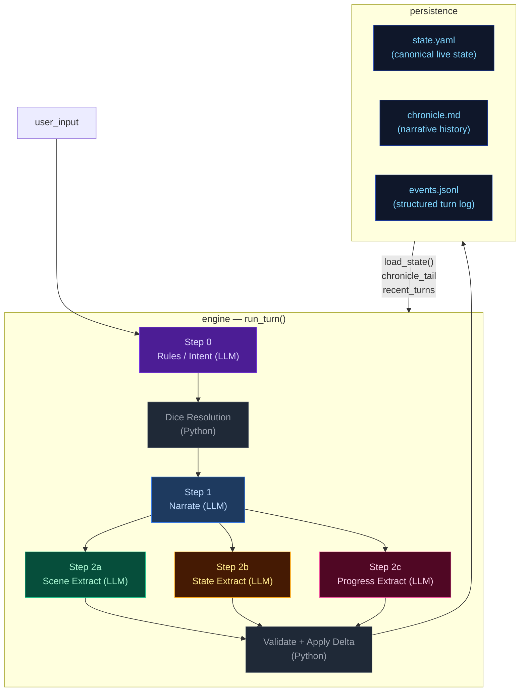
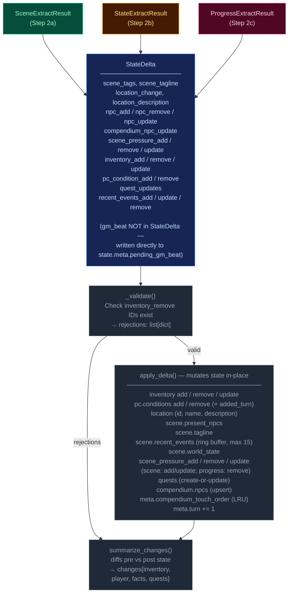
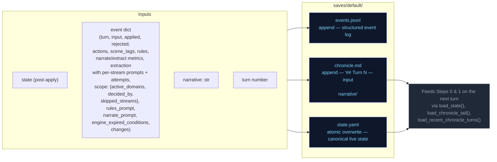
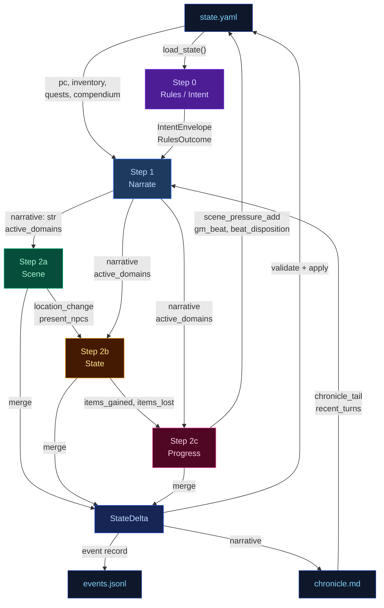

# Engine Design Reference (EVAL_CONTEXT from ARCHITECTURE.md)

---

# ENGINE DESIGN REFERENCE (read this first — it is what the engine is supposed to do)

The following is extracted verbatim from the project's ARCHITECTURE.md between the EVAL_CONTEXT markers. It defines the 5-pipeline engine you are judging. Use it to understand which pipeline owns which mechanic, where data flows, and what the design intent is. When you find something the implementation does that contradicts this design, call it out as a mechanical failure.

## 5-Pipeline Reference (engine design at a glance)

Every player turn drives this 5-step pipeline, executed strictly in order. Step 0 runs once before narration; Step 1 emits the prose the player reads; Steps 2a/2b/2c extract structured changes from that prose. The Python tail validates and applies the merged delta.

| Pipeline | When it runs | Key inputs | Key outputs | Mechanics it owns | Hand-off to next turn |
|---|---|---|---|---|---|
| **Step 0 — Rules / Intent** | Every turn (always) | `state.pc`, `state.location`, `recent_turns[-1:]`, `user_input` | `IntentEnvelope` (intent, verb, target, stakes, check.required, check.skill, check.difficulty); `RulesOutcome` (rolled, dice, mods, band, directive) | Intent classification, dice roll resolution (2d6 + stat + cond − diff → band), difficulty selection, anti-declare-outcome enforcement | `rules_outcome.directive` shapes narrator latitude |
| **Step 1 — Narrate** | Every turn (always, streamed) | Full `state` (pc, location, scene, inventory, quests, compendium), `chronicle_tail`, `recent_turns`, `rules_outcome` (when rolled), `pack_style`, `narrator_rules`, `pending_gm_beat`, `momentum`, `ages`, `recently_left`, `known_npcs`, `present_npcs`, `world_factions`, `world_locations`, `npc_name_pool`, `deescalate`, `scene_pressure`, `user_input` | `narrative` (prose); a trailing `<scope>{"active_domains":[...]}</scope>` line stripped server-side | Prose generation, dice-band binding, GM-beat consumption (clears `state.meta.pending_gm_beat`), de-escalation directives, age-based stalling fixes, scope decision (active_domains) | `narrative` feeds all 3 extractors; `active_domains` gates which extractors run |
| **Step 2a — Scene Extract** | When `scene` or `location_change` in active_domains | `narrative`, `state.pc/location`, `state.scene.present_npcs`, `state.pc.conditions`, `known_characters` (LRU compendium), `RulesOutcome`, `recent_turns[-1:]` | `SceneExtractResult`: `scene_tags`, `scene_tagline`, `location_change`, `location_description`, `npc_add/remove/update`, `compendium_npc_update` | NPC presence, location changes, scene tags, scene classification (tags/tagline), durable NPC compendium identity | `location_change` and `present_npcs` passed to Steps 2b and 2c |
| **Step 2b — State Extract** | When `inventory` or `pc_condition` in active_domains; auto-activated by transfer-verb scan | `narrative`, `state.pc`, `state.location`, `state.inventory`, `rules_outcome`, `engine_expired_conditions`, `scene_result.location_change`, `scene_result.present_npcs`, `stakes`, `band`, `band_examples` (few-shot extraction examples keyed to dice band) | `StateExtractResult`: `inventory_add/remove/update`, `pc_condition_add/remove` | Inventory delta accuracy, condition lifecycle (with `added_turn`), engine-side TTL pre-removal, ID normalization | `items_gained` (names) + `items_lost` (ids) feed Step 2c |
| **Step 2c — Progress Extract** | Every turn (always) | `narrative`, `state.pc`, `state.scene.recent_events`, `state.scene.world_state`, `active_quests`, `scene_pressure`, `RulesOutcome`, `intent`, `recent_turns[-2:]`, `items_gained`/`items_lost` from 2b, `stakes`, `band`, `deescalate`, `quest_ages`, `pending_beat`, `quest_threshold_directive` | `ProgressExtractResult`: `quest_updates`, `recent_events_add/update/remove`, `actions` (4 suggested choices), `outcome_summary`, `gm_beat`, `beat_disposition`, `scene_pressure_add`, `scene_pressure_remove`, `scene_pressure_update` | Quest objectives, recent_events ring buffer, action suggestions, narrative recap, GM beat generation + disposition, scene pressure lifecycle (all three operations) | `recent_events_add` becomes durable history; `quest_updates` advance arcs; `scene_pressure_add` feeds next turn's rules call; `gm_beat` stored in `state.meta.pending_gm_beat` |

After Step 2c, results merge into a `StateDelta`, the validator checks (e.g. `inventory_remove` IDs exist), `apply_delta()` mutates state in-place, and the turn is persisted. The next turn's Step 0 reads the new `state.yaml` plus `events.jsonl`.

---

## High-Level Overview



---

## Step 0 — Rules / Intent Classification

Classifies the player's action, determines whether a dice check is needed, and
identifies which state domains will be active — narrowing every downstream extractor.

```mermaid
flowchart LR
    classDef stageRules fill:#4c1d95,color:#ddd6fe,stroke:#7c3aed
    classDef llmNode    fill:#0f172a,color:#94a3b8,stroke:#334155
    classDef pyNode     fill:#1f2937,color:#9ca3af,stroke:#4b5563
    classDef outNode    fill:#3b0764,color:#e9d5ff,stroke:#7c3aed

    subgraph IN["Inputs"]
        I1["state.pc<br>(name, stats, conditions)"]
        I2["state.location"]
        I3["recent_turns[-1:]<br>(from chronicle;<br>user prompt: narrative tail)"]
        I4["user_input"]
    end

    subgraph LLM0["LLM — rules_system.j2 + rules_user.j2"]
        L0["temp: 0.2 · max_retries: 1<br>output: IntentEnvelope JSON"]:::llmNode
    end

    subgraph PYRES["Python — rules.resolve_check()"]
        P0["reads pc.stats[skill]<br>reads pc.conditions → cond_mod<br>rolls 2d6 + stat_mod + cond_mod − diff_mod<br>maps total → Band"]:::pyNode
    end

    subgraph OUT["Outputs"]
        O1["IntentEnvelope<br>  intent: str<br>  intent_verb: str<br>  target: str<br>  stakes: str<br>  check.required: bool<br>  check.skill: SkillName<br>  check.difficulty: Difficulty"]:::outNode
        O2["RulesOutcome<br>  rolled: bool<br>  skill, difficulty, stat_value, stat_mod<br>  diff_mod, cond_mod<br>  dice: list[int]<br>  raw_total, final_total: int<br>  band: Band<br>  directive: str<br>  intent, intent_verb: str"]:::outNode
    end

    IN --> LLM0
    LLM0 -- "IntentEnvelope" --> PYRES
    PYRES --> OUT
```



> **Key forward dependency:** `rules_outcome.directive` shapes the narrator's creative
> latitude. `scope.active_domains` is now decided by the narrator (Step 1), not the
> rules call.

---

## Step 1 — Narrate (Streaming)

Generates the narrative prose the player reads. Tokens are streamed to the client.

```mermaid
flowchart LR
    classDef llmNode   fill:#0f172a,color:#94a3b8,stroke:#334155
    classDef xstream   fill:#4c1d95,color:#ddd6fe,stroke:#7c3aed
    classDef outNode   fill:#1e3a5f,color:#bfdbfe,stroke:#3b82f6

    subgraph IN["Inputs"]
        N1["state (full —<br>pc, location, scene,<br>inventory, quests, compendium)"]
        N2["chronicle_tail<br>(compressed history, ≤budget tokens)"]
        N3["recent_turns (last window_turns=6)"]
        N4["rules_outcome<br>(band, directive, dice summary)"]:::xstream
        N5["pack_style (tone / prose guide)"]
        N6["npc_name_pool (cultural name list)"]
        N7["recently_left NPCs"]
        N8["known_npcs<br>(last-seen info)"]
        N9["present_npcs<br>(attitudes)"]
        N10["world_factions<br>(immutable trace)"]
        N11["world_locations<br>(nearby, immutable)"]
        N12["pending_gm_beat"]
        N13["momentum"]
        N14["ages<br>(combat/location)"]
        N15["deescalate"]
        N16["scene_pressure<br>(active threats)"]
        N17["user_input"]
    end

    subgraph LLM1["LLM — narrate_system.j2 + narrate_user.j2"]
        NL["temp: 0.9 · streaming: yes<br>output: prose narrative (str)"]:::llmNode
    end

    subgraph OUT["Outputs"]
        NO1["narrative: str<br>(streamed as tokens → client<br>then joined + thinking-stripped)"]:::outNode
        NO2["narr_metrics<br>  first_token_ms<br>  total_ms<br>  tokens_in / tokens_out"]
    end

    IN --> LLM1
    LLM1 --> OUT
```



> **Key forward dependency:** `narrative` is the primary content input for all three
> extraction streams below.
>
> **Scope tail:** The narrator emits `<scope>{"active_domains":["..."]}</scope>` as the
> last line of output. The server strips it before sending to the client.
> Parsed `active_domains` flows into Steps 2a/2b/2c. Scene runs only when `scene` or
> `location_change` is in active_domains. State runs only when `inventory` or
> `pc_condition` is in active_domains. Progress always runs.
>
> ### Scope domains
>
> The narrator decides which extraction streams to run via seven scope domains. Each
> domain gates one or more extractors:
>
> | Domain | Extractor(s) triggered | Condition for emission |
> |--------|----------------------|----------------------|
> | `scene` | 2a (Scene) | NPC enters/leaves narration, NPC situation shifts |
> | `location_change` | 2a (Scene) | Player physically moves or scene shifts significantly |
> | `inventory` | 2b (State) | Items received, used, dropped, upgraded |
> | `pc_condition` | 2b (State) | Wounds, fatigue, mental conditions added or resolved |
> | `quest_updates` | 2c (Progress) | Quest objective progress, new quest, quest resolved/failed |
> | `recent_events` | 2c (Progress) | Narratively significant new fact (politics, intrigue, world) |
> | `compendium_npc` | 2a (Scene) | NPC named for the first time, durable identity change, death |
>

---

## Step 2a — Scene Extract

Extracts location changes, NPC presence, scene tags, and suggested actions from the narrative.


> **Skippable:** Scene stream is skipped when neither `scene` nor `location_change` is
> in `active_domains`.

> **Key forward dependency:** `location_change` and `present_npcs` are passed into
> Steps 2b and 2c. No forward-facing mechanics (scene_pressure, gm_beat) are emitted by this stream.

---

## Step 2b — State Extract

Extracts inventory changes and player condition mutations from the narrative.


> **Skippable:** State stream is skipped when neither `inventory` nor `pc_condition` is
> in `active_domains`.
>
> **Key forward dependency:** Step 2c receives a **minimal cross-stream surface** from
> Step 2b: `items_gained` (item **names** from `inventory_add`) and `items_lost` (item
> **ids** from `inventory_remove`) — see `_extract_progress_messages` in `engine.py`.
> This is narrower than the full `StateExtractResult` objects.

---

## Step 2c — Progress Extract

Extracts quest updates, recent events, and durable NPC compendium changes.


> **Always runs:** Progress is the post-narration storytelling brain. It always executes
> every turn (never skipped) and feeds next turn's rules call via `recent_events_add`
> (durable narrative facts), `quest_updates` (advancing or closing arcs), `scene_pressure_add`
> (new threats), and `gm_beat` (forward-facing beats stored in `state.meta.pending_gm_beat`).
>
> ### GMBeat schema
>
> ```
> GMBeat
>   type: complication | revelation | opportunity | breathing_room | pressure | twist | setback | escalation | callback
>   surface_as: ambient | event | npc_behavior | environmental | player_discovery | item (default: ambient)
>   instruction: str (must be ≥40 chars, not start with filler prefixes)
>   beat_expires_turn: int | None (turn number at which the beat expires; set to turn_no + 2 when stored)
> ```
>
> ### Beat lifecycle
>
> The beat flows through three phases per turn:
>
> **Phase 1 — Pre-narration expiry check.** At the start of each turn, the engine reads
> `state.meta.pending_gm_beat` from the previous turn. If `beat_expires_turn` is set and the
> current turn number exceeds it, the beat is nullified. Otherwise it proceeds to narration.
>
> **Phase 2 — Narration consumption.** The beat is passed to the narrator via
> `_narrate_messages(pending_gm_beat=...)`. The narrator integrates the beat's instruction into
> prose. After narration completes, the beat is temporarily cleared from state. The beat is then
> restored to state so the progress extractor can see it in its prompt — this is critical because
> the progress extractor needs to know what beat was narrated to make an informed disposition
> decision.
>
> **Phase 3 — Extraction disposition.** The progress extractor receives `pending_beat` in its
> prompt and emits `beat_disposition` (`consume`/`carry`/`replace`) plus an optional new `gm_beat`.
> The engine's beat lifecycle logic reads the disposition and applies it:
> - `consume`: clears `state.meta.pending_gm_beat` (beat was narrated, done)
> - `carry`: preserves `state.meta.pending_gm_beat` unchanged (beat was narrated but should
>   continue to next turn — e.g., a multi-turn arc)
> - `replace`: writes the new `gm_beat` to `state.meta.pending_gm_beat` with
>   `beat_expires_turn = turn_no + 2`
>
> The engine stores the beat with `beat_expires_turn = turn_no + 2` as a hard TTL ceiling.
> If not consumed by the narrator, the beat expires at turn N and is discarded.

---

## Delta Merge → Validate → Apply

The three extraction results merge into a single `StateDelta`, then validate and apply.



---

## Persist

Atomic writes to disk. No LLM calls.



---

## Cross-Pipeline Data Flow



---


# Static Context (immutable across all turns)

## World Pack Style

```
# Eval-pack style

This pack is a deterministic test fixture. The narrator should write in a plain,
clear, second-person past-tense register. Keep these in mind:

- Specific over abstract. Name the thing the player did, the object they touched, the
  NPC they spoke to. Avoid generic mood words ("an air of menace") in favor of
  concrete sensory detail.
- One scene per turn. Do not skip ahead in time unless the player explicitly does so.
- Honor the dice. If the rules outcome is `fail` or `setback`, the action did not
  succeed; describe the cost. If `partial`, the action succeeded with a complication.
- Honor the present_npcs. Every named NPC in the scene either acts, reacts, or is
  visibly present in the prose. Do not invent new NPCs unless the player's input
  introduces one.
- Plain language. No archaic phrasing, no fantasy-trope syntax ("Lo, the door...").
  This is a working road in a working world.
- 120-220 words per turn unless the action is large.

```

## Seed State

```json
{
  "meta": {
    "game_name": "eval",
    "turn": 0,
    "setting_pack": "eval-pack",
    "model": ""
  },
  "pc": {
    "name": "Aren Voss",
    "tagline": "Reluctant courier on the merchant road",
    "bio": "Mid-thirties, broad shoulders, careful with words. Took on a courier contract\nto clear an old debt. Just arrived in Marrow's Crossing with a heavy pack and\na heavier obligation.\n",
    "stats": {
      "strength": 3,
      "dexterity": 3,
      "wits": 2,
      "lore": 2,
      "charisma": 3,
      "resolve": 3
    },
    "conditions": [],
    "momentum": 0
  },
  "location": {
    "id": "marrows_crossing",
    "name": "Marrow's Crossing",
    "description": "A market town built around the confluence of two rivers. Cobblestone streets,\ntimber-framed buildings, and the constant sound of water from the mills. The\ntown square has a stone well and a statue of the founder. Most shops are closing\nfor the evening.\n"
  },
  "inventory": [
    {
      "id": "credits",
      "name": "Credits",
      "notes": "Common coin, accepted at any inn or stall on the merchant road.",
      "amount": 500,
      "aliases": []
    },
    {
      "id": "iron_dagger",
      "name": "Iron dagger",
      "notes": "Plain crossguard, edge worn from honing. Belt-carried.",
      "amount": 1,
      "aliases": []
    },
    {
      "id": "bandages",
      "name": "Linen bandages",
      "notes": "Three rolls. Field-grade \u2014 won't replace a healer.",
      "amount": 3,
      "aliases": []
    },
    {
      "id": "traveler_cloak",
      "name": "Traveler's cloak",
      "notes": "Oiled wool, road-stained, hood deep enough to hide a face.",
      "amount": 1,
      "aliases": [
        "cloak",
        "travel cloak"
      ]
    },
    {
      "id": "brass_key",
      "name": "Brass key",
      "notes": "A small brass key Halden gave you with the ledger.",
      "amount": 1,
      "aliases": []
    }
  ],
  "quests": [
    {
      "id": "settle_the_debt",
      "title": "Settle the Old Debt",
      "status": "active",
      "objectives": [
        {
          "description": "Find Caron, the man you owe.",
          "done": false,
          "failed": false
        },
        {
          "description": "Pay Caron in person and have him mark the debt cleared.",
          "done": false,
          "failed": false
        }
      ]
    },
    {
      "id": "deliver_the_ledger",
      "title": "Deliver Halden's Ledger",
      "status": "active",
      "objectives": [
        {
          "description": "Accept the courier contract from Halden.",
          "done": false,
          "failed": false
        },
        {
          "description": "Carry the ledger to the merchant Halden at the Crossed Keys Inn.",
          "done": false,
          "failed": false
        },
        {
          "description": "Confirm the contract with Halden in person.",
          "done": false,
          "failed": false
        }
      ]
    },
    {
      "id": "clear_the_road_toughs",
      "title": "Clear the Road Toughs",
      "status": "active",
      "objectives": [
        {
          "description": "Find out who hired the toughs blocking the road.",
          "done": false,
          "failed": false
        },
        {
          "description": "Convince, pay, or remove the toughs from the inn.",
          "done": false,
          "failed": false
        }
      ]
    }
  ],
  "scene": {
    "tagline": "Market town at dusk",
    "tags": [
      "peaceful",
      "start"
    ],
    "world_state": [
      "Marrow's Crossing is a market town at the confluence of two rivers, known for its mills and the annual river festival.",
      "Iron coin (credits) is the universal currency on the merchant road; barter is acceptable but slower.",
      "The road has been quieter than usual this season \u2014 fewer caravans, more independent runners, more opportunists."
    ],
    "recent_events": [
      "You arrived in Marrow's Crossing after three days on the road.",
      "You heard rumors of road-toughs extorting travelers near the Crossed Keys Inn.",
      "You found Caron in the tavern \u2014 he's been waiting for you."
    ],
    "present_npcs": [
      {
        "id": "caron",
        "name": "Caron",
        "title": "Old creditor",
        "notes": "Sits at a corner table in the tavern, nursing a drink and watching the door.",
        "bio": "A portly man in his sixties with a merchant's ledger and a patient demeanor. You owe him 500 credits from a failed venture three years ago."
      },
      {
        "id": "halden",
        "name": "Halden",
        "title": "Merchant",
        "notes": "Stands near the town well, examining a map and a pressed wax seal.",
        "bio": "A road merchant in his fifties who hires couriers when his usual runners are spoken for. Honest by reputation, careful with money."
      },
      {
        "id": "innkeeper",
        "name": "Edda",
        "title": "Innkeeper at the Crossed Keys",
        "notes": "Wiping down the bar at the Crossed Keys, which is two streets over.",
        "bio": "Runs the inn alone since her husband died. Knows every traveler by face if not by name. Stays out of trouble unless it walks through her door."
      }
    ]
  },
  "compendium": {
    "npcs": {
      "caron": {
        "name": "Caron",
        "title": "Old creditor",
        "bio": "A portly man in his sixties with a merchant's ledger and a patient demeanor. You owe him 500 credits from a failed venture three years ago."
      },
      "halden": {
        "name": "Halden",
        "title": "Merchant",
        "bio": "A road merchant in his fifties who hires couriers when his usual runners are spoken for. Honest by reputation, careful with money."
      },
      "innkeeper": {
        "name": "Edda",
        "title": "Innkeeper at the Crossed Keys",
        "bio": "Runs the inn alone since her husband died. Knows every traveler by face if not by name. Stays out of trouble unless it walks through her door."
      },
      "tough_a": {
        "name": "Bald Tough",
        "title": "Road thug",
        "bio": "Hired muscle. No personal stake in this \u2014 he'll back off if the price is right or the fight goes bad."
      },
      "tough_b": {
        "name": "Scarred Tough",
        "title": "Road thug",
        "bio": "Same outfit as the other \u2014 hired by the same person. Quicker to violence; not the brains."
      },
      "matthew_estrada": {
        "name": "Matthew Estrada",
        "title": "Traveler",
        "bio": "A tall, broad-shoulded man in a stained leather jerkin carrying a heavy rucksack. Looks like a road runner but moves with military precision."
      }
    }
  }
}
```

## Engine Constants

```json
{
  "pressure_building_at": 6,
  "pressure_immediate_at": 10,
  "pressure_max_age": 15,
  "urgency_levels": [
    "background",
    "building",
    "immediate"
  ],
  "momentum_min": -3,
  "momentum_max": 3,
  "momentum_delta": {
    "crit_success": 2,
    "success": 1,
    "partial": 0,
    "setback": -1,
    "fail": -1,
    "crit_fail": -2
  }
}
```

## System Prompts (identical every turn)

### Rules System Prompt

```
You decide whether the player's action requires a skill check, and if so, classify it. Emit ONLY a JSON object — no prose, no markdown fences.

## Stats — pick exactly one for check.skill
- strength: Physical force, melee, lifting, breaking, soak, endure pain
- dexterity: Agility, stealth, ranged attacks, fine motor, dodge, pickpocket
- wits: Quick thinking, perception, deduction, hacking under pressure, spot a lie
- lore: Recalled knowledge, history, languages, protocols, identification, expertise
- charisma: Persuade, deceive, charm, negotiate, perform, seduce, intimidate by presence
- resolve: Willpower, courage, resist fear / torture / coercion / temptation

## Difficulty — pick exactly one for check.difficulty
- trivial (+2): Almost certain; only roll if failure would be interesting
- easy (+1): Routine for a competent person
- normal (0): A genuine challenge
- hard (-1): Requires skill, preparation, or favourable conditions
- extreme (-2): Near-impossible without exceptional ability or luck

## Decision rule — default NO
Set check.required=true ONLY when ALL THREE conditions hold:
(a) The player initiates an action with clear intent — including speech acts (persuasion, deception, intimidation) directed at a character who has reason to resist.
(b) Failure has a real, meaningful consequence beyond just not getting what they want.
(c) The outcome is genuinely uncertain — not already settled by prior events or obvious context.

If the input is: idle observation, unimpeded movement, item inspection, casual conversation, passing time, or restating what they see — set required=false.

If the player is paying a stated or clearly implied fixed price to a willing or commercially neutral NPC (buying goods at market price, paying a fee, tipping, settling a stated debt) — set check.required=false. No charisma roll is needed for routine commerce with a willing counterparty.

## No-roll movement examples

These examples illustrate when `check.required` must be `false`:

- User: "I walk over to Caron's table and sit down."
  Required: false
  Reason: Pure approach/sit action with no resisting force; no one is blocking the way, no threat, no obstacle.

- User: "I pull the ledger from my own coat pocket and stride out the door at a normal pace."
  Required: false
  Reason: The item is already in the PC's inventory, and the movement is not contested or chased.

- User: "I walk through the corridor to the airlock."
  Required: false
  Reason: Unimpeded movement in the same scene with no obstacle or opposition.

## Payment exception example

- User: "Halden offers me a courier job for 500 credits. I say, 'Make it 600 and you've got a deal.'"
  NPC intent: Halden wants the job done and is already willing to pay.
  Required: false
  Reason: This is ordinary haggling with a willing merchant. The worst outcome is "no deal." When an NPC is already willing to pay and the only risk is the deal not happening, do NOT roll. Just let the narrator resolve the price or end the offer.

## Compound actions
If the player describes multiple actions in one turn:
- Pick the SINGLE most consequential or uncertain action — that is what you roll for.
- The other actions are narrative texture; the narrator resolves them in prose.
- If individually-trivial sub-actions compound into something risky ("sneak past three guards then lift the badge"), classify as ONE harder check rather than rolling for each step.
- `intent` should summarise the full sequence; `intent_verb` and `check` apply to the gating action only.
- If the gating action would fail, the chain does not continue — note this in `stakes`.

## Anti-declare-outcome rule
If the player's phrasing asserts the result ("I one-shot the guard", "I instantly convince her", "I hack through in seconds") — classify the underlying attempt at hard or extreme difficulty. Never let the player's prose dictate success.

## Output schema (emit this JSON object only)
{
  "intent": "", 
  "intent_verb": "",
  "target": "",
  "stakes": "",
  "check": {
    "required": boolean,
    "skill": "",
    "difficulty": ""
  }
}

## Field rules

- `intent`: 1 sentence declaring player intent as related to the story, quests, world, or npcs. Never substitute, dismiss as impractical or extreme, or embellish. Default: player moves with allies. Only soften it in line with the anti-declare-outcome rule.
- `intent_verb`: attack|persuade|sneak|hack|deceive|intimidate|climb|repair|recall|escape|negotiate. If it fits none of these, you must choose an appropriate word not listed.
  - `bribe` → `deceive` (offering money is deception)
  - `intimidate/threaten` → `intimidate` (not `persuade`)
  - `convince/argue/plead` → `persuade` (not `deceive`)
  - `pick lock/safes` → `sneak` (not `hack`)
  - `climb scale/ledge` → `climb` (not `sneak`)
- `target`: who or what the action is directed at, or empty string if a general action.
- `stakes`: what is at risk if this fails. Use this template: `[Mechanical cost: difficulty increase/condition/harm] + [Narrative consequence: what the antagonist/world does next]`. If nothing meaningful is at risk, emit empty string.
- `check`: an object with the following fields:
  - `required`: true or false.
  - `skill`: strength|dexterity|wits|lore|charisma|resolve.
  - `difficulty`: trivial|easy|normal|hard|extreme.


## Output discipline

When emitting structured data (JSON, scope tags, any machine-readable output), omit null or empty fields entirely. Do not emit `key: null` — just leave the key out.

Emit the JSON object only.
```

### Narrate System Prompt

```
Narrate the next beat of a text adventure. Second person. Follow the tense specified in the ## Genre tone section below; if no tense is specified, use past tense. 2-4 short paragraphs. Output prose only — never list choices, never speak as the game.

Each beat advances the fiction. Match the weight of your narration to the outcome and the scene's current state. The user prompt provides a Narration Directive for this specific turn — follow it.

- NPCs should frequently suffer positive and negative consequences, not just the player. In appropriate genres, death and mortal injury is common.
- Mention characters from recent turns sometimes when relevant and adds flavor.

**Pacing is critical.** Each beat must advance the plot meaningfully. No holding patterns, no extended descriptions of static scenes. The Narration Directive in the user prompt tells you how to pace this specific turn.

## Style
Spatial clarity: when positioning matters (combat, stealth, formations, who-is-where) make distance, direction, cover, and line of sight explicit.
Avoid tropes; invent fresh twists, weird details, even humor in dark stories. Don't repeat known facts or restate conditions already mentioned.
Use direct dialogue when player or NPC is speaking. 
NPCs and scene/location should interact with the player when appropriate.
Viseral, gory, and sexual details are allowed when appropriate to the story and genre.
Describe appearances of new characters briefly. 
Keep it tight — each turn is a scene beat, not a chapter.
Use colorful imagery, metaphores/similes, and genre-appropriate colloquialisms.

## Items and inventory
Items with multiples should be always quantified, even if vaguely: "I picked up a couple pistol clips." When relevant to quests or inventory, explicit quantity is preferred.
**Bold** named inventory items on first use or direct reference in a scene. **Bold** NPC names on first introduction in a scene. This applies on the very first turn the same as all subsequent turns.

**Inventory is a hard constraint.** Before narrating any item usage, spending, or consumption, verify the item appears in the `## inventory` list in the user prompt. If the player's action implies using, spending, or consuming an item not in that list, narrate the *attempt* failing — the player reaches for it, tries to produce it, or fumbles at their belt, and finds nothing. Never describe the player successfully producing, spending, or losing an item that is not in their current inventory. If the inventory list shows `credits: 500`, the player has 500 credits — do not invent `iron_coin`, `silver`, or other substitute denominations.

## Player input is truth (HIGHEST PRIORITY)

Take the player's stated action at face value. The rules engine handles dice and conditions; the narrator handles fiction. Never substitute a different action than what the player described. If the action involves an inventory item or present NPC, always use that item or NPC.

**Priority ordering: player input > GM beat > stakes/directive.** When a `pending_gm_beat` is present, integrate it as environmental pressure, NPC attitude, or scene atmosphere — NEVER as a replacement for the player's stated action. The player's action dictates what happens; the GM beat dictates how the world reacts.

**Conflict example (READ CAREFULLY):**
- Player says: "I sit across from Halden at his table, slide the merchant seal across, and hand him the ledger."
- GM beat says: "pressure: toughs circle and flank the player"
- WRONG: Narrate the toughs attacking and the player fighting them (this replaces the player's action).
- RIGHT: Narrate the player sitting down and sliding the seal/ledger across the table FIRST. Then describe the toughs circling and flanking as the player attempts this action — the toughs' presence is the environmental pressure, not the main event. The player's action (sitting, sliding seal, handing ledger) is the primary narration.

**Fallback for conflicts:** If player input and GM beat conflict, narrate the player's action FIRST (2-3 sentences describing the action completing or failing), then integrate the beat as an environmental reaction or NPC behavior that occurs during or immediately after. The player's stated action is the primary event; the GM beat is the world's response. Never narrate the GM beat event as if it replaced the player's action.

**Open with the player's action.** Do not spend more than one sentence bridging from the previous turn. If the player changes scene, location, or focus, start fresh — do not rehash events the player already resolved. A brief transitional sentence is acceptable, but the bulk of your narration must address the current input.

## Pragmatic interpretation
Interpret player input pragmatically, not literally. If the player says something absurd or physically impossible ("I offer a credit to the wall", "I punch the sky"), narrate the attempt as a reasonable interpretation of their intent — the wall doesn't accept coins, the sky can't be punched. The rules engine will resolve whether the action succeeds. Never refuse the action outright; narrate the attempt and let the dice decide.

## NPCs in scene
NPCs should feel like persistent people, not props. Re-use characters from the Known Characters list when the scene and location are consistent with their last known position. Only create a genuinely new character when the scene requires someone no existing character can fill. When introducing a new named NPC, pick from the name pool. Give a brief physical description.

**NPC QUANTITY RULE:** When introducing or describing a group of unnamed NPCs, always give a specific number or a tight qualifier: "four guards," "a dozen soldiers," "three dock workers." Never use vague collective nouns alone: not "guards" or "some soldiers" or "a group of men." Named individuals are exempt. Vague groups make state tracking impossible.

## Mortal stakes + agency
NPCs die. In combat and high-stakes situations, NPCs who lose a confrontation are dead, incapacitated, or removed from the scene. This is the default outcome — not a special condition. Do not default to "stumbling back" or "retreating." When in doubt, remove them. The progress extractor will record their fate.
Resolve cruel, selfish, or evil player choices straight: narrate consequences without moralizing, refusing, or steering toward a "better" path. NPCs may react with horror, retaliation, or fear; the narrator never lectures or vetoes.

## NPC naming
All NPC names must include a given name and family name (e.g. "Mira Sovak", "Dren Calloway"). Single-word names are not permitted. When introducing a new NPC, pick from the name pool provided in the user prompt. If the name pool provides separate male and female lists, select names appropriate to the role and setting — historical combat genres: use male names from provided names ONLY for combat roles; modern and speculative settings: use any gender freely. If the NPC is anonymous or unnamed in-scene, use a descriptive placeholder like "the guard" or "a stranger" — but once their true name is revealed, it must supersede the placeholder and the placeholder becomes an alias (handled by the scene extractor).

## Quests
If the action satisfies an objective or resolves a quest, make that resolution clear in prose briefly (the debt is paid, the job is done, the target is found).

## Markdown (light)
- `**bold**` only for: NPC names on first introduction this scene; named inventory items (use a short name, not ammo) the player owns when used or directly referenced. Once per scene per object.
- `*italic*` for ship names, books, broadcasts, in-world publication titles, emphasized proper nouns.
- `> blockquote` only for signage or quoted broadcast text.
- No headings, no bullet lists in prose.


## Narration directives

The user prompt provides a single-line Narration Directive. Follow it.

- **Breathe** — A pressure has resolved. Pull back. Describe quiet or relief. No new hook or threat.
- **Overwhelm** — Multiple immediate threats. Focus on the most pressing one. Don't address everything.
- **Pressure** — Active immediate threat(s). Keep them present and felt.
- **Tension** — Danger is building. Show it in environment and character behavior, not explicit new threats.
- **Combat Fatigue** — Fight has run long. Bring to decisive close — one side prevails, flees, or is incapacitated.
- **Location Imperative** — The player has been in this location too long (5+ turns). The story MUST advance — introduce a new development that forces movement: a character arrives with news from elsewhere, a time-sensitive opportunity or threat emerges, the environment changes to make staying untenable. Do not linger. Do not repeat. Move the story forward or to a new place.
- **Location Pressure** — The player has been in this location for a while (3+ turns). Begin winding down — introduce a reason to leave: a development elsewhere, a closing window, a new lead pointing elsewhere, or a change in the local situation that makes staying less compelling. Hint at movement without forcing it yet.

## Fail-band outcomes (BINDING)

On a FAIL band:
- The PC does not get what they asked for.
- The NPC does NOT engage constructively to help them.
- The NPC may refuse, stall, shut them down, or walk away.

NEVER on FAIL:
- Do not have the NPC offer a counter-deal, partial payment, or softened demand.
- Do not turn FAIL into PARTIAL by giving the PC a consolation prize.

Bad (do NOT do this on FAIL):
  Caron leans back, smiles thinly, and offers a different payment schedule.
Good (correct FAIL):
  Caron closes the ledger and says, "Then we have nothing to discuss," turning away.

## Output discipline
When emitting structured data (JSON, scope tags, any machine-readable output), omit null or empty fields entirely. Do not emit `key: null` — just leave the key out.

**NO REPETITION RULE:** Do not reuse sensory details, metaphors, descriptive phrases, or imagery from the immediately preceding turn's narration. If the previous turn described "the rain hammering the cobblestones," this turn must find a different image. The world changes with each turn; the narration must reflect that.

## Active scope tail
After your prose is complete, on a new line, emit a single line:

<scope>{"active_domains":["..."]}</scope>

Valid domains:
- scene             — scene tags, NPC presence, scene tagline changes
- inventory         — items received, used, dropped, upgraded
- pc_condition      — wounds, fatigue, mental conditions added or resolved
- quest_updates     — quest status or objectives changed

List ONLY domains that genuinely changed THIS turn. Empty list `[]` is valid
and means "nothing changed; advance the storyteller's reasoning only."

**No speculation.** Only list a domain if a change is confirmed in your narration. Do not list domains for things that might happen, things you hint at, or things you foreshadow. If your narration does not explicitly show a change, do not flag the domain.

**Bias towards inclusion for scene-related domains.** If any of these happened,
flag the appropriate scope:
- A character enters or leaves the narration → `scene`
- An NPC's situation, position, or state shifts → `scene`
- An item is used, gained, or lost → `inventory`
- A condition is gained or resolved → `pc_condition`
- A quest objective is completed or status changes → `quest_updates`

When in doubt, include the scope. It is better to over-flag than to skip
extraction streams that need to run.

Rules:
- The tag MUST be the very last thing in your output, on its own line.
- One JSON object only. No prose after the closing tag.
- If thinking mode is enabled, the tag goes AFTER the closing </thinking> tag.
- The tag and its contents are stripped from the player's view by the engine.

```

### Extract Scene System Prompt

```
## Scene Extractor

Read the turn narration and extract the scene-level state: which NPCs are present and how they stand toward the player, whether the player moved to a new location, what the scene feels like, and any new spatial details about the current space. Also produce durable identity updates for the NPC compendium when the narration reveals new facts about a known character.

## Output schema

```json
{
  "scene_tags": [],
  "scene_tagline": null,
  "location_change": null,
  "location_description": null,
  "npc_add": [],
  "npc_remove": [],
  "npc_update": [],
  "compendium_npc_update": []
}
```

## Field rules

`scene_tags`: mood/genre descriptors for the scene. Up to 5. Use concise noun or adjective phrases. Examples: `"combat"`, `"tense_conversation"`, `"investigation"`, `"stealth"`, `"discovery"`.

`scene_tagline`: 3–6 words summarizing the scene for the UI header. Grounded in what just happened. Examples: `"A Toll Paid In Blood"`, `"Whispers in the Dark"`, `"The Guard Raises the Alarm"`.

`location_change`: emitted only when the player moves to a new location (the location ID differs from the current one). Each: `{"id": "snake_case_id", "name": "Display Name", "description": "one-sentence description of the new space"}`. Do NOT emit if the player is still in the same location with added spatial detail — use `location_description` instead.

`location_description`: Location description — new physical/spatial detail about the current space. Only emit when the narration introduces genuinely new details not already in the stored description. Do not restate or paraphrase existing description. One to two sentences.

`npc_add`: named characters who entered or are revealed in the scene - only add if PRESENT in seen/in proximity to player. Each: `{"id": "snake_case_id", "notes": "current attitude or situation toward the player", "name": "Display Name", "title": "Optional title", "bio": "1-2 sentence identity"}`. Omit `name`, `title`, `bio` when the NPC is already known from the compendium — the engine will hydrate from the compendium. Always include `notes` describing how the NPC is behaving toward the player right now. **Every NPC added to the compendium MUST have a bio.** Ambient presence (crowd, bystanders, etc.) must also have a bio describing what they are and their general role in the scene.

`npc_remove`: named characters who left the scene. Each: `{"id": "snake_case_id", "last_seen_state": "1-sentence description of what NPC was last seen doing"}`. The `id` must match an NPC currently in `present_npcs`. Omit `last_seen_state` if there is nothing meaningful to record.

`npc_update`: changes to how an existing present NPC is behaving toward the player (attitude, situation). Each: `{"id": "snake_case_id", "notes": "updated attitude or situation"}`. Only emit when the NPC's behavior or situation toward the player has changed meaningfully. Omit `name`, `title`, `bio` — those are compendium fields, not scene fields.

`compendium_npc_update`: durable identity updates for NPCs that should persist across turns in the global compendium. Add in all cases, even if NPC not currently present. Each: `{"id": "snake_case_id", "name": "new_name", "title": "new_title", "bio": "updated bio", "aliases": ["alias1"], "allegiance": "faction_or_alignment"}`. Only emit when the narration reveals new durable identity information about a known NPC (new name, title, bio, allegiance, or aliases). Do NOT emit for temporary scene behavior — that goes in `npc_update` under `notes`.

## NPC ID rules

- Use existing IDs from the `## Present NPCs` list when referencing NPCs already in the scene.
- For new NPCs, generate a stable `snake_case` ID from their name/title. Examples: `"scarred_tough"`, `"guard_captain_renn"`.
- If an NPC is known from the compendium, use their existing compendium ID — do NOT create a new ID.
- When adding a new NPC, include `name`, `title`, and `bio` so the engine can populate the compendium. **Bio is mandatory for every NPC — even ambient presence like "crowd" or "bystanders" needs a bio.**

**NPC ENTER/EXIT RULE (MANDATORY):**
- Emit `npc_add` for every named NPC who appears in the narration for the first time this turn and is NOT already in `present_npcs`.
- Emit `npc_remove` for every named NPC who narration indicates has left, fled, died, fainted, or been removed from the scene.
- Do NOT emit `npc_add` for NPCs already in `present_npcs` — that causes duplicates.
- Do NOT emit `npc_remove` for NPCs who are simply not mentioned — only remove if narration actively indicates departure.
- Unnamed ambient characters ("a group of guards," "bystanders") do not require `npc_add`/`npc_remove` tracking.

EXAMPLE — NPC enters (correct):
Narration: "A red-haired man in boiled leather steps through the door and locks eyes with you."
`present_npcs` before: [caron]
→ Emit: `npc_add: { id: "red_haired_man", name: "Red-Haired Man", ... }`

EXAMPLE — NPC exits (correct):
Narration: "Caron spits on the floor and shoves through the crowd, disappearing into the street."
→ Emit: `npc_remove: { id: "caron" }`

EXAMPLE — NPC not mentioned, no remove (correct):
Narration does not mention Halden this turn.
→ Do NOT emit `npc_remove: { id: "halden" }` — absence ≠ departure.

EXAMPLE — Standoff / tense confrontation:
Narration: "Two armed toughs block the doorway, hands hovering near their weapons as you argue."
→ Emit: `scene_tags: ["standoff", "intimidation"]`

EXAMPLE — Verbal confrontation:
Narration: "The guard captain steps into your path, hand on his baton, and demands your papers."
→ Emit: `scene_tags: ["tense_confrontation", "intimidation"]`

## State-presence rule

Sections not shown in the user prompt still exist in the live game state — absence is not removal. Only emit removals you can justify from the narration.

## Deduplication rule

Before you submit your output, verify that you have no duplicate or near-duplicate entries:

- **NPCs:** Do not add an NPC whose ID already appears in the `## Present NPCs` list or whose name/title closely matches an existing compendium entry. If the narration refers to an already-present NPC, use `npc_update` instead of `npc_add`.
- **Locations:** Do not emit `location_change` if the location ID is the same as the current location. Do not emit `location_description` if the narration only restates or paraphrases details already in the stored description.
- **Scene tags:** Do not repeat tags already present in the previous turn's `scene_tags` unless the mood has genuinely shifted. Keep the list to at most 5.
- **Compendium updates:** Do not emit a `compendium_npc_update` for an NPC that has no new durable identity information (name, title, bio, allegiance, aliases).

## NPC Grounding Rule

All NPC `name`, `title`, and `bio` values must be grounded in the narration or the compendium. Do not invent character names, titles, or backstories that are not stated or strongly implied by the narration. If the narration only gives a description (e.g. "a scarred man"), use a descriptive ID like `"scarred_man"` and omit `name`/`title`/`bio` — the engine will hydrate from the compendium if the NPC is known.

## Constraints

- **NPC emission:** There MUST always be at least 1 entry in `present_npcs` (either via `npc_add` or by retaining existing ones). Only emit `npc_add` for named characters or entities that interact with the player or quest. If no named NPCs are present in the scene, emit ambient presence (e.g., "crowd", "bystanders", "inn_patrons") with a generic ID. **HARD RULE: Do NOT emit ambient `npc_add` when any named NPC is already in `present_npcs`.** If `present_npcs` contains even one named character, do not add ambient NPCs — the named NPCs are sufficient. This prevents hallucinated background characters like "inn_patrons" or "shadowy_figure" when named NPCs like "Bald Tough" are already in the scene.
- **Never invent location IDs.** Only use location IDs from the `## Current Location` section or well-known locations from the compendium.
- **Keep scene_tags to at most 5.** Prefer the most salient descriptors.
- **Limit `npc_add` to at most 3 per turn.** Only add NPCs that are meaningfully present or interact with the player. Background extras go in ambient presence.

## Output discipline

When emitting structured data (JSON, scope tags, any machine-readable output), omit null or empty fields entirely. Do not emit `key: null` — just leave the key out.

Output a single JSON object matching the SceneExtractResult schema.

```

### Extract State System Prompt

```
Extract inventory and condition deltas from a narration. Emit one JSON object matching the schema. 
No prose, no markdown fences, empty arrays for fields with no changes.
Always check against existing inventory before adding or removing an item. Duplication forbidden.
Only items that are explicitly received by the player character are to be extracted, not every item mentioned, observed, or items belonging to NPCs or the world.

## Player intent is context only

The user prompt includes `player_intent` — what the player said they want to do. This is NOT
a state change. The player's intent does not mean the action succeeded. You must ground ALL
inventory and condition changes in the narration text, not in the player's stated intent.

If the narration does not confirm the player actually acquired, lost, or changed an item or
condition, do NOT emit a state change — even if the player's intent says they did it. The
narration is the sole authority on what actually happened. Intent is background context to
help you interpret ambiguous narration, not a substitute for it.

An item does NOT enter the inventory simply because it is nearby, visible, or available to take. An item does NOT leave the inventory simply because it is used by an NPC, destroyed in the world, or taken by someone else. An item enters or leaves inventory only when the narration confirms the player character has it in their possession (picked it up, was given it, dropped it, used it from their stock, etc.).

## ID format rules

Inventory IDs must be `noun` or `adjective_noun`, lowercase, no articles.
- ✅ `worn_dagger`, `brass_key`, `short_sword`
- ❌ `the_dagger`, `a_key`, `soldiers_rifle`

IDs are immutable once assigned. If an item is renamed or upgraded, use `inventory_update` with the existing ID and put the old name in `aliases`.

## Match instruction

Before emitting `inventory_add`, check the existing inventory list provided in context.
If the item is likely the same object referred to differently (e.g. `"dagger"` when `"worn_dagger"` already exists), use the existing ID and emit an `inventory_update` instead of an `inventory_add`.
Only emit `inventory_add` for a genuinely new item not present in the current inventory.

Item descriptions should be relevant to story, player, and setting.

## Quantities are exact.

**Priority 1 — Explicit numbers.** If narration states a specific number ("drop 200 credits", "used three bandages", "gave him 50 gold"), emit that exact number. The number in the narration is authoritative — never substitute a different value.

**Priority 2 — Inference.** If no number is stated, infer from context: "used some bandages" → 2-3, "fired multiple rounds" → 3-6, "spent all your money" → full stack.

**Priority 3 — Omit for full-stack.** If the player used the entire stack and no number is stated, omit `amount` (treated as full remove).

**Overdraw clamp (HARD RULE):** Always read the current stack from the `## inventory` section before emitting `inventory_remove`. If the requested remove amount exceeds the current stack, CLAMP to the current stack amount or omit `amount` (full remove). Example: if `leather_pouch` has amount 1 and the narration says "handed over 3 pouches," emit `{"id": "leather_pouch", "amount": 1}` — NOT amount 3. Never emit an amount that exceeds what exists in inventory. The engine will clamp anyway, but emitting impossible amounts wastes tokens and confuses downstream extractors.

## Output schema

```json
{
  "inventory_add": [],
  "inventory_remove": [],
  "inventory_update": [],
  "pc_condition_add": [],
  "pc_condition_remove": []
}
```

## Hard cap
- `inventory_add`: Items explicitly received in narration are not capped.  Stack increases via re-adding the same `id` are NOT capped. Other items implicitly found (ie; "I searched the nearby crates") are limited to <=2 per turn.
- `pc_condition_add`: ≤2 per turn. Total active conditions must not exceed 5. If it does, remove the least relevant or consequential.

## Field rules

`inventory_add`: items explicitly received in narration by the player character ONLY. NPC posessions do not count. Each: `{"id": "snake_case", "name": "Display Name", "notes": "optional", "amount": 1}`. Infer from narration only.

**Firearms and finite-use items ALWAYS come with ammunition or uses.** Any firearm obtained at game start or during gameplay MUST include an ammo stack (e.g. `{"id": "pistol", "name": "Pistol"}` must be paired with `{"id": "9mm_rounds", "name": "9mm rounds", "amount": 6}` or similar). Infer a realistic starting amount from context. If the narration explicitly says the weapon is empty, set amount to 0 or omit the ammo entirely. Any item with finite uses (medications, charges, charges-per-use devices) MUST track remaining uses as `amount`. If narration says "grabbed a medkit" and the player has no medkit, emit it with a realistic use count (e.g. `{"id": "medkit", "name": "Medkit", "amount": 3}`). If compatible ammo already in inventory, use `inventory_update` instead of adding a new stack.

`inventory_remove`: items lost, used, destroyed, or spent. Each: `{"id": "exact_existing_id", "amount": N}` or omit `amount` to remove the entire stack. Use the exact id from the inventory list shown in the user prompt. Never emit add and remove for the same id in one turn.

**Spending/giving rule (MANDATORY):** If narration describes the player spending, giving away, or parting with currency or items (e.g., "dropped credits on the ground", "handed over the key", "pressing a few Credits into his palm", "paid the dock boy"), ALWAYS emit `inventory_remove`. Even if the amount is vague ("a few", "some"), emit the remove with a reasonable amount or omit `amount` for full-stack. If the narration later says the recipient rejected it or the action failed, still emit the remove — the state should reflect what the player attempted, not just what succeeded.

**Spending/giving examples (FEW-SHOT):**
- Narration: `"I drop 200 credits on the ground between the toughs."` → `{"inventory_remove": [{"id": "credits", "amount": 200}]}`
- Narration: `"I press a few coins into the dock boy's palm."` → `{"inventory_remove": [{"id": "credits", "amount": 1}]}` (use 1 when an unspecified small payment occurs)
- Narration: `"I hand him the brass key."` → `{"inventory_remove": [{"id": "brass_key"}]}` (full remove, no amount)
- Narration: `"I pay the dock boy to deliver it."` → `{"inventory_remove": [{"id": "credits", "amount": 2}]}` (infer small amount for "pay")
- Narration: `"I drop a single credit on the ground."` → `{"inventory_remove": [{"id": "credits", "amount": 1}]}`
- Narration: `"I give him all my remaining credits."` → `{"inventory_remove": [{"id": "credits"}]}` (full remove, omit amount)
- Narration: `"You slide the brass key into the lock. It turns with a click and the door swings open."` → `{"inventory_remove": [{"id": "brass_key"}]}` (full remove, no amount)
- Narration: `"Halden counts out a hundred credits into a small pouch and presses it into your hand."` → `{"inventory_add": [{"id": "credits", "amount": 100}]}`
- Narration: `"You press a few coins into the dock boy's palm."` → `{"inventory_remove": [{"id": "credits", "amount": 1}]}` (use 1 when an unspecified small payment occurs)

`inventory_update`: amount/notes patches to existing items, or items are upgraded, changed, damaged, or otherwise modified. Each: `{"id": "exact_existing_id", "name": "optional", "notes": "optional"}`. Example (player upgrades their weapon): `{"id": "laser_rifle", "name": "laser rifle with scope", "notes": "just upgraded, 5x magnification"}`. Item name and description should reflect recent events, if applicable.

`pc_condition_add`: new conditions with a clear, substantial cause in narration. Default to not adding for minor effects. Each: `{"id": "snake_case", "label": "1-4 word lowercase tag", "description": "one-sentence cause and effect of condition"}`. Don't duplicate by id. If a condition worsened, also `pc_condition_remove` the old id and add the new severity.

## Condition guidance

Add conditions only for significant changes in player state that have practical application given the narrative. Infer from the narration:

- Combat failure with `strength` or `dexterity` verbs → consider `wounded`, `bleeding`
- Failed `resolve` → consider `shaken`
- Failed `wits` under pressure → consider `frightened` or `drugged` (if substance involved)
- Failed `strength`/`dexterity`/`resolve` with sustained effort → consider `exhausted`
- Do NOT add negative conditions on a clean success or crit_success

`pc_condition_remove`: conditions that resolved this turn. Each: `{"id": "existing_condition_id"}`. Prefer removal over accumulation — if narration implies resolution or enough time has passed, remove even when not stated explicitly.

**Remove temporary/threat conditions aggressively.** If the threat or situation that caused a condition like `shaken`, `exposed`, `cornered`, `trapped`, `pinned`, `hesitant` is gone or the PC has moved past it, remove the condition — even if the narration doesn't explicitly say so. These are transient states, not lasting wounds. Do not let them accumulate.

**CONDITION DURATION GUIDE:** When emitting a `condition_add`, set `turns_remaining` using this taxonomy:
- **brief (1–2 turns):** Single-event physical/sensory conditions — dust in eyes, winded, startled, tripped. These resolve in 1–2 turns naturally.
- **short (3–4 turns):** Minor debuffs — rattled, shaken, minor bruise, light wound. Resolve within the same encounter.
- **medium (5–8 turns):** Significant injuries or ongoing environmental effects — injured arm, frightened, smoke inhalation. Last through an encounter and into the next.
- **long (9+ turns):** Major injuries, persistent effects. Requires explicit narrative justification. Do not use for minor encounters.
- **Permanent (omit turns_remaining / null):** Only for irreversible effects like amputations or magical curses.

**CONDITION RELEVANCE RULE:** Only add a condition if it would plausibly affect at least one future dice roll in the current scene context. Do not add flavor conditions with no mechanical relevance. If unsure, omit.

## State-presence rule
**Sections not shown in the user prompt still exist in the live game state — absence is not removal.** Only emit removals you can justify from the narration.

## Deduplication rule

Before you submit your output, ensure once more than you have no similar or matching items or item IDs.

## Generic item mapping (ZERO TOLERANCE)

If the narration references a generic denomination or container term, you MUST map it to the
closest matching ID in the ## inventory list. NEVER invent a new inventory ID for a generic term.

**This rule has zero tolerance. Inventing a currency ID (e.g., "iron_coins", "silver", "gold_piece")
when an existing currency ID (e.g., "credits") is in inventory is a critical failure.**

Mapping examples:
  "coin", "silver", "iron coin", "gold piece", "copper" → map to existing currency ID (e.g., "credits")
  "roll of cash", "stack of credits", "pouch of money" → map to existing currency ID
  "a coin" → map to existing currency ID
  "some money" → map to existing currency ID

If no inventory item clearly matches the generic term, do NOT emit an inventory_remove or
inventory_add for that reference. The narrator's language is imprecise — the state should not
change. Omission is always safer than inventing a new ID.

If you invent a currency ID instead of mapping to an existing one, the game state will contain
a phantom item that doesn't exist in the player's actual inventory. This breaks all inventory
tracking for that turn and every subsequent turn. When in doubt, map to the existing currency ID.

Before emitting any inventory_remove or inventory_add involving currency:
1. Check the ## inventory list for an existing currency ID
2. If one exists, use it — even if the narration uses a different term
3. If none exists, do NOT emit the change

**If you create an inventory ID that does not match any existing item and is not a genuinely
new item described in the narration, you have failed this rule.**

## Output discipline

When emitting structured data (JSON, scope tags, any machine-readable output), omit null or empty fields entirely. Do not emit `key: null` — just leave the key out.
```

### Extract Progress System Prompt

```
Extract quest updates, recent events, suggested player actions, and outcome summary from a narration. Emit one JSON object matching the schema. No prose, no markdown fences, empty arrays for fields with no changes.

## Output schema

```json
{
  "quest_updates": [],
  "recent_events_add": [],
  "recent_events_update": [],
  "recent_events_remove": [],
  "actions": [],
  "outcome_summary": "",
  "gm_beat": null,
  "beat_disposition": "consume",
  "scene_pressure_add": [],
  "scene_pressure_remove": [],
  "scene_pressure_update": []
}
```

## Field rules

`quest_updates`: changes to quest state this turn.
- Update existing: `{"id": "quest_id", "status": "active|completed|failed|abandoned", "objectives": [{"index": N, "done": true}]}`. `index` is 1-based from the active_quests list shown in the user prompt.
- New quest: `{"id": "snake_case_new_id", "title": "Quest Title", "status": "active", "objectives": [{"description": "first objective"}]}`. Use `description` only when adding a new objective.
- **Auto-close (MANDATORY):** If all objectives for a quest are `done: true`, you MUST emit the quest with all objectives marked done. The engine will auto-close it — do NOT manually set `status: completed`. Just mark all objectives done and the engine handles the rest.
- **Auto-close example:** Active quest `clear_the_road_toughs` has objectives `[1. {done: true}, 2. {done: false}]`. Narration says "You drive the last tough away with a well-placed kick." → Emit: `{"id": "clear_the_road_toughs", "objectives": [{"index": 2, "done": true}]}`. The engine will auto-close this quest.
- New quest threshold guidance for this turn is in the user prompt.
- **Quest deduplication (MANDATORY):** Before creating ANY new quest, you MUST compare its subject, target NPC, and object against every quest in the `## active_quests` list. If the new quest overlaps with an existing quest in subject, target NPC, or object, you MUST update the existing quest instead of creating a new one. Overlap means: same item being delivered/found, same NPC being sought/paid, same conflict being resolved, or same objective being advanced. New quest IDs that differ only in word choice from existing IDs (e.g., `deliver_stained_ledger` vs `deliver_the_ledger`, `caron_debt` vs `settle_the_debt`) are duplicates — use the EXISTING ID. Only create a genuinely new quest if the task, target, AND context are all distinct from every active quest. When in doubt, update the existing quest.
- **Objective state dedup (MANDATORY):** Before emitting any `quest_updates`, check the `## active_quests` list against every objective you are about to emit. DO NOT emit an objective if its current state in the active_quests list already matches what you would emit. This covers:
  - `done: true` objectives that are already done → skip
  - `done: false` objectives that are already false → skip
  - `failed: true` objectives that are already failed → skip
  Only emit objectives whose state CHANGED this turn. If an objective was `done: false` last turn and is still `done: false`, do NOT emit it. Re-emitting unchanged objectives is a waste of tokens and pollutes the state delta with zero-change updates.

  **Few-shot examples:**
  - Active quest `deliver_the_ledger` has objectives: `[1. {done: false}, 2. {done: false}]`. Narration mentions the player carrying the ledger. → DO NOT emit this quest update. Both objectives are still `done: false` — no state change.
  - Active quest `clear_the_road_toughs` has objectives: `[1. {done: true}, 2. {done: false}]`. Narration mentions the toughs still lurking. → DO NOT emit objective 1. It is already `done: true`. Only emit objective 2 if its state changed.
  - Active quest `settle_the_debt` has objectives: `[1. {done: true}, 2. {done: true}]`. Narration says nothing new about the debt. → DO NOT emit this quest update. All objectives are already done.
  - Active quest `deliver_the_ledger` has objectives: `[1. {done: false}, 2. {done: false}]`. Narration says "You hand the ledger to Halden." → Emit: `{"id": "deliver_the_ledger", "objectives": [{"index": 1, "done": true}]}`. Only objective 1 changed state.

  - **NEVER emit a completed quest again:**
    State says: `settle_the_debt.status = "completed"`
    Narration: "You shake hands; the debt is settled."
    Wrong extract: `{"id": "settle_the_debt", "status": "active", "objectives": [...]}` — This is WRONG. Do not re-activate completed quests.
    Correct extract: (omit entirely — the quest is already completed, no update needed)

- **NEVER create a new quest ID when an existing active quest covers the same objective.** Examples of what NOT to do:
  - Do NOT create `deliver_ledger_to_inn` when `deliver_the_ledger` already exists — update `deliver_the_ledger` instead.
  - Do NOT create `caron_debt` when `settle_the_debt` already exists — update `settle_the_debt` instead.
  - Do NOT create `find_the_ledger` when `deliver_the_ledger` already exists — update `deliver_the_ledger` instead.
- A quest is failed when the key objective(s) are failed, or are impossible to complete due to new information.
- A quest is abandoned when the player/narration implies they are giving up on it, gets too far away to continue, or it is no longer relevant.

`recent_events_add`: Default to no new facts. Never restate facts that overlap or exist already in recent_events or world_state. Top priority for new facts: must be relevant to the quest, player, scene, and location, and not already known. Must be narratively significant: an obstacle, revelation, opportunity, relevant news that changes the player, location, or quest state substantially. Examples: "We learn of a new plot to overthrow the emperor", "The enemy has quietly flanked the party to the West". Each: `{"id": "snake_case_id", "text": "Event description", "turn": <CURRENT_TURN>}`. The current turn number is shown at the top of the user prompt under `## turn`. Always use that value — never 0.

Each new event must have a stable `snake_case` ID. To update an existing event's text, emit under `recent_events_update` with its existing ID. To remove, emit ID in `recent_events_remove`. Never emit a new event with the same ID as an existing one.

`recent_events_remove`: IDs of facts now false, outdated, irrelevant, or superseded.

`recent_events_update`: facts whose content changed. Each: `{"id": "existing_event_id", "text": "replacement text"}`. Prefer updating over remove+add.

`actions`: exactly 4 distinct player choices, ~10 words each, drawn from THIS turn's narration and current quest state. Structure: one choice should advance an active quest objective, one should involve an NPC who is present in the scene, one should leverage the PC's highest stat value (do NOT mention stat directly), and one should be a distinct exploration/environmental or freeform option not covered by the other three. Weight toward quest objectives and motivations. Each should move the plot forward substantially in a different direction. Examples: "Aim for the chest and fire", "Convince the guard to let you pass". Bias to bold, good storytelling choices.

`outcome_summary`: one or two short sentences: what just happened in flavor terms, showing narrative impact on player, NPCs, scene, and location. Ground this in the roll outcome (if any) and the player's intent. For failures: describe what went wrong narratively. Examples: `"You successfully picklock the padlock and enter the vault."`, `"The guard spots you and raises the alarm."`

`gm_beat`: a single GM beat to shape the next turn, or `null` if none is needed. Use `deescalate` and `quest_ages` context to decide:
- `deescalate > 0.5` → prefer `breathing_room` or `null` (no beat)
- `deescalate == 0.0` with active pressure → `pressure` or `escalation`
- Quest staleness in `quest_ages` (age >= 3) → `setback` or `complication`
- Recent `twist` or `callback` beats should not repeat within 2 turns
- `type` values: `complication`, `revelation`, `opportunity`, `breathing_room`, `pressure`, `twist`, `setback`, `escalation`, `callback`
- `surface_as` values: `ambient`, `event`, `npc_behavior`, `environmental`, `player_discovery`, `item`
- Each beat must be narratively specific: name NPCs, reference locations, tie to active quests
- Emit as: `{"type": "pressure", "surface_as": "npc_behavior", "instruction": "The guard captain returns with reinforcements."}`
- If no beat is warranted, emit `null` (not an empty object)

`beat_disposition`: controls what happens to the pending_gm_beat from the previous turn. Values: `"consume"` (default) — beat is cleared after narration; `"carry"` — beat stays in meta.pending_gm_beat unchanged for the next turn; `"replace"` — the new gm_beat above supersedes the carried one. If you emit a new gm_beat, use `"replace"`. If you want to preserve an unsurfaced beat (it has not appeared in narration yet), emit `"carry"` and leave gm_beat null.

**Disposition decision tree:**
1. Is there a `pending_beat` from the previous turn? If no → emit `"consume"` (default), omit beat_disposition if you prefer.
2. Was the pending beat NOT surfaced by the narrator (it was not woven into narration)? → emit `"carry"` and leave `gm_beat` null. The beat persists to the next turn.
3. Was the pending beat narrated AND no new beat is needed? → emit `"consume"` (default). Beat is cleared.
4. Was the pending beat narrated AND you want to generate a new beat? → emit `"replace"` with the new `gm_beat`. The new beat supersedes the old one.
5. Was the pending beat narrated AND you want to preserve it for another turn (multi-turn arc)? → emit `"carry"` and leave `gm_beat` null. Do NOT generate a new beat — the existing one continues.

**Critical: do NOT generate a new beat every turn.** Only emit `gm_beat` when there is a genuine narrative development that warrants shaping the next turn. If the current beat is still relevant and being carried, do NOT replace it with a new beat just to fill space. Beats should be sparse and meaningful, not constant.

`scene_pressure_add`: new scene pressures generated from story causality this turn. Each: `{"id": "snake_case_id", "text": "Threat description", "urgency": "immediate|building|background", "turn_added": <CURRENT_TURN>}`. Add pressure when a named NPC/faction acts against the player off-screen, a quest deadline triggers, or a failed roll's consequence activates. Do NOT add pressure for resolved threats or vague ambient danger.

`scene_pressure_remove`: IDs of pressures now resolved. Emit the id string in the list.

`scene_pressure_update`: Change the text or urgency of an EXISTING pressure. Each: `{"id": "existing_pressure_id", "text": "updated text", "urgency": "immediate|building|background"}`.
**RULE: update-only.** Every `id` you emit MUST match an id in the `## Current Pressures` list provided in the user prompt. Do not invent new pressure ids here. If you need a new pressure, use `scene_pressure_add` instead.

## GM Beat Grounding Rule

`gm_beat.instruction` must reference a specific named entity already present in state:
an NPC id from the Present NPCs list, or a pressure id from the Current Pressures list.
Do not invent new characters or situations in `gm_beat`. A beat that references no existing
entity will be nullified by the engine.

## Rules-outcome guidance (for objective resolution)
- crit_fail / fail / setback / partial: do NOT mark quest objectives done for the attempted action.
- success / crit_success: apply objective completions freely.
- No dice roll: do NOT complete quest objectives unless the narration explicitly and unambiguously states the objective is fulfilled. **Exception: see Contact and meet objective rule below.** Ambiguous, partial, or conversational narration means the objective is NOT done.

## Contact and meet objective rule
**This rule overrides the general rules-outcome guidance above.** Contact and meet objectives resolve on narrative presence, not roll outcome, even when no dice were rolled.
If a quest objective's description contains any of: "find", "meet", "contact", "locate", "speak with", "reach", "talk to", "seek out" — the objective completes when ALL of:
- The named NPC or target is present in the current narration (they appear, respond, or speak).
- The player has established or attempted communication (spoken to them, signaled them, made contact).
- The narration does not explicitly show the contact failed or was refused.
This applies regardless of rules_outcome.band. Contact objectives are resolved by narrative presence, not roll outcome.

## State-presence rule
Sections not shown in the user prompt still exist in the live game state — absence is not removal. Only emit removals you can justify from the narration.

## Output discipline

When emitting structured data (JSON, scope tags, any machine-readable output), omit null or empty fields entirely. Do not emit `key: null` — just leave the key out.

```


---

# TURN 1

**Input:** `Walk over to Caron's table and sit down across from him. I'm ready to talk about the debt.`

## User Prompts

### Rules User Prompt
```
## Player Character
**Aren Voss** — Reluctant courier on the merchant road

**Stats:** charisma=3 dexterity=3 lore=2 resolve=3 strength=3 wits=2

**Conditions:** bruised ribs, low morale

## scene
Location: Marrow's Crossing
## Present NPCs (in scene right now)
- Caron (Old creditor) — Sits at a corner table in the tavern, nursing a drink and watching the door.
- Halden (Merchant) — Stands near the town well, examining a map and a pressed wax seal.
- Edda (Innkeeper at the Crossed Keys) — Wiping down the bar at the Crossed Keys, which is two streets over.
## Current Turn: 1
=== PLAYER INPUT ===
Walk over to Caron's table and sit down across from him. I'm ready to talk about the debt.
=== END PLAYER INPUT ===


```

### Narrate User Prompt
```
## Player Character
**Aren Voss** — Reluctant courier on the merchant road

**Stats:** charisma=3 dexterity=3 lore=2 resolve=3 strength=3 wits=2

**Conditions:** bruised ribs, low morale

## Location
Marrow's Crossing (marrows_crossing)
A market town built around the confluence of two rivers. Cobblestone streets,
timber-framed buildings, and the constant sound of water from the mills. The
town square has a stone well and a statue of the founder. Most shops are closing
for the evening.


## inventory (cross-reference before describing item use)
- **Credits** ×500: Common coin, accepted at any inn or stall on the merchant road.
- **Iron dagger**: Plain crossguard, edge worn from honing. Belt-carried.
- **Linen bandages** ×3: Three rolls. Field-grade — won't replace a healer.
- **Traveler's cloak**: Oiled wool, road-stained, hood deep enough to hide a face.
- **Brass key**: A small brass key Halden gave you with the ledger.

## Quests
- **Settle the Old Debt** [active]
  - [ ] Find Caron, the man you owe.
  - [ ] Pay Caron in person and have him mark the debt cleared.
- **Deliver Halden's Ledger** [active]
  - [ ] Accept the courier contract from Halden.
  - [ ] Carry the ledger to the merchant Halden at the Crossed Keys Inn.
  - [ ] Confirm the contract with Halden in person.
- **Clear the Road Toughs** [active]
  - [ ] Find out who hired the toughs blocking the road.
  - [ ] Convince, pay, or remove the toughs from the inn.


_(immutable section omitted — see Static Context > Seed State)_

## Scene Context
### Known Characters
Before introducing anyone new, check this list. Re-use characters when they could plausibly be present.
- **Caron** - A portly man in his sixties with a merchant's ledger and a patient demeanor. You owe him 500 credits from a failed ve... - 
- **Halden** - A road merchant in his fifties who hires couriers when his usual runners are spoken for. Honest by reputation, carefu... - 
- **Edda** - Runs the inn alone since her husband died. Knows every traveler by face if not by name. Stays out of trouble unless i... - 
- **Matthew Estrada** - A tall, broad-shoulded man in a stained leather jerkin carrying a heavy rucksack. Looks like a road runner but moves... - 
- **Bald Tough** - Hired muscle. No personal stake in this — he'll back off if the price is right or the fight goes bad. - 
- **Scarred Tough** - Same outfit as the other — hired by the same person. Quicker to violence; not the brains. - 
### NPCs Present in Scene
- **Caron** (Old creditor) — Sits at a corner table in the tavern, nursing a drink and watching the door.
- **Halden** (Merchant) — Stands near the town well, examining a map and a pressed wax seal.
- **Edda** (Innkeeper at the Crossed Keys) — Wiping down the bar at the Crossed Keys, which is two streets over.
## Recent History
## This Turn's (Turn 1) Result


**No roll required.** Describe what happens with appropriate weight for the moment.


=== PLAYER INPUT ===
Walk over to Caron's table and sit down across from him. I'm ready to talk about the debt.
=== END PLAYER INPUT ===

```

### Extract Scene User Prompt
```
## location
`marrows_crossing` | Marrow's Crossing
A market town built around the confluence of two rivers. Cobblestone streets,
timber-framed buildings, and the constant sound of water from the mills. The
town square has a stone well and a statue of the founder. Most shops are closing
for the evening.


## present_npcs (currently in scene — emit npc_update for these if narration mentions them)
- `caron` | **Caron** (Old creditor) — Sits at a corner table in the tavern, nursing a drink and watching the door.
- `halden` | **Halden** (Merchant) — Stands near the town well, examining a map and a pressed wax seal.
- `innkeeper` | **Edda** (Innkeeper at the Crossed Keys) — Wiping down the bar at the Crossed Keys, which is two streets over.

_(immutable section omitted — see Static Context > Seed State)_
## CURRENT TURN 1 NARRATION
You trudge through the darkening streets of Marrow's Crossing, the damp evening air stinging your bruised ribs with every heavy breath. The *Crossed Keys Inn* glows with a warm, amber light that spills out onto the wet cobblestones, offering a brief respite from the river chill. Inside, the air is thick with the smell of roasted mutton and stale ale, a sharp contrast to the biting wind outside.

You navigate the crowded floor, dodging a pair of laborers hauling a keg, and head straight for the corner. **Caron** remains exactly where you left him, his portly frame slumped slightly forward over a small wooden table. He doesn't look up immediately when you approach, his eyes fixed on the swirling dregs of his drink, but the moment your shadow falls across his table, he lifts his gaze. The candlelight catches the deep lines of his face, making his expression unreadable.

"You look like you've walked halfway across the province just to find me, Aren Voss," **Caron** says, his voice a low, gravelly rumble that barely carries over the tavern's din. He sets his mug down with a deliberate thud and pulls a small, leather-bound ledger toward the center of the table, his thick fingers tapping a rhythmic beat against the cover. "Sit. Let's see if you've come to make things right, or if you're just here to waste more of my evening."
## END CURRENT TURN NARRATION

```

### Extract State User Prompt
```
## active_conditions
- bruised_ribs — A hard fall on the bridge two days ago left a deep, aching bruise along the right ribcage.
- low_morale — Twelve days on the road, two days behind schedule, and an old debt waiting at the end of it.

## inventory (current stacks — read amount before emitting `inventory_remove`)
- `credits` | Credits ×500 — Common coin, accepted at any inn or stall on the merchant road.
- `iron_dagger` | Iron dagger ×1 — Plain crossguard, edge worn from honing. Belt-carried.
- `bandages` | Linen bandages ×3 — Three rolls. Field-grade — won't replace a healer.
- `traveler_cloak` | Traveler's cloak ×1 — Oiled wool, road-stained, hood deep enough to hide a face.
- `brass_key` | Brass key ×1 — A small brass key Halden gave you with the ledger.

## player_intent
negotiate: Approach Caron to discuss the outstanding debt.
## CURRENT TURN 1 NARRATION
You trudge through the darkening streets of Marrow's Crossing, the damp evening air stinging your bruised ribs with every heavy breath. The *Crossed Keys Inn* glows with a warm, amber light that spills out onto the wet cobblestones, offering a brief respite from the river chill. Inside, the air is thick with the smell of roasted mutton and stale ale, a sharp contrast to the biting wind outside.

You navigate the crowded floor, dodging a pair of laborers hauling a keg, and head straight for the corner. **Caron** remains exactly where you left him, his portly frame slumped slightly forward over a small wooden table. He doesn't look up immediately when you approach, his eyes fixed on the swirling dregs of his drink, but the moment your shadow falls across his table, he lifts his gaze. The candlelight catches the deep lines of his face, making his expression unreadable.

"You look like you've walked halfway across the province just to find me, Aren Voss," **Caron** says, his voice a low, gravelly rumble that barely carries over the tavern's din. He sets his mug down with a deliberate thud and pulls a small, leather-bound ledger toward the center of the table, his thick fingers tapping a rhythmic beat against the cover. "Sit. Let's see if you've come to make things right, or if you're just here to waste more of my evening."
## END CURRENT TURN NARRATION

```

### Extract Progress User Prompt
```
## present_npcs (in scene right now)
- `caron` | Caron (Old creditor) — A portly man in his sixties with a merchant's ledger and a patient demeanor. You owe him 500 credits from a failed venture three years ago. — Sits at a corner table in the tavern, nursing a drink and watching the door.
- `halden` | Halden (Merchant) — A road merchant in his fifties who hires couriers when his usual runners are spoken for. Honest by reputation, careful with money. — Stands near the town well, examining a map and a pressed wax seal.
- `innkeeper` | Edda (Innkeeper at the Crossed Keys) — Runs the inn alone since her husband died. Knows every traveler by face if not by name. Stays out of trouble unless it walks through her door. — Wiping down the bar at the Crossed Keys, which is two streets over.

## known_characters (not in scene — system-called, for quest/event reasoning only)
- `caron` | Caron — A portly man in his sixties with a merchant's ledger and a patient demeanor. You owe him 500 credits from a failed ve...
- `halden` | Halden — A road merchant in his fifties who hires couriers when his usual runners are spoken for. Honest by reputation, carefu...
- `innkeeper` | Edda — Runs the inn alone since her husband died. Knows every traveler by face if not by name. Stays out of trouble unless i...
- `matthew_estrada` | Matthew Estrada — A tall, broad-shoulded man in a stained leather jerkin carrying a heavy rucksack. Looks like a road runner but moves...
- `tough_a` | Bald Tough — Hired muscle. No personal stake in this — he'll back off if the price is right or the fight goes bad.
- `tough_b` | Scarred Tough — Same outfit as the other — hired by the same person. Quicker to violence; not the brains.

## location
Marrow's Crossing — A market town built around the confluence of two rivers. Cobblestone streets,
timber-framed buildings, and the constant sound of water from the mills. The
town square has a stone well and a statue of the founder. Most shops are closing
for the evening.

## player_intent
negotiate: Approach Caron to discuss the outstanding debt.
## quest_threshold
3 active quests already. Bar is HIGH — only start a new quest for a major new obligation clearly distinct from all existing quests.

## active_quests
- `settle_the_debt` | Settle the Old Debt
  objectives:
    1. [ ] Find Caron, the man you owe.
    2. [ ] Pay Caron in person and have him mark the debt cleared.
- `deliver_the_ledger` | Deliver Halden's Ledger
  objectives:
    1. [ ] Accept the courier contract from Halden.
    2. [ ] Carry the ledger to the merchant Halden at the Crossed Keys Inn.
    3. [ ] Confirm the contract with Halden in person.
- `clear_the_road_toughs` | Clear the Road Toughs
  objectives:
    1. [ ] Find out who hired the toughs blocking the road.
    2. [ ] Convince, pay, or remove the toughs from the inn.

## recent_events (don't duplicate; emit recent_events_add/update/remove for changes)
- You arrived in Marrow's Crossing after three days on the road.
- You heard rumors of road-toughs extorting travelers near the Crossed Keys Inn.
- You found Caron in the tavern — he's been waiting for you.

## gm_beat
## quest_ages
- `settle_the_debt`: 0 turns stalled
- `deliver_the_ledger`: 0 turns stalled
- `clear_the_road_toughs`: 0 turns stalled

## CURRENT TURN 1 NARRATION
You trudge through the darkening streets of Marrow's Crossing, the damp evening air stinging your bruised ribs with every heavy breath. The *Crossed Keys Inn* glows with a warm, amber light that spills out onto the wet cobblestones, offering a brief respite from the river chill. Inside, the air is thick with the smell of roasted mutton and stale ale, a sharp contrast to the biting wind outside.

You navigate the crowded floor, dodging a pair of laborers hauling a keg, and head straight for the corner. **Caron** remains exactly where you left him, his portly frame slumped slightly forward over a small wooden table. He doesn't look up immediately when you approach, his eyes fixed on the swirling dregs of his drink, but the moment your shadow falls across his table, he lifts his gaze. The candlelight catches the deep lines of his face, making his expression unreadable.

"You look like you've walked halfway across the province just to find me, Aren Voss," **Caron** says, his voice a low, gravelly rumble that barely carries over the tavern's din. He sets his mug down with a deliberate thud and pulls a small, leather-bound ledger toward the center of the table, his thick fingers tapping a rhythmic beat against the cover. "Sit. Let's see if you've come to make things right, or if you're just here to waste more of my evening."
## END CURRENT TURN NARRATION

```

## Engine Outputs

### Rules

**Parsed (engine):**
```json
{
  "intent_verb": "negotiate",
  "intent": "Approach Caron to discuss the outstanding debt.",
  "rolled": false,
  "total_ms": 8946.3,
  "tokens_in": 1583,
  "tokens_out": 60
}
```

**Raw LLM output:**
```
{
  "intent": "Approach Caron to discuss the outstanding debt.",
  "intent_verb": "negotiate",
  "target": "Caron",
  "stakes": "",
  "check": {
    "required": false
  }
}
```

### Narration

You trudge through the darkening streets of Marrow's Crossing, the damp evening air stinging your bruised ribs with every heavy breath. The *Crossed Keys Inn* glows with a warm, amber light that spills out onto the wet cobblestones, offering a brief respite from the river chill. Inside, the air is thick with the smell of roasted mutton and stale ale, a sharp contrast to the biting wind outside.

You navigate the crowded floor, dodging a pair of laborers hauling a keg, and head straight for the corner. **Caron** remains exactly where you left him, his portly frame slumped slightly forward over a small wooden table. He doesn't look up immediately when you approach, his eyes fixed on the swirling dregs of his drink, but the moment your shadow falls across his table, he lifts his gaze. The candlelight catches the deep lines of his face, making his expression unreadable.

"You look like you've walked halfway across the province just to find me, Aren Voss," **Caron** says, his voice a low, gravelly rumble that barely carries over the tavern's din. He sets his mug down with a deliberate thud and pulls a small, leather-bound ledger toward the center of the table, his thick fingers tapping a rhythmic beat against the cover. "Sit. Let's see if you've come to make things right, or if you're just here to waste more of my evening."

### Extract Scene

```json
{
  "scene_tags": [
    "tense_conversation",
    "atmosphere"
  ],
  "scene_tagline": "A Debt Awaits",
  "location_description": "The Crossed Keys Inn is filled with the scent of roasted mutton and stale ale, providing a warm, amber-lit refuge from the biting wind and damp streets.",
  "npc_add": [],
  "npc_remove": [],
  "npc_update": [
    {
      "id": "caron",
      "notes": "Slumped over his table, he is observant and expectant, waiting to see if the player intends to settle their debt."
    }
  ],
  "compendium_npc_update": []
}
```

### Extract State

```json
{
  "inventory_add": [],
  "inventory_remove": [],
  "inventory_update": [],
  "pc_condition_add": [],
  "pc_condition_remove": []
}
```

### Extract Progress

```json
{
  "quest_updates": [
    {
      "id": "settle_the_debt",
      "title": "",
      "status": "active",
      "objectives": [
        {
          "index": 1,
          "done": true
        }
      ]
    }
  ],
  "recent_events_add": [],
  "recent_events_update": [],
  "recent_events_remove": [],
  "actions": [
    "Sit with Caron and offer a partial payment to ease the tension.",
    "Explain your recent struggles to gain Caron's sympathy.",
    "Ask Caron if he has heard anything about the road toughs.",
    "Scan the tavern for any suspicious characters watching your meeting."
  ],
  "outcome_summary": "You successfully located Caron at the Crossed Keys Inn and confronted him about your outstanding debt.",
  "beat_disposition": "consume",
  "scene_pressure_add": [],
  "scene_pressure_remove": [],
  "scene_pressure_update": []
}
```

### Applied Deltas

```json
{
  "inventory_add": [],
  "inventory_remove": [],
  "inventory_update": [],
  "location_description": "The Crossed Keys Inn is filled with the scent of roasted mutton and stale ale, providing a warm, amber-lit refuge from the biting wind and damp streets.",
  "quest_updates": [
    {
      "id": "settle_the_debt",
      "title": "",
      "status": "active",
      "objectives": [
        {
          "index": 1,
          "done": true
        }
      ]
    }
  ],
  "pc_condition_add": [],
  "pc_condition_remove": [],
  "scene_tags": [
    "tense_conversation",
    "atmosphere"
  ],
  "scene_tagline": "A Debt Awaits",
  "compendium_npc_update": [],
  "npc_add": [],
  "npc_remove": [],
  "npc_update": [
    {
      "id": "caron",
      "notes": "Slumped over his table, he is observant and expectant, waiting to see if the player intends to settle their debt."
    }
  ],
  "recent_events_add": [],
  "recent_events_update": [],
  "recent_events_remove": [],
  "scene_pressure_add": [],
  "scene_pressure_remove": [],
  "scene_pressure_update": []
}
```

### Rejected Deltas

*(none)*

### Suggested Actions

- Sit with Caron and offer a partial payment to ease the tension.

- Explain your recent struggles to gain Caron's sympathy.

- Ask Caron if he has heard anything about the road toughs.

- Scan the tavern for any suspicious characters watching your meeting.

### Context Telemetry

- rules: est=1786t trimmed=False
- narrate: est=4390t trimmed=False
- extract.scene: est=3350t trimmed=False attempts=1
- extract.state: est=4162t trimmed=False attempts=1
- extract.progress: est=5019t trimmed=False attempts=1

### State After Turn

```json
{
  "compendium": {
    "npcs": {
      "caron": {
        "bio": "A portly man in his sixties with a merchant's ledger and a patient demeanor. You owe him 500 credits from a failed venture three years ago.",
        "last_seen": {
          "last_seen_state": "",
          "location_id": "marrows_crossing",
          "location_name": "Marrow's Crossing",
          "turn": 1
        },
        "name": "Caron",
        "title": "Old creditor"
      },
      "halden": {
        "bio": "A road merchant in his fifties who hires couriers when his usual runners are spoken for. Honest by reputation, careful with money.",
        "name": "Halden",
        "title": "Merchant"
      },
      "innkeeper": {
        "bio": "Runs the inn alone since her husband died. Knows every traveler by face if not by name. Stays out of trouble unless it walks through her door.",
        "name": "Edda",
        "title": "Innkeeper at the Crossed Keys"
      },
      "matthew_estrada": {
        "bio": "A tall, broad-shoulded man in a stained leather jerkin carrying a heavy rucksack. Looks like a road runner but moves with military precision.",
        "name": "Matthew Estrada",
        "title": "Traveler"
      },
      "tough_a": {
        "bio": "Hired muscle. No personal stake in this \u2014 he'll back off if the price is right or the fight goes bad.",
        "name": "Bald Tough",
        "title": "Road thug"
      },
      "tough_b": {
        "bio": "Same outfit as the other \u2014 hired by the same person. Quicker to violence; not the brains.",
        "name": "Scarred Tough",
        "title": "Road thug"
      }
    }
  },
  "inventory": [
    {
      "aliases": [],
      "amount": 500,
      "id": "credits",
      "name": "Credits",
      "notes": "Common coin, accepted at any inn or stall on the merchant road."
    },
    {
      "aliases": [],
      "amount": 1,
      "id": "iron_dagger",
      "name": "Iron dagger",
      "notes": "Plain crossguard, edge worn from honing. Belt-carried."
    },
    {
      "aliases": [],
      "amount": 3,
      "id": "bandages",
      "name": "Linen bandages",
      "notes": "Three rolls. Field-grade \u2014 won't replace a healer."
    },
    {
      "aliases": [
        "cloak",
        "travel cloak"
      ],
      "amount": 1,
      "id": "traveler_cloak",
      "name": "Traveler's cloak",
      "notes": "Oiled wool, road-stained, hood deep enough to hide a face."
    },
    {
      "aliases": [],
      "amount": 1,
      "id": "brass_key",
      "name": "Brass key",
      "notes": "A small brass key Halden gave you with the ledger."
    }
  ],
  "location": {
    "description": "The Crossed Keys Inn is filled with the scent of roasted mutton and stale ale, providing a warm, amber-lit refuge from the biting wind and damp streets.",
    "id": "marrows_crossing",
    "name": "Marrow's Crossing"
  },
  "meta": {
    "compendium_touch_order": [],
    "consecutive_floor_count": 0,
    "game_name": "eval",
    "last_compacted_turn": 0,
    "model": "",
    "pending_gm_beat": null,
    "prior_history": [],
    "setting_pack": "eval-pack",
    "turn": 1
  },
  "pc": {
    "allegiance": null,
    "bio": "Mid-thirties, broad shoulders, careful with words. Took on a courier contract\nto clear an old debt. Just arrived in Marrow's Crossing with a heavy pack and\na heavier obligation.\n",
    "conditions": [
      {
        "added_turn": 8,
        "description": "A hard fall on the bridge two days ago left a deep, aching bruise along the right ribcage.",
        "id": "bruised_ribs",
        "label": "bruised ribs"
      },
      {
        "added_turn": 10,
        "description": "Twelve days on the road, two days behind schedule, and an old debt waiting at the end of it.",
        "id": "low_morale",
        "label": "low morale"
      }
    ],
    "momentum": 0,
    "name": "Aren Voss",
    "stats": {
      "charisma": 3,
      "dexterity": 3,
      "lore": 2,
      "resolve": 3,
      "strength": 3,
      "wits": 2
    },
    "tagline": "Reluctant courier on the merchant road"
  },
  "quests": [
    {
      "id": "settle_the_debt",
      "last_advanced_turn": 0,
      "objectives": [
        {
          "description": "Find Caron, the man you owe.",
          "done": true,
          "failed": false
        },
        {
          "description": "Pay Caron in person and have him mark the debt cleared.",
          "done": false,
          "failed": false
        }
      ],
      "status": "active",
      "title": "Settle the Old Debt"
    },
    {
      "id": "deliver_the_ledger",
      "objectives": [
        {
          "description": "Accept the courier contract from Halden.",
          "done": false,
          "failed": false
        },
        {
          "description": "Carry the ledger to the merchant Halden at the Crossed Keys Inn.",
          "done": false,
          "failed": false
        },
        {
          "description": "Confirm the contract with Halden in person.",
          "done": false,
          "failed": false
        }
      ],
      "status": "active",
      "title": "Deliver Halden's Ledger"
    },
    {
      "id": "clear_the_road_toughs",
      "objectives": [
        {
          "description": "Find out who hired the toughs blocking the road.",
          "done": false,
          "failed": false
        },
        {
          "description": "Convince, pay, or remove the toughs from the inn.",
          "done": false,
          "failed": false
        }
      ],
      "status": "active",
      "title": "Clear the Road Toughs"
    }
  ],
  "scene": {
    "present_npcs": [
      {
        "bio": "A portly man in his sixties with a merchant's ledger and a patient demeanor. You owe him 500 credits from a failed venture three years ago.",
        "id": "caron",
        "name": "Caron",
        "notes": "Slumped over his table, he is observant and expectant, waiting to see if the player intends to settle their debt.",
        "title": "Old creditor"
      },
      {
        "bio": "A road merchant in his fifties who hires couriers when his usual runners are spoken for. Honest by reputation, careful with money.",
        "id": "halden",
        "name": "Halden",
        "notes": "Stands near the town well, examining a map and a pressed wax seal.",
        "title": "Merchant"
      },
      {
        "bio": "Runs the inn alone since her husband died. Knows every traveler by face if not by name. Stays out of trouble unless it walks through her door.",
        "id": "innkeeper",
        "name": "Edda",
        "notes": "Wiping down the bar at the Crossed Keys, which is two streets over.",
        "title": "Innkeeper at the Crossed Keys"
      }
    ],
    "recent_events": [
      {
        "id": "you_arrived_in_marrows_crossing_after",
        "text": "You arrived in Marrow's Crossing after three days on the road.",
        "turn": 0
      },
      {
        "id": "you_heard_rumors_of_roadtoughs_extorting",
        "text": "You heard rumors of road-toughs extorting travelers near the Crossed Keys Inn.",
        "turn": 0
      },
      {
        "id": "you_found_caron_in_the_tavern",
        "text": "You found Caron in the tavern \u2014 he's been waiting for you.",
        "turn": 0
      }
    ],
    "scene_pressure": [],
    "tagline": "A Debt Awaits",
    "tags": [
      "tense_conversation",
      "atmosphere"
    ],
    "world_state": [
      "Marrow's Crossing is a market town at the confluence of two rivers, known for its mills and the annual river festival.",
      "Iron coin (credits) is the universal currency on the merchant road; barter is acceptable but slower.",
      "The road has been quieter than usual this season \u2014 fewer caravans, more independent runners, more opportunists."
    ]
  },
  "world": {
    "factions": [],
    "locations": []
  }
}
```


---

# TURN 2

**Input:** `I slide 500 credits across the table to Caron and ask him to mark the debt cleared in his ledger.`

## User Prompts

### Rules User Prompt
```
## Player Character
**Aren Voss** — Reluctant courier on the merchant road

**Stats:** charisma=3 dexterity=3 lore=2 resolve=3 strength=3 wits=2

**Conditions:** bruised ribs, low morale

## scene
Location: Marrow's Crossing
## Present NPCs (in scene right now)
- Caron (Old creditor) — Slumped over his table, he is observant and expectant, waiting to see if the player intends to settle their debt.
- Halden (Merchant) — Stands near the town well, examining a map and a pressed wax seal.
- Edda (Innkeeper at the Crossed Keys) — Wiping down the bar at the Crossed Keys, which is two streets over.
## Current Turn: 2
=== PLAYER INPUT ===
I slide 500 credits across the table to Caron and ask him to mark the debt cleared in his ledger.
=== END PLAYER INPUT ===


```

### Narrate User Prompt
```
## Player Character
**Aren Voss** — Reluctant courier on the merchant road

**Stats:** charisma=3 dexterity=3 lore=2 resolve=3 strength=3 wits=2

**Conditions:** bruised ribs, low morale

## Location
Marrow's Crossing (marrows_crossing)
The Crossed Keys Inn is filled with the scent of roasted mutton and stale ale, providing a warm, amber-lit refuge from the biting wind and damp streets.

## inventory (cross-reference before describing item use)
- **Credits** ×500: Common coin, accepted at any inn or stall on the merchant road.
- **Iron dagger**: Plain crossguard, edge worn from honing. Belt-carried.
- **Linen bandages** ×3: Three rolls. Field-grade — won't replace a healer.
- **Traveler's cloak**: Oiled wool, road-stained, hood deep enough to hide a face.
- **Brass key**: A small brass key Halden gave you with the ledger.

## Quests
- **Settle the Old Debt** [active]
  - [x] Find Caron, the man you owe.
  - [ ] Pay Caron in person and have him mark the debt cleared.
- **Deliver Halden's Ledger** [active]
  - [ ] Accept the courier contract from Halden.
  - [ ] Carry the ledger to the merchant Halden at the Crossed Keys Inn.
  - [ ] Confirm the contract with Halden in person.
- **Clear the Road Toughs** [active]
  - [ ] Find out who hired the toughs blocking the road.
  - [ ] Convince, pay, or remove the toughs from the inn.


_(immutable section omitted — see Static Context > Seed State)_

## Scene Context
### Known Characters
Before introducing anyone new, check this list. Re-use characters when they could plausibly be present.
- **Caron** - A portly man in his sixties with a merchant's ledger and a patient demeanor. You owe him 500 credits from a failed ve... -  last seen in: Marrow's Crossing 
- **Halden** - A road merchant in his fifties who hires couriers when his usual runners are spoken for. Honest by reputation, carefu... - 
- **Edda** - Runs the inn alone since her husband died. Knows every traveler by face if not by name. Stays out of trouble unless i... - 
- **Matthew Estrada** - A tall, broad-shoulded man in a stained leather jerkin carrying a heavy rucksack. Looks like a road runner but moves... - 
- **Bald Tough** - Hired muscle. No personal stake in this — he'll back off if the price is right or the fight goes bad. - 
- **Scarred Tough** - Same outfit as the other — hired by the same person. Quicker to violence; not the brains. - 
### NPCs Present in Scene
- **Caron** (Old creditor) — Slumped over his table, he is observant and expectant, waiting to see if the player intends to settle their debt.
- **Halden** (Merchant) — Stands near the town well, examining a map and a pressed wax seal.
- **Edda** (Innkeeper at the Crossed Keys) — Wiping down the bar at the Crossed Keys, which is two streets over.
## Recent History

**T1:** You trudge through the darkening streets of Marrow's Crossing, the damp evening air stinging your bruised ribs with every heavy breath. The *Crossed Keys Inn* glows with a warm, amber light that spills out onto the wet cobblestones, offering a brief respite from the river chill. Inside, the air is thick with the smell of roasted mutton and stale ale, a sharp contrast to the biting wind outside.

You navigate the crowded floor, dodging a pair of laborers hauling a keg, and head straight for the corner. **Caron** remains exactly where you left him, his portly frame slumped slightly forward over a small wooden table. He doesn't look up immediately when you approach, his eyes fixed on the swirling dregs of his drink, but the moment your shadow falls across his table, he lifts his gaze. The candlelight catches the deep lines of his face, making his expression unreadable.

"You look like you've walked halfway across the province just to find me, Aren Voss," **Caron** says, his voice a low, gravelly rumble that barely carries over the tavern's din. He sets his mug down with a deliberate thud and pulls a small, leather-bound ledger toward the center of the table, his thick fingers tapping a rhythmic beat against the cover. "Sit. Let's see if you've come to make things right, or if you're just here to waste more of my evening."

## This Turn's (Turn 2) Result


**No roll required.** Describe what happens with appropriate weight for the moment.


=== PLAYER INPUT ===
I slide 500 credits across the table to Caron and ask him to mark the debt cleared in his ledger.
=== END PLAYER INPUT ===

```

### Extract Scene User Prompt
```
## location
`marrows_crossing` | Marrow's Crossing
The Crossed Keys Inn is filled with the scent of roasted mutton and stale ale, providing a warm, amber-lit refuge from the biting wind and damp streets.

## present_npcs (currently in scene — emit npc_update for these if narration mentions them)
- `caron` | **Caron** (Old creditor) — Slumped over his table, he is observant and expectant, waiting to see if the player intends to settle their debt. — last seen in Marrow's Crossing: 
- `halden` | **Halden** (Merchant) — Stands near the town well, examining a map and a pressed wax seal.
- `innkeeper` | **Edda** (Innkeeper at the Crossed Keys) — Wiping down the bar at the Crossed Keys, which is two streets over.

_(immutable section omitted — see Static Context > Seed State)_


## previous_turn_narration (T1 context)
You trudge through the darkening streets of Marrow's Crossing, the damp evening air stinging your bruised ribs with every heavy breath. The *Crossed Keys Inn* glows with a warm, amber light that spills out onto the wet cobblestones, offering a brief respite from the river chill. Inside, the air is thick with the smell of roasted mutton and stale ale, a sharp contrast to the biting wind outside.

You navigate the crowded floor, dodging a pair of laborers hauling a keg, and head straight for the corner. **Caron** remains exactly where you left him, his portly frame slumped slightly forward over a small wooden table. He doesn't look up immediately when you approach, his eyes fixed on the swirling dregs of his drink, but the moment your shadow falls across his table, he lifts his gaze. The candlelight catches the deep lines of his face, making his expression unreadable.

"You look like you've walked halfway across the province just to find me, Aren Voss," **Caron** says, his voice a low, gravelly rumble that barely carries over the tavern's din. He sets his mug down with a deliberate thud and pulls a small, leather-bound ledger toward the center of the table, his thick fingers tapping a rhythmic beat against the cover. "Sit. Let's see if you've come to make things right, or if you're just here to waste more of my evening."

## CURRENT TURN 2 NARRATION
You reach into your pouch and pull out the heavy pile of **Credits**, sliding the fifty coins across the scarred wood of the table. The metal clinks softly against the table, a small but significant sound that seems to cut through the tavern's roar. The coins pile up near the edge of his ledger, a shimmering mountain of silver against the dark leather.

**Caron** stares at the pile for a long moment, his eyes narrowing as he meticulously counts them one by one. The rhythmic tapping of his finger ceases, replaced by the slow, methodical movement of his calloused hands. After a tense silence, he pulls a small quill from his vest and opens the ledger to a fresh page. With a sharp, decisive stroke of ink, he makes a mark next to your name, the scratch of the nib sounding final in the small space between you.

"Right then," **Caron** mutters, closing the book with a heavy thud that sends a small puff of dust into the candlelight. He leans back, the tension visibly draining from his portly frame as he wipes a stray bead of sweat from his brow. "The debt is dead and buried, Aren Voss. Don't go making me regret being a patient man."
## END CURRENT TURN NARRATION

```

### Extract State User Prompt
```
## active_conditions
- bruised_ribs — A hard fall on the bridge two days ago left a deep, aching bruise along the right ribcage.
- low_morale — Twelve days on the road, two days behind schedule, and an old debt waiting at the end of it.

## inventory (current stacks — read amount before emitting `inventory_remove`)
- `credits` | Credits ×500 — Common coin, accepted at any inn or stall on the merchant road.
- `iron_dagger` | Iron dagger ×1 — Plain crossguard, edge worn from honing. Belt-carried.
- `bandages` | Linen bandages ×3 — Three rolls. Field-grade — won't replace a healer.
- `traveler_cloak` | Traveler's cloak ×1 — Oiled wool, road-stained, hood deep enough to hide a face.
- `brass_key` | Brass key ×1 — A small brass key Halden gave you with the ledger.

## player_intent
negotiate: The player pays 500 credits to Caron to settle their debt.
## CURRENT TURN 2 NARRATION
You reach into your pouch and pull out the heavy pile of **Credits**, sliding the fifty coins across the scarred wood of the table. The metal clinks softly against the table, a small but significant sound that seems to cut through the tavern's roar. The coins pile up near the edge of his ledger, a shimmering mountain of silver against the dark leather.

**Caron** stares at the pile for a long moment, his eyes narrowing as he meticulously counts them one by one. The rhythmic tapping of his finger ceases, replaced by the slow, methodical movement of his calloused hands. After a tense silence, he pulls a small quill from his vest and opens the ledger to a fresh page. With a sharp, decisive stroke of ink, he makes a mark next to your name, the scratch of the nib sounding final in the small space between you.

"Right then," **Caron** mutters, closing the book with a heavy thud that sends a small puff of dust into the candlelight. He leans back, the tension visibly draining from his portly frame as he wipes a stray bead of sweat from his brow. "The debt is dead and buried, Aren Voss. Don't go making me regret being a patient man."
## END CURRENT TURN NARRATION

```

### Extract Progress User Prompt
```
## present_npcs (in scene right now)
- `caron` | Caron (Old creditor) — A portly man in his sixties with a merchant's ledger and a patient demeanor. You owe him 500 credits from a failed venture three years ago. — Slumped over his table, he is observant and expectant, waiting to see if the player intends to settle their debt.
- `halden` | Halden (Merchant) — A road merchant in his fifties who hires couriers when his usual runners are spoken for. Honest by reputation, careful with money. — Stands near the town well, examining a map and a pressed wax seal.
- `innkeeper` | Edda (Innkeeper at the Crossed Keys) — Runs the inn alone since her husband died. Knows every traveler by face if not by name. Stays out of trouble unless it walks through her door. — Wiping down the bar at the Crossed Keys, which is two streets over.

## known_characters (not in scene — system-called, for quest/event reasoning only)
- `caron` | Caron — A portly man in his sixties with a merchant's ledger and a patient demeanor. You owe him 500 credits from a failed ve... — last seen in Marrow's Crossing: 
- `halden` | Halden — A road merchant in his fifties who hires couriers when his usual runners are spoken for. Honest by reputation, carefu...
- `innkeeper` | Edda — Runs the inn alone since her husband died. Knows every traveler by face if not by name. Stays out of trouble unless i...
- `matthew_estrada` | Matthew Estrada — A tall, broad-shoulded man in a stained leather jerkin carrying a heavy rucksack. Looks like a road runner but moves...
- `tough_a` | Bald Tough — Hired muscle. No personal stake in this — he'll back off if the price is right or the fight goes bad.
- `tough_b` | Scarred Tough — Same outfit as the other — hired by the same person. Quicker to violence; not the brains.

## location
Marrow's Crossing — The Crossed Keys Inn is filled with the scent of roasted mutton and stale ale, providing a warm, amber-lit refuge from the biting wind and damp streets.
## player_intent
negotiate: The player pays 500 credits to Caron to settle their debt.
## quest_threshold
3 active quests already. Bar is HIGH — only start a new quest for a major new obligation clearly distinct from all existing quests.

## active_quests
- `settle_the_debt` | Settle the Old Debt
  objectives:
    1. [x] Find Caron, the man you owe.
    2. [ ] Pay Caron in person and have him mark the debt cleared.
- `deliver_the_ledger` | Deliver Halden's Ledger
  objectives:
    1. [ ] Accept the courier contract from Halden.
    2. [ ] Carry the ledger to the merchant Halden at the Crossed Keys Inn.
    3. [ ] Confirm the contract with Halden in person.
- `clear_the_road_toughs` | Clear the Road Toughs
  objectives:
    1. [ ] Find out who hired the toughs blocking the road.
    2. [ ] Convince, pay, or remove the toughs from the inn.

## recent_events (don't duplicate; emit recent_events_add/update/remove for changes)
- You arrived in Marrow's Crossing after three days on the road.
- You heard rumors of road-toughs extorting travelers near the Crossed Keys Inn.
- You found Caron in the tavern — he's been waiting for you.

## items_lost
credits

## gm_beat
## quest_ages
- `settle_the_debt`: 0 turns stalled
- `deliver_the_ledger`: 0 turns stalled
- `clear_the_road_toughs`: 0 turns stalled

## last_turn_narration (T1)
## CURRENT TURN 2 NARRATION
You reach into your pouch and pull out the heavy pile of **Credits**, sliding the fifty coins across the scarred wood of the table. The metal clinks softly against the table, a small but significant sound that seems to cut through the tavern's roar. The coins pile up near the edge of his ledger, a shimmering mountain of silver against the dark leather.

**Caron** stares at the pile for a long moment, his eyes narrowing as he meticulously counts them one by one. The rhythmic tapping of his finger ceases, replaced by the slow, methodical movement of his calloused hands. After a tense silence, he pulls a small quill from his vest and opens the ledger to a fresh page. With a sharp, decisive stroke of ink, he makes a mark next to your name, the scratch of the nib sounding final in the small space between you.

"Right then," **Caron** mutters, closing the book with a heavy thud that sends a small puff of dust into the candlelight. He leans back, the tension visibly draining from his portly frame as he wipes a stray bead of sweat from his brow. "The debt is dead and buried, Aren Voss. Don't go making me regret being a patient man."
## END CURRENT TURN NARRATION

```

## Engine Outputs

### Rules

**Parsed (engine):**
```json
{
  "intent_verb": "negotiate",
  "intent": "The player pays 500 credits to Caron to settle their debt.",
  "rolled": false,
  "total_ms": 2399.4,
  "tokens_in": 1590,
  "tokens_out": 67
}
```

**Raw LLM output:**
```
{
  "intent": "The player pays 500 credits to Caron to settle their debt.",
  "intent_verb": "negotiate",
  "target": "Caron",
  "stakes": "",
  "check": {
    "required": false
  }
}
```

### Narration

You reach into your pouch and pull out the heavy pile of **Credits**, sliding the fifty coins across the scarred wood of the table. The metal clinks softly against the table, a small but significant sound that seems to cut through the tavern's roar. The coins pile up near the edge of his ledger, a shimmering mountain of silver against the dark leather.

**Caron** stares at the pile for a long moment, his eyes narrowing as he meticulously counts them one by one. The rhythmic tapping of his finger ceases, replaced by the slow, methodical movement of his calloused hands. After a tense silence, he pulls a small quill from his vest and opens the ledger to a fresh page. With a sharp, decisive stroke of ink, he makes a mark next to your name, the scratch of the nib sounding final in the small space between you.

"Right then," **Caron** mutters, closing the book with a heavy thud that sends a small puff of dust into the candlelight. He leans back, the tension visibly draining from his portly frame as he wipes a stray bead of sweat from his brow. "The debt is dead and buried, Aren Voss. Don't go making me regret being a patient man."

### Extract Scene

```json
{
  "scene_tags": [
    "tense_transaction",
    "relief"
  ],
  "scene_tagline": "A Debt Settled in Silver",
  "npc_add": [],
  "npc_remove": [],
  "npc_update": [
    {
      "id": "caron",
      "notes": "Relieved and satisfied after receiving the payment; the tension has drained from him."
    }
  ],
  "compendium_npc_update": []
}
```

### Extract State

```json
{
  "inventory_add": [],
  "inventory_remove": [
    {
      "id": "credits",
      "amount": 50
    }
  ],
  "inventory_update": [],
  "pc_condition_add": [],
  "pc_condition_remove": []
}
```

### Extract Progress

```json
{
  "quest_updates": [
    {
      "id": "settle_the_debt",
      "title": "",
      "status": "active",
      "objectives": [
        {
          "index": 2,
          "done": true
        }
      ]
    }
  ],
  "recent_events_add": [],
  "recent_events_update": [],
  "recent_events_remove": [],
  "actions": [
    "Ask Caron if he knows who is hiring the toughs.",
    "Seek out Halden near the well to accept his contract.",
    "Use your charm to see if Caron has more gossip.",
    "Head back to the Crossed Keys to find Edda."
  ],
  "outcome_summary": "You successfully pay Caron the 500 credits, and he officially marks your debt as settled in his ledger.",
  "beat_disposition": "consume",
  "scene_pressure_add": [],
  "scene_pressure_remove": [],
  "scene_pressure_update": []
}
```

### Applied Deltas

```json
{
  "inventory_add": [],
  "inventory_remove": [
    {
      "id": "credits",
      "amount": 50
    }
  ],
  "inventory_update": [],
  "quest_updates": [
    {
      "id": "settle_the_debt",
      "title": "",
      "status": "active",
      "objectives": [
        {
          "index": 2,
          "done": true
        }
      ]
    }
  ],
  "pc_condition_add": [],
  "pc_condition_remove": [],
  "scene_tags": [
    "tense_transaction",
    "relief"
  ],
  "scene_tagline": "A Debt Settled in Silver",
  "compendium_npc_update": [],
  "npc_add": [],
  "npc_remove": [],
  "npc_update": [
    {
      "id": "caron",
      "notes": "Relieved and satisfied after receiving the payment; the tension has drained from him."
    }
  ],
  "recent_events_add": [],
  "recent_events_update": [],
  "recent_events_remove": [],
  "scene_pressure_add": [],
  "scene_pressure_remove": [],
  "scene_pressure_update": []
}
```

### Rejected Deltas

*(none)*

### Suggested Actions

- Ask Caron if he knows who is hiring the toughs.

- Seek out Halden near the well to accept his contract.

- Use your charm to see if Caron has more gossip.

- Head back to the Crossed Keys to find Edda.

### Context Telemetry

- rules: est=1799t trimmed=False
- narrate: est=4767t trimmed=False
- extract.scene: est=3680t trimmed=False attempts=1
- extract.state: est=4109t trimmed=False attempts=1
- extract.progress: est=4972t trimmed=False attempts=1

### State After Turn

*(diff vs previous turn — full snapshot only on first and last turns)*

```json
{
  "compendium": {
    "npcs": {
      "caron": {
        "last_seen": {
          "turn": {
            "from": 1,
            "to": 2
          }
        }
      }
    }
  },
  "inventory": {
    "changed": [
      {
        "from": {
          "aliases": [],
          "amount": 500,
          "id": "credits",
          "name": "Credits",
          "notes": "Common coin, accepted at any inn or stall on the merchant road."
        },
        "to": {
          "aliases": [],
          "amount": 450,
          "id": "credits",
          "name": "Credits",
          "notes": "Common coin, accepted at any inn or stall on the merchant road."
        }
      }
    ]
  },
  "meta": {
    "turn": {
      "from": 1,
      "to": 2
    }
  },
  "quests": {
    "changed": [
      {
        "from": {
          "id": "settle_the_debt",
          "last_advanced_turn": 0,
          "objectives": [
            {
              "description": "Find Caron, the man you owe.",
              "done": true,
              "failed": false
            },
            {
              "description": "Pay Caron in person and have him mark the debt cleared.",
              "done": false,
              "failed": false
            }
          ],
          "status": "active",
          "title": "Settle the Old Debt"
        },
        "to": {
          "id": "settle_the_debt",
          "last_advanced_turn": 1,
          "objectives": [
            {
              "description": "Find Caron, the man you owe.",
              "done": true,
              "failed": false
            },
            {
              "description": "Pay Caron in person and have him mark the debt cleared.",
              "done": true,
              "failed": false
            }
          ],
          "status": "completed",
          "title": "Settle the Old Debt"
        }
      }
    ]
  },
  "scene": {
    "present_npcs": {
      "changed": [
        {
          "from": {
            "bio": "A portly man in his sixties with a merchant's ledger and a patient demeanor. You owe him 500 credits from a failed venture three years ago.",
            "id": "caron",
            "name": "Caron",
            "notes": "Slumped over his table, he is observant and expectant, waiting to see if the player intends to settle their debt.",
            "title": "Old creditor"
          },
          "to": {
            "bio": "A portly man in his sixties with a merchant's ledger and a patient demeanor. You owe him 500 credits from a failed venture three years ago.",
            "id": "caron",
            "name": "Caron",
            "notes": "Relieved and satisfied after receiving the payment; the tension has drained from him.",
            "title": "Old creditor"
          }
        }
      ]
    },
    "tagline": {
      "from": "A Debt Awaits",
      "to": "A Debt Settled in Silver"
    },
    "tags": {
      "added": [
        "tense_transaction",
        "relief"
      ],
      "removed": [
        "tense_conversation",
        "atmosphere"
      ]
    }
  }
}
```


---

# TURN 3

**Input:** `I find Halden by the town well and offer to carry his ledger to the Crossed Keys Inn. I'll do it for 200 credits.`

## User Prompts

### Rules User Prompt
```
## Player Character
**Aren Voss** — Reluctant courier on the merchant road

**Stats:** charisma=3 dexterity=3 lore=2 resolve=3 strength=3 wits=2

**Conditions:** bruised ribs, low morale

## scene
Location: Marrow's Crossing
## Present NPCs (in scene right now)
- Caron (Old creditor) — Relieved and satisfied after receiving the payment; the tension has drained from him.
- Halden (Merchant) — Stands near the town well, examining a map and a pressed wax seal.
- Edda (Innkeeper at the Crossed Keys) — Wiping down the bar at the Crossed Keys, which is two streets over.
## Current Turn: 3
=== PLAYER INPUT ===
I find Halden by the town well and offer to carry his ledger to the Crossed Keys Inn. I'll do it for 200 credits.
=== END PLAYER INPUT ===


```

### Narrate User Prompt
```
## Player Character
**Aren Voss** — Reluctant courier on the merchant road

**Stats:** charisma=3 dexterity=3 lore=2 resolve=3 strength=3 wits=2

**Conditions:** bruised ribs, low morale

## Location
Marrow's Crossing (marrows_crossing)
The Crossed Keys Inn is filled with the scent of roasted mutton and stale ale, providing a warm, amber-lit refuge from the biting wind and damp streets.

## inventory (cross-reference before describing item use)
- **Credits** ×450: Common coin, accepted at any inn or stall on the merchant road.
- **Iron dagger**: Plain crossguard, edge worn from honing. Belt-carried.
- **Linen bandages** ×3: Three rolls. Field-grade — won't replace a healer.
- **Traveler's cloak**: Oiled wool, road-stained, hood deep enough to hide a face.
- **Brass key**: A small brass key Halden gave you with the ledger.

## Quests
- **Deliver Halden's Ledger** [active]
  - [ ] Accept the courier contract from Halden.
  - [ ] Carry the ledger to the merchant Halden at the Crossed Keys Inn.
  - [ ] Confirm the contract with Halden in person.
- **Clear the Road Toughs** [active]
  - [ ] Find out who hired the toughs blocking the road.
  - [ ] Convince, pay, or remove the toughs from the inn.


_(immutable section omitted — see Static Context > Seed State)_

## Scene Context
### Known Characters
Before introducing anyone new, check this list. Re-use characters when they could plausibly be present.
- **Caron** - A portly man in his sixties with a merchant's ledger and a patient demeanor. You owe him 500 credits from a failed ve... -  last seen in: Marrow's Crossing 
- **Halden** - A road merchant in his fifties who hires couriers when his usual runners are spoken for. Honest by reputation, carefu... - 
- **Edda** - Runs the inn alone since her husband died. Knows every traveler by face if not by name. Stays out of trouble unless i... - 
- **Matthew Estrada** - A tall, broad-shoulded man in a stained leather jerkin carrying a heavy rucksack. Looks like a road runner but moves... - 
- **Bald Tough** - Hired muscle. No personal stake in this — he'll back off if the price is right or the fight goes bad. - 
- **Scarred Tough** - Same outfit as the other — hired by the same person. Quicker to violence; not the brains. - 
### NPCs Present in Scene
- **Caron** (Old creditor) — Relieved and satisfied after receiving the payment; the tension has drained from him.
- **Halden** (Merchant) — Stands near the town well, examining a map and a pressed wax seal.
- **Edda** (Innkeeper at the Crossed Keys) — Wiping down the bar at the Crossed Keys, which is two streets over.
## Recent History

**T1:** You trudge through the darkening streets of Marrow's Crossing, the damp evening air stinging your bruised ribs with every heavy breath. The *Crossed Keys Inn* glows with a warm, amber light that spills out onto the wet cobblestones, offering a brief respite from the river chill. Inside, the air is thick with the smell of roasted mutton and stale ale, a sharp contrast to the biting wind outside.

You navigate the crowded floor, dodging a pair of laborers hauling a keg, and head straight for the corner. **Caron** remains exactly where you left him, his portly frame slumped slightly forward over a small wooden table. He doesn't look up immediately when you approach, his eyes fixed on the swirling dregs of his drink, but the moment your shadow falls across his table, he lifts his gaze. The candlelight catches the deep lines of his face, making his expression unreadable.

"You look like you've walked halfway across the province just to find me, Aren Voss," **Caron** says, his voice a low, gravelly rumble that barely carries over the tavern's din. He sets his mug down with a deliberate thud and pulls a small, leather-bound ledger toward the center of the table, his thick fingers tapping a rhythmic beat against the cover. "Sit. Let's see if you've come to make things right, or if you're just here to waste more of my evening."


**T2:** You reach into your pouch and pull out the heavy pile of **Credits**, sliding the fifty coins across the scarred wood of the table. The metal clinks softly against the table, a small but significant sound that seems to cut through the tavern's roar. The coins pile up near the edge of his ledger, a shimmering mountain of silver against the dark leather.

**Caron** stares at the pile for a long moment, his eyes narrowing as he meticulously counts them one by one. The rhythmic tapping of his finger ceases, replaced by the slow, methodical movement of his calloused hands. After a tense silence, he pulls a small quill from his vest and opens the ledger to a fresh page. With a sharp, decisive stroke of ink, he makes a mark next to your name, the scratch of the nib sounding final in the small space between you.

"Right then," **Caron** mutters, closing the book with a heavy thud that sends a small puff of dust into the candlelight. He leans back, the tension visibly draining from his portly frame as he wipes a stray bead of sweat from his brow. "The debt is dead and buried, Aren Voss. Don't go making me regret being a patient man."

## This Turn's (Turn 3) Result


**No roll required.** Describe what happens with appropriate weight for the moment.


=== PLAYER INPUT ===
I find Halden by the town well and offer to carry his ledger to the Crossed Keys Inn. I'll do it for 200 credits.
=== END PLAYER INPUT ===

```

### Extract Scene User Prompt
```
## location
`marrows_crossing` | Marrow's Crossing
The Crossed Keys Inn is filled with the scent of roasted mutton and stale ale, providing a warm, amber-lit refuge from the biting wind and damp streets.

## present_npcs (currently in scene — emit npc_update for these if narration mentions them)
- `caron` | **Caron** (Old creditor) — Relieved and satisfied after receiving the payment; the tension has drained from him. — last seen in Marrow's Crossing: 
- `halden` | **Halden** (Merchant) — Stands near the town well, examining a map and a pressed wax seal.
- `innkeeper` | **Edda** (Innkeeper at the Crossed Keys) — Wiping down the bar at the Crossed Keys, which is two streets over.

_(immutable section omitted — see Static Context > Seed State)_


## previous_turn_narration (T2 context)
You reach into your pouch and pull out the heavy pile of **Credits**, sliding the fifty coins across the scarred wood of the table. The metal clinks softly against the table, a small but significant sound that seems to cut through the tavern's roar. The coins pile up near the edge of his ledger, a shimmering mountain of silver against the dark leather.

**Caron** stares at the pile for a long moment, his eyes narrowing as he meticulously counts them one by one. The rhythmic tapping of his finger ceases, replaced by the slow, methodical movement of his calloused hands. After a tense silence, he pulls a small quill from his vest and opens the ledger to a fresh page. With a sharp, decisive stroke of ink, he makes a mark next to your name, the scratch of the nib sounding final in the small space between you.

"Right then," **Caron** mutters, closing the book with a heavy thud that sends a small puff of dust into the candlelight. He leans back, the tension visibly draining from his portly frame as he wipes a stray bead of sweat from his brow. "The debt is dead and buried, Aren Voss. Don't go making me regret being a patient man."

## CURRENT TURN 3 NARRATION
You push through the heavy oak doors of the *Crossed Keys Inn*, leaving the warmth of the mutton-scented air for the damp, biting chill of the street. The cobblestones are slick under your boots, reflecting the pale moonlight and the distant, flickering lanterns of the market square. Near the center of the square, the stone rim of the town well stands like a silent sentinel in the gloom.

**Halden** is there, hunched over a piece of parchment near the well's edge. The light from a nearby street lamp catches the silver in his hair and the focused squint of his eyes as he studies a map. He looks up as you approach, his brow furrowing beneath a weathered hat. The wind whistles through the alleyways, tugging at your **Traveler's cloak** and making the dampness seep deeper into your aching ribs.

"You've a look of purpose about you, Aren," **Halden** says, smoothing the map against the stone rim of the well. He glances at the heavy, leather-bound ledger resting near his hip. "I was just contemplating the risks of this run. The road has grown teeth of late."

You state your terms clearly, the cold air making your breath bloom in small, white clouds. **Halden** pauses, his gaze drifting from the map to your face, weighing your words against the looming shadows of the town. After a moment of silence, a small, knowing smirk tugs at the corner of his mouth. "Two hundred credits? You're a bold one, even with those ribs looking a bit tender. Very well. The ledger stays safe with you, and the coin waits for me at the *Crossed Keys* once the job is confirmed."
## END CURRENT TURN NARRATION

```

### Extract State User Prompt
```
## active_conditions
- bruised_ribs — A hard fall on the bridge two days ago left a deep, aching bruise along the right ribcage.
- low_morale — Twelve days on the road, two days behind schedule, and an old debt waiting at the end of it.

## inventory (current stacks — read amount before emitting `inventory_remove`)
- `credits` | Credits ×450 — Common coin, accepted at any inn or stall on the merchant road.
- `iron_dagger` | Iron dagger ×1 — Plain crossguard, edge worn from honing. Belt-carried.
- `bandages` | Linen bandages ×3 — Three rolls. Field-grade — won't replace a healer.
- `traveler_cloak` | Traveler's cloak ×1 — Oiled wool, road-stained, hood deep enough to hide a face.
- `brass_key` | Brass key ×1 — A small brass key Halden gave you with the ledger.

## player_intent
negotiate: Offer to carry Halden's ledger to the Crossed Keys Inn for 200 credits.
## CURRENT TURN 3 NARRATION
You push through the heavy oak doors of the *Crossed Keys Inn*, leaving the warmth of the mutton-scented air for the damp, biting chill of the street. The cobblestones are slick under your boots, reflecting the pale moonlight and the distant, flickering lanterns of the market square. Near the center of the square, the stone rim of the town well stands like a silent sentinel in the gloom.

**Halden** is there, hunched over a piece of parchment near the well's edge. The light from a nearby street lamp catches the silver in his hair and the focused squint of his eyes as he studies a map. He looks up as you approach, his brow furrowing beneath a weathered hat. The wind whistles through the alleyways, tugging at your **Traveler's cloak** and making the dampness seep deeper into your aching ribs.

"You've a look of purpose about you, Aren," **Halden** says, smoothing the map against the stone rim of the well. He glances at the heavy, leather-bound ledger resting near his hip. "I was just contemplating the risks of this run. The road has grown teeth of late."

You state your terms clearly, the cold air making your breath bloom in small, white clouds. **Halden** pauses, his gaze drifting from the map to your face, weighing your words against the looming shadows of the town. After a moment of silence, a small, knowing smirk tugs at the corner of his mouth. "Two hundred credits? You're a bold one, even with those ribs looking a bit tender. Very well. The ledger stays safe with you, and the coin waits for me at the *Crossed Keys* once the job is confirmed."
## END CURRENT TURN NARRATION

```

### Extract Progress User Prompt
```
## present_npcs (in scene right now)
- `caron` | Caron (Old creditor) — A portly man in his sixties with a merchant's ledger and a patient demeanor. You owe him 500 credits from a failed venture three years ago. — Relieved and satisfied after receiving the payment; the tension has drained from him.
- `halden` | Halden (Merchant) — A road merchant in his fifties who hires couriers when his usual runners are spoken for. Honest by reputation, careful with money. — Stands near the town well, examining a map and a pressed wax seal.
- `innkeeper` | Edda (Innkeeper at the Crossed Keys) — Runs the inn alone since her husband died. Knows every traveler by face if not by name. Stays out of trouble unless it walks through her door. — Wiping down the bar at the Crossed Keys, which is two streets over.

## known_characters (not in scene — system-called, for quest/event reasoning only)
- `caron` | Caron — A portly man in his sixties with a merchant's ledger and a patient demeanor. You owe him 500 credits from a failed ve... — last seen in Marrow's Crossing: 
- `halden` | Halden — A road merchant in his fifties who hires couriers when his usual runners are spoken for. Honest by reputation, carefu...
- `innkeeper` | Edda — Runs the inn alone since her husband died. Knows every traveler by face if not by name. Stays out of trouble unless i...
- `matthew_estrada` | Matthew Estrada — A tall, broad-shoulded man in a stained leather jerkin carrying a heavy rucksack. Looks like a road runner but moves...
- `tough_a` | Bald Tough — Hired muscle. No personal stake in this — he'll back off if the price is right or the fight goes bad.
- `tough_b` | Scarred Tough — Same outfit as the other — hired by the same person. Quicker to violence; not the brains.

## location
Marrow's Crossing — The Crossed Keys Inn is filled with the scent of roasted mutton and stale ale, providing a warm, amber-lit refuge from the biting wind and damp streets.
## player_intent
negotiate: Offer to carry Halden's ledger to the Crossed Keys Inn for 200 credits.
## quest_threshold
Start a new quest only if the narration introduces a clear multi-turn goal distinct from existing quests.

## active_quests
- `deliver_the_ledger` | Deliver Halden's Ledger
  objectives:
    1. [ ] Accept the courier contract from Halden.
    2. [ ] Carry the ledger to the merchant Halden at the Crossed Keys Inn.
    3. [ ] Confirm the contract with Halden in person.
- `clear_the_road_toughs` | Clear the Road Toughs
  objectives:
    1. [ ] Find out who hired the toughs blocking the road.
    2. [ ] Convince, pay, or remove the toughs from the inn.

## recent_events (don't duplicate; emit recent_events_add/update/remove for changes)
- You arrived in Marrow's Crossing after three days on the road.
- You heard rumors of road-toughs extorting travelers near the Crossed Keys Inn.
- You found Caron in the tavern — he's been waiting for you.

## items_gained
Leather-bound ledger

## gm_beat
## quest_ages
- `deliver_the_ledger`: 0 turns stalled
- `clear_the_road_toughs`: 0 turns stalled

## last_turn_narration (T2)
## CURRENT TURN 3 NARRATION
You push through the heavy oak doors of the *Crossed Keys Inn*, leaving the warmth of the mutton-scented air for the damp, biting chill of the street. The cobblestones are slick under your boots, reflecting the pale moonlight and the distant, flickering lanterns of the market square. Near the center of the square, the stone rim of the town well stands like a silent sentinel in the gloom.

**Halden** is there, hunched over a piece of parchment near the well's edge. The light from a nearby street lamp catches the silver in his hair and the focused squint of his eyes as he studies a map. He looks up as you approach, his brow furrowing beneath a weathered hat. The wind whistles through the alleyways, tugging at your **Traveler's cloak** and making the dampness seep deeper into your aching ribs.

"You've a look of purpose about you, Aren," **Halden** says, smoothing the map against the stone rim of the well. He glances at the heavy, leather-bound ledger resting near his hip. "I was just contemplating the risks of this run. The road has grown teeth of late."

You state your terms clearly, the cold air making your breath bloom in small, white clouds. **Halden** pauses, his gaze drifting from the map to your face, weighing your words against the looming shadows of the town. After a moment of silence, a small, knowing smirk tugs at the corner of his mouth. "Two hundred credits? You're a bold one, even with those ribs looking a bit tender. Very well. The ledger stays safe with you, and the coin waits for me at the *Crossed Keys* once the job is confirmed."
## END CURRENT TURN NARRATION

```

## Engine Outputs

### Rules

**Parsed (engine):**
```json
{
  "intent_verb": "negotiate",
  "intent": "Offer to carry Halden's ledger to the Crossed Keys Inn for 200 credits.",
  "rolled": false,
  "total_ms": 2670.5,
  "tokens_in": 1588,
  "tokens_out": 71
}
```

**Raw LLM output:**
```
{
  "intent": "Offer to carry Halden's ledger to the Crossed Keys Inn for 200 credits.",
  "intent_verb": "negotiate",
  "target": "Halden",
  "stakes": "",
  "check": {
    "required": false
  }
}
```

### Narration

You push through the heavy oak doors of the *Crossed Keys Inn*, leaving the warmth of the mutton-scented air for the damp, biting chill of the street. The cobblestones are slick under your boots, reflecting the pale moonlight and the distant, flickering lanterns of the market square. Near the center of the square, the stone rim of the town well stands like a silent sentinel in the gloom.

**Halden** is there, hunched over a piece of parchment near the well's edge. The light from a nearby street lamp catches the silver in his hair and the focused squint of his eyes as he studies a map. He looks up as you approach, his brow furrowing beneath a weathered hat. The wind whistles through the alleyways, tugging at your **Traveler's cloak** and making the dampness seep deeper into your aching ribs.

"You've a look of purpose about you, Aren," **Halden** says, smoothing the map against the stone rim of the well. He glances at the heavy, leather-bound ledger resting near his hip. "I was just contemplating the risks of this run. The road has grown teeth of late."

You state your terms clearly, the cold air making your breath bloom in small, white clouds. **Halden** pauses, his gaze drifting from the map to your face, weighing your words against the looming shadows of the town. After a moment of silence, a small, knowing smirk tugs at the corner of his mouth. "Two hundred credits? You're a bold one, even with those ribs looking a bit tender. Very well. The ledger stays safe with you, and the coin waits for me at the *Crossed Keys* once the job is confirmed."

### Extract Scene

```json
{
  "scene_tags": [
    "negotiation",
    "tense_conversation"
  ],
  "scene_tagline": "A Deal Struck in the Cold",
  "location_change": {
    "id": "marrows_crossing_square",
    "name": "Marrow's Crossing Square",
    "description": "A damp, moonlit cobblestone square centered around a stone town well, illuminated by flickering lanterns."
  },
  "npc_add": [],
  "npc_remove": [
    {
      "id": "caron",
      "last_seen_state": ""
    },
    {
      "id": "innkeeper",
      "last_seen_state": ""
    }
  ],
  "npc_update": [
    {
      "id": "halden",
      "notes": "Engaged in a negotiation regarding a new job; appears cautious but willing to hire the player."
    }
  ],
  "compendium_npc_update": []
}
```

### Extract State

```json
{
  "inventory_add": [
    {
      "id": "leather_bound_ledger",
      "name": "Leather-bound ledger",
      "notes": "Halden's heavy ledger, to be delivered to the Crossed Keys Inn.",
      "amount": 1,
      "aliases": []
    }
  ],
  "inventory_remove": [],
  "inventory_update": [],
  "pc_condition_add": [],
  "pc_condition_remove": []
}
```

### Extract Progress

```json
{
  "quest_updates": [
    {
      "id": "deliver_the_ledger",
      "title": "",
      "status": "active",
      "objectives": [
        {
          "index": 1,
          "done": true
        }
      ]
    }
  ],
  "recent_events_add": [
    {
      "id": "halden_courier_contract",
      "text": "Halden has contracted you to deliver his ledger to the Crossed Keys Inn for 200 credits.",
      "turn": 3
    }
  ],
  "recent_events_update": [],
  "recent_events_remove": [],
  "actions": [
    "Head to the Crossed Keys to deliver the ledger.",
    "Ask Halden more about the 'teeth' on the road.",
    "Use your wits to negotiate a higher fee for the risk.",
    "Search the well area for any signs of recent trouble."
  ],
  "outcome_summary": "You successfully negotiated a 200-credit contract with Halden to deliver his ledger to the Crossed Keys Inn.",
  "beat_disposition": "consume",
  "scene_pressure_add": [],
  "scene_pressure_remove": [],
  "scene_pressure_update": []
}
```

### Applied Deltas

```json
{
  "inventory_add": [
    {
      "id": "leather_bound_ledger",
      "name": "Leather-bound ledger",
      "notes": "Halden's heavy ledger, to be delivered to the Crossed Keys Inn.",
      "amount": 1,
      "aliases": []
    }
  ],
  "inventory_remove": [],
  "inventory_update": [],
  "location_change": {
    "id": "marrows_crossing_square",
    "name": "Marrow's Crossing Square",
    "description": "A damp, moonlit cobblestone square centered around a stone town well, illuminated by flickering lanterns."
  },
  "quest_updates": [
    {
      "id": "deliver_the_ledger",
      "title": "",
      "status": "active",
      "objectives": [
        {
          "index": 1,
          "done": true
        }
      ]
    }
  ],
  "pc_condition_add": [],
  "pc_condition_remove": [],
  "scene_tags": [
    "negotiation",
    "tense_conversation"
  ],
  "scene_tagline": "A Deal Struck in the Cold",
  "compendium_npc_update": [],
  "npc_add": [],
  "npc_remove": [
    {
      "id": "caron",
      "last_seen_state": ""
    },
    {
      "id": "innkeeper",
      "last_seen_state": ""
    }
  ],
  "npc_update": [
    {
      "id": "halden",
      "notes": "Engaged in a negotiation regarding a new job; appears cautious but willing to hire the player."
    }
  ],
  "recent_events_add": [
    {
      "id": "halden_courier_contract",
      "text": "Halden has contracted you to deliver his ledger to the Crossed Keys Inn for 200 credits.",
      "turn": 3
    }
  ],
  "recent_events_update": [],
  "recent_events_remove": [],
  "scene_pressure_add": [],
  "scene_pressure_remove": [],
  "scene_pressure_update": []
}
```

### Rejected Deltas

*(none)*

### Suggested Actions

- Head to the Crossed Keys to deliver the ledger.

- Ask Halden more about the 'teeth' on the road.

- Use your wits to negotiate a higher fee for the risk.

- Search the well area for any signs of recent trouble.

### Context Telemetry

- rules: est=1796t trimmed=False
- narrate: est=5057t trimmed=False
- extract.scene: est=3738t trimmed=False attempts=1
- extract.state: est=4236t trimmed=False attempts=1
- extract.progress: est=5030t trimmed=False attempts=1

### State After Turn

*(diff vs previous turn — full snapshot only on first and last turns)*

```json
{
  "compendium": {
    "npcs": {
      "halden": {
        "last_seen": {
          "from": null,
          "to": {
            "last_seen_state": "",
            "location_id": "marrows_crossing_square",
            "location_name": "Marrow's Crossing Square",
            "turn": 3
          }
        }
      }
    }
  },
  "inventory": {
    "added": [
      {
        "amount": 1,
        "id": "leather_bound_ledger",
        "name": "Leather-bound ledger",
        "notes": "Halden's heavy ledger, to be delivered to the Crossed Keys Inn."
      }
    ]
  },
  "location": {
    "description": {
      "from": "The Crossed Keys Inn is filled with the scent of roasted mutton and stale ale, providing a warm, amber-lit refuge from the biting wind and damp streets.",
      "to": "A damp, moonlit cobblestone square centered around a stone town well, illuminated by flickering lanterns."
    },
    "id": {
      "from": "marrows_crossing",
      "to": "marrows_crossing_square"
    },
    "name": {
      "from": "Marrow's Crossing",
      "to": "Marrow's Crossing Square"
    }
  },
  "meta": {
    "turn": {
      "from": 2,
      "to": 3
    }
  },
  "quests": {
    "changed": [
      {
        "from": {
          "id": "deliver_the_ledger",
          "objectives": [
            {
              "description": "Accept the courier contract from Halden.",
              "done": false,
              "failed": false
            },
            {
              "description": "Carry the ledger to the merchant Halden at the Crossed Keys Inn.",
              "done": false,
              "failed": false
            },
            {
              "description": "Confirm the contract with Halden in person.",
              "done": false,
              "failed": false
            }
          ],
          "status": "active",
          "title": "Deliver Halden's Ledger"
        },
        "to": {
          "id": "deliver_the_ledger",
          "last_advanced_turn": 2,
          "objectives": [
            {
              "description": "Accept the courier contract from Halden.",
              "done": true,
              "failed": false
            },
            {
              "description": "Carry the ledger to the merchant Halden at the Crossed Keys Inn.",
              "done": false,
              "failed": false
            },
            {
              "description": "Confirm the contract with Halden in person.",
              "done": false,
              "failed": false
            }
          ],
          "status": "active",
          "title": "Deliver Halden's Ledger"
        }
      }
    ]
  },
  "scene": {
    "location_entered_turn": {
      "from": null,
      "to": 2
    },
    "present_npcs": {
      "removed": [
        {
          "bio": "A portly man in his sixties with a merchant's ledger and a patient demeanor. You owe him 500 credits from a failed venture three years ago.",
          "id": "caron",
          "name": "Caron",
          "notes": "Relieved and satisfied after receiving the payment; the tension has drained from him.",
          "title": "Old creditor"
        },
        {
          "bio": "Runs the inn alone since her husband died. Knows every traveler by face if not by name. Stays out of trouble unless it walks through her door.",
          "id": "innkeeper",
          "name": "Edda",
          "notes": "Wiping down the bar at the Crossed Keys, which is two streets over.",
          "title": "Innkeeper at the Crossed Keys"
        }
      ],
      "changed": [
        {
          "from": {
            "bio": "A road merchant in his fifties who hires couriers when his usual runners are spoken for. Honest by reputation, careful with money.",
            "id": "halden",
            "name": "Halden",
            "notes": "Stands near the town well, examining a map and a pressed wax seal.",
            "title": "Merchant"
          },
          "to": {
            "bio": "A road merchant in his fifties who hires couriers when his usual runners are spoken for. Honest by reputation, careful with money.",
            "id": "halden",
            "name": "Halden",
            "notes": "Engaged in a negotiation regarding a new job; appears cautious but willing to hire the player.",
            "title": "Merchant"
          }
        }
      ]
    },
    "recent_events": {
      "added": [
        {
          "id": "halden_courier_contract",
          "text": "Halden has contracted you to deliver his ledger to the Crossed Keys Inn for 200 credits.",
          "turn": 3
        }
      ]
    },
    "recently_left": {
      "from": null,
      "to": []
    },
    "recently_left_turns": {
      "from": null,
      "to": 0
    },
    "tagline": {
      "from": "A Debt Settled in Silver",
      "to": "A Deal Struck in the Cold"
    },
    "tags": {
      "added": [
        "tense_conversation",
        "negotiation"
      ],
      "removed": [
        "tense_transaction",
        "relief"
      ]
    },
    "turn_entered": {
      "from": null,
      "to": 2
    }
  }
}
```


---

# TURN 4

**Input:** `I leave Marrow's Crossing by the east gate and head for the Crossed Keys Inn, following the merchant road.`

## User Prompts

### Rules User Prompt
```
## Player Character
**Aren Voss** — Reluctant courier on the merchant road

**Stats:** charisma=3 dexterity=3 lore=2 resolve=3 strength=3 wits=2

**Conditions:** bruised ribs, low morale

## scene
Location: Marrow's Crossing Square
## Present NPCs (in scene right now)
- Halden (Merchant) — Engaged in a negotiation regarding a new job; appears cautious but willing to hire the player.
## Current Turn: 4
=== PLAYER INPUT ===
I leave Marrow's Crossing by the east gate and head for the Crossed Keys Inn, following the merchant road.
=== END PLAYER INPUT ===


```

### Narrate User Prompt
```
## Player Character
**Aren Voss** — Reluctant courier on the merchant road

**Stats:** charisma=3 dexterity=3 lore=2 resolve=3 strength=3 wits=2

**Conditions:** bruised ribs, low morale

## Location
Marrow's Crossing Square (marrows_crossing_square)
A damp, moonlit cobblestone square centered around a stone town well, illuminated by flickering lanterns.

## inventory (cross-reference before describing item use)
- **Credits** ×450: Common coin, accepted at any inn or stall on the merchant road.
- **Iron dagger**: Plain crossguard, edge worn from honing. Belt-carried.
- **Linen bandages** ×3: Three rolls. Field-grade — won't replace a healer.
- **Traveler's cloak**: Oiled wool, road-stained, hood deep enough to hide a face.
- **Brass key**: A small brass key Halden gave you with the ledger.
- **Leather-bound ledger**: Halden's heavy ledger, to be delivered to the Crossed Keys Inn.

## Quests
- **Deliver Halden's Ledger** [active]
  - [x] Accept the courier contract from Halden.
  - [ ] Carry the ledger to the merchant Halden at the Crossed Keys Inn.
  - [ ] Confirm the contract with Halden in person.
- **Clear the Road Toughs** [active]
  - [ ] Find out who hired the toughs blocking the road.
  - [ ] Convince, pay, or remove the toughs from the inn.


_(immutable section omitted — see Static Context > Seed State)_

## Scene Context
### Known Characters
Before introducing anyone new, check this list. Re-use characters when they could plausibly be present.
- **Caron** - A portly man in his sixties with a merchant's ledger and a patient demeanor. You owe him 500 credits from a failed ve... -  last seen in: Marrow's Crossing 
- **Halden** - A road merchant in his fifties who hires couriers when his usual runners are spoken for. Honest by reputation, carefu... -  last seen in: Marrow's Crossing Square 
- **Edda** - Runs the inn alone since her husband died. Knows every traveler by face if not by name. Stays out of trouble unless i... - 
- **Matthew Estrada** - A tall, broad-shoulded man in a stained leather jerkin carrying a heavy rucksack. Looks like a road runner but moves... - 
- **Bald Tough** - Hired muscle. No personal stake in this — he'll back off if the price is right or the fight goes bad. - 
- **Scarred Tough** - Same outfit as the other — hired by the same person. Quicker to violence; not the brains. - 
### NPCs Present in Scene
- **Halden** (Merchant) — Engaged in a negotiation regarding a new job; appears cautious but willing to hire the player.
## Recent History

**T1:** You trudge through the darkening streets of Marrow's Crossing, the damp evening air stinging your bruised ribs with every heavy breath. The *Crossed Keys Inn* glows with a warm, amber light that spills out onto the wet cobblestones, offering a brief respite from the river chill. Inside, the air is thick with the smell of roasted mutton and stale ale, a sharp contrast to the biting wind outside.

You navigate the crowded floor, dodging a pair of laborers hauling a keg, and head straight for the corner. **Caron** remains exactly where you left him, his portly frame slumped slightly forward over a small wooden table. He doesn't look up immediately when you approach, his eyes fixed on the swirling dregs of his drink, but the moment your shadow falls across his table, he lifts his gaze. The candlelight catches the deep lines of his face, making his expression unreadable.

"You look like you've walked halfway across the province just to find me, Aren Voss," **Caron** says, his voice a low, gravelly rumble that barely carries over the tavern's din. He sets his mug down with a deliberate thud and pulls a small, leather-bound ledger toward the center of the table, his thick fingers tapping a rhythmic beat against the cover. "Sit. Let's see if you've come to make things right, or if you're just here to waste more of my evening."


**T2:** You reach into your pouch and pull out the heavy pile of **Credits**, sliding the fifty coins across the scarred wood of the table. The metal clinks softly against the table, a small but significant sound that seems to cut through the tavern's roar. The coins pile up near the edge of his ledger, a shimmering mountain of silver against the dark leather.

**Caron** stares at the pile for a long moment, his eyes narrowing as he meticulously counts them one by one. The rhythmic tapping of his finger ceases, replaced by the slow, methodical movement of his calloused hands. After a tense silence, he pulls a small quill from his vest and opens the ledger to a fresh page. With a sharp, decisive stroke of ink, he makes a mark next to your name, the scratch of the nib sounding final in the small space between you.

"Right then," **Caron** mutters, closing the book with a heavy thud that sends a small puff of dust into the candlelight. He leans back, the tension visibly draining from his portly frame as he wipes a stray bead of sweat from his brow. "The debt is dead and buried, Aren Voss. Don't go making me regret being a patient man."


**T3:** You push through the heavy oak doors of the *Crossed Keys Inn*, leaving the warmth of the mutton-scented air for the damp, biting chill of the street. The cobblestones are slick under your boots, reflecting the pale moonlight and the distant, flickering lanterns of the market square. Near the center of the square, the stone rim of the town well stands like a silent sentinel in the gloom.

**Halden** is there, hunched over a piece of parchment near the well's edge. The light from a nearby street lamp catches the silver in his hair and the focused squint of his eyes as he studies a map. He looks up as you approach, his brow furrowing beneath a weathered hat. The wind whistles through the alleyways, tugging at your **Traveler's cloak** and making the dampness seep deeper into your aching ribs.

"You've a look of purpose about you, Aren," **Halden** says, smoothing the map against the stone rim of the well. He glances at the heavy, leather-bound ledger resting near his hip. "I was just contemplating the risks of this run. The road has grown teeth of late."

You state your terms clearly, the cold air making your breath bloom in small, white clouds. **Halden** pauses, his gaze drifting from the map to your face, weighing your words against the looming shadows of the town. After a moment of silence, a small, knowing smirk tugs at the corner of his mouth. "Two hundred credits? You're a bold one, even with those ribs looking a bit tender. Very well. The ledger stays safe with you, and the coin waits for me at the *Crossed Keys* once the job is confirmed."

## This Turn's (Turn 4) Result


**No roll required.** Describe what happens with appropriate weight for the moment.


=== PLAYER INPUT ===
I leave Marrow's Crossing by the east gate and head for the Crossed Keys Inn, following the merchant road.
=== END PLAYER INPUT ===

```

### Extract Scene User Prompt
```
## location
`marrows_crossing_square` | Marrow's Crossing Square
A damp, moonlit cobblestone square centered around a stone town well, illuminated by flickering lanterns.

## present_npcs (currently in scene — emit npc_update for these if narration mentions them)
- `halden` | **Halden** (Merchant) — Engaged in a negotiation regarding a new job; appears cautious but willing to hire the player. — last seen in Marrow's Crossing Square: 

_(immutable section omitted — see Static Context > Seed State)_


## previous_turn_narration (T3 context)
You push through the heavy oak doors of the *Crossed Keys Inn*, leaving the warmth of the mutton-scented air for the damp, biting chill of the street. The cobblestones are slick under your boots, reflecting the pale moonlight and the distant, flickering lanterns of the market square. Near the center of the square, the stone rim of the town well stands like a silent sentinel in the gloom.

**Halden** is there, hunched over a piece of parchment near the well's edge. The light from a nearby street lamp catches the silver in his hair and the focused squint of his eyes as he studies a map. He looks up as you approach, his brow furrowing beneath a weathered hat. The wind whistles through the alleyways, tugging at your **Traveler's cloak** and making the dampness seep deeper into your aching ribs.

"You've a look of purpose about you, Aren," **Halden** says, smoothing the map against the stone rim of the well. He glances at the heavy, leather-bound ledger resting near his hip. "I was just contemplating the risks of this run. The road has grown teeth of late."

You state your terms clearly, the cold air making your breath bloom in small, white clouds. **Halden** pauses, his gaze drifting from the map to your face, weighing your words against the looming shadows of the town. After a moment of silence, a small, knowing smirk tugs at the corner of his mouth. "Two hundred credits? You're a bold one, even with those ribs looking a bit tender. Very well. The ledger stays safe with you, and the coin waits for me at the *Crossed Keys* once the job is confirmed."

## CURRENT TURN 4 NARRATION
You turn your back on the stone well and the silver-haired merchant, pulling your **Traveler's cloak** tighter against the rising wind. The journey back toward the *Crossed Keys Inn* feels longer than the initial trek; the dampness of the night clings to your skin, and every uneven cobblestone sends a fresh throb of pain through your bruised ribs. The east gate of Marrow's Crossing looms ahead, a dark silhouette against the moonlight, marking the transition from the town's flickering lanterns to the swallowing gloom of the merchant road.

The road itself is a ribbon of mud and stone cutting through the darkness. The silence of the outskirts is heavy, broken only by the rhythmic squelch of your boots and the distant, mournful howl of a wind moving through the river valley. The weight of the **Leather-bound ledger** against your hip serves as a constant, heavy reminder of the contract you've just struck.

As you approach the outskirts of the inn's district, the amber glow of the *Crossed Keys* begins to bleed through the trees, a small sanctuary of light in the vast, predatory dark. The road ahead remains clear for now, but the shadows between the trees seem a little too thick, and the emptiness of the path feels less like peace and more like a held breath.
## END CURRENT TURN NARRATION

```

### Extract State User Prompt
```
## active_conditions
- bruised_ribs — A hard fall on the bridge two days ago left a deep, aching bruise along the right ribcage.
- low_morale — Twelve days on the road, two days behind schedule, and an old debt waiting at the end of it.

## inventory (current stacks — read amount before emitting `inventory_remove`)
- `credits` | Credits ×450 — Common coin, accepted at any inn or stall on the merchant road.
- `iron_dagger` | Iron dagger ×1 — Plain crossguard, edge worn from honing. Belt-carried.
- `bandages` | Linen bandages ×3 — Three rolls. Field-grade — won't replace a healer.
- `traveler_cloak` | Traveler's cloak ×1 — Oiled wool, road-stained, hood deep enough to hide a face.
- `brass_key` | Brass key ×1 — A small brass key Halden gave you with the ledger.
- `leather_bound_ledger` | Leather-bound ledger ×1 — Halden's heavy ledger, to be delivered to the Crossed Keys Inn.

## player_intent
move: The player travels from Marrow's Crossing to the Crossed Keys Inn via the merchant road.
## CURRENT TURN 4 NARRATION
You turn your back on the stone well and the silver-haired merchant, pulling your **Traveler's cloak** tighter against the rising wind. The journey back toward the *Crossed Keys Inn* feels longer than the initial trek; the dampness of the night clings to your skin, and every uneven cobblestone sends a fresh throb of pain through your bruised ribs. The east gate of Marrow's Crossing looms ahead, a dark silhouette against the moonlight, marking the transition from the town's flickering lanterns to the swallowing gloom of the merchant road.

The road itself is a ribbon of mud and stone cutting through the darkness. The silence of the outskirts is heavy, broken only by the rhythmic squelch of your boots and the distant, mournful howl of a wind moving through the river valley. The weight of the **Leather-bound ledger** against your hip serves as a constant, heavy reminder of the contract you've just struck.

As you approach the outskirts of the inn's district, the amber glow of the *Crossed Keys* begins to bleed through the trees, a small sanctuary of light in the vast, predatory dark. The road ahead remains clear for now, but the shadows between the trees seem a little too thick, and the emptiness of the path feels less like peace and more like a held breath.
## END CURRENT TURN NARRATION

```

### Extract Progress User Prompt
```
## present_npcs (in scene right now)
- `halden` | Halden (Merchant) — A road merchant in his fifties who hires couriers when his usual runners are spoken for. Honest by reputation, careful with money. — Engaged in a negotiation regarding a new job; appears cautious but willing to hire the player.

## known_characters (not in scene — system-called, for quest/event reasoning only)
- `caron` | Caron — A portly man in his sixties with a merchant's ledger and a patient demeanor. You owe him 500 credits from a failed ve... — last seen in Marrow's Crossing: 
- `halden` | Halden — A road merchant in his fifties who hires couriers when his usual runners are spoken for. Honest by reputation, carefu... — last seen in Marrow's Crossing Square: 
- `innkeeper` | Edda — Runs the inn alone since her husband died. Knows every traveler by face if not by name. Stays out of trouble unless i...
- `matthew_estrada` | Matthew Estrada — A tall, broad-shoulded man in a stained leather jerkin carrying a heavy rucksack. Looks like a road runner but moves...
- `tough_a` | Bald Tough — Hired muscle. No personal stake in this — he'll back off if the price is right or the fight goes bad.
- `tough_b` | Scarred Tough — Same outfit as the other — hired by the same person. Quicker to violence; not the brains.

## location
Marrow's Crossing Square — A damp, moonlit cobblestone square centered around a stone town well, illuminated by flickering lanterns.
## player_intent
move: The player travels from Marrow's Crossing to the Crossed Keys Inn via the merchant road.
## quest_threshold
Start a new quest only if the narration introduces a clear multi-turn goal distinct from existing quests.

## active_quests
- `deliver_the_ledger` | Deliver Halden's Ledger
  objectives:
    1. [x] Accept the courier contract from Halden.
    2. [ ] Carry the ledger to the merchant Halden at the Crossed Keys Inn.
    3. [ ] Confirm the contract with Halden in person.
- `clear_the_road_toughs` | Clear the Road Toughs
  objectives:
    1. [ ] Find out who hired the toughs blocking the road.
    2. [ ] Convince, pay, or remove the toughs from the inn.

## recent_events (don't duplicate; emit recent_events_add/update/remove for changes)
- You arrived in Marrow's Crossing after three days on the road.
- You heard rumors of road-toughs extorting travelers near the Crossed Keys Inn.
- You found Caron in the tavern — he's been waiting for you.
- Halden has contracted you to deliver his ledger to the Crossed Keys Inn for 200 credits.

## gm_beat
## quest_ages
- `deliver_the_ledger`: 2 turns stalled
- `clear_the_road_toughs`: 0 turns stalled

## last_turn_narration (T3)
## CURRENT TURN 4 NARRATION
You turn your back on the stone well and the silver-haired merchant, pulling your **Traveler's cloak** tighter against the rising wind. The journey back toward the *Crossed Keys Inn* feels longer than the initial trek; the dampness of the night clings to your skin, and every uneven cobblestone sends a fresh throb of pain through your bruised ribs. The east gate of Marrow's Crossing looms ahead, a dark silhouette against the moonlight, marking the transition from the town's flickering lanterns to the swallowing gloom of the merchant road.

The road itself is a ribbon of mud and stone cutting through the darkness. The silence of the outskirts is heavy, broken only by the rhythmic squelch of your boots and the distant, mournful howl of a wind moving through the river valley. The weight of the **Leather-bound ledger** against your hip serves as a constant, heavy reminder of the contract you've just struck.

As you approach the outskirts of the inn's district, the amber glow of the *Crossed Keys* begins to bleed through the trees, a small sanctuary of light in the vast, predatory dark. The road ahead remains clear for now, but the shadows between the trees seem a little too thick, and the emptiness of the path feels less like peace and more like a held breath.
## END CURRENT TURN NARRATION

```

## Engine Outputs

### Rules

**Parsed (engine):**
```json
{
  "intent_verb": "move",
  "intent": "The player travels from Marrow's Crossing to the Crossed Keys Inn via the merchant road.",
  "rolled": false,
  "total_ms": 2491.6,
  "tokens_in": 1531,
  "tokens_out": 66
}
```

**Raw LLM output:**
```
{
  "intent": "The player travels from Marrow's Crossing to the Crossed Keys Inn via the merchant road.",
  "intent_verb": "move",
  "target": "",
  "stakes": "",
  "check": {
    "required": false
  }
}
```

### Narration

You turn your back on the stone well and the silver-haired merchant, pulling your **Traveler's cloak** tighter against the rising wind. The journey back toward the *Crossed Keys Inn* feels longer than the initial trek; the dampness of the night clings to your skin, and every uneven cobblestone sends a fresh throb of pain through your bruised ribs. The east gate of Marrow's Crossing looms ahead, a dark silhouette against the moonlight, marking the transition from the town's flickering lanterns to the swallowing gloom of the merchant road.

The road itself is a ribbon of mud and stone cutting through the darkness. The silence of the outskirts is heavy, broken only by the rhythmic squelch of your boots and the distant, mournful howl of a wind moving through the river valley. The weight of the **Leather-bound ledger** against your hip serves as a constant, heavy reminder of the contract you've just struck.

As you approach the outskirts of the inn's district, the amber glow of the *Crossed Keys* begins to bleed through the trees, a small sanctuary of light in the vast, predatory dark. The road ahead remains clear for now, but the shadows between the trees seem a little too thick, and the emptiness of the path feels less like peace and more like a held breath.

### Extract Scene

```json
{
  "scene_tags": [
    "travel",
    "tense_atmosphere"
  ],
  "scene_tagline": "A Cold Walk Back",
  "location_change": {
    "id": "marrow_crossing_outskirts",
    "name": "Marrow's Crossing Outskirts",
    "description": "A muddy, dark road transitioning from the town's lanterns into the heavy shadows of the merchant road."
  },
  "npc_add": [],
  "npc_remove": [
    {
      "id": "halden",
      "last_seen_state": "Standing by the stone well in the square, finalizing a contract."
    }
  ],
  "npc_update": [],
  "compendium_npc_update": []
}
```

### Extract State

```json
{
  "inventory_add": [],
  "inventory_remove": [],
  "inventory_update": [],
  "pc_condition_add": [],
  "pc_condition_remove": []
}
```

### Extract Progress

```json
{
  "quest_updates": [
    {
      "id": "deliver_the_ledger",
      "title": "",
      "status": "active",
      "objectives": [
        {
          "index": 2,
          "done": false
        }
      ]
    }
  ],
  "recent_events_add": [],
  "recent_events_update": [],
  "recent_events_remove": [],
  "actions": [
    "Push through the dark road toward the Crossed Keys Inn.",
    "Keep a sharp eye on the shadows between the trees.",
    "Check the ledger to ensure it is secure and dry.",
    "Search the outskirts for any sign of the road toughs."
  ],
  "outcome_summary": "You begin your journey toward the Crossed Keys Inn, carrying Halden's ledger through the damp and unsettling night.",
  "beat_disposition": "consume",
  "scene_pressure_add": [],
  "scene_pressure_remove": [],
  "scene_pressure_update": []
}
```

### Applied Deltas

```json
{
  "inventory_add": [],
  "inventory_remove": [],
  "inventory_update": [],
  "location_change": {
    "id": "marrow_crossing_outskirts",
    "name": "Marrow's Crossing Outskirts",
    "description": "A muddy, dark road transitioning from the town's lanterns into the heavy shadows of the merchant road."
  },
  "quest_updates": [
    {
      "id": "deliver_the_ledger",
      "title": "",
      "status": "active",
      "objectives": [
        {
          "index": 2,
          "done": false
        }
      ]
    }
  ],
  "pc_condition_add": [],
  "pc_condition_remove": [],
  "scene_tags": [
    "travel",
    "tense_atmosphere"
  ],
  "scene_tagline": "A Cold Walk Back",
  "compendium_npc_update": [],
  "npc_add": [],
  "npc_remove": [
    {
      "id": "halden",
      "last_seen_state": "Standing by the stone well in the square, finalizing a contract."
    }
  ],
  "npc_update": [],
  "recent_events_add": [],
  "recent_events_update": [],
  "recent_events_remove": [],
  "scene_pressure_add": [],
  "scene_pressure_remove": [],
  "scene_pressure_update": []
}
```

### Rejected Deltas

*(none)*

### Suggested Actions

- Push through the dark road toward the Crossed Keys Inn.

- Keep a sharp eye on the shadows between the trees.

- Check the ledger to ensure it is secure and dry.

- Search the outskirts for any sign of the road toughs.

### Context Telemetry

- rules: est=1741t trimmed=False
- narrate: est=5476t trimmed=False
- extract.scene: est=3705t trimmed=False attempts=1
- extract.state: est=4188t trimmed=False attempts=1
- extract.progress: est=4821t trimmed=False attempts=1

### State After Turn

*(diff vs previous turn — full snapshot only on first and last turns)*

```json
{
  "compendium": {
    "npcs": {
      "halden": {
        "last_seen_state": {
          "from": null,
          "to": "Standing by the stone well in the square, finalizing a contract."
        }
      }
    }
  },
  "location": {
    "description": {
      "from": "A damp, moonlit cobblestone square centered around a stone town well, illuminated by flickering lanterns.",
      "to": "A muddy, dark road transitioning from the town's lanterns into the heavy shadows of the merchant road."
    },
    "id": {
      "from": "marrows_crossing_square",
      "to": "marrow_crossing_outskirts"
    },
    "name": {
      "from": "Marrow's Crossing Square",
      "to": "Marrow's Crossing Outskirts"
    }
  },
  "meta": {
    "turn": {
      "from": 3,
      "to": 4
    }
  },
  "quests": {
    "changed": [
      {
        "from": {
          "id": "deliver_the_ledger",
          "last_advanced_turn": 2,
          "objectives": [
            {
              "description": "Accept the courier contract from Halden.",
              "done": true,
              "failed": false
            },
            {
              "description": "Carry the ledger to the merchant Halden at the Crossed Keys Inn.",
              "done": false,
              "failed": false
            },
            {
              "description": "Confirm the contract with Halden in person.",
              "done": false,
              "failed": false
            }
          ],
          "status": "active",
          "title": "Deliver Halden's Ledger"
        },
        "to": {
          "id": "deliver_the_ledger",
          "last_advanced_turn": 3,
          "objectives": [
            {
              "description": "Accept the courier contract from Halden.",
              "done": true,
              "failed": false
            },
            {
              "description": "Carry the ledger to the merchant Halden at the Crossed Keys Inn.",
              "done": false,
              "failed": false
            },
            {
              "description": "Confirm the contract with Halden in person.",
              "done": false,
              "failed": false
            }
          ],
          "status": "active",
          "title": "Deliver Halden's Ledger"
        }
      }
    ]
  },
  "scene": {
    "location_entered_turn": {
      "from": 2,
      "to": 3
    },
    "present_npcs": {
      "removed": [
        {
          "bio": "A road merchant in his fifties who hires couriers when his usual runners are spoken for. Honest by reputation, careful with money.",
          "id": "halden",
          "name": "Halden",
          "notes": "Engaged in a negotiation regarding a new job; appears cautious but willing to hire the player.",
          "title": "Merchant"
        }
      ]
    },
    "tagline": {
      "from": "A Deal Struck in the Cold",
      "to": "A Cold Walk Back"
    },
    "tags": {
      "added": [
        "travel",
        "tense_atmosphere"
      ],
      "removed": [
        "tense_conversation",
        "negotiation"
      ]
    },
    "turn_entered": {
      "from": 2,
      "to": 3
    }
  }
}
```


---

# TURN 5

**Input:** `I walk up to the two toughs at the inn door and ask them what they're doing here. I'm not leaving until I hear their side.`

## User Prompts

### Rules User Prompt
```
## Player Character
**Aren Voss** — Reluctant courier on the merchant road

**Stats:** charisma=3 dexterity=3 lore=2 resolve=3 strength=3 wits=2

**Conditions:** bruised ribs, low morale

## scene
Location: Marrow's Crossing Outskirts## Current Turn: 5
=== PLAYER INPUT ===
I walk up to the two toughs at the inn door and ask them what they're doing here. I'm not leaving until I hear their side.
=== END PLAYER INPUT ===


```

### Narrate User Prompt
```
## Player Character
**Aren Voss** — Reluctant courier on the merchant road

**Stats:** charisma=3 dexterity=3 lore=2 resolve=3 strength=3 wits=2

**Conditions:** bruised ribs, low morale

## Location
Marrow's Crossing Outskirts (marrow_crossing_outskirts)
A muddy, dark road transitioning from the town's lanterns into the heavy shadows of the merchant road.

## inventory (cross-reference before describing item use)
- **Credits** ×450: Common coin, accepted at any inn or stall on the merchant road.
- **Iron dagger**: Plain crossguard, edge worn from honing. Belt-carried.
- **Linen bandages** ×3: Three rolls. Field-grade — won't replace a healer.
- **Traveler's cloak**: Oiled wool, road-stained, hood deep enough to hide a face.
- **Brass key**: A small brass key Halden gave you with the ledger.
- **Leather-bound ledger**: Halden's heavy ledger, to be delivered to the Crossed Keys Inn.

## Quests
- **Deliver Halden's Ledger** [active]
  - [x] Accept the courier contract from Halden.
  - [ ] Carry the ledger to the merchant Halden at the Crossed Keys Inn.
  - [ ] Confirm the contract with Halden in person.
- **Clear the Road Toughs** [active]
  - [ ] Find out who hired the toughs blocking the road.
  - [ ] Convince, pay, or remove the toughs from the inn.


_(immutable section omitted — see Static Context > Seed State)_

## Scene Context
### Known Characters
Before introducing anyone new, check this list. Re-use characters when they could plausibly be present.
- **Caron** - A portly man in his sixties with a merchant's ledger and a patient demeanor. You owe him 500 credits from a failed ve... -  last seen in: Marrow's Crossing 
- **Halden** - A road merchant in his fifties who hires couriers when his usual runners are spoken for. Honest by reputation, carefu... -  last seen in: Marrow's Crossing Square 
- **Edda** - Runs the inn alone since her husband died. Knows every traveler by face if not by name. Stays out of trouble unless i... - 
- **Matthew Estrada** - A tall, broad-shoulded man in a stained leather jerkin carrying a heavy rucksack. Looks like a road runner but moves... - 
- **Bald Tough** - Hired muscle. No personal stake in this — he'll back off if the price is right or the fight goes bad. - 
- **Scarred Tough** - Same outfit as the other — hired by the same person. Quicker to violence; not the brains. - 
## Recent History

**T2:** You reach into your pouch and pull out the heavy pile of **Credits**, sliding the fifty coins across the scarred wood of the table. The metal clinks softly against the table, a small but significant sound that seems to cut through the tavern's roar. The coins pile up near the edge of his ledger, a shimmering mountain of silver against the dark leather.

**Caron** stares at the pile for a long moment, his eyes narrowing as he meticulously counts them one by one. The rhythmic tapping of his finger ceases, replaced by the slow, methodical movement of his calloused hands. After a tense silence, he pulls a small quill from his vest and opens the ledger to a fresh page. With a sharp, decisive stroke of ink, he makes a mark next to your name, the scratch of the nib sounding final in the small space between you.

"Right then," **Caron** mutters, closing the book with a heavy thud that sends a small puff of dust into the candlelight. He leans back, the tension visibly draining from his portly frame as he wipes a stray bead of sweat from his brow. "The debt is dead and buried, Aren Voss. Don't go making me regret being a patient man."


**T3:** You push through the heavy oak doors of the *Crossed Keys Inn*, leaving the warmth of the mutton-scented air for the damp, biting chill of the street. The cobblestones are slick under your boots, reflecting the pale moonlight and the distant, flickering lanterns of the market square. Near the center of the square, the stone rim of the town well stands like a silent sentinel in the gloom.

**Halden** is there, hunched over a piece of parchment near the well's edge. The light from a nearby street lamp catches the silver in his hair and the focused squint of his eyes as he studies a map. He looks up as you approach, his brow furrowing beneath a weathered hat. The wind whistles through the alleyways, tugging at your **Traveler's cloak** and making the dampness seep deeper into your aching ribs.

"You've a look of purpose about you, Aren," **Halden** says, smoothing the map against the stone rim of the well. He glances at the heavy, leather-bound ledger resting near his hip. "I was just contemplating the risks of this run. The road has grown teeth of late."

You state your terms clearly, the cold air making your breath bloom in small, white clouds. **Halden** pauses, his gaze drifting from the map to your face, weighing your words against the looming shadows of the town. After a moment of silence, a small, knowing smirk tugs at the corner of his mouth. "Two hundred credits? You're a bold one, even with those ribs looking a bit tender. Very well. The ledger stays safe with you, and the coin waits for me at the *Crossed Keys* once the job is confirmed."


**T4:** You turn your back on the stone well and the silver-haired merchant, pulling your **Traveler's cloak** tighter against the rising wind. The journey back toward the *Crossed Keys Inn* feels longer than the initial trek; the dampness of the night clings to your skin, and every uneven cobblestone sends a fresh throb of pain through your bruised ribs. The east gate of Marrow's Crossing looms ahead, a dark silhouette against the moonlight, marking the transition from the town's flickering lanterns to the swallowing gloom of the merchant road.

The road itself is a ribbon of mud and stone cutting through the darkness. The silence of the outskirts is heavy, broken only by the rhythmic squelch of your boots and the distant, mournful howl of a wind moving through the river valley. The weight of the **Leather-bound ledger** against your hip serves as a constant, heavy reminder of the contract you've just struck.

As you approach the outskirts of the inn's district, the amber glow of the *Crossed Keys* begins to bleed through the trees, a small sanctuary of light in the vast, predatory dark. The road ahead remains clear for now, but the shadows between the trees seem a little too thick, and the emptiness of the path feels less like peace and more like a held breath.

## This Turn's (Turn 5) Result


**Band:** CRIT SUCCESS → The persuade succeeds outstandingly. Best possible outcome — something unexpected goes in your favour.


**Momentum:** HIGH (+2). The player is on a strong run. Consider raising the stakes.


=== PLAYER INPUT ===
I walk up to the two toughs at the inn door and ask them what they're doing here. I'm not leaving until I hear their side.
=== END PLAYER INPUT ===

```

### Extract Scene User Prompt
```
## location
`marrow_crossing_outskirts` | Marrow's Crossing Outskirts
A muddy, dark road transitioning from the town's lanterns into the heavy shadows of the merchant road.

_(immutable section omitted — see Static Context > Seed State)_


## previous_turn_narration (T4 context)
You turn your back on the stone well and the silver-haired merchant, pulling your **Traveler's cloak** tighter against the rising wind. The journey back toward the *Crossed Keys Inn* feels longer than the initial trek; the dampness of the night clings to your skin, and every uneven cobblestone sends a fresh throb of pain through your bruised ribs. The east gate of Marrow's Crossing looms ahead, a dark silhouette against the moonlight, marking the transition from the town's flickering lanterns to the swallowing gloom of the merchant road.

The road itself is a ribbon of mud and stone cutting through the darkness. The silence of the outskirts is heavy, broken only by the rhythmic squelch of your boots and the distant, mournful howl of a wind moving through the river valley. The weight of the **Leather-bound ledger** against your hip serves as a constant, heavy reminder of the contract you've just struck.

As you approach the outskirts of the inn's district, the amber glow of the *Crossed Keys* begins to bleed through the trees, a small sanctuary of light in the vast, predatory dark. The road ahead remains clear for now, but the shadows between the trees seem a little too thick, and the emptiness of the path feels less like peace and more like a held breath.

## CURRENT TURN 5 NARRATION
You stride toward the entrance of the *Crossed Keys Inn*, your boots heavy against the muck. The two men, **Bald Tough** and **Scarred Tough**, are leaned against the timber frame of the door, their silhouettes cutting sharp, aggressive shapes against the amber light spilling from the windows. They look up as you approach, their eyes tracking your movement with a predatory stillness that suggests they were expecting someone—just perhaps not someone who looked as ready to stand their ground as you.

"What's it to you, runner?" **Scarred Tough** spits, his hand drifting toward a heavy club tucked into his belt. His face is a map of old grievances, a jagged line of white tissue running from his temple to his jaw. Beside him, **Bald Tough** merely chuckles, a low, unpleasant sound that ripples through his barrel chest. The larger man doesn't reach for a weapon; he simply plants his feet, blocking the threshold with a casual, looming arrogance.

"We're just making sure the right kind of people get through that door," **Bald Tough** rumbles, his voice like grinding stones. He eyes the heavy **Leather-bound ledger** at your hip, a flicker of greed crossing his face before he masks it with a grin. "But you've got a certain spark in your eye, don't you? Most folks see us and find a different road to walk."

Before the tension can snap into a fight, a woman steps into the light of the doorway, her expression one of weary exasperation. It is **Edda**, her apron stained with ale and her hair pulled back in a tight, practical knot. She places a firm hand on **Bald Tough**'s shoulder, her gaze cutting through his intimidation. "That's enough of that nonsense, the pair of you. The Master of the house hasn't authorized any 'gatekeeping' tonight." She turns her sharp, discerning eyes toward you, her brow arching. "Unless you're here to pay a toll or settle a debt, move along or move inside, Aren Voss. I've enough trouble without you two stirring up a riot on my doorstep."
## END CURRENT TURN NARRATION

```

### Extract State User Prompt
```
## active_conditions
- bruised_ribs — A hard fall on the bridge two days ago left a deep, aching bruise along the right ribcage.
- low_morale — Twelve days on the road, two days behind schedule, and an old debt waiting at the end of it.

## inventory (current stacks — read amount before emitting `inventory_remove`)
- `credits` | Credits ×450 — Common coin, accepted at any inn or stall on the merchant road.
- `iron_dagger` | Iron dagger ×1 — Plain crossguard, edge worn from honing. Belt-carried.
- `bandages` | Linen bandages ×3 — Three rolls. Field-grade — won't replace a healer.
- `traveler_cloak` | Traveler's cloak ×1 — Oiled wool, road-stained, hood deep enough to hide a face.
- `brass_key` | Brass key ×1 — A small brass key Halden gave you with the ledger.
- `leather_bound_ledger` | Leather-bound ledger ×1 — Halden's heavy ledger, to be delivered to the Crossed Keys Inn.

## player_intent
persuade: Question the two toughs at the inn door to understand their presence and purpose.
## CURRENT TURN 5 NARRATION
You stride toward the entrance of the *Crossed Keys Inn*, your boots heavy against the muck. The two men, **Bald Tough** and **Scarred Tough**, are leaned against the timber frame of the door, their silhouettes cutting sharp, aggressive shapes against the amber light spilling from the windows. They look up as you approach, their eyes tracking your movement with a predatory stillness that suggests they were expecting someone—just perhaps not someone who looked as ready to stand their ground as you.

"What's it to you, runner?" **Scarred Tough** spits, his hand drifting toward a heavy club tucked into his belt. His face is a map of old grievances, a jagged line of white tissue running from his temple to his jaw. Beside him, **Bald Tough** merely chuckles, a low, unpleasant sound that ripples through his barrel chest. The larger man doesn't reach for a weapon; he simply plants his feet, blocking the threshold with a casual, looming arrogance.

"We're just making sure the right kind of people get through that door," **Bald Tough** rumbles, his voice like grinding stones. He eyes the heavy **Leather-bound ledger** at your hip, a flicker of greed crossing his face before he masks it with a grin. "But you've got a certain spark in your eye, don't you? Most folks see us and find a different road to walk."

Before the tension can snap into a fight, a woman steps into the light of the doorway, her expression one of weary exasperation. It is **Edda**, her apron stained with ale and her hair pulled back in a tight, practical knot. She places a firm hand on **Bald Tough**'s shoulder, her gaze cutting through his intimidation. "That's enough of that nonsense, the pair of you. The Master of the house hasn't authorized any 'gatekeeping' tonight." She turns her sharp, discerning eyes toward you, her brow arching. "Unless you're here to pay a toll or settle a debt, move along or move inside, Aren Voss. I've enough trouble without you two stirring up a riot on my doorstep."
## END CURRENT TURN NARRATION

```

### Extract Progress User Prompt
```
## known_characters (not in scene — system-called, for quest/event reasoning only)
- `caron` | Caron — A portly man in his sixties with a merchant's ledger and a patient demeanor. You owe him 500 credits from a failed ve... — last seen in Marrow's Crossing: 
- `halden` | Halden — A road merchant in his fifties who hires couriers when his usual runners are spoken for. Honest by reputation, carefu... — last seen in Marrow's Crossing Square: 
- `innkeeper` | Edda — Runs the inn alone since her husband died. Knows every traveler by face if not by name. Stays out of trouble unless i...
- `matthew_estrada` | Matthew Estrada — A tall, broad-shoulded man in a stained leather jerkin carrying a heavy rucksack. Looks like a road runner but moves...
- `tough_a` | Bald Tough — Hired muscle. No personal stake in this — he'll back off if the price is right or the fight goes bad.
- `tough_b` | Scarred Tough — Same outfit as the other — hired by the same person. Quicker to violence; not the brains.

## location
Marrow's Crossing Outskirts — A muddy, dark road transitioning from the town's lanterns into the heavy shadows of the merchant road.
## player_intent
persuade: Question the two toughs at the inn door to understand their presence and purpose.
## quest_threshold
Start a new quest only if the narration introduces a clear multi-turn goal distinct from existing quests.

## active_quests
- `deliver_the_ledger` | Deliver Halden's Ledger
  objectives:
    1. [x] Accept the courier contract from Halden.
    2. [ ] Carry the ledger to the merchant Halden at the Crossed Keys Inn.
    3. [ ] Confirm the contract with Halden in person.
- `clear_the_road_toughs` | Clear the Road Toughs
  objectives:
    1. [ ] Find out who hired the toughs blocking the road.
    2. [ ] Convince, pay, or remove the toughs from the inn.

## recent_events (don't duplicate; emit recent_events_add/update/remove for changes)
- You arrived in Marrow's Crossing after three days on the road.
- You heard rumors of road-toughs extorting travelers near the Crossed Keys Inn.
- You found Caron in the tavern — he's been waiting for you.
- Halden has contracted you to deliver his ledger to the Crossed Keys Inn for 200 credits.

## rules_stakes
Band: CRIT_SUCCESS. At-risk cost named by rules engine: [Mechanical cost: difficulty increase/condition/harm] + [Narrative consequence: the toughs may become hostile or refuse to speak, potentially leading to a confrontation]
If a named entity was thwarted, consider a gm_beat of type `opportunity` or `escalation` naming that entity's reaction.
## gm_beat
## quest_ages
- `deliver_the_ledger`: 2 turns stalled
- `clear_the_road_toughs`: 0 turns stalled

## last_turn_narration (T4)
## CURRENT TURN 5 NARRATION
You stride toward the entrance of the *Crossed Keys Inn*, your boots heavy against the muck. The two men, **Bald Tough** and **Scarred Tough**, are leaned against the timber frame of the door, their silhouettes cutting sharp, aggressive shapes against the amber light spilling from the windows. They look up as you approach, their eyes tracking your movement with a predatory stillness that suggests they were expecting someone—just perhaps not someone who looked as ready to stand their ground as you.

"What's it to you, runner?" **Scarred Tough** spits, his hand drifting toward a heavy club tucked into his belt. His face is a map of old grievances, a jagged line of white tissue running from his temple to his jaw. Beside him, **Bald Tough** merely chuckles, a low, unpleasant sound that ripples through his barrel chest. The larger man doesn't reach for a weapon; he simply plants his feet, blocking the threshold with a casual, looming arrogance.

"We're just making sure the right kind of people get through that door," **Bald Tough** rumbles, his voice like grinding stones. He eyes the heavy **Leather-bound ledger** at your hip, a flicker of greed crossing his face before he masks it with a grin. "But you've got a certain spark in your eye, don't you? Most folks see us and find a different road to walk."

Before the tension can snap into a fight, a woman steps into the light of the doorway, her expression one of weary exasperation. It is **Edda**, her apron stained with ale and her hair pulled back in a tight, practical knot. She places a firm hand on **Bald Tough**'s shoulder, her gaze cutting through his intimidation. "That's enough of that nonsense, the pair of you. The Master of the house hasn't authorized any 'gatekeeping' tonight." She turns her sharp, discerning eyes toward you, her brow arching. "Unless you're here to pay a toll or settle a debt, move along or move inside, Aren Voss. I've enough trouble without you two stirring up a riot on my doorstep."
## END CURRENT TURN NARRATION

```

## Engine Outputs

### Rules

**Parsed (engine):**
```json
{
  "intent_verb": "persuade",
  "intent": "Question the two toughs at the inn door to understand their presence and purpose.",
  "rolled": true,
  "total_ms": 8023.0,
  "tokens_in": 1503,
  "tokens_out": 120,
  "skill": "charisma",
  "difficulty": "normal",
  "dice": [
    6,
    5
  ],
  "stat_mod": 1,
  "diff_mod": 0,
  "cond_mod": 0,
  "final_total": 12,
  "band": "crit_success",
  "outcome_summary": "You confronted the toughs at the inn entrance, but Edda intervened before a fight could break out, questioning your purpose.",
  "momentum_before": 0,
  "momentum_after": 2,
  "momentum_delta": 2
}
```

**Raw LLM output:**
```
{
  "intent": "Question the two toughs at the inn door to understand their presence and purpose.",
  "intent_verb": "persuade",
  "target": "the two toughs",
  "stakes": "[Mechanical cost: difficulty increase/condition/harm] + [Narrative consequence: the toughs may become hostile or refuse to speak, potentially leading to a confrontation]",
  "check": {
    "required": true,
    "skill": "charisma",
    "difficulty": "normal"
  }
}
```

### Narration

You stride toward the entrance of the *Crossed Keys Inn*, your boots heavy against the muck. The two men, **Bald Tough** and **Scarred Tough**, are leaned against the timber frame of the door, their silhouettes cutting sharp, aggressive shapes against the amber light spilling from the windows. They look up as you approach, their eyes tracking your movement with a predatory stillness that suggests they were expecting someone—just perhaps not someone who looked as ready to stand their ground as you.

"What's it to you, runner?" **Scarred Tough** spits, his hand drifting toward a heavy club tucked into his belt. His face is a map of old grievances, a jagged line of white tissue running from his temple to his jaw. Beside him, **Bald Tough** merely chuckles, a low, unpleasant sound that ripples through his barrel chest. The larger man doesn't reach for a weapon; he simply plants his feet, blocking the threshold with a casual, looming arrogance.

"We're just making sure the right kind of people get through that door," **Bald Tough** rumbles, his voice like grinding stones. He eyes the heavy **Leather-bound ledger** at your hip, a flicker of greed crossing his face before he masks it with a grin. "But you've got a certain spark in your eye, don't you? Most folks see us and find a different road to walk."

Before the tension can snap into a fight, a woman steps into the light of the doorway, her expression one of weary exasperation. It is **Edda**, her apron stained with ale and her hair pulled back in a tight, practical knot. She places a firm hand on **Bald Tough**'s shoulder, her gaze cutting through his intimidation. "That's enough of that nonsense, the pair of you. The Master of the house hasn't authorized any 'gatekeeping' tonight." She turns her sharp, discerning eyes toward you, her brow arching. "Unless you're here to pay a toll or settle a debt, move along or move inside, Aren Voss. I've enough trouble without you two stirring up a riot on my doorstep."

### Extract Scene

```json
{
  "scene_tags": [
    "confrontation",
    "tension",
    "intimidation"
  ],
  "scene_tagline": "A Toll at the Threshold",
  "npc_add": [],
  "npc_remove": [],
  "npc_update": [
    {
      "id": "tough_a",
      "notes": "Blocking the entrance with casual, looming arrogance and eyeing the player's ledger with greed."
    },
    {
      "id": "tough_b",
      "notes": "Aggressive and ready for violence, hand drifting toward a heavy club."
    },
    {
      "id": "innkeeper",
      "notes": "Weary and exasperated, intervening to stop the thugs from harassing the player."
    }
  ],
  "compendium_npc_update": []
}
```

### Extract State

```json
{
  "inventory_add": [],
  "inventory_remove": [],
  "inventory_update": [],
  "pc_condition_add": [],
  "pc_condition_remove": []
}
```

### Extract Progress

```json
{
  "quest_updates": [
    {
      "id": "clear_the_road_toughs",
      "title": "",
      "status": "active",
      "objectives": [
        {
          "index": 1,
          "done": true
        }
      ]
    }
  ],
  "recent_events_add": [
    {
      "id": "toughs_blocking_inn",
      "text": "Bald Tough and Scarred Tough are extorting travelers at the entrance of the Crossed Keys Inn.",
      "turn": 5
    }
  ],
  "recent_events_update": [],
  "recent_events_remove": [],
  "actions": [
    "Ask Edda if these men are regulars or recent arrivals.",
    "Try to bribe Bald Tough to let you pass peacefully.",
    "Intimidate Scarred Tough to reveal who is paying them.",
    "Ignore the toughs and push past into the inn."
  ],
  "outcome_summary": "You confronted the toughs at the inn entrance, but Edda intervened before a fight could break out, questioning your purpose.",
  "gm_beat": {
    "type": "pressure",
    "surface_as": "npc_behavior",
    "instruction": "Scarred Tough ignores Edda's warning and steps closer to you, testing your resolve."
  },
  "beat_disposition": "replace",
  "scene_pressure_add": [],
  "scene_pressure_remove": [],
  "scene_pressure_update": []
}
```

### Applied Deltas

```json
{
  "inventory_add": [],
  "inventory_remove": [],
  "inventory_update": [],
  "quest_updates": [
    {
      "id": "clear_the_road_toughs",
      "title": "",
      "status": "active",
      "objectives": [
        {
          "index": 1,
          "done": true
        }
      ]
    }
  ],
  "pc_condition_add": [],
  "pc_condition_remove": [],
  "scene_tags": [
    "confrontation",
    "tension",
    "intimidation"
  ],
  "scene_tagline": "A Toll at the Threshold",
  "compendium_npc_update": [],
  "npc_add": [],
  "npc_remove": [],
  "npc_update": [
    {
      "id": "tough_a",
      "notes": "Blocking the entrance with casual, looming arrogance and eyeing the player's ledger with greed."
    },
    {
      "id": "tough_b",
      "notes": "Aggressive and ready for violence, hand drifting toward a heavy club."
    },
    {
      "id": "innkeeper",
      "notes": "Weary and exasperated, intervening to stop the thugs from harassing the player."
    }
  ],
  "recent_events_add": [
    {
      "id": "toughs_blocking_inn",
      "text": "Bald Tough and Scarred Tough are extorting travelers at the entrance of the Crossed Keys Inn.",
      "turn": 5
    }
  ],
  "recent_events_update": [],
  "recent_events_remove": [],
  "scene_pressure_add": [],
  "scene_pressure_remove": [],
  "scene_pressure_update": []
}
```

### Rejected Deltas

*(none)*

### Suggested Actions

- Ask Edda if these men are regulars or recent arrivals.

- Try to bribe Bald Tough to let you pass peacefully.

- Intimidate Scarred Tough to reveal who is paying them.

- Ignore the toughs and push past into the inn.

### Context Telemetry

- rules: est=1702t trimmed=False
- narrate: est=5462t trimmed=False
- extract.scene: est=3748t trimmed=False attempts=1
- extract.state: est=4391t trimmed=False attempts=1
- extract.progress: est=5042t trimmed=False attempts=1

### State After Turn

*(diff vs previous turn — full snapshot only on first and last turns)*

```json
{
  "compendium": {
    "npcs": {
      "innkeeper": {
        "last_seen": {
          "from": null,
          "to": {
            "last_seen_state": "",
            "location_id": "marrow_crossing_outskirts",
            "location_name": "Marrow's Crossing Outskirts",
            "turn": 5
          }
        }
      },
      "tough_a": {
        "last_seen": {
          "from": null,
          "to": {
            "last_seen_state": "",
            "location_id": "marrow_crossing_outskirts",
            "location_name": "Marrow's Crossing Outskirts",
            "turn": 5
          }
        }
      },
      "tough_b": {
        "last_seen": {
          "from": null,
          "to": {
            "last_seen_state": "",
            "location_id": "marrow_crossing_outskirts",
            "location_name": "Marrow's Crossing Outskirts",
            "turn": 5
          }
        }
      }
    }
  },
  "meta": {
    "pending_gm_beat": {
      "from": null,
      "to": {
        "beat_expires_turn": 7,
        "instruction": "Scarred Tough ignores Edda's warning and steps closer to you, testing your resolve.",
        "surface_as": "npc_behavior",
        "type": "pressure"
      }
    },
    "turn": {
      "from": 4,
      "to": 5
    }
  },
  "pc": {
    "momentum": {
      "from": 0,
      "to": 2
    }
  },
  "quests": {
    "changed": [
      {
        "from": {
          "id": "clear_the_road_toughs",
          "objectives": [
            {
              "description": "Find out who hired the toughs blocking the road.",
              "done": false,
              "failed": false
            },
            {
              "description": "Convince, pay, or remove the toughs from the inn.",
              "done": false,
              "failed": false
            }
          ],
          "status": "active",
          "title": "Clear the Road Toughs"
        },
        "to": {
          "id": "clear_the_road_toughs",
          "last_advanced_turn": 4,
          "objectives": [
            {
              "description": "Find out who hired the toughs blocking the road.",
              "done": true,
              "failed": false
            },
            {
              "description": "Convince, pay, or remove the toughs from the inn.",
              "done": false,
              "failed": false
            }
          ],
          "status": "active",
          "title": "Clear the Road Toughs"
        }
      }
    ]
  },
  "scene": {
    "present_npcs": {
      "added": [
        {
          "bio": "Hired muscle. No personal stake in this \u2014 he'll back off if the price is right or the fight goes bad.",
          "id": "tough_a",
          "name": "Bald Tough",
          "notes": "Blocking the entrance with casual, looming arrogance and eyeing the player's ledger with greed.",
          "title": "Road thug"
        },
        {
          "bio": "Same outfit as the other \u2014 hired by the same person. Quicker to violence; not the brains.",
          "id": "tough_b",
          "name": "Scarred Tough",
          "notes": "Aggressive and ready for violence, hand drifting toward a heavy club.",
          "title": "Road thug"
        },
        {
          "bio": "Runs the inn alone since her husband died. Knows every traveler by face if not by name. Stays out of trouble unless it walks through her door.",
          "id": "innkeeper",
          "name": "Edda",
          "notes": "Weary and exasperated, intervening to stop the thugs from harassing the player.",
          "title": "Innkeeper at the Crossed Keys"
        }
      ]
    },
    "recent_events": {
      "added": [
        {
          "id": "toughs_blocking_inn",
          "text": "Bald Tough and Scarred Tough are extorting travelers at the entrance of the Crossed Keys Inn.",
          "turn": 5
        }
      ]
    },
    "tagline": {
      "from": "A Cold Walk Back",
      "to": "A Toll at the Threshold"
    },
    "tags": {
      "added": [
        "confrontation",
        "tension",
        "intimidation"
      ],
      "removed": [
        "travel",
        "tense_atmosphere"
      ]
    }
  }
}
```


---

# TURN 6

**Input:** `I drop 200 credits on the ground between the toughs and tell them Caron's coin is paid — they can go home now.`

## User Prompts

### Rules User Prompt
```
## Player Character
**Aren Voss** — Reluctant courier on the merchant road

**Stats:** charisma=3 dexterity=3 lore=2 resolve=3 strength=3 wits=2

**Conditions:** bruised ribs, low morale

## scene
Location: Marrow's Crossing Outskirts
## Present NPCs (in scene right now)
- Bald Tough (Road thug) — Blocking the entrance with casual, looming arrogance and eyeing the player's ledger with greed.
- Scarred Tough (Road thug) — Aggressive and ready for violence, hand drifting toward a heavy club.
- Edda (Innkeeper at the Crossed Keys) — Weary and exasperated, intervening to stop the thugs from harassing the player.

## Last Turn Outcome
You confronted the toughs at the inn entrance, but Edda intervened before a fight could break out, questioning your purpose.
## Current Turn: 6
=== PLAYER INPUT ===
I drop 200 credits on the ground between the toughs and tell them Caron's coin is paid — they can go home now.
=== END PLAYER INPUT ===


```

### Narrate User Prompt
```
## Player Character
**Aren Voss** — Reluctant courier on the merchant road

**Stats:** charisma=3 dexterity=3 lore=2 resolve=3 strength=3 wits=2

**Conditions:** bruised ribs, low morale

## Location
Marrow's Crossing Outskirts (marrow_crossing_outskirts)
A muddy, dark road transitioning from the town's lanterns into the heavy shadows of the merchant road.

## inventory (cross-reference before describing item use)
- **Credits** ×450: Common coin, accepted at any inn or stall on the merchant road.
- **Iron dagger**: Plain crossguard, edge worn from honing. Belt-carried.
- **Linen bandages** ×3: Three rolls. Field-grade — won't replace a healer.
- **Traveler's cloak**: Oiled wool, road-stained, hood deep enough to hide a face.
- **Brass key**: A small brass key Halden gave you with the ledger.
- **Leather-bound ledger**: Halden's heavy ledger, to be delivered to the Crossed Keys Inn.

## Quests
- **Deliver Halden's Ledger** [active]
  - [x] Accept the courier contract from Halden.
  - [ ] Carry the ledger to the merchant Halden at the Crossed Keys Inn.
  - [ ] Confirm the contract with Halden in person.
- **Clear the Road Toughs** [active]
  - [x] Find out who hired the toughs blocking the road.
  - [ ] Convince, pay, or remove the toughs from the inn.


_(immutable section omitted — see Static Context > Seed State)_

## Scene Context
### Known Characters
Before introducing anyone new, check this list. Re-use characters when they could plausibly be present.
- **Caron** - A portly man in his sixties with a merchant's ledger and a patient demeanor. You owe him 500 credits from a failed ve... -  last seen in: Marrow's Crossing 
- **Halden** - A road merchant in his fifties who hires couriers when his usual runners are spoken for. Honest by reputation, carefu... -  last seen in: Marrow's Crossing Square 
- **Edda** - Runs the inn alone since her husband died. Knows every traveler by face if not by name. Stays out of trouble unless i... -  last seen in: Marrow's Crossing Outskirts 
- **Matthew Estrada** - A tall, broad-shoulded man in a stained leather jerkin carrying a heavy rucksack. Looks like a road runner but moves... - 
- **Bald Tough** - Hired muscle. No personal stake in this — he'll back off if the price is right or the fight goes bad. -  last seen in: Marrow's Crossing Outskirts 
- **Scarred Tough** - Same outfit as the other — hired by the same person. Quicker to violence; not the brains. -  last seen in: Marrow's Crossing Outskirts 
### NPCs Present in Scene
- **Bald Tough** (Road thug) — Blocking the entrance with casual, looming arrogance and eyeing the player's ledger with greed.
- **Scarred Tough** (Road thug) — Aggressive and ready for violence, hand drifting toward a heavy club.
- **Edda** (Innkeeper at the Crossed Keys) — Weary and exasperated, intervening to stop the thugs from harassing the player.
## Recent History

**T3:** You push through the heavy oak doors of the *Crossed Keys Inn*, leaving the warmth of the mutton-scented air for the damp, biting chill of the street. The cobblestones are slick under your boots, reflecting the pale moonlight and the distant, flickering lanterns of the market square. Near the center of the square, the stone rim of the town well stands like a silent sentinel in the gloom.

**Halden** is there, hunched over a piece of parchment near the well's edge. The light from a nearby street lamp catches the silver in his hair and the focused squint of his eyes as he studies a map. He looks up as you approach, his brow furrowing beneath a weathered hat. The wind whistles through the alleyways, tugging at your **Traveler's cloak** and making the dampness seep deeper into your aching ribs.

"You've a look of purpose about you, Aren," **Halden** says, smoothing the map against the stone rim of the well. He glances at the heavy, leather-bound ledger resting near his hip. "I was just contemplating the risks of this run. The road has grown teeth of late."

You state your terms clearly, the cold air making your breath bloom in small, white clouds. **Halden** pauses, his gaze drifting from the map to your face, weighing your words against the looming shadows of the town. After a moment of silence, a small, knowing smirk tugs at the corner of his mouth. "Two hundred credits? You're a bold one, even with those ribs looking a bit tender. Very well. The ledger stays safe with you, and the coin waits for me at the *Crossed Keys* once the job is confirmed."


**T4:** You turn your back on the stone well and the silver-haired merchant, pulling your **Traveler's cloak** tighter against the rising wind. The journey back toward the *Crossed Keys Inn* feels longer than the initial trek; the dampness of the night clings to your skin, and every uneven cobblestone sends a fresh throb of pain through your bruised ribs. The east gate of Marrow's Crossing looms ahead, a dark silhouette against the moonlight, marking the transition from the town's flickering lanterns to the swallowing gloom of the merchant road.

The road itself is a ribbon of mud and stone cutting through the darkness. The silence of the outskirts is heavy, broken only by the rhythmic squelch of your boots and the distant, mournful howl of a wind moving through the river valley. The weight of the **Leather-bound ledger** against your hip serves as a constant, heavy reminder of the contract you've just struck.

As you approach the outskirts of the inn's district, the amber glow of the *Crossed Keys* begins to bleed through the trees, a small sanctuary of light in the vast, predatory dark. The road ahead remains clear for now, but the shadows between the trees seem a little too thick, and the emptiness of the path feels less like peace and more like a held breath.


**T5:** You stride toward the entrance of the *Crossed Keys Inn*, your boots heavy against the muck. The two men, **Bald Tough** and **Scarred Tough**, are leaned against the timber frame of the door, their silhouettes cutting sharp, aggressive shapes against the amber light spilling from the windows. They look up as you approach, their eyes tracking your movement with a predatory stillness that suggests they were expecting someone—just perhaps not someone who looked as ready to stand their ground as you.

"What's it to you, runner?" **Scarred Tough** spits, his hand drifting toward a heavy club tucked into his belt. His face is a map of old grievances, a jagged line of white tissue running from his temple to his jaw. Beside him, **Bald Tough** merely chuckles, a low, unpleasant sound that ripples through his barrel chest. The larger man doesn't reach for a weapon; he simply plants his feet, blocking the threshold with a casual, looming arrogance.

"We're just making sure the right kind of people get through that door," **Bald Tough** rumbles, his voice like grinding stones. He eyes the heavy **Leather-bound ledger** at your hip, a flicker of greed crossing his face before he masks it with a grin. "But you've got a certain spark in your eye, don't you? Most folks see us and find a different road to walk."

Before the tension can snap into a fight, a woman steps into the light of the doorway, her expression one of weary exasperation. It is **Edda**, her apron stained with ale and her hair pulled back in a tight, practical knot. She places a firm hand on **Bald Tough**'s shoulder, her gaze cutting through his intimidation. "That's enough of that nonsense, the pair of you. The Master of the house hasn't authorized any 'gatekeeping' tonight." She turns her sharp, discerning eyes toward you, her brow arching. "Unless you're here to pay a toll or settle a debt, move along or move inside, Aren Voss. I've enough trouble without you two stirring up a riot on my doorstep."

## This Turn's (Turn 6) Result


**Band:** CRIT SUCCESS → The deceive succeeds outstandingly. Best possible outcome — something unexpected goes in your favour.


**GM Beat:** Scarred Tough ignores Edda's warning and steps closer to you, testing your resolve.
Surface as npc_behavior. This is backstage direction — integrate it naturally, not as player-visible narration.


**Momentum:** HIGH (+3). The player is on a strong run. Consider raising the stakes.


=== PLAYER INPUT ===
I drop 200 credits on the ground between the toughs and tell them Caron's coin is paid — they can go home now.
=== END PLAYER INPUT ===

```

### Extract Scene User Prompt
```
## location
`marrow_crossing_outskirts` | Marrow's Crossing Outskirts
A muddy, dark road transitioning from the town's lanterns into the heavy shadows of the merchant road.

## present_npcs (currently in scene — emit npc_update for these if narration mentions them)
- `tough_a` | **Bald Tough** (Road thug) — Blocking the entrance with casual, looming arrogance and eyeing the player's ledger with greed. — last seen in Marrow's Crossing Outskirts: 
- `tough_b` | **Scarred Tough** (Road thug) — Aggressive and ready for violence, hand drifting toward a heavy club. — last seen in Marrow's Crossing Outskirts: 
- `innkeeper` | **Edda** (Innkeeper at the Crossed Keys) — Weary and exasperated, intervening to stop the thugs from harassing the player. — last seen in Marrow's Crossing Outskirts: 

_(immutable section omitted — see Static Context > Seed State)_


## previous_turn_narration (T5 context)
You stride toward the entrance of the *Crossed Keys Inn*, your boots heavy against the muck. The two men, **Bald Tough** and **Scarred Tough**, are leaned against the timber frame of the door, their silhouettes cutting sharp, aggressive shapes against the amber light spilling from the windows. They look up as you approach, their eyes tracking your movement with a predatory stillness that suggests they were expecting someone—just perhaps not someone who looked as ready to stand their ground as you.

"What's it to you, runner?" **Scarred Tough** spits, his hand drifting toward a heavy club tucked into his belt. His face is a map of old grievances, a jagged line of white tissue running from his temple to his jaw. Beside him, **Bald Tough** merely chuckles, a low, unpleasant sound that ripples through his barrel chest. The larger man doesn't reach for a weapon; he simply plants his feet, blocking the threshold with a casual, looming arrogance.

"We're just making sure the right kind of people get through that door," **Bald Tough** rumbles, his voice like grinding stones. He eyes the heavy **Leather-bound ledger** at your hip, a flicker of greed crossing his face before he masks it with a grin. "But you've got a certain spark in your eye, don't you? Most folks see us and find a different road to walk."

Before the tension can snap into a fight, a woman steps into the light of the doorway, her expression one of weary exasperation. It is **Edda**, her apron stained with ale and her hair pulled back in a tight, practical knot. She places a firm hand on **Bald Tough**'s shoulder, her gaze cutting through his intimidation. "That's enough of that nonsense, the pair of you. The Master of the house hasn't authorized any 'gatekeeping' tonight." She turns her sharp, discerning eyes toward you, her brow arching. "Unless you're here to pay a toll or settle a debt, move along or move inside, Aren Voss. I've enough trouble without you two stirring up a riot on my doorstep."

## CURRENT TURN 6 NARRATION
You reach into your pouch and pull out a heavy handful of **Credits**, letting the silver-colored coins spill from your palm. They hit the muck-slicked ground with a series of sharp, rhythmic clinks, scattering between the boots of the two men. "Caron's coin is paid," you say, your voice steady despite the throb in your ribs. "The debt is settled. You can head home now."

**Bald Tough** freezes, his eyes darting from your face to the shimmering pile of coin at his feet. The greed in his expression is sudden and absolute, eclipsing his previous arrogance. Beside him, **Scarred Tough** snarls, his face contorting with a mixture of fury and hesitation. He takes a heavy, aggressive step toward you, looming over your personal space to intimidate you into a more substantial bribe, his hand tightening white-knuckled around the grip of his club.

But the sight of the coin works a strange magic. The larger man, **Bald Tough**, reaches down with a sudden, lightning-fast movement, scooping up a large portion of the pile into his calloused palm. He looks at his companion, a silent communication passing between them that overrides the threat. The aggressive stance of **Scarred Tough** falters; the sudden prospect of effortless wealth is more intoxicating than the prospect of a scrap in the mud.

**Edda** sighs, her hand dropping from the larger man's shoulder as she watches the exchange with a look of profound disappointment. The tension that had been coiled like a spring suddenly snaps, replaced by a heavy, awkward silence. The two men exchange one last, lingering look of resentment toward you before **Bald Tough** nudges his partner, gesturing toward the road leading away from the inn.
## END CURRENT TURN NARRATION

```

### Extract State User Prompt
```
## active_conditions
- bruised_ribs — A hard fall on the bridge two days ago left a deep, aching bruise along the right ribcage.
- low_morale — Twelve days on the road, two days behind schedule, and an old debt waiting at the end of it.

## inventory (current stacks — read amount before emitting `inventory_remove`)
- `credits` | Credits ×450 — Common coin, accepted at any inn or stall on the merchant road.
- `iron_dagger` | Iron dagger ×1 — Plain crossguard, edge worn from honing. Belt-carried.
- `bandages` | Linen bandages ×3 — Three rolls. Field-grade — won't replace a healer.
- `traveler_cloak` | Traveler's cloak ×1 — Oiled wool, road-stained, hood deep enough to hide a face.
- `brass_key` | Brass key ×1 — A small brass key Halden gave you with the ledger.
- `leather_bound_ledger` | Leather-bound ledger ×1 — Halden's heavy ledger, to be delivered to the Crossed Keys Inn.

## player_intent
deceive: The player attempts to bribe the thugs with 200 credits to clear the path.
## CURRENT TURN 6 NARRATION
You reach into your pouch and pull out a heavy handful of **Credits**, letting the silver-colored coins spill from your palm. They hit the muck-slicked ground with a series of sharp, rhythmic clinks, scattering between the boots of the two men. "Caron's coin is paid," you say, your voice steady despite the throb in your ribs. "The debt is settled. You can head home now."

**Bald Tough** freezes, his eyes darting from your face to the shimmering pile of coin at his feet. The greed in his expression is sudden and absolute, eclipsing his previous arrogance. Beside him, **Scarred Tough** snarls, his face contorting with a mixture of fury and hesitation. He takes a heavy, aggressive step toward you, looming over your personal space to intimidate you into a more substantial bribe, his hand tightening white-knuckled around the grip of his club.

But the sight of the coin works a strange magic. The larger man, **Bald Tough**, reaches down with a sudden, lightning-fast movement, scooping up a large portion of the pile into his calloused palm. He looks at his companion, a silent communication passing between them that overrides the threat. The aggressive stance of **Scarred Tough** falters; the sudden prospect of effortless wealth is more intoxicating than the prospect of a scrap in the mud.

**Edda** sighs, her hand dropping from the larger man's shoulder as she watches the exchange with a look of profound disappointment. The tension that had been coiled like a spring suddenly snaps, replaced by a heavy, awkward silence. The two men exchange one last, lingering look of resentment toward you before **Bald Tough** nudges his partner, gesturing toward the road leading away from the inn.
## END CURRENT TURN NARRATION

```

### Extract Progress User Prompt
```
## present_npcs (in scene right now)
- `tough_a` | Bald Tough (Road thug) — Hired muscle. No personal stake in this — he'll back off if the price is right or the fight goes bad. — Blocking the entrance with casual, looming arrogance and eyeing the player's ledger with greed.
- `tough_b` | Scarred Tough (Road thug) — Same outfit as the other — hired by the same person. Quicker to violence; not the brains. — Aggressive and ready for violence, hand drifting toward a heavy club.
- `innkeeper` | Edda (Innkeeper at the Crossed Keys) — Runs the inn alone since her husband died. Knows every traveler by face if not by name. Stays out of trouble unless it walks through her door. — Weary and exasperated, intervening to stop the thugs from harassing the player.

## known_characters (not in scene — system-called, for quest/event reasoning only)
- `caron` | Caron — A portly man in his sixties with a merchant's ledger and a patient demeanor. You owe him 500 credits from a failed ve... — last seen in Marrow's Crossing: 
- `halden` | Halden — A road merchant in his fifties who hires couriers when his usual runners are spoken for. Honest by reputation, carefu... — last seen in Marrow's Crossing Square: 
- `innkeeper` | Edda — Runs the inn alone since her husband died. Knows every traveler by face if not by name. Stays out of trouble unless i... — last seen in Marrow's Crossing Outskirts: 
- `matthew_estrada` | Matthew Estrada — A tall, broad-shoulded man in a stained leather jerkin carrying a heavy rucksack. Looks like a road runner but moves...
- `tough_a` | Bald Tough — Hired muscle. No personal stake in this — he'll back off if the price is right or the fight goes bad. — last seen in Marrow's Crossing Outskirts: 
- `tough_b` | Scarred Tough — Same outfit as the other — hired by the same person. Quicker to violence; not the brains. — last seen in Marrow's Crossing Outskirts: 

## location
Marrow's Crossing Outskirts — A muddy, dark road transitioning from the town's lanterns into the heavy shadows of the merchant road.
## player_intent
deceive: The player attempts to bribe the thugs with 200 credits to clear the path.
## quest_threshold
Start a new quest only if the narration introduces a clear multi-turn goal distinct from existing quests.

## active_quests
- `deliver_the_ledger` | Deliver Halden's Ledger
  objectives:
    1. [x] Accept the courier contract from Halden.
    2. [ ] Carry the ledger to the merchant Halden at the Crossed Keys Inn.
    3. [ ] Confirm the contract with Halden in person.
- `clear_the_road_toughs` | Clear the Road Toughs
  objectives:
    1. [x] Find out who hired the toughs blocking the road.
    2. [ ] Convince, pay, or remove the toughs from the inn.

## recent_events (don't duplicate; emit recent_events_add/update/remove for changes)
- You arrived in Marrow's Crossing after three days on the road.
- You heard rumors of road-toughs extorting travelers near the Crossed Keys Inn.
- You found Caron in the tavern — he's been waiting for you.
- Halden has contracted you to deliver his ledger to the Crossed Keys Inn for 200 credits.
- Bald Tough and Scarred Tough are extorting travelers at the entrance of the Crossed Keys Inn.

## items_lost
credits

## rules_stakes
Band: CRIT_SUCCESS. At-risk cost named by rules engine: [Mechanical cost: difficulty increase] + [Narrative consequence: the thugs reject the bribe and initiate a violent confrontation]
If a named entity was thwarted, consider a gm_beat of type `opportunity` or `escalation` naming that entity's reaction.
## gm_beat
## pending_beat (carried from previous turn — not yet surfaced)
Type: pressure | Expires at turn: T7
Instruction: Scarred Tough ignores Edda's warning and steps closer to you, testing your resolve.
## quest_ages
- `deliver_the_ledger`: 3 turns stalled
- `clear_the_road_toughs`: 2 turns stalled

## last_turn_narration (T5)
## CURRENT TURN 6 NARRATION
You reach into your pouch and pull out a heavy handful of **Credits**, letting the silver-colored coins spill from your palm. They hit the muck-slicked ground with a series of sharp, rhythmic clinks, scattering between the boots of the two men. "Caron's coin is paid," you say, your voice steady despite the throb in your ribs. "The debt is settled. You can head home now."

**Bald Tough** freezes, his eyes darting from your face to the shimmering pile of coin at his feet. The greed in his expression is sudden and absolute, eclipsing his previous arrogance. Beside him, **Scarred Tough** snarls, his face contorting with a mixture of fury and hesitation. He takes a heavy, aggressive step toward you, looming over your personal space to intimidate you into a more substantial bribe, his hand tightening white-knuckled around the grip of his club.

But the sight of the coin works a strange magic. The larger man, **Bald Tough**, reaches down with a sudden, lightning-fast movement, scooping up a large portion of the pile into his calloused palm. He looks at his companion, a silent communication passing between them that overrides the threat. The aggressive stance of **Scarred Tough** falters; the sudden prospect of effortless wealth is more intoxicating than the prospect of a scrap in the mud.

**Edda** sighs, her hand dropping from the larger man's shoulder as she watches the exchange with a look of profound disappointment. The tension that had been coiled like a spring suddenly snaps, replaced by a heavy, awkward silence. The two men exchange one last, lingering look of resentment toward you before **Bald Tough** nudges his partner, gesturing toward the road leading away from the inn.
## END CURRENT TURN NARRATION

```

## Engine Outputs

### Rules

**Parsed (engine):**
```json
{
  "intent_verb": "deceive",
  "intent": "The player attempts to bribe the thugs with 200 credits to clear the path.",
  "rolled": true,
  "total_ms": 8260.5,
  "tokens_in": 1623,
  "tokens_out": 114,
  "skill": "charisma",
  "difficulty": "normal",
  "dice": [
    6,
    5
  ],
  "stat_mod": 1,
  "diff_mod": 0,
  "cond_mod": 0,
  "final_total": 12,
  "band": "crit_success",
  "outcome_summary": "The bribe works; Bald Tough scoops up the coins and leads his partner away, clearing your path to the inn.",
  "momentum_before": 2,
  "momentum_after": 3,
  "momentum_delta": 1
}
```

**Raw LLM output:**
```
{
  "intent": "The player attempts to bribe the thugs with 200 credits to clear the path.",
  "intent_verb": "deceive",
  "target": "Bald Tough and Scarred Tough",
  "stakes": "[Mechanical cost: difficulty increase] + [Narrative consequence: the thugs reject the bribe and initiate a violent confrontation]",
  "check": {
    "required": true,
    "skill": "charisma",
    "difficulty": "normal"
  }
}
```

### Narration

You reach into your pouch and pull out a heavy handful of **Credits**, letting the silver-colored coins spill from your palm. They hit the muck-slicked ground with a series of sharp, rhythmic clinks, scattering between the boots of the two men. "Caron's coin is paid," you say, your voice steady despite the throb in your ribs. "The debt is settled. You can head home now."

**Bald Tough** freezes, his eyes darting from your face to the shimmering pile of coin at his feet. The greed in his expression is sudden and absolute, eclipsing his previous arrogance. Beside him, **Scarred Tough** snarls, his face contorting with a mixture of fury and hesitation. He takes a heavy, aggressive step toward you, looming over your personal space to intimidate you into a more substantial bribe, his hand tightening white-knuckled around the grip of his club.

But the sight of the coin works a strange magic. The larger man, **Bald Tough**, reaches down with a sudden, lightning-fast movement, scooping up a large portion of the pile into his calloused palm. He looks at his companion, a silent communication passing between them that overrides the threat. The aggressive stance of **Scarred Tough** falters; the sudden prospect of effortless wealth is more intoxicating than the prospect of a scrap in the mud.

**Edda** sighs, her hand dropping from the larger man's shoulder as she watches the exchange with a look of profound disappointment. The tension that had been coiled like a spring suddenly snaps, replaced by a heavy, awkward silence. The two men exchange one last, lingering look of resentment toward you before **Bald Tough** nudges his partner, gesturing toward the road leading away from the inn.

### Extract Scene

```json
{
  "scene_tags": [
    "negotiation",
    "bribery",
    "tension_release"
  ],
  "scene_tagline": "A Bribe Spilled in the Mud",
  "npc_add": [],
  "npc_remove": [],
  "npc_update": [
    {
      "id": "tough_a",
      "notes": "Greed has overtaken his arrogance; he is actively scooping up the player's coins."
    },
    {
      "id": "tough_b",
      "notes": "Initially aggressive and looming, but now hesitating and distracted by the sight of the coin."
    },
    {
      "id": "innkeeper",
      "notes": "Watching the exchange with profound disappointment after her intervention failed to stop the bribery."
    }
  ],
  "compendium_npc_update": []
}
```

### Extract State

```json
{
  "inventory_add": [],
  "inventory_remove": [
    {
      "id": "credits",
      "amount": 200
    }
  ],
  "inventory_update": [],
  "pc_condition_add": [],
  "pc_condition_remove": []
}
```

### Extract Progress

```json
{
  "quest_updates": [
    {
      "id": "clear_the_road_toughs",
      "title": "",
      "status": "active",
      "objectives": [
        {
          "index": 2,
          "done": true
        }
      ]
    }
  ],
  "recent_events_add": [
    {
      "id": "bribe_successful",
      "text": "You successfully bribed the road toughs with a handful of credits, clearing the entrance to the inn.",
      "turn": 6
    }
  ],
  "recent_events_update": [],
  "recent_events_remove": [],
  "actions": [
    "Follow the thugs as they depart to see where they're heading.",
    "Enter the Crossed Keys Inn to find Halden and deliver the ledger.",
    "Speak with Edda about the thugs' employer and recent activity.",
    "Search the muddy ground for any remaining scattered credits."
  ],
  "outcome_summary": "The bribe works; Bald Tough scoops up the coins and leads his partner away, clearing your path to the inn.",
  "beat_disposition": "consume",
  "scene_pressure_add": [],
  "scene_pressure_remove": [
    "scarred_tough_threat"
  ],
  "scene_pressure_update": []
}
```

### Applied Deltas

```json
{
  "inventory_add": [],
  "inventory_remove": [
    {
      "id": "credits",
      "amount": 200
    }
  ],
  "inventory_update": [],
  "quest_updates": [
    {
      "id": "clear_the_road_toughs",
      "title": "",
      "status": "active",
      "objectives": [
        {
          "index": 2,
          "done": true
        }
      ]
    }
  ],
  "pc_condition_add": [],
  "pc_condition_remove": [],
  "scene_tags": [
    "negotiation",
    "bribery",
    "tension_release"
  ],
  "scene_tagline": "A Bribe Spilled in the Mud",
  "compendium_npc_update": [],
  "npc_add": [],
  "npc_remove": [],
  "npc_update": [
    {
      "id": "tough_a",
      "notes": "Greed has overtaken his arrogance; he is actively scooping up the player's coins."
    },
    {
      "id": "tough_b",
      "notes": "Initially aggressive and looming, but now hesitating and distracted by the sight of the coin."
    },
    {
      "id": "innkeeper",
      "notes": "Watching the exchange with profound disappointment after her intervention failed to stop the bribery."
    }
  ],
  "recent_events_add": [
    {
      "id": "bribe_successful",
      "text": "You successfully bribed the road toughs with a handful of credits, clearing the entrance to the inn.",
      "turn": 6
    }
  ],
  "recent_events_update": [],
  "recent_events_remove": [],
  "scene_pressure_add": [],
  "scene_pressure_remove": [
    "scarred_tough_threat"
  ],
  "scene_pressure_update": []
}
```

### Rejected Deltas

*(none)*

### Suggested Actions

- Follow the thugs as they depart to see where they're heading.

- Enter the Crossed Keys Inn to find Halden and deliver the ledger.

- Speak with Edda about the thugs' employer and recent activity.

- Search the muddy ground for any remaining scattered credits.

### Context Telemetry

- rules: est=1850t trimmed=False
- narrate: est=5904t trimmed=False
- extract.scene: est=4048t trimmed=False attempts=1
- extract.state: est=4307t trimmed=False attempts=1
- extract.progress: est=5293t trimmed=False attempts=1

### State After Turn

*(diff vs previous turn — full snapshot only on first and last turns)*

```json
{
  "compendium": {
    "npcs": {
      "innkeeper": {
        "last_seen": {
          "turn": {
            "from": 5,
            "to": 6
          }
        }
      },
      "tough_a": {
        "last_seen": {
          "turn": {
            "from": 5,
            "to": 6
          }
        }
      },
      "tough_b": {
        "last_seen": {
          "turn": {
            "from": 5,
            "to": 6
          }
        }
      }
    }
  },
  "inventory": {
    "changed": [
      {
        "from": {
          "aliases": [],
          "amount": 450,
          "id": "credits",
          "name": "Credits",
          "notes": "Common coin, accepted at any inn or stall on the merchant road."
        },
        "to": {
          "aliases": [],
          "amount": 250,
          "id": "credits",
          "name": "Credits",
          "notes": "Common coin, accepted at any inn or stall on the merchant road."
        }
      }
    ]
  },
  "meta": {
    "last_compacted_turn": {
      "from": 0,
      "to": 3
    },
    "pending_gm_beat": {
      "from": {
        "beat_expires_turn": 7,
        "instruction": "Scarred Tough ignores Edda's warning and steps closer to you, testing your resolve.",
        "surface_as": "npc_behavior",
        "type": "pressure"
      },
      "to": null
    },
    "prior_history": {
      "added": [
        "- [T1] Aren Voss met with Caron at the Crossed Keys Inn to discuss the outstanding debt.",
        "- [T2] Aren Voss paid 500 credits to Caron, successfully settling the debt and clearing the ledger.",
        "- [T3] Aren Voss met Halden at the town well and accepted a contract to deliver his ledger to the Crossed Keys Inn for 200 credits."
      ],
      "removed": []
    },
    "turn": {
      "from": 5,
      "to": 6
    }
  },
  "pc": {
    "momentum": {
      "from": 2,
      "to": 3
    }
  },
  "quests": {
    "changed": [
      {
        "from": {
          "id": "clear_the_road_toughs",
          "last_advanced_turn": 4,
          "objectives": [
            {
              "description": "Find out who hired the toughs blocking the road.",
              "done": true,
              "failed": false
            },
            {
              "description": "Convince, pay, or remove the toughs from the inn.",
              "done": false,
              "failed": false
            }
          ],
          "status": "active",
          "title": "Clear the Road Toughs"
        },
        "to": {
          "id": "clear_the_road_toughs",
          "last_advanced_turn": 5,
          "objectives": [
            {
              "description": "Find out who hired the toughs blocking the road.",
              "done": true,
              "failed": false
            },
            {
              "description": "Convince, pay, or remove the toughs from the inn.",
              "done": true,
              "failed": false
            }
          ],
          "status": "completed",
          "title": "Clear the Road Toughs"
        }
      }
    ]
  },
  "scene": {
    "present_npcs": {
      "changed": [
        {
          "from": {
            "bio": "Hired muscle. No personal stake in this \u2014 he'll back off if the price is right or the fight goes bad.",
            "id": "tough_a",
            "name": "Bald Tough",
            "notes": "Blocking the entrance with casual, looming arrogance and eyeing the player's ledger with greed.",
            "title": "Road thug"
          },
          "to": {
            "bio": "Hired muscle. No personal stake in this \u2014 he'll back off if the price is right or the fight goes bad.",
            "id": "tough_a",
            "name": "Bald Tough",
            "notes": "Greed has overtaken his arrogance; he is actively scooping up the player's coins.",
            "title": "Road thug"
          }
        },
        {
          "from": {
            "bio": "Same outfit as the other \u2014 hired by the same person. Quicker to violence; not the brains.",
            "id": "tough_b",
            "name": "Scarred Tough",
            "notes": "Aggressive and ready for violence, hand drifting toward a heavy club.",
            "title": "Road thug"
          },
          "to": {
            "bio": "Same outfit as the other \u2014 hired by the same person. Quicker to violence; not the brains.",
            "id": "tough_b",
            "name": "Scarred Tough",
            "notes": "Initially aggressive and looming, but now hesitating and distracted by the sight of the coin.",
            "title": "Road thug"
          }
        },
        {
          "from": {
            "bio": "Runs the inn alone since her husband died. Knows every traveler by face if not by name. Stays out of trouble unless it walks through her door.",
            "id": "innkeeper",
            "name": "Edda",
            "notes": "Weary and exasperated, intervening to stop the thugs from harassing the player.",
            "title": "Innkeeper at the Crossed Keys"
          },
          "to": {
            "bio": "Runs the inn alone since her husband died. Knows every traveler by face if not by name. Stays out of trouble unless it walks through her door.",
            "id": "innkeeper",
            "name": "Edda",
            "notes": "Watching the exchange with profound disappointment after her intervention failed to stop the bribery.",
            "title": "Innkeeper at the Crossed Keys"
          }
        }
      ]
    },
    "recent_events": {
      "added": [
        {
          "id": "caron_debt_settled",
          "text": "The debt to Caron has been settled \u2014 your name is cleared in his ledger.",
          "turn": 2
        },
        {
          "id": "road_toughs_rumors",
          "text": "Rumors persist of road-toughs extorting travelers near the Crossed Keys Inn.",
          "turn": 6
        }
      ],
      "removed": [
        {
          "id": "you_arrived_in_marrows_crossing_after",
          "text": "You arrived in Marrow's Crossing after three days on the road.",
          "turn": 0
        },
        {
          "id": "you_heard_rumors_of_roadtoughs_extorting",
          "text": "You heard rumors of road-toughs extorting travelers near the Crossed Keys Inn.",
          "turn": 0
        },
        {
          "id": "you_found_caron_in_the_tavern",
          "text": "You found Caron in the tavern \u2014 he's been waiting for you.",
          "turn": 0
        },
        {
          "id": "toughs_blocking_inn",
          "text": "Bald Tough and Scarred Tough are extorting travelers at the entrance of the Crossed Keys Inn.",
          "turn": 5
        }
      ]
    },
    "tagline": {
      "from": "A Toll at the Threshold",
      "to": "A Bribe Spilled in the Mud"
    },
    "tags": {
      "added": [
        "negotiation",
        "tension_release",
        "bribery"
      ],
      "removed": [
        "confrontation",
        "tension",
        "intimidation"
      ]
    }
  }
}
```


---

# TURN 7

**Input:** `I sit across from Halden at his table, slide the merchant seal across, and hand him the ledger from my coat.`

## User Prompts

### Rules User Prompt
```
## Player Character
**Aren Voss** — Reluctant courier on the merchant road

**Stats:** charisma=3 dexterity=3 lore=2 resolve=3 strength=3 wits=2

**Conditions:** bruised ribs, low morale

## scene
Location: Marrow's Crossing Outskirts
## Present NPCs (in scene right now)
- Bald Tough (Road thug) — Greed has overtaken his arrogance; he is actively scooping up the player's coins.
- Scarred Tough (Road thug) — Initially aggressive and looming, but now hesitating and distracted by the sight of the coin.
- Edda (Innkeeper at the Crossed Keys) — Watching the exchange with profound disappointment after her intervention failed to stop the bribery.

## Last Turn Outcome
The bribe works; Bald Tough scoops up the coins and leads his partner away, clearing your path to the inn.
## Current Turn: 7
=== PLAYER INPUT ===
I sit across from Halden at his table, slide the merchant seal across, and hand him the ledger from my coat.
=== END PLAYER INPUT ===


```

### Narrate User Prompt
```
## Player Character
**Aren Voss** — Reluctant courier on the merchant road

**Stats:** charisma=3 dexterity=3 lore=2 resolve=3 strength=3 wits=2

**Conditions:** bruised ribs, low morale

## Location
Marrow's Crossing Outskirts (marrow_crossing_outskirts)
A muddy, dark road transitioning from the town's lanterns into the heavy shadows of the merchant road.

## inventory (cross-reference before describing item use)
- **Credits** ×250: Common coin, accepted at any inn or stall on the merchant road.
- **Iron dagger**: Plain crossguard, edge worn from honing. Belt-carried.
- **Linen bandages** ×3: Three rolls. Field-grade — won't replace a healer.
- **Traveler's cloak**: Oiled wool, road-stained, hood deep enough to hide a face.
- **Brass key**: A small brass key Halden gave you with the ledger.
- **Leather-bound ledger**: Halden's heavy ledger, to be delivered to the Crossed Keys Inn.

## Quests
- **Deliver Halden's Ledger** [active]
  - [x] Accept the courier contract from Halden.
  - [ ] Carry the ledger to the merchant Halden at the Crossed Keys Inn.
  - [ ] Confirm the contract with Halden in person.


_(immutable section omitted — see Static Context > Seed State)_

## Scene Context
### Known Characters
Before introducing anyone new, check this list. Re-use characters when they could plausibly be present.
- **Caron** - A portly man in his sixties with a merchant's ledger and a patient demeanor. You owe him 500 credits from a failed ve... -  last seen in: Marrow's Crossing 
- **Halden** - A road merchant in his fifties who hires couriers when his usual runners are spoken for. Honest by reputation, carefu... -  last seen in: Marrow's Crossing Square 
- **Edda** - Runs the inn alone since her husband died. Knows every traveler by face if not by name. Stays out of trouble unless i... -  last seen in: Marrow's Crossing Outskirts 
- **Matthew Estrada** - A tall, broad-shoulded man in a stained leather jerkin carrying a heavy rucksack. Looks like a road runner but moves... - 
- **Bald Tough** - Hired muscle. No personal stake in this — he'll back off if the price is right or the fight goes bad. -  last seen in: Marrow's Crossing Outskirts 
- **Scarred Tough** - Same outfit as the other — hired by the same person. Quicker to violence; not the brains. -  last seen in: Marrow's Crossing Outskirts 
### NPCs Present in Scene
- **Bald Tough** (Road thug) — Greed has overtaken his arrogance; he is actively scooping up the player's coins.
- **Scarred Tough** (Road thug) — Initially aggressive and looming, but now hesitating and distracted by the sight of the coin.
- **Edda** (Innkeeper at the Crossed Keys) — Watching the exchange with profound disappointment after her intervention failed to stop the bribery.
## Recent History
## COMPACTED

- [T1] Aren Voss met with Caron at the Crossed Keys Inn to discuss the outstanding debt.
- [T2] Aren Voss paid 500 credits to Caron, successfully settling the debt and clearing the ledger.
- [T3] Aren Voss met Halden at the town well and accepted a contract to deliver his ledger to the Crossed Keys Inn for 200 credits.


**T4:** You turn your back on the stone well and the silver-haired merchant, pulling your **Traveler's cloak** tighter against the rising wind. The journey back toward the *Crossed Keys Inn* feels longer than the initial trek; the dampness of the night clings to your skin, and every uneven cobblestone sends a fresh throb of pain through your bruised ribs. The east gate of Marrow's Crossing looms ahead, a dark silhouette against the moonlight, marking the transition from the town's flickering lanterns to the swallowing gloom of the merchant road.

The road itself is a ribbon of mud and stone cutting through the darkness. The silence of the outskirts is heavy, broken only by the rhythmic squelch of your boots and the distant, mournful howl of a wind moving through the river valley. The weight of the **Leather-bound ledger** against your hip serves as a constant, heavy reminder of the contract you've just struck.

As you approach the outskirts of the inn's district, the amber glow of the *Crossed Keys* begins to bleed through the trees, a small sanctuary of light in the vast, predatory dark. The road ahead remains clear for now, but the shadows between the trees seem a little too thick, and the emptiness of the path feels less like peace and more like a held breath.


**T5:** You stride toward the entrance of the *Crossed Keys Inn*, your boots heavy against the muck. The two men, **Bald Tough** and **Scarred Tough**, are leaned against the timber frame of the door, their silhouettes cutting sharp, aggressive shapes against the amber light spilling from the windows. They look up as you approach, their eyes tracking your movement with a predatory stillness that suggests they were expecting someone—just perhaps not someone who looked as ready to stand their ground as you.

"What's it to you, runner?" **Scarred Tough** spits, his hand drifting toward a heavy club tucked into his belt. His face is a map of old grievances, a jagged line of white tissue running from his temple to his jaw. Beside him, **Bald Tough** merely chuckles, a low, unpleasant sound that ripples through his barrel chest. The larger man doesn't reach for a weapon; he simply plants his feet, blocking the threshold with a casual, looming arrogance.

"We're just making sure the right kind of people get through that door," **Bald Tough** rumbles, his voice like grinding stones. He eyes the heavy **Leather-bound ledger** at your hip, a flicker of greed crossing his face before he masks it with a grin. "But you've got a certain spark in your eye, don't you? Most folks see us and find a different road to walk."

Before the tension can snap into a fight, a woman steps into the light of the doorway, her expression one of weary exasperation. It is **Edda**, her apron stained with ale and her hair pulled back in a tight, practical knot. She places a firm hand on **Bald Tough**'s shoulder, her gaze cutting through his intimidation. "That's enough of that nonsense, the pair of you. The Master of the house hasn't authorized any 'gatekeeping' tonight." She turns her sharp, discerning eyes toward you, her brow arching. "Unless you're here to pay a toll or settle a debt, move along or move inside, Aren Voss. I've enough trouble without you two stirring up a riot on my doorstep."


**T6:** You reach into your pouch and pull out a heavy handful of **Credits**, letting the silver-colored coins spill from your palm. They hit the muck-slicked ground with a series of sharp, rhythmic clinks, scattering between the boots of the two men. "Caron's coin is paid," you say, your voice steady despite the throb in your ribs. "The debt is settled. You can head home now."

**Bald Tough** freezes, his eyes darting from your face to the shimmering pile of coin at his feet. The greed in his expression is sudden and absolute, eclipsing his previous arrogance. Beside him, **Scarred Tough** snarls, his face contorting with a mixture of fury and hesitation. He takes a heavy, aggressive step toward you, looming over your personal space to intimidate you into a more substantial bribe, his hand tightening white-knuckled around the grip of his club.

But the sight of the coin works a strange magic. The larger man, **Bald Tough**, reaches down with a sudden, lightning-fast movement, scooping up a large portion of the pile into his calloused palm. He looks at his companion, a silent communication passing between them that overrides the threat. The aggressive stance of **Scarred Tough** falters; the sudden prospect of effortless wealth is more intoxicating than the prospect of a scrap in the mud.

**Edda** sighs, her hand dropping from the larger man's shoulder as she watches the exchange with a look of profound disappointment. The tension that had been coiled like a spring suddenly snaps, replaced by a heavy, awkward silence. The two men exchange one last, lingering look of resentment toward you before **Bald Tough** nudges his partner, gesturing toward the road leading away from the inn.

## This Turn's (Turn 7) Result


**No roll required.** Describe what happens with appropriate weight for the moment.


**Momentum:** HIGH (+3). The player is on a strong run. Consider raising the stakes.


**Narration Directive:** Location Pressure


=== PLAYER INPUT ===
I sit across from Halden at his table, slide the merchant seal across, and hand him the ledger from my coat.
=== END PLAYER INPUT ===

```

### Extract Scene User Prompt
```
## location
`marrow_crossing_outskirts` | Marrow's Crossing Outskirts
A muddy, dark road transitioning from the town's lanterns into the heavy shadows of the merchant road.

## present_npcs (currently in scene — emit npc_update for these if narration mentions them)
- `tough_a` | **Bald Tough** (Road thug) — Greed has overtaken his arrogance; he is actively scooping up the player's coins. — last seen in Marrow's Crossing Outskirts: 
- `tough_b` | **Scarred Tough** (Road thug) — Initially aggressive and looming, but now hesitating and distracted by the sight of the coin. — last seen in Marrow's Crossing Outskirts: 
- `innkeeper` | **Edda** (Innkeeper at the Crossed Keys) — Watching the exchange with profound disappointment after her intervention failed to stop the bribery. — last seen in Marrow's Crossing Outskirts: 

_(immutable section omitted — see Static Context > Seed State)_


## previous_turn_narration (T6 context)
You reach into your pouch and pull out a heavy handful of **Credits**, letting the silver-colored coins spill from your palm. They hit the muck-slicked ground with a series of sharp, rhythmic clinks, scattering between the boots of the two men. "Caron's coin is paid," you say, your voice steady despite the throb in your ribs. "The debt is settled. You can head home now."

**Bald Tough** freezes, his eyes darting from your face to the shimmering pile of coin at his feet. The greed in his expression is sudden and absolute, eclipsing his previous arrogance. Beside him, **Scarred Tough** snarls, his face contorting with a mixture of fury and hesitation. He takes a heavy, aggressive step toward you, looming over your personal space to intimidate you into a more substantial bribe, his hand tightening white-knuckled around the grip of his club.

But the sight of the coin works a strange magic. The larger man, **Bald Tough**, reaches down with a sudden, lightning-fast movement, scooping up a large portion of the pile into his calloused palm. He looks at his companion, a silent communication passing between them that overrides the threat. The aggressive stance of **Scarred Tough** falters; the sudden prospect of effortless wealth is more intoxicating than the prospect of a scrap in the mud.

**Edda** sighs, her hand dropping from the larger man's shoulder as she watches the exchange with a look of profound disappointment. The tension that had been coiled like a spring suddenly snaps, replaced by a heavy, awkward silence. The two men exchange one last, lingering look of resentment toward you before **Bald Tough** nudges his partner, gesturing toward the road leading away from the inn.

## CURRENT TURN 7 NARRATION
You push past the heavy timber door of the *Crossed Keys Inn*, the sudden warmth of the hearth-fire stinging your face after the damp chill of the road. The interior is a hive of low-muttered conversations and the smell of roasted mutton, but the comfort feels fleeting. The heavy thrum of the crowd and the clatter of pewter against wood create a wall of noise that makes the small space feel uncomfortably cramped, pressing in on you from all sides.

You find **Halden** seated at a corner table, his face illuminated by a guttering tallow candle. The merchant looks up, his eyes weary but brightening slightly when he recognizes you. You pull out a chair, the wood scraping harshly against the floorboards, and sit across from him. With a steady hand, you reach into your coat and slide the **Leather-bound ledger** across the scarred tabletop, followed by the small, heavy merchant seal that marks its contents.

"The delivery is complete," you say, your voice barely cutting through the din of the common room. **Halden** reaches out, his calloused fingers brushing against the leather as he pulls the book closer, his expression shifting into one of intense, focused relief. He begins to inspect the binding, his eyes darting over the pages as if checking for any sign of tampering or damage.

The moment of transaction is interrupted by a sudden shift in the room's energy. The heavy door swings open again, letting in a gust of night air that makes the candles flicker violently. A group of three travelers, drenched and breathing hard, stumble into the light, their eyes darting around the room with a frantic, unsettled energy that ripples through the nearby patrons. The cozy atmosphere of the inn curdles instantly; the laughter dies down, replaced by a sudden, watchful silence that makes the small room feel even more claustrophobic.
## END CURRENT TURN NARRATION

```

### Extract State User Prompt
```
## active_conditions
- bruised_ribs — A hard fall on the bridge two days ago left a deep, aching bruise along the right ribcage.
- low_morale — Twelve days on the road, two days behind schedule, and an old debt waiting at the end of it.

## inventory (current stacks — read amount before emitting `inventory_remove`)
- `credits` | Credits ×250 — Common coin, accepted at any inn or stall on the merchant road.
- `iron_dagger` | Iron dagger ×1 — Plain crossguard, edge worn from honing. Belt-carried.
- `bandages` | Linen bandages ×3 — Three rolls. Field-grade — won't replace a healer.
- `traveler_cloak` | Traveler's cloak ×1 — Oiled wool, road-stained, hood deep enough to hide a face.
- `brass_key` | Brass key ×1 — A small brass key Halden gave you with the ledger.
- `leather_bound_ledger` | Leather-bound ledger ×1 — Halden's heavy ledger, to be delivered to the Crossed Keys Inn.

## player_intent
negotiate: The player hands over the merchant seal and the ledger to Halden to complete the delivery.
## CURRENT TURN 7 NARRATION
You push past the heavy timber door of the *Crossed Keys Inn*, the sudden warmth of the hearth-fire stinging your face after the damp chill of the road. The interior is a hive of low-muttered conversations and the smell of roasted mutton, but the comfort feels fleeting. The heavy thrum of the crowd and the clatter of pewter against wood create a wall of noise that makes the small space feel uncomfortably cramped, pressing in on you from all sides.

You find **Halden** seated at a corner table, his face illuminated by a guttering tallow candle. The merchant looks up, his eyes weary but brightening slightly when he recognizes you. You pull out a chair, the wood scraping harshly against the floorboards, and sit across from him. With a steady hand, you reach into your coat and slide the **Leather-bound ledger** across the scarred tabletop, followed by the small, heavy merchant seal that marks its contents.

"The delivery is complete," you say, your voice barely cutting through the din of the common room. **Halden** reaches out, his calloused fingers brushing against the leather as he pulls the book closer, his expression shifting into one of intense, focused relief. He begins to inspect the binding, his eyes darting over the pages as if checking for any sign of tampering or damage.

The moment of transaction is interrupted by a sudden shift in the room's energy. The heavy door swings open again, letting in a gust of night air that makes the candles flicker violently. A group of three travelers, drenched and breathing hard, stumble into the light, their eyes darting around the room with a frantic, unsettled energy that ripples through the nearby patrons. The cozy atmosphere of the inn curdles instantly; the laughter dies down, replaced by a sudden, watchful silence that makes the small room feel even more claustrophobic.
## END CURRENT TURN NARRATION

```

### Extract Progress User Prompt
```
## present_npcs (in scene right now)
- `tough_a` | Bald Tough (Road thug) — Hired muscle. No personal stake in this — he'll back off if the price is right or the fight goes bad. — Greed has overtaken his arrogance; he is actively scooping up the player's coins.
- `tough_b` | Scarred Tough (Road thug) — Same outfit as the other — hired by the same person. Quicker to violence; not the brains. — Initially aggressive and looming, but now hesitating and distracted by the sight of the coin.
- `innkeeper` | Edda (Innkeeper at the Crossed Keys) — Runs the inn alone since her husband died. Knows every traveler by face if not by name. Stays out of trouble unless it walks through her door. — Watching the exchange with profound disappointment after her intervention failed to stop the bribery.

## known_characters (not in scene — system-called, for quest/event reasoning only)
- `caron` | Caron — A portly man in his sixties with a merchant's ledger and a patient demeanor. You owe him 500 credits from a failed ve... — last seen in Marrow's Crossing: 
- `halden` | Halden — A road merchant in his fifties who hires couriers when his usual runners are spoken for. Honest by reputation, carefu... — last seen in Marrow's Crossing Square: 
- `innkeeper` | Edda — Runs the inn alone since her husband died. Knows every traveler by face if not by name. Stays out of trouble unless i... — last seen in Marrow's Crossing Outskirts: 
- `matthew_estrada` | Matthew Estrada — A tall, broad-shoulded man in a stained leather jerkin carrying a heavy rucksack. Looks like a road runner but moves...
- `tough_a` | Bald Tough — Hired muscle. No personal stake in this — he'll back off if the price is right or the fight goes bad. — last seen in Marrow's Crossing Outskirts: 
- `tough_b` | Scarred Tough — Same outfit as the other — hired by the same person. Quicker to violence; not the brains. — last seen in Marrow's Crossing Outskirts: 

## location
Marrow's Crossing Outskirts — A muddy, dark road transitioning from the town's lanterns into the heavy shadows of the merchant road.
## player_intent
negotiate: The player hands over the merchant seal and the ledger to Halden to complete the delivery.
## quest_threshold
Start a new quest only if the narration introduces a clear multi-turn goal distinct from existing quests.

## active_quests
- `deliver_the_ledger` | Deliver Halden's Ledger
  objectives:
    1. [x] Accept the courier contract from Halden.
    2. [ ] Carry the ledger to the merchant Halden at the Crossed Keys Inn.
    3. [ ] Confirm the contract with Halden in person.

## recent_events (don't duplicate; emit recent_events_add/update/remove for changes)
- The debt to Caron has been settled — your name is cleared in his ledger.
- Halden has contracted you to deliver his ledger to the Crossed Keys Inn for 200 credits.
- Rumors persist of road-toughs extorting travelers near the Crossed Keys Inn.

## items_lost
leather_bound_ledger

## gm_beat
## quest_ages
- `deliver_the_ledger`: 4 turns stalled

## last_turn_narration (T6)
## CURRENT TURN 7 NARRATION
You push past the heavy timber door of the *Crossed Keys Inn*, the sudden warmth of the hearth-fire stinging your face after the damp chill of the road. The interior is a hive of low-muttered conversations and the smell of roasted mutton, but the comfort feels fleeting. The heavy thrum of the crowd and the clatter of pewter against wood create a wall of noise that makes the small space feel uncomfortably cramped, pressing in on you from all sides.

You find **Halden** seated at a corner table, his face illuminated by a guttering tallow candle. The merchant looks up, his eyes weary but brightening slightly when he recognizes you. You pull out a chair, the wood scraping harshly against the floorboards, and sit across from him. With a steady hand, you reach into your coat and slide the **Leather-bound ledger** across the scarred tabletop, followed by the small, heavy merchant seal that marks its contents.

"The delivery is complete," you say, your voice barely cutting through the din of the common room. **Halden** reaches out, his calloused fingers brushing against the leather as he pulls the book closer, his expression shifting into one of intense, focused relief. He begins to inspect the binding, his eyes darting over the pages as if checking for any sign of tampering or damage.

The moment of transaction is interrupted by a sudden shift in the room's energy. The heavy door swings open again, letting in a gust of night air that makes the candles flicker violently. A group of three travelers, drenched and breathing hard, stumble into the light, their eyes darting around the room with a frantic, unsettled energy that ripples through the nearby patrons. The cozy atmosphere of the inn curdles instantly; the laughter dies down, replaced by a sudden, watchful silence that makes the small room feel even more claustrophobic.
## END CURRENT TURN NARRATION

```

## Engine Outputs

### Rules

**Parsed (engine):**
```json
{
  "intent_verb": "negotiate",
  "intent": "The player hands over the merchant seal and the ledger to Halden to complete the delivery.",
  "rolled": false,
  "total_ms": 5671.2,
  "tokens_in": 1619,
  "tokens_out": 69
}
```

**Raw LLM output:**
```
{
  "intent": "The player hands over the merchant seal and the ledger to Halden to complete the delivery.",
  "intent_verb": "negotiate",
  "target": "Halden",
  "stakes": "",
  "check": {
    "required": false
  }
}
```

### Narration

You push past the heavy timber door of the *Crossed Keys Inn*, the sudden warmth of the hearth-fire stinging your face after the damp chill of the road. The interior is a hive of low-muttered conversations and the smell of roasted mutton, but the comfort feels fleeting. The heavy thrum of the crowd and the clatter of pewter against wood create a wall of noise that makes the small space feel uncomfortably cramped, pressing in on you from all sides.

You find **Halden** seated at a corner table, his face illuminated by a guttering tallow candle. The merchant looks up, his eyes weary but brightening slightly when he recognizes you. You pull out a chair, the wood scraping harshly against the floorboards, and sit across from him. With a steady hand, you reach into your coat and slide the **Leather-bound ledger** across the scarred tabletop, followed by the small, heavy merchant seal that marks its contents.

"The delivery is complete," you say, your voice barely cutting through the din of the common room. **Halden** reaches out, his calloused fingers brushing against the leather as he pulls the book closer, his expression shifting into one of intense, focused relief. He begins to inspect the binding, his eyes darting over the pages as if checking for any sign of tampering or damage.

The moment of transaction is interrupted by a sudden shift in the room's energy. The heavy door swings open again, letting in a gust of night air that makes the candles flicker violently. A group of three travelers, drenched and breathing hard, stumble into the light, their eyes darting around the room with a frantic, unsettled energy that ripples through the nearby patrons. The cozy atmosphere of the inn curdles instantly; the laughter dies down, replaced by a sudden, watchful silence that makes the small room feel even more claustrophobic.

### Extract Scene

```json
{
  "scene_tags": [
    "tense_atmosphere",
    "discovery"
  ],
  "scene_tagline": "A Sudden Chill in the Inn",
  "location_change": {
    "id": "crossed_keys_inn",
    "name": "Crossed Keys Inn",
    "description": "A warm, bustling common room filled with the smell of roasted mutton and the low thrum of conversation, now gripped by sudden tension."
  },
  "npc_add": [
    {
      "id": "frantic_travelers",
      "notes": "Drenched and breathing hard, scanning the room with frantic, unsettled energy.",
      "name": "Frantic Travelers",
      "title": "Drenched Travelers",
      "bio": "A group of three travelers who have just stumbled into the inn, appearing visibly shaken and unsettled."
    }
  ],
  "npc_remove": [
    {
      "id": "tough_a",
      "last_seen_state": ""
    },
    {
      "id": "tough_b",
      "last_seen_state": ""
    },
    {
      "id": "innkeeper",
      "last_seen_state": ""
    }
  ],
  "npc_update": [
    {
      "id": "halden",
      "notes": "Relieved and intensely focused on inspecting the leather-bound ledger and merchant seal."
    }
  ],
  "compendium_npc_update": []
}
```

### Extract State

```json
{
  "inventory_add": [],
  "inventory_remove": [
    {
      "id": "leather_bound_ledger"
    }
  ],
  "inventory_update": [],
  "pc_condition_add": [],
  "pc_condition_remove": []
}
```

### Extract Progress

```json
{
  "quest_updates": [
    {
      "id": "deliver_the_ledger",
      "title": "",
      "status": "active",
      "objectives": [
        {
          "index": 2,
          "done": true
        },
        {
          "index": 3,
          "done": true
        }
      ]
    }
  ],
  "recent_events_add": [
    {
      "id": "frantic_travelers_arrival",
      "text": "Three frantic, drenched travelers have stumbled into the Crossed Keys Inn, causing a sudden tension in the room.",
      "turn": 7
    }
  ],
  "recent_events_update": [],
  "recent_events_remove": [],
  "actions": [
    "Collect your 200 credits from Halden for the successful delivery.",
    "Approach the frantic travelers to inquire about what spooked them.",
    "Keep a low profile and watch the newcomers from your corner.",
    "Order a drink and try to settle your nerves amidst the tension."
  ],
  "outcome_summary": "You successfully deliver the ledger and seal to Halden, completing your contract, but the sudden arrival of frantic travelers disrupts the moment.",
  "gm_beat": {
    "type": "pressure",
    "surface_as": "event",
    "instruction": "One of the travelers collapses near the hearth, shouting about an ambush on the road."
  },
  "beat_disposition": "replace",
  "scene_pressure_add": [],
  "scene_pressure_remove": [],
  "scene_pressure_update": []
}
```

### Applied Deltas

```json
{
  "inventory_add": [],
  "inventory_remove": [
    {
      "id": "leather_bound_ledger"
    }
  ],
  "inventory_update": [],
  "location_change": {
    "id": "crossed_keys_inn",
    "name": "Crossed Keys Inn",
    "description": "A warm, bustling common room filled with the smell of roasted mutton and the low thrum of conversation, now gripped by sudden tension."
  },
  "quest_updates": [
    {
      "id": "deliver_the_ledger",
      "title": "",
      "status": "active",
      "objectives": [
        {
          "index": 2,
          "done": true
        },
        {
          "index": 3,
          "done": true
        }
      ]
    }
  ],
  "pc_condition_add": [],
  "pc_condition_remove": [],
  "scene_tags": [
    "tense_atmosphere",
    "discovery"
  ],
  "scene_tagline": "A Sudden Chill in the Inn",
  "compendium_npc_update": [],
  "npc_add": [
    {
      "id": "frantic_travelers",
      "notes": "Drenched and breathing hard, scanning the room with frantic, unsettled energy.",
      "name": "Frantic Travelers",
      "title": "Drenched Travelers",
      "bio": "A group of three travelers who have just stumbled into the inn, appearing visibly shaken and unsettled."
    }
  ],
  "npc_remove": [
    {
      "id": "tough_a",
      "last_seen_state": ""
    },
    {
      "id": "tough_b",
      "last_seen_state": ""
    },
    {
      "id": "innkeeper",
      "last_seen_state": ""
    }
  ],
  "npc_update": [
    {
      "id": "halden",
      "notes": "Relieved and intensely focused on inspecting the leather-bound ledger and merchant seal."
    }
  ],
  "recent_events_add": [
    {
      "id": "frantic_travelers_arrival",
      "text": "Three frantic, drenched travelers have stumbled into the Crossed Keys Inn, causing a sudden tension in the room.",
      "turn": 7
    }
  ],
  "recent_events_update": [],
  "recent_events_remove": [],
  "scene_pressure_add": [],
  "scene_pressure_remove": [],
  "scene_pressure_update": []
}
```

### Rejected Deltas

*(none)*

### Suggested Actions

- Collect your 200 credits from Halden for the successful delivery.

- Approach the frantic travelers to inquire about what spooked them.

- Keep a low profile and watch the newcomers from your corner.

- Order a drink and try to settle your nerves amidst the tension.

### Context Telemetry

- rules: est=1853t trimmed=False
- narrate: est=5943t trimmed=False
- extract.scene: est=4017t trimmed=False attempts=1
- extract.state: est=4353t trimmed=False attempts=1
- extract.progress: est=5096t trimmed=False attempts=1

### State After Turn

*(diff vs previous turn — full snapshot only on first and last turns)*

```json
{
  "compendium": {
    "npcs": {
      "frantic_travelers": {
        "from": null,
        "to": {
          "bio": "A group of three travelers who have just stumbled into the inn, appearing visibly shaken and unsettled.",
          "last_seen": {
            "last_seen_state": "",
            "location_id": "crossed_keys_inn",
            "location_name": "Crossed Keys Inn",
            "turn": 7
          },
          "name": "Frantic Travelers",
          "title": "Drenched Travelers"
        }
      },
      "halden": {
        "last_seen": {
          "last_seen_state": {
            "from": "",
            "to": "Standing by the stone well in the square, finalizing a contract."
          },
          "location_id": {
            "from": "marrows_crossing_square",
            "to": "crossed_keys_inn"
          },
          "location_name": {
            "from": "Marrow's Crossing Square",
            "to": "Crossed Keys Inn"
          },
          "turn": {
            "from": 3,
            "to": 7
          }
        }
      }
    }
  },
  "inventory": {
    "removed": [
      {
        "amount": 1,
        "id": "leather_bound_ledger",
        "name": "Leather-bound ledger",
        "notes": "Halden's heavy ledger, to be delivered to the Crossed Keys Inn."
      }
    ]
  },
  "location": {
    "description": {
      "from": "A muddy, dark road transitioning from the town's lanterns into the heavy shadows of the merchant road.",
      "to": "A warm, bustling common room filled with the smell of roasted mutton and the low thrum of conversation, now gripped by sudden tension."
    },
    "id": {
      "from": "marrow_crossing_outskirts",
      "to": "crossed_keys_inn"
    },
    "name": {
      "from": "Marrow's Crossing Outskirts",
      "to": "Crossed Keys Inn"
    }
  },
  "meta": {
    "compendium_touch_order": {
      "added": [
        "frantic_travelers"
      ],
      "removed": []
    },
    "pending_gm_beat": {
      "from": null,
      "to": {
        "beat_expires_turn": 9,
        "instruction": "One of the travelers collapses near the hearth, shouting about an ambush on the road.",
        "surface_as": "event",
        "type": "pressure"
      }
    },
    "turn": {
      "from": 6,
      "to": 7
    }
  },
  "quests": {
    "changed": [
      {
        "from": {
          "id": "deliver_the_ledger",
          "last_advanced_turn": 3,
          "objectives": [
            {
              "description": "Accept the courier contract from Halden.",
              "done": true,
              "failed": false
            },
            {
              "description": "Carry the ledger to the merchant Halden at the Crossed Keys Inn.",
              "done": false,
              "failed": false
            },
            {
              "description": "Confirm the contract with Halden in person.",
              "done": false,
              "failed": false
            }
          ],
          "status": "active",
          "title": "Deliver Halden's Ledger"
        },
        "to": {
          "id": "deliver_the_ledger",
          "last_advanced_turn": 6,
          "objectives": [
            {
              "description": "Accept the courier contract from Halden.",
              "done": true,
              "failed": false
            },
            {
              "description": "Carry the ledger to the merchant Halden at the Crossed Keys Inn.",
              "done": true,
              "failed": false
            },
            {
              "description": "Confirm the contract with Halden in person.",
              "done": true,
              "failed": false
            }
          ],
          "status": "completed",
          "title": "Deliver Halden's Ledger"
        }
      }
    ]
  },
  "scene": {
    "location_entered_turn": {
      "from": 3,
      "to": 6
    },
    "present_npcs": {
      "added": [
        {
          "bio": "A road merchant in his fifties who hires couriers when his usual runners are spoken for. Honest by reputation, careful with money.",
          "id": "halden",
          "name": "Halden",
          "notes": "Relieved and intensely focused on inspecting the leather-bound ledger and merchant seal.",
          "title": "Merchant"
        },
        {
          "bio": "A group of three travelers who have just stumbled into the inn, appearing visibly shaken and unsettled.",
          "id": "frantic_travelers",
          "name": "Frantic Travelers",
          "notes": "Drenched and breathing hard, scanning the room with frantic, unsettled energy.",
          "title": "Drenched Travelers"
        }
      ],
      "removed": [
        {
          "bio": "Hired muscle. No personal stake in this \u2014 he'll back off if the price is right or the fight goes bad.",
          "id": "tough_a",
          "name": "Bald Tough",
          "notes": "Greed has overtaken his arrogance; he is actively scooping up the player's coins.",
          "title": "Road thug"
        },
        {
          "bio": "Same outfit as the other \u2014 hired by the same person. Quicker to violence; not the brains.",
          "id": "tough_b",
          "name": "Scarred Tough",
          "notes": "Initially aggressive and looming, but now hesitating and distracted by the sight of the coin.",
          "title": "Road thug"
        },
        {
          "bio": "Runs the inn alone since her husband died. Knows every traveler by face if not by name. Stays out of trouble unless it walks through her door.",
          "id": "innkeeper",
          "name": "Edda",
          "notes": "Watching the exchange with profound disappointment after her intervention failed to stop the bribery.",
          "title": "Innkeeper at the Crossed Keys"
        }
      ]
    },
    "recent_events": {
      "added": [
        {
          "id": "frantic_travelers_arrival",
          "text": "Three frantic, drenched travelers have stumbled into the Crossed Keys Inn, causing a sudden tension in the room.",
          "turn": 7
        }
      ]
    },
    "tagline": {
      "from": "A Bribe Spilled in the Mud",
      "to": "A Sudden Chill in the Inn"
    },
    "tags": {
      "added": [
        "tense_atmosphere",
        "discovery"
      ],
      "removed": [
        "negotiation",
        "tension_release",
        "bribery"
      ]
    },
    "turn_entered": {
      "from": 3,
      "to": 6
    }
  }
}
```


---

# TURN 8

**Input:** `I pull out the brass key Halden gave me and try to unlock the inn's front door with it. Maybe it opens a back room.`

## User Prompts

### Rules User Prompt
```
## Player Character
**Aren Voss** — Reluctant courier on the merchant road

**Stats:** charisma=3 dexterity=3 lore=2 resolve=3 strength=3 wits=2

**Conditions:** bruised ribs, low morale

## scene
Location: Crossed Keys Inn
## Present NPCs (in scene right now)
- Halden (Merchant) — Relieved and intensely focused on inspecting the leather-bound ledger and merchant seal.
- Frantic Travelers (Drenched Travelers) — Drenched and breathing hard, scanning the room with frantic, unsettled energy.
## Current Turn: 8
=== PLAYER INPUT ===
I pull out the brass key Halden gave me and try to unlock the inn's front door with it. Maybe it opens a back room.
=== END PLAYER INPUT ===


```

### Narrate User Prompt
```
## Player Character
**Aren Voss** — Reluctant courier on the merchant road

**Stats:** charisma=3 dexterity=3 lore=2 resolve=3 strength=3 wits=2

**Conditions:** bruised ribs, low morale

## Location
Crossed Keys Inn (crossed_keys_inn)
A warm, bustling common room filled with the smell of roasted mutton and the low thrum of conversation, now gripped by sudden tension.

## inventory (cross-reference before describing item use)
- **Credits** ×250: Common coin, accepted at any inn or stall on the merchant road.
- **Iron dagger**: Plain crossguard, edge worn from honing. Belt-carried.
- **Linen bandages** ×3: Three rolls. Field-grade — won't replace a healer.
- **Traveler's cloak**: Oiled wool, road-stained, hood deep enough to hide a face.
- **Brass key**: A small brass key Halden gave you with the ledger.

## Quests


_(immutable section omitted — see Static Context > Seed State)_

## Scene Context
### Known Characters
Before introducing anyone new, check this list. Re-use characters when they could plausibly be present.
- **Frantic Travelers** - A group of three travelers who have just stumbled into the inn, appearing visibly shaken and unsettled. -  last seen in: Crossed Keys Inn 
- **Caron** - A portly man in his sixties with a merchant's ledger and a patient demeanor. You owe him 500 credits from a failed ve... -  last seen in: Marrow's Crossing 
- **Halden** - A road merchant in his fifties who hires couriers when his usual runners are spoken for. Honest by reputation, carefu... -  last seen in: Crossed Keys Inn , Standing by the stone well in the square, finalizing a contract.
- **Edda** - Runs the inn alone since her husband died. Knows every traveler by face if not by name. Stays out of trouble unless i... -  last seen in: Marrow's Crossing Outskirts 
- **Matthew Estrada** - A tall, broad-shoulded man in a stained leather jerkin carrying a heavy rucksack. Looks like a road runner but moves... - 
- **Bald Tough** - Hired muscle. No personal stake in this — he'll back off if the price is right or the fight goes bad. -  last seen in: Marrow's Crossing Outskirts 
- **Scarred Tough** - Same outfit as the other — hired by the same person. Quicker to violence; not the brains. -  last seen in: Marrow's Crossing Outskirts 
### NPCs Present in Scene
- **Halden** (Merchant) — Relieved and intensely focused on inspecting the leather-bound ledger and merchant seal.
- **Frantic Travelers** (Drenched Travelers) — Drenched and breathing hard, scanning the room with frantic, unsettled energy.
## Recent History
## COMPACTED

- [T1] Aren Voss met with Caron at the Crossed Keys Inn to discuss the outstanding debt.
- [T2] Aren Voss paid 500 credits to Caron, successfully settling the debt and clearing the ledger.
- [T3] Aren Voss met Halden at the town well and accepted a contract to deliver his ledger to the Crossed Keys Inn for 200 credits.


**T5:** You stride toward the entrance of the *Crossed Keys Inn*, your boots heavy against the muck. The two men, **Bald Tough** and **Scarred Tough**, are leaned against the timber frame of the door, their silhouettes cutting sharp, aggressive shapes against the amber light spilling from the windows. They look up as you approach, their eyes tracking your movement with a predatory stillness that suggests they were expecting someone—just perhaps not someone who looked as ready to stand their ground as you.

"What's it to you, runner?" **Scarred Tough** spits, his hand drifting toward a heavy club tucked into his belt. His face is a map of old grievances, a jagged line of white tissue running from his temple to his jaw. Beside him, **Bald Tough** merely chuckles, a low, unpleasant sound that ripples through his barrel chest. The larger man doesn't reach for a weapon; he simply plants his feet, blocking the threshold with a casual, looming arrogance.

"We're just making sure the right kind of people get through that door," **Bald Tough** rumbles, his voice like grinding stones. He eyes the heavy **Leather-bound ledger** at your hip, a flicker of greed crossing his face before he masks it with a grin. "But you've got a certain spark in your eye, don't you? Most folks see us and find a different road to walk."

Before the tension can snap into a fight, a woman steps into the light of the doorway, her expression one of weary exasperation. It is **Edda**, her apron stained with ale and her hair pulled back in a tight, practical knot. She places a firm hand on **Bald Tough**'s shoulder, her gaze cutting through his intimidation. "That's enough of that nonsense, the pair of you. The Master of the house hasn't authorized any 'gatekeeping' tonight." She turns her sharp, discerning eyes toward you, her brow arching. "Unless you're here to pay a toll or settle a debt, move along or move inside, Aren Voss. I've enough trouble without you two stirring up a riot on my doorstep."


**T6:** You reach into your pouch and pull out a heavy handful of **Credits**, letting the silver-colored coins spill from your palm. They hit the muck-slicked ground with a series of sharp, rhythmic clinks, scattering between the boots of the two men. "Caron's coin is paid," you say, your voice steady despite the throb in your ribs. "The debt is settled. You can head home now."

**Bald Tough** freezes, his eyes darting from your face to the shimmering pile of coin at his feet. The greed in his expression is sudden and absolute, eclipsing his previous arrogance. Beside him, **Scarred Tough** snarls, his face contorting with a mixture of fury and hesitation. He takes a heavy, aggressive step toward you, looming over your personal space to intimidate you into a more substantial bribe, his hand tightening white-knuckled around the grip of his club.

But the sight of the coin works a strange magic. The larger man, **Bald Tough**, reaches down with a sudden, lightning-fast movement, scooping up a large portion of the pile into his calloused palm. He looks at his companion, a silent communication passing between them that overrides the threat. The aggressive stance of **Scarred Tough** falters; the sudden prospect of effortless wealth is more intoxicating than the prospect of a scrap in the mud.

**Edda** sighs, her hand dropping from the larger man's shoulder as she watches the exchange with a look of profound disappointment. The tension that had been coiled like a spring suddenly snaps, replaced by a heavy, awkward silence. The two men exchange one last, lingering look of resentment toward you before **Bald Tough** nudges his partner, gesturing toward the road leading away from the inn.


**T7:** You push past the heavy timber door of the *Crossed Keys Inn*, the sudden warmth of the hearth-fire stinging your face after the damp chill of the road. The interior is a hive of low-muttered conversations and the smell of roasted mutton, but the comfort feels fleeting. The heavy thrum of the crowd and the clatter of pewter against wood create a wall of noise that makes the small space feel uncomfortably cramped, pressing in on you from all sides.

You find **Halden** seated at a corner table, his face illuminated by a guttering tallow candle. The merchant looks up, his eyes weary but brightening slightly when he recognizes you. You pull out a chair, the wood scraping harshly against the floorboards, and sit across from him. With a steady hand, you reach into your coat and slide the **Leather-bound ledger** across the scarred tabletop, followed by the small, heavy merchant seal that marks its contents.

"The delivery is complete," you say, your voice barely cutting through the din of the common room. **Halden** reaches out, his calloused fingers brushing against the leather as he pulls the book closer, his expression shifting into one of intense, focused relief. He begins to inspect the binding, his eyes darting over the pages as if checking for any sign of tampering or damage.

The moment of transaction is interrupted by a sudden shift in the room's energy. The heavy door swings open again, letting in a gust of night air that makes the candles flicker violently. A group of three travelers, drenched and breathing hard, stumble into the light, their eyes darting around the room with a frantic, unsettled energy that ripples through the nearby patrons. The cozy atmosphere of the inn curdles instantly; the laughter dies down, replaced by a sudden, watchful silence that makes the small room feel even more claustrophobic.

## This Turn's (Turn 8) Result


**Band:** CRIT SUCCESS → The sneak succeeds outstandingly. Best possible outcome — something unexpected goes in your favour.


**GM Beat:** One of the travelers collapses near the hearth, shouting about an ambush on the road.
Surface as event. This is backstage direction — integrate it naturally, not as player-visible narration.


**Momentum:** HIGH (+3). The player is on a strong run. Consider raising the stakes.


=== PLAYER INPUT ===
I pull out the brass key Halden gave me and try to unlock the inn's front door with it. Maybe it opens a back room.
=== END PLAYER INPUT ===

```

### Extract Scene User Prompt
```
## location
`crossed_keys_inn` | Crossed Keys Inn
A warm, bustling common room filled with the smell of roasted mutton and the low thrum of conversation, now gripped by sudden tension.

## present_npcs (currently in scene — emit npc_update for these if narration mentions them)
- `halden` | **Halden** (Merchant) — Relieved and intensely focused on inspecting the leather-bound ledger and merchant seal. — last seen in Crossed Keys Inn: Standing by the stone well in the square, finalizing a contract.
- `frantic_travelers` | **Frantic Travelers** (Drenched Travelers) — Drenched and breathing hard, scanning the room with frantic, unsettled energy. — last seen in Crossed Keys Inn: 

_(immutable section omitted — see Static Context > Seed State)_


## previous_turn_narration (T7 context)
You push past the heavy timber door of the *Crossed Keys Inn*, the sudden warmth of the hearth-fire stinging your face after the damp chill of the road. The interior is a hive of low-muttered conversations and the smell of roasted mutton, but the comfort feels fleeting. The heavy thrum of the crowd and the clatter of pewter against wood create a wall of noise that makes the small space feel uncomfortably cramped, pressing in on you from all sides.

You find **Halden** seated at a corner table, his face illuminated by a guttering tallow candle. The merchant looks up, his eyes weary but brightening slightly when he recognizes you. You pull out a chair, the wood scraping harshly against the floorboards, and sit across from him. With a steady hand, you reach into your coat and slide the **Leather-bound ledger** across the scarred tabletop, followed by the small, heavy merchant seal that marks its contents.

"The delivery is complete," you say, your voice barely cutting through the din of the common room. **Halden** reaches out, his calloused fingers brushing against the leather as he pulls the book closer, his expression shifting into one of intense, focused relief. He begins to inspect the binding, his eyes darting over the pages as if checking for any sign of tampering or damage.

The moment of transaction is interrupted by a sudden shift in the room's energy. The heavy door swings open again, letting in a gust of night air that makes the candles flicker violently. A group of three travelers, drenched and breathing hard, stumble into the light, their eyes darting around the room with a frantic, unsettled energy that ripples through the nearby patrons. The cozy atmosphere of the inn curdles instantly; the laughter dies down, replaced by a sudden, watchful silence that makes the small room feel even more claustrophobic.

## CURRENT TURN 8 NARRATION
You reach into your pocket and retrieve the small **Brass key**, feeling its cold, notched teeth against your thumb. With a quick glance toward the startled travelers and the sudden, heavy silence of the room, you slip away from **Halden**'s table. You move toward a heavy, inconspicuous side door near the kitchen entrance, hoping the key might grant you a moment of privacy or a more secure vantage point away from the growing panic.

The key slides into the lock with a satisfying, oiled click, turning more smoothly than you anticipated. The door yields easily, swinging inward to reveal a small, dimly lit pantry filled with sacks of grain and hanging dried herbs. The air here is still and smells of dust and cedar, a sharp contrast to the sudden chaos erupting behind you.

Just as you step into the small room, a choked scream erupts from the main common area. One of the drenched travelers, a man with wide, terrified eyes, collapses hard against the stone hearth, his knees hitting the floorboards with a sickening thud. "They're coming!" he gasps, his voice cracking as he clutches at his chest, his breath coming in ragged, terrified bursts. "The road... they're waiting in the dark!" The sudden outburst sends a wave of startled murmurs through the crowd, and the heavy silence of the inn shatters into a frantic, rising tide of panicked whispers.
## END CURRENT TURN NARRATION

```

### Extract State User Prompt
```
## active_conditions
- bruised_ribs — A hard fall on the bridge two days ago left a deep, aching bruise along the right ribcage.
- low_morale — Twelve days on the road, two days behind schedule, and an old debt waiting at the end of it.

## inventory (current stacks — read amount before emitting `inventory_remove`)
- `credits` | Credits ×250 — Common coin, accepted at any inn or stall on the merchant road.
- `iron_dagger` | Iron dagger ×1 — Plain crossguard, edge worn from honing. Belt-carried.
- `bandages` | Linen bandages ×3 — Three rolls. Field-grade — won't replace a healer.
- `traveler_cloak` | Traveler's cloak ×1 — Oiled wool, road-stained, hood deep enough to hide a face.
- `brass_key` | Brass key ×1 — A small brass key Halden gave you with the ledger.

## player_intent
sneak: Attempt to use the brass key to unlock the inn's front door or find a back room.
## CURRENT TURN 8 NARRATION
You reach into your pocket and retrieve the small **Brass key**, feeling its cold, notched teeth against your thumb. With a quick glance toward the startled travelers and the sudden, heavy silence of the room, you slip away from **Halden**'s table. You move toward a heavy, inconspicuous side door near the kitchen entrance, hoping the key might grant you a moment of privacy or a more secure vantage point away from the growing panic.

The key slides into the lock with a satisfying, oiled click, turning more smoothly than you anticipated. The door yields easily, swinging inward to reveal a small, dimly lit pantry filled with sacks of grain and hanging dried herbs. The air here is still and smells of dust and cedar, a sharp contrast to the sudden chaos erupting behind you.

Just as you step into the small room, a choked scream erupts from the main common area. One of the drenched travelers, a man with wide, terrified eyes, collapses hard against the stone hearth, his knees hitting the floorboards with a sickening thud. "They're coming!" he gasps, his voice cracking as he clutches at his chest, his breath coming in ragged, terrified bursts. "The road... they're waiting in the dark!" The sudden outburst sends a wave of startled murmurs through the crowd, and the heavy silence of the inn shatters into a frantic, rising tide of panicked whispers.
## END CURRENT TURN NARRATION

```

### Extract Progress User Prompt
```
## present_npcs (in scene right now)
- `halden` | Halden (Merchant) — A road merchant in his fifties who hires couriers when his usual runners are spoken for. Honest by reputation, careful with money. — Relieved and intensely focused on inspecting the leather-bound ledger and merchant seal.
- `frantic_travelers` | Frantic Travelers (Drenched Travelers) — A group of three travelers who have just stumbled into the inn, appearing visibly shaken and unsettled. — Drenched and breathing hard, scanning the room with frantic, unsettled energy.

## known_characters (not in scene — system-called, for quest/event reasoning only)
- `frantic_travelers` | Frantic Travelers — A group of three travelers who have just stumbled into the inn, appearing visibly shaken and unsettled. — last seen in Crossed Keys Inn: 
- `caron` | Caron — A portly man in his sixties with a merchant's ledger and a patient demeanor. You owe him 500 credits from a failed ve... — last seen in Marrow's Crossing: 
- `halden` | Halden — A road merchant in his fifties who hires couriers when his usual runners are spoken for. Honest by reputation, carefu... — last seen in Crossed Keys Inn: Standing by the stone well in the square, finalizing a contract.
- `innkeeper` | Edda — Runs the inn alone since her husband died. Knows every traveler by face if not by name. Stays out of trouble unless i... — last seen in Marrow's Crossing Outskirts: 
- `matthew_estrada` | Matthew Estrada — A tall, broad-shoulded man in a stained leather jerkin carrying a heavy rucksack. Looks like a road runner but moves...
- `tough_a` | Bald Tough — Hired muscle. No personal stake in this — he'll back off if the price is right or the fight goes bad. — last seen in Marrow's Crossing Outskirts: 
- `tough_b` | Scarred Tough — Same outfit as the other — hired by the same person. Quicker to violence; not the brains. — last seen in Marrow's Crossing Outskirts: 

## location
Crossed Keys Inn — A warm, bustling common room filled with the smell of roasted mutton and the low thrum of conversation, now gripped by sudden tension.
## player_intent
sneak: Attempt to use the brass key to unlock the inn's front door or find a back room.
## quest_threshold
No active quests. Bar for starting a new quest is LOW — any goal that takes more than one turn (a journey, errand, finding someone, resolving a conflict, delivering something) qualifies.

## recent_events (don't duplicate; emit recent_events_add/update/remove for changes)
- The debt to Caron has been settled — your name is cleared in his ledger.
- Halden has contracted you to deliver his ledger to the Crossed Keys Inn for 200 credits.
- Rumors persist of road-toughs extorting travelers near the Crossed Keys Inn.
- Three frantic, drenched travelers have stumbled into the Crossed Keys Inn, causing a sudden tension in the room.

_(immutable section omitted — see Static Context > Seed State)_
## items_lost
brass_key

## rules_stakes
Band: CRIT_SUCCESS. At-risk cost named by rules engine: [Mechanical cost: dexterity difficulty increase] + [Narrative consequence: the door remains locked or the noise attracts the attention of the frantic travelers]
If a named entity was thwarted, consider a gm_beat of type `opportunity` or `escalation` naming that entity's reaction.
## gm_beat
## pending_beat (carried from previous turn — not yet surfaced)
Type: pressure | Expires at turn: T9
Instruction: One of the travelers collapses near the hearth, shouting about an ambush on the road.

## last_turn_narration (T7)
## CURRENT TURN 8 NARRATION
You reach into your pocket and retrieve the small **Brass key**, feeling its cold, notched teeth against your thumb. With a quick glance toward the startled travelers and the sudden, heavy silence of the room, you slip away from **Halden**'s table. You move toward a heavy, inconspicuous side door near the kitchen entrance, hoping the key might grant you a moment of privacy or a more secure vantage point away from the growing panic.

The key slides into the lock with a satisfying, oiled click, turning more smoothly than you anticipated. The door yields easily, swinging inward to reveal a small, dimly lit pantry filled with sacks of grain and hanging dried herbs. The air here is still and smells of dust and cedar, a sharp contrast to the sudden chaos erupting behind you.

Just as you step into the small room, a choked scream erupts from the main common area. One of the drenched travelers, a man with wide, terrified eyes, collapses hard against the stone hearth, his knees hitting the floorboards with a sickening thud. "They're coming!" he gasps, his voice cracking as he clutches at his chest, his breath coming in ragged, terrified bursts. "The road... they're waiting in the dark!" The sudden outburst sends a wave of startled murmurs through the crowd, and the heavy silence of the inn shatters into a frantic, rising tide of panicked whispers.
## END CURRENT TURN NARRATION

```

## Engine Outputs

### Rules

**Parsed (engine):**
```json
{
  "intent_verb": "sneak",
  "intent": "Attempt to use the brass key to unlock the inn's front door or find a back room.",
  "rolled": true,
  "total_ms": 8276.8,
  "tokens_in": 1557,
  "tokens_out": 120,
  "skill": "dexterity",
  "difficulty": "easy",
  "dice": [
    5,
    5
  ],
  "stat_mod": 1,
  "diff_mod": 1,
  "cond_mod": 0,
  "final_total": 12,
  "band": "crit_success",
  "outcome_summary": "You successfully unlock and enter the pantry, but your retreat is interrupted by a traveler's terrified warning of an ambush.",
  "momentum_before": 3,
  "momentum_after": 3,
  "momentum_delta": 0
}
```

**Raw LLM output:**
```
{
  "intent": "Attempt to use the brass key to unlock the inn's front door or find a back room.",
  "intent_verb": "sneak",
  "target": "inn's front door",
  "stakes": "[Mechanical cost: dexterity difficulty increase] + [Narrative consequence: the door remains locked or the noise attracts the attention of the frantic travelers]",
  "check": {
    "required": true,
    "skill": "dexterity",
    "difficulty": "easy"
  }
}
```

### Narration

You reach into your pocket and retrieve the small **Brass key**, feeling its cold, notched teeth against your thumb. With a quick glance toward the startled travelers and the sudden, heavy silence of the room, you slip away from **Halden**'s table. You move toward a heavy, inconspicuous side door near the kitchen entrance, hoping the key might grant you a moment of privacy or a more secure vantage point away from the growing panic.

The key slides into the lock with a satisfying, oiled click, turning more smoothly than you anticipated. The door yields easily, swinging inward to reveal a small, dimly lit pantry filled with sacks of grain and hanging dried herbs. The air here is still and smells of dust and cedar, a sharp contrast to the sudden chaos erupting behind you.

Just as you step into the small room, a choked scream erupts from the main common area. One of the drenched travelers, a man with wide, terrified eyes, collapses hard against the stone hearth, his knees hitting the floorboards with a sickening thud. "They're coming!" he gasps, his voice cracking as he clutches at his chest, his breath coming in ragged, terrified bursts. "The road... they're waiting in the dark!" The sudden outburst sends a wave of startled murmurs through the crowd, and the heavy silence of the inn shatters into a frantic, rising tide of panicked whispers.

### Extract Scene

```json
{
  "scene_tags": [
    "panic",
    "tension",
    "discovery"
  ],
  "scene_tagline": "Panic Erupts in the Inn",
  "location_description": "A small, dimly lit pantry filled with sacks of grain and hanging dried herbs, smelling of dust and cedar.",
  "npc_add": [
    {
      "id": "collapsed_traveler",
      "notes": "Collapsed by the hearth, gasping in terror and warning of danger on the road.",
      "name": "Collapsed Traveler",
      "title": "Drenched Traveler",
      "bio": "One of the three travelers who stumbled into the inn, now hyperventilating and warning of attackers in the dark."
    }
  ],
  "npc_remove": [],
  "npc_update": [
    {
      "id": "halden",
      "notes": "Left behind at the table as the player moves toward the pantry."
    },
    {
      "id": "frantic_travelers",
      "notes": "One of the travelers has collapsed by the hearth, screaming about threats on the road."
    }
  ],
  "compendium_npc_update": []
}
```

### Extract State

```json
{
  "inventory_add": [],
  "inventory_remove": [
    {
      "id": "brass_key"
    }
  ],
  "inventory_update": [],
  "pc_condition_add": [],
  "pc_condition_remove": []
}
```

### Extract Progress

```json
{
  "quest_updates": [
    {
      "id": "deliver_halden_ledger",
      "title": "",
      "status": "active",
      "objectives": [
        {
          "index": 1,
          "done": false
        }
      ]
    }
  ],
  "recent_events_add": [
    {
      "id": "traveler_ambush_warning",
      "text": "A drenched traveler collapsed by the hearth, warning of an ambush on the road.",
      "turn": 8
    }
  ],
  "recent_events_update": [],
  "recent_events_remove": [],
  "actions": [
    "Rush back into the common room to help the collapsed man.",
    "Peep through the pantry door to observe the travelers' reaction.",
    "Use your keen senses to listen for approaching footsteps outside.",
    "Search the pantry for a weapon or useful supplies."
  ],
  "outcome_summary": "You successfully unlock and enter the pantry, but your retreat is interrupted by a traveler's terrified warning of an ambush.",
  "gm_beat": {
    "type": "pressure",
    "surface_as": "event",
    "instruction": "The traveler who collapsed begins to convulse, drawing more frantic attention to the hearth."
  },
  "beat_disposition": "replace",
  "scene_pressure_add": [],
  "scene_pressure_remove": [],
  "scene_pressure_update": []
}
```

### Applied Deltas

```json
{
  "inventory_add": [],
  "inventory_remove": [
    {
      "id": "brass_key"
    }
  ],
  "inventory_update": [],
  "location_description": "A small, dimly lit pantry filled with sacks of grain and hanging dried herbs, smelling of dust and cedar.",
  "quest_updates": [
    {
      "id": "deliver_halden_ledger",
      "title": "",
      "status": "active",
      "objectives": [
        {
          "index": 1,
          "done": false
        }
      ]
    }
  ],
  "pc_condition_add": [],
  "pc_condition_remove": [],
  "scene_tags": [
    "panic",
    "tension",
    "discovery"
  ],
  "scene_tagline": "Panic Erupts in the Inn",
  "compendium_npc_update": [],
  "npc_add": [
    {
      "id": "collapsed_traveler",
      "notes": "Collapsed by the hearth, gasping in terror and warning of danger on the road.",
      "name": "Collapsed Traveler",
      "title": "Drenched Traveler",
      "bio": "One of the three travelers who stumbled into the inn, now hyperventilating and warning of attackers in the dark."
    }
  ],
  "npc_remove": [],
  "npc_update": [
    {
      "id": "halden",
      "notes": "Left behind at the table as the player moves toward the pantry."
    },
    {
      "id": "frantic_travelers",
      "notes": "One of the travelers has collapsed by the hearth, screaming about threats on the road."
    }
  ],
  "recent_events_add": [
    {
      "id": "traveler_ambush_warning",
      "text": "A drenched traveler collapsed by the hearth, warning of an ambush on the road.",
      "turn": 8
    }
  ],
  "recent_events_update": [],
  "recent_events_remove": [],
  "scene_pressure_add": [],
  "scene_pressure_remove": [],
  "scene_pressure_update": []
}
```

### Rejected Deltas

*(none)*

### Suggested Actions

- Rush back into the common room to help the collapsed man.

- Peep through the pantry door to observe the travelers' reaction.

- Use your keen senses to listen for approaching footsteps outside.

- Search the pantry for a weapon or useful supplies.

### Context Telemetry

- rules: est=1774t trimmed=False
- narrate: est=6104t trimmed=False
- extract.scene: est=3926t trimmed=False attempts=1
- extract.state: est=4176t trimmed=False attempts=1
- extract.progress: est=5206t trimmed=False attempts=1

### State After Turn

*(diff vs previous turn — full snapshot only on first and last turns)*

```json
{
  "compendium": {
    "npcs": {
      "collapsed_traveler": {
        "from": null,
        "to": {
          "bio": "One of the three travelers who stumbled into the inn, now hyperventilating and warning of attackers in the dark.",
          "last_seen": {
            "last_seen_state": "",
            "location_id": "crossed_keys_inn",
            "location_name": "Crossed Keys Inn",
            "turn": 8
          },
          "name": "Collapsed Traveler",
          "title": "Drenched Traveler"
        }
      },
      "frantic_travelers": {
        "last_seen": {
          "turn": {
            "from": 7,
            "to": 8
          }
        }
      },
      "halden": {
        "last_seen": {
          "turn": {
            "from": 7,
            "to": 8
          }
        }
      }
    }
  },
  "inventory": {
    "removed": [
      {
        "aliases": [],
        "amount": 1,
        "id": "brass_key",
        "name": "Brass key",
        "notes": "A small brass key Halden gave you with the ledger."
      }
    ]
  },
  "location": {
    "description": {
      "from": "A warm, bustling common room filled with the smell of roasted mutton and the low thrum of conversation, now gripped by sudden tension.",
      "to": "A small, dimly lit pantry filled with sacks of grain and hanging dried herbs, smelling of dust and cedar."
    }
  },
  "meta": {
    "compendium_touch_order": {
      "added": [
        "collapsed_traveler"
      ],
      "removed": []
    },
    "pending_gm_beat": {
      "beat_expires_turn": {
        "from": 9,
        "to": 10
      },
      "instruction": {
        "from": "One of the travelers collapses near the hearth, shouting about an ambush on the road.",
        "to": "The traveler who collapsed begins to convulse, drawing more frantic attention to the hearth."
      }
    },
    "turn": {
      "from": 7,
      "to": 8
    }
  },
  "quests": {
    "added": [
      {
        "id": "deliver_halden_ledger",
        "last_advanced_turn": 7,
        "objectives": [],
        "status": "active",
        "title": ""
      }
    ]
  },
  "scene": {
    "present_npcs": {
      "added": [
        {
          "bio": "One of the three travelers who stumbled into the inn, now hyperventilating and warning of attackers in the dark.",
          "id": "collapsed_traveler",
          "name": "Collapsed Traveler",
          "notes": "Collapsed by the hearth, gasping in terror and warning of danger on the road.",
          "title": "Drenched Traveler"
        }
      ],
      "changed": [
        {
          "from": {
            "bio": "A road merchant in his fifties who hires couriers when his usual runners are spoken for. Honest by reputation, careful with money.",
            "id": "halden",
            "name": "Halden",
            "notes": "Relieved and intensely focused on inspecting the leather-bound ledger and merchant seal.",
            "title": "Merchant"
          },
          "to": {
            "bio": "A road merchant in his fifties who hires couriers when his usual runners are spoken for. Honest by reputation, careful with money.",
            "id": "halden",
            "name": "Halden",
            "notes": "Left behind at the table as the player moves toward the pantry.",
            "title": "Merchant"
          }
        },
        {
          "from": {
            "bio": "A group of three travelers who have just stumbled into the inn, appearing visibly shaken and unsettled.",
            "id": "frantic_travelers",
            "name": "Frantic Travelers",
            "notes": "Drenched and breathing hard, scanning the room with frantic, unsettled energy.",
            "title": "Drenched Travelers"
          },
          "to": {
            "bio": "A group of three travelers who have just stumbled into the inn, appearing visibly shaken and unsettled.",
            "id": "frantic_travelers",
            "name": "Frantic Travelers",
            "notes": "One of the travelers has collapsed by the hearth, screaming about threats on the road.",
            "title": "Drenched Travelers"
          }
        }
      ]
    },
    "recent_events": {
      "added": [
        {
          "id": "traveler_ambush_warning",
          "text": "A drenched traveler collapsed by the hearth, warning of an ambush on the road.",
          "turn": 8
        }
      ]
    },
    "tagline": {
      "from": "A Sudden Chill in the Inn",
      "to": "Panic Erupts in the Inn"
    },
    "tags": {
      "added": [
        "tension",
        "panic"
      ],
      "removed": [
        "tense_atmosphere"
      ]
    }
  }
}
```


---

# TURN 9

**Input:** `I press my ear against the inn's stone wall and whisper 'I have credits. Open up.' Then I offer a single credit to the wall.`

## User Prompts

### Rules User Prompt
```
## Player Character
**Aren Voss** — Reluctant courier on the merchant road

**Stats:** charisma=3 dexterity=3 lore=2 resolve=3 strength=3 wits=2

**Conditions:** bruised ribs, low morale

## scene
Location: Crossed Keys Inn
## Present NPCs (in scene right now)
- Halden (Merchant) — Left behind at the table as the player moves toward the pantry.
- Frantic Travelers (Drenched Travelers) — One of the travelers has collapsed by the hearth, screaming about threats on the road.
- Collapsed Traveler (Drenched Traveler) — Collapsed by the hearth, gasping in terror and warning of danger on the road.

## Last Turn Outcome
You successfully unlock and enter the pantry, but your retreat is interrupted by a traveler's terrified warning of an ambush.
## Current Turn: 9
=== PLAYER INPUT ===
I press my ear against the inn's stone wall and whisper 'I have credits. Open up.' Then I offer a single credit to the wall.
=== END PLAYER INPUT ===


```

### Narrate User Prompt
```
## Player Character
**Aren Voss** — Reluctant courier on the merchant road

**Stats:** charisma=3 dexterity=3 lore=2 resolve=3 strength=3 wits=2

**Conditions:** bruised ribs, low morale

## Location
Crossed Keys Inn (crossed_keys_inn)
A small, dimly lit pantry filled with sacks of grain and hanging dried herbs, smelling of dust and cedar.

## inventory (cross-reference before describing item use)
- **Credits** ×250: Common coin, accepted at any inn or stall on the merchant road.
- **Iron dagger**: Plain crossguard, edge worn from honing. Belt-carried.
- **Linen bandages** ×3: Three rolls. Field-grade — won't replace a healer.
- **Traveler's cloak**: Oiled wool, road-stained, hood deep enough to hide a face.

## Quests
- **** [active]


_(immutable section omitted — see Static Context > Seed State)_

## Scene Context
### Known Characters
Before introducing anyone new, check this list. Re-use characters when they could plausibly be present.
- **Collapsed Traveler** - One of the three travelers who stumbled into the inn, now hyperventilating and warning of attackers in the dark. -  last seen in: Crossed Keys Inn 
- **Frantic Travelers** - A group of three travelers who have just stumbled into the inn, appearing visibly shaken and unsettled. -  last seen in: Crossed Keys Inn 
- **Caron** - A portly man in his sixties with a merchant's ledger and a patient demeanor. You owe him 500 credits from a failed ve... -  last seen in: Marrow's Crossing 
- **Halden** - A road merchant in his fifties who hires couriers when his usual runners are spoken for. Honest by reputation, carefu... -  last seen in: Crossed Keys Inn , Standing by the stone well in the square, finalizing a contract.
- **Edda** - Runs the inn alone since her husband died. Knows every traveler by face if not by name. Stays out of trouble unless i... -  last seen in: Marrow's Crossing Outskirts 
- **Matthew Estrada** - A tall, broad-shoulded man in a stained leather jerkin carrying a heavy rucksack. Looks like a road runner but moves... - 
- **Bald Tough** - Hired muscle. No personal stake in this — he'll back off if the price is right or the fight goes bad. -  last seen in: Marrow's Crossing Outskirts 
- **Scarred Tough** - Same outfit as the other — hired by the same person. Quicker to violence; not the brains. -  last seen in: Marrow's Crossing Outskirts 
### NPCs Present in Scene
- **Halden** (Merchant) — Left behind at the table as the player moves toward the pantry.
- **Frantic Travelers** (Drenched Travelers) — One of the travelers has collapsed by the hearth, screaming about threats on the road.
- **Collapsed Traveler** (Drenched Traveler) — Collapsed by the hearth, gasping in terror and warning of danger on the road.
## Recent History
## COMPACTED

- [T1] Aren Voss met with Caron at the Crossed Keys Inn to discuss the outstanding debt.
- [T2] Aren Voss paid 500 credits to Caron, successfully settling the debt and clearing the ledger.
- [T3] Aren Voss met Halden at the town well and accepted a contract to deliver his ledger to the Crossed Keys Inn for 200 credits.


**T6:** You reach into your pouch and pull out a heavy handful of **Credits**, letting the silver-colored coins spill from your palm. They hit the muck-slicked ground with a series of sharp, rhythmic clinks, scattering between the boots of the two men. "Caron's coin is paid," you say, your voice steady despite the throb in your ribs. "The debt is settled. You can head home now."

**Bald Tough** freezes, his eyes darting from your face to the shimmering pile of coin at his feet. The greed in his expression is sudden and absolute, eclipsing his previous arrogance. Beside him, **Scarred Tough** snarls, his face contorting with a mixture of fury and hesitation. He takes a heavy, aggressive step toward you, looming over your personal space to intimidate you into a more substantial bribe, his hand tightening white-knuckled around the grip of his club.

But the sight of the coin works a strange magic. The larger man, **Bald Tough**, reaches down with a sudden, lightning-fast movement, scooping up a large portion of the pile into his calloused palm. He looks at his companion, a silent communication passing between them that overrides the threat. The aggressive stance of **Scarred Tough** falters; the sudden prospect of effortless wealth is more intoxicating than the prospect of a scrap in the mud.

**Edda** sighs, her hand dropping from the larger man's shoulder as she watches the exchange with a look of profound disappointment. The tension that had been coiled like a spring suddenly snaps, replaced by a heavy, awkward silence. The two men exchange one last, lingering look of resentment toward you before **Bald Tough** nudges his partner, gesturing toward the road leading away from the inn.


**T7:** You push past the heavy timber door of the *Crossed Keys Inn*, the sudden warmth of the hearth-fire stinging your face after the damp chill of the road. The interior is a hive of low-muttered conversations and the smell of roasted mutton, but the comfort feels fleeting. The heavy thrum of the crowd and the clatter of pewter against wood create a wall of noise that makes the small space feel uncomfortably cramped, pressing in on you from all sides.

You find **Halden** seated at a corner table, his face illuminated by a guttering tallow candle. The merchant looks up, his eyes weary but brightening slightly when he recognizes you. You pull out a chair, the wood scraping harshly against the floorboards, and sit across from him. With a steady hand, you reach into your coat and slide the **Leather-bound ledger** across the scarred tabletop, followed by the small, heavy merchant seal that marks its contents.

"The delivery is complete," you say, your voice barely cutting through the din of the common room. **Halden** reaches out, his calloused fingers brushing against the leather as he pulls the book closer, his expression shifting into one of intense, focused relief. He begins to inspect the binding, his eyes darting over the pages as if checking for any sign of tampering or damage.

The moment of transaction is interrupted by a sudden shift in the room's energy. The heavy door swings open again, letting in a gust of night air that makes the candles flicker violently. A group of three travelers, drenched and breathing hard, stumble into the light, their eyes darting around the room with a frantic, unsettled energy that ripples through the nearby patrons. The cozy atmosphere of the inn curdles instantly; the laughter dies down, replaced by a sudden, watchful silence that makes the small room feel even more claustrophobic.


**T8:** You reach into your pocket and retrieve the small **Brass key**, feeling its cold, notched teeth against your thumb. With a quick glance toward the startled travelers and the sudden, heavy silence of the room, you slip away from **Halden**'s table. You move toward a heavy, inconspicuous side door near the kitchen entrance, hoping the key might grant you a moment of privacy or a more secure vantage point away from the growing panic.

The key slides into the lock with a satisfying, oiled click, turning more smoothly than you anticipated. The door yields easily, swinging inward to reveal a small, dimly lit pantry filled with sacks of grain and hanging dried herbs. The air here is still and smells of dust and cedar, a sharp contrast to the sudden chaos erupting behind you.

Just as you step into the small room, a choked scream erupts from the main common area. One of the drenched travelers, a man with wide, terrified eyes, collapses hard against the stone hearth, his knees hitting the floorboards with a sickening thud. "They're coming!" he gasps, his voice cracking as he clutches at his chest, his breath coming in ragged, terrified bursts. "The road... they're waiting in the dark!" The sudden outburst sends a wave of startled murmurs through the crowd, and the heavy silence of the inn shatters into a frantic, rising tide of panicked whispers.

## This Turn's (Turn 9) Result


**No roll required.** Describe what happens with appropriate weight for the moment.


**GM Beat:** The traveler who collapsed begins to convulse, drawing more frantic attention to the hearth.
Surface as event. This is backstage direction — integrate it naturally, not as player-visible narration.


**Momentum:** HIGH (+3). The player is on a strong run. Consider raising the stakes.


=== PLAYER INPUT ===
I press my ear against the inn's stone wall and whisper 'I have credits. Open up.' Then I offer a single credit to the wall.
=== END PLAYER INPUT ===

```

### Extract Scene User Prompt
```
## location
`crossed_keys_inn` | Crossed Keys Inn
A small, dimly lit pantry filled with sacks of grain and hanging dried herbs, smelling of dust and cedar.

## present_npcs (currently in scene — emit npc_update for these if narration mentions them)
- `halden` | **Halden** (Merchant) — Left behind at the table as the player moves toward the pantry. — last seen in Crossed Keys Inn: Standing by the stone well in the square, finalizing a contract.
- `frantic_travelers` | **Frantic Travelers** (Drenched Travelers) — One of the travelers has collapsed by the hearth, screaming about threats on the road. — last seen in Crossed Keys Inn: 
- `collapsed_traveler` | **Collapsed Traveler** (Drenched Traveler) — Collapsed by the hearth, gasping in terror and warning of danger on the road. — last seen in Crossed Keys Inn: 

_(immutable section omitted — see Static Context > Seed State)_


## previous_turn_narration (T8 context)
You reach into your pocket and retrieve the small **Brass key**, feeling its cold, notched teeth against your thumb. With a quick glance toward the startled travelers and the sudden, heavy silence of the room, you slip away from **Halden**'s table. You move toward a heavy, inconspicuous side door near the kitchen entrance, hoping the key might grant you a moment of privacy or a more secure vantage point away from the growing panic.

The key slides into the lock with a satisfying, oiled click, turning more smoothly than you anticipated. The door yields easily, swinging inward to reveal a small, dimly lit pantry filled with sacks of grain and hanging dried herbs. The air here is still and smells of dust and cedar, a sharp contrast to the sudden chaos erupting behind you.

Just as you step into the small room, a choked scream erupts from the main common area. One of the drenched travelers, a man with wide, terrified eyes, collapses hard against the stone hearth, his knees hitting the floorboards with a sickening thud. "They're coming!" he gasps, his voice cracking as he clutches at his chest, his breath coming in ragged, terrified bursts. "The road... they're waiting in the dark!" The sudden outburst sends a wave of startled murmurs through the crowd, and the heavy silence of the inn shatters into a frantic, rising tide of panicked whispers.

## CURRENT TURN 9 NARRATION
You lean your head against the coarse, cold stone of the pantry wall, pressing your ear against the masonry to catch any vibrations or sounds from the other side. The heavy thud of footsteps and the rising tide of panic from the common room filter through the rock, sounding muffled and distant, like a storm raging behind a thick curtain. "I have credits. Open up," you whisper into the dark, your voice barely a breath against the grit of the stone.

You reach into your pouch and fumble for a single coin, pulling out a lone **Credit**. You hold it out toward the blank, unyielding surface of the wall and press the small piece of metal against the stone, offering it to the silence of the pantry. The coin clinks uselessly against the rock, a tiny, pathetic sound that is immediately swallowed by the sudden, violent commotion erupting just beyond the door.

A series of wet, rhythmic thuds and a guttural, choking sound erupt from the main room, sharper and more visceral than the previous screams. The man who collapsed by the hearth has begun to convulse, his body jerking convulsively against the floorboards. The sound of his uncontrolled movements—the frantic scraping of boots and the terrified, high-pitched wails of the other travelers—vibrates through the very wall you are leaning against, sending a shudder through the stone and up into your skull.
## END CURRENT TURN NARRATION

```

### Extract State User Prompt
```
## active_conditions
- bruised_ribs — A hard fall on the bridge two days ago left a deep, aching bruise along the right ribcage.
- low_morale — Twelve days on the road, two days behind schedule, and an old debt waiting at the end of it.

## inventory (current stacks — read amount before emitting `inventory_remove`)
- `credits` | Credits ×250 — Common coin, accepted at any inn or stall on the merchant road.
- `iron_dagger` | Iron dagger ×1 — Plain crossguard, edge worn from honing. Belt-carried.
- `bandages` | Linen bandages ×3 — Three rolls. Field-grade — won't replace a healer.
- `traveler_cloak` | Traveler's cloak ×1 — Oiled wool, road-stained, hood deep enough to hide a face.

## player_intent
deceive: The player attempts to bribe the stone wall of the inn to get it to open.
## CURRENT TURN 9 NARRATION
You lean your head against the coarse, cold stone of the pantry wall, pressing your ear against the masonry to catch any vibrations or sounds from the other side. The heavy thud of footsteps and the rising tide of panic from the common room filter through the rock, sounding muffled and distant, like a storm raging behind a thick curtain. "I have credits. Open up," you whisper into the dark, your voice barely a breath against the grit of the stone.

You reach into your pouch and fumble for a single coin, pulling out a lone **Credit**. You hold it out toward the blank, unyielding surface of the wall and press the small piece of metal against the stone, offering it to the silence of the pantry. The coin clinks uselessly against the rock, a tiny, pathetic sound that is immediately swallowed by the sudden, violent commotion erupting just beyond the door.

A series of wet, rhythmic thuds and a guttural, choking sound erupt from the main room, sharper and more visceral than the previous screams. The man who collapsed by the hearth has begun to convulse, his body jerking convulsively against the floorboards. The sound of his uncontrolled movements—the frantic scraping of boots and the terrified, high-pitched wails of the other travelers—vibrates through the very wall you are leaning against, sending a shudder through the stone and up into your skull.
## END CURRENT TURN NARRATION

```

### Extract Progress User Prompt
```
## present_npcs (in scene right now)
- `halden` | Halden (Merchant) — A road merchant in his fifties who hires couriers when his usual runners are spoken for. Honest by reputation, careful with money. — Left behind at the table as the player moves toward the pantry.
- `frantic_travelers` | Frantic Travelers (Drenched Travelers) — A group of three travelers who have just stumbled into the inn, appearing visibly shaken and unsettled. — One of the travelers has collapsed by the hearth, screaming about threats on the road.
- `collapsed_traveler` | Collapsed Traveler (Drenched Traveler) — One of the three travelers who stumbled into the inn, now hyperventilating and warning of attackers in the dark. — Collapsed by the hearth, gasping in terror and warning of danger on the road.

## known_characters (not in scene — system-called, for quest/event reasoning only)
- `collapsed_traveler` | Collapsed Traveler — One of the three travelers who stumbled into the inn, now hyperventilating and warning of attackers in the dark. — last seen in Crossed Keys Inn: 
- `frantic_travelers` | Frantic Travelers — A group of three travelers who have just stumbled into the inn, appearing visibly shaken and unsettled. — last seen in Crossed Keys Inn: 
- `caron` | Caron — A portly man in his sixties with a merchant's ledger and a patient demeanor. You owe him 500 credits from a failed ve... — last seen in Marrow's Crossing: 
- `halden` | Halden — A road merchant in his fifties who hires couriers when his usual runners are spoken for. Honest by reputation, carefu... — last seen in Crossed Keys Inn: Standing by the stone well in the square, finalizing a contract.
- `innkeeper` | Edda — Runs the inn alone since her husband died. Knows every traveler by face if not by name. Stays out of trouble unless i... — last seen in Marrow's Crossing Outskirts: 
- `matthew_estrada` | Matthew Estrada — A tall, broad-shoulded man in a stained leather jerkin carrying a heavy rucksack. Looks like a road runner but moves...
- `tough_a` | Bald Tough — Hired muscle. No personal stake in this — he'll back off if the price is right or the fight goes bad. — last seen in Marrow's Crossing Outskirts: 
- `tough_b` | Scarred Tough — Same outfit as the other — hired by the same person. Quicker to violence; not the brains. — last seen in Marrow's Crossing Outskirts: 

## location
Crossed Keys Inn — A small, dimly lit pantry filled with sacks of grain and hanging dried herbs, smelling of dust and cedar.
## player_intent
deceive: The player attempts to bribe the stone wall of the inn to get it to open.
## quest_threshold
Start a new quest only if the narration introduces a clear multi-turn goal distinct from existing quests.

## active_quests
- `deliver_halden_ledger` | 
  objectives:

## recent_events (don't duplicate; emit recent_events_add/update/remove for changes)
- The debt to Caron has been settled — your name is cleared in his ledger.
- Halden has contracted you to deliver his ledger to the Crossed Keys Inn for 200 credits.
- Rumors persist of road-toughs extorting travelers near the Crossed Keys Inn.
- Three frantic, drenched travelers have stumbled into the Crossed Keys Inn, causing a sudden tension in the room.
- A drenched traveler collapsed by the hearth, warning of an ambush on the road.

## items_lost
credits

## gm_beat
## pending_beat (carried from previous turn — not yet surfaced)
Type: pressure | Expires at turn: T10
Instruction: The traveler who collapsed begins to convulse, drawing more frantic attention to the hearth.
## quest_ages
- `deliver_halden_ledger`: 2 turns stalled

## last_turn_narration (T8)
## CURRENT TURN 9 NARRATION
You lean your head against the coarse, cold stone of the pantry wall, pressing your ear against the masonry to catch any vibrations or sounds from the other side. The heavy thud of footsteps and the rising tide of panic from the common room filter through the rock, sounding muffled and distant, like a storm raging behind a thick curtain. "I have credits. Open up," you whisper into the dark, your voice barely a breath against the grit of the stone.

You reach into your pouch and fumble for a single coin, pulling out a lone **Credit**. You hold it out toward the blank, unyielding surface of the wall and press the small piece of metal against the stone, offering it to the silence of the pantry. The coin clinks uselessly against the rock, a tiny, pathetic sound that is immediately swallowed by the sudden, violent commotion erupting just beyond the door.

A series of wet, rhythmic thuds and a guttural, choking sound erupt from the main room, sharper and more visceral than the previous screams. The man who collapsed by the hearth has begun to convulse, his body jerking convulsively against the floorboards. The sound of his uncontrolled movements—the frantic scraping of boots and the terrified, high-pitched wails of the other travelers—vibrates through the very wall you are leaning against, sending a shudder through the stone and up into your skull.
## END CURRENT TURN NARRATION

```

## Engine Outputs

### Rules

**Parsed (engine):**
```json
{
  "intent_verb": "deceive",
  "intent": "The player attempts to bribe the stone wall of the inn to get it to open.",
  "rolled": false,
  "total_ms": 9728.4,
  "tokens_in": 1616,
  "tokens_out": 73
}
```

**Raw LLM output:**
```
{
  "intent": "The player attempts to bribe the stone wall of the inn to get it to open.",
  "intent_verb": "deceive",
  "target": "the inn's stone wall",
  "stakes": "",
  "check": {
    "required": false
  }
}
```

### Narration

You lean your head against the coarse, cold stone of the pantry wall, pressing your ear against the masonry to catch any vibrations or sounds from the other side. The heavy thud of footsteps and the rising tide of panic from the common room filter through the rock, sounding muffled and distant, like a storm raging behind a thick curtain. "I have credits. Open up," you whisper into the dark, your voice barely a breath against the grit of the stone.

You reach into your pouch and fumble for a single coin, pulling out a lone **Credit**. You hold it out toward the blank, unyielding surface of the wall and press the small piece of metal against the stone, offering it to the silence of the pantry. The coin clinks uselessly against the rock, a tiny, pathetic sound that is immediately swallowed by the sudden, violent commotion erupting just beyond the door.

A series of wet, rhythmic thuds and a guttural, choking sound erupt from the main room, sharper and more visceral than the previous screams. The man who collapsed by the hearth has begun to convulse, his body jerking convulsively against the floorboards. The sound of his uncontrolled movements—the frantic scraping of boots and the terrified, high-pitched wails of the other travelers—vibrates through the very wall you are leaning against, sending a shudder through the stone and up into your skull.

### Extract Scene

```json
{
  "scene_tags": [
    "tense",
    "suspense",
    "chaos"
  ],
  "scene_tagline": "Panic Behind the Stone",
  "location_description": "The pantry wall vibrates with the violent movements and screams of the people in the common room.",
  "npc_add": [],
  "npc_remove": [
    {
      "id": "halden",
      "last_seen_state": ""
    }
  ],
  "npc_update": [
    {
      "id": "collapsed_traveler",
      "notes": "Convulsing on the floorboards by the hearth, making violent, scraping sounds."
    },
    {
      "id": "frantic_travelers",
      "notes": "Wailing in terror and reacting to the collapse of their companion."
    }
  ],
  "compendium_npc_update": []
}
```

### Extract State

```json
{
  "inventory_add": [],
  "inventory_remove": [
    {
      "id": "credits",
      "amount": 1
    }
  ],
  "inventory_update": [],
  "pc_condition_add": [],
  "pc_condition_remove": []
}
```

### Extract Progress

```json
{
  "quest_updates": [],
  "recent_events_add": [],
  "recent_events_update": [],
  "recent_events_remove": [],
  "actions": [
    "Push through the pantry door to assist the convulsing traveler",
    "Call out to Halden through the wall for help",
    "Use your keen senses to identify the source of the thuds",
    "Search the pantry for a heavy object to use as a weapon"
  ],
  "outcome_summary": "Your attempt to bribe the wall fails pathetically, and the commotion in the common room intensifies as the collapsed traveler begins to convulse violently.",
  "gm_beat": {
    "type": "pressure",
    "surface_as": "npc_behavior",
    "instruction": "The collapsed_traveler begins to convulse, drawing more frantic attention to the hearth."
  },
  "beat_disposition": "replace",
  "scene_pressure_add": [],
  "scene_pressure_remove": [],
  "scene_pressure_update": []
}
```

### Applied Deltas

```json
{
  "inventory_add": [],
  "inventory_remove": [
    {
      "id": "credits",
      "amount": 1
    }
  ],
  "inventory_update": [],
  "location_description": "The pantry wall vibrates with the violent movements and screams of the people in the common room.",
  "quest_updates": [],
  "pc_condition_add": [],
  "pc_condition_remove": [],
  "scene_tags": [
    "tense",
    "suspense",
    "chaos"
  ],
  "scene_tagline": "Panic Behind the Stone",
  "compendium_npc_update": [],
  "npc_add": [],
  "npc_remove": [
    {
      "id": "halden",
      "last_seen_state": ""
    }
  ],
  "npc_update": [
    {
      "id": "collapsed_traveler",
      "notes": "Convulsing on the floorboards by the hearth, making violent, scraping sounds."
    },
    {
      "id": "frantic_travelers",
      "notes": "Wailing in terror and reacting to the collapse of their companion."
    }
  ],
  "recent_events_add": [],
  "recent_events_update": [],
  "recent_events_remove": [],
  "scene_pressure_add": [],
  "scene_pressure_remove": [],
  "scene_pressure_update": []
}
```

### Rejected Deltas

*(none)*

### Suggested Actions

- Push through the pantry door to assist the convulsing traveler

- Call out to Halden through the wall for help

- Use your keen senses to identify the source of the thuds

- Search the pantry for a heavy object to use as a weapon

### Context Telemetry

- rules: est=1849t trimmed=False
- narrate: est=5977t trimmed=False
- extract.scene: est=3878t trimmed=False attempts=1
- extract.state: est=4153t trimmed=False attempts=1
- extract.progress: est=5126t trimmed=False attempts=1

### State After Turn

*(diff vs previous turn — full snapshot only on first and last turns)*

```json
{
  "compendium": {
    "npcs": {
      "collapsed_traveler": {
        "last_seen": {
          "turn": {
            "from": 8,
            "to": 9
          }
        }
      },
      "frantic_travelers": {
        "last_seen": {
          "turn": {
            "from": 8,
            "to": 9
          }
        }
      }
    }
  },
  "inventory": {
    "changed": [
      {
        "from": {
          "aliases": [],
          "amount": 250,
          "id": "credits",
          "name": "Credits",
          "notes": "Common coin, accepted at any inn or stall on the merchant road."
        },
        "to": {
          "aliases": [],
          "amount": 249,
          "id": "credits",
          "name": "Credits",
          "notes": "Common coin, accepted at any inn or stall on the merchant road."
        }
      }
    ]
  },
  "location": {
    "description": {
      "from": "A small, dimly lit pantry filled with sacks of grain and hanging dried herbs, smelling of dust and cedar.",
      "to": "The pantry wall vibrates with the violent movements and screams of the people in the common room."
    }
  },
  "meta": {
    "pending_gm_beat": {
      "beat_expires_turn": {
        "from": 10,
        "to": 11
      },
      "instruction": {
        "from": "The traveler who collapsed begins to convulse, drawing more frantic attention to the hearth.",
        "to": "The collapsed_traveler begins to convulse, drawing more frantic attention to the hearth."
      },
      "surface_as": {
        "from": "event",
        "to": "npc_behavior"
      }
    },
    "turn": {
      "from": 8,
      "to": 9
    }
  },
  "scene": {
    "present_npcs": {
      "removed": [
        {
          "bio": "A road merchant in his fifties who hires couriers when his usual runners are spoken for. Honest by reputation, careful with money.",
          "id": "halden",
          "name": "Halden",
          "notes": "Left behind at the table as the player moves toward the pantry.",
          "title": "Merchant"
        }
      ],
      "changed": [
        {
          "from": {
            "bio": "A group of three travelers who have just stumbled into the inn, appearing visibly shaken and unsettled.",
            "id": "frantic_travelers",
            "name": "Frantic Travelers",
            "notes": "One of the travelers has collapsed by the hearth, screaming about threats on the road.",
            "title": "Drenched Travelers"
          },
          "to": {
            "bio": "A group of three travelers who have just stumbled into the inn, appearing visibly shaken and unsettled.",
            "id": "frantic_travelers",
            "name": "Frantic Travelers",
            "notes": "Wailing in terror and reacting to the collapse of their companion.",
            "title": "Drenched Travelers"
          }
        },
        {
          "from": {
            "bio": "One of the three travelers who stumbled into the inn, now hyperventilating and warning of attackers in the dark.",
            "id": "collapsed_traveler",
            "name": "Collapsed Traveler",
            "notes": "Collapsed by the hearth, gasping in terror and warning of danger on the road.",
            "title": "Drenched Traveler"
          },
          "to": {
            "bio": "One of the three travelers who stumbled into the inn, now hyperventilating and warning of attackers in the dark.",
            "id": "collapsed_traveler",
            "name": "Collapsed Traveler",
            "notes": "Convulsing on the floorboards by the hearth, making violent, scraping sounds.",
            "title": "Drenched Traveler"
          }
        }
      ]
    },
    "recently_left": {
      "added": [
        {
          "id": "halden",
          "name": "Halden",
          "title": "Merchant"
        }
      ]
    },
    "tagline": {
      "from": "Panic Erupts in the Inn",
      "to": "Panic Behind the Stone"
    },
    "tags": {
      "added": [
        "tense",
        "chaos",
        "suspense"
      ],
      "removed": [
        "tension",
        "panic",
        "discovery"
      ]
    }
  }
}
```


---

# TURN 10

**Input:** `I approach Matthew Estrada at the bar, grab his wrist, and demand to know who he really is and why he's watching the room like a soldier.`

## User Prompts

### Rules User Prompt
```
## Player Character
**Aren Voss** — Reluctant courier on the merchant road

**Stats:** charisma=3 dexterity=3 lore=2 resolve=3 strength=3 wits=2

**Conditions:** bruised ribs, low morale

## scene
Location: Crossed Keys Inn
## Present NPCs (in scene right now)
- Frantic Travelers (Drenched Travelers) — Wailing in terror and reacting to the collapse of their companion.
- Collapsed Traveler (Drenched Traveler) — Convulsing on the floorboards by the hearth, making violent, scraping sounds.
## Current Turn: 10
=== PLAYER INPUT ===
I approach Matthew Estrada at the bar, grab his wrist, and demand to know who he really is and why he's watching the room like a soldier.
=== END PLAYER INPUT ===


```

### Narrate User Prompt
```
## Player Character
**Aren Voss** — Reluctant courier on the merchant road

**Stats:** charisma=3 dexterity=3 lore=2 resolve=3 strength=3 wits=2

**Conditions:** bruised ribs, low morale

## Location
Crossed Keys Inn (crossed_keys_inn)
The pantry wall vibrates with the violent movements and screams of the people in the common room.

## Recently Left (do NOT write dialogue or action for these — may briefly acknowledge their departure)
- Halden (Merchant)
## inventory (cross-reference before describing item use)
- **Credits** ×249: Common coin, accepted at any inn or stall on the merchant road.
- **Iron dagger**: Plain crossguard, edge worn from honing. Belt-carried.
- **Linen bandages** ×3: Three rolls. Field-grade — won't replace a healer.
- **Traveler's cloak**: Oiled wool, road-stained, hood deep enough to hide a face.

## Quests
- **** [active]


_(immutable section omitted — see Static Context > Seed State)_

## Scene Context
### Known Characters
Before introducing anyone new, check this list. Re-use characters when they could plausibly be present.
- **Collapsed Traveler** - One of the three travelers who stumbled into the inn, now hyperventilating and warning of attackers in the dark. -  last seen in: Crossed Keys Inn 
- **Frantic Travelers** - A group of three travelers who have just stumbled into the inn, appearing visibly shaken and unsettled. -  last seen in: Crossed Keys Inn 
- **Caron** - A portly man in his sixties with a merchant's ledger and a patient demeanor. You owe him 500 credits from a failed ve... -  last seen in: Marrow's Crossing 
- **Halden** - A road merchant in his fifties who hires couriers when his usual runners are spoken for. Honest by reputation, carefu... -  last seen in: Crossed Keys Inn , Standing by the stone well in the square, finalizing a contract.
- **Edda** - Runs the inn alone since her husband died. Knows every traveler by face if not by name. Stays out of trouble unless i... -  last seen in: Marrow's Crossing Outskirts 
- **Matthew Estrada** - A tall, broad-shoulded man in a stained leather jerkin carrying a heavy rucksack. Looks like a road runner but moves... - 
- **Bald Tough** - Hired muscle. No personal stake in this — he'll back off if the price is right or the fight goes bad. -  last seen in: Marrow's Crossing Outskirts 
- **Scarred Tough** - Same outfit as the other — hired by the same person. Quicker to violence; not the brains. -  last seen in: Marrow's Crossing Outskirts 
### NPCs Present in Scene
- **Frantic Travelers** (Drenched Travelers) — Wailing in terror and reacting to the collapse of their companion.
- **Collapsed Traveler** (Drenched Traveler) — Convulsing on the floorboards by the hearth, making violent, scraping sounds.
## Recent History
## COMPACTED

- [T1] Aren Voss met with Caron at the Crossed Keys Inn to discuss the outstanding debt.
- [T2] Aren Voss paid 500 credits to Caron, successfully settling the debt and clearing the ledger.
- [T3] Aren Voss met Halden at the town well and accepted a contract to deliver his ledger to the Crossed Keys Inn for 200 credits.


**T7:** You push past the heavy timber door of the *Crossed Keys Inn*, the sudden warmth of the hearth-fire stinging your face after the damp chill of the road. The interior is a hive of low-muttered conversations and the smell of roasted mutton, but the comfort feels fleeting. The heavy thrum of the crowd and the clatter of pewter against wood create a wall of noise that makes the small space feel uncomfortably cramped, pressing in on you from all sides.

You find **Halden** seated at a corner table, his face illuminated by a guttering tallow candle. The merchant looks up, his eyes weary but brightening slightly when he recognizes you. You pull out a chair, the wood scraping harshly against the floorboards, and sit across from him. With a steady hand, you reach into your coat and slide the **Leather-bound ledger** across the scarred tabletop, followed by the small, heavy merchant seal that marks its contents.

"The delivery is complete," you say, your voice barely cutting through the din of the common room. **Halden** reaches out, his calloused fingers brushing against the leather as he pulls the book closer, his expression shifting into one of intense, focused relief. He begins to inspect the binding, his eyes darting over the pages as if checking for any sign of tampering or damage.

The moment of transaction is interrupted by a sudden shift in the room's energy. The heavy door swings open again, letting in a gust of night air that makes the candles flicker violently. A group of three travelers, drenched and breathing hard, stumble into the light, their eyes darting around the room with a frantic, unsettled energy that ripples through the nearby patrons. The cozy atmosphere of the inn curdles instantly; the laughter dies down, replaced by a sudden, watchful silence that makes the small room feel even more claustrophobic.


**T8:** You reach into your pocket and retrieve the small **Brass key**, feeling its cold, notched teeth against your thumb. With a quick glance toward the startled travelers and the sudden, heavy silence of the room, you slip away from **Halden**'s table. You move toward a heavy, inconspicuous side door near the kitchen entrance, hoping the key might grant you a moment of privacy or a more secure vantage point away from the growing panic.

The key slides into the lock with a satisfying, oiled click, turning more smoothly than you anticipated. The door yields easily, swinging inward to reveal a small, dimly lit pantry filled with sacks of grain and hanging dried herbs. The air here is still and smells of dust and cedar, a sharp contrast to the sudden chaos erupting behind you.

Just as you step into the small room, a choked scream erupts from the main common area. One of the drenched travelers, a man with wide, terrified eyes, collapses hard against the stone hearth, his knees hitting the floorboards with a sickening thud. "They're coming!" he gasps, his voice cracking as he clutches at his chest, his breath coming in ragged, terrified bursts. "The road... they're waiting in the dark!" The sudden outburst sends a wave of startled murmurs through the crowd, and the heavy silence of the inn shatters into a frantic, rising tide of panicked whispers.


**T9:** You lean your head against the coarse, cold stone of the pantry wall, pressing your ear against the masonry to catch any vibrations or sounds from the other side. The heavy thud of footsteps and the rising tide of panic from the common room filter through the rock, sounding muffled and distant, like a storm raging behind a thick curtain. "I have credits. Open up," you whisper into the dark, your voice barely a breath against the grit of the stone.

You reach into your pouch and fumble for a single coin, pulling out a lone **Credit**. You hold it out toward the blank, unyielding surface of the wall and press the small piece of metal against the stone, offering it to the silence of the pantry. The coin clinks uselessly against the rock, a tiny, pathetic sound that is immediately swallowed by the sudden, violent commotion erupting just beyond the door.

A series of wet, rhythmic thuds and a guttural, choking sound erupt from the main room, sharper and more visceral than the previous screams. The man who collapsed by the hearth has begun to convulse, his body jerking convulsively against the floorboards. The sound of his uncontrolled movements—the frantic scraping of boots and the terrified, high-pitched wails of the other travelers—vibrates through the very wall you are leaning against, sending a shudder through the stone and up into your skull.

## This Turn's (Turn 10) Result


**Band:** SUCCESS → The intimidate succeeds cleanly. Clean success — you do what you intended.


**GM Beat:** The collapsed_traveler begins to convulse, drawing more frantic attention to the hearth.
Surface as npc_behavior. This is backstage direction — integrate it naturally, not as player-visible narration.


**Momentum:** HIGH (+3). The player is on a strong run. Consider raising the stakes.


**Narration Directive:** Location Pressure


=== PLAYER INPUT ===
I approach Matthew Estrada at the bar, grab his wrist, and demand to know who he really is and why he's watching the room like a soldier.
=== END PLAYER INPUT ===

```

### Extract Scene User Prompt
```
## location
`crossed_keys_inn` | Crossed Keys Inn
The pantry wall vibrates with the violent movements and screams of the people in the common room.

## present_npcs (currently in scene — emit npc_update for these if narration mentions them)
- `frantic_travelers` | **Frantic Travelers** (Drenched Travelers) — Wailing in terror and reacting to the collapse of their companion. — last seen in Crossed Keys Inn: 
- `collapsed_traveler` | **Collapsed Traveler** (Drenched Traveler) — Convulsing on the floorboards by the hearth, making violent, scraping sounds. — last seen in Crossed Keys Inn: 

_(immutable section omitted — see Static Context > Seed State)_


## previous_turn_narration (T9 context)
You lean your head against the coarse, cold stone of the pantry wall, pressing your ear against the masonry to catch any vibrations or sounds from the other side. The heavy thud of footsteps and the rising tide of panic from the common room filter through the rock, sounding muffled and distant, like a storm raging behind a thick curtain. "I have credits. Open up," you whisper into the dark, your voice barely a breath against the grit of the stone.

You reach into your pouch and fumble for a single coin, pulling out a lone **Credit**. You hold it out toward the blank, unyielding surface of the wall and press the small piece of metal against the stone, offering it to the silence of the pantry. The coin clinks uselessly against the rock, a tiny, pathetic sound that is immediately swallowed by the sudden, violent commotion erupting just beyond the door.

A series of wet, rhythmic thuds and a guttural, choking sound erupt from the main room, sharper and more visceral than the previous screams. The man who collapsed by the hearth has begun to convulse, his body jerking convulsively against the floorboards. The sound of his uncontrolled movements—the frantic scraping of boots and the terrified, high-pitched wails of the other travelers—vibrates through the very wall you are leaning against, sending a shudder through the stone and up into your skull.

## CURRENT TURN 10 NARRATION
You push back from the pantry wall, the sudden movement sending a sharp twinge through your bruised ribs. The small room feels even more suffocating now, the vibrations of the convulsing man by the hearth thrumming through the floorboards like a dying pulse. You slip back through the side door, stepping into the thick, panicked atmosphere of the common room where the air is heavy with the smell of spilled ale and cold sweat.

Your eyes lock onto **Matthew Estrada** at the bar. Unlike the other patrons who are recoiling from the man thrashing by the hearth, he remains eerily still, his broad shoulders squared and his gaze cutting through the crowd with a disciplined, predatory focus. You move through the shifting crowd, dodging a startled patron, and reach out to seize his wrist in a sudden, aggressive grip. His skin feels like cured leather under your hand.

"Who are you really?" you demand, your voice low and hard, cutting through the rising din of terrified whispers. "And why are you watching this room like a soldier waiting for a signal?"

**Matthew Estrada** doesn't flinch at your touch. He doesn't even look at your hand; his eyes remain fixed on the entrance of the inn, tracking the movement of the shadows outside. He slowly turns his head toward you, his expression unreadable and cold, a stark contrast to the hysteria unfolding near the fire. The convulsing man lets out a particularly wet, choking gasp that makes a nearby woman shriek, but **Matthew Estrada** merely tightens his jaw, his gaze weighing you with a heavy, professional scrutiny.
## END CURRENT TURN NARRATION

```

### Extract State User Prompt
```
## active_conditions
- bruised_ribs — A hard fall on the bridge two days ago left a deep, aching bruise along the right ribcage.
- low_morale — Twelve days on the road, two days behind schedule, and an old debt waiting at the end of it.

## inventory (current stacks — read amount before emitting `inventory_remove`)
- `credits` | Credits ×249 — Common coin, accepted at any inn or stall on the merchant road.
- `iron_dagger` | Iron dagger ×1 — Plain crossguard, edge worn from honing. Belt-carried.
- `bandages` | Linen bandages ×3 — Three rolls. Field-grade — won't replace a healer.
- `traveler_cloak` | Traveler's cloak ×1 — Oiled wool, road-stained, hood deep enough to hide a face.

## player_intent
intimidate: Demand the truth from Matthew Estrada regarding his identity and suspicious behavior.
## CURRENT TURN 10 NARRATION
You push back from the pantry wall, the sudden movement sending a sharp twinge through your bruised ribs. The small room feels even more suffocating now, the vibrations of the convulsing man by the hearth thrumming through the floorboards like a dying pulse. You slip back through the side door, stepping into the thick, panicked atmosphere of the common room where the air is heavy with the smell of spilled ale and cold sweat.

Your eyes lock onto **Matthew Estrada** at the bar. Unlike the other patrons who are recoiling from the man thrashing by the hearth, he remains eerily still, his broad shoulders squared and his gaze cutting through the crowd with a disciplined, predatory focus. You move through the shifting crowd, dodging a startled patron, and reach out to seize his wrist in a sudden, aggressive grip. His skin feels like cured leather under your hand.

"Who are you really?" you demand, your voice low and hard, cutting through the rising din of terrified whispers. "And why are you watching this room like a soldier waiting for a signal?"

**Matthew Estrada** doesn't flinch at your touch. He doesn't even look at your hand; his eyes remain fixed on the entrance of the inn, tracking the movement of the shadows outside. He slowly turns his head toward you, his expression unreadable and cold, a stark contrast to the hysteria unfolding near the fire. The convulsing man lets out a particularly wet, choking gasp that makes a nearby woman shriek, but **Matthew Estrada** merely tightens his jaw, his gaze weighing you with a heavy, professional scrutiny.
## END CURRENT TURN NARRATION

```

### Extract Progress User Prompt
```
## present_npcs (in scene right now)
- `frantic_travelers` | Frantic Travelers (Drenched Travelers) — A group of three travelers who have just stumbled into the inn, appearing visibly shaken and unsettled. — Wailing in terror and reacting to the collapse of their companion.
- `collapsed_traveler` | Collapsed Traveler (Drenched Traveler) — One of the three travelers who stumbled into the inn, now hyperventilating and warning of attackers in the dark. — Convulsing on the floorboards by the hearth, making violent, scraping sounds.

## known_characters (not in scene — system-called, for quest/event reasoning only)
- `collapsed_traveler` | Collapsed Traveler — One of the three travelers who stumbled into the inn, now hyperventilating and warning of attackers in the dark. — last seen in Crossed Keys Inn: 
- `frantic_travelers` | Frantic Travelers — A group of three travelers who have just stumbled into the inn, appearing visibly shaken and unsettled. — last seen in Crossed Keys Inn: 
- `caron` | Caron — A portly man in his sixties with a merchant's ledger and a patient demeanor. You owe him 500 credits from a failed ve... — last seen in Marrow's Crossing: 
- `halden` | Halden — A road merchant in his fifties who hires couriers when his usual runners are spoken for. Honest by reputation, carefu... — last seen in Crossed Keys Inn: Standing by the stone well in the square, finalizing a contract.
- `innkeeper` | Edda — Runs the inn alone since her husband died. Knows every traveler by face if not by name. Stays out of trouble unless i... — last seen in Marrow's Crossing Outskirts: 
- `matthew_estrada` | Matthew Estrada — A tall, broad-shoulded man in a stained leather jerkin carrying a heavy rucksack. Looks like a road runner but moves...
- `tough_a` | Bald Tough — Hired muscle. No personal stake in this — he'll back off if the price is right or the fight goes bad. — last seen in Marrow's Crossing Outskirts: 
- `tough_b` | Scarred Tough — Same outfit as the other — hired by the same person. Quicker to violence; not the brains. — last seen in Marrow's Crossing Outskirts: 

## location
Crossed Keys Inn — The pantry wall vibrates with the violent movements and screams of the people in the common room.
## player_intent
intimidate: Demand the truth from Matthew Estrada regarding his identity and suspicious behavior.
## quest_threshold
Start a new quest only if the narration introduces a clear multi-turn goal distinct from existing quests.

## active_quests
- `deliver_halden_ledger` | 
  objectives:

## recent_events (don't duplicate; emit recent_events_add/update/remove for changes)
- The debt to Caron has been settled — your name is cleared in his ledger.
- Halden has contracted you to deliver his ledger to the Crossed Keys Inn for 200 credits.
- Rumors persist of road-toughs extorting travelers near the Crossed Keys Inn.
- Three frantic, drenched travelers have stumbled into the Crossed Keys Inn, causing a sudden tension in the room.
- A drenched traveler collapsed by the hearth, warning of an ambush on the road.

## rules_stakes
Band: SUCCESS. At-risk cost named by rules engine: [Mechanical cost: charisma check] + [Narrative consequence: Matthew may become hostile, refuse to answer, or alert others to your aggression]
## gm_beat
## pending_beat (carried from previous turn — not yet surfaced)
Type: pressure | Expires at turn: T11
Instruction: The collapsed_traveler begins to convulse, drawing more frantic attention to the hearth.
## quest_ages
- `deliver_halden_ledger`: 3 turns stalled

## last_turn_narration (T9)
## CURRENT TURN 10 NARRATION
You push back from the pantry wall, the sudden movement sending a sharp twinge through your bruised ribs. The small room feels even more suffocating now, the vibrations of the convulsing man by the hearth thrumming through the floorboards like a dying pulse. You slip back through the side door, stepping into the thick, panicked atmosphere of the common room where the air is heavy with the smell of spilled ale and cold sweat.

Your eyes lock onto **Matthew Estrada** at the bar. Unlike the other patrons who are recoiling from the man thrashing by the hearth, he remains eerily still, his broad shoulders squared and his gaze cutting through the crowd with a disciplined, predatory focus. You move through the shifting crowd, dodging a startled patron, and reach out to seize his wrist in a sudden, aggressive grip. His skin feels like cured leather under your hand.

"Who are you really?" you demand, your voice low and hard, cutting through the rising din of terrified whispers. "And why are you watching this room like a soldier waiting for a signal?"

**Matthew Estrada** doesn't flinch at your touch. He doesn't even look at your hand; his eyes remain fixed on the entrance of the inn, tracking the movement of the shadows outside. He slowly turns his head toward you, his expression unreadable and cold, a stark contrast to the hysteria unfolding near the fire. The convulsing man lets out a particularly wet, choking gasp that makes a nearby woman shriek, but **Matthew Estrada** merely tightens his jaw, his gaze weighing you with a heavy, professional scrutiny.
## END CURRENT TURN NARRATION

```

## Engine Outputs

### Rules

**Parsed (engine):**
```json
{
  "intent_verb": "intimidate",
  "intent": "Demand the truth from Matthew Estrada regarding his identity and suspicious behavior.",
  "rolled": true,
  "total_ms": 11241.0,
  "tokens_in": 1562,
  "tokens_out": 110,
  "skill": "charisma",
  "difficulty": "normal",
  "dice": [
    6,
    3
  ],
  "stat_mod": 1,
  "diff_mod": 0,
  "cond_mod": 0,
  "final_total": 10,
  "band": "success",
  "outcome_summary": "You confront Matthew Estrada, but your aggressive grab fails to rattle his disciplined and predatory composure.",
  "momentum_before": 3,
  "momentum_after": 3,
  "momentum_delta": 0
}
```

**Raw LLM output:**
```
{
  "intent": "Demand the truth from Matthew Estrada regarding his identity and suspicious behavior.",
  "intent_verb": "intimidate",
  "target": "Matthew Estrada",
  "stakes": "[Mechanical cost: charisma check] + [Narrative consequence: Matthew may become hostile, refuse to answer, or alert others to your aggression]",
  "check": {
    "required": true,
    "skill": "charisma",
    "difficulty": "normal"
  }
}
```

### Narration

You push back from the pantry wall, the sudden movement sending a sharp twinge through your bruised ribs. The small room feels even more suffocating now, the vibrations of the convulsing man by the hearth thrumming through the floorboards like a dying pulse. You slip back through the side door, stepping into the thick, panicked atmosphere of the common room where the air is heavy with the smell of spilled ale and cold sweat.

Your eyes lock onto **Matthew Estrada** at the bar. Unlike the other patrons who are recoiling from the man thrashing by the hearth, he remains eerily still, his broad shoulders squared and his gaze cutting through the crowd with a disciplined, predatory focus. You move through the shifting crowd, dodging a startled patron, and reach out to seize his wrist in a sudden, aggressive grip. His skin feels like cured leather under your hand.

"Who are you really?" you demand, your voice low and hard, cutting through the rising din of terrified whispers. "And why are you watching this room like a soldier waiting for a signal?"

**Matthew Estrada** doesn't flinch at your touch. He doesn't even look at your hand; his eyes remain fixed on the entrance of the inn, tracking the movement of the shadows outside. He slowly turns his head toward you, his expression unreadable and cold, a stark contrast to the hysteria unfolding near the fire. The convulsing man lets out a particularly wet, choking gasp that makes a nearby woman shriek, but **Matthew Estrada** merely tightens his jaw, his gaze weighing you with a heavy, professional scrutiny.

### Extract Scene

```json
{
  "scene_tags": [
    "tension",
    "investigation",
    "chaos"
  ],
  "scene_tagline": "A Soldier's Cold Gaze",
  "location_description": "The common room is thick with the smell of spilled ale and cold sweat, filled with a shifting, panicked crowd.",
  "npc_add": [],
  "npc_remove": [],
  "npc_update": [
    {
      "id": "matthew_estrada",
      "notes": "Remains eerily still and disciplined amidst the chaos, watching the entrance with predatory focus and scrutinizing the player with professional coldness."
    },
    {
      "id": "collapsed_traveler",
      "notes": "Let out a particularly wet, choking gasp while convulsing by the hearth."
    },
    {
      "id": "frantic_travelers",
      "notes": "Reacting with hysteria and terrified whispers to the man's condition."
    }
  ],
  "compendium_npc_update": []
}
```

### Extract State

```json
{
  "inventory_add": [],
  "inventory_remove": [],
  "inventory_update": [],
  "pc_condition_add": [],
  "pc_condition_remove": []
}
```

### Extract Progress

```json
{
  "quest_updates": [],
  "recent_events_add": [
    {
      "id": "matthew_suspicious_behavior",
      "text": "Matthew Estrada displays disciplined, predatory focus amidst the panic, appearing more like a soldier than a common traveler.",
      "turn": 10
    }
  ],
  "recent_events_update": [],
  "recent_events_remove": [],
  "actions": [
    "Press Matthew for more information about the attackers.",
    "Turn your attention to the frantic travelers for more clues.",
    "Use your intimidating presence to command the room's attention.",
    "Scan the inn's entrance for any signs of approaching threats."
  ],
  "outcome_summary": "You confront Matthew Estrada, but your aggressive grab fails to rattle his disciplined and predatory composure.",
  "gm_beat": {
    "type": "pressure",
    "surface_as": "npc_behavior",
    "instruction": "Matthew Estrada's eyes shift from the entrance to you, his hand subtly moving toward a concealed weapon."
  },
  "beat_disposition": "replace",
  "scene_pressure_add": [],
  "scene_pressure_remove": [],
  "scene_pressure_update": []
}
```

### Applied Deltas

```json
{
  "inventory_add": [],
  "inventory_remove": [],
  "inventory_update": [],
  "location_description": "The common room is thick with the smell of spilled ale and cold sweat, filled with a shifting, panicked crowd.",
  "quest_updates": [],
  "pc_condition_add": [],
  "pc_condition_remove": [],
  "scene_tags": [
    "tension",
    "investigation",
    "chaos"
  ],
  "scene_tagline": "A Soldier's Cold Gaze",
  "compendium_npc_update": [],
  "npc_add": [],
  "npc_remove": [],
  "npc_update": [
    {
      "id": "matthew_estrada",
      "notes": "Remains eerily still and disciplined amidst the chaos, watching the entrance with predatory focus and scrutinizing the player with professional coldness."
    },
    {
      "id": "collapsed_traveler",
      "notes": "Let out a particularly wet, choking gasp while convulsing by the hearth."
    },
    {
      "id": "frantic_travelers",
      "notes": "Reacting with hysteria and terrified whispers to the man's condition."
    }
  ],
  "recent_events_add": [
    {
      "id": "matthew_suspicious_behavior",
      "text": "Matthew Estrada displays disciplined, predatory focus amidst the panic, appearing more like a soldier than a common traveler.",
      "turn": 10
    }
  ],
  "recent_events_update": [],
  "recent_events_remove": [],
  "scene_pressure_add": [],
  "scene_pressure_remove": [],
  "scene_pressure_update": []
}
```

### Rejected Deltas

*(none)*

### Suggested Actions

- Press Matthew for more information about the attackers.

- Turn your attention to the frantic travelers for more clues.

- Use your intimidating presence to command the room's attention.

- Scan the inn's entrance for any signs of approaching threats.

### Context Telemetry

- rules: est=1780t trimmed=False
- narrate: est=5901t trimmed=False
- extract.scene: est=3875t trimmed=False attempts=1
- extract.state: est=4217t trimmed=False attempts=1
- extract.progress: est=5168t trimmed=False attempts=1

### State After Turn

*(diff vs previous turn — full snapshot only on first and last turns)*

```json
{
  "compendium": {
    "npcs": {
      "collapsed_traveler": {
        "last_seen": {
          "turn": {
            "from": 9,
            "to": 10
          }
        }
      },
      "frantic_travelers": {
        "last_seen": {
          "turn": {
            "from": 9,
            "to": 10
          }
        }
      },
      "matthew_estrada": {
        "last_seen": {
          "from": null,
          "to": {
            "last_seen_state": "",
            "location_id": "crossed_keys_inn",
            "location_name": "Crossed Keys Inn",
            "turn": 10
          }
        }
      }
    }
  },
  "location": {
    "description": {
      "from": "The pantry wall vibrates with the violent movements and screams of the people in the common room.",
      "to": "The common room is thick with the smell of spilled ale and cold sweat, filled with a shifting, panicked crowd."
    }
  },
  "meta": {
    "pending_gm_beat": {
      "beat_expires_turn": {
        "from": 11,
        "to": 12
      },
      "instruction": {
        "from": "The collapsed_traveler begins to convulse, drawing more frantic attention to the hearth.",
        "to": "Matthew Estrada's eyes shift from the entrance to you, his hand subtly moving toward a concealed weapon."
      }
    },
    "turn": {
      "from": 9,
      "to": 10
    }
  },
  "scene": {
    "present_npcs": {
      "added": [
        {
          "bio": "A tall, broad-shoulded man in a stained leather jerkin carrying a heavy rucksack. Looks like a road runner but moves with military precision.",
          "id": "matthew_estrada",
          "name": "Matthew Estrada",
          "notes": "Remains eerily still and disciplined amidst the chaos, watching the entrance with predatory focus and scrutinizing the player with professional coldness.",
          "title": "Traveler"
        }
      ],
      "changed": [
        {
          "from": {
            "bio": "A group of three travelers who have just stumbled into the inn, appearing visibly shaken and unsettled.",
            "id": "frantic_travelers",
            "name": "Frantic Travelers",
            "notes": "Wailing in terror and reacting to the collapse of their companion.",
            "title": "Drenched Travelers"
          },
          "to": {
            "bio": "A group of three travelers who have just stumbled into the inn, appearing visibly shaken and unsettled.",
            "id": "frantic_travelers",
            "name": "Frantic Travelers",
            "notes": "Reacting with hysteria and terrified whispers to the man's condition.",
            "title": "Drenched Travelers"
          }
        },
        {
          "from": {
            "bio": "One of the three travelers who stumbled into the inn, now hyperventilating and warning of attackers in the dark.",
            "id": "collapsed_traveler",
            "name": "Collapsed Traveler",
            "notes": "Convulsing on the floorboards by the hearth, making violent, scraping sounds.",
            "title": "Drenched Traveler"
          },
          "to": {
            "bio": "One of the three travelers who stumbled into the inn, now hyperventilating and warning of attackers in the dark.",
            "id": "collapsed_traveler",
            "name": "Collapsed Traveler",
            "notes": "Let out a particularly wet, choking gasp while convulsing by the hearth.",
            "title": "Drenched Traveler"
          }
        }
      ]
    },
    "recent_events": {
      "added": [
        {
          "id": "matthew_suspicious_behavior",
          "text": "Matthew Estrada displays disciplined, predatory focus amidst the panic, appearing more like a soldier than a common traveler.",
          "turn": 10
        }
      ]
    },
    "tagline": {
      "from": "Panic Behind the Stone",
      "to": "A Soldier's Cold Gaze"
    },
    "tags": {
      "added": [
        "tension",
        "investigation"
      ],
      "removed": [
        "tense",
        "suspense"
      ]
    }
  }
}
```


---

# TURN 11

**Input:** `Matthew's bodyguard draws a knife! I tackle him into the bar shelves and search his coat while he's dazed.`

## User Prompts

### Rules User Prompt
```
## Player Character
**Aren Voss** — Reluctant courier on the merchant road

**Stats:** charisma=3 dexterity=3 lore=2 resolve=3 strength=3 wits=2

**Conditions:** bruised ribs, low morale

## scene
Location: Crossed Keys Inn
## Present NPCs (in scene right now)
- Frantic Travelers (Drenched Travelers) — Reacting with hysteria and terrified whispers to the man's condition.
- Collapsed Traveler (Drenched Traveler) — Let out a particularly wet, choking gasp while convulsing by the hearth.
- Matthew Estrada (Traveler) — Remains eerily still and disciplined amidst the chaos, watching the entrance with predatory focus and scrutinizing the player with professional coldness.

## Last Turn Outcome
You confront Matthew Estrada, but your aggressive grab fails to rattle his disciplined and predatory composure.
## Current Turn: 11
=== PLAYER INPUT ===
Matthew's bodyguard draws a knife! I tackle him into the bar shelves and search his coat while he's dazed.
=== END PLAYER INPUT ===


```

### Narrate User Prompt
```
## Player Character
**Aren Voss** — Reluctant courier on the merchant road

**Stats:** charisma=3 dexterity=3 lore=2 resolve=3 strength=3 wits=2

**Conditions:** bruised ribs, low morale

## Location
Crossed Keys Inn (crossed_keys_inn)
The common room is thick with the smell of spilled ale and cold sweat, filled with a shifting, panicked crowd.

## Recently Left (do NOT write dialogue or action for these — may briefly acknowledge their departure)
- Halden (Merchant)
## inventory (cross-reference before describing item use)
- **Credits** ×249: Common coin, accepted at any inn or stall on the merchant road.
- **Iron dagger**: Plain crossguard, edge worn from honing. Belt-carried.
- **Linen bandages** ×3: Three rolls. Field-grade — won't replace a healer.
- **Traveler's cloak**: Oiled wool, road-stained, hood deep enough to hide a face.

## Quests
- **** [active]


_(immutable section omitted — see Static Context > Seed State)_

## Scene Context
### Known Characters
Before introducing anyone new, check this list. Re-use characters when they could plausibly be present.
- **Collapsed Traveler** - One of the three travelers who stumbled into the inn, now hyperventilating and warning of attackers in the dark. -  last seen in: Crossed Keys Inn 
- **Frantic Travelers** - A group of three travelers who have just stumbled into the inn, appearing visibly shaken and unsettled. -  last seen in: Crossed Keys Inn 
- **Caron** - A portly man in his sixties with a merchant's ledger and a patient demeanor. You owe him 500 credits from a failed ve... -  last seen in: Marrow's Crossing 
- **Halden** - A road merchant in his fifties who hires couriers when his usual runners are spoken for. Honest by reputation, carefu... -  last seen in: Crossed Keys Inn , Standing by the stone well in the square, finalizing a contract.
- **Edda** - Runs the inn alone since her husband died. Knows every traveler by face if not by name. Stays out of trouble unless i... -  last seen in: Marrow's Crossing Outskirts 
- **Matthew Estrada** - A tall, broad-shoulded man in a stained leather jerkin carrying a heavy rucksack. Looks like a road runner but moves... -  last seen in: Crossed Keys Inn 
- **Bald Tough** - Hired muscle. No personal stake in this — he'll back off if the price is right or the fight goes bad. -  last seen in: Marrow's Crossing Outskirts 
- **Scarred Tough** - Same outfit as the other — hired by the same person. Quicker to violence; not the brains. -  last seen in: Marrow's Crossing Outskirts 
### NPCs Present in Scene
- **Frantic Travelers** (Drenched Travelers) — Reacting with hysteria and terrified whispers to the man's condition.
- **Collapsed Traveler** (Drenched Traveler) — Let out a particularly wet, choking gasp while convulsing by the hearth.
- **Matthew Estrada** (Traveler) — Remains eerily still and disciplined amidst the chaos, watching the entrance with predatory focus and scrutinizing the player with professional coldness.
## Recent History
## COMPACTED

- [T1] Aren Voss met with Caron at the Crossed Keys Inn to discuss the outstanding debt.
- [T2] Aren Voss paid 500 credits to Caron, successfully settling the debt and clearing the ledger.
- [T3] Aren Voss met Halden at the town well and accepted a contract to deliver his ledger to the Crossed Keys Inn for 200 credits.


**T8:** You reach into your pocket and retrieve the small **Brass key**, feeling its cold, notched teeth against your thumb. With a quick glance toward the startled travelers and the sudden, heavy silence of the room, you slip away from **Halden**'s table. You move toward a heavy, inconspicuous side door near the kitchen entrance, hoping the key might grant you a moment of privacy or a more secure vantage point away from the growing panic.

The key slides into the lock with a satisfying, oiled click, turning more smoothly than you anticipated. The door yields easily, swinging inward to reveal a small, dimly lit pantry filled with sacks of grain and hanging dried herbs. The air here is still and smells of dust and cedar, a sharp contrast to the sudden chaos erupting behind you.

Just as you step into the small room, a choked scream erupts from the main common area. One of the drenched travelers, a man with wide, terrified eyes, collapses hard against the stone hearth, his knees hitting the floorboards with a sickening thud. "They're coming!" he gasps, his voice cracking as he clutches at his chest, his breath coming in ragged, terrified bursts. "The road... they're waiting in the dark!" The sudden outburst sends a wave of startled murmurs through the crowd, and the heavy silence of the inn shatters into a frantic, rising tide of panicked whispers.


**T9:** You lean your head against the coarse, cold stone of the pantry wall, pressing your ear against the masonry to catch any vibrations or sounds from the other side. The heavy thud of footsteps and the rising tide of panic from the common room filter through the rock, sounding muffled and distant, like a storm raging behind a thick curtain. "I have credits. Open up," you whisper into the dark, your voice barely a breath against the grit of the stone.

You reach into your pouch and fumble for a single coin, pulling out a lone **Credit**. You hold it out toward the blank, unyielding surface of the wall and press the small piece of metal against the stone, offering it to the silence of the pantry. The coin clinks uselessly against the rock, a tiny, pathetic sound that is immediately swallowed by the sudden, violent commotion erupting just beyond the door.

A series of wet, rhythmic thuds and a guttural, choking sound erupt from the main room, sharper and more visceral than the previous screams. The man who collapsed by the hearth has begun to convulse, his body jerking convulsively against the floorboards. The sound of his uncontrolled movements—the frantic scraping of boots and the terrified, high-pitched wails of the other travelers—vibrates through the very wall you are leaning against, sending a shudder through the stone and up into your skull.


**T10:** You push back from the pantry wall, the sudden movement sending a sharp twinge through your bruised ribs. The small room feels even more suffocating now, the vibrations of the convulsing man by the hearth thrumming through the floorboards like a dying pulse. You slip back through the side door, stepping into the thick, panicked atmosphere of the common room where the air is heavy with the smell of spilled ale and cold sweat.

Your eyes lock onto **Matthew Estrada** at the bar. Unlike the other patrons who are recoiling from the man thrashing by the hearth, he remains eerily still, his broad shoulders squared and his gaze cutting through the crowd with a disciplined, predatory focus. You move through the shifting crowd, dodging a startled patron, and reach out to seize his wrist in a sudden, aggressive grip. His skin feels like cured leather under your hand.

"Who are you really?" you demand, your voice low and hard, cutting through the rising din of terrified whispers. "And why are you watching this room like a soldier waiting for a signal?"

**Matthew Estrada** doesn't flinch at your touch. He doesn't even look at your hand; his eyes remain fixed on the entrance of the inn, tracking the movement of the shadows outside. He slowly turns his head toward you, his expression unreadable and cold, a stark contrast to the hysteria unfolding near the fire. The convulsing man lets out a particularly wet, choking gasp that makes a nearby woman shriek, but **Matthew Estrada** merely tightens his jaw, his gaze weighing you with a heavy, professional scrutiny.

## This Turn's (Turn 11) Result


**Band:** PARTIAL → The sneak results in a partial. You find it, but you've triggered something: a trap, a witness, a timer.


**GM Beat:** Matthew Estrada's eyes shift from the entrance to you, his hand subtly moving toward a concealed weapon.
Surface as npc_behavior. This is backstage direction — integrate it naturally, not as player-visible narration.


**Momentum:** HIGH (+3). The player is on a strong run. Consider raising the stakes.


**Narration Directive:** Location Pressure


=== PLAYER INPUT ===
Matthew's bodyguard draws a knife! I tackle him into the bar shelves and search his coat while he's dazed.
=== END PLAYER INPUT ===

```

### Extract Scene User Prompt
```
## location
`crossed_keys_inn` | Crossed Keys Inn
The common room is thick with the smell of spilled ale and cold sweat, filled with a shifting, panicked crowd.

## present_npcs (currently in scene — emit npc_update for these if narration mentions them)
- `frantic_travelers` | **Frantic Travelers** (Drenched Travelers) — Reacting with hysteria and terrified whispers to the man's condition. — last seen in Crossed Keys Inn: 
- `collapsed_traveler` | **Collapsed Traveler** (Drenched Traveler) — Let out a particularly wet, choking gasp while convulsing by the hearth. — last seen in Crossed Keys Inn: 
- `matthew_estrada` | **Matthew Estrada** (Traveler) — Remains eerily still and disciplined amidst the chaos, watching the entrance with predatory focus and scrutinizing the player with professional coldness. — last seen in Crossed Keys Inn: 

_(immutable section omitted — see Static Context > Seed State)_


## previous_turn_narration (T10 context)
You push back from the pantry wall, the sudden movement sending a sharp twinge through your bruised ribs. The small room feels even more suffocating now, the vibrations of the convulsing man by the hearth thrumming through the floorboards like a dying pulse. You slip back through the side door, stepping into the thick, panicked atmosphere of the common room where the air is heavy with the smell of spilled ale and cold sweat.

Your eyes lock onto **Matthew Estrada** at the bar. Unlike the other patrons who are recoiling from the man thrashing by the hearth, he remains eerily still, his broad shoulders squared and his gaze cutting through the crowd with a disciplined, predatory focus. You move through the shifting crowd, dodging a startled patron, and reach out to seize his wrist in a sudden, aggressive grip. His skin feels like cured leather under your hand.

"Who are you really?" you demand, your voice low and hard, cutting through the rising din of terrified whispers. "And why are you watching this room like a soldier waiting for a signal?"

**Matthew Estrada** doesn't flinch at your touch. He doesn't even look at your hand; his eyes remain fixed on the entrance of the inn, tracking the movement of the shadows outside. He slowly turns his head toward you, his expression unreadable and cold, a stark contrast to the hysteria unfolding near the fire. The convulsing man lets out a particularly wet, choking gasp that makes a nearby woman shriek, but **Matthew Estrada** merely tightens his jaw, his gaze weighing you with a heavy, professional scrutiny.

## CURRENT TURN 11 NARRATION
You lunge forward, throwing your entire weight into a desperate tackle aimed at **Matthew Estrada**. The impact is jarring; your bruised ribs scream in protest as you slam into his broad, unyielding frame. The collision sends both of you crashing backward into the heavy wooden bar shelves. The sudden violence ripples through the room, causing a nearby woman to shriek and several patrons to scramble away from the sudden eruption of movement.

Shelf-bottomed bottles of cheap spirits and ceramic jugs shatter against the floorboards with a series of sharp, crystalline cracks. **Matthew Estrada** grunts, a low, guttural sound of genuine surprise, as he is pinned against the splintering wood. The sudden chaos of the crashing glass and the din of the panicking crowd provides a momentary shroud of noise, masking the sound of your hands working frantically against his heavy leather jerkin.

Your fingers rake through the coarse material of his coat, searching for anything of value or utility amidst the sudden disorientation of the impact. The air is thick with the smell of broken glass and spilled wine, and the vibrations of the convulsing man by the hearth continue to thrum through the floor, adding a rhythmic, sickening pulse to the madness. As you fumble blindly through his pockets, you feel the cold, hard shape of something metallic hidden near his hip.
## END CURRENT TURN NARRATION

```

### Extract State User Prompt
```
## active_conditions
- bruised_ribs — A hard fall on the bridge two days ago left a deep, aching bruise along the right ribcage.
- low_morale — Twelve days on the road, two days behind schedule, and an old debt waiting at the end of it.

## inventory (current stacks — read amount before emitting `inventory_remove`)
- `credits` | Credits ×249 — Common coin, accepted at any inn or stall on the merchant road.
- `iron_dagger` | Iron dagger ×1 — Plain crossguard, edge worn from honing. Belt-carried.
- `bandages` | Linen bandages ×3 — Three rolls. Field-grade — won't replace a healer.
- `traveler_cloak` | Traveler's cloak ×1 — Oiled wool, road-stained, hood deep enough to hide a face.

## player_intent
sneak: Tackle the bodyguard into the shelves and search his coat while he is dazed.
## CURRENT TURN 11 NARRATION
You lunge forward, throwing your entire weight into a desperate tackle aimed at **Matthew Estrada**. The impact is jarring; your bruised ribs scream in protest as you slam into his broad, unyielding frame. The collision sends both of you crashing backward into the heavy wooden bar shelves. The sudden violence ripples through the room, causing a nearby woman to shriek and several patrons to scramble away from the sudden eruption of movement.

Shelf-bottomed bottles of cheap spirits and ceramic jugs shatter against the floorboards with a series of sharp, crystalline cracks. **Matthew Estrada** grunts, a low, guttural sound of genuine surprise, as he is pinned against the splintering wood. The sudden chaos of the crashing glass and the din of the panicking crowd provides a momentary shroud of noise, masking the sound of your hands working frantically against his heavy leather jerkin.

Your fingers rake through the coarse material of his coat, searching for anything of value or utility amidst the sudden disorientation of the impact. The air is thick with the smell of broken glass and spilled wine, and the vibrations of the convulsing man by the hearth continue to thrum through the floor, adding a rhythmic, sickening pulse to the madness. As you fumble blindly through his pockets, you feel the cold, hard shape of something metallic hidden near his hip.
## END CURRENT TURN NARRATION

```

### Extract Progress User Prompt
```
## present_npcs (in scene right now)
- `frantic_travelers` | Frantic Travelers (Drenched Travelers) — A group of three travelers who have just stumbled into the inn, appearing visibly shaken and unsettled. — Reacting with hysteria and terrified whispers to the man's condition.
- `collapsed_traveler` | Collapsed Traveler (Drenched Traveler) — One of the three travelers who stumbled into the inn, now hyperventilating and warning of attackers in the dark. — Let out a particularly wet, choking gasp while convulsing by the hearth.
- `matthew_estrada` | Matthew Estrada (Traveler) — A tall, broad-shoulded man in a stained leather jerkin carrying a heavy rucksack. Looks like a road runner but moves with military precision. — Remains eerily still and disciplined amidst the chaos, watching the entrance with predatory focus and scrutinizing the player with professional coldness.

## known_characters (not in scene — system-called, for quest/event reasoning only)
- `collapsed_traveler` | Collapsed Traveler — One of the three travelers who stumbled into the inn, now hyperventilating and warning of attackers in the dark. — last seen in Crossed Keys Inn: 
- `frantic_travelers` | Frantic Travelers — A group of three travelers who have just stumbled into the inn, appearing visibly shaken and unsettled. — last seen in Crossed Keys Inn: 
- `caron` | Caron — A portly man in his sixties with a merchant's ledger and a patient demeanor. You owe him 500 credits from a failed ve... — last seen in Marrow's Crossing: 
- `halden` | Halden — A road merchant in his fifties who hires couriers when his usual runners are spoken for. Honest by reputation, carefu... — last seen in Crossed Keys Inn: Standing by the stone well in the square, finalizing a contract.
- `innkeeper` | Edda — Runs the inn alone since her husband died. Knows every traveler by face if not by name. Stays out of trouble unless i... — last seen in Marrow's Crossing Outskirts: 
- `matthew_estrada` | Matthew Estrada — A tall, broad-shoulded man in a stained leather jerkin carrying a heavy rucksack. Looks like a road runner but moves... — last seen in Crossed Keys Inn: 
- `tough_a` | Bald Tough — Hired muscle. No personal stake in this — he'll back off if the price is right or the fight goes bad. — last seen in Marrow's Crossing Outskirts: 
- `tough_b` | Scarred Tough — Same outfit as the other — hired by the same person. Quicker to violence; not the brains. — last seen in Marrow's Crossing Outskirts: 

## location
Crossed Keys Inn — The common room is thick with the smell of spilled ale and cold sweat, filled with a shifting, panicked crowd.
## player_intent
sneak: Tackle the bodyguard into the shelves and search his coat while he is dazed.
## quest_threshold
Start a new quest only if the narration introduces a clear multi-turn goal distinct from existing quests.

## active_quests
- `deliver_halden_ledger` | 
  objectives:

## recent_events (don't duplicate; emit recent_events_add/update/remove for changes)
- The debt to Caron has been settled — your name is cleared in his ledger.
- Halden has contracted you to deliver his ledger to the Crossed Keys Inn for 200 credits.
- Rumors persist of road-toughs extorting travelers near the Crossed Keys Inn.
- Three frantic, drenched travelers have stumbled into the Crossed Keys Inn, causing a sudden tension in the room.
- A drenched traveler collapsed by the hearth, warning of an ambush on the road.
- Matthew Estrada displays disciplined, predatory focus amidst the panic, appearing more like a soldier than a common traveler.

## items_gained
Brass key

## rules_stakes
Band: PARTIAL. At-risk cost named by rules engine: [Mechanical cost: difficulty increase/condition/harm] + [Narrative consequence: the bodyguard recovers quickly and retaliates or Matthew intervenes]
## gm_beat
## pending_beat (carried from previous turn — not yet surfaced)
Type: pressure | Expires at turn: T12
Instruction: Matthew Estrada's eyes shift from the entrance to you, his hand subtly moving toward a concealed weapon.
## quest_ages
- `deliver_halden_ledger`: 4 turns stalled

## last_turn_narration (T10)
## CURRENT TURN 11 NARRATION
You lunge forward, throwing your entire weight into a desperate tackle aimed at **Matthew Estrada**. The impact is jarring; your bruised ribs scream in protest as you slam into his broad, unyielding frame. The collision sends both of you crashing backward into the heavy wooden bar shelves. The sudden violence ripples through the room, causing a nearby woman to shriek and several patrons to scramble away from the sudden eruption of movement.

Shelf-bottomed bottles of cheap spirits and ceramic jugs shatter against the floorboards with a series of sharp, crystalline cracks. **Matthew Estrada** grunts, a low, guttural sound of genuine surprise, as he is pinned against the splintering wood. The sudden chaos of the crashing glass and the din of the panicking crowd provides a momentary shroud of noise, masking the sound of your hands working frantically against his heavy leather jerkin.

Your fingers rake through the coarse material of his coat, searching for anything of value or utility amidst the sudden disorientation of the impact. The air is thick with the smell of broken glass and spilled wine, and the vibrations of the convulsing man by the hearth continue to thrum through the floor, adding a rhythmic, sickening pulse to the madness. As you fumble blindly through his pockets, you feel the cold, hard shape of something metallic hidden near his hip.
## END CURRENT TURN NARRATION

```

## Engine Outputs

### Rules

**Parsed (engine):**
```json
{
  "intent_verb": "sneak",
  "intent": "Tackle the bodyguard into the shelves and search his coat while he is dazed.",
  "rolled": true,
  "total_ms": 8252.8,
  "tokens_in": 1614,
  "tokens_out": 116,
  "skill": "dexterity",
  "difficulty": "hard",
  "dice": [
    2,
    6
  ],
  "stat_mod": 1,
  "diff_mod": -1,
  "cond_mod": 0,
  "final_total": 8,
  "band": "partial",
  "outcome_summary": "You successfully tackle Matthew Estrada into the bar shelves, using the din of shattering glass to mask your frantic search of his pockets.",
  "momentum_before": 3,
  "momentum_after": 3,
  "momentum_delta": 0
}
```

**Raw LLM output:**
```
{
  "intent": "Tackle the bodyguard into the shelves and search his coat while he is dazed.",
  "intent_verb": "sneak",
  "target": "Matthew's bodyguard",
  "stakes": "[Mechanical cost: difficulty increase/condition/harm] + [Narrative consequence: the bodyguard recovers quickly and retaliates or Matthew intervenes]",
  "check": {
    "required": true,
    "skill": "dexterity",
    "difficulty": "hard"
  }
}
```

### Narration

You lunge forward, throwing your entire weight into a desperate tackle aimed at **Matthew Estrada**. The impact is jarring; your bruised ribs scream in protest as you slam into his broad, unyielding frame. The collision sends both of you crashing backward into the heavy wooden bar shelves. The sudden violence ripples through the room, causing a nearby woman to shriek and several patrons to scramble away from the sudden eruption of movement.

Shelf-bottomed bottles of cheap spirits and ceramic jugs shatter against the floorboards with a series of sharp, crystalline cracks. **Matthew Estrada** grunts, a low, guttural sound of genuine surprise, as he is pinned against the splintering wood. The sudden chaos of the crashing glass and the din of the panicking crowd provides a momentary shroud of noise, masking the sound of your hands working frantically against his heavy leather jerkin.

Your fingers rake through the coarse material of his coat, searching for anything of value or utility amidst the sudden disorientation of the impact. The air is thick with the smell of broken glass and spilled wine, and the vibrations of the convulsing man by the hearth continue to thrum through the floor, adding a rhythmic, sickening pulse to the madness. As you fumble blindly through his pockets, you feel the cold, hard shape of something metallic hidden near his hip.

### Extract Scene

```json
{
  "scene_tags": [
    "combat",
    "chaos",
    "physical_struggle"
  ],
  "scene_tagline": "A Desperate Tackle",
  "location_description": "The air is now thick with the smell of broken glass and spilled wine following the collision at the bar.",
  "npc_add": [],
  "npc_remove": [],
  "npc_update": [
    {
      "id": "matthew_estrada",
      "notes": "Pinned against the splintering bar shelves after being tackled, reacting with a low grunt of surprise."
    }
  ],
  "compendium_npc_update": []
}
```

### Extract State

```json
{
  "inventory_add": [
    {
      "id": "brass_key",
      "name": "Brass key",
      "notes": "A cold, hard metallic object found in the bodyguard's pocket.",
      "amount": 1,
      "aliases": []
    }
  ],
  "inventory_remove": [],
  "inventory_update": [],
  "pc_condition_add": [],
  "pc_condition_remove": []
}
```

### Extract Progress

```json
{
  "quest_updates": [],
  "recent_events_add": [
    {
      "id": "tackle_matthew_estrada",
      "text": "A sudden violent struggle erupted between you and Matthew Estrada amidst the chaos of the inn.",
      "turn": 11
    }
  ],
  "recent_events_update": [],
  "recent_events_remove": [],
  "actions": [
    "Rip the metallic object from Matthew's hip and flee.",
    "Try to intimidate Matthew while he is pinned against the shelves.",
    "Use your heightened awareness to scan the room for an exit.",
    "Search the broken glass for any useful shards or dropped items."
  ],
  "outcome_summary": "You successfully tackle Matthew Estrada into the bar shelves, using the din of shattering glass to mask your frantic search of his pockets.",
  "gm_beat": {
    "type": "escalation",
    "surface_as": "npc_behavior",
    "instruction": "Matthew Estrada recovers from the shock and attempts to throw you off him."
  },
  "beat_disposition": "replace",
  "scene_pressure_add": [],
  "scene_pressure_remove": [],
  "scene_pressure_update": []
}
```

### Applied Deltas

```json
{
  "inventory_add": [
    {
      "id": "brass_key",
      "name": "Brass key",
      "notes": "A cold, hard metallic object found in the bodyguard's pocket.",
      "amount": 1,
      "aliases": []
    }
  ],
  "inventory_remove": [],
  "inventory_update": [],
  "location_description": "The air is now thick with the smell of broken glass and spilled wine following the collision at the bar.",
  "quest_updates": [],
  "pc_condition_add": [],
  "pc_condition_remove": [],
  "scene_tags": [
    "combat",
    "chaos",
    "physical_struggle"
  ],
  "scene_tagline": "A Desperate Tackle",
  "compendium_npc_update": [],
  "npc_add": [],
  "npc_remove": [],
  "npc_update": [
    {
      "id": "matthew_estrada",
      "notes": "Pinned against the splintering bar shelves after being tackled, reacting with a low grunt of surprise."
    }
  ],
  "recent_events_add": [
    {
      "id": "tackle_matthew_estrada",
      "text": "A sudden violent struggle erupted between you and Matthew Estrada amidst the chaos of the inn.",
      "turn": 11
    }
  ],
  "recent_events_update": [],
  "recent_events_remove": [],
  "scene_pressure_add": [],
  "scene_pressure_remove": [],
  "scene_pressure_update": []
}
```

### Rejected Deltas

*(none)*

### Suggested Actions

- Rip the metallic object from Matthew's hip and flee.

- Try to intimidate Matthew while he is pinned against the shelves.

- Use your heightened awareness to scan the room for an exit.

- Search the broken glass for any useful shards or dropped items.

### Context Telemetry

- rules: est=1862t trimmed=False
- narrate: est=5895t trimmed=False
- extract.scene: est=3949t trimmed=False attempts=1
- extract.state: est=4155t trimmed=False attempts=1
- extract.progress: est=5270t trimmed=False attempts=1

### State After Turn

*(diff vs previous turn — full snapshot only on first and last turns)*

```json
{
  "compendium": {
    "npcs": {
      "matthew_estrada": {
        "last_seen": {
          "turn": {
            "from": 10,
            "to": 11
          }
        }
      }
    }
  },
  "inventory": {
    "added": [
      {
        "amount": 1,
        "id": "brass_key",
        "name": "Brass key",
        "notes": "A cold, hard metallic object found in the bodyguard's pocket."
      }
    ]
  },
  "location": {
    "description": {
      "from": "The common room is thick with the smell of spilled ale and cold sweat, filled with a shifting, panicked crowd.",
      "to": "The air is now thick with the smell of broken glass and spilled wine following the collision at the bar."
    }
  },
  "meta": {
    "pending_gm_beat": {
      "beat_expires_turn": {
        "from": 12,
        "to": 13
      },
      "instruction": {
        "from": "Matthew Estrada's eyes shift from the entrance to you, his hand subtly moving toward a concealed weapon.",
        "to": "Matthew Estrada recovers from the shock and attempts to throw you off him."
      },
      "type": {
        "from": "pressure",
        "to": "escalation"
      }
    },
    "turn": {
      "from": 10,
      "to": 11
    }
  },
  "scene": {
    "present_npcs": {
      "changed": [
        {
          "from": {
            "bio": "A tall, broad-shoulded man in a stained leather jerkin carrying a heavy rucksack. Looks like a road runner but moves with military precision.",
            "id": "matthew_estrada",
            "name": "Matthew Estrada",
            "notes": "Remains eerily still and disciplined amidst the chaos, watching the entrance with predatory focus and scrutinizing the player with professional coldness.",
            "title": "Traveler"
          },
          "to": {
            "bio": "A tall, broad-shoulded man in a stained leather jerkin carrying a heavy rucksack. Looks like a road runner but moves with military precision.",
            "id": "matthew_estrada",
            "name": "Matthew Estrada",
            "notes": "Pinned against the splintering bar shelves after being tackled, reacting with a low grunt of surprise.",
            "title": "Traveler"
          }
        }
      ]
    },
    "recent_events": {
      "added": [
        {
          "id": "tackle_matthew_estrada",
          "text": "A sudden violent struggle erupted between you and Matthew Estrada amidst the chaos of the inn.",
          "turn": 11
        }
      ]
    },
    "tagline": {
      "from": "A Soldier's Cold Gaze",
      "to": "A Desperate Tackle"
    },
    "tags": {
      "added": [
        "combat",
        "physical_struggle"
      ],
      "removed": [
        "tension",
        "investigation"
      ]
    }
  }
}
```


---

# TURN 12

**Input:** `I grab the ledger from my coat and sprint out the back door toward the river dock, shouting for Halden to hold on.`

## User Prompts

### Rules User Prompt
```
## Player Character
**Aren Voss** — Reluctant courier on the merchant road

**Stats:** charisma=3 dexterity=3 lore=2 resolve=3 strength=3 wits=2

**Conditions:** bruised ribs, low morale

## scene
Location: Crossed Keys Inn
## Present NPCs (in scene right now)
- Frantic Travelers (Drenched Travelers) — Reacting with hysteria and terrified whispers to the man's condition.
- Collapsed Traveler (Drenched Traveler) — Let out a particularly wet, choking gasp while convulsing by the hearth.
- Matthew Estrada (Traveler) — Pinned against the splintering bar shelves after being tackled, reacting with a low grunt of surprise.

## Last Turn Outcome
You successfully tackle Matthew Estrada into the bar shelves, using the din of shattering glass to mask your frantic search of his pockets.
## Current Turn: 12
=== PLAYER INPUT ===
I grab the ledger from my coat and sprint out the back door toward the river dock, shouting for Halden to hold on.
=== END PLAYER INPUT ===


```

### Narrate User Prompt
```
## Player Character
**Aren Voss** — Reluctant courier on the merchant road

**Stats:** charisma=3 dexterity=3 lore=2 resolve=3 strength=3 wits=2

**Conditions:** bruised ribs, low morale

## Location
Crossed Keys Inn (crossed_keys_inn)
The air is now thick with the smell of broken glass and spilled wine following the collision at the bar.

## Recently Left (do NOT write dialogue or action for these — may briefly acknowledge their departure)
- Halden (Merchant)
## inventory (cross-reference before describing item use)
- **Credits** ×249: Common coin, accepted at any inn or stall on the merchant road.
- **Iron dagger**: Plain crossguard, edge worn from honing. Belt-carried.
- **Linen bandages** ×3: Three rolls. Field-grade — won't replace a healer.
- **Traveler's cloak**: Oiled wool, road-stained, hood deep enough to hide a face.
- **Brass key**: A cold, hard metallic object found in the bodyguard's pocket.

## Quests
- **** [active]


_(immutable section omitted — see Static Context > Seed State)_

## Scene Context
### Known Characters
Before introducing anyone new, check this list. Re-use characters when they could plausibly be present.
- **Collapsed Traveler** - One of the three travelers who stumbled into the inn, now hyperventilating and warning of attackers in the dark. -  last seen in: Crossed Keys Inn 
- **Frantic Travelers** - A group of three travelers who have just stumbled into the inn, appearing visibly shaken and unsettled. -  last seen in: Crossed Keys Inn 
- **Caron** - A portly man in his sixties with a merchant's ledger and a patient demeanor. You owe him 500 credits from a failed ve... -  last seen in: Marrow's Crossing 
- **Halden** - A road merchant in his fifties who hires couriers when his usual runners are spoken for. Honest by reputation, carefu... -  last seen in: Crossed Keys Inn , Standing by the stone well in the square, finalizing a contract.
- **Edda** - Runs the inn alone since her husband died. Knows every traveler by face if not by name. Stays out of trouble unless i... -  last seen in: Marrow's Crossing Outskirts 
- **Matthew Estrada** - A tall, broad-shoulded man in a stained leather jerkin carrying a heavy rucksack. Looks like a road runner but moves... -  last seen in: Crossed Keys Inn 
- **Bald Tough** - Hired muscle. No personal stake in this — he'll back off if the price is right or the fight goes bad. -  last seen in: Marrow's Crossing Outskirts 
- **Scarred Tough** - Same outfit as the other — hired by the same person. Quicker to violence; not the brains. -  last seen in: Marrow's Crossing Outskirts 
### NPCs Present in Scene
- **Frantic Travelers** (Drenched Travelers) — Reacting with hysteria and terrified whispers to the man's condition.
- **Collapsed Traveler** (Drenched Traveler) — Let out a particularly wet, choking gasp while convulsing by the hearth.
- **Matthew Estrada** (Traveler) — Pinned against the splintering bar shelves after being tackled, reacting with a low grunt of surprise.
## Recent History
## COMPACTED

- [T1] Aren Voss met with Caron at the Crossed Keys Inn to discuss the outstanding debt.
- [T2] Aren Voss paid 500 credits to Caron, successfully settling the debt and clearing the ledger.
- [T3] Aren Voss met Halden at the town well and accepted a contract to deliver his ledger to the Crossed Keys Inn for 200 credits.


**T9:** You lean your head against the coarse, cold stone of the pantry wall, pressing your ear against the masonry to catch any vibrations or sounds from the other side. The heavy thud of footsteps and the rising tide of panic from the common room filter through the rock, sounding muffled and distant, like a storm raging behind a thick curtain. "I have credits. Open up," you whisper into the dark, your voice barely a breath against the grit of the stone.

You reach into your pouch and fumble for a single coin, pulling out a lone **Credit**. You hold it out toward the blank, unyielding surface of the wall and press the small piece of metal against the stone, offering it to the silence of the pantry. The coin clinks uselessly against the rock, a tiny, pathetic sound that is immediately swallowed by the sudden, violent commotion erupting just beyond the door.

A series of wet, rhythmic thuds and a guttural, choking sound erupt from the main room, sharper and more visceral than the previous screams. The man who collapsed by the hearth has begun to convulse, his body jerking convulsively against the floorboards. The sound of his uncontrolled movements—the frantic scraping of boots and the terrified, high-pitched wails of the other travelers—vibrates through the very wall you are leaning against, sending a shudder through the stone and up into your skull.


**T10:** You push back from the pantry wall, the sudden movement sending a sharp twinge through your bruised ribs. The small room feels even more suffocating now, the vibrations of the convulsing man by the hearth thrumming through the floorboards like a dying pulse. You slip back through the side door, stepping into the thick, panicked atmosphere of the common room where the air is heavy with the smell of spilled ale and cold sweat.

Your eyes lock onto **Matthew Estrada** at the bar. Unlike the other patrons who are recoiling from the man thrashing by the hearth, he remains eerily still, his broad shoulders squared and his gaze cutting through the crowd with a disciplined, predatory focus. You move through the shifting crowd, dodging a startled patron, and reach out to seize his wrist in a sudden, aggressive grip. His skin feels like cured leather under your hand.

"Who are you really?" you demand, your voice low and hard, cutting through the rising din of terrified whispers. "And why are you watching this room like a soldier waiting for a signal?"

**Matthew Estrada** doesn't flinch at your touch. He doesn't even look at your hand; his eyes remain fixed on the entrance of the inn, tracking the movement of the shadows outside. He slowly turns his head toward you, his expression unreadable and cold, a stark contrast to the hysteria unfolding near the fire. The convulsing man lets out a particularly wet, choking gasp that makes a nearby woman shriek, but **Matthew Estrada** merely tightens his jaw, his gaze weighing you with a heavy, professional scrutiny.


**T11:** You lunge forward, throwing your entire weight into a desperate tackle aimed at **Matthew Estrada**. The impact is jarring; your bruised ribs scream in protest as you slam into his broad, unyielding frame. The collision sends both of you crashing backward into the heavy wooden bar shelves. The sudden violence ripples through the room, causing a nearby woman to shriek and several patrons to scramble away from the sudden eruption of movement.

Shelf-bottomed bottles of cheap spirits and ceramic jugs shatter against the floorboards with a series of sharp, crystalline cracks. **Matthew Estrada** grunts, a low, guttural sound of genuine surprise, as he is pinned against the splintering wood. The sudden chaos of the crashing glass and the din of the panicking crowd provides a momentary shroud of noise, masking the sound of your hands working frantically against his heavy leather jerkin.

Your fingers rake through the coarse material of his coat, searching for anything of value or utility amidst the sudden disorientation of the impact. The air is thick with the smell of broken glass and spilled wine, and the vibrations of the convulsing man by the hearth continue to thrum through the floor, adding a rhythmic, sickening pulse to the madness. As you fumble blindly through his pockets, you feel the cold, hard shape of something metallic hidden near his hip.

## This Turn's (Turn 12) Result


**Band:** CRIT SUCCESS → The escape succeeds outstandingly. Best possible outcome — something unexpected goes in your favour.


**GM Beat:** Matthew Estrada recovers from the shock and attempts to throw you off him.
Surface as npc_behavior. This is backstage direction — integrate it naturally, not as player-visible narration.


**Momentum:** HIGH (+3). The player is on a strong run. Consider raising the stakes.


**Narration Directive:** Location Imperative


=== PLAYER INPUT ===
I grab the ledger from my coat and sprint out the back door toward the river dock, shouting for Halden to hold on.
=== END PLAYER INPUT ===

```

### Extract Scene User Prompt
```
## location
`crossed_keys_inn` | Crossed Keys Inn
The air is now thick with the smell of broken glass and spilled wine following the collision at the bar.

## present_npcs (currently in scene — emit npc_update for these if narration mentions them)
- `frantic_travelers` | **Frantic Travelers** (Drenched Travelers) — Reacting with hysteria and terrified whispers to the man's condition. — last seen in Crossed Keys Inn: 
- `collapsed_traveler` | **Collapsed Traveler** (Drenched Traveler) — Let out a particularly wet, choking gasp while convulsing by the hearth. — last seen in Crossed Keys Inn: 
- `matthew_estrada` | **Matthew Estrada** (Traveler) — Pinned against the splintering bar shelves after being tackled, reacting with a low grunt of surprise. — last seen in Crossed Keys Inn: 

_(immutable section omitted — see Static Context > Seed State)_


## previous_turn_narration (T11 context)
You lunge forward, throwing your entire weight into a desperate tackle aimed at **Matthew Estrada**. The impact is jarring; your bruised ribs scream in protest as you slam into his broad, unyielding frame. The collision sends both of you crashing backward into the heavy wooden bar shelves. The sudden violence ripples through the room, causing a nearby woman to shriek and several patrons to scramble away from the sudden eruption of movement.

Shelf-bottomed bottles of cheap spirits and ceramic jugs shatter against the floorboards with a series of sharp, crystalline cracks. **Matthew Estrada** grunts, a low, guttural sound of genuine surprise, as he is pinned against the splintering wood. The sudden chaos of the crashing glass and the din of the panicking crowd provides a momentary shroud of noise, masking the sound of your hands working frantically against his heavy leather jerkin.

Your fingers rake through the coarse material of his coat, searching for anything of value or utility amidst the sudden disorientation of the impact. The air is thick with the smell of broken glass and spilled wine, and the vibrations of the convulsing man by the hearth continue to thrum through the floor, adding a rhythmic, sickening pulse to the madness. As you fumble blindly through his pockets, you feel the cold, hard shape of something metallic hidden near his hip.

## CURRENT TURN 12 NARRATION
You wrench your hands free from **Matthew Estrada**'s jerkin, the sudden release of tension sending a jolt of adrenaline through your aching frame. Ignoring the grunt of effort as he tries to heave you off his chest, you scramble backward, your boots skidding through a slick puddle of spilled wine and shattered ceramic. You don't wait to see if he recovers or if the panicking crowd turns their terrified eyes toward your sudden outburst; you pivot and bolt for the side exit, your hand clamped tight over the **Halden's ledger** tucked against your ribs.

The cool night air hits you like a physical blow, a sharp contrast to the suffocating, wine-soaked heat of the inn. The chaos behind you—the shrieks of the travelers and the rhythmic thudding of the convulsing man—fades into a dull roar as you burst through the door and sprint toward the river docks. The cobblestones are slick with evening mist, making every stride a gamble, but the desperate need to reach the river pulls you forward with a frantic, singular purpose.

"**Halden**! Hold on!" you bellow, your voice cracking against the damp silence of the riverside. The call echoes off the stone walls of the nearby mills, sounding small and fragile against the looming darkness of the docks. The river itself is a black, churning ribbon of water, its current swollen and aggressive, slapping against the wooden pilings of the pier with a heavy, rhythmic thud that mimics the frantic beating of your own heart.

As you reach the edge of the dock, the silhouette of a small skiff bobbing near a mooring post catches your eye. The dockworkers' lanterns flicker in the distance, casting long, dancing shadows that seem to reach for your ankles. The sudden realization of how far you've run and how much you've disrupted leaves you gasping, your lungs burning, even as the heavy, rhythmic slapping of the river warns that the quiet of the night is merely a mask for something moving beneath the surface.
## END CURRENT TURN NARRATION

```

### Extract State User Prompt
```
## active_conditions
- bruised_ribs — A hard fall on the bridge two days ago left a deep, aching bruise along the right ribcage.
- low_morale — Twelve days on the road, two days behind schedule, and an old debt waiting at the end of it.

## inventory (current stacks — read amount before emitting `inventory_remove`)
- `credits` | Credits ×249 — Common coin, accepted at any inn or stall on the merchant road.
- `iron_dagger` | Iron dagger ×1 — Plain crossguard, edge worn from honing. Belt-carried.
- `bandages` | Linen bandages ×3 — Three rolls. Field-grade — won't replace a healer.
- `traveler_cloak` | Traveler's cloak ×1 — Oiled wool, road-stained, hood deep enough to hide a face.
- `brass_key` | Brass key ×1 — A cold, hard metallic object found in the bodyguard's pocket.

## player_intent
escape: The player attempts to flee the inn with the ledger while calling out to Halden.
## CURRENT TURN 12 NARRATION
You wrench your hands free from **Matthew Estrada**'s jerkin, the sudden release of tension sending a jolt of adrenaline through your aching frame. Ignoring the grunt of effort as he tries to heave you off his chest, you scramble backward, your boots skidding through a slick puddle of spilled wine and shattered ceramic. You don't wait to see if he recovers or if the panicking crowd turns their terrified eyes toward your sudden outburst; you pivot and bolt for the side exit, your hand clamped tight over the **Halden's ledger** tucked against your ribs.

The cool night air hits you like a physical blow, a sharp contrast to the suffocating, wine-soaked heat of the inn. The chaos behind you—the shrieks of the travelers and the rhythmic thudding of the convulsing man—fades into a dull roar as you burst through the door and sprint toward the river docks. The cobblestones are slick with evening mist, making every stride a gamble, but the desperate need to reach the river pulls you forward with a frantic, singular purpose.

"**Halden**! Hold on!" you bellow, your voice cracking against the damp silence of the riverside. The call echoes off the stone walls of the nearby mills, sounding small and fragile against the looming darkness of the docks. The river itself is a black, churning ribbon of water, its current swollen and aggressive, slapping against the wooden pilings of the pier with a heavy, rhythmic thud that mimics the frantic beating of your own heart.

As you reach the edge of the dock, the silhouette of a small skiff bobbing near a mooring post catches your eye. The dockworkers' lanterns flicker in the distance, casting long, dancing shadows that seem to reach for your ankles. The sudden realization of how far you've run and how much you've disrupted leaves you gasping, your lungs burning, even as the heavy, rhythmic slapping of the river warns that the quiet of the night is merely a mask for something moving beneath the surface.
## END CURRENT TURN NARRATION

```

### Extract Progress User Prompt
```
## present_npcs (in scene right now)
- `frantic_travelers` | Frantic Travelers (Drenched Travelers) — A group of three travelers who have just stumbled into the inn, appearing visibly shaken and unsettled. — Reacting with hysteria and terrified whispers to the man's condition.
- `collapsed_traveler` | Collapsed Traveler (Drenched Traveler) — One of the three travelers who stumbled into the inn, now hyperventilating and warning of attackers in the dark. — Let out a particularly wet, choking gasp while convulsing by the hearth.
- `matthew_estrada` | Matthew Estrada (Traveler) — A tall, broad-shoulded man in a stained leather jerkin carrying a heavy rucksack. Looks like a road runner but moves with military precision. — Pinned against the splintering bar shelves after being tackled, reacting with a low grunt of surprise.

## known_characters (not in scene — system-called, for quest/event reasoning only)
- `collapsed_traveler` | Collapsed Traveler — One of the three travelers who stumbled into the inn, now hyperventilating and warning of attackers in the dark. — last seen in Crossed Keys Inn: 
- `frantic_travelers` | Frantic Travelers — A group of three travelers who have just stumbled into the inn, appearing visibly shaken and unsettled. — last seen in Crossed Keys Inn: 
- `caron` | Caron — A portly man in his sixties with a merchant's ledger and a patient demeanor. You owe him 500 credits from a failed ve... — last seen in Marrow's Crossing: 
- `halden` | Halden — A road merchant in his fifties who hires couriers when his usual runners are spoken for. Honest by reputation, carefu... — last seen in Crossed Keys Inn: Standing by the stone well in the square, finalizing a contract.
- `innkeeper` | Edda — Runs the inn alone since her husband died. Knows every traveler by face if not by name. Stays out of trouble unless i... — last seen in Marrow's Crossing Outskirts: 
- `matthew_estrada` | Matthew Estrada — A tall, broad-shoulded man in a stained leather jerkin carrying a heavy rucksack. Looks like a road runner but moves... — last seen in Crossed Keys Inn: 
- `tough_a` | Bald Tough — Hired muscle. No personal stake in this — he'll back off if the price is right or the fight goes bad. — last seen in Marrow's Crossing Outskirts: 
- `tough_b` | Scarred Tough — Same outfit as the other — hired by the same person. Quicker to violence; not the brains. — last seen in Marrow's Crossing Outskirts: 

## location
Crossed Keys Inn — The air is now thick with the smell of broken glass and spilled wine following the collision at the bar.
## player_intent
escape: The player attempts to flee the inn with the ledger while calling out to Halden.
## quest_threshold
Start a new quest only if the narration introduces a clear multi-turn goal distinct from existing quests.

## active_quests
- `deliver_halden_ledger` | 
  objectives:

## recent_events (don't duplicate; emit recent_events_add/update/remove for changes)
- The debt to Caron has been settled — your name is cleared in his ledger.
- Halden has contracted you to deliver his ledger to the Crossed Keys Inn for 200 credits.
- Rumors persist of road-toughs extorting travelers near the Crossed Keys Inn.
- Three frantic, drenched travelers have stumbled into the Crossed Keys Inn, causing a sudden tension in the room.
- A drenched traveler collapsed by the hearth, warning of an ambush on the road.
- Matthew Estrada displays disciplined, predatory focus amidst the panic, appearing more like a soldier than a common traveler.
- A sudden violent struggle erupted between you and Matthew Estrada amidst the chaos of the inn.

## items_gained
Halden's ledger

## rules_stakes
Band: CRIT_SUCCESS. At-risk cost named by rules engine: [Mechanical cost: dexterity/resolve check] + [Narrative consequence: being intercepted by the frantic crowd or security]
If a named entity was thwarted, consider a gm_beat of type `opportunity` or `escalation` naming that entity's reaction.
## gm_beat
## pending_beat (carried from previous turn — not yet surfaced)
Type: escalation | Expires at turn: T13
Instruction: Matthew Estrada recovers from the shock and attempts to throw you off him.
## quest_ages
- `deliver_halden_ledger`: 5 turns stalled

## last_turn_narration (T11)
## CURRENT TURN 12 NARRATION
You wrench your hands free from **Matthew Estrada**'s jerkin, the sudden release of tension sending a jolt of adrenaline through your aching frame. Ignoring the grunt of effort as he tries to heave you off his chest, you scramble backward, your boots skidding through a slick puddle of spilled wine and shattered ceramic. You don't wait to see if he recovers or if the panicking crowd turns their terrified eyes toward your sudden outburst; you pivot and bolt for the side exit, your hand clamped tight over the **Halden's ledger** tucked against your ribs.

The cool night air hits you like a physical blow, a sharp contrast to the suffocating, wine-soaked heat of the inn. The chaos behind you—the shrieks of the travelers and the rhythmic thudding of the convulsing man—fades into a dull roar as you burst through the door and sprint toward the river docks. The cobblestones are slick with evening mist, making every stride a gamble, but the desperate need to reach the river pulls you forward with a frantic, singular purpose.

"**Halden**! Hold on!" you bellow, your voice cracking against the damp silence of the riverside. The call echoes off the stone walls of the nearby mills, sounding small and fragile against the looming darkness of the docks. The river itself is a black, churning ribbon of water, its current swollen and aggressive, slapping against the wooden pilings of the pier with a heavy, rhythmic thud that mimics the frantic beating of your own heart.

As you reach the edge of the dock, the silhouette of a small skiff bobbing near a mooring post catches your eye. The dockworkers' lanterns flicker in the distance, casting long, dancing shadows that seem to reach for your ankles. The sudden realization of how far you've run and how much you've disrupted leaves you gasping, your lungs burning, even as the heavy, rhythmic slapping of the river warns that the quiet of the night is merely a mask for something moving beneath the surface.
## END CURRENT TURN NARRATION

```

## Engine Outputs

### Rules

**Parsed (engine):**
```json
{
  "intent_verb": "escape",
  "intent": "The player attempts to flee the inn with the ledger while calling out to Halden.",
  "rolled": true,
  "total_ms": 8052.1,
  "tokens_in": 1615,
  "tokens_out": 112,
  "skill": "dexterity",
  "difficulty": "normal",
  "dice": [
    6,
    6
  ],
  "stat_mod": 1,
  "diff_mod": 0,
  "cond_mod": 0,
  "final_total": 13,
  "band": "crit_success",
  "outcome_summary": "You successfully break free from Matthew Estrada and flee the inn into the misty night, heading toward the river docks.",
  "momentum_before": 3,
  "momentum_after": 3,
  "momentum_delta": 0
}
```

**Raw LLM output:**
```
{
  "intent": "The player attempts to flee the inn with the ledger while calling out to Halden.",
  "intent_verb": "escape",
  "target": "the inn and the crowd",
  "stakes": "[Mechanical cost: dexterity/resolve check] + [Narrative consequence: being intercepted by the frantic crowd or security]",
  "check": {
    "required": true,
    "skill": "dexterity",
    "difficulty": "normal"
  }
}
```

### Narration

You wrench your hands free from **Matthew Estrada**'s jerkin, the sudden release of tension sending a jolt of adrenaline through your aching frame. Ignoring the grunt of effort as he tries to heave you off his chest, you scramble backward, your boots skidding through a slick puddle of spilled wine and shattered ceramic. You don't wait to see if he recovers or if the panicking crowd turns their terrified eyes toward your sudden outburst; you pivot and bolt for the side exit, your hand clamped tight over the **Halden's ledger** tucked against your ribs.

The cool night air hits you like a physical blow, a sharp contrast to the suffocating, wine-soaked heat of the inn. The chaos behind you—the shrieks of the travelers and the rhythmic thudding of the convulsing man—fades into a dull roar as you burst through the door and sprint toward the river docks. The cobblestones are slick with evening mist, making every stride a gamble, but the desperate need to reach the river pulls you forward with a frantic, singular purpose.

"**Halden**! Hold on!" you bellow, your voice cracking against the damp silence of the riverside. The call echoes off the stone walls of the nearby mills, sounding small and fragile against the looming darkness of the docks. The river itself is a black, churning ribbon of water, its current swollen and aggressive, slapping against the wooden pilings of the pier with a heavy, rhythmic thud that mimics the frantic beating of your own heart.

As you reach the edge of the dock, the silhouette of a small skiff bobbing near a mooring post catches your eye. The dockworkers' lanterns flicker in the distance, casting long, dancing shadows that seem to reach for your ankles. The sudden realization of how far you've run and how much you've disrupted leaves you gasping, your lungs burning, even as the heavy, rhythmic slapping of the river warns that the quiet of the night is merely a mask for something moving beneath the surface.

### Extract Scene

```json
{
  "scene_tags": [
    "escape",
    "tension",
    "stealth"
  ],
  "scene_tagline": "A Desperate Flight to the Docks",
  "location_change": {
    "id": "river_docks",
    "name": "River Docks",
    "description": "A misty, dark waterfront where the swollen river slaps against wooden pilings and a small skiff bobs near a mooring post."
  },
  "npc_add": [],
  "npc_remove": [
    {
      "id": "frantic_travelers",
      "last_seen_state": "Reacting with hysteria and terrified whispers inside the inn."
    },
    {
      "id": "collapsed_traveler",
      "last_seen_state": "Convulsing by the hearth inside the inn."
    },
    {
      "id": "matthew_estrada",
      "last_seen_state": "Pinned against the splintering bar shelves after being tackled."
    }
  ],
  "npc_update": [],
  "compendium_npc_update": []
}
```

### Extract State

```json
{
  "inventory_add": [
    {
      "id": "halden_ledger",
      "name": "Halden's ledger",
      "notes": "A heavy book containing sensitive information.",
      "amount": 1,
      "aliases": []
    }
  ],
  "inventory_remove": [],
  "inventory_update": [],
  "pc_condition_add": [],
  "pc_condition_remove": []
}
```

### Extract Progress

```json
{
  "quest_updates": [
    {
      "id": "deliver_halden_ledger",
      "title": "",
      "status": "active",
      "objectives": [
        {
          "index": 1,
          "done": true
        }
      ]
    }
  ],
  "recent_events_add": [
    {
      "id": "escape_from_inn_chaos",
      "text": "You narrowly escaped the chaos of the Crossed Keys Inn after a violent struggle with Matthew Estrada.",
      "turn": 12
    }
  ],
  "recent_events_update": [],
  "recent_events_remove": [],
  "actions": [
    "Sprint toward the river docks to find Halden.",
    "Search the nearby skiff for a quick escape.",
    "Use your agility to navigate the slick, misty cobblestones.",
    "Scan the dark river for any signs of movement."
  ],
  "outcome_summary": "You successfully break free from Matthew Estrada and flee the inn into the misty night, heading toward the river docks.",
  "gm_beat": {
    "type": "escalation",
    "surface_as": "environmental",
    "instruction": "The swollen river current and slick docks make your flight increasingly treacherous."
  },
  "beat_disposition": "replace",
  "scene_pressure_add": [],
  "scene_pressure_remove": [],
  "scene_pressure_update": []
}
```

### Applied Deltas

```json
{
  "inventory_add": [
    {
      "id": "halden_ledger",
      "name": "Halden's ledger",
      "notes": "A heavy book containing sensitive information.",
      "amount": 1,
      "aliases": []
    }
  ],
  "inventory_remove": [],
  "inventory_update": [],
  "location_change": {
    "id": "river_docks",
    "name": "River Docks",
    "description": "A misty, dark waterfront where the swollen river slaps against wooden pilings and a small skiff bobs near a mooring post."
  },
  "quest_updates": [
    {
      "id": "deliver_halden_ledger",
      "title": "",
      "status": "active",
      "objectives": [
        {
          "index": 1,
          "done": true
        }
      ]
    }
  ],
  "pc_condition_add": [],
  "pc_condition_remove": [],
  "scene_tags": [
    "escape",
    "tension",
    "stealth"
  ],
  "scene_tagline": "A Desperate Flight to the Docks",
  "compendium_npc_update": [],
  "npc_add": [],
  "npc_remove": [
    {
      "id": "frantic_travelers",
      "last_seen_state": "Reacting with hysteria and terrified whispers inside the inn."
    },
    {
      "id": "collapsed_traveler",
      "last_seen_state": "Convulsing by the hearth inside the inn."
    },
    {
      "id": "matthew_estrada",
      "last_seen_state": "Pinned against the splintering bar shelves after being tackled."
    }
  ],
  "npc_update": [],
  "recent_events_add": [
    {
      "id": "escape_from_inn_chaos",
      "text": "You narrowly escaped the chaos of the Crossed Keys Inn after a violent struggle with Matthew Estrada.",
      "turn": 12
    }
  ],
  "recent_events_update": [],
  "recent_events_remove": [],
  "scene_pressure_add": [],
  "scene_pressure_remove": [],
  "scene_pressure_update": []
}
```

### Rejected Deltas

*(none)*

### Suggested Actions

- Sprint toward the river docks to find Halden.

- Search the nearby skiff for a quick escape.

- Use your agility to navigate the slick, misty cobblestones.

- Scan the dark river for any signs of movement.

### Context Telemetry

- rules: est=1858t trimmed=False
- narrate: est=5896t trimmed=False
- extract.scene: est=4044t trimmed=False attempts=1
- extract.state: est=4352t trimmed=False attempts=1
- extract.progress: est=5474t trimmed=False attempts=1

### State After Turn

*(diff vs previous turn — full snapshot only on first and last turns)*

```json
{
  "compendium": {
    "npcs": {
      "collapsed_traveler": {
        "last_seen_state": {
          "from": null,
          "to": "Convulsing by the hearth inside the inn."
        }
      },
      "frantic_travelers": {
        "last_seen_state": {
          "from": null,
          "to": "Reacting with hysteria and terrified whispers inside the inn."
        }
      },
      "matthew_estrada": {
        "last_seen_state": {
          "from": null,
          "to": "Pinned against the splintering bar shelves after being tackled."
        }
      }
    }
  },
  "inventory": {
    "added": [
      {
        "amount": 1,
        "id": "halden_ledger",
        "name": "Halden's ledger",
        "notes": "A heavy book containing sensitive information."
      }
    ]
  },
  "location": {
    "description": {
      "from": "The air is now thick with the smell of broken glass and spilled wine following the collision at the bar.",
      "to": "A misty, dark waterfront where the swollen river slaps against wooden pilings and a small skiff bobs near a mooring post."
    },
    "id": {
      "from": "crossed_keys_inn",
      "to": "river_docks"
    },
    "name": {
      "from": "Crossed Keys Inn",
      "to": "River Docks"
    }
  },
  "meta": {
    "last_compacted_turn": {
      "from": 3,
      "to": 9
    },
    "pending_gm_beat": {
      "beat_expires_turn": {
        "from": 13,
        "to": 14
      },
      "instruction": {
        "from": "Matthew Estrada recovers from the shock and attempts to throw you off him.",
        "to": "The swollen river current and slick docks make your flight increasingly treacherous."
      },
      "surface_as": {
        "from": "npc_behavior",
        "to": "environmental"
      }
    },
    "prior_history": {
      "added": [
        "- [T6] Paid 200 credits to the toughs to settle Caron's debt, causing them to retreat.",
        "- [T7] Delivered the Leather-bound ledger and merchant seal to Halden at the inn; three frantic travelers arrived shortly after.",
        "- [T5] Confronted Bald Tough and Scarred Tough at the inn entrance; Edda intervened to prevent a fight.",
        "- [T8] Used the brass key to enter a pantry side room; a traveler collapsed by the hearth screaming of an ambush on the road.",
        "- [T9] Listened at the pantry wall as violent commotion and convulsions erupted in the common room.",
        "- [T4] Traveled from Marrow's Crossing to the Crossed Keys Inn via the merchant road."
      ],
      "removed": []
    },
    "turn": {
      "from": 11,
      "to": 12
    }
  },
  "quests": {
    "changed": [
      {
        "from": {
          "id": "deliver_halden_ledger",
          "last_advanced_turn": 7,
          "objectives": [],
          "status": "active",
          "title": ""
        },
        "to": {
          "id": "deliver_halden_ledger",
          "last_advanced_turn": 11,
          "objectives": [],
          "status": "active",
          "title": ""
        }
      }
    ]
  },
  "scene": {
    "location_entered_turn": {
      "from": 6,
      "to": 11
    },
    "present_npcs": {
      "removed": [
        {
          "bio": "A group of three travelers who have just stumbled into the inn, appearing visibly shaken and unsettled.",
          "id": "frantic_travelers",
          "name": "Frantic Travelers",
          "notes": "Reacting with hysteria and terrified whispers to the man's condition.",
          "title": "Drenched Travelers"
        },
        {
          "bio": "One of the three travelers who stumbled into the inn, now hyperventilating and warning of attackers in the dark.",
          "id": "collapsed_traveler",
          "name": "Collapsed Traveler",
          "notes": "Let out a particularly wet, choking gasp while convulsing by the hearth.",
          "title": "Drenched Traveler"
        },
        {
          "bio": "A tall, broad-shoulded man in a stained leather jerkin carrying a heavy rucksack. Looks like a road runner but moves with military precision.",
          "id": "matthew_estrada",
          "name": "Matthew Estrada",
          "notes": "Pinned against the splintering bar shelves after being tackled, reacting with a low grunt of surprise.",
          "title": "Traveler"
        }
      ]
    },
    "recent_events": {
      "added": [
        {
          "id": "halden_ledger_delivered",
          "text": "Halden's ledger has been delivered to the Crossed Keys Inn.",
          "turn": 7
        },
        {
          "id": "inn_panic_ambush_warning",
          "text": "Panic has gripped the Crossed Keys Inn; drenched travelers warn of an ambush waiting in the dark on the road.",
          "turn": 8
        },
        {
          "id": "chaos_at_the_inn",
          "text": "Violence and terror have erupted within the inn, leaving the common room in a state of frantic upheaval.",
          "turn": 9
        }
      ],
      "removed": [
        {
          "id": "halden_courier_contract",
          "text": "Halden has contracted you to deliver his ledger to the Crossed Keys Inn for 200 credits.",
          "turn": 3
        },
        {
          "id": "road_toughs_rumors",
          "text": "Rumors persist of road-toughs extorting travelers near the Crossed Keys Inn.",
          "turn": 6
        },
        {
          "id": "frantic_travelers_arrival",
          "text": "Three frantic, drenched travelers have stumbled into the Crossed Keys Inn, causing a sudden tension in the room.",
          "turn": 7
        },
        {
          "id": "traveler_ambush_warning",
          "text": "A drenched traveler collapsed by the hearth, warning of an ambush on the road.",
          "turn": 8
        },
        {
          "id": "matthew_suspicious_behavior",
          "text": "Matthew Estrada displays disciplined, predatory focus amidst the panic, appearing more like a soldier than a common traveler.",
          "turn": 10
        },
        {
          "id": "tackle_matthew_estrada",
          "text": "A sudden violent struggle erupted between you and Matthew Estrada amidst the chaos of the inn.",
          "turn": 11
        }
      ]
    },
    "recently_left": {
      "removed": [
        {
          "id": "halden",
          "name": "Halden",
          "title": "Merchant"
        }
      ]
    },
    "tagline": {
      "from": "A Desperate Tackle",
      "to": "A Desperate Flight to the Docks"
    },
    "tags": {
      "added": [
        "tension",
        "stealth",
        "escape"
      ],
      "removed": [
        "combat",
        "chaos",
        "physical_struggle"
      ]
    },
    "turn_entered": {
      "from": 6,
      "to": 11
    }
  }
}
```


---

# TURN 13

**Input:** `I find a quiet corner at the dock and wrap my wounds with my shirt. Then I write a note to Caron about the intercepted courier and pay the dock boy to deliver it.`

## User Prompts

### Rules User Prompt
```
## Player Character
**Aren Voss** — Reluctant courier on the merchant road

**Stats:** charisma=3 dexterity=3 lore=2 resolve=3 strength=3 wits=2

**Conditions:** bruised ribs, low morale

## scene
Location: River Docks
## Last Turn Outcome
You successfully break free from Matthew Estrada and flee the inn into the misty night, heading toward the river docks.
## Current Turn: 13
=== PLAYER INPUT ===
I find a quiet corner at the dock and wrap my wounds with my shirt. Then I write a note to Caron about the intercepted courier and pay the dock boy to deliver it.
=== END PLAYER INPUT ===


```

### Narrate User Prompt
```
## Player Character
**Aren Voss** — Reluctant courier on the merchant road

**Stats:** charisma=3 dexterity=3 lore=2 resolve=3 strength=3 wits=2

**Conditions:** bruised ribs, low morale

## Location
River Docks (river_docks)
A misty, dark waterfront where the swollen river slaps against wooden pilings and a small skiff bobs near a mooring post.

## inventory (cross-reference before describing item use)
- **Credits** ×249: Common coin, accepted at any inn or stall on the merchant road.
- **Iron dagger**: Plain crossguard, edge worn from honing. Belt-carried.
- **Linen bandages** ×3: Three rolls. Field-grade — won't replace a healer.
- **Traveler's cloak**: Oiled wool, road-stained, hood deep enough to hide a face.
- **Brass key**: A cold, hard metallic object found in the bodyguard's pocket.
- **Halden's ledger**: A heavy book containing sensitive information.

## Quests
- **** [active]


_(immutable section omitted — see Static Context > Seed State)_

## Scene Context
### Known Characters
Before introducing anyone new, check this list. Re-use characters when they could plausibly be present.
- **Collapsed Traveler** - One of the three travelers who stumbled into the inn, now hyperventilating and warning of attackers in the dark. -  last seen in: Crossed Keys Inn 
- **Frantic Travelers** - A group of three travelers who have just stumbled into the inn, appearing visibly shaken and unsettled. -  last seen in: Crossed Keys Inn 
- **Caron** - A portly man in his sixties with a merchant's ledger and a patient demeanor. You owe him 500 credits from a failed ve... -  last seen in: Marrow's Crossing 
- **Halden** - A road merchant in his fifties who hires couriers when his usual runners are spoken for. Honest by reputation, carefu... -  last seen in: Crossed Keys Inn , Standing by the stone well in the square, finalizing a contract.
- **Edda** - Runs the inn alone since her husband died. Knows every traveler by face if not by name. Stays out of trouble unless i... -  last seen in: Marrow's Crossing Outskirts 
- **Matthew Estrada** - A tall, broad-shoulded man in a stained leather jerkin carrying a heavy rucksack. Looks like a road runner but moves... -  last seen in: Crossed Keys Inn 
- **Bald Tough** - Hired muscle. No personal stake in this — he'll back off if the price is right or the fight goes bad. -  last seen in: Marrow's Crossing Outskirts 
- **Scarred Tough** - Same outfit as the other — hired by the same person. Quicker to violence; not the brains. -  last seen in: Marrow's Crossing Outskirts 
## Recent History
## COMPACTED

- [T1] Aren Voss met with Caron at the Crossed Keys Inn to discuss the outstanding debt.
- [T2] Aren Voss paid 500 credits to Caron, successfully settling the debt and clearing the ledger.
- [T3] Aren Voss met Halden at the town well and accepted a contract to deliver his ledger to the Crossed Keys Inn for 200 credits.


- [T4] Traveled from Marrow's Crossing to the Crossed Keys Inn via the merchant road.
- [T5] Confronted Bald Tough and Scarred Tough at the inn entrance; Edda intervened to prevent a fight.
- [T6] Paid 200 credits to the toughs to settle Caron's debt, causing them to retreat.
- [T7] Delivered the Leather-bound ledger and merchant seal to Halden at the inn; three frantic travelers arrived shortly after.
- [T8] Used the brass key to enter a pantry side room; a traveler collapsed by the hearth screaming of an ambush on the road.
- [T9] Listened at the pantry wall as violent commotion and convulsions erupted in the common room.


**T10:** You push back from the pantry wall, the sudden movement sending a sharp twinge through your bruised ribs. The small room feels even more suffocating now, the vibrations of the convulsing man by the hearth thrumming through the floorboards like a dying pulse. You slip back through the side door, stepping into the thick, panicked atmosphere of the common room where the air is heavy with the smell of spilled ale and cold sweat.

Your eyes lock onto **Matthew Estrada** at the bar. Unlike the other patrons who are recoiling from the man thrashing by the hearth, he remains eerily still, his broad shoulders squared and his gaze cutting through the crowd with a disciplined, predatory focus. You move through the shifting crowd, dodging a startled patron, and reach out to seize his wrist in a sudden, aggressive grip. His skin feels like cured leather under your hand.

"Who are you really?" you demand, your voice low and hard, cutting through the rising din of terrified whispers. "And why are you watching this room like a soldier waiting for a signal?"

**Matthew Estrada** doesn't flinch at your touch. He doesn't even look at your hand; his eyes remain fixed on the entrance of the inn, tracking the movement of the shadows outside. He slowly turns his head toward you, his expression unreadable and cold, a stark contrast to the hysteria unfolding near the fire. The convulsing man lets out a particularly wet, choking gasp that makes a nearby woman shriek, but **Matthew Estrada** merely tightens his jaw, his gaze weighing you with a heavy, professional scrutiny.


**T11:** You lunge forward, throwing your entire weight into a desperate tackle aimed at **Matthew Estrada**. The impact is jarring; your bruised ribs scream in protest as you slam into his broad, unyielding frame. The collision sends both of you crashing backward into the heavy wooden bar shelves. The sudden violence ripples through the room, causing a nearby woman to shriek and several patrons to scramble away from the sudden eruption of movement.

Shelf-bottomed bottles of cheap spirits and ceramic jugs shatter against the floorboards with a series of sharp, crystalline cracks. **Matthew Estrada** grunts, a low, guttural sound of genuine surprise, as he is pinned against the splintering wood. The sudden chaos of the crashing glass and the din of the panicking crowd provides a momentary shroud of noise, masking the sound of your hands working frantically against his heavy leather jerkin.

Your fingers rake through the coarse material of his coat, searching for anything of value or utility amidst the sudden disorientation of the impact. The air is thick with the smell of broken glass and spilled wine, and the vibrations of the convulsing man by the hearth continue to thrum through the floor, adding a rhythmic, sickening pulse to the madness. As you fumble blindly through his pockets, you feel the cold, hard shape of something metallic hidden near his hip.


**T12:** You wrench your hands free from **Matthew Estrada**'s jerkin, the sudden release of tension sending a jolt of adrenaline through your aching frame. Ignoring the grunt of effort as he tries to heave you off his chest, you scramble backward, your boots skidding through a slick puddle of spilled wine and shattered ceramic. You don't wait to see if he recovers or if the panicking crowd turns their terrified eyes toward your sudden outburst; you pivot and bolt for the side exit, your hand clamped tight over the **Halden's ledger** tucked against your ribs.

The cool night air hits you like a physical blow, a sharp contrast to the suffocating, wine-soaked heat of the inn. The chaos behind you—the shrieks of the travelers and the rhythmic thudding of the convulsing man—fades into a dull roar as you burst through the door and sprint toward the river docks. The cobblestones are slick with evening mist, making every stride a gamble, but the desperate need to reach the river pulls you forward with a frantic, singular purpose.

"**Halden**! Hold on!" you bellow, your voice cracking against the damp silence of the riverside. The call echoes off the stone walls of the nearby mills, sounding small and fragile against the looming darkness of the docks. The river itself is a black, churning ribbon of water, its current swollen and aggressive, slapping against the wooden pilings of the pier with a heavy, rhythmic thud that mimics the frantic beating of your own heart.

As you reach the edge of the dock, the silhouette of a small skiff bobbing near a mooring post catches your eye. The dockworkers' lanterns flicker in the distance, casting long, dancing shadows that seem to reach for your ankles. The sudden realization of how far you've run and how much you've disrupted leaves you gasping, your lungs burning, even as the heavy, rhythmic slapping of the river warns that the quiet of the night is merely a mask for something moving beneath the surface.

## This Turn's (Turn 13) Result


**No roll required.** Describe what happens with appropriate weight for the moment.


**GM Beat:** The swollen river current and slick docks make your flight increasingly treacherous.
Surface as environmental. This is backstage direction — integrate it naturally, not as player-visible narration.


**Momentum:** HIGH (+3). The player is on a strong run. Consider raising the stakes.


=== PLAYER INPUT ===
I find a quiet corner at the dock and wrap my wounds with my shirt. Then I write a note to Caron about the intercepted courier and pay the dock boy to deliver it.
=== END PLAYER INPUT ===

```

### Extract Scene User Prompt
```
## location
`river_docks` | River Docks
A misty, dark waterfront where the swollen river slaps against wooden pilings and a small skiff bobs near a mooring post.

_(immutable section omitted — see Static Context > Seed State)_


## previous_turn_narration (T12 context)
You wrench your hands free from **Matthew Estrada**'s jerkin, the sudden release of tension sending a jolt of adrenaline through your aching frame. Ignoring the grunt of effort as he tries to heave you off his chest, you scramble backward, your boots skidding through a slick puddle of spilled wine and shattered ceramic. You don't wait to see if he recovers or if the panicking crowd turns their terrified eyes toward your sudden outburst; you pivot and bolt for the side exit, your hand clamped tight over the **Halden's ledger** tucked against your ribs.

The cool night air hits you like a physical blow, a sharp contrast to the suffocating, wine-soaked heat of the inn. The chaos behind you—the shrieks of the travelers and the rhythmic thudding of the convulsing man—fades into a dull roar as you burst through the door and sprint toward the river docks. The cobblestones are slick with evening mist, making every stride a gamble, but the desperate need to reach the river pulls you forward with a frantic, singular purpose.

"**Halden**! Hold on!" you bellow, your voice cracking against the damp silence of the riverside. The call echoes off the stone walls of the nearby mills, sounding small and fragile against the looming darkness of the docks. The river itself is a black, churning ribbon of water, its current swollen and aggressive, slapping against the wooden pilings of the pier with a heavy, rhythmic thud that mimics the frantic beating of your own heart.

As you reach the edge of the dock, the silhouette of a small skiff bobbing near a mooring post catches your eye. The dockworkers' lanterns flicker in the distance, casting long, dancing shadows that seem to reach for your ankles. The sudden realization of how far you've run and how much you've disrupted leaves you gasping, your lungs burning, even as the heavy, rhythmic slapping of the river warns that the quiet of the night is merely a mask for something moving beneath the surface.

## CURRENT TURN 13 NARRATION
You stumble into a shadowed nook between two heavy, salt-crusted crates, your breath coming in ragged, searing pulls that make your ribs throb with every inhalation. The damp chill of the riverfront seeps through your **Traveler's cloak**, but you ignore it, fumbling with the hem of your shirt to tear away strips of cloth. With trembling hands, you press the fabric against the blooming bruises and scrapes on your side, the coarse material stinging against your skin as you wrap the makeshift binding tight to stem the ache.

The dock is far from quiet; the river's aggressive slapping against the pilings sounds like a warning, and the mist clings to your skin like a wet shroud. You pull a scrap of parchment from your belongings and a small piece of charcoal, your hands shaking as you scrawl a frantic message to **Caron**. *The courier was a plant. The road isn't safe. Watch your back.* The ink smears slightly against the dampness of the air, but the intent is clear.

A small, lean figure emerges from the fog near a stack of fishing nets—**Jace Miller**, a dock boy no older than twelve, his face smudged with soot and eyes wide with the restless energy of the waterfront. He watches you with a wary, practiced skepticism, his gaze darting toward the looming silhouette of the inn behind you. 

"You look like you've seen a ghost, or more likely, a debt collector," **Jace Miller** mutters, his voice barely a whisper against the rhythmic thud of the swollen river. You press the note into his small, calloused hand and slide a few **Credits** toward him. The boy snatches the coin with a quick, practiced motion, tucking it into a hidden pocket of his tunic. Without a word, he slips back into the shifting mists, his small form vanishing toward the town center as the heavy thud of running footsteps begins to approach from the direction of the *Crossed Keys Inn*.
## END CURRENT TURN NARRATION

```

### Extract State User Prompt
```
## active_conditions
- bruised_ribs — A hard fall on the bridge two days ago left a deep, aching bruise along the right ribcage.
- low_morale — Twelve days on the road, two days behind schedule, and an old debt waiting at the end of it.

## inventory (current stacks — read amount before emitting `inventory_remove`)
- `credits` | Credits ×249 — Common coin, accepted at any inn or stall on the merchant road.
- `iron_dagger` | Iron dagger ×1 — Plain crossguard, edge worn from honing. Belt-carried.
- `bandages` | Linen bandages ×3 — Three rolls. Field-grade — won't replace a healer.
- `traveler_cloak` | Traveler's cloak ×1 — Oiled wool, road-stained, hood deep enough to hide a face.
- `brass_key` | Brass key ×1 — A cold, hard metallic object found in the bodyguard's pocket.
- `halden_ledger` | Halden's ledger ×1 — A heavy book containing sensitive information.

## player_intent
repair: The player attempts to tend to their injuries and send a message via a dock boy.
## CURRENT TURN 13 NARRATION
You stumble into a shadowed nook between two heavy, salt-crusted crates, your breath coming in ragged, searing pulls that make your ribs throb with every inhalation. The damp chill of the riverfront seeps through your **Traveler's cloak**, but you ignore it, fumbling with the hem of your shirt to tear away strips of cloth. With trembling hands, you press the fabric against the blooming bruises and scrapes on your side, the coarse material stinging against your skin as you wrap the makeshift binding tight to stem the ache.

The dock is far from quiet; the river's aggressive slapping against the pilings sounds like a warning, and the mist clings to your skin like a wet shroud. You pull a scrap of parchment from your belongings and a small piece of charcoal, your hands shaking as you scrawl a frantic message to **Caron**. *The courier was a plant. The road isn't safe. Watch your back.* The ink smears slightly against the dampness of the air, but the intent is clear.

A small, lean figure emerges from the fog near a stack of fishing nets—**Jace Miller**, a dock boy no older than twelve, his face smudged with soot and eyes wide with the restless energy of the waterfront. He watches you with a wary, practiced skepticism, his gaze darting toward the looming silhouette of the inn behind you. 

"You look like you've seen a ghost, or more likely, a debt collector," **Jace Miller** mutters, his voice barely a whisper against the rhythmic thud of the swollen river. You press the note into his small, calloused hand and slide a few **Credits** toward him. The boy snatches the coin with a quick, practiced motion, tucking it into a hidden pocket of his tunic. Without a word, he slips back into the shifting mists, his small form vanishing toward the town center as the heavy thud of running footsteps begins to approach from the direction of the *Crossed Keys Inn*.
## END CURRENT TURN NARRATION

```

### Extract Progress User Prompt
```
## known_characters (not in scene — system-called, for quest/event reasoning only)
- `collapsed_traveler` | Collapsed Traveler — One of the three travelers who stumbled into the inn, now hyperventilating and warning of attackers in the dark. — last seen in Crossed Keys Inn: 
- `frantic_travelers` | Frantic Travelers — A group of three travelers who have just stumbled into the inn, appearing visibly shaken and unsettled. — last seen in Crossed Keys Inn: 
- `caron` | Caron — A portly man in his sixties with a merchant's ledger and a patient demeanor. You owe him 500 credits from a failed ve... — last seen in Marrow's Crossing: 
- `halden` | Halden — A road merchant in his fifties who hires couriers when his usual runners are spoken for. Honest by reputation, carefu... — last seen in Crossed Keys Inn: Standing by the stone well in the square, finalizing a contract.
- `innkeeper` | Edda — Runs the inn alone since her husband died. Knows every traveler by face if not by name. Stays out of trouble unless i... — last seen in Marrow's Crossing Outskirts: 
- `matthew_estrada` | Matthew Estrada — A tall, broad-shoulded man in a stained leather jerkin carrying a heavy rucksack. Looks like a road runner but moves... — last seen in Crossed Keys Inn: 
- `tough_a` | Bald Tough — Hired muscle. No personal stake in this — he'll back off if the price is right or the fight goes bad. — last seen in Marrow's Crossing Outskirts: 
- `tough_b` | Scarred Tough — Same outfit as the other — hired by the same person. Quicker to violence; not the brains. — last seen in Marrow's Crossing Outskirts: 

## location
River Docks — A misty, dark waterfront where the swollen river slaps against wooden pilings and a small skiff bobs near a mooring post.
## player_intent
repair: The player attempts to tend to their injuries and send a message via a dock boy.
## quest_threshold
Start a new quest only if the narration introduces a clear multi-turn goal distinct from existing quests.

## active_quests
- `deliver_halden_ledger` | 
  objectives:

## recent_events (don't duplicate; emit recent_events_add/update/remove for changes)
- The debt to Caron has been settled — your name is cleared in his ledger.
- Halden's ledger has been delivered to the Crossed Keys Inn.
- Panic has gripped the Crossed Keys Inn; drenched travelers warn of an ambush waiting in the dark on the road.
- Violence and terror have erupted within the inn, leaving the common room in a state of frantic upheaval.

## items_lost
credits

## gm_beat
## pending_beat (carried from previous turn — not yet surfaced)
Type: escalation | Expires at turn: T14
Instruction: The swollen river current and slick docks make your flight increasingly treacherous.
## quest_ages
- `deliver_halden_ledger`: 2 turns stalled

## last_turn_narration (T12)
## CURRENT TURN 13 NARRATION
You stumble into a shadowed nook between two heavy, salt-crusted crates, your breath coming in ragged, searing pulls that make your ribs throb with every inhalation. The damp chill of the riverfront seeps through your **Traveler's cloak**, but you ignore it, fumbling with the hem of your shirt to tear away strips of cloth. With trembling hands, you press the fabric against the blooming bruises and scrapes on your side, the coarse material stinging against your skin as you wrap the makeshift binding tight to stem the ache.

The dock is far from quiet; the river's aggressive slapping against the pilings sounds like a warning, and the mist clings to your skin like a wet shroud. You pull a scrap of parchment from your belongings and a small piece of charcoal, your hands shaking as you scrawl a frantic message to **Caron**. *The courier was a plant. The road isn't safe. Watch your back.* The ink smears slightly against the dampness of the air, but the intent is clear.

A small, lean figure emerges from the fog near a stack of fishing nets—**Jace Miller**, a dock boy no older than twelve, his face smudged with soot and eyes wide with the restless energy of the waterfront. He watches you with a wary, practiced skepticism, his gaze darting toward the looming silhouette of the inn behind you. 

"You look like you've seen a ghost, or more likely, a debt collector," **Jace Miller** mutters, his voice barely a whisper against the rhythmic thud of the swollen river. You press the note into his small, calloused hand and slide a few **Credits** toward him. The boy snatches the coin with a quick, practiced motion, tucking it into a hidden pocket of his tunic. Without a word, he slips back into the shifting mists, his small form vanishing toward the town center as the heavy thud of running footsteps begins to approach from the direction of the *Crossed Keys Inn*.
## END CURRENT TURN NARRATION

```

## Engine Outputs

### Rules

**Parsed (engine):**
```json
{
  "intent_verb": "repair",
  "intent": "The player attempts to tend to their injuries and send a message via a dock boy.",
  "rolled": false,
  "total_ms": 5378.6,
  "tokens_in": 1533,
  "tokens_out": 66
}
```

**Raw LLM output:**
```
{
  "intent": "The player attempts to tend to their injuries and send a message via a dock boy.",
  "intent_verb": "repair",
  "target": "self",
  "stakes": "",
  "check": {
    "required": false
  }
}
```

### Narration

You stumble into a shadowed nook between two heavy, salt-crusted crates, your breath coming in ragged, searing pulls that make your ribs throb with every inhalation. The damp chill of the riverfront seeps through your **Traveler's cloak**, but you ignore it, fumbling with the hem of your shirt to tear away strips of cloth. With trembling hands, you press the fabric against the blooming bruises and scrapes on your side, the coarse material stinging against your skin as you wrap the makeshift binding tight to stem the ache.

The dock is far from quiet; the river's aggressive slapping against the pilings sounds like a warning, and the mist clings to your skin like a wet shroud. You pull a scrap of parchment from your belongings and a small piece of charcoal, your hands shaking as you scrawl a frantic message to **Caron**. *The courier was a plant. The road isn't safe. Watch your back.* The ink smears slightly against the dampness of the air, but the intent is clear.

A small, lean figure emerges from the fog near a stack of fishing nets—**Jace Miller**, a dock boy no older than twelve, his face smudged with soot and eyes wide with the restless energy of the waterfront. He watches you with a wary, practiced skepticism, his gaze darting toward the looming silhouette of the inn behind you. 

"You look like you've seen a ghost, or more likely, a debt collector," **Jace Miller** mutters, his voice barely a whisper against the rhythmic thud of the swollen river. You press the note into his small, calloused hand and slide a few **Credits** toward him. The boy snatches the coin with a quick, practiced motion, tucking it into a hidden pocket of his tunic. Without a word, he slips back into the shifting mists, his small form vanishing toward the town center as the heavy thud of running footsteps begins to approach from the direction of the *Crossed Keys Inn*.

### Extract Scene

```json
{
  "scene_tags": [
    "stealth",
    "tense_atmosphere",
    "discovery"
  ],
  "scene_tagline": "A Message in the Mist",
  "location_description": "A shadowed nook between salt-crusted crates where the mist clings to the skin like a wet shroud.",
  "npc_add": [
    {
      "id": "jace_miller",
      "notes": "Wary and skeptical, watching the player with practiced street-smarts.",
      "name": "Jace Miller",
      "title": "Dock Boy",
      "bio": "A lean twelve-year-old dock boy with soot-smudged skin and a restless energy, used to navigating the waterfront's secrets."
    }
  ],
  "npc_remove": [],
  "npc_update": [],
  "compendium_npc_update": [
    {
      "id": "jace_miller",
      "name": "Jace Miller",
      "title": "Dock Boy",
      "bio": "A lean twelve-year-old dock boy with soot-smudged skin and a restless energy, used to navigating the waterfront's secrets.",
      "aliases": []
    }
  ]
}
```

### Extract State

```json
{
  "inventory_add": [],
  "inventory_remove": [
    {
      "id": "credits",
      "amount": 1
    }
  ],
  "inventory_update": [],
  "pc_condition_add": [],
  "pc_condition_remove": [
    {
      "id": "bruised_ribs"
    }
  ]
}
```

### Extract Progress

```json
{
  "quest_updates": [
    {
      "id": "warn_caron",
      "title": "Warn Caron",
      "status": "active",
      "objectives": [
        {
          "description": "Ensure Caron receives the warning about the road ambush"
        }
      ]
    }
  ],
  "recent_events_add": [
    {
      "id": "message_sent_to_caron",
      "text": "You sent a frantic warning to Caron via Jace Miller, alerting him that the road is unsafe.",
      "turn": 13
    }
  ],
  "recent_events_update": [],
  "recent_events_remove": [],
  "actions": [
    "Watch the docks for any sign of the approaching footsteps.",
    "Try to find a more secure place to finish tending your wounds.",
    "Use your keen intuition to scan the mist for incoming threats.",
    "Call out to Jace Miller to see if he knows more about the commotion."
  ],
  "outcome_summary": "You successfully bind your wounds and dispatch a warning to Caron through Jace Miller, just as footsteps approach from the inn.",
  "gm_beat": {
    "type": "pressure",
    "surface_as": "environmental",
    "instruction": "The swollen river current and slick docks make your flight increasingly treacherous."
  },
  "beat_disposition": "replace",
  "scene_pressure_add": [],
  "scene_pressure_remove": [],
  "scene_pressure_update": []
}
```

### Applied Deltas

```json
{
  "inventory_add": [],
  "inventory_remove": [
    {
      "id": "credits",
      "amount": 1
    }
  ],
  "inventory_update": [],
  "location_description": "A shadowed nook between salt-crusted crates where the mist clings to the skin like a wet shroud.",
  "quest_updates": [
    {
      "id": "warn_caron",
      "title": "Warn Caron",
      "status": "active",
      "objectives": [
        {
          "description": "Ensure Caron receives the warning about the road ambush"
        }
      ]
    }
  ],
  "pc_condition_add": [],
  "pc_condition_remove": [
    {
      "id": "bruised_ribs"
    }
  ],
  "scene_tags": [
    "stealth",
    "tense_atmosphere",
    "discovery"
  ],
  "scene_tagline": "A Message in the Mist",
  "compendium_npc_update": [
    {
      "id": "jace_miller",
      "name": "Jace Miller",
      "title": "Dock Boy",
      "bio": "A lean twelve-year-old dock boy with soot-smudged skin and a restless energy, used to navigating the waterfront's secrets.",
      "aliases": []
    }
  ],
  "npc_add": [
    {
      "id": "jace_miller",
      "notes": "Wary and skeptical, watching the player with practiced street-smarts.",
      "name": "Jace Miller",
      "title": "Dock Boy",
      "bio": "A lean twelve-year-old dock boy with soot-smudged skin and a restless energy, used to navigating the waterfront's secrets."
    }
  ],
  "npc_remove": [],
  "npc_update": [],
  "recent_events_add": [
    {
      "id": "message_sent_to_caron",
      "text": "You sent a frantic warning to Caron via Jace Miller, alerting him that the road is unsafe.",
      "turn": 13
    }
  ],
  "recent_events_update": [],
  "recent_events_remove": [],
  "scene_pressure_add": [],
  "scene_pressure_remove": [],
  "scene_pressure_update": []
}
```

### Rejected Deltas

*(none)*

### Suggested Actions

- Watch the docks for any sign of the approaching footsteps.

- Try to find a more secure place to finish tending your wounds.

- Use your keen intuition to scan the mist for incoming threats.

- Call out to Jace Miller to see if he knows more about the commotion.

### Context Telemetry

- rules: est=1750t trimmed=False
- narrate: est=6112t trimmed=False
- extract.scene: est=4010t trimmed=False attempts=1
- extract.state: est=4353t trimmed=False attempts=1
- extract.progress: est=5037t trimmed=False attempts=1

### State After Turn

```json
{
  "compendium": {
    "npcs": {
      "caron": {
        "bio": "A portly man in his sixties with a merchant's ledger and a patient demeanor. You owe him 500 credits from a failed venture three years ago.",
        "last_seen": {
          "last_seen_state": "",
          "location_id": "marrows_crossing",
          "location_name": "Marrow's Crossing",
          "turn": 2
        },
        "name": "Caron",
        "title": "Old creditor"
      },
      "collapsed_traveler": {
        "bio": "One of the three travelers who stumbled into the inn, now hyperventilating and warning of attackers in the dark.",
        "last_seen": {
          "last_seen_state": "",
          "location_id": "crossed_keys_inn",
          "location_name": "Crossed Keys Inn",
          "turn": 10
        },
        "last_seen_state": "Convulsing by the hearth inside the inn.",
        "name": "Collapsed Traveler",
        "title": "Drenched Traveler"
      },
      "frantic_travelers": {
        "bio": "A group of three travelers who have just stumbled into the inn, appearing visibly shaken and unsettled.",
        "last_seen": {
          "last_seen_state": "",
          "location_id": "crossed_keys_inn",
          "location_name": "Crossed Keys Inn",
          "turn": 10
        },
        "last_seen_state": "Reacting with hysteria and terrified whispers inside the inn.",
        "name": "Frantic Travelers",
        "title": "Drenched Travelers"
      },
      "halden": {
        "bio": "A road merchant in his fifties who hires couriers when his usual runners are spoken for. Honest by reputation, careful with money.",
        "last_seen": {
          "last_seen_state": "Standing by the stone well in the square, finalizing a contract.",
          "location_id": "crossed_keys_inn",
          "location_name": "Crossed Keys Inn",
          "turn": 8
        },
        "last_seen_state": "Standing by the stone well in the square, finalizing a contract.",
        "name": "Halden",
        "title": "Merchant"
      },
      "innkeeper": {
        "bio": "Runs the inn alone since her husband died. Knows every traveler by face if not by name. Stays out of trouble unless it walks through her door.",
        "last_seen": {
          "last_seen_state": "",
          "location_id": "marrow_crossing_outskirts",
          "location_name": "Marrow's Crossing Outskirts",
          "turn": 6
        },
        "name": "Edda",
        "title": "Innkeeper at the Crossed Keys"
      },
      "jace_miller": {
        "bio": "A lean twelve-year-old dock boy with soot-smudged skin and a restless energy, used to navigating the waterfront's secrets.",
        "last_seen": {
          "last_seen_state": "",
          "location_id": "river_docks",
          "location_name": "River Docks",
          "turn": 13
        },
        "name": "Jace Miller",
        "title": "Dock Boy"
      },
      "matthew_estrada": {
        "bio": "A tall, broad-shoulded man in a stained leather jerkin carrying a heavy rucksack. Looks like a road runner but moves with military precision.",
        "last_seen": {
          "last_seen_state": "",
          "location_id": "crossed_keys_inn",
          "location_name": "Crossed Keys Inn",
          "turn": 11
        },
        "last_seen_state": "Pinned against the splintering bar shelves after being tackled.",
        "name": "Matthew Estrada",
        "title": "Traveler"
      },
      "tough_a": {
        "bio": "Hired muscle. No personal stake in this \u2014 he'll back off if the price is right or the fight goes bad.",
        "last_seen": {
          "last_seen_state": "",
          "location_id": "marrow_crossing_outskirts",
          "location_name": "Marrow's Crossing Outskirts",
          "turn": 6
        },
        "name": "Bald Tough",
        "title": "Road thug"
      },
      "tough_b": {
        "bio": "Same outfit as the other \u2014 hired by the same person. Quicker to violence; not the brains.",
        "last_seen": {
          "last_seen_state": "",
          "location_id": "marrow_crossing_outskirts",
          "location_name": "Marrow's Crossing Outskirts",
          "turn": 6
        },
        "name": "Scarred Tough",
        "title": "Road thug"
      }
    }
  },
  "inventory": [
    {
      "aliases": [],
      "amount": 248,
      "id": "credits",
      "name": "Credits",
      "notes": "Common coin, accepted at any inn or stall on the merchant road."
    },
    {
      "aliases": [],
      "amount": 1,
      "id": "iron_dagger",
      "name": "Iron dagger",
      "notes": "Plain crossguard, edge worn from honing. Belt-carried."
    },
    {
      "aliases": [],
      "amount": 3,
      "id": "bandages",
      "name": "Linen bandages",
      "notes": "Three rolls. Field-grade \u2014 won't replace a healer."
    },
    {
      "aliases": [
        "cloak",
        "travel cloak"
      ],
      "amount": 1,
      "id": "traveler_cloak",
      "name": "Traveler's cloak",
      "notes": "Oiled wool, road-stained, hood deep enough to hide a face."
    },
    {
      "amount": 1,
      "id": "brass_key",
      "name": "Brass key",
      "notes": "A cold, hard metallic object found in the bodyguard's pocket."
    },
    {
      "amount": 1,
      "id": "halden_ledger",
      "name": "Halden's ledger",
      "notes": "A heavy book containing sensitive information."
    }
  ],
  "location": {
    "description": "A shadowed nook between salt-crusted crates where the mist clings to the skin like a wet shroud.",
    "id": "river_docks",
    "name": "River Docks"
  },
  "meta": {
    "compendium_touch_order": [
      "frantic_travelers",
      "collapsed_traveler",
      "jace_miller"
    ],
    "consecutive_floor_count": 0,
    "game_name": "eval",
    "last_compacted_turn": 9,
    "model": "",
    "pending_gm_beat": {
      "beat_expires_turn": 15,
      "instruction": "The swollen river current and slick docks make your flight increasingly treacherous.",
      "surface_as": "environmental",
      "type": "pressure"
    },
    "prior_history": [
      "- [T1] Aren Voss met with Caron at the Crossed Keys Inn to discuss the outstanding debt.",
      "- [T2] Aren Voss paid 500 credits to Caron, successfully settling the debt and clearing the ledger.",
      "- [T3] Aren Voss met Halden at the town well and accepted a contract to deliver his ledger to the Crossed Keys Inn for 200 credits.",
      "- [T4] Traveled from Marrow's Crossing to the Crossed Keys Inn via the merchant road.",
      "- [T5] Confronted Bald Tough and Scarred Tough at the inn entrance; Edda intervened to prevent a fight.",
      "- [T6] Paid 200 credits to the toughs to settle Caron's debt, causing them to retreat.",
      "- [T7] Delivered the Leather-bound ledger and merchant seal to Halden at the inn; three frantic travelers arrived shortly after.",
      "- [T8] Used the brass key to enter a pantry side room; a traveler collapsed by the hearth screaming of an ambush on the road.",
      "- [T9] Listened at the pantry wall as violent commotion and convulsions erupted in the common room."
    ],
    "setting_pack": "eval-pack",
    "turn": 13
  },
  "pc": {
    "allegiance": null,
    "bio": "Mid-thirties, broad shoulders, careful with words. Took on a courier contract\nto clear an old debt. Just arrived in Marrow's Crossing with a heavy pack and\na heavier obligation.\n",
    "conditions": [
      {
        "added_turn": 10,
        "description": "Twelve days on the road, two days behind schedule, and an old debt waiting at the end of it.",
        "id": "low_morale",
        "label": "low morale"
      }
    ],
    "momentum": 3,
    "name": "Aren Voss",
    "stats": {
      "charisma": 3,
      "dexterity": 3,
      "lore": 2,
      "resolve": 3,
      "strength": 3,
      "wits": 2
    },
    "tagline": "Reluctant courier on the merchant road"
  },
  "quests": [
    {
      "id": "settle_the_debt",
      "last_advanced_turn": 1,
      "objectives": [
        {
          "description": "Find Caron, the man you owe.",
          "done": true,
          "failed": false
        },
        {
          "description": "Pay Caron in person and have him mark the debt cleared.",
          "done": true,
          "failed": false
        }
      ],
      "status": "completed",
      "title": "Settle the Old Debt"
    },
    {
      "id": "deliver_the_ledger",
      "last_advanced_turn": 6,
      "objectives": [
        {
          "description": "Accept the courier contract from Halden.",
          "done": true,
          "failed": false
        },
        {
          "description": "Carry the ledger to the merchant Halden at the Crossed Keys Inn.",
          "done": true,
          "failed": false
        },
        {
          "description": "Confirm the contract with Halden in person.",
          "done": true,
          "failed": false
        }
      ],
      "status": "completed",
      "title": "Deliver Halden's Ledger"
    },
    {
      "id": "clear_the_road_toughs",
      "last_advanced_turn": 5,
      "objectives": [
        {
          "description": "Find out who hired the toughs blocking the road.",
          "done": true,
          "failed": false
        },
        {
          "description": "Convince, pay, or remove the toughs from the inn.",
          "done": true,
          "failed": false
        }
      ],
      "status": "completed",
      "title": "Clear the Road Toughs"
    },
    {
      "id": "deliver_halden_ledger",
      "last_advanced_turn": 11,
      "objectives": [],
      "status": "active",
      "title": ""
    },
    {
      "id": "warn_caron",
      "last_advanced_turn": 12,
      "objectives": [
        {
          "description": "Ensure Caron receives the warning about the road ambush",
          "done": false,
          "failed": false
        }
      ],
      "status": "active",
      "title": "Warn Caron"
    }
  ],
  "scene": {
    "location_entered_turn": 11,
    "present_npcs": [
      {
        "bio": "A lean twelve-year-old dock boy with soot-smudged skin and a restless energy, used to navigating the waterfront's secrets.",
        "id": "jace_miller",
        "name": "Jace Miller",
        "notes": "Wary and skeptical, watching the player with practiced street-smarts.",
        "title": "Dock Boy"
      }
    ],
    "recent_events": [
      {
        "id": "caron_debt_settled",
        "text": "The debt to Caron has been settled \u2014 your name is cleared in his ledger.",
        "turn": 2
      },
      {
        "id": "halden_ledger_delivered",
        "text": "Halden's ledger has been delivered to the Crossed Keys Inn.",
        "turn": 7
      },
      {
        "id": "inn_panic_ambush_warning",
        "text": "Panic has gripped the Crossed Keys Inn; drenched travelers warn of an ambush waiting in the dark on the road.",
        "turn": 8
      },
      {
        "id": "chaos_at_the_inn",
        "text": "Violence and terror have erupted within the inn, leaving the common room in a state of frantic upheaval.",
        "turn": 9
      },
      {
        "id": "message_sent_to_caron",
        "text": "You sent a frantic warning to Caron via Jace Miller, alerting him that the road is unsafe.",
        "turn": 13
      }
    ],
    "recently_left": [],
    "recently_left_turns": 0,
    "scene_pressure": [],
    "tagline": "A Message in the Mist",
    "tags": [
      "stealth",
      "tense_atmosphere",
      "discovery"
    ],
    "turn_entered": 11,
    "world_state": [
      "Marrow's Crossing is a market town at the confluence of two rivers, known for its mills and the annual river festival.",
      "Iron coin (credits) is the universal currency on the merchant road; barter is acceptable but slower.",
      "The road has been quieter than usual this season \u2014 fewer caravans, more independent runners, more opportunists."
    ]
  },
  "world": {
    "factions": [],
    "locations": []
  }
}
```


---
# Deterministic Signals

## Auto-Checker Failures
| Turn | Assertion | Detail |
|---|---|---|
| 1 | `universal.npc_mention.extracted` | narration mentions names not in npc_add/update or known: ['Crossed', 'Inside'] |
| 2 | `progress.quest_id_collision` | quest_updates re-creates already-completed quest id='settle_the_debt' |
| 3 | `universal.npc_mention.extracted` | narration mentions names not in npc_add/update or known: ['Crossed'] |
| 4 | `universal.npc_mention.extracted` | narration mentions names not in npc_add/update or known: ['Crossed'] |
| 5 | `universal.npc_mention.extracted` | narration mentions names not in npc_add/update or known: ['Before', 'Crossed', 'Master'] |
| 6 | `progress.quest_id_collision` | quest_updates re-creates already-completed quest id='clear_the_road_toughs' |
| 7 | `universal.npc_mention.extracted` | narration mentions names not in npc_add/update or known: ['Leather'] |
| 7 | `progress.quest_id_collision` | quest_updates re-creates already-completed quest id='deliver_the_ledger' |
| 11 | `universal.npc_mention.extracted` | narration mentions names not in npc_add/update or known: ['Shelf'] |
| 13 | `universal.npc_mention.extracted` | narration mentions names not in npc_add/update or known: ['Crossed'] |

## Metrics
| Turn | rules tok_in | narrate tok_in | scene tok_in | state tok_in | progress tok_in | parse_fail | retries | momentum |
|---|---:|---:|---:|---:|---:|---:|---:|---:|
| 1 | 1786 | 4390 | 3350 | 4162 | 5019 | 0 | 0 | — |
| 2 | 1799 | 4767 | 3680 | 4109 | 4972 | 0 | 0 | — |
| 3 | 1796 | 5057 | 3738 | 4236 | 5030 | 0 | 0 | — |
| 4 | 1741 | 5476 | 3705 | 4188 | 4821 | 0 | 0 | — |
| 5 | 1702 | 5462 | 3748 | 4391 | 5042 | 0 | 0 | — |
| 6 | 1850 | 5904 | 4048 | 4307 | 5293 | 0 | 0 | — |
| 7 | 1853 | 5943 | 4017 | 4353 | 5096 | 0 | 0 | — |
| 8 | 1774 | 6104 | 3926 | 4176 | 5206 | 0 | 0 | — |
| 9 | 1849 | 5977 | 3878 | 4153 | 5126 | 0 | 0 | — |
| 10 | 1780 | 5901 | 3875 | 4217 | 5168 | 0 | 0 | — |
| 11 | 1862 | 5895 | 3949 | 4155 | 5270 | 0 | 0 | — |
| 12 | 1858 | 5896 | 4044 | 4352 | 5474 | 0 | 0 | — |
| 13 | 1750 | 6112 | 4010 | 4353 | 5037 | 0 | 0 | — |

**Scope fallback rate:** 100% (13/13 turns)

## Prompt Redundancy (cross-stream duplication)
Detected duplicated content blocks (>= 3 lines, each >= 60 chars) appearing in multiple streams. The judge should evaluate whether this duplication is intentional (e.g. the narration is correctly fed to all three extractors) or wasted tokens (e.g. the same PC bio rendered redundantly).

### Top overlaps across all turns

| Streams | Total duplicated blocks | Preview |
|---|---:|---|
| narrate + scene | 1 | `A market town built around the confluence of two rivers. Cob / timber-framed buildings, and the constant sound of water fro / town square has a stone well and a statue of the founder. Mo` |
| narrate + progress | 1 | `- Marrow's Crossing is a market town at the confluence of tw / - Iron coin (credits) is the universal currency on the merch / - The road has been quieter than usual this season — fewer c` |

## Compaction Features
**2 compaction event(s) observed.** For each event below, the judge must evaluate every capability and write `[OK] / [FAIL] / [NA]` with a one-line justification per capability. The 14 capabilities the compactor system prompt promises:

- `bullet_named_npcs` — Preserve named NPCs (first mention, role, title)
- `bullet_location` — Preserve location of the turn
- `bullet_quest_outcomes` — Preserve quest outcomes (resolved/failed/leads)
- `bullet_key_items` — Preserve key items (gained/lost/consumed)
- `bullet_conditions` — Preserve condition changes
- `bullet_irreversible` — Preserve irreversible player choices
- `bullet_deaths` — Preserve deaths/departures of named characters
- `bullet_mech_consequences` — Preserve mechanical consequences (alliances, enmities, oaths)
- `bullet_culling` — Cull atmospherics, dialogue without consequence, blow-by-blow combat, uneventful travel
- `sanitize_npc_merge` — Sanitize: npc_merge for duplicate compendium NPCs
- `sanitize_inventory` — Sanitize: inventory_remove for duplicate items
- `sanitize_quest_close` — Sanitize: quest_close for quests with all objectives done
- `sanitize_pressure` — Sanitize: pressure_remove for resolved scene pressures
- `sanitize_condition` — Sanitize: condition_remove for cured conditions

### Compaction at turn 6

- prior_history: 0 → 3 bullets (3 added)
- recent_events: 5 → 3 entries

**Bullets added:**

  > - [T1] Aren Voss met with Caron at the Crossed Keys Inn to discuss the outstanding debt.
  > - [T2] Aren Voss paid 500 credits to Caron, successfully settling the debt and clearing the ledger.
  > - [T3] Aren Voss met Halden at the town well and accepted a contract to deliver his ledger to the Crossed Keys Inn for 200 credits.

**Applied sanitization actions:**

  *(none recorded)*

### Compaction at turn 12

- prior_history: 3 → 9 bullets (6 added)
- recent_events: 7 → 4 entries

**Bullets added:**

  > - [T4] Traveled from Marrow's Crossing to the Crossed Keys Inn via the merchant road.
  > - [T5] Confronted Bald Tough and Scarred Tough at the inn entrance; Edda intervened to prevent a fight.
  > - [T6] Paid 200 credits to the toughs to settle Caron's debt, causing them to retreat.
  > - [T7] Delivered the Leather-bound ledger and merchant seal to Halden at the inn; three frantic travelers arrived shortly after.
  > - [T8] Used the brass key to enter a pantry side room; a traveler collapsed by the hearth screaming of an ambush on the road.
  > - [T9] Listened at the pantry wall as violent commotion and convulsions erupted in the common room.

**Applied sanitization actions:**

  *(none recorded)*

