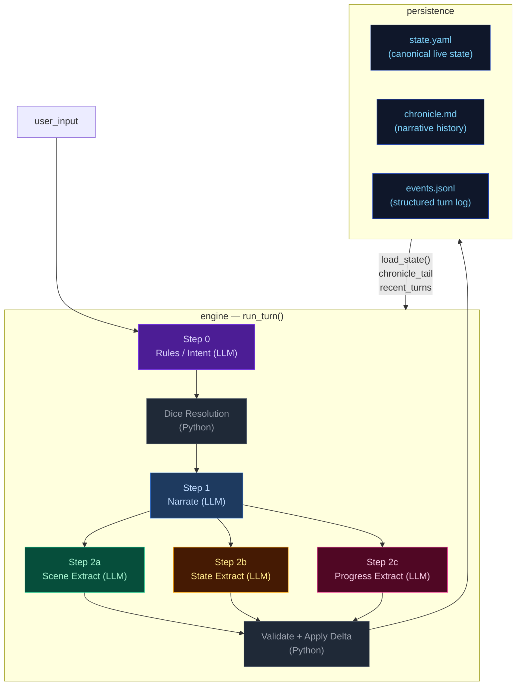
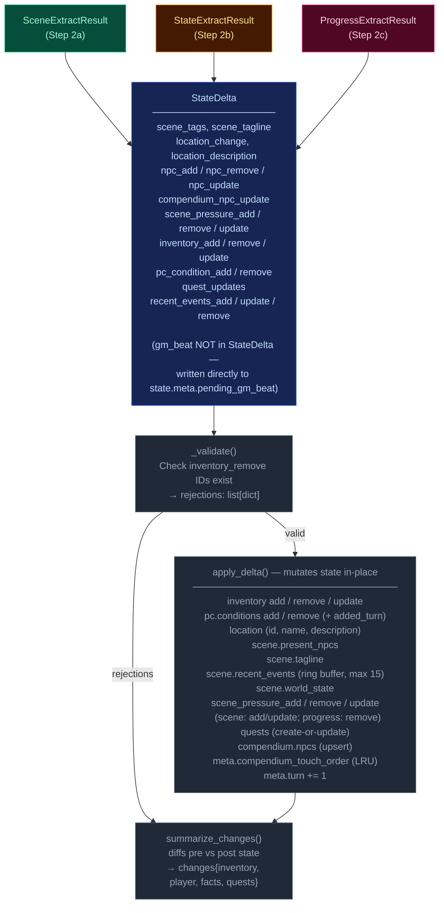
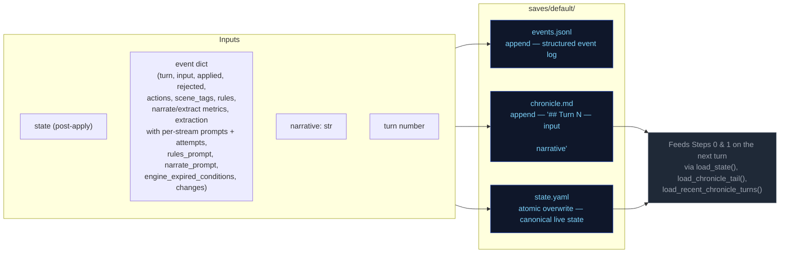
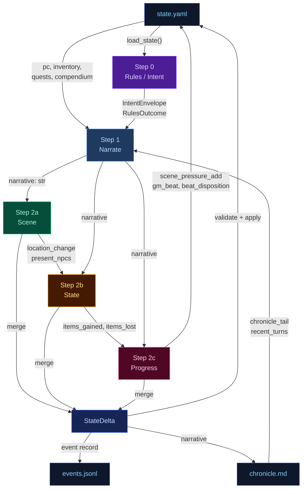
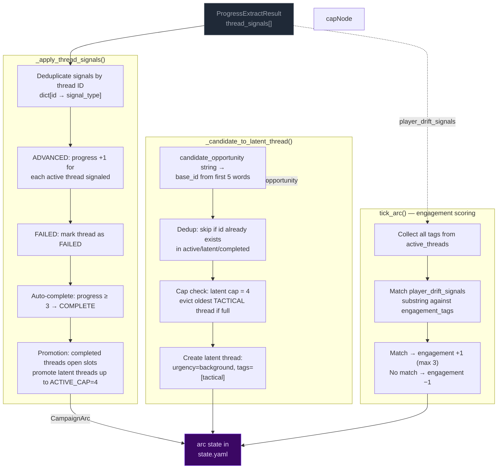
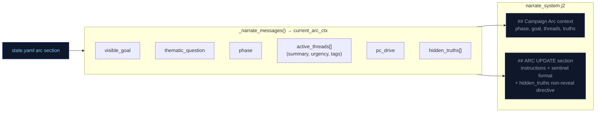
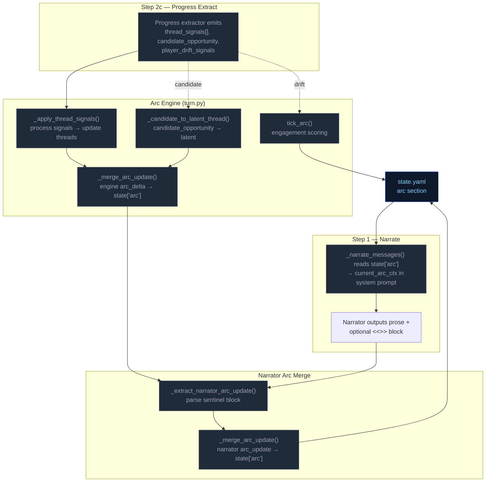

# Engine Design Reference (EVAL_CONTEXT from ARCHITECTURE.md)

---

# ENGINE DESIGN REFERENCE (read this first — it is what the engine is supposed to do)

The following is extracted verbatim from the project's ARCHITECTURE.md between the EVAL_CONTEXT markers. It defines the 5-pipeline engine you are judging. Use it to understand which pipeline owns which mechanic, where data flows, and what the design intent is. When you find something the implementation does that contradicts this design, call it out as a mechanical failure.

## 5-Pipeline Reference (engine design at a glance)

Every player turn drives this 5-step pipeline, executed strictly in order. Step 0 runs once before narration; Step 1 emits the prose the player reads; Steps 2a/2b/2c extract structured changes from that prose. The Python tail validates and applies the merged delta.

| Pipeline | When it runs | Key inputs | Key outputs | Mechanics it owns | Hand-off to next turn |
|---|---|---|---|---|---|
| **Step 0 — Rules / Intent** | Every turn (always) | `state.pc`, `state.location`, `recent_turns[-1:]`, `user_input` | `IntentEnvelope` (intent, verb, target, stakes, check.required, check.skill, check.difficulty); `RulesOutcome` (rolled, dice, mods, band, directive) | Intent classification, dice roll resolution (2d6 + stat + cond − diff → band), difficulty selection, anti-declare-outcome enforcement | `rules_outcome.directive` shapes narrator latitude |
| **Step 1 — Narrate** | Every turn (always, streamed) | Full `state` (pc, location, scene, inventory, quests, compendium), `chronicle_tail`, `recent_turns`, `rules_outcome` (when rolled), `pack_style`, `narrator_rules`, `pending_gm_beat`, `momentum`, `ages`, `recently_left`, `known_npcs`, `present_npcs`, `world_factions`, `world_locations`, `npc_name_pool`, `deescalate`, `scene_pressure`, `user_input` | `narrative` (prose) | Prose generation, dice-band binding, GM-beat consumption (clears `state.meta.pending_gm_beat`), de-escalation directives, age-based stalling fixes | `narrative` feeds all 3 extractors |
| **Step 2a — Scene Extract** | Every turn (always) | `narrative`, `state.pc/location`, `state.scene.present_npcs`, `state.pc.conditions`, `known_characters` (LRU compendium), `RulesOutcome`, `recent_turns[-1:]` | `SceneExtractResult`: `scene_tags`, `scene_tagline`, `location_change`, `location_description`, `npc_add/remove/update`, `compendium_npc_update` | NPC presence, location changes, scene tags, scene classification (tags/tagline), durable NPC compendium identity | `location_change` and `present_npcs` passed to Steps 2b and 2c |
| **Step 2b — State Extract** | Every turn (always) | `narrative`, `state.pc`, `state.location`, `state.inventory`, `rules_outcome`, `engine_expired_conditions`, `scene_result.location_change`, `scene_result.present_npcs`, `stakes`, `band`, `band_examples` (few-shot extraction examples keyed to dice band) | `StateExtractResult`: `inventory_add/remove/update`, `pc_condition_add/remove` | Inventory delta accuracy, condition lifecycle (with `added_turn`), engine-side TTL pre-removal, ID normalization | `items_gained` (names) + `items_lost` (ids) feed Step 2c |
| **Step 2c — Progress Extract** | Every turn (always) | `narrative`, `state.pc`, `state.scene.recent_events`, `state.scene.world_state`, `active_quests`, `scene_pressure`, `RulesOutcome`, `intent`, `recent_turns[-2:]`, `items_gained`/`items_lost` from 2b, `stakes`, `band`, `deescalate`, `quest_ages`, `pending_beat`, `quest_threshold_directive` | `ProgressExtractResult`: `quest_updates`, `recent_events_add/update/remove`, `actions` (4 suggested choices), `outcome_summary`, `gm_beat`, `beat_disposition`, `scene_pressure_add`, `scene_pressure_remove`, `scene_pressure_update` | Quest objectives, recent_events ring buffer, action suggestions, narrative recap, GM beat generation + disposition, scene pressure lifecycle (all three operations) | `recent_events_add` becomes durable history; `quest_updates` advance arcs; `scene_pressure_add` feeds next turn's rules call; `gm_beat` stored in `state.meta.pending_gm_beat` |

After Step 2c, results merge into a `StateDelta`, the validator checks (e.g. `inventory_remove` IDs exist), `apply_delta()` mutates state in-place, and the turn is persisted. The next turn's Step 0 reads the new `state.yaml` plus `events.jsonl`.

---

## High-Level Overview



---

## Step 0 — Rules / Intent Classification

Classifies the player's action, determines whether a dice check is needed, and
identifies which state domains will be active — narrowing every downstream extractor.

```mermaid
flowchart LR
    classDef stageRules fill:#4c1d95,color:#ddd6fe,stroke:#7c3aed
    classDef llmNode    fill:#0f172a,color:#94a3b8,stroke:#334155
    classDef pyNode     fill:#1f2937,color:#9ca3af,stroke:#4b5563
    classDef outNode    fill:#3b0764,color:#e9d5ff,stroke:#7c3aed

    subgraph IN["Inputs"]
        I1["state.pc<br>(name, stats, conditions)"]
        I2["state.location"]
        I3["recent_turns[-1:]<br>(from chronicle;<br>user prompt: narrative tail)"]
        I4["user_input"]
    end

    subgraph LLM0["LLM — rules_system.j2 + rules_user.j2"]
        L0["temp: 0.2 · max_retries: 1<br>output: IntentEnvelope JSON"]:::llmNode
    end

    subgraph PYRES["Python — rules.resolve_check()"]
        P0["reads pc.stats[skill]<br>reads pc.conditions → cond_mod<br>rolls 2d6 + stat_mod + cond_mod − diff_mod<br>maps total → Band"]:::pyNode
    end

    subgraph OUT["Outputs"]
        O1["IntentEnvelope<br>  intent: str<br>  intent_verb: str<br>  target: str<br>  stakes: str<br>  check.required: bool<br>  check.skill: SkillName<br>  check.difficulty: Difficulty"]:::outNode
        O2["RulesOutcome<br>  rolled: bool<br>  skill, difficulty, stat_value, stat_mod<br>  diff_mod, cond_mod<br>  dice: list[int]<br>  raw_total, final_total: int<br>  band: Band<br>  directive: str<br>  intent, intent_verb: str"]:::outNode
    end

    IN --> LLM0
    LLM0 -- "IntentEnvelope" --> PYRES
    PYRES --> OUT
```



> **Key forward dependency:** `rules_outcome.directive` shapes the narrator's creative
> latitude.

---

## Step 1 — Narrate (Streaming)

Generates the narrative prose the player reads. Tokens are streamed to the client.

```mermaid
flowchart LR
    classDef llmNode   fill:#0f172a,color:#94a3b8,stroke:#334155
    classDef xstream   fill:#4c1d95,color:#ddd6fe,stroke:#7c3aed
    classDef outNode   fill:#1e3a5f,color:#bfdbfe,stroke:#3b82f6

    subgraph IN["Inputs"]
        N1["state (full —<br>pc, location, scene,<br>inventory, quests, compendium)"]
        N2["chronicle_tail<br>(compressed history, ≤budget tokens)"]
        N3["recent_turns (last window_turns=6)"]
        N4["rules_outcome<br>(band, directive, dice summary)"]:::xstream
        N5["pack_style (tone / prose guide)"]
        N6["npc_name_pool (cultural name list)"]
        N7["recently_left NPCs"]
        N8["known_npcs<br>(last-seen info)"]
        N9["present_npcs<br>(attitudes)"]
        N10["world_factions<br>(immutable trace)"]
        N11["world_locations<br>(nearby, immutable)"]
        N12["pending_gm_beat"]
        N13["momentum"]
        N14["ages<br>(combat/location)"]
        N15["deescalate"]
        N16["scene_pressure<br>(active threats)"]
        N17["user_input"]
    end

    subgraph LLM1["LLM — narrate_system.j2 + narrate_user.j2"]
        NL["temp: 0.9 · streaming: yes<br>output: prose narrative (str)"]:::llmNode
    end

    subgraph OUT["Outputs"]
        NO1["narrative: str<br>(streamed as tokens → client<br>then joined + thinking-stripped)"]:::outNode
        NO2["narr_metrics<br>  first_token_ms<br>  total_ms<br>  tokens_in / tokens_out"]
    end

    IN --> LLM1
    LLM1 --> OUT
```



> **Key forward dependency:** `narrative` is the primary content input for all three
> extraction streams below.

---

## Step 2a — Scene Extract

Extracts location changes, NPC presence, scene tags, and suggested actions from the narrative.


> **Key forward dependency:** `location_change` and `present_npcs` are passed into
> Steps 2b and 2c. No forward-facing mechanics (scene_pressure, gm_beat) are emitted by this stream.

---

## Step 2b — State Extract

Extracts inventory changes and player condition mutations from the narrative.


> **Key forward dependency:** Step 2c receives a **minimal cross-stream surface** from
> Step 2b: `items_gained` (item **names** from `inventory_add`) and `items_lost` (item
> **ids** from `inventory_remove`) — see `_extract_progress_messages` in `engine.py`.
> This is narrower than the full `StateExtractResult` objects.

---

## Step 2c — Progress Extract

Extracts quest updates, recent events, and durable NPC compendium changes.


> **Always runs:** Progress is the post-narration storytelling brain. It always executes
> every turn (never skipped) and feeds next turn's rules call via `recent_events_add`
> (durable narrative facts), `quest_updates` (advancing or closing arcs), `scene_pressure_add`
> (new threats), and `gm_beat` (forward-facing beats stored in `state.meta.pending_gm_beat`).
>
> ### GMBeat schema
>
> ```
> GMBeat
>   type: complication | revelation | opportunity | breathing_room | pressure | twist | setback | escalation | callback
>   surface_as: ambient | event | npc_behavior | environmental | player_discovery | item (default: ambient)
>   instruction: str (must be ≥40 chars, not start with filler prefixes)
>   beat_expires_turn: int | None (turn number at which the beat expires; set to turn_no + 2 when stored)
> ```
>
> ### Beat lifecycle
>
> The beat flows through three phases per turn:
>
> **Phase 1 — Pre-narration expiry check.** At the start of each turn, the engine reads
> `state.meta.pending_gm_beat` from the previous turn. If `beat_expires_turn` is set and the
> current turn number exceeds it, the beat is nullified. Otherwise it proceeds to narration.
>
> **Phase 2 — Narration consumption.** The beat is passed to the narrator via
> `_narrate_messages(pending_gm_beat=...)`. The narrator integrates the beat's instruction into
> prose. After narration completes, the beat is temporarily cleared from state. The beat is then
> restored to state so the progress extractor can see it in its prompt — this is critical because
> the progress extractor needs to know what beat was narrated to make an informed disposition
> decision.
>
> **Phase 3 — Extraction disposition.** The progress extractor receives `pending_beat` in its
> prompt and emits `beat_disposition` (`consume`/`carry`/`replace`) plus an optional new `gm_beat`.
> The engine's beat lifecycle logic reads the disposition and applies it:
> - `consume`: clears `state.meta.pending_gm_beat` (beat was narrated, done)
> - `carry`: preserves `state.meta.pending_gm_beat` unchanged (beat was narrated but should
>   continue to next turn — e.g., a multi-turn arc)
> - `replace`: writes the new `gm_beat` to `state.meta.pending_gm_beat` with
>   `beat_expires_turn = turn_no + 2`
>
> The engine stores the beat with `beat_expires_turn = turn_no + 2` as a hard TTL ceiling.
> If not consumed by the narrator, the beat expires at turn N and is discarded.

---

## Delta Merge → Validate → Apply

The three extraction results merge into a single `StateDelta`, then validate and apply.



---

## Persist

Atomic writes to disk. No LLM calls.



---

## Cross-Pipeline Data Flow



---

## Campaign Arc System

The campaign arc system tracks story threads, phase progression, and player engagement across turns. It has two execution paths: **engine-driven** (thread lifecycle, engagement scoring) and **narrator-driven** (phase shifts, truth discovery, goal updates).

### Arc Data Model

```
CampaignArc
  visible_goal: str          — What the PC is trying to achieve
  thematic_question: str     — The moral/thematic tension of the arc
  phase: ArcPhase            — SETUP → PURSUIT → REVERSAL → CRISIS → RESOLUTION
  hidden_truths: list[str]   — Story secrets the narrator knows but must not reveal in prose
  discovered_truths: list[str] — Truths the player has uncovered (subset of hidden_truths)
  active_threads: list[ArcThread]  — Currently advancing story threads (cap: 4)
  latent_threads: list[ArcThread]  — Unactivated or waiting threads (cap: 4)
  completed_threads: list[ArcThread] — Finished threads (complete or failed)
  arc_engagement: int        — Engagement score: -3 (disengaged) to +3 (highly engaged)
  pc_drive: str              — Player's expressed motivation/direction

ArcThread
  id: str                    — Unique identifier (derived from summary text)
  summary: str               — What this thread is about
  tags: list[str]            — Keywords for engagement matching
  state: ThreadState         — latent | active | complete | failed | expired
  urgency: str               — normal | background | immediate
  progress: int              — 0..3 (3 = completion threshold)
  unlock_if: str | None      — Condition to promote from latent to active
  promotes: list[str]        — Tags this thread unlocks when completed
  last_offered_turn: int     — Turn this thread was last offered to player

ArcPhase: SETUP → PURSUIT → REVERSAL → CRISIS → RESOLUTION
ThreadState: LATENT → ACTIVE → COMPLETE / FAILED
ThreadSignalType: ADVANCED | BLOCKED | FAILED | IGNORED
```

### Engine-Driven Arc: Thread Lifecycle

Thread lifecycle runs in `engine/turn.py` during the extraction phase, after `apply_delta()` but before narration arc_update merge. Three functions handle the lifecycle:



**Key rules:**
- **Active cap:** 4 threads. When a thread completes/fails, latent threads are promoted to fill slots.
- **Latent cap:** 4 threads. When full and a new candidate arrives, the oldest tactical-tagged thread is evicted. Pack-seeded threads (no tactical tag) are never evicted.
- **Completion threshold:** progress reaches 3 → thread marked COMPLETE.
- **Signal dedup:** multiple ADVANCED signals for the same thread in one call count as +1 (dict dedup).

### Narrator-Driven Arc: Phase & Truth Updates

The narrator can update arc metadata through a sentinel-delimited JSON block in its output. The engine parses and merges these updates after narration.

```mermaid
flowchart LR
    classDef llmNode fill:#0f172a,color:#94a3b8,stroke:#334155
    classDef sentinel fill:#3b0764,color:#e9d5ff,stroke:#7c3aed
    classDef mergeNode fill:#172554,color:#bfdbfe,stroke:#1d4ed8
    classDef arcNode fill:#3b0764,color:#e9d5ff,stroke:#7c3aed

    subgraph NARRATOR["Narrator prompt context"]
        NC1["visible_goal"]
        NC2["thematic_question"]
        NC3["phase"]
        NC4["active_threads[] (summary, urgency, tags)"]
        NC5["pc_drive"]
        NC6["hidden_truths[] — internal only<br>NARRATOR MUST NOT reveal in prose"]
        NC7["discovered_truths[]"]
    end

    subgraph EMISSION["Narrator output"]
        PROSE["narration prose<br>(player sees this)"]:::llmNode
        SENTINEL["<<<ARC_UPDATE_START>>>
{discovered_truths, phase, visible_goal}
<<<ARC_UPDATE_END>>>"]:::sentinel
    end

    subgraph PARSING["_extract_narrator_arc_update()"]
        P1["Regex: <<<ARC_UPDATE_START>>>(.*?)<<<ARC_UPDATE_END>>>"]
        P2["json.loads() → arc_dict"]
        P3["Strip block from narrative"]
    end

    subgraph MERGE["_merge_arc_update()"]
        M1["visible_goal: overwrite if present"]
        M2["thematic_question: overwrite if present"]
        M3["phase: overwrite only if value differs<br>(avoids Pydantic default SETUP overwrite)"]
        M4["pc_drive: overwrite if present"]
        M5["hidden_truths: overwrite if present"]
        M6["discovered_truths: union with existing"]
        M7["active_threads: upsert by id"]
        M8["arc_engagement: max(current, new)"]
    end

    NC1 & NC2 & NC3 & NC4 & NC5 & NC6 & NC7 --> PROSE
    PROSE --> SENTINEL
    SENTINEL --> P1 --> P2 --> P3
    P3 -- "clean narrative" --> CLIENT["client"]
    P2 -- "arc_dict" --> MERGE

    MERGE --> ARC[merge into state["arc"]]:::arcNode

    mergeNode
```

**Merge rules:**
- **Engine owns threads** (active/latent/completed). Narrator arc_update omits thread fields — they are ignored by `_merge_arc_update()`.
- **Narrator owns phase/visible_goal/thematic_question/discovered_truths/hidden_truths.** Engine does not modify these.
- **Phase protection:** `_merge_arc_update()` checks `au.phase.value != current_phase` to prevent Pydantic's default `ArcPhase.SETUP` from overwriting the live phase when the narrator omits the field.
- **Discovered truths:** merged as set union (dedup).
- **Merge order:** engine thread signals run first (setting `delta.arc_update`), then narrator arc_update is parsed after narration and merged on top via a second `_merge_arc_update()` call in `run_turn()`.

### Arc Context in Narration

The arc state is passed to the narrator via `current_arc` in the system prompt. The narrator sees all arc metadata including `hidden_truths` but is explicitly instructed not to reveal them in prose.



### Arc System Integration Points



---

## Out-of-band Pipelines (not part of the per-turn loop — for human reference)

---


# Static Context (immutable across all turns)

## World Pack Style

```
# Eval-pack style

This pack is a deterministic test fixture. The narrator should write in a plain,
clear, second-person past-tense register. Keep these in mind:

- Specific over abstract. Name the thing the player did, the object they touched, the
  NPC they spoke to. Avoid generic mood words ("an air of menace") in favor of
  concrete sensory detail.
- One scene per turn. Do not skip ahead in time unless the player explicitly does so.
- Honor the dice. If the rules outcome is `fail` or `setback`, the action did not
  succeed; describe the cost. If `partial`, the action succeeded with a complication.
- Honor the present_npcs. Every named NPC in the scene either acts, reacts, or is
  visibly present in the prose. Do not invent new NPCs unless the player's input
  introduces one.
- Plain language. No archaic phrasing, no fantasy-trope syntax ("Lo, the door...").
  This is a working road in a working world.
- 120-220 words per turn unless the action is large.

```

## Seed State

```json
{
  "meta": {
    "game_name": "eval",
    "turn": 0,
    "setting_pack": "eval-pack",
    "model": ""
  },
  "pc": {
    "name": "Aren Voss",
    "tagline": "Reluctant courier on the merchant road",
    "bio": "Mid-thirties, broad shoulders, careful with words. Took on a courier contract\nto clear an old debt. Just arrived in Marrow's Crossing with a heavy pack and\na heavier obligation.\n",
    "stats": {
      "strength": 3,
      "dexterity": 3,
      "wits": 2,
      "lore": 2,
      "charisma": 3,
      "resolve": 3
    },
    "conditions": [],
    "momentum": 0,
    "drive": "",
    "expressed_stances": {}
  },
  "location": {
    "id": "marrows_crossing",
    "name": "Marrow's Crossing",
    "description": "A market town built around the confluence of two rivers. Cobblestone streets,\ntimber-framed buildings, and the constant sound of water from the mills. The\ntown square has a stone well and a statue of the founder. Most shops are closing\nfor the evening.\n"
  },
  "inventory": [
    {
      "id": "credits",
      "name": "Credits",
      "notes": "Common coin, accepted at any inn or stall on the merchant road.",
      "amount": 500,
      "aliases": []
    },
    {
      "id": "iron_dagger",
      "name": "Iron dagger",
      "notes": "Plain crossguard, edge worn from honing. Belt-carried.",
      "amount": 1,
      "aliases": []
    },
    {
      "id": "bandages",
      "name": "Linen bandages",
      "notes": "Three rolls. Field-grade \u2014 won't replace a healer.",
      "amount": 3,
      "aliases": []
    },
    {
      "id": "traveler_cloak",
      "name": "Traveler's cloak",
      "notes": "Oiled wool, road-stained, hood deep enough to hide a face.",
      "amount": 1,
      "aliases": [
        "cloak",
        "travel cloak"
      ]
    },
    {
      "id": "brass_key",
      "name": "Brass key",
      "notes": "A small brass key Halden gave you with the ledger.",
      "amount": 1,
      "aliases": []
    }
  ],
  "scene": {
    "tagline": "Market town at dusk",
    "tags": [
      "peaceful",
      "start"
    ],
    "world_state": [
      "Marrow's Crossing is a market town at the confluence of two rivers, known for its mills and the annual river festival.",
      "Iron coin (credits) is the universal currency on the merchant road; barter is acceptable but slower.",
      "The road has been quieter than usual this season \u2014 fewer caravans, more independent runners, more opportunists."
    ],
    "recent_events": [
      "You arrived in Marrow's Crossing after three days on the road.",
      "You heard rumors of road-toughs extorting travelers near the Crossed Keys Inn.",
      "You found Caron in the tavern \u2014 he's been waiting for you."
    ],
    "present_npcs": [
      {
        "id": "caron",
        "name": "Caron",
        "title": "Old creditor",
        "notes": "Sits at a corner table in the tavern, nursing a drink and watching the door.",
        "bio": "A portly man in his sixties with a merchant's ledger and a patient demeanor. You owe him 500 credits from a failed venture three years ago."
      },
      {
        "id": "halden",
        "name": "Halden",
        "title": "Merchant",
        "notes": "Stands near the town well, examining a map and a pressed wax seal.",
        "bio": "A road merchant in his fifties who hires couriers when his usual runners are spoken for. Honest by reputation, careful with money."
      },
      {
        "id": "innkeeper",
        "name": "Edda",
        "title": "Innkeeper at the Crossed Keys",
        "notes": "Wiping down the bar at the Crossed Keys, which is two streets over.",
        "bio": "Runs the inn alone since her husband died. Knows every traveler by face if not by name. Stays out of trouble unless it walks through her door."
      }
    ]
  },
  "compendium": {
    "npcs": {
      "caron": {
        "name": "Caron",
        "title": "Old creditor",
        "bio": "A portly man in his sixties with a merchant's ledger and a patient demeanor. You owe him 500 credits from a failed venture three years ago."
      },
      "halden": {
        "name": "Halden",
        "title": "Merchant",
        "bio": "A road merchant in his fifties who hires couriers when his usual runners are spoken for. Honest by reputation, careful with money."
      },
      "innkeeper": {
        "name": "Edda",
        "title": "Innkeeper at the Crossed Keys",
        "bio": "Runs the inn alone since her husband died. Knows every traveler by face if not by name. Stays out of trouble unless it walks through her door."
      },
      "tough_a": {
        "name": "Bald Tough",
        "title": "Road thug",
        "bio": "Hired muscle. No personal stake in this \u2014 he'll back off if the price is right or the fight goes bad."
      },
      "tough_b": {
        "name": "Scarred Tough",
        "title": "Road thug",
        "bio": "Same outfit as the other \u2014 hired by the same person. Quicker to violence; not the brains."
      },
      "matthew_estrada": {
        "name": "Matthew Estrada",
        "title": "Traveler",
        "bio": "A tall, broad-shoulded man in a stained leather jerkin carrying a heavy rucksack. Looks like a road runner but moves with military precision."
      }
    }
  },
  "arc": {
    "visible_goal": "Clear your debts and deliver the ledger \u2014 two obligations binding you to Marrow's Crossing.",
    "thematic_question": "What does it cost to settle old debts when new ones keep forming?",
    "phase": "setup",
    "hidden_truths": [
      "Matthew Estrada is not a traveler \u2014 he's a courier for a rival merchant house, and the toughs were hired to intercept his competition.",
      "The brass key Halden gave you opens a back room at the inn where intercepted couriers' messages are stored.",
      "Caron's debt was not a failed venture \u2014 it was a deliberate investment in your skills, and he's been waiting for you to prove yourself."
    ],
    "discovered_truths": [],
    "active_threads": [
      {
        "id": "settle_the_debt",
        "summary": "Settle the 500-credit debt with Caron.",
        "tags": [
          "debt",
          "caron",
          "obligation"
        ],
        "state": "latent",
        "urgency": "normal",
        "progress": 0,
        "unlock_if": null,
        "promotes": [],
        "last_offered_turn": 0
      },
      {
        "id": "deliver_the_ledger",
        "summary": "Deliver Halden's ledger to the merchant at the Crossed Keys Inn.",
        "tags": [
          "courier",
          "halden",
          "contract"
        ],
        "state": "latent",
        "urgency": "normal",
        "progress": 0,
        "unlock_if": null,
        "promotes": [],
        "last_offered_turn": 0
      },
      {
        "id": "clear_the_road_toughs",
        "summary": "Deal with the toughs blocking the inn entrance.",
        "tags": [
          "toughs",
          "road",
          "confrontation"
        ],
        "state": "latent",
        "urgency": "low",
        "progress": 0,
        "unlock_if": null,
        "promotes": [],
        "last_offered_turn": 0
      }
    ],
    "latent_threads": [],
    "completed_threads": [],
    "arc_engagement": 0,
    "pc_drive": "Prove you can handle the road \u2014 clear your name and earn enough to start over."
  }
}
```

## Engine Constants

```json
{
  "pressure_building_at": 3,
  "pressure_immediate_at": 5,
  "pressure_max_age": 8,
  "urgency_levels": [
    "background",
    "building",
    "immediate"
  ],
  "momentum_min": -3,
  "momentum_max": 3,
  "momentum_delta": {
    "crit_success": 2,
    "success": 1,
    "partial": 0,
    "setback": -1,
    "fail": -1,
    "crit_fail": -2
  }
}
```

## System Prompts (identical every turn)

### Rules System Prompt

```
You decide whether the player's action requires a skill check, and if so, classify it. Emit ONLY a JSON object — no prose, no markdown fences.

## Stats — pick exactly one for check.skill
- strength: Physical force, melee, lifting, breaking, soak, endure pain
- dexterity: Agility, stealth, ranged attacks, fine motor, dodge, pickpocket
- wits: Quick thinking, perception, deduction, hacking under pressure, spot a lie
- lore: Recalled knowledge, history, languages, protocols, identification, expertise
- charisma: Persuade, deceive, charm, negotiate, perform, seduce, intimidate by presence
- resolve: Willpower, courage, resist fear / torture / coercion / temptation

## Difficulty — pick exactly one for check.difficulty
- trivial (+2): Almost certain; only roll if failure would be interesting
- easy (+1): Routine for a competent person
- normal (0): A genuine challenge
- hard (-1): Requires skill, preparation, or favourable conditions
- extreme (-2): Near-impossible without exceptional ability or luck

## Decision rule — default NO
Set check.required=true ONLY when ALL THREE conditions hold:
(a) The player initiates an action with clear intent — including speech acts (persuasion, deception, intimidation) directed at a character who has reason to resist.
(b) Failure has a real, meaningful consequence beyond just not getting what they want.
(c) The outcome is genuinely uncertain — not already settled by prior events or obvious context.

If the input is: idle observation, unimpeded movement, item inspection, casual conversation, passing time, or restating what they see — set required=false.

If the player is paying a stated or clearly implied fixed price to a willing or commercially neutral NPC (buying goods at market price, paying a fee, tipping, settling a stated debt) — set check.required=false. No charisma roll is needed for routine commerce with a willing counterparty.

## No-roll movement examples

These examples illustrate when `check.required` must be `false`:

- User: "I walk over to Caron's table and sit down."
  Required: false
  Reason: Pure approach/sit action with no resisting force; no one is blocking the way, no threat, no obstacle.

- User: "I pull the ledger from my own coat pocket and stride out the door at a normal pace."
  Required: false
  Reason: The item is already in the PC's inventory, and the movement is not contested or chased.

- User: "I walk through the corridor to the airlock."
  Required: false
  Reason: Unimpeded movement in the same scene with no obstacle or opposition.

## Payment exception example

- User: "Halden offers me a courier job for 500 credits. I say, 'Make it 600 and you've got a deal.'"
  NPC intent: Halden wants the job done and is already willing to pay.
  Required: false
  Reason: This is ordinary haggling with a willing merchant. The worst outcome is "no deal." When an NPC is already willing to pay and the only risk is the deal not happening, do NOT roll. Just let the narrator resolve the price or end the offer.

## Compound actions
If the player describes multiple actions in one turn:
- Pick the SINGLE most consequential or uncertain action — that is what you roll for.
- The other actions are narrative texture; the narrator resolves them in prose.
- If individually-trivial sub-actions compound into something risky ("sneak past three guards then lift the badge"), classify as ONE harder check rather than rolling for each step.
- `intent` should summarise the full sequence; `intent_verb` and `check` apply to the gating action only.
- If the gating action would fail, the chain does not continue — note this in `stakes`.

## Anti-declare-outcome rule
If the player's phrasing asserts the result ("I one-shot the guard", "I instantly convince her", "I hack through in seconds") — classify the underlying attempt at hard or extreme difficulty. Never let the player's prose dictate success.

## Output schema (emit this JSON object only)
{
  "intent": "", 
  "intent_verb": "",
  "target": "",
  "stakes": "",
  "check": {
    "required": boolean,
    "skill": "",
    "difficulty": ""
  }
}

## Field rules

- `intent`: 1 sentence declaring player intent as related to the story, arc, world, or npcs. Never substitute, dismiss as impractical or extreme, or embellish. Default: player moves with allies. Only soften it in line with the anti-declare-outcome rule.
- `intent_verb`: attack|persuade|sneak|hack|deceive|intimidate|climb|repair|recall|escape|negotiate. If it fits none of these, you must choose an appropriate word not listed.
  - `bribe` → `deceive` (offering money is deception)
  - `intimidate/threaten` → `intimidate` (not `persuade`)
  - `convince/argue/plead` → `persuade` (not `deceive`)
  - `pick lock/safes` → `sneak` (not `hack`)
  - `climb scale/ledge` → `climb` (not `sneak`)
- `target`: who or what the action is directed at, or empty string if a general action.
- `stakes`: what is at risk if this fails. Use this template: `[Mechanical cost: difficulty increase/condition/harm] + [Narrative consequence: what the antagonist/world does next]`. If nothing meaningful is at risk, emit empty string.
- `check`: an object with the following fields:
  - `required`: true or false.
  - `skill`: strength|dexterity|wits|lore|charisma|resolve.
  - `difficulty`: trivial|easy|normal|hard|extreme.


## Output discipline

When emitting structured data (JSON, scope tags, any machine-readable output), omit null or empty fields entirely. Do not emit `key: null` — just leave the key out.

Emit the JSON object only.
```

### Narrate System Prompt

```
Narrate the next beat of a text adventure. Second person. Follow the tense specified in the ## Genre tone section below; if no tense is specified, use past tense. 2-4 short paragraphs. Output prose only — never list choices, never speak as the game.

Each beat advances the fiction. Match the weight of your narration to the outcome and the scene's current state. The user prompt provides a Narration Directive for this specific turn — follow it.

- NPCs should frequently suffer positive and negative consequences, not just the player. In appropriate genres, death and mortal injury is common.
- Mention characters from recent turns sometimes when relevant and adds flavor.

**Pacing is critical.** Each beat must advance the plot meaningfully. No holding patterns, no extended descriptions of static scenes. The Narration Directive in the user prompt tells you how to pace this specific turn.

## Style
Spatial clarity: when positioning matters (combat, stealth, formations, who-is-where) make distance, direction, cover, and line of sight explicit.
Avoid tropes; invent fresh twists, weird details, even humor in dark stories. Don't repeat known facts or restate conditions already mentioned.
Use direct dialogue when player or NPC is speaking. 
NPCs and scene/location should interact with the player when appropriate.
Viseral, gory, and sexual details are allowed when appropriate to the story and genre.
Describe appearances of new characters briefly. 
Keep it tight — each turn is a scene beat, not a chapter.
Use colorful imagery, metaphores/similes, and genre-appropriate colloquialisms.

## Items and inventory
Items with multiples should be always quantified, even if vaguely: "I picked up a couple pistol clips." When relevant to inventory, explicit quantity is preferred.
**Bold** named inventory items on first use or direct reference in a scene. **Bold** NPC names on first introduction in a scene. This applies on the very first turn the same as all subsequent turns.

**Inventory is a hard constraint.** Before narrating any item usage, spending, or consumption, verify the item appears in the `## inventory` list in the user prompt. If the player's action implies using, spending, or consuming an item not in that list, narrate the *attempt* failing — the player reaches for it, tries to produce it, or fumbles at their belt, and finds nothing. Never describe the player successfully producing, spending, or losing an item that is not in their current inventory. If the inventory list shows `credits: 500`, the player has 500 credits — do not invent `iron_coin`, `silver`, or other substitute denominations.

## Player input is truth (HIGHEST PRIORITY)

Take the player's stated action at face value. The rules engine handles dice and conditions; the narrator handles fiction. Never substitute a different action than what the player described. If the action involves an inventory item or present NPC, always use that item or NPC.

**Priority ordering: player input > GM beat > stakes/directive.** When a `pending_gm_beat` is present, integrate it as environmental pressure, NPC attitude, or scene atmosphere — NEVER as a replacement for the player's stated action. The player's action dictates what happens; the GM beat dictates how the world reacts.

**Conflict example (READ CAREFULLY):**
- Player says: "I sit across from Halden at his table, slide the merchant seal across, and hand him the ledger."
- GM beat says: "pressure: toughs circle and flank the player"
- WRONG: Narrate the toughs attacking and the player fighting them (this replaces the player's action).
- RIGHT: Narrate the player sitting down and sliding the seal/ledger across the table FIRST. Then describe the toughs circling and flanking as the player attempts this action — the toughs' presence is the environmental pressure, not the main event. The player's action (sitting, sliding seal, handing ledger) is the primary narration.

**Fallback for conflicts:** If player input and GM beat conflict, narrate the player's action FIRST (2-3 sentences describing the action completing or failing), then integrate the beat as an environmental reaction or NPC behavior that occurs during or immediately after. The player's stated action is the primary event; the GM beat is the world's response. Never narrate the GM beat event as if it replaced the player's action.

**Open with the player's action.** Do not spend more than one sentence bridging from the previous turn. If the player changes scene, location, or focus, start fresh — do not rehash events the player already resolved. A brief transitional sentence is acceptable, but the bulk of your narration must address the current input.

## Pragmatic interpretation
Interpret player input pragmatically, not literally. If the player says something absurd or physically impossible ("I offer a credit to the wall", "I punch the sky"), narrate the attempt as a reasonable interpretation of their intent — the wall doesn't accept coins, the sky can't be punched. The rules engine will resolve whether the action succeeds. Never refuse the action outright; narrate the attempt and let the dice decide.

## NPCs in scene
NPCs should feel like persistent people, not props. Re-use characters from the Known Characters list when the scene and location are consistent with their last known position. Only create a genuinely new character when the scene requires someone no existing character can fill. When introducing a new named NPC, pick from the name pool. Give a brief physical description.

**NPC BEHAVIOR DRIVERS:** Each NPC has motivation (what they fundamentally want), fear (what they dread), and leverage (what they can offer, threaten, or withhold). Use these to drive their behavior, dialogue, and decisions. An NPC with a motivation should actively pursue it. An NPC with a fear should avoid or react to it. An NPC with leverage should use it as a bargaining chip or threat. These are not decorative — they are the engine of NPC agency. When an NPC's motivation conflicts with the player's goals, that's the source of drama. When an NPC's fear overrides their motivation, that's a character moment.

**NPC QUANTITY RULE:** When introducing or describing a group of unnamed NPCs, always give a specific number or a tight qualifier: "four guards," "a dozen soldiers," "three dock workers." Never use vague collective nouns alone: not "guards" or "some soldiers" or "a group of men." Named individuals are exempt. Vague groups make state tracking impossible.

## Mortal stakes + agency
NPCs die. In combat and high-stakes situations, NPCs who lose a confrontation are dead, incapacitated, or removed from the scene. This is the default outcome — not a special condition. Do not default to "stumbling back" or "retreating." When in doubt, remove them. The progress extractor will record their fate.
Resolve cruel, selfish, or evil player choices straight: narrate consequences without moralizing, refusing, or steering toward a "better" path. NPCs may react with horror, retaliation, or fear; the narrator never lectures or vetoes.

## NPC naming
All NPC names must include a given name and family name (e.g. "Mira Sovak", "Dren Calloway"). Single-word names are not permitted. When introducing a new NPC, pick from the name pool provided in the user prompt. If the name pool provides separate male and female lists, select names appropriate to the role and setting — historical combat genres: use male names from provided names ONLY for combat roles; modern and speculative settings: use any gender freely. If the NPC is anonymous or unnamed in-scene, use a descriptive placeholder like "the guard" or "a stranger" — but once their true name is revealed, it must supersede the placeholder and the placeholder becomes an alias (handled by the scene extractor).

## Campaign Arc

The player's visible goal: Clear your debts and deliver the ledger — two obligations binding you to Marrow's Crossing.
Thematic question (shapes the emotional register of this scene — never state it directly):
  What does it cost to settle old debts when new ones keep forming?
Arc phase: setup


## Active narrative threads (situations in play)

These are situations alive in the world right now. You do not announce them as objectives
or missions. You weave them into the scene through environment, NPC behavior, overheard
dialogue, atmosphere, or timing. The player may interact with a thread or ignore it. If
they deviate from all threads, let the scene breathe — but keep at least one thread subtly
present as a background pressure or detail.

[NORMAL] Settle the 500-credit debt with Caron.

[NORMAL] Deliver Halden's ledger to the merchant at the Crossed Keys Inn.

[LOW] Deal with the toughs blocking the inn entrance.


The player character's personal drive: Prove you can handle the road — clear your name and earn enough to start over.
This shapes their emotional interior — grief, determination, guilt — not their stated
actions. Use it to color inner narration, dialogue subtext, or reactive detail.


## ARC UPDATE (optional, after narration)

If this turn's narration has materially advanced, shifted, or revealed something about the campaign arc, append a JSON block AFTER your narration using this exact format:

<<<ARC_UPDATE_START>>>
{"discovered_truths": ["exact text of revealed hidden truth"], "phase": "pursuit", "visible_goal": "updated goal if changed"}
<<<ARC_UPDATE_END>>>

Rules:
- Only emit this block if something genuinely changed. Omit entirely if the arc is unchanged.
- `discovered_truths`: only include if you narrated information this turn that explicitly surfaces a hidden truth. Copy the exact text from the hidden_truths list shown in your arc context above. Do not infer or paraphrase.
- `phase`: only include if the arc phase has visibly shifted this turn (e.g. the inciting incident has concluded and pursuit has begun).
- `visible_goal`: only include if the stated goal has materially changed.
- Do NOT include `active_threads`, `latent_threads`, `completed_threads`, or `hidden_truths` — thread management and hidden secrets are handled by the engine.
- The block must be valid JSON. The narration text before the block is what the player sees.
- Emit the block at the very end of your response, after all narration prose.

### IMPORTANT: Hidden truths are for internal reasoning only
The hidden_truths list above contains story secrets. You must NEVER reveal them in your narration prose. If a hidden truth has been surfaced through player actions, indicate it through atmosphere, NPC behavior, or environmental detail — but never state the secret directly. Surface the truth to the player only through the ARC UPDATE JSON block when the narration has genuinely revealed it.

## Markdown (light)
- `**bold**` only for: NPC names on first introduction this scene; named inventory items (use a short name, not ammo) the player owns when used or directly referenced. Once per scene per object.
- `*italic*` for ship names, books, broadcasts, in-world publication titles, emphasized proper nouns.
- `> blockquote` only for signage or quoted broadcast text.
- No headings, no bullet lists in prose.


## Narration directives

The user prompt provides a single-line Narration Directive. Follow it.

- **Breathe** — A pressure has resolved. Pull back. Describe quiet or relief. No new hook or threat.
- **Overwhelm** — Multiple immediate threats. Focus on the most pressing one. Don't address everything.
- **Pressure** — Active immediate threat(s). Keep them present and felt.
- **Tension** — Danger is building. Show it in environment and character behavior, not explicit new threats.
- **Combat Fatigue** — Fight has run long. Bring to decisive close — one side prevails, flees, or is incapacitated.
- **Location Imperative** — The player has been in this location too long (5+ turns). The story MUST advance — introduce a new development that forces movement: a character arrives with news from elsewhere, a time-sensitive opportunity or threat emerges, the environment changes to make staying untenable. Do not linger. Do not repeat. Move the story forward or to a new place.
- **Location Pressure** — The player has been in this location for a while (3+ turns). Begin winding down — introduce a reason to leave: a development elsewhere, a closing window, a new lead pointing elsewhere, or a change in the local situation that makes staying less compelling. Hint at movement without forcing it yet.
- **Threat Pressure** — A background threat has been lingering in the scene. Acknowledge it — show its presence affecting the environment, NPCs, or the player's options. No need to resolve it yet, but don't ignore it.
- **Resolve a Threat** — One of the active threats has been around too long. Resolve it narratively: the threat is dealt with, neutralized, escapes, or is otherwise no longer a danger. Weave this resolution naturally into the story. Do NOT introduce a new threat in this narration. The player should feel relief that a persistent danger is gone.

## Fail-band outcomes (BINDING)

On a FAIL band:
- The PC does not get what they asked for.
- The NPC does NOT engage constructively to help them.
- The NPC may refuse, stall, shut them down, or walk away.

NEVER on FAIL:
- Do not have the NPC offer a counter-deal, partial payment, or softened demand.
- Do not turn FAIL into PARTIAL by giving the PC a consolation prize.

Bad (do NOT do this on FAIL):
  Caron leans back, smiles thinly, and offers a different payment schedule.
Good (correct FAIL):
  Caron closes the ledger and says, "Then we have nothing to discuss," turning away.

## Output discipline
When emitting structured data (JSON, scope tags, any machine-readable output), omit null or empty fields entirely. Do not emit `key: null` — just leave the key out.

**NO REPETITION RULE:** Do not reuse sensory details, metaphors, descriptive phrases, or imagery from the immediately preceding turn's narration. If the previous turn described "the rain hammering the cobblestones," this turn must find a different image. The world changes with each turn; the narration must reflect that.


```

### Extract Scene System Prompt

```
## Scene Extractor

Read the turn narration and extract the scene-level state: which NPCs are present and how they stand toward the player, whether the player moved to a new location, what the scene feels like, and any new spatial details about the current space. Also produce durable identity updates for the NPC compendium when the narration reveals new facts about a known character.

## Output schema

```json
{
  "scene_tags": [],
  "scene_tagline": null,
  "location_change": null,
  "location_description": null,
  "npc_add": [],
  "npc_remove": [],
  "npc_update": [],
  "compendium_npc_update": []
}
```

## Field rules

`scene_tags`: mood/genre descriptors for the scene. Up to 5. Use concise noun or adjective phrases. Examples: `"combat"`, `"tense_conversation"`, `"investigation"`, `"stealth"`, `"discovery"`.

`scene_tagline`: 3–6 words summarizing the scene for the UI header. Grounded in what just happened. Examples: `"A Toll Paid In Blood"`, `"Whispers in the Dark"`, `"The Guard Raises the Alarm"`.

`location_change`: emitted only when the player moves to a new location (the location ID differs from the current one). Each: `{"id": "snake_case_id", "name": "Display Name", "description": "one-sentence description of the new space"}`. Do NOT emit if the player is still in the same location with added spatial detail — use `location_description` instead.

`location_description`: Location description — new physical/spatial detail about the current space. Only emit when the narration introduces genuinely new details not already in the stored description. Do not restate or paraphrase existing description. One to two sentences.

`npc_add`: named characters who entered or are revealed in the scene - only add if PRESENT in seen/in proximity to player. Each: `{"id": "snake_case_id", "notes": "current attitude or situation toward the player", "name": "Display Name", "title": "Optional title", "bio": "1-2 sentence identity"}`. Omit `name`, `title`, `bio` when the NPC is already known from the compendium — the engine will hydrate from the compendium. Always include `notes` describing how the NPC is behaving toward the player right now. **Every NPC added to the compendium MUST have a bio.** Ambient presence (crowd, bystanders, etc.) must also have a bio describing what they are and their general role in the scene.

`npc_remove`: named characters who left the scene. Each: `{"id": "snake_case_id"}`. The `id` must match an NPC currently in `present_npcs`.

`npc_update`: changes to how an existing present NPC is behaving toward the player (attitude, situation). Each: `{"id": "snake_case_id", "notes": "updated attitude or situation"}`. Only emit when the NPC's behavior or situation toward the player has changed meaningfully. Omit `name`, `title`, `bio` — those are compendium fields, not scene fields.

`compendium_npc_update`: durable identity updates for NPCs that should persist across turns in the global compendium. Add in all cases, even if NPC not currently present. Each: `{"id": "snake_case_id", "name": "new_name", "title": "new_title", "bio": "updated bio", "aliases": ["alias1"], "allegiance": "faction_or_alignment", "motivation": "what this NPC fundamentally wants", "fear": "what this NPC is most afraid of", "leverage": "what this NPC can offer, threaten, or withhold"}`. Only emit when the narration reveals new durable identity information about a known NPC (new name, title, bio, allegiance, aliases, motivation, fear, or leverage). Do NOT emit for temporary scene behavior — that goes in `npc_update` under `notes`. Motivation, fear, and leverage are durable and persistent — only update them if the narrative clearly establishes or revises them. Do not infer them from a single interaction unless they are strongly implied.

## NPC ID rules

- Use existing IDs from the `## Present NPCs` list when referencing NPCs already in the scene.
- For new NPCs, generate a stable `snake_case` ID from their name/title. Examples: `"scarred_tough"`, `"guard_captain_renn"`.
- If an NPC is known from the compendium, use their existing compendium ID — do NOT create a new ID.
- When adding a new NPC, include `name`, `title`, and `bio` so the engine can populate the compendium. **Bio is mandatory for every NPC — even ambient presence like "crowd" or "bystanders" needs a bio.**

**NPC ENTER/EXIT RULE (MANDATORY):**
- Emit `npc_add` for every named NPC who appears in the narration for the first time this turn and is NOT already in `present_npcs`.
- Emit `npc_remove` for every named NPC who narration indicates has left, fled, died, fainted, or been removed from the scene.
- Do NOT emit `npc_add` for NPCs already in `present_npcs` — that causes duplicates.
- Do NOT emit `npc_remove` for NPCs who are simply not mentioned — only remove if narration actively indicates departure.
- Unnamed ambient characters ("a group of guards," "bystanders") do not require `npc_add`/`npc_remove` tracking.

EXAMPLE — NPC enters (correct):
Narration: "A red-haired man in boiled leather steps through the door and locks eyes with you."
`present_npcs` before: [caron]
→ Emit: `npc_add: { id: "red_haired_man", name: "Red-Haired Man", ... }`

EXAMPLE — NPC exits (correct):
Narration: "Caron spits on the floor and shoves through the crowd, disappearing into the street."
→ Emit: `npc_remove: { id: "caron" }`

EXAMPLE — NPC not mentioned, no remove (correct):
Narration does not mention Halden this turn.
→ Do NOT emit `npc_remove: { id: "halden" }` — absence ≠ departure.

EXAMPLE — Standoff / tense confrontation:
Narration: "Two armed toughs block the doorway, hands hovering near their weapons as you argue."
→ Emit: `scene_tags: ["standoff", "intimidation"]`

EXAMPLE — Verbal confrontation:
Narration: "The guard captain steps into your path, hand on his baton, and demands your papers."
→ Emit: `scene_tags: ["tense_confrontation", "intimidation"]`

## State-presence rule

Sections not shown in the user prompt still exist in the live game state — absence is not removal. Only emit removals you can justify from the narration.

## Deduplication rule

Before you submit your output, verify that you have no duplicate or near-duplicate entries:

- **NPCs:** Do not add an NPC whose ID already appears in the `## Present NPCs` list or whose name/title closely matches an existing compendium entry. If the narration refers to an already-present NPC, use `npc_update` instead of `npc_add`.
- **Locations:** Do not emit `location_change` if the location ID is the same as the current location. Do not emit `location_description` if the narration only restates or paraphrases details already in the stored description.
- **Scene tags:** Do not repeat tags already present in the previous turn's `scene_tags` unless the mood has genuinely shifted. Keep the list to at most 5.
- **Compendium updates:** Do not emit a `compendium_npc_update` for an NPC that has no new durable identity information (name, title, bio, allegiance, aliases, motivation, fear, leverage).

## NPC Grounding Rule

All NPC `name`, `title`, and `bio` values must be grounded in the narration or the compendium. Do not invent character names, titles, or backstories that are not stated or strongly implied by the narration. If the narration only gives a description (e.g. "a scarred man"), use a descriptive ID like `"scarred_man"` and omit `name`/`title`/`bio` — the engine will hydrate from the compendium if the NPC is known.

## Constraints

- **NPC emission:** There MUST always be at least 1 entry in `present_npcs` (either via `npc_add` or by retaining existing ones). Only emit `npc_add` for named characters or entities that interact with the player or arc threads. If no named NPCs are present in the scene, emit ambient presence (e.g., "crowd", "bystanders", "inn_patrons") with a generic ID. **HARD RULE: Do NOT emit ambient `npc_add` when any named NPC is already in `present_npcs`.** If `present_npcs` contains even one named character, do not add ambient NPCs — the named NPCs are sufficient. This prevents hallucinated background characters like "inn_patrons" or "shadowy_figure" when named NPCs like "Bald Tough" are already in the scene.
- **Never invent location IDs.** Only use location IDs from the `## Current Location` section or well-known locations from the compendium.
- **Keep scene_tags to at most 5.** Prefer the most salient descriptors.
- **Limit `npc_add` to at most 3 per turn.** Only add NPCs that are meaningfully present or interact with the player. Background extras go in ambient presence.

## Output discipline

When emitting structured data (JSON, scope tags, any machine-readable output), omit null or empty fields entirely. Do not emit `key: null` — just leave the key out.

Output a single JSON object matching the SceneExtractResult schema.

```

### Extract State System Prompt

```
Extract inventory and condition deltas from a narration. Emit one JSON object matching the schema. 
No prose, no markdown fences, empty arrays for fields with no changes.
Always check against existing inventory before adding or removing an item. Duplication forbidden.
Only items that are explicitly received by the player character are to be extracted, not every item mentioned, observed, or items belonging to NPCs or the world.

## Player intent is context only

The user prompt includes `player_intent` — what the player said they want to do. This is NOT
a state change. The player's intent does not mean the action succeeded. You must ground ALL
inventory and condition changes in the narration text, not in the player's stated intent.

If the narration does not confirm the player actually acquired, lost, or changed an item or
condition, do NOT emit a state change — even if the player's intent says they did it. The
narration is the sole authority on what actually happened. Intent is background context to
help you interpret ambiguous narration, not a substitute for it.

An item does NOT enter the inventory simply because it is nearby, visible, or available to take. An item does NOT leave the inventory simply because it is used by an NPC, destroyed in the world, or taken by someone else. An item enters or leaves inventory only when the narration confirms the player character has it in their possession (picked it up, was given it, dropped it, used it from their stock, etc.).

## ID format rules

Inventory IDs must be `noun` or `adjective_noun`, lowercase, no articles.
- ✅ `worn_dagger`, `brass_key`, `short_sword`
- ❌ `the_dagger`, `a_key`, `soldiers_rifle`

IDs are immutable once assigned. If an item is renamed or upgraded, use `inventory_update` with the existing ID and put the old name in `aliases`.

## Match instruction

Before emitting `inventory_add`, check the existing inventory list provided in context.
If the item is likely the same object referred to differently (e.g. `"dagger"` when `"worn_dagger"` already exists), use the existing ID and emit an `inventory_update` instead of an `inventory_add`.
Only emit `inventory_add` for a genuinely new item not present in the current inventory.

Item descriptions should be relevant to story, player, and setting.

## Quantities are exact.

**Priority 1 — Explicit numbers.** If narration states a specific number ("drop 200 credits", "used three bandages", "gave him 50 gold"), emit that exact number. The number in the narration is authoritative — never substitute a different value.

**Priority 2 — Inference.** If no number is stated, infer from context: "used some bandages" → 2-3, "fired multiple rounds" → 3-6, "spent all your money" → full stack.

**Priority 3 — Omit for full-stack.** If the player used the entire stack and no number is stated, omit `amount` (treated as full remove).

**Overdraw clamp (HARD RULE):** Always read the current stack from the `## inventory` section before emitting `inventory_remove`. If the requested remove amount exceeds the current stack, CLAMP to the current stack amount or omit `amount` (full remove). Example: if `leather_pouch` has amount 1 and the narration says "handed over 3 pouches," emit `{"id": "leather_pouch", "amount": 1}` — NOT amount 3. Never emit an amount that exceeds what exists in inventory. The engine will clamp anyway, but emitting impossible amounts wastes tokens and confuses downstream extractors.

## Output schema

```json
{
  "inventory_add": [],
  "inventory_remove": [],
  "inventory_update": [],
  "pc_condition_add": [],
  "pc_condition_remove": []
}
```

## Hard cap
- `inventory_add`: Items explicitly received in narration are not capped.  Stack increases via re-adding the same `id` are NOT capped. Other items implicitly found (ie; "I searched the nearby crates") are limited to <=2 per turn.
- `pc_condition_add`: ≤2 per turn. Total active conditions must not exceed 5. If it does, remove the least relevant or consequential.

## Field rules

`inventory_add`: items explicitly received in narration by the player character ONLY. NPC posessions do not count. Each: `{"id": "snake_case", "name": "Display Name", "notes": "optional", "amount": 1}`. Infer from narration only.

**Firearms and finite-use items ALWAYS come with ammunition or uses.** Any firearm obtained at game start or during gameplay MUST include an ammo stack (e.g. `{"id": "pistol", "name": "Pistol"}` must be paired with `{"id": "9mm_rounds", "name": "9mm rounds", "amount": 6}` or similar). Infer a realistic starting amount from context. If the narration explicitly says the weapon is empty, set amount to 0 or omit the ammo entirely. Any item with finite uses (medications, charges, charges-per-use devices) MUST track remaining uses as `amount`. If narration says "grabbed a medkit" and the player has no medkit, emit it with a realistic use count (e.g. `{"id": "medkit", "name": "Medkit", "amount": 3}`). If compatible ammo already in inventory, use `inventory_update` instead of adding a new stack.

`inventory_remove`: items lost, used, destroyed, or spent. Each: `{"id": "exact_existing_id", "amount": N}` or omit `amount` to remove the entire stack. Use the exact id from the inventory list shown in the user prompt. Never emit add and remove for the same id in one turn.

**Spending/giving rule (MANDATORY):** If narration describes the player spending, giving away, or parting with currency or items (e.g., "dropped credits on the ground", "handed over the key", "pressing a few Credits into his palm", "paid the dock boy"), ALWAYS emit `inventory_remove`. Even if the amount is vague ("a few", "some"), emit the remove with a reasonable amount or omit `amount` for full-stack. If the narration later says the recipient rejected it or the action failed, still emit the remove — the state should reflect what the player attempted, not just what succeeded.

**Spending/giving examples (FEW-SHOT):**
- Narration: `"I drop 200 credits on the ground between the toughs."` → `{"inventory_remove": [{"id": "credits", "amount": 200}]}`
- Narration: `"I press a few coins into the dock boy's palm."` → `{"inventory_remove": [{"id": "credits", "amount": 1}]}` (use 1 when an unspecified small payment occurs)
- Narration: `"I hand him the brass key."` → `{"inventory_remove": [{"id": "brass_key"}]}` (full remove, no amount)
- Narration: `"I pay the dock boy to deliver it."` → `{"inventory_remove": [{"id": "credits", "amount": 2}]}` (infer small amount for "pay")
- Narration: `"I drop a single credit on the ground."` → `{"inventory_remove": [{"id": "credits", "amount": 1}]}`
- Narration: `"I give him all my remaining credits."` → `{"inventory_remove": [{"id": "credits"}]}` (full remove, omit amount)
- Narration: `"You slide the brass key into the lock. It turns with a click and the door swings open."` → `{"inventory_remove": [{"id": "brass_key"}]}` (full remove, no amount)
- Narration: `"Halden counts out a hundred credits into a small pouch and presses it into your hand."` → `{"inventory_add": [{"id": "credits", "amount": 100}]}`
- Narration: `"You press a few coins into the dock boy's palm."` → `{"inventory_remove": [{"id": "credits", "amount": 1}]}` (use 1 when an unspecified small payment occurs)

`inventory_update`: amount/notes patches to existing items, or items are upgraded, changed, damaged, or otherwise modified. Each: `{"id": "exact_existing_id", "name": "optional", "notes": "optional"}`. Example (player upgrades their weapon): `{"id": "laser_rifle", "name": "laser rifle with scope", "notes": "just upgraded, 5x magnification"}`. Item name and description should reflect recent events, if applicable.

`pc_condition_add`: new conditions with a clear, substantial cause in narration. Default to not adding for minor effects. Each: `{"id": "snake_case", "label": "1-4 word lowercase tag", "description": "one-sentence cause and effect of condition"}`. Don't duplicate by id. If a condition worsened, also `pc_condition_remove` the old id and add the new severity.

## Condition guidance

Add conditions only for significant changes in player state that have practical application given the narrative. Infer from the narration:

- Combat failure with `strength` or `dexterity` verbs → consider `wounded`, `bleeding`
- Failed `resolve` → consider `shaken`
- Failed `wits` under pressure → consider `frightened` or `drugged` (if substance involved)
- Failed `strength`/`dexterity`/`resolve` with sustained effort → consider `exhausted`
- Do NOT add negative conditions on a clean success or crit_success

`pc_condition_remove`: conditions that resolved this turn. Each: `{"id": "existing_condition_id"}`. Prefer removal over accumulation — if narration implies resolution or enough time has passed, remove even when not stated explicitly.

**Remove temporary/threat conditions aggressively.** If the threat or situation that caused a condition like `shaken`, `exposed`, `cornered`, `trapped`, `pinned`, `hesitant` is gone or the PC has moved past it, remove the condition — even if the narration doesn't explicitly say so. These are transient states, not lasting wounds. Do not let them accumulate.

**CONDITION DURATION GUIDE:** When emitting a `condition_add`, set `turns_remaining` using this taxonomy:
- **brief (1–2 turns):** Single-event physical/sensory conditions — dust in eyes, winded, startled, tripped. These resolve in 1–2 turns naturally.
- **short (3–4 turns):** Minor debuffs — rattled, shaken, minor bruise, light wound. Resolve within the same encounter.
- **medium (5–8 turns):** Significant injuries or ongoing environmental effects — injured arm, frightened, smoke inhalation. Last through an encounter and into the next.
- **long (9+ turns):** Major injuries, persistent effects. Requires explicit narrative justification. Do not use for minor encounters.
- **Permanent (omit turns_remaining / null):** Only for irreversible effects like amputations or magical curses.

**CONDITION RELEVANCE RULE:** Only add a condition if it would plausibly affect at least one future dice roll in the current scene context. Do not add flavor conditions with no mechanical relevance. If unsure, omit.

## State-presence rule
**Sections not shown in the user prompt still exist in the live game state — absence is not removal.** Only emit removals you can justify from the narration.

## Deduplication rule

Before you submit your output, ensure once more than you have no similar or matching items or item IDs.

## Generic item mapping (ZERO TOLERANCE)

If the narration references a generic denomination or container term, you MUST map it to the
closest matching ID in the ## inventory list. NEVER invent a new inventory ID for a generic term.

**This rule has zero tolerance. Inventing a currency ID (e.g., "iron_coins", "silver", "gold_piece")
when an existing currency ID (e.g., "credits") is in inventory is a critical failure.**

Mapping examples:
  "coin", "silver", "iron coin", "gold piece", "copper" → map to existing currency ID (e.g., "credits")
  "roll of cash", "stack of credits", "pouch of money" → map to existing currency ID
  "a coin" → map to existing currency ID
  "some money" → map to existing currency ID

If no inventory item clearly matches the generic term, do NOT emit an inventory_remove or
inventory_add for that reference. The narrator's language is imprecise — the state should not
change. Omission is always safer than inventing a new ID.

If you invent a currency ID instead of mapping to an existing one, the game state will contain
a phantom item that doesn't exist in the player's actual inventory. This breaks all inventory
tracking for that turn and every subsequent turn. When in doubt, map to the existing currency ID.

Before emitting any inventory_remove or inventory_add involving currency:
1. Check the ## inventory list for an existing currency ID
2. If one exists, use it — even if the narration uses a different term
3. If none exists, do NOT emit the change

**If you create an inventory ID that does not match any existing item and is not a genuinely
new item described in the narration, you have failed this rule.**

## Output discipline

When emitting structured data (JSON, scope tags, any machine-readable output), omit null or empty fields entirely. Do not emit `key: null` — just leave the key out.
```

### Extract Progress System Prompt

```
Extract recent events, suggested player actions, outcome summary, and thread signals from a narration. Emit one JSON object matching the schema. No prose, no markdown fences, empty arrays for fields with no changes.

## Output schema

```json
{
  "recent_events_add": [],
  "recent_events_update": [],
  "recent_events_remove": [],
  "actions": [],
  "outcome_summary": "",
  "gm_beat": null,
  "beat_disposition": "consume",
  "scene_pressure_add": [],
  "scene_pressure_remove": [],
  "scene_pressure_update": [],
  "thread_signals": [
    {"id": "thread_id", "signal": "advanced"}
  ],
  "drift_analysis": [
    {"thread_id": "thread_id", "match": true, "reason": "Player engaged this thread.", "new_interest": ""}
  ],
  "player_drift_signals": [],
  "candidate_opportunity": null
}
```

## Field rules

`thread_signals`: For each active thread that was meaningfully touched this turn, emit a signal.
Each entry is exactly: `{"id": "thread_id", "signal": "advanced|blocked|failed|ignored"}`.
- "advanced": the narrative clearly moved this thread forward
- "blocked": an obstacle arose that explicitly impedes this thread
- "failed": the thread was definitively closed with a negative outcome
- "ignored": the player's action had nothing to do with this thread

Example:
```json
"thread_signals": [
  {"id": "deliver_the_ledger", "signal": "advanced"},
  {"id": "clear_the_road_toughs", "signal": "ignored"}
]
```

Only emit signals for threads that were clearly relevant to this turn's narrative.
Do not emit a signal for threads that were merely background or coincidentally present.
Emit at most one signal per thread per turn.
**CRITICAL: Each entry must have exactly two fields: `id` (string) and `signal` (string). Do NOT include `match`, `reason`, `new_interest`, or any other fields — those belong to `drift_analysis`, not `thread_signals`.**

`drift_analysis`: For EACH active thread, emit a DriftAnalysis entry.
Each entry is exactly: `{"thread_id": "thread_id", "match": true|false, "reason": "string", "new_interest": "string"}`.
- `match`: true if the player's action meaningfully engaged this thread (advanced, blocked, or directly affected it)
- `reason`: one-sentence explanation. E.g. "Player attacked pirates near mainmast, directly advancing boarding_chaos"
- `new_interest`: if match is false, what new direction the player seems interested in. Empty if match is true.

Example:
```json
"drift_analysis": [
  {"thread_id": "deliver_the_ledger", "match": true, "reason": "Player negotiated a contract to deliver the ledger.", "new_interest": ""},
  {"thread_id": "clear_the_road_toughs", "match": false, "reason": "The player focused on negotiation rather than the threat.", "new_interest": "investigating the inn"}
]
```

Match against thread tags, not summaries. If narration contains keywords from a thread's tags, set match=true.
Emit one entry per active thread. Do not emit entries for latent/completed threads.
**CRITICAL: `thread_signals` and `drift_analysis` are SEPARATE fields with DIFFERENT schemas. Do NOT mix their fields. `thread_signals` uses `id`+`signal`. `drift_analysis` uses `thread_id`+`match`+`reason`+`new_interest`.**

`player_drift_signals`: DEPRECATED — kept for backward compatibility. Use drift_analysis instead.

`candidate_opportunity`: If the narrative introduced a new potential hook (a person, place, object, or situation that could become a future thread), describe it in one sentence. Leave null if nothing new emerged.

`recent_events_add`: Default to no new facts. Never restate facts that overlap or exist already in recent_events or world_state. Top priority for new facts: must be relevant to the arc, player, scene, and location, and not already known. Must be narratively significant: an obstacle, revelation, opportunity, relevant news that changes the player, location, or arc state substantially. Examples: "We learn of a new plot to overthrow the emperor", "The enemy has quietly flanked the party to the West". Each: `{"id": "snake_case_id", "text": "Event description", "turn": <CURRENT_TURN>}`. The current turn number is shown at the top of the user prompt under `## turn`. Always use that value — never 0.

Each new event must have a stable `snake_case` ID. To update an existing event's text, emit under `recent_events_update` with its existing ID. To remove, emit ID in `recent_events_remove`. Never emit a new event with the same ID as an existing one.

`recent_events_remove`: IDs of facts now false, outdated, irrelevant, or superseded.

`recent_events_update`: facts whose content changed. Each: `{"id": "existing_event_id", "text": "replacement text"}`. Prefer updating over remove+add.

`actions`: exactly 4 distinct player choices, ~10 words each, drawn from THIS turn's narration and current arc state. Structure: one choice should advance an active thread, one should involve an NPC who is present in the scene, one should leverage the PC's highest stat value (do NOT mention stat directly), and one should be a distinct exploration/environmental or freeform option not covered by the other three. Weight toward thread objectives and motivations. Each should move the plot forward substantially in a different direction. Examples: "Aim for the chest and fire", "Convince the guard to let you pass". Bias to bold, good storytelling choices. **You MUST always emit exactly 4 non-empty strings in this field. Never emit an empty array.**

`outcome_summary`: one or two short sentences: what just happened in flavor terms, showing narrative impact on player, NPCs, scene, and location. Ground this in the roll outcome (if any) and the player's intent. For failures: describe what went wrong narratively. Examples: `"You successfully picklock the padlock and enter the vault."`, `"The guard spots you and raises the alarm."`

`gm_beat`: a single GM beat to shape the next turn, or `null` if none is needed.
- `deescalate > 0.5` → prefer `breathing_room` or `null` (no beat)
- `deescalate == 0.0` with active pressure → `pressure` or `escalation`
- Recent `twist` or `callback` beats should not repeat within 2 turns
- `type` values: `complication`, `revelation`, `opportunity`, `breathing_room`, `pressure`, `twist`, `setback`, `escalation`, `callback`
- `surface_as` values: `ambient`, `event`, `npc_behavior`, `environmental`, `player_discovery`, `item`
- Each beat must be narratively specific: name NPCs, reference locations, tie to active threads
- Emit as: `{"type": "pressure", "surface_as": "npc_behavior", "instruction": "The guard captain returns with reinforcements."}`
- If no beat is warranted, emit `null` (not an empty object)

`beat_disposition`: controls what happens to the pending_gm_beat from the previous turn. Values: `"consume"` (default) — beat is cleared after narration; `"carry"` — beat stays in meta.pending_gm_beat unchanged for the next turn; `"replace"` — the new gm_beat above supersedes the carried one. If you emit a new gm_beat, use `"replace"`. If you want to preserve an unsurfaced beat (it has not appeared in narration yet), emit `"carry"` and leave gm_beat null.

**Disposition decision tree:**
1. Is there a `pending_beat` from the previous turn? If no → emit `"consume"` (default), omit beat_disposition if you prefer.
2. Was the pending beat NOT surfaced by the narrator (it was not woven into narration)? → emit `"carry"` and leave `gm_beat` null. The beat persists to the next turn.
3. Was the pending beat narrated AND no new beat is needed? → emit `"consume"` (default). Beat is cleared.
4. Was the pending beat narrated AND you want to generate a new beat? → emit `"replace"` with the new `gm_beat`. The new beat supersedes the old one.
5. Was the pending beat narrated AND you want to preserve it for another turn (multi-turn arc)? → emit `"carry"` and leave `gm_beat` null. Do NOT generate a new beat — the existing one continues.

**Critical: do NOT generate a new beat every turn.** Only emit `gm_beat` when there is a genuine narrative development that warrants shaping the next turn. If the current beat is still relevant and being carried, do NOT replace it with a new beat just to fill space. Beats should be sparse and meaningful, not constant.

`scene_pressure_add`: new scene pressures generated from story causality this turn. Each: `{"id": "snake_case_id", "text": "Threat description", "urgency": "immediate|building|background", "turn_added": <CURRENT_TURN>}`. Add pressure when a named NPC/faction acts against the player off-screen, a deadline triggers, or a failed roll's consequence activates. Do NOT add pressure for resolved threats or vague ambient danger.

`scene_pressure_remove`: IDs of pressures now resolved. Emit the id string in the list.
**IMPORTANT: If the narration shows a threat being resolved (e.g., the swarm scatters, the pursuers give up, the danger passes), you MUST emit its ID here. This includes threats resolved in response to a "Resolve a Threat" narration directive — the narrator resolved it, you remove it from state.**

`scene_pressure_update`: Change the text or urgency of an EXISTING pressure. Each: `{"id": "existing_pressure_id", "text": "updated text", "urgency": "immediate|building|background"}`.
**RULE: update-only.** Every `id` you emit MUST match an id in the `## Current Pressures` list provided in the user prompt. Do not invent new pressure ids here. If you need a new pressure, use `scene_pressure_add` instead.

## GM Beat Grounding Rule

`gm_beat.instruction` must reference a specific named entity already present in state:
an NPC id from the Present NPCs list, or a pressure id from the Current Pressures list.
Do not invent new characters or situations in `gm_beat`. A beat that references no existing
entity will be nullified by the engine.

## Rules-outcome guidance
- crit_fail / fail / setback / partial: do NOT mark thread signals as "advanced" for the attempted action.
- success / crit_success: apply thread advancement freely.
- No dice roll: do NOT signal "advanced" unless the narration explicitly and unambiguously states the thread was moved forward. Ambiguous, partial, or conversational narration means the thread was NOT advanced.

## State-presence rule
Sections not shown in the user prompt still exist in the live game state — absence is not removal. Only emit removals you can justify from the narration.

## Output discipline

When emitting structured data (JSON, scope tags, any machine-readable output), omit null or empty fields entirely. Do not emit `key: null` — just leave the key out.

```


---

# TURN 1

**Input:** `Walk over to Caron's table and sit down across from him. I'm ready to talk about the debt.`

## User Prompts

### Rules User Prompt
```
## Player Character
**Aren Voss** — Reluctant courier on the merchant road

**Stats:** charisma=3 dexterity=3 lore=2 resolve=3 strength=3 wits=2

**Conditions:** bruised ribs, low morale

## scene
Location: Marrow's Crossing
## Present NPCs (in scene right now)
- Caron (Old creditor) — Sits at a corner table in the tavern, nursing a drink and watching the door.
- Halden (Merchant) — Stands near the town well, examining a map and a pressed wax seal.
- Edda (Innkeeper at the Crossed Keys) — Wiping down the bar at the Crossed Keys, which is two streets over.
## Current Turn: 1
=== PLAYER INPUT ===
Walk over to Caron's table and sit down across from him. I'm ready to talk about the debt.
=== END PLAYER INPUT ===


```

### Narrate User Prompt
```
## Player Character
**Aren Voss** — Reluctant courier on the merchant road

**Stats:** charisma=3 dexterity=3 lore=2 resolve=3 strength=3 wits=2

**Conditions:** bruised ribs, low morale

## Location
Marrow's Crossing (marrows_crossing)
A market town built around the confluence of two rivers. Cobblestone streets,
timber-framed buildings, and the constant sound of water from the mills. The
town square has a stone well and a statue of the founder. Most shops are closing
for the evening.


## inventory (cross-reference before describing item use)
- **Credits** ×500: Common coin, accepted at any inn or stall on the merchant road.
- **Iron dagger**: Plain crossguard, edge worn from honing. Belt-carried.
- **Linen bandages** ×3: Three rolls. Field-grade — won't replace a healer.
- **Traveler's cloak**: Oiled wool, road-stained, hood deep enough to hide a face.
- **Brass key**: A small brass key Halden gave you with the ledger.


### Campaign Arc
**Goal:** Clear your debts and deliver the ledger — two obligations binding you to Marrow's Crossing.
**Phase:** setup
**Thematic question:** What does it cost to settle old debts when new ones keep forming?
**PC drive:** Prove you can handle the road — clear your name and earn enough to start over.
**Active threads:**
- [NORMAL] Settle the 500-credit debt with Caron.
- [NORMAL] Deliver Halden's ledger to the merchant at the Crossed Keys Inn.
- [LOW] Deal with the toughs blocking the inn entrance.


_(immutable section omitted — see Static Context > Seed State)_

## Scene Context
### Known Characters
Before introducing anyone new, check this list. Re-use characters when they could plausibly be present.
- **Caron** - A portly man in his sixties with a merchant's ledger and a patient demeanor. You owe him 500 credits from a failed ve...
- **Halden** - A road merchant in his fifties who hires couriers when his usual runners are spoken for. Honest by reputation, carefu...
- **Edda** - Runs the inn alone since her husband died. Knows every traveler by face if not by name. Stays out of trouble unless i...
- **Matthew Estrada** - A tall, broad-shoulded man in a stained leather jerkin carrying a heavy rucksack. Looks like a road runner but moves...
- **Bald Tough** - Hired muscle. No personal stake in this — he'll back off if the price is right or the fight goes bad.
- **Scarred Tough** - Same outfit as the other — hired by the same person. Quicker to violence; not the brains.
### NPCs Present in Scene
- **Caron** (Old creditor) — Sits at a corner table in the tavern, nursing a drink and watching the door.
- **Halden** (Merchant) — Stands near the town well, examining a map and a pressed wax seal.
- **Edda** (Innkeeper at the Crossed Keys) — Wiping down the bar at the Crossed Keys, which is two streets over.
## Prior Turns (Compacted)
## Recent Turns
## This Turn's (Turn 1) Result


**No roll required.** Describe what happens with appropriate weight for the moment.


=== PLAYER INPUT ===
Walk over to Caron's table and sit down across from him. I'm ready to talk about the debt.
=== END PLAYER INPUT ===

```

### Extract Scene User Prompt
```
## location
`marrows_crossing` | Marrow's Crossing
A market town built around the confluence of two rivers. Cobblestone streets,
timber-framed buildings, and the constant sound of water from the mills. The
town square has a stone well and a statue of the founder. Most shops are closing
for the evening.


## present_npcs (currently in scene — emit npc_update for these if narration mentions them)
- `caron` | **Caron** (Old creditor) — Sits at a corner table in the tavern, nursing a drink and watching the door.
- `halden` | **Halden** (Merchant) — Stands near the town well, examining a map and a pressed wax seal.
- `innkeeper` | **Edda** (Innkeeper at the Crossed Keys) — Wiping down the bar at the Crossed Keys, which is two streets over.

_(immutable section omitted — see Static Context > Seed State)_
## CURRENT TURN 1 NARRATION
You push through the heavy timber door of the Crossed Keys, the scent of stale ale and roasted fat hitting you as you navigate the dim, crowded room. Your ribs ache with every step, a sharp reminder of the road's toll, but you keep your head down and steer toward the corner. **Caron** doesn't look up immediately; he remains hunched over his cup, his portly frame casting a long shadow against the stone wall.

As you pull out the chair and settle into the seat across from him, the wood creaks loudly in the sudden lull of his attention. He finally lifts his gaze, his eyes weary and framed by deep-set wrinkles. He doesn't offer a greeting, merely setting his cup down with a dull thud on the scarred tabletop. He looks at your bruised face, then down at the empty space between you, his expression unreadable.

"You look like you've been dragged through the river silt, Aren," **Caron** says, his voice a low rumble that barely carries over the murmur of the other patrons. He leans forward, resting his thick forearms on the table. "I didn't expect to see you so soon after the last setback. If you've come to tell me the money has manifested out of thin air, you've wasted a long walk."
## END CURRENT TURN NARRATION

```

### Extract State User Prompt
```
## active_conditions
- bruised_ribs — A hard fall on the bridge two days ago left a deep, aching bruise along the right ribcage.
- low_morale — Twelve days on the road, two days behind schedule, and an old debt waiting at the end of it.

## inventory (current stacks — read amount before emitting `inventory_remove`)
- `credits` | Credits ×500 — Common coin, accepted at any inn or stall on the merchant road.
- `iron_dagger` | Iron dagger ×1 — Plain crossguard, edge worn from honing. Belt-carried.
- `bandages` | Linen bandages ×3 — Three rolls. Field-grade — won't replace a healer.
- `traveler_cloak` | Traveler's cloak ×1 — Oiled wool, road-stained, hood deep enough to hide a face.
- `brass_key` | Brass key ×1 — A small brass key Halden gave you with the ledger.

## player_intent
negotiate: The player approaches Caron to discuss the repayment of their debt.
## CURRENT TURN 1 NARRATION
You push through the heavy timber door of the Crossed Keys, the scent of stale ale and roasted fat hitting you as you navigate the dim, crowded room. Your ribs ache with every step, a sharp reminder of the road's toll, but you keep your head down and steer toward the corner. **Caron** doesn't look up immediately; he remains hunched over his cup, his portly frame casting a long shadow against the stone wall.

As you pull out the chair and settle into the seat across from him, the wood creaks loudly in the sudden lull of his attention. He finally lifts his gaze, his eyes weary and framed by deep-set wrinkles. He doesn't offer a greeting, merely setting his cup down with a dull thud on the scarred tabletop. He looks at your bruised face, then down at the empty space between you, his expression unreadable.

"You look like you've been dragged through the river silt, Aren," **Caron** says, his voice a low rumble that barely carries over the murmur of the other patrons. He leans forward, resting his thick forearms on the table. "I didn't expect to see you so soon after the last setback. If you've come to tell me the money has manifested out of thin air, you've wasted a long walk."
## END CURRENT TURN NARRATION

```

### Extract Progress User Prompt
```
## present_npcs (in scene right now)
- `caron` | **Caron** (Old creditor) — Hunched over his drink, observing the player's bruised face with an unreadable, weary expression; skeptical about the player's ability to pay.
- `halden` | **Halden** (Merchant) — Stands near the town well, examining a map and a pressed wax seal.
- `innkeeper` | **Edda** (Innkeeper at the Crossed Keys) — Wiping down the bar at the Crossed Keys, which is two streets over.

## known_characters (not in scene — system-called, for reasoning only)
- `caron` | **Caron** — A portly man in his sixties with a merchant's ledger and a patient demeanor. You owe him 500 credits from a failed ve...
- `halden` | **Halden** — A road merchant in his fifties who hires couriers when his usual runners are spoken for. Honest by reputation, carefu...
- `innkeeper` | **Edda** — Runs the inn alone since her husband died. Knows every traveler by face if not by name. Stays out of trouble unless i...
- `matthew_estrada` | **Matthew Estrada** — A tall, broad-shoulded man in a stained leather jerkin carrying a heavy rucksack. Looks like a road runner but moves...
- `tough_a` | **Bald Tough** — Hired muscle. No personal stake in this — he'll back off if the price is right or the fight goes bad.
- `tough_b` | **Scarred Tough** — Same outfit as the other — hired by the same person. Quicker to violence; not the brains.

## location
**Marrow's Crossing** — The Crossed Keys is a dim, crowded tavern filled with the scent of stale ale and roasted fat.

## PC conditions (this turn)
- bruised_ribs: bruised ribs — A hard fall on the bridge two days ago left a deep, aching bruise along the right ribcage.
- low_morale: low morale — Twelve days on the road, two days behind schedule, and an old debt waiting at the end of it.


## active_threads
- `settle_the_debt` [NORMAL] Settle the 500-credit debt with Caron. tags: debt, caron, obligation
- `deliver_the_ledger` [NORMAL] Deliver Halden's ledger to the merchant at the Crossed Keys Inn. tags: courier, halden, contract
- `clear_the_road_toughs` [LOW] Deal with the toughs blocking the inn entrance. tags: toughs, road, confrontation

## recent_events (don't duplicate; emit recent_events_add/update/remove for changes)
- You arrived in Marrow's Crossing after three days on the road.
- You heard rumors of road-toughs extorting travelers near the Crossed Keys Inn.
- You found Caron in the tavern — he's been waiting for you.

## Current inventory (this turn)
- `credits`: Credits x500 — Common coin, accepted at any inn or stall on the merchant road.
- `iron_dagger`: Iron dagger x1 — Plain crossguard, edge worn from honing. Belt-carried.
- `bandages`: Linen bandages x3 — Three rolls. Field-grade — won't replace a healer.
- `traveler_cloak`: Traveler's cloak x1 — Oiled wool, road-stained, hood deep enough to hide a face.
- `brass_key`: Brass key x1 — A small brass key Halden gave you with the ledger.


## gm_beat
## player_intent
**negotiate**: The player approaches Caron to discuss the repayment of their debt.
## CURRENT TURN 1 NARRATION
You push through the heavy timber door of the Crossed Keys, the scent of stale ale and roasted fat hitting you as you navigate the dim, crowded room. Your ribs ache with every step, a sharp reminder of the road's toll, but you keep your head down and steer toward the corner. **Caron** doesn't look up immediately; he remains hunched over his cup, his portly frame casting a long shadow against the stone wall.

As you pull out the chair and settle into the seat across from him, the wood creaks loudly in the sudden lull of his attention. He finally lifts his gaze, his eyes weary and framed by deep-set wrinkles. He doesn't offer a greeting, merely setting his cup down with a dull thud on the scarred tabletop. He looks at your bruised face, then down at the empty space between you, his expression unreadable.

"You look like you've been dragged through the river silt, Aren," **Caron** says, his voice a low rumble that barely carries over the murmur of the other patrons. He leans forward, resting his thick forearms on the table. "I didn't expect to see you so soon after the last setback. If you've come to tell me the money has manifested out of thin air, you've wasted a long walk."
## END CURRENT TURN NARRATION

```

## Engine Outputs

### Rules

**Parsed (engine):**
```json
{}
```

**Raw LLM output:**
```
{
  "intent": "The player approaches Caron to discuss the repayment of their debt.",
  "intent_verb": "negotiate",
  "target": "Caron",
  "stakes": "",
  "check": {
    "required": false
  }
}
```

### Narration

You push through the heavy timber door of the Crossed Keys, the scent of stale ale and roasted fat hitting you as you navigate the dim, crowded room. Your ribs ache with every step, a sharp reminder of the road's toll, but you keep your head down and steer toward the corner. **Caron** doesn't look up immediately; he remains hunched over his cup, his portly frame casting a long shadow against the stone wall.

As you pull out the chair and settle into the seat across from him, the wood creaks loudly in the sudden lull of his attention. He finally lifts his gaze, his eyes weary and framed by deep-set wrinkles. He doesn't offer a greeting, merely setting his cup down with a dull thud on the scarred tabletop. He looks at your bruised face, then down at the empty space between you, his expression unreadable.

"You look like you've been dragged through the river silt, Aren," **Caron** says, his voice a low rumble that barely carries over the murmur of the other patrons. He leans forward, resting his thick forearms on the table. "I didn't expect to see you so soon after the last setback. If you've come to tell me the money has manifested out of thin air, you've wasted a long walk."

### Extract Scene

```json
{
  "scene_tags": [
    "tense_conversation",
    "dim_lighting"
  ],
  "scene_tagline": "A Debt Unpaid",
  "location_description": "The Crossed Keys is a dim, crowded tavern filled with the scent of stale ale and roasted fat.",
  "npc_add": [],
  "npc_remove": [],
  "npc_update": [
    {
      "id": "caron",
      "notes": "Hunched over his drink, observing the player's bruised face with an unreadable, weary expression; skeptical about the player's ability to pay."
    }
  ],
  "compendium_npc_update": []
}
```

### Extract State

```json
{
  "inventory_add": [],
  "inventory_remove": [],
  "inventory_update": [],
  "pc_condition_add": [],
  "pc_condition_remove": []
}
```

### Extract Progress

```json
{
  "recent_events_add": [],
  "recent_events_update": [],
  "recent_events_remove": [],
  "actions": [
    "Explain your current situation and propose a new repayment plan",
    "Ask Caron if he has any immediate work to earn credits",
    "Try to charm Caron into granting you more time",
    "Scan the tavern for any potential new opportunities or threats"
  ],
  "outcome_summary": "You sit across from Caron in the dim tavern, facing his skepticism about your ability to repay your debt.",
  "beat_disposition": "consume",
  "scene_pressure_add": [],
  "scene_pressure_remove": [],
  "scene_pressure_update": [],
  "thread_signals": [
    {
      "id": "settle_the_debt",
      "signal": "advanced"
    },
    {
      "id": "deliver_the_ledger",
      "signal": "ignored"
    },
    {
      "id": "clear_the_road_toughs",
      "signal": "ignored"
    }
  ],
  "drift_analysis": [
    {
      "thread_id": "settle_the_debt",
      "match": true,
      "reason": "The player approached Caron specifically to discuss the debt repayment.",
      "new_interest": ""
    },
    {
      "thread_id": "deliver_the_ledger",
      "match": false,
      "reason": "The player focused on the debt rather than Halden's contract.",
      "new_interest": ""
    },
    {
      "thread_id": "clear_the_road_toughs",
      "match": false,
      "reason": "The player is currently engaged in a conversation inside the tavern.",
      "new_interest": ""
    }
  ],
  "player_drift_signals": []
}
```

### Applied Deltas

```json
{}
```

### Rejected Deltas

*(none)*

### Suggested Actions

*(none)*

### Context Telemetry

- rules: est=1786t trimmed=False
- narrate: est=5061t trimmed=False
- extract.scene: est=3389t trimmed=False attempts=1
- extract.state: est=4126t trimmed=False attempts=1
- extract.progress: est=4227t trimmed=False attempts=1

### State After Turn

```json
{}
```


---

# TURN 2

**Input:** `I slide 500 credits across the table to Caron and ask him to mark the debt cleared in his ledger.`

## User Prompts

### Rules User Prompt
```
## Player Character
**Aren Voss** — Reluctant courier on the merchant road

**Stats:** charisma=3 dexterity=3 lore=2 resolve=3 strength=3 wits=2

**Conditions:** bruised ribs, low morale

## scene
Location: Marrow's Crossing
## Present NPCs (in scene right now)
- Caron (Old creditor) — Hunched over his drink, observing the player's bruised face with an unreadable, weary expression; skeptical about the player's ability to pay.
- Halden (Merchant) — Stands near the town well, examining a map and a pressed wax seal.
- Edda (Innkeeper at the Crossed Keys) — Wiping down the bar at the Crossed Keys, which is two streets over.
## Current Turn: 2
=== PLAYER INPUT ===
I slide 500 credits across the table to Caron and ask him to mark the debt cleared in his ledger.
=== END PLAYER INPUT ===


```

### Narrate User Prompt
```
## Player Character
**Aren Voss** — Reluctant courier on the merchant road

**Stats:** charisma=3 dexterity=3 lore=2 resolve=3 strength=3 wits=2

**Conditions:** bruised ribs, low morale

## Location
Marrow's Crossing (marrows_crossing)
The Crossed Keys is a dim, crowded tavern filled with the scent of stale ale and roasted fat.

## inventory (cross-reference before describing item use)
- **Credits** ×500: Common coin, accepted at any inn or stall on the merchant road.
- **Iron dagger**: Plain crossguard, edge worn from honing. Belt-carried.
- **Linen bandages** ×3: Three rolls. Field-grade — won't replace a healer.
- **Traveler's cloak**: Oiled wool, road-stained, hood deep enough to hide a face.
- **Brass key**: A small brass key Halden gave you with the ledger.


### Campaign Arc
**Goal:** Clear your debts and deliver the ledger — two obligations binding you to Marrow's Crossing.
**Phase:** setup
**Thematic question:** What does it cost to settle old debts when new ones keep forming?
**PC drive:** Prove you can handle the road — clear your name and earn enough to start over.
**Active threads:**
- [NORMAL] Settle the 500-credit debt with Caron. (progress: 1/3)
- [NORMAL] Deliver Halden's ledger to the merchant at the Crossed Keys Inn.
- [LOW] Deal with the toughs blocking the inn entrance.


_(immutable section omitted — see Static Context > Seed State)_

## Scene Context
### Known Characters
Before introducing anyone new, check this list. Re-use characters when they could plausibly be present.
- **Caron** - A portly man in his sixties with a merchant's ledger and a patient demeanor. You owe him 500 credits from a failed ve...
- **Halden** - A road merchant in his fifties who hires couriers when his usual runners are spoken for. Honest by reputation, carefu...
- **Edda** - Runs the inn alone since her husband died. Knows every traveler by face if not by name. Stays out of trouble unless i...
- **Matthew Estrada** - A tall, broad-shoulded man in a stained leather jerkin carrying a heavy rucksack. Looks like a road runner but moves...
- **Bald Tough** - Hired muscle. No personal stake in this — he'll back off if the price is right or the fight goes bad.
- **Scarred Tough** - Same outfit as the other — hired by the same person. Quicker to violence; not the brains.
### NPCs Present in Scene
- **Caron** (Old creditor) — Hunched over his drink, observing the player's bruised face with an unreadable, weary expression; skeptical about the player's ability to pay.
- **Halden** (Merchant) — Stands near the town well, examining a map and a pressed wax seal.
- **Edda** (Innkeeper at the Crossed Keys) — Wiping down the bar at the Crossed Keys, which is two streets over.
## Prior Turns (Compacted)
## Recent Turns

**T1:** You push through the heavy timber door of the Crossed Keys, the scent of stale ale and roasted fat hitting you as you navigate the dim, crowded room. Your ribs ache with every step, a sharp reminder of the road's toll, but you keep your head down and steer toward the corner. **Caron** doesn't look up immediately; he remains hunched over his cup, his portly frame casting a long shadow against the stone wall.

As you pull out the chair and settle into the seat across from him, the wood creaks loudly in the sudden lull of his attention. He finally lifts his gaze, his eyes weary and framed by deep-set wrinkles. He doesn't offer a greeting, merely setting his cup down with a dull thud on the scarred tabletop. He looks at your bruised face, then down at the empty space between you, his expression unreadable.

"You look like you've been dragged through the river silt, Aren," **Caron** says, his voice a low rumble that barely carries over the murmur of the other patrons. He leans forward, resting his thick forearms on the table. "I didn't expect to see you so soon after the last setback. If you've come to tell me the money has manifested out of thin air, you've wasted a long walk."

## This Turn's (Turn 2) Result


**No roll required.** Describe what happens with appropriate weight for the moment.


=== PLAYER INPUT ===
I slide 500 credits across the table to Caron and ask him to mark the debt cleared in his ledger.
=== END PLAYER INPUT ===

```

### Extract Scene User Prompt
```
## location
`marrows_crossing` | Marrow's Crossing
The Crossed Keys is a dim, crowded tavern filled with the scent of stale ale and roasted fat.

## present_npcs (currently in scene — emit npc_update for these if narration mentions them)
- `caron` | **Caron** (Old creditor) — Hunched over his drink, observing the player's bruised face with an unreadable, weary expression; skeptical about the player's ability to pay.
- `halden` | **Halden** (Merchant) — Stands near the town well, examining a map and a pressed wax seal.
- `innkeeper` | **Edda** (Innkeeper at the Crossed Keys) — Wiping down the bar at the Crossed Keys, which is two streets over.

_(immutable section omitted — see Static Context > Seed State)_


## previous_turn_narration (T1 context)
You push through the heavy timber door of the Crossed Keys, the scent of stale ale and roasted fat hitting you as you navigate the dim, crowded room. Your ribs ache with every step, a sharp reminder of the road's toll, but you keep your head down and steer toward the corner. **Caron** doesn't look up immediately; he remains hunched over his cup, his portly frame casting a long shadow against the stone wall.

As you pull out the chair and settle into the seat across from him, the wood creaks loudly in the sudden lull of his attention. He finally lifts his gaze, his eyes weary and framed by deep-set wrinkles. He doesn't offer a greeting, merely setting his cup down with a dull thud on the scarred tabletop. He looks at your bruised face, then down at the empty space between you, his expression unreadable.

"You look like you've been dragged through the river silt, Aren," **Caron** says, his voice a low rumble that barely carries over the murmur of the other patrons. He leans forward, resting his thick forearms on the table. "I didn't expect to see you so soon after the last setback. If you've come to tell me the money has manifested out of thin air, you've wasted a long walk."

## CURRENT TURN 2 NARRATION
You reach into your pouch and produce the **Credits**, sliding the stack of iron coins across the scarred wood toward him. The metal clinks softly against the tabletop, a sharp, definitive sound that seems to cut through the low hum of the tavern. You meet his weary gaze, your voice steady despite the throb in your ribs, and demand that he mark the debt as settled in his ledger.

**Caron** doesn't reach for the money immediately. Instead, his eyes linger on the pile of coins, his gaze shifting from the metal to your battered face. For a long moment, the air between you feels heavy, thick with the scent of sour brew and the unspoken weight of your past failures. He looks as though he might search for a trick, his brow furrowing as he weighs the physical reality of the coins against the reputation you've been struggling to rebuild.

Finally, his thick fingers close over the stack, gathering the coins with a slow, deliberate motion. He doesn't smile; his face remains a mask of cautious relief. He reaches into his tunic and pulls out a small, leather-bound book, flipping through the stained pages until he finds the entry marked against your name. With a heavy sigh, he pulls a quill from his belt and makes a sharp, decisive stroke through the line of debt.

"It's done, Aren," **Caron** mutters, closing the book with a definitive snap. He leans back, the chair groaning under his weight, and looks at you with a flicker of something that might be respect, though it's buried deep under layers of exhaustion. "You've got the coin, and you've got the grit to bring it here. Just don't go thinking the road gets any easier now that you're square with me."
## END CURRENT TURN NARRATION

```

### Extract State User Prompt
```
## active_conditions
- bruised_ribs — A hard fall on the bridge two days ago left a deep, aching bruise along the right ribcage.
- low_morale — Twelve days on the road, two days behind schedule, and an old debt waiting at the end of it.

## inventory (current stacks — read amount before emitting `inventory_remove`)
- `credits` | Credits ×500 — Common coin, accepted at any inn or stall on the merchant road.
- `iron_dagger` | Iron dagger ×1 — Plain crossguard, edge worn from honing. Belt-carried.
- `bandages` | Linen bandages ×3 — Three rolls. Field-grade — won't replace a healer.
- `traveler_cloak` | Traveler's cloak ×1 — Oiled wool, road-stained, hood deep enough to hide a face.
- `brass_key` | Brass key ×1 — A small brass key Halden gave you with the ledger.

## player_intent
negotiate: The player attempts to settle their debt with Caron using 500 credits.
## CURRENT TURN 2 NARRATION
You reach into your pouch and produce the **Credits**, sliding the stack of iron coins across the scarred wood toward him. The metal clinks softly against the tabletop, a sharp, definitive sound that seems to cut through the low hum of the tavern. You meet his weary gaze, your voice steady despite the throb in your ribs, and demand that he mark the debt as settled in his ledger.

**Caron** doesn't reach for the money immediately. Instead, his eyes linger on the pile of coins, his gaze shifting from the metal to your battered face. For a long moment, the air between you feels heavy, thick with the scent of sour brew and the unspoken weight of your past failures. He looks as though he might search for a trick, his brow furrowing as he weighs the physical reality of the coins against the reputation you've been struggling to rebuild.

Finally, his thick fingers close over the stack, gathering the coins with a slow, deliberate motion. He doesn't smile; his face remains a mask of cautious relief. He reaches into his tunic and pulls out a small, leather-bound book, flipping through the stained pages until he finds the entry marked against your name. With a heavy sigh, he pulls a quill from his belt and makes a sharp, decisive stroke through the line of debt.

"It's done, Aren," **Caron** mutters, closing the book with a definitive snap. He leans back, the chair groaning under his weight, and looks at you with a flicker of something that might be respect, though it's buried deep under layers of exhaustion. "You've got the coin, and you've got the grit to bring it here. Just don't go thinking the road gets any easier now that you're square with me."
## END CURRENT TURN NARRATION

```

### Extract Progress User Prompt
```
## present_npcs (in scene right now)
- `caron` | **Caron** (Old creditor) — Shows a flicker of respect toward the player after they pay the debt, though remains weary and cautious.
- `halden` | **Halden** (Merchant) — Stands near the town well, examining a map and a pressed wax seal.
- `innkeeper` | **Edda** (Innkeeper at the Crossed Keys) — Wiping down the bar at the Crossed Keys, which is two streets over.

## known_characters (not in scene — system-called, for reasoning only)
- `caron` | **Caron** — A portly man in his sixties with a merchant's ledger and a patient demeanor. You owe him 500 credits from a failed ve...
- `halden` | **Halden** — A road merchant in his fifties who hires couriers when his usual runners are spoken for. Honest by reputation, carefu...
- `innkeeper` | **Edda** — Runs the inn alone since her husband died. Knows every traveler by face if not by name. Stays out of trouble unless i...
- `matthew_estrada` | **Matthew Estrada** — A tall, broad-shoulded man in a stained leather jerkin carrying a heavy rucksack. Looks like a road runner but moves...
- `tough_a` | **Bald Tough** — Hired muscle. No personal stake in this — he'll back off if the price is right or the fight goes bad.
- `tough_b` | **Scarred Tough** — Same outfit as the other — hired by the same person. Quicker to violence; not the brains.

## location
**Marrow's Crossing** — The Crossed Keys is a dim, crowded tavern filled with the scent of stale ale and roasted fat.

## PC conditions (this turn)
- bruised_ribs: bruised ribs — A hard fall on the bridge two days ago left a deep, aching bruise along the right ribcage.


## active_threads
- `settle_the_debt` [NORMAL] Settle the 500-credit debt with Caron. tags: debt, caron, obligation
- `deliver_the_ledger` [NORMAL] Deliver Halden's ledger to the merchant at the Crossed Keys Inn. tags: courier, halden, contract
- `clear_the_road_toughs` [LOW] Deal with the toughs blocking the inn entrance. tags: toughs, road, confrontation

## recent_events (don't duplicate; emit recent_events_add/update/remove for changes)
- You arrived in Marrow's Crossing after three days on the road.
- You heard rumors of road-toughs extorting travelers near the Crossed Keys Inn.
- You found Caron in the tavern — he's been waiting for you.

## Current inventory (this turn)
- `iron_dagger`: Iron dagger x1 — Plain crossguard, edge worn from honing. Belt-carried.
- `bandages`: Linen bandages x3 — Three rolls. Field-grade — won't replace a healer.
- `traveler_cloak`: Traveler's cloak x1 — Oiled wool, road-stained, hood deep enough to hide a face.
- `brass_key`: Brass key x1 — A small brass key Halden gave you with the ledger.


## gm_beat
## last_turn_narration (T1)
You push through the heavy timber door of the Crossed Keys, the scent of stale ale and roasted fat hitting you as you navigate the dim, crowded room. Your ribs ache with every step, a sharp reminder of the road's toll, but you keep your head down and steer toward the corner. **Caron** doesn't look up immediately; he remains hunched over his cup, his portly frame casting a long shadow against the stone wall.

As you pull out the chair and settle into the seat across from him, the wood creaks loudly in the sudden lull of his attention. He finally lifts his gaze, his eyes weary and framed by deep-set wrinkles. He doesn't offer a greeting, merely setting his cup down with a dull thud on the scarred tabletop. He looks at your bruised face, then down at the empty space between you, his expression unreadable.

"You look like you've been dragged through the river silt, Aren," **Caron** says, his voice a low rumble that barely carries over the murmur of the other patrons. He leans forward, resting his thick forearms on the table. "I didn't expect to see you so soon after the last setback. If you've come to tell me the money has manifested out of thin air, you've wasted a long walk."
## player_intent
**negotiate**: The player attempts to settle their debt with Caron using 500 credits.
## CURRENT TURN 2 NARRATION
You reach into your pouch and produce the **Credits**, sliding the stack of iron coins across the scarred wood toward him. The metal clinks softly against the tabletop, a sharp, definitive sound that seems to cut through the low hum of the tavern. You meet his weary gaze, your voice steady despite the throb in your ribs, and demand that he mark the debt as settled in his ledger.

**Caron** doesn't reach for the money immediately. Instead, his eyes linger on the pile of coins, his gaze shifting from the metal to your battered face. For a long moment, the air between you feels heavy, thick with the scent of sour brew and the unspoken weight of your past failures. He looks as though he might search for a trick, his brow furrowing as he weighs the physical reality of the coins against the reputation you've been struggling to rebuild.

Finally, his thick fingers close over the stack, gathering the coins with a slow, deliberate motion. He doesn't smile; his face remains a mask of cautious relief. He reaches into his tunic and pulls out a small, leather-bound book, flipping through the stained pages until he finds the entry marked against your name. With a heavy sigh, he pulls a quill from his belt and makes a sharp, decisive stroke through the line of debt.

"It's done, Aren," **Caron** mutters, closing the book with a definitive snap. He leans back, the chair groaning under his weight, and looks at you with a flicker of something that might be respect, though it's buried deep under layers of exhaustion. "You've got the coin, and you've got the grit to bring it here. Just don't go thinking the road gets any easier now that you're square with me."
## END CURRENT TURN NARRATION

```

## Engine Outputs

### Rules

**Parsed (engine):**
```json
{}
```

**Raw LLM output:**
```
{
  "intent": "The player attempts to settle their debt with Caron using 500 credits.",
  "intent_verb": "negotiate",
  "target": "Caron",
  "stakes": "",
  "check": {
    "required": false
  }
}
```

### Narration

You reach into your pouch and produce the **Credits**, sliding the stack of iron coins across the scarred wood toward him. The metal clinks softly against the tabletop, a sharp, definitive sound that seems to cut through the low hum of the tavern. You meet his weary gaze, your voice steady despite the throb in your ribs, and demand that he mark the debt as settled in his ledger.

**Caron** doesn't reach for the money immediately. Instead, his eyes linger on the pile of coins, his gaze shifting from the metal to your battered face. For a long moment, the air between you feels heavy, thick with the scent of sour brew and the unspoken weight of your past failures. He looks as though he might search for a trick, his brow furrowing as he weighs the physical reality of the coins against the reputation you've been struggling to rebuild.

Finally, his thick fingers close over the stack, gathering the coins with a slow, deliberate motion. He doesn't smile; his face remains a mask of cautious relief. He reaches into his tunic and pulls out a small, leather-bound book, flipping through the stained pages until he finds the entry marked against your name. With a heavy sigh, he pulls a quill from his belt and makes a sharp, decisive stroke through the line of debt.

"It's done, Aren," **Caron** mutters, closing the book with a definitive snap. He leans back, the chair groaning under his weight, and looks at you with a flicker of something that might be respect, though it's buried deep under layers of exhaustion. "You've got the coin, and you've got the grit to bring it here. Just don't go thinking the road gets any easier now that you're square with me."

### Extract Scene

```json
{
  "scene_tags": [
    "tense_conversation",
    "relief"
  ],
  "scene_tagline": "A Debt Finally Settled",
  "npc_add": [],
  "npc_remove": [],
  "npc_update": [
    {
      "id": "caron",
      "notes": "Shows a flicker of respect toward the player after they pay the debt, though remains weary and cautious."
    }
  ],
  "compendium_npc_update": [
    {
      "id": "caron",
      "bio": "A portly man in his sixties with a merchant's ledger. After a long-standing debt was settled, he shows a begrudging respect for the player's grit.",
      "aliases": []
    }
  ]
}
```

### Extract State

```json
{
  "inventory_add": [],
  "inventory_remove": [
    {
      "id": "credits",
      "amount": 500
    }
  ],
  "inventory_update": [],
  "pc_condition_add": [],
  "pc_condition_remove": [
    {
      "id": "low_morale"
    }
  ]
}
```

### Extract Progress

```json
{
  "recent_events_add": [
    {
      "id": "debt_settled",
      "text": "Aren successfully paid the 500-credit debt to Caron.",
      "turn": 2
    }
  ],
  "recent_events_update": [],
  "recent_events_remove": [
    "caron_waiting_for_player"
  ],
  "actions": [
    "Ask Caron for any local news or work",
    "Seek out Halden to deliver the ledger",
    "Head toward the entrance to confront the toughs",
    "Order a drink to soothe your aching ribs"
  ],
  "outcome_summary": "You successfully pay Caron the 500 credits, and he marks your debt as settled in his ledger, offering a flicker of weary respect.",
  "beat_disposition": "consume",
  "scene_pressure_add": [],
  "scene_pressure_remove": [],
  "scene_pressure_update": [],
  "thread_signals": [
    {
      "id": "settle_the_debt",
      "signal": "advanced"
    },
    {
      "id": "deliver_the_ledger",
      "signal": "ignored"
    },
    {
      "id": "clear_the_road_toughs",
      "signal": "ignored"
    }
  ],
  "drift_analysis": [
    {
      "thread_id": "settle_the_debt",
      "match": true,
      "reason": "Player paid the full amount to Caron, resolving the debt thread.",
      "new_interest": ""
    },
    {
      "thread_id": "deliver_the_ledger",
      "match": false,
      "reason": "The player focused on the debt settlement rather than Halden's contract.",
      "new_interest": "seeking new work from Caron"
    },
    {
      "thread_id": "clear_the_road_toughs",
      "match": false,
      "reason": "The player stayed seated to negotiate with Caron.",
      "new_interest": ""
    }
  ],
  "player_drift_signals": [],
  "candidate_opportunity": "Caron's flicker of respect suggests a potential new lead or more reliable work in Marrow's Crossing."
}
```

### Applied Deltas

```json
{}
```

### Rejected Deltas

*(none)*

### Suggested Actions

*(none)*

### Context Telemetry

- rules: est=1806t trimmed=False
- narrate: est=5382t trimmed=False
- extract.scene: est=3851t trimmed=False attempts=1
- extract.state: est=4263t trimmed=False attempts=1
- extract.progress: est=4641t trimmed=False attempts=1

### State After Turn

```json
{}
```


---

# TURN 3

**Input:** `I find Halden by the town well and offer to carry his ledger to the Crossed Keys Inn. I'll do it for 200 credits.`

## User Prompts

### Rules User Prompt
```
## Player Character
**Aren Voss** — Reluctant courier on the merchant road

**Stats:** charisma=3 dexterity=3 lore=2 resolve=3 strength=3 wits=2

**Conditions:** bruised ribs

## scene
Location: Marrow's Crossing
## Present NPCs (in scene right now)
- Caron (Old creditor) — Shows a flicker of respect toward the player after they pay the debt, though remains weary and cautious.
- Halden (Merchant) — Stands near the town well, examining a map and a pressed wax seal.
- Edda (Innkeeper at the Crossed Keys) — Wiping down the bar at the Crossed Keys, which is two streets over.
## Current Turn: 3
=== PLAYER INPUT ===
I find Halden by the town well and offer to carry his ledger to the Crossed Keys Inn. I'll do it for 200 credits.
=== END PLAYER INPUT ===


```

### Narrate User Prompt
```
## Player Character
**Aren Voss** — Reluctant courier on the merchant road

**Stats:** charisma=3 dexterity=3 lore=2 resolve=3 strength=3 wits=2

**Conditions:** bruised ribs

## Location
Marrow's Crossing (marrows_crossing)
The Crossed Keys is a dim, crowded tavern filled with the scent of stale ale and roasted fat.

## inventory (cross-reference before describing item use)
- **Iron dagger**: Plain crossguard, edge worn from honing. Belt-carried.
- **Linen bandages** ×3: Three rolls. Field-grade — won't replace a healer.
- **Traveler's cloak**: Oiled wool, road-stained, hood deep enough to hide a face.
- **Brass key**: A small brass key Halden gave you with the ledger.


### Campaign Arc
**Goal:** Clear your debts and deliver the ledger — two obligations binding you to Marrow's Crossing.
**Phase:** setup
**Thematic question:** What does it cost to settle old debts when new ones keep forming?
**PC drive:** Prove you can handle the road — clear your name and earn enough to start over.
**Active threads:**
- [NORMAL] Settle the 500-credit debt with Caron. (progress: 2/3)
- [NORMAL] Deliver Halden's ledger to the merchant at the Crossed Keys Inn.
- [LOW] Deal with the toughs blocking the inn entrance.


_(immutable section omitted — see Static Context > Seed State)_

## Scene Context
### Known Characters
Before introducing anyone new, check this list. Re-use characters when they could plausibly be present.
- **Caron** - A portly man in his sixties with a merchant's ledger. After a long-standing debt was settled, he shows a begrudging r...
- **Halden** - A road merchant in his fifties who hires couriers when his usual runners are spoken for. Honest by reputation, carefu...
- **Edda** - Runs the inn alone since her husband died. Knows every traveler by face if not by name. Stays out of trouble unless i...
- **Matthew Estrada** - A tall, broad-shoulded man in a stained leather jerkin carrying a heavy rucksack. Looks like a road runner but moves...
- **Bald Tough** - Hired muscle. No personal stake in this — he'll back off if the price is right or the fight goes bad.
- **Scarred Tough** - Same outfit as the other — hired by the same person. Quicker to violence; not the brains.
### NPCs Present in Scene
- **Caron** (Old creditor) — Shows a flicker of respect toward the player after they pay the debt, though remains weary and cautious.
- **Halden** (Merchant) — Stands near the town well, examining a map and a pressed wax seal.
- **Edda** (Innkeeper at the Crossed Keys) — Wiping down the bar at the Crossed Keys, which is two streets over.
## Prior Turns (Compacted)
## Recent Turns

**T1:** You push through the heavy timber door of the Crossed Keys, the scent of stale ale and roasted fat hitting you as you navigate the dim, crowded room. Your ribs ache with every step, a sharp reminder of the road's toll, but you keep your head down and steer toward the corner. **Caron** doesn't look up immediately; he remains hunched over his cup, his portly frame casting a long shadow against the stone wall.

As you pull out the chair and settle into the seat across from him, the wood creaks loudly in the sudden lull of his attention. He finally lifts his gaze, his eyes weary and framed by deep-set wrinkles. He doesn't offer a greeting, merely setting his cup down with a dull thud on the scarred tabletop. He looks at your bruised face, then down at the empty space between you, his expression unreadable.

"You look like you've been dragged through the river silt, Aren," **Caron** says, his voice a low rumble that barely carries over the murmur of the other patrons. He leans forward, resting his thick forearms on the table. "I didn't expect to see you so soon after the last setback. If you've come to tell me the money has manifested out of thin air, you've wasted a long walk."


**T2:** You reach into your pouch and produce the **Credits**, sliding the stack of iron coins across the scarred wood toward him. The metal clinks softly against the tabletop, a sharp, definitive sound that seems to cut through the low hum of the tavern. You meet his weary gaze, your voice steady despite the throb in your ribs, and demand that he mark the debt as settled in his ledger.

**Caron** doesn't reach for the money immediately. Instead, his eyes linger on the pile of coins, his gaze shifting from the metal to your battered face. For a long moment, the air between you feels heavy, thick with the scent of sour brew and the unspoken weight of your past failures. He looks as though he might search for a trick, his brow furrowing as he weighs the physical reality of the coins against the reputation you've been struggling to rebuild.

Finally, his thick fingers close over the stack, gathering the coins with a slow, deliberate motion. He doesn't smile; his face remains a mask of cautious relief. He reaches into his tunic and pulls out a small, leather-bound book, flipping through the stained pages until he finds the entry marked against your name. With a heavy sigh, he pulls a quill from his belt and makes a sharp, decisive stroke through the line of debt.

"It's done, Aren," **Caron** mutters, closing the book with a definitive snap. He leans back, the chair groaning under his weight, and looks at you with a flicker of something that might be respect, though it's buried deep under layers of exhaustion. "You've got the coin, and you've got the grit to bring it here. Just don't go thinking the road gets any easier now that you're square with me."

## This Turn's (Turn 3) Result


**No roll required.** Describe what happens with appropriate weight for the moment.


=== PLAYER INPUT ===
I find Halden by the town well and offer to carry his ledger to the Crossed Keys Inn. I'll do it for 200 credits.
=== END PLAYER INPUT ===

```

### Extract Scene User Prompt
```
## location
`marrows_crossing` | Marrow's Crossing
The Crossed Keys is a dim, crowded tavern filled with the scent of stale ale and roasted fat.

## present_npcs (currently in scene — emit npc_update for these if narration mentions them)
- `caron` | **Caron** (Old creditor) — Shows a flicker of respect toward the player after they pay the debt, though remains weary and cautious.
- `halden` | **Halden** (Merchant) — Stands near the town well, examining a map and a pressed wax seal.
- `innkeeper` | **Edda** (Innkeeper at the Crossed Keys) — Wiping down the bar at the Crossed Keys, which is two streets over.

_(immutable section omitted — see Static Context > Seed State)_


## previous_turn_narration (T2 context)
You reach into your pouch and produce the **Credits**, sliding the stack of iron coins across the scarred wood toward him. The metal clinks softly against the tabletop, a sharp, definitive sound that seems to cut through the low hum of the tavern. You meet his weary gaze, your voice steady despite the throb in your ribs, and demand that he mark the debt as settled in his ledger.

**Caron** doesn't reach for the money immediately. Instead, his eyes linger on the pile of coins, his gaze shifting from the metal to your battered face. For a long moment, the air between you feels heavy, thick with the scent of sour brew and the unspoken weight of your past failures. He looks as though he might search for a trick, his brow furrowing as he weighs the physical reality of the coins against the reputation you've been struggling to rebuild.

Finally, his thick fingers close over the stack, gathering the coins with a slow, deliberate motion. He doesn't smile; his face remains a mask of cautious relief. He reaches into his tunic and pulls out a small, leather-bound book, flipping through the stained pages until he finds the entry marked against your name. With a heavy sigh, he pulls a quill from his belt and makes a sharp, decisive stroke through the line of debt.

"It's done, Aren," **Caron** mutters, closing the book with a definitive snap. He leans back, the chair groaning under his weight, and looks at you with a flicker of something that might be respect, though it's buried deep under layers of exhaustion. "You've got the coin, and you've got the grit to bring it here. Just don't go thinking the road gets any easier now that you're square with me."

## CURRENT TURN 3 NARRATION
You push through the heavy doors of the Crossed Keys, leaving the dim warmth of the tavern for the sharp, biting air of the street. The transition from the scent of roasted fat to the damp, earthy musk of the river air makes your head swim for a moment, and you press a hand to your side to steady the throb in your ribs. You navigate the narrow, winding alleys of Marrow's Crossing until the stone basin of the town well comes into view, its surface reflecting the gray sky above.

**Halden** stands near the well, his tall frame hunched over a piece of parchment. He is squinting at a pressed wax seal, his brow furrowed in concentration as he mutters something about transit routes. When you approach, he looks up, his eyes brightening with a mixture of surprise and recognition. He doesn't even wait for you to introduce yourself before his gaze drifts to the fresh bruises marking your face.

"You're a hard man to track down, Aren," **Halden** says, tucking the map into his jerkin. He looks at the ledger tucked under his arm, then back at you, his expression turning practical. "And you look like you've been through a meat grinder. You sure you're up for a run? This isn't a casual stroll; the ledger needs to reach the merchant at the Crossed Keys without a single smudge on the ink."

When you propose the price of 200 credits, he pauses, his hand hovering over his coin pouch. He weighs your battered appearance against the urgency of his task, his eyes searching yours for any sign of hesitation. After a beat, he nods once, a sharp, decisive movement. "Two hundred. It's a fair price for a man who knows the shortcuts and doesn't ask questions. Just get it there intact. The merchant is a particular soul; if he sees so much as a water stain on those pages, he'll have my head." He hands you the heavy, leather-bound book, his fingers lingering on the cover for a second as if letting go of a piece of his own soul.
## END CURRENT TURN NARRATION

```

### Extract State User Prompt
```
## active_conditions
- bruised_ribs — A hard fall on the bridge two days ago left a deep, aching bruise along the right ribcage.

## inventory (current stacks — read amount before emitting `inventory_remove`)
- `iron_dagger` | Iron dagger ×1 — Plain crossguard, edge worn from honing. Belt-carried.
- `bandages` | Linen bandages ×3 — Three rolls. Field-grade — won't replace a healer.
- `traveler_cloak` | Traveler's cloak ×1 — Oiled wool, road-stained, hood deep enough to hide a face.
- `brass_key` | Brass key ×1 — A small brass key Halden gave you with the ledger.

## player_intent
negotiate: Offer to carry Halden's ledger to the Crossed Keys Inn for 200 credits.
## CURRENT TURN 3 NARRATION
You push through the heavy doors of the Crossed Keys, leaving the dim warmth of the tavern for the sharp, biting air of the street. The transition from the scent of roasted fat to the damp, earthy musk of the river air makes your head swim for a moment, and you press a hand to your side to steady the throb in your ribs. You navigate the narrow, winding alleys of Marrow's Crossing until the stone basin of the town well comes into view, its surface reflecting the gray sky above.

**Halden** stands near the well, his tall frame hunched over a piece of parchment. He is squinting at a pressed wax seal, his brow furrowed in concentration as he mutters something about transit routes. When you approach, he looks up, his eyes brightening with a mixture of surprise and recognition. He doesn't even wait for you to introduce yourself before his gaze drifts to the fresh bruises marking your face.

"You're a hard man to track down, Aren," **Halden** says, tucking the map into his jerkin. He looks at the ledger tucked under his arm, then back at you, his expression turning practical. "And you look like you've been through a meat grinder. You sure you're up for a run? This isn't a casual stroll; the ledger needs to reach the merchant at the Crossed Keys without a single smudge on the ink."

When you propose the price of 200 credits, he pauses, his hand hovering over his coin pouch. He weighs your battered appearance against the urgency of his task, his eyes searching yours for any sign of hesitation. After a beat, he nods once, a sharp, decisive movement. "Two hundred. It's a fair price for a man who knows the shortcuts and doesn't ask questions. Just get it there intact. The merchant is a particular soul; if he sees so much as a water stain on those pages, he'll have my head." He hands you the heavy, leather-bound book, his fingers lingering on the cover for a second as if letting go of a piece of his own soul.
## END CURRENT TURN NARRATION

```

### Extract Progress User Prompt
```
## present_npcs (in scene right now)
- `halden` | **Halden** (Merchant) — Approaches the player with practical concern, offering a high-stakes delivery job despite the player's injuries.

## known_characters (not in scene — system-called, for reasoning only)
- `caron` | **Caron** — A portly man in his sixties with a merchant's ledger. After a long-standing debt was settled, he shows a begrudging r...
- `halden` | **Halden** — A road merchant in his fifties who hires couriers when his usual runners are spoken for. Honest by reputation, carefu...
- `innkeeper` | **Edda** — Runs the inn alone since her husband died. Knows every traveler by face if not by name. Stays out of trouble unless i...
- `matthew_estrada` | **Matthew Estrada** — A tall, broad-shoulded man in a stained leather jerkin carrying a heavy rucksack. Looks like a road runner but moves...
- `tough_a` | **Bald Tough** — Hired muscle. No personal stake in this — he'll back off if the price is right or the fight goes bad.
- `tough_b` | **Scarred Tough** — Same outfit as the other — hired by the same person. Quicker to violence; not the brains.

## location
**Marrow's Crossing Streets** — A network of narrow, winding alleys near a stone town well, smelling of damp earth and river air.

## PC conditions (this turn)
- bruised_ribs: bruised ribs — A hard fall on the bridge two days ago left a deep, aching bruise along the right ribcage.


## active_threads
- `settle_the_debt` [NORMAL] Settle the 500-credit debt with Caron. tags: debt, caron, obligation
- `deliver_the_ledger` [NORMAL] Deliver Halden's ledger to the merchant at the Crossed Keys Inn. tags: courier, halden, contract
- `clear_the_road_toughs` [LOW] Deal with the toughs blocking the inn entrance. tags: toughs, road, confrontation

## recent_events (don't duplicate; emit recent_events_add/update/remove for changes)
- You arrived in Marrow's Crossing after three days on the road.
- You heard rumors of road-toughs extorting travelers near the Crossed Keys Inn.
- You found Caron in the tavern — he's been waiting for you.
- Aren successfully paid the 500-credit debt to Caron.

## Current inventory (this turn)
- `iron_dagger`: Iron dagger x1 — Plain crossguard, edge worn from honing. Belt-carried.
- `bandages`: Linen bandages x3 — Three rolls. Field-grade — won't replace a healer.
- `traveler_cloak`: Traveler's cloak x1 — Oiled wool, road-stained, hood deep enough to hide a face.
- `brass_key`: Brass key x1 — A small brass key Halden gave you with the ledger.
- `halden_ledger`: Halden's Ledger x1 — A heavy, leather-bound book containing important transit routes and merchant information.


## gm_beat
## last_turn_narration (T2)
You reach into your pouch and produce the **Credits**, sliding the stack of iron coins across the scarred wood toward him. The metal clinks softly against the tabletop, a sharp, definitive sound that seems to cut through the low hum of the tavern. You meet his weary gaze, your voice steady despite the throb in your ribs, and demand that he mark the debt as settled in his ledger.

**Caron** doesn't reach for the money immediately. Instead, his eyes linger on the pile of coins, his gaze shifting from the metal to your battered face. For a long moment, the air between you feels heavy, thick with the scent of sour brew and the unspoken weight of your past failures. He looks as though he might search for a trick, his brow furrowing as he weighs the physical reality of the coins against the reputation you've been struggling to rebuild.

Finally, his thick fingers close over the stack, gathering the coins with a slow, deliberate motion. He doesn't smile; his face remains a mask of cautious relief. He reaches into his tunic and pulls out a small, leather-bound book, flipping through the stained pages until he finds the entry marked against your name. With a heavy sigh, he pulls a quill from his belt and makes a sharp, decisive stroke through the line of debt.

"It's done, Aren," **Caron** mutters, closing the book with a definitive snap. He leans back, the chair groaning under his weight, and looks at you with a flicker of something that might be respect, though it's buried deep under layers of exhaustion. "You've got the coin, and you've got the grit to bring it here. Just don't go thinking the road gets any easier now that you're square with me."
## player_intent
**negotiate**: Offer to carry Halden's ledger to the Crossed Keys Inn for 200 credits.
## CURRENT TURN 3 NARRATION
You push through the heavy doors of the Crossed Keys, leaving the dim warmth of the tavern for the sharp, biting air of the street. The transition from the scent of roasted fat to the damp, earthy musk of the river air makes your head swim for a moment, and you press a hand to your side to steady the throb in your ribs. You navigate the narrow, winding alleys of Marrow's Crossing until the stone basin of the town well comes into view, its surface reflecting the gray sky above.

**Halden** stands near the well, his tall frame hunched over a piece of parchment. He is squinting at a pressed wax seal, his brow furrowed in concentration as he mutters something about transit routes. When you approach, he looks up, his eyes brightening with a mixture of surprise and recognition. He doesn't even wait for you to introduce yourself before his gaze drifts to the fresh bruises marking your face.

"You're a hard man to track down, Aren," **Halden** says, tucking the map into his jerkin. He looks at the ledger tucked under his arm, then back at you, his expression turning practical. "And you look like you've been through a meat grinder. You sure you're up for a run? This isn't a casual stroll; the ledger needs to reach the merchant at the Crossed Keys without a single smudge on the ink."

When you propose the price of 200 credits, he pauses, his hand hovering over his coin pouch. He weighs your battered appearance against the urgency of his task, his eyes searching yours for any sign of hesitation. After a beat, he nods once, a sharp, decisive movement. "Two hundred. It's a fair price for a man who knows the shortcuts and doesn't ask questions. Just get it there intact. The merchant is a particular soul; if he sees so much as a water stain on those pages, he'll have my head." He hands you the heavy, leather-bound book, his fingers lingering on the cover for a second as if letting go of a piece of his own soul.
## END CURRENT TURN NARRATION

```

## Engine Outputs

### Rules

**Parsed (engine):**
```json
{}
```

**Raw LLM output:**
```
{
  "intent": "Offer to carry Halden's ledger to the Crossed Keys Inn for 200 credits.",
  "intent_verb": "negotiate",
  "target": "Halden",
  "stakes": "",
  "check": {
    "required": false
  }
}
```

### Narration

You push through the heavy doors of the Crossed Keys, leaving the dim warmth of the tavern for the sharp, biting air of the street. The transition from the scent of roasted fat to the damp, earthy musk of the river air makes your head swim for a moment, and you press a hand to your side to steady the throb in your ribs. You navigate the narrow, winding alleys of Marrow's Crossing until the stone basin of the town well comes into view, its surface reflecting the gray sky above.

**Halden** stands near the well, his tall frame hunched over a piece of parchment. He is squinting at a pressed wax seal, his brow furrowed in concentration as he mutters something about transit routes. When you approach, he looks up, his eyes brightening with a mixture of surprise and recognition. He doesn't even wait for you to introduce yourself before his gaze drifts to the fresh bruises marking your face.

"You're a hard man to track down, Aren," **Halden** says, tucking the map into his jerkin. He looks at the ledger tucked under his arm, then back at you, his expression turning practical. "And you look like you've been through a meat grinder. You sure you're up for a run? This isn't a casual stroll; the ledger needs to reach the merchant at the Crossed Keys without a single smudge on the ink."

When you propose the price of 200 credits, he pauses, his hand hovering over his coin pouch. He weighs your battered appearance against the urgency of his task, his eyes searching yours for any sign of hesitation. After a beat, he nods once, a sharp, decisive movement. "Two hundred. It's a fair price for a man who knows the shortcuts and doesn't ask questions. Just get it there intact. The merchant is a particular soul; if he sees so much as a water stain on those pages, he'll have my head." He hands you the heavy, leather-bound book, his fingers lingering on the cover for a second as if letting go of a piece of his own soul.

### Extract Scene

```json
{
  "scene_tags": [
    "negotiation",
    "business_deal"
  ],
  "scene_tagline": "A Contract Signed in Bruises",
  "location_change": {
    "id": "marrows_crossing_streets",
    "name": "Marrow's Crossing Streets",
    "description": "A network of narrow, winding alleys near a stone town well, smelling of damp earth and river air."
  },
  "npc_add": [],
  "npc_remove": [
    {
      "id": "caron"
    },
    {
      "id": "innkeeper"
    }
  ],
  "npc_update": [
    {
      "id": "halden",
      "notes": "Approaches the player with practical concern, offering a high-stakes delivery job despite the player's injuries."
    }
  ],
  "compendium_npc_update": []
}
```

### Extract State

```json
{
  "inventory_add": [
    {
      "id": "halden_ledger",
      "name": "Halden's Ledger",
      "notes": "A heavy, leather-bound book containing important transit routes and merchant information.",
      "amount": 1,
      "aliases": []
    }
  ],
  "inventory_remove": [],
  "inventory_update": [],
  "pc_condition_add": [],
  "pc_condition_remove": []
}
```

### Extract Progress

```json
{
  "recent_events_add": [
    {
      "id": "halden_contract_accepted",
      "text": "Halden has contracted Aren to deliver his ledger to the Crossed Keys Inn for 200 credits.",
      "turn": 3
    }
  ],
  "recent_events_update": [
    {
      "id": "settle_the_debt",
      "text": "Aren successfully paid the 500-credit debt to Caron."
    }
  ],
  "recent_events_remove": [],
  "actions": [
    "Accept the ledger and head toward the Crossed Keys Inn",
    "Ask Halden for more details about the merchant's temperament",
    "Use your knowledge of shortcuts to avoid the main roads",
    "Check your bandages to ensure your ribs are stable"
  ],
  "outcome_summary": "You successfully negotiated a 200-credit contract with Halden to deliver his ledger, though your physical injuries remain a concern.",
  "beat_disposition": "consume",
  "scene_pressure_add": [],
  "scene_pressure_remove": [],
  "scene_pressure_update": [],
  "thread_signals": [
    {
      "id": "deliver_the_ledger",
      "signal": "advanced"
    },
    {
      "id": "clear_the_road_toughs",
      "signal": "ignored"
    },
    {
      "id": "settle_the_debt",
      "signal": "ignored"
    }
  ],
  "drift_analysis": [
    {
      "thread_id": "deliver_the_ledger",
      "match": true,
      "reason": "Player negotiated and accepted the contract to deliver Halden's ledger.",
      "new_interest": ""
    },
    {
      "thread_id": "clear_the_road_toughs",
      "match": false,
      "reason": "The player focused on the merchant negotiation instead of the thugs.",
      "new_interest": ""
    },
    {
      "thread_id": "settle_the_debt",
      "match": false,
      "reason": "The debt was already settled in the previous turn; player is moving to new work.",
      "new_interest": ""
    }
  ],
  "player_drift_signals": [],
  "candidate_opportunity": "The merchant at the Crossed Keys Inn is described as a 'particular soul', suggesting a potential social challenge."
}
```

### Applied Deltas

```json
{}
```

### Rejected Deltas

*(none)*

### Suggested Actions

*(none)*

### Context Telemetry

- rules: est=1797t trimmed=False
- narrate: est=5832t trimmed=False
- extract.scene: est=4051t trimmed=False attempts=1
- extract.state: est=4280t trimmed=False attempts=1
- extract.progress: est=4844t trimmed=False attempts=1

### State After Turn

```json
{}
```


---

# TURN 3

**Input:** ``

## User Prompts

### Rules User Prompt
```
(no rules call this turn)
```

### Narrate User Prompt
```
(no narrate call)
```

### Extract Scene User Prompt
```
(not captured)
```

### Extract State User Prompt
```
(not captured)
```

### Extract Progress User Prompt
```
(not captured)
```

## Engine Outputs

### Rules

**Parsed (engine):**
```json
{}
```

**Raw LLM output:**
```

```

### Narration


### Extract Scene

```json
{}
```

### Extract State

```json
{}
```

### Extract Progress

```json
{}
```

### Applied Deltas

```json
{}
```

### Rejected Deltas

*(none)*

### Suggested Actions

*(none)*

### Context Telemetry

*(no telemetry)*

### State After Turn

```json
{}
```


---

# TURN 4

**Input:** `I leave Marrow's Crossing by the east gate and head for the Crossed Keys Inn, following the merchant road.`

## User Prompts

### Rules User Prompt
```
## Player Character
**Aren Voss** — Reluctant courier on the merchant road

**Stats:** charisma=3 dexterity=3 lore=2 resolve=3 strength=3 wits=2

**Conditions:** bruised ribs

## scene
Location: Marrow's Crossing Streets
## Present NPCs (in scene right now)
- Halden (Merchant) — Approaches the player with practical concern, offering a high-stakes delivery job despite the player's injuries.
## Current Turn: 4
=== PLAYER INPUT ===
I leave Marrow's Crossing by the east gate and head for the Crossed Keys Inn, following the merchant road.
=== END PLAYER INPUT ===


```

### Narrate User Prompt
```
## Player Character
**Aren Voss** — Reluctant courier on the merchant road

**Stats:** charisma=3 dexterity=3 lore=2 resolve=3 strength=3 wits=2

**Conditions:** bruised ribs

## Location
Marrow's Crossing Streets (marrows_crossing_streets)
A network of narrow, winding alleys near a stone town well, smelling of damp earth and river air.

## inventory (cross-reference before describing item use)
- **Iron dagger**: Plain crossguard, edge worn from honing. Belt-carried.
- **Linen bandages** ×3: Three rolls. Field-grade — won't replace a healer.
- **Traveler's cloak**: Oiled wool, road-stained, hood deep enough to hide a face.
- **Brass key**: A small brass key Halden gave you with the ledger.
- **Halden's Ledger**: A heavy, leather-bound book containing important transit routes and merchant information.


### Campaign Arc
**Goal:** Clear your debts and deliver the ledger — two obligations binding you to Marrow's Crossing.
**Phase:** setup
**Thematic question:** What does it cost to settle old debts when new ones keep forming?
**PC drive:** Prove you can handle the road — clear your name and earn enough to start over.
**Active threads:**
- [NORMAL] Settle the 500-credit debt with Caron. (progress: 2/3)
- [NORMAL] Deliver Halden's ledger to the merchant at the Crossed Keys Inn. (progress: 1/3)
- [LOW] Deal with the toughs blocking the inn entrance.
- [BACKGROUND] Caron's flicker of respect suggests a potential new lead or more reliable work in Marrow's Crossing.


_(immutable section omitted — see Static Context > Seed State)_

## Scene Context
### Known Characters
Before introducing anyone new, check this list. Re-use characters when they could plausibly be present.
- **Caron** - A portly man in his sixties with a merchant's ledger. After a long-standing debt was settled, he shows a begrudging r...
- **Halden** - A road merchant in his fifties who hires couriers when his usual runners are spoken for. Honest by reputation, carefu...
- **Edda** - Runs the inn alone since her husband died. Knows every traveler by face if not by name. Stays out of trouble unless i...
- **Matthew Estrada** - A tall, broad-shoulded man in a stained leather jerkin carrying a heavy rucksack. Looks like a road runner but moves...
- **Bald Tough** - Hired muscle. No personal stake in this — he'll back off if the price is right or the fight goes bad.
- **Scarred Tough** - Same outfit as the other — hired by the same person. Quicker to violence; not the brains.
### NPCs Present in Scene
- **Halden** (Merchant) — Approaches the player with practical concern, offering a high-stakes delivery job despite the player's injuries.
## Prior Turns (Compacted)
- [T1] Aren sat with Caron at the Crossed Keys to discuss the outstanding debt.
## Recent Turns

**T2:** You reach into your pouch and produce the **Credits**, sliding the stack of iron coins across the scarred wood toward him. The metal clinks softly against the tabletop, a sharp, definitive sound that seems to cut through the low hum of the tavern. You meet his weary gaze, your voice steady despite the throb in your ribs, and demand that he mark the debt as settled in his ledger.

**Caron** doesn't reach for the money immediately. Instead, his eyes linger on the pile of coins, his gaze shifting from the metal to your battered face. For a long moment, the air between you feels heavy, thick with the scent of sour brew and the unspoken weight of your past failures. He looks as though he might search for a trick, his brow furrowing as he weighs the physical reality of the coins against the reputation you've been struggling to rebuild.

Finally, his thick fingers close over the stack, gathering the coins with a slow, deliberate motion. He doesn't smile; his face remains a mask of cautious relief. He reaches into his tunic and pulls out a small, leather-bound book, flipping through the stained pages until he finds the entry marked against your name. With a heavy sigh, he pulls a quill from his belt and makes a sharp, decisive stroke through the line of debt.

"It's done, Aren," **Caron** mutters, closing the book with a definitive snap. He leans back, the chair groaning under his weight, and looks at you with a flicker of something that might be respect, though it's buried deep under layers of exhaustion. "You've got the coin, and you've got the grit to bring it here. Just don't go thinking the road gets any easier now that you're square with me."


**T3:** You push through the heavy doors of the Crossed Keys, leaving the dim warmth of the tavern for the sharp, biting air of the street. The transition from the scent of roasted fat to the damp, earthy musk of the river air makes your head swim for a moment, and you press a hand to your side to steady the throb in your ribs. You navigate the narrow, winding alleys of Marrow's Crossing until the stone basin of the town well comes into view, its surface reflecting the gray sky above.

**Halden** stands near the well, his tall frame hunched over a piece of parchment. He is squinting at a pressed wax seal, his brow furrowed in concentration as he mutters something about transit routes. When you approach, he looks up, his eyes brightening with a mixture of surprise and recognition. He doesn't even wait for you to introduce yourself before his gaze drifts to the fresh bruises marking your face.

"You're a hard man to track down, Aren," **Halden** says, tucking the map into his jerkin. He looks at the ledger tucked under his arm, then back at you, his expression turning practical. "And you look like you've been through a meat grinder. You sure you're up for a run? This isn't a casual stroll; the ledger needs to reach the merchant at the Crossed Keys without a single smudge on the ink."

When you propose the price of 200 credits, he pauses, his hand hovering over his coin pouch. He weighs your battered appearance against the urgency of his task, his eyes searching yours for any sign of hesitation. After a beat, he nods once, a sharp, decisive movement. "Two hundred. It's a fair price for a man who knows the shortcuts and doesn't ask questions. Just get it there intact. The merchant is a particular soul; if he sees so much as a water stain on those pages, he'll have my head." He hands you the heavy, leather-bound book, his fingers lingering on the cover for a second as if letting go of a piece of his own soul.

## This Turn's (Turn 4) Result


**No roll required.** Describe what happens with appropriate weight for the moment.


=== PLAYER INPUT ===
I leave Marrow's Crossing by the east gate and head for the Crossed Keys Inn, following the merchant road.
=== END PLAYER INPUT ===

```

### Extract Scene User Prompt
```
## location
`marrows_crossing_streets` | Marrow's Crossing Streets
A network of narrow, winding alleys near a stone town well, smelling of damp earth and river air.

## present_npcs (currently in scene — emit npc_update for these if narration mentions them)
- `halden` | **Halden** (Merchant) — Approaches the player with practical concern, offering a high-stakes delivery job despite the player's injuries.

_(immutable section omitted — see Static Context > Seed State)_


## previous_turn_narration (T3 context)
You push through the heavy doors of the Crossed Keys, leaving the dim warmth of the tavern for the sharp, biting air of the street. The transition from the scent of roasted fat to the damp, earthy musk of the river air makes your head swim for a moment, and you press a hand to your side to steady the throb in your ribs. You navigate the narrow, winding alleys of Marrow's Crossing until the stone basin of the town well comes into view, its surface reflecting the gray sky above.

**Halden** stands near the well, his tall frame hunched over a piece of parchment. He is squinting at a pressed wax seal, his brow furrowed in concentration as he mutters something about transit routes. When you approach, he looks up, his eyes brightening with a mixture of surprise and recognition. He doesn't even wait for you to introduce yourself before his gaze drifts to the fresh bruises marking your face.

"You're a hard man to track down, Aren," **Halden** says, tucking the map into his jerkin. He looks at the ledger tucked under his arm, then back at you, his expression turning practical. "And you look like you've been through a meat grinder. You sure you're up for a run? This isn't a casual stroll; the ledger needs to reach the merchant at the Crossed Keys without a single smudge on the ink."

When you propose the price of 200 credits, he pauses, his hand hovering over his coin pouch. He weighs your battered appearance against the urgency of his task, his eyes searching yours for any sign of hesitation. After a beat, he nods once, a sharp, decisive movement. "Two hundred. It's a fair price for a man who knows the shortcuts and doesn't ask questions. Just get it there intact. The merchant is a particular soul; if he sees so much as a water stain on those pages, he'll have my head." He hands you the heavy, leather-bound book, his fingers lingering on the cover for a second as if letting go of a piece of his own soul.

## CURRENT TURN 4 NARRATION
You turn away from the well, the weight of **Halden's Ledger** a heavy, comforting presence against your side as you navigate the winding alleys. The damp air of the town clings to your **Traveler's cloak**, and every uneven cobblestone sends a sharp, stinging reminder of your bruised ribs through your torso. You bypass the main thoroughfare, sticking to the periphery of the market district to avoid the bustle of midday traders, keeping your hood low to shield your face from the biting wind.

The path toward the east gate is a slog of mud and trampled straw. As you approach the stone archway of the gate, the scent of the river sharpens, carried on a gust of wind that threatens to pull the hood from your head. You pass through the threshold of the gate, leaving the relative safety of the town walls for the more exposed stretch of the merchant road. The path here is wider, carved deeply into the earth, and lined with the skeletal remains of abandoned carts and discarded refuse.

You keep your eyes on the trail, tracing the familiar turns of the road that lead back toward the Crossroads. The sky remains a bruised gray, mirroring the ache in your side, but the goal is clear. The Crossed Keys Inn sits a short distance ahead, its timber-framed silhouette emerging from the mist like a jagged tooth against the horizon. You adjust your grip on the book, ensuring the leather remains dry as you push forward toward the inn's entrance.
## END CURRENT TURN NARRATION

```

### Extract State User Prompt
```
## active_conditions
- bruised_ribs — A hard fall on the bridge two days ago left a deep, aching bruise along the right ribcage.

## inventory (current stacks — read amount before emitting `inventory_remove`)
- `iron_dagger` | Iron dagger ×1 — Plain crossguard, edge worn from honing. Belt-carried.
- `bandages` | Linen bandages ×3 — Three rolls. Field-grade — won't replace a healer.
- `traveler_cloak` | Traveler's cloak ×1 — Oiled wool, road-stained, hood deep enough to hide a face.
- `brass_key` | Brass key ×1 — A small brass key Halden gave you with the ledger.
- `halden_ledger` | Halden's Ledger ×1 — A heavy, leather-bound book containing important transit routes and merchant information.

## player_intent
move: The player travels from Marrow's Crossing to the Crossed Keys Inn via the merchant road.
## CURRENT TURN 4 NARRATION
You turn away from the well, the weight of **Halden's Ledger** a heavy, comforting presence against your side as you navigate the winding alleys. The damp air of the town clings to your **Traveler's cloak**, and every uneven cobblestone sends a sharp, stinging reminder of your bruised ribs through your torso. You bypass the main thoroughfare, sticking to the periphery of the market district to avoid the bustle of midday traders, keeping your hood low to shield your face from the biting wind.

The path toward the east gate is a slog of mud and trampled straw. As you approach the stone archway of the gate, the scent of the river sharpens, carried on a gust of wind that threatens to pull the hood from your head. You pass through the threshold of the gate, leaving the relative safety of the town walls for the more exposed stretch of the merchant road. The path here is wider, carved deeply into the earth, and lined with the skeletal remains of abandoned carts and discarded refuse.

You keep your eyes on the trail, tracing the familiar turns of the road that lead back toward the Crossroads. The sky remains a bruised gray, mirroring the ache in your side, but the goal is clear. The Crossed Keys Inn sits a short distance ahead, its timber-framed silhouette emerging from the mist like a jagged tooth against the horizon. You adjust your grip on the book, ensuring the leather remains dry as you push forward toward the inn's entrance.
## END CURRENT TURN NARRATION

```

### Extract Progress User Prompt
```
## present_npcs (in scene right now)
None currently tracked. Generate actions that could involve any NPC mentioned in the narration.
## known_characters (not in scene — system-called, for reasoning only)
- `caron` | **Caron** — A portly man in his sixties with a merchant's ledger. After a long-standing debt was settled, he shows a begrudging r...
- `halden` | **Halden** — A road merchant in his fifties who hires couriers when his usual runners are spoken for. Honest by reputation, carefu...
- `innkeeper` | **Edda** — Runs the inn alone since her husband died. Knows every traveler by face if not by name. Stays out of trouble unless i...
- `matthew_estrada` | **Matthew Estrada** — A tall, broad-shoulded man in a stained leather jerkin carrying a heavy rucksack. Looks like a road runner but moves...
- `tough_a` | **Bald Tough** — Hired muscle. No personal stake in this — he'll back off if the price is right or the fight goes bad.
- `tough_b` | **Scarred Tough** — Same outfit as the other — hired by the same person. Quicker to violence; not the brains.

## location
**Merchant Road** — A wide, muddy path carved into the earth, lined with the skeletal remains of abandoned carts and discarded refuse.

## PC conditions (this turn)
- bruised_ribs: bruised ribs — A hard fall on the bridge two days ago left a deep, aching bruise along the right ribcage.


## active_threads
- `settle_the_debt` [NORMAL] Settle the 500-credit debt with Caron. tags: debt, caron, obligation
- `deliver_the_ledger` [NORMAL] Deliver Halden's ledger to the merchant at the Crossed Keys Inn. tags: courier, halden, contract
- `clear_the_road_toughs` [LOW] Deal with the toughs blocking the inn entrance. tags: toughs, road, confrontation
- `caron's_flicker_of_respect_suggests` [BACKGROUND] Caron's flicker of respect suggests a potential new lead or more reliable work in Marrow's Crossing. tags: tactical

## recent_events (don't duplicate; emit recent_events_add/update/remove for changes)
- You have met with Caron at the Crossed Keys to face the reality of your debt.
- Rumors persist of road-toughs extorting travelers near the inn.
- Halden has tasked you with delivering his ledger to the Crossed Keys for 200 credits.

## Current inventory (this turn)
- `iron_dagger`: Iron dagger x1 — Plain crossguard, edge worn from honing. Belt-carried.
- `bandages`: Linen bandages x3 — Three rolls. Field-grade — won't replace a healer.
- `traveler_cloak`: Traveler's cloak x1 — Oiled wool, road-stained, hood deep enough to hide a face.
- `brass_key`: Brass key x1 — A small brass key Halden gave you with the ledger.
- `halden_ledger`: Halden's Ledger x1 — A heavy, leather-bound book containing important transit routes and merchant information.


## gm_beat
## last_turn_narration (T3)
You push through the heavy doors of the Crossed Keys, leaving the dim warmth of the tavern for the sharp, biting air of the street. The transition from the scent of roasted fat to the damp, earthy musk of the river air makes your head swim for a moment, and you press a hand to your side to steady the throb in your ribs. You navigate the narrow, winding alleys of Marrow's Crossing until the stone basin of the town well comes into view, its surface reflecting the gray sky above.

**Halden** stands near the well, his tall frame hunched over a piece of parchment. He is squinting at a pressed wax seal, his brow furrowed in concentration as he mutters something about transit routes. When you approach, he looks up, his eyes brightening with a mixture of surprise and recognition. He doesn't even wait for you to introduce yourself before his gaze drifts to the fresh bruises marking your face.

"You're a hard man to track down, Aren," **Halden** says, tucking the map into his jerkin. He looks at the ledger tucked under his arm, then back at you, his expression turning practical. "And you look like you've been through a meat grinder. You sure you're up for a run? This isn't a casual stroll; the ledger needs to reach the merchant at the Crossed Keys without a single smudge on the ink."

When you propose the price of 200 credits, he pauses, his hand hovering over his coin pouch. He weighs your battered appearance against the urgency of his task, his eyes searching yours for any sign of hesitation. After a beat, he nods once, a sharp, decisive movement. "Two hundred. It's a fair price for a man who knows the shortcuts and doesn't ask questions. Just get it there intact. The merchant is a particular soul; if he sees so much as a water stain on those pages, he'll have my head." He hands you the heavy, leather-bound book, his fingers lingering on the cover for a second as if letting go of a piece of his own soul.
## player_intent
**move**: The player travels from Marrow's Crossing to the Crossed Keys Inn via the merchant road.
## CURRENT TURN 4 NARRATION
You turn away from the well, the weight of **Halden's Ledger** a heavy, comforting presence against your side as you navigate the winding alleys. The damp air of the town clings to your **Traveler's cloak**, and every uneven cobblestone sends a sharp, stinging reminder of your bruised ribs through your torso. You bypass the main thoroughfare, sticking to the periphery of the market district to avoid the bustle of midday traders, keeping your hood low to shield your face from the biting wind.

The path toward the east gate is a slog of mud and trampled straw. As you approach the stone archway of the gate, the scent of the river sharpens, carried on a gust of wind that threatens to pull the hood from your head. You pass through the threshold of the gate, leaving the relative safety of the town walls for the more exposed stretch of the merchant road. The path here is wider, carved deeply into the earth, and lined with the skeletal remains of abandoned carts and discarded refuse.

You keep your eyes on the trail, tracing the familiar turns of the road that lead back toward the Crossroads. The sky remains a bruised gray, mirroring the ache in your side, but the goal is clear. The Crossed Keys Inn sits a short distance ahead, its timber-framed silhouette emerging from the mist like a jagged tooth against the horizon. You adjust your grip on the book, ensuring the leather remains dry as you push forward toward the inn's entrance.
## END CURRENT TURN NARRATION

```

## Engine Outputs

### Rules

**Parsed (engine):**
```json
{}
```

**Raw LLM output:**
```
{
  "intent": "The player travels from Marrow's Crossing to the Crossed Keys Inn via the merchant road.",
  "intent_verb": "move",
  "target": "",
  "stakes": "",
  "check": {
    "required": false
  }
}
```

### Narration

You turn away from the well, the weight of **Halden's Ledger** a heavy, comforting presence against your side as you navigate the winding alleys. The damp air of the town clings to your **Traveler's cloak**, and every uneven cobblestone sends a sharp, stinging reminder of your bruised ribs through your torso. You bypass the main thoroughfare, sticking to the periphery of the market district to avoid the bustle of midday traders, keeping your hood low to shield your face from the biting wind.

The path toward the east gate is a slog of mud and trampled straw. As you approach the stone archway of the gate, the scent of the river sharpens, carried on a gust of wind that threatens to pull the hood from your head. You pass through the threshold of the gate, leaving the relative safety of the town walls for the more exposed stretch of the merchant road. The path here is wider, carved deeply into the earth, and lined with the skeletal remains of abandoned carts and discarded refuse.

You keep your eyes on the trail, tracing the familiar turns of the road that lead back toward the Crossroads. The sky remains a bruised gray, mirroring the ache in your side, but the goal is clear. The Crossed Keys Inn sits a short distance ahead, its timber-framed silhouette emerging from the mist like a jagged tooth against the horizon. You adjust your grip on the book, ensuring the leather remains dry as you push forward toward the inn's entrance.

### Extract Scene

```json
{
  "scene_tags": [
    "travel",
    "solitary"
  ],
  "scene_tagline": "A Heavy Burden on the Road",
  "location_change": {
    "id": "merchant_road_east",
    "name": "Merchant Road",
    "description": "A wide, muddy path carved into the earth, lined with the skeletal remains of abandoned carts and discarded refuse."
  },
  "npc_add": [],
  "npc_remove": [
    {
      "id": "halden"
    }
  ],
  "npc_update": [
    {
      "id": "halden",
      "notes": "Has just handed over the ledger and is no longer present in the immediate vicinity."
    }
  ],
  "compendium_npc_update": []
}
```

### Extract State

```json
{
  "inventory_add": [],
  "inventory_remove": [],
  "inventory_update": [],
  "pc_condition_add": [],
  "pc_condition_remove": []
}
```

### Extract Progress

```json
{
  "recent_events_add": [
    {
      "id": "received_halden_ledger",
      "text": "You have successfully received Halden's Ledger to deliver to the Crossed Keys.",
      "turn": 4
    }
  ],
  "recent_events_update": [],
  "recent_events_remove": [],
  "actions": [
    "Carefully protect the ledger from the wind and mud",
    "Keep a watchful eye out for the road-toughs",
    "Move quickly to minimize the pain in your ribs",
    "Scan the road ahead for any signs of trouble"
  ],
  "outcome_summary": "You successfully transition from the town of Marrow's Crossing onto the exposed merchant road, keeping the ledger secure despite your injuries.",
  "beat_disposition": "consume",
  "scene_pressure_add": [],
  "scene_pressure_remove": [],
  "scene_pressure_update": [],
  "thread_signals": [
    {
      "id": "deliver_the_ledger",
      "signal": "advanced"
    },
    {
      "id": "clear_the_road_toughs",
      "signal": "ignored"
    },
    {
      "id": "settle_the_debt",
      "signal": "ignored"
    },
    {
      "id": "caron's_flicker_of_respect_suggests",
      "signal": "ignored"
    }
  ],
  "drift_analysis": [
    {
      "thread_id": "deliver_the_ledger",
      "match": true,
      "reason": "The player is actively traveling toward the destination to deliver the ledger.",
      "new_interest": ""
    },
    {
      "thread_id": "clear_the_road_toughs",
      "match": false,
      "reason": "The player is focused on travel and avoiding notice rather than seeking out the thugs.",
      "new_interest": ""
    },
    {
      "thread_id": "settle_the_debt",
      "match": false,
      "reason": "The player is currently focused on the courier contract rather than Caron.",
      "new_interest": ""
    },
    {
      "thread_id": "caron's_flicker_of_respect_suggests",
      "match": false,
      "reason": "The player is prioritizing the immediate task of delivery.",
      "new_interest": ""
    }
  ],
  "player_drift_signals": []
}
```

### Applied Deltas

```json
{}
```

### Rejected Deltas

*(none)*

### Suggested Actions

*(none)*

### Context Telemetry

- rules: est=1742t trimmed=False
- narrate: est=6111t trimmed=False
- extract.scene: est=3929t trimmed=False attempts=1
- extract.state: est=4183t trimmed=False attempts=1
- extract.progress: est=4810t trimmed=False attempts=1

### State After Turn

```json
{}
```


---

# TURN 5

**Input:** `I walk up to the two toughs at the inn door and ask them what they're doing here. I'm not leaving until I hear their side.`

## User Prompts

### Rules User Prompt
```
## Player Character
**Aren Voss** — Reluctant courier on the merchant road

**Stats:** charisma=3 dexterity=3 lore=2 resolve=3 strength=3 wits=2

**Conditions:** bruised ribs

## scene
Location: Merchant Road
## Present NPCs (in scene right now)
- Halden (Merchant) — Has just handed over the ledger and is no longer present in the immediate vicinity.
## Current Turn: 5
=== PLAYER INPUT ===
I walk up to the two toughs at the inn door and ask them what they're doing here. I'm not leaving until I hear their side.
=== END PLAYER INPUT ===


```

### Narrate User Prompt
```
## Player Character
**Aren Voss** — Reluctant courier on the merchant road

**Stats:** charisma=3 dexterity=3 lore=2 resolve=3 strength=3 wits=2

**Conditions:** bruised ribs

## Location
Merchant Road (merchant_road_east)
A wide, muddy path carved into the earth, lined with the skeletal remains of abandoned carts and discarded refuse.

## inventory (cross-reference before describing item use)
- **Iron dagger**: Plain crossguard, edge worn from honing. Belt-carried.
- **Linen bandages** ×3: Three rolls. Field-grade — won't replace a healer.
- **Traveler's cloak**: Oiled wool, road-stained, hood deep enough to hide a face.
- **Brass key**: A small brass key Halden gave you with the ledger.
- **Halden's Ledger**: A heavy, leather-bound book containing important transit routes and merchant information.


### Campaign Arc
**Goal:** Clear your debts and deliver the ledger — two obligations binding you to Marrow's Crossing.
**Phase:** setup
**Thematic question:** What does it cost to settle old debts when new ones keep forming?
**PC drive:** Prove you can handle the road — clear your name and earn enough to start over.
**Active threads:**
- [NORMAL] Settle the 500-credit debt with Caron. (progress: 2/3)
- [NORMAL] Deliver Halden's ledger to the merchant at the Crossed Keys Inn. (progress: 2/3)
- [LOW] Deal with the toughs blocking the inn entrance.
- [BACKGROUND] Caron's flicker of respect suggests a potential new lead or more reliable work in Marrow's Crossing.


_(immutable section omitted — see Static Context > Seed State)_

## Scene Context
### Known Characters
Before introducing anyone new, check this list. Re-use characters when they could plausibly be present.
- **Caron** - A portly man in his sixties with a merchant's ledger. After a long-standing debt was settled, he shows a begrudging r...
- **Halden** - A road merchant in his fifties who hires couriers when his usual runners are spoken for. Honest by reputation, carefu...
- **Edda** - Runs the inn alone since her husband died. Knows every traveler by face if not by name. Stays out of trouble unless i...
- **Matthew Estrada** - A tall, broad-shoulded man in a stained leather jerkin carrying a heavy rucksack. Looks like a road runner but moves...
- **Bald Tough** - Hired muscle. No personal stake in this — he'll back off if the price is right or the fight goes bad.
- **Scarred Tough** - Same outfit as the other — hired by the same person. Quicker to violence; not the brains.
### NPCs Present in Scene
- **Halden** (Merchant) — Has just handed over the ledger and is no longer present in the immediate vicinity.
## Prior Turns (Compacted)
- [T1] Aren sat with Caron at the Crossed Keys to discuss the outstanding debt.
## Recent Turns

**T2:** You reach into your pouch and produce the **Credits**, sliding the stack of iron coins across the scarred wood toward him. The metal clinks softly against the tabletop, a sharp, definitive sound that seems to cut through the low hum of the tavern. You meet his weary gaze, your voice steady despite the throb in your ribs, and demand that he mark the debt as settled in his ledger.

**Caron** doesn't reach for the money immediately. Instead, his eyes linger on the pile of coins, his gaze shifting from the metal to your battered face. For a long moment, the air between you feels heavy, thick with the scent of sour brew and the unspoken weight of your past failures. He looks as though he might search for a trick, his brow furrowing as he weighs the physical reality of the coins against the reputation you've been struggling to rebuild.

Finally, his thick fingers close over the stack, gathering the coins with a slow, deliberate motion. He doesn't smile; his face remains a mask of cautious relief. He reaches into his tunic and pulls out a small, leather-bound book, flipping through the stained pages until he finds the entry marked against your name. With a heavy sigh, he pulls a quill from his belt and makes a sharp, decisive stroke through the line of debt.

"It's done, Aren," **Caron** mutters, closing the book with a definitive snap. He leans back, the chair groaning under his weight, and looks at you with a flicker of something that might be respect, though it's buried deep under layers of exhaustion. "You've got the coin, and you've got the grit to bring it here. Just don't go thinking the road gets any easier now that you're square with me."


**T3:** You push through the heavy doors of the Crossed Keys, leaving the dim warmth of the tavern for the sharp, biting air of the street. The transition from the scent of roasted fat to the damp, earthy musk of the river air makes your head swim for a moment, and you press a hand to your side to steady the throb in your ribs. You navigate the narrow, winding alleys of Marrow's Crossing until the stone basin of the town well comes into view, its surface reflecting the gray sky above.

**Halden** stands near the well, his tall frame hunched over a piece of parchment. He is squinting at a pressed wax seal, his brow furrowed in concentration as he mutters something about transit routes. When you approach, he looks up, his eyes brightening with a mixture of surprise and recognition. He doesn't even wait for you to introduce yourself before his gaze drifts to the fresh bruises marking your face.

"You're a hard man to track down, Aren," **Halden** says, tucking the map into his jerkin. He looks at the ledger tucked under his arm, then back at you, his expression turning practical. "And you look like you've been through a meat grinder. You sure you're up for a run? This isn't a casual stroll; the ledger needs to reach the merchant at the Crossed Keys without a single smudge on the ink."

When you propose the price of 200 credits, he pauses, his hand hovering over his coin pouch. He weighs your battered appearance against the urgency of his task, his eyes searching yours for any sign of hesitation. After a beat, he nods once, a sharp, decisive movement. "Two hundred. It's a fair price for a man who knows the shortcuts and doesn't ask questions. Just get it there intact. The merchant is a particular soul; if he sees so much as a water stain on those pages, he'll have my head." He hands you the heavy, leather-bound book, his fingers lingering on the cover for a second as if letting go of a piece of his own soul.


**T4:** You turn away from the well, the weight of **Halden's Ledger** a heavy, comforting presence against your side as you navigate the winding alleys. The damp air of the town clings to your **Traveler's cloak**, and every uneven cobblestone sends a sharp, stinging reminder of your bruised ribs through your torso. You bypass the main thoroughfare, sticking to the periphery of the market district to avoid the bustle of midday traders, keeping your hood low to shield your face from the biting wind.

The path toward the east gate is a slog of mud and trampled straw. As you approach the stone archway of the gate, the scent of the river sharpens, carried on a gust of wind that threatens to pull the hood from your head. You pass through the threshold of the gate, leaving the relative safety of the town walls for the more exposed stretch of the merchant road. The path here is wider, carved deeply into the earth, and lined with the skeletal remains of abandoned carts and discarded refuse.

You keep your eyes on the trail, tracing the familiar turns of the road that lead back toward the Crossroads. The sky remains a bruised gray, mirroring the ache in your side, but the goal is clear. The Crossed Keys Inn sits a short distance ahead, its timber-framed silhouette emerging from the mist like a jagged tooth against the horizon. You adjust your grip on the book, ensuring the leather remains dry as you push forward toward the inn's entrance.

## This Turn's (Turn 5) Result


**Band:** FAIL → The persuade fails. The attempt fails outright — what you tried to do does not happen.


=== PLAYER INPUT ===
I walk up to the two toughs at the inn door and ask them what they're doing here. I'm not leaving until I hear their side.
=== END PLAYER INPUT ===

```

### Extract Scene User Prompt
```
## location
`merchant_road_east` | Merchant Road
A wide, muddy path carved into the earth, lined with the skeletal remains of abandoned carts and discarded refuse.

## present_npcs (currently in scene — emit npc_update for these if narration mentions them)
- `halden` | **Halden** (Merchant) — Has just handed over the ledger and is no longer present in the immediate vicinity.

_(immutable section omitted — see Static Context > Seed State)_


## previous_turn_narration (T4 context)
You turn away from the well, the weight of **Halden's Ledger** a heavy, comforting presence against your side as you navigate the winding alleys. The damp air of the town clings to your **Traveler's cloak**, and every uneven cobblestone sends a sharp, stinging reminder of your bruised ribs through your torso. You bypass the main thoroughfare, sticking to the periphery of the market district to avoid the bustle of midday traders, keeping your hood low to shield your face from the biting wind.

The path toward the east gate is a slog of mud and trampled straw. As you approach the stone archway of the gate, the scent of the river sharpens, carried on a gust of wind that threatens to pull the hood from your head. You pass through the threshold of the gate, leaving the relative safety of the town walls for the more exposed stretch of the merchant road. The path here is wider, carved deeply into the earth, and lined with the skeletal remains of abandoned carts and discarded refuse.

You keep your eyes on the trail, tracing the familiar turns of the road that lead back toward the Crossroads. The sky remains a bruised gray, mirroring the ache in your side, but the goal is clear. The Crossed Keys Inn sits a short distance ahead, its timber-framed silhouette emerging from the mist like a jagged tooth against the horizon. You adjust your grip on the book, ensuring the leather remains dry as you push forward toward the inn's entrance.

## CURRENT TURN 5 NARRATION
You stride toward the entrance of the Crossed Keys, the heavy weight of **Halden's Ledger** bumping rhythmically against your hip. The two men standing guard before the timber-framed doors don't move as you approach; they stand like pillars of salt, arms crossed over stained leather jerkins, eyes tracking your movement with a cold, practiced indifference.

"What are you doing here?" you demand, your voice cutting through the damp air. "I'm not leaving until I hear your side of things."

**Bald Tough** doesn't even blink. He stands a head taller than his companion, his jaw a slab of granite that seems to absorb your words without a flicker of interest. Beside him, **Scarred Tough** shifts his weight, his hand resting lazily near a heavy club tucked into his belt. He spits a glob of dark phlegm into the mud near your boots, his eyes narrowing into slits of pure, unadulterated boredom.

"You heard us when we didn't say nothing, runner," **Bald Tough** grunts, his voice a low, gravelly rumble that vibrates in his chest. He doesn't move to block you, but his sheer physical presence acts as a wall of muscle and ill intent. "We're here on business. Yours ain't none of it. Move along before we decide your face needs more of those bruises you're wearing."
## END CURRENT TURN NARRATION

```

### Extract State User Prompt
```
## active_conditions
- bruised_ribs — A hard fall on the bridge two days ago left a deep, aching bruise along the right ribcage.

## inventory (current stacks — read amount before emitting `inventory_remove`)
- `iron_dagger` | Iron dagger ×1 — Plain crossguard, edge worn from honing. Belt-carried.
- `bandages` | Linen bandages ×3 — Three rolls. Field-grade — won't replace a healer.
- `traveler_cloak` | Traveler's cloak ×1 — Oiled wool, road-stained, hood deep enough to hide a face.
- `brass_key` | Brass key ×1 — A small brass key Halden gave you with the ledger.
- `halden_ledger` | Halden's Ledger ×1 — A heavy, leather-bound book containing important transit routes and merchant information.

## player_intent
persuade: Confront the two toughs at the inn door to demand an explanation for their presence.
## CURRENT TURN 5 NARRATION
You stride toward the entrance of the Crossed Keys, the heavy weight of **Halden's Ledger** bumping rhythmically against your hip. The two men standing guard before the timber-framed doors don't move as you approach; they stand like pillars of salt, arms crossed over stained leather jerkins, eyes tracking your movement with a cold, practiced indifference.

"What are you doing here?" you demand, your voice cutting through the damp air. "I'm not leaving until I hear your side of things."

**Bald Tough** doesn't even blink. He stands a head taller than his companion, his jaw a slab of granite that seems to absorb your words without a flicker of interest. Beside him, **Scarred Tough** shifts his weight, his hand resting lazily near a heavy club tucked into his belt. He spits a glob of dark phlegm into the mud near your boots, his eyes narrowing into slits of pure, unadulterated boredom.

"You heard us when we didn't say nothing, runner," **Bald Tough** grunts, his voice a low, gravelly rumble that vibrates in his chest. He doesn't move to block you, but his sheer physical presence acts as a wall of muscle and ill intent. "We're here on business. Yours ain't none of it. Move along before we decide your face needs more of those bruises you're wearing."
## END CURRENT TURN NARRATION

```

### Extract Progress User Prompt
```
## present_npcs (in scene right now)
- `halden` | **Halden** (Merchant) — Has just handed over the ledger and is no longer present in the immediate vicinity.

## known_characters (not in scene — system-called, for reasoning only)
- `caron` | **Caron** — A portly man in his sixties with a merchant's ledger. After a long-standing debt was settled, he shows a begrudging r...
- `halden` | **Halden** — A road merchant in his fifties who hires couriers when his usual runners are spoken for. Honest by reputation, carefu...
- `innkeeper` | **Edda** — Runs the inn alone since her husband died. Knows every traveler by face if not by name. Stays out of trouble unless i...
- `matthew_estrada` | **Matthew Estrada** — A tall, broad-shoulded man in a stained leather jerkin carrying a heavy rucksack. Looks like a road runner but moves...
- `tough_a` | **Bald Tough** — Hired muscle. No personal stake in this — he'll back off if the price is right or the fight goes bad.
- `tough_b` | **Scarred Tough** — Same outfit as the other — hired by the same person. Quicker to violence; not the brains.

## location
**Merchant Road** — A wide, muddy path carved into the earth, lined with the skeletal remains of abandoned carts and discarded refuse.

## PC conditions (this turn)
- bruised_ribs: bruised ribs — A hard fall on the bridge two days ago left a deep, aching bruise along the right ribcage.


## active_threads
- `settle_the_debt` [NORMAL] Settle the 500-credit debt with Caron. tags: debt, caron, obligation
- `deliver_the_ledger` [NORMAL] Deliver Halden's ledger to the merchant at the Crossed Keys Inn. tags: courier, halden, contract
- `clear_the_road_toughs` [LOW] Deal with the toughs blocking the inn entrance. tags: toughs, road, confrontation
- `caron's_flicker_of_respect_suggests` [BACKGROUND] Caron's flicker of respect suggests a potential new lead or more reliable work in Marrow's Crossing. tags: tactical

## recent_events (don't duplicate; emit recent_events_add/update/remove for changes)
- You have met with Caron at the Crossed Keys to face the reality of your debt.
- Rumors persist of road-toughs extorting travelers near the inn.
- Halden has tasked you with delivering his ledger to the Crossed Keys for 200 credits.
- You have successfully received Halden's Ledger to deliver to the Crossed Keys.

## Current inventory (this turn)
- `iron_dagger`: Iron dagger x1 — Plain crossguard, edge worn from honing. Belt-carried.
- `bandages`: Linen bandages x3 — Three rolls. Field-grade — won't replace a healer.
- `traveler_cloak`: Traveler's cloak x1 — Oiled wool, road-stained, hood deep enough to hide a face.
- `brass_key`: Brass key x1 — A small brass key Halden gave you with the ledger.
- `halden_ledger`: Halden's Ledger x1 — A heavy, leather-bound book containing important transit routes and merchant information.


## rules_stakes
Band: FAIL. At-risk cost named by rules engine: [Mechanical cost: difficulty increase/condition/harm] + [Narrative consequence: the toughs may become hostile or physically eject the player from the inn]
If a narrative consequence is named above (e.g. an NPC acting, alarm raised, escape cut off), emit it as a scene_pressure_add entry at `immediate` urgency.
## gm_beat
## last_turn_narration (T4)
You turn away from the well, the weight of **Halden's Ledger** a heavy, comforting presence against your side as you navigate the winding alleys. The damp air of the town clings to your **Traveler's cloak**, and every uneven cobblestone sends a sharp, stinging reminder of your bruised ribs through your torso. You bypass the main thoroughfare, sticking to the periphery of the market district to avoid the bustle of midday traders, keeping your hood low to shield your face from the biting wind.

The path toward the east gate is a slog of mud and trampled straw. As you approach the stone archway of the gate, the scent of the river sharpens, carried on a gust of wind that threatens to pull the hood from your head. You pass through the threshold of the gate, leaving the relative safety of the town walls for the more exposed stretch of the merchant road. The path here is wider, carved deeply into the earth, and lined with the skeletal remains of abandoned carts and discarded refuse.

You keep your eyes on the trail, tracing the familiar turns of the road that lead back toward the Crossroads. The sky remains a bruised gray, mirroring the ache in your side, but the goal is clear. The Crossed Keys Inn sits a short distance ahead, its timber-framed silhouette emerging from the mist like a jagged tooth against the horizon. You adjust your grip on the book, ensuring the leather remains dry as you push forward toward the inn's entrance.
## player_intent
**persuade**: Confront the two toughs at the inn door to demand an explanation for their presence.
## CURRENT TURN 5 NARRATION
You stride toward the entrance of the Crossed Keys, the heavy weight of **Halden's Ledger** bumping rhythmically against your hip. The two men standing guard before the timber-framed doors don't move as you approach; they stand like pillars of salt, arms crossed over stained leather jerkins, eyes tracking your movement with a cold, practiced indifference.

"What are you doing here?" you demand, your voice cutting through the damp air. "I'm not leaving until I hear your side of things."

**Bald Tough** doesn't even blink. He stands a head taller than his companion, his jaw a slab of granite that seems to absorb your words without a flicker of interest. Beside him, **Scarred Tough** shifts his weight, his hand resting lazily near a heavy club tucked into his belt. He spits a glob of dark phlegm into the mud near your boots, his eyes narrowing into slits of pure, unadulterated boredom.

"You heard us when we didn't say nothing, runner," **Bald Tough** grunts, his voice a low, gravelly rumble that vibrates in his chest. He doesn't move to block you, but his sheer physical presence acts as a wall of muscle and ill intent. "We're here on business. Yours ain't none of it. Move along before we decide your face needs more of those bruises you're wearing."
## END CURRENT TURN NARRATION

```

## Engine Outputs

### Rules

**Parsed (engine):**
```json
{}
```

**Raw LLM output:**
```
{
  "intent": "Confront the two toughs at the inn door to demand an explanation for their presence.",
  "intent_verb": "persuade",
  "target": "the two toughs",
  "stakes": "[Mechanical cost: difficulty increase/condition/harm] + [Narrative consequence: the toughs may become hostile or physically eject the player from the inn]",
  "check": {
    "required": true,
    "skill": "charisma",
    "difficulty": "normal"
  }
}
```

### Narration

You stride toward the entrance of the Crossed Keys, the heavy weight of **Halden's Ledger** bumping rhythmically against your hip. The two men standing guard before the timber-framed doors don't move as you approach; they stand like pillars of salt, arms crossed over stained leather jerkins, eyes tracking your movement with a cold, practiced indifference.

"What are you doing here?" you demand, your voice cutting through the damp air. "I'm not leaving until I hear your side of things."

**Bald Tough** doesn't even blink. He stands a head taller than his companion, his jaw a slab of granite that seems to absorb your words without a flicker of interest. Beside him, **Scarred Tough** shifts his weight, his hand resting lazily near a heavy club tucked into his belt. He spits a glob of dark phlegm into the mud near your boots, his eyes narrowing into slits of pure, unadulterated boredom.

"You heard us when we didn't say nothing, runner," **Bald Tough** grunts, his voice a low, gravelly rumble that vibrates in his chest. He doesn't move to block you, but his sheer physical presence acts as a wall of muscle and ill intent. "We're here on business. Yours ain't none of it. Move along before we decide your face needs more of those bruises you're wearing."

### Extract Scene

```json
{
  "scene_tags": [
    "confrontation",
    "tension",
    "intimidation"
  ],
  "scene_tagline": "A Warning at the Door",
  "npc_add": [],
  "npc_remove": [],
  "npc_update": [
    {
      "id": "tough_a",
      "notes": "Standing guard with cold indifference, acting as a physical barrier to the player."
    },
    {
      "id": "tough_b",
      "notes": "Aggressive and bored, resting a hand near his weapon and threatening the player."
    }
  ],
  "compendium_npc_update": []
}
```

### Extract State

```json
{
  "inventory_add": [],
  "inventory_remove": [],
  "inventory_update": [],
  "pc_condition_add": [],
  "pc_condition_remove": []
}
```

### Extract Progress

```json
{
  "recent_events_add": [],
  "recent_events_update": [],
  "recent_events_remove": [],
  "actions": [
    "Try to charm or bribe the toughs to let you pass",
    "Intimidate the toughs with a display of your iron dagger",
    "Search the nearby refuse for something to use as leverage",
    "Ignore the toughs and attempt to slip past into the inn"
  ],
  "outcome_summary": "You confront the toughs at the Crossed Keys, but they respond with cold indifference and a veiled threat of violence.",
  "beat_disposition": "consume",
  "scene_pressure_add": [
    {
      "id": "tough_hostility",
      "text": "The toughs may become physically violent if provoked further.",
      "urgency": "immediate",
      "turn_added": 5
    }
  ],
  "scene_pressure_remove": [],
  "scene_pressure_update": [],
  "thread_signals": [
    {
      "id": "clear_the_road_toughs",
      "signal": "blocked"
    },
    {
      "id": "deliver_the_ledger",
      "signal": "ignored"
    }
  ],
  "drift_analysis": [
    {
      "thread_id": "clear_the_road_toughs",
      "match": true,
      "reason": "Player directly confronted the toughs guarding the inn entrance.",
      "new_interest": ""
    },
    {
      "thread_id": "deliver_the_ledger",
      "match": false,
      "reason": "The player focused on the confrontation rather than the delivery task.",
      "new_interest": "confronting the toughs"
    },
    {
      "thread_id": "settle_the_debt",
      "match": false,
      "reason": "The player is currently preoccupied with the road thugs.",
      "new_interest": ""
    },
    {
      "thread_id": "caron's_flicker_of_respect_suggests",
      "match": false,
      "reason": "The player is engaged in a physical confrontation, not tactical networking.",
      "new_interest": ""
    }
  ],
  "player_drift_signals": []
}
```

### Applied Deltas

```json
{}
```

### Rejected Deltas

*(none)*

### Suggested Actions

*(none)*

### Context Telemetry

- rules: est=1735t trimmed=False
- narrate: est=6534t trimmed=False
- extract.scene: est=3731t trimmed=False attempts=1
- extract.state: est=4132t trimmed=False attempts=1
- extract.progress: est=4758t trimmed=False attempts=1

### State After Turn

```json
{}
```


---

# TURN 6

**Input:** `I drop 200 credits on the ground between the toughs and tell them Caron's coin is paid — they can go home now.`

## User Prompts

### Rules User Prompt
```
## Player Character
**Aren Voss** — Reluctant courier on the merchant road

**Stats:** charisma=3 dexterity=3 lore=2 resolve=3 strength=3 wits=2

**Conditions:** bruised ribs

## scene
Location: Merchant Road
## Present NPCs (in scene right now)
- Halden (Merchant) — Has just handed over the ledger and is no longer present in the immediate vicinity.
- Bald Tough (Road thug) — Standing guard with cold indifference, acting as a physical barrier to the player.
- Scarred Tough (Road thug) — Aggressive and bored, resting a hand near his weapon and threatening the player.

## Last Turn Outcome
You confront the toughs at the Crossed Keys, but they respond with cold indifference and a veiled threat of violence.
## Current Turn: 6
=== PLAYER INPUT ===
I drop 200 credits on the ground between the toughs and tell them Caron's coin is paid — they can go home now.
=== END PLAYER INPUT ===


```

### Narrate User Prompt
```
## Player Character
**Aren Voss** — Reluctant courier on the merchant road

**Stats:** charisma=3 dexterity=3 lore=2 resolve=3 strength=3 wits=2

**Conditions:** bruised ribs

## Location
Merchant Road (merchant_road_east)
A wide, muddy path carved into the earth, lined with the skeletal remains of abandoned carts and discarded refuse.

## inventory (cross-reference before describing item use)
- **Iron dagger**: Plain crossguard, edge worn from honing. Belt-carried.
- **Linen bandages** ×3: Three rolls. Field-grade — won't replace a healer.
- **Traveler's cloak**: Oiled wool, road-stained, hood deep enough to hide a face.
- **Brass key**: A small brass key Halden gave you with the ledger.
- **Halden's Ledger**: A heavy, leather-bound book containing important transit routes and merchant information.


### Campaign Arc
**Goal:** Clear your debts and deliver the ledger — two obligations binding you to Marrow's Crossing.
**Phase:** setup
**Thematic question:** What does it cost to settle old debts when new ones keep forming?
**PC drive:** Prove you can handle the road — clear your name and earn enough to start over.
**Active threads:**
- [NORMAL] Settle the 500-credit debt with Caron. (progress: 2/3)
- [NORMAL] Deliver Halden's ledger to the merchant at the Crossed Keys Inn. (progress: 2/3)
- [LOW] Deal with the toughs blocking the inn entrance.
- [BACKGROUND] Caron's flicker of respect suggests a potential new lead or more reliable work in Marrow's Crossing.


_(immutable section omitted — see Static Context > Seed State)_

## Scene Context
### Active Threats
- [IMMEDIATE] The toughs may become physically violent if provoked further.
### Known Characters
Before introducing anyone new, check this list. Re-use characters when they could plausibly be present.
- **Caron** - A portly man in his sixties with a merchant's ledger. After a long-standing debt was settled, he shows a begrudging r...
- **Halden** - A road merchant in his fifties who hires couriers when his usual runners are spoken for. Honest by reputation, carefu...
- **Edda** - Runs the inn alone since her husband died. Knows every traveler by face if not by name. Stays out of trouble unless i...
- **Matthew Estrada** - A tall, broad-shoulded man in a stained leather jerkin carrying a heavy rucksack. Looks like a road runner but moves...
- **Bald Tough** - Hired muscle. No personal stake in this — he'll back off if the price is right or the fight goes bad.
- **Scarred Tough** - Same outfit as the other — hired by the same person. Quicker to violence; not the brains.
### NPCs Present in Scene
- **Halden** (Merchant) — Has just handed over the ledger and is no longer present in the immediate vicinity.
- **Bald Tough** (Road thug) — Standing guard with cold indifference, acting as a physical barrier to the player.
- **Scarred Tough** (Road thug) — Aggressive and bored, resting a hand near his weapon and threatening the player.
## Prior Turns (Compacted)
- [T1] Aren sat with Caron at the Crossed Keys to discuss the outstanding debt.
## Recent Turns

**T3:** You push through the heavy doors of the Crossed Keys, leaving the dim warmth of the tavern for the sharp, biting air of the street. The transition from the scent of roasted fat to the damp, earthy musk of the river air makes your head swim for a moment, and you press a hand to your side to steady the throb in your ribs. You navigate the narrow, winding alleys of Marrow's Crossing until the stone basin of the town well comes into view, its surface reflecting the gray sky above.

**Halden** stands near the well, his tall frame hunched over a piece of parchment. He is squinting at a pressed wax seal, his brow furrowed in concentration as he mutters something about transit routes. When you approach, he looks up, his eyes brightening with a mixture of surprise and recognition. He doesn't even wait for you to introduce yourself before his gaze drifts to the fresh bruises marking your face.

"You're a hard man to track down, Aren," **Halden** says, tucking the map into his jerkin. He looks at the ledger tucked under his arm, then back at you, his expression turning practical. "And you look like you've been through a meat grinder. You sure you're up for a run? This isn't a casual stroll; the ledger needs to reach the merchant at the Crossed Keys without a single smudge on the ink."

When you propose the price of 200 credits, he pauses, his hand hovering over his coin pouch. He weighs your battered appearance against the urgency of his task, his eyes searching yours for any sign of hesitation. After a beat, he nods once, a sharp, decisive movement. "Two hundred. It's a fair price for a man who knows the shortcuts and doesn't ask questions. Just get it there intact. The merchant is a particular soul; if he sees so much as a water stain on those pages, he'll have my head." He hands you the heavy, leather-bound book, his fingers lingering on the cover for a second as if letting go of a piece of his own soul.


**T4:** You turn away from the well, the weight of **Halden's Ledger** a heavy, comforting presence against your side as you navigate the winding alleys. The damp air of the town clings to your **Traveler's cloak**, and every uneven cobblestone sends a sharp, stinging reminder of your bruised ribs through your torso. You bypass the main thoroughfare, sticking to the periphery of the market district to avoid the bustle of midday traders, keeping your hood low to shield your face from the biting wind.

The path toward the east gate is a slog of mud and trampled straw. As you approach the stone archway of the gate, the scent of the river sharpens, carried on a gust of wind that threatens to pull the hood from your head. You pass through the threshold of the gate, leaving the relative safety of the town walls for the more exposed stretch of the merchant road. The path here is wider, carved deeply into the earth, and lined with the skeletal remains of abandoned carts and discarded refuse.

You keep your eyes on the trail, tracing the familiar turns of the road that lead back toward the Crossroads. The sky remains a bruised gray, mirroring the ache in your side, but the goal is clear. The Crossed Keys Inn sits a short distance ahead, its timber-framed silhouette emerging from the mist like a jagged tooth against the horizon. You adjust your grip on the book, ensuring the leather remains dry as you push forward toward the inn's entrance.


**T5:** You stride toward the entrance of the Crossed Keys, the heavy weight of **Halden's Ledger** bumping rhythmically against your hip. The two men standing guard before the timber-framed doors don't move as you approach; they stand like pillars of salt, arms crossed over stained leather jerkins, eyes tracking your movement with a cold, practiced indifference.

"What are you doing here?" you demand, your voice cutting through the damp air. "I'm not leaving until I hear your side of things."

**Bald Tough** doesn't even blink. He stands a head taller than his companion, his jaw a slab of granite that seems to absorb your words without a flicker of interest. Beside him, **Scarred Tough** shifts his weight, his hand resting lazily near a heavy club tucked into his belt. He spits a glob of dark phlegm into the mud near your boots, his eyes narrowing into slits of pure, unadulterated boredom.

"You heard us when we didn't say nothing, runner," **Bald Tough** grunts, his voice a low, gravelly rumble that vibrates in his chest. He doesn't move to block you, but his sheer physical presence acts as a wall of muscle and ill intent. "We're here on business. Yours ain't none of it. Move along before we decide your face needs more of those bruises you're wearing."

## This Turn's (Turn 6) Result


**Band:** SETBACK → The deceive results in a setback. They're listening, but now they want something in return.


**Momentum LOW (-2):** The player is struggling. Look for the one thing going slightly in their favor and name it. If the player attempts retreat, disengagement, or rest, allow the attempt to feel like it matters narratively.


**Narration Directive:** Pressure


=== PLAYER INPUT ===
I drop 200 credits on the ground between the toughs and tell them Caron's coin is paid — they can go home now.
=== END PLAYER INPUT ===

```

### Extract Scene User Prompt
```
## location
`merchant_road_east` | Merchant Road
A wide, muddy path carved into the earth, lined with the skeletal remains of abandoned carts and discarded refuse.

## present_npcs (currently in scene — emit npc_update for these if narration mentions them)
- `halden` | **Halden** (Merchant) — Has just handed over the ledger and is no longer present in the immediate vicinity.
- `tough_a` | **Bald Tough** (Road thug) — Standing guard with cold indifference, acting as a physical barrier to the player.
- `tough_b` | **Scarred Tough** (Road thug) — Aggressive and bored, resting a hand near his weapon and threatening the player.

_(immutable section omitted — see Static Context > Seed State)_


## previous_turn_narration (T5 context)
You stride toward the entrance of the Crossed Keys, the heavy weight of **Halden's Ledger** bumping rhythmically against your hip. The two men standing guard before the timber-framed doors don't move as you approach; they stand like pillars of salt, arms crossed over stained leather jerkins, eyes tracking your movement with a cold, practiced indifference.

"What are you doing here?" you demand, your voice cutting through the damp air. "I'm not leaving until I hear your side of things."

**Bald Tough** doesn't even blink. He stands a head taller than his companion, his jaw a slab of granite that seems to absorb your words without a flicker of interest. Beside him, **Scarred Tough** shifts his weight, his hand resting lazily near a heavy club tucked into his belt. He spits a glob of dark phlegm into the mud near your boots, his eyes narrowing into slits of pure, unadulterated boredom.

"You heard us when we didn't say nothing, runner," **Bald Tough** grunts, his voice a low, gravelly rumble that vibrates in his chest. He doesn't move to block you, but his sheer physical presence acts as a wall of muscle and ill intent. "We're here on business. Yours ain't none of it. Move along before we decide your face needs more of those bruises you're wearing."

## CURRENT TURN 6 NARRATION
You reach for your coin pouch, your fingers fumbling against the leather as you pull out the 200 credits. The metal clinks sharply as you drop the pile into the muck between them; the coins sink partially into the sludge, gleaming dully through the filth. "Caron's coin is paid," you say, your voice strained as the movement pulls at your bruised ribs. "You've got your keep. Now move aside and let me pass."

**Bald Tough** looks down at the wet, dirty pile of credits, then slowly turns his head toward his companion. For a moment, the air between you turns heavy, the silence of the road pressing in as the two men weigh the value of the coin against the trouble of a fight. **Scarred Tough** lets out a sharp, jagged laugh that lacks any humor, his hand sliding fully onto the grip of his club. He doesn't look at the money; he looks at you, his eyes dancing with a new, predatory interest.

"Caron's coin, is it?" **Scarred Tough** sneers, stepping forward until his boots are inches from the mud-coated credits. He doesn't reach for the money; instead, he leans into your personal space, his breath sour and hot against your face. "Problem is, we don't work for Caron. And we don't take scraps thrown from a runner's pocket like we're beggars."

**Bald Tough** finally moves, but not to let you pass. He takes a heavy, deliberate step to your left, cutting off your path to the inn doors and forcing you toward the edge of the road. He doesn't draw a weapon, but his shoulders broaden, his massive frame eclipsing the dim light of the sky. "You think a few coins buys a pass through here?" he rumbles, his voice dropping an octave into a threat. "You've got more than just bruises on your face, runner. You've got a lot of nerve. And nerve usually comes with a higher price than what's sitting in the dirt."
## END CURRENT TURN NARRATION

```

### Extract State User Prompt
```
## active_conditions
- bruised_ribs — A hard fall on the bridge two days ago left a deep, aching bruise along the right ribcage.

## inventory (current stacks — read amount before emitting `inventory_remove`)
- `iron_dagger` | Iron dagger ×1 — Plain crossguard, edge worn from honing. Belt-carried.
- `bandages` | Linen bandages ×3 — Three rolls. Field-grade — won't replace a healer.
- `traveler_cloak` | Traveler's cloak ×1 — Oiled wool, road-stained, hood deep enough to hide a face.
- `brass_key` | Brass key ×1 — A small brass key Halden gave you with the ledger.
- `halden_ledger` | Halden's Ledger ×1 — A heavy, leather-bound book containing important transit routes and merchant information.

## player_intent
deceive: The player attempts to bribe the thugs to let them pass by claiming the debt is settled.
## CURRENT TURN 6 NARRATION
You reach for your coin pouch, your fingers fumbling against the leather as you pull out the 200 credits. The metal clinks sharply as you drop the pile into the muck between them; the coins sink partially into the sludge, gleaming dully through the filth. "Caron's coin is paid," you say, your voice strained as the movement pulls at your bruised ribs. "You've got your keep. Now move aside and let me pass."

**Bald Tough** looks down at the wet, dirty pile of credits, then slowly turns his head toward his companion. For a moment, the air between you turns heavy, the silence of the road pressing in as the two men weigh the value of the coin against the trouble of a fight. **Scarred Tough** lets out a sharp, jagged laugh that lacks any humor, his hand sliding fully onto the grip of his club. He doesn't look at the money; he looks at you, his eyes dancing with a new, predatory interest.

"Caron's coin, is it?" **Scarred Tough** sneers, stepping forward until his boots are inches from the mud-coated credits. He doesn't reach for the money; instead, he leans into your personal space, his breath sour and hot against your face. "Problem is, we don't work for Caron. And we don't take scraps thrown from a runner's pocket like we're beggars."

**Bald Tough** finally moves, but not to let you pass. He takes a heavy, deliberate step to your left, cutting off your path to the inn doors and forcing you toward the edge of the road. He doesn't draw a weapon, but his shoulders broaden, his massive frame eclipsing the dim light of the sky. "You think a few coins buys a pass through here?" he rumbles, his voice dropping an octave into a threat. "You've got more than just bruises on your face, runner. You've got a lot of nerve. And nerve usually comes with a higher price than what's sitting in the dirt."
## END CURRENT TURN NARRATION

```

### Extract Progress User Prompt
```
## present_npcs (in scene right now)
- `halden` | **Halden** (Merchant) — Has just handed over the ledger and is no longer present in the immediate vicinity.
- `tough_a` | **Bald Tough** (Road thug) — Blocking the player's path to the inn and issuing a direct threat, demanding more than just the offered coins.
- `tough_b` | **Scarred Tough** (Road thug) — Leaning into the player's personal space with predatory interest, mocking the offered payment and gripping his club.

## known_characters (not in scene — system-called, for reasoning only)
- `caron` | **Caron** — A portly man in his sixties with a merchant's ledger. After a long-standing debt was settled, he shows a begrudging r...
- `halden` | **Halden** — A road merchant in his fifties who hires couriers when his usual runners are spoken for. Honest by reputation, carefu...
- `innkeeper` | **Edda** — Runs the inn alone since her husband died. Knows every traveler by face if not by name. Stays out of trouble unless i...
- `matthew_estrada` | **Matthew Estrada** — A tall, broad-shoulded man in a stained leather jerkin carrying a heavy rucksack. Looks like a road runner but moves...
- `tough_a` | **Bald Tough** — Hired muscle. No personal stake in this — he'll back off if the price is right or the fight goes bad.
- `tough_b` | **Scarred Tough** — Same outfit as the other — hired by the same person. Quicker to violence; not the brains.

## location
**Merchant Road** — A wide, muddy path carved into the earth, lined with the skeletal remains of abandoned carts and discarded refuse.

## PC conditions (this turn)
- bruised_ribs: bruised ribs — A hard fall on the bridge two days ago left a deep, aching bruise along the right ribcage.


## active_threads
- `settle_the_debt` [NORMAL] Settle the 500-credit debt with Caron. tags: debt, caron, obligation
- `deliver_the_ledger` [NORMAL] Deliver Halden's ledger to the merchant at the Crossed Keys Inn. tags: courier, halden, contract
- `clear_the_road_toughs` [LOW] Deal with the toughs blocking the inn entrance. tags: toughs, road, confrontation
- `caron's_flicker_of_respect_suggests` [BACKGROUND] Caron's flicker of respect suggests a potential new lead or more reliable work in Marrow's Crossing. tags: tactical

## recent_events (don't duplicate; emit recent_events_add/update/remove for changes)
- You have met with Caron at the Crossed Keys to face the reality of your debt.
- Rumors persist of road-toughs extorting travelers near the inn.
- Halden has tasked you with delivering his ledger to the Crossed Keys for 200 credits.
- You have successfully received Halden's Ledger to deliver to the Crossed Keys.

## Current inventory (this turn)
- `iron_dagger`: Iron dagger x1 — Plain crossguard, edge worn from honing. Belt-carried.
- `bandages`: Linen bandages x3 — Three rolls. Field-grade — won't replace a healer.
- `traveler_cloak`: Traveler's cloak x1 — Oiled wool, road-stained, hood deep enough to hide a face.
- `brass_key`: Brass key x1 — A small brass key Halden gave you with the ledger.
- `halden_ledger`: Halden's Ledger x1 — A heavy, leather-bound book containing important transit routes and merchant information.


## rules_stakes
Band: SETBACK. At-risk cost named by rules engine: [Mechanical cost: difficulty increase/condition/harm] + [Narrative consequence: The thugs reject the bribe and initiate a violent confrontation.]
## gm_beat
## Current Pressures
- [tough_hostility] (immediate) The toughs may become physically violent if provoked further.

## last_turn_narration (T5)
You stride toward the entrance of the Crossed Keys, the heavy weight of **Halden's Ledger** bumping rhythmically against your hip. The two men standing guard before the timber-framed doors don't move as you approach; they stand like pillars of salt, arms crossed over stained leather jerkins, eyes tracking your movement with a cold, practiced indifference.

"What are you doing here?" you demand, your voice cutting through the damp air. "I'm not leaving until I hear your side of things."

**Bald Tough** doesn't even blink. He stands a head taller than his companion, his jaw a slab of granite that seems to absorb your words without a flicker of interest. Beside him, **Scarred Tough** shifts his weight, his hand resting lazily near a heavy club tucked into his belt. He spits a glob of dark phlegm into the mud near your boots, his eyes narrowing into slits of pure, unadulterated boredom.

"You heard us when we didn't say nothing, runner," **Bald Tough** grunts, his voice a low, gravelly rumble that vibrates in his chest. He doesn't move to block you, but his sheer physical presence acts as a wall of muscle and ill intent. "We're here on business. Yours ain't none of it. Move along before we decide your face needs more of those bruises you're wearing."
## player_intent
**deceive**: The player attempts to bribe the thugs to let them pass by claiming the debt is settled.
## CURRENT TURN 6 NARRATION
You reach for your coin pouch, your fingers fumbling against the leather as you pull out the 200 credits. The metal clinks sharply as you drop the pile into the muck between them; the coins sink partially into the sludge, gleaming dully through the filth. "Caron's coin is paid," you say, your voice strained as the movement pulls at your bruised ribs. "You've got your keep. Now move aside and let me pass."

**Bald Tough** looks down at the wet, dirty pile of credits, then slowly turns his head toward his companion. For a moment, the air between you turns heavy, the silence of the road pressing in as the two men weigh the value of the coin against the trouble of a fight. **Scarred Tough** lets out a sharp, jagged laugh that lacks any humor, his hand sliding fully onto the grip of his club. He doesn't look at the money; he looks at you, his eyes dancing with a new, predatory interest.

"Caron's coin, is it?" **Scarred Tough** sneers, stepping forward until his boots are inches from the mud-coated credits. He doesn't reach for the money; instead, he leans into your personal space, his breath sour and hot against your face. "Problem is, we don't work for Caron. And we don't take scraps thrown from a runner's pocket like we're beggars."

**Bald Tough** finally moves, but not to let you pass. He takes a heavy, deliberate step to your left, cutting off your path to the inn doors and forcing you toward the edge of the road. He doesn't draw a weapon, but his shoulders broaden, his massive frame eclipsing the dim light of the sky. "You think a few coins buys a pass through here?" he rumbles, his voice dropping an octave into a threat. "You've got more than just bruises on your face, runner. You've got a lot of nerve. And nerve usually comes with a higher price than what's sitting in the dirt."
## END CURRENT TURN NARRATION

```

## Engine Outputs

### Rules

**Parsed (engine):**
```json
{}
```

**Raw LLM output:**
```
{
  "intent": "The player attempts to bribe the thugs to let them pass by claiming the debt is settled.",
  "intent_verb": "deceive",
  "target": "Bald Tough and Scarred Tough",
  "stakes": "[Mechanical cost: difficulty increase/condition/harm] + [Narrative consequence: The thugs reject the bribe and initiate a violent confrontation.]",
  "check": {
    "required": true,
    "skill": "charisma",
    "difficulty": "normal"
  }
}
```

### Narration

You reach for your coin pouch, your fingers fumbling against the leather as you pull out the 200 credits. The metal clinks sharply as you drop the pile into the muck between them; the coins sink partially into the sludge, gleaming dully through the filth. "Caron's coin is paid," you say, your voice strained as the movement pulls at your bruised ribs. "You've got your keep. Now move aside and let me pass."

**Bald Tough** looks down at the wet, dirty pile of credits, then slowly turns his head toward his companion. For a moment, the air between you turns heavy, the silence of the road pressing in as the two men weigh the value of the coin against the trouble of a fight. **Scarred Tough** lets out a sharp, jagged laugh that lacks any humor, his hand sliding fully onto the grip of his club. He doesn't look at the money; he looks at you, his eyes dancing with a new, predatory interest.

"Caron's coin, is it?" **Scarred Tough** sneers, stepping forward until his boots are inches from the mud-coated credits. He doesn't reach for the money; instead, he leans into your personal space, his breath sour and hot against your face. "Problem is, we don't work for Caron. And we don't take scraps thrown from a runner's pocket like we're beggars."

**Bald Tough** finally moves, but not to let you pass. He takes a heavy, deliberate step to your left, cutting off your path to the inn doors and forcing you toward the edge of the road. He doesn't draw a weapon, but his shoulders broaden, his massive frame eclipsing the dim light of the sky. "You think a few coins buys a pass through here?" he rumbles, his voice dropping an octave into a threat. "You've got more than just bruises on your face, runner. You've got a lot of nerve. And nerve usually comes with a higher price than what's sitting in the dirt."


### Extract Scene

```json
{
  "scene_tags": [
    "confrontation",
    "intimidation",
    "tense_standoff"
  ],
  "scene_tagline": "A Price Higher Than Coin",
  "npc_add": [],
  "npc_remove": [],
  "npc_update": [
    {
      "id": "tough_a",
      "notes": "Blocking the player's path to the inn and issuing a direct threat, demanding more than just the offered coins."
    },
    {
      "id": "tough_b",
      "notes": "Leaning into the player's personal space with predatory interest, mocking the offered payment and gripping his club."
    }
  ],
  "compendium_npc_update": []
}
```

### Extract State

```json
{
  "inventory_add": [],
  "inventory_remove": [
    {
      "id": "credits",
      "amount": 200
    }
  ],
  "inventory_update": [],
  "pc_condition_add": [],
  "pc_condition_remove": []
}
```

### Extract Progress

```json
{
  "recent_events_add": [
    {
      "id": "bribe_failed",
      "text": "The attempt to bribe the road thugs with 200 credits failed, as they demand more than just the offered coins.",
      "turn": 6
    }
  ],
  "recent_events_update": [],
  "recent_events_remove": [],
  "actions": [
    "Draw your iron dagger and prepare for a fight",
    "Try to intimidate Bald Tough with a fierce glare",
    "Quickly scoop the coins back up and retreat",
    "Demand to know who is paying these thugs"
  ],
  "outcome_summary": "The thugs reject your bribe, viewing the coins as an insult rather than payment, and they move to physically corner you.",
  "gm_beat": {
    "type": "escalation",
    "surface_as": "npc_behavior",
    "instruction": "Scarred Tough swings his club to force the player into a defensive position."
  },
  "beat_disposition": "replace",
  "scene_pressure_add": [
    {
      "id": "imminent_violence",
      "text": "The thugs are closing in to initiate a physical confrontation.",
      "urgency": "immediate",
      "turn_added": 6
    }
  ],
  "scene_pressure_remove": [],
  "scene_pressure_update": [
    {
      "id": "tough_hostility",
      "text": "The thugs have rejected the bribe and are actively cornering you.",
      "urgency": "immediate",
      "turn_added": 0
    }
  ],
  "thread_signals": [
    {
      "id": "clear_the_road_toughs",
      "signal": "blocked"
    },
    {
      "id": "deliver_the_ledger",
      "signal": "ignored"
    },
    {
      "id": "settle_the_debt",
      "signal": "ignored"
    },
    {
      "id": "caron's_flicker_of_respect_suggests",
      "signal": "ignored"
    }
  ],
  "drift_analysis": [
    {
      "thread_id": "clear_the_road_toughs",
      "match": true,
      "reason": "The player attempted to bribe the thugs, which directly engaged the confrontation thread.",
      "new_interest": ""
    },
    {
      "thread_id": "deliver_the_ledger",
      "match": false,
      "reason": "The player focused on negotiating with the thugs instead of proceeding to the inn.",
      "new_interest": ""
    },
    {
      "thread_id": "settle_the_debt",
      "match": false,
      "reason": "The player's mention of Caron's coin was a failed social maneuver, not an advancement of the debt thread.",
      "new_interest": ""
    },
    {
      "thread_id": "caron's_flicker_of_respect_suggests",
      "match": false,
      "reason": "The player is currently preoccupied with immediate physical threats.",
      "new_interest": ""
    }
  ],
  "player_drift_signals": []
}
```

### Applied Deltas

```json
{}
```

### Rejected Deltas

```json
[
  {
    "field": "inventory_remove",
    "value": "credits",
    "reason": "Inventory item 'credits' does not exist"
  }
]
```

### Suggested Actions

*(none)*

### Context Telemetry

- rules: est=1834t trimmed=False
- narrate: est=6586t trimmed=False
- extract.scene: est=3908t trimmed=False attempts=1
- extract.state: est=4289t trimmed=False attempts=1
- extract.progress: est=4941t trimmed=False attempts=1

### State After Turn

```json
{}
```


---

# TURN 6

**Input:** ``

## User Prompts

### Rules User Prompt
```
(no rules call this turn)
```

### Narrate User Prompt
```
(no narrate call)
```

### Extract Scene User Prompt
```
(not captured)
```

### Extract State User Prompt
```
(not captured)
```

### Extract Progress User Prompt
```
(not captured)
```

## Engine Outputs

### Rules

**Parsed (engine):**
```json
{}
```

**Raw LLM output:**
```

```

### Narration


### Extract Scene

```json
{}
```

### Extract State

```json
{}
```

### Extract Progress

```json
{}
```

### Applied Deltas

```json
{}
```

### Rejected Deltas

*(none)*

### Suggested Actions

*(none)*

### Context Telemetry

*(no telemetry)*

### State After Turn

```json
{}
```


---

# TURN 7

**Input:** `I sit across from Halden at his table, slide the merchant seal across, and hand him the ledger from my coat.`

## User Prompts

### Rules User Prompt
```
## Player Character
**Aren Voss** — Reluctant courier on the merchant road

**Stats:** charisma=3 dexterity=3 lore=2 resolve=3 strength=3 wits=2

**Conditions:** bruised ribs

## scene
Location: Merchant Road
## Present NPCs (in scene right now)
- Halden (Merchant) — Has just handed over the ledger and is no longer present in the immediate vicinity.
- Bald Tough (Road thug) — Blocking the player's path to the inn and issuing a direct threat, demanding more than just the offered coins.
- Scarred Tough (Road thug) — Leaning into the player's personal space with predatory interest, mocking the offered payment and gripping his club.
## Current Turn: 7
=== PLAYER INPUT ===
I sit across from Halden at his table, slide the merchant seal across, and hand him the ledger from my coat.
=== END PLAYER INPUT ===


```

### Narrate User Prompt
```
## Player Character
**Aren Voss** — Reluctant courier on the merchant road

**Stats:** charisma=3 dexterity=3 lore=2 resolve=3 strength=3 wits=2

**Conditions:** bruised ribs

## Location
Merchant Road (merchant_road_east)
A wide, muddy path carved into the earth, lined with the skeletal remains of abandoned carts and discarded refuse.

## inventory (cross-reference before describing item use)
- **Iron dagger**: Plain crossguard, edge worn from honing. Belt-carried.
- **Linen bandages** ×3: Three rolls. Field-grade — won't replace a healer.
- **Traveler's cloak**: Oiled wool, road-stained, hood deep enough to hide a face.
- **Brass key**: A small brass key Halden gave you with the ledger.
- **Halden's Ledger**: A heavy, leather-bound book containing important transit routes and merchant information.


### Campaign Arc
**Goal:** Clear your debts and deliver the ledger — two obligations binding you to Marrow's Crossing.
**Phase:** setup
**Thematic question:** What does it cost to settle old debts when new ones keep forming?
**PC drive:** Prove you can handle the road — clear your name and earn enough to start over.
**Active threads:**
- [NORMAL] Settle the 500-credit debt with Caron. (progress: 2/3)
- [NORMAL] Deliver Halden's ledger to the merchant at the Crossed Keys Inn. (progress: 2/3)
- [LOW] Deal with the toughs blocking the inn entrance.
- [BACKGROUND] Caron's flicker of respect suggests a potential new lead or more reliable work in Marrow's Crossing.


_(immutable section omitted — see Static Context > Seed State)_

## Scene Context
### Active Threats
- [IMMEDIATE] The thugs have rejected the bribe and are actively cornering you.
- [IMMEDIATE] The thugs are closing in to initiate a physical confrontation.
### Known Characters
Before introducing anyone new, check this list. Re-use characters when they could plausibly be present.
- **Caron** - A portly man in his sixties with a merchant's ledger. After a long-standing debt was settled, he shows a begrudging r...
- **Halden** - A road merchant in his fifties who hires couriers when his usual runners are spoken for. Honest by reputation, carefu...
- **Edda** - Runs the inn alone since her husband died. Knows every traveler by face if not by name. Stays out of trouble unless i...
- **Matthew Estrada** - A tall, broad-shoulded man in a stained leather jerkin carrying a heavy rucksack. Looks like a road runner but moves...
- **Bald Tough** - Hired muscle. No personal stake in this — he'll back off if the price is right or the fight goes bad.
- **Scarred Tough** - Same outfit as the other — hired by the same person. Quicker to violence; not the brains.
### NPCs Present in Scene
- **Halden** (Merchant) — Has just handed over the ledger and is no longer present in the immediate vicinity.
- **Bald Tough** (Road thug) — Blocking the player's path to the inn and issuing a direct threat, demanding more than just the offered coins.
- **Scarred Tough** (Road thug) — Leaning into the player's personal space with predatory interest, mocking the offered payment and gripping his club.
## Prior Turns (Compacted)
- [T1] Aren sat with Caron at the Crossed Keys to discuss the outstanding debt.
- [T2] Aren settled the 500-credit debt with Caron at the Crossed Keys, earning a flicker of his respect.
- [T3] Aren met Halden at the town well and accepted a contract to deliver his ledger to the Crossed Keys for 200 credits.
- [T4] Aren departed Marrow's Crossing via the east gate, traveling the merchant road toward the Crossed Keys Inn while carrying Halden's Ledger.
## Recent Turns

**T5:** You stride toward the entrance of the Crossed Keys, the heavy weight of **Halden's Ledger** bumping rhythmically against your hip. The two men standing guard before the timber-framed doors don't move as you approach; they stand like pillars of salt, arms crossed over stained leather jerkins, eyes tracking your movement with a cold, practiced indifference.

"What are you doing here?" you demand, your voice cutting through the damp air. "I'm not leaving until I hear your side of things."

**Bald Tough** doesn't even blink. He stands a head taller than his companion, his jaw a slab of granite that seems to absorb your words without a flicker of interest. Beside him, **Scarred Tough** shifts his weight, his hand resting lazily near a heavy club tucked into his belt. He spits a glob of dark phlegm into the mud near your boots, his eyes narrowing into slits of pure, unadulterated boredom.

"You heard us when we didn't say nothing, runner," **Bald Tough** grunts, his voice a low, gravelly rumble that vibrates in his chest. He doesn't move to block you, but his sheer physical presence acts as a wall of muscle and ill intent. "We're here on business. Yours ain't none of it. Move along before we decide your face needs more of those bruises you're wearing."


**T6:** You reach for your coin pouch, your fingers fumbling against the leather as you pull out the 200 credits. The metal clinks sharply as you drop the pile into the muck between them; the coins sink partially into the sludge, gleaming dully through the filth. "Caron's coin is paid," you say, your voice strained as the movement pulls at your bruised ribs. "You've got your keep. Now move aside and let me pass."

**Bald Tough** looks down at the wet, dirty pile of credits, then slowly turns his head toward his companion. For a moment, the air between you turns heavy, the silence of the road pressing in as the two men weigh the value of the coin against the trouble of a fight. **Scarred Tough** lets out a sharp, jagged laugh that lacks any humor, his hand sliding fully onto the grip of his club. He doesn't look at the money; he looks at you, his eyes dancing with a new, predatory interest.

"Caron's coin, is it?" **Scarred Tough** sneers, stepping forward until his boots are inches from the mud-coated credits. He doesn't reach for the money; instead, he leans into your personal space, his breath sour and hot against your face. "Problem is, we don't work for Caron. And we don't take scraps thrown from a runner's pocket like we're beggars."

**Bald Tough** finally moves, but not to let you pass. He takes a heavy, deliberate step to your left, cutting off your path to the inn doors and forcing you toward the edge of the road. He doesn't draw a weapon, but his shoulders broaden, his massive frame eclipsing the dim light of the sky. "You think a few coins buys a pass through here?" he rumbles, his voice dropping an octave into a threat. "You've got more than just bruises on your face, runner. You've got a lot of nerve. And nerve usually comes with a higher price than what's sitting in the dirt."

## This Turn's (Turn 7) Result


**No roll required.** Describe what happens with appropriate weight for the moment.


**GM Beat:** Scarred Tough swings his club to force the player into a defensive position.
Surface as npc_behavior. This is backstage direction — integrate it naturally, not as player-visible narration.


**Momentum LOW (-2):** The player is struggling. Look for the one thing going slightly in their favor and name it. If the player attempts retreat, disengagement, or rest, allow the attempt to feel like it matters narratively.


**Narration Directive:** Pressure


=== PLAYER INPUT ===
I sit across from Halden at his table, slide the merchant seal across, and hand him the ledger from my coat.
=== END PLAYER INPUT ===

```

### Extract Scene User Prompt
```
## location
`merchant_road_east` | Merchant Road
A wide, muddy path carved into the earth, lined with the skeletal remains of abandoned carts and discarded refuse.

## present_npcs (currently in scene — emit npc_update for these if narration mentions them)
- `halden` | **Halden** (Merchant) — Has just handed over the ledger and is no longer present in the immediate vicinity.
- `tough_a` | **Bald Tough** (Road thug) — Blocking the player's path to the inn and issuing a direct threat, demanding more than just the offered coins.
- `tough_b` | **Scarred Tough** (Road thug) — Leaning into the player's personal space with predatory interest, mocking the offered payment and gripping his club.

_(immutable section omitted — see Static Context > Seed State)_


## previous_turn_narration (T6 context)
You reach for your coin pouch, your fingers fumbling against the leather as you pull out the 200 credits. The metal clinks sharply as you drop the pile into the muck between them; the coins sink partially into the sludge, gleaming dully through the filth. "Caron's coin is paid," you say, your voice strained as the movement pulls at your bruised ribs. "You've got your keep. Now move aside and let me pass."

**Bald Tough** looks down at the wet, dirty pile of credits, then slowly turns his head toward his companion. For a moment, the air between you turns heavy, the silence of the road pressing in as the two men weigh the value of the coin against the trouble of a fight. **Scarred Tough** lets out a sharp, jagged laugh that lacks any humor, his hand sliding fully onto the grip of his club. He doesn't look at the money; he looks at you, his eyes dancing with a new, predatory interest.

"Caron's coin, is it?" **Scarred Tough** sneers, stepping forward until his boots are inches from the mud-coated credits. He doesn't reach for the money; instead, he leans into your personal space, his breath sour and hot against your face. "Problem is, we don't work for Caron. And we don't take scraps thrown from a runner's pocket like we're beggars."

**Bald Tough** finally moves, but not to let you pass. He takes a heavy, deliberate step to your left, cutting off your path to the inn doors and forcing you toward the edge of the road. He doesn't draw a weapon, but his shoulders broaden, his massive frame eclipsing the dim light of the sky. "You think a few coins buys a pass through here?" he rumbles, his voice dropping an octave into a threat. "You've got more than just bruises on your face, runner. You've got a lot of nerve. And nerve usually comes with a higher price than what's sitting in the dirt."

## CURRENT TURN 7 NARRATION
You reach for **Halden's Ledger** tucked against your side, your fingers straining to grasp the heavy leather binding as you attempt to produce the item for a transaction that isn't happening. Your hand fumbles blindly at your hip, grasping only the empty air and the rough fabric of your **Traveler's cloak**; the ledger remains secured to your person, out of reach of the frantic gesture. The physical strain of the sudden movement sends a sharp, jagged spike of agony through your bruised ribs, forcing a truncated gasp from your throat.

Before you can recover your breath, the air whistles near your temple. **Scarred Tough** doesn't wait for a negotiation; he lunges forward with a snarl, swinging his heavy wooden club in a wide, brutal arc aimed at your midsection. The weapon whistles through the damp air, intended to buckle your knees and force you down into the muck.

**Bald Tough** moves in tandem, his massive frame stepping closer to close the gap, his shadow swallowing you as he prepares to pin you against the timber walls of the inn. The path to the doors is effectively sealed, and the sudden violence turns the tension of the standoff into a frantic struggle for survival.
## END CURRENT TURN NARRATION

```

### Extract State User Prompt
```
## active_conditions
- bruised_ribs — A hard fall on the bridge two days ago left a deep, aching bruise along the right ribcage.

## inventory (current stacks — read amount before emitting `inventory_remove`)
- `iron_dagger` | Iron dagger ×1 — Plain crossguard, edge worn from honing. Belt-carried.
- `bandages` | Linen bandages ×3 — Three rolls. Field-grade — won't replace a healer.
- `traveler_cloak` | Traveler's cloak ×1 — Oiled wool, road-stained, hood deep enough to hide a face.
- `brass_key` | Brass key ×1 — A small brass key Halden gave you with the ledger.
- `halden_ledger` | Halden's Ledger ×1 — A heavy, leather-bound book containing important transit routes and merchant information.

## player_intent
negotiate: The player hands the ledger and merchant seal to Halden to complete the transaction.
## CURRENT TURN 7 NARRATION
You reach for **Halden's Ledger** tucked against your side, your fingers straining to grasp the heavy leather binding as you attempt to produce the item for a transaction that isn't happening. Your hand fumbles blindly at your hip, grasping only the empty air and the rough fabric of your **Traveler's cloak**; the ledger remains secured to your person, out of reach of the frantic gesture. The physical strain of the sudden movement sends a sharp, jagged spike of agony through your bruised ribs, forcing a truncated gasp from your throat.

Before you can recover your breath, the air whistles near your temple. **Scarred Tough** doesn't wait for a negotiation; he lunges forward with a snarl, swinging his heavy wooden club in a wide, brutal arc aimed at your midsection. The weapon whistles through the damp air, intended to buckle your knees and force you down into the muck.

**Bald Tough** moves in tandem, his massive frame stepping closer to close the gap, his shadow swallowing you as he prepares to pin you against the timber walls of the inn. The path to the doors is effectively sealed, and the sudden violence turns the tension of the standoff into a frantic struggle for survival.
## END CURRENT TURN NARRATION

```

### Extract Progress User Prompt
```
## present_npcs (in scene right now)
- `halden` | **Halden** (Merchant) — Has just handed over the ledger and is no longer present in the immediate vicinity.
- `tough_a` | **Bald Tough** (Road thug) — Moving to pin the player against the inn walls to trap them.
- `tough_b` | **Scarred Tough** (Road thug) — Aggressively attacking the player with a wooden club aimed at the midsection.

## known_characters (not in scene — system-called, for reasoning only)
- `caron` | **Caron** — A portly man in his sixties with a merchant's ledger. After a long-standing debt was settled, he shows a begrudging r...
- `halden` | **Halden** — A road merchant in his fifties who hires couriers when his usual runners are spoken for. Honest by reputation, carefu...
- `innkeeper` | **Edda** — Runs the inn alone since her husband died. Knows every traveler by face if not by name. Stays out of trouble unless i...
- `matthew_estrada` | **Matthew Estrada** — A tall, broad-shoulded man in a stained leather jerkin carrying a heavy rucksack. Looks like a road runner but moves...
- `tough_a` | **Bald Tough** — Hired muscle. No personal stake in this — he'll back off if the price is right or the fight goes bad.
- `tough_b` | **Scarred Tough** — Same outfit as the other — hired by the same person. Quicker to violence; not the brains.

## location
**Merchant Road** — A wide, muddy path carved into the earth, lined with the skeletal remains of abandoned carts and discarded refuse.

## PC conditions (this turn)
- bruised_ribs: bruised ribs — A hard fall on the bridge two days ago left a deep, aching bruise along the right ribcage.
- winded: winded — A sharp spike of pain in your ribs leaves you gasping for breath.


## active_threads
- `settle_the_debt` [NORMAL] Settle the 500-credit debt with Caron. tags: debt, caron, obligation
- `deliver_the_ledger` [NORMAL] Deliver Halden's ledger to the merchant at the Crossed Keys Inn. tags: courier, halden, contract
- `clear_the_road_toughs` [LOW] Deal with the toughs blocking the inn entrance. tags: toughs, road, confrontation
- `caron's_flicker_of_respect_suggests` [BACKGROUND] Caron's flicker of respect suggests a potential new lead or more reliable work in Marrow's Crossing. tags: tactical

## recent_events (don't duplicate; emit recent_events_add/update/remove for changes)
- Halden has entrusted you with his ledger; deliver it to the Crossed Keys to earn 200 credits.
- Road-toughs are known to extort travelers near the inn.
- Your debt to Caron has been settled in full.

## Current inventory (this turn)
- `iron_dagger`: Iron dagger x1 — Plain crossguard, edge worn from honing. Belt-carried.
- `bandages`: Linen bandages x3 — Three rolls. Field-grade — won't replace a healer.
- `traveler_cloak`: Traveler's cloak x1 — Oiled wool, road-stained, hood deep enough to hide a face.
- `brass_key`: Brass key x1 — A small brass key Halden gave you with the ledger.
- `halden_ledger`: Halden's Ledger x1 — A heavy, leather-bound book containing important transit routes and merchant information.


## gm_beat
## pending_beat (carried from previous turn — not yet surfaced)
Type: escalation | Expires at turn: T8
Instruction: Scarred Tough swings his club to force the player into a defensive position.
## Current Pressures
- [tough_hostility] (immediate) The thugs have rejected the bribe and are actively cornering you.
- [imminent_violence] (immediate) The thugs are closing in to initiate a physical confrontation.

## last_turn_narration (T6)
You reach for your coin pouch, your fingers fumbling against the leather as you pull out the 200 credits. The metal clinks sharply as you drop the pile into the muck between them; the coins sink partially into the sludge, gleaming dully through the filth. "Caron's coin is paid," you say, your voice strained as the movement pulls at your bruised ribs. "You've got your keep. Now move aside and let me pass."

**Bald Tough** looks down at the wet, dirty pile of credits, then slowly turns his head toward his companion. For a moment, the air between you turns heavy, the silence of the road pressing in as the two men weigh the value of the coin against the trouble of a fight. **Scarred Tough** lets out a sharp, jagged laugh that lacks any humor, his hand sliding fully onto the grip of his club. He doesn't look at the money; he looks at you, his eyes dancing with a new, predatory interest.

"Caron's coin, is it?" **Scarred Tough** sneers, stepping forward until his boots are inches from the mud-coated credits. He doesn't reach for the money; instead, he leans into your personal space, his breath sour and hot against your face. "Problem is, we don't work for Caron. And we don't take scraps thrown from a runner's pocket like we're beggars."

**Bald Tough** finally moves, but not to let you pass. He takes a heavy, deliberate step to your left, cutting off your path to the inn doors and forcing you toward the edge of the road. He doesn't draw a weapon, but his shoulders broaden, his massive frame eclipsing the dim light of the sky. "You think a few coins buys a pass through here?" he rumbles, his voice dropping an octave into a threat. "You've got more than just bruises on your face, runner. You've got a lot of nerve. And nerve usually comes with a higher price than what's sitting in the dirt."
## player_intent
**negotiate**: The player hands the ledger and merchant seal to Halden to complete the transaction.
## CURRENT TURN 7 NARRATION
You reach for **Halden's Ledger** tucked against your side, your fingers straining to grasp the heavy leather binding as you attempt to produce the item for a transaction that isn't happening. Your hand fumbles blindly at your hip, grasping only the empty air and the rough fabric of your **Traveler's cloak**; the ledger remains secured to your person, out of reach of the frantic gesture. The physical strain of the sudden movement sends a sharp, jagged spike of agony through your bruised ribs, forcing a truncated gasp from your throat.

Before you can recover your breath, the air whistles near your temple. **Scarred Tough** doesn't wait for a negotiation; he lunges forward with a snarl, swinging his heavy wooden club in a wide, brutal arc aimed at your midsection. The weapon whistles through the damp air, intended to buckle your knees and force you down into the muck.

**Bald Tough** moves in tandem, his massive frame stepping closer to close the gap, his shadow swallowing you as he prepares to pin you against the timber walls of the inn. The path to the doors is effectively sealed, and the sudden violence turns the tension of the standoff into a frantic struggle for survival.
## END CURRENT TURN NARRATION

```

## Engine Outputs

### Rules

**Parsed (engine):**
```json
{}
```

**Raw LLM output:**
```
{
  "intent": "The player hands the ledger and merchant seal to Halden to complete the transaction.",
  "intent_verb": "negotiate",
  "target": "Halden",
  "stakes": "",
  "check": {
    "required": false
  }
}
```

### Narration

You reach for **Halden's Ledger** tucked against your side, your fingers straining to grasp the heavy leather binding as you attempt to produce the item for a transaction that isn't happening. Your hand fumbles blindly at your hip, grasping only the empty air and the rough fabric of your **Traveler's cloak**; the ledger remains secured to your person, out of reach of the frantic gesture. The physical strain of the sudden movement sends a sharp, jagged spike of agony through your bruised ribs, forcing a truncated gasp from your throat.

Before you can recover your breath, the air whistles near your temple. **Scarred Tough** doesn't wait for a negotiation; he lunges forward with a snarl, swinging his heavy wooden club in a wide, brutal arc aimed at your midsection. The weapon whistles through the damp air, intended to buckle your knees and force you down into the muck.

**Bald Tough** moves in tandem, his massive frame stepping closer to close the gap, his shadow swallowing you as he prepares to pin you against the timber walls of the inn. The path to the doors is effectively sealed, and the sudden violence turns the tension of the standoff into a frantic struggle for survival.

### Extract Scene

```json
{
  "scene_tags": [
    "combat",
    "violence",
    "tense_confrontation"
  ],
  "scene_tagline": "A Brutal Strike",
  "npc_add": [],
  "npc_remove": [],
  "npc_update": [
    {
      "id": "tough_a",
      "notes": "Moving to pin the player against the inn walls to trap them."
    },
    {
      "id": "tough_b",
      "notes": "Aggressively attacking the player with a wooden club aimed at the midsection."
    }
  ],
  "compendium_npc_update": []
}
```

### Extract State

```json
{
  "inventory_add": [],
  "inventory_remove": [],
  "inventory_update": [],
  "pc_condition_add": [
    {
      "id": "winded",
      "label": "winded",
      "description": "A sharp spike of pain in your ribs leaves you gasping for breath."
    }
  ],
  "pc_condition_remove": []
}
```

### Extract Progress

```json
{
  "recent_events_add": [],
  "recent_events_update": [],
  "recent_events_remove": [],
  "actions": [
    "Draw your iron dagger to parry the club strike",
    "Try to shove Bald Tough to create space",
    "Roll to dodge the club and retreat toward the inn",
    "Shout for Edda to intervene from the inn entrance"
  ],
  "outcome_summary": "The attempt to offer the ledger fails as the thugs launch a coordinated physical assault, with Scarred Tough swinging a club at your ribs and Bald Tough closing off your escape.",
  "gm_beat": {
    "type": "escalation",
    "surface_as": "npc_behavior",
    "instruction": "Scarred Tough swings his club to force the player into a defensive position."
  },
  "beat_disposition": "replace",
  "scene_pressure_add": [],
  "scene_pressure_remove": [],
  "scene_pressure_update": [],
  "thread_signals": [
    {
      "id": "deliver_the_ledger",
      "signal": "failed"
    },
    {
      "id": "clear_the_road_toughs",
      "signal": "advanced"
    }
  ],
  "drift_analysis": [
    {
      "thread_id": "settle_the_debt",
      "match": false,
      "reason": "The player attempted to use the ledger for a transaction that was rejected.",
      "new_interest": ""
    },
    {
      "thread_id": "deliver_the_ledger",
      "match": false,
      "reason": "The player fumbled for the ledger instead of engaging the immediate physical threat.",
      "new_interest": ""
    },
    {
      "thread_id": "clear_the_road_toughs",
      "match": true,
      "reason": "The thugs have transitioned from verbal threats to active physical combat.",
      "new_interest": ""
    },
    {
      "thread_id": "caron's_flicker_of_respect_suggests",
      "match": false,
      "reason": "The player is currently fighting for survival rather than pursuing new leads.",
      "new_interest": ""
    }
  ],
  "player_drift_signals": []
}
```

### Applied Deltas

```json
{}
```

### Rejected Deltas

*(none)*

### Suggested Actions

*(none)*

### Context Telemetry

- rules: est=1812t trimmed=False
- narrate: est=6335t trimmed=False
- extract.scene: est=3906t trimmed=False attempts=1
- extract.state: est=4111t trimmed=False attempts=1
- extract.progress: est=4910t trimmed=False attempts=1

### State After Turn

```json
{}
```


---

# TURN 8

**Input:** `I pull out the brass key Halden gave me and try to unlock the inn's front door with it. Maybe it opens a back room.`

## User Prompts

### Rules User Prompt
```
## Player Character
**Aren Voss** — Reluctant courier on the merchant road

**Stats:** charisma=3 dexterity=3 lore=2 resolve=3 strength=3 wits=2

**Conditions:** bruised ribs, winded

## scene
Location: Merchant Road
## Present NPCs (in scene right now)
- Halden (Merchant) — Has just handed over the ledger and is no longer present in the immediate vicinity.
- Bald Tough (Road thug) — Moving to pin the player against the inn walls to trap them.
- Scarred Tough (Road thug) — Aggressively attacking the player with a wooden club aimed at the midsection.
## Current Turn: 8
=== PLAYER INPUT ===
I pull out the brass key Halden gave me and try to unlock the inn's front door with it. Maybe it opens a back room.
=== END PLAYER INPUT ===


```

### Narrate User Prompt
```
## Player Character
**Aren Voss** — Reluctant courier on the merchant road

**Stats:** charisma=3 dexterity=3 lore=2 resolve=3 strength=3 wits=2

**Conditions:** bruised ribs, winded

## Location
Merchant Road (merchant_road_east)
A wide, muddy path carved into the earth, lined with the skeletal remains of abandoned carts and discarded refuse.

## inventory (cross-reference before describing item use)
- **Iron dagger**: Plain crossguard, edge worn from honing. Belt-carried.
- **Linen bandages** ×3: Three rolls. Field-grade — won't replace a healer.
- **Traveler's cloak**: Oiled wool, road-stained, hood deep enough to hide a face.
- **Brass key**: A small brass key Halden gave you with the ledger.
- **Halden's Ledger**: A heavy, leather-bound book containing important transit routes and merchant information.


### Campaign Arc
**Goal:** Clear your debts and deliver the ledger — two obligations binding you to Marrow's Crossing.
**Phase:** setup
**Thematic question:** What does it cost to settle old debts when new ones keep forming?
**PC drive:** Prove you can handle the road — clear your name and earn enough to start over.
**Active threads:**
- [NORMAL] Settle the 500-credit debt with Caron. (progress: 2/3)
- [LOW] Deal with the toughs blocking the inn entrance. (progress: 1/3)
- [BACKGROUND] Caron's flicker of respect suggests a potential new lead or more reliable work in Marrow's Crossing.
- [BACKGROUND] The merchant at the Crossed Keys Inn is described as a 'particular soul', suggesting a potential social challenge.


_(immutable section omitted — see Static Context > Seed State)_

## Scene Context
### Active Threats
- [IMMEDIATE] The thugs have rejected the bribe and are actively cornering you.
- [IMMEDIATE] The thugs are closing in to initiate a physical confrontation.
### Known Characters
Before introducing anyone new, check this list. Re-use characters when they could plausibly be present.
- **Caron** - A portly man in his sixties with a merchant's ledger. After a long-standing debt was settled, he shows a begrudging r...
- **Halden** - A road merchant in his fifties who hires couriers when his usual runners are spoken for. Honest by reputation, carefu...
- **Edda** - Runs the inn alone since her husband died. Knows every traveler by face if not by name. Stays out of trouble unless i...
- **Matthew Estrada** - A tall, broad-shoulded man in a stained leather jerkin carrying a heavy rucksack. Looks like a road runner but moves...
- **Bald Tough** - Hired muscle. No personal stake in this — he'll back off if the price is right or the fight goes bad.
- **Scarred Tough** - Same outfit as the other — hired by the same person. Quicker to violence; not the brains.
### NPCs Present in Scene
- **Halden** (Merchant) — Has just handed over the ledger and is no longer present in the immediate vicinity.
- **Bald Tough** (Road thug) — Moving to pin the player against the inn walls to trap them.
- **Scarred Tough** (Road thug) — Aggressively attacking the player with a wooden club aimed at the midsection.
## Prior Turns (Compacted)
- [T1] Aren sat with Caron at the Crossed Keys to discuss the outstanding debt.
- [T2] Aren settled the 500-credit debt with Caron at the Crossed Keys, earning a flicker of his respect.
- [T3] Aren met Halden at the town well and accepted a contract to deliver his ledger to the Crossed Keys for 200 credits.
- [T4] Aren departed Marrow's Crossing via the east gate, traveling the merchant road toward the Crossed Keys Inn while carrying Halden's Ledger.
## Recent Turns

**T5:** You stride toward the entrance of the Crossed Keys, the heavy weight of **Halden's Ledger** bumping rhythmically against your hip. The two men standing guard before the timber-framed doors don't move as you approach; they stand like pillars of salt, arms crossed over stained leather jerkins, eyes tracking your movement with a cold, practiced indifference.

"What are you doing here?" you demand, your voice cutting through the damp air. "I'm not leaving until I hear your side of things."

**Bald Tough** doesn't even blink. He stands a head taller than his companion, his jaw a slab of granite that seems to absorb your words without a flicker of interest. Beside him, **Scarred Tough** shifts his weight, his hand resting lazily near a heavy club tucked into his belt. He spits a glob of dark phlegm into the mud near your boots, his eyes narrowing into slits of pure, unadulterated boredom.

"You heard us when we didn't say nothing, runner," **Bald Tough** grunts, his voice a low, gravelly rumble that vibrates in his chest. He doesn't move to block you, but his sheer physical presence acts as a wall of muscle and ill intent. "We're here on business. Yours ain't none of it. Move along before we decide your face needs more of those bruises you're wearing."


**T6:** You reach for your coin pouch, your fingers fumbling against the leather as you pull out the 200 credits. The metal clinks sharply as you drop the pile into the muck between them; the coins sink partially into the sludge, gleaming dully through the filth. "Caron's coin is paid," you say, your voice strained as the movement pulls at your bruised ribs. "You've got your keep. Now move aside and let me pass."

**Bald Tough** looks down at the wet, dirty pile of credits, then slowly turns his head toward his companion. For a moment, the air between you turns heavy, the silence of the road pressing in as the two men weigh the value of the coin against the trouble of a fight. **Scarred Tough** lets out a sharp, jagged laugh that lacks any humor, his hand sliding fully onto the grip of his club. He doesn't look at the money; he looks at you, his eyes dancing with a new, predatory interest.

"Caron's coin, is it?" **Scarred Tough** sneers, stepping forward until his boots are inches from the mud-coated credits. He doesn't reach for the money; instead, he leans into your personal space, his breath sour and hot against your face. "Problem is, we don't work for Caron. And we don't take scraps thrown from a runner's pocket like we're beggars."

**Bald Tough** finally moves, but not to let you pass. He takes a heavy, deliberate step to your left, cutting off your path to the inn doors and forcing you toward the edge of the road. He doesn't draw a weapon, but his shoulders broaden, his massive frame eclipsing the dim light of the sky. "You think a few coins buys a pass through here?" he rumbles, his voice dropping an octave into a threat. "You've got more than just bruises on your face, runner. You've got a lot of nerve. And nerve usually comes with a higher price than what's sitting in the dirt."


**T7:** You reach for **Halden's Ledger** tucked against your side, your fingers straining to grasp the heavy leather binding as you attempt to produce the item for a transaction that isn't happening. Your hand fumbles blindly at your hip, grasping only the empty air and the rough fabric of your **Traveler's cloak**; the ledger remains secured to your person, out of reach of the frantic gesture. The physical strain of the sudden movement sends a sharp, jagged spike of agony through your bruised ribs, forcing a truncated gasp from your throat.

Before you can recover your breath, the air whistles near your temple. **Scarred Tough** doesn't wait for a negotiation; he lunges forward with a snarl, swinging his heavy wooden club in a wide, brutal arc aimed at your midsection. The weapon whistles through the damp air, intended to buckle your knees and force you down into the muck.

**Bald Tough** moves in tandem, his massive frame stepping closer to close the gap, his shadow swallowing you as he prepares to pin you against the timber walls of the inn. The path to the doors is effectively sealed, and the sudden violence turns the tension of the standoff into a frantic struggle for survival.

## This Turn's (Turn 8) Result


**Band:** FAIL → The sneak fails. The attempt fails outright — what you tried to do does not happen.


**GM Beat:** Scarred Tough swings his club to force the player into a defensive position.
Surface as npc_behavior. This is backstage direction — integrate it naturally, not as player-visible narration.


**Momentum FLOOR (-3):** The player is at the lowest possible momentum. You MUST give them a visible out this turn. If the player attempts any de-escalation action (retreat, hide, run, rest, ask for help, surrender, concede), narrate a partial success — they get some distance, some relief, some breath. Do not pile on. One pressure should feel like it eases even if not removed. The story cannot sustain another pure failure here.


**Narration Directive:** Pressure


**Narration Directive:** Location Pressure


=== PLAYER INPUT ===
I pull out the brass key Halden gave me and try to unlock the inn's front door with it. Maybe it opens a back room.
=== END PLAYER INPUT ===

```

### Extract Scene User Prompt
```
## location
`merchant_road_east` | Merchant Road
A wide, muddy path carved into the earth, lined with the skeletal remains of abandoned carts and discarded refuse.

## present_npcs (currently in scene — emit npc_update for these if narration mentions them)
- `halden` | **Halden** (Merchant) — Has just handed over the ledger and is no longer present in the immediate vicinity.
- `tough_a` | **Bald Tough** (Road thug) — Moving to pin the player against the inn walls to trap them.
- `tough_b` | **Scarred Tough** (Road thug) — Aggressively attacking the player with a wooden club aimed at the midsection.

_(immutable section omitted — see Static Context > Seed State)_


## previous_turn_narration (T7 context)
You reach for **Halden's Ledger** tucked against your side, your fingers straining to grasp the heavy leather binding as you attempt to produce the item for a transaction that isn't happening. Your hand fumbles blindly at your hip, grasping only the empty air and the rough fabric of your **Traveler's cloak**; the ledger remains secured to your person, out of reach of the frantic gesture. The physical strain of the sudden movement sends a sharp, jagged spike of agony through your bruised ribs, forcing a truncated gasp from your throat.

Before you can recover your breath, the air whistles near your temple. **Scarred Tough** doesn't wait for a negotiation; he lunges forward with a snarl, swinging his heavy wooden club in a wide, brutal arc aimed at your midsection. The weapon whistles through the damp air, intended to buckle your knees and force you down into the muck.

**Bald Tough** moves in tandem, his massive frame stepping closer to close the gap, his shadow swallowing you as he prepares to pin you against the timber walls of the inn. The path to the doors is effectively sealed, and the sudden violence turns the tension of the standoff into a frantic struggle for survival.

## CURRENT TURN 8 NARRATION
You fumble at your belt, your fingers frantic and trembling as you search for the **Brass key** Halden entrusted to you. Your hand claws at the oiled wool of your **Traveler's cloak**, seeking the small metal tool, but your coordination is shot from the adrenaline and the throbbing ache in your side. You grasp nothing but empty air and the rough texture of your clothing; the key remains tucked away, frustratingly out of reach as the situation turns lethal.

The wooden club of **Scarred Tough** descends like a falling branch, the heavy end of the weapon whistling toward your ribs. You throw your arms up in a desperate, uncoordinated reflex, the impact of the wood against your forearms sending a jarring shock through your entire frame. The blow doesn't land squarely on your torso, but the sheer force of the swing sends you stumbling backward, your boots sliding through the slick, treacherous mud of the road.

**Bald Tough** sees your stumble and seizes the moment, stepping forward to close the distance. He doesn't swing, but his massive hands reach out to seize your shoulders, intending to slam you back against the timber-framed walls of the Crossed Keys. The inn doors feel miles away, blocked by the sheer physical bulk of the men closing in, and the frantic search for a way inside turns into a panicked scramble to avoid being crushed against the wood.
## END CURRENT TURN NARRATION

```

### Extract State User Prompt
```
## active_conditions
- bruised_ribs — A hard fall on the bridge two days ago left a deep, aching bruise along the right ribcage.
- winded — A sharp spike of pain in your ribs leaves you gasping for breath.

## inventory (current stacks — read amount before emitting `inventory_remove`)
- `iron_dagger` | Iron dagger ×1 — Plain crossguard, edge worn from honing. Belt-carried.
- `bandages` | Linen bandages ×3 — Three rolls. Field-grade — won't replace a healer.
- `traveler_cloak` | Traveler's cloak ×1 — Oiled wool, road-stained, hood deep enough to hide a face.
- `brass_key` | Brass key ×1 — A small brass key Halden gave you with the ledger.
- `halden_ledger` | Halden's Ledger ×1 — A heavy, leather-bound book containing important transit routes and merchant information.

## player_intent
sneak: The player attempts to use a brass key to unlock the inn's front door to find an escape route.
## CURRENT TURN 8 NARRATION
You fumble at your belt, your fingers frantic and trembling as you search for the **Brass key** Halden entrusted to you. Your hand claws at the oiled wool of your **Traveler's cloak**, seeking the small metal tool, but your coordination is shot from the adrenaline and the throbbing ache in your side. You grasp nothing but empty air and the rough texture of your clothing; the key remains tucked away, frustratingly out of reach as the situation turns lethal.

The wooden club of **Scarred Tough** descends like a falling branch, the heavy end of the weapon whistling toward your ribs. You throw your arms up in a desperate, uncoordinated reflex, the impact of the wood against your forearms sending a jarring shock through your entire frame. The blow doesn't land squarely on your torso, but the sheer force of the swing sends you stumbling backward, your boots sliding through the slick, treacherous mud of the road.

**Bald Tough** sees your stumble and seizes the moment, stepping forward to close the distance. He doesn't swing, but his massive hands reach out to seize your shoulders, intending to slam you back against the timber-framed walls of the Crossed Keys. The inn doors feel miles away, blocked by the sheer physical bulk of the men closing in, and the frantic search for a way inside turns into a panicked scramble to avoid being crushed against the wood.
## END CURRENT TURN NARRATION

```

### Extract Progress User Prompt
```
## present_npcs (in scene right now)
- `halden` | **Halden** (Merchant) — Has just handed over the ledger and is no longer present in the immediate vicinity.
- `tough_a` | **Bald Tough** (Road thug) — Advancing to grab the player's shoulders and slam them against the inn walls.
- `tough_b` | **Scarred Tough** (Road thug) — Actively attacking with a wooden club, having just struck the player's forearms.

## known_characters (not in scene — system-called, for reasoning only)
- `caron` | **Caron** — A portly man in his sixties with a merchant's ledger. After a long-standing debt was settled, he shows a begrudging r...
- `halden` | **Halden** — A road merchant in his fifties who hires couriers when his usual runners are spoken for. Honest by reputation, carefu...
- `innkeeper` | **Edda** — Runs the inn alone since her husband died. Knows every traveler by face if not by name. Stays out of trouble unless i...
- `matthew_estrada` | **Matthew Estrada** — A tall, broad-shoulded man in a stained leather jerkin carrying a heavy rucksack. Looks like a road runner but moves...
- `tough_a` | **Bald Tough** — Hired muscle. No personal stake in this — he'll back off if the price is right or the fight goes bad.
- `tough_b` | **Scarred Tough** — Same outfit as the other — hired by the same person. Quicker to violence; not the brains.

## location
**Merchant Road** — A wide, muddy path carved into the earth, lined with the skeletal remains of abandoned carts and discarded refuse.

## PC conditions (this turn)
- bruised_ribs: bruised ribs — A hard fall on the bridge two days ago left a deep, aching bruise along the right ribcage.


## active_threads
- `settle_the_debt` [NORMAL] Settle the 500-credit debt with Caron. tags: debt, caron, obligation
- `clear_the_road_toughs` [LOW] Deal with the toughs blocking the inn entrance. tags: toughs, road, confrontation
- `caron's_flicker_of_respect_suggests` [BACKGROUND] Caron's flicker of respect suggests a potential new lead or more reliable work in Marrow's Crossing. tags: tactical
- `the_merchant_at_the_crossed` [BACKGROUND] The merchant at the Crossed Keys Inn is described as a 'particular soul', suggesting a potential social challenge. tags: tactical

## recent_events (don't duplicate; emit recent_events_add/update/remove for changes)
- Your debt to Caron has been settled in full.
- Halden has entrusted you with his ledger; deliver it to the Crossed Keys to earn 200 credits.
- Road-toughs are known to extort travelers near the inn.

## Current inventory (this turn)
- `iron_dagger`: Iron dagger x1 — Plain crossguard, edge worn from honing. Belt-carried.
- `bandages`: Linen bandages x3 — Three rolls. Field-grade — won't replace a healer.
- `traveler_cloak`: Traveler's cloak x1 — Oiled wool, road-stained, hood deep enough to hide a face.
- `brass_key`: Brass key x1 — A small brass key Halden gave you with the ledger.
- `halden_ledger`: Halden's Ledger x1 — A heavy, leather-bound book containing important transit routes and merchant information.


## rules_stakes
Band: FAIL. At-risk cost named by rules engine: [Mechanical cost: dexterity check] + [Narrative consequence: the thugs close in and the player is pinned or struck]
If a narrative consequence is named above (e.g. an NPC acting, alarm raised, escape cut off), emit it as a scene_pressure_add entry at `immediate` urgency.
## gm_beat
## pending_beat (carried from previous turn — not yet surfaced)
Type: escalation | Expires at turn: T9
Instruction: Scarred Tough swings his club to force the player into a defensive position.
## Current Pressures
- [tough_hostility] (immediate) The thugs have rejected the bribe and are actively cornering you.
- [imminent_violence] (immediate) The thugs are closing in to initiate a physical confrontation.

## last_turn_narration (T7)
You reach for **Halden's Ledger** tucked against your side, your fingers straining to grasp the heavy leather binding as you attempt to produce the item for a transaction that isn't happening. Your hand fumbles blindly at your hip, grasping only the empty air and the rough fabric of your **Traveler's cloak**; the ledger remains secured to your person, out of reach of the frantic gesture. The physical strain of the sudden movement sends a sharp, jagged spike of agony through your bruised ribs, forcing a truncated gasp from your throat.

Before you can recover your breath, the air whistles near your temple. **Scarred Tough** doesn't wait for a negotiation; he lunges forward with a snarl, swinging his heavy wooden club in a wide, brutal arc aimed at your midsection. The weapon whistles through the damp air, intended to buckle your knees and force you down into the muck.

**Bald Tough** moves in tandem, his massive frame stepping closer to close the gap, his shadow swallowing you as he prepares to pin you against the timber walls of the inn. The path to the doors is effectively sealed, and the sudden violence turns the tension of the standoff into a frantic struggle for survival.
## player_intent
**sneak**: The player attempts to use a brass key to unlock the inn's front door to find an escape route.
## CURRENT TURN 8 NARRATION
You fumble at your belt, your fingers frantic and trembling as you search for the **Brass key** Halden entrusted to you. Your hand claws at the oiled wool of your **Traveler's cloak**, seeking the small metal tool, but your coordination is shot from the adrenaline and the throbbing ache in your side. You grasp nothing but empty air and the rough texture of your clothing; the key remains tucked away, frustratingly out of reach as the situation turns lethal.

The wooden club of **Scarred Tough** descends like a falling branch, the heavy end of the weapon whistling toward your ribs. You throw your arms up in a desperate, uncoordinated reflex, the impact of the wood against your forearms sending a jarring shock through your entire frame. The blow doesn't land squarely on your torso, but the sheer force of the swing sends you stumbling backward, your boots sliding through the slick, treacherous mud of the road.

**Bald Tough** sees your stumble and seizes the moment, stepping forward to close the distance. He doesn't swing, but his massive hands reach out to seize your shoulders, intending to slam you back against the timber-framed walls of the Crossed Keys. The inn doors feel miles away, blocked by the sheer physical bulk of the men closing in, and the frantic search for a way inside turns into a panicked scramble to avoid being crushed against the wood.
## END CURRENT TURN NARRATION

```

## Engine Outputs

### Rules

**Parsed (engine):**
```json
{}
```

**Raw LLM output:**
```
{
  "intent": "The player attempts to use a brass key to unlock the inn's front door to find an escape route.",
  "intent_verb": "sneak",
  "target": "inn's front door",
  "stakes": "[Mechanical cost: dexterity check] + [Narrative consequence: the thugs close in and the player is pinned or struck]",
  "check": {
    "required": true,
    "skill": "dexterity",
    "difficulty": "normal"
  }
}
```

### Narration

You fumble at your belt, your fingers frantic and trembling as you search for the **Brass key** Halden entrusted to you. Your hand claws at the oiled wool of your **Traveler's cloak**, seeking the small metal tool, but your coordination is shot from the adrenaline and the throbbing ache in your side. You grasp nothing but empty air and the rough texture of your clothing; the key remains tucked away, frustratingly out of reach as the situation turns lethal.

The wooden club of **Scarred Tough** descends like a falling branch, the heavy end of the weapon whistling toward your ribs. You throw your arms up in a desperate, uncoordinated reflex, the impact of the wood against your forearms sending a jarring shock through your entire frame. The blow doesn't land squarely on your torso, but the sheer force of the swing sends you stumbling backward, your boots sliding through the slick, treacherous mud of the road.

**Bald Tough** sees your stumble and seizes the moment, stepping forward to close the distance. He doesn't swing, but his massive hands reach out to seize your shoulders, intending to slam you back against the timber-framed walls of the Crossed Keys. The inn doors feel miles away, blocked by the sheer physical bulk of the men closing in, and the frantic search for a way inside turns into a panicked scramble to avoid being crushed against the wood.

### Extract Scene

```json
{
  "scene_tags": [
    "combat",
    "desperate_struggle"
  ],
  "scene_tagline": "A Desperate Scramble",
  "npc_add": [],
  "npc_remove": [],
  "npc_update": [
    {
      "id": "tough_a",
      "notes": "Advancing to grab the player's shoulders and slam them against the inn walls."
    },
    {
      "id": "tough_b",
      "notes": "Actively attacking with a wooden club, having just struck the player's forearms."
    }
  ],
  "compendium_npc_update": []
}
```

### Extract State

```json
{
  "inventory_add": [],
  "inventory_remove": [],
  "inventory_update": [],
  "pc_condition_add": [],
  "pc_condition_remove": [
    {
      "id": "winded"
    }
  ]
}
```

### Extract Progress

```json
{
  "recent_events_add": [
    {
      "id": "physical_confrontation_escalated",
      "text": "The road thugs have transitioned from extortion to active physical assault.",
      "turn": 8
    }
  ],
  "recent_events_update": [],
  "recent_events_remove": [],
  "actions": [
    "Dodge Bald Tough's grasp to avoid being slammed against the wall",
    "Draw your iron dagger to fend off Scarred Tough's club",
    "Desperately try one more time to find the brass key",
    "Kick out at Bald Tough to create space to flee"
  ],
  "outcome_summary": "The player fails to find the key and is struck by Scarred Tough's club, leaving them stumbling and vulnerable to Bald Tough's attempt to pin them against the inn.",
  "gm_beat": {
    "type": "escalation",
    "surface_as": "npc_behavior",
    "instruction": "Bald Tough successfully grabs your shoulders and slams you against the timber walls of the Crossed Keys."
  },
  "beat_disposition": "replace",
  "scene_pressure_add": [
    {
      "id": "imminent_physical_pin",
      "text": "Bald Tough is attempting to slam you against the inn walls.",
      "urgency": "immediate",
      "turn_added": 8
    }
  ],
  "scene_pressure_remove": [],
  "scene_pressure_update": [],
  "thread_signals": [
    {
      "id": "clear_the_road_toughs",
      "signal": "blocked"
    },
    {
      "id": "the_merchant_at_the_crossed",
      "signal": "ignored"
    },
    {
      "id": "settle_the_debt",
      "signal": "ignored"
    },
    {
      "id": "caron's_flicker_of_respect_suggests",
      "signal": "ignored"
    }
  ],
  "drift_analysis": [
    {
      "thread_id": "clear_the_road_toughs",
      "match": false,
      "reason": "The player's attempt to find a key failed, leaving them caught in the middle of the fight.",
      "new_interest": ""
    },
    {
      "thread_id": "the_merchant_at_the_crossed",
      "match": false,
      "reason": "The player is focused on immediate survival rather than social interaction.",
      "new_interest": ""
    },
    {
      "thread_id": "settle_the_debt",
      "match": false,
      "reason": "The player is fighting for their life, not managing debts.",
      "new_interest": ""
    },
    {
      "thread_id": "caron's_flicker_of_respect_suggests",
      "match": false,
      "reason": "The player is preoccupied with the immediate physical threat.",
      "new_interest": ""
    }
  ],
  "player_drift_signals": []
}
```

### Applied Deltas

```json
{}
```

### Rejected Deltas

*(none)*

### Suggested Actions

*(none)*

### Context Telemetry

- rules: est=1791t trimmed=False
- narrate: est=6765t trimmed=False
- extract.scene: est=3754t trimmed=False attempts=1
- extract.state: est=4186t trimmed=False attempts=1
- extract.progress: est=4876t trimmed=False attempts=1

### State After Turn

```json
{}
```


---

# TURN 9

**Input:** `I press my ear against the inn's stone wall and whisper 'I have credits. Open up.' Then I offer a single credit to the wall.`

## User Prompts

### Rules User Prompt
```
## Player Character
**Aren Voss** — Reluctant courier on the merchant road

**Stats:** charisma=3 dexterity=3 lore=2 resolve=3 strength=3 wits=2

**Conditions:** bruised ribs

## scene
Location: Merchant Road
## Present NPCs (in scene right now)
- Halden (Merchant) — Has just handed over the ledger and is no longer present in the immediate vicinity.
- Bald Tough (Road thug) — Advancing to grab the player's shoulders and slam them against the inn walls.
- Scarred Tough (Road thug) — Actively attacking with a wooden club, having just struck the player's forearms.

## Last Turn Outcome
The player fails to find the key and is struck by Scarred Tough's club, leaving them stumbling and vulnerable to Bald Tough's attempt to pin them against the inn.
## Current Turn: 9
=== PLAYER INPUT ===
I press my ear against the inn's stone wall and whisper 'I have credits. Open up.' Then I offer a single credit to the wall.
=== END PLAYER INPUT ===


```

### Narrate User Prompt
```
## Player Character
**Aren Voss** — Reluctant courier on the merchant road

**Stats:** charisma=3 dexterity=3 lore=2 resolve=3 strength=3 wits=2

**Conditions:** bruised ribs

## Location
Merchant Road (merchant_road_east)
A wide, muddy path carved into the earth, lined with the skeletal remains of abandoned carts and discarded refuse.

## inventory (cross-reference before describing item use)
- **Iron dagger**: Plain crossguard, edge worn from honing. Belt-carried.
- **Linen bandages** ×3: Three rolls. Field-grade — won't replace a healer.
- **Traveler's cloak**: Oiled wool, road-stained, hood deep enough to hide a face.
- **Brass key**: A small brass key Halden gave you with the ledger.
- **Halden's Ledger**: A heavy, leather-bound book containing important transit routes and merchant information.


### Campaign Arc
**Goal:** Clear your debts and deliver the ledger — two obligations binding you to Marrow's Crossing.
**Phase:** setup
**Thematic question:** What does it cost to settle old debts when new ones keep forming?
**PC drive:** Prove you can handle the road — clear your name and earn enough to start over.
**Active threads:**
- [NORMAL] Settle the 500-credit debt with Caron. (progress: 2/3)
- [LOW] Deal with the toughs blocking the inn entrance. (progress: 1/3)
- [BACKGROUND] Caron's flicker of respect suggests a potential new lead or more reliable work in Marrow's Crossing.
- [BACKGROUND] The merchant at the Crossed Keys Inn is described as a 'particular soul', suggesting a potential social challenge.


_(immutable section omitted — see Static Context > Seed State)_

## Scene Context
### Active Threats
- [IMMEDIATE] The thugs have rejected the bribe and are actively cornering you.
- [IMMEDIATE] The thugs are closing in to initiate a physical confrontation.
- [IMMEDIATE] Bald Tough is attempting to slam you against the inn walls.
### Known Characters
Before introducing anyone new, check this list. Re-use characters when they could plausibly be present.
- **Caron** - A portly man in his sixties with a merchant's ledger. After a long-standing debt was settled, he shows a begrudging r...
- **Halden** - A road merchant in his fifties who hires couriers when his usual runners are spoken for. Honest by reputation, carefu...
- **Edda** - Runs the inn alone since her husband died. Knows every traveler by face if not by name. Stays out of trouble unless i...
- **Matthew Estrada** - A tall, broad-shoulded man in a stained leather jerkin carrying a heavy rucksack. Looks like a road runner but moves...
- **Bald Tough** - Hired muscle. No personal stake in this — he'll back off if the price is right or the fight goes bad.
- **Scarred Tough** - Same outfit as the other — hired by the same person. Quicker to violence; not the brains.
### NPCs Present in Scene
- **Halden** (Merchant) — Has just handed over the ledger and is no longer present in the immediate vicinity.
- **Bald Tough** (Road thug) — Advancing to grab the player's shoulders and slam them against the inn walls.
- **Scarred Tough** (Road thug) — Actively attacking with a wooden club, having just struck the player's forearms.
## Prior Turns (Compacted)
- [T1] Aren sat with Caron at the Crossed Keys to discuss the outstanding debt.
- [T2] Aren settled the 500-credit debt with Caron at the Crossed Keys, earning a flicker of his respect.
- [T3] Aren met Halden at the town well and accepted a contract to deliver his ledger to the Crossed Keys for 200 credits.
- [T4] Aren departed Marrow's Crossing via the east gate, traveling the merchant road toward the Crossed Keys Inn while carrying Halden's Ledger.
## Recent Turns

**T6:** You reach for your coin pouch, your fingers fumbling against the leather as you pull out the 200 credits. The metal clinks sharply as you drop the pile into the muck between them; the coins sink partially into the sludge, gleaming dully through the filth. "Caron's coin is paid," you say, your voice strained as the movement pulls at your bruised ribs. "You've got your keep. Now move aside and let me pass."

**Bald Tough** looks down at the wet, dirty pile of credits, then slowly turns his head toward his companion. For a moment, the air between you turns heavy, the silence of the road pressing in as the two men weigh the value of the coin against the trouble of a fight. **Scarred Tough** lets out a sharp, jagged laugh that lacks any humor, his hand sliding fully onto the grip of his club. He doesn't look at the money; he looks at you, his eyes dancing with a new, predatory interest.

"Caron's coin, is it?" **Scarred Tough** sneers, stepping forward until his boots are inches from the mud-coated credits. He doesn't reach for the money; instead, he leans into your personal space, his breath sour and hot against your face. "Problem is, we don't work for Caron. And we don't take scraps thrown from a runner's pocket like we're beggars."

**Bald Tough** finally moves, but not to let you pass. He takes a heavy, deliberate step to your left, cutting off your path to the inn doors and forcing you toward the edge of the road. He doesn't draw a weapon, but his shoulders broaden, his massive frame eclipsing the dim light of the sky. "You think a few coins buys a pass through here?" he rumbles, his voice dropping an octave into a threat. "You've got more than just bruises on your face, runner. You've got a lot of nerve. And nerve usually comes with a higher price than what's sitting in the dirt."


**T7:** You reach for **Halden's Ledger** tucked against your side, your fingers straining to grasp the heavy leather binding as you attempt to produce the item for a transaction that isn't happening. Your hand fumbles blindly at your hip, grasping only the empty air and the rough fabric of your **Traveler's cloak**; the ledger remains secured to your person, out of reach of the frantic gesture. The physical strain of the sudden movement sends a sharp, jagged spike of agony through your bruised ribs, forcing a truncated gasp from your throat.

Before you can recover your breath, the air whistles near your temple. **Scarred Tough** doesn't wait for a negotiation; he lunges forward with a snarl, swinging his heavy wooden club in a wide, brutal arc aimed at your midsection. The weapon whistles through the damp air, intended to buckle your knees and force you down into the muck.

**Bald Tough** moves in tandem, his massive frame stepping closer to close the gap, his shadow swallowing you as he prepares to pin you against the timber walls of the inn. The path to the doors is effectively sealed, and the sudden violence turns the tension of the standoff into a frantic struggle for survival.


**T8:** You fumble at your belt, your fingers frantic and trembling as you search for the **Brass key** Halden entrusted to you. Your hand claws at the oiled wool of your **Traveler's cloak**, seeking the small metal tool, but your coordination is shot from the adrenaline and the throbbing ache in your side. You grasp nothing but empty air and the rough texture of your clothing; the key remains tucked away, frustratingly out of reach as the situation turns lethal.

The wooden club of **Scarred Tough** descends like a falling branch, the heavy end of the weapon whistling toward your ribs. You throw your arms up in a desperate, uncoordinated reflex, the impact of the wood against your forearms sending a jarring shock through your entire frame. The blow doesn't land squarely on your torso, but the sheer force of the swing sends you stumbling backward, your boots sliding through the slick, treacherous mud of the road.

**Bald Tough** sees your stumble and seizes the moment, stepping forward to close the distance. He doesn't swing, but his massive hands reach out to seize your shoulders, intending to slam you back against the timber-framed walls of the Crossed Keys. The inn doors feel miles away, blocked by the sheer physical bulk of the men closing in, and the frantic search for a way inside turns into a panicked scramble to avoid being crushed against the wood.

## This Turn's (Turn 9) Result


**Band:** PARTIAL → The deceive results in a partial. You get what you asked for, but they now hold leverage over you.


**GM Beat:** Bald Tough successfully grabs your shoulders and slams you against the timber walls of the Crossed Keys.
Surface as npc_behavior. This is backstage direction — integrate it naturally, not as player-visible narration.


**Momentum FLOOR (-3):** The player is at the lowest possible momentum. You MUST give them a visible out this turn. If the player attempts any de-escalation action (retreat, hide, run, rest, ask for help, surrender, concede), narrate a partial success — they get some distance, some relief, some breath. Do not pile on. One pressure should feel like it eases even if not removed. The story cannot sustain another pure failure here.


**Narration Directive:** Overwhelm


**Narration Directive:** Location Pressure


**Narration Directive:** Resolve a Threat
Resolve the oldest threat listed above. It has been active too long. Weave its resolution naturally into the narration — the threat is dealt with, neutralized, or escapes. Do NOT introduce a new threat in this narration.


=== PLAYER INPUT ===
I press my ear against the inn's stone wall and whisper 'I have credits. Open up.' Then I offer a single credit to the wall.
=== END PLAYER INPUT ===

```

### Extract Scene User Prompt
```
## location
`merchant_road_east` | Merchant Road
A wide, muddy path carved into the earth, lined with the skeletal remains of abandoned carts and discarded refuse.

## present_npcs (currently in scene — emit npc_update for these if narration mentions them)
- `halden` | **Halden** (Merchant) — Has just handed over the ledger and is no longer present in the immediate vicinity.
- `tough_a` | **Bald Tough** (Road thug) — Advancing to grab the player's shoulders and slam them against the inn walls.
- `tough_b` | **Scarred Tough** (Road thug) — Actively attacking with a wooden club, having just struck the player's forearms.

_(immutable section omitted — see Static Context > Seed State)_


## previous_turn_narration (T8 context)
You fumble at your belt, your fingers frantic and trembling as you search for the **Brass key** Halden entrusted to you. Your hand claws at the oiled wool of your **Traveler's cloak**, seeking the small metal tool, but your coordination is shot from the adrenaline and the throbbing ache in your side. You grasp nothing but empty air and the rough texture of your clothing; the key remains tucked away, frustratingly out of reach as the situation turns lethal.

The wooden club of **Scarred Tough** descends like a falling branch, the heavy end of the weapon whistling toward your ribs. You throw your arms up in a desperate, uncoordinated reflex, the impact of the wood against your forearms sending a jarring shock through your entire frame. The blow doesn't land squarely on your torso, but the sheer force of the swing sends you stumbling backward, your boots sliding through the slick, treacherous mud of the road.

**Bald Tough** sees your stumble and seizes the moment, stepping forward to close the distance. He doesn't swing, but his massive hands reach out to seize your shoulders, intending to slam you back against the timber-framed walls of the Crossed Keys. The inn doors feel miles away, blocked by the sheer physical bulk of the men closing in, and the frantic search for a way inside turns into a panicked scramble to avoid being crushed against the wood.

## CURRENT TURN 9 NARRATION
You press your ear against the cold, damp stone of the Crossed Keys, your voice a frantic, jagged whisper as you shout, "I have credits! Open up!" Your hand darts toward your belt, fingers clawing for a coin to offer the inanimate wall, but you find nothing; the gesture is a desperate, meaningless reflex against the mounting terror. The single credit you intended to throw remains tucked away, leaving you empty-handed and exposed.

Before the words even leave your lips, **Bald Tough** closes the remaining distance with terrifying efficiency. His massive hands clamp onto your shoulders like iron vices, his fingers digging deep into your muscle. With a grunt of exertion, he heaves you backward, lifting you nearly off your feet before slamming your spine against the timber-framed walls of the inn. The impact is sickening; the air is driven from your lungs in a sharp, truncated wheeze, and the agony in your bruised ribs flares into a blinding white heat.

As you slump against the wood, gasping for air, the sudden commotion draws attention from the inn's interior. The heavy latch of the side door rattles, and **Edda**—the innkeeper—peers out from the shadows of the porch, her face etched with sharp annoyance at the shouting. Seeing the two men cornering a bleeding courier against her walls, she doesn't call for help; instead, she slams the door shut with a resounding thud, the heavy bolt sliding home to seal you out in the mud.

Seeing the door close and hearing the sharp rebuke of the lock, **Scarred Tough** suddenly falters. He looks from the sealed door back to his partner, his predatory grin souring into a look of irritation. "Forget the runner," he spits, his eyes darting toward the dark treeline of the road as a distant, unfamiliar shouting echoes from the path behind you. "He's more trouble than he's worth. Let's find someone who doesn't scream like a stuck pig." He turns his back on you, retreating toward the shadows of the road and leaving you gasping and broken against the wall.
## END CURRENT TURN NARRATION

```

### Extract State User Prompt
```
## active_conditions
- bruised_ribs — A hard fall on the bridge two days ago left a deep, aching bruise along the right ribcage.

## inventory (current stacks — read amount before emitting `inventory_remove`)
- `iron_dagger` | Iron dagger ×1 — Plain crossguard, edge worn from honing. Belt-carried.
- `bandages` | Linen bandages ×3 — Three rolls. Field-grade — won't replace a healer.
- `traveler_cloak` | Traveler's cloak ×1 — Oiled wool, road-stained, hood deep enough to hide a face.
- `brass_key` | Brass key ×1 — A small brass key Halden gave you with the ledger.
- `halden_ledger` | Halden's Ledger ×1 — A heavy, leather-bound book containing important transit routes and merchant information.

## player_intent
deceive: The player attempts to bribe the person behind the door to gain entry and escape the thugs.
## CURRENT TURN 9 NARRATION
You press your ear against the cold, damp stone of the Crossed Keys, your voice a frantic, jagged whisper as you shout, "I have credits! Open up!" Your hand darts toward your belt, fingers clawing for a coin to offer the inanimate wall, but you find nothing; the gesture is a desperate, meaningless reflex against the mounting terror. The single credit you intended to throw remains tucked away, leaving you empty-handed and exposed.

Before the words even leave your lips, **Bald Tough** closes the remaining distance with terrifying efficiency. His massive hands clamp onto your shoulders like iron vices, his fingers digging deep into your muscle. With a grunt of exertion, he heaves you backward, lifting you nearly off your feet before slamming your spine against the timber-framed walls of the inn. The impact is sickening; the air is driven from your lungs in a sharp, truncated wheeze, and the agony in your bruised ribs flares into a blinding white heat.

As you slump against the wood, gasping for air, the sudden commotion draws attention from the inn's interior. The heavy latch of the side door rattles, and **Edda**—the innkeeper—peers out from the shadows of the porch, her face etched with sharp annoyance at the shouting. Seeing the two men cornering a bleeding courier against her walls, she doesn't call for help; instead, she slams the door shut with a resounding thud, the heavy bolt sliding home to seal you out in the mud.

Seeing the door close and hearing the sharp rebuke of the lock, **Scarred Tough** suddenly falters. He looks from the sealed door back to his partner, his predatory grin souring into a look of irritation. "Forget the runner," he spits, his eyes darting toward the dark treeline of the road as a distant, unfamiliar shouting echoes from the path behind you. "He's more trouble than he's worth. Let's find someone who doesn't scream like a stuck pig." He turns his back on you, retreating toward the shadows of the road and leaving you gasping and broken against the wall.
## END CURRENT TURN NARRATION

```

### Extract Progress User Prompt
```
## present_npcs (in scene right now)
- `halden` | **Halden** (Merchant) — Has just handed over the ledger and is no longer present in the immediate vicinity.
- `tough_a` | **Bald Tough** (Road thug) — Has just slammed the player against the inn wall with great force.

## known_characters (not in scene — system-called, for reasoning only)
- `caron` | **Caron** — A portly man in his sixties with a merchant's ledger. After a long-standing debt was settled, he shows a begrudging r...
- `halden` | **Halden** — A road merchant in his fifties who hires couriers when his usual runners are spoken for. Honest by reputation, carefu...
- `innkeeper` | **Edda** — Runs the inn alone since her husband died. Knows every traveler by face if not by name. Stays out of trouble unless i...
- `matthew_estrada` | **Matthew Estrada** — A tall, broad-shoulded man in a stained leather jerkin carrying a heavy rucksack. Looks like a road runner but moves...
- `tough_a` | **Bald Tough** — Hired muscle. No personal stake in this — he'll back off if the price is right or the fight goes bad.
- `tough_b` | **Scarred Tough** — Same outfit as the other — hired by the same person. Quicker to violence; not the brains.

## location
**Merchant Road** — A wide, muddy path carved into the earth, lined with the skeletal remains of abandoned carts and discarded refuse.

## PC conditions (this turn)
- bruised_ribs: bruised ribs — A hard fall on the bridge two days ago left a deep, aching bruise along the right ribcage.
- winded: winded — The impact against the wall drove the air from your lungs, leaving you gasping.


## active_threads
- `settle_the_debt` [NORMAL] Settle the 500-credit debt with Caron. tags: debt, caron, obligation
- `clear_the_road_toughs` [LOW] Deal with the toughs blocking the inn entrance. tags: toughs, road, confrontation
- `caron's_flicker_of_respect_suggests` [BACKGROUND] Caron's flicker of respect suggests a potential new lead or more reliable work in Marrow's Crossing. tags: tactical
- `the_merchant_at_the_crossed` [BACKGROUND] The merchant at the Crossed Keys Inn is described as a 'particular soul', suggesting a potential social challenge. tags: tactical

## recent_events (don't duplicate; emit recent_events_add/update/remove for changes)
- Your debt to Caron has been settled in full.
- Halden has entrusted you with his ledger; deliver it to the Crossed Keys to earn 200 credits.
- Road-toughs are known to extort travelers near the inn.
- The road thugs have transitioned from extortion to active physical assault.

## Current inventory (this turn)
- `iron_dagger`: Iron dagger x1 — Plain crossguard, edge worn from honing. Belt-carried.
- `bandages`: Linen bandages x3 — Three rolls. Field-grade — won't replace a healer.
- `traveler_cloak`: Traveler's cloak x1 — Oiled wool, road-stained, hood deep enough to hide a face.
- `brass_key`: Brass key x1 — A small brass key Halden gave you with the ledger.
- `halden_ledger`: Halden's Ledger x1 — A heavy, leather-bound book containing important transit routes and merchant information.


## rules_stakes
Band: PARTIAL. At-risk cost named by rules engine: [Mechanical cost: difficulty increase] + [Narrative consequence: the door remains locked and the thugs successfully pin or strike the player]
## gm_beat
## pending_beat (carried from previous turn — not yet surfaced)
Type: escalation | Expires at turn: T10
Instruction: Bald Tough successfully grabs your shoulders and slams you against the timber walls of the Crossed Keys.
## Current Pressures
- [tough_hostility] (immediate) The thugs have rejected the bribe and are actively cornering you.
- [imminent_violence] (immediate) The thugs are closing in to initiate a physical confrontation.
- [imminent_physical_pin] (immediate) Bald Tough is attempting to slam you against the inn walls.

## last_turn_narration (T8)
You fumble at your belt, your fingers frantic and trembling as you search for the **Brass key** Halden entrusted to you. Your hand claws at the oiled wool of your **Traveler's cloak**, seeking the small metal tool, but your coordination is shot from the adrenaline and the throbbing ache in your side. You grasp nothing but empty air and the rough texture of your clothing; the key remains tucked away, frustratingly out of reach as the situation turns lethal.

The wooden club of **Scarred Tough** descends like a falling branch, the heavy end of the weapon whistling toward your ribs. You throw your arms up in a desperate, uncoordinated reflex, the impact of the wood against your forearms sending a jarring shock through your entire frame. The blow doesn't land squarely on your torso, but the sheer force of the swing sends you stumbling backward, your boots sliding through the slick, treacherous mud of the road.

**Bald Tough** sees your stumble and seizes the moment, stepping forward to close the distance. He doesn't swing, but his massive hands reach out to seize your shoulders, intending to slam you back against the timber-framed walls of the Crossed Keys. The inn doors feel miles away, blocked by the sheer physical bulk of the men closing in, and the frantic search for a way inside turns into a panicked scramble to avoid being crushed against the wood.
## player_intent
**deceive**: The player attempts to bribe the person behind the door to gain entry and escape the thugs.
## CURRENT TURN 9 NARRATION
You press your ear against the cold, damp stone of the Crossed Keys, your voice a frantic, jagged whisper as you shout, "I have credits! Open up!" Your hand darts toward your belt, fingers clawing for a coin to offer the inanimate wall, but you find nothing; the gesture is a desperate, meaningless reflex against the mounting terror. The single credit you intended to throw remains tucked away, leaving you empty-handed and exposed.

Before the words even leave your lips, **Bald Tough** closes the remaining distance with terrifying efficiency. His massive hands clamp onto your shoulders like iron vices, his fingers digging deep into your muscle. With a grunt of exertion, he heaves you backward, lifting you nearly off your feet before slamming your spine against the timber-framed walls of the inn. The impact is sickening; the air is driven from your lungs in a sharp, truncated wheeze, and the agony in your bruised ribs flares into a blinding white heat.

As you slump against the wood, gasping for air, the sudden commotion draws attention from the inn's interior. The heavy latch of the side door rattles, and **Edda**—the innkeeper—peers out from the shadows of the porch, her face etched with sharp annoyance at the shouting. Seeing the two men cornering a bleeding courier against her walls, she doesn't call for help; instead, she slams the door shut with a resounding thud, the heavy bolt sliding home to seal you out in the mud.

Seeing the door close and hearing the sharp rebuke of the lock, **Scarred Tough** suddenly falters. He looks from the sealed door back to his partner, his predatory grin souring into a look of irritation. "Forget the runner," he spits, his eyes darting toward the dark treeline of the road as a distant, unfamiliar shouting echoes from the path behind you. "He's more trouble than he's worth. Let's find someone who doesn't scream like a stuck pig." He turns his back on you, retreating toward the shadows of the road and leaving you gasping and broken against the wall.
## END CURRENT TURN NARRATION

```

## Engine Outputs

### Rules

**Parsed (engine):**
```json
{}
```

**Raw LLM output:**
```
{
  "intent": "The player attempts to bribe the person behind the door to gain entry and escape the thugs.",
  "intent_verb": "deceive",
  "target": "person behind the inn wall",
  "stakes": "[Mechanical cost: difficulty increase] + [Narrative consequence: the door remains locked and the thugs successfully pin or strike the player]",
  "check": {
    "required": true,
    "skill": "charisma",
    "difficulty": "normal"
  }
}
```

### Narration

You press your ear against the cold, damp stone of the Crossed Keys, your voice a frantic, jagged whisper as you shout, "I have credits! Open up!" Your hand darts toward your belt, fingers clawing for a coin to offer the inanimate wall, but you find nothing; the gesture is a desperate, meaningless reflex against the mounting terror. The single credit you intended to throw remains tucked away, leaving you empty-handed and exposed.

Before the words even leave your lips, **Bald Tough** closes the remaining distance with terrifying efficiency. His massive hands clamp onto your shoulders like iron vices, his fingers digging deep into your muscle. With a grunt of exertion, he heaves you backward, lifting you nearly off your feet before slamming your spine against the timber-framed walls of the inn. The impact is sickening; the air is driven from your lungs in a sharp, truncated wheeze, and the agony in your bruised ribs flares into a blinding white heat.

As you slump against the wood, gasping for air, the sudden commotion draws attention from the inn's interior. The heavy latch of the side door rattles, and **Edda**—the innkeeper—peers out from the shadows of the porch, her face etched with sharp annoyance at the shouting. Seeing the two men cornering a bleeding courier against her walls, she doesn't call for help; instead, she slams the door shut with a resounding thud, the heavy bolt sliding home to seal you out in the mud.

Seeing the door close and hearing the sharp rebuke of the lock, **Scarred Tough** suddenly falters. He looks from the sealed door back to his partner, his predatory grin souring into a look of irritation. "Forget the runner," he spits, his eyes darting toward the dark treeline of the road as a distant, unfamiliar shouting echoes from the path behind you. "He's more trouble than he's worth. Let's find someone who doesn't scream like a stuck pig." He turns his back on you, retreating toward the shadows of the road and leaving you gasping and broken against the wall.

### Extract Scene

```json
{
  "scene_tags": [
    "combat",
    "physical_assault",
    "tense"
  ],
  "scene_tagline": "Slammed Against the Inn Walls",
  "npc_add": [],
  "npc_remove": [
    {
      "id": "tough_b"
    }
  ],
  "npc_update": [
    {
      "id": "tough_a",
      "notes": "Has just slammed the player against the inn wall with great force."
    },
    {
      "id": "tough_b",
      "notes": "Decides the player is too much trouble and retreats toward the treeline."
    },
    {
      "id": "innkeeper",
      "notes": "Annoyed by the noise; slams the door shut to lock the player out."
    }
  ],
  "compendium_npc_update": [
    {
      "id": "innkeeper",
      "title": "Edda, Innkeeper of the Crossed Keys",
      "bio": "Runs the inn alone since her husband died. She is practical and avoids trouble, even if it means leaving travelers to their fate.",
      "aliases": []
    }
  ]
}
```

### Extract State

```json
{
  "inventory_add": [],
  "inventory_remove": [],
  "inventory_update": [],
  "pc_condition_add": [
    {
      "id": "winded",
      "label": "winded",
      "description": "The impact against the wall drove the air from your lungs, leaving you gasping."
    }
  ],
  "pc_condition_remove": [
    {
      "id": "winded"
    }
  ]
}
```

### Extract Progress

```json
{
  "recent_events_add": [
    {
      "id": "edd_refusal",
      "text": "Edda, the innkeeper, has slammed the door shut, refusing to intervene in the confrontation.",
      "turn": 9
    },
    {
      "id": "distant_shouting",
      "text": "Unfamiliar shouting echoes from the road, causing the thugs to retreat.",
      "turn": 9
    }
  ],
  "recent_events_update": [
    {
      "id": "the_road_thugs_have_transitioned_from_extortion_to_active_physical_assault",
      "text": "The thugs attacked the player but retreated due to distant shouting."
    }
  ],
  "recent_events_remove": [],
  "actions": [
    "Try to reason with Edda through the closed door",
    "Search your pockets for the brass key or coins",
    "Follow the retreating thugs into the dark treeline",
    "Investigate the source of the distant shouting"
  ],
  "outcome_summary": "Bald Tough slams you against the inn wall, leaving you winded and in pain, but the thugs retreat into the shadows after hearing distant shouting, leaving you locked out by Edda.",
  "gm_beat": {
    "type": "opportunity",
    "surface_as": "environmental",
    "instruction": "The source of the shouting approaches, potentially providing a distraction or a new threat."
  },
  "beat_disposition": "replace",
  "scene_pressure_add": [],
  "scene_pressure_remove": [
    "imminent_physical_pin",
    "imminent_violence"
  ],
  "scene_pressure_update": [],
  "thread_signals": [
    {
      "id": "clear_the_road_toughs",
      "signal": "failed"
    },
    {
      "id": "the_merchant_at_the_crossed",
      "signal": "blocked"
    }
  ],
  "drift_analysis": [
    {
      "thread_id": "settle_the_debt",
      "match": false,
      "reason": "The player is currently fighting for survival rather than debt management.",
      "new_interest": "surviving the thugs"
    },
    {
      "thread_id": "clear_the_road_toughs",
      "match": true,
      "reason": "The player attempted to bribe/deceive the thugs but was physically overwhelmed.",
      "new_interest": ""
    },
    {
      "thread_id": "caron's_flicker_of_respect_suggests",
      "match": false,
      "reason": "The player is focused on the immediate physical threat.",
      "new_interest": ""
    },
    {
      "thread_id": "the_merchant_at_the_crossed",
      "match": false,
      "reason": "The player's attempt to enter the inn was blocked by Edda.",
      "new_interest": "entering the inn"
    }
  ],
  "player_drift_signals": [],
  "candidate_opportunity": "The source of the distant shouting may be a new NPC or a group of travelers approaching the scene."
}
```

### Applied Deltas

```json
{}
```

### Rejected Deltas

*(none)*

### Suggested Actions

*(none)*

### Context Telemetry

- rules: est=1850t trimmed=False
- narrate: est=6914t trimmed=False
- extract.scene: est=3995t trimmed=False attempts=1
- extract.state: est=4348t trimmed=False attempts=1
- extract.progress: est=5122t trimmed=False attempts=1

### State After Turn

```json
{}
```


---

# TURN 9

**Input:** ``

## User Prompts

### Rules User Prompt
```
(no rules call this turn)
```

### Narrate User Prompt
```
(no narrate call)
```

### Extract Scene User Prompt
```
(not captured)
```

### Extract State User Prompt
```
(not captured)
```

### Extract Progress User Prompt
```
(not captured)
```

## Engine Outputs

### Rules

**Parsed (engine):**
```json
{}
```

**Raw LLM output:**
```

```

### Narration


### Extract Scene

```json
{}
```

### Extract State

```json
{}
```

### Extract Progress

```json
{}
```

### Applied Deltas

```json
{}
```

### Rejected Deltas

*(none)*

### Suggested Actions

*(none)*

### Context Telemetry

*(no telemetry)*

### State After Turn

```json
{}
```


---

# TURN 10

**Input:** `I approach Matthew Estrada at the bar, grab his wrist, and demand to know who he really is and why he's watching the room like a soldier.`

## User Prompts

### Rules User Prompt
```
## Player Character
**Aren Voss** — Reluctant courier on the merchant road

**Stats:** charisma=3 dexterity=3 lore=2 resolve=3 strength=3 wits=2

**Conditions:** bruised ribs, winded

## scene
Location: Merchant Road
## Present NPCs (in scene right now)
- Halden (Merchant) — Has just handed over the ledger and is no longer present in the immediate vicinity.
- Bald Tough (Road thug) — Has just slammed the player against the inn wall with great force.
- Scarred Tough (Road thug) — Decides the player is too much trouble and retreats toward the treeline.
- Edda (Innkeeper at the Crossed Keys) — Annoyed by the noise; slams the door shut to lock the player out.
## Current Turn: 10
=== PLAYER INPUT ===
I approach Matthew Estrada at the bar, grab his wrist, and demand to know who he really is and why he's watching the room like a soldier.
=== END PLAYER INPUT ===


```

### Narrate User Prompt
```
## Player Character
**Aren Voss** — Reluctant courier on the merchant road

**Stats:** charisma=3 dexterity=3 lore=2 resolve=3 strength=3 wits=2

**Conditions:** bruised ribs, winded

## Location
Merchant Road (merchant_road_east)
A wide, muddy path carved into the earth, lined with the skeletal remains of abandoned carts and discarded refuse.

## inventory (cross-reference before describing item use)
- **Iron dagger**: Plain crossguard, edge worn from honing. Belt-carried.
- **Linen bandages** ×3: Three rolls. Field-grade — won't replace a healer.
- **Traveler's cloak**: Oiled wool, road-stained, hood deep enough to hide a face.
- **Brass key**: A small brass key Halden gave you with the ledger.
- **Halden's Ledger**: A heavy, leather-bound book containing important transit routes and merchant information.


### Campaign Arc
**Goal:** Clear your debts and deliver the ledger — two obligations binding you to Marrow's Crossing.
**Phase:** setup
**Thematic question:** What does it cost to settle old debts when new ones keep forming?
**PC drive:** Prove you can handle the road — clear your name and earn enough to start over.
**Active threads:**
- [NORMAL] Settle the 500-credit debt with Caron. (progress: 2/3)
- [BACKGROUND] Caron's flicker of respect suggests a potential new lead or more reliable work in Marrow's Crossing.
- [BACKGROUND] The merchant at the Crossed Keys Inn is described as a 'particular soul', suggesting a potential social challenge.


_(immutable section omitted — see Static Context > Seed State)_

## Scene Context
### Active Threats
- [IMMEDIATE] The thugs have rejected the bribe and are actively cornering you.
### Known Characters
Before introducing anyone new, check this list. Re-use characters when they could plausibly be present.
- **Edda** - Runs the inn alone since her husband died. She is practical and avoids trouble, even if it means leaving travelers to...
- **Caron** - A portly man in his sixties with a merchant's ledger. After a long-standing debt was settled, he shows a begrudging r...
- **Halden** - A road merchant in his fifties who hires couriers when his usual runners are spoken for. Honest by reputation, carefu...
- **Matthew Estrada** - A tall, broad-shoulded man in a stained leather jerkin carrying a heavy rucksack. Looks like a road runner but moves...
- **Bald Tough** - Hired muscle. No personal stake in this — he'll back off if the price is right or the fight goes bad.
- **Scarred Tough** - Same outfit as the other — hired by the same person. Quicker to violence; not the brains. Actively attacking with a w...
### NPCs Present in Scene
- **Halden** (Merchant) — Has just handed over the ledger and is no longer present in the immediate vicinity.
- **Bald Tough** (Road thug) — Has just slammed the player against the inn wall with great force.
- **Scarred Tough** (Road thug) — Decides the player is too much trouble and retreats toward the treeline.
- **Edda** (Innkeeper at the Crossed Keys) — Annoyed by the noise; slams the door shut to lock the player out.
## Prior Turns (Compacted)
- [T1] Aren sat with Caron at the Crossed Keys to discuss the outstanding debt.
- [T2] Aren settled the 500-credit debt with Caron at the Crossed Keys, earning a flicker of his respect.
- [T3] Aren met Halden at the town well and accepted a contract to deliver his ledger to the Crossed Keys for 200 credits.
- [T4] Aren departed Marrow's Crossing via the east gate, traveling the merchant road toward the Crossed Keys Inn while carrying Halden's Ledger.
- [T5] Confronted Bald Tough and Scarred Tough at the Crossed Keys entrance; they refused to move and threatened violence.
- [T6] Attempted to bribe the thugs with 200 credits, but they rejected the payment and began cornering the player.
- [T7] Attempted to present Halden's Ledger to the merchant, but the movement caused intense pain to bruised ribs and triggered a physical assault from Scarred Tough.
## Recent Turns

**T8:** You fumble at your belt, your fingers frantic and trembling as you search for the **Brass key** Halden entrusted to you. Your hand claws at the oiled wool of your **Traveler's cloak**, seeking the small metal tool, but your coordination is shot from the adrenaline and the throbbing ache in your side. You grasp nothing but empty air and the rough texture of your clothing; the key remains tucked away, frustratingly out of reach as the situation turns lethal.

The wooden club of **Scarred Tough** descends like a falling branch, the heavy end of the weapon whistling toward your ribs. You throw your arms up in a desperate, uncoordinated reflex, the impact of the wood against your forearms sending a jarring shock through your entire frame. The blow doesn't land squarely on your torso, but the sheer force of the swing sends you stumbling backward, your boots sliding through the slick, treacherous mud of the road.

**Bald Tough** sees your stumble and seizes the moment, stepping forward to close the distance. He doesn't swing, but his massive hands reach out to seize your shoulders, intending to slam you back against the timber-framed walls of the Crossed Keys. The inn doors feel miles away, blocked by the sheer physical bulk of the men closing in, and the frantic search for a way inside turns into a panicked scramble to avoid being crushed against the wood.


**T9:** You press your ear against the cold, damp stone of the Crossed Keys, your voice a frantic, jagged whisper as you shout, "I have credits! Open up!" Your hand darts toward your belt, fingers clawing for a coin to offer the inanimate wall, but you find nothing; the gesture is a desperate, meaningless reflex against the mounting terror. The single credit you intended to throw remains tucked away, leaving you empty-handed and exposed.

Before the words even leave your lips, **Bald Tough** closes the remaining distance with terrifying efficiency. His massive hands clamp onto your shoulders like iron vices, his fingers digging deep into your muscle. With a grunt of exertion, he heaves you backward, lifting you nearly off your feet before slamming your spine against the timber-framed walls of the inn. The impact is sickening; the air is driven from your lungs in a sharp, truncated wheeze, and the agony in your bruised ribs flares into a blinding white heat.

As you slump against the wood, gasping for air, the sudden commotion draws attention from the inn's interior. The heavy latch of the side door rattles, and **Edda**—the innkeeper—peers out from the shadows of the porch, her face etched with sharp annoyance at the shouting. Seeing the two men cornering a bleeding courier against her walls, she doesn't call for help; instead, she slams the door shut with a resounding thud, the heavy bolt sliding home to seal you out in the mud.

Seeing the door close and hearing the sharp rebuke of the lock, **Scarred Tough** suddenly falters. He looks from the sealed door back to his partner, his predatory grin souring into a look of irritation. "Forget the runner," he spits, his eyes darting toward the dark treeline of the road as a distant, unfamiliar shouting echoes from the path behind you. "He's more trouble than he's worth. Let's find someone who doesn't scream like a stuck pig." He turns his back on you, retreating toward the shadows of the road and leaving you gasping and broken against the wall.

## This Turn's (Turn 10) Result


**Band:** SUCCESS → The intimidate succeeds cleanly. Clean success — you do what you intended.


**GM Beat:** The source of the shouting approaches, potentially providing a distraction or a new threat.
Surface as environmental. This is backstage direction — integrate it naturally, not as player-visible narration.


**Momentum LOW (-2):** The player is struggling. Look for the one thing going slightly in their favor and name it. If the player attempts retreat, disengagement, or rest, allow the attempt to feel like it matters narratively.


**Narration Directive:** Breathe


**Narration Directive:** Location Imperative


**Narration Directive:** Resolve a Threat
Resolve the oldest threat listed above. It has been active too long. Weave its resolution naturally into the narration — the threat is dealt with, neutralized, or escapes. Do NOT introduce a new threat in this narration.


=== PLAYER INPUT ===
I approach Matthew Estrada at the bar, grab his wrist, and demand to know who he really is and why he's watching the room like a soldier.
=== END PLAYER INPUT ===

```

### Extract Scene User Prompt
```
## location
`merchant_road_east` | Merchant Road
A wide, muddy path carved into the earth, lined with the skeletal remains of abandoned carts and discarded refuse.

## present_npcs (currently in scene — emit npc_update for these if narration mentions them)
- `halden` | **Halden** (Merchant) — Has just handed over the ledger and is no longer present in the immediate vicinity.
- `tough_a` | **Bald Tough** (Road thug) — Has just slammed the player against the inn wall with great force.
- `tough_b` | **Scarred Tough** (Road thug) — Decides the player is too much trouble and retreats toward the treeline.
- `innkeeper` | **Edda** (Innkeeper at the Crossed Keys) — Annoyed by the noise; slams the door shut to lock the player out.

_(immutable section omitted — see Static Context > Seed State)_


## previous_turn_narration (T9 context)
You press your ear against the cold, damp stone of the Crossed Keys, your voice a frantic, jagged whisper as you shout, "I have credits! Open up!" Your hand darts toward your belt, fingers clawing for a coin to offer the inanimate wall, but you find nothing; the gesture is a desperate, meaningless reflex against the mounting terror. The single credit you intended to throw remains tucked away, leaving you empty-handed and exposed.

Before the words even leave your lips, **Bald Tough** closes the remaining distance with terrifying efficiency. His massive hands clamp onto your shoulders like iron vices, his fingers digging deep into your muscle. With a grunt of exertion, he heaves you backward, lifting you nearly off your feet before slamming your spine against the timber-framed walls of the inn. The impact is sickening; the air is driven from your lungs in a sharp, truncated wheeze, and the agony in your bruised ribs flares into a blinding white heat.

As you slump against the wood, gasping for air, the sudden commotion draws attention from the inn's interior. The heavy latch of the side door rattles, and **Edda**—the innkeeper—peers out from the shadows of the porch, her face etched with sharp annoyance at the shouting. Seeing the two men cornering a bleeding courier against her walls, she doesn't call for help; instead, she slams the door shut with a resounding thud, the heavy bolt sliding home to seal you out in the mud.

Seeing the door close and hearing the sharp rebuke of the lock, **Scarred Tough** suddenly falters. He looks from the sealed door back to his partner, his predatory grin souring into a look of irritation. "Forget the runner," he spits, his eyes darting toward the dark treeline of the road as a distant, unfamiliar shouting echoes from the path behind you. "He's more trouble than he's worth. Let's find someone who doesn't scream like a stuck pig." He turns his back on you, retreating toward the shadows of the road and leaving you gasping and broken against the wall.

## CURRENT TURN 10 NARRATION
You lurch away from the inn wall, your breath coming in shallow, jagged hitches as you drag your battered body toward the entrance of the Crossed Keys. The physical agony in your ribs acts as a grim metronome for your heartbeat, but the adrenaline provides a thin, trembling veneer of strength. You bypass the locked main door and stumble toward the side entrance, sliding through the gap before the latch can fully seat, stumbling into the dim, amber-lit warmth of the common room.

**Matthew Estrada** sits hunched over a cup of watered ale near the hearth, his broad shoulders casting a long, imposing shadow against the timber beams. He doesn't flinch as you lurch toward him; his eyes, sharp and observant, track your movement with a soldier's practiced stillness. You reach out, your fingers trembling as they clamp around his thick, calloused wrist, and demand to know his true purpose for watching the room like a sentry.

**Matthew Estrada** doesn't pull away. He turns his head slowly, his gaze sliding from your frantic, sweat-streaked face down to your white-knuckled grip on his arm. For a moment, the air between you hangs heavy with the scent of roasted meat and stale ale. "You've got a warrior's instinct for trouble, runner," he says, his voice a low, steady rumble that cuts through the quiet murmur of the inn. He doesn't shake you off; instead, he holds your gaze with a weary, knowing patience. "I'm just a man who prefers to see the knife before it sees his throat. Now, let go before you break something you can't afford to replace."

Outside, the shouting from the road abruptly ceases, replaced by the rhythmic, distant thud of retreating footsteps and the settling of the wind against the eaves. The tension that had coiled around the inn like a physical weight begins to unravel, leaving only the crackle of the hearth and the heavy, oppressive silence of the room. The threat of the thugs has bled away into the night, leaving you alone with your pain and the watchful eyes of the man at the bar.
## END CURRENT TURN NARRATION

```

### Extract State User Prompt
```
## active_conditions
- bruised_ribs — A hard fall on the bridge two days ago left a deep, aching bruise along the right ribcage.
- winded — The impact against the wall drove the air from your lungs, leaving you gasping.

## inventory (current stacks — read amount before emitting `inventory_remove`)
- `iron_dagger` | Iron dagger ×1 — Plain crossguard, edge worn from honing. Belt-carried.
- `bandages` | Linen bandages ×3 — Three rolls. Field-grade — won't replace a healer.
- `traveler_cloak` | Traveler's cloak ×1 — Oiled wool, road-stained, hood deep enough to hide a face.
- `brass_key` | Brass key ×1 — A small brass key Halden gave you with the ledger.
- `halden_ledger` | Halden's Ledger ×1 — A heavy, leather-bound book containing important transit routes and merchant information.

## player_intent
intimidate: Confront Matthew Estrada to uncover his true identity and motives.
## CURRENT TURN 10 NARRATION
You lurch away from the inn wall, your breath coming in shallow, jagged hitches as you drag your battered body toward the entrance of the Crossed Keys. The physical agony in your ribs acts as a grim metronome for your heartbeat, but the adrenaline provides a thin, trembling veneer of strength. You bypass the locked main door and stumble toward the side entrance, sliding through the gap before the latch can fully seat, stumbling into the dim, amber-lit warmth of the common room.

**Matthew Estrada** sits hunched over a cup of watered ale near the hearth, his broad shoulders casting a long, imposing shadow against the timber beams. He doesn't flinch as you lurch toward him; his eyes, sharp and observant, track your movement with a soldier's practiced stillness. You reach out, your fingers trembling as they clamp around his thick, calloused wrist, and demand to know his true purpose for watching the room like a sentry.

**Matthew Estrada** doesn't pull away. He turns his head slowly, his gaze sliding from your frantic, sweat-streaked face down to your white-knuckled grip on his arm. For a moment, the air between you hangs heavy with the scent of roasted meat and stale ale. "You've got a warrior's instinct for trouble, runner," he says, his voice a low, steady rumble that cuts through the quiet murmur of the inn. He doesn't shake you off; instead, he holds your gaze with a weary, knowing patience. "I'm just a man who prefers to see the knife before it sees his throat. Now, let go before you break something you can't afford to replace."

Outside, the shouting from the road abruptly ceases, replaced by the rhythmic, distant thud of retreating footsteps and the settling of the wind against the eaves. The tension that had coiled around the inn like a physical weight begins to unravel, leaving only the crackle of the hearth and the heavy, oppressive silence of the room. The threat of the thugs has bled away into the night, leaving you alone with your pain and the watchful eyes of the man at the bar.
## END CURRENT TURN NARRATION

```

### Extract Progress User Prompt
```
## present_npcs (in scene right now)
- `innkeeper` | **Edda** (Innkeeper at the Crossed Keys) — Inside the inn, having just slammed the door to lock the player out.

## known_characters (not in scene — system-called, for reasoning only)
- `innkeeper` | **Edda** — Runs the inn alone since her husband died. She is practical and avoids trouble, even if it means leaving travelers to...
- `caron` | **Caron** — A portly man in his sixties with a merchant's ledger. After a long-standing debt was settled, he shows a begrudging r...
- `halden` | **Halden** — A road merchant in his fifties who hires couriers when his usual runners are spoken for. Honest by reputation, carefu...
- `matthew_estrada` | **Matthew Estrada** — A tall, broad-shoulded man in a stained leather jerkin carrying a heavy rucksack. Looks like a road runner but moves...
- `tough_a` | **Bald Tough** — Hired muscle. No personal stake in this — he'll back off if the price is right or the fight goes bad.
- `tough_b` | **Scarred Tough** — Same outfit as the other — hired by the same person. Quicker to violence; not the brains. Actively attacking with a w...

## location
**Crossed Keys Common Room** — A dim, amber-lit space filled with the scent of roasted meat and stale ale, centered around a crackling hearth.

## PC conditions (this turn)
- bruised_ribs: bruised ribs — A hard fall on the bridge two days ago left a deep, aching bruise along the right ribcage.


## active_threads
- `settle_the_debt` [NORMAL] Settle the 500-credit debt with Caron. tags: debt, caron, obligation
- `caron's_flicker_of_respect_suggests` [BACKGROUND] Caron's flicker of respect suggests a potential new lead or more reliable work in Marrow's Crossing. tags: tactical
- `the_merchant_at_the_crossed` [BACKGROUND] The merchant at the Crossed Keys Inn is described as a 'particular soul', suggesting a potential social challenge. tags: tactical

## recent_events (don't duplicate; emit recent_events_add/update/remove for changes)
- You carry Halden's ledger toward the Crossed Keys, hoping to complete your contract.
- The thugs at the inn door have rejected your coin and turned to active violence.
- Edda, the innkeeper, has shuttered the inn, leaving you to face the thugs alone.

## Current inventory (this turn)
- `iron_dagger`: Iron dagger x1 — Plain crossguard, edge worn from honing. Belt-carried.
- `bandages`: Linen bandages x3 — Three rolls. Field-grade — won't replace a healer.
- `traveler_cloak`: Traveler's cloak x1 — Oiled wool, road-stained, hood deep enough to hide a face.
- `brass_key`: Brass key x1 — A small brass key Halden gave you with the ledger.
- `halden_ledger`: Halden's Ledger x1 — A heavy, leather-bound book containing important transit routes and merchant information.


## rules_stakes
Band: SUCCESS. At-risk cost named by rules engine: [Mechanical cost: difficulty increase/condition/harm] + [Narrative consequence: Matthew may become hostile, alert others, or refuse to cooperate]
## gm_beat
## pending_beat (carried from previous turn — not yet surfaced)
Type: opportunity | Expires at turn: T11
Instruction: The source of the shouting approaches, potentially providing a distraction or a new threat.
## deescalate
A pressure resolved this turn (magnitude: 0.6).
Partial deescalation. Prefer low-urgency beat or no beat.
## Current Pressures
- [tough_hostility] (immediate) The thugs have rejected the bribe and are actively cornering you.

## last_turn_narration (T9)
You press your ear against the cold, damp stone of the Crossed Keys, your voice a frantic, jagged whisper as you shout, "I have credits! Open up!" Your hand darts toward your belt, fingers clawing for a coin to offer the inanimate wall, but you find nothing; the gesture is a desperate, meaningless reflex against the mounting terror. The single credit you intended to throw remains tucked away, leaving you empty-handed and exposed.

Before the words even leave your lips, **Bald Tough** closes the remaining distance with terrifying efficiency. His massive hands clamp onto your shoulders like iron vices, his fingers digging deep into your muscle. With a grunt of exertion, he heaves you backward, lifting you nearly off your feet before slamming your spine against the timber-framed walls of the inn. The impact is sickening; the air is driven from your lungs in a sharp, truncated wheeze, and the agony in your bruised ribs flares into a blinding white heat.

As you slump against the wood, gasping for air, the sudden commotion draws attention from the inn's interior. The heavy latch of the side door rattles, and **Edda**—the innkeeper—peers out from the shadows of the porch, her face etched with sharp annoyance at the shouting. Seeing the two men cornering a bleeding courier against her walls, she doesn't call for help; instead, she slams the door shut with a resounding thud, the heavy bolt sliding home to seal you out in the mud.

Seeing the door close and hearing the sharp rebuke of the lock, **Scarred Tough** suddenly falters. He looks from the sealed door back to his partner, his predatory grin souring into a look of irritation. "Forget the runner," he spits, his eyes darting toward the dark treeline of the road as a distant, unfamiliar shouting echoes from the path behind you. "He's more trouble than he's worth. Let's find someone who doesn't scream like a stuck pig." He turns his back on you, retreating toward the shadows of the road and leaving you gasping and broken against the wall.
## player_intent
**intimidate**: Confront Matthew Estrada to uncover his true identity and motives.
## CURRENT TURN 10 NARRATION
You lurch away from the inn wall, your breath coming in shallow, jagged hitches as you drag your battered body toward the entrance of the Crossed Keys. The physical agony in your ribs acts as a grim metronome for your heartbeat, but the adrenaline provides a thin, trembling veneer of strength. You bypass the locked main door and stumble toward the side entrance, sliding through the gap before the latch can fully seat, stumbling into the dim, amber-lit warmth of the common room.

**Matthew Estrada** sits hunched over a cup of watered ale near the hearth, his broad shoulders casting a long, imposing shadow against the timber beams. He doesn't flinch as you lurch toward him; his eyes, sharp and observant, track your movement with a soldier's practiced stillness. You reach out, your fingers trembling as they clamp around his thick, calloused wrist, and demand to know his true purpose for watching the room like a sentry.

**Matthew Estrada** doesn't pull away. He turns his head slowly, his gaze sliding from your frantic, sweat-streaked face down to your white-knuckled grip on his arm. For a moment, the air between you hangs heavy with the scent of roasted meat and stale ale. "You've got a warrior's instinct for trouble, runner," he says, his voice a low, steady rumble that cuts through the quiet murmur of the inn. He doesn't shake you off; instead, he holds your gaze with a weary, knowing patience. "I'm just a man who prefers to see the knife before it sees his throat. Now, let go before you break something you can't afford to replace."

Outside, the shouting from the road abruptly ceases, replaced by the rhythmic, distant thud of retreating footsteps and the settling of the wind against the eaves. The tension that had coiled around the inn like a physical weight begins to unravel, leaving only the crackle of the hearth and the heavy, oppressive silence of the room. The threat of the thugs has bled away into the night, leaving you alone with your pain and the watchful eyes of the man at the bar.
## END CURRENT TURN NARRATION

```

## Engine Outputs

### Rules

**Parsed (engine):**
```json
{}
```

**Raw LLM output:**
```
{
  "intent": "Confront Matthew Estrada to uncover his true identity and motives.",
  "intent_verb": "intimidate",
  "target": "Matthew Estrada",
  "stakes": "[Mechanical cost: difficulty increase/condition/harm] + [Narrative consequence: Matthew may become hostile, alert others, or refuse to cooperate]",
  "check": {
    "required": true,
    "skill": "charisma",
    "difficulty": "normal"
  }
}
```

### Narration

You lurch away from the inn wall, your breath coming in shallow, jagged hitches as you drag your battered body toward the entrance of the Crossed Keys. The physical agony in your ribs acts as a grim metronome for your heartbeat, but the adrenaline provides a thin, trembling veneer of strength. You bypass the locked main door and stumble toward the side entrance, sliding through the gap before the latch can fully seat, stumbling into the dim, amber-lit warmth of the common room.

**Matthew Estrada** sits hunched over a cup of watered ale near the hearth, his broad shoulders casting a long, imposing shadow against the timber beams. He doesn't flinch as you lurch toward him; his eyes, sharp and observant, track your movement with a soldier's practiced stillness. You reach out, your fingers trembling as they clamp around his thick, calloused wrist, and demand to know his true purpose for watching the room like a sentry.

**Matthew Estrada** doesn't pull away. He turns his head slowly, his gaze sliding from your frantic, sweat-streaked face down to your white-knuckled grip on his arm. For a moment, the air between you hangs heavy with the scent of roasted meat and stale ale. "You've got a warrior's instinct for trouble, runner," he says, his voice a low, steady rumble that cuts through the quiet murmur of the inn. He doesn't shake you off; instead, he holds your gaze with a weary, knowing patience. "I'm just a man who prefers to see the knife before it sees his throat. Now, let go before you break something you can't afford to replace."

Outside, the shouting from the road abruptly ceases, replaced by the rhythmic, distant thud of retreating footsteps and the settling of the wind against the eaves. The tension that had coiled around the inn like a physical weight begins to unravel, leaving only the crackle of the hearth and the heavy, oppressive silence of the room. The threat of the thugs has bled away into the night, leaving you alone with your pain and the watchful eyes of the man at the bar.

### Extract Scene

```json
{
  "scene_tags": [
    "tense_interaction",
    "recovery",
    "suspense"
  ],
  "scene_tagline": "A Weary Sentry's Warning",
  "location_change": {
    "id": "crossed_keys_common_room",
    "name": "Crossed Keys Common Room",
    "description": "A dim, amber-lit space filled with the scent of roasted meat and stale ale, centered around a crackling hearth."
  },
  "npc_add": [],
  "npc_remove": [
    {
      "id": "tough_a"
    },
    {
      "id": "tough_b"
    },
    {
      "id": "halden"
    }
  ],
  "npc_update": [
    {
      "id": "innkeeper",
      "notes": "Inside the inn, having just slammed the door to lock the player out."
    },
    {
      "id": "matthew_estrada",
      "notes": "Sitting calmly by the hearth, observing the player with weary, knowing patience."
    }
  ],
  "compendium_npc_update": []
}
```

### Extract State

```json
{
  "inventory_add": [],
  "inventory_remove": [],
  "inventory_update": [],
  "pc_condition_add": [],
  "pc_condition_remove": [
    {
      "id": "winded"
    }
  ]
}
```

### Extract Progress

```json
{
  "recent_events_add": [
    {
      "id": "entered_crossed_keys",
      "text": "You successfully slipped into the Crossed Keys common room through the side entrance.",
      "turn": 10
    }
  ],
  "recent_events_update": [],
  "recent_events_remove": [
    "the_thugs_at_the_inn_door_have_rejected_your_coin_and_turned_to_active_violence"
  ],
  "actions": [
    "Demand Matthew reveal his true identity and affiliation",
    "Ask Matthew if he saw who was shouting outside",
    "Use your presence to intimidate Matthew into talking",
    "Search the common room for a place to rest"
  ],
  "outcome_summary": "You successfully slip into the inn and confront Matthew Estrada, who remains calm despite your desperate attempt to intimidate him.",
  "gm_beat": {
    "type": "revelation",
    "surface_as": "npc_behavior",
    "instruction": "Matthew Estrada reveals a small, distinctive insignia on his gear that links him to a known faction."
  },
  "beat_disposition": "replace",
  "scene_pressure_add": [],
  "scene_pressure_remove": [
    "tough_hostility"
  ],
  "scene_pressure_update": [],
  "thread_signals": [
    {
      "id": "the_merchant_at_the_crossed",
      "signal": "advanced"
    }
  ],
  "drift_analysis": [
    {
      "thread_id": "settle_the_debt",
      "match": false,
      "reason": "The player is focused on confronting Matthew rather than Caron.",
      "new_interest": "investigating Matthew Estrada"
    },
    {
      "thread_id": "caron's_flicker_of_respect_suggests",
      "match": false,
      "reason": "The player is ignoring Caron to deal with the immediate social tension with Matthew.",
      "new_interest": "Matthew Estrada's identity"
    },
    {
      "thread_id": "the_merchant_at_the_crossed",
      "match": true,
      "reason": "The player engaged Matthew Estrada, a key figure in the inn, to uncover his motives.",
      "new_interest": ""
    }
  ],
  "player_drift_signals": [],
  "candidate_opportunity": "Matthew Estrada's watchful behavior suggests he may be more than a simple traveler."
}
```

### Applied Deltas

```json
{}
```

### Rejected Deltas

*(none)*

### Suggested Actions

*(none)*

### Context Telemetry

- rules: est=1828t trimmed=False
- narrate: est=6634t trimmed=False
- extract.scene: est=4223t trimmed=False attempts=1
- extract.state: est=4370t trimmed=False attempts=1
- extract.progress: est=5192t trimmed=False attempts=1

### State After Turn

```json
{}
```


---

# TURN 11

**Input:** `Matthew's bodyguard draws a knife! I tackle him into the bar shelves and search his coat while he's dazed.`

## User Prompts

### Rules User Prompt
```
## Player Character
**Aren Voss** — Reluctant courier on the merchant road

**Stats:** charisma=3 dexterity=3 lore=2 resolve=3 strength=3 wits=2

**Conditions:** bruised ribs

## scene
Location: Crossed Keys Common Room
## Present NPCs (in scene right now)
- Edda (Edda, Innkeeper of the Crossed Keys) — Inside the inn, having just slammed the door to lock the player out.
- Matthew Estrada (Traveler) — Sitting calmly by the hearth, observing the player with weary, knowing patience.

## Last Turn Outcome
You successfully slip into the inn and confront Matthew Estrada, who remains calm despite your desperate attempt to intimidate him.
## Current Turn: 11
=== PLAYER INPUT ===
Matthew's bodyguard draws a knife! I tackle him into the bar shelves and search his coat while he's dazed.
=== END PLAYER INPUT ===


```

### Narrate User Prompt
```
## Player Character
**Aren Voss** — Reluctant courier on the merchant road

**Stats:** charisma=3 dexterity=3 lore=2 resolve=3 strength=3 wits=2

**Conditions:** bruised ribs

## Location
Crossed Keys Common Room (crossed_keys_common_room)
A dim, amber-lit space filled with the scent of roasted meat and stale ale, centered around a crackling hearth.

## inventory (cross-reference before describing item use)
- **Iron dagger**: Plain crossguard, edge worn from honing. Belt-carried.
- **Linen bandages** ×3: Three rolls. Field-grade — won't replace a healer.
- **Traveler's cloak**: Oiled wool, road-stained, hood deep enough to hide a face.
- **Brass key**: A small brass key Halden gave you with the ledger.
- **Halden's Ledger**: A heavy, leather-bound book containing important transit routes and merchant information.


### Campaign Arc
**Goal:** Clear your debts and deliver the ledger — two obligations binding you to Marrow's Crossing.
**Phase:** setup
**Thematic question:** What does it cost to settle old debts when new ones keep forming?
**PC drive:** Prove you can handle the road — clear your name and earn enough to start over.
**Active threads:**
- [NORMAL] Settle the 500-credit debt with Caron. (progress: 2/3)
- [BACKGROUND] Caron's flicker of respect suggests a potential new lead or more reliable work in Marrow's Crossing.
- [BACKGROUND] The merchant at the Crossed Keys Inn is described as a 'particular soul', suggesting a potential social challenge. (progress: 1/3)
- [BACKGROUND] The source of the distant shouting may be a new NPC or a group of travelers approaching the scene.


_(immutable section omitted — see Static Context > Seed State)_

## Scene Context
### Known Characters
Before introducing anyone new, check this list. Re-use characters when they could plausibly be present.
- **Edda** - Runs the inn alone since her husband died. She is practical and avoids trouble, even if it means leaving travelers to...
- **Caron** - A portly man in his sixties with a merchant's ledger. After a long-standing debt was settled, he shows a begrudging r...
- **Halden** - A road merchant in his fifties who hires couriers when his usual runners are spoken for. Honest by reputation, carefu...
- **Matthew Estrada** - A tall, broad-shoulded man in a stained leather jerkin carrying a heavy rucksack. Looks like a road runner but moves...
- **Bald Tough** - Hired muscle. No personal stake in this — he'll back off if the price is right or the fight goes bad.
- **Scarred Tough** - Same outfit as the other — hired by the same person. Quicker to violence; not the brains. Actively attacking with a w...
### NPCs Present in Scene
- **Edda** (Edda, Innkeeper of the Crossed Keys) — Inside the inn, having just slammed the door to lock the player out.
- **Matthew Estrada** (Traveler) — Sitting calmly by the hearth, observing the player with weary, knowing patience.
## Prior Turns (Compacted)
- [T1] Aren sat with Caron at the Crossed Keys to discuss the outstanding debt.
- [T2] Aren settled the 500-credit debt with Caron at the Crossed Keys, earning a flicker of his respect.
- [T3] Aren met Halden at the town well and accepted a contract to deliver his ledger to the Crossed Keys for 200 credits.
- [T4] Aren departed Marrow's Crossing via the east gate, traveling the merchant road toward the Crossed Keys Inn while carrying Halden's Ledger.
- [T5] Confronted Bald Tough and Scarred Tough at the Crossed Keys entrance; they refused to move and threatened violence.
- [T6] Attempted to bribe the thugs with 200 credits, but they rejected the payment and began cornering the player.
- [T7] Attempted to present Halden's Ledger to the merchant, but the movement caused intense pain to bruised ribs and triggered a physical assault from Scarred Tough.
## Recent Turns

**T8:** You fumble at your belt, your fingers frantic and trembling as you search for the **Brass key** Halden entrusted to you. Your hand claws at the oiled wool of your **Traveler's cloak**, seeking the small metal tool, but your coordination is shot from the adrenaline and the throbbing ache in your side. You grasp nothing but empty air and the rough texture of your clothing; the key remains tucked away, frustratingly out of reach as the situation turns lethal.

The wooden club of **Scarred Tough** descends like a falling branch, the heavy end of the weapon whistling toward your ribs. You throw your arms up in a desperate, uncoordinated reflex, the impact of the wood against your forearms sending a jarring shock through your entire frame. The blow doesn't land squarely on your torso, but the sheer force of the swing sends you stumbling backward, your boots sliding through the slick, treacherous mud of the road.

**Bald Tough** sees your stumble and seizes the moment, stepping forward to close the distance. He doesn't swing, but his massive hands reach out to seize your shoulders, intending to slam you back against the timber-framed walls of the Crossed Keys. The inn doors feel miles away, blocked by the sheer physical bulk of the men closing in, and the frantic search for a way inside turns into a panicked scramble to avoid being crushed against the wood.


**T9:** You press your ear against the cold, damp stone of the Crossed Keys, your voice a frantic, jagged whisper as you shout, "I have credits! Open up!" Your hand darts toward your belt, fingers clawing for a coin to offer the inanimate wall, but you find nothing; the gesture is a desperate, meaningless reflex against the mounting terror. The single credit you intended to throw remains tucked away, leaving you empty-handed and exposed.

Before the words even leave your lips, **Bald Tough** closes the remaining distance with terrifying efficiency. His massive hands clamp onto your shoulders like iron vices, his fingers digging deep into your muscle. With a grunt of exertion, he heaves you backward, lifting you nearly off your feet before slamming your spine against the timber-framed walls of the inn. The impact is sickening; the air is driven from your lungs in a sharp, truncated wheeze, and the agony in your bruised ribs flares into a blinding white heat.

As you slump against the wood, gasping for air, the sudden commotion draws attention from the inn's interior. The heavy latch of the side door rattles, and **Edda**—the innkeeper—peers out from the shadows of the porch, her face etched with sharp annoyance at the shouting. Seeing the two men cornering a bleeding courier against her walls, she doesn't call for help; instead, she slams the door shut with a resounding thud, the heavy bolt sliding home to seal you out in the mud.

Seeing the door close and hearing the sharp rebuke of the lock, **Scarred Tough** suddenly falters. He looks from the sealed door back to his partner, his predatory grin souring into a look of irritation. "Forget the runner," he spits, his eyes darting toward the dark treeline of the road as a distant, unfamiliar shouting echoes from the path behind you. "He's more trouble than he's worth. Let's find someone who doesn't scream like a stuck pig." He turns his back on you, retreating toward the shadows of the road and leaving you gasping and broken against the wall.


**T10:** You lurch away from the inn wall, your breath coming in shallow, jagged hitches as you drag your battered body toward the entrance of the Crossed Keys. The physical agony in your ribs acts as a grim metronome for your heartbeat, but the adrenaline provides a thin, trembling veneer of strength. You bypass the locked main door and stumble toward the side entrance, sliding through the gap before the latch can fully seat, stumbling into the dim, amber-lit warmth of the common room.

**Matthew Estrada** sits hunched over a cup of watered ale near the hearth, his broad shoulders casting a long, imposing shadow against the timber beams. He doesn't flinch as you lurch toward him; his eyes, sharp and observant, track your movement with a soldier's practiced stillness. You reach out, your fingers trembling as they clamp around his thick, calloused wrist, and demand to know his true purpose for watching the room like a sentry.

**Matthew Estrada** doesn't pull away. He turns his head slowly, his gaze sliding from your frantic, sweat-streaked face down to your white-knuckled grip on his arm. For a moment, the air between you hangs heavy with the scent of roasted meat and stale ale. "You've got a warrior's instinct for trouble, runner," he says, his voice a low, steady rumble that cuts through the quiet murmur of the inn. He doesn't shake you off; instead, he holds your gaze with a weary, knowing patience. "I'm just a man who prefers to see the knife before it sees his throat. Now, let go before you break something you can't afford to replace."

Outside, the shouting from the road abruptly ceases, replaced by the rhythmic, distant thud of retreating footsteps and the settling of the wind against the eaves. The tension that had coiled around the inn like a physical weight begins to unravel, leaving only the crackle of the hearth and the heavy, oppressive silence of the room. The threat of the thugs has bled away into the night, leaving you alone with your pain and the watchful eyes of the man at the bar.

## This Turn's (Turn 11) Result


**Band:** FAIL → The sneak fails. The attempt fails outright — what you tried to do does not happen. The roll was close — narrate a complication or setback that still allows the story to move forward, rather than a full dead-end punishment.


**GM Beat:** Matthew Estrada reveals a small, distinctive insignia on his gear that links him to a known faction.
Surface as npc_behavior. This is backstage direction — integrate it naturally, not as player-visible narration.


**Momentum FLOOR (-3):** The player is at the lowest possible momentum. You MUST give them a visible out this turn. If the player attempts any de-escalation action (retreat, hide, run, rest, ask for help, surrender, concede), narrate a partial success — they get some distance, some relief, some breath. Do not pile on. One pressure should feel like it eases even if not removed. The story cannot sustain another pure failure here.


=== PLAYER INPUT ===
Matthew's bodyguard draws a knife! I tackle him into the bar shelves and search his coat while he's dazed.
=== END PLAYER INPUT ===

```

### Extract Scene User Prompt
```
## location
`crossed_keys_common_room` | Crossed Keys Common Room
A dim, amber-lit space filled with the scent of roasted meat and stale ale, centered around a crackling hearth.

## present_npcs (currently in scene — emit npc_update for these if narration mentions them)
- `innkeeper` | **Edda** (Edda, Innkeeper of the Crossed Keys) — Inside the inn, having just slammed the door to lock the player out.
- `matthew_estrada` | **Matthew Estrada** (Traveler) — Sitting calmly by the hearth, observing the player with weary, knowing patience.

_(immutable section omitted — see Static Context > Seed State)_


## previous_turn_narration (T10 context)
You lurch away from the inn wall, your breath coming in shallow, jagged hitches as you drag your battered body toward the entrance of the Crossed Keys. The physical agony in your ribs acts as a grim metronome for your heartbeat, but the adrenaline provides a thin, trembling veneer of strength. You bypass the locked main door and stumble toward the side entrance, sliding through the gap before the latch can fully seat, stumbling into the dim, amber-lit warmth of the common room.

**Matthew Estrada** sits hunched over a cup of watered ale near the hearth, his broad shoulders casting a long, imposing shadow against the timber beams. He doesn't flinch as you lurch toward him; his eyes, sharp and observant, track your movement with a soldier's practiced stillness. You reach out, your fingers trembling as they clamp around his thick, calloused wrist, and demand to know his true purpose for watching the room like a sentry.

**Matthew Estrada** doesn't pull away. He turns his head slowly, his gaze sliding from your frantic, sweat-streaked face down to your white-knuckled grip on his arm. For a moment, the air between you hangs heavy with the scent of roasted meat and stale ale. "You've got a warrior's instinct for trouble, runner," he says, his voice a low, steady rumble that cuts through the quiet murmur of the inn. He doesn't shake you off; instead, he holds your gaze with a weary, knowing patience. "I'm just a man who prefers to see the knife before it sees his throat. Now, let go before you break something you can't afford to replace."

Outside, the shouting from the road abruptly ceases, replaced by the rhythmic, distant thud of retreating footsteps and the settling of the wind against the eaves. The tension that had coiled around the inn like a physical weight begins to unravel, leaving only the crackle of the hearth and the heavy, oppressive silence of the room. The threat of the thugs has bled away into the night, leaving you alone with your pain and the watchful eyes of the man at the bar.

## CURRENT TURN 11 NARRATION
You lunge forward, driven by a frantic, cornered-animal instinct, throwing your weight against **Matthew Estrada**'s chest. The impact is clumsy; your bruised ribs scream in protest as your shoulder collides with his solid frame. You catch him off-balance, and for a heartbeat, his eyes widen in genuine shock before his head cracks against the edge of the heavy timber bar. The impact sends a flurry of glass and pewter clattering to the floor, the sharp ring of falling mugs punctuating the sudden violence.

As he slumps sideways, his head rebounding off the wood, you scramble toward him, hands diving into the folds of his stained leather jerkin. Your fingers brush against something hard and cold near his hip—not a knife, but a heavy, metal-bound tool—and you feel the distinct, raised texture of a small, embossed insignia on his gear, a mark of a faction you don't recognize. You fumble blindly through his pockets, your breath coming in panicked, shallow gasps, but your hands find nothing of value; his coat is practical and sparse, containing only a few scraps of dried meat and a small, empty leather pouch.

**Matthew Estrada** doesn't stay down for long. He groans, a low, guttural sound of mounting fury, and his hand moves with startling speed toward his belt. He doesn't draw a knife; instead, his hand grips the hilt of a short, utilitarian blade, his knuckles whitening as he begins to push himself up from the wreckage of the spilled ale and shattered glass. The air in the common room turns icy as his weary patience vanishes, replaced by the lethal focus of a man who has been provoked far past his limit.
## END CURRENT TURN NARRATION

```

### Extract State User Prompt
```
## active_conditions
- bruised_ribs — A hard fall on the bridge two days ago left a deep, aching bruise along the right ribcage.

## inventory (current stacks — read amount before emitting `inventory_remove`)
- `iron_dagger` | Iron dagger ×1 — Plain crossguard, edge worn from honing. Belt-carried.
- `bandages` | Linen bandages ×3 — Three rolls. Field-grade — won't replace a healer.
- `traveler_cloak` | Traveler's cloak ×1 — Oiled wool, road-stained, hood deep enough to hide a face.
- `brass_key` | Brass key ×1 — A small brass key Halden gave you with the ledger.
- `halden_ledger` | Halden's Ledger ×1 — A heavy, leather-bound book containing important transit routes and merchant information.

## player_intent
sneak: Tackle the bodyguard into the shelves and search his coat while he is incapacitated.
## CURRENT TURN 11 NARRATION
You lunge forward, driven by a frantic, cornered-animal instinct, throwing your weight against **Matthew Estrada**'s chest. The impact is clumsy; your bruised ribs scream in protest as your shoulder collides with his solid frame. You catch him off-balance, and for a heartbeat, his eyes widen in genuine shock before his head cracks against the edge of the heavy timber bar. The impact sends a flurry of glass and pewter clattering to the floor, the sharp ring of falling mugs punctuating the sudden violence.

As he slumps sideways, his head rebounding off the wood, you scramble toward him, hands diving into the folds of his stained leather jerkin. Your fingers brush against something hard and cold near his hip—not a knife, but a heavy, metal-bound tool—and you feel the distinct, raised texture of a small, embossed insignia on his gear, a mark of a faction you don't recognize. You fumble blindly through his pockets, your breath coming in panicked, shallow gasps, but your hands find nothing of value; his coat is practical and sparse, containing only a few scraps of dried meat and a small, empty leather pouch.

**Matthew Estrada** doesn't stay down for long. He groans, a low, guttural sound of mounting fury, and his hand moves with startling speed toward his belt. He doesn't draw a knife; instead, his hand grips the hilt of a short, utilitarian blade, his knuckles whitening as he begins to push himself up from the wreckage of the spilled ale and shattered glass. The air in the common room turns icy as his weary patience vanishes, replaced by the lethal focus of a man who has been provoked far past his limit.
## END CURRENT TURN NARRATION

```

### Extract Progress User Prompt
```
## present_npcs (in scene right now)
- `innkeeper` | **Edda** (Edda, Innkeeper of the Crossed Keys) — Inside the inn, having just slammed the door to lock the player out.
- `matthew_estrada` | **Matthew Estrada** (Traveler) — Recovering from a head impact; his weary patience has vanished, replaced by lethal focus and mounting fury as he prepares to draw a blade.

## known_characters (not in scene — system-called, for reasoning only)
- `innkeeper` | **Edda** — Runs the inn alone since her husband died. She is practical and avoids trouble, even if it means leaving travelers to...
- `caron` | **Caron** — A portly man in his sixties with a merchant's ledger. After a long-standing debt was settled, he shows a begrudging r...
- `halden` | **Halden** — A road merchant in his fifties who hires couriers when his usual runners are spoken for. Honest by reputation, carefu...
- `matthew_estrada` | **Matthew Estrada** — A tall, broad-shoulded man in a stained leather jerkin carrying a heavy rucksack. Looks like a road runner but moves...
- `tough_a` | **Bald Tough** — Hired muscle. No personal stake in this — he'll back off if the price is right or the fight goes bad.
- `tough_b` | **Scarred Tough** — Same outfit as the other — hired by the same person. Quicker to violence; not the brains. Actively attacking with a w...

## location
**Crossed Keys Common Room** — The floor is now cluttered with the wreckage of spilled ale and shattered glass from the overturned mugs.

## PC conditions (this turn)
- bruised_ribs: bruised ribs — A hard fall on the bridge two days ago left a deep, aching bruise along the right ribcage.


## active_threads
- `settle_the_debt` [NORMAL] Settle the 500-credit debt with Caron. tags: debt, caron, obligation
- `caron's_flicker_of_respect_suggests` [BACKGROUND] Caron's flicker of respect suggests a potential new lead or more reliable work in Marrow's Crossing. tags: tactical
- `the_merchant_at_the_crossed` [BACKGROUND] The merchant at the Crossed Keys Inn is described as a 'particular soul', suggesting a potential social challenge. tags: tactical
- `the_source_of_the_distant` [BACKGROUND] The source of the distant shouting may be a new NPC or a group of travelers approaching the scene. tags: tactical

## recent_events (don't duplicate; emit recent_events_add/update/remove for changes)
- You carry Halden's ledger toward the Crossed Keys, hoping to complete your contract.
- The thugs at the inn door have rejected your coin and turned to active violence.
- Edda, the innkeeper, has shuttered the inn, leaving you to face the thugs alone.
- You successfully slipped into the Crossed Keys common room through the side entrance.

## Current inventory (this turn)
- `iron_dagger`: Iron dagger x1 — Plain crossguard, edge worn from honing. Belt-carried.
- `bandages`: Linen bandages x3 — Three rolls. Field-grade — won't replace a healer.
- `traveler_cloak`: Traveler's cloak x1 — Oiled wool, road-stained, hood deep enough to hide a face.
- `brass_key`: Brass key x1 — A small brass key Halden gave you with the ledger.
- `halden_ledger`: Halden's Ledger x1 — A heavy, leather-bound book containing important transit routes and merchant information.


## rules_stakes
Band: FAIL. At-risk cost named by rules engine: [Mechanical cost: difficulty increase/condition/harm] + [Narrative consequence: the bodyguard recovers quickly and retaliates, or Matthew intervenes]
If a narrative consequence is named above (e.g. an NPC acting, alarm raised, escape cut off), emit it as a scene_pressure_add entry at `immediate` urgency.
## gm_beat
## pending_beat (carried from previous turn — not yet surfaced)
Type: revelation | Expires at turn: T12
Instruction: Matthew Estrada reveals a small, distinctive insignia on his gear that links him to a known faction.
## last_turn_narration (T10)
You lurch away from the inn wall, your breath coming in shallow, jagged hitches as you drag your battered body toward the entrance of the Crossed Keys. The physical agony in your ribs acts as a grim metronome for your heartbeat, but the adrenaline provides a thin, trembling veneer of strength. You bypass the locked main door and stumble toward the side entrance, sliding through the gap before the latch can fully seat, stumbling into the dim, amber-lit warmth of the common room.

**Matthew Estrada** sits hunched over a cup of watered ale near the hearth, his broad shoulders casting a long, imposing shadow against the timber beams. He doesn't flinch as you lurch toward him; his eyes, sharp and observant, track your movement with a soldier's practiced stillness. You reach out, your fingers trembling as they clamp around his thick, calloused wrist, and demand to know his true purpose for watching the room like a sentry.

**Matthew Estrada** doesn't pull away. He turns his head slowly, his gaze sliding from your frantic, sweat-streaked face down to your white-knuckled grip on his arm. For a moment, the air between you hangs heavy with the scent of roasted meat and stale ale. "You've got a warrior's instinct for trouble, runner," he says, his voice a low, steady rumble that cuts through the quiet murmur of the inn. He doesn't shake you off; instead, he holds your gaze with a weary, knowing patience. "I'm just a man who prefers to see the knife before it sees his throat. Now, let go before you break something you can't afford to replace."

Outside, the shouting from the road abruptly ceases, replaced by the rhythmic, distant thud of retreating footsteps and the settling of the wind against the eaves. The tension that had coiled around the inn like a physical weight begins to unravel, leaving only the crackle of the hearth and the heavy, oppressive silence of the room. The threat of the thugs has bled away into the night, leaving you alone with your pain and the watchful eyes of the man at the bar.
## player_intent
**sneak**: Tackle the bodyguard into the shelves and search his coat while he is incapacitated.
## CURRENT TURN 11 NARRATION
You lunge forward, driven by a frantic, cornered-animal instinct, throwing your weight against **Matthew Estrada**'s chest. The impact is clumsy; your bruised ribs scream in protest as your shoulder collides with his solid frame. You catch him off-balance, and for a heartbeat, his eyes widen in genuine shock before his head cracks against the edge of the heavy timber bar. The impact sends a flurry of glass and pewter clattering to the floor, the sharp ring of falling mugs punctuating the sudden violence.

As he slumps sideways, his head rebounding off the wood, you scramble toward him, hands diving into the folds of his stained leather jerkin. Your fingers brush against something hard and cold near his hip—not a knife, but a heavy, metal-bound tool—and you feel the distinct, raised texture of a small, embossed insignia on his gear, a mark of a faction you don't recognize. You fumble blindly through his pockets, your breath coming in panicked, shallow gasps, but your hands find nothing of value; his coat is practical and sparse, containing only a few scraps of dried meat and a small, empty leather pouch.

**Matthew Estrada** doesn't stay down for long. He groans, a low, guttural sound of mounting fury, and his hand moves with startling speed toward his belt. He doesn't draw a knife; instead, his hand grips the hilt of a short, utilitarian blade, his knuckles whitening as he begins to push himself up from the wreckage of the spilled ale and shattered glass. The air in the common room turns icy as his weary patience vanishes, replaced by the lethal focus of a man who has been provoked far past his limit.
## END CURRENT TURN NARRATION

```

## Engine Outputs

### Rules

**Parsed (engine):**
```json
{}
```

**Raw LLM output:**
```
{
  "intent": "Tackle the bodyguard into the shelves and search his coat while he is incapacitated.",
  "intent_verb": "sneak",
  "target": "Matthew's bodyguard",
  "stakes": "[Mechanical cost: difficulty increase/condition/harm] + [Narrative consequence: the bodyguard recovers quickly and retaliates, or Matthew intervenes]",
  "check": {
    "required": true,
    "skill": "dexterity",
    "difficulty": "hard"
  }
}
```

### Narration

You lunge forward, driven by a frantic, cornered-animal instinct, throwing your weight against **Matthew Estrada**'s chest. The impact is clumsy; your bruised ribs scream in protest as your shoulder collides with his solid frame. You catch him off-balance, and for a heartbeat, his eyes widen in genuine shock before his head cracks against the edge of the heavy timber bar. The impact sends a flurry of glass and pewter clattering to the floor, the sharp ring of falling mugs punctuating the sudden violence.

As he slumps sideways, his head rebounding off the wood, you scramble toward him, hands diving into the folds of his stained leather jerkin. Your fingers brush against something hard and cold near his hip—not a knife, but a heavy, metal-bound tool—and you feel the distinct, raised texture of a small, embossed insignia on his gear, a mark of a faction you don't recognize. You fumble blindly through his pockets, your breath coming in panicked, shallow gasps, but your hands find nothing of value; his coat is practical and sparse, containing only a few scraps of dried meat and a small, empty leather pouch.

**Matthew Estrada** doesn't stay down for long. He groans, a low, guttural sound of mounting fury, and his hand moves with startling speed toward his belt. He doesn't draw a knife; instead, his hand grips the hilt of a short, utilitarian blade, his knuckles whitening as he begins to push himself up from the wreckage of the spilled ale and shattered glass. The air in the common room turns icy as his weary patience vanishes, replaced by the lethal focus of a man who has been provoked far past his limit.

### Extract Scene

```json
{
  "scene_tags": [
    "physical_confrontation",
    "tense_moment",
    "sudden_violence"
  ],
  "scene_tagline": "A Provocation Gone Wrong",
  "location_description": "The floor is now cluttered with the wreckage of spilled ale and shattered glass from the overturned mugs.",
  "npc_add": [],
  "npc_remove": [],
  "npc_update": [
    {
      "id": "matthew_estrada",
      "notes": "Recovering from a head impact; his weary patience has vanished, replaced by lethal focus and mounting fury as he prepares to draw a blade."
    }
  ],
  "compendium_npc_update": [
    {
      "id": "matthew_estrada",
      "bio": "A tall, broad-shouldered man in a stained leather jerkin. He carries a heavy, metal-bound tool marked with an unknown embossed insignia and possesses the lethal focus of a trained combatant.",
      "aliases": []
    }
  ]
}
```

### Extract State

```json
{
  "inventory_add": [],
  "inventory_remove": [],
  "inventory_update": [],
  "pc_condition_add": [],
  "pc_condition_remove": []
}
```

### Extract Progress

```json
{
  "recent_events_add": [
    {
      "id": "matthew_insignia_discovery",
      "text": "You discovered a small, embossed insignia on Matthew Estrada's gear, marking him as a member of an unknown faction.",
      "turn": 11
    }
  ],
  "recent_events_update": [],
  "recent_events_remove": [],
  "actions": [
    "Try to disarm Matthew before he can draw his blade",
    "Demand to know what the insignia on his gear represents",
    "Use your surroundings to create a distraction and flee",
    "Attempt to reason with him while he is still recovering"
  ],
  "outcome_summary": "Your clumsy tackle succeeds in knocking Matthew off-balance, but your search of his pockets yields nothing of value, and his fury is now fully ignited.",
  "gm_beat": {
    "type": "revelation",
    "surface_as": "item",
    "instruction": "As Matthew pushes himself up, the insignia on his gear becomes clearly visible in the hearth light, revealing its specific design."
  },
  "beat_disposition": "replace",
  "scene_pressure_add": [
    {
      "id": "matthew_retaliation",
      "text": "Matthew Estrada is recovering from the blow and preparing to strike.",
      "urgency": "immediate",
      "turn_added": 11
    }
  ],
  "scene_pressure_remove": [],
  "scene_pressure_update": [],
  "thread_signals": [
    {
      "id": "the_merchant_at_the_crossed",
      "signal": "advanced"
    }
  ],
  "drift_analysis": [
    {
      "thread_id": "settle_the_debt",
      "match": false,
      "reason": "The player is focused on the immediate physical confrontation with Matthew.",
      "new_interest": ""
    },
    {
      "thread_id": "caron's_flicker_of_respect_suggests",
      "match": false,
      "reason": "The player is engaged in a fight rather than social maneuvering.",
      "new_interest": ""
    },
    {
      "thread_id": "the_merchant_at_the_crossed",
      "match": true,
      "reason": "The player's interaction with Matthew at the bar has advanced the mystery of his identity.",
      "new_interest": ""
    },
    {
      "thread_id": "the_source_of_the_distant",
      "match": false,
      "reason": "The player is preoccupied with the person in the room.",
      "new_interest": ""
    }
  ],
  "player_drift_signals": [],
  "candidate_opportunity": "The mysterious insignia on Matthew's gear provides a new lead into a potential faction."
}
```

### Applied Deltas

```json
{}
```

### Rejected Deltas

*(none)*

### Suggested Actions

*(none)*

### Context Telemetry

- rules: est=1812t trimmed=False
- narrate: est=7199t trimmed=False
- extract.scene: est=4057t trimmed=False attempts=1
- extract.state: est=4234t trimmed=False attempts=1
- extract.progress: est=5189t trimmed=False attempts=1

### State After Turn

```json
{}
```


---

# TURN 12

**Input:** `I grab the ledger from my coat and sprint out the back door toward the river dock, shouting for Halden to hold on.`

## User Prompts

### Rules User Prompt
```
## Player Character
**Aren Voss** — Reluctant courier on the merchant road

**Stats:** charisma=3 dexterity=3 lore=2 resolve=3 strength=3 wits=2

**Conditions:** bruised ribs

## scene
Location: Crossed Keys Common Room
## Present NPCs (in scene right now)
- Edda (Edda, Innkeeper of the Crossed Keys) — Inside the inn, having just slammed the door to lock the player out.
- Matthew Estrada (Traveler) — Recovering from a head impact; his weary patience has vanished, replaced by lethal focus and mounting fury as he prepares to draw a blade.

## Last Turn Outcome
Your clumsy tackle succeeds in knocking Matthew off-balance, but your search of his pockets yields nothing of value, and his fury is now fully ignited.
## Current Turn: 12
=== PLAYER INPUT ===
I grab the ledger from my coat and sprint out the back door toward the river dock, shouting for Halden to hold on.
=== END PLAYER INPUT ===


```

### Narrate User Prompt
```
## Player Character
**Aren Voss** — Reluctant courier on the merchant road

**Stats:** charisma=3 dexterity=3 lore=2 resolve=3 strength=3 wits=2

**Conditions:** bruised ribs

## Location
Crossed Keys Common Room (crossed_keys_common_room)
The floor is now cluttered with the wreckage of spilled ale and shattered glass from the overturned mugs.

## inventory (cross-reference before describing item use)
- **Iron dagger**: Plain crossguard, edge worn from honing. Belt-carried.
- **Linen bandages** ×3: Three rolls. Field-grade — won't replace a healer.
- **Traveler's cloak**: Oiled wool, road-stained, hood deep enough to hide a face.
- **Brass key**: A small brass key Halden gave you with the ledger.
- **Halden's Ledger**: A heavy, leather-bound book containing important transit routes and merchant information.


### Campaign Arc
**Goal:** Clear your debts and deliver the ledger — two obligations binding you to Marrow's Crossing.
**Phase:** setup
**Thematic question:** What does it cost to settle old debts when new ones keep forming?
**PC drive:** Prove you can handle the road — clear your name and earn enough to start over.
**Active threads:**
- [NORMAL] Settle the 500-credit debt with Caron. (progress: 2/3)
- [BACKGROUND] Caron's flicker of respect suggests a potential new lead or more reliable work in Marrow's Crossing.
- [BACKGROUND] The merchant at the Crossed Keys Inn is described as a 'particular soul', suggesting a potential social challenge. (progress: 2/3)
- [BACKGROUND] The source of the distant shouting may be a new NPC or a group of travelers approaching the scene.


_(immutable section omitted — see Static Context > Seed State)_

## Scene Context
### Active Threats
- [IMMEDIATE] Matthew Estrada is recovering from the blow and preparing to strike.
### Known Characters
Before introducing anyone new, check this list. Re-use characters when they could plausibly be present.
- **Matthew Estrada** - A tall, broad-shouldered man in a stained leather jerkin. He carries a heavy, metal-bound tool marked with an unknown...
- **Edda** - Runs the inn alone since her husband died. She is practical and avoids trouble, even if it means leaving travelers to...
- **Caron** - A portly man in his sixties with a merchant's ledger. After a long-standing debt was settled, he shows a begrudging r...
- **Halden** - A road merchant in his fifties who hires couriers when his usual runners are spoken for. Honest by reputation, carefu...
- **Bald Tough** - Hired muscle. No personal stake in this — he'll back off if the price is right or the fight goes bad.
- **Scarred Tough** - Same outfit as the other — hired by the same person. Quicker to violence; not the brains. Actively attacking with a w...
### NPCs Present in Scene
- **Edda** (Edda, Innkeeper of the Crossed Keys) — Inside the inn, having just slammed the door to lock the player out.
- **Matthew Estrada** (Traveler) — Recovering from a head impact; his weary patience has vanished, replaced by lethal focus and mounting fury as he prepares to draw a blade.
## Prior Turns (Compacted)
- [T1] Aren sat with Caron at the Crossed Keys to discuss the outstanding debt.
- [T2] Aren settled the 500-credit debt with Caron at the Crossed Keys, earning a flicker of his respect.
- [T3] Aren met Halden at the town well and accepted a contract to deliver his ledger to the Crossed Keys for 200 credits.
- [T4] Aren departed Marrow's Crossing via the east gate, traveling the merchant road toward the Crossed Keys Inn while carrying Halden's Ledger.
- [T5] Confronted Bald Tough and Scarred Tough at the Crossed Keys entrance; they refused to move and threatened violence.
- [T6] Attempted to bribe the thugs with 200 credits, but they rejected the payment and began cornering the player.
- [T7] Attempted to present Halden's Ledger to the merchant, but the movement caused intense pain to bruised ribs and triggered a physical assault from Scarred Tough.
## Recent Turns

**T9:** You press your ear against the cold, damp stone of the Crossed Keys, your voice a frantic, jagged whisper as you shout, "I have credits! Open up!" Your hand darts toward your belt, fingers clawing for a coin to offer the inanimate wall, but you find nothing; the gesture is a desperate, meaningless reflex against the mounting terror. The single credit you intended to throw remains tucked away, leaving you empty-handed and exposed.

Before the words even leave your lips, **Bald Tough** closes the remaining distance with terrifying efficiency. His massive hands clamp onto your shoulders like iron vices, his fingers digging deep into your muscle. With a grunt of exertion, he heaves you backward, lifting you nearly off your feet before slamming your spine against the timber-framed walls of the inn. The impact is sickening; the air is driven from your lungs in a sharp, truncated wheeze, and the agony in your bruised ribs flares into a blinding white heat.

As you slump against the wood, gasping for air, the sudden commotion draws attention from the inn's interior. The heavy latch of the side door rattles, and **Edda**—the innkeeper—peers out from the shadows of the porch, her face etched with sharp annoyance at the shouting. Seeing the two men cornering a bleeding courier against her walls, she doesn't call for help; instead, she slams the door shut with a resounding thud, the heavy bolt sliding home to seal you out in the mud.

Seeing the door close and hearing the sharp rebuke of the lock, **Scarred Tough** suddenly falters. He looks from the sealed door back to his partner, his predatory grin souring into a look of irritation. "Forget the runner," he spits, his eyes darting toward the dark treeline of the road as a distant, unfamiliar shouting echoes from the path behind you. "He's more trouble than he's worth. Let's find someone who doesn't scream like a stuck pig." He turns his back on you, retreating toward the shadows of the road and leaving you gasping and broken against the wall.


**T10:** You lurch away from the inn wall, your breath coming in shallow, jagged hitches as you drag your battered body toward the entrance of the Crossed Keys. The physical agony in your ribs acts as a grim metronome for your heartbeat, but the adrenaline provides a thin, trembling veneer of strength. You bypass the locked main door and stumble toward the side entrance, sliding through the gap before the latch can fully seat, stumbling into the dim, amber-lit warmth of the common room.

**Matthew Estrada** sits hunched over a cup of watered ale near the hearth, his broad shoulders casting a long, imposing shadow against the timber beams. He doesn't flinch as you lurch toward him; his eyes, sharp and observant, track your movement with a soldier's practiced stillness. You reach out, your fingers trembling as they clamp around his thick, calloused wrist, and demand to know his true purpose for watching the room like a sentry.

**Matthew Estrada** doesn't pull away. He turns his head slowly, his gaze sliding from your frantic, sweat-streaked face down to your white-knuckled grip on his arm. For a moment, the air between you hangs heavy with the scent of roasted meat and stale ale. "You've got a warrior's instinct for trouble, runner," he says, his voice a low, steady rumble that cuts through the quiet murmur of the inn. He doesn't shake you off; instead, he holds your gaze with a weary, knowing patience. "I'm just a man who prefers to see the knife before it sees his throat. Now, let go before you break something you can't afford to replace."

Outside, the shouting from the road abruptly ceases, replaced by the rhythmic, distant thud of retreating footsteps and the settling of the wind against the eaves. The tension that had coiled around the inn like a physical weight begins to unravel, leaving only the crackle of the hearth and the heavy, oppressive silence of the room. The threat of the thugs has bled away into the night, leaving you alone with your pain and the watchful eyes of the man at the bar.


**T11:** You lunge forward, driven by a frantic, cornered-animal instinct, throwing your weight against **Matthew Estrada**'s chest. The impact is clumsy; your bruised ribs scream in protest as your shoulder collides with his solid frame. You catch him off-balance, and for a heartbeat, his eyes widen in genuine shock before his head cracks against the edge of the heavy timber bar. The impact sends a flurry of glass and pewter clattering to the floor, the sharp ring of falling mugs punctuating the sudden violence.

As he slumps sideways, his head rebounding off the wood, you scramble toward him, hands diving into the folds of his stained leather jerkin. Your fingers brush against something hard and cold near his hip—not a knife, but a heavy, metal-bound tool—and you feel the distinct, raised texture of a small, embossed insignia on his gear, a mark of a faction you don't recognize. You fumble blindly through his pockets, your breath coming in panicked, shallow gasps, but your hands find nothing of value; his coat is practical and sparse, containing only a few scraps of dried meat and a small, empty leather pouch.

**Matthew Estrada** doesn't stay down for long. He groans, a low, guttural sound of mounting fury, and his hand moves with startling speed toward his belt. He doesn't draw a knife; instead, his hand grips the hilt of a short, utilitarian blade, his knuckles whitening as he begins to push himself up from the wreckage of the spilled ale and shattered glass. The air in the common room turns icy as his weary patience vanishes, replaced by the lethal focus of a man who has been provoked far past his limit.

## This Turn's (Turn 12) Result


**Band:** PARTIAL → The escape results in a partial. You get what you wanted, but something is taken from you or goes wrong in the process.


**GM Beat:** As Matthew pushes himself up, the insignia on his gear becomes clearly visible in the hearth light, revealing its specific design.
Surface as item. This is backstage direction — integrate it naturally, not as player-visible narration.


**Momentum FLOOR (-3):** The player is at the lowest possible momentum. You MUST give them a visible out this turn. If the player attempts any de-escalation action (retreat, hide, run, rest, ask for help, surrender, concede), narrate a partial success — they get some distance, some relief, some breath. Do not pile on. One pressure should feel like it eases even if not removed. The story cannot sustain another pure failure here.


**Narration Directive:** Pressure


=== PLAYER INPUT ===
I grab the ledger from my coat and sprint out the back door toward the river dock, shouting for Halden to hold on.
=== END PLAYER INPUT ===

```

### Extract Scene User Prompt
```
## location
`crossed_keys_common_room` | Crossed Keys Common Room
The floor is now cluttered with the wreckage of spilled ale and shattered glass from the overturned mugs.

## present_npcs (currently in scene — emit npc_update for these if narration mentions them)
- `innkeeper` | **Edda** (Edda, Innkeeper of the Crossed Keys) — Inside the inn, having just slammed the door to lock the player out.
- `matthew_estrada` | **Matthew Estrada** (Traveler) — Recovering from a head impact; his weary patience has vanished, replaced by lethal focus and mounting fury as he prepares to draw a blade.

_(immutable section omitted — see Static Context > Seed State)_


## previous_turn_narration (T11 context)
You lunge forward, driven by a frantic, cornered-animal instinct, throwing your weight against **Matthew Estrada**'s chest. The impact is clumsy; your bruised ribs scream in protest as your shoulder collides with his solid frame. You catch him off-balance, and for a heartbeat, his eyes widen in genuine shock before his head cracks against the edge of the heavy timber bar. The impact sends a flurry of glass and pewter clattering to the floor, the sharp ring of falling mugs punctuating the sudden violence.

As he slumps sideways, his head rebounding off the wood, you scramble toward him, hands diving into the folds of his stained leather jerkin. Your fingers brush against something hard and cold near his hip—not a knife, but a heavy, metal-bound tool—and you feel the distinct, raised texture of a small, embossed insignia on his gear, a mark of a faction you don't recognize. You fumble blindly through his pockets, your breath coming in panicked, shallow gasps, but your hands find nothing of value; his coat is practical and sparse, containing only a few scraps of dried meat and a small, empty leather pouch.

**Matthew Estrada** doesn't stay down for long. He groans, a low, guttural sound of mounting fury, and his hand moves with startling speed toward his belt. He doesn't draw a knife; instead, his hand grips the hilt of a short, utilitarian blade, his knuckles whitening as he begins to push himself up from the wreckage of the spilled ale and shattered glass. The air in the common room turns icy as his weary patience vanishes, replaced by the lethal focus of a man who has been provoked far past his limit.

## CURRENT TURN 12 NARRATION
You lurch away from the wreckage of the bar, your fingers white-knuckled as you snatch **Halden's Ledger** from your coat. The leather-bound book feels like a lead weight against your chest, a physical reminder of the debt and duty that brought you to this chaos. Ignoring the blinding flare of agony in your ribs, you scramble toward the back of the common room, your boots slipping on the slick, spilled ale and jagged shards of glass.

**Matthew Estrada** surges upward from the floor, his short blade catching the amber light of the hearth as he begins to rise. He doesn't shout; he simply moves with a terrifying, predatory grace, his eyes locked on your retreating form. You don't stay to face his fury. You throw your weight against the heavy wooden latch of the back door, bursting through it and stumbling out into the cool, damp air of the inn's rear courtyard.

The transition from the stifling heat of the common room to the biting night air provides a momentary, sharp clarity. You sprint toward the river docks, your breath coming in ragged, sobbing gasps that make every step feel like a knife twisting in your side. Behind you, the shouting of a man and the heavy thud of boots on the porch suggest the pursuit has begun, but the distance between you and the inn starts to widen. 

As you reach the edge of the docks, the scent of silt and stagnant water fills your lungs. The shouting of your own voice—a desperate, cracking call for **Halden**—is swallowed by the vast, dark expanse of the river. You find a momentary pocket of relative safety behind a stack of salt-crusted crates, your heart hammering against your bruised ribs like a trapped bird, though the sound of approaching footsteps suggests the reprieve won't last long.
## END CURRENT TURN NARRATION

```

### Extract State User Prompt
```
## active_conditions
- bruised_ribs — A hard fall on the bridge two days ago left a deep, aching bruise along the right ribcage.

## inventory (current stacks — read amount before emitting `inventory_remove`)
- `iron_dagger` | Iron dagger ×1 — Plain crossguard, edge worn from honing. Belt-carried.
- `bandages` | Linen bandages ×3 — Three rolls. Field-grade — won't replace a healer.
- `traveler_cloak` | Traveler's cloak ×1 — Oiled wool, road-stained, hood deep enough to hide a face.
- `brass_key` | Brass key ×1 — A small brass key Halden gave you with the ledger.
- `halden_ledger` | Halden's Ledger ×1 — A heavy, leather-bound book containing important transit routes and merchant information.

## player_intent
escape: The player attempts to flee the inn through the back exit to reach the river docks while calling out to Halden.
## CURRENT TURN 12 NARRATION
You lurch away from the wreckage of the bar, your fingers white-knuckled as you snatch **Halden's Ledger** from your coat. The leather-bound book feels like a lead weight against your chest, a physical reminder of the debt and duty that brought you to this chaos. Ignoring the blinding flare of agony in your ribs, you scramble toward the back of the common room, your boots slipping on the slick, spilled ale and jagged shards of glass.

**Matthew Estrada** surges upward from the floor, his short blade catching the amber light of the hearth as he begins to rise. He doesn't shout; he simply moves with a terrifying, predatory grace, his eyes locked on your retreating form. You don't stay to face his fury. You throw your weight against the heavy wooden latch of the back door, bursting through it and stumbling out into the cool, damp air of the inn's rear courtyard.

The transition from the stifling heat of the common room to the biting night air provides a momentary, sharp clarity. You sprint toward the river docks, your breath coming in ragged, sobbing gasps that make every step feel like a knife twisting in your side. Behind you, the shouting of a man and the heavy thud of boots on the porch suggest the pursuit has begun, but the distance between you and the inn starts to widen. 

As you reach the edge of the docks, the scent of silt and stagnant water fills your lungs. The shouting of your own voice—a desperate, cracking call for **Halden**—is swallowed by the vast, dark expanse of the river. You find a momentary pocket of relative safety behind a stack of salt-crusted crates, your heart hammering against your bruised ribs like a trapped bird, though the sound of approaching footsteps suggests the reprieve won't last long.
## END CURRENT TURN NARRATION

```

### Extract Progress User Prompt
```
## present_npcs (in scene right now)
- `pursuer_unnamed` | **Pursuer** (Unknown Pursuer) — Actively pursuing the player through the courtyard and toward the docks.

## known_characters (not in scene — system-called, for reasoning only)
- `matthew_estrada` | **Matthew Estrada** — A tall, broad-shouldered man in a stained leather jerkin. He carries a heavy, metal-bound tool marked with an unknown...
- `innkeeper` | **Edda** — Runs the inn alone since her husband died. She is practical and avoids trouble, even if it means leaving travelers to...
- `caron` | **Caron** — A portly man in his sixties with a merchant's ledger. After a long-standing debt was settled, he shows a begrudging r...
- `halden` | **Halden** — A road merchant in his fifties who hires couriers when his usual runners are spoken for. Honest by reputation, carefu...
- `tough_a` | **Bald Tough** — Hired muscle. No personal stake in this — he'll back off if the price is right or the fight goes bad.
- `tough_b` | **Scarred Tough** — Same outfit as the other — hired by the same person. Quicker to violence; not the brains. Actively attacking with a w...

## location
**Inn Courtyard and River Docks** — A damp, dark area filled with salt-crusted crates and the scent of silt and stagnant water near the river's edge.

## PC conditions (this turn)
- bruised_ribs: bruised ribs — A hard fall on the bridge two days ago left a deep, aching bruise along the right ribcage.


## active_threads
- `settle_the_debt` [NORMAL] Settle the 500-credit debt with Caron. tags: debt, caron, obligation
- `caron's_flicker_of_respect_suggests` [BACKGROUND] Caron's flicker of respect suggests a potential new lead or more reliable work in Marrow's Crossing. tags: tactical
- `the_merchant_at_the_crossed` [BACKGROUND] The merchant at the Crossed Keys Inn is described as a 'particular soul', suggesting a potential social challenge. tags: tactical
- `the_source_of_the_distant` [BACKGROUND] The source of the distant shouting may be a new NPC or a group of travelers approaching the scene. tags: tactical

## recent_events (don't duplicate; emit recent_events_add/update/remove for changes)
- You carry Halden's ledger toward the Crossed Keys, hoping to complete your contract.
- The thugs at the inn door have rejected your coin and turned to active violence.
- Edda, the innkeeper, has shuttered the inn, leaving you to face the thugs alone.
- You successfully slipped into the Crossed Keys common room through the side entrance.
- You discovered a small, embossed insignia on Matthew Estrada's gear, marking him as a member of an unknown faction.

## Current inventory (this turn)
- `iron_dagger`: Iron dagger x1 — Plain crossguard, edge worn from honing. Belt-carried.
- `bandages`: Linen bandages x3 — Three rolls. Field-grade — won't replace a healer.
- `traveler_cloak`: Traveler's cloak x1 — Oiled wool, road-stained, hood deep enough to hide a face.
- `brass_key`: Brass key x1 — A small brass key Halden gave you with the ledger.
- `halden_ledger`: Halden's Ledger x1 — A heavy, leather-bound book containing important transit routes and merchant information.


## rules_stakes
Band: PARTIAL. At-risk cost named by rules engine: [Mechanical cost: dexterity check] + [Narrative consequence: Matthew catches the player or intercepts them before they reach the docks]
## gm_beat
## pending_beat (carried from previous turn — not yet surfaced)
Type: revelation | Expires at turn: T13
Instruction: As Matthew pushes himself up, the insignia on his gear becomes clearly visible in the hearth light, revealing its specific design.
## Current Pressures
- [matthew_retaliation] (immediate) Matthew Estrada is recovering from the blow and preparing to strike.

## last_turn_narration (T11)
You lunge forward, driven by a frantic, cornered-animal instinct, throwing your weight against **Matthew Estrada**'s chest. The impact is clumsy; your bruised ribs scream in protest as your shoulder collides with his solid frame. You catch him off-balance, and for a heartbeat, his eyes widen in genuine shock before his head cracks against the edge of the heavy timber bar. The impact sends a flurry of glass and pewter clattering to the floor, the sharp ring of falling mugs punctuating the sudden violence.

As he slumps sideways, his head rebounding off the wood, you scramble toward him, hands diving into the folds of his stained leather jerkin. Your fingers brush against something hard and cold near his hip—not a knife, but a heavy, metal-bound tool—and you feel the distinct, raised texture of a small, embossed insignia on his gear, a mark of a faction you don't recognize. You fumble blindly through his pockets, your breath coming in panicked, shallow gasps, but your hands find nothing of value; his coat is practical and sparse, containing only a few scraps of dried meat and a small, empty leather pouch.

**Matthew Estrada** doesn't stay down for long. He groans, a low, guttural sound of mounting fury, and his hand moves with startling speed toward his belt. He doesn't draw a knife; instead, his hand grips the hilt of a short, utilitarian blade, his knuckles whitening as he begins to push himself up from the wreckage of the spilled ale and shattered glass. The air in the common room turns icy as his weary patience vanishes, replaced by the lethal focus of a man who has been provoked far past his limit.
## player_intent
**escape**: The player attempts to flee the inn through the back exit to reach the river docks while calling out to Halden.
## CURRENT TURN 12 NARRATION
You lurch away from the wreckage of the bar, your fingers white-knuckled as you snatch **Halden's Ledger** from your coat. The leather-bound book feels like a lead weight against your chest, a physical reminder of the debt and duty that brought you to this chaos. Ignoring the blinding flare of agony in your ribs, you scramble toward the back of the common room, your boots slipping on the slick, spilled ale and jagged shards of glass.

**Matthew Estrada** surges upward from the floor, his short blade catching the amber light of the hearth as he begins to rise. He doesn't shout; he simply moves with a terrifying, predatory grace, his eyes locked on your retreating form. You don't stay to face his fury. You throw your weight against the heavy wooden latch of the back door, bursting through it and stumbling out into the cool, damp air of the inn's rear courtyard.

The transition from the stifling heat of the common room to the biting night air provides a momentary, sharp clarity. You sprint toward the river docks, your breath coming in ragged, sobbing gasps that make every step feel like a knife twisting in your side. Behind you, the shouting of a man and the heavy thud of boots on the porch suggest the pursuit has begun, but the distance between you and the inn starts to widen. 

As you reach the edge of the docks, the scent of silt and stagnant water fills your lungs. The shouting of your own voice—a desperate, cracking call for **Halden**—is swallowed by the vast, dark expanse of the river. You find a momentary pocket of relative safety behind a stack of salt-crusted crates, your heart hammering against your bruised ribs like a trapped bird, though the sound of approaching footsteps suggests the reprieve won't last long.
## END CURRENT TURN NARRATION

```

## Engine Outputs

### Rules

**Parsed (engine):**
```json
{}
```

**Raw LLM output:**
```
{
  "intent": "The player attempts to flee the inn through the back exit to reach the river docks while calling out to Halden.",
  "intent_verb": "escape",
  "target": "Matthew Estrada",
  "stakes": "[Mechanical cost: dexterity check] + [Narrative consequence: Matthew catches the player or intercepts them before they reach the docks]",
  "check": {
    "required": true,
    "skill": "dexterity",
    "difficulty": "normal"
  }
}
```

### Narration

You lurch away from the wreckage of the bar, your fingers white-knuckled as you snatch **Halden's Ledger** from your coat. The leather-bound book feels like a lead weight against your chest, a physical reminder of the debt and duty that brought you to this chaos. Ignoring the blinding flare of agony in your ribs, you scramble toward the back of the common room, your boots slipping on the slick, spilled ale and jagged shards of glass.

**Matthew Estrada** surges upward from the floor, his short blade catching the amber light of the hearth as he begins to rise. He doesn't shout; he simply moves with a terrifying, predatory grace, his eyes locked on your retreating form. You don't stay to face his fury. You throw your weight against the heavy wooden latch of the back door, bursting through it and stumbling out into the cool, damp air of the inn's rear courtyard.

The transition from the stifling heat of the common room to the biting night air provides a momentary, sharp clarity. You sprint toward the river docks, your breath coming in ragged, sobbing gasps that make every step feel like a knife twisting in your side. Behind you, the shouting of a man and the heavy thud of boots on the porch suggest the pursuit has begun, but the distance between you and the inn starts to widen. 

As you reach the edge of the docks, the scent of silt and stagnant water fills your lungs. The shouting of your own voice—a desperate, cracking call for **Halden**—is swallowed by the vast, dark expanse of the river. You find a momentary pocket of relative safety behind a stack of salt-crusted crates, your heart hammering against your bruised ribs like a trapped bird, though the sound of approaching footsteps suggests the reprieve won't last long.

### Extract Scene

```json
{
  "scene_tags": [
    "escape",
    "pursuit",
    "tense",
    "stealth"
  ],
  "scene_tagline": "A Desperate Flight to the Docks",
  "location_change": {
    "id": "inn_rear_courtyard_and_docks",
    "name": "Inn Courtyard and River Docks",
    "description": "A damp, dark area filled with salt-crusted crates and the scent of silt and stagnant water near the river's edge."
  },
  "npc_add": [
    {
      "id": "pursuer_unnamed",
      "notes": "Actively pursuing the player through the courtyard and toward the docks.",
      "name": "Pursuer",
      "title": "Unknown Pursuer",
      "bio": "A person making heavy, thudding footsteps in pursuit of the player."
    }
  ],
  "npc_remove": [
    {
      "id": "innkeeper"
    },
    {
      "id": "matthew_estrada"
    }
  ],
  "npc_update": [],
  "compendium_npc_update": []
}
```

### Extract State

```json
{
  "inventory_add": [],
  "inventory_remove": [],
  "inventory_update": [],
  "pc_condition_add": [],
  "pc_condition_remove": []
}
```

### Extract Progress

```json
{
  "recent_events_add": [
    {
      "id": "escape_to_docks",
      "text": "The player successfully fled the Crossed Keys common room into the rear courtyard and reached the river docks.",
      "turn": 12
    }
  ],
  "recent_events_update": [],
  "recent_events_remove": [],
  "actions": [
    "Hide deeper among the crates to evade Matthew's pursuit",
    "Search the crates for anything useful to use as a weapon",
    "Call out to Halden again, hoping he is nearby",
    "Attempt to find a boat or watercraft to flee via river"
  ],
  "outcome_summary": "You narrowly escape Matthew Estrada's immediate reach by bursting through the back door, but you are now cornered at the docks with footsteps closing in.",
  "gm_beat": {
    "type": "pressure",
    "surface_as": "npc_behavior",
    "instruction": "Matthew Estrada emerges from the back door into the courtyard, scanning the crates for your silhouette."
  },
  "beat_disposition": "replace",
  "scene_pressure_add": [
    {
      "id": "pursuit_at_docks",
      "text": "Matthew Estrada is tracking you through the courtyard toward the docks.",
      "urgency": "immediate",
      "turn_added": 12
    }
  ],
  "scene_pressure_remove": [
    "matthew_retaliation"
  ],
  "scene_pressure_update": [],
  "thread_signals": [
    {
      "id": "the_source_of_the_distant",
      "signal": "ignored"
    }
  ],
  "drift_analysis": [
    {
      "thread_id": "settle_the_debt",
      "match": false,
      "reason": "The player is focused entirely on immediate survival and escape.",
      "new_interest": "escaping the pursuer"
    },
    {
      "thread_id": "caron's_flicker_of_respect_suggests",
      "match": false,
      "reason": "The player is fleeing rather than seeking new work.",
      "new_interest": "survival"
    },
    {
      "thread_id": "the_merchant_at_the_crossed",
      "match": false,
      "reason": "The player has left the inn to flee.",
      "new_interest": "escaping the docks"
    },
    {
      "thread_id": "the_source_of_the_distant",
      "match": false,
      "reason": "The player ignored the distant shouting to focus on the immediate pursuer.",
      "new_interest": "escaping the docks"
    }
  ],
  "player_drift_signals": [],
  "candidate_opportunity": "A small, unattended rowboat tied to a rotting post near the crates."
}
```

### Applied Deltas

```json
{}
```

### Rejected Deltas

*(none)*

### Suggested Actions

*(none)*

### Context Telemetry

- rules: est=1837t trimmed=False
- narrate: est=7307t trimmed=False
- extract.scene: est=3994t trimmed=False attempts=1
- extract.state: est=4277t trimmed=False attempts=1
- extract.progress: est=5096t trimmed=False attempts=1

### State After Turn

```json
{}
```


---

# TURN 12

**Input:** ``

## User Prompts

### Rules User Prompt
```
(no rules call this turn)
```

### Narrate User Prompt
```
(no narrate call)
```

### Extract Scene User Prompt
```
(not captured)
```

### Extract State User Prompt
```
(not captured)
```

### Extract Progress User Prompt
```
(not captured)
```

## Engine Outputs

### Rules

**Parsed (engine):**
```json
{}
```

**Raw LLM output:**
```

```

### Narration


### Extract Scene

```json
{}
```

### Extract State

```json
{}
```

### Extract Progress

```json
{}
```

### Applied Deltas

```json
{}
```

### Rejected Deltas

*(none)*

### Suggested Actions

*(none)*

### Context Telemetry

*(no telemetry)*

### State After Turn

```json
{}
```


---

# TURN 13

**Input:** `I find a quiet corner at the dock and wrap my wounds with my shirt. Then I write a note to Caron about the intercepted courier and pay the dock boy to deliver it.`

## User Prompts

### Rules User Prompt
```
## Player Character
**Aren Voss** — Reluctant courier on the merchant road

**Stats:** charisma=3 dexterity=3 lore=2 resolve=3 strength=3 wits=2

**Conditions:** bruised ribs

## scene
Location: Inn Courtyard and River Docks
## Present NPCs (in scene right now)
- Pursuer (Unknown Pursuer) — Actively pursuing the player through the courtyard and toward the docks.
## Current Turn: 13
=== PLAYER INPUT ===
I find a quiet corner at the dock and wrap my wounds with my shirt. Then I write a note to Caron about the intercepted courier and pay the dock boy to deliver it.
=== END PLAYER INPUT ===


```

### Narrate User Prompt
```
## Player Character
**Aren Voss** — Reluctant courier on the merchant road

**Stats:** charisma=3 dexterity=3 lore=2 resolve=3 strength=3 wits=2

**Conditions:** bruised ribs

## Location
Inn Courtyard and River Docks (inn_rear_courtyard_and_docks)
A damp, dark area filled with salt-crusted crates and the scent of silt and stagnant water near the river's edge.

## inventory (cross-reference before describing item use)
- **Iron dagger**: Plain crossguard, edge worn from honing. Belt-carried.
- **Linen bandages** ×3: Three rolls. Field-grade — won't replace a healer.
- **Traveler's cloak**: Oiled wool, road-stained, hood deep enough to hide a face.
- **Brass key**: A small brass key Halden gave you with the ledger.
- **Halden's Ledger**: A heavy, leather-bound book containing important transit routes and merchant information.


### Campaign Arc
**Goal:** Clear your debts and deliver the ledger — two obligations binding you to Marrow's Crossing.
**Phase:** setup
**Thematic question:** What does it cost to settle old debts when new ones keep forming?
**PC drive:** Prove you can handle the road — clear your name and earn enough to start over.
**Active threads:**
- [NORMAL] Settle the 500-credit debt with Caron. (progress: 2/3)
- [BACKGROUND] Caron's flicker of respect suggests a potential new lead or more reliable work in Marrow's Crossing.
- [BACKGROUND] The merchant at the Crossed Keys Inn is described as a 'particular soul', suggesting a potential social challenge. (progress: 2/3)
- [BACKGROUND] The source of the distant shouting may be a new NPC or a group of travelers approaching the scene.


_(immutable section omitted — see Static Context > Seed State)_

## Scene Context
### Known Characters
Before introducing anyone new, check this list. Re-use characters when they could plausibly be present.
- **Pursuer** - A person making heavy, thudding footsteps in pursuit of the player.
- **Matthew Estrada** - A tall, broad-shouldered man in a stained leather jerkin. He carries a heavy, metal-bound tool marked with an unknown...
- **Edda** - Runs the inn alone since her husband died. She is practical and avoids trouble, even if it means leaving travelers to...
- **Caron** - A portly man in his sixties with a merchant's ledger. After a long-standing debt was settled, he shows a begrudging r...
- **Halden** - A road merchant in his fifties who hires couriers when his usual runners are spoken for. Honest by reputation, carefu...
- **Bald Tough** - Hired muscle. No personal stake in this — he'll back off if the price is right or the fight goes bad.
- **Scarred Tough** - Same outfit as the other — hired by the same person. Quicker to violence; not the brains. Actively attacking with a w...
### NPCs Present in Scene
- **Pursuer** (Unknown Pursuer) — Actively pursuing the player through the courtyard and toward the docks.
## Prior Turns (Compacted)
- [T1] Aren sat with Caron at the Crossed Keys to discuss the outstanding debt.
- [T2] Aren settled the 500-credit debt with Caron at the Crossed Keys, earning a flicker of his respect.
- [T3] Aren met Halden at the town well and accepted a contract to deliver his ledger to the Crossed Keys for 200 credits.
- [T4] Aren departed Marrow's Crossing via the east gate, traveling the merchant road toward the Crossed Keys Inn while carrying Halden's Ledger.
- [T5] Confronted Bald Tough and Scarred Tough at the Crossed Keys entrance; they refused to move and threatened violence.
- [T6] Attempted to bribe the thugs with 200 credits, but they rejected the payment and began cornering the player.
- [T7] Attempted to present Halden's Ledger to the merchant, but the movement caused intense pain to bruised ribs and triggered a physical assault from Scarred Tough.
- [T8] Bald Tough and Scarred Tough attacked the player near the inn entrance; the player failed to use the brass key and took a blow to the forearms.
- [T9] Bald Tough slammed the player against the Crossed Keys wall; Edda the innkeeper refused to help and locked the door, causing the thugs to retreat due to distant shouting.
- [T10] The player entered the Crossed Keys via the side door and confronted Matthew Estrada at the bar regarding his soldier-like behavior.
## Recent Turns

**T11:** You lunge forward, driven by a frantic, cornered-animal instinct, throwing your weight against **Matthew Estrada**'s chest. The impact is clumsy; your bruised ribs scream in protest as your shoulder collides with his solid frame. You catch him off-balance, and for a heartbeat, his eyes widen in genuine shock before his head cracks against the edge of the heavy timber bar. The impact sends a flurry of glass and pewter clattering to the floor, the sharp ring of falling mugs punctuating the sudden violence.

As he slumps sideways, his head rebounding off the wood, you scramble toward him, hands diving into the folds of his stained leather jerkin. Your fingers brush against something hard and cold near his hip—not a knife, but a heavy, metal-bound tool—and you feel the distinct, raised texture of a small, embossed insignia on his gear, a mark of a faction you don't recognize. You fumble blindly through his pockets, your breath coming in panicked, shallow gasps, but your hands find nothing of value; his coat is practical and sparse, containing only a few scraps of dried meat and a small, empty leather pouch.

**Matthew Estrada** doesn't stay down for long. He groans, a low, guttural sound of mounting fury, and his hand moves with startling speed toward his belt. He doesn't draw a knife; instead, his hand grips the hilt of a short, utilitarian blade, his knuckles whitening as he begins to push himself up from the wreckage of the spilled ale and shattered glass. The air in the common room turns icy as his weary patience vanishes, replaced by the lethal focus of a man who has been provoked far past his limit.


**T12:** You lurch away from the wreckage of the bar, your fingers white-knuckled as you snatch **Halden's Ledger** from your coat. The leather-bound book feels like a lead weight against your chest, a physical reminder of the debt and duty that brought you to this chaos. Ignoring the blinding flare of agony in your ribs, you scramble toward the back of the common room, your boots slipping on the slick, spilled ale and jagged shards of glass.

**Matthew Estrada** surges upward from the floor, his short blade catching the amber light of the hearth as he begins to rise. He doesn't shout; he simply moves with a terrifying, predatory grace, his eyes locked on your retreating form. You don't stay to face his fury. You throw your weight against the heavy wooden latch of the back door, bursting through it and stumbling out into the cool, damp air of the inn's rear courtyard.

The transition from the stifling heat of the common room to the biting night air provides a momentary, sharp clarity. You sprint toward the river docks, your breath coming in ragged, sobbing gasps that make every step feel like a knife twisting in your side. Behind you, the shouting of a man and the heavy thud of boots on the porch suggest the pursuit has begun, but the distance between you and the inn starts to widen. 

As you reach the edge of the docks, the scent of silt and stagnant water fills your lungs. The shouting of your own voice—a desperate, cracking call for **Halden**—is swallowed by the vast, dark expanse of the river. You find a momentary pocket of relative safety behind a stack of salt-crusted crates, your heart hammering against your bruised ribs like a trapped bird, though the sound of approaching footsteps suggests the reprieve won't last long.

## This Turn's (Turn 13) Result


**No roll required.** Describe what happens with appropriate weight for the moment.


**GM Beat:** Matthew Estrada emerges from the back door into the courtyard, scanning the crates for your silhouette.
Surface as npc_behavior. This is backstage direction — integrate it naturally, not as player-visible narration.


**Momentum FLOOR (-3):** The player is at the lowest possible momentum. You MUST give them a visible out this turn. If the player attempts any de-escalation action (retreat, hide, run, rest, ask for help, surrender, concede), narrate a partial success — they get some distance, some relief, some breath. Do not pile on. One pressure should feel like it eases even if not removed. The story cannot sustain another pure failure here.


=== PLAYER INPUT ===
I find a quiet corner at the dock and wrap my wounds with my shirt. Then I write a note to Caron about the intercepted courier and pay the dock boy to deliver it.
=== END PLAYER INPUT ===

```

### Extract Scene User Prompt
```
## location
`inn_rear_courtyard_and_docks` | Inn Courtyard and River Docks
A damp, dark area filled with salt-crusted crates and the scent of silt and stagnant water near the river's edge.

## present_npcs (currently in scene — emit npc_update for these if narration mentions them)
- `pursuer_unnamed` | **Pursuer** (Unknown Pursuer) — Actively pursuing the player through the courtyard and toward the docks.

_(immutable section omitted — see Static Context > Seed State)_


## previous_turn_narration (T12 context)
You lurch away from the wreckage of the bar, your fingers white-knuckled as you snatch **Halden's Ledger** from your coat. The leather-bound book feels like a lead weight against your chest, a physical reminder of the debt and duty that brought you to this chaos. Ignoring the blinding flare of agony in your ribs, you scramble toward the back of the common room, your boots slipping on the slick, spilled ale and jagged shards of glass.

**Matthew Estrada** surges upward from the floor, his short blade catching the amber light of the hearth as he begins to rise. He doesn't shout; he simply moves with a terrifying, predatory grace, his eyes locked on your retreating form. You don't stay to face his fury. You throw your weight against the heavy wooden latch of the back door, bursting through it and stumbling out into the cool, damp air of the inn's rear courtyard.

The transition from the stifling heat of the common room to the biting night air provides a momentary, sharp clarity. You sprint toward the river docks, your breath coming in ragged, sobbing gasps that make every step feel like a knife twisting in your side. Behind you, the shouting of a man and the heavy thud of boots on the porch suggest the pursuit has begun, but the distance between you and the inn starts to widen. 

As you reach the edge of the docks, the scent of silt and stagnant water fills your lungs. The shouting of your own voice—a desperate, cracking call for **Halden**—is swallowed by the vast, dark expanse of the river. You find a momentary pocket of relative safety behind a stack of salt-crusted crates, your heart hammering against your bruised ribs like a trapped bird, though the sound of approaching footsteps suggests the reprieve won't last long.

## CURRENT TURN 13 NARRATION
You press your back against the damp, rotting wood of a pier piling, sliding down until you are huddled in the shadows of the salt-crusted crates. The air is thick with the smell of river silt and decay, a suffocating blanket that seems to press against your lungs. Ignoring the sharp, jagged heat in your side, you fumble for your **Linen bandages**, but your hands are trembling too violently to unroll them; instead, you tear a strip of fabric from your own shirt, wrapping it tightly around your torso to stabilize your ribs. The pressure provides a grim, stabilizing relief, dulling the worst of the agony enough for you to draw a shuddering breath.

With hands stained by grime and sweat, you pull a scrap of parchment from your pocket and a stub of charcoal, scribbling a frantic, jagged note to **Caron**. You recount the ambush, the thugs, and the sudden, lethal intent of the man at the inn, hoping the warning reaches him before the chaos reaches his door. A young boy, no more than twelve, slips between the crates toward the water's edge, his eyes wide and dark in the moonlight. You press a few remaining coins into his palm—far more than the task is worth—and hiss for him to run to the Crossroads and find the merchant immediately. He doesn't linger to count the coin; he vanishes into the mist of the docks like a ghost.

The silence of the docks is deceptive. From the courtyard side, the heavy thud of boots breaks the stillness, followed by the creak of the inn's back door swinging wide. **Matthew Estrada** steps out into the moonlight, his silhouette sharp and imposing against the warm glow of the inn's interior. He doesn't shout; he simply stands there, his short blade held low at his side, his head tilting as his eyes begin a slow, methodical sweep of the crates and the dark gaps between the salt-crusted wood. He moves with a quiet, terrifying purpose, his shadow stretching long and thin across the damp cobblestones toward your hiding spot.
## END CURRENT TURN NARRATION

```

### Extract State User Prompt
```
## active_conditions
- bruised_ribs — A hard fall on the bridge two days ago left a deep, aching bruise along the right ribcage.

## inventory (current stacks — read amount before emitting `inventory_remove`)
- `iron_dagger` | Iron dagger ×1 — Plain crossguard, edge worn from honing. Belt-carried.
- `bandages` | Linen bandages ×3 — Three rolls. Field-grade — won't replace a healer.
- `traveler_cloak` | Traveler's cloak ×1 — Oiled wool, road-stained, hood deep enough to hide a face.
- `brass_key` | Brass key ×1 — A small brass key Halden gave you with the ledger.
- `halden_ledger` | Halden's Ledger ×1 — A heavy, leather-bound book containing important transit routes and merchant information.

## player_intent
negotiate: The player attempts to tend to their injuries and hire a dock boy to deliver a message to Caron.
## CURRENT TURN 13 NARRATION
You press your back against the damp, rotting wood of a pier piling, sliding down until you are huddled in the shadows of the salt-crusted crates. The air is thick with the smell of river silt and decay, a suffocating blanket that seems to press against your lungs. Ignoring the sharp, jagged heat in your side, you fumble for your **Linen bandages**, but your hands are trembling too violently to unroll them; instead, you tear a strip of fabric from your own shirt, wrapping it tightly around your torso to stabilize your ribs. The pressure provides a grim, stabilizing relief, dulling the worst of the agony enough for you to draw a shuddering breath.

With hands stained by grime and sweat, you pull a scrap of parchment from your pocket and a stub of charcoal, scribbling a frantic, jagged note to **Caron**. You recount the ambush, the thugs, and the sudden, lethal intent of the man at the inn, hoping the warning reaches him before the chaos reaches his door. A young boy, no more than twelve, slips between the crates toward the water's edge, his eyes wide and dark in the moonlight. You press a few remaining coins into his palm—far more than the task is worth—and hiss for him to run to the Crossroads and find the merchant immediately. He doesn't linger to count the coin; he vanishes into the mist of the docks like a ghost.

The silence of the docks is deceptive. From the courtyard side, the heavy thud of boots breaks the stillness, followed by the creak of the inn's back door swinging wide. **Matthew Estrada** steps out into the moonlight, his silhouette sharp and imposing against the warm glow of the inn's interior. He doesn't shout; he simply stands there, his short blade held low at his side, his head tilting as his eyes begin a slow, methodical sweep of the crates and the dark gaps between the salt-crusted wood. He moves with a quiet, terrifying purpose, his shadow stretching long and thin across the damp cobblestones toward your hiding spot.
## END CURRENT TURN NARRATION

```

### Extract Progress User Prompt
```
## present_npcs (in scene right now)
- `messenger_boy` | **Messenger Boy** (Street Urchin) — A young boy who has just been bribed to deliver a message to Caron.

## known_characters (not in scene — system-called, for reasoning only)
- `pursuer_unnamed` | **Pursuer** — A person making heavy, thudding footsteps in pursuit of the player.
- `matthew_estrada` | **Matthew Estrada** — A tall, broad-shouldered man in a stained leather jerkin. He carries a heavy, metal-bound tool marked with an unknown...
- `innkeeper` | **Edda** — Runs the inn alone since her husband died. She is practical and avoids trouble, even if it means leaving travelers to...
- `caron` | **Caron** — A portly man in his sixties with a merchant's ledger. After a long-standing debt was settled, he shows a begrudging r...
- `halden` | **Halden** — A road merchant in his fifties who hires couriers when his usual runners are spoken for. Honest by reputation, carefu...
- `tough_a` | **Bald Tough** — Hired muscle. No personal stake in this — he'll back off if the price is right or the fight goes bad.
- `tough_b` | **Scarred Tough** — Same outfit as the other — hired by the same person. Quicker to violence; not the brains. Actively attacking with a w...

## location
**Inn Courtyard and River Docks** — The pier pilings are damp and rotting, casting long, thin shadows across the dark, wet cobblestones of the dockside.

## PC conditions (this turn)
- stabilized_ribs: stabilized ribs — The makeshift bandage provides relief from the sharp pain in your side.


## active_threads
- `settle_the_debt` [NORMAL] Settle the 500-credit debt with Caron. tags: debt, caron, obligation
- `caron's_flicker_of_respect_suggests` [BACKGROUND] Caron's flicker of respect suggests a potential new lead or more reliable work in Marrow's Crossing. tags: tactical
- `the_merchant_at_the_crossed` [BACKGROUND] The merchant at the Crossed Keys Inn is described as a 'particular soul', suggesting a potential social challenge. tags: tactical
- `the_source_of_the_distant` [BACKGROUND] The source of the distant shouting may be a new NPC or a group of travelers approaching the scene. tags: tactical

## recent_events (don't duplicate; emit recent_events_add/update/remove for changes)
- Matthew Estrada watches the room with a soldier's stillness, his true purpose still a mystery.
- Edda, the innkeeper, has shuttered the inn, leaving you to face the thugs alone.
- The thugs have abandoned their pursuit of you, retreating into the darkness of the road.

## Current inventory (this turn)
- `iron_dagger`: Iron dagger x1 — Plain crossguard, edge worn from honing. Belt-carried.
- `bandages`: Linen bandages x3 — Three rolls. Field-grade — won't replace a healer.
- `traveler_cloak`: Traveler's cloak x1 — Oiled wool, road-stained, hood deep enough to hide a face.
- `brass_key`: Brass key x1 — A small brass key Halden gave you with the ledger.
- `halden_ledger`: Halden's Ledger x1 — A heavy, leather-bound book containing important transit routes and merchant information.
- `charcoal_stub`: Charcoal stub x1
- `scrap_parchment`: Scrap of parchment x1


## gm_beat
## pending_beat (carried from previous turn — not yet surfaced)
Type: pressure | Expires at turn: T14
Instruction: Matthew Estrada emerges from the back door into the courtyard, scanning the crates for your silhouette.
## last_turn_narration (T12)
You lurch away from the wreckage of the bar, your fingers white-knuckled as you snatch **Halden's Ledger** from your coat. The leather-bound book feels like a lead weight against your chest, a physical reminder of the debt and duty that brought you to this chaos. Ignoring the blinding flare of agony in your ribs, you scramble toward the back of the common room, your boots slipping on the slick, spilled ale and jagged shards of glass.

**Matthew Estrada** surges upward from the floor, his short blade catching the amber light of the hearth as he begins to rise. He doesn't shout; he simply moves with a terrifying, predatory grace, his eyes locked on your retreating form. You don't stay to face his fury. You throw your weight against the heavy wooden latch of the back door, bursting through it and stumbling out into the cool, damp air of the inn's rear courtyard.

The transition from the stifling heat of the common room to the biting night air provides a momentary, sharp clarity. You sprint toward the river docks, your breath coming in ragged, sobbing gasps that make every step feel like a knife twisting in your side. Behind you, the shouting of a man and the heavy thud of boots on the porch suggest the pursuit has begun, but the distance between you and the inn starts to widen. 

As you reach the edge of the docks, the scent of silt and stagnant water fills your lungs. The shouting of your own voice—a desperate, cracking call for **Halden**—is swallowed by the vast, dark expanse of the river. You find a momentary pocket of relative safety behind a stack of salt-crusted crates, your heart hammering against your bruised ribs like a trapped bird, though the sound of approaching footsteps suggests the reprieve won't last long.
## player_intent
**negotiate**: The player attempts to tend to their injuries and hire a dock boy to deliver a message to Caron.
## CURRENT TURN 13 NARRATION
You press your back against the damp, rotting wood of a pier piling, sliding down until you are huddled in the shadows of the salt-crusted crates. The air is thick with the smell of river silt and decay, a suffocating blanket that seems to press against your lungs. Ignoring the sharp, jagged heat in your side, you fumble for your **Linen bandages**, but your hands are trembling too violently to unroll them; instead, you tear a strip of fabric from your own shirt, wrapping it tightly around your torso to stabilize your ribs. The pressure provides a grim, stabilizing relief, dulling the worst of the agony enough for you to draw a shuddering breath.

With hands stained by grime and sweat, you pull a scrap of parchment from your pocket and a stub of charcoal, scribbling a frantic, jagged note to **Caron**. You recount the ambush, the thugs, and the sudden, lethal intent of the man at the inn, hoping the warning reaches him before the chaos reaches his door. A young boy, no more than twelve, slips between the crates toward the water's edge, his eyes wide and dark in the moonlight. You press a few remaining coins into his palm—far more than the task is worth—and hiss for him to run to the Crossroads and find the merchant immediately. He doesn't linger to count the coin; he vanishes into the mist of the docks like a ghost.

The silence of the docks is deceptive. From the courtyard side, the heavy thud of boots breaks the stillness, followed by the creak of the inn's back door swinging wide. **Matthew Estrada** steps out into the moonlight, his silhouette sharp and imposing against the warm glow of the inn's interior. He doesn't shout; he simply stands there, his short blade held low at his side, his head tilting as his eyes begin a slow, methodical sweep of the crates and the dark gaps between the salt-crusted wood. He moves with a quiet, terrifying purpose, his shadow stretching long and thin across the damp cobblestones toward your hiding spot.
## END CURRENT TURN NARRATION

```

## Engine Outputs

### Rules

**Parsed (engine):**
```json
{}
```

**Raw LLM output:**
```
{
  "intent": "The player attempts to tend to their injuries and hire a dock boy to deliver a message to Caron.",
  "intent_verb": "negotiate",
  "target": "dock boy",
  "stakes": "",
  "check": {
    "required": false
  }
}
```

### Narration

You press your back against the damp, rotting wood of a pier piling, sliding down until you are huddled in the shadows of the salt-crusted crates. The air is thick with the smell of river silt and decay, a suffocating blanket that seems to press against your lungs. Ignoring the sharp, jagged heat in your side, you fumble for your **Linen bandages**, but your hands are trembling too violently to unroll them; instead, you tear a strip of fabric from your own shirt, wrapping it tightly around your torso to stabilize your ribs. The pressure provides a grim, stabilizing relief, dulling the worst of the agony enough for you to draw a shuddering breath.

With hands stained by grime and sweat, you pull a scrap of parchment from your pocket and a stub of charcoal, scribbling a frantic, jagged note to **Caron**. You recount the ambush, the thugs, and the sudden, lethal intent of the man at the inn, hoping the warning reaches him before the chaos reaches his door. A young boy, no more than twelve, slips between the crates toward the water's edge, his eyes wide and dark in the moonlight. You press a few remaining coins into his palm—far more than the task is worth—and hiss for him to run to the Crossroads and find the merchant immediately. He doesn't linger to count the coin; he vanishes into the mist of the docks like a ghost.

The silence of the docks is deceptive. From the courtyard side, the heavy thud of boots breaks the stillness, followed by the creak of the inn's back door swinging wide. **Matthew Estrada** steps out into the moonlight, his silhouette sharp and imposing against the warm glow of the inn's interior. He doesn't shout; he simply stands there, his short blade held low at his side, his head tilting as his eyes begin a slow, methodical sweep of the crates and the dark gaps between the salt-crusted wood. He moves with a quiet, terrifying purpose, his shadow stretching long and thin across the damp cobblestones toward your hiding spot.


### Extract Scene

```json
{
  "scene_tags": [
    "stealth",
    "tense_confrontation",
    "suspense"
  ],
  "scene_tagline": "Shadows of the Docks",
  "location_description": "The pier pilings are damp and rotting, casting long, thin shadows across the dark, wet cobblestones of the dockside.",
  "npc_add": [
    {
      "id": "messenger_boy",
      "notes": "A young boy who has just been bribed to deliver a message to Caron.",
      "name": "Messenger Boy",
      "title": "Street Urchin",
      "bio": "A twelve-year-old boy working the docks, quick to take coin and vanish into the mist."
    }
  ],
  "npc_remove": [
    {
      "id": "pursuer_unnamed"
    }
  ],
  "npc_update": [
    {
      "id": "matthew_estrada",
      "notes": "Searching the crates with quiet, methodical purpose, wielding a short blade."
    }
  ],
  "compendium_npc_update": []
}
```

### Extract State

```json
{
  "inventory_add": [
    {
      "id": "charcoal_stub",
      "name": "Charcoal stub",
      "notes": "",
      "amount": 1,
      "aliases": []
    },
    {
      "id": "scrap_parchment",
      "name": "Scrap of parchment",
      "notes": "",
      "amount": 1,
      "aliases": []
    }
  ],
  "inventory_remove": [
    {
      "id": "credits",
      "amount": 1
    }
  ],
  "inventory_update": [],
  "pc_condition_add": [
    {
      "id": "stabilized_ribs",
      "label": "stabilized ribs",
      "description": "The makeshift bandage provides relief from the sharp pain in your side."
    }
  ],
  "pc_condition_remove": [
    {
      "id": "bruised_ribs"
    }
  ]
}
```

### Extract Progress

```json
{
  "recent_events_add": [
    {
      "id": "message_sent_to_caron",
      "text": "A frantic warning about the ambush and Matthew Estrada has been sent to Caron via a messenger boy.",
      "turn": 13
    }
  ],
  "recent_events_update": [],
  "recent_events_remove": [],
  "actions": [
    "Send the messenger boy to Caron with the urgent note",
    "Hide deeper within the shadows of the salt-crusted crates",
    "Prepare your iron dagger for a potential confrontation",
    "Scout the docks for a quick escape route"
  ],
  "outcome_summary": "You stabilize your ribs with a makeshift bandage and successfully bribe a messenger boy to deliver a warning to Caron, but Matthew Estrada has emerged from the inn and is actively searching the crates.",
  "gm_beat": {
    "type": "pressure",
    "surface_as": "npc_behavior",
    "instruction": "Matthew Estrada begins closing the distance between himself and your hiding spot among the crates."
  },
  "beat_disposition": "replace",
  "scene_pressure_add": [],
  "scene_pressure_remove": [],
  "scene_pressure_update": [],
  "thread_signals": [
    {
      "id": "settle_the_debt",
      "signal": "ignored"
    },
    {
      "id": "caron's_flicker_of_respect_suggests",
      "signal": "advanced"
    },
    {
      "id": "the_merchant_at_the_crossed",
      "signal": "ignored"
    },
    {
      "id": "the_source_of_the_distant",
      "signal": "ignored"
    }
  ],
  "drift_analysis": [
    {
      "thread_id": "settle_the_debt",
      "match": false,
      "reason": "The player focused on survival and sending a message rather than addressing the debt.",
      "new_interest": "escaping Matthew Estrada"
    },
    {
      "thread_id": "caron's_flicker_of_respect_suggests",
      "match": true,
      "reason": "Player sent a message to Caron to warn him of the danger.",
      "new_interest": ""
    },
    {
      "thread_id": "the_merchant_at_the_crossed",
      "match": false,
      "reason": "The player is currently preoccupied with immediate survival.",
      "new_interest": "escaping Matthew Estrada"
    },
    {
      "thread_id": "the_source_of_the_distant",
      "match": false,
      "reason": "The player is focused on the immediate threat of Matthew Estrada.",
      "new_interest": "escaping Matthew Estrada"
    }
  ],
  "player_drift_signals": [],
  "candidate_opportunity": "The messenger boy's successful delivery could lead to Caron providing unexpected assistance or a safe haven."
}
```

### Applied Deltas

```json
{}
```

### Rejected Deltas

```json
[
  {
    "field": "inventory_remove",
    "value": "credits",
    "reason": "Inventory item 'credits' does not exist"
  }
]
```

### Suggested Actions

*(none)*

### Context Telemetry

- rules: est=1750t trimmed=False
- narrate: est=6709t trimmed=False
- extract.scene: est=4073t trimmed=False attempts=1
- extract.state: est=4338t trimmed=False attempts=1
- extract.progress: est=5083t trimmed=False attempts=1

### State After Turn

```json
{}
```


---
# Deterministic Signals

## Auto-Checker Failures
*(no failures)*

## Metrics
| Turn | rules tok_in | narrate tok_in | scene tok_in | state tok_in | progress tok_in | parse_fail | retries | momentum |
|---|---:|---:|---:|---:|---:|---:|---:|---:|
| 1 | 1786 | 5061 | 3389 | 4126 | 4227 | 0 | 0 | — |
| 2 | 1806 | 5382 | 3851 | 4263 | 4641 | 0 | 0 | — |
| 3 | 1797 | 5832 | 4051 | 4280 | 4844 | 0 | 0 | — |
| 3 | 0 | 0 | 0 | 0 | 0 | 0 | 0 | — |
| 4 | 1742 | 6111 | 3929 | 4183 | 4810 | 0 | 0 | — |
| 5 | 1735 | 6534 | 3731 | 4132 | 4758 | 0 | 0 | — |
| 6 | 1834 | 6586 | 3908 | 4289 | 4941 | 0 | 0 | — |
| 6 | 0 | 0 | 0 | 0 | 0 | 0 | 0 | — |
| 7 | 1812 | 6335 | 3906 | 4111 | 4910 | 0 | 0 | — |
| 8 | 1791 | 6765 | 3754 | 4186 | 4876 | 0 | 0 | — |
| 9 | 1850 | 6914 | 3995 | 4348 | 5122 | 0 | 0 | — |
| 9 | 0 | 0 | 0 | 0 | 0 | 0 | 0 | — |
| 10 | 1828 | 6634 | 4223 | 4370 | 5192 | 0 | 0 | — |
| 11 | 1812 | 7199 | 4057 | 4234 | 5189 | 0 | 0 | — |
| 12 | 1837 | 7307 | 3994 | 4277 | 5096 | 0 | 0 | — |
| 12 | 0 | 0 | 0 | 0 | 0 | 0 | 0 | — |
| 13 | 1750 | 6709 | 4073 | 4338 | 5083 | 0 | 0 | — |

**Scope fallback rate:** 0% (0/17 turns)

## Prompt Redundancy (cross-stream duplication)
Detected duplicated content blocks (>= 3 lines, each >= 60 chars) appearing in multiple streams. The judge should evaluate whether this duplication is intentional (e.g. the narration is correctly fed to all three extractors) or wasted tokens (e.g. the same PC bio rendered redundantly).

### Top overlaps across all turns

| Streams | Total duplicated blocks | Preview |
|---|---:|---|
| narrate + scene | 1 | `A market town built around the confluence of two rivers. Cob / timber-framed buildings, and the constant sound of water fro / town square has a stone well and a statue of the founder. Mo` |
