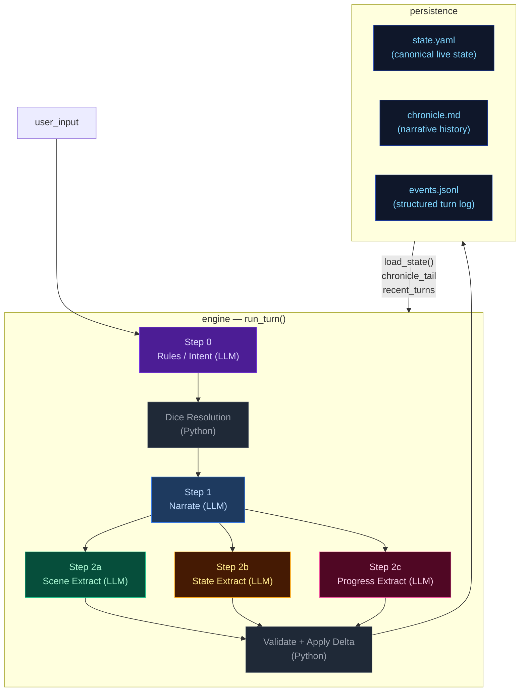
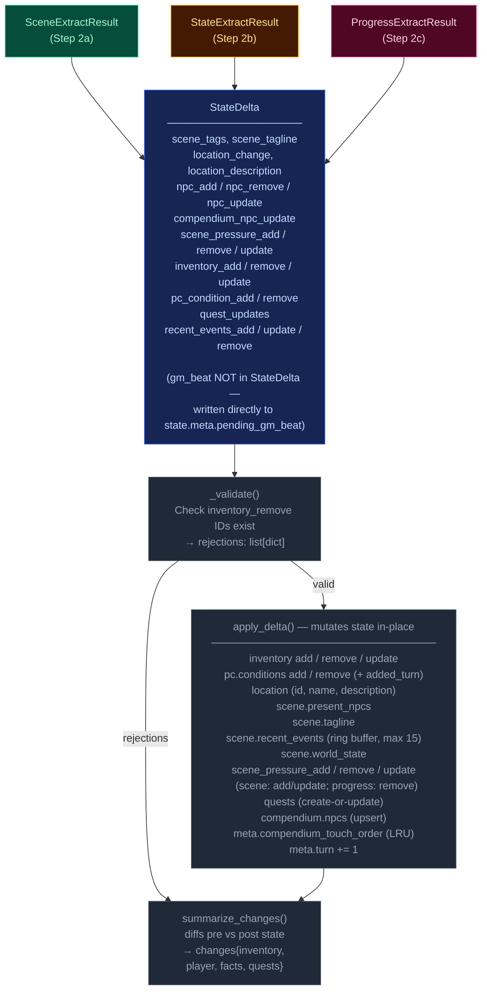
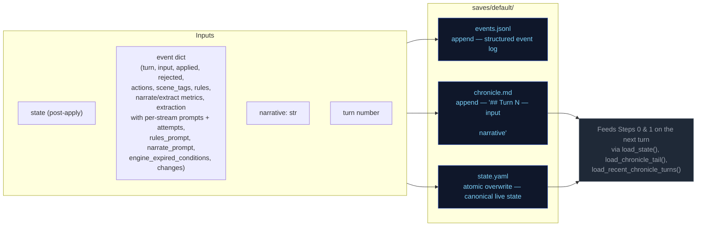
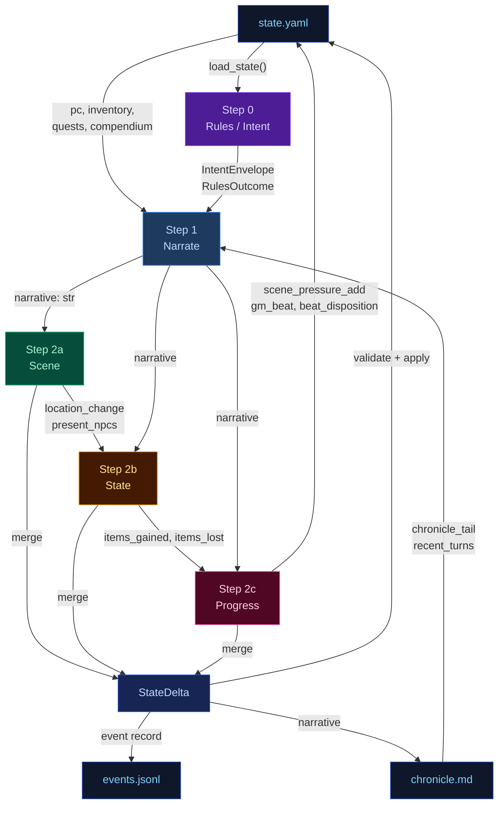
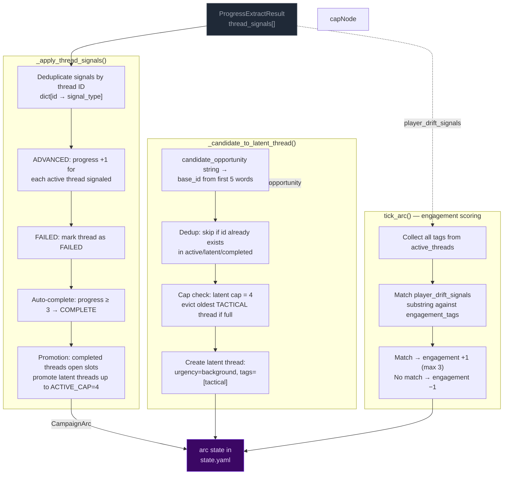
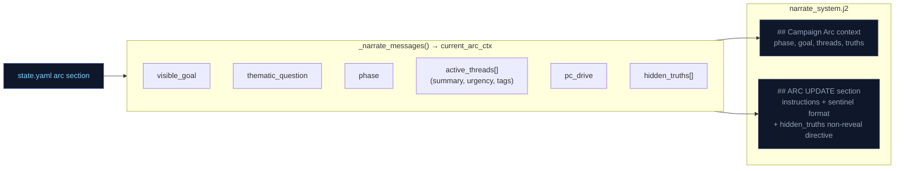
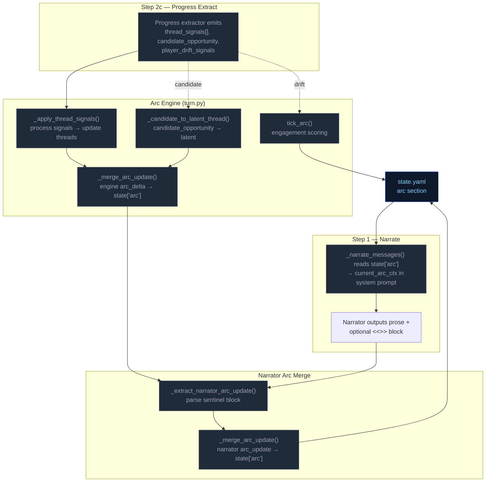

# Engine Design Reference (EVAL_CONTEXT from ARCHITECTURE.md)

---

# ENGINE DESIGN REFERENCE (read this first — it is what the engine is supposed to do)

The following is extracted verbatim from the project's ARCHITECTURE.md between the EVAL_CONTEXT markers. It defines the 5-pipeline engine you are judging. Use it to understand which pipeline owns which mechanic, where data flows, and what the design intent is. When you find something the implementation does that contradicts this design, call it out as a mechanical failure.

## 5-Pipeline Reference (engine design at a glance)

Every player turn drives this 5-step pipeline, executed strictly in order. Step 0 runs once before narration; Step 1 emits the prose the player reads; Steps 2a/2b/2c extract structured changes from that prose. The Python tail validates and applies the merged delta.

| Pipeline | When it runs | Key inputs | Key outputs | Mechanics it owns | Hand-off to next turn |
|---|---|---|---|---|---|
| **Step 0 — Rules / Intent** | Every turn (always) | `state.pc`, `state.location`, `recent_turns[-1:]`, `user_input` | `IntentEnvelope` (intent, verb, target, stakes, check.required, check.skill, check.difficulty); `RulesOutcome` (rolled, dice, mods, band, directive) | Intent classification, dice roll resolution (2d6 + stat + cond − diff → band), difficulty selection, anti-declare-outcome enforcement | `rules_outcome.directive` shapes narrator latitude |
| **Step 1 — Narrate** | Every turn (always, streamed) | Full `state` (pc, location, scene, inventory, quests, compendium), `chronicle_tail`, `recent_turns`, `rules_outcome` (when rolled), `pack_style`, `narrator_rules`, `pending_gm_beat`, `momentum`, `ages`, `recently_left`, `known_npcs`, `present_npcs`, `world_factions`, `world_locations`, `npc_name_pool`, `deescalate`, `scene_pressure`, `user_input` | `narrative` (prose) | Prose generation, dice-band binding, GM-beat consumption (clears `state.meta.pending_gm_beat`), de-escalation directives, age-based stalling fixes | `narrative` feeds all 3 extractors |
| **Step 2a — Scene Extract** | Every turn (always) | `narrative`, `state.pc/location`, `state.scene.present_npcs`, `state.pc.conditions`, `known_characters` (LRU compendium), `RulesOutcome`, `recent_turns[-1:]` | `SceneExtractResult`: `scene_tags`, `scene_tagline`, `location_change`, `location_description`, `npc_add/remove/update`, `compendium_npc_update` | NPC presence, location changes, scene tags, scene classification (tags/tagline), durable NPC compendium identity | `location_change` and `present_npcs` passed to Steps 2b and 2c |
| **Step 2b — State Extract** | Every turn (always) | `narrative`, `state.pc`, `state.location`, `state.inventory`, `rules_outcome`, `engine_expired_conditions`, `scene_result.location_change`, `scene_result.present_npcs`, `stakes`, `band`, `band_examples` (few-shot extraction examples keyed to dice band) | `StateExtractResult`: `inventory_add/remove/update`, `pc_condition_add/remove` | Inventory delta accuracy, condition lifecycle (with `added_turn`), engine-side TTL pre-removal, ID normalization | `items_gained` (names) + `items_lost` (ids) feed Step 2c |
| **Step 2c — Progress Extract** | Every turn (always) | `narrative`, `state.pc`, `state.scene.recent_events`, `state.scene.world_state`, `active_quests`, `scene_pressure`, `RulesOutcome`, `intent`, `recent_turns[-2:]`, `items_gained`/`items_lost` from 2b, `stakes`, `band`, `deescalate`, `quest_ages`, `pending_beat`, `quest_threshold_directive` | `ProgressExtractResult`: `quest_updates`, `recent_events_add/update/remove`, `actions` (4 suggested choices), `outcome_summary`, `gm_beat`, `beat_disposition`, `scene_pressure_add`, `scene_pressure_remove`, `scene_pressure_update` | Quest objectives, recent_events ring buffer, action suggestions, narrative recap, GM beat generation + disposition, scene pressure lifecycle (all three operations) | `recent_events_add` becomes durable history; `quest_updates` advance arcs; `scene_pressure_add` feeds next turn's rules call; `gm_beat` stored in `state.meta.pending_gm_beat` |

After Step 2c, results merge into a `StateDelta`, the validator checks (e.g. `inventory_remove` IDs exist), `apply_delta()` mutates state in-place, and the turn is persisted. The next turn's Step 0 reads the new `state.yaml` plus `events.jsonl`.

---

## High-Level Overview



---

## Step 0 — Rules / Intent Classification

Classifies the player's action, determines whether a dice check is needed, and
identifies which state domains will be active — narrowing every downstream extractor.

```mermaid
flowchart LR
    classDef stageRules fill:#4c1d95,color:#ddd6fe,stroke:#7c3aed
    classDef llmNode    fill:#0f172a,color:#94a3b8,stroke:#334155
    classDef pyNode     fill:#1f2937,color:#9ca3af,stroke:#4b5563
    classDef outNode    fill:#3b0764,color:#e9d5ff,stroke:#7c3aed

    subgraph IN["Inputs"]
        I1["state.pc<br>(name, stats, conditions)"]
        I2["state.location"]
        I3["recent_turns[-1:]<br>(from chronicle;<br>user prompt: narrative tail)"]
        I4["user_input"]
    end

    subgraph LLM0["LLM — rules_system.j2 + rules_user.j2"]
        L0["temp: 0.2 · max_retries: 1<br>output: IntentEnvelope JSON"]:::llmNode
    end

    subgraph PYRES["Python — rules.resolve_check()"]
        P0["reads pc.stats[skill]<br>reads pc.conditions → cond_mod<br>rolls 2d6 + stat_mod + cond_mod − diff_mod<br>maps total → Band"]:::pyNode
    end

    subgraph OUT["Outputs"]
        O1["IntentEnvelope<br>  intent: str<br>  intent_verb: str<br>  target: str<br>  stakes: str<br>  check.required: bool<br>  check.skill: SkillName<br>  check.difficulty: Difficulty"]:::outNode
        O2["RulesOutcome<br>  rolled: bool<br>  skill, difficulty, stat_value, stat_mod<br>  diff_mod, cond_mod<br>  dice: list[int]<br>  raw_total, final_total: int<br>  band: Band<br>  directive: str<br>  intent, intent_verb: str"]:::outNode
    end

    IN --> LLM0
    LLM0 -- "IntentEnvelope" --> PYRES
    PYRES --> OUT
```



> **Key forward dependency:** `rules_outcome.directive` shapes the narrator's creative
> latitude.

---

## Step 1 — Narrate (Streaming)

Generates the narrative prose the player reads. Tokens are streamed to the client.

```mermaid
flowchart LR
    classDef llmNode   fill:#0f172a,color:#94a3b8,stroke:#334155
    classDef xstream   fill:#4c1d95,color:#ddd6fe,stroke:#7c3aed
    classDef outNode   fill:#1e3a5f,color:#bfdbfe,stroke:#3b82f6

    subgraph IN["Inputs"]
        N1["state (full —<br>pc, location, scene,<br>inventory, quests, compendium)"]
        N2["chronicle_tail<br>(compressed history, ≤budget tokens)"]
        N3["recent_turns (last window_turns=6)"]
        N4["rules_outcome<br>(band, directive, dice summary)"]:::xstream
        N5["pack_style (tone / prose guide)"]
        N6["npc_name_pool (cultural name list)"]
        N7["recently_left NPCs"]
        N8["known_npcs<br>(last-seen info)"]
        N9["present_npcs<br>(attitudes)"]
        N10["world_factions<br>(immutable trace)"]
        N11["world_locations<br>(nearby, immutable)"]
        N12["pending_gm_beat"]
        N13["momentum"]
        N14["ages<br>(combat/location)"]
        N15["deescalate"]
        N16["scene_pressure<br>(active threats)"]
        N17["user_input"]
    end

    subgraph LLM1["LLM — narrate_system.j2 + narrate_user.j2"]
        NL["temp: 0.9 · streaming: yes<br>output: prose narrative (str)"]:::llmNode
    end

    subgraph OUT["Outputs"]
        NO1["narrative: str<br>(streamed as tokens → client<br>then joined + thinking-stripped)"]:::outNode
        NO2["narr_metrics<br>  first_token_ms<br>  total_ms<br>  tokens_in / tokens_out"]
    end

    IN --> LLM1
    LLM1 --> OUT
```



> **Key forward dependency:** `narrative` is the primary content input for all three
> extraction streams below.

---

## Step 2a — Scene Extract

Extracts location changes, NPC presence, scene tags, and suggested actions from the narrative.


> **Key forward dependency:** `location_change` and `present_npcs` are passed into
> Steps 2b and 2c. No forward-facing mechanics (scene_pressure, gm_beat) are emitted by this stream.

---

## Step 2b — State Extract

Extracts inventory changes and player condition mutations from the narrative.


> **Key forward dependency:** Step 2c receives a **minimal cross-stream surface** from
> Step 2b: `items_gained` (item **names** from `inventory_add`) and `items_lost` (item
> **ids** from `inventory_remove`) — see `_extract_progress_messages` in `engine.py`.
> This is narrower than the full `StateExtractResult` objects.

---

## Step 2c — Progress Extract

Extracts quest updates, recent events, and durable NPC compendium changes.


> **Always runs:** Progress is the post-narration storytelling brain. It always executes
> every turn (never skipped) and feeds next turn's rules call via `recent_events_add`
> (durable narrative facts), `quest_updates` (advancing or closing arcs), `scene_pressure_add`
> (new threats), and `gm_beat` (forward-facing beats stored in `state.meta.pending_gm_beat`).
>
> ### GMBeat schema
>
> ```
> GMBeat
>   type: complication | revelation | opportunity | breathing_room | pressure | twist | setback | escalation | callback
>   surface_as: ambient | event | npc_behavior | environmental | player_discovery | item (default: ambient)
>   instruction: str (must be ≥40 chars, not start with filler prefixes)
>   beat_expires_turn: int | None (turn number at which the beat expires; set to turn_no + 2 when stored)
> ```
>
> ### Beat lifecycle
>
> The beat flows through three phases per turn:
>
> **Phase 1 — Pre-narration expiry check.** At the start of each turn, the engine reads
> `state.meta.pending_gm_beat` from the previous turn. If `beat_expires_turn` is set and the
> current turn number exceeds it, the beat is nullified. Otherwise it proceeds to narration.
>
> **Phase 2 — Narration consumption.** The beat is passed to the narrator via
> `_narrate_messages(pending_gm_beat=...)`. The narrator integrates the beat's instruction into
> prose. After narration completes, the beat is temporarily cleared from state. The beat is then
> restored to state so the progress extractor can see it in its prompt — this is critical because
> the progress extractor needs to know what beat was narrated to make an informed disposition
> decision.
>
> **Phase 3 — Extraction disposition.** The progress extractor receives `pending_beat` in its
> prompt and emits `beat_disposition` (`consume`/`carry`/`replace`) plus an optional new `gm_beat`.
> The engine's beat lifecycle logic reads the disposition and applies it:
> - `consume`: clears `state.meta.pending_gm_beat` (beat was narrated, done)
> - `carry`: preserves `state.meta.pending_gm_beat` unchanged (beat was narrated but should
>   continue to next turn — e.g., a multi-turn arc)
> - `replace`: writes the new `gm_beat` to `state.meta.pending_gm_beat` with
>   `beat_expires_turn = turn_no + 2`
>
> The engine stores the beat with `beat_expires_turn = turn_no + 2` as a hard TTL ceiling.
> If not consumed by the narrator, the beat expires at turn N and is discarded.

---

## Delta Merge → Validate → Apply

The three extraction results merge into a single `StateDelta`, then validate and apply.



---

## Persist

Atomic writes to disk. No LLM calls.



---

## Cross-Pipeline Data Flow



---

## Campaign Arc System

The campaign arc system tracks story threads, phase progression, and player engagement across turns. It has two execution paths: **engine-driven** (thread lifecycle, engagement scoring) and **narrator-driven** (phase shifts, truth discovery, goal updates).

### Arc Data Model

```
CampaignArc
  visible_goal: str          — What the PC is trying to achieve
  thematic_question: str     — The moral/thematic tension of the arc
  phase: ArcPhase            — SETUP → PURSUIT → REVERSAL → CRISIS → RESOLUTION
  hidden_truths: list[str]   — Story secrets the narrator knows but must not reveal in prose
  discovered_truths: list[str] — Truths the player has uncovered (subset of hidden_truths)
  active_threads: list[ArcThread]  — Currently advancing story threads (cap: 4)
  latent_threads: list[ArcThread]  — Unactivated or waiting threads (cap: 4)
  completed_threads: list[ArcThread] — Finished threads (complete or failed)
  arc_engagement: int        — Engagement score: -3 (disengaged) to +3 (highly engaged)
  pc_drive: str              — Player's expressed motivation/direction

ArcThread
  id: str                    — Unique identifier (derived from summary text)
  summary: str               — What this thread is about
  tags: list[str]            — Keywords for engagement matching
  state: ThreadState         — latent | active | complete | failed | expired
  urgency: str               — normal | background | immediate
  progress: int              — 0..3 (3 = completion threshold)
  unlock_if: str | None      — Condition to promote from latent to active
  promotes: list[str]        — Tags this thread unlocks when completed
  last_offered_turn: int     — Turn this thread was last offered to player

ArcPhase: SETUP → PURSUIT → REVERSAL → CRISIS → RESOLUTION
ThreadState: LATENT → ACTIVE → COMPLETE / FAILED
ThreadSignalType: ADVANCED | BLOCKED | FAILED | IGNORED
```

### Engine-Driven Arc: Thread Lifecycle

Thread lifecycle runs in `engine/turn.py` during the extraction phase, after `apply_delta()` but before narration arc_update merge. Three functions handle the lifecycle:



**Key rules:**
- **Active cap:** 4 threads. When a thread completes/fails, latent threads are promoted to fill slots.
- **Latent cap:** 4 threads. When full and a new candidate arrives, the oldest tactical-tagged thread is evicted. Pack-seeded threads (no tactical tag) are never evicted.
- **Completion threshold:** progress reaches 3 → thread marked COMPLETE.
- **Signal dedup:** multiple ADVANCED signals for the same thread in one call count as +1 (dict dedup).

### Narrator-Driven Arc: Phase & Truth Updates

The narrator can update arc metadata through a sentinel-delimited JSON block in its output. The engine parses and merges these updates after narration.

```mermaid
flowchart LR
    classDef llmNode fill:#0f172a,color:#94a3b8,stroke:#334155
    classDef sentinel fill:#3b0764,color:#e9d5ff,stroke:#7c3aed
    classDef mergeNode fill:#172554,color:#bfdbfe,stroke:#1d4ed8
    classDef arcNode fill:#3b0764,color:#e9d5ff,stroke:#7c3aed

    subgraph NARRATOR["Narrator prompt context"]
        NC1["visible_goal"]
        NC2["thematic_question"]
        NC3["phase"]
        NC4["active_threads[] (summary, urgency, tags)"]
        NC5["pc_drive"]
        NC6["hidden_truths[] — internal only<br>NARRATOR MUST NOT reveal in prose"]
        NC7["discovered_truths[]"]
    end

    subgraph EMISSION["Narrator output"]
        PROSE["narration prose<br>(player sees this)"]:::llmNode
        SENTINEL["<<<ARC_UPDATE_START>>>
{discovered_truths, phase, visible_goal}
<<<ARC_UPDATE_END>>>"]:::sentinel
    end

    subgraph PARSING["_extract_narrator_arc_update()"]
        P1["Regex: <<<ARC_UPDATE_START>>>(.*?)<<<ARC_UPDATE_END>>>"]
        P2["json.loads() → arc_dict"]
        P3["Strip block from narrative"]
    end

    subgraph MERGE["_merge_arc_update()"]
        M1["visible_goal: overwrite if present"]
        M2["thematic_question: overwrite if present"]
        M3["phase: overwrite only if value differs<br>(avoids Pydantic default SETUP overwrite)"]
        M4["pc_drive: overwrite if present"]
        M5["hidden_truths: overwrite if present"]
        M6["discovered_truths: union with existing"]
        M7["active_threads: upsert by id"]
        M8["arc_engagement: max(current, new)"]
    end

    NC1 & NC2 & NC3 & NC4 & NC5 & NC6 & NC7 --> PROSE
    PROSE --> SENTINEL
    SENTINEL --> P1 --> P2 --> P3
    P3 -- "clean narrative" --> CLIENT["client"]
    P2 -- "arc_dict" --> MERGE

    MERGE --> ARC[merge into state["arc"]]:::arcNode

    mergeNode
```

**Merge rules:**
- **Engine owns threads** (active/latent/completed). Narrator arc_update omits thread fields — they are ignored by `_merge_arc_update()`.
- **Narrator owns phase/visible_goal/thematic_question/discovered_truths/hidden_truths.** Engine does not modify these.
- **Phase protection:** `_merge_arc_update()` checks `au.phase.value != current_phase` to prevent Pydantic's default `ArcPhase.SETUP` from overwriting the live phase when the narrator omits the field.
- **Discovered truths:** merged as set union (dedup).
- **Merge order:** engine thread signals run first (setting `delta.arc_update`), then narrator arc_update is parsed after narration and merged on top via a second `_merge_arc_update()` call in `run_turn()`.

### Arc Context in Narration

The arc state is passed to the narrator via `current_arc` in the system prompt. The narrator sees all arc metadata including `hidden_truths` but is explicitly instructed not to reveal them in prose.



### Arc System Integration Points



---

## Out-of-band Pipelines (not part of the per-turn loop — for human reference)

---


# Static Context (immutable across all turns)

## World Pack Style

```
# Eval-pack style

This pack is a deterministic test fixture. The narrator should write in a plain,
clear, second-person past-tense register. Keep these in mind:

- Specific over abstract. Name the thing the player did, the object they touched, the
  NPC they spoke to. Avoid generic mood words ("an air of menace") in favor of
  concrete sensory detail.
- One scene per turn. Do not skip ahead in time unless the player explicitly does so.
- Honor the dice. If the rules outcome is `fail` or `setback`, the action did not
  succeed; describe the cost. If `partial`, the action succeeded with a complication.
- Honor the present_npcs. Every named NPC in the scene either acts, reacts, or is
  visibly present in the prose. Do not invent new NPCs unless the player's input
  introduces one.
- Plain language. No archaic phrasing, no fantasy-trope syntax ("Lo, the door...").
  This is a working road in a working world.
- 120-220 words per turn unless the action is large.

```

## Seed State

```json
{
  "meta": {
    "game_name": "eval",
    "turn": 0,
    "setting_pack": "eval-pack",
    "model": ""
  },
  "pc": {
    "name": "Aren Voss",
    "tagline": "Reluctant courier on the merchant road",
    "bio": "Mid-thirties, broad shoulders, careful with words. Took on a courier contract\nto clear an old debt. Just arrived in Marrow's Crossing with a heavy pack and\na heavier obligation.\n",
    "stats": {
      "strength": 3,
      "dexterity": 3,
      "wits": 2,
      "lore": 2,
      "charisma": 3,
      "resolve": 3
    },
    "conditions": [],
    "momentum": 0,
    "drive": "",
    "expressed_stances": {}
  },
  "location": {
    "id": "marrows_crossing",
    "name": "Marrow's Crossing",
    "description": "A market town built around the confluence of two rivers. Cobblestone streets,\ntimber-framed buildings, and the constant sound of water from the mills. The\ntown square has a stone well and a statue of the founder. Most shops are closing\nfor the evening.\n"
  },
  "inventory": [
    {
      "id": "credits",
      "name": "Credits",
      "notes": "Common coin, accepted at any inn or stall on the merchant road.",
      "amount": 500,
      "aliases": []
    },
    {
      "id": "iron_dagger",
      "name": "Iron dagger",
      "notes": "Plain crossguard, edge worn from honing. Belt-carried.",
      "amount": 1,
      "aliases": []
    },
    {
      "id": "bandages",
      "name": "Linen bandages",
      "notes": "Three rolls. Field-grade \u2014 won't replace a healer.",
      "amount": 3,
      "aliases": []
    },
    {
      "id": "traveler_cloak",
      "name": "Traveler's cloak",
      "notes": "Oiled wool, road-stained, hood deep enough to hide a face.",
      "amount": 1,
      "aliases": [
        "cloak",
        "travel cloak"
      ]
    },
    {
      "id": "brass_key",
      "name": "Brass key",
      "notes": "A small brass key Halden gave you with the ledger.",
      "amount": 1,
      "aliases": []
    }
  ],
  "scene": {
    "tagline": "Market town at dusk",
    "tags": [
      "peaceful",
      "start"
    ],
    "world_state": [
      "Marrow's Crossing is a market town at the confluence of two rivers, known for its mills and the annual river festival.",
      "Iron coin (credits) is the universal currency on the merchant road; barter is acceptable but slower.",
      "The road has been quieter than usual this season \u2014 fewer caravans, more independent runners, more opportunists."
    ],
    "recent_events": [
      "You arrived in Marrow's Crossing after three days on the road.",
      "You heard rumors of road-toughs extorting travelers near the Crossed Keys Inn.",
      "You found Caron in the tavern \u2014 he's been waiting for you."
    ],
    "present_npcs": [
      {
        "id": "caron",
        "name": "Caron",
        "title": "Old creditor",
        "notes": "Sits at a corner table in the tavern, nursing a drink and watching the door.",
        "bio": "A portly man in his sixties with a merchant's ledger and a patient demeanor. You owe him 500 credits from a failed venture three years ago."
      },
      {
        "id": "halden",
        "name": "Halden",
        "title": "Merchant",
        "notes": "Stands near the town well, examining a map and a pressed wax seal.",
        "bio": "A road merchant in his fifties who hires couriers when his usual runners are spoken for. Honest by reputation, careful with money."
      },
      {
        "id": "innkeeper",
        "name": "Edda",
        "title": "Innkeeper at the Crossed Keys",
        "notes": "Wiping down the bar at the Crossed Keys, which is two streets over.",
        "bio": "Runs the inn alone since her husband died. Knows every traveler by face if not by name. Stays out of trouble unless it walks through her door."
      }
    ]
  },
  "compendium": {
    "npcs": {
      "caron": {
        "name": "Caron",
        "title": "Old creditor",
        "bio": "A portly man in his sixties with a merchant's ledger and a patient demeanor. You owe him 500 credits from a failed venture three years ago."
      },
      "halden": {
        "name": "Halden",
        "title": "Merchant",
        "bio": "A road merchant in his fifties who hires couriers when his usual runners are spoken for. Honest by reputation, careful with money."
      },
      "innkeeper": {
        "name": "Edda",
        "title": "Innkeeper at the Crossed Keys",
        "bio": "Runs the inn alone since her husband died. Knows every traveler by face if not by name. Stays out of trouble unless it walks through her door."
      },
      "tough_a": {
        "name": "Bald Tough",
        "title": "Road thug",
        "bio": "Hired muscle. No personal stake in this \u2014 he'll back off if the price is right or the fight goes bad."
      },
      "tough_b": {
        "name": "Scarred Tough",
        "title": "Road thug",
        "bio": "Same outfit as the other \u2014 hired by the same person. Quicker to violence; not the brains."
      },
      "matthew_estrada": {
        "name": "Matthew Estrada",
        "title": "Traveler",
        "bio": "A tall, broad-shoulded man in a stained leather jerkin carrying a heavy rucksack. Looks like a road runner but moves with military precision."
      }
    }
  },
  "arc": {
    "visible_goal": "Clear your debts and deliver the ledger \u2014 two obligations binding you to Marrow's Crossing.",
    "thematic_question": "What does it cost to settle old debts when new ones keep forming?",
    "phase": "setup",
    "hidden_truths": [
      "Matthew Estrada is not a traveler \u2014 he's a courier for a rival merchant house, and the toughs were hired to intercept his competition.",
      "The brass key Halden gave you opens a back room at the inn where intercepted couriers' messages are stored.",
      "Caron's debt was not a failed venture \u2014 it was a deliberate investment in your skills, and he's been waiting for you to prove yourself."
    ],
    "discovered_truths": [],
    "active_threads": [
      {
        "id": "settle_the_debt",
        "summary": "Settle the 500-credit debt with Caron.",
        "tags": [
          "debt",
          "caron",
          "obligation"
        ],
        "state": "latent",
        "urgency": "normal",
        "progress": 0,
        "unlock_if": null,
        "promotes": [],
        "last_offered_turn": 0
      },
      {
        "id": "deliver_the_ledger",
        "summary": "Deliver Halden's ledger to the merchant at the Crossed Keys Inn.",
        "tags": [
          "courier",
          "halden",
          "contract"
        ],
        "state": "latent",
        "urgency": "normal",
        "progress": 0,
        "unlock_if": null,
        "promotes": [],
        "last_offered_turn": 0
      },
      {
        "id": "clear_the_road_toughs",
        "summary": "Deal with the toughs blocking the inn entrance.",
        "tags": [
          "toughs",
          "road",
          "confrontation"
        ],
        "state": "latent",
        "urgency": "low",
        "progress": 0,
        "unlock_if": null,
        "promotes": [],
        "last_offered_turn": 0
      }
    ],
    "latent_threads": [],
    "completed_threads": [],
    "arc_engagement": 0,
    "pc_drive": "Prove you can handle the road \u2014 clear your name and earn enough to start over."
  }
}
```

## Engine Constants

```json
{
  "pressure_building_at": 3,
  "pressure_immediate_at": 5,
  "pressure_max_age": 8,
  "urgency_levels": [
    "background",
    "building",
    "immediate"
  ],
  "momentum_min": -3,
  "momentum_max": 3,
  "momentum_delta": {
    "crit_success": 2,
    "success": 1,
    "partial": 0,
    "setback": -1,
    "fail": -1,
    "crit_fail": -2
  }
}
```

## System Prompts (identical every turn)

### Rules System Prompt

```
(not captured this run)
```

### Narrate System Prompt

```
(not captured this run)
```

### Extract Scene System Prompt

```
(not captured this run)
```

### Extract State System Prompt

```
(not captured this run)
```

### Extract Progress System Prompt

```
(not captured this run)
```


---

# TURN 1

**Input:** `Walk over to Caron's table and sit down across from him. I'm ready to talk about the debt.`

## User Prompts

### Rules User Prompt
```
(no rules call this turn)
```

### Narrate User Prompt
```
(no narrate call)
```

### Extract Scene User Prompt
```
(not captured)
```

### Extract State User Prompt
```
(not captured)
```

### Extract Progress User Prompt
```
(not captured)
```

## Engine Outputs

### Rules

**Parsed (engine):**
```json
{
  "intent_verb": "negotiate",
  "intent": "The player approaches Caron to discuss the repayment of their debt.",
  "rolled": false,
  "total_ms": 2596.5,
  "tokens_in": 1583,
  "tokens_out": 64
}
```

**Raw LLM output:**
```

```

### Narration


### Extract Scene

```json
{
  "scene_tags": [
    "tense_conversation",
    "dim_lighting"
  ],
  "scene_tagline": "A Debt Unpaid",
  "location_description": "The Crossed Keys is a dim, crowded tavern filled with the scent of stale ale and roasted fat.",
  "npc_add": [],
  "npc_remove": [],
  "npc_update": [
    {
      "id": "caron",
      "notes": "Hunched over his drink, observing the player's bruised face with an unreadable, weary expression; skeptical about the player's ability to pay."
    }
  ],
  "compendium_npc_update": []
}
```

### Extract State

```json
{
  "inventory_add": [],
  "inventory_remove": [],
  "inventory_update": [],
  "pc_condition_add": [],
  "pc_condition_remove": []
}
```

### Extract Progress

```json
{
  "recent_events_add": [],
  "recent_events_update": [],
  "recent_events_remove": [],
  "actions": [
    "Explain your current situation and propose a new repayment plan",
    "Ask Caron if he has any immediate work to earn credits",
    "Try to charm Caron into granting you more time",
    "Scan the tavern for any potential new opportunities or threats"
  ],
  "outcome_summary": "You sit across from Caron in the dim tavern, facing his skepticism about your ability to repay your debt.",
  "beat_disposition": "consume",
  "scene_pressure_add": [],
  "scene_pressure_remove": [],
  "scene_pressure_update": [],
  "thread_signals": [
    {
      "id": "settle_the_debt",
      "signal": "advanced"
    },
    {
      "id": "deliver_the_ledger",
      "signal": "ignored"
    },
    {
      "id": "clear_the_road_toughs",
      "signal": "ignored"
    }
  ],
  "drift_analysis": [
    {
      "thread_id": "settle_the_debt",
      "match": true,
      "reason": "The player approached Caron specifically to discuss the debt repayment.",
      "new_interest": ""
    },
    {
      "thread_id": "deliver_the_ledger",
      "match": false,
      "reason": "The player focused on the debt rather than Halden's contract.",
      "new_interest": ""
    },
    {
      "thread_id": "clear_the_road_toughs",
      "match": false,
      "reason": "The player is currently engaged in a conversation inside the tavern.",
      "new_interest": ""
    }
  ],
  "player_drift_signals": []
}
```

### Applied Deltas

```json
{
  "inventory_add": [],
  "inventory_remove": [],
  "inventory_update": [],
  "location_description": "The Crossed Keys is a dim, crowded tavern filled with the scent of stale ale and roasted fat.",
  "pc_condition_add": [],
  "pc_condition_remove": [],
  "scene_tags": [
    "tense_conversation",
    "dim_lighting"
  ],
  "scene_tagline": "A Debt Unpaid",
  "compendium_npc_update": [],
  "npc_add": [],
  "npc_remove": [],
  "npc_update": [
    {
      "id": "caron",
      "notes": "Hunched over his drink, observing the player's bruised face with an unreadable, weary expression; skeptical about the player's ability to pay."
    }
  ],
  "recent_events_add": [],
  "recent_events_update": [],
  "recent_events_remove": [],
  "scene_pressure_add": [],
  "scene_pressure_remove": [],
  "scene_pressure_update": []
}
```

### Rejected Deltas

*(none)*

### Suggested Actions

*(none)*

### Context Telemetry

*(no telemetry)*

### State After Turn

```json
{
  "arc": {
    "active_threads": [
      {
        "id": "settle_the_debt",
        "last_offered_turn": 0,
        "progress": 1,
        "promotes": [],
        "state": "active",
        "summary": "Settle the 500-credit debt with Caron.",
        "tags": [
          "debt",
          "caron",
          "obligation"
        ],
        "unlock_if": null,
        "urgency": "normal"
      },
      {
        "id": "deliver_the_ledger",
        "last_offered_turn": 0,
        "progress": 0,
        "promotes": [],
        "state": "active",
        "summary": "Deliver Halden's ledger to the merchant at the Crossed Keys Inn.",
        "tags": [
          "courier",
          "halden",
          "contract"
        ],
        "unlock_if": null,
        "urgency": "normal"
      },
      {
        "id": "clear_the_road_toughs",
        "last_offered_turn": 0,
        "progress": 0,
        "promotes": [],
        "state": "active",
        "summary": "Deal with the toughs blocking the inn entrance.",
        "tags": [
          "toughs",
          "road",
          "confrontation"
        ],
        "unlock_if": null,
        "urgency": "low"
      }
    ],
    "arc_engagement": 1,
    "completed_threads": [],
    "discovered_truths": [],
    "hidden_truths": [
      "Matthew Estrada is not a traveler \u2014 he's a courier for a rival merchant house, and the toughs were hired to intercept his competition.",
      "The brass key Halden gave you opens a back room at the inn where intercepted couriers' messages are stored.",
      "Caron's debt was not a failed venture \u2014 it was a deliberate investment in your skills, and he's been waiting for you to prove yourself."
    ],
    "latent_threads": [],
    "pc_drive": "Prove you can handle the road \u2014 clear your name and earn enough to start over.",
    "phase": "setup",
    "thematic_question": "What does it cost to settle old debts when new ones keep forming?",
    "visible_goal": "Clear your debts and deliver the ledger \u2014 two obligations binding you to Marrow's Crossing."
  },
  "compendium": {
    "npcs": {
      "caron": {
        "bio": "A portly man in his sixties with a merchant's ledger and a patient demeanor. You owe him 500 credits from a failed venture three years ago.",
        "last_seen": {
          "location_id": "marrows_crossing",
          "location_name": "Marrow's Crossing",
          "turn": 1
        },
        "name": "Caron",
        "title": "Old creditor"
      },
      "halden": {
        "bio": "A road merchant in his fifties who hires couriers when his usual runners are spoken for. Honest by reputation, careful with money.",
        "name": "Halden",
        "title": "Merchant"
      },
      "innkeeper": {
        "bio": "Runs the inn alone since her husband died. Knows every traveler by face if not by name. Stays out of trouble unless it walks through her door.",
        "name": "Edda",
        "title": "Innkeeper at the Crossed Keys"
      },
      "matthew_estrada": {
        "bio": "A tall, broad-shoulded man in a stained leather jerkin carrying a heavy rucksack. Looks like a road runner but moves with military precision.",
        "name": "Matthew Estrada",
        "title": "Traveler"
      },
      "tough_a": {
        "bio": "Hired muscle. No personal stake in this \u2014 he'll back off if the price is right or the fight goes bad.",
        "name": "Bald Tough",
        "title": "Road thug"
      },
      "tough_b": {
        "bio": "Same outfit as the other \u2014 hired by the same person. Quicker to violence; not the brains.",
        "name": "Scarred Tough",
        "title": "Road thug"
      }
    }
  },
  "inventory": [
    {
      "aliases": [],
      "amount": 500,
      "id": "credits",
      "name": "Credits",
      "notes": "Common coin, accepted at any inn or stall on the merchant road."
    },
    {
      "aliases": [],
      "amount": 1,
      "id": "iron_dagger",
      "name": "Iron dagger",
      "notes": "Plain crossguard, edge worn from honing. Belt-carried."
    },
    {
      "aliases": [],
      "amount": 3,
      "id": "bandages",
      "name": "Linen bandages",
      "notes": "Three rolls. Field-grade \u2014 won't replace a healer."
    },
    {
      "aliases": [
        "cloak",
        "travel cloak"
      ],
      "amount": 1,
      "id": "traveler_cloak",
      "name": "Traveler's cloak",
      "notes": "Oiled wool, road-stained, hood deep enough to hide a face."
    },
    {
      "aliases": [],
      "amount": 1,
      "id": "brass_key",
      "name": "Brass key",
      "notes": "A small brass key Halden gave you with the ledger."
    }
  ],
  "location": {
    "description": "The Crossed Keys is a dim, crowded tavern filled with the scent of stale ale and roasted fat.",
    "id": "marrows_crossing",
    "name": "Marrow's Crossing"
  },
  "meta": {
    "compendium_touch_order": [],
    "consecutive_floor_count": 0,
    "game_name": "eval",
    "last_compacted_turn": 0,
    "model": "",
    "pending_gm_beat": null,
    "prior_history": [],
    "setting_pack": "eval-pack",
    "turn": 1
  },
  "pc": {
    "allegiance": null,
    "bio": "Mid-thirties, broad shoulders, careful with words. Took on a courier contract\nto clear an old debt. Just arrived in Marrow's Crossing with a heavy pack and\na heavier obligation.\n",
    "conditions": [
      {
        "added_turn": 8,
        "description": "A hard fall on the bridge two days ago left a deep, aching bruise along the right ribcage.",
        "id": "bruised_ribs",
        "label": "bruised ribs"
      },
      {
        "added_turn": 10,
        "description": "Twelve days on the road, two days behind schedule, and an old debt waiting at the end of it.",
        "id": "low_morale",
        "label": "low morale"
      }
    ],
    "drive": "",
    "expressed_stances": {},
    "momentum": 0,
    "name": "Aren Voss",
    "stats": {
      "charisma": 3,
      "dexterity": 3,
      "lore": 2,
      "resolve": 3,
      "strength": 3,
      "wits": 2
    },
    "tagline": "Reluctant courier on the merchant road"
  },
  "scene": {
    "present_npcs": [
      {
        "bio": "A portly man in his sixties with a merchant's ledger and a patient demeanor. You owe him 500 credits from a failed venture three years ago.",
        "id": "caron",
        "name": "Caron",
        "notes": "Hunched over his drink, observing the player's bruised face with an unreadable, weary expression; skeptical about the player's ability to pay.",
        "title": "Old creditor"
      },
      {
        "bio": "A road merchant in his fifties who hires couriers when his usual runners are spoken for. Honest by reputation, careful with money.",
        "id": "halden",
        "name": "Halden",
        "notes": "Stands near the town well, examining a map and a pressed wax seal.",
        "title": "Merchant"
      },
      {
        "bio": "Runs the inn alone since her husband died. Knows every traveler by face if not by name. Stays out of trouble unless it walks through her door.",
        "id": "innkeeper",
        "name": "Edda",
        "notes": "Wiping down the bar at the Crossed Keys, which is two streets over.",
        "title": "Innkeeper at the Crossed Keys"
      }
    ],
    "recent_events": [
      {
        "id": "you_arrived_in_marrows_crossing_after",
        "text": "You arrived in Marrow's Crossing after three days on the road.",
        "turn": 0
      },
      {
        "id": "you_heard_rumors_of_roadtoughs_extorting",
        "text": "You heard rumors of road-toughs extorting travelers near the Crossed Keys Inn.",
        "turn": 0
      },
      {
        "id": "you_found_caron_in_the_tavern",
        "text": "You found Caron in the tavern \u2014 he's been waiting for you.",
        "turn": 0
      }
    ],
    "scene_pressure": [],
    "tagline": "A Debt Unpaid",
    "tags": [
      "tense_conversation",
      "dim_lighting"
    ],
    "world_state": [
      "Marrow's Crossing is a market town at the confluence of two rivers, known for its mills and the annual river festival.",
      "Iron coin (credits) is the universal currency on the merchant road; barter is acceptable but slower.",
      "The road has been quieter than usual this season \u2014 fewer caravans, more independent runners, more opportunists."
    ]
  },
  "world": {
    "factions": [],
    "locations": []
  }
}
```


---

# TURN 2

**Input:** `I slide 500 credits across the table to Caron and ask him to mark the debt cleared in his ledger.`

## User Prompts

### Rules User Prompt
```
(no rules call this turn)
```

### Narrate User Prompt
```
(no narrate call)
```

### Extract Scene User Prompt
```
(not captured)
```

### Extract State User Prompt
```
(not captured)
```

### Extract Progress User Prompt
```
(not captured)
```

## Engine Outputs

### Rules

**Parsed (engine):**
```json
{
  "intent_verb": "negotiate",
  "intent": "The player attempts to settle their debt with Caron using 500 credits.",
  "rolled": false,
  "total_ms": 2411.9,
  "tokens_in": 1596,
  "tokens_out": 68
}
```

**Raw LLM output:**
```

```

### Narration


### Extract Scene

```json
{
  "scene_tags": [
    "tense_conversation",
    "relief"
  ],
  "scene_tagline": "A Debt Finally Settled",
  "npc_add": [],
  "npc_remove": [],
  "npc_update": [
    {
      "id": "caron",
      "notes": "Shows a flicker of respect toward the player after they pay the debt, though remains weary and cautious."
    }
  ],
  "compendium_npc_update": [
    {
      "id": "caron",
      "bio": "A portly man in his sixties with a merchant's ledger. After a long-standing debt was settled, he shows a begrudging respect for the player's grit.",
      "aliases": []
    }
  ]
}
```

### Extract State

```json
{
  "inventory_add": [],
  "inventory_remove": [
    {
      "id": "credits",
      "amount": 500
    }
  ],
  "inventory_update": [],
  "pc_condition_add": [],
  "pc_condition_remove": [
    {
      "id": "low_morale"
    }
  ]
}
```

### Extract Progress

```json
{
  "recent_events_add": [
    {
      "id": "debt_settled",
      "text": "Aren successfully paid the 500-credit debt to Caron.",
      "turn": 2
    }
  ],
  "recent_events_update": [],
  "recent_events_remove": [
    "caron_waiting_for_player"
  ],
  "actions": [
    "Ask Caron for any local news or work",
    "Seek out Halden to deliver the ledger",
    "Head toward the entrance to confront the toughs",
    "Order a drink to soothe your aching ribs"
  ],
  "outcome_summary": "You successfully pay Caron the 500 credits, and he marks your debt as settled in his ledger, offering a flicker of weary respect.",
  "beat_disposition": "consume",
  "scene_pressure_add": [],
  "scene_pressure_remove": [],
  "scene_pressure_update": [],
  "thread_signals": [
    {
      "id": "settle_the_debt",
      "signal": "advanced"
    },
    {
      "id": "deliver_the_ledger",
      "signal": "ignored"
    },
    {
      "id": "clear_the_road_toughs",
      "signal": "ignored"
    }
  ],
  "drift_analysis": [
    {
      "thread_id": "settle_the_debt",
      "match": true,
      "reason": "Player paid the full amount to Caron, resolving the debt thread.",
      "new_interest": ""
    },
    {
      "thread_id": "deliver_the_ledger",
      "match": false,
      "reason": "The player focused on the debt settlement rather than Halden's contract.",
      "new_interest": "seeking new work from Caron"
    },
    {
      "thread_id": "clear_the_road_toughs",
      "match": false,
      "reason": "The player stayed seated to negotiate with Caron.",
      "new_interest": ""
    }
  ],
  "player_drift_signals": [],
  "candidate_opportunity": "Caron's flicker of respect suggests a potential new lead or more reliable work in Marrow's Crossing."
}
```

### Applied Deltas

```json
{
  "inventory_add": [],
  "inventory_remove": [
    {
      "id": "credits",
      "amount": 500
    }
  ],
  "inventory_update": [],
  "pc_condition_add": [],
  "pc_condition_remove": [
    {
      "id": "low_morale"
    }
  ],
  "scene_tags": [
    "tense_conversation",
    "relief"
  ],
  "scene_tagline": "A Debt Finally Settled",
  "compendium_npc_update": [
    {
      "id": "caron",
      "bio": "A portly man in his sixties with a merchant's ledger. After a long-standing debt was settled, he shows a begrudging respect for the player's grit.",
      "aliases": []
    }
  ],
  "npc_add": [],
  "npc_remove": [],
  "npc_update": [
    {
      "id": "caron",
      "notes": "Shows a flicker of respect toward the player after they pay the debt, though remains weary and cautious."
    }
  ],
  "recent_events_add": [
    {
      "id": "debt_settled",
      "text": "Aren successfully paid the 500-credit debt to Caron.",
      "turn": 2
    }
  ],
  "recent_events_update": [],
  "recent_events_remove": [
    "caron_waiting_for_player"
  ],
  "scene_pressure_add": [],
  "scene_pressure_remove": [],
  "scene_pressure_update": []
}
```

### Rejected Deltas

*(none)*

### Suggested Actions

*(none)*

### Context Telemetry

*(no telemetry)*

### State After Turn

*(diff vs previous turn — full snapshot only on first and last turns)*

```json
{
  "arc": {
    "active_threads": {
      "changed": [
        {
          "from": {
            "id": "settle_the_debt",
            "last_offered_turn": 0,
            "progress": 1,
            "promotes": [],
            "state": "active",
            "summary": "Settle the 500-credit debt with Caron.",
            "tags": [
              "debt",
              "caron",
              "obligation"
            ],
            "unlock_if": null,
            "urgency": "normal"
          },
          "to": {
            "id": "settle_the_debt",
            "last_offered_turn": 0,
            "progress": 2,
            "promotes": [],
            "state": "active",
            "summary": "Settle the 500-credit debt with Caron.",
            "tags": [
              "debt",
              "caron",
              "obligation"
            ],
            "urgency": "normal"
          }
        },
        {
          "from": {
            "id": "deliver_the_ledger",
            "last_offered_turn": 0,
            "progress": 0,
            "promotes": [],
            "state": "active",
            "summary": "Deliver Halden's ledger to the merchant at the Crossed Keys Inn.",
            "tags": [
              "courier",
              "halden",
              "contract"
            ],
            "unlock_if": null,
            "urgency": "normal"
          },
          "to": {
            "id": "deliver_the_ledger",
            "last_offered_turn": 0,
            "progress": 0,
            "promotes": [],
            "state": "active",
            "summary": "Deliver Halden's ledger to the merchant at the Crossed Keys Inn.",
            "tags": [
              "courier",
              "halden",
              "contract"
            ],
            "urgency": "normal"
          }
        },
        {
          "from": {
            "id": "clear_the_road_toughs",
            "last_offered_turn": 0,
            "progress": 0,
            "promotes": [],
            "state": "active",
            "summary": "Deal with the toughs blocking the inn entrance.",
            "tags": [
              "toughs",
              "road",
              "confrontation"
            ],
            "unlock_if": null,
            "urgency": "low"
          },
          "to": {
            "id": "clear_the_road_toughs",
            "last_offered_turn": 0,
            "progress": 0,
            "promotes": [],
            "state": "active",
            "summary": "Deal with the toughs blocking the inn entrance.",
            "tags": [
              "toughs",
              "road",
              "confrontation"
            ],
            "urgency": "low"
          }
        }
      ]
    },
    "arc_engagement": {
      "from": 1,
      "to": 2
    },
    "latent_threads": {
      "added": [
        {
          "id": "caron's_flicker_of_respect_suggests",
          "last_offered_turn": 2,
          "progress": 0,
          "promotes": [],
          "state": "latent",
          "summary": "Caron's flicker of respect suggests a potential new lead or more reliable work in Marrow's Crossing.",
          "tags": [
            "tactical"
          ],
          "urgency": "background"
        }
      ]
    }
  },
  "compendium": {
    "npcs": {
      "caron": {
        "bio": {
          "from": "A portly man in his sixties with a merchant's ledger and a patient demeanor. You owe him 500 credits from a failed venture three years ago.",
          "to": "A portly man in his sixties with a merchant's ledger. After a long-standing debt was settled, he shows a begrudging respect for the player's grit."
        },
        "last_seen": {
          "turn": {
            "from": 1,
            "to": 2
          }
        }
      }
    }
  },
  "inventory": {
    "removed": [
      {
        "aliases": [],
        "amount": 500,
        "id": "credits",
        "name": "Credits",
        "notes": "Common coin, accepted at any inn or stall on the merchant road."
      }
    ]
  },
  "meta": {
    "compendium_touch_order": {
      "added": [
        "caron"
      ],
      "removed": []
    },
    "turn": {
      "from": 1,
      "to": 2
    }
  },
  "pc": {
    "conditions": {
      "removed": [
        {
          "added_turn": 10,
          "description": "Twelve days on the road, two days behind schedule, and an old debt waiting at the end of it.",
          "id": "low_morale",
          "label": "low morale"
        }
      ]
    }
  },
  "scene": {
    "present_npcs": {
      "changed": [
        {
          "from": {
            "bio": "A portly man in his sixties with a merchant's ledger and a patient demeanor. You owe him 500 credits from a failed venture three years ago.",
            "id": "caron",
            "name": "Caron",
            "notes": "Hunched over his drink, observing the player's bruised face with an unreadable, weary expression; skeptical about the player's ability to pay.",
            "title": "Old creditor"
          },
          "to": {
            "bio": "A portly man in his sixties with a merchant's ledger and a patient demeanor. You owe him 500 credits from a failed venture three years ago.",
            "id": "caron",
            "name": "Caron",
            "notes": "Shows a flicker of respect toward the player after they pay the debt, though remains weary and cautious.",
            "title": "Old creditor"
          }
        }
      ]
    },
    "recent_events": {
      "added": [
        {
          "id": "debt_settled",
          "text": "Aren successfully paid the 500-credit debt to Caron.",
          "turn": 2
        }
      ]
    },
    "tagline": {
      "from": "A Debt Unpaid",
      "to": "A Debt Finally Settled"
    },
    "tags": {
      "added": [
        "relief"
      ],
      "removed": [
        "dim_lighting"
      ]
    }
  }
}
```


---

# TURN 3

**Input:** `I find Halden by the town well and offer to carry his ledger to the Crossed Keys Inn. I'll do it for 200 credits.`

## User Prompts

### Rules User Prompt
```
(no rules call this turn)
```

### Narrate User Prompt
```
(no narrate call)
```

### Extract Scene User Prompt
```
(not captured)
```

### Extract State User Prompt
```
(not captured)
```

### Extract Progress User Prompt
```
(not captured)
```

## Engine Outputs

### Rules

**Parsed (engine):**
```json
{
  "intent_verb": "negotiate",
  "intent": "Offer to carry Halden's ledger to the Crossed Keys Inn for 200 credits.",
  "rolled": false,
  "total_ms": 2509.5,
  "tokens_in": 1589,
  "tokens_out": 71
}
```

**Raw LLM output:**
```

```

### Narration


### Extract Scene

```json
{
  "scene_tags": [
    "negotiation",
    "business_deal"
  ],
  "scene_tagline": "A Contract Signed in Bruises",
  "location_change": {
    "id": "marrows_crossing_streets",
    "name": "Marrow's Crossing Streets",
    "description": "A network of narrow, winding alleys near a stone town well, smelling of damp earth and river air."
  },
  "npc_add": [],
  "npc_remove": [
    {
      "id": "caron"
    },
    {
      "id": "innkeeper"
    }
  ],
  "npc_update": [
    {
      "id": "halden",
      "notes": "Approaches the player with practical concern, offering a high-stakes delivery job despite the player's injuries."
    }
  ],
  "compendium_npc_update": []
}
```

### Extract State

```json
{
  "inventory_add": [
    {
      "id": "halden_ledger",
      "name": "Halden's Ledger",
      "notes": "A heavy, leather-bound book containing important transit routes and merchant information.",
      "amount": 1,
      "aliases": []
    }
  ],
  "inventory_remove": [],
  "inventory_update": [],
  "pc_condition_add": [],
  "pc_condition_remove": []
}
```

### Extract Progress

```json
{
  "recent_events_add": [
    {
      "id": "halden_contract_accepted",
      "text": "Halden has contracted Aren to deliver his ledger to the Crossed Keys Inn for 200 credits.",
      "turn": 3
    }
  ],
  "recent_events_update": [
    {
      "id": "settle_the_debt",
      "text": "Aren successfully paid the 500-credit debt to Caron."
    }
  ],
  "recent_events_remove": [],
  "actions": [
    "Accept the ledger and head toward the Crossed Keys Inn",
    "Ask Halden for more details about the merchant's temperament",
    "Use your knowledge of shortcuts to avoid the main roads",
    "Check your bandages to ensure your ribs are stable"
  ],
  "outcome_summary": "You successfully negotiated a 200-credit contract with Halden to deliver his ledger, though your physical injuries remain a concern.",
  "beat_disposition": "consume",
  "scene_pressure_add": [],
  "scene_pressure_remove": [],
  "scene_pressure_update": [],
  "thread_signals": [
    {
      "id": "deliver_the_ledger",
      "signal": "advanced"
    },
    {
      "id": "clear_the_road_toughs",
      "signal": "ignored"
    },
    {
      "id": "settle_the_debt",
      "signal": "ignored"
    }
  ],
  "drift_analysis": [
    {
      "thread_id": "deliver_the_ledger",
      "match": true,
      "reason": "Player negotiated and accepted the contract to deliver Halden's ledger.",
      "new_interest": ""
    },
    {
      "thread_id": "clear_the_road_toughs",
      "match": false,
      "reason": "The player focused on the merchant negotiation instead of the thugs.",
      "new_interest": ""
    },
    {
      "thread_id": "settle_the_debt",
      "match": false,
      "reason": "The debt was already settled in the previous turn; player is moving to new work.",
      "new_interest": ""
    }
  ],
  "player_drift_signals": [],
  "candidate_opportunity": "The merchant at the Crossed Keys Inn is described as a 'particular soul', suggesting a potential social challenge."
}
```

### Applied Deltas

```json
{
  "inventory_add": [
    {
      "id": "halden_ledger",
      "name": "Halden's Ledger",
      "notes": "A heavy, leather-bound book containing important transit routes and merchant information.",
      "amount": 1,
      "aliases": []
    }
  ],
  "inventory_remove": [],
  "inventory_update": [],
  "location_change": {
    "id": "marrows_crossing_streets",
    "name": "Marrow's Crossing Streets",
    "description": "A network of narrow, winding alleys near a stone town well, smelling of damp earth and river air."
  },
  "pc_condition_add": [],
  "pc_condition_remove": [],
  "scene_tags": [
    "negotiation",
    "business_deal"
  ],
  "scene_tagline": "A Contract Signed in Bruises",
  "compendium_npc_update": [],
  "npc_add": [],
  "npc_remove": [
    {
      "id": "caron"
    },
    {
      "id": "innkeeper"
    }
  ],
  "npc_update": [
    {
      "id": "halden",
      "notes": "Approaches the player with practical concern, offering a high-stakes delivery job despite the player's injuries."
    }
  ],
  "recent_events_add": [
    {
      "id": "halden_contract_accepted",
      "text": "Halden has contracted Aren to deliver his ledger to the Crossed Keys Inn for 200 credits.",
      "turn": 3
    }
  ],
  "recent_events_update": [
    {
      "id": "settle_the_debt",
      "text": "Aren successfully paid the 500-credit debt to Caron."
    }
  ],
  "recent_events_remove": [],
  "scene_pressure_add": [],
  "scene_pressure_remove": [],
  "scene_pressure_update": []
}
```

### Rejected Deltas

*(none)*

### Suggested Actions

*(none)*

### Context Telemetry

*(no telemetry)*

### State After Turn

*(diff vs previous turn — full snapshot only on first and last turns)*

```json
{
  "arc": {
    "active_threads": {
      "added": [
        {
          "id": "caron's_flicker_of_respect_suggests",
          "last_offered_turn": 2,
          "progress": 0,
          "promotes": [],
          "state": "active",
          "summary": "Caron's flicker of respect suggests a potential new lead or more reliable work in Marrow's Crossing.",
          "tags": [
            "tactical"
          ],
          "urgency": "background"
        }
      ],
      "changed": [
        {
          "from": {
            "id": "deliver_the_ledger",
            "last_offered_turn": 0,
            "progress": 0,
            "promotes": [],
            "state": "active",
            "summary": "Deliver Halden's ledger to the merchant at the Crossed Keys Inn.",
            "tags": [
              "courier",
              "halden",
              "contract"
            ],
            "urgency": "normal"
          },
          "to": {
            "id": "deliver_the_ledger",
            "last_offered_turn": 0,
            "progress": 1,
            "promotes": [],
            "state": "active",
            "summary": "Deliver Halden's ledger to the merchant at the Crossed Keys Inn.",
            "tags": [
              "courier",
              "halden",
              "contract"
            ],
            "urgency": "normal"
          }
        }
      ]
    },
    "arc_engagement": {
      "from": 2,
      "to": 3
    },
    "latent_threads": {
      "added": [
        {
          "id": "the_merchant_at_the_crossed",
          "last_offered_turn": 3,
          "progress": 0,
          "promotes": [],
          "state": "latent",
          "summary": "The merchant at the Crossed Keys Inn is described as a 'particular soul', suggesting a potential social challenge.",
          "tags": [
            "tactical"
          ],
          "urgency": "background"
        }
      ],
      "removed": [
        {
          "id": "caron's_flicker_of_respect_suggests",
          "last_offered_turn": 2,
          "progress": 0,
          "promotes": [],
          "state": "latent",
          "summary": "Caron's flicker of respect suggests a potential new lead or more reliable work in Marrow's Crossing.",
          "tags": [
            "tactical"
          ],
          "urgency": "background"
        }
      ]
    }
  },
  "compendium": {
    "npcs": {
      "halden": {
        "last_seen": {
          "from": null,
          "to": {
            "location_id": "marrows_crossing_streets",
            "location_name": "Marrow's Crossing Streets",
            "turn": 3
          }
        }
      }
    }
  },
  "inventory": {
    "added": [
      {
        "amount": 1,
        "id": "halden_ledger",
        "name": "Halden's Ledger",
        "notes": "A heavy, leather-bound book containing important transit routes and merchant information."
      }
    ]
  },
  "location": {
    "description": {
      "from": "The Crossed Keys is a dim, crowded tavern filled with the scent of stale ale and roasted fat.",
      "to": "A network of narrow, winding alleys near a stone town well, smelling of damp earth and river air."
    },
    "id": {
      "from": "marrows_crossing",
      "to": "marrows_crossing_streets"
    },
    "name": {
      "from": "Marrow's Crossing",
      "to": "Marrow's Crossing Streets"
    }
  },
  "meta": {
    "last_compacted_turn": {
      "from": 0,
      "to": 1
    },
    "prior_history": {
      "added": [
        "- [T1] Aren sat with Caron at the Crossed Keys to discuss the outstanding debt."
      ],
      "removed": []
    },
    "turn": {
      "from": 2,
      "to": 3
    }
  },
  "scene": {
    "location_entered_turn": {
      "from": null,
      "to": 3
    },
    "present_npcs": {
      "removed": [
        {
          "bio": "A portly man in his sixties with a merchant's ledger and a patient demeanor. You owe him 500 credits from a failed venture three years ago.",
          "id": "caron",
          "name": "Caron",
          "notes": "Shows a flicker of respect toward the player after they pay the debt, though remains weary and cautious.",
          "title": "Old creditor"
        },
        {
          "bio": "Runs the inn alone since her husband died. Knows every traveler by face if not by name. Stays out of trouble unless it walks through her door.",
          "id": "innkeeper",
          "name": "Edda",
          "notes": "Wiping down the bar at the Crossed Keys, which is two streets over.",
          "title": "Innkeeper at the Crossed Keys"
        }
      ],
      "changed": [
        {
          "from": {
            "bio": "A road merchant in his fifties who hires couriers when his usual runners are spoken for. Honest by reputation, careful with money.",
            "id": "halden",
            "name": "Halden",
            "notes": "Stands near the town well, examining a map and a pressed wax seal.",
            "title": "Merchant"
          },
          "to": {
            "bio": "A road merchant in his fifties who hires couriers when his usual runners are spoken for. Honest by reputation, careful with money.",
            "id": "halden",
            "name": "Halden",
            "notes": "Approaches the player with practical concern, offering a high-stakes delivery job despite the player's injuries.",
            "title": "Merchant"
          }
        }
      ]
    },
    "recent_events": {
      "added": [
        {
          "id": "debt_discussion",
          "text": "You have met with Caron at the Crossed Keys to face the reality of your debt.",
          "turn": 1
        },
        {
          "id": "road_toughs_rumor",
          "text": "Rumors persist of road-toughs extorting travelers near the inn.",
          "turn": 3
        },
        {
          "id": "halden_contract",
          "text": "Halden has tasked you with delivering his ledger to the Crossed Keys for 200 credits.",
          "turn": 3
        }
      ],
      "removed": [
        {
          "id": "you_arrived_in_marrows_crossing_after",
          "text": "You arrived in Marrow's Crossing after three days on the road.",
          "turn": 0
        },
        {
          "id": "you_heard_rumors_of_roadtoughs_extorting",
          "text": "You heard rumors of road-toughs extorting travelers near the Crossed Keys Inn.",
          "turn": 0
        },
        {
          "id": "you_found_caron_in_the_tavern",
          "text": "You found Caron in the tavern \u2014 he's been waiting for you.",
          "turn": 0
        },
        {
          "id": "debt_settled",
          "text": "Aren successfully paid the 500-credit debt to Caron.",
          "turn": 2
        }
      ]
    },
    "recently_left": {
      "from": null,
      "to": []
    },
    "recently_left_turns": {
      "from": null,
      "to": 0
    },
    "tagline": {
      "from": "A Debt Finally Settled",
      "to": "A Contract Signed in Bruises"
    },
    "tags": {
      "added": [
        "negotiation",
        "business_deal"
      ],
      "removed": [
        "tense_conversation",
        "relief"
      ]
    },
    "turn_entered": {
      "from": null,
      "to": 3
    }
  }
}
```


---

# TURN 3

**Input:** ``

## User Prompts

### Rules User Prompt
```
(no rules call this turn)
```

### Narrate User Prompt
```
(no narrate call)
```

### Extract Scene User Prompt
```
(not captured)
```

### Extract State User Prompt
```
(not captured)
```

### Extract Progress User Prompt
```
(not captured)
```

## Engine Outputs

### Rules

**Parsed (engine):**
```json
{}
```

**Raw LLM output:**
```

```

### Narration


### Extract Scene

```json
{}
```

### Extract State

```json
{}
```

### Extract Progress

```json
{}
```

### Applied Deltas

```json
{}
```

### Rejected Deltas

*(none)*

### Suggested Actions

*(none)*

### Context Telemetry

*(no telemetry)*

### State After Turn

*(diff vs previous turn — full snapshot only on first and last turns)*

```json
{
  "arc": {
    "active_threads": {
      "changed": [
        {
          "from": {
            "id": "settle_the_debt",
            "last_offered_turn": 0,
            "progress": 2,
            "promotes": [],
            "state": "active",
            "summary": "Settle the 500-credit debt with Caron.",
            "tags": [
              "debt",
              "caron",
              "obligation"
            ],
            "urgency": "normal"
          },
          "to": {
            "id": "settle_the_debt",
            "last_offered_turn": 0,
            "progress": 2,
            "promotes": [],
            "state": "active",
            "summary": "Settle the 500-credit debt with Caron.",
            "tags": [
              "debt",
              "caron",
              "obligation"
            ],
            "unlock_if": null,
            "urgency": "normal"
          }
        },
        {
          "from": {
            "id": "deliver_the_ledger",
            "last_offered_turn": 0,
            "progress": 1,
            "promotes": [],
            "state": "active",
            "summary": "Deliver Halden's ledger to the merchant at the Crossed Keys Inn.",
            "tags": [
              "courier",
              "halden",
              "contract"
            ],
            "urgency": "normal"
          },
          "to": {
            "id": "deliver_the_ledger",
            "last_offered_turn": 0,
            "progress": 2,
            "promotes": [],
            "state": "active",
            "summary": "Deliver Halden's ledger to the merchant at the Crossed Keys Inn.",
            "tags": [
              "courier",
              "halden",
              "contract"
            ],
            "unlock_if": null,
            "urgency": "normal"
          }
        },
        {
          "from": {
            "id": "clear_the_road_toughs",
            "last_offered_turn": 0,
            "progress": 0,
            "promotes": [],
            "state": "active",
            "summary": "Deal with the toughs blocking the inn entrance.",
            "tags": [
              "toughs",
              "road",
              "confrontation"
            ],
            "urgency": "low"
          },
          "to": {
            "id": "clear_the_road_toughs",
            "last_offered_turn": 0,
            "progress": 0,
            "promotes": [],
            "state": "active",
            "summary": "Deal with the toughs blocking the inn entrance.",
            "tags": [
              "toughs",
              "road",
              "confrontation"
            ],
            "unlock_if": null,
            "urgency": "low"
          }
        },
        {
          "from": {
            "id": "caron's_flicker_of_respect_suggests",
            "last_offered_turn": 2,
            "progress": 0,
            "promotes": [],
            "state": "active",
            "summary": "Caron's flicker of respect suggests a potential new lead or more reliable work in Marrow's Crossing.",
            "tags": [
              "tactical"
            ],
            "urgency": "background"
          },
          "to": {
            "id": "caron's_flicker_of_respect_suggests",
            "last_offered_turn": 2,
            "progress": 0,
            "promotes": [],
            "state": "active",
            "summary": "Caron's flicker of respect suggests a potential new lead or more reliable work in Marrow's Crossing.",
            "tags": [
              "tactical"
            ],
            "unlock_if": null,
            "urgency": "background"
          }
        }
      ]
    },
    "latent_threads": {
      "changed": [
        {
          "from": {
            "id": "the_merchant_at_the_crossed",
            "last_offered_turn": 3,
            "progress": 0,
            "promotes": [],
            "state": "latent",
            "summary": "The merchant at the Crossed Keys Inn is described as a 'particular soul', suggesting a potential social challenge.",
            "tags": [
              "tactical"
            ],
            "urgency": "background"
          },
          "to": {
            "id": "the_merchant_at_the_crossed",
            "last_offered_turn": 3,
            "progress": 0,
            "promotes": [],
            "state": "latent",
            "summary": "The merchant at the Crossed Keys Inn is described as a 'particular soul', suggesting a potential social challenge.",
            "tags": [
              "tactical"
            ],
            "unlock_if": null,
            "urgency": "background"
          }
        }
      ]
    }
  },
  "compendium": {
    "npcs": {
      "halden": {
        "last_seen": {
          "location_id": {
            "from": "marrows_crossing_streets",
            "to": "merchant_road_east"
          },
          "location_name": {
            "from": "Marrow's Crossing Streets",
            "to": "Merchant Road"
          },
          "turn": {
            "from": 3,
            "to": 4
          }
        }
      }
    }
  },
  "location": {
    "description": {
      "from": "A network of narrow, winding alleys near a stone town well, smelling of damp earth and river air.",
      "to": "A wide, muddy path carved into the earth, lined with the skeletal remains of abandoned carts and discarded refuse."
    },
    "id": {
      "from": "marrows_crossing_streets",
      "to": "merchant_road_east"
    },
    "name": {
      "from": "Marrow's Crossing Streets",
      "to": "Merchant Road"
    }
  },
  "meta": {
    "turn": {
      "from": 3,
      "to": 4
    }
  },
  "scene": {
    "location_entered_turn": {
      "from": 3,
      "to": 4
    },
    "present_npcs": {
      "changed": [
        {
          "from": {
            "bio": "A road merchant in his fifties who hires couriers when his usual runners are spoken for. Honest by reputation, careful with money.",
            "id": "halden",
            "name": "Halden",
            "notes": "Approaches the player with practical concern, offering a high-stakes delivery job despite the player's injuries.",
            "title": "Merchant"
          },
          "to": {
            "bio": "A road merchant in his fifties who hires couriers when his usual runners are spoken for. Honest by reputation, careful with money.",
            "id": "halden",
            "name": "Halden",
            "notes": "Has just handed over the ledger and is no longer present in the immediate vicinity.",
            "title": "Merchant"
          }
        }
      ]
    },
    "recent_events": {
      "added": [
        {
          "id": "received_halden_ledger",
          "text": "You have successfully received Halden's Ledger to deliver to the Crossed Keys.",
          "turn": 4
        }
      ]
    },
    "tagline": {
      "from": "A Contract Signed in Bruises",
      "to": "A Heavy Burden on the Road"
    },
    "tags": {
      "added": [
        "solitary",
        "travel"
      ],
      "removed": [
        "negotiation",
        "business_deal"
      ]
    },
    "turn_entered": {
      "from": 3,
      "to": 4
    }
  }
}
```


---

# TURN 4

**Input:** `I leave Marrow's Crossing by the east gate and head for the Crossed Keys Inn, following the merchant road.`

## User Prompts

### Rules User Prompt
```
(no rules call this turn)
```

### Narrate User Prompt
```
(no narrate call)
```

### Extract Scene User Prompt
```
(not captured)
```

### Extract State User Prompt
```
(not captured)
```

### Extract Progress User Prompt
```
(not captured)
```

## Engine Outputs

### Rules

**Parsed (engine):**
```json
{
  "intent_verb": "move",
  "intent": "The player travels from Marrow's Crossing to the Crossed Keys Inn via the merchant road.",
  "rolled": false,
  "total_ms": 2355.3,
  "tokens_in": 1530,
  "tokens_out": 66
}
```

**Raw LLM output:**
```

```

### Narration


### Extract Scene

```json
{
  "scene_tags": [
    "travel",
    "solitary"
  ],
  "scene_tagline": "A Heavy Burden on the Road",
  "location_change": {
    "id": "merchant_road_east",
    "name": "Merchant Road",
    "description": "A wide, muddy path carved into the earth, lined with the skeletal remains of abandoned carts and discarded refuse."
  },
  "npc_add": [],
  "npc_remove": [
    {
      "id": "halden"
    }
  ],
  "npc_update": [
    {
      "id": "halden",
      "notes": "Has just handed over the ledger and is no longer present in the immediate vicinity."
    }
  ],
  "compendium_npc_update": []
}
```

### Extract State

```json
{
  "inventory_add": [],
  "inventory_remove": [],
  "inventory_update": [],
  "pc_condition_add": [],
  "pc_condition_remove": []
}
```

### Extract Progress

```json
{
  "recent_events_add": [
    {
      "id": "received_halden_ledger",
      "text": "You have successfully received Halden's Ledger to deliver to the Crossed Keys.",
      "turn": 4
    }
  ],
  "recent_events_update": [],
  "recent_events_remove": [],
  "actions": [
    "Carefully protect the ledger from the wind and mud",
    "Keep a watchful eye out for the road-toughs",
    "Move quickly to minimize the pain in your ribs",
    "Scan the road ahead for any signs of trouble"
  ],
  "outcome_summary": "You successfully transition from the town of Marrow's Crossing onto the exposed merchant road, keeping the ledger secure despite your injuries.",
  "beat_disposition": "consume",
  "scene_pressure_add": [],
  "scene_pressure_remove": [],
  "scene_pressure_update": [],
  "thread_signals": [
    {
      "id": "deliver_the_ledger",
      "signal": "advanced"
    },
    {
      "id": "clear_the_road_toughs",
      "signal": "ignored"
    },
    {
      "id": "settle_the_debt",
      "signal": "ignored"
    },
    {
      "id": "caron's_flicker_of_respect_suggests",
      "signal": "ignored"
    }
  ],
  "drift_analysis": [
    {
      "thread_id": "deliver_the_ledger",
      "match": true,
      "reason": "The player is actively traveling toward the destination to deliver the ledger.",
      "new_interest": ""
    },
    {
      "thread_id": "clear_the_road_toughs",
      "match": false,
      "reason": "The player is focused on travel and avoiding notice rather than seeking out the thugs.",
      "new_interest": ""
    },
    {
      "thread_id": "settle_the_debt",
      "match": false,
      "reason": "The player is currently focused on the courier contract rather than Caron.",
      "new_interest": ""
    },
    {
      "thread_id": "caron's_flicker_of_respect_suggests",
      "match": false,
      "reason": "The player is prioritizing the immediate task of delivery.",
      "new_interest": ""
    }
  ],
  "player_drift_signals": []
}
```

### Applied Deltas

```json
{
  "inventory_add": [],
  "inventory_remove": [],
  "inventory_update": [],
  "location_change": {
    "id": "merchant_road_east",
    "name": "Merchant Road",
    "description": "A wide, muddy path carved into the earth, lined with the skeletal remains of abandoned carts and discarded refuse."
  },
  "pc_condition_add": [],
  "pc_condition_remove": [],
  "scene_tags": [
    "travel",
    "solitary"
  ],
  "scene_tagline": "A Heavy Burden on the Road",
  "compendium_npc_update": [],
  "npc_add": [],
  "npc_remove": [
    {
      "id": "halden"
    }
  ],
  "npc_update": [
    {
      "id": "halden",
      "notes": "Has just handed over the ledger and is no longer present in the immediate vicinity."
    }
  ],
  "recent_events_add": [
    {
      "id": "received_halden_ledger",
      "text": "You have successfully received Halden's Ledger to deliver to the Crossed Keys.",
      "turn": 4
    }
  ],
  "recent_events_update": [],
  "recent_events_remove": [],
  "scene_pressure_add": [],
  "scene_pressure_remove": [],
  "scene_pressure_update": []
}
```

### Rejected Deltas

*(none)*

### Suggested Actions

*(none)*

### Context Telemetry

*(no telemetry)*

### State After Turn

*(diff vs previous turn — full snapshot only on first and last turns)*

```json
{
  "compendium": {
    "npcs": {
      "tough_a": {
        "last_seen": {
          "from": null,
          "to": {
            "location_id": "merchant_road_east",
            "location_name": "Merchant Road",
            "turn": 5
          }
        }
      },
      "tough_b": {
        "last_seen": {
          "from": null,
          "to": {
            "location_id": "merchant_road_east",
            "location_name": "Merchant Road",
            "turn": 5
          }
        }
      }
    }
  },
  "meta": {
    "turn": {
      "from": 4,
      "to": 5
    }
  },
  "pc": {
    "momentum": {
      "from": 0,
      "to": -1
    }
  },
  "scene": {
    "present_npcs": {
      "added": [
        {
          "bio": "Hired muscle. No personal stake in this \u2014 he'll back off if the price is right or the fight goes bad.",
          "id": "tough_a",
          "name": "Bald Tough",
          "notes": "Standing guard with cold indifference, acting as a physical barrier to the player.",
          "title": "Road thug"
        },
        {
          "bio": "Same outfit as the other \u2014 hired by the same person. Quicker to violence; not the brains.",
          "id": "tough_b",
          "name": "Scarred Tough",
          "notes": "Aggressive and bored, resting a hand near his weapon and threatening the player.",
          "title": "Road thug"
        }
      ]
    },
    "scene_pressure": {
      "added": [
        {
          "id": "tough_hostility",
          "max_turns": null,
          "text": "The toughs may become physically violent if provoked further.",
          "turn_added": 5,
          "urgency": "immediate"
        }
      ]
    },
    "tagline": {
      "from": "A Heavy Burden on the Road",
      "to": "A Warning at the Door"
    },
    "tags": {
      "added": [
        "intimidation",
        "confrontation",
        "tension"
      ],
      "removed": [
        "solitary",
        "travel"
      ]
    }
  }
}
```


---

# TURN 5

**Input:** `I walk up to the two toughs at the inn door and ask them what they're doing here. I'm not leaving until I hear their side.`

## User Prompts

### Rules User Prompt
```
(no rules call this turn)
```

### Narrate User Prompt
```
(no narrate call)
```

### Extract Scene User Prompt
```
(not captured)
```

### Extract State User Prompt
```
(not captured)
```

### Extract Progress User Prompt
```
(not captured)
```

## Engine Outputs

### Rules

**Parsed (engine):**
```json
{
  "intent_verb": "persuade",
  "intent": "Confront the two toughs at the inn door to demand an explanation for their presence.",
  "rolled": true,
  "total_ms": 3219.3,
  "tokens_in": 1530,
  "tokens_out": 120,
  "skill": "charisma",
  "difficulty": "normal",
  "dice": [
    1,
    3
  ],
  "stat_mod": 1,
  "diff_mod": 0,
  "cond_mod": 0,
  "final_total": 5,
  "band": "fail",
  "outcome_summary": "You confront the toughs at the Crossed Keys, but they respond with cold indifference and a veiled threat of violence.",
  "momentum_before": 0,
  "momentum_after": -1,
  "momentum_delta": -1
}
```

**Raw LLM output:**
```

```

### Narration


### Extract Scene

```json
{
  "scene_tags": [
    "confrontation",
    "tension",
    "intimidation"
  ],
  "scene_tagline": "A Warning at the Door",
  "npc_add": [],
  "npc_remove": [],
  "npc_update": [
    {
      "id": "tough_a",
      "notes": "Standing guard with cold indifference, acting as a physical barrier to the player."
    },
    {
      "id": "tough_b",
      "notes": "Aggressive and bored, resting a hand near his weapon and threatening the player."
    }
  ],
  "compendium_npc_update": []
}
```

### Extract State

```json
{
  "inventory_add": [],
  "inventory_remove": [],
  "inventory_update": [],
  "pc_condition_add": [],
  "pc_condition_remove": []
}
```

### Extract Progress

```json
{
  "recent_events_add": [],
  "recent_events_update": [],
  "recent_events_remove": [],
  "actions": [
    "Try to charm or bribe the toughs to let you pass",
    "Intimidate the toughs with a display of your iron dagger",
    "Search the nearby refuse for something to use as leverage",
    "Ignore the toughs and attempt to slip past into the inn"
  ],
  "outcome_summary": "You confront the toughs at the Crossed Keys, but they respond with cold indifference and a veiled threat of violence.",
  "beat_disposition": "consume",
  "scene_pressure_add": [
    {
      "id": "tough_hostility",
      "text": "The toughs may become physically violent if provoked further.",
      "urgency": "immediate",
      "turn_added": 5
    }
  ],
  "scene_pressure_remove": [],
  "scene_pressure_update": [],
  "thread_signals": [
    {
      "id": "clear_the_road_toughs",
      "signal": "blocked"
    },
    {
      "id": "deliver_the_ledger",
      "signal": "ignored"
    }
  ],
  "drift_analysis": [
    {
      "thread_id": "clear_the_road_toughs",
      "match": true,
      "reason": "Player directly confronted the toughs guarding the inn entrance.",
      "new_interest": ""
    },
    {
      "thread_id": "deliver_the_ledger",
      "match": false,
      "reason": "The player focused on the confrontation rather than the delivery task.",
      "new_interest": "confronting the toughs"
    },
    {
      "thread_id": "settle_the_debt",
      "match": false,
      "reason": "The player is currently preoccupied with the road thugs.",
      "new_interest": ""
    },
    {
      "thread_id": "caron's_flicker_of_respect_suggests",
      "match": false,
      "reason": "The player is engaged in a physical confrontation, not tactical networking.",
      "new_interest": ""
    }
  ],
  "player_drift_signals": []
}
```

### Applied Deltas

```json
{
  "inventory_add": [],
  "inventory_remove": [],
  "inventory_update": [],
  "pc_condition_add": [],
  "pc_condition_remove": [],
  "scene_tags": [
    "confrontation",
    "tension",
    "intimidation"
  ],
  "scene_tagline": "A Warning at the Door",
  "compendium_npc_update": [],
  "npc_add": [],
  "npc_remove": [],
  "npc_update": [
    {
      "id": "tough_a",
      "notes": "Standing guard with cold indifference, acting as a physical barrier to the player."
    },
    {
      "id": "tough_b",
      "notes": "Aggressive and bored, resting a hand near his weapon and threatening the player."
    }
  ],
  "recent_events_add": [],
  "recent_events_update": [],
  "recent_events_remove": [],
  "scene_pressure_add": [
    {
      "id": "tough_hostility",
      "text": "The toughs may become physically violent if provoked further.",
      "urgency": "immediate",
      "turn_added": 5
    }
  ],
  "scene_pressure_remove": [],
  "scene_pressure_update": []
}
```

### Rejected Deltas

*(none)*

### Suggested Actions

*(none)*

### Context Telemetry

*(no telemetry)*

### State After Turn

*(diff vs previous turn — full snapshot only on first and last turns)*

```json
{
  "compendium": {
    "npcs": {
      "tough_a": {
        "last_seen": {
          "turn": {
            "from": 5,
            "to": 6
          }
        }
      },
      "tough_b": {
        "last_seen": {
          "turn": {
            "from": 5,
            "to": 6
          }
        }
      }
    }
  },
  "meta": {
    "last_compacted_turn": {
      "from": 1,
      "to": 4
    },
    "pending_gm_beat": {
      "from": null,
      "to": {
        "beat_expires_turn": 8,
        "instruction": "Scarred Tough swings his club to force the player into a defensive position.",
        "surface_as": "npc_behavior",
        "type": "escalation"
      }
    },
    "prior_history": {
      "added": [
        "- [T2] Aren settled the 500-credit debt with Caron at the Crossed Keys, earning a flicker of his respect.",
        "- [T4] Aren departed Marrow's Crossing via the east gate, traveling the merchant road toward the Crossed Keys Inn while carrying Halden's Ledger.",
        "- [T3] Aren met Halden at the town well and accepted a contract to deliver his ledger to the Crossed Keys for 200 credits."
      ],
      "removed": []
    },
    "turn": {
      "from": 5,
      "to": 6
    }
  },
  "pc": {
    "momentum": {
      "from": -1,
      "to": -2
    }
  },
  "scene": {
    "present_npcs": {
      "changed": [
        {
          "from": {
            "bio": "Hired muscle. No personal stake in this \u2014 he'll back off if the price is right or the fight goes bad.",
            "id": "tough_a",
            "name": "Bald Tough",
            "notes": "Standing guard with cold indifference, acting as a physical barrier to the player.",
            "title": "Road thug"
          },
          "to": {
            "bio": "Hired muscle. No personal stake in this \u2014 he'll back off if the price is right or the fight goes bad.",
            "id": "tough_a",
            "name": "Bald Tough",
            "notes": "Blocking the player's path to the inn and issuing a direct threat, demanding more than just the offered coins.",
            "title": "Road thug"
          }
        },
        {
          "from": {
            "bio": "Same outfit as the other \u2014 hired by the same person. Quicker to violence; not the brains.",
            "id": "tough_b",
            "name": "Scarred Tough",
            "notes": "Aggressive and bored, resting a hand near his weapon and threatening the player.",
            "title": "Road thug"
          },
          "to": {
            "bio": "Same outfit as the other \u2014 hired by the same person. Quicker to violence; not the brains.",
            "id": "tough_b",
            "name": "Scarred Tough",
            "notes": "Leaning into the player's personal space with predatory interest, mocking the offered payment and gripping his club.",
            "title": "Road thug"
          }
        }
      ]
    },
    "recent_events": {
      "added": [
        {
          "id": "debt_cleared",
          "text": "Your debt to Caron has been settled in full.",
          "turn": 2
        }
      ],
      "removed": [
        {
          "id": "debt_discussion",
          "text": "You have met with Caron at the Crossed Keys to face the reality of your debt.",
          "turn": 1
        },
        {
          "id": "received_halden_ledger",
          "text": "You have successfully received Halden's Ledger to deliver to the Crossed Keys.",
          "turn": 4
        }
      ],
      "changed": [
        {
          "from": {
            "id": "halden_contract",
            "text": "Halden has tasked you with delivering his ledger to the Crossed Keys for 200 credits.",
            "turn": 3
          },
          "to": {
            "id": "halden_contract",
            "text": "Halden has entrusted you with his ledger; deliver it to the Crossed Keys to earn 200 credits.",
            "turn": 3
          }
        },
        {
          "from": {
            "id": "road_toughs_rumor",
            "text": "Rumors persist of road-toughs extorting travelers near the inn.",
            "turn": 3
          },
          "to": {
            "id": "road_toughs_rumor",
            "text": "Road-toughs are known to extort travelers near the inn.",
            "turn": 3
          }
        }
      ]
    },
    "scene_pressure": {
      "added": [
        {
          "id": "imminent_violence",
          "max_turns": null,
          "text": "The thugs are closing in to initiate a physical confrontation.",
          "turn_added": 6,
          "urgency": "immediate"
        }
      ],
      "changed": [
        {
          "from": {
            "id": "tough_hostility",
            "max_turns": null,
            "text": "The toughs may become physically violent if provoked further.",
            "turn_added": 5,
            "urgency": "immediate"
          },
          "to": {
            "id": "tough_hostility",
            "max_turns": null,
            "text": "The thugs have rejected the bribe and are actively cornering you.",
            "turn_added": 5,
            "urgency": "immediate"
          }
        }
      ]
    },
    "tagline": {
      "from": "A Warning at the Door",
      "to": "A Price Higher Than Coin"
    },
    "tags": {
      "added": [
        "tense_standoff"
      ],
      "removed": [
        "tension"
      ]
    }
  }
}
```


---

# TURN 6

**Input:** `I drop 200 credits on the ground between the toughs and tell them Caron's coin is paid — they can go home now.`

## User Prompts

### Rules User Prompt
```
(no rules call this turn)
```

### Narrate User Prompt
```
(no narrate call)
```

### Extract Scene User Prompt
```
(not captured)
```

### Extract State User Prompt
```
(not captured)
```

### Extract Progress User Prompt
```
(not captured)
```

## Engine Outputs

### Rules

**Parsed (engine):**
```json
{
  "intent_verb": "deceive",
  "intent": "The player attempts to bribe the thugs to let them pass by claiming the debt is settled.",
  "rolled": true,
  "total_ms": 3248.5,
  "tokens_in": 1607,
  "tokens_out": 119,
  "skill": "charisma",
  "difficulty": "normal",
  "dice": [
    1,
    5
  ],
  "stat_mod": 1,
  "diff_mod": 0,
  "cond_mod": 0,
  "final_total": 7,
  "band": "setback",
  "outcome_summary": "The thugs reject your bribe, viewing the coins as an insult rather than payment, and they move to physically corner you.",
  "momentum_before": -1,
  "momentum_after": -2,
  "momentum_delta": -1
}
```

**Raw LLM output:**
```

```

### Narration


### Extract Scene

```json
{
  "scene_tags": [
    "confrontation",
    "intimidation",
    "tense_standoff"
  ],
  "scene_tagline": "A Price Higher Than Coin",
  "npc_add": [],
  "npc_remove": [],
  "npc_update": [
    {
      "id": "tough_a",
      "notes": "Blocking the player's path to the inn and issuing a direct threat, demanding more than just the offered coins."
    },
    {
      "id": "tough_b",
      "notes": "Leaning into the player's personal space with predatory interest, mocking the offered payment and gripping his club."
    }
  ],
  "compendium_npc_update": []
}
```

### Extract State

```json
{
  "inventory_add": [],
  "inventory_remove": [
    {
      "id": "credits",
      "amount": 200
    }
  ],
  "inventory_update": [],
  "pc_condition_add": [],
  "pc_condition_remove": []
}
```

### Extract Progress

```json
{
  "recent_events_add": [
    {
      "id": "bribe_failed",
      "text": "The attempt to bribe the road thugs with 200 credits failed, as they demand more than just the offered coins.",
      "turn": 6
    }
  ],
  "recent_events_update": [],
  "recent_events_remove": [],
  "actions": [
    "Draw your iron dagger and prepare for a fight",
    "Try to intimidate Bald Tough with a fierce glare",
    "Quickly scoop the coins back up and retreat",
    "Demand to know who is paying these thugs"
  ],
  "outcome_summary": "The thugs reject your bribe, viewing the coins as an insult rather than payment, and they move to physically corner you.",
  "gm_beat": {
    "type": "escalation",
    "surface_as": "npc_behavior",
    "instruction": "Scarred Tough swings his club to force the player into a defensive position."
  },
  "beat_disposition": "replace",
  "scene_pressure_add": [
    {
      "id": "imminent_violence",
      "text": "The thugs are closing in to initiate a physical confrontation.",
      "urgency": "immediate",
      "turn_added": 6
    }
  ],
  "scene_pressure_remove": [],
  "scene_pressure_update": [
    {
      "id": "tough_hostility",
      "text": "The thugs have rejected the bribe and are actively cornering you.",
      "urgency": "immediate",
      "turn_added": 0
    }
  ],
  "thread_signals": [
    {
      "id": "clear_the_road_toughs",
      "signal": "blocked"
    },
    {
      "id": "deliver_the_ledger",
      "signal": "ignored"
    },
    {
      "id": "settle_the_debt",
      "signal": "ignored"
    },
    {
      "id": "caron's_flicker_of_respect_suggests",
      "signal": "ignored"
    }
  ],
  "drift_analysis": [
    {
      "thread_id": "clear_the_road_toughs",
      "match": true,
      "reason": "The player attempted to bribe the thugs, which directly engaged the confrontation thread.",
      "new_interest": ""
    },
    {
      "thread_id": "deliver_the_ledger",
      "match": false,
      "reason": "The player focused on negotiating with the thugs instead of proceeding to the inn.",
      "new_interest": ""
    },
    {
      "thread_id": "settle_the_debt",
      "match": false,
      "reason": "The player's mention of Caron's coin was a failed social maneuver, not an advancement of the debt thread.",
      "new_interest": ""
    },
    {
      "thread_id": "caron's_flicker_of_respect_suggests",
      "match": false,
      "reason": "The player is currently preoccupied with immediate physical threats.",
      "new_interest": ""
    }
  ],
  "player_drift_signals": []
}
```

### Applied Deltas

```json
{
  "inventory_add": [],
  "inventory_remove": [
    {
      "id": "credits",
      "amount": 200
    }
  ],
  "inventory_update": [],
  "pc_condition_add": [],
  "pc_condition_remove": [],
  "scene_tags": [
    "confrontation",
    "intimidation",
    "tense_standoff"
  ],
  "scene_tagline": "A Price Higher Than Coin",
  "compendium_npc_update": [],
  "npc_add": [],
  "npc_remove": [],
  "npc_update": [
    {
      "id": "tough_a",
      "notes": "Blocking the player's path to the inn and issuing a direct threat, demanding more than just the offered coins."
    },
    {
      "id": "tough_b",
      "notes": "Leaning into the player's personal space with predatory interest, mocking the offered payment and gripping his club."
    }
  ],
  "recent_events_add": [
    {
      "id": "bribe_failed",
      "text": "The attempt to bribe the road thugs with 200 credits failed, as they demand more than just the offered coins.",
      "turn": 6
    }
  ],
  "recent_events_update": [],
  "recent_events_remove": [],
  "scene_pressure_add": [
    {
      "id": "imminent_violence",
      "text": "The thugs are closing in to initiate a physical confrontation.",
      "urgency": "immediate",
      "turn_added": 6
    }
  ],
  "scene_pressure_remove": [],
  "scene_pressure_update": [
    {
      "id": "tough_hostility",
      "text": "The thugs have rejected the bribe and are actively cornering you.",
      "urgency": "immediate",
      "turn_added": 0
    }
  ]
}
```

### Rejected Deltas

```json
[
  {
    "field": "inventory_remove",
    "value": "credits",
    "reason": "Inventory item 'credits' does not exist"
  }
]
```

### Suggested Actions

*(none)*

### Context Telemetry

*(no telemetry)*

### State After Turn

*(diff vs previous turn — full snapshot only on first and last turns)*

```json
{
  "arc": {
    "active_threads": {
      "added": [
        {
          "id": "the_merchant_at_the_crossed",
          "last_offered_turn": 3,
          "progress": 0,
          "promotes": [],
          "state": "active",
          "summary": "The merchant at the Crossed Keys Inn is described as a 'particular soul', suggesting a potential social challenge.",
          "tags": [
            "tactical"
          ],
          "unlock_if": null,
          "urgency": "background"
        }
      ],
      "removed": [
        {
          "id": "deliver_the_ledger",
          "last_offered_turn": 0,
          "progress": 2,
          "promotes": [],
          "state": "active",
          "summary": "Deliver Halden's ledger to the merchant at the Crossed Keys Inn.",
          "tags": [
            "courier",
            "halden",
            "contract"
          ],
          "unlock_if": null,
          "urgency": "normal"
        }
      ],
      "changed": [
        {
          "from": {
            "id": "clear_the_road_toughs",
            "last_offered_turn": 0,
            "progress": 0,
            "promotes": [],
            "state": "active",
            "summary": "Deal with the toughs blocking the inn entrance.",
            "tags": [
              "toughs",
              "road",
              "confrontation"
            ],
            "unlock_if": null,
            "urgency": "low"
          },
          "to": {
            "id": "clear_the_road_toughs",
            "last_offered_turn": 0,
            "progress": 1,
            "promotes": [],
            "state": "active",
            "summary": "Deal with the toughs blocking the inn entrance.",
            "tags": [
              "toughs",
              "road",
              "confrontation"
            ],
            "unlock_if": null,
            "urgency": "low"
          }
        }
      ]
    },
    "completed_threads": {
      "added": [
        {
          "id": "deliver_the_ledger",
          "last_offered_turn": 0,
          "progress": 2,
          "promotes": [],
          "state": "failed",
          "summary": "Deliver Halden's ledger to the merchant at the Crossed Keys Inn.",
          "tags": [
            "courier",
            "halden",
            "contract"
          ],
          "unlock_if": null,
          "urgency": "normal"
        }
      ]
    },
    "latent_threads": {
      "removed": [
        {
          "id": "the_merchant_at_the_crossed",
          "last_offered_turn": 3,
          "progress": 0,
          "promotes": [],
          "state": "latent",
          "summary": "The merchant at the Crossed Keys Inn is described as a 'particular soul', suggesting a potential social challenge.",
          "tags": [
            "tactical"
          ],
          "unlock_if": null,
          "urgency": "background"
        }
      ]
    }
  },
  "compendium": {
    "npcs": {
      "tough_a": {
        "last_seen": {
          "turn": {
            "from": 6,
            "to": 7
          }
        }
      },
      "tough_b": {
        "last_seen": {
          "turn": {
            "from": 6,
            "to": 7
          }
        }
      }
    }
  },
  "meta": {
    "pending_gm_beat": {
      "beat_expires_turn": {
        "from": 8,
        "to": 9
      }
    },
    "turn": {
      "from": 6,
      "to": 7
    }
  },
  "pc": {
    "conditions": {
      "added": [
        {
          "added_turn": 6,
          "description": "A sharp spike of pain in your ribs leaves you gasping for breath.",
          "id": "winded",
          "label": "winded",
          "turns_remaining": 10
        }
      ]
    }
  },
  "scene": {
    "present_npcs": {
      "changed": [
        {
          "from": {
            "bio": "Hired muscle. No personal stake in this \u2014 he'll back off if the price is right or the fight goes bad.",
            "id": "tough_a",
            "name": "Bald Tough",
            "notes": "Blocking the player's path to the inn and issuing a direct threat, demanding more than just the offered coins.",
            "title": "Road thug"
          },
          "to": {
            "bio": "Hired muscle. No personal stake in this \u2014 he'll back off if the price is right or the fight goes bad.",
            "id": "tough_a",
            "name": "Bald Tough",
            "notes": "Moving to pin the player against the inn walls to trap them.",
            "title": "Road thug"
          }
        },
        {
          "from": {
            "bio": "Same outfit as the other \u2014 hired by the same person. Quicker to violence; not the brains.",
            "id": "tough_b",
            "name": "Scarred Tough",
            "notes": "Leaning into the player's personal space with predatory interest, mocking the offered payment and gripping his club.",
            "title": "Road thug"
          },
          "to": {
            "bio": "Same outfit as the other \u2014 hired by the same person. Quicker to violence; not the brains.",
            "id": "tough_b",
            "name": "Scarred Tough",
            "notes": "Aggressively attacking the player with a wooden club aimed at the midsection.",
            "title": "Road thug"
          }
        }
      ]
    },
    "recent_events": {},
    "tagline": {
      "from": "A Price Higher Than Coin",
      "to": "A Brutal Strike"
    },
    "tags": {
      "added": [
        "combat",
        "violence",
        "tense_confrontation"
      ],
      "removed": [
        "intimidation",
        "confrontation",
        "tense_standoff"
      ]
    }
  }
}
```


---

# TURN 6

**Input:** ``

## User Prompts

### Rules User Prompt
```
(no rules call this turn)
```

### Narrate User Prompt
```
(no narrate call)
```

### Extract Scene User Prompt
```
(not captured)
```

### Extract State User Prompt
```
(not captured)
```

### Extract Progress User Prompt
```
(not captured)
```

## Engine Outputs

### Rules

**Parsed (engine):**
```json
{}
```

**Raw LLM output:**
```

```

### Narration


### Extract Scene

```json
{}
```

### Extract State

```json
{}
```

### Extract Progress

```json
{}
```

### Applied Deltas

```json
{}
```

### Rejected Deltas

*(none)*

### Suggested Actions

*(none)*

### Context Telemetry

*(no telemetry)*

### State After Turn

*(diff vs previous turn — full snapshot only on first and last turns)*

```json
{
  "arc": {
    "arc_engagement": {
      "from": 3,
      "to": 2
    }
  },
  "compendium": {
    "npcs": {
      "tough_a": {
        "last_seen": {
          "turn": {
            "from": 7,
            "to": 8
          }
        }
      },
      "tough_b": {
        "last_seen": {
          "turn": {
            "from": 7,
            "to": 8
          }
        }
      }
    }
  },
  "meta": {
    "consecutive_floor_count": {
      "from": 0,
      "to": 1
    },
    "pending_gm_beat": {
      "beat_expires_turn": {
        "from": 9,
        "to": 10
      },
      "instruction": {
        "from": "Scarred Tough swings his club to force the player into a defensive position.",
        "to": "Bald Tough successfully grabs your shoulders and slams you against the timber walls of the Crossed Keys."
      }
    },
    "turn": {
      "from": 7,
      "to": 8
    }
  },
  "pc": {
    "conditions": {
      "removed": [
        {
          "added_turn": 6,
          "description": "A sharp spike of pain in your ribs leaves you gasping for breath.",
          "id": "winded",
          "label": "winded",
          "turns_remaining": 10
        }
      ]
    },
    "momentum": {
      "from": -2,
      "to": -3
    }
  },
  "scene": {
    "present_npcs": {
      "changed": [
        {
          "from": {
            "bio": "Hired muscle. No personal stake in this \u2014 he'll back off if the price is right or the fight goes bad.",
            "id": "tough_a",
            "name": "Bald Tough",
            "notes": "Moving to pin the player against the inn walls to trap them.",
            "title": "Road thug"
          },
          "to": {
            "bio": "Hired muscle. No personal stake in this \u2014 he'll back off if the price is right or the fight goes bad.",
            "id": "tough_a",
            "name": "Bald Tough",
            "notes": "Advancing to grab the player's shoulders and slam them against the inn walls.",
            "title": "Road thug"
          }
        },
        {
          "from": {
            "bio": "Same outfit as the other \u2014 hired by the same person. Quicker to violence; not the brains.",
            "id": "tough_b",
            "name": "Scarred Tough",
            "notes": "Aggressively attacking the player with a wooden club aimed at the midsection.",
            "title": "Road thug"
          },
          "to": {
            "bio": "Same outfit as the other \u2014 hired by the same person. Quicker to violence; not the brains.",
            "id": "tough_b",
            "name": "Scarred Tough",
            "notes": "Actively attacking with a wooden club, having just struck the player's forearms.",
            "title": "Road thug"
          }
        }
      ]
    },
    "recent_events": {
      "added": [
        {
          "id": "physical_confrontation_escalated",
          "text": "The road thugs have transitioned from extortion to active physical assault.",
          "turn": 8
        }
      ]
    },
    "scene_pressure": {
      "added": [
        {
          "id": "imminent_physical_pin",
          "max_turns": null,
          "text": "Bald Tough is attempting to slam you against the inn walls.",
          "turn_added": 8,
          "urgency": "immediate"
        }
      ]
    },
    "tagline": {
      "from": "A Brutal Strike",
      "to": "A Desperate Scramble"
    },
    "tags": {
      "added": [
        "desperate_struggle"
      ],
      "removed": [
        "violence",
        "tense_confrontation"
      ]
    }
  }
}
```


---

# TURN 7

**Input:** `I sit across from Halden at his table, slide the merchant seal across, and hand him the ledger from my coat.`

## User Prompts

### Rules User Prompt
```
(no rules call this turn)
```

### Narrate User Prompt
```
(no narrate call)
```

### Extract Scene User Prompt
```
(not captured)
```

### Extract State User Prompt
```
(not captured)
```

### Extract Progress User Prompt
```
(not captured)
```

## Engine Outputs

### Rules

**Parsed (engine):**
```json
{
  "intent_verb": "negotiate",
  "intent": "The player hands the ledger and merchant seal to Halden to complete the transaction.",
  "rolled": false,
  "total_ms": 2478.9,
  "tokens_in": 1586,
  "tokens_out": 67
}
```

**Raw LLM output:**
```

```

### Narration


### Extract Scene

```json
{
  "scene_tags": [
    "combat",
    "violence",
    "tense_confrontation"
  ],
  "scene_tagline": "A Brutal Strike",
  "npc_add": [],
  "npc_remove": [],
  "npc_update": [
    {
      "id": "tough_a",
      "notes": "Moving to pin the player against the inn walls to trap them."
    },
    {
      "id": "tough_b",
      "notes": "Aggressively attacking the player with a wooden club aimed at the midsection."
    }
  ],
  "compendium_npc_update": []
}
```

### Extract State

```json
{
  "inventory_add": [],
  "inventory_remove": [],
  "inventory_update": [],
  "pc_condition_add": [
    {
      "id": "winded",
      "label": "winded",
      "description": "A sharp spike of pain in your ribs leaves you gasping for breath."
    }
  ],
  "pc_condition_remove": []
}
```

### Extract Progress

```json
{
  "recent_events_add": [],
  "recent_events_update": [],
  "recent_events_remove": [],
  "actions": [
    "Draw your iron dagger to parry the club strike",
    "Try to shove Bald Tough to create space",
    "Roll to dodge the club and retreat toward the inn",
    "Shout for Edda to intervene from the inn entrance"
  ],
  "outcome_summary": "The attempt to offer the ledger fails as the thugs launch a coordinated physical assault, with Scarred Tough swinging a club at your ribs and Bald Tough closing off your escape.",
  "gm_beat": {
    "type": "escalation",
    "surface_as": "npc_behavior",
    "instruction": "Scarred Tough swings his club to force the player into a defensive position."
  },
  "beat_disposition": "replace",
  "scene_pressure_add": [],
  "scene_pressure_remove": [],
  "scene_pressure_update": [],
  "thread_signals": [
    {
      "id": "deliver_the_ledger",
      "signal": "failed"
    },
    {
      "id": "clear_the_road_toughs",
      "signal": "advanced"
    }
  ],
  "drift_analysis": [
    {
      "thread_id": "settle_the_debt",
      "match": false,
      "reason": "The player attempted to use the ledger for a transaction that was rejected.",
      "new_interest": ""
    },
    {
      "thread_id": "deliver_the_ledger",
      "match": false,
      "reason": "The player fumbled for the ledger instead of engaging the immediate physical threat.",
      "new_interest": ""
    },
    {
      "thread_id": "clear_the_road_toughs",
      "match": true,
      "reason": "The thugs have transitioned from verbal threats to active physical combat.",
      "new_interest": ""
    },
    {
      "thread_id": "caron's_flicker_of_respect_suggests",
      "match": false,
      "reason": "The player is currently fighting for survival rather than pursuing new leads.",
      "new_interest": ""
    }
  ],
  "player_drift_signals": []
}
```

### Applied Deltas

```json
{
  "inventory_add": [],
  "inventory_remove": [],
  "inventory_update": [],
  "pc_condition_add": [
    {
      "id": "winded",
      "label": "winded",
      "description": "A sharp spike of pain in your ribs leaves you gasping for breath."
    }
  ],
  "pc_condition_remove": [],
  "scene_tags": [
    "combat",
    "violence",
    "tense_confrontation"
  ],
  "scene_tagline": "A Brutal Strike",
  "compendium_npc_update": [],
  "npc_add": [],
  "npc_remove": [],
  "npc_update": [
    {
      "id": "tough_a",
      "notes": "Moving to pin the player against the inn walls to trap them."
    },
    {
      "id": "tough_b",
      "notes": "Aggressively attacking the player with a wooden club aimed at the midsection."
    }
  ],
  "recent_events_add": [],
  "recent_events_update": [],
  "recent_events_remove": [],
  "scene_pressure_add": [],
  "scene_pressure_remove": [],
  "scene_pressure_update": []
}
```

### Rejected Deltas

*(none)*

### Suggested Actions

*(none)*

### Context Telemetry

*(no telemetry)*

### State After Turn

*(diff vs previous turn — full snapshot only on first and last turns)*

```json
{
  "arc": {
    "active_threads": {
      "removed": [
        {
          "id": "clear_the_road_toughs",
          "last_offered_turn": 0,
          "progress": 1,
          "promotes": [],
          "state": "active",
          "summary": "Deal with the toughs blocking the inn entrance.",
          "tags": [
            "toughs",
            "road",
            "confrontation"
          ],
          "unlock_if": null,
          "urgency": "low"
        }
      ],
      "changed": [
        {
          "from": {
            "id": "settle_the_debt",
            "last_offered_turn": 0,
            "progress": 2,
            "promotes": [],
            "state": "active",
            "summary": "Settle the 500-credit debt with Caron.",
            "tags": [
              "debt",
              "caron",
              "obligation"
            ],
            "unlock_if": null,
            "urgency": "normal"
          },
          "to": {
            "id": "settle_the_debt",
            "last_offered_turn": 0,
            "progress": 2,
            "promotes": [],
            "state": "active",
            "summary": "Settle the 500-credit debt with Caron.",
            "tags": [
              "debt",
              "caron",
              "obligation"
            ],
            "urgency": "normal"
          }
        },
        {
          "from": {
            "id": "caron's_flicker_of_respect_suggests",
            "last_offered_turn": 2,
            "progress": 0,
            "promotes": [],
            "state": "active",
            "summary": "Caron's flicker of respect suggests a potential new lead or more reliable work in Marrow's Crossing.",
            "tags": [
              "tactical"
            ],
            "unlock_if": null,
            "urgency": "background"
          },
          "to": {
            "id": "caron's_flicker_of_respect_suggests",
            "last_offered_turn": 2,
            "progress": 0,
            "promotes": [],
            "state": "active",
            "summary": "Caron's flicker of respect suggests a potential new lead or more reliable work in Marrow's Crossing.",
            "tags": [
              "tactical"
            ],
            "urgency": "background"
          }
        },
        {
          "from": {
            "id": "the_merchant_at_the_crossed",
            "last_offered_turn": 3,
            "progress": 0,
            "promotes": [],
            "state": "active",
            "summary": "The merchant at the Crossed Keys Inn is described as a 'particular soul', suggesting a potential social challenge.",
            "tags": [
              "tactical"
            ],
            "unlock_if": null,
            "urgency": "background"
          },
          "to": {
            "id": "the_merchant_at_the_crossed",
            "last_offered_turn": 3,
            "progress": 0,
            "promotes": [],
            "state": "active",
            "summary": "The merchant at the Crossed Keys Inn is described as a 'particular soul', suggesting a potential social challenge.",
            "tags": [
              "tactical"
            ],
            "urgency": "background"
          }
        }
      ]
    },
    "arc_engagement": {
      "from": 2,
      "to": 3
    },
    "completed_threads": {
      "added": [
        {
          "id": "clear_the_road_toughs",
          "last_offered_turn": 0,
          "progress": 1,
          "promotes": [],
          "state": "failed",
          "summary": "Deal with the toughs blocking the inn entrance.",
          "tags": [
            "toughs",
            "road",
            "confrontation"
          ],
          "urgency": "low"
        }
      ],
      "changed": [
        {
          "from": {
            "id": "deliver_the_ledger",
            "last_offered_turn": 0,
            "progress": 2,
            "promotes": [],
            "state": "failed",
            "summary": "Deliver Halden's ledger to the merchant at the Crossed Keys Inn.",
            "tags": [
              "courier",
              "halden",
              "contract"
            ],
            "unlock_if": null,
            "urgency": "normal"
          },
          "to": {
            "id": "deliver_the_ledger",
            "last_offered_turn": 0,
            "progress": 2,
            "promotes": [],
            "state": "failed",
            "summary": "Deliver Halden's ledger to the merchant at the Crossed Keys Inn.",
            "tags": [
              "courier",
              "halden",
              "contract"
            ],
            "urgency": "normal"
          }
        }
      ]
    },
    "latent_threads": {
      "added": [
        {
          "id": "the_source_of_the_distant",
          "last_offered_turn": 9,
          "progress": 0,
          "promotes": [],
          "state": "latent",
          "summary": "The source of the distant shouting may be a new NPC or a group of travelers approaching the scene.",
          "tags": [
            "tactical"
          ],
          "urgency": "background"
        }
      ]
    }
  },
  "compendium": {
    "npcs": {
      "innkeeper": {
        "bio": {
          "from": "Runs the inn alone since her husband died. Knows every traveler by face if not by name. Stays out of trouble unless it walks through her door.",
          "to": "Runs the inn alone since her husband died. She is practical and avoids trouble, even if it means leaving travelers to their fate."
        },
        "last_seen": {
          "from": null,
          "to": {
            "location_id": "merchant_road_east",
            "location_name": "Merchant Road",
            "turn": 9
          }
        },
        "title": {
          "from": "Innkeeper at the Crossed Keys",
          "to": "Edda, Innkeeper of the Crossed Keys"
        }
      },
      "tough_a": {
        "last_seen": {
          "turn": {
            "from": 8,
            "to": 9
          }
        }
      },
      "tough_b": {
        "bio": {
          "from": "Same outfit as the other \u2014 hired by the same person. Quicker to violence; not the brains.",
          "to": "Same outfit as the other \u2014 hired by the same person. Quicker to violence; not the brains. Actively attacking with a wooden club, having just struck the player's forearms."
        },
        "last_seen": {
          "turn": {
            "from": 8,
            "to": 9
          }
        }
      }
    }
  },
  "meta": {
    "compendium_touch_order": {
      "added": [
        "innkeeper"
      ],
      "removed": []
    },
    "consecutive_floor_count": {
      "from": 1,
      "to": 2
    },
    "last_compacted_turn": {
      "from": 4,
      "to": 7
    },
    "pending_gm_beat": {
      "beat_expires_turn": {
        "from": 10,
        "to": 11
      },
      "instruction": {
        "from": "Bald Tough successfully grabs your shoulders and slams you against the timber walls of the Crossed Keys.",
        "to": "The source of the shouting approaches, potentially providing a distraction or a new threat."
      },
      "surface_as": {
        "from": "npc_behavior",
        "to": "environmental"
      },
      "type": {
        "from": "escalation",
        "to": "opportunity"
      }
    },
    "prior_history": {
      "added": [
        "- [T7] Attempted to present Halden's Ledger to the merchant, but the movement caused intense pain to bruised ribs and triggered a physical assault from Scarred Tough.",
        "- [T6] Attempted to bribe the thugs with 200 credits, but they rejected the payment and began cornering the player.",
        "- [T5] Confronted Bald Tough and Scarred Tough at the Crossed Keys entrance; they refused to move and threatened violence."
      ],
      "removed": []
    },
    "turn": {
      "from": 8,
      "to": 9
    }
  },
  "pc": {
    "conditions": {
      "added": [
        {
          "added_turn": 8,
          "description": "The impact against the wall drove the air from your lungs, leaving you gasping.",
          "id": "winded",
          "label": "winded",
          "turns_remaining": 10
        }
      ]
    }
  },
  "scene": {
    "present_npcs": {
      "added": [
        {
          "bio": "Runs the inn alone since her husband died. Knows every traveler by face if not by name. Stays out of trouble unless it walks through her door.",
          "id": "innkeeper",
          "name": "Edda",
          "notes": "Annoyed by the noise; slams the door shut to lock the player out.",
          "title": "Innkeeper at the Crossed Keys"
        }
      ],
      "changed": [
        {
          "from": {
            "bio": "Hired muscle. No personal stake in this \u2014 he'll back off if the price is right or the fight goes bad.",
            "id": "tough_a",
            "name": "Bald Tough",
            "notes": "Advancing to grab the player's shoulders and slam them against the inn walls.",
            "title": "Road thug"
          },
          "to": {
            "bio": "Hired muscle. No personal stake in this \u2014 he'll back off if the price is right or the fight goes bad.",
            "id": "tough_a",
            "name": "Bald Tough",
            "notes": "Has just slammed the player against the inn wall with great force.",
            "title": "Road thug"
          }
        },
        {
          "from": {
            "bio": "Same outfit as the other \u2014 hired by the same person. Quicker to violence; not the brains.",
            "id": "tough_b",
            "name": "Scarred Tough",
            "notes": "Actively attacking with a wooden club, having just struck the player's forearms.",
            "title": "Road thug"
          },
          "to": {
            "bio": "Same outfit as the other \u2014 hired by the same person. Quicker to violence; not the brains. Actively attacking with a wooden club, having just struck the player's forearms.",
            "id": "tough_b",
            "name": "Scarred Tough",
            "notes": "Decides the player is too much trouble and retreats toward the treeline.",
            "title": "Road thug"
          }
        }
      ]
    },
    "recent_events": {
      "added": [
        {
          "id": "halden_contract_status",
          "text": "You carry Halden's ledger toward the Crossed Keys, hoping to complete your contract.",
          "turn": 3
        },
        {
          "id": "tough_hostility_escalation",
          "text": "The thugs at the inn door have rejected your coin and turned to active violence.",
          "turn": 7
        },
        {
          "id": "innkeeper_indifference",
          "text": "Edda, the innkeeper, has shuttered the inn, leaving you to face the thugs alone.",
          "turn": 9
        }
      ],
      "removed": [
        {
          "id": "debt_cleared",
          "text": "Your debt to Caron has been settled in full.",
          "turn": 2
        },
        {
          "id": "halden_contract",
          "text": "Halden has entrusted you with his ledger; deliver it to the Crossed Keys to earn 200 credits.",
          "turn": 3
        },
        {
          "id": "road_toughs_rumor",
          "text": "Road-toughs are known to extort travelers near the inn.",
          "turn": 3
        },
        {
          "id": "physical_confrontation_escalated",
          "text": "The road thugs have transitioned from extortion to active physical assault.",
          "turn": 8
        }
      ]
    },
    "scene_pressure": {
      "removed": [
        {
          "id": "imminent_violence",
          "max_turns": null,
          "text": "The thugs are closing in to initiate a physical confrontation.",
          "turn_added": 6,
          "urgency": "immediate"
        },
        {
          "id": "imminent_physical_pin",
          "max_turns": null,
          "text": "Bald Tough is attempting to slam you against the inn walls.",
          "turn_added": 8,
          "urgency": "immediate"
        }
      ]
    },
    "tagline": {
      "from": "A Desperate Scramble",
      "to": "Slammed Against the Inn Walls"
    },
    "tags": {
      "added": [
        "tense",
        "physical_assault"
      ],
      "removed": [
        "desperate_struggle"
      ]
    }
  }
}
```


---

# TURN 8

**Input:** `I pull out the brass key Halden gave me and try to unlock the inn's front door with it. Maybe it opens a back room.`

## User Prompts

### Rules User Prompt
```
(no rules call this turn)
```

### Narrate User Prompt
```
(no narrate call)
```

### Extract Scene User Prompt
```
(not captured)
```

### Extract State User Prompt
```
(not captured)
```

### Extract Progress User Prompt
```
(not captured)
```

## Engine Outputs

### Rules

**Parsed (engine):**
```json
{
  "intent_verb": "sneak",
  "intent": "The player attempts to use a brass key to unlock the inn's front door to find an escape route.",
  "rolled": true,
  "total_ms": 3202.3,
  "tokens_in": 1578,
  "tokens_out": 118,
  "skill": "dexterity",
  "difficulty": "normal",
  "dice": [
    3,
    1
  ],
  "stat_mod": 1,
  "diff_mod": 0,
  "cond_mod": 0,
  "final_total": 5,
  "band": "fail",
  "outcome_summary": "The player fails to find the key and is struck by Scarred Tough's club, leaving them stumbling and vulnerable to Bald Tough's attempt to pin them against the inn.",
  "momentum_before": -2,
  "momentum_after": -3,
  "momentum_delta": -1
}
```

**Raw LLM output:**
```

```

### Narration


### Extract Scene

```json
{
  "scene_tags": [
    "combat",
    "desperate_struggle"
  ],
  "scene_tagline": "A Desperate Scramble",
  "npc_add": [],
  "npc_remove": [],
  "npc_update": [
    {
      "id": "tough_a",
      "notes": "Advancing to grab the player's shoulders and slam them against the inn walls."
    },
    {
      "id": "tough_b",
      "notes": "Actively attacking with a wooden club, having just struck the player's forearms."
    }
  ],
  "compendium_npc_update": []
}
```

### Extract State

```json
{
  "inventory_add": [],
  "inventory_remove": [],
  "inventory_update": [],
  "pc_condition_add": [],
  "pc_condition_remove": [
    {
      "id": "winded"
    }
  ]
}
```

### Extract Progress

```json
{
  "recent_events_add": [
    {
      "id": "physical_confrontation_escalated",
      "text": "The road thugs have transitioned from extortion to active physical assault.",
      "turn": 8
    }
  ],
  "recent_events_update": [],
  "recent_events_remove": [],
  "actions": [
    "Dodge Bald Tough's grasp to avoid being slammed against the wall",
    "Draw your iron dagger to fend off Scarred Tough's club",
    "Desperately try one more time to find the brass key",
    "Kick out at Bald Tough to create space to flee"
  ],
  "outcome_summary": "The player fails to find the key and is struck by Scarred Tough's club, leaving them stumbling and vulnerable to Bald Tough's attempt to pin them against the inn.",
  "gm_beat": {
    "type": "escalation",
    "surface_as": "npc_behavior",
    "instruction": "Bald Tough successfully grabs your shoulders and slams you against the timber walls of the Crossed Keys."
  },
  "beat_disposition": "replace",
  "scene_pressure_add": [
    {
      "id": "imminent_physical_pin",
      "text": "Bald Tough is attempting to slam you against the inn walls.",
      "urgency": "immediate",
      "turn_added": 8
    }
  ],
  "scene_pressure_remove": [],
  "scene_pressure_update": [],
  "thread_signals": [
    {
      "id": "clear_the_road_toughs",
      "signal": "blocked"
    },
    {
      "id": "the_merchant_at_the_crossed",
      "signal": "ignored"
    },
    {
      "id": "settle_the_debt",
      "signal": "ignored"
    },
    {
      "id": "caron's_flicker_of_respect_suggests",
      "signal": "ignored"
    }
  ],
  "drift_analysis": [
    {
      "thread_id": "clear_the_road_toughs",
      "match": false,
      "reason": "The player's attempt to find a key failed, leaving them caught in the middle of the fight.",
      "new_interest": ""
    },
    {
      "thread_id": "the_merchant_at_the_crossed",
      "match": false,
      "reason": "The player is focused on immediate survival rather than social interaction.",
      "new_interest": ""
    },
    {
      "thread_id": "settle_the_debt",
      "match": false,
      "reason": "The player is fighting for their life, not managing debts.",
      "new_interest": ""
    },
    {
      "thread_id": "caron's_flicker_of_respect_suggests",
      "match": false,
      "reason": "The player is preoccupied with the immediate physical threat.",
      "new_interest": ""
    }
  ],
  "player_drift_signals": []
}
```

### Applied Deltas

```json
{
  "inventory_add": [],
  "inventory_remove": [],
  "inventory_update": [],
  "pc_condition_add": [],
  "pc_condition_remove": [
    {
      "id": "winded"
    }
  ],
  "scene_tags": [
    "combat",
    "desperate_struggle"
  ],
  "scene_tagline": "A Desperate Scramble",
  "compendium_npc_update": [],
  "npc_add": [],
  "npc_remove": [],
  "npc_update": [
    {
      "id": "tough_a",
      "notes": "Advancing to grab the player's shoulders and slam them against the inn walls."
    },
    {
      "id": "tough_b",
      "notes": "Actively attacking with a wooden club, having just struck the player's forearms."
    }
  ],
  "recent_events_add": [
    {
      "id": "physical_confrontation_escalated",
      "text": "The road thugs have transitioned from extortion to active physical assault.",
      "turn": 8
    }
  ],
  "recent_events_update": [],
  "recent_events_remove": [],
  "scene_pressure_add": [
    {
      "id": "imminent_physical_pin",
      "text": "Bald Tough is attempting to slam you against the inn walls.",
      "urgency": "immediate",
      "turn_added": 8
    }
  ],
  "scene_pressure_remove": [],
  "scene_pressure_update": []
}
```

### Rejected Deltas

*(none)*

### Suggested Actions

*(none)*

### Context Telemetry

*(no telemetry)*

### State After Turn

*(diff vs previous turn — full snapshot only on first and last turns)*

```json
{
  "arc": {
    "active_threads": {
      "added": [
        {
          "id": "the_source_of_the_distant",
          "last_offered_turn": 9,
          "progress": 0,
          "promotes": [],
          "state": "active",
          "summary": "The source of the distant shouting may be a new NPC or a group of travelers approaching the scene.",
          "tags": [
            "tactical"
          ],
          "urgency": "background"
        }
      ],
      "changed": [
        {
          "from": {
            "id": "the_merchant_at_the_crossed",
            "last_offered_turn": 3,
            "progress": 0,
            "promotes": [],
            "state": "active",
            "summary": "The merchant at the Crossed Keys Inn is described as a 'particular soul', suggesting a potential social challenge.",
            "tags": [
              "tactical"
            ],
            "urgency": "background"
          },
          "to": {
            "id": "the_merchant_at_the_crossed",
            "last_offered_turn": 3,
            "progress": 1,
            "promotes": [],
            "state": "active",
            "summary": "The merchant at the Crossed Keys Inn is described as a 'particular soul', suggesting a potential social challenge.",
            "tags": [
              "tactical"
            ],
            "urgency": "background"
          }
        }
      ]
    },
    "latent_threads": {
      "added": [
        {
          "id": "matthew_estrada's_watchful_behavior_suggests",
          "last_offered_turn": 10,
          "progress": 0,
          "promotes": [],
          "state": "latent",
          "summary": "Matthew Estrada's watchful behavior suggests he may be more than a simple traveler.",
          "tags": [
            "tactical"
          ],
          "urgency": "background"
        }
      ],
      "removed": [
        {
          "id": "the_source_of_the_distant",
          "last_offered_turn": 9,
          "progress": 0,
          "promotes": [],
          "state": "latent",
          "summary": "The source of the distant shouting may be a new NPC or a group of travelers approaching the scene.",
          "tags": [
            "tactical"
          ],
          "urgency": "background"
        }
      ]
    }
  },
  "compendium": {
    "npcs": {
      "innkeeper": {
        "last_seen": {
          "location_id": {
            "from": "merchant_road_east",
            "to": "crossed_keys_common_room"
          },
          "location_name": {
            "from": "Merchant Road",
            "to": "Crossed Keys Common Room"
          },
          "turn": {
            "from": 9,
            "to": 10
          }
        }
      },
      "matthew_estrada": {
        "last_seen": {
          "from": null,
          "to": {
            "location_id": "crossed_keys_common_room",
            "location_name": "Crossed Keys Common Room",
            "turn": 10
          }
        }
      }
    }
  },
  "location": {
    "description": {
      "from": "A wide, muddy path carved into the earth, lined with the skeletal remains of abandoned carts and discarded refuse.",
      "to": "A dim, amber-lit space filled with the scent of roasted meat and stale ale, centered around a crackling hearth."
    },
    "id": {
      "from": "merchant_road_east",
      "to": "crossed_keys_common_room"
    },
    "name": {
      "from": "Merchant Road",
      "to": "Crossed Keys Common Room"
    }
  },
  "meta": {
    "consecutive_floor_count": {
      "from": 2,
      "to": 0
    },
    "pending_gm_beat": {
      "beat_expires_turn": {
        "from": 11,
        "to": 12
      },
      "instruction": {
        "from": "The source of the shouting approaches, potentially providing a distraction or a new threat.",
        "to": "Matthew Estrada reveals a small, distinctive insignia on his gear that links him to a known faction."
      },
      "surface_as": {
        "from": "environmental",
        "to": "npc_behavior"
      },
      "type": {
        "from": "opportunity",
        "to": "revelation"
      }
    },
    "turn": {
      "from": 9,
      "to": 10
    }
  },
  "pc": {
    "conditions": {
      "removed": [
        {
          "added_turn": 8,
          "description": "The impact against the wall drove the air from your lungs, leaving you gasping.",
          "id": "winded",
          "label": "winded",
          "turns_remaining": 10
        }
      ]
    },
    "momentum": {
      "from": -3,
      "to": -2
    }
  },
  "scene": {
    "location_entered_turn": {
      "from": 4,
      "to": 10
    },
    "present_npcs": {
      "added": [
        {
          "bio": "A tall, broad-shoulded man in a stained leather jerkin carrying a heavy rucksack. Looks like a road runner but moves with military precision.",
          "id": "matthew_estrada",
          "name": "Matthew Estrada",
          "notes": "Sitting calmly by the hearth, observing the player with weary, knowing patience.",
          "title": "Traveler"
        }
      ],
      "removed": [
        {
          "bio": "A road merchant in his fifties who hires couriers when his usual runners are spoken for. Honest by reputation, careful with money.",
          "id": "halden",
          "name": "Halden",
          "notes": "Has just handed over the ledger and is no longer present in the immediate vicinity.",
          "title": "Merchant"
        },
        {
          "bio": "Hired muscle. No personal stake in this \u2014 he'll back off if the price is right or the fight goes bad.",
          "id": "tough_a",
          "name": "Bald Tough",
          "notes": "Has just slammed the player against the inn wall with great force.",
          "title": "Road thug"
        },
        {
          "bio": "Same outfit as the other \u2014 hired by the same person. Quicker to violence; not the brains. Actively attacking with a wooden club, having just struck the player's forearms.",
          "id": "tough_b",
          "name": "Scarred Tough",
          "notes": "Decides the player is too much trouble and retreats toward the treeline.",
          "title": "Road thug"
        }
      ],
      "changed": [
        {
          "from": {
            "bio": "Runs the inn alone since her husband died. Knows every traveler by face if not by name. Stays out of trouble unless it walks through her door.",
            "id": "innkeeper",
            "name": "Edda",
            "notes": "Annoyed by the noise; slams the door shut to lock the player out.",
            "title": "Innkeeper at the Crossed Keys"
          },
          "to": {
            "bio": "Runs the inn alone since her husband died. She is practical and avoids trouble, even if it means leaving travelers to their fate.",
            "id": "innkeeper",
            "name": "Edda",
            "notes": "Inside the inn, having just slammed the door to lock the player out.",
            "title": "Edda, Innkeeper of the Crossed Keys"
          }
        }
      ]
    },
    "recent_events": {
      "added": [
        {
          "id": "entered_crossed_keys",
          "text": "You successfully slipped into the Crossed Keys common room through the side entrance.",
          "turn": 10
        }
      ]
    },
    "scene_pressure": {
      "removed": [
        {
          "id": "tough_hostility",
          "max_turns": null,
          "text": "The thugs have rejected the bribe and are actively cornering you.",
          "turn_added": 5,
          "urgency": "immediate"
        }
      ]
    },
    "tagline": {
      "from": "Slammed Against the Inn Walls",
      "to": "A Weary Sentry's Warning"
    },
    "tags": {
      "added": [
        "suspense",
        "tense_interaction",
        "recovery"
      ],
      "removed": [
        "combat",
        "tense",
        "physical_assault"
      ]
    },
    "turn_entered": {
      "from": 4,
      "to": 10
    }
  }
}
```


---

# TURN 9

**Input:** `I press my ear against the inn's stone wall and whisper 'I have credits. Open up.' Then I offer a single credit to the wall.`

## User Prompts

### Rules User Prompt
```
(no rules call this turn)
```

### Narrate User Prompt
```
(no narrate call)
```

### Extract Scene User Prompt
```
(not captured)
```

### Extract State User Prompt
```
(not captured)
```

### Extract Progress User Prompt
```
(not captured)
```

## Engine Outputs

### Rules

**Parsed (engine):**
```json
{
  "intent_verb": "deceive",
  "intent": "The player attempts to bribe the person behind the door to gain entry and escape the thugs.",
  "rolled": true,
  "total_ms": 3197.8,
  "tokens_in": 1624,
  "tokens_out": 116,
  "skill": "charisma",
  "difficulty": "normal",
  "dice": [
    2,
    6
  ],
  "stat_mod": 1,
  "diff_mod": 0,
  "cond_mod": 0,
  "final_total": 9,
  "band": "partial",
  "outcome_summary": "Bald Tough slams you against the inn wall, leaving you winded and in pain, but the thugs retreat into the shadows after hearing distant shouting, leaving you locked out by Edda.",
  "momentum_before": -3,
  "momentum_after": -3,
  "momentum_delta": 0
}
```

**Raw LLM output:**
```

```

### Narration


### Extract Scene

```json
{
  "scene_tags": [
    "combat",
    "physical_assault",
    "tense"
  ],
  "scene_tagline": "Slammed Against the Inn Walls",
  "npc_add": [],
  "npc_remove": [
    {
      "id": "tough_b"
    }
  ],
  "npc_update": [
    {
      "id": "tough_a",
      "notes": "Has just slammed the player against the inn wall with great force."
    },
    {
      "id": "tough_b",
      "notes": "Decides the player is too much trouble and retreats toward the treeline."
    },
    {
      "id": "innkeeper",
      "notes": "Annoyed by the noise; slams the door shut to lock the player out."
    }
  ],
  "compendium_npc_update": [
    {
      "id": "innkeeper",
      "title": "Edda, Innkeeper of the Crossed Keys",
      "bio": "Runs the inn alone since her husband died. She is practical and avoids trouble, even if it means leaving travelers to their fate.",
      "aliases": []
    }
  ]
}
```

### Extract State

```json
{
  "inventory_add": [],
  "inventory_remove": [],
  "inventory_update": [],
  "pc_condition_add": [
    {
      "id": "winded",
      "label": "winded",
      "description": "The impact against the wall drove the air from your lungs, leaving you gasping."
    }
  ],
  "pc_condition_remove": [
    {
      "id": "winded"
    }
  ]
}
```

### Extract Progress

```json
{
  "recent_events_add": [
    {
      "id": "edd_refusal",
      "text": "Edda, the innkeeper, has slammed the door shut, refusing to intervene in the confrontation.",
      "turn": 9
    },
    {
      "id": "distant_shouting",
      "text": "Unfamiliar shouting echoes from the road, causing the thugs to retreat.",
      "turn": 9
    }
  ],
  "recent_events_update": [
    {
      "id": "the_road_thugs_have_transitioned_from_extortion_to_active_physical_assault",
      "text": "The thugs attacked the player but retreated due to distant shouting."
    }
  ],
  "recent_events_remove": [],
  "actions": [
    "Try to reason with Edda through the closed door",
    "Search your pockets for the brass key or coins",
    "Follow the retreating thugs into the dark treeline",
    "Investigate the source of the distant shouting"
  ],
  "outcome_summary": "Bald Tough slams you against the inn wall, leaving you winded and in pain, but the thugs retreat into the shadows after hearing distant shouting, leaving you locked out by Edda.",
  "gm_beat": {
    "type": "opportunity",
    "surface_as": "environmental",
    "instruction": "The source of the shouting approaches, potentially providing a distraction or a new threat."
  },
  "beat_disposition": "replace",
  "scene_pressure_add": [],
  "scene_pressure_remove": [
    "imminent_physical_pin",
    "imminent_violence"
  ],
  "scene_pressure_update": [],
  "thread_signals": [
    {
      "id": "clear_the_road_toughs",
      "signal": "failed"
    },
    {
      "id": "the_merchant_at_the_crossed",
      "signal": "blocked"
    }
  ],
  "drift_analysis": [
    {
      "thread_id": "settle_the_debt",
      "match": false,
      "reason": "The player is currently fighting for survival rather than debt management.",
      "new_interest": "surviving the thugs"
    },
    {
      "thread_id": "clear_the_road_toughs",
      "match": true,
      "reason": "The player attempted to bribe/deceive the thugs but was physically overwhelmed.",
      "new_interest": ""
    },
    {
      "thread_id": "caron's_flicker_of_respect_suggests",
      "match": false,
      "reason": "The player is focused on the immediate physical threat.",
      "new_interest": ""
    },
    {
      "thread_id": "the_merchant_at_the_crossed",
      "match": false,
      "reason": "The player's attempt to enter the inn was blocked by Edda.",
      "new_interest": "entering the inn"
    }
  ],
  "player_drift_signals": [],
  "candidate_opportunity": "The source of the distant shouting may be a new NPC or a group of travelers approaching the scene."
}
```

### Applied Deltas

```json
{
  "inventory_add": [],
  "inventory_remove": [],
  "inventory_update": [],
  "pc_condition_add": [
    {
      "id": "winded",
      "label": "winded",
      "description": "The impact against the wall drove the air from your lungs, leaving you gasping."
    }
  ],
  "pc_condition_remove": [
    {
      "id": "winded"
    }
  ],
  "scene_tags": [
    "combat",
    "physical_assault",
    "tense"
  ],
  "scene_tagline": "Slammed Against the Inn Walls",
  "compendium_npc_update": [
    {
      "id": "innkeeper",
      "title": "Edda, Innkeeper of the Crossed Keys",
      "bio": "Runs the inn alone since her husband died. She is practical and avoids trouble, even if it means leaving travelers to their fate.",
      "aliases": []
    }
  ],
  "npc_add": [],
  "npc_remove": [
    {
      "id": "tough_b"
    }
  ],
  "npc_update": [
    {
      "id": "tough_a",
      "notes": "Has just slammed the player against the inn wall with great force."
    },
    {
      "id": "tough_b",
      "notes": "Decides the player is too much trouble and retreats toward the treeline."
    },
    {
      "id": "innkeeper",
      "notes": "Annoyed by the noise; slams the door shut to lock the player out."
    }
  ],
  "recent_events_add": [
    {
      "id": "edd_refusal",
      "text": "Edda, the innkeeper, has slammed the door shut, refusing to intervene in the confrontation.",
      "turn": 9
    },
    {
      "id": "distant_shouting",
      "text": "Unfamiliar shouting echoes from the road, causing the thugs to retreat.",
      "turn": 9
    }
  ],
  "recent_events_update": [
    {
      "id": "the_road_thugs_have_transitioned_from_extortion_to_active_physical_assault",
      "text": "The thugs attacked the player but retreated due to distant shouting."
    }
  ],
  "recent_events_remove": [],
  "scene_pressure_add": [],
  "scene_pressure_remove": [
    "imminent_physical_pin",
    "imminent_violence"
  ],
  "scene_pressure_update": []
}
```

### Rejected Deltas

*(none)*

### Suggested Actions

*(none)*

### Context Telemetry

*(no telemetry)*

### State After Turn

*(diff vs previous turn — full snapshot only on first and last turns)*

```json
{
  "arc": {
    "active_threads": {
      "changed": [
        {
          "from": {
            "id": "the_merchant_at_the_crossed",
            "last_offered_turn": 3,
            "progress": 1,
            "promotes": [],
            "state": "active",
            "summary": "The merchant at the Crossed Keys Inn is described as a 'particular soul', suggesting a potential social challenge.",
            "tags": [
              "tactical"
            ],
            "urgency": "background"
          },
          "to": {
            "id": "the_merchant_at_the_crossed",
            "last_offered_turn": 3,
            "progress": 2,
            "promotes": [],
            "state": "active",
            "summary": "The merchant at the Crossed Keys Inn is described as a 'particular soul', suggesting a potential social challenge.",
            "tags": [
              "tactical"
            ],
            "urgency": "background"
          }
        }
      ]
    },
    "latent_threads": {
      "added": [
        {
          "id": "the_mysterious_insignia_on_matthew's",
          "last_offered_turn": 11,
          "progress": 0,
          "promotes": [],
          "state": "latent",
          "summary": "The mysterious insignia on Matthew's gear provides a new lead into a potential faction.",
          "tags": [
            "tactical"
          ],
          "urgency": "background"
        }
      ]
    }
  },
  "compendium": {
    "npcs": {
      "matthew_estrada": {
        "bio": {
          "from": "A tall, broad-shoulded man in a stained leather jerkin carrying a heavy rucksack. Looks like a road runner but moves with military precision.",
          "to": "A tall, broad-shouldered man in a stained leather jerkin. He carries a heavy, metal-bound tool marked with an unknown embossed insignia and possesses the lethal focus of a trained combatant."
        },
        "last_seen": {
          "turn": {
            "from": 10,
            "to": 11
          }
        }
      }
    }
  },
  "location": {
    "description": {
      "from": "A dim, amber-lit space filled with the scent of roasted meat and stale ale, centered around a crackling hearth.",
      "to": "The floor is now cluttered with the wreckage of spilled ale and shattered glass from the overturned mugs."
    }
  },
  "meta": {
    "compendium_touch_order": {
      "added": [
        "matthew_estrada"
      ],
      "removed": []
    },
    "consecutive_floor_count": {
      "from": 0,
      "to": 1
    },
    "pending_gm_beat": {
      "beat_expires_turn": {
        "from": 12,
        "to": 13
      },
      "instruction": {
        "from": "Matthew Estrada reveals a small, distinctive insignia on his gear that links him to a known faction.",
        "to": "As Matthew pushes himself up, the insignia on his gear becomes clearly visible in the hearth light, revealing its specific design."
      },
      "surface_as": {
        "from": "npc_behavior",
        "to": "item"
      }
    },
    "turn": {
      "from": 10,
      "to": 11
    }
  },
  "pc": {
    "momentum": {
      "from": -2,
      "to": -3
    }
  },
  "scene": {
    "present_npcs": {
      "changed": [
        {
          "from": {
            "bio": "A tall, broad-shoulded man in a stained leather jerkin carrying a heavy rucksack. Looks like a road runner but moves with military precision.",
            "id": "matthew_estrada",
            "name": "Matthew Estrada",
            "notes": "Sitting calmly by the hearth, observing the player with weary, knowing patience.",
            "title": "Traveler"
          },
          "to": {
            "bio": "A tall, broad-shoulded man in a stained leather jerkin carrying a heavy rucksack. Looks like a road runner but moves with military precision.",
            "id": "matthew_estrada",
            "name": "Matthew Estrada",
            "notes": "Recovering from a head impact; his weary patience has vanished, replaced by lethal focus and mounting fury as he prepares to draw a blade.",
            "title": "Traveler"
          }
        }
      ]
    },
    "recent_events": {
      "added": [
        {
          "id": "matthew_insignia_discovery",
          "text": "You discovered a small, embossed insignia on Matthew Estrada's gear, marking him as a member of an unknown faction.",
          "turn": 11
        }
      ]
    },
    "scene_pressure": {
      "added": [
        {
          "id": "matthew_retaliation",
          "max_turns": null,
          "text": "Matthew Estrada is recovering from the blow and preparing to strike.",
          "turn_added": 11,
          "urgency": "immediate"
        }
      ]
    },
    "tagline": {
      "from": "A Weary Sentry's Warning",
      "to": "A Provocation Gone Wrong"
    },
    "tags": {
      "added": [
        "sudden_violence",
        "tense_moment",
        "physical_confrontation"
      ],
      "removed": [
        "suspense",
        "tense_interaction",
        "recovery"
      ]
    }
  }
}
```


---

# TURN 9

**Input:** ``

## User Prompts

### Rules User Prompt
```
(no rules call this turn)
```

### Narrate User Prompt
```
(no narrate call)
```

### Extract Scene User Prompt
```
(not captured)
```

### Extract State User Prompt
```
(not captured)
```

### Extract Progress User Prompt
```
(not captured)
```

## Engine Outputs

### Rules

**Parsed (engine):**
```json
{}
```

**Raw LLM output:**
```

```

### Narration


### Extract Scene

```json
{}
```

### Extract State

```json
{}
```

### Extract Progress

```json
{}
```

### Applied Deltas

```json
{}
```

### Rejected Deltas

*(none)*

### Suggested Actions

*(none)*

### Context Telemetry

*(no telemetry)*

### State After Turn

*(diff vs previous turn — full snapshot only on first and last turns)*

```json
{
  "arc": {
    "arc_engagement": {
      "from": 3,
      "to": 2
    },
    "latent_threads": {
      "added": [
        {
          "id": "a_small_unattended_rowboat_tied",
          "last_offered_turn": 12,
          "progress": 0,
          "promotes": [],
          "state": "latent",
          "summary": "A small, unattended rowboat tied to a rotting post near the crates.",
          "tags": [
            "tactical"
          ],
          "urgency": "background"
        }
      ]
    }
  },
  "compendium": {
    "npcs": {
      "pursuer_unnamed": {
        "from": null,
        "to": {
          "bio": "A person making heavy, thudding footsteps in pursuit of the player.",
          "last_seen": {
            "location_id": "inn_rear_courtyard_and_docks",
            "location_name": "Inn Courtyard and River Docks",
            "turn": 12
          },
          "name": "Pursuer",
          "title": "Unknown Pursuer"
        }
      }
    }
  },
  "location": {
    "description": {
      "from": "The floor is now cluttered with the wreckage of spilled ale and shattered glass from the overturned mugs.",
      "to": "A damp, dark area filled with salt-crusted crates and the scent of silt and stagnant water near the river's edge."
    },
    "id": {
      "from": "crossed_keys_common_room",
      "to": "inn_rear_courtyard_and_docks"
    },
    "name": {
      "from": "Crossed Keys Common Room",
      "to": "Inn Courtyard and River Docks"
    }
  },
  "meta": {
    "compendium_touch_order": {
      "added": [
        "pursuer_unnamed"
      ],
      "removed": []
    },
    "consecutive_floor_count": {
      "from": 1,
      "to": 2
    },
    "last_compacted_turn": {
      "from": 7,
      "to": 10
    },
    "pending_gm_beat": {
      "beat_expires_turn": {
        "from": 13,
        "to": 14
      },
      "instruction": {
        "from": "As Matthew pushes himself up, the insignia on his gear becomes clearly visible in the hearth light, revealing its specific design.",
        "to": "Matthew Estrada emerges from the back door into the courtyard, scanning the crates for your silhouette."
      },
      "surface_as": {
        "from": "item",
        "to": "npc_behavior"
      },
      "type": {
        "from": "revelation",
        "to": "pressure"
      }
    },
    "prior_history": {
      "added": [
        "- [T8] Bald Tough and Scarred Tough attacked the player near the inn entrance; the player failed to use the brass key and took a blow to the forearms.",
        "- [T9] Bald Tough slammed the player against the Crossed Keys wall; Edda the innkeeper refused to help and locked the door, causing the thugs to retreat due to distant shouting.",
        "- [T10] The player entered the Crossed Keys via the side door and confronted Matthew Estrada at the bar regarding his soldier-like behavior."
      ],
      "removed": []
    },
    "turn": {
      "from": 11,
      "to": 12
    }
  },
  "scene": {
    "location_entered_turn": {
      "from": 10,
      "to": 12
    },
    "present_npcs": {
      "added": [
        {
          "bio": "A person making heavy, thudding footsteps in pursuit of the player.",
          "id": "pursuer_unnamed",
          "name": "Pursuer",
          "notes": "Actively pursuing the player through the courtyard and toward the docks.",
          "title": "Unknown Pursuer"
        }
      ],
      "removed": [
        {
          "bio": "Runs the inn alone since her husband died. She is practical and avoids trouble, even if it means leaving travelers to their fate.",
          "id": "innkeeper",
          "name": "Edda",
          "notes": "Inside the inn, having just slammed the door to lock the player out.",
          "title": "Edda, Innkeeper of the Crossed Keys"
        },
        {
          "bio": "A tall, broad-shoulded man in a stained leather jerkin carrying a heavy rucksack. Looks like a road runner but moves with military precision.",
          "id": "matthew_estrada",
          "name": "Matthew Estrada",
          "notes": "Recovering from a head impact; his weary patience has vanished, replaced by lethal focus and mounting fury as he prepares to draw a blade.",
          "title": "Traveler"
        }
      ]
    },
    "recent_events": {
      "added": [
        {
          "id": "matthew_estrada_confrontation",
          "text": "Matthew Estrada watches the room with a soldier's stillness, his true purpose still a mystery.",
          "turn": 10
        },
        {
          "id": "thugs_retreat",
          "text": "The thugs have abandoned their pursuit of you, retreating into the darkness of the road.",
          "turn": 9
        }
      ],
      "removed": [
        {
          "id": "halden_contract_status",
          "text": "You carry Halden's ledger toward the Crossed Keys, hoping to complete your contract.",
          "turn": 3
        },
        {
          "id": "tough_hostility_escalation",
          "text": "The thugs at the inn door have rejected your coin and turned to active violence.",
          "turn": 7
        },
        {
          "id": "entered_crossed_keys",
          "text": "You successfully slipped into the Crossed Keys common room through the side entrance.",
          "turn": 10
        },
        {
          "id": "matthew_insignia_discovery",
          "text": "You discovered a small, embossed insignia on Matthew Estrada's gear, marking him as a member of an unknown faction.",
          "turn": 11
        }
      ]
    },
    "scene_pressure": {
      "removed": [
        {
          "id": "matthew_retaliation",
          "max_turns": null,
          "text": "Matthew Estrada is recovering from the blow and preparing to strike.",
          "turn_added": 11,
          "urgency": "immediate"
        }
      ]
    },
    "tagline": {
      "from": "A Provocation Gone Wrong",
      "to": "A Desperate Flight to the Docks"
    },
    "tags": {
      "added": [
        "escape",
        "tense",
        "stealth",
        "pursuit"
      ],
      "removed": [
        "sudden_violence",
        "tense_moment",
        "physical_confrontation"
      ]
    },
    "turn_entered": {
      "from": 10,
      "to": 12
    }
  }
}
```


---

# TURN 10

**Input:** `I approach Matthew Estrada at the bar, grab his wrist, and demand to know who he really is and why he's watching the room like a soldier.`

## User Prompts

### Rules User Prompt
```
(no rules call this turn)
```

### Narrate User Prompt
```
(no narrate call)
```

### Extract Scene User Prompt
```
(not captured)
```

### Extract State User Prompt
```
(not captured)
```

### Extract Progress User Prompt
```
(not captured)
```

## Engine Outputs

### Rules

**Parsed (engine):**
```json
{
  "intent_verb": "intimidate",
  "intent": "Confront Matthew Estrada to uncover his true identity and motives.",
  "rolled": true,
  "total_ms": 3084.4,
  "tokens_in": 1609,
  "tokens_out": 110,
  "skill": "charisma",
  "difficulty": "normal",
  "dice": [
    5,
    4
  ],
  "stat_mod": 1,
  "diff_mod": 0,
  "cond_mod": 0,
  "final_total": 10,
  "band": "success",
  "outcome_summary": "You successfully slip into the inn and confront Matthew Estrada, who remains calm despite your desperate attempt to intimidate him.",
  "momentum_before": -3,
  "momentum_after": -2,
  "momentum_delta": 1
}
```

**Raw LLM output:**
```

```

### Narration


### Extract Scene

```json
{
  "scene_tags": [
    "tense_interaction",
    "recovery",
    "suspense"
  ],
  "scene_tagline": "A Weary Sentry's Warning",
  "location_change": {
    "id": "crossed_keys_common_room",
    "name": "Crossed Keys Common Room",
    "description": "A dim, amber-lit space filled with the scent of roasted meat and stale ale, centered around a crackling hearth."
  },
  "npc_add": [],
  "npc_remove": [
    {
      "id": "tough_a"
    },
    {
      "id": "tough_b"
    },
    {
      "id": "halden"
    }
  ],
  "npc_update": [
    {
      "id": "innkeeper",
      "notes": "Inside the inn, having just slammed the door to lock the player out."
    },
    {
      "id": "matthew_estrada",
      "notes": "Sitting calmly by the hearth, observing the player with weary, knowing patience."
    }
  ],
  "compendium_npc_update": []
}
```

### Extract State

```json
{
  "inventory_add": [],
  "inventory_remove": [],
  "inventory_update": [],
  "pc_condition_add": [],
  "pc_condition_remove": [
    {
      "id": "winded"
    }
  ]
}
```

### Extract Progress

```json
{
  "recent_events_add": [
    {
      "id": "entered_crossed_keys",
      "text": "You successfully slipped into the Crossed Keys common room through the side entrance.",
      "turn": 10
    }
  ],
  "recent_events_update": [],
  "recent_events_remove": [
    "the_thugs_at_the_inn_door_have_rejected_your_coin_and_turned_to_active_violence"
  ],
  "actions": [
    "Demand Matthew reveal his true identity and affiliation",
    "Ask Matthew if he saw who was shouting outside",
    "Use your presence to intimidate Matthew into talking",
    "Search the common room for a place to rest"
  ],
  "outcome_summary": "You successfully slip into the inn and confront Matthew Estrada, who remains calm despite your desperate attempt to intimidate him.",
  "gm_beat": {
    "type": "revelation",
    "surface_as": "npc_behavior",
    "instruction": "Matthew Estrada reveals a small, distinctive insignia on his gear that links him to a known faction."
  },
  "beat_disposition": "replace",
  "scene_pressure_add": [],
  "scene_pressure_remove": [
    "tough_hostility"
  ],
  "scene_pressure_update": [],
  "thread_signals": [
    {
      "id": "the_merchant_at_the_crossed",
      "signal": "advanced"
    }
  ],
  "drift_analysis": [
    {
      "thread_id": "settle_the_debt",
      "match": false,
      "reason": "The player is focused on confronting Matthew rather than Caron.",
      "new_interest": "investigating Matthew Estrada"
    },
    {
      "thread_id": "caron's_flicker_of_respect_suggests",
      "match": false,
      "reason": "The player is ignoring Caron to deal with the immediate social tension with Matthew.",
      "new_interest": "Matthew Estrada's identity"
    },
    {
      "thread_id": "the_merchant_at_the_crossed",
      "match": true,
      "reason": "The player engaged Matthew Estrada, a key figure in the inn, to uncover his motives.",
      "new_interest": ""
    }
  ],
  "player_drift_signals": [],
  "candidate_opportunity": "Matthew Estrada's watchful behavior suggests he may be more than a simple traveler."
}
```

### Applied Deltas

```json
{
  "inventory_add": [],
  "inventory_remove": [],
  "inventory_update": [],
  "location_change": {
    "id": "crossed_keys_common_room",
    "name": "Crossed Keys Common Room",
    "description": "A dim, amber-lit space filled with the scent of roasted meat and stale ale, centered around a crackling hearth."
  },
  "pc_condition_add": [],
  "pc_condition_remove": [
    {
      "id": "winded"
    }
  ],
  "scene_tags": [
    "tense_interaction",
    "recovery",
    "suspense"
  ],
  "scene_tagline": "A Weary Sentry's Warning",
  "compendium_npc_update": [],
  "npc_add": [],
  "npc_remove": [
    {
      "id": "tough_a"
    },
    {
      "id": "tough_b"
    },
    {
      "id": "halden"
    }
  ],
  "npc_update": [
    {
      "id": "innkeeper",
      "notes": "Inside the inn, having just slammed the door to lock the player out."
    },
    {
      "id": "matthew_estrada",
      "notes": "Sitting calmly by the hearth, observing the player with weary, knowing patience."
    }
  ],
  "recent_events_add": [
    {
      "id": "entered_crossed_keys",
      "text": "You successfully slipped into the Crossed Keys common room through the side entrance.",
      "turn": 10
    }
  ],
  "recent_events_update": [],
  "recent_events_remove": [
    "the_thugs_at_the_inn_door_have_rejected_your_coin_and_turned_to_active_violence"
  ],
  "scene_pressure_add": [],
  "scene_pressure_remove": [
    "tough_hostility"
  ],
  "scene_pressure_update": []
}
```

### Rejected Deltas

*(none)*

### Suggested Actions

*(none)*

### Context Telemetry

*(no telemetry)*

### State After Turn

*(diff vs previous turn — full snapshot only on first and last turns)*

```json
{
  "arc": {
    "active_threads": {
      "changed": [
        {
          "from": {
            "id": "caron's_flicker_of_respect_suggests",
            "last_offered_turn": 2,
            "progress": 0,
            "promotes": [],
            "state": "active",
            "summary": "Caron's flicker of respect suggests a potential new lead or more reliable work in Marrow's Crossing.",
            "tags": [
              "tactical"
            ],
            "urgency": "background"
          },
          "to": {
            "id": "caron's_flicker_of_respect_suggests",
            "last_offered_turn": 2,
            "progress": 1,
            "promotes": [],
            "state": "active",
            "summary": "Caron's flicker of respect suggests a potential new lead or more reliable work in Marrow's Crossing.",
            "tags": [
              "tactical"
            ],
            "urgency": "background"
          }
        }
      ]
    },
    "arc_engagement": {
      "from": 2,
      "to": 3
    },
    "latent_threads": {
      "added": [
        {
          "id": "the_messenger_boy's_successful_delivery",
          "last_offered_turn": 13,
          "progress": 0,
          "promotes": [],
          "state": "latent",
          "summary": "The messenger boy's successful delivery could lead to Caron providing unexpected assistance or a safe haven.",
          "tags": [
            "tactical"
          ],
          "urgency": "background"
        }
      ]
    }
  },
  "compendium": {
    "npcs": {
      "matthew_estrada": {
        "last_seen": {
          "location_id": {
            "from": "crossed_keys_common_room",
            "to": "inn_rear_courtyard_and_docks"
          },
          "location_name": {
            "from": "Crossed Keys Common Room",
            "to": "Inn Courtyard and River Docks"
          },
          "turn": {
            "from": 11,
            "to": 13
          }
        }
      },
      "messenger_boy": {
        "from": null,
        "to": {
          "bio": "A twelve-year-old boy working the docks, quick to take coin and vanish into the mist.",
          "last_seen": {
            "location_id": "inn_rear_courtyard_and_docks",
            "location_name": "Inn Courtyard and River Docks",
            "turn": 13
          },
          "name": "Messenger Boy",
          "title": "Street Urchin"
        }
      },
      "pursuer_unnamed": {
        "bio": {
          "from": "A person making heavy, thudding footsteps in pursuit of the player.",
          "to": "A person making heavy, thudding footsteps in pursuit of the player. Actively pursuing the player through the courtyard and toward the docks."
        }
      }
    }
  },
  "inventory": {
    "added": [
      {
        "amount": 1,
        "id": "charcoal_stub",
        "name": "Charcoal stub",
        "notes": ""
      },
      {
        "amount": 1,
        "id": "scrap_parchment",
        "name": "Scrap of parchment",
        "notes": ""
      }
    ]
  },
  "location": {
    "description": {
      "from": "A damp, dark area filled with salt-crusted crates and the scent of silt and stagnant water near the river's edge.",
      "to": "The pier pilings are damp and rotting, casting long, thin shadows across the dark, wet cobblestones of the dockside."
    }
  },
  "meta": {
    "compendium_touch_order": {
      "added": [
        "messenger_boy"
      ],
      "removed": []
    },
    "consecutive_floor_count": {
      "from": 2,
      "to": 3
    },
    "pending_gm_beat": {
      "beat_expires_turn": {
        "from": 14,
        "to": 15
      },
      "instruction": {
        "from": "Matthew Estrada emerges from the back door into the courtyard, scanning the crates for your silhouette.",
        "to": "Matthew Estrada begins closing the distance between himself and your hiding spot among the crates."
      }
    },
    "turn": {
      "from": 12,
      "to": 13
    }
  },
  "pc": {
    "conditions": {
      "added": [
        {
          "added_turn": 12,
          "description": "The makeshift bandage provides relief from the sharp pain in your side.",
          "id": "stabilized_ribs",
          "label": "stabilized ribs",
          "turns_remaining": 10
        }
      ],
      "removed": [
        {
          "added_turn": 8,
          "description": "A hard fall on the bridge two days ago left a deep, aching bruise along the right ribcage.",
          "id": "bruised_ribs",
          "label": "bruised ribs"
        }
      ]
    }
  },
  "scene": {
    "present_npcs": {
      "added": [
        {
          "bio": "A tall, broad-shouldered man in a stained leather jerkin. He carries a heavy, metal-bound tool marked with an unknown embossed insignia and possesses the lethal focus of a trained combatant.",
          "id": "matthew_estrada",
          "name": "Matthew Estrada",
          "notes": "Searching the crates with quiet, methodical purpose, wielding a short blade.",
          "title": "Traveler"
        },
        {
          "bio": "A twelve-year-old boy working the docks, quick to take coin and vanish into the mist.",
          "id": "messenger_boy",
          "name": "Messenger Boy",
          "notes": "A young boy who has just been bribed to deliver a message to Caron.",
          "title": "Street Urchin"
        }
      ],
      "removed": [
        {
          "bio": "A person making heavy, thudding footsteps in pursuit of the player.",
          "id": "pursuer_unnamed",
          "name": "Pursuer",
          "notes": "Actively pursuing the player through the courtyard and toward the docks.",
          "title": "Unknown Pursuer"
        }
      ]
    },
    "recent_events": {
      "added": [
        {
          "id": "message_sent_to_caron",
          "text": "A frantic warning about the ambush and Matthew Estrada has been sent to Caron via a messenger boy.",
          "turn": 13
        }
      ]
    },
    "recently_left": {
      "added": [
        {
          "id": "pursuer_unnamed",
          "name": "Pursuer",
          "title": "Unknown Pursuer"
        }
      ]
    },
    "tagline": {
      "from": "A Desperate Flight to the Docks",
      "to": "Shadows of the Docks"
    },
    "tags": {
      "added": [
        "suspense",
        "tense_confrontation"
      ],
      "removed": [
        "escape",
        "tense",
        "pursuit"
      ]
    }
  }
}
```


---

# TURN 11

**Input:** `Matthew's bodyguard draws a knife! I tackle him into the bar shelves and search his coat while he's dazed.`

## User Prompts

### Rules User Prompt
```
(no rules call this turn)
```

### Narrate User Prompt
```
(no narrate call)
```

### Extract Scene User Prompt
```
(not captured)
```

### Extract State User Prompt
```
(not captured)
```

### Extract Progress User Prompt
```
(not captured)
```

## Engine Outputs

### Rules

**Parsed (engine):**
```json
{
  "intent_verb": "sneak",
  "intent": "Tackle the bodyguard into the shelves and search his coat while he is incapacitated.",
  "rolled": true,
  "total_ms": 3182.7,
  "tokens_in": 1585,
  "tokens_out": 116,
  "skill": "dexterity",
  "difficulty": "hard",
  "dice": [
    1,
    5
  ],
  "stat_mod": 1,
  "diff_mod": -1,
  "cond_mod": 0,
  "final_total": 6,
  "band": "fail",
  "outcome_summary": "Your clumsy tackle succeeds in knocking Matthew off-balance, but your search of his pockets yields nothing of value, and his fury is now fully ignited.",
  "momentum_before": -2,
  "momentum_after": -3,
  "momentum_delta": -1
}
```

**Raw LLM output:**
```

```

### Narration


### Extract Scene

```json
{
  "scene_tags": [
    "physical_confrontation",
    "tense_moment",
    "sudden_violence"
  ],
  "scene_tagline": "A Provocation Gone Wrong",
  "location_description": "The floor is now cluttered with the wreckage of spilled ale and shattered glass from the overturned mugs.",
  "npc_add": [],
  "npc_remove": [],
  "npc_update": [
    {
      "id": "matthew_estrada",
      "notes": "Recovering from a head impact; his weary patience has vanished, replaced by lethal focus and mounting fury as he prepares to draw a blade."
    }
  ],
  "compendium_npc_update": [
    {
      "id": "matthew_estrada",
      "bio": "A tall, broad-shouldered man in a stained leather jerkin. He carries a heavy, metal-bound tool marked with an unknown embossed insignia and possesses the lethal focus of a trained combatant.",
      "aliases": []
    }
  ]
}
```

### Extract State

```json
{
  "inventory_add": [],
  "inventory_remove": [],
  "inventory_update": [],
  "pc_condition_add": [],
  "pc_condition_remove": []
}
```

### Extract Progress

```json
{
  "recent_events_add": [
    {
      "id": "matthew_insignia_discovery",
      "text": "You discovered a small, embossed insignia on Matthew Estrada's gear, marking him as a member of an unknown faction.",
      "turn": 11
    }
  ],
  "recent_events_update": [],
  "recent_events_remove": [],
  "actions": [
    "Try to disarm Matthew before he can draw his blade",
    "Demand to know what the insignia on his gear represents",
    "Use your surroundings to create a distraction and flee",
    "Attempt to reason with him while he is still recovering"
  ],
  "outcome_summary": "Your clumsy tackle succeeds in knocking Matthew off-balance, but your search of his pockets yields nothing of value, and his fury is now fully ignited.",
  "gm_beat": {
    "type": "revelation",
    "surface_as": "item",
    "instruction": "As Matthew pushes himself up, the insignia on his gear becomes clearly visible in the hearth light, revealing its specific design."
  },
  "beat_disposition": "replace",
  "scene_pressure_add": [
    {
      "id": "matthew_retaliation",
      "text": "Matthew Estrada is recovering from the blow and preparing to strike.",
      "urgency": "immediate",
      "turn_added": 11
    }
  ],
  "scene_pressure_remove": [],
  "scene_pressure_update": [],
  "thread_signals": [
    {
      "id": "the_merchant_at_the_crossed",
      "signal": "advanced"
    }
  ],
  "drift_analysis": [
    {
      "thread_id": "settle_the_debt",
      "match": false,
      "reason": "The player is focused on the immediate physical confrontation with Matthew.",
      "new_interest": ""
    },
    {
      "thread_id": "caron's_flicker_of_respect_suggests",
      "match": false,
      "reason": "The player is engaged in a fight rather than social maneuvering.",
      "new_interest": ""
    },
    {
      "thread_id": "the_merchant_at_the_crossed",
      "match": true,
      "reason": "The player's interaction with Matthew at the bar has advanced the mystery of his identity.",
      "new_interest": ""
    },
    {
      "thread_id": "the_source_of_the_distant",
      "match": false,
      "reason": "The player is preoccupied with the person in the room.",
      "new_interest": ""
    }
  ],
  "player_drift_signals": [],
  "candidate_opportunity": "The mysterious insignia on Matthew's gear provides a new lead into a potential faction."
}
```

### Applied Deltas

```json
{
  "inventory_add": [],
  "inventory_remove": [],
  "inventory_update": [],
  "location_description": "The floor is now cluttered with the wreckage of spilled ale and shattered glass from the overturned mugs.",
  "pc_condition_add": [],
  "pc_condition_remove": [],
  "scene_tags": [
    "physical_confrontation",
    "tense_moment",
    "sudden_violence"
  ],
  "scene_tagline": "A Provocation Gone Wrong",
  "compendium_npc_update": [
    {
      "id": "matthew_estrada",
      "bio": "A tall, broad-shouldered man in a stained leather jerkin. He carries a heavy, metal-bound tool marked with an unknown embossed insignia and possesses the lethal focus of a trained combatant.",
      "aliases": []
    }
  ],
  "npc_add": [],
  "npc_remove": [],
  "npc_update": [
    {
      "id": "matthew_estrada",
      "notes": "Recovering from a head impact; his weary patience has vanished, replaced by lethal focus and mounting fury as he prepares to draw a blade."
    }
  ],
  "recent_events_add": [
    {
      "id": "matthew_insignia_discovery",
      "text": "You discovered a small, embossed insignia on Matthew Estrada's gear, marking him as a member of an unknown faction.",
      "turn": 11
    }
  ],
  "recent_events_update": [],
  "recent_events_remove": [],
  "scene_pressure_add": [
    {
      "id": "matthew_retaliation",
      "text": "Matthew Estrada is recovering from the blow and preparing to strike.",
      "urgency": "immediate",
      "turn_added": 11
    }
  ],
  "scene_pressure_remove": [],
  "scene_pressure_update": []
}
```

### Rejected Deltas

*(none)*

### Suggested Actions

*(none)*

### Context Telemetry

*(no telemetry)*

### State After Turn

*(diff vs previous turn — full snapshot only on first and last turns)*

```json
{
  "arc": {
    "from": {
      "active_threads": [
        {
          "id": "settle_the_debt",
          "last_offered_turn": 0,
          "progress": 2,
          "promotes": [],
          "state": "active",
          "summary": "Settle the 500-credit debt with Caron.",
          "tags": [
            "debt",
            "caron",
            "obligation"
          ],
          "urgency": "normal"
        },
        {
          "id": "caron's_flicker_of_respect_suggests",
          "last_offered_turn": 2,
          "progress": 1,
          "promotes": [],
          "state": "active",
          "summary": "Caron's flicker of respect suggests a potential new lead or more reliable work in Marrow's Crossing.",
          "tags": [
            "tactical"
          ],
          "urgency": "background"
        },
        {
          "id": "the_merchant_at_the_crossed",
          "last_offered_turn": 3,
          "progress": 2,
          "promotes": [],
          "state": "active",
          "summary": "The merchant at the Crossed Keys Inn is described as a 'particular soul', suggesting a potential social challenge.",
          "tags": [
            "tactical"
          ],
          "urgency": "background"
        },
        {
          "id": "the_source_of_the_distant",
          "last_offered_turn": 9,
          "progress": 0,
          "promotes": [],
          "state": "active",
          "summary": "The source of the distant shouting may be a new NPC or a group of travelers approaching the scene.",
          "tags": [
            "tactical"
          ],
          "urgency": "background"
        }
      ],
      "arc_engagement": 3,
      "completed_threads": [
        {
          "id": "deliver_the_ledger",
          "last_offered_turn": 0,
          "progress": 2,
          "promotes": [],
          "state": "failed",
          "summary": "Deliver Halden's ledger to the merchant at the Crossed Keys Inn.",
          "tags": [
            "courier",
            "halden",
            "contract"
          ],
          "urgency": "normal"
        },
        {
          "id": "clear_the_road_toughs",
          "last_offered_turn": 0,
          "progress": 1,
          "promotes": [],
          "state": "failed",
          "summary": "Deal with the toughs blocking the inn entrance.",
          "tags": [
            "toughs",
            "road",
            "confrontation"
          ],
          "urgency": "low"
        }
      ],
      "discovered_truths": [],
      "hidden_truths": [
        "Matthew Estrada is not a traveler \u2014 he's a courier for a rival merchant house, and the toughs were hired to intercept his competition.",
        "The brass key Halden gave you opens a back room at the inn where intercepted couriers' messages are stored.",
        "Caron's debt was not a failed venture \u2014 it was a deliberate investment in your skills, and he's been waiting for you to prove yourself."
      ],
      "latent_threads": [
        {
          "id": "matthew_estrada's_watchful_behavior_suggests",
          "last_offered_turn": 10,
          "progress": 0,
          "promotes": [],
          "state": "latent",
          "summary": "Matthew Estrada's watchful behavior suggests he may be more than a simple traveler.",
          "tags": [
            "tactical"
          ],
          "urgency": "background"
        },
        {
          "id": "the_mysterious_insignia_on_matthew's",
          "last_offered_turn": 11,
          "progress": 0,
          "promotes": [],
          "state": "latent",
          "summary": "The mysterious insignia on Matthew's gear provides a new lead into a potential faction.",
          "tags": [
            "tactical"
          ],
          "urgency": "background"
        },
        {
          "id": "a_small_unattended_rowboat_tied",
          "last_offered_turn": 12,
          "progress": 0,
          "promotes": [],
          "state": "latent",
          "summary": "A small, unattended rowboat tied to a rotting post near the crates.",
          "tags": [
            "tactical"
          ],
          "urgency": "background"
        },
        {
          "id": "the_messenger_boy's_successful_delivery",
          "last_offered_turn": 13,
          "progress": 0,
          "promotes": [],
          "state": "latent",
          "summary": "The messenger boy's successful delivery could lead to Caron providing unexpected assistance or a safe haven.",
          "tags": [
            "tactical"
          ],
          "urgency": "background"
        }
      ],
      "pc_drive": "Prove you can handle the road \u2014 clear your name and earn enough to start over.",
      "phase": "setup",
      "thematic_question": "What does it cost to settle old debts when new ones keep forming?",
      "visible_goal": "Clear your debts and deliver the ledger \u2014 two obligations binding you to Marrow's Crossing."
    },
    "to": null
  },
  "compendium": {
    "from": {
      "npcs": {
        "caron": {
          "bio": "A portly man in his sixties with a merchant's ledger. After a long-standing debt was settled, he shows a begrudging respect for the player's grit.",
          "last_seen": {
            "location_id": "marrows_crossing",
            "location_name": "Marrow's Crossing",
            "turn": 2
          },
          "name": "Caron",
          "title": "Old creditor"
        },
        "halden": {
          "bio": "A road merchant in his fifties who hires couriers when his usual runners are spoken for. Honest by reputation, careful with money.",
          "last_seen": {
            "location_id": "merchant_road_east",
            "location_name": "Merchant Road",
            "turn": 4
          },
          "name": "Halden",
          "title": "Merchant"
        },
        "innkeeper": {
          "bio": "Runs the inn alone since her husband died. She is practical and avoids trouble, even if it means leaving travelers to their fate.",
          "last_seen": {
            "location_id": "crossed_keys_common_room",
            "location_name": "Crossed Keys Common Room",
            "turn": 10
          },
          "name": "Edda",
          "title": "Edda, Innkeeper of the Crossed Keys"
        },
        "matthew_estrada": {
          "bio": "A tall, broad-shouldered man in a stained leather jerkin. He carries a heavy, metal-bound tool marked with an unknown embossed insignia and possesses the lethal focus of a trained combatant.",
          "last_seen": {
            "location_id": "inn_rear_courtyard_and_docks",
            "location_name": "Inn Courtyard and River Docks",
            "turn": 13
          },
          "name": "Matthew Estrada",
          "title": "Traveler"
        },
        "messenger_boy": {
          "bio": "A twelve-year-old boy working the docks, quick to take coin and vanish into the mist.",
          "last_seen": {
            "location_id": "inn_rear_courtyard_and_docks",
            "location_name": "Inn Courtyard and River Docks",
            "turn": 13
          },
          "name": "Messenger Boy",
          "title": "Street Urchin"
        },
        "pursuer_unnamed": {
          "bio": "A person making heavy, thudding footsteps in pursuit of the player. Actively pursuing the player through the courtyard and toward the docks.",
          "last_seen": {
            "location_id": "inn_rear_courtyard_and_docks",
            "location_name": "Inn Courtyard and River Docks",
            "turn": 12
          },
          "name": "Pursuer",
          "title": "Unknown Pursuer"
        },
        "tough_a": {
          "bio": "Hired muscle. No personal stake in this \u2014 he'll back off if the price is right or the fight goes bad.",
          "last_seen": {
            "location_id": "merchant_road_east",
            "location_name": "Merchant Road",
            "turn": 9
          },
          "name": "Bald Tough",
          "title": "Road thug"
        },
        "tough_b": {
          "bio": "Same outfit as the other \u2014 hired by the same person. Quicker to violence; not the brains. Actively attacking with a wooden club, having just struck the player's forearms.",
          "last_seen": {
            "location_id": "merchant_road_east",
            "location_name": "Merchant Road",
            "turn": 9
          },
          "name": "Scarred Tough",
          "title": "Road thug"
        }
      }
    },
    "to": null
  },
  "inventory": {
    "from": [
      {
        "aliases": [],
        "amount": 1,
        "id": "iron_dagger",
        "name": "Iron dagger",
        "notes": "Plain crossguard, edge worn from honing. Belt-carried."
      },
      {
        "aliases": [],
        "amount": 3,
        "id": "bandages",
        "name": "Linen bandages",
        "notes": "Three rolls. Field-grade \u2014 won't replace a healer."
      },
      {
        "aliases": [
          "cloak",
          "travel cloak"
        ],
        "amount": 1,
        "id": "traveler_cloak",
        "name": "Traveler's cloak",
        "notes": "Oiled wool, road-stained, hood deep enough to hide a face."
      },
      {
        "aliases": [],
        "amount": 1,
        "id": "brass_key",
        "name": "Brass key",
        "notes": "A small brass key Halden gave you with the ledger."
      },
      {
        "amount": 1,
        "id": "halden_ledger",
        "name": "Halden's Ledger",
        "notes": "A heavy, leather-bound book containing important transit routes and merchant information."
      },
      {
        "amount": 1,
        "id": "charcoal_stub",
        "name": "Charcoal stub",
        "notes": ""
      },
      {
        "amount": 1,
        "id": "scrap_parchment",
        "name": "Scrap of parchment",
        "notes": ""
      }
    ],
    "to": null
  },
  "location": {
    "from": {
      "description": "The pier pilings are damp and rotting, casting long, thin shadows across the dark, wet cobblestones of the dockside.",
      "id": "inn_rear_courtyard_and_docks",
      "name": "Inn Courtyard and River Docks"
    },
    "to": null
  },
  "meta": {
    "from": {
      "compendium_touch_order": [
        "caron",
        "innkeeper",
        "matthew_estrada",
        "pursuer_unnamed",
        "messenger_boy"
      ],
      "consecutive_floor_count": 3,
      "game_name": "eval",
      "last_compacted_turn": 10,
      "model": "",
      "pending_gm_beat": {
        "beat_expires_turn": 15,
        "instruction": "Matthew Estrada begins closing the distance between himself and your hiding spot among the crates.",
        "surface_as": "npc_behavior",
        "type": "pressure"
      },
      "prior_history": [
        "- [T1] Aren sat with Caron at the Crossed Keys to discuss the outstanding debt.",
        "- [T2] Aren settled the 500-credit debt with Caron at the Crossed Keys, earning a flicker of his respect.",
        "- [T3] Aren met Halden at the town well and accepted a contract to deliver his ledger to the Crossed Keys for 200 credits.",
        "- [T4] Aren departed Marrow's Crossing via the east gate, traveling the merchant road toward the Crossed Keys Inn while carrying Halden's Ledger.",
        "- [T5] Confronted Bald Tough and Scarred Tough at the Crossed Keys entrance; they refused to move and threatened violence.",
        "- [T6] Attempted to bribe the thugs with 200 credits, but they rejected the payment and began cornering the player.",
        "- [T7] Attempted to present Halden's Ledger to the merchant, but the movement caused intense pain to bruised ribs and triggered a physical assault from Scarred Tough.",
        "- [T8] Bald Tough and Scarred Tough attacked the player near the inn entrance; the player failed to use the brass key and took a blow to the forearms.",
        "- [T9] Bald Tough slammed the player against the Crossed Keys wall; Edda the innkeeper refused to help and locked the door, causing the thugs to retreat due to distant shouting.",
        "- [T10] The player entered the Crossed Keys via the side door and confronted Matthew Estrada at the bar regarding his soldier-like behavior."
      ],
      "setting_pack": "eval-pack",
      "turn": 13
    },
    "to": null
  },
  "pc": {
    "from": {
      "allegiance": null,
      "bio": "Mid-thirties, broad shoulders, careful with words. Took on a courier contract\nto clear an old debt. Just arrived in Marrow's Crossing with a heavy pack and\na heavier obligation.\n",
      "conditions": [
        {
          "added_turn": 12,
          "description": "The makeshift bandage provides relief from the sharp pain in your side.",
          "id": "stabilized_ribs",
          "label": "stabilized ribs",
          "turns_remaining": 10
        }
      ],
      "drive": "",
      "expressed_stances": {},
      "momentum": -3,
      "name": "Aren Voss",
      "stats": {
        "charisma": 3,
        "dexterity": 3,
        "lore": 2,
        "resolve": 3,
        "strength": 3,
        "wits": 2
      },
      "tagline": "Reluctant courier on the merchant road"
    },
    "to": null
  },
  "scene": {
    "from": {
      "location_entered_turn": 12,
      "present_npcs": [
        {
          "bio": "A tall, broad-shouldered man in a stained leather jerkin. He carries a heavy, metal-bound tool marked with an unknown embossed insignia and possesses the lethal focus of a trained combatant.",
          "id": "matthew_estrada",
          "name": "Matthew Estrada",
          "notes": "Searching the crates with quiet, methodical purpose, wielding a short blade.",
          "title": "Traveler"
        },
        {
          "bio": "A twelve-year-old boy working the docks, quick to take coin and vanish into the mist.",
          "id": "messenger_boy",
          "name": "Messenger Boy",
          "notes": "A young boy who has just been bribed to deliver a message to Caron.",
          "title": "Street Urchin"
        }
      ],
      "recent_events": [
        {
          "id": "innkeeper_indifference",
          "text": "Edda, the innkeeper, has shuttered the inn, leaving you to face the thugs alone.",
          "turn": 9
        },
        {
          "id": "thugs_retreat",
          "text": "The thugs have abandoned their pursuit of you, retreating into the darkness of the road.",
          "turn": 9
        },
        {
          "id": "matthew_estrada_confrontation",
          "text": "Matthew Estrada watches the room with a soldier's stillness, his true purpose still a mystery.",
          "turn": 10
        },
        {
          "id": "message_sent_to_caron",
          "text": "A frantic warning about the ambush and Matthew Estrada has been sent to Caron via a messenger boy.",
          "turn": 13
        }
      ],
      "recently_left": [
        {
          "id": "pursuer_unnamed",
          "name": "Pursuer",
          "title": "Unknown Pursuer"
        }
      ],
      "recently_left_turns": 0,
      "scene_pressure": [],
      "tagline": "Shadows of the Docks",
      "tags": [
        "stealth",
        "tense_confrontation",
        "suspense"
      ],
      "turn_entered": 12,
      "world_state": [
        "Marrow's Crossing is a market town at the confluence of two rivers, known for its mills and the annual river festival.",
        "Iron coin (credits) is the universal currency on the merchant road; barter is acceptable but slower.",
        "The road has been quieter than usual this season \u2014 fewer caravans, more independent runners, more opportunists."
      ]
    },
    "to": null
  },
  "world": {
    "from": {
      "factions": [],
      "locations": []
    },
    "to": null
  }
}
```


---

# TURN 12

**Input:** `I grab the ledger from my coat and sprint out the back door toward the river dock, shouting for Halden to hold on.`

## User Prompts

### Rules User Prompt
```
(no rules call this turn)
```

### Narrate User Prompt
```
(no narrate call)
```

### Extract Scene User Prompt
```
(not captured)
```

### Extract State User Prompt
```
(not captured)
```

### Extract Progress User Prompt
```
(not captured)
```

## Engine Outputs

### Rules

**Parsed (engine):**
```json
{
  "intent_verb": "escape",
  "intent": "The player attempts to flee the inn through the back exit to reach the river docks while calling out to Halden.",
  "rolled": true,
  "total_ms": 3214.7,
  "tokens_in": 1606,
  "tokens_out": 117,
  "skill": "dexterity",
  "difficulty": "normal",
  "dice": [
    4,
    3
  ],
  "stat_mod": 1,
  "diff_mod": 0,
  "cond_mod": 0,
  "final_total": 8,
  "band": "partial",
  "outcome_summary": "You narrowly escape Matthew Estrada's immediate reach by bursting through the back door, but you are now cornered at the docks with footsteps closing in.",
  "momentum_before": -3,
  "momentum_after": -3,
  "momentum_delta": 0
}
```

**Raw LLM output:**
```

```

### Narration


### Extract Scene

```json
{
  "scene_tags": [
    "escape",
    "pursuit",
    "tense",
    "stealth"
  ],
  "scene_tagline": "A Desperate Flight to the Docks",
  "location_change": {
    "id": "inn_rear_courtyard_and_docks",
    "name": "Inn Courtyard and River Docks",
    "description": "A damp, dark area filled with salt-crusted crates and the scent of silt and stagnant water near the river's edge."
  },
  "npc_add": [
    {
      "id": "pursuer_unnamed",
      "notes": "Actively pursuing the player through the courtyard and toward the docks.",
      "name": "Pursuer",
      "title": "Unknown Pursuer",
      "bio": "A person making heavy, thudding footsteps in pursuit of the player."
    }
  ],
  "npc_remove": [
    {
      "id": "innkeeper"
    },
    {
      "id": "matthew_estrada"
    }
  ],
  "npc_update": [],
  "compendium_npc_update": []
}
```

### Extract State

```json
{
  "inventory_add": [],
  "inventory_remove": [],
  "inventory_update": [],
  "pc_condition_add": [],
  "pc_condition_remove": []
}
```

### Extract Progress

```json
{
  "recent_events_add": [
    {
      "id": "escape_to_docks",
      "text": "The player successfully fled the Crossed Keys common room into the rear courtyard and reached the river docks.",
      "turn": 12
    }
  ],
  "recent_events_update": [],
  "recent_events_remove": [],
  "actions": [
    "Hide deeper among the crates to evade Matthew's pursuit",
    "Search the crates for anything useful to use as a weapon",
    "Call out to Halden again, hoping he is nearby",
    "Attempt to find a boat or watercraft to flee via river"
  ],
  "outcome_summary": "You narrowly escape Matthew Estrada's immediate reach by bursting through the back door, but you are now cornered at the docks with footsteps closing in.",
  "gm_beat": {
    "type": "pressure",
    "surface_as": "npc_behavior",
    "instruction": "Matthew Estrada emerges from the back door into the courtyard, scanning the crates for your silhouette."
  },
  "beat_disposition": "replace",
  "scene_pressure_add": [
    {
      "id": "pursuit_at_docks",
      "text": "Matthew Estrada is tracking you through the courtyard toward the docks.",
      "urgency": "immediate",
      "turn_added": 12
    }
  ],
  "scene_pressure_remove": [
    "matthew_retaliation"
  ],
  "scene_pressure_update": [],
  "thread_signals": [
    {
      "id": "the_source_of_the_distant",
      "signal": "ignored"
    }
  ],
  "drift_analysis": [
    {
      "thread_id": "settle_the_debt",
      "match": false,
      "reason": "The player is focused entirely on immediate survival and escape.",
      "new_interest": "escaping the pursuer"
    },
    {
      "thread_id": "caron's_flicker_of_respect_suggests",
      "match": false,
      "reason": "The player is fleeing rather than seeking new work.",
      "new_interest": "survival"
    },
    {
      "thread_id": "the_merchant_at_the_crossed",
      "match": false,
      "reason": "The player has left the inn to flee.",
      "new_interest": "escaping the docks"
    },
    {
      "thread_id": "the_source_of_the_distant",
      "match": false,
      "reason": "The player ignored the distant shouting to focus on the immediate pursuer.",
      "new_interest": "escaping the docks"
    }
  ],
  "player_drift_signals": [],
  "candidate_opportunity": "A small, unattended rowboat tied to a rotting post near the crates."
}
```

### Applied Deltas

```json
{
  "inventory_add": [],
  "inventory_remove": [],
  "inventory_update": [],
  "location_change": {
    "id": "inn_rear_courtyard_and_docks",
    "name": "Inn Courtyard and River Docks",
    "description": "A damp, dark area filled with salt-crusted crates and the scent of silt and stagnant water near the river's edge."
  },
  "pc_condition_add": [],
  "pc_condition_remove": [],
  "scene_tags": [
    "escape",
    "pursuit",
    "tense",
    "stealth"
  ],
  "scene_tagline": "A Desperate Flight to the Docks",
  "compendium_npc_update": [],
  "npc_add": [
    {
      "id": "pursuer_unnamed",
      "notes": "Actively pursuing the player through the courtyard and toward the docks.",
      "name": "Pursuer",
      "title": "Unknown Pursuer",
      "bio": "A person making heavy, thudding footsteps in pursuit of the player."
    }
  ],
  "npc_remove": [
    {
      "id": "innkeeper"
    },
    {
      "id": "matthew_estrada"
    }
  ],
  "npc_update": [],
  "recent_events_add": [
    {
      "id": "escape_to_docks",
      "text": "The player successfully fled the Crossed Keys common room into the rear courtyard and reached the river docks.",
      "turn": 12
    }
  ],
  "recent_events_update": [],
  "recent_events_remove": [],
  "scene_pressure_add": [
    {
      "id": "pursuit_at_docks",
      "text": "Matthew Estrada is tracking you through the courtyard toward the docks.",
      "urgency": "immediate",
      "turn_added": 12
    }
  ],
  "scene_pressure_remove": [
    "matthew_retaliation"
  ],
  "scene_pressure_update": []
}
```

### Rejected Deltas

*(none)*

### Suggested Actions

*(none)*

### Context Telemetry

*(no telemetry)*

### State After Turn

*(diff vs previous turn — full snapshot only on first and last turns)*

```json
{
  "arc": {
    "from": {
      "active_threads": [
        {
          "id": "settle_the_debt",
          "last_offered_turn": 0,
          "progress": 2,
          "promotes": [],
          "state": "active",
          "summary": "Settle the 500-credit debt with Caron.",
          "tags": [
            "debt",
            "caron",
            "obligation"
          ],
          "urgency": "normal"
        },
        {
          "id": "caron's_flicker_of_respect_suggests",
          "last_offered_turn": 2,
          "progress": 1,
          "promotes": [],
          "state": "active",
          "summary": "Caron's flicker of respect suggests a potential new lead or more reliable work in Marrow's Crossing.",
          "tags": [
            "tactical"
          ],
          "urgency": "background"
        },
        {
          "id": "the_merchant_at_the_crossed",
          "last_offered_turn": 3,
          "progress": 2,
          "promotes": [],
          "state": "active",
          "summary": "The merchant at the Crossed Keys Inn is described as a 'particular soul', suggesting a potential social challenge.",
          "tags": [
            "tactical"
          ],
          "urgency": "background"
        },
        {
          "id": "the_source_of_the_distant",
          "last_offered_turn": 9,
          "progress": 0,
          "promotes": [],
          "state": "active",
          "summary": "The source of the distant shouting may be a new NPC or a group of travelers approaching the scene.",
          "tags": [
            "tactical"
          ],
          "urgency": "background"
        }
      ],
      "arc_engagement": 3,
      "completed_threads": [
        {
          "id": "deliver_the_ledger",
          "last_offered_turn": 0,
          "progress": 2,
          "promotes": [],
          "state": "failed",
          "summary": "Deliver Halden's ledger to the merchant at the Crossed Keys Inn.",
          "tags": [
            "courier",
            "halden",
            "contract"
          ],
          "urgency": "normal"
        },
        {
          "id": "clear_the_road_toughs",
          "last_offered_turn": 0,
          "progress": 1,
          "promotes": [],
          "state": "failed",
          "summary": "Deal with the toughs blocking the inn entrance.",
          "tags": [
            "toughs",
            "road",
            "confrontation"
          ],
          "urgency": "low"
        }
      ],
      "discovered_truths": [],
      "hidden_truths": [
        "Matthew Estrada is not a traveler \u2014 he's a courier for a rival merchant house, and the toughs were hired to intercept his competition.",
        "The brass key Halden gave you opens a back room at the inn where intercepted couriers' messages are stored.",
        "Caron's debt was not a failed venture \u2014 it was a deliberate investment in your skills, and he's been waiting for you to prove yourself."
      ],
      "latent_threads": [
        {
          "id": "matthew_estrada's_watchful_behavior_suggests",
          "last_offered_turn": 10,
          "progress": 0,
          "promotes": [],
          "state": "latent",
          "summary": "Matthew Estrada's watchful behavior suggests he may be more than a simple traveler.",
          "tags": [
            "tactical"
          ],
          "urgency": "background"
        },
        {
          "id": "the_mysterious_insignia_on_matthew's",
          "last_offered_turn": 11,
          "progress": 0,
          "promotes": [],
          "state": "latent",
          "summary": "The mysterious insignia on Matthew's gear provides a new lead into a potential faction.",
          "tags": [
            "tactical"
          ],
          "urgency": "background"
        },
        {
          "id": "a_small_unattended_rowboat_tied",
          "last_offered_turn": 12,
          "progress": 0,
          "promotes": [],
          "state": "latent",
          "summary": "A small, unattended rowboat tied to a rotting post near the crates.",
          "tags": [
            "tactical"
          ],
          "urgency": "background"
        },
        {
          "id": "the_messenger_boy's_successful_delivery",
          "last_offered_turn": 13,
          "progress": 0,
          "promotes": [],
          "state": "latent",
          "summary": "The messenger boy's successful delivery could lead to Caron providing unexpected assistance or a safe haven.",
          "tags": [
            "tactical"
          ],
          "urgency": "background"
        }
      ],
      "pc_drive": "Prove you can handle the road \u2014 clear your name and earn enough to start over.",
      "phase": "setup",
      "thematic_question": "What does it cost to settle old debts when new ones keep forming?",
      "visible_goal": "Clear your debts and deliver the ledger \u2014 two obligations binding you to Marrow's Crossing."
    },
    "to": null
  },
  "compendium": {
    "from": {
      "npcs": {
        "caron": {
          "bio": "A portly man in his sixties with a merchant's ledger. After a long-standing debt was settled, he shows a begrudging respect for the player's grit.",
          "last_seen": {
            "location_id": "marrows_crossing",
            "location_name": "Marrow's Crossing",
            "turn": 2
          },
          "name": "Caron",
          "title": "Old creditor"
        },
        "halden": {
          "bio": "A road merchant in his fifties who hires couriers when his usual runners are spoken for. Honest by reputation, careful with money.",
          "last_seen": {
            "location_id": "merchant_road_east",
            "location_name": "Merchant Road",
            "turn": 4
          },
          "name": "Halden",
          "title": "Merchant"
        },
        "innkeeper": {
          "bio": "Runs the inn alone since her husband died. She is practical and avoids trouble, even if it means leaving travelers to their fate.",
          "last_seen": {
            "location_id": "crossed_keys_common_room",
            "location_name": "Crossed Keys Common Room",
            "turn": 10
          },
          "name": "Edda",
          "title": "Edda, Innkeeper of the Crossed Keys"
        },
        "matthew_estrada": {
          "bio": "A tall, broad-shouldered man in a stained leather jerkin. He carries a heavy, metal-bound tool marked with an unknown embossed insignia and possesses the lethal focus of a trained combatant.",
          "last_seen": {
            "location_id": "inn_rear_courtyard_and_docks",
            "location_name": "Inn Courtyard and River Docks",
            "turn": 13
          },
          "name": "Matthew Estrada",
          "title": "Traveler"
        },
        "messenger_boy": {
          "bio": "A twelve-year-old boy working the docks, quick to take coin and vanish into the mist.",
          "last_seen": {
            "location_id": "inn_rear_courtyard_and_docks",
            "location_name": "Inn Courtyard and River Docks",
            "turn": 13
          },
          "name": "Messenger Boy",
          "title": "Street Urchin"
        },
        "pursuer_unnamed": {
          "bio": "A person making heavy, thudding footsteps in pursuit of the player. Actively pursuing the player through the courtyard and toward the docks.",
          "last_seen": {
            "location_id": "inn_rear_courtyard_and_docks",
            "location_name": "Inn Courtyard and River Docks",
            "turn": 12
          },
          "name": "Pursuer",
          "title": "Unknown Pursuer"
        },
        "tough_a": {
          "bio": "Hired muscle. No personal stake in this \u2014 he'll back off if the price is right or the fight goes bad.",
          "last_seen": {
            "location_id": "merchant_road_east",
            "location_name": "Merchant Road",
            "turn": 9
          },
          "name": "Bald Tough",
          "title": "Road thug"
        },
        "tough_b": {
          "bio": "Same outfit as the other \u2014 hired by the same person. Quicker to violence; not the brains. Actively attacking with a wooden club, having just struck the player's forearms.",
          "last_seen": {
            "location_id": "merchant_road_east",
            "location_name": "Merchant Road",
            "turn": 9
          },
          "name": "Scarred Tough",
          "title": "Road thug"
        }
      }
    },
    "to": null
  },
  "inventory": {
    "from": [
      {
        "aliases": [],
        "amount": 1,
        "id": "iron_dagger",
        "name": "Iron dagger",
        "notes": "Plain crossguard, edge worn from honing. Belt-carried."
      },
      {
        "aliases": [],
        "amount": 3,
        "id": "bandages",
        "name": "Linen bandages",
        "notes": "Three rolls. Field-grade \u2014 won't replace a healer."
      },
      {
        "aliases": [
          "cloak",
          "travel cloak"
        ],
        "amount": 1,
        "id": "traveler_cloak",
        "name": "Traveler's cloak",
        "notes": "Oiled wool, road-stained, hood deep enough to hide a face."
      },
      {
        "aliases": [],
        "amount": 1,
        "id": "brass_key",
        "name": "Brass key",
        "notes": "A small brass key Halden gave you with the ledger."
      },
      {
        "amount": 1,
        "id": "halden_ledger",
        "name": "Halden's Ledger",
        "notes": "A heavy, leather-bound book containing important transit routes and merchant information."
      },
      {
        "amount": 1,
        "id": "charcoal_stub",
        "name": "Charcoal stub",
        "notes": ""
      },
      {
        "amount": 1,
        "id": "scrap_parchment",
        "name": "Scrap of parchment",
        "notes": ""
      }
    ],
    "to": null
  },
  "location": {
    "from": {
      "description": "The pier pilings are damp and rotting, casting long, thin shadows across the dark, wet cobblestones of the dockside.",
      "id": "inn_rear_courtyard_and_docks",
      "name": "Inn Courtyard and River Docks"
    },
    "to": null
  },
  "meta": {
    "from": {
      "compendium_touch_order": [
        "caron",
        "innkeeper",
        "matthew_estrada",
        "pursuer_unnamed",
        "messenger_boy"
      ],
      "consecutive_floor_count": 3,
      "game_name": "eval",
      "last_compacted_turn": 10,
      "model": "",
      "pending_gm_beat": {
        "beat_expires_turn": 15,
        "instruction": "Matthew Estrada begins closing the distance between himself and your hiding spot among the crates.",
        "surface_as": "npc_behavior",
        "type": "pressure"
      },
      "prior_history": [
        "- [T1] Aren sat with Caron at the Crossed Keys to discuss the outstanding debt.",
        "- [T2] Aren settled the 500-credit debt with Caron at the Crossed Keys, earning a flicker of his respect.",
        "- [T3] Aren met Halden at the town well and accepted a contract to deliver his ledger to the Crossed Keys for 200 credits.",
        "- [T4] Aren departed Marrow's Crossing via the east gate, traveling the merchant road toward the Crossed Keys Inn while carrying Halden's Ledger.",
        "- [T5] Confronted Bald Tough and Scarred Tough at the Crossed Keys entrance; they refused to move and threatened violence.",
        "- [T6] Attempted to bribe the thugs with 200 credits, but they rejected the payment and began cornering the player.",
        "- [T7] Attempted to present Halden's Ledger to the merchant, but the movement caused intense pain to bruised ribs and triggered a physical assault from Scarred Tough.",
        "- [T8] Bald Tough and Scarred Tough attacked the player near the inn entrance; the player failed to use the brass key and took a blow to the forearms.",
        "- [T9] Bald Tough slammed the player against the Crossed Keys wall; Edda the innkeeper refused to help and locked the door, causing the thugs to retreat due to distant shouting.",
        "- [T10] The player entered the Crossed Keys via the side door and confronted Matthew Estrada at the bar regarding his soldier-like behavior."
      ],
      "setting_pack": "eval-pack",
      "turn": 13
    },
    "to": null
  },
  "pc": {
    "from": {
      "allegiance": null,
      "bio": "Mid-thirties, broad shoulders, careful with words. Took on a courier contract\nto clear an old debt. Just arrived in Marrow's Crossing with a heavy pack and\na heavier obligation.\n",
      "conditions": [
        {
          "added_turn": 12,
          "description": "The makeshift bandage provides relief from the sharp pain in your side.",
          "id": "stabilized_ribs",
          "label": "stabilized ribs",
          "turns_remaining": 10
        }
      ],
      "drive": "",
      "expressed_stances": {},
      "momentum": -3,
      "name": "Aren Voss",
      "stats": {
        "charisma": 3,
        "dexterity": 3,
        "lore": 2,
        "resolve": 3,
        "strength": 3,
        "wits": 2
      },
      "tagline": "Reluctant courier on the merchant road"
    },
    "to": null
  },
  "scene": {
    "from": {
      "location_entered_turn": 12,
      "present_npcs": [
        {
          "bio": "A tall, broad-shouldered man in a stained leather jerkin. He carries a heavy, metal-bound tool marked with an unknown embossed insignia and possesses the lethal focus of a trained combatant.",
          "id": "matthew_estrada",
          "name": "Matthew Estrada",
          "notes": "Searching the crates with quiet, methodical purpose, wielding a short blade.",
          "title": "Traveler"
        },
        {
          "bio": "A twelve-year-old boy working the docks, quick to take coin and vanish into the mist.",
          "id": "messenger_boy",
          "name": "Messenger Boy",
          "notes": "A young boy who has just been bribed to deliver a message to Caron.",
          "title": "Street Urchin"
        }
      ],
      "recent_events": [
        {
          "id": "innkeeper_indifference",
          "text": "Edda, the innkeeper, has shuttered the inn, leaving you to face the thugs alone.",
          "turn": 9
        },
        {
          "id": "thugs_retreat",
          "text": "The thugs have abandoned their pursuit of you, retreating into the darkness of the road.",
          "turn": 9
        },
        {
          "id": "matthew_estrada_confrontation",
          "text": "Matthew Estrada watches the room with a soldier's stillness, his true purpose still a mystery.",
          "turn": 10
        },
        {
          "id": "message_sent_to_caron",
          "text": "A frantic warning about the ambush and Matthew Estrada has been sent to Caron via a messenger boy.",
          "turn": 13
        }
      ],
      "recently_left": [
        {
          "id": "pursuer_unnamed",
          "name": "Pursuer",
          "title": "Unknown Pursuer"
        }
      ],
      "recently_left_turns": 0,
      "scene_pressure": [],
      "tagline": "Shadows of the Docks",
      "tags": [
        "stealth",
        "tense_confrontation",
        "suspense"
      ],
      "turn_entered": 12,
      "world_state": [
        "Marrow's Crossing is a market town at the confluence of two rivers, known for its mills and the annual river festival.",
        "Iron coin (credits) is the universal currency on the merchant road; barter is acceptable but slower.",
        "The road has been quieter than usual this season \u2014 fewer caravans, more independent runners, more opportunists."
      ]
    },
    "to": null
  },
  "world": {
    "from": {
      "factions": [],
      "locations": []
    },
    "to": null
  }
}
```


---

# TURN 12

**Input:** ``

## User Prompts

### Rules User Prompt
```
(no rules call this turn)
```

### Narrate User Prompt
```
(no narrate call)
```

### Extract Scene User Prompt
```
(not captured)
```

### Extract State User Prompt
```
(not captured)
```

### Extract Progress User Prompt
```
(not captured)
```

## Engine Outputs

### Rules

**Parsed (engine):**
```json
{}
```

**Raw LLM output:**
```

```

### Narration


### Extract Scene

```json
{}
```

### Extract State

```json
{}
```

### Extract Progress

```json
{}
```

### Applied Deltas

```json
{}
```

### Rejected Deltas

*(none)*

### Suggested Actions

*(none)*

### Context Telemetry

*(no telemetry)*

### State After Turn

*(diff vs previous turn — full snapshot only on first and last turns)*

```json
{
  "arc": {
    "from": {
      "active_threads": [
        {
          "id": "settle_the_debt",
          "last_offered_turn": 0,
          "progress": 2,
          "promotes": [],
          "state": "active",
          "summary": "Settle the 500-credit debt with Caron.",
          "tags": [
            "debt",
            "caron",
            "obligation"
          ],
          "urgency": "normal"
        },
        {
          "id": "caron's_flicker_of_respect_suggests",
          "last_offered_turn": 2,
          "progress": 1,
          "promotes": [],
          "state": "active",
          "summary": "Caron's flicker of respect suggests a potential new lead or more reliable work in Marrow's Crossing.",
          "tags": [
            "tactical"
          ],
          "urgency": "background"
        },
        {
          "id": "the_merchant_at_the_crossed",
          "last_offered_turn": 3,
          "progress": 2,
          "promotes": [],
          "state": "active",
          "summary": "The merchant at the Crossed Keys Inn is described as a 'particular soul', suggesting a potential social challenge.",
          "tags": [
            "tactical"
          ],
          "urgency": "background"
        },
        {
          "id": "the_source_of_the_distant",
          "last_offered_turn": 9,
          "progress": 0,
          "promotes": [],
          "state": "active",
          "summary": "The source of the distant shouting may be a new NPC or a group of travelers approaching the scene.",
          "tags": [
            "tactical"
          ],
          "urgency": "background"
        }
      ],
      "arc_engagement": 3,
      "completed_threads": [
        {
          "id": "deliver_the_ledger",
          "last_offered_turn": 0,
          "progress": 2,
          "promotes": [],
          "state": "failed",
          "summary": "Deliver Halden's ledger to the merchant at the Crossed Keys Inn.",
          "tags": [
            "courier",
            "halden",
            "contract"
          ],
          "urgency": "normal"
        },
        {
          "id": "clear_the_road_toughs",
          "last_offered_turn": 0,
          "progress": 1,
          "promotes": [],
          "state": "failed",
          "summary": "Deal with the toughs blocking the inn entrance.",
          "tags": [
            "toughs",
            "road",
            "confrontation"
          ],
          "urgency": "low"
        }
      ],
      "discovered_truths": [],
      "hidden_truths": [
        "Matthew Estrada is not a traveler \u2014 he's a courier for a rival merchant house, and the toughs were hired to intercept his competition.",
        "The brass key Halden gave you opens a back room at the inn where intercepted couriers' messages are stored.",
        "Caron's debt was not a failed venture \u2014 it was a deliberate investment in your skills, and he's been waiting for you to prove yourself."
      ],
      "latent_threads": [
        {
          "id": "matthew_estrada's_watchful_behavior_suggests",
          "last_offered_turn": 10,
          "progress": 0,
          "promotes": [],
          "state": "latent",
          "summary": "Matthew Estrada's watchful behavior suggests he may be more than a simple traveler.",
          "tags": [
            "tactical"
          ],
          "urgency": "background"
        },
        {
          "id": "the_mysterious_insignia_on_matthew's",
          "last_offered_turn": 11,
          "progress": 0,
          "promotes": [],
          "state": "latent",
          "summary": "The mysterious insignia on Matthew's gear provides a new lead into a potential faction.",
          "tags": [
            "tactical"
          ],
          "urgency": "background"
        },
        {
          "id": "a_small_unattended_rowboat_tied",
          "last_offered_turn": 12,
          "progress": 0,
          "promotes": [],
          "state": "latent",
          "summary": "A small, unattended rowboat tied to a rotting post near the crates.",
          "tags": [
            "tactical"
          ],
          "urgency": "background"
        },
        {
          "id": "the_messenger_boy's_successful_delivery",
          "last_offered_turn": 13,
          "progress": 0,
          "promotes": [],
          "state": "latent",
          "summary": "The messenger boy's successful delivery could lead to Caron providing unexpected assistance or a safe haven.",
          "tags": [
            "tactical"
          ],
          "urgency": "background"
        }
      ],
      "pc_drive": "Prove you can handle the road \u2014 clear your name and earn enough to start over.",
      "phase": "setup",
      "thematic_question": "What does it cost to settle old debts when new ones keep forming?",
      "visible_goal": "Clear your debts and deliver the ledger \u2014 two obligations binding you to Marrow's Crossing."
    },
    "to": null
  },
  "compendium": {
    "from": {
      "npcs": {
        "caron": {
          "bio": "A portly man in his sixties with a merchant's ledger. After a long-standing debt was settled, he shows a begrudging respect for the player's grit.",
          "last_seen": {
            "location_id": "marrows_crossing",
            "location_name": "Marrow's Crossing",
            "turn": 2
          },
          "name": "Caron",
          "title": "Old creditor"
        },
        "halden": {
          "bio": "A road merchant in his fifties who hires couriers when his usual runners are spoken for. Honest by reputation, careful with money.",
          "last_seen": {
            "location_id": "merchant_road_east",
            "location_name": "Merchant Road",
            "turn": 4
          },
          "name": "Halden",
          "title": "Merchant"
        },
        "innkeeper": {
          "bio": "Runs the inn alone since her husband died. She is practical and avoids trouble, even if it means leaving travelers to their fate.",
          "last_seen": {
            "location_id": "crossed_keys_common_room",
            "location_name": "Crossed Keys Common Room",
            "turn": 10
          },
          "name": "Edda",
          "title": "Edda, Innkeeper of the Crossed Keys"
        },
        "matthew_estrada": {
          "bio": "A tall, broad-shouldered man in a stained leather jerkin. He carries a heavy, metal-bound tool marked with an unknown embossed insignia and possesses the lethal focus of a trained combatant.",
          "last_seen": {
            "location_id": "inn_rear_courtyard_and_docks",
            "location_name": "Inn Courtyard and River Docks",
            "turn": 13
          },
          "name": "Matthew Estrada",
          "title": "Traveler"
        },
        "messenger_boy": {
          "bio": "A twelve-year-old boy working the docks, quick to take coin and vanish into the mist.",
          "last_seen": {
            "location_id": "inn_rear_courtyard_and_docks",
            "location_name": "Inn Courtyard and River Docks",
            "turn": 13
          },
          "name": "Messenger Boy",
          "title": "Street Urchin"
        },
        "pursuer_unnamed": {
          "bio": "A person making heavy, thudding footsteps in pursuit of the player. Actively pursuing the player through the courtyard and toward the docks.",
          "last_seen": {
            "location_id": "inn_rear_courtyard_and_docks",
            "location_name": "Inn Courtyard and River Docks",
            "turn": 12
          },
          "name": "Pursuer",
          "title": "Unknown Pursuer"
        },
        "tough_a": {
          "bio": "Hired muscle. No personal stake in this \u2014 he'll back off if the price is right or the fight goes bad.",
          "last_seen": {
            "location_id": "merchant_road_east",
            "location_name": "Merchant Road",
            "turn": 9
          },
          "name": "Bald Tough",
          "title": "Road thug"
        },
        "tough_b": {
          "bio": "Same outfit as the other \u2014 hired by the same person. Quicker to violence; not the brains. Actively attacking with a wooden club, having just struck the player's forearms.",
          "last_seen": {
            "location_id": "merchant_road_east",
            "location_name": "Merchant Road",
            "turn": 9
          },
          "name": "Scarred Tough",
          "title": "Road thug"
        }
      }
    },
    "to": null
  },
  "inventory": {
    "from": [
      {
        "aliases": [],
        "amount": 1,
        "id": "iron_dagger",
        "name": "Iron dagger",
        "notes": "Plain crossguard, edge worn from honing. Belt-carried."
      },
      {
        "aliases": [],
        "amount": 3,
        "id": "bandages",
        "name": "Linen bandages",
        "notes": "Three rolls. Field-grade \u2014 won't replace a healer."
      },
      {
        "aliases": [
          "cloak",
          "travel cloak"
        ],
        "amount": 1,
        "id": "traveler_cloak",
        "name": "Traveler's cloak",
        "notes": "Oiled wool, road-stained, hood deep enough to hide a face."
      },
      {
        "aliases": [],
        "amount": 1,
        "id": "brass_key",
        "name": "Brass key",
        "notes": "A small brass key Halden gave you with the ledger."
      },
      {
        "amount": 1,
        "id": "halden_ledger",
        "name": "Halden's Ledger",
        "notes": "A heavy, leather-bound book containing important transit routes and merchant information."
      },
      {
        "amount": 1,
        "id": "charcoal_stub",
        "name": "Charcoal stub",
        "notes": ""
      },
      {
        "amount": 1,
        "id": "scrap_parchment",
        "name": "Scrap of parchment",
        "notes": ""
      }
    ],
    "to": null
  },
  "location": {
    "from": {
      "description": "The pier pilings are damp and rotting, casting long, thin shadows across the dark, wet cobblestones of the dockside.",
      "id": "inn_rear_courtyard_and_docks",
      "name": "Inn Courtyard and River Docks"
    },
    "to": null
  },
  "meta": {
    "from": {
      "compendium_touch_order": [
        "caron",
        "innkeeper",
        "matthew_estrada",
        "pursuer_unnamed",
        "messenger_boy"
      ],
      "consecutive_floor_count": 3,
      "game_name": "eval",
      "last_compacted_turn": 10,
      "model": "",
      "pending_gm_beat": {
        "beat_expires_turn": 15,
        "instruction": "Matthew Estrada begins closing the distance between himself and your hiding spot among the crates.",
        "surface_as": "npc_behavior",
        "type": "pressure"
      },
      "prior_history": [
        "- [T1] Aren sat with Caron at the Crossed Keys to discuss the outstanding debt.",
        "- [T2] Aren settled the 500-credit debt with Caron at the Crossed Keys, earning a flicker of his respect.",
        "- [T3] Aren met Halden at the town well and accepted a contract to deliver his ledger to the Crossed Keys for 200 credits.",
        "- [T4] Aren departed Marrow's Crossing via the east gate, traveling the merchant road toward the Crossed Keys Inn while carrying Halden's Ledger.",
        "- [T5] Confronted Bald Tough and Scarred Tough at the Crossed Keys entrance; they refused to move and threatened violence.",
        "- [T6] Attempted to bribe the thugs with 200 credits, but they rejected the payment and began cornering the player.",
        "- [T7] Attempted to present Halden's Ledger to the merchant, but the movement caused intense pain to bruised ribs and triggered a physical assault from Scarred Tough.",
        "- [T8] Bald Tough and Scarred Tough attacked the player near the inn entrance; the player failed to use the brass key and took a blow to the forearms.",
        "- [T9] Bald Tough slammed the player against the Crossed Keys wall; Edda the innkeeper refused to help and locked the door, causing the thugs to retreat due to distant shouting.",
        "- [T10] The player entered the Crossed Keys via the side door and confronted Matthew Estrada at the bar regarding his soldier-like behavior."
      ],
      "setting_pack": "eval-pack",
      "turn": 13
    },
    "to": null
  },
  "pc": {
    "from": {
      "allegiance": null,
      "bio": "Mid-thirties, broad shoulders, careful with words. Took on a courier contract\nto clear an old debt. Just arrived in Marrow's Crossing with a heavy pack and\na heavier obligation.\n",
      "conditions": [
        {
          "added_turn": 12,
          "description": "The makeshift bandage provides relief from the sharp pain in your side.",
          "id": "stabilized_ribs",
          "label": "stabilized ribs",
          "turns_remaining": 10
        }
      ],
      "drive": "",
      "expressed_stances": {},
      "momentum": -3,
      "name": "Aren Voss",
      "stats": {
        "charisma": 3,
        "dexterity": 3,
        "lore": 2,
        "resolve": 3,
        "strength": 3,
        "wits": 2
      },
      "tagline": "Reluctant courier on the merchant road"
    },
    "to": null
  },
  "scene": {
    "from": {
      "location_entered_turn": 12,
      "present_npcs": [
        {
          "bio": "A tall, broad-shouldered man in a stained leather jerkin. He carries a heavy, metal-bound tool marked with an unknown embossed insignia and possesses the lethal focus of a trained combatant.",
          "id": "matthew_estrada",
          "name": "Matthew Estrada",
          "notes": "Searching the crates with quiet, methodical purpose, wielding a short blade.",
          "title": "Traveler"
        },
        {
          "bio": "A twelve-year-old boy working the docks, quick to take coin and vanish into the mist.",
          "id": "messenger_boy",
          "name": "Messenger Boy",
          "notes": "A young boy who has just been bribed to deliver a message to Caron.",
          "title": "Street Urchin"
        }
      ],
      "recent_events": [
        {
          "id": "innkeeper_indifference",
          "text": "Edda, the innkeeper, has shuttered the inn, leaving you to face the thugs alone.",
          "turn": 9
        },
        {
          "id": "thugs_retreat",
          "text": "The thugs have abandoned their pursuit of you, retreating into the darkness of the road.",
          "turn": 9
        },
        {
          "id": "matthew_estrada_confrontation",
          "text": "Matthew Estrada watches the room with a soldier's stillness, his true purpose still a mystery.",
          "turn": 10
        },
        {
          "id": "message_sent_to_caron",
          "text": "A frantic warning about the ambush and Matthew Estrada has been sent to Caron via a messenger boy.",
          "turn": 13
        }
      ],
      "recently_left": [
        {
          "id": "pursuer_unnamed",
          "name": "Pursuer",
          "title": "Unknown Pursuer"
        }
      ],
      "recently_left_turns": 0,
      "scene_pressure": [],
      "tagline": "Shadows of the Docks",
      "tags": [
        "stealth",
        "tense_confrontation",
        "suspense"
      ],
      "turn_entered": 12,
      "world_state": [
        "Marrow's Crossing is a market town at the confluence of two rivers, known for its mills and the annual river festival.",
        "Iron coin (credits) is the universal currency on the merchant road; barter is acceptable but slower.",
        "The road has been quieter than usual this season \u2014 fewer caravans, more independent runners, more opportunists."
      ]
    },
    "to": null
  },
  "world": {
    "from": {
      "factions": [],
      "locations": []
    },
    "to": null
  }
}
```


---

# TURN 13

**Input:** `I find a quiet corner at the dock and wrap my wounds with my shirt. Then I write a note to Caron about the intercepted courier and pay the dock boy to deliver it.`

## User Prompts

### Rules User Prompt
```
(no rules call this turn)
```

### Narrate User Prompt
```
(no narrate call)
```

### Extract Scene User Prompt
```
(not captured)
```

### Extract State User Prompt
```
(not captured)
```

### Extract Progress User Prompt
```
(not captured)
```

## Engine Outputs

### Rules

**Parsed (engine):**
```json
{
  "intent_verb": "negotiate",
  "intent": "The player attempts to tend to their injuries and hire a dock boy to deliver a message to Caron.",
  "rolled": false,
  "total_ms": 2426.8,
  "tokens_in": 1539,
  "tokens_out": 72
}
```

**Raw LLM output:**
```

```

### Narration


### Extract Scene

```json
{
  "scene_tags": [
    "stealth",
    "tense_confrontation",
    "suspense"
  ],
  "scene_tagline": "Shadows of the Docks",
  "location_description": "The pier pilings are damp and rotting, casting long, thin shadows across the dark, wet cobblestones of the dockside.",
  "npc_add": [
    {
      "id": "messenger_boy",
      "notes": "A young boy who has just been bribed to deliver a message to Caron.",
      "name": "Messenger Boy",
      "title": "Street Urchin",
      "bio": "A twelve-year-old boy working the docks, quick to take coin and vanish into the mist."
    }
  ],
  "npc_remove": [
    {
      "id": "pursuer_unnamed"
    }
  ],
  "npc_update": [
    {
      "id": "matthew_estrada",
      "notes": "Searching the crates with quiet, methodical purpose, wielding a short blade."
    }
  ],
  "compendium_npc_update": []
}
```

### Extract State

```json
{
  "inventory_add": [
    {
      "id": "charcoal_stub",
      "name": "Charcoal stub",
      "notes": "",
      "amount": 1,
      "aliases": []
    },
    {
      "id": "scrap_parchment",
      "name": "Scrap of parchment",
      "notes": "",
      "amount": 1,
      "aliases": []
    }
  ],
  "inventory_remove": [
    {
      "id": "credits",
      "amount": 1
    }
  ],
  "inventory_update": [],
  "pc_condition_add": [
    {
      "id": "stabilized_ribs",
      "label": "stabilized ribs",
      "description": "The makeshift bandage provides relief from the sharp pain in your side."
    }
  ],
  "pc_condition_remove": [
    {
      "id": "bruised_ribs"
    }
  ]
}
```

### Extract Progress

```json
{
  "recent_events_add": [
    {
      "id": "message_sent_to_caron",
      "text": "A frantic warning about the ambush and Matthew Estrada has been sent to Caron via a messenger boy.",
      "turn": 13
    }
  ],
  "recent_events_update": [],
  "recent_events_remove": [],
  "actions": [
    "Send the messenger boy to Caron with the urgent note",
    "Hide deeper within the shadows of the salt-crusted crates",
    "Prepare your iron dagger for a potential confrontation",
    "Scout the docks for a quick escape route"
  ],
  "outcome_summary": "You stabilize your ribs with a makeshift bandage and successfully bribe a messenger boy to deliver a warning to Caron, but Matthew Estrada has emerged from the inn and is actively searching the crates.",
  "gm_beat": {
    "type": "pressure",
    "surface_as": "npc_behavior",
    "instruction": "Matthew Estrada begins closing the distance between himself and your hiding spot among the crates."
  },
  "beat_disposition": "replace",
  "scene_pressure_add": [],
  "scene_pressure_remove": [],
  "scene_pressure_update": [],
  "thread_signals": [
    {
      "id": "settle_the_debt",
      "signal": "ignored"
    },
    {
      "id": "caron's_flicker_of_respect_suggests",
      "signal": "advanced"
    },
    {
      "id": "the_merchant_at_the_crossed",
      "signal": "ignored"
    },
    {
      "id": "the_source_of_the_distant",
      "signal": "ignored"
    }
  ],
  "drift_analysis": [
    {
      "thread_id": "settle_the_debt",
      "match": false,
      "reason": "The player focused on survival and sending a message rather than addressing the debt.",
      "new_interest": "escaping Matthew Estrada"
    },
    {
      "thread_id": "caron's_flicker_of_respect_suggests",
      "match": true,
      "reason": "Player sent a message to Caron to warn him of the danger.",
      "new_interest": ""
    },
    {
      "thread_id": "the_merchant_at_the_crossed",
      "match": false,
      "reason": "The player is currently preoccupied with immediate survival.",
      "new_interest": "escaping Matthew Estrada"
    },
    {
      "thread_id": "the_source_of_the_distant",
      "match": false,
      "reason": "The player is focused on the immediate threat of Matthew Estrada.",
      "new_interest": "escaping Matthew Estrada"
    }
  ],
  "player_drift_signals": [],
  "candidate_opportunity": "The messenger boy's successful delivery could lead to Caron providing unexpected assistance or a safe haven."
}
```

### Applied Deltas

```json
{
  "inventory_add": [
    {
      "id": "charcoal_stub",
      "name": "Charcoal stub",
      "notes": "",
      "amount": 1,
      "aliases": []
    },
    {
      "id": "scrap_parchment",
      "name": "Scrap of parchment",
      "notes": "",
      "amount": 1,
      "aliases": []
    }
  ],
  "inventory_remove": [
    {
      "id": "credits",
      "amount": 1
    }
  ],
  "inventory_update": [],
  "location_description": "The pier pilings are damp and rotting, casting long, thin shadows across the dark, wet cobblestones of the dockside.",
  "pc_condition_add": [
    {
      "id": "stabilized_ribs",
      "label": "stabilized ribs",
      "description": "The makeshift bandage provides relief from the sharp pain in your side."
    }
  ],
  "pc_condition_remove": [
    {
      "id": "bruised_ribs"
    }
  ],
  "scene_tags": [
    "stealth",
    "tense_confrontation",
    "suspense"
  ],
  "scene_tagline": "Shadows of the Docks",
  "compendium_npc_update": [],
  "npc_add": [
    {
      "id": "messenger_boy",
      "notes": "A young boy who has just been bribed to deliver a message to Caron.",
      "name": "Messenger Boy",
      "title": "Street Urchin",
      "bio": "A twelve-year-old boy working the docks, quick to take coin and vanish into the mist."
    }
  ],
  "npc_remove": [
    {
      "id": "pursuer_unnamed"
    }
  ],
  "npc_update": [
    {
      "id": "matthew_estrada",
      "notes": "Searching the crates with quiet, methodical purpose, wielding a short blade."
    }
  ],
  "recent_events_add": [
    {
      "id": "message_sent_to_caron",
      "text": "A frantic warning about the ambush and Matthew Estrada has been sent to Caron via a messenger boy.",
      "turn": 13
    }
  ],
  "recent_events_update": [],
  "recent_events_remove": [],
  "scene_pressure_add": [],
  "scene_pressure_remove": [],
  "scene_pressure_update": []
}
```

### Rejected Deltas

```json
[
  {
    "field": "inventory_remove",
    "value": "credits",
    "reason": "Inventory item 'credits' does not exist"
  }
]
```

### Suggested Actions

*(none)*

### Context Telemetry

*(no telemetry)*

### State After Turn

```json
{}
```


---
# Deterministic Signals

## Auto-Checker Failures
| Turn | Assertion | Detail |
|---|---|---|
| 1 | `universal.npc_mention.extracted` | narration mentions names not in npc_add/update or known: ['Crossed'] |
| 2 | `universal.npc_mention.extracted` | narration mentions names not in npc_add/update or known: ['Finally'] |
| 3 | `universal.npc_mention.extracted` | narration mentions names not in npc_add/update or known: ['Crossed'] |
| 3 | `universal.progress.actions_quality` | actions has 0 entries (expected 4) |
| 4 | `universal.location_change.applied` | location_change emitted but state.location.id unchanged: merchant_road_east |
| 4 | `universal.npc_mention.extracted` | narration mentions names not in npc_add/update or known: ['Crossed', 'Crossroads'] |
| 4 | `universal.narrate.pressure_directive_rendered` | 1 immediate pressures but no Pressure/Overwhelm directive in narrate user prompt |
| 5 | `universal.npc_mention.extracted` | narration mentions names not in npc_add/update or known: ['Crossed'] |
| 5 | `universal.narrate.pressure_directive_rendered` | 2 immediate pressures but no Pressure/Overwhelm directive in narrate user prompt |
| 6 | `universal.narrate.pressure_directive_rendered` | 2 immediate pressures but no Pressure/Overwhelm directive in narrate user prompt |
| 6 | `universal.progress.actions_quality` | actions has 0 entries (expected 4) |
| 6 | `universal.narrate.pressure_directive_rendered` | 3 immediate pressures but no Pressure/Overwhelm directive in narrate user prompt |
| 7 | `universal.narrate.pressure_directive_rendered` | 1 immediate pressures but no Pressure/Overwhelm directive in narrate user prompt |
| 9 | `universal.narrate.pressure_directive_rendered` | 1 immediate pressures but no Pressure/Overwhelm directive in narrate user prompt |
| 9 | `universal.progress.actions_quality` | actions has 0 entries (expected 4) |
| 10 | `universal.location_change.applied` | location_change emitted but state.location.id unchanged: inn_rear_courtyard_and_docks |
| 10 | `universal.npc_mention.extracted` | narration mentions names not in npc_add/update or known: ['Outside', 'Crossed'] |
| 11 | `universal.npc_mention.extracted` | narration mentions names not in npc_add/update or known: ['Matthew', 'Estrada'] |
| 12 | `universal.location_change.applied` | location_change emitted but state.location.id unchanged: None |
| 12 | `universal.progress.actions_quality` | actions has 0 entries (expected 4) |

## Metrics
| Turn | rules tok_in | narrate tok_in | scene tok_in | state tok_in | progress tok_in | parse_fail | retries | momentum |
|---|---:|---:|---:|---:|---:|---:|---:|---:|
| 1 | 1786 | 5061 | 3389 | 4126 | 4227 | 0 | 0 | — |
| 2 | 1806 | 5382 | 3851 | 4263 | 4641 | 0 | 0 | — |
| 3 | 1797 | 5832 | 4051 | 4280 | 4844 | 0 | 0 | — |
| 3 | 0 | 0 | 0 | 0 | 0 | 0 | 0 | — |
| 4 | 1742 | 6111 | 3929 | 4183 | 4810 | 0 | 0 | — |
| 5 | 1735 | 6534 | 3731 | 4132 | 4758 | 0 | 0 | — |
| 6 | 1834 | 6586 | 3908 | 4289 | 4941 | 0 | 0 | — |
| 6 | 0 | 0 | 0 | 0 | 0 | 0 | 0 | — |
| 7 | 1812 | 6335 | 3906 | 4111 | 4910 | 0 | 0 | — |
| 8 | 1791 | 6765 | 3754 | 4186 | 4876 | 0 | 0 | — |
| 9 | 1850 | 6914 | 3995 | 4348 | 5122 | 0 | 0 | — |
| 9 | 0 | 0 | 0 | 0 | 0 | 0 | 0 | — |
| 10 | 1828 | 6634 | 4223 | 4370 | 5192 | 0 | 0 | — |
| 11 | 1812 | 7199 | 4057 | 4234 | 5189 | 0 | 0 | — |
| 12 | 1837 | 7307 | 3994 | 4277 | 5096 | 0 | 0 | — |
| 12 | 0 | 0 | 0 | 0 | 0 | 0 | 0 | — |
| 13 | 1750 | 6709 | 4073 | 4338 | 5083 | 0 | 0 | — |

**Scope fallback rate:** 0% (0/17 turns)
