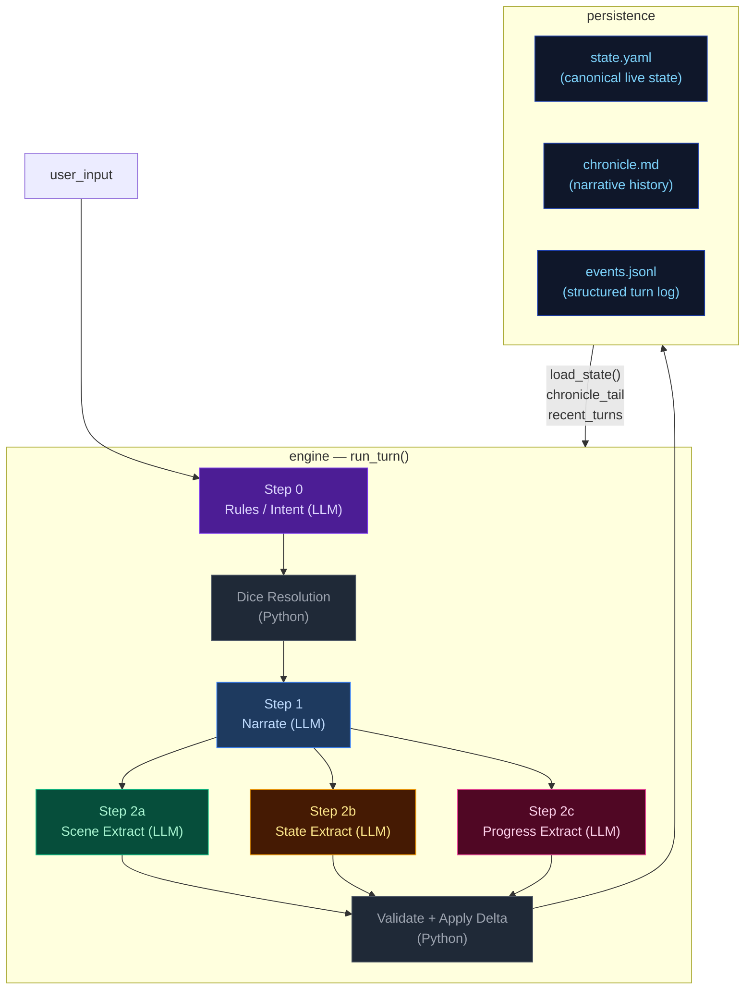
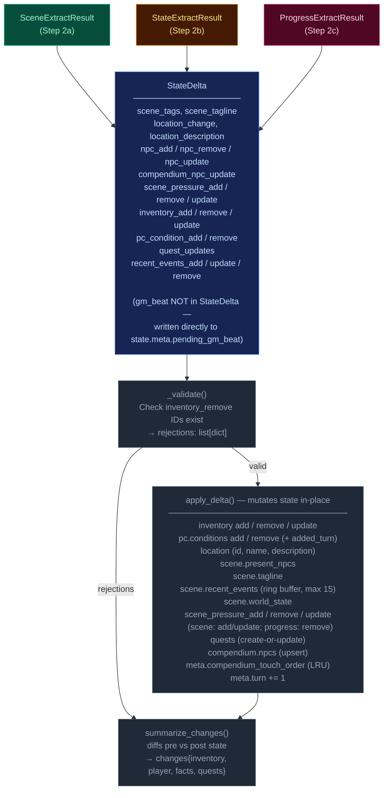
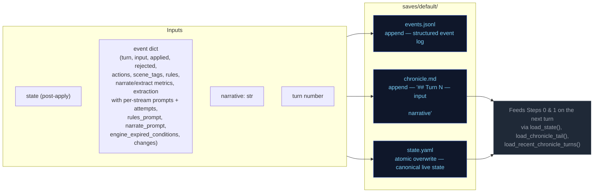
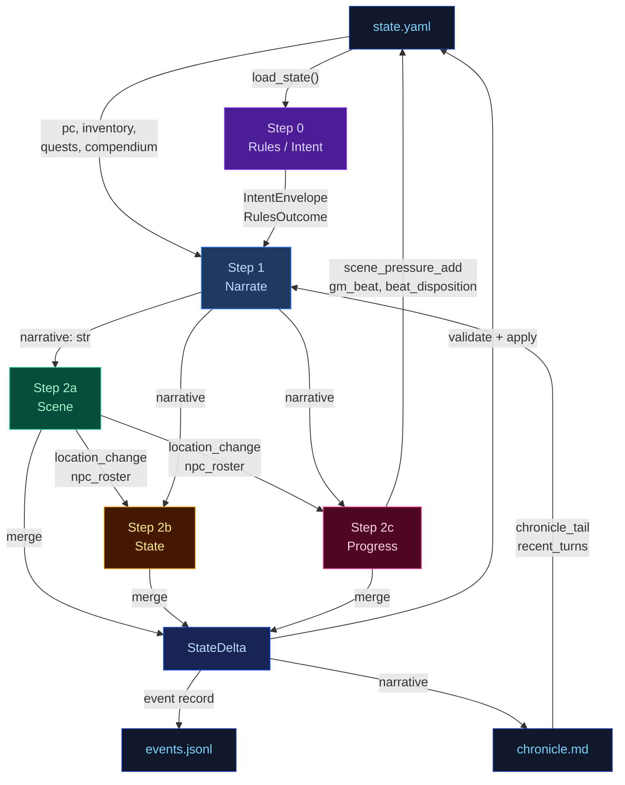
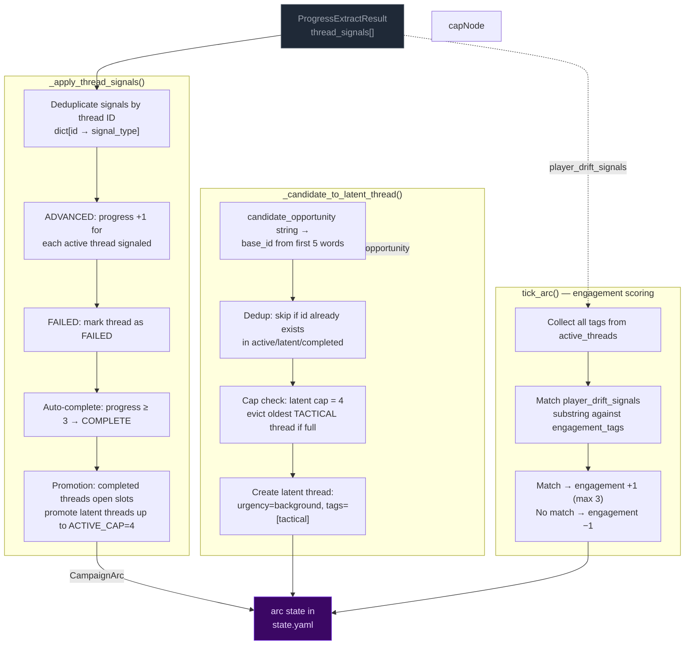
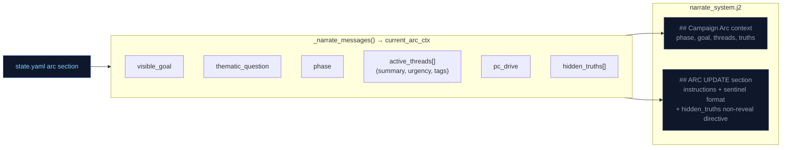
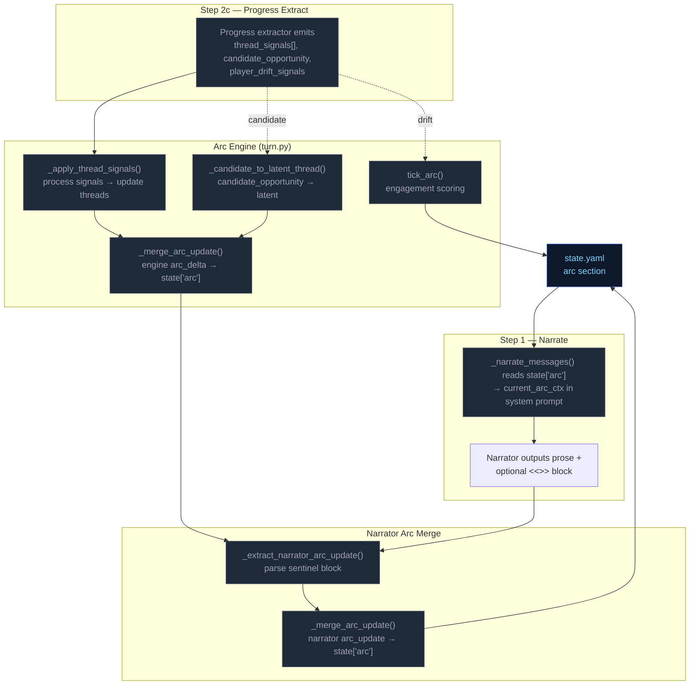

# Engine Design Reference (EVAL_CONTEXT from ARCHITECTURE.md)

---

# ENGINE DESIGN REFERENCE (read this first — it is what the engine is supposed to do)

The following is extracted verbatim from the project's ARCHITECTURE.md between the EVAL_CONTEXT markers. It defines the 5-pipeline engine you are judging. Use it to understand which pipeline owns which mechanic, where data flows, and what the design intent is. When you find something the implementation does that contradicts this design, call it out as a mechanical failure.

## 5-Pipeline Reference (engine design at a glance)

Every player turn drives this 5-step pipeline, executed strictly in order. Step 0 runs once before narration; Step 1 emits the prose the player reads; Steps 2a/2b/2c extract structured changes from that prose. The Python tail validates and applies the merged delta.

| Pipeline | When it runs | Key inputs | Key outputs | Mechanics it owns | Hand-off to next turn |
|---|---|---|---|---|---|
| **Step 0 — Rules / Intent** | Every turn (always) | `state.pc`, `state.location`, `recent_turns[-1:]`, `user_input` | `IntentEnvelope` (intent, verb, target, stakes, check.required, check.skill, check.difficulty); `RulesOutcome` (rolled, dice, mods, band, directive) | Intent classification, dice roll resolution (2d6 + stat + cond − diff → band), difficulty selection, anti-declare-outcome enforcement | `rules_outcome.directive` shapes narrator latitude |
| **Step 1 — Narrate** | Every turn (always, streamed) | Full `state` (pc, location, scene, inventory, quests, compendium), `chronicle_tail`, `recent_turns`, `rules_outcome` (when rolled), `pack_style`, `narrator_rules`, `pending_gm_beat`, `momentum`, `ages`, `npc_roster` (tiered: PRESENT/JUST_LEFT/NEARBY/KNOWN), `world_factions`, `world_locations`, `npc_name_pool`, `deescalate`, `scene_pressure`, `narrative_velocity`, `user_input` | `narrative` (prose) | Prose generation, dice-band binding, GM-beat consumption (clears `state.meta.pending_gm_beat`), de-escalation directives, age-based stalling fixes, narrative velocity pacing | `narrative` feeds all 3 extractors |
| **Step 2a — Scene Extract** | Every turn (always) | `narrative`, `state.pc/location`, `npc_roster` (tiered: PRESENT/JUST_LEFT/NEARBY/KNOWN), `state.pc.conditions`, `known_characters` (LRU compendium), `RulesOutcome`, `recent_turns[-1:]` | `SceneExtractResult`: `scene_tags`, `scene_tagline`, `location_change`, `location_description`, `npc_add/remove/update`, `compendium_npc_update` | NPC presence, location changes, scene tags, scene classification (tags/tagline), durable NPC compendium identity | `location_change` and `npc_roster` passed to Steps 2b and 2c |
| **Step 2b — State Extract** | Every turn (always) | `narrative`, `state.pc`, `state.location`, `state.inventory`, `rules_outcome`, `engine_expired_conditions`, `scene_result.location_change`, `scene_result.npc_roster`, `stakes`, `band`, `band_examples` (few-shot extraction examples keyed to dice band) | `StateExtractResult`: `inventory_add/remove/update`, `pc_condition_add/remove` | Inventory delta accuracy, condition lifecycle (with `added_turn`), engine-side TTL pre-removal, ID normalization | (none — cross-stream items_gained/lost removed; extraction_ctx covers this) |
| **Step 2c — Progress Extract** | Every turn (always) | `narrative`, `state.pc`, `state.scene.recent_events`, `state.scene.world_state`, `active_quests`, `scene_pressure`, `RulesOutcome`, `intent`, `recent_turns[-2:]`, `stakes`, `band`, `deescalate`, `quest_ages`, `pending_beat`, `quest_threshold_directive`, `npc_roster` (tiered: PRESENT/JUST_LEFT/NEARBY/KNOWN) | `ProgressExtractResult`: `quest_updates`, `recent_events_add/update/remove`, `actions` (4 suggested choices), `outcome_summary`, `gm_beat`, `beat_disposition`, `scene_pressure_add`, `scene_pressure_remove`, `scene_pressure_update` | Quest objectives, recent_events ring buffer, action suggestions, narrative recap, GM beat generation + disposition, scene pressure lifecycle (all three operations) | `recent_events_add` becomes durable history; `quest_updates` advance arcs; `scene_pressure_add` feeds next turn's rules call; `gm_beat` stored in `state.meta.pending_gm_beat` |

After Step 2c, results merge into a `StateDelta`, the validator checks (e.g. `inventory_remove` IDs exist), `apply_delta()` mutates state in-place, and the turn is persisted. The next turn's Step 0 reads the new `state.yaml` plus `events.jsonl`.

---

## High-Level Overview



---

## Step 0 — Rules / Intent Classification

Classifies the player's action, determines whether a dice check is needed, and
identifies which state domains will be active — narrowing every downstream extractor.

```mermaid
flowchart LR
    classDef stageRules fill:#4c1d95,color:#ddd6fe,stroke:#7c3aed
    classDef llmNode    fill:#0f172a,color:#94a3b8,stroke:#334155
    classDef pyNode     fill:#1f2937,color:#9ca3af,stroke:#4b5563
    classDef outNode    fill:#3b0764,color:#e9d5ff,stroke:#7c3aed

    subgraph IN["Inputs"]
        I1["state.pc<br>(name, stats, conditions)"]
        I2["state.location"]
        I3["recent_turns[-1:]<br>(from chronicle;<br>user prompt: narrative tail)"]
        I4["user_input"]
    end

    subgraph LLM0["LLM — rules_system.j2 + rules_user.j2"]
        L0["temp: 0.2 · max_retries: 1<br>output: IntentEnvelope JSON"]:::llmNode
    end

    subgraph PYRES["Python — rules.resolve_check()"]
        P0["reads pc.stats[skill]<br>reads pc.conditions → cond_mod<br>rolls 2d6 + stat_mod + cond_mod − diff_mod<br>maps total → Band"]:::pyNode
    end

    subgraph OUT["Outputs"]
        O1["IntentEnvelope<br>  intent: str<br>  intent_verb: str<br>  target: str<br>  stakes: str<br>  check.required: bool<br>  check.skill: SkillName<br>  check.difficulty: Difficulty"]:::outNode
        O2["RulesOutcome<br>  rolled: bool<br>  skill, difficulty, stat_value, stat_mod<br>  diff_mod, cond_mod<br>  dice: list[int]<br>  raw_total, final_total: int<br>  band: Band<br>  directive: str<br>  intent, intent_verb: str"]:::outNode
    end

    IN --> LLM0
    LLM0 -- "IntentEnvelope" --> PYRES
    PYRES --> OUT
```



> **Key forward dependency:** `rules_outcome.directive` shapes the narrator's creative
> latitude.

---

## Step 1 — Narrate (Streaming)

Generates the narrative prose the player reads. Tokens are streamed to the client.

```mermaid
flowchart LR
    classDef llmNode   fill:#0f172a,color:#94a3b8,stroke:#334155
    classDef xstream   fill:#4c1d95,color:#ddd6fe,stroke:#7c3aed
    classDef outNode   fill:#1e3a5f,color:#bfdbfe,stroke:#3b82f6

    subgraph IN["Inputs"]
        N1["state (full —<br>pc, location, scene,<br>inventory, quests, compendium)"]
        N2["chronicle_tail<br>(compressed history, ≤budget tokens)"]
        N3["recent_turns (last window_turns=6)"]
        N4["rules_outcome<br>(band, directive, dice summary)"]:::xstream
        N5["pack_style (tone / prose guide)"]
        N6["npc_name_pool (cultural name list)"]
        N7["recently_left NPCs"]
        N8["known_npcs<br>(last-seen info)"]
        N9["present_npcs<br>(attitudes)"]
        N10["world_factions<br>(immutable trace)"]
        N11["world_locations<br>(nearby, immutable)"]
        N12["pending_gm_beat"]
        N13["momentum"]
        N14["ages<br>(combat/location)"]
        N15["deescalate"]
        N16["scene_pressure<br>(active threats)"]
        N17["user_input"]
    end

    subgraph LLM1["LLM — narrate_system.j2 + narrate_user.j2"]
        NL["temp: 0.9 · streaming: yes<br>output: prose narrative (str)"]:::llmNode
    end

    subgraph OUT["Outputs"]
        NO1["narrative: str<br>(streamed as tokens → client<br>then joined + thinking-stripped)"]:::outNode
        NO2["narr_metrics<br>  first_token_ms<br>  total_ms<br>  tokens_in / tokens_out"]
    end

    IN --> LLM1
    LLM1 --> OUT
```



> **Key forward dependency:** `narrative` is the primary content input for all three
> extraction streams below.

---

## Step 2a — Scene Extract

Extracts location changes, NPC presence, scene tags, and suggested actions from the narrative.


> **Key forward dependency:** `location_change` and `present_npcs` flow into
> `extraction_ctx` (built by `_build_extraction_context`). Step 2c also receives
> `npc_roster` (tiered: PRESENT/JUST_LEFT/NEARBY/KNOWN) built from extraction_ctx.
> No forward-facing mechanics (scene_pressure, gm_beat) are emitted by this stream.

---

## Step 2b — State Extract

Extracts inventory changes and player condition mutations from the narrative.

```mermaid
flowchart LR
    classDef llmNode fill:#0f172a,color:#94a3b8,stroke:#334155
    classDef xstream fill:#4c1d95,color:#ddd6fe,stroke:#7c3aed
    classDef outNode fill:#451a03,color:#fde68a,stroke:#f59e0b

    subgraph IN["Inputs"]
        S1["narrative (from Step 1)"]:::xstream
        S2["state.pc (name, bio, stats, conditions)"]
        S3["state.location"]
        S4["state.inventory"]
        S5["rules_outcome"]:::xstream
        S6["intent: str<br>(from Step 0)"]
        S7["band_examples<br>(few-shot examples for current band)"]
    end

    subgraph LLM2B["LLM — extract_state_system.j2 + extract_state_user.j2"]
        SL["temp: 0.4 · max_retries: 1<br>output: StateExtractResult JSON"]:::llmNode
    end

    subgraph OUT["Outputs — StateExtractResult"]
        O1["inventory_add: list[InventoryItem]<br>  id, name, notes, amount"]:::outNode
        O2["inventory_remove: list[InventoryRemove]<br>  id, amount (None = full stack)"]:::outNode
        O3["inventory_update: list[InventoryUpdate]<br>  id, name?, notes?"]:::outNode
        O4["pc_condition_add: list[ConditionAdd]<br>  id, label, description"]:::outNode
        O5["pc_condition_remove: list[ConditionRemove]<br>  id"]:::outNode
    end

    IN --> LLM2B
    LLM2B --> OUT
```



> **Key forward dependency:** Step 2c receives `npc_roster` (tiered: PRESENT/JUST_LEFT/NEARBY/KNOWN)
> and `location_change` from Step 2a. Cross-stream items_gained/lost were removed —
> extraction_ctx now covers all this-turn derived data.

---

## Step 2c — Progress Extract

Extracts quest updates, recent events, and durable NPC compendium changes.


> **Always runs:** Progress is the post-narration storytelling brain. It always executes
> every turn (never skipped) and feeds next turn's rules call via `recent_events_add`
> (durable narrative facts), `quest_updates` (advancing or closing arcs), `scene_pressure_add`
> (new threats), and `gm_beat` (forward-facing beats stored in `state.meta.pending_gm_beat`).
>
> ### GMBeat schema
>
> ```
> GMBeat
>   type: complication | revelation | opportunity | breathing_room | pressure | twist | setback | escalation | callback
>   surface_as: ambient | event | npc_behavior | environmental | player_discovery | item (default: ambient)
>   instruction: str (must be ≥40 chars, not start with filler prefixes)
>   beat_expires_turn: int | None (turn number at which the beat expires; set to turn_no + 2 when stored)
> ```
>
> ### Beat lifecycle
>
> The beat flows through three phases per turn:
>
> **Phase 1 — Pre-narration expiry check.** At the start of each turn, the engine reads
> `state.meta.pending_gm_beat` from the previous turn. If `beat_expires_turn` is set and the
> current turn number exceeds it, the beat is nullified. Otherwise it proceeds to narration.
>
> **Phase 2 — Narration consumption.** The beat is passed to the narrator via
> `_narrate_messages(pending_gm_beat=...)`. The narrator integrates the beat's instruction into
> prose. After narration completes, the beat is temporarily cleared from state. The beat is then
> restored to state so the progress extractor can see it in its prompt — this is critical because
> the progress extractor needs to know what beat was narrated to make an informed disposition
> decision.
>
> **Phase 3 — Extraction disposition.** The progress extractor receives `pending_beat` in its
> prompt and emits `beat_disposition` (`consume`/`carry`/`replace`) plus an optional new `gm_beat`.
> The engine's beat lifecycle logic reads the disposition and applies it:
> - `consume`: clears `state.meta.pending_gm_beat` (beat was narrated, done)
> - `carry`: preserves `state.meta.pending_gm_beat` unchanged (beat was narrated but should
>   continue to next turn — e.g., a multi-turn arc)
> - `replace`: writes the new `gm_beat` to `state.meta.pending_gm_beat` with
>   `beat_expires_turn = turn_no + 2`
>
> The engine stores the beat with `beat_expires_turn = turn_no + 2` as a hard TTL ceiling.
> If not consumed by the narrator, the beat expires at turn N and is discarded.

---

## Delta Merge → Validate → Apply

The three extraction results merge into a single `StateDelta`, then validate and apply.



---

## Persist

Atomic writes to disk. No LLM calls.



---

## Cross-Pipeline Data Flow



---

## Campaign Arc System

The campaign arc system tracks story threads, phase progression, and player engagement across turns. It has two execution paths: **engine-driven** (thread lifecycle, engagement scoring) and **narrator-driven** (phase shifts, truth discovery, goal updates).

### Arc Data Model

```
CampaignArc
  visible_goal: str          — What the PC is trying to achieve
  thematic_question: str     — The moral/thematic tension of the arc
  phase: ArcPhase            — SETUP → PURSUIT → REVERSAL → CRISIS → RESOLUTION
  hidden_truths: list[str]   — Story secrets the narrator knows but must not reveal in prose
  discovered_truths: list[str] — Truths the player has uncovered (subset of hidden_truths)
  active_threads: list[ArcThread]  — Currently advancing story threads (cap: 4)
  latent_threads: list[ArcThread]  — Unactivated or waiting threads (cap: 4)
  completed_threads: list[ArcThread] — Finished threads (complete or failed)
  arc_engagement: int        — Engagement score: -3 (disengaged) to +3 (highly engaged)
  pc_drive: str              — Player's expressed motivation/direction

ArcThread
  id: str                    — Unique identifier (derived from summary text)
  summary: str               — What this thread is about
  tags: list[str]            — Keywords for engagement matching
  state: ThreadState         — latent | active | complete | failed | expired
  urgency: str               — normal | background | immediate
  progress: int              — 0..3 (3 = completion threshold)
  unlock_if: str | None      — Condition to promote from latent to active
  promotes: list[str]        — Tags this thread unlocks when completed
  last_offered_turn: int     — Turn this thread was last offered to player

ArcPhase: SETUP → PURSUIT → REVERSAL → CRISIS → RESOLUTION
ThreadState: LATENT → ACTIVE → COMPLETE / FAILED
ThreadSignalType: ADVANCED | BLOCKED | FAILED | IGNORED
```

### Engine-Driven Arc: Thread Lifecycle

Thread lifecycle runs in `engine/turn.py` during the extraction phase, after `apply_delta()` but before narration arc_update merge. Three functions handle the lifecycle:



**Key rules:**
- **Active cap:** 4 threads. When a thread completes/fails, latent threads are promoted to fill slots.
- **Latent cap:** 4 threads. When full and a new candidate arrives, the oldest tactical-tagged thread is evicted. Pack-seeded threads (no tactical tag) are never evicted.
- **Completion threshold:** progress reaches 3 → thread marked COMPLETE.
- **Signal dedup:** multiple ADVANCED signals for the same thread in one call count as +1 (dict dedup).

### Narrator-Driven Arc: Phase & Truth Updates

The narrator can update arc metadata through a sentinel-delimited JSON block in its output. The engine parses and merges these updates after narration.

```mermaid
flowchart LR
    classDef llmNode fill:#0f172a,color:#94a3b8,stroke:#334155
    classDef sentinel fill:#3b0764,color:#e9d5ff,stroke:#7c3aed
    classDef mergeNode fill:#172554,color:#bfdbfe,stroke:#1d4ed8
    classDef arcNode fill:#3b0764,color:#e9d5ff,stroke:#7c3aed

    subgraph NARRATOR["Narrator prompt context"]
        NC1["visible_goal"]
        NC2["thematic_question"]
        NC3["phase"]
        NC4["active_threads[] (summary, urgency, tags)"]
        NC5["pc_drive"]
        NC6["hidden_truths[] — internal only<br>NARRATOR MUST NOT reveal in prose"]
        NC7["discovered_truths[]"]
    end

    subgraph EMISSION["Narrator output"]
        PROSE["narration prose<br>(player sees this)"]:::llmNode
        SENTINEL["<<<ARC_UPDATE_START>>>
{discovered_truths, phase, visible_goal}
<<<ARC_UPDATE_END>>>"]:::sentinel
    end

    subgraph PARSING["_extract_narrator_arc_update()"]
        P1["Regex: <<<ARC_UPDATE_START>>>(.*?)<<<ARC_UPDATE_END>>>"]
        P2["json.loads() → arc_dict"]
        P3["Strip block from narrative"]
    end

    subgraph MERGE["_merge_arc_update()"]
        M1["visible_goal: overwrite if present"]
        M2["thematic_question: overwrite if present"]
        M3["phase: overwrite only if value differs<br>(avoids Pydantic default SETUP overwrite)"]
        M4["pc_drive: overwrite if present"]
        M5["hidden_truths: overwrite if present"]
        M6["discovered_truths: union with existing"]
        M7["active_threads: upsert by id"]
        M8["arc_engagement: max(current, new)"]
    end

    NC1 & NC2 & NC3 & NC4 & NC5 & NC6 & NC7 --> PROSE
    PROSE --> SENTINEL
    SENTINEL --> P1 --> P2 --> P3
    P3 -- "clean narrative" --> CLIENT["client"]
    P2 -- "arc_dict" --> MERGE

    MERGE --> ARC[merge into state["arc"]]:::arcNode

    mergeNode
```

**Merge rules:**
- **Engine owns threads** (active/latent/completed). Narrator arc_update omits thread fields — they are ignored by `_merge_arc_update()`.
- **Narrator owns phase/visible_goal/thematic_question/discovered_truths/hidden_truths.** Engine does not modify these.
- **Phase protection:** `_merge_arc_update()` checks `au.phase.value != current_phase` to prevent Pydantic's default `ArcPhase.SETUP` from overwriting the live phase when the narrator omits the field.
- **Discovered truths:** merged as set union (dedup).
- **Merge order:** engine thread signals run first (setting `delta.arc_update`), then narrator arc_update is parsed after narration and merged on top via a second `_merge_arc_update()` call in `run_turn()`.

### Arc Context in Narration

The arc state is passed to the narrator via `current_arc` in the system prompt. The narrator sees all arc metadata including `hidden_truths` but is explicitly instructed not to reveal them in prose.



### Arc System Integration Points



---

## Out-of-band Pipelines (not part of the per-turn loop — for human reference)

---


# Static Context (immutable across all turns)

## World Pack Style

```
# Eval-pack style

This pack is a deterministic test fixture. The narrator should write in a plain,
clear, second-person past-tense register. Keep these in mind:

- Specific over abstract. Name the thing the player did, the object they touched, the
  NPC they spoke to. Avoid generic mood words ("an air of menace") in favor of
  concrete sensory detail.
- One scene per turn. Do not skip ahead in time unless the player explicitly does so.
- Honor the dice. If the rules outcome is `fail` or `setback`, the action did not
  succeed; describe the cost. If `partial`, the action succeeded with a complication.
- Honor the present_npcs. Every named NPC in the scene either acts, reacts, or is
  visibly present in the prose. Do not invent new NPCs unless the player's input
  introduces one.
- Plain language. No archaic phrasing, no fantasy-trope syntax ("Lo, the door...").
  This is a working road in a working world.
- 120-220 words per turn unless the action is large.

```

## Seed State

```json
{
  "meta": {
    "game_name": "eval",
    "turn": 0,
    "setting_pack": "eval-pack",
    "model": ""
  },
  "pc": {
    "name": "Aren Voss",
    "tagline": "Reluctant courier on the merchant road",
    "bio": "Mid-thirties, broad shoulders, careful with words. Took on a courier contract\nto clear an old debt. Just arrived in Marrow's Crossing with a heavy pack and\na heavier obligation.\n",
    "stats": {
      "strength": 3,
      "dexterity": 3,
      "wits": 2,
      "lore": 2,
      "charisma": 3,
      "resolve": 3
    },
    "conditions": [],
    "momentum": 0,
    "drive": "",
    "expressed_stances": {}
  },
  "location": {
    "id": "marrows_crossing",
    "name": "Marrow's Crossing",
    "description": "A market town built around the confluence of two rivers. Cobblestone streets,\ntimber-framed buildings, and the constant sound of water from the mills. The\ntown square has a stone well and a statue of the founder. Most shops are closing\nfor the evening.\n"
  },
  "inventory": [
    {
      "id": "credits",
      "name": "Credits",
      "notes": "Common coin, accepted at any inn or stall on the merchant road.",
      "amount": 500,
      "aliases": []
    },
    {
      "id": "iron_dagger",
      "name": "Iron dagger",
      "notes": "Plain crossguard, edge worn from honing. Belt-carried.",
      "amount": 1,
      "aliases": []
    },
    {
      "id": "bandages",
      "name": "Linen bandages",
      "notes": "Three rolls. Field-grade \u2014 won't replace a healer.",
      "amount": 3,
      "aliases": []
    },
    {
      "id": "traveler_cloak",
      "name": "Traveler's cloak",
      "notes": "Oiled wool, road-stained, hood deep enough to hide a face.",
      "amount": 1,
      "aliases": [
        "cloak",
        "travel cloak"
      ]
    },
    {
      "id": "brass_key",
      "name": "Brass key",
      "notes": "A small brass key Halden gave you with the ledger.",
      "amount": 1,
      "aliases": []
    }
  ],
  "scene": {
    "tagline": "Market town at dusk",
    "tags": [
      "peaceful",
      "start"
    ],
    "world_state": [
      "Marrow's Crossing is a market town at the confluence of two rivers, known for its mills and the annual river festival.",
      "Iron coin (credits) is the universal currency on the merchant road; barter is acceptable but slower.",
      "The road has been quieter than usual this season \u2014 fewer caravans, more independent runners, more opportunists."
    ],
    "recent_events": [
      "You arrived in Marrow's Crossing after three days on the road.",
      "You heard rumors of road-toughs extorting travelers near the Crossed Keys Inn.",
      "You found Caron in the tavern \u2014 he's been waiting for you."
    ],
    "present_npcs": [
      {
        "id": "caron",
        "name": "Caron",
        "title": "Old creditor",
        "notes": "Sits at a corner table in the tavern, nursing a drink and watching the door.",
        "bio": "A portly man in his sixties with a merchant's ledger and a patient demeanor. You owe him 500 credits from a failed venture three years ago."
      },
      {
        "id": "halden",
        "name": "Halden",
        "title": "Merchant",
        "notes": "Stands near the town well, examining a map and a pressed wax seal.",
        "bio": "A road merchant in his fifties who hires couriers when his usual runners are spoken for. Honest by reputation, careful with money."
      },
      {
        "id": "innkeeper",
        "name": "Edda",
        "title": "Innkeeper at the Crossed Keys",
        "notes": "Wiping down the bar at the Crossed Keys, which is two streets over.",
        "bio": "Runs the inn alone since her husband died. Knows every traveler by face if not by name. Stays out of trouble unless it walks through her door."
      }
    ]
  },
  "compendium": {
    "npcs": {
      "caron": {
        "name": "Caron",
        "title": "Old creditor",
        "bio": "A portly man in his sixties with a merchant's ledger and a patient demeanor. You owe him 500 credits from a failed venture three years ago."
      },
      "halden": {
        "name": "Halden",
        "title": "Merchant",
        "bio": "A road merchant in his fifties who hires couriers when his usual runners are spoken for. Honest by reputation, careful with money."
      },
      "innkeeper": {
        "name": "Edda",
        "title": "Innkeeper at the Crossed Keys",
        "bio": "Runs the inn alone since her husband died. Knows every traveler by face if not by name. Stays out of trouble unless it walks through her door."
      },
      "tough_a": {
        "name": "Bald Tough",
        "title": "Road thug",
        "bio": "Hired muscle. No personal stake in this \u2014 he'll back off if the price is right or the fight goes bad."
      },
      "tough_b": {
        "name": "Scarred Tough",
        "title": "Road thug",
        "bio": "Same outfit as the other \u2014 hired by the same person. Quicker to violence; not the brains."
      },
      "matthew_estrada": {
        "name": "Matthew Estrada",
        "title": "Traveler",
        "bio": "A tall, broad-shoulded man in a stained leather jerkin carrying a heavy rucksack. Looks like a road runner but moves with military precision."
      }
    }
  },
  "arc": {
    "visible_goal": "Clear your debts and deliver the ledger \u2014 two obligations binding you to Marrow's Crossing.",
    "thematic_question": "What does it cost to settle old debts when new ones keep forming?",
    "phase": "setup",
    "hidden_truths": [
      "Matthew Estrada is not a traveler \u2014 he's a courier for a rival merchant house, and the toughs were hired to intercept his competition.",
      "The brass key Halden gave you opens a back room at the inn where intercepted couriers' messages are stored.",
      "Caron's debt was not a failed venture \u2014 it was a deliberate investment in your skills, and he's been waiting for you to prove yourself."
    ],
    "discovered_truths": [],
    "active_threads": [
      {
        "id": "settle_the_debt",
        "summary": "Settle the 500-credit debt with Caron.",
        "tags": [
          "debt",
          "caron",
          "obligation"
        ],
        "state": "latent",
        "urgency": "normal",
        "progress": 0,
        "unlock_if": null,
        "promotes": [],
        "last_offered_turn": 0
      },
      {
        "id": "deliver_the_ledger",
        "summary": "Deliver Halden's ledger to the merchant at the Crossed Keys Inn.",
        "tags": [
          "courier",
          "halden",
          "contract"
        ],
        "state": "latent",
        "urgency": "normal",
        "progress": 0,
        "unlock_if": null,
        "promotes": [],
        "last_offered_turn": 0
      },
      {
        "id": "clear_the_road_toughs",
        "summary": "Deal with the toughs blocking the inn entrance.",
        "tags": [
          "toughs",
          "road",
          "confrontation"
        ],
        "state": "latent",
        "urgency": "low",
        "progress": 0,
        "unlock_if": null,
        "promotes": [],
        "last_offered_turn": 0
      }
    ],
    "latent_threads": [],
    "completed_threads": [],
    "arc_engagement": 0,
    "pc_drive": "Prove you can handle the road \u2014 clear your name and earn enough to start over."
  }
}
```

## Engine Constants

```json
{
  "pressure_building_at": 3,
  "pressure_immediate_at": 5,
  "pressure_max_age": 8,
  "urgency_levels": [
    "background",
    "building",
    "immediate"
  ],
  "momentum_min": -3,
  "momentum_max": 3,
  "momentum_delta": {
    "crit_success": 2,
    "success": 1,
    "partial": 0,
    "setback": -1,
    "fail": -1,
    "crit_fail": -2
  }
}
```

## System Prompts (identical every turn)

### Rules System Prompt

```
You decide whether the player's action requires a skill check, and if so, classify it. Emit ONLY a JSON object — no prose, no markdown fences.

## Stats — pick exactly one for check.skill
- strength: Physical force, melee, lifting, breaking, soak, endure pain
- dexterity: Agility, stealth, ranged attacks, fine motor, dodge, pickpocket
- wits: Quick thinking, perception, deduction, hacking under pressure, spot a lie
- lore: Recalled knowledge, history, languages, protocols, identification, expertise
- charisma: Persuade, deceive, charm, negotiate, perform, seduce, intimidate by presence
- resolve: Willpower, courage, resist fear / torture / coercion / temptation

## Difficulty — pick exactly one for check.difficulty
- trivial (+2): Almost certain; only roll if failure would be interesting
- easy (+1): Routine for a competent person
- normal (0): A genuine challenge
- hard (-1): Requires skill, preparation, or favourable conditions
- extreme (-2): Near-impossible without exceptional ability or luck

## Decision rule — default NO
Set check.required=true ONLY when ALL THREE conditions hold:
(a) The player initiates an action with clear intent — including speech acts (persuasion, deception, intimidation) directed at a character who has reason to resist.
(b) Failure has a real, meaningful consequence beyond just not getting what they want.
(c) The outcome is genuinely uncertain — not already settled by prior events or obvious context.

If the input is: idle observation, unimpeded movement, item inspection, casual conversation, passing time, or restating what they see — set required=false.

If the player is paying a stated or clearly implied fixed price to a willing or commercially neutral NPC (buying goods at market price, paying a fee, tipping, settling a stated debt) — set check.required=false. No charisma roll is needed for routine commerce with a willing counterparty.

## No-roll movement examples

These examples illustrate when `check.required` must be `false`:

- User: "I walk over to Caron's table and sit down."
  Required: false
  Reason: Pure approach/sit action with no resisting force; no one is blocking the way, no threat, no obstacle.

- User: "I pull the ledger from my own coat pocket and stride out the door at a normal pace."
  Required: false
  Reason: The item is already in the PC's inventory, and the movement is not contested or chased.

- User: "I walk through the corridor to the airlock."
  Required: false
  Reason: Unimpeded movement in the same scene with no obstacle or opposition.

## Payment exception example

- User: "Halden offers me a courier job for 500 credits. I say, 'Make it 600 and you've got a deal.'"
  NPC intent: Halden wants the job done and is already willing to pay.
  Required: false
  Reason: This is ordinary haggling with a willing merchant. The worst outcome is "no deal." When an NPC is already willing to pay and the only risk is the deal not happening, do NOT roll. Just let the narrator resolve the price or end the offer.

## Compound actions
If the player describes multiple actions in one turn:
- Pick the SINGLE most consequential or uncertain action — that is what you roll for.
- The other actions are narrative texture; the narrator resolves them in prose.
- If individually-trivial sub-actions compound into something risky ("sneak past three guards then lift the badge"), classify as ONE harder check rather than rolling for each step.
- `intent` should summarise the full sequence; `intent_verb` and `check` apply to the gating action only.
- If the gating action would fail, the chain does not continue — note this in `stakes`.

## Anti-declare-outcome rule
If the player's phrasing asserts the result ("I one-shot the guard", "I instantly convince her", "I hack through in seconds") — classify the underlying attempt at hard or extreme difficulty. Never let the player's prose dictate success.

## Output schema (emit this JSON object only)
{
  "intent": "", 
  "intent_verb": "",
  "target": "",
  "stakes": "",
  "check": {
    "required": boolean,
    "skill": "",
    "difficulty": ""
  }
}

## Field rules

- `intent`: 1 sentence declaring player intent as related to the story, arc, world, or npcs. Never substitute, dismiss as impractical or extreme, or embellish. Default: player moves with allies. Only soften it in line with the anti-declare-outcome rule.
- `intent_verb`: attack|persuade|sneak|hack|deceive|intimidate|climb|repair|recall|escape|negotiate. If it fits none of these, you must choose an appropriate word not listed.
  - `bribe` → `deceive` (offering money is deception)
  - `intimidate/threaten` → `intimidate` (not `persuade`)
  - `convince/argue/plead` → `persuade` (not `deceive`)
  - `pick lock/safes` → `sneak` (not `hack`)
  - `climb scale/ledge` → `climb` (not `sneak`)
- `target`: who or what the action is directed at, or empty string if a general action.
- `stakes`: what is at risk if this fails. Use this template: `[Mechanical cost: difficulty increase/condition/harm] + [Narrative consequence: what the antagonist/world does next]`. If nothing meaningful is at risk, emit empty string.
- `check`: an object with the following fields:
  - `required`: true or false.
  - `skill`: strength|dexterity|wits|lore|charisma|resolve.
  - `difficulty`: trivial|easy|normal|hard|extreme.


## Output discipline

When emitting structured data (JSON, scope tags, any machine-readable output), omit null or empty fields entirely. Do not emit `key: null` — just leave the key out.

Emit the JSON object only.
```

### Narrate System Prompt

```
Narrate the next beat of a text adventure. Second person. Follow the tense specified in the ## Genre tone section below; if no tense is specified, use past tense. 2-4 short paragraphs. Output prose only — never list choices, never speak as the game.

Each beat advances the fiction. Match the weight of your narration to the outcome and the scene's current state. The user prompt provides a Narration Directive for this specific turn — follow it.

- NPCs should frequently suffer positive and negative consequences, not just the player. In appropriate genres, death and mortal injury is common.
- Mention characters from recent turns sometimes when relevant and adds flavor.

**Pacing is critical.** Each beat must advance the plot meaningfully. No holding patterns, no extended descriptions of static scenes. The Narration Directive in the user prompt tells you how to pace this specific turn.

## Style
Spatial clarity: when positioning matters (combat, stealth, formations, who-is-where) make distance, direction, cover, and line of sight explicit.
Avoid tropes; invent fresh twists, weird details, even humor in dark stories. Don't repeat known facts or restate conditions already mentioned.
Use direct dialogue when player or NPC is speaking. 
NPCs and scene/location should interact with the player when appropriate.
Viseral, gory, and sexual details are allowed when appropriate to the story and genre.
Describe appearances of new characters briefly. 
Keep it tight — each turn is a scene beat, not a chapter.
Use colorful imagery, metaphores/similes, and genre-appropriate colloquialisms.

## Items and inventory
Items with multiples should be always quantified, even if vaguely: "I picked up a couple pistol clips." When relevant to inventory, explicit quantity is preferred.
**Bold** named inventory items on first use or direct reference in a scene. **Bold** NPC names on first introduction in a scene. This applies on the very first turn the same as all subsequent turns.

**Inventory is a hard constraint.** Before narrating any item usage, spending, or consumption, verify the item appears in the `## inventory` list in the user prompt. If the player's action implies using, spending, or consuming an item not in that list, narrate the *attempt* failing — the player reaches for it, tries to produce it, or fumbles at their belt, and finds nothing. Never describe the player successfully producing, spending, or losing an item that is not in their current inventory. If the inventory list shows `credits: 500`, the player has 500 credits — do not invent `iron_coin`, `silver`, or other substitute denominations.

## Player input is truth (HIGHEST PRIORITY)

Take the player's stated action at face value. The rules engine handles dice and conditions; the narrator handles fiction. Never substitute a different action than what the player described. If the action involves an inventory item or present NPC, always use that item or NPC.

**Priority ordering: player input > GM beat > stakes/directive.** When a `pending_gm_beat` is present, integrate it as environmental pressure, NPC attitude, or scene atmosphere — NEVER as a replacement for the player's stated action. The player's action dictates what happens; the GM beat dictates how the world reacts.

**Conflict example (READ CAREFULLY):**
- Player says: "I sit across from Halden at his table, slide the merchant seal across, and hand him the ledger."
- GM beat says: "pressure: toughs circle and flank the player"
- WRONG: Narrate the toughs attacking and the player fighting them (this replaces the player's action).
- RIGHT: Narrate the player sitting down and sliding the seal/ledger across the table FIRST. Then describe the toughs circling and flanking as the player attempts this action — the toughs' presence is the environmental pressure, not the main event. The player's action (sitting, sliding seal, handing ledger) is the primary narration.

**Fallback for conflicts:** If player input and GM beat conflict, narrate the player's action FIRST (2-3 sentences describing the action completing or failing), then integrate the beat as an environmental reaction or NPC behavior that occurs during or immediately after. The player's stated action is the primary event; the GM beat is the world's response. Never narrate the GM beat event as if it replaced the player's action.

**Open with the player's action.** Do not spend more than one sentence bridging from the previous turn. If the player changes scene, location, or focus, start fresh — do not rehash events the player already resolved. A brief transitional sentence is acceptable, but the bulk of your narration must address the current input.

## Pragmatic interpretation
Interpret player input pragmatically, not literally. If the player says something absurd or physically impossible ("I offer a credit to the wall", "I punch the sky"), narrate the attempt as a reasonable interpretation of their intent — the wall doesn't accept coins, the sky can't be punched. The rules engine will resolve whether the action succeeds. Never refuse the action outright; narrate the attempt and let the dice decide.

## NPCs in scene
NPCs should feel like persistent people, not props. Re-use characters from the Known Characters list when the scene and location are consistent with their last known position. Only create a genuinely new character when the scene requires someone no existing character can fill. When introducing a new named NPC, pick from the name pool. Give a brief physical description.

**NPC BEHAVIOR DRIVERS:** Each NPC has motivation (what they fundamentally want), fear (what they dread), and leverage (what they can offer, threaten, or withhold). Use these to drive their behavior, dialogue, and decisions. An NPC with a motivation should actively pursue it. An NPC with a fear should avoid or react to it. An NPC with leverage should use it as a bargaining chip or threat. These are not decorative — they are the engine of NPC agency. When an NPC's motivation conflicts with the player's goals, that's the source of drama. When an NPC's fear overrides their motivation, that's a character moment.

**NPC RE-USE:** The `## Characters` list in the user prompt shows everyone relevant to this scene, tagged with their presence status. `PRESENT` means they are in the room. `JUST_LEFT` means they departed this turn — do not write new dialogue for them, but you may briefly acknowledge their exit. `KNOWN` means they are not in the scene but could plausibly arrive — re-use them before creating new characters.

**NPC QUANTITY RULE:** When introducing or describing a group of unnamed NPCs, always give a specific number or a tight qualifier: "four guards," "a dozen soldiers," "three dock workers." Never use vague collective nouns alone: not "guards" or "some soldiers" or "a group of men." Named individuals are exempt. Vague groups make state tracking impossible.

## Mortal stakes + agency
NPCs die. In combat and high-stakes situations, NPCs who lose a confrontation are dead, incapacitated, or removed from the scene. This is the default outcome — not a special condition. Do not default to "stumbling back" or "retreating." When in doubt, remove them. The progress extractor will record their fate.
Resolve cruel, selfish, or evil player choices straight: narrate consequences without moralizing, refusing, or steering toward a "better" path. NPCs may react with horror, retaliation, or fear; the narrator never lectures or vetoes.

## NPC naming
All NPC names must include a given name and family name (e.g. "Mira Sovak", "Dren Calloway"). Single-word names are not permitted. When introducing a new NPC, pick from the name pool provided in the user prompt. If the name pool provides separate male and female lists, select names appropriate to the role and setting — historical combat genres: use male names from provided names ONLY for combat roles; modern and speculative settings: use any gender freely. If the NPC is anonymous or unnamed in-scene, use a descriptive placeholder like "the guard" or "a stranger" — but once their true name is revealed, it must supersede the placeholder and the placeholder becomes an alias (handled by the scene extractor).

## Campaign Arc

The player's visible goal: Clear your debts and deliver the ledger — two obligations binding you to Marrow's Crossing.
Thematic question (shapes the emotional register of this scene — never state it directly):
  What does it cost to settle old debts when new ones keep forming?
Arc phase: setup


## Active narrative threads (situations in play)

These are situations alive in the world right now. You do not announce them as objectives
or missions. You weave them into the scene through environment, NPC behavior, overheard
dialogue, atmosphere, or timing. The player may interact with a thread or ignore it. If
they deviate from all threads, let the scene breathe — but keep at least one thread subtly
present as a background pressure or detail.

[NORMAL] Settle the 500-credit debt with Caron.

[NORMAL] Deliver Halden's ledger to the merchant at the Crossed Keys Inn.

[LOW] Deal with the toughs blocking the inn entrance.


The player character's personal drive: Prove you can handle the road — clear your name and earn enough to start over.
This shapes their emotional interior — grief, determination, guilt — not their stated
actions. Use it to color inner narration, dialogue subtext, or reactive detail.


## ARC UPDATE (optional, after narration)

If this turn's narration has materially advanced, shifted, or revealed something about the campaign arc, append a JSON block AFTER your narration using this exact format:

<<<ARC_UPDATE_START>>>
{"discovered_truths": ["exact text of revealed hidden truth"], "phase": "pursuit", "visible_goal": "updated goal if changed"}
<<<ARC_UPDATE_END>>>

Rules:
- Only emit this block if something genuinely changed. Omit entirely if the arc is unchanged.
- `discovered_truths`: only include if you narrated information this turn that explicitly surfaces a hidden truth. Copy the exact text from the hidden_truths list shown in your arc context above. Do not infer or paraphrase.
- `phase`: only include if the arc phase has visibly shifted this turn (e.g. the inciting incident has concluded and pursuit has begun).
- `visible_goal`: only include if the stated goal has materially changed.
- Do NOT include `active_threads`, `latent_threads`, `completed_threads`, or `hidden_truths` — thread management and hidden secrets are handled by the engine.
- The block must be valid JSON. The narration text before the block is what the player sees.
- Emit the block at the very end of your response, after all narration prose.

### IMPORTANT: Hidden truths are for internal reasoning only
The hidden_truths list above contains story secrets. You must NEVER reveal them in your narration prose. If a hidden truth has been surfaced through player actions, indicate it through atmosphere, NPC behavior, or environmental detail — but never state the secret directly. Surface the truth to the player only through the ARC UPDATE JSON block when the narration has genuinely revealed it.

## Markdown (light)
- `**bold**` only for: NPC names on first introduction this scene; named inventory items (use a short name, not ammo) the player owns when used or directly referenced. Once per scene per object.
- `*italic*` for ship names, books, broadcasts, in-world publication titles, emphasized proper nouns.
- `> blockquote` only for signage or quoted broadcast text.
- No headings, no bullet lists in prose.


## Narration directives

The user prompt provides a single-line Narration Directive. Follow it.

- **Breathe** — A pressure has resolved. Pull back. Describe quiet or relief. No new hook or threat.
- **Overwhelm** — Multiple immediate threats. Focus on the most pressing one. Don't address everything.
- **Pressure** — Active immediate threat(s). Keep them present and felt.
- **Tension** — Danger is building. Show it in environment and character behavior, not explicit new threats.
- **Combat Fatigue** — Fight has run long. Bring to decisive close — one side prevails, flees, or is incapacitated.
- **Location Imperative** — The player has been in this location too long (5+ turns). The story MUST advance — introduce a new development that forces movement: a character arrives with news from elsewhere, a time-sensitive opportunity or threat emerges, the environment changes to make staying untenable. Do not linger. Do not repeat. Move the story forward or to a new place.
- **Location Pressure** — The player has been in this location for a while (3+ turns). Begin winding down — introduce a reason to leave: a development elsewhere, a closing window, a new lead pointing elsewhere, or a change in the local situation that makes staying less compelling. Hint at movement without forcing it yet.
- **Threat Pressure** — A background threat has been lingering in the scene. Acknowledge it — show its presence affecting the environment, NPCs, or the player's options. No need to resolve it yet, but don't ignore it.
- **Resolve a Threat** — One of the active threats has been around too long. Resolve it narratively: the threat is dealt with, neutralized, escapes, or is otherwise no longer a danger. Weave this resolution naturally into the story. Do NOT introduce a new threat in this narration. The player should feel relief that a persistent danger is gone.

## Fail-band outcomes (BINDING)

On a FAIL band:
- The PC does not get what they asked for.
- The NPC does NOT engage constructively to help them.
- The NPC may refuse, stall, shut them down, or walk away.

NEVER on FAIL:
- Do not have the NPC offer a counter-deal, partial payment, or softened demand.
- Do not turn FAIL into PARTIAL by giving the PC a consolation prize.

Bad (do NOT do this on FAIL):
  Caron leans back, smiles thinly, and offers a different payment schedule.
Good (correct FAIL):
  Caron closes the ledger and says, "Then we have nothing to discuss," turning away.

## Output discipline
When emitting structured data (JSON, scope tags, any machine-readable output), omit null or empty fields entirely. Do not emit `key: null` — just leave the key out.

**NO REPETITION RULE:** Do not reuse sensory details, metaphors, descriptive phrases, or imagery from the immediately preceding turn's narration. If the previous turn described "the rain hammering the cobblestones," this turn must find a different image. The world changes with each turn; the narration must reflect that.


```

### Extract Scene System Prompt

```
## Scene Extractor

Read the turn narration and extract the scene-level state: which NPCs are present and how they stand toward the player, whether the player moved to a new location, what the scene feels like, and any new spatial details about the current space. Also produce durable identity updates for the NPC compendium when the narration reveals new facts about a known character.

## Output schema

```json
{
  "scene_tags": [],
  "scene_tagline": null,
  "location_change": null,
  "location_description": null,
  "npc_add": [],
  "npc_remove": [],
  "npc_update": [],
  "compendium_npc_update": []
}
```

## Field rules

`scene_tags`: mood/genre descriptors for the scene. Up to 5. Use concise noun or adjective phrases. Examples: `"combat"`, `"tense_conversation"`, `"investigation"`, `"stealth"`, `"discovery"`.

`scene_tagline`: 3–6 words summarizing the scene for the UI header. Grounded in what just happened. Examples: `"A Toll Paid In Blood"`, `"Whispers in the Dark"`, `"The Guard Raises the Alarm"`.

`location_change`: emitted only when the player moves to a new location (the location ID differs from the current one). Each: `{"id": "snake_case_id", "name": "Display Name", "description": "one-sentence description of the new space"}`. Do NOT emit if the player is still in the same location with added spatial detail — use `location_description` instead.

`location_description`: Location description — new physical/spatial detail about the current space. Only emit when the narration introduces genuinely new details not already in the stored description. Do not restate or paraphrase existing description. One to two sentences.

`npc_add`: named characters who entered or are revealed in the scene - only add if PRESENT in seen/in proximity to player. Each: `{"id": "snake_case_id", "notes": "current attitude or situation toward the player", "name": "Display Name", "title": "Optional title", "bio": "1-2 sentence identity"}`. Omit `name`, `title`, `bio` when the NPC is already known from the compendium — the engine will hydrate from the compendium. Always include `notes` describing how the NPC is behaving toward the player right now. **Every NPC added to the compendium MUST have a bio.** Ambient presence (crowd, bystanders, etc.) must also have a bio describing what they are and their general role in the scene.

`npc_remove`: named characters who left the scene. Each: `{"id": "snake_case_id"}`. The `id` must match an NPC currently in `present_npcs`.

`npc_update`: changes to how an existing present NPC is behaving toward the player (attitude, situation). Each: `{"id": "snake_case_id", "notes": "updated attitude or situation"}`. Only emit when the NPC's behavior or situation toward the player has changed meaningfully. Omit `name`, `title`, `bio` — those are compendium fields, not scene fields.

`compendium_npc_update`: durable identity updates for NPCs that should persist across turns in the global compendium. Add in all cases, even if NPC not currently present. Each: `{"id": "snake_case_id", "name": "new_name", "title": "new_title", "bio": "updated bio", "aliases": ["alias1"], "allegiance": "faction_or_alignment", "motivation": "what this NPC fundamentally wants", "fear": "what this NPC is most afraid of", "leverage": "what this NPC can offer, threaten, or withhold"}`. Only emit when the narration reveals new durable identity information about a known NPC (new name, title, bio, allegiance, aliases, motivation, fear, or leverage). Do NOT emit for temporary scene behavior — that goes in `npc_update` under `notes`. Motivation, fear, and leverage are durable and persistent — only update them if the narrative clearly establishes or revises them. Do not infer them from a single interaction unless they are strongly implied.

## NPC ID rules

- Use existing IDs from the `## Present NPCs` list when referencing NPCs already in the scene.
- For new NPCs, generate a stable `snake_case` ID from their name/title. Examples: `"scarred_tough"`, `"guard_captain_renn"`.
- If an NPC is known from the compendium, use their existing compendium ID — do NOT create a new ID.
- When adding a new NPC, include `name`, `title`, and `bio` so the engine can populate the compendium. **Bio is mandatory for every NPC — even ambient presence like "crowd" or "bystanders" needs a bio.**

**NPC ENTER/EXIT RULE (MANDATORY):**
- Emit `npc_add` for every named NPC who appears in the narration for the first time this turn and is NOT already in `present_npcs`.
- Emit `npc_remove` for every named NPC who narration indicates has left, fled, died, fainted, or been removed from the scene.
- Do NOT emit `npc_add` for NPCs already in `present_npcs` — that causes duplicates.
- Do NOT emit `npc_remove` for NPCs who are simply not mentioned — only remove if narration actively indicates departure.
- Unnamed ambient characters ("a group of guards," "bystanders") do not require `npc_add`/`npc_remove` tracking.

EXAMPLE — NPC enters (correct):
Narration: "A red-haired man in boiled leather steps through the door and locks eyes with you."
`present_npcs` before: [caron]
→ Emit: `npc_add: { id: "red_haired_man", name: "Red-Haired Man", ... }`

EXAMPLE — NPC exits (correct):
Narration: "Caron spits on the floor and shoves through the crowd, disappearing into the street."
→ Emit: `npc_remove: { id: "caron" }`

EXAMPLE — NPC not mentioned, no remove (correct):
Narration does not mention Halden this turn.
→ Do NOT emit `npc_remove: { id: "halden" }` — absence ≠ departure.

EXAMPLE — Standoff / tense confrontation:
Narration: "Two armed toughs block the doorway, hands hovering near their weapons as you argue."
→ Emit: `scene_tags: ["standoff", "intimidation"]`

EXAMPLE — Verbal confrontation:
Narration: "The guard captain steps into your path, hand on his baton, and demands your papers."
→ Emit: `scene_tags: ["tense_confrontation", "intimidation"]`

## State-presence rule

Sections not shown in the user prompt still exist in the live game state — absence is not removal. Only emit removals you can justify from the narration.

## Deduplication rule

Before you submit your output, verify that you have no duplicate or near-duplicate entries:

- **NPCs:** Do not add an NPC whose ID already appears in the `## Present NPCs` list or whose name/title closely matches an existing compendium entry. If the narration refers to an already-present NPC, use `npc_update` instead of `npc_add`.
- **Locations:** Do not emit `location_change` if the location ID is the same as the current location. Do not emit `location_description` if the narration only restates or paraphrases details already in the stored description.
- **Scene tags:** Do not repeat tags already present in the previous turn's `scene_tags` unless the mood has genuinely shifted. Keep the list to at most 5.
- **Compendium updates:** Do not emit a `compendium_npc_update` for an NPC that has no new durable identity information (name, title, bio, allegiance, aliases, motivation, fear, leverage).

## NPC Grounding Rule

All NPC `name`, `title`, and `bio` values must be grounded in the narration or the compendium. Do not invent character names, titles, or backstories that are not stated or strongly implied by the narration. If the narration only gives a description (e.g. "a scarred man"), use a descriptive ID like `"scarred_man"` and omit `name`/`title`/`bio` — the engine will hydrate from the compendium if the NPC is known.

## Constraints

- **NPC emission:** There MUST always be at least 1 entry in `present_npcs` (either via `npc_add` or by retaining existing ones). Only emit `npc_add` for named characters or entities that interact with the player or arc threads. If no named NPCs are present in the scene, emit ambient presence (e.g., "crowd", "bystanders", "inn_patrons") with a generic ID. **HARD RULE: Do NOT emit ambient `npc_add` when any named NPC is already in `present_npcs`.** If `present_npcs` contains even one named character, do not add ambient NPCs — the named NPCs are sufficient. This prevents hallucinated background characters like "inn_patrons" or "shadowy_figure" when named NPCs like "Bald Tough" are already in the scene.
- **Never invent location IDs.** Only use location IDs from the `## Current Location` section or well-known locations from the compendium.
- **Keep scene_tags to at most 5.** Prefer the most salient descriptors.
- **Limit `npc_add` to at most 3 per turn.** Only add NPCs that are meaningfully present or interact with the player. Background extras go in ambient presence.

## Output discipline

When emitting structured data (JSON, scope tags, any machine-readable output), omit null or empty fields entirely. Do not emit `key: null` — just leave the key out.

Output a single JSON object matching the SceneExtractResult schema.

```

### Extract State System Prompt

```
Extract inventory and condition deltas from a narration. Emit one JSON object matching the schema. 
No prose, no markdown fences, empty arrays for fields with no changes.
Always check against existing inventory before adding or removing an item. Duplication forbidden.
Only items that are explicitly received by the player character are to be extracted, not every item mentioned, observed, or items belonging to NPCs or the world.

## Player intent is context only

The user prompt includes `player_intent` — what the player said they want to do. This is NOT
a state change. The player's intent does not mean the action succeeded. You must ground ALL
inventory and condition changes in the narration text, not in the player's stated intent.

If the narration does not confirm the player actually acquired, lost, or changed an item or
condition, do NOT emit a state change — even if the player's intent says they did it. The
narration is the sole authority on what actually happened. Intent is background context to
help you interpret ambiguous narration, not a substitute for it.

An item does NOT enter the inventory simply because it is nearby, visible, or available to take. An item does NOT leave the inventory simply because it is used by an NPC, destroyed in the world, or taken by someone else. An item enters or leaves inventory only when the narration confirms the player character has it in their possession (picked it up, was given it, dropped it, used it from their stock, etc.).

## ID format rules

Inventory IDs must be `noun` or `adjective_noun`, lowercase, no articles.
- ✅ `worn_dagger`, `brass_key`, `short_sword`
- ❌ `the_dagger`, `a_key`, `soldiers_rifle`

IDs are immutable once assigned. If an item is renamed or upgraded, use `inventory_update` with the existing ID and put the old name in `aliases`.

## Match instruction

Before emitting `inventory_add`, check the existing inventory list provided in context.
If the item is likely the same object referred to differently (e.g. `"dagger"` when `"worn_dagger"` already exists), use the existing ID and emit an `inventory_update` instead of an `inventory_add`.
Only emit `inventory_add` for a genuinely new item not present in the current inventory.

Item descriptions should be relevant to story, player, and setting.

## Quantities are exact.

**Priority 1 — Explicit numbers.** If narration states a specific number ("drop 200 credits", "used three bandages", "gave him 50 gold"), emit that exact number. The number in the narration is authoritative — never substitute a different value.

**Priority 2 — Inference.** If no number is stated, infer from context: "used some bandages" → 2-3, "fired multiple rounds" → 3-6, "spent all your money" → full stack.

**Priority 3 — Omit for full-stack.** If the player used the entire stack and no number is stated, omit `amount` (treated as full remove).

**Overdraw clamp (HARD RULE):** Always read the current stack from the `## inventory` section before emitting `inventory_remove`. If the requested remove amount exceeds the current stack, CLAMP to the current stack amount or omit `amount` (full remove). Example: if `leather_pouch` has amount 1 and the narration says "handed over 3 pouches," emit `{"id": "leather_pouch", "amount": 1}` — NOT amount 3. Never emit an amount that exceeds what exists in inventory. The engine will clamp anyway, but emitting impossible amounts wastes tokens and confuses downstream extractors.

## Output schema

```json
{
  "inventory_add": [],
  "inventory_remove": [],
  "inventory_update": [],
  "pc_condition_add": [],
  "pc_condition_remove": []
}
```

## Hard cap
- `inventory_add`: Items explicitly received in narration are not capped.  Stack increases via re-adding the same `id` are NOT capped. Other items implicitly found (ie; "I searched the nearby crates") are limited to <=2 per turn.
- `pc_condition_add`: ≤2 per turn. Total active conditions must not exceed 5. If it does, remove the least relevant or consequential.

## Field rules

`inventory_add`: items explicitly received in narration by the player character ONLY. NPC posessions do not count. Each: `{"id": "snake_case", "name": "Display Name", "notes": "optional", "amount": 1}`. Infer from narration only.

**Firearms and finite-use items ALWAYS come with ammunition or uses.** Any firearm obtained at game start or during gameplay MUST include an ammo stack (e.g. `{"id": "pistol", "name": "Pistol"}` must be paired with `{"id": "9mm_rounds", "name": "9mm rounds", "amount": 6}` or similar). Infer a realistic starting amount from context. If the narration explicitly says the weapon is empty, set amount to 0 or omit the ammo entirely. Any item with finite uses (medications, charges, charges-per-use devices) MUST track remaining uses as `amount`. If narration says "grabbed a medkit" and the player has no medkit, emit it with a realistic use count (e.g. `{"id": "medkit", "name": "Medkit", "amount": 3}`). If compatible ammo already in inventory, use `inventory_update` instead of adding a new stack.

`inventory_remove`: items lost, used, destroyed, or spent. Each: `{"id": "exact_existing_id", "amount": N}` or omit `amount` to remove the entire stack. Use the exact id from the inventory list shown in the user prompt. Never emit add and remove for the same id in one turn.

**Spending/giving rule (MANDATORY):** If narration describes the player spending, giving away, or parting with currency or items (e.g., "dropped credits on the ground", "handed over the key", "pressing a few Credits into his palm", "paid the dock boy"), ALWAYS emit `inventory_remove`. Even if the amount is vague ("a few", "some"), emit the remove with a reasonable amount or omit `amount` for full-stack. If the narration later says the recipient rejected it or the action failed, still emit the remove — the state should reflect what the player attempted, not just what succeeded.

**Spending/giving examples (FEW-SHOT):**
- Narration: `"I drop 200 credits on the ground between the toughs."` → `{"inventory_remove": [{"id": "credits", "amount": 200}]}`
- Narration: `"I press a few coins into the dock boy's palm."` → `{"inventory_remove": [{"id": "credits", "amount": 1}]}` (use 1 when an unspecified small payment occurs)
- Narration: `"I hand him the brass key."` → `{"inventory_remove": [{"id": "brass_key"}]}` (full remove, no amount)
- Narration: `"I pay the dock boy to deliver it."` → `{"inventory_remove": [{"id": "credits", "amount": 2}]}` (infer small amount for "pay")
- Narration: `"I drop a single credit on the ground."` → `{"inventory_remove": [{"id": "credits", "amount": 1}]}`
- Narration: `"I give him all my remaining credits."` → `{"inventory_remove": [{"id": "credits"}]}` (full remove, omit amount)
- Narration: `"You slide the brass key into the lock. It turns with a click and the door swings open."` → `{"inventory_remove": [{"id": "brass_key"}]}` (full remove, no amount)
- Narration: `"Halden counts out a hundred credits into a small pouch and presses it into your hand."` → `{"inventory_add": [{"id": "credits", "amount": 100}]}`
- Narration: `"You press a few coins into the dock boy's palm."` → `{"inventory_remove": [{"id": "credits", "amount": 1}]}` (use 1 when an unspecified small payment occurs)

`inventory_update`: amount/notes patches to existing items, or items are upgraded, changed, damaged, or otherwise modified. Each: `{"id": "exact_existing_id", "name": "optional", "notes": "optional"}`. Example (player upgrades their weapon): `{"id": "laser_rifle", "name": "laser rifle with scope", "notes": "just upgraded, 5x magnification"}`. Item name and description should reflect recent events, if applicable.

`pc_condition_add`: new conditions with a clear, substantial cause in narration. Default to not adding for minor effects. Each: `{"id": "snake_case", "label": "1-4 word lowercase tag", "description": "one-sentence cause and effect of condition"}`. Don't duplicate by id. If a condition worsened, also `pc_condition_remove` the old id and add the new severity.

## Condition guidance

Add conditions only for significant changes in player state that have practical application given the narrative. Infer from the narration:

- Combat failure with `strength` or `dexterity` verbs → consider `wounded`, `bleeding`
- Failed `resolve` → consider `shaken`
- Failed `wits` under pressure → consider `frightened` or `drugged` (if substance involved)
- Failed `strength`/`dexterity`/`resolve` with sustained effort → consider `exhausted`
- Do NOT add negative conditions on a clean success or crit_success

`pc_condition_remove`: conditions that resolved this turn. Each: `{"id": "existing_condition_id"}`. Prefer removal over accumulation — if narration implies resolution or enough time has passed, remove even when not stated explicitly.

**Remove temporary/threat conditions aggressively.** If the threat or situation that caused a condition like `shaken`, `exposed`, `cornered`, `trapped`, `pinned`, `hesitant` is gone or the PC has moved past it, remove the condition — even if the narration doesn't explicitly say so. These are transient states, not lasting wounds. Do not let them accumulate.

**CONDITION DURATION GUIDE:** When emitting a `condition_add`, set `turns_remaining` using this taxonomy:
- **brief (1–2 turns):** Single-event physical/sensory conditions — dust in eyes, winded, startled, tripped. These resolve in 1–2 turns naturally.
- **short (3–4 turns):** Minor debuffs — rattled, shaken, minor bruise, light wound. Resolve within the same encounter.
- **medium (5–8 turns):** Significant injuries or ongoing environmental effects — injured arm, frightened, smoke inhalation. Last through an encounter and into the next.
- **long (9+ turns):** Major injuries, persistent effects. Requires explicit narrative justification. Do not use for minor encounters.
- **Permanent (omit turns_remaining / null):** Only for irreversible effects like amputations or magical curses.

**CONDITION RELEVANCE RULE:** Only add a condition if it would plausibly affect at least one future dice roll in the current scene context. Do not add flavor conditions with no mechanical relevance. If unsure, omit.

## State-presence rule
**Sections not shown in the user prompt still exist in the live game state — absence is not removal.** Only emit removals you can justify from the narration.

## Deduplication rule

Before you submit your output, ensure once more than you have no similar or matching items or item IDs.

## Generic item mapping (ZERO TOLERANCE)

If the narration references a generic denomination or container term, you MUST map it to the
closest matching ID in the ## inventory list. NEVER invent a new inventory ID for a generic term.

**This rule has zero tolerance. Inventing a currency ID (e.g., "iron_coins", "silver", "gold_piece")
when an existing currency ID (e.g., "credits") is in inventory is a critical failure.**

Mapping examples:
  "coin", "silver", "iron coin", "gold piece", "copper" → map to existing currency ID (e.g., "credits")
  "roll of cash", "stack of credits", "pouch of money" → map to existing currency ID
  "a coin" → map to existing currency ID
  "some money" → map to existing currency ID

If no inventory item clearly matches the generic term, do NOT emit an inventory_remove or
inventory_add for that reference. The narrator's language is imprecise — the state should not
change. Omission is always safer than inventing a new ID.

If you invent a currency ID instead of mapping to an existing one, the game state will contain
a phantom item that doesn't exist in the player's actual inventory. This breaks all inventory
tracking for that turn and every subsequent turn. When in doubt, map to the existing currency ID.

Before emitting any inventory_remove or inventory_add involving currency:
1. Check the ## inventory list for an existing currency ID
2. If one exists, use it — even if the narration uses a different term
3. If none exists, do NOT emit the change

**If you create an inventory ID that does not match any existing item and is not a genuinely
new item described in the narration, you have failed this rule.**

## Output discipline

When emitting structured data (JSON, scope tags, any machine-readable output), omit null or empty fields entirely. Do not emit `key: null` — just leave the key out.
```

### Extract Progress System Prompt

```
Extract recent events, suggested player actions, outcome summary, and thread signals from a narration. Emit one JSON object matching the schema. No prose, no markdown fences, empty arrays for fields with no changes.

## Output schema

```json
{
  "recent_events_add": [],
  "recent_events_update": [],
  "recent_events_remove": [],
  "actions": [],
  "outcome_summary": "",
  "gm_beat": null,
  "beat_disposition": "consume",
  "scene_pressure_add": [],
  "scene_pressure_remove": [],
  "scene_pressure_update": [],
  "thread_signals": [
    {"id": "thread_id", "signal": "advanced"}
  ],
  "drift_analysis": [
    {"thread_id": "thread_id", "match": true, "reason": "Player engaged this thread.", "new_interest": ""}
  ],
  "player_drift_signals": [],
  "candidate_opportunity": null
}
```

## Field rules

`thread_signals`: For each active thread that was meaningfully touched this turn, emit a signal.
Each entry is exactly: `{"id": "thread_id", "signal": "advanced|blocked|failed|ignored"}`.
- "advanced": the narrative clearly moved this thread forward
- "blocked": an obstacle arose that explicitly impedes this thread
- "failed": the thread was definitively closed with a negative outcome
- "ignored": the player's action had nothing to do with this thread

Example:
```json
"thread_signals": [
  {"id": "deliver_the_ledger", "signal": "advanced"},
  {"id": "clear_the_road_toughs", "signal": "ignored"}
]
```

Only emit signals for threads that were clearly relevant to this turn's narrative.
Do not emit a signal for threads that were merely background or coincidentally present.
Emit at most one signal per thread per turn.
**CRITICAL: Each entry must have exactly two fields: `id` (string) and `signal` (string). Do NOT include `match`, `reason`, `new_interest`, or any other fields — those belong to `drift_analysis`, not `thread_signals`.**

`drift_analysis`: For EACH active thread, emit a DriftAnalysis entry.
Each entry is exactly: `{"thread_id": "thread_id", "match": true|false, "reason": "string", "new_interest": "string"}`.
- `match`: true if the player's action meaningfully engaged this thread (advanced, blocked, or directly affected it)
- `reason`: one-sentence explanation. E.g. "Player attacked pirates near mainmast, directly advancing boarding_chaos"
- `new_interest`: if match is false, what new direction the player seems interested in. Empty if match is true.

Example:
```json
"drift_analysis": [
  {"thread_id": "deliver_the_ledger", "match": true, "reason": "Player negotiated a contract to deliver the ledger.", "new_interest": ""},
  {"thread_id": "clear_the_road_toughs", "match": false, "reason": "The player focused on negotiation rather than the threat.", "new_interest": "investigating the inn"}
]
```

Match against thread tags, not summaries. If narration contains keywords from a thread's tags, set match=true.
Emit one entry per active thread. Do not emit entries for latent/completed threads.
**CRITICAL: `thread_signals` and `drift_analysis` are SEPARATE fields with DIFFERENT schemas. Do NOT mix their fields. `thread_signals` uses `id`+`signal`. `drift_analysis` uses `thread_id`+`match`+`reason`+`new_interest`.**

`player_drift_signals`: DEPRECATED — kept for backward compatibility. Use drift_analysis instead.

`candidate_opportunity`: If the narrative introduced a new potential hook (a person, place, object, or situation that could become a future thread), describe it in one sentence. Leave null if nothing new emerged.

`recent_events_add`: Default to no new facts. Never restate facts that overlap or exist already in recent_events or world_state. Top priority for new facts: must be relevant to the arc, player, scene, and location, and not already known. Must be narratively significant: an obstacle, revelation, opportunity, relevant news that changes the player, location, or arc state substantially. Examples: "We learn of a new plot to overthrow the emperor", "The enemy has quietly flanked the party to the West". Each: `{"id": "snake_case_id", "text": "Event description", "turn": <CURRENT_TURN>}`. The current turn number is shown at the top of the user prompt under `## turn`. Always use that value — never 0.

Each new event must have a stable `snake_case` ID. To update an existing event's text, emit under `recent_events_update` with its existing ID. To remove, emit ID in `recent_events_remove`. Never emit a new event with the same ID as an existing one.

`recent_events_remove`: IDs of facts now false, outdated, irrelevant, or superseded.

`recent_events_update`: facts whose content changed. Each: `{"id": "existing_event_id", "text": "replacement text"}`. Prefer updating over remove+add.

`actions`: exactly 4 distinct player choices, ~10 words each, drawn from THIS turn's narration and current arc state. Structure: one choice should advance an active thread, one should involve an NPC who is present in the scene, one should leverage the PC's highest stat value (do NOT mention stat directly), and one should be a distinct exploration/environmental or freeform option not covered by the other three. Weight toward thread objectives and motivations. Each should move the plot forward substantially in a different direction. Examples: "Aim for the chest and fire", "Convince the guard to let you pass". Bias to bold, good storytelling choices. **You MUST always emit exactly 4 non-empty strings in this field. Never emit an empty array.**

`outcome_summary`: one or two short sentences: what just happened in flavor terms, showing narrative impact on player, NPCs, scene, and location. Ground this in the roll outcome (if any) and the player's intent. For failures: describe what went wrong narratively. Examples: `"You successfully picklock the padlock and enter the vault."`, `"The guard spots you and raises the alarm."`

`gm_beat`: a single GM beat to shape the next turn, or `null` if none is needed.
- `deescalate > 0.5` → prefer `breathing_room` or `null` (no beat)
- `deescalate == 0.0` with active pressure → `pressure` or `escalation`
- Recent `twist` or `callback` beats should not repeat within 2 turns
- `type` values: `complication`, `revelation`, `opportunity`, `breathing_room`, `pressure`, `twist`, `setback`, `escalation`, `callback`
- `surface_as` values: `ambient`, `event`, `npc_behavior`, `environmental`, `player_discovery`, `item`
- Each beat must be narratively specific: name NPCs, reference locations, tie to active threads
- Emit as: `{"type": "pressure", "surface_as": "npc_behavior", "instruction": "The guard captain returns with reinforcements."}`
- If no beat is warranted, emit `null` (not an empty object)

`beat_disposition`: controls what happens to the pending_gm_beat from the previous turn. Values: `"consume"` (default) — beat is cleared after narration; `"carry"` — beat stays in meta.pending_gm_beat unchanged for the next turn; `"replace"` — the new gm_beat above supersedes the carried one. If you emit a new gm_beat, use `"replace"`. If you want to preserve an unsurfaced beat (it has not appeared in narration yet), emit `"carry"` and leave gm_beat null.

**Disposition decision tree:**
1. Is there a `pending_beat` from the previous turn? If no → emit `"consume"` (default), omit beat_disposition if you prefer.
2. Was the pending beat NOT surfaced by the narrator (it was not woven into narration)? → emit `"carry"` and leave `gm_beat` null. The beat persists to the next turn.
3. Was the pending beat narrated AND no new beat is needed? → emit `"consume"` (default). Beat is cleared.
4. Was the pending beat narrated AND you want to generate a new beat? → emit `"replace"` with the new `gm_beat`. The new beat supersedes the old one.
5. Was the pending beat narrated AND you want to preserve it for another turn (multi-turn arc)? → emit `"carry"` and leave `gm_beat` null. Do NOT generate a new beat — the existing one continues.

**Critical: do NOT generate a new beat every turn.** Only emit `gm_beat` when there is a genuine narrative development that warrants shaping the next turn. If the current beat is still relevant and being carried, do NOT replace it with a new beat just to fill space. Beats should be sparse and meaningful, not constant.

`scene_pressure_add`: new scene pressures generated from story causality this turn. Each: `{"id": "snake_case_id", "text": "Threat description", "urgency": "immediate|building|background", "turn_added": <CURRENT_TURN>}`. Add pressure when a named NPC/faction acts against the player off-screen, a deadline triggers, or a failed roll's consequence activates. Do NOT add pressure for resolved threats or vague ambient danger.

`scene_pressure_remove`: IDs of pressures now resolved. Emit the id string in the list.
**IMPORTANT: If the narration shows a threat being resolved (e.g., the swarm scatters, the pursuers give up, the danger passes), you MUST emit its ID here. This includes threats resolved in response to a "Resolve a Threat" narration directive — the narrator resolved it, you remove it from state.**

`scene_pressure_update`: Change the text or urgency of an EXISTING pressure. Each: `{"id": "existing_pressure_id", "text": "updated text", "urgency": "immediate|building|background"}`.
**RULE: update-only.** Every `id` you emit MUST match an id in the `## Current Pressures` list provided in the user prompt. Do not invent new pressure ids here. If you need a new pressure, use `scene_pressure_add` instead.

## GM Beat Grounding Rule

`gm_beat.instruction` must reference a specific named entity already present in state:
an NPC id from the `## characters` roster where `presence == PRESENT`, or a pressure id from the Current Pressures list.
Do not invent new characters or situations in `gm_beat`. A beat that references no existing
entity will be nullified by the engine.

## Rules-outcome guidance
- crit_fail / fail / setback / partial: do NOT mark thread signals as "advanced" for the attempted action.
- success / crit_success: apply thread advancement freely.
- No dice roll: do NOT signal "advanced" unless the narration explicitly and unambiguously states the thread was moved forward. Ambiguous, partial, or conversational narration means the thread was NOT advanced.

## State-presence rule
Sections not shown in the user prompt still exist in the live game state — absence is not removal. Only emit removals you can justify from the narration.

## Output discipline

When emitting structured data (JSON, scope tags, any machine-readable output), omit null or empty fields entirely. Do not emit `key: null` — just leave the key out.

```


---

# TURN 1

**Input:** `Walk over to Caron's table and sit down across from him. I'm ready to talk about the debt.`

## User Prompts

### Rules User Prompt
```
## Player Character
**Aren Voss** — Reluctant courier on the merchant road

**Stats:** charisma=3 dexterity=3 lore=2 resolve=3 strength=3 wits=2

**Conditions:** bruised ribs, low morale

## scene
Location: Marrow's Crossing
## Present NPCs (in scene right now)
- Caron (Old creditor) — Sits at a corner table in the tavern, nursing a drink and watching the door.
- Halden (Merchant) — Stands near the town well, examining a map and a pressed wax seal.
- Edda (Innkeeper at the Crossed Keys) — Wiping down the bar at the Crossed Keys, which is two streets over.
## Current Turn: 1
=== PLAYER INPUT ===
Walk over to Caron's table and sit down across from him. I'm ready to talk about the debt.
=== END PLAYER INPUT ===


```

### Narrate User Prompt
```
## Player Character
**Aren Voss** — Reluctant courier on the merchant road

**Stats:** charisma=3 dexterity=3 lore=2 resolve=3 strength=3 wits=2

**Conditions:** bruised ribs, low morale

## Location
Marrow's Crossing (marrows_crossing)
A market town built around the confluence of two rivers. Cobblestone streets,
timber-framed buildings, and the constant sound of water from the mills. The
town square has a stone well and a statue of the founder. Most shops are closing
for the evening.


## inventory (cross-reference before describing item use)
- **Credits** ×500: Common coin, accepted at any inn or stall on the merchant road.
- **Iron dagger**: Plain crossguard, edge worn from honing. Belt-carried.
- **Linen bandages** ×3: Three rolls. Field-grade — won't replace a healer.
- **Traveler's cloak**: Oiled wool, road-stained, hood deep enough to hide a face.
- **Brass key**: A small brass key Halden gave you with the ledger.


### Campaign Arc
**Goal:** Clear your debts and deliver the ledger — two obligations binding you to Marrow's Crossing.
**Phase:** setup
**Thematic question:** What does it cost to settle old debts when new ones keep forming?
**PC drive:** Prove you can handle the road — clear your name and earn enough to start over.
**Active threads:**
- [NORMAL] Settle the 500-credit debt with Caron.
- [NORMAL] Deliver Halden's ledger to the merchant at the Crossed Keys Inn.
- [LOW] Deal with the toughs blocking the inn entrance.


## Characters
Before introducing a new named NPC, check this list first.

- **Caron** (Old creditor) [PRESENT] — A portly man in his sixties with a merchant's ledger and a patient demeanor. You owe him 500 credits from a failed venture three years ago. | Sits at a corner table in the tavern, nursing a drink and watching the door.

- **Edda** (Innkeeper at the Crossed Keys) [PRESENT] — Runs the inn alone since her husband died. Knows every traveler by face if not by name. Stays out of trouble unless it walks through her door. | Wiping down the bar at the Crossed Keys, which is two streets over.

- **Halden** (Merchant) [PRESENT] — A road merchant in his fifties who hires couriers when his usual runners are spoken for. Honest by reputation, careful with money. | Stands near the town well, examining a map and a pressed wax seal.

- **Bald Tough** [KNOWN] — Hired muscle. No personal stake in this — he'll back off if the price is right or the fight goes bad.

- **Matthew Estrada** [KNOWN] — A tall, broad-shoulded man in a stained leather jerkin carrying a heavy rucksack. Looks like a road runner but moves...

- **Scarred Tough** [KNOWN] — Same outfit as the other — hired by the same person. Quicker to violence; not the brains.


_(immutable section omitted — see Static Context > Seed State)_

## Scene Context
## Prior Turns (Compacted)
## Recent Turns
## This Turn's (Turn 1) Result


**No roll required.** Describe what happens with appropriate weight for the moment.


=== PLAYER INPUT ===
Walk over to Caron's table and sit down across from him. I'm ready to talk about the debt.
=== END PLAYER INPUT ===

```

### Extract Scene User Prompt
```
## location
`marrows_crossing` | Marrow's Crossing
A market town built around the confluence of two rivers. Cobblestone streets,
timber-framed buildings, and the constant sound of water from the mills. The
town square has a stone well and a statue of the founder. Most shops are closing
for the evening.


## present_npcs (currently in scene — emit npc_update for these if narration mentions them)
- `caron` | **Caron** (Old creditor) — Sits at a corner table in the tavern, nursing a drink and watching the door.
- `halden` | **Halden** (Merchant) — Stands near the town well, examining a map and a pressed wax seal.
- `innkeeper` | **Edda** (Innkeeper at the Crossed Keys) — Wiping down the bar at the Crossed Keys, which is two streets over.

_(immutable section omitted — see Static Context > Seed State)_
## CURRENT TURN 1 NARRATION
You cross the dim, timber-framed interior of the tavern, your boots thudding hollowly against the floorboards. Your bruised ribs protest with every heavy step, a dull ache that radiates through your chest as you navigate the narrow gap between tables. **Caron** doesn't look up immediately; he remains focused on the amber liquid in his glass, swirling it slowly as if tracing the patterns of his own thoughts.

As you pull out the heavy chair and settle yourself across from him, the wood groans under your weight. The older man finally lifts his gaze, his eyes settling on yours with a heavy, unreadable expression. He doesn't offer a greeting or a smile, merely setting his glass down with a soft *thud* on the scarred tabletop. He reaches for the ledger resting near his elbow, his thick fingers tapping a rhythmic, impatient beat against the leather binding.

"You look like you've had a rough go of it on the road, **Aren Voss**," he says, his voice a low rumble that barely carries over the distant sound of the river mills outside. He doesn't wait for an explanation of your disheveled appearance. Instead, he pushes the ledger toward the center of the table, the ink-stained pages catching the flickering candlelight. "If you're here to talk about what you owe, let's not waste the evening with pleasantries. I don't trade in excuses."
## END CURRENT TURN NARRATION

```

### Extract State User Prompt
```
## active_conditions
- bruised_ribs — A hard fall on the bridge two days ago left a deep, aching bruise along the right ribcage.
- low_morale — Twelve days on the road, two days behind schedule, and an old debt waiting at the end of it.

## inventory (current stacks — read amount before emitting `inventory_remove`)
- `credits` | Credits ×500 — Common coin, accepted at any inn or stall on the merchant road.
- `iron_dagger` | Iron dagger ×1 — Plain crossguard, edge worn from honing. Belt-carried.
- `bandages` | Linen bandages ×3 — Three rolls. Field-grade — won't replace a healer.
- `traveler_cloak` | Traveler's cloak ×1 — Oiled wool, road-stained, hood deep enough to hide a face.
- `brass_key` | Brass key ×1 — A small brass key Halden gave you with the ledger.

## player_intent
negotiate: The player approaches Caron to discuss their outstanding debt.
## CURRENT TURN 1 NARRATION
You cross the dim, timber-framed interior of the tavern, your boots thudding hollowly against the floorboards. Your bruised ribs protest with every heavy step, a dull ache that radiates through your chest as you navigate the narrow gap between tables. **Caron** doesn't look up immediately; he remains focused on the amber liquid in his glass, swirling it slowly as if tracing the patterns of his own thoughts.

As you pull out the heavy chair and settle yourself across from him, the wood groans under your weight. The older man finally lifts his gaze, his eyes settling on yours with a heavy, unreadable expression. He doesn't offer a greeting or a smile, merely setting his glass down with a soft *thud* on the scarred tabletop. He reaches for the ledger resting near his elbow, his thick fingers tapping a rhythmic, impatient beat against the leather binding.

"You look like you've had a rough go of it on the road, **Aren Voss**," he says, his voice a low rumble that barely carries over the distant sound of the river mills outside. He doesn't wait for an explanation of your disheveled appearance. Instead, he pushes the ledger toward the center of the table, the ink-stained pages catching the flickering candlelight. "If you're here to talk about what you owe, let's not waste the evening with pleasantries. I don't trade in excuses."
## END CURRENT TURN NARRATION

```

### Extract Progress User Prompt
```

## characters
- `caron` | **Caron** (Old creditor) [PRESENT] — A portly man in his sixties with a merchant's ledger and a patient demeanor. You owe him 500 credits from a failed venture three years ago.
- `innkeeper` | **Edda** (Innkeeper at the Crossed Keys) [PRESENT] — Runs the inn alone since her husband died. Knows every traveler by face if not by name. Stays out of trouble unless it walks through her door.
- `halden` | **Halden** (Merchant) [PRESENT] — A road merchant in his fifties who hires couriers when his usual runners are spoken for. Honest by reputation, careful with money.
- `tough_a` | **Bald Tough** [KNOWN] — Hired muscle. No personal stake in this — he'll back off if the price is right or the fight goes bad.
- `matthew_estrada` | **Matthew Estrada** [KNOWN] — A tall, broad-shoulded man in a stained leather jerkin carrying a heavy rucksack. Looks like a road runner but moves...
- `tough_b` | **Scarred Tough** [KNOWN] — Same outfit as the other — hired by the same person. Quicker to violence; not the brains.


## location
**Marrow's Crossing** — The tavern interior is dim and timber-framed, with flickering candlelight casting long shadows across scarred wooden tables.

## PC conditions (this turn)
- bruised_ribs: bruised ribs — A hard fall on the bridge two days ago left a deep, aching bruise along the right ribcage.
- low_morale: low morale — Twelve days on the road, two days behind schedule, and an old debt waiting at the end of it.


## active_threads
- `settle_the_debt` [NORMAL] Settle the 500-credit debt with Caron. tags: debt, caron, obligation
- `deliver_the_ledger` [NORMAL] Deliver Halden's ledger to the merchant at the Crossed Keys Inn. tags: courier, halden, contract
- `clear_the_road_toughs` [LOW] Deal with the toughs blocking the inn entrance. tags: toughs, road, confrontation

## recent_events (don't duplicate; emit recent_events_add/update/remove for changes)
- You arrived in Marrow's Crossing after three days on the road.
- You heard rumors of road-toughs extorting travelers near the Crossed Keys Inn.
- You found Caron in the tavern — he's been waiting for you.

## Current inventory (this turn)
- `credits`: Credits x500 — Common coin, accepted at any inn or stall on the merchant road.
- `iron_dagger`: Iron dagger x1 — Plain crossguard, edge worn from honing. Belt-carried.
- `bandages`: Linen bandages x3 — Three rolls. Field-grade — won't replace a healer.
- `traveler_cloak`: Traveler's cloak x1 — Oiled wool, road-stained, hood deep enough to hide a face.
- `brass_key`: Brass key x1 — A small brass key Halden gave you with the ledger.


## gm_beat
## player_intent
**negotiate**: The player approaches Caron to discuss their outstanding debt.
## CURRENT TURN 1 NARRATION
You cross the dim, timber-framed interior of the tavern, your boots thudding hollowly against the floorboards. Your bruised ribs protest with every heavy step, a dull ache that radiates through your chest as you navigate the narrow gap between tables. **Caron** doesn't look up immediately; he remains focused on the amber liquid in his glass, swirling it slowly as if tracing the patterns of his own thoughts.

As you pull out the heavy chair and settle yourself across from him, the wood groans under your weight. The older man finally lifts his gaze, his eyes settling on yours with a heavy, unreadable expression. He doesn't offer a greeting or a smile, merely setting his glass down with a soft *thud* on the scarred tabletop. He reaches for the ledger resting near his elbow, his thick fingers tapping a rhythmic, impatient beat against the leather binding.

"You look like you've had a rough go of it on the road, **Aren Voss**," he says, his voice a low rumble that barely carries over the distant sound of the river mills outside. He doesn't wait for an explanation of your disheveled appearance. Instead, he pushes the ledger toward the center of the table, the ink-stained pages catching the flickering candlelight. "If you're here to talk about what you owe, let's not waste the evening with pleasantries. I don't trade in excuses."
## END CURRENT TURN NARRATION

```

## Engine Outputs

### Rules

**Parsed (engine):**
```json
{}
```

**Raw LLM output:**
```
{
  "intent": "The player approaches Caron to discuss their outstanding debt.",
  "intent_verb": "negotiate",
  "target": "Caron",
  "stakes": "",
  "check": {
    "required": false
  }
}
```

### Narration

You cross the dim, timber-framed interior of the tavern, your boots thudding hollowly against the floorboards. Your bruised ribs protest with every heavy step, a dull ache that radiates through your chest as you navigate the narrow gap between tables. **Caron** doesn't look up immediately; he remains focused on the amber liquid in his glass, swirling it slowly as if tracing the patterns of his own thoughts.

As you pull out the heavy chair and settle yourself across from him, the wood groans under your weight. The older man finally lifts his gaze, his eyes settling on yours with a heavy, unreadable expression. He doesn't offer a greeting or a smile, merely setting his glass down with a soft *thud* on the scarred tabletop. He reaches for the ledger resting near his elbow, his thick fingers tapping a rhythmic, impatient beat against the leather binding.

"You look like you've had a rough go of it on the road, **Aren Voss**," he says, his voice a low rumble that barely carries over the distant sound of the river mills outside. He doesn't wait for an explanation of your disheveled appearance. Instead, he pushes the ledger toward the center of the table, the ink-stained pages catching the flickering candlelight. "If you're here to talk about what you owe, let's not waste the evening with pleasantries. I don't trade in excuses."

### Extract Scene

```json
{
  "scene_tags": [
    "tense_conversation",
    "confrontation"
  ],
  "scene_tagline": "No Room for Excuses",
  "location_description": "The tavern interior is dim and timber-framed, with flickering candlelight casting long shadows across scarred wooden tables.",
  "npc_add": [],
  "npc_remove": [],
  "npc_update": [
    {
      "id": "caron",
      "notes": "Impatient and stern; he is focused on collecting your debt and shows no sympathy for your injuries."
    }
  ],
  "compendium_npc_update": []
}
```

### Extract State

```json
{
  "inventory_add": [],
  "inventory_remove": [],
  "inventory_update": [],
  "pc_condition_add": [],
  "pc_condition_remove": []
}
```

### Extract Progress

```json
{
  "recent_events_add": [],
  "recent_events_update": [],
  "recent_events_remove": [],
  "actions": [
    "Offer a partial payment to Caron to ease the debt.",
    "Explain your recent hardships to Caron to seek leniency.",
    "Ask Caron for a new contract to work off the debt.",
    "Scan the tavern for the toughs while talking to Caron."
  ],
  "outcome_summary": "You sit across from Caron, who immediately shifts the conversation to your outstanding debt, showing no patience for excuses.",
  "beat_disposition": "consume",
  "scene_pressure_add": [],
  "scene_pressure_remove": [],
  "scene_pressure_update": [],
  "thread_signals": [
    {
      "id": "settle_the_debt",
      "signal": "advanced"
    },
    {
      "id": "deliver_the_ledger",
      "signal": "ignored"
    },
    {
      "id": "clear_the_road_toughs",
      "signal": "ignored"
    }
  ],
  "drift_analysis": [
    {
      "thread_id": "settle_the_debt",
      "match": true,
      "reason": "The player approached Caron specifically to discuss the debt.",
      "new_interest": ""
    },
    {
      "thread_id": "deliver_the_ledger",
      "match": false,
      "reason": "The player is focused on the debt rather than Halden's delivery.",
      "new_interest": ""
    },
    {
      "thread_id": "clear_the_road_toughs",
      "match": false,
      "reason": "The player is engaged in a conversation with Caron inside the tavern.",
      "new_interest": ""
    }
  ],
  "player_drift_signals": []
}
```

### Applied Deltas

```json
{}
```

### Rejected Deltas

*(none)*

### Suggested Actions

*(none)*

### Context Telemetry

- rules: est=1786t trimmed=False
- narrate: est=5179t trimmed=False
- extract.scene: est=3432t trimmed=False attempts=1
- extract.state: est=4168t trimmed=False attempts=1
- extract.progress: est=4190t trimmed=False attempts=1

### State After Turn

```json
{}
```


---

# TURN 2

**Input:** `I slide 500 credits across the table to Caron and ask him to mark the debt cleared in his ledger.`

## User Prompts

### Rules User Prompt
```
## Player Character
**Aren Voss** — Reluctant courier on the merchant road

**Stats:** charisma=3 dexterity=3 lore=2 resolve=3 strength=3 wits=2

**Conditions:** bruised ribs, low morale

## scene
Location: Marrow's Crossing
## Present NPCs (in scene right now)
- Caron (Old creditor) — Impatient and stern; he is focused on collecting your debt and shows no sympathy for your injuries.
- Halden (Merchant) — Stands near the town well, examining a map and a pressed wax seal.
- Edda (Innkeeper at the Crossed Keys) — Wiping down the bar at the Crossed Keys, which is two streets over.
## Current Turn: 2
=== PLAYER INPUT ===
I slide 500 credits across the table to Caron and ask him to mark the debt cleared in his ledger.
=== END PLAYER INPUT ===


```

### Narrate User Prompt
```
## Player Character
**Aren Voss** — Reluctant courier on the merchant road

**Stats:** charisma=3 dexterity=3 lore=2 resolve=3 strength=3 wits=2

**Conditions:** bruised ribs, low morale

## Location
Marrow's Crossing (marrows_crossing)
The tavern interior is dim and timber-framed, with flickering candlelight casting long shadows across scarred wooden tables.

## inventory (cross-reference before describing item use)
- **Credits** ×500: Common coin, accepted at any inn or stall on the merchant road.
- **Iron dagger**: Plain crossguard, edge worn from honing. Belt-carried.
- **Linen bandages** ×3: Three rolls. Field-grade — won't replace a healer.
- **Traveler's cloak**: Oiled wool, road-stained, hood deep enough to hide a face.
- **Brass key**: A small brass key Halden gave you with the ledger.


### Campaign Arc
**Goal:** Clear your debts and deliver the ledger — two obligations binding you to Marrow's Crossing.
**Phase:** setup
**Thematic question:** What does it cost to settle old debts when new ones keep forming?
**PC drive:** Prove you can handle the road — clear your name and earn enough to start over.
**Active threads:**
- [NORMAL] Settle the 500-credit debt with Caron. (progress: 1/3)
- [NORMAL] Deliver Halden's ledger to the merchant at the Crossed Keys Inn.
- [LOW] Deal with the toughs blocking the inn entrance.


## Characters
Before introducing a new named NPC, check this list first.

- **Caron** (Old creditor) [PRESENT] — A portly man in his sixties with a merchant's ledger and a patient demeanor. You owe him 500 credits from a failed venture three years ago. | Impatient and stern; he is focused on collecting your debt and shows no sympathy for your injuries.

- **Edda** (Innkeeper at the Crossed Keys) [PRESENT] — Runs the inn alone since her husband died. Knows every traveler by face if not by name. Stays out of trouble unless it walks through her door. | Wiping down the bar at the Crossed Keys, which is two streets over.

- **Halden** (Merchant) [PRESENT] — A road merchant in his fifties who hires couriers when his usual runners are spoken for. Honest by reputation, careful with money. | Stands near the town well, examining a map and a pressed wax seal.

- **Bald Tough** [KNOWN] — Hired muscle. No personal stake in this — he'll back off if the price is right or the fight goes bad.

- **Matthew Estrada** [KNOWN] — A tall, broad-shoulded man in a stained leather jerkin carrying a heavy rucksack. Looks like a road runner but moves...

- **Scarred Tough** [KNOWN] — Same outfit as the other — hired by the same person. Quicker to violence; not the brains.


_(immutable section omitted — see Static Context > Seed State)_

## Scene Context
## Prior Turns (Compacted)
## Recent Turns

**T1:** You cross the dim, timber-framed interior of the tavern, your boots thudding hollowly against the floorboards. Your bruised ribs protest with every heavy step, a dull ache that radiates through your chest as you navigate the narrow gap between tables. **Caron** doesn't look up immediately; he remains focused on the amber liquid in his glass, swirling it slowly as if tracing the patterns of his own thoughts.

As you pull out the heavy chair and settle yourself across from him, the wood groans under your weight. The older man finally lifts his gaze, his eyes settling on yours with a heavy, unreadable expression. He doesn't offer a greeting or a smile, merely setting his glass down with a soft *thud* on the scarred tabletop. He reaches for the ledger resting near his elbow, his thick fingers tapping a rhythmic, impatient beat against the leather binding.

"You look like you've had a rough go of it on the road, **Aren Voss**," he says, his voice a low rumble that barely carries over the distant sound of the river mills outside. He doesn't wait for an explanation of your disheveled appearance. Instead, he pushes the ledger toward the center of the table, the ink-stained pages catching the flickering candlelight. "If you're here to talk about what you owe, let's not waste the evening with pleasantries. I don't trade in excuses."

## This Turn's (Turn 2) Result


**No roll required.** Describe what happens with appropriate weight for the moment.


=== PLAYER INPUT ===
I slide 500 credits across the table to Caron and ask him to mark the debt cleared in his ledger.
=== END PLAYER INPUT ===

```

### Extract Scene User Prompt
```
## location
`marrows_crossing` | Marrow's Crossing
The tavern interior is dim and timber-framed, with flickering candlelight casting long shadows across scarred wooden tables.

## present_npcs (currently in scene — emit npc_update for these if narration mentions them)
- `caron` | **Caron** (Old creditor) — Impatient and stern; he is focused on collecting your debt and shows no sympathy for your injuries.
- `halden` | **Halden** (Merchant) — Stands near the town well, examining a map and a pressed wax seal.
- `innkeeper` | **Edda** (Innkeeper at the Crossed Keys) — Wiping down the bar at the Crossed Keys, which is two streets over.

_(immutable section omitted — see Static Context > Seed State)_


## previous_turn_narration (T1 context)
You cross the dim, timber-framed interior of the tavern, your boots thudding hollowly against the floorboards. Your bruised ribs protest with every heavy step, a dull ache that radiates through your chest as you navigate the narrow gap between tables. **Caron** doesn't look up immediately; he remains focused on the amber liquid in his glass, swirling it slowly as if tracing the patterns of his own thoughts.

As you pull out the heavy chair and settle yourself across from him, the wood groans under your weight. The older man finally lifts his gaze, his eyes settling on yours with a heavy, unreadable expression. He doesn't offer a greeting or a smile, merely setting his glass down with a soft *thud* on the scarred tabletop. He reaches for the ledger resting near his elbow, his thick fingers tapping a rhythmic, impatient beat against the leather binding.

"You look like you've had a rough go of it on the road, **Aren Voss**," he says, his voice a low rumble that barely carries over the distant sound of the river mills outside. He doesn't wait for an explanation of your disheveled appearance. Instead, he pushes the ledger toward the center of the table, the ink-stained pages catching the flickering candlelight. "If you're here to talk about what you owe, let's not waste the evening with pleasantries. I don't trade in excuses."

## CURRENT TURN 2 NARRATION
You reach into your pouch and pull out the heavy stack of **Credits**, the metal clinking with a dull, definitive sound as you slide them across the scarred wood. The coins catch the flickering candlelight, a small pile of relief moving toward the center of the table. Your breath hitches slightly, the motion tugging at your bruised ribs, but you keep your gaze steady on the older man. "The debt is settled, **Caron**," you say, your voice raspy but firm. "Mark it cleared."

**Caron** doesn't move for a moment. He stares down at the pile of coin, his eyes narrowing as he calculates the weight and the count with a practiced, cynical eye. The rhythmic tapping of his fingers stops. He reaches out with a meaty hand, gathering the coins and pulling them toward his own side of the table with a slow, possessive motion. He doesn't offer a word of thanks or a nod of respect; he simply stares at the metal as if ensuring no counterfeit has slipped into the pile.

With a heavy sigh that sounds more like a grunt of relief than satisfaction, he flips open the ledger. The dry rustle of the parchment fills the small space between you. He pulls a charcoal stylus from his vest and, with a series of sharp, aggressive strokes, crosses out the line item next to your name. The sound of the charcoal scratching against the page is the only noise in the sudden quiet of the booth.

"It's done," he mutters, snapping the ledger shut with a definitive *thwack*. He leans back, the chair creaking under his bulk, and eyes you with a look of hollowed-out indifference. "Don't expect a discount on the next job just because you finally found your footing. Go tend to those ribs before you bleed on my floor."
## END CURRENT TURN NARRATION

```

### Extract State User Prompt
```
## active_conditions
- bruised_ribs — A hard fall on the bridge two days ago left a deep, aching bruise along the right ribcage.
- low_morale — Twelve days on the road, two days behind schedule, and an old debt waiting at the end of it.

## inventory (current stacks — read amount before emitting `inventory_remove`)
- `credits` | Credits ×500 — Common coin, accepted at any inn or stall on the merchant road.
- `iron_dagger` | Iron dagger ×1 — Plain crossguard, edge worn from honing. Belt-carried.
- `bandages` | Linen bandages ×3 — Three rolls. Field-grade — won't replace a healer.
- `traveler_cloak` | Traveler's cloak ×1 — Oiled wool, road-stained, hood deep enough to hide a face.
- `brass_key` | Brass key ×1 — A small brass key Halden gave you with the ledger.

## player_intent
negotiate: The player pays a stated amount to Caron to settle their debt.
## CURRENT TURN 2 NARRATION
You reach into your pouch and pull out the heavy stack of **Credits**, the metal clinking with a dull, definitive sound as you slide them across the scarred wood. The coins catch the flickering candlelight, a small pile of relief moving toward the center of the table. Your breath hitches slightly, the motion tugging at your bruised ribs, but you keep your gaze steady on the older man. "The debt is settled, **Caron**," you say, your voice raspy but firm. "Mark it cleared."

**Caron** doesn't move for a moment. He stares down at the pile of coin, his eyes narrowing as he calculates the weight and the count with a practiced, cynical eye. The rhythmic tapping of his fingers stops. He reaches out with a meaty hand, gathering the coins and pulling them toward his own side of the table with a slow, possessive motion. He doesn't offer a word of thanks or a nod of respect; he simply stares at the metal as if ensuring no counterfeit has slipped into the pile.

With a heavy sigh that sounds more like a grunt of relief than satisfaction, he flips open the ledger. The dry rustle of the parchment fills the small space between you. He pulls a charcoal stylus from his vest and, with a series of sharp, aggressive strokes, crosses out the line item next to your name. The sound of the charcoal scratching against the page is the only noise in the sudden quiet of the booth.

"It's done," he mutters, snapping the ledger shut with a definitive *thwack*. He leans back, the chair creaking under his bulk, and eyes you with a look of hollowed-out indifference. "Don't expect a discount on the next job just because you finally found your footing. Go tend to those ribs before you bleed on my floor."
## END CURRENT TURN NARRATION

```

### Extract Progress User Prompt
```

## characters
- `caron` | **Caron** (Old creditor) [PRESENT] — A portly man in his sixties with a merchant's ledger and a cynical, business-first demeanor. He is a creditor who values coin over pleasantries.
- `innkeeper` | **Edda** (Innkeeper at the Crossed Keys) [PRESENT] — Runs the inn alone since her husband died. Knows every traveler by face if not by name. Stays out of trouble unless it walks through her door.
- `halden` | **Halden** (Merchant) [PRESENT] — A road merchant in his fifties who hires couriers when his usual runners are spoken for. Honest by reputation, careful with money.
- `tough_a` | **Bald Tough** [KNOWN] — Hired muscle. No personal stake in this — he'll back off if the price is right or the fight goes bad.
- `matthew_estrada` | **Matthew Estrada** [KNOWN] — A tall, broad-shoulded man in a stained leather jerkin carrying a heavy rucksack. Looks like a road runner but moves...
- `tough_b` | **Scarred Tough** [KNOWN] — Same outfit as the other — hired by the same person. Quicker to violence; not the brains.


## location
**Marrow's Crossing** — The tavern interior is dim and timber-framed, with flickering candlelight casting long shadows across scarred wooden tables.

## PC conditions (this turn)
- bruised_ribs: bruised ribs — A hard fall on the bridge two days ago left a deep, aching bruise along the right ribcage.
- low_morale: low morale — Twelve days on the road, two days behind schedule, and an old debt waiting at the end of it.


## active_threads
- `settle_the_debt` [NORMAL] Settle the 500-credit debt with Caron. tags: debt, caron, obligation
- `deliver_the_ledger` [NORMAL] Deliver Halden's ledger to the merchant at the Crossed Keys Inn. tags: courier, halden, contract
- `clear_the_road_toughs` [LOW] Deal with the toughs blocking the inn entrance. tags: toughs, road, confrontation

## recent_events (don't duplicate; emit recent_events_add/update/remove for changes)
- You arrived in Marrow's Crossing after three days on the road.
- You heard rumors of road-toughs extorting travelers near the Crossed Keys Inn.
- You found Caron in the tavern — he's been waiting for you.

## Current inventory (this turn)
- `iron_dagger`: Iron dagger x1 — Plain crossguard, edge worn from honing. Belt-carried.
- `bandages`: Linen bandages x3 — Three rolls. Field-grade — won't replace a healer.
- `traveler_cloak`: Traveler's cloak x1 — Oiled wool, road-stained, hood deep enough to hide a face.
- `brass_key`: Brass key x1 — A small brass key Halden gave you with the ledger.


## gm_beat
## last_turn_narration (T1)
You cross the dim, timber-framed interior of the tavern, your boots thudding hollowly against the floorboards. Your bruised ribs protest with every heavy step, a dull ache that radiates through your chest as you navigate the narrow gap between tables. **Caron** doesn't look up immediately; he remains focused on the amber liquid in his glass, swirling it slowly as if tracing the patterns of his own thoughts.

As you pull out the heavy chair and settle yourself across from him, the wood groans under your weight. The older man finally lifts his gaze, his eyes settling on yours with a heavy, unreadable expression. He doesn't offer a greeting or a smile, merely setting his glass down with a soft *thud* on the scarred tabletop. He reaches for the ledger resting near his elbow, his thick fingers tapping a rhythmic, impatient beat against the leather binding.

"You look like you've had a rough go of it on the road, **Aren Voss**," he says, his voice a low rumble that barely carries over the distant sound of the river mills outside. He doesn't wait for an explanation of your disheveled appearance. Instead, he pushes the ledger toward the center of the table, the ink-stained pages catching the flickering candlelight. "If you're here to talk about what you owe, let's not waste the evening with pleasantries. I don't trade in excuses."
## player_intent
**negotiate**: The player pays a stated amount to Caron to settle their debt.
## CURRENT TURN 2 NARRATION
You reach into your pouch and pull out the heavy stack of **Credits**, the metal clinking with a dull, definitive sound as you slide them across the scarred wood. The coins catch the flickering candlelight, a small pile of relief moving toward the center of the table. Your breath hitches slightly, the motion tugging at your bruised ribs, but you keep your gaze steady on the older man. "The debt is settled, **Caron**," you say, your voice raspy but firm. "Mark it cleared."

**Caron** doesn't move for a moment. He stares down at the pile of coin, his eyes narrowing as he calculates the weight and the count with a practiced, cynical eye. The rhythmic tapping of his fingers stops. He reaches out with a meaty hand, gathering the coins and pulling them toward his own side of the table with a slow, possessive motion. He doesn't offer a word of thanks or a nod of respect; he simply stares at the metal as if ensuring no counterfeit has slipped into the pile.

With a heavy sigh that sounds more like a grunt of relief than satisfaction, he flips open the ledger. The dry rustle of the parchment fills the small space between you. He pulls a charcoal stylus from his vest and, with a series of sharp, aggressive strokes, crosses out the line item next to your name. The sound of the charcoal scratching against the page is the only noise in the sudden quiet of the booth.

"It's done," he mutters, snapping the ledger shut with a definitive *thwack*. He leans back, the chair creaking under his bulk, and eyes you with a look of hollowed-out indifference. "Don't expect a discount on the next job just because you finally found your footing. Go tend to those ribs before you bleed on my floor."
## END CURRENT TURN NARRATION

```

## Engine Outputs

### Rules

**Parsed (engine):**
```json
{}
```

**Raw LLM output:**
```
{
  "intent": "The player pays a stated amount to Caron to settle their debt.",
  "intent_verb": "negotiate",
  "target": "Caron",
  "stakes": "",
  "check": {
    "required": false
  }
}
```

### Narration

You reach into your pouch and pull out the heavy stack of **Credits**, the metal clinking with a dull, definitive sound as you slide them across the scarred wood. The coins catch the flickering candlelight, a small pile of relief moving toward the center of the table. Your breath hitches slightly, the motion tugging at your bruised ribs, but you keep your gaze steady on the older man. "The debt is settled, **Caron**," you say, your voice raspy but firm. "Mark it cleared."

**Caron** doesn't move for a moment. He stares down at the pile of coin, his eyes narrowing as he calculates the weight and the count with a practiced, cynical eye. The rhythmic tapping of his fingers stops. He reaches out with a meaty hand, gathering the coins and pulling them toward his own side of the table with a slow, possessive motion. He doesn't offer a word of thanks or a nod of respect; he simply stares at the metal as if ensuring no counterfeit has slipped into the pile.

With a heavy sigh that sounds more like a grunt of relief than satisfaction, he flips open the ledger. The dry rustle of the parchment fills the small space between you. He pulls a charcoal stylus from his vest and, with a series of sharp, aggressive strokes, crosses out the line item next to your name. The sound of the charcoal scratching against the page is the only noise in the sudden quiet of the booth.

"It's done," he mutters, snapping the ledger shut with a definitive *thwack*. He leans back, the chair creaking under his bulk, and eyes you with a look of hollowed-out indifference. "Don't expect a discount on the next job just because you finally found your footing. Go tend to those ribs before you bleed on my floor."

### Extract Scene

```json
{
  "scene_tags": [
    "tense_conversation",
    "transaction"
  ],
  "scene_tagline": "The Debt Is Settled",
  "npc_add": [],
  "npc_remove": [],
  "npc_update": [
    {
      "id": "caron",
      "notes": "Relieved but indifferent; he has accepted the payment and is dismissive of your well-being."
    }
  ],
  "compendium_npc_update": [
    {
      "id": "caron",
      "bio": "A portly man in his sixties with a merchant's ledger and a cynical, business-first demeanor. He is a creditor who values coin over pleasantries.",
      "aliases": []
    }
  ]
}
```

### Extract State

```json
{
  "inventory_add": [],
  "inventory_remove": [
    {
      "id": "credits",
      "amount": 500
    }
  ],
  "inventory_update": [],
  "pc_condition_add": [],
  "pc_condition_remove": []
}
```

### Extract Progress

```json
{
  "recent_events_add": [
    {
      "id": "debt_settled_caron",
      "text": "You successfully paid your 500-credit debt to Caron.",
      "turn": 2
    }
  ],
  "recent_events_update": [],
  "recent_events_remove": [
    "You found Caron in the tavern \u2014 he's been waiting for you."
  ],
  "actions": [
    "Ask Caron if he knows of any steady work.",
    "Leave the tavern to find Edda and rest your ribs.",
    "Head toward the inn entrance to confront the toughs.",
    "Check your remaining credits and supplies before moving on."
  ],
  "outcome_summary": "You successfully pay Caron your debt, and he marks your account as cleared in his ledger.",
  "beat_disposition": "consume",
  "scene_pressure_add": [],
  "scene_pressure_remove": [],
  "scene_pressure_update": [],
  "thread_signals": [
    {
      "id": "settle_the_debt",
      "signal": "advanced"
    },
    {
      "id": "deliver_the_ledger",
      "signal": "ignored"
    },
    {
      "id": "clear_the_road_toughs",
      "signal": "ignored"
    }
  ],
  "drift_analysis": [
    {
      "thread_id": "settle_the_debt",
      "match": true,
      "reason": "The player paid the debt to Caron, advancing the thread.",
      "new_interest": ""
    },
    {
      "thread_id": "deliver_the_ledger",
      "match": false,
      "reason": "The player focused on the debt rather than the delivery contract.",
      "new_interest": "finding new work"
    },
    {
      "thread_id": "clear_the_road_toughs",
      "match": false,
      "reason": "The player stayed in the booth to deal with Caron.",
      "new_interest": ""
    }
  ],
  "player_drift_signals": [],
  "candidate_opportunity": "Caron's indifferent attitude suggests he might have more work, though he won't offer it easily."
}
```

### Applied Deltas

```json
{}
```

### Rejected Deltas

*(none)*

### Suggested Actions

*(none)*

### Context Telemetry

- rules: est=1794t trimmed=False
- narrate: est=5540t trimmed=False
- extract.scene: est=3900t trimmed=False attempts=1
- extract.state: est=4269t trimmed=False attempts=1
- extract.progress: est=4658t trimmed=False attempts=1

### State After Turn

```json
{}
```


---

# TURN 3

**Input:** `I find Halden by the town well and offer to carry his ledger to the Crossed Keys Inn. I'll do it for 200 credits.`

## User Prompts

### Rules User Prompt
```
## Player Character
**Aren Voss** — Reluctant courier on the merchant road

**Stats:** charisma=3 dexterity=3 lore=2 resolve=3 strength=3 wits=2

**Conditions:** bruised ribs, low morale

## scene
Location: Marrow's Crossing
## Present NPCs (in scene right now)
- Caron (Old creditor) — Relieved but indifferent; he has accepted the payment and is dismissive of your well-being.
- Halden (Merchant) — Stands near the town well, examining a map and a pressed wax seal.
- Edda (Innkeeper at the Crossed Keys) — Wiping down the bar at the Crossed Keys, which is two streets over.
## Current Turn: 3
=== PLAYER INPUT ===
I find Halden by the town well and offer to carry his ledger to the Crossed Keys Inn. I'll do it for 200 credits.
=== END PLAYER INPUT ===


```

### Narrate User Prompt
```
## Player Character
**Aren Voss** — Reluctant courier on the merchant road

**Stats:** charisma=3 dexterity=3 lore=2 resolve=3 strength=3 wits=2

**Conditions:** bruised ribs, low morale

## Location
Marrow's Crossing (marrows_crossing)
The tavern interior is dim and timber-framed, with flickering candlelight casting long shadows across scarred wooden tables.

## inventory (cross-reference before describing item use)
- **Iron dagger**: Plain crossguard, edge worn from honing. Belt-carried.
- **Linen bandages** ×3: Three rolls. Field-grade — won't replace a healer.
- **Traveler's cloak**: Oiled wool, road-stained, hood deep enough to hide a face.
- **Brass key**: A small brass key Halden gave you with the ledger.


### Campaign Arc
**Goal:** Clear your debts and deliver the ledger — two obligations binding you to Marrow's Crossing.
**Phase:** setup
**Thematic question:** What does it cost to settle old debts when new ones keep forming?
**PC drive:** Prove you can handle the road — clear your name and earn enough to start over.
**Active threads:**
- [NORMAL] Settle the 500-credit debt with Caron. (progress: 2/3)
- [NORMAL] Deliver Halden's ledger to the merchant at the Crossed Keys Inn.
- [LOW] Deal with the toughs blocking the inn entrance.


## Characters
Before introducing a new named NPC, check this list first.

- **Caron** (Old creditor) [PRESENT] — A portly man in his sixties with a merchant's ledger and a patient demeanor. You owe him 500 credits from a failed venture three years ago. | Relieved but indifferent; he has accepted the payment and is dismissive of your well-being.

- **Edda** (Innkeeper at the Crossed Keys) [PRESENT] — Runs the inn alone since her husband died. Knows every traveler by face if not by name. Stays out of trouble unless it walks through her door. | Wiping down the bar at the Crossed Keys, which is two streets over.

- **Halden** (Merchant) [PRESENT] — A road merchant in his fifties who hires couriers when his usual runners are spoken for. Honest by reputation, careful with money. | Stands near the town well, examining a map and a pressed wax seal.

- **Bald Tough** [KNOWN] — Hired muscle. No personal stake in this — he'll back off if the price is right or the fight goes bad.

- **Matthew Estrada** [KNOWN] — A tall, broad-shoulded man in a stained leather jerkin carrying a heavy rucksack. Looks like a road runner but moves...

- **Scarred Tough** [KNOWN] — Same outfit as the other — hired by the same person. Quicker to violence; not the brains.


_(immutable section omitted — see Static Context > Seed State)_

## Scene Context
## Prior Turns (Compacted)
## Recent Turns

**T1:** You cross the dim, timber-framed interior of the tavern, your boots thudding hollowly against the floorboards. Your bruised ribs protest with every heavy step, a dull ache that radiates through your chest as you navigate the narrow gap between tables. **Caron** doesn't look up immediately; he remains focused on the amber liquid in his glass, swirling it slowly as if tracing the patterns of his own thoughts.

As you pull out the heavy chair and settle yourself across from him, the wood groans under your weight. The older man finally lifts his gaze, his eyes settling on yours with a heavy, unreadable expression. He doesn't offer a greeting or a smile, merely setting his glass down with a soft *thud* on the scarred tabletop. He reaches for the ledger resting near his elbow, his thick fingers tapping a rhythmic, impatient beat against the leather binding.

"You look like you've had a rough go of it on the road, **Aren Voss**," he says, his voice a low rumble that barely carries over the distant sound of the river mills outside. He doesn't wait for an explanation of your disheveled appearance. Instead, he pushes the ledger toward the center of the table, the ink-stained pages catching the flickering candlelight. "If you're here to talk about what you owe, let's not waste the evening with pleasantries. I don't trade in excuses."


**T2:** You reach into your pouch and pull out the heavy stack of **Credits**, the metal clinking with a dull, definitive sound as you slide them across the scarred wood. The coins catch the flickering candlelight, a small pile of relief moving toward the center of the table. Your breath hitches slightly, the motion tugging at your bruised ribs, but you keep your gaze steady on the older man. "The debt is settled, **Caron**," you say, your voice raspy but firm. "Mark it cleared."

**Caron** doesn't move for a moment. He stares down at the pile of coin, his eyes narrowing as he calculates the weight and the count with a practiced, cynical eye. The rhythmic tapping of his fingers stops. He reaches out with a meaty hand, gathering the coins and pulling them toward his own side of the table with a slow, possessive motion. He doesn't offer a word of thanks or a nod of respect; he simply stares at the metal as if ensuring no counterfeit has slipped into the pile.

With a heavy sigh that sounds more like a grunt of relief than satisfaction, he flips open the ledger. The dry rustle of the parchment fills the small space between you. He pulls a charcoal stylus from his vest and, with a series of sharp, aggressive strokes, crosses out the line item next to your name. The sound of the charcoal scratching against the page is the only noise in the sudden quiet of the booth.

"It's done," he mutters, snapping the ledger shut with a definitive *thwack*. He leans back, the chair creaking under his bulk, and eyes you with a look of hollowed-out indifference. "Don't expect a discount on the next job just because you finally found your footing. Go tend to those ribs before you bleed on my floor."

## This Turn's (Turn 3) Result


**No roll required.** Describe what happens with appropriate weight for the moment.


=== PLAYER INPUT ===
I find Halden by the town well and offer to carry his ledger to the Crossed Keys Inn. I'll do it for 200 credits.
=== END PLAYER INPUT ===

```

### Extract Scene User Prompt
```
## location
`marrows_crossing` | Marrow's Crossing
The tavern interior is dim and timber-framed, with flickering candlelight casting long shadows across scarred wooden tables.

## present_npcs (currently in scene — emit npc_update for these if narration mentions them)
- `caron` | **Caron** (Old creditor) — Relieved but indifferent; he has accepted the payment and is dismissive of your well-being.
- `halden` | **Halden** (Merchant) — Stands near the town well, examining a map and a pressed wax seal.
- `innkeeper` | **Edda** (Innkeeper at the Crossed Keys) — Wiping down the bar at the Crossed Keys, which is two streets over.

_(immutable section omitted — see Static Context > Seed State)_


## previous_turn_narration (T2 context)
You reach into your pouch and pull out the heavy stack of **Credits**, the metal clinking with a dull, definitive sound as you slide them across the scarred wood. The coins catch the flickering candlelight, a small pile of relief moving toward the center of the table. Your breath hitches slightly, the motion tugging at your bruised ribs, but you keep your gaze steady on the older man. "The debt is settled, **Caron**," you say, your voice raspy but firm. "Mark it cleared."

**Caron** doesn't move for a moment. He stares down at the pile of coin, his eyes narrowing as he calculates the weight and the count with a practiced, cynical eye. The rhythmic tapping of his fingers stops. He reaches out with a meaty hand, gathering the coins and pulling them toward his own side of the table with a slow, possessive motion. He doesn't offer a word of thanks or a nod of respect; he simply stares at the metal as if ensuring no counterfeit has slipped into the pile.

With a heavy sigh that sounds more like a grunt of relief than satisfaction, he flips open the ledger. The dry rustle of the parchment fills the small space between you. He pulls a charcoal stylus from his vest and, with a series of sharp, aggressive strokes, crosses out the line item next to your name. The sound of the charcoal scratching against the page is the only noise in the sudden quiet of the booth.

"It's done," he mutters, snapping the ledger shut with a definitive *thwack*. He leans back, the chair creaking under his bulk, and eyes you with a look of hollowed-out indifference. "Don't expect a discount on the next job just because you finally found your footing. Go tend to those ribs before you bleed on my floor."

## CURRENT TURN 3 NARRATION
The relief of settling the debt with **Caron** evaporates as you push yourself away from the booth, the dull throb in your chest serving as a reminder that one burden replaced by another doesn't make the weight any lighter. You navigate the dim tavern and push through the heavy doors, stepping out into the cooling evening air of Marrow's Crossing. The scent of damp river silt and woodsmoke hangs heavy over the cobblestones.

Near the center of the square, the stone rim of the town well stands illuminated by a nearby street lantern. **Halden** is there, hunched over a spread of parchment, his brow furrowed as he traces a route with a calloused finger. He doesn't notice your approach until you are standing just a few paces away, the flickering light catching the silvered hair at his temples.

"Two hundred credits, **Halden**," you say, cutting through his concentration. "I'll take that ledger to the merchant at the Crossed Keys. I can get it there safely."

The merchant freezes, his gaze snapping up from the map to meet yours. He looks you over—noting the hollowed look in your eyes and the way you hold yourself with a guarded stiffness—but the prospect of a guaranteed delivery seems to outweigh his judgment of your battered appearance. He taps the wax seal on the document, a small, calculating smirk tugging at the corner of his mouth. "Two hundred is a steep price for a short hop across town, **Aren Voss**, especially with you looking like you've been through a grain mill," he remarks, though he begins to carefully tuck the ledger into a protective leather sleeve. "But I trust a man who can pay his debts. I'll meet you at the inn with the coin."
## END CURRENT TURN NARRATION

```

### Extract State User Prompt
```
## active_conditions
- bruised_ribs — A hard fall on the bridge two days ago left a deep, aching bruise along the right ribcage.
- low_morale — Twelve days on the road, two days behind schedule, and an old debt waiting at the end of it.

## inventory (current stacks — read amount before emitting `inventory_remove`)
- `iron_dagger` | Iron dagger ×1 — Plain crossguard, edge worn from honing. Belt-carried.
- `bandages` | Linen bandages ×3 — Three rolls. Field-grade — won't replace a healer.
- `traveler_cloak` | Traveler's cloak ×1 — Oiled wool, road-stained, hood deep enough to hide a face.
- `brass_key` | Brass key ×1 — A small brass key Halden gave you with the ledger.

## player_intent
negotiate: Offer to carry Halden's ledger to the Crossed Keys Inn for 200 credits.
## CURRENT TURN 3 NARRATION
The relief of settling the debt with **Caron** evaporates as you push yourself away from the booth, the dull throb in your chest serving as a reminder that one burden replaced by another doesn't make the weight any lighter. You navigate the dim tavern and push through the heavy doors, stepping out into the cooling evening air of Marrow's Crossing. The scent of damp river silt and woodsmoke hangs heavy over the cobblestones.

Near the center of the square, the stone rim of the town well stands illuminated by a nearby street lantern. **Halden** is there, hunched over a spread of parchment, his brow furrowed as he traces a route with a calloused finger. He doesn't notice your approach until you are standing just a few paces away, the flickering light catching the silvered hair at his temples.

"Two hundred credits, **Halden**," you say, cutting through his concentration. "I'll take that ledger to the merchant at the Crossed Keys. I can get it there safely."

The merchant freezes, his gaze snapping up from the map to meet yours. He looks you over—noting the hollowed look in your eyes and the way you hold yourself with a guarded stiffness—but the prospect of a guaranteed delivery seems to outweigh his judgment of your battered appearance. He taps the wax seal on the document, a small, calculating smirk tugging at the corner of his mouth. "Two hundred is a steep price for a short hop across town, **Aren Voss**, especially with you looking like you've been through a grain mill," he remarks, though he begins to carefully tuck the ledger into a protective leather sleeve. "But I trust a man who can pay his debts. I'll meet you at the inn with the coin."
## END CURRENT TURN NARRATION

```

### Extract Progress User Prompt
```

## characters
- `halden` | **Halden** (Merchant) [PRESENT] — A road merchant in his fifties who hires couriers when his usual runners are spoken for. Honest by reputation, careful with his assets, and values those who honor their debts.
- `tough_a` | **Bald Tough** [KNOWN] — Hired muscle. No personal stake in this — he'll back off if the price is right or the fight goes bad.
- `caron` | **Caron** [KNOWN] — A portly man in his sixties with a merchant's ledger and a cynical, business-first demeanor. He is a creditor who val...
- `innkeeper` | **Edda** [KNOWN] — Runs the inn alone since her husband died. Knows every traveler by face if not by name. Stays out of trouble unless i...
- `matthew_estrada` | **Matthew Estrada** [KNOWN] — A tall, broad-shoulded man in a stained leather jerkin carrying a heavy rucksack. Looks like a road runner but moves...
- `tough_b` | **Scarred Tough** [KNOWN] — Same outfit as the other — hired by the same person. Quicker to violence; not the brains.


## location
**Marrow's Crossing Square** — A cobblestone square centered around a stone well, illuminated by flickering street lanterns and smelling of damp river silt and woodsmoke.

## PC conditions (this turn)
- bruised_ribs: bruised ribs — A hard fall on the bridge two days ago left a deep, aching bruise along the right ribcage.
- low_morale: low morale — Twelve days on the road, two days behind schedule, and an old debt waiting at the end of it.


## active_threads
- `settle_the_debt` [NORMAL] Settle the 500-credit debt with Caron. tags: debt, caron, obligation
- `deliver_the_ledger` [NORMAL] Deliver Halden's ledger to the merchant at the Crossed Keys Inn. tags: courier, halden, contract
- `clear_the_road_toughs` [LOW] Deal with the toughs blocking the inn entrance. tags: toughs, road, confrontation

## recent_events (don't duplicate; emit recent_events_add/update/remove for changes)
- You arrived in Marrow's Crossing after three days on the road.
- You heard rumors of road-toughs extorting travelers near the Crossed Keys Inn.
- You found Caron in the tavern — he's been waiting for you.
- You successfully paid your 500-credit debt to Caron.

## Current inventory (this turn)
- `iron_dagger`: Iron dagger x1 — Plain crossguard, edge worn from honing. Belt-carried.
- `bandages`: Linen bandages x3 — Three rolls. Field-grade — won't replace a healer.
- `traveler_cloak`: Traveler's cloak x1 — Oiled wool, road-stained, hood deep enough to hide a face.
- `brass_key`: Brass key x1 — A small brass key Halden gave you with the ledger.


## gm_beat
## last_turn_narration (T2)
You reach into your pouch and pull out the heavy stack of **Credits**, the metal clinking with a dull, definitive sound as you slide them across the scarred wood. The coins catch the flickering candlelight, a small pile of relief moving toward the center of the table. Your breath hitches slightly, the motion tugging at your bruised ribs, but you keep your gaze steady on the older man. "The debt is settled, **Caron**," you say, your voice raspy but firm. "Mark it cleared."

**Caron** doesn't move for a moment. He stares down at the pile of coin, his eyes narrowing as he calculates the weight and the count with a practiced, cynical eye. The rhythmic tapping of his fingers stops. He reaches out with a meaty hand, gathering the coins and pulling them toward his own side of the table with a slow, possessive motion. He doesn't offer a word of thanks or a nod of respect; he simply stares at the metal as if ensuring no counterfeit has slipped into the pile.

With a heavy sigh that sounds more like a grunt of relief than satisfaction, he flips open the ledger. The dry rustle of the parchment fills the small space between you. He pulls a charcoal stylus from his vest and, with a series of sharp, aggressive strokes, crosses out the line item next to your name. The sound of the charcoal scratching against the page is the only noise in the sudden quiet of the booth.

"It's done," he mutters, snapping the ledger shut with a definitive *thwack*. He leans back, the chair creaking under his bulk, and eyes you with a look of hollowed-out indifference. "Don't expect a discount on the next job just because you finally found your footing. Go tend to those ribs before you bleed on my floor."
## player_intent
**negotiate**: Offer to carry Halden's ledger to the Crossed Keys Inn for 200 credits.
## CURRENT TURN 3 NARRATION
The relief of settling the debt with **Caron** evaporates as you push yourself away from the booth, the dull throb in your chest serving as a reminder that one burden replaced by another doesn't make the weight any lighter. You navigate the dim tavern and push through the heavy doors, stepping out into the cooling evening air of Marrow's Crossing. The scent of damp river silt and woodsmoke hangs heavy over the cobblestones.

Near the center of the square, the stone rim of the town well stands illuminated by a nearby street lantern. **Halden** is there, hunched over a spread of parchment, his brow furrowed as he traces a route with a calloused finger. He doesn't notice your approach until you are standing just a few paces away, the flickering light catching the silvered hair at his temples.

"Two hundred credits, **Halden**," you say, cutting through his concentration. "I'll take that ledger to the merchant at the Crossed Keys. I can get it there safely."

The merchant freezes, his gaze snapping up from the map to meet yours. He looks you over—noting the hollowed look in your eyes and the way you hold yourself with a guarded stiffness—but the prospect of a guaranteed delivery seems to outweigh his judgment of your battered appearance. He taps the wax seal on the document, a small, calculating smirk tugging at the corner of his mouth. "Two hundred is a steep price for a short hop across town, **Aren Voss**, especially with you looking like you've been through a grain mill," he remarks, though he begins to carefully tuck the ledger into a protective leather sleeve. "But I trust a man who can pay his debts. I'll meet you at the inn with the coin."
## END CURRENT TURN NARRATION

```

## Engine Outputs

### Rules

**Parsed (engine):**
```json
{}
```

**Raw LLM output:**
```
{
  "intent": "Offer to carry Halden's ledger to the Crossed Keys Inn for 200 credits.",
  "intent_verb": "negotiate",
  "target": "Halden",
  "stakes": "",
  "check": {
    "required": false
  }
}
```

### Narration

The relief of settling the debt with **Caron** evaporates as you push yourself away from the booth, the dull throb in your chest serving as a reminder that one burden replaced by another doesn't make the weight any lighter. You navigate the dim tavern and push through the heavy doors, stepping out into the cooling evening air of Marrow's Crossing. The scent of damp river silt and woodsmoke hangs heavy over the cobblestones.

Near the center of the square, the stone rim of the town well stands illuminated by a nearby street lantern. **Halden** is there, hunched over a spread of parchment, his brow furrowed as he traces a route with a calloused finger. He doesn't notice your approach until you are standing just a few paces away, the flickering light catching the silvered hair at his temples.

"Two hundred credits, **Halden**," you say, cutting through his concentration. "I'll take that ledger to the merchant at the Crossed Keys. I can get it there safely."

The merchant freezes, his gaze snapping up from the map to meet yours. He looks you over—noting the hollowed look in your eyes and the way you hold yourself with a guarded stiffness—but the prospect of a guaranteed delivery seems to outweigh his judgment of your battered appearance. He taps the wax seal on the document, a small, calculating smirk tugging at the corner of his mouth. "Two hundred is a steep price for a short hop across town, **Aren Voss**, especially with you looking like you've been through a grain mill," he remarks, though he begins to carefully tuck the ledger into a protective leather sleeve. "But I trust a man who can pay his debts. I'll meet you at the inn with the coin."

### Extract Scene

```json
{
  "scene_tags": [
    "negotiation",
    "business_deal"
  ],
  "scene_tagline": "A Deal Struck in the Square",
  "location_change": {
    "id": "marrows_crossing_square",
    "name": "Marrow's Crossing Square",
    "description": "A cobblestone square centered around a stone well, illuminated by flickering street lanterns and smelling of damp river silt and woodsmoke."
  },
  "npc_add": [],
  "npc_remove": [
    {
      "id": "caron"
    },
    {
      "id": "innkeeper"
    }
  ],
  "npc_update": [
    {
      "id": "halden",
      "notes": "Calculating and cautious; he is willing to hire the player for a delivery despite their battered appearance, valuing reliability over physical condition."
    }
  ],
  "compendium_npc_update": [
    {
      "id": "halden",
      "name": "Halden",
      "title": "Merchant",
      "bio": "A road merchant in his fifties who hires couriers when his usual runners are spoken for. Honest by reputation, careful with his assets, and values those who honor their debts.",
      "aliases": [],
      "motivation": "To ensure goods are delivered safely and reliably to his clients."
    }
  ]
}
```

### Extract State

```json
{
  "inventory_add": [],
  "inventory_remove": [],
  "inventory_update": [],
  "pc_condition_add": [],
  "pc_condition_remove": []
}
```

### Extract Progress

```json
{
  "recent_events_add": [
    {
      "id": "halden_contract_accepted",
      "text": "Halden has contracted you to deliver his ledger to the Crossed Keys Inn for 200 credits.",
      "turn": 3
    }
  ],
  "recent_events_update": [],
  "recent_events_remove": [
    "You successfully paid your 500-credit debt to Caron."
  ],
  "actions": [
    "Accept the ledger and head toward the Crossed Keys Inn.",
    "Ask Halden for more details about the ledger's contents.",
    "Use your reputation to ask Halden about the road-toughs.",
    "Look for a way to treat your bruised ribs before traveling."
  ],
  "outcome_summary": "You successfully negotiated a 200-credit contract with Halden to deliver his ledger to the Crossed Keys Inn.",
  "beat_disposition": "consume",
  "scene_pressure_add": [],
  "scene_pressure_remove": [],
  "scene_pressure_update": [],
  "thread_signals": [
    {
      "id": "deliver_the_ledger",
      "signal": "advanced"
    },
    {
      "id": "settle_the_debt",
      "signal": "advanced"
    },
    {
      "id": "clear_the_road_toughs",
      "signal": "ignored"
    }
  ],
  "drift_analysis": [
    {
      "thread_id": "deliver_the_ledger",
      "match": true,
      "reason": "Player negotiated a specific delivery contract with Halden.",
      "new_interest": ""
    },
    {
      "thread_id": "settle_the_debt",
      "match": true,
      "reason": "The debt was officially cleared in the previous turn and confirmed by the player's movement.",
      "new_interest": ""
    },
    {
      "thread_id": "clear_the_road_toughs",
      "match": false,
      "reason": "The player focused on the merchant negotiation instead of the thugs.",
      "new_interest": "investigating the inn"
    }
  ],
  "player_drift_signals": [],
  "candidate_opportunity": "The ledger itself may contain sensitive information that could lead to new complications during delivery."
}
```

### Applied Deltas

```json
{}
```

### Rejected Deltas

*(none)*

### Suggested Actions

*(none)*

### Context Telemetry

- rules: est=1796t trimmed=False
- narrate: est=6010t trimmed=False
- extract.scene: est=3991t trimmed=False attempts=1
- extract.state: est=4237t trimmed=False attempts=1
- extract.progress: est=4761t trimmed=False attempts=1

### State After Turn

```json
{}
```


---

# TURN 3

**Input:** ``

## User Prompts

### Rules User Prompt
```
(no rules call this turn)
```

### Narrate User Prompt
```
(no narrate call)
```

### Extract Scene User Prompt
```
(not captured)
```

### Extract State User Prompt
```
(not captured)
```

### Extract Progress User Prompt
```
(not captured)
```

## Engine Outputs

### Rules

**Parsed (engine):**
```json
{}
```

**Raw LLM output:**
```

```

### Narration


### Extract Scene

```json
{}
```

### Extract State

```json
{}
```

### Extract Progress

```json
{}
```

### Applied Deltas

```json
{}
```

### Rejected Deltas

*(none)*

### Suggested Actions

*(none)*

### Context Telemetry

*(no telemetry)*

### State After Turn

```json
{}
```


---

# TURN 4

**Input:** `I leave Marrow's Crossing by the east gate and head for the Crossed Keys Inn, following the merchant road.`

## User Prompts

### Rules User Prompt
```
## Player Character
**Aren Voss** — Reluctant courier on the merchant road

**Stats:** charisma=3 dexterity=3 lore=2 resolve=3 strength=3 wits=2

**Conditions:** bruised ribs, low morale

## scene
Location: Marrow's Crossing Square
## Present NPCs (in scene right now)
- Halden (Merchant) — Calculating and cautious; he is willing to hire the player for a delivery despite their battered appearance, valuing reliability over physical condition.
## Current Turn: 4
=== PLAYER INPUT ===
I leave Marrow's Crossing by the east gate and head for the Crossed Keys Inn, following the merchant road.
=== END PLAYER INPUT ===


```

### Narrate User Prompt
```
## Player Character
**Aren Voss** — Reluctant courier on the merchant road

**Stats:** charisma=3 dexterity=3 lore=2 resolve=3 strength=3 wits=2

**Conditions:** bruised ribs, low morale

## Location
Marrow's Crossing Square (marrows_crossing_square)
A cobblestone square centered around a stone well, illuminated by flickering street lanterns and smelling of damp river silt and woodsmoke.

## inventory (cross-reference before describing item use)
- **Iron dagger**: Plain crossguard, edge worn from honing. Belt-carried.
- **Linen bandages** ×3: Three rolls. Field-grade — won't replace a healer.
- **Traveler's cloak**: Oiled wool, road-stained, hood deep enough to hide a face.
- **Brass key**: A small brass key Halden gave you with the ledger.


### Campaign Arc
**Goal:** Clear your debts and deliver the ledger — two obligations binding you to Marrow's Crossing.
**Phase:** setup
**Thematic question:** What does it cost to settle old debts when new ones keep forming?
**PC drive:** Prove you can handle the road — clear your name and earn enough to start over.
**Active threads:**
- [NORMAL] Deliver Halden's ledger to the merchant at the Crossed Keys Inn. (progress: 1/3)
- [LOW] Deal with the toughs blocking the inn entrance.
- [BACKGROUND] Caron's indifferent attitude suggests he might have more work, though he won't offer it easily.


## Characters
Before introducing a new named NPC, check this list first.

- **Halden** (Merchant) [PRESENT] — A road merchant in his fifties who hires couriers when his usual runners are spoken for. Honest by reputation, careful with money. | Calculating and cautious; he is willing to hire the player for a delivery despite their battered appearance, valuing reliability over physical condition.

- **Bald Tough** [KNOWN] — Hired muscle. No personal stake in this — he'll back off if the price is right or the fight goes bad.

- **Caron** [KNOWN] — A portly man in his sixties with a merchant's ledger and a cynical, business-first demeanor. He is a creditor who val...

- **Edda** [KNOWN] — Runs the inn alone since her husband died. Knows every traveler by face if not by name. Stays out of trouble unless i...

- **Matthew Estrada** [KNOWN] — A tall, broad-shoulded man in a stained leather jerkin carrying a heavy rucksack. Looks like a road runner but moves...

- **Scarred Tough** [KNOWN] — Same outfit as the other — hired by the same person. Quicker to violence; not the brains.


_(immutable section omitted — see Static Context > Seed State)_

## Scene Context
## Prior Turns (Compacted)
- [T1] Aren Voss met with Caron at the tavern to discuss the outstanding debt; Caron presented the ledger and expressed impatience regarding the payment.
## Recent Turns

**T2:** You reach into your pouch and pull out the heavy stack of **Credits**, the metal clinking with a dull, definitive sound as you slide them across the scarred wood. The coins catch the flickering candlelight, a small pile of relief moving toward the center of the table. Your breath hitches slightly, the motion tugging at your bruised ribs, but you keep your gaze steady on the older man. "The debt is settled, **Caron**," you say, your voice raspy but firm. "Mark it cleared."

**Caron** doesn't move for a moment. He stares down at the pile of coin, his eyes narrowing as he calculates the weight and the count with a practiced, cynical eye. The rhythmic tapping of his fingers stops. He reaches out with a meaty hand, gathering the coins and pulling them toward his own side of the table with a slow, possessive motion. He doesn't offer a word of thanks or a nod of respect; he simply stares at the metal as if ensuring no counterfeit has slipped into the pile.

With a heavy sigh that sounds more like a grunt of relief than satisfaction, he flips open the ledger. The dry rustle of the parchment fills the small space between you. He pulls a charcoal stylus from his vest and, with a series of sharp, aggressive strokes, crosses out the line item next to your name. The sound of the charcoal scratching against the page is the only noise in the sudden quiet of the booth.

"It's done," he mutters, snapping the ledger shut with a definitive *thwack*. He leans back, the chair creaking under his bulk, and eyes you with a look of hollowed-out indifference. "Don't expect a discount on the next job just because you finally found your footing. Go tend to those ribs before you bleed on my floor."


**T3:** The relief of settling the debt with **Caron** evaporates as you push yourself away from the booth, the dull throb in your chest serving as a reminder that one burden replaced by another doesn't make the weight any lighter. You navigate the dim tavern and push through the heavy doors, stepping out into the cooling evening air of Marrow's Crossing. The scent of damp river silt and woodsmoke hangs heavy over the cobblestones.

Near the center of the square, the stone rim of the town well stands illuminated by a nearby street lantern. **Halden** is there, hunched over a spread of parchment, his brow furrowed as he traces a route with a calloused finger. He doesn't notice your approach until you are standing just a few paces away, the flickering light catching the silvered hair at his temples.

"Two hundred credits, **Halden**," you say, cutting through his concentration. "I'll take that ledger to the merchant at the Crossed Keys. I can get it there safely."

The merchant freezes, his gaze snapping up from the map to meet yours. He looks you over—noting the hollowed look in your eyes and the way you hold yourself with a guarded stiffness—but the prospect of a guaranteed delivery seems to outweigh his judgment of your battered appearance. He taps the wax seal on the document, a small, calculating smirk tugging at the corner of his mouth. "Two hundred is a steep price for a short hop across town, **Aren Voss**, especially with you looking like you've been through a grain mill," he remarks, though he begins to carefully tuck the ledger into a protective leather sleeve. "But I trust a man who can pay his debts. I'll meet you at the inn with the coin."

## This Turn's (Turn 4) Result


**No roll required.** Describe what happens with appropriate weight for the moment.


=== PLAYER INPUT ===
I leave Marrow's Crossing by the east gate and head for the Crossed Keys Inn, following the merchant road.
=== END PLAYER INPUT ===

```

### Extract Scene User Prompt
```
## location
`marrows_crossing_square` | Marrow's Crossing Square
A cobblestone square centered around a stone well, illuminated by flickering street lanterns and smelling of damp river silt and woodsmoke.

## present_npcs (currently in scene — emit npc_update for these if narration mentions them)
- `halden` | **Halden** (Merchant) — Calculating and cautious; he is willing to hire the player for a delivery despite their battered appearance, valuing reliability over physical condition.

_(immutable section omitted — see Static Context > Seed State)_


## previous_turn_narration (T3 context)
The relief of settling the debt with **Caron** evaporates as you push yourself away from the booth, the dull throb in your chest serving as a reminder that one burden replaced by another doesn't make the weight any lighter. You navigate the dim tavern and push through the heavy doors, stepping out into the cooling evening air of Marrow's Crossing. The scent of damp river silt and woodsmoke hangs heavy over the cobblestones.

Near the center of the square, the stone rim of the town well stands illuminated by a nearby street lantern. **Halden** is there, hunched over a spread of parchment, his brow furrowed as he traces a route with a calloused finger. He doesn't notice your approach until you are standing just a few paces away, the flickering light catching the silvered hair at his temples.

"Two hundred credits, **Halden**," you say, cutting through his concentration. "I'll take that ledger to the merchant at the Crossed Keys. I can get it there safely."

The merchant freezes, his gaze snapping up from the map to meet yours. He looks you over—noting the hollowed look in your eyes and the way you hold yourself with a guarded stiffness—but the prospect of a guaranteed delivery seems to outweigh his judgment of your battered appearance. He taps the wax seal on the document, a small, calculating smirk tugging at the corner of his mouth. "Two hundred is a steep price for a short hop across town, **Aren Voss**, especially with you looking like you've been through a grain mill," he remarks, though he begins to carefully tuck the ledger into a protective leather sleeve. "But I trust a man who can pay his debts. I'll meet you at the inn with the coin."

## CURRENT TURN 4 NARRATION
The heavy leather sleeve containing the ledger feels like a lead weight against your side as you turn away from the well. You navigate the uneven cobblestones of the square, the damp chill of the evening air biting through your **Traveler's cloak**. Every uneven step sends a fresh jolt of pain through your bruised ribs, forcing you to adopt a slow, measured gait to keep the agony from stealing your breath.

The route toward the east gate is relatively straightforward, but the shadows cast by the flickering street lanterns seem longer and more predatory than they were during the day. You pass a few late-night laborers hauling crates of river silt, their heavy boots thudding rhythmically against the stone, but they don't spare you a glance. Your focus remains on the road ahead, tracing the path that leads toward the outskirts where the *Crossed Keys Inn* sits perched near the edge of the merchant road.

As the town's architecture begins to thin, replaced by the dark silhouettes of warehouses and the muddy verges of the road, the silhouette of the inn finally comes into view. It sits like a squat, timber-framed sentinel against the gloom. However, as you draw closer to the entrance, the flickering light from the inn's windows reveals two figures standing motionless near the heavy oak doors, their silhouettes blocking the primary entrance and casting long, intimidating shadows across the threshold.
## END CURRENT TURN NARRATION

```

### Extract State User Prompt
```
## active_conditions
- bruised_ribs — A hard fall on the bridge two days ago left a deep, aching bruise along the right ribcage.
- low_morale — Twelve days on the road, two days behind schedule, and an old debt waiting at the end of it.

## inventory (current stacks — read amount before emitting `inventory_remove`)
- `iron_dagger` | Iron dagger ×1 — Plain crossguard, edge worn from honing. Belt-carried.
- `bandages` | Linen bandages ×3 — Three rolls. Field-grade — won't replace a healer.
- `traveler_cloak` | Traveler's cloak ×1 — Oiled wool, road-stained, hood deep enough to hide a face.
- `brass_key` | Brass key ×1 — A small brass key Halden gave you with the ledger.

## player_intent
move: The player travels from Marrow's Crossing to the Crossed Keys Inn via the merchant road.
## CURRENT TURN 4 NARRATION
The heavy leather sleeve containing the ledger feels like a lead weight against your side as you turn away from the well. You navigate the uneven cobblestones of the square, the damp chill of the evening air biting through your **Traveler's cloak**. Every uneven step sends a fresh jolt of pain through your bruised ribs, forcing you to adopt a slow, measured gait to keep the agony from stealing your breath.

The route toward the east gate is relatively straightforward, but the shadows cast by the flickering street lanterns seem longer and more predatory than they were during the day. You pass a few late-night laborers hauling crates of river silt, their heavy boots thudding rhythmically against the stone, but they don't spare you a glance. Your focus remains on the road ahead, tracing the path that leads toward the outskirts where the *Crossed Keys Inn* sits perched near the edge of the merchant road.

As the town's architecture begins to thin, replaced by the dark silhouettes of warehouses and the muddy verges of the road, the silhouette of the inn finally comes into view. It sits like a squat, timber-framed sentinel against the gloom. However, as you draw closer to the entrance, the flickering light from the inn's windows reveals two figures standing motionless near the heavy oak doors, their silhouettes blocking the primary entrance and casting long, intimidating shadows across the threshold.
## END CURRENT TURN NARRATION

```

### Extract Progress User Prompt
```

## characters
- `shadowy_figures` | **Shadowy Figures** (Unknown) [PRESENT] — Two unidentified silhouettes blocking the entrance to the Crossed Keys Inn.
- `tough_a` | **Bald Tough** [KNOWN] — Hired muscle. No personal stake in this — he'll back off if the price is right or the fight goes bad.
- `caron` | **Caron** [KNOWN] — A portly man in his sixties with a merchant's ledger and a cynical, business-first demeanor. He is a creditor who val...
- `innkeeper` | **Edda** [KNOWN] — Runs the inn alone since her husband died. Knows every traveler by face if not by name. Stays out of trouble unless i...
- `halden` | **Halden** [KNOWN] — A road merchant in his fifties who hires couriers when his usual runners are spoken for. Honest by reputation, carefu...
- `matthew_estrada` | **Matthew Estrada** [KNOWN] — A tall, broad-shoulded man in a stained leather jerkin carrying a heavy rucksack. Looks like a road runner but moves...
- `tough_b` | **Scarred Tough** [KNOWN] — Same outfit as the other — hired by the same person. Quicker to violence; not the brains.


## location
**Marrow's Crossing Square** — The town's architecture thins into dark warehouses and muddy road verges as the timber-framed Crossed Keys Inn looms ahead.

## PC conditions (this turn)
- bruised_ribs: bruised ribs — A hard fall on the bridge two days ago left a deep, aching bruise along the right ribcage.
- low_morale: low morale — Twelve days on the road, two days behind schedule, and an old debt waiting at the end of it.


## active_threads
- `deliver_the_ledger` [NORMAL] Deliver Halden's ledger to the merchant at the Crossed Keys Inn. tags: courier, halden, contract
- `clear_the_road_toughs` [LOW] Deal with the toughs blocking the inn entrance. tags: toughs, road, confrontation
- `caron's_indifferent_attitude_suggests_he` [BACKGROUND] Caron's indifferent attitude suggests he might have more work, though he won't offer it easily. tags: tactical

## recent_events (don't duplicate; emit recent_events_add/update/remove for changes)
- You successfully paid your 500-credit debt to Caron.
- Halden has contracted you to deliver his ledger to the Crossed Keys Inn for 200 credits.
- Caron is waiting for you at the tavern to settle your accounts and discuss your obligations.

## Current inventory (this turn)
- `iron_dagger`: Iron dagger x1 — Plain crossguard, edge worn from honing. Belt-carried.
- `bandages`: Linen bandages x3 — Three rolls. Field-grade — won't replace a healer.
- `traveler_cloak`: Traveler's cloak x1 — Oiled wool, road-stained, hood deep enough to hide a face.
- `brass_key`: Brass key x1 — A small brass key Halden gave you with the ledger.
- `ledger`: Leather ledger x1 — A heavy leather-bound ledger


## gm_beat
## last_turn_narration (T3)
The relief of settling the debt with **Caron** evaporates as you push yourself away from the booth, the dull throb in your chest serving as a reminder that one burden replaced by another doesn't make the weight any lighter. You navigate the dim tavern and push through the heavy doors, stepping out into the cooling evening air of Marrow's Crossing. The scent of damp river silt and woodsmoke hangs heavy over the cobblestones.

Near the center of the square, the stone rim of the town well stands illuminated by a nearby street lantern. **Halden** is there, hunched over a spread of parchment, his brow furrowed as he traces a route with a calloused finger. He doesn't notice your approach until you are standing just a few paces away, the flickering light catching the silvered hair at his temples.

"Two hundred credits, **Halden**," you say, cutting through his concentration. "I'll take that ledger to the merchant at the Crossed Keys. I can get it there safely."

The merchant freezes, his gaze snapping up from the map to meet yours. He looks you over—noting the hollowed look in your eyes and the way you hold yourself with a guarded stiffness—but the prospect of a guaranteed delivery seems to outweigh his judgment of your battered appearance. He taps the wax seal on the document, a small, calculating smirk tugging at the corner of his mouth. "Two hundred is a steep price for a short hop across town, **Aren Voss**, especially with you looking like you've been through a grain mill," he remarks, though he begins to carefully tuck the ledger into a protective leather sleeve. "But I trust a man who can pay his debts. I'll meet you at the inn with the coin."
## player_intent
**move**: The player travels from Marrow's Crossing to the Crossed Keys Inn via the merchant road.
## CURRENT TURN 4 NARRATION
The heavy leather sleeve containing the ledger feels like a lead weight against your side as you turn away from the well. You navigate the uneven cobblestones of the square, the damp chill of the evening air biting through your **Traveler's cloak**. Every uneven step sends a fresh jolt of pain through your bruised ribs, forcing you to adopt a slow, measured gait to keep the agony from stealing your breath.

The route toward the east gate is relatively straightforward, but the shadows cast by the flickering street lanterns seem longer and more predatory than they were during the day. You pass a few late-night laborers hauling crates of river silt, their heavy boots thudding rhythmically against the stone, but they don't spare you a glance. Your focus remains on the road ahead, tracing the path that leads toward the outskirts where the *Crossed Keys Inn* sits perched near the edge of the merchant road.

As the town's architecture begins to thin, replaced by the dark silhouettes of warehouses and the muddy verges of the road, the silhouette of the inn finally comes into view. It sits like a squat, timber-framed sentinel against the gloom. However, as you draw closer to the entrance, the flickering light from the inn's windows reveals two figures standing motionless near the heavy oak doors, their silhouettes blocking the primary entrance and casting long, intimidating shadows across the threshold.
## END CURRENT TURN NARRATION

```

## Engine Outputs

### Rules

**Parsed (engine):**
```json
{}
```

**Raw LLM output:**
```
{
  "intent": "The player travels from Marrow's Crossing to the Crossed Keys Inn via the merchant road.",
  "intent_verb": "move",
  "target": "",
  "stakes": "",
  "check": {
    "required": false
  }
}
```

### Narration

The heavy leather sleeve containing the ledger feels like a lead weight against your side as you turn away from the well. You navigate the uneven cobblestones of the square, the damp chill of the evening air biting through your **Traveler's cloak**. Every uneven step sends a fresh jolt of pain through your bruised ribs, forcing you to adopt a slow, measured gait to keep the agony from stealing your breath.

The route toward the east gate is relatively straightforward, but the shadows cast by the flickering street lanterns seem longer and more predatory than they were during the day. You pass a few late-night laborers hauling crates of river silt, their heavy boots thudding rhythmically against the stone, but they don't spare you a glance. Your focus remains on the road ahead, tracing the path that leads toward the outskirts where the *Crossed Keys Inn* sits perched near the edge of the merchant road.

As the town's architecture begins to thin, replaced by the dark silhouettes of warehouses and the muddy verges of the road, the silhouette of the inn finally comes into view. It sits like a squat, timber-framed sentinel against the gloom. However, as you draw closer to the entrance, the flickering light from the inn's windows reveals two figures standing motionless near the heavy oak doors, their silhouettes blocking the primary entrance and casting long, intimidating shadows across the threshold.

### Extract Scene

```json
{
  "scene_tags": [
    "tense_atmosphere",
    "intimidation"
  ],
  "scene_tagline": "Shadows at the Inn's Door",
  "location_description": "The town's architecture thins into dark warehouses and muddy road verges as the timber-framed Crossed Keys Inn looms ahead.",
  "npc_add": [
    {
      "id": "shadowy_figures",
      "notes": "Standing motionless near the inn entrance, blocking the way.",
      "name": "Shadowy Figures",
      "title": "Unknown",
      "bio": "Two unidentified silhouettes blocking the entrance to the Crossed Keys Inn."
    }
  ],
  "npc_remove": [
    {
      "id": "halden"
    }
  ],
  "npc_update": [],
  "compendium_npc_update": []
}
```

### Extract State

```json
{
  "inventory_add": [
    {
      "id": "ledger",
      "name": "Leather ledger",
      "notes": "A heavy leather-bound ledger",
      "amount": 1,
      "aliases": []
    }
  ],
  "inventory_remove": [],
  "inventory_update": [],
  "pc_condition_add": [],
  "pc_condition_remove": []
}
```

### Extract Progress

```json
{
  "recent_events_add": [],
  "recent_events_update": [],
  "recent_events_remove": [],
  "actions": [
    "Approach the shadowy figures to demand passage to the inn",
    "Try to slip past the silhouettes using the dim shadows",
    "Call out to Edda inside to see if she can help",
    "Draw your iron dagger and prepare for a confrontation"
  ],
  "outcome_summary": "You arrive at the Crossed Keys Inn, but your path is blocked by two intimidating silhouettes guarding the entrance.",
  "beat_disposition": "consume",
  "scene_pressure_add": [
    {
      "id": "inn_entrance_blockade",
      "text": "Two shadowy figures are blocking the entrance to the Crossed Keys Inn.",
      "urgency": "immediate",
      "turn_added": 4
    }
  ],
  "scene_pressure_remove": [],
  "scene_pressure_update": [],
  "thread_signals": [
    {
      "id": "deliver_the_ledger",
      "signal": "advanced"
    },
    {
      "id": "clear_the_road_toughs",
      "signal": "blocked"
    },
    {
      "id": "caron's_indifferent_attitude_suggests_he",
      "signal": "ignored"
    }
  ],
  "drift_analysis": [
    {
      "thread_id": "deliver_the_ledger",
      "match": true,
      "reason": "The player successfully navigated the town to reach the delivery destination.",
      "new_interest": ""
    },
    {
      "thread_id": "clear_the_road_toughs",
      "match": true,
      "reason": "The player encountered the toughs blocking the inn entrance.",
      "new_interest": ""
    },
    {
      "thread_id": "caron's_indifferent_attitude_suggests_he",
      "match": false,
      "reason": "The player focused on the delivery and the immediate obstacle rather than Caron.",
      "new_interest": ""
    }
  ],
  "player_drift_signals": [],
  "candidate_opportunity": "The identity of the shadowy figures blocking the inn entrance remains a mystery."
}
```

### Applied Deltas

```json
{}
```

### Rejected Deltas

*(none)*

### Suggested Actions

*(none)*

### Context Telemetry

- rules: est=1757t trimmed=False
- narrate: est=6138t trimmed=False
- extract.scene: est=3870t trimmed=False attempts=1
- extract.state: est=4168t trimmed=False attempts=1
- extract.progress: est=4732t trimmed=False attempts=1

### State After Turn

```json
{}
```


---

# TURN 5

**Input:** `I walk up to the two toughs at the inn door and ask them what they're doing here. I'm not leaving until I hear their side.`

## User Prompts

### Rules User Prompt
```
## Player Character
**Aren Voss** — Reluctant courier on the merchant road

**Stats:** charisma=3 dexterity=3 lore=2 resolve=3 strength=3 wits=2

**Conditions:** bruised ribs, low morale

## scene
Location: Marrow's Crossing Square
## Present NPCs (in scene right now)
- Shadowy Figures (Unknown) — Standing motionless near the inn entrance, blocking the way.
## Current Turn: 5
=== PLAYER INPUT ===
I walk up to the two toughs at the inn door and ask them what they're doing here. I'm not leaving until I hear their side.
=== END PLAYER INPUT ===


```

### Narrate User Prompt
```
## Player Character
**Aren Voss** — Reluctant courier on the merchant road

**Stats:** charisma=3 dexterity=3 lore=2 resolve=3 strength=3 wits=2

**Conditions:** bruised ribs, low morale

## Location
Marrow's Crossing Square (marrows_crossing_square)
The town's architecture thins into dark warehouses and muddy road verges as the timber-framed Crossed Keys Inn looms ahead.

## inventory (cross-reference before describing item use)
- **Iron dagger**: Plain crossguard, edge worn from honing. Belt-carried.
- **Linen bandages** ×3: Three rolls. Field-grade — won't replace a healer.
- **Traveler's cloak**: Oiled wool, road-stained, hood deep enough to hide a face.
- **Brass key**: A small brass key Halden gave you with the ledger.
- **Leather ledger**: A heavy leather-bound ledger


### Campaign Arc
**Goal:** Clear your debts and deliver the ledger — two obligations binding you to Marrow's Crossing.
**Phase:** setup
**Thematic question:** What does it cost to settle old debts when new ones keep forming?
**PC drive:** Prove you can handle the road — clear your name and earn enough to start over.
**Active threads:**
- [NORMAL] Deliver Halden's ledger to the merchant at the Crossed Keys Inn. (progress: 2/3)
- [LOW] Deal with the toughs blocking the inn entrance.
- [BACKGROUND] Caron's indifferent attitude suggests he might have more work, though he won't offer it easily.
- [BACKGROUND] The ledger itself may contain sensitive information that could lead to new complications during delivery.


## Characters
Before introducing a new named NPC, check this list first.

- **Shadowy Figures** (Unknown) [PRESENT] — Two unidentified silhouettes blocking the entrance to the Crossed Keys Inn. | Standing motionless near the inn entrance, blocking the way.

- **Halden** (Merchant) [JUST_LEFT] — Do not write dialogue or new action for this character this turn.

- **Bald Tough** [KNOWN] — Hired muscle. No personal stake in this — he'll back off if the price is right or the fight goes bad.

- **Caron** [KNOWN] — A portly man in his sixties with a merchant's ledger and a cynical, business-first demeanor. He is a creditor who val...

- **Edda** [KNOWN] — Runs the inn alone since her husband died. Knows every traveler by face if not by name. Stays out of trouble unless i...

- **Matthew Estrada** [KNOWN] — A tall, broad-shoulded man in a stained leather jerkin carrying a heavy rucksack. Looks like a road runner but moves...

- **Scarred Tough** [KNOWN] — Same outfit as the other — hired by the same person. Quicker to violence; not the brains.


_(immutable section omitted — see Static Context > Seed State)_

## Scene Context
### Active Threats
- [IMMEDIATE] Two shadowy figures are blocking the entrance to the Crossed Keys Inn.
## Prior Turns (Compacted)
- [T1] Aren Voss met with Caron at the tavern to discuss the outstanding debt; Caron presented the ledger and expressed impatience regarding the payment.
## Recent Turns

**T2:** You reach into your pouch and pull out the heavy stack of **Credits**, the metal clinking with a dull, definitive sound as you slide them across the scarred wood. The coins catch the flickering candlelight, a small pile of relief moving toward the center of the table. Your breath hitches slightly, the motion tugging at your bruised ribs, but you keep your gaze steady on the older man. "The debt is settled, **Caron**," you say, your voice raspy but firm. "Mark it cleared."

**Caron** doesn't move for a moment. He stares down at the pile of coin, his eyes narrowing as he calculates the weight and the count with a practiced, cynical eye. The rhythmic tapping of his fingers stops. He reaches out with a meaty hand, gathering the coins and pulling them toward his own side of the table with a slow, possessive motion. He doesn't offer a word of thanks or a nod of respect; he simply stares at the metal as if ensuring no counterfeit has slipped into the pile.

With a heavy sigh that sounds more like a grunt of relief than satisfaction, he flips open the ledger. The dry rustle of the parchment fills the small space between you. He pulls a charcoal stylus from his vest and, with a series of sharp, aggressive strokes, crosses out the line item next to your name. The sound of the charcoal scratching against the page is the only noise in the sudden quiet of the booth.

"It's done," he mutters, snapping the ledger shut with a definitive *thwack*. He leans back, the chair creaking under his bulk, and eyes you with a look of hollowed-out indifference. "Don't expect a discount on the next job just because you finally found your footing. Go tend to those ribs before you bleed on my floor."


**T3:** The relief of settling the debt with **Caron** evaporates as you push yourself away from the booth, the dull throb in your chest serving as a reminder that one burden replaced by another doesn't make the weight any lighter. You navigate the dim tavern and push through the heavy doors, stepping out into the cooling evening air of Marrow's Crossing. The scent of damp river silt and woodsmoke hangs heavy over the cobblestones.

Near the center of the square, the stone rim of the town well stands illuminated by a nearby street lantern. **Halden** is there, hunched over a spread of parchment, his brow furrowed as he traces a route with a calloused finger. He doesn't notice your approach until you are standing just a few paces away, the flickering light catching the silvered hair at his temples.

"Two hundred credits, **Halden**," you say, cutting through his concentration. "I'll take that ledger to the merchant at the Crossed Keys. I can get it there safely."

The merchant freezes, his gaze snapping up from the map to meet yours. He looks you over—noting the hollowed look in your eyes and the way you hold yourself with a guarded stiffness—but the prospect of a guaranteed delivery seems to outweigh his judgment of your battered appearance. He taps the wax seal on the document, a small, calculating smirk tugging at the corner of his mouth. "Two hundred is a steep price for a short hop across town, **Aren Voss**, especially with you looking like you've been through a grain mill," he remarks, though he begins to carefully tuck the ledger into a protective leather sleeve. "But I trust a man who can pay his debts. I'll meet you at the inn with the coin."


**T4:** The heavy leather sleeve containing the ledger feels like a lead weight against your side as you turn away from the well. You navigate the uneven cobblestones of the square, the damp chill of the evening air biting through your **Traveler's cloak**. Every uneven step sends a fresh jolt of pain through your bruised ribs, forcing you to adopt a slow, measured gait to keep the agony from stealing your breath.

The route toward the east gate is relatively straightforward, but the shadows cast by the flickering street lanterns seem longer and more predatory than they were during the day. You pass a few late-night laborers hauling crates of river silt, their heavy boots thudding rhythmically against the stone, but they don't spare you a glance. Your focus remains on the road ahead, tracing the path that leads toward the outskirts where the *Crossed Keys Inn* sits perched near the edge of the merchant road.

As the town's architecture begins to thin, replaced by the dark silhouettes of warehouses and the muddy verges of the road, the silhouette of the inn finally comes into view. It sits like a squat, timber-framed sentinel against the gloom. However, as you draw closer to the entrance, the flickering light from the inn's windows reveals two figures standing motionless near the heavy oak doors, their silhouettes blocking the primary entrance and casting long, intimidating shadows across the threshold.

## This Turn's (Turn 5) Result


**Band:** FAIL → The persuade fails. The attempt fails outright — what you tried to do does not happen. The roll was close — narrate a complication or setback that still allows the story to move forward, rather than a full dead-end punishment.


**Narration Directive:** Pressure


=== PLAYER INPUT ===
I walk up to the two toughs at the inn door and ask them what they're doing here. I'm not leaving until I hear their side.
=== END PLAYER INPUT ===

```

### Extract Scene User Prompt
```
## location
`marrows_crossing_square` | Marrow's Crossing Square
The town's architecture thins into dark warehouses and muddy road verges as the timber-framed Crossed Keys Inn looms ahead.

## present_npcs (currently in scene — emit npc_update for these if narration mentions them)
- `shadowy_figures` | **Shadowy Figures** (Unknown) — Standing motionless near the inn entrance, blocking the way.

_(immutable section omitted — see Static Context > Seed State)_


## previous_turn_narration (T4 context)
The heavy leather sleeve containing the ledger feels like a lead weight against your side as you turn away from the well. You navigate the uneven cobblestones of the square, the damp chill of the evening air biting through your **Traveler's cloak**. Every uneven step sends a fresh jolt of pain through your bruised ribs, forcing you to adopt a slow, measured gait to keep the agony from stealing your breath.

The route toward the east gate is relatively straightforward, but the shadows cast by the flickering street lanterns seem longer and more predatory than they were during the day. You pass a few late-night laborers hauling crates of river silt, their heavy boots thudding rhythmically against the stone, but they don't spare you a glance. Your focus remains on the road ahead, tracing the path that leads toward the outskirts where the *Crossed Keys Inn* sits perched near the edge of the merchant road.

As the town's architecture begins to thin, replaced by the dark silhouettes of warehouses and the muddy verges of the road, the silhouette of the inn finally comes into view. It sits like a squat, timber-framed sentinel against the gloom. However, as you draw closer to the entrance, the flickering light from the inn's windows reveals two figures standing motionless near the heavy oak doors, their silhouettes blocking the primary entrance and casting long, intimidating shadows across the threshold.

## CURRENT TURN 5 NARRATION
You push through the damp gloom toward the timbered entrance, your hand hovering near the **Iron dagger** at your belt as you close the distance. The two silhouettes don't move as you approach, their presence acting as a physical barricade against the warmth of the inn. "What are you doing here?" you demand, your voice straining against the sharp ache in your chest. "I'm not leaving until I hear your side of things."

The figure on the left, a broad-shouldered man with a jagged scar running through a patch of coarse stubble, finally shifts. He doesn't answer with words; instead, he takes a heavy, deliberate step forward, closing the gap and looming over you. He spits a glob of dark phlegm onto the muddy road near your boots. "Your side? You don't own the air we breathe, runner," he growls, his voice a low, gravelly menace.

The second man, leaner and more restless, begins to circle around your flank, moving with a predatory grace that suggests he's more interested in finding an opening than talking. He keeps his hands tucked into his belt, but his eyes stay locked on the heavy bulge of the **Leather ledger** tucked against your side. "The boss said the entrance is closed to certain types tonight," the leaner one adds, a cruel smirk playing on his lips. "And you don't look like the type he wants seeing the inside."

The tension thickens as the broad man reaches out, intending to shove you back toward the muddy verges with a heavy, gloved hand. The street lantern overhead flickers violently, casting their shadows in jerking, grotesque shapes that seem to dance across the inn's timbered walls. They aren't just standing guard; they are waiting for an excuse to move.
## END CURRENT TURN NARRATION

```

### Extract State User Prompt
```
## active_conditions
- bruised_ribs — A hard fall on the bridge two days ago left a deep, aching bruise along the right ribcage.
- low_morale — Twelve days on the road, two days behind schedule, and an old debt waiting at the end of it.

## inventory (current stacks — read amount before emitting `inventory_remove`)
- `iron_dagger` | Iron dagger ×1 — Plain crossguard, edge worn from honing. Belt-carried.
- `bandages` | Linen bandages ×3 — Three rolls. Field-grade — won't replace a healer.
- `traveler_cloak` | Traveler's cloak ×1 — Oiled wool, road-stained, hood deep enough to hide a face.
- `brass_key` | Brass key ×1 — A small brass key Halden gave you with the ledger.
- `ledger` | Leather ledger ×1 — A heavy leather-bound ledger

## player_intent
persuade: Confront the shadowy figures at the inn entrance to demand an explanation for their presence.
## CURRENT TURN 5 NARRATION
You push through the damp gloom toward the timbered entrance, your hand hovering near the **Iron dagger** at your belt as you close the distance. The two silhouettes don't move as you approach, their presence acting as a physical barricade against the warmth of the inn. "What are you doing here?" you demand, your voice straining against the sharp ache in your chest. "I'm not leaving until I hear your side of things."

The figure on the left, a broad-shouldered man with a jagged scar running through a patch of coarse stubble, finally shifts. He doesn't answer with words; instead, he takes a heavy, deliberate step forward, closing the gap and looming over you. He spits a glob of dark phlegm onto the muddy road near your boots. "Your side? You don't own the air we breathe, runner," he growls, his voice a low, gravelly menace.

The second man, leaner and more restless, begins to circle around your flank, moving with a predatory grace that suggests he's more interested in finding an opening than talking. He keeps his hands tucked into his belt, but his eyes stay locked on the heavy bulge of the **Leather ledger** tucked against your side. "The boss said the entrance is closed to certain types tonight," the leaner one adds, a cruel smirk playing on his lips. "And you don't look like the type he wants seeing the inside."

The tension thickens as the broad man reaches out, intending to shove you back toward the muddy verges with a heavy, gloved hand. The street lantern overhead flickers violently, casting their shadows in jerking, grotesque shapes that seem to dance across the inn's timbered walls. They aren't just standing guard; they are waiting for an excuse to move.
## END CURRENT TURN NARRATION

```

### Extract Progress User Prompt
```

## characters
- `shadowy_figures` | **Shadowy Figures** (Unknown) [PRESENT] — Two unidentified silhouettes blocking the entrance to the Crossed Keys Inn.
- `tough_a` | **Bald Tough** [KNOWN] — Hired muscle. No personal stake in this — he'll back off if the price is right or the fight goes bad.
- `caron` | **Caron** [KNOWN] — A portly man in his sixties with a merchant's ledger and a cynical, business-first demeanor. He is a creditor who val...
- `innkeeper` | **Edda** [KNOWN] — Runs the inn alone since her husband died. Knows every traveler by face if not by name. Stays out of trouble unless i...
- `halden` | **Halden** [KNOWN] — A road merchant in his fifties who hires couriers when his usual runners are spoken for. Honest by reputation, carefu...
- `matthew_estrada` | **Matthew Estrada** [KNOWN] — A tall, broad-shoulded man in a stained leather jerkin carrying a heavy rucksack. Looks like a road runner but moves...
- `tough_b` | **Scarred Tough** [KNOWN] — Same outfit as the other — hired by the same person. Quicker to violence; not the brains.


## location
**Marrow's Crossing Square** — The town's architecture thins into dark warehouses and muddy road verges as the timber-framed Crossed Keys Inn looms ahead.

## PC conditions (this turn)
- bruised_ribs: bruised ribs — A hard fall on the bridge two days ago left a deep, aching bruise along the right ribcage.
- low_morale: low morale — Twelve days on the road, two days behind schedule, and an old debt waiting at the end of it.


## active_threads
- `deliver_the_ledger` [NORMAL] Deliver Halden's ledger to the merchant at the Crossed Keys Inn. tags: courier, halden, contract
- `clear_the_road_toughs` [LOW] Deal with the toughs blocking the inn entrance. tags: toughs, road, confrontation
- `caron's_indifferent_attitude_suggests_he` [BACKGROUND] Caron's indifferent attitude suggests he might have more work, though he won't offer it easily. tags: tactical
- `the_ledger_itself_may_contain` [BACKGROUND] The ledger itself may contain sensitive information that could lead to new complications during delivery. tags: tactical

## recent_events (don't duplicate; emit recent_events_add/update/remove for changes)
- Caron is waiting for you at the tavern to settle your accounts and discuss your obligations.
- You successfully paid your 500-credit debt to Caron.
- Halden has contracted you to deliver his ledger to the Crossed Keys Inn for 200 credits.

## Current inventory (this turn)
- `iron_dagger`: Iron dagger x1 — Plain crossguard, edge worn from honing. Belt-carried.
- `bandages`: Linen bandages x3 — Three rolls. Field-grade — won't replace a healer.
- `traveler_cloak`: Traveler's cloak x1 — Oiled wool, road-stained, hood deep enough to hide a face.
- `brass_key`: Brass key x1 — A small brass key Halden gave you with the ledger.
- `ledger`: Leather ledger x1 — A heavy leather-bound ledger


## rules_stakes
Band: FAIL. At-risk cost named by rules engine: [Mechanical cost: difficulty increase/condition/harm] + [Narrative consequence: The figures may become hostile or physically block/attack the player's path.]
If a narrative consequence is named above (e.g. an NPC acting, alarm raised, escape cut off), emit it as a scene_pressure_add entry at `immediate` urgency.
## gm_beat
## narration_directive
Pressure

## Current Pressures
- [inn_entrance_blockade] (immediate) Two shadowy figures are blocking the entrance to the Crossed Keys Inn.

## last_turn_narration (T4)
The heavy leather sleeve containing the ledger feels like a lead weight against your side as you turn away from the well. You navigate the uneven cobblestones of the square, the damp chill of the evening air biting through your **Traveler's cloak**. Every uneven step sends a fresh jolt of pain through your bruised ribs, forcing you to adopt a slow, measured gait to keep the agony from stealing your breath.

The route toward the east gate is relatively straightforward, but the shadows cast by the flickering street lanterns seem longer and more predatory than they were during the day. You pass a few late-night laborers hauling crates of river silt, their heavy boots thudding rhythmically against the stone, but they don't spare you a glance. Your focus remains on the road ahead, tracing the path that leads toward the outskirts where the *Crossed Keys Inn* sits perched near the edge of the merchant road.

As the town's architecture begins to thin, replaced by the dark silhouettes of warehouses and the muddy verges of the road, the silhouette of the inn finally comes into view. It sits like a squat, timber-framed sentinel against the gloom. However, as you draw closer to the entrance, the flickering light from the inn's windows reveals two figures standing motionless near the heavy oak doors, their silhouettes blocking the primary entrance and casting long, intimidating shadows across the threshold.
## player_intent
**persuade**: Confront the shadowy figures at the inn entrance to demand an explanation for their presence.
## CURRENT TURN 5 NARRATION
You push through the damp gloom toward the timbered entrance, your hand hovering near the **Iron dagger** at your belt as you close the distance. The two silhouettes don't move as you approach, their presence acting as a physical barricade against the warmth of the inn. "What are you doing here?" you demand, your voice straining against the sharp ache in your chest. "I'm not leaving until I hear your side of things."

The figure on the left, a broad-shouldered man with a jagged scar running through a patch of coarse stubble, finally shifts. He doesn't answer with words; instead, he takes a heavy, deliberate step forward, closing the gap and looming over you. He spits a glob of dark phlegm onto the muddy road near your boots. "Your side? You don't own the air we breathe, runner," he growls, his voice a low, gravelly menace.

The second man, leaner and more restless, begins to circle around your flank, moving with a predatory grace that suggests he's more interested in finding an opening than talking. He keeps his hands tucked into his belt, but his eyes stay locked on the heavy bulge of the **Leather ledger** tucked against your side. "The boss said the entrance is closed to certain types tonight," the leaner one adds, a cruel smirk playing on his lips. "And you don't look like the type he wants seeing the inside."

The tension thickens as the broad man reaches out, intending to shove you back toward the muddy verges with a heavy, gloved hand. The street lantern overhead flickers violently, casting their shadows in jerking, grotesque shapes that seem to dance across the inn's timbered walls. They aren't just standing guard; they are waiting for an excuse to move.
## END CURRENT TURN NARRATION

```

## Engine Outputs

### Rules

**Parsed (engine):**
```json
{}
```

**Raw LLM output:**
```
{
  "intent": "Confront the shadowy figures at the inn entrance to demand an explanation for their presence.",
  "intent_verb": "persuade",
  "target": "Shadowy Figures",
  "stakes": "[Mechanical cost: difficulty increase/condition/harm] + [Narrative consequence: The figures may become hostile or physically block/attack the player's path.]",
  "check": {
    "required": true,
    "skill": "charisma",
    "difficulty": "normal"
  }
}
```

### Narration

You push through the damp gloom toward the timbered entrance, your hand hovering near the **Iron dagger** at your belt as you close the distance. The two silhouettes don't move as you approach, their presence acting as a physical barricade against the warmth of the inn. "What are you doing here?" you demand, your voice straining against the sharp ache in your chest. "I'm not leaving until I hear your side of things."

The figure on the left, a broad-shouldered man with a jagged scar running through a patch of coarse stubble, finally shifts. He doesn't answer with words; instead, he takes a heavy, deliberate step forward, closing the gap and looming over you. He spits a glob of dark phlegm onto the muddy road near your boots. "Your side? You don't own the air we breathe, runner," he growls, his voice a low, gravelly menace.

The second man, leaner and more restless, begins to circle around your flank, moving with a predatory grace that suggests he's more interested in finding an opening than talking. He keeps his hands tucked into his belt, but his eyes stay locked on the heavy bulge of the **Leather ledger** tucked against your side. "The boss said the entrance is closed to certain types tonight," the leaner one adds, a cruel smirk playing on his lips. "And you don't look like the type he wants seeing the inside."

The tension thickens as the broad man reaches out, intending to shove you back toward the muddy verges with a heavy, gloved hand. The street lantern overhead flickers violently, casting their shadows in jerking, grotesque shapes that seem to dance across the inn's timbered walls. They aren't just standing guard; they are waiting for an excuse to move.

### Extract Scene

```json
{
  "scene_tags": [
    "confrontation",
    "intimidation",
    "tense_standoff"
  ],
  "scene_tagline": "A Barricade at the Inn",
  "npc_add": [],
  "npc_remove": [],
  "npc_update": [
    {
      "id": "shadowy_figures",
      "notes": "The figures have revealed themselves as two aggressive thugs, one broad-shouldered and scarred, the other lean and predatory, both blocking the inn entrance and eyeing the player's ledger."
    }
  ],
  "compendium_npc_update": [
    {
      "id": "scarred_tough",
      "name": "Scarred Tough",
      "title": "Road Thug",
      "bio": "A broad-shouldered man with a jagged scar through coarse stubble; a violent enforcer who uses physical intimidation to guard entrances.",
      "aliases": [],
      "allegiance": "Unknown Boss"
    },
    {
      "id": "lean_thug",
      "name": "Lean Thug",
      "title": "Road Thug",
      "bio": "A restless, lean man with predatory grace who circles targets to find openings; works as muscle for a mysterious boss.",
      "aliases": [],
      "allegiance": "Unknown Boss"
    }
  ]
}
```

### Extract State

```json
{
  "inventory_add": [],
  "inventory_remove": [],
  "inventory_update": [],
  "pc_condition_add": [],
  "pc_condition_remove": []
}
```

### Extract Progress

```json
{
  "recent_events_add": [
    {
      "id": "inn_entrance_confrontation",
      "text": "The shadowy figures at the inn entrance have identified themselves as guards and are actively blocking your path.",
      "turn": 5
    }
  ],
  "recent_events_update": [],
  "recent_events_remove": [],
  "actions": [
    "Draw your iron dagger and prepare for a fight",
    "Try to bribe the lean man to let you pass",
    "Demand to know who 'the boss' is",
    "Quickly retreat back toward the town square"
  ],
  "outcome_summary": "The shadowy figures have revealed themselves to be hostile guards, and the broad man is attempting to physically shove you away from the inn.",
  "gm_beat": {
    "type": "escalation",
    "surface_as": "npc_behavior",
    "instruction": "The broad man, Scarred Tough, lunges forward to shove you forcefully into the mud."
  },
  "beat_disposition": "replace",
  "scene_pressure_add": [
    {
      "id": "physical_confrontation_imminent",
      "text": "The toughs are moving to physically force you away from the inn.",
      "urgency": "immediate",
      "turn_added": 5
    }
  ],
  "scene_pressure_remove": [],
  "scene_pressure_update": [],
  "thread_signals": [
    {
      "id": "clear_the_road_toughs",
      "signal": "advanced"
    },
    {
      "id": "deliver_the_ledger",
      "signal": "blocked"
    },
    {
      "id": "caron's_indifferent_attitude_suggests_he",
      "signal": "ignored"
    },
    {
      "id": "the_ledger_its_may_contain",
      "signal": "ignored"
    }
  ],
  "drift_analysis": [
    {
      "thread_id": "clear_the_road_toughs",
      "match": true,
      "reason": "The player directly confronted the toughs, advancing the confrontation thread.",
      "new_interest": ""
    },
    {
      "thread_id": "deliver_the_ledger",
      "match": true,
      "reason": "The player's attempt to enter the inn to deliver the ledger was blocked by the guards.",
      "new_interest": ""
    },
    {
      "thread_id": "caron's_indifferent_attitude_suggests_he",
      "match": false,
      "reason": "The player is currently preoccupied with the immediate threat at the inn.",
      "new_interest": ""
    },
    {
      "thread_id": "the_ledger_its_may_contain",
      "match": false,
      "reason": "The ledger's contents have not yet been a factor in this confrontation.",
      "new_interest": ""
    }
  ],
  "player_drift_signals": [],
  "candidate_opportunity": "The lean man's mention of 'the boss' suggests a new faction or employer controlling the inn entrance."
}
```

### Applied Deltas

```json
{}
```

### Rejected Deltas

*(none)*

### Suggested Actions

*(none)*

### Context Telemetry

- rules: est=1737t trimmed=False
- narrate: est=6712t trimmed=False
- extract.scene: est=3885t trimmed=False attempts=1
- extract.state: est=4266t trimmed=False attempts=1
- extract.progress: est=4943t trimmed=False attempts=1

### State After Turn

```json
{}
```


---

# TURN 6

**Input:** `I drop 200 credits on the ground between the toughs and tell them Caron's coin is paid — they can go home now.`

## User Prompts

### Rules User Prompt
```
## Player Character
**Aren Voss** — Reluctant courier on the merchant road

**Stats:** charisma=3 dexterity=3 lore=2 resolve=3 strength=3 wits=2

**Conditions:** bruised ribs, low morale

## scene
Location: Marrow's Crossing Square
## Present NPCs (in scene right now)
- Shadowy Figures (Unknown) — The figures have revealed themselves as two aggressive thugs, one broad-shouldered and scarred, the other lean and predatory, both blocking the inn entrance and eyeing the player's ledger.

## Last Turn Outcome
The shadowy figures have revealed themselves to be hostile guards, and the broad man is attempting to physically shove you away from the inn.
## Current Turn: 6
=== PLAYER INPUT ===
I drop 200 credits on the ground between the toughs and tell them Caron's coin is paid — they can go home now.
=== END PLAYER INPUT ===


```

### Narrate User Prompt
```
## Player Character
**Aren Voss** — Reluctant courier on the merchant road

**Stats:** charisma=3 dexterity=3 lore=2 resolve=3 strength=3 wits=2

**Conditions:** bruised ribs, low morale

## Location
Marrow's Crossing Square (marrows_crossing_square)
The town's architecture thins into dark warehouses and muddy road verges as the timber-framed Crossed Keys Inn looms ahead.

## inventory (cross-reference before describing item use)
- **Iron dagger**: Plain crossguard, edge worn from honing. Belt-carried.
- **Linen bandages** ×3: Three rolls. Field-grade — won't replace a healer.
- **Traveler's cloak**: Oiled wool, road-stained, hood deep enough to hide a face.
- **Brass key**: A small brass key Halden gave you with the ledger.
- **Leather ledger**: A heavy leather-bound ledger


### Campaign Arc
**Goal:** Clear your debts and deliver the ledger — two obligations binding you to Marrow's Crossing.
**Phase:** setup
**Thematic question:** What does it cost to settle old debts when new ones keep forming?
**PC drive:** Prove you can handle the road — clear your name and earn enough to start over.
**Active threads:**
- [NORMAL] Deliver Halden's ledger to the merchant at the Crossed Keys Inn. (progress: 2/3)
- [LOW] Deal with the toughs blocking the inn entrance. (progress: 1/3)
- [BACKGROUND] Caron's indifferent attitude suggests he might have more work, though he won't offer it easily.
- [BACKGROUND] The ledger itself may contain sensitive information that could lead to new complications during delivery.


## Characters
Before introducing a new named NPC, check this list first.

- **Shadowy Figures** (Unknown) [PRESENT] — Two unidentified silhouettes blocking the entrance to the Crossed Keys Inn. | The figures have revealed themselves as two aggressive thugs, one broad-shouldered and scarred, the other lean and predatory, both blocking the inn entrance and eyeing the player's ledger.

- **Halden** (Merchant) [JUST_LEFT] — Do not write dialogue or new action for this character this turn.

- **Bald Tough** [KNOWN] — Hired muscle. No personal stake in this — he'll back off if the price is right or the fight goes bad.

- **Caron** [KNOWN] — A portly man in his sixties with a merchant's ledger and a cynical, business-first demeanor. He is a creditor who val...

- **Edda** [KNOWN] — Runs the inn alone since her husband died. Knows every traveler by face if not by name. Stays out of trouble unless i...

- **Lean Thug** [KNOWN] — A restless, lean man with predatory grace who circles targets to find openings; works as muscle for a mysterious boss.

- **Matthew Estrada** [KNOWN] — A tall, broad-shoulded man in a stained leather jerkin carrying a heavy rucksack. Looks like a road runner but moves...

- **Scarred Tough** [KNOWN] — A broad-shouldered man with a jagged scar through coarse stubble; a violent enforcer who uses physical intimidation t...


_(immutable section omitted — see Static Context > Seed State)_

## Scene Context
### Active Threats
- [IMMEDIATE] Two shadowy figures are blocking the entrance to the Crossed Keys Inn.
- [IMMEDIATE] The toughs are moving to physically force you away from the inn.
## Prior Turns (Compacted)
- [T1] Aren Voss met with Caron at the tavern to discuss the outstanding debt; Caron presented the ledger and expressed impatience regarding the payment.
## Recent Turns

**T3:** The relief of settling the debt with **Caron** evaporates as you push yourself away from the booth, the dull throb in your chest serving as a reminder that one burden replaced by another doesn't make the weight any lighter. You navigate the dim tavern and push through the heavy doors, stepping out into the cooling evening air of Marrow's Crossing. The scent of damp river silt and woodsmoke hangs heavy over the cobblestones.

Near the center of the square, the stone rim of the town well stands illuminated by a nearby street lantern. **Halden** is there, hunched over a spread of parchment, his brow furrowed as he traces a route with a calloused finger. He doesn't notice your approach until you are standing just a few paces away, the flickering light catching the silvered hair at his temples.

"Two hundred credits, **Halden**," you say, cutting through his concentration. "I'll take that ledger to the merchant at the Crossed Keys. I can get it there safely."

The merchant freezes, his gaze snapping up from the map to meet yours. He looks you over—noting the hollowed look in your eyes and the way you hold yourself with a guarded stiffness—but the prospect of a guaranteed delivery seems to outweigh his judgment of your battered appearance. He taps the wax seal on the document, a small, calculating smirk tugging at the corner of his mouth. "Two hundred is a steep price for a short hop across town, **Aren Voss**, especially with you looking like you've been through a grain mill," he remarks, though he begins to carefully tuck the ledger into a protective leather sleeve. "But I trust a man who can pay his debts. I'll meet you at the inn with the coin."


**T4:** The heavy leather sleeve containing the ledger feels like a lead weight against your side as you turn away from the well. You navigate the uneven cobblestones of the square, the damp chill of the evening air biting through your **Traveler's cloak**. Every uneven step sends a fresh jolt of pain through your bruised ribs, forcing you to adopt a slow, measured gait to keep the agony from stealing your breath.

The route toward the east gate is relatively straightforward, but the shadows cast by the flickering street lanterns seem longer and more predatory than they were during the day. You pass a few late-night laborers hauling crates of river silt, their heavy boots thudding rhythmically against the stone, but they don't spare you a glance. Your focus remains on the road ahead, tracing the path that leads toward the outskirts where the *Crossed Keys Inn* sits perched near the edge of the merchant road.

As the town's architecture begins to thin, replaced by the dark silhouettes of warehouses and the muddy verges of the road, the silhouette of the inn finally comes into view. It sits like a squat, timber-framed sentinel against the gloom. However, as you draw closer to the entrance, the flickering light from the inn's windows reveals two figures standing motionless near the heavy oak doors, their silhouettes blocking the primary entrance and casting long, intimidating shadows across the threshold.


**T5:** You push through the damp gloom toward the timbered entrance, your hand hovering near the **Iron dagger** at your belt as you close the distance. The two silhouettes don't move as you approach, their presence acting as a physical barricade against the warmth of the inn. "What are you doing here?" you demand, your voice straining against the sharp ache in your chest. "I'm not leaving until I hear your side of things."

The figure on the left, a broad-shouldered man with a jagged scar running through a patch of coarse stubble, finally shifts. He doesn't answer with words; instead, he takes a heavy, deliberate step forward, closing the gap and looming over you. He spits a glob of dark phlegm onto the muddy road near your boots. "Your side? You don't own the air we breathe, runner," he growls, his voice a low, gravelly menace.

The second man, leaner and more restless, begins to circle around your flank, moving with a predatory grace that suggests he's more interested in finding an opening than talking. He keeps his hands tucked into his belt, but his eyes stay locked on the heavy bulge of the **Leather ledger** tucked against your side. "The boss said the entrance is closed to certain types tonight," the leaner one adds, a cruel smirk playing on his lips. "And you don't look like the type he wants seeing the inside."

The tension thickens as the broad man reaches out, intending to shove you back toward the muddy verges with a heavy, gloved hand. The street lantern overhead flickers violently, casting their shadows in jerking, grotesque shapes that seem to dance across the inn's timbered walls. They aren't just standing guard; they are waiting for an excuse to move.

## This Turn's (Turn 6) Result


**Band:** SETBACK → The deceive results in a setback. They're listening, but now they want something in return.


**GM Beat:** The broad man, Scarred Tough, lunges forward to shove you forcefully into the mud.
Surface as npc_behavior. This is backstage direction — integrate it naturally, not as player-visible narration.


**Momentum LOW (-2):** The player is struggling. Look for the one thing going slightly in their favor and name it. If the player attempts retreat, disengagement, or rest, allow the attempt to feel like it matters narratively.


**Narration Directive:** Pressure


=== PLAYER INPUT ===
I drop 200 credits on the ground between the toughs and tell them Caron's coin is paid — they can go home now.
=== END PLAYER INPUT ===

```

### Extract Scene User Prompt
```
## location
`marrows_crossing_square` | Marrow's Crossing Square
The town's architecture thins into dark warehouses and muddy road verges as the timber-framed Crossed Keys Inn looms ahead.

## present_npcs (currently in scene — emit npc_update for these if narration mentions them)
- `shadowy_figures` | **Shadowy Figures** (Unknown) — The figures have revealed themselves as two aggressive thugs, one broad-shouldered and scarred, the other lean and predatory, both blocking the inn entrance and eyeing the player's ledger.

_(immutable section omitted — see Static Context > Seed State)_


## previous_turn_narration (T5 context)
You push through the damp gloom toward the timbered entrance, your hand hovering near the **Iron dagger** at your belt as you close the distance. The two silhouettes don't move as you approach, their presence acting as a physical barricade against the warmth of the inn. "What are you doing here?" you demand, your voice straining against the sharp ache in your chest. "I'm not leaving until I hear your side of things."

The figure on the left, a broad-shouldered man with a jagged scar running through a patch of coarse stubble, finally shifts. He doesn't answer with words; instead, he takes a heavy, deliberate step forward, closing the gap and looming over you. He spits a glob of dark phlegm onto the muddy road near your boots. "Your side? You don't own the air we breathe, runner," he growls, his voice a low, gravelly menace.

The second man, leaner and more restless, begins to circle around your flank, moving with a predatory grace that suggests he's more interested in finding an opening than talking. He keeps his hands tucked into his belt, but his eyes stay locked on the heavy bulge of the **Leather ledger** tucked against your side. "The boss said the entrance is closed to certain types tonight," the leaner one adds, a cruel smirk playing on his lips. "And you don't look like the type he wants seeing the inside."

The tension thickens as the broad man reaches out, intending to shove you back toward the muddy verges with a heavy, gloved hand. The street lantern overhead flickers violently, casting their shadows in jerking, grotesque shapes that seem to dance across the inn's timbered walls. They aren't just standing guard; they are waiting for an excuse to move.

## CURRENT TURN 6 NARRATION
You reach for the heavy pouch at your belt, your fingers fumbling with the drawstring as the pain in your ribs flares with the sudden movement. You pull out the two hundred credits and let them spill onto the muddy cobblestones with a hollow, metallic clatter. "Caron's coin is paid," you declare, your voice raspy and hollowed by the effort to sound more certain than you feel. "Take it and go home. I'm just here to deliver the ledger."

The **Scarred Tough** doesn't even look down at the coin. Instead, he reacts to the sudden motion with a sudden, violent surge of muscle. He lunges forward, his heavy, gloved hand catching you square in the chest with enough force to drive the breath from your lungs and send you stumbling backward toward the filth of the road verge. The impact sends a white-hot spike of agony through your bruised ribs, making the world tilt and blur for a sickening second.

The **Lean Thug** stops his circling, his eyes dropping to the pile of coin glinting in the gutter, but he doesn't move to claim it. He looks back up at you, the smirk on his face replaced by something colder and more transactional. "Caron might be square with you, runner, but we don't work for the merchant," he says, his voice dropping to a low, dangerous silk. "We work for the man who owns the door. And he doesn't care about your debts—he cares about what's inside that book."

The broad man looms over you again, his shadow swallowing you as you struggle to find your footing in the muck. He doesn't reach for the money; he reaches for the collar of your **Traveler's cloak**, his knuckles white with intent. The street lantern above gives one final, dying flicker, leaving the entrance to the *Crossed Keys Inn* shrouded in a heavy, suffocating gloom.
## END CURRENT TURN NARRATION

```

### Extract State User Prompt
```
## active_conditions
- bruised_ribs — A hard fall on the bridge two days ago left a deep, aching bruise along the right ribcage.
- low_morale — Twelve days on the road, two days behind schedule, and an old debt waiting at the end of it.

## inventory (current stacks — read amount before emitting `inventory_remove`)
- `iron_dagger` | Iron dagger ×1 — Plain crossguard, edge worn from honing. Belt-carried.
- `bandages` | Linen bandages ×3 — Three rolls. Field-grade — won't replace a healer.
- `traveler_cloak` | Traveler's cloak ×1 — Oiled wool, road-stained, hood deep enough to hide a face.
- `brass_key` | Brass key ×1 — A small brass key Halden gave you with the ledger.
- `ledger` | Leather ledger ×1 — A heavy leather-bound ledger

## player_intent
deceive: The player attempts to bribe the thugs with 200 credits to avoid a physical confrontation.
## CURRENT TURN 6 NARRATION
You reach for the heavy pouch at your belt, your fingers fumbling with the drawstring as the pain in your ribs flares with the sudden movement. You pull out the two hundred credits and let them spill onto the muddy cobblestones with a hollow, metallic clatter. "Caron's coin is paid," you declare, your voice raspy and hollowed by the effort to sound more certain than you feel. "Take it and go home. I'm just here to deliver the ledger."

The **Scarred Tough** doesn't even look down at the coin. Instead, he reacts to the sudden motion with a sudden, violent surge of muscle. He lunges forward, his heavy, gloved hand catching you square in the chest with enough force to drive the breath from your lungs and send you stumbling backward toward the filth of the road verge. The impact sends a white-hot spike of agony through your bruised ribs, making the world tilt and blur for a sickening second.

The **Lean Thug** stops his circling, his eyes dropping to the pile of coin glinting in the gutter, but he doesn't move to claim it. He looks back up at you, the smirk on his face replaced by something colder and more transactional. "Caron might be square with you, runner, but we don't work for the merchant," he says, his voice dropping to a low, dangerous silk. "We work for the man who owns the door. And he doesn't care about your debts—he cares about what's inside that book."

The broad man looms over you again, his shadow swallowing you as you struggle to find your footing in the muck. He doesn't reach for the money; he reaches for the collar of your **Traveler's cloak**, his knuckles white with intent. The street lantern above gives one final, dying flicker, leaving the entrance to the *Crossed Keys Inn* shrouded in a heavy, suffocating gloom.
## END CURRENT TURN NARRATION

```

### Extract Progress User Prompt
```

## characters
- `shadowy_figures` | **Shadowy Figures** (Unknown) [PRESENT] — Two unidentified silhouettes blocking the entrance to the Crossed Keys Inn.
- `tough_a` | **Bald Tough** [KNOWN] — Hired muscle. No personal stake in this — he'll back off if the price is right or the fight goes bad.
- `caron` | **Caron** [KNOWN] — A portly man in his sixties with a merchant's ledger and a cynical, business-first demeanor. He is a creditor who val...
- `innkeeper` | **Edda** [KNOWN] — Runs the inn alone since her husband died. Knows every traveler by face if not by name. Stays out of trouble unless i...
- `halden` | **Halden** [KNOWN] — A road merchant in his fifties who hires couriers when his usual runners are spoken for. Honest by reputation, carefu...
- `lean_thug` | **Lean Thug** [KNOWN] — A restless, lean man with predatory grace who circles targets to find openings; works as muscle for a mysterious boss.
- `matthew_estrada` | **Matthew Estrada** [KNOWN] — A tall, broad-shoulded man in a stained leather jerkin carrying a heavy rucksack. Looks like a road runner but moves...
- `tough_b` | **Scarred Tough** [KNOWN] — A broad-shouldered man with a jagged scar through coarse stubble; a violent enforcer who uses physical intimidation t...


## location
**Marrow's Crossing Square** — The entrance to the Crossed Keys Inn is shrouded in a heavy, suffocating gloom as the street lantern flickers and dies.

## PC conditions (this turn)
- bruised_ribs: bruised ribs — A hard fall on the bridge two days ago left a deep, aching bruise along the right ribcage.
- low_morale: low morale — Twelve days on the road, two days behind schedule, and an old debt waiting at the end of it.
- winded: winded — A heavy blow to the chest has knocked the breath from your lungs, making it difficult to breathe or speak clearly.


## active_threads
- `deliver_the_ledger` [NORMAL] Deliver Halden's ledger to the merchant at the Crossed Keys Inn. tags: courier, halden, contract
- `clear_the_road_toughs` [LOW] Deal with the toughs blocking the inn entrance. tags: toughs, road, confrontation
- `caron's_indifferent_attitude_suggests_he` [BACKGROUND] Caron's indifferent attitude suggests he might have more work, though he won't offer it easily. tags: tactical
- `the_ledger_itself_may_contain` [BACKGROUND] The ledger itself may contain sensitive information that could lead to new complications during delivery. tags: tactical

## recent_events (don't duplicate; emit recent_events_add/update/remove for changes)
- Caron is waiting for you at the tavern to settle your accounts and discuss your obligations.
- You successfully paid your 500-credit debt to Caron.
- Halden has contracted you to deliver his ledger to the Crossed Keys Inn for 200 credits.
- The shadowy figures at the inn entrance have identified themselves as guards and are actively blocking your path.

## Current inventory (this turn)
- `iron_dagger`: Iron dagger x1 — Plain crossguard, edge worn from honing. Belt-carried.
- `bandages`: Linen bandages x3 — Three rolls. Field-grade — won't replace a healer.
- `traveler_cloak`: Traveler's cloak x1 — Oiled wool, road-stained, hood deep enough to hide a face.
- `brass_key`: Brass key x1 — A small brass key Halden gave you with the ledger.
- `ledger`: Leather ledger x1 — A heavy leather-bound ledger


## rules_stakes
Band: SETBACK. At-risk cost named by rules engine: [Mechanical cost: difficulty increase/condition/harm] + [Narrative consequence: the thugs reject the bribe and initiate physical violence]
## gm_beat
## pending_beat (carried from previous turn — not yet surfaced)
Type: escalation | Expires at turn: T7
Instruction: The broad man, Scarred Tough, lunges forward to shove you forcefully into the mud.
## narration_directive
Pressure

## Current Pressures
- [inn_entrance_blockade] (immediate) Two shadowy figures are blocking the entrance to the Crossed Keys Inn.
- [physical_confrontation_imminent] (immediate) The toughs are moving to physically force you away from the inn.

## last_turn_narration (T5)
You push through the damp gloom toward the timbered entrance, your hand hovering near the **Iron dagger** at your belt as you close the distance. The two silhouettes don't move as you approach, their presence acting as a physical barricade against the warmth of the inn. "What are you doing here?" you demand, your voice straining against the sharp ache in your chest. "I'm not leaving until I hear your side of things."

The figure on the left, a broad-shouldered man with a jagged scar running through a patch of coarse stubble, finally shifts. He doesn't answer with words; instead, he takes a heavy, deliberate step forward, closing the gap and looming over you. He spits a glob of dark phlegm onto the muddy road near your boots. "Your side? You don't own the air we breathe, runner," he growls, his voice a low, gravelly menace.

The second man, leaner and more restless, begins to circle around your flank, moving with a predatory grace that suggests he's more interested in finding an opening than talking. He keeps his hands tucked into his belt, but his eyes stay locked on the heavy bulge of the **Leather ledger** tucked against your side. "The boss said the entrance is closed to certain types tonight," the leaner one adds, a cruel smirk playing on his lips. "And you don't look like the type he wants seeing the inside."

The tension thickens as the broad man reaches out, intending to shove you back toward the muddy verges with a heavy, gloved hand. The street lantern overhead flickers violently, casting their shadows in jerking, grotesque shapes that seem to dance across the inn's timbered walls. They aren't just standing guard; they are waiting for an excuse to move.
## player_intent
**deceive**: The player attempts to bribe the thugs with 200 credits to avoid a physical confrontation.
## CURRENT TURN 6 NARRATION
You reach for the heavy pouch at your belt, your fingers fumbling with the drawstring as the pain in your ribs flares with the sudden movement. You pull out the two hundred credits and let them spill onto the muddy cobblestones with a hollow, metallic clatter. "Caron's coin is paid," you declare, your voice raspy and hollowed by the effort to sound more certain than you feel. "Take it and go home. I'm just here to deliver the ledger."

The **Scarred Tough** doesn't even look down at the coin. Instead, he reacts to the sudden motion with a sudden, violent surge of muscle. He lunges forward, his heavy, gloved hand catching you square in the chest with enough force to drive the breath from your lungs and send you stumbling backward toward the filth of the road verge. The impact sends a white-hot spike of agony through your bruised ribs, making the world tilt and blur for a sickening second.

The **Lean Thug** stops his circling, his eyes dropping to the pile of coin glinting in the gutter, but he doesn't move to claim it. He looks back up at you, the smirk on his face replaced by something colder and more transactional. "Caron might be square with you, runner, but we don't work for the merchant," he says, his voice dropping to a low, dangerous silk. "We work for the man who owns the door. And he doesn't care about your debts—he cares about what's inside that book."

The broad man looms over you again, his shadow swallowing you as you struggle to find your footing in the muck. He doesn't reach for the money; he reaches for the collar of your **Traveler's cloak**, his knuckles white with intent. The street lantern above gives one final, dying flicker, leaving the entrance to the *Crossed Keys Inn* shrouded in a heavy, suffocating gloom.
## END CURRENT TURN NARRATION

```

## Engine Outputs

### Rules

**Parsed (engine):**
```json
{}
```

**Raw LLM output:**
```
{
  "intent": "The player attempts to bribe the thugs with 200 credits to avoid a physical confrontation.",
  "intent_verb": "deceive",
  "target": "The two aggressive thugs",
  "stakes": "[Mechanical cost: difficulty increase/condition/harm] + [Narrative consequence: the thugs reject the bribe and initiate physical violence]",
  "check": {
    "required": true,
    "skill": "charisma",
    "difficulty": "normal"
  }
}
```

### Narration

You reach for the heavy pouch at your belt, your fingers fumbling with the drawstring as the pain in your ribs flares with the sudden movement. You pull out the two hundred credits and let them spill onto the muddy cobblestones with a hollow, metallic clatter. "Caron's coin is paid," you declare, your voice raspy and hollowed by the effort to sound more certain than you feel. "Take it and go home. I'm just here to deliver the ledger."

The **Scarred Tough** doesn't even look down at the coin. Instead, he reacts to the sudden motion with a sudden, violent surge of muscle. He lunges forward, his heavy, gloved hand catching you square in the chest with enough force to drive the breath from your lungs and send you stumbling backward toward the filth of the road verge. The impact sends a white-hot spike of agony through your bruised ribs, making the world tilt and blur for a sickening second.

The **Lean Thug** stops his circling, his eyes dropping to the pile of coin glinting in the gutter, but he doesn't move to claim it. He looks back up at you, the smirk on his face replaced by something colder and more transactional. "Caron might be square with you, runner, but we don't work for the merchant," he says, his voice dropping to a low, dangerous silk. "We work for the man who owns the door. And he doesn't care about your debts—he cares about what's inside that book."

The broad man looms over you again, his shadow swallowing you as you struggle to find your footing in the muck. He doesn't reach for the money; he reaches for the collar of your **Traveler's cloak**, his knuckles white with intent. The street lantern above gives one final, dying flicker, leaving the entrance to the *Crossed Keys Inn* shrouded in a heavy, suffocating gloom.


### Extract Scene

```json
{
  "scene_tags": [
    "combat",
    "intimidation",
    "tense_confrontation"
  ],
  "scene_tagline": "A Bribe Rejected",
  "location_description": "The entrance to the Crossed Keys Inn is shrouded in a heavy, suffocating gloom as the street lantern flickers and dies.",
  "npc_add": [],
  "npc_remove": [],
  "npc_update": [
    {
      "id": "tough_b",
      "notes": "Violently lunges at the player, shoving them backward to cause physical pain."
    },
    {
      "id": "lean_thug",
      "notes": "Stops circling to watch the coin, then adopts a cold, transactional demeanor, making it clear they work for a different boss."
    }
  ],
  "compendium_npc_update": []
}
```

### Extract State

```json
{
  "inventory_add": [],
  "inventory_remove": [
    {
      "id": "credits",
      "amount": 200
    }
  ],
  "inventory_update": [],
  "pc_condition_add": [
    {
      "id": "winded",
      "label": "winded",
      "description": "A heavy blow to the chest has knocked the breath from your lungs, making it difficult to breathe or speak clearly.",
      "turns_remaining": 2
    }
  ],
  "pc_condition_remove": []
}
```

### Extract Progress

```json
{
  "recent_events_add": [
    {
      "id": "bribe_failed",
      "text": "The attempt to bribe the thugs with 200 credits failed, resulting in a violent physical assault.",
      "turn": 6
    }
  ],
  "recent_events_update": [],
  "recent_events_remove": [],
  "actions": [
    "Draw your iron dagger to defend against the Scarred Tough.",
    "Try to scramble away from the thugs into the shadows.",
    "Shout for Edda to intervene from inside the inn.",
    "Desperately grab the spilled coin to prevent them from taking it."
  ],
  "outcome_summary": "Your bribe is rejected, and the Scarred Tough violently shoves you, sending you reeling into the mud and aggravating your bruised ribs.",
  "gm_beat": {
    "type": "escalation",
    "surface_as": "npc_behavior",
    "instruction": "The Scarred Tough grabs your collar to drag you toward the mud."
  },
  "beat_disposition": "replace",
  "scene_pressure_add": [],
  "scene_pressure_remove": [],
  "scene_pressure_update": [
    {
      "id": "physical_confrontation_imminent",
      "text": "The thugs have initiated a violent physical confrontation.",
      "urgency": "immediate",
      "turn_added": 0
    }
  ],
  "thread_signals": [
    {
      "id": "clear_the_road_toughs",
      "signal": "failed"
    },
    {
      "id": "deliver_the_ledger",
      "signal": "blocked"
    },
    {
      "id": "caron's_indifferent_attitude_suggests_he",
      "signal": "ignored"
    },
    {
      "id": "the_ledger_itself_may_contain",
      "signal": "ignored"
    }
  ],
  "drift_analysis": [
    {
      "thread_id": "clear_the_road_toughs",
      "match": false,
      "reason": "The player attempted to bribe the thugs, which failed and led to violence.",
      "new_interest": ""
    },
    {
      "thread_id": "deliver_the_ledger",
      "match": false,
      "reason": "The player's attempt to deliver the ledger was interrupted by the confrontation.",
      "new_interest": ""
    },
    {
      "thread_id": "caron's_indifferent_attitude_suggests_he",
      "match": false,
      "reason": "The player focused on the immediate threat rather than Caron's potential work.",
      "new_interest": ""
    },
    {
      "thread_id": "the_ledger_itself_may_contain",
      "match": false,
      "reason": "The player's attention is on survival, not the ledger's contents.",
      "new_interest": ""
    }
  ],
  "player_drift_signals": []
}
```

### Applied Deltas

```json
{}
```

### Rejected Deltas

```json
[
  {
    "field": "inventory_remove",
    "value": "credits",
    "reason": "Inventory item 'credits' does not exist"
  }
]
```

### Suggested Actions

*(none)*

### Context Telemetry

- rules: est=1817t trimmed=False
- narrate: est=6905t trimmed=False
- extract.scene: est=4074t trimmed=False attempts=1
- extract.state: est=4286t trimmed=False attempts=1
- extract.progress: est=5205t trimmed=False attempts=1

### State After Turn

```json
{}
```


---

# TURN 6

**Input:** ``

## User Prompts

### Rules User Prompt
```
(no rules call this turn)
```

### Narrate User Prompt
```
(no narrate call)
```

### Extract Scene User Prompt
```
(not captured)
```

### Extract State User Prompt
```
(not captured)
```

### Extract Progress User Prompt
```
(not captured)
```

## Engine Outputs

### Rules

**Parsed (engine):**
```json
{}
```

**Raw LLM output:**
```

```

### Narration


### Extract Scene

```json
{}
```

### Extract State

```json
{}
```

### Extract Progress

```json
{}
```

### Applied Deltas

```json
{}
```

### Rejected Deltas

*(none)*

### Suggested Actions

*(none)*

### Context Telemetry

*(no telemetry)*

### State After Turn

```json
{}
```


---

# TURN 7

**Input:** `I sit across from Halden at his table, slide the merchant seal across, and hand him the ledger from my coat.`

## User Prompts

### Rules User Prompt
```
## Player Character
**Aren Voss** — Reluctant courier on the merchant road

**Stats:** charisma=3 dexterity=3 lore=2 resolve=3 strength=3 wits=2

**Conditions:** bruised ribs, low morale, winded

## scene
Location: Marrow's Crossing Square
## Present NPCs (in scene right now)
- Shadowy Figures (Unknown) — The figures have revealed themselves as two aggressive thugs, one broad-shouldered and scarred, the other lean and predatory, both blocking the inn entrance and eyeing the player's ledger.
- Scarred Tough (Road Thug) — Violently lunges at the player, shoving them backward to cause physical pain.
- Lean Thug (Road Thug) — Stops circling to watch the coin, then adopts a cold, transactional demeanor, making it clear they work for a different boss.
## Current Turn: 7
=== PLAYER INPUT ===
I sit across from Halden at his table, slide the merchant seal across, and hand him the ledger from my coat.
=== END PLAYER INPUT ===


```

### Narrate User Prompt
```
## Player Character
**Aren Voss** — Reluctant courier on the merchant road

**Stats:** charisma=3 dexterity=3 lore=2 resolve=3 strength=3 wits=2

**Conditions:** bruised ribs, low morale, winded

## Location
Marrow's Crossing Square (marrows_crossing_square)
The entrance to the Crossed Keys Inn is shrouded in a heavy, suffocating gloom as the street lantern flickers and dies.

## inventory (cross-reference before describing item use)
- **Iron dagger**: Plain crossguard, edge worn from honing. Belt-carried.
- **Linen bandages** ×3: Three rolls. Field-grade — won't replace a healer.
- **Traveler's cloak**: Oiled wool, road-stained, hood deep enough to hide a face.
- **Brass key**: A small brass key Halden gave you with the ledger.
- **Leather ledger**: A heavy leather-bound ledger


### Campaign Arc
**Goal:** Clear your debts and deliver the ledger — two obligations binding you to Marrow's Crossing.
**Phase:** setup
**Thematic question:** What does it cost to settle old debts when new ones keep forming?
**PC drive:** Prove you can handle the road — clear your name and earn enough to start over.
**Active threads:**
- [NORMAL] Deliver Halden's ledger to the merchant at the Crossed Keys Inn. (progress: 2/3)
- [BACKGROUND] Caron's indifferent attitude suggests he might have more work, though he won't offer it easily.
- [BACKGROUND] The ledger itself may contain sensitive information that could lead to new complications during delivery.
- [BACKGROUND] The identity of the shadowy figures blocking the inn entrance remains a mystery.


## Characters
Before introducing a new named NPC, check this list first.

- **Lean Thug** (Road Thug) [PRESENT] — A restless, lean man with predatory grace who circles targets to find openings; works as muscle for a mysterious boss. | Stops circling to watch the coin, then adopts a cold, transactional demeanor, making it clear they work for a different boss.

- **Scarred Tough** (Road Thug) [PRESENT] — A broad-shouldered man with a jagged scar through coarse stubble; a violent enforcer who uses physical intimidation to guard entrances. | Violently lunges at the player, shoving them backward to cause physical pain.

- **Shadowy Figures** (Unknown) [PRESENT] — Two unidentified silhouettes blocking the entrance to the Crossed Keys Inn. | The figures have revealed themselves as two aggressive thugs, one broad-shouldered and scarred, the other lean and predatory, both blocking the inn entrance and eyeing the player's ledger.

- **Halden** (Merchant) [JUST_LEFT] — Do not write dialogue or new action for this character this turn.

- **Bald Tough** [KNOWN] — Hired muscle. No personal stake in this — he'll back off if the price is right or the fight goes bad.

- **Caron** [KNOWN] — A portly man in his sixties with a merchant's ledger and a cynical, business-first demeanor. He is a creditor who val...

- **Edda** [KNOWN] — Runs the inn alone since her husband died. Knows every traveler by face if not by name. Stays out of trouble unless i...

- **Matthew Estrada** [KNOWN] — A tall, broad-shoulded man in a stained leather jerkin carrying a heavy rucksack. Looks like a road runner but moves...


_(immutable section omitted — see Static Context > Seed State)_

## Scene Context
### Active Threats
- [IMMEDIATE] Two shadowy figures are blocking the entrance to the Crossed Keys Inn.
- [IMMEDIATE] The thugs have initiated a violent physical confrontation.
## Prior Turns (Compacted)
- [T1] Aren Voss met with Caron at the tavern to discuss the outstanding debt; Caron presented the ledger and expressed impatience regarding the payment.
- [T2] Settled your 500-credit debt with Caron at the tavern; he marked your name as cleared in his ledger.
- [T3] Contracted by Halden to deliver his leather ledger to the Crossed Keys Inn for 200 credits.
- [T4] Arrived at the Crossed Keys Inn via the merchant road, only to find two shadowy figures blocking the entrance.
## Recent Turns

**T5:** You push through the damp gloom toward the timbered entrance, your hand hovering near the **Iron dagger** at your belt as you close the distance. The two silhouettes don't move as you approach, their presence acting as a physical barricade against the warmth of the inn. "What are you doing here?" you demand, your voice straining against the sharp ache in your chest. "I'm not leaving until I hear your side of things."

The figure on the left, a broad-shouldered man with a jagged scar running through a patch of coarse stubble, finally shifts. He doesn't answer with words; instead, he takes a heavy, deliberate step forward, closing the gap and looming over you. He spits a glob of dark phlegm onto the muddy road near your boots. "Your side? You don't own the air we breathe, runner," he growls, his voice a low, gravelly menace.

The second man, leaner and more restless, begins to circle around your flank, moving with a predatory grace that suggests he's more interested in finding an opening than talking. He keeps his hands tucked into his belt, but his eyes stay locked on the heavy bulge of the **Leather ledger** tucked against your side. "The boss said the entrance is closed to certain types tonight," the leaner one adds, a cruel smirk playing on his lips. "And you don't look like the type he wants seeing the inside."

The tension thickens as the broad man reaches out, intending to shove you back toward the muddy verges with a heavy, gloved hand. The street lantern overhead flickers violently, casting their shadows in jerking, grotesque shapes that seem to dance across the inn's timbered walls. They aren't just standing guard; they are waiting for an excuse to move.


**T6:** You reach for the heavy pouch at your belt, your fingers fumbling with the drawstring as the pain in your ribs flares with the sudden movement. You pull out the two hundred credits and let them spill onto the muddy cobblestones with a hollow, metallic clatter. "Caron's coin is paid," you declare, your voice raspy and hollowed by the effort to sound more certain than you feel. "Take it and go home. I'm just here to deliver the ledger."

The **Scarred Tough** doesn't even look down at the coin. Instead, he reacts to the sudden motion with a sudden, violent surge of muscle. He lunges forward, his heavy, gloved hand catching you square in the chest with enough force to drive the breath from your lungs and send you stumbling backward toward the filth of the road verge. The impact sends a white-hot spike of agony through your bruised ribs, making the world tilt and blur for a sickening second.

The **Lean Thug** stops his circling, his eyes dropping to the pile of coin glinting in the gutter, but he doesn't move to claim it. He looks back up at you, the smirk on his face replaced by something colder and more transactional. "Caron might be square with you, runner, but we don't work for the merchant," he says, his voice dropping to a low, dangerous silk. "We work for the man who owns the door. And he doesn't care about your debts—he cares about what's inside that book."

The broad man looms over you again, his shadow swallowing you as you struggle to find your footing in the muck. He doesn't reach for the money; he reaches for the collar of your **Traveler's cloak**, his knuckles white with intent. The street lantern above gives one final, dying flicker, leaving the entrance to the *Crossed Keys Inn* shrouded in a heavy, suffocating gloom.

## This Turn's (Turn 7) Result


**No roll required.** Describe what happens with appropriate weight for the moment.


**GM Beat:** The Scarred Tough grabs your collar to drag you toward the mud.
Surface as npc_behavior. This is backstage direction — integrate it naturally, not as player-visible narration.


**Momentum LOW (-2):** The player is struggling. Look for the one thing going slightly in their favor and name it. If the player attempts retreat, disengagement, or rest, allow the attempt to feel like it matters narratively.


**Narration Directive:** Pressure


**Narration Directive:** Location Pressure


=== PLAYER INPUT ===
I sit across from Halden at his table, slide the merchant seal across, and hand him the ledger from my coat.
=== END PLAYER INPUT ===

```

### Extract Scene User Prompt
```
## location
`marrows_crossing_square` | Marrow's Crossing Square
The entrance to the Crossed Keys Inn is shrouded in a heavy, suffocating gloom as the street lantern flickers and dies.

## present_npcs (currently in scene — emit npc_update for these if narration mentions them)
- `shadowy_figures` | **Shadowy Figures** (Unknown) — The figures have revealed themselves as two aggressive thugs, one broad-shouldered and scarred, the other lean and predatory, both blocking the inn entrance and eyeing the player's ledger.
- `tough_b` | **Scarred Tough** (Road Thug) — Violently lunges at the player, shoving them backward to cause physical pain.
- `lean_thug` | **Lean Thug** (Road Thug) — Stops circling to watch the coin, then adopts a cold, transactional demeanor, making it clear they work for a different boss.

_(immutable section omitted — see Static Context > Seed State)_


## previous_turn_narration (T6 context)
You reach for the heavy pouch at your belt, your fingers fumbling with the drawstring as the pain in your ribs flares with the sudden movement. You pull out the two hundred credits and let them spill onto the muddy cobblestones with a hollow, metallic clatter. "Caron's coin is paid," you declare, your voice raspy and hollowed by the effort to sound more certain than you feel. "Take it and go home. I'm just here to deliver the ledger."

The **Scarred Tough** doesn't even look down at the coin. Instead, he reacts to the sudden motion with a sudden, violent surge of muscle. He lunges forward, his heavy, gloved hand catching you square in the chest with enough force to drive the breath from your lungs and send you stumbling backward toward the filth of the road verge. The impact sends a white-hot spike of agony through your bruised ribs, making the world tilt and blur for a sickening second.

The **Lean Thug** stops his circling, his eyes dropping to the pile of coin glinting in the gutter, but he doesn't move to claim it. He looks back up at you, the smirk on his face replaced by something colder and more transactional. "Caron might be square with you, runner, but we don't work for the merchant," he says, his voice dropping to a low, dangerous silk. "We work for the man who owns the door. And he doesn't care about your debts—he cares about what's inside that book."

The broad man looms over you again, his shadow swallowing you as you struggle to find your footing in the muck. He doesn't reach for the money; he reaches for the collar of your **Traveler's cloak**, his knuckles white with intent. The street lantern above gives one final, dying flicker, leaving the entrance to the *Crossed Keys Inn* shrouded in a heavy, suffocating gloom.

## CURRENT TURN 7 NARRATION
The broad-shouldered man, **Scarred Tough**, doesn't wait for a negotiation. His fingers lock like iron talons around the collar of your **Traveler's cloak**, jerking you forward with a brutal, sudden heave. The motion sends a sickening jolt through your bruised ribs, and the world spins as he attempts to drag you down into the filth of the road verge.

You don't fight the shove; instead, you use the momentum of the stumble to reach into the folds of your coat. Your fingers brush the heavy, familiar texture of the **Leather ledger**, and with a desperate, frantic motion, you thrust the book and the merchant seal toward the doorway of the *Crossed Keys Inn*. You aren't looking for a fight; you are looking to complete the transaction and survive the night.

The **Lean Thug** freezes, his predatory circling halted by the sudden appearance of the high-value item. He doesn't move to help his partner, but he doesn't move to help you either; he simply watches with hollowed eyes, waiting to see if the item he was told to watch makes its way inside. The heavy timber door of the inn remains shut, a silent, dark barrier between you and the relief of the interior, while the broad man's grip tightens, pulling you closer to the mud and the looming shadow of the entrance.
## END CURRENT TURN NARRATION

```

### Extract State User Prompt
```
## active_conditions
- bruised_ribs — A hard fall on the bridge two days ago left a deep, aching bruise along the right ribcage.
- low_morale — Twelve days on the road, two days behind schedule, and an old debt waiting at the end of it.
- winded — A heavy blow to the chest has knocked the breath from your lungs, making it difficult to breathe or speak clearly.

## inventory (current stacks — read amount before emitting `inventory_remove`)
- `iron_dagger` | Iron dagger ×1 — Plain crossguard, edge worn from honing. Belt-carried.
- `bandages` | Linen bandages ×3 — Three rolls. Field-grade — won't replace a healer.
- `traveler_cloak` | Traveler's cloak ×1 — Oiled wool, road-stained, hood deep enough to hide a face.
- `brass_key` | Brass key ×1 — A small brass key Halden gave you with the ledger.
- `ledger` | Leather ledger ×1 — A heavy leather-bound ledger

## player_intent
negotiate: The player hands over the ledger and merchant seal to Halden.
## CURRENT TURN 7 NARRATION
The broad-shouldered man, **Scarred Tough**, doesn't wait for a negotiation. His fingers lock like iron talons around the collar of your **Traveler's cloak**, jerking you forward with a brutal, sudden heave. The motion sends a sickening jolt through your bruised ribs, and the world spins as he attempts to drag you down into the filth of the road verge.

You don't fight the shove; instead, you use the momentum of the stumble to reach into the folds of your coat. Your fingers brush the heavy, familiar texture of the **Leather ledger**, and with a desperate, frantic motion, you thrust the book and the merchant seal toward the doorway of the *Crossed Keys Inn*. You aren't looking for a fight; you are looking to complete the transaction and survive the night.

The **Lean Thug** freezes, his predatory circling halted by the sudden appearance of the high-value item. He doesn't move to help his partner, but he doesn't move to help you either; he simply watches with hollowed eyes, waiting to see if the item he was told to watch makes its way inside. The heavy timber door of the inn remains shut, a silent, dark barrier between you and the relief of the interior, while the broad man's grip tightens, pulling you closer to the mud and the looming shadow of the entrance.
## END CURRENT TURN NARRATION

```

### Extract Progress User Prompt
```

## characters
- `lean_thug` | **Lean Thug** (Road Thug) [PRESENT] — A restless, lean man with predatory grace who circles targets to find openings; works as muscle for a mysterious boss.
- `tough_b` | **Scarred Tough** (Road Thug) [PRESENT] — A broad-shouldered man with a jagged scar through coarse stubble; a violent enforcer who uses physical intimidation to guard entrances.
- `shadowy_figures` | **Shadowy Figures** (Unknown) [PRESENT] — Two unidentified silhouettes blocking the entrance to the Crossed Keys Inn.
- `tough_a` | **Bald Tough** [KNOWN] — Hired muscle. No personal stake in this — he'll back off if the price is right or the fight goes bad.
- `caron` | **Caron** [KNOWN] — A portly man in his sixties with a merchant's ledger and a cynical, business-first demeanor. He is a creditor who val...
- `innkeeper` | **Edda** [KNOWN] — Runs the inn alone since her husband died. Knows every traveler by face if not by name. Stays out of trouble unless i...
- `halden` | **Halden** [KNOWN] — A road merchant in his fifties who hires couriers when his usual runners are spoken for. Honest by reputation, carefu...
- `matthew_estrada` | **Matthew Estrada** [KNOWN] — A tall, broad-shoulded man in a stained leather jerkin carrying a heavy rucksack. Looks like a road runner but moves...


## location
**Marrow's Crossing Square** — The entrance to the Crossed Keys Inn is shrouded in a heavy, suffocating gloom as the street lantern flickers and dies, leaving the road verge a mess of mud and filth.

## PC conditions (this turn)
- bruised_ribs: bruised ribs — A hard fall on the bridge two days ago left a deep, aching bruise along the right ribcage.
- low_morale: low morale — Twelve days on the road, two days behind schedule, and an old debt waiting at the end of it.
- winded: winded — The sudden, violent jerk from the Scarred Tough has knocked the breath from your lungs, aggravating your existing injuries.


## active_threads
- `deliver_the_ledger` [NORMAL] Deliver Halden's ledger to the merchant at the Crossed Keys Inn. tags: courier, halden, contract
- `caron's_indifferent_attitude_suggests_he` [BACKGROUND] Caron's indifferent attitude suggests he might have more work, though he won't offer it easily. tags: tactical
- `the_ledger_itself_may_contain` [BACKGROUND] The ledger itself may contain sensitive information that could lead to new complications during delivery. tags: tactical
- `the_identity_of_the_shadowy` [BACKGROUND] The identity of the shadowy figures blocking the inn entrance remains a mystery. tags: tactical

## recent_events (don't duplicate; emit recent_events_add/update/remove for changes)
- Your debt to Caron has been settled in full.
- Halden has hired you to deliver his ledger to the Crossed Keys Inn for 200 credits.
- Two shadowy figures are blocking the entrance to the Crossed Keys Inn.

## Current inventory (this turn)
- `iron_dagger`: Iron dagger x1 — Plain crossguard, edge worn from honing. Belt-carried.
- `bandages`: Linen bandages x3 — Three rolls. Field-grade — won't replace a healer.
- `traveler_cloak`: Traveler's cloak x1 — Oiled wool, road-stained, hood deep enough to hide a face.
- `brass_key`: Brass key x1 — A small brass key Halden gave you with the ledger.


## gm_beat
## pending_beat (carried from previous turn — not yet surfaced)
Type: escalation | Expires at turn: T8
Instruction: The Scarred Tough grabs your collar to drag you toward the mud.
## narration_directive
Pressure; Location Pressure

## Current Pressures
- [inn_entrance_blockade] (immediate) Two shadowy figures are blocking the entrance to the Crossed Keys Inn.
- [physical_confrontation_imminent] (immediate) The thugs have initiated a violent physical confrontation.

## last_turn_narration (T6)
You reach for the heavy pouch at your belt, your fingers fumbling with the drawstring as the pain in your ribs flares with the sudden movement. You pull out the two hundred credits and let them spill onto the muddy cobblestones with a hollow, metallic clatter. "Caron's coin is paid," you declare, your voice raspy and hollowed by the effort to sound more certain than you feel. "Take it and go home. I'm just here to deliver the ledger."

The **Scarred Tough** doesn't even look down at the coin. Instead, he reacts to the sudden motion with a sudden, violent surge of muscle. He lunges forward, his heavy, gloved hand catching you square in the chest with enough force to drive the breath from your lungs and send you stumbling backward toward the filth of the road verge. The impact sends a white-hot spike of agony through your bruised ribs, making the world tilt and blur for a sickening second.

The **Lean Thug** stops his circling, his eyes dropping to the pile of coin glinting in the gutter, but he doesn't move to claim it. He looks back up at you, the smirk on his face replaced by something colder and more transactional. "Caron might be square with you, runner, but we don't work for the merchant," he says, his voice dropping to a low, dangerous silk. "We work for the man who owns the door. And he doesn't care about your debts—he cares about what's inside that book."

The broad man looms over you again, his shadow swallowing you as you struggle to find your footing in the muck. He doesn't reach for the money; he reaches for the collar of your **Traveler's cloak**, his knuckles white with intent. The street lantern above gives one final, dying flicker, leaving the entrance to the *Crossed Keys Inn* shrouded in a heavy, suffocating gloom.
## player_intent
**negotiate**: The player hands over the ledger and merchant seal to Halden.
## CURRENT TURN 7 NARRATION
The broad-shouldered man, **Scarred Tough**, doesn't wait for a negotiation. His fingers lock like iron talons around the collar of your **Traveler's cloak**, jerking you forward with a brutal, sudden heave. The motion sends a sickening jolt through your bruised ribs, and the world spins as he attempts to drag you down into the filth of the road verge.

You don't fight the shove; instead, you use the momentum of the stumble to reach into the folds of your coat. Your fingers brush the heavy, familiar texture of the **Leather ledger**, and with a desperate, frantic motion, you thrust the book and the merchant seal toward the doorway of the *Crossed Keys Inn*. You aren't looking for a fight; you are looking to complete the transaction and survive the night.

The **Lean Thug** freezes, his predatory circling halted by the sudden appearance of the high-value item. He doesn't move to help his partner, but he doesn't move to help you either; he simply watches with hollowed eyes, waiting to see if the item he was told to watch makes its way inside. The heavy timber door of the inn remains shut, a silent, dark barrier between you and the relief of the interior, while the broad man's grip tightens, pulling you closer to the mud and the looming shadow of the entrance.
## END CURRENT TURN NARRATION

```

## Engine Outputs

### Rules

**Parsed (engine):**
```json
{}
```

**Raw LLM output:**
```
{
  "intent": "The player hands over the ledger and merchant seal to Halden.",
  "intent_verb": "negotiate",
  "target": "Halden",
  "stakes": "",
  "check": {
    "required": false
  }
}
```

### Narration

The broad-shouldered man, **Scarred Tough**, doesn't wait for a negotiation. His fingers lock like iron talons around the collar of your **Traveler's cloak**, jerking you forward with a brutal, sudden heave. The motion sends a sickening jolt through your bruised ribs, and the world spins as he attempts to drag you down into the filth of the road verge.

You don't fight the shove; instead, you use the momentum of the stumble to reach into the folds of your coat. Your fingers brush the heavy, familiar texture of the **Leather ledger**, and with a desperate, frantic motion, you thrust the book and the merchant seal toward the doorway of the *Crossed Keys Inn*. You aren't looking for a fight; you are looking to complete the transaction and survive the night.

The **Lean Thug** freezes, his predatory circling halted by the sudden appearance of the high-value item. He doesn't move to help his partner, but he doesn't move to help you either; he simply watches with hollowed eyes, waiting to see if the item he was told to watch makes its way inside. The heavy timber door of the inn remains shut, a silent, dark barrier between you and the relief of the interior, while the broad man's grip tightens, pulling you closer to the mud and the looming shadow of the entrance.

### Extract Scene

```json
{
  "scene_tags": [
    "combat",
    "intimidation",
    "tense_confrontation"
  ],
  "scene_tagline": "A Desperate Transaction",
  "location_description": "The entrance to the Crossed Keys Inn is shrouded in a heavy, suffocating gloom as the street lantern flickers and dies, leaving the road verge a mess of mud and filth.",
  "npc_add": [],
  "npc_remove": [],
  "npc_update": [
    {
      "id": "tough_b",
      "notes": "Brutally grabbing the player by the collar to drag them into the mud."
    },
    {
      "id": "lean_thug",
      "notes": "Frozen and watching intently, waiting to see if the ledger is handed over."
    }
  ],
  "compendium_npc_update": []
}
```

### Extract State

```json
{
  "inventory_add": [],
  "inventory_remove": [
    {
      "id": "ledger"
    }
  ],
  "inventory_update": [],
  "pc_condition_add": [
    {
      "id": "winded",
      "label": "winded",
      "description": "The sudden, violent jerk from the Scarred Tough has knocked the breath from your lungs, aggravating your existing injuries."
    }
  ],
  "pc_condition_remove": [
    {
      "id": "winded"
    }
  ]
}
```

### Extract Progress

```json
{
  "recent_events_add": [],
  "recent_events_update": [],
  "recent_events_remove": [],
  "actions": [
    "Offer the ledger to the Lean Thug to de-escalate.",
    "Try to shove the ledger toward the inn's doorway.",
    "Use your iron dagger to strike at Scarred Tough's hand.",
    "Call out to the shadowy figures to intervene."
  ],
  "outcome_summary": "You desperately thrust the ledger and merchant seal toward the inn's entrance to complete your delivery, momentarily stalling the Scarred Tough's assault.",
  "gm_beat": {
    "type": "complication",
    "surface_as": "npc_behavior",
    "instruction": "The Lean Thug snatches the ledger from your hands before it can reach the door."
  },
  "beat_disposition": "replace",
  "scene_pressure_add": [],
  "scene_pressure_remove": [],
  "scene_pressure_update": [],
  "thread_signals": [
    {
      "id": "deliver_the_ledger",
      "signal": "advanced"
    },
    {
      "id": "the_identity_of_the_shadowy",
      "signal": "ignored"
    },
    {
      "id": "the_ledger_itself_may_contain",
      "signal": "advanced"
    },
    {
      "id": "caron's_indifferent_attitude_suggests_he",
      "signal": "ignored"
    }
  ],
  "drift_analysis": [
    {
      "thread_id": "deliver_the_ledger",
      "match": true,
      "reason": "Player attempted to complete the delivery by thrusting the ledger toward the inn.",
      "new_interest": ""
    },
    {
      "thread_id": "the_identity_of_the_shadowy",
      "match": false,
      "reason": "The player focused on the ledger and the thugs rather than the figures at the door.",
      "new_interest": "investigating the shadowy figures"
    },
    {
      "thread_id": "the_ledger_itself_may_contain",
      "match": true,
      "reason": "The ledger was physically introduced into the confrontation, heightening its importance.",
      "new_interest": ""
    },
    {
      "thread_id": "caron's_indifferent_attitude_suggests_he",
      "match": false,
      "reason": "The player is currently preoccupied with immediate physical survival.",
      "new_interest": ""
    }
  ],
  "player_drift_signals": [],
  "candidate_opportunity": "The Lean Thug's sudden interest in the ledger suggests it holds more value than the coin."
}
```

### Applied Deltas

```json
{}
```

### Rejected Deltas

*(none)*

### Suggested Actions

*(none)*

### Context Telemetry

- rules: est=1846t trimmed=False
- narrate: est=6704t trimmed=False
- extract.scene: est=4039t trimmed=False attempts=1
- extract.state: est=4176t trimmed=False attempts=1
- extract.progress: est=4994t trimmed=False attempts=1

### State After Turn

```json
{}
```


---

# TURN 8

**Input:** `I pull out the brass key Halden gave me and try to unlock the inn's front door with it. Maybe it opens a back room.`

## User Prompts

### Rules User Prompt
```
## Player Character
**Aren Voss** — Reluctant courier on the merchant road

**Stats:** charisma=3 dexterity=3 lore=2 resolve=3 strength=3 wits=2

**Conditions:** bruised ribs, low morale, winded

## scene
Location: Marrow's Crossing Square
## Present NPCs (in scene right now)
- Shadowy Figures (Unknown) — The figures have revealed themselves as two aggressive thugs, one broad-shouldered and scarred, the other lean and predatory, both blocking the inn entrance and eyeing the player's ledger.
- Scarred Tough (Road Thug) — Brutally grabbing the player by the collar to drag them into the mud.
- Lean Thug (Road Thug) — Frozen and watching intently, waiting to see if the ledger is handed over.
## Current Turn: 8
=== PLAYER INPUT ===
I pull out the brass key Halden gave me and try to unlock the inn's front door with it. Maybe it opens a back room.
=== END PLAYER INPUT ===


```

### Narrate User Prompt
```
## Player Character
**Aren Voss** — Reluctant courier on the merchant road

**Stats:** charisma=3 dexterity=3 lore=2 resolve=3 strength=3 wits=2

**Conditions:** bruised ribs, low morale, winded

## Location
Marrow's Crossing Square (marrows_crossing_square)
The entrance to the Crossed Keys Inn is shrouded in a heavy, suffocating gloom as the street lantern flickers and dies, leaving the road verge a mess of mud and filth.

## inventory (cross-reference before describing item use)
- **Iron dagger**: Plain crossguard, edge worn from honing. Belt-carried.
- **Linen bandages** ×3: Three rolls. Field-grade — won't replace a healer.
- **Traveler's cloak**: Oiled wool, road-stained, hood deep enough to hide a face.
- **Brass key**: A small brass key Halden gave you with the ledger.


### Campaign Arc
**Goal:** Clear your debts and deliver the ledger — two obligations binding you to Marrow's Crossing.
**Phase:** setup
**Thematic question:** What does it cost to settle old debts when new ones keep forming?
**PC drive:** Prove you can handle the road — clear your name and earn enough to start over.
**Active threads:**
- [BACKGROUND] Caron's indifferent attitude suggests he might have more work, though he won't offer it easily.
- [BACKGROUND] The ledger itself may contain sensitive information that could lead to new complications during delivery. (progress: 1/3)
- [BACKGROUND] The identity of the shadowy figures blocking the inn entrance remains a mystery.
- [BACKGROUND] The lean man's mention of 'the boss' suggests a new faction or employer controlling the inn entrance.


## Characters
Before introducing a new named NPC, check this list first.

- **Lean Thug** (Road Thug) [PRESENT] — A restless, lean man with predatory grace who circles targets to find openings; works as muscle for a mysterious boss. | Frozen and watching intently, waiting to see if the ledger is handed over.

- **Scarred Tough** (Road Thug) [PRESENT] — A broad-shouldered man with a jagged scar through coarse stubble; a violent enforcer who uses physical intimidation to guard entrances. | Brutally grabbing the player by the collar to drag them into the mud.

- **Shadowy Figures** (Unknown) [PRESENT] — Two unidentified silhouettes blocking the entrance to the Crossed Keys Inn. | The figures have revealed themselves as two aggressive thugs, one broad-shouldered and scarred, the other lean and predatory, both blocking the inn entrance and eyeing the player's ledger.

- **Halden** (Merchant) [JUST_LEFT] — Do not write dialogue or new action for this character this turn.

- **Bald Tough** [KNOWN] — Hired muscle. No personal stake in this — he'll back off if the price is right or the fight goes bad.

- **Caron** [KNOWN] — A portly man in his sixties with a merchant's ledger and a cynical, business-first demeanor. He is a creditor who val...

- **Edda** [KNOWN] — Runs the inn alone since her husband died. Knows every traveler by face if not by name. Stays out of trouble unless i...

- **Matthew Estrada** [KNOWN] — A tall, broad-shoulded man in a stained leather jerkin carrying a heavy rucksack. Looks like a road runner but moves...


_(immutable section omitted — see Static Context > Seed State)_

## Scene Context
### Active Threats
- [IMMEDIATE] Two shadowy figures are blocking the entrance to the Crossed Keys Inn.
- [IMMEDIATE] The thugs have initiated a violent physical confrontation.
## Prior Turns (Compacted)
- [T1] Aren Voss met with Caron at the tavern to discuss the outstanding debt; Caron presented the ledger and expressed impatience regarding the payment.
- [T2] Settled your 500-credit debt with Caron at the tavern; he marked your name as cleared in his ledger.
- [T3] Contracted by Halden to deliver his leather ledger to the Crossed Keys Inn for 200 credits.
- [T4] Arrived at the Crossed Keys Inn via the merchant road, only to find two shadowy figures blocking the entrance.
## Recent Turns

**T5:** You push through the damp gloom toward the timbered entrance, your hand hovering near the **Iron dagger** at your belt as you close the distance. The two silhouettes don't move as you approach, their presence acting as a physical barricade against the warmth of the inn. "What are you doing here?" you demand, your voice straining against the sharp ache in your chest. "I'm not leaving until I hear your side of things."

The figure on the left, a broad-shouldered man with a jagged scar running through a patch of coarse stubble, finally shifts. He doesn't answer with words; instead, he takes a heavy, deliberate step forward, closing the gap and looming over you. He spits a glob of dark phlegm onto the muddy road near your boots. "Your side? You don't own the air we breathe, runner," he growls, his voice a low, gravelly menace.

The second man, leaner and more restless, begins to circle around your flank, moving with a predatory grace that suggests he's more interested in finding an opening than talking. He keeps his hands tucked into his belt, but his eyes stay locked on the heavy bulge of the **Leather ledger** tucked against your side. "The boss said the entrance is closed to certain types tonight," the leaner one adds, a cruel smirk playing on his lips. "And you don't look like the type he wants seeing the inside."

The tension thickens as the broad man reaches out, intending to shove you back toward the muddy verges with a heavy, gloved hand. The street lantern overhead flickers violently, casting their shadows in jerking, grotesque shapes that seem to dance across the inn's timbered walls. They aren't just standing guard; they are waiting for an excuse to move.


**T6:** You reach for the heavy pouch at your belt, your fingers fumbling with the drawstring as the pain in your ribs flares with the sudden movement. You pull out the two hundred credits and let them spill onto the muddy cobblestones with a hollow, metallic clatter. "Caron's coin is paid," you declare, your voice raspy and hollowed by the effort to sound more certain than you feel. "Take it and go home. I'm just here to deliver the ledger."

The **Scarred Tough** doesn't even look down at the coin. Instead, he reacts to the sudden motion with a sudden, violent surge of muscle. He lunges forward, his heavy, gloved hand catching you square in the chest with enough force to drive the breath from your lungs and send you stumbling backward toward the filth of the road verge. The impact sends a white-hot spike of agony through your bruised ribs, making the world tilt and blur for a sickening second.

The **Lean Thug** stops his circling, his eyes dropping to the pile of coin glinting in the gutter, but he doesn't move to claim it. He looks back up at you, the smirk on his face replaced by something colder and more transactional. "Caron might be square with you, runner, but we don't work for the merchant," he says, his voice dropping to a low, dangerous silk. "We work for the man who owns the door. And he doesn't care about your debts—he cares about what's inside that book."

The broad man looms over you again, his shadow swallowing you as you struggle to find your footing in the muck. He doesn't reach for the money; he reaches for the collar of your **Traveler's cloak**, his knuckles white with intent. The street lantern above gives one final, dying flicker, leaving the entrance to the *Crossed Keys Inn* shrouded in a heavy, suffocating gloom.


**T7:** The broad-shouldered man, **Scarred Tough**, doesn't wait for a negotiation. His fingers lock like iron talons around the collar of your **Traveler's cloak**, jerking you forward with a brutal, sudden heave. The motion sends a sickening jolt through your bruised ribs, and the world spins as he attempts to drag you down into the filth of the road verge.

You don't fight the shove; instead, you use the momentum of the stumble to reach into the folds of your coat. Your fingers brush the heavy, familiar texture of the **Leather ledger**, and with a desperate, frantic motion, you thrust the book and the merchant seal toward the doorway of the *Crossed Keys Inn*. You aren't looking for a fight; you are looking to complete the transaction and survive the night.

The **Lean Thug** freezes, his predatory circling halted by the sudden appearance of the high-value item. He doesn't move to help his partner, but he doesn't move to help you either; he simply watches with hollowed eyes, waiting to see if the item he was told to watch makes its way inside. The heavy timber door of the inn remains shut, a silent, dark barrier between you and the relief of the interior, while the broad man's grip tightens, pulling you closer to the mud and the looming shadow of the entrance.

## This Turn's (Turn 8) Result


**Band:** PARTIAL → The sneak results in a partial. You find it, but you've triggered something: a trap, a witness, a timer.


**GM Beat:** The Lean Thug snatches the ledger from your hands before it can reach the door.
Surface as npc_behavior. This is backstage direction — integrate it naturally, not as player-visible narration.


**Momentum LOW (-2):** The player is struggling. Look for the one thing going slightly in their favor and name it. If the player attempts retreat, disengagement, or rest, allow the attempt to feel like it matters narratively.


**Narration Directive:** Pressure


**Narration Directive:** Location Pressure


**Narration Directive:** Resolve a Threat
Resolve the oldest threat listed above. It has been active too long. Weave its resolution naturally into the narration — the threat is dealt with, neutralized, or escapes. Do NOT introduce a new threat in this narration.


=== PLAYER INPUT ===
I pull out the brass key Halden gave me and try to unlock the inn's front door with it. Maybe it opens a back room.
=== END PLAYER INPUT ===

```

### Extract Scene User Prompt
```
## location
`marrows_crossing_square` | Marrow's Crossing Square
The entrance to the Crossed Keys Inn is shrouded in a heavy, suffocating gloom as the street lantern flickers and dies, leaving the road verge a mess of mud and filth.

## present_npcs (currently in scene — emit npc_update for these if narration mentions them)
- `shadowy_figures` | **Shadowy Figures** (Unknown) — The figures have revealed themselves as two aggressive thugs, one broad-shouldered and scarred, the other lean and predatory, both blocking the inn entrance and eyeing the player's ledger.
- `tough_b` | **Scarred Tough** (Road Thug) — Brutally grabbing the player by the collar to drag them into the mud.
- `lean_thug` | **Lean Thug** (Road Thug) — Frozen and watching intently, waiting to see if the ledger is handed over.

_(immutable section omitted — see Static Context > Seed State)_


## previous_turn_narration (T7 context)
The broad-shouldered man, **Scarred Tough**, doesn't wait for a negotiation. His fingers lock like iron talons around the collar of your **Traveler's cloak**, jerking you forward with a brutal, sudden heave. The motion sends a sickening jolt through your bruised ribs, and the world spins as he attempts to drag you down into the filth of the road verge.

You don't fight the shove; instead, you use the momentum of the stumble to reach into the folds of your coat. Your fingers brush the heavy, familiar texture of the **Leather ledger**, and with a desperate, frantic motion, you thrust the book and the merchant seal toward the doorway of the *Crossed Keys Inn*. You aren't looking for a fight; you are looking to complete the transaction and survive the night.

The **Lean Thug** freezes, his predatory circling halted by the sudden appearance of the high-value item. He doesn't move to help his partner, but he doesn't move to help you either; he simply watches with hollowed eyes, waiting to see if the item he was told to watch makes its way inside. The heavy timber door of the inn remains shut, a silent, dark barrier between you and the relief of the interior, while the broad man's grip tightens, pulling you closer to the mud and the looming shadow of the entrance.

## CURRENT TURN 8 NARRATION
Your fingers scramble through the folds of your coat, searching for the **Brass key** with a frantic, trembling desperation. As the **Scarred Tough** jerks your collar, pulling you toward the muck, you catch the cold metal and lunge toward the heavy timber door of the *Crossed Keys Inn*. You shove the key into the lock with a frantic, clumsy motion, praying the mechanism might yield and offer a back way out of this nightmare.

The key turns with a hollow, sickening click, but the relief is momentary and hollow. Before the door can even groan on its hinges, the **Lean Thug** strikes with lightning speed. He doesn't aim for you; he reaches past your shoulder, his hand darting like a viper to snatch the **Leather ledger** right out of your grasp. He pulls the book back to his chest, a triumphant, hollow laugh escaping his throat as he stares at the valuable prize he just intercepted.

The sudden movement draws the attention of a heavy-set man stepping out from the own shadow of the inn's doorway—**Benjamin Calloway**, a local stablehand with a heavy cudgel and a face etched with sleep-deprived irritation. He had been leaning against the timbered wall, half-dozing, but the commotion and the sound of the key in the lock have jolted him awake. Seeing the thugs harassing a bloodied runner in the middle of the street, he lets out a gruff, disapproving curse and heaves his cudgel upward.

"Doors are for paying guests, not for street brawls!" **Benjamin Calloway** bellows, stepping into the flickering light. He doesn't wait for an explanation; he swings the heavy wood with a practiced, heavy arc, catching the **Scarred Tough** across the side of the head. The broad man's head snaps back with a sickening thud, his grip on your collar instantly slackening as he staggers sideways, dazed and stumbling back into the darkness of the alleyway to nurse the blow.
## END CURRENT TURN NARRATION

```

### Extract State User Prompt
```
## active_conditions
- bruised_ribs — A hard fall on the bridge two days ago left a deep, aching bruise along the right ribcage.
- low_morale — Twelve days on the road, two days behind schedule, and an old debt waiting at the end of it.
- winded — The sudden, violent jerk from the Scarred Tough has knocked the breath from your lungs, aggravating your existing injuries.

## inventory (current stacks — read amount before emitting `inventory_remove`)
- `iron_dagger` | Iron dagger ×1 — Plain crossguard, edge worn from honing. Belt-carried.
- `bandages` | Linen bandages ×3 — Three rolls. Field-grade — won't replace a healer.
- `traveler_cloak` | Traveler's cloak ×1 — Oiled wool, road-stained, hood deep enough to hide a face.
- `brass_key` | Brass key ×1 — A small brass key Halden gave you with the ledger.

## player_intent
sneak: The player attempts to use a brass key to unlock the inn's front door to find an alternative exit.
## CURRENT TURN 8 NARRATION
Your fingers scramble through the folds of your coat, searching for the **Brass key** with a frantic, trembling desperation. As the **Scarred Tough** jerks your collar, pulling you toward the muck, you catch the cold metal and lunge toward the heavy timber door of the *Crossed Keys Inn*. You shove the key into the lock with a frantic, clumsy motion, praying the mechanism might yield and offer a back way out of this nightmare.

The key turns with a hollow, sickening click, but the relief is momentary and hollow. Before the door can even groan on its hinges, the **Lean Thug** strikes with lightning speed. He doesn't aim for you; he reaches past your shoulder, his hand darting like a viper to snatch the **Leather ledger** right out of your grasp. He pulls the book back to his chest, a triumphant, hollow laugh escaping his throat as he stares at the valuable prize he just intercepted.

The sudden movement draws the attention of a heavy-set man stepping out from the own shadow of the inn's doorway—**Benjamin Calloway**, a local stablehand with a heavy cudgel and a face etched with sleep-deprived irritation. He had been leaning against the timbered wall, half-dozing, but the commotion and the sound of the key in the lock have jolted him awake. Seeing the thugs harassing a bloodied runner in the middle of the street, he lets out a gruff, disapproving curse and heaves his cudgel upward.

"Doors are for paying guests, not for street brawls!" **Benjamin Calloway** bellows, stepping into the flickering light. He doesn't wait for an explanation; he swings the heavy wood with a practiced, heavy arc, catching the **Scarred Tough** across the side of the head. The broad man's head snaps back with a sickening thud, his grip on your collar instantly slackening as he staggers sideways, dazed and stumbling back into the darkness of the alleyway to nurse the blow.
## END CURRENT TURN NARRATION

```

### Extract Progress User Prompt
```

## characters
- `benjamin_calloway` | **Benjamin Calloway** (Local Stablehand) [PRESENT] — A local stablehand with a heavy cudgel and a face etched with sleep-deprived irritation; protective of the inn's peace.
- `lean_thug` | **Lean Thug** (Road Thug) [PRESENT] — A restless, lean man with predatory grace who circles targets to find openings; works as muscle for a mysterious boss.
- `tough_b` | **Scarred Tough** (Road Thug) [PRESENT] — A broad-shouldered man with a jagged scar through coarse stubble; a violent enforcer who uses physical intimidation to guard entrances.
- `tough_a` | **Bald Tough** [KNOWN] — Hired muscle. No personal stake in this — he'll back off if the price is right or the fight goes bad.
- `caron` | **Caron** [KNOWN] — A portly man in his sixties with a merchant's ledger and a cynical, business-first demeanor. He is a creditor who val...
- `innkeeper` | **Edda** [KNOWN] — Runs the inn alone since her husband died. Knows every traveler by face if not by name. Stays out of trouble unless i...
- `halden` | **Halden** [KNOWN] — A road merchant in his fifties who hires couriers when his usual runners are spoken for. Honest by reputation, carefu...
- `matthew_estrada` | **Matthew Estrada** [KNOWN] — A tall, broad-shoulded man in a stained leather jerkin carrying a heavy rucksack. Looks like a road runner but moves...
- `shadowy_figures` | **Shadowy Figures** [KNOWN] — Two unidentified silhouettes blocking the entrance to the Crossed Keys Inn.


## location
**Marrow's Crossing Square** — The entrance to the Crossed Keys Inn is shrouded in a heavy, suffocating gloom as the street lantern flickers and dies, leaving the road verge a mess of mud and filth.

## PC conditions (this turn)
- bruised_ribs: bruised ribs — A hard fall on the bridge two days ago left a deep, aching bruise along the right ribcage.
- low_morale: low morale — Twelve days on the road, two days behind schedule, and an old debt waiting at the end of it.


## active_threads
- `caron's_indifferent_attitude_suggests_he` [BACKGROUND] Caron's indifferent attitude suggests he might have more work, though he won't offer it easily. tags: tactical
- `the_ledger_itself_may_contain` [BACKGROUND] The ledger itself may contain sensitive information that could lead to new complications during delivery. tags: tactical
- `the_identity_of_the_shadowy` [BACKGROUND] The identity of the shadowy figures blocking the inn entrance remains a mystery. tags: tactical
- `the_lean_man's_mention_of` [BACKGROUND] The lean man's mention of 'the boss' suggests a new faction or employer controlling the inn entrance. tags: tactical

## recent_events (don't duplicate; emit recent_events_add/update/remove for changes)
- Your debt to Caron has been settled in full.
- Halden has hired you to deliver his ledger to the Crossed Keys Inn for 200 credits.
- Two shadowy figures are blocking the entrance to the Crossed Keys Inn.

## Current inventory (this turn)
- `iron_dagger`: Iron dagger x1 — Plain crossguard, edge worn from honing. Belt-carried.
- `bandages`: Linen bandages x3 — Three rolls. Field-grade — won't replace a healer.
- `traveler_cloak`: Traveler's cloak x1 — Oiled wool, road-stained, hood deep enough to hide a face.


## rules_stakes
Band: PARTIAL. At-risk cost named by rules engine: [Mechanical cost: dexterity difficulty increase] + [Narrative consequence: the thugs notice the attempt and escalate their physical assault]
## gm_beat
## pending_beat (carried from previous turn — not yet surfaced)
Type: complication | Expires at turn: T9
Instruction: The Lean Thug snatches the ledger from your hands before it can reach the door.
## narration_directive
Pressure; Location Pressure; Resolve a Threat

## Current Pressures
- [inn_entrance_blockade] (immediate) Two shadowy figures are blocking the entrance to the Crossed Keys Inn.
- [physical_confrontation_imminent] (immediate) The thugs have initiated a violent physical confrontation.

## last_turn_narration (T7)
The broad-shouldered man, **Scarred Tough**, doesn't wait for a negotiation. His fingers lock like iron talons around the collar of your **Traveler's cloak**, jerking you forward with a brutal, sudden heave. The motion sends a sickening jolt through your bruised ribs, and the world spins as he attempts to drag you down into the filth of the road verge.

You don't fight the shove; instead, you use the momentum of the stumble to reach into the folds of your coat. Your fingers brush the heavy, familiar texture of the **Leather ledger**, and with a desperate, frantic motion, you thrust the book and the merchant seal toward the doorway of the *Crossed Keys Inn*. You aren't looking for a fight; you are looking to complete the transaction and survive the night.

The **Lean Thug** freezes, his predatory circling halted by the sudden appearance of the high-value item. He doesn't move to help his partner, but he doesn't move to help you either; he simply watches with hollowed eyes, waiting to see if the item he was told to watch makes its way inside. The heavy timber door of the inn remains shut, a silent, dark barrier between you and the relief of the interior, while the broad man's grip tightens, pulling you closer to the mud and the looming shadow of the entrance.
## player_intent
**sneak**: The player attempts to use a brass key to unlock the inn's front door to find an alternative exit.
## CURRENT TURN 8 NARRATION
Your fingers scramble through the folds of your coat, searching for the **Brass key** with a frantic, trembling desperation. As the **Scarred Tough** jerks your collar, pulling you toward the muck, you catch the cold metal and lunge toward the heavy timber door of the *Crossed Keys Inn*. You shove the key into the lock with a frantic, clumsy motion, praying the mechanism might yield and offer a back way out of this nightmare.

The key turns with a hollow, sickening click, but the relief is momentary and hollow. Before the door can even groan on its hinges, the **Lean Thug** strikes with lightning speed. He doesn't aim for you; he reaches past your shoulder, his hand darting like a viper to snatch the **Leather ledger** right out of your grasp. He pulls the book back to his chest, a triumphant, hollow laugh escaping his throat as he stares at the valuable prize he just intercepted.

The sudden movement draws the attention of a heavy-set man stepping out from the own shadow of the inn's doorway—**Benjamin Calloway**, a local stablehand with a heavy cudgel and a face etched with sleep-deprived irritation. He had been leaning against the timbered wall, half-dozing, but the commotion and the sound of the key in the lock have jolted him awake. Seeing the thugs harassing a bloodied runner in the middle of the street, he lets out a gruff, disapproving curse and heaves his cudgel upward.

"Doors are for paying guests, not for street brawls!" **Benjamin Calloway** bellows, stepping into the flickering light. He doesn't wait for an explanation; he swings the heavy wood with a practiced, heavy arc, catching the **Scarred Tough** across the side of the head. The broad man's head snaps back with a sickening thud, his grip on your collar instantly slackening as he staggers sideways, dazed and stumbling back into the darkness of the alleyway to nurse the blow.
## END CURRENT TURN NARRATION

```

## Engine Outputs

### Rules

**Parsed (engine):**
```json
{}
```

**Raw LLM output:**
```
{
  "intent": "The player attempts to use a brass key to unlock the inn's front door to find an alternative exit.",
  "intent_verb": "sneak",
  "target": "inn's front door",
  "stakes": "[Mechanical cost: dexterity difficulty increase] + [Narrative consequence: the thugs notice the attempt and escalate their physical assault]",
  "check": {
    "required": true,
    "skill": "dexterity",
    "difficulty": "normal"
  }
}
```

### Narration

Your fingers scramble through the folds of your coat, searching for the **Brass key** with a frantic, trembling desperation. As the **Scarred Tough** jerks your collar, pulling you toward the muck, you catch the cold metal and lunge toward the heavy timber door of the *Crossed Keys Inn*. You shove the key into the lock with a frantic, clumsy motion, praying the mechanism might yield and offer a back way out of this nightmare.

The key turns with a hollow, sickening click, but the relief is momentary and hollow. Before the door can even groan on its hinges, the **Lean Thug** strikes with lightning speed. He doesn't aim for you; he reaches past your shoulder, his hand darting like a viper to snatch the **Leather ledger** right out of your grasp. He pulls the book back to his chest, a triumphant, hollow laugh escaping his throat as he stares at the valuable prize he just intercepted.

The sudden movement draws the attention of a heavy-set man stepping out from the own shadow of the inn's doorway—**Benjamin Calloway**, a local stablehand with a heavy cudgel and a face etched with sleep-deprived irritation. He had been leaning against the timbered wall, half-dozing, but the commotion and the sound of the key in the lock have jolted him awake. Seeing the thugs harassing a bloodied runner in the middle of the street, he lets out a gruff, disapproving curse and heaves his cudgel upward.

"Doors are for paying guests, not for street brawls!" **Benjamin Calloway** bellows, stepping into the flickering light. He doesn't wait for an explanation; he swings the heavy wood with a practiced, heavy arc, catching the **Scarred Tough** across the side of the head. The broad man's head snaps back with a sickening thud, his grip on your collar instantly slackening as he staggers sideways, dazed and stumbling back into the darkness of the alleyway to nurse the blow.

### Extract Scene

```json
{
  "scene_tags": [
    "combat",
    "chaos",
    "tension"
  ],
  "scene_tagline": "A Sudden Intervention",
  "npc_add": [
    {
      "id": "benjamin_calloway",
      "notes": "Intervening aggressively to stop the brawl, swinging a cudgel at the thugs.",
      "name": "Benjamin Calloway",
      "title": "Local Stablehand",
      "bio": "A sleep-deprived local stablehand with a heavy cudgel who values the peace of the inn's entrance."
    }
  ],
  "npc_remove": [
    {
      "id": "shadowy_figures"
    }
  ],
  "npc_update": [
    {
      "id": "tough_b",
      "notes": "Staggering back into the darkness, dazed and reeling from a blow to the head."
    },
    {
      "id": "lean_thug",
      "notes": "Triumphant and clutching the stolen ledger, watching the chaos unfold."
    }
  ],
  "compendium_npc_update": [
    {
      "id": "benjamin_calloway",
      "name": "Benjamin Calloway",
      "title": "Local Stablehand",
      "bio": "A local stablehand with a heavy cudgel and a face etched with sleep-deprived irritation; protective of the inn's peace.",
      "aliases": [],
      "allegiance": "Neutral/Local"
    }
  ]
}
```

### Extract State

```json
{
  "inventory_add": [],
  "inventory_remove": [
    {
      "id": "brass_key"
    }
  ],
  "inventory_update": [],
  "pc_condition_add": [],
  "pc_condition_remove": [
    {
      "id": "winded"
    }
  ]
}
```

### Extract Progress

```json
{
  "recent_events_add": [
    {
      "id": "ledger_stolen_by_lean_thug",
      "text": "The Lean Thug has successfully snatched the leather ledger from your grasp.",
      "turn": 8
    }
  ],
  "recent_events_update": [],
  "recent_events_remove": [],
  "actions": [
    "Demand the Lean Thug return the ledger immediately",
    "Lunge past the dazed Scarred Tough to enter the inn",
    "Use your iron dagger to threaten the Lean Thug",
    "Call out to Benjamin Calloway for help against the thugs"
  ],
  "outcome_summary": "The Lean Thug successfully intercepts the ledger, but Benjamin Calloway intervenes, striking the Scarred Tough with his cudgel and breaking his grip on you.",
  "gm_beat": {
    "type": "complication",
    "surface_as": "npc_behavior",
    "instruction": "The Lean Thug clutches the ledger tightly and prepares to bolt into the shadows with the prize."
  },
  "beat_disposition": "replace",
  "scene_pressure_add": [],
  "scene_pressure_remove": [
    "physical_confrontation_imminent"
  ],
  "scene_pressure_update": [],
  "thread_signals": [
    {
      "id": "the_lean_man's_mention_of",
      "signal": "advanced"
    },
    {
      "id": "the_identity_of_the_shadowy",
      "signal": "ignored"
    },
    {
      "id": "the_ledger_itself_may_contain",
      "signal": "failed"
    },
    {
      "id": "caron's_indifferent_attitude_suggests_he",
      "signal": "ignored"
    }
  ],
  "drift_analysis": [
    {
      "thread_id": "the_lean_man's_mention_of",
      "match": true,
      "reason": "The Lean Thug directly engaged the player by stealing the ledger.",
      "new_interest": ""
    },
    {
      "thread_id": "the_identity_of_the_shadowy",
      "match": false,
      "reason": "The player focused on the ledger and the door rather than the shadowy figures.",
      "new_interest": "investigating the inn entrance"
    },
    {
      "thread_id": "the_ledger_itself_may_contain",
      "match": false,
      "reason": "The player attempted to deliver the ledger but failed as it was stolen.",
      "new_interest": ""
    },
    {
      "thread_id": "caron's_indifferent_attitude_suggests_he",
      "match": false,
      "reason": "Caron is not present in the scene.",
      "new_interest": ""
    }
  ],
  "player_drift_signals": [],
  "candidate_opportunity": "The sudden intervention of Benjamin Calloway offers a chance to gain a local ally or witness."
}
```

### Applied Deltas

```json
{}
```

### Rejected Deltas

*(none)*

### Suggested Actions

*(none)*

### Context Telemetry

- rules: est=1831t trimmed=False
- narrate: est=7171t trimmed=False
- extract.scene: est=4069t trimmed=False attempts=1
- extract.state: est=4341t trimmed=False attempts=1
- extract.progress: est=5104t trimmed=False attempts=1

### State After Turn

```json
{}
```


---

# TURN 9

**Input:** `I press my ear against the inn's stone wall and whisper 'I have credits. Open up.' Then I offer a single credit to the wall.`

## User Prompts

### Rules User Prompt
```
## Player Character
**Aren Voss** — Reluctant courier on the merchant road

**Stats:** charisma=3 dexterity=3 lore=2 resolve=3 strength=3 wits=2

**Conditions:** bruised ribs, low morale

## scene
Location: Marrow's Crossing Square
## Present NPCs (in scene right now)
- Scarred Tough (Road Thug) — Staggering back into the darkness, dazed and reeling from a blow to the head.
- Lean Thug (Road Thug) — Triumphant and clutching the stolen ledger, watching the chaos unfold.
- Benjamin Calloway (Local Stablehand) — Intervening aggressively to stop the brawl, swinging a cudgel at the thugs.

## Last Turn Outcome
The Lean Thug successfully intercepts the ledger, but Benjamin Calloway intervenes, striking the Scarred Tough with his cudgel and breaking his grip on you.
## Current Turn: 9
=== PLAYER INPUT ===
I press my ear against the inn's stone wall and whisper 'I have credits. Open up.' Then I offer a single credit to the wall.
=== END PLAYER INPUT ===


```

### Narrate User Prompt
```
## Player Character
**Aren Voss** — Reluctant courier on the merchant road

**Stats:** charisma=3 dexterity=3 lore=2 resolve=3 strength=3 wits=2

**Conditions:** bruised ribs, low morale

## Location
Marrow's Crossing Square (marrows_crossing_square)
The entrance to the Crossed Keys Inn is shrouded in a heavy, suffocating gloom as the street lantern flickers and dies, leaving the road verge a mess of mud and filth.

## inventory (cross-reference before describing item use)
- **Iron dagger**: Plain crossguard, edge worn from honing. Belt-carried.
- **Linen bandages** ×3: Three rolls. Field-grade — won't replace a healer.
- **Traveler's cloak**: Oiled wool, road-stained, hood deep enough to hide a face.


### Campaign Arc
**Goal:** Clear your debts and deliver the ledger — two obligations binding you to Marrow's Crossing.
**Phase:** setup
**Thematic question:** What does it cost to settle old debts when new ones keep forming?
**PC drive:** Prove you can handle the road — clear your name and earn enough to start over.
**Active threads:**
- [BACKGROUND] Caron's indifferent attitude suggests he might have more work, though he won't offer it easily.
- [BACKGROUND] The identity of the shadowy figures blocking the inn entrance remains a mystery.
- [BACKGROUND] The lean man's mention of 'the boss' suggests a new faction or employer controlling the inn entrance. (progress: 1/3)
- [BACKGROUND] The Lean Thug's sudden interest in the ledger suggests it holds more value than the coin.


## Characters
Before introducing a new named NPC, check this list first.

- **Benjamin Calloway** (Local Stablehand) [PRESENT] — A sleep-deprived local stablehand with a heavy cudgel who values the peace of the inn's entrance. | Intervening aggressively to stop the brawl, swinging a cudgel at the thugs.

- **Lean Thug** (Road Thug) [PRESENT] — A restless, lean man with predatory grace who circles targets to find openings; works as muscle for a mysterious boss. | Triumphant and clutching the stolen ledger, watching the chaos unfold.

- **Scarred Tough** (Road Thug) [PRESENT] — A broad-shouldered man with a jagged scar through coarse stubble; a violent enforcer who uses physical intimidation to guard entrances. | Staggering back into the darkness, dazed and reeling from a blow to the head.

- **Shadowy Figures** (Unknown) [JUST_LEFT] — Do not write dialogue or new action for this character this turn.

- **Bald Tough** [KNOWN] — Hired muscle. No personal stake in this — he'll back off if the price is right or the fight goes bad.

- **Caron** [KNOWN] — A portly man in his sixties with a merchant's ledger and a cynical, business-first demeanor. He is a creditor who val...

- **Edda** [KNOWN] — Runs the inn alone since her husband died. Knows every traveler by face if not by name. Stays out of trouble unless i...

- **Halden** [KNOWN] — A road merchant in his fifties who hires couriers when his usual runners are spoken for. Honest by reputation, carefu... | wants: To ensure goods are delivered safely and reliably to his clients.

- **Matthew Estrada** [KNOWN] — A tall, broad-shoulded man in a stained leather jerkin carrying a heavy rucksack. Looks like a road runner but moves...


_(immutable section omitted — see Static Context > Seed State)_

## Scene Context
### Active Threats
- [IMMEDIATE] Two shadowy figures are blocking the entrance to the Crossed Keys Inn.
## Prior Turns (Compacted)
- [T1] Aren Voss met with Caron at the tavern to discuss the outstanding debt; Caron presented the ledger and expressed impatience regarding the payment.
- [T2] Settled your 500-credit debt with Caron at the tavern; he marked your name as cleared in his ledger.
- [T3] Contracted by Halden to deliver his leather ledger to the Crossed Keys Inn for 200 credits.
- [T4] Arrived at the Crossed Keys Inn via the merchant road, only to find two shadowy figures blocking the entrance.
## Recent Turns

**T6:** You reach for the heavy pouch at your belt, your fingers fumbling with the drawstring as the pain in your ribs flares with the sudden movement. You pull out the two hundred credits and let them spill onto the muddy cobblestones with a hollow, metallic clatter. "Caron's coin is paid," you declare, your voice raspy and hollowed by the effort to sound more certain than you feel. "Take it and go home. I'm just here to deliver the ledger."

The **Scarred Tough** doesn't even look down at the coin. Instead, he reacts to the sudden motion with a sudden, violent surge of muscle. He lunges forward, his heavy, gloved hand catching you square in the chest with enough force to drive the breath from your lungs and send you stumbling backward toward the filth of the road verge. The impact sends a white-hot spike of agony through your bruised ribs, making the world tilt and blur for a sickening second.

The **Lean Thug** stops his circling, his eyes dropping to the pile of coin glinting in the gutter, but he doesn't move to claim it. He looks back up at you, the smirk on his face replaced by something colder and more transactional. "Caron might be square with you, runner, but we don't work for the merchant," he says, his voice dropping to a low, dangerous silk. "We work for the man who owns the door. And he doesn't care about your debts—he cares about what's inside that book."

The broad man looms over you again, his shadow swallowing you as you struggle to find your footing in the muck. He doesn't reach for the money; he reaches for the collar of your **Traveler's cloak**, his knuckles white with intent. The street lantern above gives one final, dying flicker, leaving the entrance to the *Crossed Keys Inn* shrouded in a heavy, suffocating gloom.


**T7:** The broad-shouldered man, **Scarred Tough**, doesn't wait for a negotiation. His fingers lock like iron talons around the collar of your **Traveler's cloak**, jerking you forward with a brutal, sudden heave. The motion sends a sickening jolt through your bruised ribs, and the world spins as he attempts to drag you down into the filth of the road verge.

You don't fight the shove; instead, you use the momentum of the stumble to reach into the folds of your coat. Your fingers brush the heavy, familiar texture of the **Leather ledger**, and with a desperate, frantic motion, you thrust the book and the merchant seal toward the doorway of the *Crossed Keys Inn*. You aren't looking for a fight; you are looking to complete the transaction and survive the night.

The **Lean Thug** freezes, his predatory circling halted by the sudden appearance of the high-value item. He doesn't move to help his partner, but he doesn't move to help you either; he simply watches with hollowed eyes, waiting to see if the item he was told to watch makes its way inside. The heavy timber door of the inn remains shut, a silent, dark barrier between you and the relief of the interior, while the broad man's grip tightens, pulling you closer to the mud and the looming shadow of the entrance.


**T8:** Your fingers scramble through the folds of your coat, searching for the **Brass key** with a frantic, trembling desperation. As the **Scarred Tough** jerks your collar, pulling you toward the muck, you catch the cold metal and lunge toward the heavy timber door of the *Crossed Keys Inn*. You shove the key into the lock with a frantic, clumsy motion, praying the mechanism might yield and offer a back way out of this nightmare.

The key turns with a hollow, sickening click, but the relief is momentary and hollow. Before the door can even groan on its hinges, the **Lean Thug** strikes with lightning speed. He doesn't aim for you; he reaches past your shoulder, his hand darting like a viper to snatch the **Leather ledger** right out of your grasp. He pulls the book back to his chest, a triumphant, hollow laugh escaping his throat as he stares at the valuable prize he just intercepted.

The sudden movement draws the attention of a heavy-set man stepping out from the own shadow of the inn's doorway—**Benjamin Calloway**, a local stablehand with a heavy cudgel and a face etched with sleep-deprived irritation. He had been leaning against the timbered wall, half-dozing, but the commotion and the sound of the key in the lock have jolted him awake. Seeing the thugs harassing a bloodied runner in the middle of the street, he lets out a gruff, disapproving curse and heaves his cudgel upward.

"Doors are for paying guests, not for street brawls!" **Benjamin Calloway** bellows, stepping into the flickering light. He doesn't wait for an explanation; he swings the heavy wood with a practiced, heavy arc, catching the **Scarred Tough** across the side of the head. The broad man's head snaps back with a sickening thud, his grip on your collar instantly slackening as he staggers sideways, dazed and stumbling back into the darkness of the alleyway to nurse the blow.

## This Turn's (Turn 9) Result


**Band:** PARTIAL → The deceive results in a partial. You get what you asked for, but they now hold leverage over you.


**GM Beat:** The Lean Thug clutches the ledger tightly and prepares to bolt into the shadows with the prize.
Surface as npc_behavior. This is backstage direction — integrate it naturally, not as player-visible narration.


**Momentum LOW (-2):** The player is struggling. Look for the one thing going slightly in their favor and name it. If the player attempts retreat, disengagement, or rest, allow the attempt to feel like it matters narratively.


**Narration Directive:** Pressure


**Narration Directive:** Location Imperative


**Narration Directive:** Resolve a Threat
Resolve the oldest threat listed above. It has been active too long. Weave its resolution naturally into the narration — the threat is dealt with, neutralized, or escapes. Do NOT introduce a new threat in this narration.


=== PLAYER INPUT ===
I press my ear against the inn's stone wall and whisper 'I have credits. Open up.' Then I offer a single credit to the wall.
=== END PLAYER INPUT ===

```

### Extract Scene User Prompt
```
## location
`marrows_crossing_square` | Marrow's Crossing Square
The entrance to the Crossed Keys Inn is shrouded in a heavy, suffocating gloom as the street lantern flickers and dies, leaving the road verge a mess of mud and filth.

## present_npcs (currently in scene — emit npc_update for these if narration mentions them)
- `tough_b` | **Scarred Tough** (Road Thug) — Staggering back into the darkness, dazed and reeling from a blow to the head.
- `lean_thug` | **Lean Thug** (Road Thug) — Triumphant and clutching the stolen ledger, watching the chaos unfold.
- `benjamin_calloway` | **Benjamin Calloway** (Local Stablehand) — Intervening aggressively to stop the brawl, swinging a cudgel at the thugs.

_(immutable section omitted — see Static Context > Seed State)_


## previous_turn_narration (T8 context)
Your fingers scramble through the folds of your coat, searching for the **Brass key** with a frantic, trembling desperation. As the **Scarred Tough** jerks your collar, pulling you toward the muck, you catch the cold metal and lunge toward the heavy timber door of the *Crossed Keys Inn*. You shove the key into the lock with a frantic, clumsy motion, praying the mechanism might yield and offer a back way out of this nightmare.

The key turns with a hollow, sickening click, but the relief is momentary and hollow. Before the door can even groan on its hinges, the **Lean Thug** strikes with lightning speed. He doesn't aim for you; he reaches past your shoulder, his hand darting like a viper to snatch the **Leather ledger** right out of your grasp. He pulls the book back to his chest, a triumphant, hollow laugh escaping his throat as he stares at the valuable prize he just intercepted.

The sudden movement draws the attention of a heavy-set man stepping out from the own shadow of the inn's doorway—**Benjamin Calloway**, a local stablehand with a heavy cudgel and a face etched with sleep-deprived irritation. He had been leaning against the timbered wall, half-dozing, but the commotion and the sound of the key in the lock have jolted him awake. Seeing the thugs harassing a bloodied runner in the middle of the street, he lets out a gruff, disapproving curse and heaves his cudgel upward.

"Doors are for paying guests, not for street brawls!" **Benjamin Calloway** bellows, stepping into the flickering light. He doesn't wait for an explanation; he swings the heavy wood with a practiced, heavy arc, catching the **Scarred Tough** across the side of the head. The broad man's head snaps back with a sickening thud, his grip on your collar instantly slackening as he staggers sideways, dazed and stumbling back into the darkness of the alleyway to nurse the blow.

## CURRENT TURN 9 NARRATION
You press your ear against the cold, damp stone of the *Crossed Keys Inn*, the grit of the wall pressing against your skin as you whisper a desperate plea to the hollow darkness. "I have credits. Open up," you hiss, the words barely more than a breath against the masonry. Your hand fumbles uselessly at your belt, searching for a coin to offer the uncaring stone, but your fingers find only the empty, hollow space where your coin pouch should be. The wall remains silent, an indifferent witness to your frantic attempt to bribe the very architecture of the building.

Behind you, the tension in the square reaches a breaking point. The **Scarred Tough**, still reeling from **Benjamin Calloway**'s heavy cudgel strike, doesn't stay to fight; he lets out a low, wounded growl and retreats into the suffocating gloom of the alleyway, disappearing from the light entirely to nurse his bruised pride and head. The relief of his departure is hollowed by the immediate sight of the **Lean Thug**, who isn't interested in the brawl or the stablehand's interference.

The **Lean Thug** tucks the **Leather ledger** firmly under his arm, his eyes darting between the approaching **Benjamin Calloway** and the dark mouth of the side street. He doesn't aim for you again; instead, he pivots on his heel with predatory grace, slipping away into the shadows with the stolen prize clutched to his chest. He vanishes into the gloom just as the street lantern gives one final, pathetic sputter and dies, plunging the entrance to the inn back into a heavy, suffocating darkness that leaves you alone with the stablehand and the silence of the road.
## END CURRENT TURN NARRATION

```

### Extract State User Prompt
```
## active_conditions
- bruised_ribs — A hard fall on the bridge two days ago left a deep, aching bruise along the right ribcage.
- low_morale — Twelve days on the road, two days behind schedule, and an old debt waiting at the end of it.

## inventory (current stacks — read amount before emitting `inventory_remove`)
- `iron_dagger` | Iron dagger ×1 — Plain crossguard, edge worn from honing. Belt-carried.
- `bandages` | Linen bandages ×3 — Three rolls. Field-grade — won't replace a healer.
- `traveler_cloak` | Traveler's cloak ×1 — Oiled wool, road-stained, hood deep enough to hide a face.

## player_intent
deceive: The player attempts to bribe someone behind the inn wall to gain entry.
## CURRENT TURN 9 NARRATION
You press your ear against the cold, damp stone of the *Crossed Keys Inn*, the grit of the wall pressing against your skin as you whisper a desperate plea to the hollow darkness. "I have credits. Open up," you hiss, the words barely more than a breath against the masonry. Your hand fumbles uselessly at your belt, searching for a coin to offer the uncaring stone, but your fingers find only the empty, hollow space where your coin pouch should be. The wall remains silent, an indifferent witness to your frantic attempt to bribe the very architecture of the building.

Behind you, the tension in the square reaches a breaking point. The **Scarred Tough**, still reeling from **Benjamin Calloway**'s heavy cudgel strike, doesn't stay to fight; he lets out a low, wounded growl and retreats into the suffocating gloom of the alleyway, disappearing from the light entirely to nurse his bruised pride and head. The relief of his departure is hollowed by the immediate sight of the **Lean Thug**, who isn't interested in the brawl or the stablehand's interference.

The **Lean Thug** tucks the **Leather ledger** firmly under his arm, his eyes darting between the approaching **Benjamin Calloway** and the dark mouth of the side street. He doesn't aim for you again; instead, he pivots on his heel with predatory grace, slipping away into the shadows with the stolen prize clutched to his chest. He vanishes into the gloom just as the street lantern gives one final, pathetic sputter and dies, plunging the entrance to the inn back into a heavy, suffocating darkness that leaves you alone with the stablehand and the silence of the road.
## END CURRENT TURN NARRATION

```

### Extract Progress User Prompt
```

## characters
- `benjamin_calloway` | **Benjamin Calloway** (Local Stablehand) [PRESENT] — A sleep-deprived local stablehand with a heavy cudgel who values the peace of the inn's entrance.
- `tough_a` | **Bald Tough** [KNOWN] — Hired muscle. No personal stake in this — he'll back off if the price is right or the fight goes bad.
- `caron` | **Caron** [KNOWN] — A portly man in his sixties with a merchant's ledger and a cynical, business-first demeanor. He is a creditor who val...
- `innkeeper` | **Edda** [KNOWN] — Runs the inn alone since her husband died. Knows every traveler by face if not by name. Stays out of trouble unless i...
- `halden` | **Halden** [KNOWN] — A road merchant in his fifties who hires couriers when his usual runners are spoken for. Honest by reputation, carefu...
- `lean_thug` | **Lean Thug** [KNOWN] — A restless, lean man with predatory grace who circles targets to find openings; works as muscle for a mysterious boss.
- `matthew_estrada` | **Matthew Estrada** [KNOWN] — A tall, broad-shoulded man in a stained leather jerkin carrying a heavy rucksack. Looks like a road runner but moves...
- `tough_b` | **Scarred Tough** [KNOWN] — A broad-shouldered man with a jagged scar through coarse stubble; a violent enforcer who uses physical intimidation t...
- `shadowy_figures` | **Shadowy Figures** [KNOWN] — Two unidentified silhouettes blocking the entrance to the Crossed Keys Inn. The figures have revealed themselves as t...


## location
**Marrow's Crossing Square** — The street lantern has sputtered out, leaving the inn entrance shrouded in heavy, suffocating darkness.

## PC conditions (this turn)
- bruised_ribs: bruised ribs — A hard fall on the bridge two days ago left a deep, aching bruise along the right ribcage.
- low_morale: low morale — Twelve days on the road, two days behind schedule, and an old debt waiting at the end of it.


## active_threads
- `caron's_indifferent_attitude_suggests_he` [BACKGROUND] Caron's indifferent attitude suggests he might have more work, though he won't offer it easily. tags: tactical
- `the_identity_of_the_shadowy` [BACKGROUND] The identity of the shadowy figures blocking the inn entrance remains a mystery. tags: tactical
- `the_lean_man's_mention_of` [BACKGROUND] The lean man's mention of 'the boss' suggests a new faction or employer controlling the inn entrance. tags: tactical
- `the_lean_thug's_sudden_interest` [BACKGROUND] The Lean Thug's sudden interest in the ledger suggests it holds more value than the coin. tags: tactical

## recent_events (don't duplicate; emit recent_events_add/update/remove for changes)
- Your debt to Caron has been settled in full.
- Halden has hired you to deliver his ledger to the Crossed Keys Inn for 200 credits.
- Two shadowy figures are blocking the entrance to the Crossed Keys Inn.
- The Lean Thug has successfully snatched the leather ledger from your grasp.

## Current inventory (this turn)
- `iron_dagger`: Iron dagger x1 — Plain crossguard, edge worn from honing. Belt-carried.
- `bandages`: Linen bandages x3 — Three rolls. Field-grade — won't replace a healer.
- `traveler_cloak`: Traveler's cloak x1 — Oiled wool, road-stained, hood deep enough to hide a face.


## rules_stakes
Band: PARTIAL. At-risk cost named by rules engine: [Mechanical cost: difficulty increase] + [Narrative consequence: the person ignores the bribe or calls for guards]
## gm_beat
## pending_beat (carried from previous turn — not yet surfaced)
Type: complication | Expires at turn: T10
Instruction: The Lean Thug clutches the ledger tightly and prepares to bolt into the shadows with the prize.
## narration_directive
Pressure; Location Imperative; Resolve a Threat

## Current Pressures
- [inn_entrance_blockade] (immediate) Two shadowy figures are blocking the entrance to the Crossed Keys Inn.

## last_turn_narration (T8)
Your fingers scramble through the folds of your coat, searching for the **Brass key** with a frantic, trembling desperation. As the **Scarred Tough** jerks your collar, pulling you toward the muck, you catch the cold metal and lunge toward the heavy timber door of the *Crossed Keys Inn*. You shove the key into the lock with a frantic, clumsy motion, praying the mechanism might yield and offer a back way out of this nightmare.

The key turns with a hollow, sickening click, but the relief is momentary and hollow. Before the door can even groan on its hinges, the **Lean Thug** strikes with lightning speed. He doesn't aim for you; he reaches past your shoulder, his hand darting like a viper to snatch the **Leather ledger** right out of your grasp. He pulls the book back to his chest, a triumphant, hollow laugh escaping his throat as he stares at the valuable prize he just intercepted.

The sudden movement draws the attention of a heavy-set man stepping out from the own shadow of the inn's doorway—**Benjamin Calloway**, a local stablehand with a heavy cudgel and a face etched with sleep-deprived irritation. He had been leaning against the timbered wall, half-dozing, but the commotion and the sound of the key in the lock have jolted him awake. Seeing the thugs harassing a bloodied runner in the middle of the street, he lets out a gruff, disapproving curse and heaves his cudgel upward.

"Doors are for paying guests, not for street brawls!" **Benjamin Calloway** bellows, stepping into the flickering light. He doesn't wait for an explanation; he swings the heavy wood with a practiced, heavy arc, catching the **Scarred Tough** across the side of the head. The broad man's head snaps back with a sickening thud, his grip on your collar instantly slackening as he staggers sideways, dazed and stumbling back into the darkness of the alleyway to nurse the blow.
## player_intent
**deceive**: The player attempts to bribe someone behind the inn wall to gain entry.
## CURRENT TURN 9 NARRATION
You press your ear against the cold, damp stone of the *Crossed Keys Inn*, the grit of the wall pressing against your skin as you whisper a desperate plea to the hollow darkness. "I have credits. Open up," you hiss, the words barely more than a breath against the masonry. Your hand fumbles uselessly at your belt, searching for a coin to offer the uncaring stone, but your fingers find only the empty, hollow space where your coin pouch should be. The wall remains silent, an indifferent witness to your frantic attempt to bribe the very architecture of the building.

Behind you, the tension in the square reaches a breaking point. The **Scarred Tough**, still reeling from **Benjamin Calloway**'s heavy cudgel strike, doesn't stay to fight; he lets out a low, wounded growl and retreats into the suffocating gloom of the alleyway, disappearing from the light entirely to nurse his bruised pride and head. The relief of his departure is hollowed by the immediate sight of the **Lean Thug**, who isn't interested in the brawl or the stablehand's interference.

The **Lean Thug** tucks the **Leather ledger** firmly under his arm, his eyes darting between the approaching **Benjamin Calloway** and the dark mouth of the side street. He doesn't aim for you again; instead, he pivots on his heel with predatory grace, slipping away into the shadows with the stolen prize clutched to his chest. He vanishes into the gloom just as the street lantern gives one final, pathetic sputter and dies, plunging the entrance to the inn back into a heavy, suffocating darkness that leaves you alone with the stablehand and the silence of the road.
## END CURRENT TURN NARRATION

```

## Engine Outputs

### Rules

**Parsed (engine):**
```json
{}
```

**Raw LLM output:**
```
{
  "intent": "The player attempts to bribe someone behind the inn wall to gain entry.",
  "intent_verb": "deceive",
  "target": "unknown person behind the inn wall",
  "stakes": "[Mechanical cost: difficulty increase] + [Narrative consequence: the person ignores the bribe or calls for guards]",
  "check": {
    "required": true,
    "skill": "charisma",
    "difficulty": "normal"
  }
}
```

### Narration

You press your ear against the cold, damp stone of the *Crossed Keys Inn*, the grit of the wall pressing against your skin as you whisper a desperate plea to the hollow darkness. "I have credits. Open up," you hiss, the words barely more than a breath against the masonry. Your hand fumbles uselessly at your belt, searching for a coin to offer the uncaring stone, but your fingers find only the empty, hollow space where your coin pouch should be. The wall remains silent, an indifferent witness to your frantic attempt to bribe the very architecture of the building.

Behind you, the tension in the square reaches a breaking point. The **Scarred Tough**, still reeling from **Benjamin Calloway**'s heavy cudgel strike, doesn't stay to fight; he lets out a low, wounded growl and retreats into the suffocating gloom of the alleyway, disappearing from the light entirely to nurse his bruised pride and head. The relief of his departure is hollowed by the immediate sight of the **Lean Thug**, who isn't interested in the brawl or the stablehand's interference.

The **Lean Thug** tucks the **Leather ledger** firmly under his arm, his eyes darting between the approaching **Benjamin Calloway** and the dark mouth of the side street. He doesn't aim for you again; instead, he pivots on his heel with predatory grace, slipping away into the shadows with the stolen prize clutched to his chest. He vanishes into the gloom just as the street lantern gives one final, pathetic sputter and dies, plunging the entrance to the inn back into a heavy, suffocating darkness that leaves you alone with the stablehand and the silence of the road.

### Extract Scene

```json
{
  "scene_tags": [
    "tense",
    "desperation",
    "darkness"
  ],
  "scene_tagline": "Plunged Into Darkness",
  "location_description": "The street lantern has sputtered out, leaving the inn entrance shrouded in heavy, suffocating darkness.",
  "npc_add": [],
  "npc_remove": [
    {
      "id": "tough_b"
    },
    {
      "id": "lean_thug"
    }
  ],
  "npc_update": [
    {
      "id": "benjamin_calloway",
      "notes": "Standing guard near the inn entrance, watching the thugs retreat."
    }
  ],
  "compendium_npc_update": []
}
```

### Extract State

```json
{
  "inventory_add": [],
  "inventory_remove": [],
  "inventory_update": [],
  "pc_condition_add": [],
  "pc_condition_remove": []
}
```

### Extract Progress

```json
{
  "recent_events_add": [
    {
      "id": "street_lantern_failure",
      "text": "The street lantern has sputtered out, leaving the inn entrance in total darkness.",
      "turn": 9
    }
  ],
  "recent_events_update": [],
  "recent_events_remove": [],
  "actions": [
    "Chase the Lean Thug into the darkness to reclaim the ledger",
    "Demand Benjamin Calloway help you find the thief",
    "Try to find a different entrance to the inn in the dark",
    "Search your belongings one last time for any remaining coin"
  ],
  "outcome_summary": "Your attempt to bribe the inn wall fails as you realize your coin pouch is gone. The Scarred Tough retreats after Benjamin's blow, but the Lean Thug successfully escapes into the darkness with the stolen ledger just as the lantern dies.",
  "gm_beat": {
    "type": "complication",
    "surface_as": "environmental",
    "instruction": "The sudden darkness makes it impossible to track the Lean Thug's exact direction of escape."
  },
  "beat_disposition": "replace",
  "scene_pressure_add": [
    {
      "id": "total_darkness",
      "text": "The street lantern has died, leaving the area in suffocating darkness.",
      "urgency": "immediate",
      "turn_added": 9
    }
  ],
  "scene_pressure_remove": [
    "inn_entrance_blockade"
  ],
  "scene_pressure_update": [],
  "thread_signals": [
    {
      "id": "the_lean_thug's_sudden_interest",
      "signal": "advanced"
    },
    {
      "id": "the_identity_of_the_shadowy",
      "signal": "ignored"
    },
    {
      "id": "the_lean_man's_mention_of",
      "signal": "ignored"
    },
    {
      "id": "caron's_indifferent_attitude_suggests_he",
      "signal": "ignored"
    }
  ],
  "drift_analysis": [
    {
      "thread_id": "the_lean_thug's_sudden_interest",
      "match": true,
      "reason": "The Lean Thug successfully escaped with the ledger, advancing the theft thread.",
      "new_interest": ""
    },
    {
      "thread_id": "the_identity_of_the_shadowy",
      "match": false,
      "reason": "The player focused on bribing the wall and reacting to the thug rather than the figures.",
      "new_interest": "navigating the darkness"
    },
    {
      "thread_id": "the_lean_man's_mention_of",
      "match": false,
      "reason": "The player did not engage with the mention of 'the boss'.",
      "new_interest": ""
    },
    {
      "thread_id": "caron's_indifferent_attitude_suggests_he",
      "match": false,
      "reason": "Caron was not present or involved in this interaction.",
      "new_interest": ""
    }
  ],
  "player_drift_signals": [],
  "candidate_opportunity": "The Lean Thug's escape route into the dark alleyway presents a chance to track him."
}
```

### Applied Deltas

```json
{}
```

### Rejected Deltas

*(none)*

### Suggested Actions

*(none)*

### Context Telemetry

- rules: est=1855t trimmed=False
- narrate: est=7225t trimmed=False
- extract.scene: est=4208t trimmed=False attempts=1
- extract.state: est=4202t trimmed=False attempts=1
- extract.progress: est=5160t trimmed=False attempts=1

### State After Turn

```json
{}
```


---

# TURN 9

**Input:** ``

## User Prompts

### Rules User Prompt
```
(no rules call this turn)
```

### Narrate User Prompt
```
(no narrate call)
```

### Extract Scene User Prompt
```
(not captured)
```

### Extract State User Prompt
```
(not captured)
```

### Extract Progress User Prompt
```
(not captured)
```

## Engine Outputs

### Rules

**Parsed (engine):**
```json
{}
```

**Raw LLM output:**
```

```

### Narration


### Extract Scene

```json
{}
```

### Extract State

```json
{}
```

### Extract Progress

```json
{}
```

### Applied Deltas

```json
{}
```

### Rejected Deltas

*(none)*

### Suggested Actions

*(none)*

### Context Telemetry

*(no telemetry)*

### State After Turn

```json
{}
```


---

# TURN 10

**Input:** `I approach Matthew Estrada at the bar, grab his wrist, and demand to know who he really is and why he's watching the room like a soldier.`

## User Prompts

### Rules User Prompt
```
## Player Character
**Aren Voss** — Reluctant courier on the merchant road

**Stats:** charisma=3 dexterity=3 lore=2 resolve=3 strength=3 wits=2

**Conditions:** bruised ribs, low morale

## scene
Location: Marrow's Crossing Square
## Present NPCs (in scene right now)
- Benjamin Calloway (Local Stablehand) — Standing guard near the inn entrance, watching the thugs retreat.
## Current Turn: 10
=== PLAYER INPUT ===
I approach Matthew Estrada at the bar, grab his wrist, and demand to know who he really is and why he's watching the room like a soldier.
=== END PLAYER INPUT ===


```

### Narrate User Prompt
```
## Player Character
**Aren Voss** — Reluctant courier on the merchant road

**Stats:** charisma=3 dexterity=3 lore=2 resolve=3 strength=3 wits=2

**Conditions:** bruised ribs, low morale

## Location
Marrow's Crossing Square (marrows_crossing_square)
The street lantern has sputtered out, leaving the inn entrance shrouded in heavy, suffocating darkness.

## inventory (cross-reference before describing item use)
- **Iron dagger**: Plain crossguard, edge worn from honing. Belt-carried.
- **Linen bandages** ×3: Three rolls. Field-grade — won't replace a healer.
- **Traveler's cloak**: Oiled wool, road-stained, hood deep enough to hide a face.


### Campaign Arc
**Goal:** Clear your debts and deliver the ledger — two obligations binding you to Marrow's Crossing.
**Phase:** setup
**Thematic question:** What does it cost to settle old debts when new ones keep forming?
**PC drive:** Prove you can handle the road — clear your name and earn enough to start over.
**Active threads:**
- [BACKGROUND] Caron's indifferent attitude suggests he might have more work, though he won't offer it easily.
- [BACKGROUND] The identity of the shadowy figures blocking the inn entrance remains a mystery.
- [BACKGROUND] The lean man's mention of 'the boss' suggests a new faction or employer controlling the inn entrance. (progress: 1/3)
- [BACKGROUND] The Lean Thug's sudden interest in the ledger suggests it holds more value than the coin. (progress: 1/3)


## Characters
Before introducing a new named NPC, check this list first.

- **Benjamin Calloway** (Local Stablehand) [PRESENT] — A sleep-deprived local stablehand with a heavy cudgel who values the peace of the inn's entrance. | Standing guard near the inn entrance, watching the thugs retreat.

- **Lean Thug** (Road Thug) [JUST_LEFT] — Do not write dialogue or new action for this character this turn.

- **Scarred Tough** (Road Thug) [JUST_LEFT] — Do not write dialogue or new action for this character this turn.

- **Bald Tough** [KNOWN] — Hired muscle. No personal stake in this — he'll back off if the price is right or the fight goes bad.

- **Caron** [KNOWN] — A portly man in his sixties with a merchant's ledger and a cynical, business-first demeanor. He is a creditor who val...

- **Edda** [KNOWN] — Runs the inn alone since her husband died. Knows every traveler by face if not by name. Stays out of trouble unless i...

- **Halden** [KNOWN] — A road merchant in his fifties who hires couriers when his usual runners are spoken for. Honest by reputation, carefu... | wants: To ensure goods are delivered safely and reliably to his clients.

- **Matthew Estrada** [KNOWN] — A tall, broad-shoulded man in a stained leather jerkin carrying a heavy rucksack. Looks like a road runner but moves...

- **Shadowy Figures** [KNOWN] — Two unidentified silhouettes blocking the entrance to the Crossed Keys Inn. The figures have revealed themselves as t...


_(immutable section omitted — see Static Context > Seed State)_

## Scene Context
### Active Threats
- [IMMEDIATE] The street lantern has died, leaving the area in suffocating darkness.
## Prior Turns (Compacted)
- [T1] Aren Voss met with Caron at the tavern to discuss the outstanding debt; Caron presented the ledger and expressed impatience regarding the payment.
- [T2] Settled your 500-credit debt with Caron at the tavern; he marked your name as cleared in his ledger.
- [T3] Contracted by Halden to deliver his leather ledger to the Crossed Keys Inn for 200 credits.
- [T4] Arrived at the Crossed Keys Inn via the merchant road, only to find two shadowy figures blocking the entrance.
- [T5] Confronted the Scarred Tough and Lean Thug at the Crossed Keys Inn entrance; they refused to move despite the mention of Caron's debt.
- [T6] Attempted to bribe the thugs with 200 credits, but the Scarred Tough shoved the PC, causing intense pain to their bruised ribs.
- [T7] The Scarred Tough grabbed the PC by the collar; the PC offered the Leather ledger and merchant seal to the thugs to complete the delivery.
## Recent Turns

**T8:** Your fingers scramble through the folds of your coat, searching for the **Brass key** with a frantic, trembling desperation. As the **Scarred Tough** jerks your collar, pulling you toward the muck, you catch the cold metal and lunge toward the heavy timber door of the *Crossed Keys Inn*. You shove the key into the lock with a frantic, clumsy motion, praying the mechanism might yield and offer a back way out of this nightmare.

The key turns with a hollow, sickening click, but the relief is momentary and hollow. Before the door can even groan on its hinges, the **Lean Thug** strikes with lightning speed. He doesn't aim for you; he reaches past your shoulder, his hand darting like a viper to snatch the **Leather ledger** right out of your grasp. He pulls the book back to his chest, a triumphant, hollow laugh escaping his throat as he stares at the valuable prize he just intercepted.

The sudden movement draws the attention of a heavy-set man stepping out from the own shadow of the inn's doorway—**Benjamin Calloway**, a local stablehand with a heavy cudgel and a face etched with sleep-deprived irritation. He had been leaning against the timbered wall, half-dozing, but the commotion and the sound of the key in the lock have jolted him awake. Seeing the thugs harassing a bloodied runner in the middle of the street, he lets out a gruff, disapproving curse and heaves his cudgel upward.

"Doors are for paying guests, not for street brawls!" **Benjamin Calloway** bellows, stepping into the flickering light. He doesn't wait for an explanation; he swings the heavy wood with a practiced, heavy arc, catching the **Scarred Tough** across the side of the head. The broad man's head snaps back with a sickening thud, his grip on your collar instantly slackening as he staggers sideways, dazed and stumbling back into the darkness of the alleyway to nurse the blow.


**T9:** You press your ear against the cold, damp stone of the *Crossed Keys Inn*, the grit of the wall pressing against your skin as you whisper a desperate plea to the hollow darkness. "I have credits. Open up," you hiss, the words barely more than a breath against the masonry. Your hand fumbles uselessly at your belt, searching for a coin to offer the uncaring stone, but your fingers find only the empty, hollow space where your coin pouch should be. The wall remains silent, an indifferent witness to your frantic attempt to bribe the very architecture of the building.

Behind you, the tension in the square reaches a breaking point. The **Scarred Tough**, still reeling from **Benjamin Calloway**'s heavy cudgel strike, doesn't stay to fight; he lets out a low, wounded growl and retreats into the suffocating gloom of the alleyway, disappearing from the light entirely to nurse his bruised pride and head. The relief of his departure is hollowed by the immediate sight of the **Lean Thug**, who isn't interested in the brawl or the stablehand's interference.

The **Lean Thug** tucks the **Leather ledger** firmly under his arm, his eyes darting between the approaching **Benjamin Calloway** and the dark mouth of the side street. He doesn't aim for you again; instead, he pivots on his heel with predatory grace, slipping away into the shadows with the stolen prize clutched to his chest. He vanishes into the gloom just as the street lantern gives one final, pathetic sputter and dies, plunging the entrance to the inn back into a heavy, suffocating darkness that leaves you alone with the stablehand and the silence of the road.

## This Turn's (Turn 10) Result


**Band:** SUCCESS → The intimidate succeeds cleanly. Clean success — you do what you intended.


**GM Beat:** The sudden darkness makes it impossible to track the Lean Thug's exact direction of escape.
Surface as environmental. This is backstage direction — integrate it naturally, not as player-visible narration.


**Narration Directive:** Breathe


**Narration Directive:** Location Imperative


=== PLAYER INPUT ===
I approach Matthew Estrada at the bar, grab his wrist, and demand to know who he really is and why he's watching the room like a soldier.
=== END PLAYER INPUT ===

```

### Extract Scene User Prompt
```
## location
`marrows_crossing_square` | Marrow's Crossing Square
The street lantern has sputtered out, leaving the inn entrance shrouded in heavy, suffocating darkness.

## present_npcs (currently in scene — emit npc_update for these if narration mentions them)
- `benjamin_calloway` | **Benjamin Calloway** (Local Stablehand) — Standing guard near the inn entrance, watching the thugs retreat.

_(immutable section omitted — see Static Context > Seed State)_


## previous_turn_narration (T9 context)
You press your ear against the cold, damp stone of the *Crossed Keys Inn*, the grit of the wall pressing against your skin as you whisper a desperate plea to the hollow darkness. "I have credits. Open up," you hiss, the words barely more than a breath against the masonry. Your hand fumbles uselessly at your belt, searching for a coin to offer the uncaring stone, but your fingers find only the empty, hollow space where your coin pouch should be. The wall remains silent, an indifferent witness to your frantic attempt to bribe the very architecture of the building.

Behind you, the tension in the square reaches a breaking point. The **Scarred Tough**, still reeling from **Benjamin Calloway**'s heavy cudgel strike, doesn't stay to fight; he lets out a low, wounded growl and retreats into the suffocating gloom of the alleyway, disappearing from the light entirely to nurse his bruised pride and head. The relief of his departure is hollowed by the immediate sight of the **Lean Thug**, who isn't interested in the brawl or the stablehand's interference.

The **Lean Thug** tucks the **Leather ledger** firmly under his arm, his eyes darting between the approaching **Benjamin Calloway** and the dark mouth of the side street. He doesn't aim for you again; instead, he pivots on his heel with predatory grace, slipping away into the shadows with the stolen prize clutched to his chest. He vanishes into the gloom just as the street lantern gives one final, pathetic sputter and dies, plunging the entrance to the inn back into a heavy, suffocating darkness that leaves you alone with the stablehand and the silence of the road.

## CURRENT TURN 10 NARRATION
The heavy, suffocating gloom of the square finally gives way to the dim, amber warmth of the *Crossed Keys Inn*. You stumble through the heavy timber door, the sudden change in atmosphere—the smell of stale ale, woodsmoke, and unwashed bodies—hitting you like a physical weight. The frantic adrenaline of the street begins to ebb, replaced by a hollow, aching exhaustion that makes your bruised ribs throb with every labored breath.

You navigate the crowded, low-ceilinged room by instinct and the flickering light of a few guttering tallow candles, pushing through the press of bodies until you reach the scarred wood of the bar. **Matthew Estrada** sits there, his broad shoulders hunched over a half-empty tankard. He doesn't look like a typical traveler; he sits with a stillness that feels unnatural, his eyes constantly scanning the room with a disciplined, rhythmic precision that suggests he is looking for threats rather than companionship.

Losing the last of your restraint, you lunge forward and catch his wrist in a bruising grip, your fingers digging into the coarse fabric of his jerkin. "Who are you really?" you demand, your voice cracking with a mix of desperation and raw fury. "And why are you watching this room like a soldier on watch?"

**Matthew Estrada** doesn't flinch. He doesn't even pull his arm away. He simply turns his head, his gaze dropping to your hand on his wrist with a terrifyingly calm, hollow expression. He doesn't answer immediately; he just stares at you with eyes that have seen far more than the typical road-weary merchant, waiting for the momentary surge of your anger to burn itself out.
## END CURRENT TURN NARRATION

```

### Extract State User Prompt
```
## active_conditions
- bruised_ribs — A hard fall on the bridge two days ago left a deep, aching bruise along the right ribcage.
- low_morale — Twelve days on the road, two days behind schedule, and an old debt waiting at the end of it.

## inventory (current stacks — read amount before emitting `inventory_remove`)
- `iron_dagger` | Iron dagger ×1 — Plain crossguard, edge worn from honing. Belt-carried.
- `bandages` | Linen bandages ×3 — Three rolls. Field-grade — won't replace a healer.
- `traveler_cloak` | Traveler's cloak ×1 — Oiled wool, road-stained, hood deep enough to hide a face.

## player_intent
intimidate: Aren Voss confronts Matthew Estrada to demand his true identity and motives.
## CURRENT TURN 10 NARRATION
The heavy, suffocating gloom of the square finally gives way to the dim, amber warmth of the *Crossed Keys Inn*. You stumble through the heavy timber door, the sudden change in atmosphere—the smell of stale ale, woodsmoke, and unwashed bodies—hitting you like a physical weight. The frantic adrenaline of the street begins to ebb, replaced by a hollow, aching exhaustion that makes your bruised ribs throb with every labored breath.

You navigate the crowded, low-ceilinged room by instinct and the flickering light of a few guttering tallow candles, pushing through the press of bodies until you reach the scarred wood of the bar. **Matthew Estrada** sits there, his broad shoulders hunched over a half-empty tankard. He doesn't look like a typical traveler; he sits with a stillness that feels unnatural, his eyes constantly scanning the room with a disciplined, rhythmic precision that suggests he is looking for threats rather than companionship.

Losing the last of your restraint, you lunge forward and catch his wrist in a bruising grip, your fingers digging into the coarse fabric of his jerkin. "Who are you really?" you demand, your voice cracking with a mix of desperation and raw fury. "And why are you watching this room like a soldier on watch?"

**Matthew Estrada** doesn't flinch. He doesn't even pull his arm away. He simply turns his head, his gaze dropping to your hand on his wrist with a terrifyingly calm, hollow expression. He doesn't answer immediately; he just stares at you with eyes that have seen far more than the typical road-weary merchant, waiting for the momentary surge of your anger to burn itself out.
## END CURRENT TURN NARRATION

```

### Extract Progress User Prompt
```

## characters
- `tough_a` | **Bald Tough** [KNOWN] — Hired muscle. No personal stake in this — he'll back off if the price is right or the fight goes bad.
- `benjamin_calloway` | **Benjamin Calloway** [KNOWN] — A local stablehand with a heavy cudgel and a face etched with sleep-deprived irritation; protective of the inn's peace.
- `caron` | **Caron** [KNOWN] — A portly man in his sixties with a merchant's ledger and a cynical, business-first demeanor. He is a creditor who val...
- `innkeeper` | **Edda** [KNOWN] — Runs the inn alone since her husband died. Knows every traveler by face if not by name. Stays out of trouble unless i...
- `halden` | **Halden** [KNOWN] — A road merchant in his fifties who hires couriers when his usual runners are spoken for. Honest by reputation, carefu...
- `lean_thug` | **Lean Thug** [KNOWN] — A restless, lean man with predatory grace who circles targets to find openings; works as muscle for a mysterious boss...
- `matthew_estrada` | **Matthew Estrada** [KNOWN] — A tall, broad-shoulded man in a stained leather jerkin carrying a heavy rucksack. Looks like a road runner but moves...
- `tough_b` | **Scarred Tough** [KNOWN] — A broad-shouldered man with a jagged scar through coarse stubble; a violent enforcer who uses physical intimidation t...
- `shadowy_figures` | **Shadowy Figures** [KNOWN] — Two unidentified silhouettes blocking the entrance to the Crossed Keys Inn. The figures have revealed themselves as t...


## location
**Crossed Keys Inn** — A low-ceilinged, crowded room smelling of stale ale, woodsmoke, and unwashed bodies, lit by flickering tallow candles.

## PC conditions (this turn)
- bruised_ribs: bruised ribs — A hard fall on the bridge two days ago left a deep, aching bruise along the right ribcage.
- exhausted: exhausted — The sudden drop in adrenaline leaves you feeling hollow and physically drained.


## active_threads
- `caron's_indifferent_attitude_suggests_he` [BACKGROUND] Caron's indifferent attitude suggests he might have more work, though he won't offer it easily. tags: tactical
- `the_identity_of_the_shadowy` [BACKGROUND] The identity of the shadowy figures blocking the inn entrance remains a mystery. tags: tactical
- `the_lean_man's_mention_of` [BACKGROUND] The lean man's mention of 'the boss' suggests a new faction or employer controlling the inn entrance. tags: tactical
- `the_lean_thug's_sudden_interest` [BACKGROUND] The Lean Thug's sudden interest in the ledger suggests it holds more value than the coin. tags: tactical

## recent_events (don't duplicate; emit recent_events_add/update/remove for changes)
- You are tasked with delivering Halden's ledger to the Crossed Keys Inn.
- The entrance to the Crossed Keys Inn is being guarded by two aggressive thugs who are more interested in your ledger than your coin.
- The street lantern has sputtered out, leaving the inn entrance in total darkness.

## Current inventory (this turn)
- `iron_dagger`: Iron dagger x1 — Plain crossguard, edge worn from honing. Belt-carried.
- `bandages`: Linen bandages x3 — Three rolls. Field-grade — won't replace a healer.
- `traveler_cloak`: Traveler's cloak x1 — Oiled wool, road-stained, hood deep enough to hide a face.


## rules_stakes
Band: SUCCESS. At-risk cost named by rules engine: [Mechanical cost: difficulty increase/condition/harm] + [Narrative consequence: Matthew reacts defensively or calls for help, escalating the tension in the bar]
## gm_beat
## pending_beat (carried from previous turn — not yet surfaced)
Type: complication | Expires at turn: T11
Instruction: The sudden darkness makes it impossible to track the Lean Thug's exact direction of escape.
## deescalate
A pressure resolved this turn (magnitude: 0.6).
Partial deescalation. Prefer low-urgency beat or no beat.
## narration_directive
Breathe; Location Imperative

## Current Pressures
- [total_darkness] (immediate) The street lantern has died, leaving the area in suffocating darkness.

## last_turn_narration (T9)
You press your ear against the cold, damp stone of the *Crossed Keys Inn*, the grit of the wall pressing against your skin as you whisper a desperate plea to the hollow darkness. "I have credits. Open up," you hiss, the words barely more than a breath against the masonry. Your hand fumbles uselessly at your belt, searching for a coin to offer the uncaring stone, but your fingers find only the empty, hollow space where your coin pouch should be. The wall remains silent, an indifferent witness to your frantic attempt to bribe the very architecture of the building.

Behind you, the tension in the square reaches a breaking point. The **Scarred Tough**, still reeling from **Benjamin Calloway**'s heavy cudgel strike, doesn't stay to fight; he lets out a low, wounded growl and retreats into the suffocating gloom of the alleyway, disappearing from the light entirely to nurse his bruised pride and head. The relief of his departure is hollowed by the immediate sight of the **Lean Thug**, who isn't interested in the brawl or the stablehand's interference.

The **Lean Thug** tucks the **Leather ledger** firmly under his arm, his eyes darting between the approaching **Benjamin Calloway** and the dark mouth of the side street. He doesn't aim for you again; instead, he pivots on his heel with predatory grace, slipping away into the shadows with the stolen prize clutched to his chest. He vanishes into the gloom just as the street lantern gives one final, pathetic sputter and dies, plunging the entrance to the inn back into a heavy, suffocating darkness that leaves you alone with the stablehand and the silence of the road.
## player_intent
**intimidate**: Aren Voss confronts Matthew Estrada to demand his true identity and motives.
## CURRENT TURN 10 NARRATION
The heavy, suffocating gloom of the square finally gives way to the dim, amber warmth of the *Crossed Keys Inn*. You stumble through the heavy timber door, the sudden change in atmosphere—the smell of stale ale, woodsmoke, and unwashed bodies—hitting you like a physical weight. The frantic adrenaline of the street begins to ebb, replaced by a hollow, aching exhaustion that makes your bruised ribs throb with every labored breath.

You navigate the crowded, low-ceilinged room by instinct and the flickering light of a few guttering tallow candles, pushing through the press of bodies until you reach the scarred wood of the bar. **Matthew Estrada** sits there, his broad shoulders hunched over a half-empty tankard. He doesn't look like a typical traveler; he sits with a stillness that feels unnatural, his eyes constantly scanning the room with a disciplined, rhythmic precision that suggests he is looking for threats rather than companionship.

Losing the last of your restraint, you lunge forward and catch his wrist in a bruising grip, your fingers digging into the coarse fabric of his jerkin. "Who are you really?" you demand, your voice cracking with a mix of desperation and raw fury. "And why are you watching this room like a soldier on watch?"

**Matthew Estrada** doesn't flinch. He doesn't even pull his arm away. He simply turns his head, his gaze dropping to your hand on his wrist with a terrifyingly calm, hollow expression. He doesn't answer immediately; he just stares at you with eyes that have seen far more than the typical road-weary merchant, waiting for the momentary surge of your anger to burn itself out.
## END CURRENT TURN NARRATION

```

## Engine Outputs

### Rules

**Parsed (engine):**
```json
{}
```

**Raw LLM output:**
```
{
  "intent": "Aren Voss confronts Matthew Estrada to demand his true identity and motives.",
  "intent_verb": "intimidate",
  "target": "Matthew Estrada",
  "stakes": "[Mechanical cost: difficulty increase/condition/harm] + [Narrative consequence: Matthew reacts defensively or calls for help, escalating the tension in the bar]",
  "check": {
    "required": true,
    "skill": "charisma",
    "difficulty": "normal"
  }
}
```

### Narration

The heavy, suffocating gloom of the square finally gives way to the dim, amber warmth of the *Crossed Keys Inn*. You stumble through the heavy timber door, the sudden change in atmosphere—the smell of stale ale, woodsmoke, and unwashed bodies—hitting you like a physical weight. The frantic adrenaline of the street begins to ebb, replaced by a hollow, aching exhaustion that makes your bruised ribs throb with every labored breath.

You navigate the crowded, low-ceilinged room by instinct and the flickering light of a few guttering tallow candles, pushing through the press of bodies until you reach the scarred wood of the bar. **Matthew Estrada** sits there, his broad shoulders hunched over a half-empty tankard. He doesn't look like a typical traveler; he sits with a stillness that feels unnatural, his eyes constantly scanning the room with a disciplined, rhythmic precision that suggests he is looking for threats rather than companionship.

Losing the last of your restraint, you lunge forward and catch his wrist in a bruising grip, your fingers digging into the coarse fabric of his jerkin. "Who are you really?" you demand, your voice cracking with a mix of desperation and raw fury. "And why are you watching this room like a soldier on watch?"

**Matthew Estrada** doesn't flinch. He doesn't even pull his arm away. He simply turns his head, his gaze dropping to your hand on his wrist with a terrifyingly calm, hollow expression. He doesn't answer immediately; he just stares at you with eyes that have seen far more than the typical road-weary merchant, waiting for the momentary surge of your anger to burn itself out.

### Extract Scene

```json
{
  "scene_tags": [
    "tense_confrontation",
    "investigation"
  ],
  "scene_tagline": "A Desperate Confrontation",
  "location_change": {
    "id": "crossed_keys_inn",
    "name": "Crossed Keys Inn",
    "description": "A low-ceilinged, crowded room smelling of stale ale, woodsmoke, and unwashed bodies, lit by flickering tallow candles."
  },
  "npc_add": [],
  "npc_remove": [
    {
      "id": "benjamin_calloway"
    }
  ],
  "npc_update": [
    {
      "id": "benjamin_calloway",
      "notes": "No longer present at the inn entrance; the player has moved inside."
    },
    {
      "id": "matthew_estrada",
      "notes": "Being physically confronted by the player; remains unnervingly calm and observant."
    }
  ],
  "compendium_npc_update": []
}
```

### Extract State

```json
{
  "inventory_add": [],
  "inventory_remove": [],
  "inventory_update": [],
  "pc_condition_add": [
    {
      "id": "exhausted",
      "label": "exhausted",
      "description": "The sudden drop in adrenaline leaves you feeling hollow and physically drained."
    }
  ],
  "pc_condition_remove": [
    {
      "id": "low_morale"
    }
  ]
}
```

### Extract Progress

```json
{
  "recent_events_add": [
    {
      "id": "confrontation_at_the_bar",
      "text": "You have cornered Matthew Estrada at the bar, demanding to know his true identity and motives.",
      "turn": 10
    }
  ],
  "recent_events_update": [],
  "recent_events_remove": [],
  "actions": [
    "Demand Matthew reveal his true identity and purpose here.",
    "Press Matthew for information regarding the stolen ledger.",
    "Use your presence to intimidate Matthew into speaking truthfully.",
    "Scan the room for any of the thugs following you."
  ],
  "outcome_summary": "You have successfully entered the inn and cornered Matthew Estrada at the bar, demanding answers to your suspicions.",
  "beat_disposition": "consume",
  "scene_pressure_add": [],
  "scene_pressure_remove": [
    "total_darkness"
  ],
  "scene_pressure_update": [],
  "thread_signals": [
    {
      "id": "the_lean_thug's_sudden_interest",
      "signal": "ignored"
    },
    {
      "id": "the_identity_of_the_shadowy",
      "signal": "ignored"
    },
    {
      "id": "the_lean_man's_mention_of",
      "signal": "ignored"
    },
    {
      "id": "caron's_indifferent_attitude_suggests_he",
      "signal": "ignored"
    }
  ],
  "drift_analysis": [
    {
      "thread_id": "the_lean_thug's_sudden_interest",
      "match": false,
      "reason": "The player focused on confronting Matthew instead of pursuing the thief.",
      "new_interest": "investigating Matthew Estrada"
    },
    {
      "thread_id": "the_identity_of_the_shadowy",
      "match": false,
      "reason": "The player entered the inn to confront a specific NPC rather than investigating the entrance.",
      "new_interest": "investigating Matthew Estrada"
    },
    {
      "thread_id": "the_lean_man's_mention_of",
      "match": false,
      "reason": "The player is preoccupied with Matthew's identity rather than the faction mentioned by the thug.",
      "new_interest": "investigating Matthew Estrada"
    },
    {
      "thread_id": "caron's_indifferent_attitude_suggests_he",
      "match": false,
      "reason": "The player is engaged in a direct confrontation, ignoring Caron.",
      "new_interest": "investigating Matthew Estrada"
    }
  ],
  "player_drift_signals": [],
  "candidate_opportunity": "Matthew Estrada's disciplined behavior suggests he may have a connection to a military or mercenary faction."
}
```

### Applied Deltas

```json
{}
```

### Rejected Deltas

*(none)*

### Suggested Actions

*(none)*

### Context Telemetry

- rules: est=1746t trimmed=False
- narrate: est=6711t trimmed=False
- extract.scene: est=4051t trimmed=False attempts=1
- extract.state: est=4206t trimmed=False attempts=1
- extract.progress: est=5134t trimmed=False attempts=1

### State After Turn

```json
{}
```


---

# TURN 11

**Input:** `Matthew's bodyguard draws a knife! I tackle him into the bar shelves and search his coat while he's dazed.`

## User Prompts

### Rules User Prompt
```
## Player Character
**Aren Voss** — Reluctant courier on the merchant road

**Stats:** charisma=3 dexterity=3 lore=2 resolve=3 strength=3 wits=2

**Conditions:** bruised ribs, exhausted

## scene
Location: Crossed Keys Inn
## Present NPCs (in scene right now)
- Benjamin Calloway (Local Stablehand) — No longer present at the inn entrance; the player has moved inside.
- Matthew Estrada (Traveler) — Being physically confronted by the player; remains unnervingly calm and observant.

## Last Turn Outcome
You have successfully entered the inn and cornered Matthew Estrada at the bar, demanding answers to your suspicions.
## Current Turn: 11
=== PLAYER INPUT ===
Matthew's bodyguard draws a knife! I tackle him into the bar shelves and search his coat while he's dazed.
=== END PLAYER INPUT ===


```

### Narrate User Prompt
```
## Player Character
**Aren Voss** — Reluctant courier on the merchant road

**Stats:** charisma=3 dexterity=3 lore=2 resolve=3 strength=3 wits=2

**Conditions:** bruised ribs, exhausted

## Location
Crossed Keys Inn (crossed_keys_inn)
A low-ceilinged, crowded room smelling of stale ale, woodsmoke, and unwashed bodies, lit by flickering tallow candles.

## inventory (cross-reference before describing item use)
- **Iron dagger**: Plain crossguard, edge worn from honing. Belt-carried.
- **Linen bandages** ×3: Three rolls. Field-grade — won't replace a healer.
- **Traveler's cloak**: Oiled wool, road-stained, hood deep enough to hide a face.


### Campaign Arc
**Goal:** Clear your debts and deliver the ledger — two obligations binding you to Marrow's Crossing.
**Phase:** setup
**Thematic question:** What does it cost to settle old debts when new ones keep forming?
**PC drive:** Prove you can handle the road — clear your name and earn enough to start over.
**Active threads:**
- [BACKGROUND] Caron's indifferent attitude suggests he might have more work, though he won't offer it easily.
- [BACKGROUND] The identity of the shadowy figures blocking the inn entrance remains a mystery.
- [BACKGROUND] The lean man's mention of 'the boss' suggests a new faction or employer controlling the inn entrance. (progress: 1/3)
- [BACKGROUND] The Lean Thug's sudden interest in the ledger suggests it holds more value than the coin. (progress: 1/3)


## Characters
Before introducing a new named NPC, check this list first.

- **Benjamin Calloway** (Local Stablehand) [PRESENT] — A local stablehand with a heavy cudgel and a face etched with sleep-deprived irritation; protective of the inn's peace. | No longer present at the inn entrance; the player has moved inside.

- **Matthew Estrada** (Traveler) [PRESENT] — A tall, broad-shoulded man in a stained leather jerkin carrying a heavy rucksack. Looks like a road runner but moves with military precision. | Being physically confronted by the player; remains unnervingly calm and observant.

- **Bald Tough** [KNOWN] — Hired muscle. No personal stake in this — he'll back off if the price is right or the fight goes bad.

- **Caron** [KNOWN] — A portly man in his sixties with a merchant's ledger and a cynical, business-first demeanor. He is a creditor who val...

- **Edda** [KNOWN] — Runs the inn alone since her husband died. Knows every traveler by face if not by name. Stays out of trouble unless i...

- **Halden** [KNOWN] — A road merchant in his fifties who hires couriers when his usual runners are spoken for. Honest by reputation, carefu... | wants: To ensure goods are delivered safely and reliably to his clients.

- **Lean Thug** [KNOWN] — A restless, lean man with predatory grace who circles targets to find openings; works as muscle for a mysterious boss...

- **Scarred Tough** [KNOWN] — A broad-shouldered man with a jagged scar through coarse stubble; a violent enforcer who uses physical intimidation t...

- **Shadowy Figures** [KNOWN] — Two unidentified silhouettes blocking the entrance to the Crossed Keys Inn. The figures have revealed themselves as t...


_(immutable section omitted — see Static Context > Seed State)_

## Scene Context
## Prior Turns (Compacted)
- [T1] Aren Voss met with Caron at the tavern to discuss the outstanding debt; Caron presented the ledger and expressed impatience regarding the payment.
- [T2] Settled your 500-credit debt with Caron at the tavern; he marked your name as cleared in his ledger.
- [T3] Contracted by Halden to deliver his leather ledger to the Crossed Keys Inn for 200 credits.
- [T4] Arrived at the Crossed Keys Inn via the merchant road, only to find two shadowy figures blocking the entrance.
- [T5] Confronted the Scarred Tough and Lean Thug at the Crossed Keys Inn entrance; they refused to move despite the mention of Caron's debt.
- [T6] Attempted to bribe the thugs with 200 credits, but the Scarred Tough shoved the PC, causing intense pain to their bruised ribs.
- [T7] The Scarred Tough grabbed the PC by the collar; the PC offered the Leather ledger and merchant seal to the thugs to complete the delivery.
## Recent Turns

**T8:** Your fingers scramble through the folds of your coat, searching for the **Brass key** with a frantic, trembling desperation. As the **Scarred Tough** jerks your collar, pulling you toward the muck, you catch the cold metal and lunge toward the heavy timber door of the *Crossed Keys Inn*. You shove the key into the lock with a frantic, clumsy motion, praying the mechanism might yield and offer a back way out of this nightmare.

The key turns with a hollow, sickening click, but the relief is momentary and hollow. Before the door can even groan on its hinges, the **Lean Thug** strikes with lightning speed. He doesn't aim for you; he reaches past your shoulder, his hand darting like a viper to snatch the **Leather ledger** right out of your grasp. He pulls the book back to his chest, a triumphant, hollow laugh escaping his throat as he stares at the valuable prize he just intercepted.

The sudden movement draws the attention of a heavy-set man stepping out from the own shadow of the inn's doorway—**Benjamin Calloway**, a local stablehand with a heavy cudgel and a face etched with sleep-deprived irritation. He had been leaning against the timbered wall, half-dozing, but the commotion and the sound of the key in the lock have jolted him awake. Seeing the thugs harassing a bloodied runner in the middle of the street, he lets out a gruff, disapproving curse and heaves his cudgel upward.

"Doors are for paying guests, not for street brawls!" **Benjamin Calloway** bellows, stepping into the flickering light. He doesn't wait for an explanation; he swings the heavy wood with a practiced, heavy arc, catching the **Scarred Tough** across the side of the head. The broad man's head snaps back with a sickening thud, his grip on your collar instantly slackening as he staggers sideways, dazed and stumbling back into the darkness of the alleyway to nurse the blow.


**T9:** You press your ear against the cold, damp stone of the *Crossed Keys Inn*, the grit of the wall pressing against your skin as you whisper a desperate plea to the hollow darkness. "I have credits. Open up," you hiss, the words barely more than a breath against the masonry. Your hand fumbles uselessly at your belt, searching for a coin to offer the uncaring stone, but your fingers find only the empty, hollow space where your coin pouch should be. The wall remains silent, an indifferent witness to your frantic attempt to bribe the very architecture of the building.

Behind you, the tension in the square reaches a breaking point. The **Scarred Tough**, still reeling from **Benjamin Calloway**'s heavy cudgel strike, doesn't stay to fight; he lets out a low, wounded growl and retreats into the suffocating gloom of the alleyway, disappearing from the light entirely to nurse his bruised pride and head. The relief of his departure is hollowed by the immediate sight of the **Lean Thug**, who isn't interested in the brawl or the stablehand's interference.

The **Lean Thug** tucks the **Leather ledger** firmly under his arm, his eyes darting between the approaching **Benjamin Calloway** and the dark mouth of the side street. He doesn't aim for you again; instead, he pivots on his heel with predatory grace, slipping away into the shadows with the stolen prize clutched to his chest. He vanishes into the gloom just as the street lantern gives one final, pathetic sputter and dies, plunging the entrance to the inn back into a heavy, suffocating darkness that leaves you alone with the stablehand and the silence of the road.


**T10:** The heavy, suffocating gloom of the square finally gives way to the dim, amber warmth of the *Crossed Keys Inn*. You stumble through the heavy timber door, the sudden change in atmosphere—the smell of stale ale, woodsmoke, and unwashed bodies—hitting you like a physical weight. The frantic adrenaline of the street begins to ebb, replaced by a hollow, aching exhaustion that makes your bruised ribs throb with every labored breath.

You navigate the crowded, low-ceilinged room by instinct and the flickering light of a few guttering tallow candles, pushing through the press of bodies until you reach the scarred wood of the bar. **Matthew Estrada** sits there, his broad shoulders hunched over a half-empty tankard. He doesn't look like a typical traveler; he sits with a stillness that feels unnatural, his eyes constantly scanning the room with a disciplined, rhythmic precision that suggests he is looking for threats rather than companionship.

Losing the last of your restraint, you lunge forward and catch his wrist in a bruising grip, your fingers digging into the coarse fabric of his jerkin. "Who are you really?" you demand, your voice cracking with a mix of desperation and raw fury. "And why are you watching this room like a soldier on watch?"

**Matthew Estrada** doesn't flinch. He doesn't even pull his arm away. He simply turns his head, his gaze dropping to your hand on his wrist with a terrifyingly calm, hollow expression. He doesn't answer immediately; he just stares at you with eyes that have seen far more than the typical road-weary merchant, waiting for the momentary surge of your anger to burn itself out.

## This Turn's (Turn 11) Result


**Band:** SETBACK → The sneak results in a setback. You find a lead, but you've made noise — someone knows you're looking.


**Momentum LOW (-2):** The player is struggling. Look for the one thing going slightly in their favor and name it. If the player attempts retreat, disengagement, or rest, allow the attempt to feel like it matters narratively.


=== PLAYER INPUT ===
Matthew's bodyguard draws a knife! I tackle him into the bar shelves and search his coat while he's dazed.
=== END PLAYER INPUT ===

```

### Extract Scene User Prompt
```
## location
`crossed_keys_inn` | Crossed Keys Inn
A low-ceilinged, crowded room smelling of stale ale, woodsmoke, and unwashed bodies, lit by flickering tallow candles.

## present_npcs (currently in scene — emit npc_update for these if narration mentions them)
- `benjamin_calloway` | **Benjamin Calloway** (Local Stablehand) — No longer present at the inn entrance; the player has moved inside.
- `matthew_estrada` | **Matthew Estrada** (Traveler) — Being physically confronted by the player; remains unnervingly calm and observant.

_(immutable section omitted — see Static Context > Seed State)_


## previous_turn_narration (T10 context)
The heavy, suffocating gloom of the square finally gives way to the dim, amber warmth of the *Crossed Keys Inn*. You stumble through the heavy timber door, the sudden change in atmosphere—the smell of stale ale, woodsmoke, and unwashed bodies—hitting you like a physical weight. The frantic adrenaline of the street begins to ebb, replaced by a hollow, aching exhaustion that makes your bruised ribs throb with every labored breath.

You navigate the crowded, low-ceilinged room by instinct and the flickering light of a few guttering tallow candles, pushing through the press of bodies until you reach the scarred wood of the bar. **Matthew Estrada** sits there, his broad shoulders hunched over a half-empty tankard. He doesn't look like a typical traveler; he sits with a stillness that feels unnatural, his eyes constantly scanning the room with a disciplined, rhythmic precision that suggests he is looking for threats rather than companionship.

Losing the last of your restraint, you lunge forward and catch his wrist in a bruising grip, your fingers digging into the coarse fabric of his jerkin. "Who are you really?" you demand, your voice cracking with a mix of desperation and raw fury. "And why are you watching this room like a soldier on watch?"

**Matthew Estrada** doesn't flinch. He doesn't even pull his arm away. He simply turns his head, his gaze dropping to your hand on his wrist with a terrifyingly calm, hollow expression. He doesn't answer immediately; he just stares at you with eyes that have seen far more than the typical road-weary merchant, waiting for the momentary surge of your anger to burn itself out.

## CURRENT TURN 11 NARRATION
The calm of **Matthew Estrada** shatters as a hand blurs from beneath the table. A broad-shouldered man, a silent shadow who had been sitting just behind the traveler, snaps upward with a wicked-looking blade. The steel catches the flickering candlelight, a silver flash aimed directly at your throat. Startled by the sudden lethality, you don't retreat; instead, you launch your weight forward with a desperate, uncoordinated surge of strength.

Your shoulder slams into **Matthew Estrada**'s chest, the impact sending both of you crashing backward into the heavy timbered shelves behind the bar. The sound of shattering glass and splintering wood erupts through the quieted inn as bottles of cheap wine and heavy ceramic mugs rain down around you. **Matthew Estrada** hits the floor with a hollow thud, the breath driven from his lungs, while his companion—the silent guard—stumbles back, caught off-balance by the sheer unpredictability of your tackle.

Ignoring the searing pain in your ribs as you scramble over the fallen bodies, you drive your hands into the folds of the guard's heavy, dark coat. Your fingers catch on something hard and metallic tucked deep within a hidden interior pocket. As the guard groans, clutching a bruised side and squinting through the settling dust and spilled ale, you frantically tug at the object, desperate to find something of value amidst the chaos of the overturned bar.
## END CURRENT TURN NARRATION

```

### Extract State User Prompt
```
## active_conditions
- bruised_ribs — A hard fall on the bridge two days ago left a deep, aching bruise along the right ribcage.
- exhausted — The sudden drop in adrenaline leaves you feeling hollow and physically drained.

## inventory (current stacks — read amount before emitting `inventory_remove`)
- `iron_dagger` | Iron dagger ×1 — Plain crossguard, edge worn from honing. Belt-carried.
- `bandages` | Linen bandages ×3 — Three rolls. Field-grade — won't replace a healer.
- `traveler_cloak` | Traveler's cloak ×1 — Oiled wool, road-stained, hood deep enough to hide a face.

## player_intent
sneak: Tackle the bodyguard into the shelves and search his coat while he is dazed.
## CURRENT TURN 11 NARRATION
The calm of **Matthew Estrada** shatters as a hand blurs from beneath the table. A broad-shouldered man, a silent shadow who had been sitting just behind the traveler, snaps upward with a wicked-looking blade. The steel catches the flickering candlelight, a silver flash aimed directly at your throat. Startled by the sudden lethality, you don't retreat; instead, you launch your weight forward with a desperate, uncoordinated surge of strength.

Your shoulder slams into **Matthew Estrada**'s chest, the impact sending both of you crashing backward into the heavy timbered shelves behind the bar. The sound of shattering glass and splintering wood erupts through the quieted inn as bottles of cheap wine and heavy ceramic mugs rain down around you. **Matthew Estrada** hits the floor with a hollow thud, the breath driven from his lungs, while his companion—the silent guard—stumbles back, caught off-balance by the sheer unpredictability of your tackle.

Ignoring the searing pain in your ribs as you scramble over the fallen bodies, you drive your hands into the folds of the guard's heavy, dark coat. Your fingers catch on something hard and metallic tucked deep within a hidden interior pocket. As the guard groans, clutching a bruised side and squinting through the settling dust and spilled ale, you frantically tug at the object, desperate to find something of value amidst the chaos of the overturned bar.
## END CURRENT TURN NARRATION

```

### Extract Progress User Prompt
```

## characters
- `matthew_estrada` | **Matthew Estrada** (Traveler) [PRESENT] — A tall, broad-shoulded man in a stained leather jerkin carrying a heavy rucksack. Looks like a road runner but moves with military precision.
- `silent_guard` | **Silent Guard** (Matthew's Companion) [PRESENT] — A broad-shouldered man wearing a heavy, dark coat who acts as a hidden protector for Matthew Estrada.
- `tough_a` | **Bald Tough** [KNOWN] — Hired muscle. No personal stake in this — he'll back off if the price is right or the fight goes bad.
- `benjamin_calloway` | **Benjamin Calloway** [KNOWN] — A local stablehand with a heavy cudgel and a face etched with sleep-deprived irritation; protective of the inn's peace.
- `caron` | **Caron** [KNOWN] — A portly man in his sixties with a merchant's ledger and a cynical, business-first demeanor. He is a creditor who val...
- `innkeeper` | **Edda** [KNOWN] — Runs the inn alone since her husband died. Knows every traveler by face if not by name. Stays out of trouble unless i...
- `halden` | **Halden** [KNOWN] — A road merchant in his fifties who hires couriers when his usual runners are spoken for. Honest by reputation, carefu...
- `lean_thug` | **Lean Thug** [KNOWN] — A restless, lean man with predatory grace who circles targets to find openings; works as muscle for a mysterious boss...
- `tough_b` | **Scarred Tough** [KNOWN] — A broad-shouldered man with a jagged scar through coarse stubble; a violent enforcer who uses physical intimidation t...
- `shadowy_figures` | **Shadowy Figures** [KNOWN] — Two unidentified silhouettes blocking the entrance to the Crossed Keys Inn. The figures have revealed themselves as t...


## location
**Crossed Keys Inn** — The area behind the bar is now a wreckage of shattered glass, splintering timber, and spilled wine and ale.

## PC conditions (this turn)
- bruised_ribs: bruised ribs — A hard fall on the bridge two days ago left a deep, aching bruise along the right ribcage.


## active_threads
- `caron's_indifferent_attitude_suggests_he` [BACKGROUND] Caron's indifferent attitude suggests he might have more work, though he won't offer it easily. tags: tactical
- `the_identity_of_the_shadowy` [BACKGROUND] The identity of the shadowy figures blocking the inn entrance remains a mystery. tags: tactical
- `the_lean_man's_mention_of` [BACKGROUND] The lean man's mention of 'the boss' suggests a new faction or employer controlling the inn entrance. tags: tactical
- `the_lean_thug's_sudden_interest` [BACKGROUND] The Lean Thug's sudden interest in the ledger suggests it holds more value than the coin. tags: tactical

## recent_events (don't duplicate; emit recent_events_add/update/remove for changes)
- You are tasked with delivering Halden's ledger to the Crossed Keys Inn.
- The entrance to the Crossed Keys Inn is being guarded by two aggressive thugs who are more interested in your ledger than your coin.
- The street lantern has sputtered out, leaving the inn entrance in total darkness.
- You have cornered Matthew Estrada at the bar, demanding to know his true identity and motives.

## Current inventory (this turn)
- `iron_dagger`: Iron dagger x1 — Plain crossguard, edge worn from honing. Belt-carried.
- `bandages`: Linen bandages x3 — Three rolls. Field-grade — won't replace a healer.
- `traveler_cloak`: Traveler's cloak x1 — Oiled wool, road-stained, hood deep enough to hide a face.
- `brass_key`: Brass key x1 — Found in the guard's coat pocket


## rules_stakes
Band: SETBACK. At-risk cost named by rules engine: [Mechanical cost: difficulty increase/condition/harm] + [Narrative consequence: the bodyguard recovers quickly and retaliates with the knife]
## gm_beat
## last_turn_narration (T10)
The heavy, suffocating gloom of the square finally gives way to the dim, amber warmth of the *Crossed Keys Inn*. You stumble through the heavy timber door, the sudden change in atmosphere—the smell of stale ale, woodsmoke, and unwashed bodies—hitting you like a physical weight. The frantic adrenaline of the street begins to ebb, replaced by a hollow, aching exhaustion that makes your bruised ribs throb with every labored breath.

You navigate the crowded, low-ceilinged room by instinct and the flickering light of a few guttering tallow candles, pushing through the press of bodies until you reach the scarred wood of the bar. **Matthew Estrada** sits there, his broad shoulders hunched over a half-empty tankard. He doesn't look like a typical traveler; he sits with a stillness that feels unnatural, his eyes constantly scanning the room with a disciplined, rhythmic precision that suggests he is looking for threats rather than companionship.

Losing the last of your restraint, you lunge forward and catch his wrist in a bruising grip, your fingers digging into the coarse fabric of his jerkin. "Who are you really?" you demand, your voice cracking with a mix of desperation and raw fury. "And why are you watching this room like a soldier on watch?"

**Matthew Estrada** doesn't flinch. He doesn't even pull his arm away. He simply turns his head, his gaze dropping to your hand on his wrist with a terrifyingly calm, hollow expression. He doesn't answer immediately; he just stares at you with eyes that have seen far more than the typical road-weary merchant, waiting for the momentary surge of your anger to burn itself out.
## player_intent
**sneak**: Tackle the bodyguard into the shelves and search his coat while he is dazed.
## CURRENT TURN 11 NARRATION
The calm of **Matthew Estrada** shatters as a hand blurs from beneath the table. A broad-shouldered man, a silent shadow who had been sitting just behind the traveler, snaps upward with a wicked-looking blade. The steel catches the flickering candlelight, a silver flash aimed directly at your throat. Startled by the sudden lethality, you don't retreat; instead, you launch your weight forward with a desperate, uncoordinated surge of strength.

Your shoulder slams into **Matthew Estrada**'s chest, the impact sending both of you crashing backward into the heavy timbered shelves behind the bar. The sound of shattering glass and splintering wood erupts through the quieted inn as bottles of cheap wine and heavy ceramic mugs rain down around you. **Matthew Estrada** hits the floor with a hollow thud, the breath driven from his lungs, while his companion—the silent guard—stumbles back, caught off-balance by the sheer unpredictability of your tackle.

Ignoring the searing pain in your ribs as you scramble over the fallen bodies, you drive your hands into the folds of the guard's heavy, dark coat. Your fingers catch on something hard and metallic tucked deep within a hidden interior pocket. As the guard groans, clutching a bruised side and squinting through the settling dust and spilled ale, you frantically tug at the object, desperate to find something of value amidst the chaos of the overturned bar.
## END CURRENT TURN NARRATION

```

## Engine Outputs

### Rules

**Parsed (engine):**
```json
{}
```

**Raw LLM output:**
```
{
  "intent": "Tackle the bodyguard into the shelves and search his coat while he is dazed.",
  "intent_verb": "sneak",
  "target": "bodyguard",
  "stakes": "[Mechanical cost: difficulty increase/condition/harm] + [Narrative consequence: the bodyguard recovers quickly and retaliates with the knife]",
  "check": {
    "required": true,
    "skill": "dexterity",
    "difficulty": "hard"
  }
}
```

### Narration

The calm of **Matthew Estrada** shatters as a hand blurs from beneath the table. A broad-shouldered man, a silent shadow who had been sitting just behind the traveler, snaps upward with a wicked-looking blade. The steel catches the flickering candlelight, a silver flash aimed directly at your throat. Startled by the sudden lethality, you don't retreat; instead, you launch your weight forward with a desperate, uncoordinated surge of strength.

Your shoulder slams into **Matthew Estrada**'s chest, the impact sending both of you crashing backward into the heavy timbered shelves behind the bar. The sound of shattering glass and splintering wood erupts through the quieted inn as bottles of cheap wine and heavy ceramic mugs rain down around you. **Matthew Estrada** hits the floor with a hollow thud, the breath driven from his lungs, while his companion—the silent guard—stumbles back, caught off-balance by the sheer unpredictability of your tackle.

Ignoring the searing pain in your ribs as you scramble over the fallen bodies, you drive your hands into the folds of the guard's heavy, dark coat. Your fingers catch on something hard and metallic tucked deep within a hidden interior pocket. As the guard groans, clutching a bruised side and squinting through the settling dust and spilled ale, you frantically tug at the object, desperate to find something of value amidst the chaos of the overturned bar.

### Extract Scene

```json
{
  "scene_tags": [
    "combat",
    "chaos",
    "ambush"
  ],
  "scene_tagline": "A Sudden Strike at the Bar",
  "location_description": "The area behind the bar is now a wreckage of shattered glass, splintering timber, and spilled wine and ale.",
  "npc_add": [
    {
      "id": "silent_guard",
      "notes": "An assailant who attempted to stab the player; currently disoriented and clutching a bruised side after being tackled.",
      "name": "Silent Guard",
      "title": "Matthew's Companion",
      "bio": "A broad-shouldered man wearing a heavy, dark coat who acts as a hidden protector for Matthew Estrada."
    }
  ],
  "npc_remove": [
    {
      "id": "benjamin_calloway"
    }
  ],
  "npc_update": [
    {
      "id": "matthew_estrada",
      "notes": "Has been tackled to the floor and is currently breathless and reeling from the impact."
    }
  ],
  "compendium_npc_update": []
}
```

### Extract State

```json
{
  "inventory_add": [
    {
      "id": "brass_key",
      "name": "Brass key",
      "notes": "Found in the guard's coat pocket",
      "amount": 1,
      "aliases": []
    }
  ],
  "inventory_remove": [],
  "inventory_update": [],
  "pc_condition_add": [],
  "pc_condition_remove": [
    {
      "id": "exhausted"
    }
  ]
}
```

### Extract Progress

```json
{
  "recent_events_add": [
    {
      "id": "tackle_matthew_and_guard",
      "text": "You tackled Matthew Estrada and his silent guard into the bar shelves, causing a chaotic scene of broken glass and splintering wood.",
      "turn": 11
    }
  ],
  "recent_events_update": [],
  "recent_events_remove": [],
  "actions": [
    "Wrestle the brass key from the guard's hidden pocket",
    "Demand answers from a dazed Matthew Estrada amidst the wreckage",
    "Use your strength to pin the guard against the bar",
    "Scan the room to see how the inn patrons react"
  ],
  "outcome_summary": "You successfully tackled Matthew and his guard into the bar, causing a massive disturbance, and managed to feel a hard, metallic object in the guard's coat.",
  "gm_beat": {
    "type": "complication",
    "surface_as": "npc_behavior",
    "instruction": "The silent guard recovers from the stumble and attempts to pin your arms to prevent you from reaching deeper into his coat."
  },
  "beat_disposition": "replace",
  "scene_pressure_add": [
    {
      "id": "inn_chaos_disturbance",
      "text": "The sudden crash and brawl at the bar have drawn the attention of the entire inn.",
      "urgency": "immediate",
      "turn_added": 11
    }
  ],
  "scene_pressure_remove": [],
  "scene_pressure_update": [],
  "thread_signals": [
    {
      "id": "the_lean_man's_mention_of",
      "signal": "ignored"
    },
    {
      "id": "the_lean_thug's_sudden_interest",
      "signal": "ignored"
    },
    {
      "id": "the_identity_of_the_shadowy",
      "signal": "ignored"
    },
    {
      "id": "caron's_indifferent_attitude_suggests_he",
      "signal": "ignored"
    }
  ],
  "drift_analysis": [
    {
      "thread_id": "the_lean_man's_mention_of",
      "match": false,
      "reason": "The player focused on the physical confrontation with Matthew and his guard.",
      "new_interest": "investigating the guard's identity"
    },
    {
      "thread_id": "the_lean_thug's_sudden_interest",
      "match": false,
      "reason": "The player is preoccupied with the immediate combat/tackle.",
      "new_interest": "searching the guard's coat"
    },
    {
      "thread_id": "the_identity_of_the_shadowy",
      "match": false,
      "reason": "The player is engaged in a direct confrontation at the bar.",
      "new_interest": "uncovering the guard's secrets"
    },
    {
      "thread_id": "caron's_indifferent_attitude_suggests_he",
      "match": false,
      "reason": "The player is involved in a violent struggle, ignoring Caron.",
      "new_interest": ""
    }
  ],
  "player_drift_signals": [],
  "candidate_opportunity": "The brass key found in the guard's coat may unlock something significant within the inn or the guard's own belongings."
}
```

### Applied Deltas

```json
{}
```

### Rejected Deltas

*(none)*

### Suggested Actions

*(none)*

### Context Telemetry

- rules: est=1808t trimmed=False
- narrate: est=7193t trimmed=False
- extract.scene: est=4029t trimmed=False attempts=1
- extract.state: est=4137t trimmed=False attempts=1
- extract.progress: est=4992t trimmed=False attempts=1

### State After Turn

```json
{}
```


---

# TURN 12

**Input:** `I grab the ledger from my coat and sprint out the back door toward the river dock, shouting for Halden to hold on.`

## User Prompts

### Rules User Prompt
```
## Player Character
**Aren Voss** — Reluctant courier on the merchant road

**Stats:** charisma=3 dexterity=3 lore=2 resolve=3 strength=3 wits=2

**Conditions:** bruised ribs

## scene
Location: Crossed Keys Inn
## Present NPCs (in scene right now)
- Matthew Estrada (Traveler) — Has been tackled to the floor and is currently breathless and reeling from the impact.
- Silent Guard (Matthew's Companion) — An assailant who attempted to stab the player; currently disoriented and clutching a bruised side after being tackled.

## Last Turn Outcome
You successfully tackled Matthew and his guard into the bar, causing a massive disturbance, and managed to feel a hard, metallic object in the guard's coat.
## Current Turn: 12
=== PLAYER INPUT ===
I grab the ledger from my coat and sprint out the back door toward the river dock, shouting for Halden to hold on.
=== END PLAYER INPUT ===


```

### Narrate User Prompt
```
## Player Character
**Aren Voss** — Reluctant courier on the merchant road

**Stats:** charisma=3 dexterity=3 lore=2 resolve=3 strength=3 wits=2

**Conditions:** bruised ribs

## Location
Crossed Keys Inn (crossed_keys_inn)
The area behind the bar is now a wreckage of shattered glass, splintering timber, and spilled wine and ale.

## inventory (cross-reference before describing item use)
- **Iron dagger**: Plain crossguard, edge worn from honing. Belt-carried.
- **Linen bandages** ×3: Three rolls. Field-grade — won't replace a healer.
- **Traveler's cloak**: Oiled wool, road-stained, hood deep enough to hide a face.
- **Brass key**: Found in the guard's coat pocket


### Campaign Arc
**Goal:** Clear your debts and deliver the ledger — two obligations binding you to Marrow's Crossing.
**Phase:** setup
**Thematic question:** What does it cost to settle old debts when new ones keep forming?
**PC drive:** Prove you can handle the road — clear your name and earn enough to start over.
**Active threads:**
- [BACKGROUND] Caron's indifferent attitude suggests he might have more work, though he won't offer it easily.
- [BACKGROUND] The identity of the shadowy figures blocking the inn entrance remains a mystery.
- [BACKGROUND] The lean man's mention of 'the boss' suggests a new faction or employer controlling the inn entrance. (progress: 1/3)
- [BACKGROUND] The Lean Thug's sudden interest in the ledger suggests it holds more value than the coin. (progress: 1/3)


## Characters
Before introducing a new named NPC, check this list first.

- **Matthew Estrada** (Traveler) [PRESENT] — A tall, broad-shoulded man in a stained leather jerkin carrying a heavy rucksack. Looks like a road runner but moves with military precision. | Has been tackled to the floor and is currently breathless and reeling from the impact.

- **Silent Guard** (Matthew's Companion) [PRESENT] — A broad-shouldered man wearing a heavy, dark coat who acts as a hidden protector for Matthew Estrada. | An assailant who attempted to stab the player; currently disoriented and clutching a bruised side after being tackled.

- **Benjamin Calloway** (Local Stablehand) [JUST_LEFT] — Do not write dialogue or new action for this character this turn.

- **Bald Tough** [KNOWN] — Hired muscle. No personal stake in this — he'll back off if the price is right or the fight goes bad.

- **Caron** [KNOWN] — A portly man in his sixties with a merchant's ledger and a cynical, business-first demeanor. He is a creditor who val...

- **Edda** [KNOWN] — Runs the inn alone since her husband died. Knows every traveler by face if not by name. Stays out of trouble unless i...

- **Halden** [KNOWN] — A road merchant in his fifties who hires couriers when his usual runners are spoken for. Honest by reputation, carefu... | wants: To ensure goods are delivered safely and reliably to his clients.

- **Lean Thug** [KNOWN] — A restless, lean man with predatory grace who circles targets to find openings; works as muscle for a mysterious boss...

- **Scarred Tough** [KNOWN] — A broad-shouldered man with a jagged scar through coarse stubble; a violent enforcer who uses physical intimidation t...

- **Shadowy Figures** [KNOWN] — Two unidentified silhouettes blocking the entrance to the Crossed Keys Inn. The figures have revealed themselves as t...


_(immutable section omitted — see Static Context > Seed State)_

## Scene Context
### Active Threats
- [IMMEDIATE] The sudden crash and brawl at the bar have drawn the attention of the entire inn.
## Prior Turns (Compacted)
- [T1] Aren Voss met with Caron at the tavern to discuss the outstanding debt; Caron presented the ledger and expressed impatience regarding the payment.
- [T2] Settled your 500-credit debt with Caron at the tavern; he marked your name as cleared in his ledger.
- [T3] Contracted by Halden to deliver his leather ledger to the Crossed Keys Inn for 200 credits.
- [T4] Arrived at the Crossed Keys Inn via the merchant road, only to find two shadowy figures blocking the entrance.
- [T5] Confronted the Scarred Tough and Lean Thug at the Crossed Keys Inn entrance; they refused to move despite the mention of Caron's debt.
- [T6] Attempted to bribe the thugs with 200 credits, but the Scarred Tough shoved the PC, causing intense pain to their bruised ribs.
- [T7] The Scarred Tough grabbed the PC by the collar; the PC offered the Leather ledger and merchant seal to the thugs to complete the delivery.
## Recent Turns

**T9:** You press your ear against the cold, damp stone of the *Crossed Keys Inn*, the grit of the wall pressing against your skin as you whisper a desperate plea to the hollow darkness. "I have credits. Open up," you hiss, the words barely more than a breath against the masonry. Your hand fumbles uselessly at your belt, searching for a coin to offer the uncaring stone, but your fingers find only the empty, hollow space where your coin pouch should be. The wall remains silent, an indifferent witness to your frantic attempt to bribe the very architecture of the building.

Behind you, the tension in the square reaches a breaking point. The **Scarred Tough**, still reeling from **Benjamin Calloway**'s heavy cudgel strike, doesn't stay to fight; he lets out a low, wounded growl and retreats into the suffocating gloom of the alleyway, disappearing from the light entirely to nurse his bruised pride and head. The relief of his departure is hollowed by the immediate sight of the **Lean Thug**, who isn't interested in the brawl or the stablehand's interference.

The **Lean Thug** tucks the **Leather ledger** firmly under his arm, his eyes darting between the approaching **Benjamin Calloway** and the dark mouth of the side street. He doesn't aim for you again; instead, he pivots on his heel with predatory grace, slipping away into the shadows with the stolen prize clutched to his chest. He vanishes into the gloom just as the street lantern gives one final, pathetic sputter and dies, plunging the entrance to the inn back into a heavy, suffocating darkness that leaves you alone with the stablehand and the silence of the road.


**T10:** The heavy, suffocating gloom of the square finally gives way to the dim, amber warmth of the *Crossed Keys Inn*. You stumble through the heavy timber door, the sudden change in atmosphere—the smell of stale ale, woodsmoke, and unwashed bodies—hitting you like a physical weight. The frantic adrenaline of the street begins to ebb, replaced by a hollow, aching exhaustion that makes your bruised ribs throb with every labored breath.

You navigate the crowded, low-ceilinged room by instinct and the flickering light of a few guttering tallow candles, pushing through the press of bodies until you reach the scarred wood of the bar. **Matthew Estrada** sits there, his broad shoulders hunched over a half-empty tankard. He doesn't look like a typical traveler; he sits with a stillness that feels unnatural, his eyes constantly scanning the room with a disciplined, rhythmic precision that suggests he is looking for threats rather than companionship.

Losing the last of your restraint, you lunge forward and catch his wrist in a bruising grip, your fingers digging into the coarse fabric of his jerkin. "Who are you really?" you demand, your voice cracking with a mix of desperation and raw fury. "And why are you watching this room like a soldier on watch?"

**Matthew Estrada** doesn't flinch. He doesn't even pull his arm away. He simply turns his head, his gaze dropping to your hand on his wrist with a terrifyingly calm, hollow expression. He doesn't answer immediately; he just stares at you with eyes that have seen far more than the typical road-weary merchant, waiting for the momentary surge of your anger to burn itself out.


**T11:** The calm of **Matthew Estrada** shatters as a hand blurs from beneath the table. A broad-shouldered man, a silent shadow who had been sitting just behind the traveler, snaps upward with a wicked-looking blade. The steel catches the flickering candlelight, a silver flash aimed directly at your throat. Startled by the sudden lethality, you don't retreat; instead, you launch your weight forward with a desperate, uncoordinated surge of strength.

Your shoulder slams into **Matthew Estrada**'s chest, the impact sending both of you crashing backward into the heavy timbered shelves behind the bar. The sound of shattering glass and splintering wood erupts through the quieted inn as bottles of cheap wine and heavy ceramic mugs rain down around you. **Matthew Estrada** hits the floor with a hollow thud, the breath driven from his lungs, while his companion—the silent guard—stumbles back, caught off-balance by the sheer unpredictability of your tackle.

Ignoring the searing pain in your ribs as you scramble over the fallen bodies, you drive your hands into the folds of the guard's heavy, dark coat. Your fingers catch on something hard and metallic tucked deep within a hidden interior pocket. As the guard groans, clutching a bruised side and squinting through the settling dust and spilled ale, you frantically tug at the object, desperate to find something of value amidst the chaos of the overturned bar.

## This Turn's (Turn 12) Result


**No roll required.** Describe what happens with appropriate weight for the moment.


**GM Beat:** The silent guard recovers from the stumble and attempts to pin your arms to prevent you from reaching deeper into his coat.
Surface as npc_behavior. This is backstage direction — integrate it naturally, not as player-visible narration.


**Momentum LOW (-2):** The player is struggling. Look for the one thing going slightly in their favor and name it. If the player attempts retreat, disengagement, or rest, allow the attempt to feel like it matters narratively.


**Narration Directive:** Pressure


=== PLAYER INPUT ===
I grab the ledger from my coat and sprint out the back door toward the river dock, shouting for Halden to hold on.
=== END PLAYER INPUT ===

```

### Extract Scene User Prompt
```
## location
`crossed_keys_inn` | Crossed Keys Inn
The area behind the bar is now a wreckage of shattered glass, splintering timber, and spilled wine and ale.

## present_npcs (currently in scene — emit npc_update for these if narration mentions them)
- `matthew_estrada` | **Matthew Estrada** (Traveler) — Has been tackled to the floor and is currently breathless and reeling from the impact.
- `silent_guard` | **Silent Guard** (Matthew's Companion) — An assailant who attempted to stab the player; currently disoriented and clutching a bruised side after being tackled.

_(immutable section omitted — see Static Context > Seed State)_


## previous_turn_narration (T11 context)
The calm of **Matthew Estrada** shatters as a hand blurs from beneath the table. A broad-shouldered man, a silent shadow who had been sitting just behind the traveler, snaps upward with a wicked-looking blade. The steel catches the flickering candlelight, a silver flash aimed directly at your throat. Startled by the sudden lethality, you don't retreat; instead, you launch your weight forward with a desperate, uncoordinated surge of strength.

Your shoulder slams into **Matthew Estrada**'s chest, the impact sending both of you crashing backward into the heavy timbered shelves behind the bar. The sound of shattering glass and splintering wood erupts through the quieted inn as bottles of cheap wine and heavy ceramic mugs rain down around you. **Matthew Estrada** hits the floor with a hollow thud, the breath driven from his lungs, while his companion—the silent guard—stumbles back, caught off-balance by the sheer unpredictability of your tackle.

Ignoring the searing pain in your ribs as you scramble over the fallen bodies, you drive your hands into the folds of the guard's heavy, dark coat. Your fingers catch on something hard and metallic tucked deep within a hidden interior pocket. As the guard groans, clutching a bruised side and squinting through the settling dust and spilled ale, you frantically tug at the object, desperate to find something of value amidst the chaos of the overturned bar.

## CURRENT TURN 12 NARRATION
Your fingers close around the **Leather ledger**, the material cool and reassuring against your frantic palms. With the weight of the contract clutched to your chest, you shove yourself upward, ignoring the white-hot flare of pain in your ribs as you scramble over the wreckage of the bar. The **Silent Guard** recovers with terrifying speed; he lunges from the floor, his heavy hands snapping out like iron traps to catch your wrists and pin your arms against the splintered timber of the back-shelf.

"Stay down!" he growls, his voice a low, serrated rasp that cuts through the din of the crashing glassware. He heaves his weight against you, attempting to crush your arms and hold you immobilized amidst the spilled ale and broken ceramic. The pressure on your chest makes it nearly impossible to inhale, and the sudden surge of physical struggle sends a fresh wave of agony through your bruised side.

Desperation fuels a frantic, uncoordinated surge of motion. You twist your torso with a guttural grunt, using the momentum of his own shove to slip your shoulder free of his grasp. You don't wait to see if he recovers; you lunge toward the heavy timber back door, shoving it open with a frantic strength. The cool, damp night air rushes in to meet you, smelling of river silt and incoming rain, providing a momentary, sharp relief from the stifling heat of the brawl.

You burst through the threshold and into the muddy alleyway, your boots skidding on the slick stones. "Halden!" you scream into the darkness, your voice cracking with the strain of the run. "Halden, hold on!" Your breath comes in ragged, shallow gasps as you sprint toward the flickering lanterns of the river docks, the silhouette of the docks looming ahead through the mist.
## END CURRENT TURN NARRATION

```

### Extract State User Prompt
```
## active_conditions
- bruised_ribs — A hard fall on the bridge two days ago left a deep, aching bruise along the right ribcage.

## inventory (current stacks — read amount before emitting `inventory_remove`)
- `iron_dagger` | Iron dagger ×1 — Plain crossguard, edge worn from honing. Belt-carried.
- `bandages` | Linen bandages ×3 — Three rolls. Field-grade — won't replace a healer.
- `traveler_cloak` | Traveler's cloak ×1 — Oiled wool, road-stained, hood deep enough to hide a face.
- `brass_key` | Brass key ×1 — Found in the guard's coat pocket

## player_intent
escape: The player attempts to flee the inn through the back door toward the river docks while calling out to Halden.
## CURRENT TURN 12 NARRATION
Your fingers close around the **Leather ledger**, the material cool and reassuring against your frantic palms. With the weight of the contract clutched to your chest, you shove yourself upward, ignoring the white-hot flare of pain in your ribs as you scramble over the wreckage of the bar. The **Silent Guard** recovers with terrifying speed; he lunges from the floor, his heavy hands snapping out like iron traps to catch your wrists and pin your arms against the splintered timber of the back-shelf.

"Stay down!" he growls, his voice a low, serrated rasp that cuts through the din of the crashing glassware. He heaves his weight against you, attempting to crush your arms and hold you immobilized amidst the spilled ale and broken ceramic. The pressure on your chest makes it nearly impossible to inhale, and the sudden surge of physical struggle sends a fresh wave of agony through your bruised side.

Desperation fuels a frantic, uncoordinated surge of motion. You twist your torso with a guttural grunt, using the momentum of his own shove to slip your shoulder free of his grasp. You don't wait to see if he recovers; you lunge toward the heavy timber back door, shoving it open with a frantic strength. The cool, damp night air rushes in to meet you, smelling of river silt and incoming rain, providing a momentary, sharp relief from the stifling heat of the brawl.

You burst through the threshold and into the muddy alleyway, your boots skidding on the slick stones. "Halden!" you scream into the darkness, your voice cracking with the strain of the run. "Halden, hold on!" Your breath comes in ragged, shallow gasps as you sprint toward the flickering lanterns of the river docks, the silhouette of the docks looming ahead through the mist.
## END CURRENT TURN NARRATION

```

### Extract Progress User Prompt
```

## characters
- `halden` | **Halden** (Merchant) [PRESENT] — A road merchant in his fifties who hires couriers when his usual runners are spoken for.
- `tough_a` | **Bald Tough** [KNOWN] — Hired muscle. No personal stake in this — he'll back off if the price is right or the fight goes bad.
- `benjamin_calloway` | **Benjamin Calloway** [KNOWN] — A local stablehand with a heavy cudgel and a face etched with sleep-deprived irritation; protective of the inn's peac...
- `caron` | **Caron** [KNOWN] — A portly man in his sixties with a merchant's ledger and a cynical, business-first demeanor. He is a creditor who val...
- `innkeeper` | **Edda** [KNOWN] — Runs the inn alone since her husband died. Knows every traveler by face if not by name. Stays out of trouble unless i...
- `lean_thug` | **Lean Thug** [KNOWN] — A restless, lean man with predatory grace who circles targets to find openings; works as muscle for a mysterious boss...
- `matthew_estrada` | **Matthew Estrada** [KNOWN] — A tall, broad-shoulded man in a stained leather jerkin carrying a heavy rucksack. Looks like a road runner but moves...
- `tough_b` | **Scarred Tough** [KNOWN] — A broad-shouldered man with a jagged scar through coarse stubble; a violent enforcer who uses physical intimidation t...
- `shadowy_figures` | **Shadowy Figures** [KNOWN] — Two unidentified silhouettes blocking the entrance to the Crossed Keys Inn. The figures have revealed themselves as t...
- `silent_guard` | **Silent Guard** [KNOWN] — A broad-shouldered man wearing a heavy, dark coat who acts as a hidden protector for Matthew Estrada.


## location
**Muddy Alleyway** — A narrow, slick passage between buildings, smelling of river silt and damp earth.

## PC conditions (this turn)
- bruised_ribs: bruised ribs — A hard fall on the bridge two days ago left a deep, aching bruise along the right ribcage.
- winded: winded — The guard's weight on your chest and the frantic sprint have left you struggling to catch your breath.


## active_threads
- `caron's_indifferent_attitude_suggests_he` [BACKGROUND] Caron's indifferent attitude suggests he might have more work, though he won't offer it easily. tags: tactical
- `the_identity_of_the_shadowy` [BACKGROUND] The identity of the shadowy figures blocking the inn entrance remains a mystery. tags: tactical
- `the_lean_man's_mention_of` [BACKGROUND] The lean man's mention of 'the boss' suggests a new faction or employer controlling the inn entrance. tags: tactical
- `the_lean_thug's_sudden_interest` [BACKGROUND] The Lean Thug's sudden interest in the ledger suggests it holds more value than the coin. tags: tactical

## recent_events (don't duplicate; emit recent_events_add/update/remove for changes)
- You are tasked with delivering Halden's ledger to the Crossed Keys Inn.
- The entrance to the Crossed Keys Inn is being guarded by two aggressive thugs who are more interested in your ledger than your coin.
- The street lantern has sputtered out, leaving the inn entrance in total darkness.
- You have cornered Matthew Estrada at the bar, demanding to know his true identity and motives.
- You tackled Matthew Estrada and his silent guard into the bar shelves, causing a chaotic scene of broken glass and splintering wood.

## Current inventory (this turn)
- `iron_dagger`: Iron dagger x1 — Plain crossguard, edge worn from honing. Belt-carried.
- `bandages`: Linen bandages x3 — Three rolls. Field-grade — won't replace a healer.
- `traveler_cloak`: Traveler's cloak x1 — Oiled wool, road-stained, hood deep enough to hide a face.
- `brass_key`: Brass key x1 — Found in the guard's coat pocket
- `leather_ledger`: Leather ledger x1 — A contract clutched to the chest


## gm_beat
## pending_beat (carried from previous turn — not yet surfaced)
Type: complication | Expires at turn: T13
Instruction: The silent guard recovers from the stumble and attempts to pin your arms to prevent you from reaching deeper into his coat.
## narration_directive
Pressure

## Current Pressures
- [inn_chaos_disturbance] (immediate) The sudden crash and brawl at the bar have drawn the attention of the entire inn.

## last_turn_narration (T11)
The calm of **Matthew Estrada** shatters as a hand blurs from beneath the table. A broad-shouldered man, a silent shadow who had been sitting just behind the traveler, snaps upward with a wicked-looking blade. The steel catches the flickering candlelight, a silver flash aimed directly at your throat. Startled by the sudden lethality, you don't retreat; instead, you launch your weight forward with a desperate, uncoordinated surge of strength.

Your shoulder slams into **Matthew Estrada**'s chest, the impact sending both of you crashing backward into the heavy timbered shelves behind the bar. The sound of shattering glass and splintering wood erupts through the quieted inn as bottles of cheap wine and heavy ceramic mugs rain down around you. **Matthew Estrada** hits the floor with a hollow thud, the breath driven from his lungs, while his companion—the silent guard—stumbles back, caught off-balance by the sheer unpredictability of your tackle.

Ignoring the searing pain in your ribs as you scramble over the fallen bodies, you drive your hands into the folds of the guard's heavy, dark coat. Your fingers catch on something hard and metallic tucked deep within a hidden interior pocket. As the guard groans, clutching a bruised side and squinting through the settling dust and spilled ale, you frantically tug at the object, desperate to find something of value amidst the chaos of the overturned bar.
## player_intent
**escape**: The player attempts to flee the inn through the back door toward the river docks while calling out to Halden.
## CURRENT TURN 12 NARRATION
Your fingers close around the **Leather ledger**, the material cool and reassuring against your frantic palms. With the weight of the contract clutched to your chest, you shove yourself upward, ignoring the white-hot flare of pain in your ribs as you scramble over the wreckage of the bar. The **Silent Guard** recovers with terrifying speed; he lunges from the floor, his heavy hands snapping out like iron traps to catch your wrists and pin your arms against the splintered timber of the back-shelf.

"Stay down!" he growls, his voice a low, serrated rasp that cuts through the din of the crashing glassware. He heaves his weight against you, attempting to crush your arms and hold you immobilized amidst the spilled ale and broken ceramic. The pressure on your chest makes it nearly impossible to inhale, and the sudden surge of physical struggle sends a fresh wave of agony through your bruised side.

Desperation fuels a frantic, uncoordinated surge of motion. You twist your torso with a guttural grunt, using the momentum of his own shove to slip your shoulder free of his grasp. You don't wait to see if he recovers; you lunge toward the heavy timber back door, shoving it open with a frantic strength. The cool, damp night air rushes in to meet you, smelling of river silt and incoming rain, providing a momentary, sharp relief from the stifling heat of the brawl.

You burst through the threshold and into the muddy alleyway, your boots skidding on the slick stones. "Halden!" you scream into the darkness, your voice cracking with the strain of the run. "Halden, hold on!" Your breath comes in ragged, shallow gasps as you sprint toward the flickering lanterns of the river docks, the silhouette of the docks looming ahead through the mist.
## END CURRENT TURN NARRATION

```

## Engine Outputs

### Rules

**Parsed (engine):**
```json
{}
```

**Raw LLM output:**
```
{
  "intent": "The player attempts to flee the inn through the back door toward the river docks while calling out to Halden.",
  "intent_verb": "escape",
  "target": "",
  "stakes": "",
  "check": {
    "required": false
  }
}
```

### Narration

Your fingers close around the **Leather ledger**, the material cool and reassuring against your frantic palms. With the weight of the contract clutched to your chest, you shove yourself upward, ignoring the white-hot flare of pain in your ribs as you scramble over the wreckage of the bar. The **Silent Guard** recovers with terrifying speed; he lunges from the floor, his heavy hands snapping out like iron traps to catch your wrists and pin your arms against the splintered timber of the back-shelf.

"Stay down!" he growls, his voice a low, serrated rasp that cuts through the din of the crashing glassware. He heaves his weight against you, attempting to crush your arms and hold you immobilized amidst the spilled ale and broken ceramic. The pressure on your chest makes it nearly impossible to inhale, and the sudden surge of physical struggle sends a fresh wave of agony through your bruised side.

Desperation fuels a frantic, uncoordinated surge of motion. You twist your torso with a guttural grunt, using the momentum of his own shove to slip your shoulder free of his grasp. You don't wait to see if he recovers; you lunge toward the heavy timber back door, shoving it open with a frantic strength. The cool, damp night air rushes in to meet you, smelling of river silt and incoming rain, providing a momentary, sharp relief from the stifling heat of the brawl.

You burst through the threshold and into the muddy alleyway, your boots skidding on the slick stones. "Halden!" you scream into the darkness, your voice cracking with the strain of the run. "Halden, hold on!" Your breath comes in ragged, shallow gasps as you sprint toward the flickering lanterns of the river docks, the silhouette of the docks looming ahead through the mist.

### Extract Scene

```json
{
  "scene_tags": [
    "combat",
    "escape",
    "tense_chase"
  ],
  "scene_tagline": "A Desperate Flight into the Night",
  "location_change": {
    "id": "muddy_alleyway",
    "name": "Muddy Alleyway",
    "description": "A narrow, slick passage between buildings, smelling of river silt and damp earth."
  },
  "npc_add": [
    {
      "id": "halden",
      "notes": "The player is calling out to him in a panic as they flee toward the docks.",
      "name": "Halden",
      "title": "Merchant",
      "bio": "A road merchant in his fifties who hires couriers when his usual runners are spoken for."
    }
  ],
  "npc_remove": [
    {
      "id": "matthew_estrada"
    },
    {
      "id": "silent_guard"
    }
  ],
  "npc_update": [],
  "compendium_npc_update": []
}
```

### Extract State

```json
{
  "inventory_add": [
    {
      "id": "leather_ledger",
      "name": "Leather ledger",
      "notes": "A contract clutched to the chest",
      "amount": 1,
      "aliases": []
    }
  ],
  "inventory_remove": [],
  "inventory_update": [],
  "pc_condition_add": [
    {
      "id": "winded",
      "label": "winded",
      "description": "The guard's weight on your chest and the frantic sprint have left you struggling to catch your breath.",
      "turns_remaining": 2
    }
  ],
  "pc_condition_remove": []
}
```

### Extract Progress

```json
{
  "recent_events_add": [
    {
      "id": "escape_to_docks",
      "text": "You have fled the Crossed Keys Inn, sprinting toward the river docks to find Halden.",
      "turn": 12
    }
  ],
  "recent_events_update": [],
  "recent_events_remove": [],
  "actions": [
    "Sprint toward the docks to find Halden's location",
    "Duck into a side alley to evade any pursuers",
    "Use your strength to shove through the crowd near the docks",
    "Check the ledger for any clues while running"
  ],
  "outcome_summary": "You successfully break the Silent Guard's hold and burst out of the inn's back door, fleeing into the muddy alleyway toward the docks.",
  "gm_beat": {
    "type": "escalation",
    "surface_as": "environmental",
    "instruction": "The rain begins to fall heavily, turning the alleyway into a treacherous, slippery gauntlet as you run."
  },
  "beat_disposition": "replace",
  "scene_pressure_add": [
    {
      "id": "pursuit_from_inn",
      "text": "The Silent Guard or other thugs may be pursuing you through the alley.",
      "urgency": "building",
      "turn_added": 12
    }
  ],
  "scene_pressure_remove": [
    "inn_chaos_disturbance"
  ],
  "scene_pressure_update": [],
  "thread_signals": [
    {
      "id": "the_lean_man's_mention_of",
      "signal": "ignored"
    },
    {
      "id": "the_lean_thug's_sudden_interest",
      "signal": "ignored"
    },
    {
      "id": "the_identity_of_the_shadowy",
      "signal": "ignored"
    },
    {
      "id": "caron's_indifferent_attitude_suggests_he",
      "signal": "ignored"
    }
  ],
  "drift_analysis": [
    {
      "thread_id": "the_lean_man's_mention_of",
      "match": false,
      "reason": "The player focused on escaping the guard rather than investigating the faction.",
      "new_interest": "finding halden"
    },
    {
      "thread_id": "the_lean_thug's_sudden_interest",
      "match": false,
      "reason": "The player is prioritizing flight over the ledger's mystery.",
      "new_interest": "finding halden"
    },
    {
      "thread_id": "the_identity_of_the_shadowy",
      "match": false,
      "reason": "The player fled the scene before identifying the figures.",
      "new_interest": "finding halden"
    },
    {
      "thread_id": "caron's_indifferent_attitude_suggests_he",
      "match": false,
      "reason": "The player is no longer interacting with Caron.",
      "new_interest": "finding halden"
    }
  ],
  "player_drift_signals": [],
  "candidate_opportunity": "The river docks offer a chaotic environment to either hide or find Halden amidst the incoming rain."
}
```

### Applied Deltas

```json
{}
```

### Rejected Deltas

*(none)*

### Suggested Actions

*(none)*

### Context Telemetry

- rules: est=1833t trimmed=False
- narrate: est=7220t trimmed=False
- extract.scene: est=4118t trimmed=False attempts=1
- extract.state: est=4234t trimmed=False attempts=1
- extract.progress: est=5158t trimmed=False attempts=1

### State After Turn

```json
{}
```


---

# TURN 12

**Input:** ``

## User Prompts

### Rules User Prompt
```
(no rules call this turn)
```

### Narrate User Prompt
```
(no narrate call)
```

### Extract Scene User Prompt
```
(not captured)
```

### Extract State User Prompt
```
(not captured)
```

### Extract Progress User Prompt
```
(not captured)
```

## Engine Outputs

### Rules

**Parsed (engine):**
```json
{}
```

**Raw LLM output:**
```

```

### Narration


### Extract Scene

```json
{}
```

### Extract State

```json
{}
```

### Extract Progress

```json
{}
```

### Applied Deltas

```json
{}
```

### Rejected Deltas

*(none)*

### Suggested Actions

*(none)*

### Context Telemetry

*(no telemetry)*

### State After Turn

```json
{}
```


---

# TURN 13

**Input:** `I find a quiet corner at the dock and wrap my wounds with my shirt. Then I write a note to Caron about the intercepted courier and pay the dock boy to deliver it.`

## User Prompts

### Rules User Prompt
```
## Player Character
**Aren Voss** — Reluctant courier on the merchant road

**Stats:** charisma=3 dexterity=3 lore=2 resolve=3 strength=3 wits=2

**Conditions:** bruised ribs, winded

## scene
Location: Muddy Alleyway
## Present NPCs (in scene right now)
- Halden (Merchant) — The player is calling out to him in a panic as they flee toward the docks.
## Current Turn: 13
=== PLAYER INPUT ===
I find a quiet corner at the dock and wrap my wounds with my shirt. Then I write a note to Caron about the intercepted courier and pay the dock boy to deliver it.
=== END PLAYER INPUT ===


```

### Narrate User Prompt
```
## Player Character
**Aren Voss** — Reluctant courier on the merchant road

**Stats:** charisma=3 dexterity=3 lore=2 resolve=3 strength=3 wits=2

**Conditions:** bruised ribs, winded

## Location
Muddy Alleyway (muddy_alleyway)
A narrow, slick passage between buildings, smelling of river silt and damp earth.

## inventory (cross-reference before describing item use)
- **Iron dagger**: Plain crossguard, edge worn from honing. Belt-carried.
- **Linen bandages** ×3: Three rolls. Field-grade — won't replace a healer.
- **Traveler's cloak**: Oiled wool, road-stained, hood deep enough to hide a face.
- **Brass key**: Found in the guard's coat pocket


### Campaign Arc
**Goal:** Clear your debts and deliver the ledger — two obligations binding you to Marrow's Crossing.
**Phase:** setup
**Thematic question:** What does it cost to settle old debts when new ones keep forming?
**PC drive:** Prove you can handle the road — clear your name and earn enough to start over.
**Active threads:**
- [BACKGROUND] Caron's indifferent attitude suggests he might have more work, though he won't offer it easily.
- [BACKGROUND] The identity of the shadowy figures blocking the inn entrance remains a mystery.
- [BACKGROUND] The lean man's mention of 'the boss' suggests a new faction or employer controlling the inn entrance. (progress: 1/3)
- [BACKGROUND] The Lean Thug's sudden interest in the ledger suggests it holds more value than the coin. (progress: 1/3)


## Characters
Before introducing a new named NPC, check this list first.

- **Halden** (Merchant) [PRESENT] — A road merchant in his fifties who hires couriers when his usual runners are spoken for. Honest by reputation, careful with his assets, and values those who honor their debts. Calculating and cautious; he is willing to hire the player for a delivery despite their battered appearance, valuing reliability over physical condition. | The player is calling out to him in a panic as they flee toward the docks.

- **Bald Tough** [KNOWN] — Hired muscle. No personal stake in this — he'll back off if the price is right or the fight goes bad.

- **Benjamin Calloway** [KNOWN] — A local stablehand with a heavy cudgel and a face etched with sleep-deprived irritation; protective of the inn's peac...

- **Caron** [KNOWN] — A portly man in his sixties with a merchant's ledger and a cynical, business-first demeanor. He is a creditor who val...

- **Edda** [KNOWN] — Runs the inn alone since her husband died. Knows every traveler by face if not by name. Stays out of trouble unless i...

- **Lean Thug** [KNOWN] — A restless, lean man with predatory grace who circles targets to find openings; works as muscle for a mysterious boss...

- **Matthew Estrada** [KNOWN] — A tall, broad-shoulded man in a stained leather jerkin carrying a heavy rucksack. Looks like a road runner but moves...

- **Scarred Tough** [KNOWN] — A broad-shouldered man with a jagged scar through coarse stubble; a violent enforcer who uses physical intimidation t...

- **Shadowy Figures** [KNOWN] — Two unidentified silhouettes blocking the entrance to the Crossed Keys Inn. The figures have revealed themselves as t...

- **Silent Guard** [KNOWN] — A broad-shouldered man wearing a heavy, dark coat who acts as a hidden protector for Matthew Estrada.


_(immutable section omitted — see Static Context > Seed State)_

## Scene Context
## Prior Turns (Compacted)
- [T1] Aren Voss met with Caron at the tavern to discuss the outstanding debt; Caron presented the ledger and expressed impatience regarding the payment.
- [T2] Settled your 500-credit debt with Caron at the tavern; he marked your name as cleared in his ledger.
- [T3] Contracted by Halden to deliver his leather ledger to the Crossed Keys Inn for 200 credits.
- [T4] Arrived at the Crossed Keys Inn via the merchant road, only to find two shadowy figures blocking the entrance.
- [T5] Confronted the Scarred Tough and Lean Thug at the Crossed Keys Inn entrance; they refused to move despite the mention of Caron's debt.
- [T6] Attempted to bribe the thugs with 200 credits, but the Scarred Tough shoved the PC, causing intense pain to their bruised ribs.
- [T7] The Scarred Tough grabbed the PC by the collar; the PC offered the Leather ledger and merchant seal to the thugs to complete the delivery.
- [T8] The Lean Thug stole the Leather ledger while Benjamin Calloway intervened, striking the Scarred Tough with a cudgel.
- [T9] The Scarred Tough and Lean Thug retreated into the darkness, leaving the player alone outside the inn.
- [T10] The player entered the Crossed Keys Inn and confronted Matthew Estrada at the bar, demanding answers about his true identity.
## Recent Turns

**T11:** The calm of **Matthew Estrada** shatters as a hand blurs from beneath the table. A broad-shouldered man, a silent shadow who had been sitting just behind the traveler, snaps upward with a wicked-looking blade. The steel catches the flickering candlelight, a silver flash aimed directly at your throat. Startled by the sudden lethality, you don't retreat; instead, you launch your weight forward with a desperate, uncoordinated surge of strength.

Your shoulder slams into **Matthew Estrada**'s chest, the impact sending both of you crashing backward into the heavy timbered shelves behind the bar. The sound of shattering glass and splintering wood erupts through the quieted inn as bottles of cheap wine and heavy ceramic mugs rain down around you. **Matthew Estrada** hits the floor with a hollow thud, the breath driven from his lungs, while his companion—the silent guard—stumbles back, caught off-balance by the sheer unpredictability of your tackle.

Ignoring the searing pain in your ribs as you scramble over the fallen bodies, you drive your hands into the folds of the guard's heavy, dark coat. Your fingers catch on something hard and metallic tucked deep within a hidden interior pocket. As the guard groans, clutching a bruised side and squinting through the settling dust and spilled ale, you frantically tug at the object, desperate to find something of value amidst the chaos of the overturned bar.


**T12:** Your fingers close around the **Leather ledger**, the material cool and reassuring against your frantic palms. With the weight of the contract clutched to your chest, you shove yourself upward, ignoring the white-hot flare of pain in your ribs as you scramble over the wreckage of the bar. The **Silent Guard** recovers with terrifying speed; he lunges from the floor, his heavy hands snapping out like iron traps to catch your wrists and pin your arms against the splintered timber of the back-shelf.

"Stay down!" he growls, his voice a low, serrated rasp that cuts through the din of the crashing glassware. He heaves his weight against you, attempting to crush your arms and hold you immobilized amidst the spilled ale and broken ceramic. The pressure on your chest makes it nearly impossible to inhale, and the sudden surge of physical struggle sends a fresh wave of agony through your bruised side.

Desperation fuels a frantic, uncoordinated surge of motion. You twist your torso with a guttural grunt, using the momentum of his own shove to slip your shoulder free of his grasp. You don't wait to see if he recovers; you lunge toward the heavy timber back door, shoving it open with a frantic strength. The cool, damp night air rushes in to meet you, smelling of river silt and incoming rain, providing a momentary, sharp relief from the stifling heat of the brawl.

You burst through the threshold and into the muddy alleyway, your boots skidding on the slick stones. "Halden!" you scream into the darkness, your voice cracking with the strain of the run. "Halden, hold on!" Your breath comes in ragged, shallow gasps as you sprint toward the flickering lanterns of the river docks, the silhouette of the docks looming ahead through the mist.

## This Turn's (Turn 13) Result


**No roll required.** Describe what happens with appropriate weight for the moment.


**GM Beat:** The rain begins to fall heavily, turning the alleyway into a treacherous, slippery gauntlet as you run.
Surface as environmental. This is backstage direction — integrate it naturally, not as player-visible narration.


**Momentum LOW (-2):** The player is struggling. Look for the one thing going slightly in their favor and name it. If the player attempts retreat, disengagement, or rest, allow the attempt to feel like it matters narratively.


=== PLAYER INPUT ===
I find a quiet corner at the dock and wrap my wounds with my shirt. Then I write a note to Caron about the intercepted courier and pay the dock boy to deliver it.
=== END PLAYER INPUT ===

```

### Extract Scene User Prompt
```
## location
`muddy_alleyway` | Muddy Alleyway
A narrow, slick passage between buildings, smelling of river silt and damp earth.

## present_npcs (currently in scene — emit npc_update for these if narration mentions them)
- `halden` | **Halden** (Merchant) — The player is calling out to him in a panic as they flee toward the docks.

_(immutable section omitted — see Static Context > Seed State)_


## previous_turn_narration (T12 context)
Your fingers close around the **Leather ledger**, the material cool and reassuring against your frantic palms. With the weight of the contract clutched to your chest, you shove yourself upward, ignoring the white-hot flare of pain in your ribs as you scramble over the wreckage of the bar. The **Silent Guard** recovers with terrifying speed; he lunges from the floor, his heavy hands snapping out like iron traps to catch your wrists and pin your arms against the splintered timber of the back-shelf.

"Stay down!" he growls, his voice a low, serrated rasp that cuts through the din of the crashing glassware. He heaves his weight against you, attempting to crush your arms and hold you immobilized amidst the spilled ale and broken ceramic. The pressure on your chest makes it nearly impossible to inhale, and the sudden surge of physical struggle sends a fresh wave of agony through your bruised side.

Desperation fuels a frantic, uncoordinated surge of motion. You twist your torso with a guttural grunt, using the momentum of his own shove to slip your shoulder free of his grasp. You don't wait to see if he recovers; you lunge toward the heavy timber back door, shoving it open with a frantic strength. The cool, damp night air rushes in to meet you, smelling of river silt and incoming rain, providing a momentary, sharp relief from the stifling heat of the brawl.

You burst through the threshold and into the muddy alleyway, your boots skidding on the slick stones. "Halden!" you scream into the darkness, your voice cracking with the strain of the run. "Halden, hold on!" Your breath comes in ragged, shallow gasps as you sprint toward the flickering lanterns of the river docks, the silhouette of the docks looming ahead through the mist.

## CURRENT TURN 13 NARRATION
The heavy downpour turns the alleyway into a slurry of filth and freezing water, making every frantic step toward the docks a gamble against a broken ankle. Your lungs burn with the effort of the sprint, and the pain in your ribs has subsided from a white-hot flare to a dull, sickening throb that makes every breath a chore. You finally stumble into a hollowed-out space beneath a stack of rotting crates near the pier, the rhythmic slapping of the river against the wood providing a hollow sanctuary from the storm.

With trembling hands, you fumble with the rolls of **Linen bandages**, pulling strips of the fabric free to press against the bruising on your side. The soaked material offers little warmth, and the cold rain seeping through your **Traveler's cloak** makes your skin crawl with shivers. Amidst the rhythmic patter of the rain, the one thing working in your favor is the heavy weight of the **Leather ledger** tucked securely against your chest; it is a solid, dry reminder of the job that still remains.

Searching your pockets, you realize with a hollow sinking in your gut that you have no ink or parchment to compose a formal missive. You can only manage to scrawl a frantic, illegible series of marks and symbols onto a scrap of damp, discarded refuse with a piece of charcoal salvaged from a nearby brazier. You catch the eye of a young, shivering dock boy huddled under a nearby awning and shove a few coins toward him, gesturing wildly toward the direction of the merchant road. He takes the coin with a wary glance at your blood-stained bandages and disappears into the curtain of rain, leaving you alone with the sound of the rising tide.
## END CURRENT TURN NARRATION

```

### Extract State User Prompt
```
## active_conditions
- bruised_ribs — A hard fall on the bridge two days ago left a deep, aching bruise along the right ribcage.
- winded — The guard's weight on your chest and the frantic sprint have left you struggling to catch your breath.

## inventory (current stacks — read amount before emitting `inventory_remove`)
- `iron_dagger` | Iron dagger ×1 — Plain crossguard, edge worn from honing. Belt-carried.
- `bandages` | Linen bandages ×3 — Three rolls. Field-grade — won't replace a healer.
- `traveler_cloak` | Traveler's cloak ×1 — Oiled wool, road-stained, hood deep enough to hide a face.
- `brass_key` | Brass key ×1 — Found in the guard's coat pocket

## player_intent
repair: The player attempts to tend to their injuries and arrange for a message to be delivered via a dock boy.
## CURRENT TURN 13 NARRATION
The heavy downpour turns the alleyway into a slurry of filth and freezing water, making every frantic step toward the docks a gamble against a broken ankle. Your lungs burn with the effort of the sprint, and the pain in your ribs has subsided from a white-hot flare to a dull, sickening throb that makes every breath a chore. You finally stumble into a hollowed-out space beneath a stack of rotting crates near the pier, the rhythmic slapping of the river against the wood providing a hollow sanctuary from the storm.

With trembling hands, you fumble with the rolls of **Linen bandages**, pulling strips of the fabric free to press against the bruising on your side. The soaked material offers little warmth, and the cold rain seeping through your **Traveler's cloak** makes your skin crawl with shivers. Amidst the rhythmic patter of the rain, the one thing working in your favor is the heavy weight of the **Leather ledger** tucked securely against your chest; it is a solid, dry reminder of the job that still remains.

Searching your pockets, you realize with a hollow sinking in your gut that you have no ink or parchment to compose a formal missive. You can only manage to scrawl a frantic, illegible series of marks and symbols onto a scrap of damp, discarded refuse with a piece of charcoal salvaged from a nearby brazier. You catch the eye of a young, shivering dock boy huddled under a nearby awning and shove a few coins toward him, gesturing wildly toward the direction of the merchant road. He takes the coin with a wary glance at your blood-stained bandages and disappears into the curtain of rain, leaving you alone with the sound of the rising tide.
## END CURRENT TURN NARRATION

```

### Extract Progress User Prompt
```

## characters
- `dock_boy` | **Dock Boy** (Messenger) [PRESENT] — A young, shivering boy working the docks who responds to coin and gestures.
- `tough_a` | **Bald Tough** [KNOWN] — Hired muscle. No personal stake in this — he'll back off if the price is right or the fight goes bad.
- `benjamin_calloway` | **Benjamin Calloway** [KNOWN] — A local stablehand with a heavy cudgel and a face etched with sleep-deprived irritation; protective of the inn's peac...
- `caron` | **Caron** [KNOWN] — A portly man in his sixties with a merchant's ledger and a cynical, business-first demeanor. He is a creditor who val...
- `innkeeper` | **Edda** [KNOWN] — Runs the inn alone since her husband died. Knows every traveler by face if not by name. Stays out of trouble unless i...
- `halden` | **Halden** [KNOWN] — A road merchant in his fifties who hires couriers when his usual runners are spoken for. Honest by reputation, carefu...
- `lean_thug` | **Lean Thug** [KNOWN] — A restless, lean man with predatory grace who circles targets to find openings; works as muscle for a mysterious boss...
- `matthew_estrada` | **Matthew Estrada** [KNOWN] — A tall, broad-shoulded man in a stained leather jerkin carrying a heavy rucksack. Looks like a road runner but moves...
- `tough_b` | **Scarred Tough** [KNOWN] — A broad-shouldered man with a jagged scar through coarse stubble; a violent enforcer who uses physical intimidation t...
- `shadowy_figures` | **Shadowy Figures** [KNOWN] — Two unidentified silhouettes blocking the entrance to the Crossed Keys Inn. The figures have revealed themselves as t...
- `silent_guard` | **Silent Guard** [KNOWN] — A broad-shouldered man wearing a heavy, dark coat who acts as a hidden protector for Matthew Estrada.


## location
**Muddy Alleyway** — The alleyway has become a slurry of filth and freezing water under a heavy downpour, leading toward a hollowed-out space beneath rotting crates near the pier.

## PC conditions (this turn)
- bruised_ribs: bruised ribs — A hard fall on the bridge two days ago left a deep, aching bruise along the right ribcage.


## active_threads
- `caron's_indifferent_attitude_suggests_he` [BACKGROUND] Caron's indifferent attitude suggests he might have more work, though he won't offer it easily. tags: tactical
- `the_identity_of_the_shadowy` [BACKGROUND] The identity of the shadowy figures blocking the inn entrance remains a mystery. tags: tactical
- `the_lean_man's_mention_of` [BACKGROUND] The lean man's mention of 'the boss' suggests a new faction or employer controlling the inn entrance. tags: tactical
- `the_lean_thug's_sudden_interest` [BACKGROUND] The Lean Thug's sudden interest in the ledger suggests it holds more value than the coin. tags: tactical

## recent_events (don't duplicate; emit recent_events_add/update/remove for changes)
- You are carrying Halden's ledger toward the Crossed Keys Inn.
- Thugs at the inn entrance attempted to seize your ledger, but a local stablehand's intervention allowed you to slip inside.
- You have cornered Matthew Estrada at the bar, demanding to know his true identity and motives.

## Current inventory (this turn)
- `iron_dagger`: Iron dagger x1 — Plain crossguard, edge worn from honing. Belt-carried.
- `bandages`: Linen bandages x3 — Three rolls. Field-grade — won't replace a healer.
- `traveler_cloak`: Traveler's cloak x1 — Oiled wool, road-stained, hood deep enough to hide a face.
- `brass_key`: Brass key x1 — Found in the guard's coat pocket
- `leather_ledger`: Leather ledger x1


## gm_beat
## pending_beat (carried from previous turn — not yet surfaced)
Type: escalation | Expires at turn: T14
Instruction: The rain begins to fall heavily, turning the alleyway into a treacherous, slippery gauntlet as you run.
## last_turn_narration (T12)
Your fingers close around the **Leather ledger**, the material cool and reassuring against your frantic palms. With the weight of the contract clutched to your chest, you shove yourself upward, ignoring the white-hot flare of pain in your ribs as you scramble over the wreckage of the bar. The **Silent Guard** recovers with terrifying speed; he lunges from the floor, his heavy hands snapping out like iron traps to catch your wrists and pin your arms against the splintered timber of the back-shelf.

"Stay down!" he growls, his voice a low, serrated rasp that cuts through the din of the crashing glassware. He heaves his weight against you, attempting to crush your arms and hold you immobilized amidst the spilled ale and broken ceramic. The pressure on your chest makes it nearly impossible to inhale, and the sudden surge of physical struggle sends a fresh wave of agony through your bruised side.

Desperation fuels a frantic, uncoordinated surge of motion. You twist your torso with a guttural grunt, using the momentum of his own shove to slip your shoulder free of his grasp. You don't wait to see if he recovers; you lunge toward the heavy timber back door, shoving it open with a frantic strength. The cool, damp night air rushes in to meet you, smelling of river silt and incoming rain, providing a momentary, sharp relief from the stifling heat of the brawl.

You burst through the threshold and into the muddy alleyway, your boots skidding on the slick stones. "Halden!" you scream into the darkness, your voice cracking with the strain of the run. "Halden, hold on!" Your breath comes in ragged, shallow gasps as you sprint toward the flickering lanterns of the river docks, the silhouette of the docks looming ahead through the mist.
## player_intent
**repair**: The player attempts to tend to their injuries and arrange for a message to be delivered via a dock boy.
## CURRENT TURN 13 NARRATION
The heavy downpour turns the alleyway into a slurry of filth and freezing water, making every frantic step toward the docks a gamble against a broken ankle. Your lungs burn with the effort of the sprint, and the pain in your ribs has subsided from a white-hot flare to a dull, sickening throb that makes every breath a chore. You finally stumble into a hollowed-out space beneath a stack of rotting crates near the pier, the rhythmic slapping of the river against the wood providing a hollow sanctuary from the storm.

With trembling hands, you fumble with the rolls of **Linen bandages**, pulling strips of the fabric free to press against the bruising on your side. The soaked material offers little warmth, and the cold rain seeping through your **Traveler's cloak** makes your skin crawl with shivers. Amidst the rhythmic patter of the rain, the one thing working in your favor is the heavy weight of the **Leather ledger** tucked securely against your chest; it is a solid, dry reminder of the job that still remains.

Searching your pockets, you realize with a hollow sinking in your gut that you have no ink or parchment to compose a formal missive. You can only manage to scrawl a frantic, illegible series of marks and symbols onto a scrap of damp, discarded refuse with a piece of charcoal salvaged from a nearby brazier. You catch the eye of a young, shivering dock boy huddled under a nearby awning and shove a few coins toward him, gesturing wildly toward the direction of the merchant road. He takes the coin with a wary glance at your blood-stained bandages and disappears into the curtain of rain, leaving you alone with the sound of the rising tide.
## END CURRENT TURN NARRATION

```

## Engine Outputs

### Rules

**Parsed (engine):**
```json
{}
```

**Raw LLM output:**
```
{
  "intent": "The player attempts to tend to their injuries and arrange for a message to be delivered via a dock boy.",
  "intent_verb": "repair",
  "target": "self",
  "stakes": "",
  "check": {
    "required": false
  }
}
```

### Narration

The heavy downpour turns the alleyway into a slurry of filth and freezing water, making every frantic step toward the docks a gamble against a broken ankle. Your lungs burn with the effort of the sprint, and the pain in your ribs has subsided from a white-hot flare to a dull, sickening throb that makes every breath a chore. You finally stumble into a hollowed-out space beneath a stack of rotting crates near the pier, the rhythmic slapping of the river against the wood providing a hollow sanctuary from the storm.

With trembling hands, you fumble with the rolls of **Linen bandages**, pulling strips of the fabric free to press against the bruising on your side. The soaked material offers little warmth, and the cold rain seeping through your **Traveler's cloak** makes your skin crawl with shivers. Amidst the rhythmic patter of the rain, the one thing working in your favor is the heavy weight of the **Leather ledger** tucked securely against your chest; it is a solid, dry reminder of the job that still remains.

Searching your pockets, you realize with a hollow sinking in your gut that you have no ink or parchment to compose a formal missive. You can only manage to scrawl a frantic, illegible series of marks and symbols onto a scrap of damp, discarded refuse with a piece of charcoal salvaged from a nearby brazier. You catch the eye of a young, shivering dock boy huddled under a nearby awning and shove a few coins toward him, gesturing wildly toward the direction of the merchant road. He takes the coin with a wary glance at your blood-stained bandages and disappears into the curtain of rain, leaving you alone with the sound of the rising tide.


### Extract Scene

```json
{
  "scene_tags": [
    "stealth",
    "desperation",
    "survival"
  ],
  "scene_tagline": "Shelter Amidst the Storm",
  "location_description": "The alleyway has become a slurry of filth and freezing water under a heavy downpour, leading toward a hollowed-out space beneath rotting crates near the pier.",
  "npc_add": [
    {
      "id": "dock_boy",
      "notes": "Wary and cautious of the player's blood-stained appearance; takes the coin and leaves.",
      "name": "Dock Boy",
      "title": "Messenger",
      "bio": "A young, shivering boy working the docks who responds to coin and gestures."
    }
  ],
  "npc_remove": [
    {
      "id": "halden"
    }
  ],
  "npc_update": [],
  "compendium_npc_update": []
}
```

### Extract State

```json
{
  "inventory_add": [
    {
      "id": "leather_ledger",
      "name": "Leather ledger",
      "notes": "",
      "amount": 1,
      "aliases": []
    }
  ],
  "inventory_remove": [
    {
      "id": "credits",
      "amount": 1
    }
  ],
  "inventory_update": [
    {
      "id": "bandages"
    }
  ],
  "pc_condition_add": [],
  "pc_condition_remove": [
    {
      "id": "winded"
    }
  ]
}
```

### Extract Progress

```json
{
  "recent_events_add": [
    {
      "id": "player_hiding_at_pier",
      "text": "You have taken refuge in a hollowed-out space beneath rotting crates near the pier to tend your wounds.",
      "turn": 13
    },
    {
      "id": "message_sent_to_halden",
      "text": "You sent a frantic, illegible message via a dock boy to find Halden.",
      "turn": 13
    }
  ],
  "recent_events_update": [],
  "recent_events_remove": [],
  "actions": [
    "Wait for Halden to respond to your frantic message",
    "Search the crates for better shelter or supplies",
    "Use your charcoal to try and clarify the message",
    "Keep a lookout for the Silent Guard or thugs"
  ],
  "outcome_summary": "You successfully find cover beneath rotting crates to tend your bruised ribs and send a desperate, illegible message to Halden via a dock boy.",
  "gm_beat": {
    "type": "pressure",
    "surface_as": "environmental",
    "instruction": "The rising tide and heavy rain begin to flood the hollowed-out space beneath the crates."
  },
  "beat_disposition": "replace",
  "scene_pressure_add": [
    {
      "id": "rising_tide_flood",
      "text": "The rising tide and rain are flooding your hiding spot.",
      "urgency": "immediate",
      "turn_added": 13
    }
  ],
  "scene_pressure_remove": [
    "pending_beat_id_from_turn_12"
  ],
  "scene_pressure_update": [],
  "thread_signals": [
    {
      "id": "the_lean_man's_mention_of",
      "signal": "ignored"
    },
    {
      "id": "the_identity_of_the_shadowy",
      "signal": "ignored"
    },
    {
      "id": "the_lean_thug's_sudden_interest",
      "signal": "ignored"
    },
    {
      "id": "caron's_indifferent_attitude_suggests_he",
      "signal": "ignored"
    }
  ],
  "drift_analysis": [
    {
      "thread_id": "the_lean_man's_mention_of",
      "match": false,
      "reason": "The player focused on escaping and tending wounds rather than investigating the faction.",
      "new_interest": "finding halden"
    },
    {
      "thread_id": "the_identity_of_the_shadowy",
      "match": false,
      "reason": "The player fled the inn to avoid the shadowy figures.",
      "new_interest": "finding halden"
    },
    {
      "thread_id": "the_lean_thug's_sudden_interest",
      "match": false,
      "reason": "The player prioritized survival and message delivery over the ledger's value.",
      "new_interest": "finding halden"
    },
    {
      "thread_id": "caron's_indifferent_attitude_suggests_he",
      "match": false,
      "reason": "The player is currently preoccupied with immediate physical survival.",
      "new_interest": "finding halden"
    }
  ],
  "player_drift_signals": [],
  "candidate_opportunity": "The dock boy might return with news or a different messenger."
}
```

### Applied Deltas

```json
{}
```

### Rejected Deltas

```json
[
  {
    "field": "inventory_remove",
    "value": "credits",
    "reason": "Inventory item 'credits' does not exist"
  }
]
```

### Suggested Actions

*(none)*

### Context Telemetry

- rules: est=1746t trimmed=False
- narrate: est=6842t trimmed=False
- extract.scene: est=4121t trimmed=False attempts=1
- extract.state: est=4241t trimmed=False attempts=1
- extract.progress: est=5123t trimmed=False attempts=1

### State After Turn

```json
{}
```


---
# Deterministic Signals

## Auto-Checker Failures
*(no failures)*

## Metrics
| Turn | rules tok_in | narrate tok_in | scene tok_in | state tok_in | progress tok_in | parse_fail | retries | momentum |
|---|---:|---:|---:|---:|---:|---:|---:|---:|
| 1 | 1786 | 5179 | 3432 | 4168 | 4190 | 0 | 0 | — |
| 2 | 1794 | 5540 | 3900 | 4269 | 4658 | 0 | 0 | — |
| 3 | 1796 | 6010 | 3991 | 4237 | 4761 | 0 | 0 | — |
| 3 | 0 | 0 | 0 | 0 | 0 | 0 | 0 | — |
| 4 | 1757 | 6138 | 3870 | 4168 | 4732 | 0 | 0 | — |
| 5 | 1737 | 6712 | 3885 | 4266 | 4943 | 0 | 0 | — |
| 6 | 1817 | 6905 | 4074 | 4286 | 5205 | 0 | 0 | — |
| 6 | 0 | 0 | 0 | 0 | 0 | 0 | 0 | — |
| 7 | 1846 | 6704 | 4039 | 4176 | 4994 | 0 | 0 | — |
| 8 | 1831 | 7171 | 4069 | 4341 | 5104 | 0 | 0 | — |
| 9 | 1855 | 7225 | 4208 | 4202 | 5160 | 0 | 0 | — |
| 9 | 0 | 0 | 0 | 0 | 0 | 0 | 0 | — |
| 10 | 1746 | 6711 | 4051 | 4206 | 5134 | 0 | 0 | — |
| 11 | 1808 | 7193 | 4029 | 4137 | 4992 | 0 | 0 | — |
| 12 | 1833 | 7220 | 4118 | 4234 | 5158 | 0 | 0 | — |
| 12 | 0 | 0 | 0 | 0 | 0 | 0 | 0 | — |
| 13 | 1746 | 6842 | 4121 | 4241 | 5123 | 0 | 0 | — |

**Scope fallback rate:** 0% (0/17 turns)

## Prompt Redundancy (cross-stream duplication)
Detected duplicated content blocks (>= 3 lines, each >= 60 chars) appearing in multiple streams. The judge should evaluate whether this duplication is intentional (e.g. the narration is correctly fed to all three extractors) or wasted tokens (e.g. the same PC bio rendered redundantly).

### Top overlaps across all turns

| Streams | Total duplicated blocks | Preview |
|---|---:|---|
| narrate + scene | 1 | `A market town built around the confluence of two rivers. Cob / timber-framed buildings, and the constant sound of water fro / town square has a stone well and a statue of the founder. Mo` |
