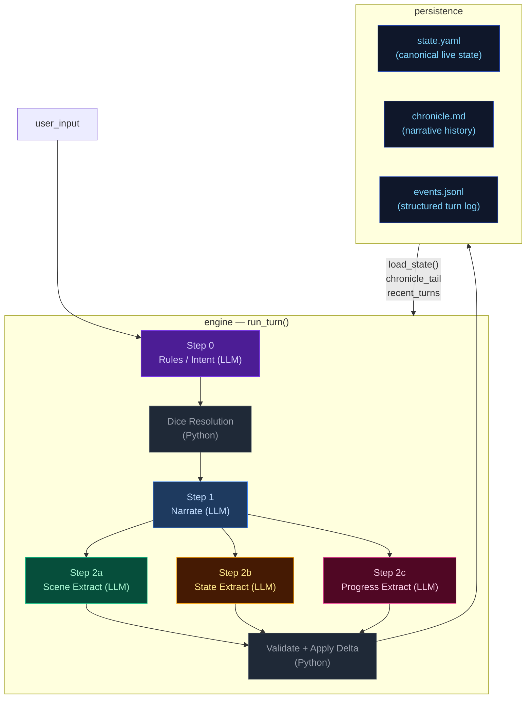
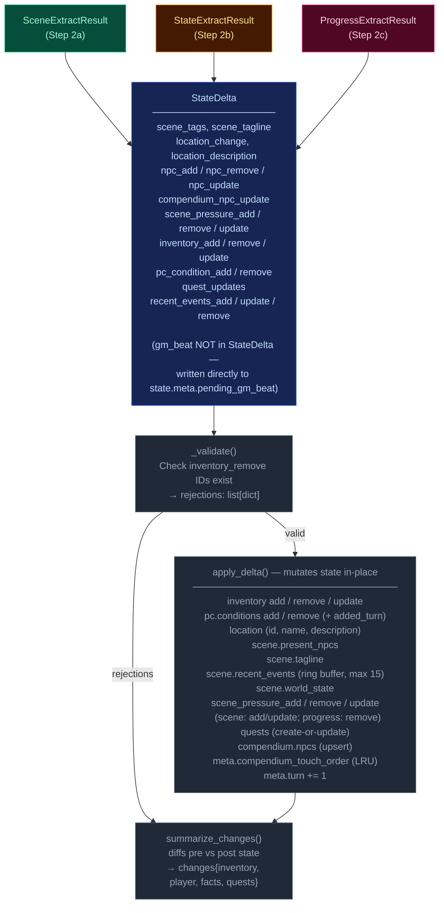
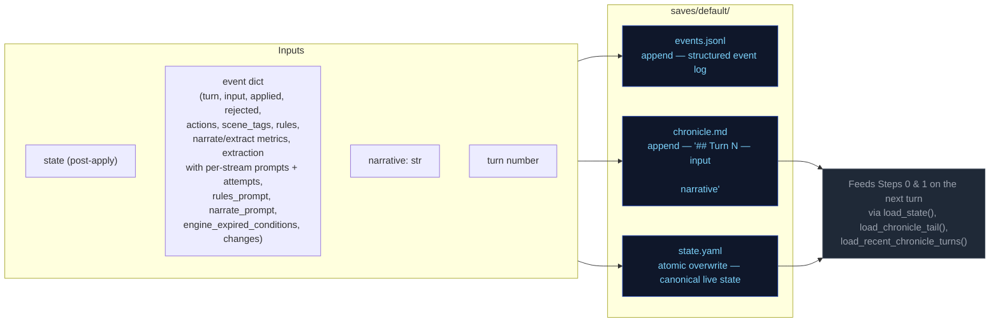
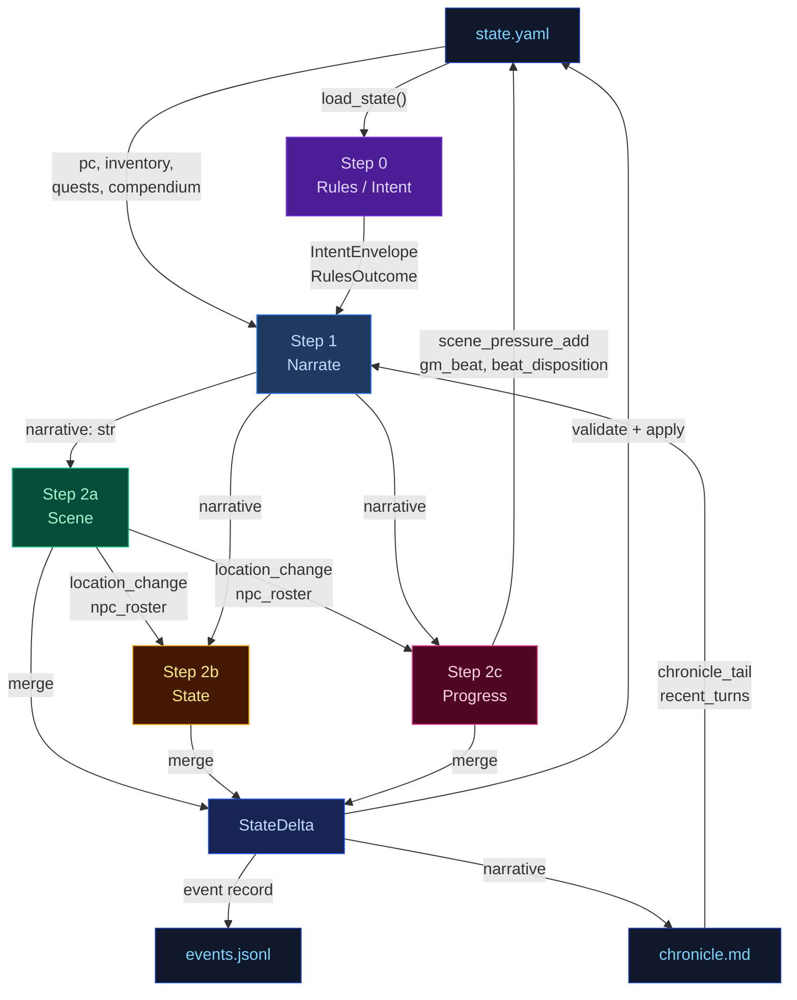
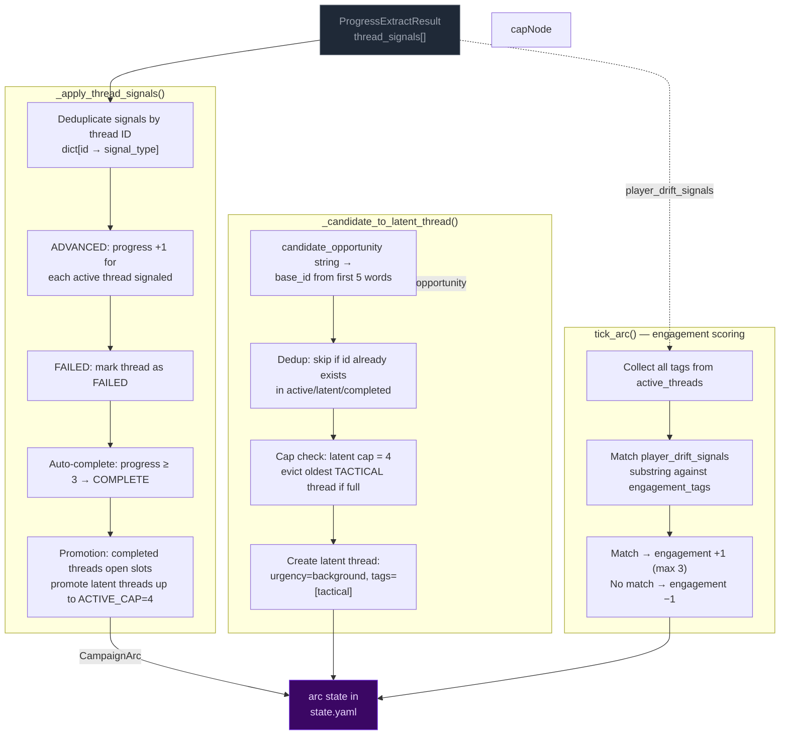
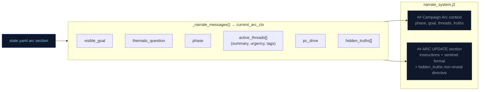
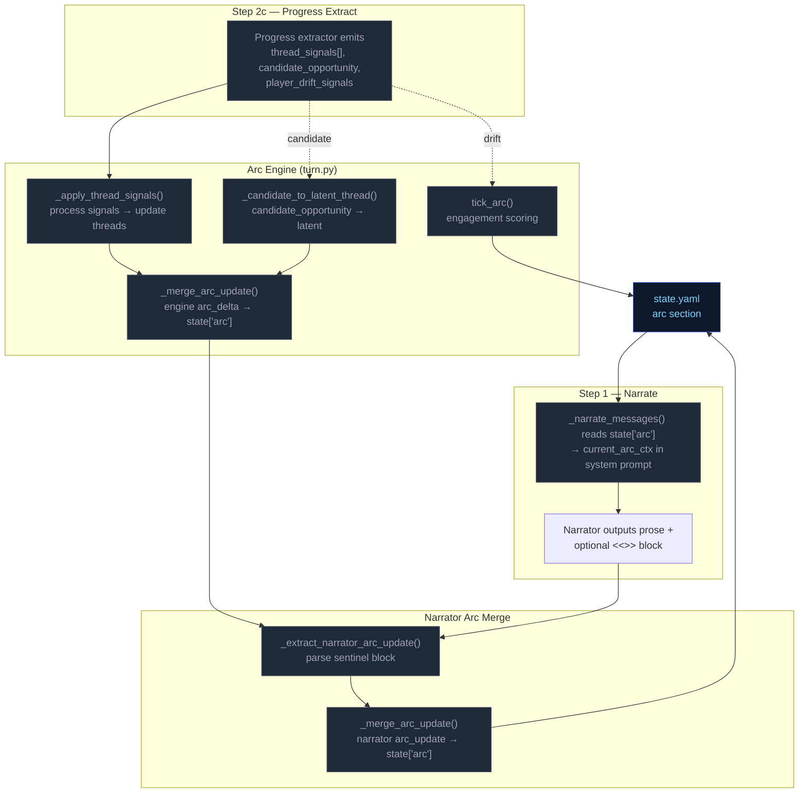

# Engine Design Reference (EVAL_CONTEXT from ARCHITECTURE.md)

---

# ENGINE DESIGN REFERENCE (read this first — it is what the engine is supposed to do)

The following is extracted verbatim from the project's ARCHITECTURE.md between the EVAL_CONTEXT markers. It defines the 5-pipeline engine you are judging. Use it to understand which pipeline owns which mechanic, where data flows, and what the design intent is. When you find something the implementation does that contradicts this design, call it out as a mechanical failure.

## 5-Pipeline Reference (engine design at a glance)

Every player turn drives this 5-step pipeline, executed strictly in order. Step 0 runs once before narration; Step 1 emits the prose the player reads; Steps 2a/2b/2c extract structured changes from that prose. The Python tail validates and applies the merged delta.

| Pipeline | When it runs | Key inputs | Key outputs | Mechanics it owns | Hand-off to next turn |
|---|---|---|---|---|---|
| **Step 0 — Rules / Intent** | Every turn (always) | `state.pc`, `state.location`, `recent_turns[-1:]`, `user_input` | `IntentEnvelope` (intent, verb, target, stakes, check.required, check.skill, check.difficulty); `RulesOutcome` (rolled, dice, mods, band, directive) | Intent classification, dice roll resolution (2d6 + stat + cond − diff → band), difficulty selection, anti-declare-outcome enforcement | `rules_outcome.directive` shapes narrator latitude |
| **Step 1 — Narrate** | Every turn (always, streamed) | Full `state` (pc, location, scene, inventory, quests, compendium), `chronicle_tail`, `recent_turns`, `rules_outcome` (when rolled), `pack_style`, `narrator_rules`, `pending_gm_beat`, `momentum`, `ages`, `npc_roster` (tiered: PRESENT/JUST_LEFT/NEARBY/KNOWN), `world_factions`, `world_locations`, `npc_name_pool`, `deescalate`, `scene_pressure`, `narrative_velocity`, `user_input` | `narrative` (prose) | Prose generation, dice-band binding, GM-beat consumption (clears `state.meta.pending_gm_beat`), de-escalation directives, age-based stalling fixes, narrative velocity pacing | `narrative` feeds all 3 extractors |
| **Step 2a — Scene Extract** | Every turn (always) | `narrative`, `state.pc/location`, `npc_roster` (tiered: PRESENT/JUST_LEFT/NEARBY/KNOWN), `state.pc.conditions`, `known_characters` (LRU compendium), `RulesOutcome`, `recent_turns[-1:]` | `SceneExtractResult`: `scene_tags`, `scene_tagline`, `location_change`, `location_description`, `npc_add/remove/update`, `compendium_npc_update` | NPC presence, location changes, scene tags, scene classification (tags/tagline), durable NPC compendium identity | `location_change` and `npc_roster` passed to Steps 2b and 2c |
| **Step 2b — State Extract** | Every turn (always) | `narrative`, `state.pc`, `state.location`, `state.inventory`, `rules_outcome`, `engine_expired_conditions`, `scene_result.location_change`, `scene_result.npc_roster`, `stakes`, `band`, `band_examples` (few-shot extraction examples keyed to dice band) | `StateExtractResult`: `inventory_add/remove/update`, `pc_condition_add/remove` | Inventory delta accuracy, condition lifecycle (with `added_turn`), engine-side TTL pre-removal, ID normalization | (none — cross-stream items_gained/lost removed; extraction_ctx covers this) |
| **Step 2c — Progress Extract** | Every turn (always) | `narrative`, `state.pc`, `state.scene.recent_events`, `state.scene.world_state`, `active_quests`, `scene_pressure`, `RulesOutcome`, `intent`, `recent_turns[-2:]`, `stakes`, `band`, `deescalate`, `quest_ages`, `pending_beat`, `quest_threshold_directive`, `npc_roster` (tiered: PRESENT/JUST_LEFT/NEARBY/KNOWN) | `ProgressExtractResult`: `quest_updates`, `recent_events_add/update/remove`, `actions` (4 suggested choices), `outcome_summary`, `gm_beat`, `beat_disposition`, `scene_pressure_add`, `scene_pressure_remove`, `scene_pressure_update` | Quest objectives, recent_events ring buffer, action suggestions, narrative recap, GM beat generation + disposition, scene pressure lifecycle (all three operations) | `recent_events_add` becomes durable history; `quest_updates` advance arcs; `scene_pressure_add` feeds next turn's rules call; `gm_beat` stored in `state.meta.pending_gm_beat` |

After Step 2c, results merge into a `StateDelta`, the validator checks (e.g. `inventory_remove` IDs exist), `apply_delta()` mutates state in-place, and the turn is persisted. The next turn's Step 0 reads the new `state.yaml` plus `events.jsonl`.

---

## High-Level Overview



---

## Step 0 — Rules / Intent Classification

Classifies the player's action, determines whether a dice check is needed, and
identifies which state domains will be active — narrowing every downstream extractor.

```mermaid
flowchart LR
    classDef stageRules fill:#4c1d95,color:#ddd6fe,stroke:#7c3aed
    classDef llmNode    fill:#0f172a,color:#94a3b8,stroke:#334155
    classDef pyNode     fill:#1f2937,color:#9ca3af,stroke:#4b5563
    classDef outNode    fill:#3b0764,color:#e9d5ff,stroke:#7c3aed

    subgraph IN["Inputs"]
        I1["state.pc<br>(name, stats, conditions)"]
        I2["state.location"]
        I3["recent_turns[-1:]<br>(from chronicle;<br>user prompt: narrative tail)"]
        I4["user_input"]
    end

    subgraph LLM0["LLM — rules_system.j2 + rules_user.j2"]
        L0["temp: 0.2 · max_retries: 1<br>output: IntentEnvelope JSON"]:::llmNode
    end

    subgraph PYRES["Python — rules.resolve_check()"]
        P0["reads pc.stats[skill]<br>reads pc.conditions → cond_mod<br>rolls 2d6 + stat_mod + cond_mod − diff_mod<br>maps total → Band"]:::pyNode
    end

    subgraph OUT["Outputs"]
        O1["IntentEnvelope<br>  intent: str<br>  intent_verb: str<br>  target: str<br>  stakes: str<br>  check.required: bool<br>  check.skill: SkillName<br>  check.difficulty: Difficulty"]:::outNode
        O2["RulesOutcome<br>  rolled: bool<br>  skill, difficulty, stat_value, stat_mod<br>  diff_mod, cond_mod<br>  dice: list[int]<br>  raw_total, final_total: int<br>  band: Band<br>  directive: str<br>  intent, intent_verb: str"]:::outNode
    end

    IN --> LLM0
    LLM0 -- "IntentEnvelope" --> PYRES
    PYRES --> OUT
```



> **Key forward dependency:** `rules_outcome.directive` shapes the narrator's creative
> latitude.

---

## Step 1 — Narrate (Streaming)

Generates the narrative prose the player reads. Tokens are streamed to the client.

```mermaid
flowchart LR
    classDef llmNode   fill:#0f172a,color:#94a3b8,stroke:#334155
    classDef xstream   fill:#4c1d95,color:#ddd6fe,stroke:#7c3aed
    classDef outNode   fill:#1e3a5f,color:#bfdbfe,stroke:#3b82f6

    subgraph IN["Inputs"]
        N1["state (full —<br>pc, location, scene,<br>inventory, quests, compendium)"]
        N2["chronicle_tail<br>(compressed history, ≤budget tokens)"]
        N3["recent_turns (last window_turns=6)"]
        N4["rules_outcome<br>(band, directive, dice summary)"]:::xstream
        N5["pack_style (tone / prose guide)"]
        N6["npc_name_pool (cultural name list)"]
        N7["recently_left NPCs"]
        N8["known_npcs<br>(last-seen info)"]
        N9["present_npcs<br>(attitudes)"]
        N10["world_factions<br>(immutable trace)"]
        N11["world_locations<br>(nearby, immutable)"]
        N12["pending_gm_beat"]
        N13["momentum"]
        N14["ages<br>(combat/location)"]
        N15["deescalate"]
        N16["scene_pressure<br>(active threats)"]
        N17["user_input"]
    end

    subgraph LLM1["LLM — narrate_system.j2 + narrate_user.j2"]
        NL["temp: 0.9 · streaming: yes<br>output: prose narrative (str)"]:::llmNode
    end

    subgraph OUT["Outputs"]
        NO1["narrative: str<br>(streamed as tokens → client<br>then joined + thinking-stripped)"]:::outNode
        NO2["narr_metrics<br>  first_token_ms<br>  total_ms<br>  tokens_in / tokens_out"]
    end

    IN --> LLM1
    LLM1 --> OUT
```



> **Key forward dependency:** `narrative` is the primary content input for all three
> extraction streams below.

---

## Step 2a — Scene Extract

Extracts location changes, NPC presence, scene tags, and suggested actions from the narrative.


> **Key forward dependency:** `location_change` and `present_npcs` flow into
> `extraction_ctx` (built by `_build_extraction_context`). Step 2c also receives
> `npc_roster` (tiered: PRESENT/JUST_LEFT/NEARBY/KNOWN) built from extraction_ctx.
> No forward-facing mechanics (scene_pressure, gm_beat) are emitted by this stream.

---

## Step 2b — State Extract

Extracts inventory changes and player condition mutations from the narrative.

```mermaid
flowchart LR
    classDef llmNode fill:#0f172a,color:#94a3b8,stroke:#334155
    classDef xstream fill:#4c1d95,color:#ddd6fe,stroke:#7c3aed
    classDef outNode fill:#451a03,color:#fde68a,stroke:#f59e0b

    subgraph IN["Inputs"]
        S1["narrative (from Step 1)"]:::xstream
        S2["state.pc (name, bio, stats, conditions)"]
        S3["state.location"]
        S4["state.inventory"]
        S5["rules_outcome"]:::xstream
        S6["intent: str<br>(from Step 0)"]
        S7["band_examples<br>(few-shot examples for current band)"]
    end

    subgraph LLM2B["LLM — extract_state_system.j2 + extract_state_user.j2"]
        SL["temp: 0.4 · max_retries: 1<br>output: StateExtractResult JSON"]:::llmNode
    end

    subgraph OUT["Outputs — StateExtractResult"]
        O1["inventory_add: list[InventoryItem]<br>  id, name, notes, amount"]:::outNode
        O2["inventory_remove: list[InventoryRemove]<br>  id, amount (None = full stack)"]:::outNode
        O3["inventory_update: list[InventoryUpdate]<br>  id, name?, notes?"]:::outNode
        O4["pc_condition_add: list[ConditionAdd]<br>  id, label, description"]:::outNode
        O5["pc_condition_remove: list[ConditionRemove]<br>  id"]:::outNode
    end

    IN --> LLM2B
    LLM2B --> OUT
```



> **Key forward dependency:** Step 2c receives `npc_roster` (tiered: PRESENT/JUST_LEFT/NEARBY/KNOWN)
> and `location_change` from Step 2a. Cross-stream items_gained/lost were removed —
> extraction_ctx now covers all this-turn derived data.

---

## Step 2c — Progress Extract

Extracts quest updates, recent events, and durable NPC compendium changes.


> **Always runs:** Progress is the post-narration storytelling brain. It always executes
> every turn (never skipped) and feeds next turn's rules call via `recent_events_add`
> (durable narrative facts), `quest_updates` (advancing or closing arcs), `scene_pressure_add`
> (new threats), and `gm_beat` (forward-facing beats stored in `state.meta.pending_gm_beat`).
>
> ### GMBeat schema
>
> ```
> GMBeat
>   type: complication | revelation | opportunity | breathing_room | pressure | twist | setback | escalation | callback
>   surface_as: ambient | event | npc_behavior | environmental | player_discovery | item (default: ambient)
>   instruction: str (must be ≥40 chars, not start with filler prefixes)
>   beat_expires_turn: int | None (turn number at which the beat expires; set to turn_no + 2 when stored)
> ```
>
> ### Beat lifecycle
>
> The beat flows through three phases per turn:
>
> **Phase 1 — Pre-narration expiry check.** At the start of each turn, the engine reads
> `state.meta.pending_gm_beat` from the previous turn. If `beat_expires_turn` is set and the
> current turn number exceeds it, the beat is nullified. Otherwise it proceeds to narration.
>
> **Phase 2 — Narration consumption.** The beat is passed to the narrator via
> `_narrate_messages(pending_gm_beat=...)`. The narrator integrates the beat's instruction into
> prose. After narration completes, the beat is temporarily cleared from state. The beat is then
> restored to state so the progress extractor can see it in its prompt — this is critical because
> the progress extractor needs to know what beat was narrated to make an informed disposition
> decision.
>
> **Phase 3 — Extraction disposition.** The progress extractor receives `pending_beat` in its
> prompt and emits `beat_disposition` (`consume`/`carry`/`replace`) plus an optional new `gm_beat`.
> The engine's beat lifecycle logic reads the disposition and applies it:
> - `consume`: clears `state.meta.pending_gm_beat` (beat was narrated, done)
> - `carry`: preserves `state.meta.pending_gm_beat` unchanged (beat was narrated but should
>   continue to next turn — e.g., a multi-turn arc)
> - `replace`: writes the new `gm_beat` to `state.meta.pending_gm_beat` with
>   `beat_expires_turn = turn_no + 2`
>
> The engine stores the beat with `beat_expires_turn = turn_no + 2` as a hard TTL ceiling.
> If not consumed by the narrator, the beat expires at turn N and is discarded.

---

## Delta Merge → Validate → Apply

The three extraction results merge into a single `StateDelta`, then validate and apply.



---

## Persist

Atomic writes to disk. No LLM calls.



---

## Cross-Pipeline Data Flow



---

## Campaign Arc System

The campaign arc system tracks story threads, phase progression, and player engagement across turns. It has two execution paths: **engine-driven** (thread lifecycle, engagement scoring) and **narrator-driven** (phase shifts, truth discovery, goal updates).

### Arc Data Model

```
CampaignArc
  visible_goal: str          — What the PC is trying to achieve
  thematic_question: str     — The moral/thematic tension of the arc
  phase: ArcPhase            — SETUP → PURSUIT → REVERSAL → CRISIS → RESOLUTION
  hidden_truths: list[str]   — Story secrets the narrator knows but must not reveal in prose
  discovered_truths: list[str] — Truths the player has uncovered (subset of hidden_truths)
  active_threads: list[ArcThread]  — Currently advancing story threads (cap: 4)
  latent_threads: list[ArcThread]  — Unactivated or waiting threads (cap: 4)
  completed_threads: list[ArcThread] — Finished threads (complete or failed)
  arc_engagement: int        — Engagement score: -3 (disengaged) to +3 (highly engaged)
  pc_drive: str              — Player's expressed motivation/direction

ArcThread
  id: str                    — Unique identifier (derived from summary text)
  summary: str               — What this thread is about
  tags: list[str]            — Keywords for engagement matching
  state: ThreadState         — latent | active | complete | failed | expired
  urgency: str               — normal | background | immediate
  progress: int              — 0..3 (3 = completion threshold)
  unlock_if: str | None      — Condition to promote from latent to active
  promotes: list[str]        — Tags this thread unlocks when completed
  last_offered_turn: int     — Turn this thread was last offered to player

ArcPhase: SETUP → PURSUIT → REVERSAL → CRISIS → RESOLUTION
ThreadState: LATENT → ACTIVE → COMPLETE / FAILED
ThreadSignalType: ADVANCED | BLOCKED | FAILED | IGNORED
```

### Engine-Driven Arc: Thread Lifecycle

Thread lifecycle runs in `engine/turn.py` during the extraction phase, after `apply_delta()` but before narration arc_update merge. Three functions handle the lifecycle:



**Key rules:**
- **Active cap:** 4 threads. When a thread completes/fails, latent threads are promoted to fill slots.
- **Latent cap:** 4 threads. When full and a new candidate arrives, the oldest tactical-tagged thread is evicted. Pack-seeded threads (no tactical tag) are never evicted.
- **Completion threshold:** progress reaches 3 → thread marked COMPLETE.
- **Signal dedup:** multiple ADVANCED signals for the same thread in one call count as +1 (dict dedup).

### Narrator-Driven Arc: Phase & Truth Updates

The narrator can update arc metadata through a sentinel-delimited JSON block in its output. The engine parses and merges these updates after narration.

```mermaid
flowchart LR
    classDef llmNode fill:#0f172a,color:#94a3b8,stroke:#334155
    classDef sentinel fill:#3b0764,color:#e9d5ff,stroke:#7c3aed
    classDef mergeNode fill:#172554,color:#bfdbfe,stroke:#1d4ed8
    classDef arcNode fill:#3b0764,color:#e9d5ff,stroke:#7c3aed

    subgraph NARRATOR["Narrator prompt context"]
        NC1["visible_goal"]
        NC2["thematic_question"]
        NC3["phase"]
        NC4["active_threads[] (summary, urgency, tags)"]
        NC5["pc_drive"]
        NC6["hidden_truths[] — internal only<br>NARRATOR MUST NOT reveal in prose"]
        NC7["discovered_truths[]"]
    end

    subgraph EMISSION["Narrator output"]
        PROSE["narration prose<br>(player sees this)"]:::llmNode
        SENTINEL["<<<ARC_UPDATE_START>>>
{discovered_truths, phase, visible_goal}
<<<ARC_UPDATE_END>>>"]:::sentinel
    end

    subgraph PARSING["_extract_narrator_arc_update()"]
        P1["Regex: <<<ARC_UPDATE_START>>>(.*?)<<<ARC_UPDATE_END>>>"]
        P2["json.loads() → arc_dict"]
        P3["Strip block from narrative"]
    end

    subgraph MERGE["_merge_arc_update()"]
        M1["visible_goal: overwrite if present"]
        M2["thematic_question: overwrite if present"]
        M3["phase: overwrite only if value differs<br>(avoids Pydantic default SETUP overwrite)"]
        M4["pc_drive: overwrite if present"]
        M5["hidden_truths: overwrite if present"]
        M6["discovered_truths: union with existing"]
        M7["active_threads: upsert by id"]
        M8["arc_engagement: max(current, new)"]
    end

    NC1 & NC2 & NC3 & NC4 & NC5 & NC6 & NC7 --> PROSE
    PROSE --> SENTINEL
    SENTINEL --> P1 --> P2 --> P3
    P3 -- "clean narrative" --> CLIENT["client"]
    P2 -- "arc_dict" --> MERGE

    MERGE --> ARC[merge into state["arc"]]:::arcNode

    mergeNode
```

**Merge rules:**
- **Engine owns threads** (active/latent/completed). Narrator arc_update omits thread fields — they are ignored by `_merge_arc_update()`.
- **Narrator owns phase/visible_goal/thematic_question/discovered_truths/hidden_truths.** Engine does not modify these.
- **Phase protection:** `_merge_arc_update()` checks `au.phase.value != current_phase` to prevent Pydantic's default `ArcPhase.SETUP` from overwriting the live phase when the narrator omits the field.
- **Discovered truths:** merged as set union (dedup).
- **Merge order:** engine thread signals run first (setting `delta.arc_update`), then narrator arc_update is parsed after narration and merged on top via a second `_merge_arc_update()` call in `run_turn()`.

### Arc Context in Narration

The arc state is passed to the narrator via `current_arc` in the system prompt. The narrator sees all arc metadata including `hidden_truths` but is explicitly instructed not to reveal them in prose.



### Arc System Integration Points



---

## Out-of-band Pipelines (not part of the per-turn loop — for human reference)

---


# Static Context (immutable across all turns)

## World Pack Style

```
# Eval-pack style

This pack is a deterministic test fixture. The narrator should write in a plain,
clear, second-person past-tense register. Keep these in mind:

- Specific over abstract. Name the thing the player did, the object they touched, the
  NPC they spoke to. Avoid generic mood words ("an air of menace") in favor of
  concrete sensory detail.
- One scene per turn. Do not skip ahead in time unless the player explicitly does so.
- Honor the dice. If the rules outcome is `fail` or `setback`, the action did not
  succeed; describe the cost. If `partial`, the action succeeded with a complication.
- Honor the present_npcs. Every named NPC in the scene either acts, reacts, or is
  visibly present in the prose. Do not invent new NPCs unless the player's input
  introduces one.
- Plain language. No archaic phrasing, no fantasy-trope syntax ("Lo, the door...").
  This is a working road in a working world.
- 120-220 words per turn unless the action is large.

```

## Seed State

```json
{
  "meta": {
    "game_name": "eval",
    "turn": 0,
    "setting_pack": "eval-pack",
    "model": ""
  },
  "pc": {
    "name": "Aren Voss",
    "tagline": "Reluctant courier on the merchant road",
    "bio": "Mid-thirties, broad shoulders, careful with words. Took on a courier contract\nto clear an old debt. Just arrived in Marrow's Crossing with a heavy pack and\na heavier obligation.\n",
    "stats": {
      "strength": 3,
      "dexterity": 3,
      "wits": 2,
      "lore": 2,
      "charisma": 3,
      "resolve": 3
    },
    "conditions": [],
    "momentum": 0,
    "drive": "",
    "expressed_stances": {}
  },
  "location": {
    "id": "marrows_crossing",
    "name": "Marrow's Crossing",
    "description": "A market town built around the confluence of two rivers. Cobblestone streets,\ntimber-framed buildings, and the constant sound of water from the mills. The\ntown square has a stone well and a statue of the founder. Most shops are closing\nfor the evening.\n"
  },
  "inventory": [
    {
      "id": "credits",
      "name": "Credits",
      "notes": "Common coin, accepted at any inn or stall on the merchant road.",
      "amount": 500,
      "aliases": []
    },
    {
      "id": "iron_dagger",
      "name": "Iron dagger",
      "notes": "Plain crossguard, edge worn from honing. Belt-carried.",
      "amount": 1,
      "aliases": []
    },
    {
      "id": "bandages",
      "name": "Linen bandages",
      "notes": "Three rolls. Field-grade \u2014 won't replace a healer.",
      "amount": 3,
      "aliases": []
    },
    {
      "id": "traveler_cloak",
      "name": "Traveler's cloak",
      "notes": "Oiled wool, road-stained, hood deep enough to hide a face.",
      "amount": 1,
      "aliases": [
        "cloak",
        "travel cloak"
      ]
    },
    {
      "id": "brass_key",
      "name": "Brass key",
      "notes": "A small brass key Halden gave you with the ledger.",
      "amount": 1,
      "aliases": []
    }
  ],
  "scene": {
    "tagline": "Market town at dusk",
    "tags": [
      "peaceful",
      "start"
    ],
    "world_state": [
      "Marrow's Crossing is a market town at the confluence of two rivers, known for its mills and the annual river festival.",
      "Iron coin (credits) is the universal currency on the merchant road; barter is acceptable but slower.",
      "The road has been quieter than usual this season \u2014 fewer caravans, more independent runners, more opportunists."
    ],
    "recent_events": [
      "You arrived in Marrow's Crossing after three days on the road.",
      "You heard rumors of road-toughs extorting travelers near the Crossed Keys Inn.",
      "You found Caron in the tavern \u2014 he's been waiting for you."
    ],
    "present_npcs": [
      {
        "id": "caron",
        "name": "Caron",
        "title": "Old creditor",
        "notes": "Sits at a corner table in the tavern, nursing a drink and watching the door.",
        "bio": "A portly man in his sixties with a merchant's ledger and a patient demeanor. You owe him 500 credits from a failed venture three years ago."
      },
      {
        "id": "halden",
        "name": "Halden",
        "title": "Merchant",
        "notes": "Stands near the town well, examining a map and a pressed wax seal.",
        "bio": "A road merchant in his fifties who hires couriers when his usual runners are spoken for. Honest by reputation, careful with money."
      },
      {
        "id": "innkeeper",
        "name": "Edda",
        "title": "Innkeeper at the Crossed Keys",
        "notes": "Wiping down the bar at the Crossed Keys, which is two streets over.",
        "bio": "Runs the inn alone since her husband died. Knows every traveler by face if not by name. Stays out of trouble unless it walks through her door."
      }
    ]
  },
  "compendium": {
    "npcs": {
      "caron": {
        "name": "Caron",
        "title": "Old creditor",
        "bio": "A portly man in his sixties with a merchant's ledger and a patient demeanor. You owe him 500 credits from a failed venture three years ago."
      },
      "halden": {
        "name": "Halden",
        "title": "Merchant",
        "bio": "A road merchant in his fifties who hires couriers when his usual runners are spoken for. Honest by reputation, careful with money."
      },
      "innkeeper": {
        "name": "Edda",
        "title": "Innkeeper at the Crossed Keys",
        "bio": "Runs the inn alone since her husband died. Knows every traveler by face if not by name. Stays out of trouble unless it walks through her door."
      },
      "tough_a": {
        "name": "Bald Tough",
        "title": "Road thug",
        "bio": "Hired muscle. No personal stake in this \u2014 he'll back off if the price is right or the fight goes bad."
      },
      "tough_b": {
        "name": "Scarred Tough",
        "title": "Road thug",
        "bio": "Same outfit as the other \u2014 hired by the same person. Quicker to violence; not the brains."
      },
      "matthew_estrada": {
        "name": "Matthew Estrada",
        "title": "Traveler",
        "bio": "A tall, broad-shoulded man in a stained leather jerkin carrying a heavy rucksack. Looks like a road runner but moves with military precision."
      }
    }
  },
  "arc": {
    "visible_goal": "Clear your debts and deliver the ledger \u2014 two obligations binding you to Marrow's Crossing.",
    "thematic_question": "What does it cost to settle old debts when new ones keep forming?",
    "phase": "setup",
    "hidden_truths": [
      "Matthew Estrada is not a traveler \u2014 he's a courier for a rival merchant house, and the toughs were hired to intercept his competition.",
      "The brass key Halden gave you opens a back room at the inn where intercepted couriers' messages are stored.",
      "Caron's debt was not a failed venture \u2014 it was a deliberate investment in your skills, and he's been waiting for you to prove yourself."
    ],
    "discovered_truths": [],
    "active_threads": [
      {
        "id": "settle_the_debt",
        "summary": "Settle the 500-credit debt with Caron.",
        "tags": [
          "debt",
          "caron",
          "obligation"
        ],
        "state": "latent",
        "urgency": "normal",
        "progress": 0,
        "unlock_if": null,
        "promotes": [],
        "last_offered_turn": 0
      },
      {
        "id": "deliver_the_ledger",
        "summary": "Deliver Halden's ledger to the merchant at the Crossed Keys Inn.",
        "tags": [
          "courier",
          "halden",
          "contract"
        ],
        "state": "latent",
        "urgency": "normal",
        "progress": 0,
        "unlock_if": null,
        "promotes": [],
        "last_offered_turn": 0
      },
      {
        "id": "clear_the_road_toughs",
        "summary": "Deal with the toughs blocking the inn entrance.",
        "tags": [
          "toughs",
          "road",
          "confrontation"
        ],
        "state": "latent",
        "urgency": "low",
        "progress": 0,
        "unlock_if": null,
        "promotes": [],
        "last_offered_turn": 0
      }
    ],
    "latent_threads": [],
    "completed_threads": [],
    "arc_engagement": 0,
    "pc_drive": "Prove you can handle the road \u2014 clear your name and earn enough to start over."
  }
}
```

## Engine Constants

```json
{
  "pressure_building_at": 3,
  "pressure_immediate_at": 5,
  "pressure_max_age": 8,
  "urgency_levels": [
    "background",
    "building",
    "immediate"
  ],
  "momentum_min": -3,
  "momentum_max": 3,
  "momentum_delta": {
    "crit_success": 2,
    "success": 1,
    "partial": 0,
    "setback": -1,
    "fail": -1,
    "crit_fail": -2
  }
}
```

## System Prompts (identical every turn)

### Rules System Prompt

```
(not captured this run)
```

### Narrate System Prompt

```
(not captured this run)
```

### Extract Scene System Prompt

```
(not captured this run)
```

### Extract State System Prompt

```
(not captured this run)
```

### Extract Progress System Prompt

```
(not captured this run)
```


---

# TURN 1

**Input:** `Walk over to Caron's table and sit down across from him. I'm ready to talk about the debt.`

## User Prompts

### Rules User Prompt
```
(no rules call this turn)
```

### Narrate User Prompt
```
(no narrate call)
```

### Extract Scene User Prompt
```
(not captured)
```

### Extract State User Prompt
```
(not captured)
```

### Extract Progress User Prompt
```
(not captured)
```

## Engine Outputs

### Rules

**Parsed (engine):**
```json
{
  "intent_verb": "negotiate",
  "intent": "The player approaches Caron to discuss their outstanding debt.",
  "rolled": false,
  "total_ms": 8984.2,
  "tokens_in": 1583,
  "tokens_out": 62
}
```

**Raw LLM output:**
```

```

### Narration


### Extract Scene

```json
{
  "scene_tags": [
    "tense_conversation",
    "confrontation"
  ],
  "scene_tagline": "No Room for Excuses",
  "location_description": "The tavern interior is dim and timber-framed, with flickering candlelight casting long shadows across scarred wooden tables.",
  "npc_add": [],
  "npc_remove": [],
  "npc_update": [
    {
      "id": "caron",
      "notes": "Impatient and stern; he is focused on collecting your debt and shows no sympathy for your injuries."
    }
  ],
  "compendium_npc_update": []
}
```

### Extract State

```json
{
  "inventory_add": [],
  "inventory_remove": [],
  "inventory_update": [],
  "pc_condition_add": [],
  "pc_condition_remove": []
}
```

### Extract Progress

```json
{
  "recent_events_add": [],
  "recent_events_update": [],
  "recent_events_remove": [],
  "actions": [
    "Offer a partial payment to Caron to ease the debt.",
    "Explain your recent hardships to Caron to seek leniency.",
    "Ask Caron for a new contract to work off the debt.",
    "Scan the tavern for the toughs while talking to Caron."
  ],
  "outcome_summary": "You sit across from Caron, who immediately shifts the conversation to your outstanding debt, showing no patience for excuses.",
  "beat_disposition": "consume",
  "scene_pressure_add": [],
  "scene_pressure_remove": [],
  "scene_pressure_update": [],
  "thread_signals": [
    {
      "id": "settle_the_debt",
      "signal": "advanced"
    },
    {
      "id": "deliver_the_ledger",
      "signal": "ignored"
    },
    {
      "id": "clear_the_road_toughs",
      "signal": "ignored"
    }
  ],
  "drift_analysis": [
    {
      "thread_id": "settle_the_debt",
      "match": true,
      "reason": "The player approached Caron specifically to discuss the debt.",
      "new_interest": ""
    },
    {
      "thread_id": "deliver_the_ledger",
      "match": false,
      "reason": "The player is focused on the debt rather than Halden's delivery.",
      "new_interest": ""
    },
    {
      "thread_id": "clear_the_road_toughs",
      "match": false,
      "reason": "The player is engaged in a conversation with Caron inside the tavern.",
      "new_interest": ""
    }
  ],
  "player_drift_signals": []
}
```

### Applied Deltas

```json
{
  "inventory_add": [],
  "inventory_remove": [],
  "inventory_update": [],
  "location_description": "The tavern interior is dim and timber-framed, with flickering candlelight casting long shadows across scarred wooden tables.",
  "pc_condition_add": [],
  "pc_condition_remove": [],
  "scene_tags": [
    "tense_conversation",
    "confrontation"
  ],
  "scene_tagline": "No Room for Excuses",
  "compendium_npc_update": [],
  "npc_add": [],
  "npc_remove": [],
  "npc_update": [
    {
      "id": "caron",
      "notes": "Impatient and stern; he is focused on collecting your debt and shows no sympathy for your injuries."
    }
  ],
  "recent_events_add": [],
  "recent_events_update": [],
  "recent_events_remove": [],
  "scene_pressure_add": [],
  "scene_pressure_remove": [],
  "scene_pressure_update": []
}
```

### Rejected Deltas

*(none)*

### Suggested Actions

*(none)*

### Context Telemetry

*(no telemetry)*

### State After Turn

```json
{
  "arc": {
    "active_threads": [
      {
        "id": "settle_the_debt",
        "last_offered_turn": 0,
        "progress": 1,
        "promotes": [],
        "state": "active",
        "summary": "Settle the 500-credit debt with Caron.",
        "tags": [
          "debt",
          "caron",
          "obligation"
        ],
        "unlock_if": null,
        "urgency": "normal"
      },
      {
        "id": "deliver_the_ledger",
        "last_offered_turn": 0,
        "progress": 0,
        "promotes": [],
        "state": "active",
        "summary": "Deliver Halden's ledger to the merchant at the Crossed Keys Inn.",
        "tags": [
          "courier",
          "halden",
          "contract"
        ],
        "unlock_if": null,
        "urgency": "normal"
      },
      {
        "id": "clear_the_road_toughs",
        "last_offered_turn": 0,
        "progress": 0,
        "promotes": [],
        "state": "active",
        "summary": "Deal with the toughs blocking the inn entrance.",
        "tags": [
          "toughs",
          "road",
          "confrontation"
        ],
        "unlock_if": null,
        "urgency": "low"
      }
    ],
    "arc_engagement": 1,
    "completed_threads": [],
    "discovered_truths": [],
    "hidden_truths": [
      "Matthew Estrada is not a traveler \u2014 he's a courier for a rival merchant house, and the toughs were hired to intercept his competition.",
      "The brass key Halden gave you opens a back room at the inn where intercepted couriers' messages are stored.",
      "Caron's debt was not a failed venture \u2014 it was a deliberate investment in your skills, and he's been waiting for you to prove yourself."
    ],
    "latent_threads": [],
    "pc_drive": "Prove you can handle the road \u2014 clear your name and earn enough to start over.",
    "phase": "setup",
    "thematic_question": "What does it cost to settle old debts when new ones keep forming?",
    "visible_goal": "Clear your debts and deliver the ledger \u2014 two obligations binding you to Marrow's Crossing."
  },
  "compendium": {
    "npcs": {
      "caron": {
        "bio": "A portly man in his sixties with a merchant's ledger and a patient demeanor. You owe him 500 credits from a failed venture three years ago.",
        "last_seen": {
          "location_id": "marrows_crossing",
          "location_name": "Marrow's Crossing",
          "turn": 1
        },
        "name": "Caron",
        "title": "Old creditor"
      },
      "halden": {
        "bio": "A road merchant in his fifties who hires couriers when his usual runners are spoken for. Honest by reputation, careful with money.",
        "name": "Halden",
        "title": "Merchant"
      },
      "innkeeper": {
        "bio": "Runs the inn alone since her husband died. Knows every traveler by face if not by name. Stays out of trouble unless it walks through her door.",
        "name": "Edda",
        "title": "Innkeeper at the Crossed Keys"
      },
      "matthew_estrada": {
        "bio": "A tall, broad-shoulded man in a stained leather jerkin carrying a heavy rucksack. Looks like a road runner but moves with military precision.",
        "name": "Matthew Estrada",
        "title": "Traveler"
      },
      "tough_a": {
        "bio": "Hired muscle. No personal stake in this \u2014 he'll back off if the price is right or the fight goes bad.",
        "name": "Bald Tough",
        "title": "Road thug"
      },
      "tough_b": {
        "bio": "Same outfit as the other \u2014 hired by the same person. Quicker to violence; not the brains.",
        "name": "Scarred Tough",
        "title": "Road thug"
      }
    }
  },
  "inventory": [
    {
      "aliases": [],
      "amount": 500,
      "id": "credits",
      "name": "Credits",
      "notes": "Common coin, accepted at any inn or stall on the merchant road."
    },
    {
      "aliases": [],
      "amount": 1,
      "id": "iron_dagger",
      "name": "Iron dagger",
      "notes": "Plain crossguard, edge worn from honing. Belt-carried."
    },
    {
      "aliases": [],
      "amount": 3,
      "id": "bandages",
      "name": "Linen bandages",
      "notes": "Three rolls. Field-grade \u2014 won't replace a healer."
    },
    {
      "aliases": [
        "cloak",
        "travel cloak"
      ],
      "amount": 1,
      "id": "traveler_cloak",
      "name": "Traveler's cloak",
      "notes": "Oiled wool, road-stained, hood deep enough to hide a face."
    },
    {
      "aliases": [],
      "amount": 1,
      "id": "brass_key",
      "name": "Brass key",
      "notes": "A small brass key Halden gave you with the ledger."
    }
  ],
  "location": {
    "description": "The tavern interior is dim and timber-framed, with flickering candlelight casting long shadows across scarred wooden tables.",
    "id": "marrows_crossing",
    "name": "Marrow's Crossing"
  },
  "meta": {
    "compendium_touch_order": [],
    "consecutive_floor_count": 0,
    "game_name": "eval",
    "last_compacted_turn": 0,
    "model": "",
    "pending_gm_beat": null,
    "prior_history": [],
    "setting_pack": "eval-pack",
    "turn": 1
  },
  "pc": {
    "allegiance": null,
    "bio": "Mid-thirties, broad shoulders, careful with words. Took on a courier contract\nto clear an old debt. Just arrived in Marrow's Crossing with a heavy pack and\na heavier obligation.\n",
    "conditions": [
      {
        "added_turn": 8,
        "description": "A hard fall on the bridge two days ago left a deep, aching bruise along the right ribcage.",
        "id": "bruised_ribs",
        "label": "bruised ribs"
      },
      {
        "added_turn": 10,
        "description": "Twelve days on the road, two days behind schedule, and an old debt waiting at the end of it.",
        "id": "low_morale",
        "label": "low morale"
      }
    ],
    "drive": "",
    "expressed_stances": {},
    "momentum": 0,
    "name": "Aren Voss",
    "stats": {
      "charisma": 3,
      "dexterity": 3,
      "lore": 2,
      "resolve": 3,
      "strength": 3,
      "wits": 2
    },
    "tagline": "Reluctant courier on the merchant road"
  },
  "scene": {
    "present_npcs": [
      {
        "bio": "A portly man in his sixties with a merchant's ledger and a patient demeanor. You owe him 500 credits from a failed venture three years ago.",
        "id": "caron",
        "name": "Caron",
        "notes": "Impatient and stern; he is focused on collecting your debt and shows no sympathy for your injuries.",
        "title": "Old creditor"
      },
      {
        "bio": "A road merchant in his fifties who hires couriers when his usual runners are spoken for. Honest by reputation, careful with money.",
        "id": "halden",
        "name": "Halden",
        "notes": "Stands near the town well, examining a map and a pressed wax seal.",
        "title": "Merchant"
      },
      {
        "bio": "Runs the inn alone since her husband died. Knows every traveler by face if not by name. Stays out of trouble unless it walks through her door.",
        "id": "innkeeper",
        "name": "Edda",
        "notes": "Wiping down the bar at the Crossed Keys, which is two streets over.",
        "title": "Innkeeper at the Crossed Keys"
      }
    ],
    "recent_events": [
      {
        "id": "you_arrived_in_marrows_crossing_after",
        "text": "You arrived in Marrow's Crossing after three days on the road.",
        "turn": 0
      },
      {
        "id": "you_heard_rumors_of_roadtoughs_extorting",
        "text": "You heard rumors of road-toughs extorting travelers near the Crossed Keys Inn.",
        "turn": 0
      },
      {
        "id": "you_found_caron_in_the_tavern",
        "text": "You found Caron in the tavern \u2014 he's been waiting for you.",
        "turn": 0
      }
    ],
    "scene_pressure": [],
    "tagline": "No Room for Excuses",
    "tags": [
      "tense_conversation",
      "confrontation"
    ],
    "world_state": [
      "Marrow's Crossing is a market town at the confluence of two rivers, known for its mills and the annual river festival.",
      "Iron coin (credits) is the universal currency on the merchant road; barter is acceptable but slower.",
      "The road has been quieter than usual this season \u2014 fewer caravans, more independent runners, more opportunists."
    ]
  },
  "world": {
    "factions": [],
    "locations": []
  }
}
```


---

# TURN 2

**Input:** `I slide 500 credits across the table to Caron and ask him to mark the debt cleared in his ledger.`

## User Prompts

### Rules User Prompt
```
(no rules call this turn)
```

### Narrate User Prompt
```
(no narrate call)
```

### Extract Scene User Prompt
```
(not captured)
```

### Extract State User Prompt
```
(not captured)
```

### Extract Progress User Prompt
```
(not captured)
```

## Engine Outputs

### Rules

**Parsed (engine):**
```json
{
  "intent_verb": "negotiate",
  "intent": "The player pays a stated amount to Caron to settle their debt.",
  "rolled": false,
  "total_ms": 2370.7,
  "tokens_in": 1585,
  "tokens_out": 65
}
```

**Raw LLM output:**
```

```

### Narration


### Extract Scene

```json
{
  "scene_tags": [
    "tense_conversation",
    "transaction"
  ],
  "scene_tagline": "The Debt Is Settled",
  "npc_add": [],
  "npc_remove": [],
  "npc_update": [
    {
      "id": "caron",
      "notes": "Relieved but indifferent; he has accepted the payment and is dismissive of your well-being."
    }
  ],
  "compendium_npc_update": [
    {
      "id": "caron",
      "bio": "A portly man in his sixties with a merchant's ledger and a cynical, business-first demeanor. He is a creditor who values coin over pleasantries.",
      "aliases": []
    }
  ]
}
```

### Extract State

```json
{
  "inventory_add": [],
  "inventory_remove": [
    {
      "id": "credits",
      "amount": 500
    }
  ],
  "inventory_update": [],
  "pc_condition_add": [],
  "pc_condition_remove": []
}
```

### Extract Progress

```json
{
  "recent_events_add": [
    {
      "id": "debt_settled_caron",
      "text": "You successfully paid your 500-credit debt to Caron.",
      "turn": 2
    }
  ],
  "recent_events_update": [],
  "recent_events_remove": [
    "You found Caron in the tavern \u2014 he's been waiting for you."
  ],
  "actions": [
    "Ask Caron if he knows of any steady work.",
    "Leave the tavern to find Edda and rest your ribs.",
    "Head toward the inn entrance to confront the toughs.",
    "Check your remaining credits and supplies before moving on."
  ],
  "outcome_summary": "You successfully pay Caron your debt, and he marks your account as cleared in his ledger.",
  "beat_disposition": "consume",
  "scene_pressure_add": [],
  "scene_pressure_remove": [],
  "scene_pressure_update": [],
  "thread_signals": [
    {
      "id": "settle_the_debt",
      "signal": "advanced"
    },
    {
      "id": "deliver_the_ledger",
      "signal": "ignored"
    },
    {
      "id": "clear_the_road_toughs",
      "signal": "ignored"
    }
  ],
  "drift_analysis": [
    {
      "thread_id": "settle_the_debt",
      "match": true,
      "reason": "The player paid the debt to Caron, advancing the thread.",
      "new_interest": ""
    },
    {
      "thread_id": "deliver_the_ledger",
      "match": false,
      "reason": "The player focused on the debt rather than the delivery contract.",
      "new_interest": "finding new work"
    },
    {
      "thread_id": "clear_the_road_toughs",
      "match": false,
      "reason": "The player stayed in the booth to deal with Caron.",
      "new_interest": ""
    }
  ],
  "player_drift_signals": [],
  "candidate_opportunity": "Caron's indifferent attitude suggests he might have more work, though he won't offer it easily."
}
```

### Applied Deltas

```json
{
  "inventory_add": [],
  "inventory_remove": [
    {
      "id": "credits",
      "amount": 500
    }
  ],
  "inventory_update": [],
  "pc_condition_add": [],
  "pc_condition_remove": [],
  "scene_tags": [
    "tense_conversation",
    "transaction"
  ],
  "scene_tagline": "The Debt Is Settled",
  "compendium_npc_update": [
    {
      "id": "caron",
      "bio": "A portly man in his sixties with a merchant's ledger and a cynical, business-first demeanor. He is a creditor who values coin over pleasantries.",
      "aliases": []
    }
  ],
  "npc_add": [],
  "npc_remove": [],
  "npc_update": [
    {
      "id": "caron",
      "notes": "Relieved but indifferent; he has accepted the payment and is dismissive of your well-being."
    }
  ],
  "recent_events_add": [
    {
      "id": "debt_settled_caron",
      "text": "You successfully paid your 500-credit debt to Caron.",
      "turn": 2
    }
  ],
  "recent_events_update": [],
  "recent_events_remove": [
    "You found Caron in the tavern \u2014 he's been waiting for you."
  ],
  "scene_pressure_add": [],
  "scene_pressure_remove": [],
  "scene_pressure_update": []
}
```

### Rejected Deltas

*(none)*

### Suggested Actions

*(none)*

### Context Telemetry

*(no telemetry)*

### State After Turn

*(diff vs previous turn — full snapshot only on first and last turns)*

```json
{
  "arc": {
    "active_threads": {
      "changed": [
        {
          "from": {
            "id": "settle_the_debt",
            "last_offered_turn": 0,
            "progress": 1,
            "promotes": [],
            "state": "active",
            "summary": "Settle the 500-credit debt with Caron.",
            "tags": [
              "debt",
              "caron",
              "obligation"
            ],
            "unlock_if": null,
            "urgency": "normal"
          },
          "to": {
            "id": "settle_the_debt",
            "last_offered_turn": 0,
            "progress": 2,
            "promotes": [],
            "state": "active",
            "summary": "Settle the 500-credit debt with Caron.",
            "tags": [
              "debt",
              "caron",
              "obligation"
            ],
            "urgency": "normal"
          }
        },
        {
          "from": {
            "id": "deliver_the_ledger",
            "last_offered_turn": 0,
            "progress": 0,
            "promotes": [],
            "state": "active",
            "summary": "Deliver Halden's ledger to the merchant at the Crossed Keys Inn.",
            "tags": [
              "courier",
              "halden",
              "contract"
            ],
            "unlock_if": null,
            "urgency": "normal"
          },
          "to": {
            "id": "deliver_the_ledger",
            "last_offered_turn": 0,
            "progress": 0,
            "promotes": [],
            "state": "active",
            "summary": "Deliver Halden's ledger to the merchant at the Crossed Keys Inn.",
            "tags": [
              "courier",
              "halden",
              "contract"
            ],
            "urgency": "normal"
          }
        },
        {
          "from": {
            "id": "clear_the_road_toughs",
            "last_offered_turn": 0,
            "progress": 0,
            "promotes": [],
            "state": "active",
            "summary": "Deal with the toughs blocking the inn entrance.",
            "tags": [
              "toughs",
              "road",
              "confrontation"
            ],
            "unlock_if": null,
            "urgency": "low"
          },
          "to": {
            "id": "clear_the_road_toughs",
            "last_offered_turn": 0,
            "progress": 0,
            "promotes": [],
            "state": "active",
            "summary": "Deal with the toughs blocking the inn entrance.",
            "tags": [
              "toughs",
              "road",
              "confrontation"
            ],
            "urgency": "low"
          }
        }
      ]
    },
    "arc_engagement": {
      "from": 1,
      "to": 2
    },
    "latent_threads": {
      "added": [
        {
          "id": "caron's_indifferent_attitude_suggests_he",
          "last_offered_turn": 2,
          "progress": 0,
          "promotes": [],
          "state": "latent",
          "summary": "Caron's indifferent attitude suggests he might have more work, though he won't offer it easily.",
          "tags": [
            "tactical"
          ],
          "urgency": "background"
        }
      ]
    }
  },
  "compendium": {
    "npcs": {
      "caron": {
        "bio": {
          "from": "A portly man in his sixties with a merchant's ledger and a patient demeanor. You owe him 500 credits from a failed venture three years ago.",
          "to": "A portly man in his sixties with a merchant's ledger and a cynical, business-first demeanor. He is a creditor who values coin over pleasantries."
        },
        "last_seen": {
          "turn": {
            "from": 1,
            "to": 2
          }
        }
      }
    }
  },
  "inventory": {
    "removed": [
      {
        "aliases": [],
        "amount": 500,
        "id": "credits",
        "name": "Credits",
        "notes": "Common coin, accepted at any inn or stall on the merchant road."
      }
    ]
  },
  "meta": {
    "compendium_touch_order": {
      "added": [
        "caron"
      ],
      "removed": []
    },
    "turn": {
      "from": 1,
      "to": 2
    }
  },
  "scene": {
    "present_npcs": {
      "changed": [
        {
          "from": {
            "bio": "A portly man in his sixties with a merchant's ledger and a patient demeanor. You owe him 500 credits from a failed venture three years ago.",
            "id": "caron",
            "name": "Caron",
            "notes": "Impatient and stern; he is focused on collecting your debt and shows no sympathy for your injuries.",
            "title": "Old creditor"
          },
          "to": {
            "bio": "A portly man in his sixties with a merchant's ledger and a patient demeanor. You owe him 500 credits from a failed venture three years ago.",
            "id": "caron",
            "name": "Caron",
            "notes": "Relieved but indifferent; he has accepted the payment and is dismissive of your well-being.",
            "title": "Old creditor"
          }
        }
      ]
    },
    "recent_events": {
      "added": [
        {
          "id": "debt_settled_caron",
          "text": "You successfully paid your 500-credit debt to Caron.",
          "turn": 2
        }
      ]
    },
    "tagline": {
      "from": "No Room for Excuses",
      "to": "The Debt Is Settled"
    },
    "tags": {
      "added": [
        "transaction"
      ],
      "removed": [
        "confrontation"
      ]
    }
  }
}
```


---

# TURN 3

**Input:** `I find Halden by the town well and offer to carry his ledger to the Crossed Keys Inn. I'll do it for 200 credits.`

## User Prompts

### Rules User Prompt
```
(no rules call this turn)
```

### Narrate User Prompt
```
(no narrate call)
```

### Extract Scene User Prompt
```
(not captured)
```

### Extract State User Prompt
```
(not captured)
```

### Extract Progress User Prompt
```
(not captured)
```

## Engine Outputs

### Rules

**Parsed (engine):**
```json
{
  "intent_verb": "negotiate",
  "intent": "Offer to carry Halden's ledger to the Crossed Keys Inn for 200 credits.",
  "rolled": false,
  "total_ms": 2535.6,
  "tokens_in": 1592,
  "tokens_out": 71
}
```

**Raw LLM output:**
```

```

### Narration


### Extract Scene

```json
{
  "scene_tags": [
    "negotiation",
    "business_deal"
  ],
  "scene_tagline": "A Deal Struck in the Square",
  "location_change": {
    "id": "marrows_crossing_square",
    "name": "Marrow's Crossing Square",
    "description": "A cobblestone square centered around a stone well, illuminated by flickering street lanterns and smelling of damp river silt and woodsmoke."
  },
  "npc_add": [],
  "npc_remove": [
    {
      "id": "caron"
    },
    {
      "id": "innkeeper"
    }
  ],
  "npc_update": [
    {
      "id": "halden",
      "notes": "Calculating and cautious; he is willing to hire the player for a delivery despite their battered appearance, valuing reliability over physical condition."
    }
  ],
  "compendium_npc_update": [
    {
      "id": "halden",
      "name": "Halden",
      "title": "Merchant",
      "bio": "A road merchant in his fifties who hires couriers when his usual runners are spoken for. Honest by reputation, careful with his assets, and values those who honor their debts.",
      "aliases": [],
      "motivation": "To ensure goods are delivered safely and reliably to his clients."
    }
  ]
}
```

### Extract State

```json
{
  "inventory_add": [],
  "inventory_remove": [],
  "inventory_update": [],
  "pc_condition_add": [],
  "pc_condition_remove": []
}
```

### Extract Progress

```json
{
  "recent_events_add": [
    {
      "id": "halden_contract_accepted",
      "text": "Halden has contracted you to deliver his ledger to the Crossed Keys Inn for 200 credits.",
      "turn": 3
    }
  ],
  "recent_events_update": [],
  "recent_events_remove": [
    "You successfully paid your 500-credit debt to Caron."
  ],
  "actions": [
    "Accept the ledger and head toward the Crossed Keys Inn.",
    "Ask Halden for more details about the ledger's contents.",
    "Use your reputation to ask Halden about the road-toughs.",
    "Look for a way to treat your bruised ribs before traveling."
  ],
  "outcome_summary": "You successfully negotiated a 200-credit contract with Halden to deliver his ledger to the Crossed Keys Inn.",
  "beat_disposition": "consume",
  "scene_pressure_add": [],
  "scene_pressure_remove": [],
  "scene_pressure_update": [],
  "thread_signals": [
    {
      "id": "deliver_the_ledger",
      "signal": "advanced"
    },
    {
      "id": "settle_the_debt",
      "signal": "advanced"
    },
    {
      "id": "clear_the_road_toughs",
      "signal": "ignored"
    }
  ],
  "drift_analysis": [
    {
      "thread_id": "deliver_the_ledger",
      "match": true,
      "reason": "Player negotiated a specific delivery contract with Halden.",
      "new_interest": ""
    },
    {
      "thread_id": "settle_the_debt",
      "match": true,
      "reason": "The debt was officially cleared in the previous turn and confirmed by the player's movement.",
      "new_interest": ""
    },
    {
      "thread_id": "clear_the_road_toughs",
      "match": false,
      "reason": "The player focused on the merchant negotiation instead of the thugs.",
      "new_interest": "investigating the inn"
    }
  ],
  "player_drift_signals": [],
  "candidate_opportunity": "The ledger itself may contain sensitive information that could lead to new complications during delivery."
}
```

### Applied Deltas

```json
{
  "inventory_add": [],
  "inventory_remove": [],
  "inventory_update": [],
  "location_change": {
    "id": "marrows_crossing_square",
    "name": "Marrow's Crossing Square",
    "description": "A cobblestone square centered around a stone well, illuminated by flickering street lanterns and smelling of damp river silt and woodsmoke."
  },
  "pc_condition_add": [],
  "pc_condition_remove": [],
  "scene_tags": [
    "negotiation",
    "business_deal"
  ],
  "scene_tagline": "A Deal Struck in the Square",
  "compendium_npc_update": [
    {
      "id": "halden",
      "name": "Halden",
      "title": "Merchant",
      "bio": "A road merchant in his fifties who hires couriers when his usual runners are spoken for. Honest by reputation, careful with his assets, and values those who honor their debts.",
      "aliases": [],
      "motivation": "To ensure goods are delivered safely and reliably to his clients."
    }
  ],
  "npc_add": [],
  "npc_remove": [
    {
      "id": "caron"
    },
    {
      "id": "innkeeper"
    }
  ],
  "npc_update": [
    {
      "id": "halden",
      "notes": "Calculating and cautious; he is willing to hire the player for a delivery despite their battered appearance, valuing reliability over physical condition."
    }
  ],
  "recent_events_add": [
    {
      "id": "halden_contract_accepted",
      "text": "Halden has contracted you to deliver his ledger to the Crossed Keys Inn for 200 credits.",
      "turn": 3
    }
  ],
  "recent_events_update": [],
  "recent_events_remove": [
    "You successfully paid your 500-credit debt to Caron."
  ],
  "scene_pressure_add": [],
  "scene_pressure_remove": [],
  "scene_pressure_update": []
}
```

### Rejected Deltas

*(none)*

### Suggested Actions

*(none)*

### Context Telemetry

*(no telemetry)*

### State After Turn

*(diff vs previous turn — full snapshot only on first and last turns)*

```json
{
  "arc": {
    "active_threads": {
      "added": [
        {
          "id": "caron's_indifferent_attitude_suggests_he",
          "last_offered_turn": 2,
          "progress": 0,
          "promotes": [],
          "state": "active",
          "summary": "Caron's indifferent attitude suggests he might have more work, though he won't offer it easily.",
          "tags": [
            "tactical"
          ],
          "urgency": "background"
        }
      ],
      "removed": [
        {
          "id": "settle_the_debt",
          "last_offered_turn": 0,
          "progress": 2,
          "promotes": [],
          "state": "active",
          "summary": "Settle the 500-credit debt with Caron.",
          "tags": [
            "debt",
            "caron",
            "obligation"
          ],
          "urgency": "normal"
        }
      ],
      "changed": [
        {
          "from": {
            "id": "deliver_the_ledger",
            "last_offered_turn": 0,
            "progress": 0,
            "promotes": [],
            "state": "active",
            "summary": "Deliver Halden's ledger to the merchant at the Crossed Keys Inn.",
            "tags": [
              "courier",
              "halden",
              "contract"
            ],
            "urgency": "normal"
          },
          "to": {
            "id": "deliver_the_ledger",
            "last_offered_turn": 0,
            "progress": 1,
            "promotes": [],
            "state": "active",
            "summary": "Deliver Halden's ledger to the merchant at the Crossed Keys Inn.",
            "tags": [
              "courier",
              "halden",
              "contract"
            ],
            "urgency": "normal"
          }
        }
      ]
    },
    "arc_engagement": {
      "from": 2,
      "to": 3
    },
    "completed_threads": {
      "added": [
        {
          "id": "settle_the_debt",
          "last_offered_turn": 0,
          "progress": 3,
          "promotes": [],
          "state": "complete",
          "summary": "Settle the 500-credit debt with Caron.",
          "tags": [
            "debt",
            "caron",
            "obligation"
          ],
          "urgency": "normal"
        }
      ]
    },
    "latent_threads": {
      "added": [
        {
          "id": "the_ledger_itself_may_contain",
          "last_offered_turn": 3,
          "progress": 0,
          "promotes": [],
          "state": "latent",
          "summary": "The ledger itself may contain sensitive information that could lead to new complications during delivery.",
          "tags": [
            "tactical"
          ],
          "urgency": "background"
        }
      ],
      "removed": [
        {
          "id": "caron's_indifferent_attitude_suggests_he",
          "last_offered_turn": 2,
          "progress": 0,
          "promotes": [],
          "state": "latent",
          "summary": "Caron's indifferent attitude suggests he might have more work, though he won't offer it easily.",
          "tags": [
            "tactical"
          ],
          "urgency": "background"
        }
      ]
    }
  },
  "compendium": {
    "npcs": {
      "halden": {
        "bio": {
          "from": "A road merchant in his fifties who hires couriers when his usual runners are spoken for. Honest by reputation, careful with money.",
          "to": "A road merchant in his fifties who hires couriers when his usual runners are spoken for. Honest by reputation, careful with his assets, and values those who honor their debts."
        },
        "last_seen": {
          "from": null,
          "to": {
            "location_id": "marrows_crossing_square",
            "location_name": "Marrow's Crossing Square",
            "turn": 3
          }
        },
        "motivation": {
          "from": null,
          "to": "To ensure goods are delivered safely and reliably to his clients."
        }
      }
    }
  },
  "location": {
    "description": {
      "from": "The tavern interior is dim and timber-framed, with flickering candlelight casting long shadows across scarred wooden tables.",
      "to": "A cobblestone square centered around a stone well, illuminated by flickering street lanterns and smelling of damp river silt and woodsmoke."
    },
    "id": {
      "from": "marrows_crossing",
      "to": "marrows_crossing_square"
    },
    "name": {
      "from": "Marrow's Crossing",
      "to": "Marrow's Crossing Square"
    }
  },
  "meta": {
    "compendium_touch_order": {
      "added": [
        "halden"
      ],
      "removed": []
    },
    "last_compacted_turn": {
      "from": 0,
      "to": 1
    },
    "prior_history": {
      "added": [
        "- [T1] Aren Voss met with Caron at the tavern to discuss the outstanding debt; Caron presented the ledger and expressed impatience regarding the payment."
      ],
      "removed": []
    },
    "turn": {
      "from": 2,
      "to": 3
    }
  },
  "scene": {
    "location_entered_turn": {
      "from": null,
      "to": 3
    },
    "present_npcs": {
      "removed": [
        {
          "bio": "A portly man in his sixties with a merchant's ledger and a patient demeanor. You owe him 500 credits from a failed venture three years ago.",
          "id": "caron",
          "name": "Caron",
          "notes": "Relieved but indifferent; he has accepted the payment and is dismissive of your well-being.",
          "title": "Old creditor"
        },
        {
          "bio": "Runs the inn alone since her husband died. Knows every traveler by face if not by name. Stays out of trouble unless it walks through her door.",
          "id": "innkeeper",
          "name": "Edda",
          "notes": "Wiping down the bar at the Crossed Keys, which is two streets over.",
          "title": "Innkeeper at the Crossed Keys"
        }
      ],
      "changed": [
        {
          "from": {
            "bio": "A road merchant in his fifties who hires couriers when his usual runners are spoken for. Honest by reputation, careful with money.",
            "id": "halden",
            "name": "Halden",
            "notes": "Stands near the town well, examining a map and a pressed wax seal.",
            "title": "Merchant"
          },
          "to": {
            "bio": "A road merchant in his fifties who hires couriers when his usual runners are spoken for. Honest by reputation, careful with money.",
            "id": "halden",
            "name": "Halden",
            "notes": "Calculating and cautious; he is willing to hire the player for a delivery despite their battered appearance, valuing reliability over physical condition.",
            "title": "Merchant"
          }
        }
      ]
    },
    "recent_events": {
      "added": [
        {
          "id": "halden_contract_accepted",
          "text": "Halden has contracted you to deliver his ledger to the Crossed Keys Inn for 200 credits.",
          "turn": 3
        },
        {
          "id": "caron_debt_discussion",
          "text": "Caron is waiting for you at the tavern to settle your accounts and discuss your obligations.",
          "turn": 1
        }
      ],
      "removed": [
        {
          "id": "you_arrived_in_marrows_crossing_after",
          "text": "You arrived in Marrow's Crossing after three days on the road.",
          "turn": 0
        },
        {
          "id": "you_heard_rumors_of_roadtoughs_extorting",
          "text": "You heard rumors of road-toughs extorting travelers near the Crossed Keys Inn.",
          "turn": 0
        },
        {
          "id": "you_found_caron_in_the_tavern",
          "text": "You found Caron in the tavern \u2014 he's been waiting for you.",
          "turn": 0
        }
      ]
    },
    "recently_left": {
      "from": null,
      "to": []
    },
    "recently_left_turns": {
      "from": null,
      "to": 0
    },
    "tagline": {
      "from": "The Debt Is Settled",
      "to": "A Deal Struck in the Square"
    },
    "tags": {
      "added": [
        "business_deal",
        "negotiation"
      ],
      "removed": [
        "transaction",
        "tense_conversation"
      ]
    },
    "turn_entered": {
      "from": null,
      "to": 3
    }
  }
}
```


---

# TURN 3

**Input:** ``

## User Prompts

### Rules User Prompt
```
(no rules call this turn)
```

### Narrate User Prompt
```
(no narrate call)
```

### Extract Scene User Prompt
```
(not captured)
```

### Extract State User Prompt
```
(not captured)
```

### Extract Progress User Prompt
```
(not captured)
```

## Engine Outputs

### Rules

**Parsed (engine):**
```json
{}
```

**Raw LLM output:**
```

```

### Narration


### Extract Scene

```json
{}
```

### Extract State

```json
{}
```

### Extract Progress

```json
{}
```

### Applied Deltas

```json
{}
```

### Rejected Deltas

*(none)*

### Suggested Actions

*(none)*

### Context Telemetry

*(no telemetry)*

### State After Turn

*(diff vs previous turn — full snapshot only on first and last turns)*

```json
{
  "arc": {
    "active_threads": {
      "added": [
        {
          "id": "the_ledger_itself_may_contain",
          "last_offered_turn": 3,
          "progress": 0,
          "promotes": [],
          "state": "active",
          "summary": "The ledger itself may contain sensitive information that could lead to new complications during delivery.",
          "tags": [
            "tactical"
          ],
          "urgency": "background"
        }
      ],
      "changed": [
        {
          "from": {
            "id": "deliver_the_ledger",
            "last_offered_turn": 0,
            "progress": 1,
            "promotes": [],
            "state": "active",
            "summary": "Deliver Halden's ledger to the merchant at the Crossed Keys Inn.",
            "tags": [
              "courier",
              "halden",
              "contract"
            ],
            "urgency": "normal"
          },
          "to": {
            "id": "deliver_the_ledger",
            "last_offered_turn": 0,
            "progress": 2,
            "promotes": [],
            "state": "active",
            "summary": "Deliver Halden's ledger to the merchant at the Crossed Keys Inn.",
            "tags": [
              "courier",
              "halden",
              "contract"
            ],
            "urgency": "normal"
          }
        }
      ]
    },
    "latent_threads": {
      "added": [
        {
          "id": "the_identity_of_the_shadowy",
          "last_offered_turn": 4,
          "progress": 0,
          "promotes": [],
          "state": "latent",
          "summary": "The identity of the shadowy figures blocking the inn entrance remains a mystery.",
          "tags": [
            "tactical"
          ],
          "urgency": "background"
        }
      ],
      "removed": [
        {
          "id": "the_ledger_itself_may_contain",
          "last_offered_turn": 3,
          "progress": 0,
          "promotes": [],
          "state": "latent",
          "summary": "The ledger itself may contain sensitive information that could lead to new complications during delivery.",
          "tags": [
            "tactical"
          ],
          "urgency": "background"
        }
      ]
    }
  },
  "compendium": {
    "npcs": {
      "halden": {
        "bio": {
          "from": "A road merchant in his fifties who hires couriers when his usual runners are spoken for. Honest by reputation, careful with his assets, and values those who honor their debts.",
          "to": "A road merchant in his fifties who hires couriers when his usual runners are spoken for. Honest by reputation, careful with his assets, and values those who honor their debts. Calculating and cautious; he is willing to hire the player for a delivery despite their battered appearance, valuing reliability over physical condition."
        }
      },
      "shadowy_figures": {
        "from": null,
        "to": {
          "bio": "Two unidentified silhouettes blocking the entrance to the Crossed Keys Inn.",
          "last_seen": {
            "location_id": "marrows_crossing_square",
            "location_name": "Marrow's Crossing Square",
            "turn": 4
          },
          "name": "Shadowy Figures",
          "title": "Unknown"
        }
      }
    }
  },
  "inventory": {
    "added": [
      {
        "amount": 1,
        "id": "ledger",
        "name": "Leather ledger",
        "notes": "A heavy leather-bound ledger"
      }
    ]
  },
  "location": {
    "description": {
      "from": "A cobblestone square centered around a stone well, illuminated by flickering street lanterns and smelling of damp river silt and woodsmoke.",
      "to": "The town's architecture thins into dark warehouses and muddy road verges as the timber-framed Crossed Keys Inn looms ahead."
    }
  },
  "meta": {
    "compendium_touch_order": {
      "added": [
        "shadowy_figures"
      ],
      "removed": []
    },
    "turn": {
      "from": 3,
      "to": 4
    }
  },
  "scene": {
    "present_npcs": {
      "added": [
        {
          "bio": "Two unidentified silhouettes blocking the entrance to the Crossed Keys Inn.",
          "id": "shadowy_figures",
          "name": "Shadowy Figures",
          "notes": "Standing motionless near the inn entrance, blocking the way.",
          "title": "Unknown"
        }
      ],
      "removed": [
        {
          "bio": "A road merchant in his fifties who hires couriers when his usual runners are spoken for. Honest by reputation, careful with money.",
          "id": "halden",
          "name": "Halden",
          "notes": "Calculating and cautious; he is willing to hire the player for a delivery despite their battered appearance, valuing reliability over physical condition.",
          "title": "Merchant"
        }
      ]
    },
    "recent_events": {},
    "recently_left": {
      "added": [
        {
          "id": "halden",
          "name": "Halden",
          "title": "Merchant"
        }
      ]
    },
    "scene_pressure": {
      "added": [
        {
          "id": "inn_entrance_blockade",
          "max_turns": null,
          "text": "Two shadowy figures are blocking the entrance to the Crossed Keys Inn.",
          "turn_added": 4,
          "urgency": "immediate"
        }
      ]
    },
    "tagline": {
      "from": "A Deal Struck in the Square",
      "to": "Shadows at the Inn's Door"
    },
    "tags": {
      "added": [
        "tense_atmosphere",
        "intimidation"
      ],
      "removed": [
        "business_deal",
        "negotiation"
      ]
    }
  }
}
```


---

# TURN 4

**Input:** `I leave Marrow's Crossing by the east gate and head for the Crossed Keys Inn, following the merchant road.`

## User Prompts

### Rules User Prompt
```
(no rules call this turn)
```

### Narrate User Prompt
```
(no narrate call)
```

### Extract Scene User Prompt
```
(not captured)
```

### Extract State User Prompt
```
(not captured)
```

### Extract Progress User Prompt
```
(not captured)
```

## Engine Outputs

### Rules

**Parsed (engine):**
```json
{
  "intent_verb": "move",
  "intent": "The player travels from Marrow's Crossing to the Crossed Keys Inn via the merchant road.",
  "rolled": false,
  "total_ms": 2378.1,
  "tokens_in": 1537,
  "tokens_out": 66
}
```

**Raw LLM output:**
```

```

### Narration


### Extract Scene

```json
{
  "scene_tags": [
    "tense_atmosphere",
    "intimidation"
  ],
  "scene_tagline": "Shadows at the Inn's Door",
  "location_description": "The town's architecture thins into dark warehouses and muddy road verges as the timber-framed Crossed Keys Inn looms ahead.",
  "npc_add": [
    {
      "id": "shadowy_figures",
      "notes": "Standing motionless near the inn entrance, blocking the way.",
      "name": "Shadowy Figures",
      "title": "Unknown",
      "bio": "Two unidentified silhouettes blocking the entrance to the Crossed Keys Inn."
    }
  ],
  "npc_remove": [
    {
      "id": "halden"
    }
  ],
  "npc_update": [],
  "compendium_npc_update": []
}
```

### Extract State

```json
{
  "inventory_add": [
    {
      "id": "ledger",
      "name": "Leather ledger",
      "notes": "A heavy leather-bound ledger",
      "amount": 1,
      "aliases": []
    }
  ],
  "inventory_remove": [],
  "inventory_update": [],
  "pc_condition_add": [],
  "pc_condition_remove": []
}
```

### Extract Progress

```json
{
  "recent_events_add": [],
  "recent_events_update": [],
  "recent_events_remove": [],
  "actions": [
    "Approach the shadowy figures to demand passage to the inn",
    "Try to slip past the silhouettes using the dim shadows",
    "Call out to Edda inside to see if she can help",
    "Draw your iron dagger and prepare for a confrontation"
  ],
  "outcome_summary": "You arrive at the Crossed Keys Inn, but your path is blocked by two intimidating silhouettes guarding the entrance.",
  "beat_disposition": "consume",
  "scene_pressure_add": [
    {
      "id": "inn_entrance_blockade",
      "text": "Two shadowy figures are blocking the entrance to the Crossed Keys Inn.",
      "urgency": "immediate",
      "turn_added": 4
    }
  ],
  "scene_pressure_remove": [],
  "scene_pressure_update": [],
  "thread_signals": [
    {
      "id": "deliver_the_ledger",
      "signal": "advanced"
    },
    {
      "id": "clear_the_road_toughs",
      "signal": "blocked"
    },
    {
      "id": "caron's_indifferent_attitude_suggests_he",
      "signal": "ignored"
    }
  ],
  "drift_analysis": [
    {
      "thread_id": "deliver_the_ledger",
      "match": true,
      "reason": "The player successfully navigated the town to reach the delivery destination.",
      "new_interest": ""
    },
    {
      "thread_id": "clear_the_road_toughs",
      "match": true,
      "reason": "The player encountered the toughs blocking the inn entrance.",
      "new_interest": ""
    },
    {
      "thread_id": "caron's_indifferent_attitude_suggests_he",
      "match": false,
      "reason": "The player focused on the delivery and the immediate obstacle rather than Caron.",
      "new_interest": ""
    }
  ],
  "player_drift_signals": [],
  "candidate_opportunity": "The identity of the shadowy figures blocking the inn entrance remains a mystery."
}
```

### Applied Deltas

```json
{
  "inventory_add": [
    {
      "id": "ledger",
      "name": "Leather ledger",
      "notes": "A heavy leather-bound ledger",
      "amount": 1,
      "aliases": []
    }
  ],
  "inventory_remove": [],
  "inventory_update": [],
  "location_description": "The town's architecture thins into dark warehouses and muddy road verges as the timber-framed Crossed Keys Inn looms ahead.",
  "pc_condition_add": [],
  "pc_condition_remove": [],
  "scene_tags": [
    "tense_atmosphere",
    "intimidation"
  ],
  "scene_tagline": "Shadows at the Inn's Door",
  "compendium_npc_update": [],
  "npc_add": [
    {
      "id": "shadowy_figures",
      "notes": "Standing motionless near the inn entrance, blocking the way.",
      "name": "Shadowy Figures",
      "title": "Unknown",
      "bio": "Two unidentified silhouettes blocking the entrance to the Crossed Keys Inn."
    }
  ],
  "npc_remove": [
    {
      "id": "halden"
    }
  ],
  "npc_update": [],
  "recent_events_add": [],
  "recent_events_update": [],
  "recent_events_remove": [],
  "scene_pressure_add": [
    {
      "id": "inn_entrance_blockade",
      "text": "Two shadowy figures are blocking the entrance to the Crossed Keys Inn.",
      "urgency": "immediate",
      "turn_added": 4
    }
  ],
  "scene_pressure_remove": [],
  "scene_pressure_update": []
}
```

### Rejected Deltas

*(none)*

### Suggested Actions

*(none)*

### Context Telemetry

*(no telemetry)*

### State After Turn

*(diff vs previous turn — full snapshot only on first and last turns)*

```json
{
  "arc": {
    "active_threads": {
      "changed": [
        {
          "from": {
            "id": "clear_the_road_toughs",
            "last_offered_turn": 0,
            "progress": 0,
            "promotes": [],
            "state": "active",
            "summary": "Deal with the toughs blocking the inn entrance.",
            "tags": [
              "toughs",
              "road",
              "confrontation"
            ],
            "urgency": "low"
          },
          "to": {
            "id": "clear_the_road_toughs",
            "last_offered_turn": 0,
            "progress": 1,
            "promotes": [],
            "state": "active",
            "summary": "Deal with the toughs blocking the inn entrance.",
            "tags": [
              "toughs",
              "road",
              "confrontation"
            ],
            "urgency": "low"
          }
        }
      ]
    },
    "latent_threads": {
      "added": [
        {
          "id": "the_lean_man's_mention_of",
          "last_offered_turn": 5,
          "progress": 0,
          "promotes": [],
          "state": "latent",
          "summary": "The lean man's mention of 'the boss' suggests a new faction or employer controlling the inn entrance.",
          "tags": [
            "tactical"
          ],
          "urgency": "background"
        }
      ]
    }
  },
  "compendium": {
    "npcs": {
      "lean_thug": {
        "from": null,
        "to": {
          "allegiance": "Unknown Boss",
          "bio": "A restless, lean man with predatory grace who circles targets to find openings; works as muscle for a mysterious boss.",
          "last_seen": {
            "location_id": "marrows_crossing_square",
            "location_name": "Marrow's Crossing Square",
            "turn": 5
          },
          "name": "Lean Thug",
          "title": "Road Thug"
        }
      },
      "shadowy_figures": {
        "last_seen": {
          "turn": {
            "from": 4,
            "to": 5
          }
        }
      },
      "tough_b": {
        "allegiance": {
          "from": null,
          "to": "Unknown Boss"
        },
        "bio": {
          "from": "Same outfit as the other \u2014 hired by the same person. Quicker to violence; not the brains.",
          "to": "A broad-shouldered man with a jagged scar through coarse stubble; a violent enforcer who uses physical intimidation to guard entrances."
        },
        "last_seen": {
          "from": null,
          "to": {
            "location_id": "marrows_crossing_square",
            "location_name": "Marrow's Crossing Square",
            "turn": 5
          }
        },
        "title": {
          "from": "Road thug",
          "to": "Road Thug"
        }
      }
    }
  },
  "meta": {
    "compendium_touch_order": {
      "added": [
        "tough_b",
        "lean_thug"
      ],
      "removed": []
    },
    "pending_gm_beat": {
      "from": null,
      "to": {
        "beat_expires_turn": 7,
        "instruction": "The broad man, Scarred Tough, lunges forward to shove you forcefully into the mud.",
        "surface_as": "npc_behavior",
        "type": "escalation"
      }
    },
    "turn": {
      "from": 4,
      "to": 5
    }
  },
  "pc": {
    "momentum": {
      "from": 0,
      "to": -1
    }
  },
  "scene": {
    "present_npcs": {
      "changed": [
        {
          "from": {
            "bio": "Two unidentified silhouettes blocking the entrance to the Crossed Keys Inn.",
            "id": "shadowy_figures",
            "name": "Shadowy Figures",
            "notes": "Standing motionless near the inn entrance, blocking the way.",
            "title": "Unknown"
          },
          "to": {
            "bio": "Two unidentified silhouettes blocking the entrance to the Crossed Keys Inn.",
            "id": "shadowy_figures",
            "name": "Shadowy Figures",
            "notes": "The figures have revealed themselves as two aggressive thugs, one broad-shouldered and scarred, the other lean and predatory, both blocking the inn entrance and eyeing the player's ledger.",
            "title": "Unknown"
          }
        }
      ]
    },
    "recent_events": {
      "added": [
        {
          "id": "inn_entrance_confrontation",
          "text": "The shadowy figures at the inn entrance have identified themselves as guards and are actively blocking your path.",
          "turn": 5
        }
      ]
    },
    "scene_pressure": {
      "added": [
        {
          "id": "physical_confrontation_imminent",
          "max_turns": null,
          "text": "The toughs are moving to physically force you away from the inn.",
          "turn_added": 5,
          "urgency": "immediate"
        }
      ]
    },
    "tagline": {
      "from": "Shadows at the Inn's Door",
      "to": "A Barricade at the Inn"
    },
    "tags": {
      "added": [
        "tense_standoff",
        "confrontation"
      ],
      "removed": [
        "tense_atmosphere"
      ]
    }
  }
}
```


---

# TURN 5

**Input:** `I walk up to the two toughs at the inn door and ask them what they're doing here. I'm not leaving until I hear their side.`

## User Prompts

### Rules User Prompt
```
(no rules call this turn)
```

### Narrate User Prompt
```
(no narrate call)
```

### Extract Scene User Prompt
```
(not captured)
```

### Extract State User Prompt
```
(not captured)
```

### Extract Progress User Prompt
```
(not captured)
```

## Engine Outputs

### Rules

**Parsed (engine):**
```json
{
  "intent_verb": "persuade",
  "intent": "Confront the shadowy figures at the inn entrance to demand an explanation for their presence.",
  "rolled": true,
  "total_ms": 3824.3,
  "tokens_in": 1533,
  "tokens_out": 120,
  "skill": "charisma",
  "difficulty": "normal",
  "dice": [
    3,
    2
  ],
  "stat_mod": 1,
  "diff_mod": 0,
  "cond_mod": 0,
  "final_total": 6,
  "band": "fail",
  "outcome_summary": "The shadowy figures have revealed themselves to be hostile guards, and the broad man is attempting to physically shove you away from the inn.",
  "momentum_before": 0,
  "momentum_after": -1,
  "momentum_delta": -1
}
```

**Raw LLM output:**
```

```

### Narration


### Extract Scene

```json
{
  "scene_tags": [
    "confrontation",
    "intimidation",
    "tense_standoff"
  ],
  "scene_tagline": "A Barricade at the Inn",
  "npc_add": [],
  "npc_remove": [],
  "npc_update": [
    {
      "id": "shadowy_figures",
      "notes": "The figures have revealed themselves as two aggressive thugs, one broad-shouldered and scarred, the other lean and predatory, both blocking the inn entrance and eyeing the player's ledger."
    }
  ],
  "compendium_npc_update": [
    {
      "id": "scarred_tough",
      "name": "Scarred Tough",
      "title": "Road Thug",
      "bio": "A broad-shouldered man with a jagged scar through coarse stubble; a violent enforcer who uses physical intimidation to guard entrances.",
      "aliases": [],
      "allegiance": "Unknown Boss"
    },
    {
      "id": "lean_thug",
      "name": "Lean Thug",
      "title": "Road Thug",
      "bio": "A restless, lean man with predatory grace who circles targets to find openings; works as muscle for a mysterious boss.",
      "aliases": [],
      "allegiance": "Unknown Boss"
    }
  ]
}
```

### Extract State

```json
{
  "inventory_add": [],
  "inventory_remove": [],
  "inventory_update": [],
  "pc_condition_add": [],
  "pc_condition_remove": []
}
```

### Extract Progress

```json
{
  "recent_events_add": [
    {
      "id": "inn_entrance_confrontation",
      "text": "The shadowy figures at the inn entrance have identified themselves as guards and are actively blocking your path.",
      "turn": 5
    }
  ],
  "recent_events_update": [],
  "recent_events_remove": [],
  "actions": [
    "Draw your iron dagger and prepare for a fight",
    "Try to bribe the lean man to let you pass",
    "Demand to know who 'the boss' is",
    "Quickly retreat back toward the town square"
  ],
  "outcome_summary": "The shadowy figures have revealed themselves to be hostile guards, and the broad man is attempting to physically shove you away from the inn.",
  "gm_beat": {
    "type": "escalation",
    "surface_as": "npc_behavior",
    "instruction": "The broad man, Scarred Tough, lunges forward to shove you forcefully into the mud."
  },
  "beat_disposition": "replace",
  "scene_pressure_add": [
    {
      "id": "physical_confrontation_imminent",
      "text": "The toughs are moving to physically force you away from the inn.",
      "urgency": "immediate",
      "turn_added": 5
    }
  ],
  "scene_pressure_remove": [],
  "scene_pressure_update": [],
  "thread_signals": [
    {
      "id": "clear_the_road_toughs",
      "signal": "advanced"
    },
    {
      "id": "deliver_the_ledger",
      "signal": "blocked"
    },
    {
      "id": "caron's_indifferent_attitude_suggests_he",
      "signal": "ignored"
    },
    {
      "id": "the_ledger_its_may_contain",
      "signal": "ignored"
    }
  ],
  "drift_analysis": [
    {
      "thread_id": "clear_the_road_toughs",
      "match": true,
      "reason": "The player directly confronted the toughs, advancing the confrontation thread.",
      "new_interest": ""
    },
    {
      "thread_id": "deliver_the_ledger",
      "match": true,
      "reason": "The player's attempt to enter the inn to deliver the ledger was blocked by the guards.",
      "new_interest": ""
    },
    {
      "thread_id": "caron's_indifferent_attitude_suggests_he",
      "match": false,
      "reason": "The player is currently preoccupied with the immediate threat at the inn.",
      "new_interest": ""
    },
    {
      "thread_id": "the_ledger_its_may_contain",
      "match": false,
      "reason": "The ledger's contents have not yet been a factor in this confrontation.",
      "new_interest": ""
    }
  ],
  "player_drift_signals": [],
  "candidate_opportunity": "The lean man's mention of 'the boss' suggests a new faction or employer controlling the inn entrance."
}
```

### Applied Deltas

```json
{
  "inventory_add": [],
  "inventory_remove": [],
  "inventory_update": [],
  "pc_condition_add": [],
  "pc_condition_remove": [],
  "scene_tags": [
    "confrontation",
    "intimidation",
    "tense_standoff"
  ],
  "scene_tagline": "A Barricade at the Inn",
  "compendium_npc_update": [
    {
      "id": "tough_b",
      "name": "Scarred Tough",
      "title": "Road Thug",
      "bio": "A broad-shouldered man with a jagged scar through coarse stubble; a violent enforcer who uses physical intimidation to guard entrances.",
      "aliases": [],
      "allegiance": "Unknown Boss"
    },
    {
      "id": "lean_thug",
      "name": "Lean Thug",
      "title": "Road Thug",
      "bio": "A restless, lean man with predatory grace who circles targets to find openings; works as muscle for a mysterious boss.",
      "aliases": [],
      "allegiance": "Unknown Boss"
    }
  ],
  "npc_add": [],
  "npc_remove": [],
  "npc_update": [
    {
      "id": "shadowy_figures",
      "notes": "The figures have revealed themselves as two aggressive thugs, one broad-shouldered and scarred, the other lean and predatory, both blocking the inn entrance and eyeing the player's ledger."
    }
  ],
  "recent_events_add": [
    {
      "id": "inn_entrance_confrontation",
      "text": "The shadowy figures at the inn entrance have identified themselves as guards and are actively blocking your path.",
      "turn": 5
    }
  ],
  "recent_events_update": [],
  "recent_events_remove": [],
  "scene_pressure_add": [
    {
      "id": "physical_confrontation_imminent",
      "text": "The toughs are moving to physically force you away from the inn.",
      "urgency": "immediate",
      "turn_added": 5
    }
  ],
  "scene_pressure_remove": [],
  "scene_pressure_update": []
}
```

### Rejected Deltas

*(none)*

### Suggested Actions

*(none)*

### Context Telemetry

*(no telemetry)*

### State After Turn

*(diff vs previous turn — full snapshot only on first and last turns)*

```json
{
  "arc": {
    "active_threads": {
      "added": [
        {
          "id": "the_identity_of_the_shadowy",
          "last_offered_turn": 4,
          "progress": 0,
          "promotes": [],
          "state": "active",
          "summary": "The identity of the shadowy figures blocking the inn entrance remains a mystery.",
          "tags": [
            "tactical"
          ],
          "unlock_if": null,
          "urgency": "background"
        }
      ],
      "removed": [
        {
          "id": "clear_the_road_toughs",
          "last_offered_turn": 0,
          "progress": 1,
          "promotes": [],
          "state": "active",
          "summary": "Deal with the toughs blocking the inn entrance.",
          "tags": [
            "toughs",
            "road",
            "confrontation"
          ],
          "urgency": "low"
        }
      ],
      "changed": [
        {
          "from": {
            "id": "deliver_the_ledger",
            "last_offered_turn": 0,
            "progress": 2,
            "promotes": [],
            "state": "active",
            "summary": "Deliver Halden's ledger to the merchant at the Crossed Keys Inn.",
            "tags": [
              "courier",
              "halden",
              "contract"
            ],
            "urgency": "normal"
          },
          "to": {
            "id": "deliver_the_ledger",
            "last_offered_turn": 0,
            "progress": 2,
            "promotes": [],
            "state": "active",
            "summary": "Deliver Halden's ledger to the merchant at the Crossed Keys Inn.",
            "tags": [
              "courier",
              "halden",
              "contract"
            ],
            "unlock_if": null,
            "urgency": "normal"
          }
        },
        {
          "from": {
            "id": "caron's_indifferent_attitude_suggests_he",
            "last_offered_turn": 2,
            "progress": 0,
            "promotes": [],
            "state": "active",
            "summary": "Caron's indifferent attitude suggests he might have more work, though he won't offer it easily.",
            "tags": [
              "tactical"
            ],
            "urgency": "background"
          },
          "to": {
            "id": "caron's_indifferent_attitude_suggests_he",
            "last_offered_turn": 2,
            "progress": 0,
            "promotes": [],
            "state": "active",
            "summary": "Caron's indifferent attitude suggests he might have more work, though he won't offer it easily.",
            "tags": [
              "tactical"
            ],
            "unlock_if": null,
            "urgency": "background"
          }
        },
        {
          "from": {
            "id": "the_ledger_itself_may_contain",
            "last_offered_turn": 3,
            "progress": 0,
            "promotes": [],
            "state": "active",
            "summary": "The ledger itself may contain sensitive information that could lead to new complications during delivery.",
            "tags": [
              "tactical"
            ],
            "urgency": "background"
          },
          "to": {
            "id": "the_ledger_itself_may_contain",
            "last_offered_turn": 3,
            "progress": 0,
            "promotes": [],
            "state": "active",
            "summary": "The ledger itself may contain sensitive information that could lead to new complications during delivery.",
            "tags": [
              "tactical"
            ],
            "unlock_if": null,
            "urgency": "background"
          }
        }
      ]
    },
    "arc_engagement": {
      "from": 3,
      "to": 2
    },
    "completed_threads": {
      "added": [
        {
          "id": "clear_the_road_toughs",
          "last_offered_turn": 0,
          "progress": 1,
          "promotes": [],
          "state": "failed",
          "summary": "Deal with the toughs blocking the inn entrance.",
          "tags": [
            "toughs",
            "road",
            "confrontation"
          ],
          "unlock_if": null,
          "urgency": "low"
        }
      ],
      "changed": [
        {
          "from": {
            "id": "settle_the_debt",
            "last_offered_turn": 0,
            "progress": 3,
            "promotes": [],
            "state": "complete",
            "summary": "Settle the 500-credit debt with Caron.",
            "tags": [
              "debt",
              "caron",
              "obligation"
            ],
            "urgency": "normal"
          },
          "to": {
            "id": "settle_the_debt",
            "last_offered_turn": 0,
            "progress": 3,
            "promotes": [],
            "state": "complete",
            "summary": "Settle the 500-credit debt with Caron.",
            "tags": [
              "debt",
              "caron",
              "obligation"
            ],
            "unlock_if": null,
            "urgency": "normal"
          }
        }
      ]
    },
    "latent_threads": {
      "removed": [
        {
          "id": "the_identity_of_the_shadowy",
          "last_offered_turn": 4,
          "progress": 0,
          "promotes": [],
          "state": "latent",
          "summary": "The identity of the shadowy figures blocking the inn entrance remains a mystery.",
          "tags": [
            "tactical"
          ],
          "urgency": "background"
        }
      ],
      "changed": [
        {
          "from": {
            "id": "the_lean_man's_mention_of",
            "last_offered_turn": 5,
            "progress": 0,
            "promotes": [],
            "state": "latent",
            "summary": "The lean man's mention of 'the boss' suggests a new faction or employer controlling the inn entrance.",
            "tags": [
              "tactical"
            ],
            "urgency": "background"
          },
          "to": {
            "id": "the_lean_man's_mention_of",
            "last_offered_turn": 5,
            "progress": 0,
            "promotes": [],
            "state": "latent",
            "summary": "The lean man's mention of 'the boss' suggests a new faction or employer controlling the inn entrance.",
            "tags": [
              "tactical"
            ],
            "unlock_if": null,
            "urgency": "background"
          }
        }
      ]
    }
  },
  "compendium": {
    "npcs": {
      "lean_thug": {
        "last_seen": {
          "turn": {
            "from": 5,
            "to": 6
          }
        }
      },
      "tough_b": {
        "last_seen": {
          "turn": {
            "from": 5,
            "to": 6
          }
        }
      }
    }
  },
  "location": {
    "description": {
      "from": "The town's architecture thins into dark warehouses and muddy road verges as the timber-framed Crossed Keys Inn looms ahead.",
      "to": "The entrance to the Crossed Keys Inn is shrouded in a heavy, suffocating gloom as the street lantern flickers and dies."
    }
  },
  "meta": {
    "last_compacted_turn": {
      "from": 1,
      "to": 4
    },
    "pending_gm_beat": {
      "beat_expires_turn": {
        "from": 7,
        "to": 8
      },
      "instruction": {
        "from": "The broad man, Scarred Tough, lunges forward to shove you forcefully into the mud.",
        "to": "The Scarred Tough grabs your collar to drag you toward the mud."
      }
    },
    "prior_history": {
      "added": [
        "- [T3] Contracted by Halden to deliver his leather ledger to the Crossed Keys Inn for 200 credits.",
        "- [T2] Settled your 500-credit debt with Caron at the tavern; he marked your name as cleared in his ledger.",
        "- [T4] Arrived at the Crossed Keys Inn via the merchant road, only to find two shadowy figures blocking the entrance."
      ],
      "removed": []
    },
    "turn": {
      "from": 5,
      "to": 6
    }
  },
  "pc": {
    "conditions": {
      "added": [
        {
          "added_turn": 5,
          "description": "A heavy blow to the chest has knocked the breath from your lungs, making it difficult to breathe or speak clearly.",
          "id": "winded",
          "label": "winded",
          "turns_remaining": 2
        }
      ]
    },
    "momentum": {
      "from": -1,
      "to": -2
    }
  },
  "scene": {
    "present_npcs": {
      "added": [
        {
          "bio": "A broad-shouldered man with a jagged scar through coarse stubble; a violent enforcer who uses physical intimidation to guard entrances.",
          "id": "tough_b",
          "name": "Scarred Tough",
          "notes": "Violently lunges at the player, shoving them backward to cause physical pain.",
          "title": "Road Thug"
        },
        {
          "bio": "A restless, lean man with predatory grace who circles targets to find openings; works as muscle for a mysterious boss.",
          "id": "lean_thug",
          "name": "Lean Thug",
          "notes": "Stops circling to watch the coin, then adopts a cold, transactional demeanor, making it clear they work for a different boss.",
          "title": "Road Thug"
        }
      ]
    },
    "recent_events": {
      "added": [
        {
          "id": "halden_contract",
          "text": "Halden has hired you to deliver his ledger to the Crossed Keys Inn for 200 credits.",
          "turn": 3
        },
        {
          "id": "inn_entrance_blockade",
          "text": "Two shadowy figures are blocking the entrance to the Crossed Keys Inn.",
          "turn": 4
        }
      ],
      "removed": [
        {
          "id": "caron_debt_discussion",
          "text": "Caron is waiting for you at the tavern to settle your accounts and discuss your obligations.",
          "turn": 1
        },
        {
          "id": "halden_contract_accepted",
          "text": "Halden has contracted you to deliver his ledger to the Crossed Keys Inn for 200 credits.",
          "turn": 3
        },
        {
          "id": "inn_entrance_confrontation",
          "text": "The shadowy figures at the inn entrance have identified themselves as guards and are actively blocking your path.",
          "turn": 5
        }
      ],
      "changed": [
        {
          "from": {
            "id": "debt_settled_caron",
            "text": "You successfully paid your 500-credit debt to Caron.",
            "turn": 2
          },
          "to": {
            "id": "debt_settled_caron",
            "text": "Your debt to Caron has been settled in full.",
            "turn": 2
          }
        }
      ]
    },
    "scene_pressure": {
      "changed": [
        {
          "from": {
            "id": "physical_confrontation_imminent",
            "max_turns": null,
            "text": "The toughs are moving to physically force you away from the inn.",
            "turn_added": 5,
            "urgency": "immediate"
          },
          "to": {
            "id": "physical_confrontation_imminent",
            "max_turns": null,
            "text": "The thugs have initiated a violent physical confrontation.",
            "turn_added": 5,
            "urgency": "immediate"
          }
        }
      ]
    },
    "tagline": {
      "from": "A Barricade at the Inn",
      "to": "A Bribe Rejected"
    },
    "tags": {
      "added": [
        "combat",
        "tense_confrontation"
      ],
      "removed": [
        "tense_standoff",
        "confrontation"
      ]
    }
  }
}
```


---

# TURN 6

**Input:** `I drop 200 credits on the ground between the toughs and tell them Caron's coin is paid — they can go home now.`

## User Prompts

### Rules User Prompt
```
(no rules call this turn)
```

### Narrate User Prompt
```
(no narrate call)
```

### Extract Scene User Prompt
```
(not captured)
```

### Extract State User Prompt
```
(not captured)
```

### Extract Progress User Prompt
```
(not captured)
```

## Engine Outputs

### Rules

**Parsed (engine):**
```json
{
  "intent_verb": "deceive",
  "intent": "The player attempts to bribe the thugs with 200 credits to avoid a physical confrontation.",
  "rolled": true,
  "total_ms": 3682.9,
  "tokens_in": 1589,
  "tokens_out": 116,
  "skill": "charisma",
  "difficulty": "normal",
  "dice": [
    3,
    3
  ],
  "stat_mod": 1,
  "diff_mod": 0,
  "cond_mod": 0,
  "final_total": 7,
  "band": "setback",
  "outcome_summary": "Your bribe is rejected, and the Scarred Tough violently shoves you, sending you reeling into the mud and aggravating your bruised ribs.",
  "momentum_before": -1,
  "momentum_after": -2,
  "momentum_delta": -1
}
```

**Raw LLM output:**
```

```

### Narration


### Extract Scene

```json
{
  "scene_tags": [
    "combat",
    "intimidation",
    "tense_confrontation"
  ],
  "scene_tagline": "A Bribe Rejected",
  "location_description": "The entrance to the Crossed Keys Inn is shrouded in a heavy, suffocating gloom as the street lantern flickers and dies.",
  "npc_add": [],
  "npc_remove": [],
  "npc_update": [
    {
      "id": "tough_b",
      "notes": "Violently lunges at the player, shoving them backward to cause physical pain."
    },
    {
      "id": "lean_thug",
      "notes": "Stops circling to watch the coin, then adopts a cold, transactional demeanor, making it clear they work for a different boss."
    }
  ],
  "compendium_npc_update": []
}
```

### Extract State

```json
{
  "inventory_add": [],
  "inventory_remove": [
    {
      "id": "credits",
      "amount": 200
    }
  ],
  "inventory_update": [],
  "pc_condition_add": [
    {
      "id": "winded",
      "label": "winded",
      "description": "A heavy blow to the chest has knocked the breath from your lungs, making it difficult to breathe or speak clearly.",
      "turns_remaining": 2
    }
  ],
  "pc_condition_remove": []
}
```

### Extract Progress

```json
{
  "recent_events_add": [
    {
      "id": "bribe_failed",
      "text": "The attempt to bribe the thugs with 200 credits failed, resulting in a violent physical assault.",
      "turn": 6
    }
  ],
  "recent_events_update": [],
  "recent_events_remove": [],
  "actions": [
    "Draw your iron dagger to defend against the Scarred Tough.",
    "Try to scramble away from the thugs into the shadows.",
    "Shout for Edda to intervene from inside the inn.",
    "Desperately grab the spilled coin to prevent them from taking it."
  ],
  "outcome_summary": "Your bribe is rejected, and the Scarred Tough violently shoves you, sending you reeling into the mud and aggravating your bruised ribs.",
  "gm_beat": {
    "type": "escalation",
    "surface_as": "npc_behavior",
    "instruction": "The Scarred Tough grabs your collar to drag you toward the mud."
  },
  "beat_disposition": "replace",
  "scene_pressure_add": [],
  "scene_pressure_remove": [],
  "scene_pressure_update": [
    {
      "id": "physical_confrontation_imminent",
      "text": "The thugs have initiated a violent physical confrontation.",
      "urgency": "immediate",
      "turn_added": 0
    }
  ],
  "thread_signals": [
    {
      "id": "clear_the_road_toughs",
      "signal": "failed"
    },
    {
      "id": "deliver_the_ledger",
      "signal": "blocked"
    },
    {
      "id": "caron's_indifferent_attitude_suggests_he",
      "signal": "ignored"
    },
    {
      "id": "the_ledger_itself_may_contain",
      "signal": "ignored"
    }
  ],
  "drift_analysis": [
    {
      "thread_id": "clear_the_road_toughs",
      "match": false,
      "reason": "The player attempted to bribe the thugs, which failed and led to violence.",
      "new_interest": ""
    },
    {
      "thread_id": "deliver_the_ledger",
      "match": false,
      "reason": "The player's attempt to deliver the ledger was interrupted by the confrontation.",
      "new_interest": ""
    },
    {
      "thread_id": "caron's_indifferent_attitude_suggests_he",
      "match": false,
      "reason": "The player focused on the immediate threat rather than Caron's potential work.",
      "new_interest": ""
    },
    {
      "thread_id": "the_ledger_itself_may_contain",
      "match": false,
      "reason": "The player's attention is on survival, not the ledger's contents.",
      "new_interest": ""
    }
  ],
  "player_drift_signals": []
}
```

### Applied Deltas

```json
{
  "inventory_add": [],
  "inventory_remove": [
    {
      "id": "credits",
      "amount": 200
    }
  ],
  "inventory_update": [],
  "location_description": "The entrance to the Crossed Keys Inn is shrouded in a heavy, suffocating gloom as the street lantern flickers and dies.",
  "pc_condition_add": [
    {
      "id": "winded",
      "label": "winded",
      "description": "A heavy blow to the chest has knocked the breath from your lungs, making it difficult to breathe or speak clearly.",
      "turns_remaining": 2
    }
  ],
  "pc_condition_remove": [],
  "scene_tags": [
    "combat",
    "intimidation",
    "tense_confrontation"
  ],
  "scene_tagline": "A Bribe Rejected",
  "compendium_npc_update": [],
  "npc_add": [],
  "npc_remove": [],
  "npc_update": [
    {
      "id": "tough_b",
      "notes": "Violently lunges at the player, shoving them backward to cause physical pain."
    },
    {
      "id": "lean_thug",
      "notes": "Stops circling to watch the coin, then adopts a cold, transactional demeanor, making it clear they work for a different boss."
    }
  ],
  "recent_events_add": [
    {
      "id": "bribe_failed",
      "text": "The attempt to bribe the thugs with 200 credits failed, resulting in a violent physical assault.",
      "turn": 6
    }
  ],
  "recent_events_update": [],
  "recent_events_remove": [],
  "scene_pressure_add": [],
  "scene_pressure_remove": [],
  "scene_pressure_update": [
    {
      "id": "physical_confrontation_imminent",
      "text": "The thugs have initiated a violent physical confrontation.",
      "urgency": "immediate",
      "turn_added": 0
    }
  ]
}
```

### Rejected Deltas

```json
[
  {
    "field": "inventory_remove",
    "value": "credits",
    "reason": "Inventory item 'credits' does not exist"
  }
]
```

### Suggested Actions

*(none)*

### Context Telemetry

*(no telemetry)*

### State After Turn

*(diff vs previous turn — full snapshot only on first and last turns)*

```json
{
  "arc": {
    "active_threads": {
      "added": [
        {
          "id": "the_lean_man's_mention_of",
          "last_offered_turn": 5,
          "progress": 0,
          "promotes": [],
          "state": "active",
          "summary": "The lean man's mention of 'the boss' suggests a new faction or employer controlling the inn entrance.",
          "tags": [
            "tactical"
          ],
          "urgency": "background"
        }
      ],
      "removed": [
        {
          "id": "deliver_the_ledger",
          "last_offered_turn": 0,
          "progress": 2,
          "promotes": [],
          "state": "active",
          "summary": "Deliver Halden's ledger to the merchant at the Crossed Keys Inn.",
          "tags": [
            "courier",
            "halden",
            "contract"
          ],
          "unlock_if": null,
          "urgency": "normal"
        }
      ],
      "changed": [
        {
          "from": {
            "id": "caron's_indifferent_attitude_suggests_he",
            "last_offered_turn": 2,
            "progress": 0,
            "promotes": [],
            "state": "active",
            "summary": "Caron's indifferent attitude suggests he might have more work, though he won't offer it easily.",
            "tags": [
              "tactical"
            ],
            "unlock_if": null,
            "urgency": "background"
          },
          "to": {
            "id": "caron's_indifferent_attitude_suggests_he",
            "last_offered_turn": 2,
            "progress": 0,
            "promotes": [],
            "state": "active",
            "summary": "Caron's indifferent attitude suggests he might have more work, though he won't offer it easily.",
            "tags": [
              "tactical"
            ],
            "urgency": "background"
          }
        },
        {
          "from": {
            "id": "the_ledger_itself_may_contain",
            "last_offered_turn": 3,
            "progress": 0,
            "promotes": [],
            "state": "active",
            "summary": "The ledger itself may contain sensitive information that could lead to new complications during delivery.",
            "tags": [
              "tactical"
            ],
            "unlock_if": null,
            "urgency": "background"
          },
          "to": {
            "id": "the_ledger_itself_may_contain",
            "last_offered_turn": 3,
            "progress": 1,
            "promotes": [],
            "state": "active",
            "summary": "The ledger itself may contain sensitive information that could lead to new complications during delivery.",
            "tags": [
              "tactical"
            ],
            "urgency": "background"
          }
        },
        {
          "from": {
            "id": "the_identity_of_the_shadowy",
            "last_offered_turn": 4,
            "progress": 0,
            "promotes": [],
            "state": "active",
            "summary": "The identity of the shadowy figures blocking the inn entrance remains a mystery.",
            "tags": [
              "tactical"
            ],
            "unlock_if": null,
            "urgency": "background"
          },
          "to": {
            "id": "the_identity_of_the_shadowy",
            "last_offered_turn": 4,
            "progress": 0,
            "promotes": [],
            "state": "active",
            "summary": "The identity of the shadowy figures blocking the inn entrance remains a mystery.",
            "tags": [
              "tactical"
            ],
            "urgency": "background"
          }
        }
      ]
    },
    "arc_engagement": {
      "from": 2,
      "to": 3
    },
    "completed_threads": {
      "added": [
        {
          "id": "deliver_the_ledger",
          "last_offered_turn": 0,
          "progress": 3,
          "promotes": [],
          "state": "complete",
          "summary": "Deliver Halden's ledger to the merchant at the Crossed Keys Inn.",
          "tags": [
            "courier",
            "halden",
            "contract"
          ],
          "urgency": "normal"
        }
      ],
      "changed": [
        {
          "from": {
            "id": "settle_the_debt",
            "last_offered_turn": 0,
            "progress": 3,
            "promotes": [],
            "state": "complete",
            "summary": "Settle the 500-credit debt with Caron.",
            "tags": [
              "debt",
              "caron",
              "obligation"
            ],
            "unlock_if": null,
            "urgency": "normal"
          },
          "to": {
            "id": "settle_the_debt",
            "last_offered_turn": 0,
            "progress": 3,
            "promotes": [],
            "state": "complete",
            "summary": "Settle the 500-credit debt with Caron.",
            "tags": [
              "debt",
              "caron",
              "obligation"
            ],
            "urgency": "normal"
          }
        },
        {
          "from": {
            "id": "clear_the_road_toughs",
            "last_offered_turn": 0,
            "progress": 1,
            "promotes": [],
            "state": "failed",
            "summary": "Deal with the toughs blocking the inn entrance.",
            "tags": [
              "toughs",
              "road",
              "confrontation"
            ],
            "unlock_if": null,
            "urgency": "low"
          },
          "to": {
            "id": "clear_the_road_toughs",
            "last_offered_turn": 0,
            "progress": 1,
            "promotes": [],
            "state": "failed",
            "summary": "Deal with the toughs blocking the inn entrance.",
            "tags": [
              "toughs",
              "road",
              "confrontation"
            ],
            "urgency": "low"
          }
        }
      ]
    },
    "latent_threads": {
      "added": [
        {
          "id": "the_lean_thug's_sudden_interest",
          "last_offered_turn": 7,
          "progress": 0,
          "promotes": [],
          "state": "latent",
          "summary": "The Lean Thug's sudden interest in the ledger suggests it holds more value than the coin.",
          "tags": [
            "tactical"
          ],
          "urgency": "background"
        }
      ],
      "removed": [
        {
          "id": "the_lean_man's_mention_of",
          "last_offered_turn": 5,
          "progress": 0,
          "promotes": [],
          "state": "latent",
          "summary": "The lean man's mention of 'the boss' suggests a new faction or employer controlling the inn entrance.",
          "tags": [
            "tactical"
          ],
          "unlock_if": null,
          "urgency": "background"
        }
      ]
    }
  },
  "compendium": {
    "npcs": {
      "lean_thug": {
        "last_seen": {
          "turn": {
            "from": 6,
            "to": 7
          }
        }
      },
      "tough_b": {
        "last_seen": {
          "turn": {
            "from": 6,
            "to": 7
          }
        }
      }
    }
  },
  "inventory": {
    "removed": [
      {
        "amount": 1,
        "id": "ledger",
        "name": "Leather ledger",
        "notes": "A heavy leather-bound ledger"
      }
    ]
  },
  "location": {
    "description": {
      "from": "The entrance to the Crossed Keys Inn is shrouded in a heavy, suffocating gloom as the street lantern flickers and dies.",
      "to": "The entrance to the Crossed Keys Inn is shrouded in a heavy, suffocating gloom as the street lantern flickers and dies, leaving the road verge a mess of mud and filth."
    }
  },
  "meta": {
    "pending_gm_beat": {
      "beat_expires_turn": {
        "from": 8,
        "to": 9
      },
      "instruction": {
        "from": "The Scarred Tough grabs your collar to drag you toward the mud.",
        "to": "The Lean Thug snatches the ledger from your hands before it can reach the door."
      },
      "type": {
        "from": "escalation",
        "to": "complication"
      }
    },
    "turn": {
      "from": 6,
      "to": 7
    }
  },
  "pc": {
    "conditions": {
      "changed": [
        {
          "from": {
            "added_turn": 5,
            "description": "A heavy blow to the chest has knocked the breath from your lungs, making it difficult to breathe or speak clearly.",
            "id": "winded",
            "label": "winded",
            "turns_remaining": 2
          },
          "to": {
            "added_turn": 6,
            "description": "The sudden, violent jerk from the Scarred Tough has knocked the breath from your lungs, aggravating your existing injuries.",
            "id": "winded",
            "label": "winded",
            "turns_remaining": 10
          }
        }
      ]
    }
  },
  "scene": {
    "present_npcs": {
      "changed": [
        {
          "from": {
            "bio": "A broad-shouldered man with a jagged scar through coarse stubble; a violent enforcer who uses physical intimidation to guard entrances.",
            "id": "tough_b",
            "name": "Scarred Tough",
            "notes": "Violently lunges at the player, shoving them backward to cause physical pain.",
            "title": "Road Thug"
          },
          "to": {
            "bio": "A broad-shouldered man with a jagged scar through coarse stubble; a violent enforcer who uses physical intimidation to guard entrances.",
            "id": "tough_b",
            "name": "Scarred Tough",
            "notes": "Brutally grabbing the player by the collar to drag them into the mud.",
            "title": "Road Thug"
          }
        },
        {
          "from": {
            "bio": "A restless, lean man with predatory grace who circles targets to find openings; works as muscle for a mysterious boss.",
            "id": "lean_thug",
            "name": "Lean Thug",
            "notes": "Stops circling to watch the coin, then adopts a cold, transactional demeanor, making it clear they work for a different boss.",
            "title": "Road Thug"
          },
          "to": {
            "bio": "A restless, lean man with predatory grace who circles targets to find openings; works as muscle for a mysterious boss.",
            "id": "lean_thug",
            "name": "Lean Thug",
            "notes": "Frozen and watching intently, waiting to see if the ledger is handed over.",
            "title": "Road Thug"
          }
        }
      ]
    },
    "tagline": {
      "from": "A Bribe Rejected",
      "to": "A Desperate Transaction"
    }
  }
}
```


---

# TURN 6

**Input:** ``

## User Prompts

### Rules User Prompt
```
(no rules call this turn)
```

### Narrate User Prompt
```
(no narrate call)
```

### Extract Scene User Prompt
```
(not captured)
```

### Extract State User Prompt
```
(not captured)
```

### Extract Progress User Prompt
```
(not captured)
```

## Engine Outputs

### Rules

**Parsed (engine):**
```json
{}
```

**Raw LLM output:**
```

```

### Narration


### Extract Scene

```json
{}
```

### Extract State

```json
{}
```

### Extract Progress

```json
{}
```

### Applied Deltas

```json
{}
```

### Rejected Deltas

*(none)*

### Suggested Actions

*(none)*

### Context Telemetry

*(no telemetry)*

### State After Turn

*(diff vs previous turn — full snapshot only on first and last turns)*

```json
{
  "arc": {
    "active_threads": {
      "added": [
        {
          "id": "the_lean_thug's_sudden_interest",
          "last_offered_turn": 7,
          "progress": 0,
          "promotes": [],
          "state": "active",
          "summary": "The Lean Thug's sudden interest in the ledger suggests it holds more value than the coin.",
          "tags": [
            "tactical"
          ],
          "urgency": "background"
        }
      ],
      "removed": [
        {
          "id": "the_ledger_itself_may_contain",
          "last_offered_turn": 3,
          "progress": 1,
          "promotes": [],
          "state": "active",
          "summary": "The ledger itself may contain sensitive information that could lead to new complications during delivery.",
          "tags": [
            "tactical"
          ],
          "urgency": "background"
        }
      ],
      "changed": [
        {
          "from": {
            "id": "the_lean_man's_mention_of",
            "last_offered_turn": 5,
            "progress": 0,
            "promotes": [],
            "state": "active",
            "summary": "The lean man's mention of 'the boss' suggests a new faction or employer controlling the inn entrance.",
            "tags": [
              "tactical"
            ],
            "urgency": "background"
          },
          "to": {
            "id": "the_lean_man's_mention_of",
            "last_offered_turn": 5,
            "progress": 1,
            "promotes": [],
            "state": "active",
            "summary": "The lean man's mention of 'the boss' suggests a new faction or employer controlling the inn entrance.",
            "tags": [
              "tactical"
            ],
            "urgency": "background"
          }
        }
      ]
    },
    "completed_threads": {
      "added": [
        {
          "id": "the_ledger_itself_may_contain",
          "last_offered_turn": 3,
          "progress": 1,
          "promotes": [],
          "state": "failed",
          "summary": "The ledger itself may contain sensitive information that could lead to new complications during delivery.",
          "tags": [
            "tactical"
          ],
          "urgency": "background"
        }
      ]
    },
    "latent_threads": {
      "added": [
        {
          "id": "the_sudden_intervention_of_benjamin",
          "last_offered_turn": 8,
          "progress": 0,
          "promotes": [],
          "state": "latent",
          "summary": "The sudden intervention of Benjamin Calloway offers a chance to gain a local ally or witness.",
          "tags": [
            "tactical"
          ],
          "urgency": "background"
        }
      ],
      "removed": [
        {
          "id": "the_lean_thug's_sudden_interest",
          "last_offered_turn": 7,
          "progress": 0,
          "promotes": [],
          "state": "latent",
          "summary": "The Lean Thug's sudden interest in the ledger suggests it holds more value than the coin.",
          "tags": [
            "tactical"
          ],
          "urgency": "background"
        }
      ]
    }
  },
  "compendium": {
    "npcs": {
      "benjamin_calloway": {
        "from": null,
        "to": {
          "allegiance": "Neutral/Local",
          "bio": "A local stablehand with a heavy cudgel and a face etched with sleep-deprived irritation; protective of the inn's peace.",
          "last_seen": {
            "location_id": "marrows_crossing_square",
            "location_name": "Marrow's Crossing Square",
            "turn": 8
          },
          "name": "Benjamin Calloway",
          "title": "Local Stablehand"
        }
      },
      "lean_thug": {
        "last_seen": {
          "turn": {
            "from": 7,
            "to": 8
          }
        }
      },
      "shadowy_figures": {
        "bio": {
          "from": "Two unidentified silhouettes blocking the entrance to the Crossed Keys Inn.",
          "to": "Two unidentified silhouettes blocking the entrance to the Crossed Keys Inn. The figures have revealed themselves as two aggressive thugs, one broad-shouldered and scarred, the other lean and predatory, both blocking the inn entrance and eyeing the player's ledger."
        }
      },
      "tough_b": {
        "last_seen": {
          "turn": {
            "from": 7,
            "to": 8
          }
        }
      }
    }
  },
  "inventory": {
    "removed": [
      {
        "aliases": [],
        "amount": 1,
        "id": "brass_key",
        "name": "Brass key",
        "notes": "A small brass key Halden gave you with the ledger."
      }
    ]
  },
  "meta": {
    "compendium_touch_order": {
      "added": [
        "benjamin_calloway"
      ],
      "removed": []
    },
    "pending_gm_beat": {
      "beat_expires_turn": {
        "from": 9,
        "to": 10
      },
      "instruction": {
        "from": "The Lean Thug snatches the ledger from your hands before it can reach the door.",
        "to": "The Lean Thug clutches the ledger tightly and prepares to bolt into the shadows with the prize."
      }
    },
    "turn": {
      "from": 7,
      "to": 8
    }
  },
  "pc": {
    "conditions": {
      "removed": [
        {
          "added_turn": 6,
          "description": "The sudden, violent jerk from the Scarred Tough has knocked the breath from your lungs, aggravating your existing injuries.",
          "id": "winded",
          "label": "winded",
          "turns_remaining": 10
        }
      ]
    }
  },
  "scene": {
    "present_npcs": {
      "added": [
        {
          "bio": "A sleep-deprived local stablehand with a heavy cudgel who values the peace of the inn's entrance.",
          "id": "benjamin_calloway",
          "name": "Benjamin Calloway",
          "notes": "Intervening aggressively to stop the brawl, swinging a cudgel at the thugs.",
          "title": "Local Stablehand"
        }
      ],
      "removed": [
        {
          "bio": "Two unidentified silhouettes blocking the entrance to the Crossed Keys Inn.",
          "id": "shadowy_figures",
          "name": "Shadowy Figures",
          "notes": "The figures have revealed themselves as two aggressive thugs, one broad-shouldered and scarred, the other lean and predatory, both blocking the inn entrance and eyeing the player's ledger.",
          "title": "Unknown"
        }
      ],
      "changed": [
        {
          "from": {
            "bio": "A broad-shouldered man with a jagged scar through coarse stubble; a violent enforcer who uses physical intimidation to guard entrances.",
            "id": "tough_b",
            "name": "Scarred Tough",
            "notes": "Brutally grabbing the player by the collar to drag them into the mud.",
            "title": "Road Thug"
          },
          "to": {
            "bio": "A broad-shouldered man with a jagged scar through coarse stubble; a violent enforcer who uses physical intimidation to guard entrances.",
            "id": "tough_b",
            "name": "Scarred Tough",
            "notes": "Staggering back into the darkness, dazed and reeling from a blow to the head.",
            "title": "Road Thug"
          }
        },
        {
          "from": {
            "bio": "A restless, lean man with predatory grace who circles targets to find openings; works as muscle for a mysterious boss.",
            "id": "lean_thug",
            "name": "Lean Thug",
            "notes": "Frozen and watching intently, waiting to see if the ledger is handed over.",
            "title": "Road Thug"
          },
          "to": {
            "bio": "A restless, lean man with predatory grace who circles targets to find openings; works as muscle for a mysterious boss.",
            "id": "lean_thug",
            "name": "Lean Thug",
            "notes": "Triumphant and clutching the stolen ledger, watching the chaos unfold.",
            "title": "Road Thug"
          }
        }
      ]
    },
    "recent_events": {
      "added": [
        {
          "id": "ledger_stolen_by_lean_thug",
          "text": "The Lean Thug has successfully snatched the leather ledger from your grasp.",
          "turn": 8
        }
      ]
    },
    "recently_left": {
      "added": [
        {
          "id": "shadowy_figures",
          "name": "Shadowy Figures",
          "title": "Unknown"
        }
      ],
      "removed": [
        {
          "id": "halden",
          "name": "Halden",
          "title": "Merchant"
        }
      ]
    },
    "scene_pressure": {
      "removed": [
        {
          "id": "physical_confrontation_imminent",
          "max_turns": null,
          "text": "The thugs have initiated a violent physical confrontation.",
          "turn_added": 5,
          "urgency": "immediate"
        }
      ]
    },
    "tagline": {
      "from": "A Desperate Transaction",
      "to": "A Sudden Intervention"
    },
    "tags": {
      "added": [
        "chaos",
        "tension"
      ],
      "removed": [
        "tense_confrontation",
        "intimidation"
      ]
    }
  }
}
```


---

# TURN 7

**Input:** `I sit across from Halden at his table, slide the merchant seal across, and hand him the ledger from my coat.`

## User Prompts

### Rules User Prompt
```
(no rules call this turn)
```

### Narrate User Prompt
```
(no narrate call)
```

### Extract Scene User Prompt
```
(not captured)
```

### Extract State User Prompt
```
(not captured)
```

### Extract Progress User Prompt
```
(not captured)
```

## Engine Outputs

### Rules

**Parsed (engine):**
```json
{
  "intent_verb": "negotiate",
  "intent": "The player hands over the ledger and merchant seal to Halden.",
  "rolled": false,
  "total_ms": 2551.1,
  "tokens_in": 1617,
  "tokens_out": 64
}
```

**Raw LLM output:**
```

```

### Narration


### Extract Scene

```json
{
  "scene_tags": [
    "combat",
    "intimidation",
    "tense_confrontation"
  ],
  "scene_tagline": "A Desperate Transaction",
  "location_description": "The entrance to the Crossed Keys Inn is shrouded in a heavy, suffocating gloom as the street lantern flickers and dies, leaving the road verge a mess of mud and filth.",
  "npc_add": [],
  "npc_remove": [],
  "npc_update": [
    {
      "id": "tough_b",
      "notes": "Brutally grabbing the player by the collar to drag them into the mud."
    },
    {
      "id": "lean_thug",
      "notes": "Frozen and watching intently, waiting to see if the ledger is handed over."
    }
  ],
  "compendium_npc_update": []
}
```

### Extract State

```json
{
  "inventory_add": [],
  "inventory_remove": [
    {
      "id": "ledger"
    }
  ],
  "inventory_update": [],
  "pc_condition_add": [
    {
      "id": "winded",
      "label": "winded",
      "description": "The sudden, violent jerk from the Scarred Tough has knocked the breath from your lungs, aggravating your existing injuries."
    }
  ],
  "pc_condition_remove": [
    {
      "id": "winded"
    }
  ]
}
```

### Extract Progress

```json
{
  "recent_events_add": [],
  "recent_events_update": [],
  "recent_events_remove": [],
  "actions": [
    "Offer the ledger to the Lean Thug to de-escalate.",
    "Try to shove the ledger toward the inn's doorway.",
    "Use your iron dagger to strike at Scarred Tough's hand.",
    "Call out to the shadowy figures to intervene."
  ],
  "outcome_summary": "You desperately thrust the ledger and merchant seal toward the inn's entrance to complete your delivery, momentarily stalling the Scarred Tough's assault.",
  "gm_beat": {
    "type": "complication",
    "surface_as": "npc_behavior",
    "instruction": "The Lean Thug snatches the ledger from your hands before it can reach the door."
  },
  "beat_disposition": "replace",
  "scene_pressure_add": [],
  "scene_pressure_remove": [],
  "scene_pressure_update": [],
  "thread_signals": [
    {
      "id": "deliver_the_ledger",
      "signal": "advanced"
    },
    {
      "id": "the_identity_of_the_shadowy",
      "signal": "ignored"
    },
    {
      "id": "the_ledger_itself_may_contain",
      "signal": "advanced"
    },
    {
      "id": "caron's_indifferent_attitude_suggests_he",
      "signal": "ignored"
    }
  ],
  "drift_analysis": [
    {
      "thread_id": "deliver_the_ledger",
      "match": true,
      "reason": "Player attempted to complete the delivery by thrusting the ledger toward the inn.",
      "new_interest": ""
    },
    {
      "thread_id": "the_identity_of_the_shadowy",
      "match": false,
      "reason": "The player focused on the ledger and the thugs rather than the figures at the door.",
      "new_interest": "investigating the shadowy figures"
    },
    {
      "thread_id": "the_ledger_itself_may_contain",
      "match": true,
      "reason": "The ledger was physically introduced into the confrontation, heightening its importance.",
      "new_interest": ""
    },
    {
      "thread_id": "caron's_indifferent_attitude_suggests_he",
      "match": false,
      "reason": "The player is currently preoccupied with immediate physical survival.",
      "new_interest": ""
    }
  ],
  "player_drift_signals": [],
  "candidate_opportunity": "The Lean Thug's sudden interest in the ledger suggests it holds more value than the coin."
}
```

### Applied Deltas

```json
{
  "inventory_add": [],
  "inventory_remove": [
    {
      "id": "ledger"
    }
  ],
  "inventory_update": [],
  "location_description": "The entrance to the Crossed Keys Inn is shrouded in a heavy, suffocating gloom as the street lantern flickers and dies, leaving the road verge a mess of mud and filth.",
  "pc_condition_add": [
    {
      "id": "winded",
      "label": "winded",
      "description": "The sudden, violent jerk from the Scarred Tough has knocked the breath from your lungs, aggravating your existing injuries."
    }
  ],
  "pc_condition_remove": [
    {
      "id": "winded"
    }
  ],
  "scene_tags": [
    "combat",
    "intimidation",
    "tense_confrontation"
  ],
  "scene_tagline": "A Desperate Transaction",
  "compendium_npc_update": [],
  "npc_add": [],
  "npc_remove": [],
  "npc_update": [
    {
      "id": "tough_b",
      "notes": "Brutally grabbing the player by the collar to drag them into the mud."
    },
    {
      "id": "lean_thug",
      "notes": "Frozen and watching intently, waiting to see if the ledger is handed over."
    }
  ],
  "recent_events_add": [],
  "recent_events_update": [],
  "recent_events_remove": [],
  "scene_pressure_add": [],
  "scene_pressure_remove": [],
  "scene_pressure_update": []
}
```

### Rejected Deltas

*(none)*

### Suggested Actions

*(none)*

### Context Telemetry

*(no telemetry)*

### State After Turn

*(diff vs previous turn — full snapshot only on first and last turns)*

```json
{
  "arc": {
    "active_threads": {
      "changed": [
        {
          "from": {
            "id": "the_lean_thug's_sudden_interest",
            "last_offered_turn": 7,
            "progress": 0,
            "promotes": [],
            "state": "active",
            "summary": "The Lean Thug's sudden interest in the ledger suggests it holds more value than the coin.",
            "tags": [
              "tactical"
            ],
            "urgency": "background"
          },
          "to": {
            "id": "the_lean_thug's_sudden_interest",
            "last_offered_turn": 7,
            "progress": 1,
            "promotes": [],
            "state": "active",
            "summary": "The Lean Thug's sudden interest in the ledger suggests it holds more value than the coin.",
            "tags": [
              "tactical"
            ],
            "urgency": "background"
          }
        }
      ]
    },
    "latent_threads": {
      "added": [
        {
          "id": "the_lean_thug's_escape_route",
          "last_offered_turn": 9,
          "progress": 0,
          "promotes": [],
          "state": "latent",
          "summary": "The Lean Thug's escape route into the dark alleyway presents a chance to track him.",
          "tags": [
            "tactical"
          ],
          "urgency": "background"
        }
      ]
    }
  },
  "compendium": {
    "npcs": {
      "benjamin_calloway": {
        "last_seen": {
          "turn": {
            "from": 8,
            "to": 9
          }
        }
      },
      "lean_thug": {
        "bio": {
          "from": "A restless, lean man with predatory grace who circles targets to find openings; works as muscle for a mysterious boss.",
          "to": "A restless, lean man with predatory grace who circles targets to find openings; works as muscle for a mysterious boss. Triumphant and clutching the stolen ledger, watching the chaos unfold."
        }
      },
      "tough_b": {
        "bio": {
          "from": "A broad-shouldered man with a jagged scar through coarse stubble; a violent enforcer who uses physical intimidation to guard entrances.",
          "to": "A broad-shouldered man with a jagged scar through coarse stubble; a violent enforcer who uses physical intimidation to guard entrances. Staggering back into the darkness, dazed and reeling from a blow to the head."
        }
      }
    }
  },
  "location": {
    "description": {
      "from": "The entrance to the Crossed Keys Inn is shrouded in a heavy, suffocating gloom as the street lantern flickers and dies, leaving the road verge a mess of mud and filth.",
      "to": "The street lantern has sputtered out, leaving the inn entrance shrouded in heavy, suffocating darkness."
    }
  },
  "meta": {
    "last_compacted_turn": {
      "from": 4,
      "to": 7
    },
    "pending_gm_beat": {
      "beat_expires_turn": {
        "from": 10,
        "to": 11
      },
      "instruction": {
        "from": "The Lean Thug clutches the ledger tightly and prepares to bolt into the shadows with the prize.",
        "to": "The sudden darkness makes it impossible to track the Lean Thug's exact direction of escape."
      },
      "surface_as": {
        "from": "npc_behavior",
        "to": "environmental"
      }
    },
    "prior_history": {
      "added": [
        "- [T7] The Scarred Tough grabbed the PC by the collar; the PC offered the Leather ledger and merchant seal to the thugs to complete the delivery.",
        "- [T6] Attempted to bribe the thugs with 200 credits, but the Scarred Tough shoved the PC, causing intense pain to their bruised ribs.",
        "- [T5] Confronted the Scarred Tough and Lean Thug at the Crossed Keys Inn entrance; they refused to move despite the mention of Caron's debt."
      ],
      "removed": []
    },
    "turn": {
      "from": 8,
      "to": 9
    }
  },
  "scene": {
    "present_npcs": {
      "removed": [
        {
          "bio": "A broad-shouldered man with a jagged scar through coarse stubble; a violent enforcer who uses physical intimidation to guard entrances.",
          "id": "tough_b",
          "name": "Scarred Tough",
          "notes": "Staggering back into the darkness, dazed and reeling from a blow to the head.",
          "title": "Road Thug"
        },
        {
          "bio": "A restless, lean man with predatory grace who circles targets to find openings; works as muscle for a mysterious boss.",
          "id": "lean_thug",
          "name": "Lean Thug",
          "notes": "Triumphant and clutching the stolen ledger, watching the chaos unfold.",
          "title": "Road Thug"
        }
      ],
      "changed": [
        {
          "from": {
            "bio": "A sleep-deprived local stablehand with a heavy cudgel who values the peace of the inn's entrance.",
            "id": "benjamin_calloway",
            "name": "Benjamin Calloway",
            "notes": "Intervening aggressively to stop the brawl, swinging a cudgel at the thugs.",
            "title": "Local Stablehand"
          },
          "to": {
            "bio": "A sleep-deprived local stablehand with a heavy cudgel who values the peace of the inn's entrance.",
            "id": "benjamin_calloway",
            "name": "Benjamin Calloway",
            "notes": "Standing guard near the inn entrance, watching the thugs retreat.",
            "title": "Local Stablehand"
          }
        }
      ]
    },
    "recent_events": {
      "added": [
        {
          "id": "halden_contract_status",
          "text": "You are tasked with delivering Halden's ledger to the Crossed Keys Inn.",
          "turn": 3
        },
        {
          "id": "inn_entrance_confrontation",
          "text": "The entrance to the Crossed Keys Inn is being guarded by two aggressive thugs who are more interested in your ledger than your coin.",
          "turn": 5
        },
        {
          "id": "street_lantern_failure",
          "text": "The street lantern has sputtered out, leaving the inn entrance in total darkness.",
          "turn": 6
        }
      ],
      "removed": [
        {
          "id": "debt_settled_caron",
          "text": "Your debt to Caron has been settled in full.",
          "turn": 2
        },
        {
          "id": "halden_contract",
          "text": "Halden has hired you to deliver his ledger to the Crossed Keys Inn for 200 credits.",
          "turn": 3
        },
        {
          "id": "inn_entrance_blockade",
          "text": "Two shadowy figures are blocking the entrance to the Crossed Keys Inn.",
          "turn": 4
        },
        {
          "id": "ledger_stolen_by_lean_thug",
          "text": "The Lean Thug has successfully snatched the leather ledger from your grasp.",
          "turn": 8
        }
      ]
    },
    "recently_left": {
      "added": [
        {
          "id": "lean_thug",
          "name": "Lean Thug",
          "title": "Road Thug"
        },
        {
          "id": "tough_b",
          "name": "Scarred Tough",
          "title": "Road Thug"
        }
      ],
      "removed": [
        {
          "id": "shadowy_figures",
          "name": "Shadowy Figures",
          "title": "Unknown"
        }
      ]
    },
    "scene_pressure": {
      "added": [
        {
          "id": "total_darkness",
          "max_turns": null,
          "text": "The street lantern has died, leaving the area in suffocating darkness.",
          "turn_added": 9,
          "urgency": "immediate"
        }
      ],
      "removed": [
        {
          "id": "inn_entrance_blockade",
          "max_turns": null,
          "text": "Two shadowy figures are blocking the entrance to the Crossed Keys Inn.",
          "turn_added": 4,
          "urgency": "immediate"
        }
      ]
    },
    "tagline": {
      "from": "A Sudden Intervention",
      "to": "Plunged Into Darkness"
    },
    "tags": {
      "added": [
        "darkness",
        "tense",
        "desperation"
      ],
      "removed": [
        "combat",
        "chaos",
        "tension"
      ]
    }
  }
}
```


---

# TURN 8

**Input:** `I pull out the brass key Halden gave me and try to unlock the inn's front door with it. Maybe it opens a back room.`

## User Prompts

### Rules User Prompt
```
(no rules call this turn)
```

### Narrate User Prompt
```
(no narrate call)
```

### Extract Scene User Prompt
```
(not captured)
```

### Extract State User Prompt
```
(not captured)
```

### Extract Progress User Prompt
```
(not captured)
```

## Engine Outputs

### Rules

**Parsed (engine):**
```json
{
  "intent_verb": "sneak",
  "intent": "The player attempts to use a brass key to unlock the inn's front door to find an alternative exit.",
  "rolled": true,
  "total_ms": 3272.0,
  "tokens_in": 1611,
  "tokens_out": 118,
  "skill": "dexterity",
  "difficulty": "normal",
  "dice": [
    2,
    5
  ],
  "stat_mod": 1,
  "diff_mod": 0,
  "cond_mod": 0,
  "final_total": 8,
  "band": "partial",
  "outcome_summary": "The Lean Thug successfully intercepts the ledger, but Benjamin Calloway intervenes, striking the Scarred Tough with his cudgel and breaking his grip on you.",
  "momentum_before": -2,
  "momentum_after": -2,
  "momentum_delta": 0
}
```

**Raw LLM output:**
```

```

### Narration


### Extract Scene

```json
{
  "scene_tags": [
    "combat",
    "chaos",
    "tension"
  ],
  "scene_tagline": "A Sudden Intervention",
  "npc_add": [
    {
      "id": "benjamin_calloway",
      "notes": "Intervening aggressively to stop the brawl, swinging a cudgel at the thugs.",
      "name": "Benjamin Calloway",
      "title": "Local Stablehand",
      "bio": "A sleep-deprived local stablehand with a heavy cudgel who values the peace of the inn's entrance."
    }
  ],
  "npc_remove": [
    {
      "id": "shadowy_figures"
    }
  ],
  "npc_update": [
    {
      "id": "tough_b",
      "notes": "Staggering back into the darkness, dazed and reeling from a blow to the head."
    },
    {
      "id": "lean_thug",
      "notes": "Triumphant and clutching the stolen ledger, watching the chaos unfold."
    }
  ],
  "compendium_npc_update": [
    {
      "id": "benjamin_calloway",
      "name": "Benjamin Calloway",
      "title": "Local Stablehand",
      "bio": "A local stablehand with a heavy cudgel and a face etched with sleep-deprived irritation; protective of the inn's peace.",
      "aliases": [],
      "allegiance": "Neutral/Local"
    }
  ]
}
```

### Extract State

```json
{
  "inventory_add": [],
  "inventory_remove": [
    {
      "id": "brass_key"
    }
  ],
  "inventory_update": [],
  "pc_condition_add": [],
  "pc_condition_remove": [
    {
      "id": "winded"
    }
  ]
}
```

### Extract Progress

```json
{
  "recent_events_add": [
    {
      "id": "ledger_stolen_by_lean_thug",
      "text": "The Lean Thug has successfully snatched the leather ledger from your grasp.",
      "turn": 8
    }
  ],
  "recent_events_update": [],
  "recent_events_remove": [],
  "actions": [
    "Demand the Lean Thug return the ledger immediately",
    "Lunge past the dazed Scarred Tough to enter the inn",
    "Use your iron dagger to threaten the Lean Thug",
    "Call out to Benjamin Calloway for help against the thugs"
  ],
  "outcome_summary": "The Lean Thug successfully intercepts the ledger, but Benjamin Calloway intervenes, striking the Scarred Tough with his cudgel and breaking his grip on you.",
  "gm_beat": {
    "type": "complication",
    "surface_as": "npc_behavior",
    "instruction": "The Lean Thug clutches the ledger tightly and prepares to bolt into the shadows with the prize."
  },
  "beat_disposition": "replace",
  "scene_pressure_add": [],
  "scene_pressure_remove": [
    "physical_confrontation_imminent"
  ],
  "scene_pressure_update": [],
  "thread_signals": [
    {
      "id": "the_lean_man's_mention_of",
      "signal": "advanced"
    },
    {
      "id": "the_identity_of_the_shadowy",
      "signal": "ignored"
    },
    {
      "id": "the_ledger_itself_may_contain",
      "signal": "failed"
    },
    {
      "id": "caron's_indifferent_attitude_suggests_he",
      "signal": "ignored"
    }
  ],
  "drift_analysis": [
    {
      "thread_id": "the_lean_man's_mention_of",
      "match": true,
      "reason": "The Lean Thug directly engaged the player by stealing the ledger.",
      "new_interest": ""
    },
    {
      "thread_id": "the_identity_of_the_shadowy",
      "match": false,
      "reason": "The player focused on the ledger and the door rather than the shadowy figures.",
      "new_interest": "investigating the inn entrance"
    },
    {
      "thread_id": "the_ledger_itself_may_contain",
      "match": false,
      "reason": "The player attempted to deliver the ledger but failed as it was stolen.",
      "new_interest": ""
    },
    {
      "thread_id": "caron's_indifferent_attitude_suggests_he",
      "match": false,
      "reason": "Caron is not present in the scene.",
      "new_interest": ""
    }
  ],
  "player_drift_signals": [],
  "candidate_opportunity": "The sudden intervention of Benjamin Calloway offers a chance to gain a local ally or witness."
}
```

### Applied Deltas

```json
{
  "inventory_add": [],
  "inventory_remove": [
    {
      "id": "brass_key"
    }
  ],
  "inventory_update": [],
  "pc_condition_add": [],
  "pc_condition_remove": [
    {
      "id": "winded"
    }
  ],
  "scene_tags": [
    "combat",
    "chaos",
    "tension"
  ],
  "scene_tagline": "A Sudden Intervention",
  "compendium_npc_update": [
    {
      "id": "benjamin_calloway",
      "name": "Benjamin Calloway",
      "title": "Local Stablehand",
      "bio": "A local stablehand with a heavy cudgel and a face etched with sleep-deprived irritation; protective of the inn's peace.",
      "aliases": [],
      "allegiance": "Neutral/Local"
    }
  ],
  "npc_add": [
    {
      "id": "benjamin_calloway",
      "notes": "Intervening aggressively to stop the brawl, swinging a cudgel at the thugs.",
      "name": "Benjamin Calloway",
      "title": "Local Stablehand",
      "bio": "A sleep-deprived local stablehand with a heavy cudgel who values the peace of the inn's entrance."
    }
  ],
  "npc_remove": [
    {
      "id": "shadowy_figures"
    }
  ],
  "npc_update": [
    {
      "id": "tough_b",
      "notes": "Staggering back into the darkness, dazed and reeling from a blow to the head."
    },
    {
      "id": "lean_thug",
      "notes": "Triumphant and clutching the stolen ledger, watching the chaos unfold."
    }
  ],
  "recent_events_add": [
    {
      "id": "ledger_stolen_by_lean_thug",
      "text": "The Lean Thug has successfully snatched the leather ledger from your grasp.",
      "turn": 8
    }
  ],
  "recent_events_update": [],
  "recent_events_remove": [],
  "scene_pressure_add": [],
  "scene_pressure_remove": [
    "physical_confrontation_imminent"
  ],
  "scene_pressure_update": []
}
```

### Rejected Deltas

*(none)*

### Suggested Actions

*(none)*

### Context Telemetry

*(no telemetry)*

### State After Turn

*(diff vs previous turn — full snapshot only on first and last turns)*

```json
{
  "arc": {
    "arc_engagement": {
      "from": 3,
      "to": 2
    },
    "latent_threads": {
      "added": [
        {
          "id": "matthew_estrada's_disciplined_behavior_suggests",
          "last_offered_turn": 10,
          "progress": 0,
          "promotes": [],
          "state": "latent",
          "summary": "Matthew Estrada's disciplined behavior suggests he may have a connection to a military or mercenary faction.",
          "tags": [
            "tactical"
          ],
          "urgency": "background"
        }
      ]
    }
  },
  "compendium": {
    "npcs": {
      "benjamin_calloway": {
        "last_seen": {
          "location_id": {
            "from": "marrows_crossing_square",
            "to": "crossed_keys_inn"
          },
          "location_name": {
            "from": "Marrow's Crossing Square",
            "to": "Crossed Keys Inn"
          },
          "turn": {
            "from": 9,
            "to": 10
          }
        }
      },
      "matthew_estrada": {
        "last_seen": {
          "from": null,
          "to": {
            "location_id": "crossed_keys_inn",
            "location_name": "Crossed Keys Inn",
            "turn": 10
          }
        }
      }
    }
  },
  "location": {
    "description": {
      "from": "The street lantern has sputtered out, leaving the inn entrance shrouded in heavy, suffocating darkness.",
      "to": "A low-ceilinged, crowded room smelling of stale ale, woodsmoke, and unwashed bodies, lit by flickering tallow candles."
    },
    "id": {
      "from": "marrows_crossing_square",
      "to": "crossed_keys_inn"
    },
    "name": {
      "from": "Marrow's Crossing Square",
      "to": "Crossed Keys Inn"
    }
  },
  "meta": {
    "pending_gm_beat": {
      "from": {
        "beat_expires_turn": 11,
        "instruction": "The sudden darkness makes it impossible to track the Lean Thug's exact direction of escape.",
        "surface_as": "environmental",
        "type": "complication"
      },
      "to": null
    },
    "turn": {
      "from": 9,
      "to": 10
    }
  },
  "pc": {
    "conditions": {
      "added": [
        {
          "added_turn": 9,
          "description": "The sudden drop in adrenaline leaves you feeling hollow and physically drained.",
          "id": "exhausted",
          "label": "exhausted",
          "turns_remaining": 10
        }
      ],
      "removed": [
        {
          "added_turn": 10,
          "description": "Twelve days on the road, two days behind schedule, and an old debt waiting at the end of it.",
          "id": "low_morale",
          "label": "low morale"
        }
      ]
    },
    "momentum": {
      "from": -2,
      "to": -1
    }
  },
  "scene": {
    "location_entered_turn": {
      "from": 3,
      "to": 10
    },
    "present_npcs": {
      "added": [
        {
          "bio": "A tall, broad-shoulded man in a stained leather jerkin carrying a heavy rucksack. Looks like a road runner but moves with military precision.",
          "id": "matthew_estrada",
          "name": "Matthew Estrada",
          "notes": "Being physically confronted by the player; remains unnervingly calm and observant.",
          "title": "Traveler"
        }
      ],
      "changed": [
        {
          "from": {
            "bio": "A sleep-deprived local stablehand with a heavy cudgel who values the peace of the inn's entrance.",
            "id": "benjamin_calloway",
            "name": "Benjamin Calloway",
            "notes": "Standing guard near the inn entrance, watching the thugs retreat.",
            "title": "Local Stablehand"
          },
          "to": {
            "bio": "A local stablehand with a heavy cudgel and a face etched with sleep-deprived irritation; protective of the inn's peace.",
            "id": "benjamin_calloway",
            "name": "Benjamin Calloway",
            "notes": "No longer present at the inn entrance; the player has moved inside.",
            "title": "Local Stablehand"
          }
        }
      ]
    },
    "recent_events": {
      "added": [
        {
          "id": "confrontation_at_the_bar",
          "text": "You have cornered Matthew Estrada at the bar, demanding to know his true identity and motives.",
          "turn": 10
        }
      ]
    },
    "recently_left": {
      "removed": [
        {
          "id": "lean_thug",
          "name": "Lean Thug",
          "title": "Road Thug"
        },
        {
          "id": "tough_b",
          "name": "Scarred Tough",
          "title": "Road Thug"
        }
      ]
    },
    "scene_pressure": {
      "removed": [
        {
          "id": "total_darkness",
          "max_turns": null,
          "text": "The street lantern has died, leaving the area in suffocating darkness.",
          "turn_added": 9,
          "urgency": "immediate"
        }
      ]
    },
    "tagline": {
      "from": "Plunged Into Darkness",
      "to": "A Desperate Confrontation"
    },
    "tags": {
      "added": [
        "tense_confrontation",
        "investigation"
      ],
      "removed": [
        "darkness",
        "tense",
        "desperation"
      ]
    },
    "turn_entered": {
      "from": 3,
      "to": 10
    }
  }
}
```


---

# TURN 9

**Input:** `I press my ear against the inn's stone wall and whisper 'I have credits. Open up.' Then I offer a single credit to the wall.`

## User Prompts

### Rules User Prompt
```
(no rules call this turn)
```

### Narrate User Prompt
```
(no narrate call)
```

### Extract Scene User Prompt
```
(not captured)
```

### Extract State User Prompt
```
(not captured)
```

### Extract Progress User Prompt
```
(not captured)
```

## Engine Outputs

### Rules

**Parsed (engine):**
```json
{
  "intent_verb": "deceive",
  "intent": "The player attempts to bribe someone behind the inn wall to gain entry.",
  "rolled": true,
  "total_ms": 3103.8,
  "tokens_in": 1631,
  "tokens_out": 109,
  "skill": "charisma",
  "difficulty": "normal",
  "dice": [
    2,
    6
  ],
  "stat_mod": 1,
  "diff_mod": 0,
  "cond_mod": 0,
  "final_total": 9,
  "band": "partial",
  "outcome_summary": "Your attempt to bribe the inn wall fails as you realize your coin pouch is gone. The Scarred Tough retreats after Benjamin's blow, but the Lean Thug successfully escapes into the darkness with the stolen ledger just as the lantern dies.",
  "momentum_before": -2,
  "momentum_after": -2,
  "momentum_delta": 0
}
```

**Raw LLM output:**
```

```

### Narration


### Extract Scene

```json
{
  "scene_tags": [
    "tense",
    "desperation",
    "darkness"
  ],
  "scene_tagline": "Plunged Into Darkness",
  "location_description": "The street lantern has sputtered out, leaving the inn entrance shrouded in heavy, suffocating darkness.",
  "npc_add": [],
  "npc_remove": [
    {
      "id": "tough_b"
    },
    {
      "id": "lean_thug"
    }
  ],
  "npc_update": [
    {
      "id": "benjamin_calloway",
      "notes": "Standing guard near the inn entrance, watching the thugs retreat."
    }
  ],
  "compendium_npc_update": []
}
```

### Extract State

```json
{
  "inventory_add": [],
  "inventory_remove": [],
  "inventory_update": [],
  "pc_condition_add": [],
  "pc_condition_remove": []
}
```

### Extract Progress

```json
{
  "recent_events_add": [
    {
      "id": "street_lantern_failure",
      "text": "The street lantern has sputtered out, leaving the inn entrance in total darkness.",
      "turn": 9
    }
  ],
  "recent_events_update": [],
  "recent_events_remove": [],
  "actions": [
    "Chase the Lean Thug into the darkness to reclaim the ledger",
    "Demand Benjamin Calloway help you find the thief",
    "Try to find a different entrance to the inn in the dark",
    "Search your belongings one last time for any remaining coin"
  ],
  "outcome_summary": "Your attempt to bribe the inn wall fails as you realize your coin pouch is gone. The Scarred Tough retreats after Benjamin's blow, but the Lean Thug successfully escapes into the darkness with the stolen ledger just as the lantern dies.",
  "gm_beat": {
    "type": "complication",
    "surface_as": "environmental",
    "instruction": "The sudden darkness makes it impossible to track the Lean Thug's exact direction of escape."
  },
  "beat_disposition": "replace",
  "scene_pressure_add": [
    {
      "id": "total_darkness",
      "text": "The street lantern has died, leaving the area in suffocating darkness.",
      "urgency": "immediate",
      "turn_added": 9
    }
  ],
  "scene_pressure_remove": [
    "inn_entrance_blockade"
  ],
  "scene_pressure_update": [],
  "thread_signals": [
    {
      "id": "the_lean_thug's_sudden_interest",
      "signal": "advanced"
    },
    {
      "id": "the_identity_of_the_shadowy",
      "signal": "ignored"
    },
    {
      "id": "the_lean_man's_mention_of",
      "signal": "ignored"
    },
    {
      "id": "caron's_indifferent_attitude_suggests_he",
      "signal": "ignored"
    }
  ],
  "drift_analysis": [
    {
      "thread_id": "the_lean_thug's_sudden_interest",
      "match": true,
      "reason": "The Lean Thug successfully escaped with the ledger, advancing the theft thread.",
      "new_interest": ""
    },
    {
      "thread_id": "the_identity_of_the_shadowy",
      "match": false,
      "reason": "The player focused on bribing the wall and reacting to the thug rather than the figures.",
      "new_interest": "navigating the darkness"
    },
    {
      "thread_id": "the_lean_man's_mention_of",
      "match": false,
      "reason": "The player did not engage with the mention of 'the boss'.",
      "new_interest": ""
    },
    {
      "thread_id": "caron's_indifferent_attitude_suggests_he",
      "match": false,
      "reason": "Caron was not present or involved in this interaction.",
      "new_interest": ""
    }
  ],
  "player_drift_signals": [],
  "candidate_opportunity": "The Lean Thug's escape route into the dark alleyway presents a chance to track him."
}
```

### Applied Deltas

```json
{
  "inventory_add": [],
  "inventory_remove": [],
  "inventory_update": [],
  "location_description": "The street lantern has sputtered out, leaving the inn entrance shrouded in heavy, suffocating darkness.",
  "pc_condition_add": [],
  "pc_condition_remove": [],
  "scene_tags": [
    "tense",
    "desperation",
    "darkness"
  ],
  "scene_tagline": "Plunged Into Darkness",
  "compendium_npc_update": [],
  "npc_add": [],
  "npc_remove": [
    {
      "id": "tough_b"
    },
    {
      "id": "lean_thug"
    }
  ],
  "npc_update": [
    {
      "id": "benjamin_calloway",
      "notes": "Standing guard near the inn entrance, watching the thugs retreat."
    }
  ],
  "recent_events_add": [
    {
      "id": "street_lantern_failure",
      "text": "The street lantern has sputtered out, leaving the inn entrance in total darkness.",
      "turn": 9
    }
  ],
  "recent_events_update": [],
  "recent_events_remove": [],
  "scene_pressure_add": [
    {
      "id": "total_darkness",
      "text": "The street lantern has died, leaving the area in suffocating darkness.",
      "urgency": "immediate",
      "turn_added": 9
    }
  ],
  "scene_pressure_remove": [
    "inn_entrance_blockade",
    "inn_entrance_blockade"
  ],
  "scene_pressure_update": []
}
```

### Rejected Deltas

*(none)*

### Suggested Actions

*(none)*

### Context Telemetry

*(no telemetry)*

### State After Turn

*(diff vs previous turn — full snapshot only on first and last turns)*

```json
{
  "arc": {
    "arc_engagement": {
      "from": 2,
      "to": 1
    },
    "latent_threads": {
      "added": [
        {
          "id": "the_brass_key_found_in",
          "last_offered_turn": 11,
          "progress": 0,
          "promotes": [],
          "state": "latent",
          "summary": "The brass key found in the guard's coat may unlock something significant within the inn or the guard's own belongings.",
          "tags": [
            "tactical"
          ],
          "urgency": "background"
        }
      ]
    }
  },
  "compendium": {
    "npcs": {
      "benjamin_calloway": {
        "bio": {
          "from": "A local stablehand with a heavy cudgel and a face etched with sleep-deprived irritation; protective of the inn's peace.",
          "to": "A local stablehand with a heavy cudgel and a face etched with sleep-deprived irritation; protective of the inn's peace. No longer present at the inn entrance; the player has moved inside."
        }
      },
      "matthew_estrada": {
        "last_seen": {
          "turn": {
            "from": 10,
            "to": 11
          }
        }
      },
      "silent_guard": {
        "from": null,
        "to": {
          "bio": "A broad-shouldered man wearing a heavy, dark coat who acts as a hidden protector for Matthew Estrada.",
          "last_seen": {
            "location_id": "crossed_keys_inn",
            "location_name": "Crossed Keys Inn",
            "turn": 11
          },
          "name": "Silent Guard",
          "title": "Matthew's Companion"
        }
      }
    }
  },
  "inventory": {
    "added": [
      {
        "amount": 1,
        "id": "brass_key",
        "name": "Brass key",
        "notes": "Found in the guard's coat pocket"
      }
    ]
  },
  "location": {
    "description": {
      "from": "A low-ceilinged, crowded room smelling of stale ale, woodsmoke, and unwashed bodies, lit by flickering tallow candles.",
      "to": "The area behind the bar is now a wreckage of shattered glass, splintering timber, and spilled wine and ale."
    }
  },
  "meta": {
    "compendium_touch_order": {
      "added": [
        "silent_guard"
      ],
      "removed": []
    },
    "pending_gm_beat": {
      "from": null,
      "to": {
        "beat_expires_turn": 13,
        "instruction": "The silent guard recovers from the stumble and attempts to pin your arms to prevent you from reaching deeper into his coat.",
        "surface_as": "npc_behavior",
        "type": "complication"
      }
    },
    "turn": {
      "from": 10,
      "to": 11
    }
  },
  "pc": {
    "conditions": {
      "removed": [
        {
          "added_turn": 9,
          "description": "The sudden drop in adrenaline leaves you feeling hollow and physically drained.",
          "id": "exhausted",
          "label": "exhausted",
          "turns_remaining": 10
        }
      ]
    },
    "momentum": {
      "from": -1,
      "to": -2
    }
  },
  "scene": {
    "present_npcs": {
      "added": [
        {
          "bio": "A broad-shouldered man wearing a heavy, dark coat who acts as a hidden protector for Matthew Estrada.",
          "id": "silent_guard",
          "name": "Silent Guard",
          "notes": "An assailant who attempted to stab the player; currently disoriented and clutching a bruised side after being tackled.",
          "title": "Matthew's Companion"
        }
      ],
      "removed": [
        {
          "bio": "A local stablehand with a heavy cudgel and a face etched with sleep-deprived irritation; protective of the inn's peace.",
          "id": "benjamin_calloway",
          "name": "Benjamin Calloway",
          "notes": "No longer present at the inn entrance; the player has moved inside.",
          "title": "Local Stablehand"
        }
      ],
      "changed": [
        {
          "from": {
            "bio": "A tall, broad-shoulded man in a stained leather jerkin carrying a heavy rucksack. Looks like a road runner but moves with military precision.",
            "id": "matthew_estrada",
            "name": "Matthew Estrada",
            "notes": "Being physically confronted by the player; remains unnervingly calm and observant.",
            "title": "Traveler"
          },
          "to": {
            "bio": "A tall, broad-shoulded man in a stained leather jerkin carrying a heavy rucksack. Looks like a road runner but moves with military precision.",
            "id": "matthew_estrada",
            "name": "Matthew Estrada",
            "notes": "Has been tackled to the floor and is currently breathless and reeling from the impact.",
            "title": "Traveler"
          }
        }
      ]
    },
    "recent_events": {
      "added": [
        {
          "id": "tackle_matthew_and_guard",
          "text": "You tackled Matthew Estrada and his silent guard into the bar shelves, causing a chaotic scene of broken glass and splintering wood.",
          "turn": 11
        }
      ]
    },
    "recently_left": {
      "added": [
        {
          "id": "benjamin_calloway",
          "name": "Benjamin Calloway",
          "title": "Local Stablehand"
        }
      ]
    },
    "scene_pressure": {
      "added": [
        {
          "id": "inn_chaos_disturbance",
          "max_turns": null,
          "text": "The sudden crash and brawl at the bar have drawn the attention of the entire inn.",
          "turn_added": 11,
          "urgency": "immediate"
        }
      ]
    },
    "tagline": {
      "from": "A Desperate Confrontation",
      "to": "A Sudden Strike at the Bar"
    },
    "tags": {
      "added": [
        "ambush",
        "combat",
        "chaos"
      ],
      "removed": [
        "tense_confrontation",
        "investigation"
      ]
    }
  }
}
```


---

# TURN 9

**Input:** ``

## User Prompts

### Rules User Prompt
```
(no rules call this turn)
```

### Narrate User Prompt
```
(no narrate call)
```

### Extract Scene User Prompt
```
(not captured)
```

### Extract State User Prompt
```
(not captured)
```

### Extract Progress User Prompt
```
(not captured)
```

## Engine Outputs

### Rules

**Parsed (engine):**
```json
{}
```

**Raw LLM output:**
```

```

### Narration


### Extract Scene

```json
{}
```

### Extract State

```json
{}
```

### Extract Progress

```json
{}
```

### Applied Deltas

```json
{}
```

### Rejected Deltas

*(none)*

### Suggested Actions

*(none)*

### Context Telemetry

*(no telemetry)*

### State After Turn

*(diff vs previous turn — full snapshot only on first and last turns)*

```json
{
  "arc": {
    "arc_engagement": {
      "from": 1,
      "to": 0
    },
    "latent_threads": {
      "added": [
        {
          "id": "the_river_docks_offer_a",
          "last_offered_turn": 12,
          "progress": 0,
          "promotes": [],
          "state": "latent",
          "summary": "The river docks offer a chaotic environment to either hide or find Halden amidst the incoming rain.",
          "tags": [
            "tactical"
          ],
          "urgency": "background"
        }
      ],
      "removed": [
        {
          "id": "the_sudden_intervention_of_benjamin",
          "last_offered_turn": 8,
          "progress": 0,
          "promotes": [],
          "state": "latent",
          "summary": "The sudden intervention of Benjamin Calloway offers a chance to gain a local ally or witness.",
          "tags": [
            "tactical"
          ],
          "urgency": "background"
        }
      ]
    }
  },
  "compendium": {
    "npcs": {
      "halden": {
        "last_seen": {
          "location_id": {
            "from": "marrows_crossing_square",
            "to": "muddy_alleyway"
          },
          "location_name": {
            "from": "Marrow's Crossing Square",
            "to": "Muddy Alleyway"
          },
          "turn": {
            "from": 3,
            "to": 12
          }
        }
      }
    }
  },
  "location": {
    "description": {
      "from": "The area behind the bar is now a wreckage of shattered glass, splintering timber, and spilled wine and ale.",
      "to": "A narrow, slick passage between buildings, smelling of river silt and damp earth."
    },
    "id": {
      "from": "crossed_keys_inn",
      "to": "muddy_alleyway"
    },
    "name": {
      "from": "Crossed Keys Inn",
      "to": "Muddy Alleyway"
    }
  },
  "meta": {
    "last_compacted_turn": {
      "from": 7,
      "to": 10
    },
    "pending_gm_beat": {
      "beat_expires_turn": {
        "from": 13,
        "to": 14
      },
      "instruction": {
        "from": "The silent guard recovers from the stumble and attempts to pin your arms to prevent you from reaching deeper into his coat.",
        "to": "The rain begins to fall heavily, turning the alleyway into a treacherous, slippery gauntlet as you run."
      },
      "surface_as": {
        "from": "npc_behavior",
        "to": "environmental"
      },
      "type": {
        "from": "complication",
        "to": "escalation"
      }
    },
    "prior_history": {
      "added": [
        "- [T8] The Lean Thug stole the Leather ledger while Benjamin Calloway intervened, striking the Scarred Tough with a cudgel.",
        "- [T9] The Scarred Tough and Lean Thug retreated into the darkness, leaving the player alone outside the inn.",
        "- [T10] The player entered the Crossed Keys Inn and confronted Matthew Estrada at the bar, demanding answers about his true identity."
      ],
      "removed": []
    },
    "turn": {
      "from": 11,
      "to": 12
    }
  },
  "pc": {
    "conditions": {
      "added": [
        {
          "added_turn": 11,
          "description": "The guard's weight on your chest and the frantic sprint have left you struggling to catch your breath.",
          "id": "winded",
          "label": "winded",
          "turns_remaining": 2
        }
      ]
    }
  },
  "scene": {
    "location_entered_turn": {
      "from": 10,
      "to": 12
    },
    "present_npcs": {
      "added": [
        {
          "bio": "A road merchant in his fifties who hires couriers when his usual runners are spoken for. Honest by reputation, careful with his assets, and values those who honor their debts. Calculating and cautious; he is willing to hire the player for a delivery despite their battered appearance, valuing reliability over physical condition.",
          "id": "halden",
          "name": "Halden",
          "notes": "The player is calling out to him in a panic as they flee toward the docks.",
          "title": "Merchant"
        }
      ],
      "removed": [
        {
          "bio": "A tall, broad-shoulded man in a stained leather jerkin carrying a heavy rucksack. Looks like a road runner but moves with military precision.",
          "id": "matthew_estrada",
          "name": "Matthew Estrada",
          "notes": "Has been tackled to the floor and is currently breathless and reeling from the impact.",
          "title": "Traveler"
        },
        {
          "bio": "A broad-shouldered man wearing a heavy, dark coat who acts as a hidden protector for Matthew Estrada.",
          "id": "silent_guard",
          "name": "Silent Guard",
          "notes": "An assailant who attempted to stab the player; currently disoriented and clutching a bruised side after being tackled.",
          "title": "Matthew's Companion"
        }
      ]
    },
    "recent_events": {
      "added": [
        {
          "id": "halden_ledger_mission",
          "text": "You are carrying Halden's ledger toward the Crossed Keys Inn.",
          "turn": 3
        },
        {
          "id": "thug_ambush_and_theft",
          "text": "Thugs at the inn entrance attempted to seize your ledger, but a local stablehand's intervention allowed you to slip inside.",
          "turn": 8
        },
        {
          "id": "matthew_estrada_confrontation",
          "text": "You have cornered Matthew Estrada at the bar, demanding to know his true identity and motives.",
          "turn": 10
        }
      ],
      "removed": [
        {
          "id": "halden_contract_status",
          "text": "You are tasked with delivering Halden's ledger to the Crossed Keys Inn.",
          "turn": 3
        },
        {
          "id": "inn_entrance_confrontation",
          "text": "The entrance to the Crossed Keys Inn is being guarded by two aggressive thugs who are more interested in your ledger than your coin.",
          "turn": 5
        },
        {
          "id": "street_lantern_failure",
          "text": "The street lantern has sputtered out, leaving the inn entrance in total darkness.",
          "turn": 6
        },
        {
          "id": "confrontation_at_the_bar",
          "text": "You have cornered Matthew Estrada at the bar, demanding to know his true identity and motives.",
          "turn": 10
        },
        {
          "id": "tackle_matthew_and_guard",
          "text": "You tackled Matthew Estrada and his silent guard into the bar shelves, causing a chaotic scene of broken glass and splintering wood.",
          "turn": 11
        }
      ]
    },
    "recently_left": {
      "removed": [
        {
          "id": "benjamin_calloway",
          "name": "Benjamin Calloway",
          "title": "Local Stablehand"
        }
      ]
    },
    "scene_pressure": {
      "removed": [
        {
          "id": "inn_chaos_disturbance",
          "max_turns": null,
          "text": "The sudden crash and brawl at the bar have drawn the attention of the entire inn.",
          "turn_added": 11,
          "urgency": "immediate"
        }
      ]
    },
    "tagline": {
      "from": "A Sudden Strike at the Bar",
      "to": "A Desperate Flight into the Night"
    },
    "tags": {
      "added": [
        "tense_chase",
        "escape"
      ],
      "removed": [
        "ambush",
        "chaos"
      ]
    },
    "turn_entered": {
      "from": 10,
      "to": 12
    }
  }
}
```


---

# TURN 10

**Input:** `I approach Matthew Estrada at the bar, grab his wrist, and demand to know who he really is and why he's watching the room like a soldier.`

## User Prompts

### Rules User Prompt
```
(no rules call this turn)
```

### Narrate User Prompt
```
(no narrate call)
```

### Extract Scene User Prompt
```
(not captured)
```

### Extract State User Prompt
```
(not captured)
```

### Extract Progress User Prompt
```
(not captured)
```

## Engine Outputs

### Rules

**Parsed (engine):**
```json
{
  "intent_verb": "intimidate",
  "intent": "Aren Voss confronts Matthew Estrada to demand his true identity and motives.",
  "rolled": true,
  "total_ms": 3118.1,
  "tokens_in": 1536,
  "tokens_out": 113,
  "skill": "charisma",
  "difficulty": "normal",
  "dice": [
    4,
    6
  ],
  "stat_mod": 1,
  "diff_mod": 0,
  "cond_mod": 0,
  "final_total": 11,
  "band": "success",
  "outcome_summary": "You have successfully entered the inn and cornered Matthew Estrada at the bar, demanding answers to your suspicions.",
  "momentum_before": -2,
  "momentum_after": -1,
  "momentum_delta": 1
}
```

**Raw LLM output:**
```

```

### Narration


### Extract Scene

```json
{
  "scene_tags": [
    "tense_confrontation",
    "investigation"
  ],
  "scene_tagline": "A Desperate Confrontation",
  "location_change": {
    "id": "crossed_keys_inn",
    "name": "Crossed Keys Inn",
    "description": "A low-ceilinged, crowded room smelling of stale ale, woodsmoke, and unwashed bodies, lit by flickering tallow candles."
  },
  "npc_add": [],
  "npc_remove": [
    {
      "id": "benjamin_calloway"
    }
  ],
  "npc_update": [
    {
      "id": "benjamin_calloway",
      "notes": "No longer present at the inn entrance; the player has moved inside."
    },
    {
      "id": "matthew_estrada",
      "notes": "Being physically confronted by the player; remains unnervingly calm and observant."
    }
  ],
  "compendium_npc_update": []
}
```

### Extract State

```json
{
  "inventory_add": [],
  "inventory_remove": [],
  "inventory_update": [],
  "pc_condition_add": [
    {
      "id": "exhausted",
      "label": "exhausted",
      "description": "The sudden drop in adrenaline leaves you feeling hollow and physically drained."
    }
  ],
  "pc_condition_remove": [
    {
      "id": "low_morale"
    }
  ]
}
```

### Extract Progress

```json
{
  "recent_events_add": [
    {
      "id": "confrontation_at_the_bar",
      "text": "You have cornered Matthew Estrada at the bar, demanding to know his true identity and motives.",
      "turn": 10
    }
  ],
  "recent_events_update": [],
  "recent_events_remove": [],
  "actions": [
    "Demand Matthew reveal his true identity and purpose here.",
    "Press Matthew for information regarding the stolen ledger.",
    "Use your presence to intimidate Matthew into speaking truthfully.",
    "Scan the room for any of the thugs following you."
  ],
  "outcome_summary": "You have successfully entered the inn and cornered Matthew Estrada at the bar, demanding answers to your suspicions.",
  "beat_disposition": "consume",
  "scene_pressure_add": [],
  "scene_pressure_remove": [
    "total_darkness"
  ],
  "scene_pressure_update": [],
  "thread_signals": [
    {
      "id": "the_lean_thug's_sudden_interest",
      "signal": "ignored"
    },
    {
      "id": "the_identity_of_the_shadowy",
      "signal": "ignored"
    },
    {
      "id": "the_lean_man's_mention_of",
      "signal": "ignored"
    },
    {
      "id": "caron's_indifferent_attitude_suggests_he",
      "signal": "ignored"
    }
  ],
  "drift_analysis": [
    {
      "thread_id": "the_lean_thug's_sudden_interest",
      "match": false,
      "reason": "The player focused on confronting Matthew instead of pursuing the thief.",
      "new_interest": "investigating Matthew Estrada"
    },
    {
      "thread_id": "the_identity_of_the_shadowy",
      "match": false,
      "reason": "The player entered the inn to confront a specific NPC rather than investigating the entrance.",
      "new_interest": "investigating Matthew Estrada"
    },
    {
      "thread_id": "the_lean_man's_mention_of",
      "match": false,
      "reason": "The player is preoccupied with Matthew's identity rather than the faction mentioned by the thug.",
      "new_interest": "investigating Matthew Estrada"
    },
    {
      "thread_id": "caron's_indifferent_attitude_suggests_he",
      "match": false,
      "reason": "The player is engaged in a direct confrontation, ignoring Caron.",
      "new_interest": "investigating Matthew Estrada"
    }
  ],
  "player_drift_signals": [],
  "candidate_opportunity": "Matthew Estrada's disciplined behavior suggests he may have a connection to a military or mercenary faction."
}
```

### Applied Deltas

```json
{
  "inventory_add": [],
  "inventory_remove": [],
  "inventory_update": [],
  "location_change": {
    "id": "crossed_keys_inn",
    "name": "Crossed Keys Inn",
    "description": "A low-ceilinged, crowded room smelling of stale ale, woodsmoke, and unwashed bodies, lit by flickering tallow candles."
  },
  "pc_condition_add": [
    {
      "id": "exhausted",
      "label": "exhausted",
      "description": "The sudden drop in adrenaline leaves you feeling hollow and physically drained."
    }
  ],
  "pc_condition_remove": [
    {
      "id": "low_morale"
    }
  ],
  "scene_tags": [
    "tense_confrontation",
    "investigation"
  ],
  "scene_tagline": "A Desperate Confrontation",
  "compendium_npc_update": [],
  "npc_add": [],
  "npc_remove": [
    {
      "id": "benjamin_calloway"
    }
  ],
  "npc_update": [
    {
      "id": "benjamin_calloway",
      "notes": "No longer present at the inn entrance; the player has moved inside."
    },
    {
      "id": "matthew_estrada",
      "notes": "Being physically confronted by the player; remains unnervingly calm and observant."
    }
  ],
  "recent_events_add": [
    {
      "id": "confrontation_at_the_bar",
      "text": "You have cornered Matthew Estrada at the bar, demanding to know his true identity and motives.",
      "turn": 10
    }
  ],
  "recent_events_update": [],
  "recent_events_remove": [],
  "scene_pressure_add": [],
  "scene_pressure_remove": [
    "total_darkness"
  ],
  "scene_pressure_update": []
}
```

### Rejected Deltas

*(none)*

### Suggested Actions

*(none)*

### Context Telemetry

*(no telemetry)*

### State After Turn

*(diff vs previous turn — full snapshot only on first and last turns)*

```json
{
  "arc": {
    "arc_engagement": {
      "from": 0,
      "to": -1
    },
    "latent_threads": {
      "added": [
        {
          "id": "the_dock_boy_might_return",
          "last_offered_turn": 13,
          "progress": 0,
          "promotes": [],
          "state": "latent",
          "summary": "The dock boy might return with news or a different messenger.",
          "tags": [
            "tactical"
          ],
          "urgency": "background"
        }
      ],
      "removed": [
        {
          "id": "the_lean_thug's_escape_route",
          "last_offered_turn": 9,
          "progress": 0,
          "promotes": [],
          "state": "latent",
          "summary": "The Lean Thug's escape route into the dark alleyway presents a chance to track him.",
          "tags": [
            "tactical"
          ],
          "urgency": "background"
        }
      ]
    }
  },
  "compendium": {
    "npcs": {
      "dock_boy": {
        "from": null,
        "to": {
          "bio": "A young, shivering boy working the docks who responds to coin and gestures.",
          "last_seen": {
            "location_id": "muddy_alleyway",
            "location_name": "Muddy Alleyway",
            "turn": 13
          },
          "name": "Dock Boy",
          "title": "Messenger"
        }
      },
      "halden": {
        "bio": {
          "from": "A road merchant in his fifties who hires couriers when his usual runners are spoken for. Honest by reputation, careful with his assets, and values those who honor their debts. Calculating and cautious; he is willing to hire the player for a delivery despite their battered appearance, valuing reliability over physical condition.",
          "to": "A road merchant in his fifties who hires couriers when his usual runners are spoken for. Honest by reputation, careful with his assets, and values those who honor their debts. Calculating and cautious; he is willing to hire the player for a delivery despite their battered appearance, valuing reliability over physical condition. The player is calling out to him in a panic as they flee toward the docks."
        }
      }
    }
  },
  "inventory": {
    "added": [
      {
        "amount": 1,
        "id": "leather_ledger",
        "name": "Leather ledger",
        "notes": ""
      }
    ]
  },
  "location": {
    "description": {
      "from": "A narrow, slick passage between buildings, smelling of river silt and damp earth.",
      "to": "The alleyway has become a slurry of filth and freezing water under a heavy downpour, leading toward a hollowed-out space beneath rotting crates near the pier."
    }
  },
  "meta": {
    "compendium_touch_order": {
      "added": [
        "dock_boy"
      ],
      "removed": []
    },
    "pending_gm_beat": {
      "beat_expires_turn": {
        "from": 14,
        "to": 15
      },
      "instruction": {
        "from": "The rain begins to fall heavily, turning the alleyway into a treacherous, slippery gauntlet as you run.",
        "to": "The rising tide and heavy rain begin to flood the hollowed-out space beneath the crates."
      },
      "type": {
        "from": "escalation",
        "to": "pressure"
      }
    },
    "turn": {
      "from": 12,
      "to": 13
    }
  },
  "pc": {
    "conditions": {
      "removed": [
        {
          "added_turn": 11,
          "description": "The guard's weight on your chest and the frantic sprint have left you struggling to catch your breath.",
          "id": "winded",
          "label": "winded",
          "turns_remaining": 2
        }
      ]
    }
  },
  "scene": {
    "present_npcs": {
      "added": [
        {
          "bio": "A young, shivering boy working the docks who responds to coin and gestures.",
          "id": "dock_boy",
          "name": "Dock Boy",
          "notes": "Wary and cautious of the player's blood-stained appearance; takes the coin and leaves.",
          "title": "Messenger"
        }
      ],
      "removed": [
        {
          "bio": "A road merchant in his fifties who hires couriers when his usual runners are spoken for. Honest by reputation, careful with his assets, and values those who honor their debts. Calculating and cautious; he is willing to hire the player for a delivery despite their battered appearance, valuing reliability over physical condition.",
          "id": "halden",
          "name": "Halden",
          "notes": "The player is calling out to him in a panic as they flee toward the docks.",
          "title": "Merchant"
        }
      ]
    },
    "recent_events": {
      "added": [
        {
          "id": "player_hiding_at_pier",
          "text": "You have taken refuge in a hollowed-out space beneath rotting crates near the pier to tend your wounds.",
          "turn": 13
        },
        {
          "id": "message_sent_to_halden",
          "text": "You sent a frantic, illegible message via a dock boy to find Halden.",
          "turn": 13
        }
      ]
    },
    "recently_left": {
      "added": [
        {
          "id": "halden",
          "name": "Halden",
          "title": "Merchant"
        }
      ]
    },
    "scene_pressure": {
      "added": [
        {
          "id": "rising_tide_flood",
          "max_turns": null,
          "text": "The rising tide and rain are flooding your hiding spot.",
          "turn_added": 13,
          "urgency": "immediate"
        }
      ]
    },
    "tagline": {
      "from": "A Desperate Flight into the Night",
      "to": "Shelter Amidst the Storm"
    },
    "tags": {
      "added": [
        "stealth",
        "survival",
        "desperation"
      ],
      "removed": [
        "combat",
        "tense_chase",
        "escape"
      ]
    }
  }
}
```


---

# TURN 11

**Input:** `Matthew's bodyguard draws a knife! I tackle him into the bar shelves and search his coat while he's dazed.`

## User Prompts

### Rules User Prompt
```
(no rules call this turn)
```

### Narrate User Prompt
```
(no narrate call)
```

### Extract Scene User Prompt
```
(not captured)
```

### Extract State User Prompt
```
(not captured)
```

### Extract Progress User Prompt
```
(not captured)
```

## Engine Outputs

### Rules

**Parsed (engine):**
```json
{
  "intent_verb": "sneak",
  "intent": "Tackle the bodyguard into the shelves and search his coat while he is dazed.",
  "rolled": true,
  "total_ms": 3153.3,
  "tokens_in": 1579,
  "tokens_out": 113,
  "skill": "dexterity",
  "difficulty": "hard",
  "dice": [
    3,
    5
  ],
  "stat_mod": 1,
  "diff_mod": -1,
  "cond_mod": -1,
  "final_total": 7,
  "band": "setback",
  "outcome_summary": "You successfully tackled Matthew and his guard into the bar, causing a massive disturbance, and managed to feel a hard, metallic object in the guard's coat.",
  "momentum_before": -1,
  "momentum_after": -2,
  "momentum_delta": -1
}
```

**Raw LLM output:**
```

```

### Narration


### Extract Scene

```json
{
  "scene_tags": [
    "combat",
    "chaos",
    "ambush"
  ],
  "scene_tagline": "A Sudden Strike at the Bar",
  "location_description": "The area behind the bar is now a wreckage of shattered glass, splintering timber, and spilled wine and ale.",
  "npc_add": [
    {
      "id": "silent_guard",
      "notes": "An assailant who attempted to stab the player; currently disoriented and clutching a bruised side after being tackled.",
      "name": "Silent Guard",
      "title": "Matthew's Companion",
      "bio": "A broad-shouldered man wearing a heavy, dark coat who acts as a hidden protector for Matthew Estrada."
    }
  ],
  "npc_remove": [
    {
      "id": "benjamin_calloway"
    }
  ],
  "npc_update": [
    {
      "id": "matthew_estrada",
      "notes": "Has been tackled to the floor and is currently breathless and reeling from the impact."
    }
  ],
  "compendium_npc_update": []
}
```

### Extract State

```json
{
  "inventory_add": [
    {
      "id": "brass_key",
      "name": "Brass key",
      "notes": "Found in the guard's coat pocket",
      "amount": 1,
      "aliases": []
    }
  ],
  "inventory_remove": [],
  "inventory_update": [],
  "pc_condition_add": [],
  "pc_condition_remove": [
    {
      "id": "exhausted"
    }
  ]
}
```

### Extract Progress

```json
{
  "recent_events_add": [
    {
      "id": "tackle_matthew_and_guard",
      "text": "You tackled Matthew Estrada and his silent guard into the bar shelves, causing a chaotic scene of broken glass and splintering wood.",
      "turn": 11
    }
  ],
  "recent_events_update": [],
  "recent_events_remove": [],
  "actions": [
    "Wrestle the brass key from the guard's hidden pocket",
    "Demand answers from a dazed Matthew Estrada amidst the wreckage",
    "Use your strength to pin the guard against the bar",
    "Scan the room to see how the inn patrons react"
  ],
  "outcome_summary": "You successfully tackled Matthew and his guard into the bar, causing a massive disturbance, and managed to feel a hard, metallic object in the guard's coat.",
  "gm_beat": {
    "type": "complication",
    "surface_as": "npc_behavior",
    "instruction": "The silent guard recovers from the stumble and attempts to pin your arms to prevent you from reaching deeper into his coat."
  },
  "beat_disposition": "replace",
  "scene_pressure_add": [
    {
      "id": "inn_chaos_disturbance",
      "text": "The sudden crash and brawl at the bar have drawn the attention of the entire inn.",
      "urgency": "immediate",
      "turn_added": 11
    }
  ],
  "scene_pressure_remove": [],
  "scene_pressure_update": [],
  "thread_signals": [
    {
      "id": "the_lean_man's_mention_of",
      "signal": "ignored"
    },
    {
      "id": "the_lean_thug's_sudden_interest",
      "signal": "ignored"
    },
    {
      "id": "the_identity_of_the_shadowy",
      "signal": "ignored"
    },
    {
      "id": "caron's_indifferent_attitude_suggests_he",
      "signal": "ignored"
    }
  ],
  "drift_analysis": [
    {
      "thread_id": "the_lean_man's_mention_of",
      "match": false,
      "reason": "The player focused on the physical confrontation with Matthew and his guard.",
      "new_interest": "investigating the guard's identity"
    },
    {
      "thread_id": "the_lean_thug's_sudden_interest",
      "match": false,
      "reason": "The player is preoccupied with the immediate combat/tackle.",
      "new_interest": "searching the guard's coat"
    },
    {
      "thread_id": "the_identity_of_the_shadowy",
      "match": false,
      "reason": "The player is engaged in a direct confrontation at the bar.",
      "new_interest": "uncovering the guard's secrets"
    },
    {
      "thread_id": "caron's_indifferent_attitude_suggests_he",
      "match": false,
      "reason": "The player is involved in a violent struggle, ignoring Caron.",
      "new_interest": ""
    }
  ],
  "player_drift_signals": [],
  "candidate_opportunity": "The brass key found in the guard's coat may unlock something significant within the inn or the guard's own belongings."
}
```

### Applied Deltas

```json
{
  "inventory_add": [
    {
      "id": "brass_key",
      "name": "Brass key",
      "notes": "Found in the guard's coat pocket",
      "amount": 1,
      "aliases": []
    }
  ],
  "inventory_remove": [],
  "inventory_update": [],
  "location_description": "The area behind the bar is now a wreckage of shattered glass, splintering timber, and spilled wine and ale.",
  "pc_condition_add": [],
  "pc_condition_remove": [
    {
      "id": "exhausted"
    }
  ],
  "scene_tags": [
    "combat",
    "chaos",
    "ambush"
  ],
  "scene_tagline": "A Sudden Strike at the Bar",
  "compendium_npc_update": [],
  "npc_add": [
    {
      "id": "silent_guard",
      "notes": "An assailant who attempted to stab the player; currently disoriented and clutching a bruised side after being tackled.",
      "name": "Silent Guard",
      "title": "Matthew's Companion",
      "bio": "A broad-shouldered man wearing a heavy, dark coat who acts as a hidden protector for Matthew Estrada."
    }
  ],
  "npc_remove": [
    {
      "id": "benjamin_calloway"
    }
  ],
  "npc_update": [
    {
      "id": "matthew_estrada",
      "notes": "Has been tackled to the floor and is currently breathless and reeling from the impact."
    }
  ],
  "recent_events_add": [
    {
      "id": "tackle_matthew_and_guard",
      "text": "You tackled Matthew Estrada and his silent guard into the bar shelves, causing a chaotic scene of broken glass and splintering wood.",
      "turn": 11
    }
  ],
  "recent_events_update": [],
  "recent_events_remove": [],
  "scene_pressure_add": [
    {
      "id": "inn_chaos_disturbance",
      "text": "The sudden crash and brawl at the bar have drawn the attention of the entire inn.",
      "urgency": "immediate",
      "turn_added": 11
    }
  ],
  "scene_pressure_remove": [],
  "scene_pressure_update": []
}
```

### Rejected Deltas

*(none)*

### Suggested Actions

*(none)*

### Context Telemetry

*(no telemetry)*

### State After Turn

*(diff vs previous turn — full snapshot only on first and last turns)*

```json
{
  "arc": {
    "from": {
      "active_threads": [
        {
          "id": "caron's_indifferent_attitude_suggests_he",
          "last_offered_turn": 2,
          "progress": 0,
          "promotes": [],
          "state": "active",
          "summary": "Caron's indifferent attitude suggests he might have more work, though he won't offer it easily.",
          "tags": [
            "tactical"
          ],
          "urgency": "background"
        },
        {
          "id": "the_identity_of_the_shadowy",
          "last_offered_turn": 4,
          "progress": 0,
          "promotes": [],
          "state": "active",
          "summary": "The identity of the shadowy figures blocking the inn entrance remains a mystery.",
          "tags": [
            "tactical"
          ],
          "urgency": "background"
        },
        {
          "id": "the_lean_man's_mention_of",
          "last_offered_turn": 5,
          "progress": 1,
          "promotes": [],
          "state": "active",
          "summary": "The lean man's mention of 'the boss' suggests a new faction or employer controlling the inn entrance.",
          "tags": [
            "tactical"
          ],
          "urgency": "background"
        },
        {
          "id": "the_lean_thug's_sudden_interest",
          "last_offered_turn": 7,
          "progress": 1,
          "promotes": [],
          "state": "active",
          "summary": "The Lean Thug's sudden interest in the ledger suggests it holds more value than the coin.",
          "tags": [
            "tactical"
          ],
          "urgency": "background"
        }
      ],
      "arc_engagement": -1,
      "completed_threads": [
        {
          "id": "settle_the_debt",
          "last_offered_turn": 0,
          "progress": 3,
          "promotes": [],
          "state": "complete",
          "summary": "Settle the 500-credit debt with Caron.",
          "tags": [
            "debt",
            "caron",
            "obligation"
          ],
          "urgency": "normal"
        },
        {
          "id": "clear_the_road_toughs",
          "last_offered_turn": 0,
          "progress": 1,
          "promotes": [],
          "state": "failed",
          "summary": "Deal with the toughs blocking the inn entrance.",
          "tags": [
            "toughs",
            "road",
            "confrontation"
          ],
          "urgency": "low"
        },
        {
          "id": "deliver_the_ledger",
          "last_offered_turn": 0,
          "progress": 3,
          "promotes": [],
          "state": "complete",
          "summary": "Deliver Halden's ledger to the merchant at the Crossed Keys Inn.",
          "tags": [
            "courier",
            "halden",
            "contract"
          ],
          "urgency": "normal"
        },
        {
          "id": "the_ledger_itself_may_contain",
          "last_offered_turn": 3,
          "progress": 1,
          "promotes": [],
          "state": "failed",
          "summary": "The ledger itself may contain sensitive information that could lead to new complications during delivery.",
          "tags": [
            "tactical"
          ],
          "urgency": "background"
        }
      ],
      "discovered_truths": [],
      "hidden_truths": [
        "Matthew Estrada is not a traveler \u2014 he's a courier for a rival merchant house, and the toughs were hired to intercept his competition.",
        "The brass key Halden gave you opens a back room at the inn where intercepted couriers' messages are stored.",
        "Caron's debt was not a failed venture \u2014 it was a deliberate investment in your skills, and he's been waiting for you to prove yourself."
      ],
      "latent_threads": [
        {
          "id": "matthew_estrada's_disciplined_behavior_suggests",
          "last_offered_turn": 10,
          "progress": 0,
          "promotes": [],
          "state": "latent",
          "summary": "Matthew Estrada's disciplined behavior suggests he may have a connection to a military or mercenary faction.",
          "tags": [
            "tactical"
          ],
          "urgency": "background"
        },
        {
          "id": "the_brass_key_found_in",
          "last_offered_turn": 11,
          "progress": 0,
          "promotes": [],
          "state": "latent",
          "summary": "The brass key found in the guard's coat may unlock something significant within the inn or the guard's own belongings.",
          "tags": [
            "tactical"
          ],
          "urgency": "background"
        },
        {
          "id": "the_river_docks_offer_a",
          "last_offered_turn": 12,
          "progress": 0,
          "promotes": [],
          "state": "latent",
          "summary": "The river docks offer a chaotic environment to either hide or find Halden amidst the incoming rain.",
          "tags": [
            "tactical"
          ],
          "urgency": "background"
        },
        {
          "id": "the_dock_boy_might_return",
          "last_offered_turn": 13,
          "progress": 0,
          "promotes": [],
          "state": "latent",
          "summary": "The dock boy might return with news or a different messenger.",
          "tags": [
            "tactical"
          ],
          "urgency": "background"
        }
      ],
      "pc_drive": "Prove you can handle the road \u2014 clear your name and earn enough to start over.",
      "phase": "setup",
      "thematic_question": "What does it cost to settle old debts when new ones keep forming?",
      "visible_goal": "Clear your debts and deliver the ledger \u2014 two obligations binding you to Marrow's Crossing."
    },
    "to": null
  },
  "compendium": {
    "from": {
      "npcs": {
        "benjamin_calloway": {
          "allegiance": "Neutral/Local",
          "bio": "A local stablehand with a heavy cudgel and a face etched with sleep-deprived irritation; protective of the inn's peace. No longer present at the inn entrance; the player has moved inside.",
          "last_seen": {
            "location_id": "crossed_keys_inn",
            "location_name": "Crossed Keys Inn",
            "turn": 10
          },
          "name": "Benjamin Calloway",
          "title": "Local Stablehand"
        },
        "caron": {
          "bio": "A portly man in his sixties with a merchant's ledger and a cynical, business-first demeanor. He is a creditor who values coin over pleasantries.",
          "last_seen": {
            "location_id": "marrows_crossing",
            "location_name": "Marrow's Crossing",
            "turn": 2
          },
          "name": "Caron",
          "title": "Old creditor"
        },
        "dock_boy": {
          "bio": "A young, shivering boy working the docks who responds to coin and gestures.",
          "last_seen": {
            "location_id": "muddy_alleyway",
            "location_name": "Muddy Alleyway",
            "turn": 13
          },
          "name": "Dock Boy",
          "title": "Messenger"
        },
        "halden": {
          "bio": "A road merchant in his fifties who hires couriers when his usual runners are spoken for. Honest by reputation, careful with his assets, and values those who honor their debts. Calculating and cautious; he is willing to hire the player for a delivery despite their battered appearance, valuing reliability over physical condition. The player is calling out to him in a panic as they flee toward the docks.",
          "last_seen": {
            "location_id": "muddy_alleyway",
            "location_name": "Muddy Alleyway",
            "turn": 12
          },
          "motivation": "To ensure goods are delivered safely and reliably to his clients.",
          "name": "Halden",
          "title": "Merchant"
        },
        "innkeeper": {
          "bio": "Runs the inn alone since her husband died. Knows every traveler by face if not by name. Stays out of trouble unless it walks through her door.",
          "name": "Edda",
          "title": "Innkeeper at the Crossed Keys"
        },
        "lean_thug": {
          "allegiance": "Unknown Boss",
          "bio": "A restless, lean man with predatory grace who circles targets to find openings; works as muscle for a mysterious boss. Triumphant and clutching the stolen ledger, watching the chaos unfold.",
          "last_seen": {
            "location_id": "marrows_crossing_square",
            "location_name": "Marrow's Crossing Square",
            "turn": 8
          },
          "name": "Lean Thug",
          "title": "Road Thug"
        },
        "matthew_estrada": {
          "bio": "A tall, broad-shoulded man in a stained leather jerkin carrying a heavy rucksack. Looks like a road runner but moves with military precision.",
          "last_seen": {
            "location_id": "crossed_keys_inn",
            "location_name": "Crossed Keys Inn",
            "turn": 11
          },
          "name": "Matthew Estrada",
          "title": "Traveler"
        },
        "shadowy_figures": {
          "bio": "Two unidentified silhouettes blocking the entrance to the Crossed Keys Inn. The figures have revealed themselves as two aggressive thugs, one broad-shouldered and scarred, the other lean and predatory, both blocking the inn entrance and eyeing the player's ledger.",
          "last_seen": {
            "location_id": "marrows_crossing_square",
            "location_name": "Marrow's Crossing Square",
            "turn": 5
          },
          "name": "Shadowy Figures",
          "title": "Unknown"
        },
        "silent_guard": {
          "bio": "A broad-shouldered man wearing a heavy, dark coat who acts as a hidden protector for Matthew Estrada.",
          "last_seen": {
            "location_id": "crossed_keys_inn",
            "location_name": "Crossed Keys Inn",
            "turn": 11
          },
          "name": "Silent Guard",
          "title": "Matthew's Companion"
        },
        "tough_a": {
          "bio": "Hired muscle. No personal stake in this \u2014 he'll back off if the price is right or the fight goes bad.",
          "name": "Bald Tough",
          "title": "Road thug"
        },
        "tough_b": {
          "allegiance": "Unknown Boss",
          "bio": "A broad-shouldered man with a jagged scar through coarse stubble; a violent enforcer who uses physical intimidation to guard entrances. Staggering back into the darkness, dazed and reeling from a blow to the head.",
          "last_seen": {
            "location_id": "marrows_crossing_square",
            "location_name": "Marrow's Crossing Square",
            "turn": 8
          },
          "name": "Scarred Tough",
          "title": "Road Thug"
        }
      }
    },
    "to": null
  },
  "inventory": {
    "from": [
      {
        "aliases": [],
        "amount": 1,
        "id": "iron_dagger",
        "name": "Iron dagger",
        "notes": "Plain crossguard, edge worn from honing. Belt-carried."
      },
      {
        "aliases": [],
        "amount": 3,
        "id": "bandages",
        "name": "Linen bandages",
        "notes": "Three rolls. Field-grade \u2014 won't replace a healer."
      },
      {
        "aliases": [
          "cloak",
          "travel cloak"
        ],
        "amount": 1,
        "id": "traveler_cloak",
        "name": "Traveler's cloak",
        "notes": "Oiled wool, road-stained, hood deep enough to hide a face."
      },
      {
        "amount": 1,
        "id": "brass_key",
        "name": "Brass key",
        "notes": "Found in the guard's coat pocket"
      },
      {
        "amount": 1,
        "id": "leather_ledger",
        "name": "Leather ledger",
        "notes": ""
      }
    ],
    "to": null
  },
  "location": {
    "from": {
      "description": "The alleyway has become a slurry of filth and freezing water under a heavy downpour, leading toward a hollowed-out space beneath rotting crates near the pier.",
      "id": "muddy_alleyway",
      "name": "Muddy Alleyway"
    },
    "to": null
  },
  "meta": {
    "from": {
      "compendium_touch_order": [
        "caron",
        "halden",
        "shadowy_figures",
        "tough_b",
        "lean_thug",
        "benjamin_calloway",
        "silent_guard",
        "dock_boy"
      ],
      "consecutive_floor_count": 0,
      "game_name": "eval",
      "last_compacted_turn": 10,
      "model": "",
      "pending_gm_beat": {
        "beat_expires_turn": 15,
        "instruction": "The rising tide and heavy rain begin to flood the hollowed-out space beneath the crates.",
        "surface_as": "environmental",
        "type": "pressure"
      },
      "prior_history": [
        "- [T1] Aren Voss met with Caron at the tavern to discuss the outstanding debt; Caron presented the ledger and expressed impatience regarding the payment.",
        "- [T2] Settled your 500-credit debt with Caron at the tavern; he marked your name as cleared in his ledger.",
        "- [T3] Contracted by Halden to deliver his leather ledger to the Crossed Keys Inn for 200 credits.",
        "- [T4] Arrived at the Crossed Keys Inn via the merchant road, only to find two shadowy figures blocking the entrance.",
        "- [T5] Confronted the Scarred Tough and Lean Thug at the Crossed Keys Inn entrance; they refused to move despite the mention of Caron's debt.",
        "- [T6] Attempted to bribe the thugs with 200 credits, but the Scarred Tough shoved the PC, causing intense pain to their bruised ribs.",
        "- [T7] The Scarred Tough grabbed the PC by the collar; the PC offered the Leather ledger and merchant seal to the thugs to complete the delivery.",
        "- [T8] The Lean Thug stole the Leather ledger while Benjamin Calloway intervened, striking the Scarred Tough with a cudgel.",
        "- [T9] The Scarred Tough and Lean Thug retreated into the darkness, leaving the player alone outside the inn.",
        "- [T10] The player entered the Crossed Keys Inn and confronted Matthew Estrada at the bar, demanding answers about his true identity."
      ],
      "setting_pack": "eval-pack",
      "turn": 13
    },
    "to": null
  },
  "pc": {
    "from": {
      "allegiance": null,
      "bio": "Mid-thirties, broad shoulders, careful with words. Took on a courier contract\nto clear an old debt. Just arrived in Marrow's Crossing with a heavy pack and\na heavier obligation.\n",
      "conditions": [
        {
          "added_turn": 8,
          "description": "A hard fall on the bridge two days ago left a deep, aching bruise along the right ribcage.",
          "id": "bruised_ribs",
          "label": "bruised ribs"
        }
      ],
      "drive": "",
      "expressed_stances": {},
      "momentum": -2,
      "name": "Aren Voss",
      "stats": {
        "charisma": 3,
        "dexterity": 3,
        "lore": 2,
        "resolve": 3,
        "strength": 3,
        "wits": 2
      },
      "tagline": "Reluctant courier on the merchant road"
    },
    "to": null
  },
  "scene": {
    "from": {
      "location_entered_turn": 12,
      "present_npcs": [
        {
          "bio": "A young, shivering boy working the docks who responds to coin and gestures.",
          "id": "dock_boy",
          "name": "Dock Boy",
          "notes": "Wary and cautious of the player's blood-stained appearance; takes the coin and leaves.",
          "title": "Messenger"
        }
      ],
      "recent_events": [
        {
          "id": "halden_ledger_mission",
          "text": "You are carrying Halden's ledger toward the Crossed Keys Inn.",
          "turn": 3
        },
        {
          "id": "thug_ambush_and_theft",
          "text": "Thugs at the inn entrance attempted to seize your ledger, but a local stablehand's intervention allowed you to slip inside.",
          "turn": 8
        },
        {
          "id": "matthew_estrada_confrontation",
          "text": "You have cornered Matthew Estrada at the bar, demanding to know his true identity and motives.",
          "turn": 10
        },
        {
          "id": "player_hiding_at_pier",
          "text": "You have taken refuge in a hollowed-out space beneath rotting crates near the pier to tend your wounds.",
          "turn": 13
        },
        {
          "id": "message_sent_to_halden",
          "text": "You sent a frantic, illegible message via a dock boy to find Halden.",
          "turn": 13
        }
      ],
      "recently_left": [
        {
          "id": "halden",
          "name": "Halden",
          "title": "Merchant"
        }
      ],
      "recently_left_turns": 0,
      "scene_pressure": [
        {
          "id": "rising_tide_flood",
          "max_turns": null,
          "text": "The rising tide and rain are flooding your hiding spot.",
          "turn_added": 13,
          "urgency": "immediate"
        }
      ],
      "tagline": "Shelter Amidst the Storm",
      "tags": [
        "stealth",
        "desperation",
        "survival"
      ],
      "turn_entered": 12,
      "world_state": [
        "Marrow's Crossing is a market town at the confluence of two rivers, known for its mills and the annual river festival.",
        "Iron coin (credits) is the universal currency on the merchant road; barter is acceptable but slower.",
        "The road has been quieter than usual this season \u2014 fewer caravans, more independent runners, more opportunists."
      ]
    },
    "to": null
  },
  "world": {
    "from": {
      "factions": [],
      "locations": []
    },
    "to": null
  }
}
```


---

# TURN 12

**Input:** `I grab the ledger from my coat and sprint out the back door toward the river dock, shouting for Halden to hold on.`

## User Prompts

### Rules User Prompt
```
(no rules call this turn)
```

### Narrate User Prompt
```
(no narrate call)
```

### Extract Scene User Prompt
```
(not captured)
```

### Extract State User Prompt
```
(not captured)
```

### Extract Progress User Prompt
```
(not captured)
```

## Engine Outputs

### Rules

**Parsed (engine):**
```json
{
  "intent_verb": "escape",
  "intent": "The player attempts to flee the inn through the back door toward the river docks while calling out to Halden.",
  "rolled": false,
  "total_ms": 2433.4,
  "tokens_in": 1596,
  "tokens_out": 69
}
```

**Raw LLM output:**
```

```

### Narration


### Extract Scene

```json
{
  "scene_tags": [
    "combat",
    "escape",
    "tense_chase"
  ],
  "scene_tagline": "A Desperate Flight into the Night",
  "location_change": {
    "id": "muddy_alleyway",
    "name": "Muddy Alleyway",
    "description": "A narrow, slick passage between buildings, smelling of river silt and damp earth."
  },
  "npc_add": [
    {
      "id": "halden",
      "notes": "The player is calling out to him in a panic as they flee toward the docks.",
      "name": "Halden",
      "title": "Merchant",
      "bio": "A road merchant in his fifties who hires couriers when his usual runners are spoken for."
    }
  ],
  "npc_remove": [
    {
      "id": "matthew_estrada"
    },
    {
      "id": "silent_guard"
    }
  ],
  "npc_update": [],
  "compendium_npc_update": []
}
```

### Extract State

```json
{
  "inventory_add": [
    {
      "id": "leather_ledger",
      "name": "Leather ledger",
      "notes": "A contract clutched to the chest",
      "amount": 1,
      "aliases": []
    }
  ],
  "inventory_remove": [],
  "inventory_update": [],
  "pc_condition_add": [
    {
      "id": "winded",
      "label": "winded",
      "description": "The guard's weight on your chest and the frantic sprint have left you struggling to catch your breath.",
      "turns_remaining": 2
    }
  ],
  "pc_condition_remove": []
}
```

### Extract Progress

```json
{
  "recent_events_add": [
    {
      "id": "escape_to_docks",
      "text": "You have fled the Crossed Keys Inn, sprinting toward the river docks to find Halden.",
      "turn": 12
    }
  ],
  "recent_events_update": [],
  "recent_events_remove": [],
  "actions": [
    "Sprint toward the docks to find Halden's location",
    "Duck into a side alley to evade any pursuers",
    "Use your strength to shove through the crowd near the docks",
    "Check the ledger for any clues while running"
  ],
  "outcome_summary": "You successfully break the Silent Guard's hold and burst out of the inn's back door, fleeing into the muddy alleyway toward the docks.",
  "gm_beat": {
    "type": "escalation",
    "surface_as": "environmental",
    "instruction": "The rain begins to fall heavily, turning the alleyway into a treacherous, slippery gauntlet as you run."
  },
  "beat_disposition": "replace",
  "scene_pressure_add": [
    {
      "id": "pursuit_from_inn",
      "text": "The Silent Guard or other thugs may be pursuing you through the alley.",
      "urgency": "building",
      "turn_added": 12
    }
  ],
  "scene_pressure_remove": [
    "inn_chaos_disturbance"
  ],
  "scene_pressure_update": [],
  "thread_signals": [
    {
      "id": "the_lean_man's_mention_of",
      "signal": "ignored"
    },
    {
      "id": "the_lean_thug's_sudden_interest",
      "signal": "ignored"
    },
    {
      "id": "the_identity_of_the_shadowy",
      "signal": "ignored"
    },
    {
      "id": "caron's_indifferent_attitude_suggests_he",
      "signal": "ignored"
    }
  ],
  "drift_analysis": [
    {
      "thread_id": "the_lean_man's_mention_of",
      "match": false,
      "reason": "The player focused on escaping the guard rather than investigating the faction.",
      "new_interest": "finding halden"
    },
    {
      "thread_id": "the_lean_thug's_sudden_interest",
      "match": false,
      "reason": "The player is prioritizing flight over the ledger's mystery.",
      "new_interest": "finding halden"
    },
    {
      "thread_id": "the_identity_of_the_shadowy",
      "match": false,
      "reason": "The player fled the scene before identifying the figures.",
      "new_interest": "finding halden"
    },
    {
      "thread_id": "caron's_indifferent_attitude_suggests_he",
      "match": false,
      "reason": "The player is no longer interacting with Caron.",
      "new_interest": "finding halden"
    }
  ],
  "player_drift_signals": [],
  "candidate_opportunity": "The river docks offer a chaotic environment to either hide or find Halden amidst the incoming rain."
}
```

### Applied Deltas

```json
{
  "inventory_add": [
    {
      "id": "leather_ledger",
      "name": "Leather ledger",
      "notes": "A contract clutched to the chest",
      "amount": 1,
      "aliases": []
    }
  ],
  "inventory_remove": [],
  "inventory_update": [],
  "location_change": {
    "id": "muddy_alleyway",
    "name": "Muddy Alleyway",
    "description": "A narrow, slick passage between buildings, smelling of river silt and damp earth."
  },
  "pc_condition_add": [
    {
      "id": "winded",
      "label": "winded",
      "description": "The guard's weight on your chest and the frantic sprint have left you struggling to catch your breath.",
      "turns_remaining": 2
    }
  ],
  "pc_condition_remove": [],
  "scene_tags": [
    "combat",
    "escape",
    "tense_chase"
  ],
  "scene_tagline": "A Desperate Flight into the Night",
  "compendium_npc_update": [],
  "npc_add": [],
  "npc_remove": [
    {
      "id": "matthew_estrada"
    },
    {
      "id": "silent_guard"
    }
  ],
  "npc_update": [
    {
      "id": "halden",
      "notes": "The player is calling out to him in a panic as they flee toward the docks."
    }
  ],
  "recent_events_add": [
    {
      "id": "escape_to_docks",
      "text": "You have fled the Crossed Keys Inn, sprinting toward the river docks to find Halden.",
      "turn": 12
    }
  ],
  "recent_events_update": [],
  "recent_events_remove": [],
  "scene_pressure_add": [
    {
      "id": "pursuit_from_inn",
      "text": "The Silent Guard or other thugs may be pursuing you through the alley.",
      "urgency": "building",
      "turn_added": 12
    }
  ],
  "scene_pressure_remove": [
    "inn_chaos_disturbance"
  ],
  "scene_pressure_update": []
}
```

### Rejected Deltas

*(none)*

### Suggested Actions

*(none)*

### Context Telemetry

*(no telemetry)*

### State After Turn

*(diff vs previous turn — full snapshot only on first and last turns)*

```json
{
  "arc": {
    "from": {
      "active_threads": [
        {
          "id": "caron's_indifferent_attitude_suggests_he",
          "last_offered_turn": 2,
          "progress": 0,
          "promotes": [],
          "state": "active",
          "summary": "Caron's indifferent attitude suggests he might have more work, though he won't offer it easily.",
          "tags": [
            "tactical"
          ],
          "urgency": "background"
        },
        {
          "id": "the_identity_of_the_shadowy",
          "last_offered_turn": 4,
          "progress": 0,
          "promotes": [],
          "state": "active",
          "summary": "The identity of the shadowy figures blocking the inn entrance remains a mystery.",
          "tags": [
            "tactical"
          ],
          "urgency": "background"
        },
        {
          "id": "the_lean_man's_mention_of",
          "last_offered_turn": 5,
          "progress": 1,
          "promotes": [],
          "state": "active",
          "summary": "The lean man's mention of 'the boss' suggests a new faction or employer controlling the inn entrance.",
          "tags": [
            "tactical"
          ],
          "urgency": "background"
        },
        {
          "id": "the_lean_thug's_sudden_interest",
          "last_offered_turn": 7,
          "progress": 1,
          "promotes": [],
          "state": "active",
          "summary": "The Lean Thug's sudden interest in the ledger suggests it holds more value than the coin.",
          "tags": [
            "tactical"
          ],
          "urgency": "background"
        }
      ],
      "arc_engagement": -1,
      "completed_threads": [
        {
          "id": "settle_the_debt",
          "last_offered_turn": 0,
          "progress": 3,
          "promotes": [],
          "state": "complete",
          "summary": "Settle the 500-credit debt with Caron.",
          "tags": [
            "debt",
            "caron",
            "obligation"
          ],
          "urgency": "normal"
        },
        {
          "id": "clear_the_road_toughs",
          "last_offered_turn": 0,
          "progress": 1,
          "promotes": [],
          "state": "failed",
          "summary": "Deal with the toughs blocking the inn entrance.",
          "tags": [
            "toughs",
            "road",
            "confrontation"
          ],
          "urgency": "low"
        },
        {
          "id": "deliver_the_ledger",
          "last_offered_turn": 0,
          "progress": 3,
          "promotes": [],
          "state": "complete",
          "summary": "Deliver Halden's ledger to the merchant at the Crossed Keys Inn.",
          "tags": [
            "courier",
            "halden",
            "contract"
          ],
          "urgency": "normal"
        },
        {
          "id": "the_ledger_itself_may_contain",
          "last_offered_turn": 3,
          "progress": 1,
          "promotes": [],
          "state": "failed",
          "summary": "The ledger itself may contain sensitive information that could lead to new complications during delivery.",
          "tags": [
            "tactical"
          ],
          "urgency": "background"
        }
      ],
      "discovered_truths": [],
      "hidden_truths": [
        "Matthew Estrada is not a traveler \u2014 he's a courier for a rival merchant house, and the toughs were hired to intercept his competition.",
        "The brass key Halden gave you opens a back room at the inn where intercepted couriers' messages are stored.",
        "Caron's debt was not a failed venture \u2014 it was a deliberate investment in your skills, and he's been waiting for you to prove yourself."
      ],
      "latent_threads": [
        {
          "id": "matthew_estrada's_disciplined_behavior_suggests",
          "last_offered_turn": 10,
          "progress": 0,
          "promotes": [],
          "state": "latent",
          "summary": "Matthew Estrada's disciplined behavior suggests he may have a connection to a military or mercenary faction.",
          "tags": [
            "tactical"
          ],
          "urgency": "background"
        },
        {
          "id": "the_brass_key_found_in",
          "last_offered_turn": 11,
          "progress": 0,
          "promotes": [],
          "state": "latent",
          "summary": "The brass key found in the guard's coat may unlock something significant within the inn or the guard's own belongings.",
          "tags": [
            "tactical"
          ],
          "urgency": "background"
        },
        {
          "id": "the_river_docks_offer_a",
          "last_offered_turn": 12,
          "progress": 0,
          "promotes": [],
          "state": "latent",
          "summary": "The river docks offer a chaotic environment to either hide or find Halden amidst the incoming rain.",
          "tags": [
            "tactical"
          ],
          "urgency": "background"
        },
        {
          "id": "the_dock_boy_might_return",
          "last_offered_turn": 13,
          "progress": 0,
          "promotes": [],
          "state": "latent",
          "summary": "The dock boy might return with news or a different messenger.",
          "tags": [
            "tactical"
          ],
          "urgency": "background"
        }
      ],
      "pc_drive": "Prove you can handle the road \u2014 clear your name and earn enough to start over.",
      "phase": "setup",
      "thematic_question": "What does it cost to settle old debts when new ones keep forming?",
      "visible_goal": "Clear your debts and deliver the ledger \u2014 two obligations binding you to Marrow's Crossing."
    },
    "to": null
  },
  "compendium": {
    "from": {
      "npcs": {
        "benjamin_calloway": {
          "allegiance": "Neutral/Local",
          "bio": "A local stablehand with a heavy cudgel and a face etched with sleep-deprived irritation; protective of the inn's peace. No longer present at the inn entrance; the player has moved inside.",
          "last_seen": {
            "location_id": "crossed_keys_inn",
            "location_name": "Crossed Keys Inn",
            "turn": 10
          },
          "name": "Benjamin Calloway",
          "title": "Local Stablehand"
        },
        "caron": {
          "bio": "A portly man in his sixties with a merchant's ledger and a cynical, business-first demeanor. He is a creditor who values coin over pleasantries.",
          "last_seen": {
            "location_id": "marrows_crossing",
            "location_name": "Marrow's Crossing",
            "turn": 2
          },
          "name": "Caron",
          "title": "Old creditor"
        },
        "dock_boy": {
          "bio": "A young, shivering boy working the docks who responds to coin and gestures.",
          "last_seen": {
            "location_id": "muddy_alleyway",
            "location_name": "Muddy Alleyway",
            "turn": 13
          },
          "name": "Dock Boy",
          "title": "Messenger"
        },
        "halden": {
          "bio": "A road merchant in his fifties who hires couriers when his usual runners are spoken for. Honest by reputation, careful with his assets, and values those who honor their debts. Calculating and cautious; he is willing to hire the player for a delivery despite their battered appearance, valuing reliability over physical condition. The player is calling out to him in a panic as they flee toward the docks.",
          "last_seen": {
            "location_id": "muddy_alleyway",
            "location_name": "Muddy Alleyway",
            "turn": 12
          },
          "motivation": "To ensure goods are delivered safely and reliably to his clients.",
          "name": "Halden",
          "title": "Merchant"
        },
        "innkeeper": {
          "bio": "Runs the inn alone since her husband died. Knows every traveler by face if not by name. Stays out of trouble unless it walks through her door.",
          "name": "Edda",
          "title": "Innkeeper at the Crossed Keys"
        },
        "lean_thug": {
          "allegiance": "Unknown Boss",
          "bio": "A restless, lean man with predatory grace who circles targets to find openings; works as muscle for a mysterious boss. Triumphant and clutching the stolen ledger, watching the chaos unfold.",
          "last_seen": {
            "location_id": "marrows_crossing_square",
            "location_name": "Marrow's Crossing Square",
            "turn": 8
          },
          "name": "Lean Thug",
          "title": "Road Thug"
        },
        "matthew_estrada": {
          "bio": "A tall, broad-shoulded man in a stained leather jerkin carrying a heavy rucksack. Looks like a road runner but moves with military precision.",
          "last_seen": {
            "location_id": "crossed_keys_inn",
            "location_name": "Crossed Keys Inn",
            "turn": 11
          },
          "name": "Matthew Estrada",
          "title": "Traveler"
        },
        "shadowy_figures": {
          "bio": "Two unidentified silhouettes blocking the entrance to the Crossed Keys Inn. The figures have revealed themselves as two aggressive thugs, one broad-shouldered and scarred, the other lean and predatory, both blocking the inn entrance and eyeing the player's ledger.",
          "last_seen": {
            "location_id": "marrows_crossing_square",
            "location_name": "Marrow's Crossing Square",
            "turn": 5
          },
          "name": "Shadowy Figures",
          "title": "Unknown"
        },
        "silent_guard": {
          "bio": "A broad-shouldered man wearing a heavy, dark coat who acts as a hidden protector for Matthew Estrada.",
          "last_seen": {
            "location_id": "crossed_keys_inn",
            "location_name": "Crossed Keys Inn",
            "turn": 11
          },
          "name": "Silent Guard",
          "title": "Matthew's Companion"
        },
        "tough_a": {
          "bio": "Hired muscle. No personal stake in this \u2014 he'll back off if the price is right or the fight goes bad.",
          "name": "Bald Tough",
          "title": "Road thug"
        },
        "tough_b": {
          "allegiance": "Unknown Boss",
          "bio": "A broad-shouldered man with a jagged scar through coarse stubble; a violent enforcer who uses physical intimidation to guard entrances. Staggering back into the darkness, dazed and reeling from a blow to the head.",
          "last_seen": {
            "location_id": "marrows_crossing_square",
            "location_name": "Marrow's Crossing Square",
            "turn": 8
          },
          "name": "Scarred Tough",
          "title": "Road Thug"
        }
      }
    },
    "to": null
  },
  "inventory": {
    "from": [
      {
        "aliases": [],
        "amount": 1,
        "id": "iron_dagger",
        "name": "Iron dagger",
        "notes": "Plain crossguard, edge worn from honing. Belt-carried."
      },
      {
        "aliases": [],
        "amount": 3,
        "id": "bandages",
        "name": "Linen bandages",
        "notes": "Three rolls. Field-grade \u2014 won't replace a healer."
      },
      {
        "aliases": [
          "cloak",
          "travel cloak"
        ],
        "amount": 1,
        "id": "traveler_cloak",
        "name": "Traveler's cloak",
        "notes": "Oiled wool, road-stained, hood deep enough to hide a face."
      },
      {
        "amount": 1,
        "id": "brass_key",
        "name": "Brass key",
        "notes": "Found in the guard's coat pocket"
      },
      {
        "amount": 1,
        "id": "leather_ledger",
        "name": "Leather ledger",
        "notes": ""
      }
    ],
    "to": null
  },
  "location": {
    "from": {
      "description": "The alleyway has become a slurry of filth and freezing water under a heavy downpour, leading toward a hollowed-out space beneath rotting crates near the pier.",
      "id": "muddy_alleyway",
      "name": "Muddy Alleyway"
    },
    "to": null
  },
  "meta": {
    "from": {
      "compendium_touch_order": [
        "caron",
        "halden",
        "shadowy_figures",
        "tough_b",
        "lean_thug",
        "benjamin_calloway",
        "silent_guard",
        "dock_boy"
      ],
      "consecutive_floor_count": 0,
      "game_name": "eval",
      "last_compacted_turn": 10,
      "model": "",
      "pending_gm_beat": {
        "beat_expires_turn": 15,
        "instruction": "The rising tide and heavy rain begin to flood the hollowed-out space beneath the crates.",
        "surface_as": "environmental",
        "type": "pressure"
      },
      "prior_history": [
        "- [T1] Aren Voss met with Caron at the tavern to discuss the outstanding debt; Caron presented the ledger and expressed impatience regarding the payment.",
        "- [T2] Settled your 500-credit debt with Caron at the tavern; he marked your name as cleared in his ledger.",
        "- [T3] Contracted by Halden to deliver his leather ledger to the Crossed Keys Inn for 200 credits.",
        "- [T4] Arrived at the Crossed Keys Inn via the merchant road, only to find two shadowy figures blocking the entrance.",
        "- [T5] Confronted the Scarred Tough and Lean Thug at the Crossed Keys Inn entrance; they refused to move despite the mention of Caron's debt.",
        "- [T6] Attempted to bribe the thugs with 200 credits, but the Scarred Tough shoved the PC, causing intense pain to their bruised ribs.",
        "- [T7] The Scarred Tough grabbed the PC by the collar; the PC offered the Leather ledger and merchant seal to the thugs to complete the delivery.",
        "- [T8] The Lean Thug stole the Leather ledger while Benjamin Calloway intervened, striking the Scarred Tough with a cudgel.",
        "- [T9] The Scarred Tough and Lean Thug retreated into the darkness, leaving the player alone outside the inn.",
        "- [T10] The player entered the Crossed Keys Inn and confronted Matthew Estrada at the bar, demanding answers about his true identity."
      ],
      "setting_pack": "eval-pack",
      "turn": 13
    },
    "to": null
  },
  "pc": {
    "from": {
      "allegiance": null,
      "bio": "Mid-thirties, broad shoulders, careful with words. Took on a courier contract\nto clear an old debt. Just arrived in Marrow's Crossing with a heavy pack and\na heavier obligation.\n",
      "conditions": [
        {
          "added_turn": 8,
          "description": "A hard fall on the bridge two days ago left a deep, aching bruise along the right ribcage.",
          "id": "bruised_ribs",
          "label": "bruised ribs"
        }
      ],
      "drive": "",
      "expressed_stances": {},
      "momentum": -2,
      "name": "Aren Voss",
      "stats": {
        "charisma": 3,
        "dexterity": 3,
        "lore": 2,
        "resolve": 3,
        "strength": 3,
        "wits": 2
      },
      "tagline": "Reluctant courier on the merchant road"
    },
    "to": null
  },
  "scene": {
    "from": {
      "location_entered_turn": 12,
      "present_npcs": [
        {
          "bio": "A young, shivering boy working the docks who responds to coin and gestures.",
          "id": "dock_boy",
          "name": "Dock Boy",
          "notes": "Wary and cautious of the player's blood-stained appearance; takes the coin and leaves.",
          "title": "Messenger"
        }
      ],
      "recent_events": [
        {
          "id": "halden_ledger_mission",
          "text": "You are carrying Halden's ledger toward the Crossed Keys Inn.",
          "turn": 3
        },
        {
          "id": "thug_ambush_and_theft",
          "text": "Thugs at the inn entrance attempted to seize your ledger, but a local stablehand's intervention allowed you to slip inside.",
          "turn": 8
        },
        {
          "id": "matthew_estrada_confrontation",
          "text": "You have cornered Matthew Estrada at the bar, demanding to know his true identity and motives.",
          "turn": 10
        },
        {
          "id": "player_hiding_at_pier",
          "text": "You have taken refuge in a hollowed-out space beneath rotting crates near the pier to tend your wounds.",
          "turn": 13
        },
        {
          "id": "message_sent_to_halden",
          "text": "You sent a frantic, illegible message via a dock boy to find Halden.",
          "turn": 13
        }
      ],
      "recently_left": [
        {
          "id": "halden",
          "name": "Halden",
          "title": "Merchant"
        }
      ],
      "recently_left_turns": 0,
      "scene_pressure": [
        {
          "id": "rising_tide_flood",
          "max_turns": null,
          "text": "The rising tide and rain are flooding your hiding spot.",
          "turn_added": 13,
          "urgency": "immediate"
        }
      ],
      "tagline": "Shelter Amidst the Storm",
      "tags": [
        "stealth",
        "desperation",
        "survival"
      ],
      "turn_entered": 12,
      "world_state": [
        "Marrow's Crossing is a market town at the confluence of two rivers, known for its mills and the annual river festival.",
        "Iron coin (credits) is the universal currency on the merchant road; barter is acceptable but slower.",
        "The road has been quieter than usual this season \u2014 fewer caravans, more independent runners, more opportunists."
      ]
    },
    "to": null
  },
  "world": {
    "from": {
      "factions": [],
      "locations": []
    },
    "to": null
  }
}
```


---

# TURN 12

**Input:** ``

## User Prompts

### Rules User Prompt
```
(no rules call this turn)
```

### Narrate User Prompt
```
(no narrate call)
```

### Extract Scene User Prompt
```
(not captured)
```

### Extract State User Prompt
```
(not captured)
```

### Extract Progress User Prompt
```
(not captured)
```

## Engine Outputs

### Rules

**Parsed (engine):**
```json
{}
```

**Raw LLM output:**
```

```

### Narration


### Extract Scene

```json
{}
```

### Extract State

```json
{}
```

### Extract Progress

```json
{}
```

### Applied Deltas

```json
{}
```

### Rejected Deltas

*(none)*

### Suggested Actions

*(none)*

### Context Telemetry

*(no telemetry)*

### State After Turn

*(diff vs previous turn — full snapshot only on first and last turns)*

```json
{
  "arc": {
    "from": {
      "active_threads": [
        {
          "id": "caron's_indifferent_attitude_suggests_he",
          "last_offered_turn": 2,
          "progress": 0,
          "promotes": [],
          "state": "active",
          "summary": "Caron's indifferent attitude suggests he might have more work, though he won't offer it easily.",
          "tags": [
            "tactical"
          ],
          "urgency": "background"
        },
        {
          "id": "the_identity_of_the_shadowy",
          "last_offered_turn": 4,
          "progress": 0,
          "promotes": [],
          "state": "active",
          "summary": "The identity of the shadowy figures blocking the inn entrance remains a mystery.",
          "tags": [
            "tactical"
          ],
          "urgency": "background"
        },
        {
          "id": "the_lean_man's_mention_of",
          "last_offered_turn": 5,
          "progress": 1,
          "promotes": [],
          "state": "active",
          "summary": "The lean man's mention of 'the boss' suggests a new faction or employer controlling the inn entrance.",
          "tags": [
            "tactical"
          ],
          "urgency": "background"
        },
        {
          "id": "the_lean_thug's_sudden_interest",
          "last_offered_turn": 7,
          "progress": 1,
          "promotes": [],
          "state": "active",
          "summary": "The Lean Thug's sudden interest in the ledger suggests it holds more value than the coin.",
          "tags": [
            "tactical"
          ],
          "urgency": "background"
        }
      ],
      "arc_engagement": -1,
      "completed_threads": [
        {
          "id": "settle_the_debt",
          "last_offered_turn": 0,
          "progress": 3,
          "promotes": [],
          "state": "complete",
          "summary": "Settle the 500-credit debt with Caron.",
          "tags": [
            "debt",
            "caron",
            "obligation"
          ],
          "urgency": "normal"
        },
        {
          "id": "clear_the_road_toughs",
          "last_offered_turn": 0,
          "progress": 1,
          "promotes": [],
          "state": "failed",
          "summary": "Deal with the toughs blocking the inn entrance.",
          "tags": [
            "toughs",
            "road",
            "confrontation"
          ],
          "urgency": "low"
        },
        {
          "id": "deliver_the_ledger",
          "last_offered_turn": 0,
          "progress": 3,
          "promotes": [],
          "state": "complete",
          "summary": "Deliver Halden's ledger to the merchant at the Crossed Keys Inn.",
          "tags": [
            "courier",
            "halden",
            "contract"
          ],
          "urgency": "normal"
        },
        {
          "id": "the_ledger_itself_may_contain",
          "last_offered_turn": 3,
          "progress": 1,
          "promotes": [],
          "state": "failed",
          "summary": "The ledger itself may contain sensitive information that could lead to new complications during delivery.",
          "tags": [
            "tactical"
          ],
          "urgency": "background"
        }
      ],
      "discovered_truths": [],
      "hidden_truths": [
        "Matthew Estrada is not a traveler \u2014 he's a courier for a rival merchant house, and the toughs were hired to intercept his competition.",
        "The brass key Halden gave you opens a back room at the inn where intercepted couriers' messages are stored.",
        "Caron's debt was not a failed venture \u2014 it was a deliberate investment in your skills, and he's been waiting for you to prove yourself."
      ],
      "latent_threads": [
        {
          "id": "matthew_estrada's_disciplined_behavior_suggests",
          "last_offered_turn": 10,
          "progress": 0,
          "promotes": [],
          "state": "latent",
          "summary": "Matthew Estrada's disciplined behavior suggests he may have a connection to a military or mercenary faction.",
          "tags": [
            "tactical"
          ],
          "urgency": "background"
        },
        {
          "id": "the_brass_key_found_in",
          "last_offered_turn": 11,
          "progress": 0,
          "promotes": [],
          "state": "latent",
          "summary": "The brass key found in the guard's coat may unlock something significant within the inn or the guard's own belongings.",
          "tags": [
            "tactical"
          ],
          "urgency": "background"
        },
        {
          "id": "the_river_docks_offer_a",
          "last_offered_turn": 12,
          "progress": 0,
          "promotes": [],
          "state": "latent",
          "summary": "The river docks offer a chaotic environment to either hide or find Halden amidst the incoming rain.",
          "tags": [
            "tactical"
          ],
          "urgency": "background"
        },
        {
          "id": "the_dock_boy_might_return",
          "last_offered_turn": 13,
          "progress": 0,
          "promotes": [],
          "state": "latent",
          "summary": "The dock boy might return with news or a different messenger.",
          "tags": [
            "tactical"
          ],
          "urgency": "background"
        }
      ],
      "pc_drive": "Prove you can handle the road \u2014 clear your name and earn enough to start over.",
      "phase": "setup",
      "thematic_question": "What does it cost to settle old debts when new ones keep forming?",
      "visible_goal": "Clear your debts and deliver the ledger \u2014 two obligations binding you to Marrow's Crossing."
    },
    "to": null
  },
  "compendium": {
    "from": {
      "npcs": {
        "benjamin_calloway": {
          "allegiance": "Neutral/Local",
          "bio": "A local stablehand with a heavy cudgel and a face etched with sleep-deprived irritation; protective of the inn's peace. No longer present at the inn entrance; the player has moved inside.",
          "last_seen": {
            "location_id": "crossed_keys_inn",
            "location_name": "Crossed Keys Inn",
            "turn": 10
          },
          "name": "Benjamin Calloway",
          "title": "Local Stablehand"
        },
        "caron": {
          "bio": "A portly man in his sixties with a merchant's ledger and a cynical, business-first demeanor. He is a creditor who values coin over pleasantries.",
          "last_seen": {
            "location_id": "marrows_crossing",
            "location_name": "Marrow's Crossing",
            "turn": 2
          },
          "name": "Caron",
          "title": "Old creditor"
        },
        "dock_boy": {
          "bio": "A young, shivering boy working the docks who responds to coin and gestures.",
          "last_seen": {
            "location_id": "muddy_alleyway",
            "location_name": "Muddy Alleyway",
            "turn": 13
          },
          "name": "Dock Boy",
          "title": "Messenger"
        },
        "halden": {
          "bio": "A road merchant in his fifties who hires couriers when his usual runners are spoken for. Honest by reputation, careful with his assets, and values those who honor their debts. Calculating and cautious; he is willing to hire the player for a delivery despite their battered appearance, valuing reliability over physical condition. The player is calling out to him in a panic as they flee toward the docks.",
          "last_seen": {
            "location_id": "muddy_alleyway",
            "location_name": "Muddy Alleyway",
            "turn": 12
          },
          "motivation": "To ensure goods are delivered safely and reliably to his clients.",
          "name": "Halden",
          "title": "Merchant"
        },
        "innkeeper": {
          "bio": "Runs the inn alone since her husband died. Knows every traveler by face if not by name. Stays out of trouble unless it walks through her door.",
          "name": "Edda",
          "title": "Innkeeper at the Crossed Keys"
        },
        "lean_thug": {
          "allegiance": "Unknown Boss",
          "bio": "A restless, lean man with predatory grace who circles targets to find openings; works as muscle for a mysterious boss. Triumphant and clutching the stolen ledger, watching the chaos unfold.",
          "last_seen": {
            "location_id": "marrows_crossing_square",
            "location_name": "Marrow's Crossing Square",
            "turn": 8
          },
          "name": "Lean Thug",
          "title": "Road Thug"
        },
        "matthew_estrada": {
          "bio": "A tall, broad-shoulded man in a stained leather jerkin carrying a heavy rucksack. Looks like a road runner but moves with military precision.",
          "last_seen": {
            "location_id": "crossed_keys_inn",
            "location_name": "Crossed Keys Inn",
            "turn": 11
          },
          "name": "Matthew Estrada",
          "title": "Traveler"
        },
        "shadowy_figures": {
          "bio": "Two unidentified silhouettes blocking the entrance to the Crossed Keys Inn. The figures have revealed themselves as two aggressive thugs, one broad-shouldered and scarred, the other lean and predatory, both blocking the inn entrance and eyeing the player's ledger.",
          "last_seen": {
            "location_id": "marrows_crossing_square",
            "location_name": "Marrow's Crossing Square",
            "turn": 5
          },
          "name": "Shadowy Figures",
          "title": "Unknown"
        },
        "silent_guard": {
          "bio": "A broad-shouldered man wearing a heavy, dark coat who acts as a hidden protector for Matthew Estrada.",
          "last_seen": {
            "location_id": "crossed_keys_inn",
            "location_name": "Crossed Keys Inn",
            "turn": 11
          },
          "name": "Silent Guard",
          "title": "Matthew's Companion"
        },
        "tough_a": {
          "bio": "Hired muscle. No personal stake in this \u2014 he'll back off if the price is right or the fight goes bad.",
          "name": "Bald Tough",
          "title": "Road thug"
        },
        "tough_b": {
          "allegiance": "Unknown Boss",
          "bio": "A broad-shouldered man with a jagged scar through coarse stubble; a violent enforcer who uses physical intimidation to guard entrances. Staggering back into the darkness, dazed and reeling from a blow to the head.",
          "last_seen": {
            "location_id": "marrows_crossing_square",
            "location_name": "Marrow's Crossing Square",
            "turn": 8
          },
          "name": "Scarred Tough",
          "title": "Road Thug"
        }
      }
    },
    "to": null
  },
  "inventory": {
    "from": [
      {
        "aliases": [],
        "amount": 1,
        "id": "iron_dagger",
        "name": "Iron dagger",
        "notes": "Plain crossguard, edge worn from honing. Belt-carried."
      },
      {
        "aliases": [],
        "amount": 3,
        "id": "bandages",
        "name": "Linen bandages",
        "notes": "Three rolls. Field-grade \u2014 won't replace a healer."
      },
      {
        "aliases": [
          "cloak",
          "travel cloak"
        ],
        "amount": 1,
        "id": "traveler_cloak",
        "name": "Traveler's cloak",
        "notes": "Oiled wool, road-stained, hood deep enough to hide a face."
      },
      {
        "amount": 1,
        "id": "brass_key",
        "name": "Brass key",
        "notes": "Found in the guard's coat pocket"
      },
      {
        "amount": 1,
        "id": "leather_ledger",
        "name": "Leather ledger",
        "notes": ""
      }
    ],
    "to": null
  },
  "location": {
    "from": {
      "description": "The alleyway has become a slurry of filth and freezing water under a heavy downpour, leading toward a hollowed-out space beneath rotting crates near the pier.",
      "id": "muddy_alleyway",
      "name": "Muddy Alleyway"
    },
    "to": null
  },
  "meta": {
    "from": {
      "compendium_touch_order": [
        "caron",
        "halden",
        "shadowy_figures",
        "tough_b",
        "lean_thug",
        "benjamin_calloway",
        "silent_guard",
        "dock_boy"
      ],
      "consecutive_floor_count": 0,
      "game_name": "eval",
      "last_compacted_turn": 10,
      "model": "",
      "pending_gm_beat": {
        "beat_expires_turn": 15,
        "instruction": "The rising tide and heavy rain begin to flood the hollowed-out space beneath the crates.",
        "surface_as": "environmental",
        "type": "pressure"
      },
      "prior_history": [
        "- [T1] Aren Voss met with Caron at the tavern to discuss the outstanding debt; Caron presented the ledger and expressed impatience regarding the payment.",
        "- [T2] Settled your 500-credit debt with Caron at the tavern; he marked your name as cleared in his ledger.",
        "- [T3] Contracted by Halden to deliver his leather ledger to the Crossed Keys Inn for 200 credits.",
        "- [T4] Arrived at the Crossed Keys Inn via the merchant road, only to find two shadowy figures blocking the entrance.",
        "- [T5] Confronted the Scarred Tough and Lean Thug at the Crossed Keys Inn entrance; they refused to move despite the mention of Caron's debt.",
        "- [T6] Attempted to bribe the thugs with 200 credits, but the Scarred Tough shoved the PC, causing intense pain to their bruised ribs.",
        "- [T7] The Scarred Tough grabbed the PC by the collar; the PC offered the Leather ledger and merchant seal to the thugs to complete the delivery.",
        "- [T8] The Lean Thug stole the Leather ledger while Benjamin Calloway intervened, striking the Scarred Tough with a cudgel.",
        "- [T9] The Scarred Tough and Lean Thug retreated into the darkness, leaving the player alone outside the inn.",
        "- [T10] The player entered the Crossed Keys Inn and confronted Matthew Estrada at the bar, demanding answers about his true identity."
      ],
      "setting_pack": "eval-pack",
      "turn": 13
    },
    "to": null
  },
  "pc": {
    "from": {
      "allegiance": null,
      "bio": "Mid-thirties, broad shoulders, careful with words. Took on a courier contract\nto clear an old debt. Just arrived in Marrow's Crossing with a heavy pack and\na heavier obligation.\n",
      "conditions": [
        {
          "added_turn": 8,
          "description": "A hard fall on the bridge two days ago left a deep, aching bruise along the right ribcage.",
          "id": "bruised_ribs",
          "label": "bruised ribs"
        }
      ],
      "drive": "",
      "expressed_stances": {},
      "momentum": -2,
      "name": "Aren Voss",
      "stats": {
        "charisma": 3,
        "dexterity": 3,
        "lore": 2,
        "resolve": 3,
        "strength": 3,
        "wits": 2
      },
      "tagline": "Reluctant courier on the merchant road"
    },
    "to": null
  },
  "scene": {
    "from": {
      "location_entered_turn": 12,
      "present_npcs": [
        {
          "bio": "A young, shivering boy working the docks who responds to coin and gestures.",
          "id": "dock_boy",
          "name": "Dock Boy",
          "notes": "Wary and cautious of the player's blood-stained appearance; takes the coin and leaves.",
          "title": "Messenger"
        }
      ],
      "recent_events": [
        {
          "id": "halden_ledger_mission",
          "text": "You are carrying Halden's ledger toward the Crossed Keys Inn.",
          "turn": 3
        },
        {
          "id": "thug_ambush_and_theft",
          "text": "Thugs at the inn entrance attempted to seize your ledger, but a local stablehand's intervention allowed you to slip inside.",
          "turn": 8
        },
        {
          "id": "matthew_estrada_confrontation",
          "text": "You have cornered Matthew Estrada at the bar, demanding to know his true identity and motives.",
          "turn": 10
        },
        {
          "id": "player_hiding_at_pier",
          "text": "You have taken refuge in a hollowed-out space beneath rotting crates near the pier to tend your wounds.",
          "turn": 13
        },
        {
          "id": "message_sent_to_halden",
          "text": "You sent a frantic, illegible message via a dock boy to find Halden.",
          "turn": 13
        }
      ],
      "recently_left": [
        {
          "id": "halden",
          "name": "Halden",
          "title": "Merchant"
        }
      ],
      "recently_left_turns": 0,
      "scene_pressure": [
        {
          "id": "rising_tide_flood",
          "max_turns": null,
          "text": "The rising tide and rain are flooding your hiding spot.",
          "turn_added": 13,
          "urgency": "immediate"
        }
      ],
      "tagline": "Shelter Amidst the Storm",
      "tags": [
        "stealth",
        "desperation",
        "survival"
      ],
      "turn_entered": 12,
      "world_state": [
        "Marrow's Crossing is a market town at the confluence of two rivers, known for its mills and the annual river festival.",
        "Iron coin (credits) is the universal currency on the merchant road; barter is acceptable but slower.",
        "The road has been quieter than usual this season \u2014 fewer caravans, more independent runners, more opportunists."
      ]
    },
    "to": null
  },
  "world": {
    "from": {
      "factions": [],
      "locations": []
    },
    "to": null
  }
}
```


---

# TURN 13

**Input:** `I find a quiet corner at the dock and wrap my wounds with my shirt. Then I write a note to Caron about the intercepted courier and pay the dock boy to deliver it.`

## User Prompts

### Rules User Prompt
```
(no rules call this turn)
```

### Narrate User Prompt
```
(no narrate call)
```

### Extract Scene User Prompt
```
(not captured)
```

### Extract State User Prompt
```
(not captured)
```

### Extract Progress User Prompt
```
(not captured)
```

## Engine Outputs

### Rules

**Parsed (engine):**
```json
{
  "intent_verb": "repair",
  "intent": "The player attempts to tend to their injuries and arrange for a message to be delivered via a dock boy.",
  "rolled": false,
  "total_ms": 2406.0,
  "tokens_in": 1541,
  "tokens_out": 70
}
```

**Raw LLM output:**
```

```

### Narration


### Extract Scene

```json
{
  "scene_tags": [
    "stealth",
    "desperation",
    "survival"
  ],
  "scene_tagline": "Shelter Amidst the Storm",
  "location_description": "The alleyway has become a slurry of filth and freezing water under a heavy downpour, leading toward a hollowed-out space beneath rotting crates near the pier.",
  "npc_add": [
    {
      "id": "dock_boy",
      "notes": "Wary and cautious of the player's blood-stained appearance; takes the coin and leaves.",
      "name": "Dock Boy",
      "title": "Messenger",
      "bio": "A young, shivering boy working the docks who responds to coin and gestures."
    }
  ],
  "npc_remove": [
    {
      "id": "halden"
    }
  ],
  "npc_update": [],
  "compendium_npc_update": []
}
```

### Extract State

```json
{
  "inventory_add": [
    {
      "id": "leather_ledger",
      "name": "Leather ledger",
      "notes": "",
      "amount": 1,
      "aliases": []
    }
  ],
  "inventory_remove": [
    {
      "id": "credits",
      "amount": 1
    }
  ],
  "inventory_update": [
    {
      "id": "bandages"
    }
  ],
  "pc_condition_add": [],
  "pc_condition_remove": [
    {
      "id": "winded"
    }
  ]
}
```

### Extract Progress

```json
{
  "recent_events_add": [
    {
      "id": "player_hiding_at_pier",
      "text": "You have taken refuge in a hollowed-out space beneath rotting crates near the pier to tend your wounds.",
      "turn": 13
    },
    {
      "id": "message_sent_to_halden",
      "text": "You sent a frantic, illegible message via a dock boy to find Halden.",
      "turn": 13
    }
  ],
  "recent_events_update": [],
  "recent_events_remove": [],
  "actions": [
    "Wait for Halden to respond to your frantic message",
    "Search the crates for better shelter or supplies",
    "Use your charcoal to try and clarify the message",
    "Keep a lookout for the Silent Guard or thugs"
  ],
  "outcome_summary": "You successfully find cover beneath rotting crates to tend your bruised ribs and send a desperate, illegible message to Halden via a dock boy.",
  "gm_beat": {
    "type": "pressure",
    "surface_as": "environmental",
    "instruction": "The rising tide and heavy rain begin to flood the hollowed-out space beneath the crates."
  },
  "beat_disposition": "replace",
  "scene_pressure_add": [
    {
      "id": "rising_tide_flood",
      "text": "The rising tide and rain are flooding your hiding spot.",
      "urgency": "immediate",
      "turn_added": 13
    }
  ],
  "scene_pressure_remove": [
    "pending_beat_id_from_turn_12"
  ],
  "scene_pressure_update": [],
  "thread_signals": [
    {
      "id": "the_lean_man's_mention_of",
      "signal": "ignored"
    },
    {
      "id": "the_identity_of_the_shadowy",
      "signal": "ignored"
    },
    {
      "id": "the_lean_thug's_sudden_interest",
      "signal": "ignored"
    },
    {
      "id": "caron's_indifferent_attitude_suggests_he",
      "signal": "ignored"
    }
  ],
  "drift_analysis": [
    {
      "thread_id": "the_lean_man's_mention_of",
      "match": false,
      "reason": "The player focused on escaping and tending wounds rather than investigating the faction.",
      "new_interest": "finding halden"
    },
    {
      "thread_id": "the_identity_of_the_shadowy",
      "match": false,
      "reason": "The player fled the inn to avoid the shadowy figures.",
      "new_interest": "finding halden"
    },
    {
      "thread_id": "the_lean_thug's_sudden_interest",
      "match": false,
      "reason": "The player prioritized survival and message delivery over the ledger's value.",
      "new_interest": "finding halden"
    },
    {
      "thread_id": "caron's_indifferent_attitude_suggests_he",
      "match": false,
      "reason": "The player is currently preoccupied with immediate physical survival.",
      "new_interest": "finding halden"
    }
  ],
  "player_drift_signals": [],
  "candidate_opportunity": "The dock boy might return with news or a different messenger."
}
```

### Applied Deltas

```json
{
  "inventory_add": [
    {
      "id": "leather_ledger",
      "name": "Leather ledger",
      "notes": "",
      "amount": 1,
      "aliases": []
    }
  ],
  "inventory_remove": [
    {
      "id": "credits",
      "amount": 1
    }
  ],
  "inventory_update": [
    {
      "id": "bandages"
    }
  ],
  "location_description": "The alleyway has become a slurry of filth and freezing water under a heavy downpour, leading toward a hollowed-out space beneath rotting crates near the pier.",
  "pc_condition_add": [],
  "pc_condition_remove": [
    {
      "id": "winded"
    }
  ],
  "scene_tags": [
    "stealth",
    "desperation",
    "survival"
  ],
  "scene_tagline": "Shelter Amidst the Storm",
  "compendium_npc_update": [],
  "npc_add": [
    {
      "id": "dock_boy",
      "notes": "Wary and cautious of the player's blood-stained appearance; takes the coin and leaves.",
      "name": "Dock Boy",
      "title": "Messenger",
      "bio": "A young, shivering boy working the docks who responds to coin and gestures."
    }
  ],
  "npc_remove": [
    {
      "id": "halden"
    }
  ],
  "npc_update": [],
  "recent_events_add": [
    {
      "id": "player_hiding_at_pier",
      "text": "You have taken refuge in a hollowed-out space beneath rotting crates near the pier to tend your wounds.",
      "turn": 13
    },
    {
      "id": "message_sent_to_halden",
      "text": "You sent a frantic, illegible message via a dock boy to find Halden.",
      "turn": 13
    }
  ],
  "recent_events_update": [],
  "recent_events_remove": [],
  "scene_pressure_add": [
    {
      "id": "rising_tide_flood",
      "text": "The rising tide and rain are flooding your hiding spot.",
      "urgency": "immediate",
      "turn_added": 13
    }
  ],
  "scene_pressure_remove": [
    "pending_beat_id_from_turn_12"
  ],
  "scene_pressure_update": []
}
```

### Rejected Deltas

```json
[
  {
    "field": "inventory_remove",
    "value": "credits",
    "reason": "Inventory item 'credits' does not exist"
  }
]
```

### Suggested Actions

*(none)*

### Context Telemetry

*(no telemetry)*

### State After Turn

```json
{}
```


---
# Deterministic Signals

## Auto-Checker Failures
| Turn | Assertion | Detail |
|---|---|---|
| 3 | `universal.npc_mention.extracted` | narration mentions names not in npc_add/update or known: ['Crossed'] |
| 3 | `universal.progress.actions_quality` | actions has 0 entries (expected 4) |
| 3 | `universal.narrate.pressure_directive_rendered` | 1 immediate pressures but no Pressure/Overwhelm directive in narrate user prompt |
| 4 | `universal.npc_mention.extracted` | narration mentions names not in npc_add/update or known: ['However', 'Crossed'] |
| 4 | `universal.narrate.pressure_directive_rendered` | 2 immediate pressures but no Pressure/Overwhelm directive in narrate user prompt |
| 5 | `universal.narrate.pressure_directive_rendered` | 2 immediate pressures but no Pressure/Overwhelm directive in narrate user prompt |
| 6 | `universal.npc_mention.extracted` | narration mentions names not in npc_add/update or known: ['Crossed'] |
| 6 | `universal.narrate.pressure_directive_rendered` | 2 immediate pressures but no Pressure/Overwhelm directive in narrate user prompt |
| 6 | `universal.progress.actions_quality` | actions has 0 entries (expected 4) |
| 6 | `universal.narrate.pressure_directive_rendered` | 1 immediate pressures but no Pressure/Overwhelm directive in narrate user prompt |
| 7 | `universal.npc_mention.extracted` | narration mentions names not in npc_add/update or known: ['Leather', 'Crossed'] |
| 7 | `universal.narrate.pressure_directive_rendered` | 1 immediate pressures but no Pressure/Overwhelm directive in narrate user prompt |
| 8 | `universal.npc_mention.extracted` | narration mentions names not in npc_add/update or known: ['Leather'] |
| 9 | `universal.npc_mention.extracted` | narration mentions names not in npc_add/update or known: ['Leather'] |
| 9 | `universal.narrate.pressure_directive_rendered` | 1 immediate pressures but no Pressure/Overwhelm directive in narrate user prompt |
| 9 | `universal.progress.actions_quality` | actions has 0 entries (expected 4) |
| 10 | `universal.location_change.applied` | location_change emitted but state.location.id unchanged: muddy_alleyway |
| 10 | `universal.npc_mention.extracted` | narration mentions names not in npc_add/update or known: ['Crossed'] |
| 10 | `universal.narrate.pressure_directive_rendered` | 1 immediate pressures but no Pressure/Overwhelm directive in narrate user prompt |
| 11 | `universal.npc_mention.extracted` | narration mentions names not in npc_add/update or known: ['Matthew', 'Estrada'] |
| 12 | `universal.location_change.applied` | location_change emitted but state.location.id unchanged: None |
| 12 | `universal.npc_mention.extracted` | narration mentions names not in npc_add/update or known: ['Guard', 'Leather', 'Silent'] |
| 12 | `universal.progress.actions_quality` | actions has 0 entries (expected 4) |
| 13 | `universal.npc_mention.extracted` | narration mentions names not in npc_add/update or known: ['Leather', 'Linen', 'Traveler'] |

## Metrics
| Turn | rules tok_in | narrate tok_in | scene tok_in | state tok_in | progress tok_in | parse_fail | retries | momentum |
|---|---:|---:|---:|---:|---:|---:|---:|---:|
| 1 | 1786 | 5179 | 3432 | 4168 | 4190 | 0 | 0 | — |
| 2 | 1794 | 5540 | 3900 | 4269 | 4658 | 0 | 0 | — |
| 3 | 1796 | 6010 | 3991 | 4237 | 4761 | 0 | 0 | — |
| 3 | 0 | 0 | 0 | 0 | 0 | 0 | 0 | — |
| 4 | 1757 | 6138 | 3870 | 4168 | 4732 | 0 | 0 | — |
| 5 | 1737 | 6712 | 3885 | 4266 | 4943 | 0 | 0 | — |
| 6 | 1817 | 6905 | 4074 | 4286 | 5205 | 0 | 0 | — |
| 6 | 0 | 0 | 0 | 0 | 0 | 0 | 0 | — |
| 7 | 1846 | 6704 | 4039 | 4176 | 4994 | 0 | 0 | — |
| 8 | 1831 | 7171 | 4069 | 4341 | 5104 | 0 | 0 | — |
| 9 | 1855 | 7225 | 4208 | 4202 | 5160 | 0 | 0 | — |
| 9 | 0 | 0 | 0 | 0 | 0 | 0 | 0 | — |
| 10 | 1746 | 6711 | 4051 | 4206 | 5134 | 0 | 0 | — |
| 11 | 1808 | 7193 | 4029 | 4137 | 4992 | 0 | 0 | — |
| 12 | 1833 | 7220 | 4118 | 4234 | 5158 | 0 | 0 | — |
| 12 | 0 | 0 | 0 | 0 | 0 | 0 | 0 | — |
| 13 | 1746 | 6842 | 4121 | 4241 | 5123 | 0 | 0 | — |

**Scope fallback rate:** 0% (0/17 turns)
