# Engine Design Reference (EVAL_CONTEXT from ARCHITECTURE.md)

---

# ENGINE DESIGN REFERENCE (read this first — it is what the engine is supposed to do)

The following is extracted verbatim from the project's ARCHITECTURE.md between the EVAL_CONTEXT markers. It defines the 5-pipeline engine you are judging. Use it to understand which pipeline owns which mechanic, where data flows, and what the design intent is. When you find something the implementation does that contradicts this design, call it out as a mechanical failure.

## 5-Pipeline Reference (engine design at a glance)

Every player turn drives this 5-step pipeline, executed strictly in order. Step 0 runs once before narration; Step 1 emits the prose the player reads; Steps 2a/2b/2c extract structured changes from that prose. The Python tail validates and applies the merged delta.

| Pipeline | When it runs | Key inputs | Key outputs | Mechanics it owns | Hand-off to next turn |
|---|---|---|---|---|---|
| **Step 0 — Rules / Intent** | Every turn (always) | `state.pc`, `state.location`, `recent_turns[-1:]`, `user_input` | `IntentEnvelope` (intent, verb, target, stakes, check.required, check.skill, check.difficulty); `RulesOutcome` (rolled, dice, mods, band, directive) | Intent classification, dice roll resolution (2d6 + stat + cond − diff → band), difficulty selection, anti-declare-outcome enforcement | `rules_outcome.directive` shapes narrator latitude |
| **Step 1 — Narrate** | Every turn (always, streamed) | Full `state` (pc, location, scene, inventory, quests, compendium), `chronicle_tail`, `recent_turns`, `rules_outcome` (when rolled), `pack_style`, `narrator_rules`, `pending_gm_beat`, `momentum`, `ages`, `npc_roster` (tiered: PRESENT/JUST_LEFT/NEARBY/KNOWN), `world_factions`, `world_locations`, `npc_name_pool`, `deescalate`, `scene_pressure`, `narrative_velocity`, `user_input` | `narrative` (prose) | Prose generation, dice-band binding, GM-beat consumption (clears `state.meta.pending_gm_beat`), de-escalation directives, age-based stalling fixes, narrative velocity pacing | `narrative` feeds all 3 extractors |
| **Step 2a — Scene Extract** | Every turn (always) | `narrative`, `state.pc/location`, `npc_roster` (tiered: PRESENT/JUST_LEFT/NEARBY/KNOWN), `state.pc.conditions`, `known_characters` (LRU compendium), `RulesOutcome`, `recent_turns[-1:]` | `SceneExtractResult`: `scene_tags`, `scene_tagline`, `location_change`, `location_description`, `npc_add/remove/update`, `compendium_npc_update` | NPC presence, location changes, scene tags, scene classification (tags/tagline), durable NPC compendium identity | `location_change` and `npc_roster` passed to Steps 2b and 2c |
| **Step 2b — State Extract** | Every turn (always) | `narrative`, `state.pc`, `state.location`, `state.inventory`, `rules_outcome`, `engine_expired_conditions`, `scene_result.location_change`, `scene_result.npc_roster`, `stakes`, `band`, `band_examples` (few-shot extraction examples keyed to dice band) | `StateExtractResult`: `inventory_add/remove/update`, `pc_condition_add/remove` | Inventory delta accuracy, condition lifecycle (with `added_turn`), engine-side TTL pre-removal, ID normalization | (none — cross-stream items_gained/lost removed; extraction_ctx covers this) |
| **Step 2c — Progress Extract** | Every turn (always) | `narrative`, `state.pc`, `state.scene.recent_events`, `state.scene.world_state`, `active_quests`, `scene_pressure`, `RulesOutcome`, `intent`, `recent_turns[-2:]`, `stakes`, `band`, `deescalate`, `narrative_velocity`, `narration_directive`, `quest_ages`, `pending_beat`, `quest_threshold_directive`, `npc_roster` (tiered: PRESENT/JUST_LEFT/NEARBY/KNOWN) | `ProgressExtractResult`: `quest_updates`, `recent_events_add/update/remove`, `actions` (4 suggested choices), `outcome_summary`, `gm_beat`, `beat_disposition`, `scene_pressure_add`, `scene_pressure_remove`, `scene_pressure_update` | Quest objectives, recent_events ring buffer, action suggestions, narrative recap, GM beat generation + disposition (guided by `narration_directive`), scene pressure lifecycle (all three operations) | `recent_events_add` becomes durable history; `quest_updates` advance arcs; `scene_pressure_add` feeds next turn's rules call; `gm_beat` stored in `state.meta.pending_gm_beat` |

After Step 2c, results merge into a `StateDelta`, the validator checks (e.g. `inventory_remove` IDs exist), `apply_delta()` mutates state in-place, and the turn is persisted. The next turn's Step 0 reads the new `state.yaml` plus `events.jsonl`.

---

## High-Level Overview

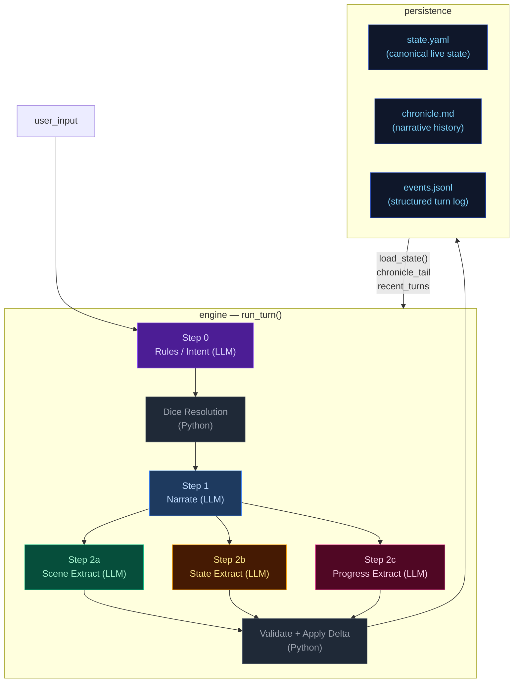

---

## Step 0 — Rules / Intent Classification

Classifies the player's action, determines whether a dice check is needed, and
identifies which state domains will be active — narrowing every downstream extractor.

```mermaid
flowchart LR
    classDef stageRules fill:#4c1d95,color:#ddd6fe,stroke:#7c3aed
    classDef llmNode    fill:#0f172a,color:#94a3b8,stroke:#334155
    classDef pyNode     fill:#1f2937,color:#9ca3af,stroke:#4b5563
    classDef outNode    fill:#3b0764,color:#e9d5ff,stroke:#7c3aed

    subgraph IN["Inputs"]
        I1["state.pc<br>(name, stats, conditions)"]
        I2["state.location"]
        I3["recent_turns[-1:]<br>(from chronicle;<br>user prompt: narrative tail)"]
        I4["user_input"]
    end

    subgraph LLM0["LLM — rules_system.j2 + rules_user.j2"]
        L0["temp: 0.2 · max_retries: 1<br>output: IntentEnvelope JSON"]:::llmNode
    end

    subgraph PYRES["Python — rules.resolve_check()"]
        P0["reads pc.stats[skill]<br>reads pc.conditions → cond_mod<br>rolls 2d6 + stat_mod + cond_mod − diff_mod<br>maps total → Band"]:::pyNode
    end

    subgraph OUT["Outputs"]
        O1["IntentEnvelope<br>  intent: str<br>  intent_verb: str<br>  target: str<br>  stakes: str<br>  check.required: bool<br>  check.skill: SkillName<br>  check.difficulty: Difficulty"]:::outNode
        O2["RulesOutcome<br>  rolled: bool<br>  skill, difficulty, stat_value, stat_mod<br>  diff_mod, cond_mod<br>  dice: list[int]<br>  raw_total, final_total: int<br>  band: Band<br>  directive: str<br>  intent, intent_verb: str"]:::outNode
    end

    IN --> LLM0
    LLM0 -- "IntentEnvelope" --> PYRES
    PYRES --> OUT
```

> **Key forward dependency:** `rules_outcome.directive` shapes the narrator's creative
> latitude.

---

## Step 1 — Narrate (Streaming)

Generates the narrative prose the player reads. Tokens are streamed to the client.

```mermaid
flowchart LR
    classDef llmNode   fill:#0f172a,color:#94a3b8,stroke:#334155
    classDef xstream   fill:#4c1d95,color:#ddd6fe,stroke:#7c3aed
    classDef outNode   fill:#1e3a5f,color:#bfdbfe,stroke:#3b82f6

    subgraph IN["Inputs"]
        N1["state (full —<br>pc, location, scene,<br>inventory, quests, compendium)"]
        N2["chronicle_tail<br>(compressed history, ≤budget tokens)"]
        N3["recent_turns (last window_turns=6)"]
        N4["rules_outcome<br>(band, directive, dice summary)"]:::xstream
        N5["pack_style (tone / prose guide)"]
        N6["npc_name_pool (cultural name list)"]
        N7["recently_left NPCs"]
        N8["known_npcs<br>(last-seen info)"]
        N9["present_npcs<br>(attitudes)"]
        N10["world_factions<br>(immutable trace)"]
        N11["world_locations<br>(nearby, immutable)"]
        N12["pending_gm_beat"]
        N13["momentum"]
        N14["ages<br>(combat/location)"]
        N15["deescalate"]
        N16["scene_pressure<br>(active threats)"]
        N17["user_input"]
    end

    subgraph LLM1["LLM — narrate_system.j2 + narrate_user.j2"]
        NL["temp: 0.9 · streaming: yes<br>output: prose narrative (str)"]:::llmNode
    end

    subgraph OUT["Outputs"]
        NO1["narrative: str<br>(streamed as tokens → client<br>then joined + thinking-stripped)"]:::outNode
        NO2["narr_metrics<br>  first_token_ms<br>  total_ms<br>  tokens_in / tokens_out"]
    end

    IN --> LLM1
    LLM1 --> OUT
```

> **Key forward dependency:** `narrative` is the primary content input for all three
> extraction streams below.

---

## Step 2a — Scene Extract

Extracts location changes, NPC presence, scene tags, and suggested actions from the narrative.

```mermaid
flowchart LR
    classDef llmNode fill:#0f172a,color:#94a3b8,stroke:#334155
    classDef xstream fill:#4c1d95,color:#ddd6fe,stroke:#7c3aed
    classDef outNode fill:#064e3b,color:#a7f3d0,stroke:#10b981

    subgraph IN["Inputs"]
        S1["narrative (from Step 1)"]:::xstream
        S2["state.pc (name, tagline, bio, stats)"]
        S3["state.location"]
        S4["state.scene.present_npcs"]
        S5["state.pc.conditions"]
        S6["known_characters<br>(full roster: id, name, tags, notes<br>up to 10 LRU from compendium)"]
        S7["rules_outcome"]:::xstream
        S8["recent_turns[-1:]<br>(T-1 prior narration)"]
    end

    subgraph LLM2A["LLM — extract_scene_system.j2 + extract_scene_user.j2"]
        SL["temp: 0.4 · max_retries: 1<br>output: SceneExtractResult JSON"]:::llmNode
    end

    subgraph OUT["Outputs — SceneExtractResult"]
        O1["scene_tags: list[str]"]:::outNode
        O2["scene_tagline: str (3–6 words for UI header)"]:::outNode
        O3["location_change: LocationRef | None<br>  id, name, description"]:::outNode
        O4["location_description: str | None"]:::outNode
        O5["npc_add / npc_remove / npc_update<br>  delta-form NPC presence changes"]:::outNode
        O6["compendium_npc_update<br>  durable identity changes"]:::outNode
    end

    IN --> LLM2A
    LLM2A --> OUT
```

> **Key forward dependency:** `location_change` and `present_npcs` flow into
> `extraction_ctx` (built by `_build_extraction_context`). Step 2c also receives
> `npc_roster` (tiered: PRESENT/JUST_LEFT/NEARBY/KNOWN) built from extraction_ctx.
> No forward-facing mechanics (scene_pressure, gm_beat) are emitted by this stream.

---

## Step 2b — State Extract

Extracts inventory changes and player condition mutations from the narrative.

```mermaid
flowchart LR
    classDef llmNode fill:#0f172a,color:#94a3b8,stroke:#334155
    classDef xstream fill:#4c1d95,color:#ddd6fe,stroke:#7c3aed
    classDef outNode fill:#451a03,color:#fde68a,stroke:#f59e0b

    subgraph IN["Inputs"]
        S1["narrative (from Step 1)"]:::xstream
        S2["state.pc (name, bio, stats, conditions)"]
        S3["state.location"]
        S4["state.inventory"]
        S5["rules_outcome"]:::xstream
        S6["intent: str<br>(from Step 0)"]
        S7["band_examples<br>(few-shot examples for current band)"]
    end

    subgraph LLM2B["LLM — extract_state_system.j2 + extract_state_user.j2"]
        SL["temp: 0.4 · max_retries: 1<br>output: StateExtractResult JSON"]:::llmNode
    end

    subgraph OUT["Outputs — StateExtractResult"]
        O1["inventory_add: list[InventoryItem]<br>  id, name, notes, amount"]:::outNode
        O2["inventory_remove: list[InventoryRemove]<br>  id, amount (None = full stack)"]:::outNode
        O3["inventory_update: list[InventoryUpdate]<br>  id, name?, notes?"]:::outNode
        O4["pc_condition_add: list[ConditionAdd]<br>  id, label, description"]:::outNode
        O5["pc_condition_remove: list[ConditionRemove]<br>  id"]:::outNode
    end

    IN --> LLM2B
    LLM2B --> OUT
```

> **Key forward dependency:** Step 2c receives `npc_roster` (tiered: PRESENT/JUST_LEFT/NEARBY/KNOWN)
> and `location_change` from Step 2a. Cross-stream items_gained/lost were removed —
> extraction_ctx now covers all this-turn derived data.

---

## Step 2c — Progress Extract

Extracts quest updates, recent events, and durable NPC compendium changes.


> **Always runs:** Progress is the post-narration storytelling brain. It always executes
> every turn (never skipped) and feeds next turn's rules call via `recent_events_add`
> (durable narrative facts), `quest_updates` (advancing or closing arcs), `scene_pressure_add`
> (new threats), and `gm_beat` (forward-facing beats stored in `state.meta.pending_gm_beat`).
>
> ### GMBeat schema
>
> ```
> GMBeat
>   type: complication | revelation | opportunity | breathing_room | pressure | twist | setback | escalation | callback
>   surface_as: ambient | event | npc_behavior | environmental | player_discovery | item (default: ambient)
>   instruction: str (must be ≥40 chars, not start with filler prefixes)
>   beat_expires_turn: int | None (turn number at which the beat expires; set to turn_no + 2 when stored)
> ```
>
> ### Beat lifecycle
>
> The beat flows through three phases per turn:
>
> **Phase 1 — Pre-narration expiry check.** At the start of each turn, the engine reads
> `state.meta.pending_gm_beat` from the previous turn. If `beat_expires_turn` is set and the
> current turn number exceeds it, the beat is nullified. Otherwise it proceeds to narration.
>
> **Phase 2 — Narration consumption.** The beat is passed to the narrator via
> `_narrate_messages(pending_gm_beat=...)`. The narrator integrates the beat's instruction into
> prose. After narration completes, the beat is temporarily cleared from state. The beat is then
> restored to state so the progress extractor can see it in its prompt — this is critical because
> the progress extractor needs to know what beat was narrated to make an informed disposition
> decision.
>
> **Phase 3 — Extraction disposition.** The progress extractor receives `pending_beat` in its
> prompt and emits `beat_disposition` (`consume`/`carry`/`replace`) plus an optional new `gm_beat`.
> The engine's beat lifecycle logic reads the disposition and applies it:
> - `consume`: clears `state.meta.pending_gm_beat` (beat was narrated, done)
> - `carry`: preserves `state.meta.pending_gm_beat` unchanged (beat was narrated but should
>   continue to next turn — e.g., a multi-turn arc)
> - `replace`: writes the new `gm_beat` to `state.meta.pending_gm_beat` with
>   `beat_expires_turn = turn_no + 2`
>
> The engine stores the beat with `beat_expires_turn = turn_no + 2` as a hard TTL ceiling.
> If not consumed by the narrator, the beat expires at turn N and is discarded.

---

## Narration Directive

The narration directive is a priority-stack label computed from `narrative_velocity` (a unified pacing scalar), active scene pressures, and age thresholds. It tells the progress extractor how the narrator is shaping tone this turn, so the extractor can align `gm_beat` and `scene_pressure` decisions with the narrator's intent.

### Computation

`_compute_narration_directive()` in `engine/turn.py` applies a strict priority stack:

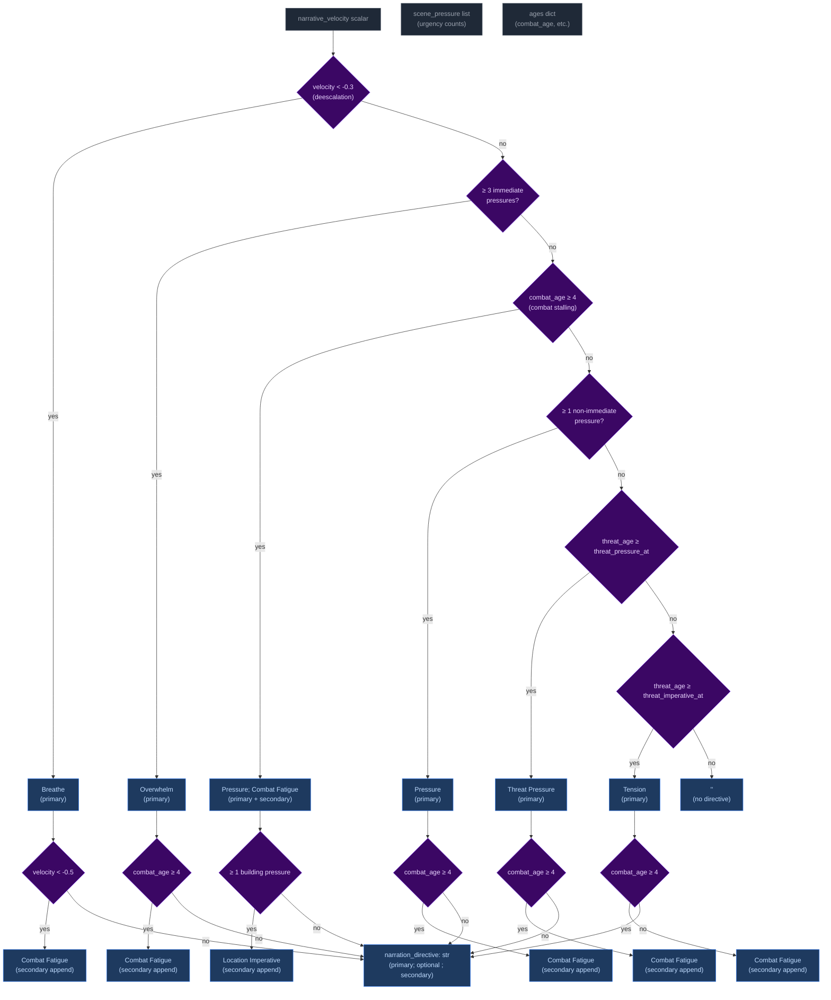

Priority order (highest to lowest): **Breathe > Overwhelm > Pressure > Threat Pressure > Tension > (empty)**. The highest-priority label always wins. Secondary labels (Combat Fatigue, Location Imperative) are appended with a semicolon when their conditions are met independently of the primary stack.

### Wiring: how it reaches the progress extractor


1. **Computed** in `run_turn()` at `turn.py:681` from `narrative_velocity`, `_effective_pressure`, `ages`, and config thresholds.
2. **Passed** through `_run_extraction_pipeline()` → `_extract_progress_messages()` as a function argument.
3. **Rendered** into `extract_progress_user.j2` as a `## narration_directive` section (only when non-empty).
4. **Guides** the extractor via `extract_progress_system.j2` which maps each directive to appropriate `gm_beat` types and `scene_pressure` actions.

### Extractor guidance

The system prompt (`extract_progress_system.j2`) instructs the progress extractor to use the directive as follows:

| Directive | `gm_beat` guidance | `scene_pressure` guidance |
|-----------|-------------------|--------------------------|
| **Breathe** | Prefer `breathing_room` or `null`. Do NOT add new immediate pressures. | Allow existing pressures to persist without escalation. |
| **Overwhelm** | Emit `pressure` or `escalation` beat. | Be proactive: add `scene_pressure_add` at `immediate` urgency. Do NOT remove existing pressures. |
| **Pressure** | Emit `pressure` or `complication` beat. | Add `scene_pressure_add` at `building` or `immediate` urgency for advancing threats. |
| **Tension** | Emit `complication` or `setback` beat. | Do NOT add pressures unless a concrete threat emerges. |
| **Resolve a Threat** | Do NOT add beats for resolved threats. | Remove resolved pressures from `scene_pressure_remove`. |
| **Combat Fatigue** (secondary) | Layer `setback` or `complication` theme reflecting exhaustion. | No direct pressure guidance; applies as thematic modifier. |

When multiple directives are joined (e.g. `"Pressure; Combat Fatigue"`), prioritize the primary directive and layer the secondary as a thematic modifier on the beat type.

---

## Delta Merge → Validate → Apply

The three extraction results merge into a single `StateDelta`, then validate and apply.

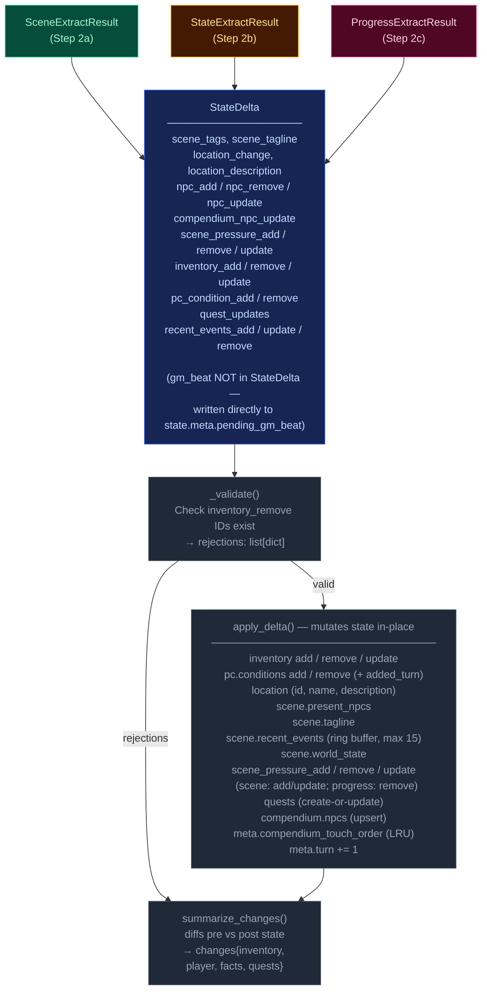

---

## Persist

Atomic writes to disk. No LLM calls.

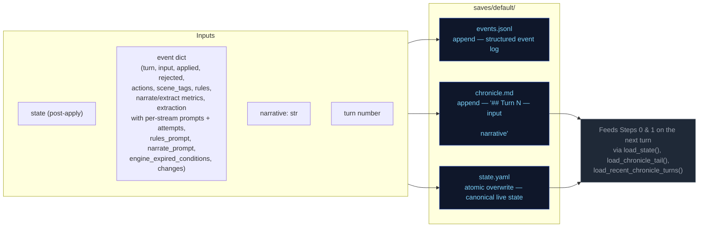

---

## Cross-Pipeline Data Flow

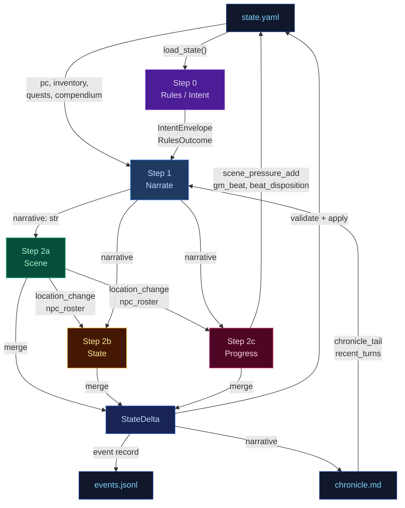

---

## Campaign Arc System

The campaign arc system tracks story threads, phase progression, and player engagement across turns. It has two execution paths: **engine-driven** (thread lifecycle, engagement scoring) and **narrator-driven** (phase shifts, truth discovery, goal updates).

### Arc Data Model

```
CampaignArc
  visible_goal: str          — What the PC is trying to achieve
  thematic_question: str     — The moral/thematic tension of the arc
  phase: ArcPhase            — SETUP → PURSUIT → REVERSAL → CRISIS → RESOLUTION
  hidden_truths: list[str]   — Story secrets the narrator knows but must not reveal in prose
  discovered_truths: list[str] — Truths the player has uncovered (subset of hidden_truths)
  active_threads: list[ArcThread]  — Currently advancing story threads (cap: 4)
  latent_threads: list[ArcThread]  — Unactivated or waiting threads (cap: 4)
  completed_threads: list[ArcThread] — Finished threads (complete or failed)
  arc_engagement: int        — Engagement score: -3 (disengaged) to +3 (highly engaged)
  pc_drive: str              — Player's expressed motivation/direction

ArcThread
  id: str                    — Unique identifier (derived from summary text)
  summary: str               — What this thread is about
  tags: list[str]            — Keywords for engagement matching
  state: ThreadState         — latent | active | complete | failed | expired
  urgency: str               — normal | background | immediate
  progress: int              — 0..3 (3 = completion threshold)
  unlock_if: str | None      — Condition to promote from latent to active
  promotes: list[str]        — Tags this thread unlocks when completed
  last_offered_turn: int     — Turn this thread was last offered to player

ArcPhase: SETUP → PURSUIT → REVERSAL → CRISIS → RESOLUTION
ThreadState: LATENT → ACTIVE → COMPLETE / FAILED
ThreadSignalType: ADVANCED | BLOCKED | FAILED | IGNORED
```

### Engine-Driven Arc: Thread Lifecycle

Thread lifecycle runs in `engine/turn.py` during the extraction phase, after `apply_delta()` but before narration arc_update merge. Three functions handle the lifecycle:

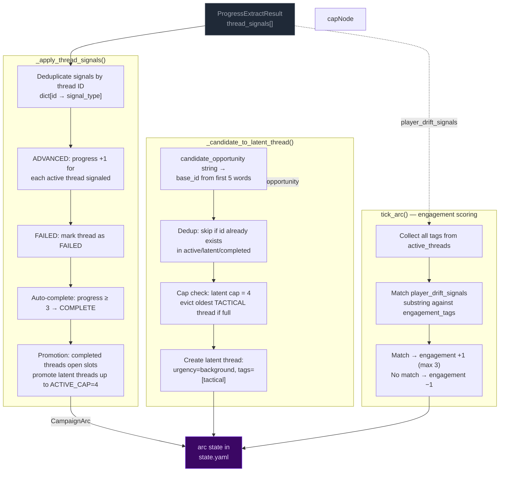

**Key rules:**
- **Active cap:** 4 threads. When a thread completes/fails, latent threads are promoted to fill slots.
- **Latent cap:** 4 threads. When full and a new candidate arrives, the oldest tactical-tagged thread is evicted. Pack-seeded threads (no tactical tag) are never evicted.
- **Completion threshold:** progress reaches 3 → thread marked COMPLETE.
- **Signal dedup:** multiple ADVANCED signals for the same thread in one call count as +1 (dict dedup).

### Narrator-Driven Arc: Phase & Truth Updates

The narrator can update arc metadata through a sentinel-delimited JSON block in its output. The engine parses and merges these updates after narration.

```mermaid
flowchart LR
    classDef llmNode fill:#0f172a,color:#94a3b8,stroke:#334155
    classDef sentinel fill:#3b0764,color:#e9d5ff,stroke:#7c3aed
    classDef mergeNode fill:#172554,color:#bfdbfe,stroke:#1d4ed8
    classDef arcNode fill:#3b0764,color:#e9d5ff,stroke:#7c3aed

    subgraph NARRATOR["Narrator prompt context"]
        NC1["visible_goal"]
        NC2["thematic_question"]
        NC3["phase"]
        NC4["active_threads[] (summary, urgency, tags)"]
        NC5["pc_drive"]
        NC6["hidden_truths[] — internal only<br>NARRATOR MUST NOT reveal in prose"]
        NC7["discovered_truths[]"]
    end

    subgraph EMISSION["Narrator output"]
        PROSE["narration prose<br>(player sees this)"]:::llmNode
        SENTINEL["<<<ARC_UPDATE_START>>>
{discovered_truths, phase, visible_goal}
<<<ARC_UPDATE_END>>>"]:::sentinel
    end

    subgraph PARSING["_extract_narrator_arc_update()"]
        P1["Regex: <<<ARC_UPDATE_START>>>(.*?)<<<ARC_UPDATE_END>>>"]
        P2["json.loads() → arc_dict"]
        P3["Strip block from narrative"]
    end

    subgraph MERGE["_merge_arc_update()"]
        M1["visible_goal: overwrite if present"]
        M2["thematic_question: overwrite if present"]
        M3["phase: overwrite only if value differs<br>(avoids Pydantic default SETUP overwrite)"]
        M4["pc_drive: overwrite if present"]
        M5["hidden_truths: overwrite if present"]
        M6["discovered_truths: union with existing"]
        M7["active_threads: upsert by id"]
        M8["arc_engagement: max(current, new)"]
    end

    NC1 & NC2 & NC3 & NC4 & NC5 & NC6 & NC7 --> PROSE
    PROSE --> SENTINEL
    SENTINEL --> P1 --> P2 --> P3
    P3 -- "clean narrative" --> CLIENT["client"]
    P2 -- "arc_dict" --> MERGE

    MERGE --> ARC[merge into state["arc"]]:::arcNode

    mergeNode
```

**Merge rules:**
- **Engine owns threads** (active/latent/completed). Narrator arc_update omits thread fields — they are ignored by `_merge_arc_update()`.
- **Narrator owns phase/visible_goal/thematic_question/discovered_truths/hidden_truths.** Engine does not modify these.
- **Phase protection:** `_merge_arc_update()` checks `au.phase.value != current_phase` to prevent Pydantic's default `ArcPhase.SETUP` from overwriting the live phase when the narrator omits the field.
- **Discovered truths:** merged as set union (dedup).
- **Merge order:** engine thread signals run first (setting `delta.arc_update`), then narrator arc_update is parsed after narration and merged on top via a second `_merge_arc_update()` call in `run_turn()`.

### Arc Context in Narration

The arc state is passed to the narrator via `current_arc` in the system prompt. The narrator sees all arc metadata including `hidden_truths` but is explicitly instructed not to reveal them in prose.

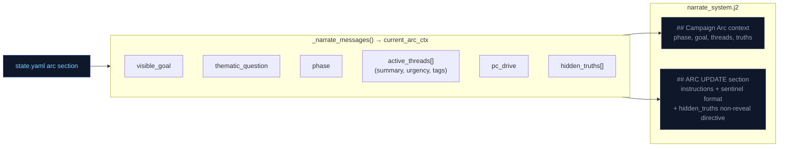

### Arc System Integration Points

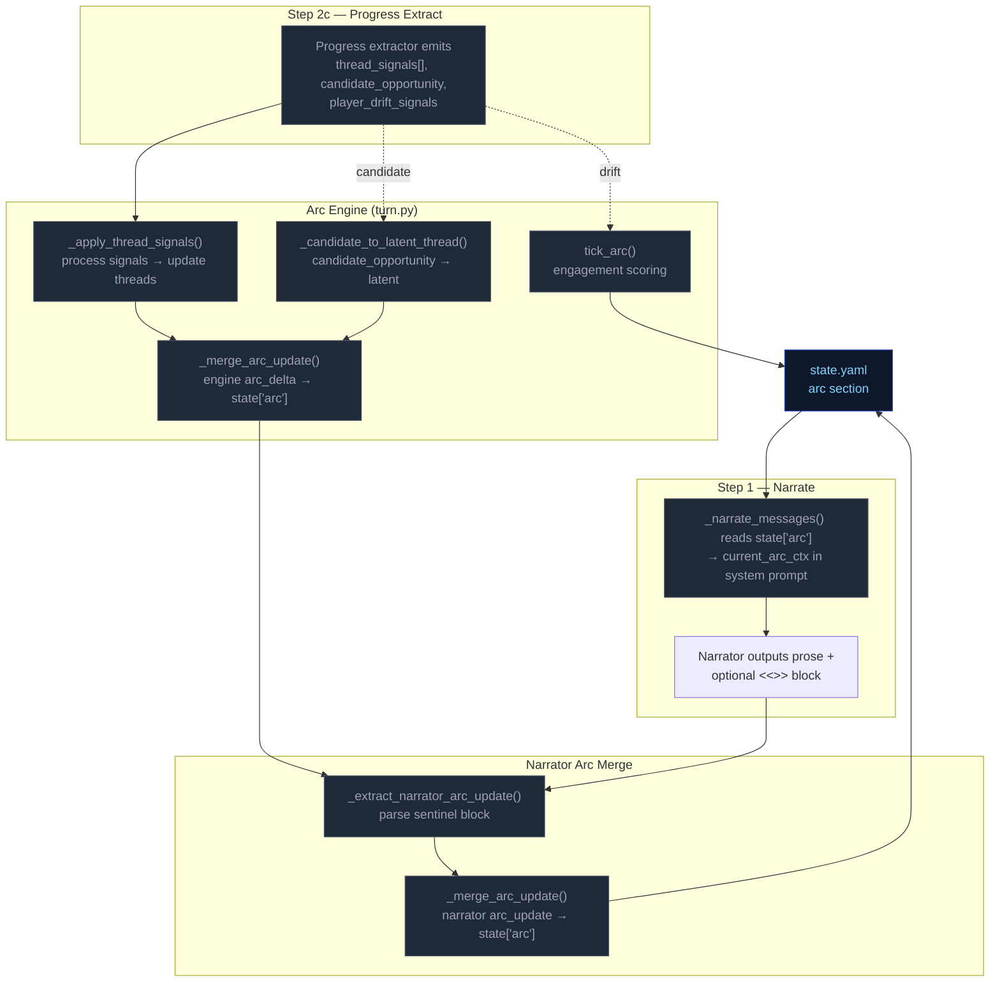

---

## Out-of-band Pipelines (not part of the per-turn loop — for human reference)

---


# Static Context (immutable across all turns)

## World Pack Style

```
# Eval-pack style

This pack is a deterministic test fixture. The narrator should write in a plain,
clear, second-person past-tense register. Keep these in mind:

- Specific over abstract. Name the thing the player did, the object they touched, the
  NPC they spoke to. Avoid generic mood words ("an air of menace") in favor of
  concrete sensory detail.
- One scene per turn. Do not skip ahead in time unless the player explicitly does so.
- Honor the dice. If the rules outcome is `fail` or `setback`, the action did not
  succeed; describe the cost. If `partial`, the action succeeded with a complication.
- Honor the present_npcs. Every named NPC in the scene either acts, reacts, or is
  visibly present in the prose. Do not invent new NPCs unless the player's input
  introduces one.
- Plain language. No archaic phrasing, no fantasy-trope syntax ("Lo, the door...").
  This is a working road in a working world.
- 120-220 words per turn unless the action is large.

```

## Seed State

```json
{
  "meta": {
    "game_name": "eval",
    "turn": 0,
    "setting_pack": "eval-pack",
    "model": ""
  },
  "pc": {
    "name": "Aren Voss",
    "tagline": "Reluctant courier on the merchant road",
    "bio": "Mid-thirties, broad shoulders, careful with words. Took on a courier contract\nto clear an old debt. Just arrived in Marrow's Crossing with a heavy pack and\na heavier obligation.\n",
    "stats": {
      "strength": 3,
      "dexterity": 3,
      "wits": 2,
      "lore": 2,
      "charisma": 3,
      "resolve": 3
    },
    "conditions": [],
    "momentum": 0,
    "drive": "",
    "expressed_stances": {}
  },
  "location": {
    "id": "marrows_crossing",
    "name": "Marrow's Crossing",
    "description": "A market town built around the confluence of two rivers. Cobblestone streets,\ntimber-framed buildings, and the constant sound of water from the mills. The\ntown square has a stone well and a statue of the founder. Most shops are closing\nfor the evening.\n"
  },
  "inventory": [
    {
      "id": "credits",
      "name": "Credits",
      "notes": "Common coin, accepted at any inn or stall on the merchant road.",
      "amount": 500,
      "aliases": []
    },
    {
      "id": "iron_dagger",
      "name": "Iron dagger",
      "notes": "Plain crossguard, edge worn from honing. Belt-carried.",
      "amount": 1,
      "aliases": []
    },
    {
      "id": "bandages",
      "name": "Linen bandages",
      "notes": "Three rolls. Field-grade \u2014 won't replace a healer.",
      "amount": 3,
      "aliases": []
    },
    {
      "id": "traveler_cloak",
      "name": "Traveler's cloak",
      "notes": "Oiled wool, road-stained, hood deep enough to hide a face.",
      "amount": 1,
      "aliases": [
        "cloak",
        "travel cloak"
      ]
    },
    {
      "id": "brass_key",
      "name": "Brass key",
      "notes": "A small brass key Halden gave you with the ledger.",
      "amount": 1,
      "aliases": []
    }
  ],
  "scene": {
    "tagline": "Market town at dusk",
    "tags": [
      "peaceful",
      "start"
    ],
    "world_state": [
      "Marrow's Crossing is a market town at the confluence of two rivers, known for its mills and the annual river festival.",
      "Iron coin (credits) is the universal currency on the merchant road; barter is acceptable but slower.",
      "The road has been quieter than usual this season \u2014 fewer caravans, more independent runners, more opportunists."
    ],
    "recent_events": [
      "You arrived in Marrow's Crossing after three days on the road.",
      "You heard rumors of road-toughs extorting travelers near the Crossed Keys Inn.",
      "You found Caron in the tavern \u2014 he's been waiting for you."
    ],
    "present_npcs": [
      {
        "id": "caron",
        "name": "Caron",
        "title": "Old creditor",
        "notes": "Sits at a corner table in the tavern, nursing a drink and watching the door.",
        "bio": "A portly man in his sixties with a merchant's ledger and a patient demeanor. You owe him 500 credits from a failed venture three years ago."
      },
      {
        "id": "halden",
        "name": "Halden",
        "title": "Merchant",
        "notes": "Stands near the town well, examining a map and a pressed wax seal.",
        "bio": "A road merchant in his fifties who hires couriers when his usual runners are spoken for. Honest by reputation, careful with money."
      },
      {
        "id": "innkeeper",
        "name": "Edda",
        "title": "Innkeeper at the Crossed Keys",
        "notes": "Wiping down the bar at the Crossed Keys, which is two streets over.",
        "bio": "Runs the inn alone since her husband died. Knows every traveler by face if not by name. Stays out of trouble unless it walks through her door."
      }
    ]
  },
  "compendium": {
    "npcs": {
      "caron": {
        "name": "Caron",
        "title": "Old creditor",
        "bio": "A portly man in his sixties with a merchant's ledger and a patient demeanor. You owe him 500 credits from a failed venture three years ago."
      },
      "halden": {
        "name": "Halden",
        "title": "Merchant",
        "bio": "A road merchant in his fifties who hires couriers when his usual runners are spoken for. Honest by reputation, careful with money."
      },
      "innkeeper": {
        "name": "Edda",
        "title": "Innkeeper at the Crossed Keys",
        "bio": "Runs the inn alone since her husband died. Knows every traveler by face if not by name. Stays out of trouble unless it walks through her door."
      },
      "tough_a": {
        "name": "Bald Tough",
        "title": "Road thug",
        "bio": "Hired muscle. No personal stake in this \u2014 he'll back off if the price is right or the fight goes bad."
      },
      "tough_b": {
        "name": "Scarred Tough",
        "title": "Road thug",
        "bio": "Same outfit as the other \u2014 hired by the same person. Quicker to violence; not the brains."
      },
      "matthew_estrada": {
        "name": "Matthew Estrada",
        "title": "Traveler",
        "bio": "A tall, broad-shoulded man in a stained leather jerkin carrying a heavy rucksack. Looks like a road runner but moves with military precision."
      }
    }
  },
  "arc": {
    "visible_goal": "Clear your debts and deliver the ledger \u2014 two obligations binding you to Marrow's Crossing.",
    "thematic_question": "What does it cost to settle old debts when new ones keep forming?",
    "phase": "setup",
    "hidden_truths": [
      "Matthew Estrada is not a traveler \u2014 he's a courier for a rival merchant house, and the toughs were hired to intercept his competition.",
      "The brass key Halden gave you opens a back room at the inn where intercepted couriers' messages are stored.",
      "Caron's debt was not a failed venture \u2014 it was a deliberate investment in your skills, and he's been waiting for you to prove yourself."
    ],
    "discovered_truths": [],
    "active_threads": [
      {
        "id": "settle_the_debt",
        "summary": "Settle the 500-credit debt with Caron.",
        "tags": [
          "debt",
          "caron",
          "obligation"
        ],
        "state": "latent",
        "urgency": "normal",
        "progress": 0,
        "unlock_if": null,
        "promotes": [],
        "last_offered_turn": 0
      },
      {
        "id": "deliver_the_ledger",
        "summary": "Deliver Halden's ledger to the merchant at the Crossed Keys Inn.",
        "tags": [
          "courier",
          "halden",
          "contract"
        ],
        "state": "latent",
        "urgency": "normal",
        "progress": 0,
        "unlock_if": null,
        "promotes": [],
        "last_offered_turn": 0
      },
      {
        "id": "clear_the_road_toughs",
        "summary": "Deal with the toughs blocking the inn entrance.",
        "tags": [
          "toughs",
          "road",
          "confrontation"
        ],
        "state": "latent",
        "urgency": "low",
        "progress": 0,
        "unlock_if": null,
        "promotes": [],
        "last_offered_turn": 0
      }
    ],
    "latent_threads": [],
    "completed_threads": [],
    "arc_engagement": 0,
    "pc_drive": "Prove you can handle the road \u2014 clear your name and earn enough to start over."
  }
}
```

## Engine Constants

```json
{
  "pressure_building_at": 3,
  "pressure_immediate_at": 5,
  "pressure_max_age": 8,
  "urgency_levels": [
    "background",
    "building",
    "immediate"
  ],
  "momentum_min": -3,
  "momentum_max": 3,
  "momentum_delta": {
    "crit_success": 2,
    "success": 1,
    "partial": 0,
    "setback": -1,
    "fail": -1,
    "crit_fail": -2
  }
}
```

## System Prompts (identical every turn)

### Rules System Prompt

```
(not captured this run)
```

### Narrate System Prompt

```
(not captured this run)
```

### Extract Scene System Prompt

```
(not captured this run)
```

### Extract State System Prompt

```
(not captured this run)
```

### Extract Progress System Prompt

```
(not captured this run)
```


---

# TURN 1

**Input:** `Walk over to Caron's table and sit down across from him. I'm ready to talk about the debt.`

## User Prompts

### Rules User Prompt
```
(no rules call this turn)
```

### Narrate User Prompt
```
(no narrate call)
```

### Extract Scene User Prompt
```
(not captured)
```

### Extract State User Prompt
```
(not captured)
```

### Extract Progress User Prompt
```
(not captured)
```

## Engine Outputs

### Rules

**Parsed (engine):**
```json
{
  "intent_verb": "negotiate",
  "intent": "The player approaches Caron to discuss the repayment or negotiation of their debt.",
  "rolled": false,
  "total_ms": 9276.3,
  "tokens_in": 1583,
  "tokens_out": 66
}
```

**Raw LLM output:**
```

```

### Narration


### Extract Scene

```json
{
  "scene_tags": [
    "tense_conversation",
    "debt_collection"
  ],
  "scene_tagline": "A Debt Acknowledged",
  "location_description": "The interior of the tavern, where the floorboards thud underfoot and the distant rumble of river mills filters through the walls.",
  "npc_add": [],
  "npc_remove": [],
  "npc_update": [
    {
      "id": "caron",
      "notes": "Watching the player with practiced patience, leaning forward over his ledger to initiate a direct conversation about their debt."
    }
  ],
  "compendium_npc_update": []
}
```

### Extract State

```json
{
  "inventory_add": [],
  "inventory_remove": [],
  "inventory_update": [],
  "pc_condition_add": [],
  "pc_condition_remove": []
}
```

### Extract Progress

```json
{
  "recent_events_add": [],
  "recent_events_update": [],
  "recent_events_remove": [],
  "actions": [
    "Propose a payment plan to Caron using your credits.",
    "Ask Caron if he has any work to offset the debt.",
    "Try to charm Caron into showing more leniency.",
    "Scan the tavern for any potential distractions or allies."
  ],
  "outcome_summary": "You sit down with Caron, and he acknowledges your arrival and your weary appearance, setting a serious tone for the negotiation.",
  "beat_disposition": "consume",
  "scene_pressure_add": [],
  "scene_pressure_remove": [],
  "scene_pressure_update": [],
  "thread_signals": [
    {
      "id": "settle_the_debt",
      "signal": "advanced"
    },
    {
      "id": "deliver_the_ledger",
      "signal": "ignored"
    },
    {
      "id": "clear_the_road_toughs",
      "signal": "ignored"
    }
  ],
  "drift_analysis": [
    {
      "thread_id": "settle_the_debt",
      "match": true,
      "reason": "Player approached Caron to initiate debt negotiations.",
      "new_interest": ""
    },
    {
      "thread_id": "deliver_the_ledger",
      "match": false,
      "reason": "The player focused on the creditor rather than the courier contract.",
      "new_interest": ""
    },
    {
      "thread_id": "clear_the_road_toughs",
      "match": false,
      "reason": "The player ignored the external threat to focus on the debt.",
      "new_interest": ""
    }
  ],
  "player_drift_signals": []
}
```

### Applied Deltas

```json
{
  "inventory_add": [],
  "inventory_remove": [],
  "inventory_update": [],
  "location_description": "The interior of the tavern, where the floorboards thud underfoot and the distant rumble of river mills filters through the walls.",
  "pc_condition_add": [],
  "pc_condition_remove": [],
  "scene_tags": [
    "tense_conversation",
    "debt_collection"
  ],
  "scene_tagline": "A Debt Acknowledged",
  "compendium_npc_update": [],
  "npc_add": [],
  "npc_remove": [],
  "npc_update": [
    {
      "id": "caron",
      "notes": "Watching the player with practiced patience, leaning forward over his ledger to initiate a direct conversation about their debt."
    }
  ],
  "recent_events_add": [],
  "recent_events_update": [],
  "recent_events_remove": [],
  "scene_pressure_add": [],
  "scene_pressure_remove": [],
  "scene_pressure_update": []
}
```

### Rejected Deltas

*(none)*

### Suggested Actions

*(none)*

### Context Telemetry

*(no telemetry)*

### State After Turn

```json
{
  "arc": {
    "active_threads": [
      {
        "id": "settle_the_debt",
        "last_offered_turn": 0,
        "progress": 1,
        "promotes": [],
        "state": "active",
        "summary": "Settle the 500-credit debt with Caron.",
        "tags": [
          "debt",
          "caron",
          "obligation"
        ],
        "unlock_if": null,
        "urgency": "normal"
      },
      {
        "id": "deliver_the_ledger",
        "last_offered_turn": 0,
        "progress": 0,
        "promotes": [],
        "state": "active",
        "summary": "Deliver Halden's ledger to the merchant at the Crossed Keys Inn.",
        "tags": [
          "courier",
          "halden",
          "contract"
        ],
        "unlock_if": null,
        "urgency": "normal"
      },
      {
        "id": "clear_the_road_toughs",
        "last_offered_turn": 0,
        "progress": 0,
        "promotes": [],
        "state": "active",
        "summary": "Deal with the toughs blocking the inn entrance.",
        "tags": [
          "toughs",
          "road",
          "confrontation"
        ],
        "unlock_if": null,
        "urgency": "low"
      }
    ],
    "arc_engagement": 1,
    "completed_threads": [],
    "discovered_truths": [],
    "hidden_truths": [
      "Matthew Estrada is not a traveler \u2014 he's a courier for a rival merchant house, and the toughs were hired to intercept his competition.",
      "The brass key Halden gave you opens a back room at the inn where intercepted couriers' messages are stored.",
      "Caron's debt was not a failed venture \u2014 it was a deliberate investment in your skills, and he's been waiting for you to prove yourself."
    ],
    "latent_threads": [],
    "pc_drive": "Prove you can handle the road \u2014 clear your name and earn enough to start over.",
    "phase": "setup",
    "thematic_question": "What does it cost to settle old debts when new ones keep forming?",
    "visible_goal": "Clear your debts and deliver the ledger \u2014 two obligations binding you to Marrow's Crossing."
  },
  "compendium": {
    "npcs": {
      "caron": {
        "bio": "A portly man in his sixties with a merchant's ledger and a patient demeanor. You owe him 500 credits from a failed venture three years ago.",
        "last_seen": {
          "location_id": "marrows_crossing",
          "location_name": "Marrow's Crossing",
          "turn": 1
        },
        "name": "Caron",
        "title": "Old creditor"
      },
      "halden": {
        "bio": "A road merchant in his fifties who hires couriers when his usual runners are spoken for. Honest by reputation, careful with money.",
        "name": "Halden",
        "title": "Merchant"
      },
      "innkeeper": {
        "bio": "Runs the inn alone since her husband died. Knows every traveler by face if not by name. Stays out of trouble unless it walks through her door.",
        "name": "Edda",
        "title": "Innkeeper at the Crossed Keys"
      },
      "matthew_estrada": {
        "bio": "A tall, broad-shoulded man in a stained leather jerkin carrying a heavy rucksack. Looks like a road runner but moves with military precision.",
        "name": "Matthew Estrada",
        "title": "Traveler"
      },
      "tough_a": {
        "bio": "Hired muscle. No personal stake in this \u2014 he'll back off if the price is right or the fight goes bad.",
        "name": "Bald Tough",
        "title": "Road thug"
      },
      "tough_b": {
        "bio": "Same outfit as the other \u2014 hired by the same person. Quicker to violence; not the brains.",
        "name": "Scarred Tough",
        "title": "Road thug"
      }
    }
  },
  "inventory": [
    {
      "aliases": [],
      "amount": 500,
      "id": "credits",
      "name": "Credits",
      "notes": "Common coin, accepted at any inn or stall on the merchant road."
    },
    {
      "aliases": [],
      "amount": 1,
      "id": "iron_dagger",
      "name": "Iron dagger",
      "notes": "Plain crossguard, edge worn from honing. Belt-carried."
    },
    {
      "aliases": [],
      "amount": 3,
      "id": "bandages",
      "name": "Linen bandages",
      "notes": "Three rolls. Field-grade \u2014 won't replace a healer."
    },
    {
      "aliases": [
        "cloak",
        "travel cloak"
      ],
      "amount": 1,
      "id": "traveler_cloak",
      "name": "Traveler's cloak",
      "notes": "Oiled wool, road-stained, hood deep enough to hide a face."
    },
    {
      "aliases": [],
      "amount": 1,
      "id": "brass_key",
      "name": "Brass key",
      "notes": "A small brass key Halden gave you with the ledger."
    }
  ],
  "location": {
    "description": "The interior of the tavern, where the floorboards thud underfoot and the distant rumble of river mills filters through the walls.",
    "id": "marrows_crossing",
    "name": "Marrow's Crossing"
  },
  "meta": {
    "compendium_touch_order": [],
    "consecutive_floor_count": 0,
    "game_name": "eval",
    "last_compacted_turn": 0,
    "model": "",
    "pending_gm_beat": null,
    "prior_history": [],
    "setting_pack": "eval-pack",
    "turn": 1
  },
  "pc": {
    "allegiance": null,
    "bio": "Mid-thirties, broad shoulders, careful with words. Took on a courier contract\nto clear an old debt. Just arrived in Marrow's Crossing with a heavy pack and\na heavier obligation.\n",
    "conditions": [
      {
        "added_turn": 8,
        "description": "A hard fall on the bridge two days ago left a deep, aching bruise along the right ribcage.",
        "id": "bruised_ribs",
        "label": "bruised ribs"
      },
      {
        "added_turn": 10,
        "description": "Twelve days on the road, two days behind schedule, and an old debt waiting at the end of it.",
        "id": "low_morale",
        "label": "low morale"
      }
    ],
    "drive": "",
    "expressed_stances": {},
    "momentum": 0,
    "name": "Aren Voss",
    "stats": {
      "charisma": 3,
      "dexterity": 3,
      "lore": 2,
      "resolve": 3,
      "strength": 3,
      "wits": 2
    },
    "tagline": "Reluctant courier on the merchant road"
  },
  "scene": {
    "present_npcs": [
      {
        "bio": "A portly man in his sixties with a merchant's ledger and a patient demeanor. You owe him 500 credits from a failed venture three years ago.",
        "id": "caron",
        "name": "Caron",
        "notes": "Watching the player with practiced patience, leaning forward over his ledger to initiate a direct conversation about their debt.",
        "title": "Old creditor"
      },
      {
        "bio": "A road merchant in his fifties who hires couriers when his usual runners are spoken for. Honest by reputation, careful with money.",
        "id": "halden",
        "name": "Halden",
        "notes": "Stands near the town well, examining a map and a pressed wax seal.",
        "title": "Merchant"
      },
      {
        "bio": "Runs the inn alone since her husband died. Knows every traveler by face if not by name. Stays out of trouble unless it walks through her door.",
        "id": "innkeeper",
        "name": "Edda",
        "notes": "Wiping down the bar at the Crossed Keys, which is two streets over.",
        "title": "Innkeeper at the Crossed Keys"
      }
    ],
    "recent_events": [
      {
        "id": "you_arrived_in_marrows_crossing_after",
        "text": "You arrived in Marrow's Crossing after three days on the road.",
        "turn": 0
      },
      {
        "id": "you_heard_rumors_of_roadtoughs_extorting",
        "text": "You heard rumors of road-toughs extorting travelers near the Crossed Keys Inn.",
        "turn": 0
      },
      {
        "id": "you_found_caron_in_the_tavern",
        "text": "You found Caron in the tavern \u2014 he's been waiting for you.",
        "turn": 0
      }
    ],
    "scene_pressure": [],
    "tagline": "A Debt Acknowledged",
    "tags": [
      "tense_conversation",
      "debt_collection"
    ],
    "world_state": [
      "Marrow's Crossing is a market town at the confluence of two rivers, known for its mills and the annual river festival.",
      "Iron coin (credits) is the universal currency on the merchant road; barter is acceptable but slower.",
      "The road has been quieter than usual this season \u2014 fewer caravans, more independent runners, more opportunists."
    ]
  },
  "world": {
    "factions": [],
    "locations": []
  }
}
```


---

# TURN 2

**Input:** `I slide 500 credits across the table to Caron and ask him to mark the debt cleared in his ledger.`

## User Prompts

### Rules User Prompt
```
(no rules call this turn)
```

### Narrate User Prompt
```
(no narrate call)
```

### Extract Scene User Prompt
```
(not captured)
```

### Extract State User Prompt
```
(not captured)
```

### Extract Progress User Prompt
```
(not captured)
```

## Engine Outputs

### Rules

**Parsed (engine):**
```json
{
  "intent_verb": "negotiate",
  "intent": "The player attempts to settle a portion of their debt with Caron using 500 credits.",
  "rolled": false,
  "total_ms": 2498.8,
  "tokens_in": 1586,
  "tokens_out": 71
}
```

**Raw LLM output:**
```

```

### Narration


### Extract Scene

```json
{
  "scene_tags": [
    "tense_conversation",
    "transaction"
  ],
  "scene_tagline": "The Debt is Cleared",
  "npc_add": [],
  "npc_remove": [],
  "npc_update": [
    {
      "id": "caron",
      "notes": "Has officially marked the player's debt as cleared in his ledger and returned the purse, though he remains observant and cautionary."
    }
  ],
  "compendium_npc_update": [
    {
      "id": "caron",
      "bio": "A portly man in his sixties with a merchant's ledger and a patient demeanor. He has officially cleared the player's debt of 500 credits.",
      "aliases": []
    }
  ]
}
```

### Extract State

```json
{
  "inventory_add": [],
  "inventory_remove": [
    {
      "id": "credits",
      "amount": 500
    }
  ],
  "inventory_update": [],
  "pc_condition_add": [],
  "pc_condition_remove": [
    {
      "id": "low_morale"
    }
  ]
}
```

### Extract Progress

```json
{
  "recent_events_add": [
    {
      "id": "debt_settled_caron",
      "text": "You successfully paid your 500-credit debt to Caron.",
      "turn": 2
    }
  ],
  "recent_events_update": [],
  "recent_events_remove": [
    "You found Caron in the tavern \u2014 he's been waiting for you."
  ],
  "actions": [
    "Ask Caron for any local news or rumors.",
    "Accept the purse and head toward the inn entrance.",
    "Use your steady hands to carefully count the remaining coins.",
    "Scan the tavern for any sign of the road-toughs."
  ],
  "outcome_summary": "You successfully settle your debt with Caron, clearing your name in his ledger and removing the weight of your past obligation.",
  "beat_disposition": "consume",
  "scene_pressure_add": [],
  "scene_pressure_remove": [],
  "scene_pressure_update": [],
  "thread_signals": [
    {
      "id": "settle_the_debt",
      "signal": "advanced"
    },
    {
      "id": "deliver_the_ledger",
      "signal": "ignored"
    },
    {
      "id": "clear_the_road_toughs",
      "signal": "ignored"
    }
  ],
  "drift_analysis": [
    {
      "thread_id": "settle_the_debt",
      "match": true,
      "reason": "Player paid the 500 credits to Caron to clear the debt.",
      "new_interest": ""
    },
    {
      "thread_id": "deliver_the_ledger",
      "match": false,
      "reason": "The player focused entirely on the debt settlement rather than the courier contract.",
      "new_interest": "local rumors"
    },
    {
      "thread_id": "clear_the_road_toughs",
      "match": false,
      "reason": "The player ignored the potential threat of the toughs to settle their business.",
      "new_interest": ""
    }
  ],
  "player_drift_signals": []
}
```

### Applied Deltas

```json
{
  "inventory_add": [],
  "inventory_remove": [
    {
      "id": "credits",
      "amount": 500
    }
  ],
  "inventory_update": [],
  "pc_condition_add": [],
  "pc_condition_remove": [
    {
      "id": "low_morale"
    }
  ],
  "scene_tags": [
    "tense_conversation",
    "transaction"
  ],
  "scene_tagline": "The Debt is Cleared",
  "compendium_npc_update": [
    {
      "id": "caron",
      "bio": "A portly man in his sixties with a merchant's ledger and a patient demeanor. He has officially cleared the player's debt of 500 credits.",
      "aliases": []
    }
  ],
  "npc_add": [],
  "npc_remove": [],
  "npc_update": [
    {
      "id": "caron",
      "notes": "Has officially marked the player's debt as cleared in his ledger and returned the purse, though he remains observant and cautionary."
    }
  ],
  "recent_events_add": [
    {
      "id": "debt_settled_caron",
      "text": "You successfully paid your 500-credit debt to Caron.",
      "turn": 2
    }
  ],
  "recent_events_update": [],
  "recent_events_remove": [
    "You found Caron in the tavern \u2014 he's been waiting for you."
  ],
  "scene_pressure_add": [],
  "scene_pressure_remove": [],
  "scene_pressure_update": []
}
```

### Rejected Deltas

*(none)*

### Suggested Actions

*(none)*

### Context Telemetry

*(no telemetry)*

### State After Turn

*(diff vs previous turn — full snapshot only on first and last turns)*

```json
{
  "arc": {
    "active_threads": {
      "changed": [
        {
          "from": {
            "id": "settle_the_debt",
            "last_offered_turn": 0,
            "progress": 1,
            "promotes": [],
            "state": "active",
            "summary": "Settle the 500-credit debt with Caron.",
            "tags": [
              "debt",
              "caron",
              "obligation"
            ],
            "unlock_if": null,
            "urgency": "normal"
          },
          "to": {
            "id": "settle_the_debt",
            "last_offered_turn": 0,
            "progress": 2,
            "promotes": [],
            "state": "active",
            "summary": "Settle the 500-credit debt with Caron.",
            "tags": [
              "debt",
              "caron",
              "obligation"
            ],
            "unlock_if": null,
            "urgency": "normal"
          }
        }
      ]
    },
    "arc_engagement": {
      "from": 1,
      "to": 2
    }
  },
  "compendium": {
    "npcs": {
      "caron": {
        "bio": {
          "from": "A portly man in his sixties with a merchant's ledger and a patient demeanor. You owe him 500 credits from a failed venture three years ago.",
          "to": "A portly man in his sixties with a merchant's ledger and a patient demeanor. He has officially cleared the player's debt of 500 credits."
        },
        "last_seen": {
          "turn": {
            "from": 1,
            "to": 2
          }
        }
      }
    }
  },
  "inventory": {
    "removed": [
      {
        "aliases": [],
        "amount": 500,
        "id": "credits",
        "name": "Credits",
        "notes": "Common coin, accepted at any inn or stall on the merchant road."
      }
    ]
  },
  "meta": {
    "compendium_touch_order": {
      "added": [
        "caron"
      ],
      "removed": []
    },
    "turn": {
      "from": 1,
      "to": 2
    }
  },
  "pc": {
    "conditions": {
      "removed": [
        {
          "added_turn": 10,
          "description": "Twelve days on the road, two days behind schedule, and an old debt waiting at the end of it.",
          "id": "low_morale",
          "label": "low morale"
        }
      ]
    }
  },
  "scene": {
    "present_npcs": {
      "changed": [
        {
          "from": {
            "bio": "A portly man in his sixties with a merchant's ledger and a patient demeanor. You owe him 500 credits from a failed venture three years ago.",
            "id": "caron",
            "name": "Caron",
            "notes": "Watching the player with practiced patience, leaning forward over his ledger to initiate a direct conversation about their debt.",
            "title": "Old creditor"
          },
          "to": {
            "bio": "A portly man in his sixties with a merchant's ledger and a patient demeanor. You owe him 500 credits from a failed venture three years ago.",
            "id": "caron",
            "name": "Caron",
            "notes": "Has officially marked the player's debt as cleared in his ledger and returned the purse, though he remains observant and cautionary.",
            "title": "Old creditor"
          }
        }
      ]
    },
    "recent_events": {
      "added": [
        {
          "id": "debt_settled_caron",
          "text": "You successfully paid your 500-credit debt to Caron.",
          "turn": 2
        }
      ]
    },
    "tagline": {
      "from": "A Debt Acknowledged",
      "to": "The Debt is Cleared"
    },
    "tags": {
      "added": [
        "transaction"
      ],
      "removed": [
        "debt_collection"
      ]
    }
  }
}
```


---

# TURN 3

**Input:** `I find Halden by the town well and offer to carry his ledger to the Crossed Keys Inn. I'll do it for 200 credits.`

## User Prompts

### Rules User Prompt
```
(no rules call this turn)
```

### Narrate User Prompt
```
(no narrate call)
```

### Extract Scene User Prompt
```
(not captured)
```

### Extract State User Prompt
```
(not captured)
```

### Extract Progress User Prompt
```
(not captured)
```

## Engine Outputs

### Rules

**Parsed (engine):**
```json
{
  "intent_verb": "negotiate",
  "intent": "The player offers to perform a courier task for Halden for a specific fee.",
  "rolled": false,
  "total_ms": 2460.3,
  "tokens_in": 1594,
  "tokens_out": 67
}
```

**Raw LLM output:**
```

```

### Narration


### Extract Scene

```json
{
  "scene_tags": [
    "negotiation",
    "business_deal"
  ],
  "scene_tagline": "A Risky Proposition",
  "location_change": {
    "id": "marrows_crossing_well",
    "name": "Marrow's Crossing Well",
    "description": "A central stone well in the heart of town, surrounded by narrow, muddy streets and the scent of river silt."
  },
  "npc_add": [],
  "npc_remove": [],
  "npc_update": [
    {
      "id": "caron",
      "notes": "Has officially cleared the player's debt and returned their purse."
    },
    {
      "id": "halden",
      "notes": "Calculating and observant; offering a split payment for a courier job involving a wax seal."
    }
  ],
  "compendium_npc_update": [
    {
      "id": "halden",
      "aliases": [],
      "motivation": "To hire reliable runners for delicate courier work involving merchant seals."
    }
  ]
}
```

### Extract State

```json
{
  "inventory_add": [
    {
      "id": "credits",
      "name": "Credits",
      "notes": "",
      "amount": 100,
      "aliases": []
    }
  ],
  "inventory_remove": [],
  "inventory_update": [],
  "pc_condition_add": [],
  "pc_condition_remove": []
}
```

### Extract Progress

```json
{
  "recent_events_add": [
    {
      "id": "halden_contract_accepted",
      "text": "Halden has contracted you to deliver a delicate ledger for 200 credits.",
      "turn": 3
    }
  ],
  "recent_events_update": [],
  "recent_events_remove": [
    "settle_the_debt"
  ],
  "actions": [
    "Accept Halden's terms and take the initial hundred credits.",
    "Ask Halden for more details about the merchant at the inn.",
    "Attempt to charm Halden into an upfront payment of more credits.",
    "Head straight toward the Crossed Keys Inn to find the merchant."
  ],
  "outcome_summary": "You successfully negotiate a courier contract with Halden, securing an initial payment of one hundred credits to deliver his ledger.",
  "beat_disposition": "consume",
  "scene_pressure_add": [],
  "scene_pressure_remove": [],
  "scene_pressure_update": [],
  "thread_signals": [
    {
      "id": "deliver_the_ledger",
      "signal": "advanced"
    },
    {
      "id": "clear_the_road_toughs",
      "signal": "ignored"
    }
  ],
  "drift_analysis": [
    {
      "thread_id": "deliver_the_ledger",
      "match": true,
      "reason": "Player negotiated a contract with Halden to deliver the ledger.",
      "new_interest": ""
    },
    {
      "thread_id": "clear_the_road_toughs",
      "match": false,
      "reason": "The player focused on the merchant negotiation instead of the thugs.",
      "new_interest": "investigating the Crossed Keys Inn"
    }
  ],
  "player_drift_signals": [],
  "candidate_opportunity": "The merchant at the Crossed Keys Inn awaits the delivery of the delicate ledger."
}
```

### Applied Deltas

```json
{
  "inventory_add": [
    {
      "id": "credits",
      "name": "Credits",
      "notes": "",
      "amount": 100,
      "aliases": []
    }
  ],
  "inventory_remove": [],
  "inventory_update": [],
  "location_change": {
    "id": "marrows_crossing_well",
    "name": "Marrow's Crossing Well",
    "description": "A central stone well in the heart of town, surrounded by narrow, muddy streets and the scent of river silt."
  },
  "pc_condition_add": [],
  "pc_condition_remove": [],
  "scene_tags": [
    "negotiation",
    "business_deal"
  ],
  "scene_tagline": "A Risky Proposition",
  "compendium_npc_update": [
    {
      "id": "halden",
      "aliases": [],
      "motivation": "To hire reliable runners for delicate courier work involving merchant seals."
    }
  ],
  "npc_add": [],
  "npc_remove": [],
  "npc_update": [
    {
      "id": "caron",
      "notes": "Has officially cleared the player's debt and returned their purse."
    },
    {
      "id": "halden",
      "notes": "Calculating and observant; offering a split payment for a courier job involving a wax seal."
    }
  ],
  "recent_events_add": [
    {
      "id": "halden_contract_accepted",
      "text": "Halden has contracted you to deliver a delicate ledger for 200 credits.",
      "turn": 3
    }
  ],
  "recent_events_update": [],
  "recent_events_remove": [
    "settle_the_debt"
  ],
  "scene_pressure_add": [],
  "scene_pressure_remove": [],
  "scene_pressure_update": []
}
```

### Rejected Deltas

*(none)*

### Suggested Actions

*(none)*

### Context Telemetry

*(no telemetry)*

### State After Turn

*(diff vs previous turn — full snapshot only on first and last turns)*

```json
{
  "arc": {
    "active_threads": {
      "changed": [
        {
          "from": {
            "id": "settle_the_debt",
            "last_offered_turn": 0,
            "progress": 2,
            "promotes": [],
            "state": "active",
            "summary": "Settle the 500-credit debt with Caron.",
            "tags": [
              "debt",
              "caron",
              "obligation"
            ],
            "unlock_if": null,
            "urgency": "normal"
          },
          "to": {
            "id": "settle_the_debt",
            "last_offered_turn": 0,
            "progress": 2,
            "promotes": [],
            "state": "active",
            "summary": "Settle the 500-credit debt with Caron.",
            "tags": [
              "debt",
              "caron",
              "obligation"
            ],
            "urgency": "normal"
          }
        },
        {
          "from": {
            "id": "deliver_the_ledger",
            "last_offered_turn": 0,
            "progress": 0,
            "promotes": [],
            "state": "active",
            "summary": "Deliver Halden's ledger to the merchant at the Crossed Keys Inn.",
            "tags": [
              "courier",
              "halden",
              "contract"
            ],
            "unlock_if": null,
            "urgency": "normal"
          },
          "to": {
            "id": "deliver_the_ledger",
            "last_offered_turn": 0,
            "progress": 1,
            "promotes": [],
            "state": "active",
            "summary": "Deliver Halden's ledger to the merchant at the Crossed Keys Inn.",
            "tags": [
              "courier",
              "halden",
              "contract"
            ],
            "urgency": "normal"
          }
        },
        {
          "from": {
            "id": "clear_the_road_toughs",
            "last_offered_turn": 0,
            "progress": 0,
            "promotes": [],
            "state": "active",
            "summary": "Deal with the toughs blocking the inn entrance.",
            "tags": [
              "toughs",
              "road",
              "confrontation"
            ],
            "unlock_if": null,
            "urgency": "low"
          },
          "to": {
            "id": "clear_the_road_toughs",
            "last_offered_turn": 0,
            "progress": 0,
            "promotes": [],
            "state": "active",
            "summary": "Deal with the toughs blocking the inn entrance.",
            "tags": [
              "toughs",
              "road",
              "confrontation"
            ],
            "urgency": "low"
          }
        }
      ]
    },
    "arc_engagement": {
      "from": 2,
      "to": 3
    },
    "latent_threads": {
      "added": [
        {
          "id": "the_merchant_at_the_crossed",
          "last_offered_turn": 3,
          "progress": 0,
          "promotes": [],
          "state": "latent",
          "summary": "The merchant at the Crossed Keys Inn awaits the delivery of the delicate ledger.",
          "tags": [
            "tactical"
          ],
          "urgency": "background"
        }
      ]
    }
  },
  "compendium": {
    "npcs": {
      "caron": {
        "last_seen": {
          "location_id": {
            "from": "marrows_crossing",
            "to": "marrows_crossing_well"
          },
          "location_name": {
            "from": "Marrow's Crossing",
            "to": "Marrow's Crossing Well"
          },
          "turn": {
            "from": 2,
            "to": 3
          }
        }
      },
      "halden": {
        "last_seen": {
          "from": null,
          "to": {
            "location_id": "marrows_crossing_well",
            "location_name": "Marrow's Crossing Well",
            "turn": 3
          }
        },
        "motivation": {
          "from": null,
          "to": "To hire reliable runners for delicate courier work involving merchant seals."
        }
      }
    }
  },
  "inventory": {
    "added": [
      {
        "amount": 100,
        "id": "credits",
        "name": "Credits",
        "notes": ""
      }
    ]
  },
  "location": {
    "description": {
      "from": "The interior of the tavern, where the floorboards thud underfoot and the distant rumble of river mills filters through the walls.",
      "to": "A central stone well in the heart of town, surrounded by narrow, muddy streets and the scent of river silt."
    },
    "id": {
      "from": "marrows_crossing",
      "to": "marrows_crossing_well"
    },
    "name": {
      "from": "Marrow's Crossing",
      "to": "Marrow's Crossing Well"
    }
  },
  "meta": {
    "compendium_touch_order": {
      "added": [
        "halden"
      ],
      "removed": []
    },
    "last_compacted_turn": {
      "from": 0,
      "to": 1
    },
    "prior_history": {
      "added": [
        "- [T1] Aren sat with Caron at the tavern to discuss the outstanding debt."
      ],
      "removed": []
    },
    "turn": {
      "from": 2,
      "to": 3
    }
  },
  "scene": {
    "location_entered_turn": {
      "from": null,
      "to": 3
    },
    "present_npcs": {
      "removed": [
        {
          "bio": "Runs the inn alone since her husband died. Knows every traveler by face if not by name. Stays out of trouble unless it walks through her door.",
          "id": "innkeeper",
          "name": "Edda",
          "notes": "Wiping down the bar at the Crossed Keys, which is two streets over.",
          "title": "Innkeeper at the Crossed Keys"
        }
      ],
      "changed": [
        {
          "from": {
            "bio": "A portly man in his sixties with a merchant's ledger and a patient demeanor. You owe him 500 credits from a failed venture three years ago.",
            "id": "caron",
            "name": "Caron",
            "notes": "Has officially marked the player's debt as cleared in his ledger and returned the purse, though he remains observant and cautionary.",
            "title": "Old creditor"
          },
          "to": {
            "bio": "A portly man in his sixties with a merchant's ledger and a patient demeanor. He has officially cleared the player's debt of 500 credits.",
            "id": "caron",
            "name": "Caron",
            "notes": "Has officially cleared the player's debt and returned their purse.",
            "title": "Old creditor"
          }
        },
        {
          "from": {
            "bio": "A road merchant in his fifties who hires couriers when his usual runners are spoken for. Honest by reputation, careful with money.",
            "id": "halden",
            "name": "Halden",
            "notes": "Stands near the town well, examining a map and a pressed wax seal.",
            "title": "Merchant"
          },
          "to": {
            "bio": "A road merchant in his fifties who hires couriers when his usual runners are spoken for. Honest by reputation, careful with money.",
            "id": "halden",
            "name": "Halden",
            "notes": "Calculating and observant; offering a split payment for a courier job involving a wax seal.",
            "title": "Merchant"
          }
        }
      ]
    },
    "recent_events": {
      "added": [
        {
          "id": "caron_debt_discussion",
          "text": "You met with Caron at the tavern to face your obligations.",
          "turn": 1
        },
        {
          "id": "road_toughs_rumors",
          "text": "Rumors persist of road-toughs extorting travelers near the Crossed Keys Inn.",
          "turn": 3
        },
        {
          "id": "halden_contract",
          "text": "Halden has contracted you to deliver a delicate ledger for 200 credits.",
          "turn": 3
        }
      ],
      "removed": [
        {
          "id": "you_arrived_in_marrows_crossing_after",
          "text": "You arrived in Marrow's Crossing after three days on the road.",
          "turn": 0
        },
        {
          "id": "you_heard_rumors_of_roadtoughs_extorting",
          "text": "You heard rumors of road-toughs extorting travelers near the Crossed Keys Inn.",
          "turn": 0
        },
        {
          "id": "you_found_caron_in_the_tavern",
          "text": "You found Caron in the tavern \u2014 he's been waiting for you.",
          "turn": 0
        },
        {
          "id": "debt_settled_caron",
          "text": "You successfully paid your 500-credit debt to Caron.",
          "turn": 2
        }
      ]
    },
    "recently_left": {
      "from": null,
      "to": []
    },
    "recently_left_turns": {
      "from": null,
      "to": 0
    },
    "tagline": {
      "from": "The Debt is Cleared",
      "to": "A Risky Proposition"
    },
    "tags": {
      "added": [
        "business_deal",
        "negotiation"
      ],
      "removed": [
        "transaction",
        "tense_conversation"
      ]
    },
    "turn_entered": {
      "from": null,
      "to": 3
    }
  }
}
```


---

# TURN 3

**Input:** ``

## User Prompts

### Rules User Prompt
```
(no rules call this turn)
```

### Narrate User Prompt
```
(no narrate call)
```

### Extract Scene User Prompt
```
(not captured)
```

### Extract State User Prompt
```
(not captured)
```

### Extract Progress User Prompt
```
(not captured)
```

## Engine Outputs

### Rules

**Parsed (engine):**
```json
{}
```

**Raw LLM output:**
```

```

### Narration


### Extract Scene

```json
{}
```

### Extract State

```json
{}
```

### Extract Progress

```json
{}
```

### Applied Deltas

```json
{}
```

### Rejected Deltas

*(none)*

### Suggested Actions

*(none)*

### Context Telemetry

*(no telemetry)*

### State After Turn

*(diff vs previous turn — full snapshot only on first and last turns)*

```json
{
  "arc": {
    "active_threads": {
      "added": [
        {
          "id": "the_merchant_at_the_crossed",
          "last_offered_turn": 3,
          "progress": 0,
          "promotes": [],
          "state": "active",
          "summary": "The merchant at the Crossed Keys Inn awaits the delivery of the delicate ledger.",
          "tags": [
            "tactical"
          ],
          "unlock_if": null,
          "urgency": "background"
        }
      ],
      "changed": [
        {
          "from": {
            "id": "settle_the_debt",
            "last_offered_turn": 0,
            "progress": 2,
            "promotes": [],
            "state": "active",
            "summary": "Settle the 500-credit debt with Caron.",
            "tags": [
              "debt",
              "caron",
              "obligation"
            ],
            "urgency": "normal"
          },
          "to": {
            "id": "settle_the_debt",
            "last_offered_turn": 0,
            "progress": 2,
            "promotes": [],
            "state": "active",
            "summary": "Settle the 500-credit debt with Caron.",
            "tags": [
              "debt",
              "caron",
              "obligation"
            ],
            "unlock_if": null,
            "urgency": "normal"
          }
        },
        {
          "from": {
            "id": "deliver_the_ledger",
            "last_offered_turn": 0,
            "progress": 1,
            "promotes": [],
            "state": "active",
            "summary": "Deliver Halden's ledger to the merchant at the Crossed Keys Inn.",
            "tags": [
              "courier",
              "halden",
              "contract"
            ],
            "urgency": "normal"
          },
          "to": {
            "id": "deliver_the_ledger",
            "last_offered_turn": 0,
            "progress": 2,
            "promotes": [],
            "state": "active",
            "summary": "Deliver Halden's ledger to the merchant at the Crossed Keys Inn.",
            "tags": [
              "courier",
              "halden",
              "contract"
            ],
            "unlock_if": null,
            "urgency": "normal"
          }
        },
        {
          "from": {
            "id": "clear_the_road_toughs",
            "last_offered_turn": 0,
            "progress": 0,
            "promotes": [],
            "state": "active",
            "summary": "Deal with the toughs blocking the inn entrance.",
            "tags": [
              "toughs",
              "road",
              "confrontation"
            ],
            "urgency": "low"
          },
          "to": {
            "id": "clear_the_road_toughs",
            "last_offered_turn": 0,
            "progress": 0,
            "promotes": [],
            "state": "active",
            "summary": "Deal with the toughs blocking the inn entrance.",
            "tags": [
              "toughs",
              "road",
              "confrontation"
            ],
            "unlock_if": null,
            "urgency": "low"
          }
        }
      ]
    },
    "latent_threads": {
      "removed": [
        {
          "id": "the_merchant_at_the_crossed",
          "last_offered_turn": 3,
          "progress": 0,
          "promotes": [],
          "state": "latent",
          "summary": "The merchant at the Crossed Keys Inn awaits the delivery of the delicate ledger.",
          "tags": [
            "tactical"
          ],
          "urgency": "background"
        }
      ]
    }
  },
  "location": {
    "description": {
      "from": "A central stone well in the heart of town, surrounded by narrow, muddy streets and the scent of river silt.",
      "to": "A wide, well-trodden merchant road lined with skeletal trees and morning mist."
    },
    "id": {
      "from": "marrows_crossing_well",
      "to": "east_gate_road"
    },
    "name": {
      "from": "Marrow's Crossing Well",
      "to": "East Gate Road"
    }
  },
  "meta": {
    "turn": {
      "from": 3,
      "to": 4
    }
  },
  "scene": {
    "location_entered_turn": {
      "from": 3,
      "to": 4
    },
    "present_npcs": {
      "removed": [
        {
          "bio": "A portly man in his sixties with a merchant's ledger and a patient demeanor. He has officially cleared the player's debt of 500 credits.",
          "id": "caron",
          "name": "Caron",
          "notes": "Has officially cleared the player's debt and returned their purse.",
          "title": "Old creditor"
        },
        {
          "bio": "A road merchant in his fifties who hires couriers when his usual runners are spoken for. Honest by reputation, careful with money.",
          "id": "halden",
          "name": "Halden",
          "notes": "Calculating and observant; offering a split payment for a courier job involving a wax seal.",
          "title": "Merchant"
        }
      ]
    },
    "recent_events": {
      "added": [
        {
          "id": "accepted_halden_contract",
          "text": "You accepted Halden's contract to deliver a delicate ledger for 200 credits.",
          "turn": 4
        }
      ]
    },
    "tagline": {
      "from": "A Risky Proposition",
      "to": "A Quiet Road Ahead"
    },
    "tags": {
      "added": [
        "travel",
        "solitude"
      ],
      "removed": [
        "business_deal",
        "negotiation"
      ]
    },
    "turn_entered": {
      "from": 3,
      "to": 4
    }
  }
}
```


---

# TURN 4

**Input:** `I leave Marrow's Crossing by the east gate and head for the Crossed Keys Inn, following the merchant road.`

## User Prompts

### Rules User Prompt
```
(no rules call this turn)
```

### Narrate User Prompt
```
(no narrate call)
```

### Extract Scene User Prompt
```
(not captured)
```

### Extract State User Prompt
```
(not captured)
```

### Extract Progress User Prompt
```
(not captured)
```

## Engine Outputs

### Rules

**Parsed (engine):**
```json
{
  "intent_verb": "move",
  "intent": "The player travels from Marrow's Crossing to the Crossed Keys Inn via the merchant road.",
  "rolled": false,
  "total_ms": 3086.4,
  "tokens_in": 1548,
  "tokens_out": 66
}
```

**Raw LLM output:**
```

```

### Narration


### Extract Scene

```json
{
  "scene_tags": [
    "travel",
    "solitude"
  ],
  "scene_tagline": "A Quiet Road Ahead",
  "location_change": {
    "id": "east_gate_road",
    "name": "East Gate Road",
    "description": "A wide, well-trodden merchant road lined with skeletal trees and morning mist."
  },
  "npc_add": [],
  "npc_remove": [
    {
      "id": "caron"
    },
    {
      "id": "halden"
    }
  ],
  "npc_update": [],
  "compendium_npc_update": []
}
```

### Extract State

```json
{
  "inventory_add": [],
  "inventory_remove": [],
  "inventory_update": [],
  "pc_condition_add": [],
  "pc_condition_remove": [
    {
      "id": "bruisedribs"
    }
  ]
}
```

### Extract Progress

```json
{
  "recent_events_add": [
    {
      "id": "accepted_halden_contract",
      "text": "You accepted Halden's contract to deliver a delicate ledger for 200 credits.",
      "turn": 4
    }
  ],
  "recent_events_update": [],
  "recent_events_remove": [],
  "actions": [
    "Keep a sharp eye on the treeline for movement.",
    "Speed up your pace to reach the inn quickly.",
    "Check your gear and the ledger's seal one last time.",
    "Scan the road ahead for any signs of the rumored toughs."
  ],
  "outcome_summary": "You depart Marrow's Crossing and begin the trek along the East Gate Road toward the Crossed Keys Inn.",
  "beat_disposition": "consume",
  "scene_pressure_add": [],
  "scene_pressure_remove": [],
  "scene_pressure_update": [],
  "thread_signals": [
    {
      "id": "deliver_the_ledger",
      "signal": "advanced"
    },
    {
      "id": "clear_the_road_toughs",
      "signal": "ignored"
    },
    {
      "id": "settle_the_debt",
      "signal": "ignored"
    }
  ],
  "drift_analysis": [
    {
      "thread_id": "deliver_the_ledger",
      "match": true,
      "reason": "The player accepted the contract and began traveling toward the destination.",
      "new_interest": ""
    },
    {
      "thread_id": "clear_the_road_toughs",
      "match": false,
      "reason": "The player is currently traveling peacefully and has not encountered the toughs yet.",
      "new_interest": ""
    },
    {
      "thread_id": "settle_the_debt",
      "match": false,
      "reason": "The debt was settled in the previous turn and is no longer active.",
      "new_interest": ""
    }
  ],
  "player_drift_signals": []
}
```

### Applied Deltas

```json
{
  "inventory_add": [],
  "inventory_remove": [],
  "inventory_update": [],
  "location_change": {
    "id": "east_gate_road",
    "name": "East Gate Road",
    "description": "A wide, well-trodden merchant road lined with skeletal trees and morning mist."
  },
  "pc_condition_add": [],
  "pc_condition_remove": [
    {
      "id": "bruisedribs"
    }
  ],
  "scene_tags": [
    "travel",
    "solitude"
  ],
  "scene_tagline": "A Quiet Road Ahead",
  "compendium_npc_update": [],
  "npc_add": [],
  "npc_remove": [
    {
      "id": "caron"
    },
    {
      "id": "halden"
    }
  ],
  "npc_update": [],
  "recent_events_add": [
    {
      "id": "accepted_halden_contract",
      "text": "You accepted Halden's contract to deliver a delicate ledger for 200 credits.",
      "turn": 4
    }
  ],
  "recent_events_update": [],
  "recent_events_remove": [],
  "scene_pressure_add": [],
  "scene_pressure_remove": [],
  "scene_pressure_update": []
}
```

### Rejected Deltas

*(none)*

### Suggested Actions

*(none)*

### Context Telemetry

*(no telemetry)*

### State After Turn

*(diff vs previous turn — full snapshot only on first and last turns)*

```json
{
  "arc": {
    "active_threads": {
      "changed": [
        {
          "from": {
            "id": "settle_the_debt",
            "last_offered_turn": 0,
            "progress": 2,
            "promotes": [],
            "state": "active",
            "summary": "Settle the 500-credit debt with Caron.",
            "tags": [
              "debt",
              "caron",
              "obligation"
            ],
            "unlock_if": null,
            "urgency": "normal"
          },
          "to": {
            "id": "settle_the_debt",
            "last_offered_turn": 0,
            "progress": 2,
            "promotes": [],
            "state": "active",
            "summary": "Settle the 500-credit debt with Caron.",
            "tags": [
              "debt",
              "caron",
              "obligation"
            ],
            "urgency": "normal"
          }
        },
        {
          "from": {
            "id": "deliver_the_ledger",
            "last_offered_turn": 0,
            "progress": 2,
            "promotes": [],
            "state": "active",
            "summary": "Deliver Halden's ledger to the merchant at the Crossed Keys Inn.",
            "tags": [
              "courier",
              "halden",
              "contract"
            ],
            "unlock_if": null,
            "urgency": "normal"
          },
          "to": {
            "id": "deliver_the_ledger",
            "last_offered_turn": 0,
            "progress": 2,
            "promotes": [],
            "state": "active",
            "summary": "Deliver Halden's ledger to the merchant at the Crossed Keys Inn.",
            "tags": [
              "courier",
              "halden",
              "contract"
            ],
            "urgency": "normal"
          }
        },
        {
          "from": {
            "id": "clear_the_road_toughs",
            "last_offered_turn": 0,
            "progress": 0,
            "promotes": [],
            "state": "active",
            "summary": "Deal with the toughs blocking the inn entrance.",
            "tags": [
              "toughs",
              "road",
              "confrontation"
            ],
            "unlock_if": null,
            "urgency": "low"
          },
          "to": {
            "id": "clear_the_road_toughs",
            "last_offered_turn": 0,
            "progress": 0,
            "promotes": [],
            "state": "active",
            "summary": "Deal with the toughs blocking the inn entrance.",
            "tags": [
              "toughs",
              "road",
              "confrontation"
            ],
            "urgency": "low"
          }
        },
        {
          "from": {
            "id": "the_merchant_at_the_crossed",
            "last_offered_turn": 3,
            "progress": 0,
            "promotes": [],
            "state": "active",
            "summary": "The merchant at the Crossed Keys Inn awaits the delivery of the delicate ledger.",
            "tags": [
              "tactical"
            ],
            "unlock_if": null,
            "urgency": "background"
          },
          "to": {
            "id": "the_merchant_at_the_crossed",
            "last_offered_turn": 3,
            "progress": 0,
            "promotes": [],
            "state": "active",
            "summary": "The merchant at the Crossed Keys Inn awaits the delivery of the delicate ledger.",
            "tags": [
              "tactical"
            ],
            "urgency": "background"
          }
        }
      ]
    },
    "latent_threads": {
      "added": [
        {
          "id": "the_toughs_mentioned_a_toll",
          "last_offered_turn": 5,
          "progress": 0,
          "promotes": [],
          "state": "latent",
          "summary": "The toughs mentioned a 'toll', suggesting a larger extortion racket operating out of the inn.",
          "tags": [
            "tactical"
          ],
          "urgency": "background"
        }
      ]
    }
  },
  "compendium": {
    "npcs": {
      "tough_a": {
        "last_seen": {
          "from": null,
          "to": {
            "location_id": "east_gate_road",
            "location_name": "East Gate Road",
            "turn": 5
          }
        }
      },
      "tough_b": {
        "last_seen": {
          "from": null,
          "to": {
            "location_id": "east_gate_road",
            "location_name": "East Gate Road",
            "turn": 5
          }
        }
      }
    }
  },
  "meta": {
    "pending_gm_beat": {
      "from": null,
      "to": {
        "beat_expires_turn": 7,
        "instruction": "Bald Tough and Scarred Tough tighten their circle, making it clear that any movement toward the door will trigger a fight.",
        "surface_as": "npc_behavior",
        "type": "pressure"
      }
    },
    "turn": {
      "from": 4,
      "to": 5
    }
  },
  "scene": {
    "present_npcs": {
      "added": [
        {
          "bio": "Hired muscle. No personal stake in this \u2014 he'll back off if the price is right or the fight goes bad.",
          "id": "tough_a",
          "name": "Bald Tough",
          "notes": "Blocking the entrance and issuing a verbal threat to prevent the player from entering.",
          "title": "Road thug"
        },
        {
          "bio": "Same outfit as the other \u2014 hired by the same person. Quicker to violence; not the brains.",
          "id": "tough_b",
          "name": "Scarred Tough",
          "notes": "Flanking the player to the left and preparing to use a cudgel; watching with intense, cold eyes.",
          "title": "Road thug"
        }
      ]
    },
    "scene_pressure": {
      "added": [
        {
          "id": "inn_entrance_blockade",
          "max_turns": null,
          "text": "The toughs are physically preventing entry to the Crossed Keys Inn.",
          "turn_added": 5,
          "urgency": "immediate"
        }
      ]
    },
    "tagline": {
      "from": "A Quiet Road Ahead",
      "to": "A Toll Paid In Teeth"
    },
    "tags": {
      "added": [
        "confrontation",
        "intimidation",
        "tense_standoff"
      ],
      "removed": [
        "travel",
        "solitude"
      ]
    }
  }
}
```


---

# TURN 5

**Input:** `I walk up to the two toughs at the inn door and ask them what they're doing here. I'm not leaving until I hear their side.`

## User Prompts

### Rules User Prompt
```
(no rules call this turn)
```

### Narrate User Prompt
```
(no narrate call)
```

### Extract Scene User Prompt
```
(not captured)
```

### Extract State User Prompt
```
(not captured)
```

### Extract Progress User Prompt
```
(not captured)
```

## Engine Outputs

### Rules

**Parsed (engine):**
```json
{
  "intent_verb": "persuade",
  "intent": "Question the two toughs at the inn door to understand their presence and purpose.",
  "rolled": true,
  "total_ms": 4089.1,
  "tokens_in": 1497,
  "tokens_out": 119,
  "skill": "charisma",
  "difficulty": "normal",
  "dice": [
    6,
    1
  ],
  "stat_mod": 1,
  "diff_mod": 0,
  "cond_mod": 0,
  "final_total": 8,
  "band": "partial",
  "outcome_summary": "The toughs have blocked your path to the inn, demanding a toll and threatening violence if you continue to question them.",
  "momentum_before": 0,
  "momentum_after": 0,
  "momentum_delta": 0
}
```

**Raw LLM output:**
```

```

### Narration


### Extract Scene

```json
{
  "scene_tags": [
    "confrontation",
    "intimidation",
    "tense_standoff"
  ],
  "scene_tagline": "A Toll Paid In Teeth",
  "npc_add": [],
  "npc_remove": [],
  "npc_update": [
    {
      "id": "tough_a",
      "notes": "Blocking the entrance and issuing a verbal threat to prevent the player from entering."
    },
    {
      "id": "tough_b",
      "notes": "Flanking the player to the left and preparing to use a cudgel; watching with intense, cold eyes."
    }
  ],
  "compendium_npc_update": []
}
```

### Extract State

```json
{
  "inventory_add": [],
  "inventory_remove": [],
  "inventory_update": [],
  "pc_condition_add": [],
  "pc_condition_remove": []
}
```

### Extract Progress

```json
{
  "recent_events_add": [],
  "recent_events_update": [],
  "recent_events_remove": [],
  "actions": [
    "Attempt to bribe the toughs to let you pass.",
    "Intimidate Bald Tough to prove you aren't an easy target.",
    "Try to slip past Scarred Tough while he is distracted.",
    "Call out to Edda inside for help with the extortion."
  ],
  "outcome_summary": "The toughs have blocked your path to the inn, demanding a toll and threatening violence if you continue to question them.",
  "gm_beat": {
    "type": "pressure",
    "surface_as": "npc_behavior",
    "instruction": "Bald Tough and Scarred Tough tighten their circle, making it clear that any movement toward the door will trigger a fight."
  },
  "beat_disposition": "replace",
  "scene_pressure_add": [
    {
      "id": "inn_entrance_blockade",
      "text": "The toughs are physically preventing entry to the Crossed Keys Inn.",
      "urgency": "immediate",
      "turn_added": 5
    }
  ],
  "scene_pressure_remove": [],
  "scene_pressure_update": [],
  "thread_signals": [
    {
      "id": "clear_the_road_toughs",
      "signal": "blocked"
    },
    {
      "id": "deliver_the_ledger",
      "signal": "blocked"
    },
    {
      "id": "the_merchant_at_the_crossed",
      "signal": "ignored"
    },
    {
      "id": "settle_the_debt",
      "signal": "ignored"
    }
  ],
  "drift_analysis": [
    {
      "thread_id": "clear_the_road_toughs",
      "match": true,
      "reason": "The player's intent to question the toughs directly engaged the confrontation thread.",
      "new_interest": ""
    },
    {
      "thread_id": "deliver_the_ledger",
      "match": true,
      "reason": "The player's attempt to enter the inn to deliver the ledger was blocked by the toughs.",
      "new_interest": ""
    },
    {
      "thread_id": "the_merchant_at_the_crossed",
      "match": false,
      "reason": "The player is focused on the immediate threat at the door rather than the delivery itself.",
      "new_interest": ""
    },
    {
      "thread_id": "settle_the_debt",
      "match": false,
      "reason": "The player is currently occupied with the road thugs.",
      "new_interest": ""
    }
  ],
  "player_drift_signals": [],
  "candidate_opportunity": "The toughs mentioned a 'toll', suggesting a larger extortion racket operating out of the inn."
}
```

### Applied Deltas

```json
{
  "inventory_add": [],
  "inventory_remove": [],
  "inventory_update": [],
  "pc_condition_add": [],
  "pc_condition_remove": [],
  "scene_tags": [
    "confrontation",
    "intimidation",
    "tense_standoff"
  ],
  "scene_tagline": "A Toll Paid In Teeth",
  "compendium_npc_update": [],
  "npc_add": [],
  "npc_remove": [],
  "npc_update": [
    {
      "id": "tough_a",
      "notes": "Blocking the entrance and issuing a verbal threat to prevent the player from entering."
    },
    {
      "id": "tough_b",
      "notes": "Flanking the player to the left and preparing to use a cudgel; watching with intense, cold eyes."
    }
  ],
  "recent_events_add": [],
  "recent_events_update": [],
  "recent_events_remove": [],
  "scene_pressure_add": [
    {
      "id": "inn_entrance_blockade",
      "text": "The toughs are physically preventing entry to the Crossed Keys Inn.",
      "urgency": "immediate",
      "turn_added": 5
    }
  ],
  "scene_pressure_remove": [],
  "scene_pressure_update": []
}
```

### Rejected Deltas

*(none)*

### Suggested Actions

*(none)*

### Context Telemetry

*(no telemetry)*

### State After Turn

*(diff vs previous turn — full snapshot only on first and last turns)*

```json
{
  "arc": {
    "active_threads": {
      "changed": [
        {
          "from": {
            "id": "settle_the_debt",
            "last_offered_turn": 0,
            "progress": 2,
            "promotes": [],
            "state": "active",
            "summary": "Settle the 500-credit debt with Caron.",
            "tags": [
              "debt",
              "caron",
              "obligation"
            ],
            "urgency": "normal"
          },
          "to": {
            "id": "settle_the_debt",
            "last_offered_turn": 0,
            "progress": 2,
            "promotes": [],
            "state": "active",
            "summary": "Settle the 500-credit debt with Caron.",
            "tags": [
              "debt",
              "caron",
              "obligation"
            ],
            "unlock_if": null,
            "urgency": "normal"
          }
        },
        {
          "from": {
            "id": "deliver_the_ledger",
            "last_offered_turn": 0,
            "progress": 2,
            "promotes": [],
            "state": "active",
            "summary": "Deliver Halden's ledger to the merchant at the Crossed Keys Inn.",
            "tags": [
              "courier",
              "halden",
              "contract"
            ],
            "urgency": "normal"
          },
          "to": {
            "id": "deliver_the_ledger",
            "last_offered_turn": 0,
            "progress": 2,
            "promotes": [],
            "state": "active",
            "summary": "Deliver Halden's ledger to the merchant at the Crossed Keys Inn.",
            "tags": [
              "courier",
              "halden",
              "contract"
            ],
            "unlock_if": null,
            "urgency": "normal"
          }
        },
        {
          "from": {
            "id": "clear_the_road_toughs",
            "last_offered_turn": 0,
            "progress": 0,
            "promotes": [],
            "state": "active",
            "summary": "Deal with the toughs blocking the inn entrance.",
            "tags": [
              "toughs",
              "road",
              "confrontation"
            ],
            "urgency": "low"
          },
          "to": {
            "id": "clear_the_road_toughs",
            "last_offered_turn": 0,
            "progress": 1,
            "promotes": [],
            "state": "active",
            "summary": "Deal with the toughs blocking the inn entrance.",
            "tags": [
              "toughs",
              "road",
              "confrontation"
            ],
            "unlock_if": null,
            "urgency": "low"
          }
        },
        {
          "from": {
            "id": "the_merchant_at_the_crossed",
            "last_offered_turn": 3,
            "progress": 0,
            "promotes": [],
            "state": "active",
            "summary": "The merchant at the Crossed Keys Inn awaits the delivery of the delicate ledger.",
            "tags": [
              "tactical"
            ],
            "urgency": "background"
          },
          "to": {
            "id": "the_merchant_at_the_crossed",
            "last_offered_turn": 3,
            "progress": 0,
            "promotes": [],
            "state": "active",
            "summary": "The merchant at the Crossed Keys Inn awaits the delivery of the delicate ledger.",
            "tags": [
              "tactical"
            ],
            "unlock_if": null,
            "urgency": "background"
          }
        }
      ]
    },
    "latent_threads": {
      "changed": [
        {
          "from": {
            "id": "the_toughs_mentioned_a_toll",
            "last_offered_turn": 5,
            "progress": 0,
            "promotes": [],
            "state": "latent",
            "summary": "The toughs mentioned a 'toll', suggesting a larger extortion racket operating out of the inn.",
            "tags": [
              "tactical"
            ],
            "urgency": "background"
          },
          "to": {
            "id": "the_toughs_mentioned_a_toll",
            "last_offered_turn": 5,
            "progress": 0,
            "promotes": [],
            "state": "latent",
            "summary": "The toughs mentioned a 'toll', suggesting a larger extortion racket operating out of the inn.",
            "tags": [
              "tactical"
            ],
            "unlock_if": null,
            "urgency": "background"
          }
        }
      ]
    }
  },
  "compendium": {
    "npcs": {
      "tough_a": {
        "bio": {
          "from": "Hired muscle. No personal stake in this \u2014 he'll back off if the price is right or the fight goes bad.",
          "to": "Hired muscle. No personal stake in this \u2014 he'll back off if the price is right or the fight goes bad. Blocking the entrance and issuing a verbal threat to prevent the player from entering."
        },
        "last_seen": {
          "turn": {
            "from": 5,
            "to": 6
          }
        }
      },
      "tough_b": {
        "bio": {
          "from": "Same outfit as the other \u2014 hired by the same person. Quicker to violence; not the brains.",
          "to": "Same outfit as the other \u2014 hired by the same person. Quicker to violence; not the brains. Flanking the player to the left and preparing to use a cudgel; watching with intense, cold eyes."
        },
        "last_seen": {
          "turn": {
            "from": 5,
            "to": 6
          }
        }
      }
    }
  },
  "inventory": {
    "removed": [
      {
        "amount": 100,
        "id": "credits",
        "name": "Credits",
        "notes": ""
      }
    ]
  },
  "location": {
    "description": {
      "from": "A wide, well-trodden merchant road lined with skeletal trees and morning mist.",
      "to": "The gravel of the road is now scattered with dust and the remnants of a quick transaction near the inn's threshold."
    }
  },
  "meta": {
    "last_compacted_turn": {
      "from": 1,
      "to": 4
    },
    "pending_gm_beat": {
      "beat_expires_turn": {
        "from": 7,
        "to": 8
      },
      "instruction": {
        "from": "Bald Tough and Scarred Tough tighten their circle, making it clear that any movement toward the door will trigger a fight.",
        "to": "The tension at the inn entrance dissipates, allowing the player a moment of respite before entering."
      },
      "surface_as": {
        "from": "npc_behavior",
        "to": "environmental"
      },
      "type": {
        "from": "pressure",
        "to": "breathing_room"
      }
    },
    "prior_history": {
      "added": [
        "- [T2] Settled the 500-credit debt with Caron at the tavern, clearing the ledger.",
        "- [T3] Contracted with Halden at the town well to deliver a delicate ledger to the Crossed Keys Inn for 200 credits (100 upfront).",
        "- [T4] Departed Marrow's Crossing via the east gate, traveling along the merchant road toward the Crossed Keys Inn."
      ],
      "removed": []
    },
    "turn": {
      "from": 5,
      "to": 6
    }
  },
  "pc": {
    "momentum": {
      "from": 0,
      "to": 1
    }
  },
  "scene": {
    "present_npcs": {
      "changed": [
        {
          "from": {
            "bio": "Hired muscle. No personal stake in this \u2014 he'll back off if the price is right or the fight goes bad.",
            "id": "tough_a",
            "name": "Bald Tough",
            "notes": "Blocking the entrance and issuing a verbal threat to prevent the player from entering.",
            "title": "Road thug"
          },
          "to": {
            "bio": "Hired muscle. No personal stake in this \u2014 he'll back off if the price is right or the fight goes bad. Blocking the entrance and issuing a verbal threat to prevent the player from entering.",
            "id": "tough_a",
            "name": "Bald Tough",
            "notes": "Satisfied by the bribe; has stepped aside to allow passage with a nod of rough respect.",
            "title": "Road thug"
          }
        },
        {
          "from": {
            "bio": "Same outfit as the other \u2014 hired by the same person. Quicker to violence; not the brains.",
            "id": "tough_b",
            "name": "Scarred Tough",
            "notes": "Flanking the player to the left and preparing to use a cudgel; watching with intense, cold eyes.",
            "title": "Road thug"
          },
          "to": {
            "bio": "Same outfit as the other \u2014 hired by the same person. Quicker to violence; not the brains. Flanking the player to the left and preparing to use a cudgel; watching with intense, cold eyes.",
            "id": "tough_b",
            "name": "Scarred Tough",
            "notes": "Relaxes his grip on his weapon and moves away from the player after seeing the coins.",
            "title": "Road thug"
          }
        }
      ]
    },
    "recent_events": {
      "added": [
        {
          "id": "caron_debt_cleared",
          "text": "Your debt to Caron has been officially struck from the ledger.",
          "turn": 2
        },
        {
          "id": "halden_ledger_contract",
          "text": "Halden has hired you to deliver a delicate ledger to the Crossed Keys Inn for 200 credits.",
          "turn": 3
        }
      ],
      "removed": [
        {
          "id": "caron_debt_discussion",
          "text": "You met with Caron at the tavern to face your obligations.",
          "turn": 1
        },
        {
          "id": "halden_contract",
          "text": "Halden has contracted you to deliver a delicate ledger for 200 credits.",
          "turn": 3
        },
        {
          "id": "accepted_halden_contract",
          "text": "You accepted Halden's contract to deliver a delicate ledger for 200 credits.",
          "turn": 4
        }
      ]
    },
    "scene_pressure": {
      "removed": [
        {
          "id": "inn_entrance_blockade",
          "max_turns": null,
          "text": "The toughs are physically preventing entry to the Crossed Keys Inn.",
          "turn_added": 5,
          "urgency": "immediate"
        }
      ]
    },
    "tagline": {
      "from": "A Toll Paid In Teeth",
      "to": "A Toll Paid in Silver"
    },
    "tags": {
      "added": [
        "transaction",
        "tension_resolved"
      ],
      "removed": [
        "confrontation",
        "intimidation",
        "tense_standoff"
      ]
    }
  }
}
```


---

# TURN 6

**Input:** `I drop 200 credits on the ground between the toughs and tell them Caron's coin is paid — they can go home now.`

## User Prompts

### Rules User Prompt
```
(no rules call this turn)
```

### Narrate User Prompt
```
(no narrate call)
```

### Extract Scene User Prompt
```
(not captured)
```

### Extract State User Prompt
```
(not captured)
```

### Extract Progress User Prompt
```
(not captured)
```

## Engine Outputs

### Rules

**Parsed (engine):**
```json
{
  "intent_verb": "deceive",
  "intent": "The player attempts to bribe the thugs with 200 credits to avoid a confrontation.",
  "rolled": true,
  "total_ms": 3905.1,
  "tokens_in": 1591,
  "tokens_out": 118,
  "skill": "charisma",
  "difficulty": "normal",
  "dice": [
    6,
    3
  ],
  "stat_mod": 1,
  "diff_mod": 0,
  "cond_mod": 0,
  "final_total": 10,
  "band": "success",
  "outcome_summary": "You successfully bribed the thugs with 200 credits, causing them to step aside and clear the entrance to the inn.",
  "momentum_before": 0,
  "momentum_after": 1,
  "momentum_delta": 1
}
```

**Raw LLM output:**
```

```

### Narration


### Extract Scene

```json
{
  "scene_tags": [
    "transaction",
    "tension_resolved"
  ],
  "scene_tagline": "A Toll Paid in Silver",
  "location_description": "The gravel of the road is now scattered with dust and the remnants of a quick transaction near the inn's threshold.",
  "npc_add": [],
  "npc_remove": [
    {
      "id": "tough_a"
    },
    {
      "id": "tough_b"
    }
  ],
  "npc_update": [
    {
      "id": "tough_a",
      "notes": "Satisfied by the bribe; has stepped aside to allow passage with a nod of rough respect."
    },
    {
      "id": "tough_b",
      "notes": "Relaxes his grip on his weapon and moves away from the player after seeing the coins."
    }
  ],
  "compendium_npc_update": []
}
```

### Extract State

```json
{
  "inventory_add": [],
  "inventory_remove": [
    {
      "id": "credits",
      "amount": 100
    }
  ],
  "inventory_update": [],
  "pc_condition_add": [],
  "pc_condition_remove": []
}
```

### Extract Progress

```json
{
  "recent_events_add": [
    {
      "id": "bribe_toughs_success",
      "text": "You successfully bribed the road thugs with 200 credits to clear the inn entrance.",
      "turn": 6
    }
  ],
  "recent_events_update": [],
  "recent_events_remove": [],
  "actions": [
    "Enter the Crossed Keys Inn to deliver the ledger.",
    "Approach Bald Tough to see if he has more information.",
    "Check your remaining credits after the heavy bribe.",
    "Scan the road for any more thugs lurking nearby."
  ],
  "outcome_summary": "You successfully bribed the thugs with 200 credits, causing them to step aside and clear the entrance to the inn.",
  "gm_beat": {
    "type": "breathing_room",
    "surface_as": "environmental",
    "instruction": "The tension at the inn entrance dissipates, allowing the player a moment of respite before entering."
  },
  "beat_disposition": "consume",
  "scene_pressure_add": [],
  "scene_pressure_remove": [
    "inn_entrance_blockade"
  ],
  "scene_pressure_update": [],
  "thread_signals": [
    {
      "id": "clear_the_road_toughs",
      "signal": "advanced"
    },
    {
      "id": "deliver_the_ledger",
      "signal": "ignored"
    },
    {
      "id": "settle_the_debt",
      "signal": "ignored"
    },
    {
      "id": "the_merchant_at_the_crossed",
      "signal": "ignored"
    }
  ],
  "drift_analysis": [
    {
      "thread_id": "clear_the_road_toughs",
      "match": true,
      "reason": "Player used a bribe to resolve the confrontation with the thugs.",
      "new_interest": ""
    },
    {
      "thread_id": "deliver_the_ledger",
      "match": false,
      "reason": "The player focused on the bribe rather than immediately entering to deliver the ledger.",
      "new_interest": "entering the inn"
    },
    {
      "thread_id": "settle_the_debt",
      "match": false,
      "reason": "The player's action was focused on the thugs, not Caron.",
      "new_interest": ""
    },
    {
      "thread_id": "the_merchant_at_the_crossed",
      "match": false,
      "reason": "The player dealt with the obstacle rather than the delivery itself.",
      "new_interest": ""
    }
  ],
  "player_drift_signals": []
}
```

### Applied Deltas

```json
{
  "inventory_add": [],
  "inventory_remove": [
    {
      "id": "credits",
      "amount": 100
    }
  ],
  "inventory_update": [],
  "location_description": "The gravel of the road is now scattered with dust and the remnants of a quick transaction near the inn's threshold.",
  "pc_condition_add": [],
  "pc_condition_remove": [],
  "scene_tags": [
    "transaction",
    "tension_resolved"
  ],
  "scene_tagline": "A Toll Paid in Silver",
  "compendium_npc_update": [],
  "npc_add": [],
  "npc_remove": [
    {
      "id": "tough_a"
    },
    {
      "id": "tough_b"
    }
  ],
  "npc_update": [
    {
      "id": "tough_a",
      "notes": "Satisfied by the bribe; has stepped aside to allow passage with a nod of rough respect."
    },
    {
      "id": "tough_b",
      "notes": "Relaxes his grip on his weapon and moves away from the player after seeing the coins."
    }
  ],
  "recent_events_add": [
    {
      "id": "bribe_toughs_success",
      "text": "You successfully bribed the road thugs with 200 credits to clear the inn entrance.",
      "turn": 6
    }
  ],
  "recent_events_update": [],
  "recent_events_remove": [],
  "scene_pressure_add": [],
  "scene_pressure_remove": [
    "inn_entrance_blockade"
  ],
  "scene_pressure_update": []
}
```

### Rejected Deltas

*(none)*

### Suggested Actions

*(none)*

### Context Telemetry

*(no telemetry)*

### State After Turn

*(diff vs previous turn — full snapshot only on first and last turns)*

```json
{
  "arc": {
    "active_threads": {
      "added": [
        {
          "id": "the_toughs_mentioned_a_toll",
          "last_offered_turn": 5,
          "progress": 0,
          "promotes": [],
          "state": "active",
          "summary": "The toughs mentioned a 'toll', suggesting a larger extortion racket operating out of the inn.",
          "tags": [
            "tactical"
          ],
          "urgency": "background"
        }
      ],
      "removed": [
        {
          "id": "deliver_the_ledger",
          "last_offered_turn": 0,
          "progress": 2,
          "promotes": [],
          "state": "active",
          "summary": "Deliver Halden's ledger to the merchant at the Crossed Keys Inn.",
          "tags": [
            "courier",
            "halden",
            "contract"
          ],
          "unlock_if": null,
          "urgency": "normal"
        }
      ],
      "changed": [
        {
          "from": {
            "id": "settle_the_debt",
            "last_offered_turn": 0,
            "progress": 2,
            "promotes": [],
            "state": "active",
            "summary": "Settle the 500-credit debt with Caron.",
            "tags": [
              "debt",
              "caron",
              "obligation"
            ],
            "unlock_if": null,
            "urgency": "normal"
          },
          "to": {
            "id": "settle_the_debt",
            "last_offered_turn": 0,
            "progress": 2,
            "promotes": [],
            "state": "active",
            "summary": "Settle the 500-credit debt with Caron.",
            "tags": [
              "debt",
              "caron",
              "obligation"
            ],
            "urgency": "normal"
          }
        },
        {
          "from": {
            "id": "clear_the_road_toughs",
            "last_offered_turn": 0,
            "progress": 1,
            "promotes": [],
            "state": "active",
            "summary": "Deal with the toughs blocking the inn entrance.",
            "tags": [
              "toughs",
              "road",
              "confrontation"
            ],
            "unlock_if": null,
            "urgency": "low"
          },
          "to": {
            "id": "clear_the_road_toughs",
            "last_offered_turn": 0,
            "progress": 1,
            "promotes": [],
            "state": "active",
            "summary": "Deal with the toughs blocking the inn entrance.",
            "tags": [
              "toughs",
              "road",
              "confrontation"
            ],
            "urgency": "low"
          }
        },
        {
          "from": {
            "id": "the_merchant_at_the_crossed",
            "last_offered_turn": 3,
            "progress": 0,
            "promotes": [],
            "state": "active",
            "summary": "The merchant at the Crossed Keys Inn awaits the delivery of the delicate ledger.",
            "tags": [
              "tactical"
            ],
            "unlock_if": null,
            "urgency": "background"
          },
          "to": {
            "id": "the_merchant_at_the_crossed",
            "last_offered_turn": 3,
            "progress": 0,
            "promotes": [],
            "state": "active",
            "summary": "The merchant at the Crossed Keys Inn awaits the delivery of the delicate ledger.",
            "tags": [
              "tactical"
            ],
            "urgency": "background"
          }
        }
      ]
    },
    "completed_threads": {
      "added": [
        {
          "id": "deliver_the_ledger",
          "last_offered_turn": 0,
          "progress": 3,
          "promotes": [],
          "state": "complete",
          "summary": "Deliver Halden's ledger to the merchant at the Crossed Keys Inn.",
          "tags": [
            "courier",
            "halden",
            "contract"
          ],
          "urgency": "normal"
        }
      ]
    },
    "latent_threads": {
      "added": [
        {
          "id": "halden_might_have_a_more",
          "last_offered_turn": 7,
          "progress": 0,
          "promotes": [],
          "state": "latent",
          "summary": "Halden might have a more lucrative and dangerous delivery job to offer.",
          "tags": [
            "tactical"
          ],
          "urgency": "background"
        }
      ],
      "removed": [
        {
          "id": "the_toughs_mentioned_a_toll",
          "last_offered_turn": 5,
          "progress": 0,
          "promotes": [],
          "state": "latent",
          "summary": "The toughs mentioned a 'toll', suggesting a larger extortion racket operating out of the inn.",
          "tags": [
            "tactical"
          ],
          "unlock_if": null,
          "urgency": "background"
        }
      ]
    }
  },
  "compendium": {
    "npcs": {
      "halden": {
        "last_seen": {
          "location_id": {
            "from": "marrows_crossing_well",
            "to": "crossed_keys_inn"
          },
          "location_name": {
            "from": "Marrow's Crossing Well",
            "to": "Crossed Keys Inn"
          },
          "turn": {
            "from": 3,
            "to": 7
          }
        }
      },
      "tough_a": {
        "last_seen": {
          "location_id": {
            "from": "east_gate_road",
            "to": "crossed_keys_inn"
          },
          "location_name": {
            "from": "East Gate Road",
            "to": "Crossed Keys Inn"
          },
          "turn": {
            "from": 6,
            "to": 7
          }
        }
      },
      "tough_b": {
        "last_seen": {
          "location_id": {
            "from": "east_gate_road",
            "to": "crossed_keys_inn"
          },
          "location_name": {
            "from": "East Gate Road",
            "to": "Crossed Keys Inn"
          },
          "turn": {
            "from": 6,
            "to": 7
          }
        }
      }
    }
  },
  "location": {
    "description": {
      "from": "The gravel of the road is now scattered with dust and the remnants of a quick transaction near the inn's threshold.",
      "to": "A warm, hearth-lit tavern smelling of roasted mutton and stale ale, offering sanctuary from the damp road."
    },
    "id": {
      "from": "east_gate_road",
      "to": "crossed_keys_inn"
    },
    "name": {
      "from": "East Gate Road",
      "to": "Crossed Keys Inn"
    }
  },
  "meta": {
    "pending_gm_beat": {
      "beat_expires_turn": {
        "from": 8,
        "to": 9
      },
      "instruction": {
        "from": "The tension at the inn entrance dissipates, allowing the player a moment of respite before entering.",
        "to": "Halden offers you a lead on a more lucrative, albeit more dangerous, delivery job."
      },
      "surface_as": {
        "from": "environmental",
        "to": "npc_behavior"
      },
      "type": {
        "from": "breathing_room",
        "to": "opportunity"
      }
    },
    "turn": {
      "from": 6,
      "to": 7
    }
  },
  "scene": {
    "location_entered_turn": {
      "from": 4,
      "to": 7
    },
    "present_npcs": {
      "added": [
        {
          "bio": "A road merchant in his fifties who hires couriers when his usual runners are spoken for. Honest by reputation, careful with money.",
          "id": "halden",
          "name": "Halden",
          "notes": "Relieved and professionally satisfied after receiving the ledger and seal.",
          "title": "Merchant"
        }
      ],
      "changed": [
        {
          "from": {
            "bio": "Hired muscle. No personal stake in this \u2014 he'll back off if the price is right or the fight goes bad. Blocking the entrance and issuing a verbal threat to prevent the player from entering.",
            "id": "tough_a",
            "name": "Bald Tough",
            "notes": "Satisfied by the bribe; has stepped aside to allow passage with a nod of rough respect.",
            "title": "Road thug"
          },
          "to": {
            "bio": "Hired muscle. No personal stake in this \u2014 he'll back off if the price is right or the fight goes bad. Blocking the entrance and issuing a verbal threat to prevent the player from entering.",
            "id": "tough_a",
            "name": "Bald Tough",
            "notes": "Now idle and no longer a threat after receiving the bribe.",
            "title": "Road thug"
          }
        },
        {
          "from": {
            "bio": "Same outfit as the other \u2014 hired by the same person. Quicker to violence; not the brains. Flanking the player to the left and preparing to use a cudgel; watching with intense, cold eyes.",
            "id": "tough_b",
            "name": "Scarred Tough",
            "notes": "Relaxes his grip on his weapon and moves away from the player after seeing the coins.",
            "title": "Road thug"
          },
          "to": {
            "bio": "Same outfit as the other \u2014 hired by the same person. Quicker to violence; not the brains. Flanking the player to the left and preparing to use a cudgel; watching with intense, cold eyes.",
            "id": "tough_b",
            "name": "Scarred Tough",
            "notes": "Now idle and no longer a threat after receiving the bribe.",
            "title": "Road thug"
          }
        }
      ]
    },
    "tagline": {
      "from": "A Toll Paid in Silver",
      "to": "A Successful Delivery"
    },
    "tags": {
      "added": [
        "relief",
        "quiet_conversation"
      ],
      "removed": [
        "transaction",
        "tension_resolved"
      ]
    },
    "turn_entered": {
      "from": 4,
      "to": 7
    }
  }
}
```


---

# TURN 6

**Input:** ``

## User Prompts

### Rules User Prompt
```
(no rules call this turn)
```

### Narrate User Prompt
```
(no narrate call)
```

### Extract Scene User Prompt
```
(not captured)
```

### Extract State User Prompt
```
(not captured)
```

### Extract Progress User Prompt
```
(not captured)
```

## Engine Outputs

### Rules

**Parsed (engine):**
```json
{}
```

**Raw LLM output:**
```

```

### Narration


### Extract Scene

```json
{}
```

### Extract State

```json
{}
```

### Extract Progress

```json
{}
```

### Applied Deltas

```json
{}
```

### Rejected Deltas

*(none)*

### Suggested Actions

*(none)*

### Context Telemetry

*(no telemetry)*

### State After Turn

*(diff vs previous turn — full snapshot only on first and last turns)*

```json
{
  "arc": {
    "arc_engagement": {
      "from": 3,
      "to": 2
    },
    "latent_threads": {
      "added": [
        {
          "id": "the_narrow_passage_might_lead",
          "last_offered_turn": 8,
          "progress": 0,
          "promotes": [],
          "state": "latent",
          "summary": "The narrow passage might lead to a private room or a hidden stash used by the extortionists.",
          "tags": [
            "tactical"
          ],
          "urgency": "background"
        }
      ]
    }
  },
  "compendium": {
    "npcs": {
      "halden": {
        "last_seen": {
          "turn": {
            "from": 7,
            "to": 8
          }
        }
      }
    }
  },
  "inventory": {
    "removed": [
      {
        "aliases": [],
        "amount": 1,
        "id": "brass_key",
        "name": "Brass key",
        "notes": "A small brass key Halden gave you with the ledger."
      }
    ]
  },
  "location": {
    "description": {
      "from": "A warm, hearth-lit tavern smelling of roasted mutton and stale ale, offering sanctuary from the damp road.",
      "to": "A narrow, dimly lit passage smelling of woodsmoke and floor wax, serving as a discreet service entrance to the rear of the building."
    }
  },
  "meta": {
    "turn": {
      "from": 7,
      "to": 8
    }
  },
  "scene": {
    "present_npcs": {
      "changed": [
        {
          "from": {
            "bio": "A road merchant in his fifties who hires couriers when his usual runners are spoken for. Honest by reputation, careful with money.",
            "id": "halden",
            "name": "Halden",
            "notes": "Relieved and professionally satisfied after receiving the ledger and seal.",
            "title": "Merchant"
          },
          "to": {
            "bio": "A road merchant in his fifties who hires couriers when his usual runners are spoken for. Honest by reputation, careful with money.",
            "id": "halden",
            "name": "Halden",
            "notes": "Currently busy gathering his belongings and preparing to depart after the successful delivery.",
            "title": "Merchant"
          }
        }
      ]
    },
    "recent_events": {
      "added": [
        {
          "id": "discovered_service_entrance",
          "text": "You discovered a discreet service entrance near the main door that leads to a private passage.",
          "turn": 8
        }
      ]
    },
    "tagline": {
      "from": "A Successful Delivery",
      "to": "A Hidden Service Entrance"
    },
    "tags": {
      "added": [
        "stealth",
        "discovery"
      ],
      "removed": [
        "relief",
        "quiet_conversation"
      ]
    }
  }
}
```


---

# TURN 7

**Input:** `I sit across from Halden at his table, slide the merchant seal across, and hand him the ledger from my coat.`

## User Prompts

### Rules User Prompt
```
(no rules call this turn)
```

### Narrate User Prompt
```
(no narrate call)
```

### Extract Scene User Prompt
```
(not captured)
```

### Extract State User Prompt
```
(not captured)
```

### Extract Progress User Prompt
```
(not captured)
```

## Engine Outputs

### Rules

**Parsed (engine):**
```json
{
  "intent_verb": "negotiate",
  "intent": "The player hands over the merchant seal and ledger to Halden to complete the transaction.",
  "rolled": false,
  "total_ms": 2727.9,
  "tokens_in": 1555,
  "tokens_out": 68
}
```

**Raw LLM output:**
```

```

### Narration


### Extract Scene

```json
{
  "scene_tags": [
    "quiet_conversation",
    "relief"
  ],
  "scene_tagline": "A Successful Delivery",
  "location_change": {
    "id": "crossed_keys_inn",
    "name": "Crossed Keys Inn",
    "description": "A warm, hearth-lit tavern smelling of roasted mutton and stale ale, offering sanctuary from the damp road."
  },
  "npc_add": [],
  "npc_remove": [],
  "npc_update": [
    {
      "id": "tough_a",
      "notes": "Now idle and no longer a threat after receiving the bribe."
    },
    {
      "id": "tough_b",
      "notes": "Now idle and no longer a threat after receiving the bribe."
    },
    {
      "id": "halden",
      "notes": "Relieved and professionally satisfied after receiving the ledger and seal."
    }
  ],
  "compendium_npc_update": []
}
```

### Extract State

```json
{
  "inventory_add": [],
  "inventory_remove": [
    {
      "id": "halden_ledger"
    },
    {
      "id": "merchant_seal"
    }
  ],
  "inventory_update": [],
  "pc_condition_add": [],
  "pc_condition_remove": []
}
```

### Extract Progress

```json
{
  "recent_events_add": [],
  "recent_events_update": [],
  "recent_events_remove": [],
  "actions": [
    "Ask Halden for your 200 credit delivery fee.",
    "Inquire if Halden has any more courier work available.",
    "Order a bowl of mutton to soothe your aching ribs.",
    "Scan the tavern for any interesting travelers or news."
  ],
  "outcome_summary": "You successfully deliver the ledger and merchant seal to Halden, earning his professional respect and completing your contract.",
  "gm_beat": {
    "type": "opportunity",
    "surface_as": "npc_behavior",
    "instruction": "Halden offers you a lead on a more lucrative, albeit more dangerous, delivery job."
  },
  "beat_disposition": "replace",
  "scene_pressure_add": [],
  "scene_pressure_remove": [
    "clear_the_road_toughs"
  ],
  "scene_pressure_update": [],
  "thread_signals": [
    {
      "id": "deliver_the_ledger",
      "signal": "advanced"
    },
    {
      "id": "clear_the_road_toughs",
      "signal": "ignored"
    },
    {
      "id": "the_merchant_at_the_crossed",
      "signal": "ignored"
    },
    {
      "id": "settle_the_debt",
      "signal": "ignored"
    }
  ],
  "drift_analysis": [
    {
      "thread_id": "deliver_the_ledger",
      "match": true,
      "reason": "Player successfully delivered the ledger and seal to Halden.",
      "new_interest": ""
    },
    {
      "thread_id": "clear_the_road_toughs",
      "match": false,
      "reason": "The player ignored the thugs to focus on the delivery.",
      "new_interest": ""
    },
    {
      "thread_id": "the_merchant_at_the_crossed",
      "match": false,
      "reason": "The player focused on the delivery to Halden rather than the merchant at the inn.",
      "new_interest": ""
    },
    {
      "thread_id": "settle_the_debt",
      "match": false,
      "reason": "The player focused on the delivery rather than Caron.",
      "new_interest": ""
    }
  ],
  "player_drift_signals": [],
  "candidate_opportunity": "Halden might have a more lucrative and dangerous delivery job to offer."
}
```

### Applied Deltas

```json
{
  "inventory_add": [],
  "inventory_remove": [
    {
      "id": "halden_ledger"
    },
    {
      "id": "merchant_seal"
    }
  ],
  "inventory_update": [],
  "location_change": {
    "id": "crossed_keys_inn",
    "name": "Crossed Keys Inn",
    "description": "A warm, hearth-lit tavern smelling of roasted mutton and stale ale, offering sanctuary from the damp road."
  },
  "pc_condition_add": [],
  "pc_condition_remove": [],
  "scene_tags": [
    "quiet_conversation",
    "relief"
  ],
  "scene_tagline": "A Successful Delivery",
  "compendium_npc_update": [],
  "npc_add": [],
  "npc_remove": [],
  "npc_update": [
    {
      "id": "tough_a",
      "notes": "Now idle and no longer a threat after receiving the bribe."
    },
    {
      "id": "tough_b",
      "notes": "Now idle and no longer a threat after receiving the bribe."
    },
    {
      "id": "halden",
      "notes": "Relieved and professionally satisfied after receiving the ledger and seal."
    }
  ],
  "recent_events_add": [],
  "recent_events_update": [],
  "recent_events_remove": [],
  "scene_pressure_add": [],
  "scene_pressure_remove": [
    "clear_the_road_toughs"
  ],
  "scene_pressure_update": []
}
```

### Rejected Deltas

```json
[
  {
    "field": "inventory_remove",
    "value": "halden_ledger",
    "reason": "Inventory item 'halden_ledger' does not exist"
  },
  {
    "field": "inventory_remove",
    "value": "merchant_seal",
    "reason": "Inventory item 'merchant_seal' does not exist"
  }
]
```

### Suggested Actions

*(none)*

### Context Telemetry

*(no telemetry)*

### State After Turn

*(diff vs previous turn — full snapshot only on first and last turns)*

```json
{
  "arc": {
    "active_threads": {
      "changed": [
        {
          "from": {
            "id": "settle_the_debt",
            "last_offered_turn": 0,
            "progress": 2,
            "promotes": [],
            "state": "active",
            "summary": "Settle the 500-credit debt with Caron.",
            "tags": [
              "debt",
              "caron",
              "obligation"
            ],
            "urgency": "normal"
          },
          "to": {
            "id": "settle_the_debt",
            "last_offered_turn": 0,
            "progress": 2,
            "promotes": [],
            "state": "active",
            "summary": "Settle the 500-credit debt with Caron.",
            "tags": [
              "debt",
              "caron",
              "obligation"
            ],
            "unlock_if": null,
            "urgency": "normal"
          }
        },
        {
          "from": {
            "id": "clear_the_road_toughs",
            "last_offered_turn": 0,
            "progress": 1,
            "promotes": [],
            "state": "active",
            "summary": "Deal with the toughs blocking the inn entrance.",
            "tags": [
              "toughs",
              "road",
              "confrontation"
            ],
            "urgency": "low"
          },
          "to": {
            "id": "clear_the_road_toughs",
            "last_offered_turn": 0,
            "progress": 1,
            "promotes": [],
            "state": "active",
            "summary": "Deal with the toughs blocking the inn entrance.",
            "tags": [
              "toughs",
              "road",
              "confrontation"
            ],
            "unlock_if": null,
            "urgency": "low"
          }
        },
        {
          "from": {
            "id": "the_merchant_at_the_crossed",
            "last_offered_turn": 3,
            "progress": 0,
            "promotes": [],
            "state": "active",
            "summary": "The merchant at the Crossed Keys Inn awaits the delivery of the delicate ledger.",
            "tags": [
              "tactical"
            ],
            "urgency": "background"
          },
          "to": {
            "id": "the_merchant_at_the_crossed",
            "last_offered_turn": 3,
            "progress": 0,
            "promotes": [],
            "state": "active",
            "summary": "The merchant at the Crossed Keys Inn awaits the delivery of the delicate ledger.",
            "tags": [
              "tactical"
            ],
            "unlock_if": null,
            "urgency": "background"
          }
        },
        {
          "from": {
            "id": "the_toughs_mentioned_a_toll",
            "last_offered_turn": 5,
            "progress": 0,
            "promotes": [],
            "state": "active",
            "summary": "The toughs mentioned a 'toll', suggesting a larger extortion racket operating out of the inn.",
            "tags": [
              "tactical"
            ],
            "urgency": "background"
          },
          "to": {
            "id": "the_toughs_mentioned_a_toll",
            "last_offered_turn": 5,
            "progress": 0,
            "promotes": [],
            "state": "active",
            "summary": "The toughs mentioned a 'toll', suggesting a larger extortion racket operating out of the inn.",
            "tags": [
              "tactical"
            ],
            "unlock_if": null,
            "urgency": "background"
          }
        }
      ]
    },
    "arc_engagement": {
      "from": 2,
      "to": 1
    },
    "completed_threads": {
      "changed": [
        {
          "from": {
            "id": "deliver_the_ledger",
            "last_offered_turn": 0,
            "progress": 3,
            "promotes": [],
            "state": "complete",
            "summary": "Deliver Halden's ledger to the merchant at the Crossed Keys Inn.",
            "tags": [
              "courier",
              "halden",
              "contract"
            ],
            "urgency": "normal"
          },
          "to": {
            "id": "deliver_the_ledger",
            "last_offered_turn": 0,
            "progress": 3,
            "promotes": [],
            "state": "complete",
            "summary": "Deliver Halden's ledger to the merchant at the Crossed Keys Inn.",
            "tags": [
              "courier",
              "halden",
              "contract"
            ],
            "unlock_if": null,
            "urgency": "normal"
          }
        }
      ]
    },
    "latent_threads": {
      "changed": [
        {
          "from": {
            "id": "halden_might_have_a_more",
            "last_offered_turn": 7,
            "progress": 0,
            "promotes": [],
            "state": "latent",
            "summary": "Halden might have a more lucrative and dangerous delivery job to offer.",
            "tags": [
              "tactical"
            ],
            "urgency": "background"
          },
          "to": {
            "id": "halden_might_have_a_more",
            "last_offered_turn": 7,
            "progress": 0,
            "promotes": [],
            "state": "latent",
            "summary": "Halden might have a more lucrative and dangerous delivery job to offer.",
            "tags": [
              "tactical"
            ],
            "unlock_if": null,
            "urgency": "background"
          }
        },
        {
          "from": {
            "id": "the_narrow_passage_might_lead",
            "last_offered_turn": 8,
            "progress": 0,
            "promotes": [],
            "state": "latent",
            "summary": "The narrow passage might lead to a private room or a hidden stash used by the extortionists.",
            "tags": [
              "tactical"
            ],
            "urgency": "background"
          },
          "to": {
            "id": "the_narrow_passage_might_lead",
            "last_offered_turn": 8,
            "progress": 0,
            "promotes": [],
            "state": "latent",
            "summary": "The narrow passage might lead to a private room or a hidden stash used by the extortionists.",
            "tags": [
              "tactical"
            ],
            "unlock_if": null,
            "urgency": "background"
          }
        }
      ]
    }
  },
  "compendium": {
    "npcs": {
      "halden": {
        "last_seen": {
          "turn": {
            "from": 8,
            "to": 9
          }
        }
      }
    }
  },
  "location": {
    "description": {
      "from": "A narrow, dimly lit passage smelling of woodsmoke and floor wax, serving as a discreet service entrance to the rear of the building.",
      "to": "The narrow passage is dimly lit and cold, with the heavy timber door casting a sliver of amber light from the tavern into the shadows."
    }
  },
  "meta": {
    "last_compacted_turn": {
      "from": 4,
      "to": 7
    },
    "prior_history": {
      "added": [
        "- [T6] Paid the toughs 200 credits to clear the way; they accepted the bribe and allowed entry.",
        "- [T7] Delivered Halden's ledger and the merchant seal to Halden inside the inn; the delivery is complete.",
        "- [T5] Confronted Bald Tough and Scarred Tough at the Crossed Keys Inn entrance; they demanded a toll to enter."
      ],
      "removed": []
    },
    "turn": {
      "from": 8,
      "to": 9
    }
  },
  "scene": {
    "present_npcs": {
      "changed": [
        {
          "from": {
            "bio": "A road merchant in his fifties who hires couriers when his usual runners are spoken for. Honest by reputation, careful with money.",
            "id": "halden",
            "name": "Halden",
            "notes": "Currently busy gathering his belongings and preparing to depart after the successful delivery.",
            "title": "Merchant"
          },
          "to": {
            "bio": "A road merchant in his fifties who hires couriers when his usual runners are spoken for. Honest by reputation, careful with money.",
            "id": "halden",
            "name": "Halden",
            "notes": "Seated at his table in the tavern, preoccupied with packing his ledger into his rucksack; unaware of the player's actions.",
            "title": "Merchant"
          }
        }
      ]
    },
    "recent_events": {
      "added": [
        {
          "id": "halden_delivery_complete",
          "text": "The delicate ledger has been safely delivered to Halden at the Crossed Keys Inn.",
          "turn": 7
        }
      ],
      "removed": [
        {
          "id": "halden_ledger_contract",
          "text": "Halden has hired you to deliver a delicate ledger to the Crossed Keys Inn for 200 credits.",
          "turn": 3
        },
        {
          "id": "discovered_service_entrance",
          "text": "You discovered a discreet service entrance near the main door that leads to a private passage.",
          "turn": 8
        }
      ],
      "changed": [
        {
          "from": {
            "id": "road_toughs_rumors",
            "text": "Rumors persist of road-toughs extorting travelers near the Crossed Keys Inn.",
            "turn": 3
          },
          "to": {
            "id": "road_toughs_rumors",
            "text": "Road-toughs have been extorting travelers near the Crossed Keys Inn, though they can be bribed.",
            "turn": 6
          }
        }
      ]
    },
    "tagline": {
      "from": "A Hidden Service Entrance",
      "to": "Silence Behind the Stone"
    },
    "tags": {
      "added": [
        "investigation",
        "tense_silence",
        "solitude"
      ],
      "removed": [
        "stealth",
        "discovery"
      ]
    }
  }
}
```


---

# TURN 8

**Input:** `I pull out the brass key Halden gave me and try to unlock the inn's front door with it. Maybe it opens a back room.`

## User Prompts

### Rules User Prompt
```
(no rules call this turn)
```

### Narrate User Prompt
```
(no narrate call)
```

### Extract Scene User Prompt
```
(not captured)
```

### Extract State User Prompt
```
(not captured)
```

### Extract Progress User Prompt
```
(not captured)
```

## Engine Outputs

### Rules

**Parsed (engine):**
```json
{
  "intent_verb": "sneak",
  "intent": "The player attempts to use a brass key to unlock the inn's front door or find a back room.",
  "rolled": false,
  "total_ms": 2600.4,
  "tokens_in": 1567,
  "tokens_out": 75
}
```

**Raw LLM output:**
```

```

### Narration


### Extract Scene

```json
{
  "scene_tags": [
    "discovery",
    "stealth"
  ],
  "scene_tagline": "A Hidden Service Entrance",
  "location_description": "A narrow, dimly lit passage smelling of woodsmoke and floor wax, serving as a discreet service entrance to the rear of the building.",
  "npc_add": [],
  "npc_remove": [],
  "npc_update": [
    {
      "id": "halden",
      "notes": "Currently busy gathering his belongings and preparing to depart after the successful delivery."
    }
  ],
  "compendium_npc_update": []
}
```

### Extract State

```json
{
  "inventory_add": [],
  "inventory_remove": [
    {
      "id": "brass_key"
    }
  ],
  "inventory_update": [],
  "pc_condition_add": [],
  "pc_condition_remove": []
}
```

### Extract Progress

```json
{
  "recent_events_add": [
    {
      "id": "discovered_service_entrance",
      "text": "You discovered a discreet service entrance near the main door that leads to a private passage.",
      "turn": 8
    }
  ],
  "recent_events_update": [],
  "recent_events_remove": [],
  "actions": [
    "Slip through the service door into the private passage",
    "Search the narrow passage for any hidden items or exits",
    "Return to Halden to see if he has more work",
    "Keep a lookout for the toughs while exploring the rear"
  ],
  "outcome_summary": "You successfully used the brass key to unlock a hidden service entrance, granting you access to a discreet passage at the rear of the inn.",
  "beat_disposition": "carry",
  "scene_pressure_add": [],
  "scene_pressure_remove": [],
  "scene_pressure_update": [],
  "thread_signals": [
    {
      "id": "the_merchant_at_the_crossed",
      "signal": "ignored"
    },
    {
      "id": "clear_the_road_toughs",
      "signal": "ignored"
    },
    {
      "id": "the_toughs_mentioned_a_toll",
      "signal": "ignored"
    },
    {
      "id": "settle_the_debt",
      "signal": "ignored"
    }
  ],
  "drift_analysis": [
    {
      "thread_id": "the_merchant_at_the_crossed",
      "match": false,
      "reason": "The player chose to explore the environment rather than engage with the merchant's business.",
      "new_interest": "exploring the inn's layout"
    },
    {
      "thread_id": "clear_the_road_toughs",
      "match": false,
      "reason": "The player avoided the thugs by finding a side entrance.",
      "new_interest": "stealthy movement"
    },
    {
      "thread_id": "the_toughs_mentioned_a_toll",
      "match": false,
      "reason": "The player is focusing on navigation rather than investigating the extortion racket.",
      "new_interest": "finding private rooms"
    },
    {
      "thread_id": "settle_the_debt",
      "match": false,
      "reason": "The player's action was purely environmental exploration.",
      "new_interest": "inn layout"
    }
  ],
  "player_drift_signals": [],
  "candidate_opportunity": "The narrow passage might lead to a private room or a hidden stash used by the extortionists."
}
```

### Applied Deltas

```json
{
  "inventory_add": [],
  "inventory_remove": [
    {
      "id": "brass_key"
    }
  ],
  "inventory_update": [],
  "location_description": "A narrow, dimly lit passage smelling of woodsmoke and floor wax, serving as a discreet service entrance to the rear of the building.",
  "pc_condition_add": [],
  "pc_condition_remove": [],
  "scene_tags": [
    "discovery",
    "stealth"
  ],
  "scene_tagline": "A Hidden Service Entrance",
  "compendium_npc_update": [],
  "npc_add": [],
  "npc_remove": [],
  "npc_update": [
    {
      "id": "halden",
      "notes": "Currently busy gathering his belongings and preparing to depart after the successful delivery."
    }
  ],
  "recent_events_add": [
    {
      "id": "discovered_service_entrance",
      "text": "You discovered a discreet service entrance near the main door that leads to a private passage.",
      "turn": 8
    }
  ],
  "recent_events_update": [],
  "recent_events_remove": [],
  "scene_pressure_add": [],
  "scene_pressure_remove": [],
  "scene_pressure_update": []
}
```

### Rejected Deltas

*(none)*

### Suggested Actions

*(none)*

### Context Telemetry

*(no telemetry)*

### State After Turn

*(diff vs previous turn — full snapshot only on first and last turns)*

```json
{
  "arc": {
    "active_threads": {
      "changed": [
        {
          "from": {
            "id": "settle_the_debt",
            "last_offered_turn": 0,
            "progress": 2,
            "promotes": [],
            "state": "active",
            "summary": "Settle the 500-credit debt with Caron.",
            "tags": [
              "debt",
              "caron",
              "obligation"
            ],
            "unlock_if": null,
            "urgency": "normal"
          },
          "to": {
            "id": "settle_the_debt",
            "last_offered_turn": 0,
            "progress": 2,
            "promotes": [],
            "state": "active",
            "summary": "Settle the 500-credit debt with Caron.",
            "tags": [
              "debt",
              "caron",
              "obligation"
            ],
            "urgency": "normal"
          }
        },
        {
          "from": {
            "id": "clear_the_road_toughs",
            "last_offered_turn": 0,
            "progress": 1,
            "promotes": [],
            "state": "active",
            "summary": "Deal with the toughs blocking the inn entrance.",
            "tags": [
              "toughs",
              "road",
              "confrontation"
            ],
            "unlock_if": null,
            "urgency": "low"
          },
          "to": {
            "id": "clear_the_road_toughs",
            "last_offered_turn": 0,
            "progress": 1,
            "promotes": [],
            "state": "active",
            "summary": "Deal with the toughs blocking the inn entrance.",
            "tags": [
              "toughs",
              "road",
              "confrontation"
            ],
            "urgency": "low"
          }
        },
        {
          "from": {
            "id": "the_merchant_at_the_crossed",
            "last_offered_turn": 3,
            "progress": 0,
            "promotes": [],
            "state": "active",
            "summary": "The merchant at the Crossed Keys Inn awaits the delivery of the delicate ledger.",
            "tags": [
              "tactical"
            ],
            "unlock_if": null,
            "urgency": "background"
          },
          "to": {
            "id": "the_merchant_at_the_crossed",
            "last_offered_turn": 3,
            "progress": 0,
            "promotes": [],
            "state": "active",
            "summary": "The merchant at the Crossed Keys Inn awaits the delivery of the delicate ledger.",
            "tags": [
              "tactical"
            ],
            "urgency": "background"
          }
        },
        {
          "from": {
            "id": "the_toughs_mentioned_a_toll",
            "last_offered_turn": 5,
            "progress": 0,
            "promotes": [],
            "state": "active",
            "summary": "The toughs mentioned a 'toll', suggesting a larger extortion racket operating out of the inn.",
            "tags": [
              "tactical"
            ],
            "unlock_if": null,
            "urgency": "background"
          },
          "to": {
            "id": "the_toughs_mentioned_a_toll",
            "last_offered_turn": 5,
            "progress": 1,
            "promotes": [],
            "state": "active",
            "summary": "The toughs mentioned a 'toll', suggesting a larger extortion racket operating out of the inn.",
            "tags": [
              "tactical"
            ],
            "urgency": "background"
          }
        }
      ]
    },
    "arc_engagement": {
      "from": 1,
      "to": 2
    },
    "completed_threads": {
      "changed": [
        {
          "from": {
            "id": "deliver_the_ledger",
            "last_offered_turn": 0,
            "progress": 3,
            "promotes": [],
            "state": "complete",
            "summary": "Deliver Halden's ledger to the merchant at the Crossed Keys Inn.",
            "tags": [
              "courier",
              "halden",
              "contract"
            ],
            "unlock_if": null,
            "urgency": "normal"
          },
          "to": {
            "id": "deliver_the_ledger",
            "last_offered_turn": 0,
            "progress": 3,
            "promotes": [],
            "state": "complete",
            "summary": "Deliver Halden's ledger to the merchant at the Crossed Keys Inn.",
            "tags": [
              "courier",
              "halden",
              "contract"
            ],
            "urgency": "normal"
          }
        }
      ]
    },
    "latent_threads": {
      "added": [
        {
          "id": "matthew_estrada's_military-like_vigilance_suggests",
          "last_offered_turn": 10,
          "progress": 0,
          "promotes": [],
          "state": "latent",
          "summary": "Matthew Estrada's military-like vigilance suggests he may be more than a simple traveler.",
          "tags": [
            "tactical"
          ],
          "urgency": "background"
        }
      ],
      "changed": [
        {
          "from": {
            "id": "halden_might_have_a_more",
            "last_offered_turn": 7,
            "progress": 0,
            "promotes": [],
            "state": "latent",
            "summary": "Halden might have a more lucrative and dangerous delivery job to offer.",
            "tags": [
              "tactical"
            ],
            "unlock_if": null,
            "urgency": "background"
          },
          "to": {
            "id": "halden_might_have_a_more",
            "last_offered_turn": 7,
            "progress": 0,
            "promotes": [],
            "state": "latent",
            "summary": "Halden might have a more lucrative and dangerous delivery job to offer.",
            "tags": [
              "tactical"
            ],
            "urgency": "background"
          }
        },
        {
          "from": {
            "id": "the_narrow_passage_might_lead",
            "last_offered_turn": 8,
            "progress": 0,
            "promotes": [],
            "state": "latent",
            "summary": "The narrow passage might lead to a private room or a hidden stash used by the extortionists.",
            "tags": [
              "tactical"
            ],
            "unlock_if": null,
            "urgency": "background"
          },
          "to": {
            "id": "the_narrow_passage_might_lead",
            "last_offered_turn": 8,
            "progress": 0,
            "promotes": [],
            "state": "latent",
            "summary": "The narrow passage might lead to a private room or a hidden stash used by the extortionists.",
            "tags": [
              "tactical"
            ],
            "urgency": "background"
          }
        }
      ]
    }
  },
  "compendium": {
    "npcs": {
      "halden": {
        "last_seen": {
          "turn": {
            "from": 9,
            "to": 10
          }
        }
      },
      "matthew_estrada": {
        "bio": {
          "from": "A tall, broad-shoulded man in a stained leather jerkin carrying a heavy rucksack. Looks like a road runner but moves with military precision.",
          "to": "A tall, broad-shouldered man with a calculated, soldier-like gaze who maintains a professional detachment and high situational awareness."
        },
        "last_seen": {
          "from": null,
          "to": {
            "location_id": "crossed_keys_inn",
            "location_name": "Crossed Keys Inn",
            "turn": 10
          }
        },
        "motivation": {
          "from": null,
          "to": "Watching the door to ensure toll collectors do not return."
        },
        "title": {
          "from": "Traveler",
          "to": "Veteran Traveler"
        }
      }
    }
  },
  "meta": {
    "compendium_touch_order": {
      "added": [
        "matthew_estrada"
      ],
      "removed": []
    },
    "pending_gm_beat": {
      "from": {
        "beat_expires_turn": 9,
        "instruction": "Halden offers you a lead on a more lucrative, albeit more dangerous, delivery job.",
        "surface_as": "npc_behavior",
        "type": "opportunity"
      },
      "to": null
    },
    "turn": {
      "from": 9,
      "to": 10
    }
  },
  "pc": {
    "momentum": {
      "from": 1,
      "to": 2
    }
  },
  "scene": {
    "present_npcs": {
      "added": [
        {
          "bio": "A tall, broad-shoulded man in a stained leather jerkin carrying a heavy rucksack. Looks like a road runner but moves with military precision.",
          "id": "matthew_estrada",
          "name": "Matthew Estrada",
          "notes": "Reacting with practiced stillness and professional detachment to the player's aggression; remains alert and watchful of the entrance.",
          "title": "Traveler"
        }
      ],
      "changed": [
        {
          "from": {
            "bio": "A road merchant in his fifties who hires couriers when his usual runners are spoken for. Honest by reputation, careful with money.",
            "id": "halden",
            "name": "Halden",
            "notes": "Seated at his table in the tavern, preoccupied with packing his ledger into his rucksack; unaware of the player's actions.",
            "title": "Merchant"
          },
          "to": {
            "bio": "A road merchant in his fifties who hires couriers when his usual runners are spoken for. Honest by reputation, careful with money.",
            "id": "halden",
            "name": "Halden",
            "notes": "Remains preoccupied with packing his ledger, unaware of the confrontation.",
            "title": "Merchant"
          }
        }
      ]
    },
    "recent_events": {},
    "tagline": {
      "from": "Silence Behind the Stone",
      "to": "A Soldier's Mask Slips"
    },
    "tags": {
      "added": [
        "tense_interaction",
        "confrontation"
      ],
      "removed": [
        "investigation",
        "tense_silence",
        "solitude"
      ]
    }
  }
}
```


---

# TURN 9

**Input:** `I press my ear against the inn's stone wall and whisper 'I have credits. Open up.' Then I offer a single credit to the wall.`

## User Prompts

### Rules User Prompt
```
(no rules call this turn)
```

### Narrate User Prompt
```
(no narrate call)
```

### Extract Scene User Prompt
```
(not captured)
```

### Extract State User Prompt
```
(not captured)
```

### Extract Progress User Prompt
```
(not captured)
```

## Engine Outputs

### Rules

**Parsed (engine):**
```json
{
  "intent_verb": "deceive",
  "intent": "The player attempts to communicate with someone behind a stone wall using a bribe.",
  "rolled": false,
  "total_ms": 2474.1,
  "tokens_in": 1570,
  "tokens_out": 72
}
```

**Raw LLM output:**
```

```

### Narration


### Extract Scene

```json
{
  "scene_tags": [
    "investigation",
    "solitude",
    "tense_silence"
  ],
  "scene_tagline": "Silence Behind the Stone",
  "location_description": "The narrow passage is dimly lit and cold, with the heavy timber door casting a sliver of amber light from the tavern into the shadows.",
  "npc_add": [],
  "npc_remove": [],
  "npc_update": [
    {
      "id": "halden",
      "notes": "Seated at his table in the tavern, preoccupied with packing his ledger into his rucksack; unaware of the player's actions."
    }
  ],
  "compendium_npc_update": []
}
```

### Extract State

```json
{
  "inventory_add": [],
  "inventory_remove": [],
  "inventory_update": [],
  "pc_condition_add": [],
  "pc_condition_remove": []
}
```

### Extract Progress

```json
{
  "recent_events_add": [],
  "recent_events_update": [],
  "recent_events_remove": [],
  "actions": [
    "Slip back into the tavern to speak with Halden.",
    "Search the service passage for any hidden mechanisms.",
    "Approach the main door to confront the toughs.",
    "Use the shadows of the passage to observe the common room."
  ],
  "outcome_summary": "Your attempt to bribe the wall with a single credit fails to produce any response, leaving you alone in the cold service passage.",
  "beat_disposition": "carry",
  "scene_pressure_add": [],
  "scene_pressure_remove": [],
  "scene_pressure_update": [],
  "thread_signals": [
    {
      "id": "the_merchant_at_the_crossed",
      "signal": "ignored"
    },
    {
      "id": "clear_the_road_toughs",
      "signal": "ignored"
    },
    {
      "id": "settle_the_debt",
      "signal": "ignored"
    },
    {
      "id": "the_toughs_mentioned_a_toll",
      "signal": "ignored"
    }
  ],
  "drift_analysis": [
    {
      "thread_id": "the_merchant_at_the_crossed",
      "match": false,
      "reason": "The player focused on interacting with the wall rather than the delivery.",
      "new_interest": "investigating the service passage"
    },
    {
      "thread_id": "clear_the_road_toughs",
      "match": false,
      "reason": "The player is hiding in a passage instead of confronting the thugs.",
      "new_interest": "searching for secrets"
    },
    {
      "thread_id": "settle_the_debt",
      "match": false,
      "reason": "The player is preoccupied with the architecture of the inn.",
      "new_interest": "finding hidden doors"
    },
    {
      "thread_id": "the_toughs_mentioned_a_toll",
      "match": false,
      "reason": "The player is avoiding the main entrance where the toll is collected.",
      "new_interest": "the service entrance"
    }
  ],
  "player_drift_signals": []
}
```

### Applied Deltas

```json
{
  "inventory_add": [],
  "inventory_remove": [],
  "inventory_update": [],
  "location_description": "The narrow passage is dimly lit and cold, with the heavy timber door casting a sliver of amber light from the tavern into the shadows.",
  "pc_condition_add": [],
  "pc_condition_remove": [],
  "scene_tags": [
    "investigation",
    "solitude",
    "tense_silence"
  ],
  "scene_tagline": "Silence Behind the Stone",
  "compendium_npc_update": [],
  "npc_add": [],
  "npc_remove": [],
  "npc_update": [
    {
      "id": "halden",
      "notes": "Seated at his table in the tavern, preoccupied with packing his ledger into his rucksack; unaware of the player's actions."
    }
  ],
  "recent_events_add": [],
  "recent_events_update": [],
  "recent_events_remove": [],
  "scene_pressure_add": [],
  "scene_pressure_remove": [],
  "scene_pressure_update": []
}
```

### Rejected Deltas

*(none)*

### Suggested Actions

*(none)*

### Context Telemetry

*(no telemetry)*

### State After Turn

*(diff vs previous turn — full snapshot only on first and last turns)*

```json
{
  "arc": {
    "arc_engagement": {
      "from": 2,
      "to": 1
    },
    "latent_threads": {
      "added": [
        {
          "id": "matthew's_combat_knife_suggests_he",
          "last_offered_turn": 11,
          "progress": 0,
          "promotes": [],
          "state": "latent",
          "summary": "Matthew's combat knife suggests he may have more significant connections or training than a simple traveler.",
          "tags": [
            "tactical"
          ],
          "urgency": "background"
        }
      ]
    }
  },
  "compendium": {
    "npcs": {
      "matthew_estrada": {
        "last_seen": {
          "turn": {
            "from": 10,
            "to": 11
          }
        }
      }
    }
  },
  "meta": {
    "pending_gm_beat": {
      "from": null,
      "to": {
        "beat_expires_turn": 13,
        "instruction": "Matthew Estrada maintains a low guard, his eyes darting toward the entrance to see if your outburst has drawn the attention of the toughs.",
        "surface_as": "npc_behavior",
        "type": "complication"
      }
    },
    "turn": {
      "from": 10,
      "to": 11
    }
  },
  "pc": {
    "conditions": {
      "added": [
        {
          "added_turn": 10,
          "description": "A heavy blow from a knife flat has left your forearm throbbing and disoriented.",
          "id": "stinging_forearm",
          "label": "stinging forearm",
          "turns_remaining": 10
        }
      ]
    },
    "momentum": {
      "from": 2,
      "to": 1
    }
  },
  "scene": {
    "present_npcs": {
      "changed": [
        {
          "from": {
            "bio": "A tall, broad-shoulded man in a stained leather jerkin carrying a heavy rucksack. Looks like a road runner but moves with military precision.",
            "id": "matthew_estrada",
            "name": "Matthew Estrada",
            "notes": "Reacting with practiced stillness and professional detachment to the player's aggression; remains alert and watchful of the entrance.",
            "title": "Traveler"
          },
          "to": {
            "bio": "A tall, broad-shoulded man in a stained leather jerkin carrying a heavy rucksack. Looks like a road runner but moves with military precision.",
            "id": "matthew_estrada",
            "name": "Matthew Estrada",
            "notes": "Has drawn a combat knife and is holding a low, ready guard; he is irritated and assessing whether the player is a genuine threat.",
            "title": "Traveler"
          }
        }
      ]
    },
    "scene_pressure": {
      "added": [
        {
          "id": "matthew_hostility",
          "max_turns": null,
          "text": "Matthew Estrada views you as a genuine threat and is poised for combat.",
          "turn_added": 11,
          "urgency": "immediate"
        }
      ]
    },
    "tagline": {
      "from": "A Soldier's Mask Slips",
      "to": "A Failed Strike"
    },
    "tags": {
      "added": [
        "tense_moment"
      ],
      "removed": [
        "tense_interaction"
      ]
    }
  }
}
```


---

# TURN 9

**Input:** ``

## User Prompts

### Rules User Prompt
```
(no rules call this turn)
```

### Narrate User Prompt
```
(no narrate call)
```

### Extract Scene User Prompt
```
(not captured)
```

### Extract State User Prompt
```
(not captured)
```

### Extract Progress User Prompt
```
(not captured)
```

## Engine Outputs

### Rules

**Parsed (engine):**
```json
{}
```

**Raw LLM output:**
```

```

### Narration


### Extract Scene

```json
{}
```

### Extract State

```json
{}
```

### Extract Progress

```json
{}
```

### Applied Deltas

```json
{}
```

### Rejected Deltas

*(none)*

### Suggested Actions

*(none)*

### Context Telemetry

*(no telemetry)*

### State After Turn

*(diff vs previous turn — full snapshot only on first and last turns)*

```json
{
  "arc": {
    "active_threads": {
      "changed": [
        {
          "from": {
            "id": "the_merchant_at_the_crossed",
            "last_offered_turn": 3,
            "progress": 0,
            "promotes": [],
            "state": "active",
            "summary": "The merchant at the Crossed Keys Inn awaits the delivery of the delicate ledger.",
            "tags": [
              "tactical"
            ],
            "urgency": "background"
          },
          "to": {
            "id": "the_merchant_at_the_crossed",
            "last_offered_turn": 3,
            "progress": 1,
            "promotes": [],
            "state": "active",
            "summary": "The merchant at the Crossed Keys Inn awaits the delivery of the delicate ledger.",
            "tags": [
              "tactical"
            ],
            "urgency": "background"
          }
        }
      ]
    },
    "arc_engagement": {
      "from": 1,
      "to": 2
    },
    "latent_threads": {
      "added": [
        {
          "id": "the_river_docks_offer_a",
          "last_offered_turn": 12,
          "progress": 0,
          "promotes": [],
          "state": "latent",
          "summary": "The river docks offer a potential escape route via boat, provided the player can reach them before being intercepted.",
          "tags": [
            "tactical"
          ],
          "urgency": "background"
        }
      ],
      "removed": [
        {
          "id": "halden_might_have_a_more",
          "last_offered_turn": 7,
          "progress": 0,
          "promotes": [],
          "state": "latent",
          "summary": "Halden might have a more lucrative and dangerous delivery job to offer.",
          "tags": [
            "tactical"
          ],
          "urgency": "background"
        }
      ]
    }
  },
  "compendium": {
    "npcs": {
      "alleyway_bystanders": {
        "from": null,
        "to": {
          "bio": "Unseen figures lurking in the damp darkness of the passage.",
          "last_seen": {
            "location_id": "alleyway_passage",
            "location_name": "Alleyway Passage",
            "turn": 12
          },
          "name": "Alleyway Shadows",
          "title": "Bystanders"
        }
      }
    }
  },
  "inventory": {
    "added": [
      {
        "amount": 1,
        "id": "halden_ledger",
        "name": "Halden's ledger",
        "notes": ""
      }
    ]
  },
  "location": {
    "description": {
      "from": "The narrow passage is dimly lit and cold, with the heavy timber door casting a sliver of amber light from the tavern into the shadows.",
      "to": "A damp, dark passage of rough cobblestones and stone walls that leads toward the river docks."
    },
    "id": {
      "from": "crossed_keys_inn",
      "to": "alleyway_passage"
    },
    "name": {
      "from": "Crossed Keys Inn",
      "to": "Alleyway Passage"
    }
  },
  "meta": {
    "compendium_touch_order": {
      "added": [
        "alleyway_bystanders"
      ],
      "removed": []
    },
    "last_compacted_turn": {
      "from": 7,
      "to": 10
    },
    "pending_gm_beat": {
      "beat_expires_turn": {
        "from": 13,
        "to": 14
      },
      "instruction": {
        "from": "Matthew Estrada maintains a low guard, his eyes darting toward the entrance to see if your outburst has drawn the attention of the toughs.",
        "to": "The toughs outside the inn notice your sudden exit and begin to move toward your position in the alley."
      },
      "type": {
        "from": "complication",
        "to": "pressure"
      }
    },
    "prior_history": {
      "added": [
        "- [T10] Confronted Matthew Estrada at the bar; he dismissed the aggression with professional detachment, claiming he is merely watching for the \"toll\" collectors.",
        "- [T8] Used the Brass key to unlock a private service entrance at the inn, revealing a narrow passage leading to the rear of the building.",
        "- [T9] Attempted to communicate with the inn's walls using a credit, but received no response; Halden was observed packing his ledger nearby."
      ],
      "removed": []
    },
    "turn": {
      "from": 11,
      "to": 12
    }
  },
  "pc": {
    "conditions": {
      "added": [
        {
          "added_turn": 11,
          "description": "A sudden stumble and collision with a wall has left your vision swimming and your balance compromised.",
          "id": "staggered",
          "label": "staggered",
          "turns_remaining": 2
        }
      ],
      "changed": [
        {
          "from": {
            "added_turn": 10,
            "description": "A heavy blow from a knife flat has left your forearm throbbing and disoriented.",
            "id": "stinging_forearm",
            "label": "stinging forearm",
            "turns_remaining": 10
          },
          "to": {
            "added_turn": 10,
            "description": "A heavy blow from a knife flat has left your forearm throbbing and disoriented.",
            "id": "stinging_forearm",
            "label": "stinging forearm",
            "turns_remaining": 9
          }
        }
      ]
    },
    "momentum": {
      "from": 1,
      "to": 0
    }
  },
  "scene": {
    "location_entered_turn": {
      "from": 7,
      "to": 12
    },
    "present_npcs": {
      "added": [
        {
          "bio": "Unseen figures lurking in the damp darkness of the passage.",
          "id": "alleyway_bystanders",
          "name": "Alleyway Shadows",
          "notes": "Ambient presence in the dark passage, though no specific individuals are seen.",
          "title": "Bystanders"
        }
      ],
      "removed": [
        {
          "bio": "Hired muscle. No personal stake in this \u2014 he'll back off if the price is right or the fight goes bad. Blocking the entrance and issuing a verbal threat to prevent the player from entering.",
          "id": "tough_a",
          "name": "Bald Tough",
          "notes": "Now idle and no longer a threat after receiving the bribe.",
          "title": "Road thug"
        },
        {
          "bio": "Same outfit as the other \u2014 hired by the same person. Quicker to violence; not the brains. Flanking the player to the left and preparing to use a cudgel; watching with intense, cold eyes.",
          "id": "tough_b",
          "name": "Scarred Tough",
          "notes": "Now idle and no longer a threat after receiving the bribe.",
          "title": "Road thug"
        },
        {
          "bio": "A road merchant in his fifties who hires couriers when his usual runners are spoken for. Honest by reputation, careful with money.",
          "id": "halden",
          "name": "Halden",
          "notes": "Remains preoccupied with packing his ledger, unaware of the confrontation.",
          "title": "Merchant"
        },
        {
          "bio": "A tall, broad-shoulded man in a stained leather jerkin carrying a heavy rucksack. Looks like a road runner but moves with military precision.",
          "id": "matthew_estrada",
          "name": "Matthew Estrada",
          "notes": "Has drawn a combat knife and is holding a low, ready guard; he is irritated and assessing whether the player is a genuine threat.",
          "title": "Traveler"
        }
      ]
    },
    "recent_events": {
      "added": [
        {
          "id": "halden_ledger_delivered",
          "text": "The delicate ledger has been safely delivered to Halden at the Crossed Keys Inn.",
          "turn": 7
        }
      ],
      "removed": [
        {
          "id": "halden_delivery_complete",
          "text": "The delicate ledger has been safely delivered to Halden at the Crossed Keys Inn.",
          "turn": 7
        }
      ],
      "changed": [
        {
          "from": {
            "id": "road_toughs_rumors",
            "text": "Road-toughs have been extorting travelers near the Crossed Keys Inn, though they can be bribed.",
            "turn": 6
          },
          "to": {
            "id": "road_toughs_rumors",
            "text": "Road-toughs have been extorting travelers near the Crossed Keys Inn, claiming a 'toll' for passage.",
            "turn": 6
          }
        }
      ]
    },
    "tagline": {
      "from": "A Failed Strike",
      "to": "A Desperate Flight into the Dark"
    },
    "tags": {
      "added": [
        "physical_pain",
        "tense",
        "escape"
      ],
      "removed": [
        "confrontation",
        "tense_moment"
      ]
    },
    "turn_entered": {
      "from": 7,
      "to": 12
    }
  }
}
```


---

# TURN 10

**Input:** `I approach Matthew Estrada at the bar, grab his wrist, and demand to know who he really is and why he's watching the room like a soldier.`

## User Prompts

### Rules User Prompt
```
(no rules call this turn)
```

### Narrate User Prompt
```
(no narrate call)
```

### Extract Scene User Prompt
```
(not captured)
```

### Extract State User Prompt
```
(not captured)
```

### Extract Progress User Prompt
```
(not captured)
```

## Engine Outputs

### Rules

**Parsed (engine):**
```json
{
  "intent_verb": "intimidate",
  "intent": "Confront Matthew Estrada to uncover his true identity and motives for his suspicious behavior.",
  "rolled": true,
  "total_ms": 3196.1,
  "tokens_in": 1585,
  "tokens_out": 116,
  "skill": "charisma",
  "difficulty": "normal",
  "dice": [
    3,
    6
  ],
  "stat_mod": 1,
  "diff_mod": 0,
  "cond_mod": 0,
  "final_total": 10,
  "band": "success",
  "outcome_summary": "You attempt to intimidate Matthew Estrada, but he remains unnervingly calm and composed, subtly warning you to mind your own business.",
  "momentum_before": 1,
  "momentum_after": 2,
  "momentum_delta": 1
}
```

**Raw LLM output:**
```

```

### Narration


### Extract Scene

```json
{
  "scene_tags": [
    "confrontation",
    "tense_interaction"
  ],
  "scene_tagline": "A Soldier's Mask Slips",
  "npc_add": [],
  "npc_remove": [],
  "npc_update": [
    {
      "id": "matthew_estrada",
      "notes": "Reacting with practiced stillness and professional detachment to the player's aggression; remains alert and watchful of the entrance."
    },
    {
      "id": "halden",
      "notes": "Remains preoccupied with packing his ledger, unaware of the confrontation."
    }
  ],
  "compendium_npc_update": [
    {
      "id": "matthew_estrada",
      "name": "Matthew Estrada",
      "title": "Veteran Traveler",
      "bio": "A tall, broad-shouldered man with a calculated, soldier-like gaze who maintains a professional detachment and high situational awareness.",
      "aliases": [],
      "motivation": "Watching the door to ensure toll collectors do not return."
    }
  ]
}
```

### Extract State

```json
{
  "inventory_add": [],
  "inventory_remove": [],
  "inventory_update": [],
  "pc_condition_add": [],
  "pc_condition_remove": []
}
```

### Extract Progress

```json
{
  "recent_events_add": [],
  "recent_events_update": [],
  "recent_events_remove": [],
  "actions": [
    "Press Matthew for more details on the toll collectors.",
    "Keep a close eye on Matthew's suspicious movements.",
    "Scan the room for the toughs' return.",
    "Approach Halden to discuss his upcoming departure."
  ],
  "outcome_summary": "You attempt to intimidate Matthew Estrada, but he remains unnervingly calm and composed, subtly warning you to mind your own business.",
  "beat_disposition": "consume",
  "scene_pressure_add": [],
  "scene_pressure_remove": [],
  "scene_pressure_update": [],
  "thread_signals": [
    {
      "id": "the_toughs_mentioned_a_toll",
      "signal": "advanced"
    }
  ],
  "drift_analysis": [
    {
      "thread_id": "settle_the_debt",
      "match": false,
      "reason": "The player focused on confronting Matthew instead of dealing with Caron.",
      "new_interest": ""
    },
    {
      "thread_id": "clear_the_road_toughs",
      "match": false,
      "reason": "The player is investigating Matthew rather than confronting the thugs directly.",
      "new_interest": "investigating Matthew Estrada"
    },
    {
      "thread_id": "the_merchant_at_the_crossed",
      "match": false,
      "reason": "The player ignored Halden to confront Matthew.",
      "new_interest": ""
    },
    {
      "thread_id": "the_toughs_mentioned_a_toll",
      "match": true,
      "reason": "Matthew's response directly references the toll collectors, advancing the investigation into the racket.",
      "new_interest": ""
    }
  ],
  "player_drift_signals": [],
  "candidate_opportunity": "Matthew Estrada's military-like vigilance suggests he may be more than a simple traveler."
}
```

### Applied Deltas

```json
{
  "inventory_add": [],
  "inventory_remove": [],
  "inventory_update": [],
  "pc_condition_add": [],
  "pc_condition_remove": [],
  "scene_tags": [
    "confrontation",
    "tense_interaction"
  ],
  "scene_tagline": "A Soldier's Mask Slips",
  "compendium_npc_update": [
    {
      "id": "matthew_estrada",
      "name": "Matthew Estrada",
      "title": "Veteran Traveler",
      "bio": "A tall, broad-shouldered man with a calculated, soldier-like gaze who maintains a professional detachment and high situational awareness.",
      "aliases": [],
      "motivation": "Watching the door to ensure toll collectors do not return."
    }
  ],
  "npc_add": [],
  "npc_remove": [],
  "npc_update": [
    {
      "id": "matthew_estrada",
      "notes": "Reacting with practiced stillness and professional detachment to the player's aggression; remains alert and watchful of the entrance."
    },
    {
      "id": "halden",
      "notes": "Remains preoccupied with packing his ledger, unaware of the confrontation."
    }
  ],
  "recent_events_add": [],
  "recent_events_update": [],
  "recent_events_remove": [],
  "scene_pressure_add": [],
  "scene_pressure_remove": [],
  "scene_pressure_update": []
}
```

### Rejected Deltas

*(none)*

### Suggested Actions

*(none)*

### Context Telemetry

*(no telemetry)*

### State After Turn

*(diff vs previous turn — full snapshot only on first and last turns)*

```json
{
  "arc": {
    "active_threads": {
      "added": [
        {
          "id": "the_narrow_passage_might_lead",
          "last_offered_turn": 8,
          "progress": 0,
          "promotes": [],
          "state": "active",
          "summary": "The narrow passage might lead to a private room or a hidden stash used by the extortionists.",
          "tags": [
            "tactical"
          ],
          "urgency": "background"
        }
      ],
      "removed": [
        {
          "id": "settle_the_debt",
          "last_offered_turn": 0,
          "progress": 2,
          "promotes": [],
          "state": "active",
          "summary": "Settle the 500-credit debt with Caron.",
          "tags": [
            "debt",
            "caron",
            "obligation"
          ],
          "urgency": "normal"
        }
      ],
      "changed": [
        {
          "from": {
            "id": "clear_the_road_toughs",
            "last_offered_turn": 0,
            "progress": 1,
            "promotes": [],
            "state": "active",
            "summary": "Deal with the toughs blocking the inn entrance.",
            "tags": [
              "toughs",
              "road",
              "confrontation"
            ],
            "urgency": "low"
          },
          "to": {
            "id": "clear_the_road_toughs",
            "last_offered_turn": 0,
            "progress": 2,
            "promotes": [],
            "state": "active",
            "summary": "Deal with the toughs blocking the inn entrance.",
            "tags": [
              "toughs",
              "road",
              "confrontation"
            ],
            "urgency": "low"
          }
        },
        {
          "from": {
            "id": "the_toughs_mentioned_a_toll",
            "last_offered_turn": 5,
            "progress": 1,
            "promotes": [],
            "state": "active",
            "summary": "The toughs mentioned a 'toll', suggesting a larger extortion racket operating out of the inn.",
            "tags": [
              "tactical"
            ],
            "urgency": "background"
          },
          "to": {
            "id": "the_toughs_mentioned_a_toll",
            "last_offered_turn": 5,
            "progress": 2,
            "promotes": [],
            "state": "active",
            "summary": "The toughs mentioned a 'toll', suggesting a larger extortion racket operating out of the inn.",
            "tags": [
              "tactical"
            ],
            "urgency": "background"
          }
        }
      ]
    },
    "arc_engagement": {
      "from": 2,
      "to": 3
    },
    "completed_threads": {
      "added": [
        {
          "id": "settle_the_debt",
          "last_offered_turn": 0,
          "progress": 3,
          "promotes": [],
          "state": "complete",
          "summary": "Settle the 500-credit debt with Caron.",
          "tags": [
            "debt",
            "caron",
            "obligation"
          ],
          "urgency": "normal"
        }
      ]
    },
    "latent_threads": {
      "added": [
        {
          "id": "the_soot-smudged_boy_might_have",
          "last_offered_turn": 13,
          "progress": 0,
          "promotes": [],
          "state": "latent",
          "summary": "The soot-smudged boy might have more information about the docks' layout or other messengers.",
          "tags": [
            "tactical"
          ],
          "urgency": "background"
        }
      ],
      "removed": [
        {
          "id": "the_narrow_passage_might_lead",
          "last_offered_turn": 8,
          "progress": 0,
          "promotes": [],
          "state": "latent",
          "summary": "The narrow passage might lead to a private room or a hidden stash used by the extortionists.",
          "tags": [
            "tactical"
          ],
          "urgency": "background"
        }
      ]
    }
  },
  "compendium": {
    "npcs": {
      "soot_smudged_boy": {
        "from": null,
        "to": {
          "bio": "A small, hungry street urchin darting between the piers to deliver messages for coin.",
          "last_seen": {
            "location_id": "river_docks",
            "location_name": "River Docks",
            "turn": 13
          },
          "name": "Soot-Smudged Boy",
          "title": "Messenger"
        }
      },
      "tough_a": {
        "last_seen": {
          "location_id": {
            "from": "crossed_keys_inn",
            "to": "river_docks"
          },
          "location_name": {
            "from": "Crossed Keys Inn",
            "to": "River Docks"
          },
          "turn": {
            "from": 7,
            "to": 13
          }
        }
      },
      "tough_b": {
        "last_seen": {
          "location_id": {
            "from": "crossed_keys_inn",
            "to": "river_docks"
          },
          "location_name": {
            "from": "Crossed Keys Inn",
            "to": "River Docks"
          },
          "turn": {
            "from": 7,
            "to": 13
          }
        }
      }
    }
  },
  "location": {
    "description": {
      "from": "A damp, dark passage of rough cobblestones and stone walls that leads toward the river docks.",
      "to": "A salt-crusted pier filled with rotting fishing crates and shrouded in heavy river mist."
    },
    "id": {
      "from": "alleyway_passage",
      "to": "river_docks"
    },
    "name": {
      "from": "Alleyway Passage",
      "to": "River Docks"
    }
  },
  "meta": {
    "compendium_touch_order": {
      "added": [
        "soot_smudged_boy"
      ],
      "removed": []
    },
    "pending_gm_beat": {
      "beat_expires_turn": {
        "from": 14,
        "to": 15
      },
      "instruction": {
        "from": "The toughs outside the inn notice your sudden exit and begin to move toward your position in the alley.",
        "to": "The toughs reach your hiding spot and begin to fan out to corner you against the pier."
      },
      "type": {
        "from": "pressure",
        "to": "escalation"
      }
    },
    "turn": {
      "from": 12,
      "to": 13
    }
  },
  "pc": {
    "conditions": {
      "removed": [
        {
          "added_turn": 11,
          "description": "A sudden stumble and collision with a wall has left your vision swimming and your balance compromised.",
          "id": "staggered",
          "label": "staggered",
          "turns_remaining": 2
        }
      ],
      "changed": [
        {
          "from": {
            "added_turn": 10,
            "description": "A heavy blow from a knife flat has left your forearm throbbing and disoriented.",
            "id": "stinging_forearm",
            "label": "stinging forearm",
            "turns_remaining": 9
          },
          "to": {
            "added_turn": 10,
            "description": "A heavy blow from a knife flat has left your forearm throbbing and disoriented.",
            "id": "stinging_forearm",
            "label": "stinging forearm",
            "turns_remaining": 8
          }
        }
      ]
    }
  },
  "scene": {
    "location_entered_turn": {
      "from": 12,
      "to": 13
    },
    "present_npcs": {
      "added": [
        {
          "bio": "Hired muscle. No personal stake in this \u2014 he'll back off if the price is right or the fight goes bad. Blocking the entrance and issuing a verbal threat to prevent the player from entering.",
          "id": "tough_a",
          "name": "Bald Tough",
          "notes": "Advancing toward the player's hiding spot with coordinated, heavy footsteps.",
          "title": "Road thug"
        },
        {
          "bio": "Same outfit as the other \u2014 hired by the same person. Quicker to violence; not the brains. Flanking the player to the left and preparing to use a cudgel; watching with intense, cold eyes.",
          "id": "tough_b",
          "name": "Scarred Tough",
          "notes": "Fanning out with a group of men, moving with predatory purpose toward the pier.",
          "title": "Road thug"
        },
        {
          "bio": "A small, hungry street urchin darting between the piers to deliver messages for coin.",
          "id": "soot_smudged_boy",
          "name": "Soot-Smudged Boy",
          "notes": "A quick-handed messenger who takes a bribe and disappears into the fog.",
          "title": "Messenger"
        }
      ],
      "removed": [
        {
          "bio": "Unseen figures lurking in the damp darkness of the passage.",
          "id": "alleyway_bystanders",
          "name": "Alleyway Shadows",
          "notes": "Ambient presence in the dark passage, though no specific individuals are seen.",
          "title": "Bystanders"
        }
      ]
    },
    "recent_events": {
      "added": [
        {
          "id": "message_to_caron",
          "text": "A frantic message regarding Matthew Estrada's aggression and the toll-toughs has been sent to Caron via a messenger boy.",
          "turn": 13
        }
      ]
    },
    "scene_pressure": {
      "added": [
        {
          "id": "toughs_pursuit",
          "max_turns": null,
          "text": "The road-toughs are closing in on your hiding spot in the docks.",
          "turn_added": 13,
          "urgency": "immediate"
        }
      ]
    },
    "tagline": {
      "from": "A Desperate Flight into the Dark",
      "to": "Shadows Close In"
    },
    "tags": {
      "added": [
        "stealth",
        "tense_confrontation",
        "evasion"
      ],
      "removed": [
        "physical_pain",
        "tense",
        "escape"
      ]
    },
    "turn_entered": {
      "from": 12,
      "to": 13
    }
  }
}
```


---

# TURN 11

**Input:** `Matthew's bodyguard draws a knife! I tackle him into the bar shelves and search his coat while he's dazed.`

## User Prompts

### Rules User Prompt
```
(no rules call this turn)
```

### Narrate User Prompt
```
(no narrate call)
```

### Extract Scene User Prompt
```
(not captured)
```

### Extract State User Prompt
```
(not captured)
```

### Extract Progress User Prompt
```
(not captured)
```

## Engine Outputs

### Rules

**Parsed (engine):**
```json
{
  "intent_verb": "sneak",
  "intent": "Tackle the bodyguard into the shelves and pickpocket him while he is disoriented.",
  "rolled": true,
  "total_ms": 3236.8,
  "tokens_in": 1628,
  "tokens_out": 117,
  "skill": "dexterity",
  "difficulty": "hard",
  "dice": [
    2,
    3
  ],
  "stat_mod": 1,
  "diff_mod": -1,
  "cond_mod": 0,
  "final_total": 5,
  "band": "fail",
  "outcome_summary": "Your attempt to tackle Matthew Estrada fails clumsily, causing you to slam into the bar and suffer a stinging blow to your forearm from his combat knife.",
  "momentum_before": 2,
  "momentum_after": 1,
  "momentum_delta": -1
}
```

**Raw LLM output:**
```

```

### Narration


### Extract Scene

```json
{
  "scene_tags": [
    "confrontation",
    "tense_moment"
  ],
  "scene_tagline": "A Failed Strike",
  "npc_add": [],
  "npc_remove": [],
  "npc_update": [
    {
      "id": "matthew_estrada",
      "notes": "Has drawn a combat knife and is holding a low, ready guard; he is irritated and assessing whether the player is a genuine threat."
    }
  ],
  "compendium_npc_update": []
}
```

### Extract State

```json
{
  "inventory_add": [],
  "inventory_remove": [],
  "inventory_update": [],
  "pc_condition_add": [
    {
      "id": "stinging_forearm",
      "label": "stinging forearm",
      "description": "A heavy blow from a knife flat has left your forearm throbbing and disoriented."
    }
  ],
  "pc_condition_remove": []
}
```

### Extract Progress

```json
{
  "recent_events_add": [],
  "recent_events_update": [],
  "recent_events_remove": [],
  "actions": [
    "Apologize profusely and claim you were just stumbling from drink.",
    "Try to de-escalate by explaining your suspicion of the toll collectors.",
    "Quickly reach for your iron dagger to defend against his guard.",
    "Scan the room to see if the toughs noticed the commotion."
  ],
  "outcome_summary": "Your attempt to tackle Matthew Estrada fails clumsily, causing you to slam into the bar and suffer a stinging blow to your forearm from his combat knife.",
  "gm_beat": {
    "type": "complication",
    "surface_as": "npc_behavior",
    "instruction": "Matthew Estrada maintains a low guard, his eyes darting toward the entrance to see if your outburst has drawn the attention of the toughs."
  },
  "beat_disposition": "replace",
  "scene_pressure_add": [
    {
      "id": "matthew_hostility",
      "text": "Matthew Estrada views you as a genuine threat and is poised for combat.",
      "urgency": "immediate",
      "turn_added": 11
    }
  ],
  "scene_pressure_remove": [],
  "scene_pressure_update": [],
  "thread_signals": [
    {
      "id": "the_merchant_at_the_crossed",
      "signal": "ignored"
    },
    {
      "id": "clear_the_road_toughs",
      "signal": "ignored"
    },
    {
      "id": "the_toughs_mentioned_a_toll",
      "signal": "ignored"
    },
    {
      "id": "settle_the_debt",
      "signal": "ignored"
    }
  ],
  "drift_analysis": [
    {
      "thread_id": "the_merchant_at_the_crossed",
      "match": false,
      "reason": "The player focused on attacking Matthew instead of the merchant's business.",
      "new_interest": ""
    },
    {
      "thread_id": "clear_the_road_toughs",
      "match": false,
      "reason": "The player's aggression was directed at Matthew, not the thugs at the door.",
      "new_interest": ""
    },
    {
      "thread_id": "the_toughs_mentioned_a_toll",
      "match": false,
      "reason": "The player's action was a direct physical confrontation with an NPC, not addressing the toll racket.",
      "new_interest": ""
    },
    {
      "thread_id": "settle_the_debt",
      "match": false,
      "reason": "The player's action had no relation to Caron or the debt.",
      "new_interest": ""
    }
  ],
  "player_drift_signals": [],
  "candidate_opportunity": "Matthew's combat knife suggests he may have more significant connections or training than a simple traveler."
}
```

### Applied Deltas

```json
{
  "inventory_add": [],
  "inventory_remove": [],
  "inventory_update": [],
  "pc_condition_add": [
    {
      "id": "stinging_forearm",
      "label": "stinging forearm",
      "description": "A heavy blow from a knife flat has left your forearm throbbing and disoriented."
    }
  ],
  "pc_condition_remove": [],
  "scene_tags": [
    "confrontation",
    "tense_moment"
  ],
  "scene_tagline": "A Failed Strike",
  "compendium_npc_update": [],
  "npc_add": [],
  "npc_remove": [],
  "npc_update": [
    {
      "id": "matthew_estrada",
      "notes": "Has drawn a combat knife and is holding a low, ready guard; he is irritated and assessing whether the player is a genuine threat."
    }
  ],
  "recent_events_add": [],
  "recent_events_update": [],
  "recent_events_remove": [],
  "scene_pressure_add": [
    {
      "id": "matthew_hostility",
      "text": "Matthew Estrada views you as a genuine threat and is poised for combat.",
      "urgency": "immediate",
      "turn_added": 11
    }
  ],
  "scene_pressure_remove": [],
  "scene_pressure_update": []
}
```

### Rejected Deltas

*(none)*

### Suggested Actions

*(none)*

### Context Telemetry

*(no telemetry)*

### State After Turn

*(diff vs previous turn — full snapshot only on first and last turns)*

```json
{
  "arc": {
    "from": {
      "active_threads": [
        {
          "id": "clear_the_road_toughs",
          "last_offered_turn": 0,
          "progress": 2,
          "promotes": [],
          "state": "active",
          "summary": "Deal with the toughs blocking the inn entrance.",
          "tags": [
            "toughs",
            "road",
            "confrontation"
          ],
          "urgency": "low"
        },
        {
          "id": "the_merchant_at_the_crossed",
          "last_offered_turn": 3,
          "progress": 1,
          "promotes": [],
          "state": "active",
          "summary": "The merchant at the Crossed Keys Inn awaits the delivery of the delicate ledger.",
          "tags": [
            "tactical"
          ],
          "urgency": "background"
        },
        {
          "id": "the_toughs_mentioned_a_toll",
          "last_offered_turn": 5,
          "progress": 2,
          "promotes": [],
          "state": "active",
          "summary": "The toughs mentioned a 'toll', suggesting a larger extortion racket operating out of the inn.",
          "tags": [
            "tactical"
          ],
          "urgency": "background"
        },
        {
          "id": "the_narrow_passage_might_lead",
          "last_offered_turn": 8,
          "progress": 0,
          "promotes": [],
          "state": "active",
          "summary": "The narrow passage might lead to a private room or a hidden stash used by the extortionists.",
          "tags": [
            "tactical"
          ],
          "urgency": "background"
        }
      ],
      "arc_engagement": 3,
      "completed_threads": [
        {
          "id": "deliver_the_ledger",
          "last_offered_turn": 0,
          "progress": 3,
          "promotes": [],
          "state": "complete",
          "summary": "Deliver Halden's ledger to the merchant at the Crossed Keys Inn.",
          "tags": [
            "courier",
            "halden",
            "contract"
          ],
          "urgency": "normal"
        },
        {
          "id": "settle_the_debt",
          "last_offered_turn": 0,
          "progress": 3,
          "promotes": [],
          "state": "complete",
          "summary": "Settle the 500-credit debt with Caron.",
          "tags": [
            "debt",
            "caron",
            "obligation"
          ],
          "urgency": "normal"
        }
      ],
      "discovered_truths": [],
      "hidden_truths": [
        "Matthew Estrada is not a traveler \u2014 he's a courier for a rival merchant house, and the toughs were hired to intercept his competition.",
        "The brass key Halden gave you opens a back room at the inn where intercepted couriers' messages are stored.",
        "Caron's debt was not a failed venture \u2014 it was a deliberate investment in your skills, and he's been waiting for you to prove yourself."
      ],
      "latent_threads": [
        {
          "id": "matthew_estrada's_military-like_vigilance_suggests",
          "last_offered_turn": 10,
          "progress": 0,
          "promotes": [],
          "state": "latent",
          "summary": "Matthew Estrada's military-like vigilance suggests he may be more than a simple traveler.",
          "tags": [
            "tactical"
          ],
          "urgency": "background"
        },
        {
          "id": "matthew's_combat_knife_suggests_he",
          "last_offered_turn": 11,
          "progress": 0,
          "promotes": [],
          "state": "latent",
          "summary": "Matthew's combat knife suggests he may have more significant connections or training than a simple traveler.",
          "tags": [
            "tactical"
          ],
          "urgency": "background"
        },
        {
          "id": "the_river_docks_offer_a",
          "last_offered_turn": 12,
          "progress": 0,
          "promotes": [],
          "state": "latent",
          "summary": "The river docks offer a potential escape route via boat, provided the player can reach them before being intercepted.",
          "tags": [
            "tactical"
          ],
          "urgency": "background"
        },
        {
          "id": "the_soot-smudged_boy_might_have",
          "last_offered_turn": 13,
          "progress": 0,
          "promotes": [],
          "state": "latent",
          "summary": "The soot-smudged boy might have more information about the docks' layout or other messengers.",
          "tags": [
            "tactical"
          ],
          "urgency": "background"
        }
      ],
      "pc_drive": "Prove you can handle the road \u2014 clear your name and earn enough to start over.",
      "phase": "setup",
      "thematic_question": "What does it cost to settle old debts when new ones keep forming?",
      "visible_goal": "Clear your debts and deliver the ledger \u2014 two obligations binding you to Marrow's Crossing."
    },
    "to": null
  },
  "compendium": {
    "from": {
      "npcs": {
        "alleyway_bystanders": {
          "bio": "Unseen figures lurking in the damp darkness of the passage.",
          "last_seen": {
            "location_id": "alleyway_passage",
            "location_name": "Alleyway Passage",
            "turn": 12
          },
          "name": "Alleyway Shadows",
          "title": "Bystanders"
        },
        "caron": {
          "bio": "A portly man in his sixties with a merchant's ledger and a patient demeanor. He has officially cleared the player's debt of 500 credits.",
          "last_seen": {
            "location_id": "marrows_crossing_well",
            "location_name": "Marrow's Crossing Well",
            "turn": 3
          },
          "name": "Caron",
          "title": "Old creditor"
        },
        "halden": {
          "bio": "A road merchant in his fifties who hires couriers when his usual runners are spoken for. Honest by reputation, careful with money.",
          "last_seen": {
            "location_id": "crossed_keys_inn",
            "location_name": "Crossed Keys Inn",
            "turn": 10
          },
          "motivation": "To hire reliable runners for delicate courier work involving merchant seals.",
          "name": "Halden",
          "title": "Merchant"
        },
        "innkeeper": {
          "bio": "Runs the inn alone since her husband died. Knows every traveler by face if not by name. Stays out of trouble unless it walks through her door.",
          "name": "Edda",
          "title": "Innkeeper at the Crossed Keys"
        },
        "matthew_estrada": {
          "bio": "A tall, broad-shouldered man with a calculated, soldier-like gaze who maintains a professional detachment and high situational awareness.",
          "last_seen": {
            "location_id": "crossed_keys_inn",
            "location_name": "Crossed Keys Inn",
            "turn": 11
          },
          "motivation": "Watching the door to ensure toll collectors do not return.",
          "name": "Matthew Estrada",
          "title": "Veteran Traveler"
        },
        "soot_smudged_boy": {
          "bio": "A small, hungry street urchin darting between the piers to deliver messages for coin.",
          "last_seen": {
            "location_id": "river_docks",
            "location_name": "River Docks",
            "turn": 13
          },
          "name": "Soot-Smudged Boy",
          "title": "Messenger"
        },
        "tough_a": {
          "bio": "Hired muscle. No personal stake in this \u2014 he'll back off if the price is right or the fight goes bad. Blocking the entrance and issuing a verbal threat to prevent the player from entering.",
          "last_seen": {
            "location_id": "river_docks",
            "location_name": "River Docks",
            "turn": 13
          },
          "name": "Bald Tough",
          "title": "Road thug"
        },
        "tough_b": {
          "bio": "Same outfit as the other \u2014 hired by the same person. Quicker to violence; not the brains. Flanking the player to the left and preparing to use a cudgel; watching with intense, cold eyes.",
          "last_seen": {
            "location_id": "river_docks",
            "location_name": "River Docks",
            "turn": 13
          },
          "name": "Scarred Tough",
          "title": "Road thug"
        }
      }
    },
    "to": null
  },
  "inventory": {
    "from": [
      {
        "aliases": [],
        "amount": 1,
        "id": "iron_dagger",
        "name": "Iron dagger",
        "notes": "Plain crossguard, edge worn from honing. Belt-carried."
      },
      {
        "aliases": [],
        "amount": 3,
        "id": "bandages",
        "name": "Linen bandages",
        "notes": "Three rolls. Field-grade \u2014 won't replace a healer."
      },
      {
        "aliases": [
          "cloak",
          "travel cloak"
        ],
        "amount": 1,
        "id": "traveler_cloak",
        "name": "Traveler's cloak",
        "notes": "Oiled wool, road-stained, hood deep enough to hide a face."
      },
      {
        "amount": 1,
        "id": "halden_ledger",
        "name": "Halden's ledger",
        "notes": ""
      }
    ],
    "to": null
  },
  "location": {
    "from": {
      "description": "A salt-crusted pier filled with rotting fishing crates and shrouded in heavy river mist.",
      "id": "river_docks",
      "name": "River Docks"
    },
    "to": null
  },
  "meta": {
    "from": {
      "compendium_touch_order": [
        "caron",
        "halden",
        "matthew_estrada",
        "alleyway_bystanders",
        "soot_smudged_boy"
      ],
      "consecutive_floor_count": 0,
      "game_name": "eval",
      "last_compacted_turn": 10,
      "model": "",
      "pending_gm_beat": {
        "beat_expires_turn": 15,
        "instruction": "The toughs reach your hiding spot and begin to fan out to corner you against the pier.",
        "surface_as": "npc_behavior",
        "type": "escalation"
      },
      "prior_history": [
        "- [T1] Aren sat with Caron at the tavern to discuss the outstanding debt.",
        "- [T2] Settled the 500-credit debt with Caron at the tavern, clearing the ledger.",
        "- [T3] Contracted with Halden at the town well to deliver a delicate ledger to the Crossed Keys Inn for 200 credits (100 upfront).",
        "- [T4] Departed Marrow's Crossing via the east gate, traveling along the merchant road toward the Crossed Keys Inn.",
        "- [T5] Confronted Bald Tough and Scarred Tough at the Crossed Keys Inn entrance; they demanded a toll to enter.",
        "- [T6] Paid the toughs 200 credits to clear the way; they accepted the bribe and allowed entry.",
        "- [T7] Delivered Halden's ledger and the merchant seal to Halden inside the inn; the delivery is complete.",
        "- [T8] Used the Brass key to unlock a private service entrance at the inn, revealing a narrow passage leading to the rear of the building.",
        "- [T9] Attempted to communicate with the inn's walls using a credit, but received no response; Halden was observed packing his ledger nearby.",
        "- [T10] Confronted Matthew Estrada at the bar; he dismissed the aggression with professional detachment, claiming he is merely watching for the \"toll\" collectors."
      ],
      "setting_pack": "eval-pack",
      "turn": 13
    },
    "to": null
  },
  "pc": {
    "from": {
      "allegiance": null,
      "bio": "Mid-thirties, broad shoulders, careful with words. Took on a courier contract\nto clear an old debt. Just arrived in Marrow's Crossing with a heavy pack and\na heavier obligation.\n",
      "conditions": [
        {
          "added_turn": 8,
          "description": "A hard fall on the bridge two days ago left a deep, aching bruise along the right ribcage.",
          "id": "bruised_ribs",
          "label": "bruised ribs"
        },
        {
          "added_turn": 10,
          "description": "A heavy blow from a knife flat has left your forearm throbbing and disoriented.",
          "id": "stinging_forearm",
          "label": "stinging forearm",
          "turns_remaining": 8
        }
      ],
      "drive": "",
      "expressed_stances": {},
      "momentum": 0,
      "name": "Aren Voss",
      "stats": {
        "charisma": 3,
        "dexterity": 3,
        "lore": 2,
        "resolve": 3,
        "strength": 3,
        "wits": 2
      },
      "tagline": "Reluctant courier on the merchant road"
    },
    "to": null
  },
  "scene": {
    "from": {
      "location_entered_turn": 13,
      "present_npcs": [
        {
          "bio": "Hired muscle. No personal stake in this \u2014 he'll back off if the price is right or the fight goes bad. Blocking the entrance and issuing a verbal threat to prevent the player from entering.",
          "id": "tough_a",
          "name": "Bald Tough",
          "notes": "Advancing toward the player's hiding spot with coordinated, heavy footsteps.",
          "title": "Road thug"
        },
        {
          "bio": "Same outfit as the other \u2014 hired by the same person. Quicker to violence; not the brains. Flanking the player to the left and preparing to use a cudgel; watching with intense, cold eyes.",
          "id": "tough_b",
          "name": "Scarred Tough",
          "notes": "Fanning out with a group of men, moving with predatory purpose toward the pier.",
          "title": "Road thug"
        },
        {
          "bio": "A small, hungry street urchin darting between the piers to deliver messages for coin.",
          "id": "soot_smudged_boy",
          "name": "Soot-Smudged Boy",
          "notes": "A quick-handed messenger who takes a bribe and disappears into the fog.",
          "title": "Messenger"
        }
      ],
      "recent_events": [
        {
          "id": "caron_debt_cleared",
          "text": "Your debt to Caron has been officially struck from the ledger.",
          "turn": 2
        },
        {
          "id": "road_toughs_rumors",
          "text": "Road-toughs have been extorting travelers near the Crossed Keys Inn, claiming a 'toll' for passage.",
          "turn": 6
        },
        {
          "id": "halden_ledger_delivered",
          "text": "The delicate ledger has been safely delivered to Halden at the Crossed Keys Inn.",
          "turn": 7
        },
        {
          "id": "message_to_caron",
          "text": "A frantic message regarding Matthew Estrada's aggression and the toll-toughs has been sent to Caron via a messenger boy.",
          "turn": 13
        }
      ],
      "recently_left": [],
      "recently_left_turns": 0,
      "scene_pressure": [
        {
          "id": "matthew_hostility",
          "max_turns": null,
          "text": "Matthew Estrada views you as a genuine threat and is poised for combat.",
          "turn_added": 11,
          "urgency": "immediate"
        },
        {
          "id": "toughs_pursuit",
          "max_turns": null,
          "text": "The road-toughs are closing in on your hiding spot in the docks.",
          "turn_added": 13,
          "urgency": "immediate"
        }
      ],
      "tagline": "Shadows Close In",
      "tags": [
        "stealth",
        "tense_confrontation",
        "evasion"
      ],
      "turn_entered": 13,
      "world_state": [
        "Marrow's Crossing is a market town at the confluence of two rivers, known for its mills and the annual river festival.",
        "Iron coin (credits) is the universal currency on the merchant road; barter is acceptable but slower.",
        "The road has been quieter than usual this season \u2014 fewer caravans, more independent runners, more opportunists."
      ]
    },
    "to": null
  },
  "world": {
    "from": {
      "factions": [],
      "locations": []
    },
    "to": null
  }
}
```


---

# TURN 12

**Input:** `I grab the ledger from my coat and sprint out the back door toward the river dock, shouting for Halden to hold on.`

## User Prompts

### Rules User Prompt
```
(no rules call this turn)
```

### Narrate User Prompt
```
(no narrate call)
```

### Extract Scene User Prompt
```
(not captured)
```

### Extract State User Prompt
```
(not captured)
```

### Extract Progress User Prompt
```
(not captured)
```

## Engine Outputs

### Rules

**Parsed (engine):**
```json
{
  "intent_verb": "escape",
  "intent": "The player attempts to flee the inn toward the river docks while calling out to Halden.",
  "rolled": true,
  "total_ms": 3287.4,
  "tokens_in": 1639,
  "tokens_out": 119,
  "skill": "dexterity",
  "difficulty": "normal",
  "dice": [
    3,
    3
  ],
  "stat_mod": 1,
  "diff_mod": 0,
  "cond_mod": 0,
  "final_total": 7,
  "band": "setback",
  "outcome_summary": "You burst out of the inn and into the cold alleyway, stumbling painfully against a crate and a stone wall while clutching the ledger.",
  "momentum_before": 1,
  "momentum_after": 0,
  "momentum_delta": -1
}
```

**Raw LLM output:**
```

```

### Narration


### Extract Scene

```json
{
  "scene_tags": [
    "escape",
    "tense",
    "physical_pain"
  ],
  "scene_tagline": "A Desperate Flight into the Dark",
  "location_change": {
    "id": "alleyway_passage",
    "name": "Alleyway Passage",
    "description": "A damp, dark passage of rough cobblestones and stone walls that leads toward the river docks."
  },
  "npc_add": [
    {
      "id": "alleyway_bystanders",
      "notes": "Ambient presence in the dark passage, though no specific individuals are seen.",
      "name": "Alleyway Shadows",
      "title": "Bystanders",
      "bio": "Unseen figures lurking in the damp darkness of the passage."
    }
  ],
  "npc_remove": [
    {
      "id": "tough_a"
    },
    {
      "id": "tough_b"
    },
    {
      "id": "halden"
    },
    {
      "id": "matthew_estrada"
    }
  ],
  "npc_update": [],
  "compendium_npc_update": []
}
```

### Extract State

```json
{
  "inventory_add": [
    {
      "id": "halden_ledger",
      "name": "Halden's ledger",
      "notes": "",
      "amount": 1,
      "aliases": []
    }
  ],
  "inventory_remove": [],
  "inventory_update": [],
  "pc_condition_add": [
    {
      "id": "staggered",
      "label": "staggered",
      "description": "A sudden stumble and collision with a wall has left your vision swimming and your balance compromised.",
      "turns_remaining": 2
    }
  ],
  "pc_condition_remove": []
}
```

### Extract Progress

```json
{
  "recent_events_add": [
    {
      "id": "player_fled_inn",
      "text": "The player fled the Crossed Keys Inn into the alleyway after a confrontation with Matthew Estrada.",
      "turn": 12
    }
  ],
  "recent_events_update": [],
  "recent_events_remove": [],
  "actions": [
    "Sprint toward the docks to find safety and water.",
    "Call out to Halden again to ensure he heard you.",
    "Use your high dexterity to navigate the uneven cobblestones.",
    "Hide in the shadows of the alley to evade pursuit."
  ],
  "outcome_summary": "You burst out of the inn and into the cold alleyway, stumbling painfully against a crate and a stone wall while clutching the ledger.",
  "gm_beat": {
    "type": "pressure",
    "surface_as": "npc_behavior",
    "instruction": "The toughs outside the inn notice your sudden exit and begin to move toward your position in the alley."
  },
  "beat_disposition": "replace",
  "scene_pressure_add": [
    {
      "id": "alleyway_pursuit",
      "text": "The toughs are closing in on your position in the alley.",
      "urgency": "immediate",
      "turn_added": 12
    }
  ],
  "scene_pressure_remove": [],
  "scene_pressure_update": [],
  "thread_signals": [
    {
      "id": "clear_the_road_toughs",
      "signal": "blocked"
    },
    {
      "id": "the_merchant_at_the_crossed",
      "signal": "advanced"
    }
  ],
  "drift_analysis": [
    {
      "thread_id": "settle_the_debt",
      "match": false,
      "reason": "The player is focused on fleeing and the ledger rather than Caron.",
      "new_interest": "escaping the alley"
    },
    {
      "thread_id": "clear_the_road_toughs",
      "match": true,
      "reason": "The player's flight into the alley brings them directly into the path of the toughs.",
      "new_interest": ""
    },
    {
      "thread_id": "the_merchant_at_the_crossed",
      "match": true,
      "reason": "The player is actively carrying and protecting Halden's ledger during their flight.",
      "new_interest": ""
    },
    {
      "thread_id": "the_toughs_mentioned_a_toll",
      "match": false,
      "reason": "The player is running away rather than engaging with the extortion racket.",
      "new_interest": "reaching the docks"
    }
  ],
  "player_drift_signals": [],
  "candidate_opportunity": "The river docks offer a potential escape route via boat, provided the player can reach them before being intercepted."
}
```

### Applied Deltas

```json
{
  "inventory_add": [
    {
      "id": "halden_ledger",
      "name": "Halden's ledger",
      "notes": "",
      "amount": 1,
      "aliases": []
    }
  ],
  "inventory_remove": [],
  "inventory_update": [],
  "location_change": {
    "id": "alleyway_passage",
    "name": "Alleyway Passage",
    "description": "A damp, dark passage of rough cobblestones and stone walls that leads toward the river docks."
  },
  "pc_condition_add": [
    {
      "id": "staggered",
      "label": "staggered",
      "description": "A sudden stumble and collision with a wall has left your vision swimming and your balance compromised.",
      "turns_remaining": 2
    }
  ],
  "pc_condition_remove": [],
  "scene_tags": [
    "escape",
    "tense",
    "physical_pain"
  ],
  "scene_tagline": "A Desperate Flight into the Dark",
  "compendium_npc_update": [],
  "npc_add": [
    {
      "id": "alleyway_bystanders",
      "notes": "Ambient presence in the dark passage, though no specific individuals are seen.",
      "name": "Alleyway Shadows",
      "title": "Bystanders",
      "bio": "Unseen figures lurking in the damp darkness of the passage."
    }
  ],
  "npc_remove": [
    {
      "id": "tough_a"
    },
    {
      "id": "tough_b"
    },
    {
      "id": "halden"
    },
    {
      "id": "matthew_estrada"
    }
  ],
  "npc_update": [],
  "recent_events_add": [
    {
      "id": "player_fled_inn",
      "text": "The player fled the Crossed Keys Inn into the alleyway after a confrontation with Matthew Estrada.",
      "turn": 12
    }
  ],
  "recent_events_update": [],
  "recent_events_remove": [],
  "scene_pressure_add": [
    {
      "id": "alleyway_pursuit",
      "text": "The toughs are closing in on your position in the alley.",
      "urgency": "immediate",
      "turn_added": 12
    }
  ],
  "scene_pressure_remove": [],
  "scene_pressure_update": []
}
```

### Rejected Deltas

*(none)*

### Suggested Actions

*(none)*

### Context Telemetry

*(no telemetry)*

### State After Turn

*(diff vs previous turn — full snapshot only on first and last turns)*

```json
{
  "arc": {
    "from": {
      "active_threads": [
        {
          "id": "clear_the_road_toughs",
          "last_offered_turn": 0,
          "progress": 2,
          "promotes": [],
          "state": "active",
          "summary": "Deal with the toughs blocking the inn entrance.",
          "tags": [
            "toughs",
            "road",
            "confrontation"
          ],
          "urgency": "low"
        },
        {
          "id": "the_merchant_at_the_crossed",
          "last_offered_turn": 3,
          "progress": 1,
          "promotes": [],
          "state": "active",
          "summary": "The merchant at the Crossed Keys Inn awaits the delivery of the delicate ledger.",
          "tags": [
            "tactical"
          ],
          "urgency": "background"
        },
        {
          "id": "the_toughs_mentioned_a_toll",
          "last_offered_turn": 5,
          "progress": 2,
          "promotes": [],
          "state": "active",
          "summary": "The toughs mentioned a 'toll', suggesting a larger extortion racket operating out of the inn.",
          "tags": [
            "tactical"
          ],
          "urgency": "background"
        },
        {
          "id": "the_narrow_passage_might_lead",
          "last_offered_turn": 8,
          "progress": 0,
          "promotes": [],
          "state": "active",
          "summary": "The narrow passage might lead to a private room or a hidden stash used by the extortionists.",
          "tags": [
            "tactical"
          ],
          "urgency": "background"
        }
      ],
      "arc_engagement": 3,
      "completed_threads": [
        {
          "id": "deliver_the_ledger",
          "last_offered_turn": 0,
          "progress": 3,
          "promotes": [],
          "state": "complete",
          "summary": "Deliver Halden's ledger to the merchant at the Crossed Keys Inn.",
          "tags": [
            "courier",
            "halden",
            "contract"
          ],
          "urgency": "normal"
        },
        {
          "id": "settle_the_debt",
          "last_offered_turn": 0,
          "progress": 3,
          "promotes": [],
          "state": "complete",
          "summary": "Settle the 500-credit debt with Caron.",
          "tags": [
            "debt",
            "caron",
            "obligation"
          ],
          "urgency": "normal"
        }
      ],
      "discovered_truths": [],
      "hidden_truths": [
        "Matthew Estrada is not a traveler \u2014 he's a courier for a rival merchant house, and the toughs were hired to intercept his competition.",
        "The brass key Halden gave you opens a back room at the inn where intercepted couriers' messages are stored.",
        "Caron's debt was not a failed venture \u2014 it was a deliberate investment in your skills, and he's been waiting for you to prove yourself."
      ],
      "latent_threads": [
        {
          "id": "matthew_estrada's_military-like_vigilance_suggests",
          "last_offered_turn": 10,
          "progress": 0,
          "promotes": [],
          "state": "latent",
          "summary": "Matthew Estrada's military-like vigilance suggests he may be more than a simple traveler.",
          "tags": [
            "tactical"
          ],
          "urgency": "background"
        },
        {
          "id": "matthew's_combat_knife_suggests_he",
          "last_offered_turn": 11,
          "progress": 0,
          "promotes": [],
          "state": "latent",
          "summary": "Matthew's combat knife suggests he may have more significant connections or training than a simple traveler.",
          "tags": [
            "tactical"
          ],
          "urgency": "background"
        },
        {
          "id": "the_river_docks_offer_a",
          "last_offered_turn": 12,
          "progress": 0,
          "promotes": [],
          "state": "latent",
          "summary": "The river docks offer a potential escape route via boat, provided the player can reach them before being intercepted.",
          "tags": [
            "tactical"
          ],
          "urgency": "background"
        },
        {
          "id": "the_soot-smudged_boy_might_have",
          "last_offered_turn": 13,
          "progress": 0,
          "promotes": [],
          "state": "latent",
          "summary": "The soot-smudged boy might have more information about the docks' layout or other messengers.",
          "tags": [
            "tactical"
          ],
          "urgency": "background"
        }
      ],
      "pc_drive": "Prove you can handle the road \u2014 clear your name and earn enough to start over.",
      "phase": "setup",
      "thematic_question": "What does it cost to settle old debts when new ones keep forming?",
      "visible_goal": "Clear your debts and deliver the ledger \u2014 two obligations binding you to Marrow's Crossing."
    },
    "to": null
  },
  "compendium": {
    "from": {
      "npcs": {
        "alleyway_bystanders": {
          "bio": "Unseen figures lurking in the damp darkness of the passage.",
          "last_seen": {
            "location_id": "alleyway_passage",
            "location_name": "Alleyway Passage",
            "turn": 12
          },
          "name": "Alleyway Shadows",
          "title": "Bystanders"
        },
        "caron": {
          "bio": "A portly man in his sixties with a merchant's ledger and a patient demeanor. He has officially cleared the player's debt of 500 credits.",
          "last_seen": {
            "location_id": "marrows_crossing_well",
            "location_name": "Marrow's Crossing Well",
            "turn": 3
          },
          "name": "Caron",
          "title": "Old creditor"
        },
        "halden": {
          "bio": "A road merchant in his fifties who hires couriers when his usual runners are spoken for. Honest by reputation, careful with money.",
          "last_seen": {
            "location_id": "crossed_keys_inn",
            "location_name": "Crossed Keys Inn",
            "turn": 10
          },
          "motivation": "To hire reliable runners for delicate courier work involving merchant seals.",
          "name": "Halden",
          "title": "Merchant"
        },
        "innkeeper": {
          "bio": "Runs the inn alone since her husband died. Knows every traveler by face if not by name. Stays out of trouble unless it walks through her door.",
          "name": "Edda",
          "title": "Innkeeper at the Crossed Keys"
        },
        "matthew_estrada": {
          "bio": "A tall, broad-shouldered man with a calculated, soldier-like gaze who maintains a professional detachment and high situational awareness.",
          "last_seen": {
            "location_id": "crossed_keys_inn",
            "location_name": "Crossed Keys Inn",
            "turn": 11
          },
          "motivation": "Watching the door to ensure toll collectors do not return.",
          "name": "Matthew Estrada",
          "title": "Veteran Traveler"
        },
        "soot_smudged_boy": {
          "bio": "A small, hungry street urchin darting between the piers to deliver messages for coin.",
          "last_seen": {
            "location_id": "river_docks",
            "location_name": "River Docks",
            "turn": 13
          },
          "name": "Soot-Smudged Boy",
          "title": "Messenger"
        },
        "tough_a": {
          "bio": "Hired muscle. No personal stake in this \u2014 he'll back off if the price is right or the fight goes bad. Blocking the entrance and issuing a verbal threat to prevent the player from entering.",
          "last_seen": {
            "location_id": "river_docks",
            "location_name": "River Docks",
            "turn": 13
          },
          "name": "Bald Tough",
          "title": "Road thug"
        },
        "tough_b": {
          "bio": "Same outfit as the other \u2014 hired by the same person. Quicker to violence; not the brains. Flanking the player to the left and preparing to use a cudgel; watching with intense, cold eyes.",
          "last_seen": {
            "location_id": "river_docks",
            "location_name": "River Docks",
            "turn": 13
          },
          "name": "Scarred Tough",
          "title": "Road thug"
        }
      }
    },
    "to": null
  },
  "inventory": {
    "from": [
      {
        "aliases": [],
        "amount": 1,
        "id": "iron_dagger",
        "name": "Iron dagger",
        "notes": "Plain crossguard, edge worn from honing. Belt-carried."
      },
      {
        "aliases": [],
        "amount": 3,
        "id": "bandages",
        "name": "Linen bandages",
        "notes": "Three rolls. Field-grade \u2014 won't replace a healer."
      },
      {
        "aliases": [
          "cloak",
          "travel cloak"
        ],
        "amount": 1,
        "id": "traveler_cloak",
        "name": "Traveler's cloak",
        "notes": "Oiled wool, road-stained, hood deep enough to hide a face."
      },
      {
        "amount": 1,
        "id": "halden_ledger",
        "name": "Halden's ledger",
        "notes": ""
      }
    ],
    "to": null
  },
  "location": {
    "from": {
      "description": "A salt-crusted pier filled with rotting fishing crates and shrouded in heavy river mist.",
      "id": "river_docks",
      "name": "River Docks"
    },
    "to": null
  },
  "meta": {
    "from": {
      "compendium_touch_order": [
        "caron",
        "halden",
        "matthew_estrada",
        "alleyway_bystanders",
        "soot_smudged_boy"
      ],
      "consecutive_floor_count": 0,
      "game_name": "eval",
      "last_compacted_turn": 10,
      "model": "",
      "pending_gm_beat": {
        "beat_expires_turn": 15,
        "instruction": "The toughs reach your hiding spot and begin to fan out to corner you against the pier.",
        "surface_as": "npc_behavior",
        "type": "escalation"
      },
      "prior_history": [
        "- [T1] Aren sat with Caron at the tavern to discuss the outstanding debt.",
        "- [T2] Settled the 500-credit debt with Caron at the tavern, clearing the ledger.",
        "- [T3] Contracted with Halden at the town well to deliver a delicate ledger to the Crossed Keys Inn for 200 credits (100 upfront).",
        "- [T4] Departed Marrow's Crossing via the east gate, traveling along the merchant road toward the Crossed Keys Inn.",
        "- [T5] Confronted Bald Tough and Scarred Tough at the Crossed Keys Inn entrance; they demanded a toll to enter.",
        "- [T6] Paid the toughs 200 credits to clear the way; they accepted the bribe and allowed entry.",
        "- [T7] Delivered Halden's ledger and the merchant seal to Halden inside the inn; the delivery is complete.",
        "- [T8] Used the Brass key to unlock a private service entrance at the inn, revealing a narrow passage leading to the rear of the building.",
        "- [T9] Attempted to communicate with the inn's walls using a credit, but received no response; Halden was observed packing his ledger nearby.",
        "- [T10] Confronted Matthew Estrada at the bar; he dismissed the aggression with professional detachment, claiming he is merely watching for the \"toll\" collectors."
      ],
      "setting_pack": "eval-pack",
      "turn": 13
    },
    "to": null
  },
  "pc": {
    "from": {
      "allegiance": null,
      "bio": "Mid-thirties, broad shoulders, careful with words. Took on a courier contract\nto clear an old debt. Just arrived in Marrow's Crossing with a heavy pack and\na heavier obligation.\n",
      "conditions": [
        {
          "added_turn": 8,
          "description": "A hard fall on the bridge two days ago left a deep, aching bruise along the right ribcage.",
          "id": "bruised_ribs",
          "label": "bruised ribs"
        },
        {
          "added_turn": 10,
          "description": "A heavy blow from a knife flat has left your forearm throbbing and disoriented.",
          "id": "stinging_forearm",
          "label": "stinging forearm",
          "turns_remaining": 8
        }
      ],
      "drive": "",
      "expressed_stances": {},
      "momentum": 0,
      "name": "Aren Voss",
      "stats": {
        "charisma": 3,
        "dexterity": 3,
        "lore": 2,
        "resolve": 3,
        "strength": 3,
        "wits": 2
      },
      "tagline": "Reluctant courier on the merchant road"
    },
    "to": null
  },
  "scene": {
    "from": {
      "location_entered_turn": 13,
      "present_npcs": [
        {
          "bio": "Hired muscle. No personal stake in this \u2014 he'll back off if the price is right or the fight goes bad. Blocking the entrance and issuing a verbal threat to prevent the player from entering.",
          "id": "tough_a",
          "name": "Bald Tough",
          "notes": "Advancing toward the player's hiding spot with coordinated, heavy footsteps.",
          "title": "Road thug"
        },
        {
          "bio": "Same outfit as the other \u2014 hired by the same person. Quicker to violence; not the brains. Flanking the player to the left and preparing to use a cudgel; watching with intense, cold eyes.",
          "id": "tough_b",
          "name": "Scarred Tough",
          "notes": "Fanning out with a group of men, moving with predatory purpose toward the pier.",
          "title": "Road thug"
        },
        {
          "bio": "A small, hungry street urchin darting between the piers to deliver messages for coin.",
          "id": "soot_smudged_boy",
          "name": "Soot-Smudged Boy",
          "notes": "A quick-handed messenger who takes a bribe and disappears into the fog.",
          "title": "Messenger"
        }
      ],
      "recent_events": [
        {
          "id": "caron_debt_cleared",
          "text": "Your debt to Caron has been officially struck from the ledger.",
          "turn": 2
        },
        {
          "id": "road_toughs_rumors",
          "text": "Road-toughs have been extorting travelers near the Crossed Keys Inn, claiming a 'toll' for passage.",
          "turn": 6
        },
        {
          "id": "halden_ledger_delivered",
          "text": "The delicate ledger has been safely delivered to Halden at the Crossed Keys Inn.",
          "turn": 7
        },
        {
          "id": "message_to_caron",
          "text": "A frantic message regarding Matthew Estrada's aggression and the toll-toughs has been sent to Caron via a messenger boy.",
          "turn": 13
        }
      ],
      "recently_left": [],
      "recently_left_turns": 0,
      "scene_pressure": [
        {
          "id": "matthew_hostility",
          "max_turns": null,
          "text": "Matthew Estrada views you as a genuine threat and is poised for combat.",
          "turn_added": 11,
          "urgency": "immediate"
        },
        {
          "id": "toughs_pursuit",
          "max_turns": null,
          "text": "The road-toughs are closing in on your hiding spot in the docks.",
          "turn_added": 13,
          "urgency": "immediate"
        }
      ],
      "tagline": "Shadows Close In",
      "tags": [
        "stealth",
        "tense_confrontation",
        "evasion"
      ],
      "turn_entered": 13,
      "world_state": [
        "Marrow's Crossing is a market town at the confluence of two rivers, known for its mills and the annual river festival.",
        "Iron coin (credits) is the universal currency on the merchant road; barter is acceptable but slower.",
        "The road has been quieter than usual this season \u2014 fewer caravans, more independent runners, more opportunists."
      ]
    },
    "to": null
  },
  "world": {
    "from": {
      "factions": [],
      "locations": []
    },
    "to": null
  }
}
```


---

# TURN 12

**Input:** ``

## User Prompts

### Rules User Prompt
```
(no rules call this turn)
```

### Narrate User Prompt
```
(no narrate call)
```

### Extract Scene User Prompt
```
(not captured)
```

### Extract State User Prompt
```
(not captured)
```

### Extract Progress User Prompt
```
(not captured)
```

## Engine Outputs

### Rules

**Parsed (engine):**
```json
{}
```

**Raw LLM output:**
```

```

### Narration


### Extract Scene

```json
{}
```

### Extract State

```json
{}
```

### Extract Progress

```json
{}
```

### Applied Deltas

```json
{}
```

### Rejected Deltas

*(none)*

### Suggested Actions

*(none)*

### Context Telemetry

*(no telemetry)*

### State After Turn

*(diff vs previous turn — full snapshot only on first and last turns)*

```json
{
  "arc": {
    "from": {
      "active_threads": [
        {
          "id": "clear_the_road_toughs",
          "last_offered_turn": 0,
          "progress": 2,
          "promotes": [],
          "state": "active",
          "summary": "Deal with the toughs blocking the inn entrance.",
          "tags": [
            "toughs",
            "road",
            "confrontation"
          ],
          "urgency": "low"
        },
        {
          "id": "the_merchant_at_the_crossed",
          "last_offered_turn": 3,
          "progress": 1,
          "promotes": [],
          "state": "active",
          "summary": "The merchant at the Crossed Keys Inn awaits the delivery of the delicate ledger.",
          "tags": [
            "tactical"
          ],
          "urgency": "background"
        },
        {
          "id": "the_toughs_mentioned_a_toll",
          "last_offered_turn": 5,
          "progress": 2,
          "promotes": [],
          "state": "active",
          "summary": "The toughs mentioned a 'toll', suggesting a larger extortion racket operating out of the inn.",
          "tags": [
            "tactical"
          ],
          "urgency": "background"
        },
        {
          "id": "the_narrow_passage_might_lead",
          "last_offered_turn": 8,
          "progress": 0,
          "promotes": [],
          "state": "active",
          "summary": "The narrow passage might lead to a private room or a hidden stash used by the extortionists.",
          "tags": [
            "tactical"
          ],
          "urgency": "background"
        }
      ],
      "arc_engagement": 3,
      "completed_threads": [
        {
          "id": "deliver_the_ledger",
          "last_offered_turn": 0,
          "progress": 3,
          "promotes": [],
          "state": "complete",
          "summary": "Deliver Halden's ledger to the merchant at the Crossed Keys Inn.",
          "tags": [
            "courier",
            "halden",
            "contract"
          ],
          "urgency": "normal"
        },
        {
          "id": "settle_the_debt",
          "last_offered_turn": 0,
          "progress": 3,
          "promotes": [],
          "state": "complete",
          "summary": "Settle the 500-credit debt with Caron.",
          "tags": [
            "debt",
            "caron",
            "obligation"
          ],
          "urgency": "normal"
        }
      ],
      "discovered_truths": [],
      "hidden_truths": [
        "Matthew Estrada is not a traveler \u2014 he's a courier for a rival merchant house, and the toughs were hired to intercept his competition.",
        "The brass key Halden gave you opens a back room at the inn where intercepted couriers' messages are stored.",
        "Caron's debt was not a failed venture \u2014 it was a deliberate investment in your skills, and he's been waiting for you to prove yourself."
      ],
      "latent_threads": [
        {
          "id": "matthew_estrada's_military-like_vigilance_suggests",
          "last_offered_turn": 10,
          "progress": 0,
          "promotes": [],
          "state": "latent",
          "summary": "Matthew Estrada's military-like vigilance suggests he may be more than a simple traveler.",
          "tags": [
            "tactical"
          ],
          "urgency": "background"
        },
        {
          "id": "matthew's_combat_knife_suggests_he",
          "last_offered_turn": 11,
          "progress": 0,
          "promotes": [],
          "state": "latent",
          "summary": "Matthew's combat knife suggests he may have more significant connections or training than a simple traveler.",
          "tags": [
            "tactical"
          ],
          "urgency": "background"
        },
        {
          "id": "the_river_docks_offer_a",
          "last_offered_turn": 12,
          "progress": 0,
          "promotes": [],
          "state": "latent",
          "summary": "The river docks offer a potential escape route via boat, provided the player can reach them before being intercepted.",
          "tags": [
            "tactical"
          ],
          "urgency": "background"
        },
        {
          "id": "the_soot-smudged_boy_might_have",
          "last_offered_turn": 13,
          "progress": 0,
          "promotes": [],
          "state": "latent",
          "summary": "The soot-smudged boy might have more information about the docks' layout or other messengers.",
          "tags": [
            "tactical"
          ],
          "urgency": "background"
        }
      ],
      "pc_drive": "Prove you can handle the road \u2014 clear your name and earn enough to start over.",
      "phase": "setup",
      "thematic_question": "What does it cost to settle old debts when new ones keep forming?",
      "visible_goal": "Clear your debts and deliver the ledger \u2014 two obligations binding you to Marrow's Crossing."
    },
    "to": null
  },
  "compendium": {
    "from": {
      "npcs": {
        "alleyway_bystanders": {
          "bio": "Unseen figures lurking in the damp darkness of the passage.",
          "last_seen": {
            "location_id": "alleyway_passage",
            "location_name": "Alleyway Passage",
            "turn": 12
          },
          "name": "Alleyway Shadows",
          "title": "Bystanders"
        },
        "caron": {
          "bio": "A portly man in his sixties with a merchant's ledger and a patient demeanor. He has officially cleared the player's debt of 500 credits.",
          "last_seen": {
            "location_id": "marrows_crossing_well",
            "location_name": "Marrow's Crossing Well",
            "turn": 3
          },
          "name": "Caron",
          "title": "Old creditor"
        },
        "halden": {
          "bio": "A road merchant in his fifties who hires couriers when his usual runners are spoken for. Honest by reputation, careful with money.",
          "last_seen": {
            "location_id": "crossed_keys_inn",
            "location_name": "Crossed Keys Inn",
            "turn": 10
          },
          "motivation": "To hire reliable runners for delicate courier work involving merchant seals.",
          "name": "Halden",
          "title": "Merchant"
        },
        "innkeeper": {
          "bio": "Runs the inn alone since her husband died. Knows every traveler by face if not by name. Stays out of trouble unless it walks through her door.",
          "name": "Edda",
          "title": "Innkeeper at the Crossed Keys"
        },
        "matthew_estrada": {
          "bio": "A tall, broad-shouldered man with a calculated, soldier-like gaze who maintains a professional detachment and high situational awareness.",
          "last_seen": {
            "location_id": "crossed_keys_inn",
            "location_name": "Crossed Keys Inn",
            "turn": 11
          },
          "motivation": "Watching the door to ensure toll collectors do not return.",
          "name": "Matthew Estrada",
          "title": "Veteran Traveler"
        },
        "soot_smudged_boy": {
          "bio": "A small, hungry street urchin darting between the piers to deliver messages for coin.",
          "last_seen": {
            "location_id": "river_docks",
            "location_name": "River Docks",
            "turn": 13
          },
          "name": "Soot-Smudged Boy",
          "title": "Messenger"
        },
        "tough_a": {
          "bio": "Hired muscle. No personal stake in this \u2014 he'll back off if the price is right or the fight goes bad. Blocking the entrance and issuing a verbal threat to prevent the player from entering.",
          "last_seen": {
            "location_id": "river_docks",
            "location_name": "River Docks",
            "turn": 13
          },
          "name": "Bald Tough",
          "title": "Road thug"
        },
        "tough_b": {
          "bio": "Same outfit as the other \u2014 hired by the same person. Quicker to violence; not the brains. Flanking the player to the left and preparing to use a cudgel; watching with intense, cold eyes.",
          "last_seen": {
            "location_id": "river_docks",
            "location_name": "River Docks",
            "turn": 13
          },
          "name": "Scarred Tough",
          "title": "Road thug"
        }
      }
    },
    "to": null
  },
  "inventory": {
    "from": [
      {
        "aliases": [],
        "amount": 1,
        "id": "iron_dagger",
        "name": "Iron dagger",
        "notes": "Plain crossguard, edge worn from honing. Belt-carried."
      },
      {
        "aliases": [],
        "amount": 3,
        "id": "bandages",
        "name": "Linen bandages",
        "notes": "Three rolls. Field-grade \u2014 won't replace a healer."
      },
      {
        "aliases": [
          "cloak",
          "travel cloak"
        ],
        "amount": 1,
        "id": "traveler_cloak",
        "name": "Traveler's cloak",
        "notes": "Oiled wool, road-stained, hood deep enough to hide a face."
      },
      {
        "amount": 1,
        "id": "halden_ledger",
        "name": "Halden's ledger",
        "notes": ""
      }
    ],
    "to": null
  },
  "location": {
    "from": {
      "description": "A salt-crusted pier filled with rotting fishing crates and shrouded in heavy river mist.",
      "id": "river_docks",
      "name": "River Docks"
    },
    "to": null
  },
  "meta": {
    "from": {
      "compendium_touch_order": [
        "caron",
        "halden",
        "matthew_estrada",
        "alleyway_bystanders",
        "soot_smudged_boy"
      ],
      "consecutive_floor_count": 0,
      "game_name": "eval",
      "last_compacted_turn": 10,
      "model": "",
      "pending_gm_beat": {
        "beat_expires_turn": 15,
        "instruction": "The toughs reach your hiding spot and begin to fan out to corner you against the pier.",
        "surface_as": "npc_behavior",
        "type": "escalation"
      },
      "prior_history": [
        "- [T1] Aren sat with Caron at the tavern to discuss the outstanding debt.",
        "- [T2] Settled the 500-credit debt with Caron at the tavern, clearing the ledger.",
        "- [T3] Contracted with Halden at the town well to deliver a delicate ledger to the Crossed Keys Inn for 200 credits (100 upfront).",
        "- [T4] Departed Marrow's Crossing via the east gate, traveling along the merchant road toward the Crossed Keys Inn.",
        "- [T5] Confronted Bald Tough and Scarred Tough at the Crossed Keys Inn entrance; they demanded a toll to enter.",
        "- [T6] Paid the toughs 200 credits to clear the way; they accepted the bribe and allowed entry.",
        "- [T7] Delivered Halden's ledger and the merchant seal to Halden inside the inn; the delivery is complete.",
        "- [T8] Used the Brass key to unlock a private service entrance at the inn, revealing a narrow passage leading to the rear of the building.",
        "- [T9] Attempted to communicate with the inn's walls using a credit, but received no response; Halden was observed packing his ledger nearby.",
        "- [T10] Confronted Matthew Estrada at the bar; he dismissed the aggression with professional detachment, claiming he is merely watching for the \"toll\" collectors."
      ],
      "setting_pack": "eval-pack",
      "turn": 13
    },
    "to": null
  },
  "pc": {
    "from": {
      "allegiance": null,
      "bio": "Mid-thirties, broad shoulders, careful with words. Took on a courier contract\nto clear an old debt. Just arrived in Marrow's Crossing with a heavy pack and\na heavier obligation.\n",
      "conditions": [
        {
          "added_turn": 8,
          "description": "A hard fall on the bridge two days ago left a deep, aching bruise along the right ribcage.",
          "id": "bruised_ribs",
          "label": "bruised ribs"
        },
        {
          "added_turn": 10,
          "description": "A heavy blow from a knife flat has left your forearm throbbing and disoriented.",
          "id": "stinging_forearm",
          "label": "stinging forearm",
          "turns_remaining": 8
        }
      ],
      "drive": "",
      "expressed_stances": {},
      "momentum": 0,
      "name": "Aren Voss",
      "stats": {
        "charisma": 3,
        "dexterity": 3,
        "lore": 2,
        "resolve": 3,
        "strength": 3,
        "wits": 2
      },
      "tagline": "Reluctant courier on the merchant road"
    },
    "to": null
  },
  "scene": {
    "from": {
      "location_entered_turn": 13,
      "present_npcs": [
        {
          "bio": "Hired muscle. No personal stake in this \u2014 he'll back off if the price is right or the fight goes bad. Blocking the entrance and issuing a verbal threat to prevent the player from entering.",
          "id": "tough_a",
          "name": "Bald Tough",
          "notes": "Advancing toward the player's hiding spot with coordinated, heavy footsteps.",
          "title": "Road thug"
        },
        {
          "bio": "Same outfit as the other \u2014 hired by the same person. Quicker to violence; not the brains. Flanking the player to the left and preparing to use a cudgel; watching with intense, cold eyes.",
          "id": "tough_b",
          "name": "Scarred Tough",
          "notes": "Fanning out with a group of men, moving with predatory purpose toward the pier.",
          "title": "Road thug"
        },
        {
          "bio": "A small, hungry street urchin darting between the piers to deliver messages for coin.",
          "id": "soot_smudged_boy",
          "name": "Soot-Smudged Boy",
          "notes": "A quick-handed messenger who takes a bribe and disappears into the fog.",
          "title": "Messenger"
        }
      ],
      "recent_events": [
        {
          "id": "caron_debt_cleared",
          "text": "Your debt to Caron has been officially struck from the ledger.",
          "turn": 2
        },
        {
          "id": "road_toughs_rumors",
          "text": "Road-toughs have been extorting travelers near the Crossed Keys Inn, claiming a 'toll' for passage.",
          "turn": 6
        },
        {
          "id": "halden_ledger_delivered",
          "text": "The delicate ledger has been safely delivered to Halden at the Crossed Keys Inn.",
          "turn": 7
        },
        {
          "id": "message_to_caron",
          "text": "A frantic message regarding Matthew Estrada's aggression and the toll-toughs has been sent to Caron via a messenger boy.",
          "turn": 13
        }
      ],
      "recently_left": [],
      "recently_left_turns": 0,
      "scene_pressure": [
        {
          "id": "matthew_hostility",
          "max_turns": null,
          "text": "Matthew Estrada views you as a genuine threat and is poised for combat.",
          "turn_added": 11,
          "urgency": "immediate"
        },
        {
          "id": "toughs_pursuit",
          "max_turns": null,
          "text": "The road-toughs are closing in on your hiding spot in the docks.",
          "turn_added": 13,
          "urgency": "immediate"
        }
      ],
      "tagline": "Shadows Close In",
      "tags": [
        "stealth",
        "tense_confrontation",
        "evasion"
      ],
      "turn_entered": 13,
      "world_state": [
        "Marrow's Crossing is a market town at the confluence of two rivers, known for its mills and the annual river festival.",
        "Iron coin (credits) is the universal currency on the merchant road; barter is acceptable but slower.",
        "The road has been quieter than usual this season \u2014 fewer caravans, more independent runners, more opportunists."
      ]
    },
    "to": null
  },
  "world": {
    "from": {
      "factions": [],
      "locations": []
    },
    "to": null
  }
}
```


---

# TURN 13

**Input:** `I find a quiet corner at the dock and wrap my wounds with my shirt. Then I write a note to Caron about the intercepted courier and pay the dock boy to deliver it.`

## User Prompts

### Rules User Prompt
```
(no rules call this turn)
```

### Narrate User Prompt
```
(no narrate call)
```

### Extract Scene User Prompt
```
(not captured)
```

### Extract State User Prompt
```
(not captured)
```

### Extract Progress User Prompt
```
(not captured)
```

## Engine Outputs

### Rules

**Parsed (engine):**
```json
{
  "intent_verb": "repair",
  "intent": "The player attempts to tend to their injuries and send a message via a dock boy.",
  "rolled": false,
  "total_ms": 2335.4,
  "tokens_in": 1542,
  "tokens_out": 66
}
```

**Raw LLM output:**
```

```

### Narration


### Extract Scene

```json
{
  "scene_tags": [
    "stealth",
    "tense_confrontation",
    "evasion"
  ],
  "scene_tagline": "Shadows Close In",
  "location_change": {
    "id": "river_docks",
    "name": "River Docks",
    "description": "A salt-crusted pier filled with rotting fishing crates and shrouded in heavy river mist."
  },
  "location_description": "The rhythmic, heavy lapping of the river against the pilings punctuates a deceptive silence, while thick fog clings to the wooden piers.",
  "npc_add": [
    {
      "id": "soot_smudged_boy",
      "notes": "A quick-handed messenger who takes a bribe and disappears into the fog.",
      "name": "Soot-Smudged Boy",
      "title": "Messenger",
      "bio": "A small, hungry street urchin darting between the piers to deliver messages for coin."
    }
  ],
  "npc_remove": [
    {
      "id": "alleyway_bystanders"
    }
  ],
  "npc_update": [
    {
      "id": "tough_a",
      "notes": "Advancing toward the player's hiding spot with coordinated, heavy footsteps."
    },
    {
      "id": "tough_b",
      "notes": "Fanning out with a group of men, moving with predatory purpose toward the pier."
    }
  ],
  "compendium_npc_update": []
}
```

### Extract State

```json
{
  "inventory_add": [],
  "inventory_remove": [
    {
      "id": "credits",
      "amount": 1
    }
  ],
  "inventory_update": [],
  "pc_condition_add": [],
  "pc_condition_remove": [
    {
      "id": "staggered"
    }
  ]
}
```

### Extract Progress

```json
{
  "recent_events_add": [
    {
      "id": "message_to_caron",
      "text": "A frantic message regarding Matthew Estrada's aggression and the toll-toughs has been sent to Caron via a messenger boy.",
      "turn": 13
    }
  ],
  "recent_events_update": [],
  "recent_events_remove": [],
  "actions": [
    "Send the boy to warn Caron of the thugs.",
    "Hide deeper in the shadows of the rotting crates.",
    "Draw your iron dagger and prepare for a confrontation.",
    "Attempt to slip into the river to escape the pursuit."
  ],
  "outcome_summary": "You find a moment of respite to tend your wounds and dispatch a messenger to Caron, but your sanctuary is short-lived as the toughs begin to close in on your position.",
  "gm_beat": {
    "type": "escalation",
    "surface_as": "npc_behavior",
    "instruction": "The toughs reach your hiding spot and begin to fan out to corner you against the pier."
  },
  "beat_disposition": "replace",
  "scene_pressure_add": [
    {
      "id": "toughs_pursuit",
      "text": "The road-toughs are closing in on your hiding spot in the docks.",
      "urgency": "immediate",
      "turn_added": 13
    }
  ],
  "scene_pressure_remove": [],
  "scene_pressure_update": [],
  "thread_signals": [
    {
      "id": "settle_the_debt",
      "signal": "advanced"
    },
    {
      "id": "clear_the_road_toughs",
      "signal": "advanced"
    },
    {
      "id": "the_merchant_at_the_crossed",
      "signal": "ignored"
    },
    {
      "id": "the_toughs_mentioned_a_toll",
      "signal": "advanced"
    }
  ],
  "drift_analysis": [
    {
      "thread_id": "settle_the_debt",
      "match": true,
      "reason": "Player sent a message to Caron regarding the recent conflict.",
      "new_interest": ""
    },
    {
      "thread_id": "clear_the_road_toughs",
      "match": true,
      "reason": "The toughs have actively begun pursuing the player into the docks.",
      "new_interest": ""
    },
    {
      "thread_id": "the_merchant_at_the_crossed",
      "match": false,
      "reason": "The player focused on healing and messaging rather than the ledger delivery.",
      "new_interest": "escaping the docks"
    },
    {
      "thread_id": "the_toughs_mentioned_a_toll",
      "match": true,
      "reason": "Player's message to Caron explicitly mentions the toll-toughs.",
      "new_interest": ""
    }
  ],
  "player_drift_signals": [],
  "candidate_opportunity": "The soot-smudged boy might have more information about the docks' layout or other messengers."
}
```

### Applied Deltas

```json
{
  "inventory_add": [],
  "inventory_remove": [
    {
      "id": "credits",
      "amount": 1
    }
  ],
  "inventory_update": [],
  "location_change": {
    "id": "river_docks",
    "name": "River Docks",
    "description": "A salt-crusted pier filled with rotting fishing crates and shrouded in heavy river mist."
  },
  "location_description": "The rhythmic, heavy lapping of the river against the pilings punctuates a deceptive silence, while thick fog clings to the wooden piers.",
  "pc_condition_add": [],
  "pc_condition_remove": [
    {
      "id": "staggered"
    }
  ],
  "scene_tags": [
    "stealth",
    "tense_confrontation",
    "evasion"
  ],
  "scene_tagline": "Shadows Close In",
  "compendium_npc_update": [],
  "npc_add": [
    {
      "id": "soot_smudged_boy",
      "notes": "A quick-handed messenger who takes a bribe and disappears into the fog.",
      "name": "Soot-Smudged Boy",
      "title": "Messenger",
      "bio": "A small, hungry street urchin darting between the piers to deliver messages for coin."
    }
  ],
  "npc_remove": [
    {
      "id": "alleyway_bystanders"
    }
  ],
  "npc_update": [
    {
      "id": "tough_a",
      "notes": "Advancing toward the player's hiding spot with coordinated, heavy footsteps."
    },
    {
      "id": "tough_b",
      "notes": "Fanning out with a group of men, moving with predatory purpose toward the pier."
    }
  ],
  "recent_events_add": [
    {
      "id": "message_to_caron",
      "text": "A frantic message regarding Matthew Estrada's aggression and the toll-toughs has been sent to Caron via a messenger boy.",
      "turn": 13
    }
  ],
  "recent_events_update": [],
  "recent_events_remove": [],
  "scene_pressure_add": [
    {
      "id": "toughs_pursuit",
      "text": "The road-toughs are closing in on your hiding spot in the docks.",
      "urgency": "immediate",
      "turn_added": 13
    }
  ],
  "scene_pressure_remove": [],
  "scene_pressure_update": []
}
```

### Rejected Deltas

```json
[
  {
    "field": "inventory_remove",
    "value": "credits",
    "reason": "Inventory item 'credits' does not exist"
  }
]
```

### Suggested Actions

*(none)*

### Context Telemetry

*(no telemetry)*

### State After Turn

```json
{}
```


---
# Deterministic Signals

## Auto-Checker Failures
| Turn | Assertion | Detail |
|---|---|---|
| 3 | `universal.npc_mention.extracted` | narration mentions names not in npc_add/update or known: ['Crossed'] |
| 3 | `universal.progress.actions_quality` | actions has 0 entries (expected 4) |
| 4 | `universal.location_change.applied` | location_change emitted but state.location.id unchanged: east_gate_road |
| 4 | `universal.npc_mention.extracted` | narration mentions names not in npc_add/update or known: ['Crossing', 'Crossed', 'Marrow'] |
| 4 | `universal.narrate.pressure_directive_rendered` | 1 immediate pressures but no Pressure/Overwhelm directive in narrate user prompt |
| 5 | `universal.npc_mention.extracted` | narration mentions names not in npc_add/update or known: ['Listen', 'Crossed'] |
| 6 | `universal.pending_gm_beat.consumed` | beat persisted unchanged across turns: {'beat_expires_turn': 9, 'instruction': 'Halden offers you a lead on a more lucrative, albeit more dangerous, delivery job.', 'surface_as': 'npc_behavior', 'type': 'opportunity'} |
| 6 | `universal.progress.actions_quality` | actions has 0 entries (expected 4) |
| 7 | `universal.pending_gm_beat.consumed` | beat persisted unchanged across turns: {'beat_expires_turn': 9, 'instruction': 'Halden offers you a lead on a more lucrative, albeit more dangerous, delivery job.', 'surface_as': 'npc_behavior', 'type': 'opportunity'} |
| 7 | `universal.location_change.applied` | location_change emitted but state.location.id unchanged: crossed_keys_inn |
| 9 | `universal.narrate.pressure_directive_rendered` | 1 immediate pressures but no Pressure/Overwhelm directive in narrate user prompt |
| 9 | `universal.progress.actions_quality` | actions has 0 entries (expected 4) |
| 9 | `universal.narrate.pressure_directive_rendered` | 1 immediate pressures but no Pressure/Overwhelm directive in narrate user prompt |
| 10 | `universal.narrate.pressure_directive_rendered` | 2 immediate pressures but no Pressure/Overwhelm directive in narrate user prompt |
| 11 | `universal.npc_mention.extracted` | narration mentions names not in npc_add/update or known: ['Foolishness', 'Estrada', 'Matthew'] |
| 12 | `universal.location_change.applied` | location_change emitted but state.location.id unchanged: None |
| 12 | `universal.npc_mention.extracted` | narration mentions names not in npc_add/update or known: ['Halden', 'Estrada', 'Matthew'] |
| 12 | `universal.progress.actions_quality` | actions has 0 entries (expected 4) |
| 13 | `universal.location_change.applied` | location_change emitted but state.location.id unchanged: None |
| 13 | `universal.npc_mention.extracted` | narration mentions names not in npc_add/update or known: ['Caron'] |

## Metrics
| Turn | rules tok_in | narrate tok_in | scene tok_in | state tok_in | progress tok_in | parse_fail | retries | momentum |
|---|---:|---:|---:|---:|---:|---:|---:|---:|
| 1 | 1786 | 5179 | 3416 | 4157 | 4620 | 0 | 0 | — |
| 2 | 1803 | 5529 | 3915 | 4297 | 5076 | 0 | 0 | — |
| 3 | 1805 | 6021 | 3931 | 4112 | 5089 | 0 | 0 | — |
| 3 | 0 | 0 | 0 | 0 | 0 | 0 | 0 | — |
| 4 | 1762 | 6015 | 3732 | 4100 | 4949 | 0 | 0 | — |
| 5 | 1694 | 6392 | 3672 | 4168 | 5086 | 0 | 0 | — |
| 6 | 1812 | 6473 | 3888 | 4210 | 5408 | 0 | 0 | — |
| 6 | 0 | 0 | 0 | 0 | 0 | 0 | 0 | — |
| 7 | 1767 | 6298 | 3930 | 4183 | 5262 | 0 | 0 | — |
| 8 | 1782 | 6751 | 3800 | 4060 | 5102 | 0 | 0 | — |
| 9 | 1790 | 6648 | 3730 | 4075 | 5046 | 0 | 0 | — |
| 9 | 0 | 0 | 0 | 0 | 0 | 0 | 0 | — |
| 10 | 1802 | 6160 | 3853 | 4152 | 5157 | 0 | 0 | — |
| 11 | 1871 | 6608 | 3964 | 4142 | 5295 | 0 | 0 | — |
| 12 | 1883 | 6848 | 3958 | 4173 | 5377 | 0 | 0 | — |
| 12 | 0 | 0 | 0 | 0 | 0 | 0 | 0 | — |
| 13 | 1758 | 6528 | 3948 | 4288 | 5437 | 0 | 0 | — |

**Scope fallback rate:** 0% (0/17 turns)
