# Engine Design Reference (EVAL_CONTEXT from ARCHITECTURE.md)

---

# ENGINE DESIGN REFERENCE (read this first — it is what the engine is supposed to do)

The following is extracted verbatim from the project's ARCHITECTURE.md between the EVAL_CONTEXT markers. It defines the 5-pipeline engine you are judging. Use it to understand which pipeline owns which mechanic, where data flows, and what the design intent is. When you find something the implementation does that contradicts this design, call it out as a mechanical failure.

## 5-Pipeline Reference (engine design at a glance)

Every player turn drives this 5-step pipeline, executed strictly in order. Step 0 runs once before narration; Step 1 emits the prose the player reads; Steps 2a/2b/2c extract structured changes from that prose. The Python tail validates and applies the merged delta.

| Pipeline | When it runs | Key inputs | Key outputs | Mechanics it owns | Hand-off to next turn |
|---|---|---|---|---|---|
| **Step 0 — Rules / Intent** | Every turn (always) | `state.pc`, `state.location`, `recent_turns[-1:]`, `user_input` | `IntentEnvelope` (intent, verb, target, stakes, check.required, check.skill, check.difficulty); `RulesOutcome` (rolled, dice, mods, band, directive) | Intent classification, dice roll resolution (2d6 + stat + cond − diff → band), difficulty selection, anti-declare-outcome enforcement | `rules_outcome.directive` shapes narrator latitude |
| **Step 1 — Narrate** | Every turn (always, streamed) | Full `state` (pc, location, scene, inventory, quests, compendium), `chronicle_tail`, `recent_turns`, `rules_outcome` (when rolled), `pack_style`, `narrator_rules`, `pending_gm_beat`, `momentum`, `ages`, `npc_roster` (tiered: PRESENT/JUST_LEFT/NEARBY/KNOWN), `world_factions`, `world_locations`, `npc_name_pool`, `deescalate`, `scene_pressure`, `narrative_velocity`, `user_input` | `narrative` (prose) | Prose generation, dice-band binding, GM-beat consumption (clears `state.meta.pending_gm_beat`), de-escalation directives, age-based stalling fixes, narrative velocity pacing | `narrative` feeds all 3 extractors |
| **Step 2a — Scene Extract** | Every turn (always) | `narrative`, `state.pc/location`, `npc_roster` (tiered: PRESENT/JUST_LEFT/NEARBY/KNOWN), `state.pc.conditions`, `known_characters` (LRU compendium), `RulesOutcome`, `recent_turns[-1:]` | `SceneExtractResult`: `scene_tags`, `scene_tagline`, `location_change`, `location_description`, `npc_add/remove/update`, `compendium_npc_update` | NPC presence, location changes, scene tags, scene classification (tags/tagline), durable NPC compendium identity | `location_change` and `npc_roster` passed to Steps 2b and 2c |
| **Step 2b — State Extract** | Every turn (always) | `narrative`, `state.pc`, `state.location`, `state.inventory`, `rules_outcome`, `engine_expired_conditions`, `scene_result.location_change`, `scene_result.npc_roster`, `stakes`, `band`, `band_examples` (few-shot extraction examples keyed to dice band) | `StateExtractResult`: `inventory_add/remove/update`, `pc_condition_add/remove` | Inventory delta accuracy, condition lifecycle (with `added_turn`), engine-side TTL pre-removal, ID normalization | (none — cross-stream items_gained/lost removed; extraction_ctx covers this) |
| **Step 2c — Progress Extract** | Every turn (always) | `narrative`, `state.pc`, `state.scene.recent_events`, `state.scene.world_state`, `active_quests`, `scene_pressure`, `RulesOutcome`, `intent`, `recent_turns[-2:]`, `stakes`, `band`, `deescalate`, `narrative_velocity`, `narration_directive`, `quest_ages`, `pending_beat`, `quest_threshold_directive`, `npc_roster` (tiered: PRESENT/JUST_LEFT/NEARBY/KNOWN) | `ProgressExtractResult`: `quest_updates`, `recent_events_add/update/remove`, `actions` (4 suggested choices), `outcome_summary`, `gm_beat`, `beat_disposition`, `scene_pressure_add`, `scene_pressure_remove`, `scene_pressure_update` | Quest objectives, recent_events ring buffer, action suggestions, narrative recap, GM beat generation + disposition (guided by `narration_directive`), scene pressure lifecycle (all three operations) | `recent_events_add` becomes durable history; `quest_updates` advance arcs; `scene_pressure_add` feeds next turn's rules call; `gm_beat` stored in `state.meta.pending_gm_beat` |

After Step 2c, results merge into a `StateDelta`, the validator checks (e.g. `inventory_remove` IDs exist), `apply_delta()` mutates state in-place, and the turn is persisted. The next turn's Step 0 reads the new `state.yaml` plus `events.jsonl`.

---

## High-Level Overview

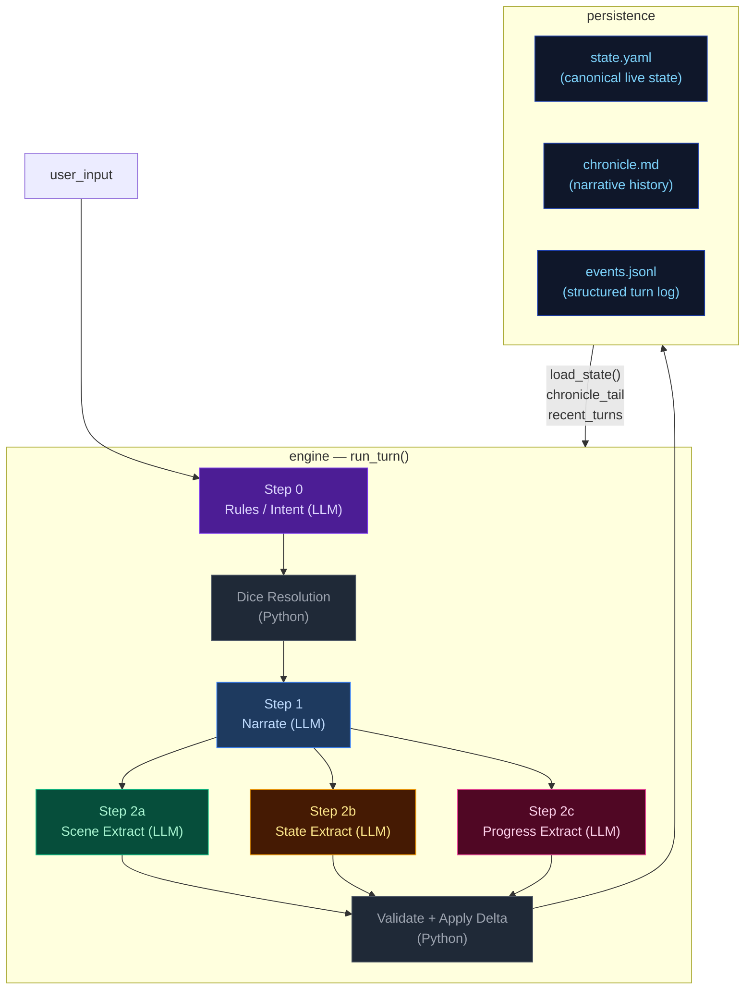

---

## Step 0 — Rules / Intent Classification

Classifies the player's action, determines whether a dice check is needed, and
identifies which state domains will be active — narrowing every downstream extractor.

```mermaid
flowchart LR
    classDef stageRules fill:#4c1d95,color:#ddd6fe,stroke:#7c3aed
    classDef llmNode    fill:#0f172a,color:#94a3b8,stroke:#334155
    classDef pyNode     fill:#1f2937,color:#9ca3af,stroke:#4b5563
    classDef outNode    fill:#3b0764,color:#e9d5ff,stroke:#7c3aed

    subgraph IN["Inputs"]
        I1["state.pc<br>(name, stats, conditions)"]
        I2["state.location"]
        I3["recent_turns[-1:]<br>(from chronicle;<br>user prompt: narrative tail)"]
        I4["user_input"]
    end

    subgraph LLM0["LLM — rules_system.j2 + rules_user.j2"]
        L0["temp: 0.2 · max_retries: 1<br>output: IntentEnvelope JSON"]:::llmNode
    end

    subgraph PYRES["Python — rules.resolve_check()"]
        P0["reads pc.stats[skill]<br>reads pc.conditions → cond_mod<br>rolls 2d6 + stat_mod + cond_mod − diff_mod<br>maps total → Band"]:::pyNode
    end

    subgraph OUT["Outputs"]
        O1["IntentEnvelope<br>  intent: str<br>  intent_verb: str<br>  target: str<br>  stakes: str<br>  check.required: bool<br>  check.skill: SkillName<br>  check.difficulty: Difficulty"]:::outNode
        O2["RulesOutcome<br>  rolled: bool<br>  skill, difficulty, stat_value, stat_mod<br>  diff_mod, cond_mod<br>  dice: list[int]<br>  raw_total, final_total: int<br>  band: Band<br>  directive: str<br>  intent, intent_verb: str"]:::outNode
    end

    IN --> LLM0
    LLM0 -- "IntentEnvelope" --> PYRES
    PYRES --> OUT
```

> **Key forward dependency:** `rules_outcome.directive` shapes the narrator's creative
> latitude.

---

## Step 1 — Narrate (Streaming)

Generates the narrative prose the player reads. Tokens are streamed to the client.

```mermaid
flowchart LR
    classDef llmNode   fill:#0f172a,color:#94a3b8,stroke:#334155
    classDef xstream   fill:#4c1d95,color:#ddd6fe,stroke:#7c3aed
    classDef outNode   fill:#1e3a5f,color:#bfdbfe,stroke:#3b82f6

    subgraph IN["Inputs"]
        N1["state (full —<br>pc, location, scene,<br>inventory, quests, compendium)"]
        N2["chronicle_tail<br>(compressed history, ≤budget tokens)"]
        N3["recent_turns (last window_turns=6)"]
        N4["rules_outcome<br>(band, directive, dice summary)"]:::xstream
        N5["pack_style (tone / prose guide)"]
        N6["npc_name_pool (cultural name list)"]
        N7["recently_left NPCs"]
        N8["known_npcs<br>(last-seen info)"]
        N9["present_npcs<br>(attitudes)"]
        N10["world_factions<br>(immutable trace)"]
        N11["world_locations<br>(nearby, immutable)"]
        N12["pending_gm_beat"]
        N13["momentum"]
        N14["ages<br>(combat/location)"]
        N15["deescalate"]
        N16["scene_pressure<br>(active threats)"]
        N17["user_input"]
    end

    subgraph LLM1["LLM — narrate_system.j2 + narrate_user.j2"]
        NL["temp: 0.9 · streaming: yes<br>output: prose narrative (str)"]:::llmNode
    end

    subgraph OUT["Outputs"]
        NO1["narrative: str<br>(streamed as tokens → client<br>then joined + thinking-stripped)"]:::outNode
        NO2["narr_metrics<br>  first_token_ms<br>  total_ms<br>  tokens_in / tokens_out"]
    end

    IN --> LLM1
    LLM1 --> OUT
```

> **Key forward dependency:** `narrative` is the primary content input for all three
> extraction streams below.

---

## Step 2a — Scene Extract

Extracts location changes, NPC presence, scene tags, and suggested actions from the narrative.


> **Key forward dependency:** `location_change` and `present_npcs` flow into
> `extraction_ctx` (built by `_build_extraction_context`). Step 2c also receives
> `npc_roster` (tiered: PRESENT/JUST_LEFT/NEARBY/KNOWN) built from extraction_ctx.
> No forward-facing mechanics (scene_pressure, gm_beat) are emitted by this stream.

---

## Step 2b — State Extract

Extracts inventory changes and player condition mutations from the narrative.

```mermaid
flowchart LR
    classDef llmNode fill:#0f172a,color:#94a3b8,stroke:#334155
    classDef xstream fill:#4c1d95,color:#ddd6fe,stroke:#7c3aed
    classDef outNode fill:#451a03,color:#fde68a,stroke:#f59e0b

    subgraph IN["Inputs"]
        S1["narrative (from Step 1)"]:::xstream
        S2["state.pc (name, bio, stats, conditions)"]
        S3["state.location"]
        S4["state.inventory"]
        S5["rules_outcome"]:::xstream
        S6["intent: str<br>(from Step 0)"]
        S7["band_examples<br>(few-shot examples for current band)"]
    end

    subgraph LLM2B["LLM — extract_state_system.j2 + extract_state_user.j2"]
        SL["temp: 0.4 · max_retries: 1<br>output: StateExtractResult JSON"]:::llmNode
    end

    subgraph OUT["Outputs — StateExtractResult"]
        O1["inventory_add: list[InventoryItem]<br>  id, name, notes, amount"]:::outNode
        O2["inventory_remove: list[InventoryRemove]<br>  id, amount (None = full stack)"]:::outNode
        O3["inventory_update: list[InventoryUpdate]<br>  id, name?, notes?"]:::outNode
        O4["pc_condition_add: list[ConditionAdd]<br>  id, label, description"]:::outNode
        O5["pc_condition_remove: list[ConditionRemove]<br>  id"]:::outNode
    end

    IN --> LLM2B
    LLM2B --> OUT
```

> **Key forward dependency:** Step 2c receives `npc_roster` (tiered: PRESENT/JUST_LEFT/NEARBY/KNOWN)
> and `location_change` from Step 2a. Cross-stream items_gained/lost were removed —
> extraction_ctx now covers all this-turn derived data.

---

## Step 2c — Progress Extract

Extracts quest updates, recent events, and durable NPC compendium changes.


> **Always runs:** Progress is the post-narration storytelling brain. It always executes
> every turn (never skipped) and feeds next turn's rules call via `recent_events_add`
> (durable narrative facts), `quest_updates` (advancing or closing arcs), `scene_pressure_add`
> (new threats), and `gm_beat` (forward-facing beats stored in `state.meta.pending_gm_beat`).
>
> ### GMBeat schema
>
> ```
> GMBeat
>   type: complication | revelation | opportunity | breathing_room | pressure | twist | setback | escalation | callback
>   surface_as: ambient | event | npc_behavior | environmental | player_discovery | item (default: ambient)
>   instruction: str (must be ≥40 chars, not start with filler prefixes)
>   beat_expires_turn: int | None (turn number at which the beat expires; set to turn_no + 2 when stored)
> ```
>
> ### Beat lifecycle
>
> The beat flows through three phases per turn:
>
> **Phase 1 — Pre-narration expiry check.** At the start of each turn, the engine reads
> `state.meta.pending_gm_beat` from the previous turn. If `beat_expires_turn` is set and the
> current turn number exceeds it, the beat is nullified. Otherwise it proceeds to narration.
>
> **Phase 2 — Narration consumption.** The beat is passed to the narrator via
> `_narrate_messages(pending_gm_beat=...)`. The narrator integrates the beat's instruction into
> prose. After narration completes, the beat is temporarily cleared from state. The beat is then
> restored to state so the progress extractor can see it in its prompt — this is critical because
> the progress extractor needs to know what beat was narrated to make an informed disposition
> decision.
>
> **Phase 3 — Extraction disposition.** The progress extractor receives `pending_beat` in its
> prompt and emits `beat_disposition` (`consume`/`carry`/`replace`) plus an optional new `gm_beat`.
> The engine's beat lifecycle logic reads the disposition and applies it:
> - `consume`: clears `state.meta.pending_gm_beat` (beat was narrated, done)
> - `carry`: preserves `state.meta.pending_gm_beat` unchanged (beat was narrated but should
>   continue to next turn — e.g., a multi-turn arc)
> - `replace`: writes the new `gm_beat` to `state.meta.pending_gm_beat` with
>   `beat_expires_turn = turn_no + 2`
>
> The engine stores the beat with `beat_expires_turn = turn_no + 2` as a hard TTL ceiling.
> If not consumed by the narrator, the beat expires at turn N and is discarded.

---

## Narration Directive

The narration directive is a priority-stack label computed from `narrative_velocity` (a unified pacing scalar), active scene pressures, and age thresholds. It tells the progress extractor how the narrator is shaping tone this turn, so the extractor can align `gm_beat` and `scene_pressure` decisions with the narrator's intent.

### Computation

`_compute_narration_directive()` in `engine/turn.py` applies a strict priority stack:

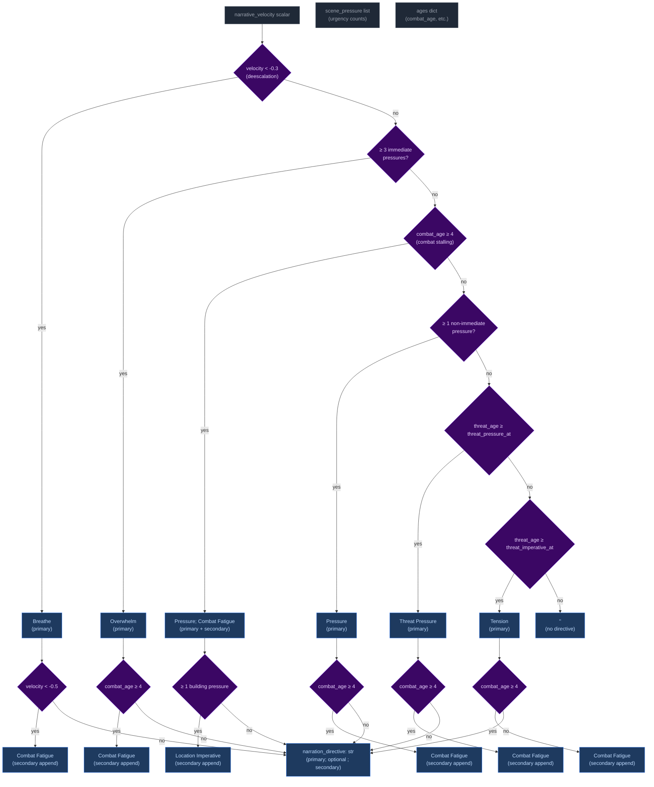

Priority order (highest to lowest): **Breathe > Overwhelm > Pressure > Threat Pressure > Tension > (empty)**. The highest-priority label always wins. Secondary labels (Combat Fatigue, Location Imperative) are appended with a semicolon when their conditions are met independently of the primary stack.

### Wiring: how it reaches the progress extractor

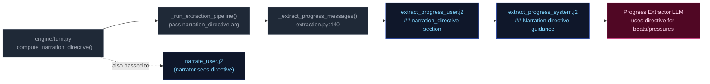

1. **Computed** in `run_turn()` at `turn.py:681` from `narrative_velocity`, `_effective_pressure`, `ages`, and config thresholds.
2. **Passed** through `_run_extraction_pipeline()` → `_extract_progress_messages()` as a function argument.
3. **Rendered** into `extract_progress_user.j2` as a `## narration_directive` section (only when non-empty).
4. **Guides** the extractor via `extract_progress_system.j2` which maps each directive to appropriate `gm_beat` types and `scene_pressure` actions.

### Extractor guidance

The system prompt (`extract_progress_system.j2`) instructs the progress extractor to use the directive as follows:

| Directive | `gm_beat` guidance | `scene_pressure` guidance |
|-----------|-------------------|--------------------------|
| **Breathe** | Prefer `breathing_room` or `null`. Do NOT add new immediate pressures. | Allow existing pressures to persist without escalation. |
| **Overwhelm** | Emit `pressure` or `escalation` beat. | Be proactive: add `scene_pressure_add` at `immediate` urgency. Do NOT remove existing pressures. |
| **Pressure** | Emit `pressure` or `complication` beat. | Add `scene_pressure_add` at `building` or `immediate` urgency for advancing threats. |
| **Tension** | Emit `complication` or `setback` beat. | Do NOT add pressures unless a concrete threat emerges. |
| **Resolve a Threat** | Do NOT add beats for resolved threats. | Remove resolved pressures from `scene_pressure_remove`. |
| **Combat Fatigue** (secondary) | Layer `setback` or `complication` theme reflecting exhaustion. | No direct pressure guidance; applies as thematic modifier. |

When multiple directives are joined (e.g. `"Pressure; Combat Fatigue"`), prioritize the primary directive and layer the secondary as a thematic modifier on the beat type.

---

## Delta Merge → Validate → Apply

The three extraction results merge into a single `StateDelta`, then validate and apply.

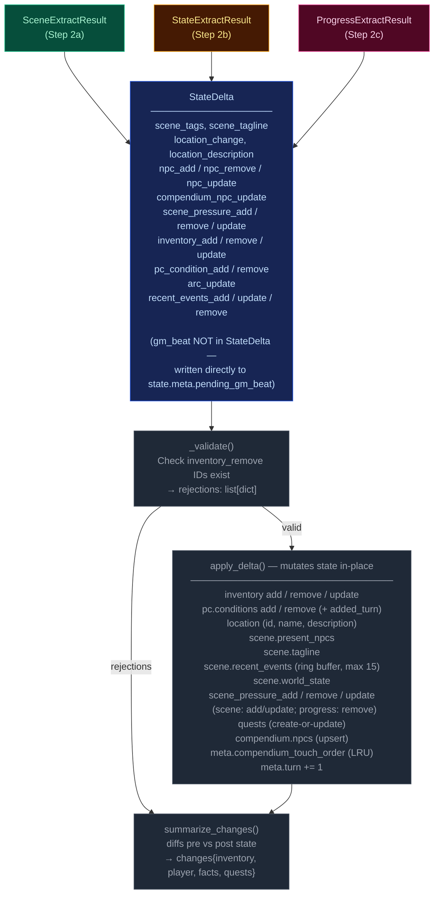

---

## Persist

Atomic writes to disk. No LLM calls.

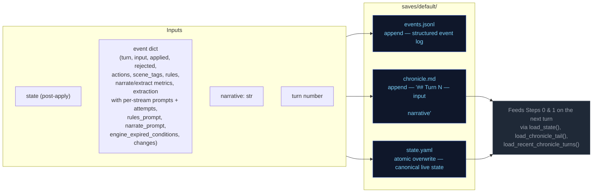

---

## Cross-Pipeline Data Flow

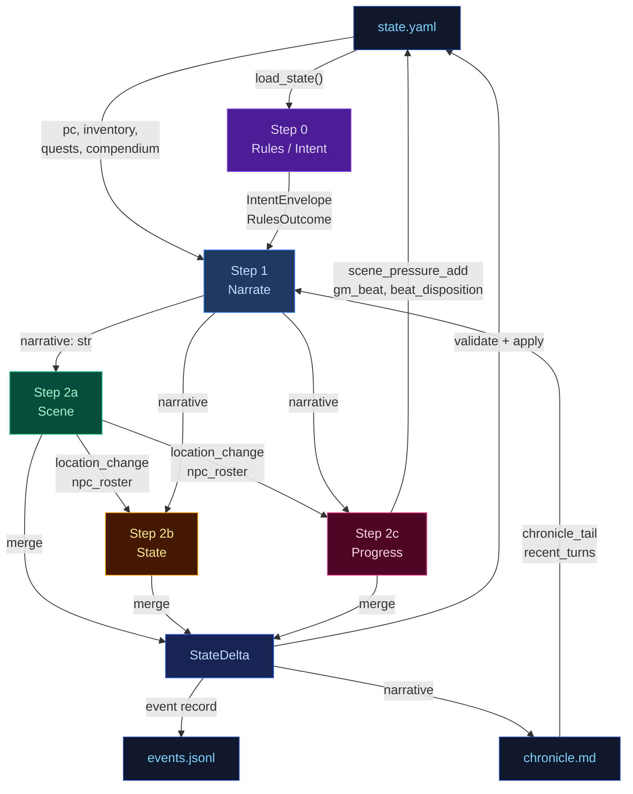

---

## Campaign Arc System

The campaign arc system tracks story threads, phase progression, and truth discovery across turns. It has two execution paths: **engine-driven** (thread lifecycle with 5-turn expiry for silent threads) and **narrator-driven** (phase shifts, truth discovery, goal updates).

### Arc Data Model

```
CampaignArc
  visible_goal: str          — What the PC is trying to achieve
  thematic_question: str     — The moral/thematic tension of the arc
  hidden_truths: list[str]   — Story secrets the narrator knows but must not reveal in prose
  discovered_truths: list[str] — Truths the player has uncovered (subset of hidden_truths)
  active_threads: list[ArcThread]  — Currently advancing story threads (cap: 3)
  latent_threads: list[ArcThread]  — Unactivated or waiting threads (cap: 4)
  completed_threads: list[ArcThread] — Finished threads (complete, failed, or expired)
  pc_drive: str              — Player's expressed motivation/direction

ArcThread
  id: str                    — Unique identifier (derived from summary text)
  summary: str               — What this thread is about
  tags: list[str]            — Keywords for engagement matching
  state: ThreadState         — latent | active | complete | failed | expired
  urgency: str               — normal | background | immediate
  progress: int              — 0..3 (3 = completion threshold)
  unlock_if: str | None      — Condition to promote from latent to active
  promotes: list[str]        — Tags this thread unlocks when completed
  last_offered_turn: int     — Turn this thread was last offered to player

ThreadState: LATENT → ACTIVE → COMPLETE / FAILED / EXPIRED
```

### Engine-Driven Arc: Thread Lifecycle

Thread lifecycle runs in `engine/turn.py` during the extraction phase, after `apply_delta()` but before narration arc_update merge. Three functions handle the lifecycle:

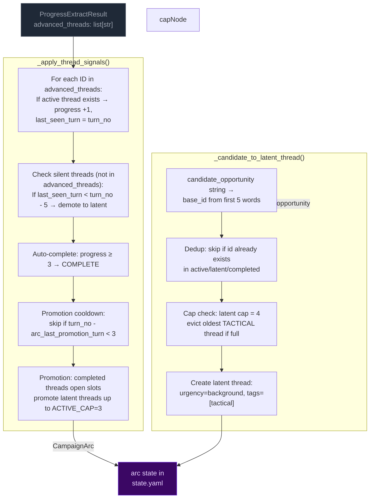

**Key rules:**
- **Active cap:** 3 threads (down from 4). When a thread completes/fails, latent threads are promoted to fill slots.
- **Latent cap:** 4 threads. When full and a new candidate arrives, the oldest tactical-tagged thread is evicted. Pack-seeded threads (no tactical tag) are never evicted.
- **Completion threshold:** progress reaches 3 → thread marked COMPLETE.
- **5-turn expiry:** Threads not listed in `advanced_threads` for 5+ turns get demoted to latent (state=latent), preserving them for potential re-engagement if narration later picks up old tags.
- **Promotion cooldown:** New candidate threads promoted only every ~3 turns via check on `arc_last_promotion_turn`. Prevents rapid thread churn during fast-paced play.

### Narrator-Driven Arc: Phase & Truth Updates

The narrator can update arc metadata through a sentinel-delimited JSON block in its output. The engine parses and merges these updates after narration.

```mermaid
flowchart LR
    classDef llmNode fill:#0f172a,color:#94a3b8,stroke:#334155
    classDef sentinel fill:#3b0764,color:#e9d5ff,stroke:#7c3aed
    classDef mergeNode fill:#172554,color:#bfdbfe,stroke:#1d4ed8
    classDef arcNode fill:#3b0764,color:#e9d5ff,stroke:#7c3aed

    subgraph NARRATOR["Narrator prompt context"]
        NC1["visible_goal"]
        NC2["thematic_question"]
        NC3["phase"]
        NC4["active_threads[] (summary, urgency, tags)"]
        NC5["pc_drive"]
        NC6["hidden_truths[] — internal only<br>NARRATOR MUST NOT reveal in prose"]
        NC7["discovered_truths[]"]
    end

    subgraph EMISSION["Narrator output"]
        PROSE["narration prose<br>(player sees this)"]:::llmNode
        SENTINEL["<<<ARC_UPDATE_START>>>
{discovered_truths, phase, visible_goal}
<<<ARC_UPDATE_END>>>"]:::sentinel
    end

    subgraph PARSING["_extract_narrator_arc_update()"]
        P1["Regex: <<<ARC_UPDATE_START>>>(.*?)<<<ARC_UPDATE_END>>>"]
        P2["json.loads() → arc_dict"]
        P3["Strip block from narrative"]
    end

    subgraph MERGE["_merge_arc_update()"]
        M1["visible_goal: overwrite if present"]
        M2["thematic_question: overwrite if present"]
        M3["phase: overwrite only if value differs<br>(avoids Pydantic default SETUP overwrite)"]
        M4["pc_drive: overwrite if present"]
        M5["hidden_truths: overwrite if present"]
        M6["discovered_truths: union with existing"]
        M7["active_threads: upsert by id"]
    end

    NC1 & NC2 & NC3 & NC4 & NC5 & NC6 & NC7 --> PROSE
    PROSE --> SENTINEL
    SENTINEL --> P1 --> P2 --> P3
    P3 -- "clean narrative" --> CLIENT["client"]
    P2 -- "arc_dict" --> MERGE

    MERGE --> ARC[merge into state["arc"]]:::arcNode

    mergeNode
```

**Merge rules:**
- **Engine owns threads** (active/latent/completed/expired). Narrator arc_update omits thread fields — they are ignored by `_merge_arc_update()`.
- **Narrator owns visible_goal/thematic_question/discovered_truths/hidden_truths.** Engine does not modify these.
- **Discovered truths:** merged as set union (dedup).
- **Merge order:** engine thread signals run first (setting `delta.arc_update`), then narrator arc_update is parsed after narration and merged on top via a second `_merge_arc_update()` call in `run_turn()`.

### Arc Context in Narration

The arc state is passed to the narrator via `current_arc` in the system prompt. The narrator sees all arc metadata including `hidden_truths` but is explicitly instructed not to reveal them in prose.

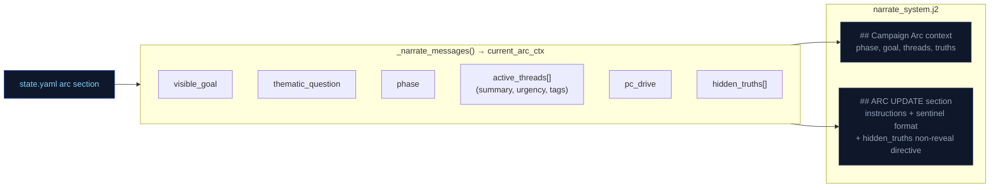

### Arc System Integration Points

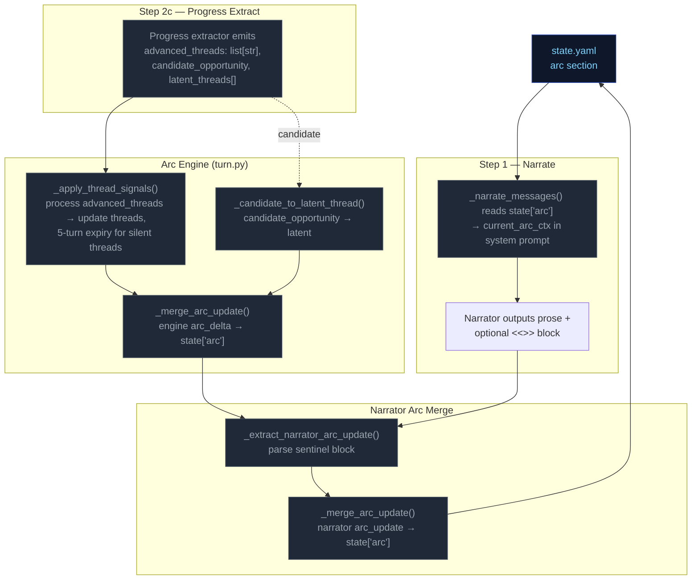

---

## Out-of-band Pipelines (not part of the per-turn loop — for human reference)

---


# Static Context (immutable across all turns)

## World Pack Style

```
# Eval-pack style

This pack is a deterministic test fixture. The narrator should write in a plain,
clear, second-person past-tense register. Keep these in mind:

- Specific over abstract. Name the thing the player did, the object they touched, the
  NPC they spoke to. Avoid generic mood words ("an air of menace") in favor of
  concrete sensory detail.
- One scene per turn. Do not skip ahead in time unless the player explicitly does so.
- Honor the dice. If the rules outcome is `fail` or `setback`, the action did not
  succeed; describe the cost. If `partial`, the action succeeded with a complication.
- Honor the present_npcs. Every named NPC in the scene either acts, reacts, or is
  visibly present in the prose. Do not invent new NPCs unless the player's input
  introduces one.
- Plain language. No archaic phrasing, no fantasy-trope syntax ("Lo, the door...").
  This is a working road in a working world.
- 120-220 words per turn unless the action is large.

```

## Seed State

```json
{
  "meta": {
    "game_name": "eval",
    "turn": 0,
    "setting_pack": "eval-pack",
    "model": ""
  },
  "pc": {
    "name": "Aren Voss",
    "tagline": "Reluctant courier on the merchant road",
    "bio": "Mid-thirties, broad shoulders, careful with words. Took on a courier contract\nto clear an old debt. Just arrived in Marrow's Crossing with a heavy pack and\na heavier obligation.\n",
    "stats": {
      "strength": 3,
      "dexterity": 3,
      "wits": 2,
      "lore": 2,
      "charisma": 3,
      "resolve": 3
    },
    "conditions": [],
    "momentum": 0,
    "drive": ""
  },
  "location": {
    "id": "marrows_crossing",
    "name": "Marrow's Crossing",
    "description": "A market town built around the confluence of two rivers. Cobblestone streets,\ntimber-framed buildings, and the constant sound of water from the mills. The\ntown square has a stone well and a statue of the founder. Most shops are closing\nfor the evening.\n"
  },
  "inventory": [
    {
      "id": "credits",
      "name": "Credits",
      "notes": "Common coin, accepted at any inn or stall on the merchant road.",
      "amount": 500,
      "aliases": []
    },
    {
      "id": "iron_dagger",
      "name": "Iron dagger",
      "notes": "Plain crossguard, edge worn from honing. Belt-carried.",
      "amount": 1,
      "aliases": []
    },
    {
      "id": "bandages",
      "name": "Linen bandages",
      "notes": "Three rolls. Field-grade \u2014 won't replace a healer.",
      "amount": 3,
      "aliases": []
    },
    {
      "id": "traveler_cloak",
      "name": "Traveler's cloak",
      "notes": "Oiled wool, road-stained, hood deep enough to hide a face.",
      "amount": 1,
      "aliases": [
        "cloak",
        "travel cloak"
      ]
    },
    {
      "id": "brass_key",
      "name": "Brass key",
      "notes": "A small brass key Halden gave you with the ledger.",
      "amount": 1,
      "aliases": []
    }
  ],
  "scene": {
    "tagline": "Market town at dusk",
    "tags": [
      "peaceful",
      "start"
    ],
    "world_state": [
      "Marrow's Crossing is a market town at the confluence of two rivers, known for its mills and the annual river festival.",
      "Iron coin (credits) is the universal currency on the merchant road; barter is acceptable but slower.",
      "The road has been quieter than usual this season \u2014 fewer caravans, more independent runners, more opportunists."
    ],
    "recent_events": [
      "You arrived in Marrow's Crossing after three days on the road.",
      "You heard rumors of road-toughs extorting travelers near the Crossed Keys Inn.",
      "You found Caron in the tavern \u2014 he's been waiting for you."
    ],
    "present_npcs": [
      {
        "id": "caron",
        "name": "Caron",
        "title": "Old creditor",
        "notes": "Sits at a corner table in the tavern, nursing a drink and watching the door.",
        "bio": "A portly man in his sixties with a merchant's ledger and a patient demeanor. You owe him 500 credits from a failed venture three years ago."
      },
      {
        "id": "halden",
        "name": "Halden",
        "title": "Merchant",
        "notes": "Stands near the town well, examining a map and a pressed wax seal.",
        "bio": "A road merchant in his fifties who hires couriers when his usual runners are spoken for. Honest by reputation, careful with money."
      },
      {
        "id": "innkeeper",
        "name": "Edda",
        "title": "Innkeeper at the Crossed Keys",
        "notes": "Wiping down the bar at the Crossed Keys, which is two streets over.",
        "bio": "Runs the inn alone since her husband died. Knows every traveler by face if not by name. Stays out of trouble unless it walks through her door."
      }
    ]
  },
  "compendium": {
    "npcs": {
      "caron": {
        "name": "Caron",
        "title": "Old creditor",
        "bio": "A portly man in his sixties with a merchant's ledger and a patient demeanor. You owe him 500 credits from a failed venture three years ago."
      },
      "halden": {
        "name": "Halden",
        "title": "Merchant",
        "bio": "A road merchant in his fifties who hires couriers when his usual runners are spoken for. Honest by reputation, careful with money."
      },
      "innkeeper": {
        "name": "Edda",
        "title": "Innkeeper at the Crossed Keys",
        "bio": "Runs the inn alone since her husband died. Knows every traveler by face if not by name. Stays out of trouble unless it walks through her door."
      },
      "tough_a": {
        "name": "Bald Tough",
        "title": "Road thug",
        "bio": "Hired muscle. No personal stake in this \u2014 he'll back off if the price is right or the fight goes bad."
      },
      "tough_b": {
        "name": "Scarred Tough",
        "title": "Road thug",
        "bio": "Same outfit as the other \u2014 hired by the same person. Quicker to violence; not the brains."
      },
      "matthew_estrada": {
        "name": "Matthew Estrada",
        "title": "Traveler",
        "bio": "A tall, broad-shoulded man in a stained leather jerkin carrying a heavy rucksack. Looks like a road runner but moves with military precision."
      }
    }
  },
  "arc": {
    "visible_goal": "Clear your debts and deliver the ledger \u2014 two obligations binding you to Marrow's Crossing.",
    "thematic_question": "What does it cost to settle old debts when new ones keep forming?",
    "hidden_truths": [
      "Matthew Estrada is not a traveler \u2014 he's a courier for a rival merchant house, and the toughs were hired to intercept his competition.",
      "The brass key Halden gave you opens a back room at the inn where intercepted couriers' messages are stored.",
      "Caron's debt was not a failed venture \u2014 it was a deliberate investment in your skills, and he's been waiting for you to prove yourself."
    ],
    "discovered_truths": [],
    "active_threads": [
      {
        "id": "settle_the_debt",
        "summary": "Settle the 500-credit debt with Caron.",
        "tags": [
          "debt",
          "caron",
          "obligation"
        ],
        "state": "latent",
        "urgency": "normal",
        "progress": 0,
        "unlock_if": null,
        "promotes": [],
        "last_offered_turn": 0,
        "last_seen_turn": null
      },
      {
        "id": "deliver_the_ledger",
        "summary": "Deliver Halden's ledger to the merchant at the Crossed Keys Inn.",
        "tags": [
          "courier",
          "halden",
          "contract"
        ],
        "state": "latent",
        "urgency": "normal",
        "progress": 0,
        "unlock_if": null,
        "promotes": [],
        "last_offered_turn": 0,
        "last_seen_turn": null
      },
      {
        "id": "clear_the_road_toughs",
        "summary": "Deal with the toughs blocking the inn entrance.",
        "tags": [
          "toughs",
          "road",
          "confrontation"
        ],
        "state": "latent",
        "urgency": "low",
        "progress": 0,
        "unlock_if": null,
        "promotes": [],
        "last_offered_turn": 0,
        "last_seen_turn": null
      }
    ],
    "latent_threads": [],
    "completed_threads": [],
    "pc_drive": "Prove you can handle the road \u2014 clear your name and earn enough to start over."
  }
}
```

## Engine Constants

```json
{
  "pressure_building_at": 3,
  "pressure_immediate_at": 5,
  "pressure_max_age": 8,
  "urgency_levels": [
    "background",
    "building",
    "immediate"
  ],
  "momentum_min": -3,
  "momentum_max": 3,
  "momentum_delta": {
    "crit_success": 2,
    "success": 1,
    "partial": 0,
    "setback": -1,
    "fail": -1,
    "crit_fail": -2
  }
}
```

## System Prompts (identical every turn)

### Rules System Prompt

```
(not captured this run)
```

### Narrate System Prompt

```
(not captured this run)
```

### Extract Scene System Prompt

```
(not captured this run)
```

### Extract State System Prompt

```
(not captured this run)
```

### Extract Progress System Prompt

```
(not captured this run)
```


---

# TURN 1

**Input:** `Walk over to Caron's table and sit down across from him. I'm ready to talk about the debt.`

## User Prompts

### Rules User Prompt
```
(no rules call this turn)
```

### Narrate User Prompt
```
(no narrate call)
```

### Extract Scene User Prompt
```
(not captured)
```

### Extract State User Prompt
```
(not captured)
```

### Extract Progress User Prompt
```
(not captured)
```

## Engine Outputs

### Rules

**Parsed (engine):**
```json
{
  "intent_verb": "negotiate",
  "intent": "The player approaches Caron to discuss the repayment or negotiation of their debt.",
  "rolled": false,
  "total_ms": 9457.2,
  "tokens_in": 1583,
  "tokens_out": 66
}
```

**Raw LLM output:**
```

```

### Narration


### Extract Scene

```json
{
  "scene_tags": [
    "tense_conversation",
    "evening"
  ],
  "scene_tagline": "A Debt Awaits",
  "location_description": "The interior of the Crossed Keys tavern, filled with the warmth of a crackling hearth and the rhythmic thumping of nearby waterwheels.",
  "npc_add": [],
  "npc_remove": [],
  "npc_update": [
    {
      "id": "caron",
      "notes": "Observing the player's travel-worn appearance and challenging their ability to settle their debt."
    }
  ],
  "compendium_npc_update": []
}
```

### Extract State

```json
{
  "inventory_add": [],
  "inventory_remove": [],
  "inventory_update": [],
  "pc_condition_add": [],
  "pc_condition_remove": []
}
```

### Extract Progress

```json
{
  "recent_events_add": [
    {
      "id": "caron_confrontation_started",
      "text": "You have confronted Caron at the Crossed Keys to discuss your debt.",
      "turn": 1
    }
  ],
  "recent_events_update": [],
  "recent_events_remove": [],
  "actions": [
    "Negotiate a payment plan for the 500-credit debt.",
    "Offer Halden's ledger or services as collateral to Caron.",
    "Try to charm Caron into showing more leniency.",
    "Scan the tavern for the toughs while talking to Caron."
  ],
  "outcome_summary": "You have successfully approached Caron and initiated a tense negotiation regarding your outstanding debt.",
  "beat_disposition": "consume",
  "scene_pressure_add": [],
  "scene_pressure_remove": [],
  "scene_pressure_update": [],
  "advanced_threads": [
    "settle_the_debt"
  ]
}
```

### Applied Deltas

```json
{
  "inventory_add": [],
  "inventory_remove": [],
  "inventory_update": [],
  "location_description": "The interior of the Crossed Keys tavern, filled with the warmth of a crackling hearth and the rhythmic thumping of nearby waterwheels.",
  "pc_condition_add": [],
  "pc_condition_remove": [],
  "scene_tags": [
    "tense_conversation",
    "evening"
  ],
  "scene_tagline": "A Debt Awaits",
  "compendium_npc_update": [],
  "npc_add": [],
  "npc_remove": [],
  "npc_update": [
    {
      "id": "caron",
      "notes": "Observing the player's travel-worn appearance and challenging their ability to settle their debt."
    }
  ],
  "recent_events_add": [
    {
      "id": "caron_confrontation_started",
      "text": "You have confronted Caron at the Crossed Keys to discuss your debt.",
      "turn": 1
    }
  ],
  "recent_events_update": [],
  "recent_events_remove": [],
  "scene_pressure_add": [],
  "scene_pressure_remove": [],
  "scene_pressure_update": []
}
```

### Rejected Deltas

*(none)*

### Suggested Actions

*(none)*

### Context Telemetry

*(no telemetry)*

### State After Turn

```json
{
  "arc": {
    "active_threads": [
      {
        "id": "settle_the_debt",
        "last_offered_turn": 0,
        "last_seen_turn": 1,
        "progress": 1,
        "promotes": [],
        "state": "active",
        "summary": "Settle the 500-credit debt with Caron.",
        "tags": [
          "debt",
          "caron",
          "obligation"
        ],
        "urgency": "normal"
      }
    ],
    "completed_threads": [],
    "discovered_truths": [],
    "hidden_truths": [
      "Matthew Estrada is not a traveler \u2014 he's a courier for a rival merchant house, and the toughs were hired to intercept his competition.",
      "The brass key Halden gave you opens a back room at the inn where intercepted couriers' messages are stored.",
      "Caron's debt was not a failed venture \u2014 it was a deliberate investment in your skills, and he's been waiting for you to prove yourself."
    ],
    "latent_threads": [
      {
        "id": "deliver_the_ledger",
        "last_offered_turn": 0,
        "progress": 0,
        "promotes": [],
        "state": "latent",
        "summary": "Deliver Halden's ledger to the merchant at the Crossed Keys Inn.",
        "tags": [
          "courier",
          "halden",
          "contract"
        ],
        "urgency": "normal"
      },
      {
        "id": "clear_the_road_toughs",
        "last_offered_turn": 0,
        "progress": 0,
        "promotes": [],
        "state": "latent",
        "summary": "Deal with the toughs blocking the inn entrance.",
        "tags": [
          "toughs",
          "road",
          "confrontation"
        ],
        "urgency": "low"
      }
    ],
    "pc_drive": "Prove you can handle the road \u2014 clear your name and earn enough to start over.",
    "thematic_question": "What does it cost to settle old debts when new ones keep forming?",
    "visible_goal": "Clear your debts and deliver the ledger \u2014 two obligations binding you to Marrow's Crossing."
  },
  "compendium": {
    "npcs": {
      "caron": {
        "bio": "A portly man in his sixties with a merchant's ledger and a patient demeanor. You owe him 500 credits from a failed venture three years ago.",
        "last_seen": {
          "location_id": "marrows_crossing",
          "location_name": "Marrow's Crossing",
          "turn": 1
        },
        "name": "Caron",
        "title": "Old creditor"
      },
      "halden": {
        "bio": "A road merchant in his fifties who hires couriers when his usual runners are spoken for. Honest by reputation, careful with money.",
        "name": "Halden",
        "title": "Merchant"
      },
      "innkeeper": {
        "bio": "Runs the inn alone since her husband died. Knows every traveler by face if not by name. Stays out of trouble unless it walks through her door.",
        "name": "Edda",
        "title": "Innkeeper at the Crossed Keys"
      },
      "matthew_estrada": {
        "bio": "A tall, broad-shoulded man in a stained leather jerkin carrying a heavy rucksack. Looks like a road runner but moves with military precision.",
        "name": "Matthew Estrada",
        "title": "Traveler"
      },
      "tough_a": {
        "bio": "Hired muscle. No personal stake in this \u2014 he'll back off if the price is right or the fight goes bad.",
        "name": "Bald Tough",
        "title": "Road thug"
      },
      "tough_b": {
        "bio": "Same outfit as the other \u2014 hired by the same person. Quicker to violence; not the brains.",
        "name": "Scarred Tough",
        "title": "Road thug"
      }
    }
  },
  "inventory": [
    {
      "aliases": [],
      "amount": 500,
      "id": "credits",
      "name": "Credits",
      "notes": "Common coin, accepted at any inn or stall on the merchant road."
    },
    {
      "aliases": [],
      "amount": 1,
      "id": "iron_dagger",
      "name": "Iron dagger",
      "notes": "Plain crossguard, edge worn from honing. Belt-carried."
    },
    {
      "aliases": [],
      "amount": 3,
      "id": "bandages",
      "name": "Linen bandages",
      "notes": "Three rolls. Field-grade \u2014 won't replace a healer."
    },
    {
      "aliases": [
        "cloak",
        "travel cloak"
      ],
      "amount": 1,
      "id": "traveler_cloak",
      "name": "Traveler's cloak",
      "notes": "Oiled wool, road-stained, hood deep enough to hide a face."
    },
    {
      "aliases": [],
      "amount": 1,
      "id": "brass_key",
      "name": "Brass key",
      "notes": "A small brass key Halden gave you with the ledger."
    }
  ],
  "location": {
    "description": "The interior of the Crossed Keys tavern, filled with the warmth of a crackling hearth and the rhythmic thumping of nearby waterwheels.",
    "id": "marrows_crossing",
    "name": "Marrow's Crossing"
  },
  "meta": {
    "compendium_touch_order": [],
    "consecutive_floor_count": 0,
    "game_name": "eval",
    "last_compacted_turn": 0,
    "model": "",
    "pending_gm_beat": null,
    "prior_history": [],
    "setting_pack": "eval-pack",
    "turn": 1
  },
  "pc": {
    "allegiance": null,
    "bio": "Mid-thirties, broad shoulders, careful with words. Took on a courier contract\nto clear an old debt. Just arrived in Marrow's Crossing with a heavy pack and\na heavier obligation.\n",
    "conditions": [
      {
        "added_turn": 8,
        "description": "A hard fall on the bridge two days ago left a deep, aching bruise along the right ribcage.",
        "id": "bruised_ribs",
        "label": "bruised ribs"
      },
      {
        "added_turn": 10,
        "description": "Twelve days on the road, two days behind schedule, and an old debt waiting at the end of it.",
        "id": "low_morale",
        "label": "low morale"
      }
    ],
    "drive": "",
    "momentum": 0,
    "name": "Aren Voss",
    "stats": {
      "charisma": 3,
      "dexterity": 3,
      "lore": 2,
      "resolve": 3,
      "strength": 3,
      "wits": 2
    },
    "tagline": "Reluctant courier on the merchant road"
  },
  "scene": {
    "present_npcs": [
      {
        "bio": "A portly man in his sixties with a merchant's ledger and a patient demeanor. You owe him 500 credits from a failed venture three years ago.",
        "id": "caron",
        "name": "Caron",
        "notes": "Observing the player's travel-worn appearance and challenging their ability to settle their debt.",
        "title": "Old creditor"
      },
      {
        "bio": "A road merchant in his fifties who hires couriers when his usual runners are spoken for. Honest by reputation, careful with money.",
        "id": "halden",
        "name": "Halden",
        "notes": "Stands near the town well, examining a map and a pressed wax seal.",
        "title": "Merchant"
      },
      {
        "bio": "Runs the inn alone since her husband died. Knows every traveler by face if not by name. Stays out of trouble unless it walks through her door.",
        "id": "innkeeper",
        "name": "Edda",
        "notes": "Wiping down the bar at the Crossed Keys, which is two streets over.",
        "title": "Innkeeper at the Crossed Keys"
      }
    ],
    "recent_events": [
      {
        "id": "you_arrived_in_marrows_crossing_after",
        "text": "You arrived in Marrow's Crossing after three days on the road.",
        "turn": 0
      },
      {
        "id": "you_heard_rumors_of_roadtoughs_extorting",
        "text": "You heard rumors of road-toughs extorting travelers near the Crossed Keys Inn.",
        "turn": 0
      },
      {
        "id": "you_found_caron_in_the_tavern",
        "text": "You found Caron in the tavern \u2014 he's been waiting for you.",
        "turn": 0
      },
      {
        "id": "caron_confrontation_started",
        "text": "You have confronted Caron at the Crossed Keys to discuss your debt.",
        "turn": 1
      }
    ],
    "scene_pressure": [],
    "tagline": "A Debt Awaits",
    "tags": [
      "tense_conversation",
      "evening"
    ],
    "world_state": [
      "Marrow's Crossing is a market town at the confluence of two rivers, known for its mills and the annual river festival.",
      "Iron coin (credits) is the universal currency on the merchant road; barter is acceptable but slower.",
      "The road has been quieter than usual this season \u2014 fewer caravans, more independent runners, more opportunists."
    ]
  },
  "world": {
    "factions": [],
    "locations": []
  }
}
```


---

# TURN 2

**Input:** `I slide 500 credits across the table to Caron and ask him to mark the debt cleared in his ledger.`

## User Prompts

### Rules User Prompt
```
(no rules call this turn)
```

### Narrate User Prompt
```
(no narrate call)
```

### Extract Scene User Prompt
```
(not captured)
```

### Extract State User Prompt
```
(not captured)
```

### Extract Progress User Prompt
```
(not captured)
```

## Engine Outputs

### Rules

**Parsed (engine):**
```json
{
  "intent_verb": "negotiate",
  "intent": "The player attempts to settle their debt with Caron using 500 credits.",
  "rolled": false,
  "total_ms": 2508.3,
  "tokens_in": 1583,
  "tokens_out": 68
}
```

**Raw LLM output:**
```

```

### Narration


### Extract Scene

```json
{
  "scene_tags": [
    "transaction",
    "relief"
  ],
  "scene_tagline": "The Debt is Settled",
  "npc_add": [],
  "npc_remove": [],
  "npc_update": [
    {
      "id": "caron",
      "notes": "Satisfied and no longer suspicious; acknowledges the player is debt-free and offers a piece of local advice."
    }
  ],
  "compendium_npc_update": [
    {
      "id": "caron",
      "bio": "A portly man in his sixties with a merchant's ledger and a patient demeanor. He has officially cleared Aren Voss's 500 credit debt.",
      "aliases": []
    }
  ]
}
```

### Extract State

```json
{
  "inventory_add": [],
  "inventory_remove": [
    {
      "id": "credits",
      "amount": 500
    }
  ],
  "inventory_update": [],
  "pc_condition_add": [],
  "pc_condition_remove": []
}
```

### Extract Progress

```json
{
  "recent_events_add": [
    {
      "id": "debt_settled",
      "text": "Aren Voss successfully paid off the 500-credit debt to Caron.",
      "turn": 2
    }
  ],
  "recent_events_update": [],
  "recent_events_remove": [
    "You have confronted Caron at the Crossed Keys to discuss your debt."
  ],
  "actions": [
    "Ask Caron for any local news or rumors about the road.",
    "Thank Caron and head toward the innkeeper for a room.",
    "Use your remaining credits to buy a warm meal and ale.",
    "Scan the tavern for any signs of the rumored road-toughs."
  ],
  "outcome_summary": "You successfully pay Caron the 500 credits, and he marks your debt as settled in his ledger, leaving you free of the obligation.",
  "beat_disposition": "consume",
  "scene_pressure_add": [],
  "scene_pressure_remove": [],
  "scene_pressure_update": [],
  "advanced_threads": [
    "settle_the_debt"
  ]
}
```

### Applied Deltas

```json
{
  "inventory_add": [],
  "inventory_remove": [
    {
      "id": "credits",
      "amount": 500
    }
  ],
  "inventory_update": [],
  "pc_condition_add": [],
  "pc_condition_remove": [],
  "scene_tags": [
    "transaction",
    "relief"
  ],
  "scene_tagline": "The Debt is Settled",
  "compendium_npc_update": [
    {
      "id": "caron",
      "bio": "A portly man in his sixties with a merchant's ledger and a patient demeanor. He has officially cleared Aren Voss's 500 credit debt.",
      "aliases": []
    }
  ],
  "npc_add": [],
  "npc_remove": [],
  "npc_update": [
    {
      "id": "caron",
      "notes": "Satisfied and no longer suspicious; acknowledges the player is debt-free and offers a piece of local advice."
    }
  ],
  "recent_events_add": [
    {
      "id": "debt_settled",
      "text": "Aren Voss successfully paid off the 500-credit debt to Caron.",
      "turn": 2
    }
  ],
  "recent_events_update": [],
  "recent_events_remove": [
    "You have confronted Caron at the Crossed Keys to discuss your debt."
  ],
  "scene_pressure_add": [],
  "scene_pressure_remove": [],
  "scene_pressure_update": []
}
```

### Rejected Deltas

*(none)*

### Suggested Actions

*(none)*

### Context Telemetry

*(no telemetry)*

### State After Turn

*(diff vs previous turn — full snapshot only on first and last turns)*

```json
{
  "arc": {
    "active_threads": {
      "changed": [
        {
          "from": {
            "id": "settle_the_debt",
            "last_offered_turn": 0,
            "last_seen_turn": 1,
            "progress": 1,
            "promotes": [],
            "state": "active",
            "summary": "Settle the 500-credit debt with Caron.",
            "tags": [
              "debt",
              "caron",
              "obligation"
            ],
            "urgency": "normal"
          },
          "to": {
            "id": "settle_the_debt",
            "last_offered_turn": 0,
            "last_seen_turn": 2,
            "progress": 2,
            "promotes": [],
            "state": "active",
            "summary": "Settle the 500-credit debt with Caron.",
            "tags": [
              "debt",
              "caron",
              "obligation"
            ],
            "urgency": "normal"
          }
        }
      ]
    }
  },
  "compendium": {
    "npcs": {
      "caron": {
        "bio": {
          "from": "A portly man in his sixties with a merchant's ledger and a patient demeanor. You owe him 500 credits from a failed venture three years ago.",
          "to": "A portly man in his sixties with a merchant's ledger and a patient demeanor. He has officially cleared Aren Voss's 500 credit debt."
        },
        "last_seen": {
          "turn": {
            "from": 1,
            "to": 2
          }
        }
      }
    }
  },
  "inventory": {
    "removed": [
      {
        "aliases": [],
        "amount": 500,
        "id": "credits",
        "name": "Credits",
        "notes": "Common coin, accepted at any inn or stall on the merchant road."
      }
    ]
  },
  "meta": {
    "compendium_touch_order": {
      "added": [
        "caron"
      ],
      "removed": []
    },
    "turn": {
      "from": 1,
      "to": 2
    }
  },
  "scene": {
    "present_npcs": {
      "changed": [
        {
          "from": {
            "bio": "A portly man in his sixties with a merchant's ledger and a patient demeanor. You owe him 500 credits from a failed venture three years ago.",
            "id": "caron",
            "name": "Caron",
            "notes": "Observing the player's travel-worn appearance and challenging their ability to settle their debt.",
            "title": "Old creditor"
          },
          "to": {
            "bio": "A portly man in his sixties with a merchant's ledger and a patient demeanor. You owe him 500 credits from a failed venture three years ago.",
            "id": "caron",
            "name": "Caron",
            "notes": "Satisfied and no longer suspicious; acknowledges the player is debt-free and offers a piece of local advice.",
            "title": "Old creditor"
          }
        }
      ]
    },
    "recent_events": {
      "added": [
        {
          "id": "debt_settled",
          "text": "Aren Voss successfully paid off the 500-credit debt to Caron.",
          "turn": 2
        }
      ]
    },
    "tagline": {
      "from": "A Debt Awaits",
      "to": "The Debt is Settled"
    },
    "tags": {
      "added": [
        "relief",
        "transaction"
      ],
      "removed": [
        "evening",
        "tense_conversation"
      ]
    }
  }
}
```


---

# TURN 3

**Input:** `I find Halden by the town well and offer to carry his ledger to the Crossed Keys Inn. I'll do it for 200 credits.`

## User Prompts

### Rules User Prompt
```
(no rules call this turn)
```

### Narrate User Prompt
```
(no narrate call)
```

### Extract Scene User Prompt
```
(not captured)
```

### Extract State User Prompt
```
(not captured)
```

### Extract Progress User Prompt
```
(not captured)
```

## Engine Outputs

### Rules

**Parsed (engine):**
```json
{
  "intent_verb": "negotiate",
  "intent": "The player offers to perform a courier service for Halden for a specific fee.",
  "rolled": false,
  "total_ms": 2450.1,
  "tokens_in": 1594,
  "tokens_out": 67
}
```

**Raw LLM output:**
```

```

### Narration


### Extract Scene

```json
{
  "scene_tags": [
    "exploration",
    "transaction"
  ],
  "scene_tagline": "A Merchant's Proposition",
  "location_change": {
    "id": "town_square",
    "name": "Town Square",
    "description": "A central open space dominated by a stone well, illuminated by dim street lanterns and shrouded in river mist."
  },
  "npc_add": [],
  "npc_remove": [
    {
      "id": "caron"
    },
    {
      "id": "innkeeper"
    }
  ],
  "npc_update": [
    {
      "id": "halden",
      "notes": "Approaches the player with a job offer, appearing tired and cautious about the state of the roads."
    }
  ],
  "compendium_npc_update": []
}
```

### Extract State

```json
{
  "inventory_add": [
    {
      "id": "credits",
      "name": "Credits",
      "notes": "",
      "amount": 200,
      "aliases": []
    }
  ],
  "inventory_remove": [],
  "inventory_update": [],
  "pc_condition_add": [],
  "pc_condition_remove": []
}
```

### Extract Progress

```json
{
  "recent_events_add": [
    {
      "id": "halden_contract_offered",
      "text": "Halden offered 200 credits to deliver his ledger to the inn.",
      "turn": 3
    }
  ],
  "recent_events_update": [],
  "recent_events_remove": [
    "Aren Voss successfully paid off the 500-credit debt to Caron."
  ],
  "actions": [
    "Accept the contract and take the advance from Halden.",
    "Ask Halden for more information about the nervous roads.",
    "Use your keen eyes to inspect the ledger for damage.",
    "Head straight for the Crossed Keys to deliver the ledger."
  ],
  "outcome_summary": "You meet Halden at the town well, where he offers you 200 credits to deliver his ledger to the inn, providing an advance for the job.",
  "beat_disposition": "consume",
  "scene_pressure_add": [],
  "scene_pressure_remove": [],
  "scene_pressure_update": [],
  "advanced_threads": [
    "deliver_the_ledger"
  ],
  "candidate_opportunity": "The mention of 'nervous roads' suggests potential trouble or ambushes on the path to the inn."
}
```

### Applied Deltas

```json
{
  "inventory_add": [
    {
      "id": "credits",
      "name": "Credits",
      "notes": "",
      "amount": 200,
      "aliases": []
    }
  ],
  "inventory_remove": [],
  "inventory_update": [],
  "location_change": {
    "id": "town_square",
    "name": "Town Square",
    "description": "A central open space dominated by a stone well, illuminated by dim street lanterns and shrouded in river mist."
  },
  "pc_condition_add": [],
  "pc_condition_remove": [],
  "scene_tags": [
    "exploration",
    "transaction"
  ],
  "scene_tagline": "A Merchant's Proposition",
  "compendium_npc_update": [],
  "npc_add": [],
  "npc_remove": [
    {
      "id": "caron"
    },
    {
      "id": "innkeeper"
    }
  ],
  "npc_update": [
    {
      "id": "halden",
      "notes": "Approaches the player with a job offer, appearing tired and cautious about the state of the roads."
    }
  ],
  "recent_events_add": [
    {
      "id": "halden_contract_offered",
      "text": "Halden offered 200 credits to deliver his ledger to the inn.",
      "turn": 3
    }
  ],
  "recent_events_update": [],
  "recent_events_remove": [
    "Aren Voss successfully paid off the 500-credit debt to Caron."
  ],
  "scene_pressure_add": [],
  "scene_pressure_remove": [],
  "scene_pressure_update": []
}
```

### Rejected Deltas

*(none)*

### Suggested Actions

*(none)*

### Context Telemetry

*(no telemetry)*

### State After Turn

*(diff vs previous turn — full snapshot only on first and last turns)*

```json
{
  "arc": {
    "active_threads": {
      "added": [
        {
          "id": "deliver_the_ledger",
          "last_offered_turn": 0,
          "last_seen_turn": 3,
          "progress": 0,
          "promotes": [],
          "state": "active",
          "summary": "Deliver Halden's ledger to the merchant at the Crossed Keys Inn.",
          "tags": [
            "courier",
            "halden",
            "contract"
          ],
          "urgency": "normal"
        },
        {
          "id": "clear_the_road_toughs",
          "last_offered_turn": 0,
          "last_seen_turn": 3,
          "progress": 0,
          "promotes": [],
          "state": "active",
          "summary": "Deal with the toughs blocking the inn entrance.",
          "tags": [
            "toughs",
            "road",
            "confrontation"
          ],
          "urgency": "low"
        }
      ],
      "removed": [
        {
          "id": "settle_the_debt",
          "last_offered_turn": 0,
          "last_seen_turn": 2,
          "progress": 2,
          "promotes": [],
          "state": "active",
          "summary": "Settle the 500-credit debt with Caron.",
          "tags": [
            "debt",
            "caron",
            "obligation"
          ],
          "urgency": "normal"
        }
      ]
    },
    "latent_threads": {
      "added": [
        {
          "id": "the_mention_of_nervous_roads",
          "last_offered_turn": 3,
          "progress": 0,
          "promotes": [],
          "state": "latent",
          "summary": "The mention of 'nervous roads' suggests potential trouble or ambushes on the path to the inn.",
          "tags": [
            "tactical"
          ],
          "urgency": "background"
        }
      ],
      "removed": [
        {
          "id": "deliver_the_ledger",
          "last_offered_turn": 0,
          "progress": 0,
          "promotes": [],
          "state": "latent",
          "summary": "Deliver Halden's ledger to the merchant at the Crossed Keys Inn.",
          "tags": [
            "courier",
            "halden",
            "contract"
          ],
          "urgency": "normal"
        },
        {
          "id": "clear_the_road_toughs",
          "last_offered_turn": 0,
          "progress": 0,
          "promotes": [],
          "state": "latent",
          "summary": "Deal with the toughs blocking the inn entrance.",
          "tags": [
            "toughs",
            "road",
            "confrontation"
          ],
          "urgency": "low"
        }
      ]
    }
  },
  "compendium": {
    "npcs": {
      "halden": {
        "last_seen": {
          "from": null,
          "to": {
            "location_id": "town_square",
            "location_name": "Town Square",
            "turn": 3
          }
        }
      }
    }
  },
  "inventory": {
    "added": [
      {
        "amount": 200,
        "id": "credits",
        "name": "Credits",
        "notes": ""
      }
    ]
  },
  "location": {
    "description": {
      "from": "The interior of the Crossed Keys tavern, filled with the warmth of a crackling hearth and the rhythmic thumping of nearby waterwheels.",
      "to": "A central open space dominated by a stone well, illuminated by dim street lanterns and shrouded in river mist."
    },
    "id": {
      "from": "marrows_crossing",
      "to": "town_square"
    },
    "name": {
      "from": "Marrow's Crossing",
      "to": "Town Square"
    }
  },
  "meta": {
    "last_compacted_turn": {
      "from": 0,
      "to": 1
    },
    "prior_history": {
      "added": [
        "- [T1] Aren Voss approached Caron at the Crossed Keys Inn to discuss the outstanding debt."
      ],
      "removed": []
    },
    "turn": {
      "from": 2,
      "to": 3
    }
  },
  "scene": {
    "location_entered_turn": {
      "from": null,
      "to": 3
    },
    "present_npcs": {
      "removed": [
        {
          "bio": "A portly man in his sixties with a merchant's ledger and a patient demeanor. You owe him 500 credits from a failed venture three years ago.",
          "id": "caron",
          "name": "Caron",
          "notes": "Satisfied and no longer suspicious; acknowledges the player is debt-free and offers a piece of local advice.",
          "title": "Old creditor"
        },
        {
          "bio": "Runs the inn alone since her husband died. Knows every traveler by face if not by name. Stays out of trouble unless it walks through her door.",
          "id": "innkeeper",
          "name": "Edda",
          "notes": "Wiping down the bar at the Crossed Keys, which is two streets over.",
          "title": "Innkeeper at the Crossed Keys"
        }
      ],
      "changed": [
        {
          "from": {
            "bio": "A road merchant in his fifties who hires couriers when his usual runners are spoken for. Honest by reputation, careful with money.",
            "id": "halden",
            "name": "Halden",
            "notes": "Stands near the town well, examining a map and a pressed wax seal.",
            "title": "Merchant"
          },
          "to": {
            "bio": "A road merchant in his fifties who hires couriers when his usual runners are spoken for. Honest by reputation, careful with money.",
            "id": "halden",
            "name": "Halden",
            "notes": "Approaches the player with a job offer, appearing tired and cautious about the state of the roads.",
            "title": "Merchant"
          }
        }
      ]
    },
    "recent_events": {
      "added": [
        {
          "id": "caron_debt_discussion",
          "text": "You have confronted Caron at the Crossed Keys to discuss your debt.",
          "turn": 1
        },
        {
          "id": "road_toughs_rumors",
          "text": "Rumors persist of road-toughs extorting travelers near the inn.",
          "turn": 3
        },
        {
          "id": "arrival_marrows_crossing",
          "text": "You have arrived in Marrow's Crossing after a long journey on the road.",
          "turn": 3
        }
      ],
      "removed": [
        {
          "id": "you_arrived_in_marrows_crossing_after",
          "text": "You arrived in Marrow's Crossing after three days on the road.",
          "turn": 0
        },
        {
          "id": "you_heard_rumors_of_roadtoughs_extorting",
          "text": "You heard rumors of road-toughs extorting travelers near the Crossed Keys Inn.",
          "turn": 0
        },
        {
          "id": "you_found_caron_in_the_tavern",
          "text": "You found Caron in the tavern \u2014 he's been waiting for you.",
          "turn": 0
        },
        {
          "id": "caron_confrontation_started",
          "text": "You have confronted Caron at the Crossed Keys to discuss your debt.",
          "turn": 1
        },
        {
          "id": "debt_settled",
          "text": "Aren Voss successfully paid off the 500-credit debt to Caron.",
          "turn": 2
        }
      ]
    },
    "recently_left": {
      "from": null,
      "to": []
    },
    "recently_left_turns": {
      "from": null,
      "to": 0
    },
    "tagline": {
      "from": "The Debt is Settled",
      "to": "A Merchant's Proposition"
    },
    "tags": {
      "added": [
        "exploration"
      ],
      "removed": [
        "relief"
      ]
    },
    "turn_entered": {
      "from": null,
      "to": 3
    }
  }
}
```


---

# TURN 3

**Input:** ``

## User Prompts

### Rules User Prompt
```
(no rules call this turn)
```

### Narrate User Prompt
```
(no narrate call)
```

### Extract Scene User Prompt
```
(not captured)
```

### Extract State User Prompt
```
(not captured)
```

### Extract Progress User Prompt
```
(not captured)
```

## Engine Outputs

### Rules

**Parsed (engine):**
```json
{}
```

**Raw LLM output:**
```

```

### Narration


### Extract Scene

```json
{}
```

### Extract State

```json
{}
```

### Extract Progress

```json
{}
```

### Applied Deltas

```json
{}
```

### Rejected Deltas

*(none)*

### Suggested Actions

*(none)*

### Context Telemetry

*(no telemetry)*

### State After Turn

*(diff vs previous turn — full snapshot only on first and last turns)*

```json
{
  "arc": {
    "active_threads": {
      "added": [
        {
          "id": "the_mention_of_nervous_roads",
          "last_offered_turn": 3,
          "last_seen_turn": 4,
          "progress": 0,
          "promotes": [],
          "state": "active",
          "summary": "The mention of 'nervous roads' suggests potential trouble or ambushes on the path to the inn.",
          "tags": [
            "tactical"
          ],
          "urgency": "background"
        }
      ],
      "removed": [
        {
          "id": "clear_the_road_toughs",
          "last_offered_turn": 0,
          "last_seen_turn": 3,
          "progress": 0,
          "promotes": [],
          "state": "active",
          "summary": "Deal with the toughs blocking the inn entrance.",
          "tags": [
            "toughs",
            "road",
            "confrontation"
          ],
          "urgency": "low"
        }
      ],
      "changed": [
        {
          "from": {
            "id": "deliver_the_ledger",
            "last_offered_turn": 0,
            "last_seen_turn": 3,
            "progress": 0,
            "promotes": [],
            "state": "active",
            "summary": "Deliver Halden's ledger to the merchant at the Crossed Keys Inn.",
            "tags": [
              "courier",
              "halden",
              "contract"
            ],
            "urgency": "normal"
          },
          "to": {
            "id": "deliver_the_ledger",
            "last_offered_turn": 0,
            "last_seen_turn": 4,
            "progress": 1,
            "promotes": [],
            "state": "active",
            "summary": "Deliver Halden's ledger to the merchant at the Crossed Keys Inn.",
            "tags": [
              "courier",
              "halden",
              "contract"
            ],
            "urgency": "normal"
          }
        }
      ]
    },
    "latent_threads": {
      "removed": [
        {
          "id": "the_mention_of_nervous_roads",
          "last_offered_turn": 3,
          "progress": 0,
          "promotes": [],
          "state": "latent",
          "summary": "The mention of 'nervous roads' suggests potential trouble or ambushes on the path to the inn.",
          "tags": [
            "tactical"
          ],
          "urgency": "background"
        }
      ]
    }
  },
  "compendium": {
    "npcs": {
      "halden": {
        "last_seen": {
          "location_id": {
            "from": "town_square",
            "to": "merchant_road"
          },
          "location_name": {
            "from": "Town Square",
            "to": "Merchant Road"
          },
          "turn": {
            "from": 3,
            "to": 4
          }
        }
      }
    }
  },
  "inventory": {
    "changed": [
      {
        "from": {
          "amount": 200,
          "id": "credits",
          "name": "Credits",
          "notes": ""
        },
        "to": {
          "amount": 201,
          "id": "credits",
          "name": "Credits",
          "notes": ""
        }
      }
    ]
  },
  "location": {
    "description": {
      "from": "A central open space dominated by a stone well, illuminated by dim street lanterns and shrouded in river mist.",
      "to": "A dark, winding path that stretches away from the town gate, smelling of wet earth and upcoming rain."
    },
    "id": {
      "from": "town_square",
      "to": "merchant_road"
    },
    "name": {
      "from": "Town Square",
      "to": "Merchant Road"
    }
  },
  "meta": {
    "turn": {
      "from": 3,
      "to": 4
    }
  },
  "scene": {
    "location_entered_turn": {
      "from": 3,
      "to": 4
    },
    "present_npcs": {
      "changed": [
        {
          "from": {
            "bio": "A road merchant in his fifties who hires couriers when his usual runners are spoken for. Honest by reputation, careful with money.",
            "id": "halden",
            "name": "Halden",
            "notes": "Approaches the player with a job offer, appearing tired and cautious about the state of the roads.",
            "title": "Merchant"
          },
          "to": {
            "bio": "A road merchant in his fifties who hires couriers when his usual runners are spoken for. Honest by reputation, careful with money.",
            "id": "halden",
            "name": "Halden",
            "notes": "Has just handed over a deposit for a delivery job and is watching the player depart.",
            "title": "Merchant"
          }
        }
      ]
    },
    "recent_events": {
      "added": [
        {
          "id": "accepted_halden_contract",
          "text": "You accepted Halden's contract to deliver the ledger to the Crossed Keys Inn.",
          "turn": 4
        }
      ]
    },
    "tagline": {
      "from": "A Merchant's Proposition",
      "to": "A Burden Accepted"
    },
    "tags": {
      "added": [
        "solitude",
        "atmosphere"
      ],
      "removed": [
        "exploration",
        "transaction"
      ]
    },
    "turn_entered": {
      "from": 3,
      "to": 4
    }
  }
}
```


---

# TURN 4

**Input:** `I leave Marrow's Crossing by the east gate and head for the Crossed Keys Inn, following the merchant road.`

## User Prompts

### Rules User Prompt
```
(no rules call this turn)
```

### Narrate User Prompt
```
(no narrate call)
```

### Extract Scene User Prompt
```
(not captured)
```

### Extract State User Prompt
```
(not captured)
```

### Extract Progress User Prompt
```
(not captured)
```

## Engine Outputs

### Rules

**Parsed (engine):**
```json
{
  "intent_verb": "move",
  "intent": "The player travels from Marrow's Crossing to the Crossed Keys Inn via the merchant road.",
  "rolled": false,
  "total_ms": 2455.7,
  "tokens_in": 1527,
  "tokens_out": 66
}
```

**Raw LLM output:**
```

```

### Narration


### Extract Scene

```json
{
  "scene_tags": [
    "solitude",
    "atmosphere"
  ],
  "scene_tagline": "A Burden Accepted",
  "location_change": {
    "id": "merchant_road",
    "name": "Merchant Road",
    "description": "A dark, winding path that stretches away from the town gate, smelling of wet earth and upcoming rain."
  },
  "npc_add": [],
  "npc_remove": [],
  "npc_update": [
    {
      "id": "halden",
      "notes": "Has just handed over a deposit for a delivery job and is watching the player depart."
    }
  ],
  "compendium_npc_update": []
}
```

### Extract State

```json
{
  "inventory_add": [
    {
      "id": "credits",
      "name": "Credits",
      "notes": "",
      "amount": 1,
      "aliases": []
    }
  ],
  "inventory_remove": [],
  "inventory_update": [],
  "pc_condition_add": [],
  "pc_condition_remove": []
}
```

### Extract Progress

```json
{
  "recent_events_add": [
    {
      "id": "accepted_halden_contract",
      "text": "You accepted Halden's contract to deliver the ledger to the Crossed Keys Inn.",
      "turn": 4
    }
  ],
  "recent_events_update": [],
  "recent_events_remove": [],
  "actions": [
    "Head straight for the inn to deliver the ledger.",
    "Keep a sharp eye out for any signs of trouble.",
    "Adjust your cloak and try to ignore the rib pain.",
    "Scan the foggy road for any movement in the shadows."
  ],
  "outcome_summary": "You accept Halden's advance and begin the trek back toward the inn, feeling the weight of the new task.",
  "beat_disposition": "consume",
  "scene_pressure_add": [],
  "scene_pressure_remove": [],
  "scene_pressure_update": [],
  "advanced_threads": [
    "deliver_the_ledger"
  ]
}
```

### Applied Deltas

```json
{
  "inventory_add": [
    {
      "id": "credits",
      "name": "Credits",
      "notes": "",
      "amount": 1,
      "aliases": []
    }
  ],
  "inventory_remove": [],
  "inventory_update": [],
  "location_change": {
    "id": "merchant_road",
    "name": "Merchant Road",
    "description": "A dark, winding path that stretches away from the town gate, smelling of wet earth and upcoming rain."
  },
  "pc_condition_add": [],
  "pc_condition_remove": [],
  "scene_tags": [
    "solitude",
    "atmosphere"
  ],
  "scene_tagline": "A Burden Accepted",
  "compendium_npc_update": [],
  "npc_add": [],
  "npc_remove": [],
  "npc_update": [
    {
      "id": "halden",
      "notes": "Has just handed over a deposit for a delivery job and is watching the player depart."
    }
  ],
  "recent_events_add": [
    {
      "id": "accepted_halden_contract",
      "text": "You accepted Halden's contract to deliver the ledger to the Crossed Keys Inn.",
      "turn": 4
    }
  ],
  "recent_events_update": [],
  "recent_events_remove": [],
  "scene_pressure_add": [],
  "scene_pressure_remove": [],
  "scene_pressure_update": []
}
```

### Rejected Deltas

*(none)*

### Suggested Actions

*(none)*

### Context Telemetry

*(no telemetry)*

### State After Turn

*(diff vs previous turn — full snapshot only on first and last turns)*

```json
{
  "arc": {
    "active_threads": {
      "removed": [
        {
          "id": "the_mention_of_nervous_roads",
          "last_offered_turn": 3,
          "last_seen_turn": 4,
          "progress": 0,
          "promotes": [],
          "state": "active",
          "summary": "The mention of 'nervous roads' suggests potential trouble or ambushes on the path to the inn.",
          "tags": [
            "tactical"
          ],
          "urgency": "background"
        }
      ],
      "changed": [
        {
          "from": {
            "id": "deliver_the_ledger",
            "last_offered_turn": 0,
            "last_seen_turn": 4,
            "progress": 1,
            "promotes": [],
            "state": "active",
            "summary": "Deliver Halden's ledger to the merchant at the Crossed Keys Inn.",
            "tags": [
              "courier",
              "halden",
              "contract"
            ],
            "urgency": "normal"
          },
          "to": {
            "id": "deliver_the_ledger",
            "last_offered_turn": 0,
            "last_seen_turn": 5,
            "progress": 2,
            "promotes": [],
            "state": "active",
            "summary": "Deliver Halden's ledger to the merchant at the Crossed Keys Inn.",
            "tags": [
              "courier",
              "halden",
              "contract"
            ],
            "urgency": "normal"
          }
        }
      ]
    }
  },
  "compendium": {
    "npcs": {
      "tough_a": {
        "last_seen": {
          "from": null,
          "to": {
            "location_id": "merchant_road",
            "location_name": "Merchant Road",
            "turn": 5
          }
        }
      },
      "tough_b": {
        "last_seen": {
          "from": null,
          "to": {
            "location_id": "merchant_road",
            "location_name": "Merchant Road",
            "turn": 5
          }
        }
      }
    }
  },
  "location": {
    "description": {
      "from": "A dark, winding path that stretches away from the town gate, smelling of wet earth and upcoming rain.",
      "to": "The porch of the Crossed Keys, where the warmth of the inn is blocked by the looming presence of two men."
    }
  },
  "meta": {
    "pending_gm_beat": {
      "from": null,
      "to": {
        "beat_expires_turn": 7,
        "instruction": "Scarred Tough and Bald Tough tighten their stance, making it clear they won't let you pass without a price.",
        "surface_as": "npc_behavior",
        "type": "complication"
      }
    },
    "turn": {
      "from": 4,
      "to": 5
    }
  },
  "pc": {
    "momentum": {
      "from": 0,
      "to": -1
    }
  },
  "scene": {
    "present_npcs": {
      "added": [
        {
          "bio": "Hired muscle. No personal stake in this \u2014 he'll back off if the price is right or the fight goes bad.",
          "id": "tough_a",
          "name": "Bald Tough",
          "notes": "Blocking the entrance and crossing his arms, physically pinning the player against the doorway.",
          "title": "Road thug"
        },
        {
          "bio": "Same outfit as the other \u2014 hired by the same person. Quicker to violence; not the brains.",
          "id": "tough_b",
          "name": "Scarred Tough",
          "notes": "Leaning in close with predatory curiosity and casual menace, smelling of cheap ale.",
          "title": "Road thug"
        }
      ]
    },
    "recent_events": {
      "added": [
        {
          "id": "toughs_blocking_inn",
          "text": "Two hired thugs are blocking the entrance to the Crossed Keys, demanding supervision of deliveries.",
          "turn": 5
        }
      ]
    },
    "scene_pressure": {
      "added": [
        {
          "id": "thug_extortion",
          "max_turns": null,
          "text": "The thugs are actively blocking the inn and eyeing your cargo for extortion.",
          "turn_added": 5,
          "urgency": "immediate"
        }
      ]
    },
    "tagline": {
      "from": "A Burden Accepted",
      "to": "A Menacing Welcome"
    },
    "tags": {
      "added": [
        "confrontation",
        "intimidation",
        "tense_standoff"
      ],
      "removed": [
        "solitude",
        "atmosphere"
      ]
    }
  }
}
```


---

# TURN 5

**Input:** `I walk up to the two toughs at the inn door and ask them what they're doing here. I'm not leaving until I hear their side.`

## User Prompts

### Rules User Prompt
```
(no rules call this turn)
```

### Narrate User Prompt
```
(no narrate call)
```

### Extract Scene User Prompt
```
(not captured)
```

### Extract State User Prompt
```
(not captured)
```

### Extract Progress User Prompt
```
(not captured)
```

## Engine Outputs

### Rules

**Parsed (engine):**
```json
{
  "intent_verb": "persuade",
  "intent": "Confront the two toughs at the inn door to demand an explanation for their presence.",
  "rolled": true,
  "total_ms": 3504.6,
  "tokens_in": 1534,
  "tokens_out": 128,
  "skill": "charisma",
  "difficulty": "normal",
  "dice": [
    3,
    3
  ],
  "stat_mod": 1,
  "diff_mod": 0,
  "cond_mod": 0,
  "final_total": 7,
  "band": "setback",
  "outcome_summary": "You confront the thugs at the inn entrance, but they block your path and suggest they intend to extort you for your delivery.",
  "momentum_before": 0,
  "momentum_after": -1,
  "momentum_delta": -1
}
```

**Raw LLM output:**
```

```

### Narration


### Extract Scene

```json
{
  "scene_tags": [
    "confrontation",
    "intimidation",
    "tense_standoff"
  ],
  "scene_tagline": "A Menacing Welcome",
  "location_description": "The porch of the Crossed Keys, where the warmth of the inn is blocked by the looming presence of two men.",
  "npc_add": [],
  "npc_remove": [],
  "npc_update": [
    {
      "id": "tough_a",
      "notes": "Blocking the entrance and crossing his arms, physically pinning the player against the doorway."
    },
    {
      "id": "tough_b",
      "notes": "Leaning in close with predatory curiosity and casual menace, smelling of cheap ale."
    }
  ],
  "compendium_npc_update": []
}
```

### Extract State

```json
{
  "inventory_add": [],
  "inventory_remove": [],
  "inventory_update": [],
  "pc_condition_add": [],
  "pc_condition_remove": []
}
```

### Extract Progress

```json
{
  "recent_events_add": [
    {
      "id": "toughs_blocking_inn",
      "text": "Two hired thugs are blocking the entrance to the Crossed Keys, demanding supervision of deliveries.",
      "turn": 5
    }
  ],
  "recent_events_update": [],
  "recent_events_remove": [],
  "actions": [
    "Try to intimidate the thugs into stepping aside",
    "Offer a portion of your credits for safe passage",
    "Use your wits to find a flaw in their authority",
    "Attempt to slip past them into the inn's warmth"
  ],
  "outcome_summary": "You confront the thugs at the inn entrance, but they block your path and suggest they intend to extort you for your delivery.",
  "gm_beat": {
    "type": "complication",
    "surface_as": "npc_behavior",
    "instruction": "Scarred Tough and Bald Tough tighten their stance, making it clear they won't let you pass without a price."
  },
  "beat_disposition": "replace",
  "scene_pressure_add": [
    {
      "id": "thug_extortion",
      "text": "The thugs are actively blocking the inn and eyeing your cargo for extortion.",
      "urgency": "immediate",
      "turn_added": 5
    }
  ],
  "scene_pressure_remove": [],
  "scene_pressure_update": [],
  "advanced_threads": [
    "deliver_the_ledger"
  ]
}
```

### Applied Deltas

```json
{
  "inventory_add": [],
  "inventory_remove": [],
  "inventory_update": [],
  "location_description": "The porch of the Crossed Keys, where the warmth of the inn is blocked by the looming presence of two men.",
  "pc_condition_add": [],
  "pc_condition_remove": [],
  "scene_tags": [
    "confrontation",
    "intimidation",
    "tense_standoff"
  ],
  "scene_tagline": "A Menacing Welcome",
  "compendium_npc_update": [],
  "npc_add": [],
  "npc_remove": [],
  "npc_update": [
    {
      "id": "tough_a",
      "notes": "Blocking the entrance and crossing his arms, physically pinning the player against the doorway."
    },
    {
      "id": "tough_b",
      "notes": "Leaning in close with predatory curiosity and casual menace, smelling of cheap ale."
    }
  ],
  "recent_events_add": [
    {
      "id": "toughs_blocking_inn",
      "text": "Two hired thugs are blocking the entrance to the Crossed Keys, demanding supervision of deliveries.",
      "turn": 5
    }
  ],
  "recent_events_update": [],
  "recent_events_remove": [],
  "scene_pressure_add": [
    {
      "id": "thug_extortion",
      "text": "The thugs are actively blocking the inn and eyeing your cargo for extortion.",
      "urgency": "immediate",
      "turn_added": 5
    }
  ],
  "scene_pressure_remove": [],
  "scene_pressure_update": []
}
```

### Rejected Deltas

*(none)*

### Suggested Actions

*(none)*

### Context Telemetry

*(no telemetry)*

### State After Turn

*(diff vs previous turn — full snapshot only on first and last turns)*

```json
{
  "arc": {
    "active_threads": {
      "removed": [
        {
          "id": "deliver_the_ledger",
          "last_offered_turn": 0,
          "last_seen_turn": 5,
          "progress": 2,
          "promotes": [],
          "state": "active",
          "summary": "Deliver Halden's ledger to the merchant at the Crossed Keys Inn.",
          "tags": [
            "courier",
            "halden",
            "contract"
          ],
          "urgency": "normal"
        }
      ]
    },
    "completed_threads": {
      "added": [
        {
          "id": "deliver_the_ledger",
          "last_offered_turn": 0,
          "last_seen_turn": 6,
          "progress": 3,
          "promotes": [],
          "state": "complete",
          "summary": "Deliver Halden's ledger to the merchant at the Crossed Keys Inn.",
          "tags": [
            "courier",
            "halden",
            "contract"
          ],
          "urgency": "normal"
        }
      ]
    }
  },
  "compendium": {
    "npcs": {
      "tough_a": {
        "last_seen": {
          "turn": {
            "from": 5,
            "to": 6
          }
        }
      },
      "tough_b": {
        "last_seen": {
          "turn": {
            "from": 5,
            "to": 6
          }
        }
      }
    }
  },
  "inventory": {
    "changed": [
      {
        "from": {
          "amount": 201,
          "id": "credits",
          "name": "Credits",
          "notes": ""
        },
        "to": {
          "amount": 1,
          "id": "credits",
          "name": "Credits",
          "notes": ""
        }
      }
    ]
  },
  "meta": {
    "last_compacted_turn": {
      "from": 1,
      "to": 4
    },
    "pending_gm_beat": {
      "beat_expires_turn": {
        "from": 7,
        "to": 8
      },
      "instruction": {
        "from": "Scarred Tough and Bald Tough tighten their stance, making it clear they won't let you pass without a price.",
        "to": "Bald Tough and Scarred Tough pocket the coins and retreat into the shadows of the porch."
      },
      "type": {
        "from": "complication",
        "to": "breathing_room"
      }
    },
    "prior_history": {
      "added": [
        "- [T4] Aren Voss departed Marrow's Crossing via the east gate, traveling along the merchant road toward the inn.",
        "- [T3] Aren Voss accepted a contract from Halden to deliver a ledger to the Crossed Keys Inn for 200 credits.",
        "- [T2] Aren Voss paid 500 credits to Caron, officially clearing the debt and becoming a free man in Marrow's Crossing."
      ],
      "removed": []
    },
    "resolved_pressures_last_turn": {
      "from": null,
      "to": [
        {
          "id": "thug_extortion",
          "text": "The thugs are actively blocking the inn and eyeing your cargo for extortion.",
          "urgency": "immediate"
        }
      ]
    },
    "turn": {
      "from": 5,
      "to": 6
    }
  },
  "pc": {
    "momentum": {
      "from": -1,
      "to": 0
    }
  },
  "scene": {
    "present_npcs": {
      "changed": [
        {
          "from": {
            "bio": "Hired muscle. No personal stake in this \u2014 he'll back off if the price is right or the fight goes bad.",
            "id": "tough_a",
            "name": "Bald Tough",
            "notes": "Blocking the entrance and crossing his arms, physically pinning the player against the doorway.",
            "title": "Road thug"
          },
          "to": {
            "bio": "Hired muscle. No personal stake in this \u2014 he'll back off if the price is right or the fight goes bad.",
            "id": "tough_a",
            "name": "Bald Tough",
            "notes": "Reluctantly steps aside after seeing the pile of coins, shifting from physical intimidation to greedy calculation.",
            "title": "Road thug"
          }
        },
        {
          "from": {
            "bio": "Same outfit as the other \u2014 hired by the same person. Quicker to violence; not the brains.",
            "id": "tough_b",
            "name": "Scarred Tough",
            "notes": "Leaning in close with predatory curiosity and casual menace, smelling of cheap ale.",
            "title": "Road thug"
          },
          "to": {
            "bio": "Same outfit as the other \u2014 hired by the same person. Quicker to violence; not the brains.",
            "id": "tough_b",
            "name": "Scarred Tough",
            "notes": "His predatory grin fades into practical greed; he is now focused on the pile of coins and communicating silently with his partner.",
            "title": "Road thug"
          }
        }
      ]
    },
    "recent_events": {
      "added": [
        {
          "id": "debt_cleared_caron",
          "text": "Your debt to Caron has been settled; you are finally free of his ledger.",
          "turn": 2
        },
        {
          "id": "halden_ledger_contract",
          "text": "Halden has entrusted you with his ledger, tasking you with its safe delivery to the Crossed Keys Inn.",
          "turn": 3
        },
        {
          "id": "marrows_crossing_departure",
          "text": "You have left the gates of Marrow's Crossing behind, heading toward the inn along the mist-heavy merchant road.",
          "turn": 4
        }
      ],
      "removed": [
        {
          "id": "caron_debt_discussion",
          "text": "You have confronted Caron at the Crossed Keys to discuss your debt.",
          "turn": 1
        },
        {
          "id": "road_toughs_rumors",
          "text": "Rumors persist of road-toughs extorting travelers near the inn.",
          "turn": 3
        },
        {
          "id": "arrival_marrows_crossing",
          "text": "You have arrived in Marrow's Crossing after a long journey on the road.",
          "turn": 3
        },
        {
          "id": "accepted_halden_contract",
          "text": "You accepted Halden's contract to deliver the ledger to the Crossed Keys Inn.",
          "turn": 4
        },
        {
          "id": "toughs_blocking_inn",
          "text": "Two hired thugs are blocking the entrance to the Crossed Keys, demanding supervision of deliveries.",
          "turn": 5
        }
      ]
    },
    "scene_pressure": {
      "removed": [
        {
          "id": "thug_extortion",
          "max_turns": null,
          "text": "The thugs are actively blocking the inn and eyeing your cargo for extortion.",
          "turn_added": 5,
          "urgency": "immediate"
        }
      ]
    },
    "tagline": {
      "from": "A Menacing Welcome",
      "to": "A Bribe Spilled on Timber"
    },
    "tags": {
      "added": [
        "negotiation",
        "tense_moment",
        "bribery"
      ],
      "removed": [
        "confrontation",
        "intimidation",
        "tense_standoff"
      ]
    }
  }
}
```


---

# TURN 6

**Input:** `I drop 200 credits on the ground between the toughs and tell them Caron's coin is paid — they can go home now.`

## User Prompts

### Rules User Prompt
```
(no rules call this turn)
```

### Narrate User Prompt
```
(no narrate call)
```

### Extract Scene User Prompt
```
(not captured)
```

### Extract State User Prompt
```
(not captured)
```

### Extract Progress User Prompt
```
(not captured)
```

## Engine Outputs

### Rules

**Parsed (engine):**
```json
{
  "intent_verb": "deceive",
  "intent": "The player attempts to bribe the thugs with 200 credits to let them pass.",
  "rolled": true,
  "total_ms": 3756.8,
  "tokens_in": 1615,
  "tokens_out": 116,
  "skill": "charisma",
  "difficulty": "normal",
  "dice": [
    3,
    6
  ],
  "stat_mod": 1,
  "diff_mod": 0,
  "cond_mod": 0,
  "final_total": 10,
  "band": "success",
  "outcome_summary": "The bribe works; the thugs step aside, allowing you passage into the inn after taking your coin.",
  "momentum_before": -1,
  "momentum_after": 0,
  "momentum_delta": 1
}
```

**Raw LLM output:**
```

```

### Narration


### Extract Scene

```json
{
  "scene_tags": [
    "negotiation",
    "bribery",
    "tense_moment"
  ],
  "scene_tagline": "A Bribe Spilled on Timber",
  "npc_add": [],
  "npc_remove": [],
  "npc_update": [
    {
      "id": "tough_a",
      "notes": "Reluctantly steps aside after seeing the pile of coins, shifting from physical intimidation to greedy calculation."
    },
    {
      "id": "tough_b",
      "notes": "His predatory grin fades into practical greed; he is now focused on the pile of coins and communicating silently with his partner."
    }
  ],
  "compendium_npc_update": []
}
```

### Extract State

```json
{
  "inventory_add": [],
  "inventory_remove": [
    {
      "id": "credits",
      "amount": 200
    }
  ],
  "inventory_update": [],
  "pc_condition_add": [],
  "pc_condition_remove": []
}
```

### Extract Progress

```json
{
  "recent_events_add": [
    {
      "id": "thug_bribe_accepted",
      "text": "You successfully bribed Bald Tough and Scarred Tough with 200 credits to clear the path.",
      "turn": 6
    }
  ],
  "recent_events_update": [],
  "recent_events_remove": [
    "thug_extortion"
  ],
  "actions": [
    "Step past the thugs and enter the Crossed Keys.",
    "Keep a close eye on the thugs as you pass.",
    "Quickly scoop up any remaining coins from the porch.",
    "Head straight for Caron to finalize the ledger delivery."
  ],
  "outcome_summary": "The bribe works; the thugs step aside, allowing you passage into the inn after taking your coin.",
  "gm_beat": {
    "type": "breathing_room",
    "surface_as": "npc_behavior",
    "instruction": "Bald Tough and Scarred Tough pocket the coins and retreat into the shadows of the porch."
  },
  "beat_disposition": "replace",
  "scene_pressure_add": [],
  "scene_pressure_remove": [
    "thug_extortion"
  ],
  "scene_pressure_update": [],
  "advanced_threads": [
    "deliver_the_ledger"
  ]
}
```

### Applied Deltas

```json
{
  "inventory_add": [],
  "inventory_remove": [
    {
      "id": "credits",
      "amount": 200
    }
  ],
  "inventory_update": [],
  "pc_condition_add": [],
  "pc_condition_remove": [],
  "scene_tags": [
    "negotiation",
    "bribery",
    "tense_moment"
  ],
  "scene_tagline": "A Bribe Spilled on Timber",
  "compendium_npc_update": [],
  "npc_add": [],
  "npc_remove": [],
  "npc_update": [
    {
      "id": "tough_a",
      "notes": "Reluctantly steps aside after seeing the pile of coins, shifting from physical intimidation to greedy calculation."
    },
    {
      "id": "tough_b",
      "notes": "His predatory grin fades into practical greed; he is now focused on the pile of coins and communicating silently with his partner."
    }
  ],
  "recent_events_add": [
    {
      "id": "thug_bribe_accepted",
      "text": "You successfully bribed Bald Tough and Scarred Tough with 200 credits to clear the path.",
      "turn": 6
    }
  ],
  "recent_events_update": [],
  "recent_events_remove": [
    "thug_extortion"
  ],
  "scene_pressure_add": [],
  "scene_pressure_remove": [
    "thug_extortion"
  ],
  "scene_pressure_update": []
}
```

### Rejected Deltas

*(none)*

### Suggested Actions

*(none)*

### Context Telemetry

*(no telemetry)*

### State After Turn

*(diff vs previous turn — full snapshot only on first and last turns)*

```json
{
  "arc": {
    "latent_threads": {
      "added": [
        {
          "id": "halden_might_have_more_lucrative",
          "last_offered_turn": 7,
          "progress": 0,
          "promotes": [],
          "state": "latent",
          "summary": "Halden might have more lucrative, albeit more dangerous, courier contracts if you prove your reliability.",
          "tags": [
            "tactical"
          ],
          "urgency": "background"
        }
      ]
    }
  },
  "compendium": {
    "npcs": {
      "halden": {
        "last_seen": {
          "turn": {
            "from": 4,
            "to": 7
          }
        }
      },
      "tough_a": {
        "last_seen": {
          "turn": {
            "from": 6,
            "to": 7
          }
        }
      },
      "tough_b": {
        "last_seen": {
          "turn": {
            "from": 6,
            "to": 7
          }
        }
      }
    }
  },
  "location": {
    "description": {
      "from": "The porch of the Crossed Keys, where the warmth of the inn is blocked by the looming presence of two men.",
      "to": "The common room of the Crossed Keys is filled with the warmth of the hearth and the quiet clink of cutlery from nearby tables."
    }
  },
  "meta": {
    "pending_gm_beat": {
      "beat_expires_turn": {
        "from": 8,
        "to": 9
      },
      "instruction": {
        "from": "Bald Tough and Scarred Tough pocket the coins and retreat into the shadows of the porch.",
        "to": "The warmth of the hearth and the steady rhythm of the inn provide a momentary respite from the road's dangers."
      },
      "surface_as": {
        "from": "npc_behavior",
        "to": "ambient"
      }
    },
    "turn": {
      "from": 6,
      "to": 7
    }
  },
  "scene": {
    "present_npcs": {
      "changed": [
        {
          "from": {
            "bio": "A road merchant in his fifties who hires couriers when his usual runners are spoken for. Honest by reputation, careful with money.",
            "id": "halden",
            "name": "Halden",
            "notes": "Has just handed over a deposit for a delivery job and is watching the player depart.",
            "title": "Merchant"
          },
          "to": {
            "bio": "A road merchant in his fifties who hires couriers when his usual runners are spoken for. Honest by reputation, careful with money.",
            "id": "halden",
            "name": "Halden",
            "notes": "Relieved and appreciative of the player's professionalism and punctuality.",
            "title": "Merchant"
          }
        },
        {
          "from": {
            "bio": "Hired muscle. No personal stake in this \u2014 he'll back off if the price is right or the fight goes bad.",
            "id": "tough_a",
            "name": "Bald Tough",
            "notes": "Reluctantly steps aside after seeing the pile of coins, shifting from physical intimidation to greedy calculation.",
            "title": "Road thug"
          },
          "to": {
            "bio": "Hired muscle. No personal stake in this \u2014 he'll back off if the price is right or the fight goes bad.",
            "id": "tough_a",
            "name": "Bald Tough",
            "notes": "Has retreated into the gloom of the porch corner.",
            "title": "Road thug"
          }
        },
        {
          "from": {
            "bio": "Same outfit as the other \u2014 hired by the same person. Quicker to violence; not the brains.",
            "id": "tough_b",
            "name": "Scarred Tough",
            "notes": "His predatory grin fades into practical greed; he is now focused on the pile of coins and communicating silently with his partner.",
            "title": "Road thug"
          },
          "to": {
            "bio": "Same outfit as the other \u2014 hired by the same person. Quicker to violence; not the brains.",
            "id": "tough_b",
            "name": "Scarred Tough",
            "notes": "Has retreated into the gloom of the porch corner.",
            "title": "Road thug"
          }
        }
      ]
    },
    "recent_events": {
      "added": [
        {
          "id": "ledger_delivered",
          "text": "You have successfully delivered Halden's ledger and merchant seal to the Crossed Keys Inn.",
          "turn": 7
        }
      ]
    },
    "tagline": {
      "from": "A Bribe Spilled on Timber",
      "to": "A Merchant's Approval"
    },
    "tags": {
      "added": [
        "relief",
        "business_transaction"
      ],
      "removed": [
        "negotiation",
        "tense_moment",
        "bribery"
      ]
    }
  }
}
```


---

# TURN 6

**Input:** ``

## User Prompts

### Rules User Prompt
```
(no rules call this turn)
```

### Narrate User Prompt
```
(no narrate call)
```

### Extract Scene User Prompt
```
(not captured)
```

### Extract State User Prompt
```
(not captured)
```

### Extract Progress User Prompt
```
(not captured)
```

## Engine Outputs

### Rules

**Parsed (engine):**
```json
{}
```

**Raw LLM output:**
```

```

### Narration


### Extract Scene

```json
{}
```

### Extract State

```json
{}
```

### Extract Progress

```json
{}
```

### Applied Deltas

```json
{}
```

### Rejected Deltas

*(none)*

### Suggested Actions

*(none)*

### Context Telemetry

*(no telemetry)*

### State After Turn

*(diff vs previous turn — full snapshot only on first and last turns)*

```json
{
  "arc": {
    "active_threads": {
      "added": [
        {
          "id": "halden_might_have_more_lucrative",
          "last_offered_turn": 7,
          "last_seen_turn": 8,
          "progress": 0,
          "promotes": [],
          "state": "active",
          "summary": "Halden might have more lucrative, albeit more dangerous, courier contracts if you prove your reliability.",
          "tags": [
            "tactical"
          ],
          "urgency": "background"
        }
      ]
    },
    "latent_threads": {
      "removed": [
        {
          "id": "halden_might_have_more_lucrative",
          "last_offered_turn": 7,
          "progress": 0,
          "promotes": [],
          "state": "latent",
          "summary": "Halden might have more lucrative, albeit more dangerous, courier contracts if you prove your reliability.",
          "tags": [
            "tactical"
          ],
          "urgency": "background"
        }
      ]
    }
  },
  "compendium": {
    "npcs": {
      "halden": {
        "last_seen": {
          "turn": {
            "from": 7,
            "to": 8
          }
        }
      }
    }
  },
  "location": {
    "description": {
      "from": "The common room of the Crossed Keys is filled with the warmth of the hearth and the quiet clink of cutlery from nearby tables.",
      "to": "The threshold of the inn separates the warm, noisy common room from the dark, silent porch."
    }
  },
  "meta": {
    "pending_gm_beat": {
      "from": {
        "beat_expires_turn": 9,
        "instruction": "The warmth of the hearth and the steady rhythm of the inn provide a momentary respite from the road's dangers.",
        "surface_as": "ambient",
        "type": "breathing_room"
      },
      "to": null
    },
    "turn": {
      "from": 7,
      "to": 8
    }
  },
  "scene": {
    "present_npcs": {
      "changed": [
        {
          "from": {
            "bio": "A road merchant in his fifties who hires couriers when his usual runners are spoken for. Honest by reputation, careful with money.",
            "id": "halden",
            "name": "Halden",
            "notes": "Relieved and appreciative of the player's professionalism and punctuality.",
            "title": "Merchant"
          },
          "to": {
            "bio": "A road merchant in his fifties who hires couriers when his usual runners are spoken for. Honest by reputation, careful with money.",
            "id": "halden",
            "name": "Halden",
            "notes": "Seated at a corner table, preoccupied with verifying the ledger contents.",
            "title": "Merchant"
          }
        }
      ]
    },
    "recent_events": {
      "added": [
        {
          "id": "failed_key_attempt",
          "text": "The brass key provided by Halden does not fit the inn's main entrance lock.",
          "turn": 8
        }
      ]
    },
    "tagline": {
      "from": "A Merchant's Approval",
      "to": "A Stubborn Lock"
    },
    "tags": {
      "added": [
        "frustration",
        "tension"
      ],
      "removed": [
        "relief",
        "business_transaction"
      ]
    }
  }
}
```


---

# TURN 7

**Input:** `I sit across from Halden at his table, slide the merchant seal across, and hand him the ledger from my coat.`

## User Prompts

### Rules User Prompt
```
(no rules call this turn)
```

### Narrate User Prompt
```
(no narrate call)
```

### Extract Scene User Prompt
```
(not captured)
```

### Extract State User Prompt
```
(not captured)
```

### Extract Progress User Prompt
```
(not captured)
```

## Engine Outputs

### Rules

**Parsed (engine):**
```json
{
  "intent_verb": "negotiate",
  "intent": "The player hands over the merchant seal and ledger to Halden to complete the transaction.",
  "rolled": false,
  "total_ms": 2864.5,
  "tokens_in": 1589,
  "tokens_out": 68
}
```

**Raw LLM output:**
```

```

### Narration


### Extract Scene

```json
{
  "scene_tags": [
    "relief",
    "business_transaction"
  ],
  "scene_tagline": "A Merchant's Approval",
  "location_description": "The common room of the Crossed Keys is filled with the warmth of the hearth and the quiet clink of cutlery from nearby tables.",
  "npc_add": [],
  "npc_remove": [],
  "npc_update": [
    {
      "id": "halden",
      "notes": "Relieved and appreciative of the player's professionalism and punctuality."
    },
    {
      "id": "tough_a",
      "notes": "Has retreated into the gloom of the porch corner."
    },
    {
      "id": "tough_b",
      "notes": "Has retreated into the gloom of the porch corner."
    }
  ],
  "compendium_npc_update": []
}
```

### Extract State

```json
{
  "inventory_add": [],
  "inventory_remove": [
    {
      "id": "merchant_seal"
    },
    {
      "id": "ledger"
    }
  ],
  "inventory_update": [],
  "pc_condition_add": [],
  "pc_condition_remove": []
}
```

### Extract Progress

```json
{
  "recent_events_add": [
    {
      "id": "ledger_delivered",
      "text": "You have successfully delivered Halden's ledger and merchant seal to the Crossed Keys Inn.",
      "turn": 7
    }
  ],
  "recent_events_update": [
    {
      "id": "halden_ledger_task",
      "text": "You have completed the task of delivering Halden's ledger to the Crossed Keys Inn."
    }
  ],
  "recent_events_remove": [
    "halden_ledger_task"
  ],
  "actions": [
    "Ask Halden for news of the road while he verifies the ledger",
    "Order a warm meal and ale from Edda to soothe your aching ribs",
    "Keep a watchful eye on the porch through the inn window",
    "Inquire if Halden has any more courier work available for you"
  ],
  "outcome_summary": "You successfully deliver the ledger and seal to Halden, securing his professional respect and awaiting your payment.",
  "gm_beat": {
    "type": "breathing_room",
    "surface_as": "ambient",
    "instruction": "The warmth of the hearth and the steady rhythm of the inn provide a momentary respite from the road's dangers."
  },
  "beat_disposition": "replace",
  "scene_pressure_add": [],
  "scene_pressure_remove": [],
  "scene_pressure_update": [],
  "advanced_threads": [],
  "candidate_opportunity": "Halden might have more lucrative, albeit more dangerous, courier contracts if you prove your reliability."
}
```

### Applied Deltas

```json
{
  "inventory_add": [],
  "inventory_remove": [
    {
      "id": "merchant_seal"
    },
    {
      "id": "ledger"
    }
  ],
  "inventory_update": [],
  "location_description": "The common room of the Crossed Keys is filled with the warmth of the hearth and the quiet clink of cutlery from nearby tables.",
  "pc_condition_add": [],
  "pc_condition_remove": [],
  "scene_tags": [
    "relief",
    "business_transaction"
  ],
  "scene_tagline": "A Merchant's Approval",
  "compendium_npc_update": [],
  "npc_add": [],
  "npc_remove": [],
  "npc_update": [
    {
      "id": "halden",
      "notes": "Relieved and appreciative of the player's professionalism and punctuality."
    },
    {
      "id": "tough_a",
      "notes": "Has retreated into the gloom of the porch corner."
    },
    {
      "id": "tough_b",
      "notes": "Has retreated into the gloom of the porch corner."
    }
  ],
  "recent_events_add": [
    {
      "id": "ledger_delivered",
      "text": "You have successfully delivered Halden's ledger and merchant seal to the Crossed Keys Inn.",
      "turn": 7
    }
  ],
  "recent_events_update": [
    {
      "id": "halden_ledger_task",
      "text": "You have completed the task of delivering Halden's ledger to the Crossed Keys Inn."
    }
  ],
  "recent_events_remove": [
    "halden_ledger_task"
  ],
  "scene_pressure_add": [],
  "scene_pressure_remove": [],
  "scene_pressure_update": []
}
```

### Rejected Deltas

```json
[
  {
    "field": "inventory_remove",
    "value": "merchant_seal",
    "reason": "Inventory item 'merchant_seal' does not exist"
  },
  {
    "field": "inventory_remove",
    "value": "ledger",
    "reason": "Inventory item 'ledger' does not exist"
  }
]
```

### Suggested Actions

*(none)*

### Context Telemetry

*(no telemetry)*

### State After Turn

*(diff vs previous turn — full snapshot only on first and last turns)*

```json
{
  "compendium": {
    "npcs": {
      "tough_a": {
        "last_seen": {
          "turn": {
            "from": 7,
            "to": 9
          }
        }
      },
      "tough_b": {
        "last_seen": {
          "turn": {
            "from": 7,
            "to": 9
          }
        }
      }
    }
  },
  "inventory": {
    "removed": [
      {
        "amount": 1,
        "id": "credits",
        "name": "Credits",
        "notes": ""
      }
    ]
  },
  "location": {
    "description": {
      "from": "The threshold of the inn separates the warm, noisy common room from the dark, silent porch.",
      "to": "The porch is a place of brittle silence and shifting shadows, where the stone exterior of the inn feels cold and indifferent."
    }
  },
  "meta": {
    "last_compacted_turn": {
      "from": 4,
      "to": 7
    },
    "pending_gm_beat": {
      "from": null,
      "to": {
        "beat_expires_turn": 11,
        "instruction": "Scarred Tough and Bald Tough begin to surround you against the door.",
        "surface_as": "npc_behavior",
        "type": "pressure"
      }
    },
    "prior_history": {
      "added": [
        "- [T6] Paid the thugs 200 credits to settle Caron's business, causing them to step aside and allow entry.",
        "- [T7] Delivered the ledger and merchant seal to Halden inside the *Crossed Keys*; he is currently verifying the contents for your payment.",
        "- [T5] Confronted Bald Tough and Scarred Tough at the *Crossed Keys* entrance; they demanded an explanation for your presence."
      ],
      "removed": []
    },
    "turn": {
      "from": 8,
      "to": 9
    }
  },
  "pc": {
    "momentum": {
      "from": 0,
      "to": -1
    }
  },
  "scene": {
    "present_npcs": {
      "changed": [
        {
          "from": {
            "bio": "Hired muscle. No personal stake in this \u2014 he'll back off if the price is right or the fight goes bad.",
            "id": "tough_a",
            "name": "Bald Tough",
            "notes": "Has retreated into the gloom of the porch corner.",
            "title": "Road thug"
          },
          "to": {
            "bio": "Hired muscle. No personal stake in this \u2014 he'll back off if the price is right or the fight goes bad.",
            "id": "tough_a",
            "name": "Bald Tough",
            "notes": "Leaning forward from the shadows, watching the player's back with fixed eyes.",
            "title": "Road thug"
          }
        },
        {
          "from": {
            "bio": "Same outfit as the other \u2014 hired by the same person. Quicker to violence; not the brains.",
            "id": "tough_b",
            "name": "Scarred Tough",
            "notes": "Has retreated into the gloom of the porch corner.",
            "title": "Road thug"
          },
          "to": {
            "bio": "Same outfit as the other \u2014 hired by the same person. Quicker to violence; not the brains.",
            "id": "tough_b",
            "name": "Scarred Tough",
            "notes": "Emerging from the darkness with a mocking, rasping chuckle and stepping closer to the player.",
            "title": "Road thug"
          }
        }
      ]
    },
    "recent_events": {
      "added": [
        {
          "id": "thugs_paid_off",
          "text": "The thugs at the inn door have been bribed into silence with 200 credits.",
          "turn": 6
        },
        {
          "id": "halden_verifying",
          "text": "Halden is currently verifying the ledger's contents before preparing your payment.",
          "turn": 7
        }
      ],
      "removed": [
        {
          "id": "debt_cleared_caron",
          "text": "Your debt to Caron has been settled; you are finally free of his ledger.",
          "turn": 2
        },
        {
          "id": "halden_ledger_contract",
          "text": "Halden has entrusted you with his ledger, tasking you with its safe delivery to the Crossed Keys Inn.",
          "turn": 3
        },
        {
          "id": "marrows_crossing_departure",
          "text": "You have left the gates of Marrow's Crossing behind, heading toward the inn along the mist-heavy merchant road.",
          "turn": 4
        },
        {
          "id": "failed_key_attempt",
          "text": "The brass key provided by Halden does not fit the inn's main entrance lock.",
          "turn": 8
        }
      ]
    },
    "tagline": {
      "from": "A Stubborn Lock",
      "to": "Eyes in the Shadows"
    },
    "tags": {
      "added": [
        "intimidation",
        "tense_confrontation"
      ],
      "removed": [
        "frustration",
        "tension"
      ]
    }
  }
}
```


---

# TURN 8

**Input:** `I pull out the brass key Halden gave me and try to unlock the inn's front door with it. Maybe it opens a back room.`

## User Prompts

### Rules User Prompt
```
(no rules call this turn)
```

### Narrate User Prompt
```
(no narrate call)
```

### Extract Scene User Prompt
```
(not captured)
```

### Extract State User Prompt
```
(not captured)
```

### Extract Progress User Prompt
```
(not captured)
```

## Engine Outputs

### Rules

**Parsed (engine):**
```json
{
  "intent_verb": "sneak",
  "intent": "The player attempts to use a brass key to unlock the inn's front door or find an alternative entrance.",
  "rolled": false,
  "total_ms": 2965.1,
  "tokens_in": 1567,
  "tokens_out": 75
}
```

**Raw LLM output:**
```

```

### Narration


### Extract Scene

```json
{
  "scene_tags": [
    "frustration",
    "tension"
  ],
  "scene_tagline": "A Stubborn Lock",
  "location_description": "The threshold of the inn separates the warm, noisy common room from the dark, silent porch.",
  "npc_add": [],
  "npc_remove": [],
  "npc_update": [
    {
      "id": "halden",
      "notes": "Seated at a corner table, preoccupied with verifying the ledger contents."
    }
  ],
  "compendium_npc_update": []
}
```

### Extract State

```json
{
  "inventory_add": [],
  "inventory_remove": [],
  "inventory_update": [],
  "pc_condition_add": [],
  "pc_condition_remove": []
}
```

### Extract Progress

```json
{
  "recent_events_add": [
    {
      "id": "failed_key_attempt",
      "text": "The brass key provided by Halden does not fit the inn's main entrance lock.",
      "turn": 8
    }
  ],
  "recent_events_update": [],
  "recent_events_remove": [],
  "actions": [
    "Ask Halden what the brass key is actually intended for.",
    "Confront the thugs on the porch to ensure they aren't watching.",
    "Use your steady hands to carefully inspect the lock mechanism.",
    "Return to the common room to find Edda for assistance."
  ],
  "outcome_summary": "The brass key fails to turn the heavy iron bolt of the front door, leaving you stuck at the threshold between the warmth of the inn and the dark porch.",
  "beat_disposition": "consume",
  "scene_pressure_add": [],
  "scene_pressure_remove": [],
  "scene_pressure_update": [],
  "advanced_threads": []
}
```

### Applied Deltas

```json
{
  "inventory_add": [],
  "inventory_remove": [],
  "inventory_update": [],
  "location_description": "The threshold of the inn separates the warm, noisy common room from the dark, silent porch.",
  "pc_condition_add": [],
  "pc_condition_remove": [],
  "scene_tags": [
    "frustration",
    "tension"
  ],
  "scene_tagline": "A Stubborn Lock",
  "compendium_npc_update": [],
  "npc_add": [],
  "npc_remove": [],
  "npc_update": [
    {
      "id": "halden",
      "notes": "Seated at a corner table, preoccupied with verifying the ledger contents."
    }
  ],
  "recent_events_add": [
    {
      "id": "failed_key_attempt",
      "text": "The brass key provided by Halden does not fit the inn's main entrance lock.",
      "turn": 8
    }
  ],
  "recent_events_update": [],
  "recent_events_remove": [],
  "scene_pressure_add": [],
  "scene_pressure_remove": [],
  "scene_pressure_update": []
}
```

### Rejected Deltas

*(none)*

### Suggested Actions

*(none)*

### Context Telemetry

*(no telemetry)*

### State After Turn

*(diff vs previous turn — full snapshot only on first and last turns)*

```json
{
  "compendium": {
    "npcs": {
      "halden": {
        "last_seen": {
          "location_id": {
            "from": "merchant_road",
            "to": "crossed_keys_interior"
          },
          "location_name": {
            "from": "Merchant Road",
            "to": "The Crossed Keys"
          },
          "turn": {
            "from": 8,
            "to": 10
          }
        }
      },
      "matthew_estrada": {
        "bio": {
          "from": "A tall, broad-shoulded man in a stained leather jerkin carrying a heavy rucksack. Looks like a road runner but moves with military precision.",
          "to": "A man with the tactical precision and steady gaze of a soldier, despite his appearance as a simple traveler."
        },
        "last_seen": {
          "from": null,
          "to": {
            "location_id": "crossed_keys_interior",
            "location_name": "The Crossed Keys",
            "turn": 10
          }
        }
      },
      "tough_a": {
        "last_seen": {
          "location_id": {
            "from": "merchant_road",
            "to": "crossed_keys_interior"
          },
          "location_name": {
            "from": "Merchant Road",
            "to": "The Crossed Keys"
          },
          "turn": {
            "from": 9,
            "to": 10
          }
        }
      },
      "tough_b": {
        "last_seen": {
          "location_id": {
            "from": "merchant_road",
            "to": "crossed_keys_interior"
          },
          "location_name": {
            "from": "Merchant Road",
            "to": "The Crossed Keys"
          },
          "turn": {
            "from": 9,
            "to": 10
          }
        }
      }
    }
  },
  "location": {
    "description": {
      "from": "The porch is a place of brittle silence and shifting shadows, where the stone exterior of the inn feels cold and indifferent.",
      "to": "A stiflingly warm common room filled with cluttered tables, the glow of a hearth, and the wary eyes of local patrons."
    },
    "id": {
      "from": "merchant_road",
      "to": "crossed_keys_interior"
    },
    "name": {
      "from": "Merchant Road",
      "to": "The Crossed Keys"
    }
  },
  "meta": {
    "compendium_touch_order": {
      "added": [
        "matthew_estrada"
      ],
      "removed": []
    },
    "pending_gm_beat": {
      "beat_expires_turn": {
        "from": 11,
        "to": 12
      },
      "instruction": {
        "from": "Scarred Tough and Bald Tough begin to surround you against the door.",
        "to": "Matthew Estrada glances toward the door, signaling the thugs are closing in."
      },
      "type": {
        "from": "pressure",
        "to": "complication"
      }
    },
    "turn": {
      "from": 9,
      "to": 10
    }
  },
  "scene": {
    "location_entered_turn": {
      "from": 4,
      "to": 10
    },
    "present_npcs": {
      "added": [
        {
          "bio": "A tall, broad-shoulded man in a stained leather jerkin carrying a heavy rucksack. Looks like a road runner but moves with military precision.",
          "id": "matthew_estrada",
          "name": "Matthew Estrada",
          "notes": "Unfazed and unnervingly calm; observing the player with tactical precision and glancing toward the door.",
          "title": "Traveler"
        }
      ],
      "changed": [
        {
          "from": {
            "bio": "A road merchant in his fifties who hires couriers when his usual runners are spoken for. Honest by reputation, careful with money.",
            "id": "halden",
            "name": "Halden",
            "notes": "Seated at a corner table, preoccupied with verifying the ledger contents.",
            "title": "Merchant"
          },
          "to": {
            "bio": "A road merchant in his fifties who hires couriers when his usual runners are spoken for. Honest by reputation, careful with money.",
            "id": "halden",
            "name": "Halden",
            "notes": "Present in the room but currently ignored during the confrontation.",
            "title": "Merchant"
          }
        },
        {
          "from": {
            "bio": "Hired muscle. No personal stake in this \u2014 he'll back off if the price is right or the fight goes bad.",
            "id": "tough_a",
            "name": "Bald Tough",
            "notes": "Leaning forward from the shadows, watching the player's back with fixed eyes.",
            "title": "Road thug"
          },
          "to": {
            "bio": "Hired muscle. No personal stake in this \u2014 he'll back off if the price is right or the fight goes bad.",
            "id": "tough_a",
            "name": "Bald Tough",
            "notes": "Left the porch and is no longer in the immediate scene.",
            "title": "Road thug"
          }
        },
        {
          "from": {
            "bio": "Same outfit as the other \u2014 hired by the same person. Quicker to violence; not the brains.",
            "id": "tough_b",
            "name": "Scarred Tough",
            "notes": "Emerging from the darkness with a mocking, rasping chuckle and stepping closer to the player.",
            "title": "Road thug"
          },
          "to": {
            "bio": "Same outfit as the other \u2014 hired by the same person. Quicker to violence; not the brains.",
            "id": "tough_b",
            "name": "Scarred Tough",
            "notes": "Left the porch and is no longer in the immediate scene.",
            "title": "Road thug"
          }
        }
      ]
    },
    "recent_events": {
      "added": [
        {
          "id": "confrontation_matthew_estrada",
          "text": "You have directly confronted Matthew Estrada about his true identity and military-like behavior.",
          "turn": 10
        }
      ]
    },
    "scene_pressure": {
      "added": [
        {
          "id": "thugs_closing_in",
          "max_turns": null,
          "text": "Bald Tough and Scarred Tough are moving to block the entrance.",
          "turn_added": 10,
          "urgency": "immediate"
        }
      ]
    },
    "tagline": {
      "from": "Eyes in the Shadows",
      "to": "A Desperate Confrontation"
    },
    "tags": {
      "added": [
        "suspicion",
        "investigation"
      ],
      "removed": [
        "intimidation"
      ]
    },
    "turn_entered": {
      "from": 4,
      "to": 10
    }
  }
}
```


---

# TURN 9

**Input:** `I press my ear against the inn's stone wall and whisper 'I have credits. Open up.' Then I offer a single credit to the wall.`

## User Prompts

### Rules User Prompt
```
(no rules call this turn)
```

### Narrate User Prompt
```
(no narrate call)
```

### Extract Scene User Prompt
```
(not captured)
```

### Extract State User Prompt
```
(not captured)
```

### Extract Progress User Prompt
```
(not captured)
```

## Engine Outputs

### Rules

**Parsed (engine):**
```json
{
  "intent_verb": "deceive",
  "intent": "The player attempts to bribe or persuade someone behind a closed door using a single credit.",
  "rolled": true,
  "total_ms": 3434.9,
  "tokens_in": 1568,
  "tokens_out": 117,
  "skill": "charisma",
  "difficulty": "hard",
  "dice": [
    3,
    1
  ],
  "stat_mod": 1,
  "diff_mod": -1,
  "cond_mod": 0,
  "final_total": 4,
  "band": "fail",
  "outcome_summary": "Your attempt to bribe the door fails miserably, drawing the mocking attention and physical advance of the thugs.",
  "momentum_before": 0,
  "momentum_after": -1,
  "momentum_delta": -1
}
```

**Raw LLM output:**
```

```

### Narration


### Extract Scene

```json
{
  "scene_tags": [
    "tense_confrontation",
    "intimidation"
  ],
  "scene_tagline": "Eyes in the Shadows",
  "location_description": "The porch is a place of brittle silence and shifting shadows, where the stone exterior of the inn feels cold and indifferent.",
  "npc_add": [],
  "npc_remove": [],
  "npc_update": [
    {
      "id": "tough_a",
      "notes": "Leaning forward from the shadows, watching the player's back with fixed eyes."
    },
    {
      "id": "tough_b",
      "notes": "Emerging from the darkness with a mocking, rasping chuckle and stepping closer to the player."
    }
  ],
  "compendium_npc_update": []
}
```

### Extract State

```json
{
  "inventory_add": [],
  "inventory_remove": [
    {
      "id": "credits",
      "amount": 1
    }
  ],
  "inventory_update": [],
  "pc_condition_add": [],
  "pc_condition_remove": []
}
```

### Extract Progress

```json
{
  "recent_events_add": [
    {
      "id": "thugs_closing_in",
      "text": "The thugs on the porch are closing the distance, cornering you against the inn door.",
      "turn": 9
    }
  ],
  "recent_events_update": [],
  "recent_events_remove": [],
  "actions": [
    "Turn and face Scarred Tough to confront his mockery.",
    "Call out to the innkeeper through the door for help.",
    "Draw your iron dagger and prepare for a physical struggle.",
    "Try to slip past the thugs and find another entrance."
  ],
  "outcome_summary": "Your attempt to bribe the door fails miserably, drawing the mocking attention and physical advance of the thugs.",
  "gm_beat": {
    "type": "pressure",
    "surface_as": "npc_behavior",
    "instruction": "Scarred Tough and Bald Tough begin to surround you against the door."
  },
  "beat_disposition": "replace",
  "scene_pressure_add": [
    {
      "id": "thug_confrontation",
      "text": "The thugs are closing in to intimidate or attack you.",
      "urgency": "immediate",
      "turn_added": 9
    }
  ],
  "scene_pressure_remove": [],
  "scene_pressure_update": [],
  "advanced_threads": []
}
```

### Applied Deltas

```json
{
  "inventory_add": [],
  "inventory_remove": [
    {
      "id": "credits",
      "amount": 1
    }
  ],
  "inventory_update": [],
  "location_description": "The porch is a place of brittle silence and shifting shadows, where the stone exterior of the inn feels cold and indifferent.",
  "pc_condition_add": [],
  "pc_condition_remove": [],
  "scene_tags": [
    "tense_confrontation",
    "intimidation"
  ],
  "scene_tagline": "Eyes in the Shadows",
  "compendium_npc_update": [],
  "npc_add": [],
  "npc_remove": [],
  "npc_update": [
    {
      "id": "tough_a",
      "notes": "Leaning forward from the shadows, watching the player's back with fixed eyes."
    },
    {
      "id": "tough_b",
      "notes": "Emerging from the darkness with a mocking, rasping chuckle and stepping closer to the player."
    }
  ],
  "recent_events_add": [
    {
      "id": "thugs_closing_in",
      "text": "The thugs on the porch are closing the distance, cornering you against the inn door.",
      "turn": 9
    }
  ],
  "recent_events_update": [],
  "recent_events_remove": [],
  "scene_pressure_add": [
    {
      "id": "thug_confrontation",
      "text": "The thugs are closing in to intimidate or attack you.",
      "urgency": "immediate",
      "turn_added": 9
    }
  ],
  "scene_pressure_remove": [],
  "scene_pressure_update": []
}
```

### Rejected Deltas

*(none)*

### Suggested Actions

*(none)*

### Context Telemetry

*(no telemetry)*

### State After Turn

*(diff vs previous turn — full snapshot only on first and last turns)*

```json
{
  "compendium": {
    "npcs": {
      "halden": {
        "last_seen": {
          "turn": {
            "from": 10,
            "to": 11
          }
        }
      },
      "matthew_estrada": {
        "last_seen": {
          "turn": {
            "from": 10,
            "to": 11
          }
        }
      },
      "tough_a": {
        "bio": {
          "from": "Hired muscle. No personal stake in this \u2014 he'll back off if the price is right or the fight goes bad.",
          "to": "Hired muscle. No personal stake in this \u2014 he'll back off if the price is right or the fight goes bad. Left the porch and is no longer in the immediate scene."
        }
      },
      "tough_b": {
        "bio": {
          "from": "Same outfit as the other \u2014 hired by the same person. Quicker to violence; not the brains.",
          "to": "Same outfit as the other \u2014 hired by the same person. Quicker to violence; not the brains. Left the porch and is no longer in the immediate scene."
        }
      }
    }
  },
  "location": {
    "description": {
      "from": "A stiflingly warm common room filled with cluttered tables, the glow of a hearth, and the wary eyes of local patrons.",
      "to": "The common room erupts into a chorus of raised voices and clattering tankards following the sudden physical struggle."
    }
  },
  "meta": {
    "pending_gm_beat": {
      "beat_expires_turn": {
        "from": 12,
        "to": 13
      },
      "instruction": {
        "from": "Matthew Estrada glances toward the door, signaling the thugs are closing in.",
        "to": "The rhythmic thud of heavy boots against the door signals the thugs are about to force their way in."
      },
      "surface_as": {
        "from": "npc_behavior",
        "to": "event"
      }
    },
    "turn": {
      "from": 10,
      "to": 11
    }
  },
  "pc": {
    "conditions": {
      "added": [
        {
          "added_turn": 10,
          "description": "The jarring impact of colliding with the bodyguard has knocked the breath from your lungs.",
          "id": "winded",
          "label": "winded",
          "turns_remaining": 2
        }
      ]
    },
    "momentum": {
      "from": -1,
      "to": -2
    }
  },
  "scene": {
    "present_npcs": {
      "removed": [
        {
          "bio": "Hired muscle. No personal stake in this \u2014 he'll back off if the price is right or the fight goes bad.",
          "id": "tough_a",
          "name": "Bald Tough",
          "notes": "Left the porch and is no longer in the immediate scene.",
          "title": "Road thug"
        },
        {
          "bio": "Same outfit as the other \u2014 hired by the same person. Quicker to violence; not the brains.",
          "id": "tough_b",
          "name": "Scarred Tough",
          "notes": "Left the porch and is no longer in the immediate scene.",
          "title": "Road thug"
        }
      ],
      "changed": [
        {
          "from": {
            "bio": "A road merchant in his fifties who hires couriers when his usual runners are spoken for. Honest by reputation, careful with money.",
            "id": "halden",
            "name": "Halden",
            "notes": "Present in the room but currently ignored during the confrontation.",
            "title": "Merchant"
          },
          "to": {
            "bio": "A road merchant in his fifties who hires couriers when his usual runners are spoken for. Honest by reputation, careful with money.",
            "id": "halden",
            "name": "Halden",
            "notes": "Startled by the sudden commotion and the player's physical struggle with Matthew.",
            "title": "Merchant"
          }
        },
        {
          "from": {
            "bio": "A tall, broad-shoulded man in a stained leather jerkin carrying a heavy rucksack. Looks like a road runner but moves with military precision.",
            "id": "matthew_estrada",
            "name": "Matthew Estrada",
            "notes": "Unfazed and unnervingly calm; observing the player with tactical precision and glancing toward the door.",
            "title": "Traveler"
          },
          "to": {
            "bio": "A tall, broad-shoulded man in a stained leather jerkin carrying a heavy rucksack. Looks like a road runner but moves with military precision.",
            "id": "matthew_estrada",
            "name": "Matthew Estrada",
            "notes": "Unfazed by the physical assault; reacts with tactical precision and profound disappointment at the player's clumsy attempt.",
            "title": "Traveler"
          }
        }
      ]
    },
    "recent_events": {
      "added": [
        {
          "id": "failed_tackle_matthew",
          "text": "Your attempt to tackle Matthew Estrada failed, leaving you off-balance and causing pain to your bruised ribs.",
          "turn": 11
        }
      ]
    },
    "recently_left": {
      "added": [
        {
          "id": "tough_a",
          "name": "Bald Tough",
          "title": "Road thug"
        },
        {
          "id": "tough_b",
          "name": "Scarred Tough",
          "title": "Road thug"
        }
      ]
    },
    "scene_pressure": {
      "added": [
        {
          "id": "thugs_breaching_door",
          "max_turns": null,
          "text": "The thugs are actively attempting to force entry into the inn.",
          "turn_added": 11,
          "urgency": "immediate"
        }
      ]
    },
    "tagline": {
      "from": "A Desperate Confrontation",
      "to": "A Failed Tackle"
    },
    "tags": {
      "added": [
        "sudden_commotion",
        "physical_confrontation",
        "tense_atmosphere"
      ],
      "removed": [
        "suspicion",
        "investigation",
        "tense_confrontation"
      ]
    }
  }
}
```


---

# TURN 9

**Input:** ``

## User Prompts

### Rules User Prompt
```
(no rules call this turn)
```

### Narrate User Prompt
```
(no narrate call)
```

### Extract Scene User Prompt
```
(not captured)
```

### Extract State User Prompt
```
(not captured)
```

### Extract Progress User Prompt
```
(not captured)
```

## Engine Outputs

### Rules

**Parsed (engine):**
```json
{}
```

**Raw LLM output:**
```

```

### Narration


### Extract Scene

```json
{}
```

### Extract State

```json
{}
```

### Extract Progress

```json
{}
```

### Applied Deltas

```json
{}
```

### Rejected Deltas

*(none)*

### Suggested Actions

*(none)*

### Context Telemetry

*(no telemetry)*

### State After Turn

*(diff vs previous turn — full snapshot only on first and last turns)*

```json
{
  "arc": {
    "latent_threads": {
      "added": [
        {
          "id": "the_dark_labyrinthine_layout_of",
          "last_offered_turn": 12,
          "progress": 0,
          "promotes": [],
          "state": "latent",
          "summary": "The dark, labyrinthine layout of the river docks offers many places to hide, but also many ways to be cornered.",
          "tags": [
            "tactical"
          ],
          "urgency": "background"
        }
      ]
    }
  },
  "compendium": {
    "npcs": {
      "river_sounds": {
        "from": null,
        "to": {
          "bio": "The rhythmic lapping of water against wooden pilings and the sound of the dark, churning river.",
          "last_seen": {
            "location_id": "river_docks",
            "location_name": "River Docks",
            "turn": 12
          },
          "name": "River Sounds",
          "title": "The Churning River"
        }
      }
    }
  },
  "inventory": {
    "added": [
      {
        "amount": 1,
        "id": "leather_bound_ledger",
        "name": "Leather-bound ledger",
        "notes": "A heavy, leather-bound book grabbed during the escape."
      }
    ]
  },
  "location": {
    "description": {
      "from": "The common room erupts into a chorus of raised voices and clattering tankards following the sudden physical struggle.",
      "to": "A dark, damp area of wooden pilings and muddy paths bordering the churning river."
    },
    "id": {
      "from": "crossed_keys_interior",
      "to": "river_docks"
    },
    "name": {
      "from": "The Crossed Keys",
      "to": "River Docks"
    }
  },
  "meta": {
    "compendium_touch_order": {
      "added": [
        "river_sounds"
      ],
      "removed": []
    },
    "consecutive_floor_count": {
      "from": 0,
      "to": 1
    },
    "last_compacted_turn": {
      "from": 7,
      "to": 10
    },
    "pending_gm_beat": {
      "beat_expires_turn": {
        "from": 13,
        "to": 14
      },
      "instruction": {
        "from": "The rhythmic thud of heavy boots against the door signals the thugs are about to force their way in.",
        "to": "The heavy thudding at the inn door fades into the distance, replaced by the lonely lapping of the river."
      },
      "surface_as": {
        "from": "event",
        "to": "ambient"
      },
      "type": {
        "from": "complication",
        "to": "breathing_room"
      }
    },
    "prior_history": {
      "added": [
        "- [T10] You retreated into the inn and aggressively confronted Matthew Estrada regarding his suspicious, soldier-like behavior.",
        "- [T9] After a failed attempt to bribe the inn walls, Bald Tough and Scarred Tough began closing in on you from the porch.",
        "- [T8] The Brass key failed to unlock the main entrance of the Crossed Keys."
      ],
      "removed": []
    },
    "resolved_pressures_last_turn": {
      "added": [
        {
          "id": "thugs_breaching_door",
          "text": "The thugs are actively attempting to force entry into the inn.",
          "urgency": "immediate"
        }
      ],
      "removed": [
        {
          "id": "thug_extortion",
          "text": "The thugs are actively blocking the inn and eyeing your cargo for extortion.",
          "urgency": "immediate"
        }
      ]
    },
    "turn": {
      "from": 11,
      "to": 12
    }
  },
  "pc": {
    "conditions": {
      "removed": [
        {
          "added_turn": 10,
          "description": "The jarring impact of colliding with the bodyguard has knocked the breath from your lungs.",
          "id": "winded",
          "label": "winded",
          "turns_remaining": 2
        }
      ]
    },
    "momentum": {
      "from": -2,
      "to": -3
    }
  },
  "scene": {
    "location_entered_turn": {
      "from": 10,
      "to": 12
    },
    "present_npcs": {
      "added": [
        {
          "bio": "The rhythmic lapping of water against wooden pilings and the sound of the dark, churning river.",
          "id": "river_sounds",
          "name": "River Sounds",
          "notes": "Ambient environmental presence providing a sense of isolation.",
          "title": "The Churning River"
        }
      ],
      "removed": [
        {
          "bio": "A road merchant in his fifties who hires couriers when his usual runners are spoken for. Honest by reputation, careful with money.",
          "id": "halden",
          "name": "Halden",
          "notes": "Startled by the sudden commotion and the player's physical struggle with Matthew.",
          "title": "Merchant"
        },
        {
          "bio": "A tall, broad-shoulded man in a stained leather jerkin carrying a heavy rucksack. Looks like a road runner but moves with military precision.",
          "id": "matthew_estrada",
          "name": "Matthew Estrada",
          "notes": "Unfazed by the physical assault; reacts with tactical precision and profound disappointment at the player's clumsy attempt.",
          "title": "Traveler"
        }
      ]
    },
    "recent_events": {
      "added": [
        {
          "id": "matthew_confrontation",
          "text": "Matthew Estrada's true nature remains a mystery after your direct confrontation.",
          "turn": 10
        },
        {
          "id": "ledger_status",
          "text": "Halden is still verifying the ledger you delivered to the Crossed Keys.",
          "turn": 7
        },
        {
          "id": "thug_threat",
          "text": "The thugs outside the inn are watching your every move from the shadows.",
          "turn": 9
        }
      ],
      "removed": [
        {
          "id": "thugs_paid_off",
          "text": "The thugs at the inn door have been bribed into silence with 200 credits.",
          "turn": 6
        },
        {
          "id": "ledger_delivered",
          "text": "You have successfully delivered Halden's ledger and merchant seal to the Crossed Keys Inn.",
          "turn": 7
        },
        {
          "id": "halden_verifying",
          "text": "Halden is currently verifying the ledger's contents before preparing your payment.",
          "turn": 7
        },
        {
          "id": "confrontation_matthew_estrada",
          "text": "You have directly confronted Matthew Estrada about his true identity and military-like behavior.",
          "turn": 10
        },
        {
          "id": "failed_tackle_matthew",
          "text": "Your attempt to tackle Matthew Estrada failed, leaving you off-balance and causing pain to your bruised ribs.",
          "turn": 11
        }
      ]
    },
    "recently_left": {
      "removed": [
        {
          "id": "tough_a",
          "name": "Bald Tough",
          "title": "Road thug"
        },
        {
          "id": "tough_b",
          "name": "Scarred Tough",
          "title": "Road thug"
        }
      ]
    },
    "scene_pressure": {
      "removed": [
        {
          "id": "thugs_closing_in",
          "max_turns": null,
          "text": "Bald Tough and Scarred Tough are moving to block the entrance.",
          "turn_added": 10,
          "urgency": "immediate"
        },
        {
          "id": "thugs_breaching_door",
          "max_turns": null,
          "text": "The thugs are actively attempting to force entry into the inn.",
          "turn_added": 11,
          "urgency": "immediate"
        }
      ]
    },
    "tagline": {
      "from": "A Failed Tackle",
      "to": "A Desperate Flight to the Docks"
    },
    "tags": {
      "added": [
        "tense",
        "escape",
        "flight"
      ],
      "removed": [
        "sudden_commotion",
        "physical_confrontation",
        "tense_atmosphere"
      ]
    },
    "turn_entered": {
      "from": 10,
      "to": 12
    }
  }
}
```


---

# TURN 10

**Input:** `I approach Matthew Estrada at the bar, grab his wrist, and demand to know who he really is and why he's watching the room like a soldier.`

## User Prompts

### Rules User Prompt
```
(no rules call this turn)
```

### Narrate User Prompt
```
(no narrate call)
```

### Extract Scene User Prompt
```
(not captured)
```

### Extract State User Prompt
```
(not captured)
```

### Extract Progress User Prompt
```
(not captured)
```

## Engine Outputs

### Rules

**Parsed (engine):**
```json
{
  "intent_verb": "intimidate",
  "intent": "Confront Matthew Estrada to uncover his true identity and motives for his suspicious behavior.",
  "rolled": true,
  "total_ms": 3299.3,
  "tokens_in": 1585,
  "tokens_out": 116,
  "skill": "charisma",
  "difficulty": "normal",
  "dice": [
    3,
    5
  ],
  "stat_mod": 1,
  "diff_mod": 0,
  "cond_mod": 0,
  "final_total": 9,
  "band": "partial",
  "outcome_summary": "You confront Matthew Estrada about his suspicious behavior, but his calm, tactical response leaves you feeling exposed and watched.",
  "momentum_before": -1,
  "momentum_after": -1,
  "momentum_delta": 0
}
```

**Raw LLM output:**
```

```

### Narration


### Extract Scene

```json
{
  "scene_tags": [
    "tense_confrontation",
    "investigation",
    "suspicion"
  ],
  "scene_tagline": "A Desperate Confrontation",
  "location_change": {
    "id": "crossed_keys_interior",
    "name": "The Crossed Keys",
    "description": "A stiflingly warm common room filled with cluttered tables, the glow of a hearth, and the wary eyes of local patrons."
  },
  "npc_add": [],
  "npc_remove": [
    {
      "id": "tough_a"
    },
    {
      "id": "tough_b"
    }
  ],
  "npc_update": [
    {
      "id": "halden",
      "notes": "Present in the room but currently ignored during the confrontation."
    },
    {
      "id": "tough_a",
      "notes": "Left the porch and is no longer in the immediate scene."
    },
    {
      "id": "tough_b",
      "notes": "Left the porch and is no longer in the immediate scene."
    },
    {
      "id": "matthew_estrada",
      "notes": "Unfazed and unnervingly calm; observing the player with tactical precision and glancing toward the door."
    }
  ],
  "compendium_npc_update": [
    {
      "id": "matthew_estrada",
      "bio": "A man with the tactical precision and steady gaze of a soldier, despite his appearance as a simple traveler.",
      "aliases": []
    }
  ]
}
```

### Extract State

```json
{
  "inventory_add": [],
  "inventory_remove": [],
  "inventory_update": [],
  "pc_condition_add": [],
  "pc_condition_remove": []
}
```

### Extract Progress

```json
{
  "recent_events_add": [
    {
      "id": "confrontation_matthew_estrada",
      "text": "You have directly confronted Matthew Estrada about his true identity and military-like behavior.",
      "turn": 10
    }
  ],
  "recent_events_update": [],
  "recent_events_remove": [],
  "actions": [
    "Press Matthew for his true identity and military motives.",
    "Scan the room for allies or an exit path.",
    "Use your presence to command the room's attention.",
    "Keep a hand near your iron dagger just in case."
  ],
  "outcome_summary": "You confront Matthew Estrada about his suspicious behavior, but his calm, tactical response leaves you feeling exposed and watched.",
  "gm_beat": {
    "type": "complication",
    "surface_as": "npc_behavior",
    "instruction": "Matthew Estrada glances toward the door, signaling the thugs are closing in."
  },
  "beat_disposition": "replace",
  "scene_pressure_add": [
    {
      "id": "thugs_closing_in",
      "text": "Bald Tough and Scarred Tough are moving to block the entrance.",
      "urgency": "immediate",
      "turn_added": 10
    }
  ],
  "scene_pressure_remove": [],
  "scene_pressure_update": [],
  "advanced_threads": []
}
```

### Applied Deltas

```json
{
  "inventory_add": [],
  "inventory_remove": [],
  "inventory_update": [],
  "location_change": {
    "id": "crossed_keys_interior",
    "name": "The Crossed Keys",
    "description": "A stiflingly warm common room filled with cluttered tables, the glow of a hearth, and the wary eyes of local patrons."
  },
  "pc_condition_add": [],
  "pc_condition_remove": [],
  "scene_tags": [
    "tense_confrontation",
    "investigation",
    "suspicion"
  ],
  "scene_tagline": "A Desperate Confrontation",
  "compendium_npc_update": [
    {
      "id": "matthew_estrada",
      "bio": "A man with the tactical precision and steady gaze of a soldier, despite his appearance as a simple traveler.",
      "aliases": []
    }
  ],
  "npc_add": [],
  "npc_remove": [
    {
      "id": "tough_a"
    },
    {
      "id": "tough_b"
    }
  ],
  "npc_update": [
    {
      "id": "halden",
      "notes": "Present in the room but currently ignored during the confrontation."
    },
    {
      "id": "tough_a",
      "notes": "Left the porch and is no longer in the immediate scene."
    },
    {
      "id": "tough_b",
      "notes": "Left the porch and is no longer in the immediate scene."
    },
    {
      "id": "matthew_estrada",
      "notes": "Unfazed and unnervingly calm; observing the player with tactical precision and glancing toward the door."
    }
  ],
  "recent_events_add": [
    {
      "id": "confrontation_matthew_estrada",
      "text": "You have directly confronted Matthew Estrada about his true identity and military-like behavior.",
      "turn": 10
    }
  ],
  "recent_events_update": [],
  "recent_events_remove": [],
  "scene_pressure_add": [
    {
      "id": "thugs_closing_in",
      "text": "Bald Tough and Scarred Tough are moving to block the entrance.",
      "urgency": "immediate",
      "turn_added": 10
    }
  ],
  "scene_pressure_remove": [],
  "scene_pressure_update": []
}
```

### Rejected Deltas

*(none)*

### Suggested Actions

*(none)*

### Context Telemetry

*(no telemetry)*

### State After Turn

*(diff vs previous turn — full snapshot only on first and last turns)*

```json
{
  "arc": {
    "active_threads": {
      "added": [
        {
          "id": "the_dark_labyrinthine_layout_of",
          "last_offered_turn": 12,
          "last_seen_turn": 13,
          "progress": 0,
          "promotes": [],
          "state": "active",
          "summary": "The dark, labyrinthine layout of the river docks offers many places to hide, but also many ways to be cornered.",
          "tags": [
            "tactical"
          ],
          "urgency": "background"
        }
      ],
      "changed": [
        {
          "from": {
            "id": "halden_might_have_more_lucrative",
            "last_offered_turn": 7,
            "last_seen_turn": 8,
            "progress": 0,
            "promotes": [],
            "state": "active",
            "summary": "Halden might have more lucrative, albeit more dangerous, courier contracts if you prove your reliability.",
            "tags": [
              "tactical"
            ],
            "urgency": "background"
          },
          "to": {
            "id": "halden_might_have_more_lucrative",
            "last_offered_turn": 7,
            "last_seen_turn": 13,
            "progress": 0,
            "promotes": [],
            "state": "active",
            "summary": "Halden might have more lucrative, albeit more dangerous, courier contracts if you prove your reliability.",
            "tags": [
              "tactical"
            ],
            "urgency": "background"
          }
        }
      ]
    },
    "latent_threads": {
      "added": [
        {
          "id": "the_dockside_boy_might_become",
          "last_offered_turn": 13,
          "progress": 0,
          "promotes": [],
          "state": "latent",
          "summary": "The dockside boy might become a recurring contact for messages or information within the docks.",
          "tags": [
            "tactical"
          ],
          "urgency": "background"
        }
      ],
      "removed": [
        {
          "id": "the_dark_labyrinthine_layout_of",
          "last_offered_turn": 12,
          "progress": 0,
          "promotes": [],
          "state": "latent",
          "summary": "The dark, labyrinthine layout of the river docks offers many places to hide, but also many ways to be cornered.",
          "tags": [
            "tactical"
          ],
          "urgency": "background"
        }
      ]
    }
  },
  "compendium": {
    "npcs": {
      "dockside_boy": {
        "from": null,
        "to": {
          "bio": "A coal-smudged boy of about twelve who survives on scraps near the river docks.",
          "last_seen": {
            "location_id": "river_docks",
            "location_name": "River Docks",
            "turn": 13
          },
          "name": "Dockside Boy",
          "title": "Street Urchin"
        }
      },
      "river_sounds": {
        "last_seen": {
          "turn": {
            "from": 12,
            "to": 13
          }
        }
      }
    }
  },
  "location": {
    "description": {
      "from": "A dark, damp area of wooden pilings and muddy paths bordering the churning river.",
      "to": "Mist rolls off the churning water, settling over the moss-slicked pilings and the dark riverside path."
    }
  },
  "meta": {
    "compendium_touch_order": {
      "added": [
        "dockside_boy"
      ],
      "removed": []
    },
    "consecutive_floor_count": {
      "from": 1,
      "to": 2
    },
    "pending_gm_beat": {
      "beat_expires_turn": {
        "from": 14,
        "to": 15
      }
    },
    "resolved_pressures_last_turn": {
      "from": [
        {
          "id": "thugs_breaching_door",
          "text": "The thugs are actively attempting to force entry into the inn.",
          "urgency": "immediate"
        }
      ],
      "to": null
    },
    "turn": {
      "from": 12,
      "to": 13
    }
  },
  "pc": {
    "conditions": {
      "removed": [
        {
          "added_turn": 10,
          "description": "Twelve days on the road, two days behind schedule, and an old debt waiting at the end of it.",
          "id": "low_morale",
          "label": "low morale"
        }
      ]
    }
  },
  "scene": {
    "present_npcs": {
      "added": [
        {
          "bio": "A coal-smudged boy of about twelve who survives on scraps near the river docks.",
          "id": "dockside_boy",
          "name": "Dockside Boy",
          "notes": "Takes a few coins and heads back toward the inn after being pointed in that direction.",
          "title": "Street Urchin"
        }
      ],
      "changed": [
        {
          "from": {
            "bio": "The rhythmic lapping of water against wooden pilings and the sound of the dark, churning river.",
            "id": "river_sounds",
            "name": "River Sounds",
            "notes": "Ambient environmental presence providing a sense of isolation.",
            "title": "The Churning River"
          },
          "to": {
            "bio": "The rhythmic lapping of water against wooden pilings and the sound of the dark, churning river.",
            "id": "river_sounds",
            "name": "River Sounds",
            "notes": "The rhythmic, hypnotic lapping of the water provides a hollow sense of peace.",
            "title": "The Churning River"
          }
        }
      ]
    },
    "recent_events": {
      "added": [
        {
          "id": "message_sent_to_caron",
          "text": "A frantic message detailing the intercepted courier and suspicious men was sent to Caron via a dockside boy.",
          "turn": 13
        }
      ]
    },
    "tagline": {
      "from": "A Desperate Flight to the Docks",
      "to": "A Moment of Stolen Rest"
    },
    "tags": {
      "added": [
        "solitude",
        "exhaustion",
        "relief"
      ],
      "removed": [
        "tense",
        "escape",
        "flight"
      ]
    }
  }
}
```


---

# TURN 11

**Input:** `Matthew's bodyguard draws a knife! I tackle him into the bar shelves and search his coat while he's dazed.`

## User Prompts

### Rules User Prompt
```
(no rules call this turn)
```

### Narrate User Prompt
```
(no narrate call)
```

### Extract Scene User Prompt
```
(not captured)
```

### Extract State User Prompt
```
(not captured)
```

### Extract Progress User Prompt
```
(not captured)
```

## Engine Outputs

### Rules

**Parsed (engine):**
```json
{
  "intent_verb": "sneak",
  "intent": "Tackle the bodyguard into the shelves and search his coat while he is disoriented.",
  "rolled": true,
  "total_ms": 3408.8,
  "tokens_in": 1624,
  "tokens_out": 115,
  "skill": "dexterity",
  "difficulty": "hard",
  "dice": [
    1,
    3
  ],
  "stat_mod": 1,
  "diff_mod": -1,
  "cond_mod": 0,
  "final_total": 4,
  "band": "fail",
  "outcome_summary": "Your tackle against Matthew Estrada fails as he easily absorbs the impact, leaving you stumbling and in significant pain from your bruised ribs.",
  "momentum_before": -1,
  "momentum_after": -2,
  "momentum_delta": -1
}
```

**Raw LLM output:**
```

```

### Narration


### Extract Scene

```json
{
  "scene_tags": [
    "physical_confrontation",
    "tense_atmosphere",
    "sudden_commotion"
  ],
  "scene_tagline": "A Failed Tackle",
  "location_description": "The common room erupts into a chorus of raised voices and clattering tankards following the sudden physical struggle.",
  "npc_add": [],
  "npc_remove": [
    {
      "id": "tough_a"
    },
    {
      "id": "tough_b"
    }
  ],
  "npc_update": [
    {
      "id": "matthew_estrada",
      "notes": "Unfazed by the physical assault; reacts with tactical precision and profound disappointment at the player's clumsy attempt."
    },
    {
      "id": "halden",
      "notes": "Startled by the sudden commotion and the player's physical struggle with Matthew."
    }
  ],
  "compendium_npc_update": []
}
```

### Extract State

```json
{
  "inventory_add": [],
  "inventory_remove": [],
  "inventory_update": [],
  "pc_condition_add": [
    {
      "id": "winded",
      "label": "winded",
      "description": "The jarring impact of colliding with the bodyguard has knocked the breath from your lungs.",
      "turns_remaining": 2
    }
  ],
  "pc_condition_remove": []
}
```

### Extract Progress

```json
{
  "recent_events_add": [
    {
      "id": "failed_tackle_matthew",
      "text": "Your attempt to tackle Matthew Estrada failed, leaving you off-balance and causing pain to your bruised ribs.",
      "turn": 11
    }
  ],
  "recent_events_update": [],
  "recent_events_remove": [],
  "actions": [
    "Try to regain your footing and distance yourself from Matthew.",
    "Demand Matthew explain his military-like behavior and presence here.",
    "Scan the room for an exit or a weapon to defend yourself.",
    "Call out to Halden for help amidst the growing commotion."
  ],
  "outcome_summary": "Your tackle against Matthew Estrada fails as he easily absorbs the impact, leaving you stumbling and in significant pain from your bruised ribs.",
  "gm_beat": {
    "type": "complication",
    "surface_as": "event",
    "instruction": "The rhythmic thud of heavy boots against the door signals the thugs are about to force their way in."
  },
  "beat_disposition": "replace",
  "scene_pressure_add": [
    {
      "id": "thugs_breaching_door",
      "text": "The thugs are actively attempting to force entry into the inn.",
      "urgency": "immediate",
      "turn_added": 11
    }
  ],
  "scene_pressure_remove": [],
  "scene_pressure_update": [],
  "advanced_threads": []
}
```

### Applied Deltas

```json
{
  "inventory_add": [],
  "inventory_remove": [],
  "inventory_update": [],
  "location_description": "The common room erupts into a chorus of raised voices and clattering tankards following the sudden physical struggle.",
  "pc_condition_add": [
    {
      "id": "winded",
      "label": "winded",
      "description": "The jarring impact of colliding with the bodyguard has knocked the breath from your lungs.",
      "turns_remaining": 2
    }
  ],
  "pc_condition_remove": [],
  "scene_tags": [
    "physical_confrontation",
    "tense_atmosphere",
    "sudden_commotion"
  ],
  "scene_tagline": "A Failed Tackle",
  "compendium_npc_update": [],
  "npc_add": [],
  "npc_remove": [
    {
      "id": "tough_a"
    },
    {
      "id": "tough_b"
    }
  ],
  "npc_update": [
    {
      "id": "matthew_estrada",
      "notes": "Unfazed by the physical assault; reacts with tactical precision and profound disappointment at the player's clumsy attempt."
    },
    {
      "id": "halden",
      "notes": "Startled by the sudden commotion and the player's physical struggle with Matthew."
    }
  ],
  "recent_events_add": [
    {
      "id": "failed_tackle_matthew",
      "text": "Your attempt to tackle Matthew Estrada failed, leaving you off-balance and causing pain to your bruised ribs.",
      "turn": 11
    }
  ],
  "recent_events_update": [],
  "recent_events_remove": [],
  "scene_pressure_add": [
    {
      "id": "thugs_breaching_door",
      "text": "The thugs are actively attempting to force entry into the inn.",
      "urgency": "immediate",
      "turn_added": 11
    }
  ],
  "scene_pressure_remove": [],
  "scene_pressure_update": []
}
```

### Rejected Deltas

*(none)*

### Suggested Actions

*(none)*

### Context Telemetry

*(no telemetry)*

### State After Turn

*(diff vs previous turn — full snapshot only on first and last turns)*

```json
{
  "arc": {
    "from": {
      "active_threads": [
        {
          "id": "halden_might_have_more_lucrative",
          "last_offered_turn": 7,
          "last_seen_turn": 13,
          "progress": 0,
          "promotes": [],
          "state": "active",
          "summary": "Halden might have more lucrative, albeit more dangerous, courier contracts if you prove your reliability.",
          "tags": [
            "tactical"
          ],
          "urgency": "background"
        },
        {
          "id": "the_dark_labyrinthine_layout_of",
          "last_offered_turn": 12,
          "last_seen_turn": 13,
          "progress": 0,
          "promotes": [],
          "state": "active",
          "summary": "The dark, labyrinthine layout of the river docks offers many places to hide, but also many ways to be cornered.",
          "tags": [
            "tactical"
          ],
          "urgency": "background"
        }
      ],
      "completed_threads": [
        {
          "id": "deliver_the_ledger",
          "last_offered_turn": 0,
          "last_seen_turn": 6,
          "progress": 3,
          "promotes": [],
          "state": "complete",
          "summary": "Deliver Halden's ledger to the merchant at the Crossed Keys Inn.",
          "tags": [
            "courier",
            "halden",
            "contract"
          ],
          "urgency": "normal"
        }
      ],
      "discovered_truths": [],
      "hidden_truths": [
        "Matthew Estrada is not a traveler \u2014 he's a courier for a rival merchant house, and the toughs were hired to intercept his competition.",
        "The brass key Halden gave you opens a back room at the inn where intercepted couriers' messages are stored.",
        "Caron's debt was not a failed venture \u2014 it was a deliberate investment in your skills, and he's been waiting for you to prove yourself."
      ],
      "latent_threads": [
        {
          "id": "the_dockside_boy_might_become",
          "last_offered_turn": 13,
          "progress": 0,
          "promotes": [],
          "state": "latent",
          "summary": "The dockside boy might become a recurring contact for messages or information within the docks.",
          "tags": [
            "tactical"
          ],
          "urgency": "background"
        }
      ],
      "pc_drive": "Prove you can handle the road \u2014 clear your name and earn enough to start over.",
      "thematic_question": "What does it cost to settle old debts when new ones keep forming?",
      "visible_goal": "Clear your debts and deliver the ledger \u2014 two obligations binding you to Marrow's Crossing."
    },
    "to": null
  },
  "compendium": {
    "from": {
      "npcs": {
        "caron": {
          "bio": "A portly man in his sixties with a merchant's ledger and a patient demeanor. He has officially cleared Aren Voss's 500 credit debt.",
          "last_seen": {
            "location_id": "marrows_crossing",
            "location_name": "Marrow's Crossing",
            "turn": 2
          },
          "name": "Caron",
          "title": "Old creditor"
        },
        "dockside_boy": {
          "bio": "A coal-smudged boy of about twelve who survives on scraps near the river docks.",
          "last_seen": {
            "location_id": "river_docks",
            "location_name": "River Docks",
            "turn": 13
          },
          "name": "Dockside Boy",
          "title": "Street Urchin"
        },
        "halden": {
          "bio": "A road merchant in his fifties who hires couriers when his usual runners are spoken for. Honest by reputation, careful with money.",
          "last_seen": {
            "location_id": "crossed_keys_interior",
            "location_name": "The Crossed Keys",
            "turn": 11
          },
          "name": "Halden",
          "title": "Merchant"
        },
        "innkeeper": {
          "bio": "Runs the inn alone since her husband died. Knows every traveler by face if not by name. Stays out of trouble unless it walks through her door.",
          "name": "Edda",
          "title": "Innkeeper at the Crossed Keys"
        },
        "matthew_estrada": {
          "bio": "A man with the tactical precision and steady gaze of a soldier, despite his appearance as a simple traveler.",
          "last_seen": {
            "location_id": "crossed_keys_interior",
            "location_name": "The Crossed Keys",
            "turn": 11
          },
          "name": "Matthew Estrada",
          "title": "Traveler"
        },
        "river_sounds": {
          "bio": "The rhythmic lapping of water against wooden pilings and the sound of the dark, churning river.",
          "last_seen": {
            "location_id": "river_docks",
            "location_name": "River Docks",
            "turn": 13
          },
          "name": "River Sounds",
          "title": "The Churning River"
        },
        "tough_a": {
          "bio": "Hired muscle. No personal stake in this \u2014 he'll back off if the price is right or the fight goes bad. Left the porch and is no longer in the immediate scene.",
          "last_seen": {
            "location_id": "crossed_keys_interior",
            "location_name": "The Crossed Keys",
            "turn": 10
          },
          "name": "Bald Tough",
          "title": "Road thug"
        },
        "tough_b": {
          "bio": "Same outfit as the other \u2014 hired by the same person. Quicker to violence; not the brains. Left the porch and is no longer in the immediate scene.",
          "last_seen": {
            "location_id": "crossed_keys_interior",
            "location_name": "The Crossed Keys",
            "turn": 10
          },
          "name": "Scarred Tough",
          "title": "Road thug"
        }
      }
    },
    "to": null
  },
  "inventory": {
    "from": [
      {
        "aliases": [],
        "amount": 1,
        "id": "iron_dagger",
        "name": "Iron dagger",
        "notes": "Plain crossguard, edge worn from honing. Belt-carried."
      },
      {
        "aliases": [],
        "amount": 3,
        "id": "bandages",
        "name": "Linen bandages",
        "notes": "Three rolls. Field-grade \u2014 won't replace a healer."
      },
      {
        "aliases": [
          "cloak",
          "travel cloak"
        ],
        "amount": 1,
        "id": "traveler_cloak",
        "name": "Traveler's cloak",
        "notes": "Oiled wool, road-stained, hood deep enough to hide a face."
      },
      {
        "aliases": [],
        "amount": 1,
        "id": "brass_key",
        "name": "Brass key",
        "notes": "A small brass key Halden gave you with the ledger."
      },
      {
        "amount": 1,
        "id": "leather_bound_ledger",
        "name": "Leather-bound ledger",
        "notes": "A heavy, leather-bound book grabbed during the escape."
      }
    ],
    "to": null
  },
  "location": {
    "from": {
      "description": "Mist rolls off the churning water, settling over the moss-slicked pilings and the dark riverside path.",
      "id": "river_docks",
      "name": "River Docks"
    },
    "to": null
  },
  "meta": {
    "from": {
      "compendium_touch_order": [
        "caron",
        "matthew_estrada",
        "river_sounds",
        "dockside_boy"
      ],
      "consecutive_floor_count": 2,
      "game_name": "eval",
      "last_compacted_turn": 10,
      "model": "",
      "pending_gm_beat": {
        "beat_expires_turn": 15,
        "instruction": "The heavy thudding at the inn door fades into the distance, replaced by the lonely lapping of the river.",
        "surface_as": "ambient",
        "type": "breathing_room"
      },
      "prior_history": [
        "- [T1] Aren Voss approached Caron at the Crossed Keys Inn to discuss the outstanding debt.",
        "- [T2] Aren Voss paid 500 credits to Caron, officially clearing the debt and becoming a free man in Marrow's Crossing.",
        "- [T3] Aren Voss accepted a contract from Halden to deliver a ledger to the Crossed Keys Inn for 200 credits.",
        "- [T4] Aren Voss departed Marrow's Crossing via the east gate, traveling along the merchant road toward the inn.",
        "- [T5] Confronted Bald Tough and Scarred Tough at the *Crossed Keys* entrance; they demanded an explanation for your presence.",
        "- [T6] Paid the thugs 200 credits to settle Caron's business, causing them to step aside and allow entry.",
        "- [T7] Delivered the ledger and merchant seal to Halden inside the *Crossed Keys*; he is currently verifying the contents for your payment.",
        "- [T8] The Brass key failed to unlock the main entrance of the Crossed Keys.",
        "- [T9] After a failed attempt to bribe the inn walls, Bald Tough and Scarred Tough began closing in on you from the porch.",
        "- [T10] You retreated into the inn and aggressively confronted Matthew Estrada regarding his suspicious, soldier-like behavior."
      ],
      "setting_pack": "eval-pack",
      "turn": 13
    },
    "to": null
  },
  "pc": {
    "from": {
      "allegiance": null,
      "bio": "Mid-thirties, broad shoulders, careful with words. Took on a courier contract\nto clear an old debt. Just arrived in Marrow's Crossing with a heavy pack and\na heavier obligation.\n",
      "conditions": [
        {
          "added_turn": 8,
          "description": "A hard fall on the bridge two days ago left a deep, aching bruise along the right ribcage.",
          "id": "bruised_ribs",
          "label": "bruised ribs"
        }
      ],
      "drive": "",
      "momentum": -3,
      "name": "Aren Voss",
      "stats": {
        "charisma": 3,
        "dexterity": 3,
        "lore": 2,
        "resolve": 3,
        "strength": 3,
        "wits": 2
      },
      "tagline": "Reluctant courier on the merchant road"
    },
    "to": null
  },
  "scene": {
    "from": {
      "location_entered_turn": 12,
      "present_npcs": [
        {
          "bio": "The rhythmic lapping of water against wooden pilings and the sound of the dark, churning river.",
          "id": "river_sounds",
          "name": "River Sounds",
          "notes": "The rhythmic, hypnotic lapping of the water provides a hollow sense of peace.",
          "title": "The Churning River"
        },
        {
          "bio": "A coal-smudged boy of about twelve who survives on scraps near the river docks.",
          "id": "dockside_boy",
          "name": "Dockside Boy",
          "notes": "Takes a few coins and heads back toward the inn after being pointed in that direction.",
          "title": "Street Urchin"
        }
      ],
      "recent_events": [
        {
          "id": "ledger_status",
          "text": "Halden is still verifying the ledger you delivered to the Crossed Keys.",
          "turn": 7
        },
        {
          "id": "thug_threat",
          "text": "The thugs outside the inn are watching your every move from the shadows.",
          "turn": 9
        },
        {
          "id": "matthew_confrontation",
          "text": "Matthew Estrada's true nature remains a mystery after your direct confrontation.",
          "turn": 10
        },
        {
          "id": "message_sent_to_caron",
          "text": "A frantic message detailing the intercepted courier and suspicious men was sent to Caron via a dockside boy.",
          "turn": 13
        }
      ],
      "recently_left": [],
      "recently_left_turns": 0,
      "scene_pressure": [],
      "tagline": "A Moment of Stolen Rest",
      "tags": [
        "exhaustion",
        "solitude",
        "relief"
      ],
      "turn_entered": 12,
      "world_state": [
        "Marrow's Crossing is a market town at the confluence of two rivers, known for its mills and the annual river festival.",
        "Iron coin (credits) is the universal currency on the merchant road; barter is acceptable but slower.",
        "The road has been quieter than usual this season \u2014 fewer caravans, more independent runners, more opportunists."
      ]
    },
    "to": null
  },
  "world": {
    "from": {
      "factions": [],
      "locations": []
    },
    "to": null
  }
}
```


---

# TURN 12

**Input:** `I grab the ledger from my coat and sprint out the back door toward the river dock, shouting for Halden to hold on.`

## User Prompts

### Rules User Prompt
```
(no rules call this turn)
```

### Narrate User Prompt
```
(no narrate call)
```

### Extract Scene User Prompt
```
(not captured)
```

### Extract State User Prompt
```
(not captured)
```

### Extract Progress User Prompt
```
(not captured)
```

## Engine Outputs

### Rules

**Parsed (engine):**
```json
{
  "intent_verb": "escape",
  "intent": "The player attempts to flee the scene through the back door toward the river docks while calling out to Halden.",
  "rolled": true,
  "total_ms": 3389.7,
  "tokens_in": 1594,
  "tokens_out": 119,
  "skill": "dexterity",
  "difficulty": "normal",
  "dice": [
    1,
    5
  ],
  "stat_mod": 1,
  "diff_mod": 0,
  "cond_mod": 0,
  "final_total": 7,
  "band": "setback",
  "outcome_summary": "You successfully burst through the back door and fled into the night, gaining distance from the chaos inside the inn.",
  "momentum_before": -2,
  "momentum_after": -3,
  "momentum_delta": -1
}
```

**Raw LLM output:**
```

```

### Narration


### Extract Scene

```json
{
  "scene_tags": [
    "escape",
    "tense",
    "flight"
  ],
  "scene_tagline": "A Desperate Flight to the Docks",
  "location_change": {
    "id": "river_docks",
    "name": "River Docks",
    "description": "A dark, damp area of wooden pilings and muddy paths bordering the churning river."
  },
  "npc_add": [
    {
      "id": "river_sounds",
      "notes": "Ambient environmental presence providing a sense of isolation.",
      "name": "River Sounds",
      "title": "The Churning River",
      "bio": "The rhythmic lapping of water against wooden pilings and the sound of the dark, churning river."
    }
  ],
  "npc_remove": [
    {
      "id": "halden"
    },
    {
      "id": "matthew_estrada"
    }
  ],
  "npc_update": [],
  "compendium_npc_update": []
}
```

### Extract State

```json
{
  "inventory_add": [
    {
      "id": "leather_bound_ledger",
      "name": "Leather-bound ledger",
      "notes": "A heavy, leather-bound book grabbed during the escape.",
      "amount": 1,
      "aliases": []
    }
  ],
  "inventory_remove": [],
  "inventory_update": [],
  "pc_condition_add": [],
  "pc_condition_remove": [
    {
      "id": "winded"
    }
  ]
}
```

### Extract Progress

```json
{
  "recent_events_add": [
    {
      "id": "player_fled_inn",
      "text": "You fled the Crossed Keys Inn through the back door, heading toward the river docks.",
      "turn": 12
    }
  ],
  "recent_events_update": [],
  "recent_events_remove": [],
  "actions": [
    "Sprint toward the river docks to find cover.",
    "Call out for Halden again to find his location.",
    "Hide among the pilings and shadows of the docks.",
    "Check the ledger for anything useful during the flight."
  ],
  "outcome_summary": "You successfully burst through the back door and fled into the night, gaining distance from the chaos inside the inn.",
  "gm_beat": {
    "type": "breathing_room",
    "surface_as": "ambient",
    "instruction": "The heavy thudding at the inn door fades into the distance, replaced by the lonely lapping of the river."
  },
  "beat_disposition": "replace",
  "scene_pressure_add": [],
  "scene_pressure_remove": [
    "thugs_breaching_door"
  ],
  "scene_pressure_update": [],
  "advanced_threads": [],
  "candidate_opportunity": "The dark, labyrinthine layout of the river docks offers many places to hide, but also many ways to be cornered."
}
```

### Applied Deltas

```json
{
  "inventory_add": [
    {
      "id": "leather_bound_ledger",
      "name": "Leather-bound ledger",
      "notes": "A heavy, leather-bound book grabbed during the escape.",
      "amount": 1,
      "aliases": []
    }
  ],
  "inventory_remove": [],
  "inventory_update": [],
  "location_change": {
    "id": "river_docks",
    "name": "River Docks",
    "description": "A dark, damp area of wooden pilings and muddy paths bordering the churning river."
  },
  "pc_condition_add": [],
  "pc_condition_remove": [
    {
      "id": "winded"
    }
  ],
  "scene_tags": [
    "escape",
    "tense",
    "flight"
  ],
  "scene_tagline": "A Desperate Flight to the Docks",
  "compendium_npc_update": [],
  "npc_add": [
    {
      "id": "river_sounds",
      "notes": "Ambient environmental presence providing a sense of isolation.",
      "name": "River Sounds",
      "title": "The Churning River",
      "bio": "The rhythmic lapping of water against wooden pilings and the sound of the dark, churning river."
    }
  ],
  "npc_remove": [
    {
      "id": "halden"
    },
    {
      "id": "matthew_estrada"
    }
  ],
  "npc_update": [],
  "recent_events_add": [
    {
      "id": "player_fled_inn",
      "text": "You fled the Crossed Keys Inn through the back door, heading toward the river docks.",
      "turn": 12
    }
  ],
  "recent_events_update": [],
  "recent_events_remove": [],
  "scene_pressure_add": [],
  "scene_pressure_remove": [
    "thugs_breaching_door"
  ],
  "scene_pressure_update": []
}
```

### Rejected Deltas

*(none)*

### Suggested Actions

*(none)*

### Context Telemetry

*(no telemetry)*

### State After Turn

*(diff vs previous turn — full snapshot only on first and last turns)*

```json
{
  "arc": {
    "from": {
      "active_threads": [
        {
          "id": "halden_might_have_more_lucrative",
          "last_offered_turn": 7,
          "last_seen_turn": 13,
          "progress": 0,
          "promotes": [],
          "state": "active",
          "summary": "Halden might have more lucrative, albeit more dangerous, courier contracts if you prove your reliability.",
          "tags": [
            "tactical"
          ],
          "urgency": "background"
        },
        {
          "id": "the_dark_labyrinthine_layout_of",
          "last_offered_turn": 12,
          "last_seen_turn": 13,
          "progress": 0,
          "promotes": [],
          "state": "active",
          "summary": "The dark, labyrinthine layout of the river docks offers many places to hide, but also many ways to be cornered.",
          "tags": [
            "tactical"
          ],
          "urgency": "background"
        }
      ],
      "completed_threads": [
        {
          "id": "deliver_the_ledger",
          "last_offered_turn": 0,
          "last_seen_turn": 6,
          "progress": 3,
          "promotes": [],
          "state": "complete",
          "summary": "Deliver Halden's ledger to the merchant at the Crossed Keys Inn.",
          "tags": [
            "courier",
            "halden",
            "contract"
          ],
          "urgency": "normal"
        }
      ],
      "discovered_truths": [],
      "hidden_truths": [
        "Matthew Estrada is not a traveler \u2014 he's a courier for a rival merchant house, and the toughs were hired to intercept his competition.",
        "The brass key Halden gave you opens a back room at the inn where intercepted couriers' messages are stored.",
        "Caron's debt was not a failed venture \u2014 it was a deliberate investment in your skills, and he's been waiting for you to prove yourself."
      ],
      "latent_threads": [
        {
          "id": "the_dockside_boy_might_become",
          "last_offered_turn": 13,
          "progress": 0,
          "promotes": [],
          "state": "latent",
          "summary": "The dockside boy might become a recurring contact for messages or information within the docks.",
          "tags": [
            "tactical"
          ],
          "urgency": "background"
        }
      ],
      "pc_drive": "Prove you can handle the road \u2014 clear your name and earn enough to start over.",
      "thematic_question": "What does it cost to settle old debts when new ones keep forming?",
      "visible_goal": "Clear your debts and deliver the ledger \u2014 two obligations binding you to Marrow's Crossing."
    },
    "to": null
  },
  "compendium": {
    "from": {
      "npcs": {
        "caron": {
          "bio": "A portly man in his sixties with a merchant's ledger and a patient demeanor. He has officially cleared Aren Voss's 500 credit debt.",
          "last_seen": {
            "location_id": "marrows_crossing",
            "location_name": "Marrow's Crossing",
            "turn": 2
          },
          "name": "Caron",
          "title": "Old creditor"
        },
        "dockside_boy": {
          "bio": "A coal-smudged boy of about twelve who survives on scraps near the river docks.",
          "last_seen": {
            "location_id": "river_docks",
            "location_name": "River Docks",
            "turn": 13
          },
          "name": "Dockside Boy",
          "title": "Street Urchin"
        },
        "halden": {
          "bio": "A road merchant in his fifties who hires couriers when his usual runners are spoken for. Honest by reputation, careful with money.",
          "last_seen": {
            "location_id": "crossed_keys_interior",
            "location_name": "The Crossed Keys",
            "turn": 11
          },
          "name": "Halden",
          "title": "Merchant"
        },
        "innkeeper": {
          "bio": "Runs the inn alone since her husband died. Knows every traveler by face if not by name. Stays out of trouble unless it walks through her door.",
          "name": "Edda",
          "title": "Innkeeper at the Crossed Keys"
        },
        "matthew_estrada": {
          "bio": "A man with the tactical precision and steady gaze of a soldier, despite his appearance as a simple traveler.",
          "last_seen": {
            "location_id": "crossed_keys_interior",
            "location_name": "The Crossed Keys",
            "turn": 11
          },
          "name": "Matthew Estrada",
          "title": "Traveler"
        },
        "river_sounds": {
          "bio": "The rhythmic lapping of water against wooden pilings and the sound of the dark, churning river.",
          "last_seen": {
            "location_id": "river_docks",
            "location_name": "River Docks",
            "turn": 13
          },
          "name": "River Sounds",
          "title": "The Churning River"
        },
        "tough_a": {
          "bio": "Hired muscle. No personal stake in this \u2014 he'll back off if the price is right or the fight goes bad. Left the porch and is no longer in the immediate scene.",
          "last_seen": {
            "location_id": "crossed_keys_interior",
            "location_name": "The Crossed Keys",
            "turn": 10
          },
          "name": "Bald Tough",
          "title": "Road thug"
        },
        "tough_b": {
          "bio": "Same outfit as the other \u2014 hired by the same person. Quicker to violence; not the brains. Left the porch and is no longer in the immediate scene.",
          "last_seen": {
            "location_id": "crossed_keys_interior",
            "location_name": "The Crossed Keys",
            "turn": 10
          },
          "name": "Scarred Tough",
          "title": "Road thug"
        }
      }
    },
    "to": null
  },
  "inventory": {
    "from": [
      {
        "aliases": [],
        "amount": 1,
        "id": "iron_dagger",
        "name": "Iron dagger",
        "notes": "Plain crossguard, edge worn from honing. Belt-carried."
      },
      {
        "aliases": [],
        "amount": 3,
        "id": "bandages",
        "name": "Linen bandages",
        "notes": "Three rolls. Field-grade \u2014 won't replace a healer."
      },
      {
        "aliases": [
          "cloak",
          "travel cloak"
        ],
        "amount": 1,
        "id": "traveler_cloak",
        "name": "Traveler's cloak",
        "notes": "Oiled wool, road-stained, hood deep enough to hide a face."
      },
      {
        "aliases": [],
        "amount": 1,
        "id": "brass_key",
        "name": "Brass key",
        "notes": "A small brass key Halden gave you with the ledger."
      },
      {
        "amount": 1,
        "id": "leather_bound_ledger",
        "name": "Leather-bound ledger",
        "notes": "A heavy, leather-bound book grabbed during the escape."
      }
    ],
    "to": null
  },
  "location": {
    "from": {
      "description": "Mist rolls off the churning water, settling over the moss-slicked pilings and the dark riverside path.",
      "id": "river_docks",
      "name": "River Docks"
    },
    "to": null
  },
  "meta": {
    "from": {
      "compendium_touch_order": [
        "caron",
        "matthew_estrada",
        "river_sounds",
        "dockside_boy"
      ],
      "consecutive_floor_count": 2,
      "game_name": "eval",
      "last_compacted_turn": 10,
      "model": "",
      "pending_gm_beat": {
        "beat_expires_turn": 15,
        "instruction": "The heavy thudding at the inn door fades into the distance, replaced by the lonely lapping of the river.",
        "surface_as": "ambient",
        "type": "breathing_room"
      },
      "prior_history": [
        "- [T1] Aren Voss approached Caron at the Crossed Keys Inn to discuss the outstanding debt.",
        "- [T2] Aren Voss paid 500 credits to Caron, officially clearing the debt and becoming a free man in Marrow's Crossing.",
        "- [T3] Aren Voss accepted a contract from Halden to deliver a ledger to the Crossed Keys Inn for 200 credits.",
        "- [T4] Aren Voss departed Marrow's Crossing via the east gate, traveling along the merchant road toward the inn.",
        "- [T5] Confronted Bald Tough and Scarred Tough at the *Crossed Keys* entrance; they demanded an explanation for your presence.",
        "- [T6] Paid the thugs 200 credits to settle Caron's business, causing them to step aside and allow entry.",
        "- [T7] Delivered the ledger and merchant seal to Halden inside the *Crossed Keys*; he is currently verifying the contents for your payment.",
        "- [T8] The Brass key failed to unlock the main entrance of the Crossed Keys.",
        "- [T9] After a failed attempt to bribe the inn walls, Bald Tough and Scarred Tough began closing in on you from the porch.",
        "- [T10] You retreated into the inn and aggressively confronted Matthew Estrada regarding his suspicious, soldier-like behavior."
      ],
      "setting_pack": "eval-pack",
      "turn": 13
    },
    "to": null
  },
  "pc": {
    "from": {
      "allegiance": null,
      "bio": "Mid-thirties, broad shoulders, careful with words. Took on a courier contract\nto clear an old debt. Just arrived in Marrow's Crossing with a heavy pack and\na heavier obligation.\n",
      "conditions": [
        {
          "added_turn": 8,
          "description": "A hard fall on the bridge two days ago left a deep, aching bruise along the right ribcage.",
          "id": "bruised_ribs",
          "label": "bruised ribs"
        }
      ],
      "drive": "",
      "momentum": -3,
      "name": "Aren Voss",
      "stats": {
        "charisma": 3,
        "dexterity": 3,
        "lore": 2,
        "resolve": 3,
        "strength": 3,
        "wits": 2
      },
      "tagline": "Reluctant courier on the merchant road"
    },
    "to": null
  },
  "scene": {
    "from": {
      "location_entered_turn": 12,
      "present_npcs": [
        {
          "bio": "The rhythmic lapping of water against wooden pilings and the sound of the dark, churning river.",
          "id": "river_sounds",
          "name": "River Sounds",
          "notes": "The rhythmic, hypnotic lapping of the water provides a hollow sense of peace.",
          "title": "The Churning River"
        },
        {
          "bio": "A coal-smudged boy of about twelve who survives on scraps near the river docks.",
          "id": "dockside_boy",
          "name": "Dockside Boy",
          "notes": "Takes a few coins and heads back toward the inn after being pointed in that direction.",
          "title": "Street Urchin"
        }
      ],
      "recent_events": [
        {
          "id": "ledger_status",
          "text": "Halden is still verifying the ledger you delivered to the Crossed Keys.",
          "turn": 7
        },
        {
          "id": "thug_threat",
          "text": "The thugs outside the inn are watching your every move from the shadows.",
          "turn": 9
        },
        {
          "id": "matthew_confrontation",
          "text": "Matthew Estrada's true nature remains a mystery after your direct confrontation.",
          "turn": 10
        },
        {
          "id": "message_sent_to_caron",
          "text": "A frantic message detailing the intercepted courier and suspicious men was sent to Caron via a dockside boy.",
          "turn": 13
        }
      ],
      "recently_left": [],
      "recently_left_turns": 0,
      "scene_pressure": [],
      "tagline": "A Moment of Stolen Rest",
      "tags": [
        "exhaustion",
        "solitude",
        "relief"
      ],
      "turn_entered": 12,
      "world_state": [
        "Marrow's Crossing is a market town at the confluence of two rivers, known for its mills and the annual river festival.",
        "Iron coin (credits) is the universal currency on the merchant road; barter is acceptable but slower.",
        "The road has been quieter than usual this season \u2014 fewer caravans, more independent runners, more opportunists."
      ]
    },
    "to": null
  },
  "world": {
    "from": {
      "factions": [],
      "locations": []
    },
    "to": null
  }
}
```


---

# TURN 12

**Input:** ``

## User Prompts

### Rules User Prompt
```
(no rules call this turn)
```

### Narrate User Prompt
```
(no narrate call)
```

### Extract Scene User Prompt
```
(not captured)
```

### Extract State User Prompt
```
(not captured)
```

### Extract Progress User Prompt
```
(not captured)
```

## Engine Outputs

### Rules

**Parsed (engine):**
```json
{}
```

**Raw LLM output:**
```

```

### Narration


### Extract Scene

```json
{}
```

### Extract State

```json
{}
```

### Extract Progress

```json
{}
```

### Applied Deltas

```json
{}
```

### Rejected Deltas

*(none)*

### Suggested Actions

*(none)*

### Context Telemetry

*(no telemetry)*

### State After Turn

*(diff vs previous turn — full snapshot only on first and last turns)*

```json
{
  "arc": {
    "from": {
      "active_threads": [
        {
          "id": "halden_might_have_more_lucrative",
          "last_offered_turn": 7,
          "last_seen_turn": 13,
          "progress": 0,
          "promotes": [],
          "state": "active",
          "summary": "Halden might have more lucrative, albeit more dangerous, courier contracts if you prove your reliability.",
          "tags": [
            "tactical"
          ],
          "urgency": "background"
        },
        {
          "id": "the_dark_labyrinthine_layout_of",
          "last_offered_turn": 12,
          "last_seen_turn": 13,
          "progress": 0,
          "promotes": [],
          "state": "active",
          "summary": "The dark, labyrinthine layout of the river docks offers many places to hide, but also many ways to be cornered.",
          "tags": [
            "tactical"
          ],
          "urgency": "background"
        }
      ],
      "completed_threads": [
        {
          "id": "deliver_the_ledger",
          "last_offered_turn": 0,
          "last_seen_turn": 6,
          "progress": 3,
          "promotes": [],
          "state": "complete",
          "summary": "Deliver Halden's ledger to the merchant at the Crossed Keys Inn.",
          "tags": [
            "courier",
            "halden",
            "contract"
          ],
          "urgency": "normal"
        }
      ],
      "discovered_truths": [],
      "hidden_truths": [
        "Matthew Estrada is not a traveler \u2014 he's a courier for a rival merchant house, and the toughs were hired to intercept his competition.",
        "The brass key Halden gave you opens a back room at the inn where intercepted couriers' messages are stored.",
        "Caron's debt was not a failed venture \u2014 it was a deliberate investment in your skills, and he's been waiting for you to prove yourself."
      ],
      "latent_threads": [
        {
          "id": "the_dockside_boy_might_become",
          "last_offered_turn": 13,
          "progress": 0,
          "promotes": [],
          "state": "latent",
          "summary": "The dockside boy might become a recurring contact for messages or information within the docks.",
          "tags": [
            "tactical"
          ],
          "urgency": "background"
        }
      ],
      "pc_drive": "Prove you can handle the road \u2014 clear your name and earn enough to start over.",
      "thematic_question": "What does it cost to settle old debts when new ones keep forming?",
      "visible_goal": "Clear your debts and deliver the ledger \u2014 two obligations binding you to Marrow's Crossing."
    },
    "to": null
  },
  "compendium": {
    "from": {
      "npcs": {
        "caron": {
          "bio": "A portly man in his sixties with a merchant's ledger and a patient demeanor. He has officially cleared Aren Voss's 500 credit debt.",
          "last_seen": {
            "location_id": "marrows_crossing",
            "location_name": "Marrow's Crossing",
            "turn": 2
          },
          "name": "Caron",
          "title": "Old creditor"
        },
        "dockside_boy": {
          "bio": "A coal-smudged boy of about twelve who survives on scraps near the river docks.",
          "last_seen": {
            "location_id": "river_docks",
            "location_name": "River Docks",
            "turn": 13
          },
          "name": "Dockside Boy",
          "title": "Street Urchin"
        },
        "halden": {
          "bio": "A road merchant in his fifties who hires couriers when his usual runners are spoken for. Honest by reputation, careful with money.",
          "last_seen": {
            "location_id": "crossed_keys_interior",
            "location_name": "The Crossed Keys",
            "turn": 11
          },
          "name": "Halden",
          "title": "Merchant"
        },
        "innkeeper": {
          "bio": "Runs the inn alone since her husband died. Knows every traveler by face if not by name. Stays out of trouble unless it walks through her door.",
          "name": "Edda",
          "title": "Innkeeper at the Crossed Keys"
        },
        "matthew_estrada": {
          "bio": "A man with the tactical precision and steady gaze of a soldier, despite his appearance as a simple traveler.",
          "last_seen": {
            "location_id": "crossed_keys_interior",
            "location_name": "The Crossed Keys",
            "turn": 11
          },
          "name": "Matthew Estrada",
          "title": "Traveler"
        },
        "river_sounds": {
          "bio": "The rhythmic lapping of water against wooden pilings and the sound of the dark, churning river.",
          "last_seen": {
            "location_id": "river_docks",
            "location_name": "River Docks",
            "turn": 13
          },
          "name": "River Sounds",
          "title": "The Churning River"
        },
        "tough_a": {
          "bio": "Hired muscle. No personal stake in this \u2014 he'll back off if the price is right or the fight goes bad. Left the porch and is no longer in the immediate scene.",
          "last_seen": {
            "location_id": "crossed_keys_interior",
            "location_name": "The Crossed Keys",
            "turn": 10
          },
          "name": "Bald Tough",
          "title": "Road thug"
        },
        "tough_b": {
          "bio": "Same outfit as the other \u2014 hired by the same person. Quicker to violence; not the brains. Left the porch and is no longer in the immediate scene.",
          "last_seen": {
            "location_id": "crossed_keys_interior",
            "location_name": "The Crossed Keys",
            "turn": 10
          },
          "name": "Scarred Tough",
          "title": "Road thug"
        }
      }
    },
    "to": null
  },
  "inventory": {
    "from": [
      {
        "aliases": [],
        "amount": 1,
        "id": "iron_dagger",
        "name": "Iron dagger",
        "notes": "Plain crossguard, edge worn from honing. Belt-carried."
      },
      {
        "aliases": [],
        "amount": 3,
        "id": "bandages",
        "name": "Linen bandages",
        "notes": "Three rolls. Field-grade \u2014 won't replace a healer."
      },
      {
        "aliases": [
          "cloak",
          "travel cloak"
        ],
        "amount": 1,
        "id": "traveler_cloak",
        "name": "Traveler's cloak",
        "notes": "Oiled wool, road-stained, hood deep enough to hide a face."
      },
      {
        "aliases": [],
        "amount": 1,
        "id": "brass_key",
        "name": "Brass key",
        "notes": "A small brass key Halden gave you with the ledger."
      },
      {
        "amount": 1,
        "id": "leather_bound_ledger",
        "name": "Leather-bound ledger",
        "notes": "A heavy, leather-bound book grabbed during the escape."
      }
    ],
    "to": null
  },
  "location": {
    "from": {
      "description": "Mist rolls off the churning water, settling over the moss-slicked pilings and the dark riverside path.",
      "id": "river_docks",
      "name": "River Docks"
    },
    "to": null
  },
  "meta": {
    "from": {
      "compendium_touch_order": [
        "caron",
        "matthew_estrada",
        "river_sounds",
        "dockside_boy"
      ],
      "consecutive_floor_count": 2,
      "game_name": "eval",
      "last_compacted_turn": 10,
      "model": "",
      "pending_gm_beat": {
        "beat_expires_turn": 15,
        "instruction": "The heavy thudding at the inn door fades into the distance, replaced by the lonely lapping of the river.",
        "surface_as": "ambient",
        "type": "breathing_room"
      },
      "prior_history": [
        "- [T1] Aren Voss approached Caron at the Crossed Keys Inn to discuss the outstanding debt.",
        "- [T2] Aren Voss paid 500 credits to Caron, officially clearing the debt and becoming a free man in Marrow's Crossing.",
        "- [T3] Aren Voss accepted a contract from Halden to deliver a ledger to the Crossed Keys Inn for 200 credits.",
        "- [T4] Aren Voss departed Marrow's Crossing via the east gate, traveling along the merchant road toward the inn.",
        "- [T5] Confronted Bald Tough and Scarred Tough at the *Crossed Keys* entrance; they demanded an explanation for your presence.",
        "- [T6] Paid the thugs 200 credits to settle Caron's business, causing them to step aside and allow entry.",
        "- [T7] Delivered the ledger and merchant seal to Halden inside the *Crossed Keys*; he is currently verifying the contents for your payment.",
        "- [T8] The Brass key failed to unlock the main entrance of the Crossed Keys.",
        "- [T9] After a failed attempt to bribe the inn walls, Bald Tough and Scarred Tough began closing in on you from the porch.",
        "- [T10] You retreated into the inn and aggressively confronted Matthew Estrada regarding his suspicious, soldier-like behavior."
      ],
      "setting_pack": "eval-pack",
      "turn": 13
    },
    "to": null
  },
  "pc": {
    "from": {
      "allegiance": null,
      "bio": "Mid-thirties, broad shoulders, careful with words. Took on a courier contract\nto clear an old debt. Just arrived in Marrow's Crossing with a heavy pack and\na heavier obligation.\n",
      "conditions": [
        {
          "added_turn": 8,
          "description": "A hard fall on the bridge two days ago left a deep, aching bruise along the right ribcage.",
          "id": "bruised_ribs",
          "label": "bruised ribs"
        }
      ],
      "drive": "",
      "momentum": -3,
      "name": "Aren Voss",
      "stats": {
        "charisma": 3,
        "dexterity": 3,
        "lore": 2,
        "resolve": 3,
        "strength": 3,
        "wits": 2
      },
      "tagline": "Reluctant courier on the merchant road"
    },
    "to": null
  },
  "scene": {
    "from": {
      "location_entered_turn": 12,
      "present_npcs": [
        {
          "bio": "The rhythmic lapping of water against wooden pilings and the sound of the dark, churning river.",
          "id": "river_sounds",
          "name": "River Sounds",
          "notes": "The rhythmic, hypnotic lapping of the water provides a hollow sense of peace.",
          "title": "The Churning River"
        },
        {
          "bio": "A coal-smudged boy of about twelve who survives on scraps near the river docks.",
          "id": "dockside_boy",
          "name": "Dockside Boy",
          "notes": "Takes a few coins and heads back toward the inn after being pointed in that direction.",
          "title": "Street Urchin"
        }
      ],
      "recent_events": [
        {
          "id": "ledger_status",
          "text": "Halden is still verifying the ledger you delivered to the Crossed Keys.",
          "turn": 7
        },
        {
          "id": "thug_threat",
          "text": "The thugs outside the inn are watching your every move from the shadows.",
          "turn": 9
        },
        {
          "id": "matthew_confrontation",
          "text": "Matthew Estrada's true nature remains a mystery after your direct confrontation.",
          "turn": 10
        },
        {
          "id": "message_sent_to_caron",
          "text": "A frantic message detailing the intercepted courier and suspicious men was sent to Caron via a dockside boy.",
          "turn": 13
        }
      ],
      "recently_left": [],
      "recently_left_turns": 0,
      "scene_pressure": [],
      "tagline": "A Moment of Stolen Rest",
      "tags": [
        "exhaustion",
        "solitude",
        "relief"
      ],
      "turn_entered": 12,
      "world_state": [
        "Marrow's Crossing is a market town at the confluence of two rivers, known for its mills and the annual river festival.",
        "Iron coin (credits) is the universal currency on the merchant road; barter is acceptable but slower.",
        "The road has been quieter than usual this season \u2014 fewer caravans, more independent runners, more opportunists."
      ]
    },
    "to": null
  },
  "world": {
    "from": {
      "factions": [],
      "locations": []
    },
    "to": null
  }
}
```


---

# TURN 13

**Input:** `I find a quiet corner at the dock and wrap my wounds with my shirt. Then I write a note to Caron about the intercepted courier and pay the dock boy to deliver it.`

## User Prompts

### Rules User Prompt
```
(no rules call this turn)
```

### Narrate User Prompt
```
(no narrate call)
```

### Extract Scene User Prompt
```
(not captured)
```

### Extract State User Prompt
```
(not captured)
```

### Extract Progress User Prompt
```
(not captured)
```

## Engine Outputs

### Rules

**Parsed (engine):**
```json
{
  "intent_verb": "repair",
  "intent": "The player attempts to tend to their injuries and send a message via a dock boy.",
  "rolled": false,
  "total_ms": 2373.1,
  "tokens_in": 1536,
  "tokens_out": 66
}
```

**Raw LLM output:**
```

```

### Narration


### Extract Scene

```json
{
  "scene_tags": [
    "exhaustion",
    "solitude",
    "relief"
  ],
  "scene_tagline": "A Moment of Stolen Rest",
  "location_description": "Mist rolls off the churning water, settling over the moss-slicked pilings and the dark riverside path.",
  "npc_add": [
    {
      "id": "dockside_boy",
      "notes": "Takes a few coins and heads back toward the inn after being pointed in that direction.",
      "name": "Dockside Boy",
      "title": "Street Urchin",
      "bio": "A coal-smudged boy of about twelve who survives on scraps near the river docks."
    }
  ],
  "npc_remove": [],
  "npc_update": [
    {
      "id": "river_sounds",
      "notes": "The rhythmic, hypnotic lapping of the water provides a hollow sense of peace."
    }
  ],
  "compendium_npc_update": []
}
```

### Extract State

```json
{
  "inventory_add": [],
  "inventory_remove": [
    {
      "id": "credits",
      "amount": 1
    }
  ],
  "inventory_update": [],
  "pc_condition_add": [],
  "pc_condition_remove": [
    {
      "id": "low_morale"
    }
  ]
}
```

### Extract Progress

```json
{
  "recent_events_add": [
    {
      "id": "message_sent_to_caron",
      "text": "A frantic message detailing the intercepted courier and suspicious men was sent to Caron via a dockside boy.",
      "turn": 13
    }
  ],
  "recent_events_update": [],
  "recent_events_remove": [
    "thugs_breaching_door"
  ],
  "actions": [
    "Send the dockside boy to deliver the message to Caron",
    "Tend to your bruised ribs using the linen bandages",
    "Observe the river docks for any signs of following thugs",
    "Search the nearby crates for a more secure hiding spot"
  ],
  "outcome_summary": "You successfully tend to your injuries and dispatch a messenger to Caron, finding a momentary, lonely peace amidst the river mist.",
  "gm_beat": {
    "type": "breathing_room",
    "surface_as": "ambient",
    "instruction": "The heavy thudding at the inn door fades into the distance, replaced by the lonely lapping of the river."
  },
  "beat_disposition": "consume",
  "scene_pressure_add": [],
  "scene_pressure_remove": [
    "thugs_breaching_door"
  ],
  "scene_pressure_update": [],
  "advanced_threads": [],
  "candidate_opportunity": "The dockside boy might become a recurring contact for messages or information within the docks."
}
```

### Applied Deltas

```json
{
  "inventory_add": [],
  "inventory_remove": [
    {
      "id": "credits",
      "amount": 1
    }
  ],
  "inventory_update": [],
  "location_description": "Mist rolls off the churning water, settling over the moss-slicked pilings and the dark riverside path.",
  "pc_condition_add": [],
  "pc_condition_remove": [
    {
      "id": "low_morale"
    }
  ],
  "scene_tags": [
    "exhaustion",
    "solitude",
    "relief"
  ],
  "scene_tagline": "A Moment of Stolen Rest",
  "compendium_npc_update": [],
  "npc_add": [
    {
      "id": "dockside_boy",
      "notes": "Takes a few coins and heads back toward the inn after being pointed in that direction.",
      "name": "Dockside Boy",
      "title": "Street Urchin",
      "bio": "A coal-smudged boy of about twelve who survives on scraps near the river docks."
    }
  ],
  "npc_remove": [],
  "npc_update": [
    {
      "id": "river_sounds",
      "notes": "The rhythmic, hypnotic lapping of the water provides a hollow sense of peace."
    }
  ],
  "recent_events_add": [
    {
      "id": "message_sent_to_caron",
      "text": "A frantic message detailing the intercepted courier and suspicious men was sent to Caron via a dockside boy.",
      "turn": 13
    }
  ],
  "recent_events_update": [],
  "recent_events_remove": [
    "thugs_breaching_door"
  ],
  "scene_pressure_add": [],
  "scene_pressure_remove": [
    "thugs_breaching_door"
  ],
  "scene_pressure_update": []
}
```

### Rejected Deltas

```json
[
  {
    "field": "inventory_remove",
    "value": "credits",
    "reason": "Inventory item 'credits' does not exist"
  }
]
```

### Suggested Actions

*(none)*

### Context Telemetry

*(no telemetry)*

### State After Turn

```json
{}
```


---
# Deterministic Signals

## Auto-Checker Failures
| Turn | Assertion | Detail |
|---|---|---|
| 3 | `universal.npc_mention.extracted` | narration mentions names not in npc_add/update or known: ['Crossed'] |
| 3 | `universal.progress.actions_quality` | actions has 0 entries (expected 4) |
| 4 | `universal.location_change.applied` | location_change emitted but state.location.id unchanged: merchant_road |
| 4 | `universal.npc_mention.extracted` | narration mentions names not in npc_add/update or known: ['Crossed'] |
| 4 | `universal.narrate.pressure_directive_rendered` | 1 immediate pressures but no Pressure/Overwhelm directive in narrate user prompt |
| 5 | `universal.npc_mention.extracted` | narration mentions names not in npc_add/update or known: ['Crossed'] |
| 6 | `universal.progress.actions_quality` | actions has 0 entries (expected 4) |
| 7 | `universal.npc_mention.extracted` | narration mentions names not in npc_add/update or known: ['Crossed'] |
| 8 | `universal.narrate.pressure_directive_rendered` | 1 immediate pressures but no Pressure/Overwhelm directive in narrate user prompt |
| 9 | `universal.narrate.pressure_directive_rendered` | 2 immediate pressures but no Pressure/Overwhelm directive in narrate user prompt |
| 9 | `universal.progress.actions_quality` | actions has 0 entries (expected 4) |
| 10 | `universal.location_change.applied` | location_change emitted but state.location.id unchanged: river_docks |
| 10 | `universal.npc_mention.extracted` | narration mentions names not in npc_add/update or known: ['Crossed'] |
| 11 | `universal.npc_mention.extracted` | narration mentions names not in npc_add/update or known: ['Estrada', 'Matthew'] |
| 12 | `universal.location_change.applied` | location_change emitted but state.location.id unchanged: None |
| 12 | `universal.npc_mention.extracted` | narration mentions names not in npc_add/update or known: ['Halden', 'Crossed'] |
| 12 | `universal.progress.actions_quality` | actions has 0 entries (expected 4) |
| 13 | `universal.npc_mention.extracted` | narration mentions names not in npc_add/update or known: ['Traveler', 'Crossed', 'Caron'] |

## Metrics
| Turn | rules tok_in | narrate tok_in | scene tok_in | state tok_in | progress tok_in | parse_fail | retries | momentum |
|---|---:|---:|---:|---:|---:|---:|---:|---:|
| 1 | 1786 | 5125 | 3434 | 4176 | 5636 | 0 | 0 | — |
| 2 | 1794 | 5412 | 3843 | 4210 | 6069 | 0 | 0 | — |
| 3 | 1802 | 5826 | 3868 | 4169 | 6084 | 0 | 0 | — |
| 3 | 0 | 0 | 0 | 0 | 0 | 0 | 0 | — |
| 4 | 1738 | 5852 | 3755 | 4162 | 6075 | 0 | 0 | — |
| 5 | 1739 | 6279 | 3790 | 4219 | 6171 | 0 | 0 | — |
| 6 | 1845 | 6400 | 3903 | 4194 | 6292 | 0 | 0 | — |
| 6 | 0 | 0 | 0 | 0 | 0 | 0 | 0 | — |
| 7 | 1822 | 5954 | 3870 | 4168 | 6182 | 0 | 0 | — |
| 8 | 1779 | 6320 | 3790 | 4160 | 6225 | 0 | 0 | — |
| 9 | 1781 | 6408 | 3860 | 4248 | 6212 | 0 | 0 | — |
| 9 | 0 | 0 | 0 | 0 | 0 | 0 | 0 | — |
| 10 | 1806 | 6253 | 3964 | 4226 | 6283 | 0 | 0 | — |
| 11 | 1862 | 6819 | 3996 | 4245 | 6482 | 0 | 0 | — |
| 12 | 1831 | 6975 | 3931 | 4227 | 6556 | 0 | 0 | — |
| 12 | 0 | 0 | 0 | 0 | 0 | 0 | 0 | — |
| 13 | 1748 | 6517 | 3938 | 4304 | 6418 | 0 | 0 | — |

**Scope fallback rate:** 0% (0/17 turns)
