# Engine Design Reference (EVAL_CONTEXT from ARCHITECTURE.md)

---

# ENGINE DESIGN REFERENCE (read this first — it is what the engine is supposed to do)

The following is extracted from the project's architecture subdocuments under docs/architecture/. It defines the 5-pipeline engine you are judging. Use it to understand which pipeline owns which mechanic, where data flows, and what the design intent is. When you find something the implementation does that contradicts this design, call it out as a mechanical failure.

## OVERVIEW


CCYA is a local-LLM-backed text RPG engine. Every player turn drives a five-step
pipeline (Rules → Narrate → Scene Extract → State Extract → Progress Extract) with
a pure-Python validation+persist tail. Two additional LLM pipelines handle new-game
creation: **Character Creation** (static packs) and **Generate Seed** (dynamic packs).

## Pipeline Diagram

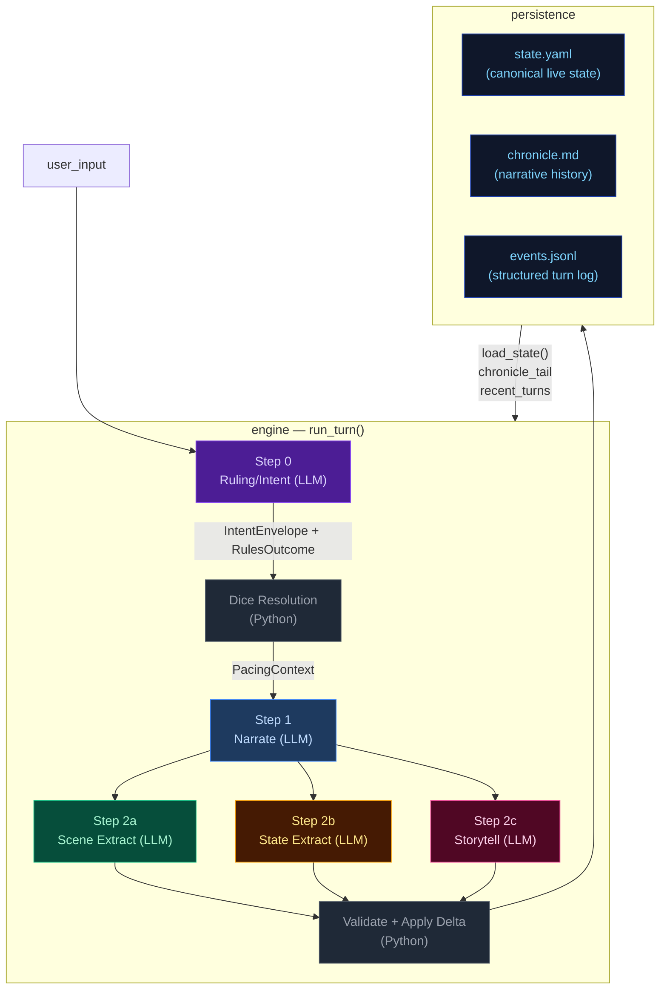

## Pipeline Quick Reference

| Step | Docs | When it runs | Key inputs | Key outputs | Mechanics it owns |
|---|---|---|---|---|---|
| **Step 0 — Ruling/Intent** | [step0-ruling](./step0-ruling.md) | Every turn (always) | `state.pc`, `state.location`, `recent_turns[-1:]`, `user_input` | `IntentEnvelope`, `RulesOutcome` | Intent classification, dice roll resolution (2d6 + stat + cond − diff → band), difficulty selection, anti-declare-outcome enforcement. |
| **Step 1 — Narrate** | [step1-narrate](./step1-narrate.md) | Every turn (always, streamed) | Full `state`, `chronicle_tail`, `recent_turns`, `pacing_context`, `pending_gm_beat`, `npc_roster` (tiered), `world_factions/locations`, `compendium_bios` | `narrative` (prose) | Prose generation, dice-band binding, GM-beat consumption. Tone shaped by `PacingContext.directive`. |
| **Step 2a — Scene Extract** | [step2a-scene](./step2a-scene.md) | Every turn (always) | `narrative`, `state.pc/location`, `npc_roster` (tiered), conditions, known_characters (LRU compendium) | `SceneExtractResult`: scene_tags, tagline, location_change, npc_add/remove/update, compendium_npc_update | NPC presence, location changes, scene tags, durable NPC compendium identity. |
| **Step 2b — State Extract** | [step2b-state](./step2b-state.md) | Every turn (always) | `narrative`, `state.pc/location/inventory`, conditions | `StateExtractResult`: inventory_add/remove/update, pc_condition_add/remove | Inventory delta accuracy, condition lifecycle. |
| **Step 2c — Storytell** | [step2c-progress](./step2c-progress.md) | Every turn (always) | `narrative`, `_ExtractionContext`, pacing_context, arc.threads[], recent_turns[-2:], band, npc_roster (tiered) | `StorytellerResult`: thread_advance/resolve/add, gm_beat, recent_events_add/update/remove, actions, outcome_summary | Unified thread lifecycle, beat disposition inference, durable history events. |

After Step 2c: results merge into a `StateDelta`, the validator checks constraints
(e.g. `inventory_remove` IDs exist), `apply_delta()` mutates state in-place, and the
turn is persisted. The next turn's Step 0 reads the new `state.yaml` plus `events.jsonl`.

## Subsystem Docs

| Subsystem | Doc | What it covers |
|---|---|---|
| **Step 0 — Ruling** | [step0-ruling](./step0-ruling.md) | Intent classification, dice resolution flowchart |
| **Step 1 — Narrate** | [step1-narrate](./step1-narrate.md) | Streaming narration pipeline with all context inputs |
| **Step 2a — Scene Extract** | [step2a-scene](./step2a-scene.md) | Location changes, NPC presence, scene tags |
| **Step 2b — State Extract** | [step2b-state](./step2b-state.md) | Inventory and condition extraction |
| **Step 2c — Storytell** | [step2c-progress](./step2c-progress.md) | Thread lifecycle, GMBeat schema, beat lifecycle (3 phases) |
| **PacingContext** | [pacing-context](./pacing-context.md) | Struct definition, computation flowchart, wiring to Narrator/Progress |
| **Delta → Validate → Apply** | [delta-validate](./delta-validate.md) | StateMerge schema, validation rules, apply_delta mutations |
| **Persist** | [persist](./persist.md) | Atomic writes (events.jsonl, state.yaml, chronicle.md), readback |
| **Cross-Pipeline Data Flow** | [cross-pipeline](./cross-pipeline.md) | Full inter-step data flow diagram |
| **Campaign Arcs** | [campaign-arcs](./campaign-arcs.md) | Arc data model (unified threads), engine-driven lifecycle, narrator-driven updates, integration points |
| **Out-of-Band Pipelines** | [out-of-band](./out-of-band.md) | Character Creation pipeline, Generate Seed pipeline, turn viewer status colors |
| **Narration UI** | [narration-ui](./narration-ui.md) | Main game interface: SSE streaming, HTMX sidebar refresh, Alpine.js state machine |
| **Turn Viewer UI** | [turn-viewer-ui](./turn-viewer-ui.md) | Pipeline debug UI: turn cards, stage inspector, diff panel, live updates |
| **Eval Harness** | [eval-harness](./eval-harness.md) | Scenario runner, LLM judges, auto-checkers, REPORT.md generation |

## Key Models Glossary

### Core Result Types

- **IntentEnvelope**: `intent`, `intent_verb`, `target`, `check.required`, `check.skill`, `check.difficulty`
- **RulesOutcome**: `rolled`, `skill`, `difficulty`, `stat_value`, `stat_mod`, `diff_mod`, `cond_mod`, `dice`, `raw_total`, `final_total`, `band`, `directive`, `intent`, `intent_verb`
- **SceneExtractResult**: `scene_tags`, `scene_tagline`, `location_change`, `npc_add/remove/update`, `compendium_npc_update`
- **StateExtractResult**: `inventory_add/remove/update`, `pc_condition_add/remove`
- **StorytellerResult**: `thread_advance`, `thread_resolve`, `thread_add`, `gm_beat`, `recent_events_add/update/remove`, `actions`, `outcome_summary`
- **SeedEnvelope**: `seed_state: GameState`, `opening_narrative`, `actions`, `arc: CampaignArc` (includes `goal_context`, unified `threads[]`, `completed_threads[]`), `pc_drive`

  The seed owns first-turn emotional framing, not just world and arc scaffolding. It generates `goal_context` (character-specific stake), NPC `relation` fields (narrative job relative to PC), and action text written from the PC's voice and scene pressure — ensuring the opening feels personal and motivated from the start.

### PacingContext (see [pacing-context](./pacing-context.md))

```
PacingContext:
  directive: str           # "" | "Breathe" | "Pressure" | "Overwhelm" | "Tension" | "Resolve a Threat" | "Threat Pressure" (may include "; Combat Fatigue" secondary)
  beat_locked: bool        # True: floor relief fired — Progress MUST emit breathing_room beat and gate is force-closed
  gate: str                # "block_add" | "block_escalate" | "allow" (controls thread_add)
  summary: str             # human-readable log string, never sent to LLM
```

### GMBeat (see [step2c-progress](./step2c-progress.md))

```
GMBeat
  type: complication | revelation | opportunity | breathing_room | pressure | twist | setback | escalation | callback
  surface_as: ambient | event | npc_behavior | environmental | player_discovery | item (default: ambient)
  beat_expires_turn: int | None (turn number at which the beat expires; set to turn_no + 2 when stored)
```

### CampaignArc (see [campaign-arcs](./campaign-arcs.md))

```
CampaignArc
  visible_goal: str           — What the PC is trying to achieve
  goal_context: str           — 2–3 sentences explaining why visible_goal matters to this character specifically
  thematic_question: str      — The moral/thematic tension of the arc
  pc_drive: str               — The PC's personal motive/reason for being in this situation
  hidden_truths: list[str]    — Story secrets the narrator knows but must not reveal in prose
  discovered_truths: list[str] — Truths the player has uncovered
  threads: list[ArcThread]    — Unified collection with active flag; replaces old active/latent split
  completed_threads: list[ArcThread] — Resolved/failed/abandoned threads

ArcThread (unified)
  id, summary, scope ("scene"|"arc"), active: bool = True
  urgency ("background"|"normal"|"urgent")
  tags: list[str], progress: int (0..3)
  resolution_state: str | None
  last_seen_turn: int | None, added_turn: int | None
  unlock_if: str | None — condition string; thread is only promotable when empty/falsy
  promotes: list[str] — threads this one can promote to when completed
```

### StateDelta (see [delta-validate](./delta-validate.md))

Merges all three extraction results. Contains `scene_tags`, `location_change`, `npc_add/remove/update`, `thread_advance/resolve/add`, `inventory_add/remove/update`, `pc_condition_add/remove`, `recent_events_add/update/remove`. Note: `gm_beat` is NOT in StateDelta — written directly to `state.meta.pending_gm_beat`.

---


## campaign-arcs


The campaign arc system tracks story threads and truth discovery across turns. It has two execution paths: **engine-driven** (thread lifecycle with 5-turn expiry for silent threads) and **narrator-driven** (truth discovery, goal updates).

## Arc Data Model

```
CampaignArc
  visible_goal: str          — What the PC is trying to achieve
  goal_context: str          — 2–3 sentences explaining why visible_goal matters to this character specifically; inner cost or pressure that makes it emotionally loaded
  thematic_question: str     — The moral/thematic tension of the arc
  pc_drive: str              — The PC's personal motive/reason for being in this situation; expressed indirectly
  hidden_truths: list[str]   — Story secrets the narrator knows but must not reveal in prose
  discovered_truths: list[str] — Truths the player has uncovered (subset of hidden_truths)
  threads: list[ArcThread]   — Unified collection replacing active_threads + latent_threads split. Each thread has scope ("scene" or "arc") and active flag set by Python age rules, not LLM.
  completed_threads: list[ArcThread] — Resolved/failed/abandoned threads; resolution_state preserved for narrative context

ArcThread (unified)
  id: str                    — Unique identifier
  summary: str               — What this thread is about
  scope: Literal["scene", "arc"]  # scene = short-lived tied to current location; arc = persistent story tension
  active: bool = True        # False = dormant/latent; set by Python age rules (not LLM)
  urgency: Literal["background", "normal", "urgent"] = "normal"
  tags: list[str]            — Keywords for engagement matching
  progress: int              — 0..3 (incremented by thread_advance)
  resolution_state: str | None # Set when thread_resolve processes resolved/failed/abandoned; preserved on completed threads
  last_seen_turn: int | None # For age-based active/dormant demotion in Python
  added_turn: int | None     # Python-managed lifecycle tracking
  unlock_if: str | None      # Condition string; thread is only promotable when empty/falsy
  promotes: list[str]        # Threads this one can promote to when completed
```

**Key change from previous architecture:** `scene_pressure[]` and the split between `active_threads` / `latent_threads` are merged into a single `arc.threads[]`. The engine manages thread lifecycle via `_apply_thread_signals()`: age-based demotion (`active: True → False`) replaces the old active/latent migration logic, with silent threads (not listed in `thread_advance` for 5+ turns) being demoted to dormant state.

## Engine-Driven Arc: Unified Thread Lifecycle

Thread lifecycle runs in `engine/turn.py` during the extraction phase, after `apply_delta()` but before narration arc_update merge. Two functions handle the unified thread operations:

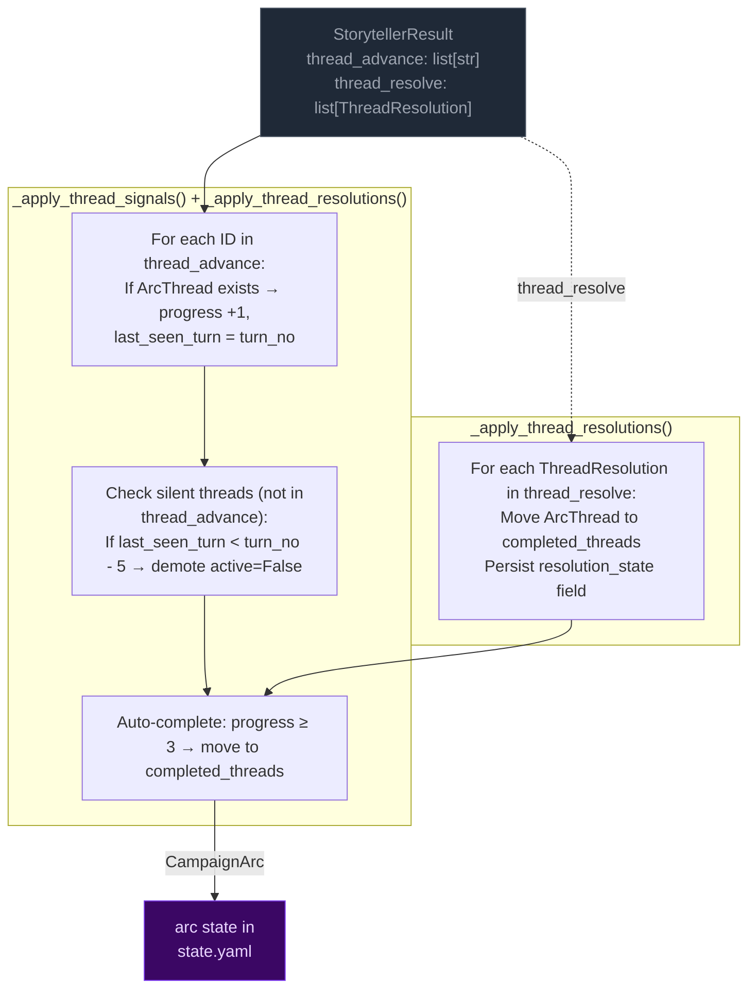

**Key rules:**
- **Unified collection:** `arc.threads[]` replaces the old active_threads/latent_threads split. The engine manages thread lifecycle via age-based demotion (`active: True → False`) instead of LLM-labeled urgency states.
- **Completion threshold:** progress reaches 3 → thread moved to `completed_threads`. Resolution state is preserved on completed threads for narrative context and eval rubrics.
- **5-turn expiry (age-based):** Threads not listed in `thread_advance` for 5+ turns get demoted (`active=False`). This replaces the old active→latent migration with a simpler boolean flag that Python manages directly from thread age, not LLM judgment.

## Narrator-Driven Arc: Phase & Truth Updates

The narrator can update arc metadata through a sentinel-delimited JSON block in its output. The engine parses and merges these updates after narration.

```mermaid
flowchart LR
    classDef llmNode fill:#0f172a,color:#94a3b8,stroke:#334155
    classDef sentinel fill:#3b0764,color:#e9d5ff,stroke:#7c3aed
    classDef mergeNode fill:#172554,color:#bfdbfe,stroke:#1d4ed8
    classDef arcNode fill:#3b0764,color:#e9d5ff,stroke:#7c3aed

    subgraph NARRATOR["Narrator prompt context"]
        NC1["visible_goal"]
        NC2["goal_context (early-turn narrative guidance)"]
        NC3["thematic_question"]
        NC5["arc.threads[] (summary, scope,<br>urgency, tags)"]
        NC6["pc_drive"]
        NC7["hidden_truths[] — internal only<br>NARRATOR MUST NOT reveal in prose"]
        NC8["discovered_truths[]"]
    end

    subgraph EMISSION["Narrator output"]
        PROSE["narration prose<br>(player sees this)"]:::llmNode
        SENTINEL["<<<ARC_UPDATE_START>>>
{discovered_truths, visible_goal}
<<<ARC_UPDATE_END>>>"]:::sentinel
    end

    subgraph PARSING["_extract_narrator_arc_update()"]
        P1["Regex: <<<ARC_UPDATE_START>>>(.*?)<<<ARC_UPDATE_END>>>"]
        P2["json.loads() → arc_dict"]
        P3["Strip block from narrative"]
    end

    subgraph MERGE["_merge_arc_update()"]
        M1["visible_goal: overwrite if present"]
        M2["thematic_question: overwrite if present"]
        M3["hidden_truths: overwrite if present"]
        M4["pc_drive: overwrite if present"]
        M5["hidden_truths: overwrite if present"]
        M6["discovered_truths: union with existing"]
        M7["goal_context: NOT merged — seed-only field, unchanged during play"]
    end

    NC1 & NC2 & NC3 & NC5 & NC6 & NC7 & NC8 --> PROSE
    PROSE --> SENTINEL
    SENTINEL --> P1 --> P2 --> P3
    P3 -- "clean narrative" --> CLIENT["client"]
    P2 -- "arc_dict" --> MERGE

    MERGE --> ARC[merge into state["arc"]]:::arcNode
```

**Merge rules:**
- **Engine owns thread lifecycle** (active/dormant/completed via age-based demotion). Narrator arc_update omits thread fields — they are ignored by `_merge_arc_update()`.
- **Narrator owns visible_goal/thematic_question/discovered_truths/hidden_truths.** Engine does not modify these.
- **`goal_context` is seed-only** — set once at game start, never overwritten by narrator or engine during play.
- **Discovered truths:** merged as set union (dedup).
- **Merge order:** engine thread signals run first (setting `delta.arc_update`), then narrator arc_update is parsed after narration and merged on top via a second `_merge_arc_update()` call in `run_turn()`.

## Arc Context in Narration

The arc state is passed to the narrator via `current_arc` in both system and user prompts. The narrator sees all arc metadata including `hidden_truths` but is explicitly instructed not to reveal them in prose.

### Early-turn narrative mode

When `goal_context` is present on the arc, the narrator treats it as narrative guidance for early turns: ground the player in personal stakes before broad exposition. The `goal_context` shapes what detail feels loaded, which NPC moment carries emotional charge, and what pressure matters immediately — without restating or summarizing it explicitly. This signal is provided via a conditional block in `narrate_system.j2`.

The `goal_context` is also injected into the user prompt via the `_arc.j2` subtemplate as hidden narrator context (HTML-comment wrapped), consumed by the LLM for narrative emphasis but not displayed to the player.

### Narrator prompt context

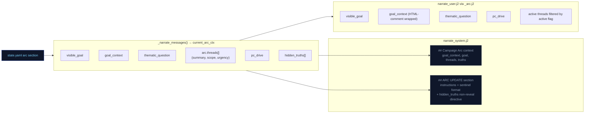

## Arc System Integration Points

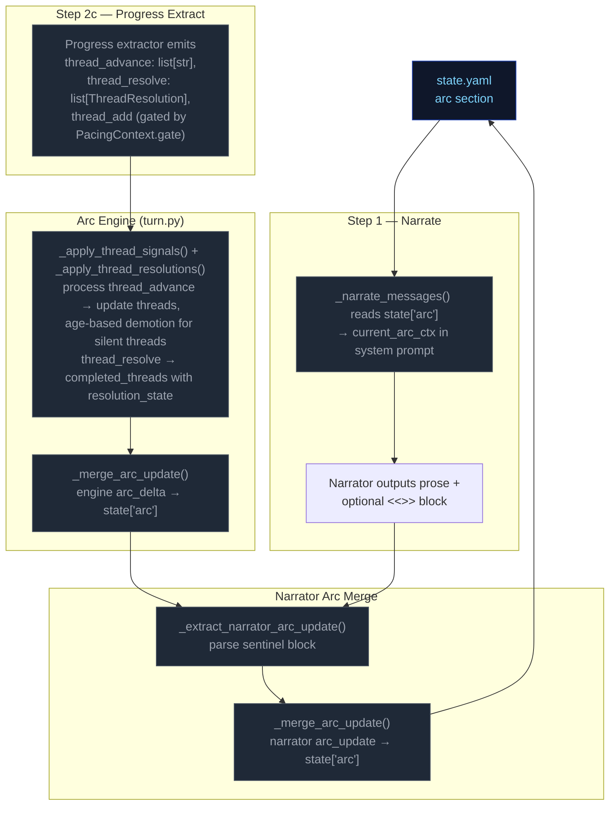

---


## cross-pipeline


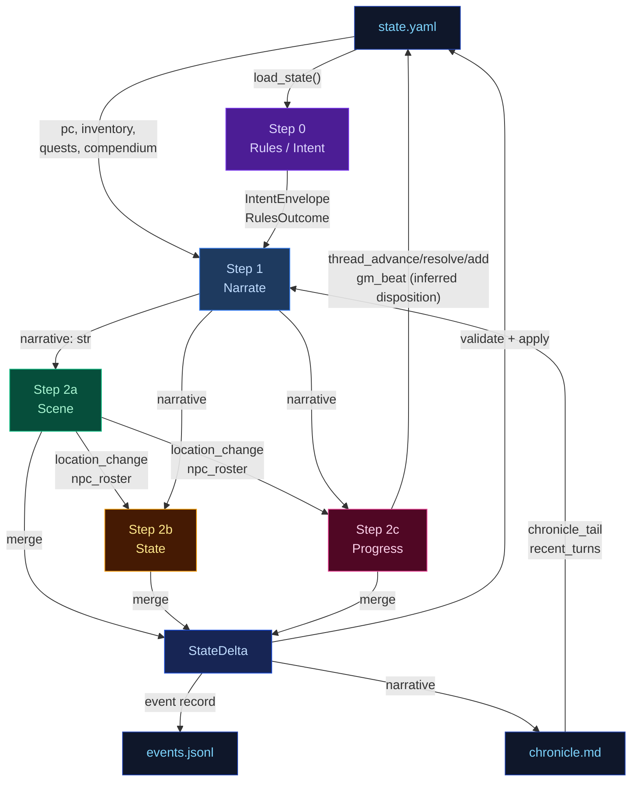

---


## delta-validate


The three extraction results merge into a single `StateDelta`, then validate and apply.

## Flowchart

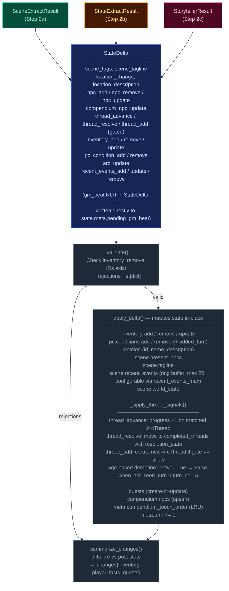

---


## narration-ui


The primary player-facing UI. Renders game state, streams narrative tokens live, and refreshes sidebars via HTMX partial swaps. Single-page app driven by Alpine.js + SSE + HTMX.

## Interaction Model

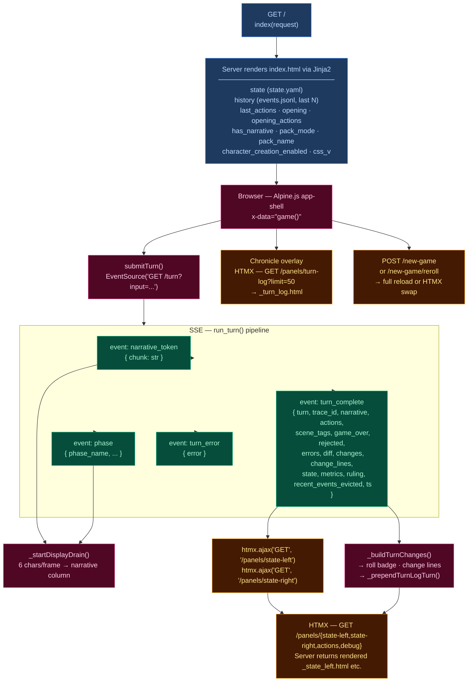

## Layout

| Region | Element | Content |
|--------|---------|---------|
| **Header** | `.header-bar` | Logo/tagline, Chronicle toggle, turn counter, retry button, new game button, reroll button (dynamic packs), mock-mode dot |
| **Left sidebar** | `.sidebar-left` | Player card, scene NPCs, location, arc, compendium — loaded via `/panels/state-left` |
| **Narrative column** | `.narrative-column` | Scrollable narrative blocks, action pills, input textarea, send/stop button |
| **Right sidebar** | `.sidebar` (right) | Inventory, recent events, world state, debug panel — loaded via `/panels/state-right` |
| **Chronicle overlay** | `.turn-log-shell` | Floating overlay over narrative column, populated by `/panels/turn-log?limit=50` |
| **New Game modal** | (Alpine `x-show`) | Pack picker → char creation / world builder steps |

## Data Flow

### Turn submission (Alpine.js + SSE)

1. User types input, presses Enter → `game().submitTurn()`
2. Opens `EventSource` to `GET /turn?input=<text>` — SSE endpoint in `routes.py:83`
3. Server streams events as the 5-stage pipeline (`run_turn()`) executes:
   - `narrative_token` — token chunks streamed as they arrive from LLM
   - `phase` — pipeline phase progress (ruling_start, narrate_start, narrate_first_token, narrate_done, extract_start, extract_done, compact_start, etc.)
   - `turn_complete` — final result
   - `turn_error` — error payload
4. Client `_startDisplayDrain()`: reveals 6 characters per animation frame for smooth streaming
5. On `turn_complete`:
   - Calls `htmx.ajax('GET', '/panels/state-left', ...)` and `htmx.ajax('GET', '/panels/state-right', ...)` to refresh sidebars
   - Renders change lines (`_buildTurnChanges`), roll badge
   - Prepends turn to Chronicle overlay via `_prependTurnLogTurn`
   - Re-renders markdown via `marked.parse()`

### HTMX partial endpoints (routes.py)

| Route | Template | Purpose |
|-------|----------|---------|
| `GET /panels/state-left` | `_state_left.html` | Left sidebar — player, NPCs, location, arc, compendium |
| `GET /panels/state-right` | `_state_right.html` | Right sidebar — inventory, events, world state, debug |
| `GET /panels/actions` | `_actions.html` | Action pills (fallback) |
| `GET /panels/turn-log?limit=N` | `_turn_log.html` | Chronicle — turn history with change lines |
| `GET /panels/pack-picker` | `_pack_picker.html` | New Game — pack selection cards |
| `GET /panels/char-creation` | `_char_creation.html` | New Game — character stats builder |
| `GET /panels/world-builder` | `_world_builder.html` | New Game — world creation form |
| `GET /panels/debug` | `_debug.html` | Debug panel — recent turn timings, errors |
| `GET /panels/state` | `_state.html` | Combined left+right (legacy) |

### Client state machine (`game()` — inline `<script>` in index.html)

Alpine.js `x-data="game()"` manages:
- `input` — textarea value
- `submitting` — turn-in-progress flag
- `gameStarted` — derived from `has_narrative`
- `turnNum` — current turn counter
- `leftWidth` / `rightWidth` — resizable sidebar widths (persisted to `localStorage`)
- Card collapse state — read/written directly from/to `localStorage` via `CCYA_CARD_KEY(name)` helper, using DOM `data-card` attributes; no Alpine data property

## UI Features

### Resizable sidebars
- Drag gutters with mousedown/mousemove handlers
- Widths saved to `localStorage` (`ccya_sidebar_left`, `ccya_sidebar_right`)
- Minimum width enforcement (240px left, 220px right)

### Collapsible cards
Each sidebar section has a collapse toggle; open/closed state persisted per-card to `localStorage` via `ccya_card_<name>` key.

### Action pills
Suggested next actions rendered as buttons that populate the input on click. Updated from `turn_complete.actions` or via HTMX panel refresh.

### Roll badge
Server-rendered for history, JS-built for new turns. Shows dice math, band label, outcome summary. Band colors: `crit_fail` (red) → `fail` → `setback` → `partial` → `success` → `crit_success`.

### Change lines
Grouped by category via emoji prefix:
| Emoji | Category | Class |
|-------|----------|-------|
| 🎒 + | Inventory gain | `.tc-inv-gain` |
| 🎒 − | Inventory loss | `.tc-inv-loss` |
| 🩺 | Player condition | `.tc-pl` |
| 📍 | Location | `.tc-loc` |
| 📜 | Faction/arc | `.tc-fa` |

### Retry
`POST /turn/delete` removes last event from `events.jsonl` and `chronicle.md`, returns previous actions for re-submission.

### New Game
`POST /new-game` with optional `pack_id`, `pc_name`, `pc_stats`, `hints`. For dynamic packs, triggers `generate_seed()` LLM pipeline. Full page reload on success. Reroll (`POST /new-game/reroll`) HTMX-swaps the opening narrative + actions.

## CSS Architecture

- **`app.src.css`** — Tailwind + custom styles split by region (lines 1–2101):
  - App shell layout (CSS Grid: header + body with sidebar-gutter-main-gutter-sidebar)
  - Narrative blocks (`.narrative-block`, `.narrative-text`)
  - Sidebar cards (`.card`, `.card-header`, `.card-body`)
  - Input bar (`.input-bar`, `.game-input`, `.send-btn`)
  - Action pills (`.action-pill`, `.pills-row`)
  - Roll badges (`.roll-badge`, `.roll-band--*`)
  - Chronicle overlay (`.turn-log-shell`, `.turn-log-panel`)
  - New Game modal (`.modal-overlay`, `.pack-card`)
  - Progress strip, tooltips, scrollbar styling
  - Design tokens via CSS custom properties (`--text-primary`, `--bg-card`, `--status-*`)
- Compiled to **`app.css`** with cache-busting via `css_v` query param

## Server Entry Point

`routes.py:57` — `GET /` handler assembles template context from `state.yaml`, `events.jsonl`, pack manifest, and engine config, then renders `ccya/templates/index.html`.

---


## out-of-band


These run only at new-game time or are non-engine concerns. They are excluded from the eval-context region of the main architecture doc.

## Character Creation Pipeline

Triggered by `POST /new-game`. Behavior differs by pack mode.

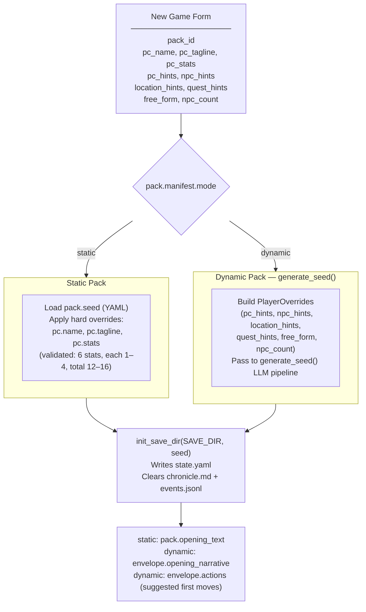

## Generate Seed Pipeline (Dynamic Packs Only)

Called by `POST /new-game` and `POST /new-game/reroll`. Generates a complete starting game state (PC, NPCs, location, arc, opening narrative, actions) from the pack manifest and optional player overrides.

The seed owns **first-turn emotional framing** — not just world and arc scaffolding. Every seed element must produce an emotionally legible opening that answers: why this moment matters now, what the character stands to lose, and why at least one person in the scene matters to them personally.

```mermaid
flowchart LR
    classDef llmNode fill:#0f172a,color:#94a3b8,stroke:#334155
    classDef outNode fill:#172554,color:#bfdbfe,stroke:#1d4ed8

    subgraph IN["Inputs"]
        G1["pack.manifest<br>(world rules, tone, setting)"]
        G2["pack.style_text"]
        G3["PlayerOverrides (optional)<br>  pc_hints, npc_hints<br>  location_hints, quest_hints<br>  free_form, npc_count"]
        G4["npc_name_pool (name locales)"]
        G5["engine_config.generate_seed_temperature (0.9)<br>engine_config.generate_seed_max_retries (1)"]
    end

    subgraph LLM_GS["LLM — generate_seed_system.j2 + generate_seed_user.j2"]
        GL["temp: 0.9<br>output: SeedEnvelope JSON"]:::llmNode
    end

    subgraph OUT["Outputs — SeedEnvelope"]
        O1["seed_state: GameState<br>  pc (name, tagline, bio, stats)<br>  location (id, name, description)<br>  scene (present_npcs with relation field,<br>         recent_events, world_state)<br>  inventory: list[InventoryItem]<br>  compendium.npcs: dict[id] NpcRef<br>  meta (model, setting_pack, turn=0)"]:::outNode
        O2["arc: CampaignArc<br>  visible_goal, goal_context (personal stakes),<br>  thematic_question, hidden_truths,<br>  threads[] (unified, with active flag),<br>  completed_threads[], pc_drive"]:::outNode
        O3["opening_narrative: str<br>(prose intro shown before turn 1)"]:::outNode
        O4["actions: list[str]<br>(4 distinct, character-shaped,<br>scene-grounded choices)"]:::outNode
    end

    IN --> LLM_GS
    LLM_GS --> OUT
```

### Seed emotional framing contract

The seed prompt (`generate_seed_system.j2`) enforces these requirements:

- **`goal_context`**: 2–3 sentences explaining why `visible_goal` matters to this character specifically — inner cost or pressure that makes it emotionally loaded. No hidden-truth spoilers, no restating `visible_goal`, no direct statement of the thematic question. Must connect character motive, story stakes, and emotional cost.
- **NPC `relation` field**: Each opening NPC has a defined narrative job. One NPC is personally tied to the PC's motive or vulnerability; the other carries immediate external pressure from the world or conflict. The `relation` field encodes PC-facing relevance (e.g. "owes them a favor", "is their only contact here", "represents the institution pressing on them").
- **Action guidance**: Each of the 4 choices is written from the PC's point of view, grounded in a present NPC, immediate risk, active thread, or character motive. They differ in emotional posture (confront, deflect, investigate, protect, exploit, withdraw, etc.) and avoid generic verbs.
- **`pc_drive`**: A single sentence about the PC's personal reason for being in this situation. Expressed indirectly through `goal_context`, NPC relations, opening narrative, and actions — never displayed as a labeled UI fact.
- **`threads[]`**: Unified list (not split active/latent) where each thread has `{id, summary, tags, urgency, scope}` and an `active` boolean flag managed by Python age rules, not LLM.

## Turn Viewer — status colors

The standalone turn viewer ([turn-viewer-ui](./turn-viewer-ui.md)) uses the same semantic status colors as the CSS custom properties in `static/app.src.css` (`--status-*`). The stage colors used in the diagrams above (`stageRules` violet → `stageNarrate` blue → `stageScene` green → `stageState` amber → `stageProgress` pink) map directly to the `--stage-*` tokens. Cross-stream inputs into a step are shown in `xstream` (purple outline) and LLM/Python boxes use neutral dark fills. This table is the canonical turn-viewer status legend.

| Token | Meaning |
|-------|---------|
| `--status-ok` | Stage ran and completed (no extraction error). |
| `--status-skipped` | Stream was skipped (no longer used — all streams always run). |
| `--status-retried` | LLM output required a parse retry (`attempts` > 1 in event). |
| `--status-rejected` | Post-extract validation rejected part of the delta (e.g. bad `inventory_remove`). |
| `--status-error` | LLM call or parse ultimately failed for that stream. |
| `--status-neutral` | Non-fatal / informational (e.g. rules path with no dice roll). |

Stage accent stripes use `--stage-rules`, `--stage-narrate`, `--stage-scene`, `--stage-state`, `--stage-progress` for quick scanning; **status** always wins for the prominent left border.

---


## pacing-context


All pacing signals are collapsed into one Python-computed struct (`PacingContext`) passed to both the Narrator and Progress Extractor. This replaces six independent fields (`narration_directive`, `deescalate`, `narrative_velocity`, `beat_disposition` output, `quest_threshold_directive`, and stale momentum-derived signals). The narrator receives `directive`; Progress receives the full struct.

## Struct definition

```
PacingContext:
  directive: str           # "" | "Breathe" | "Pressure" | "Overwhelm" | "Tension" | "Resolve a Threat" | "Threat Pressure"
  beat_locked: bool        # True: floor relief fired — Progress MUST emit breathing_room beat and gate is force-closed
  gate: str                # "block_add" | "block_escalate" | "allow" (controls thread_add)
  summary: str             # human-readable log string, never sent to LLM
```

`beat_locked: True` subsumes the old `_check_floor_relief()` side-channel — floor relief logic is computed inside `_compute_pacing_context()`. The `gate` field prevents Progress from adding new threads during de-escalation windows. Secondary modifiers like "Combat Fatigue" may be appended via semicolons (e.g., "Pressure; Combat Fatigue").

## Computation

`_compute_pacing_context()` in `engine/turn.py` consolidates pacing computation (replacing the former scattered functions: `_compute_narration_directive`, `_compute_narrative_velocity`, `_check_floor_relief`). It takes inputs (`momentum`, `consecutive_floor_turns`, `arc.threads[] scope=scene urgency counts`, combat age, location age) and returns a single struct with directive derived from the same priority stack:

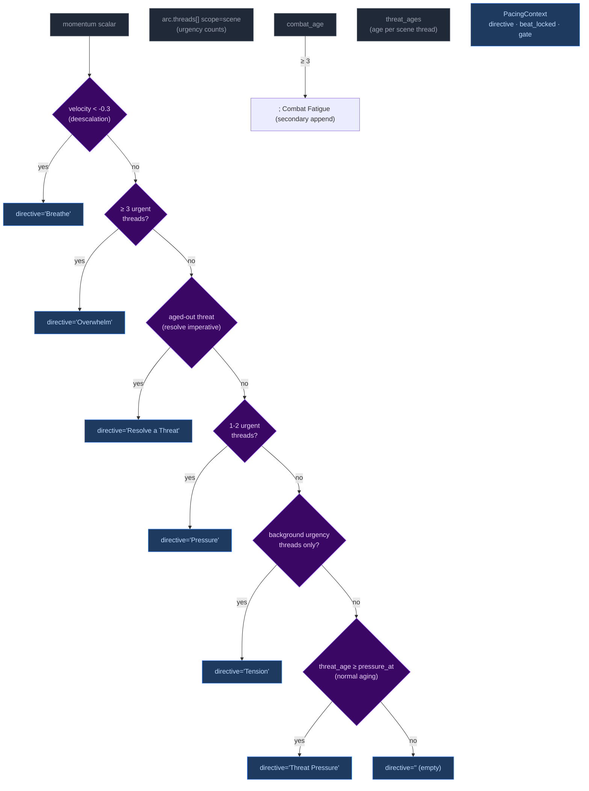

Priority order (highest to lowest): **Breathe > Overwhelm > Resolve a Threat > Pressure > Tension > Threat Pressure > (empty)**. The `beat_locked` flag takes precedence — when at momentum floor, directive is forced to include "Resolve a Threat" and gate is force-closed when directive is "Breathe".

## Wiring: how PacingContext reaches the pipelines

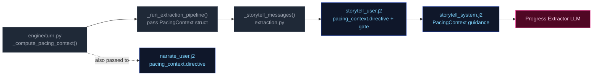

1. **Computed** once in `run_turn()` via `_compute_pacing_context()`.
2. **Passed through** `_run_extraction_pipeline()` → both `_narrate_messages()` and `_storytell_messages()`.
3. **Narrator template** (`narrate_user.j2`) renders only `directive` (tone/direction). No Jinja2 directive computation remains — all directives computed by Python.
4. **Storytell template** ((`storytell_system.j2` + `user.j2`)) receives the full struct; guidance maps each directive to appropriate thread/beat actions:

| Directive | Thread action | Gate |
|-----------|---------------|-------|
| **"Breathe"** (de-escalation, velocity < -0.3) | Do NOT add new threads. Allow existing scene threads to persist without escalation. | `block_add` + force-closed when at momentum floor |
| **"Overwhelm"** (3+ urgent threads) | May add scene-scoped threads if gate allows; emit pressure/escalation beat | `allow` |
| **"Resolve a Threat"** (aged-out threat imperative) | Advance the aged thread toward resolution; avoid adding new complications | `allow` |
| **"Pressure"** (1-2 urgent or aging threats) | Advance relevant scene/arc threads. Add new thread only if gate permits. | Varies by context |
| **"Tension"** (background urgency only) | Do NOT add pressures unless concrete threat emerges; prefer advancing existing threads | Allow |
| **"Threat Pressure"** (normal urgency aging) | Escalate urgency of the aging thread; consider advancing | Allow |
| **"" (empty)** | No action required beyond normal aging of silent threads. | Allow |

**Note:** Directives may include secondary modifiers joined by semicolons (e.g., "Pressure; Combat Fatigue"). The primary directive drives thread/beat logic; the secondary acts as a thematic modifier on beat type.

---


## persist


Atomic writes to disk. No LLM calls.

## Flowchart

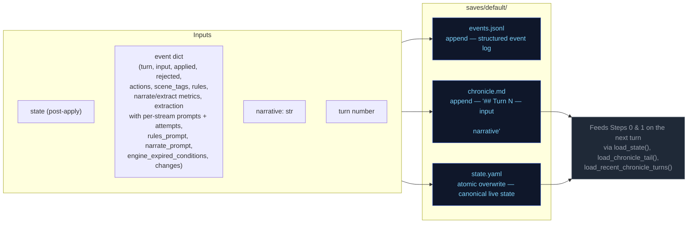

---


## step0-ruling


Classifies the player's action, determines whether a dice check is needed, and
identifies which state domains will be active — narrowing every downstream extractor.

## Flowchart

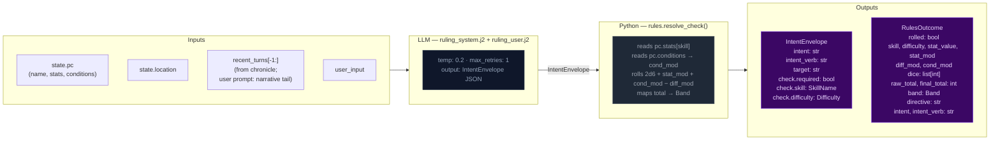

## Key forward dependency

`rules_outcome` feeds into `_compute_pacing_context()` which produces the single authoritative `PacingContext` struct passed to both Narrator and Progress Extractor.

---


## step1-narrate


Generates the narrative prose the player reads. Tokens are streamed to the client.

## Flowchart

```mermaid
flowchart LR
    classDef llmNode   fill:#0f172a,color:#94a3b8,stroke:#334155
    classDef xstream   fill:#4c1d95,color:#ddd6fe,stroke:#7c3aed
    classDef outNode   fill:#1e3a5f,color:#bfdbfe,stroke:#3b82f6

    subgraph IN["Inputs"]
        N1["state (full —<br>pc, location, scene,<br>inventory, quests, compendium)"]
        N2["chronicle_tail<br>(compressed history, ≤budget tokens)"]
        N3["recent_turns (last window_turns, default 3)"]
        N4["rules_outcome<br>(band, directive, dice summary)"]:::xstream
        N5["pack_style (tone / prose guide)"]
        N6["npc_name_pool (cultural name list)"]
        N7["recently_left NPCs"]
        N8["known_npcs<br>(last-seen info)"]
        N9["present_npcs<br>(attitudes)"]
        N10["world_factions<br>(immutable trace)"]
        N11["world_locations<br>(nearby, immutable)"]
        N12["pending_gm_beat<br>(type · surface_as metadata)"]
        N13["pacing_context<br>(directive)<br>from _compute_pacing_context()"]:::xstream
        N14["compendium_bios<br>(upserted bio entries for<br>present + recently_left NPCs)"]
        N15["user_input"]
    end

    subgraph LLM1["LLM — narrate_system.j2 + narrate_user.j2"]
        NL["temp: 0.9 · streaming: yes<br>output: prose narrative (str)"]:::llmNode
    end

    subgraph OUT["Outputs"]
        NO1["narrative: str<br>(streamed as tokens → client<br>then joined + thinking-stripped)"]:::outNode
        NO2["narr_metrics<br>  first_token_ms<br>  total_ms<br>  tokens_in / tokens_out"]
    end

    IN --> LLM1
    LLM1 --> OUT
```

## Arc context in narration

The narrator receives `current_arc` in both system and user prompts. Key fields:

- **`goal_context`**: A seed-time field (2–3 sentences) explaining why `visible_goal` matters to the character specifically — inner cost or pressure that makes it emotionally loaded. When present, `narrate_system.j2` activates an early-turn guidance block: ground the player in personal stakes before broad exposition. This is also injected into the user prompt via `_arc.j2` as HTML-comment-wrapped narrator context.
- **`visible_goal`**: The player-facing objective.
- **`thematic_question`**: The moral tension — never stated directly in prose. Used as a lens for emphasis: what detail feels loaded, what silence matters.
- **`pc_drive`**: The character's personal motive. Expressed indirectly through goal_context, NPC relations, and action language rather than displayed as a labeled UI fact.
- **`hidden_truths[]`**: Internal-only story secrets the narrator must never reveal in prose.
- **`threads[]`**: Unified thread collection filtered by `active` flag. Scene-scope threads provide immediate pressure; arc-scope threads provide medium-term tension.

### Opening-turn narrative mode

When `goal_context` is present (always true after seed), the narrator treats early turns as a distinct onboarding mode:
1. Personal stakes before broad exposition
2. One NPC moment with emotional charge (driven by `relation` fields on seed NPCs)
3. One immediately actionable pressure

The presence of `goal_context` itself is the signal — no turn-counting dependency needed. The guidance is most impactful in the first few turns and persists as background context throughout the campaign.

## Key forward dependency

`narrative` is the primary content input for all three extraction streams below.

---


## step2a-scene


Extracts location changes, NPC presence, scene tags, and suggested actions from the narrative.

## Flowchart


## Key forward dependency

`location_change` and `present_npcs` flow into `extraction_ctx` (built by `_build_extraction_context`). Step 2c also receives `npc_roster` (tiered: PRESENT/JUST_LEFT/NEARBY/KNOWN) built from extraction_ctx. No forward-facing mechanics (`thread_add`, `gm_beat`) are emitted by this stream — they go through the unified thread pipeline via Progress Extract.

---


## step2b-state


Extracts inventory changes and player condition mutations from the narrative.

## Flowchart

```mermaid
flowchart LR
    classDef llmNode fill:#0f172a,color:#94a3b8,stroke:#334155
    classDef xstream fill:#4c1d95,color:#ddd6fe,stroke:#7c3aed
    classDef outNode fill:#451a03,color:#fde68a,stroke:#f59e0b

    subgraph IN["Inputs"]
        S1["narrative (from Step 1)"]:::xstream
        S2["state.pc (name, bio, stats, conditions)"]
        S3["state.location"]
        S4["state.inventory"]
        S5["intent: str<br>(from Step 0)"]
    end

    subgraph LLM2B["LLM — extract_state_system.j2 + extract_state_user.j2"]
        SL["temp: 0.4 · max_retries: 1<br>output: StateExtractResult JSON"]:::llmNode
    end

    subgraph OUT["Outputs — StateExtractResult"]
        O1["inventory_add: list[InventoryItem]<br>  id, name, notes, amount"]:::outNode
        O2["inventory_remove: list[InventoryRemove]<br>  id, amount (None = full stack)"]:::outNode
        O3["inventory_update: list[InventoryUpdate]<br>  id, name?, notes?"]:::outNode
        O4["pc_condition_add: list[ConditionAdd]<br>  id, label, description"]:::outNode
        O5["pc_condition_remove: list[ConditionRemove]<br>  id"]:::outNode
    end

    IN --> LLM2B
    LLM2B --> OUT
```

## Key forward dependency

Step 2c receives `npc_roster` (tiered: PRESENT/JUST_LEFT/NEARBY/KNOWN) and `location_change` from Step 2a. Cross-stream items_gained/lost were removed — extraction_ctx now covers all this-turn derived data.

---


## step2c-progress


Extracts quest updates, recent events, and durable NPC compendium changes.

## Flowchart


## Always runs

Progress is the post-narration storytelling brain. It always executes every turn (never skipped) and feeds next turn's rules call via `recent_events_add` (durable narrative facts), `thread_advance/resolve/add` (unified thread lifecycle with scope-aware age demotion), and `gm_beat` (forward-facing beats stored in `state.meta.pending_gm_beat`).

## GMBeat schema

```
GMBeat
  type: complication | revelation | opportunity | breathing_room | pressure | twist | setback | escalation | callback
  surface_as: ambient | event | npc_behavior | environmental | player_discovery | item (default: ambient)
  beat_expires_turn: int | None (turn number at which the beat expires; set to turn_no + 2 when stored)
```

## Beat lifecycle

The beat flows through three phases per turn:

**Phase 1 — Pre-narration expiry check.** At the start of each turn, the engine reads `state.meta.pending_gm_beat` from the previous turn. If `beat_expires_turn` is set and the current turn number exceeds it, the beat is nullified. Otherwise it proceeds to narration.

**Phase 2 — Narration consumption.** The beat is passed to the narrator via `_narrate_messages(pending_gm_beat=...)`. The narrator uses the beat's type and surface_as metadata as creative guidance alongside the pacing directive. After narration completes, the pending beat is cleared from state — it is not restored for storyteller consumption.

**Phase 3 — Extraction disposition (inferred).** The storyteller receives no pending beat context in its prompt — it decides beats based solely on current extraction data (scene state, threads, pacing context, band). Unlike the previous architecture, there is no explicit `beat_disposition` field. Instead:
- If Progress emits a new `gm_beat`, it replaces the old one (`state.meta.pending_gm_beat = gm_beat` with `beat_expires_turn = turn_no + 2`)
- If Progress emits nothing and the beat's `expires_at` hasn't passed, the engine preserves the existing beat unchanged (carry)
- The engine stores beats with `beat_expires_turn = turn_no + 2` as a hard TTL ceiling. Beats past their expiry are discarded automatically on load.

---

---


# Static Context (immutable across all turns)

## World Pack Style

```
# Eval-pack style

This pack is a deterministic test fixture. The narrator should write in a plain,
clear, second-person past-tense register. Keep these in mind:

- Specific over abstract. Name the thing the player did, the object they touched, the
  NPC they spoke to. Avoid generic mood words ("an air of menace") in favor of
  concrete sensory detail.
- One scene per turn. Do not skip ahead in time unless the player explicitly does so.
- Honor the dice. If the rules outcome is `fail` or `setback`, the action did not
  succeed; describe the cost. If `partial`, the action succeeded with a complication.
- Honor the present_npcs. Every named NPC in the scene either acts, reacts, or is
  visibly present in the prose. Do not invent new NPCs unless the player's input
  introduces one.
- Plain language. No archaic phrasing, no fantasy-trope syntax ("Lo, the door...").
  This is a working road in a working world.
- 120-220 words per turn unless the action is large.

```

## Seed State

```json
{
  "meta": {
    "game_name": "eval",
    "turn": 0,
    "setting_pack": "eval-pack",
    "model": ""
  },
  "pc": {
    "name": "Aren Voss",
    "tagline": "Reluctant courier on the merchant road",
    "bio": "Mid-thirties, broad shoulders, careful with words. Took on a courier contract\nto clear an old debt. Just arrived in Marrow's Crossing with a heavy pack and\na heavier obligation.\n",
    "stats": {
      "strength": 3,
      "dexterity": 3,
      "wits": 2,
      "lore": 2,
      "charisma": 3,
      "resolve": 3
    },
    "conditions": [],
    "momentum": 0,
    "drive": ""
  },
  "location": {
    "id": "marrows_crossing",
    "name": "Marrow's Crossing",
    "description": "A market town built around the confluence of two rivers. Cobblestone streets,\ntimber-framed buildings, and the constant sound of water from the mills. The\ntown square has a stone well and a statue of the founder. Most shops are closing\nfor the evening.\n"
  },
  "inventory": [
    {
      "id": "credits",
      "name": "Credits",
      "notes": "Common coin, accepted at any inn or stall on the merchant road.",
      "amount": 500,
      "aliases": []
    },
    {
      "id": "iron_dagger",
      "name": "Iron dagger",
      "notes": "Plain crossguard, edge worn from honing. Belt-carried.",
      "amount": 1,
      "aliases": []
    },
    {
      "id": "bandages",
      "name": "Linen bandages",
      "notes": "Three rolls. Field-grade \u2014 won't replace a healer.",
      "amount": 3,
      "aliases": []
    },
    {
      "id": "traveler_cloak",
      "name": "Traveler's cloak",
      "notes": "Oiled wool, road-stained, hood deep enough to hide a face.",
      "amount": 1,
      "aliases": [
        "cloak",
        "travel cloak"
      ]
    },
    {
      "id": "brass_key",
      "name": "Brass key",
      "notes": "A small brass key Halden gave you with the ledger.",
      "amount": 1,
      "aliases": []
    }
  ],
  "scene": {
    "tagline": "Market town at dusk",
    "tags": [
      "peaceful",
      "start"
    ],
    "world_state": [
      "Marrow's Crossing is a market town at the confluence of two rivers, known for its mills and the annual river festival.",
      "Iron coin (credits) is the universal currency on the merchant road; barter is acceptable but slower.",
      "The road has been quieter than usual this season \u2014 fewer caravans, more independent runners, more opportunists."
    ],
    "recent_events": [
      {
        "id": "seed_evt_15933779",
        "text": "You arrived in Marrow's Crossing after three days on the road."
      },
      {
        "id": "seed_evt_aab41002",
        "text": "You heard rumors of road-toughs extorting travelers near the Crossed Keys Inn."
      },
      {
        "id": "seed_evt_905309f6",
        "text": "You found Caron in the tavern \u2014 he's been waiting for you."
      }
    ],
    "present_npcs": [
      {
        "id": "caron",
        "name": "Caron",
        "title": "Old creditor",
        "notes": "Sits at a corner table in the tavern, nursing a drink and watching the door.",
        "bio": "A portly man in his sixties with a merchant's ledger and a patient demeanor. You owe him 500 credits from a failed venture three years ago."
      },
      {
        "id": "halden",
        "name": "Halden",
        "title": "Merchant",
        "notes": "Stands near the town well, examining a map and a pressed wax seal.",
        "bio": "A road merchant in his fifties who hires couriers when his usual runners are spoken for. Honest by reputation, careful with money."
      },
      {
        "id": "innkeeper",
        "name": "Edda",
        "title": "Innkeeper at the Crossed Keys",
        "notes": "Wiping down the bar at the Crossed Keys, which is two streets over.",
        "bio": "Runs the inn alone since her husband died. Knows every traveler by face if not by name. Stays out of trouble unless it walks through her door."
      }
    ]
  },
  "compendium": {
    "npcs": {
      "caron": {
        "name": "Caron",
        "title": "Old creditor",
        "bio": "A portly man in his sixties with a merchant's ledger and a patient demeanor. You owe him 500 credits from a failed venture three years ago."
      },
      "halden": {
        "name": "Halden",
        "title": "Merchant",
        "bio": "A road merchant in his fifties who hires couriers when his usual runners are spoken for. Honest by reputation, careful with money."
      },
      "innkeeper": {
        "name": "Edda",
        "title": "Innkeeper at the Crossed Keys",
        "bio": "Runs the inn alone since her husband died. Knows every traveler by face if not by name. Stays out of trouble unless it walks through her door."
      },
      "tough_a": {
        "name": "Bald Tough",
        "title": "Road thug",
        "bio": "Hired muscle. No personal stake in this \u2014 he'll back off if the price is right or the fight goes bad."
      },
      "tough_b": {
        "name": "Scarred Tough",
        "title": "Road thug",
        "bio": "Same outfit as the other \u2014 hired by the same person. Quicker to violence; not the brains."
      },
      "matthew_estrada": {
        "name": "Matthew Estrada",
        "title": "Traveler",
        "bio": "A tall, broad-shoulded man in a stained leather jerkin carrying a heavy rucksack. Looks like a road runner but moves with military precision."
      }
    }
  },
  "arc": {
    "visible_goal": "Clear your debts and deliver the ledger \u2014 two obligations binding you to Marrow's Crossing.",
    "thematic_question": "What does it cost to settle old debts when new ones keep forming?",
    "hidden_truths": [
      "Matthew Estrada is not a traveler \u2014 he's a courier for a rival merchant house, and the toughs were hired to intercept his competition.",
      "The brass key Halden gave you opens a back room at the inn where intercepted couriers' messages are stored.",
      "Caron's debt was not a failed venture \u2014 it was a deliberate investment in your skills, and he's been waiting for you to prove yourself."
    ],
    "discovered_truths": [],
    "threads": [
      {
        "id": "settle_the_debt",
        "summary": "Settle the 500-credit debt with Caron.",
        "scope": "arc",
        "active": false,
        "urgency": "normal",
        "tags": [
          "debt",
          "caron",
          "obligation"
        ],
        "progress": 0,
        "last_seen_turn": null,
        "added_turn": null,
        "resolution_state": null,
        "unlock_if": null,
        "promotes": []
      },
      {
        "id": "deliver_the_ledger",
        "summary": "Deliver Halden's ledger to the merchant at the Crossed Keys Inn.",
        "scope": "arc",
        "active": false,
        "urgency": "normal",
        "tags": [
          "courier",
          "halden",
          "contract"
        ],
        "progress": 0,
        "last_seen_turn": null,
        "added_turn": null,
        "resolution_state": null,
        "unlock_if": null,
        "promotes": []
      },
      {
        "id": "clear_the_road_toughs",
        "summary": "Deal with the toughs blocking the inn entrance.",
        "scope": "arc",
        "active": false,
        "urgency": "background",
        "tags": [
          "toughs",
          "road",
          "confrontation"
        ],
        "progress": 0,
        "last_seen_turn": null,
        "added_turn": null,
        "resolution_state": null,
        "unlock_if": null,
        "promotes": []
      }
    ],
    "completed_threads": [],
    "pc_drive": "Prove you can handle the road \u2014 clear your name and earn enough to start over.",
    "goal_context": ""
  }
}
```

## Engine Constants

```json
{
  "thread_arc_demote_age": 8,
  "urgency_levels": [
    "background",
    "normal",
    "urgent"
  ],
  "momentum_min": -3,
  "momentum_max": 3,
  "momentum_delta": {
    "crit_success": 2,
    "success": 1,
    "partial": 0,
    "setback": -1,
    "fail": -1,
    "crit_fail": -2
  }
}
```

## System Prompts (identical every turn)

### Ruling System Prompt

```
You decide whether the player's action requires a skill check, and if so, classify it. Emit ONLY a JSON object — no prose, no markdown fences.

## Stats — pick exactly one for check.skill
- strength: Physical force, melee, lifting, breaking, soak, endure pain
- dexterity: Agility, stealth, ranged attacks, fine motor, dodge, pickpocket
- wits: Quick thinking, perception, deduction, hacking under pressure, spot a lie
- lore: Recalled knowledge, history, languages, protocols, identification, expertise
- charisma: Persuade, deceive, charm, negotiate, perform, seduce, intimidate by presence
- resolve: Willpower, courage, resist fear / torture / coercion / temptation

## Difficulty — pick exactly one for check.difficulty
- trivial (+2): Almost certain; only roll if failure would be interesting
- easy (+1): Routine for a competent person
- normal (0): A genuine challenge
- hard (-1): Requires skill, preparation, or favourable conditions
- extreme (-2): Near-impossible without exceptional ability or luck

## Decision rule — default NO
Set check.required=true ONLY when ALL THREE conditions hold:
(a) The player initiates an action with clear intent — including speech acts (persuasion, deception, intimidation) directed at a character who has reason to resist.
(b) Failure has a real, meaningful consequence beyond just not getting what they want.
(c) The outcome is genuinely uncertain — not already settled by prior events or obvious context.

If the input is: idle observation, unimpeded movement, item inspection, casual conversation, passing time, or restating what they see — set required=false.

If the player is paying a stated or clearly implied fixed price to a willing or commercially neutral NPC (buying goods at market price, paying a fee, tipping, settling a stated debt) — set check.required=false. No charisma roll is needed for routine commerce with a willing counterparty.

## No-roll movement examples

These examples illustrate when `check.required` must be `false`:

- User: "I walk over to Caron's table and sit down."
  Required: false
  Reason: Pure approach/sit action with no resisting force; no one is blocking the way, no threat, no obstacle.

- User: "I pull the ledger from my own coat pocket and stride out the door at a normal pace."
  Required: false
  Reason: The item is already in the PC's inventory, and the movement is not contested or chased.

- User: "I walk through the corridor to the airlock."
  Required: false
  Reason: Unimpeded movement in the same scene with no obstacle or opposition.

## Payment exception example

- User: "Halden offers me a courier job for 500 credits. I say, 'Make it 600 and you've got a deal.'"
  NPC intent: Halden wants the job done and is already willing to pay.
  Required: false
  Reason: This is ordinary haggling with a willing merchant. The worst outcome is "no deal." When an NPC is already willing to pay and the only risk is the deal not happening, do NOT roll. Just let the narrator resolve the price or end the offer.

## Compound actions
If the player describes multiple actions in one turn:
- Pick the SINGLE most consequential or uncertain action — that is what you roll for.
- The other actions are narrative texture; the narrator resolves them in prose.
- If individually-trivial sub-actions compound into something risky ("sneak past three guards then lift the badge"), classify as ONE harder check rather than rolling for each step.
- `intent` should summarise the full sequence; `intent_verb` and `check` apply to the gating action only.
- If the gating action would fail, the chain does not continue.

## Anti-declare-outcome rule
If the player's phrasing asserts the result ("I one-shot the guard", "I instantly convince her", "I hack through in seconds") — classify the underlying attempt at hard or extreme difficulty. Never let the player's prose dictate success.

## Output schema (emit this JSON object only)
{
  "intent": "", 
  "intent_verb": "",
   "target": "",
   "check": {
    "required": boolean,
    "skill": "",
    "difficulty": ""
  }
}

## Field rules

- `intent`: 1 sentence declaring player intent as related to the story, arc, world, or npcs. Never substitute, dismiss as impractical or extreme, or embellish. Default: player moves with allies. Only soften it in line with the anti-declare-outcome rule.
- `intent_verb`: attack|persuade|sneak|hack|deceive|intimidate|climb|repair|recall|escape|negotiate. If it fits none of these, you must choose an appropriate word not listed.
  - `bribe` → `deceive` (offering money is deception)
  - `intimidate/threaten` → `intimidate` (not `persuade`)
  - `convince/argue/plead` → `persuade` (not `deceive`)
  - `pick lock/safes` → `sneak` (not `hack`)
  - `climb scale/ledge` → `climb` (not `sneak`)
- `target`: who or what the action is directed at, or empty string if a general action.
- `check`: an object with the following fields:
  - `required`: true or false.
  - `skill`: strength|dexterity|wits|lore|charisma|resolve.
  - `difficulty`: trivial|easy|normal|hard|extreme.


## Output discipline

When emitting structured data (JSON, scope tags, any machine-readable output), omit null or empty fields entirely. Do not emit `key: null` — just leave the key out.

Emit the JSON object only.
```

### Narrate System Prompt

```
Narrate the next beat of a text adventure. Second person. Follow the tense specified in the ## Genre tone section below; if no tense is specified, use past tense. 2-4 short paragraphs. Output prose only — never list choices, never speak as the game.

Each beat advances the fiction. Match the weight of your narration to the outcome and the scene's current state. The user prompt provides a Narration Directive for this specific turn — follow it.

- NPCs should frequently suffer positive and negative consequences, not just the player. In appropriate genres, death and mortal injury is common.
- Mention characters from recent turns sometimes when relevant and adds flavor.

**Pacing is critical.** Each beat must advance the plot meaningfully. No holding patterns, no extended descriptions of static scenes. The Narration Directive in the user prompt tells you how to pace this specific turn.

## Style
Spatial clarity: when positioning matters (combat, stealth, formations, who-is-where) make distance, direction, cover, and line of sight explicit.
Avoid tropes; invent fresh twists, weird details, even humor in dark stories. Don't repeat known facts or restate conditions already mentioned.
Use direct dialogue when player or NPC is speaking. 
NPCs and scene/location should interact with the player when appropriate.
Viseral, gory, and sexual details are allowed when appropriate to the story and genre.
Describe appearances of new characters briefly. 
Keep it tight — each turn is a scene beat, not a chapter.
Use colorful imagery, metaphores/similes, and genre-appropriate colloquialisms.

## Items and inventory
Items with multiples should be always quantified, even if vaguely: "I picked up a couple pistol clips." When relevant to inventory, explicit quantity is preferred.
**Bold** named inventory items on first use or direct reference in a scene. **Bold** NPC names on first introduction in a scene. This applies on the very first turn the same as all subsequent turns.

**Inventory is a hard constraint.** Before narrating any item usage, spending, or consumption, verify the item appears in the `## inventory` list in the user prompt. If the player's action implies using, spending, or consuming an item not in that list, narrate the *attempt* failing — the player reaches for it, tries to produce it, or fumbles at their belt, and finds nothing. Never describe the player successfully producing, spending, or losing an item that is not in their current inventory. If the inventory list shows `credits: 500`, the player has 500 credits — do not invent `iron_coin`, `silver`, or other substitute denominations.

## Player input is truth (HIGHEST PRIORITY)

Take the player's stated action at face value. The rules engine handles dice and conditions; the narrator handles fiction. Never substitute a different action than what the player described. If the action involves an inventory item or present NPC, always use that item or NPC.

**Priority ordering: player input > GM beat > stakes/directive.** When a `pending_gm_beat` is present, integrate it as environmental pressure, NPC attitude, or scene atmosphere — NEVER as a replacement for the player's stated action. The player's action dictates what happens; the GM beat dictates how the world reacts.

**Conflict example (READ CAREFULLY):**
- Player says: "I sit across from Halden at his table, slide the merchant seal across, and hand him the ledger."
- GM beat says: "pressure: toughs circle and flank the player"
- WRONG: Narrate the toughs attacking and the player fighting them (this replaces the player's action).
- RIGHT: Narrate the player sitting down and sliding the seal/ledger across the table FIRST. Then describe the toughs circling and flanking as the player attempts this action — the toughs' presence is the environmental pressure, not the main event. The player's action (sitting, sliding seal, handing ledger) is the primary narration.

**Fallback for conflicts:** If player input and GM beat conflict, narrate the player's action FIRST (2-3 sentences describing the action completing or failing), then integrate the beat as an environmental reaction or NPC behavior that occurs during or immediately after. The player's stated action is the primary event; the GM beat is the world's response. Never narrate the GM beat event as if it replaced the player's action.

**Open with the player's action.** Do not spend more than one sentence bridging from the previous turn. If the player changes scene, location, or focus, start fresh — do not rehash events the player already resolved. A brief transitional sentence is acceptable, but the bulk of your narration must address the current input.

## Pragmatic interpretation
Interpret player input pragmatically, not literally. If the player says something absurd or physically impossible ("I offer a credit to the wall", "I punch the sky"), narrate the attempt as a reasonable interpretation of their intent — the wall doesn't accept coins, the sky can't be punched. The rules engine will resolve whether the action succeeds. Never refuse the action outright; narrate the attempt and let the dice decide.

## NPCs in scene
NPCs should feel like persistent people, not props. Re-use characters from the Known Characters list when the scene and location are consistent with their last known position. Only create a genuinely new character when the scene requires someone no existing character can fill. When introducing a new named NPC, pick from the name pool. Give a brief physical description.

**NPC BEHAVIOR DRIVERS:** Each NPC has motivation (what they fundamentally want), fear (what they dread), and leverage (what they can offer, threaten, or withhold). Use these to drive their behavior, dialogue, and decisions. An NPC with a motivation should actively pursue it. An NPC with a fear should avoid or react to it. An NPC with leverage should use it as a bargaining chip or threat. These are not decorative — they are the engine of NPC agency. When an NPC's motivation conflicts with the player's goals, that's the source of drama. When an NPC's fear overrides their motivation, that's a character moment.

**NPC RE-USE:** The `## Characters` list in the user prompt shows everyone relevant to this scene, tagged with their presence status. `PRESENT` means they are in the room. `JUST_LEFT` means they departed this turn — do not write new dialogue for them, but you may briefly acknowledge their exit. `KNOWN` means they are not in the scene but could plausibly arrive — re-use them before creating new characters.

**NPC QUANTITY RULE:** When introducing or describing a group of unnamed NPCs, always give a specific number or a tight qualifier: "four guards," "a dozen soldiers," "three dock workers." Never use vague collective nouns alone: not "guards" or "some soldiers" or "a group of men." Named individuals are exempt. Vague groups make state tracking impossible.

## Mortal stakes + agency
NPCs die. In combat and high-stakes situations, NPCs who lose a confrontation are dead, incapacitated, or removed from the scene. This is the default outcome — not a special condition. Do not default to "stumbling back" or "retreating." When in doubt, remove them. The progress extractor will record their fate.
Resolve cruel, selfish, or evil player choices straight: narrate consequences without moralizing, refusing, or steering toward a "better" path. NPCs may react with horror, retaliation, or fear; the narrator never lectures or vetoes.

## NPC naming
All NPC names must include a given name and family name (e.g. "Mira Sovak", "Dren Calloway"). Single-word names are not permitted. When introducing a new NPC, pick from the name pool provided in the user prompt. If the name pool provides separate male and female lists, select names appropriate to the role and setting — historical combat genres: use male names from provided names ONLY for combat roles; modern and speculative settings: use any gender freely. If the NPC is anonymous or unnamed in-scene, use a descriptive placeholder like "the guard" or "a stranger" — but once their true name is revealed, it must supersede the placeholder and the placeholder becomes an alias (handled by the scene extractor).

## Campaign Arc context (see user prompt for current values)
Your visible goal, thematic question, active threads, and pc_drive are in the user prompt below. Use them as narrative context — never state the thematic question directly or reveal hidden_truths in prose.


## ARC UPDATE (optional, after narration)

If this turn's narration has materially advanced, shifted, or revealed something about the campaign arc, append a JSON block AFTER your narration using this exact format:

<<<ARC_UPDATE_START>>>
{"discovered_truths": ["exact text of revealed hidden truth"], "visible_goal": "updated goal if changed"}
<<<ARC_UPDATE_END>>>

Rules:
- Only emit this block if something genuinely changed. Omit entirely if the arc is unchanged.
- `discovered_truths`: only include if you narrated information this turn that explicitly surfaces a hidden truth. Copy the exact text from the hidden_truths list shown in your arc context above. Do not infer or paraphrase.
- `visible_goal`: only include if the stated goal has materially changed.
- Do NOT include `active_threads`, `latent_threads`, `completed_threads`, or `hidden_truths` — thread management and hidden secrets are handled by the engine.
- The block must be valid JSON. The narration text before the block is what the player sees.
- Emit the block at the very end of your response, after all narration prose.

### IMPORTANT: Hidden truths are for internal reasoning only
The hidden_truths list above contains story secrets. You must NEVER reveal them in your narration prose. If a hidden truth has been surfaced through player actions, indicate it through atmosphere, NPC behavior, or environmental detail — but never state the secret directly. Surface the truth to the player only through the ARC UPDATE JSON block when the narration has genuinely revealed it.

## Markdown (light)
- `**bold**` only for: NPC names on first introduction this scene; named inventory items (use a short name, not ammo) the player owns when used or directly referenced. Once per scene per object.
- `*italic*` for ship names, books, broadcasts, in-world publication titles, emphasized proper nouns.
- `> blockquote` only for signage or quoted broadcast text.
- No headings, no bullet lists in prose.


## Narration directives

The user prompt provides a single-line Narration Directive. Follow it.

- **Breathe** — A pressure has resolved. Pull back. Describe quiet or relief. No new hook or threat.
- **Overwhelm** — Multiple immediate threats. Focus on the most pressing one. Don't address everything.
- **Pressure** — Active immediate threat(s). Keep them present and felt.
- **Tension** — Danger is building. Show it in environment and character behavior, not explicit new threats.
- **Combat Fatigue** — Fight has run long. Bring to decisive close — one side prevails, flees, or is incapacitated.
- **Location Imperative** — The player has been in this location too long (5+ turns). The story MUST advance — introduce a new development that forces movement: a character arrives with news from elsewhere, a time-sensitive opportunity or threat emerges, the environment changes to make staying untenable. Do not linger. Do not repeat. Move the story forward or to a new place.
- **Location Pressure** — The player has been in this location for a while (3+ turns). Begin winding down — introduce a reason to leave: a development elsewhere, a closing window, a new lead pointing elsewhere, or a change in the local situation that makes staying less compelling. Hint at movement without forcing it yet.
- **Threat Pressure** — A background threat has been lingering in the scene. Acknowledge it — show its presence affecting the environment, NPCs, or the player's options. No need to resolve it yet, but don't ignore it.
- **Resolve a Threat** — One of the active threats has been around too long. Resolve it narratively: the threat is dealt with, neutralized, escapes, or is otherwise no longer a danger. Weave this resolution naturally into the story. Do NOT introduce a new threat in this narration. The player should feel relief that a persistent danger is gone.

## Fail-band outcomes (BINDING)

On a FAIL band:
- The PC does not get what they asked for.
- The NPC does NOT engage constructively to help them.
- The NPC may refuse, stall, shut them down, or walk away.

NEVER on FAIL:
- Do not have the NPC offer a counter-deal, partial payment, or softened demand.
- Do not turn FAIL into PARTIAL by giving the PC a consolation prize.

Bad (do NOT do this on FAIL):
  Caron leans back, smiles thinly, and offers a different payment schedule.
Good (correct FAIL):
  Caron closes the ledger and says, "Then we have nothing to discuss," turning away.

## Output discipline
When emitting structured data (JSON, scope tags, any machine-readable output), omit null or empty fields entirely. Do not emit `key: null` — just leave the key out.

**NO REPETITION RULE:** Do not reuse sensory details, metaphors, descriptive phrases, or imagery from the immediately preceding turn's narration. If the previous turn described "the rain hammering the cobblestones," this turn must find a different image. The world changes with each turn; the narration must reflect that.


```

### Extract Scene System Prompt

```
## Scene Extractor

Read the turn narration and extract the scene-level state: which NPCs are present and how they stand toward the player, whether the player moved to a new location, what the scene feels like, and any new spatial details about the current space. Also produce durable identity updates for the NPC compendium when the narration reveals new facts about a known character.

## Output schema

```json
{
  "scene_tags": [],
  "scene_tagline": null,
  "location_change": null,
  "location_description": null,
  "npc_add": [],
  "npc_remove": [],
  "npc_update": [],
  "compendium_npc_update": []
}
```

## Field rules

`scene_tags`: mood/genre descriptors for the scene. Up to 5. Use concise noun or adjective phrases. Examples: `"combat"`, `"tense_conversation"`, `"investigation"`, `"stealth"`, `"discovery"`.

`scene_tagline`: 3–6 words summarizing the scene for the UI header. Grounded in what just happened. Examples: `"A Toll Paid In Blood"`, `"Whispers in the Dark"`, `"The Guard Raises the Alarm"`.

`location_change`: emitted only when the player moves to a new location (the location ID differs from the current one). Each: `{"id": "snake_case_id", "name": "Display Name", "description": "one-sentence description of the new space"}`. Do NOT emit if the player is still in the same location with added spatial detail — use `location_description` instead.

`location_description`: Location description — new physical/spatial detail about the current space. Only emit when the narration introduces genuinely new details not already in the stored description. Do not restate or paraphrase existing description. One to two sentences.

`npc_add`: named characters who entered or are revealed in the scene - only add if PRESENT in seen/in proximity to player. Each: `{"id": "snake_case_id", "notes": "current attitude or situation toward the player", "name": "Display Name", "title": "Optional title", "bio": "1-2 sentence identity"}`. Omit `name`, `title`, `bio` when the NPC is already known from the compendium — the engine will hydrate from the compendium. Always include `notes` describing how the NPC is behaving toward the player right now. **Every NPC added to the compendium MUST have a bio.** Ambient presence (crowd, bystanders, etc.) must also have a bio describing what they are and their general role in the scene.

`npc_remove`: named characters who left the scene. Each: `{"id": "snake_case_id"}`. The `id` must match an NPC currently in `present_npcs`.

`npc_update`: changes to how an existing present NPC is behaving toward the player (attitude, situation). Each: `{"id": "snake_case_id", "notes": "updated attitude or situation"}`. Only emit when the NPC's behavior or situation toward the player has changed meaningfully. Omit `name`, `title`, `bio` — those are compendium fields, not scene fields.

`compendium_npc_update`: durable identity updates for NPCs that should persist across turns in the global compendium. Add in all cases, even if NPC not currently present. Each: `{"id": "snake_case_id", "name": "new_name", "title": "new_title", "bio": "updated bio", "aliases": ["alias1"], "allegiance": "faction_or_alignment", "motivation": "what this NPC fundamentally wants", "fear": "what this NPC is most afraid of", "leverage": "what this NPC can offer, threaten, or withhold"}`. Only emit when the narration reveals new durable identity information about a known NPC (new name, title, bio, allegiance, aliases, motivation, fear, or leverage). Do NOT emit for temporary scene behavior — that goes in `npc_update` under `notes`. Motivation, fear, and leverage are durable and persistent — only update them if the narrative clearly establishes or revises them. Do not infer them from a single interaction unless they are strongly implied.

## NPC ID rules

- Use existing IDs from the `## Present NPCs` list when referencing NPCs already in the scene.
- For new NPCs, generate a stable `snake_case` ID from their name/title. Examples: `"scarred_tough"`, `"guard_captain_renn"`.
- If an NPC is known from the compendium, use their existing compendium ID — do NOT create a new ID.
- When adding a new NPC, include `name`, `title`, and `bio` so the engine can populate the compendium. **Bio is mandatory for every NPC — even ambient presence like "crowd" or "bystanders" needs a bio.**

**NPC ENTER/EXIT RULE (MANDATORY):**
- Emit `npc_add` for every named NPC who appears in the narration for the first time this turn and is NOT already in `present_npcs`.
- Emit `npc_remove` for every named NPC who narration indicates has left, fled, died, fainted, or been removed from the scene.
- Do NOT emit `npc_add` for NPCs already in `present_npcs` — that causes duplicates.
- Do NOT emit `npc_remove` for NPCs who are simply not mentioned — only remove if narration actively indicates departure.
- Unnamed ambient characters ("a group of guards," "bystanders") do not require `npc_add`/`npc_remove` tracking.

EXAMPLE — NPC enters (correct):
Narration: "A red-haired man in boiled leather steps through the door and locks eyes with you."
`present_npcs` before: [caron]
→ Emit: `npc_add: { id: "red_haired_man", name: "Red-Haired Man", ... }`

EXAMPLE — NPC exits (correct):
Narration: "Caron spits on the floor and shoves through the crowd, disappearing into the street."
→ Emit: `npc_remove: { id: "caron" }`

EXAMPLE — NPC not mentioned, no remove (correct):
Narration does not mention Halden this turn.
→ Do NOT emit `npc_remove: { id: "halden" }` — absence ≠ departure.

EXAMPLE — Standoff / tense confrontation:
Narration: "Two armed toughs block the doorway, hands hovering near their weapons as you argue."
→ Emit: `scene_tags: ["standoff", "intimidation"]`

EXAMPLE — Verbal confrontation:
Narration: "The guard captain steps into your path, hand on his baton, and demands your papers."
→ Emit: `scene_tags: ["tense_confrontation", "intimidation"]`

## State-presence rule

Sections not shown in the user prompt still exist in the live game state — absence is not removal. Only emit removals you can justify from the narration.

## NPC dedup — mandatory pre-check (apply BEFORE every npc_add)

Before you emit `npc_add` for ANY NPC:

1. Check the `## present_npcs` list. If the NPC is already there, use `npc_update` instead of `npc_add`.
2. Check the `<<<TRACE_IMMUTABLE>>> known_characters` compendium section. If the NPC's name or title matches an existing compendium entry, use that entry's ID and DO NOT emit `npc_add` — use `npc_update` if already present, or do nothing if they haven't entered the scene.
3. If the NPC was removed in a prior turn via `npc_remove` and is now returning, use `npc_add` with the existing compendium ID — but DO NOT re-emit `name`, `title`, or `bio` if those already exist in the compendium.

The engine will hydrate NPC identity from the compendium. You do not need to supply `name`/`title`/`bio` for known NPCs.

## Deduplication rule

Before you submit your output, verify that you have no duplicate or near-duplicate entries:

- **Locations:** Do not emit `location_change` if the location ID is the same as the current location. Do not emit `location_description` if the narration only restates or paraphrases details already in the stored description.
- **Scene tags:** Do not repeat tags already present in the previous turn's `scene_tags` unless the mood has genuinely shifted. Keep the list to at most 5.
- **Compendium updates:** Do not emit a `compendium_npc_update` for an NPC that has no new durable identity information (name, title, bio, allegiance, aliases, motivation, fear, leverage).

## NPC Extraction Rules (CRITICAL)

IMPORTANT: ONLY extract NPCs that are PHYSICALLY PRESENT in the current scene.
- DO NOT include hypothetical NPCs ("there could be guards")
- DO NOT include past-tense references ("the guards were here earlier")
- DO NOT include NPC references that are not physically present ("the king you met yesterday")
- If you are not CERTAIN an NPC is present, do not add them


## NPC Grounding Rule

All NPC `name`, `title`, and `bio` values must be grounded in the narration or the compendium. Do not invent character names, titles, or backstories that are not stated or strongly implied by the narration. If the narration only gives a description (e.g. "a scarred man"), use a descriptive ID like `"scarred_man"` and omit `name`/`title`/`bio` — the engine will hydrate from the compendium if the NPC is known.

## Constraints

- **NPC emission:** There MUST always be at least 1 entry in `present_npcs` (either via `npc_add` or by retaining existing ones). Only emit `npc_add` for named characters or entities that interact with the player or arc threads. If no named NPCs are present in the scene, emit ambient presence (e.g., "crowd", "bystanders", "inn_patrons") with a generic ID. **HARD RULE: Do NOT emit ambient `npc_add` when any named NPC is already in `present_npcs`.** If `present_npcs` contains even one named character, do not add ambient NPCs — the named NPCs are sufficient. This prevents hallucinated background characters like "inn_patrons" or "shadowy_figure" when named NPCs like "Bald Tough" are already in the scene.
- **Never invent location IDs.** Only use location IDs from the `## Current Location` section or well-known locations from the compendium.
- **Keep scene_tags to at most 5.** Prefer the most salient descriptors.
- **Limit `npc_add` to at most 3 per turn.** Only add NPCs that are meaningfully present or interact with the player. Background extras go in ambient presence.

## Output discipline

When emitting structured data (JSON, scope tags, any machine-readable output), omit null or empty fields entirely. Do not emit `key: null` — just leave the key out.

Output a single JSON object matching the SceneExtractResult schema.

```

### Extract State System Prompt

```
Extract inventory and condition deltas from a narration. Emit one JSON object matching the schema. 
No prose, no markdown fences, empty arrays for fields with no changes.
Always check against existing inventory before adding or removing an item. Duplication forbidden.
Only items that are explicitly received by the player character are to be extracted, not every item mentioned, observed, or items belonging to NPCs or the world.

## Player intent is context only

The user prompt includes `player_intent` — what the player said they want to do. This is NOT
a state change. The player's intent does not mean the action succeeded. You must ground ALL
inventory and condition changes in the narration text, not in the player's stated intent.

If the narration does not confirm the player actually acquired, lost, or changed an item or
condition, do NOT emit a state change — even if the player's intent says they did it. The
narration is the sole authority on what actually happened. Intent is background context to
help you interpret ambiguous narration, not a substitute for it.

An item does NOT enter the inventory simply because it is nearby, visible, or available to take. An item does NOT leave the inventory simply because it is used by an NPC, destroyed in the world, or taken by someone else. An item enters or leaves inventory only when the narration confirms the player character has it in their possession (picked it up, was given it, dropped it, used it from their stock, etc.).

## ID format rules

Inventory IDs must be `noun` or `adjective_noun`, lowercase, no articles.
- ✅ `worn_dagger`, `brass_key`, `short_sword`
- ❌ `the_dagger`, `a_key`, `soldiers_rifle`

IDs are immutable once assigned. If an item is renamed or upgraded, use `inventory_update` with the existing ID and put the old name in `aliases`.

## Item extraction — hard rule

If the narration describes the player receiving, carrying, collecting, or being handed an item — ANY item — you MUST emit an `inventory_add` for it. Do not skip items. Missing an item is worse than extracting an extra one.

## Match instruction

Before emitting `inventory_add`, check the existing inventory list provided in context.
If the item is likely the same object referred to differently (e.g. `"dagger"` when `"worn_dagger"` already exists), use the existing ID and emit an `inventory_update` instead of an `inventory_add`.
Only emit `inventory_add` for a genuinely new item not present in the current inventory.

Item descriptions should be relevant to story, player, and setting.

## Quantities are exact.

## Numerical extraction — mandatory checklist

Before you output any `inventory_add` or `inventory_remove` with an amount:

1. Find the exact number in the narration. If the narration states a specific number ("200 credits"), that is the number you must use.
2. Do NOT guess, estimate, or round the number. The narration number is authoritative.
3. If no number is stated, infer from context per Priority 2 below.

**Priority 1 — Explicit numbers.** If narration states a specific number ("drop 200 credits", "used three bandages", "gave him 50 gold"), emit that exact number. The number in the narration is authoritative — never substitute a different value.

**Priority 2 — Inference.** If no number is stated, infer from context: "used some bandages" → 2-3, "fired multiple rounds" → 3-6, "spent all your money" → full stack.

**Priority 3 — Omit for full-stack.** If the player used the entire stack and no number is stated, omit `amount` (treated as full remove).

**Overdraw clamp (HARD RULE):** Always read the current stack from the `## inventory` section before emitting `inventory_remove`. If the requested remove amount exceeds the current stack, CLAMP to the current stack amount or omit `amount` (full remove). Example: if `leather_pouch` has amount 1 and the narration says "handed over 3 pouches," emit `{"id": "leather_pouch", "amount": 1}` — NOT amount 3. Never emit an amount that exceeds what exists in inventory. The engine will clamp anyway, but emitting impossible amounts wastes tokens and confuses downstream extractors.

## Output schema

```json
{
  "inventory_add": [],
  "inventory_remove": [],
  "inventory_update": [],
  "pc_condition_add": [],
  "pc_condition_remove": []
}
```

## Hard cap
- `inventory_add`: Items explicitly received in narration are not capped.  Stack increases via re-adding the same `id` are NOT capped. Other items implicitly found (ie; "I searched the nearby crates") are limited to <=2 per turn.
- `pc_condition_add`: ≤2 per turn. Total active conditions must not exceed 5. If it does, remove the least relevant or consequential.

## Field rules

`inventory_add`: items explicitly received in narration by the player character ONLY. NPC posessions do not count. Each: `{"id": "snake_case", "name": "Display Name", "notes": "optional", "amount": 1}`. Infer from narration only.

**Firearms and finite-use items ALWAYS come with ammunition or uses.** Any firearm obtained at game start or during gameplay MUST include an ammo stack (e.g. `{"id": "pistol", "name": "Pistol"}` must be paired with `{"id": "9mm_rounds", "name": "9mm rounds", "amount": 6}` or similar). Infer a realistic starting amount from context. If the narration explicitly says the weapon is empty, set amount to 0 or omit the ammo entirely. Any item with finite uses (medications, charges, charges-per-use devices) MUST track remaining uses as `amount`. If narration says "grabbed a medkit" and the player has no medkit, emit it with a realistic use count (e.g. `{"id": "medkit", "name": "Medkit", "amount": 3}`). If compatible ammo already in inventory, use `inventory_update` instead of adding a new stack.

`inventory_remove`: items lost, used, destroyed, or spent. Each: `{"id": "exact_existing_id", "amount": N}` or omit `amount` to remove the entire stack. Use the exact id from the inventory list shown in the user prompt. Never emit add and remove for the same id in one turn.

**Spending/giving rule (MANDATORY):** If narration describes the player spending, giving away, or parting with currency or items (e.g., "dropped credits on the ground", "handed over the key", "pressing a few Credits into his palm", "paid the dock boy"), ALWAYS emit `inventory_remove`. Even if the amount is vague ("a few", "some"), emit the remove with a reasonable amount or omit `amount` for full-stack. If the narration later says the recipient rejected it or the action failed, still emit the remove — the state should reflect what the player attempted, not just what succeeded.

**Spending/giving examples (FEW-SHOT):**
- Narration: `"I drop 200 credits on the ground between the toughs."` → `{"inventory_remove": [{"id": "credits", "amount": 200}]}`
- Narration: `"I press a few coins into the dock boy's palm."` → `{"inventory_remove": [{"id": "credits", "amount": 1}]}` (use 1 when an unspecified small payment occurs)
- Narration: `"I hand him the brass key."` → `{"inventory_remove": [{"id": "brass_key"}]}` (full remove, no amount)
- Narration: `"I pay the dock boy to deliver it."` → `{"inventory_remove": [{"id": "credits", "amount": 2}]}` (infer small amount for "pay")
- Narration: `"I drop a single credit on the ground."` → `{"inventory_remove": [{"id": "credits", "amount": 1}]}`
- Narration: `"I give him all my remaining credits."` → `{"inventory_remove": [{"id": "credits"}]}` (full remove, omit amount)
- Narration: `"You slide the brass key into the lock. It turns with a click and the door swings open."` → `{}` (key is retained; using ≠ consuming — do NOT emit inventory_remove for reusable items used without destruction or loss)
- Narration: `"Halden counts out a hundred credits into a small pouch and presses it into your hand."` → `{"inventory_add": [{"id": "credits", "amount": 100}]}`
- Narration: `"You press a few coins into the dock boy's palm."` → `{"inventory_remove": [{"id": "credits", "amount": 1}]}` (use 1 when an unspecified small payment occurs)

`inventory_update`: amount/notes patches to existing items, or items are upgraded, changed, damaged, or otherwise modified. Each: `{"id": "exact_existing_id", "name": "optional", "notes": "optional"}`. Example (player upgrades their weapon): `{"id": "laser_rifle", "name": "laser rifle with scope", "notes": "just upgraded, 5x magnification"}`. Item name and description should reflect recent events, if applicable.

`pc_condition_add`: new conditions with a clear, substantial cause in narration. Default to not adding for minor effects. Each: `{"id": "snake_case", "label": "1-4 word lowercase tag", "description": "one-sentence cause and effect of condition"}`. Don't duplicate by id. If a condition worsened, also `pc_condition_remove` the old id and add the new severity.

## Condition guidance

Add conditions only for significant changes in player state that have practical application given the narrative. Infer from the narration:

- Combat failure with `strength` or `dexterity` verbs → consider `wounded`, `bleeding`
- Failed `resolve` → consider `shaken`
- Failed `wits` under pressure → consider `frightened` or `drugged` (if substance involved)
- Failed `strength`/`dexterity`/`resolve` with sustained effort → consider `exhausted`
- Do NOT add negative conditions on a clean success or crit_success

`pc_condition_remove`: conditions that resolved this turn. Each: `{"id": "existing_condition_id"}`. Prefer removal over accumulation — if narration implies resolution or enough time has passed, remove even when not stated explicitly.

**Remove temporary/threat conditions aggressively.** If the threat or situation that caused a condition like `shaken`, `exposed`, `cornered`, `trapped`, `pinned`, `hesitant` is gone or the PC has moved past it, remove the condition — even if the narration doesn't explicitly say so. These are transient states, not lasting wounds. Do not let them accumulate.

**CONDITION DURATION GUIDE:** When emitting a `condition_add`, set `turns_remaining` using this taxonomy:
- **brief (1–2 turns):** Single-event physical/sensory conditions — dust in eyes, winded, startled, tripped. These resolve in 1–2 turns naturally.
- **short (3–4 turns):** Minor debuffs — rattled, shaken, minor bruise, light wound. Resolve within the same encounter.
- **medium (5–8 turns):** Significant injuries or ongoing environmental effects — injured arm, frightened, smoke inhalation. Last through an encounter and into the next.
- **long (9+ turns):** Major injuries, persistent effects. Requires explicit narrative justification. Do not use for minor encounters.
- **Permanent (omit turns_remaining / null):** Only for irreversible effects like amputations or magical curses.

**CONDITION RELEVANCE RULE:** Only add a condition if it would plausibly affect at least one future dice roll in the current scene context. Do not add flavor conditions with no mechanical relevance. If unsure, omit.

## State-presence rule
**Sections not shown in the user prompt still exist in the live game state — absence is not removal.** Only emit removals you can justify from the narration.

## Deduplication rule

Before you submit your output, ensure once more than you have no similar or matching items or item IDs.

## Generic item mapping (ZERO TOLERANCE)

If the narration references a generic denomination or container term, you MUST map it to the
closest matching ID in the ## inventory list. NEVER invent a new inventory ID for a generic term.

**This rule has zero tolerance. Inventing a currency ID (e.g., "iron_coins", "silver", "gold_piece")
when an existing currency ID (e.g., "credits") is in inventory is a critical failure.**

Mapping examples:
  "coin", "silver", "iron coin", "gold piece", "copper" → map to existing currency ID (e.g., "credits")
  "roll of cash", "stack of credits", "pouch of money" → map to existing currency ID
  "a coin" → map to existing currency ID
  "some money" → map to existing currency ID

If no inventory item clearly matches the generic term, do NOT emit an inventory_remove or
inventory_add for that reference. The narrator's language is imprecise — the state should not
change. Omission is always safer than inventing a new ID.

If you invent a currency ID instead of mapping to an existing one, the game state will contain
a phantom item that doesn't exist in the player's actual inventory. This breaks all inventory
tracking for that turn and every subsequent turn. When in doubt, map to the existing currency ID.

Before emitting any inventory_remove or inventory_add involving currency:
1. Check the ## inventory list for an existing currency ID
2. If one exists, use it — even if the narration uses a different term
3. If none exists, do NOT emit the change

**If you create an inventory ID that does not match any existing item and is not a genuinely
new item described in the narration, you have failed this rule.**

## Output discipline

When emitting structured data (JSON, scope tags, any machine-readable output), omit null or empty fields entirely. Do not emit `key: null` — just leave the key out.
```

### Storyteller System Prompt

```
Extract recent events, suggested player actions, outcome summary, and thread advancement from a narration. Emit one JSON object matching the schema. No prose, no markdown fences, empty arrays for fields with no changes.

## Output schema

```json
{
  "recent_events_add": [],
  "recent_events_update": [],
  "recent_events_remove": [],
  "actions": [],
  "outcome_summary": "",
  "gm_beat": null,
  "thread_advance": ["thread_id_1", "thread_id_2"],
  "thread_resolve": [{"id": "thread_id", "resolution_state": "resolved"}],
  "thread_add": null
}
```

## Thread operations — unified for all scopes

All thread operations work regardless of scope. You do NOT need to decide if a tension is "scene" or "arc". Python handles scoping via the ArcThread.scope field. Emit only what actually happened this turn.

`thread_advance`: List of snake_case thread IDs meaningfully advanced this turn. Include ONLY if events directly advanced that specific thread (meaningful action, not just mention/background presence). Example output: `["the_missing_ore", "fraying_rigging_and_broken"]`.

CRITICAL RULES for including a thread ID in thread_advance:
- Include ONLY if this turn's events DIRECTLY advanced that specific thread. The player took meaningful action toward it. A check was rolled on it, or its narrative arc clearly progressed.
- Do NOT include threads merely mentioned in narration. Mentioning ≠ advancing.
- Do NOT include threads present as background. Presence ≠ advancement.  
- If uncertain whether a thread was advanced — do not include it. Under-inclusion is better than false positives. The 5-turn expiry timer will handle dormant threads.

`thread_resolve`: Threads fully resolved this turn (the tension ends, rather than just progressing). Each entry has an `id` and a `resolution_state`:
- `"resolved"` = tension addressed successfully
- `"failed"` = tension escalated negatively  
- `"abandoned"` = player moved on without addressing it

Use thread_advance if you're advancing progress toward completion; use thread_resolve if the turn ends the tension entirely.

`thread_add`: A new ArcThread object when a genuinely new story tension emerges this turn. CRITICAL: Only emit thread_add when `pacing_context.gate` shows `"allow"` — if gate is `"block_add"` or `"block_escalate"`, do NOT add threads regardless of narrative context. The engine already decided the pacing doesn't support escalation. Thread must have: id (snake_case), summary, scope ("scene" for short-lived tension tied to current location/NPCs, "arc" for persistent story tension), urgency (`"background"`, `"normal"`, or `"urgent"` only — no other values), tags (list).

## Recent events rules

`recent_events_add`: Default to no new facts. Never restate facts that overlap or exist already in recent_events or world_state. Top priority for new facts: must be relevant to the arc, player, scene, and location, and not already known. Must be narratively significant: an obstacle, revelation, opportunity, relevant news that changes the player, location, or arc state substantially. Examples: "We learn of a new plot to overthrow the emperor", "The enemy has quietly flanked the party to the West". Each: `{"id": "snake_case_id", "text": "Event description", "turn": <CURRENT_TURN>}`. The current turn number is shown at the top of the user prompt under `## turn`. Always use that value — never 0.

Each new event must have a stable `snake_case` ID. To update an existing event's text, emit under `recent_events_update` with its existing ID. To remove, emit ID in `recent_events_remove`. Never emit a new event with the same ID as an existing one.

`recent_events_remove`: IDs of facts now false, outdated, irrelevant, or superseded.

`recent_events_update`: facts whose content changed. Each: `{"id": "existing_event_id", "text": "replacement text"}`. Prefer updating over remove+add.

`actions`: exactly 4 distinct player choices, ~10 words each, drawn from THIS turn's narration and current arc state. Structure: one choice should advance an active thread, one should involve an NPC who is present in the scene, one should leverage the PC's highest stat value (do NOT mention stat directly), and one should be a distinct exploration/environmental or freeform option not covered by the other three. Weight toward thread objectives and motivations. Each should move the plot forward substantially in a different direction. Examples: "Aim for the chest and fire", "Convince the guard to let you pass". Bias to bold, good storytelling choices. **You MUST always emit exactly 4 non-empty strings in this field. Never emit an empty array.**

`outcome_summary`: one or two short sentences: what just happened in flavor terms, showing narrative impact on player, NPCs, scene, and location. Ground this in the roll outcome (if any) and the player's intent. For failures: describe what went wrong narratively. Examples: `"You successfully picklock the padlock and enter the vault."`, `"The guard spots you and raises the alarm."`

## PacingContext guidance

The `pacing_context` section tells you how Python shaped tone for this turn. Use it to inform `gm_beat` and thread decisions:

- **Breathe** → prefer `breathing_room` beat, do NOT add threads even if gate allows, resolve tensions where possible
- **Overwhelm** → emit `gm_beat` of type `pressure`/`escalation`, may add scene-scoped threads if gate == "allow" 
- **Pressure** → emit `gm_beat` of type `complication`/`pressure`, advance existing threads rather than adding new ones
- **Tension** → do NOT add pressures unless concrete threat emerges; prefer advancing existing threads
- **Resolve a Threat** → resolve resolved threads via thread_resolve with resolution_state="resolved"; do NOT add new threads
- **Combat Fatigue** (secondary) → layer as thematic modifier on beat type, not a separate operation

When multiple directives are joined (e.g. "Pressure; Combat Fatigue"), prioritize the primary directive and layer the secondary as a thematic modifier on the beat type.

## GM Beat guidance

`gm_beat`: a single GM beat to shape the next turn, or `null` if none is needed.
- Recent `twist` or `callback` beats should not repeat within 2 turns, **but callbacks SHOULD fire during narrative peaks** — a callback referencing an earlier event is most effective at major pivot moments (near-death stabilization, unexpected revelation). Do not suppress callbacks just because one fired recently.

**Beat type diversity:** During extended sequences (3+ consecutive pressure-type beats), at least every third beat must use a non-pressure type. Pressure and escalation are appropriate during active crises, but callbacks, complications, and revelations break monotony even in tense moments. A callback beat references an earlier narrative development: "The merchant you spared last week returns with reinforcements — he remembers your mercy."

**Crisis-aware beat selection:** During extended sequences (3+ turns with active scene pressures), vary beat types — do not repeat pressure/escalation every turn.
- **Turns 1–2 of a crisis sequence:** Pressure and escalation beats are appropriate. The situation is new; escalate to communicate stakes.
- **Turn 3+:** At least one in three beats must use callback, complication, revelation, twist, or opportunity type. This breaks monotony and creates narrative resonance.

**At major pivot moments** (a character nearly dies and recovers, a failed plan succeeds unexpectedly, an NPC makes a decisive choice), you MUST consider:
  - `revelation` — new information changes understanding: "You learn Campos filed the audit with the port authority three days ago. This was planned."
  - `twist` — narrative direction shifts unexpectedly: "The miner's seizures stop as suddenly as they began. His eyes open and he whispers your name in a language you don't know."
  - `callback` — references an earlier beat or event with new resonance: "The ventilation fan you repaired last week seizes with a grinding shriek — the metal fatigue you warned about has caught up to it."
  - `opportunity` — a path forward opens in unexpected way: "Through the chaos, you notice Aaron watching your repairs. He's been trained in this work and makes eye contact with clear intent to help."

**Guidance per non-pressure type:**
- `complication` — an existing pressure creates cascading effects: "The guard captain's delay means reinforcements arrive armed — not just with batons, but with tear gas canisters you didn't expect."
- `revelation` — new information changes how earlier events should be understood. Use sparingly (1–2 per arc). Most effective when it reframes an established fact.
- `twist` — narrative direction shifts in an unexpected way. Most appropriate at major pivot moments, not during steady-state pressure cascades.
- `callback` — references a beat, NPC action, or environmental detail from 3+ turns ago with new resonance. Most effective when the earlier instance was subtle.
- `opportunity` — path forward opens unexpectedly. Best used after failure/setback to maintain player agency.

**Band-aligned beat selection:** The roll band determines what kind of beat is narratively appropriate — do not ignore this signal even when scene pressures are active:

- **crit_success / success**: `opportunity`, `escalation` (the world reacts to PC momentum), or `breathing_room` if deescalating
- **partial**: `complication`, `pressure` — the player succeeded but at a cost; the beat should reflect that cost
- **setback / fail**: `breathing_room`, `null`, or rarely `complication`. Do NOT emit escalation or pressure beats on failed checks — the failure itself is the consequence. Escalation compounds punishment and breaks pacing.
- **No roll (pure approach/sit)**: `null` unless there's an independent narrative reason for a beat

When deescalating, always prefer `breathing_room` or `null` regardless of band.
- `type` values: `complication`, `revelation`, `opportunity`, `breathing_room`, `pressure`, `twist`, `setback`, `escalation`, `callback`
- `surface_as` values: `ambient`, `event`, `npc_behavior`, `environmental`, `player_discovery`, `item`

**Surface distribution rule:** Across a 3+ turn sequence, you MUST vary `surface_as` — do not repeat the same type in consecutive turns. Rotate through T1→T2→T3 using different types each time; cycle back to an unused type before repeating any type.

**Guidance per surface type with examples:**
- `ambient` — atmosphere/mood shift: "A heavy silence falls over the crew as they realize what you've discovered."
- `event` — a concrete happening in-scene: "The door bursts open and Captain Reyes strides in, wet from the storm."
- `npc_behavior` — named NPC changes demeanor or makes a move: "Vargas steps aside with barely concealed bitterness. You notice he's no longer watching you with deference."
- `environmental` — scene setting shifts: "The lantern gutters and dies, leaving only moonlight through the shattered window."
- `player_discovery` — player finds something new: "You pry loose a floorboard and find a folded letter sealed with black wax."
- `item` — inventory/tool relevance: "Your old sea-knife catches on your coat as you move — you hadn't thought of it in years, but its edge is still true."

- Each beat must be narratively specific: name NPCs, reference locations, tie to active threads
- Emit as: `{"type": "pressure", "surface_as": "npc_behavior"}`
- If no beat is warranted, emit `null` (not an empty object)

## Rules-outcome guidance
- crit_fail / fail / setback / partial: do NOT mark thread signals as "advanced" for the attempted action.
- success / crit_success: apply thread advancement freely.
- No dice roll: do NOT signal "advanced" unless the narration explicitly and unambiguously states the thread was moved forward. Ambiguous, partial, or conversational narration means the thread was NOT advanced.

## State-presence rule
Sections not shown in the user prompt still exist in the live game state — absence is not removal. Only emit removals you can justify from the narration.

## Output discipline

When emitting structured data (JSON, scope tags, any machine-readable output), omit null or empty fields entirely. Do not emit `key: null` — just leave the key out.

```


---

# TURN 1

**Input:** `Walk over to Caron's table and sit down across from him. I'm ready to talk about the debt.`

## User Prompts

### Ruling User Prompt
```
## Player Character
**Aren Voss** — Reluctant courier on the merchant road

**Stats:** charisma=3 dexterity=3 lore=2 resolve=3 strength=3 wits=2

**Conditions:** bruised ribs, low morale

## scene
Location: Marrow's Crossing
## Present NPCs (in scene right now)
- Caron (Old creditor) — Sits at a corner table in the tavern, nursing a drink and watching the door.
- Halden (Merchant) — Stands near the town well, examining a map and a pressed wax seal.
- Edda (Innkeeper at the Crossed Keys) — Wiping down the bar at the Crossed Keys, which is two streets over.


## Current Turn: 1
=== PLAYER INPUT ===
Walk over to Caron's table and sit down across from him. I'm ready to talk about the debt.
=== END PLAYER INPUT ===


```

### Narrate User Prompt
```
## Player Character
**Aren Voss** — Reluctant courier on the merchant road

**Stats:** charisma=3 dexterity=3 lore=2 resolve=3 strength=3 wits=2

**Conditions:** bruised ribs, low morale

## Location
Marrow's Crossing (marrows_crossing)
A market town built around the confluence of two rivers. Cobblestone streets,
timber-framed buildings, and the constant sound of water from the mills. The
town square has a stone well and a statue of the founder. Most shops are closing
for the evening.


## inventory (cross-reference before describing item use)
- **Credits** ×500: Common coin, accepted at any inn or stall on the merchant road.
- **Iron dagger**: Plain crossguard, edge worn from honing. Belt-carried.
- **Linen bandages** ×3: Three rolls. Field-grade — won't replace a healer.
- **Traveler's cloak**: Oiled wool, road-stained, hood deep enough to hide a face.
- **Brass key**: A small brass key Halden gave you with the ledger.


### Campaign Arc

**Goal:** Clear your debts and deliver the ledger — two obligations binding you to Marrow's Crossing.

**Thematic question:** What does it cost to settle old debts when new ones keep forming?
**PC drive:** Prove you can handle the road — clear your name and earn enough to start over.


## Characters
Before introducing a new named NPC, check this list first.

- **Caron** (Old creditor) [PRESENT] — A portly man in his sixties with a merchant's ledger and a patient demeanor. You owe him 500 credits from a failed venture three years ago. | Sits at a corner table in the tavern, nursing a drink and watching the door.

- **Edda** (Innkeeper at the Crossed Keys) [PRESENT] — Runs the inn alone since her husband died. Knows every traveler by face if not by name. Stays out of trouble unless it walks through her door. | Wiping down the bar at the Crossed Keys, which is two streets over.

- **Halden** (Merchant) [PRESENT] — A road merchant in his fifties who hires couriers when his usual runners are spoken for. Honest by reputation, careful with money. | Stands near the town well, examining a map and a pressed wax seal.

- **Bald Tough** [KNOWN] — Hired muscle. No personal stake in this — he'll back off if the price is right or the fight goes bad.

- **Matthew Estrada** [KNOWN] — A tall, broad-shoulded man in a stained leather jerkin carrying a heavy rucksack. Looks like a road runner but moves...

- **Scarred Tough** [KNOWN] — Same outfit as the other — hired by the same person. Quicker to violence; not the brains.


_(immutable section omitted — see Static Context > Seed State)_

## Scene Context

## Prior Turns (Compacted)
## Recent Turns
## This Turn's (Turn 1) Result


**No roll required.** Describe what happens with appropriate weight for the moment.


=== PLAYER INPUT ===
Walk over to Caron's table and sit down across from him. I'm ready to talk about the debt.
=== END PLAYER INPUT ===

```

### Extract Scene User Prompt
```
## location
`marrows_crossing` | Marrow's Crossing
A market town built around the confluence of two rivers. Cobblestone streets,
timber-framed buildings, and the constant sound of water from the mills. The
town square has a stone well and a statue of the founder. Most shops are closing
for the evening.


## present_npcs (currently in scene — emit npc_update for these if narration mentions them)
- `caron` | **Caron** (Old creditor) — Sits at a corner table in the tavern, nursing a drink and watching the door.
- `halden` | **Halden** (Merchant) — Stands near the town well, examining a map and a pressed wax seal.
- `innkeeper` | **Edda** (Innkeeper at the Crossed Keys) — Wiping down the bar at the Crossed Keys, which is two streets over.

_(immutable section omitted — see Static Context > Seed State)_
## CURRENT TURN 1 NARRATION
You pull a chair out from the corner table, the wood scraping harshly against the tavern floor, and sink into the seat opposite **Caron**. The portly man doesn't move at first; he simply continues to swirl the amber liquid in his glass, his eyes tracking the movement of your hands before finally settling on your face. The dim lantern light of the tavern catches the deep lines of his weathered skin, making him look every bit his sixty years.

"You have a lot of nerve showing your face here, Aren Voss," **Caron** says, his voice a low rumble that barely carries over the distant rushing of the river outside. He sets his glass down with a muted *thud* and leans forward, resting his thick forearms on the table. His ledger sits closed beside his drink, a heavy, silent reminder of the five hundred credits that have tethered you to this town for three long years.

He studies your bruised and weary expression for a long moment, his gaze calculating and devoid of any particular malice, but also entirely lacking in sympathy. "I didn't think you had the stomach for it. Most people in your position find a new town and a new name before the interest catches up to them." He taps a blunt finger against the leather cover of his book. "Well? I'm listening. Tell me how you intend to make me whole."
## END CURRENT TURN NARRATION

```

### Extract State User Prompt
```
## active_conditions
- bruised_ribs — A hard fall on the bridge two days ago left a deep, aching bruise along the right ribcage.
- low_morale — Twelve days on the road, two days behind schedule, and an old debt waiting at the end of it.

## inventory (current stacks — read amount before emitting `inventory_remove`)
- `credits` | Credits ×500 — Common coin, accepted at any inn or stall on the merchant road.
- `iron_dagger` | Iron dagger ×1 — Plain crossguard, edge worn from honing. Belt-carried.
- `bandages` | Linen bandages ×3 — Three rolls. Field-grade — won't replace a healer.
- `traveler_cloak` | Traveler's cloak ×1 — Oiled wool, road-stained, hood deep enough to hide a face.
- `brass_key` | Brass key ×1 — A small brass key Halden gave you with the ledger.

## player_intent
negotiate: The player approaches Caron to discuss the repayment of their debt.
## CURRENT TURN 1 NARRATION
You pull a chair out from the corner table, the wood scraping harshly against the tavern floor, and sink into the seat opposite **Caron**. The portly man doesn't move at first; he simply continues to swirl the amber liquid in his glass, his eyes tracking the movement of your hands before finally settling on your face. The dim lantern light of the tavern catches the deep lines of his weathered skin, making him look every bit his sixty years.

"You have a lot of nerve showing your face here, Aren Voss," **Caron** says, his voice a low rumble that barely carries over the distant rushing of the river outside. He sets his glass down with a muted *thud* and leans forward, resting his thick forearms on the table. His ledger sits closed beside his drink, a heavy, silent reminder of the five hundred credits that have tethered you to this town for three long years.

He studies your bruised and weary expression for a long moment, his gaze calculating and devoid of any particular malice, but also entirely lacking in sympathy. "I didn't think you had the stomach for it. Most people in your position find a new town and a new name before the interest catches up to them." He taps a blunt finger against the leather cover of his book. "Well? I'm listening. Tell me how you intend to make me whole."
## END CURRENT TURN NARRATION

```

### Storyteller User Prompt
```

## characters
- `caron` | **Caron** (Old creditor) [PRESENT] — A portly man in his sixties with a merchant's ledger and a patient demeanor. You owe him 500 credits from a failed venture three years ago.
- `innkeeper` | **Edda** (Innkeeper at the Crossed Keys) [PRESENT] — Runs the inn alone since her husband died. Knows every traveler by face if not by name. Stays out of trouble unless it walks through her door.
- `halden` | **Halden** (Merchant) [PRESENT] — A road merchant in his fifties who hires couriers when his usual runners are spoken for. Honest by reputation, careful with money.
- `tough_a` | **Bald Tough** [KNOWN] — Hired muscle. No personal stake in this — he'll back off if the price is right or the fight goes bad.
- `matthew_estrada` | **Matthew Estrada** [KNOWN] — A tall, broad-shoulded man in a stained leather jerkin carrying a heavy rucksack. Looks like a road runner but moves...
- `tough_b` | **Scarred Tough** [KNOWN] — Same outfit as the other — hired by the same person. Quicker to violence; not the brains.


## location
**Marrow's Crossing** — The tavern is dimly lit by lanterns, with the distant sound of the river rushing outside providing a constant backdrop to the heavy silence.

## PC conditions (this turn)
- bruised_ribs: bruised ribs — A hard fall on the bridge two days ago left a deep, aching bruise along the right ribcage.
- low_morale: low morale — Twelve days on the road, two days behind schedule, and an old debt waiting at the end of it.


## threads (all — unified list, scope handled by Python)
- `settle_the_debt` [ARC] (dormant) [NORMAL] Settle the 500-credit debt with Caron. tags: debt, caron, obligation
- `deliver_the_ledger` [ARC] (dormant) [NORMAL] Deliver Halden's ledger to the merchant at the Crossed Keys Inn. tags: courier, halden, contract
- `clear_the_road_toughs` [ARC] (dormant) [BACKGROUND] Deal with the toughs blocking the inn entrance. tags: toughs, road, confrontation
## recent_events (don't duplicate; emit recent_events_add/update/remove for changes)
- You arrived in Marrow's Crossing after three days on the road.
- You heard rumors of road-toughs extorting travelers near the Crossed Keys Inn.
- You found Caron in the tavern — he's been waiting for you.

## Current inventory (this turn)
- `credits`: Credits x500 — Common coin, accepted at any inn or stall on the merchant road.
- `iron_dagger`: Iron dagger x1 — Plain crossguard, edge worn from honing. Belt-carried.
- `bandages`: Linen bandages x3 — Three rolls. Field-grade — won't replace a healer.
- `traveler_cloak`: Traveler's cloak x1 — Oiled wool, road-stained, hood deep enough to hide a face.
- `brass_key`: Brass key x1 — A small brass key Halden gave you with the ledger.


## pacing_context
Directive: none
Gate: allow
## player_intent
**negotiate**: The player approaches Caron to discuss the repayment of their debt.
## CURRENT TURN 1 NARRATION
You pull a chair out from the corner table, the wood scraping harshly against the tavern floor, and sink into the seat opposite **Caron**. The portly man doesn't move at first; he simply continues to swirl the amber liquid in his glass, his eyes tracking the movement of your hands before finally settling on your face. The dim lantern light of the tavern catches the deep lines of his weathered skin, making him look every bit his sixty years.

"You have a lot of nerve showing your face here, Aren Voss," **Caron** says, his voice a low rumble that barely carries over the distant rushing of the river outside. He sets his glass down with a muted *thud* and leans forward, resting his thick forearms on the table. His ledger sits closed beside his drink, a heavy, silent reminder of the five hundred credits that have tethered you to this town for three long years.

He studies your bruised and weary expression for a long moment, his gaze calculating and devoid of any particular malice, but also entirely lacking in sympathy. "I didn't think you had the stomach for it. Most people in your position find a new town and a new name before the interest catches up to them." He taps a blunt finger against the leather cover of his book. "Well? I'm listening. Tell me how you intend to make me whole."
## END CURRENT TURN NARRATION

```

## Engine Outputs

### Rules

**Parsed (engine):**
```json
{}
```

**Raw LLM output:**
```
{
  "intent": "The player approaches Caron to discuss the repayment of their debt.",
  "intent_verb": "negotiate",
  "target": "Caron",
  "check": {
    "required": false
  }
}
```

### Narration

You pull a chair out from the corner table, the wood scraping harshly against the tavern floor, and sink into the seat opposite **Caron**. The portly man doesn't move at first; he simply continues to swirl the amber liquid in his glass, his eyes tracking the movement of your hands before finally settling on your face. The dim lantern light of the tavern catches the deep lines of his weathered skin, making him look every bit his sixty years.

"You have a lot of nerve showing your face here, Aren Voss," **Caron** says, his voice a low rumble that barely carries over the distant rushing of the river outside. He sets his glass down with a muted *thud* and leans forward, resting his thick forearms on the table. His ledger sits closed beside his drink, a heavy, silent reminder of the five hundred credits that have tethered you to this town for three long years.

He studies your bruised and weary expression for a long moment, his gaze calculating and devoid of any particular malice, but also entirely lacking in sympathy. "I didn't think you had the stomach for it. Most people in your position find a new town and a new name before the interest catches up to them." He taps a blunt finger against the leather cover of his book. "Well? I'm listening. Tell me how you intend to make me whole."

### Extract Scene

```json
{
  "scene_tags": [
    "tense_conversation",
    "confrontation"
  ],
  "scene_tagline": "A Debt Unspoken",
  "location_description": "The tavern is dimly lit by lanterns, with the distant sound of the river rushing outside providing a constant backdrop to the heavy silence.",
  "npc_add": [],
  "npc_remove": [],
  "npc_update": [
    {
      "id": "caron",
      "notes": "Leaning forward over the table, studying the player with a calculating, unsympathetic gaze, demanding a plan for repayment."
    }
  ],
  "compendium_npc_update": []
}
```

### Extract State

```json
{
  "inventory_add": [],
  "inventory_remove": [],
  "inventory_update": [],
  "pc_condition_add": [],
  "pc_condition_remove": []
}
```

### Storyteller

```json
{
  "recent_events_add": [],
  "recent_events_update": [],
  "recent_events_remove": [],
  "actions": [
    "Offer to work off the debt through Halden's courier contract",
    "Try to negotiate a payment plan using your remaining credits",
    "Use your presence to project confidence despite your weary appearance",
    "Ask Caron if he has any other urgent business needs"
  ],
  "outcome_summary": "You sit across from Caron, facing the heavy reality of your three-year-old debt as he demands a plan for repayment.",
  "thread_advance": [
    "settle_the_debt"
  ],
  "thread_resolve": []
}
```

### Applied Deltas

```json
{}
```

### Rejected Deltas

*(none)*

### Suggested Actions

*(none)*

### Context Telemetry

- ruling: est=1708t trimmed=False
- narrate: est=4795t trimmed=False
- extract.scene: est=3702t trimmed=False attempts=1
- extract.state: est=4364t trimmed=False attempts=1
- extract.storytell: est=4699t trimmed=False attempts=1

### State After Turn

```json
{}
```


---

# TURN 2

**Input:** `I slide 500 credits across the table to Caron and ask him to mark the debt cleared in his ledger.`

## User Prompts

### Ruling User Prompt
```
## Player Character
**Aren Voss** — Reluctant courier on the merchant road

**Stats:** charisma=3 dexterity=3 lore=2 resolve=3 strength=3 wits=2

**Conditions:** bruised ribs, low morale

## scene
Location: Marrow's Crossing
## Present NPCs (in scene right now)
- Caron (Old creditor) — Leaning forward over the table, studying the player with a calculating, unsympathetic gaze, demanding a plan for repayment.
- Halden (Merchant) — Stands near the town well, examining a map and a pressed wax seal.
- Edda (Innkeeper at the Crossed Keys) — Wiping down the bar at the Crossed Keys, which is two streets over.


## Current Turn: 2
=== PLAYER INPUT ===
I slide 500 credits across the table to Caron and ask him to mark the debt cleared in his ledger.
=== END PLAYER INPUT ===


```

### Narrate User Prompt
```
## Player Character
**Aren Voss** — Reluctant courier on the merchant road

**Stats:** charisma=3 dexterity=3 lore=2 resolve=3 strength=3 wits=2

**Conditions:** bruised ribs, low morale

## Location
Marrow's Crossing (marrows_crossing)
The tavern is dimly lit by lanterns, with the distant sound of the river rushing outside providing a constant backdrop to the heavy silence.

## inventory (cross-reference before describing item use)
- **Credits** ×500: Common coin, accepted at any inn or stall on the merchant road.
- **Iron dagger**: Plain crossguard, edge worn from honing. Belt-carried.
- **Linen bandages** ×3: Three rolls. Field-grade — won't replace a healer.
- **Traveler's cloak**: Oiled wool, road-stained, hood deep enough to hide a face.
- **Brass key**: A small brass key Halden gave you with the ledger.


### Campaign Arc

**Goal:** Clear your debts and deliver the ledger — two obligations binding you to Marrow's Crossing.

**Thematic question:** What does it cost to settle old debts when new ones keep forming?
**PC drive:** Prove you can handle the road — clear your name and earn enough to start over.


## Characters
Before introducing a new named NPC, check this list first.

- **Caron** (Old creditor) [PRESENT] — A portly man in his sixties with a merchant's ledger and a patient demeanor. You owe him 500 credits from a failed venture three years ago. | Leaning forward over the table, studying the player with a calculating, unsympathetic gaze, demanding a plan for repayment.

- **Edda** (Innkeeper at the Crossed Keys) [PRESENT] — Runs the inn alone since her husband died. Knows every traveler by face if not by name. Stays out of trouble unless it walks through her door. | Wiping down the bar at the Crossed Keys, which is two streets over.

- **Halden** (Merchant) [PRESENT] — A road merchant in his fifties who hires couriers when his usual runners are spoken for. Honest by reputation, careful with money. | Stands near the town well, examining a map and a pressed wax seal.

- **Bald Tough** [KNOWN] — Hired muscle. No personal stake in this — he'll back off if the price is right or the fight goes bad.

- **Matthew Estrada** [KNOWN] — A tall, broad-shoulded man in a stained leather jerkin carrying a heavy rucksack. Looks like a road runner but moves...

- **Scarred Tough** [KNOWN] — Same outfit as the other — hired by the same person. Quicker to violence; not the brains.


_(immutable section omitted — see Static Context > Seed State)_

## Scene Context

## Prior Turns (Compacted)
## Recent Turns

**T1:** You pull a chair out from the corner table, the wood scraping harshly against the tavern floor, and sink into the seat opposite **Caron**. The portly man doesn't move at first; he simply continues to swirl the amber liquid in his glass, his eyes tracking the movement of your hands before finally settling on your face. The dim lantern light of the tavern catches the deep lines of his weathered skin, making him look every bit his sixty years.

"You have a lot of nerve showing your face here, Aren Voss," **Caron** says, his voice a low rumble that barely carries over the distant rushing of the river outside. He sets his glass down with a muted *thud* and leans forward, resting his thick forearms on the table. His ledger sits closed beside his drink, a heavy, silent reminder of the five hundred credits that have tethered you to this town for three long years.

He studies your bruised and weary expression for a long moment, his gaze calculating and devoid of any particular malice, but also entirely lacking in sympathy. "I didn't think you had the stomach for it. Most people in your position find a new town and a new name before the interest catches up to them." He taps a blunt finger against the leather cover of his book. "Well? I'm listening. Tell me how you intend to make me whole."

## This Turn's (Turn 2) Result


**No roll required.** Describe what happens with appropriate weight for the moment.


=== PLAYER INPUT ===
I slide 500 credits across the table to Caron and ask him to mark the debt cleared in his ledger.
=== END PLAYER INPUT ===

```

### Extract Scene User Prompt
```
## location
`marrows_crossing` | Marrow's Crossing
The tavern is dimly lit by lanterns, with the distant sound of the river rushing outside providing a constant backdrop to the heavy silence.

## present_npcs (currently in scene — emit npc_update for these if narration mentions them)
- `caron` | **Caron** (Old creditor) — Leaning forward over the table, studying the player with a calculating, unsympathetic gaze, demanding a plan for repayment.
- `halden` | **Halden** (Merchant) — Stands near the town well, examining a map and a pressed wax seal.
- `innkeeper` | **Edda** (Innkeeper at the Crossed Keys) — Wiping down the bar at the Crossed Keys, which is two streets over.

_(immutable section omitted — see Static Context > Seed State)_


## previous_turn_narration (T1 context)
You pull a chair out from the corner table, the wood scraping harshly against the tavern floor, and sink into the seat opposite **Caron**. The portly man doesn't move at first; he simply continues to swirl the amber liquid in his glass, his eyes tracking the movement of your hands before finally settling on your face. The dim lantern light of the tavern catches the deep lines of his weathered skin, making him look every bit his sixty years.

"You have a lot of nerve showing your face here, Aren Voss," **Caron** says, his voice a low rumble that barely carries over the distant rushing of the river outside. He sets his glass down with a muted *thud* and leans forward, resting his thick forearms on the table. His ledger sits closed beside his drink, a heavy, silent reminder of the five hundred credits that have tethered you to this town for three long years.

He studies your bruised and weary expression for a long moment, his gaze calculating and devoid of any particular malice, but also entirely lacking in sympathy. "I didn't think you had the stomach for it. Most people in your position find a new town and a new name before the interest catches up to them." He taps a blunt finger against the leather cover of his book. "Well? I'm listening. Tell me how you intend to make me whole."

## CURRENT TURN 2 NARRATION
You reach for your belt pouch and pull out the heavy clink of **Credits**, sliding the stack of iron coins across the scarred wood of the table. They skitter and chime, coming to rest just inches from **Caron**'s thick forearms. "Take it," you say, your voice strained by the ache in your ribs. "Mark it cleared. I'm done running."

**Caron** doesn't reach for the money immediately. Instead, he stares at the pile of coins as if they might transform into something more substantial under his gaze. His eyes flicker up to yours, searching for a trick, a lie, or a hidden catch in your tired eyes. The silence stretches, punctuated only by the rhythmic rush of the river outside and the heavy, expectant weight of the debt finally sitting between you in physical form.

Finally, he reaches out with a slow, deliberate hand and sweeps the coins toward his side of the table. He doesn't smile; the transaction is purely business, a closing of a ledger that has haunted your footsteps for years. He reaches for the heavy book, flipping it open to a page thick with ink and crossed-out names. With a blunt quill, he makes a single, decisive stroke through your name, the scratch of the nib loud in the quiet tavern.

"The debt is settled, Aren Voss," **Caron** says, closing the ledger with a final, definitive snap. He leans back, the chair creaking under his weight, and for the first time, his expression softens into something resembling weary respect. "But don't think the road gets any easier just because you've paid your dues. A man with no debts is often a man with no purpose, and the road has a way of finding those who wander without one."
## END CURRENT TURN NARRATION

```

### Extract State User Prompt
```
## active_conditions
- bruised_ribs — A hard fall on the bridge two days ago left a deep, aching bruise along the right ribcage.
- low_morale — Twelve days on the road, two days behind schedule, and an old debt waiting at the end of it.

## inventory (current stacks — read amount before emitting `inventory_remove`)
- `credits` | Credits ×500 — Common coin, accepted at any inn or stall on the merchant road.
- `iron_dagger` | Iron dagger ×1 — Plain crossguard, edge worn from honing. Belt-carried.
- `bandages` | Linen bandages ×3 — Three rolls. Field-grade — won't replace a healer.
- `traveler_cloak` | Traveler's cloak ×1 — Oiled wool, road-stained, hood deep enough to hide a face.
- `brass_key` | Brass key ×1 — A small brass key Halden gave you with the ledger.

## player_intent
negotiate: The player offers a specific amount of money to Caron to settle their debt.
## CURRENT TURN 2 NARRATION
You reach for your belt pouch and pull out the heavy clink of **Credits**, sliding the stack of iron coins across the scarred wood of the table. They skitter and chime, coming to rest just inches from **Caron**'s thick forearms. "Take it," you say, your voice strained by the ache in your ribs. "Mark it cleared. I'm done running."

**Caron** doesn't reach for the money immediately. Instead, he stares at the pile of coins as if they might transform into something more substantial under his gaze. His eyes flicker up to yours, searching for a trick, a lie, or a hidden catch in your tired eyes. The silence stretches, punctuated only by the rhythmic rush of the river outside and the heavy, expectant weight of the debt finally sitting between you in physical form.

Finally, he reaches out with a slow, deliberate hand and sweeps the coins toward his side of the table. He doesn't smile; the transaction is purely business, a closing of a ledger that has haunted your footsteps for years. He reaches for the heavy book, flipping it open to a page thick with ink and crossed-out names. With a blunt quill, he makes a single, decisive stroke through your name, the scratch of the nib loud in the quiet tavern.

"The debt is settled, Aren Voss," **Caron** says, closing the ledger with a final, definitive snap. He leans back, the chair creaking under his weight, and for the first time, his expression softens into something resembling weary respect. "But don't think the road gets any easier just because you've paid your dues. A man with no debts is often a man with no purpose, and the road has a way of finding those who wander without one."
## END CURRENT TURN NARRATION

```

### Storyteller User Prompt
```

## characters
- `caron` | **Caron** (Old creditor) [PRESENT] — A portly man in his sixties with a merchant's ledger and a patient demeanor. You owe him 500 credits from a failed venture three years ago.
- `innkeeper` | **Edda** (Innkeeper at the Crossed Keys) [PRESENT] — Runs the inn alone since her husband died. Knows every traveler by face if not by name. Stays out of trouble unless it walks through her door.
- `halden` | **Halden** (Merchant) [PRESENT] — A road merchant in his fifties who hires couriers when his usual runners are spoken for. Honest by reputation, careful with money.
- `tough_a` | **Bald Tough** [KNOWN] — Hired muscle. No personal stake in this — he'll back off if the price is right or the fight goes bad.
- `matthew_estrada` | **Matthew Estrada** [KNOWN] — A tall, broad-shoulded man in a stained leather jerkin carrying a heavy rucksack. Looks like a road runner but moves...
- `tough_b` | **Scarred Tough** [KNOWN] — Same outfit as the other — hired by the same person. Quicker to violence; not the brains.


## location
**Marrow's Crossing** — The tavern is dimly lit by lanterns, with the distant sound of the river rushing outside providing a constant backdrop to the heavy silence.

## PC conditions (this turn)
- bruised_ribs: bruised ribs — A hard fall on the bridge two days ago left a deep, aching bruise along the right ribcage.


## threads (all — unified list, scope handled by Python)
- `settle_the_debt` [ARC] (dormant) [NORMAL] Settle the 500-credit debt with Caron. tags: debt, caron, obligation
- `deliver_the_ledger` [ARC] (dormant) [NORMAL] Deliver Halden's ledger to the merchant at the Crossed Keys Inn. tags: courier, halden, contract
- `clear_the_road_toughs` [ARC] (dormant) [BACKGROUND] Deal with the toughs blocking the inn entrance. tags: toughs, road, confrontation
## recent_events (don't duplicate; emit recent_events_add/update/remove for changes)
- You arrived in Marrow's Crossing after three days on the road.
- You heard rumors of road-toughs extorting travelers near the Crossed Keys Inn.
- You found Caron in the tavern — he's been waiting for you.

## Current inventory (this turn)
- `iron_dagger`: Iron dagger x1 — Plain crossguard, edge worn from honing. Belt-carried.
- `bandages`: Linen bandages x3 — Three rolls. Field-grade — won't replace a healer.
- `traveler_cloak`: Traveler's cloak x1 — Oiled wool, road-stained, hood deep enough to hide a face.
- `brass_key`: Brass key x1 — A small brass key Halden gave you with the ledger.


## pacing_context
Directive: none
Gate: allow
## last_turn_narration (T1)
You pull a chair out from the corner table, the wood scraping harshly against the tavern floor, and sink into the seat opposite **Caron**. The portly man doesn't move at first; he simply continues to swirl the amber liquid in his glass, his eyes tracking the movement of your hands before finally settling on your face. The dim lantern light of the tavern catches the deep lines of his weathered skin, making him look every bit his sixty years.

"You have a lot of nerve showing your face here, Aren Voss," **Caron** says, his voice a low rumble that barely carries over the distant rushing of the river outside. He sets his glass down with a muted *thud* and leans forward, resting his thick forearms on the table. His ledger sits closed beside his drink, a heavy, silent reminder of the five hundred credits that have tethered you to this town for three long years.

He studies your bruised and weary expression for a long moment, his gaze calculating and devoid of any particular malice, but also entirely lacking in sympathy. "I didn't think you had the stomach for it. Most people in your position find a new town and a new name before the interest catches up to them." He taps a blunt finger against the leather cover of his book. "Well? I'm listening. Tell me how you intend to make me whole."
## player_intent
**negotiate**: The player offers a specific amount of money to Caron to settle their debt.
## CURRENT TURN 2 NARRATION
You reach for your belt pouch and pull out the heavy clink of **Credits**, sliding the stack of iron coins across the scarred wood of the table. They skitter and chime, coming to rest just inches from **Caron**'s thick forearms. "Take it," you say, your voice strained by the ache in your ribs. "Mark it cleared. I'm done running."

**Caron** doesn't reach for the money immediately. Instead, he stares at the pile of coins as if they might transform into something more substantial under his gaze. His eyes flicker up to yours, searching for a trick, a lie, or a hidden catch in your tired eyes. The silence stretches, punctuated only by the rhythmic rush of the river outside and the heavy, expectant weight of the debt finally sitting between you in physical form.

Finally, he reaches out with a slow, deliberate hand and sweeps the coins toward his side of the table. He doesn't smile; the transaction is purely business, a closing of a ledger that has haunted your footsteps for years. He reaches for the heavy book, flipping it open to a page thick with ink and crossed-out names. With a blunt quill, he makes a single, decisive stroke through your name, the scratch of the nib loud in the quiet tavern.

"The debt is settled, Aren Voss," **Caron** says, closing the ledger with a final, definitive snap. He leans back, the chair creaking under his weight, and for the first time, his expression softens into something resembling weary respect. "But don't think the road gets any easier just because you've paid your dues. A man with no debts is often a man with no purpose, and the road has a way of finding those who wander without one."
## END CURRENT TURN NARRATION

```

## Engine Outputs

### Rules

**Parsed (engine):**
```json
{}
```

**Raw LLM output:**
```
{
  "intent": "The player offers a specific amount of money to Caron to settle their debt.",
  "intent_verb": "negotiate",
  "target": "Caron",
  "check": {
    "required": false
  }
}
```

### Narration

You reach for your belt pouch and pull out the heavy clink of **Credits**, sliding the stack of iron coins across the scarred wood of the table. They skitter and chime, coming to rest just inches from **Caron**'s thick forearms. "Take it," you say, your voice strained by the ache in your ribs. "Mark it cleared. I'm done running."

**Caron** doesn't reach for the money immediately. Instead, he stares at the pile of coins as if they might transform into something more substantial under his gaze. His eyes flicker up to yours, searching for a trick, a lie, or a hidden catch in your tired eyes. The silence stretches, punctuated only by the rhythmic rush of the river outside and the heavy, expectant weight of the debt finally sitting between you in physical form.

Finally, he reaches out with a slow, deliberate hand and sweeps the coins toward his side of the table. He doesn't smile; the transaction is purely business, a closing of a ledger that has haunted your footsteps for years. He reaches for the heavy book, flipping it open to a page thick with ink and crossed-out names. With a blunt quill, he makes a single, decisive stroke through your name, the scratch of the nib loud in the quiet tavern.

"The debt is settled, Aren Voss," **Caron** says, closing the ledger with a final, definitive snap. He leans back, the chair creaking under his weight, and for the first time, his expression softens into something resembling weary respect. "But don't think the road gets any easier just because you've paid your dues. A man with no debts is often a man with no purpose, and the road has a way of finding those who wander without one."

### Extract Scene

```json
{
  "scene_tags": [
    "tense_conversation",
    "resolution"
  ],
  "scene_tagline": "A Debt Finally Settled",
  "npc_add": [],
  "npc_remove": [],
  "npc_update": [
    {
      "id": "caron",
      "notes": "Shows a flicker of weary respect toward the player after the debt is paid, though remains pragmatic."
    }
  ],
  "compendium_npc_update": [
    {
      "id": "caron",
      "bio": "A portly man in his sixties with a merchant's ledger. Having finally collected the 500 credit debt from Aren Voss, he views the player with a sense of weary respect.",
      "aliases": []
    }
  ]
}
```

### Extract State

```json
{
  "inventory_add": [],
  "inventory_remove": [
    {
      "id": "credits",
      "amount": 500
    }
  ],
  "inventory_update": [],
  "pc_condition_add": [],
  "pc_condition_remove": [
    {
      "id": "low_morale"
    }
  ]
}
```

### Storyteller

```json
{
  "recent_events_add": [],
  "recent_events_update": [
    {
      "id": "you_found_caron_in_the_tavern",
      "text": "You settled your 500-credit debt with Caron at the Crossed Keys."
    }
  ],
  "recent_events_remove": [
    "you_found_caron_in_the_tavern"
  ],
  "actions": [
    "Ask Caron for advice on finding new work in town",
    "Thank Caron and head toward the inn entrance",
    "Use your keen eyes to scan the tavern for threats",
    "Check your remaining coins and supplies after the payment"
  ],
  "outcome_summary": "You successfully pay Caron the owed credits, and he officially marks your debt as settled in his ledger.",
  "thread_advance": [
    "settle_the_debt"
  ],
  "thread_resolve": [
    {
      "id": "settle_the_debt",
      "resolution_state": "resolved"
    }
  ]
}
```

### Applied Deltas

```json
{}
```

### Rejected Deltas

*(none)*

### Suggested Actions

*(none)*

### Context Telemetry

- ruling: est=1724t trimmed=False
- narrate: est=5151t trimmed=False
- extract.scene: est=4166t trimmed=False attempts=1
- extract.state: est=4465t trimmed=False attempts=1
- extract.storytell: est=5119t trimmed=False attempts=1

### State After Turn

```json
{}
```


---

# TURN 3

**Input:** `I find Halden by the town well and offer to carry his ledger to the Crossed Keys Inn. I'll do it for 200 credits.`

## User Prompts

### Ruling User Prompt
```
## Player Character
**Aren Voss** — Reluctant courier on the merchant road

**Stats:** charisma=3 dexterity=3 lore=2 resolve=3 strength=3 wits=2

**Conditions:** bruised ribs

## scene
Location: Marrow's Crossing
## Present NPCs (in scene right now)
- Caron (Old creditor) — Shows a flicker of weary respect toward the player after the debt is paid, though remains pragmatic.
- Halden (Merchant) — Stands near the town well, examining a map and a pressed wax seal.
- Edda (Innkeeper at the Crossed Keys) — Wiping down the bar at the Crossed Keys, which is two streets over.


## Current Turn: 3
=== PLAYER INPUT ===
I find Halden by the town well and offer to carry his ledger to the Crossed Keys Inn. I'll do it for 200 credits.
=== END PLAYER INPUT ===


```

### Narrate User Prompt
```
## Player Character
**Aren Voss** — Reluctant courier on the merchant road

**Stats:** charisma=3 dexterity=3 lore=2 resolve=3 strength=3 wits=2

**Conditions:** bruised ribs

## Location
Marrow's Crossing (marrows_crossing)
The tavern is dimly lit by lanterns, with the distant sound of the river rushing outside providing a constant backdrop to the heavy silence.

## inventory (cross-reference before describing item use)
- **Iron dagger**: Plain crossguard, edge worn from honing. Belt-carried.
- **Linen bandages** ×3: Three rolls. Field-grade — won't replace a healer.
- **Traveler's cloak**: Oiled wool, road-stained, hood deep enough to hide a face.
- **Brass key**: A small brass key Halden gave you with the ledger.


### Campaign Arc

**Goal:** Clear your debts and deliver the ledger — two obligations binding you to Marrow's Crossing.

**Thematic question:** What does it cost to settle old debts when new ones keep forming?
**PC drive:** Prove you can handle the road — clear your name and earn enough to start over.


## Characters
Before introducing a new named NPC, check this list first.

- **Caron** (Old creditor) [PRESENT] — A portly man in his sixties with a merchant's ledger and a patient demeanor. You owe him 500 credits from a failed venture three years ago. | Shows a flicker of weary respect toward the player after the debt is paid, though remains pragmatic.

- **Edda** (Innkeeper at the Crossed Keys) [PRESENT] — Runs the inn alone since her husband died. Knows every traveler by face if not by name. Stays out of trouble unless it walks through her door. | Wiping down the bar at the Crossed Keys, which is two streets over.

- **Halden** (Merchant) [PRESENT] — A road merchant in his fifties who hires couriers when his usual runners are spoken for. Honest by reputation, careful with money. | Stands near the town well, examining a map and a pressed wax seal.

- **Bald Tough** [KNOWN] — Hired muscle. No personal stake in this — he'll back off if the price is right or the fight goes bad.

- **Matthew Estrada** [KNOWN] — A tall, broad-shoulded man in a stained leather jerkin carrying a heavy rucksack. Looks like a road runner but moves...

- **Scarred Tough** [KNOWN] — Same outfit as the other — hired by the same person. Quicker to violence; not the brains.


_(immutable section omitted — see Static Context > Seed State)_

## Scene Context

## Prior Turns (Compacted)
## Recent Turns

**T1:** You pull a chair out from the corner table, the wood scraping harshly against the tavern floor, and sink into the seat opposite **Caron**. The portly man doesn't move at first; he simply continues to swirl the amber liquid in his glass, his eyes tracking the movement of your hands before finally settling on your face. The dim lantern light of the tavern catches the deep lines of his weathered skin, making him look every bit his sixty years.

"You have a lot of nerve showing your face here, Aren Voss," **Caron** says, his voice a low rumble that barely carries over the distant rushing of the river outside. He sets his glass down with a muted *thud* and leans forward, resting his thick forearms on the table. His ledger sits closed beside his drink, a heavy, silent reminder of the five hundred credits that have tethered you to this town for three long years.

He studies your bruised and weary expression for a long moment, his gaze calculating and devoid of any particular malice, but also entirely lacking in sympathy. "I didn't think you had the stomach for it. Most people in your position find a new town and a new name before the interest catches up to them." He taps a blunt finger against the leather cover of his book. "Well? I'm listening. Tell me how you intend to make me whole."


**T2:** You reach for your belt pouch and pull out the heavy clink of **Credits**, sliding the stack of iron coins across the scarred wood of the table. They skitter and chime, coming to rest just inches from **Caron**'s thick forearms. "Take it," you say, your voice strained by the ache in your ribs. "Mark it cleared. I'm done running."

**Caron** doesn't reach for the money immediately. Instead, he stares at the pile of coins as if they might transform into something more substantial under his gaze. His eyes flicker up to yours, searching for a trick, a lie, or a hidden catch in your tired eyes. The silence stretches, punctuated only by the rhythmic rush of the river outside and the heavy, expectant weight of the debt finally sitting between you in physical form.

Finally, he reaches out with a slow, deliberate hand and sweeps the coins toward his side of the table. He doesn't smile; the transaction is purely business, a closing of a ledger that has haunted your footsteps for years. He reaches for the heavy book, flipping it open to a page thick with ink and crossed-out names. With a blunt quill, he makes a single, decisive stroke through your name, the scratch of the nib loud in the quiet tavern.

"The debt is settled, Aren Voss," **Caron** says, closing the ledger with a final, definitive snap. He leans back, the chair creaking under his weight, and for the first time, his expression softens into something resembling weary respect. "But don't think the road gets any easier just because you've paid your dues. A man with no debts is often a man with no purpose, and the road has a way of finding those who wander without one."

## This Turn's (Turn 3) Result


**No roll required.** Describe what happens with appropriate weight for the moment.


=== PLAYER INPUT ===
I find Halden by the town well and offer to carry his ledger to the Crossed Keys Inn. I'll do it for 200 credits.
=== END PLAYER INPUT ===

```

### Extract Scene User Prompt
```
## location
`marrows_crossing` | Marrow's Crossing
The tavern is dimly lit by lanterns, with the distant sound of the river rushing outside providing a constant backdrop to the heavy silence.

## present_npcs (currently in scene — emit npc_update for these if narration mentions them)
- `caron` | **Caron** (Old creditor) — Shows a flicker of weary respect toward the player after the debt is paid, though remains pragmatic.
- `halden` | **Halden** (Merchant) — Stands near the town well, examining a map and a pressed wax seal.
- `innkeeper` | **Edda** (Innkeeper at the Crossed Keys) — Wiping down the bar at the Crossed Keys, which is two streets over.

_(immutable section omitted — see Static Context > Seed State)_


## previous_turn_narration (T2 context)
You reach for your belt pouch and pull out the heavy clink of **Credits**, sliding the stack of iron coins across the scarred wood of the table. They skitter and chime, coming to rest just inches from **Caron**'s thick forearms. "Take it," you say, your voice strained by the ache in your ribs. "Mark it cleared. I'm done running."

**Caron** doesn't reach for the money immediately. Instead, he stares at the pile of coins as if they might transform into something more substantial under his gaze. His eyes flicker up to yours, searching for a trick, a lie, or a hidden catch in your tired eyes. The silence stretches, punctuated only by the rhythmic rush of the river outside and the heavy, expectant weight of the debt finally sitting between you in physical form.

Finally, he reaches out with a slow, deliberate hand and sweeps the coins toward his side of the table. He doesn't smile; the transaction is purely business, a closing of a ledger that has haunted your footsteps for years. He reaches for the heavy book, flipping it open to a page thick with ink and crossed-out names. With a blunt quill, he makes a single, decisive stroke through your name, the scratch of the nib loud in the quiet tavern.

"The debt is settled, Aren Voss," **Caron** says, closing the ledger with a final, definitive snap. He leans back, the chair creaking under his weight, and for the first time, his expression softens into something resembling weary respect. "But don't think the road gets any easier just because you've paid your dues. A man with no debts is often a man with no purpose, and the road has a way of finding those who wander without one."

## CURRENT TURN 3 NARRATION
You push away from the table, the weight of the debt finally lifted but replaced by a hollow, restless ache in your chest and ribs. Leaving the tavern behind, you step out into the cool night air of Marrow's Crossing, where the lantern light from the street-side shops casts long, dancing shadows across the uneven stones. The sound of the rushing river feels louder now, a constant roar that mirrors the frantic pace of your thoughts.

You find **Halden** standing near the central town well, his silhouette framed by the pale moonlight. He is hunched over a map, the lantern beside him casting a harsh glow on the intricate lines and the heavy, wax-sealed ledger resting on the stone rim of the well. His brow is furrowed in concentration, and he looks up as your footsteps approach, his eyes squinting against the lantern light.

"Two hundred credits for a quick run to the *Crossed Keys*?" **Halden** asks, his voice dry and skeptical as he looks from you to the ledger and back again. He studies your bruised face and the way you favor one side, clearly weighing the reliability of a man who looks like he’s just crawled out of a ditch. He pauses, his thumb tracing the edge of the wax seal, before he gives a single, sharp nod. "Fine. It's a short enough distance, and I have a meeting at the inn that cannot wait for a more polished messenger. Take it, and mind the seal; it's more important than the parchment it's stuck to."
## END CURRENT TURN NARRATION

```

### Extract State User Prompt
```
## active_conditions
- bruised_ribs — A hard fall on the bridge two days ago left a deep, aching bruise along the right ribcage.

## inventory (current stacks — read amount before emitting `inventory_remove`)
- `iron_dagger` | Iron dagger ×1 — Plain crossguard, edge worn from honing. Belt-carried.
- `bandages` | Linen bandages ×3 — Three rolls. Field-grade — won't replace a healer.
- `traveler_cloak` | Traveler's cloak ×1 — Oiled wool, road-stained, hood deep enough to hide a face.
- `brass_key` | Brass key ×1 — A small brass key Halden gave you with the ledger.

## player_intent
negotiate: Offer to carry Halden's ledger to the Crossed Keys Inn for 200 credits.
## CURRENT TURN 3 NARRATION
You push away from the table, the weight of the debt finally lifted but replaced by a hollow, restless ache in your chest and ribs. Leaving the tavern behind, you step out into the cool night air of Marrow's Crossing, where the lantern light from the street-side shops casts long, dancing shadows across the uneven stones. The sound of the rushing river feels louder now, a constant roar that mirrors the frantic pace of your thoughts.

You find **Halden** standing near the central town well, his silhouette framed by the pale moonlight. He is hunched over a map, the lantern beside him casting a harsh glow on the intricate lines and the heavy, wax-sealed ledger resting on the stone rim of the well. His brow is furrowed in concentration, and he looks up as your footsteps approach, his eyes squinting against the lantern light.

"Two hundred credits for a quick run to the *Crossed Keys*?" **Halden** asks, his voice dry and skeptical as he looks from you to the ledger and back again. He studies your bruised face and the way you favor one side, clearly weighing the reliability of a man who looks like he’s just crawled out of a ditch. He pauses, his thumb tracing the edge of the wax seal, before he gives a single, sharp nod. "Fine. It's a short enough distance, and I have a meeting at the inn that cannot wait for a more polished messenger. Take it, and mind the seal; it's more important than the parchment it's stuck to."
## END CURRENT TURN NARRATION

```

### Storyteller User Prompt
```

## characters
- `halden` | **Halden** (Merchant) [PRESENT] — A road merchant in his fifties who hires couriers when his usual runners are spoken for. Honest by reputation, careful with money.
- `tough_a` | **Bald Tough** [KNOWN] — Hired muscle. No personal stake in this — he'll back off if the price is right or the fight goes bad.
- `caron` | **Caron** [KNOWN] — A portly man in his sixties with a merchant's ledger. Having finally collected the 500 credit debt from Aren Voss, he...
- `innkeeper` | **Edda** [KNOWN] — Runs the inn alone since her husband died. Knows every traveler by face if not by name. Stays out of trouble unless i...
- `matthew_estrada` | **Matthew Estrada** [KNOWN] — A tall, broad-shoulded man in a stained leather jerkin carrying a heavy rucksack. Looks like a road runner but moves...
- `tough_b` | **Scarred Tough** [KNOWN] — Same outfit as the other — hired by the same person. Quicker to violence; not the brains.


## location
**Marrow's Crossing** — The central town well is illuminated by moonlight and a harsh lantern glow, casting long shadows across the uneven cobblestones.

## PC conditions (this turn)
- bruised_ribs: bruised ribs — A hard fall on the bridge two days ago left a deep, aching bruise along the right ribcage.


## threads (all — unified list, scope handled by Python)
- `deliver_the_ledger` [ARC] (dormant) [NORMAL] Deliver Halden's ledger to the merchant at the Crossed Keys Inn. tags: courier, halden, contract
- `clear_the_road_toughs` [ARC] (dormant) [BACKGROUND] Deal with the toughs blocking the inn entrance. tags: toughs, road, confrontation
## recent_events (don't duplicate; emit recent_events_add/update/remove for changes)
- You arrived in Marrow's Crossing after three days on the road.
- You heard rumors of road-toughs extorting travelers near the Crossed Keys Inn.
- You found Caron in the tavern — he's been waiting for you.

## Current inventory (this turn)
- `credits`: Credits x200
- `iron_dagger`: Iron dagger x1 — Plain crossguard, edge worn from honing. Belt-carried.
- `bandages`: Linen bandages x3 — Three rolls. Field-grade — won't replace a healer.
- `traveler_cloak`: Traveler's cloak x1 — Oiled wool, road-stained, hood deep enough to hide a face.
- `brass_key`: Brass key x1 — A small brass key Halden gave you with the ledger.
- `wax_sealed_ledger`: Wax-sealed ledger x1 — A heavy ledger with an intact wax seal; must be delivered to the Crossed Keys Inn.


## pacing_context
Directive: none
Gate: allow
## last_turn_narration (T2)
You reach for your belt pouch and pull out the heavy clink of **Credits**, sliding the stack of iron coins across the scarred wood of the table. They skitter and chime, coming to rest just inches from **Caron**'s thick forearms. "Take it," you say, your voice strained by the ache in your ribs. "Mark it cleared. I'm done running."

**Caron** doesn't reach for the money immediately. Instead, he stares at the pile of coins as if they might transform into something more substantial under his gaze. His eyes flicker up to yours, searching for a trick, a lie, or a hidden catch in your tired eyes. The silence stretches, punctuated only by the rhythmic rush of the river outside and the heavy, expectant weight of the debt finally sitting between you in physical form.

Finally, he reaches out with a slow, deliberate hand and sweeps the coins toward his side of the table. He doesn't smile; the transaction is purely business, a closing of a ledger that has haunted your footsteps for years. He reaches for the heavy book, flipping it open to a page thick with ink and crossed-out names. With a blunt quill, he makes a single, decisive stroke through your name, the scratch of the nib loud in the quiet tavern.

"The debt is settled, Aren Voss," **Caron** says, closing the ledger with a final, definitive snap. He leans back, the chair creaking under his weight, and for the first time, his expression softens into something resembling weary respect. "But don't think the road gets any easier just because you've paid your dues. A man with no debts is often a man with no purpose, and the road has a way of finding those who wander without one."
## player_intent
**negotiate**: Offer to carry Halden's ledger to the Crossed Keys Inn for 200 credits.
## CURRENT TURN 3 NARRATION
You push away from the table, the weight of the debt finally lifted but replaced by a hollow, restless ache in your chest and ribs. Leaving the tavern behind, you step out into the cool night air of Marrow's Crossing, where the lantern light from the street-side shops casts long, dancing shadows across the uneven stones. The sound of the rushing river feels louder now, a constant roar that mirrors the frantic pace of your thoughts.

You find **Halden** standing near the central town well, his silhouette framed by the pale moonlight. He is hunched over a map, the lantern beside him casting a harsh glow on the intricate lines and the heavy, wax-sealed ledger resting on the stone rim of the well. His brow is furrowed in concentration, and he looks up as your footsteps approach, his eyes squinting against the lantern light.

"Two hundred credits for a quick run to the *Crossed Keys*?" **Halden** asks, his voice dry and skeptical as he looks from you to the ledger and back again. He studies your bruised face and the way you favor one side, clearly weighing the reliability of a man who looks like he’s just crawled out of a ditch. He pauses, his thumb tracing the edge of the wax seal, before he gives a single, sharp nod. "Fine. It's a short enough distance, and I have a meeting at the inn that cannot wait for a more polished messenger. Take it, and mind the seal; it's more important than the parchment it's stuck to."
## END CURRENT TURN NARRATION

```

## Engine Outputs

### Rules

**Parsed (engine):**
```json
{}
```

**Raw LLM output:**
```
{
  "intent": "Offer to carry Halden's ledger to the Crossed Keys Inn for 200 credits.",
  "intent_verb": "negotiate",
  "target": "Halden",
  "check": {
    "required": false
  }
}
```

### Narration

You push away from the table, the weight of the debt finally lifted but replaced by a hollow, restless ache in your chest and ribs. Leaving the tavern behind, you step out into the cool night air of Marrow's Crossing, where the lantern light from the street-side shops casts long, dancing shadows across the uneven stones. The sound of the rushing river feels louder now, a constant roar that mirrors the frantic pace of your thoughts.

You find **Halden** standing near the central town well, his silhouette framed by the pale moonlight. He is hunched over a map, the lantern beside him casting a harsh glow on the intricate lines and the heavy, wax-sealed ledger resting on the stone rim of the well. His brow is furrowed in concentration, and he looks up as your footsteps approach, his eyes squinting against the lantern light.

"Two hundred credits for a quick run to the *Crossed Keys*?" **Halden** asks, his voice dry and skeptical as he looks from you to the ledger and back again. He studies your bruised face and the way you favor one side, clearly weighing the reliability of a man who looks like he’s just crawled out of a ditch. He pauses, his thumb tracing the edge of the wax seal, before he gives a single, sharp nod. "Fine. It's a short enough distance, and I have a meeting at the inn that cannot wait for a more polished messenger. Take it, and mind the seal; it's more important than the parchment it's stuck to."

### Extract Scene

```json
{
  "scene_tags": [
    "discovery",
    "tense_conversation"
  ],
  "scene_tagline": "A New Task Offered",
  "location_description": "The central town well is illuminated by moonlight and a harsh lantern glow, casting long shadows across the uneven cobblestones.",
  "npc_add": [],
  "npc_remove": [
    {
      "id": "caron"
    },
    {
      "id": "innkeeper"
    }
  ],
  "npc_update": [
    {
      "id": "halden",
      "notes": "Skeptical of the player's physical condition but offers a job to deliver a wax-sealed ledger to the Crossed Keys."
    }
  ],
  "compendium_npc_update": []
}
```

### Extract State

```json
{
  "inventory_add": [
    {
      "id": "wax_sealed_ledger",
      "name": "Wax-sealed ledger",
      "notes": "A heavy ledger with an intact wax seal; must be delivered to the Crossed Keys Inn.",
      "amount": 1,
      "aliases": []
    },
    {
      "id": "credits",
      "name": "Credits",
      "notes": "",
      "amount": 200,
      "aliases": []
    }
  ],
  "inventory_remove": [],
  "inventory_update": [],
  "pc_condition_add": [],
  "pc_condition_remove": []
}
```

### Storyteller

```json
{
  "recent_events_add": [
    {
      "id": "halden_contract_accepted",
      "text": "Halden has hired you to deliver the wax-sealed ledger to the Crossed Keys Inn for 200 credits.",
      "turn": 3
    }
  ],
  "recent_events_update": [],
  "recent_events_remove": [],
  "actions": [
    "Accept the ledger and head toward the Crossed Keys Inn",
    "Ask Halden for more details about his meeting at the inn",
    "Use your keen eyes to scan the shadows for the road-toughs",
    "Carefully inspect the wax seal to ensure its integrity"
  ],
  "outcome_summary": "You successfully negotiated a new contract with Halden, securing 200 credits to deliver the ledger to the Crossed Keys Inn.",
  "thread_advance": [
    "deliver_the_ledger"
  ],
  "thread_resolve": []
}
```

### Applied Deltas

```json
{}
```

### Rejected Deltas

*(none)*

### Suggested Actions

*(none)*

### Context Telemetry

- ruling: est=1718t trimmed=False
- narrate: est=5598t trimmed=False
- extract.scene: est=4197t trimmed=False attempts=1
- extract.state: est=4346t trimmed=False attempts=1
- extract.storytell: est=5138t trimmed=False attempts=1

### State After Turn

```json
{}
```


---

# TURN 3

**Input:** ``

## User Prompts

### Ruling User Prompt
```
(no ruling call this turn)
```

### Narrate User Prompt
```
(no narrate call)
```

### Extract Scene User Prompt
```
(not captured)
```

### Extract State User Prompt
```
(not captured)
```

### Storyteller User Prompt
```
(not captured)
```

## Engine Outputs

### Rules

**Parsed (engine):**
```json
{}
```

**Raw LLM output:**
```

```

### Narration


### Extract Scene

```json
{}
```

### Extract State

```json
{}
```

### Storyteller

```json
{}
```

### Applied Deltas

```json
{}
```

### Rejected Deltas

*(none)*

### Suggested Actions

*(none)*

### Context Telemetry

*(no telemetry)*

### State After Turn

```json
{}
```


---

# TURN 4

**Input:** `I leave Marrow's Crossing by the east gate and head for the Crossed Keys Inn, following the merchant road.`

## User Prompts

### Ruling User Prompt
```
## Player Character
**Aren Voss** — Reluctant courier on the merchant road

**Stats:** charisma=3 dexterity=3 lore=2 resolve=3 strength=3 wits=2

**Conditions:** bruised ribs

## scene
Location: Marrow's Crossing
## Present NPCs (in scene right now)
- Halden (Merchant) — Skeptical of the player's physical condition but offers a job to deliver a wax-sealed ledger to the Crossed Keys.


## Current Turn: 4
=== PLAYER INPUT ===
I leave Marrow's Crossing by the east gate and head for the Crossed Keys Inn, following the merchant road.
=== END PLAYER INPUT ===


```

### Narrate User Prompt
```
## Player Character
**Aren Voss** — Reluctant courier on the merchant road

**Stats:** charisma=3 dexterity=3 lore=2 resolve=3 strength=3 wits=2

**Conditions:** bruised ribs

## Location
Marrow's Crossing (marrows_crossing)
The central town well is illuminated by moonlight and a harsh lantern glow, casting long shadows across the uneven cobblestones.

## inventory (cross-reference before describing item use)
- **Credits** ×200
- **Iron dagger**: Plain crossguard, edge worn from honing. Belt-carried.
- **Linen bandages** ×3: Three rolls. Field-grade — won't replace a healer.
- **Traveler's cloak**: Oiled wool, road-stained, hood deep enough to hide a face.
- **Brass key**: A small brass key Halden gave you with the ledger.
- **Wax-sealed ledger**: A heavy ledger with an intact wax seal; must be delivered to the Crossed Keys Inn.


### Campaign Arc

**Goal:** Clear your debts and deliver the ledger — two obligations binding you to Marrow's Crossing.

**Thematic question:** What does it cost to settle old debts when new ones keep forming?
**PC drive:** Prove you can handle the road — clear your name and earn enough to start over.


## Characters
Before introducing a new named NPC, check this list first.

- **Halden** (Merchant) [PRESENT] — A road merchant in his fifties who hires couriers when his usual runners are spoken for. Honest by reputation, careful with money. | Skeptical of the player's physical condition but offers a job to deliver a wax-sealed ledger to the Crossed Keys.

- **Caron** (Old creditor) [JUST_LEFT] — Do not write dialogue or new action for this character this turn.

- **Edda** (Innkeeper at the Crossed Keys) [JUST_LEFT] — Do not write dialogue or new action for this character this turn.

- **Bald Tough** [KNOWN] — Hired muscle. No personal stake in this — he'll back off if the price is right or the fight goes bad.

- **Matthew Estrada** [KNOWN] — A tall, broad-shoulded man in a stained leather jerkin carrying a heavy rucksack. Looks like a road runner but moves...

- **Scarred Tough** [KNOWN] — Same outfit as the other — hired by the same person. Quicker to violence; not the brains.


_(immutable section omitted — see Static Context > Seed State)_

## Scene Context

## Prior Turns (Compacted)
- [T1] Aren Voss met with Caron at the tavern to discuss the 500 credit debt.
## Recent Turns

**T2:** You reach for your belt pouch and pull out the heavy clink of **Credits**, sliding the stack of iron coins across the scarred wood of the table. They skitter and chime, coming to rest just inches from **Caron**'s thick forearms. "Take it," you say, your voice strained by the ache in your ribs. "Mark it cleared. I'm done running."

**Caron** doesn't reach for the money immediately. Instead, he stares at the pile of coins as if they might transform into something more substantial under his gaze. His eyes flicker up to yours, searching for a trick, a lie, or a hidden catch in your tired eyes. The silence stretches, punctuated only by the rhythmic rush of the river outside and the heavy, expectant weight of the debt finally sitting between you in physical form.

Finally, he reaches out with a slow, deliberate hand and sweeps the coins toward his side of the table. He doesn't smile; the transaction is purely business, a closing of a ledger that has haunted your footsteps for years. He reaches for the heavy book, flipping it open to a page thick with ink and crossed-out names. With a blunt quill, he makes a single, decisive stroke through your name, the scratch of the nib loud in the quiet tavern.

"The debt is settled, Aren Voss," **Caron** says, closing the ledger with a final, definitive snap. He leans back, the chair creaking under his weight, and for the first time, his expression softens into something resembling weary respect. "But don't think the road gets any easier just because you've paid your dues. A man with no debts is often a man with no purpose, and the road has a way of finding those who wander without one."


**T3:** You push away from the table, the weight of the debt finally lifted but replaced by a hollow, restless ache in your chest and ribs. Leaving the tavern behind, you step out into the cool night air of Marrow's Crossing, where the lantern light from the street-side shops casts long, dancing shadows across the uneven stones. The sound of the rushing river feels louder now, a constant roar that mirrors the frantic pace of your thoughts.

You find **Halden** standing near the central town well, his silhouette framed by the pale moonlight. He is hunched over a map, the lantern beside him casting a harsh glow on the intricate lines and the heavy, wax-sealed ledger resting on the stone rim of the well. His brow is furrowed in concentration, and he looks up as your footsteps approach, his eyes squinting against the lantern light.

"Two hundred credits for a quick run to the *Crossed Keys*?" **Halden** asks, his voice dry and skeptical as he looks from you to the ledger and back again. He studies your bruised face and the way you favor one side, clearly weighing the reliability of a man who looks like he’s just crawled out of a ditch. He pauses, his thumb tracing the edge of the wax seal, before he gives a single, sharp nod. "Fine. It's a short enough distance, and I have a meeting at the inn that cannot wait for a more polished messenger. Take it, and mind the seal; it's more important than the parchment it's stuck to."

## This Turn's (Turn 4) Result


**No roll required.** Describe what happens with appropriate weight for the moment.


**Narration Directive:** Breathe


=== PLAYER INPUT ===
I leave Marrow's Crossing by the east gate and head for the Crossed Keys Inn, following the merchant road.
=== END PLAYER INPUT ===

```

### Extract Scene User Prompt
```
## location
`marrows_crossing` | Marrow's Crossing
The central town well is illuminated by moonlight and a harsh lantern glow, casting long shadows across the uneven cobblestones.

## present_npcs (currently in scene — emit npc_update for these if narration mentions them)
- `halden` | **Halden** (Merchant) — Skeptical of the player's physical condition but offers a job to deliver a wax-sealed ledger to the Crossed Keys.

_(immutable section omitted — see Static Context > Seed State)_


## previous_turn_narration (T3 context)
You push away from the table, the weight of the debt finally lifted but replaced by a hollow, restless ache in your chest and ribs. Leaving the tavern behind, you step out into the cool night air of Marrow's Crossing, where the lantern light from the street-side shops casts long, dancing shadows across the uneven stones. The sound of the rushing river feels louder now, a constant roar that mirrors the frantic pace of your thoughts.

You find **Halden** standing near the central town well, his silhouette framed by the pale moonlight. He is hunched over a map, the lantern beside him casting a harsh glow on the intricate lines and the heavy, wax-sealed ledger resting on the stone rim of the well. His brow is furrowed in concentration, and he looks up as your footsteps approach, his eyes squinting against the lantern light.

"Two hundred credits for a quick run to the *Crossed Keys*?" **Halden** asks, his voice dry and skeptical as he looks from you to the ledger and back again. He studies your bruised face and the way you favor one side, clearly weighing the reliability of a man who looks like he’s just crawled out of a ditch. He pauses, his thumb tracing the edge of the wax seal, before he gives a single, sharp nod. "Fine. It's a short enough distance, and I have a meeting at the inn that cannot wait for a more polished messenger. Take it, and mind the seal; it's more important than the parchment it's stuck to."

## CURRENT TURN 4 NARRATION
The heavy weight of the **Wax-sealed ledger** settles against your hip, a constant reminder of the new task that has replaced your old ghosts. As you pass through the east gate of Marrow's Crossing, the oppressive crowd and the constant clamor of the market town begin to fade, replaced by the rhythmic, lonely sound of your own boots striking the packed earth of the merchant road. The air here is thinner and sweeter, lacking the stench of river silt and tavern smoke, and for a moment, the sheer emptiness of the path ahead feels like a luxury.

The moonlight guides your way, casting a silver sheen over the undulating landscape of the road. The ache in your ribs pulses with every stride, but it is a dull, manageable throb compared to the frantic tension that had gripped you only an hour ago. There is a strange, quiet clarity in the solitude; without the looming shadow of Caron and his ledger, the world feels vast and strangely unburdened, as if the road itself is resetting its pace to match your own.

The *Crossed Keys* Inn begins to appear in the distance, its warm, amber lantern light flickering like a low-hanging star against the dark silhouette of the trees. The silhouette of the building grows larger, its thatched roof and sturdy timber frame cutting a familiar shape against the night sky. The tension of the transaction with **Halden** has bled away, leaving only the simple, singular purpose of the delivery and the quiet promise of a bed that doesn't belong to a creditor.
## END CURRENT TURN NARRATION

```

### Extract State User Prompt
```
## active_conditions
- bruised_ribs — A hard fall on the bridge two days ago left a deep, aching bruise along the right ribcage.

## inventory (current stacks — read amount before emitting `inventory_remove`)
- `credits` | Credits ×200
- `iron_dagger` | Iron dagger ×1 — Plain crossguard, edge worn from honing. Belt-carried.
- `bandages` | Linen bandages ×3 — Three rolls. Field-grade — won't replace a healer.
- `traveler_cloak` | Traveler's cloak ×1 — Oiled wool, road-stained, hood deep enough to hide a face.
- `brass_key` | Brass key ×1 — A small brass key Halden gave you with the ledger.
- `wax_sealed_ledger` | Wax-sealed ledger ×1 — A heavy ledger with an intact wax seal; must be delivered to the Crossed Keys Inn.

## player_intent
move: The player travels from Marrow's Crossing to the Crossed Keys Inn via the merchant road.
## CURRENT TURN 4 NARRATION
The heavy weight of the **Wax-sealed ledger** settles against your hip, a constant reminder of the new task that has replaced your old ghosts. As you pass through the east gate of Marrow's Crossing, the oppressive crowd and the constant clamor of the market town begin to fade, replaced by the rhythmic, lonely sound of your own boots striking the packed earth of the merchant road. The air here is thinner and sweeter, lacking the stench of river silt and tavern smoke, and for a moment, the sheer emptiness of the path ahead feels like a luxury.

The moonlight guides your way, casting a silver sheen over the undulating landscape of the road. The ache in your ribs pulses with every stride, but it is a dull, manageable throb compared to the frantic tension that had gripped you only an hour ago. There is a strange, quiet clarity in the solitude; without the looming shadow of Caron and his ledger, the world feels vast and strangely unburdened, as if the road itself is resetting its pace to match your own.

The *Crossed Keys* Inn begins to appear in the distance, its warm, amber lantern light flickering like a low-hanging star against the dark silhouette of the trees. The silhouette of the building grows larger, its thatched roof and sturdy timber frame cutting a familiar shape against the night sky. The tension of the transaction with **Halden** has bled away, leaving only the simple, singular purpose of the delivery and the quiet promise of a bed that doesn't belong to a creditor.
## END CURRENT TURN NARRATION

```

### Storyteller User Prompt
```

## characters
- `tough_a` | **Bald Tough** [KNOWN] — Hired muscle. No personal stake in this — he'll back off if the price is right or the fight goes bad.
- `caron` | **Caron** [KNOWN] — A portly man in his sixties with a merchant's ledger. Having finally collected the 500 credit debt from Aren Voss, he...
- `innkeeper` | **Edda** [KNOWN] — Runs the inn alone since her husband died. Knows every traveler by face if not by name. Stays out of trouble unless i...
- `halden` | **Halden** [KNOWN] — A road merchant in his fifties who hires couriers when his usual runners are spoken for. Honest by reputation, carefu...
- `matthew_estrada` | **Matthew Estrada** [KNOWN] — A tall, broad-shoulded man in a stained leather jerkin carrying a heavy rucksack. Looks like a road runner but moves...
- `tough_b` | **Scarred Tough** [KNOWN] — Same outfit as the other — hired by the same person. Quicker to violence; not the brains.


## location
**Merchant Road** — The moonlight casts a silver sheen over the undulating landscape of the road, where the air is thinner and sweeter than the town center.

## PC conditions (this turn)
- bruised_ribs: bruised ribs — A hard fall on the bridge two days ago left a deep, aching bruise along the right ribcage.


## threads (all — unified list, scope handled by Python)
- `deliver_the_ledger` [ARC] (dormant) [NORMAL] Deliver Halden's ledger to the merchant at the Crossed Keys Inn. tags: courier, halden, contract
- `clear_the_road_toughs` [ARC] (dormant) [BACKGROUND] Deal with the toughs blocking the inn entrance. tags: toughs, road, confrontation
## recent_events (don't duplicate; emit recent_events_add/update/remove for changes)
- You have arrived in Marrow's Crossing after a long journey on the road.
- Rumors persist of road-toughs extorting travelers near the Crossed Keys Inn.
- Halden has hired you to deliver a wax-sealed ledger to the Crossed Keys Inn.

## Current inventory (this turn)
- `credits`: Credits x200
- `iron_dagger`: Iron dagger x1 — Plain crossguard, edge worn from honing. Belt-carried.
- `bandages`: Linen bandages x3 — Three rolls. Field-grade — won't replace a healer.
- `traveler_cloak`: Traveler's cloak x1 — Oiled wool, road-stained, hood deep enough to hide a face.
- `brass_key`: Brass key x1 — A small brass key Halden gave you with the ledger.
- `wax_sealed_ledger`: Wax-sealed ledger x1 — A heavy ledger with an intact wax seal; must be delivered to the Crossed Keys Inn.


## pacing_context
Directive: Breathe
Gate: allow
## last_turn_narration (T3)
You push away from the table, the weight of the debt finally lifted but replaced by a hollow, restless ache in your chest and ribs. Leaving the tavern behind, you step out into the cool night air of Marrow's Crossing, where the lantern light from the street-side shops casts long, dancing shadows across the uneven stones. The sound of the rushing river feels louder now, a constant roar that mirrors the frantic pace of your thoughts.

You find **Halden** standing near the central town well, his silhouette framed by the pale moonlight. He is hunched over a map, the lantern beside him casting a harsh glow on the intricate lines and the heavy, wax-sealed ledger resting on the stone rim of the well. His brow is furrowed in concentration, and he looks up as your footsteps approach, his eyes squinting against the lantern light.

"Two hundred credits for a quick run to the *Crossed Keys*?" **Halden** asks, his voice dry and skeptical as he looks from you to the ledger and back again. He studies your bruised face and the way you favor one side, clearly weighing the reliability of a man who looks like he’s just crawled out of a ditch. He pauses, his thumb tracing the edge of the wax seal, before he gives a single, sharp nod. "Fine. It's a short enough distance, and I have a meeting at the inn that cannot wait for a more polished messenger. Take it, and mind the seal; it's more important than the parchment it's stuck to."
## player_intent
**move**: The player travels from Marrow's Crossing to the Crossed Keys Inn via the merchant road.
## CURRENT TURN 4 NARRATION
The heavy weight of the **Wax-sealed ledger** settles against your hip, a constant reminder of the new task that has replaced your old ghosts. As you pass through the east gate of Marrow's Crossing, the oppressive crowd and the constant clamor of the market town begin to fade, replaced by the rhythmic, lonely sound of your own boots striking the packed earth of the merchant road. The air here is thinner and sweeter, lacking the stench of river silt and tavern smoke, and for a moment, the sheer emptiness of the path ahead feels like a luxury.

The moonlight guides your way, casting a silver sheen over the undulating landscape of the road. The ache in your ribs pulses with every stride, but it is a dull, manageable throb compared to the frantic tension that had gripped you only an hour ago. There is a strange, quiet clarity in the solitude; without the looming shadow of Caron and his ledger, the world feels vast and strangely unburdened, as if the road itself is resetting its pace to match your own.

The *Crossed Keys* Inn begins to appear in the distance, its warm, amber lantern light flickering like a low-hanging star against the dark silhouette of the trees. The silhouette of the building grows larger, its thatched roof and sturdy timber frame cutting a familiar shape against the night sky. The tension of the transaction with **Halden** has bled away, leaving only the simple, singular purpose of the delivery and the quiet promise of a bed that doesn't belong to a creditor.
## END CURRENT TURN NARRATION

```

## Engine Outputs

### Rules

**Parsed (engine):**
```json
{}
```

**Raw LLM output:**
```
{
  "intent": "The player travels from Marrow's Crossing to the Crossed Keys Inn via the merchant road.",
  "intent_verb": "move",
  "target": "",
  "check": {
    "required": false
  }
}
```

### Narration

The heavy weight of the **Wax-sealed ledger** settles against your hip, a constant reminder of the new task that has replaced your old ghosts. As you pass through the east gate of Marrow's Crossing, the oppressive crowd and the constant clamor of the market town begin to fade, replaced by the rhythmic, lonely sound of your own boots striking the packed earth of the merchant road. The air here is thinner and sweeter, lacking the stench of river silt and tavern smoke, and for a moment, the sheer emptiness of the path ahead feels like a luxury.

The moonlight guides your way, casting a silver sheen over the undulating landscape of the road. The ache in your ribs pulses with every stride, but it is a dull, manageable throb compared to the frantic tension that had gripped you only an hour ago. There is a strange, quiet clarity in the solitude; without the looming shadow of Caron and his ledger, the world feels vast and strangely unburdened, as if the road itself is resetting its pace to match your own.

The *Crossed Keys* Inn begins to appear in the distance, its warm, amber lantern light flickering like a low-hanging star against the dark silhouette of the trees. The silhouette of the building grows larger, its thatched roof and sturdy timber frame cutting a familiar shape against the night sky. The tension of the transaction with **Halden** has bled away, leaving only the simple, singular purpose of the delivery and the quiet promise of a bed that doesn't belong to a creditor.

### Extract Scene

```json
{
  "scene_tags": [
    "solitude",
    "travel"
  ],
  "scene_tagline": "A Lonely Road Ahead",
  "location_change": {
    "id": "merchant_road",
    "name": "Merchant Road",
    "description": "A packed earth path winding through the landscape, flanked by trees and leading toward the inn."
  },
  "location_description": "The moonlight casts a silver sheen over the undulating landscape of the road, where the air is thinner and sweeter than the town center.",
  "npc_add": [],
  "npc_remove": [
    {
      "id": "halden"
    }
  ],
  "npc_update": [],
  "compendium_npc_update": []
}
```

### Extract State

```json
{
  "inventory_add": [],
  "inventory_remove": [],
  "inventory_update": [],
  "pc_condition_add": [],
  "pc_condition_remove": []
}
```

### Storyteller

```json
{
  "recent_events_add": [
    {
      "id": "accepted_halden_contract",
      "text": "You have accepted Halden's contract to deliver the wax-sealed ledger to the Crossed Keys Inn.",
      "turn": 4
    }
  ],
  "recent_events_update": [],
  "recent_events_remove": [],
  "actions": [
    "Head straight for the amber lights of the Crossed Keys.",
    "Scan the dark treeline for any signs of road-toughs.",
    "Try to steady your breathing to soothe your aching ribs.",
    "Keep a hand on your iron dagger as you approach."
  ],
  "outcome_summary": "You leave the town gates behind, beginning your trek along the merchant road toward the Crossed Keys Inn.",
  "thread_advance": [
    "deliver_the_ledger"
  ],
  "thread_resolve": []
}
```

### Applied Deltas

```json
{}
```

### Rejected Deltas

*(none)*

### Suggested Actions

*(none)*

### Context Telemetry

- ruling: est=1662t trimmed=False
- narrate: est=5618t trimmed=False
- extract.scene: est=4088t trimmed=False attempts=1
- extract.state: est=4412t trimmed=False attempts=1
- extract.storytell: est=5102t trimmed=False attempts=1

### State After Turn

```json
{}
```


---

# TURN 5

**Input:** `I walk up to the two toughs at the inn door and ask them what they're doing here. I'm not leaving until I hear their side.`

## User Prompts

### Ruling User Prompt
```
## Player Character
**Aren Voss** — Reluctant courier on the merchant road

**Stats:** charisma=3 dexterity=3 lore=2 resolve=3 strength=3 wits=2

**Conditions:** bruised ribs

## scene
Location: Merchant Road

## Current Turn: 5
=== PLAYER INPUT ===
I walk up to the two toughs at the inn door and ask them what they're doing here. I'm not leaving until I hear their side.
=== END PLAYER INPUT ===


```

### Narrate User Prompt
```
## Player Character
**Aren Voss** — Reluctant courier on the merchant road

**Stats:** charisma=3 dexterity=3 lore=2 resolve=3 strength=3 wits=2

**Conditions:** bruised ribs

## Location
Merchant Road (merchant_road)
A packed earth path winding through the landscape, flanked by trees and leading toward the inn.

## inventory (cross-reference before describing item use)
- **Credits** ×200
- **Iron dagger**: Plain crossguard, edge worn from honing. Belt-carried.
- **Linen bandages** ×3: Three rolls. Field-grade — won't replace a healer.
- **Traveler's cloak**: Oiled wool, road-stained, hood deep enough to hide a face.
- **Brass key**: A small brass key Halden gave you with the ledger.
- **Wax-sealed ledger**: A heavy ledger with an intact wax seal; must be delivered to the Crossed Keys Inn.


### Campaign Arc

**Goal:** Clear your debts and deliver the ledger — two obligations binding you to Marrow's Crossing.

**Thematic question:** What does it cost to settle old debts when new ones keep forming?
**PC drive:** Prove you can handle the road — clear your name and earn enough to start over.


## Characters
Before introducing a new named NPC, check this list first.

- **Bald Tough** [KNOWN] — Hired muscle. No personal stake in this — he'll back off if the price is right or the fight goes bad.

- **Caron** [KNOWN] — A portly man in his sixties with a merchant's ledger. Having finally collected the 500 credit debt from Aren Voss, he...

- **Edda** [KNOWN] — Runs the inn alone since her husband died. Knows every traveler by face if not by name. Stays out of trouble unless i...

- **Halden** [KNOWN] — A road merchant in his fifties who hires couriers when his usual runners are spoken for. Honest by reputation, carefu...

- **Matthew Estrada** [KNOWN] — A tall, broad-shoulded man in a stained leather jerkin carrying a heavy rucksack. Looks like a road runner but moves...

- **Scarred Tough** [KNOWN] — Same outfit as the other — hired by the same person. Quicker to violence; not the brains.


_(immutable section omitted — see Static Context > Seed State)_

## Scene Context

## Prior Turns (Compacted)
- [T1] Aren Voss met with Caron at the tavern to discuss the 500 credit debt.
## Recent Turns

**T2:** You reach for your belt pouch and pull out the heavy clink of **Credits**, sliding the stack of iron coins across the scarred wood of the table. They skitter and chime, coming to rest just inches from **Caron**'s thick forearms. "Take it," you say, your voice strained by the ache in your ribs. "Mark it cleared. I'm done running."

**Caron** doesn't reach for the money immediately. Instead, he stares at the pile of coins as if they might transform into something more substantial under his gaze. His eyes flicker up to yours, searching for a trick, a lie, or a hidden catch in your tired eyes. The silence stretches, punctuated only by the rhythmic rush of the river outside and the heavy, expectant weight of the debt finally sitting between you in physical form.

Finally, he reaches out with a slow, deliberate hand and sweeps the coins toward his side of the table. He doesn't smile; the transaction is purely business, a closing of a ledger that has haunted your footsteps for years. He reaches for the heavy book, flipping it open to a page thick with ink and crossed-out names. With a blunt quill, he makes a single, decisive stroke through your name, the scratch of the nib loud in the quiet tavern.

"The debt is settled, Aren Voss," **Caron** says, closing the ledger with a final, definitive snap. He leans back, the chair creaking under his weight, and for the first time, his expression softens into something resembling weary respect. "But don't think the road gets any easier just because you've paid your dues. A man with no debts is often a man with no purpose, and the road has a way of finding those who wander without one."


**T3:** You push away from the table, the weight of the debt finally lifted but replaced by a hollow, restless ache in your chest and ribs. Leaving the tavern behind, you step out into the cool night air of Marrow's Crossing, where the lantern light from the street-side shops casts long, dancing shadows across the uneven stones. The sound of the rushing river feels louder now, a constant roar that mirrors the frantic pace of your thoughts.

You find **Halden** standing near the central town well, his silhouette framed by the pale moonlight. He is hunched over a map, the lantern beside him casting a harsh glow on the intricate lines and the heavy, wax-sealed ledger resting on the stone rim of the well. His brow is furrowed in concentration, and he looks up as your footsteps approach, his eyes squinting against the lantern light.

"Two hundred credits for a quick run to the *Crossed Keys*?" **Halden** asks, his voice dry and skeptical as he looks from you to the ledger and back again. He studies your bruised face and the way you favor one side, clearly weighing the reliability of a man who looks like he’s just crawled out of a ditch. He pauses, his thumb tracing the edge of the wax seal, before he gives a single, sharp nod. "Fine. It's a short enough distance, and I have a meeting at the inn that cannot wait for a more polished messenger. Take it, and mind the seal; it's more important than the parchment it's stuck to."


**T4:** The heavy weight of the **Wax-sealed ledger** settles against your hip, a constant reminder of the new task that has replaced your old ghosts. As you pass through the east gate of Marrow's Crossing, the oppressive crowd and the constant clamor of the market town begin to fade, replaced by the rhythmic, lonely sound of your own boots striking the packed earth of the merchant road. The air here is thinner and sweeter, lacking the stench of river silt and tavern smoke, and for a moment, the sheer emptiness of the path ahead feels like a luxury.

The moonlight guides your way, casting a silver sheen over the undulating landscape of the road. The ache in your ribs pulses with every stride, but it is a dull, manageable throb compared to the frantic tension that had gripped you only an hour ago. There is a strange, quiet clarity in the solitude; without the looming shadow of Caron and his ledger, the world feels vast and strangely unburdened, as if the road itself is resetting its pace to match your own.

The *Crossed Keys* Inn begins to appear in the distance, its warm, amber lantern light flickering like a low-hanging star against the dark silhouette of the trees. The silhouette of the building grows larger, its thatched roof and sturdy timber frame cutting a familiar shape against the night sky. The tension of the transaction with **Halden** has bled away, leaving only the simple, singular purpose of the delivery and the quiet promise of a bed that doesn't belong to a creditor.

## This Turn's (Turn 5) Result


**Band:** PARTIAL → The persuade results in a partial. You get what you asked for, but they now hold leverage over you.


=== PLAYER INPUT ===
I walk up to the two toughs at the inn door and ask them what they're doing here. I'm not leaving until I hear their side.
=== END PLAYER INPUT ===

```

### Extract Scene User Prompt
```
## location
`merchant_road` | Merchant Road
A packed earth path winding through the landscape, flanked by trees and leading toward the inn.

_(immutable section omitted — see Static Context > Seed State)_


## previous_turn_narration (T4 context)
The heavy weight of the **Wax-sealed ledger** settles against your hip, a constant reminder of the new task that has replaced your old ghosts. As you pass through the east gate of Marrow's Crossing, the oppressive crowd and the constant clamor of the market town begin to fade, replaced by the rhythmic, lonely sound of your own boots striking the packed earth of the merchant road. The air here is thinner and sweeter, lacking the stench of river silt and tavern smoke, and for a moment, the sheer emptiness of the path ahead feels like a luxury.

The moonlight guides your way, casting a silver sheen over the undulating landscape of the road. The ache in your ribs pulses with every stride, but it is a dull, manageable throb compared to the frantic tension that had gripped you only an hour ago. There is a strange, quiet clarity in the solitude; without the looming shadow of Caron and his ledger, the world feels vast and strangely unburdened, as if the road itself is resetting its pace to match your own.

The *Crossed Keys* Inn begins to appear in the distance, its warm, amber lantern light flickering like a low-hanging star against the dark silhouette of the trees. The silhouette of the building grows larger, its thatched roof and sturdy timber frame cutting a familiar shape against the night sky. The tension of the transaction with **Halden** has bled away, leaving only the simple, singular purpose of the delivery and the quiet promise of a bed that doesn't belong to a creditor.

## CURRENT TURN 5 NARRATION
The amber lantern light of the *Crossed Keys* spills onto the porch, illuminating two figures standing like stone pillars beside the heavy oak doors. **Bald Tough** and **Scarred Tough** lean against the timber frame, their silhouettes cutting sharp, jagged shapes against the warmth of the inn's interior. As you approach, the rhythmic sound of your boots on the packed earth dies away, replaced by the low, menacing murmur of their conversation.

"What are you two doing here?" you demand, stepping into the pool of lantern light and forcing them to look at you. "I'm not leaving until I hear your side of things."

**Bald Tough** straightens up, his massive frame casting a shadow that swallows yours. He crosses his thick arms over a barrel chest, his eyes scanning you with a cold, predatory indifference. Beside him, **Scarred Tough** shifts his weight, his hand resting with practiced ease on the hilt of a heavy knife at his belt; a fresh, jagged line of white tissue runs from his temple down to his jaw, twitching as he sneers.

"Our side?" **Bald Tough** rumbles, his voice like grinding stones. He doesn't move to block the door, but his presence creates an invisible barrier that feels thicker than any wood. "We're just making sure the right people get what they're owed, messenger. And we're making sure the wrong people stay outside." He leans forward slightly, the lantern light catching the dull glint of malice in his eyes. "You look like a man with a heavy bag and a lot of questions. Best you keep walking before those questions start costing you more than just time."
## END CURRENT TURN NARRATION

```

### Extract State User Prompt
```
## active_conditions
- bruised_ribs — A hard fall on the bridge two days ago left a deep, aching bruise along the right ribcage.

## inventory (current stacks — read amount before emitting `inventory_remove`)
- `credits` | Credits ×200
- `iron_dagger` | Iron dagger ×1 — Plain crossguard, edge worn from honing. Belt-carried.
- `bandages` | Linen bandages ×3 — Three rolls. Field-grade — won't replace a healer.
- `traveler_cloak` | Traveler's cloak ×1 — Oiled wool, road-stained, hood deep enough to hide a face.
- `brass_key` | Brass key ×1 — A small brass key Halden gave you with the ledger.
- `wax_sealed_ledger` | Wax-sealed ledger ×1 — A heavy ledger with an intact wax seal; must be delivered to the Crossed Keys Inn.

## player_intent
persuade: Confront the two toughs at the inn door to demand an explanation for their presence.
## CURRENT TURN 5 NARRATION
The amber lantern light of the *Crossed Keys* spills onto the porch, illuminating two figures standing like stone pillars beside the heavy oak doors. **Bald Tough** and **Scarred Tough** lean against the timber frame, their silhouettes cutting sharp, jagged shapes against the warmth of the inn's interior. As you approach, the rhythmic sound of your boots on the packed earth dies away, replaced by the low, menacing murmur of their conversation.

"What are you two doing here?" you demand, stepping into the pool of lantern light and forcing them to look at you. "I'm not leaving until I hear your side of things."

**Bald Tough** straightens up, his massive frame casting a shadow that swallows yours. He crosses his thick arms over a barrel chest, his eyes scanning you with a cold, predatory indifference. Beside him, **Scarred Tough** shifts his weight, his hand resting with practiced ease on the hilt of a heavy knife at his belt; a fresh, jagged line of white tissue runs from his temple down to his jaw, twitching as he sneers.

"Our side?" **Bald Tough** rumbles, his voice like grinding stones. He doesn't move to block the door, but his presence creates an invisible barrier that feels thicker than any wood. "We're just making sure the right people get what they're owed, messenger. And we're making sure the wrong people stay outside." He leans forward slightly, the lantern light catching the dull glint of malice in his eyes. "You look like a man with a heavy bag and a lot of questions. Best you keep walking before those questions start costing you more than just time."
## END CURRENT TURN NARRATION

```

### Storyteller User Prompt
```

## characters
- `tough_a` | **Bald Tough** (Road thug) [PRESENT] — Hired muscle. No personal stake in this — he'll back off if the price is right or the fight goes bad.
- `tough_b` | **Scarred Tough** (Road thug) [PRESENT] — Same outfit as the other — hired by the same person. Quicker to violence; not the brains.
- `caron` | **Caron** [KNOWN] — A portly man in his sixties with a merchant's ledger. Having finally collected the 500 credit debt from Aren Voss, he...
- `innkeeper` | **Edda** [KNOWN] — Runs the inn alone since her husband died. Knows every traveler by face if not by name. Stays out of trouble unless i...
- `halden` | **Halden** [KNOWN] — A road merchant in his fifties who hires couriers when his usual runners are spoken for. Honest by reputation, carefu...
- `matthew_estrada` | **Matthew Estrada** [KNOWN] — A tall, broad-shoulded man in a stained leather jerkin carrying a heavy rucksack. Looks like a road runner but moves...


## location
**Merchant Road** — A packed earth path winding through the landscape, flanked by trees and leading toward the inn.

## PC conditions (this turn)
- bruised_ribs: bruised ribs — A hard fall on the bridge two days ago left a deep, aching bruise along the right ribcage.


## threads (all — unified list, scope handled by Python)
- `deliver_the_ledger` [ARC] (dormant) [NORMAL] Deliver Halden's ledger to the merchant at the Crossed Keys Inn. tags: courier, halden, contract
- `clear_the_road_toughs` [ARC] (dormant) [BACKGROUND] Deal with the toughs blocking the inn entrance. tags: toughs, road, confrontation
## recent_events (don't duplicate; emit recent_events_add/update/remove for changes)
- You have arrived in Marrow's Crossing after a long journey on the road.
- Rumors persist of road-toughs extorting travelers near the Crossed Keys Inn.
- Halden has hired you to deliver a wax-sealed ledger to the Crossed Keys Inn.
- You have accepted Halden's contract to deliver the wax-sealed ledger to the Crossed Keys Inn.

## Current inventory (this turn)
- `credits`: Credits x200
- `iron_dagger`: Iron dagger x1 — Plain crossguard, edge worn from honing. Belt-carried.
- `bandages`: Linen bandages x3 — Three rolls. Field-grade — won't replace a healer.
- `traveler_cloak`: Traveler's cloak x1 — Oiled wool, road-stained, hood deep enough to hide a face.
- `brass_key`: Brass key x1 — A small brass key Halden gave you with the ledger.
- `wax_sealed_ledger`: Wax-sealed ledger x1 — A heavy ledger with an intact wax seal; must be delivered to the Crossed Keys Inn.


## rules_outcome
Band: PARTIAL. Apply thread advancement freely on success/crit_success. On fail/setback/partial, do NOT mark threads as advanced for the attempted action; prefer breathing_room/null beats on fail.
## pacing_context
Directive: none
Gate: allow
## last_turn_narration (T4)
The heavy weight of the **Wax-sealed ledger** settles against your hip, a constant reminder of the new task that has replaced your old ghosts. As you pass through the east gate of Marrow's Crossing, the oppressive crowd and the constant clamor of the market town begin to fade, replaced by the rhythmic, lonely sound of your own boots striking the packed earth of the merchant road. The air here is thinner and sweeter, lacking the stench of river silt and tavern smoke, and for a moment, the sheer emptiness of the path ahead feels like a luxury.

The moonlight guides your way, casting a silver sheen over the undulating landscape of the road. The ache in your ribs pulses with every stride, but it is a dull, manageable throb compared to the frantic tension that had gripped you only an hour ago. There is a strange, quiet clarity in the solitude; without the looming shadow of Caron and his ledger, the world feels vast and strangely unburdened, as if the road itself is resetting its pace to match your own.

The *Crossed Keys* Inn begins to appear in the distance, its warm, amber lantern light flickering like a low-hanging star against the dark silhouette of the trees. The silhouette of the building grows larger, its thatched roof and sturdy timber frame cutting a familiar shape against the night sky. The tension of the transaction with **Halden** has bled away, leaving only the simple, singular purpose of the delivery and the quiet promise of a bed that doesn't belong to a creditor.
## player_intent
**persuade**: Confront the two toughs at the inn door to demand an explanation for their presence.
## CURRENT TURN 5 NARRATION
The amber lantern light of the *Crossed Keys* spills onto the porch, illuminating two figures standing like stone pillars beside the heavy oak doors. **Bald Tough** and **Scarred Tough** lean against the timber frame, their silhouettes cutting sharp, jagged shapes against the warmth of the inn's interior. As you approach, the rhythmic sound of your boots on the packed earth dies away, replaced by the low, menacing murmur of their conversation.

"What are you two doing here?" you demand, stepping into the pool of lantern light and forcing them to look at you. "I'm not leaving until I hear your side of things."

**Bald Tough** straightens up, his massive frame casting a shadow that swallows yours. He crosses his thick arms over a barrel chest, his eyes scanning you with a cold, predatory indifference. Beside him, **Scarred Tough** shifts his weight, his hand resting with practiced ease on the hilt of a heavy knife at his belt; a fresh, jagged line of white tissue runs from his temple down to his jaw, twitching as he sneers.

"Our side?" **Bald Tough** rumbles, his voice like grinding stones. He doesn't move to block the door, but his presence creates an invisible barrier that feels thicker than any wood. "We're just making sure the right people get what they're owed, messenger. And we're making sure the wrong people stay outside." He leans forward slightly, the lantern light catching the dull glint of malice in his eyes. "You look like a man with a heavy bag and a lot of questions. Best you keep walking before those questions start costing you more than just time."
## END CURRENT TURN NARRATION

```

## Engine Outputs

### Rules

**Parsed (engine):**
```json
{}
```

**Raw LLM output:**
```
{
  "intent": "Confront the two toughs at the inn door to demand an explanation for their presence.",
  "intent_verb": "persuade",
  "target": "the two toughs",
  "check": {
    "required": true,
    "skill": "charisma",
    "difficulty": "normal"
  }
}
```

### Narration

The amber lantern light of the *Crossed Keys* spills onto the porch, illuminating two figures standing like stone pillars beside the heavy oak doors. **Bald Tough** and **Scarred Tough** lean against the timber frame, their silhouettes cutting sharp, jagged shapes against the warmth of the inn's interior. As you approach, the rhythmic sound of your boots on the packed earth dies away, replaced by the low, menacing murmur of their conversation.

"What are you two doing here?" you demand, stepping into the pool of lantern light and forcing them to look at you. "I'm not leaving until I hear your side of things."

**Bald Tough** straightens up, his massive frame casting a shadow that swallows yours. He crosses his thick arms over a barrel chest, his eyes scanning you with a cold, predatory indifference. Beside him, **Scarred Tough** shifts his weight, his hand resting with practiced ease on the hilt of a heavy knife at his belt; a fresh, jagged line of white tissue runs from his temple down to his jaw, twitching as he sneers.

"Our side?" **Bald Tough** rumbles, his voice like grinding stones. He doesn't move to block the door, but his presence creates an invisible barrier that feels thicker than any wood. "We're just making sure the right people get what they're owed, messenger. And we're making sure the wrong people stay outside." He leans forward slightly, the lantern light catching the dull glint of malice in his eyes. "You look like a man with a heavy bag and a lot of questions. Best you keep walking before those questions start costing you more than just time."

### Extract Scene

```json
{
  "scene_tags": [
    "confrontation",
    "intimidation",
    "tense_atmosphere"
  ],
  "scene_tagline": "A Menacing Welcome",
  "npc_add": [],
  "npc_remove": [],
  "npc_update": [
    {
      "id": "tough_a",
      "notes": "Standing guard by the inn doors, acting with cold, predatory indifference and issuing a veiled threat."
    },
    {
      "id": "tough_b",
      "notes": "Leaning against the inn frame, hand on his knife, sneering at the player with visible malice."
    }
  ],
  "compendium_npc_update": []
}
```

### Extract State

```json
{
  "inventory_add": [],
  "inventory_remove": [],
  "inventory_update": [],
  "pc_condition_add": [],
  "pc_condition_remove": []
}
```

### Storyteller

```json
{
  "recent_events_add": [
    {
      "id": "toughs_confrontation_at_inn",
      "text": "Two hired toughs, Bald Tough and Scarred Tough, are guarding the entrance to the Crossed Keys Inn, demanding payment from travelers.",
      "turn": 5
    }
  ],
  "recent_events_update": [],
  "recent_events_remove": [],
  "actions": [
    "Try to reason with Bald Tough to avoid a fight",
    "Intimidate the toughs with a display of confidence",
    "Attempt to slip past them into the inn unnoticed",
    "Draw your iron dagger to prepare for a confrontation"
  ],
  "outcome_summary": "You confronted the guards at the inn, but they responded with a menacing warning to keep walking.",
  "gm_beat": {
    "type": "pressure",
    "surface_as": "npc_behavior"
  },
  "thread_advance": [
    "clear_the_road_toughs"
  ],
  "thread_resolve": []
}
```

### Applied Deltas

```json
{}
```

### Rejected Deltas

*(none)*

### Suggested Actions

*(none)*

### Context Telemetry

- ruling: est=1616t trimmed=False
- narrate: est=6024t trimmed=False
- extract.scene: est=4052t trimmed=False attempts=1
- extract.state: est=4438t trimmed=False attempts=1
- extract.storytell: est=5230t trimmed=False attempts=1

### State After Turn

```json
{}
```


---

# TURN 6

**Input:** `I drop 200 credits on the ground between the toughs and tell them Caron's coin is paid — they can go home now.`

## User Prompts

### Ruling User Prompt
```
## Player Character
**Aren Voss** — Reluctant courier on the merchant road

**Stats:** charisma=3 dexterity=3 lore=2 resolve=3 strength=3 wits=2

**Conditions:** bruised ribs

## scene
Location: Merchant Road
## Present NPCs (in scene right now)
- Bald Tough (Road thug) — Standing guard by the inn doors, acting with cold, predatory indifference and issuing a veiled threat.
- Scarred Tough (Road thug) — Leaning against the inn frame, hand on his knife, sneering at the player with visible malice.

## Last Turn Outcome
You confronted the guards at the inn, but they responded with a menacing warning to keep walking.

## Current Turn: 6
=== PLAYER INPUT ===
I drop 200 credits on the ground between the toughs and tell them Caron's coin is paid — they can go home now.
=== END PLAYER INPUT ===


```

### Narrate User Prompt
```
## Player Character
**Aren Voss** — Reluctant courier on the merchant road

**Stats:** charisma=3 dexterity=3 lore=2 resolve=3 strength=3 wits=2

**Conditions:** bruised ribs

## Location
Merchant Road (merchant_road)
A packed earth path winding through the landscape, flanked by trees and leading toward the inn.

## inventory (cross-reference before describing item use)
- **Credits** ×200
- **Iron dagger**: Plain crossguard, edge worn from honing. Belt-carried.
- **Linen bandages** ×3: Three rolls. Field-grade — won't replace a healer.
- **Traveler's cloak**: Oiled wool, road-stained, hood deep enough to hide a face.
- **Brass key**: A small brass key Halden gave you with the ledger.
- **Wax-sealed ledger**: A heavy ledger with an intact wax seal; must be delivered to the Crossed Keys Inn.


### Campaign Arc

**Goal:** Clear your debts and deliver the ledger — two obligations binding you to Marrow's Crossing.

**Thematic question:** What does it cost to settle old debts when new ones keep forming?
**PC drive:** Prove you can handle the road — clear your name and earn enough to start over.


## Characters
Before introducing a new named NPC, check this list first.

- **Bald Tough** (Road thug) [PRESENT] — Hired muscle. No personal stake in this — he'll back off if the price is right or the fight goes bad. | Standing guard by the inn doors, acting with cold, predatory indifference and issuing a veiled threat.

- **Scarred Tough** (Road thug) [PRESENT] — Same outfit as the other — hired by the same person. Quicker to violence; not the brains. | Leaning against the inn frame, hand on his knife, sneering at the player with visible malice.

- **Caron** [KNOWN] — A portly man in his sixties with a merchant's ledger. Having finally collected the 500 credit debt from Aren Voss, he...

- **Edda** [KNOWN] — Runs the inn alone since her husband died. Knows every traveler by face if not by name. Stays out of trouble unless i...

- **Halden** [KNOWN] — A road merchant in his fifties who hires couriers when his usual runners are spoken for. Honest by reputation, carefu...

- **Matthew Estrada** [KNOWN] — A tall, broad-shoulded man in a stained leather jerkin carrying a heavy rucksack. Looks like a road runner but moves...


_(immutable section omitted — see Static Context > Seed State)_

## Scene Context

## Prior Turns (Compacted)
- [T1] Aren Voss met with Caron at the tavern to discuss the 500 credit debt.
## Recent Turns

**T3:** You push away from the table, the weight of the debt finally lifted but replaced by a hollow, restless ache in your chest and ribs. Leaving the tavern behind, you step out into the cool night air of Marrow's Crossing, where the lantern light from the street-side shops casts long, dancing shadows across the uneven stones. The sound of the rushing river feels louder now, a constant roar that mirrors the frantic pace of your thoughts.

You find **Halden** standing near the central town well, his silhouette framed by the pale moonlight. He is hunched over a map, the lantern beside him casting a harsh glow on the intricate lines and the heavy, wax-sealed ledger resting on the stone rim of the well. His brow is furrowed in concentration, and he looks up as your footsteps approach, his eyes squinting against the lantern light.

"Two hundred credits for a quick run to the *Crossed Keys*?" **Halden** asks, his voice dry and skeptical as he looks from you to the ledger and back again. He studies your bruised face and the way you favor one side, clearly weighing the reliability of a man who looks like he’s just crawled out of a ditch. He pauses, his thumb tracing the edge of the wax seal, before he gives a single, sharp nod. "Fine. It's a short enough distance, and I have a meeting at the inn that cannot wait for a more polished messenger. Take it, and mind the seal; it's more important than the parchment it's stuck to."


**T4:** The heavy weight of the **Wax-sealed ledger** settles against your hip, a constant reminder of the new task that has replaced your old ghosts. As you pass through the east gate of Marrow's Crossing, the oppressive crowd and the constant clamor of the market town begin to fade, replaced by the rhythmic, lonely sound of your own boots striking the packed earth of the merchant road. The air here is thinner and sweeter, lacking the stench of river silt and tavern smoke, and for a moment, the sheer emptiness of the path ahead feels like a luxury.

The moonlight guides your way, casting a silver sheen over the undulating landscape of the road. The ache in your ribs pulses with every stride, but it is a dull, manageable throb compared to the frantic tension that had gripped you only an hour ago. There is a strange, quiet clarity in the solitude; without the looming shadow of Caron and his ledger, the world feels vast and strangely unburdened, as if the road itself is resetting its pace to match your own.

The *Crossed Keys* Inn begins to appear in the distance, its warm, amber lantern light flickering like a low-hanging star against the dark silhouette of the trees. The silhouette of the building grows larger, its thatched roof and sturdy timber frame cutting a familiar shape against the night sky. The tension of the transaction with **Halden** has bled away, leaving only the simple, singular purpose of the delivery and the quiet promise of a bed that doesn't belong to a creditor.


**T5:** The amber lantern light of the *Crossed Keys* spills onto the porch, illuminating two figures standing like stone pillars beside the heavy oak doors. **Bald Tough** and **Scarred Tough** lean against the timber frame, their silhouettes cutting sharp, jagged shapes against the warmth of the inn's interior. As you approach, the rhythmic sound of your boots on the packed earth dies away, replaced by the low, menacing murmur of their conversation.

"What are you two doing here?" you demand, stepping into the pool of lantern light and forcing them to look at you. "I'm not leaving until I hear your side of things."

**Bald Tough** straightens up, his massive frame casting a shadow that swallows yours. He crosses his thick arms over a barrel chest, his eyes scanning you with a cold, predatory indifference. Beside him, **Scarred Tough** shifts his weight, his hand resting with practiced ease on the hilt of a heavy knife at his belt; a fresh, jagged line of white tissue runs from his temple down to his jaw, twitching as he sneers.

"Our side?" **Bald Tough** rumbles, his voice like grinding stones. He doesn't move to block the door, but his presence creates an invisible barrier that feels thicker than any wood. "We're just making sure the right people get what they're owed, messenger. And we're making sure the wrong people stay outside." He leans forward slightly, the lantern light catching the dull glint of malice in his eyes. "You look like a man with a heavy bag and a lot of questions. Best you keep walking before those questions start costing you more than just time."

## This Turn's (Turn 6) Result


**Band:** PARTIAL → The deceive results in a partial. You get what you asked for, but they now hold leverage over you.


**Beat type:** PRESSURE to surface as `npc_behavior`. Use this as creative guidance for the scene — integrate it naturally with pacing context and arc state. Do not recite beat metadata directly in narration.


=== PLAYER INPUT ===
I drop 200 credits on the ground between the toughs and tell them Caron's coin is paid — they can go home now.
=== END PLAYER INPUT ===

```

### Extract Scene User Prompt
```
## location
`merchant_road` | Merchant Road
A packed earth path winding through the landscape, flanked by trees and leading toward the inn.

## present_npcs (currently in scene — emit npc_update for these if narration mentions them)
- `tough_a` | **Bald Tough** (Road thug) — Standing guard by the inn doors, acting with cold, predatory indifference and issuing a veiled threat.
- `tough_b` | **Scarred Tough** (Road thug) — Leaning against the inn frame, hand on his knife, sneering at the player with visible malice.

_(immutable section omitted — see Static Context > Seed State)_


## previous_turn_narration (T5 context)
The amber lantern light of the *Crossed Keys* spills onto the porch, illuminating two figures standing like stone pillars beside the heavy oak doors. **Bald Tough** and **Scarred Tough** lean against the timber frame, their silhouettes cutting sharp, jagged shapes against the warmth of the inn's interior. As you approach, the rhythmic sound of your boots on the packed earth dies away, replaced by the low, menacing murmur of their conversation.

"What are you two doing here?" you demand, stepping into the pool of lantern light and forcing them to look at you. "I'm not leaving until I hear your side of things."

**Bald Tough** straightens up, his massive frame casting a shadow that swallows yours. He crosses his thick arms over a barrel chest, his eyes scanning you with a cold, predatory indifference. Beside him, **Scarred Tough** shifts his weight, his hand resting with practiced ease on the hilt of a heavy knife at his belt; a fresh, jagged line of white tissue runs from his temple down to his jaw, twitching as he sneers.

"Our side?" **Bald Tough** rumbles, his voice like grinding stones. He doesn't move to block the door, but his presence creates an invisible barrier that feels thicker than any wood. "We're just making sure the right people get what they're owed, messenger. And we're making sure the wrong people stay outside." He leans forward slightly, the lantern light catching the dull glint of malice in his eyes. "You look like a man with a heavy bag and a lot of questions. Best you keep walking before those questions start costing you more than just time."

## CURRENT TURN 6 NARRATION
You reach for your belt and pull out the **Credits**, the metal clinking with a sharp, lonely sound in the quiet night air. You let the coins spill from your hand, and they scatter across the packed earth between your boots and theirs, catching the amber lantern light like fallen stars. "Caron's debt is settled," you say, your voice steadier than your throbbing ribs feel. "Take it and find something better to do than loitering like ghosts."

**Bald Tough** looks down at the pile of coin, his expression unchanging, but his eyes narrow as he calculates the value of the bribe. He doesn't reach for it immediately; instead, he looks up at you, a slow, mocking grin spreading across his face. Beside him, **Scarred Tough** lets out a harsh, jagged laugh that sounds like dry wood snapping, his hand tightening on the hilt of his knife.

"Caron's coin, is it?" **Bald Tough** rumbles, stepping forward and placing a heavy boot firmly atop the pile of coins, pinning them into the dirt. He leans down, his massive shadow looming over you, and his voice drops to a low, dangerous purr. "That's a fine start, messenger. But Caron didn't hire us to watch for Caron's debts. He hired us to watch for *this*." He gestures vaguely toward the **Wax-sealed ledger** at your hip. "You might have cleared your name with the merchant, but you've just bought yourself a very expensive conversation with us."

**Scarred Tough** steps away from the doorframe, closing the distance to your flank and cutting off your line of sight to the road behind you. He leans in close enough for you to smell the sour tang of cheap ale on his breath. "Keep the rest of your coin for the innkeeper," he sneers, his eyes darting toward the ledger with hungry intent. "We think we'll take a personal interest in what's inside that book of yours."
## END CURRENT TURN NARRATION

```

### Extract State User Prompt
```
## active_conditions
- bruised_ribs — A hard fall on the bridge two days ago left a deep, aching bruise along the right ribcage.

## inventory (current stacks — read amount before emitting `inventory_remove`)
- `credits` | Credits ×200
- `iron_dagger` | Iron dagger ×1 — Plain crossguard, edge worn from honing. Belt-carried.
- `bandages` | Linen bandages ×3 — Three rolls. Field-grade — won't replace a healer.
- `traveler_cloak` | Traveler's cloak ×1 — Oiled wool, road-stained, hood deep enough to hide a face.
- `brass_key` | Brass key ×1 — A small brass key Halden gave you with the ledger.
- `wax_sealed_ledger` | Wax-sealed ledger ×1 — A heavy ledger with an intact wax seal; must be delivered to the Crossed Keys Inn.

## player_intent
deceive: The player attempts to bribe the guards with 200 credits to avoid a confrontation.
## CURRENT TURN 6 NARRATION
You reach for your belt and pull out the **Credits**, the metal clinking with a sharp, lonely sound in the quiet night air. You let the coins spill from your hand, and they scatter across the packed earth between your boots and theirs, catching the amber lantern light like fallen stars. "Caron's debt is settled," you say, your voice steadier than your throbbing ribs feel. "Take it and find something better to do than loitering like ghosts."

**Bald Tough** looks down at the pile of coin, his expression unchanging, but his eyes narrow as he calculates the value of the bribe. He doesn't reach for it immediately; instead, he looks up at you, a slow, mocking grin spreading across his face. Beside him, **Scarred Tough** lets out a harsh, jagged laugh that sounds like dry wood snapping, his hand tightening on the hilt of his knife.

"Caron's coin, is it?" **Bald Tough** rumbles, stepping forward and placing a heavy boot firmly atop the pile of coins, pinning them into the dirt. He leans down, his massive shadow looming over you, and his voice drops to a low, dangerous purr. "That's a fine start, messenger. But Caron didn't hire us to watch for Caron's debts. He hired us to watch for *this*." He gestures vaguely toward the **Wax-sealed ledger** at your hip. "You might have cleared your name with the merchant, but you've just bought yourself a very expensive conversation with us."

**Scarred Tough** steps away from the doorframe, closing the distance to your flank and cutting off your line of sight to the road behind you. He leans in close enough for you to smell the sour tang of cheap ale on his breath. "Keep the rest of your coin for the innkeeper," he sneers, his eyes darting toward the ledger with hungry intent. "We think we'll take a personal interest in what's inside that book of yours."
## END CURRENT TURN NARRATION

```

### Storyteller User Prompt
```

## characters
- `tough_a` | **Bald Tough** (Road thug) [PRESENT] — Hired muscle. No personal stake in this — he'll back off if the price is right or the fight goes bad.
- `tough_b` | **Scarred Tough** (Road thug) [PRESENT] — Same outfit as the other — hired by the same person. Quicker to violence; not the brains.
- `caron` | **Caron** [KNOWN] — A portly man in his sixties with a merchant's ledger. Having finally collected the 500 credit debt from Aren Voss, he...
- `innkeeper` | **Edda** [KNOWN] — Runs the inn alone since her husband died. Knows every traveler by face if not by name. Stays out of trouble unless i...
- `halden` | **Halden** [KNOWN] — A road merchant in his fifties who hires couriers when his usual runners are spoken for. Honest by reputation, carefu...
- `matthew_estrada` | **Matthew Estrada** [KNOWN] — A tall, broad-shoulded man in a stained leather jerkin carrying a heavy rucksack. Looks like a road runner but moves...


## location
**Merchant Road** — A packed earth path winding through the landscape, flanked by trees and leading toward the inn.

## PC conditions (this turn)
- bruised_ribs: bruised ribs — A hard fall on the bridge two days ago left a deep, aching bruise along the right ribcage.


## threads (all — unified list, scope handled by Python)
- `deliver_the_ledger` [ARC] (dormant) [NORMAL] Deliver Halden's ledger to the merchant at the Crossed Keys Inn. tags: courier, halden, contract
- `clear_the_road_toughs` [ARC] (dormant) [BACKGROUND] Deal with the toughs blocking the inn entrance. tags: toughs, road, confrontation
## recent_events (don't duplicate; emit recent_events_add/update/remove for changes)
- You have arrived in Marrow's Crossing after a long journey on the road.
- Rumors persist of road-toughs extorting travelers near the Crossed Keys Inn.
- Halden has hired you to deliver a wax-sealed ledger to the Crossed Keys Inn.
- You have accepted Halden's contract to deliver the wax-sealed ledger to the Crossed Keys Inn.
- Two hired toughs, Bald Tough and Scarred Tough, are guarding the entrance to the Crossed Keys Inn, demanding payment from travelers.

## Current inventory (this turn)
- `iron_dagger`: Iron dagger x1 — Plain crossguard, edge worn from honing. Belt-carried.
- `bandages`: Linen bandages x3 — Three rolls. Field-grade — won't replace a healer.
- `traveler_cloak`: Traveler's cloak x1 — Oiled wool, road-stained, hood deep enough to hide a face.
- `brass_key`: Brass key x1 — A small brass key Halden gave you with the ledger.
- `wax_sealed_ledger`: Wax-sealed ledger x1 — A heavy ledger with an intact wax seal; must be delivered to the Crossed Keys Inn.


## rules_outcome
Band: PARTIAL. Apply thread advancement freely on success/crit_success. On fail/setback/partial, do NOT mark threads as advanced for the attempted action; prefer breathing_room/null beats on fail.
## pacing_context
Directive: none
Gate: allow
## last_turn_narration (T5)
The amber lantern light of the *Crossed Keys* spills onto the porch, illuminating two figures standing like stone pillars beside the heavy oak doors. **Bald Tough** and **Scarred Tough** lean against the timber frame, their silhouettes cutting sharp, jagged shapes against the warmth of the inn's interior. As you approach, the rhythmic sound of your boots on the packed earth dies away, replaced by the low, menacing murmur of their conversation.

"What are you two doing here?" you demand, stepping into the pool of lantern light and forcing them to look at you. "I'm not leaving until I hear your side of things."

**Bald Tough** straightens up, his massive frame casting a shadow that swallows yours. He crosses his thick arms over a barrel chest, his eyes scanning you with a cold, predatory indifference. Beside him, **Scarred Tough** shifts his weight, his hand resting with practiced ease on the hilt of a heavy knife at his belt; a fresh, jagged line of white tissue runs from his temple down to his jaw, twitching as he sneers.

"Our side?" **Bald Tough** rumbles, his voice like grinding stones. He doesn't move to block the door, but his presence creates an invisible barrier that feels thicker than any wood. "We're just making sure the right people get what they're owed, messenger. And we're making sure the wrong people stay outside." He leans forward slightly, the lantern light catching the dull glint of malice in his eyes. "You look like a man with a heavy bag and a lot of questions. Best you keep walking before those questions start costing you more than just time."
## player_intent
**deceive**: The player attempts to bribe the guards with 200 credits to avoid a confrontation.
## CURRENT TURN 6 NARRATION
You reach for your belt and pull out the **Credits**, the metal clinking with a sharp, lonely sound in the quiet night air. You let the coins spill from your hand, and they scatter across the packed earth between your boots and theirs, catching the amber lantern light like fallen stars. "Caron's debt is settled," you say, your voice steadier than your throbbing ribs feel. "Take it and find something better to do than loitering like ghosts."

**Bald Tough** looks down at the pile of coin, his expression unchanging, but his eyes narrow as he calculates the value of the bribe. He doesn't reach for it immediately; instead, he looks up at you, a slow, mocking grin spreading across his face. Beside him, **Scarred Tough** lets out a harsh, jagged laugh that sounds like dry wood snapping, his hand tightening on the hilt of his knife.

"Caron's coin, is it?" **Bald Tough** rumbles, stepping forward and placing a heavy boot firmly atop the pile of coins, pinning them into the dirt. He leans down, his massive shadow looming over you, and his voice drops to a low, dangerous purr. "That's a fine start, messenger. But Caron didn't hire us to watch for Caron's debts. He hired us to watch for *this*." He gestures vaguely toward the **Wax-sealed ledger** at your hip. "You might have cleared your name with the merchant, but you've just bought yourself a very expensive conversation with us."

**Scarred Tough** steps away from the doorframe, closing the distance to your flank and cutting off your line of sight to the road behind you. He leans in close enough for you to smell the sour tang of cheap ale on his breath. "Keep the rest of your coin for the innkeeper," he sneers, his eyes darting toward the ledger with hungry intent. "We think we'll take a personal interest in what's inside that book of yours."
## END CURRENT TURN NARRATION

```

## Engine Outputs

### Rules

**Parsed (engine):**
```json
{}
```

**Raw LLM output:**
```
{
  "intent": "The player attempts to bribe the guards with 200 credits to avoid a confrontation.",
  "intent_verb": "deceive",
  "target": "Bald Tough and Scarred Tough",
  "check": {
    "required": true,
    "skill": "charisma",
    "difficulty": "normal"
  }
}
```

### Narration

You reach for your belt and pull out the **Credits**, the metal clinking with a sharp, lonely sound in the quiet night air. You let the coins spill from your hand, and they scatter across the packed earth between your boots and theirs, catching the amber lantern light like fallen stars. "Caron's debt is settled," you say, your voice steadier than your throbbing ribs feel. "Take it and find something better to do than loitering like ghosts."

**Bald Tough** looks down at the pile of coin, his expression unchanging, but his eyes narrow as he calculates the value of the bribe. He doesn't reach for it immediately; instead, he looks up at you, a slow, mocking grin spreading across his face. Beside him, **Scarred Tough** lets out a harsh, jagged laugh that sounds like dry wood snapping, his hand tightening on the hilt of his knife.

"Caron's coin, is it?" **Bald Tough** rumbles, stepping forward and placing a heavy boot firmly atop the pile of coins, pinning them into the dirt. He leans down, his massive shadow looming over you, and his voice drops to a low, dangerous purr. "That's a fine start, messenger. But Caron didn't hire us to watch for Caron's debts. He hired us to watch for *this*." He gestures vaguely toward the **Wax-sealed ledger** at your hip. "You might have cleared your name with the merchant, but you've just bought yourself a very expensive conversation with us."

**Scarred Tough** steps away from the doorframe, closing the distance to your flank and cutting off your line of sight to the road behind you. He leans in close enough for you to smell the sour tang of cheap ale on his breath. "Keep the rest of your coin for the innkeeper," he sneers, his eyes darting toward the ledger with hungry intent. "We think we'll take a personal interest in what's inside that book of yours."

### Extract Scene

```json
{
  "scene_tags": [
    "tense_confrontation",
    "intimidation",
    "bribery_attempt"
  ],
  "scene_tagline": "A Costly Bribe Refused",
  "npc_add": [],
  "npc_remove": [],
  "npc_update": [
    {
      "id": "tough_a",
      "notes": "Calculating the bribe; steps forward to pin the coins with his boot and threatens the player regarding the ledger."
    },
    {
      "id": "tough_b",
      "notes": "Laughing mockingly; moves to flank the player to cut off their escape and eyes the player's ledger with greed."
    }
  ],
  "compendium_npc_update": []
}
```

### Extract State

```json
{
  "inventory_add": [],
  "inventory_remove": [
    {
      "id": "credits",
      "amount": 200
    }
  ],
  "inventory_update": [],
  "pc_condition_add": [],
  "pc_condition_remove": []
}
```

### Storyteller

```json
{
  "recent_events_add": [
    {
      "id": "bribe_failed_escalation",
      "text": "The attempt to bribe the toughs failed, as they have identified the ledger as their true target.",
      "turn": 6
    }
  ],
  "recent_events_update": [],
  "recent_events_remove": [],
  "actions": [
    "Draw your iron dagger and prepare for a fight.",
    "Try to bluff your way out of the confrontation.",
    "Attempt to dash past them into the Crossed Keys Inn.",
    "Call out to the innkeeper for help from inside."
  ],
  "outcome_summary": "Your bribe was rejected; the toughs have realized the ledger's value and are now actively threatening you.",
  "gm_beat": {
    "type": "pressure",
    "surface_as": "npc_behavior"
  },
  "thread_advance": [
    "clear_the_road_toughs"
  ],
  "thread_resolve": []
}
```

### Applied Deltas

```json
{}
```

### Rejected Deltas

*(none)*

### Suggested Actions

*(none)*

### Context Telemetry

- ruling: est=1730t trimmed=False
- narrate: est=6126t trimmed=False
- extract.scene: est=4251t trimmed=False attempts=1
- extract.state: est=4502t trimmed=False attempts=1
- extract.storytell: est=5351t trimmed=False attempts=1

### State After Turn

```json
{}
```


---

# TURN 6

**Input:** ``

## User Prompts

### Ruling User Prompt
```
(no ruling call this turn)
```

### Narrate User Prompt
```
(no narrate call)
```

### Extract Scene User Prompt
```
(not captured)
```

### Extract State User Prompt
```
(not captured)
```

### Storyteller User Prompt
```
(not captured)
```

## Engine Outputs

### Rules

**Parsed (engine):**
```json
{}
```

**Raw LLM output:**
```

```

### Narration


### Extract Scene

```json
{}
```

### Extract State

```json
{}
```

### Storyteller

```json
{}
```

### Applied Deltas

```json
{}
```

### Rejected Deltas

*(none)*

### Suggested Actions

*(none)*

### Context Telemetry

*(no telemetry)*

### State After Turn

```json
{}
```


---

# TURN 7

**Input:** `I sit across from Halden at his table, slide the merchant seal across, and hand him the ledger from my coat.`

## User Prompts

### Ruling User Prompt
```
## Player Character
**Aren Voss** — Reluctant courier on the merchant road

**Stats:** charisma=3 dexterity=3 lore=2 resolve=3 strength=3 wits=2

**Conditions:** bruised ribs

## scene
Location: Merchant Road
## Present NPCs (in scene right now)
- Bald Tough (Road thug) — Calculating the bribe; steps forward to pin the coins with his boot and threatens the player regarding the ledger.
- Scarred Tough (Road thug) — Laughing mockingly; moves to flank the player to cut off their escape and eyes the player's ledger with greed.


## Current Turn: 7
=== PLAYER INPUT ===
I sit across from Halden at his table, slide the merchant seal across, and hand him the ledger from my coat.
=== END PLAYER INPUT ===


```

### Narrate User Prompt
```
## Player Character
**Aren Voss** — Reluctant courier on the merchant road

**Stats:** charisma=3 dexterity=3 lore=2 resolve=3 strength=3 wits=2

**Conditions:** bruised ribs

## Location
Merchant Road (merchant_road)
A packed earth path winding through the landscape, flanked by trees and leading toward the inn.

## inventory (cross-reference before describing item use)
- **Iron dagger**: Plain crossguard, edge worn from honing. Belt-carried.
- **Linen bandages** ×3: Three rolls. Field-grade — won't replace a healer.
- **Traveler's cloak**: Oiled wool, road-stained, hood deep enough to hide a face.
- **Brass key**: A small brass key Halden gave you with the ledger.
- **Wax-sealed ledger**: A heavy ledger with an intact wax seal; must be delivered to the Crossed Keys Inn.


### Campaign Arc

**Goal:** Clear your debts and deliver the ledger — two obligations binding you to Marrow's Crossing.

**Thematic question:** What does it cost to settle old debts when new ones keep forming?
**PC drive:** Prove you can handle the road — clear your name and earn enough to start over.


## Characters
Before introducing a new named NPC, check this list first.

- **Bald Tough** (Road thug) [PRESENT] — Hired muscle. No personal stake in this — he'll back off if the price is right or the fight goes bad. | Calculating the bribe; steps forward to pin the coins with his boot and threatens the player regarding the ledger.

- **Scarred Tough** (Road thug) [PRESENT] — Same outfit as the other — hired by the same person. Quicker to violence; not the brains. | Laughing mockingly; moves to flank the player to cut off their escape and eyes the player's ledger with greed.

- **Caron** [KNOWN] — A portly man in his sixties with a merchant's ledger. Having finally collected the 500 credit debt from Aren Voss, he...

- **Edda** [KNOWN] — Runs the inn alone since her husband died. Knows every traveler by face if not by name. Stays out of trouble unless i...

- **Halden** [KNOWN] — A road merchant in his fifties who hires couriers when his usual runners are spoken for. Honest by reputation, carefu...

- **Matthew Estrada** [KNOWN] — A tall, broad-shoulded man in a stained leather jerkin carrying a heavy rucksack. Looks like a road runner but moves...


_(immutable section omitted — see Static Context > Seed State)_

## Scene Context

## Prior Turns (Compacted)
- [T1] Aren Voss met with Caron at the tavern to discuss the 500 credit debt.
- [T2] Aren Voss paid 500 credits to Caron, officially clearing the debt in his ledger.
- [T3] Aren Voss accepted a contract from Halden to deliver a wax-sealed ledger to the Crossed Keys Inn for 200 credits.
- [T4] Aren Voss departed Marrow's Crossing via the east gate, traveling along the merchant road toward the Crossed Keys Inn.
## Recent Turns

**T5:** The amber lantern light of the *Crossed Keys* spills onto the porch, illuminating two figures standing like stone pillars beside the heavy oak doors. **Bald Tough** and **Scarred Tough** lean against the timber frame, their silhouettes cutting sharp, jagged shapes against the warmth of the inn's interior. As you approach, the rhythmic sound of your boots on the packed earth dies away, replaced by the low, menacing murmur of their conversation.

"What are you two doing here?" you demand, stepping into the pool of lantern light and forcing them to look at you. "I'm not leaving until I hear your side of things."

**Bald Tough** straightens up, his massive frame casting a shadow that swallows yours. He crosses his thick arms over a barrel chest, his eyes scanning you with a cold, predatory indifference. Beside him, **Scarred Tough** shifts his weight, his hand resting with practiced ease on the hilt of a heavy knife at his belt; a fresh, jagged line of white tissue runs from his temple down to his jaw, twitching as he sneers.

"Our side?" **Bald Tough** rumbles, his voice like grinding stones. He doesn't move to block the door, but his presence creates an invisible barrier that feels thicker than any wood. "We're just making sure the right people get what they're owed, messenger. And we're making sure the wrong people stay outside." He leans forward slightly, the lantern light catching the dull glint of malice in his eyes. "You look like a man with a heavy bag and a lot of questions. Best you keep walking before those questions start costing you more than just time."


**T6:** You reach for your belt and pull out the **Credits**, the metal clinking with a sharp, lonely sound in the quiet night air. You let the coins spill from your hand, and they scatter across the packed earth between your boots and theirs, catching the amber lantern light like fallen stars. "Caron's debt is settled," you say, your voice steadier than your throbbing ribs feel. "Take it and find something better to do than loitering like ghosts."

**Bald Tough** looks down at the pile of coin, his expression unchanging, but his eyes narrow as he calculates the value of the bribe. He doesn't reach for it immediately; instead, he looks up at you, a slow, mocking grin spreading across his face. Beside him, **Scarred Tough** lets out a harsh, jagged laugh that sounds like dry wood snapping, his hand tightening on the hilt of his knife.

"Caron's coin, is it?" **Bald Tough** rumbles, stepping forward and placing a heavy boot firmly atop the pile of coins, pinning them into the dirt. He leans down, his massive shadow looming over you, and his voice drops to a low, dangerous purr. "That's a fine start, messenger. But Caron didn't hire us to watch for Caron's debts. He hired us to watch for *this*." He gestures vaguely toward the **Wax-sealed ledger** at your hip. "You might have cleared your name with the merchant, but you've just bought yourself a very expensive conversation with us."

**Scarred Tough** steps away from the doorframe, closing the distance to your flank and cutting off your line of sight to the road behind you. He leans in close enough for you to smell the sour tang of cheap ale on his breath. "Keep the rest of your coin for the innkeeper," he sneers, his eyes darting toward the ledger with hungry intent. "We think we'll take a personal interest in what's inside that book of yours."

## This Turn's (Turn 7) Result


**No roll required.** Describe what happens with appropriate weight for the moment.


**Beat type:** PRESSURE to surface as `npc_behavior`. Use this as creative guidance for the scene — integrate it naturally with pacing context and arc state. Do not recite beat metadata directly in narration.


=== PLAYER INPUT ===
I sit across from Halden at his table, slide the merchant seal across, and hand him the ledger from my coat.
=== END PLAYER INPUT ===

```

### Extract Scene User Prompt
```
## location
`merchant_road` | Merchant Road
A packed earth path winding through the landscape, flanked by trees and leading toward the inn.

## present_npcs (currently in scene — emit npc_update for these if narration mentions them)
- `tough_a` | **Bald Tough** (Road thug) — Calculating the bribe; steps forward to pin the coins with his boot and threatens the player regarding the ledger.
- `tough_b` | **Scarred Tough** (Road thug) — Laughing mockingly; moves to flank the player to cut off their escape and eyes the player's ledger with greed.

_(immutable section omitted — see Static Context > Seed State)_


## previous_turn_narration (T6 context)
You reach for your belt and pull out the **Credits**, the metal clinking with a sharp, lonely sound in the quiet night air. You let the coins spill from your hand, and they scatter across the packed earth between your boots and theirs, catching the amber lantern light like fallen stars. "Caron's debt is settled," you say, your voice steadier than your throbbing ribs feel. "Take it and find something better to do than loitering like ghosts."

**Bald Tough** looks down at the pile of coin, his expression unchanging, but his eyes narrow as he calculates the value of the bribe. He doesn't reach for it immediately; instead, he looks up at you, a slow, mocking grin spreading across his face. Beside him, **Scarred Tough** lets out a harsh, jagged laugh that sounds like dry wood snapping, his hand tightening on the hilt of his knife.

"Caron's coin, is it?" **Bald Tough** rumbles, stepping forward and placing a heavy boot firmly atop the pile of coins, pinning them into the dirt. He leans down, his massive shadow looming over you, and his voice drops to a low, dangerous purr. "That's a fine start, messenger. But Caron didn't hire us to watch for Caron's debts. He hired us to watch for *this*." He gestures vaguely toward the **Wax-sealed ledger** at your hip. "You might have cleared your name with the merchant, but you've just bought yourself a very expensive conversation with us."

**Scarred Tough** steps away from the doorframe, closing the distance to your flank and cutting off your line of sight to the road behind you. He leans in close enough for you to smell the sour tang of cheap ale on his breath. "Keep the rest of your coin for the innkeeper," he sneers, his eyes darting toward the ledger with hungry intent. "We think we'll take a personal interest in what's inside that book of yours."

## CURRENT TURN 7 NARRATION
You reach for the **Wax-sealed ledger** at your hip, intending to hand it over and settle the matter, but your fingers fumble against the heavy leather as the thugs tighten the noose. As you prepare to offer the book, **Bald Tough** leans his weight harder onto the coins, grinding them into the grit of the road with a sickening crunch of metal against earth. His massive silhouette blocks the lantern light, casting you into a deepening shadow that feels like a physical weight against your chest.

**Scarred Tough** doesn't wait for a gesture of peace; he lunges forward, his movement a blur of predatory intent. He sidesteps to your left, his shoulder nearly brushing yours as he positions himself to block any path toward the inn's porch. His hand stays white-knuckled on his knife, and his eyes are fixed entirely on the ledger, gleaming with a feverish, unearned sense of ownership.

"Not so fast, messenger," **Scarred Tough** hisses, his face inches from yours, the stench of stale ale and malice thick enough to choke on. "You don't get to just hand it over and walk away like a saint."

**Bald Tough** remains planted like an iron pillar over your spilled coins, his gaze shifting from the dirt to your eyes with a cold, calculating stare. He doesn't move to take the book, but his hand reaches out, fingers twitching as if he's already imagining the weight of it in his palm. "The ledger stays with us," he growls, his voice a low vibration that you feel in your bruised ribs. "And you're going to tell us exactly who's waiting for it at the *Crossed Keys*."
## END CURRENT TURN NARRATION

```

### Extract State User Prompt
```
## active_conditions
- bruised_ribs — A hard fall on the bridge two days ago left a deep, aching bruise along the right ribcage.

## inventory (current stacks — read amount before emitting `inventory_remove`)
- `iron_dagger` | Iron dagger ×1 — Plain crossguard, edge worn from honing. Belt-carried.
- `bandages` | Linen bandages ×3 — Three rolls. Field-grade — won't replace a healer.
- `traveler_cloak` | Traveler's cloak ×1 — Oiled wool, road-stained, hood deep enough to hide a face.
- `brass_key` | Brass key ×1 — A small brass key Halden gave you with the ledger.
- `wax_sealed_ledger` | Wax-sealed ledger ×1 — A heavy ledger with an intact wax seal; must be delivered to the Crossed Keys Inn.

## player_intent
negotiate: The player hands the merchant seal and the ledger to Halden.
## CURRENT TURN 7 NARRATION
You reach for the **Wax-sealed ledger** at your hip, intending to hand it over and settle the matter, but your fingers fumble against the heavy leather as the thugs tighten the noose. As you prepare to offer the book, **Bald Tough** leans his weight harder onto the coins, grinding them into the grit of the road with a sickening crunch of metal against earth. His massive silhouette blocks the lantern light, casting you into a deepening shadow that feels like a physical weight against your chest.

**Scarred Tough** doesn't wait for a gesture of peace; he lunges forward, his movement a blur of predatory intent. He sidesteps to your left, his shoulder nearly brushing yours as he positions himself to block any path toward the inn's porch. His hand stays white-knuckled on his knife, and his eyes are fixed entirely on the ledger, gleaming with a feverish, unearned sense of ownership.

"Not so fast, messenger," **Scarred Tough** hisses, his face inches from yours, the stench of stale ale and malice thick enough to choke on. "You don't get to just hand it over and walk away like a saint."

**Bald Tough** remains planted like an iron pillar over your spilled coins, his gaze shifting from the dirt to your eyes with a cold, calculating stare. He doesn't move to take the book, but his hand reaches out, fingers twitching as if he's already imagining the weight of it in his palm. "The ledger stays with us," he growls, his voice a low vibration that you feel in your bruised ribs. "And you're going to tell us exactly who's waiting for it at the *Crossed Keys*."
## END CURRENT TURN NARRATION

```

### Storyteller User Prompt
```

## characters
- `tough_a` | **Bald Tough** (Road thug) [PRESENT] — Hired muscle. No personal stake in this — he'll back off if the price is right or the fight goes bad.
- `tough_b` | **Scarred Tough** (Road thug) [PRESENT] — Same outfit as the other — hired by the same person. Quicker to violence; not the brains.
- `caron` | **Caron** [KNOWN] — A portly man in his sixties with a merchant's ledger. Having finally collected the 500 credit debt from Aren Voss, he...
- `innkeeper` | **Edda** [KNOWN] — Runs the inn alone since her husband died. Knows every traveler by face if not by name. Stays out of trouble unless i...
- `halden` | **Halden** [KNOWN] — A road merchant in his fifties who hires couriers when his usual runners are spoken for. Honest by reputation, carefu...
- `matthew_estrada` | **Matthew Estrada** [KNOWN] — A tall, broad-shoulded man in a stained leather jerkin carrying a heavy rucksack. Looks like a road runner but moves...


## location
**Merchant Road** — A packed earth path winding through the landscape, flanked by trees and leading toward the inn.

## PC conditions (this turn)
- bruised_ribs: bruised ribs — A hard fall on the bridge two days ago left a deep, aching bruise along the right ribcage.


## threads (all — unified list, scope handled by Python)
- `deliver_the_ledger` [ARC] (dormant) [NORMAL] Deliver Halden's ledger to the merchant at the Crossed Keys Inn. tags: courier, halden, contract
- `clear_the_road_toughs` [ARC] (dormant) [BACKGROUND] Deal with the toughs blocking the inn entrance. tags: toughs, road, confrontation
## recent_events (don't duplicate; emit recent_events_add/update/remove for changes)
- Halden has entrusted you with a wax-sealed ledger to be delivered to the Crossed Keys Inn.
- Rumors persist of road-toughs extorting travelers near the Crossed Keys Inn.
- Two hired toughs, Bald Tough and Scarred Tough, are guarding the entrance to the Crossed Keys Inn, demanding payment from travelers.

## Current inventory (this turn)
- `iron_dagger`: Iron dagger x1 — Plain crossguard, edge worn from honing. Belt-carried.
- `bandages`: Linen bandages x3 — Three rolls. Field-grade — won't replace a healer.
- `traveler_cloak`: Traveler's cloak x1 — Oiled wool, road-stained, hood deep enough to hide a face.
- `brass_key`: Brass key x1 — A small brass key Halden gave you with the ledger.
- `wax_sealed_ledger`: Wax-sealed ledger x1 — A heavy ledger with an intact wax seal; must be delivered to the Crossed Keys Inn.


## pacing_context
Directive: none
Gate: allow
## last_turn_narration (T6)
You reach for your belt and pull out the **Credits**, the metal clinking with a sharp, lonely sound in the quiet night air. You let the coins spill from your hand, and they scatter across the packed earth between your boots and theirs, catching the amber lantern light like fallen stars. "Caron's debt is settled," you say, your voice steadier than your throbbing ribs feel. "Take it and find something better to do than loitering like ghosts."

**Bald Tough** looks down at the pile of coin, his expression unchanging, but his eyes narrow as he calculates the value of the bribe. He doesn't reach for it immediately; instead, he looks up at you, a slow, mocking grin spreading across his face. Beside him, **Scarred Tough** lets out a harsh, jagged laugh that sounds like dry wood snapping, his hand tightening on the hilt of his knife.

"Caron's coin, is it?" **Bald Tough** rumbles, stepping forward and placing a heavy boot firmly atop the pile of coins, pinning them into the dirt. He leans down, his massive shadow looming over you, and his voice drops to a low, dangerous purr. "That's a fine start, messenger. But Caron didn't hire us to watch for Caron's debts. He hired us to watch for *this*." He gestures vaguely toward the **Wax-sealed ledger** at your hip. "You might have cleared your name with the merchant, but you've just bought yourself a very expensive conversation with us."

**Scarred Tough** steps away from the doorframe, closing the distance to your flank and cutting off your line of sight to the road behind you. He leans in close enough for you to smell the sour tang of cheap ale on his breath. "Keep the rest of your coin for the innkeeper," he sneers, his eyes darting toward the ledger with hungry intent. "We think we'll take a personal interest in what's inside that book of yours."
## player_intent
**negotiate**: The player hands the merchant seal and the ledger to Halden.
## CURRENT TURN 7 NARRATION
You reach for the **Wax-sealed ledger** at your hip, intending to hand it over and settle the matter, but your fingers fumble against the heavy leather as the thugs tighten the noose. As you prepare to offer the book, **Bald Tough** leans his weight harder onto the coins, grinding them into the grit of the road with a sickening crunch of metal against earth. His massive silhouette blocks the lantern light, casting you into a deepening shadow that feels like a physical weight against your chest.

**Scarred Tough** doesn't wait for a gesture of peace; he lunges forward, his movement a blur of predatory intent. He sidesteps to your left, his shoulder nearly brushing yours as he positions himself to block any path toward the inn's porch. His hand stays white-knuckled on his knife, and his eyes are fixed entirely on the ledger, gleaming with a feverish, unearned sense of ownership.

"Not so fast, messenger," **Scarred Tough** hisses, his face inches from yours, the stench of stale ale and malice thick enough to choke on. "You don't get to just hand it over and walk away like a saint."

**Bald Tough** remains planted like an iron pillar over your spilled coins, his gaze shifting from the dirt to your eyes with a cold, calculating stare. He doesn't move to take the book, but his hand reaches out, fingers twitching as if he's already imagining the weight of it in his palm. "The ledger stays with us," he growls, his voice a low vibration that you feel in your bruised ribs. "And you're going to tell us exactly who's waiting for it at the *Crossed Keys*."
## END CURRENT TURN NARRATION

```

## Engine Outputs

### Rules

**Parsed (engine):**
```json
{}
```

**Raw LLM output:**
```
{
  "intent": "The player hands the merchant seal and the ledger to Halden.",
  "intent_verb": "negotiate",
  "target": "Halden",
  "check": {
    "required": false
  }
}
```

### Narration

You reach for the **Wax-sealed ledger** at your hip, intending to hand it over and settle the matter, but your fingers fumble against the heavy leather as the thugs tighten the noose. As you prepare to offer the book, **Bald Tough** leans his weight harder onto the coins, grinding them into the grit of the road with a sickening crunch of metal against earth. His massive silhouette blocks the lantern light, casting you into a deepening shadow that feels like a physical weight against your chest.

**Scarred Tough** doesn't wait for a gesture of peace; he lunges forward, his movement a blur of predatory intent. He sidesteps to your left, his shoulder nearly brushing yours as he positions himself to block any path toward the inn's porch. His hand stays white-knuckled on his knife, and his eyes are fixed entirely on the ledger, gleaming with a feverish, unearned sense of ownership.

"Not so fast, messenger," **Scarred Tough** hisses, his face inches from yours, the stench of stale ale and malice thick enough to choke on. "You don't get to just hand it over and walk away like a saint."

**Bald Tough** remains planted like an iron pillar over your spilled coins, his gaze shifting from the dirt to your eyes with a cold, calculating stare. He doesn't move to take the book, but his hand reaches out, fingers twitching as if he's already imagining the weight of it in his palm. "The ledger stays with us," he growls, his voice a low vibration that you feel in your bruised ribs. "And you're going to tell us exactly who's waiting for it at the *Crossed Keys*."


### Extract Scene

```json
{
  "scene_tags": [
    "tense_confrontation",
    "intimidation",
    "threat"
  ],
  "scene_tagline": "The Ledger's Heavy Price",
  "npc_add": [],
  "npc_remove": [],
  "npc_update": [
    {
      "id": "tough_a",
      "notes": "Pinning the player's coins into the dirt with his boot; demanding information about who is waiting at the inn."
    },
    {
      "id": "tough_b",
      "notes": "Lunging to block the player's path to the inn; fixated on stealing the ledger with predatory intent."
    }
  ],
  "compendium_npc_update": []
}
```

### Extract State

```json
{
  "inventory_add": [],
  "inventory_remove": [
    {
      "id": "credits",
      "amount": 1
    }
  ],
  "inventory_update": [],
  "pc_condition_add": [],
  "pc_condition_remove": []
}
```

### Storyteller

```json
{
  "recent_events_add": [
    {
      "id": "thugs_demand_information",
      "text": "Bald Tough and Scarred Tough have escalated from extortion to demanding information about the ledger's recipient.",
      "turn": 7
    }
  ],
  "recent_events_update": [],
  "recent_events_remove": [],
  "actions": [
    "Try to bluff your way past the thugs' interrogation",
    "Draw your iron dagger to defend the ledger",
    "Attempt to shove Bald Tough away from your coins",
    "Call out to Edda inside the inn for help"
  ],
  "outcome_summary": "The thugs have rejected your attempt to settle with coin and are now physically cornering you to demand information about the ledger's destination.",
  "thread_advance": [
    "clear_the_road_toughs"
  ],
  "thread_resolve": []
}
```

### Applied Deltas

```json
{}
```

### Rejected Deltas

```json
[
  {
    "field": "inventory_remove",
    "kind": "warn_missing_item",
    "value": "credits",
    "reason": "Inventory item 'credits' does not exist \u2014 ignoring removal request"
  }
]
```

### Suggested Actions

*(none)*

### Context Telemetry

- ruling: est=1704t trimmed=False
- narrate: est=5893t trimmed=False
- extract.scene: est=4254t trimmed=False attempts=1
- extract.state: est=4419t trimmed=False attempts=1
- extract.storytell: est=5234t trimmed=False attempts=1

### State After Turn

```json
{}
```


---

# TURN 8

**Input:** `I pull out the brass key Halden gave me and try to unlock the inn's front door with it. Maybe it opens a back room.`

## User Prompts

### Ruling User Prompt
```
## Player Character
**Aren Voss** — Reluctant courier on the merchant road

**Stats:** charisma=3 dexterity=3 lore=2 resolve=3 strength=3 wits=2

**Conditions:** bruised ribs

## scene
Location: Merchant Road
## Present NPCs (in scene right now)
- Bald Tough (Road thug) — Pinning the player's coins into the dirt with his boot; demanding information about who is waiting at the inn.
- Scarred Tough (Road thug) — Lunging to block the player's path to the inn; fixated on stealing the ledger with predatory intent.


## Current Turn: 8
=== PLAYER INPUT ===
I pull out the brass key Halden gave me and try to unlock the inn's front door with it. Maybe it opens a back room.
=== END PLAYER INPUT ===


```

### Narrate User Prompt
```
## Player Character
**Aren Voss** — Reluctant courier on the merchant road

**Stats:** charisma=3 dexterity=3 lore=2 resolve=3 strength=3 wits=2

**Conditions:** bruised ribs

## Location
Merchant Road (merchant_road)
A packed earth path winding through the landscape, flanked by trees and leading toward the inn.

## inventory (cross-reference before describing item use)
- **Iron dagger**: Plain crossguard, edge worn from honing. Belt-carried.
- **Linen bandages** ×3: Three rolls. Field-grade — won't replace a healer.
- **Traveler's cloak**: Oiled wool, road-stained, hood deep enough to hide a face.
- **Brass key**: A small brass key Halden gave you with the ledger.
- **Wax-sealed ledger**: A heavy ledger with an intact wax seal; must be delivered to the Crossed Keys Inn.


### Campaign Arc

**Goal:** Clear your debts and deliver the ledger — two obligations binding you to Marrow's Crossing.

**Thematic question:** What does it cost to settle old debts when new ones keep forming?
**PC drive:** Prove you can handle the road — clear your name and earn enough to start over.


## Characters
Before introducing a new named NPC, check this list first.

- **Bald Tough** (Road thug) [PRESENT] — Hired muscle. No personal stake in this — he'll back off if the price is right or the fight goes bad. | Pinning the player's coins into the dirt with his boot; demanding information about who is waiting at the inn.

- **Scarred Tough** (Road thug) [PRESENT] — Same outfit as the other — hired by the same person. Quicker to violence; not the brains. | Lunging to block the player's path to the inn; fixated on stealing the ledger with predatory intent.

- **Caron** [KNOWN] — A portly man in his sixties with a merchant's ledger. Having finally collected the 500 credit debt from Aren Voss, he...

- **Edda** [KNOWN] — Runs the inn alone since her husband died. Knows every traveler by face if not by name. Stays out of trouble unless i...

- **Halden** [KNOWN] — A road merchant in his fifties who hires couriers when his usual runners are spoken for. Honest by reputation, carefu...

- **Matthew Estrada** [KNOWN] — A tall, broad-shoulded man in a stained leather jerkin carrying a heavy rucksack. Looks like a road runner but moves...


_(immutable section omitted — see Static Context > Seed State)_

## Scene Context

## Prior Turns (Compacted)
- [T1] Aren Voss met with Caron at the tavern to discuss the 500 credit debt.
- [T2] Aren Voss paid 500 credits to Caron, officially clearing the debt in his ledger.
- [T3] Aren Voss accepted a contract from Halden to deliver a wax-sealed ledger to the Crossed Keys Inn for 200 credits.
- [T4] Aren Voss departed Marrow's Crossing via the east gate, traveling along the merchant road toward the Crossed Keys Inn.
## Recent Turns

**T5:** The amber lantern light of the *Crossed Keys* spills onto the porch, illuminating two figures standing like stone pillars beside the heavy oak doors. **Bald Tough** and **Scarred Tough** lean against the timber frame, their silhouettes cutting sharp, jagged shapes against the warmth of the inn's interior. As you approach, the rhythmic sound of your boots on the packed earth dies away, replaced by the low, menacing murmur of their conversation.

"What are you two doing here?" you demand, stepping into the pool of lantern light and forcing them to look at you. "I'm not leaving until I hear your side of things."

**Bald Tough** straightens up, his massive frame casting a shadow that swallows yours. He crosses his thick arms over a barrel chest, his eyes scanning you with a cold, predatory indifference. Beside him, **Scarred Tough** shifts his weight, his hand resting with practiced ease on the hilt of a heavy knife at his belt; a fresh, jagged line of white tissue runs from his temple down to his jaw, twitching as he sneers.

"Our side?" **Bald Tough** rumbles, his voice like grinding stones. He doesn't move to block the door, but his presence creates an invisible barrier that feels thicker than any wood. "We're just making sure the right people get what they're owed, messenger. And we're making sure the wrong people stay outside." He leans forward slightly, the lantern light catching the dull glint of malice in his eyes. "You look like a man with a heavy bag and a lot of questions. Best you keep walking before those questions start costing you more than just time."


**T6:** You reach for your belt and pull out the **Credits**, the metal clinking with a sharp, lonely sound in the quiet night air. You let the coins spill from your hand, and they scatter across the packed earth between your boots and theirs, catching the amber lantern light like fallen stars. "Caron's debt is settled," you say, your voice steadier than your throbbing ribs feel. "Take it and find something better to do than loitering like ghosts."

**Bald Tough** looks down at the pile of coin, his expression unchanging, but his eyes narrow as he calculates the value of the bribe. He doesn't reach for it immediately; instead, he looks up at you, a slow, mocking grin spreading across his face. Beside him, **Scarred Tough** lets out a harsh, jagged laugh that sounds like dry wood snapping, his hand tightening on the hilt of his knife.

"Caron's coin, is it?" **Bald Tough** rumbles, stepping forward and placing a heavy boot firmly atop the pile of coins, pinning them into the dirt. He leans down, his massive shadow looming over you, and his voice drops to a low, dangerous purr. "That's a fine start, messenger. But Caron didn't hire us to watch for Caron's debts. He hired us to watch for *this*." He gestures vaguely toward the **Wax-sealed ledger** at your hip. "You might have cleared your name with the merchant, but you've just bought yourself a very expensive conversation with us."

**Scarred Tough** steps away from the doorframe, closing the distance to your flank and cutting off your line of sight to the road behind you. He leans in close enough for you to smell the sour tang of cheap ale on his breath. "Keep the rest of your coin for the innkeeper," he sneers, his eyes darting toward the ledger with hungry intent. "We think we'll take a personal interest in what's inside that book of yours."


**T7:** You reach for the **Wax-sealed ledger** at your hip, intending to hand it over and settle the matter, but your fingers fumble against the heavy leather as the thugs tighten the noose. As you prepare to offer the book, **Bald Tough** leans his weight harder onto the coins, grinding them into the grit of the road with a sickening crunch of metal against earth. His massive silhouette blocks the lantern light, casting you into a deepening shadow that feels like a physical weight against your chest.

**Scarred Tough** doesn't wait for a gesture of peace; he lunges forward, his movement a blur of predatory intent. He sidesteps to your left, his shoulder nearly brushing yours as he positions himself to block any path toward the inn's porch. His hand stays white-knuckled on his knife, and his eyes are fixed entirely on the ledger, gleaming with a feverish, unearned sense of ownership.

"Not so fast, messenger," **Scarred Tough** hisses, his face inches from yours, the stench of stale ale and malice thick enough to choke on. "You don't get to just hand it over and walk away like a saint."

**Bald Tough** remains planted like an iron pillar over your spilled coins, his gaze shifting from the dirt to your eyes with a cold, calculating stare. He doesn't move to take the book, but his hand reaches out, fingers twitching as if he's already imagining the weight of it in his palm. "The ledger stays with us," he growls, his voice a low vibration that you feel in your bruised ribs. "And you're going to tell us exactly who's waiting for it at the *Crossed Keys*."

## This Turn's (Turn 8) Result


**Band:** PARTIAL → The sneak results in a partial. You find it, but you've triggered something: a trap, a witness, a timer.


=== PLAYER INPUT ===
I pull out the brass key Halden gave me and try to unlock the inn's front door with it. Maybe it opens a back room.
=== END PLAYER INPUT ===

```

### Extract Scene User Prompt
```
## location
`merchant_road` | Merchant Road
A packed earth path winding through the landscape, flanked by trees and leading toward the inn.

## present_npcs (currently in scene — emit npc_update for these if narration mentions them)
- `tough_a` | **Bald Tough** (Road thug) — Pinning the player's coins into the dirt with his boot; demanding information about who is waiting at the inn.
- `tough_b` | **Scarred Tough** (Road thug) — Lunging to block the player's path to the inn; fixated on stealing the ledger with predatory intent.

_(immutable section omitted — see Static Context > Seed State)_


## previous_turn_narration (T7 context)
You reach for the **Wax-sealed ledger** at your hip, intending to hand it over and settle the matter, but your fingers fumble against the heavy leather as the thugs tighten the noose. As you prepare to offer the book, **Bald Tough** leans his weight harder onto the coins, grinding them into the grit of the road with a sickening crunch of metal against earth. His massive silhouette blocks the lantern light, casting you into a deepening shadow that feels like a physical weight against your chest.

**Scarred Tough** doesn't wait for a gesture of peace; he lunges forward, his movement a blur of predatory intent. He sidesteps to your left, his shoulder nearly brushing yours as he positions himself to block any path toward the inn's porch. His hand stays white-knuckled on his knife, and his eyes are fixed entirely on the ledger, gleaming with a feverish, unearned sense of ownership.

"Not so fast, messenger," **Scarred Tough** hisses, his face inches from yours, the stench of stale ale and malice thick enough to choke on. "You don't get to just hand it over and walk away like a saint."

**Bald Tough** remains planted like an iron pillar over your spilled coins, his gaze shifting from the dirt to your eyes with a cold, calculating stare. He doesn't move to take the book, but his hand reaches out, fingers twitching as if he's already imagining the weight of it in his palm. "The ledger stays with us," he growls, his voice a low vibration that you feel in your bruised ribs. "And you're going to tell us exactly who's waiting for it at the *Crossed Keys*."

## CURRENT TURN 8 NARRATION
You fumble at your belt, your fingers searching for any leverage as the thugs crowd your personal space. You pull out the **Brass key**, its metal cool and small against your sweating palm, and lunge toward the heavy oak door of the *Crossed Keys*. You thrust the key into the iron-bound keyhole, desperate to find any entrance—a side door or a service hatch—that might grant you a quick escape from the tightening circle.

The key turns with a heavy, mechanical *thunk*, but the door doesn't budge; it's barred from the inside, likely by a heavy wooden beam. As you struggle with the lock, the sudden metallic scrape echoes loudly against the inn's porch, drawing a sharp, irritated shout from within. A window shutter on the second floor bangs open, and a lantern light swings wildly, casting frantic, dancing shadows across the thugs' faces.

**Scarred Tough** snarls, his hand finally snapping from his knife to grab your shoulder, his fingers digging like iron talons into your bruised ribs. "Trying to run, messenger?" he spits, his face contorting with rage at your sudden movement. His grip is bruising, forcing a sharp gasp of pain from your lungs as he jerks you away from the door and back toward the center of the lantern's light.

**Bald Tough** doesn't move from his position atop your crushed coins, but his eyes flash with a new, predatory alertness at the noise from the inn. He recognizes the sound of a disrupted plan. "You're making a lot of noise for a man trying to be discreet," he warns, his voice dropping to a lethal, quiet register. The window above stays open, and for a heartbeat, you see the silhouette of a person peering down from the darkness of the upper floor, watching the confrontation unfold.
## END CURRENT TURN NARRATION

```

### Extract State User Prompt
```
## active_conditions
- bruised_ribs — A hard fall on the bridge two days ago left a deep, aching bruise along the right ribcage.

## inventory (current stacks — read amount before emitting `inventory_remove`)
- `iron_dagger` | Iron dagger ×1 — Plain crossguard, edge worn from honing. Belt-carried.
- `bandages` | Linen bandages ×3 — Three rolls. Field-grade — won't replace a healer.
- `traveler_cloak` | Traveler's cloak ×1 — Oiled wool, road-stained, hood deep enough to hide a face.
- `brass_key` | Brass key ×1 — A small brass key Halden gave you with the ledger.
- `wax_sealed_ledger` | Wax-sealed ledger ×1 — A heavy ledger with an intact wax seal; must be delivered to the Crossed Keys Inn.

## player_intent
sneak: The player attempts to use a brass key to unlock the inn's front door or find an alternative entrance.
## CURRENT TURN 8 NARRATION
You fumble at your belt, your fingers searching for any leverage as the thugs crowd your personal space. You pull out the **Brass key**, its metal cool and small against your sweating palm, and lunge toward the heavy oak door of the *Crossed Keys*. You thrust the key into the iron-bound keyhole, desperate to find any entrance—a side door or a service hatch—that might grant you a quick escape from the tightening circle.

The key turns with a heavy, mechanical *thunk*, but the door doesn't budge; it's barred from the inside, likely by a heavy wooden beam. As you struggle with the lock, the sudden metallic scrape echoes loudly against the inn's porch, drawing a sharp, irritated shout from within. A window shutter on the second floor bangs open, and a lantern light swings wildly, casting frantic, dancing shadows across the thugs' faces.

**Scarred Tough** snarls, his hand finally snapping from his knife to grab your shoulder, his fingers digging like iron talons into your bruised ribs. "Trying to run, messenger?" he spits, his face contorting with rage at your sudden movement. His grip is bruising, forcing a sharp gasp of pain from your lungs as he jerks you away from the door and back toward the center of the lantern's light.

**Bald Tough** doesn't move from his position atop your crushed coins, but his eyes flash with a new, predatory alertness at the noise from the inn. He recognizes the sound of a disrupted plan. "You're making a lot of noise for a man trying to be discreet," he warns, his voice dropping to a lethal, quiet register. The window above stays open, and for a heartbeat, you see the silhouette of a person peering down from the darkness of the upper floor, watching the confrontation unfold.
## END CURRENT TURN NARRATION

```

### Storyteller User Prompt
```

## characters
- `tough_a` | **Bald Tough** (Road thug) [PRESENT] — Hired muscle. No personal stake in this — he'll back off if the price is right or the fight goes bad.
- `tough_b` | **Scarred Tough** (Road thug) [PRESENT] — Same outfit as the other — hired by the same person. Quicker to violence; not the brains.
- `caron` | **Caron** [KNOWN] — A portly man in his sixties with a merchant's ledger. Having finally collected the 500 credit debt from Aren Voss, he...
- `innkeeper` | **Edda** [KNOWN] — Runs the inn alone since her husband died. Knows every traveler by face if not by name. Stays out of trouble unless i...
- `halden` | **Halden** [KNOWN] — A road merchant in his fifties who hires couriers when his usual runners are spoken for. Honest by reputation, carefu...
- `matthew_estrada` | **Matthew Estrada** [KNOWN] — A tall, broad-shoulded man in a stained leather jerkin carrying a heavy rucksack. Looks like a road runner but moves...


## location
**Merchant Road** — The heavy oak door of the Crossed Keys is barred from the inside, and a second-story window has swung open, casting shifting lantern light over the porch.

## PC conditions (this turn)
- pain_spike: sharp pain — A sudden, intense pain in the ribs from the thug's grip, making movement difficult.


## threads (all — unified list, scope handled by Python)
- `deliver_the_ledger` [ARC] (dormant) [NORMAL] Deliver Halden's ledger to the merchant at the Crossed Keys Inn. tags: courier, halden, contract
- `clear_the_road_toughs` [ARC] (dormant) [BACKGROUND] Deal with the toughs blocking the inn entrance. tags: toughs, road, confrontation
## recent_events (don't duplicate; emit recent_events_add/update/remove for changes)
- Halden has entrusted you with a wax-sealed ledger to be delivered to the Crossed Keys Inn.
- Rumors persist of road-toughs extorting travelers near the Crossed Keys Inn.
- Two hired toughs, Bald Tough and Scarred Tough, are guarding the entrance to the Crossed Keys Inn, demanding payment from travelers.
- Bald Tough and Scarred Tough have escalated from extortion to demanding information about the ledger's recipient.

## Current inventory (this turn)
- `iron_dagger`: Iron dagger x1 — Plain crossguard, edge worn from honing. Belt-carried.
- `bandages`: Linen bandages x3 — Three rolls. Field-grade — won't replace a healer.
- `traveler_cloak`: Traveler's cloak x1 — Oiled wool, road-stained, hood deep enough to hide a face.
- `brass_key`: Brass key x1 — A small brass key Halden gave you with the ledger.
- `wax_sealed_ledger`: Wax-sealed ledger x1 — A heavy ledger with an intact wax seal; must be delivered to the Crossed Keys Inn.


## rules_outcome
Band: PARTIAL. Apply thread advancement freely on success/crit_success. On fail/setback/partial, do NOT mark threads as advanced for the attempted action; prefer breathing_room/null beats on fail.
## pacing_context
Directive: none
Gate: allow
## last_turn_narration (T7)
You reach for the **Wax-sealed ledger** at your hip, intending to hand it over and settle the matter, but your fingers fumble against the heavy leather as the thugs tighten the noose. As you prepare to offer the book, **Bald Tough** leans his weight harder onto the coins, grinding them into the grit of the road with a sickening crunch of metal against earth. His massive silhouette blocks the lantern light, casting you into a deepening shadow that feels like a physical weight against your chest.

**Scarred Tough** doesn't wait for a gesture of peace; he lunges forward, his movement a blur of predatory intent. He sidesteps to your left, his shoulder nearly brushing yours as he positions himself to block any path toward the inn's porch. His hand stays white-knuckled on his knife, and his eyes are fixed entirely on the ledger, gleaming with a feverish, unearned sense of ownership.

"Not so fast, messenger," **Scarred Tough** hisses, his face inches from yours, the stench of stale ale and malice thick enough to choke on. "You don't get to just hand it over and walk away like a saint."

**Bald Tough** remains planted like an iron pillar over your spilled coins, his gaze shifting from the dirt to your eyes with a cold, calculating stare. He doesn't move to take the book, but his hand reaches out, fingers twitching as if he's already imagining the weight of it in his palm. "The ledger stays with us," he growls, his voice a low vibration that you feel in your bruised ribs. "And you're going to tell us exactly who's waiting for it at the *Crossed Keys*."
## player_intent
**sneak**: The player attempts to use a brass key to unlock the inn's front door or find an alternative entrance.
## CURRENT TURN 8 NARRATION
You fumble at your belt, your fingers searching for any leverage as the thugs crowd your personal space. You pull out the **Brass key**, its metal cool and small against your sweating palm, and lunge toward the heavy oak door of the *Crossed Keys*. You thrust the key into the iron-bound keyhole, desperate to find any entrance—a side door or a service hatch—that might grant you a quick escape from the tightening circle.

The key turns with a heavy, mechanical *thunk*, but the door doesn't budge; it's barred from the inside, likely by a heavy wooden beam. As you struggle with the lock, the sudden metallic scrape echoes loudly against the inn's porch, drawing a sharp, irritated shout from within. A window shutter on the second floor bangs open, and a lantern light swings wildly, casting frantic, dancing shadows across the thugs' faces.

**Scarred Tough** snarls, his hand finally snapping from his knife to grab your shoulder, his fingers digging like iron talons into your bruised ribs. "Trying to run, messenger?" he spits, his face contorting with rage at your sudden movement. His grip is bruising, forcing a sharp gasp of pain from your lungs as he jerks you away from the door and back toward the center of the lantern's light.

**Bald Tough** doesn't move from his position atop your crushed coins, but his eyes flash with a new, predatory alertness at the noise from the inn. He recognizes the sound of a disrupted plan. "You're making a lot of noise for a man trying to be discreet," he warns, his voice dropping to a lethal, quiet register. The window above stays open, and for a heartbeat, you see the silhouette of a person peering down from the darkness of the upper floor, watching the confrontation unfold.
## END CURRENT TURN NARRATION

```

## Engine Outputs

### Rules

**Parsed (engine):**
```json
{}
```

**Raw LLM output:**
```
{
  "intent": "The player attempts to use a brass key to unlock the inn's front door or find an alternative entrance.",
  "intent_verb": "sneak",
  "target": "inn's front door",
  "check": {
    "required": true,
    "skill": "dexterity",
    "difficulty": "normal"
  }
}
```

### Narration

You fumble at your belt, your fingers searching for any leverage as the thugs crowd your personal space. You pull out the **Brass key**, its metal cool and small against your sweating palm, and lunge toward the heavy oak door of the *Crossed Keys*. You thrust the key into the iron-bound keyhole, desperate to find any entrance—a side door or a service hatch—that might grant you a quick escape from the tightening circle.

The key turns with a heavy, mechanical *thunk*, but the door doesn't budge; it's barred from the inside, likely by a heavy wooden beam. As you struggle with the lock, the sudden metallic scrape echoes loudly against the inn's porch, drawing a sharp, irritated shout from within. A window shutter on the second floor bangs open, and a lantern light swings wildly, casting frantic, dancing shadows across the thugs' faces.

**Scarred Tough** snarls, his hand finally snapping from his knife to grab your shoulder, his fingers digging like iron talons into your bruised ribs. "Trying to run, messenger?" he spits, his face contorting with rage at your sudden movement. His grip is bruising, forcing a sharp gasp of pain from your lungs as he jerks you away from the door and back toward the center of the lantern's light.

**Bald Tough** doesn't move from his position atop your crushed coins, but his eyes flash with a new, predatory alertness at the noise from the inn. He recognizes the sound of a disrupted plan. "You're making a lot of noise for a man trying to be discreet," he warns, his voice dropping to a lethal, quiet register. The window above stays open, and for a heartbeat, you see the silhouette of a person peering down from the darkness of the upper floor, watching the confrontation unfold.

### Extract Scene

```json
{
  "scene_tags": [
    "combat",
    "tense_confrontation",
    "escape_attempt"
  ],
  "scene_tagline": "A Failed Escape",
  "location_description": "The heavy oak door of the Crossed Keys is barred from the inside, and a second-story window has swung open, casting shifting lantern light over the porch.",
  "npc_add": [],
  "npc_remove": [],
  "npc_update": [
    {
      "id": "tough_a",
      "notes": "Alert and predatory, reacting to the noise from the inn with lethal quietness."
    },
    {
      "id": "tough_b",
      "notes": "Aggressive and physically restraining the player, digging fingers into their ribs to prevent escape."
    }
  ],
  "compendium_npc_update": []
}
```

### Extract State

```json
{
  "inventory_add": [],
  "inventory_remove": [],
  "inventory_update": [
    {
      "id": "bruised_ribs",
      "notes": "The thug's grip dug into the existing injury, causing sharp pain."
    }
  ],
  "pc_condition_add": [
    {
      "id": "pain_spike",
      "label": "sharp pain",
      "description": "A sudden, intense pain in the ribs from the thug's grip, making movement difficult."
    }
  ],
  "pc_condition_remove": [
    {
      "id": "bruised_ribs"
    }
  ]
}
```

### Storyteller

```json
{
  "recent_events_add": [
    {
      "id": "inn_witness",
      "text": "A silhouette is watching the confrontation from a second-story window of the Crossed Keys.",
      "turn": 8
    }
  ],
  "recent_events_update": [],
  "recent_events_remove": [],
  "actions": [
    "Try to shove Scarred Tough away to break his grip",
    "Call out to the silhouette in the window for help",
    "Use your iron dagger to threaten Bald Tough's hands",
    "Attempt to dive past the thugs toward the side of the inn"
  ],
  "outcome_summary": "Your attempt to unlock the door fails as it is barred from within, and Scarred Tough's retaliatory grip causes a sharp spike of pain in your ribs.",
  "gm_beat": {
    "type": "complication",
    "surface_as": "environmental"
  },
  "thread_advance": [],
  "thread_resolve": []
}
```

### Applied Deltas

```json
{}
```

### Rejected Deltas

*(none)*

### Suggested Actions

*(none)*

### Context Telemetry

- ruling: est=1702t trimmed=False
- narrate: est=6293t trimmed=False
- extract.scene: est=4225t trimmed=False attempts=1
- extract.state: est=4475t trimmed=False attempts=1
- extract.storytell: est=5329t trimmed=False attempts=1

### State After Turn

```json
{}
```


---

# TURN 9

**Input:** `I press my ear against the inn's stone wall and whisper 'I have credits. Open up.' Then I offer a single credit to the wall.`

## User Prompts

### Ruling User Prompt
```
## Player Character
**Aren Voss** — Reluctant courier on the merchant road

**Stats:** charisma=3 dexterity=3 lore=2 resolve=3 strength=3 wits=2

**Conditions:** sharp pain

## scene
Location: Merchant Road
## Present NPCs (in scene right now)
- Bald Tough (Road thug) — Alert and predatory, reacting to the noise from the inn with lethal quietness.
- Scarred Tough (Road thug) — Aggressive and physically restraining the player, digging fingers into their ribs to prevent escape.

## Last Turn Outcome
Your attempt to unlock the door fails as it is barred from within, and Scarred Tough's retaliatory grip causes a sharp spike of pain in your ribs.

## Current Turn: 9
=== PLAYER INPUT ===
I press my ear against the inn's stone wall and whisper 'I have credits. Open up.' Then I offer a single credit to the wall.
=== END PLAYER INPUT ===


```

### Narrate User Prompt
```
## Player Character
**Aren Voss** — Reluctant courier on the merchant road

**Stats:** charisma=3 dexterity=3 lore=2 resolve=3 strength=3 wits=2

**Conditions:** sharp pain

## Location
Merchant Road (merchant_road)
The heavy oak door of the Crossed Keys is barred from the inside, and a second-story window has swung open, casting shifting lantern light over the porch.

## inventory (cross-reference before describing item use)
- **Iron dagger**: Plain crossguard, edge worn from honing. Belt-carried.
- **Linen bandages** ×3: Three rolls. Field-grade — won't replace a healer.
- **Traveler's cloak**: Oiled wool, road-stained, hood deep enough to hide a face.
- **Brass key**: A small brass key Halden gave you with the ledger.
- **Wax-sealed ledger**: A heavy ledger with an intact wax seal; must be delivered to the Crossed Keys Inn.


### Campaign Arc

**Goal:** Clear your debts and deliver the ledger — two obligations binding you to Marrow's Crossing.

**Thematic question:** What does it cost to settle old debts when new ones keep forming?
**PC drive:** Prove you can handle the road — clear your name and earn enough to start over.


## Characters
Before introducing a new named NPC, check this list first.

- **Bald Tough** (Road thug) [PRESENT] — Hired muscle. No personal stake in this — he'll back off if the price is right or the fight goes bad. | Alert and predatory, reacting to the noise from the inn with lethal quietness.

- **Scarred Tough** (Road thug) [PRESENT] — Same outfit as the other — hired by the same person. Quicker to violence; not the brains. | Aggressive and physically restraining the player, digging fingers into their ribs to prevent escape.

- **Caron** [KNOWN] — A portly man in his sixties with a merchant's ledger. Having finally collected the 500 credit debt from Aren Voss, he...

- **Edda** [KNOWN] — Runs the inn alone since her husband died. Knows every traveler by face if not by name. Stays out of trouble unless i...

- **Halden** [KNOWN] — A road merchant in his fifties who hires couriers when his usual runners are spoken for. Honest by reputation, carefu...

- **Matthew Estrada** [KNOWN] — A tall, broad-shoulded man in a stained leather jerkin carrying a heavy rucksack. Looks like a road runner but moves...


_(immutable section omitted — see Static Context > Seed State)_

## Scene Context

## Prior Turns (Compacted)
- [T1] Aren Voss met with Caron at the tavern to discuss the 500 credit debt.
- [T2] Aren Voss paid 500 credits to Caron, officially clearing the debt in his ledger.
- [T3] Aren Voss accepted a contract from Halden to deliver a wax-sealed ledger to the Crossed Keys Inn for 200 credits.
- [T4] Aren Voss departed Marrow's Crossing via the east gate, traveling along the merchant road toward the Crossed Keys Inn.
## Recent Turns

**T6:** You reach for your belt and pull out the **Credits**, the metal clinking with a sharp, lonely sound in the quiet night air. You let the coins spill from your hand, and they scatter across the packed earth between your boots and theirs, catching the amber lantern light like fallen stars. "Caron's debt is settled," you say, your voice steadier than your throbbing ribs feel. "Take it and find something better to do than loitering like ghosts."

**Bald Tough** looks down at the pile of coin, his expression unchanging, but his eyes narrow as he calculates the value of the bribe. He doesn't reach for it immediately; instead, he looks up at you, a slow, mocking grin spreading across his face. Beside him, **Scarred Tough** lets out a harsh, jagged laugh that sounds like dry wood snapping, his hand tightening on the hilt of his knife.

"Caron's coin, is it?" **Bald Tough** rumbles, stepping forward and placing a heavy boot firmly atop the pile of coins, pinning them into the dirt. He leans down, his massive shadow looming over you, and his voice drops to a low, dangerous purr. "That's a fine start, messenger. But Caron didn't hire us to watch for Caron's debts. He hired us to watch for *this*." He gestures vaguely toward the **Wax-sealed ledger** at your hip. "You might have cleared your name with the merchant, but you've just bought yourself a very expensive conversation with us."

**Scarred Tough** steps away from the doorframe, closing the distance to your flank and cutting off your line of sight to the road behind you. He leans in close enough for you to smell the sour tang of cheap ale on his breath. "Keep the rest of your coin for the innkeeper," he sneers, his eyes darting toward the ledger with hungry intent. "We think we'll take a personal interest in what's inside that book of yours."


**T7:** You reach for the **Wax-sealed ledger** at your hip, intending to hand it over and settle the matter, but your fingers fumble against the heavy leather as the thugs tighten the noose. As you prepare to offer the book, **Bald Tough** leans his weight harder onto the coins, grinding them into the grit of the road with a sickening crunch of metal against earth. His massive silhouette blocks the lantern light, casting you into a deepening shadow that feels like a physical weight against your chest.

**Scarred Tough** doesn't wait for a gesture of peace; he lunges forward, his movement a blur of predatory intent. He sidesteps to your left, his shoulder nearly brushing yours as he positions himself to block any path toward the inn's porch. His hand stays white-knuckled on his knife, and his eyes are fixed entirely on the ledger, gleaming with a feverish, unearned sense of ownership.

"Not so fast, messenger," **Scarred Tough** hisses, his face inches from yours, the stench of stale ale and malice thick enough to choke on. "You don't get to just hand it over and walk away like a saint."

**Bald Tough** remains planted like an iron pillar over your spilled coins, his gaze shifting from the dirt to your eyes with a cold, calculating stare. He doesn't move to take the book, but his hand reaches out, fingers twitching as if he's already imagining the weight of it in his palm. "The ledger stays with us," he growls, his voice a low vibration that you feel in your bruised ribs. "And you're going to tell us exactly who's waiting for it at the *Crossed Keys*."


**T8:** You fumble at your belt, your fingers searching for any leverage as the thugs crowd your personal space. You pull out the **Brass key**, its metal cool and small against your sweating palm, and lunge toward the heavy oak door of the *Crossed Keys*. You thrust the key into the iron-bound keyhole, desperate to find any entrance—a side door or a service hatch—that might grant you a quick escape from the tightening circle.

The key turns with a heavy, mechanical *thunk*, but the door doesn't budge; it's barred from the inside, likely by a heavy wooden beam. As you struggle with the lock, the sudden metallic scrape echoes loudly against the inn's porch, drawing a sharp, irritated shout from within. A window shutter on the second floor bangs open, and a lantern light swings wildly, casting frantic, dancing shadows across the thugs' faces.

**Scarred Tough** snarls, his hand finally snapping from his knife to grab your shoulder, his fingers digging like iron talons into your bruised ribs. "Trying to run, messenger?" he spits, his face contorting with rage at your sudden movement. His grip is bruising, forcing a sharp gasp of pain from your lungs as he jerks you away from the door and back toward the center of the lantern's light.

**Bald Tough** doesn't move from his position atop your crushed coins, but his eyes flash with a new, predatory alertness at the noise from the inn. He recognizes the sound of a disrupted plan. "You're making a lot of noise for a man trying to be discreet," he warns, his voice dropping to a lethal, quiet register. The window above stays open, and for a heartbeat, you see the silhouette of a person peering down from the darkness of the upper floor, watching the confrontation unfold.

## This Turn's (Turn 9) Result


**No roll required.** Describe what happens with appropriate weight for the moment.


**Beat type:** COMPLICATION to surface as `environmental`. Use this as creative guidance for the scene — integrate it naturally with pacing context and arc state. Do not recite beat metadata directly in narration.


=== PLAYER INPUT ===
I press my ear against the inn's stone wall and whisper 'I have credits. Open up.' Then I offer a single credit to the wall.
=== END PLAYER INPUT ===

```

### Extract Scene User Prompt
```
## location
`merchant_road` | Merchant Road
The heavy oak door of the Crossed Keys is barred from the inside, and a second-story window has swung open, casting shifting lantern light over the porch.

## present_npcs (currently in scene — emit npc_update for these if narration mentions them)
- `tough_a` | **Bald Tough** (Road thug) — Alert and predatory, reacting to the noise from the inn with lethal quietness.
- `tough_b` | **Scarred Tough** (Road thug) — Aggressive and physically restraining the player, digging fingers into their ribs to prevent escape.

_(immutable section omitted — see Static Context > Seed State)_


## previous_turn_narration (T8 context)
You fumble at your belt, your fingers searching for any leverage as the thugs crowd your personal space. You pull out the **Brass key**, its metal cool and small against your sweating palm, and lunge toward the heavy oak door of the *Crossed Keys*. You thrust the key into the iron-bound keyhole, desperate to find any entrance—a side door or a service hatch—that might grant you a quick escape from the tightening circle.

The key turns with a heavy, mechanical *thunk*, but the door doesn't budge; it's barred from the inside, likely by a heavy wooden beam. As you struggle with the lock, the sudden metallic scrape echoes loudly against the inn's porch, drawing a sharp, irritated shout from within. A window shutter on the second floor bangs open, and a lantern light swings wildly, casting frantic, dancing shadows across the thugs' faces.

**Scarred Tough** snarls, his hand finally snapping from his knife to grab your shoulder, his fingers digging like iron talons into your bruised ribs. "Trying to run, messenger?" he spits, his face contorting with rage at your sudden movement. His grip is bruising, forcing a sharp gasp of pain from your lungs as he jerks you away from the door and back toward the center of the lantern's light.

**Bald Tough** doesn't move from his position atop your crushed coins, but his eyes flash with a new, predatory alertness at the noise from the inn. He recognizes the sound of a disrupted plan. "You're making a lot of noise for a man trying to be discreet," he warns, his voice dropping to a lethal, quiet register. The window above stays open, and for a heartbeat, you see the silhouette of a person peering down from the darkness of the upper floor, watching the confrontation unfold.

## CURRENT TURN 9 NARRATION
You press your ear against the cold, uneven stone of the *Crossed Keys*, the vibration of the thugs' heavy breathing and the distant lantern-swinging feeling like a drumbeat against your skull. "I have credits. Open up!" you hiss toward the thick masonry, your voice strained and thin. In a desperate, frantic gesture, you pull a single iron coin from your pouch and press it against the stone, a pathetic offering to a wall that cannot hear and a door that will not yield.

The coin clatters uselessly against the rock and falls into the dirt, a tiny, lonely sound compared to the looming threat beside you. The silhouette at the second-story window leans further out, but no one responds to your plea; the inn remains a silent, barred fortress, indifferent to your bribery and your panic.

**Scarred Tough** lets out a bark of genuine, mocking laughter at your display, his hand tightening its agonizing grip on your ribs. "Talking to the stones now, messenger? Losing your wits along with your sense?" He jerks you backward with enough force to make your vision swim, pulling you away from the safety of the wall and back into the open, lantern-lit trap of the porch.

**Bald Tough** finally shifts his weight, lifting his boot from your ruined pile of coins with a slow, deliberate scrape. He doesn't look at the money; his eyes are locked on the window above, watching the silhouette with a newfound, predatory tension. "Stop wasting your breath on the help," he growls, stepping into your personal space and looming over you like a mountain of muscle and malice. "The innkeeper isn't coming to save you, and the stones don't take bribes."
## END CURRENT TURN NARRATION

```

### Extract State User Prompt
```
## active_conditions
- pain_spike — A sudden, intense pain in the ribs from the thug's grip, making movement difficult.

## inventory (current stacks — read amount before emitting `inventory_remove`)
- `iron_dagger` | Iron dagger ×1 — Plain crossguard, edge worn from honing. Belt-carried.
- `bandages` | Linen bandages ×3 — Three rolls. Field-grade — won't replace a healer.
- `traveler_cloak` | Traveler's cloak ×1 — Oiled wool, road-stained, hood deep enough to hide a face.
- `brass_key` | Brass key ×1 — A small brass key Halden gave you with the ledger.
- `wax_sealed_ledger` | Wax-sealed ledger ×1 — A heavy ledger with an intact wax seal; must be delivered to the Crossed Keys Inn.

## player_intent
deceive: The player attempts to bribe someone inside the inn to open the door.
## CURRENT TURN 9 NARRATION
You press your ear against the cold, uneven stone of the *Crossed Keys*, the vibration of the thugs' heavy breathing and the distant lantern-swinging feeling like a drumbeat against your skull. "I have credits. Open up!" you hiss toward the thick masonry, your voice strained and thin. In a desperate, frantic gesture, you pull a single iron coin from your pouch and press it against the stone, a pathetic offering to a wall that cannot hear and a door that will not yield.

The coin clatters uselessly against the rock and falls into the dirt, a tiny, lonely sound compared to the looming threat beside you. The silhouette at the second-story window leans further out, but no one responds to your plea; the inn remains a silent, barred fortress, indifferent to your bribery and your panic.

**Scarred Tough** lets out a bark of genuine, mocking laughter at your display, his hand tightening its agonizing grip on your ribs. "Talking to the stones now, messenger? Losing your wits along with your sense?" He jerks you backward with enough force to make your vision swim, pulling you away from the safety of the wall and back into the open, lantern-lit trap of the porch.

**Bald Tough** finally shifts his weight, lifting his boot from your ruined pile of coins with a slow, deliberate scrape. He doesn't look at the money; his eyes are locked on the window above, watching the silhouette with a newfound, predatory tension. "Stop wasting your breath on the help," he growls, stepping into your personal space and looming over you like a mountain of muscle and malice. "The innkeeper isn't coming to save you, and the stones don't take bribes."
## END CURRENT TURN NARRATION

```

### Storyteller User Prompt
```

## characters
- `tough_a` | **Bald Tough** (Road thug) [PRESENT] — Hired muscle. No personal stake in this — he'll back off if the price is right or the fight goes bad.
- `tough_b` | **Scarred Tough** (Road thug) [PRESENT] — Same outfit as the other — hired by the same person. Quicker to violence; not the brains.
- `caron` | **Caron** [KNOWN] — A portly man in his sixties with a merchant's ledger. Having finally collected the 500 credit debt from Aren Voss, he...
- `innkeeper` | **Edda** [KNOWN] — Runs the inn alone since her husband died. Knows every traveler by face if not by name. Stays out of trouble unless i...
- `halden` | **Halden** [KNOWN] — A road merchant in his fifties who hires couriers when his usual runners are spoken for. Honest by reputation, carefu...
- `matthew_estrada` | **Matthew Estrada** [KNOWN] — A tall, broad-shoulded man in a stained leather jerkin carrying a heavy rucksack. Looks like a road runner but moves...


## location
**Merchant Road** — The porch of the Crossed Keys is a lantern-lit trap, where the heavy masonry of the inn feels indifferent to the struggle unfolding against its walls.

## PC conditions (this turn)
- pain_spike: sharp pain — A sudden, intense pain in the ribs from the thug's grip, making movement difficult.


## threads (all — unified list, scope handled by Python)
- `deliver_the_ledger` [ARC] (dormant) [NORMAL] Deliver Halden's ledger to the merchant at the Crossed Keys Inn. tags: courier, halden, contract
- `clear_the_road_toughs` [ARC] (dormant) [BACKGROUND] Deal with the toughs blocking the inn entrance. tags: toughs, road, confrontation
## recent_events (don't duplicate; emit recent_events_add/update/remove for changes)
- Halden has entrusted you with a wax-sealed ledger to be delivered to the Crossed Keys Inn.
- Rumors persist of road-toughs extorting travelers near the Crossed Keys Inn.
- Two hired toughs, Bald Tough and Scarred Tough, are guarding the entrance to the Crossed Keys Inn, demanding payment from travelers.
- Bald Tough and Scarred Tough have escalated from extortion to demanding information about the ledger's recipient.
- A silhouette is watching the confrontation from a second-story window of the Crossed Keys.

## Current inventory (this turn)
- `iron_dagger`: Iron dagger x1 — Plain crossguard, edge worn from honing. Belt-carried.
- `bandages`: Linen bandages x3 — Three rolls. Field-grade — won't replace a healer.
- `traveler_cloak`: Traveler's cloak x1 — Oiled wool, road-stained, hood deep enough to hide a face.
- `brass_key`: Brass key x1 — A small brass key Halden gave you with the ledger.
- `wax_sealed_ledger`: Wax-sealed ledger x1 — A heavy ledger with an intact wax seal; must be delivered to the Crossed Keys Inn.


## pacing_context
Directive: none
Gate: allow
## last_turn_narration (T8)
You fumble at your belt, your fingers searching for any leverage as the thugs crowd your personal space. You pull out the **Brass key**, its metal cool and small against your sweating palm, and lunge toward the heavy oak door of the *Crossed Keys*. You thrust the key into the iron-bound keyhole, desperate to find any entrance—a side door or a service hatch—that might grant you a quick escape from the tightening circle.

The key turns with a heavy, mechanical *thunk*, but the door doesn't budge; it's barred from the inside, likely by a heavy wooden beam. As you struggle with the lock, the sudden metallic scrape echoes loudly against the inn's porch, drawing a sharp, irritated shout from within. A window shutter on the second floor bangs open, and a lantern light swings wildly, casting frantic, dancing shadows across the thugs' faces.

**Scarred Tough** snarls, his hand finally snapping from his knife to grab your shoulder, his fingers digging like iron talons into your bruised ribs. "Trying to run, messenger?" he spits, his face contorting with rage at your sudden movement. His grip is bruising, forcing a sharp gasp of pain from your lungs as he jerks you away from the door and back toward the center of the lantern's light.

**Bald Tough** doesn't move from his position atop your crushed coins, but his eyes flash with a new, predatory alertness at the noise from the inn. He recognizes the sound of a disrupted plan. "You're making a lot of noise for a man trying to be discreet," he warns, his voice dropping to a lethal, quiet register. The window above stays open, and for a heartbeat, you see the silhouette of a person peering down from the darkness of the upper floor, watching the confrontation unfold.
## player_intent
**deceive**: The player attempts to bribe someone inside the inn to open the door.
## CURRENT TURN 9 NARRATION
You press your ear against the cold, uneven stone of the *Crossed Keys*, the vibration of the thugs' heavy breathing and the distant lantern-swinging feeling like a drumbeat against your skull. "I have credits. Open up!" you hiss toward the thick masonry, your voice strained and thin. In a desperate, frantic gesture, you pull a single iron coin from your pouch and press it against the stone, a pathetic offering to a wall that cannot hear and a door that will not yield.

The coin clatters uselessly against the rock and falls into the dirt, a tiny, lonely sound compared to the looming threat beside you. The silhouette at the second-story window leans further out, but no one responds to your plea; the inn remains a silent, barred fortress, indifferent to your bribery and your panic.

**Scarred Tough** lets out a bark of genuine, mocking laughter at your display, his hand tightening its agonizing grip on your ribs. "Talking to the stones now, messenger? Losing your wits along with your sense?" He jerks you backward with enough force to make your vision swim, pulling you away from the safety of the wall and back into the open, lantern-lit trap of the porch.

**Bald Tough** finally shifts his weight, lifting his boot from your ruined pile of coins with a slow, deliberate scrape. He doesn't look at the money; his eyes are locked on the window above, watching the silhouette with a newfound, predatory tension. "Stop wasting your breath on the help," he growls, stepping into your personal space and looming over you like a mountain of muscle and malice. "The innkeeper isn't coming to save you, and the stones don't take bribes."
## END CURRENT TURN NARRATION

```

## Engine Outputs

### Rules

**Parsed (engine):**
```json
{}
```

**Raw LLM output:**
```
{
  "intent": "The player attempts to bribe someone inside the inn to open the door.",
  "intent_verb": "deceive",
  "target": "occupants of the inn",
  "check": {
    "required": false
  }
}
```

### Narration

You press your ear against the cold, uneven stone of the *Crossed Keys*, the vibration of the thugs' heavy breathing and the distant lantern-swinging feeling like a drumbeat against your skull. "I have credits. Open up!" you hiss toward the thick masonry, your voice strained and thin. In a desperate, frantic gesture, you pull a single iron coin from your pouch and press it against the stone, a pathetic offering to a wall that cannot hear and a door that will not yield.

The coin clatters uselessly against the rock and falls into the dirt, a tiny, lonely sound compared to the looming threat beside you. The silhouette at the second-story window leans further out, but no one responds to your plea; the inn remains a silent, barred fortress, indifferent to your bribery and your panic.

**Scarred Tough** lets out a bark of genuine, mocking laughter at your display, his hand tightening its agonizing grip on your ribs. "Talking to the stones now, messenger? Losing your wits along with your sense?" He jerks you backward with enough force to make your vision swim, pulling you away from the safety of the wall and back into the open, lantern-lit trap of the porch.

**Bald Tough** finally shifts his weight, lifting his boot from your ruined pile of coins with a slow, deliberate scrape. He doesn't look at the money; his eyes are locked on the window above, watching the silhouette with a newfound, predatory tension. "Stop wasting your breath on the help," he growls, stepping into your personal space and looming over you like a mountain of muscle and malice. "The innkeeper isn't coming to save you, and the stones don't take bribes."


### Extract Scene

```json
{
  "scene_tags": [
    "tense_confrontation",
    "intimidation"
  ],
  "scene_tagline": "A Pathetic Offering",
  "location_description": "The porch of the Crossed Keys is a lantern-lit trap, where the heavy masonry of the inn feels indifferent to the struggle unfolding against its walls.",
  "npc_add": [],
  "npc_remove": [],
  "npc_update": [
    {
      "id": "tough_a",
      "notes": "Watching the silhouette in the window with predatory tension, ignoring the player's money."
    },
    {
      "id": "tough_b",
      "notes": "Mocking the player's attempt to bribe the inn, jerking them backward with force to pull them away from the wall."
    }
  ],
  "compendium_npc_update": []
}
```

### Extract State

```json
{
  "inventory_add": [],
  "inventory_remove": [
    {
      "id": "credits",
      "amount": 1
    }
  ],
  "inventory_update": [],
  "pc_condition_add": [],
  "pc_condition_remove": []
}
```

### Storyteller

```json
{
  "recent_events_add": [
    {
      "id": "failed_bribe_attempt",
      "text": "Your attempt to bribe the innkeeper through the door failed, leaving you exposed to the thugs.",
      "turn": 9
    }
  ],
  "recent_events_update": [],
  "recent_events_remove": [],
  "actions": [
    "Try to reason with Bald Tough to de-escalate the tension",
    "Draw your iron dagger to defend against Scarred Tough's grip",
    "Call out to the silhouette in the window for help",
    "Attempt to shove Scarred Tough away to break his hold"
  ],
  "outcome_summary": "Your desperate attempt to bribe the innkeeper fails as the door remains barred, leaving you vulnerable to the thugs' mockery and physical aggression.",
  "gm_beat": {
    "type": "pressure",
    "surface_as": "npc_behavior"
  },
  "thread_advance": [
    "clear_the_road_toughs"
  ],
  "thread_resolve": []
}
```

### Applied Deltas

```json
{}
```

### Rejected Deltas

```json
[
  {
    "field": "inventory_remove",
    "kind": "warn_missing_item",
    "value": "credits",
    "reason": "Inventory item 'credits' does not exist \u2014 ignoring removal request"
  }
]
```

### Suggested Actions

*(none)*

### Context Telemetry

- ruling: est=1743t trimmed=False
- narrate: est=6396t trimmed=False
- extract.scene: est=4254t trimmed=False attempts=1
- extract.state: est=4439t trimmed=False attempts=1
- extract.storytell: est=5305t trimmed=False attempts=1

### State After Turn

```json
{}
```


---

# TURN 9

**Input:** ``

## User Prompts

### Ruling User Prompt
```
(no ruling call this turn)
```

### Narrate User Prompt
```
(no narrate call)
```

### Extract Scene User Prompt
```
(not captured)
```

### Extract State User Prompt
```
(not captured)
```

### Storyteller User Prompt
```
(not captured)
```

## Engine Outputs

### Rules

**Parsed (engine):**
```json
{}
```

**Raw LLM output:**
```

```

### Narration


### Extract Scene

```json
{}
```

### Extract State

```json
{}
```

### Storyteller

```json
{}
```

### Applied Deltas

```json
{}
```

### Rejected Deltas

*(none)*

### Suggested Actions

*(none)*

### Context Telemetry

*(no telemetry)*

### State After Turn

```json
{}
```


---

# TURN 10

**Input:** `I approach Matthew Estrada at the bar, grab his wrist, and demand to know who he really is and why he's watching the room like a soldier.`

## User Prompts

### Ruling User Prompt
```
## Player Character
**Aren Voss** — Reluctant courier on the merchant road

**Stats:** charisma=3 dexterity=3 lore=2 resolve=3 strength=3 wits=2

**Conditions:** sharp pain

## scene
Location: Merchant Road
## Present NPCs (in scene right now)
- Bald Tough (Road thug) — Watching the silhouette in the window with predatory tension, ignoring the player's money.
- Scarred Tough (Road thug) — Mocking the player's attempt to bribe the inn, jerking them backward with force to pull them away from the wall.


## Current Turn: 10
=== PLAYER INPUT ===
I approach Matthew Estrada at the bar, grab his wrist, and demand to know who he really is and why he's watching the room like a soldier.
=== END PLAYER INPUT ===


```

### Narrate User Prompt
```
## Player Character
**Aren Voss** — Reluctant courier on the merchant road

**Stats:** charisma=3 dexterity=3 lore=2 resolve=3 strength=3 wits=2

**Conditions:** sharp pain

## Location
Merchant Road (merchant_road)
The porch of the Crossed Keys is a lantern-lit trap, where the heavy masonry of the inn feels indifferent to the struggle unfolding against its walls.

## inventory (cross-reference before describing item use)
- **Iron dagger**: Plain crossguard, edge worn from honing. Belt-carried.
- **Linen bandages** ×3: Three rolls. Field-grade — won't replace a healer.
- **Traveler's cloak**: Oiled wool, road-stained, hood deep enough to hide a face.
- **Brass key**: A small brass key Halden gave you with the ledger.
- **Wax-sealed ledger**: A heavy ledger with an intact wax seal; must be delivered to the Crossed Keys Inn.


### Campaign Arc

**Goal:** Clear your debts and deliver the ledger — two obligations binding you to Marrow's Crossing.

**Thematic question:** What does it cost to settle old debts when new ones keep forming?
**PC drive:** Prove you can handle the road — clear your name and earn enough to start over.


## Characters
Before introducing a new named NPC, check this list first.

- **Bald Tough** (Road thug) [PRESENT] — Hired muscle. No personal stake in this — he'll back off if the price is right or the fight goes bad. | Watching the silhouette in the window with predatory tension, ignoring the player's money.

- **Scarred Tough** (Road thug) [PRESENT] — Same outfit as the other — hired by the same person. Quicker to violence; not the brains. | Mocking the player's attempt to bribe the inn, jerking them backward with force to pull them away from the wall.

- **Caron** [KNOWN] — A portly man in his sixties with a merchant's ledger. Having finally collected the 500 credit debt from Aren Voss, he...

- **Edda** [KNOWN] — Runs the inn alone since her husband died. Knows every traveler by face if not by name. Stays out of trouble unless i...

- **Halden** [KNOWN] — A road merchant in his fifties who hires couriers when his usual runners are spoken for. Honest by reputation, carefu...

- **Matthew Estrada** [KNOWN] — A tall, broad-shoulded man in a stained leather jerkin carrying a heavy rucksack. Looks like a road runner but moves...


_(immutable section omitted — see Static Context > Seed State)_

## Scene Context

## Prior Turns (Compacted)
- [T1] Aren Voss met with Caron at the tavern to discuss the 500 credit debt.
- [T2] Aren Voss paid 500 credits to Caron, officially clearing the debt in his ledger.
- [T3] Aren Voss accepted a contract from Halden to deliver a wax-sealed ledger to the Crossed Keys Inn for 200 credits.
- [T4] Aren Voss departed Marrow's Crossing via the east gate, traveling along the merchant road toward the Crossed Keys Inn.
- [T5] Confronted Bald Tough and Scarred Tough at the *Crossed Keys* entrance; they revealed they are guarding for more than just Caron's debt.
- [T6] Attempted to bribe the toughs with 200 credits to settle Caron's debt, but Bald Tough pinned the coins in the dirt and demanded the wax-sealed ledger.
- [T7] Scarred Tough lunged to block your path and prevent you from handing the ledger to Halden, demanding to know who is waiting for the book.
## Recent Turns

**T8:** You fumble at your belt, your fingers searching for any leverage as the thugs crowd your personal space. You pull out the **Brass key**, its metal cool and small against your sweating palm, and lunge toward the heavy oak door of the *Crossed Keys*. You thrust the key into the iron-bound keyhole, desperate to find any entrance—a side door or a service hatch—that might grant you a quick escape from the tightening circle.

The key turns with a heavy, mechanical *thunk*, but the door doesn't budge; it's barred from the inside, likely by a heavy wooden beam. As you struggle with the lock, the sudden metallic scrape echoes loudly against the inn's porch, drawing a sharp, irritated shout from within. A window shutter on the second floor bangs open, and a lantern light swings wildly, casting frantic, dancing shadows across the thugs' faces.

**Scarred Tough** snarls, his hand finally snapping from his knife to grab your shoulder, his fingers digging like iron talons into your bruised ribs. "Trying to run, messenger?" he spits, his face contorting with rage at your sudden movement. His grip is bruising, forcing a sharp gasp of pain from your lungs as he jerks you away from the door and back toward the center of the lantern's light.

**Bald Tough** doesn't move from his position atop your crushed coins, but his eyes flash with a new, predatory alertness at the noise from the inn. He recognizes the sound of a disrupted plan. "You're making a lot of noise for a man trying to be discreet," he warns, his voice dropping to a lethal, quiet register. The window above stays open, and for a heartbeat, you see the silhouette of a person peering down from the darkness of the upper floor, watching the confrontation unfold.


**T9:** You press your ear against the cold, uneven stone of the *Crossed Keys*, the vibration of the thugs' heavy breathing and the distant lantern-swinging feeling like a drumbeat against your skull. "I have credits. Open up!" you hiss toward the thick masonry, your voice strained and thin. In a desperate, frantic gesture, you pull a single iron coin from your pouch and press it against the stone, a pathetic offering to a wall that cannot hear and a door that will not yield.

The coin clatters uselessly against the rock and falls into the dirt, a tiny, lonely sound compared to the looming threat beside you. The silhouette at the second-story window leans further out, but no one responds to your plea; the inn remains a silent, barred fortress, indifferent to your bribery and your panic.

**Scarred Tough** lets out a bark of genuine, mocking laughter at your display, his hand tightening its agonizing grip on your ribs. "Talking to the stones now, messenger? Losing your wits along with your sense?" He jerks you backward with enough force to make your vision swim, pulling you away from the safety of the wall and back into the open, lantern-lit trap of the porch.

**Bald Tough** finally shifts his weight, lifting his boot from your ruined pile of coins with a slow, deliberate scrape. He doesn't look at the money; his eyes are locked on the window above, watching the silhouette with a newfound, predatory tension. "Stop wasting your breath on the help," he growls, stepping into your personal space and looming over you like a mountain of muscle and malice. "The innkeeper isn't coming to save you, and the stones don't take bribes."

## This Turn's (Turn 10) Result


**Band:** FAIL → The intimidate fails. The attempt fails outright — what you tried to do does not happen.


**Beat type:** PRESSURE to surface as `npc_behavior`. Use this as creative guidance for the scene — integrate it naturally with pacing context and arc state. Do not recite beat metadata directly in narration.


=== PLAYER INPUT ===
I approach Matthew Estrada at the bar, grab his wrist, and demand to know who he really is and why he's watching the room like a soldier.
=== END PLAYER INPUT ===

```

### Extract Scene User Prompt
```
## location
`merchant_road` | Merchant Road
The porch of the Crossed Keys is a lantern-lit trap, where the heavy masonry of the inn feels indifferent to the struggle unfolding against its walls.

## present_npcs (currently in scene — emit npc_update for these if narration mentions them)
- `tough_a` | **Bald Tough** (Road thug) — Watching the silhouette in the window with predatory tension, ignoring the player's money.
- `tough_b` | **Scarred Tough** (Road thug) — Mocking the player's attempt to bribe the inn, jerking them backward with force to pull them away from the wall.

_(immutable section omitted — see Static Context > Seed State)_


## previous_turn_narration (T9 context)
You press your ear against the cold, uneven stone of the *Crossed Keys*, the vibration of the thugs' heavy breathing and the distant lantern-swinging feeling like a drumbeat against your skull. "I have credits. Open up!" you hiss toward the thick masonry, your voice strained and thin. In a desperate, frantic gesture, you pull a single iron coin from your pouch and press it against the stone, a pathetic offering to a wall that cannot hear and a door that will not yield.

The coin clatters uselessly against the rock and falls into the dirt, a tiny, lonely sound compared to the looming threat beside you. The silhouette at the second-story window leans further out, but no one responds to your plea; the inn remains a silent, barred fortress, indifferent to your bribery and your panic.

**Scarred Tough** lets out a bark of genuine, mocking laughter at your display, his hand tightening its agonizing grip on your ribs. "Talking to the stones now, messenger? Losing your wits along with your sense?" He jerks you backward with enough force to make your vision swim, pulling you away from the safety of the wall and back into the open, lantern-lit trap of the porch.

**Bald Tough** finally shifts his weight, lifting his boot from your ruined pile of coins with a slow, deliberate scrape. He doesn't look at the money; his eyes are locked on the window above, watching the silhouette with a newfound, predatory tension. "Stop wasting your breath on the help," he growls, stepping into your personal space and looming over you like a mountain of muscle and malice. "The innkeeper isn't coming to save you, and the stones don't take bribes."

## CURRENT TURN 10 NARRATION
You lunge toward the crowd, your hand snapping out to catch the wrist of **Matthew Estrada** as he leans against the bar. His skin is calloused and warm, but the moment your fingers tighten around his arm, his composure vanishes like smoke in a gale. He doesn't stumble; instead, his body goes rigid, and his eyes flash with a cold, disciplined light that has nothing to do with a common traveler and everything to do with a man trained for violence.

"Get your hands off me," **Matthew Estrada** says, his voice a low, serrated edge that cuts through the tavern's low hum. He doesn't pull away; he leans into your personal space, his broad shoulders casting a shadow that swallows you whole. His grip on your forearm becomes a vice, and for a split second, you realize his hand is positioned perfectly to strike at your throat or twist your wrist into a break. His eyes aren't scanning for a drink or a meal; they are tracking the movement of every door and window with a rhythmic, predatory precision.

The tension at the bar is a sudden, sharp spike in the room's atmosphere. The nearby patrons sense the shift, their conversation dying mid-sentence as they pull their chairs closer to their tables, eyes darting between you and the man who looks less like a runner and more like a hunter. **Matthew Estrada** stares you down, his face a mask of controlled menace, waiting for you to make a mistake that he can exploit.
## END CURRENT TURN NARRATION

```

### Extract State User Prompt
```
## active_conditions
- pain_spike — A sudden, intense pain in the ribs from the thug's grip, making movement difficult.

## inventory (current stacks — read amount before emitting `inventory_remove`)
- `iron_dagger` | Iron dagger ×1 — Plain crossguard, edge worn from honing. Belt-carried.
- `bandages` | Linen bandages ×3 — Three rolls. Field-grade — won't replace a healer.
- `traveler_cloak` | Traveler's cloak ×1 — Oiled wool, road-stained, hood deep enough to hide a face.
- `brass_key` | Brass key ×1 — A small brass key Halden gave you with the ledger.
- `wax_sealed_ledger` | Wax-sealed ledger ×1 — A heavy ledger with an intact wax seal; must be delivered to the Crossed Keys Inn.

## player_intent
intimidate: Confront Matthew Estrada to uncover his true identity and motives.
## CURRENT TURN 10 NARRATION
You lunge toward the crowd, your hand snapping out to catch the wrist of **Matthew Estrada** as he leans against the bar. His skin is calloused and warm, but the moment your fingers tighten around his arm, his composure vanishes like smoke in a gale. He doesn't stumble; instead, his body goes rigid, and his eyes flash with a cold, disciplined light that has nothing to do with a common traveler and everything to do with a man trained for violence.

"Get your hands off me," **Matthew Estrada** says, his voice a low, serrated edge that cuts through the tavern's low hum. He doesn't pull away; he leans into your personal space, his broad shoulders casting a shadow that swallows you whole. His grip on your forearm becomes a vice, and for a split second, you realize his hand is positioned perfectly to strike at your throat or twist your wrist into a break. His eyes aren't scanning for a drink or a meal; they are tracking the movement of every door and window with a rhythmic, predatory precision.

The tension at the bar is a sudden, sharp spike in the room's atmosphere. The nearby patrons sense the shift, their conversation dying mid-sentence as they pull their chairs closer to their tables, eyes darting between you and the man who looks less like a runner and more like a hunter. **Matthew Estrada** stares you down, his face a mask of controlled menace, waiting for you to make a mistake that he can exploit.
## END CURRENT TURN NARRATION

```

### Storyteller User Prompt
```

## characters
- `tough_a` | **Bald Tough** (Road thug) [PRESENT] — Hired muscle. No personal stake in this — he'll back off if the price is right or the fight goes bad.
- `matthew_estrada` | **Matthew Estrada** (Traveler) [PRESENT] — A tall, broad-shoulded man in a stained leather jerkin carrying a heavy rucksack. Looks like a road runner but moves with military precision.
- `tough_b` | **Scarred Tough** (Road thug) [PRESENT] — Same outfit as the other — hired by the same person. Quicker to violence; not the brains.
- `caron` | **Caron** [KNOWN] — A portly man in his sixties with a merchant's ledger. Having finally collected the 500 credit debt from Aren Voss, he...
- `innkeeper` | **Edda** [KNOWN] — Runs the inn alone since her husband died. Knows every traveler by face if not by name. Stays out of trouble unless i...
- `halden` | **Halden** [KNOWN] — A road merchant in his fifties who hires couriers when his usual runners are spoken for. Honest by reputation, carefu...


## location
**Crossed Keys Tavern** — A lantern-lit tavern filled with the low hum of patrons and the heavy scent of spilled ale and woodsmoke.

## PC conditions (this turn)
- pain_spike: sharp pain — A sudden, intense pain in the ribs from the thug's grip, making movement difficult.


## threads (all — unified list, scope handled by Python)
- `deliver_the_ledger` [ARC] (dormant) [NORMAL] Deliver Halden's ledger to the merchant at the Crossed Keys Inn. tags: courier, halden, contract
- `clear_the_road_toughs` [ARC] (dormant) [BACKGROUND] Deal with the toughs blocking the inn entrance. tags: toughs, road, confrontation
## recent_events (don't duplicate; emit recent_events_add/update/remove for changes)
- Bald Tough and Scarred Tough have cornered you at the Crossed Keys, demanding more than just coin.
- The thugs have taken a predatory interest in your wax-sealed ledger and are demanding to know its true purpose.
- A silhouette watches your confrontation from a second-story window of the inn.

## Current inventory (this turn)
- `iron_dagger`: Iron dagger x1 — Plain crossguard, edge worn from honing. Belt-carried.
- `bandages`: Linen bandages x3 — Three rolls. Field-grade — won't replace a healer.
- `traveler_cloak`: Traveler's cloak x1 — Oiled wool, road-stained, hood deep enough to hide a face.
- `brass_key`: Brass key x1 — A small brass key Halden gave you with the ledger.
- `wax_sealed_ledger`: Wax-sealed ledger x1 — A heavy ledger with an intact wax seal; must be delivered to the Crossed Keys Inn.


## rules_outcome
Band: FAIL. Apply thread advancement freely on success/crit_success. On fail/setback/partial, do NOT mark threads as advanced for the attempted action; prefer breathing_room/null beats on fail.
## pacing_context
Directive: none
Gate: allow
## last_turn_narration (T9)
You press your ear against the cold, uneven stone of the *Crossed Keys*, the vibration of the thugs' heavy breathing and the distant lantern-swinging feeling like a drumbeat against your skull. "I have credits. Open up!" you hiss toward the thick masonry, your voice strained and thin. In a desperate, frantic gesture, you pull a single iron coin from your pouch and press it against the stone, a pathetic offering to a wall that cannot hear and a door that will not yield.

The coin clatters uselessly against the rock and falls into the dirt, a tiny, lonely sound compared to the looming threat beside you. The silhouette at the second-story window leans further out, but no one responds to your plea; the inn remains a silent, barred fortress, indifferent to your bribery and your panic.

**Scarred Tough** lets out a bark of genuine, mocking laughter at your display, his hand tightening its agonizing grip on your ribs. "Talking to the stones now, messenger? Losing your wits along with your sense?" He jerks you backward with enough force to make your vision swim, pulling you away from the safety of the wall and back into the open, lantern-lit trap of the porch.

**Bald Tough** finally shifts his weight, lifting his boot from your ruined pile of coins with a slow, deliberate scrape. He doesn't look at the money; his eyes are locked on the window above, watching the silhouette with a newfound, predatory tension. "Stop wasting your breath on the help," he growls, stepping into your personal space and looming over you like a mountain of muscle and malice. "The innkeeper isn't coming to save you, and the stones don't take bribes."
## player_intent
**intimidate**: Confront Matthew Estrada to uncover his true identity and motives.
## CURRENT TURN 10 NARRATION
You lunge toward the crowd, your hand snapping out to catch the wrist of **Matthew Estrada** as he leans against the bar. His skin is calloused and warm, but the moment your fingers tighten around his arm, his composure vanishes like smoke in a gale. He doesn't stumble; instead, his body goes rigid, and his eyes flash with a cold, disciplined light that has nothing to do with a common traveler and everything to do with a man trained for violence.

"Get your hands off me," **Matthew Estrada** says, his voice a low, serrated edge that cuts through the tavern's low hum. He doesn't pull away; he leans into your personal space, his broad shoulders casting a shadow that swallows you whole. His grip on your forearm becomes a vice, and for a split second, you realize his hand is positioned perfectly to strike at your throat or twist your wrist into a break. His eyes aren't scanning for a drink or a meal; they are tracking the movement of every door and window with a rhythmic, predatory precision.

The tension at the bar is a sudden, sharp spike in the room's atmosphere. The nearby patrons sense the shift, their conversation dying mid-sentence as they pull their chairs closer to their tables, eyes darting between you and the man who looks less like a runner and more like a hunter. **Matthew Estrada** stares you down, his face a mask of controlled menace, waiting for you to make a mistake that he can exploit.
## END CURRENT TURN NARRATION

```

## Engine Outputs

### Rules

**Parsed (engine):**
```json
{}
```

**Raw LLM output:**
```
{
  "intent": "Confront Matthew Estrada to uncover his true identity and motives.",
  "intent_verb": "intimidate",
  "target": "Matthew Estrada",
  "check": {
    "required": true,
    "skill": "charisma",
    "difficulty": "normal"
  }
}
```

### Narration

You lunge toward the crowd, your hand snapping out to catch the wrist of **Matthew Estrada** as he leans against the bar. His skin is calloused and warm, but the moment your fingers tighten around his arm, his composure vanishes like smoke in a gale. He doesn't stumble; instead, his body goes rigid, and his eyes flash with a cold, disciplined light that has nothing to do with a common traveler and everything to do with a man trained for violence.

"Get your hands off me," **Matthew Estrada** says, his voice a low, serrated edge that cuts through the tavern's low hum. He doesn't pull away; he leans into your personal space, his broad shoulders casting a shadow that swallows you whole. His grip on your forearm becomes a vice, and for a split second, you realize his hand is positioned perfectly to strike at your throat or twist your wrist into a break. His eyes aren't scanning for a drink or a meal; they are tracking the movement of every door and window with a rhythmic, predatory precision.

The tension at the bar is a sudden, sharp spike in the room's atmosphere. The nearby patrons sense the shift, their conversation dying mid-sentence as they pull their chairs closer to their tables, eyes darting between you and the man who looks less like a runner and more like a hunter. **Matthew Estrada** stares you down, his face a mask of controlled menace, waiting for you to make a mistake that he can exploit.

### Extract Scene

```json
{
  "scene_tags": [
    "tense_confrontation",
    "intimidation"
  ],
  "scene_tagline": "A Hunter's Cold Gaze",
  "location_change": {
    "id": "crossed_keys_interior",
    "name": "Crossed Keys Tavern",
    "description": "A lantern-lit tavern filled with the low hum of patrons and the heavy scent of spilled ale and woodsmoke."
  },
  "npc_add": [
    {
      "id": "matthew_estrada",
      "notes": "Hostile and highly disciplined; he is physically restraining the player's hand and watching for an opening to strike."
    }
  ],
  "npc_remove": [
    {
      "id": "tough_a"
    },
    {
      "id": "tough_b"
    }
  ],
  "npc_update": [
    {
      "id": "tough_a",
      "notes": "No longer present in the immediate confrontation; the player has moved into the tavern."
    },
    {
      "id": "tough_b",
      "notes": "No longer present in the immediate confrontation; the player has moved into the tavern."
    }
  ],
  "compendium_npc_update": [
    {
      "id": "matthew_estrada",
      "bio": "A man who presents as a road runner but possesses the disciplined, predatory movements of a trained combatant.",
      "aliases": []
    }
  ]
}
```

### Extract State

```json
{
  "inventory_add": [],
  "inventory_remove": [],
  "inventory_update": [],
  "pc_condition_add": [],
  "pc_condition_remove": []
}
```

### Storyteller

```json
{
  "recent_events_add": [
    {
      "id": "matthew_estrada_true_nature",
      "text": "Matthew Estrada's disciplined reaction suggests he is trained for combat rather than mere travel.",
      "turn": 10
    }
  ],
  "recent_events_update": [],
  "recent_events_remove": [],
  "actions": [
    "Demand to know why he is watching the doors so closely",
    "Try to reason with Matthew to gain an ally against the thugs",
    "Use your military-like precision to find a weakness in his stance",
    "Scan the tavern for Edda or other patrons to intervene"
  ],
  "outcome_summary": "You attempted to intimidate Matthew Estrada, but his disciplined reaction reveals a dangerous, trained combatant instead of a simple traveler.",
  "gm_beat": {
    "type": "complication",
    "surface_as": "npc_behavior"
  },
  "thread_advance": [
    "clear_the_road_toughs"
  ],
  "thread_resolve": []
}
```

### Applied Deltas

```json
{}
```

### Rejected Deltas

*(none)*

### Suggested Actions

*(none)*

### Context Telemetry

- ruling: est=1706t trimmed=False
- narrate: est=6035t trimmed=False
- extract.scene: est=4172t trimmed=False attempts=1
- extract.state: est=4376t trimmed=False attempts=1
- extract.storytell: est=5214t trimmed=False attempts=1

### State After Turn

```json
{}
```


---

# TURN 11

**Input:** `Matthew's bodyguard draws a knife! I tackle him into the bar shelves and search his coat while he's dazed.`

## User Prompts

### Ruling User Prompt
```
## Player Character
**Aren Voss** — Reluctant courier on the merchant road

**Stats:** charisma=3 dexterity=3 lore=2 resolve=3 strength=3 wits=2

**Conditions:** sharp pain

## scene
Location: Crossed Keys Tavern
## Present NPCs (in scene right now)
- Bald Tough (Road thug) — No longer present in the immediate confrontation; the player has moved into the tavern.
- Scarred Tough (Road thug) — No longer present in the immediate confrontation; the player has moved into the tavern.
- Matthew Estrada (Traveler) — Hostile and highly disciplined; he is physically restraining the player's hand and watching for an opening to strike.

## Last Turn Outcome
You attempted to intimidate Matthew Estrada, but his disciplined reaction reveals a dangerous, trained combatant instead of a simple traveler.

## Current Turn: 11
=== PLAYER INPUT ===
Matthew's bodyguard draws a knife! I tackle him into the bar shelves and search his coat while he's dazed.
=== END PLAYER INPUT ===


```

### Narrate User Prompt
```
## Player Character
**Aren Voss** — Reluctant courier on the merchant road

**Stats:** charisma=3 dexterity=3 lore=2 resolve=3 strength=3 wits=2

**Conditions:** sharp pain

## Location
Crossed Keys Tavern (crossed_keys_interior)
A lantern-lit tavern filled with the low hum of patrons and the heavy scent of spilled ale and woodsmoke.

## inventory (cross-reference before describing item use)
- **Iron dagger**: Plain crossguard, edge worn from honing. Belt-carried.
- **Linen bandages** ×3: Three rolls. Field-grade — won't replace a healer.
- **Traveler's cloak**: Oiled wool, road-stained, hood deep enough to hide a face.
- **Brass key**: A small brass key Halden gave you with the ledger.
- **Wax-sealed ledger**: A heavy ledger with an intact wax seal; must be delivered to the Crossed Keys Inn.


### Campaign Arc

**Goal:** Clear your debts and deliver the ledger — two obligations binding you to Marrow's Crossing.

**Thematic question:** What does it cost to settle old debts when new ones keep forming?
**PC drive:** Prove you can handle the road — clear your name and earn enough to start over.


## Characters
Before introducing a new named NPC, check this list first.

- **Bald Tough** (Road thug) [PRESENT] — Hired muscle. No personal stake in this — he'll back off if the price is right or the fight goes bad. | No longer present in the immediate confrontation; the player has moved into the tavern.

- **Matthew Estrada** (Traveler) [PRESENT] — A tall, broad-shoulded man in a stained leather jerkin carrying a heavy rucksack. Looks like a road runner but moves with military precision. | Hostile and highly disciplined; he is physically restraining the player's hand and watching for an opening to strike.

- **Scarred Tough** (Road thug) [PRESENT] — Same outfit as the other — hired by the same person. Quicker to violence; not the brains. | No longer present in the immediate confrontation; the player has moved into the tavern.

- **Caron** [KNOWN] — A portly man in his sixties with a merchant's ledger. Having finally collected the 500 credit debt from Aren Voss, he...

- **Edda** [KNOWN] — Runs the inn alone since her husband died. Knows every traveler by face if not by name. Stays out of trouble unless i...

- **Halden** [KNOWN] — A road merchant in his fifties who hires couriers when his usual runners are spoken for. Honest by reputation, carefu...


_(immutable section omitted — see Static Context > Seed State)_

## Scene Context

## Prior Turns (Compacted)
- [T1] Aren Voss met with Caron at the tavern to discuss the 500 credit debt.
- [T2] Aren Voss paid 500 credits to Caron, officially clearing the debt in his ledger.
- [T3] Aren Voss accepted a contract from Halden to deliver a wax-sealed ledger to the Crossed Keys Inn for 200 credits.
- [T4] Aren Voss departed Marrow's Crossing via the east gate, traveling along the merchant road toward the Crossed Keys Inn.
- [T5] Confronted Bald Tough and Scarred Tough at the *Crossed Keys* entrance; they revealed they are guarding for more than just Caron's debt.
- [T6] Attempted to bribe the toughs with 200 credits to settle Caron's debt, but Bald Tough pinned the coins in the dirt and demanded the wax-sealed ledger.
- [T7] Scarred Tough lunged to block your path and prevent you from handing the ledger to Halden, demanding to know who is waiting for the book.
## Recent Turns

**T8:** You fumble at your belt, your fingers searching for any leverage as the thugs crowd your personal space. You pull out the **Brass key**, its metal cool and small against your sweating palm, and lunge toward the heavy oak door of the *Crossed Keys*. You thrust the key into the iron-bound keyhole, desperate to find any entrance—a side door or a service hatch—that might grant you a quick escape from the tightening circle.

The key turns with a heavy, mechanical *thunk*, but the door doesn't budge; it's barred from the inside, likely by a heavy wooden beam. As you struggle with the lock, the sudden metallic scrape echoes loudly against the inn's porch, drawing a sharp, irritated shout from within. A window shutter on the second floor bangs open, and a lantern light swings wildly, casting frantic, dancing shadows across the thugs' faces.

**Scarred Tough** snarls, his hand finally snapping from his knife to grab your shoulder, his fingers digging like iron talons into your bruised ribs. "Trying to run, messenger?" he spits, his face contorting with rage at your sudden movement. His grip is bruising, forcing a sharp gasp of pain from your lungs as he jerks you away from the door and back toward the center of the lantern's light.

**Bald Tough** doesn't move from his position atop your crushed coins, but his eyes flash with a new, predatory alertness at the noise from the inn. He recognizes the sound of a disrupted plan. "You're making a lot of noise for a man trying to be discreet," he warns, his voice dropping to a lethal, quiet register. The window above stays open, and for a heartbeat, you see the silhouette of a person peering down from the darkness of the upper floor, watching the confrontation unfold.


**T9:** You press your ear against the cold, uneven stone of the *Crossed Keys*, the vibration of the thugs' heavy breathing and the distant lantern-swinging feeling like a drumbeat against your skull. "I have credits. Open up!" you hiss toward the thick masonry, your voice strained and thin. In a desperate, frantic gesture, you pull a single iron coin from your pouch and press it against the stone, a pathetic offering to a wall that cannot hear and a door that will not yield.

The coin clatters uselessly against the rock and falls into the dirt, a tiny, lonely sound compared to the looming threat beside you. The silhouette at the second-story window leans further out, but no one responds to your plea; the inn remains a silent, barred fortress, indifferent to your bribery and your panic.

**Scarred Tough** lets out a bark of genuine, mocking laughter at your display, his hand tightening its agonizing grip on your ribs. "Talking to the stones now, messenger? Losing your wits along with your sense?" He jerks you backward with enough force to make your vision swim, pulling you away from the safety of the wall and back into the open, lantern-lit trap of the porch.

**Bald Tough** finally shifts his weight, lifting his boot from your ruined pile of coins with a slow, deliberate scrape. He doesn't look at the money; his eyes are locked on the window above, watching the silhouette with a newfound, predatory tension. "Stop wasting your breath on the help," he growls, stepping into your personal space and looming over you like a mountain of muscle and malice. "The innkeeper isn't coming to save you, and the stones don't take bribes."


**T10:** You lunge toward the crowd, your hand snapping out to catch the wrist of **Matthew Estrada** as he leans against the bar. His skin is calloused and warm, but the moment your fingers tighten around his arm, his composure vanishes like smoke in a gale. He doesn't stumble; instead, his body goes rigid, and his eyes flash with a cold, disciplined light that has nothing to do with a common traveler and everything to do with a man trained for violence.

"Get your hands off me," **Matthew Estrada** says, his voice a low, serrated edge that cuts through the tavern's low hum. He doesn't pull away; he leans into your personal space, his broad shoulders casting a shadow that swallows you whole. His grip on your forearm becomes a vice, and for a split second, you realize his hand is positioned perfectly to strike at your throat or twist your wrist into a break. His eyes aren't scanning for a drink or a meal; they are tracking the movement of every door and window with a rhythmic, predatory precision.

The tension at the bar is a sudden, sharp spike in the room's atmosphere. The nearby patrons sense the shift, their conversation dying mid-sentence as they pull their chairs closer to their tables, eyes darting between you and the man who looks less like a runner and more like a hunter. **Matthew Estrada** stares you down, his face a mask of controlled menace, waiting for you to make a mistake that he can exploit.

## This Turn's (Turn 11) Result


**Band:** FAIL → The sneak fails. The attempt fails outright — what you tried to do does not happen.


**Beat type:** COMPLICATION to surface as `npc_behavior`. Use this as creative guidance for the scene — integrate it naturally with pacing context and arc state. Do not recite beat metadata directly in narration.


**Narration Directive:** Breathe


=== PLAYER INPUT ===
Matthew's bodyguard draws a knife! I tackle him into the bar shelves and search his coat while he's dazed.
=== END PLAYER INPUT ===

```

### Extract Scene User Prompt
```
## location
`crossed_keys_interior` | Crossed Keys Tavern
A lantern-lit tavern filled with the low hum of patrons and the heavy scent of spilled ale and woodsmoke.

## present_npcs (currently in scene — emit npc_update for these if narration mentions them)
- `tough_a` | **Bald Tough** (Road thug) — No longer present in the immediate confrontation; the player has moved into the tavern.
- `tough_b` | **Scarred Tough** (Road thug) — No longer present in the immediate confrontation; the player has moved into the tavern.
- `matthew_estrada` | **Matthew Estrada** (Traveler) — Hostile and highly disciplined; he is physically restraining the player's hand and watching for an opening to strike.

_(immutable section omitted — see Static Context > Seed State)_


## previous_turn_narration (T10 context)
You lunge toward the crowd, your hand snapping out to catch the wrist of **Matthew Estrada** as he leans against the bar. His skin is calloused and warm, but the moment your fingers tighten around his arm, his composure vanishes like smoke in a gale. He doesn't stumble; instead, his body goes rigid, and his eyes flash with a cold, disciplined light that has nothing to do with a common traveler and everything to do with a man trained for violence.

"Get your hands off me," **Matthew Estrada** says, his voice a low, serrated edge that cuts through the tavern's low hum. He doesn't pull away; he leans into your personal space, his broad shoulders casting a shadow that swallows you whole. His grip on your forearm becomes a vice, and for a split second, you realize his hand is positioned perfectly to strike at your throat or twist your wrist into a break. His eyes aren't scanning for a drink or a meal; they are tracking the movement of every door and window with a rhythmic, predatory precision.

The tension at the bar is a sudden, sharp spike in the room's atmosphere. The nearby patrons sense the shift, their conversation dying mid-sentence as they pull their chairs closer to their tables, eyes darting between you and the man who looks less like a runner and more like a hunter. **Matthew Estrada** stares you down, his face a mask of controlled menace, waiting for you to make a mistake that he can exploit.

## CURRENT TURN 11 NARRATION
You lunge at **Matthew Estrada**, putting your entire weight into a desperate tackle aimed at his center of gravity. Your shoulder slams into his chest, and for a frantic second, you feel the solid, unyielding strength of his frame resisting your momentum. Instead of the clean collision you envisioned, it is like hitting a stone pillar; his footing is too planted, his core too disciplined. The impact jars your bones, sending a fresh wave of sharp pain through your ribs, and you find yourself sprawling clumsily against the heavy wooden bar instead of taking him down.

The collision with the bar sends a spray of ale and glass crashing to the floor, and the sudden violence causes the tavern's low hum to vanish instantly, replaced by a heavy, expectant silence. **Matthew Estrada** doesn't stumble; he merely absorbs the impact, his hand snapping to the hilt of a blade at his belt as he steadies himself against the counter. His eyes narrow, and the controlled menace from moments ago sharpens into a lethal, focused intent.

From the shadows near the hearth, a new figure steps into the lantern light. **Caitlin Kelly**, a woman with sharp, hawk-like features and hair tied back in a severe braid, reaches into her belt and draws a long, thin knife. She doesn't shout or call for help; she simply moves with a silent, practiced grace toward the center of the room, her eyes fixed on your trembling hands. The tavern patrons have gone completely still, retreating into the shadows of their booths as the air in the *Crossed Keys* thickens with the sudden, undeniable threat of blood.
## END CURRENT TURN NARRATION

```

### Extract State User Prompt
```
## active_conditions
- pain_spike — A sudden, intense pain in the ribs from the thug's grip, making movement difficult.

## inventory (current stacks — read amount before emitting `inventory_remove`)
- `iron_dagger` | Iron dagger ×1 — Plain crossguard, edge worn from honing. Belt-carried.
- `bandages` | Linen bandages ×3 — Three rolls. Field-grade — won't replace a healer.
- `traveler_cloak` | Traveler's cloak ×1 — Oiled wool, road-stained, hood deep enough to hide a face.
- `brass_key` | Brass key ×1 — A small brass key Halden gave you with the ledger.
- `wax_sealed_ledger` | Wax-sealed ledger ×1 — A heavy ledger with an intact wax seal; must be delivered to the Crossed Keys Inn.

## player_intent
sneak: Tackle the bodyguard into the shelves and search his coat while he is disoriented.
## CURRENT TURN 11 NARRATION
You lunge at **Matthew Estrada**, putting your entire weight into a desperate tackle aimed at his center of gravity. Your shoulder slams into his chest, and for a frantic second, you feel the solid, unyielding strength of his frame resisting your momentum. Instead of the clean collision you envisioned, it is like hitting a stone pillar; his footing is too planted, his core too disciplined. The impact jars your bones, sending a fresh wave of sharp pain through your ribs, and you find yourself sprawling clumsily against the heavy wooden bar instead of taking him down.

The collision with the bar sends a spray of ale and glass crashing to the floor, and the sudden violence causes the tavern's low hum to vanish instantly, replaced by a heavy, expectant silence. **Matthew Estrada** doesn't stumble; he merely absorbs the impact, his hand snapping to the hilt of a blade at his belt as he steadies himself against the counter. His eyes narrow, and the controlled menace from moments ago sharpens into a lethal, focused intent.

From the shadows near the hearth, a new figure steps into the lantern light. **Caitlin Kelly**, a woman with sharp, hawk-like features and hair tied back in a severe braid, reaches into her belt and draws a long, thin knife. She doesn't shout or call for help; she simply moves with a silent, practiced grace toward the center of the room, her eyes fixed on your trembling hands. The tavern patrons have gone completely still, retreating into the shadows of their booths as the air in the *Crossed Keys* thickens with the sudden, undeniable threat of blood.
## END CURRENT TURN NARRATION

```

### Storyteller User Prompt
```

## characters
- `caitlin_kelly` | **Caitlin Kelly** (Hawk-eyed combatant) [PRESENT] — A woman with sharp, hawk-like features and a severe braid who moves with practiced, silent grace.
- `matthew_estrada` | **Matthew Estrada** (Traveler) [PRESENT] — A tall, broad-shoulded man in a stained leather jerkin carrying a heavy rucksack. Looks like a road runner but moves with military precision.
- `tough_a` | **Bald Tough** [KNOWN] — Hired muscle. No personal stake in this — he'll back off if the price is right or the fight goes bad.
- `caron` | **Caron** [KNOWN] — A portly man in his sixties with a merchant's ledger. Having finally collected the 500 credit debt from Aren Voss, he...
- `innkeeper` | **Edda** [KNOWN] — Runs the inn alone since her husband died. Knows every traveler by face if not by name. Stays out of trouble unless i...
- `halden` | **Halden** [KNOWN] — A road merchant in his fifties who hires couriers when his usual runners are spoken for. Honest by reputation, carefu...
- `tough_b` | **Scarred Tough** [KNOWN] — Same outfit as the other — hired by the same person. Quicker to violence; not the brains.


## location
**Crossed Keys Tavern** — The heavy wooden bar is now cluttered with spilled ale and shattered glass from the impact.

## PC conditions (this turn)
- pain_spike: sharp pain — A sudden, intense pain in the ribs from the thug's grip, making movement difficult.


## threads (all — unified list, scope handled by Python)
- `deliver_the_ledger` [ARC] (dormant) [NORMAL] Deliver Halden's ledger to the merchant at the Crossed Keys Inn. tags: courier, halden, contract
- `clear_the_road_toughs` [ARC] (dormant) [BACKGROUND] Deal with the toughs blocking the inn entrance. tags: toughs, road, confrontation
## recent_events (don't duplicate; emit recent_events_add/update/remove for changes)
- Bald Tough and Scarred Tough have cornered you at the Crossed Keys, demanding more than just coin.
- The thugs have taken a predatory interest in your wax-sealed ledger and are demanding to know its true purpose.
- A silhouette watches your confrontation from a second-story window of the inn.
- Matthew Estrada's disciplined reaction suggests he is trained for combat rather than mere travel.

## Current inventory (this turn)
- `iron_dagger`: Iron dagger x1 — Plain crossguard, edge worn from honing. Belt-carried.
- `bandages`: Linen bandages x3 — Three rolls. Field-grade — won't replace a healer.
- `traveler_cloak`: Traveler's cloak x1 — Oiled wool, road-stained, hood deep enough to hide a face.
- `brass_key`: Brass key x1 — A small brass key Halden gave you with the ledger.
- `wax_sealed_ledger`: Wax-sealed ledger x1 — A heavy ledger with an intact wax seal; must be delivered to the Crossed Keys Inn.


## rules_outcome
Band: FAIL. Apply thread advancement freely on success/crit_success. On fail/setback/partial, do NOT mark threads as advanced for the attempted action; prefer breathing_room/null beats on fail.
## pacing_context
Directive: Breathe
Gate: allow
## last_turn_narration (T10)
You lunge toward the crowd, your hand snapping out to catch the wrist of **Matthew Estrada** as he leans against the bar. His skin is calloused and warm, but the moment your fingers tighten around his arm, his composure vanishes like smoke in a gale. He doesn't stumble; instead, his body goes rigid, and his eyes flash with a cold, disciplined light that has nothing to do with a common traveler and everything to do with a man trained for violence.

"Get your hands off me," **Matthew Estrada** says, his voice a low, serrated edge that cuts through the tavern's low hum. He doesn't pull away; he leans into your personal space, his broad shoulders casting a shadow that swallows you whole. His grip on your forearm becomes a vice, and for a split second, you realize his hand is positioned perfectly to strike at your throat or twist your wrist into a break. His eyes aren't scanning for a drink or a meal; they are tracking the movement of every door and window with a rhythmic, predatory precision.

The tension at the bar is a sudden, sharp spike in the room's atmosphere. The nearby patrons sense the shift, their conversation dying mid-sentence as they pull their chairs closer to their tables, eyes darting between you and the man who looks less like a runner and more like a hunter. **Matthew Estrada** stares you down, his face a mask of controlled menace, waiting for you to make a mistake that he can exploit.
## player_intent
**sneak**: Tackle the bodyguard into the shelves and search his coat while he is disoriented.
## CURRENT TURN 11 NARRATION
You lunge at **Matthew Estrada**, putting your entire weight into a desperate tackle aimed at his center of gravity. Your shoulder slams into his chest, and for a frantic second, you feel the solid, unyielding strength of his frame resisting your momentum. Instead of the clean collision you envisioned, it is like hitting a stone pillar; his footing is too planted, his core too disciplined. The impact jars your bones, sending a fresh wave of sharp pain through your ribs, and you find yourself sprawling clumsily against the heavy wooden bar instead of taking him down.

The collision with the bar sends a spray of ale and glass crashing to the floor, and the sudden violence causes the tavern's low hum to vanish instantly, replaced by a heavy, expectant silence. **Matthew Estrada** doesn't stumble; he merely absorbs the impact, his hand snapping to the hilt of a blade at his belt as he steadies himself against the counter. His eyes narrow, and the controlled menace from moments ago sharpens into a lethal, focused intent.

From the shadows near the hearth, a new figure steps into the lantern light. **Caitlin Kelly**, a woman with sharp, hawk-like features and hair tied back in a severe braid, reaches into her belt and draws a long, thin knife. She doesn't shout or call for help; she simply moves with a silent, practiced grace toward the center of the room, her eyes fixed on your trembling hands. The tavern patrons have gone completely still, retreating into the shadows of their booths as the air in the *Crossed Keys* thickens with the sudden, undeniable threat of blood.
## END CURRENT TURN NARRATION

```

## Engine Outputs

### Rules

**Parsed (engine):**
```json
{}
```

**Raw LLM output:**
```
{
  "intent": "Tackle the bodyguard into the shelves and search his coat while he is disoriented.",
  "intent_verb": "sneak",
  "target": "Matthew's bodyguard",
  "check": {
    "required": true,
    "skill": "dexterity",
    "difficulty": "hard"
  }
}
```

### Narration

You lunge at **Matthew Estrada**, putting your entire weight into a desperate tackle aimed at his center of gravity. Your shoulder slams into his chest, and for a frantic second, you feel the solid, unyielding strength of his frame resisting your momentum. Instead of the clean collision you envisioned, it is like hitting a stone pillar; his footing is too planted, his core too disciplined. The impact jars your bones, sending a fresh wave of sharp pain through your ribs, and you find yourself sprawling clumsily against the heavy wooden bar instead of taking him down.

The collision with the bar sends a spray of ale and glass crashing to the floor, and the sudden violence causes the tavern's low hum to vanish instantly, replaced by a heavy, expectant silence. **Matthew Estrada** doesn't stumble; he merely absorbs the impact, his hand snapping to the hilt of a blade at his belt as he steadies himself against the counter. His eyes narrow, and the controlled menace from moments ago sharpens into a lethal, focused intent.

From the shadows near the hearth, a new figure steps into the lantern light. **Caitlin Kelly**, a woman with sharp, hawk-like features and hair tied back in a severe braid, reaches into her belt and draws a long, thin knife. She doesn't shout or call for help; she simply moves with a silent, practiced grace toward the center of the room, her eyes fixed on your trembling hands. The tavern patrons have gone completely still, retreating into the shadows of their booths as the air in the *Crossed Keys* thickens with the sudden, undeniable threat of blood.

### Extract Scene

```json
{
  "scene_tags": [
    "combat",
    "tense_confrontation",
    "sudden_violence"
  ],
  "scene_tagline": "A Collision of Steel and Ale",
  "location_description": "The heavy wooden bar is now cluttered with spilled ale and shattered glass from the impact.",
  "npc_add": [
    {
      "id": "caitlin_kelly",
      "notes": "Moving with silent, practiced grace toward the player, drawing a knife with lethal intent.",
      "name": "Caitlin Kelly",
      "title": "Hawk-eyed combatant",
      "bio": "A woman with sharp, hawk-like features and a severe braid who moves with practiced, silent grace."
    }
  ],
  "npc_remove": [
    {
      "id": "tough_a"
    },
    {
      "id": "tough_b"
    }
  ],
  "npc_update": [
    {
      "id": "matthew_estrada",
      "notes": "Absorbing the impact of the tackle and reaching for his blade with lethal, focused intent."
    }
  ],
  "compendium_npc_update": []
}
```

### Extract State

```json
{
  "inventory_add": [],
  "inventory_remove": [],
  "inventory_update": [],
  "pc_condition_add": [],
  "pc_condition_remove": []
}
```

### Storyteller

```json
{
  "recent_events_add": [
    {
      "id": "failed_tackle_matthew",
      "text": "Your attempt to tackle Matthew Estrada failed, leaving you sprawled against the bar and injured.",
      "turn": 11
    },
    {
      "id": "caitlin_kelly_intervention",
      "text": "Caitlin Kelly has drawn her knife and is moving toward the center of the room.",
      "turn": 11
    }
  ],
  "recent_events_update": [],
  "recent_events_remove": [],
  "actions": [
    "Scramble away from the bar to find better footing",
    "Draw your iron dagger to face Caitlin Kelly's advance",
    "Try to reason with Matthew before he draws his blade",
    "Scan the tavern for an exit or a heavy object"
  ],
  "outcome_summary": "Your tackle against Matthew Estrada fails miserably, leaving you injured and sprawled against the bar as Caitlin Kelly draws her weapon.",
  "gm_beat": {
    "type": "breathing_room",
    "surface_as": "environmental"
  },
  "thread_advance": [],
  "thread_resolve": []
}
```

### Applied Deltas

```json
{}
```

### Rejected Deltas

*(none)*

### Suggested Actions

*(none)*

### Context Telemetry

- ruling: est=1780t trimmed=False
- narrate: est=6475t trimmed=False
- extract.scene: est=4187t trimmed=False attempts=1
- extract.state: est=4427t trimmed=False attempts=1
- extract.storytell: est=5268t trimmed=False attempts=1

### State After Turn

```json
{}
```


---

# TURN 12

**Input:** `I grab the ledger from my coat and sprint out the back door toward the river dock, shouting for Halden to hold on.`

## User Prompts

### Ruling User Prompt
```
## Player Character
**Aren Voss** — Reluctant courier on the merchant road

**Stats:** charisma=3 dexterity=3 lore=2 resolve=3 strength=3 wits=2

**Conditions:** sharp pain

## scene
Location: Crossed Keys Tavern
## Present NPCs (in scene right now)
- Matthew Estrada (Traveler) — Absorbing the impact of the tackle and reaching for his blade with lethal, focused intent.
- Caitlin Kelly (Hawk-eyed combatant) — Moving with silent, practiced grace toward the player, drawing a knife with lethal intent.

## Last Turn Outcome
Your tackle against Matthew Estrada fails miserably, leaving you injured and sprawled against the bar as Caitlin Kelly draws her weapon.

## Current Turn: 12
=== PLAYER INPUT ===
I grab the ledger from my coat and sprint out the back door toward the river dock, shouting for Halden to hold on.
=== END PLAYER INPUT ===


```

### Narrate User Prompt
```
## Player Character
**Aren Voss** — Reluctant courier on the merchant road

**Stats:** charisma=3 dexterity=3 lore=2 resolve=3 strength=3 wits=2

**Conditions:** sharp pain

## Location
Crossed Keys Tavern (crossed_keys_interior)
The heavy wooden bar is now cluttered with spilled ale and shattered glass from the impact.

## inventory (cross-reference before describing item use)
- **Iron dagger**: Plain crossguard, edge worn from honing. Belt-carried.
- **Linen bandages** ×3: Three rolls. Field-grade — won't replace a healer.
- **Traveler's cloak**: Oiled wool, road-stained, hood deep enough to hide a face.
- **Brass key**: A small brass key Halden gave you with the ledger.
- **Wax-sealed ledger**: A heavy ledger with an intact wax seal; must be delivered to the Crossed Keys Inn.


### Campaign Arc

**Goal:** Clear your debts and deliver the ledger — two obligations binding you to Marrow's Crossing.

**Thematic question:** What does it cost to settle old debts when new ones keep forming?
**PC drive:** Prove you can handle the road — clear your name and earn enough to start over.


## Characters
Before introducing a new named NPC, check this list first.

- **Caitlin Kelly** (Hawk-eyed combatant) [PRESENT] — A woman with sharp, hawk-like features and a severe braid who moves with practiced, silent grace. | Moving with silent, practiced grace toward the player, drawing a knife with lethal intent.

- **Matthew Estrada** (Traveler) [PRESENT] — A tall, broad-shoulded man in a stained leather jerkin carrying a heavy rucksack. Looks like a road runner but moves with military precision. | Absorbing the impact of the tackle and reaching for his blade with lethal, focused intent.

- **Bald Tough** (Road thug) [JUST_LEFT] — Do not write dialogue or new action for this character this turn.

- **Scarred Tough** (Road thug) [JUST_LEFT] — Do not write dialogue or new action for this character this turn.

- **Caron** [KNOWN] — A portly man in his sixties with a merchant's ledger. Having finally collected the 500 credit debt from Aren Voss, he...

- **Edda** [KNOWN] — Runs the inn alone since her husband died. Knows every traveler by face if not by name. Stays out of trouble unless i...

- **Halden** [KNOWN] — A road merchant in his fifties who hires couriers when his usual runners are spoken for. Honest by reputation, carefu...


_(immutable section omitted — see Static Context > Seed State)_

## Scene Context

## Prior Turns (Compacted)
- [T1] Aren Voss met with Caron at the tavern to discuss the 500 credit debt.
- [T2] Aren Voss paid 500 credits to Caron, officially clearing the debt in his ledger.
- [T3] Aren Voss accepted a contract from Halden to deliver a wax-sealed ledger to the Crossed Keys Inn for 200 credits.
- [T4] Aren Voss departed Marrow's Crossing via the east gate, traveling along the merchant road toward the Crossed Keys Inn.
- [T5] Confronted Bald Tough and Scarred Tough at the *Crossed Keys* entrance; they revealed they are guarding for more than just Caron's debt.
- [T6] Attempted to bribe the toughs with 200 credits to settle Caron's debt, but Bald Tough pinned the coins in the dirt and demanded the wax-sealed ledger.
- [T7] Scarred Tough lunged to block your path and prevent you from handing the ledger to Halden, demanding to know who is waiting for the book.
## Recent Turns

**T9:** You press your ear against the cold, uneven stone of the *Crossed Keys*, the vibration of the thugs' heavy breathing and the distant lantern-swinging feeling like a drumbeat against your skull. "I have credits. Open up!" you hiss toward the thick masonry, your voice strained and thin. In a desperate, frantic gesture, you pull a single iron coin from your pouch and press it against the stone, a pathetic offering to a wall that cannot hear and a door that will not yield.

The coin clatters uselessly against the rock and falls into the dirt, a tiny, lonely sound compared to the looming threat beside you. The silhouette at the second-story window leans further out, but no one responds to your plea; the inn remains a silent, barred fortress, indifferent to your bribery and your panic.

**Scarred Tough** lets out a bark of genuine, mocking laughter at your display, his hand tightening its agonizing grip on your ribs. "Talking to the stones now, messenger? Losing your wits along with your sense?" He jerks you backward with enough force to make your vision swim, pulling you away from the safety of the wall and back into the open, lantern-lit trap of the porch.

**Bald Tough** finally shifts his weight, lifting his boot from your ruined pile of coins with a slow, deliberate scrape. He doesn't look at the money; his eyes are locked on the window above, watching the silhouette with a newfound, predatory tension. "Stop wasting your breath on the help," he growls, stepping into your personal space and looming over you like a mountain of muscle and malice. "The innkeeper isn't coming to save you, and the stones don't take bribes."


**T10:** You lunge toward the crowd, your hand snapping out to catch the wrist of **Matthew Estrada** as he leans against the bar. His skin is calloused and warm, but the moment your fingers tighten around his arm, his composure vanishes like smoke in a gale. He doesn't stumble; instead, his body goes rigid, and his eyes flash with a cold, disciplined light that has nothing to do with a common traveler and everything to do with a man trained for violence.

"Get your hands off me," **Matthew Estrada** says, his voice a low, serrated edge that cuts through the tavern's low hum. He doesn't pull away; he leans into your personal space, his broad shoulders casting a shadow that swallows you whole. His grip on your forearm becomes a vice, and for a split second, you realize his hand is positioned perfectly to strike at your throat or twist your wrist into a break. His eyes aren't scanning for a drink or a meal; they are tracking the movement of every door and window with a rhythmic, predatory precision.

The tension at the bar is a sudden, sharp spike in the room's atmosphere. The nearby patrons sense the shift, their conversation dying mid-sentence as they pull their chairs closer to their tables, eyes darting between you and the man who looks less like a runner and more like a hunter. **Matthew Estrada** stares you down, his face a mask of controlled menace, waiting for you to make a mistake that he can exploit.


**T11:** You lunge at **Matthew Estrada**, putting your entire weight into a desperate tackle aimed at his center of gravity. Your shoulder slams into his chest, and for a frantic second, you feel the solid, unyielding strength of his frame resisting your momentum. Instead of the clean collision you envisioned, it is like hitting a stone pillar; his footing is too planted, his core too disciplined. The impact jars your bones, sending a fresh wave of sharp pain through your ribs, and you find yourself sprawling clumsily against the heavy wooden bar instead of taking him down.

The collision with the bar sends a spray of ale and glass crashing to the floor, and the sudden violence causes the tavern's low hum to vanish instantly, replaced by a heavy, expectant silence. **Matthew Estrada** doesn't stumble; he merely absorbs the impact, his hand snapping to the hilt of a blade at his belt as he steadies himself against the counter. His eyes narrow, and the controlled menace from moments ago sharpens into a lethal, focused intent.

From the shadows near the hearth, a new figure steps into the lantern light. **Caitlin Kelly**, a woman with sharp, hawk-like features and hair tied back in a severe braid, reaches into her belt and draws a long, thin knife. She doesn't shout or call for help; she simply moves with a silent, practiced grace toward the center of the room, her eyes fixed on your trembling hands. The tavern patrons have gone completely still, retreating into the shadows of their booths as the air in the *Crossed Keys* thickens with the sudden, undeniable threat of blood.

## This Turn's (Turn 12) Result


**Band:** FAIL → The escape fails. The attempt fails outright — what you tried to do does not happen. The roll was close — narrate a complication or setback that still allows the story to move forward, rather than a full dead-end punishment.


**Beat type:** BREATHING ROOM to surface as `environmental`. Use this as creative guidance for the scene — integrate it naturally with pacing context and arc state. Do not recite beat metadata directly in narration.


**Narration Directive:** Breathe; Resolve a Threat


=== PLAYER INPUT ===
I grab the ledger from my coat and sprint out the back door toward the river dock, shouting for Halden to hold on.
=== END PLAYER INPUT ===

```

### Extract Scene User Prompt
```
## location
`crossed_keys_interior` | Crossed Keys Tavern
The heavy wooden bar is now cluttered with spilled ale and shattered glass from the impact.

## present_npcs (currently in scene — emit npc_update for these if narration mentions them)
- `matthew_estrada` | **Matthew Estrada** (Traveler) — Absorbing the impact of the tackle and reaching for his blade with lethal, focused intent.
- `caitlin_kelly` | **Caitlin Kelly** (Hawk-eyed combatant) — Moving with silent, practiced grace toward the player, drawing a knife with lethal intent.

_(immutable section omitted — see Static Context > Seed State)_


## previous_turn_narration (T11 context)
You lunge at **Matthew Estrada**, putting your entire weight into a desperate tackle aimed at his center of gravity. Your shoulder slams into his chest, and for a frantic second, you feel the solid, unyielding strength of his frame resisting your momentum. Instead of the clean collision you envisioned, it is like hitting a stone pillar; his footing is too planted, his core too disciplined. The impact jars your bones, sending a fresh wave of sharp pain through your ribs, and you find yourself sprawling clumsily against the heavy wooden bar instead of taking him down.

The collision with the bar sends a spray of ale and glass crashing to the floor, and the sudden violence causes the tavern's low hum to vanish instantly, replaced by a heavy, expectant silence. **Matthew Estrada** doesn't stumble; he merely absorbs the impact, his hand snapping to the hilt of a blade at his belt as he steadies himself against the counter. His eyes narrow, and the controlled menace from moments ago sharpens into a lethal, focused intent.

From the shadows near the hearth, a new figure steps into the lantern light. **Caitlin Kelly**, a woman with sharp, hawk-like features and hair tied back in a severe braid, reaches into her belt and draws a long, thin knife. She doesn't shout or call for help; she simply moves with a silent, practiced grace toward the center of the room, her eyes fixed on your trembling hands. The tavern patrons have gone completely still, retreating into the shadows of their booths as the air in the *Crossed Keys* thickens with the sudden, undeniable threat of blood.

## CURRENT TURN 12 NARRATION
You fumble at your coat, fingers trembling and slick with sweat as you snatch the **Wax-sealed ledger** from its hiding place. You pivot, intending to bolt through the rear exit and find any path toward the river docks, but your boots slip on the fresh spray of ale and shattered glass coating the floor. Instead of a clean sprint, your frantic dash ends in a graceless stumble, and the heavy wooden door of the back exit remains stubbornly barred from the outside, a thick slab of oak that refuses to budge against your panicked shoulder.

The sudden, clumsy collision with the door echoes like a gunshot in the now-silent tavern, and for a heartbeat, the only sound is your own ragged, uneven breathing. The adrenaline that fueled your desperate flight begins to ebb, leaving behind a hollow, nauseating ache in your ribs and a sense of profound isolation. The frantic energy of the confrontation has momentarily stalled; the room has settled into a heavy, suffocating stillness where the only movement is the slow drift of dust motes in the lantern light and the predatory stillness of those watching you.

**Caitlin Kelly** pauses her approach, her knife held low and ready, her hawk-like eyes tracking the frantic tremor in your hands. She doesn't lunge; she simply waits, her silhouette cutting a sharp, lethal line against the hearth's glow. Across the room, **Matthew Estrada** remains anchored by the bar, his hand still white-knuckled on his hilt, his gaze unblinking and cold. The immediate threat of a chaotic brawl has subsided into something much more dangerous: a calculated, predatory observation, as the tavern patrons watch from the periphery, waiting to see if you will break or bleed.
## END CURRENT TURN NARRATION

```

### Extract State User Prompt
```
## active_conditions
- pain_spike — A sudden, intense pain in the ribs from the thug's grip, making movement difficult.

## inventory (current stacks — read amount before emitting `inventory_remove`)
- `iron_dagger` | Iron dagger ×1 — Plain crossguard, edge worn from honing. Belt-carried.
- `bandages` | Linen bandages ×3 — Three rolls. Field-grade — won't replace a healer.
- `traveler_cloak` | Traveler's cloak ×1 — Oiled wool, road-stained, hood deep enough to hide a face.
- `brass_key` | Brass key ×1 — A small brass key Halden gave you with the ledger.
- `wax_sealed_ledger` | Wax-sealed ledger ×1 — A heavy ledger with an intact wax seal; must be delivered to the Crossed Keys Inn.

## player_intent
escape: The player attempts to flee the tavern through the back door to reach the river docks while calling out to Halden.
## CURRENT TURN 12 NARRATION
You fumble at your coat, fingers trembling and slick with sweat as you snatch the **Wax-sealed ledger** from its hiding place. You pivot, intending to bolt through the rear exit and find any path toward the river docks, but your boots slip on the fresh spray of ale and shattered glass coating the floor. Instead of a clean sprint, your frantic dash ends in a graceless stumble, and the heavy wooden door of the back exit remains stubbornly barred from the outside, a thick slab of oak that refuses to budge against your panicked shoulder.

The sudden, clumsy collision with the door echoes like a gunshot in the now-silent tavern, and for a heartbeat, the only sound is your own ragged, uneven breathing. The adrenaline that fueled your desperate flight begins to ebb, leaving behind a hollow, nauseating ache in your ribs and a sense of profound isolation. The frantic energy of the confrontation has momentarily stalled; the room has settled into a heavy, suffocating stillness where the only movement is the slow drift of dust motes in the lantern light and the predatory stillness of those watching you.

**Caitlin Kelly** pauses her approach, her knife held low and ready, her hawk-like eyes tracking the frantic tremor in your hands. She doesn't lunge; she simply waits, her silhouette cutting a sharp, lethal line against the hearth's glow. Across the room, **Matthew Estrada** remains anchored by the bar, his hand still white-knuckled on his hilt, his gaze unblinking and cold. The immediate threat of a chaotic brawl has subsided into something much more dangerous: a calculated, predatory observation, as the tavern patrons watch from the periphery, waiting to see if you will break or bleed.
## END CURRENT TURN NARRATION

```

### Storyteller User Prompt
```

## characters
- `caitlin_kelly` | **Caitlin Kelly** (Hawk-eyed combatant) [PRESENT] — A woman with sharp, hawk-like features and a severe braid who moves with practiced, silent grace.
- `matthew_estrada` | **Matthew Estrada** (Traveler) [PRESENT] — A tall, broad-shoulded man in a stained leather jerkin carrying a heavy rucksack. Looks like a road runner but moves with military precision.
- `tough_a` | **Bald Tough** [KNOWN] — Hired muscle. No personal stake in this — he'll back off if the price is right or the fight goes bad. No longer prese...
- `caron` | **Caron** [KNOWN] — A portly man in his sixties with a merchant's ledger. Having finally collected the 500 credit debt from Aren Voss, he...
- `innkeeper` | **Edda** [KNOWN] — Runs the inn alone since her husband died. Knows every traveler by face if not by name. Stays out of trouble unless i...
- `halden` | **Halden** [KNOWN] — A road merchant in his fifties who hires couriers when his usual runners are spoken for. Honest by reputation, carefu...
- `tough_b` | **Scarred Tough** [KNOWN] — Same outfit as the other — hired by the same person. Quicker to violence; not the brains. No longer present in the im...


## location
**Crossed Keys Tavern** — The floor is slick with spilled ale and shards of broken glass, making movement treacherous near the heavy, barred rear exit.

## PC conditions (this turn)
- pain_spike: sharp pain — A sudden, intense pain in the ribs from the thug's grip, making movement difficult.


## threads (all — unified list, scope handled by Python)
- `deliver_the_ledger` [ARC] (dormant) [NORMAL] Deliver Halden's ledger to the merchant at the Crossed Keys Inn. tags: courier, halden, contract
- `clear_the_road_toughs` [ARC] (dormant) [BACKGROUND] Deal with the toughs blocking the inn entrance. tags: toughs, road, confrontation
## recent_events (don't duplicate; emit recent_events_add/update/remove for changes)
- Bald Tough and Scarred Tough have cornered you at the Crossed Keys, demanding more than just coin.
- The thugs have taken a predatory interest in your wax-sealed ledger and are demanding to know its true purpose.
- A silhouette watches your confrontation from a second-story window of the inn.
- Matthew Estrada's disciplined reaction suggests he is trained for combat rather than mere travel.
- Your attempt to tackle Matthew Estrada failed, leaving you sprawled against the bar and injured.
- Caitlin Kelly has drawn her knife and is moving toward the center of the room.

## Current inventory (this turn)
- `iron_dagger`: Iron dagger x1 — Plain crossguard, edge worn from honing. Belt-carried.
- `bandages`: Linen bandages x3 — Three rolls. Field-grade — won't replace a healer.
- `traveler_cloak`: Traveler's cloak x1 — Oiled wool, road-stained, hood deep enough to hide a face.
- `brass_key`: Brass key x1 — A small brass key Halden gave you with the ledger.
- `wax_sealed_ledger`: Wax-sealed ledger x1 — A heavy ledger with an intact wax seal; must be delivered to the Crossed Keys Inn.


## rules_outcome
Band: FAIL. Apply thread advancement freely on success/crit_success. On fail/setback/partial, do NOT mark threads as advanced for the attempted action; prefer breathing_room/null beats on fail.
## pacing_context
Directive: Breathe; Resolve a Threat
Gate: allow
## last_turn_narration (T11)
You lunge at **Matthew Estrada**, putting your entire weight into a desperate tackle aimed at his center of gravity. Your shoulder slams into his chest, and for a frantic second, you feel the solid, unyielding strength of his frame resisting your momentum. Instead of the clean collision you envisioned, it is like hitting a stone pillar; his footing is too planted, his core too disciplined. The impact jars your bones, sending a fresh wave of sharp pain through your ribs, and you find yourself sprawling clumsily against the heavy wooden bar instead of taking him down.

The collision with the bar sends a spray of ale and glass crashing to the floor, and the sudden violence causes the tavern's low hum to vanish instantly, replaced by a heavy, expectant silence. **Matthew Estrada** doesn't stumble; he merely absorbs the impact, his hand snapping to the hilt of a blade at his belt as he steadies himself against the counter. His eyes narrow, and the controlled menace from moments ago sharpens into a lethal, focused intent.

From the shadows near the hearth, a new figure steps into the lantern light. **Caitlin Kelly**, a woman with sharp, hawk-like features and hair tied back in a severe braid, reaches into her belt and draws a long, thin knife. She doesn't shout or call for help; she simply moves with a silent, practiced grace toward the center of the room, her eyes fixed on your trembling hands. The tavern patrons have gone completely still, retreating into the shadows of their booths as the air in the *Crossed Keys* thickens with the sudden, undeniable threat of blood.
## player_intent
**escape**: The player attempts to flee the tavern through the back door to reach the river docks while calling out to Halden.
## CURRENT TURN 12 NARRATION
You fumble at your coat, fingers trembling and slick with sweat as you snatch the **Wax-sealed ledger** from its hiding place. You pivot, intending to bolt through the rear exit and find any path toward the river docks, but your boots slip on the fresh spray of ale and shattered glass coating the floor. Instead of a clean sprint, your frantic dash ends in a graceless stumble, and the heavy wooden door of the back exit remains stubbornly barred from the outside, a thick slab of oak that refuses to budge against your panicked shoulder.

The sudden, clumsy collision with the door echoes like a gunshot in the now-silent tavern, and for a heartbeat, the only sound is your own ragged, uneven breathing. The adrenaline that fueled your desperate flight begins to ebb, leaving behind a hollow, nauseating ache in your ribs and a sense of profound isolation. The frantic energy of the confrontation has momentarily stalled; the room has settled into a heavy, suffocating stillness where the only movement is the slow drift of dust motes in the lantern light and the predatory stillness of those watching you.

**Caitlin Kelly** pauses her approach, her knife held low and ready, her hawk-like eyes tracking the frantic tremor in your hands. She doesn't lunge; she simply waits, her silhouette cutting a sharp, lethal line against the hearth's glow. Across the room, **Matthew Estrada** remains anchored by the bar, his hand still white-knuckled on his hilt, his gaze unblinking and cold. The immediate threat of a chaotic brawl has subsided into something much more dangerous: a calculated, predatory observation, as the tavern patrons watch from the periphery, waiting to see if you will break or bleed.
## END CURRENT TURN NARRATION

```

## Engine Outputs

### Rules

**Parsed (engine):**
```json
{}
```

**Raw LLM output:**
```
{
  "intent": "The player attempts to flee the tavern through the back door to reach the river docks while calling out to Halden.",
  "intent_verb": "escape",
  "target": "Caitlin Kelly and Matthew Estrada",
  "check": {
    "required": true,
    "skill": "dexterity",
    "difficulty": "hard"
  }
}
```

### Narration

You fumble at your coat, fingers trembling and slick with sweat as you snatch the **Wax-sealed ledger** from its hiding place. You pivot, intending to bolt through the rear exit and find any path toward the river docks, but your boots slip on the fresh spray of ale and shattered glass coating the floor. Instead of a clean sprint, your frantic dash ends in a graceless stumble, and the heavy wooden door of the back exit remains stubbornly barred from the outside, a thick slab of oak that refuses to budge against your panicked shoulder.

The sudden, clumsy collision with the door echoes like a gunshot in the now-silent tavern, and for a heartbeat, the only sound is your own ragged, uneven breathing. The adrenaline that fueled your desperate flight begins to ebb, leaving behind a hollow, nauseating ache in your ribs and a sense of profound isolation. The frantic energy of the confrontation has momentarily stalled; the room has settled into a heavy, suffocating stillness where the only movement is the slow drift of dust motes in the lantern light and the predatory stillness of those watching you.

**Caitlin Kelly** pauses her approach, her knife held low and ready, her hawk-like eyes tracking the frantic tremor in your hands. She doesn't lunge; she simply waits, her silhouette cutting a sharp, lethal line against the hearth's glow. Across the room, **Matthew Estrada** remains anchored by the bar, his hand still white-knuckled on his hilt, his gaze unblinking and cold. The immediate threat of a chaotic brawl has subsided into something much more dangerous: a calculated, predatory observation, as the tavern patrons watch from the periphery, waiting to see if you will break or bleed.

### Extract Scene

```json
{
  "scene_tags": [
    "tense_standoff",
    "predatory_observation",
    "suspense"
  ],
  "scene_tagline": "Trapped in the Stillness",
  "location_description": "The floor is slick with spilled ale and shards of broken glass, making movement treacherous near the heavy, barred rear exit.",
  "npc_add": [],
  "npc_remove": [],
  "npc_update": [
    {
      "id": "caitlin_kelly",
      "notes": "Pausing her approach, she is watching the player with predatory stillness, waiting for a moment to strike."
    },
    {
      "id": "matthew_estrada",
      "notes": "Anchored by the bar, remaining unblinking and cold while maintaining a lethal grip on his weapon."
    }
  ],
  "compendium_npc_update": []
}
```

### Extract State

```json
{
  "inventory_add": [],
  "inventory_remove": [],
  "inventory_update": [],
  "pc_condition_add": [],
  "pc_condition_remove": []
}
```

### Storyteller

```json
{
  "recent_events_add": [
    {
      "id": "failed_escape_attempt",
      "text": "Your attempt to flee through the rear exit failed as the door was barred from the outside.",
      "turn": 12
    }
  ],
  "recent_events_update": [
    {
      "id": "the_thugs_interest",
      "text": "The thugs and onlookers are watching your every move, waiting for you to break or bleed."
    }
  ],
  "recent_events_remove": [],
  "actions": [
    "Try to find another way out through the tavern windows.",
    "Call out to Caitlin Kelly for assistance against the thugs.",
    "Use your iron dagger to defend yourself against the approaching threat.",
    "Attempt to hide the ledger more securely within your clothing."
  ],
  "outcome_summary": "Your desperate attempt to escape through the back door fails as the exit is barred, leaving you trapped and injured in the center of the tavern.",
  "gm_beat": {
    "type": "breathing_room",
    "surface_as": "ambient"
  },
  "thread_advance": [],
  "thread_resolve": []
}
```

### Applied Deltas

```json
{}
```

### Rejected Deltas

*(none)*

### Suggested Actions

*(none)*

### Context Telemetry

- ruling: est=1744t trimmed=False
- narrate: est=6472t trimmed=False
- extract.scene: est=4283t trimmed=False attempts=1
- extract.state: est=4469t trimmed=False attempts=1
- extract.storytell: est=5438t trimmed=False attempts=1

### State After Turn

```json
{}
```


---

# TURN 12

**Input:** ``

## User Prompts

### Ruling User Prompt
```
(no ruling call this turn)
```

### Narrate User Prompt
```
(no narrate call)
```

### Extract Scene User Prompt
```
(not captured)
```

### Extract State User Prompt
```
(not captured)
```

### Storyteller User Prompt
```
(not captured)
```

## Engine Outputs

### Rules

**Parsed (engine):**
```json
{}
```

**Raw LLM output:**
```

```

### Narration


### Extract Scene

```json
{}
```

### Extract State

```json
{}
```

### Storyteller

```json
{}
```

### Applied Deltas

```json
{}
```

### Rejected Deltas

*(none)*

### Suggested Actions

*(none)*

### Context Telemetry

*(no telemetry)*

### State After Turn

```json
{}
```


---

# TURN 13

**Input:** `I find a quiet corner at the dock and wrap my wounds with my shirt. Then I write a note to Caron about the intercepted courier and pay the dock boy to deliver it.`

## User Prompts

### Ruling User Prompt
```
## Player Character
**Aren Voss** — Reluctant courier on the merchant road

**Stats:** charisma=3 dexterity=3 lore=2 resolve=3 strength=3 wits=2

**Conditions:** sharp pain

## scene
Location: Crossed Keys Tavern
## Present NPCs (in scene right now)
- Matthew Estrada (Traveler) — Anchored by the bar, remaining unblinking and cold while maintaining a lethal grip on his weapon.
- Caitlin Kelly (Hawk-eyed combatant) — Pausing her approach, she is watching the player with predatory stillness, waiting for a moment to strike.


## Current Turn: 13
=== PLAYER INPUT ===
I find a quiet corner at the dock and wrap my wounds with my shirt. Then I write a note to Caron about the intercepted courier and pay the dock boy to deliver it.
=== END PLAYER INPUT ===


```

### Narrate User Prompt
```
## Player Character
**Aren Voss** — Reluctant courier on the merchant road

**Stats:** charisma=3 dexterity=3 lore=2 resolve=3 strength=3 wits=2

**Conditions:** sharp pain

## Location
Crossed Keys Tavern (crossed_keys_interior)
The floor is slick with spilled ale and shards of broken glass, making movement treacherous near the heavy, barred rear exit.

## inventory (cross-reference before describing item use)
- **Iron dagger**: Plain crossguard, edge worn from honing. Belt-carried.
- **Linen bandages** ×3: Three rolls. Field-grade — won't replace a healer.
- **Traveler's cloak**: Oiled wool, road-stained, hood deep enough to hide a face.
- **Brass key**: A small brass key Halden gave you with the ledger.
- **Wax-sealed ledger**: A heavy ledger with an intact wax seal; must be delivered to the Crossed Keys Inn.


### Campaign Arc

**Goal:** Clear your debts and deliver the ledger — two obligations binding you to Marrow's Crossing.

**Thematic question:** What does it cost to settle old debts when new ones keep forming?
**PC drive:** Prove you can handle the road — clear your name and earn enough to start over.


## Characters
Before introducing a new named NPC, check this list first.

- **Caitlin Kelly** (Hawk-eyed combatant) [PRESENT] — A woman with sharp, hawk-like features and a severe braid who moves with practiced, silent grace. | Pausing her approach, she is watching the player with predatory stillness, waiting for a moment to strike.

- **Matthew Estrada** (Traveler) [PRESENT] — A tall, broad-shoulded man in a stained leather jerkin carrying a heavy rucksack. Looks like a road runner but moves with military precision. | Anchored by the bar, remaining unblinking and cold while maintaining a lethal grip on his weapon.

- **Bald Tough** (Road thug) [JUST_LEFT] — Do not write dialogue or new action for this character this turn.

- **Scarred Tough** (Road thug) [JUST_LEFT] — Do not write dialogue or new action for this character this turn.

- **Caron** [KNOWN] — A portly man in his sixties with a merchant's ledger. Having finally collected the 500 credit debt from Aren Voss, he...

- **Edda** [KNOWN] — Runs the inn alone since her husband died. Knows every traveler by face if not by name. Stays out of trouble unless i...

- **Halden** [KNOWN] — A road merchant in his fifties who hires couriers when his usual runners are spoken for. Honest by reputation, carefu...


_(immutable section omitted — see Static Context > Seed State)_

## Scene Context

## Prior Turns (Compacted)
- [T1] Aren Voss met with Caron at the tavern to discuss the 500 credit debt.
- [T2] Aren Voss paid 500 credits to Caron, officially clearing the debt in his ledger.
- [T3] Aren Voss accepted a contract from Halden to deliver a wax-sealed ledger to the Crossed Keys Inn for 200 credits.
- [T4] Aren Voss departed Marrow's Crossing via the east gate, traveling along the merchant road toward the Crossed Keys Inn.
- [T5] Confronted Bald Tough and Scarred Tough at the *Crossed Keys* entrance; they revealed they are guarding for more than just Caron's debt.
- [T6] Attempted to bribe the toughs with 200 credits to settle Caron's debt, but Bald Tough pinned the coins in the dirt and demanded the wax-sealed ledger.
- [T7] Scarred Tough lunged to block your path and prevent you from handing the ledger to Halden, demanding to know who is waiting for the book.
- [T8] The Brass key failed to unlock the *Crossed Keys* as the door was barred from within, drawing the attention of a silhouette watching from a second-story window.
- [T9] Scarred Tough and Bald Tough mocked your attempt to bribe the inn walls, pulling you away from the door and back into the lantern light.
- [T10] You confronted Matthew Estrada at the bar, discovering his disciplined, predatory combat training when he reacted to your grab.
## Recent Turns

**T11:** You lunge at **Matthew Estrada**, putting your entire weight into a desperate tackle aimed at his center of gravity. Your shoulder slams into his chest, and for a frantic second, you feel the solid, unyielding strength of his frame resisting your momentum. Instead of the clean collision you envisioned, it is like hitting a stone pillar; his footing is too planted, his core too disciplined. The impact jars your bones, sending a fresh wave of sharp pain through your ribs, and you find yourself sprawling clumsily against the heavy wooden bar instead of taking him down.

The collision with the bar sends a spray of ale and glass crashing to the floor, and the sudden violence causes the tavern's low hum to vanish instantly, replaced by a heavy, expectant silence. **Matthew Estrada** doesn't stumble; he merely absorbs the impact, his hand snapping to the hilt of a blade at his belt as he steadies himself against the counter. His eyes narrow, and the controlled menace from moments ago sharpens into a lethal, focused intent.

From the shadows near the hearth, a new figure steps into the lantern light. **Caitlin Kelly**, a woman with sharp, hawk-like features and hair tied back in a severe braid, reaches into her belt and draws a long, thin knife. She doesn't shout or call for help; she simply moves with a silent, practiced grace toward the center of the room, her eyes fixed on your trembling hands. The tavern patrons have gone completely still, retreating into the shadows of their booths as the air in the *Crossed Keys* thickens with the sudden, undeniable threat of blood.


**T12:** You fumble at your coat, fingers trembling and slick with sweat as you snatch the **Wax-sealed ledger** from its hiding place. You pivot, intending to bolt through the rear exit and find any path toward the river docks, but your boots slip on the fresh spray of ale and shattered glass coating the floor. Instead of a clean sprint, your frantic dash ends in a graceless stumble, and the heavy wooden door of the back exit remains stubbornly barred from the outside, a thick slab of oak that refuses to budge against your panicked shoulder.

The sudden, clumsy collision with the door echoes like a gunshot in the now-silent tavern, and for a heartbeat, the only sound is your own ragged, uneven breathing. The adrenaline that fueled your desperate flight begins to ebb, leaving behind a hollow, nauseating ache in your ribs and a sense of profound isolation. The frantic energy of the confrontation has momentarily stalled; the room has settled into a heavy, suffocating stillness where the only movement is the slow drift of dust motes in the lantern light and the predatory stillness of those watching you.

**Caitlin Kelly** pauses her approach, her knife held low and ready, her hawk-like eyes tracking the frantic tremor in your hands. She doesn't lunge; she simply waits, her silhouette cutting a sharp, lethal line against the hearth's glow. Across the room, **Matthew Estrada** remains anchored by the bar, his hand still white-knuckled on his hilt, his gaze unblinking and cold. The immediate threat of a chaotic brawl has subsided into something much more dangerous: a calculated, predatory observation, as the tavern patrons watch from the periphery, waiting to see if you will break or bleed.

## This Turn's (Turn 13) Result


**No roll required.** Describe what happens with appropriate weight for the moment.


**Beat type:** BREATHING ROOM to surface as `ambient`. Use this as creative guidance for the scene — integrate it naturally with pacing context and arc state. Do not recite beat metadata directly in narration.


**Narration Directive:** Breathe; Resolve a Threat


=== PLAYER INPUT ===
I find a quiet corner at the dock and wrap my wounds with my shirt. Then I write a note to Caron about the intercepted courier and pay the dock boy to deliver it.
=== END PLAYER INPUT ===

```

### Extract Scene User Prompt
```
## location
`crossed_keys_interior` | Crossed Keys Tavern
The floor is slick with spilled ale and shards of broken glass, making movement treacherous near the heavy, barred rear exit.

## present_npcs (currently in scene — emit npc_update for these if narration mentions them)
- `matthew_estrada` | **Matthew Estrada** (Traveler) — Anchored by the bar, remaining unblinking and cold while maintaining a lethal grip on his weapon.
- `caitlin_kelly` | **Caitlin Kelly** (Hawk-eyed combatant) — Pausing her approach, she is watching the player with predatory stillness, waiting for a moment to strike.

_(immutable section omitted — see Static Context > Seed State)_


## previous_turn_narration (T12 context)
You fumble at your coat, fingers trembling and slick with sweat as you snatch the **Wax-sealed ledger** from its hiding place. You pivot, intending to bolt through the rear exit and find any path toward the river docks, but your boots slip on the fresh spray of ale and shattered glass coating the floor. Instead of a clean sprint, your frantic dash ends in a graceless stumble, and the heavy wooden door of the back exit remains stubbornly barred from the outside, a thick slab of oak that refuses to budge against your panicked shoulder.

The sudden, clumsy collision with the door echoes like a gunshot in the now-silent tavern, and for a heartbeat, the only sound is your own ragged, uneven breathing. The adrenaline that fueled your desperate flight begins to ebb, leaving behind a hollow, nauseating ache in your ribs and a sense of profound isolation. The frantic energy of the confrontation has momentarily stalled; the room has settled into a heavy, suffocating stillness where the only movement is the slow drift of dust motes in the lantern light and the predatory stillness of those watching you.

**Caitlin Kelly** pauses her approach, her knife held low and ready, her hawk-like eyes tracking the frantic tremor in your hands. She doesn't lunge; she simply waits, her silhouette cutting a sharp, lethal line against the hearth's glow. Across the room, **Matthew Estrada** remains anchored by the bar, his hand still white-knuckled on his hilt, his gaze unblinking and cold. The immediate threat of a chaotic brawl has subsided into something much more dangerous: a calculated, predatory observation, as the tavern patrons watch from the periphery, waiting to see if you will break or bleed.

## CURRENT TURN 13 NARRATION
The frantic tension of the *Crossed Keys* fades into a dull, rhythmic ache as you slip away from the lantern light and into the salt-heavy air of the river docks. The predatory gazes of **Matthew Estrada** and **Caitlin Kelly** are left behind in the tavern's suffocating silence, replaced by the rhythmic slapping of water against rotting wood and the distant, lonely creak of a moored skiff. You find a secluded nook behind a stack of empty brine barrels, where the shadows are thick enough to swallow your trembling frame.

With shaking hands, you tear a strip of fabric from your shirt, wincing as the movement pulls at your bruised ribs. You wrap the makeshift bandage tightly around your side, the fabric soaking up the warmth of your blood and grounding you in the reality of your survival. The adrenaline has completely drained away, leaving you hollow and exhausted, but the immediate threat of the tavern has dissolved; the thugs and the killers have moved on to other business, leaving you to nurse your wounds in the privacy of the dark.

Digging through your pockets, you find a few remaining coins and pull a scrap of parchment from your kit. With a charcoal nub, you scrawl a jagged, hurried note to **Caron**, warning him that the road is no longer safe and that couriers are being intercepted by those seeking his ledger. You find a young dock boy, a lad no older than twelve with soot-stained cheeks, and press the coins and the note into his hand. He takes the payment with a quick, practiced nod and vanishes into the mist toward the town, leaving you alone with the sound of the river and the heavy weight of your remaining obligations.
## END CURRENT TURN NARRATION

```

### Extract State User Prompt
```
## active_conditions
- pain_spike — A sudden, intense pain in the ribs from the thug's grip, making movement difficult.

## inventory (current stacks — read amount before emitting `inventory_remove`)
- `iron_dagger` | Iron dagger ×1 — Plain crossguard, edge worn from honing. Belt-carried.
- `bandages` | Linen bandages ×3 — Three rolls. Field-grade — won't replace a healer.
- `traveler_cloak` | Traveler's cloak ×1 — Oiled wool, road-stained, hood deep enough to hide a face.
- `brass_key` | Brass key ×1 — A small brass key Halden gave you with the ledger.
- `wax_sealed_ledger` | Wax-sealed ledger ×1 — A heavy ledger with an intact wax seal; must be delivered to the Crossed Keys Inn.

## player_intent
negotiate: The player attempts to tend to their wounds and arrange for a message to be delivered via a dock boy.
## CURRENT TURN 13 NARRATION
The frantic tension of the *Crossed Keys* fades into a dull, rhythmic ache as you slip away from the lantern light and into the salt-heavy air of the river docks. The predatory gazes of **Matthew Estrada** and **Caitlin Kelly** are left behind in the tavern's suffocating silence, replaced by the rhythmic slapping of water against rotting wood and the distant, lonely creak of a moored skiff. You find a secluded nook behind a stack of empty brine barrels, where the shadows are thick enough to swallow your trembling frame.

With shaking hands, you tear a strip of fabric from your shirt, wincing as the movement pulls at your bruised ribs. You wrap the makeshift bandage tightly around your side, the fabric soaking up the warmth of your blood and grounding you in the reality of your survival. The adrenaline has completely drained away, leaving you hollow and exhausted, but the immediate threat of the tavern has dissolved; the thugs and the killers have moved on to other business, leaving you to nurse your wounds in the privacy of the dark.

Digging through your pockets, you find a few remaining coins and pull a scrap of parchment from your kit. With a charcoal nub, you scrawl a jagged, hurried note to **Caron**, warning him that the road is no longer safe and that couriers are being intercepted by those seeking his ledger. You find a young dock boy, a lad no older than twelve with soot-stained cheeks, and press the coins and the note into his hand. He takes the payment with a quick, practiced nod and vanishes into the mist toward the town, leaving you alone with the sound of the river and the heavy weight of your remaining obligations.
## END CURRENT TURN NARRATION

```

### Storyteller User Prompt
```

## characters
- `dock_boy` | **Dock Boy** (Messenger) [PRESENT] — A soot-stained lad no older than twelve who works the docks, accustomed to quick, silent transactions.
- `tough_a` | **Bald Tough** [KNOWN] — Hired muscle. No personal stake in this — he'll back off if the price is right or the fight goes bad. No longer prese...
- `caitlin_kelly` | **Caitlin Kelly** [KNOWN] — A woman with sharp, hawk-like features and a severe braid who moves with practiced, silent grace.
- `caron` | **Caron** [KNOWN] — A portly man in his sixties with a merchant's ledger. Having finally collected the 500 credit debt from Aren Voss, he...
- `innkeeper` | **Edda** [KNOWN] — Runs the inn alone since her husband died. Knows every traveler by face if not by name. Stays out of trouble unless i...
- `halden` | **Halden** [KNOWN] — A road merchant in his fifties who hires couriers when his usual runners are spoken for. Honest by reputation, carefu...
- `matthew_estrada` | **Matthew Estrada** [KNOWN] — A man who presents as a road runner but possesses the disciplined, predatory movements of a trained combatant.
- `tough_b` | **Scarred Tough** [KNOWN] — Same outfit as the other — hired by the same person. Quicker to violence; not the brains. No longer present in the im...


## location
**River Docks** — A salt-heavy area filled with the sound of slapping water, rotting wood, and thick mist.

## PC conditions (this turn)
- exhausted: exhausted — The adrenaline has drained away, leaving you hollow and physically drained.


## threads (all — unified list, scope handled by Python)
- `deliver_the_ledger` [ARC] (dormant) [NORMAL] Deliver Halden's ledger to the merchant at the Crossed Keys Inn. tags: courier, halden, contract
- `clear_the_road_toughs` [ARC] (dormant) [BACKGROUND] Deal with the toughs blocking the inn entrance. tags: toughs, road, confrontation
## recent_events (don't duplicate; emit recent_events_add/update/remove for changes)
- Matthew Estrada's disciplined reaction suggests he is a trained combatant rather than a mere traveler.
- A mysterious silhouette watched your struggle from a second-story window of the Crossed Keys.
- The thugs have lost their grip on you as you moved from the porch into the tavern.
- The atmosphere in the tavern has turned lethal following your confrontation with Matthew Estrada at the bar.

## Current inventory (this turn)
- `iron_dagger`: Iron dagger x1 — Plain crossguard, edge worn from honing. Belt-carried.
- `bandages`: Linen bandages x3 — Three rolls. Field-grade — won't replace a healer.
- `traveler_cloak`: Traveler's cloak x1 — Oiled wool, road-stained, hood deep enough to hide a face.
- `brass_key`: Brass key x1 — A small brass key Halden gave you with the ledger.
- `wax_sealed_ledger`: Wax-sealed ledger x1 — A heavy ledger with an intact wax seal; must be delivered to the Crossed Keys Inn.


## pacing_context
Directive: Breathe; Resolve a Threat
Gate: allow
## last_turn_narration (T12)
You fumble at your coat, fingers trembling and slick with sweat as you snatch the **Wax-sealed ledger** from its hiding place. You pivot, intending to bolt through the rear exit and find any path toward the river docks, but your boots slip on the fresh spray of ale and shattered glass coating the floor. Instead of a clean sprint, your frantic dash ends in a graceless stumble, and the heavy wooden door of the back exit remains stubbornly barred from the outside, a thick slab of oak that refuses to budge against your panicked shoulder.

The sudden, clumsy collision with the door echoes like a gunshot in the now-silent tavern, and for a heartbeat, the only sound is your own ragged, uneven breathing. The adrenaline that fueled your desperate flight begins to ebb, leaving behind a hollow, nauseating ache in your ribs and a sense of profound isolation. The frantic energy of the confrontation has momentarily stalled; the room has settled into a heavy, suffocating stillness where the only movement is the slow drift of dust motes in the lantern light and the predatory stillness of those watching you.

**Caitlin Kelly** pauses her approach, her knife held low and ready, her hawk-like eyes tracking the frantic tremor in your hands. She doesn't lunge; she simply waits, her silhouette cutting a sharp, lethal line against the hearth's glow. Across the room, **Matthew Estrada** remains anchored by the bar, his hand still white-knuckled on his hilt, his gaze unblinking and cold. The immediate threat of a chaotic brawl has subsided into something much more dangerous: a calculated, predatory observation, as the tavern patrons watch from the periphery, waiting to see if you will break or bleed.
## player_intent
**negotiate**: The player attempts to tend to their wounds and arrange for a message to be delivered via a dock boy.
## CURRENT TURN 13 NARRATION
The frantic tension of the *Crossed Keys* fades into a dull, rhythmic ache as you slip away from the lantern light and into the salt-heavy air of the river docks. The predatory gazes of **Matthew Estrada** and **Caitlin Kelly** are left behind in the tavern's suffocating silence, replaced by the rhythmic slapping of water against rotting wood and the distant, lonely creak of a moored skiff. You find a secluded nook behind a stack of empty brine barrels, where the shadows are thick enough to swallow your trembling frame.

With shaking hands, you tear a strip of fabric from your shirt, wincing as the movement pulls at your bruised ribs. You wrap the makeshift bandage tightly around your side, the fabric soaking up the warmth of your blood and grounding you in the reality of your survival. The adrenaline has completely drained away, leaving you hollow and exhausted, but the immediate threat of the tavern has dissolved; the thugs and the killers have moved on to other business, leaving you to nurse your wounds in the privacy of the dark.

Digging through your pockets, you find a few remaining coins and pull a scrap of parchment from your kit. With a charcoal nub, you scrawl a jagged, hurried note to **Caron**, warning him that the road is no longer safe and that couriers are being intercepted by those seeking his ledger. You find a young dock boy, a lad no older than twelve with soot-stained cheeks, and press the coins and the note into his hand. He takes the payment with a quick, practiced nod and vanishes into the mist toward the town, leaving you alone with the sound of the river and the heavy weight of your remaining obligations.
## END CURRENT TURN NARRATION

```

## Engine Outputs

### Rules

**Parsed (engine):**
```json
{}
```

**Raw LLM output:**
```
{
  "intent": "The player attempts to tend to their wounds and arrange for a message to be delivered via a dock boy.",
  "intent_verb": "negotiate",
  "target": "dock boy",
  "check": {
    "required": false
  }
}
```

### Narration

The frantic tension of the *Crossed Keys* fades into a dull, rhythmic ache as you slip away from the lantern light and into the salt-heavy air of the river docks. The predatory gazes of **Matthew Estrada** and **Caitlin Kelly** are left behind in the tavern's suffocating silence, replaced by the rhythmic slapping of water against rotting wood and the distant, lonely creak of a moored skiff. You find a secluded nook behind a stack of empty brine barrels, where the shadows are thick enough to swallow your trembling frame.

With shaking hands, you tear a strip of fabric from your shirt, wincing as the movement pulls at your bruised ribs. You wrap the makeshift bandage tightly around your side, the fabric soaking up the warmth of your blood and grounding you in the reality of your survival. The adrenaline has completely drained away, leaving you hollow and exhausted, but the immediate threat of the tavern has dissolved; the thugs and the killers have moved on to other business, leaving you to nurse your wounds in the privacy of the dark.

Digging through your pockets, you find a few remaining coins and pull a scrap of parchment from your kit. With a charcoal nub, you scrawl a jagged, hurried note to **Caron**, warning him that the road is no longer safe and that couriers are being intercepted by those seeking his ledger. You find a young dock boy, a lad no older than twelve with soot-stained cheeks, and press the coins and the note into his hand. He takes the payment with a quick, practiced nod and vanishes into the mist toward the town, leaving you alone with the sound of the river and the heavy weight of your remaining obligations.


### Extract Scene

```json
{
  "scene_tags": [
    "stealth",
    "recovery",
    "solitude"
  ],
  "scene_tagline": "Shadows of the River Docks",
  "location_change": {
    "id": "river_docks",
    "name": "River Docks",
    "description": "A salt-heavy area filled with the sound of slapping water, rotting wood, and thick mist."
  },
  "npc_add": [
    {
      "id": "dock_boy",
      "notes": "Takes payment and a note from the player before disappearing into the mist.",
      "name": "Dock Boy",
      "title": "Messenger",
      "bio": "A soot-stained lad no older than twelve who works the docks, accustomed to quick, silent transactions."
    }
  ],
  "npc_remove": [
    {
      "id": "matthew_estrada"
    },
    {
      "id": "caitlin_kelly"
    }
  ],
  "npc_update": [],
  "compendium_npc_update": []
}
```

### Extract State

```json
{
  "inventory_add": [],
  "inventory_remove": [
    {
      "id": "credits",
      "amount": 1
    }
  ],
  "inventory_update": [],
  "pc_condition_add": [
    {
      "id": "exhausted",
      "label": "exhausted",
      "description": "The adrenaline has drained away, leaving you hollow and physically drained."
    }
  ],
  "pc_condition_remove": [
    {
      "id": "pain_spike"
    }
  ]
}
```

### Storyteller

```json
{
  "recent_events_add": [
    {
      "id": "warning_sent_to_caron",
      "text": "You sent a warning to Caron via a dock boy, alerting him that the roads are unsafe for couriers.",
      "turn": 13
    }
  ],
  "recent_events_update": [],
  "recent_events_remove": [],
  "actions": [
    "Send the dock boy to deliver the warning to Caron",
    "Tend to your bruised ribs with makeshift bandages",
    "Use your remaining coins to secure the boy's silence",
    "Scout the misty docks for a safe way out"
  ],
  "outcome_summary": "You successfully escaped the tavern's tension to find refuge in the docks, where you tended your wounds and dispatched a warning to Caron.",
  "gm_beat": {
    "type": "breathing_room",
    "surface_as": "ambient"
  },
  "thread_advance": [
    "deliver_the_ledger"
  ],
  "thread_resolve": []
}
```

### Applied Deltas

```json
{}
```

### Rejected Deltas

```json
[
  {
    "field": "inventory_remove",
    "kind": "warn_missing_item",
    "value": "credits",
    "reason": "Inventory item 'credits' does not exist \u2014 ignoring removal request"
  }
]
```

### Suggested Actions

*(none)*

### Context Telemetry

- ruling: est=1719t trimmed=False
- narrate: est=6191t trimmed=False
- extract.scene: est=4318t trimmed=False attempts=1
- extract.state: est=4453t trimmed=False attempts=1
- extract.storytell: est=5352t trimmed=False attempts=1

### State After Turn

```json
{}
```


---
# Deterministic Signals

## Auto-Checker Failures
*(no failures)*

## Metrics
| Turn | rules tok_in | narrate tok_in | scene tok_in | state tok_in | progress tok_in | parse_fail | retries | momentum |
|---|---:|---:|---:|---:|---:|---:|---:|---:|
| 1 | 1708 | 4795 | 3702 | 4364 | 4699 | 0 | 0 | — |
| 2 | 1724 | 5151 | 4166 | 4465 | 5119 | 0 | 0 | — |
| 3 | 1718 | 5598 | 4197 | 4346 | 5138 | 0 | 0 | — |
| 3 | 0 | 0 | 0 | 0 | 0 | 0 | 0 | — |
| 4 | 1662 | 5618 | 4088 | 4412 | 5102 | 0 | 0 | — |
| 5 | 1616 | 6024 | 4052 | 4438 | 5230 | 0 | 0 | — |
| 6 | 1730 | 6126 | 4251 | 4502 | 5351 | 0 | 0 | — |
| 6 | 0 | 0 | 0 | 0 | 0 | 0 | 0 | — |
| 7 | 1704 | 5893 | 4254 | 4419 | 5234 | 0 | 0 | — |
| 8 | 1702 | 6293 | 4225 | 4475 | 5329 | 0 | 0 | — |
| 9 | 1743 | 6396 | 4254 | 4439 | 5305 | 0 | 0 | — |
| 9 | 0 | 0 | 0 | 0 | 0 | 0 | 0 | — |
| 10 | 1706 | 6035 | 4172 | 4376 | 5214 | 0 | 0 | — |
| 11 | 1780 | 6475 | 4187 | 4427 | 5268 | 0 | 0 | — |
| 12 | 1744 | 6472 | 4283 | 4469 | 5438 | 0 | 0 | — |
| 12 | 0 | 0 | 0 | 0 | 0 | 0 | 0 | — |
| 13 | 1719 | 6191 | 4318 | 4453 | 5352 | 0 | 0 | — |

**Scope fallback rate:** N/A (not captured in events.jsonl)

## Prompt Redundancy (cross-stream duplication)
Detected duplicated content blocks (>= 3 lines, each >= 60 chars) appearing in multiple streams. The judge should evaluate whether this duplication is intentional (e.g. the narration is correctly fed to all three extractors) or wasted tokens (e.g. the same PC bio rendered redundantly).

### Top overlaps across all turns

| Streams | Total duplicated blocks | Preview |
|---|---:|---|
| narrate + scene | 1 | `A market town built around the confluence of two rivers. Cob / timber-framed buildings, and the constant sound of water fro / town square has a stone well and a statue of the founder. Mo` |
