# Engine Design Reference (EVAL_CONTEXT from ARCHITECTURE.md)

---

# ENGINE DESIGN REFERENCE (read this first — it is what the engine is supposed to do)

The following is extracted from the project's architecture subdocuments under docs/architecture/. It defines the 5-pipeline engine you are judging. Use it to understand which pipeline owns which mechanic, where data flows, and what the design intent is. When you find something the implementation does that contradicts this design, call it out as a mechanical failure.

## OVERVIEW


CCYA is a local-LLM-backed text RPG engine. Every player turn drives a five-step
pipeline (Rules → Narrate → Scene Extract → State Extract → Progress Extract) with
a pure-Python validation+persist tail. Two additional LLM pipelines handle new-game
creation: **Character Creation** (static packs) and **Generate Seed** (dynamic packs).

## Pipeline Diagram

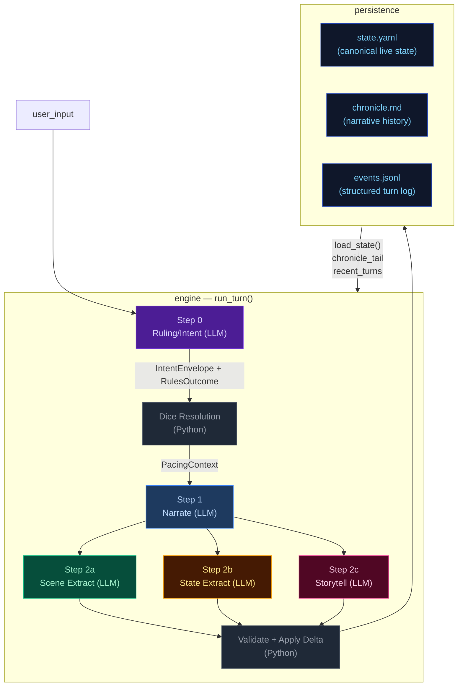

## Pipeline Quick Reference

| Step | Docs | When it runs | Key inputs | Key outputs | Mechanics it owns |
|---|---|---|---|---|---|
| **Step 0 — Ruling/Intent** | [step0-ruling](./step0-ruling.md) | Every turn (always) | `state.pc`, `state.location`, `recent_turns[-1:]`, `user_input` | `IntentEnvelope`, `RulesOutcome` | Intent classification, dice roll resolution (2d6 + stat + cond − diff → band), difficulty selection, anti-declare-outcome enforcement. |
| **Step 1 — Narrate** | [step1-narrate](./step1-narrate.md) | Every turn (always, streamed) | Full `state`, `chronicle_tail`, `recent_turns`, `pacing_context`, `pending_gm_beat`, `npc_roster` (tiered), `world_factions/locations`, `compendium_bios` | `narrative` (prose) | Prose generation, dice-band binding, GM-beat consumption. Tone shaped by `PacingContext.directive`. |
| **Step 2a — Scene Extract** | [step2a-scene](./step2a-scene.md) | Every turn (always) | `narrative`, `state.pc/location`, `npc_roster` (tiered), conditions, known_characters (LRU compendium) | `SceneExtractResult`: scene_tags, tagline, location_change, npc_add/remove/update, compendium_npc_update | NPC presence, location changes, scene tags, durable NPC compendium identity. |
| **Step 2b — State Extract** | [step2b-state](./step2b-state.md) | Every turn (always) | `narrative`, `state.pc/location/inventory`, conditions | `StateExtractResult`: inventory_add/remove/update, pc_condition_add/remove | Inventory delta accuracy, condition lifecycle. |
| **Step 2c — Storytell** | [step2c-progress](./step2c-progress.md) | Every turn (always) | `narrative`, `_ExtractionContext`, pacing_context, arc.threads[], recent_turns[-2:], band, npc_roster (tiered) | `StorytellerResult`: thread_advance/resolve/add, gm_beat, recent_events_add/update/remove, actions, outcome_summary | Unified thread lifecycle, beat disposition inference, durable history events. |

After Step 2c: results merge into a `StateDelta`, the validator checks constraints
(e.g. `inventory_remove` IDs exist), `apply_delta()` mutates state in-place, and the
turn is persisted. The next turn's Step 0 reads the new `state.yaml` plus `events.jsonl`.

## Subsystem Docs

| Subsystem | Doc | What it covers |
|---|---|---|
| **Step 0 — Ruling** | [step0-ruling](./step0-ruling.md) | Intent classification, dice resolution flowchart |
| **Step 1 — Narrate** | [step1-narrate](./step1-narrate.md) | Streaming narration pipeline with all context inputs |
| **Step 2a — Scene Extract** | [step2a-scene](./step2a-scene.md) | Location changes, NPC presence, scene tags |
| **Step 2b — State Extract** | [step2b-state](./step2b-state.md) | Inventory and condition extraction |
| **Step 2c — Storytell** | [step2c-progress](./step2c-progress.md) | Thread lifecycle, GMBeat schema, beat lifecycle (3 phases) |
| **PacingContext** | [pacing-context](./pacing-context.md) | Struct definition, computation flowchart, wiring to Narrator/Progress |
| **Delta → Validate → Apply** | [delta-validate](./delta-validate.md) | StateMerge schema, validation rules, apply_delta mutations |
| **Persist** | [persist](./persist.md) | Atomic writes (events.jsonl, state.yaml, chronicle.md), readback |
| **Cross-Pipeline Data Flow** | [cross-pipeline](./cross-pipeline.md) | Full inter-step data flow diagram |
| **Campaign Arcs** | [campaign-arcs](./campaign-arcs.md) | Arc data model (unified threads), engine-driven lifecycle, narrator-driven updates, integration points |
| **Out-of-Band Pipelines** | [out-of-band](./out-of-band.md) | Character Creation pipeline, Generate Seed pipeline, turn viewer status colors |
| **Narration UI** | [narration-ui](./narration-ui.md) | Main game interface: SSE streaming, HTMX sidebar refresh, Alpine.js state machine |
| **Turn Viewer UI** | [turn-viewer-ui](./turn-viewer-ui.md) | Pipeline debug UI: turn cards, stage inspector, diff panel, live updates |
| **Eval Harness** | [eval-harness](./eval-harness.md) | Scenario runner, LLM judges, auto-checkers, REPORT.md generation |

## Key Models Glossary

### Core Result Types

- **IntentEnvelope**: `intent`, `intent_verb`, `target`, `check.required`, `check.skill`, `check.difficulty`
- **RulesOutcome**: `rolled`, `skill`, `difficulty`, `stat_value`, `stat_mod`, `diff_mod`, `cond_mod`, `dice`, `raw_total`, `final_total`, `band`, `directive`, `intent`, `intent_verb`
- **SceneExtractResult**: `scene_tags`, `scene_tagline`, `location_change`, `npc_add/remove/update`, `compendium_npc_update`
- **StateExtractResult**: `inventory_add/remove/update`, `pc_condition_add/remove`
- **StorytellerResult**: `thread_advance`, `thread_resolve`, `thread_add`, `gm_beat`, `recent_events_add/update/remove`, `actions`, `outcome_summary`
- **SeedEnvelope**: `seed_state: GameState`, `opening_narrative`, `actions`, `arc: CampaignArc` (includes `goal_context`, unified `threads[]`, `completed_threads[]`), `pc_drive`

  The seed owns first-turn emotional framing, not just world and arc scaffolding. It generates `goal_context` (character-specific stake), NPC `relation` fields (narrative job relative to PC), and action text written from the PC's voice and scene pressure — ensuring the opening feels personal and motivated from the start.

### PacingContext (see [pacing-context](./pacing-context.md))

```
PacingContext:
  directive: str           # "" | "Breathe" | "Pressure" | "Overwhelm" | "Tension" | "Resolve a Threat" | "Threat Pressure" (may include "; Combat Fatigue" secondary)
  beat_locked: bool        # True: floor relief fired — Progress MUST emit breathing_room beat and gate is force-closed
  gate: str                # "block_add" | "block_escalate" | "allow" (controls thread_add)
  summary: str             # human-readable log string, never sent to LLM
```

### GMBeat (see [step2c-progress](./step2c-progress.md))

```
GMBeat
  type: complication | revelation | opportunity | breathing_room | pressure | twist | setback | escalation | callback
  surface_as: ambient | event | npc_behavior | environmental | player_discovery | item (default: ambient)
  beat_expires_turn: int | None (turn number at which the beat expires; set to turn_no + 2 when stored)
```

### CampaignArc (see [campaign-arcs](./campaign-arcs.md))

```
CampaignArc
  visible_goal: str           — What the PC is trying to achieve
  goal_context: str           — 2–3 sentences explaining why visible_goal matters to this character specifically
  thematic_question: str      — The moral/thematic tension of the arc
  pc_drive: str               — The PC's personal motive/reason for being in this situation
  hidden_truths: list[str]    — Story secrets the narrator knows but must not reveal in prose
  discovered_truths: list[str] — Truths the player has uncovered
  threads: list[ArcThread]    — Unified collection with active flag; replaces old active/latent split
  completed_threads: list[ArcThread] — Resolved/failed/abandoned threads

ArcThread (unified)
  id, summary, scope ("scene"|"arc"), active: bool = True
  urgency ("background"|"normal"|"urgent")
  tags: list[str], progress: int (0..3)
  resolution_state: str | None
  last_seen_turn: int | None, added_turn: int | None
  unlock_if: str | None — condition string; thread is only promotable when empty/falsy
  promotes: list[str] — threads this one can promote to when completed
```

### StateDelta (see [delta-validate](./delta-validate.md))

Merges all three extraction results. Contains `scene_tags`, `location_change`, `npc_add/remove/update`, `thread_advance/resolve/add`, `inventory_add/remove/update`, `pc_condition_add/remove`, `recent_events_add/update/remove`. Note: `gm_beat` is NOT in StateDelta — written directly to `state.meta.pending_gm_beat`.

---


## campaign-arcs


The campaign arc system tracks story threads and truth discovery across turns. It has two execution paths: **engine-driven** (thread lifecycle with 5-turn expiry for silent threads) and **narrator-driven** (truth discovery, goal updates).

## Arc Data Model

```
CampaignArc
  visible_goal: str          — What the PC is trying to achieve
  goal_context: str          — 2–3 sentences explaining why visible_goal matters to this character specifically; inner cost or pressure that makes it emotionally loaded
  thematic_question: str     — The moral/thematic tension of the arc
  pc_drive: str              — The PC's personal motive/reason for being in this situation; expressed indirectly
  hidden_truths: list[str]   — Story secrets the narrator knows but must not reveal in prose
  discovered_truths: list[str] — Truths the player has uncovered (subset of hidden_truths)
  threads: list[ArcThread]   — Unified collection replacing active_threads + latent_threads split. Each thread has scope ("scene" or "arc") and active flag set by Python age rules, not LLM.
  completed_threads: list[ArcThread] — Resolved/failed/abandoned threads; resolution_state preserved for narrative context

ArcThread (unified)
  id: str                    — Unique identifier
  summary: str               — What this thread is about
  scope: Literal["scene", "arc"]  # scene = short-lived tied to current location; arc = persistent story tension
  active: bool = True        # False = dormant/latent; set by Python age rules (not LLM)
  urgency: Literal["background", "normal", "urgent"] = "normal"
  tags: list[str]            — Keywords for engagement matching
  progress: int              — 0..3 (incremented by thread_advance)
  resolution_state: str | None # Set when thread_resolve processes resolved/failed/abandoned; preserved on completed threads
  last_seen_turn: int | None # For age-based active/dormant demotion in Python
  added_turn: int | None     # Python-managed lifecycle tracking
  unlock_if: str | None      # Condition string; thread is only promotable when empty/falsy
  promotes: list[str]        # Threads this one can promote to when completed
```

**Key change from previous architecture:** `scene_pressure[]` and the split between `active_threads` / `latent_threads` are merged into a single `arc.threads[]`. The engine manages thread lifecycle via `_apply_thread_signals()`: age-based demotion (`active: True → False`) replaces the old active/latent migration logic, with silent threads (not listed in `thread_advance` for 5+ turns) being demoted to dormant state.

## Engine-Driven Arc: Unified Thread Lifecycle

Thread lifecycle runs in `engine/turn.py` during the extraction phase, after `apply_delta()` but before narration arc_update merge. Two functions handle the unified thread operations:

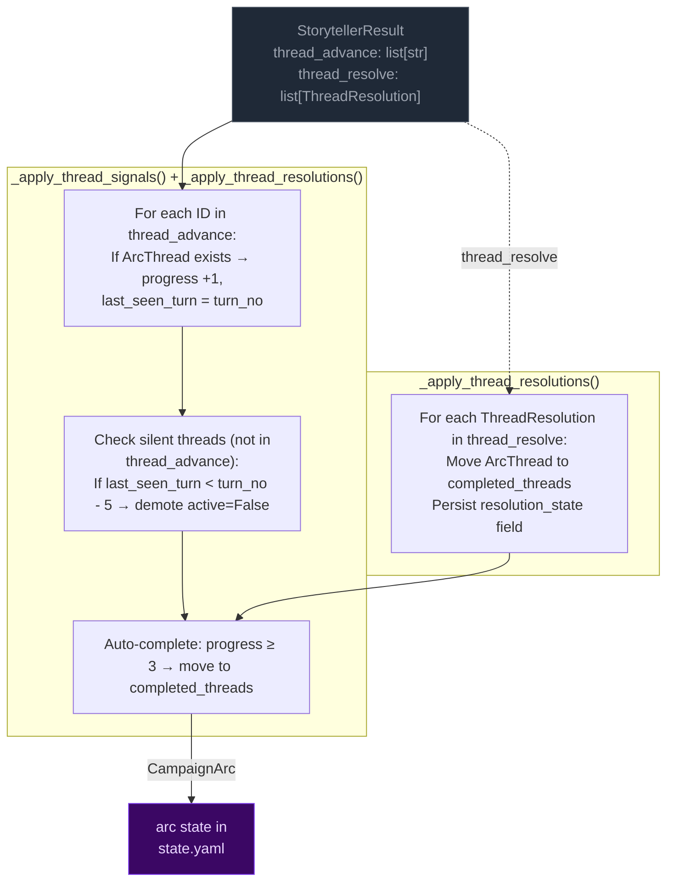

**Key rules:**
- **Unified collection:** `arc.threads[]` replaces the old active_threads/latent_threads split. The engine manages thread lifecycle via age-based demotion (`active: True → False`) instead of LLM-labeled urgency states.
- **Completion threshold:** progress reaches 3 → thread moved to `completed_threads`. Resolution state is preserved on completed threads for narrative context and eval rubrics.
- **5-turn expiry (age-based):** Threads not listed in `thread_advance` for 5+ turns get demoted (`active=False`). This replaces the old active→latent migration with a simpler boolean flag that Python manages directly from thread age, not LLM judgment.

## Narrator-Driven Arc: Phase & Truth Updates

The narrator can update arc metadata through a sentinel-delimited JSON block in its output. The engine parses and merges these updates after narration.

```mermaid
flowchart LR
    classDef llmNode fill:#0f172a,color:#94a3b8,stroke:#334155
    classDef sentinel fill:#3b0764,color:#e9d5ff,stroke:#7c3aed
    classDef mergeNode fill:#172554,color:#bfdbfe,stroke:#1d4ed8
    classDef arcNode fill:#3b0764,color:#e9d5ff,stroke:#7c3aed

    subgraph NARRATOR["Narrator prompt context"]
        NC1["visible_goal"]
        NC2["goal_context (early-turn narrative guidance)"]
        NC3["thematic_question"]
        NC5["arc.threads[] (summary, scope,<br>urgency, tags)"]
        NC6["pc_drive"]
        NC7["hidden_truths[] — internal only<br>NARRATOR MUST NOT reveal in prose"]
        NC8["discovered_truths[]"]
    end

    subgraph EMISSION["Narrator output"]
        PROSE["narration prose<br>(player sees this)"]:::llmNode
        SENTINEL["<<<ARC_UPDATE_START>>>
{discovered_truths, visible_goal}
<<<ARC_UPDATE_END>>>"]:::sentinel
    end

    subgraph PARSING["_extract_narrator_arc_update()"]
        P1["Regex: <<<ARC_UPDATE_START>>>(.*?)<<<ARC_UPDATE_END>>>"]
        P2["json.loads() → arc_dict"]
        P3["Strip block from narrative"]
    end

    subgraph MERGE["_merge_arc_update()"]
        M1["visible_goal: overwrite if present"]
        M2["thematic_question: overwrite if present"]
        M3["hidden_truths: overwrite if present"]
        M4["pc_drive: overwrite if present"]
        M5["hidden_truths: overwrite if present"]
        M6["discovered_truths: union with existing"]
        M7["goal_context: NOT merged — seed-only field, unchanged during play"]
    end

    NC1 & NC2 & NC3 & NC5 & NC6 & NC7 & NC8 --> PROSE
    PROSE --> SENTINEL
    SENTINEL --> P1 --> P2 --> P3
    P3 -- "clean narrative" --> CLIENT["client"]
    P2 -- "arc_dict" --> MERGE

    MERGE --> ARC[merge into state["arc"]]:::arcNode
```

**Merge rules:**
- **Engine owns thread lifecycle** (active/dormant/completed via age-based demotion). Narrator arc_update omits thread fields — they are ignored by `_merge_arc_update()`.
- **Narrator owns visible_goal/thematic_question/discovered_truths/hidden_truths.** Engine does not modify these.
- **`goal_context` is seed-only** — set once at game start, never overwritten by narrator or engine during play.
- **Discovered truths:** merged as set union (dedup).
- **Merge order:** engine thread signals run first (setting `delta.arc_update`), then narrator arc_update is parsed after narration and merged on top via a second `_merge_arc_update()` call in `run_turn()`.

## Arc Context in Narration

The arc state is passed to the narrator via `current_arc` in both system and user prompts. The narrator sees all arc metadata including `hidden_truths` but is explicitly instructed not to reveal them in prose.

### Early-turn narrative mode

When `goal_context` is present on the arc, the narrator treats it as narrative guidance for early turns: ground the player in personal stakes before broad exposition. The `goal_context` shapes what detail feels loaded, which NPC moment carries emotional charge, and what pressure matters immediately — without restating or summarizing it explicitly. This signal is provided via a conditional block in `narrate_system.j2`.

The `goal_context` is also injected into the user prompt via the `_arc.j2` subtemplate as hidden narrator context (HTML-comment wrapped), consumed by the LLM for narrative emphasis but not displayed to the player.

### Narrator prompt context

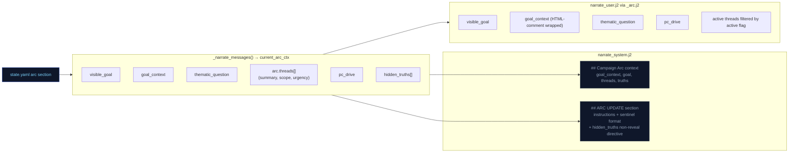

## Arc System Integration Points

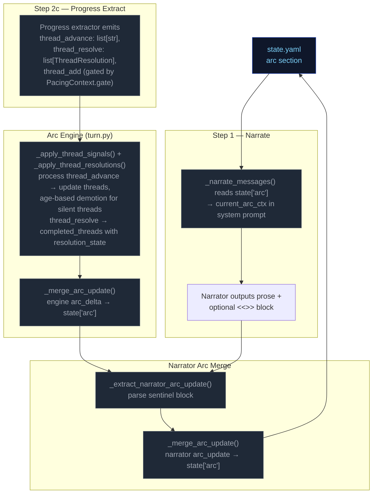

---


## cross-pipeline


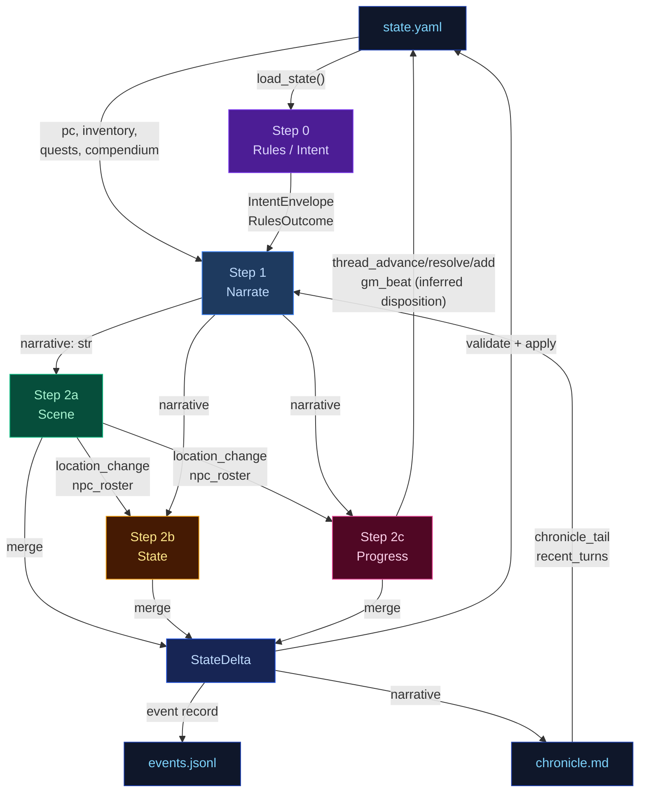

---


## delta-validate


The three extraction results merge into a single `StateDelta`, then validate and apply.

## Flowchart

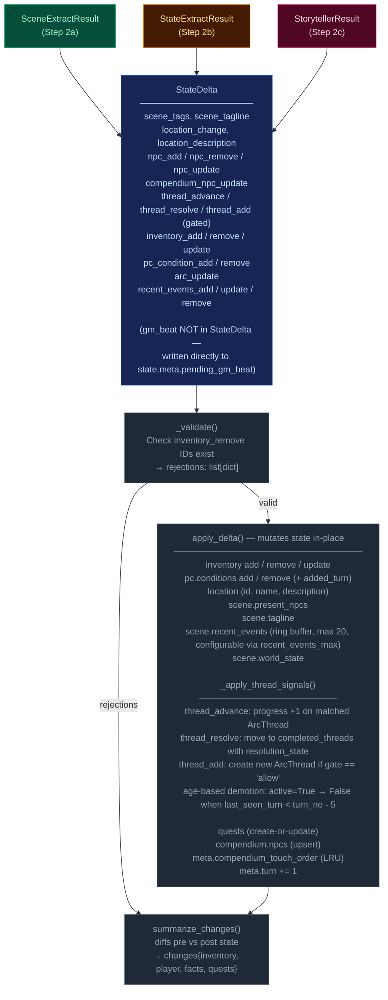

---


## narration-ui


The primary player-facing UI. Renders game state, streams narrative tokens live, and refreshes sidebars via HTMX partial swaps. Single-page app driven by Alpine.js + SSE + HTMX.

## Interaction Model

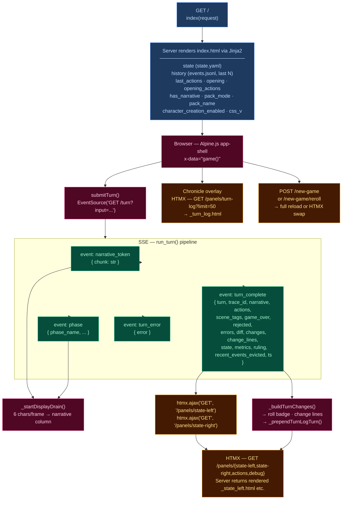

## Layout

| Region | Element | Content |
|--------|---------|---------|
| **Header** | `.header-bar` | Logo/tagline, Chronicle toggle, turn counter, retry button, new game button, reroll button (dynamic packs), mock-mode dot |
| **Left sidebar** | `.sidebar-left` | Player card, scene NPCs, location, arc, compendium — loaded via `/panels/state-left` |
| **Narrative column** | `.narrative-column` | Scrollable narrative blocks, action pills, input textarea, send/stop button |
| **Right sidebar** | `.sidebar` (right) | Inventory, recent events, world state, debug panel — loaded via `/panels/state-right` |
| **Chronicle overlay** | `.turn-log-shell` | Floating overlay over narrative column, populated by `/panels/turn-log?limit=50` |
| **New Game modal** | (Alpine `x-show`) | Pack picker → char creation / world builder steps |

## Data Flow

### Turn submission (Alpine.js + SSE)

1. User types input, presses Enter → `game().submitTurn()`
2. Opens `EventSource` to `GET /turn?input=<text>` — SSE endpoint in `routes.py:83`
3. Server streams events as the 5-stage pipeline (`run_turn()`) executes:
   - `narrative_token` — token chunks streamed as they arrive from LLM
   - `phase` — pipeline phase progress (ruling_start, narrate_start, narrate_first_token, narrate_done, extract_start, extract_done, compact_start, etc.)
   - `turn_complete` — final result
   - `turn_error` — error payload
4. Client `_startDisplayDrain()`: reveals 6 characters per animation frame for smooth streaming
5. On `turn_complete`:
   - Calls `htmx.ajax('GET', '/panels/state-left', ...)` and `htmx.ajax('GET', '/panels/state-right', ...)` to refresh sidebars
   - Renders change lines (`_buildTurnChanges`), roll badge
   - Prepends turn to Chronicle overlay via `_prependTurnLogTurn`
   - Re-renders markdown via `marked.parse()`

### HTMX partial endpoints (routes.py)

| Route | Template | Purpose |
|-------|----------|---------|
| `GET /panels/state-left` | `_state_left.html` | Left sidebar — player, NPCs, location, arc, compendium |
| `GET /panels/state-right` | `_state_right.html` | Right sidebar — inventory, events, world state, debug |
| `GET /panels/actions` | `_actions.html` | Action pills (fallback) |
| `GET /panels/turn-log?limit=N` | `_turn_log.html` | Chronicle — turn history with change lines |
| `GET /panels/pack-picker` | `_pack_picker.html` | New Game — pack selection cards |
| `GET /panels/char-creation` | `_char_creation.html` | New Game — character stats builder |
| `GET /panels/world-builder` | `_world_builder.html` | New Game — world creation form |
| `GET /panels/debug` | `_debug.html` | Debug panel — recent turn timings, errors |
| `GET /panels/state` | `_state.html` | Combined left+right (legacy) |

### Client state machine (`game()` — inline `<script>` in index.html)

Alpine.js `x-data="game()"` manages:
- `input` — textarea value
- `submitting` — turn-in-progress flag
- `gameStarted` — derived from `has_narrative`
- `turnNum` — current turn counter
- `leftWidth` / `rightWidth` — resizable sidebar widths (persisted to `localStorage`)
- Card collapse state — read/written directly from/to `localStorage` via `CCYA_CARD_KEY(name)` helper, using DOM `data-card` attributes; no Alpine data property

## UI Features

### Resizable sidebars
- Drag gutters with mousedown/mousemove handlers
- Widths saved to `localStorage` (`ccya_sidebar_left`, `ccya_sidebar_right`)
- Minimum width enforcement (240px left, 220px right)

### Collapsible cards
Each sidebar section has a collapse toggle; open/closed state persisted per-card to `localStorage` via `ccya_card_<name>` key.

### Action pills
Suggested next actions rendered as buttons that populate the input on click. Updated from `turn_complete.actions` or via HTMX panel refresh.

### Roll badge
Server-rendered for history, JS-built for new turns. Shows dice math, band label, outcome summary. Band colors: `crit_fail` (red) → `fail` → `setback` → `partial` → `success` → `crit_success`.

### Change lines
Grouped by category via emoji prefix:
| Emoji | Category | Class |
|-------|----------|-------|
| 🎒 + | Inventory gain | `.tc-inv-gain` |
| 🎒 − | Inventory loss | `.tc-inv-loss` |
| 🩺 | Player condition | `.tc-pl` |
| 📍 | Location | `.tc-loc` |
| 📜 | Faction/arc | `.tc-fa` |

### Retry
`POST /turn/delete` removes last event from `events.jsonl` and `chronicle.md`, returns previous actions for re-submission.

### New Game
`POST /new-game` with optional `pack_id`, `pc_name`, `pc_stats`, `hints`. For dynamic packs, triggers `generate_seed()` LLM pipeline. Full page reload on success. Reroll (`POST /new-game/reroll`) HTMX-swaps the opening narrative + actions.

## CSS Architecture

- **`app.src.css`** — Tailwind + custom styles split by region (lines 1–2101):
  - App shell layout (CSS Grid: header + body with sidebar-gutter-main-gutter-sidebar)
  - Narrative blocks (`.narrative-block`, `.narrative-text`)
  - Sidebar cards (`.card`, `.card-header`, `.card-body`)
  - Input bar (`.input-bar`, `.game-input`, `.send-btn`)
  - Action pills (`.action-pill`, `.pills-row`)
  - Roll badges (`.roll-badge`, `.roll-band--*`)
  - Chronicle overlay (`.turn-log-shell`, `.turn-log-panel`)
  - New Game modal (`.modal-overlay`, `.pack-card`)
  - Progress strip, tooltips, scrollbar styling
  - Design tokens via CSS custom properties (`--text-primary`, `--bg-card`, `--status-*`)
- Compiled to **`app.css`** with cache-busting via `css_v` query param

## Server Entry Point

`routes.py:57` — `GET /` handler assembles template context from `state.yaml`, `events.jsonl`, pack manifest, and engine config, then renders `ccya/templates/index.html`.

---


## out-of-band


These run only at new-game time or are non-engine concerns. They are excluded from the eval-context region of the main architecture doc.

## Character Creation Pipeline

Triggered by `POST /new-game`. Behavior differs by pack mode.

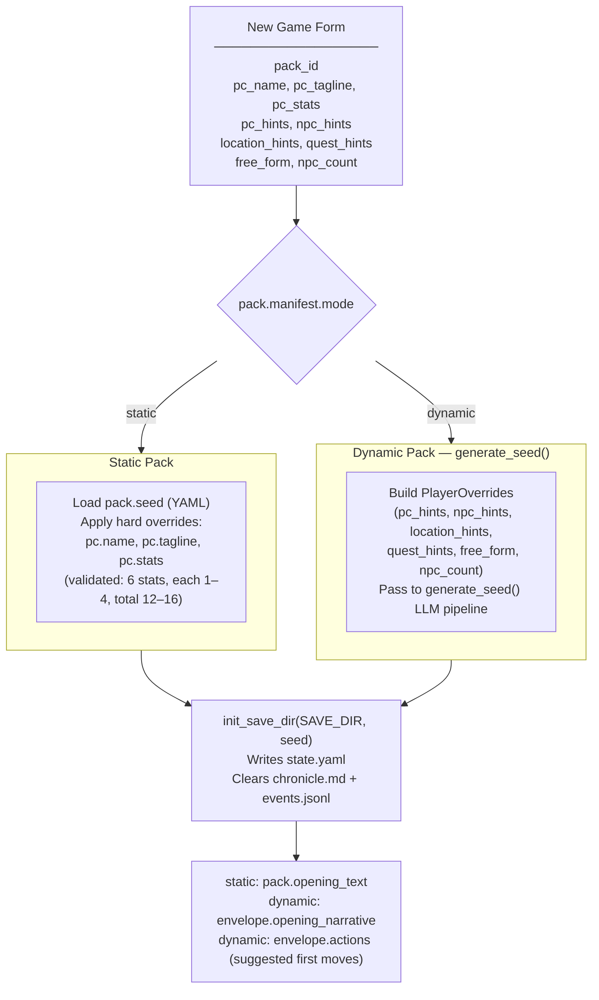

## Generate Seed Pipeline (Dynamic Packs Only)

Called by `POST /new-game` and `POST /new-game/reroll`. Generates a complete starting game state (PC, NPCs, location, arc, opening narrative, actions) from the pack manifest and optional player overrides.

The seed owns **first-turn emotional framing** — not just world and arc scaffolding. Every seed element must produce an emotionally legible opening that answers: why this moment matters now, what the character stands to lose, and why at least one person in the scene matters to them personally.

```mermaid
flowchart LR
    classDef llmNode fill:#0f172a,color:#94a3b8,stroke:#334155
    classDef outNode fill:#172554,color:#bfdbfe,stroke:#1d4ed8

    subgraph IN["Inputs"]
        G1["pack.manifest<br>(world rules, tone, setting)"]
        G2["pack.style_text"]
        G3["PlayerOverrides (optional)<br>  pc_hints, npc_hints<br>  location_hints, quest_hints<br>  free_form, npc_count"]
        G4["npc_name_pool (name locales)"]
        G5["engine_config.generate_seed_temperature (0.9)<br>engine_config.generate_seed_max_retries (1)"]
    end

    subgraph LLM_GS["LLM — generate_seed_system.j2 + generate_seed_user.j2"]
        GL["temp: 0.9<br>output: SeedEnvelope JSON"]:::llmNode
    end

    subgraph OUT["Outputs — SeedEnvelope"]
        O1["seed_state: GameState<br>  pc (name, tagline, bio, stats)<br>  location (id, name, description)<br>  scene (present_npcs with relation field,<br>         recent_events, world_state)<br>  inventory: list[InventoryItem]<br>  compendium.npcs: dict[id] NpcRef<br>  meta (model, setting_pack, turn=0)"]:::outNode
        O2["arc: CampaignArc<br>  visible_goal, goal_context (personal stakes),<br>  thematic_question, hidden_truths,<br>  threads[] (unified, with active flag),<br>  completed_threads[], pc_drive"]:::outNode
        O3["opening_narrative: str<br>(prose intro shown before turn 1)"]:::outNode
        O4["actions: list[str]<br>(4 distinct, character-shaped,<br>scene-grounded choices)"]:::outNode
    end

    IN --> LLM_GS
    LLM_GS --> OUT
```

### Seed emotional framing contract

The seed prompt (`generate_seed_system.j2`) enforces these requirements:

- **`goal_context`**: 2–3 sentences explaining why `visible_goal` matters to this character specifically — inner cost or pressure that makes it emotionally loaded. No hidden-truth spoilers, no restating `visible_goal`, no direct statement of the thematic question. Must connect character motive, story stakes, and emotional cost.
- **NPC `relation` field**: Each opening NPC has a defined narrative job. One NPC is personally tied to the PC's motive or vulnerability; the other carries immediate external pressure from the world or conflict. The `relation` field encodes PC-facing relevance (e.g. "owes them a favor", "is their only contact here", "represents the institution pressing on them").
- **Action guidance**: Each of the 4 choices is written from the PC's point of view, grounded in a present NPC, immediate risk, active thread, or character motive. They differ in emotional posture (confront, deflect, investigate, protect, exploit, withdraw, etc.) and avoid generic verbs.
- **`pc_drive`**: A single sentence about the PC's personal reason for being in this situation. Expressed indirectly through `goal_context`, NPC relations, opening narrative, and actions — never displayed as a labeled UI fact.
- **`threads[]`**: Unified list (not split active/latent) where each thread has `{id, summary, tags, urgency, scope}` and an `active` boolean flag managed by Python age rules, not LLM.

## Turn Viewer — status colors

The standalone turn viewer ([turn-viewer-ui](./turn-viewer-ui.md)) uses the same semantic status colors as the CSS custom properties in `static/app.src.css` (`--status-*`). The stage colors used in the diagrams above (`stageRules` violet → `stageNarrate` blue → `stageScene` green → `stageState` amber → `stageProgress` pink) map directly to the `--stage-*` tokens. Cross-stream inputs into a step are shown in `xstream` (purple outline) and LLM/Python boxes use neutral dark fills. This table is the canonical turn-viewer status legend.

| Token | Meaning |
|-------|---------|
| `--status-ok` | Stage ran and completed (no extraction error). |
| `--status-skipped` | Stream was skipped (no longer used — all streams always run). |
| `--status-retried` | LLM output required a parse retry (`attempts` > 1 in event). |
| `--status-rejected` | Post-extract validation rejected part of the delta (e.g. bad `inventory_remove`). |
| `--status-error` | LLM call or parse ultimately failed for that stream. |
| `--status-neutral` | Non-fatal / informational (e.g. rules path with no dice roll). |

Stage accent stripes use `--stage-rules`, `--stage-narrate`, `--stage-scene`, `--stage-state`, `--stage-progress` for quick scanning; **status** always wins for the prominent left border.

---


## pacing-context


All pacing signals are collapsed into one Python-computed struct (`PacingContext`) passed to both the Narrator and Progress Extractor. This replaces six independent fields (`narration_directive`, `deescalate`, `narrative_velocity`, `beat_disposition` output, `quest_threshold_directive`, and stale momentum-derived signals). The narrator receives `directive`; Progress receives the full struct.

## Struct definition

```
PacingContext:
  directive: str           # "" | "Breathe" | "Pressure" | "Overwhelm" | "Tension" | "Resolve a Threat" | "Threat Pressure"
  beat_locked: bool        # True: floor relief fired — Progress MUST emit breathing_room beat and gate is force-closed
  gate: str                # "block_add" | "block_escalate" | "allow" (controls thread_add)
  summary: str             # human-readable log string, never sent to LLM
```

`beat_locked: True` subsumes the old `_check_floor_relief()` side-channel — floor relief logic is computed inside `_compute_pacing_context()`. The `gate` field prevents Progress from adding new threads during de-escalation windows. Secondary modifiers like "Combat Fatigue" may be appended via semicolons (e.g., "Pressure; Combat Fatigue").

## Computation

`_compute_pacing_context()` in `engine/turn.py` consolidates pacing computation (replacing the former scattered functions: `_compute_narration_directive`, `_compute_narrative_velocity`, `_check_floor_relief`). It takes inputs (`momentum`, `consecutive_floor_turns`, `arc.threads[] scope=scene urgency counts`, combat age, location age) and returns a single struct with directive derived from the same priority stack:

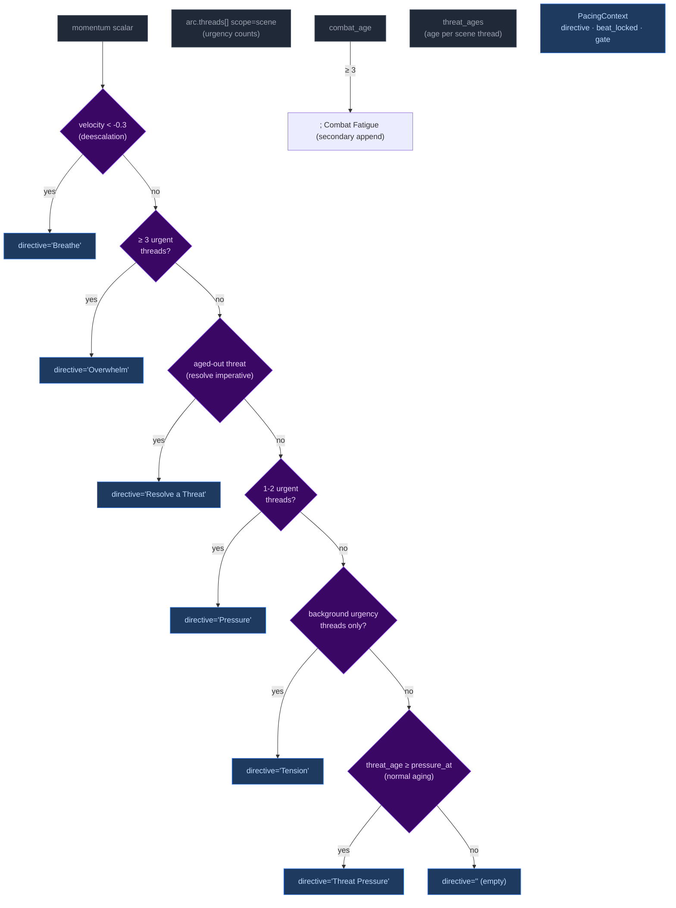

Priority order (highest to lowest): **Breathe > Overwhelm > Resolve a Threat > Pressure > Tension > Threat Pressure > (empty)**. The `beat_locked` flag takes precedence — when at momentum floor, directive is forced to include "Resolve a Threat" and gate is force-closed when directive is "Breathe".

## Wiring: how PacingContext reaches the pipelines

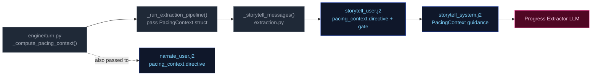

1. **Computed** once in `run_turn()` via `_compute_pacing_context()`.
2. **Passed through** `_run_extraction_pipeline()` → both `_narrate_messages()` and `_storytell_messages()`.
3. **Narrator template** (`narrate_user.j2`) renders only `directive` (tone/direction). No Jinja2 directive computation remains — all directives computed by Python.
4. **Storytell template** ((`storytell_system.j2` + `user.j2`)) receives the full struct; guidance maps each directive to appropriate thread/beat actions:

| Directive | Thread action | Gate |
|-----------|---------------|-------|
| **"Breathe"** (de-escalation, velocity < -0.3) | Do NOT add new threads. Allow existing scene threads to persist without escalation. | `block_add` + force-closed when at momentum floor |
| **"Overwhelm"** (3+ urgent threads) | May add scene-scoped threads if gate allows; emit pressure/escalation beat | `allow` |
| **"Resolve a Threat"** (aged-out threat imperative) | Advance the aged thread toward resolution; avoid adding new complications | `allow` |
| **"Pressure"** (1-2 urgent or aging threats) | Advance relevant scene/arc threads. Add new thread only if gate permits. | Varies by context |
| **"Tension"** (background urgency only) | Do NOT add pressures unless concrete threat emerges; prefer advancing existing threads | Allow |
| **"Threat Pressure"** (normal urgency aging) | Escalate urgency of the aging thread; consider advancing | Allow |
| **"" (empty)** | No action required beyond normal aging of silent threads. | Allow |

**Note:** Directives may include secondary modifiers joined by semicolons (e.g., "Pressure; Combat Fatigue"). The primary directive drives thread/beat logic; the secondary acts as a thematic modifier on beat type.

---


## persist


Atomic writes to disk. No LLM calls.

## Flowchart

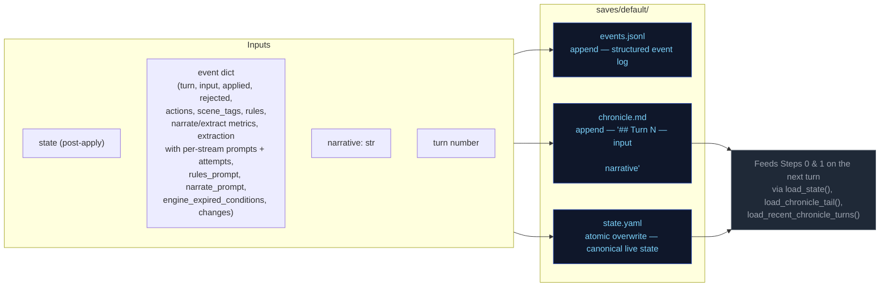

---


## step0-ruling


Classifies the player's action, determines whether a dice check is needed, and
identifies which state domains will be active — narrowing every downstream extractor.

## Flowchart

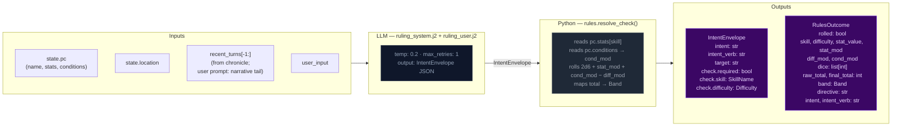

## Key forward dependency

`rules_outcome` feeds into `_compute_pacing_context()` which produces the single authoritative `PacingContext` struct passed to both Narrator and Progress Extractor.

---


## step1-narrate


Generates the narrative prose the player reads. Tokens are streamed to the client.

## Flowchart

```mermaid
flowchart LR
    classDef llmNode   fill:#0f172a,color:#94a3b8,stroke:#334155
    classDef xstream   fill:#4c1d95,color:#ddd6fe,stroke:#7c3aed
    classDef outNode   fill:#1e3a5f,color:#bfdbfe,stroke:#3b82f6

    subgraph IN["Inputs"]
        N1["state (full —<br>pc, location, scene,<br>inventory, quests, compendium)"]
        N2["chronicle_tail<br>(compressed history, ≤budget tokens)"]
        N3["recent_turns (last window_turns, default 3)"]
        N4["rules_outcome<br>(band, directive, dice summary)"]:::xstream
        N5["pack_style (tone / prose guide)"]
        N6["npc_name_pool (cultural name list)"]
        N7["recently_left NPCs"]
        N8["known_npcs<br>(last-seen info)"]
        N9["present_npcs<br>(attitudes)"]
        N10["world_factions<br>(immutable trace)"]
        N11["world_locations<br>(nearby, immutable)"]
        N12["pending_gm_beat<br>(type · surface_as metadata)"]
        N13["pacing_context<br>(directive)<br>from _compute_pacing_context()"]:::xstream
        N14["compendium_bios<br>(upserted bio entries for<br>present + recently_left NPCs)"]
        N15["user_input"]
    end

    subgraph LLM1["LLM — narrate_system.j2 + narrate_user.j2"]
        NL["temp: 0.9 · streaming: yes<br>output: prose narrative (str)"]:::llmNode
    end

    subgraph OUT["Outputs"]
        NO1["narrative: str<br>(streamed as tokens → client<br>then joined + thinking-stripped)"]:::outNode
        NO2["narr_metrics<br>  first_token_ms<br>  total_ms<br>  tokens_in / tokens_out"]
    end

    IN --> LLM1
    LLM1 --> OUT
```

## Arc context in narration

The narrator receives `current_arc` in both system and user prompts. Key fields:

- **`goal_context`**: A seed-time field (2–3 sentences) explaining why `visible_goal` matters to the character specifically — inner cost or pressure that makes it emotionally loaded. When present, `narrate_system.j2` activates an early-turn guidance block: ground the player in personal stakes before broad exposition. This is also injected into the user prompt via `_arc.j2` as HTML-comment-wrapped narrator context.
- **`visible_goal`**: The player-facing objective.
- **`thematic_question`**: The moral tension — never stated directly in prose. Used as a lens for emphasis: what detail feels loaded, what silence matters.
- **`pc_drive`**: The character's personal motive. Expressed indirectly through goal_context, NPC relations, and action language rather than displayed as a labeled UI fact.
- **`hidden_truths[]`**: Internal-only story secrets the narrator must never reveal in prose.
- **`threads[]`**: Unified thread collection filtered by `active` flag. Scene-scope threads provide immediate pressure; arc-scope threads provide medium-term tension.

### Opening-turn narrative mode

When `goal_context` is present (always true after seed), the narrator treats early turns as a distinct onboarding mode:
1. Personal stakes before broad exposition
2. One NPC moment with emotional charge (driven by `relation` fields on seed NPCs)
3. One immediately actionable pressure

The presence of `goal_context` itself is the signal — no turn-counting dependency needed. The guidance is most impactful in the first few turns and persists as background context throughout the campaign.

## Key forward dependency

`narrative` is the primary content input for all three extraction streams below.

---


## step2a-scene


Extracts location changes, NPC presence, scene tags, and suggested actions from the narrative.

## Flowchart


## Key forward dependency

`location_change` and `present_npcs` flow into `extraction_ctx` (built by `_build_extraction_context`). Step 2c also receives `npc_roster` (tiered: PRESENT/JUST_LEFT/NEARBY/KNOWN) built from extraction_ctx. No forward-facing mechanics (`thread_add`, `gm_beat`) are emitted by this stream — they go through the unified thread pipeline via Progress Extract.

---


## step2b-state


Extracts inventory changes and player condition mutations from the narrative.

## Flowchart

```mermaid
flowchart LR
    classDef llmNode fill:#0f172a,color:#94a3b8,stroke:#334155
    classDef xstream fill:#4c1d95,color:#ddd6fe,stroke:#7c3aed
    classDef outNode fill:#451a03,color:#fde68a,stroke:#f59e0b

    subgraph IN["Inputs"]
        S1["narrative (from Step 1)"]:::xstream
        S2["state.pc (name, bio, stats, conditions)"]
        S3["state.location"]
        S4["state.inventory"]
        S5["intent: str<br>(from Step 0)"]
    end

    subgraph LLM2B["LLM — extract_state_system.j2 + extract_state_user.j2"]
        SL["temp: 0.4 · max_retries: 1<br>output: StateExtractResult JSON"]:::llmNode
    end

    subgraph OUT["Outputs — StateExtractResult"]
        O1["inventory_add: list[InventoryItem]<br>  id, name, notes, amount"]:::outNode
        O2["inventory_remove: list[InventoryRemove]<br>  id, amount (None = full stack)"]:::outNode
        O3["inventory_update: list[InventoryUpdate]<br>  id, name?, notes?"]:::outNode
        O4["pc_condition_add: list[ConditionAdd]<br>  id, label, description"]:::outNode
        O5["pc_condition_remove: list[ConditionRemove]<br>  id"]:::outNode
    end

    IN --> LLM2B
    LLM2B --> OUT
```

## Key forward dependency

Step 2c receives `npc_roster` (tiered: PRESENT/JUST_LEFT/NEARBY/KNOWN) and `location_change` from Step 2a. Cross-stream items_gained/lost were removed — extraction_ctx now covers all this-turn derived data.

---


## step2c-progress


Extracts quest updates, recent events, and durable NPC compendium changes.

## Flowchart


## Always runs

Progress is the post-narration storytelling brain. It always executes every turn (never skipped) and feeds next turn's rules call via `recent_events_add` (durable narrative facts), `thread_advance/resolve/add` (unified thread lifecycle with scope-aware age demotion), and `gm_beat` (forward-facing beats stored in `state.meta.pending_gm_beat`).

## GMBeat schema

```
GMBeat
  type: complication | revelation | opportunity | breathing_room | pressure | twist | setback | escalation | callback
  surface_as: ambient | event | npc_behavior | environmental | player_discovery | item (default: ambient)
  beat_expires_turn: int | None (turn number at which the beat expires; set to turn_no + 2 when stored)
```

## Beat lifecycle

The beat flows through three phases per turn:

**Phase 1 — Pre-narration expiry check.** At the start of each turn, the engine reads `state.meta.pending_gm_beat` from the previous turn. If `beat_expires_turn` is set and the current turn number exceeds it, the beat is nullified. Otherwise it proceeds to narration.

**Phase 2 — Narration consumption.** The beat is passed to the narrator via `_narrate_messages(pending_gm_beat=...)`. The narrator uses the beat's type and surface_as metadata as creative guidance alongside the pacing directive. After narration completes, the pending beat is cleared from state — it is not restored for storyteller consumption.

**Phase 3 — Extraction disposition (inferred).** The storyteller receives no pending beat context in its prompt — it decides beats based solely on current extraction data (scene state, threads, pacing context, band). Unlike the previous architecture, there is no explicit `beat_disposition` field. Instead:
- If Progress emits a new `gm_beat`, it replaces the old one (`state.meta.pending_gm_beat = gm_beat` with `beat_expires_turn = turn_no + 2`)
- If Progress emits nothing and the beat's `expires_at` hasn't passed, the engine preserves the existing beat unchanged (carry)
- The engine stores beats with `beat_expires_turn = turn_no + 2` as a hard TTL ceiling. Beats past their expiry are discarded automatically on load.

---

---


# Static Context (immutable across all turns)

## World Pack Style

```
# Eval-pack style

This pack is a deterministic test fixture. The narrator should write in a plain,
clear, second-person past-tense register. Keep these in mind:

- Specific over abstract. Name the thing the player did, the object they touched, the
  NPC they spoke to. Avoid generic mood words ("an air of menace") in favor of
  concrete sensory detail.
- One scene per turn. Do not skip ahead in time unless the player explicitly does so.
- Honor the dice. If the rules outcome is `fail` or `setback`, the action did not
  succeed; describe the cost. If `partial`, the action succeeded with a complication.
- Honor the present_npcs. Every named NPC in the scene either acts, reacts, or is
  visibly present in the prose. Do not invent new NPCs unless the player's input
  introduces one.
- Plain language. No archaic phrasing, no fantasy-trope syntax ("Lo, the door...").
  This is a working road in a working world.
- 120-220 words per turn unless the action is large.

```

## Seed State

```json
{
  "meta": {
    "game_name": "eval",
    "turn": 0,
    "setting_pack": "eval-pack",
    "model": ""
  },
  "pc": {
    "name": "Aren Voss",
    "tagline": "Reluctant courier on the merchant road",
    "bio": "Mid-thirties, broad shoulders, careful with words. Took on a courier contract\nto clear an old debt. Just arrived in Marrow's Crossing with a heavy pack and\na heavier obligation.\n",
    "stats": {
      "strength": 3,
      "dexterity": 3,
      "wits": 2,
      "lore": 2,
      "charisma": 3,
      "resolve": 3
    },
    "conditions": [],
    "momentum": 0,
    "drive": ""
  },
  "location": {
    "id": "marrows_crossing",
    "name": "Marrow's Crossing",
    "description": "A market town built around the confluence of two rivers. Cobblestone streets,\ntimber-framed buildings, and the constant sound of water from the mills. The\ntown square has a stone well and a statue of the founder. Most shops are closing\nfor the evening.\n"
  },
  "inventory": [
    {
      "id": "credits",
      "name": "Credits",
      "notes": "Common coin, accepted at any inn or stall on the merchant road.",
      "amount": 500,
      "aliases": []
    },
    {
      "id": "iron_dagger",
      "name": "Iron dagger",
      "notes": "Plain crossguard, edge worn from honing. Belt-carried.",
      "amount": 1,
      "aliases": []
    },
    {
      "id": "bandages",
      "name": "Linen bandages",
      "notes": "Three rolls. Field-grade \u2014 won't replace a healer.",
      "amount": 3,
      "aliases": []
    },
    {
      "id": "traveler_cloak",
      "name": "Traveler's cloak",
      "notes": "Oiled wool, road-stained, hood deep enough to hide a face.",
      "amount": 1,
      "aliases": [
        "cloak",
        "travel cloak"
      ]
    },
    {
      "id": "brass_key",
      "name": "Brass key",
      "notes": "A small brass key Halden gave you with the ledger.",
      "amount": 1,
      "aliases": []
    }
  ],
  "scene": {
    "tagline": "Market town at dusk",
    "tags": [
      "peaceful",
      "start"
    ],
    "world_state": [
      "Marrow's Crossing is a market town at the confluence of two rivers, known for its mills and the annual river festival.",
      "Iron coin (credits) is the universal currency on the merchant road; barter is acceptable but slower.",
      "The road has been quieter than usual this season \u2014 fewer caravans, more independent runners, more opportunists."
    ],
    "recent_events": [
      {
        "id": "seed_evt_15933779",
        "text": "You arrived in Marrow's Crossing after three days on the road."
      },
      {
        "id": "seed_evt_aab41002",
        "text": "You heard rumors of road-toughs extorting travelers near the Crossed Keys Inn."
      },
      {
        "id": "seed_evt_905309f6",
        "text": "You found Caron in the tavern \u2014 he's been waiting for you."
      }
    ],
    "present_npcs": [
      {
        "id": "caron",
        "name": "Caron",
        "title": "Old creditor",
        "notes": "Sits at a corner table in the tavern, nursing a drink and watching the door.",
        "bio": "A portly man in his sixties with a merchant's ledger and a patient demeanor. You owe him 500 credits from a failed venture three years ago."
      },
      {
        "id": "halden",
        "name": "Halden",
        "title": "Merchant",
        "notes": "Stands near the town well, examining a map and a pressed wax seal.",
        "bio": "A road merchant in his fifties who hires couriers when his usual runners are spoken for. Honest by reputation, careful with money."
      },
      {
        "id": "innkeeper",
        "name": "Edda",
        "title": "Innkeeper at the Crossed Keys",
        "notes": "Wiping down the bar at the Crossed Keys, which is two streets over.",
        "bio": "Runs the inn alone since her husband died. Knows every traveler by face if not by name. Stays out of trouble unless it walks through her door."
      }
    ]
  },
  "compendium": {
    "npcs": {
      "caron": {
        "name": "Caron",
        "title": "Old creditor",
        "bio": "A portly man in his sixties with a merchant's ledger and a patient demeanor. You owe him 500 credits from a failed venture three years ago."
      },
      "halden": {
        "name": "Halden",
        "title": "Merchant",
        "bio": "A road merchant in his fifties who hires couriers when his usual runners are spoken for. Honest by reputation, careful with money."
      },
      "innkeeper": {
        "name": "Edda",
        "title": "Innkeeper at the Crossed Keys",
        "bio": "Runs the inn alone since her husband died. Knows every traveler by face if not by name. Stays out of trouble unless it walks through her door."
      },
      "tough_a": {
        "name": "Bald Tough",
        "title": "Road thug",
        "bio": "Hired muscle. No personal stake in this \u2014 he'll back off if the price is right or the fight goes bad."
      },
      "tough_b": {
        "name": "Scarred Tough",
        "title": "Road thug",
        "bio": "Same outfit as the other \u2014 hired by the same person. Quicker to violence; not the brains."
      },
      "matthew_estrada": {
        "name": "Matthew Estrada",
        "title": "Traveler",
        "bio": "A tall, broad-shoulded man in a stained leather jerkin carrying a heavy rucksack. Looks like a road runner but moves with military precision."
      }
    }
  },
  "arc": {
    "visible_goal": "Clear your debts and deliver the ledger \u2014 two obligations binding you to Marrow's Crossing.",
    "thematic_question": "What does it cost to settle old debts when new ones keep forming?",
    "hidden_truths": [
      "Matthew Estrada is not a traveler \u2014 he's a courier for a rival merchant house, and the toughs were hired to intercept his competition.",
      "The brass key Halden gave you opens a back room at the inn where intercepted couriers' messages are stored.",
      "Caron's debt was not a failed venture \u2014 it was a deliberate investment in your skills, and he's been waiting for you to prove yourself."
    ],
    "discovered_truths": [],
    "threads": [
      {
        "id": "settle_the_debt",
        "summary": "Settle the 500-credit debt with Caron.",
        "scope": "arc",
        "active": false,
        "urgency": "normal",
        "tags": [
          "debt",
          "caron",
          "obligation"
        ],
        "progress": 0,
        "last_seen_turn": null,
        "added_turn": null,
        "resolution_state": null,
        "unlock_if": null,
        "promotes": []
      },
      {
        "id": "deliver_the_ledger",
        "summary": "Deliver Halden's ledger to the merchant at the Crossed Keys Inn.",
        "scope": "arc",
        "active": false,
        "urgency": "normal",
        "tags": [
          "courier",
          "halden",
          "contract"
        ],
        "progress": 0,
        "last_seen_turn": null,
        "added_turn": null,
        "resolution_state": null,
        "unlock_if": null,
        "promotes": []
      },
      {
        "id": "clear_the_road_toughs",
        "summary": "Deal with the toughs blocking the inn entrance.",
        "scope": "arc",
        "active": false,
        "urgency": "background",
        "tags": [
          "toughs",
          "road",
          "confrontation"
        ],
        "progress": 0,
        "last_seen_turn": null,
        "added_turn": null,
        "resolution_state": null,
        "unlock_if": null,
        "promotes": []
      }
    ],
    "completed_threads": [],
    "pc_drive": "Prove you can handle the road \u2014 clear your name and earn enough to start over.",
    "goal_context": ""
  }
}
```

## Engine Constants

```json
{
  "thread_arc_demote_age": 8,
  "urgency_levels": [
    "background",
    "normal",
    "urgent"
  ],
  "momentum_min": -3,
  "momentum_max": 3,
  "momentum_delta": {
    "crit_success": 2,
    "success": 1,
    "partial": 0,
    "setback": -1,
    "fail": -1,
    "crit_fail": -2
  }
}
```

## System Prompts (identical every turn)

### Ruling System Prompt

```
(not captured this run)
```

### Narrate System Prompt

```
(not captured this run)
```

### Extract Scene System Prompt

```
(not captured this run)
```

### Extract State System Prompt

```
(not captured this run)
```

### Storyteller System Prompt

```
(not captured this run)
```


---

# TURN 1

**Input:** `Walk over to Caron's table and sit down across from him. I'm ready to talk about the debt.`

## User Prompts

### Ruling User Prompt
```
(no ruling call this turn)
```

### Narrate User Prompt
```
(no narrate call)
```

### Extract Scene User Prompt
```
(not captured)
```

### Extract State User Prompt
```
(not captured)
```

### Storyteller User Prompt
```
(not captured)
```

## Engine Outputs

### Rules

**Parsed (engine):**
```json
{
  "intent_verb": "negotiate",
  "intent": "The player approaches Caron to discuss the repayment of their debt.",
  "rolled": false,
  "total_ms": 9019.1,
  "tokens_in": 1516,
  "tokens_out": 58
}
```

**Raw LLM output:**
```

```

### Narration


### Extract Scene

```json
{
  "scene_tags": [
    "tense_conversation",
    "confrontation"
  ],
  "scene_tagline": "A Debt Unspoken",
  "location_description": "The tavern is dimly lit by lanterns, with the distant sound of the river rushing outside providing a constant backdrop to the heavy silence.",
  "npc_add": [],
  "npc_remove": [],
  "npc_update": [
    {
      "id": "caron",
      "notes": "Leaning forward over the table, studying the player with a calculating, unsympathetic gaze, demanding a plan for repayment."
    }
  ],
  "compendium_npc_update": []
}
```

### Extract State

```json
{
  "inventory_add": [],
  "inventory_remove": [],
  "inventory_update": [],
  "pc_condition_add": [],
  "pc_condition_remove": []
}
```

### Storyteller

```json
{
  "recent_events_add": [],
  "recent_events_update": [],
  "recent_events_remove": [],
  "actions": [
    "Offer to work off the debt through Halden's courier contract",
    "Try to negotiate a payment plan using your remaining credits",
    "Use your presence to project confidence despite your weary appearance",
    "Ask Caron if he has any other urgent business needs"
  ],
  "outcome_summary": "You sit across from Caron, facing the heavy reality of your three-year-old debt as he demands a plan for repayment.",
  "thread_advance": [
    "settle_the_debt"
  ],
  "thread_resolve": []
}
```

### Applied Deltas

```json
{
  "inventory_add": [],
  "inventory_remove": [],
  "inventory_update": [],
  "location_description": "The tavern is dimly lit by lanterns, with the distant sound of the river rushing outside providing a constant backdrop to the heavy silence.",
  "pc_condition_add": [],
  "pc_condition_remove": [],
  "scene_tags": [
    "tense_conversation",
    "confrontation"
  ],
  "scene_tagline": "A Debt Unspoken",
  "compendium_npc_update": [],
  "npc_add": [],
  "npc_remove": [],
  "npc_update": [
    {
      "id": "caron",
      "notes": "Leaning forward over the table, studying the player with a calculating, unsympathetic gaze, demanding a plan for repayment."
    }
  ],
  "recent_events_add": [],
  "recent_events_update": [],
  "recent_events_remove": []
}
```

### Rejected Deltas

*(none)*

### Suggested Actions

*(none)*

### Context Telemetry

*(no telemetry)*

### State After Turn

```json
{
  "arc": {
    "completed_threads": [],
    "discovered_truths": [],
    "goal_context": "",
    "hidden_truths": [
      "Caron's debt was not a failed venture \u2014 it was a deliberate investment in your skills, and he's been waiting for you to prove yourself.",
      "The brass key Halden gave you opens a back room at the inn where intercepted couriers' messages are stored.",
      "Matthew Estrada is not a traveler \u2014 he's a courier for a rival merchant house, and the toughs were hired to intercept his competition."
    ],
    "pc_drive": "Prove you can handle the road \u2014 clear your name and earn enough to start over.",
    "thematic_question": "What does it cost to settle old debts when new ones keep forming?",
    "threads": [
      {
        "active": false,
        "added_turn": null,
        "id": "settle_the_debt",
        "last_seen_turn": null,
        "progress": 0,
        "promotes": [],
        "resolution_state": null,
        "scope": "arc",
        "summary": "Settle the 500-credit debt with Caron.",
        "tags": [
          "debt",
          "caron",
          "obligation"
        ],
        "unlock_if": null,
        "urgency": "normal"
      },
      {
        "active": false,
        "added_turn": null,
        "id": "deliver_the_ledger",
        "last_seen_turn": null,
        "progress": 0,
        "promotes": [],
        "resolution_state": null,
        "scope": "arc",
        "summary": "Deliver Halden's ledger to the merchant at the Crossed Keys Inn.",
        "tags": [
          "courier",
          "halden",
          "contract"
        ],
        "unlock_if": null,
        "urgency": "normal"
      },
      {
        "active": false,
        "added_turn": null,
        "id": "clear_the_road_toughs",
        "last_seen_turn": null,
        "progress": 0,
        "promotes": [],
        "resolution_state": null,
        "scope": "arc",
        "summary": "Deal with the toughs blocking the inn entrance.",
        "tags": [
          "toughs",
          "road",
          "confrontation"
        ],
        "unlock_if": null,
        "urgency": "background"
      }
    ],
    "visible_goal": "Clear your debts and deliver the ledger \u2014 two obligations binding you to Marrow's Crossing."
  },
  "compendium": {
    "npcs": {
      "caron": {
        "bio": "A portly man in his sixties with a merchant's ledger and a patient demeanor. You owe him 500 credits from a failed venture three years ago.",
        "last_seen": {
          "location_id": "marrows_crossing",
          "location_name": "Marrow's Crossing",
          "turn": 1
        },
        "name": "Caron",
        "title": "Old creditor"
      },
      "halden": {
        "bio": "A road merchant in his fifties who hires couriers when his usual runners are spoken for. Honest by reputation, careful with money.",
        "name": "Halden",
        "title": "Merchant"
      },
      "innkeeper": {
        "bio": "Runs the inn alone since her husband died. Knows every traveler by face if not by name. Stays out of trouble unless it walks through her door.",
        "name": "Edda",
        "title": "Innkeeper at the Crossed Keys"
      },
      "matthew_estrada": {
        "bio": "A tall, broad-shoulded man in a stained leather jerkin carrying a heavy rucksack. Looks like a road runner but moves with military precision.",
        "name": "Matthew Estrada",
        "title": "Traveler"
      },
      "tough_a": {
        "bio": "Hired muscle. No personal stake in this \u2014 he'll back off if the price is right or the fight goes bad.",
        "name": "Bald Tough",
        "title": "Road thug"
      },
      "tough_b": {
        "bio": "Same outfit as the other \u2014 hired by the same person. Quicker to violence; not the brains.",
        "name": "Scarred Tough",
        "title": "Road thug"
      }
    }
  },
  "inventory": [
    {
      "aliases": [],
      "amount": 500,
      "id": "credits",
      "name": "Credits",
      "notes": "Common coin, accepted at any inn or stall on the merchant road."
    },
    {
      "aliases": [],
      "amount": 1,
      "id": "iron_dagger",
      "name": "Iron dagger",
      "notes": "Plain crossguard, edge worn from honing. Belt-carried."
    },
    {
      "aliases": [],
      "amount": 3,
      "id": "bandages",
      "name": "Linen bandages",
      "notes": "Three rolls. Field-grade \u2014 won't replace a healer."
    },
    {
      "aliases": [
        "cloak",
        "travel cloak"
      ],
      "amount": 1,
      "id": "traveler_cloak",
      "name": "Traveler's cloak",
      "notes": "Oiled wool, road-stained, hood deep enough to hide a face."
    },
    {
      "aliases": [],
      "amount": 1,
      "id": "brass_key",
      "name": "Brass key",
      "notes": "A small brass key Halden gave you with the ledger."
    }
  ],
  "location": {
    "description": "The tavern is dimly lit by lanterns, with the distant sound of the river rushing outside providing a constant backdrop to the heavy silence.",
    "id": "marrows_crossing",
    "name": "Marrow's Crossing"
  },
  "meta": {
    "game_name": "eval",
    "model": "",
    "pending_gm_beat": null,
    "setting_pack": "eval-pack",
    "turn": 1
  },
  "pc": {
    "bio": "Mid-thirties, broad shoulders, careful with words. Took on a courier contract\nto clear an old debt. Just arrived in Marrow's Crossing with a heavy pack and\na heavier obligation.\n",
    "conditions": [
      {
        "added_turn": 8,
        "description": "A hard fall on the bridge two days ago left a deep, aching bruise along the right ribcage.",
        "id": "bruised_ribs",
        "label": "bruised ribs"
      },
      {
        "added_turn": 10,
        "description": "Twelve days on the road, two days behind schedule, and an old debt waiting at the end of it.",
        "id": "low_morale",
        "label": "low morale"
      }
    ],
    "drive": "",
    "momentum": 0,
    "name": "Aren Voss",
    "stats": {
      "charisma": 3,
      "dexterity": 3,
      "lore": 2,
      "resolve": 3,
      "strength": 3,
      "wits": 2
    },
    "tagline": "Reluctant courier on the merchant road"
  },
  "scene": {
    "present_npcs": [
      {
        "bio": "A portly man in his sixties with a merchant's ledger and a patient demeanor. You owe him 500 credits from a failed venture three years ago.",
        "id": "caron",
        "name": "Caron",
        "notes": "Leaning forward over the table, studying the player with a calculating, unsympathetic gaze, demanding a plan for repayment.",
        "title": "Old creditor"
      },
      {
        "bio": "A road merchant in his fifties who hires couriers when his usual runners are spoken for. Honest by reputation, careful with money.",
        "id": "halden",
        "name": "Halden",
        "notes": "Stands near the town well, examining a map and a pressed wax seal.",
        "title": "Merchant"
      },
      {
        "bio": "Runs the inn alone since her husband died. Knows every traveler by face if not by name. Stays out of trouble unless it walks through her door.",
        "id": "innkeeper",
        "name": "Edda",
        "notes": "Wiping down the bar at the Crossed Keys, which is two streets over.",
        "title": "Innkeeper at the Crossed Keys"
      }
    ],
    "recent_events": [
      {
        "id": "seed_evt_15933779",
        "text": "You arrived in Marrow's Crossing after three days on the road."
      },
      {
        "id": "seed_evt_aab41002",
        "text": "You heard rumors of road-toughs extorting travelers near the Crossed Keys Inn."
      },
      {
        "id": "seed_evt_905309f6",
        "text": "You found Caron in the tavern \u2014 he's been waiting for you."
      }
    ],
    "tagline": "A Debt Unspoken",
    "tags": [
      "tense_conversation",
      "confrontation"
    ],
    "world_state": [
      "Marrow's Crossing is a market town at the confluence of two rivers, known for its mills and the annual river festival.",
      "Iron coin (credits) is the universal currency on the merchant road; barter is acceptable but slower.",
      "The road has been quieter than usual this season \u2014 fewer caravans, more independent runners, more opportunists."
    ]
  },
  "schema_version": 1
}
```


---

# TURN 2

**Input:** `I slide 500 credits across the table to Caron and ask him to mark the debt cleared in his ledger.`

## User Prompts

### Ruling User Prompt
```
(no ruling call this turn)
```

### Narrate User Prompt
```
(no narrate call)
```

### Extract Scene User Prompt
```
(not captured)
```

### Extract State User Prompt
```
(not captured)
```

### Storyteller User Prompt
```
(not captured)
```

## Engine Outputs

### Rules

**Parsed (engine):**
```json
{
  "intent_verb": "negotiate",
  "intent": "The player offers a specific amount of money to Caron to settle their debt.",
  "rolled": false,
  "total_ms": 2247.5,
  "tokens_in": 1522,
  "tokens_out": 61
}
```

**Raw LLM output:**
```

```

### Narration


### Extract Scene

```json
{
  "scene_tags": [
    "tense_conversation",
    "resolution"
  ],
  "scene_tagline": "A Debt Finally Settled",
  "npc_add": [],
  "npc_remove": [],
  "npc_update": [
    {
      "id": "caron",
      "notes": "Shows a flicker of weary respect toward the player after the debt is paid, though remains pragmatic."
    }
  ],
  "compendium_npc_update": [
    {
      "id": "caron",
      "bio": "A portly man in his sixties with a merchant's ledger. Having finally collected the 500 credit debt from Aren Voss, he views the player with a sense of weary respect.",
      "aliases": []
    }
  ]
}
```

### Extract State

```json
{
  "inventory_add": [],
  "inventory_remove": [
    {
      "id": "credits",
      "amount": 500
    }
  ],
  "inventory_update": [],
  "pc_condition_add": [],
  "pc_condition_remove": [
    {
      "id": "low_morale"
    }
  ]
}
```

### Storyteller

```json
{
  "recent_events_add": [],
  "recent_events_update": [
    {
      "id": "you_found_caron_in_the_tavern",
      "text": "You settled your 500-credit debt with Caron at the Crossed Keys."
    }
  ],
  "recent_events_remove": [
    "you_found_caron_in_the_tavern"
  ],
  "actions": [
    "Ask Caron for advice on finding new work in town",
    "Thank Caron and head toward the inn entrance",
    "Use your keen eyes to scan the tavern for threats",
    "Check your remaining coins and supplies after the payment"
  ],
  "outcome_summary": "You successfully pay Caron the owed credits, and he officially marks your debt as settled in his ledger.",
  "thread_advance": [
    "settle_the_debt"
  ],
  "thread_resolve": [
    {
      "id": "settle_the_debt",
      "resolution_state": "resolved"
    }
  ]
}
```

### Applied Deltas

```json
{
  "inventory_add": [],
  "inventory_remove": [
    {
      "id": "credits",
      "amount": 500
    }
  ],
  "inventory_update": [],
  "pc_condition_add": [],
  "pc_condition_remove": [
    {
      "id": "low_morale"
    }
  ],
  "scene_tags": [
    "tense_conversation",
    "resolution"
  ],
  "scene_tagline": "A Debt Finally Settled",
  "compendium_npc_update": [
    {
      "id": "caron",
      "bio": "A portly man in his sixties with a merchant's ledger. Having finally collected the 500 credit debt from Aren Voss, he views the player with a sense of weary respect.",
      "aliases": []
    }
  ],
  "npc_add": [],
  "npc_remove": [],
  "npc_update": [
    {
      "id": "caron",
      "notes": "Shows a flicker of weary respect toward the player after the debt is paid, though remains pragmatic."
    }
  ],
  "recent_events_add": [],
  "recent_events_update": [
    {
      "id": "you_found_caron_in_the_tavern",
      "text": "You settled your 500-credit debt with Caron at the Crossed Keys."
    }
  ],
  "recent_events_remove": [
    "you_found_caron_in_the_tavern"
  ]
}
```

### Rejected Deltas

*(none)*

### Suggested Actions

*(none)*

### Context Telemetry

*(no telemetry)*

### State After Turn

*(diff vs previous turn — full snapshot only on first and last turns)*

```json
{
  "arc": {
    "completed_threads": {
      "added": [
        {
          "active": false,
          "id": "settle_the_debt",
          "progress": 0,
          "promotes": [],
          "resolution_state": "resolved",
          "scope": "arc",
          "summary": "Settle the 500-credit debt with Caron.",
          "tags": [
            "debt",
            "caron",
            "obligation"
          ],
          "urgency": "normal"
        }
      ]
    },
    "threads": {
      "removed": [
        {
          "active": false,
          "added_turn": null,
          "id": "settle_the_debt",
          "last_seen_turn": null,
          "progress": 0,
          "promotes": [],
          "resolution_state": null,
          "scope": "arc",
          "summary": "Settle the 500-credit debt with Caron.",
          "tags": [
            "debt",
            "caron",
            "obligation"
          ],
          "unlock_if": null,
          "urgency": "normal"
        }
      ],
      "changed": [
        {
          "from": {
            "active": false,
            "added_turn": null,
            "id": "deliver_the_ledger",
            "last_seen_turn": null,
            "progress": 0,
            "promotes": [],
            "resolution_state": null,
            "scope": "arc",
            "summary": "Deliver Halden's ledger to the merchant at the Crossed Keys Inn.",
            "tags": [
              "courier",
              "halden",
              "contract"
            ],
            "unlock_if": null,
            "urgency": "normal"
          },
          "to": {
            "active": false,
            "id": "deliver_the_ledger",
            "progress": 0,
            "promotes": [],
            "scope": "arc",
            "summary": "Deliver Halden's ledger to the merchant at the Crossed Keys Inn.",
            "tags": [
              "courier",
              "halden",
              "contract"
            ],
            "urgency": "normal"
          }
        },
        {
          "from": {
            "active": false,
            "added_turn": null,
            "id": "clear_the_road_toughs",
            "last_seen_turn": null,
            "progress": 0,
            "promotes": [],
            "resolution_state": null,
            "scope": "arc",
            "summary": "Deal with the toughs blocking the inn entrance.",
            "tags": [
              "toughs",
              "road",
              "confrontation"
            ],
            "unlock_if": null,
            "urgency": "background"
          },
          "to": {
            "active": false,
            "id": "clear_the_road_toughs",
            "progress": 0,
            "promotes": [],
            "scope": "arc",
            "summary": "Deal with the toughs blocking the inn entrance.",
            "tags": [
              "toughs",
              "road",
              "confrontation"
            ],
            "urgency": "background"
          }
        }
      ]
    }
  },
  "compendium": {
    "npcs": {
      "caron": {
        "bio": {
          "from": "A portly man in his sixties with a merchant's ledger and a patient demeanor. You owe him 500 credits from a failed venture three years ago.",
          "to": "A portly man in his sixties with a merchant's ledger. Having finally collected the 500 credit debt from Aren Voss, he views the player with a sense of weary respect."
        },
        "last_seen": {
          "turn": {
            "from": 1,
            "to": 2
          }
        }
      }
    }
  },
  "inventory": {
    "removed": [
      {
        "aliases": [],
        "amount": 500,
        "id": "credits",
        "name": "Credits",
        "notes": "Common coin, accepted at any inn or stall on the merchant road."
      }
    ]
  },
  "meta": {
    "turn": {
      "from": 1,
      "to": 2
    }
  },
  "pc": {
    "conditions": {
      "removed": [
        {
          "added_turn": 10,
          "description": "Twelve days on the road, two days behind schedule, and an old debt waiting at the end of it.",
          "id": "low_morale",
          "label": "low morale"
        }
      ]
    }
  },
  "scene": {
    "present_npcs": {
      "changed": [
        {
          "from": {
            "bio": "A portly man in his sixties with a merchant's ledger and a patient demeanor. You owe him 500 credits from a failed venture three years ago.",
            "id": "caron",
            "name": "Caron",
            "notes": "Leaning forward over the table, studying the player with a calculating, unsympathetic gaze, demanding a plan for repayment.",
            "title": "Old creditor"
          },
          "to": {
            "bio": "A portly man in his sixties with a merchant's ledger and a patient demeanor. You owe him 500 credits from a failed venture three years ago.",
            "id": "caron",
            "name": "Caron",
            "notes": "Shows a flicker of weary respect toward the player after the debt is paid, though remains pragmatic.",
            "title": "Old creditor"
          }
        }
      ]
    },
    "tagline": {
      "from": "A Debt Unspoken",
      "to": "A Debt Finally Settled"
    },
    "tags": {
      "added": [
        "resolution"
      ],
      "removed": [
        "confrontation"
      ]
    }
  }
}
```


---

# TURN 3

**Input:** `I find Halden by the town well and offer to carry his ledger to the Crossed Keys Inn. I'll do it for 200 credits.`

## User Prompts

### Ruling User Prompt
```
(no ruling call this turn)
```

### Narrate User Prompt
```
(no narrate call)
```

### Extract Scene User Prompt
```
(not captured)
```

### Extract State User Prompt
```
(not captured)
```

### Storyteller User Prompt
```
(not captured)
```

## Engine Outputs

### Rules

**Parsed (engine):**
```json
{
  "intent_verb": "negotiate",
  "intent": "Offer to carry Halden's ledger to the Crossed Keys Inn for 200 credits.",
  "rolled": false,
  "total_ms": 2354.5,
  "tokens_in": 1521,
  "tokens_out": 65
}
```

**Raw LLM output:**
```

```

### Narration


### Extract Scene

```json
{
  "scene_tags": [
    "discovery",
    "tense_conversation"
  ],
  "scene_tagline": "A New Task Offered",
  "location_description": "The central town well is illuminated by moonlight and a harsh lantern glow, casting long shadows across the uneven cobblestones.",
  "npc_add": [],
  "npc_remove": [
    {
      "id": "caron"
    },
    {
      "id": "innkeeper"
    }
  ],
  "npc_update": [
    {
      "id": "halden",
      "notes": "Skeptical of the player's physical condition but offers a job to deliver a wax-sealed ledger to the Crossed Keys."
    }
  ],
  "compendium_npc_update": []
}
```

### Extract State

```json
{
  "inventory_add": [
    {
      "id": "wax_sealed_ledger",
      "name": "Wax-sealed ledger",
      "notes": "A heavy ledger with an intact wax seal; must be delivered to the Crossed Keys Inn.",
      "amount": 1,
      "aliases": []
    },
    {
      "id": "credits",
      "name": "Credits",
      "notes": "",
      "amount": 200,
      "aliases": []
    }
  ],
  "inventory_remove": [],
  "inventory_update": [],
  "pc_condition_add": [],
  "pc_condition_remove": []
}
```

### Storyteller

```json
{
  "recent_events_add": [
    {
      "id": "halden_contract_accepted",
      "text": "Halden has hired you to deliver the wax-sealed ledger to the Crossed Keys Inn for 200 credits.",
      "turn": 3
    }
  ],
  "recent_events_update": [],
  "recent_events_remove": [],
  "actions": [
    "Accept the ledger and head toward the Crossed Keys Inn",
    "Ask Halden for more details about his meeting at the inn",
    "Use your keen eyes to scan the shadows for the road-toughs",
    "Carefully inspect the wax seal to ensure its integrity"
  ],
  "outcome_summary": "You successfully negotiated a new contract with Halden, securing 200 credits to deliver the ledger to the Crossed Keys Inn.",
  "thread_advance": [
    "deliver_the_ledger"
  ],
  "thread_resolve": []
}
```

### Applied Deltas

```json
{
  "inventory_add": [
    {
      "id": "wax_sealed_ledger",
      "name": "Wax-sealed ledger",
      "notes": "A heavy ledger with an intact wax seal; must be delivered to the Crossed Keys Inn.",
      "amount": 1,
      "aliases": []
    },
    {
      "id": "credits",
      "name": "Credits",
      "notes": "",
      "amount": 200,
      "aliases": []
    }
  ],
  "inventory_remove": [],
  "inventory_update": [],
  "location_description": "The central town well is illuminated by moonlight and a harsh lantern glow, casting long shadows across the uneven cobblestones.",
  "pc_condition_add": [],
  "pc_condition_remove": [],
  "scene_tags": [
    "discovery",
    "tense_conversation"
  ],
  "scene_tagline": "A New Task Offered",
  "compendium_npc_update": [],
  "npc_add": [],
  "npc_remove": [
    {
      "id": "caron"
    },
    {
      "id": "innkeeper"
    }
  ],
  "npc_update": [
    {
      "id": "halden",
      "notes": "Skeptical of the player's physical condition but offers a job to deliver a wax-sealed ledger to the Crossed Keys."
    }
  ],
  "recent_events_add": [
    {
      "id": "halden_contract_accepted",
      "text": "Halden has hired you to deliver the wax-sealed ledger to the Crossed Keys Inn for 200 credits.",
      "turn": 3
    }
  ],
  "recent_events_update": [],
  "recent_events_remove": []
}
```

### Rejected Deltas

*(none)*

### Suggested Actions

*(none)*

### Context Telemetry

*(no telemetry)*

### State After Turn

*(diff vs previous turn — full snapshot only on first and last turns)*

```json
{
  "arc": {
    "hidden_truths": {}
  },
  "compendium": {
    "npcs": {
      "caron": {
        "bio": {
          "from": "A portly man in his sixties with a merchant's ledger. Having finally collected the 500 credit debt from Aren Voss, he views the player with a sense of weary respect.",
          "to": "A portly man in his sixties with a merchant's ledger. Having finally collected the 500 credit debt from Aren Voss, he views the player with a sense of weary respect. Shows a flicker of weary respect toward the player after the debt is paid, though remains pragmatic."
        }
      },
      "halden": {
        "last_seen": {
          "from": null,
          "to": {
            "location_id": "marrows_crossing",
            "location_name": "Marrow's Crossing",
            "turn": 3
          }
        }
      },
      "innkeeper": {
        "bio": {
          "from": "Runs the inn alone since her husband died. Knows every traveler by face if not by name. Stays out of trouble unless it walks through her door.",
          "to": "Runs the inn alone since her husband died. Knows every traveler by face if not by name. Stays out of trouble unless it walks through her door. Wiping down the bar at the Crossed Keys, which is two streets over."
        }
      }
    }
  },
  "inventory": {
    "added": [
      {
        "amount": 200,
        "id": "credits",
        "name": "Credits",
        "notes": ""
      },
      {
        "amount": 1,
        "id": "wax_sealed_ledger",
        "name": "Wax-sealed ledger",
        "notes": "A heavy ledger with an intact wax seal; must be delivered to the Crossed Keys Inn."
      }
    ]
  },
  "location": {
    "description": {
      "from": "The tavern is dimly lit by lanterns, with the distant sound of the river rushing outside providing a constant backdrop to the heavy silence.",
      "to": "The central town well is illuminated by moonlight and a harsh lantern glow, casting long shadows across the uneven cobblestones."
    }
  },
  "meta": {
    "last_compacted_turn": {
      "from": null,
      "to": 1
    },
    "prior_history": {
      "from": null,
      "to": [
        "- [T1] Aren Voss met with Caron at the tavern to discuss the 500 credit debt."
      ]
    },
    "turn": {
      "from": 2,
      "to": 3
    }
  },
  "scene": {
    "present_npcs": {
      "removed": [
        {
          "bio": "A portly man in his sixties with a merchant's ledger and a patient demeanor. You owe him 500 credits from a failed venture three years ago.",
          "id": "caron",
          "name": "Caron",
          "notes": "Shows a flicker of weary respect toward the player after the debt is paid, though remains pragmatic.",
          "title": "Old creditor"
        },
        {
          "bio": "Runs the inn alone since her husband died. Knows every traveler by face if not by name. Stays out of trouble unless it walks through her door.",
          "id": "innkeeper",
          "name": "Edda",
          "notes": "Wiping down the bar at the Crossed Keys, which is two streets over.",
          "title": "Innkeeper at the Crossed Keys"
        }
      ],
      "changed": [
        {
          "from": {
            "bio": "A road merchant in his fifties who hires couriers when his usual runners are spoken for. Honest by reputation, careful with money.",
            "id": "halden",
            "name": "Halden",
            "notes": "Stands near the town well, examining a map and a pressed wax seal.",
            "title": "Merchant"
          },
          "to": {
            "bio": "A road merchant in his fifties who hires couriers when his usual runners are spoken for. Honest by reputation, careful with money.",
            "id": "halden",
            "name": "Halden",
            "notes": "Skeptical of the player's physical condition but offers a job to deliver a wax-sealed ledger to the Crossed Keys.",
            "title": "Merchant"
          }
        }
      ]
    },
    "recent_events": {
      "added": [
        {
          "id": "seed_evt_arrival",
          "text": "You have arrived in Marrow's Crossing after a long journey on the road.",
          "turn": 3
        },
        {
          "id": "seed_evt_road_toughs",
          "text": "Rumors persist of road-toughs extorting travelers near the Crossed Keys Inn.",
          "turn": 3
        },
        {
          "id": "halden_contract_accepted",
          "text": "Halden has hired you to deliver a wax-sealed ledger to the Crossed Keys Inn.",
          "turn": 3
        }
      ],
      "removed": [
        {
          "id": "seed_evt_15933779",
          "text": "You arrived in Marrow's Crossing after three days on the road."
        },
        {
          "id": "seed_evt_aab41002",
          "text": "You heard rumors of road-toughs extorting travelers near the Crossed Keys Inn."
        },
        {
          "id": "seed_evt_905309f6",
          "text": "You found Caron in the tavern \u2014 he's been waiting for you."
        }
      ]
    },
    "recently_left": {
      "from": null,
      "to": [
        {
          "id": "caron",
          "name": "Caron",
          "title": "Old creditor"
        },
        {
          "id": "innkeeper",
          "name": "Edda",
          "title": "Innkeeper at the Crossed Keys"
        }
      ]
    },
    "recently_left_turns": {
      "from": null,
      "to": 1
    },
    "tagline": {
      "from": "A Debt Finally Settled",
      "to": "A New Task Offered"
    },
    "tags": {
      "added": [
        "discovery"
      ],
      "removed": [
        "resolution"
      ]
    }
  }
}
```


---

# TURN 3

**Input:** ``

## User Prompts

### Ruling User Prompt
```
(no ruling call this turn)
```

### Narrate User Prompt
```
(no narrate call)
```

### Extract Scene User Prompt
```
(not captured)
```

### Extract State User Prompt
```
(not captured)
```

### Storyteller User Prompt
```
(not captured)
```

## Engine Outputs

### Rules

**Parsed (engine):**
```json
{}
```

**Raw LLM output:**
```

```

### Narration


### Extract Scene

```json
{}
```

### Extract State

```json
{}
```

### Storyteller

```json
{}
```

### Applied Deltas

```json
{}
```

### Rejected Deltas

*(none)*

### Suggested Actions

*(none)*

### Context Telemetry

*(no telemetry)*

### State After Turn

*(diff vs previous turn — full snapshot only on first and last turns)*

```json
{
  "arc": {
    "hidden_truths": {}
  },
  "location": {
    "description": {
      "from": "The central town well is illuminated by moonlight and a harsh lantern glow, casting long shadows across the uneven cobblestones.",
      "to": "A packed earth path winding through the landscape, flanked by trees and leading toward the inn."
    },
    "id": {
      "from": "marrows_crossing",
      "to": "merchant_road"
    },
    "name": {
      "from": "Marrow's Crossing",
      "to": "Merchant Road"
    }
  },
  "meta": {
    "turn": {
      "from": 3,
      "to": 4
    }
  },
  "scene": {
    "location_entered_turn": {
      "from": null,
      "to": 4
    },
    "present_npcs": {
      "removed": [
        {
          "bio": "A road merchant in his fifties who hires couriers when his usual runners are spoken for. Honest by reputation, careful with money.",
          "id": "halden",
          "name": "Halden",
          "notes": "Skeptical of the player's physical condition but offers a job to deliver a wax-sealed ledger to the Crossed Keys.",
          "title": "Merchant"
        }
      ]
    },
    "recent_events": {
      "added": [
        {
          "id": "accepted_halden_contract",
          "text": "You have accepted Halden's contract to deliver the wax-sealed ledger to the Crossed Keys Inn.",
          "turn": 4
        }
      ]
    },
    "recently_left": {
      "removed": [
        {
          "id": "caron",
          "name": "Caron",
          "title": "Old creditor"
        },
        {
          "id": "innkeeper",
          "name": "Edda",
          "title": "Innkeeper at the Crossed Keys"
        }
      ]
    },
    "recently_left_turns": {
      "from": 1,
      "to": 0
    },
    "tagline": {
      "from": "A New Task Offered",
      "to": "A Lonely Road Ahead"
    },
    "tags": {
      "added": [
        "travel",
        "solitude"
      ],
      "removed": [
        "tense_conversation",
        "discovery"
      ]
    },
    "turn_entered": {
      "from": null,
      "to": 4
    }
  }
}
```


---

# TURN 4

**Input:** `I leave Marrow's Crossing by the east gate and head for the Crossed Keys Inn, following the merchant road.`

## User Prompts

### Ruling User Prompt
```
(no ruling call this turn)
```

### Narrate User Prompt
```
(no narrate call)
```

### Extract Scene User Prompt
```
(not captured)
```

### Extract State User Prompt
```
(not captured)
```

### Storyteller User Prompt
```
(not captured)
```

## Engine Outputs

### Rules

**Parsed (engine):**
```json
{
  "intent_verb": "move",
  "intent": "The player travels from Marrow's Crossing to the Crossed Keys Inn via the merchant road.",
  "rolled": false,
  "total_ms": 2218.4,
  "tokens_in": 1467,
  "tokens_out": 60
}
```

**Raw LLM output:**
```

```

### Narration


### Extract Scene

```json
{
  "scene_tags": [
    "solitude",
    "travel"
  ],
  "scene_tagline": "A Lonely Road Ahead",
  "location_change": {
    "id": "merchant_road",
    "name": "Merchant Road",
    "description": "A packed earth path winding through the landscape, flanked by trees and leading toward the inn."
  },
  "location_description": "The moonlight casts a silver sheen over the undulating landscape of the road, where the air is thinner and sweeter than the town center.",
  "npc_add": [],
  "npc_remove": [
    {
      "id": "halden"
    }
  ],
  "npc_update": [],
  "compendium_npc_update": []
}
```

### Extract State

```json
{
  "inventory_add": [],
  "inventory_remove": [],
  "inventory_update": [],
  "pc_condition_add": [],
  "pc_condition_remove": []
}
```

### Storyteller

```json
{
  "recent_events_add": [
    {
      "id": "accepted_halden_contract",
      "text": "You have accepted Halden's contract to deliver the wax-sealed ledger to the Crossed Keys Inn.",
      "turn": 4
    }
  ],
  "recent_events_update": [],
  "recent_events_remove": [],
  "actions": [
    "Head straight for the amber lights of the Crossed Keys.",
    "Scan the dark treeline for any signs of road-toughs.",
    "Try to steady your breathing to soothe your aching ribs.",
    "Keep a hand on your iron dagger as you approach."
  ],
  "outcome_summary": "You leave the town gates behind, beginning your trek along the merchant road toward the Crossed Keys Inn.",
  "thread_advance": [
    "deliver_the_ledger"
  ],
  "thread_resolve": []
}
```

### Applied Deltas

```json
{
  "inventory_add": [],
  "inventory_remove": [],
  "inventory_update": [],
  "location_change": {
    "id": "merchant_road",
    "name": "Merchant Road",
    "description": "A packed earth path winding through the landscape, flanked by trees and leading toward the inn."
  },
  "location_description": "The moonlight casts a silver sheen over the undulating landscape of the road, where the air is thinner and sweeter than the town center.",
  "pc_condition_add": [],
  "pc_condition_remove": [],
  "scene_tags": [
    "solitude",
    "travel"
  ],
  "scene_tagline": "A Lonely Road Ahead",
  "compendium_npc_update": [],
  "npc_add": [],
  "npc_remove": [
    {
      "id": "halden"
    }
  ],
  "npc_update": [],
  "recent_events_add": [
    {
      "id": "accepted_halden_contract",
      "text": "You have accepted Halden's contract to deliver the wax-sealed ledger to the Crossed Keys Inn.",
      "turn": 4
    }
  ],
  "recent_events_update": [],
  "recent_events_remove": []
}
```

### Rejected Deltas

*(none)*

### Suggested Actions

*(none)*

### Context Telemetry

*(no telemetry)*

### State After Turn

*(diff vs previous turn — full snapshot only on first and last turns)*

```json
{
  "arc": {
    "hidden_truths": {}
  },
  "compendium": {
    "npcs": {
      "tough_a": {
        "last_seen": {
          "from": null,
          "to": {
            "location_id": "merchant_road",
            "location_name": "Merchant Road",
            "turn": 5
          }
        }
      },
      "tough_b": {
        "last_seen": {
          "from": null,
          "to": {
            "location_id": "merchant_road",
            "location_name": "Merchant Road",
            "turn": 5
          }
        }
      }
    }
  },
  "meta": {
    "pending_gm_beat": {
      "from": null,
      "to": {
        "beat_expires_turn": 7,
        "surface_as": "npc_behavior",
        "type": "pressure"
      }
    },
    "turn": {
      "from": 4,
      "to": 5
    }
  },
  "scene": {
    "present_npcs": {
      "added": [
        {
          "bio": "Hired muscle. No personal stake in this \u2014 he'll back off if the price is right or the fight goes bad.",
          "id": "tough_a",
          "name": "Bald Tough",
          "notes": "Standing guard by the inn doors, acting with cold, predatory indifference and issuing a veiled threat.",
          "title": "Road thug"
        },
        {
          "bio": "Same outfit as the other \u2014 hired by the same person. Quicker to violence; not the brains.",
          "id": "tough_b",
          "name": "Scarred Tough",
          "notes": "Leaning against the inn frame, hand on his knife, sneering at the player with visible malice.",
          "title": "Road thug"
        }
      ]
    },
    "recent_events": {
      "added": [
        {
          "id": "toughs_confrontation_at_inn",
          "text": "Two hired toughs, Bald Tough and Scarred Tough, are guarding the entrance to the Crossed Keys Inn, demanding payment from travelers.",
          "turn": 5
        }
      ]
    },
    "tagline": {
      "from": "A Lonely Road Ahead",
      "to": "A Menacing Welcome"
    },
    "tags": {
      "added": [
        "intimidation",
        "tense_atmosphere",
        "confrontation"
      ],
      "removed": [
        "travel",
        "solitude"
      ]
    }
  }
}
```


---

# TURN 5

**Input:** `I walk up to the two toughs at the inn door and ask them what they're doing here. I'm not leaving until I hear their side.`

## User Prompts

### Ruling User Prompt
```
(no ruling call this turn)
```

### Narrate User Prompt
```
(no narrate call)
```

### Extract Scene User Prompt
```
(not captured)
```

### Extract State User Prompt
```
(not captured)
```

### Storyteller User Prompt
```
(not captured)
```

## Engine Outputs

### Rules

**Parsed (engine):**
```json
{
  "intent_verb": "persuade",
  "intent": "Confront the two toughs at the inn door to demand an explanation for their presence.",
  "rolled": true,
  "total_ms": 2598.0,
  "tokens_in": 1429,
  "tokens_out": 83,
  "skill": "charisma",
  "difficulty": "normal",
  "dice": [
    3,
    5
  ],
  "stat_mod": 1,
  "diff_mod": 0,
  "cond_mod": 0,
  "final_total": 9,
  "band": "partial",
  "outcome_summary": "You confronted the guards at the inn, but they responded with a menacing warning to keep walking.",
  "momentum_before": 0,
  "momentum_after": 0,
  "momentum_delta": 0
}
```

**Raw LLM output:**
```

```

### Narration


### Extract Scene

```json
{
  "scene_tags": [
    "confrontation",
    "intimidation",
    "tense_atmosphere"
  ],
  "scene_tagline": "A Menacing Welcome",
  "npc_add": [],
  "npc_remove": [],
  "npc_update": [
    {
      "id": "tough_a",
      "notes": "Standing guard by the inn doors, acting with cold, predatory indifference and issuing a veiled threat."
    },
    {
      "id": "tough_b",
      "notes": "Leaning against the inn frame, hand on his knife, sneering at the player with visible malice."
    }
  ],
  "compendium_npc_update": []
}
```

### Extract State

```json
{
  "inventory_add": [],
  "inventory_remove": [],
  "inventory_update": [],
  "pc_condition_add": [],
  "pc_condition_remove": []
}
```

### Storyteller

```json
{
  "recent_events_add": [
    {
      "id": "toughs_confrontation_at_inn",
      "text": "Two hired toughs, Bald Tough and Scarred Tough, are guarding the entrance to the Crossed Keys Inn, demanding payment from travelers.",
      "turn": 5
    }
  ],
  "recent_events_update": [],
  "recent_events_remove": [],
  "actions": [
    "Try to reason with Bald Tough to avoid a fight",
    "Intimidate the toughs with a display of confidence",
    "Attempt to slip past them into the inn unnoticed",
    "Draw your iron dagger to prepare for a confrontation"
  ],
  "outcome_summary": "You confronted the guards at the inn, but they responded with a menacing warning to keep walking.",
  "gm_beat": {
    "type": "pressure",
    "surface_as": "npc_behavior"
  },
  "thread_advance": [
    "clear_the_road_toughs"
  ],
  "thread_resolve": []
}
```

### Applied Deltas

```json
{
  "inventory_add": [],
  "inventory_remove": [],
  "inventory_update": [],
  "pc_condition_add": [],
  "pc_condition_remove": [],
  "scene_tags": [
    "confrontation",
    "intimidation",
    "tense_atmosphere"
  ],
  "scene_tagline": "A Menacing Welcome",
  "compendium_npc_update": [],
  "npc_add": [],
  "npc_remove": [],
  "npc_update": [
    {
      "id": "tough_a",
      "notes": "Standing guard by the inn doors, acting with cold, predatory indifference and issuing a veiled threat."
    },
    {
      "id": "tough_b",
      "notes": "Leaning against the inn frame, hand on his knife, sneering at the player with visible malice."
    }
  ],
  "recent_events_add": [
    {
      "id": "toughs_confrontation_at_inn",
      "text": "Two hired toughs, Bald Tough and Scarred Tough, are guarding the entrance to the Crossed Keys Inn, demanding payment from travelers.",
      "turn": 5
    }
  ],
  "recent_events_update": [],
  "recent_events_remove": []
}
```

### Rejected Deltas

*(none)*

### Suggested Actions

*(none)*

### Context Telemetry

*(no telemetry)*

### State After Turn

*(diff vs previous turn — full snapshot only on first and last turns)*

```json
{
  "arc": {
    "hidden_truths": {}
  },
  "compendium": {
    "npcs": {
      "tough_a": {
        "last_seen": {
          "turn": {
            "from": 5,
            "to": 6
          }
        }
      },
      "tough_b": {
        "last_seen": {
          "turn": {
            "from": 5,
            "to": 6
          }
        }
      }
    }
  },
  "inventory": {
    "removed": [
      {
        "amount": 200,
        "id": "credits",
        "name": "Credits",
        "notes": ""
      }
    ]
  },
  "meta": {
    "last_compacted_turn": {
      "from": 1,
      "to": 4
    },
    "pending_gm_beat": {
      "beat_expires_turn": {
        "from": 7,
        "to": 8
      }
    },
    "prior_history": {
      "added": [
        "- [T3] Aren Voss accepted a contract from Halden to deliver a wax-sealed ledger to the Crossed Keys Inn for 200 credits.",
        "- [T2] Aren Voss paid 500 credits to Caron, officially clearing the debt in his ledger.",
        "- [T4] Aren Voss departed Marrow's Crossing via the east gate, traveling along the merchant road toward the Crossed Keys Inn."
      ],
      "removed": []
    },
    "turn": {
      "from": 5,
      "to": 6
    }
  },
  "scene": {
    "present_npcs": {
      "changed": [
        {
          "from": {
            "bio": "Hired muscle. No personal stake in this \u2014 he'll back off if the price is right or the fight goes bad.",
            "id": "tough_a",
            "name": "Bald Tough",
            "notes": "Standing guard by the inn doors, acting with cold, predatory indifference and issuing a veiled threat.",
            "title": "Road thug"
          },
          "to": {
            "bio": "Hired muscle. No personal stake in this \u2014 he'll back off if the price is right or the fight goes bad.",
            "id": "tough_a",
            "name": "Bald Tough",
            "notes": "Calculating the bribe; steps forward to pin the coins with his boot and threatens the player regarding the ledger.",
            "title": "Road thug"
          }
        },
        {
          "from": {
            "bio": "Same outfit as the other \u2014 hired by the same person. Quicker to violence; not the brains.",
            "id": "tough_b",
            "name": "Scarred Tough",
            "notes": "Leaning against the inn frame, hand on his knife, sneering at the player with visible malice.",
            "title": "Road thug"
          },
          "to": {
            "bio": "Same outfit as the other \u2014 hired by the same person. Quicker to violence; not the brains.",
            "id": "tough_b",
            "name": "Scarred Tough",
            "notes": "Laughing mockingly; moves to flank the player to cut off their escape and eyes the player's ledger with greed.",
            "title": "Road thug"
          }
        }
      ]
    },
    "recent_events": {
      "added": [
        {
          "id": "halden_ledger_delivery",
          "text": "Halden has entrusted you with a wax-sealed ledger to be delivered to the Crossed Keys Inn.",
          "turn": 3
        },
        {
          "id": "road_toughs_threat",
          "text": "Rumors persist of road-toughs extorting travelers near the Crossed Keys Inn.",
          "turn": 3
        },
        {
          "id": "toughs_at_inn",
          "text": "Two hired toughs, Bald Tough and Scarred Tough, are guarding the entrance to the Crossed Keys Inn, demanding payment from travelers.",
          "turn": 5
        }
      ],
      "removed": [
        {
          "id": "seed_evt_arrival",
          "text": "You have arrived in Marrow's Crossing after a long journey on the road.",
          "turn": 3
        },
        {
          "id": "seed_evt_road_toughs",
          "text": "Rumors persist of road-toughs extorting travelers near the Crossed Keys Inn.",
          "turn": 3
        },
        {
          "id": "halden_contract_accepted",
          "text": "Halden has hired you to deliver a wax-sealed ledger to the Crossed Keys Inn.",
          "turn": 3
        },
        {
          "id": "accepted_halden_contract",
          "text": "You have accepted Halden's contract to deliver the wax-sealed ledger to the Crossed Keys Inn.",
          "turn": 4
        },
        {
          "id": "toughs_confrontation_at_inn",
          "text": "Two hired toughs, Bald Tough and Scarred Tough, are guarding the entrance to the Crossed Keys Inn, demanding payment from travelers.",
          "turn": 5
        }
      ]
    },
    "tagline": {
      "from": "A Menacing Welcome",
      "to": "A Costly Bribe Refused"
    },
    "tags": {
      "added": [
        "tense_confrontation",
        "bribery_attempt"
      ],
      "removed": [
        "tense_atmosphere",
        "confrontation"
      ]
    }
  }
}
```


---

# TURN 6

**Input:** `I drop 200 credits on the ground between the toughs and tell them Caron's coin is paid — they can go home now.`

## User Prompts

### Ruling User Prompt
```
(no ruling call this turn)
```

### Narrate User Prompt
```
(no narrate call)
```

### Extract Scene User Prompt
```
(not captured)
```

### Extract State User Prompt
```
(not captured)
```

### Storyteller User Prompt
```
(not captured)
```

## Engine Outputs

### Rules

**Parsed (engine):**
```json
{
  "intent_verb": "deceive",
  "intent": "The player attempts to bribe the guards with 200 credits to avoid a confrontation.",
  "rolled": true,
  "total_ms": 2665.0,
  "tokens_in": 1521,
  "tokens_out": 85,
  "skill": "charisma",
  "difficulty": "normal",
  "dice": [
    5,
    3
  ],
  "stat_mod": 1,
  "diff_mod": 0,
  "cond_mod": 0,
  "final_total": 9,
  "band": "partial",
  "outcome_summary": "Your bribe was rejected; the toughs have realized the ledger's value and are now actively threatening you.",
  "momentum_before": 0,
  "momentum_after": 0,
  "momentum_delta": 0
}
```

**Raw LLM output:**
```

```

### Narration


### Extract Scene

```json
{
  "scene_tags": [
    "tense_confrontation",
    "intimidation",
    "bribery_attempt"
  ],
  "scene_tagline": "A Costly Bribe Refused",
  "npc_add": [],
  "npc_remove": [],
  "npc_update": [
    {
      "id": "tough_a",
      "notes": "Calculating the bribe; steps forward to pin the coins with his boot and threatens the player regarding the ledger."
    },
    {
      "id": "tough_b",
      "notes": "Laughing mockingly; moves to flank the player to cut off their escape and eyes the player's ledger with greed."
    }
  ],
  "compendium_npc_update": []
}
```

### Extract State

```json
{
  "inventory_add": [],
  "inventory_remove": [
    {
      "id": "credits",
      "amount": 200
    }
  ],
  "inventory_update": [],
  "pc_condition_add": [],
  "pc_condition_remove": []
}
```

### Storyteller

```json
{
  "recent_events_add": [
    {
      "id": "bribe_failed_escalation",
      "text": "The attempt to bribe the toughs failed, as they have identified the ledger as their true target.",
      "turn": 6
    }
  ],
  "recent_events_update": [],
  "recent_events_remove": [],
  "actions": [
    "Draw your iron dagger and prepare for a fight.",
    "Try to bluff your way out of the confrontation.",
    "Attempt to dash past them into the Crossed Keys Inn.",
    "Call out to the innkeeper for help from inside."
  ],
  "outcome_summary": "Your bribe was rejected; the toughs have realized the ledger's value and are now actively threatening you.",
  "gm_beat": {
    "type": "pressure",
    "surface_as": "npc_behavior"
  },
  "thread_advance": [
    "clear_the_road_toughs"
  ],
  "thread_resolve": []
}
```

### Applied Deltas

```json
{
  "inventory_add": [],
  "inventory_remove": [
    {
      "id": "credits",
      "amount": 200
    }
  ],
  "inventory_update": [],
  "pc_condition_add": [],
  "pc_condition_remove": [],
  "scene_tags": [
    "tense_confrontation",
    "intimidation",
    "bribery_attempt"
  ],
  "scene_tagline": "A Costly Bribe Refused",
  "compendium_npc_update": [],
  "npc_add": [],
  "npc_remove": [],
  "npc_update": [
    {
      "id": "tough_a",
      "notes": "Calculating the bribe; steps forward to pin the coins with his boot and threatens the player regarding the ledger."
    },
    {
      "id": "tough_b",
      "notes": "Laughing mockingly; moves to flank the player to cut off their escape and eyes the player's ledger with greed."
    }
  ],
  "recent_events_add": [
    {
      "id": "bribe_failed_escalation",
      "text": "The attempt to bribe the toughs failed, as they have identified the ledger as their true target.",
      "turn": 6
    }
  ],
  "recent_events_update": [],
  "recent_events_remove": []
}
```

### Rejected Deltas

*(none)*

### Suggested Actions

*(none)*

### Context Telemetry

*(no telemetry)*

### State After Turn

*(diff vs previous turn — full snapshot only on first and last turns)*

```json
{
  "arc": {
    "hidden_truths": {}
  },
  "compendium": {
    "npcs": {
      "tough_a": {
        "last_seen": {
          "turn": {
            "from": 6,
            "to": 7
          }
        }
      },
      "tough_b": {
        "last_seen": {
          "turn": {
            "from": 6,
            "to": 7
          }
        }
      }
    }
  },
  "meta": {
    "pending_gm_beat": {
      "from": {
        "beat_expires_turn": 8,
        "surface_as": "npc_behavior",
        "type": "pressure"
      },
      "to": null
    },
    "turn": {
      "from": 6,
      "to": 7
    }
  },
  "scene": {
    "present_npcs": {
      "changed": [
        {
          "from": {
            "bio": "Hired muscle. No personal stake in this \u2014 he'll back off if the price is right or the fight goes bad.",
            "id": "tough_a",
            "name": "Bald Tough",
            "notes": "Calculating the bribe; steps forward to pin the coins with his boot and threatens the player regarding the ledger.",
            "title": "Road thug"
          },
          "to": {
            "bio": "Hired muscle. No personal stake in this \u2014 he'll back off if the price is right or the fight goes bad.",
            "id": "tough_a",
            "name": "Bald Tough",
            "notes": "Pinning the player's coins into the dirt with his boot; demanding information about who is waiting at the inn.",
            "title": "Road thug"
          }
        },
        {
          "from": {
            "bio": "Same outfit as the other \u2014 hired by the same person. Quicker to violence; not the brains.",
            "id": "tough_b",
            "name": "Scarred Tough",
            "notes": "Laughing mockingly; moves to flank the player to cut off their escape and eyes the player's ledger with greed.",
            "title": "Road thug"
          },
          "to": {
            "bio": "Same outfit as the other \u2014 hired by the same person. Quicker to violence; not the brains.",
            "id": "tough_b",
            "name": "Scarred Tough",
            "notes": "Lunging to block the player's path to the inn; fixated on stealing the ledger with predatory intent.",
            "title": "Road thug"
          }
        }
      ]
    },
    "recent_events": {
      "added": [
        {
          "id": "thugs_demand_information",
          "text": "Bald Tough and Scarred Tough have escalated from extortion to demanding information about the ledger's recipient.",
          "turn": 7
        }
      ]
    },
    "tagline": {
      "from": "A Costly Bribe Refused",
      "to": "The Ledger's Heavy Price"
    },
    "tags": {
      "added": [
        "threat"
      ],
      "removed": [
        "bribery_attempt"
      ]
    }
  }
}
```


---

# TURN 6

**Input:** ``

## User Prompts

### Ruling User Prompt
```
(no ruling call this turn)
```

### Narrate User Prompt
```
(no narrate call)
```

### Extract Scene User Prompt
```
(not captured)
```

### Extract State User Prompt
```
(not captured)
```

### Storyteller User Prompt
```
(not captured)
```

## Engine Outputs

### Rules

**Parsed (engine):**
```json
{}
```

**Raw LLM output:**
```

```

### Narration


### Extract Scene

```json
{}
```

### Extract State

```json
{}
```

### Storyteller

```json
{}
```

### Applied Deltas

```json
{}
```

### Rejected Deltas

*(none)*

### Suggested Actions

*(none)*

### Context Telemetry

*(no telemetry)*

### State After Turn

*(diff vs previous turn — full snapshot only on first and last turns)*

```json
{
  "compendium": {
    "npcs": {
      "tough_a": {
        "last_seen": {
          "turn": {
            "from": 7,
            "to": 8
          }
        }
      },
      "tough_b": {
        "last_seen": {
          "turn": {
            "from": 7,
            "to": 8
          }
        }
      }
    }
  },
  "location": {
    "description": {
      "from": "A packed earth path winding through the landscape, flanked by trees and leading toward the inn.",
      "to": "The heavy oak door of the Crossed Keys is barred from the inside, and a second-story window has swung open, casting shifting lantern light over the porch."
    }
  },
  "meta": {
    "pending_gm_beat": {
      "from": null,
      "to": {
        "beat_expires_turn": 10,
        "surface_as": "environmental",
        "type": "complication"
      }
    },
    "turn": {
      "from": 7,
      "to": 8
    }
  },
  "pc": {
    "conditions": {
      "added": [
        {
          "added_turn": 7,
          "description": "A sudden, intense pain in the ribs from the thug's grip, making movement difficult.",
          "id": "pain_spike",
          "label": "sharp pain",
          "turns_remaining": 10
        }
      ],
      "removed": [
        {
          "added_turn": 8,
          "description": "A hard fall on the bridge two days ago left a deep, aching bruise along the right ribcage.",
          "id": "bruised_ribs",
          "label": "bruised ribs"
        }
      ]
    }
  },
  "scene": {
    "present_npcs": {
      "changed": [
        {
          "from": {
            "bio": "Hired muscle. No personal stake in this \u2014 he'll back off if the price is right or the fight goes bad.",
            "id": "tough_a",
            "name": "Bald Tough",
            "notes": "Pinning the player's coins into the dirt with his boot; demanding information about who is waiting at the inn.",
            "title": "Road thug"
          },
          "to": {
            "bio": "Hired muscle. No personal stake in this \u2014 he'll back off if the price is right or the fight goes bad.",
            "id": "tough_a",
            "name": "Bald Tough",
            "notes": "Alert and predatory, reacting to the noise from the inn with lethal quietness.",
            "title": "Road thug"
          }
        },
        {
          "from": {
            "bio": "Same outfit as the other \u2014 hired by the same person. Quicker to violence; not the brains.",
            "id": "tough_b",
            "name": "Scarred Tough",
            "notes": "Lunging to block the player's path to the inn; fixated on stealing the ledger with predatory intent.",
            "title": "Road thug"
          },
          "to": {
            "bio": "Same outfit as the other \u2014 hired by the same person. Quicker to violence; not the brains.",
            "id": "tough_b",
            "name": "Scarred Tough",
            "notes": "Aggressive and physically restraining the player, digging fingers into their ribs to prevent escape.",
            "title": "Road thug"
          }
        }
      ]
    },
    "recent_events": {
      "added": [
        {
          "id": "inn_witness",
          "text": "A silhouette is watching the confrontation from a second-story window of the Crossed Keys.",
          "turn": 8
        }
      ]
    },
    "tagline": {
      "from": "The Ledger's Heavy Price",
      "to": "A Failed Escape"
    },
    "tags": {
      "added": [
        "combat",
        "escape_attempt"
      ],
      "removed": [
        "intimidation",
        "threat"
      ]
    }
  }
}
```


---

# TURN 7

**Input:** `I sit across from Halden at his table, slide the merchant seal across, and hand him the ledger from my coat.`

## User Prompts

### Ruling User Prompt
```
(no ruling call this turn)
```

### Narrate User Prompt
```
(no narrate call)
```

### Extract Scene User Prompt
```
(not captured)
```

### Extract State User Prompt
```
(not captured)
```

### Storyteller User Prompt
```
(not captured)
```

## Engine Outputs

### Rules

**Parsed (engine):**
```json
{
  "intent_verb": "negotiate",
  "intent": "The player hands the merchant seal and the ledger to Halden.",
  "rolled": false,
  "total_ms": 2179.9,
  "tokens_in": 1496,
  "tokens_out": 58
}
```

**Raw LLM output:**
```

```

### Narration


### Extract Scene

```json
{
  "scene_tags": [
    "tense_confrontation",
    "intimidation",
    "threat"
  ],
  "scene_tagline": "The Ledger's Heavy Price",
  "npc_add": [],
  "npc_remove": [],
  "npc_update": [
    {
      "id": "tough_a",
      "notes": "Pinning the player's coins into the dirt with his boot; demanding information about who is waiting at the inn."
    },
    {
      "id": "tough_b",
      "notes": "Lunging to block the player's path to the inn; fixated on stealing the ledger with predatory intent."
    }
  ],
  "compendium_npc_update": []
}
```

### Extract State

```json
{
  "inventory_add": [],
  "inventory_remove": [
    {
      "id": "credits",
      "amount": 1
    }
  ],
  "inventory_update": [],
  "pc_condition_add": [],
  "pc_condition_remove": []
}
```

### Storyteller

```json
{
  "recent_events_add": [
    {
      "id": "thugs_demand_information",
      "text": "Bald Tough and Scarred Tough have escalated from extortion to demanding information about the ledger's recipient.",
      "turn": 7
    }
  ],
  "recent_events_update": [],
  "recent_events_remove": [],
  "actions": [
    "Try to bluff your way past the thugs' interrogation",
    "Draw your iron dagger to defend the ledger",
    "Attempt to shove Bald Tough away from your coins",
    "Call out to Edda inside the inn for help"
  ],
  "outcome_summary": "The thugs have rejected your attempt to settle with coin and are now physically cornering you to demand information about the ledger's destination.",
  "thread_advance": [
    "clear_the_road_toughs"
  ],
  "thread_resolve": []
}
```

### Applied Deltas

```json
{
  "inventory_add": [],
  "inventory_remove": [
    {
      "id": "credits",
      "amount": 1
    }
  ],
  "inventory_update": [],
  "pc_condition_add": [],
  "pc_condition_remove": [],
  "scene_tags": [
    "tense_confrontation",
    "intimidation",
    "threat"
  ],
  "scene_tagline": "The Ledger's Heavy Price",
  "compendium_npc_update": [],
  "npc_add": [],
  "npc_remove": [],
  "npc_update": [
    {
      "id": "tough_a",
      "notes": "Pinning the player's coins into the dirt with his boot; demanding information about who is waiting at the inn."
    },
    {
      "id": "tough_b",
      "notes": "Lunging to block the player's path to the inn; fixated on stealing the ledger with predatory intent."
    }
  ],
  "recent_events_add": [
    {
      "id": "thugs_demand_information",
      "text": "Bald Tough and Scarred Tough have escalated from extortion to demanding information about the ledger's recipient.",
      "turn": 7
    }
  ],
  "recent_events_update": [],
  "recent_events_remove": []
}
```

### Rejected Deltas

```json
[
  {
    "field": "inventory_remove",
    "kind": "warn_missing_item",
    "value": "credits",
    "reason": "Inventory item 'credits' does not exist \u2014 ignoring removal request"
  }
]
```

### Suggested Actions

*(none)*

### Context Telemetry

*(no telemetry)*

### State After Turn

*(diff vs previous turn — full snapshot only on first and last turns)*

```json
{
  "arc": {
    "hidden_truths": {}
  },
  "compendium": {
    "npcs": {
      "tough_a": {
        "last_seen": {
          "turn": {
            "from": 8,
            "to": 9
          }
        }
      },
      "tough_b": {
        "last_seen": {
          "turn": {
            "from": 8,
            "to": 9
          }
        }
      }
    }
  },
  "location": {
    "description": {
      "from": "The heavy oak door of the Crossed Keys is barred from the inside, and a second-story window has swung open, casting shifting lantern light over the porch.",
      "to": "The porch of the Crossed Keys is a lantern-lit trap, where the heavy masonry of the inn feels indifferent to the struggle unfolding against its walls."
    }
  },
  "meta": {
    "last_compacted_turn": {
      "from": 4,
      "to": 7
    },
    "pending_gm_beat": {
      "beat_expires_turn": {
        "from": 10,
        "to": 11
      },
      "surface_as": {
        "from": "environmental",
        "to": "npc_behavior"
      },
      "type": {
        "from": "complication",
        "to": "pressure"
      }
    },
    "prior_history": {
      "added": [
        "- [T6] Attempted to bribe the toughs with 200 credits to settle Caron's debt, but Bald Tough pinned the coins in the dirt and demanded the wax-sealed ledger.",
        "- [T5] Confronted Bald Tough and Scarred Tough at the *Crossed Keys* entrance; they revealed they are guarding for more than just Caron's debt.",
        "- [T7] Scarred Tough lunged to block your path and prevent you from handing the ledger to Halden, demanding to know who is waiting for the book."
      ],
      "removed": []
    },
    "turn": {
      "from": 8,
      "to": 9
    }
  },
  "pc": {
    "conditions": {
      "changed": [
        {
          "from": {
            "added_turn": 7,
            "description": "A sudden, intense pain in the ribs from the thug's grip, making movement difficult.",
            "id": "pain_spike",
            "label": "sharp pain",
            "turns_remaining": 10
          },
          "to": {
            "added_turn": 7,
            "description": "A sudden, intense pain in the ribs from the thug's grip, making movement difficult.",
            "id": "pain_spike",
            "label": "sharp pain",
            "turns_remaining": 9
          }
        }
      ]
    }
  },
  "scene": {
    "present_npcs": {
      "changed": [
        {
          "from": {
            "bio": "Hired muscle. No personal stake in this \u2014 he'll back off if the price is right or the fight goes bad.",
            "id": "tough_a",
            "name": "Bald Tough",
            "notes": "Alert and predatory, reacting to the noise from the inn with lethal quietness.",
            "title": "Road thug"
          },
          "to": {
            "bio": "Hired muscle. No personal stake in this \u2014 he'll back off if the price is right or the fight goes bad.",
            "id": "tough_a",
            "name": "Bald Tough",
            "notes": "Watching the silhouette in the window with predatory tension, ignoring the player's money.",
            "title": "Road thug"
          }
        },
        {
          "from": {
            "bio": "Same outfit as the other \u2014 hired by the same person. Quicker to violence; not the brains.",
            "id": "tough_b",
            "name": "Scarred Tough",
            "notes": "Aggressive and physically restraining the player, digging fingers into their ribs to prevent escape.",
            "title": "Road thug"
          },
          "to": {
            "bio": "Same outfit as the other \u2014 hired by the same person. Quicker to violence; not the brains.",
            "id": "tough_b",
            "name": "Scarred Tough",
            "notes": "Mocking the player's attempt to bribe the inn, jerking them backward with force to pull them away from the wall.",
            "title": "Road thug"
          }
        }
      ]
    },
    "recent_events": {
      "added": [
        {
          "id": "toughs_confrontation",
          "text": "Bald Tough and Scarred Tough have cornered you at the Crossed Keys, demanding more than just coin.",
          "turn": 6
        },
        {
          "id": "ledger_threat",
          "text": "The thugs have taken a predatory interest in your wax-sealed ledger and are demanding to know its true purpose.",
          "turn": 7
        }
      ],
      "removed": [
        {
          "id": "halden_ledger_delivery",
          "text": "Halden has entrusted you with a wax-sealed ledger to be delivered to the Crossed Keys Inn.",
          "turn": 3
        },
        {
          "id": "road_toughs_threat",
          "text": "Rumors persist of road-toughs extorting travelers near the Crossed Keys Inn.",
          "turn": 3
        },
        {
          "id": "toughs_at_inn",
          "text": "Two hired toughs, Bald Tough and Scarred Tough, are guarding the entrance to the Crossed Keys Inn, demanding payment from travelers.",
          "turn": 5
        },
        {
          "id": "thugs_demand_information",
          "text": "Bald Tough and Scarred Tough have escalated from extortion to demanding information about the ledger's recipient.",
          "turn": 7
        }
      ],
      "changed": [
        {
          "from": {
            "id": "inn_witness",
            "text": "A silhouette is watching the confrontation from a second-story window of the Crossed Keys.",
            "turn": 8
          },
          "to": {
            "id": "inn_witness",
            "text": "A silhouette watches your confrontation from a second-story window of the inn.",
            "turn": 8
          }
        }
      ]
    },
    "tagline": {
      "from": "A Failed Escape",
      "to": "A Pathetic Offering"
    },
    "tags": {
      "added": [
        "intimidation"
      ],
      "removed": [
        "combat",
        "escape_attempt"
      ]
    }
  }
}
```


---

# TURN 8

**Input:** `I pull out the brass key Halden gave me and try to unlock the inn's front door with it. Maybe it opens a back room.`

## User Prompts

### Ruling User Prompt
```
(no ruling call this turn)
```

### Narrate User Prompt
```
(no narrate call)
```

### Extract Scene User Prompt
```
(not captured)
```

### Extract State User Prompt
```
(not captured)
```

### Storyteller User Prompt
```
(not captured)
```

## Engine Outputs

### Rules

**Parsed (engine):**
```json
{
  "intent_verb": "sneak",
  "intent": "The player attempts to use a brass key to unlock the inn's front door or find an alternative entrance.",
  "rolled": true,
  "total_ms": 2706.4,
  "tokens_in": 1502,
  "tokens_out": 88,
  "skill": "dexterity",
  "difficulty": "normal",
  "dice": [
    6,
    2
  ],
  "stat_mod": 1,
  "diff_mod": 0,
  "cond_mod": 0,
  "final_total": 9,
  "band": "partial",
  "outcome_summary": "Your attempt to unlock the door fails as it is barred from within, and Scarred Tough's retaliatory grip causes a sharp spike of pain in your ribs.",
  "momentum_before": 0,
  "momentum_after": 0,
  "momentum_delta": 0
}
```

**Raw LLM output:**
```

```

### Narration


### Extract Scene

```json
{
  "scene_tags": [
    "combat",
    "tense_confrontation",
    "escape_attempt"
  ],
  "scene_tagline": "A Failed Escape",
  "location_description": "The heavy oak door of the Crossed Keys is barred from the inside, and a second-story window has swung open, casting shifting lantern light over the porch.",
  "npc_add": [],
  "npc_remove": [],
  "npc_update": [
    {
      "id": "tough_a",
      "notes": "Alert and predatory, reacting to the noise from the inn with lethal quietness."
    },
    {
      "id": "tough_b",
      "notes": "Aggressive and physically restraining the player, digging fingers into their ribs to prevent escape."
    }
  ],
  "compendium_npc_update": []
}
```

### Extract State

```json
{
  "inventory_add": [],
  "inventory_remove": [],
  "inventory_update": [
    {
      "id": "bruised_ribs",
      "notes": "The thug's grip dug into the existing injury, causing sharp pain."
    }
  ],
  "pc_condition_add": [
    {
      "id": "pain_spike",
      "label": "sharp pain",
      "description": "A sudden, intense pain in the ribs from the thug's grip, making movement difficult."
    }
  ],
  "pc_condition_remove": [
    {
      "id": "bruised_ribs"
    }
  ]
}
```

### Storyteller

```json
{
  "recent_events_add": [
    {
      "id": "inn_witness",
      "text": "A silhouette is watching the confrontation from a second-story window of the Crossed Keys.",
      "turn": 8
    }
  ],
  "recent_events_update": [],
  "recent_events_remove": [],
  "actions": [
    "Try to shove Scarred Tough away to break his grip",
    "Call out to the silhouette in the window for help",
    "Use your iron dagger to threaten Bald Tough's hands",
    "Attempt to dive past the thugs toward the side of the inn"
  ],
  "outcome_summary": "Your attempt to unlock the door fails as it is barred from within, and Scarred Tough's retaliatory grip causes a sharp spike of pain in your ribs.",
  "gm_beat": {
    "type": "complication",
    "surface_as": "environmental"
  },
  "thread_advance": [],
  "thread_resolve": []
}
```

### Applied Deltas

```json
{
  "inventory_add": [],
  "inventory_remove": [],
  "inventory_update": [
    {
      "id": "bruised_ribs",
      "notes": "The thug's grip dug into the existing injury, causing sharp pain."
    }
  ],
  "location_description": "The heavy oak door of the Crossed Keys is barred from the inside, and a second-story window has swung open, casting shifting lantern light over the porch.",
  "pc_condition_add": [
    {
      "id": "pain_spike",
      "label": "sharp pain",
      "description": "A sudden, intense pain in the ribs from the thug's grip, making movement difficult."
    }
  ],
  "pc_condition_remove": [
    {
      "id": "bruised_ribs"
    }
  ],
  "scene_tags": [
    "combat",
    "tense_confrontation",
    "escape_attempt"
  ],
  "scene_tagline": "A Failed Escape",
  "compendium_npc_update": [],
  "npc_add": [],
  "npc_remove": [],
  "npc_update": [
    {
      "id": "tough_a",
      "notes": "Alert and predatory, reacting to the noise from the inn with lethal quietness."
    },
    {
      "id": "tough_b",
      "notes": "Aggressive and physically restraining the player, digging fingers into their ribs to prevent escape."
    }
  ],
  "recent_events_add": [
    {
      "id": "inn_witness",
      "text": "A silhouette is watching the confrontation from a second-story window of the Crossed Keys.",
      "turn": 8
    }
  ],
  "recent_events_update": [],
  "recent_events_remove": []
}
```

### Rejected Deltas

*(none)*

### Suggested Actions

*(none)*

### Context Telemetry

*(no telemetry)*

### State After Turn

*(diff vs previous turn — full snapshot only on first and last turns)*

```json
{
  "arc": {
    "hidden_truths": {}
  },
  "compendium": {
    "npcs": {
      "matthew_estrada": {
        "bio": {
          "from": "A tall, broad-shoulded man in a stained leather jerkin carrying a heavy rucksack. Looks like a road runner but moves with military precision.",
          "to": "A man who presents as a road runner but possesses the disciplined, predatory movements of a trained combatant."
        },
        "last_seen": {
          "from": null,
          "to": {
            "location_id": "crossed_keys_interior",
            "location_name": "Crossed Keys Tavern",
            "turn": 10
          }
        }
      },
      "tough_a": {
        "last_seen": {
          "location_id": {
            "from": "merchant_road",
            "to": "crossed_keys_interior"
          },
          "location_name": {
            "from": "Merchant Road",
            "to": "Crossed Keys Tavern"
          },
          "turn": {
            "from": 9,
            "to": 10
          }
        }
      },
      "tough_b": {
        "last_seen": {
          "location_id": {
            "from": "merchant_road",
            "to": "crossed_keys_interior"
          },
          "location_name": {
            "from": "Merchant Road",
            "to": "Crossed Keys Tavern"
          },
          "turn": {
            "from": 9,
            "to": 10
          }
        }
      }
    }
  },
  "location": {
    "description": {
      "from": "The porch of the Crossed Keys is a lantern-lit trap, where the heavy masonry of the inn feels indifferent to the struggle unfolding against its walls.",
      "to": "A lantern-lit tavern filled with the low hum of patrons and the heavy scent of spilled ale and woodsmoke."
    },
    "id": {
      "from": "merchant_road",
      "to": "crossed_keys_interior"
    },
    "name": {
      "from": "Merchant Road",
      "to": "Crossed Keys Tavern"
    }
  },
  "meta": {
    "compendium_touch_order": {
      "from": null,
      "to": [
        "matthew_estrada"
      ]
    },
    "pending_gm_beat": {
      "beat_expires_turn": {
        "from": 11,
        "to": 12
      },
      "type": {
        "from": "pressure",
        "to": "complication"
      }
    },
    "turn": {
      "from": 9,
      "to": 10
    }
  },
  "pc": {
    "conditions": {
      "changed": [
        {
          "from": {
            "added_turn": 7,
            "description": "A sudden, intense pain in the ribs from the thug's grip, making movement difficult.",
            "id": "pain_spike",
            "label": "sharp pain",
            "turns_remaining": 9
          },
          "to": {
            "added_turn": 7,
            "description": "A sudden, intense pain in the ribs from the thug's grip, making movement difficult.",
            "id": "pain_spike",
            "label": "sharp pain",
            "turns_remaining": 8
          }
        }
      ]
    },
    "momentum": {
      "from": 0,
      "to": -1
    }
  },
  "scene": {
    "location_entered_turn": {
      "from": 4,
      "to": 10
    },
    "present_npcs": {
      "added": [
        {
          "bio": "A tall, broad-shoulded man in a stained leather jerkin carrying a heavy rucksack. Looks like a road runner but moves with military precision.",
          "id": "matthew_estrada",
          "name": "Matthew Estrada",
          "notes": "Hostile and highly disciplined; he is physically restraining the player's hand and watching for an opening to strike.",
          "title": "Traveler"
        }
      ],
      "changed": [
        {
          "from": {
            "bio": "Hired muscle. No personal stake in this \u2014 he'll back off if the price is right or the fight goes bad.",
            "id": "tough_a",
            "name": "Bald Tough",
            "notes": "Watching the silhouette in the window with predatory tension, ignoring the player's money.",
            "title": "Road thug"
          },
          "to": {
            "bio": "Hired muscle. No personal stake in this \u2014 he'll back off if the price is right or the fight goes bad.",
            "id": "tough_a",
            "name": "Bald Tough",
            "notes": "No longer present in the immediate confrontation; the player has moved into the tavern.",
            "title": "Road thug"
          }
        },
        {
          "from": {
            "bio": "Same outfit as the other \u2014 hired by the same person. Quicker to violence; not the brains.",
            "id": "tough_b",
            "name": "Scarred Tough",
            "notes": "Mocking the player's attempt to bribe the inn, jerking them backward with force to pull them away from the wall.",
            "title": "Road thug"
          },
          "to": {
            "bio": "Same outfit as the other \u2014 hired by the same person. Quicker to violence; not the brains.",
            "id": "tough_b",
            "name": "Scarred Tough",
            "notes": "No longer present in the immediate confrontation; the player has moved into the tavern.",
            "title": "Road thug"
          }
        }
      ]
    },
    "recent_events": {
      "added": [
        {
          "id": "matthew_estrada_true_nature",
          "text": "Matthew Estrada's disciplined reaction suggests he is trained for combat rather than mere travel.",
          "turn": 10
        }
      ]
    },
    "tagline": {
      "from": "A Pathetic Offering",
      "to": "A Hunter's Cold Gaze"
    },
    "turn_entered": {
      "from": 4,
      "to": 10
    }
  }
}
```


---

# TURN 9

**Input:** `I press my ear against the inn's stone wall and whisper 'I have credits. Open up.' Then I offer a single credit to the wall.`

## User Prompts

### Ruling User Prompt
```
(no ruling call this turn)
```

### Narrate User Prompt
```
(no narrate call)
```

### Extract Scene User Prompt
```
(not captured)
```

### Extract State User Prompt
```
(not captured)
```

### Storyteller User Prompt
```
(not captured)
```

## Engine Outputs

### Rules

**Parsed (engine):**
```json
{
  "intent_verb": "deceive",
  "intent": "The player attempts to bribe someone inside the inn to open the door.",
  "rolled": false,
  "total_ms": 2321.8,
  "tokens_in": 1528,
  "tokens_out": 63
}
```

**Raw LLM output:**
```

```

### Narration


### Extract Scene

```json
{
  "scene_tags": [
    "tense_confrontation",
    "intimidation"
  ],
  "scene_tagline": "A Pathetic Offering",
  "location_description": "The porch of the Crossed Keys is a lantern-lit trap, where the heavy masonry of the inn feels indifferent to the struggle unfolding against its walls.",
  "npc_add": [],
  "npc_remove": [],
  "npc_update": [
    {
      "id": "tough_a",
      "notes": "Watching the silhouette in the window with predatory tension, ignoring the player's money."
    },
    {
      "id": "tough_b",
      "notes": "Mocking the player's attempt to bribe the inn, jerking them backward with force to pull them away from the wall."
    }
  ],
  "compendium_npc_update": []
}
```

### Extract State

```json
{
  "inventory_add": [],
  "inventory_remove": [
    {
      "id": "credits",
      "amount": 1
    }
  ],
  "inventory_update": [],
  "pc_condition_add": [],
  "pc_condition_remove": []
}
```

### Storyteller

```json
{
  "recent_events_add": [
    {
      "id": "failed_bribe_attempt",
      "text": "Your attempt to bribe the innkeeper through the door failed, leaving you exposed to the thugs.",
      "turn": 9
    }
  ],
  "recent_events_update": [],
  "recent_events_remove": [],
  "actions": [
    "Try to reason with Bald Tough to de-escalate the tension",
    "Draw your iron dagger to defend against Scarred Tough's grip",
    "Call out to the silhouette in the window for help",
    "Attempt to shove Scarred Tough away to break his hold"
  ],
  "outcome_summary": "Your desperate attempt to bribe the innkeeper fails as the door remains barred, leaving you vulnerable to the thugs' mockery and physical aggression.",
  "gm_beat": {
    "type": "pressure",
    "surface_as": "npc_behavior"
  },
  "thread_advance": [
    "clear_the_road_toughs"
  ],
  "thread_resolve": []
}
```

### Applied Deltas

```json
{
  "inventory_add": [],
  "inventory_remove": [
    {
      "id": "credits",
      "amount": 1
    }
  ],
  "inventory_update": [],
  "location_description": "The porch of the Crossed Keys is a lantern-lit trap, where the heavy masonry of the inn feels indifferent to the struggle unfolding against its walls.",
  "pc_condition_add": [],
  "pc_condition_remove": [],
  "scene_tags": [
    "tense_confrontation",
    "intimidation"
  ],
  "scene_tagline": "A Pathetic Offering",
  "compendium_npc_update": [],
  "npc_add": [],
  "npc_remove": [],
  "npc_update": [
    {
      "id": "tough_a",
      "notes": "Watching the silhouette in the window with predatory tension, ignoring the player's money."
    },
    {
      "id": "tough_b",
      "notes": "Mocking the player's attempt to bribe the inn, jerking them backward with force to pull them away from the wall."
    }
  ],
  "recent_events_add": [
    {
      "id": "failed_bribe_attempt",
      "text": "Your attempt to bribe the innkeeper through the door failed, leaving you exposed to the thugs.",
      "turn": 9
    }
  ],
  "recent_events_update": [],
  "recent_events_remove": []
}
```

### Rejected Deltas

```json
[
  {
    "field": "inventory_remove",
    "kind": "warn_missing_item",
    "value": "credits",
    "reason": "Inventory item 'credits' does not exist \u2014 ignoring removal request"
  }
]
```

### Suggested Actions

*(none)*

### Context Telemetry

*(no telemetry)*

### State After Turn

*(diff vs previous turn — full snapshot only on first and last turns)*

```json
{
  "compendium": {
    "npcs": {
      "caitlin_kelly": {
        "from": null,
        "to": {
          "bio": "A woman with sharp, hawk-like features and a severe braid who moves with practiced, silent grace.",
          "last_seen": {
            "location_id": "crossed_keys_interior",
            "location_name": "Crossed Keys Tavern",
            "turn": 11
          },
          "name": "Caitlin Kelly",
          "title": "Hawk-eyed combatant"
        }
      },
      "matthew_estrada": {
        "last_seen": {
          "turn": {
            "from": 10,
            "to": 11
          }
        }
      },
      "tough_a": {
        "bio": {
          "from": "Hired muscle. No personal stake in this \u2014 he'll back off if the price is right or the fight goes bad.",
          "to": "Hired muscle. No personal stake in this \u2014 he'll back off if the price is right or the fight goes bad. No longer present in the immediate confrontation; the player has moved into the tavern."
        }
      },
      "tough_b": {
        "bio": {
          "from": "Same outfit as the other \u2014 hired by the same person. Quicker to violence; not the brains.",
          "to": "Same outfit as the other \u2014 hired by the same person. Quicker to violence; not the brains. No longer present in the immediate confrontation; the player has moved into the tavern."
        }
      }
    }
  },
  "location": {
    "description": {
      "from": "A lantern-lit tavern filled with the low hum of patrons and the heavy scent of spilled ale and woodsmoke.",
      "to": "The heavy wooden bar is now cluttered with spilled ale and shattered glass from the impact."
    }
  },
  "meta": {
    "compendium_touch_order": {
      "added": [
        "caitlin_kelly"
      ],
      "removed": []
    },
    "pending_gm_beat": {
      "beat_expires_turn": {
        "from": 12,
        "to": 13
      },
      "surface_as": {
        "from": "npc_behavior",
        "to": "environmental"
      },
      "type": {
        "from": "complication",
        "to": "breathing_room"
      }
    },
    "turn": {
      "from": 10,
      "to": 11
    }
  },
  "pc": {
    "conditions": {
      "changed": [
        {
          "from": {
            "added_turn": 7,
            "description": "A sudden, intense pain in the ribs from the thug's grip, making movement difficult.",
            "id": "pain_spike",
            "label": "sharp pain",
            "turns_remaining": 8
          },
          "to": {
            "added_turn": 7,
            "description": "A sudden, intense pain in the ribs from the thug's grip, making movement difficult.",
            "id": "pain_spike",
            "label": "sharp pain",
            "turns_remaining": 7
          }
        }
      ]
    },
    "momentum": {
      "from": -1,
      "to": -2
    }
  },
  "scene": {
    "present_npcs": {
      "added": [
        {
          "bio": "A woman with sharp, hawk-like features and a severe braid who moves with practiced, silent grace.",
          "id": "caitlin_kelly",
          "name": "Caitlin Kelly",
          "notes": "Moving with silent, practiced grace toward the player, drawing a knife with lethal intent.",
          "title": "Hawk-eyed combatant"
        }
      ],
      "removed": [
        {
          "bio": "Hired muscle. No personal stake in this \u2014 he'll back off if the price is right or the fight goes bad.",
          "id": "tough_a",
          "name": "Bald Tough",
          "notes": "No longer present in the immediate confrontation; the player has moved into the tavern.",
          "title": "Road thug"
        },
        {
          "bio": "Same outfit as the other \u2014 hired by the same person. Quicker to violence; not the brains.",
          "id": "tough_b",
          "name": "Scarred Tough",
          "notes": "No longer present in the immediate confrontation; the player has moved into the tavern.",
          "title": "Road thug"
        }
      ],
      "changed": [
        {
          "from": {
            "bio": "A tall, broad-shoulded man in a stained leather jerkin carrying a heavy rucksack. Looks like a road runner but moves with military precision.",
            "id": "matthew_estrada",
            "name": "Matthew Estrada",
            "notes": "Hostile and highly disciplined; he is physically restraining the player's hand and watching for an opening to strike.",
            "title": "Traveler"
          },
          "to": {
            "bio": "A tall, broad-shoulded man in a stained leather jerkin carrying a heavy rucksack. Looks like a road runner but moves with military precision.",
            "id": "matthew_estrada",
            "name": "Matthew Estrada",
            "notes": "Absorbing the impact of the tackle and reaching for his blade with lethal, focused intent.",
            "title": "Traveler"
          }
        }
      ]
    },
    "recent_events": {
      "added": [
        {
          "id": "failed_tackle_matthew",
          "text": "Your attempt to tackle Matthew Estrada failed, leaving you sprawled against the bar and injured.",
          "turn": 11
        },
        {
          "id": "caitlin_kelly_intervention",
          "text": "Caitlin Kelly has drawn her knife and is moving toward the center of the room.",
          "turn": 11
        }
      ]
    },
    "recently_left": {
      "added": [
        {
          "id": "tough_a",
          "name": "Bald Tough",
          "title": "Road thug"
        },
        {
          "id": "tough_b",
          "name": "Scarred Tough",
          "title": "Road thug"
        }
      ]
    },
    "tagline": {
      "from": "A Hunter's Cold Gaze",
      "to": "A Collision of Steel and Ale"
    },
    "tags": {
      "added": [
        "combat",
        "sudden_violence"
      ],
      "removed": [
        "intimidation"
      ]
    }
  }
}
```


---

# TURN 9

**Input:** ``

## User Prompts

### Ruling User Prompt
```
(no ruling call this turn)
```

### Narrate User Prompt
```
(no narrate call)
```

### Extract Scene User Prompt
```
(not captured)
```

### Extract State User Prompt
```
(not captured)
```

### Storyteller User Prompt
```
(not captured)
```

## Engine Outputs

### Rules

**Parsed (engine):**
```json
{}
```

**Raw LLM output:**
```

```

### Narration


### Extract Scene

```json
{}
```

### Extract State

```json
{}
```

### Storyteller

```json
{}
```

### Applied Deltas

```json
{}
```

### Rejected Deltas

*(none)*

### Suggested Actions

*(none)*

### Context Telemetry

*(no telemetry)*

### State After Turn

*(diff vs previous turn — full snapshot only on first and last turns)*

```json
{
  "compendium": {
    "npcs": {
      "caitlin_kelly": {
        "last_seen": {
          "turn": {
            "from": 11,
            "to": 12
          }
        }
      },
      "matthew_estrada": {
        "last_seen": {
          "turn": {
            "from": 11,
            "to": 12
          }
        }
      }
    }
  },
  "location": {
    "description": {
      "from": "The heavy wooden bar is now cluttered with spilled ale and shattered glass from the impact.",
      "to": "The floor is slick with spilled ale and shards of broken glass, making movement treacherous near the heavy, barred rear exit."
    }
  },
  "meta": {
    "last_compacted_turn": {
      "from": 7,
      "to": 10
    },
    "pending_gm_beat": {
      "beat_expires_turn": {
        "from": 13,
        "to": 14
      },
      "surface_as": {
        "from": "environmental",
        "to": "ambient"
      }
    },
    "prior_history": {
      "added": [
        "- [T10] You confronted Matthew Estrada at the bar, discovering his disciplined, predatory combat training when he reacted to your grab.",
        "- [T9] Scarred Tough and Bald Tough mocked your attempt to bribe the inn walls, pulling you away from the door and back into the lantern light.",
        "- [T8] The Brass key failed to unlock the *Crossed Keys* as the door was barred from within, drawing the attention of a silhouette watching from a second-story window."
      ],
      "removed": []
    },
    "turn": {
      "from": 11,
      "to": 12
    }
  },
  "pc": {
    "conditions": {
      "changed": [
        {
          "from": {
            "added_turn": 7,
            "description": "A sudden, intense pain in the ribs from the thug's grip, making movement difficult.",
            "id": "pain_spike",
            "label": "sharp pain",
            "turns_remaining": 7
          },
          "to": {
            "added_turn": 7,
            "description": "A sudden, intense pain in the ribs from the thug's grip, making movement difficult.",
            "id": "pain_spike",
            "label": "sharp pain",
            "turns_remaining": 6
          }
        }
      ]
    },
    "momentum": {
      "from": -2,
      "to": -3
    }
  },
  "scene": {
    "present_npcs": {
      "changed": [
        {
          "from": {
            "bio": "A tall, broad-shoulded man in a stained leather jerkin carrying a heavy rucksack. Looks like a road runner but moves with military precision.",
            "id": "matthew_estrada",
            "name": "Matthew Estrada",
            "notes": "Absorbing the impact of the tackle and reaching for his blade with lethal, focused intent.",
            "title": "Traveler"
          },
          "to": {
            "bio": "A tall, broad-shoulded man in a stained leather jerkin carrying a heavy rucksack. Looks like a road runner but moves with military precision.",
            "id": "matthew_estrada",
            "name": "Matthew Estrada",
            "notes": "Anchored by the bar, remaining unblinking and cold while maintaining a lethal grip on his weapon.",
            "title": "Traveler"
          }
        },
        {
          "from": {
            "bio": "A woman with sharp, hawk-like features and a severe braid who moves with practiced, silent grace.",
            "id": "caitlin_kelly",
            "name": "Caitlin Kelly",
            "notes": "Moving with silent, practiced grace toward the player, drawing a knife with lethal intent.",
            "title": "Hawk-eyed combatant"
          },
          "to": {
            "bio": "A woman with sharp, hawk-like features and a severe braid who moves with practiced, silent grace.",
            "id": "caitlin_kelly",
            "name": "Caitlin Kelly",
            "notes": "Pausing her approach, she is watching the player with predatory stillness, waiting for a moment to strike.",
            "title": "Hawk-eyed combatant"
          }
        }
      ]
    },
    "recent_events": {
      "added": [
        {
          "id": "matthew_estrada_nature",
          "text": "Matthew Estrada's disciplined reaction suggests he is a trained combatant rather than a mere traveler.",
          "turn": 10
        },
        {
          "id": "thugs_retreat",
          "text": "The thugs have lost their grip on you as you moved from the porch into the tavern.",
          "turn": 10
        },
        {
          "id": "tavern_tension",
          "text": "The atmosphere in the tavern has turned lethal following your confrontation with Matthew Estrada at the bar.",
          "turn": 10
        }
      ],
      "removed": [
        {
          "id": "toughs_confrontation",
          "text": "Bald Tough and Scarred Tough have cornered you at the Crossed Keys, demanding more than just coin.",
          "turn": 6
        },
        {
          "id": "ledger_threat",
          "text": "The thugs have taken a predatory interest in your wax-sealed ledger and are demanding to know its true purpose.",
          "turn": 7
        },
        {
          "id": "matthew_estrada_true_nature",
          "text": "Matthew Estrada's disciplined reaction suggests he is trained for combat rather than mere travel.",
          "turn": 10
        },
        {
          "id": "failed_tackle_matthew",
          "text": "Your attempt to tackle Matthew Estrada failed, leaving you sprawled against the bar and injured.",
          "turn": 11
        },
        {
          "id": "caitlin_kelly_intervention",
          "text": "Caitlin Kelly has drawn her knife and is moving toward the center of the room.",
          "turn": 11
        }
      ],
      "changed": [
        {
          "from": {
            "id": "inn_witness",
            "text": "A silhouette watches your confrontation from a second-story window of the inn.",
            "turn": 8
          },
          "to": {
            "id": "inn_witness",
            "text": "A mysterious silhouette watched your struggle from a second-story window of the Crossed Keys.",
            "turn": 8
          }
        }
      ]
    },
    "tagline": {
      "from": "A Collision of Steel and Ale",
      "to": "Trapped in the Stillness"
    },
    "tags": {
      "added": [
        "suspense",
        "tense_standoff",
        "predatory_observation"
      ],
      "removed": [
        "combat",
        "tense_confrontation",
        "sudden_violence"
      ]
    }
  }
}
```


---

# TURN 10

**Input:** `I approach Matthew Estrada at the bar, grab his wrist, and demand to know who he really is and why he's watching the room like a soldier.`

## User Prompts

### Ruling User Prompt
```
(no ruling call this turn)
```

### Narrate User Prompt
```
(no narrate call)
```

### Extract Scene User Prompt
```
(not captured)
```

### Extract State User Prompt
```
(not captured)
```

### Storyteller User Prompt
```
(not captured)
```

## Engine Outputs

### Rules

**Parsed (engine):**
```json
{
  "intent_verb": "intimidate",
  "intent": "Confront Matthew Estrada to uncover his true identity and motives.",
  "rolled": true,
  "total_ms": 2454.6,
  "tokens_in": 1501,
  "tokens_out": 75,
  "skill": "charisma",
  "difficulty": "normal",
  "dice": [
    3,
    1
  ],
  "stat_mod": 1,
  "diff_mod": 0,
  "cond_mod": 0,
  "final_total": 5,
  "band": "fail",
  "outcome_summary": "You attempted to intimidate Matthew Estrada, but his disciplined reaction reveals a dangerous, trained combatant instead of a simple traveler.",
  "momentum_before": -1,
  "momentum_after": -1,
  "momentum_delta": 0
}
```

**Raw LLM output:**
```

```

### Narration


### Extract Scene

```json
{
  "scene_tags": [
    "tense_confrontation",
    "intimidation"
  ],
  "scene_tagline": "A Hunter's Cold Gaze",
  "location_change": {
    "id": "crossed_keys_interior",
    "name": "Crossed Keys Tavern",
    "description": "A lantern-lit tavern filled with the low hum of patrons and the heavy scent of spilled ale and woodsmoke."
  },
  "npc_add": [
    {
      "id": "matthew_estrada",
      "notes": "Hostile and highly disciplined; he is physically restraining the player's hand and watching for an opening to strike."
    }
  ],
  "npc_remove": [
    {
      "id": "tough_a"
    },
    {
      "id": "tough_b"
    }
  ],
  "npc_update": [
    {
      "id": "tough_a",
      "notes": "No longer present in the immediate confrontation; the player has moved into the tavern."
    },
    {
      "id": "tough_b",
      "notes": "No longer present in the immediate confrontation; the player has moved into the tavern."
    }
  ],
  "compendium_npc_update": [
    {
      "id": "matthew_estrada",
      "bio": "A man who presents as a road runner but possesses the disciplined, predatory movements of a trained combatant.",
      "aliases": []
    }
  ]
}
```

### Extract State

```json
{
  "inventory_add": [],
  "inventory_remove": [],
  "inventory_update": [],
  "pc_condition_add": [],
  "pc_condition_remove": []
}
```

### Storyteller

```json
{
  "recent_events_add": [
    {
      "id": "matthew_estrada_true_nature",
      "text": "Matthew Estrada's disciplined reaction suggests he is trained for combat rather than mere travel.",
      "turn": 10
    }
  ],
  "recent_events_update": [],
  "recent_events_remove": [],
  "actions": [
    "Demand to know why he is watching the doors so closely",
    "Try to reason with Matthew to gain an ally against the thugs",
    "Use your military-like precision to find a weakness in his stance",
    "Scan the tavern for Edda or other patrons to intervene"
  ],
  "outcome_summary": "You attempted to intimidate Matthew Estrada, but his disciplined reaction reveals a dangerous, trained combatant instead of a simple traveler.",
  "gm_beat": {
    "type": "complication",
    "surface_as": "npc_behavior"
  },
  "thread_advance": [
    "clear_the_road_toughs"
  ],
  "thread_resolve": []
}
```

### Applied Deltas

```json
{
  "inventory_add": [],
  "inventory_remove": [],
  "inventory_update": [],
  "location_change": {
    "id": "crossed_keys_interior",
    "name": "Crossed Keys Tavern",
    "description": "A lantern-lit tavern filled with the low hum of patrons and the heavy scent of spilled ale and woodsmoke."
  },
  "pc_condition_add": [],
  "pc_condition_remove": [],
  "scene_tags": [
    "tense_confrontation",
    "intimidation"
  ],
  "scene_tagline": "A Hunter's Cold Gaze",
  "compendium_npc_update": [
    {
      "id": "matthew_estrada",
      "bio": "A man who presents as a road runner but possesses the disciplined, predatory movements of a trained combatant.",
      "aliases": []
    }
  ],
  "npc_add": [
    {
      "id": "matthew_estrada",
      "notes": "Hostile and highly disciplined; he is physically restraining the player's hand and watching for an opening to strike."
    }
  ],
  "npc_remove": [
    {
      "id": "tough_a"
    },
    {
      "id": "tough_b"
    }
  ],
  "npc_update": [
    {
      "id": "tough_a",
      "notes": "No longer present in the immediate confrontation; the player has moved into the tavern."
    },
    {
      "id": "tough_b",
      "notes": "No longer present in the immediate confrontation; the player has moved into the tavern."
    }
  ],
  "recent_events_add": [
    {
      "id": "matthew_estrada_true_nature",
      "text": "Matthew Estrada's disciplined reaction suggests he is trained for combat rather than mere travel.",
      "turn": 10
    }
  ],
  "recent_events_update": [],
  "recent_events_remove": []
}
```

### Rejected Deltas

*(none)*

### Suggested Actions

*(none)*

### Context Telemetry

*(no telemetry)*

### State After Turn

*(diff vs previous turn — full snapshot only on first and last turns)*

```json
{
  "arc": {
    "hidden_truths": {}
  },
  "compendium": {
    "npcs": {
      "dock_boy": {
        "from": null,
        "to": {
          "bio": "A soot-stained lad no older than twelve who works the docks, accustomed to quick, silent transactions.",
          "last_seen": {
            "location_id": "river_docks",
            "location_name": "River Docks",
            "turn": 13
          },
          "name": "Dock Boy",
          "title": "Messenger"
        }
      }
    }
  },
  "location": {
    "description": {
      "from": "The floor is slick with spilled ale and shards of broken glass, making movement treacherous near the heavy, barred rear exit.",
      "to": "A salt-heavy area filled with the sound of slapping water, rotting wood, and thick mist."
    },
    "id": {
      "from": "crossed_keys_interior",
      "to": "river_docks"
    },
    "name": {
      "from": "Crossed Keys Tavern",
      "to": "River Docks"
    }
  },
  "meta": {
    "compendium_touch_order": {
      "added": [
        "dock_boy"
      ],
      "removed": []
    },
    "pending_gm_beat": {
      "beat_expires_turn": {
        "from": 14,
        "to": 15
      }
    },
    "turn": {
      "from": 12,
      "to": 13
    }
  },
  "pc": {
    "conditions": {
      "added": [
        {
          "added_turn": 12,
          "description": "The adrenaline has drained away, leaving you hollow and physically drained.",
          "id": "exhausted",
          "label": "exhausted",
          "turns_remaining": 10
        }
      ],
      "removed": [
        {
          "added_turn": 7,
          "description": "A sudden, intense pain in the ribs from the thug's grip, making movement difficult.",
          "id": "pain_spike",
          "label": "sharp pain",
          "turns_remaining": 6
        }
      ]
    }
  },
  "scene": {
    "location_entered_turn": {
      "from": 10,
      "to": 13
    },
    "present_npcs": {
      "added": [
        {
          "bio": "A soot-stained lad no older than twelve who works the docks, accustomed to quick, silent transactions.",
          "id": "dock_boy",
          "name": "Dock Boy",
          "notes": "Takes payment and a note from the player before disappearing into the mist.",
          "title": "Messenger"
        }
      ],
      "removed": [
        {
          "bio": "A tall, broad-shoulded man in a stained leather jerkin carrying a heavy rucksack. Looks like a road runner but moves with military precision.",
          "id": "matthew_estrada",
          "name": "Matthew Estrada",
          "notes": "Anchored by the bar, remaining unblinking and cold while maintaining a lethal grip on his weapon.",
          "title": "Traveler"
        },
        {
          "bio": "A woman with sharp, hawk-like features and a severe braid who moves with practiced, silent grace.",
          "id": "caitlin_kelly",
          "name": "Caitlin Kelly",
          "notes": "Pausing her approach, she is watching the player with predatory stillness, waiting for a moment to strike.",
          "title": "Hawk-eyed combatant"
        }
      ]
    },
    "recent_events": {
      "added": [
        {
          "id": "warning_sent_to_caron",
          "text": "You sent a warning to Caron via a dock boy, alerting him that the roads are unsafe for couriers.",
          "turn": 13
        }
      ]
    },
    "recently_left": {
      "removed": [
        {
          "id": "tough_a",
          "name": "Bald Tough",
          "title": "Road thug"
        },
        {
          "id": "tough_b",
          "name": "Scarred Tough",
          "title": "Road thug"
        }
      ]
    },
    "tagline": {
      "from": "Trapped in the Stillness",
      "to": "Shadows of the River Docks"
    },
    "tags": {
      "added": [
        "stealth",
        "solitude",
        "recovery"
      ],
      "removed": [
        "suspense",
        "tense_standoff",
        "predatory_observation"
      ]
    },
    "turn_entered": {
      "from": 10,
      "to": 13
    }
  }
}
```


---

# TURN 11

**Input:** `Matthew's bodyguard draws a knife! I tackle him into the bar shelves and search his coat while he's dazed.`

## User Prompts

### Ruling User Prompt
```
(no ruling call this turn)
```

### Narrate User Prompt
```
(no narrate call)
```

### Extract Scene User Prompt
```
(not captured)
```

### Extract State User Prompt
```
(not captured)
```

### Storyteller User Prompt
```
(not captured)
```

## Engine Outputs

### Rules

**Parsed (engine):**
```json
{
  "intent_verb": "sneak",
  "intent": "Tackle the bodyguard into the shelves and search his coat while he is disoriented.",
  "rolled": true,
  "total_ms": 2604.4,
  "tokens_in": 1547,
  "tokens_out": 82,
  "skill": "dexterity",
  "difficulty": "hard",
  "dice": [
    4,
    1
  ],
  "stat_mod": 1,
  "diff_mod": -1,
  "cond_mod": 0,
  "final_total": 5,
  "band": "fail",
  "outcome_summary": "Your tackle against Matthew Estrada fails miserably, leaving you injured and sprawled against the bar as Caitlin Kelly draws her weapon.",
  "momentum_before": -2,
  "momentum_after": -2,
  "momentum_delta": 0
}
```

**Raw LLM output:**
```

```

### Narration


### Extract Scene

```json
{
  "scene_tags": [
    "combat",
    "tense_confrontation",
    "sudden_violence"
  ],
  "scene_tagline": "A Collision of Steel and Ale",
  "location_description": "The heavy wooden bar is now cluttered with spilled ale and shattered glass from the impact.",
  "npc_add": [
    {
      "id": "caitlin_kelly",
      "notes": "Moving with silent, practiced grace toward the player, drawing a knife with lethal intent.",
      "name": "Caitlin Kelly",
      "title": "Hawk-eyed combatant",
      "bio": "A woman with sharp, hawk-like features and a severe braid who moves with practiced, silent grace."
    }
  ],
  "npc_remove": [
    {
      "id": "tough_a"
    },
    {
      "id": "tough_b"
    }
  ],
  "npc_update": [
    {
      "id": "matthew_estrada",
      "notes": "Absorbing the impact of the tackle and reaching for his blade with lethal, focused intent."
    }
  ],
  "compendium_npc_update": []
}
```

### Extract State

```json
{
  "inventory_add": [],
  "inventory_remove": [],
  "inventory_update": [],
  "pc_condition_add": [],
  "pc_condition_remove": []
}
```

### Storyteller

```json
{
  "recent_events_add": [
    {
      "id": "failed_tackle_matthew",
      "text": "Your attempt to tackle Matthew Estrada failed, leaving you sprawled against the bar and injured.",
      "turn": 11
    },
    {
      "id": "caitlin_kelly_intervention",
      "text": "Caitlin Kelly has drawn her knife and is moving toward the center of the room.",
      "turn": 11
    }
  ],
  "recent_events_update": [],
  "recent_events_remove": [],
  "actions": [
    "Scramble away from the bar to find better footing",
    "Draw your iron dagger to face Caitlin Kelly's advance",
    "Try to reason with Matthew before he draws his blade",
    "Scan the tavern for an exit or a heavy object"
  ],
  "outcome_summary": "Your tackle against Matthew Estrada fails miserably, leaving you injured and sprawled against the bar as Caitlin Kelly draws her weapon.",
  "gm_beat": {
    "type": "breathing_room",
    "surface_as": "environmental"
  },
  "thread_advance": [],
  "thread_resolve": []
}
```

### Applied Deltas

```json
{
  "inventory_add": [],
  "inventory_remove": [],
  "inventory_update": [],
  "location_description": "The heavy wooden bar is now cluttered with spilled ale and shattered glass from the impact.",
  "pc_condition_add": [],
  "pc_condition_remove": [],
  "scene_tags": [
    "combat",
    "tense_confrontation",
    "sudden_violence"
  ],
  "scene_tagline": "A Collision of Steel and Ale",
  "compendium_npc_update": [],
  "npc_add": [
    {
      "id": "caitlin_kelly",
      "notes": "Moving with silent, practiced grace toward the player, drawing a knife with lethal intent.",
      "name": "Caitlin Kelly",
      "title": "Hawk-eyed combatant",
      "bio": "A woman with sharp, hawk-like features and a severe braid who moves with practiced, silent grace."
    }
  ],
  "npc_remove": [
    {
      "id": "tough_a"
    },
    {
      "id": "tough_b"
    }
  ],
  "npc_update": [
    {
      "id": "matthew_estrada",
      "notes": "Absorbing the impact of the tackle and reaching for his blade with lethal, focused intent."
    }
  ],
  "recent_events_add": [
    {
      "id": "failed_tackle_matthew",
      "text": "Your attempt to tackle Matthew Estrada failed, leaving you sprawled against the bar and injured.",
      "turn": 11
    },
    {
      "id": "caitlin_kelly_intervention",
      "text": "Caitlin Kelly has drawn her knife and is moving toward the center of the room.",
      "turn": 11
    }
  ],
  "recent_events_update": [],
  "recent_events_remove": []
}
```

### Rejected Deltas

*(none)*

### Suggested Actions

*(none)*

### Context Telemetry

*(no telemetry)*

### State After Turn

*(diff vs previous turn — full snapshot only on first and last turns)*

```json
{
  "arc": {
    "from": {
      "completed_threads": [
        {
          "active": false,
          "id": "settle_the_debt",
          "progress": 0,
          "promotes": [],
          "resolution_state": "resolved",
          "scope": "arc",
          "summary": "Settle the 500-credit debt with Caron.",
          "tags": [
            "debt",
            "caron",
            "obligation"
          ],
          "urgency": "normal"
        }
      ],
      "discovered_truths": [],
      "goal_context": "",
      "hidden_truths": [
        "Caron's debt was not a failed venture \u2014 it was a deliberate investment in your skills, and he's been waiting for you to prove yourself.",
        "The brass key Halden gave you opens a back room at the inn where intercepted couriers' messages are stored.",
        "Matthew Estrada is not a traveler \u2014 he's a courier for a rival merchant house, and the toughs were hired to intercept his competition."
      ],
      "pc_drive": "Prove you can handle the road \u2014 clear your name and earn enough to start over.",
      "thematic_question": "What does it cost to settle old debts when new ones keep forming?",
      "threads": [
        {
          "active": false,
          "id": "deliver_the_ledger",
          "progress": 0,
          "promotes": [],
          "scope": "arc",
          "summary": "Deliver Halden's ledger to the merchant at the Crossed Keys Inn.",
          "tags": [
            "courier",
            "halden",
            "contract"
          ],
          "urgency": "normal"
        },
        {
          "active": false,
          "id": "clear_the_road_toughs",
          "progress": 0,
          "promotes": [],
          "scope": "arc",
          "summary": "Deal with the toughs blocking the inn entrance.",
          "tags": [
            "toughs",
            "road",
            "confrontation"
          ],
          "urgency": "background"
        }
      ],
      "visible_goal": "Clear your debts and deliver the ledger \u2014 two obligations binding you to Marrow's Crossing."
    },
    "to": null
  },
  "compendium": {
    "from": {
      "npcs": {
        "caitlin_kelly": {
          "bio": "A woman with sharp, hawk-like features and a severe braid who moves with practiced, silent grace.",
          "last_seen": {
            "location_id": "crossed_keys_interior",
            "location_name": "Crossed Keys Tavern",
            "turn": 12
          },
          "name": "Caitlin Kelly",
          "title": "Hawk-eyed combatant"
        },
        "caron": {
          "bio": "A portly man in his sixties with a merchant's ledger. Having finally collected the 500 credit debt from Aren Voss, he views the player with a sense of weary respect. Shows a flicker of weary respect toward the player after the debt is paid, though remains pragmatic.",
          "last_seen": {
            "location_id": "marrows_crossing",
            "location_name": "Marrow's Crossing",
            "turn": 2
          },
          "name": "Caron",
          "title": "Old creditor"
        },
        "dock_boy": {
          "bio": "A soot-stained lad no older than twelve who works the docks, accustomed to quick, silent transactions.",
          "last_seen": {
            "location_id": "river_docks",
            "location_name": "River Docks",
            "turn": 13
          },
          "name": "Dock Boy",
          "title": "Messenger"
        },
        "halden": {
          "bio": "A road merchant in his fifties who hires couriers when his usual runners are spoken for. Honest by reputation, careful with money.",
          "last_seen": {
            "location_id": "marrows_crossing",
            "location_name": "Marrow's Crossing",
            "turn": 3
          },
          "name": "Halden",
          "title": "Merchant"
        },
        "innkeeper": {
          "bio": "Runs the inn alone since her husband died. Knows every traveler by face if not by name. Stays out of trouble unless it walks through her door. Wiping down the bar at the Crossed Keys, which is two streets over.",
          "name": "Edda",
          "title": "Innkeeper at the Crossed Keys"
        },
        "matthew_estrada": {
          "bio": "A man who presents as a road runner but possesses the disciplined, predatory movements of a trained combatant.",
          "last_seen": {
            "location_id": "crossed_keys_interior",
            "location_name": "Crossed Keys Tavern",
            "turn": 12
          },
          "name": "Matthew Estrada",
          "title": "Traveler"
        },
        "tough_a": {
          "bio": "Hired muscle. No personal stake in this \u2014 he'll back off if the price is right or the fight goes bad. No longer present in the immediate confrontation; the player has moved into the tavern.",
          "last_seen": {
            "location_id": "crossed_keys_interior",
            "location_name": "Crossed Keys Tavern",
            "turn": 10
          },
          "name": "Bald Tough",
          "title": "Road thug"
        },
        "tough_b": {
          "bio": "Same outfit as the other \u2014 hired by the same person. Quicker to violence; not the brains. No longer present in the immediate confrontation; the player has moved into the tavern.",
          "last_seen": {
            "location_id": "crossed_keys_interior",
            "location_name": "Crossed Keys Tavern",
            "turn": 10
          },
          "name": "Scarred Tough",
          "title": "Road thug"
        }
      }
    },
    "to": null
  },
  "inventory": {
    "from": [
      {
        "aliases": [],
        "amount": 1,
        "id": "iron_dagger",
        "name": "Iron dagger",
        "notes": "Plain crossguard, edge worn from honing. Belt-carried."
      },
      {
        "aliases": [],
        "amount": 3,
        "id": "bandages",
        "name": "Linen bandages",
        "notes": "Three rolls. Field-grade \u2014 won't replace a healer."
      },
      {
        "aliases": [
          "cloak",
          "travel cloak"
        ],
        "amount": 1,
        "id": "traveler_cloak",
        "name": "Traveler's cloak",
        "notes": "Oiled wool, road-stained, hood deep enough to hide a face."
      },
      {
        "aliases": [],
        "amount": 1,
        "id": "brass_key",
        "name": "Brass key",
        "notes": "A small brass key Halden gave you with the ledger."
      },
      {
        "amount": 1,
        "id": "wax_sealed_ledger",
        "name": "Wax-sealed ledger",
        "notes": "A heavy ledger with an intact wax seal; must be delivered to the Crossed Keys Inn."
      }
    ],
    "to": null
  },
  "location": {
    "from": {
      "description": "A salt-heavy area filled with the sound of slapping water, rotting wood, and thick mist.",
      "id": "river_docks",
      "name": "River Docks"
    },
    "to": null
  },
  "meta": {
    "from": {
      "compendium_touch_order": [
        "matthew_estrada",
        "caitlin_kelly",
        "dock_boy"
      ],
      "game_name": "eval",
      "last_compacted_turn": 10,
      "model": "",
      "pending_gm_beat": {
        "beat_expires_turn": 15,
        "surface_as": "ambient",
        "type": "breathing_room"
      },
      "prior_history": [
        "- [T1] Aren Voss met with Caron at the tavern to discuss the 500 credit debt.",
        "- [T2] Aren Voss paid 500 credits to Caron, officially clearing the debt in his ledger.",
        "- [T3] Aren Voss accepted a contract from Halden to deliver a wax-sealed ledger to the Crossed Keys Inn for 200 credits.",
        "- [T4] Aren Voss departed Marrow's Crossing via the east gate, traveling along the merchant road toward the Crossed Keys Inn.",
        "- [T5] Confronted Bald Tough and Scarred Tough at the *Crossed Keys* entrance; they revealed they are guarding for more than just Caron's debt.",
        "- [T6] Attempted to bribe the toughs with 200 credits to settle Caron's debt, but Bald Tough pinned the coins in the dirt and demanded the wax-sealed ledger.",
        "- [T7] Scarred Tough lunged to block your path and prevent you from handing the ledger to Halden, demanding to know who is waiting for the book.",
        "- [T8] The Brass key failed to unlock the *Crossed Keys* as the door was barred from within, drawing the attention of a silhouette watching from a second-story window.",
        "- [T9] Scarred Tough and Bald Tough mocked your attempt to bribe the inn walls, pulling you away from the door and back into the lantern light.",
        "- [T10] You confronted Matthew Estrada at the bar, discovering his disciplined, predatory combat training when he reacted to your grab."
      ],
      "setting_pack": "eval-pack",
      "turn": 13
    },
    "to": null
  },
  "pc": {
    "from": {
      "bio": "Mid-thirties, broad shoulders, careful with words. Took on a courier contract\nto clear an old debt. Just arrived in Marrow's Crossing with a heavy pack and\na heavier obligation.\n",
      "conditions": [
        {
          "added_turn": 12,
          "description": "The adrenaline has drained away, leaving you hollow and physically drained.",
          "id": "exhausted",
          "label": "exhausted",
          "turns_remaining": 10
        }
      ],
      "drive": "",
      "momentum": -3,
      "name": "Aren Voss",
      "stats": {
        "charisma": 3,
        "dexterity": 3,
        "lore": 2,
        "resolve": 3,
        "strength": 3,
        "wits": 2
      },
      "tagline": "Reluctant courier on the merchant road"
    },
    "to": null
  },
  "scene": {
    "from": {
      "location_entered_turn": 13,
      "present_npcs": [
        {
          "bio": "A soot-stained lad no older than twelve who works the docks, accustomed to quick, silent transactions.",
          "id": "dock_boy",
          "name": "Dock Boy",
          "notes": "Takes payment and a note from the player before disappearing into the mist.",
          "title": "Messenger"
        }
      ],
      "recent_events": [
        {
          "id": "inn_witness",
          "text": "A mysterious silhouette watched your struggle from a second-story window of the Crossed Keys.",
          "turn": 8
        },
        {
          "id": "matthew_estrada_nature",
          "text": "Matthew Estrada's disciplined reaction suggests he is a trained combatant rather than a mere traveler.",
          "turn": 10
        },
        {
          "id": "thugs_retreat",
          "text": "The thugs have lost their grip on you as you moved from the porch into the tavern.",
          "turn": 10
        },
        {
          "id": "tavern_tension",
          "text": "The atmosphere in the tavern has turned lethal following your confrontation with Matthew Estrada at the bar.",
          "turn": 10
        },
        {
          "id": "warning_sent_to_caron",
          "text": "You sent a warning to Caron via a dock boy, alerting him that the roads are unsafe for couriers.",
          "turn": 13
        }
      ],
      "recently_left": [],
      "recently_left_turns": 0,
      "tagline": "Shadows of the River Docks",
      "tags": [
        "stealth",
        "recovery",
        "solitude"
      ],
      "turn_entered": 13,
      "world_state": [
        "Marrow's Crossing is a market town at the confluence of two rivers, known for its mills and the annual river festival.",
        "Iron coin (credits) is the universal currency on the merchant road; barter is acceptable but slower.",
        "The road has been quieter than usual this season \u2014 fewer caravans, more independent runners, more opportunists."
      ]
    },
    "to": null
  },
  "schema_version": {
    "from": 1,
    "to": null
  }
}
```


---

# TURN 12

**Input:** `I grab the ledger from my coat and sprint out the back door toward the river dock, shouting for Halden to hold on.`

## User Prompts

### Ruling User Prompt
```
(no ruling call this turn)
```

### Narrate User Prompt
```
(no narrate call)
```

### Extract Scene User Prompt
```
(not captured)
```

### Extract State User Prompt
```
(not captured)
```

### Storyteller User Prompt
```
(not captured)
```

## Engine Outputs

### Rules

**Parsed (engine):**
```json
{
  "intent_verb": "escape",
  "intent": "The player attempts to flee the tavern through the back door to reach the river docks while calling out to Halden.",
  "rolled": true,
  "total_ms": 2740.4,
  "tokens_in": 1520,
  "tokens_out": 91,
  "skill": "dexterity",
  "difficulty": "hard",
  "dice": [
    4,
    2
  ],
  "stat_mod": 1,
  "diff_mod": -1,
  "cond_mod": 0,
  "final_total": 6,
  "band": "fail",
  "outcome_summary": "Your desperate attempt to escape through the back door fails as the exit is barred, leaving you trapped and injured in the center of the tavern.",
  "momentum_before": -3,
  "momentum_after": -3,
  "momentum_delta": 0
}
```

**Raw LLM output:**
```

```

### Narration


### Extract Scene

```json
{
  "scene_tags": [
    "tense_standoff",
    "predatory_observation",
    "suspense"
  ],
  "scene_tagline": "Trapped in the Stillness",
  "location_description": "The floor is slick with spilled ale and shards of broken glass, making movement treacherous near the heavy, barred rear exit.",
  "npc_add": [],
  "npc_remove": [],
  "npc_update": [
    {
      "id": "caitlin_kelly",
      "notes": "Pausing her approach, she is watching the player with predatory stillness, waiting for a moment to strike."
    },
    {
      "id": "matthew_estrada",
      "notes": "Anchored by the bar, remaining unblinking and cold while maintaining a lethal grip on his weapon."
    }
  ],
  "compendium_npc_update": []
}
```

### Extract State

```json
{
  "inventory_add": [],
  "inventory_remove": [],
  "inventory_update": [],
  "pc_condition_add": [],
  "pc_condition_remove": []
}
```

### Storyteller

```json
{
  "recent_events_add": [
    {
      "id": "failed_escape_attempt",
      "text": "Your attempt to flee through the rear exit failed as the door was barred from the outside.",
      "turn": 12
    }
  ],
  "recent_events_update": [
    {
      "id": "the_thugs_interest",
      "text": "The thugs and onlookers are watching your every move, waiting for you to break or bleed."
    }
  ],
  "recent_events_remove": [],
  "actions": [
    "Try to find another way out through the tavern windows.",
    "Call out to Caitlin Kelly for assistance against the thugs.",
    "Use your iron dagger to defend yourself against the approaching threat.",
    "Attempt to hide the ledger more securely within your clothing."
  ],
  "outcome_summary": "Your desperate attempt to escape through the back door fails as the exit is barred, leaving you trapped and injured in the center of the tavern.",
  "gm_beat": {
    "type": "breathing_room",
    "surface_as": "ambient"
  },
  "thread_advance": [],
  "thread_resolve": []
}
```

### Applied Deltas

```json
{
  "inventory_add": [],
  "inventory_remove": [],
  "inventory_update": [],
  "location_description": "The floor is slick with spilled ale and shards of broken glass, making movement treacherous near the heavy, barred rear exit.",
  "pc_condition_add": [],
  "pc_condition_remove": [],
  "scene_tags": [
    "tense_standoff",
    "predatory_observation",
    "suspense"
  ],
  "scene_tagline": "Trapped in the Stillness",
  "compendium_npc_update": [],
  "npc_add": [],
  "npc_remove": [],
  "npc_update": [
    {
      "id": "caitlin_kelly",
      "notes": "Pausing her approach, she is watching the player with predatory stillness, waiting for a moment to strike."
    },
    {
      "id": "matthew_estrada",
      "notes": "Anchored by the bar, remaining unblinking and cold while maintaining a lethal grip on his weapon."
    }
  ],
  "recent_events_add": [
    {
      "id": "failed_escape_attempt",
      "text": "Your attempt to flee through the rear exit failed as the door was barred from the outside.",
      "turn": 12
    }
  ],
  "recent_events_update": [
    {
      "id": "the_thugs_interest",
      "text": "The thugs and onlookers are watching your every move, waiting for you to break or bleed."
    }
  ],
  "recent_events_remove": []
}
```

### Rejected Deltas

*(none)*

### Suggested Actions

*(none)*

### Context Telemetry

*(no telemetry)*

### State After Turn

*(diff vs previous turn — full snapshot only on first and last turns)*

```json
{
  "arc": {
    "from": {
      "completed_threads": [
        {
          "active": false,
          "id": "settle_the_debt",
          "progress": 0,
          "promotes": [],
          "resolution_state": "resolved",
          "scope": "arc",
          "summary": "Settle the 500-credit debt with Caron.",
          "tags": [
            "debt",
            "caron",
            "obligation"
          ],
          "urgency": "normal"
        }
      ],
      "discovered_truths": [],
      "goal_context": "",
      "hidden_truths": [
        "Caron's debt was not a failed venture \u2014 it was a deliberate investment in your skills, and he's been waiting for you to prove yourself.",
        "The brass key Halden gave you opens a back room at the inn where intercepted couriers' messages are stored.",
        "Matthew Estrada is not a traveler \u2014 he's a courier for a rival merchant house, and the toughs were hired to intercept his competition."
      ],
      "pc_drive": "Prove you can handle the road \u2014 clear your name and earn enough to start over.",
      "thematic_question": "What does it cost to settle old debts when new ones keep forming?",
      "threads": [
        {
          "active": false,
          "id": "deliver_the_ledger",
          "progress": 0,
          "promotes": [],
          "scope": "arc",
          "summary": "Deliver Halden's ledger to the merchant at the Crossed Keys Inn.",
          "tags": [
            "courier",
            "halden",
            "contract"
          ],
          "urgency": "normal"
        },
        {
          "active": false,
          "id": "clear_the_road_toughs",
          "progress": 0,
          "promotes": [],
          "scope": "arc",
          "summary": "Deal with the toughs blocking the inn entrance.",
          "tags": [
            "toughs",
            "road",
            "confrontation"
          ],
          "urgency": "background"
        }
      ],
      "visible_goal": "Clear your debts and deliver the ledger \u2014 two obligations binding you to Marrow's Crossing."
    },
    "to": null
  },
  "compendium": {
    "from": {
      "npcs": {
        "caitlin_kelly": {
          "bio": "A woman with sharp, hawk-like features and a severe braid who moves with practiced, silent grace.",
          "last_seen": {
            "location_id": "crossed_keys_interior",
            "location_name": "Crossed Keys Tavern",
            "turn": 12
          },
          "name": "Caitlin Kelly",
          "title": "Hawk-eyed combatant"
        },
        "caron": {
          "bio": "A portly man in his sixties with a merchant's ledger. Having finally collected the 500 credit debt from Aren Voss, he views the player with a sense of weary respect. Shows a flicker of weary respect toward the player after the debt is paid, though remains pragmatic.",
          "last_seen": {
            "location_id": "marrows_crossing",
            "location_name": "Marrow's Crossing",
            "turn": 2
          },
          "name": "Caron",
          "title": "Old creditor"
        },
        "dock_boy": {
          "bio": "A soot-stained lad no older than twelve who works the docks, accustomed to quick, silent transactions.",
          "last_seen": {
            "location_id": "river_docks",
            "location_name": "River Docks",
            "turn": 13
          },
          "name": "Dock Boy",
          "title": "Messenger"
        },
        "halden": {
          "bio": "A road merchant in his fifties who hires couriers when his usual runners are spoken for. Honest by reputation, careful with money.",
          "last_seen": {
            "location_id": "marrows_crossing",
            "location_name": "Marrow's Crossing",
            "turn": 3
          },
          "name": "Halden",
          "title": "Merchant"
        },
        "innkeeper": {
          "bio": "Runs the inn alone since her husband died. Knows every traveler by face if not by name. Stays out of trouble unless it walks through her door. Wiping down the bar at the Crossed Keys, which is two streets over.",
          "name": "Edda",
          "title": "Innkeeper at the Crossed Keys"
        },
        "matthew_estrada": {
          "bio": "A man who presents as a road runner but possesses the disciplined, predatory movements of a trained combatant.",
          "last_seen": {
            "location_id": "crossed_keys_interior",
            "location_name": "Crossed Keys Tavern",
            "turn": 12
          },
          "name": "Matthew Estrada",
          "title": "Traveler"
        },
        "tough_a": {
          "bio": "Hired muscle. No personal stake in this \u2014 he'll back off if the price is right or the fight goes bad. No longer present in the immediate confrontation; the player has moved into the tavern.",
          "last_seen": {
            "location_id": "crossed_keys_interior",
            "location_name": "Crossed Keys Tavern",
            "turn": 10
          },
          "name": "Bald Tough",
          "title": "Road thug"
        },
        "tough_b": {
          "bio": "Same outfit as the other \u2014 hired by the same person. Quicker to violence; not the brains. No longer present in the immediate confrontation; the player has moved into the tavern.",
          "last_seen": {
            "location_id": "crossed_keys_interior",
            "location_name": "Crossed Keys Tavern",
            "turn": 10
          },
          "name": "Scarred Tough",
          "title": "Road thug"
        }
      }
    },
    "to": null
  },
  "inventory": {
    "from": [
      {
        "aliases": [],
        "amount": 1,
        "id": "iron_dagger",
        "name": "Iron dagger",
        "notes": "Plain crossguard, edge worn from honing. Belt-carried."
      },
      {
        "aliases": [],
        "amount": 3,
        "id": "bandages",
        "name": "Linen bandages",
        "notes": "Three rolls. Field-grade \u2014 won't replace a healer."
      },
      {
        "aliases": [
          "cloak",
          "travel cloak"
        ],
        "amount": 1,
        "id": "traveler_cloak",
        "name": "Traveler's cloak",
        "notes": "Oiled wool, road-stained, hood deep enough to hide a face."
      },
      {
        "aliases": [],
        "amount": 1,
        "id": "brass_key",
        "name": "Brass key",
        "notes": "A small brass key Halden gave you with the ledger."
      },
      {
        "amount": 1,
        "id": "wax_sealed_ledger",
        "name": "Wax-sealed ledger",
        "notes": "A heavy ledger with an intact wax seal; must be delivered to the Crossed Keys Inn."
      }
    ],
    "to": null
  },
  "location": {
    "from": {
      "description": "A salt-heavy area filled with the sound of slapping water, rotting wood, and thick mist.",
      "id": "river_docks",
      "name": "River Docks"
    },
    "to": null
  },
  "meta": {
    "from": {
      "compendium_touch_order": [
        "matthew_estrada",
        "caitlin_kelly",
        "dock_boy"
      ],
      "game_name": "eval",
      "last_compacted_turn": 10,
      "model": "",
      "pending_gm_beat": {
        "beat_expires_turn": 15,
        "surface_as": "ambient",
        "type": "breathing_room"
      },
      "prior_history": [
        "- [T1] Aren Voss met with Caron at the tavern to discuss the 500 credit debt.",
        "- [T2] Aren Voss paid 500 credits to Caron, officially clearing the debt in his ledger.",
        "- [T3] Aren Voss accepted a contract from Halden to deliver a wax-sealed ledger to the Crossed Keys Inn for 200 credits.",
        "- [T4] Aren Voss departed Marrow's Crossing via the east gate, traveling along the merchant road toward the Crossed Keys Inn.",
        "- [T5] Confronted Bald Tough and Scarred Tough at the *Crossed Keys* entrance; they revealed they are guarding for more than just Caron's debt.",
        "- [T6] Attempted to bribe the toughs with 200 credits to settle Caron's debt, but Bald Tough pinned the coins in the dirt and demanded the wax-sealed ledger.",
        "- [T7] Scarred Tough lunged to block your path and prevent you from handing the ledger to Halden, demanding to know who is waiting for the book.",
        "- [T8] The Brass key failed to unlock the *Crossed Keys* as the door was barred from within, drawing the attention of a silhouette watching from a second-story window.",
        "- [T9] Scarred Tough and Bald Tough mocked your attempt to bribe the inn walls, pulling you away from the door and back into the lantern light.",
        "- [T10] You confronted Matthew Estrada at the bar, discovering his disciplined, predatory combat training when he reacted to your grab."
      ],
      "setting_pack": "eval-pack",
      "turn": 13
    },
    "to": null
  },
  "pc": {
    "from": {
      "bio": "Mid-thirties, broad shoulders, careful with words. Took on a courier contract\nto clear an old debt. Just arrived in Marrow's Crossing with a heavy pack and\na heavier obligation.\n",
      "conditions": [
        {
          "added_turn": 12,
          "description": "The adrenaline has drained away, leaving you hollow and physically drained.",
          "id": "exhausted",
          "label": "exhausted",
          "turns_remaining": 10
        }
      ],
      "drive": "",
      "momentum": -3,
      "name": "Aren Voss",
      "stats": {
        "charisma": 3,
        "dexterity": 3,
        "lore": 2,
        "resolve": 3,
        "strength": 3,
        "wits": 2
      },
      "tagline": "Reluctant courier on the merchant road"
    },
    "to": null
  },
  "scene": {
    "from": {
      "location_entered_turn": 13,
      "present_npcs": [
        {
          "bio": "A soot-stained lad no older than twelve who works the docks, accustomed to quick, silent transactions.",
          "id": "dock_boy",
          "name": "Dock Boy",
          "notes": "Takes payment and a note from the player before disappearing into the mist.",
          "title": "Messenger"
        }
      ],
      "recent_events": [
        {
          "id": "inn_witness",
          "text": "A mysterious silhouette watched your struggle from a second-story window of the Crossed Keys.",
          "turn": 8
        },
        {
          "id": "matthew_estrada_nature",
          "text": "Matthew Estrada's disciplined reaction suggests he is a trained combatant rather than a mere traveler.",
          "turn": 10
        },
        {
          "id": "thugs_retreat",
          "text": "The thugs have lost their grip on you as you moved from the porch into the tavern.",
          "turn": 10
        },
        {
          "id": "tavern_tension",
          "text": "The atmosphere in the tavern has turned lethal following your confrontation with Matthew Estrada at the bar.",
          "turn": 10
        },
        {
          "id": "warning_sent_to_caron",
          "text": "You sent a warning to Caron via a dock boy, alerting him that the roads are unsafe for couriers.",
          "turn": 13
        }
      ],
      "recently_left": [],
      "recently_left_turns": 0,
      "tagline": "Shadows of the River Docks",
      "tags": [
        "stealth",
        "recovery",
        "solitude"
      ],
      "turn_entered": 13,
      "world_state": [
        "Marrow's Crossing is a market town at the confluence of two rivers, known for its mills and the annual river festival.",
        "Iron coin (credits) is the universal currency on the merchant road; barter is acceptable but slower.",
        "The road has been quieter than usual this season \u2014 fewer caravans, more independent runners, more opportunists."
      ]
    },
    "to": null
  },
  "schema_version": {
    "from": 1,
    "to": null
  }
}
```


---

# TURN 12

**Input:** ``

## User Prompts

### Ruling User Prompt
```
(no ruling call this turn)
```

### Narrate User Prompt
```
(no narrate call)
```

### Extract Scene User Prompt
```
(not captured)
```

### Extract State User Prompt
```
(not captured)
```

### Storyteller User Prompt
```
(not captured)
```

## Engine Outputs

### Rules

**Parsed (engine):**
```json
{}
```

**Raw LLM output:**
```

```

### Narration


### Extract Scene

```json
{}
```

### Extract State

```json
{}
```

### Storyteller

```json
{}
```

### Applied Deltas

```json
{}
```

### Rejected Deltas

*(none)*

### Suggested Actions

*(none)*

### Context Telemetry

*(no telemetry)*

### State After Turn

*(diff vs previous turn — full snapshot only on first and last turns)*

```json
{
  "arc": {
    "from": {
      "completed_threads": [
        {
          "active": false,
          "id": "settle_the_debt",
          "progress": 0,
          "promotes": [],
          "resolution_state": "resolved",
          "scope": "arc",
          "summary": "Settle the 500-credit debt with Caron.",
          "tags": [
            "debt",
            "caron",
            "obligation"
          ],
          "urgency": "normal"
        }
      ],
      "discovered_truths": [],
      "goal_context": "",
      "hidden_truths": [
        "Caron's debt was not a failed venture \u2014 it was a deliberate investment in your skills, and he's been waiting for you to prove yourself.",
        "The brass key Halden gave you opens a back room at the inn where intercepted couriers' messages are stored.",
        "Matthew Estrada is not a traveler \u2014 he's a courier for a rival merchant house, and the toughs were hired to intercept his competition."
      ],
      "pc_drive": "Prove you can handle the road \u2014 clear your name and earn enough to start over.",
      "thematic_question": "What does it cost to settle old debts when new ones keep forming?",
      "threads": [
        {
          "active": false,
          "id": "deliver_the_ledger",
          "progress": 0,
          "promotes": [],
          "scope": "arc",
          "summary": "Deliver Halden's ledger to the merchant at the Crossed Keys Inn.",
          "tags": [
            "courier",
            "halden",
            "contract"
          ],
          "urgency": "normal"
        },
        {
          "active": false,
          "id": "clear_the_road_toughs",
          "progress": 0,
          "promotes": [],
          "scope": "arc",
          "summary": "Deal with the toughs blocking the inn entrance.",
          "tags": [
            "toughs",
            "road",
            "confrontation"
          ],
          "urgency": "background"
        }
      ],
      "visible_goal": "Clear your debts and deliver the ledger \u2014 two obligations binding you to Marrow's Crossing."
    },
    "to": null
  },
  "compendium": {
    "from": {
      "npcs": {
        "caitlin_kelly": {
          "bio": "A woman with sharp, hawk-like features and a severe braid who moves with practiced, silent grace.",
          "last_seen": {
            "location_id": "crossed_keys_interior",
            "location_name": "Crossed Keys Tavern",
            "turn": 12
          },
          "name": "Caitlin Kelly",
          "title": "Hawk-eyed combatant"
        },
        "caron": {
          "bio": "A portly man in his sixties with a merchant's ledger. Having finally collected the 500 credit debt from Aren Voss, he views the player with a sense of weary respect. Shows a flicker of weary respect toward the player after the debt is paid, though remains pragmatic.",
          "last_seen": {
            "location_id": "marrows_crossing",
            "location_name": "Marrow's Crossing",
            "turn": 2
          },
          "name": "Caron",
          "title": "Old creditor"
        },
        "dock_boy": {
          "bio": "A soot-stained lad no older than twelve who works the docks, accustomed to quick, silent transactions.",
          "last_seen": {
            "location_id": "river_docks",
            "location_name": "River Docks",
            "turn": 13
          },
          "name": "Dock Boy",
          "title": "Messenger"
        },
        "halden": {
          "bio": "A road merchant in his fifties who hires couriers when his usual runners are spoken for. Honest by reputation, careful with money.",
          "last_seen": {
            "location_id": "marrows_crossing",
            "location_name": "Marrow's Crossing",
            "turn": 3
          },
          "name": "Halden",
          "title": "Merchant"
        },
        "innkeeper": {
          "bio": "Runs the inn alone since her husband died. Knows every traveler by face if not by name. Stays out of trouble unless it walks through her door. Wiping down the bar at the Crossed Keys, which is two streets over.",
          "name": "Edda",
          "title": "Innkeeper at the Crossed Keys"
        },
        "matthew_estrada": {
          "bio": "A man who presents as a road runner but possesses the disciplined, predatory movements of a trained combatant.",
          "last_seen": {
            "location_id": "crossed_keys_interior",
            "location_name": "Crossed Keys Tavern",
            "turn": 12
          },
          "name": "Matthew Estrada",
          "title": "Traveler"
        },
        "tough_a": {
          "bio": "Hired muscle. No personal stake in this \u2014 he'll back off if the price is right or the fight goes bad. No longer present in the immediate confrontation; the player has moved into the tavern.",
          "last_seen": {
            "location_id": "crossed_keys_interior",
            "location_name": "Crossed Keys Tavern",
            "turn": 10
          },
          "name": "Bald Tough",
          "title": "Road thug"
        },
        "tough_b": {
          "bio": "Same outfit as the other \u2014 hired by the same person. Quicker to violence; not the brains. No longer present in the immediate confrontation; the player has moved into the tavern.",
          "last_seen": {
            "location_id": "crossed_keys_interior",
            "location_name": "Crossed Keys Tavern",
            "turn": 10
          },
          "name": "Scarred Tough",
          "title": "Road thug"
        }
      }
    },
    "to": null
  },
  "inventory": {
    "from": [
      {
        "aliases": [],
        "amount": 1,
        "id": "iron_dagger",
        "name": "Iron dagger",
        "notes": "Plain crossguard, edge worn from honing. Belt-carried."
      },
      {
        "aliases": [],
        "amount": 3,
        "id": "bandages",
        "name": "Linen bandages",
        "notes": "Three rolls. Field-grade \u2014 won't replace a healer."
      },
      {
        "aliases": [
          "cloak",
          "travel cloak"
        ],
        "amount": 1,
        "id": "traveler_cloak",
        "name": "Traveler's cloak",
        "notes": "Oiled wool, road-stained, hood deep enough to hide a face."
      },
      {
        "aliases": [],
        "amount": 1,
        "id": "brass_key",
        "name": "Brass key",
        "notes": "A small brass key Halden gave you with the ledger."
      },
      {
        "amount": 1,
        "id": "wax_sealed_ledger",
        "name": "Wax-sealed ledger",
        "notes": "A heavy ledger with an intact wax seal; must be delivered to the Crossed Keys Inn."
      }
    ],
    "to": null
  },
  "location": {
    "from": {
      "description": "A salt-heavy area filled with the sound of slapping water, rotting wood, and thick mist.",
      "id": "river_docks",
      "name": "River Docks"
    },
    "to": null
  },
  "meta": {
    "from": {
      "compendium_touch_order": [
        "matthew_estrada",
        "caitlin_kelly",
        "dock_boy"
      ],
      "game_name": "eval",
      "last_compacted_turn": 10,
      "model": "",
      "pending_gm_beat": {
        "beat_expires_turn": 15,
        "surface_as": "ambient",
        "type": "breathing_room"
      },
      "prior_history": [
        "- [T1] Aren Voss met with Caron at the tavern to discuss the 500 credit debt.",
        "- [T2] Aren Voss paid 500 credits to Caron, officially clearing the debt in his ledger.",
        "- [T3] Aren Voss accepted a contract from Halden to deliver a wax-sealed ledger to the Crossed Keys Inn for 200 credits.",
        "- [T4] Aren Voss departed Marrow's Crossing via the east gate, traveling along the merchant road toward the Crossed Keys Inn.",
        "- [T5] Confronted Bald Tough and Scarred Tough at the *Crossed Keys* entrance; they revealed they are guarding for more than just Caron's debt.",
        "- [T6] Attempted to bribe the toughs with 200 credits to settle Caron's debt, but Bald Tough pinned the coins in the dirt and demanded the wax-sealed ledger.",
        "- [T7] Scarred Tough lunged to block your path and prevent you from handing the ledger to Halden, demanding to know who is waiting for the book.",
        "- [T8] The Brass key failed to unlock the *Crossed Keys* as the door was barred from within, drawing the attention of a silhouette watching from a second-story window.",
        "- [T9] Scarred Tough and Bald Tough mocked your attempt to bribe the inn walls, pulling you away from the door and back into the lantern light.",
        "- [T10] You confronted Matthew Estrada at the bar, discovering his disciplined, predatory combat training when he reacted to your grab."
      ],
      "setting_pack": "eval-pack",
      "turn": 13
    },
    "to": null
  },
  "pc": {
    "from": {
      "bio": "Mid-thirties, broad shoulders, careful with words. Took on a courier contract\nto clear an old debt. Just arrived in Marrow's Crossing with a heavy pack and\na heavier obligation.\n",
      "conditions": [
        {
          "added_turn": 12,
          "description": "The adrenaline has drained away, leaving you hollow and physically drained.",
          "id": "exhausted",
          "label": "exhausted",
          "turns_remaining": 10
        }
      ],
      "drive": "",
      "momentum": -3,
      "name": "Aren Voss",
      "stats": {
        "charisma": 3,
        "dexterity": 3,
        "lore": 2,
        "resolve": 3,
        "strength": 3,
        "wits": 2
      },
      "tagline": "Reluctant courier on the merchant road"
    },
    "to": null
  },
  "scene": {
    "from": {
      "location_entered_turn": 13,
      "present_npcs": [
        {
          "bio": "A soot-stained lad no older than twelve who works the docks, accustomed to quick, silent transactions.",
          "id": "dock_boy",
          "name": "Dock Boy",
          "notes": "Takes payment and a note from the player before disappearing into the mist.",
          "title": "Messenger"
        }
      ],
      "recent_events": [
        {
          "id": "inn_witness",
          "text": "A mysterious silhouette watched your struggle from a second-story window of the Crossed Keys.",
          "turn": 8
        },
        {
          "id": "matthew_estrada_nature",
          "text": "Matthew Estrada's disciplined reaction suggests he is a trained combatant rather than a mere traveler.",
          "turn": 10
        },
        {
          "id": "thugs_retreat",
          "text": "The thugs have lost their grip on you as you moved from the porch into the tavern.",
          "turn": 10
        },
        {
          "id": "tavern_tension",
          "text": "The atmosphere in the tavern has turned lethal following your confrontation with Matthew Estrada at the bar.",
          "turn": 10
        },
        {
          "id": "warning_sent_to_caron",
          "text": "You sent a warning to Caron via a dock boy, alerting him that the roads are unsafe for couriers.",
          "turn": 13
        }
      ],
      "recently_left": [],
      "recently_left_turns": 0,
      "tagline": "Shadows of the River Docks",
      "tags": [
        "stealth",
        "recovery",
        "solitude"
      ],
      "turn_entered": 13,
      "world_state": [
        "Marrow's Crossing is a market town at the confluence of two rivers, known for its mills and the annual river festival.",
        "Iron coin (credits) is the universal currency on the merchant road; barter is acceptable but slower.",
        "The road has been quieter than usual this season \u2014 fewer caravans, more independent runners, more opportunists."
      ]
    },
    "to": null
  },
  "schema_version": {
    "from": 1,
    "to": null
  }
}
```


---

# TURN 13

**Input:** `I find a quiet corner at the dock and wrap my wounds with my shirt. Then I write a note to Caron about the intercepted courier and pay the dock boy to deliver it.`

## User Prompts

### Ruling User Prompt
```
(no ruling call this turn)
```

### Narrate User Prompt
```
(no narrate call)
```

### Extract Scene User Prompt
```
(not captured)
```

### Extract State User Prompt
```
(not captured)
```

### Storyteller User Prompt
```
(not captured)
```

## Engine Outputs

### Rules

**Parsed (engine):**
```json
{
  "intent_verb": "negotiate",
  "intent": "The player attempts to tend to their wounds and arrange for a message to be delivered via a dock boy.",
  "rolled": false,
  "total_ms": 2311.4,
  "tokens_in": 1508,
  "tokens_out": 66
}
```

**Raw LLM output:**
```

```

### Narration


### Extract Scene

```json
{
  "scene_tags": [
    "stealth",
    "recovery",
    "solitude"
  ],
  "scene_tagline": "Shadows of the River Docks",
  "location_change": {
    "id": "river_docks",
    "name": "River Docks",
    "description": "A salt-heavy area filled with the sound of slapping water, rotting wood, and thick mist."
  },
  "npc_add": [
    {
      "id": "dock_boy",
      "notes": "Takes payment and a note from the player before disappearing into the mist.",
      "name": "Dock Boy",
      "title": "Messenger",
      "bio": "A soot-stained lad no older than twelve who works the docks, accustomed to quick, silent transactions."
    }
  ],
  "npc_remove": [
    {
      "id": "matthew_estrada"
    },
    {
      "id": "caitlin_kelly"
    }
  ],
  "npc_update": [],
  "compendium_npc_update": []
}
```

### Extract State

```json
{
  "inventory_add": [],
  "inventory_remove": [
    {
      "id": "credits",
      "amount": 1
    }
  ],
  "inventory_update": [],
  "pc_condition_add": [
    {
      "id": "exhausted",
      "label": "exhausted",
      "description": "The adrenaline has drained away, leaving you hollow and physically drained."
    }
  ],
  "pc_condition_remove": [
    {
      "id": "pain_spike"
    }
  ]
}
```

### Storyteller

```json
{
  "recent_events_add": [
    {
      "id": "warning_sent_to_caron",
      "text": "You sent a warning to Caron via a dock boy, alerting him that the roads are unsafe for couriers.",
      "turn": 13
    }
  ],
  "recent_events_update": [],
  "recent_events_remove": [],
  "actions": [
    "Send the dock boy to deliver the warning to Caron",
    "Tend to your bruised ribs with makeshift bandages",
    "Use your remaining coins to secure the boy's silence",
    "Scout the misty docks for a safe way out"
  ],
  "outcome_summary": "You successfully escaped the tavern's tension to find refuge in the docks, where you tended your wounds and dispatched a warning to Caron.",
  "gm_beat": {
    "type": "breathing_room",
    "surface_as": "ambient"
  },
  "thread_advance": [
    "deliver_the_ledger"
  ],
  "thread_resolve": []
}
```

### Applied Deltas

```json
{
  "inventory_add": [],
  "inventory_remove": [
    {
      "id": "credits",
      "amount": 1
    }
  ],
  "inventory_update": [],
  "location_change": {
    "id": "river_docks",
    "name": "River Docks",
    "description": "A salt-heavy area filled with the sound of slapping water, rotting wood, and thick mist."
  },
  "pc_condition_add": [
    {
      "id": "exhausted",
      "label": "exhausted",
      "description": "The adrenaline has drained away, leaving you hollow and physically drained."
    }
  ],
  "pc_condition_remove": [
    {
      "id": "pain_spike"
    }
  ],
  "scene_tags": [
    "stealth",
    "recovery",
    "solitude"
  ],
  "scene_tagline": "Shadows of the River Docks",
  "compendium_npc_update": [],
  "npc_add": [
    {
      "id": "dock_boy",
      "notes": "Takes payment and a note from the player before disappearing into the mist.",
      "name": "Dock Boy",
      "title": "Messenger",
      "bio": "A soot-stained lad no older than twelve who works the docks, accustomed to quick, silent transactions."
    }
  ],
  "npc_remove": [
    {
      "id": "matthew_estrada"
    },
    {
      "id": "caitlin_kelly"
    }
  ],
  "npc_update": [],
  "recent_events_add": [
    {
      "id": "warning_sent_to_caron",
      "text": "You sent a warning to Caron via a dock boy, alerting him that the roads are unsafe for couriers.",
      "turn": 13
    }
  ],
  "recent_events_update": [],
  "recent_events_remove": []
}
```

### Rejected Deltas

```json
[
  {
    "field": "inventory_remove",
    "kind": "warn_missing_item",
    "value": "credits",
    "reason": "Inventory item 'credits' does not exist \u2014 ignoring removal request"
  }
]
```

### Suggested Actions

*(none)*

### Context Telemetry

*(no telemetry)*

### State After Turn

```json
{}
```


---
# Deterministic Signals

## Auto-Checker Failures
| Turn | Assertion | Detail |
|---|---|---|
| 2 | `universal.npc_mention.extracted` | narration mentions names not in npc_add/update or known: ['Finally'] |
| 3 | `universal.storytell.actions_quality` | actions has 0 entries (expected 4) |
| 4 | `universal.location_change.applied` | location_change emitted but state.location.id unchanged: merchant_road |
| 4 | `universal.npc_mention.extracted` | narration mentions names not in npc_add/update or known: ['Crossing', 'Marrow'] |
| 5 | `universal.narrate.binding_present` | rolled=true but narrate user prompt did not include rules_outcome BINDING block |
| 6 | `universal.narrate.binding_present` | rolled=true but narrate user prompt did not include rules_outcome BINDING block |
| 6 | `universal.storytell.actions_quality` | actions has 0 entries (expected 4) |
| 8 | `universal.narrate.binding_present` | rolled=true but narrate user prompt did not include rules_outcome BINDING block |
| 9 | `universal.storytell.actions_quality` | actions has 0 entries (expected 4) |
| 10 | `universal.narrate.binding_present` | rolled=true but narrate user prompt did not include rules_outcome BINDING block |
| 11 | `universal.narrate.binding_present` | rolled=true but narrate user prompt did not include rules_outcome BINDING block |
| 11 | `universal.npc_mention.extracted` | narration mentions names not in npc_add/update or known: ['Estrada', 'Matthew'] |
| 12 | `universal.narrate.binding_present` | rolled=true but narrate user prompt did not include rules_outcome BINDING block |
| 12 | `universal.storytell.actions_quality` | actions has 0 entries (expected 4) |
| 13 | `universal.location_change.applied` | location_change emitted but state.location.id unchanged: None |

## Metrics
| Turn | rules tok_in | narrate tok_in | scene tok_in | state tok_in | progress tok_in | parse_fail | retries | momentum |
|---|---:|---:|---:|---:|---:|---:|---:|---:|
| 1 | 1708 | 4795 | 3702 | 4364 | 4699 | 0 | 0 | — |
| 2 | 1724 | 5151 | 4166 | 4465 | 5119 | 0 | 0 | — |
| 3 | 1718 | 5598 | 4197 | 4346 | 5138 | 0 | 0 | — |
| 3 | 0 | 0 | 0 | 0 | 0 | 0 | 0 | — |
| 4 | 1662 | 5618 | 4088 | 4412 | 5102 | 0 | 0 | — |
| 5 | 1616 | 6024 | 4052 | 4438 | 5230 | 0 | 0 | — |
| 6 | 1730 | 6126 | 4251 | 4502 | 5351 | 0 | 0 | — |
| 6 | 0 | 0 | 0 | 0 | 0 | 0 | 0 | — |
| 7 | 1704 | 5893 | 4254 | 4419 | 5234 | 0 | 0 | — |
| 8 | 1702 | 6293 | 4225 | 4475 | 5329 | 0 | 0 | — |
| 9 | 1743 | 6396 | 4254 | 4439 | 5305 | 0 | 0 | — |
| 9 | 0 | 0 | 0 | 0 | 0 | 0 | 0 | — |
| 10 | 1706 | 6035 | 4172 | 4376 | 5214 | 0 | 0 | — |
| 11 | 1780 | 6475 | 4187 | 4427 | 5268 | 0 | 0 | — |
| 12 | 1744 | 6472 | 4283 | 4469 | 5438 | 0 | 0 | — |
| 12 | 0 | 0 | 0 | 0 | 0 | 0 | 0 | — |
| 13 | 1719 | 6191 | 4318 | 4453 | 5352 | 0 | 0 | — |

**Scope fallback rate:** N/A (not captured in events.jsonl)
