# Engine Design Reference (EVAL_CONTEXT from ARCHITECTURE.md)

---

# ENGINE DESIGN REFERENCE (read this first — it is what the engine is supposed to do)

The following is extracted from the project's architecture subdocuments under docs/architecture/. It defines the 5-pipeline engine you are judging. Use it to understand which pipeline owns which mechanic, where data flows, and what the design intent is. When you find something the implementation does that contradicts this design, call it out as a mechanical failure.

## OVERVIEW


CCYA is a local-LLM-backed text RPG engine. Every player turn drives a five-step
pipeline (Rules → Narrate → Scene Extract → State Extract → Progress Extract) with
a pure-Python validation+persist tail. Two additional LLM pipelines handle new-game
creation: **Character Creation** (static packs) and **Generate Seed** (dynamic packs).

## Pipeline Diagram

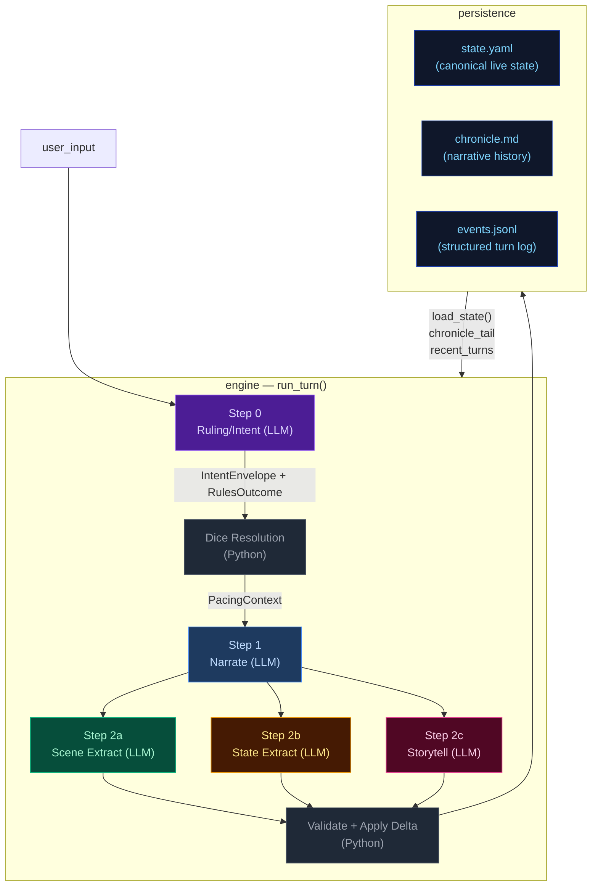

## Pipeline Quick Reference

| Step | Docs | When it runs | Key inputs | Key outputs | Mechanics it owns |
|---|---|---|---|---|---|
| **Step 0 — Ruling/Intent** | [step0-ruling](./step0-ruling.md) | Every turn (always) | `state.pc`, `state.location`, `recent_turns[-1:]`, `user_input` | `IntentEnvelope`, `RulesOutcome` | Intent classification, dice roll resolution (2d6 + stat + cond − diff → band), difficulty selection, anti-declare-outcome enforcement. |
| **Step 1 — Narrate** | [step1-narrate](./step1-narrate.md) | Every turn (always, streamed) | Full `state`, `chronicle_tail`, `recent_turns`, `pacing_context`, `pending_gm_beat`, `npc_roster` (tiered), `world_factions/locations`, `compendium_bios` | `narrative` (prose) | Prose generation, dice-band binding, GM-beat consumption. Tone shaped by `PacingContext.directive`. |
| **Step 2a — Scene Extract** | [step2a-scene](./step2a-scene.md) | Every turn (always) | `narrative`, `state.pc/location`, `npc_roster` (tiered), conditions, known_characters (LRU compendium) | `SceneExtractResult`: scene_tags, tagline, location_change, npc_add/remove/update, compendium_npc_update | NPC presence, location changes, scene tags, durable NPC compendium identity. |
| **Step 2b — State Extract** | [step2b-state](./step2b-state.md) | Every turn (always) | `narrative`, `state.pc/location/inventory`, conditions | `StateExtractResult`: inventory_add/remove/update, pc_condition_add/remove | Inventory delta accuracy, condition lifecycle. |
| **Step 2c — Storytell** | [step2c-progress](./step2c-progress.md) | Every turn (always) | `narrative`, `_ExtractionContext`, pacing_context, arc.threads[], recent_turns[-2:], band, npc_roster (tiered) | `StorytellerResult`: thread_advance/resolve/add, gm_beat, recent_events_add/update/remove, actions, outcome_summary | Unified thread lifecycle, beat disposition inference, durable history events. |

After Step 2c: results merge into a `StateDelta`, the validator checks constraints
(e.g. `inventory_remove` IDs exist), `apply_delta()` mutates state in-place, and the
turn is persisted. The next turn's Step 0 reads the new `state.yaml` plus `events.jsonl`.

## Subsystem Docs

| Subsystem | Doc | What it covers |
|---|---|---|
| **Step 0 — Ruling** | [step0-ruling](./step0-ruling.md) | Intent classification, dice resolution flowchart |
| **Step 1 — Narrate** | [step1-narrate](./step1-narrate.md) | Streaming narration pipeline with all context inputs |
| **Step 2a — Scene Extract** | [step2a-scene](./step2a-scene.md) | Location changes, NPC presence, scene tags |
| **Step 2b — State Extract** | [step2b-state](./step2b-state.md) | Inventory and condition extraction |
| **Step 2c — Storytell** | [step2c-progress](./step2c-progress.md) | Thread lifecycle, GMBeat schema, beat lifecycle (3 phases) |
| **PacingContext** | [pacing-context](./pacing-context.md) | Struct definition, computation flowchart, wiring to Narrator/Progress |
| **Delta → Validate → Apply** | [delta-validate](./delta-validate.md) | StateMerge schema, validation rules, apply_delta mutations |
| **Persist** | [persist](./persist.md) | Atomic writes (events.jsonl, state.yaml, chronicle.md), readback |
| **Cross-Pipeline Data Flow** | [cross-pipeline](./cross-pipeline.md) | Full inter-step data flow diagram |
| **Campaign Arcs** | [campaign-arcs](./campaign-arcs.md) | Arc data model (unified threads), engine-driven lifecycle, narrator-driven updates, integration points |
| **Out-of-Band Pipelines** | [out-of-band](./out-of-band.md) | Character Creation pipeline, Generate Seed pipeline, turn viewer status colors |
| **Narration UI** | [narration-ui](./narration-ui.md) | Main game interface: SSE streaming, HTMX sidebar refresh, Alpine.js state machine |
| **Turn Viewer UI** | [turn-viewer-ui](./turn-viewer-ui.md) | Pipeline debug UI: turn cards, stage inspector, diff panel, live updates |
| **Eval Harness** | [eval-harness](./eval-harness.md) | Scenario runner, LLM judges, auto-checkers, REPORT.md generation |

## Key Models Glossary

### Core Result Types

- **IntentEnvelope**: `intent`, `intent_verb`, `target`, `check.required`, `check.skill`, `check.difficulty`
- **RulesOutcome**: `rolled`, `skill`, `difficulty`, `stat_value`, `stat_mod`, `diff_mod`, `cond_mod`, `dice`, `raw_total`, `final_total`, `band`, `directive`, `intent`, `intent_verb`
- **SceneExtractResult**: `scene_tags`, `scene_tagline`, `location_change`, `npc_add/remove/update`, `compendium_npc_update`
- **StateExtractResult**: `inventory_add/remove/update`, `pc_condition_add/remove`
- **StorytellerResult**: `thread_advance`, `thread_resolve`, `thread_add`, `gm_beat`, `recent_events_add/update/remove`, `actions`, `outcome_summary`
- **SeedEnvelope**: `seed_state: GameState`, `opening_narrative`, `actions`, `arc: CampaignArc` (includes `goal_context`, unified `threads[]`, `completed_threads[]`), `pc_drive`

  The seed owns first-turn emotional framing, not just world and arc scaffolding. It generates `goal_context` (character-specific stake), NPC `relation` fields (narrative job relative to PC), and action text written from the PC's voice and scene pressure — ensuring the opening feels personal and motivated from the start.

### PacingContext (see [pacing-context](./pacing-context.md))

```
PacingContext:
  directive: str           # "" | "Breathe" | "Pressure" | "Overwhelm" | "Tension" | "Resolve a Threat" | "Threat Pressure" (may include "; Combat Fatigue" secondary)
  beat_locked: bool        # True: floor relief fired — Progress MUST emit breathing_room beat and gate is force-closed
  gate: str                # "block_escalate" | "allow" (controls thread_add)
  summary: str             # human-readable log string, never sent to LLM
```

### GMBeat (see [step2c-progress](./step2c-progress.md))

```
GMBeat
  type: complication | revelation | opportunity | breathing_room | pressure | twist | setback | escalation | callback
  surface_as: ambient | event | npc_behavior | environmental | player_discovery | item (default: ambient)
  beat_expires_turn: int | None (turn number at which the beat expires; set to turn_no + 2 when stored)
```

### CampaignArc (see [campaign-arcs](./campaign-arcs.md))

```
CampaignArc
  visible_goal: str           — What the PC is trying to achieve
  goal_context: str           — 2–3 sentences explaining why visible_goal matters to this character specifically
  thematic_question: str      — The moral/thematic tension of the arc
  pc_drive: str               — The PC's personal motive/reason for being in this situation
  hidden_truths: list[str]    — Story secrets the narrator knows but must not reveal in prose
  discovered_truths: list[str] — Truths the player has uncovered
  threads: list[ArcThread]    — Unified collection with active flag; replaces old active/latent split
  completed_threads: list[ArcThread] — Resolved/failed/abandoned threads

ArcThread (unified)
  id, summary, scope ("scene"|"arc"), active: bool = True
  urgency ("background"|"normal"|"urgent")
  tags: list[str], progress: int (0..3)
  resolution_state: str | None
  last_seen_turn: int | None, added_turn: int | None
  unlock_if: str | None — condition string; thread is only promotable when empty/falsy
  promotes: list[str] — threads this one can promote to when completed
```

### StateDelta (see [delta-validate](./delta-validate.md))

Merges all three extraction results. Contains `scene_tags`, `location_change`, `npc_add/remove/update`, `thread_advance/resolve/add`, `inventory_add/remove/update`, `pc_condition_add/remove`, `recent_events_add/update/remove`. Note: `gm_beat` is NOT in StateDelta — written directly to `state.meta.pending_gm_beat`.

---


## campaign-arcs


The campaign arc system tracks story threads and truth discovery across turns. It has two execution paths: **engine-driven** (thread lifecycle with 5-turn expiry for silent threads) and **narrator-driven** (truth discovery, goal updates).

## Arc Data Model

```
CampaignArc
  visible_goal: str          — What the PC is trying to achieve
  goal_context: str          — 2–3 sentences explaining why visible_goal matters to this character specifically; inner cost or pressure that makes it emotionally loaded
  thematic_question: str     — The moral/thematic tension of the arc
  pc_drive: str              — The PC's personal motive/reason for being in this situation; expressed indirectly
  hidden_truths: list[str]   — Story secrets the narrator knows but must not reveal in prose
  discovered_truths: list[str] — Truths the player has uncovered (subset of hidden_truths)
  threads: list[ArcThread]   — Unified collection replacing active_threads + latent_threads split. Each thread has scope ("scene" or "arc") and active flag set by Python age rules, not LLM.
  completed_threads: list[ArcThread] — Resolved/failed/abandoned threads; resolution_state preserved for narrative context

ArcThread (unified)
  id: str                    — Unique identifier
  summary: str               — What this thread is about
  scope: Literal["scene", "arc"]  # scene = short-lived tied to current location; arc = persistent story tension
  active: bool = True        # False = dormant/latent; set by Python age rules (not LLM)
  urgency: Literal["background", "normal", "urgent"] = "normal"
  tags: list[str]            — Keywords for engagement matching
  progress: int              — 0..3 (incremented by thread_advance)
  resolution_state: str | None # Set when thread_resolve processes resolved/failed/abandoned; preserved on completed threads
  last_seen_turn: int | None # For age-based active/dormant demotion in Python
  added_turn: int | None     # Python-managed lifecycle tracking
  unlock_if: str | None      # Condition string; thread is only promotable when empty/falsy
  promotes: list[str]        # Threads this one can promote to when completed
```

**Key change from previous architecture:** `scene_pressure[]` and the split between `active_threads` / `latent_threads` are merged into a single `arc.threads[]`. The engine manages thread lifecycle via `_apply_thread_signals()`: age-based demotion (`active: True → False`) replaces the old active/latent migration logic, with silent threads (not listed in `thread_advance` for 5+ turns) being demoted to dormant state.

## Engine-Driven Arc: Unified Thread Lifecycle

Thread lifecycle runs in `engine/turn.py` during the extraction phase, after `apply_delta()` but before narration arc_update merge. Two functions handle the unified thread operations:

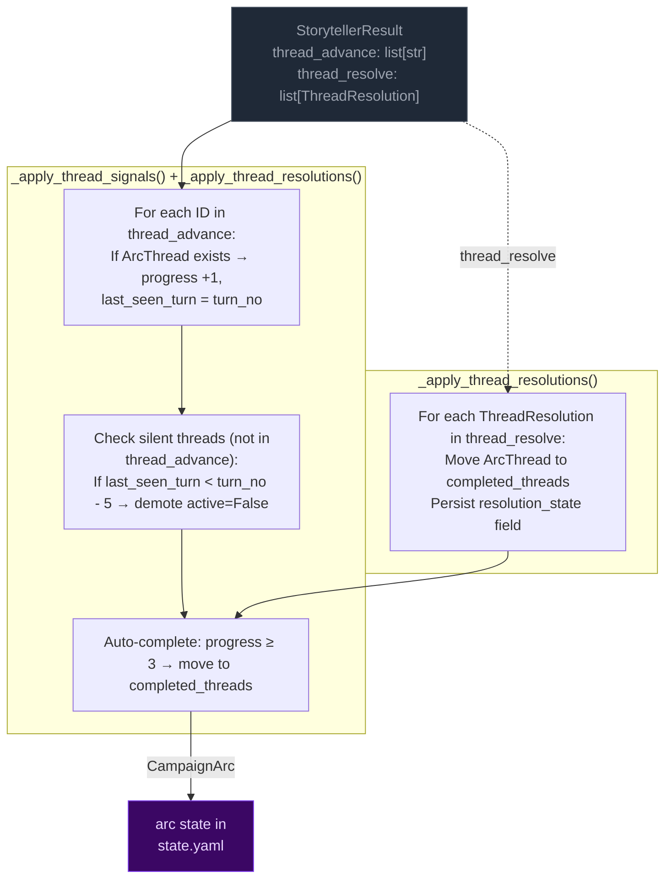

**Key rules:**
- **Unified collection:** `arc.threads[]` replaces the old active_threads/latent_threads split. The engine manages thread lifecycle via age-based demotion (`active: True → False`) instead of LLM-labeled urgency states.
- **Completion threshold:** progress reaches 3 → thread moved to `completed_threads`. Resolution state is preserved on completed threads for narrative context and eval rubrics.
- **5-turn expiry (age-based):** Threads not listed in `thread_advance` for 5+ turns get demoted (`active=False`). This replaces the old active→latent migration with a simpler boolean flag that Python manages directly from thread age, not LLM judgment.

## Narrator-Driven Arc: Phase & Truth Updates

The narrator can update arc metadata through a sentinel-delimited JSON block in its output. The engine parses and merges these updates after narration.

```mermaid
flowchart LR
    classDef llmNode fill:#0f172a,color:#94a3b8,stroke:#334155
    classDef sentinel fill:#3b0764,color:#e9d5ff,stroke:#7c3aed
    classDef mergeNode fill:#172554,color:#bfdbfe,stroke:#1d4ed8
    classDef arcNode fill:#3b0764,color:#e9d5ff,stroke:#7c3aed

    subgraph NARRATOR["Narrator prompt context"]
        NC1["visible_goal"]
        NC2["goal_context (early-turn narrative guidance)"]
        NC3["thematic_question"]
        NC5["arc.threads[] (summary, scope,<br>urgency, tags)"]
        NC6["pc_drive"]
        NC7["hidden_truths[] — internal only<br>NARRATOR MUST NOT reveal in prose"]
        NC8["discovered_truths[]"]
    end

    subgraph EMISSION["Narrator output"]
        PROSE["narration prose<br>(player sees this)"]:::llmNode
        SENTINEL["<<<ARC_UPDATE_START>>>
{discovered_truths, visible_goal}
<<<ARC_UPDATE_END>>>"]:::sentinel
    end

    subgraph PARSING["_extract_narrator_arc_update()"]
        P1["Regex: <<<ARC_UPDATE_START>>>(.*?)<<<ARC_UPDATE_END>>>"]
        P2["json.loads() → arc_dict"]
        P3["Strip block from narrative"]
    end

    subgraph MERGE["_merge_arc_update()"]
        M1["visible_goal: overwrite if present"]
        M2["thematic_question: overwrite if present"]
        M3["hidden_truths: overwrite if present"]
        M4["pc_drive: overwrite if present"]
        M5["hidden_truths: overwrite if present"]
        M6["discovered_truths: union with existing"]
        M7["goal_context: NOT merged — seed-only field, unchanged during play"]
    end

    NC1 & NC2 & NC3 & NC5 & NC6 & NC7 & NC8 --> PROSE
    PROSE --> SENTINEL
    SENTINEL --> P1 --> P2 --> P3
    P3 -- "clean narrative" --> CLIENT["client"]
    P2 -- "arc_dict" --> MERGE

    MERGE --> ARC[merge into state["arc"]]:::arcNode
```

**Merge rules:**
- **Engine owns thread lifecycle** (active/dormant/completed via age-based demotion). Narrator arc_update omits thread fields — they are ignored by `_merge_arc_update()`.
- **Narrator owns visible_goal/thematic_question/discovered_truths/hidden_truths.** Engine does not modify these.
- **`goal_context` is seed-only** — set once at game start, never overwritten by narrator or engine during play.
- **Discovered truths:** merged as set union (dedup).
- **Merge order:** engine thread signals run first (setting `delta.arc_update`), then narrator arc_update is parsed after narration and merged on top via a second `_merge_arc_update()` call in `run_turn()`.

## Arc Context in Narration

The arc state is passed to the narrator via `current_arc` in both system and user prompts. The narrator sees all arc metadata including `hidden_truths` but is explicitly instructed not to reveal them in prose.

### Early-turn narrative mode

When `goal_context` is present on the arc, the narrator treats it as narrative guidance for early turns: ground the player in personal stakes before broad exposition. The `goal_context` shapes what detail feels loaded, which NPC moment carries emotional charge, and what pressure matters immediately — without restating or summarizing it explicitly. This signal is provided via `_arc.j2` in the narrate user prompt.

The `goal_context` appears alongside other arc context values in the user prompt for this turn.

### Narrator prompt context

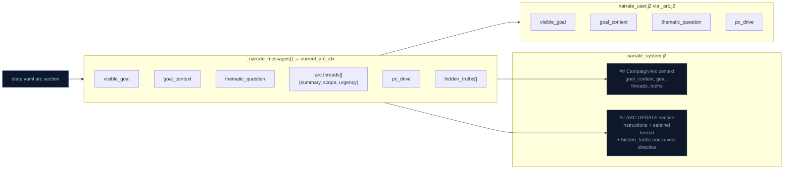

## Arc System Integration Points

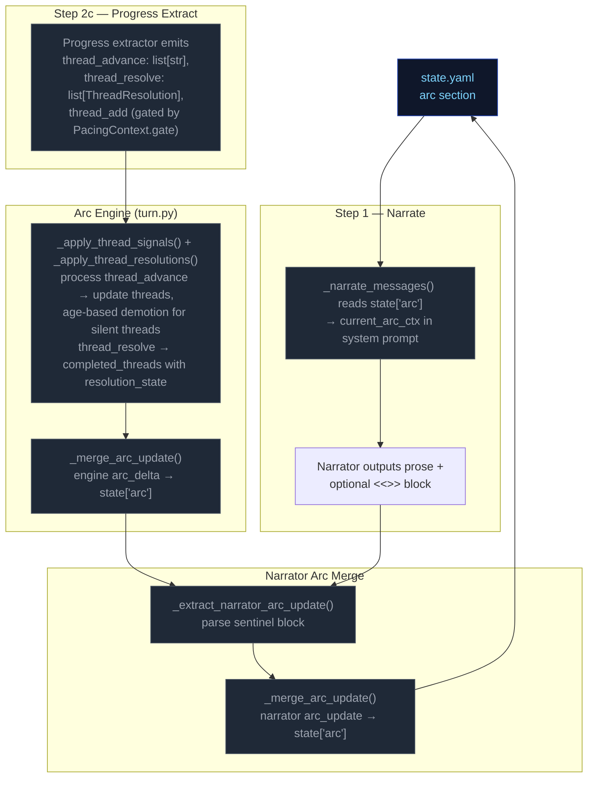

---


## cross-pipeline


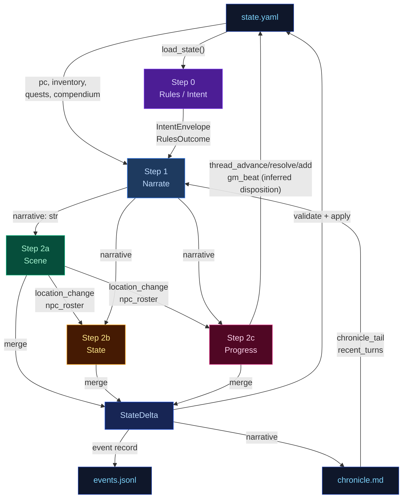

---


## delta-validate


The three extraction results merge into a single `StateDelta`, then validate and apply.

## Flowchart

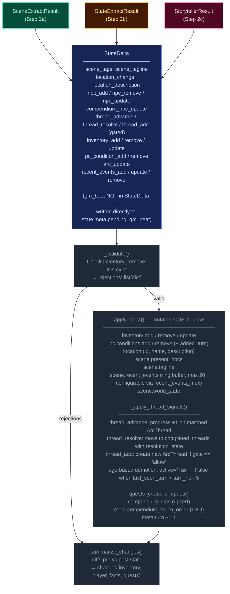

---


## narration-ui


The primary player-facing UI. Renders game state, streams narrative tokens live, and refreshes sidebars via HTMX partial swaps. Single-page app driven by Alpine.js + SSE + HTMX.

## Interaction Model

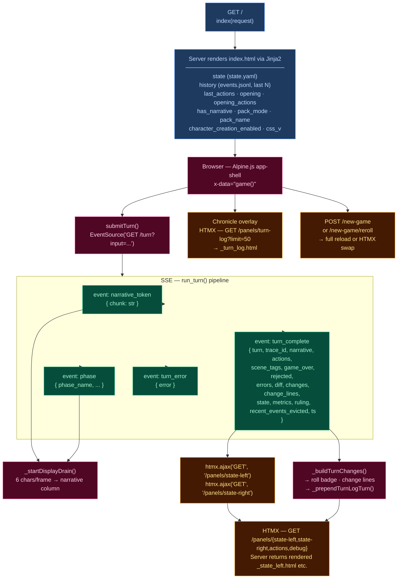

## Layout

| Region | Element | Content |
|--------|---------|---------|
| **Header** | `.header-bar` | Logo/tagline, Chronicle toggle, turn counter, retry button, new game button, reroll button (dynamic packs), mock-mode dot |
| **Left sidebar** | `.sidebar-left` | Player card, scene NPCs, location, arc, compendium — loaded via `/panels/state-left` |
| **Narrative column** | `.narrative-column` | Scrollable narrative blocks, action pills, input textarea, send/stop button |
| **Right sidebar** | `.sidebar` (right) | Inventory, recent events, world state, debug panel — loaded via `/panels/state-right` |
| **Chronicle overlay** | `.turn-log-shell` | Floating overlay over narrative column, populated by `/panels/turn-log?limit=50` |
| **New Game modal** | (Alpine `x-show`) | Pack picker → char creation / world builder steps |

## Data Flow

### Turn submission (Alpine.js + SSE)

1. User types input, presses Enter → `game().submitTurn()`
2. Opens `EventSource` to `GET /turn?input=<text>` — SSE endpoint in `routes.py:83`
3. Server streams events as the 5-stage pipeline (`run_turn()`) executes:
   - `narrative_token` — token chunks streamed as they arrive from LLM
   - `phase` — pipeline phase progress (ruling_start, narrate_start, narrate_first_token, narrate_done, extract_start, extract_done, compact_start, etc.)
   - `turn_complete` — final result
   - `turn_error` — error payload
4. Client `_startDisplayDrain()`: reveals 6 characters per animation frame for smooth streaming
5. On `turn_complete`:
   - Calls `htmx.ajax('GET', '/panels/state-left', ...)` and `htmx.ajax('GET', '/panels/state-right', ...)` to refresh sidebars
   - Renders change lines (`_buildTurnChanges`), roll badge
   - Prepends turn to Chronicle overlay via `_prependTurnLogTurn`
   - Re-renders markdown via `marked.parse()`

### HTMX partial endpoints (routes.py)

| Route | Template | Purpose |
|-------|----------|---------|
| `GET /panels/state-left` | `_state_left.html` | Left sidebar — player, NPCs, location, arc, compendium |
| `GET /panels/state-right` | `_state_right.html` | Right sidebar — inventory, events, world state, debug |
| `GET /panels/actions` | `_actions.html` | Action pills (fallback) |
| `GET /panels/turn-log?limit=N` | `_turn_log.html` | Chronicle — turn history with change lines |
| `GET /panels/pack-picker` | `_pack_picker.html` | New Game — pack selection cards |
| `GET /panels/char-creation` | `_char_creation.html` | New Game — character stats builder |
| `GET /panels/world-builder` | `_world_builder.html` | New Game — world creation form |
| `GET /panels/debug` | `_debug.html` | Debug panel — recent turn timings, errors |
| `GET /panels/state` | `_state.html` | Combined left+right (legacy) |

### Client state machine (`game()` — inline `<script>` in index.html)

Alpine.js `x-data="game()"` manages:
- `input` — textarea value
- `submitting` — turn-in-progress flag
- `gameStarted` — derived from `has_narrative`
- `turnNum` — current turn counter
- `leftWidth` / `rightWidth` — resizable sidebar widths (persisted to `localStorage`)
- Card collapse state — read/written directly from/to `localStorage` via `CCYA_CARD_KEY(name)` helper, using DOM `data-card` attributes; no Alpine data property

## UI Features

### Resizable sidebars
- Drag gutters with mousedown/mousemove handlers
- Widths saved to `localStorage` (`ccya_sidebar_left`, `ccya_sidebar_right`)
- Minimum width enforcement (240px left, 220px right)

### Collapsible cards
Each sidebar section has a collapse toggle; open/closed state persisted per-card to `localStorage` via `ccya_card_<name>` key.

### Action pills
Suggested next actions rendered as buttons that populate the input on click. Updated from `turn_complete.actions` or via HTMX panel refresh.

### Roll badge
Server-rendered for history, JS-built for new turns. Shows dice math, band label, outcome summary. Band colors: `crit_fail` (red) → `fail` → `setback` → `partial` → `success` → `crit_success`.

### Change lines
Grouped by category via emoji prefix:
| Emoji | Category | Class |
|-------|----------|-------|
| 🎒 + | Inventory gain | `.tc-inv-gain` |
| 🎒 − | Inventory loss | `.tc-inv-loss` |
| 🩺 | Player condition | `.tc-pl` |
| 📍 | Location | `.tc-loc` |
| 📜 | Faction/arc | `.tc-fa` |

### Retry
`POST /turn/delete` removes last event from `events.jsonl` and `chronicle.md`, returns previous actions for re-submission.

### New Game
`POST /new-game` with optional `pack_id`, `pc_name`, `pc_stats`, `hints`. For dynamic packs, triggers `generate_seed()` LLM pipeline. Full page reload on success. Reroll (`POST /new-game/reroll`) HTMX-swaps the opening narrative + actions.

## CSS Architecture

- **`app.src.css`** — Tailwind + custom styles split by region (lines 1–2101):
  - App shell layout (CSS Grid: header + body with sidebar-gutter-main-gutter-sidebar)
  - Narrative blocks (`.narrative-block`, `.narrative-text`)
  - Sidebar cards (`.card`, `.card-header`, `.card-body`)
  - Input bar (`.input-bar`, `.game-input`, `.send-btn`)
  - Action pills (`.action-pill`, `.pills-row`)
  - Roll badges (`.roll-badge`, `.roll-band--*`)
  - Chronicle overlay (`.turn-log-shell`, `.turn-log-panel`)
  - New Game modal (`.modal-overlay`, `.pack-card`)
  - Progress strip, tooltips, scrollbar styling
  - Design tokens via CSS custom properties (`--text-primary`, `--bg-card`, `--status-*`)
- Compiled to **`app.css`** with cache-busting via `css_v` query param

## Server Entry Point

`routes.py:57` — `GET /` handler assembles template context from `state.yaml`, `events.jsonl`, pack manifest, and engine config, then renders `ccya/templates/index.html`.

---


## out-of-band


These run only at new-game time or are non-engine concerns. They are excluded from the eval-context region of the main architecture doc.

## Character Creation Pipeline

Triggered by `POST /new-game`. Behavior differs by pack mode.

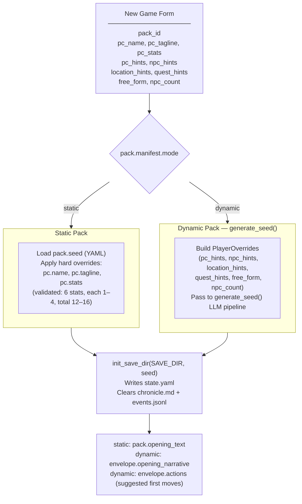

## Generate Seed Pipeline (Dynamic Packs Only)

Called by `POST /new-game` and `POST /new-game/reroll`. Generates a complete starting game state (PC, NPCs, location, arc, opening narrative, actions) from the pack manifest and optional player overrides.

The seed owns **first-turn emotional framing** — not just world and arc scaffolding. Every seed element must produce an emotionally legible opening that answers: why this moment matters now, what the character stands to lose, and why at least one person in the scene matters to them personally.

```mermaid
flowchart LR
    classDef llmNode fill:#0f172a,color:#94a3b8,stroke:#334155
    classDef outNode fill:#172554,color:#bfdbfe,stroke:#1d4ed8

    subgraph IN["Inputs"]
        G1["pack.manifest<br>(world rules, tone, setting)"]
        G2["pack.style_text"]
        G3["PlayerOverrides (optional)<br>  pc_hints, npc_hints<br>  location_hints, quest_hints<br>  free_form, npc_count"]
        G4["npc_name_pool (name locales)"]
        G5["engine_config.generate_seed_temperature (0.9)<br>engine_config.generate_seed_max_retries (1)"]
    end

    subgraph LLM_GS["LLM — generate_seed_system.j2 + generate_seed_user.j2"]
        GL["temp: 0.9<br>output: SeedEnvelope JSON"]:::llmNode
    end

    subgraph OUT["Outputs — SeedEnvelope"]
        O1["seed_state: GameState<br>  pc (name, tagline, bio, stats)<br>  location (id, name, description)<br>  scene (present_npcs with relation field,<br>         recent_events, world_state)<br>  inventory: list[InventoryItem]<br>  compendium.npcs: dict[id] NpcRef<br>  meta (model, setting_pack, turn=0)"]:::outNode
        O2["arc: CampaignArc<br>  visible_goal, goal_context (personal stakes),<br>  thematic_question, hidden_truths,<br>  threads[] (unified, with active flag),<br>  completed_threads[], pc_drive"]:::outNode
        O3["opening_narrative: str<br>(prose intro shown before turn 1)"]:::outNode
        O4["actions: list[str]<br>(4 distinct, character-shaped,<br>scene-grounded choices)"]:::outNode
    end

    IN --> LLM_GS
    LLM_GS --> OUT
```

### Seed emotional framing contract

The seed prompt (`generate_seed_system.j2`) enforces these requirements:

- **`goal_context`**: 2–3 sentences explaining why `visible_goal` matters to this character specifically — inner cost or pressure that makes it emotionally loaded. No hidden-truth spoilers, no restating `visible_goal`, no direct statement of the thematic question. Must connect character motive, story stakes, and emotional cost.
- **NPC `relation` field**: Each opening NPC has a defined narrative job. One NPC is personally tied to the PC's motive or vulnerability; the other carries immediate external pressure from the world or conflict. The `relation` field encodes PC-facing relevance (e.g. "owes them a favor", "is their only contact here", "represents the institution pressing on them").
- **Compendium NPCs**: The seed also generates 2–3 NPCs in `compendium.npcs` (name, title, bio) who exist in the world but are not present in the opening scene. Their bios tie them to factions, locations, or world pressures, not to the immediate situation. These become discoverable characters during play.
- **Action guidance**: Each of the 4 choices is written from the PC's point of view, grounded in a present NPC, immediate risk, active thread, or character motive. They differ in emotional posture (confront, deflect, investigate, protect, exploit, withdraw, etc.) and avoid generic verbs.
- **`pc_drive`**: A single sentence about the PC's personal reason for being in this situation. Expressed indirectly through `goal_context`, NPC relations, opening narrative, and actions — never displayed as a labeled UI fact.
- **`threads[]`**: Unified list (not split active/latent) where each thread has `{id, summary, tags, urgency, scope}` and an `active` boolean flag managed by Python age rules, not LLM.

## Turn Viewer — status colors

The standalone turn viewer ([turn-viewer-ui](./turn-viewer-ui.md)) uses the same semantic status colors as the CSS custom properties in `static/app.src.css` (`--status-*`). The stage colors used in the diagrams above (`stageRules` violet → `stageNarrate` blue → `stageScene` green → `stageState` amber → `stageProgress` pink) map directly to the `--stage-*` tokens. Cross-stream inputs into a step are shown in `xstream` (purple outline) and LLM/Python boxes use neutral dark fills. This table is the canonical turn-viewer status legend.

| Token | Meaning |
|-------|---------|
| `--status-ok` | Stage ran and completed (no extraction error). |
| `--status-skipped` | Stream was skipped (no longer used — all streams always run). |
| `--status-retried` | LLM output required a parse retry (`attempts` > 1 in event). |
| `--status-rejected` | Post-extract validation rejected part of the delta (e.g. bad `inventory_remove`). |
| `--status-error` | LLM call or parse ultimately failed for that stream. |
| `--status-neutral` | Non-fatal / informational (e.g. rules path with no dice roll). |

Stage accent stripes use `--stage-rules`, `--stage-narrate`, `--stage-scene`, `--stage-state`, `--stage-progress` for quick scanning; **status** always wins for the prominent left border.

---


## pacing-context


All pacing signals are collapsed into one Python-computed struct (`PacingContext`) passed to both the Narrator and Progress Extractor. This replaces six independent fields (`narration_directive`, `deescalate`, `narrative_velocity`, `beat_disposition` output, `quest_threshold_directive`, and stale momentum-derived signals). The narrator receives `directive`; Progress receives the full struct.

## Struct definition

```
PacingContext:
  directive: str           # "" | "Breathe" | "Pressure" | "Overwhelm" | "Tension" | "Resolve a Threat" | "Threat Pressure"
  beat_locked: bool        # True: floor relief fired — Progress MUST emit breathing_room beat and gate is force-closed
  gate: str                # "block_escalate" | "allow" (controls thread_add)
  summary: str             # human-readable log string, never sent to LLM
```

`beat_locked: True` subsumes the old `_check_floor_relief()` side-channel — floor relief logic is computed inside `_compute_pacing_context()`. The `gate` field prevents Progress from adding new threads during de-escalation windows. Secondary modifiers like "Combat Fatigue" may be appended via semicolons (e.g., "Pressure; Combat Fatigue").

## Computation

`_compute_pacing_context()` in `engine/turn.py` consolidates pacing computation (replacing the former scattered functions: `_compute_narration_directive`, `_compute_narrative_velocity`, `_check_floor_relief`). It takes inputs (`momentum`, `consecutive_floor_turns`, `arc.threads[] scope=scene urgency counts`, combat age, location age) and returns a single struct with directive derived from the same priority stack:

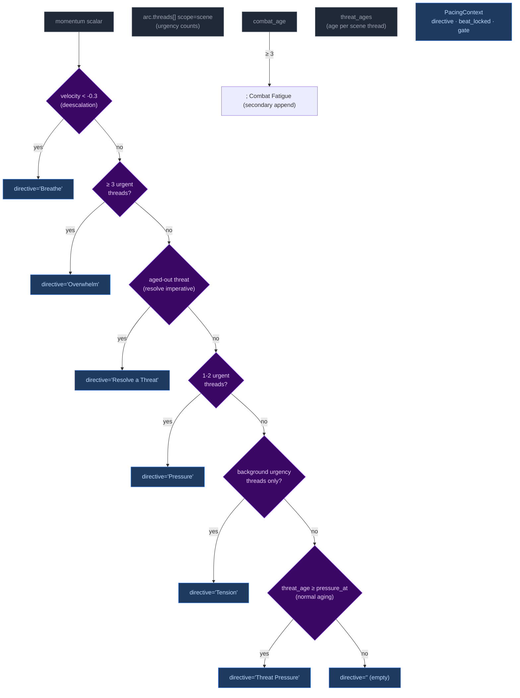

Priority order (highest to lowest): **Breathe > Overwhelm > Resolve a Threat > Pressure > Tension > Threat Pressure > (empty)**. The `beat_locked` flag takes precedence — when at momentum floor, directive is forced to include "Resolve a Threat" and gate is force-closed when directive is "Breathe".

## Wiring: how PacingContext reaches the pipelines

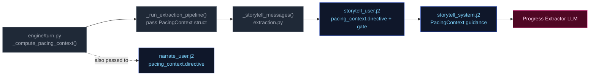

1. **Computed** once in `run_turn()` via `_compute_pacing_context()`.
2. **Passed through** `_run_extraction_pipeline()` → both `_narrate_messages()` and `_storytell_messages()`.
3. **Narrator template** (`narrate_user.j2`) renders only `directive` (tone/direction). No Jinja2 directive computation remains — all directives computed by Python.
4. **Storytell template** ((`storytell_system.j2` + `user.j2`)) receives the full struct; guidance maps each directive to appropriate thread/beat actions:

| Directive | Thread action | Gate |
|-----------|---------------|-------|
| **"Breathe"** (de-escalation, velocity < -0.3) | Do NOT add new threads. Allow existing scene threads to persist without escalation. | `block_escalate` + force-closed when at momentum floor |
| **"Overwhelm"** (3+ urgent threads) | May add scene-scoped threads if gate allows; emit pressure/escalation beat | `allow` |
| **"Resolve a Threat"** (aged-out threat imperative) | Advance the aged thread toward resolution; avoid adding new complications | `allow` |
| **"Pressure"** (1-2 urgent or aging threats) | Advance relevant scene/arc threads. Add new thread only if gate permits. | Varies by context |
| **"Tension"** (background urgency only) | Do NOT add pressures unless concrete threat emerges; prefer advancing existing threads | Allow |
| **"Threat Pressure"** (normal urgency aging) | Escalate urgency of the aging thread; consider advancing | Allow |
| **"" (empty)** | No action required beyond normal aging of silent threads. | Allow |

**Note:** Directives may include secondary modifiers joined by semicolons (e.g., "Pressure; Combat Fatigue"). The primary directive drives thread/beat logic; the secondary acts as a thematic modifier on beat type.

---


## persist


Atomic writes to disk. No LLM calls.

## Flowchart

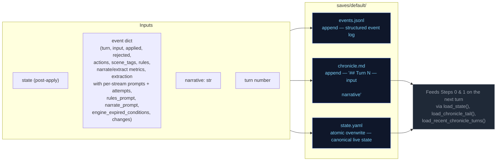

---


## step0-ruling


Classifies the player's action, determines whether a dice check is needed, and
identifies which state domains will be active — narrowing every downstream extractor.

## Flowchart

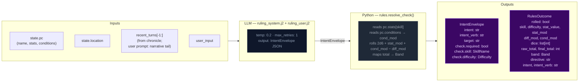

## Key forward dependency

`rules_outcome` feeds into `_compute_pacing_context()` which produces the single authoritative `PacingContext` struct passed to both Narrator and Progress Extractor.

---


## step1-narrate


Generates the narrative prose the player reads. Tokens are streamed to the client.

## Flowchart

```mermaid
flowchart LR
    classDef llmNode   fill:#0f172a,color:#94a3b8,stroke:#334155
    classDef xstream   fill:#4c1d95,color:#ddd6fe,stroke:#7c3aed
    classDef outNode   fill:#1e3a5f,color:#bfdbfe,stroke:#3b82f6

    subgraph IN["Inputs"]
        N1["state (full —<br>pc, location, scene,<br>inventory, quests, compendium)"]
        N2["chronicle_tail<br>(compressed history, ≤budget tokens)"]
        N3["recent_turns (last window_turns, default 3)"]
        N4["rules_outcome<br>(band, directive, dice summary)"]:::xstream
        N5["pack_style (tone / prose guide)"]
        N6["npc_name_pool (cultural name list)"]
        N7["recently_left NPCs"]
        N8["known_npcs<br>(last-seen info)"]
        N9["present_npcs<br>(attitudes)"]
        N10["world_factions<br>(immutable trace)"]
        N11["world_locations<br>(nearby, immutable)"]
        N12["pending_gm_beat<br>(type · surface_as metadata)"]
        N13["pacing_context<br>(directive)<br>from _compute_pacing_context()"]:::xstream
        N14["compendium_bios<br>(upserted bio entries for<br>present + recently_left NPCs)"]
        N15["user_input"]
    end

    subgraph LLM1["LLM — narrate_system.j2 + narrate_user.j2"]
        NL["temp: 0.9 · streaming: yes<br>output: prose narrative (str)"]:::llmNode
    end

    subgraph OUT["Outputs"]
        NO1["narrative: str<br>(streamed as tokens → client<br>then joined + thinking-stripped)"]:::outNode
        NO2["narr_metrics<br>  first_token_ms<br>  total_ms<br>  tokens_in / tokens_out"]
    end

    IN --> LLM1
    LLM1 --> OUT
```

## Arc context in narration

The narrator receives `current_arc` in both system and user prompts. Key fields:

- **`goal_context`**: A seed-time field (2–3 sentences) explaining why `visible_goal` matters to the character specifically — inner cost or pressure that makes it emotionally loaded. When present, `_arc.j2` presents it alongside other arc context in the user prompt for early-turn narrative guidance: ground the player in personal stakes before broad exposition.
- **`visible_goal`**: The player-facing objective.
- **`thematic_question`**: The moral tension — never stated directly in prose. Used as a lens for emphasis: what detail feels loaded, what silence matters.
- **`pc_drive`**: The character's personal motive. Expressed indirectly through goal_context, NPC relations, and action language rather than displayed as a labeled UI fact.
- **`hidden_truths[]`**: Internal-only story secrets the narrator must never reveal in prose.
- **`threads[]`**: Unified thread collection filtered by `active` flag. Scene-scope threads provide immediate pressure; arc-scope threads provide medium-term tension.

### Opening-turn narrative mode

When `goal_context` is present (always true after seed), the narrator treats early turns as a distinct onboarding mode:
1. Personal stakes before broad exposition
2. One NPC moment with emotional charge (driven by `relation` fields on seed NPCs)
3. One immediately actionable pressure

The presence of `goal_context` itself is the signal — no turn-counting dependency needed. The guidance is most impactful in the first few turns and persists as background context throughout the campaign.

## Key forward dependency

`narrative` is the primary content input for all three extraction streams below.

---


## step2a-scene


Extracts location changes, NPC presence, scene tags, and suggested actions from the narrative.

## Flowchart

```mermaid
flowchart LR
    classDef llmNode fill:#0f172a,color:#94a3b8,stroke:#334155
    classDef xstream fill:#4c1d95,color:#ddd6fe,stroke:#7c3aed
    classDef outNode fill:#064e3b,color:#a7f3d0,stroke:#10b981

    subgraph IN["Inputs"]
        S1["narrative (from Step 1)"]:::xstream
        S2["state.pc (name, tagline, bio, stats)"]
        S3["state.location"]
        S4["state.scene.present_npcs"]
        S5["state.pc.conditions"]
        S6["known_characters<br>(full roster: id, name, tags, notes<br>up to 10 LRU from compendium)"]
        S7["recent_turns[-1:]<br>(T-1 prior narration)"]
    end

    subgraph LLM2A["LLM — extract_scene_system.j2 + extract_scene_user.j2"]
        SL["temp: 0.4 · max_retries: 1<br>output: SceneExtractResult JSON"]:::llmNode
    end

    subgraph OUT["Outputs — SceneExtractResult"]
        O1["scene_tags: list[str]"]:::outNode
        O2["scene_tagline: str (3–6 words for UI header)"]:::outNode
        O3["location_change: LocationRef | None<br>  id, name, description"]:::outNode
        O4["location_description: str | None"]:::outNode
        O5["npc_add / npc_remove / npc_update<br>  delta-form NPC presence changes"]:::outNode
        O6["compendium_npc_update<br>  durable identity changes"]:::outNode
    end

    IN --> LLM2A
    LLM2A --> OUT
```

## Key forward dependency

`location_change` and `present_npcs` flow into `extraction_ctx` (built by `_build_extraction_context`). Step 2c also receives `npc_roster` (tiered: PRESENT/JUST_LEFT/NEARBY/KNOWN) built from extraction_ctx. No forward-facing mechanics (`thread_add`, `gm_beat`) are emitted by this stream — they go through the unified thread pipeline via Progress Extract.

---


## step2b-state


Extracts inventory changes and player condition mutations from the narrative.

## Flowchart

```mermaid
flowchart LR
    classDef llmNode fill:#0f172a,color:#94a3b8,stroke:#334155
    classDef xstream fill:#4c1d95,color:#ddd6fe,stroke:#7c3aed
    classDef outNode fill:#451a03,color:#fde68a,stroke:#f59e0b

    subgraph IN["Inputs"]
        S1["narrative (from Step 1)"]:::xstream
        S2["state.pc (name, bio, stats, conditions)"]
        S3["state.location"]
        S4["state.inventory"]
        S5["intent: str<br>(from Step 0)"]
    end

    subgraph LLM2B["LLM — extract_state_system.j2 + extract_state_user.j2"]
        SL["temp: 0.4 · max_retries: 1<br>output: StateExtractResult JSON"]:::llmNode
    end

    subgraph OUT["Outputs — StateExtractResult"]
        O1["inventory_add: list[InventoryItem]<br>  id, name, notes, amount"]:::outNode
        O2["inventory_remove: list[InventoryRemove]<br>  id, amount (None = full stack)"]:::outNode
        O3["inventory_update: list[InventoryUpdate]<br>  id, name?, notes?"]:::outNode
        O4["pc_condition_add: list[ConditionAdd]<br>  id, label, description"]:::outNode
        O5["pc_condition_remove: list[ConditionRemove]<br>  id"]:::outNode
    end

    IN --> LLM2B
    LLM2B --> OUT
```

## Key forward dependency

Step 2c receives `npc_roster` (tiered: PRESENT/JUST_LEFT/NEARBY/KNOWN) and `location_change` from Step 2a. Cross-stream items_gained/lost were removed — extraction_ctx now covers all this-turn derived data.

---


## step2c-progress


Extracts quest updates, recent events, and durable NPC compendium changes.

## Flowchart


## Always runs

Progress is the post-narration storytelling brain. It always executes every turn (never skipped) and feeds next turn's rules call via `recent_events_add` (durable narrative facts), `thread_advance/resolve/add` (unified thread lifecycle with scope-aware age demotion), and `gm_beat` (forward-facing beats stored in `state.meta.pending_gm_beat`).

## GMBeat schema

```
GMBeat
  type: complication | revelation | opportunity | breathing_room | pressure | twist | setback | escalation | callback
  surface_as: ambient | event | npc_behavior | environmental | player_discovery | item (default: ambient)
  beat_expires_turn: int | None (turn number at which the beat expires; set to turn_no + 2 when stored)
```

## Beat lifecycle

The beat flows through three phases per turn:

**Phase 1 — Pre-narration expiry check.** At the start of each turn, the engine reads `state.meta.pending_gm_beat` from the previous turn. If `beat_expires_turn` is set and the current turn number exceeds it, the beat is nullified. Otherwise it proceeds to narration.

**Phase 2 — Narration consumption.** The beat is passed to the narrator via `_narrate_messages(pending_gm_beat=...)`. The narrator uses the beat's type and surface_as metadata as creative guidance alongside the pacing directive. After narration completes, the pending beat is cleared from state — it is not restored for storyteller consumption.

**Phase 3 — Extraction disposition (inferred).** The storyteller receives no pending beat context in its prompt — it decides beats based solely on current extraction data (scene state, threads, pacing context, band). Unlike the previous architecture, there is no explicit `beat_disposition` field. Instead:
- If Progress emits a new `gm_beat`, it replaces the old one (`state.meta.pending_gm_beat = gm_beat` with `beat_expires_turn = turn_no + 2`)
- If Progress emits nothing and the beat's `expires_at` hasn't passed, the engine preserves the existing beat unchanged (carry)
- The engine stores beats with `beat_expires_turn = turn_no + 2` as a hard TTL ceiling. Beats past their expiry are discarded automatically on load.

## Floor relief injection priority

The floor relief mechanism fires when `_pc.beat_locked=True` AND no beat exists in `state.meta.pending_gm_beat` at extraction completion time (`turn.py:1263`). It injects a `breathing_room` beat with TTL of 3 turns (one more than storyteller-emitted beats' TTL of 2).

Floor relief beats are **fallback only** — they inject a recovery beat when the LLM didn't already provide one. If the storyteller emits any gm_beat during extraction, floor relief does NOT fire because `pending_gm_beat` is already set. The LLM's beat takes priority over Python-injected recovery signals.

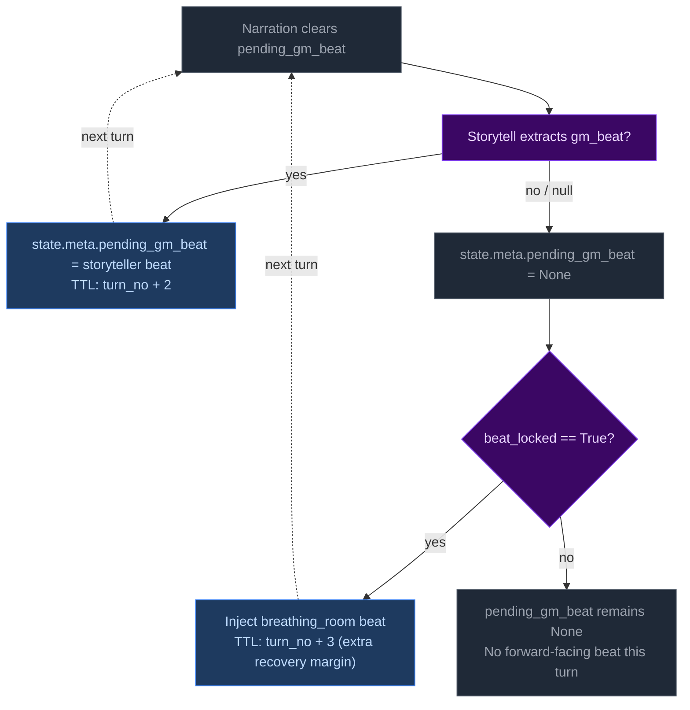

## Directive-beat alignment

The storyteller prompt (`storytell_system.j2:54-65`) maps each PacingContext directive to recommended beat types (e.g., "Breathe" → breathing_room; "Overwhelm" → pressure/escalation). This alignment is **guidance only** — Python accepts whatever gm_beat the LLM emits with no validation, correction, or override. Design rationale: forcing directive-beat alignment would constrain storytelling flexibility and create brittleness if the LLM makes contextually appropriate but directive-divergent beat choices.

---


## thread-lifecycle


## Scope

This doc covers the internal mechanics of arc thread lifecycle management in `turn.py`.
It complements `campaign-arcs.md` (data model, narrator arc updates, high-level flow)
by detailing the exact rules, order of operations, constants, and edge cases.

## Two Thread Scopes

Threads have a `scope` field (`"scene"` or `"arc"`) that determines lifecycle treatment:

| Scope | Active management | Expiration | LLM instructions |
|---|---|---|---|
| `scene` | None — no engine processing | Via scene age rules (indirect) | Tied to current location/NPCs |
| `arc` | Full lifecycle: advance, demote, promote, complete | 5 silent turns → demote to latent | Persistent story tension |

Scene-scoped threads exist in `arc.threads[]` alongside arc-scoped threads. They are
excluded from engine processing by the `scope == "arc"` filter at `turn.py:203-205`.

## Entry Points

Three call sites in `run_turn()` process threads (order matters):

1. **`_apply_thread_signals()`** — advance, expire, demote, promote, complete
2. **`_apply_thread_resolutions()`** — resolve/fail/abandon → completed
3. **Inline thread_add logic** — create new threads (gated by pacing context)

All three run after `apply_delta()` but before `save_state()`.

## Step-by-Step: `_apply_thread_signals()`

### Phase A — Advance or Expire (per active thread)

For each arc-scoped active thread:

| Condition | Action |
|---|---|
| ID in `storyteller_result.thread_advance` | `progress += 1`, update `last_seen_turn = turn_no` |
| Not advanced AND `turn_no - last_seen_turn >= _EXPIRE_SILENT_TURNS` (5) | Demote: `active = False`, `last_seen_turn = None` |
| Not advanced AND still within expiry window | Carry forward unchanged |
| Progress >= `config.thread_completion_threshold` (default 3) | Move to `completed_threads[]` |

All three outcomes (advance, demote, unchanged) accumulate into `still_active[]`.
Advancing a thread is treated as a mutation. Only threads NOT advanced AND expired
are demoted — normal carry-forward does not count as a mutation.

### Phase B — Enforce Latent Cap

After Phase A, the post-demotion latent count is:

```
latent_count = len(latent_by_id) + len(demoted_to_latent)
```

If `latent_count > _LATENT_THREAD_CAP (4)`, excess threads are dropped from
the **newly demoted** pool (oldest by `added_turn` first — `added_turn=9999`
sentinel sorts unset last). Promotions in Phase D may further reduce the count,
so this cap is conservative (may drop more than strictly necessary).

### Phase C — Rebuild Thread List

Active threads (`really_still_active`), surviving newly-demoted threads, and
unprocessed threads (scene-scoped, already-completed) are merged into a single
`all_updated_arc_threads` list.

### Phase D — Immediate Promotion (unknown advanced_ids)

Any ID in `storyteller_result.thread_advance` that is NOT currently in `active_by_id`
but IS in `latent_by_id` is promoted immediately: `active = True`, `progress = 0`,
`last_seen_turn = turn_no`.

This bypasses the cooldown check — it is the primary path for activating a
latent thread. The LLM activates it by listing it in `thread_advance`.

### Phase E — Cooldown-Gated Promotion

Promotion of eligible latent threads that were NOT explicitly advanced by the LLM:

**Conditions (both must be met):**

1. `turn_no - arc_last_promotion_turn >= _PROMOTION_COOLDOWN_TURNS (3)` OR no active threads exist
2. Available slot: `_ACTIVE_THREAD_CAP (3) - len(really_still_active) > 0`

**Eligibility (latent thread must satisfy ALL):**
- Not already active
- Not already completed
- `unlock_if` is empty/falsy (if set, thread is locked and won't auto-promote)

**Selection:** Eligible threads sorted by `added_turn` (oldest first). Up to
`available_slots` are promoted. Sets `arc_last_promotion_turn = turn_no`.

This path fires at most once per 3 turns and fills gaps left by the
LLM's thread_advance omissions.

## Step-by-Step: Thread Creation (inline in `run_turn()`)

New threads (`storyteller_result.thread_add`) are **not** handled inside
`_apply_thread_signals()`. They are gated by three checks in sequence:

```
gate_ok = _pc is None or _pc.gate == "allow"
cooldown_ok = last_creation_turn is None or
              (current_turn - last_creation_turn >= config.thread_creation_cooldown)
cap_ok = active_count < _ACTIVE_THREAD_CAP (3)
```

| Gate | Cooldown | Cap | Result |
|---|---|---|---|
| ✅ | ✅ | ✅ | Thread created, `last_thread_creation_turn` updated |
| ❌ | — | — | Logged: "blocked by pacing gate" |
| ✅ | ❌ | — | Logged: "blocked by cooldown" |
| ✅ | ✅ | ❌ | Logged: "blocked by active cap" |

Scene-scoped threads are silently ignored (they are handled by age rules, not
engine lifecycle).

## Step-by-Step: `_apply_thread_resolutions()`

Processes `storyteller_result.thread_resolve` (list of `ThreadResolution`
with `id`, `resolution_state`). For each resolution:

1. Find matching thread by ID in `arc.threads[]`
2. If not found → log warning, skip
3. If found → move to `arc.completed_threads[]`, set `resolution_state`
4. Deduplicate completed_threads entries: existing ID gets updated, not duplicated

## Step-by-Step: Pacing Context Gate

`_compute_pacing_context()` at `turn.py:594` sets `gate` based on deescalation:

```
gate = "allow" by default
gate = "block_escalate" when deescalate >= 0.5
```

The gate is exclusively Python-computed — the LLM never sets it directly.
`block_escalate` blocks both thread creation (in `run_turn()`) and thread
escalation (pacing context sent to Progress Extract, but the LLM is instructed
not to emit thread_add when gate != "allow").

## Constants Reference

| Constant | Value | Location | Effect |
|---|---|---|---|
| `_ACTIVE_THREAD_CAP` | 3 | `turn.py:149` | Max concurrent active threads |
| `_LATENT_THREAD_CAP` | 4 | `turn.py:152` | Max latent (inactive) threads |
| `_EXPIRE_SILENT_TURNS` | 5 | `turn.py:155` | Turns of silence before demotion |
| `_PROMOTION_COOLDOWN_TURNS` | 3 | `turn.py:158` | Min turns between auto-promotions |
| `config.thread_completion_threshold` | 3 (default in config.yaml) | config | Progress needed to auto-complete |
| `config.thread_creation_cooldown` | configurable | config | Min turns between LLM thread creation |

## Validation Edge Cases

1. **Empty arc state** — No arc in state → log DEBUG, return None (no crash)
2. **Validation failure** — Arc fails Pydantic validation → log WARNING, return None
3. **Unknown resolution ID** — Log WARNING, skip — does not block valid resolutions
4. **Latent cap excess** — Drops oldest newly-demoted; continues without error
5. **Active cap exceeded in thread_add** — Blocks creation; no rollback needed
6. **Duplicate thread ID in creation** — Checked against existing + completed IDs

---

---


# Static Context (immutable across all turns)

## World Pack Style

```
# Eval-pack style

This pack is a deterministic test fixture. The narrator should write in a plain,
clear, second-person past-tense register. Keep these in mind:

- Specific over abstract. Name the thing the player did, the object they touched, the
  NPC they spoke to. Avoid generic mood words ("an air of menace") in favor of
  concrete sensory detail.
- One scene per turn. Do not skip ahead in time unless the player explicitly does so.
- Honor the dice. If the rules outcome is `fail` or `setback`, the action did not
  succeed; describe the cost. If `partial`, the action succeeded with a complication.
- Honor the present_npcs. Every named NPC in the scene either acts, reacts, or is
  visibly present in the prose. Do not invent new NPCs unless the player's input
  introduces one.
- Plain language. No archaic phrasing, no fantasy-trope syntax ("Lo, the door...").
  This is a working road in a working world.
- 120-220 words per turn unless the action is large.

```

## Seed State

```json
{
  "meta": {
    "game_name": "eval",
    "turn": 0,
    "setting_pack": "eval-pack",
    "model": ""
  },
  "pc": {
    "name": "Aren Voss",
    "tagline": "Reluctant courier on the merchant road",
    "bio": "Mid-thirties, broad shoulders, careful with words. Took on a courier contract\nto clear an old debt. Just arrived in Marrow's Crossing with a heavy pack and\na heavier obligation.\n",
    "stats": {
      "strength": 3,
      "dexterity": 3,
      "wits": 2,
      "lore": 2,
      "charisma": 3,
      "resolve": 3
    },
    "conditions": [],
    "momentum": 0,
    "drive": ""
  },
  "location": {
    "id": "marrows_crossing",
    "name": "Marrow's Crossing",
    "description": "A market town built around the confluence of two rivers. Cobblestone streets,\ntimber-framed buildings, and the constant sound of water from the mills. The\ntown square has a stone well and a statue of the founder. Most shops are closing\nfor the evening.\n"
  },
  "inventory": [
    {
      "id": "credits",
      "name": "Credits",
      "notes": "Common coin, accepted at any inn or stall on the merchant road.",
      "amount": 500,
      "aliases": []
    },
    {
      "id": "iron_dagger",
      "name": "Iron dagger",
      "notes": "Plain crossguard, edge worn from honing. Belt-carried.",
      "amount": 1,
      "aliases": []
    },
    {
      "id": "bandages",
      "name": "Linen bandages",
      "notes": "Three rolls. Field-grade \u2014 won't replace a healer.",
      "amount": 3,
      "aliases": []
    },
    {
      "id": "traveler_cloak",
      "name": "Traveler's cloak",
      "notes": "Oiled wool, road-stained, hood deep enough to hide a face.",
      "amount": 1,
      "aliases": [
        "cloak",
        "travel cloak"
      ]
    },
    {
      "id": "brass_key",
      "name": "Brass key",
      "notes": "A small brass key Halden gave you with the ledger.",
      "amount": 1,
      "aliases": []
    }
  ],
  "scene": {
    "tagline": "Market town at dusk",
    "tags": [
      "peaceful",
      "start"
    ],
    "world_state": [
      "Marrow's Crossing is a market town at the confluence of two rivers, known for its mills and the annual river festival.",
      "Iron coin (credits) is the universal currency on the merchant road; barter is acceptable but slower.",
      "The road has been quieter than usual this season \u2014 fewer caravans, more independent runners, more opportunists."
    ],
    "recent_events": [
      {
        "id": "seed_evt_caff7b30",
        "text": "You arrived in Marrow's Crossing after three days on the road."
      },
      {
        "id": "seed_evt_84a6cea5",
        "text": "You heard rumors of road-toughs extorting travelers near the Crossed Keys Inn."
      },
      {
        "id": "seed_evt_eaf1d8fa",
        "text": "You found Caron in the tavern \u2014 he's been waiting for you."
      }
    ],
    "present_npcs": [
      {
        "id": "caron",
        "name": "Caron",
        "title": "Old creditor",
        "notes": "Sits at a corner table in the tavern, nursing a drink and watching the door.",
        "bio": "A portly man in his sixties with a merchant's ledger and a patient demeanor. You owe him 500 credits from a failed venture three years ago."
      },
      {
        "id": "halden",
        "name": "Halden",
        "title": "Merchant",
        "notes": "Stands near the town well, examining a map and a pressed wax seal.",
        "bio": "A road merchant in his fifties who hires couriers when his usual runners are spoken for. Honest by reputation, careful with money."
      },
      {
        "id": "innkeeper",
        "name": "Edda",
        "title": "Innkeeper at the Crossed Keys",
        "notes": "Wiping down the bar at the Crossed Keys, which is two streets over.",
        "bio": "Runs the inn alone since her husband died. Knows every traveler by face if not by name. Stays out of trouble unless it walks through her door."
      }
    ]
  },
  "compendium": {
    "npcs": {
      "caron": {
        "name": "Caron",
        "title": "Old creditor",
        "bio": "A portly man in his sixties with a merchant's ledger and a patient demeanor. You owe him 500 credits from a failed venture three years ago.",
        "bond": null
      },
      "halden": {
        "name": "Halden",
        "title": "Merchant",
        "bio": "A road merchant in his fifties who hires couriers when his usual runners are spoken for. Honest by reputation, careful with money.",
        "bond": null
      },
      "innkeeper": {
        "name": "Edda",
        "title": "Innkeeper at the Crossed Keys",
        "bio": "Runs the inn alone since her husband died. Knows every traveler by face if not by name. Stays out of trouble unless it walks through her door.",
        "bond": null
      },
      "tough_a": {
        "name": "Bald Tough",
        "title": "Road thug",
        "bio": "Hired muscle. No personal stake in this \u2014 he'll back off if the price is right or the fight goes bad.",
        "bond": null
      },
      "tough_b": {
        "name": "Scarred Tough",
        "title": "Road thug",
        "bio": "Same outfit as the other \u2014 hired by the same person. Quicker to violence; not the brains.",
        "bond": null
      },
      "matthew_estrada": {
        "name": "Matthew Estrada",
        "title": "Traveler",
        "bio": "A tall, broad-shoulded man in a stained leather jerkin carrying a heavy rucksack. Looks like a road runner but moves with military precision.",
        "bond": null
      }
    }
  },
  "arc": {
    "visible_goal": "Clear your debts and deliver the ledger \u2014 two obligations binding you to Marrow's Crossing.",
    "thematic_question": "What does it cost to settle old debts when new ones keep forming?",
    "hidden_truths": [
      "Matthew Estrada is not a traveler \u2014 he's a courier for a rival merchant house, and the toughs were hired to intercept his competition.",
      "The brass key Halden gave you opens a back room at the inn where intercepted couriers' messages are stored.",
      "Caron's debt was not a failed venture \u2014 it was a deliberate investment in your skills, and he's been waiting for you to prove yourself."
    ],
    "discovered_truths": [],
    "threads": [
      {
        "id": "settle_the_debt",
        "summary": "Settle the 500-credit debt with Caron.",
        "scope": "arc",
        "active": false,
        "urgency": "normal",
        "tags": [
          "debt",
          "caron",
          "obligation"
        ],
        "progress": 0,
        "last_seen_turn": null,
        "added_turn": null,
        "resolution_state": null,
        "unlock_if": null,
        "promotes": []
      },
      {
        "id": "deliver_the_ledger",
        "summary": "Deliver Halden's ledger to the merchant at the Crossed Keys Inn.",
        "scope": "arc",
        "active": false,
        "urgency": "normal",
        "tags": [
          "courier",
          "halden",
          "contract"
        ],
        "progress": 0,
        "last_seen_turn": null,
        "added_turn": null,
        "resolution_state": null,
        "unlock_if": null,
        "promotes": []
      },
      {
        "id": "clear_the_road_toughs",
        "summary": "Deal with the toughs blocking the inn entrance.",
        "scope": "arc",
        "active": false,
        "urgency": "background",
        "tags": [
          "toughs",
          "road",
          "confrontation"
        ],
        "progress": 0,
        "last_seen_turn": null,
        "added_turn": null,
        "resolution_state": null,
        "unlock_if": null,
        "promotes": []
      }
    ],
    "completed_threads": [],
    "pc_drive": "Prove you can handle the road \u2014 clear your name and earn enough to start over.",
    "goal_context": ""
  }
}
```

## Engine Constants

```json
{
  "thread_arc_demote_age": 8,
  "urgency_levels": [
    "background",
    "normal",
    "urgent"
  ],
  "momentum_min": -3,
  "momentum_max": 3,
  "momentum_delta": {
    "crit_success": 2,
    "success": 1,
    "partial": 0,
    "setback": -1,
    "fail": -1,
    "crit_fail": -2
  }
}
```

## System Prompts (identical every turn)

### Ruling System Prompt

```
(not captured this run)
```

### Narrate System Prompt

```
(not captured this run)
```

### Extract Scene System Prompt

```
(not captured this run)
```

### Extract State System Prompt

```
(not captured this run)
```

### Storyteller System Prompt

```
(not captured this run)
```


---

# TURN 1

**Input:** `Walk over to Caron's table and sit down across from him. I'm ready to talk about the debt.`

## User Prompts

### Ruling User Prompt
```
(no ruling call this turn)
```

### Narrate User Prompt
```
(no narrate call)
```

### Extract Scene User Prompt
```
(not captured)
```

### Extract State User Prompt
```
(not captured)
```

### Storyteller User Prompt
```
(not captured)
```

## Engine Outputs

### Rules

**Parsed (engine):**
```json
{
  "intent_verb": "negotiate",
  "intent": "The player approaches Caron to discuss the repayment of their debt.",
  "rolled": false,
  "total_ms": 8768.9,
  "tokens_in": 1557,
  "tokens_out": 58,
  "outcome_summary": "You have sat down with Caron, who has made it clear he expects full repayment of the debt and accumulated interest."
}
```

**Raw LLM output:**
```

```

### Narration


### Extract Scene

```json
{
  "scene_tags": [
    "tense_conversation",
    "debt_collection"
  ],
  "scene_tagline": "A Debt Long Overdue",
  "location_description": "The tavern is nearing its closing hour, filled with a low murmur and the uneven, scraping sound of wooden furniture against floorboards.",
  "npc_add": [],
  "npc_remove": [],
  "npc_update": [
    {
      "id": "caron",
      "notes": "Methodical and observant; he is pressuring the player about their long-standing debt with a weary, relentless attitude."
    }
  ],
  "compendium_npc_update": []
}
```

### Extract State

```json
{
  "inventory_add": [],
  "inventory_remove": [],
  "inventory_update": [],
  "pc_condition_add": [],
  "pc_condition_remove": []
}
```

### Storyteller

```json
{
  "recent_events_add": [
    {
      "id": "confrontation_with_caron",
      "text": "You have sat down to face Caron and discuss your three-year-old debt.",
      "turn": 1
    }
  ],
  "recent_events_update": [],
  "recent_events_remove": [],
  "actions": [
    "Offer a partial payment of your remaining credits.",
    "Propose a new work contract to settle the interest.",
    "Try to charm Caron into granting a payment extension.",
    "Deflect the conversation toward the road-toughs outside."
  ],
  "outcome_summary": "You have sat down with Caron, who has made it clear he expects full repayment of the debt and accumulated interest.",
  "thread_advance": [
    "settle_the_debt"
  ],
  "thread_resolve": []
}
```

### Applied Deltas

```json
{
  "inventory_add": [],
  "inventory_remove": [],
  "inventory_update": [],
  "location_description": "The tavern is nearing its closing hour, filled with a low murmur and the uneven, scraping sound of wooden furniture against floorboards.",
  "pc_condition_add": [],
  "pc_condition_remove": [],
  "scene_tags": [
    "tense_conversation",
    "debt_collection"
  ],
  "scene_tagline": "A Debt Long Overdue",
  "compendium_npc_update": [],
  "npc_add": [],
  "npc_remove": [],
  "npc_update": [
    {
      "id": "caron",
      "notes": "Methodical and observant; he is pressuring the player about their long-standing debt with a weary, relentless attitude."
    }
  ],
  "recent_events_add": [
    {
      "id": "confrontation_with_caron",
      "text": "You have sat down to face Caron and discuss your three-year-old debt.",
      "turn": 1
    }
  ],
  "recent_events_update": [],
  "recent_events_remove": [],
  "actions": [
    "Offer a partial payment of your remaining credits.",
    "Propose a new work contract to settle the interest.",
    "Try to charm Caron into granting a payment extension.",
    "Deflect the conversation toward the road-toughs outside."
  ]
}
```

### Rejected Deltas

*(none)*

### Suggested Actions

*(none)*

### Context Telemetry

*(no telemetry)*

### State After Turn

```json
{
  "arc": {
    "completed_threads": [],
    "discovered_truths": [],
    "goal_context": "",
    "hidden_truths": [
      "The brass key Halden gave you opens a back room at the inn where intercepted couriers' messages are stored.",
      "Caron's debt was not a failed venture \u2014 it was a deliberate investment in your skills, and he's been waiting for you to prove yourself.",
      "Matthew Estrada is not a traveler \u2014 he's a courier for a rival merchant house, and the toughs were hired to intercept his competition."
    ],
    "pc_drive": "Prove you can handle the road \u2014 clear your name and earn enough to start over.",
    "thematic_question": "What does it cost to settle old debts when new ones keep forming?",
    "threads": [],
    "visible_goal": "Clear your debts and deliver the ledger \u2014 two obligations binding you to Marrow's Crossing."
  },
  "compendium": {
    "npcs": {
      "caron": {
        "bio": "A portly man in his sixties with a merchant's ledger and a patient demeanor. You owe him 500 credits from a failed venture three years ago.",
        "bond": null,
        "last_seen": {
          "location_id": "marrows_crossing",
          "location_name": "Marrow's Crossing",
          "turn": 1
        },
        "name": "Caron",
        "title": "Old creditor"
      },
      "halden": {
        "bio": "A road merchant in his fifties who hires couriers when his usual runners are spoken for. Honest by reputation, careful with money.",
        "bond": null,
        "name": "Halden",
        "title": "Merchant"
      },
      "innkeeper": {
        "bio": "Runs the inn alone since her husband died. Knows every traveler by face if not by name. Stays out of trouble unless it walks through her door.",
        "bond": null,
        "name": "Edda",
        "title": "Innkeeper at the Crossed Keys"
      },
      "matthew_estrada": {
        "bio": "A tall, broad-shoulded man in a stained leather jerkin carrying a heavy rucksack. Looks like a road runner but moves with military precision.",
        "bond": null,
        "name": "Matthew Estrada",
        "title": "Traveler"
      },
      "tough_a": {
        "bio": "Hired muscle. No personal stake in this \u2014 he'll back off if the price is right or the fight goes bad.",
        "bond": null,
        "name": "Bald Tough",
        "title": "Road thug"
      },
      "tough_b": {
        "bio": "Same outfit as the other \u2014 hired by the same person. Quicker to violence; not the brains.",
        "bond": null,
        "name": "Scarred Tough",
        "title": "Road thug"
      }
    }
  },
  "inventory": [
    {
      "aliases": [],
      "amount": 500,
      "id": "credits",
      "name": "Credits",
      "notes": "Common coin, accepted at any inn or stall on the merchant road."
    },
    {
      "aliases": [],
      "amount": 1,
      "id": "iron_dagger",
      "name": "Iron dagger",
      "notes": "Plain crossguard, edge worn from honing. Belt-carried."
    },
    {
      "aliases": [],
      "amount": 3,
      "id": "bandages",
      "name": "Linen bandages",
      "notes": "Three rolls. Field-grade \u2014 won't replace a healer."
    },
    {
      "aliases": [
        "cloak",
        "travel cloak"
      ],
      "amount": 1,
      "id": "traveler_cloak",
      "name": "Traveler's cloak",
      "notes": "Oiled wool, road-stained, hood deep enough to hide a face."
    },
    {
      "aliases": [],
      "amount": 1,
      "id": "brass_key",
      "name": "Brass key",
      "notes": "A small brass key Halden gave you with the ledger."
    }
  ],
  "location": {
    "description": "The tavern is nearing its closing hour, filled with a low murmur and the uneven, scraping sound of wooden furniture against floorboards.",
    "id": "marrows_crossing",
    "name": "Marrow's Crossing"
  },
  "meta": {
    "game_name": "eval",
    "model": "",
    "pending_gm_beat": null,
    "setting_pack": "eval-pack",
    "turn": 1
  },
  "pc": {
    "actions": [
      "Offer a partial payment of your remaining credits.",
      "Propose a new work contract to settle the interest.",
      "Try to charm Caron into granting a payment extension.",
      "Deflect the conversation toward the road-toughs outside."
    ],
    "bio": "Mid-thirties, broad shoulders, careful with words. Took on a courier contract\nto clear an old debt. Just arrived in Marrow's Crossing with a heavy pack and\na heavier obligation.\n",
    "conditions": [
      {
        "added_turn": 8,
        "description": "A hard fall on the bridge two days ago left a deep, aching bruise along the right ribcage.",
        "id": "bruised_ribs",
        "label": "bruised ribs"
      },
      {
        "added_turn": 10,
        "description": "Twelve days on the road, two days behind schedule, and an old debt waiting at the end of it.",
        "id": "low_morale",
        "label": "low morale"
      }
    ],
    "drive": "",
    "momentum": 0,
    "name": "Aren Voss",
    "stats": {
      "charisma": 3,
      "dexterity": 3,
      "lore": 2,
      "resolve": 3,
      "strength": 3,
      "wits": 2
    },
    "tagline": "Reluctant courier on the merchant road"
  },
  "scene": {
    "present_npcs": [
      {
        "bio": "A portly man in his sixties with a merchant's ledger and a patient demeanor. You owe him 500 credits from a failed venture three years ago.",
        "id": "caron",
        "name": "Caron",
        "notes": "Methodical and observant; he is pressuring the player about their long-standing debt with a weary, relentless attitude.",
        "title": "Old creditor"
      },
      {
        "bio": "A road merchant in his fifties who hires couriers when his usual runners are spoken for. Honest by reputation, careful with money.",
        "id": "halden",
        "name": "Halden",
        "notes": "Stands near the town well, examining a map and a pressed wax seal.",
        "title": "Merchant"
      },
      {
        "bio": "Runs the inn alone since her husband died. Knows every traveler by face if not by name. Stays out of trouble unless it walks through her door.",
        "id": "innkeeper",
        "name": "Edda",
        "notes": "Wiping down the bar at the Crossed Keys, which is two streets over.",
        "title": "Innkeeper at the Crossed Keys"
      }
    ],
    "recent_events": [
      {
        "id": "seed_evt_caff7b30",
        "text": "You arrived in Marrow's Crossing after three days on the road."
      },
      {
        "id": "seed_evt_84a6cea5",
        "text": "You heard rumors of road-toughs extorting travelers near the Crossed Keys Inn."
      },
      {
        "id": "seed_evt_eaf1d8fa",
        "text": "You found Caron in the tavern \u2014 he's been waiting for you."
      },
      {
        "id": "confrontation_with_caron",
        "text": "You have sat down to face Caron and discuss your three-year-old debt.",
        "turn": 1
      }
    ],
    "tagline": "A Debt Long Overdue",
    "tags": [
      "tense_conversation",
      "debt_collection"
    ],
    "world_state": [
      "Marrow's Crossing is a market town at the confluence of two rivers, known for its mills and the annual river festival.",
      "Iron coin (credits) is the universal currency on the merchant road; barter is acceptable but slower.",
      "The road has been quieter than usual this season \u2014 fewer caravans, more independent runners, more opportunists."
    ]
  },
  "schema_version": 1
}
```


---

# TURN 2

**Input:** `I slide 500 credits across the table to Caron and ask him to mark the debt cleared in his ledger.`

## User Prompts

### Ruling User Prompt
```
(no ruling call this turn)
```

### Narrate User Prompt
```
(no narrate call)
```

### Extract Scene User Prompt
```
(not captured)
```

### Extract State User Prompt
```
(not captured)
```

### Storyteller User Prompt
```
(not captured)
```

## Engine Outputs

### Rules

**Parsed (engine):**
```json
{
  "intent_verb": "negotiate",
  "intent": "The player attempts to settle their debt with Caron using their current credits.",
  "rolled": false,
  "total_ms": 2270.1,
  "tokens_in": 1593,
  "tokens_out": 60,
  "outcome_summary": "You successfully settle your debt with Caron, clearing your name but leaving your purse empty."
}
```

**Raw LLM output:**
```

```

### Narration


### Extract Scene

```json
{
  "scene_tags": [
    "tense_conversation",
    "resolution"
  ],
  "scene_tagline": "A Debt Finally Settled",
  "npc_add": [],
  "npc_remove": [],
  "npc_update": [
    {
      "id": "caron",
      "notes": "Accepts the payment of 500 credits, strikes the debt from his ledger, and treats the player with profound boredom."
    }
  ],
  "compendium_npc_update": [
    {
      "id": "caron",
      "bio": "A portly man in his sixties with a merchant's ledger and a patient demeanor. Having finally collected his 500 credit debt, he views the player as just another insignificant runner.",
      "aliases": []
    }
  ]
}
```

### Extract State

```json
{
  "inventory_add": [],
  "inventory_remove": [
    {
      "id": "credits",
      "amount": 500
    }
  ],
  "inventory_update": [],
  "pc_condition_add": [],
  "pc_condition_remove": []
}
```

### Storyteller

```json
{
  "recent_events_add": [
    {
      "id": "debt_settled_caron",
      "text": "You successfully paid Caron the 500 credits to settle your three-year-old debt.",
      "turn": 2
    }
  ],
  "recent_events_update": [],
  "recent_events_remove": [],
  "actions": [
    "Ask Caron if he knows of any immediate work.",
    "Leave the tavern quietly to find a place to rest.",
    "Inquire about the rumors of road-toughs near the inn.",
    "Try to strike up a conversation with Edda the innkeeper."
  ],
  "outcome_summary": "You successfully settle your debt with Caron, clearing your name but leaving your purse empty.",
  "thread_advance": [
    "clearing_old_debts"
  ],
  "thread_resolve": [
    {
      "id": "clearing_old_debts",
      "resolution_state": "resolved"
    }
  ]
}
```

### Applied Deltas

```json
{
  "inventory_add": [],
  "inventory_remove": [
    {
      "id": "credits",
      "amount": 500
    }
  ],
  "inventory_update": [],
  "pc_condition_add": [],
  "pc_condition_remove": [],
  "scene_tags": [
    "tense_conversation",
    "resolution"
  ],
  "scene_tagline": "A Debt Finally Settled",
  "compendium_npc_update": [
    {
      "id": "caron",
      "bio": "A portly man in his sixties with a merchant's ledger and a patient demeanor. Having finally collected his 500 credit debt, he views the player as just another insignificant runner.",
      "aliases": []
    }
  ],
  "npc_add": [],
  "npc_remove": [],
  "npc_update": [
    {
      "id": "caron",
      "notes": "Accepts the payment of 500 credits, strikes the debt from his ledger, and treats the player with profound boredom."
    }
  ],
  "recent_events_add": [
    {
      "id": "debt_settled_caron",
      "text": "You successfully paid Caron the 500 credits to settle your three-year-old debt.",
      "turn": 2
    }
  ],
  "recent_events_update": [],
  "recent_events_remove": [],
  "actions": [
    "Ask Caron if he knows of any immediate work.",
    "Leave the tavern quietly to find a place to rest.",
    "Inquire about the rumors of road-toughs near the inn.",
    "Try to strike up a conversation with Edda the innkeeper."
  ]
}
```

### Rejected Deltas

*(none)*

### Suggested Actions

*(none)*

### Context Telemetry

*(no telemetry)*

### State After Turn

*(diff vs previous turn — full snapshot only on first and last turns)*

```json
{
  "compendium": {
    "npcs": {
      "caron": {
        "bio": {
          "from": "A portly man in his sixties with a merchant's ledger and a patient demeanor. You owe him 500 credits from a failed venture three years ago.",
          "to": "A portly man in his sixties with a merchant's ledger and a patient demeanor. Having finally collected his 500 credit debt, he views the player as just another insignificant runner."
        },
        "last_seen": {
          "turn": {
            "from": 1,
            "to": 2
          }
        }
      }
    }
  },
  "inventory": {
    "removed": [
      {
        "aliases": [],
        "amount": 500,
        "id": "credits",
        "name": "Credits",
        "notes": "Common coin, accepted at any inn or stall on the merchant road."
      }
    ]
  },
  "meta": {
    "turn": {
      "from": 1,
      "to": 2
    }
  },
  "pc": {
    "actions": {
      "added": [
        "Leave the tavern quietly to find a place to rest.",
        "Ask Caron if he knows of any immediate work.",
        "Inquire about the rumors of road-toughs near the inn.",
        "Try to strike up a conversation with Edda the innkeeper."
      ],
      "removed": [
        "Deflect the conversation toward the road-toughs outside.",
        "Propose a new work contract to settle the interest.",
        "Try to charm Caron into granting a payment extension.",
        "Offer a partial payment of your remaining credits."
      ]
    }
  },
  "scene": {
    "present_npcs": {
      "changed": [
        {
          "from": {
            "bio": "A portly man in his sixties with a merchant's ledger and a patient demeanor. You owe him 500 credits from a failed venture three years ago.",
            "id": "caron",
            "name": "Caron",
            "notes": "Methodical and observant; he is pressuring the player about their long-standing debt with a weary, relentless attitude.",
            "title": "Old creditor"
          },
          "to": {
            "bio": "A portly man in his sixties with a merchant's ledger and a patient demeanor. You owe him 500 credits from a failed venture three years ago.",
            "id": "caron",
            "name": "Caron",
            "notes": "Accepts the payment of 500 credits, strikes the debt from his ledger, and treats the player with profound boredom.",
            "title": "Old creditor"
          }
        }
      ]
    },
    "recent_events": {
      "added": [
        {
          "id": "debt_settled_caron",
          "text": "You successfully paid Caron the 500 credits to settle your three-year-old debt.",
          "turn": 2
        }
      ]
    },
    "tagline": {
      "from": "A Debt Long Overdue",
      "to": "A Debt Finally Settled"
    },
    "tags": {
      "added": [
        "resolution"
      ],
      "removed": [
        "debt_collection"
      ]
    }
  }
}
```


---

# TURN 3

**Input:** `I find Halden by the town well and offer to carry his ledger to the Crossed Keys Inn. I'll do it for 200 credits.`

## User Prompts

### Ruling User Prompt
```
(no ruling call this turn)
```

### Narrate User Prompt
```
(no narrate call)
```

### Extract Scene User Prompt
```
(not captured)
```

### Extract State User Prompt
```
(not captured)
```

### Storyteller User Prompt
```
(not captured)
```

## Engine Outputs

### Rules

**Parsed (engine):**
```json
{
  "intent_verb": "negotiate",
  "intent": "Offer to carry Halden's ledger to the Crossed Keys Inn for 200 credits.",
  "rolled": false,
  "total_ms": 2354.8,
  "tokens_in": 1587,
  "tokens_out": 65,
  "outcome_summary": "You successfully negotiated a 200 credit contract with Halden to deliver his ledger to the Crossed Keys Inn, though he remains skeptical of your physical condition."
}
```

**Raw LLM output:**
```

```

### Narration


### Extract Scene

```json
{
  "scene_tags": [
    "negotiation",
    "tense_conversation"
  ],
  "scene_tagline": "A Risky Contract",
  "location_description": "The cobblestone streets of Marrow's Crossing are bathed in moonlight, smelling of river silt and woodsmoke under flickering streetlamps.",
  "npc_add": [],
  "npc_remove": [
    {
      "id": "caron"
    },
    {
      "id": "innkeeper"
    }
  ],
  "npc_update": [
    {
      "id": "halden",
      "notes": "Skeptical and calculating; weighing the risk of hiring the player due to their visible injuries."
    }
  ],
  "compendium_npc_update": [
    {
      "id": "halden",
      "aliases": [],
      "motivation": "Needs a reliable courier to deliver a wax-sealed ledger to the Crossed Keys before morning."
    }
  ]
}
```

### Extract State

```json
{
  "inventory_add": [
    {
      "id": "halden_ledger",
      "name": "Halden's Ledger",
      "notes": "A heavy, wax-sealed ledger.",
      "amount": 1,
      "aliases": []
    },
    {
      "id": "credits",
      "name": "Credits",
      "notes": "",
      "amount": 200,
      "aliases": []
    }
  ],
  "inventory_remove": [],
  "inventory_update": [],
  "pc_condition_add": [],
  "pc_condition_remove": []
}
```

### Storyteller

```json
{
  "recent_events_add": [
    {
      "id": "halden_contract_accepted",
      "text": "Halden has hired you to deliver his ledger to the Crossed Keys Inn for 200 credits.",
      "turn": 3
    }
  ],
  "recent_events_update": [],
  "recent_events_remove": [],
  "actions": [
    "Accept the contract and head straight for the Crossed Keys.",
    "Ask Halden if there are any specific dangers on the route.",
    "Try to negotiate for a higher fee due to your injuries.",
    "Look for a place to rest and tend your ribs first."
  ],
  "outcome_summary": "You successfully negotiated a 200 credit contract with Halden to deliver his ledger to the Crossed Keys Inn, though he remains skeptical of your physical condition.",
  "thread_advance": [
    "halden_ledger_delivery"
  ],
  "thread_resolve": [],
  "thread_add": {
    "id": "halden_ledger_delivery",
    "summary": "Deliver Halden's wax-sealed ledger to Edda at the Crossed Keys Inn without damage.",
    "scope": "scene",
    "active": true,
    "urgency": "normal",
    "tags": [
      "delivery",
      "halden",
      "crossed_keys"
    ],
    "progress": 0,
    "promotes": []
  }
}
```

### Applied Deltas

```json
{
  "inventory_add": [
    {
      "id": "halden_ledger",
      "name": "Halden's Ledger",
      "notes": "A heavy, wax-sealed ledger.",
      "amount": 1,
      "aliases": []
    },
    {
      "id": "credits",
      "name": "Credits",
      "notes": "",
      "amount": 200,
      "aliases": []
    }
  ],
  "inventory_remove": [],
  "inventory_update": [],
  "location_description": "The cobblestone streets of Marrow's Crossing are bathed in moonlight, smelling of river silt and woodsmoke under flickering streetlamps.",
  "pc_condition_add": [],
  "pc_condition_remove": [],
  "scene_tags": [
    "negotiation",
    "tense_conversation"
  ],
  "scene_tagline": "A Risky Contract",
  "compendium_npc_update": [
    {
      "id": "halden",
      "aliases": [],
      "motivation": "Needs a reliable courier to deliver a wax-sealed ledger to the Crossed Keys before morning."
    }
  ],
  "npc_add": [],
  "npc_remove": [
    {
      "id": "caron"
    },
    {
      "id": "innkeeper"
    }
  ],
  "npc_update": [
    {
      "id": "halden",
      "notes": "Skeptical and calculating; weighing the risk of hiring the player due to their visible injuries."
    }
  ],
  "recent_events_add": [
    {
      "id": "halden_contract_accepted",
      "text": "Halden has hired you to deliver his ledger to the Crossed Keys Inn for 200 credits.",
      "turn": 3
    }
  ],
  "recent_events_update": [],
  "recent_events_remove": [],
  "actions": [
    "Accept the contract and head straight for the Crossed Keys.",
    "Ask Halden if there are any specific dangers on the route.",
    "Try to negotiate for a higher fee due to your injuries.",
    "Look for a place to rest and tend your ribs first."
  ]
}
```

### Rejected Deltas

```json
[
  {
    "field": "inventory_add",
    "kind": "durability_gate",
    "value": "halden_ledger",
    "reason": "New item 'Halden's Ledger' \u2014 no loot gain context detected in recent_events or actions; rejected by durability gate"
  }
]
```

### Suggested Actions

*(none)*

### Context Telemetry

*(no telemetry)*

### State After Turn

*(diff vs previous turn — full snapshot only on first and last turns)*

```json
{
  "compendium": {
    "npcs": {
      "caron": {
        "bio": {
          "from": "A portly man in his sixties with a merchant's ledger and a patient demeanor. Having finally collected his 500 credit debt, he views the player as just another insignificant runner.",
          "to": "A portly man in his sixties with a merchant's ledger and a patient demeanor. Having finally collected his 500 credit debt, he views the player as just another insignificant runner. Accepts the payment of 500 credits, strikes the debt from his ledger, and treats the player with profound boredom."
        }
      },
      "halden": {
        "last_seen": {
          "from": null,
          "to": {
            "location_id": "marrows_crossing",
            "location_name": "Marrow's Crossing",
            "turn": 3
          }
        },
        "motivation": {
          "from": null,
          "to": "Needs a reliable courier to deliver a wax-sealed ledger to the Crossed Keys before morning."
        }
      },
      "innkeeper": {
        "bio": {
          "from": "Runs the inn alone since her husband died. Knows every traveler by face if not by name. Stays out of trouble unless it walks through her door.",
          "to": "Runs the inn alone since her husband died. Knows every traveler by face if not by name. Stays out of trouble unless it walks through her door. Wiping down the bar at the Crossed Keys, which is two streets over."
        }
      }
    }
  },
  "inventory": {
    "added": [
      {
        "amount": 200,
        "id": "credits",
        "name": "Credits",
        "notes": ""
      }
    ]
  },
  "location": {
    "description": {
      "from": "The tavern is nearing its closing hour, filled with a low murmur and the uneven, scraping sound of wooden furniture against floorboards.",
      "to": "The cobblestone streets of Marrow's Crossing are bathed in moonlight, smelling of river silt and woodsmoke under flickering streetlamps."
    }
  },
  "meta": {
    "turn": {
      "from": 2,
      "to": 3
    }
  },
  "pc": {
    "actions": {
      "added": [
        "Ask Halden if there are any specific dangers on the route.",
        "Look for a place to rest and tend your ribs first.",
        "Accept the contract and head straight for the Crossed Keys.",
        "Try to negotiate for a higher fee due to your injuries."
      ],
      "removed": [
        "Leave the tavern quietly to find a place to rest.",
        "Ask Caron if he knows of any immediate work.",
        "Inquire about the rumors of road-toughs near the inn.",
        "Try to strike up a conversation with Edda the innkeeper."
      ]
    }
  },
  "scene": {
    "present_npcs": {
      "removed": [
        {
          "bio": "A portly man in his sixties with a merchant's ledger and a patient demeanor. You owe him 500 credits from a failed venture three years ago.",
          "id": "caron",
          "name": "Caron",
          "notes": "Accepts the payment of 500 credits, strikes the debt from his ledger, and treats the player with profound boredom.",
          "title": "Old creditor"
        },
        {
          "bio": "Runs the inn alone since her husband died. Knows every traveler by face if not by name. Stays out of trouble unless it walks through her door.",
          "id": "innkeeper",
          "name": "Edda",
          "notes": "Wiping down the bar at the Crossed Keys, which is two streets over.",
          "title": "Innkeeper at the Crossed Keys"
        }
      ],
      "changed": [
        {
          "from": {
            "bio": "A road merchant in his fifties who hires couriers when his usual runners are spoken for. Honest by reputation, careful with money.",
            "id": "halden",
            "name": "Halden",
            "notes": "Stands near the town well, examining a map and a pressed wax seal.",
            "title": "Merchant"
          },
          "to": {
            "bio": "A road merchant in his fifties who hires couriers when his usual runners are spoken for. Honest by reputation, careful with money.",
            "id": "halden",
            "name": "Halden",
            "notes": "Skeptical and calculating; weighing the risk of hiring the player due to their visible injuries.",
            "title": "Merchant"
          }
        }
      ]
    },
    "recent_events": {
      "added": [
        {
          "id": "halden_contract_accepted",
          "text": "Halden has hired you to deliver his ledger to the Crossed Keys Inn for 200 credits.",
          "turn": 3
        }
      ]
    },
    "recently_left": {
      "from": null,
      "to": [
        {
          "id": "caron",
          "name": "Caron",
          "title": "Old creditor"
        },
        {
          "id": "innkeeper",
          "name": "Edda",
          "title": "Innkeeper at the Crossed Keys"
        }
      ]
    },
    "recently_left_turns": {
      "from": null,
      "to": 1
    },
    "tagline": {
      "from": "A Debt Finally Settled",
      "to": "A Risky Contract"
    },
    "tags": {
      "added": [
        "negotiation"
      ],
      "removed": [
        "resolution"
      ]
    }
  }
}
```


---

# TURN 4

**Input:** `I leave Marrow's Crossing by the east gate and head for the Crossed Keys Inn, following the merchant road.`

## User Prompts

### Ruling User Prompt
```
(no ruling call this turn)
```

### Narrate User Prompt
```
(no narrate call)
```

### Extract Scene User Prompt
```
(not captured)
```

### Extract State User Prompt
```
(not captured)
```

### Storyteller User Prompt
```
(not captured)
```

## Engine Outputs

### Rules

**Parsed (engine):**
```json
{
  "intent_verb": "move",
  "intent": "The player travels from Marrow's Crossing to the Crossed Keys Inn via the merchant road.",
  "rolled": false,
  "total_ms": 2286.9,
  "tokens_in": 1542,
  "tokens_out": 60,
  "outcome_summary": "You leave the town center behind, heading toward the Crossed Keys Inn under the moonlight, feeling the relief of your settled debt and the weight of your new task."
}
```

**Raw LLM output:**
```

```

### Narration


### Extract Scene

```json
{
  "scene_tags": [
    "solitude",
    "travel"
  ],
  "scene_tagline": "A Lonely Trek Toward the Inn",
  "location_change": {
    "id": "east_gate_road",
    "name": "East Gate Road",
    "description": "A dirt path illuminated by moonlight, leading away from the town toward the distant glow of the Crossed Keys."
  },
  "location_description": "The cobblestones give way to a gravel and dirt path, where the air is cooled by a steady river breeze.",
  "npc_add": [],
  "npc_remove": [
    {
      "id": "halden"
    }
  ],
  "npc_update": [],
  "compendium_npc_update": []
}
```

### Extract State

```json
{
  "inventory_add": [
    {
      "id": "ledger",
      "name": "Ledger",
      "notes": "A heavy book carried from the encounter with Halden.",
      "amount": 1,
      "aliases": []
    }
  ],
  "inventory_remove": [],
  "inventory_update": [],
  "pc_condition_add": [],
  "pc_condition_remove": [
    {
      "id": "low_morale"
    }
  ]
}
```

### Storyteller

```json
{
  "recent_events_add": [
    {
      "id": "debt_settled",
      "text": "You have successfully settled your three-year-old debt with Caron.",
      "turn": 4
    }
  ],
  "recent_events_update": [],
  "recent_events_remove": [],
  "actions": [
    "Pick up the pace to reach the inn before dawn.",
    "Scan the dark roadside for any signs of the rumored toughs.",
    "Tend to your bruised ribs using your linen bandages.",
    "Keep a firm grip on Halden's ledger as you walk."
  ],
  "outcome_summary": "You leave the town center behind, heading toward the Crossed Keys Inn under the moonlight, feeling the relief of your settled debt and the weight of your new task.",
  "thread_advance": [
    "halden_ledger_delivery"
  ],
  "thread_resolve": []
}
```

### Applied Deltas

```json
{
  "inventory_add": [
    {
      "id": "ledger",
      "name": "Ledger",
      "notes": "A heavy book carried from the encounter with Halden.",
      "amount": 1,
      "aliases": []
    }
  ],
  "inventory_remove": [],
  "inventory_update": [],
  "location_change": {
    "id": "east_gate_road",
    "name": "East Gate Road",
    "description": "A dirt path illuminated by moonlight, leading away from the town toward the distant glow of the Crossed Keys."
  },
  "location_description": "The cobblestones give way to a gravel and dirt path, where the air is cooled by a steady river breeze.",
  "pc_condition_add": [],
  "pc_condition_remove": [
    {
      "id": "low_morale"
    }
  ],
  "scene_tags": [
    "solitude",
    "travel"
  ],
  "scene_tagline": "A Lonely Trek Toward the Inn",
  "compendium_npc_update": [],
  "npc_add": [],
  "npc_remove": [
    {
      "id": "halden"
    }
  ],
  "npc_update": [],
  "recent_events_add": [
    {
      "id": "debt_settled",
      "text": "You have successfully settled your three-year-old debt with Caron.",
      "turn": 4
    }
  ],
  "recent_events_update": [],
  "recent_events_remove": [],
  "actions": [
    "Pick up the pace to reach the inn before dawn.",
    "Scan the dark roadside for any signs of the rumored toughs.",
    "Tend to your bruised ribs using your linen bandages.",
    "Keep a firm grip on Halden's ledger as you walk."
  ]
}
```

### Rejected Deltas

*(none)*

### Suggested Actions

*(none)*

### Context Telemetry

*(no telemetry)*

### State After Turn

*(diff vs previous turn — full snapshot only on first and last turns)*

```json
{
  "inventory": {
    "added": [
      {
        "amount": 1,
        "id": "ledger",
        "name": "Ledger",
        "notes": "A heavy book carried from the encounter with Halden."
      }
    ]
  },
  "location": {
    "description": {
      "from": "The cobblestone streets of Marrow's Crossing are bathed in moonlight, smelling of river silt and woodsmoke under flickering streetlamps.",
      "to": "A dirt path illuminated by moonlight, leading away from the town toward the distant glow of the Crossed Keys."
    },
    "id": {
      "from": "marrows_crossing",
      "to": "east_gate_road"
    },
    "name": {
      "from": "Marrow's Crossing",
      "to": "East Gate Road"
    }
  },
  "meta": {
    "turn": {
      "from": 3,
      "to": 4
    }
  },
  "pc": {
    "actions": {
      "added": [
        "Scan the dark roadside for any signs of the rumored toughs.",
        "Keep a firm grip on Halden's ledger as you walk.",
        "Pick up the pace to reach the inn before dawn.",
        "Tend to your bruised ribs using your linen bandages."
      ],
      "removed": [
        "Ask Halden if there are any specific dangers on the route.",
        "Look for a place to rest and tend your ribs first.",
        "Accept the contract and head straight for the Crossed Keys.",
        "Try to negotiate for a higher fee due to your injuries."
      ]
    },
    "conditions": {
      "removed": [
        {
          "added_turn": 10,
          "description": "Twelve days on the road, two days behind schedule, and an old debt waiting at the end of it.",
          "id": "low_morale",
          "label": "low morale"
        }
      ]
    }
  },
  "scene": {
    "location_entered_turn": {
      "from": null,
      "to": 4
    },
    "present_npcs": {
      "removed": [
        {
          "bio": "A road merchant in his fifties who hires couriers when his usual runners are spoken for. Honest by reputation, careful with money.",
          "id": "halden",
          "name": "Halden",
          "notes": "Skeptical and calculating; weighing the risk of hiring the player due to their visible injuries.",
          "title": "Merchant"
        }
      ]
    },
    "recent_events": {
      "added": [
        {
          "id": "debt_settled",
          "text": "You have successfully settled your three-year-old debt with Caron.",
          "turn": 4
        }
      ]
    },
    "recently_left": {
      "removed": [
        {
          "id": "caron",
          "name": "Caron",
          "title": "Old creditor"
        },
        {
          "id": "innkeeper",
          "name": "Edda",
          "title": "Innkeeper at the Crossed Keys"
        }
      ]
    },
    "recently_left_turns": {
      "from": 1,
      "to": 0
    },
    "tagline": {
      "from": "A Risky Contract",
      "to": "A Lonely Trek Toward the Inn"
    },
    "tags": {
      "added": [
        "solitude",
        "travel"
      ],
      "removed": [
        "tense_conversation",
        "negotiation"
      ]
    },
    "turn_entered": {
      "from": null,
      "to": 4
    }
  }
}
```


---

# TURN 5

**Input:** `I walk up to the two toughs at the inn door and ask them what they're doing here. I'm not leaving until I hear their side.`

## User Prompts

### Ruling User Prompt
```
(no ruling call this turn)
```

### Narrate User Prompt
```
(no narrate call)
```

### Extract Scene User Prompt
```
(not captured)
```

### Extract State User Prompt
```
(not captured)
```

### Storyteller User Prompt
```
(not captured)
```

## Engine Outputs

### Rules

**Parsed (engine):**
```json
{
  "intent_verb": "persuade",
  "intent": "Question the two toughs at the inn door to understand their presence and intentions.",
  "rolled": true,
  "total_ms": 2613.0,
  "tokens_in": 1515,
  "tokens_out": 81,
  "outcome_summary": "You confront the two thugs at the inn entrance, but they block your path and warn you to move along, hinting at a specific delivery they are guarding.",
  "skill": "charisma",
  "difficulty": "normal",
  "dice": [
    1,
    6
  ],
  "stat_mod": 1,
  "diff_mod": 0,
  "cond_mod": 0,
  "final_total": 8,
  "band": "partial",
  "momentum_before": 0,
  "momentum_after": 0,
  "momentum_delta": 0
}
```

**Raw LLM output:**
```

```

### Narration


### Extract Scene

```json
{
  "scene_tags": [
    "confrontation",
    "intimidation",
    "tense_standoff"
  ],
  "scene_tagline": "A Predatory Welcome",
  "npc_add": [],
  "npc_remove": [],
  "npc_update": [
    {
      "id": "tough_a",
      "notes": "Blocking the entrance of the Crossed Keys, acting predatory and amused by the player's injury."
    },
    {
      "id": "tough_b",
      "notes": "Flanking the player to cut off their retreat, looking for an opening to strike."
    }
  ],
  "compendium_npc_update": []
}
```

### Extract State

```json
{
  "inventory_add": [],
  "inventory_remove": [],
  "inventory_update": [],
  "pc_condition_add": [],
  "pc_condition_remove": []
}
```

### Storyteller

```json
{
  "recent_events_add": [
    {
      "id": "toughs_at_crossed_keys",
      "text": "Two hired thugs, Bald Tough and Scarred Tough, are guarding the entrance of the Crossed Keys Inn, claiming to wait for a specific delivery.",
      "turn": 5
    }
  ],
  "recent_events_update": [],
  "recent_events_remove": [],
  "actions": [
    "Show them the ledger to see if it's their target.",
    "Try to intimidate them with a stern, steady gaze.",
    "Attempt to slip past Scarred Tough into the inn.",
    "Ask who their client is and what they are expecting."
  ],
  "outcome_summary": "You confront the two thugs at the inn entrance, but they block your path and warn you to move along, hinting at a specific delivery they are guarding.",
  "gm_beat": {
    "type": "pressure",
    "surface_as": "npc_behavior"
  },
  "thread_advance": [],
  "thread_resolve": [],
  "thread_add": {
    "id": "the_inn_vigil",
    "summary": "Two thugs are guarding the Crossed Keys Inn for a mysterious client, potentially targeting your delivery.",
    "scope": "scene",
    "active": true,
    "urgency": "normal",
    "tags": [
      "conflict",
      "mystery"
    ],
    "progress": 0,
    "promotes": []
  }
}
```

### Applied Deltas

```json
{
  "inventory_add": [],
  "inventory_remove": [],
  "inventory_update": [],
  "pc_condition_add": [],
  "pc_condition_remove": [],
  "scene_tags": [
    "confrontation",
    "intimidation",
    "tense_standoff"
  ],
  "scene_tagline": "A Predatory Welcome",
  "compendium_npc_update": [],
  "npc_add": [],
  "npc_remove": [],
  "npc_update": [
    {
      "id": "tough_a",
      "notes": "Blocking the entrance of the Crossed Keys, acting predatory and amused by the player's injury."
    },
    {
      "id": "tough_b",
      "notes": "Flanking the player to cut off their retreat, looking for an opening to strike."
    }
  ],
  "recent_events_add": [
    {
      "id": "toughs_at_crossed_keys",
      "text": "Two hired thugs, Bald Tough and Scarred Tough, are guarding the entrance of the Crossed Keys Inn, claiming to wait for a specific delivery.",
      "turn": 5
    }
  ],
  "recent_events_update": [],
  "recent_events_remove": [],
  "actions": [
    "Show them the ledger to see if it's their target.",
    "Try to intimidate them with a stern, steady gaze.",
    "Attempt to slip past Scarred Tough into the inn.",
    "Ask who their client is and what they are expecting."
  ]
}
```

### Rejected Deltas

*(none)*

### Suggested Actions

*(none)*

### Context Telemetry

*(no telemetry)*

### State After Turn

*(diff vs previous turn — full snapshot only on first and last turns)*

```json
{
  "compendium": {
    "npcs": {
      "tough_a": {
        "last_seen": {
          "from": null,
          "to": {
            "location_id": "east_gate_road",
            "location_name": "East Gate Road",
            "turn": 5
          }
        }
      },
      "tough_b": {
        "last_seen": {
          "from": null,
          "to": {
            "location_id": "east_gate_road",
            "location_name": "East Gate Road",
            "turn": 5
          }
        }
      }
    }
  },
  "meta": {
    "last_compacted_turn": {
      "from": null,
      "to": 3
    },
    "pending_gm_beat": {
      "from": null,
      "to": {
        "beat_expires_turn": 7,
        "surface_as": "npc_behavior",
        "type": "pressure"
      }
    },
    "prior_history": {
      "from": null,
      "to": [
        "- [T1] Met with Caron at the tavern to address the long-standing debt.",
        "- [T2] Paid Caron 500 credits, successfully clearing the debt from his ledger.",
        "- [T3] Contracted by Halden to deliver a wax-sealed ledger to Edda at the Crossed Keys Inn for 200 credits."
      ]
    },
    "turn": {
      "from": 4,
      "to": 5
    }
  },
  "pc": {
    "actions": {
      "added": [
        "Try to intimidate them with a stern, steady gaze.",
        "Attempt to slip past Scarred Tough into the inn.",
        "Ask who their client is and what they are expecting.",
        "Show them the ledger to see if it's their target."
      ],
      "removed": [
        "Scan the dark roadside for any signs of the rumored toughs.",
        "Keep a firm grip on Halden's ledger as you walk.",
        "Pick up the pace to reach the inn before dawn.",
        "Tend to your bruised ribs using your linen bandages."
      ]
    }
  },
  "scene": {
    "present_npcs": {
      "added": [
        {
          "bio": "Hired muscle. No personal stake in this \u2014 he'll back off if the price is right or the fight goes bad.",
          "id": "tough_a",
          "name": "Bald Tough",
          "notes": "Blocking the entrance of the Crossed Keys, acting predatory and amused by the player's injury.",
          "title": "Road thug"
        },
        {
          "bio": "Same outfit as the other \u2014 hired by the same person. Quicker to violence; not the brains.",
          "id": "tough_b",
          "name": "Scarred Tough",
          "notes": "Flanking the player to cut off their retreat, looking for an opening to strike.",
          "title": "Road thug"
        }
      ]
    },
    "recent_events": {
      "added": [
        {
          "id": "debt_cleared_caron",
          "text": "Your long-standing debt to Caron has finally been settled in full.",
          "turn": 2
        },
        {
          "id": "halden_delivery_contract",
          "text": "Halden has entrusted you with a wax-sealed ledger to be delivered to Edda at the Crossed Keys Inn.",
          "turn": 3
        },
        {
          "id": "road_toughs_rumors",
          "text": "Rumors persist of hired thugs guarding the entrance to the Crossed Keys Inn.",
          "turn": 5
        },
        {
          "id": "arrival_marrows_crossing",
          "text": "You have arrived in Marrow's Crossing, battered from your journey.",
          "turn": 5
        }
      ],
      "removed": [
        {
          "id": "seed_evt_caff7b30",
          "text": "You arrived in Marrow's Crossing after three days on the road."
        },
        {
          "id": "seed_evt_84a6cea5",
          "text": "You heard rumors of road-toughs extorting travelers near the Crossed Keys Inn."
        },
        {
          "id": "seed_evt_eaf1d8fa",
          "text": "You found Caron in the tavern \u2014 he's been waiting for you."
        },
        {
          "id": "confrontation_with_caron",
          "text": "You have sat down to face Caron and discuss your three-year-old debt.",
          "turn": 1
        },
        {
          "id": "debt_settled_caron",
          "text": "You successfully paid Caron the 500 credits to settle your three-year-old debt.",
          "turn": 2
        },
        {
          "id": "halden_contract_accepted",
          "text": "Halden has hired you to deliver his ledger to the Crossed Keys Inn for 200 credits.",
          "turn": 3
        },
        {
          "id": "debt_settled",
          "text": "You have successfully settled your three-year-old debt with Caron.",
          "turn": 4
        }
      ]
    },
    "tagline": {
      "from": "A Lonely Trek Toward the Inn",
      "to": "A Predatory Welcome"
    },
    "tags": {
      "added": [
        "confrontation",
        "tense_standoff",
        "intimidation"
      ],
      "removed": [
        "solitude",
        "travel"
      ]
    }
  }
}
```


---

# TURN 5

**Input:** ``

## User Prompts

### Ruling User Prompt
```
(no ruling call this turn)
```

### Narrate User Prompt
```
(no narrate call)
```

### Extract Scene User Prompt
```
(not captured)
```

### Extract State User Prompt
```
(not captured)
```

### Storyteller User Prompt
```
(not captured)
```

## Engine Outputs

### Rules

**Parsed (engine):**
```json
{}
```

**Raw LLM output:**
```

```

### Narration


### Extract Scene

```json
{}
```

### Extract State

```json
{}
```

### Storyteller

```json
{}
```

### Applied Deltas

```json
{}
```

### Rejected Deltas

*(none)*

### Suggested Actions

*(none)*

### Context Telemetry

*(no telemetry)*

### State After Turn

*(diff vs previous turn — full snapshot only on first and last turns)*

```json
{
  "compendium": {
    "npcs": {
      "tough_a": {
        "last_seen": {
          "turn": {
            "from": 5,
            "to": 6
          }
        }
      },
      "tough_b": {
        "last_seen": {
          "turn": {
            "from": 5,
            "to": 6
          }
        }
      }
    }
  },
  "inventory": {
    "removed": [
      {
        "amount": 200,
        "id": "credits",
        "name": "Credits",
        "notes": ""
      }
    ]
  },
  "meta": {
    "pending_gm_beat": {
      "beat_expires_turn": {
        "from": 7,
        "to": 8
      },
      "type": {
        "from": "pressure",
        "to": "opportunity"
      }
    },
    "turn": {
      "from": 5,
      "to": 6
    }
  },
  "pc": {
    "actions": {
      "added": [
        "Search the immediate area for any more dropped coins.",
        "Enter the Crossed Keys and find Edda to deliver the ledger.",
        "Head straight to the bar to nurse your bruised ribs.",
        "Keep a close eye on Scarred Tough as you pass him."
      ],
      "removed": [
        "Try to intimidate them with a stern, steady gaze.",
        "Attempt to slip past Scarred Tough into the inn.",
        "Ask who their client is and what they are expecting.",
        "Show them the ledger to see if it's their target."
      ]
    },
    "momentum": {
      "from": 0,
      "to": 1
    }
  },
  "scene": {
    "present_npcs": {
      "changed": [
        {
          "from": {
            "bio": "Hired muscle. No personal stake in this \u2014 he'll back off if the price is right or the fight goes bad.",
            "id": "tough_a",
            "name": "Bald Tough",
            "notes": "Blocking the entrance of the Crossed Keys, acting predatory and amused by the player's injury.",
            "title": "Road thug"
          },
          "to": {
            "bio": "Hired muscle. No personal stake in this \u2014 he'll back off if the price is right or the fight goes bad.",
            "id": "tough_a",
            "name": "Bald Tough",
            "notes": "Greedy and begrudgingly respectful after being bribed; no longer actively blocking the player.",
            "title": "Road thug"
          }
        },
        {
          "from": {
            "bio": "Same outfit as the other \u2014 hired by the same person. Quicker to violence; not the brains.",
            "id": "tough_b",
            "name": "Scarred Tough",
            "notes": "Flanking the player to cut off their retreat, looking for an opening to strike.",
            "title": "Road thug"
          },
          "to": {
            "bio": "Same outfit as the other \u2014 hired by the same person. Quicker to violence; not the brains.",
            "id": "tough_b",
            "name": "Scarred Tough",
            "notes": "Suspicious and unsatisfied; eyeing the player's ledger with interest before stepping aside.",
            "title": "Road thug"
          }
        }
      ]
    },
    "recent_events": {
      "added": [
        {
          "id": "thugs_bribed",
          "text": "You successfully bribed Bald Tough and Scarred Tough with 200 credits, clearing your path to the Crossed Keys Inn.",
          "turn": 6
        }
      ]
    },
    "tagline": {
      "from": "A Predatory Welcome",
      "to": "A Bribe Accepted"
    },
    "tags": {
      "added": [
        "bribery",
        "tension_release",
        "negotiation"
      ],
      "removed": [
        "confrontation",
        "tense_standoff",
        "intimidation"
      ]
    }
  }
}
```


---

# TURN 6

**Input:** `I drop 200 credits on the ground between the toughs and tell them Caron's coin is paid — they can go home now.`

## User Prompts

### Ruling User Prompt
```
(no ruling call this turn)
```

### Narrate User Prompt
```
(no narrate call)
```

### Extract Scene User Prompt
```
(not captured)
```

### Extract State User Prompt
```
(not captured)
```

### Storyteller User Prompt
```
(not captured)
```

## Engine Outputs

### Rules

**Parsed (engine):**
```json
{
  "intent_verb": "deceive",
  "intent": "The player attempts to bribe the thugs with 200 credits to clear their path.",
  "rolled": true,
  "total_ms": 2703.2,
  "tokens_in": 1540,
  "tokens_out": 85,
  "outcome_summary": "The bribe works; Bald Tough accepts the coins and orders Scarred Tough to step aside, granting you access to the inn.",
  "skill": "charisma",
  "difficulty": "normal",
  "dice": [
    3,
    6
  ],
  "stat_mod": 1,
  "diff_mod": 0,
  "cond_mod": 0,
  "final_total": 10,
  "band": "success",
  "momentum_before": 0,
  "momentum_after": 1,
  "momentum_delta": 1
}
```

**Raw LLM output:**
```

```

### Narration


### Extract Scene

```json
{
  "scene_tags": [
    "negotiation",
    "bribery",
    "tension_release"
  ],
  "scene_tagline": "A Bribe Accepted",
  "npc_add": [],
  "npc_remove": [],
  "npc_update": [
    {
      "id": "tough_a",
      "notes": "Greedy and begrudgingly respectful after being bribed; no longer actively blocking the player."
    },
    {
      "id": "tough_b",
      "notes": "Suspicious and unsatisfied; eyeing the player's ledger with interest before stepping aside."
    }
  ],
  "compendium_npc_update": []
}
```

### Extract State

```json
{
  "inventory_add": [],
  "inventory_remove": [
    {
      "id": "credits",
      "amount": 200
    }
  ],
  "inventory_update": [],
  "pc_condition_add": [],
  "pc_condition_remove": []
}
```

### Storyteller

```json
{
  "recent_events_add": [
    {
      "id": "thugs_bribed",
      "text": "You successfully bribed Bald Tough and Scarred Tough with 200 credits, clearing your path to the Crossed Keys Inn.",
      "turn": 6
    }
  ],
  "recent_events_update": [],
  "recent_events_remove": [],
  "actions": [
    "Enter the Crossed Keys and find Edda to deliver the ledger.",
    "Keep a close eye on Scarred Tough as you pass him.",
    "Search the immediate area for any more dropped coins.",
    "Head straight to the bar to nurse your bruised ribs."
  ],
  "outcome_summary": "The bribe works; Bald Tough accepts the coins and orders Scarred Tough to step aside, granting you access to the inn.",
  "gm_beat": {
    "type": "opportunity",
    "surface_as": "npc_behavior"
  },
  "thread_advance": [],
  "thread_resolve": []
}
```

### Applied Deltas

```json
{
  "inventory_add": [],
  "inventory_remove": [
    {
      "id": "credits",
      "amount": 200
    }
  ],
  "inventory_update": [],
  "pc_condition_add": [],
  "pc_condition_remove": [],
  "scene_tags": [
    "negotiation",
    "bribery",
    "tension_release"
  ],
  "scene_tagline": "A Bribe Accepted",
  "compendium_npc_update": [],
  "npc_add": [],
  "npc_remove": [],
  "npc_update": [
    {
      "id": "tough_a",
      "notes": "Greedy and begrudgingly respectful after being bribed; no longer actively blocking the player."
    },
    {
      "id": "tough_b",
      "notes": "Suspicious and unsatisfied; eyeing the player's ledger with interest before stepping aside."
    }
  ],
  "recent_events_add": [
    {
      "id": "thugs_bribed",
      "text": "You successfully bribed Bald Tough and Scarred Tough with 200 credits, clearing your path to the Crossed Keys Inn.",
      "turn": 6
    }
  ],
  "recent_events_update": [],
  "recent_events_remove": [],
  "actions": [
    "Enter the Crossed Keys and find Edda to deliver the ledger.",
    "Keep a close eye on Scarred Tough as you pass him.",
    "Search the immediate area for any more dropped coins.",
    "Head straight to the bar to nurse your bruised ribs."
  ]
}
```

### Rejected Deltas

*(none)*

### Suggested Actions

*(none)*

### Context Telemetry

*(no telemetry)*

### State After Turn

*(diff vs previous turn — full snapshot only on first and last turns)*

```json
{
  "arc": {
    "threads": {
      "added": [
        {
          "active": true,
          "added_turn": 7,
          "id": "halden_new_contract",
          "last_seen_turn": 7,
          "progress": 0,
          "promotes": [],
          "scope": "arc",
          "summary": "Halden has a new, potentially more lucrative or dangerous job for a persistent runner.",
          "tags": [
            "halden",
            "job_offer"
          ],
          "urgency": "normal"
        }
      ]
    }
  },
  "compendium": {
    "npcs": {
      "halden": {
        "last_seen": {
          "location_id": {
            "from": "marrows_crossing",
            "to": "crossed_keys_inn"
          },
          "location_name": {
            "from": "Marrow's Crossing",
            "to": "Crossed Keys Inn"
          },
          "turn": {
            "from": 3,
            "to": 7
          }
        }
      }
    }
  },
  "inventory": {
    "removed": [
      {
        "amount": 1,
        "id": "ledger",
        "name": "Ledger",
        "notes": "A heavy book carried from the encounter with Halden."
      }
    ]
  },
  "location": {
    "description": {
      "from": "A dirt path illuminated by moonlight, leading away from the town toward the distant glow of the Crossed Keys.",
      "to": "A warm, smoky common room smelling of roasted mutton and spilled ale, lit by a dying hearth and flickering candlelight."
    },
    "id": {
      "from": "east_gate_road",
      "to": "crossed_keys_inn"
    },
    "name": {
      "from": "East Gate Road",
      "to": "Crossed Keys Inn"
    }
  },
  "meta": {
    "last_thread_creation_turn": {
      "from": null,
      "to": 7
    },
    "pending_gm_beat": {
      "from": {
        "beat_expires_turn": 8,
        "surface_as": "npc_behavior",
        "type": "opportunity"
      },
      "to": null
    },
    "turn": {
      "from": 6,
      "to": 7
    }
  },
  "pc": {
    "actions": {
      "added": [
        "Ask Halden if he knows anything about the thugs outside.",
        "Ask Halden for details about the new business opportunity.",
        "Order a warm meal and ale to soothe your aching ribs.",
        "Inquire if the new job pays better than the ledger delivery."
      ],
      "removed": [
        "Search the immediate area for any more dropped coins.",
        "Enter the Crossed Keys and find Edda to deliver the ledger.",
        "Head straight to the bar to nurse your bruised ribs.",
        "Keep a close eye on Scarred Tough as you pass him."
      ]
    }
  },
  "scene": {
    "location_entered_turn": {
      "from": 4,
      "to": 7
    },
    "present_npcs": {
      "added": [
        {
          "bio": "A road merchant in his fifties who hires couriers when his usual runners are spoken for. Honest by reputation, careful with money.",
          "id": "halden",
          "name": "Halden",
          "notes": "Sympathetic toward the player's injuries; offering a new, secretive business opportunity.",
          "title": "Merchant"
        }
      ],
      "removed": [
        {
          "bio": "Hired muscle. No personal stake in this \u2014 he'll back off if the price is right or the fight goes bad.",
          "id": "tough_a",
          "name": "Bald Tough",
          "notes": "Greedy and begrudgingly respectful after being bribed; no longer actively blocking the player.",
          "title": "Road thug"
        },
        {
          "bio": "Same outfit as the other \u2014 hired by the same person. Quicker to violence; not the brains.",
          "id": "tough_b",
          "name": "Scarred Tough",
          "notes": "Suspicious and unsatisfied; eyeing the player's ledger with interest before stepping aside.",
          "title": "Road thug"
        }
      ]
    },
    "recent_events": {
      "added": [
        {
          "id": "halden_new_offer",
          "text": "Halden has approached you with a potential new job offer now that the ledger has been delivered.",
          "turn": 7
        }
      ]
    },
    "tagline": {
      "from": "A Bribe Accepted",
      "to": "A New Proposition"
    },
    "tags": {
      "added": [
        "tense_conversation",
        "discovery"
      ],
      "removed": [
        "bribery",
        "tension_release",
        "negotiation"
      ]
    },
    "turn_entered": {
      "from": 4,
      "to": 7
    }
  }
}
```


---

# TURN 7

**Input:** `I sit across from Halden at his table, slide the merchant seal across, and hand him the ledger from my coat.`

## User Prompts

### Ruling User Prompt
```
(no ruling call this turn)
```

### Narrate User Prompt
```
(no narrate call)
```

### Extract Scene User Prompt
```
(not captured)
```

### Extract State User Prompt
```
(not captured)
```

### Storyteller User Prompt
```
(not captured)
```

## Engine Outputs

### Rules

**Parsed (engine):**
```json
{
  "intent_verb": "negotiate",
  "intent": "The player hands over the merchant seal and ledger to Halden to complete the transaction.",
  "rolled": false,
  "total_ms": 2350.5,
  "tokens_in": 1556,
  "tokens_out": 62,
  "outcome_summary": "You successfully deliver the wax-sealed ledger to Halden, completing your primary obligation, and he immediately hints at a new task."
}
```

**Raw LLM output:**
```

```

### Narration


### Extract Scene

```json
{
  "scene_tags": [
    "tense_conversation",
    "discovery"
  ],
  "scene_tagline": "A New Proposition",
  "location_change": {
    "id": "crossed_keys_inn",
    "name": "Crossed Keys Inn",
    "description": "A warm, smoky common room smelling of roasted mutton and spilled ale, lit by a dying hearth and flickering candlelight."
  },
  "npc_add": [],
  "npc_remove": [
    {
      "id": "tough_a"
    },
    {
      "id": "tough_b"
    }
  ],
  "npc_update": [
    {
      "id": "halden",
      "notes": "Sympathetic toward the player's injuries; offering a new, secretive business opportunity."
    }
  ],
  "compendium_npc_update": []
}
```

### Extract State

```json
{
  "inventory_add": [],
  "inventory_remove": [
    {
      "id": "ledger"
    }
  ],
  "inventory_update": [],
  "pc_condition_add": [],
  "pc_condition_remove": []
}
```

### Storyteller

```json
{
  "recent_events_add": [
    {
      "id": "halden_new_offer",
      "text": "Halden has approached you with a potential new job offer now that the ledger has been delivered.",
      "turn": 7
    }
  ],
  "recent_events_update": [],
  "recent_events_remove": [],
  "actions": [
    "Ask Halden for details about the new business opportunity.",
    "Inquire if the new job pays better than the ledger delivery.",
    "Ask Halden if he knows anything about the thugs outside.",
    "Order a warm meal and ale to soothe your aching ribs."
  ],
  "outcome_summary": "You successfully deliver the wax-sealed ledger to Halden, completing your primary obligation, and he immediately hints at a new task.",
  "thread_advance": [
    "halden_ledger_delivery"
  ],
  "thread_resolve": [
    {
      "id": "halden_ledger_delivery",
      "resolution_state": "resolved"
    }
  ],
  "thread_add": {
    "id": "halden_new_contract",
    "summary": "Halden has a new, potentially more lucrative or dangerous job for a persistent runner.",
    "scope": "arc",
    "active": true,
    "urgency": "normal",
    "tags": [
      "halden",
      "job_offer"
    ],
    "progress": 0,
    "promotes": []
  }
}
```

### Applied Deltas

```json
{
  "inventory_add": [],
  "inventory_remove": [
    {
      "id": "ledger"
    }
  ],
  "inventory_update": [],
  "location_change": {
    "id": "crossed_keys_inn",
    "name": "Crossed Keys Inn",
    "description": "A warm, smoky common room smelling of roasted mutton and spilled ale, lit by a dying hearth and flickering candlelight."
  },
  "pc_condition_add": [],
  "pc_condition_remove": [],
  "scene_tags": [
    "tense_conversation",
    "discovery"
  ],
  "scene_tagline": "A New Proposition",
  "compendium_npc_update": [],
  "npc_add": [],
  "npc_remove": [
    {
      "id": "tough_a"
    },
    {
      "id": "tough_b"
    }
  ],
  "npc_update": [
    {
      "id": "halden",
      "notes": "Sympathetic toward the player's injuries; offering a new, secretive business opportunity."
    }
  ],
  "recent_events_add": [
    {
      "id": "halden_new_offer",
      "text": "Halden has approached you with a potential new job offer now that the ledger has been delivered.",
      "turn": 7
    }
  ],
  "recent_events_update": [],
  "recent_events_remove": [],
  "actions": [
    "Ask Halden for details about the new business opportunity.",
    "Inquire if the new job pays better than the ledger delivery.",
    "Ask Halden if he knows anything about the thugs outside.",
    "Order a warm meal and ale to soothe your aching ribs."
  ]
}
```

### Rejected Deltas

*(none)*

### Suggested Actions

*(none)*

### Context Telemetry

*(no telemetry)*

### State After Turn

*(diff vs previous turn — full snapshot only on first and last turns)*

```json
{
  "arc": {
    "threads": {
      "changed": [
        {
          "from": {
            "active": true,
            "added_turn": 7,
            "id": "halden_new_contract",
            "last_seen_turn": 7,
            "progress": 0,
            "promotes": [],
            "scope": "arc",
            "summary": "Halden has a new, potentially more lucrative or dangerous job for a persistent runner.",
            "tags": [
              "halden",
              "job_offer"
            ],
            "urgency": "normal"
          },
          "to": {
            "active": true,
            "added_turn": 7,
            "id": "halden_new_contract",
            "last_seen_turn": 8,
            "progress": 1,
            "promotes": [],
            "scope": "arc",
            "summary": "Halden has a new, potentially more lucrative or dangerous job for a persistent runner.",
            "tags": [
              "halden",
              "job_offer"
            ],
            "urgency": "normal"
          }
        }
      ]
    }
  },
  "compendium": {
    "npcs": {
      "halden": {
        "last_seen": {
          "turn": {
            "from": 7,
            "to": 8
          }
        }
      }
    }
  },
  "location": {
    "description": {
      "from": "A warm, smoky common room smelling of roasted mutton and spilled ale, lit by a dying hearth and flickering candlelight.",
      "to": "The heavy timber front door resists the brass key, the iron-bound lock grinding stubbornly against grit or misalignment."
    }
  },
  "meta": {
    "pending_gm_beat": {
      "from": null,
      "to": {
        "beat_expires_turn": 10,
        "surface_as": "npc_behavior",
        "type": "opportunity"
      }
    },
    "turn": {
      "from": 7,
      "to": 8
    }
  },
  "pc": {
    "actions": {
      "added": [
        "Ignore Halden and search the common room for information.",
        "Ask Halden for more details about the new job.",
        "Try to find another way to use the brass key.",
        "Follow Halden's advice and seek Edda in the larder."
      ],
      "removed": [
        "Ask Halden if he knows anything about the thugs outside.",
        "Ask Halden for details about the new business opportunity.",
        "Order a warm meal and ale to soothe your aching ribs.",
        "Inquire if the new job pays better than the ledger delivery."
      ]
    }
  },
  "scene": {
    "present_npcs": {
      "changed": [
        {
          "from": {
            "bio": "A road merchant in his fifties who hires couriers when his usual runners are spoken for. Honest by reputation, careful with money.",
            "id": "halden",
            "name": "Halden",
            "notes": "Sympathetic toward the player's injuries; offering a new, secretive business opportunity.",
            "title": "Merchant"
          },
          "to": {
            "bio": "A road merchant in his fifties who hires couriers when his usual runners are spoken for. Honest by reputation, careful with money.",
            "id": "halden",
            "name": "Halden",
            "notes": "Watching the player's struggle with amusement; offering a suggestion of a more private place to recover.",
            "title": "Merchant"
          }
        }
      ]
    },
    "recent_events": {
      "added": [
        {
          "id": "halden_new_job_hint",
          "text": "Halden hints at a new job opportunity following the ledger delivery.",
          "turn": 8
        }
      ]
    },
    "tagline": {
      "from": "A New Proposition",
      "to": "A Stubborn Lock"
    }
  }
}
```


---

# TURN 8

**Input:** `I pull out the brass key Halden gave me and try to unlock the inn's front door with it. Maybe it opens a back room.`

## User Prompts

### Ruling User Prompt
```
(no ruling call this turn)
```

### Narrate User Prompt
```
(no narrate call)
```

### Extract Scene User Prompt
```
(not captured)
```

### Extract State User Prompt
```
(not captured)
```

### Storyteller User Prompt
```
(not captured)
```

## Engine Outputs

### Rules

**Parsed (engine):**
```json
{
  "intent_verb": "sneak",
  "intent": "The player attempts to use the brass key to unlock the inn's front door or a potential back room.",
  "rolled": false,
  "total_ms": 2419.7,
  "tokens_in": 1527,
  "tokens_out": 69,
  "outcome_summary": "The brass key fails to unlock the main door, and Halden informs you it belongs to a different, more specific lock."
}
```

**Raw LLM output:**
```

```

### Narration


### Extract Scene

```json
{
  "scene_tags": [
    "tense_conversation",
    "discovery"
  ],
  "scene_tagline": "A Stubborn Lock",
  "location_description": "The heavy timber front door resists the brass key, the iron-bound lock grinding stubbornly against grit or misalignment.",
  "npc_add": [],
  "npc_remove": [],
  "npc_update": [
    {
      "id": "halden",
      "notes": "Watching the player's struggle with amusement; offering a suggestion of a more private place to recover."
    }
  ],
  "compendium_npc_update": []
}
```

### Extract State

```json
{
  "inventory_add": [],
  "inventory_remove": [],
  "inventory_update": [],
  "pc_condition_add": [],
  "pc_condition_remove": []
}
```

### Storyteller

```json
{
  "recent_events_add": [
    {
      "id": "halden_new_job_hint",
      "text": "Halden hints at a new job opportunity following the ledger delivery.",
      "turn": 8
    }
  ],
  "recent_events_update": [],
  "recent_events_remove": [],
  "actions": [
    "Ask Halden for more details about the new job.",
    "Follow Halden's advice and seek Edda in the larder.",
    "Try to find another way to use the brass key.",
    "Ignore Halden and search the common room for information."
  ],
  "outcome_summary": "The brass key fails to unlock the main door, and Halden informs you it belongs to a different, more specific lock.",
  "gm_beat": {
    "type": "opportunity",
    "surface_as": "npc_behavior"
  },
  "thread_advance": [
    "halden_new_contract"
  ],
  "thread_resolve": []
}
```

### Applied Deltas

```json
{
  "inventory_add": [],
  "inventory_remove": [],
  "inventory_update": [],
  "location_description": "The heavy timber front door resists the brass key, the iron-bound lock grinding stubbornly against grit or misalignment.",
  "pc_condition_add": [],
  "pc_condition_remove": [],
  "scene_tags": [
    "tense_conversation",
    "discovery"
  ],
  "scene_tagline": "A Stubborn Lock",
  "compendium_npc_update": [],
  "npc_add": [],
  "npc_remove": [],
  "npc_update": [
    {
      "id": "halden",
      "notes": "Watching the player's struggle with amusement; offering a suggestion of a more private place to recover."
    }
  ],
  "recent_events_add": [
    {
      "id": "halden_new_job_hint",
      "text": "Halden hints at a new job opportunity following the ledger delivery.",
      "turn": 8
    }
  ],
  "recent_events_update": [],
  "recent_events_remove": [],
  "actions": [
    "Ask Halden for more details about the new job.",
    "Follow Halden's advice and seek Edda in the larder.",
    "Try to find another way to use the brass key.",
    "Ignore Halden and search the common room for information."
  ]
}
```

### Rejected Deltas

*(none)*

### Suggested Actions

*(none)*

### Context Telemetry

*(no telemetry)*

### State After Turn

*(diff vs previous turn — full snapshot only on first and last turns)*

```json
{
  "compendium": {
    "npcs": {
      "halden": {
        "last_seen": {
          "turn": {
            "from": 8,
            "to": 9
          }
        }
      },
      "innkeeper": {
        "last_seen": {
          "from": null,
          "to": {
            "location_id": "crossed_keys_inn",
            "location_name": "Crossed Keys Inn",
            "turn": 9
          }
        }
      }
    }
  },
  "location": {
    "description": {
      "from": "The heavy timber front door resists the brass key, the iron-bound lock grinding stubbornly against grit or misalignment.",
      "to": "The exterior of the inn features cold, uneven stone masonry and a heavy timber door that opens to reveal a sliver of warm, amber light from within."
    }
  },
  "meta": {
    "pending_gm_beat": {
      "beat_expires_turn": {
        "from": 10,
        "to": 11
      }
    },
    "turn": {
      "from": 8,
      "to": 9
    }
  },
  "pc": {
    "actions": {
      "added": [
        "Mention the ledger and ask for Edda's business.",
        "Step inside and thank Edda for the hospitality.",
        "Ask Edda if there is a quiet room available.",
        "Keep your head low and head straight for the stew."
      ],
      "removed": [
        "Ignore Halden and search the common room for information.",
        "Ask Halden for more details about the new job.",
        "Try to find another way to use the brass key.",
        "Follow Halden's advice and seek Edda in the larder."
      ]
    }
  },
  "scene": {
    "present_npcs": {
      "added": [
        {
          "bio": "Runs the inn alone since her husband died. Knows every traveler by face if not by name. Stays out of trouble unless it walks through her door. Wiping down the bar at the Crossed Keys, which is two streets over.",
          "id": "innkeeper",
          "name": "Edda",
          "notes": "Observant and no-nonsense; she is wary of the player's bruised state and the presence of thugs.",
          "title": "Innkeeper at the Crossed Keys"
        }
      ],
      "changed": [
        {
          "from": {
            "bio": "A road merchant in his fifties who hires couriers when his usual runners are spoken for. Honest by reputation, careful with money.",
            "id": "halden",
            "name": "Halden",
            "notes": "Watching the player's struggle with amusement; offering a suggestion of a more private place to recover.",
            "title": "Merchant"
          },
          "to": {
            "bio": "A road merchant in his fifties who hires couriers when his usual runners are spoken for. Honest by reputation, careful with money.",
            "id": "halden",
            "name": "Halden",
            "notes": "Watching from inside the common room, his rhythmic tapping continues to be heard from behind the door.",
            "title": "Merchant"
          }
        }
      ]
    },
    "recent_events": {
      "added": [
        {
          "id": "edd_entry_granted",
          "text": "Edda has opened the door of the Crossed Keys Inn, allowing you entry after your failed attempt to bribe the stone.",
          "turn": 9
        }
      ]
    },
    "tagline": {
      "from": "A Stubborn Lock",
      "to": "A Sliver of Light"
    },
    "tags": {
      "added": [
        "tense_interaction"
      ],
      "removed": [
        "tense_conversation"
      ]
    }
  }
}
```


---

# TURN 9

**Input:** `I press my ear against the inn's stone wall and whisper 'I have credits. Open up.' Then I offer a single credit to the wall.`

## User Prompts

### Ruling User Prompt
```
(no ruling call this turn)
```

### Narrate User Prompt
```
(no narrate call)
```

### Extract Scene User Prompt
```
(not captured)
```

### Extract State User Prompt
```
(not captured)
```

### Storyteller User Prompt
```
(not captured)
```

## Engine Outputs

### Rules

**Parsed (engine):**
```json
{
  "intent_verb": "deceive",
  "intent": "The player attempts to bribe the inn's door or wall to gain entry.",
  "rolled": false,
  "total_ms": 2337.9,
  "tokens_in": 1530,
  "tokens_out": 65,
  "outcome_summary": "Your attempt to bribe the wall fails, but Edda opens the door and invites you inside for food and shelter."
}
```

**Raw LLM output:**
```

```

### Narration


### Extract Scene

```json
{
  "scene_tags": [
    "tense_interaction",
    "discovery"
  ],
  "scene_tagline": "A Sliver of Light",
  "location_description": "The exterior of the inn features cold, uneven stone masonry and a heavy timber door that opens to reveal a sliver of warm, amber light from within.",
  "npc_add": [
    {
      "id": "edd_innkeeper",
      "notes": "Observant and no-nonsense; she is wary of the player's bruised state and the presence of thugs.",
      "name": "Edda",
      "title": "Innkeeper",
      "bio": "A woman of middle years with hair pulled back in a severe, practical knot, possessing a dry, no-nonsense demeanor."
    }
  ],
  "npc_remove": [],
  "npc_update": [
    {
      "id": "halden",
      "notes": "Watching from inside the common room, his rhythmic tapping continues to be heard from behind the door."
    }
  ],
  "compendium_npc_update": []
}
```

### Extract State

```json
{
  "inventory_add": [],
  "inventory_remove": [],
  "inventory_update": [],
  "pc_condition_add": [],
  "pc_condition_remove": []
}
```

### Storyteller

```json
{
  "recent_events_add": [
    {
      "id": "edd_entry_granted",
      "text": "Edda has opened the door of the Crossed Keys Inn, allowing you entry after your failed attempt to bribe the stone.",
      "turn": 9
    }
  ],
  "recent_events_update": [],
  "recent_events_remove": [],
  "actions": [
    "Step inside and thank Edda for the hospitality.",
    "Ask Edda if there is a quiet room available.",
    "Mention the ledger and ask for Edda's business.",
    "Keep your head low and head straight for the stew."
  ],
  "outcome_summary": "Your attempt to bribe the wall fails, but Edda opens the door and invites you inside for food and shelter.",
  "gm_beat": {
    "type": "opportunity",
    "surface_as": "npc_behavior"
  },
  "thread_advance": [],
  "thread_resolve": []
}
```

### Applied Deltas

```json
{
  "inventory_add": [],
  "inventory_remove": [],
  "inventory_update": [],
  "location_description": "The exterior of the inn features cold, uneven stone masonry and a heavy timber door that opens to reveal a sliver of warm, amber light from within.",
  "pc_condition_add": [],
  "pc_condition_remove": [],
  "scene_tags": [
    "tense_interaction",
    "discovery"
  ],
  "scene_tagline": "A Sliver of Light",
  "compendium_npc_update": [],
  "npc_add": [],
  "npc_remove": [],
  "npc_update": [
    {
      "id": "halden",
      "notes": "Watching from inside the common room, his rhythmic tapping continues to be heard from behind the door."
    },
    {
      "id": "innkeeper",
      "notes": "Observant and no-nonsense; she is wary of the player's bruised state and the presence of thugs."
    }
  ],
  "recent_events_add": [
    {
      "id": "edd_entry_granted",
      "text": "Edda has opened the door of the Crossed Keys Inn, allowing you entry after your failed attempt to bribe the stone.",
      "turn": 9
    }
  ],
  "recent_events_update": [],
  "recent_events_remove": [],
  "actions": [
    "Step inside and thank Edda for the hospitality.",
    "Ask Edda if there is a quiet room available.",
    "Mention the ledger and ask for Edda's business.",
    "Keep your head low and head straight for the stew."
  ]
}
```

### Rejected Deltas

*(none)*

### Suggested Actions

*(none)*

### Context Telemetry

*(no telemetry)*

### State After Turn

*(diff vs previous turn — full snapshot only on first and last turns)*

```json
{
  "arc": {
    "threads": {
      "changed": [
        {
          "from": {
            "active": true,
            "added_turn": 7,
            "id": "halden_new_contract",
            "last_seen_turn": 8,
            "progress": 1,
            "promotes": [],
            "scope": "arc",
            "summary": "Halden has a new, potentially more lucrative or dangerous job for a persistent runner.",
            "tags": [
              "halden",
              "job_offer"
            ],
            "urgency": "normal"
          },
          "to": {
            "active": true,
            "added_turn": 7,
            "id": "halden_new_contract",
            "last_seen_turn": 10,
            "progress": 2,
            "promotes": [],
            "scope": "arc",
            "summary": "Halden has a new, potentially more lucrative or dangerous job for a persistent runner.",
            "tags": [
              "halden",
              "job_offer"
            ],
            "urgency": "normal"
          }
        }
      ]
    }
  },
  "compendium": {
    "npcs": {
      "halden": {
        "last_seen": {
          "turn": {
            "from": 9,
            "to": 10
          }
        }
      },
      "innkeeper": {
        "last_seen": {
          "turn": {
            "from": 9,
            "to": 10
          }
        }
      },
      "matthew_estrada": {
        "bio": {
          "from": "A tall, broad-shoulded man in a stained leather jerkin carrying a heavy rucksack. Looks like a road runner but moves with military precision.",
          "to": "A tall, broad-shouldered man with disciplined, soldier-like training who is currently waiting for a clandestine shipment."
        },
        "last_seen": {
          "from": null,
          "to": {
            "location_id": "crossed_keys_inn",
            "location_name": "Crossed Keys Inn",
            "turn": 10
          }
        },
        "motivation": {
          "from": null,
          "to": "Waiting for a secret shipment that does not appear on any merchant's ledger."
        }
      }
    }
  },
  "location": {
    "description": {
      "from": "The exterior of the inn features cold, uneven stone masonry and a heavy timber door that opens to reveal a sliver of warm, amber light from within.",
      "to": "The interior is bathed in warm, amber light, featuring wooden floorboards and a bar that separates the common room from the entrance."
    }
  },
  "meta": {
    "last_compacted_turn": {
      "from": 3,
      "to": 8
    },
    "pending_gm_beat": {
      "beat_expires_turn": {
        "from": 11,
        "to": 12
      },
      "type": {
        "from": "opportunity",
        "to": "revelation"
      }
    },
    "prior_history": {
      "added": [
        "- [T6] Bribed the toughs with 200 credits to clear the path to the inn.",
        "- [T7] Delivered the wax-sealed ledger to Halden at the Crossed Keys; Halden hinted at a new job opportunity.",
        "- [T8] Attempted to use the brass key on the inn's front door, but it failed; Halden suggested Edda's larder for privacy.",
        "- [T5] Confronted Bald Tough and Scarred Tough at the inn entrance; they claimed to be waiting for a specific delivery.",
        "- [T4] Traveled from Marrow's Crossing to the Crossed Keys Inn via the merchant road."
      ],
      "removed": []
    },
    "turn": {
      "from": 9,
      "to": 10
    }
  },
  "pc": {
    "actions": {
      "added": [
        "Release his wrist and demand to know about the shipment.",
        "Keep your hand on your dagger and watch his every move.",
        "Back away and watch him from a corner of the inn.",
        "Ask Edda if she knows anything about the mysterious shipment."
      ],
      "removed": [
        "Mention the ledger and ask for Edda's business.",
        "Step inside and thank Edda for the hospitality.",
        "Ask Edda if there is a quiet room available.",
        "Keep your head low and head straight for the stew."
      ]
    },
    "momentum": {
      "from": 1,
      "to": 3
    }
  },
  "scene": {
    "location_entered_turn": {
      "from": 7,
      "to": 10
    },
    "present_npcs": {
      "added": [
        {
          "bio": "A tall, broad-shoulded man in a stained leather jerkin carrying a heavy rucksack. Looks like a road runner but moves with military precision.",
          "id": "matthew_estrada",
          "name": "Matthew Estrada",
          "notes": "Unnerved by the player's sudden aggression but remains professionally detached and disciplined; views the player as a chaotic variable.",
          "title": "Traveler"
        }
      ],
      "changed": [
        {
          "from": {
            "bio": "A road merchant in his fifties who hires couriers when his usual runners are spoken for. Honest by reputation, careful with money.",
            "id": "halden",
            "name": "Halden",
            "notes": "Watching from inside the common room, his rhythmic tapping continues to be heard from behind the door.",
            "title": "Merchant"
          },
          "to": {
            "bio": "A road merchant in his fifties who hires couriers when his usual runners are spoken for. Honest by reputation, careful with money.",
            "id": "halden",
            "name": "Halden",
            "notes": "Watching the confrontation from within the common room.",
            "title": "Merchant"
          }
        },
        {
          "from": {
            "bio": "Runs the inn alone since her husband died. Knows every traveler by face if not by name. Stays out of trouble unless it walks through her door. Wiping down the bar at the Crossed Keys, which is two streets over.",
            "id": "innkeeper",
            "name": "Edda",
            "notes": "Observant and no-nonsense; she is wary of the player's bruised state and the presence of thugs.",
            "title": "Innkeeper at the Crossed Keys"
          },
          "to": {
            "bio": "Runs the inn alone since her husband died. Knows every traveler by face if not by name. Stays out of trouble unless it walks through her door. Wiping down the bar at the Crossed Keys, which is two streets over.",
            "id": "innkeeper",
            "name": "Edda",
            "notes": "Observing the player's sudden outburst and physical altercation with Matthew.",
            "title": "Innkeeper at the Crossed Keys"
          }
        }
      ]
    },
    "recent_events": {
      "added": [
        {
          "id": "ledger_delivered",
          "text": "The wax-sealed ledger has been delivered to Halden at the Crossed Keys.",
          "turn": 7
        },
        {
          "id": "inn_entry_status",
          "text": "The thugs at the inn have been bribed, but the brass key does not fit the main entrance.",
          "turn": 8
        }
      ],
      "removed": [
        {
          "id": "halden_delivery_contract",
          "text": "Halden has entrusted you with a wax-sealed ledger to be delivered to Edda at the Crossed Keys Inn.",
          "turn": 3
        },
        {
          "id": "road_toughs_rumors",
          "text": "Rumors persist of hired thugs guarding the entrance to the Crossed Keys Inn.",
          "turn": 5
        },
        {
          "id": "arrival_marrows_crossing",
          "text": "You have arrived in Marrow's Crossing, battered from your journey.",
          "turn": 5
        },
        {
          "id": "thugs_bribed",
          "text": "You successfully bribed Bald Tough and Scarred Tough with 200 credits, clearing your path to the Crossed Keys Inn.",
          "turn": 6
        },
        {
          "id": "halden_new_job_hint",
          "text": "Halden hints at a new job opportunity following the ledger delivery.",
          "turn": 8
        },
        {
          "id": "edd_entry_granted",
          "text": "Edda has opened the door of the Crossed Keys Inn, allowing you entry after your failed attempt to bribe the stone.",
          "turn": 9
        }
      ],
      "changed": [
        {
          "from": {
            "id": "halden_new_offer",
            "text": "Halden has approached you with a potential new job offer now that the ledger has been delivered.",
            "turn": 7
          },
          "to": {
            "id": "halden_new_offer",
            "text": "Halden has hinted at a new, potentially lucrative job for a runner of your persistence.",
            "turn": 8
          }
        }
      ]
    },
    "tagline": {
      "from": "A Sliver of Light",
      "to": "A Cornered Rat's Outburst"
    },
    "tags": {
      "added": [
        "confrontation",
        "suspense",
        "tense_conversation"
      ],
      "removed": [
        "discovery",
        "tense_interaction"
      ]
    },
    "turn_entered": {
      "from": 7,
      "to": 10
    }
  }
}
```


---

# TURN 10

**Input:** `I approach Matthew Estrada at the bar, grab his wrist, and demand to know who he really is and why he's watching the room like a soldier.`

## User Prompts

### Ruling User Prompt
```
(no ruling call this turn)
```

### Narrate User Prompt
```
(no narrate call)
```

### Extract Scene User Prompt
```
(not captured)
```

### Extract State User Prompt
```
(not captured)
```

### Storyteller User Prompt
```
(not captured)
```

## Engine Outputs

### Rules

**Parsed (engine):**
```json
{
  "intent_verb": "intimidate",
  "intent": "Confront Matthew Estrada to demand his true identity and motives.",
  "rolled": true,
  "total_ms": 2508.4,
  "tokens_in": 1565,
  "tokens_out": 75,
  "outcome_summary": "You confront Matthew Estrada, but he remains unnervingly calm, revealing he is waiting for an unrecorded shipment and warning you to stay out of his way.",
  "skill": "charisma",
  "difficulty": "normal",
  "dice": [
    6,
    6
  ],
  "stat_mod": 1,
  "diff_mod": 0,
  "cond_mod": 0,
  "final_total": 13,
  "band": "crit_success",
  "momentum_before": 1,
  "momentum_after": 3,
  "momentum_delta": 2
}
```

**Raw LLM output:**
```

```

### Narration


### Extract Scene

```json
{
  "scene_tags": [
    "confrontation",
    "tense_conversation",
    "suspense"
  ],
  "scene_tagline": "A Cornered Rat's Outburst",
  "location_change": {
    "id": "crossed_keys_inn",
    "name": "Crossed Keys Inn",
    "description": "The interior is bathed in warm, amber light, featuring wooden floorboards and a bar that separates the common room from the entrance."
  },
  "npc_add": [
    {
      "id": "matthew_estrada",
      "notes": "Unnerved by the player's sudden aggression but remains professionally detached and disciplined; views the player as a chaotic variable.",
      "name": "Matthew Estrada"
    }
  ],
  "npc_remove": [],
  "npc_update": [
    {
      "id": "halden",
      "notes": "Watching the confrontation from within the common room."
    },
    {
      "id": "innkeeper",
      "notes": "Observing the player's sudden outburst and physical altercation with Matthew."
    }
  ],
  "compendium_npc_update": [
    {
      "id": "matthew_estrada",
      "bio": "A tall, broad-shouldered man with disciplined, soldier-like training who is currently waiting for a clandestine shipment.",
      "aliases": [],
      "motivation": "Waiting for a secret shipment that does not appear on any merchant's ledger."
    }
  ]
}
```

### Extract State

```json
{
  "inventory_add": [],
  "inventory_remove": [],
  "inventory_update": [],
  "pc_condition_add": [],
  "pc_condition_remove": []
}
```

### Storyteller

```json
{
  "recent_events_add": [
    {
      "id": "matthew_estrada_identity_clue",
      "text": "Matthew Estrada reveals he is waiting for a shipment not listed on any merchant's ledger.",
      "turn": 10
    }
  ],
  "recent_events_update": [],
  "recent_events_remove": [],
  "actions": [
    "Release his wrist and demand to know about the shipment.",
    "Back away and watch him from a corner of the inn.",
    "Ask Edda if she knows anything about the mysterious shipment.",
    "Keep your hand on your dagger and watch his every move."
  ],
  "outcome_summary": "You confront Matthew Estrada, but he remains unnervingly calm, revealing he is waiting for an unrecorded shipment and warning you to stay out of his way.",
  "gm_beat": {
    "type": "revelation",
    "surface_as": "npc_behavior"
  },
  "thread_advance": [
    "halden_new_contract"
  ],
  "thread_resolve": []
}
```

### Applied Deltas

```json
{
  "inventory_add": [],
  "inventory_remove": [],
  "inventory_update": [],
  "location_change": {
    "id": "crossed_keys_inn",
    "name": "Crossed Keys Inn",
    "description": "The interior is bathed in warm, amber light, featuring wooden floorboards and a bar that separates the common room from the entrance."
  },
  "pc_condition_add": [],
  "pc_condition_remove": [],
  "scene_tags": [
    "confrontation",
    "tense_conversation",
    "suspense"
  ],
  "scene_tagline": "A Cornered Rat's Outburst",
  "compendium_npc_update": [
    {
      "id": "matthew_estrada",
      "bio": "A tall, broad-shouldered man with disciplined, soldier-like training who is currently waiting for a clandestine shipment.",
      "aliases": [],
      "motivation": "Waiting for a secret shipment that does not appear on any merchant's ledger."
    }
  ],
  "npc_add": [],
  "npc_remove": [],
  "npc_update": [
    {
      "id": "halden",
      "notes": "Watching the confrontation from within the common room."
    },
    {
      "id": "innkeeper",
      "notes": "Observing the player's sudden outburst and physical altercation with Matthew."
    },
    {
      "id": "matthew_estrada",
      "notes": "Unnerved by the player's sudden aggression but remains professionally detached and disciplined; views the player as a chaotic variable."
    }
  ],
  "recent_events_add": [
    {
      "id": "matthew_estrada_identity_clue",
      "text": "Matthew Estrada reveals he is waiting for a shipment not listed on any merchant's ledger.",
      "turn": 10
    }
  ],
  "recent_events_update": [],
  "recent_events_remove": [],
  "actions": [
    "Release his wrist and demand to know about the shipment.",
    "Back away and watch him from a corner of the inn.",
    "Ask Edda if she knows anything about the mysterious shipment.",
    "Keep your hand on your dagger and watch his every move."
  ]
}
```

### Rejected Deltas

*(none)*

### Suggested Actions

*(none)*

### Context Telemetry

*(no telemetry)*

### State After Turn

*(diff vs previous turn — full snapshot only on first and last turns)*

```json
{
  "compendium": {
    "npcs": {
      "daniel_calloway": {
        "from": null,
        "to": {
          "allegiance": "Unknown (associated with Matthew Estrada)",
          "bio": "A man with a face like scarred flint and a cold, professional demeanor who moves with lethal efficiency.",
          "last_seen": {
            "location_id": "crossed_keys_inn",
            "location_name": "Crossed Keys Inn",
            "turn": 11
          },
          "name": "Daniel Calloway",
          "title": "Companion to Matthew Estrada"
        }
      },
      "halden": {
        "last_seen": {
          "turn": {
            "from": 10,
            "to": 11
          }
        }
      },
      "innkeeper": {
        "last_seen": {
          "turn": {
            "from": 10,
            "to": 11
          }
        }
      },
      "matthew_estrada": {
        "last_seen": {
          "turn": {
            "from": 10,
            "to": 11
          }
        }
      }
    }
  },
  "location": {
    "description": {
      "from": "The interior is bathed in warm, amber light, featuring wooden floorboards and a bar that separates the common room from the entrance.",
      "to": "Pewter mugs lie scattered and clattering across the floor near the bar where you just collided."
    }
  },
  "meta": {
    "compendium_touch_order": {
      "from": null,
      "to": [
        "daniel_calloway"
      ]
    },
    "pending_gm_beat": {
      "beat_expires_turn": {
        "from": 12,
        "to": 13
      },
      "type": {
        "from": "revelation",
        "to": "pressure"
      }
    },
    "turn": {
      "from": 10,
      "to": 11
    }
  },
  "pc": {
    "actions": {
      "added": [
        "Try to reason with Daniel and explain your mistake.",
        "Reach for your iron dagger to defend yourself.",
        "Raise your hands and slowly back away from the knife.",
        "Look to Matthew for help or a way out of this."
      ],
      "removed": [
        "Release his wrist and demand to know about the shipment.",
        "Keep your hand on your dagger and watch his every move.",
        "Back away and watch him from a corner of the inn.",
        "Ask Edda if she knows anything about the mysterious shipment."
      ]
    },
    "conditions": {
      "added": [
        {
          "added_turn": 10,
          "description": "A heavy collision with the bar has left you gasping for breath and momentarily stunned.",
          "id": "winded",
          "label": "winded",
          "turns_remaining": 10
        }
      ]
    },
    "momentum": {
      "from": 3,
      "to": 2
    }
  },
  "scene": {
    "present_npcs": {
      "added": [
        {
          "bio": "A man with a face like scarred flint and a cold, professional demeanor who moves with lethal efficiency.",
          "id": "daniel_calloway",
          "name": "Daniel Calloway",
          "notes": "Holding a knife to the player's throat with terrifying, calm precision; acting as Matthew's protector.",
          "title": "Matthew's Companion"
        }
      ],
      "changed": [
        {
          "from": {
            "bio": "A road merchant in his fifties who hires couriers when his usual runners are spoken for. Honest by reputation, careful with money.",
            "id": "halden",
            "name": "Halden",
            "notes": "Watching the confrontation from within the common room.",
            "title": "Merchant"
          },
          "to": {
            "bio": "A road merchant in his fifties who hires couriers when his usual runners are spoken for. Honest by reputation, careful with money.",
            "id": "halden",
            "name": "Halden",
            "notes": "Watching the sudden escalation and the appearance of a new, armed threat.",
            "title": "Merchant"
          }
        },
        {
          "from": {
            "bio": "Runs the inn alone since her husband died. Knows every traveler by face if not by name. Stays out of trouble unless it walks through her door. Wiping down the bar at the Crossed Keys, which is two streets over.",
            "id": "innkeeper",
            "name": "Edda",
            "notes": "Observing the player's sudden outburst and physical altercation with Matthew.",
            "title": "Innkeeper at the Crossed Keys"
          },
          "to": {
            "bio": "Runs the inn alone since her husband died. Knows every traveler by face if not by name. Stays out of trouble unless it walks through her door. Wiping down the bar at the Crossed Keys, which is two streets over.",
            "id": "innkeeper",
            "name": "Edda",
            "notes": "Wide-eyed and stunned by the sudden violence and the appearance of a knife.",
            "title": "Innkeeper at the Crossed Keys"
          }
        },
        {
          "from": {
            "bio": "A tall, broad-shoulded man in a stained leather jerkin carrying a heavy rucksack. Looks like a road runner but moves with military precision.",
            "id": "matthew_estrada",
            "name": "Matthew Estrada",
            "notes": "Unnerved by the player's sudden aggression but remains professionally detached and disciplined; views the player as a chaotic variable.",
            "title": "Traveler"
          },
          "to": {
            "bio": "A tall, broad-shoulded man in a stained leather jerkin carrying a heavy rucksack. Looks like a road runner but moves with military precision.",
            "id": "matthew_estrada",
            "name": "Matthew Estrada",
            "notes": "Watching the player's failed tackle with practiced, fluid grace, remaining composed and unbothered.",
            "title": "Traveler"
          }
        }
      ]
    },
    "recent_events": {
      "added": [
        {
          "id": "daniel_calloway_threat",
          "text": "Daniel Calloway has drawn a knife and is holding it to your throat.",
          "turn": 11
        }
      ]
    },
    "tagline": {
      "from": "A Cornered Rat's Outburst",
      "to": "A Blade at the Throat"
    },
    "tags": {
      "added": [
        "tense_standoff",
        "intimidation"
      ],
      "removed": [
        "suspense",
        "tense_conversation"
      ]
    }
  }
}
```


---

# TURN 10

**Input:** ``

## User Prompts

### Ruling User Prompt
```
(no ruling call this turn)
```

### Narrate User Prompt
```
(no narrate call)
```

### Extract Scene User Prompt
```
(not captured)
```

### Extract State User Prompt
```
(not captured)
```

### Storyteller User Prompt
```
(not captured)
```

## Engine Outputs

### Rules

**Parsed (engine):**
```json
{}
```

**Raw LLM output:**
```

```

### Narration


### Extract Scene

```json
{}
```

### Extract State

```json
{}
```

### Storyteller

```json
{}
```

### Applied Deltas

```json
{}
```

### Rejected Deltas

*(none)*

### Suggested Actions

*(none)*

### Context Telemetry

*(no telemetry)*

### State After Turn

*(diff vs previous turn — full snapshot only on first and last turns)*

```json
{
  "compendium": {
    "npcs": {
      "hooded_figure": {
        "from": null,
        "to": {
          "bio": "A lean, hooded individual lurking near the crates at the water's edge, observing the commotion.",
          "last_seen": {
            "location_id": "the_docks",
            "location_name": "The Docks",
            "turn": 12
          },
          "name": "Hooded Figure",
          "title": "Unknown Observer"
        }
      }
    }
  },
  "location": {
    "description": {
      "from": "Pewter mugs lie scattered and clattering across the floor near the bar where you just collided.",
      "to": "A treacherous expanse of groaning wooden planks slick with frost and river mist, bordering a black, churning river."
    },
    "id": {
      "from": "crossed_keys_inn",
      "to": "the_docks"
    },
    "name": {
      "from": "Crossed Keys Inn",
      "to": "The Docks"
    }
  },
  "meta": {
    "compendium_touch_order": {
      "added": [
        "hooded_figure"
      ],
      "removed": []
    },
    "pending_gm_beat": {
      "beat_expires_turn": {
        "from": 13,
        "to": 14
      }
    },
    "turn": {
      "from": 11,
      "to": 12
    }
  },
  "pc": {
    "actions": {
      "added": [
        "Dive into the dark river to lose your pursuers.",
        "Sprint toward Halden's location to seek immediate refuge.",
        "Attempt to negotiate with the hooded figure for help.",
        "Hide among the crates to ambush the approaching men."
      ],
      "removed": [
        "Try to reason with Daniel and explain your mistake.",
        "Reach for your iron dagger to defend yourself.",
        "Raise your hands and slowly back away from the knife.",
        "Look to Matthew for help or a way out of this."
      ]
    },
    "conditions": {
      "removed": [
        {
          "added_turn": 10,
          "description": "A heavy collision with the bar has left you gasping for breath and momentarily stunned.",
          "id": "winded",
          "label": "winded",
          "turns_remaining": 10
        }
      ]
    },
    "momentum": {
      "from": 2,
      "to": 1
    }
  },
  "scene": {
    "location_entered_turn": {
      "from": 10,
      "to": 12
    },
    "present_npcs": {
      "added": [
        {
          "bio": "A lean, hooded individual lurking near the crates at the water's edge, observing the commotion.",
          "id": "hooded_figure",
          "name": "Hooded Figure",
          "notes": "Watching the player's frantic escape with intense interest from the shadows.",
          "title": "Unknown Observer"
        }
      ],
      "removed": [
        {
          "bio": "A road merchant in his fifties who hires couriers when his usual runners are spoken for. Honest by reputation, careful with money.",
          "id": "halden",
          "name": "Halden",
          "notes": "Watching the sudden escalation and the appearance of a new, armed threat.",
          "title": "Merchant"
        },
        {
          "bio": "Runs the inn alone since her husband died. Knows every traveler by face if not by name. Stays out of trouble unless it walks through her door. Wiping down the bar at the Crossed Keys, which is two streets over.",
          "id": "innkeeper",
          "name": "Edda",
          "notes": "Wide-eyed and stunned by the sudden violence and the appearance of a knife.",
          "title": "Innkeeper at the Crossed Keys"
        },
        {
          "bio": "A tall, broad-shoulded man in a stained leather jerkin carrying a heavy rucksack. Looks like a road runner but moves with military precision.",
          "id": "matthew_estrada",
          "name": "Matthew Estrada",
          "notes": "Watching the player's failed tackle with practiced, fluid grace, remaining composed and unbothered.",
          "title": "Traveler"
        },
        {
          "bio": "A man with a face like scarred flint and a cold, professional demeanor who moves with lethal efficiency.",
          "id": "daniel_calloway",
          "name": "Daniel Calloway",
          "notes": "Holding a knife to the player's throat with terrifying, calm precision; acting as Matthew's protector.",
          "title": "Matthew's Companion"
        }
      ]
    },
    "recent_events": {
      "added": [
        {
          "id": "flight_from_inn",
          "text": "You fled the inn through the kitchen, pursued by Daniel Calloway and Matthew Estrada.",
          "turn": 12
        },
        {
          "id": "hooded_observer_reveal",
          "text": "A mysterious hooded figure has emerged from the shadows near the docks, watching your escape.",
          "turn": 12
        }
      ]
    },
    "tagline": {
      "from": "A Blade at the Throat",
      "to": "A Desperate Flight to the Docks"
    },
    "tags": {
      "added": [
        "suspense",
        "stealth",
        "tense",
        "chase"
      ],
      "removed": [
        "confrontation",
        "tense_standoff",
        "intimidation"
      ]
    },
    "turn_entered": {
      "from": 10,
      "to": 12
    }
  }
}
```


---

# TURN 11

**Input:** `Matthew's bodyguard draws a knife! I tackle him into the bar shelves and search his coat while he's dazed.`

## User Prompts

### Ruling User Prompt
```
(no ruling call this turn)
```

### Narrate User Prompt
```
(no narrate call)
```

### Extract Scene User Prompt
```
(not captured)
```

### Extract State User Prompt
```
(not captured)
```

### Storyteller User Prompt
```
(not captured)
```

## Engine Outputs

### Rules

**Parsed (engine):**
```json
{
  "intent_verb": "sneak",
  "intent": "Tackle the bodyguard into the shelves and attempt to pickpocket him while he is disoriented.",
  "rolled": true,
  "total_ms": 2638.9,
  "tokens_in": 1544,
  "tokens_out": 84,
  "outcome_summary": "Your clumsy tackle fails, leaving you winded and at the mercy of Daniel Calloway's blade.",
  "skill": "dexterity",
  "difficulty": "hard",
  "dice": [
    1,
    5
  ],
  "stat_mod": 1,
  "diff_mod": -1,
  "cond_mod": 0,
  "final_total": 6,
  "band": "fail",
  "momentum_before": 3,
  "momentum_after": 2,
  "momentum_delta": -1
}
```

**Raw LLM output:**
```

```

### Narration


### Extract Scene

```json
{
  "scene_tags": [
    "confrontation",
    "tense_standoff",
    "intimidation"
  ],
  "scene_tagline": "A Blade at the Throat",
  "location_description": "Pewter mugs lie scattered and clattering across the floor near the bar where you just collided.",
  "npc_add": [
    {
      "id": "daniel_calloway",
      "notes": "Holding a knife to the player's throat with terrifying, calm precision; acting as Matthew's protector.",
      "name": "Daniel Calloway",
      "title": "Matthew's Companion",
      "bio": "A man with a face like scarred flint and a cold, professional demeanor who moves with lethal efficiency."
    }
  ],
  "npc_remove": [],
  "npc_update": [
    {
      "id": "matthew_estrada",
      "notes": "Watching the player's failed tackle with practiced, fluid grace, remaining composed and unbothered."
    },
    {
      "id": "innkeeper",
      "notes": "Wide-eyed and stunned by the sudden violence and the appearance of a knife."
    },
    {
      "id": "halden",
      "notes": "Watching the sudden escalation and the appearance of a new, armed threat."
    }
  ],
  "compendium_npc_update": [
    {
      "id": "daniel_calloway",
      "name": "Daniel Calloway",
      "title": "Companion to Matthew Estrada",
      "bio": "A man with a face like scarred flint and a cold, professional demeanor who moves with lethal efficiency.",
      "aliases": [],
      "allegiance": "Unknown (associated with Matthew Estrada)"
    }
  ]
}
```

### Extract State

```json
{
  "inventory_add": [],
  "inventory_remove": [],
  "inventory_update": [],
  "pc_condition_add": [
    {
      "id": "winded",
      "label": "winded",
      "description": "A heavy collision with the bar has left you gasping for breath and momentarily stunned."
    }
  ],
  "pc_condition_remove": [
    {
      "id": "bruisedribs"
    }
  ]
}
```

### Storyteller

```json
{
  "recent_events_add": [
    {
      "id": "daniel_calloway_threat",
      "text": "Daniel Calloway has drawn a knife and is holding it to your throat.",
      "turn": 11
    }
  ],
  "recent_events_update": [],
  "recent_events_remove": [],
  "actions": [
    "Raise your hands and slowly back away from the knife.",
    "Try to reason with Daniel and explain your mistake.",
    "Reach for your iron dagger to defend yourself.",
    "Look to Matthew for help or a way out of this."
  ],
  "outcome_summary": "Your clumsy tackle fails, leaving you winded and at the mercy of Daniel Calloway's blade.",
  "gm_beat": {
    "type": "pressure",
    "surface_as": "npc_behavior"
  },
  "thread_advance": [],
  "thread_resolve": []
}
```

### Applied Deltas

```json
{
  "inventory_add": [],
  "inventory_remove": [],
  "inventory_update": [],
  "location_description": "Pewter mugs lie scattered and clattering across the floor near the bar where you just collided.",
  "pc_condition_add": [
    {
      "id": "winded",
      "label": "winded",
      "description": "A heavy collision with the bar has left you gasping for breath and momentarily stunned."
    }
  ],
  "pc_condition_remove": [
    {
      "id": "bruisedribs"
    }
  ],
  "scene_tags": [
    "confrontation",
    "tense_standoff",
    "intimidation"
  ],
  "scene_tagline": "A Blade at the Throat",
  "compendium_npc_update": [
    {
      "id": "daniel_calloway",
      "name": "Daniel Calloway",
      "title": "Companion to Matthew Estrada",
      "bio": "A man with a face like scarred flint and a cold, professional demeanor who moves with lethal efficiency.",
      "aliases": [],
      "allegiance": "Unknown (associated with Matthew Estrada)"
    }
  ],
  "npc_add": [
    {
      "id": "daniel_calloway",
      "notes": "Holding a knife to the player's throat with terrifying, calm precision; acting as Matthew's protector.",
      "name": "Daniel Calloway",
      "title": "Matthew's Companion",
      "bio": "A man with a face like scarred flint and a cold, professional demeanor who moves with lethal efficiency."
    }
  ],
  "npc_remove": [],
  "npc_update": [
    {
      "id": "matthew_estrada",
      "notes": "Watching the player's failed tackle with practiced, fluid grace, remaining composed and unbothered."
    },
    {
      "id": "innkeeper",
      "notes": "Wide-eyed and stunned by the sudden violence and the appearance of a knife."
    },
    {
      "id": "halden",
      "notes": "Watching the sudden escalation and the appearance of a new, armed threat."
    }
  ],
  "recent_events_add": [
    {
      "id": "daniel_calloway_threat",
      "text": "Daniel Calloway has drawn a knife and is holding it to your throat.",
      "turn": 11
    }
  ],
  "recent_events_update": [],
  "recent_events_remove": [],
  "actions": [
    "Raise your hands and slowly back away from the knife.",
    "Try to reason with Daniel and explain your mistake.",
    "Reach for your iron dagger to defend yourself.",
    "Look to Matthew for help or a way out of this."
  ]
}
```

### Rejected Deltas

*(none)*

### Suggested Actions

*(none)*

### Context Telemetry

*(no telemetry)*

### State After Turn

*(diff vs previous turn — full snapshot only on first and last turns)*

```json
{
  "arc": {
    "completed_threads": {
      "added": [
        {
          "active": true,
          "added_turn": 7,
          "id": "halden_new_contract",
          "last_seen_turn": 13,
          "progress": 3,
          "promotes": [],
          "scope": "arc",
          "summary": "Halden has a new, potentially more lucrative or dangerous job for a persistent runner.",
          "tags": [
            "halden",
            "job_offer"
          ],
          "urgency": "normal"
        }
      ]
    },
    "threads": {
      "removed": [
        {
          "active": true,
          "added_turn": 7,
          "id": "halden_new_contract",
          "last_seen_turn": 10,
          "progress": 2,
          "promotes": [],
          "scope": "arc",
          "summary": "Halden has a new, potentially more lucrative or dangerous job for a persistent runner.",
          "tags": [
            "halden",
            "job_offer"
          ],
          "urgency": "normal"
        }
      ]
    }
  },
  "compendium": {
    "npcs": {
      "hooded_figure": {
        "last_seen": {
          "turn": {
            "from": 12,
            "to": 13
          }
        }
      },
      "shivering_boy": {
        "from": null,
        "to": {
          "bio": "A small, grime-streaked boy of about ten who moves through the docks like a ghost.",
          "last_seen": {
            "location_id": "the_docks",
            "location_name": "The Docks",
            "turn": 13
          },
          "name": "Shivering Boy",
          "title": "Street Urchin"
        }
      }
    }
  },
  "location": {
    "description": {
      "from": "A treacherous expanse of groaning wooden planks slick with frost and river mist, bordering a black, churning river.",
      "to": "The dockside is cluttered with salt-crusted crates and mossy timber, all shrouded in a thick, deceptive mist."
    }
  },
  "meta": {
    "compendium_touch_order": {
      "added": [
        "shivering_boy"
      ],
      "removed": []
    },
    "pending_gm_beat": {
      "from": {
        "beat_expires_turn": 14,
        "surface_as": "npc_behavior",
        "type": "pressure"
      },
      "to": null
    },
    "turn": {
      "from": 12,
      "to": 13
    }
  },
  "pc": {
    "actions": {
      "added": [
        "Hide deeper in the crates and wait for the pursuit to pass.",
        "Stand your ground and prepare your iron dagger for Calloway.",
        "Attempt to slip into the river or a moored skiff to escape.",
        "Confront the hooded figure to see if they can be bribed for help."
      ],
      "removed": [
        "Dive into the dark river to lose your pursuers.",
        "Sprint toward Halden's location to seek immediate refuge.",
        "Attempt to negotiate with the hooded figure for help.",
        "Hide among the crates to ambush the approaching men."
      ]
    }
  },
  "scene": {
    "present_npcs": {
      "added": [
        {
          "bio": "A small, grime-streaked boy of about ten who moves through the docks like a ghost.",
          "id": "shivering_boy",
          "name": "Shivering Boy",
          "notes": "A wary child who takes the player's coins and flees toward town.",
          "title": "Street Urchin"
        }
      ],
      "changed": [
        {
          "from": {
            "bio": "A lean, hooded individual lurking near the crates at the water's edge, observing the commotion.",
            "id": "hooded_figure",
            "name": "Hooded Figure",
            "notes": "Watching the player's frantic escape with intense interest from the shadows.",
            "title": "Unknown Observer"
          },
          "to": {
            "bio": "A lean, hooded individual lurking near the crates at the water's edge, observing the commotion.",
            "id": "hooded_figure",
            "name": "Hooded Figure",
            "notes": "Watching the player's desperate attempt at damage control with terrifying, silent patience.",
            "title": "Unknown Observer"
          }
        }
      ]
    },
    "recent_events": {
      "added": [
        {
          "id": "warning_sent_to_caron",
          "text": "You sent a frantic, illegible warning to Caron via a street urchin regarding the violence at the inn.",
          "turn": 13
        }
      ]
    },
    "tagline": {
      "from": "A Desperate Flight to the Docks",
      "to": "A Desperate Warning"
    },
    "tags": {
      "added": [
        "tense_atmosphere",
        "pursuit"
      ],
      "removed": [
        "suspense",
        "tense",
        "chase"
      ]
    }
  }
}
```


---

# TURN 12

**Input:** `I grab the ledger from my coat and sprint out the back door toward the river dock, shouting for Halden to hold on.`

## User Prompts

### Ruling User Prompt
```
(no ruling call this turn)
```

### Narrate User Prompt
```
(no narrate call)
```

### Extract Scene User Prompt
```
(not captured)
```

### Extract State User Prompt
```
(not captured)
```

### Storyteller User Prompt
```
(not captured)
```

## Engine Outputs

### Rules

**Parsed (engine):**
```json
{
  "intent_verb": "escape",
  "intent": "The player attempts to flee the scene with the ledger while calling out to Halden.",
  "rolled": true,
  "total_ms": 2624.3,
  "tokens_in": 1612,
  "tokens_out": 81,
  "outcome_summary": "You narrowly escaped the inn through the kitchen, but you are now being pursued toward the docks by Matthew Estrada and Daniel Calloway.",
  "skill": "dexterity",
  "difficulty": "hard",
  "dice": [
    6,
    1
  ],
  "stat_mod": 1,
  "diff_mod": -1,
  "cond_mod": 0,
  "final_total": 7,
  "band": "setback",
  "momentum_before": 2,
  "momentum_after": 1,
  "momentum_delta": -1
}
```

**Raw LLM output:**
```

```

### Narration


### Extract Scene

```json
{
  "scene_tags": [
    "chase",
    "tense",
    "stealth",
    "suspense"
  ],
  "scene_tagline": "A Desperate Flight to the Docks",
  "location_change": {
    "id": "the_docks",
    "name": "The Docks",
    "description": "A treacherous expanse of groaning wooden planks slick with frost and river mist, bordering a black, churning river."
  },
  "location_description": "The scent of rotting silt and wet timber hangs heavy in the biting night air near the water's edge.",
  "npc_add": [
    {
      "id": "hooded_figure",
      "notes": "Watching the player's frantic escape with intense interest from the shadows.",
      "name": "Hooded Figure",
      "title": "Unknown Observer",
      "bio": "A lean, hooded individual lurking near the crates at the water's edge, observing the commotion."
    }
  ],
  "npc_remove": [
    {
      "id": "halden"
    },
    {
      "id": "innkeeper"
    },
    {
      "id": "matthew_estrada"
    },
    {
      "id": "daniel_calloway"
    }
  ],
  "npc_update": [],
  "compendium_npc_update": []
}
```

### Extract State

```json
{
  "inventory_add": [
    {
      "id": "wax_sealed_ledger",
      "name": "Wax-sealed ledger",
      "notes": "A ledger snatched during the escape.",
      "amount": 1,
      "aliases": []
    }
  ],
  "inventory_remove": [],
  "inventory_update": [],
  "pc_condition_add": [],
  "pc_condition_remove": [
    {
      "id": "winded"
    }
  ]
}
```

### Storyteller

```json
{
  "recent_events_add": [
    {
      "id": "flight_from_inn",
      "text": "You fled the inn through the kitchen, pursued by Daniel Calloway and Matthew Estrada.",
      "turn": 12
    },
    {
      "id": "hooded_observer_reveal",
      "text": "A mysterious hooded figure has emerged from the shadows near the docks, watching your escape.",
      "turn": 12
    }
  ],
  "recent_events_update": [],
  "recent_events_remove": [],
  "actions": [
    "Dive into the dark river to lose your pursuers.",
    "Attempt to negotiate with the hooded figure for help.",
    "Sprint toward Halden's location to seek immediate refuge.",
    "Hide among the crates to ambush the approaching men."
  ],
  "outcome_summary": "You narrowly escaped the inn through the kitchen, but you are now being pursued toward the docks by Matthew Estrada and Daniel Calloway.",
  "gm_beat": {
    "type": "pressure",
    "surface_as": "npc_behavior"
  },
  "thread_advance": [],
  "thread_resolve": []
}
```

### Applied Deltas

```json
{
  "inventory_add": [
    {
      "id": "wax_sealed_ledger",
      "name": "Wax-sealed ledger",
      "notes": "A ledger snatched during the escape.",
      "amount": 1,
      "aliases": []
    }
  ],
  "inventory_remove": [],
  "inventory_update": [],
  "location_change": {
    "id": "the_docks",
    "name": "The Docks",
    "description": "A treacherous expanse of groaning wooden planks slick with frost and river mist, bordering a black, churning river."
  },
  "location_description": "The scent of rotting silt and wet timber hangs heavy in the biting night air near the water's edge.",
  "pc_condition_add": [],
  "pc_condition_remove": [
    {
      "id": "winded"
    }
  ],
  "scene_tags": [
    "chase",
    "tense",
    "stealth",
    "suspense"
  ],
  "scene_tagline": "A Desperate Flight to the Docks",
  "compendium_npc_update": [],
  "npc_add": [
    {
      "id": "hooded_figure",
      "notes": "Watching the player's frantic escape with intense interest from the shadows.",
      "name": "Hooded Figure",
      "title": "Unknown Observer",
      "bio": "A lean, hooded individual lurking near the crates at the water's edge, observing the commotion."
    }
  ],
  "npc_remove": [
    {
      "id": "halden"
    },
    {
      "id": "innkeeper"
    },
    {
      "id": "matthew_estrada"
    },
    {
      "id": "daniel_calloway"
    }
  ],
  "npc_update": [],
  "recent_events_add": [
    {
      "id": "flight_from_inn",
      "text": "You fled the inn through the kitchen, pursued by Daniel Calloway and Matthew Estrada.",
      "turn": 12
    },
    {
      "id": "hooded_observer_reveal",
      "text": "A mysterious hooded figure has emerged from the shadows near the docks, watching your escape.",
      "turn": 12
    }
  ],
  "recent_events_update": [],
  "recent_events_remove": [],
  "actions": [
    "Dive into the dark river to lose your pursuers.",
    "Attempt to negotiate with the hooded figure for help.",
    "Sprint toward Halden's location to seek immediate refuge.",
    "Hide among the crates to ambush the approaching men."
  ]
}
```

### Rejected Deltas

```json
[
  {
    "field": "inventory_add",
    "kind": "durability_gate",
    "value": "wax_sealed_ledger",
    "reason": "New item 'Wax-sealed ledger' \u2014 no loot gain context detected in recent_events or actions; rejected by durability gate"
  }
]
```

### Suggested Actions

*(none)*

### Context Telemetry

*(no telemetry)*

### State After Turn

*(diff vs previous turn — full snapshot only on first and last turns)*

```json
{
  "arc": {
    "from": {
      "completed_threads": [
        {
          "active": true,
          "added_turn": 7,
          "id": "halden_new_contract",
          "last_seen_turn": 13,
          "progress": 3,
          "promotes": [],
          "scope": "arc",
          "summary": "Halden has a new, potentially more lucrative or dangerous job for a persistent runner.",
          "tags": [
            "halden",
            "job_offer"
          ],
          "urgency": "normal"
        }
      ],
      "discovered_truths": [],
      "goal_context": "",
      "hidden_truths": [
        "The brass key Halden gave you opens a back room at the inn where intercepted couriers' messages are stored.",
        "Caron's debt was not a failed venture \u2014 it was a deliberate investment in your skills, and he's been waiting for you to prove yourself.",
        "Matthew Estrada is not a traveler \u2014 he's a courier for a rival merchant house, and the toughs were hired to intercept his competition."
      ],
      "pc_drive": "Prove you can handle the road \u2014 clear your name and earn enough to start over.",
      "thematic_question": "What does it cost to settle old debts when new ones keep forming?",
      "threads": [],
      "visible_goal": "Clear your debts and deliver the ledger \u2014 two obligations binding you to Marrow's Crossing."
    },
    "to": null
  },
  "compendium": {
    "from": {
      "npcs": {
        "caron": {
          "bio": "A portly man in his sixties with a merchant's ledger and a patient demeanor. Having finally collected his 500 credit debt, he views the player as just another insignificant runner. Accepts the payment of 500 credits, strikes the debt from his ledger, and treats the player with profound boredom.",
          "bond": null,
          "last_seen": {
            "location_id": "marrows_crossing",
            "location_name": "Marrow's Crossing",
            "turn": 2
          },
          "name": "Caron",
          "title": "Old creditor"
        },
        "daniel_calloway": {
          "allegiance": "Unknown (associated with Matthew Estrada)",
          "bio": "A man with a face like scarred flint and a cold, professional demeanor who moves with lethal efficiency.",
          "last_seen": {
            "location_id": "crossed_keys_inn",
            "location_name": "Crossed Keys Inn",
            "turn": 11
          },
          "name": "Daniel Calloway",
          "title": "Companion to Matthew Estrada"
        },
        "halden": {
          "bio": "A road merchant in his fifties who hires couriers when his usual runners are spoken for. Honest by reputation, careful with money.",
          "bond": null,
          "last_seen": {
            "location_id": "crossed_keys_inn",
            "location_name": "Crossed Keys Inn",
            "turn": 11
          },
          "motivation": "Needs a reliable courier to deliver a wax-sealed ledger to the Crossed Keys before morning.",
          "name": "Halden",
          "title": "Merchant"
        },
        "hooded_figure": {
          "bio": "A lean, hooded individual lurking near the crates at the water's edge, observing the commotion.",
          "last_seen": {
            "location_id": "the_docks",
            "location_name": "The Docks",
            "turn": 13
          },
          "name": "Hooded Figure",
          "title": "Unknown Observer"
        },
        "innkeeper": {
          "bio": "Runs the inn alone since her husband died. Knows every traveler by face if not by name. Stays out of trouble unless it walks through her door. Wiping down the bar at the Crossed Keys, which is two streets over.",
          "bond": null,
          "last_seen": {
            "location_id": "crossed_keys_inn",
            "location_name": "Crossed Keys Inn",
            "turn": 11
          },
          "name": "Edda",
          "title": "Innkeeper at the Crossed Keys"
        },
        "matthew_estrada": {
          "bio": "A tall, broad-shouldered man with disciplined, soldier-like training who is currently waiting for a clandestine shipment.",
          "bond": null,
          "last_seen": {
            "location_id": "crossed_keys_inn",
            "location_name": "Crossed Keys Inn",
            "turn": 11
          },
          "motivation": "Waiting for a secret shipment that does not appear on any merchant's ledger.",
          "name": "Matthew Estrada",
          "title": "Traveler"
        },
        "shivering_boy": {
          "bio": "A small, grime-streaked boy of about ten who moves through the docks like a ghost.",
          "last_seen": {
            "location_id": "the_docks",
            "location_name": "The Docks",
            "turn": 13
          },
          "name": "Shivering Boy",
          "title": "Street Urchin"
        },
        "tough_a": {
          "bio": "Hired muscle. No personal stake in this \u2014 he'll back off if the price is right or the fight goes bad.",
          "bond": null,
          "last_seen": {
            "location_id": "east_gate_road",
            "location_name": "East Gate Road",
            "turn": 6
          },
          "name": "Bald Tough",
          "title": "Road thug"
        },
        "tough_b": {
          "bio": "Same outfit as the other \u2014 hired by the same person. Quicker to violence; not the brains.",
          "bond": null,
          "last_seen": {
            "location_id": "east_gate_road",
            "location_name": "East Gate Road",
            "turn": 6
          },
          "name": "Scarred Tough",
          "title": "Road thug"
        }
      }
    },
    "to": null
  },
  "inventory": {
    "from": [
      {
        "aliases": [],
        "amount": 1,
        "id": "iron_dagger",
        "name": "Iron dagger",
        "notes": "Plain crossguard, edge worn from honing. Belt-carried."
      },
      {
        "aliases": [],
        "amount": 3,
        "id": "bandages",
        "name": "Linen bandages",
        "notes": "Three rolls. Field-grade \u2014 won't replace a healer."
      },
      {
        "aliases": [
          "cloak",
          "travel cloak"
        ],
        "amount": 1,
        "id": "traveler_cloak",
        "name": "Traveler's cloak",
        "notes": "Oiled wool, road-stained, hood deep enough to hide a face."
      },
      {
        "aliases": [],
        "amount": 1,
        "id": "brass_key",
        "name": "Brass key",
        "notes": "A small brass key Halden gave you with the ledger."
      }
    ],
    "to": null
  },
  "location": {
    "from": {
      "description": "The dockside is cluttered with salt-crusted crates and mossy timber, all shrouded in a thick, deceptive mist.",
      "id": "the_docks",
      "name": "The Docks"
    },
    "to": null
  },
  "meta": {
    "from": {
      "compendium_touch_order": [
        "daniel_calloway",
        "hooded_figure",
        "shivering_boy"
      ],
      "game_name": "eval",
      "last_compacted_turn": 8,
      "last_thread_creation_turn": 7,
      "model": "",
      "pending_gm_beat": null,
      "prior_history": [
        "- [T1] Met with Caron at the tavern to address the long-standing debt.",
        "- [T2] Paid Caron 500 credits, successfully clearing the debt from his ledger.",
        "- [T3] Contracted by Halden to deliver a wax-sealed ledger to Edda at the Crossed Keys Inn for 200 credits.",
        "- [T4] Traveled from Marrow's Crossing to the Crossed Keys Inn via the merchant road.",
        "- [T5] Confronted Bald Tough and Scarred Tough at the inn entrance; they claimed to be waiting for a specific delivery.",
        "- [T6] Bribed the toughs with 200 credits to clear the path to the inn.",
        "- [T7] Delivered the wax-sealed ledger to Halden at the Crossed Keys; Halden hinted at a new job opportunity.",
        "- [T8] Attempted to use the brass key on the inn's front door, but it failed; Halden suggested Edda's larder for privacy."
      ],
      "setting_pack": "eval-pack",
      "turn": 13
    },
    "to": null
  },
  "pc": {
    "from": {
      "actions": [
        "Hide deeper in the crates and wait for the pursuit to pass.",
        "Confront the hooded figure to see if they can be bribed for help.",
        "Attempt to slip into the river or a moored skiff to escape.",
        "Stand your ground and prepare your iron dagger for Calloway."
      ],
      "bio": "Mid-thirties, broad shoulders, careful with words. Took on a courier contract\nto clear an old debt. Just arrived in Marrow's Crossing with a heavy pack and\na heavier obligation.\n",
      "conditions": [
        {
          "added_turn": 8,
          "description": "A hard fall on the bridge two days ago left a deep, aching bruise along the right ribcage.",
          "id": "bruised_ribs",
          "label": "bruised ribs"
        }
      ],
      "drive": "",
      "momentum": 1,
      "name": "Aren Voss",
      "stats": {
        "charisma": 3,
        "dexterity": 3,
        "lore": 2,
        "resolve": 3,
        "strength": 3,
        "wits": 2
      },
      "tagline": "Reluctant courier on the merchant road"
    },
    "to": null
  },
  "scene": {
    "from": {
      "location_entered_turn": 12,
      "present_npcs": [
        {
          "bio": "A lean, hooded individual lurking near the crates at the water's edge, observing the commotion.",
          "id": "hooded_figure",
          "name": "Hooded Figure",
          "notes": "Watching the player's desperate attempt at damage control with terrifying, silent patience.",
          "title": "Unknown Observer"
        },
        {
          "bio": "A small, grime-streaked boy of about ten who moves through the docks like a ghost.",
          "id": "shivering_boy",
          "name": "Shivering Boy",
          "notes": "A wary child who takes the player's coins and flees toward town.",
          "title": "Street Urchin"
        }
      ],
      "recent_events": [
        {
          "id": "debt_cleared_caron",
          "text": "Your long-standing debt to Caron has finally been settled in full.",
          "turn": 2
        },
        {
          "id": "ledger_delivered",
          "text": "The wax-sealed ledger has been delivered to Halden at the Crossed Keys.",
          "turn": 7
        },
        {
          "id": "halden_new_offer",
          "text": "Halden has hinted at a new, potentially lucrative job for a runner of your persistence.",
          "turn": 8
        },
        {
          "id": "inn_entry_status",
          "text": "The thugs at the inn have been bribed, but the brass key does not fit the main entrance.",
          "turn": 8
        },
        {
          "id": "daniel_calloway_threat",
          "text": "Daniel Calloway has drawn a knife and is holding it to your throat.",
          "turn": 11
        },
        {
          "id": "flight_from_inn",
          "text": "You fled the inn through the kitchen, pursued by Daniel Calloway and Matthew Estrada.",
          "turn": 12
        },
        {
          "id": "hooded_observer_reveal",
          "text": "A mysterious hooded figure has emerged from the shadows near the docks, watching your escape.",
          "turn": 12
        },
        {
          "id": "warning_sent_to_caron",
          "text": "You sent a frantic, illegible warning to Caron via a street urchin regarding the violence at the inn.",
          "turn": 13
        }
      ],
      "recently_left": [],
      "recently_left_turns": 0,
      "tagline": "A Desperate Warning",
      "tags": [
        "stealth",
        "tense_atmosphere",
        "pursuit"
      ],
      "turn_entered": 12,
      "world_state": [
        "Marrow's Crossing is a market town at the confluence of two rivers, known for its mills and the annual river festival.",
        "Iron coin (credits) is the universal currency on the merchant road; barter is acceptable but slower.",
        "The road has been quieter than usual this season \u2014 fewer caravans, more independent runners, more opportunists."
      ]
    },
    "to": null
  },
  "schema_version": {
    "from": 1,
    "to": null
  }
}
```


---

# TURN 13

**Input:** `I find a quiet corner at the dock and wrap my wounds with my shirt. Then I write a note to Caron about the intercepted courier and pay the dock boy to deliver it.`

## User Prompts

### Ruling User Prompt
```
(no ruling call this turn)
```

### Narrate User Prompt
```
(no narrate call)
```

### Extract Scene User Prompt
```
(not captured)
```

### Extract State User Prompt
```
(not captured)
```

### Storyteller User Prompt
```
(not captured)
```

## Engine Outputs

### Rules

**Parsed (engine):**
```json
{
  "intent_verb": "negotiate",
  "intent": "The player attempts to tend to their injuries and hire a dock boy to deliver a message.",
  "rolled": false,
  "total_ms": 2288.9,
  "tokens_in": 1534,
  "tokens_out": 63,
  "outcome_summary": "You managed to bandage your ribs and dispatch a message to Caron via the shivering boy, but the pursuit of Daniel Calloway is rapidly closing in."
}
```

**Raw LLM output:**
```

```

### Narration


### Extract Scene

```json
{
  "scene_tags": [
    "stealth",
    "tense_atmosphere",
    "pursuit"
  ],
  "scene_tagline": "A Desperate Warning",
  "location_description": "The dockside is cluttered with salt-crusted crates and mossy timber, all shrouded in a thick, deceptive mist.",
  "npc_add": [
    {
      "id": "shivering_boy",
      "notes": "A wary child who takes the player's coins and flees toward town.",
      "name": "Shivering Boy",
      "title": "Street Urchin",
      "bio": "A small, grime-streaked boy of about ten who moves through the docks like a ghost."
    }
  ],
  "npc_remove": [],
  "npc_update": [
    {
      "id": "hooded_figure",
      "notes": "Watching the player's desperate attempt at damage control with terrifying, silent patience."
    }
  ],
  "compendium_npc_update": []
}
```

### Extract State

```json
{
  "inventory_add": [
    {
      "id": "scrap_of_parchment",
      "name": "Scrap of parchment",
      "notes": "A frantic, illegible warning to Caron",
      "amount": 1,
      "aliases": []
    },
    {
      "id": "charcoal_stick",
      "name": "Charcoal stick",
      "notes": "",
      "amount": 1,
      "aliases": []
    }
  ],
  "inventory_remove": [
    {
      "id": "credits",
      "amount": 1
    }
  ],
  "inventory_update": [],
  "pc_condition_add": [],
  "pc_condition_remove": []
}
```

### Storyteller

```json
{
  "recent_events_add": [
    {
      "id": "warning_sent_to_caron",
      "text": "You sent a frantic, illegible warning to Caron via a street urchin regarding the violence at the inn.",
      "turn": 13
    }
  ],
  "recent_events_update": [],
  "recent_events_remove": [],
  "actions": [
    "Hide deeper in the crates and wait for the pursuit to pass.",
    "Confront the hooded figure to see if they can be bribed for help.",
    "Attempt to slip into the river or a moored skiff to escape.",
    "Stand your ground and prepare your iron dagger for Calloway."
  ],
  "outcome_summary": "You managed to bandage your ribs and dispatch a message to Caron via the shivering boy, but the pursuit of Daniel Calloway is rapidly closing in.",
  "thread_advance": [
    "halden_new_contract"
  ],
  "thread_resolve": []
}
```

### Applied Deltas

```json
{
  "inventory_add": [
    {
      "id": "scrap_of_parchment",
      "name": "Scrap of parchment",
      "notes": "A frantic, illegible warning to Caron",
      "amount": 1,
      "aliases": []
    },
    {
      "id": "charcoal_stick",
      "name": "Charcoal stick",
      "notes": "",
      "amount": 1,
      "aliases": []
    }
  ],
  "inventory_remove": [
    {
      "id": "credits",
      "amount": 1
    }
  ],
  "inventory_update": [],
  "location_description": "The dockside is cluttered with salt-crusted crates and mossy timber, all shrouded in a thick, deceptive mist.",
  "pc_condition_add": [],
  "pc_condition_remove": [],
  "scene_tags": [
    "stealth",
    "tense_atmosphere",
    "pursuit"
  ],
  "scene_tagline": "A Desperate Warning",
  "compendium_npc_update": [],
  "npc_add": [
    {
      "id": "shivering_boy",
      "notes": "A wary child who takes the player's coins and flees toward town.",
      "name": "Shivering Boy",
      "title": "Street Urchin",
      "bio": "A small, grime-streaked boy of about ten who moves through the docks like a ghost."
    }
  ],
  "npc_remove": [],
  "npc_update": [
    {
      "id": "hooded_figure",
      "notes": "Watching the player's desperate attempt at damage control with terrifying, silent patience."
    }
  ],
  "recent_events_add": [
    {
      "id": "warning_sent_to_caron",
      "text": "You sent a frantic, illegible warning to Caron via a street urchin regarding the violence at the inn.",
      "turn": 13
    }
  ],
  "recent_events_update": [],
  "recent_events_remove": [],
  "actions": [
    "Hide deeper in the crates and wait for the pursuit to pass.",
    "Confront the hooded figure to see if they can be bribed for help.",
    "Attempt to slip into the river or a moored skiff to escape.",
    "Stand your ground and prepare your iron dagger for Calloway."
  ]
}
```

### Rejected Deltas

```json
[
  {
    "field": "inventory_add",
    "kind": "durability_gate",
    "value": "scrap_of_parchment",
    "reason": "New item 'Scrap of parchment' \u2014 no loot gain context detected in recent_events or actions; rejected by durability gate"
  },
  {
    "field": "inventory_add",
    "kind": "durability_gate",
    "value": "charcoal_stick",
    "reason": "New item 'Charcoal stick' \u2014 no loot gain context detected in recent_events or actions; rejected by durability gate"
  },
  {
    "field": "inventory_remove",
    "kind": "warn_missing_item",
    "value": "credits",
    "reason": "Inventory item 'credits' does not exist \u2014 ignoring removal request"
  }
]
```

### Suggested Actions

*(none)*

### Context Telemetry

*(no telemetry)*

### State After Turn

```json
{}
```


---
# Deterministic Signals

## Auto-Checker Failures
| Turn | Assertion | Detail |
|---|---|---|
| 4 | `universal.npc_mention.extracted` | narration mentions names not in npc_add/update or known: ['Marrow'] |
| 5 | `universal.storytell.actions_quality` | actions has 0 entries (expected 4) |
| 6 | `universal.npc_mention.extracted` | narration mentions names not in npc_add/update or known: ['Ledger'] |
| 7 | `universal.location_change.applied` | location_change emitted but state.location.id unchanged: crossed_keys_inn |
| 7 | `universal.npc_mention.extracted` | narration mentions names not in npc_add/update or known: ['Ledger', 'Inside'] |
| 10 | `universal.location_change.applied` | location_change emitted but state.location.id unchanged: crossed_keys_inn |
| 10 | `universal.npc_mention.extracted` | narration mentions names not in npc_add/update or known: ['Despite'] |
| 10 | `universal.momentum.band_delta` | band=crit_success expected delta +2 but got -1 (prev=3 cur=2) |
| 10 | `universal.storytell.actions_quality` | actions has 0 entries (expected 4) |
| 13 | `universal.npc_mention.extracted` | narration mentions names not in npc_add/update or known: ['Daniel', 'Calloway', 'Caron'] |

## Metrics
| Turn | rules tok_in | narrate tok_in | scene tok_in | state tok_in | progress tok_in | parse_fail | retries | momentum |
|---|---:|---:|---:|---:|---:|---:|---:|---:|
| 1 | 1739 | 4796 | 3681 | 4344 | 4792 | 0 | 0 | — |
| 2 | 1792 | 5130 | 4123 | 4446 | 5274 | 0 | 0 | — |
| 3 | 1785 | 5565 | 4222 | 4419 | 5369 | 0 | 0 | — |
| 4 | 1745 | 5940 | 4101 | 4380 | 5306 | 0 | 0 | — |
| 5 | 1704 | 6076 | 4073 | 4467 | 5464 | 0 | 0 | — |
| 5 | 0 | 0 | 0 | 0 | 0 | 0 | 0 | — |
| 6 | 1725 | 5828 | 4257 | 4450 | 5479 | 0 | 0 | — |
| 7 | 1763 | 6254 | 4254 | 4455 | 5429 | 0 | 0 | — |
| 8 | 1728 | 6230 | 4100 | 4310 | 5252 | 0 | 0 | — |
| 9 | 1730 | 6151 | 4113 | 4434 | 5282 | 0 | 0 | — |
| 10 | 1770 | 6310 | 4411 | 4548 | 5665 | 0 | 0 | — |
| 10 | 0 | 0 | 0 | 0 | 0 | 0 | 0 | — |
| 11 | 1754 | 6259 | 4409 | 4407 | 5593 | 0 | 0 | — |
| 12 | 1826 | 6758 | 4313 | 4402 | 5390 | 0 | 0 | — |
| 13 | 1742 | 6593 | 4270 | 4443 | 5465 | 0 | 0 | — |

**Scope fallback rate:** N/A (not captured in events.jsonl)
