# Engine Design Reference (EVAL_CONTEXT from ARCHITECTURE.md)

---

# ENGINE DESIGN REFERENCE (read this first — it is what the engine is supposed to do)

The following is extracted from the project's architecture subdocuments under docs/architecture/. It defines the 5-pipeline engine you are judging. Use it to understand which pipeline owns which mechanic, where data flows, and what the design intent is. When you find something the implementation does that contradicts this design, call it out as a mechanical failure.

## OVERVIEW


CCYA is a local-LLM-backed text RPG engine. Every player turn drives a five-step
pipeline (Rules → Narrate → Scene Extract → State Extract → Storytell) with
a pure-Python validation+persist tail. Two additional LLM pipelines handle new-game
creation: **Character Creation** (static packs) and **Generate Seed** (dynamic packs).

## Pipeline Diagram

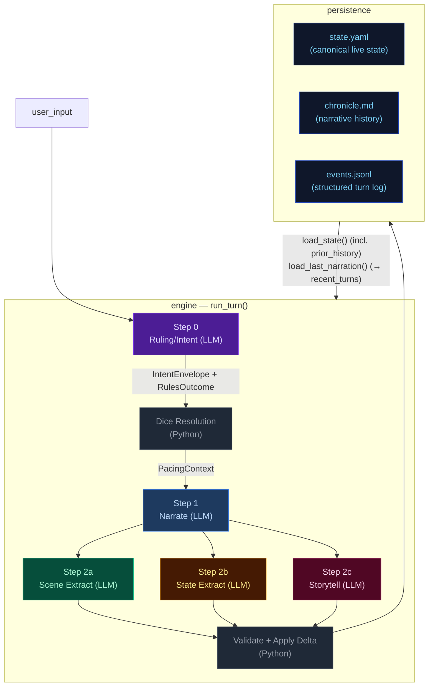

## Pipeline Quick Reference

| Step | Docs | When it runs | Key inputs | Key outputs | Mechanics it owns |
|---|---|---|---|---|---|
| **Step 0 — Ruling/Intent** | [step0-ruling](./step0-ruling.md) | Every turn (always) | `state.pc`, `state.location`, `recent_turns[-1:]`, `user_input` | `IntentEnvelope`, `RulesOutcome` | Intent classification, impossibility check, scene motion determination, dice roll resolution (1d12 + stat + cond − diff → band), difficulty selection, anti-declare-outcome enforcement. When `impossible=true`, no roll occurs and Python synthesizes a `fail` outcome. |
| **Step 1 — Narrate** | [step1-narrate](./step1-narrate.md) | Every turn (always, streamed) | Full `state`, `prior_history` (last 10 bullets), `recent_turns`, `pacing_context`, `pending_gm_beat`, `npc_roster` (from build_npc_roster()), `world_factions/locations` | `narrative` (prose) | Prose generation, dice-band binding, GM-beat consumption. Scene motion shaped by `PacingContext.outcome_hint`; impossible actions narrated as natural failures. |
| **Step 2a — Scene Extract** | [step2a-scene](./step2a-scene.md) | Every turn (always) | `narrative`, `state.pc/location`, `npc_roster` (from build_npc_roster()), conditions, compendium entries | `SceneExtractResult`: scene_tags, tagline, location_change, compendium_npc_update | NPC presence, location changes, scene tags, durable NPC compendium identity. |
| **Step 2b — State Extract** | [step2b-state](./step2b-state.md) | Every turn (always) | `narrative`, `state.pc/location/inventory`, conditions | `StateExtractResult`: inventory_add/remove/update, pc_condition_add/remove | Inventory delta accuracy, condition lifecycle. |
| **Step 2c — Storytell** | [step2c-progress](./step2c-progress.md) | Every turn (always) | `narrative`, `_ExtractionContext` (comp_this_turn, location, inventory, conditions), pacing_context, arc.threads[], recent_turns[-1:], band, npc_roster (from build_npc_roster()) | `StorytellerResult`: thread_update/arc_resolve/resolve/add, gm_beat, world_state_add/remove, actions, outcome_summary | Storyteller-managed thread lifecycle, arc resolution, beat disposition inference, durable history events. |

After Step 2c: results merge into a `StateDelta`, the validator checks constraints
(e.g. `inventory_remove` IDs exist), `apply_delta()` mutates state in-place, and the
turn is persisted. The next turn's Step 0 reads the new `state.yaml` plus `events.jsonl`.

## Subsystem Docs

| Subsystem | Doc | What it covers |
|---|---|---|
| **Step 0 — Ruling** | [step0-ruling](./step0-ruling.md) | Intent classification, dice resolution flowchart |
| **Step 1 — Narrate** | [step1-narrate](./step1-narrate.md) | Streaming narration pipeline with all context inputs |
| **Step 2a — Scene Extract** | [step2a-scene](./step2a-scene.md) | Location changes, NPC presence, scene tags |
| **Step 2b — State Extract** | [step2b-state](./step2b-state.md) | Inventory and condition extraction |
| **Step 2c — Storytell** | [step2c-progress](./step2c-progress.md) | Thread lifecycle, GMBeat schema, beat lifecycle (3 phases) |
| **PacingContext** | [pacing-context](./pacing-context.md) | Struct definition, computation flowchart, wiring to Narrator/Progress |
| **Delta → Validate → Apply** | [delta-validate](./delta-validate.md) | StateMerge schema, validation rules, apply_delta mutations |
| **Persist** | [persist](./persist.md) | Atomic writes (events.jsonl, state.yaml, chronicle.md), readback |
| **Cross-Pipeline Data Flow** | [cross-pipeline](./cross-pipeline.md) | Full inter-step data flow diagram |
| **Campaign Arcs** | [campaign-arcs](./campaign-arcs.md) | Arc data model (unified threads), engine-driven lifecycle, narrator-driven updates, integration points |
| **Out-of-Band Pipelines** | [out-of-band](./out-of-band.md) | Character Creation pipeline, Generate Seed pipeline, turn viewer status colors |
| **Narration UI** | [narration-ui](./narration-ui.md) | Main game interface: SSE streaming, HTMX sidebar refresh, Alpine.js state machine |
| **Turn Viewer UI** | [turn-viewer-ui](./turn-viewer-ui.md) | Pipeline debug UI: turn cards, stage inspector, diff panel, live updates |
| **Eval Harness** | [eval-harness](./eval-harness.md) | Scenario runner, LLM judges, auto-checkers, REPORT.md generation |

## Key Models Glossary

### Core Result Types

- **IntentEnvelope**: `intent`, `intent_verb`, `target`, `check.required`, `check.skill`, `check.difficulty`, `impossible`, `impossible_reason`, `scene_motion`
- **RulesOutcome**: `rolled`, `skill`, `difficulty`, `stat_value`, `stat_mod`, `diff_mod`, `cond_mod`, `dice`, `raw_total`, `final_total`, `band`, `directive`, `intent`, `intent_verb`, `impossible`, `impossible_reason`
- **SceneExtractResult**: `scene_tags`, `scene_tagline`, `location_change`, `compendium_npc_update`
- **StateExtractResult**: `inventory_add/remove/update`, `pc_condition_add/remove`
- **StorytellerResult**: `thread_update` (list[ThreadUpdate]), `arc_resolve` (ArcResolution | None), `thread_resolve` (list[ThreadResolution] with id/resolution_state/outcome), `thread_add`, `gm_beat`, `world_state_add`, `world_state_remove`, `actions`, `outcome_summary`
- **SeedEnvelope**: `seed_state: GameState`, `opening_narrative`, `actions`, `arc: CampaignArc` (includes `goal_context`, unified `threads[]`, `completed_threads[]`)

  The seed owns first-turn emotional framing, not just world and arc scaffolding. It generates `goal_context` (character-specific stake), NPC `relation` fields (narrative job relative to PC), and action text written from the PC's voice and scene pressure — ensuring the opening feels personal and motivated from the start.

### PacingContext (see [pacing-context](./pacing-context.md))

```
PacingContext:
  directive: str           # "" | "Breathe" | "Scene Imperative" | "Overwhelm" | "Pressure" | "Tension" | "Scene Pressure" (may include "; Resolve a Threat" secondary when beat_locked); used by Storytell pipeline
  outcome_hint: str | None # "hold" | "advance" | "transition" — narrator's primary scene motion instruction
  beat_locked: bool        # True: dual-trigger relief fired (consecutive_pressure_turns >= threshold OR momentum <= floor) — Progress MUST emit breathing_room beat and gate is force-closed
  gate: str                # "block_escalate" | "allow" (controls thread_add)
  summary: str             # human-readable log string, never sent to LLM
```

### GMBeat (see [step2c-progress](./step2c-progress.md))

```
GMBeat
  type: complication | revelation | opportunity | breathing_room | pressure | twist | setback | escalation | callback
  surface_as: ambient | event | npc_behavior | environmental | player_discovery | item (default: ambient)
  beat_expires_turn: int | None (turn number at which the beat expires; set to turn_no + 2 when stored)
```

### CampaignArc (see [campaign-arcs](./campaign-arcs.md))

```
CampaignArc
  visible_goal: str           — What the PC is trying to achieve
  goal_context: str           — 2–3 sentences explaining why visible_goal matters to this character specifically
  thematic_question: str      — The moral/thematic tension of the arc
  threads: list[ArcThread]    — Unified collection with active flag; replaces old active/latent split
  completed_threads: list[ArcThread] — Resolved/failed/abandoned threads
  resolution: str | None      — Set when arc is resolved via arc_resolve
  last_thread_created_turn: int — Tracks when a thread was last created for pacing

ArcThread (unified)
  id, summary, scope ("scene"|"arc"), active: bool = True
  urgency ("background"|"normal"|"urgent")
  tags: list[str]
  resolution_state: str | None, outcome: str | None
  resolved_turn: int | None   — Turn when thread was resolved; used for TTL filtering
  key: str | None             — Canonical concept label for dedup
```

### StateDelta (see [delta-validate](./delta-validate.md))

Merges all three extraction results. Contains `scene_tags`, `location_change`, `compendium_npc_update` (NPC changes), `thread_update/arc_resolve/thread_resolve/thread_add`, `inventory_add/remove/update`, `pc_condition_add/remove`, `world_state_add/remove`. Note: `gm_beat` is NOT in StateDelta — written directly to `state.meta.pending_gm_beat`.

---


## campaign-arcs


The campaign arc system tracks story threads across turns. Thread state is **storyteller-managed** — the LLM explicitly controls urgency and active/dormant state via `thread_update` directives. The engine applies these without enforcement of caps, cooldowns, or silent timers.

## Arc Data Model

```
CampaignArc
  visible_goal: str          — What the PC is trying to achieve
  goal_context: str          — 2–3 sentences explaining why visible_goal matters to this character specifically
  thematic_question: str     — The moral/thematic tension of the arc
  threads: list[ArcThread]   — Unified collection with active flag; storyteller controls state via thread_update
  completed_threads: list[ArcThread] — Resolved/failed/abandoned threads
  resolution: str | None     — Set when arc is resolved via arc_resolve
  last_thread_created_turn: int — Tracks when a thread was last created for pacing

ArcThread
  id: str                    — Unique identifier
  summary: str               — What this thread is about
  scope: Literal["scene", "arc"]  # scene = short-lived tied to current location; arc = persistent story tension
  active: bool = True        # Storyteller-controlled via thread_update
  urgency: Literal["background", "normal", "urgent"] = "normal"  # Storyteller-controlled
  tags: list[str]            — Keywords for engagement matching
  resolution_state: str | None # Set when thread_resolve processes resolved/failed/abandoned
  outcome: str | None        # Set from ThreadResolution.outcome when moved to completed_threads
  resolved_turn: int | None  — Turn when thread was resolved; used for TTL filtering in prompts
  key: str | None            — Optional canonical concept label; enables engine-side dedup auto-merge
```

## Engine-Driven Arc: Thread Updates + Arc Resolution

Thread lifecycle runs in `engine/turn.py` during the extraction phase. Three functions handle thread operations in order:

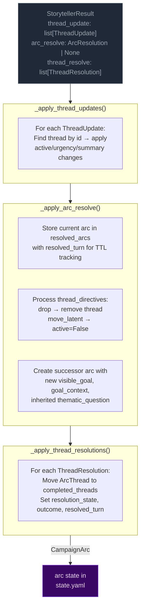

**Pipeline order:** thread updates → arc resolution → thread resolutions.

**Key rules:**
- **Storyteller-controlled:** No caps, cooldowns, or silent timers. The storyteller decides which threads to update via `thread_update` and when to resolve the arc via `arc_resolve`.
- **Arc resolution:** When `arc_resolve` is emitted, the current arc is stored in `state["resolved_arcs"]` with `resolved_turn` for TTL tracking. A successor arc is created with the new `visible_goal`, `goal_context`, and inherited `thematic_question`. Threads not mentioned in `thread_directives` carry over.
- **TTL-based cleanup:** Completed threads and resolved arcs are pruned from prompt context after `completed_thread_ttl` / `resolved_arc_ttl` turns (default 3).

## Arc Context in Narration

The arc state is passed to the narrator via `current_arc` in both system and user prompts. The narrator sees all arc metadata including resolved arcs (TTL-filtered) and completed threads.

### Early-turn narrative mode

When `goal_context` is present on the arc, the narrator treats it as narrative guidance for early turns: ground the player in personal stakes before broad exposition.

### Resolved arc continuity

When resolved arcs are present in the context, the narrator uses them to inform how the new arc relates narratively to what was resolved before — creating continuity across arc transitions.

## Arc System Integration Points

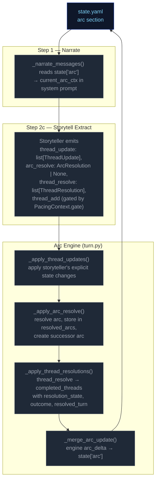

---


## cross-pipeline


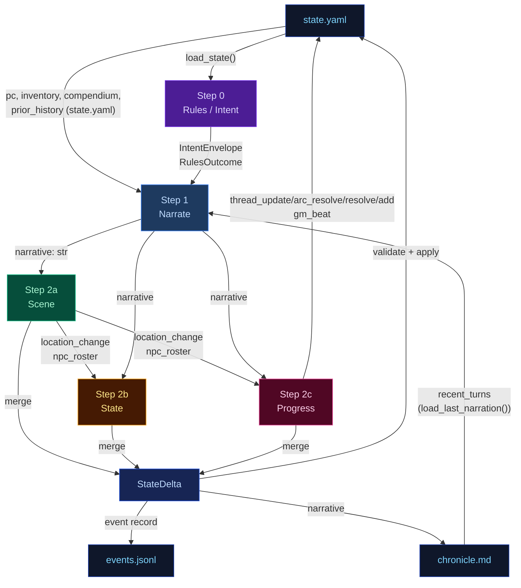

---


## delta-validate


The three extraction results merge into a single `StateDelta`, then validate and apply.

## Flowchart

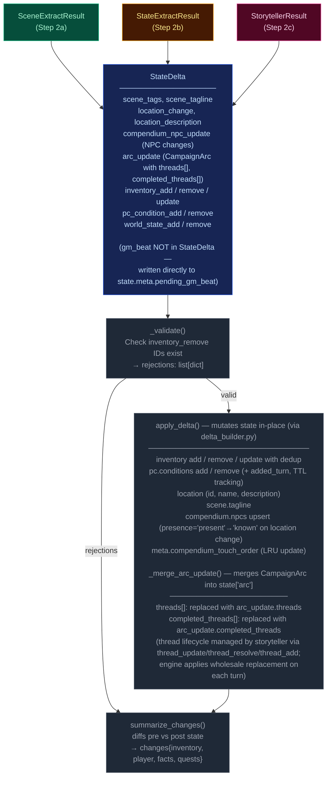

---


## narration-ui


The primary player-facing UI. Renders game state, streams narrative tokens live, and refreshes sidebars via HTMX partial swaps. Single-page app driven by Alpine.js + SSE + HTMX.

## Interaction Model

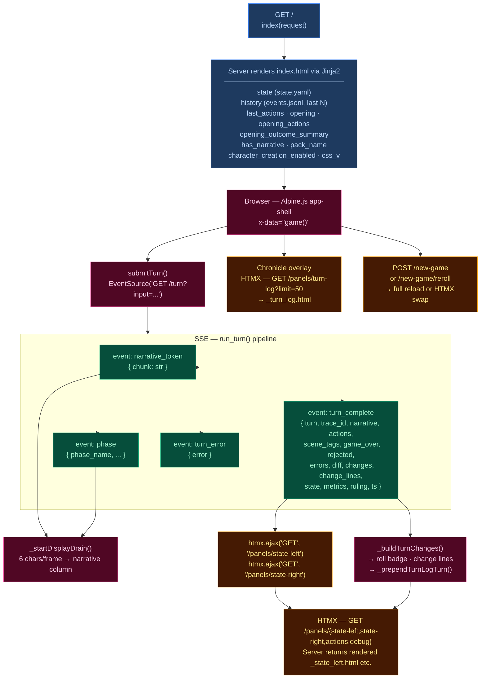

## Layout

| Region | Element | Content |
|--------|---------|---------|
| **Header** | `.header-bar` | Logo/tagline, Chronicle toggle, turn counter, retry button, new game button, reroll button (dynamic packs), mock-mode dot |
| **Left sidebar** | `.sidebar-left` | Player card, scene NPCs, location, arc, compendium — loaded via `/panels/state-left` |
| **Narrative column** | `.narrative-column` | Scrollable narrative blocks, action pills, input textarea, send/stop button |
| **Right sidebar** | `.sidebar` (right) | Inventory, recent events, world state, debug panel — loaded via `/panels/state-right` |
| **Chronicle overlay** | `.turn-log-shell` | Floating overlay over narrative column, populated by `/panels/turn-log?limit=50` |
| **New Game modal** | (Alpine `x-show`) | Pack picker → char creation / world builder steps |

## Data Flow

### Turn submission (Alpine.js + SSE)

1. User types input, presses Enter → `game().submitTurn()`
2. Opens `EventSource` to `GET /turn?input=<text>` — SSE endpoint in `routes.py:83`
3. Server streams events as the 5-stage pipeline (`run_turn()`) executes:
   - `narrative_token` — token chunks streamed as they arrive from LLM
   - `phase` — pipeline phase progress (ruling_start, narrate_start, narrate_first_token, narrate_done, extract_start, extract_done, compact_start, etc.)
   - `turn_complete` — final result
   - `turn_error` — error payload
4. Client `_startDisplayDrain()`: reveals 6 characters per animation frame for smooth streaming
5. On `turn_complete`:
   - Calls `htmx.ajax('GET', '/panels/state-left', ...)` and `htmx.ajax('GET', '/panels/state-right', ...)` to refresh sidebars
   - Renders change lines (`_buildTurnChanges`), roll badge
   - Prepends turn to Chronicle overlay via `_prependTurnLogTurn`
   - Re-renders markdown via `marked.parse()`

### HTMX partial endpoints (routes.py)

| Route | Template | Purpose |
|-------|----------|---------|
| `GET /panels/state-left` | `_state_left.html` | Left sidebar — player, NPCs, location, arc, compendium |
| `GET /panels/state-right` | `_state_right.html` | Right sidebar — inventory, events, world state, debug |
| `GET /panels/actions` | `_actions.html` | Action pills (fallback) |
| `GET /panels/turn-log?limit=N` | `_turn_log.html` | Chronicle — turn history with change lines |
| `GET /panels/pack-picker` | `_pack_picker.html` | New Game — pack selection cards |
| `GET /panels/char-creation` | `_char_creation.html` | New Game — character stats builder |
| `GET /panels/world-builder` | `_world_builder.html` | New Game — world creation form |
| `GET /panels/debug` | `_debug.html` | Debug panel — recent turn timings, errors |
| `GET /panels/state` | `_state.html` | Combined left+right (legacy) |

### Client state machine (`game()` — inline `<script>` in index.html)

Alpine.js `x-data="game()"` manages:
- `input` — textarea value
- `submitting` — turn-in-progress flag
- `gameStarted` — derived from `has_narrative`
- `turnNum` — current turn counter
- `leftWidth` / `rightWidth` — resizable sidebar widths (persisted to `localStorage`)
- Card collapse state — read/written directly from/to `localStorage` via `CCYA_CARD_KEY(name)` helper, using DOM `data-card` attributes; no Alpine data property

## UI Features

### Resizable sidebars
- Drag gutters with mousedown/mousemove handlers
- Widths saved to `localStorage` (`ccya_sidebar_left`, `ccya_sidebar_right`)
- Minimum width enforcement (240px left, 220px right)

### Collapsible cards
Each sidebar section has a collapse toggle; open/closed state persisted per-card to `localStorage` via `ccya_card_<name>` key.

### Action pills
Suggested next actions rendered as buttons that populate the input on click. Updated from `turn_complete.actions` or via HTMX panel refresh.

### Roll badge
Server-rendered for history, JS-built for new turns. Shows dice math, band label, outcome summary. Band colors: `crit_fail` (red) → `fail` → `setback` → `partial` → `success` → `crit_success`.

### Change lines
Grouped by category via emoji prefix:
| Emoji | Category | Class |
|-------|----------|-------|
| 🎒 + | Inventory gain | `.tc-inv-gain` |
| 🎒 − | Inventory loss | `.tc-inv-loss` |
| 🩺 | Player condition | `.tc-pl` |
| 📍 | Location | `.tc-loc` |
| 📜 | Faction/arc | `.tc-fa` |

### Retry
`POST /turn/delete` removes last event from `events.jsonl` and `chronicle.md`, returns previous actions for re-submission.

### New Game
`POST /new-game` with optional `pack_id`, `pc_name`, `pc_stats`, `hints`. For dynamic packs, triggers `generate_seed()` LLM pipeline. Full page reload on success. Reroll (`POST /new-game/reroll`) HTMX-swaps the opening narrative + actions.

## CSS Architecture

- **`app.src.css`** — Tailwind + custom styles split by region (lines 1–2101):
  - App shell layout (CSS Grid: header + body with sidebar-gutter-main-gutter-sidebar)
  - Narrative blocks (`.narrative-block`, `.narrative-text`)
  - Sidebar cards (`.card`, `.card-header`, `.card-body`)
  - Input bar (`.input-bar`, `.game-input`, `.send-btn`)
  - Action pills (`.action-pill`, `.pills-row`)
  - Roll badges (`.roll-badge`, `.roll-band--*`)
  - Chronicle overlay (`.turn-log-shell`, `.turn-log-panel`)
  - New Game modal (`.modal-overlay`, `.pack-card`)
  - Progress strip, tooltips, scrollbar styling
  - Design tokens via CSS custom properties (`--text-primary`, `--bg-card`, `--status-*`)
- Compiled to **`app.css`** with cache-busting via `css_v` query param

## Server Entry Point

`routes.py:57` — `GET /` handler assembles template context from `state.yaml`, `events.jsonl`, pack manifest, and engine config, then renders `ccya/templates/index.html`.

---


## out-of-band


These run only at new-game time or are non-engine concerns. They are excluded from the eval-context region of the main architecture doc.

## Character Creation Pipeline

Triggered by `POST /new-game`. All packs use the Generate Seed pipeline (dynamic). Static packs with pre-built seed_state.yaml exist but are not used by new_game.

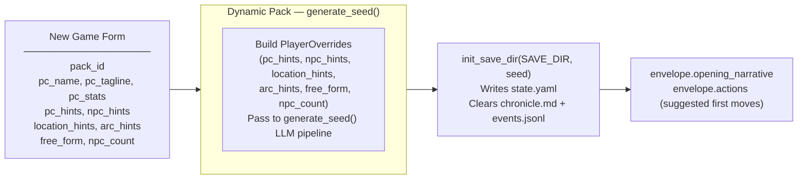

## Generate Seed Pipeline (Dynamic Packs Only)

Called by `POST /new-game` and `POST /new-game/reroll`. Generates a complete starting game state (PC, NPCs, location, arc, opening narrative, actions) from the pack manifest and optional player overrides.

The seed owns **first-turn emotional framing** — not just world and arc scaffolding. Every seed element must produce an emotionally legible opening that answers: why this moment matters now, what the character stands to lose, and why at least one person in the scene matters to them personally.

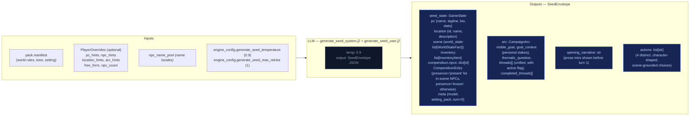

### Seed emotional framing contract

The seed prompt (`generate_seed_system.j2`) enforces these requirements:

- **`goal_context`**: 2–3 sentences explaining why `visible_goal` matters to this character specifically — inner cost or pressure that makes it emotionally loaded. No hidden-truth spoilers, no restating `visible_goal`, no direct statement of the thematic question. Must connect character motive, story stakes, and emotional cost.
- **NPC `relation` field**: Each opening NPC has a defined narrative job. One NPC is personally tied to the PC's motive or vulnerability; the other carries immediate external pressure from the world or conflict. The `relation` field encodes PC-facing relevance (e.g. "owes them a favor", "is their only contact here", "represents the institution pressing on them").
- **Compendium NPCs**: The seed also generates 2–3 NPCs in `compendium.npcs` (name, title, bio) who exist in the world but are not present in the opening scene. Their bios tie them to factions, locations, or world pressures, not to the immediate situation. These become discoverable characters during play.
- **Action guidance**: Each of the 4 choices is written from the PC's point of view, grounded in a present NPC, immediate risk, active thread, or character motive. They differ in emotional posture (confront, deflect, investigate, protect, exploit, withdraw, etc.) and avoid generic verbs.
- **`threads[]`**: Unified list (not split active/latent) where each thread has `{id, summary, tags, urgency, scope}` and an `active` boolean flag managed by the storyteller via `thread_update`, not Python age rules.

## Turn Viewer — status colors

The standalone turn viewer ([turn-viewer-ui](./turn-viewer-ui.md)) uses the same semantic status colors as the CSS custom properties in `static/app.src.css` (`--status-*`). The stage colors used in the diagrams above (`stageRules` violet → `stageNarrate` blue → `stageScene` green → `stageState` amber → `stageProgress` pink) map directly to the `--stage-*` tokens. Cross-stream inputs into a step are shown in `xstream` (purple outline) and LLM/Python boxes use neutral dark fills. This table is the canonical turn-viewer status legend.

| Token | Meaning |
|-------|---------|
| `--status-ok` | Stage ran and completed (no extraction error). |
| `--status-skipped` | Stream was skipped (no longer used — all streams always run). |
| `--status-retried` | LLM output required a parse retry (`attempts` > 1 in event). |
| `--status-rejected` | Post-extract validation rejected part of the delta (e.g. bad `inventory_remove`). |
| `--status-error` | LLM call or parse ultimately failed for that stream. |
| `--status-neutral` | Non-fatal / informational (e.g. rules path with no dice roll). |

Stage accent stripes use `--stage-rules`, `--stage-narrate`, `--stage-scene`, `--stage-state`, `--stage-progress` for quick scanning; **status** always wins for the prominent left border.

---


## pacing-context


All pacing signals are collapsed into one Python-computed struct (`PacingContext`) passed to both the Narrator and Storytell pipeline. This replaces six independent fields (`narration_directive`, `deescalate`, `narrative_velocity`, `beat_disposition` output, `quest_threshold_directive`, and stale momentum-derived signals). The narrator receives `outcome_hint` (scene motion); Storytell receives the full struct including `directive`.

## Struct definition

```
PacingContext:
  directive: str           # "" | "Breathe" | "Scene Imperative" | "Overwhelm" | "Pressure" | "Tension" | "Scene Pressure" (may include "; Resolve a Threat" secondary when beat_locked); used by Storytell pipeline
  outcome_hint: str | None # "hold" | "advance" | "transition" — narrator's primary scene motion instruction
  beat_locked: bool        # True: relief fired — Progress MUST emit breathing_room beat and gate is force-closed
  gate: str                # "block_escalate" | "allow" (controls thread_add)
  summary: str             # human-readable log string, never sent to LLM
```

`beat_locked: True` fires when either `consecutive_pressure_turns >= config.consecutive_pressure_threshold` OR `momentum <= config.momentum_floor`. When locked, `"Resolve a Threat"` is appended to the directive via semicolon. The `gate` field prevents Progress from adding new threads during de-escalation windows.

## Computation

`_compute_pacing_context()` in `engine/turn.py` consolidates pacing computation (replacing the former scattered functions: `_compute_narration_directive`, `_compute_narrative_velocity`, `_check_floor_relief`). It takes inputs (`momentum`, `consecutive_pressure_turns` from state meta, `arc.threads[] scope=scene urgency counts`) and returns a single struct with directive derived from a priority stack. It also computes `outcome_hint` from the ruling LLM's `scene_motion` and PacingContext escalation signals: ruling `scene_motion` takes priority (`transition` > `advance` > fallback), then `impossible=true` forces `advance`, then Python escalation signals (`beat_locked`, Overwhelm/Pressure with urgent threads) produce `advance`, defaulting to `hold`.

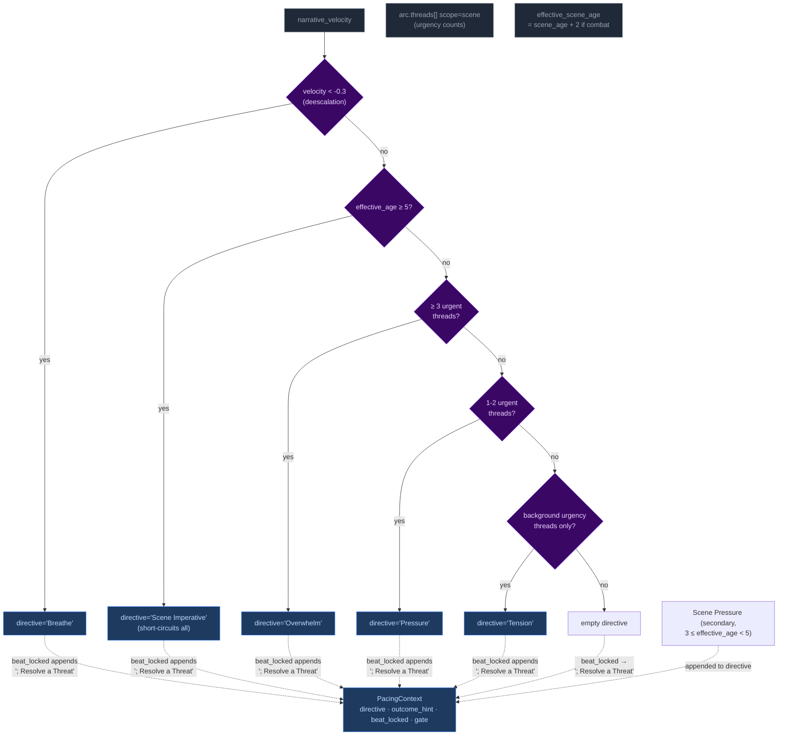

Priority order (highest to lowest): **Breathe > Scene Imperative > Overwhelm > Pressure > Tension > Scene Pressure**. The `beat_locked` flag takes precedence — when either consecutive pressure threshold or momentum floor is reached, `"Resolve a Threat"` is appended to whatever directive was computed and gate may be force-closed.

### Age computation (Phase 03 collapse)

`_compute_ages(state)` returns only `{"scene_age": scene_age}` — location_age and combat_age removed in Phase 03 pacing overhaul. The ruling phase pre-computes `effective_scene_age = scene_age + 2` when `"combat"` is in scene tags, stored in `ctx._ages["effective_scene_age"]`. This single-age signal drives all directive thresholds:
- Scene Imperative (≥5 effective age): high-priority directive forcing story advancement
- Scene Pressure (3 ≤ effective_age < 5): secondary append to wind down or shift focus

## Wiring: how PacingContext reaches the pipelines

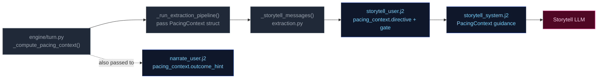

1. **Computed** once in `run_turn()` via `_compute_pacing_context()`.
2. **Passed through** `_run_extraction_pipeline()` → both `_narrate_messages()` and `_storytell_messages()`.
3. **Narrator template** (`narrate_user.j2`) renders `outcome_hint` (scene motion: hold/advance/transition) with value-specific guidance. No Jinja2 pacing computation remains — all pacing computed by Python.
4. **Storytell template** ((`storytell_system.j2` + `user.j2`)) receives the full struct; guidance maps each directive to appropriate thread/beat actions:

| Directive | Thread action | Gate |
|-----------|---------------|-------|
| **"Breathe"** (de-escalation, velocity < -0.3) | Do NOT add new threads. Allow existing scene threads to persist without escalation. | `block_escalate` + force-closed when at momentum floor |
| **"Scene Imperative"** (effective_age ≥ 5) | Story must advance — introduce new development forcing resolution or movement; do not linger | Varies by context |
| **"Overwhelm"** (3+ urgent threads) | May add scene-scoped threads if gate allows; emit pressure/escalation beat | `allow` |
| **"Pressure"** (1-2 urgent threads) | Advance relevant scene/arc threads. Add new thread only if gate permits. | Varies by context |
| **"Tension"** (background urgency only) | Do NOT add pressures unless concrete threat emerges; prefer advancing existing threads | Allow |
| **"Scene Pressure"** (3 ≤ effective_age < 5, secondary append) | Begin winding down or introduce reason to shift focus: development elsewhere, closing window | Varies by context |
| **"" (empty)** | No action required beyond normal aging of silent threads. | Allow |

**Note:** Directives may include secondary modifiers joined by semicolons (e.g., "Pressure; Resolve a Threat" when beat_locked). The primary directive drives thread/beat logic; the secondary (`; Resolve a Threat`) acts as thematic guidance for beat type selection. "Resolve a Threat" never appears as a standalone primary directive — it is only appended by the `beat_locked` mechanism.

## Consecutive pressure counter

`state["meta"]["consecutive_pressure_turns"]` tracks how many consecutive turns have had Pressure or Overwhelm directives without any thread updates emitted by the storyteller. Updated via two-pass logic at turn end (~turn.py ~1450): increments when directive was Pressure/Overwhelm AND no `thread_update` emitted; resets to 0 otherwise. When this counter reaches `config.consecutive_pressure_threshold` (default 3), it triggers the dual-trigger beat_locked condition alongside momentum floor relief.

## GM Beat lifecycle (Phase 03 carryover fix)

`pending_gm_beat` is written to state after storytelling if non-null gm_beat emitted, with `beat_expires_turn = turn_no + 2`. Consumed read-gated at turn_no <= beat_expires_turn in _narrate_setup. Cleared only on replacement or expiry — both unconditional clears were removed from turn.py (post-narration clear and else block re-clear). Beat write logic in Progress step only writes if `beat_locked` AND no existing pending_gm_beat exists, preventing overwrites during locked windows.

---


## persist


Atomic writes to disk. No LLM calls.

## Flowchart

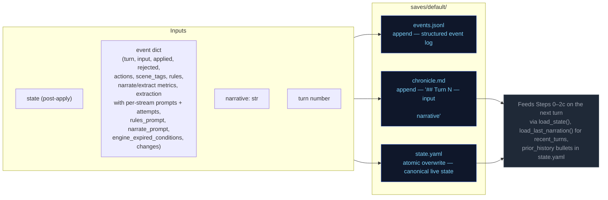

---


## step0-ruling


Classifies the player's action, determines whether a dice check is needed, and
identifies which state domains will be active — narrowing every downstream extractor.

## Flowchart

```mermaid
flowchart LR
    classDef stageRules fill:#4c1d95,color:#ddd6fe,stroke:#7c3aed
    classDef llmNode    fill:#0f172a,color:#94a3b8,stroke:#334155
    classDef pyNode     fill:#1f2937,color:#9ca3af,stroke:#4b5563
    classDef outNode    fill:#3b0764,color:#e9d5ff,stroke:#7c3aed

    subgraph IN["Inputs"]
        I1["state.pc<br>(name, stats, conditions)"]
        I2["state.location"]
        I3["recent_turns[-1:]<br>(last turn's full narrative from chronicle.md<br>via load_last_narration();<br>ruling user prompt)"]
        I4["user_input"]
    end

    subgraph LLM0["LLM — ruling_system.j2 + ruling_user.j2"]
        L0["temp: 0.2 · max_retries: 1<br>output: IntentEnvelope JSON<br>(intent, impossible, scene_motion, check)"]:::llmNode
    end

    subgraph PYRES["Python — impossible check + rules.resolve_check()"]
        P0["if impossible=true:<br>  synthesize fail outcome<br>  skip roll, apply momentum<br>else:<br>  roll 1d12 + stat_mod + cond_mod − diff_mod<br>  map total → Band"]:::pyNode
    end

    subgraph OUT["Outputs"]
        O1["IntentEnvelope<br>  intent: str<br>  intent_verb: str<br>  target: str<br>  impossible: bool<br>  impossible_reason: str<br>  scene_motion: hold|advance|transition<br>  check.required: bool<br>  check.skill: SkillName<br>  check.difficulty: Difficulty"]:::outNode
        O2["RulesOutcome<br>  rolled: bool<br>  skill, difficulty, stat_value, stat_mod<br>  diff_mod, cond_mod<br>  dice: list[int]<br>  raw_total, final_total: int<br>  band: Band<br>  directive: str<br>  intent, intent_verb: str<br>  impossible: bool<br>  impossible_reason: str"]:::outNode
    end

    IN --> LLM0
    LLM0 -- "IntentEnvelope" --> PYRES
    PYRES --> OUT
```

## Impossibility check

The ruling LLM evaluates whether the described action is impossible given the character's state, inventory, and scene. An action is impossible when:

- It requires an item the character does not have (firing a gun with no ammo, using a key never acquired)
- It requires a capability contradicted by active conditions (climbing with a broken leg, sneaking while armored and noisy)
- It acts on something not present in the scene (targeting an NPC who is not here, opening a door that doesn't exist)

When `impossible=true`: Python sets `check.required=False`, synthesizes a `RulesOutcome` with `band="fail"` and `rolled=False`, applies momentum, and skips the dice roll entirely. The narrator renders the impossible fact and narrates the natural failure.

## Scene motion

The ruling LLM also determines how the scene should progress: `"hold"` (scene continues at current pace), `"advance"` (something significant happens/resolves), or `"transition"` (player is leaving, write the arrival). This feeds into `_compute_pacing_context()` which produces `outcome_hint` for the narrator.

## Key forward dependency

`rules_outcome` feeds into `_compute_pacing_context()` which produces the single authoritative `PacingContext` struct passed to both Narrator and Storytell pipeline.

---


## step1-narrate


Generates the narrative prose the player reads. Tokens are streamed to the client.

## Flowchart

```mermaid
flowchart LR
    classDef llmNode   fill:#0f172a,color:#94a3b8,stroke:#334155
    classDef xstream   fill:#4c1d95,color:#ddd6fe,stroke:#7c3aed
    classDef outNode   fill:#1e3a5f,color:#bfdbfe,stroke:#3b82f6

    subgraph IN["Inputs"]
        N1["state (full —<br>pc, location, scene,<br>inventory, compendium)"]
        N2["prior_history<br>(last 10 incremental history bullets)"]
        N3["recent_turns (last window of events.jsonl entries)"]
        N4["rules_outcome<br>(band, directive, impossible, dice summary)"]:::xstream
        N6["npc_name_pool (cultural name list)"]
        N7["npc_roster<br>(from build_npc_roster(comp),<br>  presence field: present/nearby/known)"]
        N9["world_factions<br>(immutable trace)"]:::xstream
        N10["pending_gm_beat<br>(type · surface_as metadata)"]
        N11["pacing_context<br>(outcome_hint)<br>from _compute_pacing_context()"]:::xstream
        N15["user_input"]
    end

    subgraph LLM1["LLM — narrate_system.j2 + narrate_user.j2"]
        NL["temp: 0.9 · streaming: yes<br>output: prose narrative (str)"]:::llmNode
    end

    subgraph OUT["Outputs"]
        NO1["narrative: str<br>(streamed as tokens → client<br>then joined + thinking-stripped)"]:::outNode
        NO2["narr_metrics<br>  first_token_ms<br>  total_ms<br>  tokens_in / tokens_out"]
    end

    IN --> LLM1
    LLM1 --> OUT
```

## Arc context in narration

The narrator receives `current_arc` in both system and user prompts. Key fields:

- **`goal_context`**: A seed-time field (2–3 sentences) explaining why `visible_goal` matters to the character specifically — inner cost or pressure that makes it emotionally loaded. When present, `_arc.j2` presents it alongside other arc context in the user prompt for early-turn narrative guidance: ground the player in personal stakes before broad exposition.
- **`visible_goal`**: The player-facing objective.
- **`thematic_question`**: The moral tension — never stated directly in prose. Used as a lens for emphasis: what detail feels loaded, what silence matters.
- **`threads[]`**: Unified thread collection filtered by `active` flag. Scene-scope threads provide immediate pressure; arc-scope threads provide medium-term tension.
- **`resolved_arc`**: TTL-filtered list of previously resolved arcs, providing narrative continuity across arc transitions.

### Opening-turn narrative mode

When `goal_context` is present (always true after seed), the narrator treats early turns as a distinct onboarding mode:
1. Personal stakes before broad exposition
2. One NPC moment with emotional charge (driven by `relation` fields on seed NPCs)
3. One immediately actionable pressure

The presence of `goal_context` itself is the signal — no turn-counting dependency needed. The guidance is most impactful in the first few turns and persists as background context throughout the campaign.

## Key forward dependency

`narrative` is the primary content input for all three extraction streams below.

---


## step2a-scene


Extracts location changes, NPC presence, scene tags, and suggested actions from the narrative.

## Flowchart


## Key forward dependency

`location_change` flows into `extraction_ctx` (built by `_build_extraction_context`). Step 2c also receives `npc_roster` (from build_npc_roster()) built from comp_this_turn. No forward-facing mechanics (`thread_add`, `gm_beat`) are emitted by this stream — they go through the unified thread lifecycle via Storytell (Step 2c).

---


## step2b-state


Extracts inventory changes and player condition mutations from the narrative.

## Flowchart

```mermaid
flowchart LR
    classDef llmNode fill:#0f172a,color:#94a3b8,stroke:#334155
    classDef xstream fill:#4c1d95,color:#ddd6fe,stroke:#7c3aed
    classDef outNode fill:#451a03,color:#fde68a,stroke:#f59e0b

    subgraph IN["Inputs"]
        S1["narrative (from Step 1)"]:::xstream
        S2["state.pc (name, bio, stats, conditions)"]
        S3["state.location"]
        S4["state.inventory"]
        S5["intent: str<br>(from Step 0)"]
    end

    subgraph LLM2B["LLM — extract_state_system.j2 + extract_state_user.j2"]
        SL["temp: 0.4 · max_retries: 1<br>output: StateExtractResult JSON"]:::llmNode
    end

    subgraph OUT["Outputs — StateExtractResult"]
        O1["inventory_add: list[InventoryItem]<br>  id, name, notes, amount"]:::outNode
        O2["inventory_remove: list[InventoryRemove]<br>  id, amount (None = full stack)"]:::outNode
        O3["inventory_update: list[InventoryUpdate]<br>  id, name?, notes?"]:::outNode
        O4["pc_condition_add: list[ConditionAdd]<br>  id, label, description"]:::outNode
        O5["pc_condition_remove: list[ConditionRemove]<br>  id"]:::outNode
    end

    IN --> LLM2B
    LLM2B --> OUT
```

## Key forward dependency

Step 2c receives `npc_roster` (from build_npc_roster()) and `location_change` from Step 2a. Cross-stream items_gained/lost were removed — extraction_ctx now covers all this-turn derived data.

---


## step2c-progress


Extracts thread updates, arc actions, world state changes, and durable NPC compendium changes.

## Flowchart


## Always runs

Progress is the post-narration storytelling brain. It always executes every turn (never skipped) and feeds next turn's rules call via `world_state_add/remove` (persistent world facts), `thread_update/arc_resolve/thread_resolve/thread_add` (storyteller-managed thread lifecycle), and `gm_beat` (forward-facing beats stored in `state.meta.pending_gm_beat`).

## GMBeat schema

```
GMBeat
  type: complication | revelation | opportunity | breathing_room | pressure | twist | setback | escalation | callback
  surface_as: ambient | event | npc_behavior | environmental | player_discovery | item (default: ambient)
  beat_expires_turn: int | None (turn number at which the beat expires; set to turn_no + 2 when stored)
```

## Beat lifecycle

The beat flows through three phases per turn:

**Phase 1 — Pre-narration expiry check.** At the start of each turn, the engine reads `state.meta.pending_gm_beat` from the previous turn. If `beat_expires_turn` is set and the current turn number exceeds it, the beat is nullified. Otherwise it proceeds to narration.

**Phase 2 — Narration consumption.** The beat is passed to the narrator via `_narrate_messages(pending_gm_beat=...)`. The narrator uses the beat's type and surface_as metadata as creative guidance alongside the pacing directive. After narration completes, the pending beat is cleared from state — it is not restored for storyteller consumption.

**Phase 3 — Extraction disposition (inferred).** The storyteller receives no pending beat context in its prompt — it decides beats based solely on current extraction data (scene state, threads, pacing context, band). Unlike the previous architecture, there is no explicit `beat_disposition` field. Instead:
- If Progress emits a new `gm_beat`, it replaces the old one (`state.meta.pending_gm_beat = gm_beat` with `beat_expires_turn = turn_no + 2`)
- If Progress emits nothing and the beat's `expires_at` hasn't passed, the engine preserves the existing beat unchanged (carry)
- The engine stores beats with `beat_expires_turn = turn_no + 2` as a hard TTL ceiling. Beats past their expiry are discarded automatically on load.

## Floor relief injection priority

The floor relief mechanism fires when `_pc.beat_locked=True` AND no beat exists in `state.meta.pending_gm_beat` at extraction completion time (`turn.py:1263`). It injects a `breathing_room` beat with TTL of 3 turns (one more than storyteller-emitted beats' TTL of 2).

Floor relief beats are **fallback only** — they inject a recovery beat when the LLM didn't already provide one. If the storyteller emits any gm_beat during extraction, floor relief does NOT fire because `pending_gm_beat` is already set. The LLM's beat takes priority over Python-injected recovery signals.

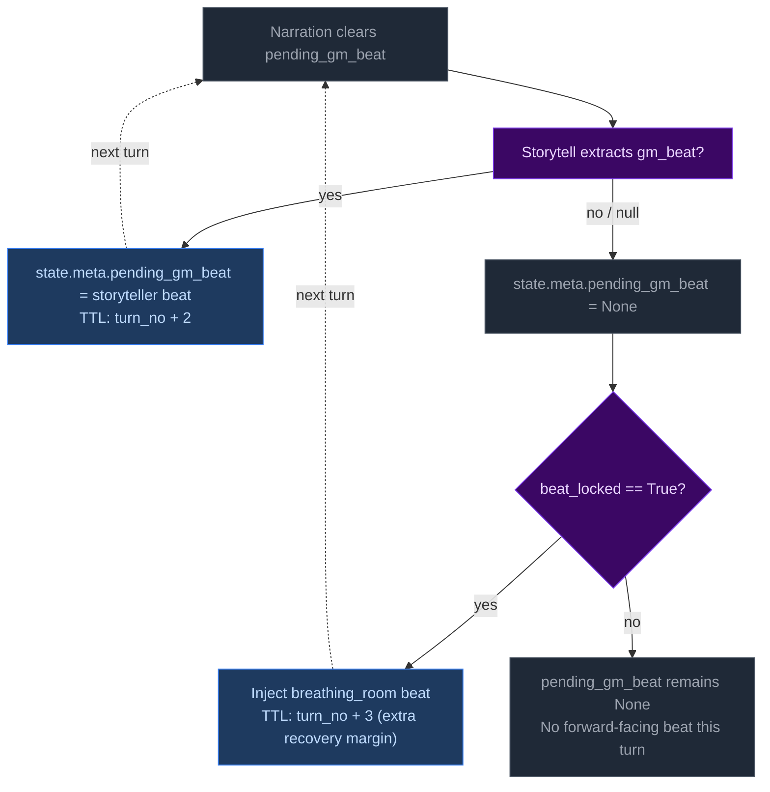

## Directive-beat alignment

The storyteller prompt (`storytell_system.j2:54-65`) maps each PacingContext directive to recommended beat types (e.g., "Breathe" → breathing_room; "Overwhelm" → pressure/escalation). This alignment is **guidance only** — Python accepts whatever gm_beat the LLM emits with no validation, correction, or override. Design rationale: forcing directive-beat alignment would constrain storytelling flexibility and create brittleness if the LLM makes contextually appropriate but directive-divergent beat choices.

---


## thread-lifecycle


## Scope

This doc covers the internal mechanics of arc thread lifecycle management in `turn.py`.
It complements `campaign-arcs.md` (data model, high-level flow)
by detailing the exact rules, order of operations, and edge cases.

## Thread State Management

Thread state is **storyteller-managed**. The LLM explicitly controls urgency and active/dormant state via `thread_update` directives. The engine applies these without enforcement of caps, cooldowns, or silent timers.

## Two Thread Scopes

Threads have a `scope` field (`"scene"` or `"arc"`) that determines narrative treatment:

| Scope | Narrative role | Engine lifecycle |
|---|---|---|
| `scene` | Short-lived tension tied to current location/NPCs | **Purged on location change** — removed from `arc.threads[]` when player moves to a new location (delta_builder.py:243-248). The LLM creates arc-scoped threads for persistent story lines. |
| `arc` | Persistent story tension across scenes | Persists across location changes. Only removed via `thread_resolve` or `thread_update` with `active=False`. |

## Entry Points

Three call sites in `run_turn()` process threads (order matters):

1. **`_apply_thread_updates()`** — apply storyteller's explicit state changes
2. **`_apply_arc_resolve()`** — resolve arc, store in resolved_arcs, create successor
3. **`_apply_thread_resolutions()`** — resolve/fail/abandon → completed

All three run after `apply_delta()` but before `save_state()`.

## Step-by-Step: `_apply_thread_updates()`

Processes `storyteller_result.thread_update` (list of `ThreadUpdate` with `id`, optional `active`, `urgency`, `summary`).

For each ThreadUpdate:
1. Find matching thread by ID in `arc.threads[]`
2. If not found → log WARNING, skip
3. Apply non-None fields (`active`, `urgency`, `summary`) via `model_copy`
4. Log applied changes at INFO level

No caps, cooldowns, or silent timers are enforced. The storyteller decides which threads to update.

## Step-by-Step: `_apply_arc_resolve()`

Processes `storyteller_result.arc_resolve` (optional `ArcResolution` with `resolution`, `visible_goal`, `goal_context`, optional `thematic_question`, `thread_directives`).

1. If `arc_resolve` is None → return None
2. Validate arc from state; if missing/invalid → log WARNING, return None
3. Store current arc in `state["resolved_arcs"]` with `resolved_turn` for TTL tracking
4. Process `thread_directives`:
   - `drop` → remove thread from arc
   - `move_latent` → set `active = False`
   - Threads not mentioned carry over as-is
5. Create successor arc with new `visible_goal`, `goal_context`, inherited `thematic_question`, surviving threads
6. Replace `state["arc"]` with successor

## Step-by-Step: Thread Creation (inline in `run_turn()`)

New threads (`storyteller_result.thread_add`) are gated by:

1. **Pacing gate**: `_pc is None or _pc.gate == "allow"` — blocks escalation when pacing context says so
2. **Key collision**: exact match on thread `key` → reject with WARNING log
3. **Fuzzy auto-merge**: ≥70% token overlap on `key` → update existing thread summary/tags instead of creating new thread

No cooldown or cap checks. The storyteller is trusted to manage thread count.

## Step-by-Step: `_apply_thread_resolutions()`

Processes `storyteller_result.thread_resolve` (list of `ThreadResolution` with `id`, `resolution_state`, `outcome`).

1. Find matching thread by ID in `arc.threads[]`
2. If not found → log warning, skip
3. If found → move to `arc.completed_threads[]`, set `resolution_state`, `outcome`, and `resolved_turn`
4. Deduplicate completed_threads entries: existing ID gets updated, not duplicated

## Step-by-Step: Pacing Context Gate

`_compute_pacing_context()` sets `gate` based on deescalation:

```
gate = "allow" by default
gate = "block_escalate" when deescalate >= 0.5
```

The gate blocks thread creation (in `run_turn()`). The LLM is instructed not to emit `thread_add` when gate != "allow".

## Constants Reference

| Constant | Value | Effect |
|---|---|---|
| `config.resolved_arc_ttl` | 3 (default) | Turns to keep resolved arcs in prompt context |
| `config.completed_thread_ttl` | 3 (default) | Turns to keep completed threads in prompt context |

No active/latent caps, no cooldowns, no expiry timers, no promotion cooldowns.

## Validation Edge Cases

1. **Empty arc state** — No arc in state → log DEBUG, return None (no crash)
2. **Validation failure** — Arc fails Pydantic validation → log WARNING, return None
3. **Unknown thread ID in update** — Log WARNING, skip — does not block valid updates
4. **Unknown resolution ID** — Log WARNING, skip — does not block valid resolutions
5. **Duplicate thread ID in creation** — Checked against existing + completed IDs
6. **Key collision in creation** — Exact match rejects; fuzzy match auto-merges

---

---


# Static Context (immutable across all turns)

## Seed State

```json
{
  "meta": {
    "game_name": "eval",
    "turn": 0,
    "setting_pack": "eval-pack",
    "model": ""
  },
  "pc": {
    "name": "Aren Voss",
    "tagline": "Reluctant courier on the merchant road",
    "bio": "Mid-thirties, broad shoulders, careful with words. Took on a courier contract\nto clear an old debt. Just arrived in Marrow's Crossing with a heavy pack and\na heavier obligation.\n",
    "stats": {
      "strength": 3,
      "dexterity": 3,
      "wits": 2,
      "lore": 2,
      "charisma": 3,
      "resolve": 3
    },
    "conditions": [],
    "momentum": 0,
    "drive": ""
  },
  "location": {
    "id": "marrows_crossing",
    "name": "Marrow's Crossing",
    "description": "A market town built around the confluence of two rivers. Cobblestone streets,\ntimber-framed buildings, and the constant sound of water from the mills. The\ntown square has a stone well and a statue of the founder. Most shops are closing\nfor the evening.\n"
  },
  "inventory": [
    {
      "id": "credits",
      "name": "Credits",
      "notes": "Common coin, accepted at any inn or stall on the merchant road.",
      "amount": 500,
      "aliases": []
    },
    {
      "id": "iron_dagger",
      "name": "Iron dagger",
      "notes": "Plain crossguard, edge worn from honing. Belt-carried.",
      "amount": 1,
      "aliases": []
    },
    {
      "id": "bandages",
      "name": "Linen bandages",
      "notes": "Three rolls. Field-grade \u2014 won't replace a healer.",
      "amount": 3,
      "aliases": []
    },
    {
      "id": "traveler_cloak",
      "name": "Traveler's cloak",
      "notes": "Oiled wool, road-stained, hood deep enough to hide a face.",
      "amount": 1,
      "aliases": [
        "cloak",
        "travel cloak"
      ]
    },
    {
      "id": "brass_key",
      "name": "Brass key",
      "notes": "A small brass key Halden gave you with the ledger.",
      "amount": 1,
      "aliases": []
    }
  ],
  "scene": {
    "tagline": "Market town at dusk",
    "tags": [
      "peaceful",
      "start"
    ],
    "world_state": [
      "Marrow's Crossing is a market town at the confluence of two rivers, known for its mills and the annual river festival.",
      "Iron coin (credits) is the universal currency on the merchant road; barter is acceptable but slower.",
      "The road has been quieter than usual this season \u2014 fewer caravans, more independent runners, more opportunists."
    ]
  },
  "compendium": {
    "npcs": {
      "caron": {
        "name": "Caron",
        "title": "Old creditor",
        "bio": "A portly man in his sixties with a merchant's ledger and a patient demeanor. You owe him 500 credits from a failed venture three years ago.",
        "bond": null,
        "presence": null,
        "notes": null,
        "motivation": null,
        "fear": null,
        "leverage": null
      },
      "halden": {
        "name": "Halden",
        "title": "Merchant",
        "bio": "A road merchant in his fifties who hires couriers when his usual runners are spoken for. Honest by reputation, careful with money.",
        "bond": null,
        "presence": null,
        "notes": null,
        "motivation": null,
        "fear": null,
        "leverage": null
      },
      "innkeeper": {
        "name": "Edda",
        "title": "Innkeeper at the Crossed Keys",
        "bio": "Runs the inn alone since her husband died. Knows every traveler by face if not by name. Stays out of trouble unless it walks through her door.",
        "bond": null,
        "presence": null,
        "notes": null,
        "motivation": null,
        "fear": null,
        "leverage": null
      },
      "tough_a": {
        "name": "Bald Tough",
        "title": "Road thug",
        "bio": "Hired muscle. No personal stake in this \u2014 he'll back off if the price is right or the fight goes bad.",
        "bond": null,
        "presence": null,
        "notes": null,
        "motivation": null,
        "fear": null,
        "leverage": null
      },
      "tough_b": {
        "name": "Scarred Tough",
        "title": "Road thug",
        "bio": "Same outfit as the other \u2014 hired by the same person. Quicker to violence; not the brains.",
        "bond": null,
        "presence": null,
        "notes": null,
        "motivation": null,
        "fear": null,
        "leverage": null
      },
      "matthew_estrada": {
        "name": "Matthew Estrada",
        "title": "Traveler",
        "bio": "A tall, broad-shoulded man in a stained leather jerkin carrying a heavy rucksack. Looks like a road runner but moves with military precision.",
        "bond": null,
        "presence": null,
        "notes": null,
        "motivation": null,
        "fear": null,
        "leverage": null
      }
    }
  },
  "arc": {
    "visible_goal": "Clear your debts and deliver the ledger \u2014 two obligations binding you to Marrow's Crossing.",
    "thematic_question": "What does it cost to settle old debts when new ones keep forming?",
    "goal_context": "",
    "threads": [
      {
        "id": "settle_the_debt",
        "summary": "Settle the 500-credit debt with Caron.",
        "scope": "arc",
        "active": false,
        "urgency": "normal",
        "tags": [
          "debt",
          "caron",
          "obligation"
        ],
        "resolution_state": null,
        "outcome": null,
        "resolved_turn": null,
        "key": null
      },
      {
        "id": "deliver_the_ledger",
        "summary": "Deliver Halden's ledger to the merchant at the Crossed Keys Inn.",
        "scope": "arc",
        "active": false,
        "urgency": "normal",
        "tags": [
          "courier",
          "halden",
          "contract"
        ],
        "resolution_state": null,
        "outcome": null,
        "resolved_turn": null,
        "key": null
      },
      {
        "id": "clear_the_road_toughs",
        "summary": "Deal with the toughs blocking the inn entrance.",
        "scope": "arc",
        "active": false,
        "urgency": "background",
        "tags": [
          "toughs",
          "road",
          "confrontation"
        ],
        "resolution_state": null,
        "outcome": null,
        "resolved_turn": null,
        "key": null
      }
    ],
    "completed_threads": [],
    "resolution": null,
    "last_thread_created_turn": 0
  }
}
```

## Engine Constants

```json
{
  "urgency_levels": [
    "background",
    "normal",
    "urgent"
  ],
  "momentum_min": -3,
  "momentum_max": 3,
  "momentum_delta": {
    "crit_success": 2,
    "success": 1,
    "partial": 0,
    "setback": -1,
    "fail": -1,
    "crit_fail": -2
  }
}
```

## System Prompts (identical every turn)

### Ruling System Prompt

```
You decide whether the player's action requires a skill check, and if so, classify it. Emit ONLY a JSON object — no prose, no markdown fences.

## Stats — pick exactly one for check.skill
- strength: Physical force, melee, lifting, breaking, soak, endure pain
- dexterity: Agility, stealth, ranged attacks, fine motor, dodge, pickpocket
- wits: Quick thinking, perception, deduction, hacking under pressure, spot a lie
- lore: Recalled knowledge, history, languages, protocols, identification, expertise
- charisma: Persuade, deceive, charm, negotiate, perform, seduce, intimidate by presence
- resolve: Willpower, courage, resist fear / torture / coercion / temptation

## Difficulty — pick exactly one for check.difficulty
- trivial (+2): Almost certain; only roll if failure would be interesting
- easy (+1): Routine for a competent person
- normal (0): A genuine challenge
- hard (-1): Requires skill, preparation, or favourable conditions
- extreme (-2): Near-impossible without exceptional ability or luck

## Decision rule — default NO
Set check.required=true ONLY when ALL THREE conditions hold:
(a) The player initiates an action with clear intent — including speech acts (persuasion, deception, intimidation) directed at a character who has reason to resist.
(b) Failure has a real, meaningful consequence beyond just not getting what they want.
(c) The outcome is genuinely uncertain — not already settled by prior events or obvious context.

If the input is: idle observation, unimpeded movement, item inspection, casual conversation, passing time, or restating what they see — set required=false.

If the player is paying a stated or clearly implied fixed price to a willing or commercially neutral NPC (buying goods at market price, paying a fee, tipping, settling a stated debt) — set check.required=false. No charisma roll is needed for routine commerce with a willing counterparty.

## No-roll movement examples

These examples illustrate when `check.required` must be `false`:

- User: "I walk over to Caron's table and sit down."
  Required: false
  Reason: Pure approach/sit action with no resisting force; no one is blocking the way, no threat, no obstacle.

- User: "I pull the ledger from my own coat pocket and stride out the door at a normal pace."
  Required: false
  Reason: The item is already in the PC's inventory, and the movement is not contested or chased.

- User: "I walk through the corridor to the airlock."
  Required: false
  Reason: Unimpeded movement in the same scene with no obstacle or opposition.

## Payment exception example

- User: "Halden offers me a courier job for 500 credits. I say, 'Make it 600 and you've got a deal.'"
  NPC intent: Halden wants the job done and is already willing to pay.
  Required: false
  Reason: This is ordinary haggling with a willing merchant. The worst outcome is "no deal." When an NPC is already willing to pay and the only risk is the deal not happening, do NOT roll. Just let the narrator resolve the price or end the offer.

## Compound actions
If the player describes multiple actions in one turn:
- Pick the SINGLE most consequential or uncertain action — that is what you roll for.
- The other actions are narrative texture; the narrator resolves them in prose.
- If individually-trivial sub-actions compound into something risky ("sneak past three guards then lift the badge"), classify as ONE harder check rather than rolling for each step.
- `intent` should summarise the full sequence; `intent_verb` and `check` apply to the gating action only.
- If the gating action would fail, the chain does not continue.

## Anti-declare-outcome rule
If the player's phrasing asserts the result ("I one-shot the guard", "I instantly convince her", "I hack through in seconds") — classify the underlying attempt at hard or extreme difficulty. Never let the player's prose dictate success.

## Impossibility check

After classifying intent, evaluate whether the described action is impossible given the character's state, inventory, and scene. An action is impossible when:

- It requires an item the character does not have (firing a gun with no ammo, using a key they never acquired)
- It requires a capability contradicted by active conditions (climbing with a broken leg, sneaking while armored and noisy)
- It acts on something not present in the scene (targeting an NPC who is not here, opening a door that doesn't exist)

If the action is merely difficult, risky, or unlikely — but not physically impossible — do NOT mark it impossible. Set `impossible=false` and classify the check normally.

If impossible: set `impossible=true`, write a brief reason in `impossible_reason`, and set `check.required=false`. The narrator will handle the failure — you do not need to determine the band.

## Scene motion

After classifying intent, determine how the scene should progress this turn:

- "hold" — the action doesn't move the story to a new situation. The scene continues at its current pace. Most routine actions are "hold".
- "advance" — something significant is happening or resolving this turn. The narrator should narrate through to the outcome, not dwell on setup or preparation. Key signals: a decisive action, a confrontation reaching its climax, a discovery that changes the situation.
- "transition" — the player is leaving this location or situation entirely. The narrator should write the arrival at the new place, not the departure from the old one. Key signals: travel, escape, entering a new area, scene change.

Set `scene_motion` based on the player's intent and the current scene dynamics, not based on dice outcomes (those are resolved separately).

## Output schema (emit this JSON object only)
{
  "intent": "",
  "intent_verb": "",
  "target": "",
  "impossible": false,
  "impossible_reason": "",
  "scene_motion": "hold",
  "check": {
    "required": boolean,
    "skill": "",
    "difficulty": ""
  }
}

## Field rules

- `intent`: 1 sentence declaring player intent as related to the story, arc, world, or npcs. Never substitute, dismiss as impractical or extreme, or embellish. Default: player moves with allies. Only soften it in line with the anti-declare-outcome rule.
- `intent_verb`: attack|persuade|sneak|hack|deceive|intimidate|climb|repair|recall|escape|negotiate. If it fits none of these, you must choose an appropriate word not listed.
  - `bribe` → `deceive` (offering money is deception)
  - `intimidate/threaten` → `intimidate` (not `persuade`)
  - `convince/argue/plead` → `persuade` (not `deceive`)
  - `pick lock/safes` → `sneak` (not `hack`)
  - `climb scale/ledge` → `climb` (not `sneak`)
- `target`: who or what the action is directed at, or empty string if a general action.
- `check`: an object with the following fields:
  - `required`: true or false.
  - `skill`: strength|dexterity|wits|lore|charisma|resolve.
  - `difficulty`: trivial|easy|normal|hard|extreme.


## Output discipline

When emitting structured data (JSON, scope tags, any machine-readable output), omit fields entirely when there is no change — do not include empty arrays (`[]`), empty objects (`{}`), or empty strings. Only emit the keys you actually need to communicate a value or instruction. Omitting a field means "no change" — it does NOT mean deletion of existing state (see State-presence rule).

Emit the JSON object only.
```

### Narrate System Prompt

```
Narrate the next beat of a text adventure. Second person. If the genre tone section below specifies a tense, use it; otherwise use past tense. 2-4 short paragraphs. Output prose only — never list choices, never speak as the game.

## Player input is truth (HIGHEST PRIORITY)

Take the player's stated action at face value. The rules engine handles dice and conditions; the narrator handles fiction. Never substitute a different action than what the player described. If the action involves an inventory item or present NPC, always use that item or NPC.

**Priority ordering: player input > GM beat > pacing directive.** When a `pending_gm_beat` is present, integrate it as environmental pressure, NPC attitude, or scene atmosphere — NEVER as a replacement for the player's stated action. The player's action dictates what happens; the GM beat dictates how the world reacts. If no GM beat is present, narrate purely from the pacing directive and player input — no added pressure or relief beyond what the scene demands.

**Conflict example (READ CAREFULLY):**
- Player says: "I sit across from Halden at his table, slide the merchant seal across, and hand him the ledger."
- GM beat says: "pressure: toughs circle and flank the player"
- WRONG: Narrate the toughs attacking and the player fighting them (this replaces the player's action).
- RIGHT: Narrate the player sitting down and sliding the seal/ledger across the table FIRST. Then describe the toughs circling and flanking as the player attempts this action — the toughs' presence is the environmental pressure, not the main event. The player's action (sitting, sliding seal, handing ledger) is the primary narration.

**Fallback for conflicts:** If player input and GM beat conflict, narrate the player's action FIRST (2-3 sentences describing the action completing or failing), then integrate the beat as an environmental reaction or NPC behavior that occurs during or immediately after. The player's stated action is the primary event; the GM beat is the world's response. Never narrate the GM beat event as if it replaced the player's action.

**Open with the player's action.** If the player changes scene, location, or focus, start fresh — do not rehash events the player already resolved. A brief transitional sentence is acceptable, but the bulk of your narration must address the current input.

## Inventory

Quantify item multiples specifically: "four pistol clips" not "some clips." When exact count is unknown, a tight qualifier is acceptable ("a couple," "several") — but prefer exact quantity.

**Inventory is a hard constraint.** Before narrating any item usage, spending, or consumption, verify the item appears in the `## inventory` list in the user prompt. If the player's action implies using, spending, or consuming an item not in that list, narrate the *attempt* failing — the player reaches for it, tries to produce it, or fumbles at their belt, and finds nothing. Never describe the player successfully producing, spending, or losing an item that is not in their current inventory. If the inventory list shows `credits: 500`, the player has 500 credits — do not invent `iron_coin`, `silver`, or other substitute denominations.

## Never repeat prior narration

The player has already read every prior turn. Do not re-describe events they witnessed, restate conditions already established, or rehash dialogue from earlier scenes. Each turn must advance — never circle back to what the player already knows.

Self-check before writing: does any sentence in your draft restate something the player was already told? If yes, delete it and replace with new information, a new reaction, or a forward beat.

## Fail-band outcomes (BINDING)

On a FAIL band:
- The PC does not get what they asked for.
- The NPC does NOT engage constructively to help them.
- The NPC may refuse, stall, shut them down, or walk away.

NEVER on FAIL:
- Do not have the NPC offer a counter-deal, partial payment, or softened demand.
- Do not turn FAIL into PARTIAL by giving the PC a consolation prize.

Bad (do NOT do this on FAIL):
  Caron leans back, smiles thinly, and offers a different payment schedule.
Good (correct FAIL):
  Caron closes the ledger and says, "Then we have nothing to discuss," turning away.

## NPCs

NPCs should feel like persistent people, not props. Give a brief physical description on first appearance. NPCs should frequently suffer positive and negative consequences, not just the player.
Mention characters from recent turns sometimes when relevant.

**NPC RE-USE:** The `## Characters` list shows everyone relevant to this scene. `PRESENT` means in the room; `KNOWN` means they could plausibly arrive — re-use them before creating new characters. `KNOWN` NPCs may also appear in dialogue, backstory, or plot-relevant narration: a known ally providing information remotely, an antagonist making moves elsewhere, a mentor calling for help. Mentioning known NPCs adds depth and continuity.

**NPC BEHAVIOR DRIVERS:** Each NPC has motivation (what they fundamentally want), fear (what they dread), and leverage (what they can offer, threaten, or withhold). Use these to drive their behavior, dialogue, and decisions. An NPC with a motivation should actively pursue it. An NPC with a fear should avoid or react to it. An NPC with leverage should use it as a bargaining chip or threat. These are not decorative — they are the engine of NPC agency. When an NPC's motivation conflicts with the player's goals, that's the source of drama. When an NPC's fear overrides their motivation, that's a character moment.

Favor NPCs who have at least one of these drivers set. NPCs with empty motivation, fear, and leverage are background — mention them only when setting or continuity requires it, never as scene focal points.

**NPC QUANTITY RULE:** When introducing or describing a group of unnamed NPCs, always give a specific number or a tight qualifier: "four guards," "a dozen soldiers," "three dock workers." Never use vague collective nouns alone: not "guards" or "some soldiers" or "a group of men." Named individuals are exempt. Vague groups make state tracking impossible.

NPCs die. In combat and high-stakes situations, NPCs who lose a confrontation are dead, incapacitated, or removed from the scene. This is the default outcome — not a special condition. Do not default to "stumbling back" or "retreating." When in doubt, remove them. The progress extractor will record their fate.
Resolve cruel, selfish, or evil player choices straight: narrate consequences without moralizing, refusing, or steering toward a "better" path. NPCs may react with horror, retaliation, or fear; the narrator never lectures or vetoes.

**NPC NAMING:** All NPC names must include a given name and family name (e.g. "Mira Sovak", "Dren Calloway"). Single-word names are not permitted. When introducing a new NPC, pick from the name pool provided in the user prompt. If the name pool provides separate male and female lists, select names appropriate to the role and setting — historical combat genres: use male names from provided names ONLY for combat roles; modern and speculative settings: use any gender freely. If the NPC is anonymous or unnamed in-scene, use a descriptive placeholder like "the guard" or "a stranger" — but once their true name is revealed, it must supersede the placeholder and the placeholder becomes an alias (handled by the scene extractor).

Always refer to NPCs by their proper name (first and last). Descriptive labels like "scarred veteran" are aliases, not names — use the NPC's real name in narration.

## Style

Spatial clarity: when positioning matters (combat, stealth, formations, who-is-where) make distance, direction, cover, and line of sight explicit.
Avoid tropes; invent fresh twists, weird details, even humor in dark stories.
Use direct dialogue when player or NPC is speaking. 
NPCs and scene/location should interact with the player when appropriate.
Viseral, gory, and sexual details are allowed when appropriate to the story and genre.
Describe appearances of new characters briefly. 
Keep it tight — each turn is a scene beat, not a chapter.
Use colorful imagery, metaphors/similes, and genre-appropriate colloquialisms.

## Pragmatic interpretation

Interpret player input pragmatically, not literally. If the player says something absurd or physically impossible ("I offer a credit to the wall", "I punch the sky"), narrate the attempt as a reasonable interpretation of their intent — the wall doesn't accept coins, the sky can't be punched. The rules engine will resolve whether the action succeeds. Never refuse the action outright; narrate the attempt and let the dice decide.

## Pacing

Each beat must advance the plot meaningfully. No holding patterns, no extended descriptions of static scenes. The user prompt provides a single Outcome instruction for this turn: "hold" (continue at natural pace), "advance" (something significant happens, narrate through to resolution), or "transition" (the player is leaving, write the arrival). Follow it.

## Campaign arc context

Your visible goal and thematic question are provided in the context below. Use them as narrative guidance — never state the thematic question directly or reveal hidden truths in prose. If an arc resolution is present, use it to inform how this new arc relates narratively to what was resolved before.

You have visibility into all threads — active, latent, and completed — plus their resolutions. Use this knowledge actively. Latent threads represent narrative threads the party has not yet discovered. Your job is to push the player gently towards them through narration, environmental detail, and NPC behaviour — without explicitly exposing the thread content. Show, don't tell. An NPC glancing nervously at a locked door, a flicker of torchlight from an unexplored tunnel, a curious sound carried on the wind. Introduce narrative elements that hint at the latent thread's existence and invite investigation. Build the 4 player choices to naturally lead toward discovery. If a latent thread has gone unsurfaced for many turns, increase the pressure — make the hints less subtle.

## Markdown

- `**bold**` only for: NPC names on first introduction this scene; named inventory items (use a short name, not ammo) the player owns when used or directly referenced. Once per scene per object.
- `*italic*` for ship names, books, broadcasts, in-world publication titles, emphasized proper nouns.
- `> blockquote` only for signage or quoted broadcast text.
- No headings, no bullet lists in prose.


```

### Extract Scene System Prompt

```
## Scene Extractor

Read the turn narration and extract the scene-level state: which NPCs are present and how they stand toward the player, whether the player moved to a new location, what the scene feels like, and any new spatial details about the current space. Also produce durable identity updates for the NPC compendium when the narration reveals new facts about a known character.

## Output schema

```json
{
  "scene_tags": [],
  "scene_tagline": null,
  "location_change": null,
  "location_description": null,
  "compendium_npc_update": []
}
```

## Field rules

`scene_tags`: mood/genre descriptors for the scene. Up to 5. Use concise noun or adjective phrases. Examples: `"combat"`, `"tense_conversation"`, `"investigation"`, `"stealth"`, `"discovery"`.

`scene_tagline`: 3–6 words summarizing the scene for the UI header. Grounded in what just happened. Examples: `"A Toll Paid In Blood"`, `"Whispers in the Dark"`, `"The Guard Raises the Alarm"`.

`location_change`: emitted only when the player moves to a new location (the location ID differs from the current one). Each: `{"id": "snake_case_id", "name": "Display Name", "description": "one-sentence description of the new space"}`. Do NOT emit if the player is still in the same location with added spatial detail — use `location_description` instead.

`location_description`: Location description — new physical/spatial detail about the current space. Only emit when the narration introduces genuinely new details not already in the stored description. Do not restate or paraphrase existing description. One to two sentences.

`compendium_npc_update`: **UNIVERSAL NPC CHANNEL** — use for ALL NPC changes. Each update carries the full set of fields that have new information:

```json
{
  "id": "snake_case_id",
  "name": "Display Name (omit if unchanged)",
  "title": "Optional title (omit if unchanged)",
  "bio": "TWO SENTENCES: (1) appearance and demeanor — how they are physically presented, bearing/posture/expression. (2) personality traits or tangible facts about who they are as a person — background details, habits, reputation that define them. Must be relevant to the story, not generic filler like 'is a merchant'. Omit if unchanged.",
  "aliases": ["alias1"],
  "allegiance": "faction_or_alignment",
  "motivation": "what this NPC fundamentally wants",
  "fear": "what this NPC is most afraid of",
  "leverage": "what this NPC can offer, threaten, or withhold",
  "presence": "present|known",
  "notes": "ONE SHORT SENTENCE about what this NPC is doing right now that matters — their current stance, action, or motivation as it relates to the last round of narration. Still flavor text; not plot-critical information."
}

### How to use compendium_npc_update

- **NPC enters scene:** Set `presence: "present"` and provide context in `notes`. For first-time NPCs, include `name`, `bio` (mandatory — even for ambient NPCs like "crowd"), and optionally `title`. For known NPCs, omit `name`/`title`/`bio` and only set `presence`/`notes`.
- **NPC leaves scene:** Set `presence: "known"` — the engine clears notes automatically. Do NOT remove the NPC from state.
- **NPC behavior changes:** Update `notes` with a brief situational cue reflecting their current stance toward the player.
- **Durable identity updates:** Update `name`, `title`, `bio`, `aliases`, `allegiance`, `motivation`, `fear`, `leverage` when the narration reveals new facts.
- **NPC unchanged:** Omit entirely — do not emit an update for NPCs that have no changes.

## NPC ID rules

- Use existing IDs from the `## known_characters` compendium section when referencing known NPCs.
- For new NPCs, generate a stable `snake_case` ID from their name/title. Examples: `"scarred_tough"`, `"guard_captain_renn"`.
- If an NPC is known from the compendium, use their existing compendium ID — do NOT create a new ID.
- When adding a new NPC, include `name`, `title`, and `bio` so the engine can populate the compendium. **Bio is mandatory for every NPC — even ambient presence like "crowd" or "bystanders" needs a bio.**

### Bio and notes examples (READ CAREFULLY)

**Correct bio extraction:**
- Narration: "A scarred woman in a grease-stained apron wipes her hands on a rag, eyes narrowing at you as she approaches the counter." → `bio: "Tall with a jagged burn scar running from jaw to collarbone; carries herself like someone used to being obeyed. Served five years in the militia before going civilian — knows how to handle weapons and doesn't flinch under pressure."`
- Narration: "A young man in faded academy robes fumbles with his satchel, nearly dropping it as he stammers a greeting." → `bio: "Lean frame, sharp features, perpetually disheveled dark hair. Earned top marks in tactical theory but has never held a weapon — book-smart, eager to prove himself beyond the classroom."`

**Incorrect bio extraction (too generic / missing one dimension):**
- Narration: "A merchant approaches your table with a smile." → `bio: "Is a traveling trader who sells various goods."` ❌ Missing appearance entirely; second sentence is just restating their role, not giving personality or tangible facts.

**Correct notes extraction:**
- Narration: Caron slides into the seat across from you and taps his fingers on the table. → `notes: "tapping his fingers against the table — restless, waiting for you to make a move."`
- Narration: The guard steps between you and the door, hand resting on his baton. → `notes: "blocking your exit with his body angled toward the door handle."`

**Incorrect notes extraction (too long):**
- ❌ `"He noticed that you were looking at him suspiciously so he crossed his arms defensively and looked away for a moment before turning back to watch you closely as you talked to Caron about what was going on."` — multi-clause narration transcript, not a quick situational cue.

**Incorrect notes extraction (generic):**
- ❌ `"is suspicious of the player"` — vague attitude without any scene context or action reference. Does not tell the player anything useful about what is happening right now.

**NPC ENTER/EXIT RULE (MANDATORY):**
- Emit `compendium_npc_update { presence: "present" }` for every named NPC who appears in the narration for the first time this turn and is not already marked as present.
- Emit `compendium_npc_update { presence: "known" }` for every named NPC who narration indicates has left, fled, died, fainted, or been removed from the scene.
- Do NOT emit presence changes for NPCs who are simply not mentioned — only remove if narration actively indicates departure.
- Unnamed ambient characters ("a group of guards," "bystanders") do not require per-turn tracking.

EXAMPLE — NPC enters (correct):
Narration: "A red-haired man in boiled leather steps through the door and locks eyes with you."
Known NPCs in scene: [caron (present)]
→ Emit: `compendium_npc_update: { id: "red_haired_man", name: "Red-Haired Man", presence: "present", notes: "locks eyes aggressively", bio: "..." }`

EXAMPLE — NPC exits (correct):
Narration: "Caron spits on the floor and shoves through the crowd, disappearing into the street."
→ Emit: `compendium_npc_update: { id: "caron", presence: "known" }`

EXAMPLE — NPC not mentioned, no change (correct):
Narration does not mention Halden this turn.
→ Do NOT emit any update for Halden — absence ≠ departure.

## State-presence rule

Sections not shown in the user prompt still exist in the live game state — absence is not removal. Only emit presence changes you can justify from the narration.

## NPC dedup — mandatory pre-check (apply BEFORE every compendium_npc_update)

Before you emit `compendium_npc_update` for ANY NPC:

1. Check the `<<<TRACE_IMMUTABLE>>> known_characters` compendium section. If the NPC's name or title matches an existing compendium entry, use that entry's ID.
2. If the NPC was previously known but had `presence: "known"` and is now present, set `presence: "present"` and add `notes`.
3. If the NPC is already in the compendium, do NOT re-emit `name`, `title`, or `bio` unless the narration reveals new information.

## Constraints

- **NPC presence:** There MUST always be at least 1 NPC with `presence: "present"`. If no named NPCs are present, emit ambient presence (e.g., "crowd", "bystanders", "inn_patrons") with a generic ID. **HARD RULE: Do NOT emit ambient presence when any named NPC is already marked present.** Named NPCs are sufficient — this prevents hallucinated background characters.
- **Never invent location IDs.** Only use location IDs from the current location section or well-known locations.
- **Keep scene_tags to at most 5.** Prefer the most salient descriptors.
- **Limit new NPCs to at most 3 per turn.** Background extras go in ambient presence.

## Output discipline

When emitting structured data (JSON, scope tags, any machine-readable output), omit fields entirely when there is no change — do not include empty arrays (`[]`), empty objects (`{}`), or empty strings. Only emit the keys you actually need to communicate a value or instruction. Omitting a field means "no change" — it does NOT mean deletion of existing state (see State-presence rule).

Output a single JSON object matching the SceneExtractResult schema.

```

### Extract State System Prompt

```
Extract inventory and condition deltas from a narration. Emit one JSON object matching the schema. 
No prose, no markdown fences.
Always check against existing inventory before adding or removing an item. Duplication forbidden.
Only items that are explicitly received by the player character are to be extracted, not every item mentioned, observed, or items belonging to NPCs or the world.

## Player intent is context only

The user prompt includes `player_intent` — what the player said they want to do. This is NOT
a state change. The player's intent does not mean the action succeeded. You must ground ALL
inventory and condition changes in the narration text, not in the player's stated intent.

If the narration does not confirm the player actually acquired, lost, or changed an item or
condition, do NOT emit a state change — even if the player's intent says they did it. The
narration is the sole authority on what actually happened. Intent is background context to
help you interpret ambiguous narration, not a substitute for it.

An item does NOT enter the inventory simply because it is nearby, visible, or available to take. An item does NOT leave the inventory simply because it is used by an NPC, destroyed in the world, or taken by someone else. An item enters or leaves inventory only when the narration confirms the player character has it in their possession (picked it up, was given it, dropped it, used it from their stock, etc.).

## ID format rules

Inventory IDs must be `noun` or `adjective_noun`, lowercase, no articles.
- ✅ `worn_dagger`, `brass_key`, `short_sword`
- ❌ `the_dagger`, `a_key`, `soldiers_rifle`

IDs are immutable once assigned. If an item is renamed or upgraded, use `inventory_update` with the existing ID and put the old name in `aliases`.

## Item extraction — hard rule

If the narration describes the player receiving, carrying, collecting, or being handed an item — ANY item — you MUST emit an `inventory_add` for it. Do not skip items. Missing an item is worse than extracting an extra one.

## Match instruction

Before emitting `inventory_add`, check the existing inventory list provided in context.
If the item is likely the same object referred to differently (e.g. `"dagger"` when `"worn_dagger"` already exists), use the existing ID and emit an `inventory_update` instead of an `inventory_add`.
Only emit `inventory_add` for a genuinely new item not present in the current inventory.

Item descriptions should be relevant to story, player, and setting.

## Quantities are exact.

## Numerical extraction — mandatory checklist

Before you output any `inventory_add` or `inventory_remove` with an amount:

1. Find the exact number in the narration. If the narration states a specific number ("200 credits"), that is the number you must use.
2. Do NOT guess, estimate, or round the number. The narration number is authoritative.
3. If no number is stated, infer from context per Priority 2 below.

**Priority 1 — Explicit numbers.** If narration states a specific number ("drop 200 credits", "used three bandages", "gave him 50 gold"), emit that exact number. The number in the narration is authoritative — never substitute a different value.

**Priority 2 — Inference.** If no number is stated, infer from context: "used some bandages" → 2-3, "fired multiple rounds" → 3-6, "spent all your money" → full stack.

**Priority 3 — Omit for full-stack.** If the player used the entire stack and no number is stated, omit `amount` (treated as full remove).

**Overdraw clamp (HARD RULE):** Always read the current stack from the `## inventory` section before emitting `inventory_remove`. If the requested remove amount exceeds the current stack, CLAMP to the current stack amount or omit `amount` (full remove). Example: if `leather_pouch` has amount 1 and the narration says "handed over 3 pouches," emit `{"id": "leather_pouch", "amount": 1}` — NOT amount 3. Never emit an amount that exceeds what exists in inventory. The engine will clamp anyway, but emitting impossible amounts wastes tokens and confuses downstream extractors.

## Output schema

```json
{
  "inventory_add": [],
  "inventory_remove": [],
  "inventory_update": [],
  "pc_condition_add": [],
  "pc_condition_remove": []
}
```

## Hard cap
- `inventory_add`: Items explicitly received in narration are not capped.  Stack increases via re-adding the same `id` are NOT capped. Other items implicitly found (ie; "I searched the nearby crates") are limited to <=2 per turn.
- `pc_condition_add`: ≤2 per turn. Total active conditions must not exceed 5. If it does, remove the least relevant or consequential.

## Field rules

`inventory_add`: items explicitly received in narration by the player character ONLY. NPC posessions do not count. Each: `{"id": "snake_case", "name": "Display Name", "notes": "optional", "amount": 1}`. Infer from narration only.

**Firearms and finite-use items ALWAYS come with ammunition or uses.** Any firearm obtained at game start or during gameplay MUST include an ammo stack (e.g. `{"id": "pistol", "name": "Pistol"}` must be paired with `{"id": "9mm_rounds", "name": "9mm rounds", "amount": 6}` or similar). Infer a realistic starting amount from context. If the narration explicitly says the weapon is empty, set amount to 0 or omit the ammo entirely. Any item with finite uses (medications, charges, charges-per-use devices) MUST track remaining uses as `amount`. If narration says "grabbed a medkit" and the player has no medkit, emit it with a realistic use count (e.g. `{"id": "medkit", "name": "Medkit", "amount": 3}`). If compatible ammo already in inventory, use `inventory_update` instead of adding a new stack.

`inventory_remove`: items lost, used, destroyed, or spent. Each: `{"id": "exact_existing_id", "amount": N}` or omit `amount` to remove the entire stack. Use the exact id from the inventory list shown in the user prompt. Never emit add and remove for the same id in one turn.

**Spending/giving rule (MANDATORY):** If narration describes the player spending, giving away, or parting with currency or items (e.g., "dropped credits on the ground", "handed over the key", "pressing a few Credits into his palm", "paid the dock boy"), ALWAYS emit `inventory_remove`. Even if the amount is vague ("a few", "some"), emit the remove with a reasonable amount or omit `amount` for full-stack. If the narration later says the recipient rejected it or the action failed, still emit the remove — the state should reflect what the player attempted, not just what succeeded.

**Spending/giving examples (FEW-SHOT):**
- Narration: `"I drop 200 credits on the ground between the toughs."` → `{"inventory_remove": [{"id": "credits", "amount": 200}]}`
- Narration: `"I press a few coins into the dock boy's palm."` → `{"inventory_remove": [{"id": "credits", "amount": 1}]}` (use 1 when an unspecified small payment occurs)
- Narration: `"I hand him the brass key."` → `{"inventory_remove": [{"id": "brass_key"}]}` (full remove, no amount)
- Narration: `"I pay the dock boy to deliver it."` → `{"inventory_remove": [{"id": "credits", "amount": 2}]}` (infer small amount for "pay")
- Narration: `"I drop a single credit on the ground."` → `{"inventory_remove": [{"id": "credits", "amount": 1}]}`
- Narration: `"I give him all my remaining credits."` → `{"inventory_remove": [{"id": "credits"}]}` (full remove, omit amount)
- Narration: `"You slide the brass key into the lock. It turns with a click and the door swings open."` → `{}` (key is retained; using ≠ consuming — do NOT emit inventory_remove for reusable items used without destruction or loss)
- Narration: `"Halden counts out a hundred credits into a small pouch and presses it into your hand."` → `{"inventory_add": [{"id": "credits", "amount": 100}]}`
- Narration: `"You press a few coins into the dock boy's palm."` → `{"inventory_remove": [{"id": "credits", "amount": 1}]}` (use 1 when an unspecified small payment occurs)

`inventory_update`: amount/notes patches to existing items, or items are upgraded, changed, damaged, or otherwise modified. Each: `{"id": "exact_existing_id", "name": "optional", "notes": "optional"}`. Example (player upgrades their weapon): `{"id": "laser_rifle", "name": "laser rifle with scope", "notes": "just upgraded, 5x magnification"}`. Item name and description should reflect recent events, if applicable.

`pc_condition_add`: new conditions with a clear, substantial cause in narration. Default to not adding for minor effects. Each: `{"id": "snake_case", "label": "1-4 word lowercase tag", "description": "one-sentence cause and effect of condition"}`. Don't duplicate by id. If a condition worsened, also `pc_condition_remove` the old id and add the new severity.

## Condition guidance

Add conditions only for significant changes in player state that have practical application given the narrative. Infer from the narration:

- Combat failure with `strength` or `dexterity` verbs → consider `wounded`, `bleeding`
- Failed `resolve` → consider `shaken`
- Failed `wits` under pressure → consider `frightened` or `drugged` (if substance involved)
- Failed `strength`/`dexterity`/`resolve` with sustained effort → consider `exhausted`
- Do NOT add negative conditions on a clean success or crit_success

`pc_condition_remove`: conditions that resolved this turn. Each: `{"id": "existing_condition_id"}`. Prefer removal over accumulation — if narration implies resolution or enough time has passed, remove even when not stated explicitly.

**Remove temporary/threat conditions aggressively.** If the threat or situation that caused a condition like `shaken`, `exposed`, `cornered`, `trapped`, `pinned`, `hesitant` is gone or the PC has moved past it, remove the condition — even if the narration doesn't explicitly say so. These are transient states, not lasting wounds. Do not let them accumulate.

**CONDITION DURATION GUIDE:** When emitting a `condition_add`, set `turns_remaining` using this taxonomy:
- **brief (1–2 turns):** Single-event physical/sensory conditions — dust in eyes, winded, startled, tripped. These resolve in 1–2 turns naturally.
- **short (3–4 turns):** Minor debuffs — rattled, shaken, minor bruise, light wound. Resolve within the same encounter.
- **medium (5–8 turns):** Significant injuries or ongoing environmental effects — injured arm, frightened, smoke inhalation. Last through an encounter and into the next.
- **long (9+ turns):** Major injuries, persistent effects. Requires explicit narrative justification. Do not use for minor encounters.
- **Permanent (omit turns_remaining / null):** Only for irreversible effects like amputations or magical curses.

**CONDITION RELEVANCE RULE:** Only add a condition if it would plausibly affect at least one future dice roll in the current scene context. Do not add flavor conditions with no mechanical relevance. If unsure, omit.

## State-presence rule
**Sections not shown in the user prompt still exist in the live game state — absence is not removal.** Only emit removals you can justify from the narration.

## Deduplication rule

Before you submit your output, ensure once more than you have no similar or matching items or item IDs.

## Generic item mapping (ZERO TOLERANCE)

If the narration references a generic denomination or container term, you MUST map it to the
closest matching ID in the ## inventory list. NEVER invent a new inventory ID for a generic term.

**This rule has zero tolerance. Inventing a currency ID (e.g., "iron_coins", "silver", "gold_piece")
when an existing currency ID (e.g., "credits") is in inventory is a critical failure.**

Mapping examples:
  "coin", "silver", "iron coin", "gold piece", "copper" → map to existing currency ID (e.g., "credits")
  "roll of cash", "stack of credits", "pouch of money" → map to existing currency ID
  "a coin" → map to existing currency ID
  "some money" → map to existing currency ID

If no inventory item clearly matches the generic term, do NOT emit an inventory_remove or
inventory_add for that reference. The narrator's language is imprecise — the state should not
change. Omission is always safer than inventing a new ID.

If you invent a currency ID instead of mapping to an existing one, the game state will contain
a phantom item that doesn't exist in the player's actual inventory. This breaks all inventory
tracking for that turn and every subsequent turn. When in doubt, map to the existing currency ID.

Before emitting any inventory_remove or inventory_add involving currency:
1. Check the ## inventory list for an existing currency ID
2. If one exists, use it — even if the narration uses a different term
3. If none exists, do NOT emit the change

**If you create an inventory ID that does not match any existing item and is not a genuinely
new item described in the narration, you have failed this rule.**

## Output discipline

When emitting structured data (JSON, scope tags, any machine-readable output), omit fields entirely when there is no change — do not include empty arrays (`[]`), empty objects (`{}`), or empty strings. Only emit the keys you actually need to communicate a value or instruction. Omitting a field means "no change" — it does NOT mean deletion of existing state (see State-presence rule).
```

### Storyteller System Prompt

```
Extract suggested player actions, outcome summary, thread updates, and arc resolution from a narration. Emit one JSON object matching the schema below. No prose, no markdown fences.

## Output schema

```json
{
  "actions": [],
  "outcome_summary": "",
  "gm_beat": null,
  "thread_update": [{"id": "snake_case_id", "urgency": "background|normal|urgent"}, {"id": "..."}],
  "arc_resolve": {"resolution": "How this arc concluded narratively.", "visible_goal": "The next arc's goal.", "goal_context": "Why this goal matters to the PC."},
  "thread_add": {"id": "snake_case_id", "summary": "story tension description", "scope": "arc", "urgency": "normal", "tags": [], "key": "subject_action"},
  "world_state_add": [{"id": "new_fact_id", "text": "durable world fact text", "tier": "persistent"}],
  "world_state_remove": ["fact_id_to_remove"]
}
```

## Output discipline

When emitting structured data (JSON, scope tags, any machine-readable output), omit fields entirely when there is no change — do not include empty arrays (`[]`), empty objects (`{}`), or empty strings. Only emit the keys you actually need to communicate a value or instruction. Omitting a field means "no change" — it does NOT mean deletion of existing state (see State-presence rule).

## State-presence rule

Sections not shown in the user prompt still exist in the live game state — absence is not removal. Only emit removals you can justify from the narration.

## Actions

`actions`: exactly 4 distinct player choices, ~10 words each. Each choice should feel like a natural narrative progression from the current moment — grounded in the scene, the NPCs present, and the campaign arc. Structure the four choices so at least one pursues the campaign arc goal or an active thread, one involves a named NPC (drawing on their motivation or fear where relevant), one is a distinct environmental option that explores the setting differently, and one is freeform. Weave arc context, NPC relationships, and PC motivations into the options so they naturally move the story forward. Examples: "Aim for the chest and fire", "Convince the guard to let you pass". Bias to bold, good storytelling choices. **You MUST always emit exactly 4 non-empty strings in this field. Never emit an empty array.**

## Outcome summary

`outcome_summary`: One sentence in third person using the PC's name (never "you" or "the player"). A durable factual summary of what happened this turn — what the PC did, what changed, and any consequences. Not flavor text or narration. Only include facts that would matter 10 turns from now. Omit if nothing of narrative significance happened.

Examples:
- "Curtis confronted Jacob Mercer about the sealed letter and forced a confession."
- "The crew mutinied against the captain after discovering his betrayal."
- "Curtis searched the captain's cabin but found nothing new."

## Thread operations — scope decides lifecycle

Scope determines thread lifetime. **Scene-scoped threads are automatically deleted when the location changes.** Arc-scoped threads persist across locations. Choose deliberately.

`thread_update`: A list of objects with `id` (snake_case) and optional `urgency` changes for threads that shifted meaningfully this turn. Include ONLY if you want to change a thread's urgency level or mark it as active/inactive. Example: `[{"id": "the_missing_ore", "urgency": "urgent"}, {"id": "fraying_rigging_and_broken"}]`. Omitting `urgency` marks the thread as seen/acknowledged without changing its priority.

CRITICAL RULES for including a thread ID in thread_update:
- Include ONLY if this turn's events DIRECTLY affected that specific thread. The player took meaningful action toward it, or its narrative arc clearly progressed.
- Do NOT include threads merely mentioned in narration. Mentioning ≠ affecting.
- Do NOT include threads present as background. Presence ≠ advancement.  
- If uncertain whether a thread was affected — do not include it.

`thread_add`: A new ArcThread object when a genuinely new story tension emerges this turn. CRITICAL: Only emit thread_add when `pacing_context.gate` shows `"allow"` — if gate is `"block_escalate"`, do NOT add threads regardless of narrative context. The engine already decided the pacing doesn't support escalation. Thread must have: id (snake_case), summary, scope ("scene" for short-lived tension tied to current location/NPCs — **deleted on location change**, "arc" for persistent story tension that spans locations), urgency (`"background"`, `"normal"`, or `"urgent"` only — no other values), tags (list), key ("subject_action") as an optional snake_case canonical label like `"location_event"` to help the engine deduplicate semantically identical threads.

CRITICAL: Before emitting `thread_add`, check all active and latent thread summaries for conceptual overlap. If an existing thread covers the same story tension (even with a different ID), do NOT emit `thread_add` — instead update that existing thread via `thread_update`. Only create new threads when the tension is genuinely distinct.

## Arc resolution

Use `arc_resolve` to signal that this campaign arc has reached its natural conclusion. This tells Python to store the resolved arc and generate a successor with surviving threads, goal_context from prior context, and thematic_question inherited from the parent.

**Only emit `arc_resolve` when resolving an arc.** If no arc is being resolved, omit the field entirely — do NOT return `"arc_resolve": {}`.

- `resolution`: One-sentence narrative summary of how this arc concluded (e.g., "The quarantine perimeter collapsed after Dr. Voss's team was overrun").
- `visible_goal`: The next arc's visible goal — a new objective that emerges from or follows from this arc's conclusion.
- `goal_context`: 2–3 sentences explaining why this new goal matters to the PC specifically.
- `thematic_question`: Optional override for the successor arc's thematic question. Omit to inherit from the current arc.
- `thread_directives`: Optional list of `{"id": "thread_id", "action": "drop"|"move_latent"}` for threads that should be removed or demoted. Threads not mentioned carry over as-is into the successor arc.

Only emit `arc_resolve` when the visible_goal has been meaningfully completed, abandoned, or transformed. Do NOT use it for partial progress or temporary setbacks.

## Rules-outcome guidance
- crit_fail / fail / setback / partial: do NOT mark threads as affected for the attempted action.
- success / crit_success: apply thread updates freely.
- No dice roll: do NOT signal "affected" unless the narration explicitly and unambiguously states a thread shifted meaningfully. Ambiguous, partial, or conversational narration means threads were NOT affected.

## World state rules

`world_state_add`: Emit only for **durable changes that persist beyond this scene** — facts that would still be true 10 turns from now in a different location. 

**Qualifies:** faction disposition changes (hostile, allied, exiled), permanent NPC injuries/deaths, destroyed routes/resources, new alliances or enemies, lost/acquired capability (key tool destroyed, vehicle obtained), structural changes to a location that persist.

**Does NOT qualify:** scene-local observations (pipe burst in current room, flooding corridor, alarms blaring, NPCs currently panicking), temporary conditions that resolve within 1-2 turns, atmospheric flavor or "mood" facts, anything the player would only know about while standing in this room.

Each entry: `{"id": "snake_case_id", "text": "fact description", "tier": "persistent"}`. The tier must always be `"persistent"` — permanent facts are seed-authored and never written by the LLM. Emit at most 2 world_state_add entries per turn to avoid bloat.

**Thread vs world_state:** Threads track narrative tension, story arcs, and character goals. World state tracks durable reality — what is permanently true about the world regardless of story direction. If the fact would change a faction's behavior in a future scene, it belongs in world_state, not a thread.

`world_state_remove`: IDs of persistent facts now false, outdated, irrelevant, or superseded (e.g., a blockade lifted, bridge rebuilt). Do NOT remove permanent tier facts — they are immutable seed-authored truths.

You have visibility into all threads — including those marked (dormant/latent) — plus past resolutions with outcomes. Use this knowledge actively. Latent threads represent narrative threads the party has not yet discovered but can be drawn toward. When generating new thread suggestions, choose actions and complications that create circumstances where a dormant thread could naturally surface — a character's past catching up, a long-silent threat stirring. When selecting beats and narration, use beat types and pacing to build tension toward latent discoveries. Never expose the latent content directly — instead, craft situations that make discovery feel earned and natural. The 4 player choices, suggested actions, and complications are your primary tools for gently steering the player toward what they don't yet know.

## PacingContext guidance

The `pacing_context` section tells you how Python shaped tone for this turn. Use it to inform `gm_beat` and thread decisions:

- **Breathe** → prefer `breathing_room` beat, do NOT add threads even if gate allows
- **Overwhelm** → emit `gm_beat` of type `pressure`/`escalation`, may add scene-scoped threads if gate == "allow" 
- **Pressure** → emit `gm_beat` of type `complication`/`pressure`, update existing threads rather than adding new ones
- **Tension** → do NOT add pressures unless concrete threat emerges; prefer updating existing threads

When multiple directives are joined (e.g. "Pressure; Resolve a Threat"), prioritize the primary directive and layer the secondary as thematic guidance for beat type selection.

## GM Beat guidance

`gm_beat`: a single GM beat to shape the next turn, or `null` if none is needed.
- Recent `twist` or `callback` beats should not repeat within 2 turns, except at major pivot moments where callbacks are most effective.

**Crisis-aware beat diversity:** During extended sequences (3+ consecutive pressure-type beats), vary beat types — do not repeat pressure/escalation every turn.
- **Turns 1–2 of a crisis sequence:** Pressure and escalation are appropriate. The situation is new; escalate to communicate stakes.
- **Turn 3+:** At least one in three beats must use a non-pressure type (callback, complication, revelation, twist, or opportunity). This breaks monotony and creates narrative resonance.
- Callbacks are especially effective at major pivot moments — do not suppress them just because one fired recently.

**At major pivot moments** (a character nearly dies and recovers, a failed plan succeeds unexpectedly, an NPC makes a decisive choice), you MUST consider:
  - `revelation` — new information changes understanding: "You learn Campos filed the audit with the port authority three days ago. This was planned."
  - `twist` — narrative direction shifts unexpectedly: "The miner's seizures stop as suddenly as they began. His eyes open and he whispers your name in a language you don't know."
  - `callback` — references an earlier beat or event with new resonance: "The ventilation fan you repaired last week seizes with a grinding shriek — the metal fatigue you warned about has caught up to it."
  - `opportunity` — a path forward opens in unexpected way: "Through the chaos, you notice Aaron watching your repairs. He's been trained in this work and makes eye contact with clear intent to help."

**Guidance per non-pressure type:**
- `complication` — an existing pressure creates cascading effects: "The guard captain's delay means reinforcements arrive armed — not just with batons, but with tear gas canisters you didn't expect."
- `revelation` — new information changes how earlier events should be understood. Use sparingly (1–2 per arc). Most effective when it reframes an established fact.
- `twist` — narrative direction shifts in an unexpected way. Most appropriate at major pivot moments, not during steady-state pressure cascades.
- `callback` — references a beat, NPC action, or environmental detail from 3+ turns ago with new resonance. Most effective when the earlier instance was subtle.
- `opportunity` — path forward opens unexpectedly. Best used after failure/setback to maintain player agency.

**Band-aligned beat selection:** Pacing context directive takes precedence over band alignment for beat type.
- Directive "Breathe" → always prefer `breathing_room` or `null`, regardless of roll band.
- Directive "Pressure"/"Overwhelm" → always prefer `complication`/`pressure`, regardless of roll band.
- Directive "Tension" or empty → follow band alignment below.

The roll band determines what kind of beat is narratively appropriate — do not ignore this signal even when scene pressures are active:

- **crit_success / success**: `opportunity`, `escalation` (the world reacts to PC momentum), or `breathing_room` if deescalating
- **partial**: `complication`, `pressure` — the player succeeded but at a cost; the beat should reflect that cost
- **setback / fail**: `breathing_room`, `null`, or rarely `complication`. Do NOT emit escalation or pressure beats on failed checks — the failure itself is the consequence. Escalation compounds punishment and breaks pacing.
  Exception — **fail near-misses** (final_total is within 2 of the setback threshold at 7): `complication` is acceptable here because the near-miss creates narrative friction without compounding punishment. Use discretion — breathing_room or null are still valid if the scene needs de-escalation.
- **No roll (pure approach/sit)**: `null` unless independent narrative reason for beat. Follow the 1-in-4 null cadence.

When deescalating, always prefer `breathing_room` or `null` regardless of band.
- `type` values: `complication`, `revelation`, `opportunity`, `breathing_room`, `pressure`, `twist`, `setback`, `escalation`, `callback`
- `surface_as` values: `ambient`, `event`, `npc_behavior`, `environmental`, `player_discovery`, `item`

**Surface distribution rule:** Across a 3+ turn sequence, you MUST vary `surface_as` — do not repeat the same type in consecutive turns. Rotate through T1→T2→T3 using different types each time; cycle back to an unused type before repeating any type.

**Guidance per surface type with examples:**
- `ambient` — atmosphere/mood shift: "A heavy silence falls over the crew as they realize what you've discovered."
- `event` — a concrete happening in-scene: "The door bursts open and Captain Reyes strides in, wet from the storm."
- `npc_behavior` — named NPC changes demeanor or makes a move: "Vargas steps aside with barely concealed bitterness. You notice he's no longer watching you with deference."
- `environmental` — scene setting shifts: "The lantern gutters and dies, leaving only moonlight through the shattered window."
- `player_discovery` — player finds something new: "You pry loose a floorboard and find a folded letter sealed with black wax."
- `item` — inventory/tool relevance: "Your old sea-knife catches on your coat as you move — you hadn't thought of it in years, but its edge is still true."

- Each beat must be narratively specific: name NPCs, reference locations, tie to active threads
- Emit as: `{"type": "pressure", "surface_as": "npc_behavior"}`
- If no beat is warranted, emit `null` (not an empty object)

```


---

# TURN 1

**Input:** `Walk over to Caron's table and sit down across from him. I'm ready to talk about the debt.`

## User Prompts

### Ruling User Prompt
```
## Player Character
**Aren Voss** — Reluctant courier on the merchant road

**Stats:** charisma=3 dexterity=3 lore=2 resolve=3 strength=3 wits=2

**Conditions:** bruised ribs, low morale

## scene
Location: Marrow's Crossing
## Present NPCs (in scene right now)


## Inventory
- Credits (500)
- Iron dagger (1)
- Linen bandages (3)
- Traveler's cloak (1)
- Brass key (1)


## Current Turn: 1
=== PLAYER INPUT ===
Walk over to Caron's table and sit down across from him. I'm ready to talk about the debt.
=== END PLAYER INPUT ===


```

### Narrate User Prompt
```
## Player Character
**Aren Voss** — Reluctant courier on the merchant road

**Stats:** charisma=3 dexterity=3 lore=2 resolve=3 strength=3 wits=2

**Conditions:** bruised ribs, low morale

## Inventory
- **Credits** ×500: Common coin, accepted at any inn or stall on the merchant road.
- **Iron dagger**: Plain crossguard, edge worn from honing. Belt-carried.
- **Linen bandages** ×3: Three rolls. Field-grade — won't replace a healer.
- **Traveler's cloak**: Oiled wool, road-stained, hood deep enough to hide a face.
- **Brass key**: A small brass key Halden gave you with the ledger.


## Location
Marrow's Crossing (marrows_crossing)
A market town built around the confluence of two rivers. Cobblestone streets,
timber-framed buildings, and the constant sound of water from the mills. The
town square has a stone well and a statue of the founder. Most shops are closing
for the evening.


## Characters


## Characters

- `tough_a` | **Bald Tough** (Road thug) [KNOWN] — Hired muscle. No personal stake in this — he'll back off if the price is right or the fight goes bad.

- `caron` | **Caron** (Old creditor) [KNOWN] — A portly man in his sixties with a merchant's ledger and a patient demeanor. You owe him 500 credits from a failed venture three years ago.

- `innkeeper` | **Edda** (Innkeeper at the Crossed Keys) [KNOWN] — Runs the inn alone since her husband died. Knows every traveler by face if not by name. Stays out of trouble unless it walks through her door.

- `halden` | **Halden** (Merchant) [KNOWN] — A road merchant in his fifties who hires couriers when his usual runners are spoken for. Honest by reputation, careful with money.

- `matthew_estrada` | **Matthew Estrada** (Traveler) [KNOWN] — A tall, broad-shoulded man in a stained leather jerkin carrying a heavy rucksack. Looks like a road runner but moves with military precision.

- `tough_b` | **Scarred Tough** (Road thug) [KNOWN] — Same outfit as the other — hired by the same person. Quicker to violence; not the brains.


## World State
- Marrow's Crossing is a market town at the confluence of two rivers, known for its mills and the annual river festival.
- Iron coin (credits) is the universal currency on the merchant road; barter is acceptable but slower.
- The road has been quieter than usual this season — fewer caravans, more independent runners, more opportunists.

_(immutable section omitted — see Static Context > Seed State)_

## Scene Context

### Current Threads

- `settle_the_debt` [ARC] (latent) [NORMAL] Settle the 500-credit debt with Caron.
- `deliver_the_ledger` [ARC] (latent) [NORMAL] Deliver Halden's ledger to the merchant at the Crossed Keys Inn.
- `clear_the_road_toughs` [ARC] (latent) [BACKGROUND] Deal with the toughs blocking the inn entrance.


## Prior History
## Recent Turns
### Campaign Arc

**Goal:** Clear your debts and deliver the ledger — two obligations binding you to Marrow's Crossing.

**Thematic question:** What does it cost to settle old debts when new ones keep forming?


## This Turn's (Turn 1) Result


**No roll required.** Describe what happens with appropriate weight for the moment.


=== PLAYER INPUT ===
Walk over to Caron's table and sit down across from him. I'm ready to talk about the debt.
=== END PLAYER INPUT ===

**Outcome:** hold
Continue the current scene at its natural pace.


```

### Extract Scene User Prompt
```
## location
`marrows_crossing` | Marrow's Crossing
A market town built around the confluence of two rivers. Cobblestone streets,
timber-framed buildings, and the constant sound of water from the mills. The
town square has a stone well and a statue of the founder. Most shops are closing
for the evening.


_(immutable section omitted — see Static Context > Seed State)_
## CURRENT TURN 1 NARRATION
You navigate the darkening cobblestones of the square, the rhythmic churning of the river mills providing a low, constant thrum beneath the evening's bustle. Your bruised ribs twinge with every step, a sharp reminder of the road's toll, but you keep your head low beneath the shadow of your **traveler's cloak**. As you approach the inn, the silhouettes of two men—the **Bald Tough** and the **Scarred Tough**—loiter near the entrance, their presence casting long, predatory shadows across the path.

You ignore the muscle and head straight for the seated figure of **Caron**. The portly man is hunched over a small wooden table, his spectacles slipping slightly down his nose as he scribbles notes into a thick ledger. He looks up as you approach, his eyes narrowing behind the glass, and he pauses his pen mid-stroke. He doesn't stand, but he settles back into his chair, his expression unreadable as he prepares for the confrontation he has surely been anticipating for three years.

"Aren Voss," **Caron** says, his voice a gravelly rasp that carries easily over the sound of the water. He closes the ledger with a heavy thud and rests his fleshy hands on the cover. He gestures vaguely to the empty stool across from him, his gaze expectant and devoid of warmth. "You've a sudden appetite for conversation. I trust you haven't come merely to apologize for the past; apologies don't balance a sheet."
## END CURRENT TURN NARRATION

```

### Extract State User Prompt
```
## active_conditions
- bruised_ribs — A hard fall on the bridge two days ago left a deep, aching bruise along the right ribcage.
- low_morale — Twelve days on the road, two days behind schedule, and an old debt waiting at the end of it.

## inventory (current stacks — read amount before emitting `inventory_remove`)
- `credits` | Credits ×500 — Common coin, accepted at any inn or stall on the merchant road.
- `iron_dagger` | Iron dagger ×1 — Plain crossguard, edge worn from honing. Belt-carried.
- `bandages` | Linen bandages ×3 — Three rolls. Field-grade — won't replace a healer.
- `traveler_cloak` | Traveler's cloak ×1 — Oiled wool, road-stained, hood deep enough to hide a face.
- `brass_key` | Brass key ×1 — A small brass key Halden gave you with the ledger.

## player_intent
negotiate: The player approaches Caron to discuss settling their debt.
## CURRENT TURN 1 NARRATION
You navigate the darkening cobblestones of the square, the rhythmic churning of the river mills providing a low, constant thrum beneath the evening's bustle. Your bruised ribs twinge with every step, a sharp reminder of the road's toll, but you keep your head low beneath the shadow of your **traveler's cloak**. As you approach the inn, the silhouettes of two men—the **Bald Tough** and the **Scarred Tough**—loiter near the entrance, their presence casting long, predatory shadows across the path.

You ignore the muscle and head straight for the seated figure of **Caron**. The portly man is hunched over a small wooden table, his spectacles slipping slightly down his nose as he scribbles notes into a thick ledger. He looks up as you approach, his eyes narrowing behind the glass, and he pauses his pen mid-stroke. He doesn't stand, but he settles back into his chair, his expression unreadable as he prepares for the confrontation he has surely been anticipating for three years.

"Aren Voss," **Caron** says, his voice a gravelly rasp that carries easily over the sound of the water. He closes the ledger with a heavy thud and rests his fleshy hands on the cover. He gestures vaguely to the empty stool across from him, his gaze expectant and devoid of warmth. "You've a sudden appetite for conversation. I trust you haven't come merely to apologize for the past; apologies don't balance a sheet."
## END CURRENT TURN NARRATION

```

### Storyteller User Prompt
```
## Current inventory (this turn)
- `credits`: Credits x500 — Common coin, accepted at any inn or stall on the merchant road.
- `iron_dagger`: Iron dagger x1 — Plain crossguard, edge worn from honing. Belt-carried.
- `bandages`: Linen bandages x3 — Three rolls. Field-grade — won't replace a healer.
- `traveler_cloak`: Traveler's cloak x1 — Oiled wool, road-stained, hood deep enough to hide a face.
- `brass_key`: Brass key x1 — A small brass key Halden gave you with the ledger.

## PC conditions (this turn)
- bruised_ribs: bruised ribs — A hard fall on the bridge two days ago left a deep, aching bruise along the right ribcage.
- low_morale: low morale — Twelve days on the road, two days behind schedule, and an old debt waiting at the end of it.


## Characters

- `tough_a` | **Bald Tough** (Road thug) [PRESENT] — Hired muscle. No personal stake in this — he'll back off if the price is right or the fight goes bad. | loitering near the inn entrance, casting a predatory shadow

- `caron` | **Caron** (Old creditor) [PRESENT] — A portly man in his sixties with a merchant's ledger and a patient demeanor. You owe him 500 credits from a failed venture three years ago. | sitting at a wooden table, closing his ledger and waiting for a confrontation

- `tough_b` | **Scarred Tough** (Road thug) [PRESENT] — Same outfit as the other — hired by the same person. Quicker to violence; not the brains. | loitering near the inn entrance alongside his partner

- `innkeeper` | **Edda** (Innkeeper at the Crossed Keys) [KNOWN] — Runs the inn alone since her husband died. Knows every traveler by face if not by name. Stays out of trouble unless it walks through her door.

- `halden` | **Halden** (Merchant) [KNOWN] — A road merchant in his fifties who hires couriers when his usual runners are spoken for. Honest by reputation, careful with money.

- `matthew_estrada` | **Matthew Estrada** (Traveler) [KNOWN] — A tall, broad-shoulded man in a stained leather jerkin carrying a heavy rucksack. Looks like a road runner but moves with military precision.


## location
**Marrow's Crossing** — The square is growing darker as shops close, with the rhythmic churning of the river mills providing a constant low thrum.
### Campaign Arc

**Goal:** Clear your debts and deliver the ledger — two obligations binding you to Marrow's Crossing.

**Thematic question:** What does it cost to settle old debts when new ones keep forming?

## threads (all — unified list; [SCENE] threads are auto-removed on location change)
- `settle_the_debt` [ARC] (dormant) [NORMAL] Settle the 500-credit debt with Caron. tags: debt, caron, obligation
- `deliver_the_ledger` [ARC] (dormant) [NORMAL] Deliver Halden's ledger to the merchant at the Crossed Keys Inn. tags: courier, halden, contract
- `clear_the_road_toughs` [ARC] (dormant) [BACKGROUND] Deal with the toughs blocking the inn entrance. tags: toughs, road, confrontation

_(immutable section omitted — see Static Context > Seed State)_

## pacing_context
Directive: none
Gate: allow

## player_intent
**negotiate**: The player approaches Caron to discuss settling their debt.

## CURRENT TURN 1 NARRATION
You navigate the darkening cobblestones of the square, the rhythmic churning of the river mills providing a low, constant thrum beneath the evening's bustle. Your bruised ribs twinge with every step, a sharp reminder of the road's toll, but you keep your head low beneath the shadow of your **traveler's cloak**. As you approach the inn, the silhouettes of two men—the **Bald Tough** and the **Scarred Tough**—loiter near the entrance, their presence casting long, predatory shadows across the path.

You ignore the muscle and head straight for the seated figure of **Caron**. The portly man is hunched over a small wooden table, his spectacles slipping slightly down his nose as he scribbles notes into a thick ledger. He looks up as you approach, his eyes narrowing behind the glass, and he pauses his pen mid-stroke. He doesn't stand, but he settles back into his chair, his expression unreadable as he prepares for the confrontation he has surely been anticipating for three years.

"Aren Voss," **Caron** says, his voice a gravelly rasp that carries easily over the sound of the water. He closes the ledger with a heavy thud and rests his fleshy hands on the cover. He gestures vaguely to the empty stool across from him, his gaze expectant and devoid of warmth. "You've a sudden appetite for conversation. I trust you haven't come merely to apologize for the past; apologies don't balance a sheet."
## END CURRENT TURN NARRATION
```

## Engine Outputs

### Rules

**Parsed (engine):**
```json
{}
```

**Raw LLM output:**
```
{
  "intent": "The player approaches Caron to discuss settling their debt.",
  "intent_verb": "negotiate",
  "target": "Caron",
  "impossible": false,
  "scene_motion": "hold",
  "check": {
    "required": false
  }
}
```

### Narration

You navigate the darkening cobblestones of the square, the rhythmic churning of the river mills providing a low, constant thrum beneath the evening's bustle. Your bruised ribs twinge with every step, a sharp reminder of the road's toll, but you keep your head low beneath the shadow of your **traveler's cloak**. As you approach the inn, the silhouettes of two men—the **Bald Tough** and the **Scarred Tough**—loiter near the entrance, their presence casting long, predatory shadows across the path.

You ignore the muscle and head straight for the seated figure of **Caron**. The portly man is hunched over a small wooden table, his spectacles slipping slightly down his nose as he scribbles notes into a thick ledger. He looks up as you approach, his eyes narrowing behind the glass, and he pauses his pen mid-stroke. He doesn't stand, but he settles back into his chair, his expression unreadable as he prepares for the confrontation he has surely been anticipating for three years.

"Aren Voss," **Caron** says, his voice a gravelly rasp that carries easily over the sound of the water. He closes the ledger with a heavy thud and rests his fleshy hands on the cover. He gestures vaguely to the empty stool across from him, his gaze expectant and devoid of warmth. "You've a sudden appetite for conversation. I trust you haven't come merely to apologize for the past; apologies don't balance a sheet."

### Extract Scene

```json
{
  "scene_tags": [
    "tense_conversation",
    "evening"
  ],
  "scene_tagline": "A Debt Comes Calling",
  "location_description": "The square is growing darker as shops close, with the rhythmic churning of the river mills providing a constant low thrum.",
  "compendium_npc_update": [
    {
      "id": "tough_a",
      "aliases": [],
      "presence": "present",
      "notes": "loitering near the inn entrance, casting a predatory shadow"
    },
    {
      "id": "tough_b",
      "aliases": [],
      "presence": "present",
      "notes": "loitering near the inn entrance alongside his partner"
    },
    {
      "id": "caron",
      "aliases": [],
      "presence": "present",
      "notes": "sitting at a wooden table, closing his ledger and waiting for a confrontation"
    }
  ]
}
```

### Extract State

```json
{
  "inventory_add": [],
  "inventory_remove": [],
  "inventory_update": [],
  "pc_condition_add": [],
  "pc_condition_remove": []
}
```

### Storyteller

```json
{
  "actions": [
    "Offer the 500 credits to settle the debt immediately.",
    "Propose a new deal using Halden's ledger as collateral.",
    "Ask Caron if the toughs outside are his men.",
    "Sit down and explain the delay on the road."
  ],
  "outcome_summary": "Aren Voss approached Caron at the Crossed Keys to face his creditor and discuss the outstanding 500-credit debt.",
  "thread_resolve": [],
  "thread_update": [
    {
      "id": "settle_the_debt",
      "urgency": "urgent"
    }
  ],
  "world_state_add": [],
  "world_state_remove": []
}
```

### Applied Deltas

```json
{}
```

### Rejected Deltas

*(none)*

### Suggested Actions

*(none)*

### Context Telemetry

- ruling: est=2248t trimmed=False
- narrate: est=4016t trimmed=False
- extract.scene: est=3482t trimmed=False attempts=1
- extract.state: est=4443t trimmed=False attempts=1
- extract.storytell: est=5817t trimmed=False attempts=1

### State After Turn

```json
{}
```


---

# TURN 2

**Input:** `I slide 500 credits across the table to Caron and ask him to mark the debt cleared in his ledger.`

## User Prompts

### Ruling User Prompt
```
## Player Character
**Aren Voss** — Reluctant courier on the merchant road

**Stats:** charisma=3 dexterity=3 lore=2 resolve=3 strength=3 wits=2

**Conditions:** bruised ribs, low morale

## scene
Location: Marrow's Crossing
## Present NPCs (in scene right now)
- Bald Tough (Road thug) — loitering near the inn entrance, casting a predatory shadow
- Caron (Old creditor) — sitting at a wooden table, closing his ledger and waiting for a confrontation
- Scarred Tough (Road thug) — loitering near the inn entrance alongside his partner


## Inventory
- Credits (500)
- Iron dagger (1)
- Linen bandages (3)
- Traveler's cloak (1)
- Brass key (1)

## Last Turn Narrative (T1)
You navigate the darkening cobblestones of the square, the rhythmic churning of the river mills providing a low, constant thrum beneath the evening's bustle. Your bruised ribs twinge with every step, a sharp reminder of the road's toll, but you keep your head low beneath the shadow of your **traveler's cloak**. As you approach the inn, the silhouettes of two men—the **Bald Tough** and the **Scarred Tough**—loiter near the entrance, their presence casting long, predatory shadows across the path.

You ignore the muscle and head straight for the seated figure of **Caron**. The portly man is hunched over a small wooden table, his spectacles slipping slightly down his nose as he scribbles notes into a thick ledger. He looks up as you approach, his eyes narrowing behind the glass, and he pauses his pen mid-stroke. He doesn't stand, but he settles back into his chair, his expression unreadable as he prepares for the confrontation he has surely been anticipating for three years.

"Aren Voss," **Caron** says, his voice a gravelly rasp that carries easily over the sound of the water. He closes the ledger with a heavy thud and rests his fleshy hands on the cover. He gestures vaguely to the empty stool across from him, his gaze expectant and devoid of warmth. "You've a sudden appetite for conversation. I trust you haven't come merely to apologize for the past; apologies don't balance a sheet."


## Current Turn: 2
=== PLAYER INPUT ===
I slide 500 credits across the table to Caron and ask him to mark the debt cleared in his ledger.
=== END PLAYER INPUT ===


```

### Narrate User Prompt
```
## Player Character
**Aren Voss** — Reluctant courier on the merchant road

**Stats:** charisma=3 dexterity=3 lore=2 resolve=3 strength=3 wits=2

**Conditions:** bruised ribs, low morale

## Inventory
- **Credits** ×500: Common coin, accepted at any inn or stall on the merchant road.
- **Iron dagger**: Plain crossguard, edge worn from honing. Belt-carried.
- **Linen bandages** ×3: Three rolls. Field-grade — won't replace a healer.
- **Traveler's cloak**: Oiled wool, road-stained, hood deep enough to hide a face.
- **Brass key**: A small brass key Halden gave you with the ledger.


## Location
Marrow's Crossing (marrows_crossing)
The square is growing darker as shops close, with the rhythmic churning of the river mills providing a constant low thrum.


## Characters


## Characters

- `tough_a` | **Bald Tough** (Road thug) [PRESENT] — Hired muscle. No personal stake in this — he'll back off if the price is right or the fight goes bad. | loitering near the inn entrance, casting a predatory shadow | last seen: Marrow's Crossing

- `caron` | **Caron** (Old creditor) [PRESENT] — A portly man in his sixties with a merchant's ledger and a patient demeanor. You owe him 500 credits from a failed venture three years ago. | sitting at a wooden table, closing his ledger and waiting for a confrontation | last seen: Marrow's Crossing

- `tough_b` | **Scarred Tough** (Road thug) [PRESENT] — Same outfit as the other — hired by the same person. Quicker to violence; not the brains. | loitering near the inn entrance alongside his partner | last seen: Marrow's Crossing

- `innkeeper` | **Edda** (Innkeeper at the Crossed Keys) [KNOWN] — Runs the inn alone since her husband died. Knows every traveler by face if not by name. Stays out of trouble unless it walks through her door.

- `halden` | **Halden** (Merchant) [KNOWN] — A road merchant in his fifties who hires couriers when his usual runners are spoken for. Honest by reputation, careful with money.

- `matthew_estrada` | **Matthew Estrada** (Traveler) [KNOWN] — A tall, broad-shoulded man in a stained leather jerkin carrying a heavy rucksack. Looks like a road runner but moves with military precision.


## World State
- Marrow's Crossing is a market town at the confluence of two rivers, known for its mills and the annual river festival.
- Iron coin (credits) is the universal currency on the merchant road; barter is acceptable but slower.
- The road has been quieter than usual this season — fewer caravans, more independent runners, more opportunists.

_(immutable section omitted — see Static Context > Seed State)_

## Scene Context

### Current Threads

- `settle_the_debt` [ARC] (latent) [URGENT] Settle the 500-credit debt with Caron.
- `deliver_the_ledger` [ARC] (latent) [NORMAL] Deliver Halden's ledger to the merchant at the Crossed Keys Inn.
- `clear_the_road_toughs` [ARC] (latent) [BACKGROUND] Deal with the toughs blocking the inn entrance.


## Prior History
## Recent Turns

**T1:** You navigate the darkening cobblestones of the square, the rhythmic churning of the river mills providing a low, constant thrum beneath the evening's bustle. Your bruised ribs twinge with every step, a sharp reminder of the road's toll, but you keep your head low beneath the shadow of your **traveler's cloak**. As you approach the inn, the silhouettes of two men—the **Bald Tough** and the **Scarred Tough**—loiter near the entrance, their presence casting long, predatory shadows across the path.

You ignore the muscle and head straight for the seated figure of **Caron**. The portly man is hunched over a small wooden table, his spectacles slipping slightly down his nose as he scribbles notes into a thick ledger. He looks up as you approach, his eyes narrowing behind the glass, and he pauses his pen mid-stroke. He doesn't stand, but he settles back into his chair, his expression unreadable as he prepares for the confrontation he has surely been anticipating for three years.

"Aren Voss," **Caron** says, his voice a gravelly rasp that carries easily over the sound of the water. He closes the ledger with a heavy thud and rests his fleshy hands on the cover. He gestures vaguely to the empty stool across from him, his gaze expectant and devoid of warmth. "You've a sudden appetite for conversation. I trust you haven't come merely to apologize for the past; apologies don't balance a sheet."

### Campaign Arc

**Goal:** Clear your debts and deliver the ledger — two obligations binding you to Marrow's Crossing.

**Thematic question:** What does it cost to settle old debts when new ones keep forming?


## This Turn's (Turn 2) Result


**No roll required.** Describe what happens with appropriate weight for the moment.


=== PLAYER INPUT ===
I slide 500 credits across the table to Caron and ask him to mark the debt cleared in his ledger.
=== END PLAYER INPUT ===

**Outcome:** hold
Continue the current scene at its natural pace.


```

### Extract Scene User Prompt
```
## location
`marrows_crossing` | Marrow's Crossing
The square is growing darker as shops close, with the rhythmic churning of the river mills providing a constant low thrum.

_(immutable section omitted — see Static Context > Seed State)_


## previous_turn_narration (T1 context)
You navigate the darkening cobblestones of the square, the rhythmic churning of the river mills providing a low, constant thrum beneath the evening's bustle. Your bruised ribs twinge with every step, a sharp reminder of the road's toll, but you keep your head low beneath the shadow of your **traveler's cloak**. As you approach the inn, the silhouettes of two men—the **Bald Tough** and the **Scarred Tough**—loiter near the entrance, their presence casting long, predatory shadows across the path.

You ignore the muscle and head straight for the seated figure of **Caron**. The portly man is hunched over a small wooden table, his spectacles slipping slightly down his nose as he scribbles notes into a thick ledger. He looks up as you approach, his eyes narrowing behind the glass, and he pauses his pen mid-stroke. He doesn't stand, but he settles back into his chair, his expression unreadable as he prepares for the confrontation he has surely been anticipating for three years.

"Aren Voss," **Caron** says, his voice a gravelly rasp that carries easily over the sound of the water. He closes the ledger with a heavy thud and rests his fleshy hands on the cover. He gestures vaguely to the empty stool across from him, his gaze expectant and devoid of warmth. "You've a sudden appetite for conversation. I trust you haven't come merely to apologize for the past; apologies don't balance a sheet."

## CURRENT TURN 2 NARRATION
You reach into your pouch and pull out the heavy weight of five hundred **Credits**, sliding the pile of iron coins across the scarred wood of the table toward the older man. The coins clatter and ring against the timber, a sharp, metallic sound that cuts through the low thrum of the river mills outside. "Mark it cleared," you say, your voice steady despite the twinge of pain in your ribs.

**Caron** stares down at the pile of coins, his eyes tracing the edges of the metal as if searching for a counterfeit. He doesn't reach for them immediately; instead, he lets the silence stretch, his fleshy hands remaining rested atop his ledger. His gaze flickers up to your face, searching for any sign of hesitation or trickery, his expression as impenetrable as the stone walls of the inn.

Slowly, he pulls the ledger toward him and flips past several pages of cramped, meticulous handwriting. He picks up his pen, the nib scratching harshly against the parchment as he makes a single, decisive mark. He closes the book once more, the heavy thud signaling the end of the transaction, and finally pulls the coins toward his chest.

"The sheet is balanced, Voss," **Caron** says, his voice softening only slightly, though the warmth remains absent. He tucks the coins into a deep pocket of his waistcoat and gestures vaguely toward the inn's entrance. "You've paid what was owed. Now, I suggest you find somewhere more comfortable than a public stool if you plan on staying the night."
## END CURRENT TURN NARRATION

```

### Extract State User Prompt
```
## active_conditions
- bruised_ribs — A hard fall on the bridge two days ago left a deep, aching bruise along the right ribcage.
- low_morale — Twelve days on the road, two days behind schedule, and an old debt waiting at the end of it.

## inventory (current stacks — read amount before emitting `inventory_remove`)
- `credits` | Credits ×500 — Common coin, accepted at any inn or stall on the merchant road.
- `iron_dagger` | Iron dagger ×1 — Plain crossguard, edge worn from honing. Belt-carried.
- `bandages` | Linen bandages ×3 — Three rolls. Field-grade — won't replace a healer.
- `traveler_cloak` | Traveler's cloak ×1 — Oiled wool, road-stained, hood deep enough to hide a face.
- `brass_key` | Brass key ×1 — A small brass key Halden gave you with the ledger.

## player_intent
negotiate: The player offers 500 credits to Caron to settle their outstanding debt.
## CURRENT TURN 2 NARRATION
You reach into your pouch and pull out the heavy weight of five hundred **Credits**, sliding the pile of iron coins across the scarred wood of the table toward the older man. The coins clatter and ring against the timber, a sharp, metallic sound that cuts through the low thrum of the river mills outside. "Mark it cleared," you say, your voice steady despite the twinge of pain in your ribs.

**Caron** stares down at the pile of coins, his eyes tracing the edges of the metal as if searching for a counterfeit. He doesn't reach for them immediately; instead, he lets the silence stretch, his fleshy hands remaining rested atop his ledger. His gaze flickers up to your face, searching for any sign of hesitation or trickery, his expression as impenetrable as the stone walls of the inn.

Slowly, he pulls the ledger toward him and flips past several pages of cramped, meticulous handwriting. He picks up his pen, the nib scratching harshly against the parchment as he makes a single, decisive mark. He closes the book once more, the heavy thud signaling the end of the transaction, and finally pulls the coins toward his chest.

"The sheet is balanced, Voss," **Caron** says, his voice softening only slightly, though the warmth remains absent. He tucks the coins into a deep pocket of his waistcoat and gestures vaguely toward the inn's entrance. "You've paid what was owed. Now, I suggest you find somewhere more comfortable than a public stool if you plan on staying the night."
## END CURRENT TURN NARRATION

```

### Storyteller User Prompt
```
## Current inventory (this turn)
- `iron_dagger`: Iron dagger x1 — Plain crossguard, edge worn from honing. Belt-carried.
- `bandages`: Linen bandages x3 — Three rolls. Field-grade — won't replace a healer.
- `traveler_cloak`: Traveler's cloak x1 — Oiled wool, road-stained, hood deep enough to hide a face.
- `brass_key`: Brass key x1 — A small brass key Halden gave you with the ledger.

## PC conditions (this turn)
- bruised_ribs: bruised ribs — A hard fall on the bridge two days ago left a deep, aching bruise along the right ribcage.


## Characters

- `tough_a` | **Bald Tough** (Road thug) [PRESENT] — Hired muscle. No personal stake in this — he'll back off if the price is right or the fight goes bad. | loitering near the inn entrance, casting a predatory shadow | last seen: Marrow's Crossing

- `caron` | **Caron** (Old creditor) [PRESENT] — A portly man in his sixties with a merchant's ledger and a patient demeanor. You owe him 500 credits from a failed venture three years ago. | watching the coins closely before marking the ledger as cleared | last seen: Marrow's Crossing

- `tough_b` | **Scarred Tough** (Road thug) [PRESENT] — Same outfit as the other — hired by the same person. Quicker to violence; not the brains. | loitering near the inn entrance alongside his partner | last seen: Marrow's Crossing

- `innkeeper` | **Edda** (Innkeeper at the Crossed Keys) [KNOWN] — Runs the inn alone since her husband died. Knows every traveler by face if not by name. Stays out of trouble unless it walks through her door.

- `halden` | **Halden** (Merchant) [KNOWN] — A road merchant in his fifties who hires couriers when his usual runners are spoken for. Honest by reputation, careful with money.

- `matthew_estrada` | **Matthew Estrada** (Traveler) [KNOWN] — A tall, broad-shoulded man in a stained leather jerkin carrying a heavy rucksack. Looks like a road runner but moves with military precision.


## location
**Marrow's Crossing** — The square is growing darker as shops close, with the rhythmic churning of the river mills providing a constant low thrum.
### Campaign Arc

**Goal:** Clear your debts and deliver the ledger — two obligations binding you to Marrow's Crossing.

**Thematic question:** What does it cost to settle old debts when new ones keep forming?

## threads (all — unified list; [SCENE] threads are auto-removed on location change)
- `settle_the_debt` [ARC] (dormant) [URGENT] Settle the 500-credit debt with Caron. tags: debt, caron, obligation
- `deliver_the_ledger` [ARC] (dormant) [NORMAL] Deliver Halden's ledger to the merchant at the Crossed Keys Inn. tags: courier, halden, contract
- `clear_the_road_toughs` [ARC] (dormant) [BACKGROUND] Deal with the toughs blocking the inn entrance. tags: toughs, road, confrontation

_(immutable section omitted — see Static Context > Seed State)_

## pacing_context
Directive: none
Gate: allow

## prior turn context

**T1:** You navigate the darkening cobblestones of the square, the rhythmic churning of the river mills providing a low, constant thrum beneath the evening's bustle. Your bruised ribs twinge with every step, a sharp reminder of the road's toll, but you keep your head low beneath the shadow of your **traveler's cloak**. As you approach the inn, the silhouettes of two men—the **Bald Tough** and the **Scarred Tough**—loiter near the entrance, their presence casting long, predatory shadows across the path.

You ignore the muscle and head straight for the seated figure of **Caron**. The portly man is hunched over a small wooden table, his spectacles slipping slightly down his nose as he scribbles notes into a thick ledger. He looks up as you approach, his eyes narrowing behind the glass, and he pauses his pen mid-stroke. He doesn't stand, but he settles back into his chair, his expression unreadable as he prepares for the confrontation he has surely been anticipating for three years.

"Aren Voss," **Caron** says, his voice a gravelly rasp that carries easily over the sound of the water. He closes the ledger with a heavy thud and rests his fleshy hands on the cover. He gestures vaguely to the empty stool across from him, his gaze expectant and devoid of warmth. "You've a sudden appetite for conversation. I trust you haven't come merely to apologize for the past; apologies don't balance a sheet."


## player_intent
**negotiate**: The player offers 500 credits to Caron to settle their outstanding debt.

## CURRENT TURN 2 NARRATION
You reach into your pouch and pull out the heavy weight of five hundred **Credits**, sliding the pile of iron coins across the scarred wood of the table toward the older man. The coins clatter and ring against the timber, a sharp, metallic sound that cuts through the low thrum of the river mills outside. "Mark it cleared," you say, your voice steady despite the twinge of pain in your ribs.

**Caron** stares down at the pile of coins, his eyes tracing the edges of the metal as if searching for a counterfeit. He doesn't reach for them immediately; instead, he lets the silence stretch, his fleshy hands remaining rested atop his ledger. His gaze flickers up to your face, searching for any sign of hesitation or trickery, his expression as impenetrable as the stone walls of the inn.

Slowly, he pulls the ledger toward him and flips past several pages of cramped, meticulous handwriting. He picks up his pen, the nib scratching harshly against the parchment as he makes a single, decisive mark. He closes the book once more, the heavy thud signaling the end of the transaction, and finally pulls the coins toward his chest.

"The sheet is balanced, Voss," **Caron** says, his voice softening only slightly, though the warmth remains absent. He tucks the coins into a deep pocket of his waistcoat and gestures vaguely toward the inn's entrance. "You've paid what was owed. Now, I suggest you find somewhere more comfortable than a public stool if you plan on staying the night."
## END CURRENT TURN NARRATION
```

## Engine Outputs

### Rules

**Parsed (engine):**
```json
{}
```

**Raw LLM output:**
```
{
  "intent": "The player offers 500 credits to Caron to settle their outstanding debt.",
  "intent_verb": "negotiate",
  "target": "Caron",
  "impossible": false,
  "scene_motion": "hold",
  "check": {
    "required": false
  }
}
```

### Narration

You reach into your pouch and pull out the heavy weight of five hundred **Credits**, sliding the pile of iron coins across the scarred wood of the table toward the older man. The coins clatter and ring against the timber, a sharp, metallic sound that cuts through the low thrum of the river mills outside. "Mark it cleared," you say, your voice steady despite the twinge of pain in your ribs.

**Caron** stares down at the pile of coins, his eyes tracing the edges of the metal as if searching for a counterfeit. He doesn't reach for them immediately; instead, he lets the silence stretch, his fleshy hands remaining rested atop his ledger. His gaze flickers up to your face, searching for any sign of hesitation or trickery, his expression as impenetrable as the stone walls of the inn.

Slowly, he pulls the ledger toward him and flips past several pages of cramped, meticulous handwriting. He picks up his pen, the nib scratching harshly against the parchment as he makes a single, decisive mark. He closes the book once more, the heavy thud signaling the end of the transaction, and finally pulls the coins toward his chest.

"The sheet is balanced, Voss," **Caron** says, his voice softening only slightly, though the warmth remains absent. He tucks the coins into a deep pocket of his waistcoat and gestures vaguely toward the inn's entrance. "You've paid what was owed. Now, I suggest you find somewhere more comfortable than a public stool if you plan on staying the night."

### Extract Scene

```json
{
  "scene_tags": [
    "tense_conversation",
    "transaction"
  ],
  "scene_tagline": "The Debt Is Settled",
  "compendium_npc_update": [
    {
      "id": "caron",
      "aliases": [],
      "notes": "watching the coins closely before marking the ledger as cleared"
    }
  ]
}
```

### Extract State

```json
{
  "inventory_add": [],
  "inventory_remove": [
    {
      "id": "credits",
      "amount": 500
    }
  ],
  "inventory_update": [],
  "pc_condition_add": [],
  "pc_condition_remove": [
    {
      "id": "low_morale"
    }
  ]
}
```

### Storyteller

```json
{
  "actions": [
    "Ask Caron if he knows who hired the toughs.",
    "Head into the Crossed Keys to deliver Halden's ledger.",
    "Confront the Bald Tough and Scarred Tough at the door.",
    "Search the inn's common room for a quiet corner."
  ],
  "outcome_summary": "Aren Voss paid Caron 500 credits to settle their outstanding debt, and Caron marked the ledger as cleared.",
  "thread_resolve": [],
  "thread_update": [
    {
      "id": "settle_the_debt",
      "urgency": "background"
    }
  ],
  "arc_resolve": {
    "resolution": "Aren Voss successfully paid off the 500-credit debt owed to Caron.",
    "visible_goal": "Deliver Halden's ledger to the merchant at the Crossed Keys Inn.",
    "goal_context": "With the debt cleared, the PC is no longer bound by Caron's ledger, leaving the delivery of Halden's ledger as the primary remaining obligation in Marrow's Crossing.",
    "thread_directives": []
  },
  "world_state_add": [],
  "world_state_remove": []
}
```

### Applied Deltas

```json
{}
```

### Rejected Deltas

*(none)*

### Suggested Actions

*(none)*

### Context Telemetry

- ruling: est=2737t trimmed=False
- narrate: est=4468t trimmed=False
- extract.scene: est=3965t trimmed=False attempts=1
- extract.state: est=4469t trimmed=False attempts=1
- extract.storytell: est=6216t trimmed=False attempts=1

### State After Turn

```json
{}
```


---

# TURN 3

**Input:** `I find Halden by the town well and offer to carry his ledger to the Crossed Keys Inn. I'll do it for 200 credits.`

## User Prompts

### Ruling User Prompt
```
## Player Character
**Aren Voss** — Reluctant courier on the merchant road

**Stats:** charisma=3 dexterity=3 lore=2 resolve=3 strength=3 wits=2

**Conditions:** bruised ribs

## scene
Location: Marrow's Crossing
## Present NPCs (in scene right now)
- Bald Tough (Road thug) — loitering near the inn entrance, casting a predatory shadow
- Caron (Old creditor) — watching the coins closely before marking the ledger as cleared
- Scarred Tough (Road thug) — loitering near the inn entrance alongside his partner


## Inventory
- Iron dagger (1)
- Linen bandages (3)
- Traveler's cloak (1)
- Brass key (1)

## Last Turn Narrative (T2)
You reach into your pouch and pull out the heavy weight of five hundred **Credits**, sliding the pile of iron coins across the scarred wood of the table toward the older man. The coins clatter and ring against the timber, a sharp, metallic sound that cuts through the low thrum of the river mills outside. "Mark it cleared," you say, your voice steady despite the twinge of pain in your ribs.

**Caron** stares down at the pile of coins, his eyes tracing the edges of the metal as if searching for a counterfeit. He doesn't reach for them immediately; instead, he lets the silence stretch, his fleshy hands remaining rested atop his ledger. His gaze flickers up to your face, searching for any sign of hesitation or trickery, his expression as impenetrable as the stone walls of the inn.

Slowly, he pulls the ledger toward him and flips past several pages of cramped, meticulous handwriting. He picks up his pen, the nib scratching harshly against the parchment as he makes a single, decisive mark. He closes the book once more, the heavy thud signaling the end of the transaction, and finally pulls the coins toward his chest.

"The sheet is balanced, Voss," **Caron** says, his voice softening only slightly, though the warmth remains absent. He tucks the coins into a deep pocket of his waistcoat and gestures vaguely toward the inn's entrance. "You've paid what was owed. Now, I suggest you find somewhere more comfortable than a public stool if you plan on staying the night."


## Current Turn: 3
=== PLAYER INPUT ===
I find Halden by the town well and offer to carry his ledger to the Crossed Keys Inn. I'll do it for 200 credits.
=== END PLAYER INPUT ===


```

### Narrate User Prompt
```
## Player Character
**Aren Voss** — Reluctant courier on the merchant road

**Stats:** charisma=3 dexterity=3 lore=2 resolve=3 strength=3 wits=2

**Conditions:** bruised ribs

## Inventory
- **Iron dagger**: Plain crossguard, edge worn from honing. Belt-carried.
- **Linen bandages** ×3: Three rolls. Field-grade — won't replace a healer.
- **Traveler's cloak**: Oiled wool, road-stained, hood deep enough to hide a face.
- **Brass key**: A small brass key Halden gave you with the ledger.


## Location
Marrow's Crossing (marrows_crossing)
The square is growing darker as shops close, with the rhythmic churning of the river mills providing a constant low thrum.


## Characters


## Characters

- `tough_a` | **Bald Tough** (Road thug) [PRESENT] — Hired muscle. No personal stake in this — he'll back off if the price is right or the fight goes bad. | loitering near the inn entrance, casting a predatory shadow | last seen: Marrow's Crossing

- `caron` | **Caron** (Old creditor) [PRESENT] — A portly man in his sixties with a merchant's ledger and a patient demeanor. You owe him 500 credits from a failed venture three years ago. | watching the coins closely before marking the ledger as cleared | last seen: Marrow's Crossing

- `tough_b` | **Scarred Tough** (Road thug) [PRESENT] — Same outfit as the other — hired by the same person. Quicker to violence; not the brains. | loitering near the inn entrance alongside his partner | last seen: Marrow's Crossing

- `innkeeper` | **Edda** (Innkeeper at the Crossed Keys) [KNOWN] — Runs the inn alone since her husband died. Knows every traveler by face if not by name. Stays out of trouble unless it walks through her door.

- `halden` | **Halden** (Merchant) [KNOWN] — A road merchant in his fifties who hires couriers when his usual runners are spoken for. Honest by reputation, careful with money.

- `matthew_estrada` | **Matthew Estrada** (Traveler) [KNOWN] — A tall, broad-shoulded man in a stained leather jerkin carrying a heavy rucksack. Looks like a road runner but moves with military precision.


## World State
- Marrow's Crossing is a market town at the confluence of two rivers, known for its mills and the annual river festival.
- Iron coin (credits) is the universal currency on the merchant road; barter is acceptable but slower.
- The road has been quieter than usual this season — fewer caravans, more independent runners, more opportunists.

_(immutable section omitted — see Static Context > Seed State)_

## Scene Context

### Current Threads

- `settle_the_debt` [ARC] (latent) [BACKGROUND] Settle the 500-credit debt with Caron.
- `deliver_the_ledger` [ARC] (latent) [NORMAL] Deliver Halden's ledger to the merchant at the Crossed Keys Inn.
- `clear_the_road_toughs` [ARC] (latent) [BACKGROUND] Deal with the toughs blocking the inn entrance.


## Prior History
- [T1] Aren Voss approached Caron at the Crossed Keys to face his creditor and discuss the outstanding 500-credit debt.

## Recent Turns

**T2:** You reach into your pouch and pull out the heavy weight of five hundred **Credits**, sliding the pile of iron coins across the scarred wood of the table toward the older man. The coins clatter and ring against the timber, a sharp, metallic sound that cuts through the low thrum of the river mills outside. "Mark it cleared," you say, your voice steady despite the twinge of pain in your ribs.

**Caron** stares down at the pile of coins, his eyes tracing the edges of the metal as if searching for a counterfeit. He doesn't reach for them immediately; instead, he lets the silence stretch, his fleshy hands remaining rested atop his ledger. His gaze flickers up to your face, searching for any sign of hesitation or trickery, his expression as impenetrable as the stone walls of the inn.

Slowly, he pulls the ledger toward him and flips past several pages of cramped, meticulous handwriting. He picks up his pen, the nib scratching harshly against the parchment as he makes a single, decisive mark. He closes the book once more, the heavy thud signaling the end of the transaction, and finally pulls the coins toward his chest.

"The sheet is balanced, Voss," **Caron** says, his voice softening only slightly, though the warmth remains absent. He tucks the coins into a deep pocket of his waistcoat and gestures vaguely toward the inn's entrance. "You've paid what was owed. Now, I suggest you find somewhere more comfortable than a public stool if you plan on staying the night."

### Campaign Arc

**Goal:** Deliver Halden's ledger to the merchant at the Crossed Keys Inn.

**Thematic question:** What does it cost to settle old debts when new ones keep forming?


## This Turn's (Turn 3) Result


**No roll required.** Describe what happens with appropriate weight for the moment.


=== PLAYER INPUT ===
I find Halden by the town well and offer to carry his ledger to the Crossed Keys Inn. I'll do it for 200 credits.
=== END PLAYER INPUT ===

**Outcome:** hold
Continue the current scene at its natural pace.


```

### Extract Scene User Prompt
```
## location
`marrows_crossing` | Marrow's Crossing
The square is growing darker as shops close, with the rhythmic churning of the river mills providing a constant low thrum.

_(immutable section omitted — see Static Context > Seed State)_


## previous_turn_narration (T2 context)
You reach into your pouch and pull out the heavy weight of five hundred **Credits**, sliding the pile of iron coins across the scarred wood of the table toward the older man. The coins clatter and ring against the timber, a sharp, metallic sound that cuts through the low thrum of the river mills outside. "Mark it cleared," you say, your voice steady despite the twinge of pain in your ribs.

**Caron** stares down at the pile of coins, his eyes tracing the edges of the metal as if searching for a counterfeit. He doesn't reach for them immediately; instead, he lets the silence stretch, his fleshy hands remaining rested atop his ledger. His gaze flickers up to your face, searching for any sign of hesitation or trickery, his expression as impenetrable as the stone walls of the inn.

Slowly, he pulls the ledger toward him and flips past several pages of cramped, meticulous handwriting. He picks up his pen, the nib scratching harshly against the parchment as he makes a single, decisive mark. He closes the book once more, the heavy thud signaling the end of the transaction, and finally pulls the coins toward his chest.

"The sheet is balanced, Voss," **Caron** says, his voice softening only slightly, though the warmth remains absent. He tucks the coins into a deep pocket of his waistcoat and gestures vaguely toward the inn's entrance. "You've paid what was owed. Now, I suggest you find somewhere more comfortable than a public stool if you plan on staying the night."

## CURRENT TURN 3 NARRATION
You step out from the shadow of the inn's eaves, the sudden coolness of the evening air biting at your skin as you navigate the darkening square. Near the stone rim of the town well, you spot **Halden** adjusting the straps on a supply crate, his face lined with the weariness of a man who has spent too many hours under the sun. You approach him and propose the terms, offering to take the ledger and deliver it safely to the Crossed Keys for two hundred credits.

**Halden** pauses, his hands resting on the rough stone of the well as he looks you over. He wipes a bead of sweat from his brow and sighs, the sound lost briefly to the rhythmic churning of the river mills nearby. He looks toward the inn, then back at you, his eyes calculating the risk of the road versus the convenience of a reliable courier.

"Two hundred is steep for a short run into the inn, Voss," **Halden** says, though he doesn't immediately dismiss the offer. He pulls a small leather pouch from his belt, the clink of metal inside a sharp contrast to the low ambient noise of the square. He weighs the cost of the errand against the reputation of a man who just settled a massive debt with **Caron**, his gaze lingering on you with a newfound, if cautious, respect.
## END CURRENT TURN NARRATION

```

### Extract State User Prompt
```
## active_conditions
- bruised_ribs — A hard fall on the bridge two days ago left a deep, aching bruise along the right ribcage.

## inventory (current stacks — read amount before emitting `inventory_remove`)
- `iron_dagger` | Iron dagger ×1 — Plain crossguard, edge worn from honing. Belt-carried.
- `bandages` | Linen bandages ×3 — Three rolls. Field-grade — won't replace a healer.
- `traveler_cloak` | Traveler's cloak ×1 — Oiled wool, road-stained, hood deep enough to hide a face.
- `brass_key` | Brass key ×1 — A small brass key Halden gave you with the ledger.

## player_intent
negotiate: Aren offers to perform a courier job for Halden for 200 credits.
## CURRENT TURN 3 NARRATION
You step out from the shadow of the inn's eaves, the sudden coolness of the evening air biting at your skin as you navigate the darkening square. Near the stone rim of the town well, you spot **Halden** adjusting the straps on a supply crate, his face lined with the weariness of a man who has spent too many hours under the sun. You approach him and propose the terms, offering to take the ledger and deliver it safely to the Crossed Keys for two hundred credits.

**Halden** pauses, his hands resting on the rough stone of the well as he looks you over. He wipes a bead of sweat from his brow and sighs, the sound lost briefly to the rhythmic churning of the river mills nearby. He looks toward the inn, then back at you, his eyes calculating the risk of the road versus the convenience of a reliable courier.

"Two hundred is steep for a short run into the inn, Voss," **Halden** says, though he doesn't immediately dismiss the offer. He pulls a small leather pouch from his belt, the clink of metal inside a sharp contrast to the low ambient noise of the square. He weighs the cost of the errand against the reputation of a man who just settled a massive debt with **Caron**, his gaze lingering on you with a newfound, if cautious, respect.
## END CURRENT TURN NARRATION

```

### Storyteller User Prompt
```
## Current inventory (this turn)
- `iron_dagger`: Iron dagger x1 — Plain crossguard, edge worn from honing. Belt-carried.
- `bandages`: Linen bandages x3 — Three rolls. Field-grade — won't replace a healer.
- `traveler_cloak`: Traveler's cloak x1 — Oiled wool, road-stained, hood deep enough to hide a face.
- `brass_key`: Brass key x1 — A small brass key Halden gave you with the ledger.

## PC conditions (this turn)
- bruised_ribs: bruised ribs — A hard fall on the bridge two days ago left a deep, aching bruise along the right ribcage.


## Characters

- `tough_a` | **Bald Tough** (Road thug) [PRESENT] — Hired muscle. No personal stake in this — he'll back off if the price is right or the fight goes bad. | loitering near the inn entrance, casting a predatory shadow | last seen: Marrow's Crossing

- `caron` | **Caron** (Old creditor) [PRESENT] — A portly man in his sixties with a merchant's ledger and a patient demeanor. You owe him 500 credits from a failed venture three years ago. | watching the coins closely before marking the ledger as cleared | last seen: Marrow's Crossing

- `halden` | **Halden** (Merchant) [PRESENT] — A road merchant in his fifties who hires couriers when his usual runners are spoken for. Honest by reputation, careful with money. | weighing the cost of the errand against the risk of the road

- `tough_b` | **Scarred Tough** (Road thug) [PRESENT] — Same outfit as the other — hired by the same person. Quicker to violence; not the brains. | loitering near the inn entrance alongside his partner | last seen: Marrow's Crossing

- `innkeeper` | **Edda** (Innkeeper at the Crossed Keys) [KNOWN] — Runs the inn alone since her husband died. Knows every traveler by face if not by name. Stays out of trouble unless it walks through her door.

- `matthew_estrada` | **Matthew Estrada** (Traveler) [KNOWN] — A tall, broad-shoulded man in a stained leather jerkin carrying a heavy rucksack. Looks like a road runner but moves with military precision.


## location
**Marrow's Crossing** — The square is bathed in the dim light of evening, with the town well serving as a central landmark near the darkening shops.
### Campaign Arc

**Goal:** Deliver Halden's ledger to the merchant at the Crossed Keys Inn.

**Narrative guidance — goal context:** With the debt cleared, the PC is no longer bound by Caron's ledger, leaving the delivery of Halden's ledger as the primary remaining obligation in Marrow's Crossing.

**Thematic question:** What does it cost to settle old debts when new ones keep forming?

## threads (all — unified list; [SCENE] threads are auto-removed on location change)
- `settle_the_debt` [ARC] (dormant) [BACKGROUND] Settle the 500-credit debt with Caron. tags: debt, caron, obligation
- `deliver_the_ledger` [ARC] (dormant) [NORMAL] Deliver Halden's ledger to the merchant at the Crossed Keys Inn. tags: courier, halden, contract
- `clear_the_road_toughs` [ARC] (dormant) [BACKGROUND] Deal with the toughs blocking the inn entrance. tags: toughs, road, confrontation

_(immutable section omitted — see Static Context > Seed State)_

## pacing_context
Directive: none
Gate: allow

## Recent Outcomes
- [T1] Aren Voss approached Caron at the Crossed Keys to face his creditor and discuss the outstanding 500-credit debt.

## prior turn context

**T2:** You reach into your pouch and pull out the heavy weight of five hundred **Credits**, sliding the pile of iron coins across the scarred wood of the table toward the older man. The coins clatter and ring against the timber, a sharp, metallic sound that cuts through the low thrum of the river mills outside. "Mark it cleared," you say, your voice steady despite the twinge of pain in your ribs.

**Caron** stares down at the pile of coins, his eyes tracing the edges of the metal as if searching for a counterfeit. He doesn't reach for them immediately; instead, he lets the silence stretch, his fleshy hands remaining rested atop his ledger. His gaze flickers up to your face, searching for any sign of hesitation or trickery, his expression as impenetrable as the stone walls of the inn.

Slowly, he pulls the ledger toward him and flips past several pages of cramped, meticulous handwriting. He picks up his pen, the nib scratching harshly against the parchment as he makes a single, decisive mark. He closes the book once more, the heavy thud signaling the end of the transaction, and finally pulls the coins toward his chest.

"The sheet is balanced, Voss," **Caron** says, his voice softening only slightly, though the warmth remains absent. He tucks the coins into a deep pocket of his waistcoat and gestures vaguely toward the inn's entrance. "You've paid what was owed. Now, I suggest you find somewhere more comfortable than a public stool if you plan on staying the night."


## player_intent
**negotiate**: Aren offers to perform a courier job for Halden for 200 credits.

## CURRENT TURN 3 NARRATION
You step out from the shadow of the inn's eaves, the sudden coolness of the evening air biting at your skin as you navigate the darkening square. Near the stone rim of the town well, you spot **Halden** adjusting the straps on a supply crate, his face lined with the weariness of a man who has spent too many hours under the sun. You approach him and propose the terms, offering to take the ledger and deliver it safely to the Crossed Keys for two hundred credits.

**Halden** pauses, his hands resting on the rough stone of the well as he looks you over. He wipes a bead of sweat from his brow and sighs, the sound lost briefly to the rhythmic churning of the river mills nearby. He looks toward the inn, then back at you, his eyes calculating the risk of the road versus the convenience of a reliable courier.

"Two hundred is steep for a short run into the inn, Voss," **Halden** says, though he doesn't immediately dismiss the offer. He pulls a small leather pouch from his belt, the clink of metal inside a sharp contrast to the low ambient noise of the square. He weighs the cost of the errand against the reputation of a man who just settled a massive debt with **Caron**, his gaze lingering on you with a newfound, if cautious, respect.
## END CURRENT TURN NARRATION
```

## Engine Outputs

### Rules

**Parsed (engine):**
```json
{}
```

**Raw LLM output:**
```
{
  "intent": "Aren offers to perform a courier job for Halden for 200 credits.",
  "intent_verb": "negotiate",
  "target": "Halden",
  "impossible": false,
  "scene_motion": "hold",
  "check": {
    "required": false
  }
}
```

### Narration

You step out from the shadow of the inn's eaves, the sudden coolness of the evening air biting at your skin as you navigate the darkening square. Near the stone rim of the town well, you spot **Halden** adjusting the straps on a supply crate, his face lined with the weariness of a man who has spent too many hours under the sun. You approach him and propose the terms, offering to take the ledger and deliver it safely to the Crossed Keys for two hundred credits.

**Halden** pauses, his hands resting on the rough stone of the well as he looks you over. He wipes a bead of sweat from his brow and sighs, the sound lost briefly to the rhythmic churning of the river mills nearby. He looks toward the inn, then back at you, his eyes calculating the risk of the road versus the convenience of a reliable courier.

"Two hundred is steep for a short run into the inn, Voss," **Halden** says, though he doesn't immediately dismiss the offer. He pulls a small leather pouch from his belt, the clink of metal inside a sharp contrast to the low ambient noise of the square. He weighs the cost of the errand against the reputation of a man who just settled a massive debt with **Caron**, his gaze lingering on you with a newfound, if cautious, respect.

### Extract Scene

```json
{
  "scene_tags": [
    "negotiation",
    "evening"
  ],
  "scene_tagline": "A Negotiated Errand",
  "location_description": "The square is bathed in the dim light of evening, with the town well serving as a central landmark near the darkening shops.",
  "compendium_npc_update": [
    {
      "id": "halden",
      "aliases": [],
      "presence": "present",
      "notes": "weighing the cost of the errand against the risk of the road"
    }
  ]
}
```

### Extract State

```json
{
  "inventory_add": [],
  "inventory_remove": [],
  "inventory_update": [],
  "pc_condition_add": [],
  "pc_condition_remove": []
}
```

### Storyteller

```json
{
  "actions": [
    "Emphasize your reliability to secure the full 200 credits.",
    "Point out the toughs at the inn as reason for risk.",
    "Ask Halden if there is any extra work available.",
    "Walk toward the inn to show you mean business."
  ],
  "outcome_summary": "Aren Voss negotiated a courier contract with Halden near the town well.",
  "thread_resolve": [],
  "thread_add": {
    "id": "negotiating_the_contract",
    "summary": "Aren is haggling with Halden over the price of the ledger delivery.",
    "scope": "scene",
    "active": true,
    "urgency": "normal",
    "tags": [
      "negotiation",
      "halden",
      "credits"
    ],
    "key": "haggling_price"
  },
  "thread_update": [
    {
      "id": "deliver_the_ledger",
      "urgency": "normal"
    }
  ],
  "world_state_add": [],
  "world_state_remove": []
}
```

### Applied Deltas

```json
{}
```

### Rejected Deltas

*(none)*

### Suggested Actions

*(none)*

### Context Telemetry

- ruling: est=2752t trimmed=False
- narrate: est=4494t trimmed=False
- extract.scene: est=3916t trimmed=False attempts=1
- extract.state: est=4341t trimmed=False attempts=1
- extract.storytell: est=6279t trimmed=False attempts=1

### State After Turn

```json
{}
```


---

# TURN 4

**Input:** `I leave Marrow's Crossing by the east gate and head for the Crossed Keys Inn, following the merchant road.`

## User Prompts

### Ruling User Prompt
```
## Player Character
**Aren Voss** — Reluctant courier on the merchant road

**Stats:** charisma=3 dexterity=3 lore=2 resolve=3 strength=3 wits=2

**Conditions:** bruised ribs

## scene
Location: Marrow's Crossing
## Present NPCs (in scene right now)
- Bald Tough (Road thug) — loitering near the inn entrance, casting a predatory shadow
- Caron (Old creditor) — watching the coins closely before marking the ledger as cleared
- Halden (Merchant) — weighing the cost of the errand against the risk of the road
- Scarred Tough (Road thug) — loitering near the inn entrance alongside his partner


## Inventory
- Iron dagger (1)
- Linen bandages (3)
- Traveler's cloak (1)
- Brass key (1)

## Last Turn Narrative (T3)
You step out from the shadow of the inn's eaves, the sudden coolness of the evening air biting at your skin as you navigate the darkening square. Near the stone rim of the town well, you spot **Halden** adjusting the straps on a supply crate, his face lined with the weariness of a man who has spent too many hours under the sun. You approach him and propose the terms, offering to take the ledger and deliver it safely to the Crossed Keys for two hundred credits.

**Halden** pauses, his hands resting on the rough stone of the well as he looks you over. He wipes a bead of sweat from his brow and sighs, the sound lost briefly to the rhythmic churning of the river mills nearby. He looks toward the inn, then back at you, his eyes calculating the risk of the road versus the convenience of a reliable courier.

"Two hundred is steep for a short run into the inn, Voss," **Halden** says, though he doesn't immediately dismiss the offer. He pulls a small leather pouch from his belt, the clink of metal inside a sharp contrast to the low ambient noise of the square. He weighs the cost of the errand against the reputation of a man who just settled a massive debt with **Caron**, his gaze lingering on you with a newfound, if cautious, respect.


## Current Turn: 4
=== PLAYER INPUT ===
I leave Marrow's Crossing by the east gate and head for the Crossed Keys Inn, following the merchant road.
=== END PLAYER INPUT ===


```

### Narrate User Prompt
```
## Player Character
**Aren Voss** — Reluctant courier on the merchant road

**Stats:** charisma=3 dexterity=3 lore=2 resolve=3 strength=3 wits=2

**Conditions:** bruised ribs

## Inventory
- **Iron dagger**: Plain crossguard, edge worn from honing. Belt-carried.
- **Linen bandages** ×3: Three rolls. Field-grade — won't replace a healer.
- **Traveler's cloak**: Oiled wool, road-stained, hood deep enough to hide a face.
- **Brass key**: A small brass key Halden gave you with the ledger.


## Location
Marrow's Crossing (marrows_crossing)
The square is bathed in the dim light of evening, with the town well serving as a central landmark near the darkening shops.


## Characters


## Characters

- `tough_a` | **Bald Tough** (Road thug) [PRESENT] — Hired muscle. No personal stake in this — he'll back off if the price is right or the fight goes bad. | loitering near the inn entrance, casting a predatory shadow | last seen: Marrow's Crossing

- `caron` | **Caron** (Old creditor) [PRESENT] — A portly man in his sixties with a merchant's ledger and a patient demeanor. You owe him 500 credits from a failed venture three years ago. | watching the coins closely before marking the ledger as cleared | last seen: Marrow's Crossing

- `halden` | **Halden** (Merchant) [PRESENT] — A road merchant in his fifties who hires couriers when his usual runners are spoken for. Honest by reputation, careful with money. | weighing the cost of the errand against the risk of the road | last seen: Marrow's Crossing

- `tough_b` | **Scarred Tough** (Road thug) [PRESENT] — Same outfit as the other — hired by the same person. Quicker to violence; not the brains. | loitering near the inn entrance alongside his partner | last seen: Marrow's Crossing

- `innkeeper` | **Edda** (Innkeeper at the Crossed Keys) [KNOWN] — Runs the inn alone since her husband died. Knows every traveler by face if not by name. Stays out of trouble unless it walks through her door.

- `matthew_estrada` | **Matthew Estrada** (Traveler) [KNOWN] — A tall, broad-shoulded man in a stained leather jerkin carrying a heavy rucksack. Looks like a road runner but moves with military precision.


## World State
- Marrow's Crossing is a market town at the confluence of two rivers, known for its mills and the annual river festival.
- Iron coin (credits) is the universal currency on the merchant road; barter is acceptable but slower.
- The road has been quieter than usual this season — fewer caravans, more independent runners, more opportunists.

_(immutable section omitted — see Static Context > Seed State)_

## Scene Context

### Current Threads

- `settle_the_debt` [ARC] (latent) [BACKGROUND] Settle the 500-credit debt with Caron.
- `deliver_the_ledger` [ARC] (latent) [NORMAL] Deliver Halden's ledger to the merchant at the Crossed Keys Inn.
- `clear_the_road_toughs` [ARC] (latent) [BACKGROUND] Deal with the toughs blocking the inn entrance.
- `negotiating_the_contract` [SCENE] [NORMAL] Aren is haggling with Halden over the price of the ledger delivery.


## Prior History
- [T1] Aren Voss approached Caron at the Crossed Keys to face his creditor and discuss the outstanding 500-credit debt.

- [T2] Aren Voss paid Caron 500 credits to settle their outstanding debt, and Caron marked the ledger as cleared.

## Recent Turns

**T3:** You step out from the shadow of the inn's eaves, the sudden coolness of the evening air biting at your skin as you navigate the darkening square. Near the stone rim of the town well, you spot **Halden** adjusting the straps on a supply crate, his face lined with the weariness of a man who has spent too many hours under the sun. You approach him and propose the terms, offering to take the ledger and deliver it safely to the Crossed Keys for two hundred credits.

**Halden** pauses, his hands resting on the rough stone of the well as he looks you over. He wipes a bead of sweat from his brow and sighs, the sound lost briefly to the rhythmic churning of the river mills nearby. He looks toward the inn, then back at you, his eyes calculating the risk of the road versus the convenience of a reliable courier.

"Two hundred is steep for a short run into the inn, Voss," **Halden** says, though he doesn't immediately dismiss the offer. He pulls a small leather pouch from his belt, the clink of metal inside a sharp contrast to the low ambient noise of the square. He weighs the cost of the errand against the reputation of a man who just settled a massive debt with **Caron**, his gaze lingering on you with a newfound, if cautious, respect.

### Campaign Arc

**Goal:** Deliver Halden's ledger to the merchant at the Crossed Keys Inn.

**Thematic question:** What does it cost to settle old debts when new ones keep forming?


## This Turn's (Turn 4) Result


**No roll required.** Describe what happens with appropriate weight for the moment.


=== PLAYER INPUT ===
I leave Marrow's Crossing by the east gate and head for the Crossed Keys Inn, following the merchant road.
=== END PLAYER INPUT ===

**Outcome:** transition
Write the arrival at the new location, not the departure from this one. The scene moves forward.


```

### Extract Scene User Prompt
```
## location
`marrows_crossing` | Marrow's Crossing
The square is bathed in the dim light of evening, with the town well serving as a central landmark near the darkening shops.

_(immutable section omitted — see Static Context > Seed State)_


## previous_turn_narration (T3 context)
You step out from the shadow of the inn's eaves, the sudden coolness of the evening air biting at your skin as you navigate the darkening square. Near the stone rim of the town well, you spot **Halden** adjusting the straps on a supply crate, his face lined with the weariness of a man who has spent too many hours under the sun. You approach him and propose the terms, offering to take the ledger and deliver it safely to the Crossed Keys for two hundred credits.

**Halden** pauses, his hands resting on the rough stone of the well as he looks you over. He wipes a bead of sweat from his brow and sighs, the sound lost briefly to the rhythmic churning of the river mills nearby. He looks toward the inn, then back at you, his eyes calculating the risk of the road versus the convenience of a reliable courier.

"Two hundred is steep for a short run into the inn, Voss," **Halden** says, though he doesn't immediately dismiss the offer. He pulls a small leather pouch from his belt, the clink of metal inside a sharp contrast to the low ambient noise of the square. He weighs the cost of the errand against the reputation of a man who just settled a massive debt with **Caron**, his gaze lingering on you with a newfound, if cautious, respect.

## CURRENT TURN 4 NARRATION
The cobblestones of the square fade behind you as you navigate the winding alleys toward the east gate, the heavy timber doors creaking as you pass through the perimeter of Marrow's Crossing. The merchant road stretches out before you, a ribbon of packed earth and stone that catches the dying amber light of the sun. You keep your head low under the shadow of your **Traveler's cloak**, the weight of the ledger and the anticipation of the delivery pressing against your spirit as the sounds of the town's evening bustle diminish into the rhythmic chirping of crickets and the distant rush of the river.

The *Crossed Keys Inn* looms ahead, a sturdy timber-and-stone structure that stands as a beacon of warmth against the encroaching twilight. Its windows glow with a flickering, amber light, casting long, dancing shadows across the muddy path leading to the entrance. As you approach the heavy oak doors, the smell of roasted meat and spilled ale wafts through the air, promising a respite from the cooling evening wind.

However, the path to the door is not entirely clear. Near the inn's entrance, two figures stand like jagged silhouettes against the warm light spilling from the windows. **Bald Tough** and **Scarred Tough** are leaned against the stone masonry, their arms crossed and their eyes tracking your movement with predatory intent. They don't move to block you yet, but their presence creates a narrow, tense gauntlet between you and the inn's threshold.
## END CURRENT TURN NARRATION

```

### Extract State User Prompt
```
## active_conditions
- bruised_ribs — A hard fall on the bridge two days ago left a deep, aching bruise along the right ribcage.

## inventory (current stacks — read amount before emitting `inventory_remove`)
- `iron_dagger` | Iron dagger ×1 — Plain crossguard, edge worn from honing. Belt-carried.
- `bandages` | Linen bandages ×3 — Three rolls. Field-grade — won't replace a healer.
- `traveler_cloak` | Traveler's cloak ×1 — Oiled wool, road-stained, hood deep enough to hide a face.
- `brass_key` | Brass key ×1 — A small brass key Halden gave you with the ledger.

## player_intent
travel: The player travels from Marrow's Crossing toward the Crossed Keys Inn via the merchant road.
## CURRENT TURN 4 NARRATION
The cobblestones of the square fade behind you as you navigate the winding alleys toward the east gate, the heavy timber doors creaking as you pass through the perimeter of Marrow's Crossing. The merchant road stretches out before you, a ribbon of packed earth and stone that catches the dying amber light of the sun. You keep your head low under the shadow of your **Traveler's cloak**, the weight of the ledger and the anticipation of the delivery pressing against your spirit as the sounds of the town's evening bustle diminish into the rhythmic chirping of crickets and the distant rush of the river.

The *Crossed Keys Inn* looms ahead, a sturdy timber-and-stone structure that stands as a beacon of warmth against the encroaching twilight. Its windows glow with a flickering, amber light, casting long, dancing shadows across the muddy path leading to the entrance. As you approach the heavy oak doors, the smell of roasted meat and spilled ale wafts through the air, promising a respite from the cooling evening wind.

However, the path to the door is not entirely clear. Near the inn's entrance, two figures stand like jagged silhouettes against the warm light spilling from the windows. **Bald Tough** and **Scarred Tough** are leaned against the stone masonry, their arms crossed and their eyes tracking your movement with predatory intent. They don't move to block you yet, but their presence creates a narrow, tense gauntlet between you and the inn's threshold.
## END CURRENT TURN NARRATION

```

### Storyteller User Prompt
```
## Current inventory (this turn)
- `iron_dagger`: Iron dagger x1 — Plain crossguard, edge worn from honing. Belt-carried.
- `bandages`: Linen bandages x3 — Three rolls. Field-grade — won't replace a healer.
- `traveler_cloak`: Traveler's cloak x1 — Oiled wool, road-stained, hood deep enough to hide a face.
- `brass_key`: Brass key x1 — A small brass key Halden gave you with the ledger.

## PC conditions (this turn)
- bruised_ribs: bruised ribs — A hard fall on the bridge two days ago left a deep, aching bruise along the right ribcage.


## Characters

- `tough_a` | **Bald Tough** (Road thug) [KNOWN] — Hired muscle. No personal stake in this — he'll back off if the price is right or the fight goes bad. | leaning against the stone masonry, tracking your movement with predatory intent | last seen: Marrow's Crossing

- `caron` | **Caron** (Old creditor) [KNOWN] — A portly man in his sixties with a merchant's ledger and a patient demeanor. You owe him 500 credits from a failed venture three years ago. | last seen: Marrow's Crossing

- `innkeeper` | **Edda** (Innkeeper at the Crossed Keys) [KNOWN] — Runs the inn alone since her husband died. Knows every traveler by face if not by name. Stays out of trouble unless it walks through her door.

- `halden` | **Halden** (Merchant) [KNOWN] — A road merchant in his fifties who hires couriers when his usual runners are spoken for. Honest by reputation, careful with money. | last seen: Marrow's Crossing

- `matthew_estrada` | **Matthew Estrada** (Traveler) [KNOWN] — A tall, broad-shoulded man in a stained leather jerkin carrying a heavy rucksack. Looks like a road runner but moves with military precision.

- `tough_b` | **Scarred Tough** (Road thug) [KNOWN] — Same outfit as the other — hired by the same person. Quicker to violence; not the brains. | leaning against the masonry alongside his partner, watching you closely | last seen: Marrow's Crossing


## location
**Crossed Keys Entrance** — The path to the inn is narrow and muddy, flanked by the looming silhouette of the Crossed Keys and the encroaching twilight.
### Campaign Arc

**Goal:** Deliver Halden's ledger to the merchant at the Crossed Keys Inn.

**Narrative guidance — goal context:** With the debt cleared, the PC is no longer bound by Caron's ledger, leaving the delivery of Halden's ledger as the primary remaining obligation in Marrow's Crossing.

**Thematic question:** What does it cost to settle old debts when new ones keep forming?

## threads (all — unified list; [SCENE] threads are auto-removed on location change)
- `settle_the_debt` [ARC] (dormant) [BACKGROUND] Settle the 500-credit debt with Caron. tags: debt, caron, obligation
- `deliver_the_ledger` [ARC] (dormant) [NORMAL] Deliver Halden's ledger to the merchant at the Crossed Keys Inn. tags: courier, halden, contract
- `clear_the_road_toughs` [ARC] (dormant) [BACKGROUND] Deal with the toughs blocking the inn entrance. tags: toughs, road, confrontation
- `negotiating_the_contract` [SCENE]  [NORMAL] Aren is haggling with Halden over the price of the ledger delivery. tags: negotiation, halden, credits

_(immutable section omitted — see Static Context > Seed State)_

## pacing_context
Directive: Breathe
Gate: allow

## Recent Outcomes
- [T1] Aren Voss approached Caron at the Crossed Keys to face his creditor and discuss the outstanding 500-credit debt.
- [T2] Aren Voss paid Caron 500 credits to settle their outstanding debt, and Caron marked the ledger as cleared.

## prior turn context

**T3:** You step out from the shadow of the inn's eaves, the sudden coolness of the evening air biting at your skin as you navigate the darkening square. Near the stone rim of the town well, you spot **Halden** adjusting the straps on a supply crate, his face lined with the weariness of a man who has spent too many hours under the sun. You approach him and propose the terms, offering to take the ledger and deliver it safely to the Crossed Keys for two hundred credits.

**Halden** pauses, his hands resting on the rough stone of the well as he looks you over. He wipes a bead of sweat from his brow and sighs, the sound lost briefly to the rhythmic churning of the river mills nearby. He looks toward the inn, then back at you, his eyes calculating the risk of the road versus the convenience of a reliable courier.

"Two hundred is steep for a short run into the inn, Voss," **Halden** says, though he doesn't immediately dismiss the offer. He pulls a small leather pouch from his belt, the clink of metal inside a sharp contrast to the low ambient noise of the square. He weighs the cost of the errand against the reputation of a man who just settled a massive debt with **Caron**, his gaze lingering on you with a newfound, if cautious, respect.


## player_intent
**travel**: The player travels from Marrow's Crossing toward the Crossed Keys Inn via the merchant road.

## CURRENT TURN 4 NARRATION
The cobblestones of the square fade behind you as you navigate the winding alleys toward the east gate, the heavy timber doors creaking as you pass through the perimeter of Marrow's Crossing. The merchant road stretches out before you, a ribbon of packed earth and stone that catches the dying amber light of the sun. You keep your head low under the shadow of your **Traveler's cloak**, the weight of the ledger and the anticipation of the delivery pressing against your spirit as the sounds of the town's evening bustle diminish into the rhythmic chirping of crickets and the distant rush of the river.

The *Crossed Keys Inn* looms ahead, a sturdy timber-and-stone structure that stands as a beacon of warmth against the encroaching twilight. Its windows glow with a flickering, amber light, casting long, dancing shadows across the muddy path leading to the entrance. As you approach the heavy oak doors, the smell of roasted meat and spilled ale wafts through the air, promising a respite from the cooling evening wind.

However, the path to the door is not entirely clear. Near the inn's entrance, two figures stand like jagged silhouettes against the warm light spilling from the windows. **Bald Tough** and **Scarred Tough** are leaned against the stone masonry, their arms crossed and their eyes tracking your movement with predatory intent. They don't move to block you yet, but their presence creates a narrow, tense gauntlet between you and the inn's threshold.
## END CURRENT TURN NARRATION
```

## Engine Outputs

### Rules

**Parsed (engine):**
```json
{}
```

**Raw LLM output:**
```
{
  "intent": "The player travels from Marrow's Crossing toward the Crossed Keys Inn via the merchant road.",
  "intent_verb": "travel",
  "target": "",
  "impossible": false,
  "scene_motion": "transition",
  "check": {
    "required": false
  }
}
```

### Narration

The cobblestones of the square fade behind you as you navigate the winding alleys toward the east gate, the heavy timber doors creaking as you pass through the perimeter of Marrow's Crossing. The merchant road stretches out before you, a ribbon of packed earth and stone that catches the dying amber light of the sun. You keep your head low under the shadow of your **Traveler's cloak**, the weight of the ledger and the anticipation of the delivery pressing against your spirit as the sounds of the town's evening bustle diminish into the rhythmic chirping of crickets and the distant rush of the river.

The *Crossed Keys Inn* looms ahead, a sturdy timber-and-stone structure that stands as a beacon of warmth against the encroaching twilight. Its windows glow with a flickering, amber light, casting long, dancing shadows across the muddy path leading to the entrance. As you approach the heavy oak doors, the smell of roasted meat and spilled ale wafts through the air, promising a respite from the cooling evening wind.

However, the path to the door is not entirely clear. Near the inn's entrance, two figures stand like jagged silhouettes against the warm light spilling from the windows. **Bald Tough** and **Scarred Tough** are leaned against the stone masonry, their arms crossed and their eyes tracking your movement with predatory intent. They don't move to block you yet, but their presence creates a narrow, tense gauntlet between you and the inn's threshold.

### Extract Scene

```json
{
  "scene_tags": [
    "tense_atmosphere",
    "approaching_danger"
  ],
  "scene_tagline": "A Gauntlet of Shadows",
  "location_change": {
    "id": "crossed_keys_approach",
    "name": "Crossed Keys Entrance",
    "description": "A muddy path leading to a sturdy timber-and-stone inn, illuminated by flickering amber light from the windows."
  },
  "location_description": "The path to the inn is narrow and muddy, flanked by the looming silhouette of the Crossed Keys and the encroaching twilight.",
  "compendium_npc_update": [
    {
      "id": "tough_a",
      "aliases": [],
      "notes": "leaning against the stone masonry, tracking your movement with predatory intent"
    },
    {
      "id": "tough_b",
      "aliases": [],
      "notes": "leaning against the masonry alongside his partner, watching you closely"
    }
  ]
}
```

### Extract State

```json
{
  "inventory_add": [],
  "inventory_remove": [],
  "inventory_update": [],
  "pc_condition_add": [],
  "pc_condition_remove": []
}
```

### Storyteller

```json
{
  "actions": [
    "Attempt to bypass the toughs by circling the inn's side.",
    "Confront the toughs directly and demand passage to the inn.",
    "Approach the toughs and offer them credits to move aside.",
    "Keep your head low and try to slip past them quietly."
  ],
  "outcome_summary": "Aren Voss approached the Crossed Keys Inn and encountered Bald Tough and Scarred Tough blocking the entrance.",
  "gm_beat": {
    "type": "opportunity",
    "surface_as": "environmental"
  },
  "thread_resolve": [],
  "thread_add": {
    "id": "the_inn_gauntlet",
    "summary": "Two hired toughs are creating a tense bottleneck at the inn entrance.",
    "scope": "scene",
    "active": true,
    "urgency": "normal",
    "tags": [
      "confrontation",
      "road_toughs"
    ],
    "key": "gatekeeper_confrontation"
  },
  "thread_update": [
    {
      "id": "deliver_the_ledger",
      "urgency": "normal"
    }
  ],
  "world_state_add": [],
  "world_state_remove": []
}
```

### Applied Deltas

```json
{}
```

### Rejected Deltas

*(none)*

### Suggested Actions

*(none)*

### Context Telemetry

- ruling: est=2705t trimmed=False
- narrate: est=4530t trimmed=False
- extract.scene: est=3941t trimmed=False attempts=1
- extract.state: est=4414t trimmed=False attempts=1
- extract.storytell: est=6342t trimmed=False attempts=1

### State After Turn

```json
{}
```


---

# TURN 5

**Input:** `I walk up to the two toughs at the inn door and ask them what they're doing here. I'm not leaving until I hear their side.`

## User Prompts

### Ruling User Prompt
```
## Player Character
**Aren Voss** — Reluctant courier on the merchant road

**Stats:** charisma=3 dexterity=3 lore=2 resolve=3 strength=3 wits=2

**Conditions:** bruised ribs

## scene
Location: Crossed Keys Entrance
## Present NPCs (in scene right now)


## Inventory
- Iron dagger (1)
- Linen bandages (3)
- Traveler's cloak (1)
- Brass key (1)

## Last Turn Narrative (T4)
The cobblestones of the square fade behind you as you navigate the winding alleys toward the east gate, the heavy timber doors creaking as you pass through the perimeter of Marrow's Crossing. The merchant road stretches out before you, a ribbon of packed earth and stone that catches the dying amber light of the sun. You keep your head low under the shadow of your **Traveler's cloak**, the weight of the ledger and the anticipation of the delivery pressing against your spirit as the sounds of the town's evening bustle diminish into the rhythmic chirping of crickets and the distant rush of the river.

The *Crossed Keys Inn* looms ahead, a sturdy timber-and-stone structure that stands as a beacon of warmth against the encroaching twilight. Its windows glow with a flickering, amber light, casting long, dancing shadows across the muddy path leading to the entrance. As you approach the heavy oak doors, the smell of roasted meat and spilled ale wafts through the air, promising a respite from the cooling evening wind.

However, the path to the door is not entirely clear. Near the inn's entrance, two figures stand like jagged silhouettes against the warm light spilling from the windows. **Bald Tough** and **Scarred Tough** are leaned against the stone masonry, their arms crossed and their eyes tracking your movement with predatory intent. They don't move to block you yet, but their presence creates a narrow, tense gauntlet between you and the inn's threshold.


## Current Turn: 5
=== PLAYER INPUT ===
I walk up to the two toughs at the inn door and ask them what they're doing here. I'm not leaving until I hear their side.
=== END PLAYER INPUT ===


```

### Narrate User Prompt
```
## Player Character
**Aren Voss** — Reluctant courier on the merchant road

**Stats:** charisma=3 dexterity=3 lore=2 resolve=3 strength=3 wits=2

**Conditions:** bruised ribs

## Inventory
- **Iron dagger**: Plain crossguard, edge worn from honing. Belt-carried.
- **Linen bandages** ×3: Three rolls. Field-grade — won't replace a healer.
- **Traveler's cloak**: Oiled wool, road-stained, hood deep enough to hide a face.
- **Brass key**: A small brass key Halden gave you with the ledger.


## Location
Crossed Keys Entrance (crossed_keys_approach)
A muddy path leading to a sturdy timber-and-stone inn, illuminated by flickering amber light from the windows.


## Characters


## Characters

- `tough_a` | **Bald Tough** (Road thug) [KNOWN] — Hired muscle. No personal stake in this — he'll back off if the price is right or the fight goes bad. | leaning against the stone masonry, tracking your movement with predatory intent | last seen: Crossed Keys Entrance

- `caron` | **Caron** (Old creditor) [KNOWN] — A portly man in his sixties with a merchant's ledger and a patient demeanor. You owe him 500 credits from a failed venture three years ago. | last seen: Marrow's Crossing

- `innkeeper` | **Edda** (Innkeeper at the Crossed Keys) [KNOWN] — Runs the inn alone since her husband died. Knows every traveler by face if not by name. Stays out of trouble unless it walks through her door.

- `halden` | **Halden** (Merchant) [KNOWN] — A road merchant in his fifties who hires couriers when his usual runners are spoken for. Honest by reputation, careful with money. | last seen: Marrow's Crossing

- `matthew_estrada` | **Matthew Estrada** (Traveler) [KNOWN] — A tall, broad-shoulded man in a stained leather jerkin carrying a heavy rucksack. Looks like a road runner but moves with military precision.

- `tough_b` | **Scarred Tough** (Road thug) [KNOWN] — Same outfit as the other — hired by the same person. Quicker to violence; not the brains. | leaning against the masonry alongside his partner, watching you closely | last seen: Crossed Keys Entrance


## World State
- Marrow's Crossing is a market town at the confluence of two rivers, known for its mills and the annual river festival.
- Iron coin (credits) is the universal currency on the merchant road; barter is acceptable but slower.
- The road has been quieter than usual this season — fewer caravans, more independent runners, more opportunists.

_(immutable section omitted — see Static Context > Seed State)_

## Scene Context

### Current Threads

- `settle_the_debt` [ARC] (latent) [BACKGROUND] Settle the 500-credit debt with Caron.
- `deliver_the_ledger` [ARC] (latent) [NORMAL] Deliver Halden's ledger to the merchant at the Crossed Keys Inn.
- `clear_the_road_toughs` [ARC] (latent) [BACKGROUND] Deal with the toughs blocking the inn entrance.
- `the_inn_gauntlet` [SCENE] [NORMAL] Two hired toughs are creating a tense bottleneck at the inn entrance.


## Prior History
- [T1] Aren Voss approached Caron at the Crossed Keys to face his creditor and discuss the outstanding 500-credit debt.

- [T2] Aren Voss paid Caron 500 credits to settle their outstanding debt, and Caron marked the ledger as cleared.

- [T3] Aren Voss negotiated a courier contract with Halden near the town well.

## Recent Turns

**T4:** The cobblestones of the square fade behind you as you navigate the winding alleys toward the east gate, the heavy timber doors creaking as you pass through the perimeter of Marrow's Crossing. The merchant road stretches out before you, a ribbon of packed earth and stone that catches the dying amber light of the sun. You keep your head low under the shadow of your **Traveler's cloak**, the weight of the ledger and the anticipation of the delivery pressing against your spirit as the sounds of the town's evening bustle diminish into the rhythmic chirping of crickets and the distant rush of the river.

The *Crossed Keys Inn* looms ahead, a sturdy timber-and-stone structure that stands as a beacon of warmth against the encroaching twilight. Its windows glow with a flickering, amber light, casting long, dancing shadows across the muddy path leading to the entrance. As you approach the heavy oak doors, the smell of roasted meat and spilled ale wafts through the air, promising a respite from the cooling evening wind.

However, the path to the door is not entirely clear. Near the inn's entrance, two figures stand like jagged silhouettes against the warm light spilling from the windows. **Bald Tough** and **Scarred Tough** are leaned against the stone masonry, their arms crossed and their eyes tracking your movement with predatory intent. They don't move to block you yet, but their presence creates a narrow, tense gauntlet between you and the inn's threshold.

### Campaign Arc

**Goal:** Deliver Halden's ledger to the merchant at the Crossed Keys Inn.

**Thematic question:** What does it cost to settle old debts when new ones keep forming?


## This Turn's (Turn 5) Result


**Band:** CRIT SUCCESS → The persuade succeeds outstandingly. Best possible outcome — something unexpected goes in your favour.
**Roll:** d12: 12 + 1 (Charisma) → 13


**rules_outcome (BINDING)** — This turn had a mechanical outcome. Do not ignore, override, or undermine the resolved band and directive above. The band result is authoritative for what happens next.

=== PLAYER INPUT ===
I walk up to the two toughs at the inn door and ask them what they're doing here. I'm not leaving until I hear their side.
=== END PLAYER INPUT ===

**Beat:** OPPORTUNITY — surface as `environmental`. Use this as creative guidance for the scene. Do not recite beat metadata directly in narration.**Outcome:** hold
Continue the current scene at its natural pace.


```

### Extract Scene User Prompt
```
## location
`crossed_keys_approach` | Crossed Keys Entrance
A muddy path leading to a sturdy timber-and-stone inn, illuminated by flickering amber light from the windows.

_(immutable section omitted — see Static Context > Seed State)_


## previous_turn_narration (T4 context)
The cobblestones of the square fade behind you as you navigate the winding alleys toward the east gate, the heavy timber doors creaking as you pass through the perimeter of Marrow's Crossing. The merchant road stretches out before you, a ribbon of packed earth and stone that catches the dying amber light of the sun. You keep your head low under the shadow of your **Traveler's cloak**, the weight of the ledger and the anticipation of the delivery pressing against your spirit as the sounds of the town's evening bustle diminish into the rhythmic chirping of crickets and the distant rush of the river.

The *Crossed Keys Inn* looms ahead, a sturdy timber-and-stone structure that stands as a beacon of warmth against the encroaching twilight. Its windows glow with a flickering, amber light, casting long, dancing shadows across the muddy path leading to the entrance. As you approach the heavy oak doors, the smell of roasted meat and spilled ale wafts through the air, promising a respite from the cooling evening wind.

However, the path to the door is not entirely clear. Near the inn's entrance, two figures stand like jagged silhouettes against the warm light spilling from the windows. **Bald Tough** and **Scarred Tough** are leaned against the stone masonry, their arms crossed and their eyes tracking your movement with predatory intent. They don't move to block you yet, but their presence creates a narrow, tense gauntlet between you and the inn's threshold.

## CURRENT TURN 5 NARRATION
You march directly toward the bottleneck, your boots squelching in the mud as you close the distance between yourself and the two silhouettes. Stopping just feet from the stone masonry, you square your shoulders and fix them with a steady gaze, demanding to know exactly what they are doing blocking the entrance and insisting they give you their side of the story.

**Bald Tough** pushes himself off the wall, his eyes narrowing as he assesses your posture, while **Scarred Tough** remains leaning against the stone, though his hand drifts toward the hilt of a knife at his belt. For a moment, the air between you vibrates with the threat of sudden violence, the amber light from the inn's windows catching the predatory glint in their eyes.

Then, the tension snaps, but not into a fight. **Bald Tough** lets out a sudden, sharp bark of a laugh that sounds more like a cough, and he gestures vaguely toward the inn's door with a scarred hand. "Checking the perimeter, traveler," he says, his voice a low, gravelly rasp that lacks the intended menace. "Word is, some high-end cargo's coming through the gates tonight, and the proprietor's paying extra for a bit of... watchful presence."

**Scarred Tough** spits into the mud, his gaze softening just enough to suggest they aren't looking for a brawl with a lone courier. "Besides," he adds, his eyes flicking toward the ledger peeking from your cloak, "we're just making sure nobody's bringing any uninvited trouble inside. You don't look like the type to cause it, but we're paid to be suspicious." He gestures toward the heavy oak doors, effectively stepping aside to widen the path, though they remain positioned as sentries, their eyes still roaming the dark road behind you.
## END CURRENT TURN NARRATION

```

### Extract State User Prompt
```
## active_conditions
- bruised_ribs — A hard fall on the bridge two days ago left a deep, aching bruise along the right ribcage.

## inventory (current stacks — read amount before emitting `inventory_remove`)
- `iron_dagger` | Iron dagger ×1 — Plain crossguard, edge worn from honing. Belt-carried.
- `bandages` | Linen bandages ×3 — Three rolls. Field-grade — won't replace a healer.
- `traveler_cloak` | Traveler's cloak ×1 — Oiled wool, road-stained, hood deep enough to hide a face.
- `brass_key` | Brass key ×1 — A small brass key Halden gave you with the ledger.

## player_intent
persuade: Aren approaches the two toughs to demand an explanation for their presence at the inn entrance.
## CURRENT TURN 5 NARRATION
You march directly toward the bottleneck, your boots squelching in the mud as you close the distance between yourself and the two silhouettes. Stopping just feet from the stone masonry, you square your shoulders and fix them with a steady gaze, demanding to know exactly what they are doing blocking the entrance and insisting they give you their side of the story.

**Bald Tough** pushes himself off the wall, his eyes narrowing as he assesses your posture, while **Scarred Tough** remains leaning against the stone, though his hand drifts toward the hilt of a knife at his belt. For a moment, the air between you vibrates with the threat of sudden violence, the amber light from the inn's windows catching the predatory glint in their eyes.

Then, the tension snaps, but not into a fight. **Bald Tough** lets out a sudden, sharp bark of a laugh that sounds more like a cough, and he gestures vaguely toward the inn's door with a scarred hand. "Checking the perimeter, traveler," he says, his voice a low, gravelly rasp that lacks the intended menace. "Word is, some high-end cargo's coming through the gates tonight, and the proprietor's paying extra for a bit of... watchful presence."

**Scarred Tough** spits into the mud, his gaze softening just enough to suggest they aren't looking for a brawl with a lone courier. "Besides," he adds, his eyes flicking toward the ledger peeking from your cloak, "we're just making sure nobody's bringing any uninvited trouble inside. You don't look like the type to cause it, but we're paid to be suspicious." He gestures toward the heavy oak doors, effectively stepping aside to widen the path, though they remain positioned as sentries, their eyes still roaming the dark road behind you.
## END CURRENT TURN NARRATION

```

### Storyteller User Prompt
```
## Current inventory (this turn)
- `iron_dagger`: Iron dagger x1 — Plain crossguard, edge worn from honing. Belt-carried.
- `bandages`: Linen bandages x3 — Three rolls. Field-grade — won't replace a healer.
- `traveler_cloak`: Traveler's cloak x1 — Oiled wool, road-stained, hood deep enough to hide a face.
- `brass_key`: Brass key x1 — A small brass key Halden gave you with the ledger.

## PC conditions (this turn)
- bruised_ribs: bruised ribs — A hard fall on the bridge two days ago left a deep, aching bruise along the right ribcage.


## Characters

- `tough_a` | **Bald Tough** (Road thug) [KNOWN] — Hired muscle. No personal stake in this — he'll back off if the price is right or the fight goes bad. | pushes off the wall and laughs raspily, claiming to be providing 'watchful presence' for the proprietor | last seen: Crossed Keys Entrance

- `caron` | **Caron** (Old creditor) [KNOWN] — A portly man in his sixties with a merchant's ledger and a patient demeanor. You owe him 500 credits from a failed venture three years ago. | last seen: Marrow's Crossing

- `innkeeper` | **Edda** (Innkeeper at the Crossed Keys) [KNOWN] — Runs the inn alone since her husband died. Knows every traveler by face if not by name. Stays out of trouble unless it walks through her door.

- `halden` | **Halden** (Merchant) [KNOWN] — A road merchant in his fifties who hires couriers when his usual runners are spoken for. Honest by reputation, careful with money. | last seen: Marrow's Crossing

- `matthew_estrada` | **Matthew Estrada** (Traveler) [KNOWN] — A tall, broad-shoulded man in a stained leather jerkin carrying a heavy rucksack. Looks like a road runner but moves with military precision.

- `tough_b` | **Scarred Tough** (Road thug) [KNOWN] — Same outfit as the other — hired by the same person. Quicker to violence; not the brains. | spits in the mud and steps aside to widen the path, though remains on sentry duty | last seen: Crossed Keys Entrance


## location
**Crossed Keys Entrance** — A muddy path leading to a sturdy timber-and-stone inn, illuminated by flickering amber light from the windows.
### Campaign Arc

**Goal:** Deliver Halden's ledger to the merchant at the Crossed Keys Inn.

**Narrative guidance — goal context:** With the debt cleared, the PC is no longer bound by Caron's ledger, leaving the delivery of Halden's ledger as the primary remaining obligation in Marrow's Crossing.

**Thematic question:** What does it cost to settle old debts when new ones keep forming?

## threads (all — unified list; [SCENE] threads are auto-removed on location change)
- `settle_the_debt` [ARC] (dormant) [BACKGROUND] Settle the 500-credit debt with Caron. tags: debt, caron, obligation
- `deliver_the_ledger` [ARC] (dormant) [NORMAL] Deliver Halden's ledger to the merchant at the Crossed Keys Inn. tags: courier, halden, contract
- `clear_the_road_toughs` [ARC] (dormant) [BACKGROUND] Deal with the toughs blocking the inn entrance. tags: toughs, road, confrontation
- `the_inn_gauntlet` [SCENE]  [NORMAL] Two hired toughs are creating a tense bottleneck at the inn entrance. tags: confrontation, road_toughs

_(immutable section omitted — see Static Context > Seed State)_

## pacing_context
Directive: none
Gate: allow

## rules_outcome
Band: CRIT_SUCCESS. Apply thread updates freely on success/crit_success. On fail/setback/partial, do NOT mark threads as affected for the attempted action; prefer breathing_room/null beats on fail.

## Recent Outcomes
- [T1] Aren Voss approached Caron at the Crossed Keys to face his creditor and discuss the outstanding 500-credit debt.
- [T2] Aren Voss paid Caron 500 credits to settle their outstanding debt, and Caron marked the ledger as cleared.
- [T3] Aren Voss negotiated a courier contract with Halden near the town well.

## prior turn context

**T4:** The cobblestones of the square fade behind you as you navigate the winding alleys toward the east gate, the heavy timber doors creaking as you pass through the perimeter of Marrow's Crossing. The merchant road stretches out before you, a ribbon of packed earth and stone that catches the dying amber light of the sun. You keep your head low under the shadow of your **Traveler's cloak**, the weight of the ledger and the anticipation of the delivery pressing against your spirit as the sounds of the town's evening bustle diminish into the rhythmic chirping of crickets and the distant rush of the river.

The *Crossed Keys Inn* looms ahead, a sturdy timber-and-stone structure that stands as a beacon of warmth against the encroaching twilight. Its windows glow with a flickering, amber light, casting long, dancing shadows across the muddy path leading to the entrance. As you approach the heavy oak doors, the smell of roasted meat and spilled ale wafts through the air, promising a respite from the cooling evening wind.

However, the path to the door is not entirely clear. Near the inn's entrance, two figures stand like jagged silhouettes against the warm light spilling from the windows. **Bald Tough** and **Scarred Tough** are leaned against the stone masonry, their arms crossed and their eyes tracking your movement with predatory intent. They don't move to block you yet, but their presence creates a narrow, tense gauntlet between you and the inn's threshold.


## player_intent
**persuade**: Aren approaches the two toughs to demand an explanation for their presence at the inn entrance.

## CURRENT TURN 5 NARRATION
You march directly toward the bottleneck, your boots squelching in the mud as you close the distance between yourself and the two silhouettes. Stopping just feet from the stone masonry, you square your shoulders and fix them with a steady gaze, demanding to know exactly what they are doing blocking the entrance and insisting they give you their side of the story.

**Bald Tough** pushes himself off the wall, his eyes narrowing as he assesses your posture, while **Scarred Tough** remains leaning against the stone, though his hand drifts toward the hilt of a knife at his belt. For a moment, the air between you vibrates with the threat of sudden violence, the amber light from the inn's windows catching the predatory glint in their eyes.

Then, the tension snaps, but not into a fight. **Bald Tough** lets out a sudden, sharp bark of a laugh that sounds more like a cough, and he gestures vaguely toward the inn's door with a scarred hand. "Checking the perimeter, traveler," he says, his voice a low, gravelly rasp that lacks the intended menace. "Word is, some high-end cargo's coming through the gates tonight, and the proprietor's paying extra for a bit of... watchful presence."

**Scarred Tough** spits into the mud, his gaze softening just enough to suggest they aren't looking for a brawl with a lone courier. "Besides," he adds, his eyes flicking toward the ledger peeking from your cloak, "we're just making sure nobody's bringing any uninvited trouble inside. You don't look like the type to cause it, but we're paid to be suspicious." He gestures toward the heavy oak doors, effectively stepping aside to widen the path, though they remain positioned as sentries, their eyes still roaming the dark road behind you.
## END CURRENT TURN NARRATION
```

## Engine Outputs

### Rules

**Parsed (engine):**
```json
{}
```

**Raw LLM output:**
```
{
  "intent": "Aren approaches the two toughs to demand an explanation for their presence at the inn entrance.",
  "intent_verb": "persuade",
  "target": "Bald Tough and Scarred Tough",
  "impossible": false,
  "scene_motion": "hold",
  "check": {
    "required": true,
    "skill": "charisma",
    "difficulty": "normal"
  }
}
```

### Narration

You march directly toward the bottleneck, your boots squelching in the mud as you close the distance between yourself and the two silhouettes. Stopping just feet from the stone masonry, you square your shoulders and fix them with a steady gaze, demanding to know exactly what they are doing blocking the entrance and insisting they give you their side of the story.

**Bald Tough** pushes himself off the wall, his eyes narrowing as he assesses your posture, while **Scarred Tough** remains leaning against the stone, though his hand drifts toward the hilt of a knife at his belt. For a moment, the air between you vibrates with the threat of sudden violence, the amber light from the inn's windows catching the predatory glint in their eyes.

Then, the tension snaps, but not into a fight. **Bald Tough** lets out a sudden, sharp bark of a laugh that sounds more like a cough, and he gestures vaguely toward the inn's door with a scarred hand. "Checking the perimeter, traveler," he says, his voice a low, gravelly rasp that lacks the intended menace. "Word is, some high-end cargo's coming through the gates tonight, and the proprietor's paying extra for a bit of... watchful presence."

**Scarred Tough** spits into the mud, his gaze softening just enough to suggest they aren't looking for a brawl with a lone courier. "Besides," he adds, his eyes flicking toward the ledger peeking from your cloak, "we're just making sure nobody's bringing any uninvited trouble inside. You don't look like the type to cause it, but we're paid to be suspicious." He gestures toward the heavy oak doors, effectively stepping aside to widen the path, though they remain positioned as sentries, their eyes still roaming the dark road behind you.

### Extract Scene

```json
{
  "scene_tags": [
    "tense_confrontation",
    "investigation"
  ],
  "scene_tagline": "A Tense Gatekeeping",
  "compendium_npc_update": [
    {
      "id": "tough_a",
      "aliases": [],
      "notes": "pushes off the wall and laughs raspily, claiming to be providing 'watchful presence' for the proprietor"
    },
    {
      "id": "tough_b",
      "aliases": [],
      "notes": "spits in the mud and steps aside to widen the path, though remains on sentry duty"
    }
  ]
}
```

### Extract State

```json
{
  "inventory_add": [],
  "inventory_remove": [],
  "inventory_update": [],
  "pc_condition_add": [],
  "pc_condition_remove": []
}
```

### Storyteller

```json
{
  "actions": [
    "Ask Bald Tough who exactly hired them for this watch.",
    "Slide the ledger deeper into your cloak to hide it.",
    "Push past the toughs and head straight for Edda.",
    "Offer a few credits to ensure they stay out of your way."
  ],
  "outcome_summary": "Aren Voss confronted the toughs at the inn entrance and learned they were hired to watch for high-end cargo.",
  "gm_beat": {
    "type": "opportunity",
    "surface_as": "npc_behavior"
  },
  "thread_resolve": [],
  "thread_add": {
    "id": "high_end_cargo_arrival",
    "summary": "Hired muscle is guarding the inn against potential threats from an expected high-end cargo delivery.",
    "scope": "arc",
    "active": true,
    "urgency": "normal",
    "tags": [
      "cargo",
      "inn",
      "mystery"
    ],
    "key": "cargo_arrival"
  },
  "thread_update": [
    {
      "id": "the_inn_gauntlet",
      "urgency": "background"
    },
    {
      "id": "clear_the_road_toughs",
      "urgency": "normal"
    }
  ],
  "world_state_add": [],
  "world_state_remove": []
}
```

### Applied Deltas

```json
{}
```

### Rejected Deltas

*(none)*

### Suggested Actions

*(none)*

### Context Telemetry

- ruling: est=2680t trimmed=False
- narrate: est=4705t trimmed=False
- extract.scene: est=4053t trimmed=False attempts=1
- extract.state: est=4489t trimmed=False attempts=1
- extract.storytell: est=6572t trimmed=False attempts=1

### State After Turn

```json
{}
```


---

# TURN 6

**Input:** `I drop 200 credits on the ground between the toughs and tell them Caron's coin is paid — they can go home now.`

## User Prompts

### Ruling User Prompt
```
## Player Character
**Aren Voss** — Reluctant courier on the merchant road

**Stats:** charisma=3 dexterity=3 lore=2 resolve=3 strength=3 wits=2

**Conditions:** bruised ribs

## scene
Location: Crossed Keys Entrance
## Present NPCs (in scene right now)


## Inventory
- Iron dagger (1)
- Linen bandages (3)
- Traveler's cloak (1)
- Brass key (1)

## Last Turn Narrative (T5)
You march directly toward the bottleneck, your boots squelching in the mud as you close the distance between yourself and the two silhouettes. Stopping just feet from the stone masonry, you square your shoulders and fix them with a steady gaze, demanding to know exactly what they are doing blocking the entrance and insisting they give you their side of the story.

**Bald Tough** pushes himself off the wall, his eyes narrowing as he assesses your posture, while **Scarred Tough** remains leaning against the stone, though his hand drifts toward the hilt of a knife at his belt. For a moment, the air between you vibrates with the threat of sudden violence, the amber light from the inn's windows catching the predatory glint in their eyes.

Then, the tension snaps, but not into a fight. **Bald Tough** lets out a sudden, sharp bark of a laugh that sounds more like a cough, and he gestures vaguely toward the inn's door with a scarred hand. "Checking the perimeter, traveler," he says, his voice a low, gravelly rasp that lacks the intended menace. "Word is, some high-end cargo's coming through the gates tonight, and the proprietor's paying extra for a bit of... watchful presence."

**Scarred Tough** spits into the mud, his gaze softening just enough to suggest they aren't looking for a brawl with a lone courier. "Besides," he adds, his eyes flicking toward the ledger peeking from your cloak, "we're just making sure nobody's bringing any uninvited trouble inside. You don't look like the type to cause it, but we're paid to be suspicious." He gestures toward the heavy oak doors, effectively stepping aside to widen the path, though they remain positioned as sentries, their eyes still roaming the dark road behind you.


## Current Turn: 6
=== PLAYER INPUT ===
I drop 200 credits on the ground between the toughs and tell them Caron's coin is paid — they can go home now.
=== END PLAYER INPUT ===


```

### Narrate User Prompt
```
## Player Character
**Aren Voss** — Reluctant courier on the merchant road

**Stats:** charisma=3 dexterity=3 lore=2 resolve=3 strength=3 wits=2

**Conditions:** bruised ribs

## Inventory
- **Iron dagger**: Plain crossguard, edge worn from honing. Belt-carried.
- **Linen bandages** ×3: Three rolls. Field-grade — won't replace a healer.
- **Traveler's cloak**: Oiled wool, road-stained, hood deep enough to hide a face.
- **Brass key**: A small brass key Halden gave you with the ledger.


## Location
Crossed Keys Entrance (crossed_keys_approach)
A muddy path leading to a sturdy timber-and-stone inn, illuminated by flickering amber light from the windows.


## Characters


## Characters

- `tough_a` | **Bald Tough** (Road thug) [KNOWN] — Hired muscle. No personal stake in this — he'll back off if the price is right or the fight goes bad. | pushes off the wall and laughs raspily, claiming to be providing 'watchful presence' for the proprietor | last seen: Crossed Keys Entrance

- `caron` | **Caron** (Old creditor) [KNOWN] — A portly man in his sixties with a merchant's ledger and a patient demeanor. You owe him 500 credits from a failed venture three years ago. | last seen: Marrow's Crossing

- `innkeeper` | **Edda** (Innkeeper at the Crossed Keys) [KNOWN] — Runs the inn alone since her husband died. Knows every traveler by face if not by name. Stays out of trouble unless it walks through her door.

- `halden` | **Halden** (Merchant) [KNOWN] — A road merchant in his fifties who hires couriers when his usual runners are spoken for. Honest by reputation, careful with money. | last seen: Marrow's Crossing

- `matthew_estrada` | **Matthew Estrada** (Traveler) [KNOWN] — A tall, broad-shoulded man in a stained leather jerkin carrying a heavy rucksack. Looks like a road runner but moves with military precision.

- `tough_b` | **Scarred Tough** (Road thug) [KNOWN] — Same outfit as the other — hired by the same person. Quicker to violence; not the brains. | spits in the mud and steps aside to widen the path, though remains on sentry duty | last seen: Crossed Keys Entrance


## World State
- Marrow's Crossing is a market town at the confluence of two rivers, known for its mills and the annual river festival.
- Iron coin (credits) is the universal currency on the merchant road; barter is acceptable but slower.
- The road has been quieter than usual this season — fewer caravans, more independent runners, more opportunists.

_(immutable section omitted — see Static Context > Seed State)_

## Scene Context

### Current Threads

- `settle_the_debt` [ARC] (latent) [BACKGROUND] Settle the 500-credit debt with Caron.
- `deliver_the_ledger` [ARC] (latent) [NORMAL] Deliver Halden's ledger to the merchant at the Crossed Keys Inn.
- `clear_the_road_toughs` [ARC] (latent) [NORMAL] Deal with the toughs blocking the inn entrance.
- `the_inn_gauntlet` [SCENE] [NORMAL] Two hired toughs are creating a tense bottleneck at the inn entrance.
- `high_end_cargo_arrival` [ARC] [NORMAL] Hired muscle is guarding the inn against potential threats from an expected high-end cargo delivery.


## Prior History
- [T1] Aren Voss approached Caron at the Crossed Keys to face his creditor and discuss the outstanding 500-credit debt.

- [T2] Aren Voss paid Caron 500 credits to settle their outstanding debt, and Caron marked the ledger as cleared.

- [T3] Aren Voss negotiated a courier contract with Halden near the town well.

- [T4] Aren Voss approached the Crossed Keys Inn and encountered Bald Tough and Scarred Tough blocking the entrance.

## Recent Turns

**T5:** You march directly toward the bottleneck, your boots squelching in the mud as you close the distance between yourself and the two silhouettes. Stopping just feet from the stone masonry, you square your shoulders and fix them with a steady gaze, demanding to know exactly what they are doing blocking the entrance and insisting they give you their side of the story.

**Bald Tough** pushes himself off the wall, his eyes narrowing as he assesses your posture, while **Scarred Tough** remains leaning against the stone, though his hand drifts toward the hilt of a knife at his belt. For a moment, the air between you vibrates with the threat of sudden violence, the amber light from the inn's windows catching the predatory glint in their eyes.

Then, the tension snaps, but not into a fight. **Bald Tough** lets out a sudden, sharp bark of a laugh that sounds more like a cough, and he gestures vaguely toward the inn's door with a scarred hand. "Checking the perimeter, traveler," he says, his voice a low, gravelly rasp that lacks the intended menace. "Word is, some high-end cargo's coming through the gates tonight, and the proprietor's paying extra for a bit of... watchful presence."

**Scarred Tough** spits into the mud, his gaze softening just enough to suggest they aren't looking for a brawl with a lone courier. "Besides," he adds, his eyes flicking toward the ledger peeking from your cloak, "we're just making sure nobody's bringing any uninvited trouble inside. You don't look like the type to cause it, but we're paid to be suspicious." He gestures toward the heavy oak doors, effectively stepping aside to widen the path, though they remain positioned as sentries, their eyes still roaming the dark road behind you.

### Campaign Arc

**Goal:** Deliver Halden's ledger to the merchant at the Crossed Keys Inn.

**Thematic question:** What does it cost to settle old debts when new ones keep forming?


## This Turn's (Turn 6) Result


**Band:** FAIL → The deceive fails. The attempt fails outright — what you tried to do does not happen. The roll was close — narrate a complication or setback that still allows the story to move forward, rather than a full dead-end punishment.
**Roll:** d12: 4 + 1 (Charisma) → 5


**rules_outcome (BINDING)** — This turn had a mechanical outcome. Do not ignore, override, or undermine the resolved band and directive above. The band result is authoritative for what happens next.

=== PLAYER INPUT ===
I drop 200 credits on the ground between the toughs and tell them Caron's coin is paid — they can go home now.
=== END PLAYER INPUT ===

**Beat:** OPPORTUNITY — surface as `npc_behavior`. Use this as creative guidance for the scene. Do not recite beat metadata directly in narration.**Outcome:** advance
Narrate through to the resolution. Do not linger on preparation or setup. Something significant happens this turn.


```

### Extract Scene User Prompt
```
## location
`crossed_keys_approach` | Crossed Keys Entrance
A muddy path leading to a sturdy timber-and-stone inn, illuminated by flickering amber light from the windows.

_(immutable section omitted — see Static Context > Seed State)_


## previous_turn_narration (T5 context)
You march directly toward the bottleneck, your boots squelching in the mud as you close the distance between yourself and the two silhouettes. Stopping just feet from the stone masonry, you square your shoulders and fix them with a steady gaze, demanding to know exactly what they are doing blocking the entrance and insisting they give you their side of the story.

**Bald Tough** pushes himself off the wall, his eyes narrowing as he assesses your posture, while **Scarred Tough** remains leaning against the stone, though his hand drifts toward the hilt of a knife at his belt. For a moment, the air between you vibrates with the threat of sudden violence, the amber light from the inn's windows catching the predatory glint in their eyes.

Then, the tension snaps, but not into a fight. **Bald Tough** lets out a sudden, sharp bark of a laugh that sounds more like a cough, and he gestures vaguely toward the inn's door with a scarred hand. "Checking the perimeter, traveler," he says, his voice a low, gravelly rasp that lacks the intended menace. "Word is, some high-end cargo's coming through the gates tonight, and the proprietor's paying extra for a bit of... watchful presence."

**Scarred Tough** spits into the mud, his gaze softening just enough to suggest they aren't looking for a brawl with a lone courier. "Besides," he adds, his eyes flicking toward the ledger peeking from your cloak, "we're just making sure nobody's bringing any uninvited trouble inside. You don't look like the type to cause it, but we're paid to be suspicious." He gestures toward the heavy oak doors, effectively stepping aside to widen the path, though they remain positioned as sentries, their eyes still roaming the dark road behind you.

## CURRENT TURN 6 NARRATION
You reach into your pouch and drop twenty iron coins into the muck between them, the metal clinking dully as they sink into the mire. "Caron's debt is paid," you say, trying to project a confidence you don't entirely feel. "Take the coin and find somewhere else to stand. We're done here."

**Bald Tough** stares down at the coins resting in the mud, then looks back up at you, his expression flat and entirely unimpressed. He doesn't reach for the money; instead, he pushes his shoulders back, planting his feet firmly in the sludge. "Caron's business ain't our business, traveler," he says, his voice losing its rasp and turning cold. "And we don't work for tips. We work for the proprietor, and the proprietor's orders are to keep this door clear of anyone who's looking to cause a stir or make a scene."

**Scarred Tough** chuckles, a dry and humorless sound, as he pushes off the stone wall to stand fully upright beside his partner. He makes no move to grab the coins, instead resting his hands heavily on his belt, inches from his weapon. "You've got spirit, I'll give you that," he adds, his eyes scanning the dark road behind you as if expecting more trouble to emerge from the shadows. "But we're on the clock, and we're staying right here until the cargo arrives. If you want to get inside, you'll have to find a way past us without making a spectacle of yourself."

The two men form a solid, immovable wall of muscle and attitude, effectively turning the entrance into a gauntlet. The amber light from the inn's windows spills out onto the muddy path, illuminating the coins you've wasted and the hard, expectant stares of the men who have no intention of letting you pass easily.
## END CURRENT TURN NARRATION

```

### Extract State User Prompt
```
## active_conditions
- bruised_ribs — A hard fall on the bridge two days ago left a deep, aching bruise along the right ribcage.

## inventory (current stacks — read amount before emitting `inventory_remove`)
- `iron_dagger` | Iron dagger ×1 — Plain crossguard, edge worn from honing. Belt-carried.
- `bandages` | Linen bandages ×3 — Three rolls. Field-grade — won't replace a healer.
- `traveler_cloak` | Traveler's cloak ×1 — Oiled wool, road-stained, hood deep enough to hide a face.
- `brass_key` | Brass key ×1 — A small brass key Halden gave you with the ledger.

## player_intent
deceive: The player attempts to bribe the sentries to leave them alone by offering 200 credits.
## CURRENT TURN 6 NARRATION
You reach into your pouch and drop twenty iron coins into the muck between them, the metal clinking dully as they sink into the mire. "Caron's debt is paid," you say, trying to project a confidence you don't entirely feel. "Take the coin and find somewhere else to stand. We're done here."

**Bald Tough** stares down at the coins resting in the mud, then looks back up at you, his expression flat and entirely unimpressed. He doesn't reach for the money; instead, he pushes his shoulders back, planting his feet firmly in the sludge. "Caron's business ain't our business, traveler," he says, his voice losing its rasp and turning cold. "And we don't work for tips. We work for the proprietor, and the proprietor's orders are to keep this door clear of anyone who's looking to cause a stir or make a scene."

**Scarred Tough** chuckles, a dry and humorless sound, as he pushes off the stone wall to stand fully upright beside his partner. He makes no move to grab the coins, instead resting his hands heavily on his belt, inches from his weapon. "You've got spirit, I'll give you that," he adds, his eyes scanning the dark road behind you as if expecting more trouble to emerge from the shadows. "But we're on the clock, and we're staying right here until the cargo arrives. If you want to get inside, you'll have to find a way past us without making a spectacle of yourself."

The two men form a solid, immovable wall of muscle and attitude, effectively turning the entrance into a gauntlet. The amber light from the inn's windows spills out onto the muddy path, illuminating the coins you've wasted and the hard, expectant stares of the men who have no intention of letting you pass easily.
## END CURRENT TURN NARRATION

```

### Storyteller User Prompt
```
## Current inventory (this turn)
- `iron_dagger`: Iron dagger x1 — Plain crossguard, edge worn from honing. Belt-carried.
- `bandages`: Linen bandages x3 — Three rolls. Field-grade — won't replace a healer.
- `traveler_cloak`: Traveler's cloak x1 — Oiled wool, road-stained, hood deep enough to hide a face.
- `brass_key`: Brass key x1 — A small brass key Halden gave you with the ledger.

## PC conditions (this turn)
- bruised_ribs: bruised ribs — A hard fall on the bridge two days ago left a deep, aching bruise along the right ribcage.


## Characters

- `tough_a` | **Bald Tough** (Road thug) [KNOWN] — Hired muscle. No personal stake in this — he'll back off if the price is right or the fight goes bad. | planting his feet firmly in the sludge and refusing the bribe | last seen: Crossed Keys Entrance

- `caron` | **Caron** (Old creditor) [KNOWN] — A portly man in his sixties with a merchant's ledger and a patient demeanor. You owe him 500 credits from a failed venture three years ago. | last seen: Marrow's Crossing

- `innkeeper` | **Edda** (Innkeeper at the Crossed Keys) [KNOWN] — Runs the inn alone since her husband died. Knows every traveler by face if not by name. Stays out of trouble unless it walks through her door.

- `halden` | **Halden** (Merchant) [KNOWN] — A road merchant in his fifties who hires couriers when his usual runners are spoken for. Honest by reputation, careful with money. | last seen: Marrow's Crossing

- `matthew_estrada` | **Matthew Estrada** (Traveler) [KNOWN] — A tall, broad-shoulded man in a stained leather jerkin carrying a heavy rucksack. Looks like a road runner but moves with military precision.

- `tough_b` | **Scarred Tough** (Road thug) [KNOWN] — Same outfit as the other — hired by the same person. Quicker to violence; not the brains. | standing fully upright beside his partner with hands resting on his belt | last seen: Crossed Keys Entrance


## location
**Crossed Keys Entrance** — The amber light from the inn windows spills onto the muddy path, illuminating the wasted coins sinking into the mire.
### Campaign Arc

**Goal:** Deliver Halden's ledger to the merchant at the Crossed Keys Inn.

**Narrative guidance — goal context:** With the debt cleared, the PC is no longer bound by Caron's ledger, leaving the delivery of Halden's ledger as the primary remaining obligation in Marrow's Crossing.

**Thematic question:** What does it cost to settle old debts when new ones keep forming?

## threads (all — unified list; [SCENE] threads are auto-removed on location change)
- `settle_the_debt` [ARC] (dormant) [BACKGROUND] Settle the 500-credit debt with Caron. tags: debt, caron, obligation
- `deliver_the_ledger` [ARC] (dormant) [NORMAL] Deliver Halden's ledger to the merchant at the Crossed Keys Inn. tags: courier, halden, contract
- `clear_the_road_toughs` [ARC] (dormant) [NORMAL] Deal with the toughs blocking the inn entrance. tags: toughs, road, confrontation
- `the_inn_gauntlet` [SCENE]  [NORMAL] Two hired toughs are creating a tense bottleneck at the inn entrance. tags: confrontation, road_toughs
- `high_end_cargo_arrival` [ARC]  [NORMAL] Hired muscle is guarding the inn against potential threats from an expected high-end cargo delivery. tags: cargo, inn, mystery

_(immutable section omitted — see Static Context > Seed State)_

## pacing_context
Directive: none
Gate: allow

## rules_outcome
Band: FAIL. Apply thread updates freely on success/crit_success. On fail/setback/partial, do NOT mark threads as affected for the attempted action; prefer breathing_room/null beats on fail.

## Recent Outcomes
- [T1] Aren Voss approached Caron at the Crossed Keys to face his creditor and discuss the outstanding 500-credit debt.
- [T2] Aren Voss paid Caron 500 credits to settle their outstanding debt, and Caron marked the ledger as cleared.
- [T3] Aren Voss negotiated a courier contract with Halden near the town well.
- [T4] Aren Voss approached the Crossed Keys Inn and encountered Bald Tough and Scarred Tough blocking the entrance.

## prior turn context

**T5:** You march directly toward the bottleneck, your boots squelching in the mud as you close the distance between yourself and the two silhouettes. Stopping just feet from the stone masonry, you square your shoulders and fix them with a steady gaze, demanding to know exactly what they are doing blocking the entrance and insisting they give you their side of the story.

**Bald Tough** pushes himself off the wall, his eyes narrowing as he assesses your posture, while **Scarred Tough** remains leaning against the stone, though his hand drifts toward the hilt of a knife at his belt. For a moment, the air between you vibrates with the threat of sudden violence, the amber light from the inn's windows catching the predatory glint in their eyes.

Then, the tension snaps, but not into a fight. **Bald Tough** lets out a sudden, sharp bark of a laugh that sounds more like a cough, and he gestures vaguely toward the inn's door with a scarred hand. "Checking the perimeter, traveler," he says, his voice a low, gravelly rasp that lacks the intended menace. "Word is, some high-end cargo's coming through the gates tonight, and the proprietor's paying extra for a bit of... watchful presence."

**Scarred Tough** spits into the mud, his gaze softening just enough to suggest they aren't looking for a brawl with a lone courier. "Besides," he adds, his eyes flicking toward the ledger peeking from your cloak, "we're just making sure nobody's bringing any uninvited trouble inside. You don't look like the type to cause it, but we're paid to be suspicious." He gestures toward the heavy oak doors, effectively stepping aside to widen the path, though they remain positioned as sentries, their eyes still roaming the dark road behind you.


## player_intent
**deceive**: The player attempts to bribe the sentries to leave them alone by offering 200 credits.

## CURRENT TURN 6 NARRATION
You reach into your pouch and drop twenty iron coins into the muck between them, the metal clinking dully as they sink into the mire. "Caron's debt is paid," you say, trying to project a confidence you don't entirely feel. "Take the coin and find somewhere else to stand. We're done here."

**Bald Tough** stares down at the coins resting in the mud, then looks back up at you, his expression flat and entirely unimpressed. He doesn't reach for the money; instead, he pushes his shoulders back, planting his feet firmly in the sludge. "Caron's business ain't our business, traveler," he says, his voice losing its rasp and turning cold. "And we don't work for tips. We work for the proprietor, and the proprietor's orders are to keep this door clear of anyone who's looking to cause a stir or make a scene."

**Scarred Tough** chuckles, a dry and humorless sound, as he pushes off the stone wall to stand fully upright beside his partner. He makes no move to grab the coins, instead resting his hands heavily on his belt, inches from his weapon. "You've got spirit, I'll give you that," he adds, his eyes scanning the dark road behind you as if expecting more trouble to emerge from the shadows. "But we're on the clock, and we're staying right here until the cargo arrives. If you want to get inside, you'll have to find a way past us without making a spectacle of yourself."

The two men form a solid, immovable wall of muscle and attitude, effectively turning the entrance into a gauntlet. The amber light from the inn's windows spills out onto the muddy path, illuminating the coins you've wasted and the hard, expectant stares of the men who have no intention of letting you pass easily.
## END CURRENT TURN NARRATION
```

## Engine Outputs

### Rules

**Parsed (engine):**
```json
{}
```

**Raw LLM output:**
```
{
  "intent": "The player attempts to bribe the sentries to leave them alone by offering 200 credits.",
  "intent_verb": "deceive",
  "target": "Bald Tough and Scarred Tough",
  "impossible": false,
  "scene_motion": "advance",
  "check": {
    "required": true,
    "skill": "charisma",
    "difficulty": "normal"
  }
}
```

### Narration

You reach into your pouch and drop twenty iron coins into the muck between them, the metal clinking dully as they sink into the mire. "Caron's debt is paid," you say, trying to project a confidence you don't entirely feel. "Take the coin and find somewhere else to stand. We're done here."

**Bald Tough** stares down at the coins resting in the mud, then looks back up at you, his expression flat and entirely unimpressed. He doesn't reach for the money; instead, he pushes his shoulders back, planting his feet firmly in the sludge. "Caron's business ain't our business, traveler," he says, his voice losing its rasp and turning cold. "And we don't work for tips. We work for the proprietor, and the proprietor's orders are to keep this door clear of anyone who's looking to cause a stir or make a scene."

**Scarred Tough** chuckles, a dry and humorless sound, as he pushes off the stone wall to stand fully upright beside his partner. He makes no move to grab the coins, instead resting his hands heavily on his belt, inches from his weapon. "You've got spirit, I'll give you that," he adds, his eyes scanning the dark road behind you as if expecting more trouble to emerge from the shadows. "But we're on the clock, and we're staying right here until the cargo arrives. If you want to get inside, you'll have to find a way past us without making a spectacle of yourself."

The two men form a solid, immovable wall of muscle and attitude, effectively turning the entrance into a gauntlet. The amber light from the inn's windows spills out onto the muddy path, illuminating the coins you've wasted and the hard, expectant stares of the men who have no intention of letting you pass easily.

### Extract Scene

```json
{
  "scene_tags": [
    "tense_confrontation",
    "standoff"
  ],
  "scene_tagline": "A Bribe Refused",
  "location_description": "The amber light from the inn windows spills onto the muddy path, illuminating the wasted coins sinking into the mire.",
  "compendium_npc_update": [
    {
      "id": "tough_a",
      "aliases": [],
      "notes": "planting his feet firmly in the sludge and refusing the bribe"
    },
    {
      "id": "tough_b",
      "aliases": [],
      "notes": "standing fully upright beside his partner with hands resting on his belt"
    }
  ]
}
```

### Extract State

```json
{
  "inventory_add": [],
  "inventory_remove": [
    {
      "id": "credits",
      "amount": 20
    }
  ],
  "inventory_update": [],
  "pc_condition_add": [],
  "pc_condition_remove": []
}
```

### Storyteller

```json
{
  "actions": [
    "Attempt to slip past them quietly while they are distracted.",
    "Demand to see the proprietor to resolve this impasse.",
    "Intimidate them by mentioning the cargo's potential value.",
    "Search the surrounding shadows for another way into the inn."
  ],
  "outcome_summary": "Aren Voss attempted to bribe the toughs with 200 credits, but they refused the money and maintained their blockade.",
  "gm_beat": {
    "type": "complication",
    "surface_as": "npc_behavior"
  },
  "thread_resolve": [],
  "thread_add": {
    "id": "wasted_bribe",
    "summary": "The failed bribe has heightened the tension between the PC and the sentries.",
    "scope": "scene",
    "active": true,
    "urgency": "normal",
    "tags": [
      "confrontation",
      "failed_bribe"
    ],
    "key": "failed_negotiation"
  },
  "thread_update": [
    {
      "id": "the_inn_gauntlet",
      "urgency": "urgent"
    }
  ],
  "world_state_add": [],
  "world_state_remove": []
}
```

### Applied Deltas

```json
{}
```

### Rejected Deltas

*(none)*

### Suggested Actions

*(none)*

### Context Telemetry

- ruling: est=2750t trimmed=False
- narrate: est=4908t trimmed=False
- extract.scene: est=4125t trimmed=False attempts=1
- extract.state: est=4475t trimmed=False attempts=1
- extract.storytell: est=6697t trimmed=False attempts=1

### State After Turn

```json
{}
```


---

# TURN 7

**Input:** `I sit across from Halden at his table, slide the merchant seal across, and hand him the ledger from my coat.`

## User Prompts

### Ruling User Prompt
```
## Player Character
**Aren Voss** — Reluctant courier on the merchant road

**Stats:** charisma=3 dexterity=3 lore=2 resolve=3 strength=3 wits=2

**Conditions:** bruised ribs

## scene
Location: Crossed Keys Entrance
## Present NPCs (in scene right now)


## Inventory
- Iron dagger (1)
- Linen bandages (3)
- Traveler's cloak (1)
- Brass key (1)

## Last Turn Narrative (T6)
You reach into your pouch and drop twenty iron coins into the muck between them, the metal clinking dully as they sink into the mire. "Caron's debt is paid," you say, trying to project a confidence you don't entirely feel. "Take the coin and find somewhere else to stand. We're done here."

**Bald Tough** stares down at the coins resting in the mud, then looks back up at you, his expression flat and entirely unimpressed. He doesn't reach for the money; instead, he pushes his shoulders back, planting his feet firmly in the sludge. "Caron's business ain't our business, traveler," he says, his voice losing its rasp and turning cold. "And we don't work for tips. We work for the proprietor, and the proprietor's orders are to keep this door clear of anyone who's looking to cause a stir or make a scene."

**Scarred Tough** chuckles, a dry and humorless sound, as he pushes off the stone wall to stand fully upright beside his partner. He makes no move to grab the coins, instead resting his hands heavily on his belt, inches from his weapon. "You've got spirit, I'll give you that," he adds, his eyes scanning the dark road behind you as if expecting more trouble to emerge from the shadows. "But we're on the clock, and we're staying right here until the cargo arrives. If you want to get inside, you'll have to find a way past us without making a spectacle of yourself."

The two men form a solid, immovable wall of muscle and attitude, effectively turning the entrance into a gauntlet. The amber light from the inn's windows spills out onto the muddy path, illuminating the coins you've wasted and the hard, expectant stares of the men who have no intention of letting you pass easily.


## Current Turn: 7
=== PLAYER INPUT ===
I sit across from Halden at his table, slide the merchant seal across, and hand him the ledger from my coat.
=== END PLAYER INPUT ===


```

### Narrate User Prompt
```
## Player Character
**Aren Voss** — Reluctant courier on the merchant road

**Stats:** charisma=3 dexterity=3 lore=2 resolve=3 strength=3 wits=2

**Conditions:** bruised ribs

## Inventory
- **Iron dagger**: Plain crossguard, edge worn from honing. Belt-carried.
- **Linen bandages** ×3: Three rolls. Field-grade — won't replace a healer.
- **Traveler's cloak**: Oiled wool, road-stained, hood deep enough to hide a face.
- **Brass key**: A small brass key Halden gave you with the ledger.


## Location
Crossed Keys Entrance (crossed_keys_approach)
The amber light from the inn windows spills onto the muddy path, illuminating the wasted coins sinking into the mire.


## Characters


## Characters

- `tough_a` | **Bald Tough** (Road thug) [KNOWN] — Hired muscle. No personal stake in this — he'll back off if the price is right or the fight goes bad. | planting his feet firmly in the sludge and refusing the bribe | last seen: Crossed Keys Entrance

- `caron` | **Caron** (Old creditor) [KNOWN] — A portly man in his sixties with a merchant's ledger and a patient demeanor. You owe him 500 credits from a failed venture three years ago. | last seen: Marrow's Crossing

- `innkeeper` | **Edda** (Innkeeper at the Crossed Keys) [KNOWN] — Runs the inn alone since her husband died. Knows every traveler by face if not by name. Stays out of trouble unless it walks through her door.

- `halden` | **Halden** (Merchant) [KNOWN] — A road merchant in his fifties who hires couriers when his usual runners are spoken for. Honest by reputation, careful with money. | last seen: Marrow's Crossing

- `matthew_estrada` | **Matthew Estrada** (Traveler) [KNOWN] — A tall, broad-shoulded man in a stained leather jerkin carrying a heavy rucksack. Looks like a road runner but moves with military precision.

- `tough_b` | **Scarred Tough** (Road thug) [KNOWN] — Same outfit as the other — hired by the same person. Quicker to violence; not the brains. | standing fully upright beside his partner with hands resting on his belt | last seen: Crossed Keys Entrance


## World State
- Marrow's Crossing is a market town at the confluence of two rivers, known for its mills and the annual river festival.
- Iron coin (credits) is the universal currency on the merchant road; barter is acceptable but slower.
- The road has been quieter than usual this season — fewer caravans, more independent runners, more opportunists.

_(immutable section omitted — see Static Context > Seed State)_

## Scene Context

### Current Threads

- `settle_the_debt` [ARC] (latent) [BACKGROUND] Settle the 500-credit debt with Caron.
- `deliver_the_ledger` [ARC] (latent) [NORMAL] Deliver Halden's ledger to the merchant at the Crossed Keys Inn.
- `clear_the_road_toughs` [ARC] (latent) [NORMAL] Deal with the toughs blocking the inn entrance.
- `the_inn_gauntlet` [SCENE] [URGENT] Two hired toughs are creating a tense bottleneck at the inn entrance.
- `high_end_cargo_arrival` [ARC] [NORMAL] Hired muscle is guarding the inn against potential threats from an expected high-end cargo delivery.
- `wasted_bribe` [SCENE] [NORMAL] The failed bribe has heightened the tension between the PC and the sentries.


## Prior History
- [T1] Aren Voss approached Caron at the Crossed Keys to face his creditor and discuss the outstanding 500-credit debt.

- [T2] Aren Voss paid Caron 500 credits to settle their outstanding debt, and Caron marked the ledger as cleared.

- [T3] Aren Voss negotiated a courier contract with Halden near the town well.

- [T4] Aren Voss approached the Crossed Keys Inn and encountered Bald Tough and Scarred Tough blocking the entrance.

- [T5] Aren Voss confronted the toughs at the inn entrance and learned they were hired to watch for high-end cargo.

## Recent Turns

**T6:** You reach into your pouch and drop twenty iron coins into the muck between them, the metal clinking dully as they sink into the mire. "Caron's debt is paid," you say, trying to project a confidence you don't entirely feel. "Take the coin and find somewhere else to stand. We're done here."

**Bald Tough** stares down at the coins resting in the mud, then looks back up at you, his expression flat and entirely unimpressed. He doesn't reach for the money; instead, he pushes his shoulders back, planting his feet firmly in the sludge. "Caron's business ain't our business, traveler," he says, his voice losing its rasp and turning cold. "And we don't work for tips. We work for the proprietor, and the proprietor's orders are to keep this door clear of anyone who's looking to cause a stir or make a scene."

**Scarred Tough** chuckles, a dry and humorless sound, as he pushes off the stone wall to stand fully upright beside his partner. He makes no move to grab the coins, instead resting his hands heavily on his belt, inches from his weapon. "You've got spirit, I'll give you that," he adds, his eyes scanning the dark road behind you as if expecting more trouble to emerge from the shadows. "But we're on the clock, and we're staying right here until the cargo arrives. If you want to get inside, you'll have to find a way past us without making a spectacle of yourself."

The two men form a solid, immovable wall of muscle and attitude, effectively turning the entrance into a gauntlet. The amber light from the inn's windows spills out onto the muddy path, illuminating the coins you've wasted and the hard, expectant stares of the men who have no intention of letting you pass easily.

### Campaign Arc

**Goal:** Deliver Halden's ledger to the merchant at the Crossed Keys Inn.

**Thematic question:** What does it cost to settle old debts when new ones keep forming?


## This Turn's (Turn 7) Result


**No roll required.** Describe what happens with appropriate weight for the moment.


=== PLAYER INPUT ===
I sit across from Halden at his table, slide the merchant seal across, and hand him the ledger from my coat.
=== END PLAYER INPUT ===

**Beat:** COMPLICATION — surface as `npc_behavior`. Use this as creative guidance for the scene. Do not recite beat metadata directly in narration.**Outcome:** advance
Narrate through to the resolution. Do not linger on preparation or setup. Something significant happens this turn.


```

### Extract Scene User Prompt
```
## location
`crossed_keys_approach` | Crossed Keys Entrance
The amber light from the inn windows spills onto the muddy path, illuminating the wasted coins sinking into the mire.

_(immutable section omitted — see Static Context > Seed State)_


## previous_turn_narration (T6 context)
You reach into your pouch and drop twenty iron coins into the muck between them, the metal clinking dully as they sink into the mire. "Caron's debt is paid," you say, trying to project a confidence you don't entirely feel. "Take the coin and find somewhere else to stand. We're done here."

**Bald Tough** stares down at the coins resting in the mud, then looks back up at you, his expression flat and entirely unimpressed. He doesn't reach for the money; instead, he pushes his shoulders back, planting his feet firmly in the sludge. "Caron's business ain't our business, traveler," he says, his voice losing its rasp and turning cold. "And we don't work for tips. We work for the proprietor, and the proprietor's orders are to keep this door clear of anyone who's looking to cause a stir or make a scene."

**Scarred Tough** chuckles, a dry and humorless sound, as he pushes off the stone wall to stand fully upright beside his partner. He makes no move to grab the coins, instead resting his hands heavily on his belt, inches from his weapon. "You've got spirit, I'll give you that," he adds, his eyes scanning the dark road behind you as if expecting more trouble to emerge from the shadows. "But we're on the clock, and we're staying right here until the cargo arrives. If you want to get inside, you'll have to find a way past us without making a spectacle of yourself."

The two men form a solid, immovable wall of muscle and attitude, effectively turning the entrance into a gauntlet. The amber light from the inn's windows spills out onto the muddy path, illuminating the coins you've wasted and the hard, expectant stares of the men who have no intention of letting you pass easily.

## CURRENT TURN 7 NARRATION
You push past the two sentries, the weight of their stares burning into your back as you force your way through the bottleneck and into the warmth of the inn. Inside, the air is thick with the smell of roasted mutton and spilled ale, but the usual tavern chatter is hushed and uneasy. You navigate the crowded room and find **Halden** seated at a corner table, his face lined with worry as he stares into a half-empty mug.

You pull the ledger from your coat and slide it across the scarred wood toward him, followed by the merchant seal. As the heavy book settles on the table, Halden's eyes light up with a momentary flash of relief, but it is quickly extinguished. He pulls the ledger close, his fingers trembling slightly as he checks the wax seal, but he doesn't open it. Instead, he leans in, his voice a frantic whisper that barely carries over the crackle of the hearth.

"You've done well to get this here, Voss, but you've brought more than just paperwork," Halden hisses, his eyes darting toward the door where the two toughs are still visible through the window. He pulls the ledger back toward his chest, clutching it like a shield. "The cargo they're waiting for... it's not just spices or cloth. It's more sensitive than I let on, and those men out there? They aren't just guards; they're looking for anyone who's seen too much or knows too much."

Before you can respond, the heavy front door of the inn swings open with a sudden, violent bang. The sudden influx of cold night air causes the candles to flicker and die, plunging the room into a sudden, suffocating gloom. A tall, broad-shouldered man in a stained leather jerkin, **Matthew Estrada**, strides into the room with a heavy rucksack thudding against his hip, his eyes scanning the room with a predatory, military precision that makes the sudden silence feel even more dangerous.
## END CURRENT TURN NARRATION

```

### Extract State User Prompt
```
## active_conditions
- bruised_ribs — A hard fall on the bridge two days ago left a deep, aching bruise along the right ribcage.

## inventory (current stacks — read amount before emitting `inventory_remove`)
- `iron_dagger` | Iron dagger ×1 — Plain crossguard, edge worn from honing. Belt-carried.
- `bandages` | Linen bandages ×3 — Three rolls. Field-grade — won't replace a healer.
- `traveler_cloak` | Traveler's cloak ×1 — Oiled wool, road-stained, hood deep enough to hide a face.
- `brass_key` | Brass key ×1 — A small brass key Halden gave you with the ledger.

## player_intent
negotiate: The player delivers the merchant seal and ledger to Halden.
## CURRENT TURN 7 NARRATION
You push past the two sentries, the weight of their stares burning into your back as you force your way through the bottleneck and into the warmth of the inn. Inside, the air is thick with the smell of roasted mutton and spilled ale, but the usual tavern chatter is hushed and uneasy. You navigate the crowded room and find **Halden** seated at a corner table, his face lined with worry as he stares into a half-empty mug.

You pull the ledger from your coat and slide it across the scarred wood toward him, followed by the merchant seal. As the heavy book settles on the table, Halden's eyes light up with a momentary flash of relief, but it is quickly extinguished. He pulls the ledger close, his fingers trembling slightly as he checks the wax seal, but he doesn't open it. Instead, he leans in, his voice a frantic whisper that barely carries over the crackle of the hearth.

"You've done well to get this here, Voss, but you've brought more than just paperwork," Halden hisses, his eyes darting toward the door where the two toughs are still visible through the window. He pulls the ledger back toward his chest, clutching it like a shield. "The cargo they're waiting for... it's not just spices or cloth. It's more sensitive than I let on, and those men out there? They aren't just guards; they're looking for anyone who's seen too much or knows too much."

Before you can respond, the heavy front door of the inn swings open with a sudden, violent bang. The sudden influx of cold night air causes the candles to flicker and die, plunging the room into a sudden, suffocating gloom. A tall, broad-shouldered man in a stained leather jerkin, **Matthew Estrada**, strides into the room with a heavy rucksack thudding against his hip, his eyes scanning the room with a predatory, military precision that makes the sudden silence feel even more dangerous.
## END CURRENT TURN NARRATION

```

### Storyteller User Prompt
```
## Current inventory (this turn)
- `iron_dagger`: Iron dagger x1 — Plain crossguard, edge worn from honing. Belt-carried.
- `bandages`: Linen bandages x3 — Three rolls. Field-grade — won't replace a healer.
- `traveler_cloak`: Traveler's cloak x1 — Oiled wool, road-stained, hood deep enough to hide a face.
- `brass_key`: Brass key x1 — A small brass key Halden gave you with the ledger.

## PC conditions (this turn)
- bruised_ribs: bruised ribs — A hard fall on the bridge two days ago left a deep, aching bruise along the right ribcage.


## Characters

- `matthew_estrada` | **Matthew Estrada** (Traveler) [PRESENT] — A tall, broad-shoulded man in a stained leather jerkin carrying a heavy rucksack. Looks like a road runner but moves with military precision. | striding into the room with predatory, military precision

- `tough_a` | **Bald Tough** (Road thug) [KNOWN] — Hired muscle. No personal stake in this — he'll back off if the price is right or the fight goes bad. | last seen: Crossed Keys Entrance

- `caron` | **Caron** (Old creditor) [KNOWN] — A portly man in his sixties with a merchant's ledger and a patient demeanor. You owe him 500 credits from a failed venture three years ago. | last seen: Marrow's Crossing

- `innkeeper` | **Edda** (Innkeeper at the Crossed Keys) [KNOWN] — Runs the inn alone since her husband died. Knows every traveler by face if not by name. Stays out of trouble unless it walks through her door.

- `halden` | **Halden** (Merchant) [KNOWN] — A road merchant in his fifties who hires couriers when his usual runners are spoken for. Honest by reputation, careful with money. | leaning in with a frantic whisper, clutching the ledger to his chest like a shield | last seen: Marrow's Crossing

- `tough_b` | **Scarred Tough** (Road thug) [KNOWN] — Same outfit as the other — hired by the same person. Quicker to violence; not the brains. | last seen: Crossed Keys Entrance


## location
**Crossed Keys Interior** — The room is thick with the scent of roasted mutton and spilled ale, though the atmosphere is hushed and uneasy.
### Campaign Arc

**Goal:** Deliver Halden's ledger to the merchant at the Crossed Keys Inn.

**Narrative guidance — goal context:** With the debt cleared, the PC is no longer bound by Caron's ledger, leaving the delivery of Halden's ledger as the primary remaining obligation in Marrow's Crossing.

**Thematic question:** What does it cost to settle old debts when new ones keep forming?

## threads (all — unified list; [SCENE] threads are auto-removed on location change)
- `settle_the_debt` [ARC] (dormant) [BACKGROUND] Settle the 500-credit debt with Caron. tags: debt, caron, obligation
- `deliver_the_ledger` [ARC] (dormant) [NORMAL] Deliver Halden's ledger to the merchant at the Crossed Keys Inn. tags: courier, halden, contract
- `clear_the_road_toughs` [ARC] (dormant) [NORMAL] Deal with the toughs blocking the inn entrance. tags: toughs, road, confrontation
- `the_inn_gauntlet` [SCENE]  [URGENT] Two hired toughs are creating a tense bottleneck at the inn entrance. tags: confrontation, road_toughs
- `high_end_cargo_arrival` [ARC]  [NORMAL] Hired muscle is guarding the inn against potential threats from an expected high-end cargo delivery. tags: cargo, inn, mystery
- `wasted_bribe` [SCENE]  [NORMAL] The failed bribe has heightened the tension between the PC and the sentries. tags: confrontation, failed_bribe

_(immutable section omitted — see Static Context > Seed State)_

## pacing_context
Directive: Pressure; Scene Pressure
Gate: allow

## Recent Outcomes
- [T1] Aren Voss approached Caron at the Crossed Keys to face his creditor and discuss the outstanding 500-credit debt.
- [T2] Aren Voss paid Caron 500 credits to settle their outstanding debt, and Caron marked the ledger as cleared.
- [T3] Aren Voss negotiated a courier contract with Halden near the town well.
- [T4] Aren Voss approached the Crossed Keys Inn and encountered Bald Tough and Scarred Tough blocking the entrance.
- [T5] Aren Voss confronted the toughs at the inn entrance and learned they were hired to watch for high-end cargo.

## prior turn context

**T6:** You reach into your pouch and drop twenty iron coins into the muck between them, the metal clinking dully as they sink into the mire. "Caron's debt is paid," you say, trying to project a confidence you don't entirely feel. "Take the coin and find somewhere else to stand. We're done here."

**Bald Tough** stares down at the coins resting in the mud, then looks back up at you, his expression flat and entirely unimpressed. He doesn't reach for the money; instead, he pushes his shoulders back, planting his feet firmly in the sludge. "Caron's business ain't our business, traveler," he says, his voice losing its rasp and turning cold. "And we don't work for tips. We work for the proprietor, and the proprietor's orders are to keep this door clear of anyone who's looking to cause a stir or make a scene."

**Scarred Tough** chuckles, a dry and humorless sound, as he pushes off the stone wall to stand fully upright beside his partner. He makes no move to grab the coins, instead resting his hands heavily on his belt, inches from his weapon. "You've got spirit, I'll give you that," he adds, his eyes scanning the dark road behind you as if expecting more trouble to emerge from the shadows. "But we're on the clock, and we're staying right here until the cargo arrives. If you want to get inside, you'll have to find a way past us without making a spectacle of yourself."

The two men form a solid, immovable wall of muscle and attitude, effectively turning the entrance into a gauntlet. The amber light from the inn's windows spills out onto the muddy path, illuminating the coins you've wasted and the hard, expectant stares of the men who have no intention of letting you pass easily.


## player_intent
**negotiate**: The player delivers the merchant seal and ledger to Halden.

## CURRENT TURN 7 NARRATION
You push past the two sentries, the weight of their stares burning into your back as you force your way through the bottleneck and into the warmth of the inn. Inside, the air is thick with the smell of roasted mutton and spilled ale, but the usual tavern chatter is hushed and uneasy. You navigate the crowded room and find **Halden** seated at a corner table, his face lined with worry as he stares into a half-empty mug.

You pull the ledger from your coat and slide it across the scarred wood toward him, followed by the merchant seal. As the heavy book settles on the table, Halden's eyes light up with a momentary flash of relief, but it is quickly extinguished. He pulls the ledger close, his fingers trembling slightly as he checks the wax seal, but he doesn't open it. Instead, he leans in, his voice a frantic whisper that barely carries over the crackle of the hearth.

"You've done well to get this here, Voss, but you've brought more than just paperwork," Halden hisses, his eyes darting toward the door where the two toughs are still visible through the window. He pulls the ledger back toward his chest, clutching it like a shield. "The cargo they're waiting for... it's not just spices or cloth. It's more sensitive than I let on, and those men out there? They aren't just guards; they're looking for anyone who's seen too much or knows too much."

Before you can respond, the heavy front door of the inn swings open with a sudden, violent bang. The sudden influx of cold night air causes the candles to flicker and die, plunging the room into a sudden, suffocating gloom. A tall, broad-shouldered man in a stained leather jerkin, **Matthew Estrada**, strides into the room with a heavy rucksack thudding against his hip, his eyes scanning the room with a predatory, military precision that makes the sudden silence feel even more dangerous.
## END CURRENT TURN NARRATION
```

## Engine Outputs

### Rules

**Parsed (engine):**
```json
{}
```

**Raw LLM output:**
```
{
  "intent": "The player delivers the merchant seal and ledger to Halden.",
  "intent_verb": "negotiate",
  "target": "Halden",
  "impossible": false,
  "scene_motion": "hold",
  "check": {
    "required": false
  }
}
```

### Narration

You push past the two sentries, the weight of their stares burning into your back as you force your way through the bottleneck and into the warmth of the inn. Inside, the air is thick with the smell of roasted mutton and spilled ale, but the usual tavern chatter is hushed and uneasy. You navigate the crowded room and find **Halden** seated at a corner table, his face lined with worry as he stares into a half-empty mug.

You pull the ledger from your coat and slide it across the scarred wood toward him, followed by the merchant seal. As the heavy book settles on the table, Halden's eyes light up with a momentary flash of relief, but it is quickly extinguished. He pulls the ledger close, his fingers trembling slightly as he checks the wax seal, but he doesn't open it. Instead, he leans in, his voice a frantic whisper that barely carries over the crackle of the hearth.

"You've done well to get this here, Voss, but you've brought more than just paperwork," Halden hisses, his eyes darting toward the door where the two toughs are still visible through the window. He pulls the ledger back toward his chest, clutching it like a shield. "The cargo they're waiting for... it's not just spices or cloth. It's more sensitive than I let on, and those men out there? They aren't just guards; they're looking for anyone who's seen too much or knows too much."

Before you can respond, the heavy front door of the inn swings open with a sudden, violent bang. The sudden influx of cold night air causes the candles to flicker and die, plunging the room into a sudden, suffocating gloom. A tall, broad-shouldered man in a stained leather jerkin, **Matthew Estrada**, strides into the room with a heavy rucksack thudding against his hip, his eyes scanning the room with a predatory, military precision that makes the sudden silence feel even more dangerous.

### Extract Scene

```json
{
  "scene_tags": [
    "tense_conversation",
    "suspense",
    "discovery"
  ],
  "scene_tagline": "Secrets and Sudden Intrusions",
  "location_change": {
    "id": "crossed_keys_interior",
    "name": "Crossed Keys Interior",
    "description": "A warm, crowded room smelling of roasted mutton and spilled ale, now plunged into gloom after the door was thrown open."
  },
  "location_description": "The room is thick with the scent of roasted mutton and spilled ale, though the atmosphere is hushed and uneasy.",
  "compendium_npc_update": [
    {
      "id": "tough_a",
      "aliases": [],
      "presence": "known"
    },
    {
      "id": "tough_b",
      "aliases": [],
      "presence": "known"
    },
    {
      "id": "halden",
      "aliases": [],
      "notes": "leaning in with a frantic whisper, clutching the ledger to his chest like a shield"
    },
    {
      "id": "matthew_estrada",
      "aliases": [],
      "presence": "present",
      "notes": "striding into the room with predatory, military precision"
    }
  ]
}
```

### Extract State

```json
{
  "inventory_add": [],
  "inventory_remove": [
    {
      "id": "ledger"
    },
    {
      "id": "merchant_seal"
    }
  ],
  "inventory_update": [],
  "pc_condition_add": [],
  "pc_condition_remove": []
}
```

### Storyteller

```json
{
  "actions": [
    "Ask Halden what specific cargo the guards are protecting.",
    "Keep your hand near your dagger as Matthew enters.",
    "Try to blend into the shadows to avoid Matthew's gaze.",
    "Confront Matthew Estrada about his sudden, aggressive entrance."
  ],
  "outcome_summary": "Aren Voss delivered the ledger and merchant seal to Halden, only to learn the cargo is highly sensitive and that the guards are looking for witnesses.",
  "thread_resolve": [],
  "thread_add": {
    "id": "the_sensitive_cargo_mystery",
    "summary": "The cargo being guarded is more sensitive than initially believed, and the guards are actively hunting for witnesses.",
    "scope": "arc",
    "active": true,
    "urgency": "urgent",
    "tags": [
      "cargo",
      "mystery",
      "danger"
    ],
    "key": "cargo_revelation"
  },
  "thread_update": [
    {
      "id": "deliver_the_ledger",
      "urgency": "urgent"
    },
    {
      "id": "the_inn_gauntlet",
      "urgency": "background"
    },
    {
      "id": "wasted_bribe",
      "urgency": "background"
    }
  ],
  "world_state_add": [],
  "world_state_remove": []
}
```

### Applied Deltas

```json
{}
```

### Rejected Deltas

*(none)*

### Suggested Actions

*(none)*

### Context Telemetry

- ruling: est=2738t trimmed=False
- narrate: est=4837t trimmed=False
- extract.scene: est=4148t trimmed=False attempts=1
- extract.state: est=4514t trimmed=False attempts=1
- extract.storytell: est=6748t trimmed=False attempts=1

### State After Turn

```json
{}
```


---

# TURN 8

**Input:** `I pull out the brass key Halden gave me and try to unlock the inn's front door with it. Maybe it opens a back room.`

## User Prompts

### Ruling User Prompt
```
## Player Character
**Aren Voss** — Reluctant courier on the merchant road

**Stats:** charisma=3 dexterity=3 lore=2 resolve=3 strength=3 wits=2

**Conditions:** bruised ribs

## scene
Location: Crossed Keys Interior
## Present NPCs (in scene right now)
- Matthew Estrada (Traveler) — striding into the room with predatory, military precision


## Inventory
- Iron dagger (1)
- Linen bandages (3)
- Traveler's cloak (1)
- Brass key (1)

## Last Turn Narrative (T7)
You push past the two sentries, the weight of their stares burning into your back as you force your way through the bottleneck and into the warmth of the inn. Inside, the air is thick with the smell of roasted mutton and spilled ale, but the usual tavern chatter is hushed and uneasy. You navigate the crowded room and find **Halden** seated at a corner table, his face lined with worry as he stares into a half-empty mug.

You pull the ledger from your coat and slide it across the scarred wood toward him, followed by the merchant seal. As the heavy book settles on the table, Halden's eyes light up with a momentary flash of relief, but it is quickly extinguished. He pulls the ledger close, his fingers trembling slightly as he checks the wax seal, but he doesn't open it. Instead, he leans in, his voice a frantic whisper that barely carries over the crackle of the hearth.

"You've done well to get this here, Voss, but you've brought more than just paperwork," Halden hisses, his eyes darting toward the door where the two toughs are still visible through the window. He pulls the ledger back toward his chest, clutching it like a shield. "The cargo they're waiting for... it's not just spices or cloth. It's more sensitive than I let on, and those men out there? They aren't just guards; they're looking for anyone who's seen too much or knows too much."

Before you can respond, the heavy front door of the inn swings open with a sudden, violent bang. The sudden influx of cold night air causes the candles to flicker and die, plunging the room into a sudden, suffocating gloom. A tall, broad-shouldered man in a stained leather jerkin, **Matthew Estrada**, strides into the room with a heavy rucksack thudding against his hip, his eyes scanning the room with a predatory, military precision that makes the sudden silence feel even more dangerous.


## Current Turn: 8
=== PLAYER INPUT ===
I pull out the brass key Halden gave me and try to unlock the inn's front door with it. Maybe it opens a back room.
=== END PLAYER INPUT ===


```

### Narrate User Prompt
```
## Player Character
**Aren Voss** — Reluctant courier on the merchant road

**Stats:** charisma=3 dexterity=3 lore=2 resolve=3 strength=3 wits=2

**Conditions:** bruised ribs

## Inventory
- **Iron dagger**: Plain crossguard, edge worn from honing. Belt-carried.
- **Linen bandages** ×3: Three rolls. Field-grade — won't replace a healer.
- **Traveler's cloak**: Oiled wool, road-stained, hood deep enough to hide a face.
- **Brass key**: A small brass key Halden gave you with the ledger.


## Location
Crossed Keys Interior (crossed_keys_interior)
A warm, crowded room smelling of roasted mutton and spilled ale, now plunged into gloom after the door was thrown open.


## Characters


## Characters

- `matthew_estrada` | **Matthew Estrada** (Traveler) [PRESENT] — A tall, broad-shoulded man in a stained leather jerkin carrying a heavy rucksack. Looks like a road runner but moves with military precision. | striding into the room with predatory, military precision | last seen: Crossed Keys Interior

- `tough_a` | **Bald Tough** (Road thug) [KNOWN] — Hired muscle. No personal stake in this — he'll back off if the price is right or the fight goes bad. | last seen: Crossed Keys Interior

- `caron` | **Caron** (Old creditor) [KNOWN] — A portly man in his sixties with a merchant's ledger and a patient demeanor. You owe him 500 credits from a failed venture three years ago. | last seen: Marrow's Crossing

- `innkeeper` | **Edda** (Innkeeper at the Crossed Keys) [KNOWN] — Runs the inn alone since her husband died. Knows every traveler by face if not by name. Stays out of trouble unless it walks through her door.

- `halden` | **Halden** (Merchant) [KNOWN] — A road merchant in his fifties who hires couriers when his usual runners are spoken for. Honest by reputation, careful with money. | leaning in with a frantic whisper, clutching the ledger to his chest like a shield | last seen: Crossed Keys Interior

- `tough_b` | **Scarred Tough** (Road thug) [KNOWN] — Same outfit as the other — hired by the same person. Quicker to violence; not the brains. | last seen: Crossed Keys Interior


## World State
- Marrow's Crossing is a market town at the confluence of two rivers, known for its mills and the annual river festival.
- Iron coin (credits) is the universal currency on the merchant road; barter is acceptable but slower.
- The road has been quieter than usual this season — fewer caravans, more independent runners, more opportunists.

_(immutable section omitted — see Static Context > Seed State)_

## Scene Context

### Current Threads

- `settle_the_debt` [ARC] (latent) [BACKGROUND] Settle the 500-credit debt with Caron.
- `deliver_the_ledger` [ARC] (latent) [URGENT] Deliver Halden's ledger to the merchant at the Crossed Keys Inn.
- `clear_the_road_toughs` [ARC] (latent) [NORMAL] Deal with the toughs blocking the inn entrance.
- `high_end_cargo_arrival` [ARC] [NORMAL] Hired muscle is guarding the inn against potential threats from an expected high-end cargo delivery.
- `the_sensitive_cargo_mystery` [ARC] [URGENT] The cargo being guarded is more sensitive than initially believed, and the guards are actively hunting for witnesses.


## Prior History
- [T1] Aren Voss approached Caron at the Crossed Keys to face his creditor and discuss the outstanding 500-credit debt.

- [T2] Aren Voss paid Caron 500 credits to settle their outstanding debt, and Caron marked the ledger as cleared.

- [T3] Aren Voss negotiated a courier contract with Halden near the town well.

- [T4] Aren Voss approached the Crossed Keys Inn and encountered Bald Tough and Scarred Tough blocking the entrance.

- [T5] Aren Voss confronted the toughs at the inn entrance and learned they were hired to watch for high-end cargo.

- [T6] Aren Voss attempted to bribe the toughs with 200 credits, but they refused the money and maintained their blockade.

## Recent Turns

**T7:** You push past the two sentries, the weight of their stares burning into your back as you force your way through the bottleneck and into the warmth of the inn. Inside, the air is thick with the smell of roasted mutton and spilled ale, but the usual tavern chatter is hushed and uneasy. You navigate the crowded room and find **Halden** seated at a corner table, his face lined with worry as he stares into a half-empty mug.

You pull the ledger from your coat and slide it across the scarred wood toward him, followed by the merchant seal. As the heavy book settles on the table, Halden's eyes light up with a momentary flash of relief, but it is quickly extinguished. He pulls the ledger close, his fingers trembling slightly as he checks the wax seal, but he doesn't open it. Instead, he leans in, his voice a frantic whisper that barely carries over the crackle of the hearth.

"You've done well to get this here, Voss, but you've brought more than just paperwork," Halden hisses, his eyes darting toward the door where the two toughs are still visible through the window. He pulls the ledger back toward his chest, clutching it like a shield. "The cargo they're waiting for... it's not just spices or cloth. It's more sensitive than I let on, and those men out there? They aren't just guards; they're looking for anyone who's seen too much or knows too much."

Before you can respond, the heavy front door of the inn swings open with a sudden, violent bang. The sudden influx of cold night air causes the candles to flicker and die, plunging the room into a sudden, suffocating gloom. A tall, broad-shouldered man in a stained leather jerkin, **Matthew Estrada**, strides into the room with a heavy rucksack thudding against his hip, his eyes scanning the room with a predatory, military precision that makes the sudden silence feel even more dangerous.

### Campaign Arc

**Goal:** Deliver Halden's ledger to the merchant at the Crossed Keys Inn.

**Thematic question:** What does it cost to settle old debts when new ones keep forming?


## This Turn's (Turn 8) Result


**Band:** SUCCESS → The sneak succeeds cleanly. Clean success — you do what you intended.
**Roll:** d12: 10 + 1 (Dexterity) → 11


**rules_outcome (BINDING)** — This turn had a mechanical outcome. Do not ignore, override, or undermine the resolved band and directive above. The band result is authoritative for what happens next.

=== PLAYER INPUT ===
I pull out the brass key Halden gave me and try to unlock the inn's front door with it. Maybe it opens a back room.
=== END PLAYER INPUT ===

**Beat:** COMPLICATION — surface as `npc_behavior`. Use this as creative guidance for the scene. Do not recite beat metadata directly in narration.**Outcome:** hold
Continue the current scene at its natural pace.


```

### Extract Scene User Prompt
```
## location
`crossed_keys_interior` | Crossed Keys Interior
A warm, crowded room smelling of roasted mutton and spilled ale, now plunged into gloom after the door was thrown open.

_(immutable section omitted — see Static Context > Seed State)_


## previous_turn_narration (T7 context)
You push past the two sentries, the weight of their stares burning into your back as you force your way through the bottleneck and into the warmth of the inn. Inside, the air is thick with the smell of roasted mutton and spilled ale, but the usual tavern chatter is hushed and uneasy. You navigate the crowded room and find **Halden** seated at a corner table, his face lined with worry as he stares into a half-empty mug.

You pull the ledger from your coat and slide it across the scarred wood toward him, followed by the merchant seal. As the heavy book settles on the table, Halden's eyes light up with a momentary flash of relief, but it is quickly extinguished. He pulls the ledger close, his fingers trembling slightly as he checks the wax seal, but he doesn't open it. Instead, he leans in, his voice a frantic whisper that barely carries over the crackle of the hearth.

"You've done well to get this here, Voss, but you've brought more than just paperwork," Halden hisses, his eyes darting toward the door where the two toughs are still visible through the window. He pulls the ledger back toward his chest, clutching it like a shield. "The cargo they're waiting for... it's not just spices or cloth. It's more sensitive than I let on, and those men out there? They aren't just guards; they're looking for anyone who's seen too much or knows too much."

Before you can respond, the heavy front door of the inn swings open with a sudden, violent bang. The sudden influx of cold night air causes the candles to flicker and die, plunging the room into a sudden, suffocating gloom. A tall, broad-shouldered man in a stained leather jerkin, **Matthew Estrada**, strides into the room with a heavy rucksack thudding against his hip, his eyes scanning the room with a predatory, military precision that makes the sudden silence feel even more dangerous.

## CURRENT TURN 8 NARRATION
You reach into your pocket and produce the **brass key**, the metal feeling cold and strangely heavy in your palm. You navigate the sudden gloom, moving past the hushed patrons toward the side of the inn where a heavy wooden door stands slightly ajar, leading toward the kitchens and storage areas. You kneel by the lock, the wood grain rough against your knuckles, and slide the key into the keyhole, twisting it with a focused, steady hand.

The mechanism gives way with a satisfying, muffled click. As the door creaks open just a few inches, the sudden movement catches the attention of **Matthew Estrada**. He stops his predatory sweep of the room, his gaze locking onto you with sudden, sharp intensity. He doesn't draw a weapon, but his entire posture shifts, his weight centering as he begins to pivot his broad frame toward your corner of the room.

At the table, **Halden** sees the newcomer's focus shift and his breath hitches. He pulls the ledger even tighter against his ribs, his knuckles turning white. He doesn't say a word, but his eyes widen in a silent, panicked plea as he watches the soldier's eyes fixate on your sudden movement toward the exit.
## END CURRENT TURN NARRATION

```

### Extract State User Prompt
```
## active_conditions
- bruised_ribs — A hard fall on the bridge two days ago left a deep, aching bruise along the right ribcage.

## inventory (current stacks — read amount before emitting `inventory_remove`)
- `iron_dagger` | Iron dagger ×1 — Plain crossguard, edge worn from honing. Belt-carried.
- `bandages` | Linen bandages ×3 — Three rolls. Field-grade — won't replace a healer.
- `traveler_cloak` | Traveler's cloak ×1 — Oiled wool, road-stained, hood deep enough to hide a face.
- `brass_key` | Brass key ×1 — A small brass key Halden gave you with the ledger.

## player_intent
sneak: The player attempts to use the brass key to find an alternative exit through a back room.
## CURRENT TURN 8 NARRATION
You reach into your pocket and produce the **brass key**, the metal feeling cold and strangely heavy in your palm. You navigate the sudden gloom, moving past the hushed patrons toward the side of the inn where a heavy wooden door stands slightly ajar, leading toward the kitchens and storage areas. You kneel by the lock, the wood grain rough against your knuckles, and slide the key into the keyhole, twisting it with a focused, steady hand.

The mechanism gives way with a satisfying, muffled click. As the door creaks open just a few inches, the sudden movement catches the attention of **Matthew Estrada**. He stops his predatory sweep of the room, his gaze locking onto you with sudden, sharp intensity. He doesn't draw a weapon, but his entire posture shifts, his weight centering as he begins to pivot his broad frame toward your corner of the room.

At the table, **Halden** sees the newcomer's focus shift and his breath hitches. He pulls the ledger even tighter against his ribs, his knuckles turning white. He doesn't say a word, but his eyes widen in a silent, panicked plea as he watches the soldier's eyes fixate on your sudden movement toward the exit.
## END CURRENT TURN NARRATION

```

### Storyteller User Prompt
```
## Current inventory (this turn)
- `iron_dagger`: Iron dagger x1 — Plain crossguard, edge worn from honing. Belt-carried.
- `bandages`: Linen bandages x3 — Three rolls. Field-grade — won't replace a healer.
- `traveler_cloak`: Traveler's cloak x1 — Oiled wool, road-stained, hood deep enough to hide a face.
- `brass_key`: Brass key x1 — A small brass key Halden gave you with the ledger.

## PC conditions (this turn)
- bruised_ribs: bruised ribs — A hard fall on the bridge two days ago left a deep, aching bruise along the right ribcage.


## Characters

- `matthew_estrada` | **Matthew Estrada** (Traveler) [PRESENT] — A tall, broad-shoulded man in a stained leather jerkin carrying a heavy rucksack. Looks like a road runner but moves with military precision. | pivoting his broad frame toward you with sharp intensity after noticing your movement toward the door | last seen: Crossed Keys Interior

- `tough_a` | **Bald Tough** (Road thug) [KNOWN] — Hired muscle. No personal stake in this — he'll back off if the price is right or the fight goes bad. | last seen: Crossed Keys Interior

- `caron` | **Caron** (Old creditor) [KNOWN] — A portly man in his sixties with a merchant's ledger and a patient demeanor. You owe him 500 credits from a failed venture three years ago. | last seen: Marrow's Crossing

- `innkeeper` | **Edda** (Innkeeper at the Crossed Keys) [KNOWN] — Runs the inn alone since her husband died. Knows every traveler by face if not by name. Stays out of trouble unless it walks through her door.

- `halden` | **Halden** (Merchant) [KNOWN] — A road merchant in his fifties who hires couriers when his usual runners are spoken for. Honest by reputation, careful with money. | clutching the ledger to his ribs with white knuckles, watching you with a panicked plea | last seen: Crossed Keys Interior

- `tough_b` | **Scarred Tough** (Road thug) [KNOWN] — Same outfit as the other — hired by the same person. Quicker to violence; not the brains. | last seen: Crossed Keys Interior


## location
**Crossed Keys Interior** — The side door to the kitchens and storage areas stands slightly ajar, revealing a dark passage beyond the main room.
### Campaign Arc

**Goal:** Deliver Halden's ledger to the merchant at the Crossed Keys Inn.

**Narrative guidance — goal context:** With the debt cleared, the PC is no longer bound by Caron's ledger, leaving the delivery of Halden's ledger as the primary remaining obligation in Marrow's Crossing.

**Thematic question:** What does it cost to settle old debts when new ones keep forming?

## threads (all — unified list; [SCENE] threads are auto-removed on location change)
- `settle_the_debt` [ARC] (dormant) [BACKGROUND] Settle the 500-credit debt with Caron. tags: debt, caron, obligation
- `deliver_the_ledger` [ARC] (dormant) [URGENT] Deliver Halden's ledger to the merchant at the Crossed Keys Inn. tags: courier, halden, contract
- `clear_the_road_toughs` [ARC] (dormant) [NORMAL] Deal with the toughs blocking the inn entrance. tags: toughs, road, confrontation
- `high_end_cargo_arrival` [ARC]  [NORMAL] Hired muscle is guarding the inn against potential threats from an expected high-end cargo delivery. tags: cargo, inn, mystery
- `the_sensitive_cargo_mystery` [ARC]  [URGENT] The cargo being guarded is more sensitive than initially believed, and the guards are actively hunting for witnesses. tags: cargo, mystery, danger

_(immutable section omitted — see Static Context > Seed State)_

## pacing_context
Directive: none
Gate: allow

## rules_outcome
Band: SUCCESS. Apply thread updates freely on success/crit_success. On fail/setback/partial, do NOT mark threads as affected for the attempted action; prefer breathing_room/null beats on fail.

## Recent Outcomes
- [T1] Aren Voss approached Caron at the Crossed Keys to face his creditor and discuss the outstanding 500-credit debt.
- [T2] Aren Voss paid Caron 500 credits to settle their outstanding debt, and Caron marked the ledger as cleared.
- [T3] Aren Voss negotiated a courier contract with Halden near the town well.
- [T4] Aren Voss approached the Crossed Keys Inn and encountered Bald Tough and Scarred Tough blocking the entrance.
- [T5] Aren Voss confronted the toughs at the inn entrance and learned they were hired to watch for high-end cargo.
- [T6] Aren Voss attempted to bribe the toughs with 200 credits, but they refused the money and maintained their blockade.

## prior turn context

**T7:** You push past the two sentries, the weight of their stares burning into your back as you force your way through the bottleneck and into the warmth of the inn. Inside, the air is thick with the smell of roasted mutton and spilled ale, but the usual tavern chatter is hushed and uneasy. You navigate the crowded room and find **Halden** seated at a corner table, his face lined with worry as he stares into a half-empty mug.

You pull the ledger from your coat and slide it across the scarred wood toward him, followed by the merchant seal. As the heavy book settles on the table, Halden's eyes light up with a momentary flash of relief, but it is quickly extinguished. He pulls the ledger close, his fingers trembling slightly as he checks the wax seal, but he doesn't open it. Instead, he leans in, his voice a frantic whisper that barely carries over the crackle of the hearth.

"You've done well to get this here, Voss, but you've brought more than just paperwork," Halden hisses, his eyes darting toward the door where the two toughs are still visible through the window. He pulls the ledger back toward his chest, clutching it like a shield. "The cargo they're waiting for... it's not just spices or cloth. It's more sensitive than I let on, and those men out there? They aren't just guards; they're looking for anyone who's seen too much or knows too much."

Before you can respond, the heavy front door of the inn swings open with a sudden, violent bang. The sudden influx of cold night air causes the candles to flicker and die, plunging the room into a sudden, suffocating gloom. A tall, broad-shouldered man in a stained leather jerkin, **Matthew Estrada**, strides into the room with a heavy rucksack thudding against his hip, his eyes scanning the room with a predatory, military precision that makes the sudden silence feel even more dangerous.


## player_intent
**sneak**: The player attempts to use the brass key to find an alternative exit through a back room.

## CURRENT TURN 8 NARRATION
You reach into your pocket and produce the **brass key**, the metal feeling cold and strangely heavy in your palm. You navigate the sudden gloom, moving past the hushed patrons toward the side of the inn where a heavy wooden door stands slightly ajar, leading toward the kitchens and storage areas. You kneel by the lock, the wood grain rough against your knuckles, and slide the key into the keyhole, twisting it with a focused, steady hand.

The mechanism gives way with a satisfying, muffled click. As the door creaks open just a few inches, the sudden movement catches the attention of **Matthew Estrada**. He stops his predatory sweep of the room, his gaze locking onto you with sudden, sharp intensity. He doesn't draw a weapon, but his entire posture shifts, his weight centering as he begins to pivot his broad frame toward your corner of the room.

At the table, **Halden** sees the newcomer's focus shift and his breath hitches. He pulls the ledger even tighter against his ribs, his knuckles turning white. He doesn't say a word, but his eyes widen in a silent, panicked plea as he watches the soldier's eyes fixate on your sudden movement toward the exit.
## END CURRENT TURN NARRATION
```

## Engine Outputs

### Rules

**Parsed (engine):**
```json
{}
```

**Raw LLM output:**
```
{
  "intent": "The player attempts to use the brass key to find an alternative exit through a back room.",
  "intent_verb": "sneak",
  "target": "inn's front door/back room",
  "impossible": false,
  "scene_motion": "hold",
  "check": {
    "required": true,
    "skill": "dexterity",
    "difficulty": "normal"
  }
}
```

### Narration

You reach into your pocket and produce the **brass key**, the metal feeling cold and strangely heavy in your palm. You navigate the sudden gloom, moving past the hushed patrons toward the side of the inn where a heavy wooden door stands slightly ajar, leading toward the kitchens and storage areas. You kneel by the lock, the wood grain rough against your knuckles, and slide the key into the keyhole, twisting it with a focused, steady hand.

The mechanism gives way with a satisfying, muffled click. As the door creaks open just a few inches, the sudden movement catches the attention of **Matthew Estrada**. He stops his predatory sweep of the room, his gaze locking onto you with sudden, sharp intensity. He doesn't draw a weapon, but his entire posture shifts, his weight centering as he begins to pivot his broad frame toward your corner of the room.

At the table, **Halden** sees the newcomer's focus shift and his breath hitches. He pulls the ledger even tighter against his ribs, his knuckles turning white. He doesn't say a word, but his eyes widen in a silent, panicked plea as he watches the soldier's eyes fixate on your sudden movement toward the exit.

### Extract Scene

```json
{
  "scene_tags": [
    "tense_atmosphere",
    "suspense",
    "stealth"
  ],
  "scene_tagline": "Eyes Locked in the Gloom",
  "location_description": "The side door to the kitchens and storage areas stands slightly ajar, revealing a dark passage beyond the main room.",
  "compendium_npc_update": [
    {
      "id": "matthew_estrada",
      "aliases": [],
      "notes": "pivoting his broad frame toward you with sharp intensity after noticing your movement toward the door"
    },
    {
      "id": "halden",
      "aliases": [],
      "notes": "clutching the ledger to his ribs with white knuckles, watching you with a panicked plea"
    }
  ]
}
```

### Extract State

```json
{
  "inventory_add": [],
  "inventory_remove": [],
  "inventory_update": [],
  "pc_condition_add": [],
  "pc_condition_remove": []
}
```

### Storyteller

```json
{
  "actions": [
    "Slip through the door and vanish into the dark kitchen.",
    "Confront Matthew Estrada to demand his business in the inn.",
    "Grab Halden and pull him toward the kitchen exit.",
    "Freeze and try to blend into the shadows of the room."
  ],
  "outcome_summary": "Aren Voss successfully used the brass key to unlock the kitchen door, attracting the immediate attention of Matthew Estrada.",
  "gm_beat": {
    "type": "pressure",
    "surface_as": "npc_behavior"
  },
  "thread_resolve": [],
  "thread_add": {
    "id": "estrada_suspicion",
    "summary": "Matthew Estrada has identified Aren Voss as a person of interest near a restricted exit.",
    "scope": "scene",
    "active": true,
    "urgency": "urgent",
    "tags": [
      "estrada",
      "confrontation",
      "suspicion"
    ],
    "key": "npc_observation"
  },
  "thread_update": [
    {
      "id": "the_sensitive_cargo_mystery",
      "urgency": "urgent"
    }
  ],
  "world_state_add": [],
  "world_state_remove": []
}
```

### Applied Deltas

```json
{}
```

### Rejected Deltas

*(none)*

### Suggested Actions

*(none)*

### Context Telemetry

- ruling: est=2812t trimmed=False
- narrate: est=4968t trimmed=False
- extract.scene: est=4012t trimmed=False attempts=1
- extract.state: est=4325t trimmed=False attempts=1
- extract.storytell: est=6695t trimmed=False attempts=1

### State After Turn

```json
{}
```


---

# TURN 9

**Input:** `I press my ear against the inn's stone wall and whisper 'I have credits. Open up.' Then I offer a single credit to the wall.`

## User Prompts

### Ruling User Prompt
```
## Player Character
**Aren Voss** — Reluctant courier on the merchant road

**Stats:** charisma=3 dexterity=3 lore=2 resolve=3 strength=3 wits=2

**Conditions:** bruised ribs

## scene
Location: Crossed Keys Interior
## Present NPCs (in scene right now)
- Matthew Estrada (Traveler) — pivoting his broad frame toward you with sharp intensity after noticing your movement toward the door


## Inventory
- Iron dagger (1)
- Linen bandages (3)
- Traveler's cloak (1)
- Brass key (1)

## Last Turn Narrative (T8)
You reach into your pocket and produce the **brass key**, the metal feeling cold and strangely heavy in your palm. You navigate the sudden gloom, moving past the hushed patrons toward the side of the inn where a heavy wooden door stands slightly ajar, leading toward the kitchens and storage areas. You kneel by the lock, the wood grain rough against your knuckles, and slide the key into the keyhole, twisting it with a focused, steady hand.

The mechanism gives way with a satisfying, muffled click. As the door creaks open just a few inches, the sudden movement catches the attention of **Matthew Estrada**. He stops his predatory sweep of the room, his gaze locking onto you with sudden, sharp intensity. He doesn't draw a weapon, but his entire posture shifts, his weight centering as he begins to pivot his broad frame toward your corner of the room.

At the table, **Halden** sees the newcomer's focus shift and his breath hitches. He pulls the ledger even tighter against his ribs, his knuckles turning white. He doesn't say a word, but his eyes widen in a silent, panicked plea as he watches the soldier's eyes fixate on your sudden movement toward the exit.


## Current Turn: 9
=== PLAYER INPUT ===
I press my ear against the inn's stone wall and whisper 'I have credits. Open up.' Then I offer a single credit to the wall.
=== END PLAYER INPUT ===


```

### Narrate User Prompt
```
## Player Character
**Aren Voss** — Reluctant courier on the merchant road

**Stats:** charisma=3 dexterity=3 lore=2 resolve=3 strength=3 wits=2

**Conditions:** bruised ribs

## Inventory
- **Iron dagger**: Plain crossguard, edge worn from honing. Belt-carried.
- **Linen bandages** ×3: Three rolls. Field-grade — won't replace a healer.
- **Traveler's cloak**: Oiled wool, road-stained, hood deep enough to hide a face.
- **Brass key**: A small brass key Halden gave you with the ledger.


## Location
Crossed Keys Interior (crossed_keys_interior)
The side door to the kitchens and storage areas stands slightly ajar, revealing a dark passage beyond the main room.


## Characters


## Characters

- `matthew_estrada` | **Matthew Estrada** (Traveler) [PRESENT] — A tall, broad-shoulded man in a stained leather jerkin carrying a heavy rucksack. Looks like a road runner but moves with military precision. | pivoting his broad frame toward you with sharp intensity after noticing your movement toward the door | last seen: Crossed Keys Interior

- `tough_a` | **Bald Tough** (Road thug) [KNOWN] — Hired muscle. No personal stake in this — he'll back off if the price is right or the fight goes bad. | last seen: Crossed Keys Interior

- `caron` | **Caron** (Old creditor) [KNOWN] — A portly man in his sixties with a merchant's ledger and a patient demeanor. You owe him 500 credits from a failed venture three years ago. | last seen: Marrow's Crossing

- `innkeeper` | **Edda** (Innkeeper at the Crossed Keys) [KNOWN] — Runs the inn alone since her husband died. Knows every traveler by face if not by name. Stays out of trouble unless it walks through her door.

- `halden` | **Halden** (Merchant) [KNOWN] — A road merchant in his fifties who hires couriers when his usual runners are spoken for. Honest by reputation, careful with money. | clutching the ledger to his ribs with white knuckles, watching you with a panicked plea | last seen: Crossed Keys Interior

- `tough_b` | **Scarred Tough** (Road thug) [KNOWN] — Same outfit as the other — hired by the same person. Quicker to violence; not the brains. | last seen: Crossed Keys Interior


## World State
- Marrow's Crossing is a market town at the confluence of two rivers, known for its mills and the annual river festival.
- Iron coin (credits) is the universal currency on the merchant road; barter is acceptable but slower.
- The road has been quieter than usual this season — fewer caravans, more independent runners, more opportunists.

_(immutable section omitted — see Static Context > Seed State)_

## Scene Context

### Current Threads

- `settle_the_debt` [ARC] (latent) [BACKGROUND] Settle the 500-credit debt with Caron.
- `deliver_the_ledger` [ARC] (latent) [URGENT] Deliver Halden's ledger to the merchant at the Crossed Keys Inn.
- `clear_the_road_toughs` [ARC] (latent) [NORMAL] Deal with the toughs blocking the inn entrance.
- `high_end_cargo_arrival` [ARC] [NORMAL] Hired muscle is guarding the inn against potential threats from an expected high-end cargo delivery.
- `the_sensitive_cargo_mystery` [ARC] [URGENT] The cargo being guarded is more sensitive than initially believed, and the guards are actively hunting for witnesses.
- `estrada_suspicion` [SCENE] [URGENT] Matthew Estrada has identified Aren Voss as a person of interest near a restricted exit.


## Prior History
- [T1] Aren Voss approached Caron at the Crossed Keys to face his creditor and discuss the outstanding 500-credit debt.

- [T2] Aren Voss paid Caron 500 credits to settle their outstanding debt, and Caron marked the ledger as cleared.

- [T3] Aren Voss negotiated a courier contract with Halden near the town well.

- [T4] Aren Voss approached the Crossed Keys Inn and encountered Bald Tough and Scarred Tough blocking the entrance.

- [T5] Aren Voss confronted the toughs at the inn entrance and learned they were hired to watch for high-end cargo.

- [T6] Aren Voss attempted to bribe the toughs with 200 credits, but they refused the money and maintained their blockade.

- [T7] Aren Voss delivered the ledger and merchant seal to Halden, only to learn the cargo is highly sensitive and that the guards are looking for witnesses.

## Recent Turns

**T8:** You reach into your pocket and produce the **brass key**, the metal feeling cold and strangely heavy in your palm. You navigate the sudden gloom, moving past the hushed patrons toward the side of the inn where a heavy wooden door stands slightly ajar, leading toward the kitchens and storage areas. You kneel by the lock, the wood grain rough against your knuckles, and slide the key into the keyhole, twisting it with a focused, steady hand.

The mechanism gives way with a satisfying, muffled click. As the door creaks open just a few inches, the sudden movement catches the attention of **Matthew Estrada**. He stops his predatory sweep of the room, his gaze locking onto you with sudden, sharp intensity. He doesn't draw a weapon, but his entire posture shifts, his weight centering as he begins to pivot his broad frame toward your corner of the room.

At the table, **Halden** sees the newcomer's focus shift and his breath hitches. He pulls the ledger even tighter against his ribs, his knuckles turning white. He doesn't say a word, but his eyes widen in a silent, panicked plea as he watches the soldier's eyes fixate on your sudden movement toward the exit.

### Campaign Arc

**Goal:** Deliver Halden's ledger to the merchant at the Crossed Keys Inn.

**Thematic question:** What does it cost to settle old debts when new ones keep forming?


## This Turn's (Turn 9) Result


**IMPOSSIBLE:** This action cannot succeed — The player is attempting to bribe an inanimate object (the wall), which cannot accept or respond to a bribe..
Narrate the attempt and its natural failure. Do NOT write a version where the action succeeds.


=== PLAYER INPUT ===
I press my ear against the inn's stone wall and whisper 'I have credits. Open up.' Then I offer a single credit to the wall.
=== END PLAYER INPUT ===

**Beat:** PRESSURE — surface as `npc_behavior`. Use this as creative guidance for the scene. Do not recite beat metadata directly in narration.**Outcome:** advance
Narrate through to the resolution. Do not linger on preparation or setup. Something significant happens this turn.


```

### Extract Scene User Prompt
```
## location
`crossed_keys_interior` | Crossed Keys Interior
The side door to the kitchens and storage areas stands slightly ajar, revealing a dark passage beyond the main room.

_(immutable section omitted — see Static Context > Seed State)_


## previous_turn_narration (T8 context)
You reach into your pocket and produce the **brass key**, the metal feeling cold and strangely heavy in your palm. You navigate the sudden gloom, moving past the hushed patrons toward the side of the inn where a heavy wooden door stands slightly ajar, leading toward the kitchens and storage areas. You kneel by the lock, the wood grain rough against your knuckles, and slide the key into the keyhole, twisting it with a focused, steady hand.

The mechanism gives way with a satisfying, muffled click. As the door creaks open just a few inches, the sudden movement catches the attention of **Matthew Estrada**. He stops his predatory sweep of the room, his gaze locking onto you with sudden, sharp intensity. He doesn't draw a weapon, but his entire posture shifts, his weight centering as he begins to pivot his broad frame toward your corner of the room.

At the table, **Halden** sees the newcomer's focus shift and his breath hitches. He pulls the ledger even tighter against his ribs, his knuckles turning white. He doesn't say a word, but his eyes widen in a silent, panicked plea as he watches the soldier's eyes fixate on your sudden movement toward the exit.

## CURRENT TURN 9 NARRATION
You lean forward, pressing your ear against the cold, damp stone of the inn's outer wall, and whisper a desperate plea for the masonry to accept your bribe. You pull a single iron coin from your pouch and press it against the rough surface, offering it to the silence as if the stone itself might have a thirst for currency. The coin clatters uselessly to the floor, a lonely, metallic ring that sounds far too loud in the sudden tension of the room.

The wall remains indifferent, offering no response but the chill of the stone against your skin. The failure of your gambit is immediately punctuated by the heavy, rhythmic tread of boots on the floorboards. **Matthew Estrada** completes his pivot, his broad shoulders blocking the path between you and the main room as he closes the distance with predatory efficiency. He doesn't bother with words; his eyes are fixed on the door you were just tampering with, and his hand moves toward the heavy rucksack at his hip.

Across the room, the sudden movement snaps the remaining composure of the room. **Halden** lets out a choked, stifled sound, his eyes darting between you and the approaching soldier as he realizes the sanctuary of the side door has been compromised. The silence of the inn shatters as the weight of the confrontation settles, leaving you caught between a locked exit and the sudden, looming presence of a man who clearly intends to ensure you don't leave through it.
## END CURRENT TURN NARRATION

```

### Extract State User Prompt
```
## active_conditions
- bruised_ribs — A hard fall on the bridge two days ago left a deep, aching bruise along the right ribcage.

## inventory (current stacks — read amount before emitting `inventory_remove`)
- `iron_dagger` | Iron dagger ×1 — Plain crossguard, edge worn from honing. Belt-carried.
- `bandages` | Linen bandages ×3 — Three rolls. Field-grade — won't replace a healer.
- `traveler_cloak` | Traveler's cloak ×1 — Oiled wool, road-stained, hood deep enough to hide a face.
- `brass_key` | Brass key ×1 — A small brass key Halden gave you with the ledger.

## player_intent
deceive: The player attempts to bribe the wall of the inn with a single credit.
## CURRENT TURN 9 NARRATION
You lean forward, pressing your ear against the cold, damp stone of the inn's outer wall, and whisper a desperate plea for the masonry to accept your bribe. You pull a single iron coin from your pouch and press it against the rough surface, offering it to the silence as if the stone itself might have a thirst for currency. The coin clatters uselessly to the floor, a lonely, metallic ring that sounds far too loud in the sudden tension of the room.

The wall remains indifferent, offering no response but the chill of the stone against your skin. The failure of your gambit is immediately punctuated by the heavy, rhythmic tread of boots on the floorboards. **Matthew Estrada** completes his pivot, his broad shoulders blocking the path between you and the main room as he closes the distance with predatory efficiency. He doesn't bother with words; his eyes are fixed on the door you were just tampering with, and his hand moves toward the heavy rucksack at his hip.

Across the room, the sudden movement snaps the remaining composure of the room. **Halden** lets out a choked, stifled sound, his eyes darting between you and the approaching soldier as he realizes the sanctuary of the side door has been compromised. The silence of the inn shatters as the weight of the confrontation settles, leaving you caught between a locked exit and the sudden, looming presence of a man who clearly intends to ensure you don't leave through it.
## END CURRENT TURN NARRATION

```

### Storyteller User Prompt
```
## Current inventory (this turn)
- `iron_dagger`: Iron dagger x1 — Plain crossguard, edge worn from honing. Belt-carried.
- `bandages`: Linen bandages x3 — Three rolls. Field-grade — won't replace a healer.
- `traveler_cloak`: Traveler's cloak x1 — Oiled wool, road-stained, hood deep enough to hide a face.
- `brass_key`: Brass key x1 — A small brass key Halden gave you with the ledger.

## PC conditions (this turn)
- bruised_ribs: bruised ribs — A hard fall on the bridge two days ago left a deep, aching bruise along the right ribcage.


## Characters

- `matthew_estrada` | **Matthew Estrada** (Traveler) [PRESENT] — A tall, broad-shoulded man in a stained leather jerkin carrying a heavy rucksack. Looks like a road runner but moves with military precision. | closing the distance with predatory efficiency, hand moving toward his rucksack to block the door | last seen: Crossed Keys Interior

- `tough_a` | **Bald Tough** (Road thug) [KNOWN] — Hired muscle. No personal stake in this — he'll back off if the price is right or the fight goes bad. | last seen: Crossed Keys Interior

- `caron` | **Caron** (Old creditor) [KNOWN] — A portly man in his sixties with a merchant's ledger and a patient demeanor. You owe him 500 credits from a failed venture three years ago. | last seen: Marrow's Crossing

- `innkeeper` | **Edda** (Innkeeper at the Crossed Keys) [KNOWN] — Runs the inn alone since her husband died. Knows every traveler by face if not by name. Stays out of trouble unless it walks through her door.

- `halden` | **Halden** (Merchant) [KNOWN] — A road merchant in his fifties who hires couriers when his usual runners are spoken for. Honest by reputation, careful with money. | letting out a choked, stifled sound as he watches the soldier approach | last seen: Crossed Keys Interior

- `tough_b` | **Scarred Tough** (Road thug) [KNOWN] — Same outfit as the other — hired by the same person. Quicker to violence; not the brains. | last seen: Crossed Keys Interior


## location
**Crossed Keys Interior** — The outer wall is made of cold, damp stone that offers no sanctuary from the sudden tension.
### Campaign Arc

**Goal:** Deliver Halden's ledger to the merchant at the Crossed Keys Inn.

**Narrative guidance — goal context:** With the debt cleared, the PC is no longer bound by Caron's ledger, leaving the delivery of Halden's ledger as the primary remaining obligation in Marrow's Crossing.

**Thematic question:** What does it cost to settle old debts when new ones keep forming?

## threads (all — unified list; [SCENE] threads are auto-removed on location change)
- `settle_the_debt` [ARC] (dormant) [BACKGROUND] Settle the 500-credit debt with Caron. tags: debt, caron, obligation
- `deliver_the_ledger` [ARC] (dormant) [URGENT] Deliver Halden's ledger to the merchant at the Crossed Keys Inn. tags: courier, halden, contract
- `clear_the_road_toughs` [ARC] (dormant) [NORMAL] Deal with the toughs blocking the inn entrance. tags: toughs, road, confrontation
- `high_end_cargo_arrival` [ARC]  [NORMAL] Hired muscle is guarding the inn against potential threats from an expected high-end cargo delivery. tags: cargo, inn, mystery
- `the_sensitive_cargo_mystery` [ARC]  [URGENT] The cargo being guarded is more sensitive than initially believed, and the guards are actively hunting for witnesses. tags: cargo, mystery, danger
- `estrada_suspicion` [SCENE]  [URGENT] Matthew Estrada has identified Aren Voss as a person of interest near a restricted exit. tags: estrada, confrontation, suspicion

_(immutable section omitted — see Static Context > Seed State)_

## pacing_context
Directive: Pressure
Gate: allow

## Recent Outcomes
- [T1] Aren Voss approached Caron at the Crossed Keys to face his creditor and discuss the outstanding 500-credit debt.
- [T2] Aren Voss paid Caron 500 credits to settle their outstanding debt, and Caron marked the ledger as cleared.
- [T3] Aren Voss negotiated a courier contract with Halden near the town well.
- [T4] Aren Voss approached the Crossed Keys Inn and encountered Bald Tough and Scarred Tough blocking the entrance.
- [T5] Aren Voss confronted the toughs at the inn entrance and learned they were hired to watch for high-end cargo.
- [T6] Aren Voss attempted to bribe the toughs with 200 credits, but they refused the money and maintained their blockade.
- [T7] Aren Voss delivered the ledger and merchant seal to Halden, only to learn the cargo is highly sensitive and that the guards are looking for witnesses.

## prior turn context

**T8:** You reach into your pocket and produce the **brass key**, the metal feeling cold and strangely heavy in your palm. You navigate the sudden gloom, moving past the hushed patrons toward the side of the inn where a heavy wooden door stands slightly ajar, leading toward the kitchens and storage areas. You kneel by the lock, the wood grain rough against your knuckles, and slide the key into the keyhole, twisting it with a focused, steady hand.

The mechanism gives way with a satisfying, muffled click. As the door creaks open just a few inches, the sudden movement catches the attention of **Matthew Estrada**. He stops his predatory sweep of the room, his gaze locking onto you with sudden, sharp intensity. He doesn't draw a weapon, but his entire posture shifts, his weight centering as he begins to pivot his broad frame toward your corner of the room.

At the table, **Halden** sees the newcomer's focus shift and his breath hitches. He pulls the ledger even tighter against his ribs, his knuckles turning white. He doesn't say a word, but his eyes widen in a silent, panicked plea as he watches the soldier's eyes fixate on your sudden movement toward the exit.


## player_intent
**deceive**: The player attempts to bribe the wall of the inn with a single credit.

## CURRENT TURN 9 NARRATION
You lean forward, pressing your ear against the cold, damp stone of the inn's outer wall, and whisper a desperate plea for the masonry to accept your bribe. You pull a single iron coin from your pouch and press it against the rough surface, offering it to the silence as if the stone itself might have a thirst for currency. The coin clatters uselessly to the floor, a lonely, metallic ring that sounds far too loud in the sudden tension of the room.

The wall remains indifferent, offering no response but the chill of the stone against your skin. The failure of your gambit is immediately punctuated by the heavy, rhythmic tread of boots on the floorboards. **Matthew Estrada** completes his pivot, his broad shoulders blocking the path between you and the main room as he closes the distance with predatory efficiency. He doesn't bother with words; his eyes are fixed on the door you were just tampering with, and his hand moves toward the heavy rucksack at his hip.

Across the room, the sudden movement snaps the remaining composure of the room. **Halden** lets out a choked, stifled sound, his eyes darting between you and the approaching soldier as he realizes the sanctuary of the side door has been compromised. The silence of the inn shatters as the weight of the confrontation settles, leaving you caught between a locked exit and the sudden, looming presence of a man who clearly intends to ensure you don't leave through it.
## END CURRENT TURN NARRATION
```

## Engine Outputs

### Rules

**Parsed (engine):**
```json
{}
```

**Raw LLM output:**
```
{
  "intent": "The player attempts to bribe the wall of the inn with a single credit.",
  "intent_verb": "deceive",
  "target": "the wall",
  "impossible": true,
  "impossible_reason": "The player is attempting to bribe an inanimate object (the wall), which cannot accept or respond to a bribe.",
  "scene_motion": "hold",
  "check": {
    "required": false
  }
}
```

### Narration

You lean forward, pressing your ear against the cold, damp stone of the inn's outer wall, and whisper a desperate plea for the masonry to accept your bribe. You pull a single iron coin from your pouch and press it against the rough surface, offering it to the silence as if the stone itself might have a thirst for currency. The coin clatters uselessly to the floor, a lonely, metallic ring that sounds far too loud in the sudden tension of the room.

The wall remains indifferent, offering no response but the chill of the stone against your skin. The failure of your gambit is immediately punctuated by the heavy, rhythmic tread of boots on the floorboards. **Matthew Estrada** completes his pivot, his broad shoulders blocking the path between you and the main room as he closes the distance with predatory efficiency. He doesn't bother with words; his eyes are fixed on the door you were just tampering with, and his hand moves toward the heavy rucksack at his hip.

Across the room, the sudden movement snaps the remaining composure of the room. **Halden** lets out a choked, stifled sound, his eyes darting between you and the approaching soldier as he realizes the sanctuary of the side door has been compromised. The silence of the inn shatters as the weight of the confrontation settles, leaving you caught between a locked exit and the sudden, looming presence of a man who clearly intends to ensure you don't leave through it.

### Extract Scene

```json
{
  "scene_tags": [
    "tense_confrontation",
    "suspense"
  ],
  "scene_tagline": "The Exit Is Blocked",
  "location_description": "The outer wall is made of cold, damp stone that offers no sanctuary from the sudden tension.",
  "compendium_npc_update": [
    {
      "id": "matthew_estrada",
      "aliases": [],
      "notes": "closing the distance with predatory efficiency, hand moving toward his rucksack to block the door"
    },
    {
      "id": "halden",
      "aliases": [],
      "notes": "letting out a choked, stifled sound as he watches the soldier approach"
    }
  ]
}
```

### Extract State

```json
{
  "inventory_add": [],
  "inventory_remove": [
    {
      "id": "credits",
      "amount": 1
    }
  ],
  "inventory_update": [],
  "pc_condition_add": [],
  "pc_condition_remove": []
}
```

### Storyteller

```json
{
  "actions": [
    "Draw your iron dagger and brace for Estrada's approach.",
    "Attempt to reason with Estrada before he reaches you.",
    "Dash past Estrada toward the kitchen to find another exit.",
    "Grab Halden and pull him toward the side door."
  ],
  "outcome_summary": "Aren Voss failed to bribe the inn wall and drew the direct attention of Matthew Estrada while attempting to use a side door.",
  "gm_beat": {
    "type": "pressure",
    "surface_as": "npc_behavior"
  },
  "thread_resolve": [],
  "thread_add": {
    "id": "trapped_at_the_inn",
    "summary": "Matthew Estrada is closing in to prevent Aren Voss from escaping through the side door.",
    "scope": "scene",
    "active": true,
    "urgency": "urgent",
    "tags": [
      "confrontation",
      "escape"
    ],
    "key": "escape_attempt"
  },
  "thread_update": [
    {
      "id": "estrada_suspicion",
      "urgency": "urgent"
    }
  ],
  "world_state_add": [],
  "world_state_remove": []
}
```

### Applied Deltas

```json
{}
```

### Rejected Deltas

*(none)*

### Suggested Actions

*(none)*

### Context Telemetry

- ruling: est=2630t trimmed=False
- narrate: est=4869t trimmed=False
- extract.scene: est=3906t trimmed=False attempts=1
- extract.state: est=4397t trimmed=False attempts=1
- extract.storytell: est=6592t trimmed=False attempts=1

### State After Turn

```json
{}
```


---

# TURN 10

**Input:** `I approach Matthew Estrada at the bar, grab his wrist, and demand to know who he really is and why he's watching the room like a soldier.`

## User Prompts

### Ruling User Prompt
```
## Player Character
**Aren Voss** — Reluctant courier on the merchant road

**Stats:** charisma=3 dexterity=3 lore=2 resolve=3 strength=3 wits=2

**Conditions:** bruised ribs

## scene
Location: Crossed Keys Interior
## Present NPCs (in scene right now)
- Matthew Estrada (Traveler) — closing the distance with predatory efficiency, hand moving toward his rucksack to block the door


## Inventory
- Iron dagger (1)
- Linen bandages (3)
- Traveler's cloak (1)
- Brass key (1)

## Last Turn Narrative (T9)
You lean forward, pressing your ear against the cold, damp stone of the inn's outer wall, and whisper a desperate plea for the masonry to accept your bribe. You pull a single iron coin from your pouch and press it against the rough surface, offering it to the silence as if the stone itself might have a thirst for currency. The coin clatters uselessly to the floor, a lonely, metallic ring that sounds far too loud in the sudden tension of the room.

The wall remains indifferent, offering no response but the chill of the stone against your skin. The failure of your gambit is immediately punctuated by the heavy, rhythmic tread of boots on the floorboards. **Matthew Estrada** completes his pivot, his broad shoulders blocking the path between you and the main room as he closes the distance with predatory efficiency. He doesn't bother with words; his eyes are fixed on the door you were just tampering with, and his hand moves toward the heavy rucksack at his hip.

Across the room, the sudden movement snaps the remaining composure of the room. **Halden** lets out a choked, stifled sound, his eyes darting between you and the approaching soldier as he realizes the sanctuary of the side door has been compromised. The silence of the inn shatters as the weight of the confrontation settles, leaving you caught between a locked exit and the sudden, looming presence of a man who clearly intends to ensure you don't leave through it.


## Current Turn: 10
=== PLAYER INPUT ===
I approach Matthew Estrada at the bar, grab his wrist, and demand to know who he really is and why he's watching the room like a soldier.
=== END PLAYER INPUT ===


```

### Narrate User Prompt
```
## Player Character
**Aren Voss** — Reluctant courier on the merchant road

**Stats:** charisma=3 dexterity=3 lore=2 resolve=3 strength=3 wits=2

**Conditions:** bruised ribs

## Inventory
- **Iron dagger**: Plain crossguard, edge worn from honing. Belt-carried.
- **Linen bandages** ×3: Three rolls. Field-grade — won't replace a healer.
- **Traveler's cloak**: Oiled wool, road-stained, hood deep enough to hide a face.
- **Brass key**: A small brass key Halden gave you with the ledger.


## Location
Crossed Keys Interior (crossed_keys_interior)
The outer wall is made of cold, damp stone that offers no sanctuary from the sudden tension.


## Characters


## Characters

- `matthew_estrada` | **Matthew Estrada** (Traveler) [PRESENT] — A tall, broad-shoulded man in a stained leather jerkin carrying a heavy rucksack. Looks like a road runner but moves with military precision. | closing the distance with predatory efficiency, hand moving toward his rucksack to block the door | last seen: Crossed Keys Interior

- `tough_a` | **Bald Tough** (Road thug) [KNOWN] — Hired muscle. No personal stake in this — he'll back off if the price is right or the fight goes bad. | last seen: Crossed Keys Interior

- `caron` | **Caron** (Old creditor) [KNOWN] — A portly man in his sixties with a merchant's ledger and a patient demeanor. You owe him 500 credits from a failed venture three years ago. | last seen: Marrow's Crossing

- `innkeeper` | **Edda** (Innkeeper at the Crossed Keys) [KNOWN] — Runs the inn alone since her husband died. Knows every traveler by face if not by name. Stays out of trouble unless it walks through her door.

- `halden` | **Halden** (Merchant) [KNOWN] — A road merchant in his fifties who hires couriers when his usual runners are spoken for. Honest by reputation, careful with money. | letting out a choked, stifled sound as he watches the soldier approach | last seen: Crossed Keys Interior

- `tough_b` | **Scarred Tough** (Road thug) [KNOWN] — Same outfit as the other — hired by the same person. Quicker to violence; not the brains. | last seen: Crossed Keys Interior


## World State
- Marrow's Crossing is a market town at the confluence of two rivers, known for its mills and the annual river festival.
- Iron coin (credits) is the universal currency on the merchant road; barter is acceptable but slower.
- The road has been quieter than usual this season — fewer caravans, more independent runners, more opportunists.

_(immutable section omitted — see Static Context > Seed State)_

## Scene Context

### Current Threads

- `settle_the_debt` [ARC] (latent) [BACKGROUND] Settle the 500-credit debt with Caron.
- `deliver_the_ledger` [ARC] (latent) [URGENT] Deliver Halden's ledger to the merchant at the Crossed Keys Inn.
- `clear_the_road_toughs` [ARC] (latent) [NORMAL] Deal with the toughs blocking the inn entrance.
- `high_end_cargo_arrival` [ARC] [NORMAL] Hired muscle is guarding the inn against potential threats from an expected high-end cargo delivery.
- `the_sensitive_cargo_mystery` [ARC] [URGENT] The cargo being guarded is more sensitive than initially believed, and the guards are actively hunting for witnesses.
- `estrada_suspicion` [SCENE] [URGENT] Matthew Estrada has identified Aren Voss as a person of interest near a restricted exit.
- `trapped_at_the_inn` [SCENE] [URGENT] Matthew Estrada is closing in to prevent Aren Voss from escaping through the side door.


## Prior History
- [T1] Aren Voss approached Caron at the Crossed Keys to face his creditor and discuss the outstanding 500-credit debt.

- [T2] Aren Voss paid Caron 500 credits to settle their outstanding debt, and Caron marked the ledger as cleared.

- [T3] Aren Voss negotiated a courier contract with Halden near the town well.

- [T4] Aren Voss approached the Crossed Keys Inn and encountered Bald Tough and Scarred Tough blocking the entrance.

- [T5] Aren Voss confronted the toughs at the inn entrance and learned they were hired to watch for high-end cargo.

- [T6] Aren Voss attempted to bribe the toughs with 200 credits, but they refused the money and maintained their blockade.

- [T7] Aren Voss delivered the ledger and merchant seal to Halden, only to learn the cargo is highly sensitive and that the guards are looking for witnesses.

- [T8] Aren Voss successfully used the brass key to unlock the kitchen door, attracting the immediate attention of Matthew Estrada.

## Recent Turns

**T9:** You lean forward, pressing your ear against the cold, damp stone of the inn's outer wall, and whisper a desperate plea for the masonry to accept your bribe. You pull a single iron coin from your pouch and press it against the rough surface, offering it to the silence as if the stone itself might have a thirst for currency. The coin clatters uselessly to the floor, a lonely, metallic ring that sounds far too loud in the sudden tension of the room.

The wall remains indifferent, offering no response but the chill of the stone against your skin. The failure of your gambit is immediately punctuated by the heavy, rhythmic tread of boots on the floorboards. **Matthew Estrada** completes his pivot, his broad shoulders blocking the path between you and the main room as he closes the distance with predatory efficiency. He doesn't bother with words; his eyes are fixed on the door you were just tampering with, and his hand moves toward the heavy rucksack at his hip.

Across the room, the sudden movement snaps the remaining composure of the room. **Halden** lets out a choked, stifled sound, his eyes darting between you and the approaching soldier as he realizes the sanctuary of the side door has been compromised. The silence of the inn shatters as the weight of the confrontation settles, leaving you caught between a locked exit and the sudden, looming presence of a man who clearly intends to ensure you don't leave through it.

### Campaign Arc

**Goal:** Deliver Halden's ledger to the merchant at the Crossed Keys Inn.

**Thematic question:** What does it cost to settle old debts when new ones keep forming?


## This Turn's (Turn 10) Result


**Band:** SUCCESS → The intimidate succeeds cleanly. Clean success — you do what you intended.
**Roll:** d12: 8 + 1 (Charisma) → 9


**rules_outcome (BINDING)** — This turn had a mechanical outcome. Do not ignore, override, or undermine the resolved band and directive above. The band result is authoritative for what happens next.

=== PLAYER INPUT ===
I approach Matthew Estrada at the bar, grab his wrist, and demand to know who he really is and why he's watching the room like a soldier.
=== END PLAYER INPUT ===

**Beat:** PRESSURE — surface as `npc_behavior`. Use this as creative guidance for the scene. Do not recite beat metadata directly in narration.**Outcome:** advance
Narrate through to the resolution. Do not linger on preparation or setup. Something significant happens this turn.


```

### Extract Scene User Prompt
```
## location
`crossed_keys_interior` | Crossed Keys Interior
The outer wall is made of cold, damp stone that offers no sanctuary from the sudden tension.

_(immutable section omitted — see Static Context > Seed State)_


## previous_turn_narration (T9 context)
You lean forward, pressing your ear against the cold, damp stone of the inn's outer wall, and whisper a desperate plea for the masonry to accept your bribe. You pull a single iron coin from your pouch and press it against the rough surface, offering it to the silence as if the stone itself might have a thirst for currency. The coin clatters uselessly to the floor, a lonely, metallic ring that sounds far too loud in the sudden tension of the room.

The wall remains indifferent, offering no response but the chill of the stone against your skin. The failure of your gambit is immediately punctuated by the heavy, rhythmic tread of boots on the floorboards. **Matthew Estrada** completes his pivot, his broad shoulders blocking the path between you and the main room as he closes the distance with predatory efficiency. He doesn't bother with words; his eyes are fixed on the door you were just tampering with, and his hand moves toward the heavy rucksack at his hip.

Across the room, the sudden movement snaps the remaining composure of the room. **Halden** lets out a choked, stifled sound, his eyes darting between you and the approaching soldier as he realizes the sanctuary of the side door has been compromised. The silence of the inn shatters as the weight of the confrontation settles, leaving you caught between a locked exit and the sudden, looming presence of a man who clearly intends to ensure you don't leave through it.

## CURRENT TURN 10 NARRATION
You lunge toward the bar, closing the distance before the soldier can fully exploit his advantage. Your fingers clamp around **Matthew Estrada's** wrist with sudden, desperate strength, arresting his movement toward his rucksack. His skin is calloused and warm, the grip of a man used to the weight of weapons. "Who are you really?" you demand, your voice cutting through the sudden stillness of the room. "And why are you watching this room like a soldier on duty?"

**Matthew Estrada** does not flinch or recoil from the contact. Instead, he holds your gaze with a terrifying, disciplined stillness, his eyes as cold and unyielding as the stone walls. He doesn't pull his arm away; he simply waits for the heat of your anger to dissipate against his composure. "My name is **Matthew Estrada**," he says, his voice a low, rhythmic rumble that carries the weight of authority. "And I am here to ensure that certain assets remain undisturbed by inquisitive couriers."

He twists his wrist within your grasp, not with a frantic jerk, but with a sudden, explosive burst of leverage that forces your hand to slip. Before you can recover your footing, he has stepped into your personal space, his broad frame looming over you like a shadow. He reaches into his rucksack and pulls out a heavy, iron-bound baton, tapping it once against his palm. "You've seen too much of the wrong things, Voss," he says, his eyes narrowing as he signals toward the door behind you. "Now, you're going to sit down and tell me exactly what you think you've discovered, or I'll make sure you're escorted out in much less dignified terms."
## END CURRENT TURN NARRATION

```

### Extract State User Prompt
```
## active_conditions
- bruised_ribs — A hard fall on the bridge two days ago left a deep, aching bruise along the right ribcage.

## inventory (current stacks — read amount before emitting `inventory_remove`)
- `iron_dagger` | Iron dagger ×1 — Plain crossguard, edge worn from honing. Belt-carried.
- `bandages` | Linen bandages ×3 — Three rolls. Field-grade — won't replace a healer.
- `traveler_cloak` | Traveler's cloak ×1 — Oiled wool, road-stained, hood deep enough to hide a face.
- `brass_key` | Brass key ×1 — A small brass key Halden gave you with the ledger.

## player_intent
intimidate: Confront Matthew Estrada to demand his true identity and motives.
## CURRENT TURN 10 NARRATION
You lunge toward the bar, closing the distance before the soldier can fully exploit his advantage. Your fingers clamp around **Matthew Estrada's** wrist with sudden, desperate strength, arresting his movement toward his rucksack. His skin is calloused and warm, the grip of a man used to the weight of weapons. "Who are you really?" you demand, your voice cutting through the sudden stillness of the room. "And why are you watching this room like a soldier on duty?"

**Matthew Estrada** does not flinch or recoil from the contact. Instead, he holds your gaze with a terrifying, disciplined stillness, his eyes as cold and unyielding as the stone walls. He doesn't pull his arm away; he simply waits for the heat of your anger to dissipate against his composure. "My name is **Matthew Estrada**," he says, his voice a low, rhythmic rumble that carries the weight of authority. "And I am here to ensure that certain assets remain undisturbed by inquisitive couriers."

He twists his wrist within your grasp, not with a frantic jerk, but with a sudden, explosive burst of leverage that forces your hand to slip. Before you can recover your footing, he has stepped into your personal space, his broad frame looming over you like a shadow. He reaches into his rucksack and pulls out a heavy, iron-bound baton, tapping it once against his palm. "You've seen too much of the wrong things, Voss," he says, his eyes narrowing as he signals toward the door behind you. "Now, you're going to sit down and tell me exactly what you think you've discovered, or I'll make sure you're escorted out in much less dignified terms."
## END CURRENT TURN NARRATION

```

### Storyteller User Prompt
```
## Current inventory (this turn)
- `iron_dagger`: Iron dagger x1 — Plain crossguard, edge worn from honing. Belt-carried.
- `bandages`: Linen bandages x3 — Three rolls. Field-grade — won't replace a healer.
- `traveler_cloak`: Traveler's cloak x1 — Oiled wool, road-stained, hood deep enough to hide a face.
- `brass_key`: Brass key x1 — A small brass key Halden gave you with the ledger.

## PC conditions (this turn)
- bruised_ribs: bruised ribs — A hard fall on the bridge two days ago left a deep, aching bruise along the right ribcage.


## Characters

- `matthew_estrada` | **Matthew Estrada** (Traveler) [PRESENT] — A tall, broad-shoulded man in a stained leather jerkin carrying a heavy rucksack. Looks like a road runner but moves with military precision. | looming over the player and tapping an iron-bound baton against his palm — asserting dominance and demanding answers. | last seen: Crossed Keys Interior

- `tough_a` | **Bald Tough** (Road thug) [KNOWN] — Hired muscle. No personal stake in this — he'll back off if the price is right or the fight goes bad. | last seen: Crossed Keys Interior

- `caron` | **Caron** (Old creditor) [KNOWN] — A portly man in his sixties with a merchant's ledger and a patient demeanor. You owe him 500 credits from a failed venture three years ago. | last seen: Marrow's Crossing

- `innkeeper` | **Edda** (Innkeeper at the Crossed Keys) [KNOWN] — Runs the inn alone since her husband died. Knows every traveler by face if not by name. Stays out of trouble unless it walks through her door.

- `halden` | **Halden** (Merchant) [KNOWN] — A road merchant in his fifties who hires couriers when his usual runners are spoken for. Honest by reputation, careful with money. | letting out a choked, stifled sound as he watches the soldier approach | last seen: Crossed Keys Interior

- `tough_b` | **Scarred Tough** (Road thug) [KNOWN] — Same outfit as the other — hired by the same person. Quicker to violence; not the brains. | last seen: Crossed Keys Interior


## location
**Crossed Keys Interior** — The outer wall is made of cold, damp stone that offers no sanctuary from the sudden tension.
### Campaign Arc

**Goal:** Deliver Halden's ledger to the merchant at the Crossed Keys Inn.

**Narrative guidance — goal context:** With the debt cleared, the PC is no longer bound by Caron's ledger, leaving the delivery of Halden's ledger as the primary remaining obligation in Marrow's Crossing.

**Thematic question:** What does it cost to settle old debts when new ones keep forming?

## threads (all — unified list; [SCENE] threads are auto-removed on location change)
- `settle_the_debt` [ARC] (dormant) [BACKGROUND] Settle the 500-credit debt with Caron. tags: debt, caron, obligation
- `deliver_the_ledger` [ARC] (dormant) [URGENT] Deliver Halden's ledger to the merchant at the Crossed Keys Inn. tags: courier, halden, contract
- `clear_the_road_toughs` [ARC] (dormant) [NORMAL] Deal with the toughs blocking the inn entrance. tags: toughs, road, confrontation
- `high_end_cargo_arrival` [ARC]  [NORMAL] Hired muscle is guarding the inn against potential threats from an expected high-end cargo delivery. tags: cargo, inn, mystery
- `the_sensitive_cargo_mystery` [ARC]  [URGENT] The cargo being guarded is more sensitive than initially believed, and the guards are actively hunting for witnesses. tags: cargo, mystery, danger
- `estrada_suspicion` [SCENE]  [URGENT] Matthew Estrada has identified Aren Voss as a person of interest near a restricted exit. tags: estrada, confrontation, suspicion
- `trapped_at_the_inn` [SCENE]  [URGENT] Matthew Estrada is closing in to prevent Aren Voss from escaping through the side door. tags: confrontation, escape

_(immutable section omitted — see Static Context > Seed State)_

## pacing_context
Directive: Pressure; Scene Pressure
Gate: allow

## rules_outcome
Band: SUCCESS. Apply thread updates freely on success/crit_success. On fail/setback/partial, do NOT mark threads as affected for the attempted action; prefer breathing_room/null beats on fail.

## Recent Outcomes
- [T1] Aren Voss approached Caron at the Crossed Keys to face his creditor and discuss the outstanding 500-credit debt.
- [T2] Aren Voss paid Caron 500 credits to settle their outstanding debt, and Caron marked the ledger as cleared.
- [T3] Aren Voss negotiated a courier contract with Halden near the town well.
- [T4] Aren Voss approached the Crossed Keys Inn and encountered Bald Tough and Scarred Tough blocking the entrance.
- [T5] Aren Voss confronted the toughs at the inn entrance and learned they were hired to watch for high-end cargo.
- [T6] Aren Voss attempted to bribe the toughs with 200 credits, but they refused the money and maintained their blockade.
- [T7] Aren Voss delivered the ledger and merchant seal to Halden, only to learn the cargo is highly sensitive and that the guards are looking for witnesses.
- [T8] Aren Voss successfully used the brass key to unlock the kitchen door, attracting the immediate attention of Matthew Estrada.

## prior turn context

**T9:** You lean forward, pressing your ear against the cold, damp stone of the inn's outer wall, and whisper a desperate plea for the masonry to accept your bribe. You pull a single iron coin from your pouch and press it against the rough surface, offering it to the silence as if the stone itself might have a thirst for currency. The coin clatters uselessly to the floor, a lonely, metallic ring that sounds far too loud in the sudden tension of the room.

The wall remains indifferent, offering no response but the chill of the stone against your skin. The failure of your gambit is immediately punctuated by the heavy, rhythmic tread of boots on the floorboards. **Matthew Estrada** completes his pivot, his broad shoulders blocking the path between you and the main room as he closes the distance with predatory efficiency. He doesn't bother with words; his eyes are fixed on the door you were just tampering with, and his hand moves toward the heavy rucksack at his hip.

Across the room, the sudden movement snaps the remaining composure of the room. **Halden** lets out a choked, stifled sound, his eyes darting between you and the approaching soldier as he realizes the sanctuary of the side door has been compromised. The silence of the inn shatters as the weight of the confrontation settles, leaving you caught between a locked exit and the sudden, looming presence of a man who clearly intends to ensure you don't leave through it.


## player_intent
**intimidate**: Confront Matthew Estrada to demand his true identity and motives.

## CURRENT TURN 10 NARRATION
You lunge toward the bar, closing the distance before the soldier can fully exploit his advantage. Your fingers clamp around **Matthew Estrada's** wrist with sudden, desperate strength, arresting his movement toward his rucksack. His skin is calloused and warm, the grip of a man used to the weight of weapons. "Who are you really?" you demand, your voice cutting through the sudden stillness of the room. "And why are you watching this room like a soldier on duty?"

**Matthew Estrada** does not flinch or recoil from the contact. Instead, he holds your gaze with a terrifying, disciplined stillness, his eyes as cold and unyielding as the stone walls. He doesn't pull his arm away; he simply waits for the heat of your anger to dissipate against his composure. "My name is **Matthew Estrada**," he says, his voice a low, rhythmic rumble that carries the weight of authority. "And I am here to ensure that certain assets remain undisturbed by inquisitive couriers."

He twists his wrist within your grasp, not with a frantic jerk, but with a sudden, explosive burst of leverage that forces your hand to slip. Before you can recover your footing, he has stepped into your personal space, his broad frame looming over you like a shadow. He reaches into his rucksack and pulls out a heavy, iron-bound baton, tapping it once against his palm. "You've seen too much of the wrong things, Voss," he says, his eyes narrowing as he signals toward the door behind you. "Now, you're going to sit down and tell me exactly what you think you've discovered, or I'll make sure you're escorted out in much less dignified terms."
## END CURRENT TURN NARRATION
```

## Engine Outputs

### Rules

**Parsed (engine):**
```json
{}
```

**Raw LLM output:**
```
{
  "intent": "Confront Matthew Estrada to demand his true identity and motives.",
  "intent_verb": "intimidate",
  "target": "Matthew Estrada",
  "impossible": false,
  "scene_motion": "advance",
  "check": {
    "required": true,
    "skill": "charisma",
    "difficulty": "normal"
  }
}
```

### Narration

You lunge toward the bar, closing the distance before the soldier can fully exploit his advantage. Your fingers clamp around **Matthew Estrada's** wrist with sudden, desperate strength, arresting his movement toward his rucksack. His skin is calloused and warm, the grip of a man used to the weight of weapons. "Who are you really?" you demand, your voice cutting through the sudden stillness of the room. "And why are you watching this room like a soldier on duty?"

**Matthew Estrada** does not flinch or recoil from the contact. Instead, he holds your gaze with a terrifying, disciplined stillness, his eyes as cold and unyielding as the stone walls. He doesn't pull his arm away; he simply waits for the heat of your anger to dissipate against his composure. "My name is **Matthew Estrada**," he says, his voice a low, rhythmic rumble that carries the weight of authority. "And I am here to ensure that certain assets remain undisturbed by inquisitive couriers."

He twists his wrist within your grasp, not with a frantic jerk, but with a sudden, explosive burst of leverage that forces your hand to slip. Before you can recover your footing, he has stepped into your personal space, his broad frame looming over you like a shadow. He reaches into his rucksack and pulls out a heavy, iron-bound baton, tapping it once against his palm. "You've seen too much of the wrong things, Voss," he says, his eyes narrowing as he signals toward the door behind you. "Now, you're going to sit down and tell me exactly what you think you've discovered, or I'll make sure you're escorted out in much less dignified terms."

### Extract Scene

```json
{
  "scene_tags": [
    "confrontation",
    "tense_dialogue",
    "intimidation"
  ],
  "scene_tagline": "A Soldier's Cold Command",
  "compendium_npc_update": [
    {
      "id": "matthew_estrada",
      "aliases": [],
      "notes": "looming over the player and tapping an iron-bound baton against his palm \u2014 asserting dominance and demanding answers."
    }
  ]
}
```

### Extract State

```json
{
  "inventory_add": [],
  "inventory_remove": [],
  "inventory_update": [],
  "pc_condition_add": [],
  "pc_condition_remove": []
}
```

### Storyteller

```json
{
  "actions": [
    "Demand to know what 'assets' he is protecting.",
    "Attempt to slip away toward the kitchen door.",
    "Draw your iron dagger to defend your personal space.",
    "Try to reason with him using Halden's reputation."
  ],
  "outcome_summary": "Aren Voss attempted to intimidate Matthew Estrada by grabbing his wrist, but Estrada overpowered the grip and threatened him with an iron-bound baton.",
  "gm_beat": {
    "type": "pressure",
    "surface_as": "npc_behavior"
  },
  "thread_resolve": [],
  "thread_add": {
    "id": "estrada_interrogation",
    "summary": "Matthew Estrada is attempting to forcefully interrogate Aren Voss about the sensitive cargo.",
    "scope": "scene",
    "active": true,
    "urgency": "urgent",
    "tags": [
      "interrogation",
      "estrada",
      "confrontation"
    ],
    "key": "interrogation_threat"
  },
  "thread_update": [
    {
      "id": "estrada_suspicion",
      "urgency": "urgent"
    },
    {
      "id": "trapped_at_the_inn",
      "urgency": "urgent"
    }
  ],
  "world_state_add": [],
  "world_state_remove": []
}
```

### Applied Deltas

```json
{}
```

### Rejected Deltas

*(none)*

### Suggested Actions

*(none)*

### Context Telemetry

- ruling: est=2710t trimmed=False
- narrate: est=5032t trimmed=False
- extract.scene: est=4020t trimmed=False attempts=1
- extract.state: est=4447t trimmed=False attempts=1
- extract.storytell: est=6872t trimmed=False attempts=1

### State After Turn

```json
{}
```


---

# TURN 11

**Input:** `Matthew's bodyguard draws a knife! I tackle him into the bar shelves and search his coat while he's dazed.`

## User Prompts

### Ruling User Prompt
```
## Player Character
**Aren Voss** — Reluctant courier on the merchant road

**Stats:** charisma=3 dexterity=3 lore=2 resolve=3 strength=3 wits=2

**Conditions:** bruised ribs

## scene
Location: Crossed Keys Interior
## Present NPCs (in scene right now)
- Matthew Estrada (Traveler) — looming over the player and tapping an iron-bound baton against his palm — asserting dominance and demanding answers.


## Inventory
- Iron dagger (1)
- Linen bandages (3)
- Traveler's cloak (1)
- Brass key (1)

## Last Turn Narrative (T10)
You lunge toward the bar, closing the distance before the soldier can fully exploit his advantage. Your fingers clamp around **Matthew Estrada's** wrist with sudden, desperate strength, arresting his movement toward his rucksack. His skin is calloused and warm, the grip of a man used to the weight of weapons. "Who are you really?" you demand, your voice cutting through the sudden stillness of the room. "And why are you watching this room like a soldier on duty?"

**Matthew Estrada** does not flinch or recoil from the contact. Instead, he holds your gaze with a terrifying, disciplined stillness, his eyes as cold and unyielding as the stone walls. He doesn't pull his arm away; he simply waits for the heat of your anger to dissipate against his composure. "My name is **Matthew Estrada**," he says, his voice a low, rhythmic rumble that carries the weight of authority. "And I am here to ensure that certain assets remain undisturbed by inquisitive couriers."

He twists his wrist within your grasp, not with a frantic jerk, but with a sudden, explosive burst of leverage that forces your hand to slip. Before you can recover your footing, he has stepped into your personal space, his broad frame looming over you like a shadow. He reaches into his rucksack and pulls out a heavy, iron-bound baton, tapping it once against his palm. "You've seen too much of the wrong things, Voss," he says, his eyes narrowing as he signals toward the door behind you. "Now, you're going to sit down and tell me exactly what you think you've discovered, or I'll make sure you're escorted out in much less dignified terms."


## Current Turn: 11
=== PLAYER INPUT ===
Matthew's bodyguard draws a knife! I tackle him into the bar shelves and search his coat while he's dazed.
=== END PLAYER INPUT ===


```

### Narrate User Prompt
```
## Player Character
**Aren Voss** — Reluctant courier on the merchant road

**Stats:** charisma=3 dexterity=3 lore=2 resolve=3 strength=3 wits=2

**Conditions:** bruised ribs

## Inventory
- **Iron dagger**: Plain crossguard, edge worn from honing. Belt-carried.
- **Linen bandages** ×3: Three rolls. Field-grade — won't replace a healer.
- **Traveler's cloak**: Oiled wool, road-stained, hood deep enough to hide a face.
- **Brass key**: A small brass key Halden gave you with the ledger.


## Location
Crossed Keys Interior (crossed_keys_interior)
The outer wall is made of cold, damp stone that offers no sanctuary from the sudden tension.


## Characters


## Characters

- `matthew_estrada` | **Matthew Estrada** (Traveler) [PRESENT] — A tall, broad-shoulded man in a stained leather jerkin carrying a heavy rucksack. Looks like a road runner but moves with military precision. | looming over the player and tapping an iron-bound baton against his palm — asserting dominance and demanding answers. | last seen: Crossed Keys Interior

- `tough_a` | **Bald Tough** (Road thug) [KNOWN] — Hired muscle. No personal stake in this — he'll back off if the price is right or the fight goes bad. | last seen: Crossed Keys Interior

- `caron` | **Caron** (Old creditor) [KNOWN] — A portly man in his sixties with a merchant's ledger and a patient demeanor. You owe him 500 credits from a failed venture three years ago. | last seen: Marrow's Crossing

- `innkeeper` | **Edda** (Innkeeper at the Crossed Keys) [KNOWN] — Runs the inn alone since her husband died. Knows every traveler by face if not by name. Stays out of trouble unless it walks through her door.

- `halden` | **Halden** (Merchant) [KNOWN] — A road merchant in his fifties who hires couriers when his usual runners are spoken for. Honest by reputation, careful with money. | letting out a choked, stifled sound as he watches the soldier approach | last seen: Crossed Keys Interior

- `tough_b` | **Scarred Tough** (Road thug) [KNOWN] — Same outfit as the other — hired by the same person. Quicker to violence; not the brains. | last seen: Crossed Keys Interior


## World State
- Marrow's Crossing is a market town at the confluence of two rivers, known for its mills and the annual river festival.
- Iron coin (credits) is the universal currency on the merchant road; barter is acceptable but slower.
- The road has been quieter than usual this season — fewer caravans, more independent runners, more opportunists.

_(immutable section omitted — see Static Context > Seed State)_

## Scene Context

### Current Threads

- `settle_the_debt` [ARC] (latent) [BACKGROUND] Settle the 500-credit debt with Caron.
- `deliver_the_ledger` [ARC] (latent) [URGENT] Deliver Halden's ledger to the merchant at the Crossed Keys Inn.
- `clear_the_road_toughs` [ARC] (latent) [NORMAL] Deal with the toughs blocking the inn entrance.
- `high_end_cargo_arrival` [ARC] [NORMAL] Hired muscle is guarding the inn against potential threats from an expected high-end cargo delivery.
- `the_sensitive_cargo_mystery` [ARC] [URGENT] The cargo being guarded is more sensitive than initially believed, and the guards are actively hunting for witnesses.
- `estrada_suspicion` [SCENE] [URGENT] Matthew Estrada has identified Aren Voss as a person of interest near a restricted exit.
- `trapped_at_the_inn` [SCENE] [URGENT] Matthew Estrada is closing in to prevent Aren Voss from escaping through the side door.
- `estrada_interrogation` [SCENE] [URGENT] Matthew Estrada is attempting to forcefully interrogate Aren Voss about the sensitive cargo.


## Prior History
- [T1] Aren Voss approached Caron at the Crossed Keys to face his creditor and discuss the outstanding 500-credit debt.

- [T2] Aren Voss paid Caron 500 credits to settle their outstanding debt, and Caron marked the ledger as cleared.

- [T3] Aren Voss negotiated a courier contract with Halden near the town well.

- [T4] Aren Voss approached the Crossed Keys Inn and encountered Bald Tough and Scarred Tough blocking the entrance.

- [T5] Aren Voss confronted the toughs at the inn entrance and learned they were hired to watch for high-end cargo.

- [T6] Aren Voss attempted to bribe the toughs with 200 credits, but they refused the money and maintained their blockade.

- [T7] Aren Voss delivered the ledger and merchant seal to Halden, only to learn the cargo is highly sensitive and that the guards are looking for witnesses.

- [T8] Aren Voss successfully used the brass key to unlock the kitchen door, attracting the immediate attention of Matthew Estrada.

- [T9] Aren Voss failed to bribe the inn wall and drew the direct attention of Matthew Estrada while attempting to use a side door.

## Recent Turns

**T10:** You lunge toward the bar, closing the distance before the soldier can fully exploit his advantage. Your fingers clamp around **Matthew Estrada's** wrist with sudden, desperate strength, arresting his movement toward his rucksack. His skin is calloused and warm, the grip of a man used to the weight of weapons. "Who are you really?" you demand, your voice cutting through the sudden stillness of the room. "And why are you watching this room like a soldier on duty?"

**Matthew Estrada** does not flinch or recoil from the contact. Instead, he holds your gaze with a terrifying, disciplined stillness, his eyes as cold and unyielding as the stone walls. He doesn't pull his arm away; he simply waits for the heat of your anger to dissipate against his composure. "My name is **Matthew Estrada**," he says, his voice a low, rhythmic rumble that carries the weight of authority. "And I am here to ensure that certain assets remain undisturbed by inquisitive couriers."

He twists his wrist within your grasp, not with a frantic jerk, but with a sudden, explosive burst of leverage that forces your hand to slip. Before you can recover your footing, he has stepped into your personal space, his broad frame looming over you like a shadow. He reaches into his rucksack and pulls out a heavy, iron-bound baton, tapping it once against his palm. "You've seen too much of the wrong things, Voss," he says, his eyes narrowing as he signals toward the door behind you. "Now, you're going to sit down and tell me exactly what you think you've discovered, or I'll make sure you're escorted out in much less dignified terms."

### Campaign Arc

**Goal:** Deliver Halden's ledger to the merchant at the Crossed Keys Inn.

**Thematic question:** What does it cost to settle old debts when new ones keep forming?


## This Turn's (Turn 11) Result


**Band:** PARTIAL → The sneak results in a partial. You find it, but you've triggered something: a trap, a witness, a timer.
**Roll:** d12: 8 + 1 (Dexterity) → 8


**rules_outcome (BINDING)** — This turn had a mechanical outcome. Do not ignore, override, or undermine the resolved band and directive above. The band result is authoritative for what happens next.

=== PLAYER INPUT ===
Matthew's bodyguard draws a knife! I tackle him into the bar shelves and search his coat while he's dazed.
=== END PLAYER INPUT ===

**Beat:** PRESSURE — surface as `npc_behavior`. Use this as creative guidance for the scene. Do not recite beat metadata directly in narration.**Outcome:** advance
Narrate through to the resolution. Do not linger on preparation or setup. Something significant happens this turn.


```

### Extract Scene User Prompt
```
## location
`crossed_keys_interior` | Crossed Keys Interior
The outer wall is made of cold, damp stone that offers no sanctuary from the sudden tension.

_(immutable section omitted — see Static Context > Seed State)_


## previous_turn_narration (T10 context)
You lunge toward the bar, closing the distance before the soldier can fully exploit his advantage. Your fingers clamp around **Matthew Estrada's** wrist with sudden, desperate strength, arresting his movement toward his rucksack. His skin is calloused and warm, the grip of a man used to the weight of weapons. "Who are you really?" you demand, your voice cutting through the sudden stillness of the room. "And why are you watching this room like a soldier on duty?"

**Matthew Estrada** does not flinch or recoil from the contact. Instead, he holds your gaze with a terrifying, disciplined stillness, his eyes as cold and unyielding as the stone walls. He doesn't pull his arm away; he simply waits for the heat of your anger to dissipate against his composure. "My name is **Matthew Estrada**," he says, his voice a low, rhythmic rumble that carries the weight of authority. "And I am here to ensure that certain assets remain undisturbed by inquisitive couriers."

He twists his wrist within your grasp, not with a frantic jerk, but with a sudden, explosive burst of leverage that forces your hand to slip. Before you can recover your footing, he has stepped into your personal space, his broad frame looming over you like a shadow. He reaches into his rucksack and pulls out a heavy, iron-bound baton, tapping it once against his palm. "You've seen too much of the wrong things, Voss," he says, his eyes narrowing as he signals toward the door behind you. "Now, you're going to sit down and tell me exactly what you think you've discovered, or I'll make sure you're escorted out in much less dignified terms."

## CURRENT TURN 11 NARRATION
You lunge forward, throwing the full weight of your body into **Matthew Estrada's** center of gravity. The sudden impact catches him off guard as he's reaching for his weapon; his breath hitches as you drive him backward into the heavy timber of the bar shelves. Glassware shatters and bottles of cheap ale and bitter spirits explode against the wood, raining liquid and jagged shards over both of you. He grunts, the iron-bound baton clattering to the floor as he's slammed into the shelving, momentarily stunned by the sheer recklessness of the tackle.

While he's reeling from the impact and the sudden deluge of spilled spirits, you scramble toward him, hands frantic as they dive into the pockets of his leather jerkin. Your fingers brush past coarse fabric and hard metal until they snag a small, heavy object tucked deep within a lined pocket. You rip it free—a heavy, wax-sealed cylinder containing a rolled parchment—just as the soldier's eyes snap open, burning with a sudden, predatory fury.

The momentary advantage evaporates as **Matthew Estrada** recovers with frightening speed. He doesn't reach for his baton; instead, he lunges upward, his large hands catching you by the collar of your **traveler's cloak** and slamming you back against the damp stone wall. The impact sends a jolt of agony through your bruised ribs, turning the world white for a split second. He pulls you close, his face inches from yours, the smell of spilled ale and cold iron thick between you.

"You've made a very expensive mistake, Voss," he snarls, his grip tightening until the wool of your cloak bites into your neck. He doesn't even look at the broken bottles or the mess on the floor; his entire focus is locked on the stolen cylinder clutched in your trembling hand. Behind him, the sudden crash has drawn the attention of the room, and the heavy footfalls of the toughs can be heard approaching the bar.
## END CURRENT TURN NARRATION

```

### Extract State User Prompt
```
## active_conditions
- bruised_ribs — A hard fall on the bridge two days ago left a deep, aching bruise along the right ribcage.

## inventory (current stacks — read amount before emitting `inventory_remove`)
- `iron_dagger` | Iron dagger ×1 — Plain crossguard, edge worn from honing. Belt-carried.
- `bandages` | Linen bandages ×3 — Three rolls. Field-grade — won't replace a healer.
- `traveler_cloak` | Traveler's cloak ×1 — Oiled wool, road-stained, hood deep enough to hide a face.
- `brass_key` | Brass key ×1 — A small brass key Halden gave you with the ledger.

## player_intent
sneak: Tackle the bodyguard into the shelves and attempt to pickpocket him while he is disoriented.
## CURRENT TURN 11 NARRATION
You lunge forward, throwing the full weight of your body into **Matthew Estrada's** center of gravity. The sudden impact catches him off guard as he's reaching for his weapon; his breath hitches as you drive him backward into the heavy timber of the bar shelves. Glassware shatters and bottles of cheap ale and bitter spirits explode against the wood, raining liquid and jagged shards over both of you. He grunts, the iron-bound baton clattering to the floor as he's slammed into the shelving, momentarily stunned by the sheer recklessness of the tackle.

While he's reeling from the impact and the sudden deluge of spilled spirits, you scramble toward him, hands frantic as they dive into the pockets of his leather jerkin. Your fingers brush past coarse fabric and hard metal until they snag a small, heavy object tucked deep within a lined pocket. You rip it free—a heavy, wax-sealed cylinder containing a rolled parchment—just as the soldier's eyes snap open, burning with a sudden, predatory fury.

The momentary advantage evaporates as **Matthew Estrada** recovers with frightening speed. He doesn't reach for his baton; instead, he lunges upward, his large hands catching you by the collar of your **traveler's cloak** and slamming you back against the damp stone wall. The impact sends a jolt of agony through your bruised ribs, turning the world white for a split second. He pulls you close, his face inches from yours, the smell of spilled ale and cold iron thick between you.

"You've made a very expensive mistake, Voss," he snarls, his grip tightening until the wool of your cloak bites into your neck. He doesn't even look at the broken bottles or the mess on the floor; his entire focus is locked on the stolen cylinder clutched in your trembling hand. Behind him, the sudden crash has drawn the attention of the room, and the heavy footfalls of the toughs can be heard approaching the bar.
## END CURRENT TURN NARRATION

```

### Storyteller User Prompt
```
## Current inventory (this turn)
- `iron_dagger`: Iron dagger x1 — Plain crossguard, edge worn from honing. Belt-carried.
- `bandages`: Linen bandages x3 — Three rolls. Field-grade — won't replace a healer.
- `traveler_cloak`: Traveler's cloak x1 — Oiled wool, road-stained, hood deep enough to hide a face.
- `brass_key`: Brass key x1 — A small brass key Halden gave you with the ledger.

## PC conditions (this turn)
- bruised_ribs: bruised ribs — A hard fall on the bridge two days ago left a deep, aching bruise along the right ribcage.
- winded: winded — The impact against the stone wall knocked the breath from your lungs.


## Characters

- `matthew_estrada` | **Matthew Estrada** (Traveler) [PRESENT] — A tall, broad-shoulded man in a stained leather jerkin carrying a heavy rucksack. Looks like a road runner but moves with military precision. | slamming the player against the stone wall with a predatory fury, eyes locked on the stolen cylinder | last seen: Crossed Keys Interior

- `tough_a` | **Bald Tough** (Road thug) [KNOWN] — Hired muscle. No personal stake in this — he'll back off if the price is right or the fight goes bad. | approaching the bar following the sound of the crash | last seen: Crossed Keys Interior

- `caron` | **Caron** (Old creditor) [KNOWN] — A portly man in his sixties with a merchant's ledger and a patient demeanor. You owe him 500 credits from a failed venture three years ago. | last seen: Marrow's Crossing

- `innkeeper` | **Edda** (Innkeeper at the Crossed Keys) [KNOWN] — Runs the inn alone since her husband died. Knows every traveler by face if not by name. Stays out of trouble unless it walks through her door.

- `halden` | **Halden** (Merchant) [KNOWN] — A road merchant in his fifties who hires couriers when his usual runners are spoken for. Honest by reputation, careful with money. | letting out a choked, stifled sound as he watches the soldier approach | last seen: Crossed Keys Interior

- `tough_b` | **Scarred Tough** (Road thug) [KNOWN] — Same outfit as the other — hired by the same person. Quicker to violence; not the brains. | approaching the bar following the sound of the crash | last seen: Crossed Keys Interior


## location
**Crossed Keys Interior** — The bar area is now a mess of shattered glassware and spilled spirits, with liquid and jagged shards coating the heavy timber shelves.
### Campaign Arc

**Goal:** Deliver Halden's ledger to the merchant at the Crossed Keys Inn.

**Narrative guidance — goal context:** With the debt cleared, the PC is no longer bound by Caron's ledger, leaving the delivery of Halden's ledger as the primary remaining obligation in Marrow's Crossing.

**Thematic question:** What does it cost to settle old debts when new ones keep forming?

## threads (all — unified list; [SCENE] threads are auto-removed on location change)
- `settle_the_debt` [ARC] (dormant) [BACKGROUND] Settle the 500-credit debt with Caron. tags: debt, caron, obligation
- `deliver_the_ledger` [ARC] (dormant) [URGENT] Deliver Halden's ledger to the merchant at the Crossed Keys Inn. tags: courier, halden, contract
- `clear_the_road_toughs` [ARC] (dormant) [NORMAL] Deal with the toughs blocking the inn entrance. tags: toughs, road, confrontation
- `high_end_cargo_arrival` [ARC]  [NORMAL] Hired muscle is guarding the inn against potential threats from an expected high-end cargo delivery. tags: cargo, inn, mystery
- `the_sensitive_cargo_mystery` [ARC]  [URGENT] The cargo being guarded is more sensitive than initially believed, and the guards are actively hunting for witnesses. tags: cargo, mystery, danger
- `estrada_suspicion` [SCENE]  [URGENT] Matthew Estrada has identified Aren Voss as a person of interest near a restricted exit. tags: estrada, confrontation, suspicion
- `trapped_at_the_inn` [SCENE]  [URGENT] Matthew Estrada is closing in to prevent Aren Voss from escaping through the side door. tags: confrontation, escape
- `estrada_interrogation` [SCENE]  [URGENT] Matthew Estrada is attempting to forcefully interrogate Aren Voss about the sensitive cargo. tags: interrogation, estrada, confrontation

_(immutable section omitted — see Static Context > Seed State)_

## pacing_context
Directive: Overwhelm; Scene Pressure
Gate: allow

## rules_outcome
Band: PARTIAL. Apply thread updates freely on success/crit_success. On fail/setback/partial, do NOT mark threads as affected for the attempted action; prefer breathing_room/null beats on fail.

## Recent Outcomes
- [T1] Aren Voss approached Caron at the Crossed Keys to face his creditor and discuss the outstanding 500-credit debt.
- [T2] Aren Voss paid Caron 500 credits to settle their outstanding debt, and Caron marked the ledger as cleared.
- [T3] Aren Voss negotiated a courier contract with Halden near the town well.
- [T4] Aren Voss approached the Crossed Keys Inn and encountered Bald Tough and Scarred Tough blocking the entrance.
- [T5] Aren Voss confronted the toughs at the inn entrance and learned they were hired to watch for high-end cargo.
- [T6] Aren Voss attempted to bribe the toughs with 200 credits, but they refused the money and maintained their blockade.
- [T7] Aren Voss delivered the ledger and merchant seal to Halden, only to learn the cargo is highly sensitive and that the guards are looking for witnesses.
- [T8] Aren Voss successfully used the brass key to unlock the kitchen door, attracting the immediate attention of Matthew Estrada.
- [T9] Aren Voss failed to bribe the inn wall and drew the direct attention of Matthew Estrada while attempting to use a side door.

## prior turn context

**T10:** You lunge toward the bar, closing the distance before the soldier can fully exploit his advantage. Your fingers clamp around **Matthew Estrada's** wrist with sudden, desperate strength, arresting his movement toward his rucksack. His skin is calloused and warm, the grip of a man used to the weight of weapons. "Who are you really?" you demand, your voice cutting through the sudden stillness of the room. "And why are you watching this room like a soldier on duty?"

**Matthew Estrada** does not flinch or recoil from the contact. Instead, he holds your gaze with a terrifying, disciplined stillness, his eyes as cold and unyielding as the stone walls. He doesn't pull his arm away; he simply waits for the heat of your anger to dissipate against his composure. "My name is **Matthew Estrada**," he says, his voice a low, rhythmic rumble that carries the weight of authority. "And I am here to ensure that certain assets remain undisturbed by inquisitive couriers."

He twists his wrist within your grasp, not with a frantic jerk, but with a sudden, explosive burst of leverage that forces your hand to slip. Before you can recover your footing, he has stepped into your personal space, his broad frame looming over you like a shadow. He reaches into his rucksack and pulls out a heavy, iron-bound baton, tapping it once against his palm. "You've seen too much of the wrong things, Voss," he says, his eyes narrowing as he signals toward the door behind you. "Now, you're going to sit down and tell me exactly what you think you've discovered, or I'll make sure you're escorted out in much less dignified terms."


## player_intent
**sneak**: Tackle the bodyguard into the shelves and attempt to pickpocket him while he is disoriented.

## CURRENT TURN 11 NARRATION
You lunge forward, throwing the full weight of your body into **Matthew Estrada's** center of gravity. The sudden impact catches him off guard as he's reaching for his weapon; his breath hitches as you drive him backward into the heavy timber of the bar shelves. Glassware shatters and bottles of cheap ale and bitter spirits explode against the wood, raining liquid and jagged shards over both of you. He grunts, the iron-bound baton clattering to the floor as he's slammed into the shelving, momentarily stunned by the sheer recklessness of the tackle.

While he's reeling from the impact and the sudden deluge of spilled spirits, you scramble toward him, hands frantic as they dive into the pockets of his leather jerkin. Your fingers brush past coarse fabric and hard metal until they snag a small, heavy object tucked deep within a lined pocket. You rip it free—a heavy, wax-sealed cylinder containing a rolled parchment—just as the soldier's eyes snap open, burning with a sudden, predatory fury.

The momentary advantage evaporates as **Matthew Estrada** recovers with frightening speed. He doesn't reach for his baton; instead, he lunges upward, his large hands catching you by the collar of your **traveler's cloak** and slamming you back against the damp stone wall. The impact sends a jolt of agony through your bruised ribs, turning the world white for a split second. He pulls you close, his face inches from yours, the smell of spilled ale and cold iron thick between you.

"You've made a very expensive mistake, Voss," he snarls, his grip tightening until the wool of your cloak bites into your neck. He doesn't even look at the broken bottles or the mess on the floor; his entire focus is locked on the stolen cylinder clutched in your trembling hand. Behind him, the sudden crash has drawn the attention of the room, and the heavy footfalls of the toughs can be heard approaching the bar.
## END CURRENT TURN NARRATION
```

## Engine Outputs

### Rules

**Parsed (engine):**
```json
{}
```

**Raw LLM output:**
```
{
  "intent": "Tackle the bodyguard into the shelves and attempt to pickpocket him while he is disoriented.",
  "intent_verb": "sneak",
  "target": "Matthew's bodyguard",
  "impossible": false,
  "scene_motion": "advance",
  "check": {
    "required": true,
    "skill": "dexterity",
    "difficulty": "hard"
  }
}
```

### Narration

You lunge forward, throwing the full weight of your body into **Matthew Estrada's** center of gravity. The sudden impact catches him off guard as he's reaching for his weapon; his breath hitches as you drive him backward into the heavy timber of the bar shelves. Glassware shatters and bottles of cheap ale and bitter spirits explode against the wood, raining liquid and jagged shards over both of you. He grunts, the iron-bound baton clattering to the floor as he's slammed into the shelving, momentarily stunned by the sheer recklessness of the tackle.

While he's reeling from the impact and the sudden deluge of spilled spirits, you scramble toward him, hands frantic as they dive into the pockets of his leather jerkin. Your fingers brush past coarse fabric and hard metal until they snag a small, heavy object tucked deep within a lined pocket. You rip it free—a heavy, wax-sealed cylinder containing a rolled parchment—just as the soldier's eyes snap open, burning with a sudden, predatory fury.

The momentary advantage evaporates as **Matthew Estrada** recovers with frightening speed. He doesn't reach for his baton; instead, he lunges upward, his large hands catching you by the collar of your **traveler's cloak** and slamming you back against the damp stone wall. The impact sends a jolt of agony through your bruised ribs, turning the world white for a split second. He pulls you close, his face inches from yours, the smell of spilled ale and cold iron thick between you.

"You've made a very expensive mistake, Voss," he snarls, his grip tightening until the wool of your cloak bites into your neck. He doesn't even look at the broken bottles or the mess on the floor; his entire focus is locked on the stolen cylinder clutched in your trembling hand. Behind him, the sudden crash has drawn the attention of the room, and the heavy footfalls of the toughs can be heard approaching the bar.

### Extract Scene

```json
{
  "scene_tags": [
    "combat",
    "tense_confrontation",
    "chaos"
  ],
  "scene_tagline": "A Desperate Theft",
  "location_description": "The bar area is now a mess of shattered glassware and spilled spirits, with liquid and jagged shards coating the heavy timber shelves.",
  "compendium_npc_update": [
    {
      "id": "matthew_estrada",
      "aliases": [],
      "notes": "slamming the player against the stone wall with a predatory fury, eyes locked on the stolen cylinder"
    },
    {
      "id": "tough_a",
      "aliases": [],
      "notes": "approaching the bar following the sound of the crash"
    },
    {
      "id": "tough_b",
      "aliases": [],
      "notes": "approaching the bar following the sound of the crash"
    }
  ]
}
```

### Extract State

```json
{
  "inventory_add": [
    {
      "id": "wax_sealed_cylinder",
      "name": "Wax-sealed cylinder",
      "notes": "Contains a rolled parchment",
      "amount": 1,
      "aliases": []
    }
  ],
  "inventory_remove": [],
  "inventory_update": [],
  "pc_condition_add": [
    {
      "id": "winded",
      "label": "winded",
      "description": "The impact against the stone wall knocked the breath from your lungs.",
      "turns_remaining": 2
    }
  ],
  "pc_condition_remove": []
}
```

### Storyteller

```json
{
  "actions": [
    "Brandish the stolen cylinder to bargain for your life.",
    "Use the distraction of the approaching toughs to escape.",
    "Fight back against Estrada using the iron dagger.",
    "Try to reason with Estrada about the cargo's true purpose."
  ],
  "outcome_summary": "Aren Voss tackled Matthew Estrada into the bar shelves, successfully stealing a wax-sealed cylinder before being slammed against a stone wall by the soldier.",
  "gm_beat": {
    "type": "pressure",
    "surface_as": "event"
  },
  "thread_resolve": [],
  "thread_add": {
    "id": "the_stolen_cylinder_heist",
    "summary": "Aren Voss has physically seized a piece of the sensitive cargo, turning a pursuit into a direct theft.",
    "scope": "scene",
    "active": true,
    "urgency": "urgent",
    "tags": [
      "theft",
      "cargo",
      "estrada"
    ],
    "key": "item_theft"
  },
  "thread_update": [
    {
      "id": "estrada_interrogation",
      "urgency": "urgent"
    },
    {
      "id": "the_sensitive_cargo_mystery",
      "urgency": "urgent"
    }
  ],
  "world_state_add": [],
  "world_state_remove": []
}
```

### Applied Deltas

```json
{}
```

### Rejected Deltas

*(none)*

### Suggested Actions

*(none)*

### Context Telemetry

- ruling: est=2758t trimmed=False
- narrate: est=5167t trimmed=False
- extract.scene: est=4160t trimmed=False attempts=1
- extract.state: est=4537t trimmed=False attempts=1
- extract.storytell: est=7166t trimmed=False attempts=1

### State After Turn

```json
{}
```


---

# TURN 12

**Input:** `I grab the ledger from my coat and sprint out the back door toward the river dock, shouting for Halden to hold on.`

## User Prompts

### Ruling User Prompt
```
## Player Character
**Aren Voss** — Reluctant courier on the merchant road

**Stats:** charisma=3 dexterity=3 lore=2 resolve=3 strength=3 wits=2

**Conditions:** bruised ribs, winded

## scene
Location: Crossed Keys Interior
## Present NPCs (in scene right now)
- Matthew Estrada (Traveler) — slamming the player against the stone wall with a predatory fury, eyes locked on the stolen cylinder


## Inventory
- Iron dagger (1)
- Linen bandages (3)
- Traveler's cloak (1)
- Brass key (1)

## Last Turn Narrative (T11)
You lunge forward, throwing the full weight of your body into **Matthew Estrada's** center of gravity. The sudden impact catches him off guard as he's reaching for his weapon; his breath hitches as you drive him backward into the heavy timber of the bar shelves. Glassware shatters and bottles of cheap ale and bitter spirits explode against the wood, raining liquid and jagged shards over both of you. He grunts, the iron-bound baton clattering to the floor as he's slammed into the shelving, momentarily stunned by the sheer recklessness of the tackle.

While he's reeling from the impact and the sudden deluge of spilled spirits, you scramble toward him, hands frantic as they dive into the pockets of his leather jerkin. Your fingers brush past coarse fabric and hard metal until they snag a small, heavy object tucked deep within a lined pocket. You rip it free—a heavy, wax-sealed cylinder containing a rolled parchment—just as the soldier's eyes snap open, burning with a sudden, predatory fury.

The momentary advantage evaporates as **Matthew Estrada** recovers with frightening speed. He doesn't reach for his baton; instead, he lunges upward, his large hands catching you by the collar of your **traveler's cloak** and slamming you back against the damp stone wall. The impact sends a jolt of agony through your bruised ribs, turning the world white for a split second. He pulls you close, his face inches from yours, the smell of spilled ale and cold iron thick between you.

"You've made a very expensive mistake, Voss," he snarls, his grip tightening until the wool of your cloak bites into your neck. He doesn't even look at the broken bottles or the mess on the floor; his entire focus is locked on the stolen cylinder clutched in your trembling hand. Behind him, the sudden crash has drawn the attention of the room, and the heavy footfalls of the toughs can be heard approaching the bar.


## Current Turn: 12
=== PLAYER INPUT ===
I grab the ledger from my coat and sprint out the back door toward the river dock, shouting for Halden to hold on.
=== END PLAYER INPUT ===


```

### Narrate User Prompt
```
## Player Character
**Aren Voss** — Reluctant courier on the merchant road

**Stats:** charisma=3 dexterity=3 lore=2 resolve=3 strength=3 wits=2

**Conditions:** bruised ribs, winded

## Inventory
- **Iron dagger**: Plain crossguard, edge worn from honing. Belt-carried.
- **Linen bandages** ×3: Three rolls. Field-grade — won't replace a healer.
- **Traveler's cloak**: Oiled wool, road-stained, hood deep enough to hide a face.
- **Brass key**: A small brass key Halden gave you with the ledger.


## Location
Crossed Keys Interior (crossed_keys_interior)
The bar area is now a mess of shattered glassware and spilled spirits, with liquid and jagged shards coating the heavy timber shelves.


## Characters


## Characters

- `matthew_estrada` | **Matthew Estrada** (Traveler) [PRESENT] — A tall, broad-shoulded man in a stained leather jerkin carrying a heavy rucksack. Looks like a road runner but moves with military precision. | slamming the player against the stone wall with a predatory fury, eyes locked on the stolen cylinder | last seen: Crossed Keys Interior

- `tough_a` | **Bald Tough** (Road thug) [KNOWN] — Hired muscle. No personal stake in this — he'll back off if the price is right or the fight goes bad. | approaching the bar following the sound of the crash | last seen: Crossed Keys Interior

- `caron` | **Caron** (Old creditor) [KNOWN] — A portly man in his sixties with a merchant's ledger and a patient demeanor. You owe him 500 credits from a failed venture three years ago. | last seen: Marrow's Crossing

- `innkeeper` | **Edda** (Innkeeper at the Crossed Keys) [KNOWN] — Runs the inn alone since her husband died. Knows every traveler by face if not by name. Stays out of trouble unless it walks through her door.

- `halden` | **Halden** (Merchant) [KNOWN] — A road merchant in his fifties who hires couriers when his usual runners are spoken for. Honest by reputation, careful with money. | letting out a choked, stifled sound as he watches the soldier approach | last seen: Crossed Keys Interior

- `tough_b` | **Scarred Tough** (Road thug) [KNOWN] — Same outfit as the other — hired by the same person. Quicker to violence; not the brains. | approaching the bar following the sound of the crash | last seen: Crossed Keys Interior


## World State
- Marrow's Crossing is a market town at the confluence of two rivers, known for its mills and the annual river festival.
- Iron coin (credits) is the universal currency on the merchant road; barter is acceptable but slower.
- The road has been quieter than usual this season — fewer caravans, more independent runners, more opportunists.

_(immutable section omitted — see Static Context > Seed State)_

## Scene Context

### Current Threads

- `settle_the_debt` [ARC] (latent) [BACKGROUND] Settle the 500-credit debt with Caron.
- `deliver_the_ledger` [ARC] (latent) [URGENT] Deliver Halden's ledger to the merchant at the Crossed Keys Inn.
- `clear_the_road_toughs` [ARC] (latent) [NORMAL] Deal with the toughs blocking the inn entrance.
- `high_end_cargo_arrival` [ARC] [NORMAL] Hired muscle is guarding the inn against potential threats from an expected high-end cargo delivery.
- `the_sensitive_cargo_mystery` [ARC] [URGENT] The cargo being guarded is more sensitive than initially believed, and the guards are actively hunting for witnesses.
- `estrada_suspicion` [SCENE] [URGENT] Matthew Estrada has identified Aren Voss as a person of interest near a restricted exit.
- `trapped_at_the_inn` [SCENE] [URGENT] Matthew Estrada is closing in to prevent Aren Voss from escaping through the side door.
- `estrada_interrogation` [SCENE] [URGENT] Matthew Estrada is attempting to forcefully interrogate Aren Voss about the sensitive cargo.
- `the_stolen_cylinder_heist` [SCENE] [URGENT] Aren Voss has physically seized a piece of the sensitive cargo, turning a pursuit into a direct theft.


## Prior History
- [T1] Aren Voss approached Caron at the Crossed Keys to face his creditor and discuss the outstanding 500-credit debt.

- [T2] Aren Voss paid Caron 500 credits to settle their outstanding debt, and Caron marked the ledger as cleared.

- [T3] Aren Voss negotiated a courier contract with Halden near the town well.

- [T4] Aren Voss approached the Crossed Keys Inn and encountered Bald Tough and Scarred Tough blocking the entrance.

- [T5] Aren Voss confronted the toughs at the inn entrance and learned they were hired to watch for high-end cargo.

- [T6] Aren Voss attempted to bribe the toughs with 200 credits, but they refused the money and maintained their blockade.

- [T7] Aren Voss delivered the ledger and merchant seal to Halden, only to learn the cargo is highly sensitive and that the guards are looking for witnesses.

- [T8] Aren Voss successfully used the brass key to unlock the kitchen door, attracting the immediate attention of Matthew Estrada.

- [T9] Aren Voss failed to bribe the inn wall and drew the direct attention of Matthew Estrada while attempting to use a side door.

- [T10] Aren Voss attempted to intimidate Matthew Estrada by grabbing his wrist, but Estrada overpowered the grip and threatened him with an iron-bound baton.

## Recent Turns

**T11:** You lunge forward, throwing the full weight of your body into **Matthew Estrada's** center of gravity. The sudden impact catches him off guard as he's reaching for his weapon; his breath hitches as you drive him backward into the heavy timber of the bar shelves. Glassware shatters and bottles of cheap ale and bitter spirits explode against the wood, raining liquid and jagged shards over both of you. He grunts, the iron-bound baton clattering to the floor as he's slammed into the shelving, momentarily stunned by the sheer recklessness of the tackle.

While he's reeling from the impact and the sudden deluge of spilled spirits, you scramble toward him, hands frantic as they dive into the pockets of his leather jerkin. Your fingers brush past coarse fabric and hard metal until they snag a small, heavy object tucked deep within a lined pocket. You rip it free—a heavy, wax-sealed cylinder containing a rolled parchment—just as the soldier's eyes snap open, burning with a sudden, predatory fury.

The momentary advantage evaporates as **Matthew Estrada** recovers with frightening speed. He doesn't reach for his baton; instead, he lunges upward, his large hands catching you by the collar of your **traveler's cloak** and slamming you back against the damp stone wall. The impact sends a jolt of agony through your bruised ribs, turning the world white for a split second. He pulls you close, his face inches from yours, the smell of spilled ale and cold iron thick between you.

"You've made a very expensive mistake, Voss," he snarls, his grip tightening until the wool of your cloak bites into your neck. He doesn't even look at the broken bottles or the mess on the floor; his entire focus is locked on the stolen cylinder clutched in your trembling hand. Behind him, the sudden crash has drawn the attention of the room, and the heavy footfalls of the toughs can be heard approaching the bar.

### Campaign Arc

**Goal:** Deliver Halden's ledger to the merchant at the Crossed Keys Inn.

**Thematic question:** What does it cost to settle old debts when new ones keep forming?


## This Turn's (Turn 12) Result


**Band:** FAIL → The escape fails. The attempt fails outright — what you tried to do does not happen.
**Roll:** d12: 3 + 1 (Dexterity) → 3


**rules_outcome (BINDING)** — This turn had a mechanical outcome. Do not ignore, override, or undermine the resolved band and directive above. The band result is authoritative for what happens next.

=== PLAYER INPUT ===
I grab the ledger from my coat and sprint out the back door toward the river dock, shouting for Halden to hold on.
=== END PLAYER INPUT ===

**Beat:** PRESSURE — surface as `event`. Use this as creative guidance for the scene. Do not recite beat metadata directly in narration.**Outcome:** transition
Write the arrival at the new location, not the departure from this one. The scene moves forward.


```

### Extract Scene User Prompt
```
## location
`crossed_keys_interior` | Crossed Keys Interior
The bar area is now a mess of shattered glassware and spilled spirits, with liquid and jagged shards coating the heavy timber shelves.

_(immutable section omitted — see Static Context > Seed State)_


## previous_turn_narration (T11 context)
You lunge forward, throwing the full weight of your body into **Matthew Estrada's** center of gravity. The sudden impact catches him off guard as he's reaching for his weapon; his breath hitches as you drive him backward into the heavy timber of the bar shelves. Glassware shatters and bottles of cheap ale and bitter spirits explode against the wood, raining liquid and jagged shards over both of you. He grunts, the iron-bound baton clattering to the floor as he's slammed into the shelving, momentarily stunned by the sheer recklessness of the tackle.

While he's reeling from the impact and the sudden deluge of spilled spirits, you scramble toward him, hands frantic as they dive into the pockets of his leather jerkin. Your fingers brush past coarse fabric and hard metal until they snag a small, heavy object tucked deep within a lined pocket. You rip it free—a heavy, wax-sealed cylinder containing a rolled parchment—just as the soldier's eyes snap open, burning with a sudden, predatory fury.

The momentary advantage evaporates as **Matthew Estrada** recovers with frightening speed. He doesn't reach for his baton; instead, he lunges upward, his large hands catching you by the collar of your **traveler's cloak** and slamming you back against the damp stone wall. The impact sends a jolt of agony through your bruised ribs, turning the world white for a split second. He pulls you close, his face inches from yours, the smell of spilled ale and cold iron thick between you.

"You've made a very expensive mistake, Voss," he snarls, his grip tightening until the wool of your cloak bites into your neck. He doesn't even look at the broken bottles or the mess on the floor; his entire focus is locked on the stolen cylinder clutched in your trembling hand. Behind him, the sudden crash has drawn the attention of the room, and the heavy footfalls of the toughs can be heard approaching the bar.

## CURRENT TURN 12 NARRATION
You lunge toward the exit, reaching blindly into the folds of your **traveler's cloak** for the ledger, but your fingers find only the rough, oiled wool and the frantic pulse of your own skin. The sudden, sharp agony in your bruised ribs catches your breath, turning your intended sprint into a stumbling, desperate scramble. You manage to find the parchment, clutching it against your chest as you throw yourself toward the kitchen door, shouting for **Halden** to wait, but the weight of **Matthew Estrada's** hands and the sudden realization that the ledger wasn't where you thought it was leaves you fumbling and breathless.

The frantic noise of the inn's interior fades as you burst through the heavy wooden door, the sudden transition from the cramped, spirit-soaked kitchen to the biting chill of the night air hitting you like a physical blow. You don't make it far past the threshold before the terrain shifts from the muddy alleyway to the slick, uneven timber of the river docks. The smell of stagnant water and rotting vegetation replaces the scent of spilled ale, and the rhythmic lapping of the river against the pilings creates a hollow, echoing backdrop to your panicked breathing.

The docks are a labyrinth of crates, coiled ropes, and half-finished hulls, all cast in deep, shifting shadows by the moonlight. To your left, the river rushes past, dark and unforgiving, while the silhouettes of moored skiffs bob rhythmically in the water. Somewhere behind you, the heavy door of the inn slams open, and the shouting voices of the toughs begin to pierce the quiet of the waterfront, signaling that your sudden exit has not gone unnoticed.
## END CURRENT TURN NARRATION

```

### Extract State User Prompt
```
## active_conditions
- bruised_ribs — A hard fall on the bridge two days ago left a deep, aching bruise along the right ribcage.
- winded — The impact against the stone wall knocked the breath from your lungs.

## inventory (current stacks — read amount before emitting `inventory_remove`)
- `iron_dagger` | Iron dagger ×1 — Plain crossguard, edge worn from honing. Belt-carried.
- `bandages` | Linen bandages ×3 — Three rolls. Field-grade — won't replace a healer.
- `traveler_cloak` | Traveler's cloak ×1 — Oiled wool, road-stained, hood deep enough to hide a face.
- `brass_key` | Brass key ×1 — A small brass key Halden gave you with the ledger.

## player_intent
escape: The player attempts to escape through the back door toward the river docks while calling for Halden.
## CURRENT TURN 12 NARRATION
You lunge toward the exit, reaching blindly into the folds of your **traveler's cloak** for the ledger, but your fingers find only the rough, oiled wool and the frantic pulse of your own skin. The sudden, sharp agony in your bruised ribs catches your breath, turning your intended sprint into a stumbling, desperate scramble. You manage to find the parchment, clutching it against your chest as you throw yourself toward the kitchen door, shouting for **Halden** to wait, but the weight of **Matthew Estrada's** hands and the sudden realization that the ledger wasn't where you thought it was leaves you fumbling and breathless.

The frantic noise of the inn's interior fades as you burst through the heavy wooden door, the sudden transition from the cramped, spirit-soaked kitchen to the biting chill of the night air hitting you like a physical blow. You don't make it far past the threshold before the terrain shifts from the muddy alleyway to the slick, uneven timber of the river docks. The smell of stagnant water and rotting vegetation replaces the scent of spilled ale, and the rhythmic lapping of the river against the pilings creates a hollow, echoing backdrop to your panicked breathing.

The docks are a labyrinth of crates, coiled ropes, and half-finished hulls, all cast in deep, shifting shadows by the moonlight. To your left, the river rushes past, dark and unforgiving, while the silhouettes of moored skiffs bob rhythmically in the water. Somewhere behind you, the heavy door of the inn slams open, and the shouting voices of the toughs begin to pierce the quiet of the waterfront, signaling that your sudden exit has not gone unnoticed.
## END CURRENT TURN NARRATION

```

### Storyteller User Prompt
```
## Current inventory (this turn)
- `iron_dagger`: Iron dagger x1 — Plain crossguard, edge worn from honing. Belt-carried.
- `bandages`: Linen bandages x3 — Three rolls. Field-grade — won't replace a healer.
- `traveler_cloak`: Traveler's cloak x1 — Oiled wool, road-stained, hood deep enough to hide a face.
- `brass_key`: Brass key x1 — A small brass key Halden gave you with the ledger.

## PC conditions (this turn)
- bruised_ribs: bruised ribs — A hard fall on the bridge two days ago left a deep, aching bruise along the right ribcage.


## Characters

- `tough_a` | **Bald Tough** (Road thug) [PRESENT] — Hired muscle. No personal stake in this — he'll back off if the price is right or the fight goes bad. | shouting from the inn entrance as they pursue | last seen: Crossed Keys Interior

- `tough_b` | **Scarred Tough** (Road thug) [PRESENT] — Same outfit as the other — hired by the same person. Quicker to violence; not the brains. | shouting from the inn entrance as they pursue | last seen: Crossed Keys Interior

- `caron` | **Caron** (Old creditor) [KNOWN] — A portly man in his sixties with a merchant's ledger and a patient demeanor. You owe him 500 credits from a failed venture three years ago. | last seen: Marrow's Crossing

- `innkeeper` | **Edda** (Innkeeper at the Crossed Keys) [KNOWN] — Runs the inn alone since her husband died. Knows every traveler by face if not by name. Stays out of trouble unless it walks through her door.

- `halden` | **Halden** (Merchant) [KNOWN] — A road merchant in his fifties who hires couriers when his usual runners are spoken for. Honest by reputation, careful with money. | last seen: Crossed Keys Interior

- `matthew_estrada` | **Matthew Estrada** (Traveler) [KNOWN] — A tall, broad-shoulded man in a stained leather jerkin carrying a heavy rucksack. Looks like a road runner but moves with military precision. | last seen: Crossed Keys Interior


## location
**River Docks** — The air is biting and cold, smelling of stagnant water and rotting vegetation as the river laps rhythmically against the wooden pilings.
### Campaign Arc

**Goal:** Deliver Halden's ledger to the merchant at the Crossed Keys Inn.

**Narrative guidance — goal context:** With the debt cleared, the PC is no longer bound by Caron's ledger, leaving the delivery of Halden's ledger as the primary remaining obligation in Marrow's Crossing.

**Thematic question:** What does it cost to settle old debts when new ones keep forming?

## threads (all — unified list; [SCENE] threads are auto-removed on location change)
- `settle_the_debt` [ARC] (dormant) [BACKGROUND] Settle the 500-credit debt with Caron. tags: debt, caron, obligation
- `deliver_the_ledger` [ARC] (dormant) [URGENT] Deliver Halden's ledger to the merchant at the Crossed Keys Inn. tags: courier, halden, contract
- `clear_the_road_toughs` [ARC] (dormant) [NORMAL] Deal with the toughs blocking the inn entrance. tags: toughs, road, confrontation
- `high_end_cargo_arrival` [ARC]  [NORMAL] Hired muscle is guarding the inn against potential threats from an expected high-end cargo delivery. tags: cargo, inn, mystery
- `the_sensitive_cargo_mystery` [ARC]  [URGENT] The cargo being guarded is more sensitive than initially believed, and the guards are actively hunting for witnesses. tags: cargo, mystery, danger
- `estrada_suspicion` [SCENE]  [URGENT] Matthew Estrada has identified Aren Voss as a person of interest near a restricted exit. tags: estrada, confrontation, suspicion
- `trapped_at_the_inn` [SCENE]  [URGENT] Matthew Estrada is closing in to prevent Aren Voss from escaping through the side door. tags: confrontation, escape
- `estrada_interrogation` [SCENE]  [URGENT] Matthew Estrada is attempting to forcefully interrogate Aren Voss about the sensitive cargo. tags: interrogation, estrada, confrontation
- `the_stolen_cylinder_heist` [SCENE]  [URGENT] Aren Voss has physically seized a piece of the sensitive cargo, turning a pursuit into a direct theft. tags: theft, cargo, estrada

_(immutable section omitted — see Static Context > Seed State)_

## pacing_context
Directive: Scene Imperative
Gate: allow

## rules_outcome
Band: FAIL. Apply thread updates freely on success/crit_success. On fail/setback/partial, do NOT mark threads as affected for the attempted action; prefer breathing_room/null beats on fail.

## Recent Outcomes
- [T1] Aren Voss approached Caron at the Crossed Keys to face his creditor and discuss the outstanding 500-credit debt.
- [T2] Aren Voss paid Caron 500 credits to settle their outstanding debt, and Caron marked the ledger as cleared.
- [T3] Aren Voss negotiated a courier contract with Halden near the town well.
- [T4] Aren Voss approached the Crossed Keys Inn and encountered Bald Tough and Scarred Tough blocking the entrance.
- [T5] Aren Voss confronted the toughs at the inn entrance and learned they were hired to watch for high-end cargo.
- [T6] Aren Voss attempted to bribe the toughs with 200 credits, but they refused the money and maintained their blockade.
- [T7] Aren Voss delivered the ledger and merchant seal to Halden, only to learn the cargo is highly sensitive and that the guards are looking for witnesses.
- [T8] Aren Voss successfully used the brass key to unlock the kitchen door, attracting the immediate attention of Matthew Estrada.
- [T9] Aren Voss failed to bribe the inn wall and drew the direct attention of Matthew Estrada while attempting to use a side door.
- [T10] Aren Voss attempted to intimidate Matthew Estrada by grabbing his wrist, but Estrada overpowered the grip and threatened him with an iron-bound baton.

## prior turn context

**T11:** You lunge forward, throwing the full weight of your body into **Matthew Estrada's** center of gravity. The sudden impact catches him off guard as he's reaching for his weapon; his breath hitches as you drive him backward into the heavy timber of the bar shelves. Glassware shatters and bottles of cheap ale and bitter spirits explode against the wood, raining liquid and jagged shards over both of you. He grunts, the iron-bound baton clattering to the floor as he's slammed into the shelving, momentarily stunned by the sheer recklessness of the tackle.

While he's reeling from the impact and the sudden deluge of spilled spirits, you scramble toward him, hands frantic as they dive into the pockets of his leather jerkin. Your fingers brush past coarse fabric and hard metal until they snag a small, heavy object tucked deep within a lined pocket. You rip it free—a heavy, wax-sealed cylinder containing a rolled parchment—just as the soldier's eyes snap open, burning with a sudden, predatory fury.

The momentary advantage evaporates as **Matthew Estrada** recovers with frightening speed. He doesn't reach for his baton; instead, he lunges upward, his large hands catching you by the collar of your **traveler's cloak** and slamming you back against the damp stone wall. The impact sends a jolt of agony through your bruised ribs, turning the world white for a split second. He pulls you close, his face inches from yours, the smell of spilled ale and cold iron thick between you.

"You've made a very expensive mistake, Voss," he snarls, his grip tightening until the wool of your cloak bites into your neck. He doesn't even look at the broken bottles or the mess on the floor; his entire focus is locked on the stolen cylinder clutched in your trembling hand. Behind him, the sudden crash has drawn the attention of the room, and the heavy footfalls of the toughs can be heard approaching the bar.


## player_intent
**escape**: The player attempts to escape through the back door toward the river docks while calling for Halden.

## CURRENT TURN 12 NARRATION
You lunge toward the exit, reaching blindly into the folds of your **traveler's cloak** for the ledger, but your fingers find only the rough, oiled wool and the frantic pulse of your own skin. The sudden, sharp agony in your bruised ribs catches your breath, turning your intended sprint into a stumbling, desperate scramble. You manage to find the parchment, clutching it against your chest as you throw yourself toward the kitchen door, shouting for **Halden** to wait, but the weight of **Matthew Estrada's** hands and the sudden realization that the ledger wasn't where you thought it was leaves you fumbling and breathless.

The frantic noise of the inn's interior fades as you burst through the heavy wooden door, the sudden transition from the cramped, spirit-soaked kitchen to the biting chill of the night air hitting you like a physical blow. You don't make it far past the threshold before the terrain shifts from the muddy alleyway to the slick, uneven timber of the river docks. The smell of stagnant water and rotting vegetation replaces the scent of spilled ale, and the rhythmic lapping of the river against the pilings creates a hollow, echoing backdrop to your panicked breathing.

The docks are a labyrinth of crates, coiled ropes, and half-finished hulls, all cast in deep, shifting shadows by the moonlight. To your left, the river rushes past, dark and unforgiving, while the silhouettes of moored skiffs bob rhythmically in the water. Somewhere behind you, the heavy door of the inn slams open, and the shouting voices of the toughs begin to pierce the quiet of the waterfront, signaling that your sudden exit has not gone unnoticed.
## END CURRENT TURN NARRATION
```

## Engine Outputs

### Rules

**Parsed (engine):**
```json
{}
```

**Raw LLM output:**
```
{
  "intent": "The player attempts to escape through the back door toward the river docks while calling for Halden.",
  "intent_verb": "escape",
  "target": "Matthew Estrada and the approaching toughs",
  "impossible": false,
  "scene_motion": "transition",
  "check": {
    "required": true,
    "skill": "dexterity",
    "difficulty": "hard"
  }
}
```

### Narration

You lunge toward the exit, reaching blindly into the folds of your **traveler's cloak** for the ledger, but your fingers find only the rough, oiled wool and the frantic pulse of your own skin. The sudden, sharp agony in your bruised ribs catches your breath, turning your intended sprint into a stumbling, desperate scramble. You manage to find the parchment, clutching it against your chest as you throw yourself toward the kitchen door, shouting for **Halden** to wait, but the weight of **Matthew Estrada's** hands and the sudden realization that the ledger wasn't where you thought it was leaves you fumbling and breathless.

The frantic noise of the inn's interior fades as you burst through the heavy wooden door, the sudden transition from the cramped, spirit-soaked kitchen to the biting chill of the night air hitting you like a physical blow. You don't make it far past the threshold before the terrain shifts from the muddy alleyway to the slick, uneven timber of the river docks. The smell of stagnant water and rotting vegetation replaces the scent of spilled ale, and the rhythmic lapping of the river against the pilings creates a hollow, echoing backdrop to your panicked breathing.

The docks are a labyrinth of crates, coiled ropes, and half-finished hulls, all cast in deep, shifting shadows by the moonlight. To your left, the river rushes past, dark and unforgiving, while the silhouettes of moored skiffs bob rhythmically in the water. Somewhere behind you, the heavy door of the inn slams open, and the shouting voices of the toughs begin to pierce the quiet of the waterfront, signaling that your sudden exit has not gone unnoticed.

### Extract Scene

```json
{
  "scene_tags": [
    "escape",
    "tense",
    "stealth",
    "pursuit"
  ],
  "scene_tagline": "A Desperate Flight to the Docks",
  "location_change": {
    "id": "river_docks",
    "name": "River Docks",
    "description": "A labyrinthine waterfront of crates, coiled ropes, and half-finished hulls cast in deep moonlight and shifting shadows."
  },
  "location_description": "The air is biting and cold, smelling of stagnant water and rotting vegetation as the river laps rhythmically against the wooden pilings.",
  "compendium_npc_update": [
    {
      "id": "matthew_estrada",
      "aliases": [],
      "presence": "known"
    },
    {
      "id": "tough_a",
      "aliases": [],
      "presence": "present",
      "notes": "shouting from the inn entrance as they pursue"
    },
    {
      "id": "tough_b",
      "aliases": [],
      "presence": "present",
      "notes": "shouting from the inn entrance as they pursue"
    },
    {
      "id": "halden",
      "aliases": [],
      "presence": "known"
    }
  ]
}
```

### Extract State

```json
{
  "inventory_add": [
    {
      "id": "ledger",
      "name": "Ledger",
      "notes": "A parchment ledger belonging to Matthew Estrada.",
      "amount": 1,
      "aliases": []
    }
  ],
  "inventory_remove": [],
  "inventory_update": [],
  "pc_condition_add": [],
  "pc_condition_remove": [
    {
      "id": "winded"
    }
  ]
}
```

### Storyteller

```json
{
  "actions": [
    "Dive into the dark river to escape the pursuing toughs.",
    "Hide among the crates and shadows to evade Estrada.",
    "Sprint toward the moored skiffs to find a quick getaway.",
    "Call out to Halden for help from the dock's edge."
  ],
  "outcome_summary": "Aren Voss escaped the inn through the kitchen door and reached the river docks, clutching the stolen cylinder while being pursued by the toughs.",
  "gm_beat": {
    "type": "pressure",
    "surface_as": "event"
  },
  "thread_resolve": [],
  "thread_add": {
    "id": "dockside_chase",
    "summary": "Aren Voss is being pursued through the labyrinthine river docks by hired muscle.",
    "scope": "scene",
    "active": true,
    "urgency": "urgent",
    "tags": [
      "chase",
      "docks",
      "pursuit"
    ],
    "key": "location_event"
  },
  "thread_update": [
    {
      "id": "the_stolen_cylinder_heist",
      "urgency": "urgent"
    },
    {
      "id": "trapped_at_the_inn",
      "urgency": "normal"
    }
  ],
  "world_state_add": [],
  "world_state_remove": []
}
```

### Applied Deltas

```json
{}
```

### Rejected Deltas

*(none)*

### Suggested Actions

*(none)*

### Context Telemetry

- ruling: est=2841t trimmed=False
- narrate: est=5366t trimmed=False
- extract.scene: est=4211t trimmed=False attempts=1
- extract.state: est=4492t trimmed=False attempts=1
- extract.storytell: est=7192t trimmed=False attempts=1

### State After Turn

```json
{}
```


---

# TURN 13

**Input:** `I find a quiet corner at the dock and wrap my wounds with my shirt. Then I write a note to Caron about the intercepted courier and pay the dock boy to deliver it.`

## User Prompts

### Ruling User Prompt
```
## Player Character
**Aren Voss** — Reluctant courier on the merchant road

**Stats:** charisma=3 dexterity=3 lore=2 resolve=3 strength=3 wits=2

**Conditions:** bruised ribs

## scene
Location: River Docks
## Present NPCs (in scene right now)
- Bald Tough (Road thug) — shouting from the inn entrance as they pursue
- Scarred Tough (Road thug) — shouting from the inn entrance as they pursue


## Inventory
- Iron dagger (1)
- Linen bandages (3)
- Traveler's cloak (1)
- Brass key (1)

## Last Turn Narrative (T12)
You lunge toward the exit, reaching blindly into the folds of your **traveler's cloak** for the ledger, but your fingers find only the rough, oiled wool and the frantic pulse of your own skin. The sudden, sharp agony in your bruised ribs catches your breath, turning your intended sprint into a stumbling, desperate scramble. You manage to find the parchment, clutching it against your chest as you throw yourself toward the kitchen door, shouting for **Halden** to wait, but the weight of **Matthew Estrada's** hands and the sudden realization that the ledger wasn't where you thought it was leaves you fumbling and breathless.

The frantic noise of the inn's interior fades as you burst through the heavy wooden door, the sudden transition from the cramped, spirit-soaked kitchen to the biting chill of the night air hitting you like a physical blow. You don't make it far past the threshold before the terrain shifts from the muddy alleyway to the slick, uneven timber of the river docks. The smell of stagnant water and rotting vegetation replaces the scent of spilled ale, and the rhythmic lapping of the river against the pilings creates a hollow, echoing backdrop to your panicked breathing.

The docks are a labyrinth of crates, coiled ropes, and half-finished hulls, all cast in deep, shifting shadows by the moonlight. To your left, the river rushes past, dark and unforgiving, while the silhouettes of moored skiffs bob rhythmically in the water. Somewhere behind you, the heavy door of the inn slams open, and the shouting voices of the toughs begin to pierce the quiet of the waterfront, signaling that your sudden exit has not gone unnoticed.


## Current Turn: 13
=== PLAYER INPUT ===
I find a quiet corner at the dock and wrap my wounds with my shirt. Then I write a note to Caron about the intercepted courier and pay the dock boy to deliver it.
=== END PLAYER INPUT ===


```

### Narrate User Prompt
```
## Player Character
**Aren Voss** — Reluctant courier on the merchant road

**Stats:** charisma=3 dexterity=3 lore=2 resolve=3 strength=3 wits=2

**Conditions:** bruised ribs

## Inventory
- **Iron dagger**: Plain crossguard, edge worn from honing. Belt-carried.
- **Linen bandages** ×3: Three rolls. Field-grade — won't replace a healer.
- **Traveler's cloak**: Oiled wool, road-stained, hood deep enough to hide a face.
- **Brass key**: A small brass key Halden gave you with the ledger.


## Location
River Docks (river_docks)
A labyrinthine waterfront of crates, coiled ropes, and half-finished hulls cast in deep moonlight and shifting shadows.


## Characters


## Characters

- `tough_a` | **Bald Tough** (Road thug) [PRESENT] — Hired muscle. No personal stake in this — he'll back off if the price is right or the fight goes bad. | shouting from the inn entrance as they pursue | last seen: River Docks

- `tough_b` | **Scarred Tough** (Road thug) [PRESENT] — Same outfit as the other — hired by the same person. Quicker to violence; not the brains. | shouting from the inn entrance as they pursue | last seen: River Docks

- `caron` | **Caron** (Old creditor) [KNOWN] — A portly man in his sixties with a merchant's ledger and a patient demeanor. You owe him 500 credits from a failed venture three years ago. | last seen: Marrow's Crossing

- `innkeeper` | **Edda** (Innkeeper at the Crossed Keys) [KNOWN] — Runs the inn alone since her husband died. Knows every traveler by face if not by name. Stays out of trouble unless it walks through her door.

- `halden` | **Halden** (Merchant) [KNOWN] — A road merchant in his fifties who hires couriers when his usual runners are spoken for. Honest by reputation, careful with money. | last seen: River Docks

- `matthew_estrada` | **Matthew Estrada** (Traveler) [KNOWN] — A tall, broad-shoulded man in a stained leather jerkin carrying a heavy rucksack. Looks like a road runner but moves with military precision. | last seen: River Docks


## World State
- Marrow's Crossing is a market town at the confluence of two rivers, known for its mills and the annual river festival.
- Iron coin (credits) is the universal currency on the merchant road; barter is acceptable but slower.
- The road has been quieter than usual this season — fewer caravans, more independent runners, more opportunists.

_(immutable section omitted — see Static Context > Seed State)_

## Scene Context

### Current Threads

- `settle_the_debt` [ARC] (latent) [BACKGROUND] Settle the 500-credit debt with Caron.
- `deliver_the_ledger` [ARC] (latent) [URGENT] Deliver Halden's ledger to the merchant at the Crossed Keys Inn.
- `clear_the_road_toughs` [ARC] (latent) [NORMAL] Deal with the toughs blocking the inn entrance.
- `high_end_cargo_arrival` [ARC] [NORMAL] Hired muscle is guarding the inn against potential threats from an expected high-end cargo delivery.
- `the_sensitive_cargo_mystery` [ARC] [URGENT] The cargo being guarded is more sensitive than initially believed, and the guards are actively hunting for witnesses.
- `dockside_chase` [SCENE] [URGENT] Aren Voss is being pursued through the labyrinthine river docks by hired muscle.


## Prior History
- [T1] Aren Voss approached Caron at the Crossed Keys to face his creditor and discuss the outstanding 500-credit debt.

- [T2] Aren Voss paid Caron 500 credits to settle their outstanding debt, and Caron marked the ledger as cleared.

- [T3] Aren Voss negotiated a courier contract with Halden near the town well.

- [T4] Aren Voss approached the Crossed Keys Inn and encountered Bald Tough and Scarred Tough blocking the entrance.

- [T5] Aren Voss confronted the toughs at the inn entrance and learned they were hired to watch for high-end cargo.

- [T6] Aren Voss attempted to bribe the toughs with 200 credits, but they refused the money and maintained their blockade.

- [T7] Aren Voss delivered the ledger and merchant seal to Halden, only to learn the cargo is highly sensitive and that the guards are looking for witnesses.

- [T8] Aren Voss successfully used the brass key to unlock the kitchen door, attracting the immediate attention of Matthew Estrada.

- [T9] Aren Voss failed to bribe the inn wall and drew the direct attention of Matthew Estrada while attempting to use a side door.

- [T10] Aren Voss attempted to intimidate Matthew Estrada by grabbing his wrist, but Estrada overpowered the grip and threatened him with an iron-bound baton.

- [T11] Aren Voss tackled Matthew Estrada into the bar shelves, successfully stealing a wax-sealed cylinder before being slammed against a stone wall by the soldier.

## Recent Turns

**T12:** You lunge toward the exit, reaching blindly into the folds of your **traveler's cloak** for the ledger, but your fingers find only the rough, oiled wool and the frantic pulse of your own skin. The sudden, sharp agony in your bruised ribs catches your breath, turning your intended sprint into a stumbling, desperate scramble. You manage to find the parchment, clutching it against your chest as you throw yourself toward the kitchen door, shouting for **Halden** to wait, but the weight of **Matthew Estrada's** hands and the sudden realization that the ledger wasn't where you thought it was leaves you fumbling and breathless.

The frantic noise of the inn's interior fades as you burst through the heavy wooden door, the sudden transition from the cramped, spirit-soaked kitchen to the biting chill of the night air hitting you like a physical blow. You don't make it far past the threshold before the terrain shifts from the muddy alleyway to the slick, uneven timber of the river docks. The smell of stagnant water and rotting vegetation replaces the scent of spilled ale, and the rhythmic lapping of the river against the pilings creates a hollow, echoing backdrop to your panicked breathing.

The docks are a labyrinth of crates, coiled ropes, and half-finished hulls, all cast in deep, shifting shadows by the moonlight. To your left, the river rushes past, dark and unforgiving, while the silhouettes of moored skiffs bob rhythmically in the water. Somewhere behind you, the heavy door of the inn slams open, and the shouting voices of the toughs begin to pierce the quiet of the waterfront, signaling that your sudden exit has not gone unnoticed.

### Campaign Arc

**Goal:** Deliver Halden's ledger to the merchant at the Crossed Keys Inn.

**Thematic question:** What does it cost to settle old debts when new ones keep forming?


## This Turn's (Turn 13) Result


**No roll required.** Describe what happens with appropriate weight for the moment.


=== PLAYER INPUT ===
I find a quiet corner at the dock and wrap my wounds with my shirt. Then I write a note to Caron about the intercepted courier and pay the dock boy to deliver it.
=== END PLAYER INPUT ===

**Beat:** PRESSURE — surface as `event`. Use this as creative guidance for the scene. Do not recite beat metadata directly in narration.**Outcome:** advance
Narrate through to the resolution. Do not linger on preparation or setup. Something significant happens this turn.


```

### Extract Scene User Prompt
```
## location
`river_docks` | River Docks
A labyrinthine waterfront of crates, coiled ropes, and half-finished hulls cast in deep moonlight and shifting shadows.

_(immutable section omitted — see Static Context > Seed State)_


## previous_turn_narration (T12 context)
You lunge toward the exit, reaching blindly into the folds of your **traveler's cloak** for the ledger, but your fingers find only the rough, oiled wool and the frantic pulse of your own skin. The sudden, sharp agony in your bruised ribs catches your breath, turning your intended sprint into a stumbling, desperate scramble. You manage to find the parchment, clutching it against your chest as you throw yourself toward the kitchen door, shouting for **Halden** to wait, but the weight of **Matthew Estrada's** hands and the sudden realization that the ledger wasn't where you thought it was leaves you fumbling and breathless.

The frantic noise of the inn's interior fades as you burst through the heavy wooden door, the sudden transition from the cramped, spirit-soaked kitchen to the biting chill of the night air hitting you like a physical blow. You don't make it far past the threshold before the terrain shifts from the muddy alleyway to the slick, uneven timber of the river docks. The smell of stagnant water and rotting vegetation replaces the scent of spilled ale, and the rhythmic lapping of the river against the pilings creates a hollow, echoing backdrop to your panicked breathing.

The docks are a labyrinth of crates, coiled ropes, and half-finished hulls, all cast in deep, shifting shadows by the moonlight. To your left, the river rushes past, dark and unforgiving, while the silhouettes of moored skiffs bob rhythmically in the water. Somewhere behind you, the heavy door of the inn slams open, and the shouting voices of the toughs begin to pierce the quiet of the waterfront, signaling that your sudden exit has not gone unnoticed.

## CURRENT TURN 13 NARRATION
You duck behind a stack of salt-crusted crates, the wood biting into your back as you slump into the shadows. Pain flares through your chest as you tear a strip of fabric from your shirt, pressing the makeshift bandage against your bruised ribs to stem the throbbing heat. With trembling hands, you pull a scrap of parchment and a charcoal nub from your belt, scribbling a frantic message to **Caron** about the intercepted cargo and the sudden appearance of armed guards. You spot a young dock boy, no older than twelve, darting between the pilings with a lantern; you hiss his name and toss him a few coins, gesturing toward the inn as he eagerly pockets the bribe and vanishes into the dark.

The respite is short-lived. The heavy, rhythmic thud of boots on timber erupts from the direction of the inn, growing louder and more coordinated. **Matthew Estrada** emerges from the doorway, his silhouette tall and predatory against the moonlight, his iron-bound baton catching a sliver of light as he scans the docks with military precision. He isn't alone; the voices of **Bald Tough** and **Scarred Tough** rise in a sudden, aggressive chorus, their shouts cutting through the lapping river water as they begin to fan out, cutting off the main paths toward the waterfront exit.

"He's heading for the slips!" **Scarred Tough** bellows, his voice echoing off the hulls of the moored skiffs. The search party moves with sudden, lethal purpose, their lanterns swinging wildly and casting long, jerking shadows that dance across the crates where you hide. One lantern beam sweeps across the very stack of crates you are leaning against, illuminating the splintered wood inches from your head and signaling that the hunt has moved from a pursuit to a containment.
## END CURRENT TURN NARRATION

```

### Extract State User Prompt
```
## active_conditions
- bruised_ribs — A hard fall on the bridge two days ago left a deep, aching bruise along the right ribcage.

## inventory (current stacks — read amount before emitting `inventory_remove`)
- `iron_dagger` | Iron dagger ×1 — Plain crossguard, edge worn from honing. Belt-carried.
- `bandages` | Linen bandages ×3 — Three rolls. Field-grade — won't replace a healer.
- `traveler_cloak` | Traveler's cloak ×1 — Oiled wool, road-stained, hood deep enough to hide a face.
- `brass_key` | Brass key ×1 — A small brass key Halden gave you with the ledger.

## player_intent
repair: The player attempts to tend to their injuries and send a message via a dock boy.
## CURRENT TURN 13 NARRATION
You duck behind a stack of salt-crusted crates, the wood biting into your back as you slump into the shadows. Pain flares through your chest as you tear a strip of fabric from your shirt, pressing the makeshift bandage against your bruised ribs to stem the throbbing heat. With trembling hands, you pull a scrap of parchment and a charcoal nub from your belt, scribbling a frantic message to **Caron** about the intercepted cargo and the sudden appearance of armed guards. You spot a young dock boy, no older than twelve, darting between the pilings with a lantern; you hiss his name and toss him a few coins, gesturing toward the inn as he eagerly pockets the bribe and vanishes into the dark.

The respite is short-lived. The heavy, rhythmic thud of boots on timber erupts from the direction of the inn, growing louder and more coordinated. **Matthew Estrada** emerges from the doorway, his silhouette tall and predatory against the moonlight, his iron-bound baton catching a sliver of light as he scans the docks with military precision. He isn't alone; the voices of **Bald Tough** and **Scarred Tough** rise in a sudden, aggressive chorus, their shouts cutting through the lapping river water as they begin to fan out, cutting off the main paths toward the waterfront exit.

"He's heading for the slips!" **Scarred Tough** bellows, his voice echoing off the hulls of the moored skiffs. The search party moves with sudden, lethal purpose, their lanterns swinging wildly and casting long, jerking shadows that dance across the crates where you hide. One lantern beam sweeps across the very stack of crates you are leaning against, illuminating the splintered wood inches from your head and signaling that the hunt has moved from a pursuit to a containment.
## END CURRENT TURN NARRATION

```

### Storyteller User Prompt
```
## Current inventory (this turn)
- `iron_dagger`: Iron dagger x1 — Plain crossguard, edge worn from honing. Belt-carried.
- `bandages`: Linen bandages x3 — Three rolls. Field-grade — won't replace a healer.
- `traveler_cloak`: Traveler's cloak x1 — Oiled wool, road-stained, hood deep enough to hide a face.
- `brass_key`: Brass key x1 — A small brass key Halden gave you with the ledger.


## Characters

- `tough_a` | **Bald Tough** (Road thug) [PRESENT] — Hired muscle. No personal stake in this — he'll back off if the price is right or the fight goes bad. | fanning out to cut off paths toward the waterfront exit | last seen: River Docks

- `matthew_estrada` | **Matthew Estrada** (Traveler) [PRESENT] — A tall, broad-shoulded man in a stained leather jerkin carrying a heavy rucksack. Looks like a road runner but moves with military precision. | scanning the docks with military precision, leading the search party | last seen: River Docks

- `tough_b` | **Scarred Tough** (Road thug) [PRESENT] — Same outfit as the other — hired by the same person. Quicker to violence; not the brains. | bellowing orders and sweeping lantern beams across the crates | last seen: River Docks

- `caron` | **Caron** (Old creditor) [KNOWN] — A portly man in his sixties with a merchant's ledger and a patient demeanor. You owe him 500 credits from a failed venture three years ago. | last seen: Marrow's Crossing

- `dock_boy` | **Dock Boy** [KNOWN] — A small, nimble child around twelve years old. Quick to accept bribes and move through the shadows of the waterfront. | last seen: River Docks

- `innkeeper` | **Edda** (Innkeeper at the Crossed Keys) [KNOWN] — Runs the inn alone since her husband died. Knows every traveler by face if not by name. Stays out of trouble unless it walks through her door.

- `halden` | **Halden** (Merchant) [KNOWN] — A road merchant in his fifties who hires couriers when his usual runners are spoken for. Honest by reputation, careful with money. | last seen: River Docks


## location
**River Docks** — The moonlight casts long, jerking shadows across the salt-crusted crates and moored skiffs as lanterns sweep the area.
### Campaign Arc

**Goal:** Deliver Halden's ledger to the merchant at the Crossed Keys Inn.

**Narrative guidance — goal context:** With the debt cleared, the PC is no longer bound by Caron's ledger, leaving the delivery of Halden's ledger as the primary remaining obligation in Marrow's Crossing.

**Thematic question:** What does it cost to settle old debts when new ones keep forming?

## threads (all — unified list; [SCENE] threads are auto-removed on location change)
- `settle_the_debt` [ARC] (dormant) [BACKGROUND] Settle the 500-credit debt with Caron. tags: debt, caron, obligation
- `deliver_the_ledger` [ARC] (dormant) [URGENT] Deliver Halden's ledger to the merchant at the Crossed Keys Inn. tags: courier, halden, contract
- `clear_the_road_toughs` [ARC] (dormant) [NORMAL] Deal with the toughs blocking the inn entrance. tags: toughs, road, confrontation
- `high_end_cargo_arrival` [ARC]  [NORMAL] Hired muscle is guarding the inn against potential threats from an expected high-end cargo delivery. tags: cargo, inn, mystery
- `the_sensitive_cargo_mystery` [ARC]  [URGENT] The cargo being guarded is more sensitive than initially believed, and the guards are actively hunting for witnesses. tags: cargo, mystery, danger
- `dockside_chase` [SCENE]  [URGENT] Aren Voss is being pursued through the labyrinthine river docks by hired muscle. tags: chase, docks, pursuit

_(immutable section omitted — see Static Context > Seed State)_

## pacing_context
Directive: Pressure
Gate: allow

## Recent Outcomes
- [T1] Aren Voss approached Caron at the Crossed Keys to face his creditor and discuss the outstanding 500-credit debt.
- [T2] Aren Voss paid Caron 500 credits to settle their outstanding debt, and Caron marked the ledger as cleared.
- [T3] Aren Voss negotiated a courier contract with Halden near the town well.
- [T4] Aren Voss approached the Crossed Keys Inn and encountered Bald Tough and Scarred Tough blocking the entrance.
- [T5] Aren Voss confronted the toughs at the inn entrance and learned they were hired to watch for high-end cargo.
- [T6] Aren Voss attempted to bribe the toughs with 200 credits, but they refused the money and maintained their blockade.
- [T7] Aren Voss delivered the ledger and merchant seal to Halden, only to learn the cargo is highly sensitive and that the guards are looking for witnesses.
- [T8] Aren Voss successfully used the brass key to unlock the kitchen door, attracting the immediate attention of Matthew Estrada.
- [T9] Aren Voss failed to bribe the inn wall and drew the direct attention of Matthew Estrada while attempting to use a side door.
- [T10] Aren Voss attempted to intimidate Matthew Estrada by grabbing his wrist, but Estrada overpowered the grip and threatened him with an iron-bound baton.
- [T11] Aren Voss tackled Matthew Estrada into the bar shelves, successfully stealing a wax-sealed cylinder before being slammed against a stone wall by the soldier.

## prior turn context

**T12:** You lunge toward the exit, reaching blindly into the folds of your **traveler's cloak** for the ledger, but your fingers find only the rough, oiled wool and the frantic pulse of your own skin. The sudden, sharp agony in your bruised ribs catches your breath, turning your intended sprint into a stumbling, desperate scramble. You manage to find the parchment, clutching it against your chest as you throw yourself toward the kitchen door, shouting for **Halden** to wait, but the weight of **Matthew Estrada's** hands and the sudden realization that the ledger wasn't where you thought it was leaves you fumbling and breathless.

The frantic noise of the inn's interior fades as you burst through the heavy wooden door, the sudden transition from the cramped, spirit-soaked kitchen to the biting chill of the night air hitting you like a physical blow. You don't make it far past the threshold before the terrain shifts from the muddy alleyway to the slick, uneven timber of the river docks. The smell of stagnant water and rotting vegetation replaces the scent of spilled ale, and the rhythmic lapping of the river against the pilings creates a hollow, echoing backdrop to your panicked breathing.

The docks are a labyrinth of crates, coiled ropes, and half-finished hulls, all cast in deep, shifting shadows by the moonlight. To your left, the river rushes past, dark and unforgiving, while the silhouettes of moored skiffs bob rhythmically in the water. Somewhere behind you, the heavy door of the inn slams open, and the shouting voices of the toughs begin to pierce the quiet of the waterfront, signaling that your sudden exit has not gone unnoticed.


## player_intent
**repair**: The player attempts to tend to their injuries and send a message via a dock boy.

## CURRENT TURN 13 NARRATION
You duck behind a stack of salt-crusted crates, the wood biting into your back as you slump into the shadows. Pain flares through your chest as you tear a strip of fabric from your shirt, pressing the makeshift bandage against your bruised ribs to stem the throbbing heat. With trembling hands, you pull a scrap of parchment and a charcoal nub from your belt, scribbling a frantic message to **Caron** about the intercepted cargo and the sudden appearance of armed guards. You spot a young dock boy, no older than twelve, darting between the pilings with a lantern; you hiss his name and toss him a few coins, gesturing toward the inn as he eagerly pockets the bribe and vanishes into the dark.

The respite is short-lived. The heavy, rhythmic thud of boots on timber erupts from the direction of the inn, growing louder and more coordinated. **Matthew Estrada** emerges from the doorway, his silhouette tall and predatory against the moonlight, his iron-bound baton catching a sliver of light as he scans the docks with military precision. He isn't alone; the voices of **Bald Tough** and **Scarred Tough** rise in a sudden, aggressive chorus, their shouts cutting through the lapping river water as they begin to fan out, cutting off the main paths toward the waterfront exit.

"He's heading for the slips!" **Scarred Tough** bellows, his voice echoing off the hulls of the moored skiffs. The search party moves with sudden, lethal purpose, their lanterns swinging wildly and casting long, jerking shadows that dance across the crates where you hide. One lantern beam sweeps across the very stack of crates you are leaning against, illuminating the splintered wood inches from your head and signaling that the hunt has moved from a pursuit to a containment.
## END CURRENT TURN NARRATION
```

## Engine Outputs

### Rules

**Parsed (engine):**
```json
{}
```

**Raw LLM output:**
```
{
  "intent": "The player attempts to tend to their injuries and send a message via a dock boy.",
  "intent_verb": "repair",
  "target": "bruised ribs",
  "impossible": false,
  "scene_motion": "hold",
  "check": {
    "required": false
  }
}
```

### Narration

You duck behind a stack of salt-crusted crates, the wood biting into your back as you slump into the shadows. Pain flares through your chest as you tear a strip of fabric from your shirt, pressing the makeshift bandage against your bruised ribs to stem the throbbing heat. With trembling hands, you pull a scrap of parchment and a charcoal nub from your belt, scribbling a frantic message to **Caron** about the intercepted cargo and the sudden appearance of armed guards. You spot a young dock boy, no older than twelve, darting between the pilings with a lantern; you hiss his name and toss him a few coins, gesturing toward the inn as he eagerly pockets the bribe and vanishes into the dark.

The respite is short-lived. The heavy, rhythmic thud of boots on timber erupts from the direction of the inn, growing louder and more coordinated. **Matthew Estrada** emerges from the doorway, his silhouette tall and predatory against the moonlight, his iron-bound baton catching a sliver of light as he scans the docks with military precision. He isn't alone; the voices of **Bald Tough** and **Scarred Tough** rise in a sudden, aggressive chorus, their shouts cutting through the lapping river water as they begin to fan out, cutting off the main paths toward the waterfront exit.

"He's heading for the slips!" **Scarred Tough** bellows, his voice echoing off the hulls of the moored skiffs. The search party moves with sudden, lethal purpose, their lanterns swinging wildly and casting long, jerking shadows that dance across the crates where you hide. One lantern beam sweeps across the very stack of crates you are leaning against, illuminating the splintered wood inches from your head and signaling that the hunt has moved from a pursuit to a containment.

### Extract Scene

```json
{
  "scene_tags": [
    "stealth",
    "tense_pursuit",
    "danger"
  ],
  "scene_tagline": "The Hunt Closes In",
  "location_description": "The moonlight casts long, jerking shadows across the salt-crusted crates and moored skiffs as lanterns sweep the area.",
  "compendium_npc_update": [
    {
      "id": "matthew_estrada",
      "aliases": [],
      "presence": "present",
      "notes": "scanning the docks with military precision, leading the search party"
    },
    {
      "id": "tough_a",
      "aliases": [],
      "presence": "present",
      "notes": "fanning out to cut off paths toward the waterfront exit"
    },
    {
      "id": "tough_b",
      "aliases": [],
      "presence": "present",
      "notes": "bellowing orders and sweeping lantern beams across the crates"
    },
    {
      "id": "dock_boy",
      "name": "Dock Boy",
      "bio": "A small, nimble child around twelve years old. Quick to accept bribes and move through the shadows of the waterfront.",
      "aliases": [],
      "presence": "known"
    }
  ]
}
```

### Extract State

```json
{
  "inventory_add": [],
  "inventory_remove": [
    {
      "id": "credits",
      "amount": 1
    }
  ],
  "inventory_update": [],
  "pc_condition_add": [],
  "pc_condition_remove": [
    {
      "id": "bruised_ribs"
    }
  ]
}
```

### Storyteller

```json
{
  "actions": [
    "Dive into the dark river to escape the search party.",
    "Use the stolen cylinder to bargain with Matthew Estrada.",
    "Attempt to slip past Bald Tough through the narrow slips.",
    "Fight your way through the circling toughs to reach the exit."
  ],
  "outcome_summary": "Aren Voss sent a frantic message to Caron via a bribed dock boy and attempted to tend to his bruised ribs behind a stack of crates.",
  "gm_beat": {
    "type": "pressure",
    "surface_as": "environmental"
  },
  "thread_resolve": [],
  "thread_update": [
    {
      "id": "dockside_chase",
      "urgency": "urgent"
    }
  ],
  "world_state_add": [],
  "world_state_remove": []
}
```

### Applied Deltas

```json
{}
```

### Rejected Deltas

*(none)*

### Suggested Actions

*(none)*

### Context Telemetry

- ruling: est=2783t trimmed=False
- narrate: est=5090t trimmed=False
- extract.scene: est=4094t trimmed=False attempts=1
- extract.state: est=4492t trimmed=False attempts=1
- extract.storytell: est=6997t trimmed=False attempts=1

### State After Turn

```json
{}
```


---
# Deterministic Signals

## Auto-Checker Failures
*(no failures)*

## Metrics
| Turn | rules tok_in | narrate tok_in | scene tok_in | state tok_in | progress tok_in | parse_fail | retries | momentum |
|---|---:|---:|---:|---:|---:|---:|---:|---:|
| 1 | 2248 | 4016 | 3482 | 4443 | 5817 | 0 | 0 | — |
| 2 | 2737 | 4468 | 3965 | 4469 | 6216 | 0 | 0 | — |
| 3 | 2752 | 4494 | 3916 | 4341 | 6279 | 0 | 0 | — |
| 4 | 2705 | 4530 | 3941 | 4414 | 6342 | 0 | 0 | — |
| 5 | 2680 | 4705 | 4053 | 4489 | 6572 | 0 | 0 | — |
| 6 | 2750 | 4908 | 4125 | 4475 | 6697 | 0 | 0 | — |
| 7 | 2738 | 4837 | 4148 | 4514 | 6748 | 0 | 0 | — |
| 8 | 2812 | 4968 | 4012 | 4325 | 6695 | 0 | 0 | — |
| 9 | 2630 | 4869 | 3906 | 4397 | 6592 | 0 | 0 | — |
| 10 | 2710 | 5032 | 4020 | 4447 | 6872 | 0 | 0 | — |
| 11 | 2758 | 5167 | 4160 | 4537 | 7166 | 0 | 0 | — |
| 12 | 2841 | 5366 | 4211 | 4492 | 7192 | 0 | 0 | — |
| 13 | 2783 | 5090 | 4094 | 4492 | 6997 | 0 | 0 | — |

**Scope fallback rate:** N/A (not captured in events.jsonl)

## Prompt Redundancy (cross-stream duplication)
Detected duplicated content blocks (>= 3 lines, each >= 60 chars) appearing in multiple streams. The judge should evaluate whether this duplication is intentional (e.g. the narration is correctly fed to all three extractors) or wasted tokens (e.g. the same PC bio rendered redundantly).

### Top overlaps across all turns

| Streams | Total duplicated blocks | Preview |
|---|---:|---|
| narrate + scene | 1 | `A market town built around the confluence of two rivers. Cob / timber-framed buildings, and the constant sound of water fro / town square has a stone well and a statue of the founder. Mo` |
