# Engine Design Reference (EVAL_CONTEXT from ARCHITECTURE.md)

---

# ENGINE DESIGN REFERENCE (read this first — it is what the engine is supposed to do)

The following is extracted from the project's architecture subdocuments under docs/architecture/. It defines the 5-pipeline engine you are judging. Use it to understand which pipeline owns which mechanic, where data flows, and what the design intent is. When you find something the implementation does that contradicts this design, call it out as a mechanical failure.

## OVERVIEW


CCYA is a local-LLM-backed text RPG engine. Every player turn drives a five-step
pipeline (Rules → Narrate → Scene Extract → State Extract → Storytell) with
a pure-Python validation+persist tail. Two additional LLM pipelines handle new-game
creation: **Character Creation** (static packs) and **Generate Seed** (dynamic packs).

## Pipeline Diagram

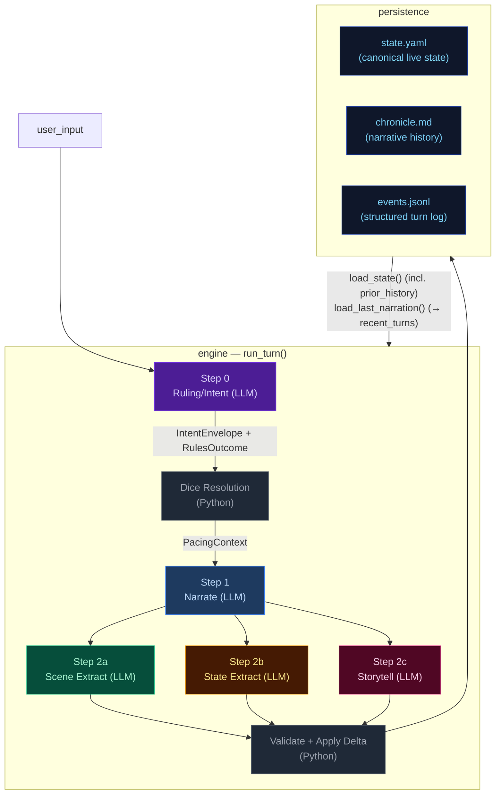

## Pipeline Quick Reference

| Step | Docs | When it runs | Key inputs | Key outputs | Mechanics it owns |
|---|---|---|---|---|---|
| **Step 0 — Ruling/Intent** | [step0-ruling](./step0-ruling.md) | Every turn (always) | `state.pc`, `state.location`, `recent_turns[-1:]`, `user_input` | `IntentEnvelope`, `RulesOutcome` | Intent classification, impossibility check, scene motion determination, dice roll resolution (1d12 + stat + cond − diff → band), difficulty selection, anti-declare-outcome enforcement. When `impossible=true`, no roll occurs and Python synthesizes a `fail` outcome. |
| **Step 1 — Narrate** | [step1-narrate](./step1-narrate.md) | Every turn (always, streamed) | Full `state`, `prior_history` (last 10 bullets), `recent_turns`, `pacing_context`, `pending_gm_beat`, `npc_roster` (from build_npc_roster()), `world_factions/locations` | `narrative` (prose) | Prose generation, dice-band binding, GM-beat consumption. Scene motion shaped by `PacingContext.outcome_hint`; impossible actions narrated as natural failures. |
| **Step 2a — Scene Extract** | [step2a-scene](./step2a-scene.md) | Every turn (always) | `narrative`, `state.pc/location`, `npc_roster` (from build_npc_roster()), conditions, compendium entries | `SceneExtractResult`: scene_tags, tagline, location_change, compendium_npc_update | NPC presence, location changes, scene tags, durable NPC compendium identity. |
| **Step 2b — State Extract** | [step2b-state](./step2b-state.md) | Every turn (always) | `narrative`, `state.pc/location/inventory`, conditions | `StateExtractResult`: inventory_add/remove/update, pc_condition_add/remove | Inventory delta accuracy, condition lifecycle. |
| **Step 2c — Storytell** | [step2c-progress](./step2c-progress.md) | Every turn (always) | `narrative`, `_ExtractionContext` (comp_this_turn, location, inventory, conditions), pacing_context, arc.threads[], recent_turns[-1:], band, npc_roster (from build_npc_roster()) | `StorytellerResult`: thread_update/arc_resolve/resolve/add, gm_beat, world_state_add/remove, actions, outcome_summary | Storyteller-managed thread lifecycle, arc resolution, beat disposition inference, durable history events. |

After Step 2c: results merge into a `StateDelta`, the validator checks constraints
(e.g. `inventory_remove` IDs exist), `apply_delta()` mutates state in-place, and the
turn is persisted. The next turn's Step 0 reads the new `state.yaml` plus `events.jsonl`.

## Subsystem Docs

| Subsystem | Doc | What it covers |
|---|---|---|
| **Step 0 — Ruling** | [step0-ruling](./step0-ruling.md) | Intent classification, dice resolution flowchart |
| **Step 1 — Narrate** | [step1-narrate](./step1-narrate.md) | Streaming narration pipeline with all context inputs |
| **Step 2a — Scene Extract** | [step2a-scene](./step2a-scene.md) | Location changes, NPC presence, scene tags |
| **Step 2b — State Extract** | [step2b-state](./step2b-state.md) | Inventory and condition extraction |
| **Step 2c — Storytell** | [step2c-progress](./step2c-progress.md) | Thread lifecycle, GMBeat schema, beat lifecycle (3 phases) |
| **PacingContext** | [pacing-context](./pacing-context.md) | Struct definition, computation flowchart, wiring to Narrator/Progress |
| **Delta → Validate → Apply** | [delta-validate](./delta-validate.md) | StateMerge schema, validation rules, apply_delta mutations |
| **Persist** | [persist](./persist.md) | Atomic writes (events.jsonl, state.yaml, chronicle.md), readback |
| **Cross-Pipeline Data Flow** | [cross-pipeline](./cross-pipeline.md) | Full inter-step data flow diagram |
| **Campaign Arcs** | [campaign-arcs](./campaign-arcs.md) | Arc data model (unified threads), engine-driven lifecycle, narrator-driven updates, integration points |
| **Out-of-Band Pipelines** | [out-of-band](./out-of-band.md) | Character Creation pipeline, Generate Seed pipeline, turn viewer status colors |
| **Narration UI** | [narration-ui](./narration-ui.md) | Main game interface: SSE streaming, HTMX sidebar refresh, Alpine.js state machine |
| **Turn Viewer UI** | [turn-viewer-ui](./turn-viewer-ui.md) | Pipeline debug UI: turn cards, stage inspector, diff panel, live updates |
| **Eval Harness** | [eval-harness](./eval-harness.md) | Scenario runner, LLM judges, auto-checkers, REPORT.md generation |

## Key Models Glossary

### Core Result Types

- **IntentEnvelope**: `intent`, `intent_verb`, `target`, `check.required`, `check.skill`, `check.difficulty`, `impossible`, `impossible_reason`, `scene_motion`
- **RulesOutcome**: `rolled`, `skill`, `difficulty`, `stat_value`, `stat_mod`, `diff_mod`, `cond_mod`, `dice`, `raw_total`, `final_total`, `band`, `directive`, `intent`, `intent_verb`, `impossible`, `impossible_reason`
- **SceneExtractResult**: `scene_tags`, `scene_tagline`, `location_change`, `compendium_npc_update`
- **StateExtractResult**: `inventory_add/remove/update`, `pc_condition_add/remove`
- **StorytellerResult**: `thread_update` (list[ThreadUpdate]), `arc_resolve` (ArcResolution | None), `thread_resolve` (list[ThreadResolution] with id/resolution_state/outcome), `thread_add`, `gm_beat`, `world_state_add`, `world_state_remove`, `actions`, `outcome_summary`
- **SeedEnvelope**: `seed_state: GameState`, `opening_narrative`, `actions`, `arc: CampaignArc` (includes `goal_context`, unified `threads[]`, `completed_threads[]`)

  The seed owns first-turn emotional framing, not just world and arc scaffolding. It generates `goal_context` (character-specific stake), NPC `relation` fields (narrative job relative to PC), and action text written from the PC's voice and scene pressure — ensuring the opening feels personal and motivated from the start.

### PacingContext (see [pacing-context](./pacing-context.md))

```
PacingContext:
  directive: str           # "" | "Breathe" | "Scene Imperative" | "Overwhelm" | "Pressure" | "Tension" | "Scene Pressure" (may include "; Resolve a Threat" secondary when beat_locked); used by Storytell pipeline
  outcome_hint: str | None # "hold" | "advance" | "transition" — narrator's primary scene motion instruction
  beat_locked: bool        # True: dual-trigger relief fired (consecutive_pressure_turns >= threshold OR momentum <= floor) — Progress MUST emit breathing_room beat and gate is force-closed
  gate: str                # "block_escalate" | "allow" (controls thread_add)
  summary: str             # human-readable log string, never sent to LLM
```

### GMBeat (see [step2c-progress](./step2c-progress.md))

```
GMBeat
  type: complication | revelation | opportunity | breathing_room | pressure | twist | setback | escalation | callback
  surface_as: ambient | event | npc_behavior | environmental | player_discovery | item (default: ambient)
  beat_expires_turn: int | None (turn number at which the beat expires; set to turn_no + 2 when stored)
```

### CampaignArc (see [campaign-arcs](./campaign-arcs.md))

```
CampaignArc
  visible_goal: str           — What the PC is trying to achieve
  goal_context: str           — 2–3 sentences explaining why visible_goal matters to this character specifically
  thematic_question: str      — The moral/thematic tension of the arc
  threads: list[ArcThread]    — Unified collection with active flag; replaces old active/latent split
  completed_threads: list[ArcThread] — Resolved/failed/abandoned threads
  resolution: str | None      — Set when arc is resolved via arc_resolve
  last_thread_created_turn: int — Tracks when a thread was last created for pacing

ArcThread (unified)
  id, summary, scope ("scene"|"arc"), active: bool = True
  urgency ("background"|"normal"|"urgent")
  tags: list[str]
  resolution_state: str | None, outcome: str | None
  resolved_turn: int | None   — Turn when thread was resolved; used for TTL filtering
  key: str | None             — Canonical concept label for dedup
```

### StateDelta (see [delta-validate](./delta-validate.md))

Merges all three extraction results. Contains `scene_tags`, `location_change`, `compendium_npc_update` (NPC changes), `thread_update/arc_resolve/thread_resolve/thread_add`, `inventory_add/remove/update`, `pc_condition_add/remove`, `world_state_add/remove`. Note: `gm_beat` is NOT in StateDelta — written directly to `state.meta.pending_gm_beat`.

---


## campaign-arcs


The campaign arc system tracks story threads across turns. Thread state is **storyteller-managed** — the LLM explicitly controls urgency and active/dormant state via `thread_update` directives. The engine applies these without enforcement of caps, cooldowns, or silent timers.

## Arc Data Model

```
CampaignArc
  visible_goal: str          — What the PC is trying to achieve
  goal_context: str          — 2–3 sentences explaining why visible_goal matters to this character specifically
  thematic_question: str     — The moral/thematic tension of the arc
  threads: list[ArcThread]   — Unified collection with active flag; storyteller controls state via thread_update
  completed_threads: list[ArcThread] — Resolved/failed/abandoned threads
  resolution: str | None     — Set when arc is resolved via arc_resolve
  last_thread_created_turn: int — Tracks when a thread was last created for pacing

ArcThread
  id: str                    — Unique identifier
  summary: str               — What this thread is about
  scope: Literal["scene", "arc"]  # scene = short-lived tied to current location; arc = persistent story tension
  active: bool = True        # Storyteller-controlled via thread_update
  urgency: Literal["background", "normal", "urgent"] = "normal"  # Storyteller-controlled
  tags: list[str]            — Keywords for engagement matching
  resolution_state: str | None # Set when thread_resolve processes resolved/failed/abandoned
  outcome: str | None        # Set from ThreadResolution.outcome when moved to completed_threads
  resolved_turn: int | None  — Turn when thread was resolved; used for TTL filtering in prompts
  key: str | None            — Optional canonical concept label; enables engine-side dedup auto-merge
```

## Engine-Driven Arc: Thread Updates + Arc Resolution

Thread lifecycle runs in `engine/turn.py` during the extraction phase. Three functions handle thread operations in order:

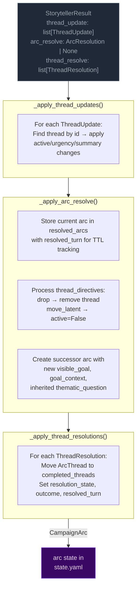

**Pipeline order:** thread updates → arc resolution → thread resolutions.

**Key rules:**
- **Storyteller-controlled:** No caps, cooldowns, or silent timers. The storyteller decides which threads to update via `thread_update` and when to resolve the arc via `arc_resolve`.
- **Arc resolution:** When `arc_resolve` is emitted, the current arc is stored in `state["resolved_arcs"]` with `resolved_turn` for TTL tracking. A successor arc is created with the new `visible_goal`, `goal_context`, and inherited `thematic_question`. Threads not mentioned in `thread_directives` carry over.
- **TTL-based cleanup:** Completed threads and resolved arcs are pruned from prompt context after `completed_thread_ttl` / `resolved_arc_ttl` turns (default 3).

## Arc Context in Narration

The arc state is passed to the narrator via `current_arc` in both system and user prompts. The narrator sees all arc metadata including resolved arcs (TTL-filtered) and completed threads.

### Early-turn narrative mode

When `goal_context` is present on the arc, the narrator treats it as narrative guidance for early turns: ground the player in personal stakes before broad exposition.

### Resolved arc continuity

When resolved arcs are present in the context, the narrator uses them to inform how the new arc relates narratively to what was resolved before — creating continuity across arc transitions.

## Arc System Integration Points

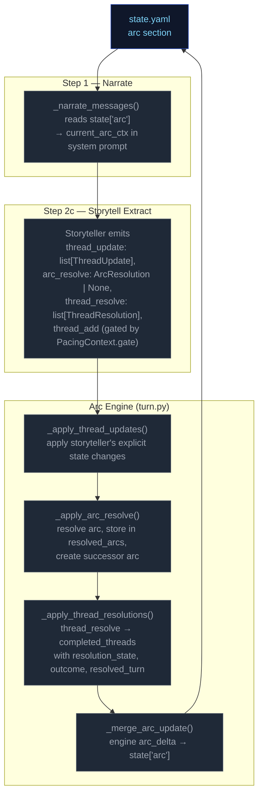

---


## cross-pipeline


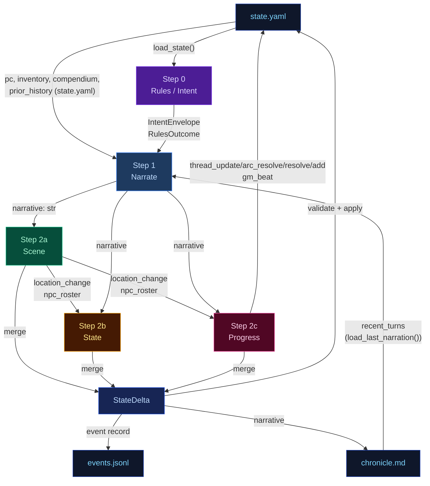

---


## delta-validate


The three extraction results merge into a single `StateDelta`, then validate and apply.

## Flowchart

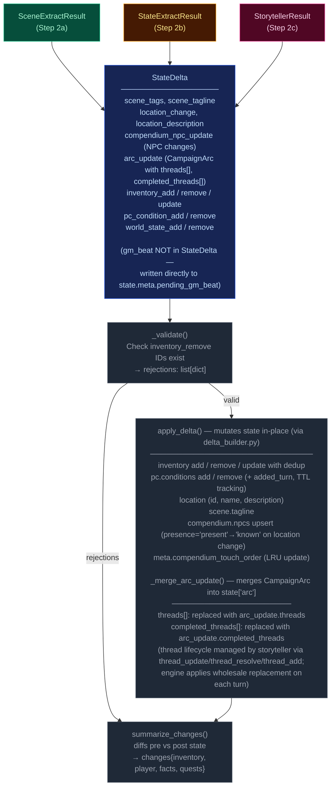

---


## narration-ui


The primary player-facing UI. Renders game state, streams narrative tokens live, and refreshes sidebars via HTMX partial swaps. Single-page app driven by Alpine.js + SSE + HTMX.

## Interaction Model

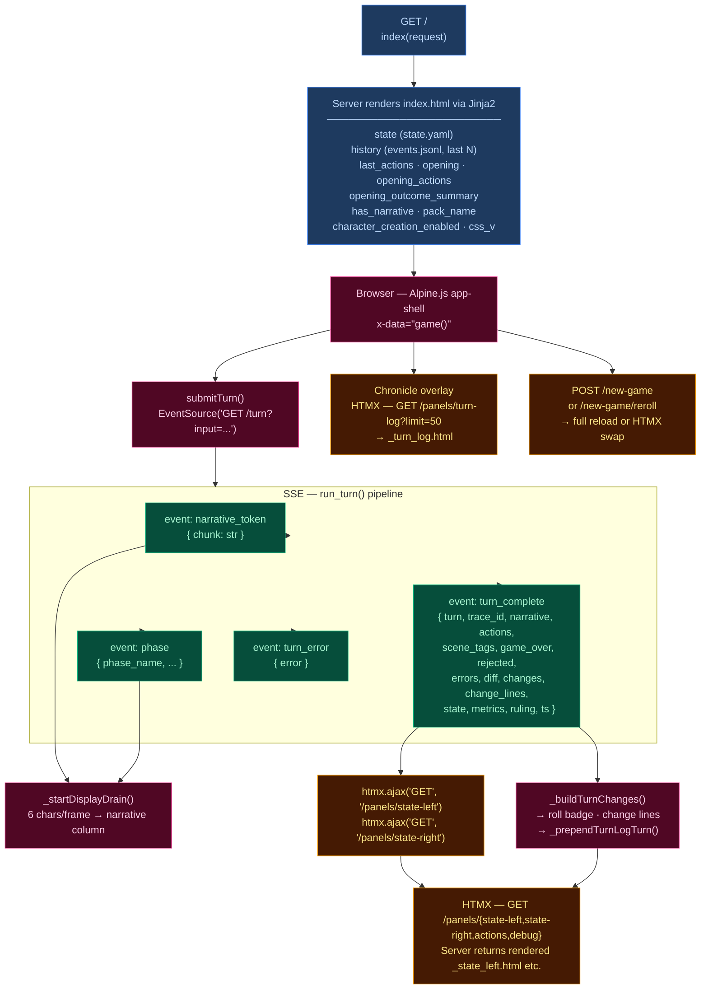

## Layout

| Region | Element | Content |
|--------|---------|---------|
| **Header** | `.header-bar` | Logo/tagline, Chronicle toggle, turn counter, retry button, new game button, reroll button (dynamic packs), mock-mode dot |
| **Left sidebar** | `.sidebar-left` | Player card, scene NPCs, location, arc, compendium — loaded via `/panels/state-left` |
| **Narrative column** | `.narrative-column` | Scrollable narrative blocks, action pills, input textarea, send/stop button |
| **Right sidebar** | `.sidebar` (right) | Inventory, recent events, world state, debug panel — loaded via `/panels/state-right` |
| **Chronicle overlay** | `.turn-log-shell` | Floating overlay over narrative column, populated by `/panels/turn-log?limit=50` |
| **New Game modal** | (Alpine `x-show`) | Pack picker → char creation / world builder steps |

## Data Flow

### Turn submission (Alpine.js + SSE)

1. User types input, presses Enter → `game().submitTurn()`
2. Opens `EventSource` to `GET /turn?input=<text>` — SSE endpoint in `routes.py:83`
3. Server streams events as the 5-stage pipeline (`run_turn()`) executes:
   - `narrative_token` — token chunks streamed as they arrive from LLM
   - `phase` — pipeline phase progress (ruling_start, narrate_start, narrate_first_token, narrate_done, extract_start, extract_done, compact_start, etc.)
   - `turn_complete` — final result
   - `turn_error` — error payload
4. Client `_startDisplayDrain()`: reveals 6 characters per animation frame for smooth streaming
5. On `turn_complete`:
   - Calls `htmx.ajax('GET', '/panels/state-left', ...)` and `htmx.ajax('GET', '/panels/state-right', ...)` to refresh sidebars
   - Renders change lines (`_buildTurnChanges`), roll badge
   - Prepends turn to Chronicle overlay via `_prependTurnLogTurn`
   - Re-renders markdown via `marked.parse()`

### HTMX partial endpoints (routes.py)

| Route | Template | Purpose |
|-------|----------|---------|
| `GET /panels/state-left` | `_state_left.html` | Left sidebar — player, NPCs, location, arc, compendium |
| `GET /panels/state-right` | `_state_right.html` | Right sidebar — inventory, events, world state, debug |
| `GET /panels/actions` | `_actions.html` | Action pills (fallback) |
| `GET /panels/turn-log?limit=N` | `_turn_log.html` | Chronicle — turn history with change lines |
| `GET /panels/pack-picker` | `_pack_picker.html` | New Game — pack selection cards |
| `GET /panels/char-creation` | `_char_creation.html` | New Game — character stats builder |
| `GET /panels/world-builder` | `_world_builder.html` | New Game — world creation form |
| `GET /panels/debug` | `_debug.html` | Debug panel — recent turn timings, errors |
| `GET /panels/state` | `_state.html` | Combined left+right (legacy) |

### Client state machine (`game()` — inline `<script>` in index.html)

Alpine.js `x-data="game()"` manages:
- `input` — textarea value
- `submitting` — turn-in-progress flag
- `gameStarted` — derived from `has_narrative`
- `turnNum` — current turn counter
- `leftWidth` / `rightWidth` — resizable sidebar widths (persisted to `localStorage`)
- Card collapse state — read/written directly from/to `localStorage` via `CCYA_CARD_KEY(name)` helper, using DOM `data-card` attributes; no Alpine data property

## UI Features

### Resizable sidebars
- Drag gutters with mousedown/mousemove handlers
- Widths saved to `localStorage` (`ccya_sidebar_left`, `ccya_sidebar_right`)
- Minimum width enforcement (240px left, 220px right)

### Collapsible cards
Each sidebar section has a collapse toggle; open/closed state persisted per-card to `localStorage` via `ccya_card_<name>` key.

### Action pills
Suggested next actions rendered as buttons that populate the input on click. Updated from `turn_complete.actions` or via HTMX panel refresh.

### Roll badge
Server-rendered for history, JS-built for new turns. Shows dice math, band label, outcome summary. Band colors: `crit_fail` (red) → `fail` → `setback` → `partial` → `success` → `crit_success`.

### Change lines
Grouped by category via emoji prefix:
| Emoji | Category | Class |
|-------|----------|-------|
| 🎒 + | Inventory gain | `.tc-inv-gain` |
| 🎒 − | Inventory loss | `.tc-inv-loss` |
| 🩺 | Player condition | `.tc-pl` |
| 📍 | Location | `.tc-loc` |
| 📜 | Faction/arc | `.tc-fa` |

### Retry
`POST /turn/delete` removes last event from `events.jsonl` and `chronicle.md`, returns previous actions for re-submission.

### New Game
`POST /new-game` with optional `pack_id`, `pc_name`, `pc_stats`, `hints`. For dynamic packs, triggers `generate_seed()` LLM pipeline. Full page reload on success. Reroll (`POST /new-game/reroll`) HTMX-swaps the opening narrative + actions.

## CSS Architecture

- **`app.src.css`** — Tailwind + custom styles split by region (lines 1–2101):
  - App shell layout (CSS Grid: header + body with sidebar-gutter-main-gutter-sidebar)
  - Narrative blocks (`.narrative-block`, `.narrative-text`)
  - Sidebar cards (`.card`, `.card-header`, `.card-body`)
  - Input bar (`.input-bar`, `.game-input`, `.send-btn`)
  - Action pills (`.action-pill`, `.pills-row`)
  - Roll badges (`.roll-badge`, `.roll-band--*`)
  - Chronicle overlay (`.turn-log-shell`, `.turn-log-panel`)
  - New Game modal (`.modal-overlay`, `.pack-card`)
  - Progress strip, tooltips, scrollbar styling
  - Design tokens via CSS custom properties (`--text-primary`, `--bg-card`, `--status-*`)
- Compiled to **`app.css`** with cache-busting via `css_v` query param

## Server Entry Point

`routes.py:57` — `GET /` handler assembles template context from `state.yaml`, `events.jsonl`, pack manifest, and engine config, then renders `ccya/templates/index.html`.

---


## out-of-band


These run only at new-game time or are non-engine concerns. They are excluded from the eval-context region of the main architecture doc.

## Character Creation Pipeline

Triggered by `POST /new-game`. All packs use the Generate Seed pipeline (dynamic). Static packs with pre-built seed_state.yaml exist but are not used by new_game.

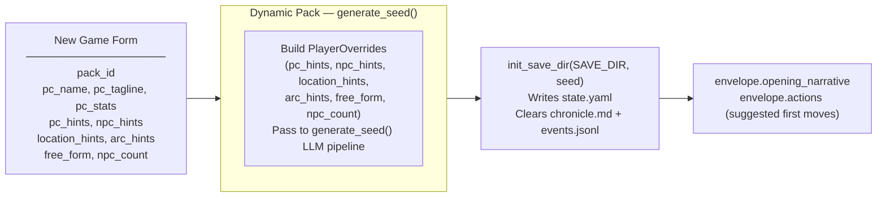

## Generate Seed Pipeline (Dynamic Packs Only)

Called by `POST /new-game` and `POST /new-game/reroll`. Generates a complete starting game state (PC, NPCs, location, arc, opening narrative, actions) from the pack manifest and optional player overrides.

The seed owns **first-turn emotional framing** — not just world and arc scaffolding. Every seed element must produce an emotionally legible opening that answers: why this moment matters now, what the character stands to lose, and why at least one person in the scene matters to them personally.

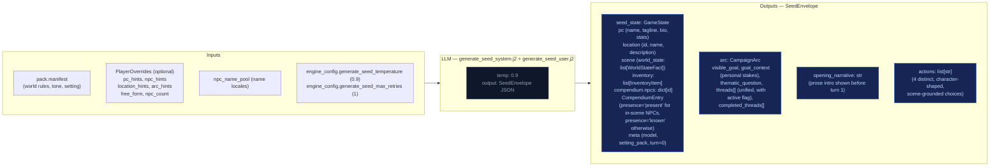

### Seed emotional framing contract

The seed prompt (`generate_seed_system.j2`) enforces these requirements:

- **`goal_context`**: 2–3 sentences explaining why `visible_goal` matters to this character specifically — inner cost or pressure that makes it emotionally loaded. No hidden-truth spoilers, no restating `visible_goal`, no direct statement of the thematic question. Must connect character motive, story stakes, and emotional cost.
- **NPC `relation` field**: Each opening NPC has a defined narrative job. One NPC is personally tied to the PC's motive or vulnerability; the other carries immediate external pressure from the world or conflict. The `relation` field encodes PC-facing relevance (e.g. "owes them a favor", "is their only contact here", "represents the institution pressing on them").
- **Compendium NPCs**: The seed also generates 2–3 NPCs in `compendium.npcs` (name, title, bio) who exist in the world but are not present in the opening scene. Their bios tie them to factions, locations, or world pressures, not to the immediate situation. These become discoverable characters during play.
- **Action guidance**: Each of the 4 choices is written from the PC's point of view, grounded in a present NPC, immediate risk, active thread, or character motive. They differ in emotional posture (confront, deflect, investigate, protect, exploit, withdraw, etc.) and avoid generic verbs.
- **`threads[]`**: Unified list (not split active/latent) where each thread has `{id, summary, tags, urgency, scope}` and an `active` boolean flag managed by the storyteller via `thread_update`, not Python age rules.

## Turn Viewer — status colors

The standalone turn viewer ([turn-viewer-ui](./turn-viewer-ui.md)) uses the same semantic status colors as the CSS custom properties in `static/app.src.css` (`--status-*`). The stage colors used in the diagrams above (`stageRules` violet → `stageNarrate` blue → `stageScene` green → `stageState` amber → `stageProgress` pink) map directly to the `--stage-*` tokens. Cross-stream inputs into a step are shown in `xstream` (purple outline) and LLM/Python boxes use neutral dark fills. This table is the canonical turn-viewer status legend.

| Token | Meaning |
|-------|---------|
| `--status-ok` | Stage ran and completed (no extraction error). |
| `--status-skipped` | Stream was skipped (no longer used — all streams always run). |
| `--status-retried` | LLM output required a parse retry (`attempts` > 1 in event). |
| `--status-rejected` | Post-extract validation rejected part of the delta (e.g. bad `inventory_remove`). |
| `--status-error` | LLM call or parse ultimately failed for that stream. |
| `--status-neutral` | Non-fatal / informational (e.g. rules path with no dice roll). |

Stage accent stripes use `--stage-rules`, `--stage-narrate`, `--stage-scene`, `--stage-state`, `--stage-progress` for quick scanning; **status** always wins for the prominent left border.

---


## pacing-context


All pacing signals are collapsed into one Python-computed struct (`PacingContext`) passed to both the Narrator and Storytell pipeline. This replaces six independent fields (`narration_directive`, `deescalate`, `narrative_velocity`, `beat_disposition` output, `quest_threshold_directive`, and stale momentum-derived signals). The narrator receives `outcome_hint` (scene motion); Storytell receives the full struct including `directive`.

## Struct definition

```
PacingContext:
  directive: str           # "" | "Breathe" | "Scene Imperative" | "Overwhelm" | "Pressure" | "Tension" | "Scene Pressure" (may include "; Resolve a Threat" secondary when beat_locked); used by Storytell pipeline
  outcome_hint: str | None # "hold" | "advance" | "transition" — narrator's primary scene motion instruction
  beat_locked: bool        # True: relief fired — Progress MUST emit breathing_room beat and gate is force-closed
  gate: str                # "block_escalate" | "allow" (controls thread_add)
  summary: str             # human-readable log string, never sent to LLM
```

`beat_locked: True` fires when either `consecutive_pressure_turns >= config.consecutive_pressure_threshold` OR `momentum <= config.momentum_floor`. When locked, `"Resolve a Threat"` is appended to the directive via semicolon. The `gate` field prevents Progress from adding new threads during de-escalation windows.

## Computation

`_compute_pacing_context()` in `engine/turn.py` consolidates pacing computation (replacing the former scattered functions: `_compute_narration_directive`, `_compute_narrative_velocity`, `_check_floor_relief`). It takes inputs (`momentum`, `consecutive_pressure_turns` from state meta, `arc.threads[] scope=scene urgency counts`) and returns a single struct with directive derived from a priority stack. It also computes `outcome_hint` from the ruling LLM's `scene_motion` and PacingContext escalation signals: ruling `scene_motion` takes priority (`transition` > `advance` > fallback), then `impossible=true` forces `advance`, then Python escalation signals (`beat_locked`, Overwhelm/Pressure with urgent threads) produce `advance`, defaulting to `hold`.

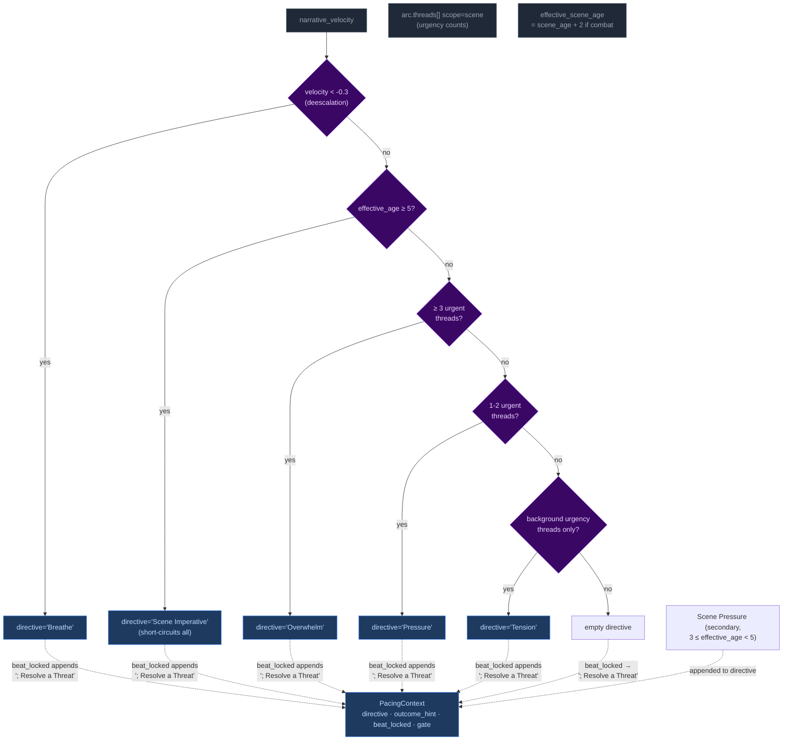

Priority order (highest to lowest): **Breathe > Scene Imperative > Overwhelm > Pressure > Tension > Scene Pressure**. The `beat_locked` flag takes precedence — when either consecutive pressure threshold or momentum floor is reached, `"Resolve a Threat"` is appended to whatever directive was computed and gate may be force-closed.

### Age computation (Phase 03 collapse)

`_compute_ages(state)` returns only `{"scene_age": scene_age}` — location_age and combat_age removed in Phase 03 pacing overhaul. The ruling phase pre-computes `effective_scene_age = scene_age + 2` when `"combat"` is in scene tags, stored in `ctx._ages["effective_scene_age"]`. This single-age signal drives all directive thresholds:
- Scene Imperative (≥5 effective age): high-priority directive forcing story advancement
- Scene Pressure (3 ≤ effective_age < 5): secondary append to wind down or shift focus

## Wiring: how PacingContext reaches the pipelines

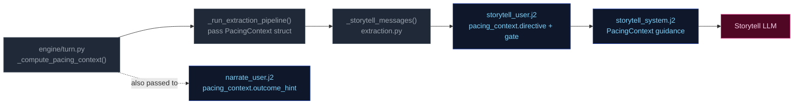

1. **Computed** once in `run_turn()` via `_compute_pacing_context()`.
2. **Passed through** `_run_extraction_pipeline()` → both `_narrate_messages()` and `_storytell_messages()`.
3. **Narrator template** (`narrate_user.j2`) renders `outcome_hint` (scene motion: hold/advance/transition) with value-specific guidance. No Jinja2 pacing computation remains — all pacing computed by Python.
4. **Storytell template** ((`storytell_system.j2` + `user.j2`)) receives the full struct; guidance maps each directive to appropriate thread/beat actions:

| Directive | Thread action | Gate |
|-----------|---------------|-------|
| **"Breathe"** (de-escalation, velocity < -0.3) | Do NOT add new threads. Allow existing scene threads to persist without escalation. | `block_escalate` + force-closed when at momentum floor |
| **"Scene Imperative"** (effective_age ≥ 5) | Story must advance — introduce new development forcing resolution or movement; do not linger | Varies by context |
| **"Overwhelm"** (3+ urgent threads) | May add scene-scoped threads if gate allows; emit pressure/escalation beat | `allow` |
| **"Pressure"** (1-2 urgent threads) | Advance relevant scene/arc threads. Add new thread only if gate permits. | Varies by context |
| **"Tension"** (background urgency only) | Do NOT add pressures unless concrete threat emerges; prefer advancing existing threads | Allow |
| **"Scene Pressure"** (3 ≤ effective_age < 5, secondary append) | Begin winding down or introduce reason to shift focus: development elsewhere, closing window | Varies by context |
| **"" (empty)** | No action required beyond normal aging of silent threads. | Allow |

**Note:** Directives may include secondary modifiers joined by semicolons (e.g., "Pressure; Resolve a Threat" when beat_locked). The primary directive drives thread/beat logic; the secondary (`; Resolve a Threat`) acts as thematic guidance for beat type selection. "Resolve a Threat" never appears as a standalone primary directive — it is only appended by the `beat_locked` mechanism.

## Consecutive pressure counter

`state["meta"]["consecutive_pressure_turns"]` tracks how many consecutive turns have had Pressure or Overwhelm directives without any thread updates emitted by the storyteller. Updated via two-pass logic at turn end (~turn.py ~1450): increments when directive was Pressure/Overwhelm AND no `thread_update` emitted; resets to 0 otherwise. When this counter reaches `config.consecutive_pressure_threshold` (default 3), it triggers the dual-trigger beat_locked condition alongside momentum floor relief.

## GM Beat lifecycle (Phase 03 carryover fix)

`pending_gm_beat` is written to state after storytelling if non-null gm_beat emitted, with `beat_expires_turn = turn_no + 2`. Consumed read-gated at turn_no <= beat_expires_turn in _narrate_setup. Cleared only on replacement or expiry — both unconditional clears were removed from turn.py (post-narration clear and else block re-clear). Beat write logic in Progress step only writes if `beat_locked` AND no existing pending_gm_beat exists, preventing overwrites during locked windows.

---


## persist


Atomic writes to disk. No LLM calls.

## Flowchart

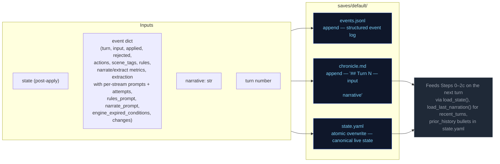

---


## step0-ruling


Classifies the player's action, determines whether a dice check is needed, and
identifies which state domains will be active — narrowing every downstream extractor.

## Flowchart

```mermaid
flowchart LR
    classDef stageRules fill:#4c1d95,color:#ddd6fe,stroke:#7c3aed
    classDef llmNode    fill:#0f172a,color:#94a3b8,stroke:#334155
    classDef pyNode     fill:#1f2937,color:#9ca3af,stroke:#4b5563
    classDef outNode    fill:#3b0764,color:#e9d5ff,stroke:#7c3aed

    subgraph IN["Inputs"]
        I1["state.pc<br>(name, stats, conditions)"]
        I2["state.location"]
        I3["recent_turns[-1:]<br>(last turn's full narrative from chronicle.md<br>via load_last_narration();<br>ruling user prompt)"]
        I4["user_input"]
    end

    subgraph LLM0["LLM — ruling_system.j2 + ruling_user.j2"]
        L0["temp: 0.2 · max_retries: 1<br>output: IntentEnvelope JSON<br>(intent, impossible, scene_motion, check)"]:::llmNode
    end

    subgraph PYRES["Python — impossible check + rules.resolve_check()"]
        P0["if impossible=true:<br>  synthesize fail outcome<br>  skip roll, apply momentum<br>else:<br>  roll 1d12 + stat_mod + cond_mod − diff_mod<br>  map total → Band"]:::pyNode
    end

    subgraph OUT["Outputs"]
        O1["IntentEnvelope<br>  intent: str<br>  intent_verb: str<br>  target: str<br>  impossible: bool<br>  impossible_reason: str<br>  scene_motion: hold|advance|transition<br>  check.required: bool<br>  check.skill: SkillName<br>  check.difficulty: Difficulty"]:::outNode
        O2["RulesOutcome<br>  rolled: bool<br>  skill, difficulty, stat_value, stat_mod<br>  diff_mod, cond_mod<br>  dice: list[int]<br>  raw_total, final_total: int<br>  band: Band<br>  directive: str<br>  intent, intent_verb: str<br>  impossible: bool<br>  impossible_reason: str"]:::outNode
    end

    IN --> LLM0
    LLM0 -- "IntentEnvelope" --> PYRES
    PYRES --> OUT
```

## Impossibility check

The ruling LLM evaluates whether the described action is impossible given the character's state, inventory, and scene. An action is impossible when:

- It requires an item the character does not have (firing a gun with no ammo, using a key never acquired)
- It requires a capability contradicted by active conditions (climbing with a broken leg, sneaking while armored and noisy)
- It acts on something not present in the scene (targeting an NPC who is not here, opening a door that doesn't exist)

When `impossible=true`: Python sets `check.required=False`, synthesizes a `RulesOutcome` with `band="fail"` and `rolled=False`, applies momentum, and skips the dice roll entirely. The narrator renders the impossible fact and narrates the natural failure.

## Scene motion

The ruling LLM also determines how the scene should progress: `"hold"` (scene continues at current pace), `"advance"` (something significant happens/resolves), or `"transition"` (player is leaving, write the arrival). This feeds into `_compute_pacing_context()` which produces `outcome_hint` for the narrator.

## Key forward dependency

`rules_outcome` feeds into `_compute_pacing_context()` which produces the single authoritative `PacingContext` struct passed to both Narrator and Storytell pipeline.

---


## step1-narrate


Generates the narrative prose the player reads. Tokens are streamed to the client.

## Flowchart

```mermaid
flowchart LR
    classDef llmNode   fill:#0f172a,color:#94a3b8,stroke:#334155
    classDef xstream   fill:#4c1d95,color:#ddd6fe,stroke:#7c3aed
    classDef outNode   fill:#1e3a5f,color:#bfdbfe,stroke:#3b82f6

    subgraph IN["Inputs"]
        N1["state (full —<br>pc, location, scene,<br>inventory, compendium)"]
        N2["prior_history<br>(last 10 incremental history bullets)"]
        N3["recent_turns (last window of events.jsonl entries)"]
        N4["rules_outcome<br>(band, directive, impossible, dice summary)"]:::xstream
        N6["npc_name_pool (cultural name list)"]
        N7["npc_roster<br>(from build_npc_roster(comp),<br>  presence field: present/nearby/known)"]
        N9["world_factions<br>(immutable trace)"]:::xstream
        N10["pending_gm_beat<br>(type · surface_as metadata)"]
        N11["pacing_context<br>(outcome_hint)<br>from _compute_pacing_context()"]:::xstream
        N15["user_input"]
    end

    subgraph LLM1["LLM — narrate_system.j2 + narrate_user.j2"]
        NL["temp: 0.9 · streaming: yes<br>output: prose narrative (str)"]:::llmNode
    end

    subgraph OUT["Outputs"]
        NO1["narrative: str<br>(streamed as tokens → client<br>then joined + thinking-stripped)"]:::outNode
        NO2["narr_metrics<br>  first_token_ms<br>  total_ms<br>  tokens_in / tokens_out"]
    end

    IN --> LLM1
    LLM1 --> OUT
```

## Arc context in narration

The narrator receives `current_arc` in both system and user prompts. Key fields:

- **`goal_context`**: A seed-time field (2–3 sentences) explaining why `visible_goal` matters to the character specifically — inner cost or pressure that makes it emotionally loaded. When present, `_arc.j2` presents it alongside other arc context in the user prompt for early-turn narrative guidance: ground the player in personal stakes before broad exposition.
- **`visible_goal`**: The player-facing objective.
- **`thematic_question`**: The moral tension — never stated directly in prose. Used as a lens for emphasis: what detail feels loaded, what silence matters.
- **`threads[]`**: Unified thread collection filtered by `active` flag. Scene-scope threads provide immediate pressure; arc-scope threads provide medium-term tension.
- **`resolved_arc`**: TTL-filtered list of previously resolved arcs, providing narrative continuity across arc transitions.

### Opening-turn narrative mode

When `goal_context` is present (always true after seed), the narrator treats early turns as a distinct onboarding mode:
1. Personal stakes before broad exposition
2. One NPC moment with emotional charge (driven by `relation` fields on seed NPCs)
3. One immediately actionable pressure

The presence of `goal_context` itself is the signal — no turn-counting dependency needed. The guidance is most impactful in the first few turns and persists as background context throughout the campaign.

## Key forward dependency

`narrative` is the primary content input for all three extraction streams below.

---


## step2a-scene


Extracts location changes, NPC presence, scene tags, and suggested actions from the narrative.

## Flowchart


## Key forward dependency

`location_change` flows into `extraction_ctx` (built by `_build_extraction_context`). Step 2c also receives `npc_roster` (from build_npc_roster()) built from comp_this_turn. No forward-facing mechanics (`thread_add`, `gm_beat`) are emitted by this stream — they go through the unified thread lifecycle via Storytell (Step 2c).

---


## step2b-state


Extracts inventory changes and player condition mutations from the narrative.

## Flowchart

```mermaid
flowchart LR
    classDef llmNode fill:#0f172a,color:#94a3b8,stroke:#334155
    classDef xstream fill:#4c1d95,color:#ddd6fe,stroke:#7c3aed
    classDef outNode fill:#451a03,color:#fde68a,stroke:#f59e0b

    subgraph IN["Inputs"]
        S1["narrative (from Step 1)"]:::xstream
        S2["state.pc (name, bio, stats, conditions)"]
        S3["state.location"]
        S4["state.inventory"]
        S5["intent: str<br>(from Step 0)"]
    end

    subgraph LLM2B["LLM — extract_state_system.j2 + extract_state_user.j2"]
        SL["temp: 0.4 · max_retries: 1<br>output: StateExtractResult JSON"]:::llmNode
    end

    subgraph OUT["Outputs — StateExtractResult"]
        O1["inventory_add: list[InventoryItem]<br>  id, name, notes, amount"]:::outNode
        O2["inventory_remove: list[InventoryRemove]<br>  id, amount (None = full stack)"]:::outNode
        O3["inventory_update: list[InventoryUpdate]<br>  id, name?, notes?"]:::outNode
        O4["pc_condition_add: list[ConditionAdd]<br>  id, label, description"]:::outNode
        O5["pc_condition_remove: list[ConditionRemove]<br>  id"]:::outNode
    end

    IN --> LLM2B
    LLM2B --> OUT
```

## Key forward dependency

Step 2c receives `npc_roster` (from build_npc_roster()) and `location_change` from Step 2a. Cross-stream items_gained/lost were removed — extraction_ctx now covers all this-turn derived data.

---


## step2c-progress


Extracts thread updates, arc actions, world state changes, and durable NPC compendium changes.

## Flowchart


## Always runs

Progress is the post-narration storytelling brain. It always executes every turn (never skipped) and feeds next turn's rules call via `world_state_add/remove` (persistent world facts), `thread_update/arc_resolve/thread_resolve/thread_add` (storyteller-managed thread lifecycle), and `gm_beat` (forward-facing beats stored in `state.meta.pending_gm_beat`).

## GMBeat schema

```
GMBeat
  type: complication | revelation | opportunity | breathing_room | pressure | twist | setback | escalation | callback
  surface_as: ambient | event | npc_behavior | environmental | player_discovery | item (default: ambient)
  beat_expires_turn: int | None (turn number at which the beat expires; set to turn_no + 2 when stored)
```

## Beat lifecycle

The beat flows through three phases per turn:

**Phase 1 — Pre-narration expiry check.** At the start of each turn, the engine reads `state.meta.pending_gm_beat` from the previous turn. If `beat_expires_turn` is set and the current turn number exceeds it, the beat is nullified. Otherwise it proceeds to narration.

**Phase 2 — Narration consumption.** The beat is passed to the narrator via `_narrate_messages(pending_gm_beat=...)`. The narrator uses the beat's type and surface_as metadata as creative guidance alongside the pacing directive. After narration completes, the pending beat is cleared from state — it is not restored for storyteller consumption.

**Phase 3 — Extraction disposition (inferred).** The storyteller receives no pending beat context in its prompt — it decides beats based solely on current extraction data (scene state, threads, pacing context, band). Unlike the previous architecture, there is no explicit `beat_disposition` field. Instead:
- If Progress emits a new `gm_beat`, it replaces the old one (`state.meta.pending_gm_beat = gm_beat` with `beat_expires_turn = turn_no + 2`)
- If Progress emits nothing and the beat's `expires_at` hasn't passed, the engine preserves the existing beat unchanged (carry)
- The engine stores beats with `beat_expires_turn = turn_no + 2` as a hard TTL ceiling. Beats past their expiry are discarded automatically on load.

## Floor relief injection priority

The floor relief mechanism fires when `_pc.beat_locked=True` AND no beat exists in `state.meta.pending_gm_beat` at extraction completion time (`turn.py:1263`). It injects a `breathing_room` beat with TTL of 3 turns (one more than storyteller-emitted beats' TTL of 2).

Floor relief beats are **fallback only** — they inject a recovery beat when the LLM didn't already provide one. If the storyteller emits any gm_beat during extraction, floor relief does NOT fire because `pending_gm_beat` is already set. The LLM's beat takes priority over Python-injected recovery signals.

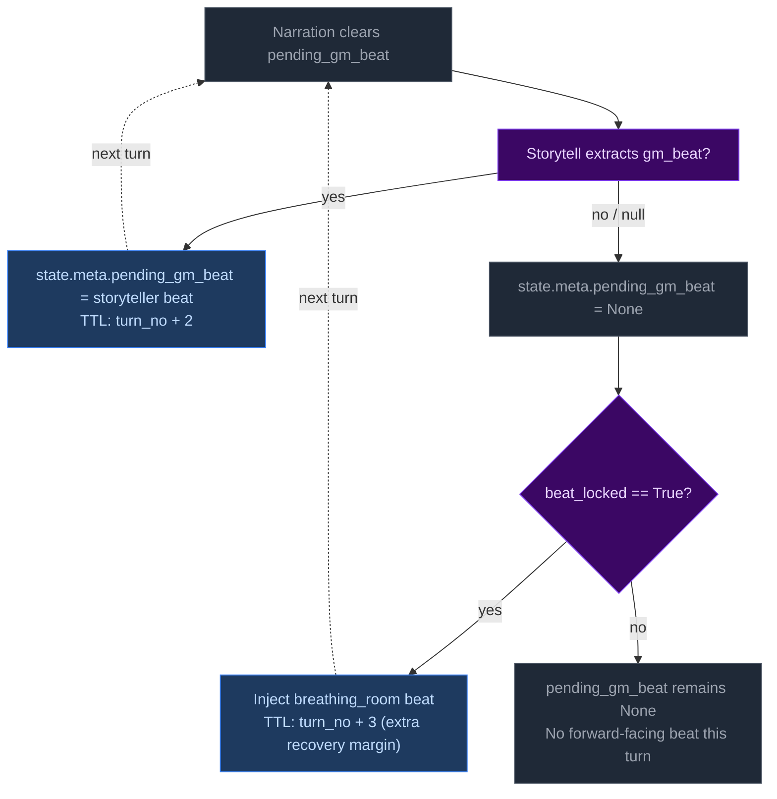

## Directive-beat alignment

The storyteller prompt (`storytell_system.j2:54-65`) maps each PacingContext directive to recommended beat types (e.g., "Breathe" → breathing_room; "Overwhelm" → pressure/escalation). This alignment is **guidance only** — Python accepts whatever gm_beat the LLM emits with no validation, correction, or override. Design rationale: forcing directive-beat alignment would constrain storytelling flexibility and create brittleness if the LLM makes contextually appropriate but directive-divergent beat choices.

---


## thread-lifecycle


## Scope

This doc covers the internal mechanics of arc thread lifecycle management in `turn.py`.
It complements `campaign-arcs.md` (data model, high-level flow)
by detailing the exact rules, order of operations, and edge cases.

## Thread State Management

Thread state is **storyteller-managed**. The LLM explicitly controls urgency and active/dormant state via `thread_update` directives. The engine applies these without enforcement of caps, cooldowns, or silent timers.

## Two Thread Scopes

Threads have a `scope` field (`"scene"` or `"arc"`) that determines narrative treatment:

| Scope | Narrative role | Engine lifecycle |
|---|---|---|
| `scene` | Short-lived tension tied to current location/NPCs | **Purged on location change** — removed from `arc.threads[]` when player moves to a new location (delta_builder.py:243-248). The LLM creates arc-scoped threads for persistent story lines. |
| `arc` | Persistent story tension across scenes | Persists across location changes. Only removed via `thread_resolve` or `thread_update` with `active=False`. |

## Entry Points

Three call sites in `run_turn()` process threads (order matters):

1. **`_apply_thread_updates()`** — apply storyteller's explicit state changes
2. **`_apply_arc_resolve()`** — resolve arc, store in resolved_arcs, create successor
3. **`_apply_thread_resolutions()`** — resolve/fail/abandon → completed

All three run after `apply_delta()` but before `save_state()`.

## Step-by-Step: `_apply_thread_updates()`

Processes `storyteller_result.thread_update` (list of `ThreadUpdate` with `id`, optional `active`, `urgency`, `summary`).

For each ThreadUpdate:
1. Find matching thread by ID in `arc.threads[]`
2. If not found → log WARNING, skip
3. Apply non-None fields (`active`, `urgency`, `summary`) via `model_copy`
4. Log applied changes at INFO level

No caps, cooldowns, or silent timers are enforced. The storyteller decides which threads to update.

## Step-by-Step: `_apply_arc_resolve()`

Processes `storyteller_result.arc_resolve` (optional `ArcResolution` with `resolution`, `visible_goal`, `goal_context`, optional `thematic_question`, `thread_directives`).

1. If `arc_resolve` is None → return None
2. Validate arc from state; if missing/invalid → log WARNING, return None
3. Store current arc in `state["resolved_arcs"]` with `resolved_turn` for TTL tracking
4. Process `thread_directives`:
   - `drop` → remove thread from arc
   - `move_latent` → set `active = False`
   - Threads not mentioned carry over as-is
5. Create successor arc with new `visible_goal`, `goal_context`, inherited `thematic_question`, surviving threads
6. Replace `state["arc"]` with successor

## Step-by-Step: Thread Creation (inline in `run_turn()`)

New threads (`storyteller_result.thread_add`) are gated by:

1. **Pacing gate**: `_pc is None or _pc.gate == "allow"` — blocks escalation when pacing context says so
2. **Key collision**: exact match on thread `key` → reject with WARNING log
3. **Fuzzy auto-merge**: ≥70% token overlap on `key` → update existing thread summary/tags instead of creating new thread

No cooldown or cap checks. The storyteller is trusted to manage thread count.

## Step-by-Step: `_apply_thread_resolutions()`

Processes `storyteller_result.thread_resolve` (list of `ThreadResolution` with `id`, `resolution_state`, `outcome`).

1. Find matching thread by ID in `arc.threads[]`
2. If not found → log warning, skip
3. If found → move to `arc.completed_threads[]`, set `resolution_state`, `outcome`, and `resolved_turn`
4. Deduplicate completed_threads entries: existing ID gets updated, not duplicated

## Step-by-Step: Pacing Context Gate

`_compute_pacing_context()` sets `gate` based on deescalation:

```
gate = "allow" by default
gate = "block_escalate" when deescalate >= 0.5
```

The gate blocks thread creation (in `run_turn()`). The LLM is instructed not to emit `thread_add` when gate != "allow".

## Constants Reference

| Constant | Value | Effect |
|---|---|---|
| `config.resolved_arc_ttl` | 3 (default) | Turns to keep resolved arcs in prompt context |
| `config.completed_thread_ttl` | 3 (default) | Turns to keep completed threads in prompt context |

No active/latent caps, no cooldowns, no expiry timers, no promotion cooldowns.

## Validation Edge Cases

1. **Empty arc state** — No arc in state → log DEBUG, return None (no crash)
2. **Validation failure** — Arc fails Pydantic validation → log WARNING, return None
3. **Unknown thread ID in update** — Log WARNING, skip — does not block valid updates
4. **Unknown resolution ID** — Log WARNING, skip — does not block valid resolutions
5. **Duplicate thread ID in creation** — Checked against existing + completed IDs
6. **Key collision in creation** — Exact match rejects; fuzzy match auto-merges

---

---


# Static Context (immutable across all turns)

## Seed State

```json
{
  "meta": {
    "game_name": "eval",
    "turn": 0,
    "setting_pack": "eval-pack",
    "model": ""
  },
  "pc": {
    "name": "Aren Voss",
    "tagline": "Reluctant courier on the merchant road",
    "bio": "Mid-thirties, broad shoulders, careful with words. Took on a courier contract\nto clear an old debt. Just arrived in Marrow's Crossing with a heavy pack and\na heavier obligation.\n",
    "stats": {
      "strength": 3,
      "dexterity": 3,
      "wits": 2,
      "lore": 2,
      "charisma": 3,
      "resolve": 3
    },
    "conditions": [],
    "momentum": 0,
    "drive": ""
  },
  "location": {
    "id": "marrows_crossing",
    "name": "Marrow's Crossing",
    "description": "A market town built around the confluence of two rivers. Cobblestone streets,\ntimber-framed buildings, and the constant sound of water from the mills. The\ntown square has a stone well and a statue of the founder. Most shops are closing\nfor the evening.\n"
  },
  "inventory": [
    {
      "id": "credits",
      "name": "Credits",
      "notes": "Common coin, accepted at any inn or stall on the merchant road.",
      "amount": 500,
      "aliases": []
    },
    {
      "id": "iron_dagger",
      "name": "Iron dagger",
      "notes": "Plain crossguard, edge worn from honing. Belt-carried.",
      "amount": 1,
      "aliases": []
    },
    {
      "id": "bandages",
      "name": "Linen bandages",
      "notes": "Three rolls. Field-grade \u2014 won't replace a healer.",
      "amount": 3,
      "aliases": []
    },
    {
      "id": "traveler_cloak",
      "name": "Traveler's cloak",
      "notes": "Oiled wool, road-stained, hood deep enough to hide a face.",
      "amount": 1,
      "aliases": [
        "cloak",
        "travel cloak"
      ]
    },
    {
      "id": "brass_key",
      "name": "Brass key",
      "notes": "A small brass key Halden gave you with the ledger.",
      "amount": 1,
      "aliases": []
    }
  ],
  "scene": {
    "tagline": "Market town at dusk",
    "tags": [
      "peaceful",
      "start"
    ],
    "world_state": [
      "Marrow's Crossing is a market town at the confluence of two rivers, known for its mills and the annual river festival.",
      "Iron coin (credits) is the universal currency on the merchant road; barter is acceptable but slower.",
      "The road has been quieter than usual this season \u2014 fewer caravans, more independent runners, more opportunists."
    ]
  },
  "compendium": {
    "npcs": {
      "caron": {
        "name": "Caron",
        "title": "Old creditor",
        "bio": "A portly man in his sixties with a merchant's ledger and a patient demeanor. You owe him 500 credits from a failed venture three years ago.",
        "bond": null,
        "presence": null,
        "notes": null,
        "motivation": null,
        "fear": null,
        "leverage": null
      },
      "halden": {
        "name": "Halden",
        "title": "Merchant",
        "bio": "A road merchant in his fifties who hires couriers when his usual runners are spoken for. Honest by reputation, careful with money.",
        "bond": null,
        "presence": null,
        "notes": null,
        "motivation": null,
        "fear": null,
        "leverage": null
      },
      "innkeeper": {
        "name": "Edda",
        "title": "Innkeeper at the Crossed Keys",
        "bio": "Runs the inn alone since her husband died. Knows every traveler by face if not by name. Stays out of trouble unless it walks through her door.",
        "bond": null,
        "presence": null,
        "notes": null,
        "motivation": null,
        "fear": null,
        "leverage": null
      },
      "tough_a": {
        "name": "Bald Tough",
        "title": "Road thug",
        "bio": "Hired muscle. No personal stake in this \u2014 he'll back off if the price is right or the fight goes bad.",
        "bond": null,
        "presence": null,
        "notes": null,
        "motivation": null,
        "fear": null,
        "leverage": null
      },
      "tough_b": {
        "name": "Scarred Tough",
        "title": "Road thug",
        "bio": "Same outfit as the other \u2014 hired by the same person. Quicker to violence; not the brains.",
        "bond": null,
        "presence": null,
        "notes": null,
        "motivation": null,
        "fear": null,
        "leverage": null
      },
      "matthew_estrada": {
        "name": "Matthew Estrada",
        "title": "Traveler",
        "bio": "A tall, broad-shoulded man in a stained leather jerkin carrying a heavy rucksack. Looks like a road runner but moves with military precision.",
        "bond": null,
        "presence": null,
        "notes": null,
        "motivation": null,
        "fear": null,
        "leverage": null
      }
    }
  },
  "arc": {
    "visible_goal": "Clear your debts and deliver the ledger \u2014 two obligations binding you to Marrow's Crossing.",
    "thematic_question": "What does it cost to settle old debts when new ones keep forming?",
    "goal_context": "",
    "threads": [
      {
        "id": "settle_the_debt",
        "summary": "Settle the 500-credit debt with Caron.",
        "scope": "arc",
        "active": false,
        "urgency": "normal",
        "tags": [
          "debt",
          "caron",
          "obligation"
        ],
        "resolution_state": null,
        "outcome": null,
        "resolved_turn": null,
        "key": null
      },
      {
        "id": "deliver_the_ledger",
        "summary": "Deliver Halden's ledger to the merchant at the Crossed Keys Inn.",
        "scope": "arc",
        "active": false,
        "urgency": "normal",
        "tags": [
          "courier",
          "halden",
          "contract"
        ],
        "resolution_state": null,
        "outcome": null,
        "resolved_turn": null,
        "key": null
      },
      {
        "id": "clear_the_road_toughs",
        "summary": "Deal with the toughs blocking the inn entrance.",
        "scope": "arc",
        "active": false,
        "urgency": "background",
        "tags": [
          "toughs",
          "road",
          "confrontation"
        ],
        "resolution_state": null,
        "outcome": null,
        "resolved_turn": null,
        "key": null
      }
    ],
    "completed_threads": [],
    "resolution": null,
    "last_thread_created_turn": 0
  }
}
```

## Engine Constants

```json
{
  "urgency_levels": [
    "background",
    "normal",
    "urgent"
  ],
  "momentum_min": -3,
  "momentum_max": 3,
  "momentum_delta": {
    "crit_success": 2,
    "success": 1,
    "partial": 0,
    "setback": -1,
    "fail": -1,
    "crit_fail": -2
  }
}
```

## System Prompts (identical every turn)

### Ruling System Prompt

```
(not captured this run)
```

### Narrate System Prompt

```
(not captured this run)
```

### Extract Scene System Prompt

```
(not captured this run)
```

### Extract State System Prompt

```
(not captured this run)
```

### Storyteller System Prompt

```
(not captured this run)
```


---

# TURN 1

**Input:** `Walk over to Caron's table and sit down across from him. I'm ready to talk about the debt.`

## User Prompts

### Ruling User Prompt
```
(no ruling call this turn)
```

### Narrate User Prompt
```
(no narrate call)
```

### Extract Scene User Prompt
```
(not captured)
```

### Extract State User Prompt
```
(not captured)
```

### Storyteller User Prompt
```
(not captured)
```

## Engine Outputs

### Rules

**Parsed (engine):**
```json
{
  "intent_verb": "negotiate",
  "intent": "The player approaches Caron to discuss settling their debt.",
  "rolled": false,
  "total_ms": 3155.4,
  "tokens_in": 1927,
  "tokens_out": 73,
  "outcome_summary": "Aren Voss approached Caron at the Crossed Keys to face his creditor and discuss the outstanding 500-credit debt."
}
```

**Raw LLM output:**
```

```

### Narration


### Extract Scene

```json
{
  "scene_tags": [
    "tense_conversation",
    "evening"
  ],
  "scene_tagline": "A Debt Comes Calling",
  "location_description": "The square is growing darker as shops close, with the rhythmic churning of the river mills providing a constant low thrum.",
  "compendium_npc_update": [
    {
      "id": "tough_a",
      "aliases": [],
      "presence": "present",
      "notes": "loitering near the inn entrance, casting a predatory shadow"
    },
    {
      "id": "tough_b",
      "aliases": [],
      "presence": "present",
      "notes": "loitering near the inn entrance alongside his partner"
    },
    {
      "id": "caron",
      "aliases": [],
      "presence": "present",
      "notes": "sitting at a wooden table, closing his ledger and waiting for a confrontation"
    }
  ]
}
```

### Extract State

```json
{
  "inventory_add": [],
  "inventory_remove": [],
  "inventory_update": [],
  "pc_condition_add": [],
  "pc_condition_remove": []
}
```

### Storyteller

```json
{
  "actions": [
    "Offer the 500 credits to settle the debt immediately.",
    "Propose a new deal using Halden's ledger as collateral.",
    "Ask Caron if the toughs outside are his men.",
    "Sit down and explain the delay on the road."
  ],
  "outcome_summary": "Aren Voss approached Caron at the Crossed Keys to face his creditor and discuss the outstanding 500-credit debt.",
  "thread_resolve": [],
  "thread_update": [
    {
      "id": "settle_the_debt",
      "urgency": "urgent"
    }
  ],
  "world_state_add": [],
  "world_state_remove": []
}
```

### Applied Deltas

```json
{
  "inventory_add": [],
  "inventory_remove": [],
  "inventory_update": [],
  "location_description": "The square is growing darker as shops close, with the rhythmic churning of the river mills providing a constant low thrum.",
  "pc_condition_add": [],
  "pc_condition_remove": [],
  "scene_tags": [
    "tense_conversation",
    "evening"
  ],
  "scene_tagline": "A Debt Comes Calling",
  "compendium_npc_update": [
    {
      "id": "tough_a",
      "aliases": [],
      "presence": "present",
      "notes": "loitering near the inn entrance, casting a predatory shadow"
    },
    {
      "id": "tough_b",
      "aliases": [],
      "presence": "present",
      "notes": "loitering near the inn entrance alongside his partner"
    },
    {
      "id": "caron",
      "aliases": [],
      "presence": "present",
      "notes": "sitting at a wooden table, closing his ledger and waiting for a confrontation"
    }
  ],
  "actions": [
    "Offer the 500 credits to settle the debt immediately.",
    "Propose a new deal using Halden's ledger as collateral.",
    "Ask Caron if the toughs outside are his men.",
    "Sit down and explain the delay on the road."
  ],
  "world_state_add": [],
  "world_state_remove": []
}
```

### Rejected Deltas

*(none)*

### Suggested Actions

*(none)*

### Context Telemetry

*(no telemetry)*

### State After Turn

```json
{
  "arc": {
    "completed_threads": [],
    "goal_context": "",
    "last_thread_created_turn": 0,
    "resolution": null,
    "thematic_question": "What does it cost to settle old debts when new ones keep forming?",
    "threads": [
      {
        "active": false,
        "id": "settle_the_debt",
        "scope": "arc",
        "summary": "Settle the 500-credit debt with Caron.",
        "tags": [
          "debt",
          "caron",
          "obligation"
        ],
        "urgency": "urgent"
      },
      {
        "active": false,
        "id": "deliver_the_ledger",
        "scope": "arc",
        "summary": "Deliver Halden's ledger to the merchant at the Crossed Keys Inn.",
        "tags": [
          "courier",
          "halden",
          "contract"
        ],
        "urgency": "normal"
      },
      {
        "active": false,
        "id": "clear_the_road_toughs",
        "scope": "arc",
        "summary": "Deal with the toughs blocking the inn entrance.",
        "tags": [
          "toughs",
          "road",
          "confrontation"
        ],
        "urgency": "background"
      }
    ],
    "visible_goal": "Clear your debts and deliver the ledger \u2014 two obligations binding you to Marrow's Crossing."
  },
  "compendium": {
    "npcs": {
      "caron": {
        "bio": "A portly man in his sixties with a merchant's ledger and a patient demeanor. You owe him 500 credits from a failed venture three years ago.",
        "bond": null,
        "fear": null,
        "last_seen": {
          "location_id": "marrows_crossing",
          "location_name": "Marrow's Crossing",
          "turn": 1
        },
        "leverage": null,
        "motivation": null,
        "name": "Caron",
        "notes": "sitting at a wooden table, closing his ledger and waiting for a confrontation",
        "presence": "present",
        "title": "Old creditor"
      },
      "halden": {
        "bio": "A road merchant in his fifties who hires couriers when his usual runners are spoken for. Honest by reputation, careful with money.",
        "bond": null,
        "fear": null,
        "leverage": null,
        "motivation": null,
        "name": "Halden",
        "notes": null,
        "presence": null,
        "title": "Merchant"
      },
      "innkeeper": {
        "bio": "Runs the inn alone since her husband died. Knows every traveler by face if not by name. Stays out of trouble unless it walks through her door.",
        "bond": null,
        "fear": null,
        "leverage": null,
        "motivation": null,
        "name": "Edda",
        "notes": null,
        "presence": null,
        "title": "Innkeeper at the Crossed Keys"
      },
      "matthew_estrada": {
        "bio": "A tall, broad-shoulded man in a stained leather jerkin carrying a heavy rucksack. Looks like a road runner but moves with military precision.",
        "bond": null,
        "fear": null,
        "leverage": null,
        "motivation": null,
        "name": "Matthew Estrada",
        "notes": null,
        "presence": null,
        "title": "Traveler"
      },
      "tough_a": {
        "bio": "Hired muscle. No personal stake in this \u2014 he'll back off if the price is right or the fight goes bad.",
        "bond": null,
        "fear": null,
        "last_seen": {
          "location_id": "marrows_crossing",
          "location_name": "Marrow's Crossing",
          "turn": 1
        },
        "leverage": null,
        "motivation": null,
        "name": "Bald Tough",
        "notes": "loitering near the inn entrance, casting a predatory shadow",
        "presence": "present",
        "title": "Road thug"
      },
      "tough_b": {
        "bio": "Same outfit as the other \u2014 hired by the same person. Quicker to violence; not the brains.",
        "bond": null,
        "fear": null,
        "last_seen": {
          "location_id": "marrows_crossing",
          "location_name": "Marrow's Crossing",
          "turn": 1
        },
        "leverage": null,
        "motivation": null,
        "name": "Scarred Tough",
        "notes": "loitering near the inn entrance alongside his partner",
        "presence": "present",
        "title": "Road thug"
      }
    }
  },
  "inventory": [
    {
      "aliases": [],
      "amount": 500,
      "id": "credits",
      "name": "Credits",
      "notes": "Common coin, accepted at any inn or stall on the merchant road."
    },
    {
      "aliases": [],
      "amount": 1,
      "id": "iron_dagger",
      "name": "Iron dagger",
      "notes": "Plain crossguard, edge worn from honing. Belt-carried."
    },
    {
      "aliases": [],
      "amount": 3,
      "id": "bandages",
      "name": "Linen bandages",
      "notes": "Three rolls. Field-grade \u2014 won't replace a healer."
    },
    {
      "aliases": [
        "cloak",
        "travel cloak"
      ],
      "amount": 1,
      "id": "traveler_cloak",
      "name": "Traveler's cloak",
      "notes": "Oiled wool, road-stained, hood deep enough to hide a face."
    },
    {
      "aliases": [],
      "amount": 1,
      "id": "brass_key",
      "name": "Brass key",
      "notes": "A small brass key Halden gave you with the ledger."
    }
  ],
  "location": {
    "description": "The square is growing darker as shops close, with the rhythmic churning of the river mills providing a constant low thrum.",
    "id": "marrows_crossing",
    "name": "Marrow's Crossing"
  },
  "meta": {
    "compendium_touch_order": [
      "tough_a",
      "tough_b",
      "caron"
    ],
    "consecutive_pressure_turns": 0,
    "game_name": "eval",
    "model": "",
    "prior_history": [
      "- [T1] Aren Voss approached Caron at the Crossed Keys to face his creditor and discuss the outstanding 500-credit debt."
    ],
    "setting_pack": "eval-pack",
    "turn": 1
  },
  "pc": {
    "actions": [
      "Offer the 500 credits to settle the debt immediately.",
      "Propose a new deal using Halden's ledger as collateral.",
      "Ask Caron if the toughs outside are his men.",
      "Sit down and explain the delay on the road."
    ],
    "bio": "Mid-thirties, broad shoulders, careful with words. Took on a courier contract\nto clear an old debt. Just arrived in Marrow's Crossing with a heavy pack and\na heavier obligation.\n",
    "conditions": [
      {
        "description": "A hard fall on the bridge two days ago left a deep, aching bruise along the right ribcage.",
        "id": "bruised_ribs",
        "label": "bruised ribs"
      },
      {
        "description": "Twelve days on the road, two days behind schedule, and an old debt waiting at the end of it.",
        "id": "low_morale",
        "label": "low morale"
      }
    ],
    "drive": "",
    "momentum": 0,
    "name": "Aren Voss",
    "stats": {
      "charisma": 3,
      "dexterity": 3,
      "lore": 2,
      "resolve": 3,
      "strength": 3,
      "wits": 2
    },
    "tagline": "Reluctant courier on the merchant road"
  },
  "scene": {
    "tagline": "A Debt Comes Calling",
    "tags": [
      "tense_conversation",
      "evening"
    ],
    "world_state": [
      "Marrow's Crossing is a market town at the confluence of two rivers, known for its mills and the annual river festival.",
      "Iron coin (credits) is the universal currency on the merchant road; barter is acceptable but slower.",
      "The road has been quieter than usual this season \u2014 fewer caravans, more independent runners, more opportunists."
    ]
  },
  "schema_version": 1
}
```


---

# TURN 2

**Input:** `I slide 500 credits across the table to Caron and ask him to mark the debt cleared in his ledger.`

## User Prompts

### Ruling User Prompt
```
(no ruling call this turn)
```

### Narrate User Prompt
```
(no narrate call)
```

### Extract Scene User Prompt
```
(not captured)
```

### Extract State User Prompt
```
(not captured)
```

### Storyteller User Prompt
```
(not captured)
```

## Engine Outputs

### Rules

**Parsed (engine):**
```json
{
  "intent_verb": "negotiate",
  "intent": "The player offers 500 credits to Caron to settle their outstanding debt.",
  "rolled": false,
  "total_ms": 3108.0,
  "tokens_in": 2310,
  "tokens_out": 79,
  "outcome_summary": "Aren Voss paid Caron 500 credits to settle their outstanding debt, and Caron marked the ledger as cleared."
}
```

**Raw LLM output:**
```

```

### Narration


### Extract Scene

```json
{
  "scene_tags": [
    "tense_conversation",
    "transaction"
  ],
  "scene_tagline": "The Debt Is Settled",
  "compendium_npc_update": [
    {
      "id": "caron",
      "aliases": [],
      "notes": "watching the coins closely before marking the ledger as cleared"
    }
  ]
}
```

### Extract State

```json
{
  "inventory_add": [],
  "inventory_remove": [
    {
      "id": "credits",
      "amount": 500
    }
  ],
  "inventory_update": [],
  "pc_condition_add": [],
  "pc_condition_remove": [
    {
      "id": "low_morale"
    }
  ]
}
```

### Storyteller

```json
{
  "actions": [
    "Ask Caron if he knows who hired the toughs.",
    "Head into the Crossed Keys to deliver Halden's ledger.",
    "Confront the Bald Tough and Scarred Tough at the door.",
    "Search the inn's common room for a quiet corner."
  ],
  "outcome_summary": "Aren Voss paid Caron 500 credits to settle their outstanding debt, and Caron marked the ledger as cleared.",
  "thread_resolve": [],
  "thread_update": [
    {
      "id": "settle_the_debt",
      "urgency": "background"
    }
  ],
  "arc_resolve": {
    "resolution": "Aren Voss successfully paid off the 500-credit debt owed to Caron.",
    "visible_goal": "Deliver Halden's ledger to the merchant at the Crossed Keys Inn.",
    "goal_context": "With the debt cleared, the PC is no longer bound by Caron's ledger, leaving the delivery of Halden's ledger as the primary remaining obligation in Marrow's Crossing.",
    "thread_directives": []
  },
  "world_state_add": [],
  "world_state_remove": []
}
```

### Applied Deltas

```json
{
  "inventory_add": [],
  "inventory_remove": [
    {
      "id": "credits",
      "amount": 500
    }
  ],
  "inventory_update": [],
  "pc_condition_add": [],
  "pc_condition_remove": [
    {
      "id": "low_morale"
    }
  ],
  "scene_tags": [
    "tense_conversation",
    "transaction"
  ],
  "scene_tagline": "The Debt Is Settled",
  "compendium_npc_update": [
    {
      "id": "caron",
      "aliases": [],
      "notes": "watching the coins closely before marking the ledger as cleared"
    }
  ],
  "actions": [
    "Ask Caron if he knows who hired the toughs.",
    "Head into the Crossed Keys to deliver Halden's ledger.",
    "Confront the Bald Tough and Scarred Tough at the door.",
    "Search the inn's common room for a quiet corner."
  ],
  "world_state_add": [],
  "world_state_remove": []
}
```

### Rejected Deltas

*(none)*

### Suggested Actions

*(none)*

### Context Telemetry

*(no telemetry)*

### State After Turn

*(diff vs previous turn — full snapshot only on first and last turns)*

```json
{
  "arc": {
    "goal_context": {
      "from": "",
      "to": "With the debt cleared, the PC is no longer bound by Caron's ledger, leaving the delivery of Halden's ledger as the primary remaining obligation in Marrow's Crossing."
    },
    "last_thread_created_turn": {
      "from": 0,
      "to": 2
    },
    "threads": {
      "changed": [
        {
          "from": {
            "active": false,
            "id": "settle_the_debt",
            "scope": "arc",
            "summary": "Settle the 500-credit debt with Caron.",
            "tags": [
              "debt",
              "caron",
              "obligation"
            ],
            "urgency": "urgent"
          },
          "to": {
            "active": false,
            "id": "settle_the_debt",
            "scope": "arc",
            "summary": "Settle the 500-credit debt with Caron.",
            "tags": [
              "debt",
              "caron",
              "obligation"
            ],
            "urgency": "background"
          }
        }
      ]
    },
    "visible_goal": {
      "from": "Clear your debts and deliver the ledger \u2014 two obligations binding you to Marrow's Crossing.",
      "to": "Deliver Halden's ledger to the merchant at the Crossed Keys Inn."
    }
  },
  "compendium": {
    "npcs": {
      "caron": {
        "last_seen": {
          "turn": {
            "from": 1,
            "to": 2
          }
        },
        "notes": {
          "from": "sitting at a wooden table, closing his ledger and waiting for a confrontation",
          "to": "watching the coins closely before marking the ledger as cleared"
        }
      }
    }
  },
  "inventory": {
    "removed": [
      {
        "aliases": [],
        "amount": 500,
        "id": "credits",
        "name": "Credits",
        "notes": "Common coin, accepted at any inn or stall on the merchant road."
      }
    ]
  },
  "meta": {
    "prior_history": {
      "added": [
        "- [T2] Aren Voss paid Caron 500 credits to settle their outstanding debt, and Caron marked the ledger as cleared."
      ],
      "removed": []
    },
    "turn": {
      "from": 1,
      "to": 2
    }
  },
  "pc": {
    "actions": {
      "added": [
        "Head into the Crossed Keys to deliver Halden's ledger.",
        "Ask Caron if he knows who hired the toughs.",
        "Search the inn's common room for a quiet corner.",
        "Confront the Bald Tough and Scarred Tough at the door."
      ],
      "removed": [
        "Ask Caron if the toughs outside are his men.",
        "Offer the 500 credits to settle the debt immediately.",
        "Propose a new deal using Halden's ledger as collateral.",
        "Sit down and explain the delay on the road."
      ]
    },
    "conditions": {
      "removed": [
        {
          "description": "Twelve days on the road, two days behind schedule, and an old debt waiting at the end of it.",
          "id": "low_morale",
          "label": "low morale"
        }
      ]
    }
  },
  "resolved_arcs": {
    "from": null,
    "to": [
      {
        "goal_context": "With the debt cleared, the PC is no longer bound by Caron's ledger, leaving the delivery of Halden's ledger as the primary remaining obligation in Marrow's Crossing.",
        "resolution": "Aren Voss successfully paid off the 500-credit debt owed to Caron.",
        "resolved_turn": 2,
        "thematic_question": "What does it cost to settle old debts when new ones keep forming?",
        "visible_goal": "Clear your debts and deliver the ledger \u2014 two obligations binding you to Marrow's Crossing."
      }
    ]
  },
  "scene": {
    "tagline": {
      "from": "A Debt Comes Calling",
      "to": "The Debt Is Settled"
    },
    "tags": {
      "added": [
        "transaction"
      ],
      "removed": [
        "evening"
      ]
    }
  }
}
```


---

# TURN 3

**Input:** `I find Halden by the town well and offer to carry his ledger to the Crossed Keys Inn. I'll do it for 200 credits.`

## User Prompts

### Ruling User Prompt
```
(no ruling call this turn)
```

### Narrate User Prompt
```
(no narrate call)
```

### Extract Scene User Prompt
```
(not captured)
```

### Extract State User Prompt
```
(not captured)
```

### Storyteller User Prompt
```
(not captured)
```

## Engine Outputs

### Rules

**Parsed (engine):**
```json
{
  "intent_verb": "negotiate",
  "intent": "Aren offers to perform a courier job for Halden for 200 credits.",
  "rolled": false,
  "total_ms": 3251.8,
  "tokens_in": 2311,
  "tokens_out": 79,
  "outcome_summary": "Aren Voss negotiated a courier contract with Halden near the town well."
}
```

**Raw LLM output:**
```

```

### Narration


### Extract Scene

```json
{
  "scene_tags": [
    "negotiation",
    "evening"
  ],
  "scene_tagline": "A Negotiated Errand",
  "location_description": "The square is bathed in the dim light of evening, with the town well serving as a central landmark near the darkening shops.",
  "compendium_npc_update": [
    {
      "id": "halden",
      "aliases": [],
      "presence": "present",
      "notes": "weighing the cost of the errand against the risk of the road"
    }
  ]
}
```

### Extract State

```json
{
  "inventory_add": [],
  "inventory_remove": [],
  "inventory_update": [],
  "pc_condition_add": [],
  "pc_condition_remove": []
}
```

### Storyteller

```json
{
  "actions": [
    "Emphasize your reliability to secure the full 200 credits.",
    "Point out the toughs at the inn as reason for risk.",
    "Ask Halden if there is any extra work available.",
    "Walk toward the inn to show you mean business."
  ],
  "outcome_summary": "Aren Voss negotiated a courier contract with Halden near the town well.",
  "thread_resolve": [],
  "thread_add": {
    "id": "negotiating_the_contract",
    "summary": "Aren is haggling with Halden over the price of the ledger delivery.",
    "scope": "scene",
    "active": true,
    "urgency": "normal",
    "tags": [
      "negotiation",
      "halden",
      "credits"
    ],
    "key": "haggling_price"
  },
  "thread_update": [
    {
      "id": "deliver_the_ledger",
      "urgency": "normal"
    }
  ],
  "world_state_add": [],
  "world_state_remove": []
}
```

### Applied Deltas

```json
{
  "inventory_add": [],
  "inventory_remove": [],
  "inventory_update": [],
  "location_description": "The square is bathed in the dim light of evening, with the town well serving as a central landmark near the darkening shops.",
  "pc_condition_add": [],
  "pc_condition_remove": [],
  "scene_tags": [
    "negotiation",
    "evening"
  ],
  "scene_tagline": "A Negotiated Errand",
  "compendium_npc_update": [
    {
      "id": "halden",
      "aliases": [],
      "presence": "present",
      "notes": "weighing the cost of the errand against the risk of the road"
    }
  ],
  "actions": [
    "Emphasize your reliability to secure the full 200 credits.",
    "Point out the toughs at the inn as reason for risk.",
    "Ask Halden if there is any extra work available.",
    "Walk toward the inn to show you mean business."
  ],
  "world_state_add": [],
  "world_state_remove": []
}
```

### Rejected Deltas

*(none)*

### Suggested Actions

*(none)*

### Context Telemetry

*(no telemetry)*

### State After Turn

*(diff vs previous turn — full snapshot only on first and last turns)*

```json
{
  "arc": {
    "last_thread_created_turn": {
      "from": 2,
      "to": 3
    },
    "threads": {
      "added": [
        {
          "active": true,
          "id": "negotiating_the_contract",
          "key": "haggling_price",
          "scope": "scene",
          "summary": "Aren is haggling with Halden over the price of the ledger delivery.",
          "tags": [
            "negotiation",
            "halden",
            "credits"
          ],
          "urgency": "normal"
        }
      ]
    }
  },
  "compendium": {
    "npcs": {
      "halden": {
        "last_seen": {
          "from": null,
          "to": {
            "location_id": "marrows_crossing",
            "location_name": "Marrow's Crossing",
            "turn": 3
          }
        },
        "notes": {
          "from": null,
          "to": "weighing the cost of the errand against the risk of the road"
        },
        "presence": {
          "from": null,
          "to": "present"
        }
      }
    }
  },
  "location": {
    "description": {
      "from": "The square is growing darker as shops close, with the rhythmic churning of the river mills providing a constant low thrum.",
      "to": "The square is bathed in the dim light of evening, with the town well serving as a central landmark near the darkening shops."
    }
  },
  "meta": {
    "compendium_touch_order": {
      "added": [
        "halden"
      ],
      "removed": []
    },
    "last_thread_creation_turn": {
      "from": null,
      "to": 3
    },
    "prior_history": {
      "added": [
        "- [T3] Aren Voss negotiated a courier contract with Halden near the town well."
      ],
      "removed": []
    },
    "turn": {
      "from": 2,
      "to": 3
    }
  },
  "pc": {
    "actions": {
      "added": [
        "Emphasize your reliability to secure the full 200 credits.",
        "Ask Halden if there is any extra work available.",
        "Walk toward the inn to show you mean business.",
        "Point out the toughs at the inn as reason for risk."
      ],
      "removed": [
        "Head into the Crossed Keys to deliver Halden's ledger.",
        "Ask Caron if he knows who hired the toughs.",
        "Search the inn's common room for a quiet corner.",
        "Confront the Bald Tough and Scarred Tough at the door."
      ]
    }
  },
  "scene": {
    "tagline": {
      "from": "The Debt Is Settled",
      "to": "A Negotiated Errand"
    },
    "tags": {
      "added": [
        "evening",
        "negotiation"
      ],
      "removed": [
        "tense_conversation",
        "transaction"
      ]
    }
  }
}
```


---

# TURN 4

**Input:** `I leave Marrow's Crossing by the east gate and head for the Crossed Keys Inn, following the merchant road.`

## User Prompts

### Ruling User Prompt
```
(no ruling call this turn)
```

### Narrate User Prompt
```
(no narrate call)
```

### Extract Scene User Prompt
```
(not captured)
```

### Extract State User Prompt
```
(not captured)
```

### Storyteller User Prompt
```
(not captured)
```

## Engine Outputs

### Rules

**Parsed (engine):**
```json
{
  "intent_verb": "travel",
  "intent": "The player travels from Marrow's Crossing toward the Crossed Keys Inn via the merchant road.",
  "rolled": false,
  "total_ms": 3122.5,
  "tokens_in": 2279,
  "tokens_out": 77,
  "outcome_summary": "Aren Voss approached the Crossed Keys Inn and encountered Bald Tough and Scarred Tough blocking the entrance."
}
```

**Raw LLM output:**
```

```

### Narration


### Extract Scene

```json
{
  "scene_tags": [
    "tense_atmosphere",
    "approaching_danger"
  ],
  "scene_tagline": "A Gauntlet of Shadows",
  "location_change": {
    "id": "crossed_keys_approach",
    "name": "Crossed Keys Entrance",
    "description": "A muddy path leading to a sturdy timber-and-stone inn, illuminated by flickering amber light from the windows."
  },
  "location_description": "The path to the inn is narrow and muddy, flanked by the looming silhouette of the Crossed Keys and the encroaching twilight.",
  "compendium_npc_update": [
    {
      "id": "tough_a",
      "aliases": [],
      "notes": "leaning against the stone masonry, tracking your movement with predatory intent"
    },
    {
      "id": "tough_b",
      "aliases": [],
      "notes": "leaning against the masonry alongside his partner, watching you closely"
    }
  ]
}
```

### Extract State

```json
{
  "inventory_add": [],
  "inventory_remove": [],
  "inventory_update": [],
  "pc_condition_add": [],
  "pc_condition_remove": []
}
```

### Storyteller

```json
{
  "actions": [
    "Attempt to bypass the toughs by circling the inn's side.",
    "Confront the toughs directly and demand passage to the inn.",
    "Approach the toughs and offer them credits to move aside.",
    "Keep your head low and try to slip past them quietly."
  ],
  "outcome_summary": "Aren Voss approached the Crossed Keys Inn and encountered Bald Tough and Scarred Tough blocking the entrance.",
  "gm_beat": {
    "type": "opportunity",
    "surface_as": "environmental"
  },
  "thread_resolve": [],
  "thread_add": {
    "id": "the_inn_gauntlet",
    "summary": "Two hired toughs are creating a tense bottleneck at the inn entrance.",
    "scope": "scene",
    "active": true,
    "urgency": "normal",
    "tags": [
      "confrontation",
      "road_toughs"
    ],
    "key": "gatekeeper_confrontation"
  },
  "thread_update": [
    {
      "id": "deliver_the_ledger",
      "urgency": "normal"
    }
  ],
  "world_state_add": [],
  "world_state_remove": []
}
```

### Applied Deltas

```json
{
  "inventory_add": [],
  "inventory_remove": [],
  "inventory_update": [],
  "location_change": {
    "id": "crossed_keys_approach",
    "name": "Crossed Keys Entrance",
    "description": "A muddy path leading to a sturdy timber-and-stone inn, illuminated by flickering amber light from the windows."
  },
  "location_description": "The path to the inn is narrow and muddy, flanked by the looming silhouette of the Crossed Keys and the encroaching twilight.",
  "pc_condition_add": [],
  "pc_condition_remove": [],
  "scene_tags": [
    "tense_atmosphere",
    "approaching_danger"
  ],
  "scene_tagline": "A Gauntlet of Shadows",
  "compendium_npc_update": [
    {
      "id": "tough_a",
      "aliases": [],
      "notes": "leaning against the stone masonry, tracking your movement with predatory intent"
    },
    {
      "id": "tough_b",
      "aliases": [],
      "notes": "leaning against the masonry alongside his partner, watching you closely"
    }
  ],
  "actions": [
    "Attempt to bypass the toughs by circling the inn's side.",
    "Confront the toughs directly and demand passage to the inn.",
    "Approach the toughs and offer them credits to move aside.",
    "Keep your head low and try to slip past them quietly."
  ],
  "world_state_add": [],
  "world_state_remove": []
}
```

### Rejected Deltas

*(none)*

### Suggested Actions

*(none)*

### Context Telemetry

*(no telemetry)*

### State After Turn

*(diff vs previous turn — full snapshot only on first and last turns)*

```json
{
  "arc": {
    "last_thread_created_turn": {
      "from": 3,
      "to": 4
    },
    "threads": {
      "added": [
        {
          "active": true,
          "id": "the_inn_gauntlet",
          "key": "gatekeeper_confrontation",
          "scope": "scene",
          "summary": "Two hired toughs are creating a tense bottleneck at the inn entrance.",
          "tags": [
            "confrontation",
            "road_toughs"
          ],
          "urgency": "normal"
        }
      ],
      "removed": [
        {
          "active": true,
          "id": "negotiating_the_contract",
          "key": "haggling_price",
          "scope": "scene",
          "summary": "Aren is haggling with Halden over the price of the ledger delivery.",
          "tags": [
            "negotiation",
            "halden",
            "credits"
          ],
          "urgency": "normal"
        }
      ]
    }
  },
  "compendium": {
    "npcs": {
      "caron": {
        "notes": {
          "from": "watching the coins closely before marking the ledger as cleared",
          "to": null
        },
        "presence": {
          "from": "present",
          "to": "known"
        }
      },
      "halden": {
        "notes": {
          "from": "weighing the cost of the errand against the risk of the road",
          "to": null
        },
        "presence": {
          "from": "present",
          "to": "known"
        }
      },
      "tough_a": {
        "last_seen": {
          "location_id": {
            "from": "marrows_crossing",
            "to": "crossed_keys_approach"
          },
          "location_name": {
            "from": "Marrow's Crossing",
            "to": "Crossed Keys Entrance"
          },
          "turn": {
            "from": 1,
            "to": 4
          }
        },
        "notes": {
          "from": "loitering near the inn entrance, casting a predatory shadow",
          "to": "leaning against the stone masonry, tracking your movement with predatory intent"
        },
        "presence": {
          "from": "present",
          "to": "known"
        }
      },
      "tough_b": {
        "last_seen": {
          "location_id": {
            "from": "marrows_crossing",
            "to": "crossed_keys_approach"
          },
          "location_name": {
            "from": "Marrow's Crossing",
            "to": "Crossed Keys Entrance"
          },
          "turn": {
            "from": 1,
            "to": 4
          }
        },
        "notes": {
          "from": "loitering near the inn entrance alongside his partner",
          "to": "leaning against the masonry alongside his partner, watching you closely"
        },
        "presence": {
          "from": "present",
          "to": "known"
        }
      }
    }
  },
  "location": {
    "description": {
      "from": "The square is bathed in the dim light of evening, with the town well serving as a central landmark near the darkening shops.",
      "to": "A muddy path leading to a sturdy timber-and-stone inn, illuminated by flickering amber light from the windows."
    },
    "id": {
      "from": "marrows_crossing",
      "to": "crossed_keys_approach"
    },
    "name": {
      "from": "Marrow's Crossing",
      "to": "Crossed Keys Entrance"
    }
  },
  "meta": {
    "last_thread_creation_turn": {
      "from": 3,
      "to": 4
    },
    "pending_gm_beat": {
      "from": null,
      "to": {
        "beat_expires_turn": 6,
        "surface_as": "environmental",
        "type": "opportunity"
      }
    },
    "prior_history": {
      "added": [
        "- [T4] Aren Voss approached the Crossed Keys Inn and encountered Bald Tough and Scarred Tough blocking the entrance."
      ],
      "removed": []
    },
    "turn": {
      "from": 3,
      "to": 4
    }
  },
  "pc": {
    "actions": {
      "added": [
        "Approach the toughs and offer them credits to move aside.",
        "Confront the toughs directly and demand passage to the inn.",
        "Attempt to bypass the toughs by circling the inn's side.",
        "Keep your head low and try to slip past them quietly."
      ],
      "removed": [
        "Emphasize your reliability to secure the full 200 credits.",
        "Ask Halden if there is any extra work available.",
        "Walk toward the inn to show you mean business.",
        "Point out the toughs at the inn as reason for risk."
      ]
    }
  },
  "scene": {
    "location_entered_turn": {
      "from": null,
      "to": 3
    },
    "tagline": {
      "from": "A Negotiated Errand",
      "to": "A Gauntlet of Shadows"
    },
    "tags": {
      "added": [
        "tense_atmosphere",
        "approaching_danger"
      ],
      "removed": [
        "evening",
        "negotiation"
      ]
    },
    "turn_entered": {
      "from": null,
      "to": 3
    }
  }
}
```


---

# TURN 5

**Input:** `I walk up to the two toughs at the inn door and ask them what they're doing here. I'm not leaving until I hear their side.`

## User Prompts

### Ruling User Prompt
```
(no ruling call this turn)
```

### Narrate User Prompt
```
(no narrate call)
```

### Extract Scene User Prompt
```
(not captured)
```

### Extract State User Prompt
```
(not captured)
```

### Storyteller User Prompt
```
(not captured)
```

## Engine Outputs

### Rules

**Parsed (engine):**
```json
{
  "intent_verb": "persuade",
  "intent": "Aren approaches the two toughs to demand an explanation for their presence at the inn entrance.",
  "rolled": true,
  "total_ms": 3493.3,
  "tokens_in": 2236,
  "tokens_out": 102,
  "outcome_summary": "Aren Voss confronted the toughs at the inn entrance and learned they were hired to watch for high-end cargo.",
  "skill": "charisma",
  "difficulty": "normal",
  "dice": [
    12
  ],
  "stat_mod": 1,
  "diff_mod": 0,
  "cond_mod": 0,
  "raw_total": 12,
  "final_total": 13,
  "band": "crit_success",
  "momentum_before": 0,
  "momentum_after": 2,
  "momentum_delta": 2
}
```

**Raw LLM output:**
```

```

### Narration


### Extract Scene

```json
{
  "scene_tags": [
    "tense_confrontation",
    "investigation"
  ],
  "scene_tagline": "A Tense Gatekeeping",
  "compendium_npc_update": [
    {
      "id": "tough_a",
      "aliases": [],
      "notes": "pushes off the wall and laughs raspily, claiming to be providing 'watchful presence' for the proprietor"
    },
    {
      "id": "tough_b",
      "aliases": [],
      "notes": "spits in the mud and steps aside to widen the path, though remains on sentry duty"
    }
  ]
}
```

### Extract State

```json
{
  "inventory_add": [],
  "inventory_remove": [],
  "inventory_update": [],
  "pc_condition_add": [],
  "pc_condition_remove": []
}
```

### Storyteller

```json
{
  "actions": [
    "Ask Bald Tough who exactly hired them for this watch.",
    "Slide the ledger deeper into your cloak to hide it.",
    "Push past the toughs and head straight for Edda.",
    "Offer a few credits to ensure they stay out of your way."
  ],
  "outcome_summary": "Aren Voss confronted the toughs at the inn entrance and learned they were hired to watch for high-end cargo.",
  "gm_beat": {
    "type": "opportunity",
    "surface_as": "npc_behavior"
  },
  "thread_resolve": [],
  "thread_add": {
    "id": "high_end_cargo_arrival",
    "summary": "Hired muscle is guarding the inn against potential threats from an expected high-end cargo delivery.",
    "scope": "arc",
    "active": true,
    "urgency": "normal",
    "tags": [
      "cargo",
      "inn",
      "mystery"
    ],
    "key": "cargo_arrival"
  },
  "thread_update": [
    {
      "id": "the_inn_gauntlet",
      "urgency": "background"
    },
    {
      "id": "clear_the_road_toughs",
      "urgency": "normal"
    }
  ],
  "world_state_add": [],
  "world_state_remove": []
}
```

### Applied Deltas

```json
{
  "inventory_add": [],
  "inventory_remove": [],
  "inventory_update": [],
  "pc_condition_add": [],
  "pc_condition_remove": [],
  "scene_tags": [
    "tense_confrontation",
    "investigation"
  ],
  "scene_tagline": "A Tense Gatekeeping",
  "compendium_npc_update": [
    {
      "id": "tough_a",
      "aliases": [],
      "notes": "pushes off the wall and laughs raspily, claiming to be providing 'watchful presence' for the proprietor"
    },
    {
      "id": "tough_b",
      "aliases": [],
      "notes": "spits in the mud and steps aside to widen the path, though remains on sentry duty"
    }
  ],
  "actions": [
    "Ask Bald Tough who exactly hired them for this watch.",
    "Slide the ledger deeper into your cloak to hide it.",
    "Push past the toughs and head straight for Edda.",
    "Offer a few credits to ensure they stay out of your way."
  ],
  "world_state_add": [],
  "world_state_remove": []
}
```

### Rejected Deltas

*(none)*

### Suggested Actions

*(none)*

### Context Telemetry

*(no telemetry)*

### State After Turn

*(diff vs previous turn — full snapshot only on first and last turns)*

```json
{
  "arc": {
    "last_thread_created_turn": {
      "from": 4,
      "to": 5
    },
    "threads": {
      "added": [
        {
          "active": true,
          "id": "high_end_cargo_arrival",
          "key": "cargo_arrival",
          "scope": "arc",
          "summary": "Hired muscle is guarding the inn against potential threats from an expected high-end cargo delivery.",
          "tags": [
            "cargo",
            "inn",
            "mystery"
          ],
          "urgency": "normal"
        }
      ],
      "changed": [
        {
          "from": {
            "active": false,
            "id": "clear_the_road_toughs",
            "scope": "arc",
            "summary": "Deal with the toughs blocking the inn entrance.",
            "tags": [
              "toughs",
              "road",
              "confrontation"
            ],
            "urgency": "background"
          },
          "to": {
            "active": false,
            "id": "clear_the_road_toughs",
            "scope": "arc",
            "summary": "Deal with the toughs blocking the inn entrance.",
            "tags": [
              "toughs",
              "road",
              "confrontation"
            ],
            "urgency": "normal"
          }
        }
      ]
    }
  },
  "compendium": {
    "npcs": {
      "tough_a": {
        "last_seen": {
          "turn": {
            "from": 4,
            "to": 5
          }
        },
        "notes": {
          "from": "leaning against the stone masonry, tracking your movement with predatory intent",
          "to": "pushes off the wall and laughs raspily, claiming to be providing 'watchful presence' for the proprietor"
        }
      },
      "tough_b": {
        "last_seen": {
          "turn": {
            "from": 4,
            "to": 5
          }
        },
        "notes": {
          "from": "leaning against the masonry alongside his partner, watching you closely",
          "to": "spits in the mud and steps aside to widen the path, though remains on sentry duty"
        }
      }
    }
  },
  "meta": {
    "last_thread_creation_turn": {
      "from": 4,
      "to": 5
    },
    "pending_gm_beat": {
      "beat_expires_turn": {
        "from": 6,
        "to": 7
      },
      "surface_as": {
        "from": "environmental",
        "to": "npc_behavior"
      }
    },
    "prior_history": {
      "added": [
        "- [T5] Aren Voss confronted the toughs at the inn entrance and learned they were hired to watch for high-end cargo."
      ],
      "removed": []
    },
    "turn": {
      "from": 4,
      "to": 5
    }
  },
  "pc": {
    "actions": {
      "added": [
        "Slide the ledger deeper into your cloak to hide it.",
        "Push past the toughs and head straight for Edda.",
        "Ask Bald Tough who exactly hired them for this watch.",
        "Offer a few credits to ensure they stay out of your way."
      ],
      "removed": [
        "Approach the toughs and offer them credits to move aside.",
        "Confront the toughs directly and demand passage to the inn.",
        "Attempt to bypass the toughs by circling the inn's side.",
        "Keep your head low and try to slip past them quietly."
      ]
    },
    "momentum": {
      "from": 0,
      "to": 2
    }
  },
  "scene": {
    "tagline": {
      "from": "A Gauntlet of Shadows",
      "to": "A Tense Gatekeeping"
    },
    "tags": {
      "added": [
        "investigation",
        "tense_confrontation"
      ],
      "removed": [
        "tense_atmosphere",
        "approaching_danger"
      ]
    }
  }
}
```


---

# TURN 6

**Input:** `I drop 200 credits on the ground between the toughs and tell them Caron's coin is paid — they can go home now.`

## User Prompts

### Ruling User Prompt
```
(no ruling call this turn)
```

### Narrate User Prompt
```
(no narrate call)
```

### Extract Scene User Prompt
```
(not captured)
```

### Extract State User Prompt
```
(not captured)
```

### Storyteller User Prompt
```
(not captured)
```

## Engine Outputs

### Rules

**Parsed (engine):**
```json
{
  "intent_verb": "deceive",
  "intent": "The player attempts to bribe the sentries to leave them alone by offering 200 credits.",
  "rolled": true,
  "total_ms": 3532.6,
  "tokens_in": 2307,
  "tokens_out": 104,
  "outcome_summary": "Aren Voss attempted to bribe the toughs with 200 credits, but they refused the money and maintained their blockade.",
  "skill": "charisma",
  "difficulty": "normal",
  "dice": [
    4
  ],
  "stat_mod": 1,
  "diff_mod": 0,
  "cond_mod": 0,
  "raw_total": 4,
  "final_total": 5,
  "band": "fail",
  "momentum_before": 2,
  "momentum_after": 1,
  "momentum_delta": -1
}
```

**Raw LLM output:**
```

```

### Narration


### Extract Scene

```json
{
  "scene_tags": [
    "tense_confrontation",
    "standoff"
  ],
  "scene_tagline": "A Bribe Refused",
  "location_description": "The amber light from the inn windows spills onto the muddy path, illuminating the wasted coins sinking into the mire.",
  "compendium_npc_update": [
    {
      "id": "tough_a",
      "aliases": [],
      "notes": "planting his feet firmly in the sludge and refusing the bribe"
    },
    {
      "id": "tough_b",
      "aliases": [],
      "notes": "standing fully upright beside his partner with hands resting on his belt"
    }
  ]
}
```

### Extract State

```json
{
  "inventory_add": [],
  "inventory_remove": [
    {
      "id": "credits",
      "amount": 20
    }
  ],
  "inventory_update": [],
  "pc_condition_add": [],
  "pc_condition_remove": []
}
```

### Storyteller

```json
{
  "actions": [
    "Attempt to slip past them quietly while they are distracted.",
    "Demand to see the proprietor to resolve this impasse.",
    "Intimidate them by mentioning the cargo's potential value.",
    "Search the surrounding shadows for another way into the inn."
  ],
  "outcome_summary": "Aren Voss attempted to bribe the toughs with 200 credits, but they refused the money and maintained their blockade.",
  "gm_beat": {
    "type": "complication",
    "surface_as": "npc_behavior"
  },
  "thread_resolve": [],
  "thread_add": {
    "id": "wasted_bribe",
    "summary": "The failed bribe has heightened the tension between the PC and the sentries.",
    "scope": "scene",
    "active": true,
    "urgency": "normal",
    "tags": [
      "confrontation",
      "failed_bribe"
    ],
    "key": "failed_negotiation"
  },
  "thread_update": [
    {
      "id": "the_inn_gauntlet",
      "urgency": "urgent"
    }
  ],
  "world_state_add": [],
  "world_state_remove": []
}
```

### Applied Deltas

```json
{
  "inventory_add": [],
  "inventory_remove": [
    {
      "id": "credits",
      "amount": 20
    }
  ],
  "inventory_update": [],
  "location_description": "The amber light from the inn windows spills onto the muddy path, illuminating the wasted coins sinking into the mire.",
  "pc_condition_add": [],
  "pc_condition_remove": [],
  "scene_tags": [
    "tense_confrontation",
    "standoff"
  ],
  "scene_tagline": "A Bribe Refused",
  "compendium_npc_update": [
    {
      "id": "tough_a",
      "aliases": [],
      "notes": "planting his feet firmly in the sludge and refusing the bribe"
    },
    {
      "id": "tough_b",
      "aliases": [],
      "notes": "standing fully upright beside his partner with hands resting on his belt"
    }
  ],
  "actions": [
    "Attempt to slip past them quietly while they are distracted.",
    "Demand to see the proprietor to resolve this impasse.",
    "Intimidate them by mentioning the cargo's potential value.",
    "Search the surrounding shadows for another way into the inn."
  ],
  "world_state_add": [],
  "world_state_remove": []
}
```

### Rejected Deltas

*(none)*

### Suggested Actions

*(none)*

### Context Telemetry

*(no telemetry)*

### State After Turn

*(diff vs previous turn — full snapshot only on first and last turns)*

```json
{
  "arc": {
    "last_thread_created_turn": {
      "from": 5,
      "to": 6
    },
    "threads": {
      "added": [
        {
          "active": true,
          "id": "wasted_bribe",
          "key": "failed_negotiation",
          "scope": "scene",
          "summary": "The failed bribe has heightened the tension between the PC and the sentries.",
          "tags": [
            "confrontation",
            "failed_bribe"
          ],
          "urgency": "normal"
        }
      ],
      "changed": [
        {
          "from": {
            "active": true,
            "id": "the_inn_gauntlet",
            "key": "gatekeeper_confrontation",
            "scope": "scene",
            "summary": "Two hired toughs are creating a tense bottleneck at the inn entrance.",
            "tags": [
              "confrontation",
              "road_toughs"
            ],
            "urgency": "normal"
          },
          "to": {
            "active": true,
            "id": "the_inn_gauntlet",
            "key": "gatekeeper_confrontation",
            "scope": "scene",
            "summary": "Two hired toughs are creating a tense bottleneck at the inn entrance.",
            "tags": [
              "confrontation",
              "road_toughs"
            ],
            "urgency": "urgent"
          }
        }
      ]
    }
  },
  "compendium": {
    "npcs": {
      "tough_a": {
        "last_seen": {
          "turn": {
            "from": 5,
            "to": 6
          }
        },
        "notes": {
          "from": "pushes off the wall and laughs raspily, claiming to be providing 'watchful presence' for the proprietor",
          "to": "planting his feet firmly in the sludge and refusing the bribe"
        }
      },
      "tough_b": {
        "last_seen": {
          "turn": {
            "from": 5,
            "to": 6
          }
        },
        "notes": {
          "from": "spits in the mud and steps aside to widen the path, though remains on sentry duty",
          "to": "standing fully upright beside his partner with hands resting on his belt"
        }
      }
    }
  },
  "location": {
    "description": {
      "from": "A muddy path leading to a sturdy timber-and-stone inn, illuminated by flickering amber light from the windows.",
      "to": "The amber light from the inn windows spills onto the muddy path, illuminating the wasted coins sinking into the mire."
    }
  },
  "meta": {
    "last_thread_creation_turn": {
      "from": 5,
      "to": 6
    },
    "pending_gm_beat": {
      "beat_expires_turn": {
        "from": 7,
        "to": 8
      },
      "type": {
        "from": "opportunity",
        "to": "complication"
      }
    },
    "prior_history": {
      "added": [
        "- [T6] Aren Voss attempted to bribe the toughs with 200 credits, but they refused the money and maintained their blockade."
      ],
      "removed": []
    },
    "turn": {
      "from": 5,
      "to": 6
    }
  },
  "pc": {
    "actions": {
      "added": [
        "Search the surrounding shadows for another way into the inn.",
        "Demand to see the proprietor to resolve this impasse.",
        "Intimidate them by mentioning the cargo's potential value.",
        "Attempt to slip past them quietly while they are distracted."
      ],
      "removed": [
        "Slide the ledger deeper into your cloak to hide it.",
        "Push past the toughs and head straight for Edda.",
        "Ask Bald Tough who exactly hired them for this watch.",
        "Offer a few credits to ensure they stay out of your way."
      ]
    },
    "momentum": {
      "from": 2,
      "to": 1
    }
  },
  "scene": {
    "tagline": {
      "from": "A Tense Gatekeeping",
      "to": "A Bribe Refused"
    },
    "tags": {
      "added": [
        "standoff"
      ],
      "removed": [
        "investigation"
      ]
    }
  }
}
```


---

# TURN 7

**Input:** `I sit across from Halden at his table, slide the merchant seal across, and hand him the ledger from my coat.`

## User Prompts

### Ruling User Prompt
```
(no ruling call this turn)
```

### Narrate User Prompt
```
(no narrate call)
```

### Extract Scene User Prompt
```
(not captured)
```

### Extract State User Prompt
```
(not captured)
```

### Storyteller User Prompt
```
(not captured)
```

## Engine Outputs

### Rules

**Parsed (engine):**
```json
{
  "intent_verb": "negotiate",
  "intent": "The player delivers the merchant seal and ledger to Halden.",
  "rolled": false,
  "total_ms": 3042.8,
  "tokens_in": 2319,
  "tokens_out": 74,
  "outcome_summary": "Aren Voss delivered the ledger and merchant seal to Halden, only to learn the cargo is highly sensitive and that the guards are looking for witnesses."
}
```

**Raw LLM output:**
```

```

### Narration


### Extract Scene

```json
{
  "scene_tags": [
    "tense_conversation",
    "suspense",
    "discovery"
  ],
  "scene_tagline": "Secrets and Sudden Intrusions",
  "location_change": {
    "id": "crossed_keys_interior",
    "name": "Crossed Keys Interior",
    "description": "A warm, crowded room smelling of roasted mutton and spilled ale, now plunged into gloom after the door was thrown open."
  },
  "location_description": "The room is thick with the scent of roasted mutton and spilled ale, though the atmosphere is hushed and uneasy.",
  "compendium_npc_update": [
    {
      "id": "tough_a",
      "aliases": [],
      "presence": "known"
    },
    {
      "id": "tough_b",
      "aliases": [],
      "presence": "known"
    },
    {
      "id": "halden",
      "aliases": [],
      "notes": "leaning in with a frantic whisper, clutching the ledger to his chest like a shield"
    },
    {
      "id": "matthew_estrada",
      "aliases": [],
      "presence": "present",
      "notes": "striding into the room with predatory, military precision"
    }
  ]
}
```

### Extract State

```json
{
  "inventory_add": [],
  "inventory_remove": [
    {
      "id": "ledger"
    },
    {
      "id": "merchant_seal"
    }
  ],
  "inventory_update": [],
  "pc_condition_add": [],
  "pc_condition_remove": []
}
```

### Storyteller

```json
{
  "actions": [
    "Ask Halden what specific cargo the guards are protecting.",
    "Keep your hand near your dagger as Matthew enters.",
    "Try to blend into the shadows to avoid Matthew's gaze.",
    "Confront Matthew Estrada about his sudden, aggressive entrance."
  ],
  "outcome_summary": "Aren Voss delivered the ledger and merchant seal to Halden, only to learn the cargo is highly sensitive and that the guards are looking for witnesses.",
  "thread_resolve": [],
  "thread_add": {
    "id": "the_sensitive_cargo_mystery",
    "summary": "The cargo being guarded is more sensitive than initially believed, and the guards are actively hunting for witnesses.",
    "scope": "arc",
    "active": true,
    "urgency": "urgent",
    "tags": [
      "cargo",
      "mystery",
      "danger"
    ],
    "key": "cargo_revelation"
  },
  "thread_update": [
    {
      "id": "deliver_the_ledger",
      "urgency": "urgent"
    },
    {
      "id": "the_inn_gauntlet",
      "urgency": "background"
    },
    {
      "id": "wasted_bribe",
      "urgency": "background"
    }
  ],
  "world_state_add": [],
  "world_state_remove": []
}
```

### Applied Deltas

```json
{
  "inventory_add": [],
  "inventory_remove": [
    {
      "id": "ledger"
    },
    {
      "id": "merchant_seal"
    }
  ],
  "inventory_update": [],
  "location_change": {
    "id": "crossed_keys_interior",
    "name": "Crossed Keys Interior",
    "description": "A warm, crowded room smelling of roasted mutton and spilled ale, now plunged into gloom after the door was thrown open."
  },
  "location_description": "The room is thick with the scent of roasted mutton and spilled ale, though the atmosphere is hushed and uneasy.",
  "pc_condition_add": [],
  "pc_condition_remove": [],
  "scene_tags": [
    "tense_conversation",
    "suspense",
    "discovery"
  ],
  "scene_tagline": "Secrets and Sudden Intrusions",
  "compendium_npc_update": [
    {
      "id": "tough_a",
      "aliases": [],
      "presence": "known"
    },
    {
      "id": "tough_b",
      "aliases": [],
      "presence": "known"
    },
    {
      "id": "halden",
      "aliases": [],
      "notes": "leaning in with a frantic whisper, clutching the ledger to his chest like a shield"
    },
    {
      "id": "matthew_estrada",
      "aliases": [],
      "presence": "present",
      "notes": "striding into the room with predatory, military precision"
    }
  ],
  "actions": [
    "Ask Halden what specific cargo the guards are protecting.",
    "Keep your hand near your dagger as Matthew enters.",
    "Try to blend into the shadows to avoid Matthew's gaze.",
    "Confront Matthew Estrada about his sudden, aggressive entrance."
  ],
  "world_state_add": [],
  "world_state_remove": []
}
```

### Rejected Deltas

*(none)*

### Suggested Actions

*(none)*

### Context Telemetry

*(no telemetry)*

### State After Turn

*(diff vs previous turn — full snapshot only on first and last turns)*

```json
{
  "arc": {
    "last_thread_created_turn": {
      "from": 6,
      "to": 7
    },
    "threads": {
      "added": [
        {
          "active": true,
          "id": "the_sensitive_cargo_mystery",
          "key": "cargo_revelation",
          "scope": "arc",
          "summary": "The cargo being guarded is more sensitive than initially believed, and the guards are actively hunting for witnesses.",
          "tags": [
            "cargo",
            "mystery",
            "danger"
          ],
          "urgency": "urgent"
        }
      ],
      "removed": [
        {
          "active": true,
          "id": "the_inn_gauntlet",
          "key": "gatekeeper_confrontation",
          "scope": "scene",
          "summary": "Two hired toughs are creating a tense bottleneck at the inn entrance.",
          "tags": [
            "confrontation",
            "road_toughs"
          ],
          "urgency": "urgent"
        },
        {
          "active": true,
          "id": "wasted_bribe",
          "key": "failed_negotiation",
          "scope": "scene",
          "summary": "The failed bribe has heightened the tension between the PC and the sentries.",
          "tags": [
            "confrontation",
            "failed_bribe"
          ],
          "urgency": "normal"
        }
      ],
      "changed": [
        {
          "from": {
            "active": false,
            "id": "deliver_the_ledger",
            "scope": "arc",
            "summary": "Deliver Halden's ledger to the merchant at the Crossed Keys Inn.",
            "tags": [
              "courier",
              "halden",
              "contract"
            ],
            "urgency": "normal"
          },
          "to": {
            "active": false,
            "id": "deliver_the_ledger",
            "scope": "arc",
            "summary": "Deliver Halden's ledger to the merchant at the Crossed Keys Inn.",
            "tags": [
              "courier",
              "halden",
              "contract"
            ],
            "urgency": "urgent"
          }
        }
      ]
    }
  },
  "compendium": {
    "npcs": {
      "halden": {
        "last_seen": {
          "location_id": {
            "from": "marrows_crossing",
            "to": "crossed_keys_interior"
          },
          "location_name": {
            "from": "Marrow's Crossing",
            "to": "Crossed Keys Interior"
          },
          "turn": {
            "from": 3,
            "to": 7
          }
        },
        "notes": {
          "from": null,
          "to": "leaning in with a frantic whisper, clutching the ledger to his chest like a shield"
        }
      },
      "matthew_estrada": {
        "last_seen": {
          "from": null,
          "to": {
            "location_id": "crossed_keys_interior",
            "location_name": "Crossed Keys Interior",
            "turn": 7
          }
        },
        "notes": {
          "from": null,
          "to": "striding into the room with predatory, military precision"
        },
        "presence": {
          "from": null,
          "to": "present"
        }
      },
      "tough_a": {
        "last_seen": {
          "location_id": {
            "from": "crossed_keys_approach",
            "to": "crossed_keys_interior"
          },
          "location_name": {
            "from": "Crossed Keys Entrance",
            "to": "Crossed Keys Interior"
          },
          "turn": {
            "from": 6,
            "to": 7
          }
        },
        "notes": {
          "from": "planting his feet firmly in the sludge and refusing the bribe",
          "to": null
        }
      },
      "tough_b": {
        "last_seen": {
          "location_id": {
            "from": "crossed_keys_approach",
            "to": "crossed_keys_interior"
          },
          "location_name": {
            "from": "Crossed Keys Entrance",
            "to": "Crossed Keys Interior"
          },
          "turn": {
            "from": 6,
            "to": 7
          }
        },
        "notes": {
          "from": "standing fully upright beside his partner with hands resting on his belt",
          "to": null
        }
      }
    }
  },
  "location": {
    "description": {
      "from": "The amber light from the inn windows spills onto the muddy path, illuminating the wasted coins sinking into the mire.",
      "to": "A warm, crowded room smelling of roasted mutton and spilled ale, now plunged into gloom after the door was thrown open."
    },
    "id": {
      "from": "crossed_keys_approach",
      "to": "crossed_keys_interior"
    },
    "name": {
      "from": "Crossed Keys Entrance",
      "to": "Crossed Keys Interior"
    }
  },
  "meta": {
    "compendium_touch_order": {
      "added": [
        "matthew_estrada"
      ],
      "removed": []
    },
    "last_thread_creation_turn": {
      "from": 6,
      "to": 7
    },
    "prior_history": {
      "added": [
        "- [T7] Aren Voss delivered the ledger and merchant seal to Halden, only to learn the cargo is highly sensitive and that the guards are looking for witnesses."
      ],
      "removed": []
    },
    "turn": {
      "from": 6,
      "to": 7
    }
  },
  "pc": {
    "actions": {
      "added": [
        "Try to blend into the shadows to avoid Matthew's gaze.",
        "Keep your hand near your dagger as Matthew enters.",
        "Ask Halden what specific cargo the guards are protecting.",
        "Confront Matthew Estrada about his sudden, aggressive entrance."
      ],
      "removed": [
        "Search the surrounding shadows for another way into the inn.",
        "Demand to see the proprietor to resolve this impasse.",
        "Intimidate them by mentioning the cargo's potential value.",
        "Attempt to slip past them quietly while they are distracted."
      ]
    }
  },
  "scene": {
    "location_entered_turn": {
      "from": 3,
      "to": 6
    },
    "tagline": {
      "from": "A Bribe Refused",
      "to": "Secrets and Sudden Intrusions"
    },
    "tags": {
      "added": [
        "discovery",
        "tense_conversation",
        "suspense"
      ],
      "removed": [
        "standoff",
        "tense_confrontation"
      ]
    },
    "turn_entered": {
      "from": 3,
      "to": 6
    }
  }
}
```


---

# TURN 8

**Input:** `I pull out the brass key Halden gave me and try to unlock the inn's front door with it. Maybe it opens a back room.`

## User Prompts

### Ruling User Prompt
```
(no ruling call this turn)
```

### Narrate User Prompt
```
(no narrate call)
```

### Extract Scene User Prompt
```
(not captured)
```

### Extract State User Prompt
```
(not captured)
```

### Storyteller User Prompt
```
(not captured)
```

## Engine Outputs

### Rules

**Parsed (engine):**
```json
{
  "intent_verb": "sneak",
  "intent": "The player attempts to use the brass key to find an alternative exit through a back room.",
  "rolled": true,
  "total_ms": 3635.2,
  "tokens_in": 2365,
  "tokens_out": 104,
  "outcome_summary": "Aren Voss successfully used the brass key to unlock the kitchen door, attracting the immediate attention of Matthew Estrada.",
  "skill": "dexterity",
  "difficulty": "normal",
  "dice": [
    10
  ],
  "stat_mod": 1,
  "diff_mod": 0,
  "cond_mod": 0,
  "raw_total": 10,
  "final_total": 11,
  "band": "success",
  "momentum_before": 1,
  "momentum_after": 2,
  "momentum_delta": 1
}
```

**Raw LLM output:**
```

```

### Narration


### Extract Scene

```json
{
  "scene_tags": [
    "tense_atmosphere",
    "suspense",
    "stealth"
  ],
  "scene_tagline": "Eyes Locked in the Gloom",
  "location_description": "The side door to the kitchens and storage areas stands slightly ajar, revealing a dark passage beyond the main room.",
  "compendium_npc_update": [
    {
      "id": "matthew_estrada",
      "aliases": [],
      "notes": "pivoting his broad frame toward you with sharp intensity after noticing your movement toward the door"
    },
    {
      "id": "halden",
      "aliases": [],
      "notes": "clutching the ledger to his ribs with white knuckles, watching you with a panicked plea"
    }
  ]
}
```

### Extract State

```json
{
  "inventory_add": [],
  "inventory_remove": [],
  "inventory_update": [],
  "pc_condition_add": [],
  "pc_condition_remove": []
}
```

### Storyteller

```json
{
  "actions": [
    "Slip through the door and vanish into the dark kitchen.",
    "Confront Matthew Estrada to demand his business in the inn.",
    "Grab Halden and pull him toward the kitchen exit.",
    "Freeze and try to blend into the shadows of the room."
  ],
  "outcome_summary": "Aren Voss successfully used the brass key to unlock the kitchen door, attracting the immediate attention of Matthew Estrada.",
  "gm_beat": {
    "type": "pressure",
    "surface_as": "npc_behavior"
  },
  "thread_resolve": [],
  "thread_add": {
    "id": "estrada_suspicion",
    "summary": "Matthew Estrada has identified Aren Voss as a person of interest near a restricted exit.",
    "scope": "scene",
    "active": true,
    "urgency": "urgent",
    "tags": [
      "estrada",
      "confrontation",
      "suspicion"
    ],
    "key": "npc_observation"
  },
  "thread_update": [
    {
      "id": "the_sensitive_cargo_mystery",
      "urgency": "urgent"
    }
  ],
  "world_state_add": [],
  "world_state_remove": []
}
```

### Applied Deltas

```json
{
  "inventory_add": [],
  "inventory_remove": [],
  "inventory_update": [],
  "location_description": "The side door to the kitchens and storage areas stands slightly ajar, revealing a dark passage beyond the main room.",
  "pc_condition_add": [],
  "pc_condition_remove": [],
  "scene_tags": [
    "tense_atmosphere",
    "suspense",
    "stealth"
  ],
  "scene_tagline": "Eyes Locked in the Gloom",
  "compendium_npc_update": [
    {
      "id": "matthew_estrada",
      "aliases": [],
      "notes": "pivoting his broad frame toward you with sharp intensity after noticing your movement toward the door"
    },
    {
      "id": "halden",
      "aliases": [],
      "notes": "clutching the ledger to his ribs with white knuckles, watching you with a panicked plea"
    }
  ],
  "actions": [
    "Slip through the door and vanish into the dark kitchen.",
    "Confront Matthew Estrada to demand his business in the inn.",
    "Grab Halden and pull him toward the kitchen exit.",
    "Freeze and try to blend into the shadows of the room."
  ],
  "world_state_add": [],
  "world_state_remove": []
}
```

### Rejected Deltas

*(none)*

### Suggested Actions

*(none)*

### Context Telemetry

*(no telemetry)*

### State After Turn

*(diff vs previous turn — full snapshot only on first and last turns)*

```json
{
  "arc": {
    "last_thread_created_turn": {
      "from": 7,
      "to": 8
    },
    "threads": {
      "added": [
        {
          "active": true,
          "id": "estrada_suspicion",
          "key": "npc_observation",
          "scope": "scene",
          "summary": "Matthew Estrada has identified Aren Voss as a person of interest near a restricted exit.",
          "tags": [
            "estrada",
            "confrontation",
            "suspicion"
          ],
          "urgency": "urgent"
        }
      ]
    }
  },
  "compendium": {
    "npcs": {
      "halden": {
        "last_seen": {
          "turn": {
            "from": 7,
            "to": 8
          }
        },
        "notes": {
          "from": "leaning in with a frantic whisper, clutching the ledger to his chest like a shield",
          "to": "clutching the ledger to his ribs with white knuckles, watching you with a panicked plea"
        }
      },
      "matthew_estrada": {
        "last_seen": {
          "turn": {
            "from": 7,
            "to": 8
          }
        },
        "notes": {
          "from": "striding into the room with predatory, military precision",
          "to": "pivoting his broad frame toward you with sharp intensity after noticing your movement toward the door"
        }
      }
    }
  },
  "location": {
    "description": {
      "from": "A warm, crowded room smelling of roasted mutton and spilled ale, now plunged into gloom after the door was thrown open.",
      "to": "The side door to the kitchens and storage areas stands slightly ajar, revealing a dark passage beyond the main room."
    }
  },
  "meta": {
    "last_thread_creation_turn": {
      "from": 7,
      "to": 8
    },
    "pending_gm_beat": {
      "beat_expires_turn": {
        "from": 8,
        "to": 10
      },
      "type": {
        "from": "complication",
        "to": "pressure"
      }
    },
    "prior_history": {
      "added": [
        "- [T8] Aren Voss successfully used the brass key to unlock the kitchen door, attracting the immediate attention of Matthew Estrada."
      ],
      "removed": []
    },
    "turn": {
      "from": 7,
      "to": 8
    }
  },
  "pc": {
    "actions": {
      "added": [
        "Confront Matthew Estrada to demand his business in the inn.",
        "Slip through the door and vanish into the dark kitchen.",
        "Grab Halden and pull him toward the kitchen exit.",
        "Freeze and try to blend into the shadows of the room."
      ],
      "removed": [
        "Try to blend into the shadows to avoid Matthew's gaze.",
        "Keep your hand near your dagger as Matthew enters.",
        "Ask Halden what specific cargo the guards are protecting.",
        "Confront Matthew Estrada about his sudden, aggressive entrance."
      ]
    },
    "momentum": {
      "from": 1,
      "to": 2
    }
  },
  "scene": {
    "tagline": {
      "from": "Secrets and Sudden Intrusions",
      "to": "Eyes Locked in the Gloom"
    },
    "tags": {
      "added": [
        "tense_atmosphere",
        "stealth"
      ],
      "removed": [
        "discovery",
        "tense_conversation"
      ]
    }
  }
}
```


---

# TURN 9

**Input:** `I press my ear against the inn's stone wall and whisper 'I have credits. Open up.' Then I offer a single credit to the wall.`

## User Prompts

### Ruling User Prompt
```
(no ruling call this turn)
```

### Narrate User Prompt
```
(no narrate call)
```

### Extract Scene User Prompt
```
(not captured)
```

### Extract State User Prompt
```
(not captured)
```

### Storyteller User Prompt
```
(not captured)
```

## Engine Outputs

### Rules

**Parsed (engine):**
```json
{
  "intent_verb": "deceive",
  "intent": "The player attempts to bribe the wall of the inn with a single credit.",
  "rolled": false,
  "total_ms": 3608.9,
  "tokens_in": 2205,
  "tokens_out": 108,
  "outcome_summary": "Aren Voss failed to bribe the inn wall and drew the direct attention of Matthew Estrada while attempting to use a side door."
}
```

**Raw LLM output:**
```

```

### Narration


### Extract Scene

```json
{
  "scene_tags": [
    "tense_confrontation",
    "suspense"
  ],
  "scene_tagline": "The Exit Is Blocked",
  "location_description": "The outer wall is made of cold, damp stone that offers no sanctuary from the sudden tension.",
  "compendium_npc_update": [
    {
      "id": "matthew_estrada",
      "aliases": [],
      "notes": "closing the distance with predatory efficiency, hand moving toward his rucksack to block the door"
    },
    {
      "id": "halden",
      "aliases": [],
      "notes": "letting out a choked, stifled sound as he watches the soldier approach"
    }
  ]
}
```

### Extract State

```json
{
  "inventory_add": [],
  "inventory_remove": [
    {
      "id": "credits",
      "amount": 1
    }
  ],
  "inventory_update": [],
  "pc_condition_add": [],
  "pc_condition_remove": []
}
```

### Storyteller

```json
{
  "actions": [
    "Draw your iron dagger and brace for Estrada's approach.",
    "Attempt to reason with Estrada before he reaches you.",
    "Dash past Estrada toward the kitchen to find another exit.",
    "Grab Halden and pull him toward the side door."
  ],
  "outcome_summary": "Aren Voss failed to bribe the inn wall and drew the direct attention of Matthew Estrada while attempting to use a side door.",
  "gm_beat": {
    "type": "pressure",
    "surface_as": "npc_behavior"
  },
  "thread_resolve": [],
  "thread_add": {
    "id": "trapped_at_the_inn",
    "summary": "Matthew Estrada is closing in to prevent Aren Voss from escaping through the side door.",
    "scope": "scene",
    "active": true,
    "urgency": "urgent",
    "tags": [
      "confrontation",
      "escape"
    ],
    "key": "escape_attempt"
  },
  "thread_update": [
    {
      "id": "estrada_suspicion",
      "urgency": "urgent"
    }
  ],
  "world_state_add": [],
  "world_state_remove": []
}
```

### Applied Deltas

```json
{
  "inventory_add": [],
  "inventory_remove": [
    {
      "id": "credits",
      "amount": 1
    }
  ],
  "inventory_update": [],
  "location_description": "The outer wall is made of cold, damp stone that offers no sanctuary from the sudden tension.",
  "pc_condition_add": [],
  "pc_condition_remove": [],
  "scene_tags": [
    "tense_confrontation",
    "suspense"
  ],
  "scene_tagline": "The Exit Is Blocked",
  "compendium_npc_update": [
    {
      "id": "matthew_estrada",
      "aliases": [],
      "notes": "closing the distance with predatory efficiency, hand moving toward his rucksack to block the door"
    },
    {
      "id": "halden",
      "aliases": [],
      "notes": "letting out a choked, stifled sound as he watches the soldier approach"
    }
  ],
  "actions": [
    "Draw your iron dagger and brace for Estrada's approach.",
    "Attempt to reason with Estrada before he reaches you.",
    "Dash past Estrada toward the kitchen to find another exit.",
    "Grab Halden and pull him toward the side door."
  ],
  "world_state_add": [],
  "world_state_remove": []
}
```

### Rejected Deltas

*(none)*

### Suggested Actions

*(none)*

### Context Telemetry

*(no telemetry)*

### State After Turn

*(diff vs previous turn — full snapshot only on first and last turns)*

```json
{
  "arc": {
    "last_thread_created_turn": {
      "from": 8,
      "to": 9
    },
    "threads": {
      "added": [
        {
          "active": true,
          "id": "trapped_at_the_inn",
          "key": "escape_attempt",
          "scope": "scene",
          "summary": "Matthew Estrada is closing in to prevent Aren Voss from escaping through the side door.",
          "tags": [
            "confrontation",
            "escape"
          ],
          "urgency": "urgent"
        }
      ]
    }
  },
  "compendium": {
    "npcs": {
      "halden": {
        "last_seen": {
          "turn": {
            "from": 8,
            "to": 9
          }
        },
        "notes": {
          "from": "clutching the ledger to his ribs with white knuckles, watching you with a panicked plea",
          "to": "letting out a choked, stifled sound as he watches the soldier approach"
        }
      },
      "matthew_estrada": {
        "last_seen": {
          "turn": {
            "from": 8,
            "to": 9
          }
        },
        "notes": {
          "from": "pivoting his broad frame toward you with sharp intensity after noticing your movement toward the door",
          "to": "closing the distance with predatory efficiency, hand moving toward his rucksack to block the door"
        }
      }
    }
  },
  "location": {
    "description": {
      "from": "The side door to the kitchens and storage areas stands slightly ajar, revealing a dark passage beyond the main room.",
      "to": "The outer wall is made of cold, damp stone that offers no sanctuary from the sudden tension."
    }
  },
  "meta": {
    "last_thread_creation_turn": {
      "from": 8,
      "to": 9
    },
    "pending_gm_beat": {
      "beat_expires_turn": {
        "from": 10,
        "to": 11
      }
    },
    "prior_history": {
      "added": [
        "- [T9] Aren Voss failed to bribe the inn wall and drew the direct attention of Matthew Estrada while attempting to use a side door."
      ],
      "removed": []
    },
    "turn": {
      "from": 8,
      "to": 9
    }
  },
  "pc": {
    "actions": {
      "added": [
        "Attempt to reason with Estrada before he reaches you.",
        "Dash past Estrada toward the kitchen to find another exit.",
        "Grab Halden and pull him toward the side door.",
        "Draw your iron dagger and brace for Estrada's approach."
      ],
      "removed": [
        "Confront Matthew Estrada to demand his business in the inn.",
        "Slip through the door and vanish into the dark kitchen.",
        "Grab Halden and pull him toward the kitchen exit.",
        "Freeze and try to blend into the shadows of the room."
      ]
    },
    "momentum": {
      "from": 2,
      "to": 1
    }
  },
  "scene": {
    "tagline": {
      "from": "Eyes Locked in the Gloom",
      "to": "The Exit Is Blocked"
    },
    "tags": {
      "added": [
        "tense_confrontation"
      ],
      "removed": [
        "tense_atmosphere",
        "stealth"
      ]
    }
  }
}
```


---

# TURN 10

**Input:** `I approach Matthew Estrada at the bar, grab his wrist, and demand to know who he really is and why he's watching the room like a soldier.`

## User Prompts

### Ruling User Prompt
```
(no ruling call this turn)
```

### Narrate User Prompt
```
(no narrate call)
```

### Extract Scene User Prompt
```
(not captured)
```

### Extract State User Prompt
```
(not captured)
```

### Storyteller User Prompt
```
(not captured)
```

## Engine Outputs

### Rules

**Parsed (engine):**
```json
{
  "intent_verb": "intimidate",
  "intent": "Confront Matthew Estrada to demand his true identity and motives.",
  "rolled": true,
  "total_ms": 3317.3,
  "tokens_in": 2254,
  "tokens_out": 92,
  "outcome_summary": "Aren Voss attempted to intimidate Matthew Estrada by grabbing his wrist, but Estrada overpowered the grip and threatened him with an iron-bound baton.",
  "skill": "charisma",
  "difficulty": "normal",
  "dice": [
    8
  ],
  "stat_mod": 1,
  "diff_mod": 0,
  "cond_mod": 0,
  "raw_total": 8,
  "final_total": 9,
  "band": "success",
  "momentum_before": 1,
  "momentum_after": 2,
  "momentum_delta": 1
}
```

**Raw LLM output:**
```

```

### Narration


### Extract Scene

```json
{
  "scene_tags": [
    "confrontation",
    "tense_dialogue",
    "intimidation"
  ],
  "scene_tagline": "A Soldier's Cold Command",
  "compendium_npc_update": [
    {
      "id": "matthew_estrada",
      "aliases": [],
      "notes": "looming over the player and tapping an iron-bound baton against his palm \u2014 asserting dominance and demanding answers."
    }
  ]
}
```

### Extract State

```json
{
  "inventory_add": [],
  "inventory_remove": [],
  "inventory_update": [],
  "pc_condition_add": [],
  "pc_condition_remove": []
}
```

### Storyteller

```json
{
  "actions": [
    "Demand to know what 'assets' he is protecting.",
    "Attempt to slip away toward the kitchen door.",
    "Draw your iron dagger to defend your personal space.",
    "Try to reason with him using Halden's reputation."
  ],
  "outcome_summary": "Aren Voss attempted to intimidate Matthew Estrada by grabbing his wrist, but Estrada overpowered the grip and threatened him with an iron-bound baton.",
  "gm_beat": {
    "type": "pressure",
    "surface_as": "npc_behavior"
  },
  "thread_resolve": [],
  "thread_add": {
    "id": "estrada_interrogation",
    "summary": "Matthew Estrada is attempting to forcefully interrogate Aren Voss about the sensitive cargo.",
    "scope": "scene",
    "active": true,
    "urgency": "urgent",
    "tags": [
      "interrogation",
      "estrada",
      "confrontation"
    ],
    "key": "interrogation_threat"
  },
  "thread_update": [
    {
      "id": "estrada_suspicion",
      "urgency": "urgent"
    },
    {
      "id": "trapped_at_the_inn",
      "urgency": "urgent"
    }
  ],
  "world_state_add": [],
  "world_state_remove": []
}
```

### Applied Deltas

```json
{
  "inventory_add": [],
  "inventory_remove": [],
  "inventory_update": [],
  "pc_condition_add": [],
  "pc_condition_remove": [],
  "scene_tags": [
    "confrontation",
    "tense_dialogue",
    "intimidation"
  ],
  "scene_tagline": "A Soldier's Cold Command",
  "compendium_npc_update": [
    {
      "id": "matthew_estrada",
      "aliases": [],
      "notes": "looming over the player and tapping an iron-bound baton against his palm \u2014 asserting dominance and demanding answers."
    }
  ],
  "actions": [
    "Demand to know what 'assets' he is protecting.",
    "Attempt to slip away toward the kitchen door.",
    "Draw your iron dagger to defend your personal space.",
    "Try to reason with him using Halden's reputation."
  ],
  "world_state_add": [],
  "world_state_remove": []
}
```

### Rejected Deltas

*(none)*

### Suggested Actions

*(none)*

### Context Telemetry

*(no telemetry)*

### State After Turn

*(diff vs previous turn — full snapshot only on first and last turns)*

```json
{
  "arc": {
    "last_thread_created_turn": {
      "from": 9,
      "to": 10
    },
    "threads": {
      "added": [
        {
          "active": true,
          "id": "estrada_interrogation",
          "key": "interrogation_threat",
          "scope": "scene",
          "summary": "Matthew Estrada is attempting to forcefully interrogate Aren Voss about the sensitive cargo.",
          "tags": [
            "interrogation",
            "estrada",
            "confrontation"
          ],
          "urgency": "urgent"
        }
      ]
    }
  },
  "compendium": {
    "npcs": {
      "matthew_estrada": {
        "last_seen": {
          "turn": {
            "from": 9,
            "to": 10
          }
        },
        "notes": {
          "from": "closing the distance with predatory efficiency, hand moving toward his rucksack to block the door",
          "to": "looming over the player and tapping an iron-bound baton against his palm \u2014 asserting dominance and demanding answers."
        }
      }
    }
  },
  "meta": {
    "last_thread_creation_turn": {
      "from": 9,
      "to": 10
    },
    "pending_gm_beat": {
      "beat_expires_turn": {
        "from": 11,
        "to": 12
      }
    },
    "prior_history": {
      "added": [
        "- [T10] Aren Voss attempted to intimidate Matthew Estrada by grabbing his wrist, but Estrada overpowered the grip and threatened him with an iron-bound baton."
      ],
      "removed": []
    },
    "turn": {
      "from": 9,
      "to": 10
    }
  },
  "pc": {
    "actions": {
      "added": [
        "Attempt to slip away toward the kitchen door.",
        "Try to reason with him using Halden's reputation.",
        "Demand to know what 'assets' he is protecting.",
        "Draw your iron dagger to defend your personal space."
      ],
      "removed": [
        "Attempt to reason with Estrada before he reaches you.",
        "Dash past Estrada toward the kitchen to find another exit.",
        "Grab Halden and pull him toward the side door.",
        "Draw your iron dagger and brace for Estrada's approach."
      ]
    },
    "momentum": {
      "from": 1,
      "to": 2
    }
  },
  "scene": {
    "tagline": {
      "from": "The Exit Is Blocked",
      "to": "A Soldier's Cold Command"
    },
    "tags": {
      "added": [
        "intimidation",
        "confrontation",
        "tense_dialogue"
      ],
      "removed": [
        "suspense",
        "tense_confrontation"
      ]
    }
  }
}
```


---

# TURN 11

**Input:** `Matthew's bodyguard draws a knife! I tackle him into the bar shelves and search his coat while he's dazed.`

## User Prompts

### Ruling User Prompt
```
(no ruling call this turn)
```

### Narrate User Prompt
```
(no narrate call)
```

### Extract Scene User Prompt
```
(not captured)
```

### Extract State User Prompt
```
(not captured)
```

### Storyteller User Prompt
```
(not captured)
```

## Engine Outputs

### Rules

**Parsed (engine):**
```json
{
  "intent_verb": "sneak",
  "intent": "Tackle the bodyguard into the shelves and attempt to pickpocket him while he is disoriented.",
  "rolled": true,
  "total_ms": 3490.5,
  "tokens_in": 2310,
  "tokens_out": 101,
  "outcome_summary": "Aren Voss tackled Matthew Estrada into the bar shelves, successfully stealing a wax-sealed cylinder before being slammed against a stone wall by the soldier.",
  "skill": "dexterity",
  "difficulty": "hard",
  "dice": [
    8
  ],
  "stat_mod": 1,
  "diff_mod": -1,
  "cond_mod": 0,
  "raw_total": 8,
  "final_total": 8,
  "band": "partial",
  "momentum_before": 2,
  "momentum_after": 2,
  "momentum_delta": 0
}
```

**Raw LLM output:**
```

```

### Narration


### Extract Scene

```json
{
  "scene_tags": [
    "combat",
    "tense_confrontation",
    "chaos"
  ],
  "scene_tagline": "A Desperate Theft",
  "location_description": "The bar area is now a mess of shattered glassware and spilled spirits, with liquid and jagged shards coating the heavy timber shelves.",
  "compendium_npc_update": [
    {
      "id": "matthew_estrada",
      "aliases": [],
      "notes": "slamming the player against the stone wall with a predatory fury, eyes locked on the stolen cylinder"
    },
    {
      "id": "tough_a",
      "aliases": [],
      "notes": "approaching the bar following the sound of the crash"
    },
    {
      "id": "tough_b",
      "aliases": [],
      "notes": "approaching the bar following the sound of the crash"
    }
  ]
}
```

### Extract State

```json
{
  "inventory_add": [
    {
      "id": "wax_sealed_cylinder",
      "name": "Wax-sealed cylinder",
      "notes": "Contains a rolled parchment",
      "amount": 1,
      "aliases": []
    }
  ],
  "inventory_remove": [],
  "inventory_update": [],
  "pc_condition_add": [
    {
      "id": "winded",
      "label": "winded",
      "description": "The impact against the stone wall knocked the breath from your lungs.",
      "turns_remaining": 2
    }
  ],
  "pc_condition_remove": []
}
```

### Storyteller

```json
{
  "actions": [
    "Brandish the stolen cylinder to bargain for your life.",
    "Use the distraction of the approaching toughs to escape.",
    "Fight back against Estrada using the iron dagger.",
    "Try to reason with Estrada about the cargo's true purpose."
  ],
  "outcome_summary": "Aren Voss tackled Matthew Estrada into the bar shelves, successfully stealing a wax-sealed cylinder before being slammed against a stone wall by the soldier.",
  "gm_beat": {
    "type": "pressure",
    "surface_as": "event"
  },
  "thread_resolve": [],
  "thread_add": {
    "id": "the_stolen_cylinder_heist",
    "summary": "Aren Voss has physically seized a piece of the sensitive cargo, turning a pursuit into a direct theft.",
    "scope": "scene",
    "active": true,
    "urgency": "urgent",
    "tags": [
      "theft",
      "cargo",
      "estrada"
    ],
    "key": "item_theft"
  },
  "thread_update": [
    {
      "id": "estrada_interrogation",
      "urgency": "urgent"
    },
    {
      "id": "the_sensitive_cargo_mystery",
      "urgency": "urgent"
    }
  ],
  "world_state_add": [],
  "world_state_remove": []
}
```

### Applied Deltas

```json
{
  "inventory_add": [
    {
      "id": "wax_sealed_cylinder",
      "name": "Wax-sealed cylinder",
      "notes": "Contains a rolled parchment",
      "amount": 1,
      "aliases": []
    }
  ],
  "inventory_remove": [],
  "inventory_update": [],
  "location_description": "The bar area is now a mess of shattered glassware and spilled spirits, with liquid and jagged shards coating the heavy timber shelves.",
  "pc_condition_add": [
    {
      "id": "winded",
      "label": "winded",
      "description": "The impact against the stone wall knocked the breath from your lungs.",
      "turns_remaining": 2
    }
  ],
  "pc_condition_remove": [],
  "scene_tags": [
    "combat",
    "tense_confrontation",
    "chaos"
  ],
  "scene_tagline": "A Desperate Theft",
  "compendium_npc_update": [
    {
      "id": "matthew_estrada",
      "aliases": [],
      "notes": "slamming the player against the stone wall with a predatory fury, eyes locked on the stolen cylinder"
    },
    {
      "id": "tough_a",
      "aliases": [],
      "notes": "approaching the bar following the sound of the crash"
    },
    {
      "id": "tough_b",
      "aliases": [],
      "notes": "approaching the bar following the sound of the crash"
    }
  ],
  "actions": [
    "Brandish the stolen cylinder to bargain for your life.",
    "Use the distraction of the approaching toughs to escape.",
    "Fight back against Estrada using the iron dagger.",
    "Try to reason with Estrada about the cargo's true purpose."
  ],
  "world_state_add": [],
  "world_state_remove": []
}
```

### Rejected Deltas

*(none)*

### Suggested Actions

*(none)*

### Context Telemetry

*(no telemetry)*

### State After Turn

*(diff vs previous turn — full snapshot only on first and last turns)*

```json
{
  "arc": {
    "last_thread_created_turn": {
      "from": 10,
      "to": 11
    },
    "threads": {
      "added": [
        {
          "active": true,
          "id": "the_stolen_cylinder_heist",
          "key": "item_theft",
          "scope": "scene",
          "summary": "Aren Voss has physically seized a piece of the sensitive cargo, turning a pursuit into a direct theft.",
          "tags": [
            "theft",
            "cargo",
            "estrada"
          ],
          "urgency": "urgent"
        }
      ]
    }
  },
  "compendium": {
    "npcs": {
      "matthew_estrada": {
        "last_seen": {
          "turn": {
            "from": 10,
            "to": 11
          }
        },
        "notes": {
          "from": "looming over the player and tapping an iron-bound baton against his palm \u2014 asserting dominance and demanding answers.",
          "to": "slamming the player against the stone wall with a predatory fury, eyes locked on the stolen cylinder"
        }
      },
      "tough_a": {
        "last_seen": {
          "turn": {
            "from": 7,
            "to": 11
          }
        },
        "notes": {
          "from": null,
          "to": "approaching the bar following the sound of the crash"
        }
      },
      "tough_b": {
        "last_seen": {
          "turn": {
            "from": 7,
            "to": 11
          }
        },
        "notes": {
          "from": null,
          "to": "approaching the bar following the sound of the crash"
        }
      }
    }
  },
  "location": {
    "description": {
      "from": "The outer wall is made of cold, damp stone that offers no sanctuary from the sudden tension.",
      "to": "The bar area is now a mess of shattered glassware and spilled spirits, with liquid and jagged shards coating the heavy timber shelves."
    }
  },
  "meta": {
    "last_thread_creation_turn": {
      "from": 10,
      "to": 11
    },
    "pending_gm_beat": {
      "beat_expires_turn": {
        "from": 12,
        "to": 13
      },
      "surface_as": {
        "from": "npc_behavior",
        "to": "event"
      }
    },
    "prior_history": {
      "added": [
        "- [T11] Aren Voss tackled Matthew Estrada into the bar shelves, successfully stealing a wax-sealed cylinder before being slammed against a stone wall by the soldier."
      ],
      "removed": []
    },
    "turn": {
      "from": 10,
      "to": 11
    }
  },
  "pc": {
    "actions": {
      "added": [
        "Try to reason with Estrada about the cargo's true purpose.",
        "Fight back against Estrada using the iron dagger.",
        "Use the distraction of the approaching toughs to escape.",
        "Brandish the stolen cylinder to bargain for your life."
      ],
      "removed": [
        "Attempt to slip away toward the kitchen door.",
        "Try to reason with him using Halden's reputation.",
        "Demand to know what 'assets' he is protecting.",
        "Draw your iron dagger to defend your personal space."
      ]
    },
    "conditions": {
      "added": [
        {
          "added_turn": 10,
          "description": "The impact against the stone wall knocked the breath from your lungs.",
          "id": "winded",
          "label": "winded",
          "turns_remaining": 2
        }
      ]
    }
  },
  "scene": {
    "tagline": {
      "from": "A Soldier's Cold Command",
      "to": "A Desperate Theft"
    },
    "tags": {
      "added": [
        "chaos",
        "combat",
        "tense_confrontation"
      ],
      "removed": [
        "intimidation",
        "confrontation",
        "tense_dialogue"
      ]
    }
  }
}
```


---

# TURN 12

**Input:** `I grab the ledger from my coat and sprint out the back door toward the river dock, shouting for Halden to hold on.`

## User Prompts

### Ruling User Prompt
```
(no ruling call this turn)
```

### Narrate User Prompt
```
(no narrate call)
```

### Extract Scene User Prompt
```
(not captured)
```

### Extract State User Prompt
```
(not captured)
```

### Storyteller User Prompt
```
(not captured)
```

## Engine Outputs

### Rules

**Parsed (engine):**
```json
{
  "intent_verb": "escape",
  "intent": "The player attempts to escape through the back door toward the river docks while calling for Halden.",
  "rolled": true,
  "total_ms": 3559.0,
  "tokens_in": 2369,
  "tokens_out": 104,
  "outcome_summary": "Aren Voss escaped the inn through the kitchen door and reached the river docks, clutching the stolen cylinder while being pursued by the toughs.",
  "skill": "dexterity",
  "difficulty": "hard",
  "dice": [
    3
  ],
  "stat_mod": 1,
  "diff_mod": -1,
  "cond_mod": 0,
  "raw_total": 3,
  "final_total": 3,
  "band": "fail",
  "momentum_before": 2,
  "momentum_after": 1,
  "momentum_delta": -1
}
```

**Raw LLM output:**
```

```

### Narration


### Extract Scene

```json
{
  "scene_tags": [
    "escape",
    "tense",
    "stealth",
    "pursuit"
  ],
  "scene_tagline": "A Desperate Flight to the Docks",
  "location_change": {
    "id": "river_docks",
    "name": "River Docks",
    "description": "A labyrinthine waterfront of crates, coiled ropes, and half-finished hulls cast in deep moonlight and shifting shadows."
  },
  "location_description": "The air is biting and cold, smelling of stagnant water and rotting vegetation as the river laps rhythmically against the wooden pilings.",
  "compendium_npc_update": [
    {
      "id": "matthew_estrada",
      "aliases": [],
      "presence": "known"
    },
    {
      "id": "tough_a",
      "aliases": [],
      "presence": "present",
      "notes": "shouting from the inn entrance as they pursue"
    },
    {
      "id": "tough_b",
      "aliases": [],
      "presence": "present",
      "notes": "shouting from the inn entrance as they pursue"
    },
    {
      "id": "halden",
      "aliases": [],
      "presence": "known"
    }
  ]
}
```

### Extract State

```json
{
  "inventory_add": [
    {
      "id": "ledger",
      "name": "Ledger",
      "notes": "A parchment ledger belonging to Matthew Estrada.",
      "amount": 1,
      "aliases": []
    }
  ],
  "inventory_remove": [],
  "inventory_update": [],
  "pc_condition_add": [],
  "pc_condition_remove": [
    {
      "id": "winded"
    }
  ]
}
```

### Storyteller

```json
{
  "actions": [
    "Dive into the dark river to escape the pursuing toughs.",
    "Hide among the crates and shadows to evade Estrada.",
    "Sprint toward the moored skiffs to find a quick getaway.",
    "Call out to Halden for help from the dock's edge."
  ],
  "outcome_summary": "Aren Voss escaped the inn through the kitchen door and reached the river docks, clutching the stolen cylinder while being pursued by the toughs.",
  "gm_beat": {
    "type": "pressure",
    "surface_as": "event"
  },
  "thread_resolve": [],
  "thread_add": {
    "id": "dockside_chase",
    "summary": "Aren Voss is being pursued through the labyrinthine river docks by hired muscle.",
    "scope": "scene",
    "active": true,
    "urgency": "urgent",
    "tags": [
      "chase",
      "docks",
      "pursuit"
    ],
    "key": "location_event"
  },
  "thread_update": [
    {
      "id": "the_stolen_cylinder_heist",
      "urgency": "urgent"
    },
    {
      "id": "trapped_at_the_inn",
      "urgency": "normal"
    }
  ],
  "world_state_add": [],
  "world_state_remove": []
}
```

### Applied Deltas

```json
{
  "inventory_add": [
    {
      "id": "ledger",
      "name": "Ledger",
      "notes": "A parchment ledger belonging to Matthew Estrada.",
      "amount": 1,
      "aliases": []
    }
  ],
  "inventory_remove": [],
  "inventory_update": [],
  "location_change": {
    "id": "river_docks",
    "name": "River Docks",
    "description": "A labyrinthine waterfront of crates, coiled ropes, and half-finished hulls cast in deep moonlight and shifting shadows."
  },
  "location_description": "The air is biting and cold, smelling of stagnant water and rotting vegetation as the river laps rhythmically against the wooden pilings.",
  "pc_condition_add": [],
  "pc_condition_remove": [
    {
      "id": "winded"
    }
  ],
  "scene_tags": [
    "escape",
    "tense",
    "stealth",
    "pursuit"
  ],
  "scene_tagline": "A Desperate Flight to the Docks",
  "compendium_npc_update": [
    {
      "id": "matthew_estrada",
      "aliases": [],
      "presence": "known"
    },
    {
      "id": "tough_a",
      "aliases": [],
      "presence": "present",
      "notes": "shouting from the inn entrance as they pursue"
    },
    {
      "id": "tough_b",
      "aliases": [],
      "presence": "present",
      "notes": "shouting from the inn entrance as they pursue"
    },
    {
      "id": "halden",
      "aliases": [],
      "presence": "known"
    }
  ],
  "actions": [
    "Dive into the dark river to escape the pursuing toughs.",
    "Hide among the crates and shadows to evade Estrada.",
    "Sprint toward the moored skiffs to find a quick getaway.",
    "Call out to Halden for help from the dock's edge."
  ],
  "world_state_add": [],
  "world_state_remove": []
}
```

### Rejected Deltas

*(none)*

### Suggested Actions

*(none)*

### Context Telemetry

*(no telemetry)*

### State After Turn

*(diff vs previous turn — full snapshot only on first and last turns)*

```json
{
  "arc": {
    "last_thread_created_turn": {
      "from": 11,
      "to": 12
    },
    "threads": {
      "added": [
        {
          "active": true,
          "id": "dockside_chase",
          "key": "location_event",
          "scope": "scene",
          "summary": "Aren Voss is being pursued through the labyrinthine river docks by hired muscle.",
          "tags": [
            "chase",
            "docks",
            "pursuit"
          ],
          "urgency": "urgent"
        }
      ],
      "removed": [
        {
          "active": true,
          "id": "estrada_suspicion",
          "key": "npc_observation",
          "scope": "scene",
          "summary": "Matthew Estrada has identified Aren Voss as a person of interest near a restricted exit.",
          "tags": [
            "estrada",
            "confrontation",
            "suspicion"
          ],
          "urgency": "urgent"
        },
        {
          "active": true,
          "id": "trapped_at_the_inn",
          "key": "escape_attempt",
          "scope": "scene",
          "summary": "Matthew Estrada is closing in to prevent Aren Voss from escaping through the side door.",
          "tags": [
            "confrontation",
            "escape"
          ],
          "urgency": "urgent"
        },
        {
          "active": true,
          "id": "estrada_interrogation",
          "key": "interrogation_threat",
          "scope": "scene",
          "summary": "Matthew Estrada is attempting to forcefully interrogate Aren Voss about the sensitive cargo.",
          "tags": [
            "interrogation",
            "estrada",
            "confrontation"
          ],
          "urgency": "urgent"
        },
        {
          "active": true,
          "id": "the_stolen_cylinder_heist",
          "key": "item_theft",
          "scope": "scene",
          "summary": "Aren Voss has physically seized a piece of the sensitive cargo, turning a pursuit into a direct theft.",
          "tags": [
            "theft",
            "cargo",
            "estrada"
          ],
          "urgency": "urgent"
        }
      ]
    }
  },
  "compendium": {
    "npcs": {
      "halden": {
        "last_seen": {
          "location_id": {
            "from": "crossed_keys_interior",
            "to": "river_docks"
          },
          "location_name": {
            "from": "Crossed Keys Interior",
            "to": "River Docks"
          },
          "turn": {
            "from": 9,
            "to": 12
          }
        },
        "notes": {
          "from": "letting out a choked, stifled sound as he watches the soldier approach",
          "to": null
        }
      },
      "matthew_estrada": {
        "last_seen": {
          "location_id": {
            "from": "crossed_keys_interior",
            "to": "river_docks"
          },
          "location_name": {
            "from": "Crossed Keys Interior",
            "to": "River Docks"
          },
          "turn": {
            "from": 11,
            "to": 12
          }
        },
        "notes": {
          "from": "slamming the player against the stone wall with a predatory fury, eyes locked on the stolen cylinder",
          "to": null
        },
        "presence": {
          "from": "present",
          "to": "known"
        }
      },
      "tough_a": {
        "last_seen": {
          "location_id": {
            "from": "crossed_keys_interior",
            "to": "river_docks"
          },
          "location_name": {
            "from": "Crossed Keys Interior",
            "to": "River Docks"
          },
          "turn": {
            "from": 11,
            "to": 12
          }
        },
        "notes": {
          "from": "approaching the bar following the sound of the crash",
          "to": "shouting from the inn entrance as they pursue"
        },
        "presence": {
          "from": "known",
          "to": "present"
        }
      },
      "tough_b": {
        "last_seen": {
          "location_id": {
            "from": "crossed_keys_interior",
            "to": "river_docks"
          },
          "location_name": {
            "from": "Crossed Keys Interior",
            "to": "River Docks"
          },
          "turn": {
            "from": 11,
            "to": 12
          }
        },
        "notes": {
          "from": "approaching the bar following the sound of the crash",
          "to": "shouting from the inn entrance as they pursue"
        },
        "presence": {
          "from": "known",
          "to": "present"
        }
      }
    }
  },
  "location": {
    "description": {
      "from": "The bar area is now a mess of shattered glassware and spilled spirits, with liquid and jagged shards coating the heavy timber shelves.",
      "to": "A labyrinthine waterfront of crates, coiled ropes, and half-finished hulls cast in deep moonlight and shifting shadows."
    },
    "id": {
      "from": "crossed_keys_interior",
      "to": "river_docks"
    },
    "name": {
      "from": "Crossed Keys Interior",
      "to": "River Docks"
    }
  },
  "meta": {
    "compendium_touch_order": {},
    "last_thread_creation_turn": {
      "from": 11,
      "to": 12
    },
    "pending_gm_beat": {
      "beat_expires_turn": {
        "from": 13,
        "to": 14
      }
    },
    "prior_history": {
      "added": [
        "- [T12] Aren Voss escaped the inn through the kitchen door and reached the river docks, clutching the stolen cylinder while being pursued by the toughs."
      ],
      "removed": []
    },
    "turn": {
      "from": 11,
      "to": 12
    }
  },
  "pc": {
    "actions": {
      "added": [
        "Hide among the crates and shadows to evade Estrada.",
        "Sprint toward the moored skiffs to find a quick getaway.",
        "Call out to Halden for help from the dock's edge.",
        "Dive into the dark river to escape the pursuing toughs."
      ],
      "removed": [
        "Try to reason with Estrada about the cargo's true purpose.",
        "Fight back against Estrada using the iron dagger.",
        "Use the distraction of the approaching toughs to escape.",
        "Brandish the stolen cylinder to bargain for your life."
      ]
    },
    "conditions": {
      "removed": [
        {
          "added_turn": 10,
          "description": "The impact against the stone wall knocked the breath from your lungs.",
          "id": "winded",
          "label": "winded",
          "turns_remaining": 2
        }
      ]
    },
    "momentum": {
      "from": 2,
      "to": 1
    }
  },
  "scene": {
    "location_entered_turn": {
      "from": 6,
      "to": 11
    },
    "tagline": {
      "from": "A Desperate Theft",
      "to": "A Desperate Flight to the Docks"
    },
    "tags": {
      "added": [
        "escape",
        "pursuit",
        "tense",
        "stealth"
      ],
      "removed": [
        "chaos",
        "combat",
        "tense_confrontation"
      ]
    },
    "turn_entered": {
      "from": 6,
      "to": 11
    }
  }
}
```


---

# TURN 13

**Input:** `I find a quiet corner at the dock and wrap my wounds with my shirt. Then I write a note to Caron about the intercepted courier and pay the dock boy to deliver it.`

## User Prompts

### Ruling User Prompt
```
(no ruling call this turn)
```

### Narrate User Prompt
```
(no narrate call)
```

### Extract Scene User Prompt
```
(not captured)
```

### Extract State User Prompt
```
(not captured)
```

### Storyteller User Prompt
```
(not captured)
```

## Engine Outputs

### Rules

**Parsed (engine):**
```json
{
  "intent_verb": "repair",
  "intent": "The player attempts to tend to their injuries and send a message via a dock boy.",
  "rolled": false,
  "total_ms": 3114.8,
  "tokens_in": 2315,
  "tokens_out": 79,
  "outcome_summary": "Aren Voss sent a frantic message to Caron via a bribed dock boy and attempted to tend to his bruised ribs behind a stack of crates."
}
```

**Raw LLM output:**
```

```

### Narration


### Extract Scene

```json
{
  "scene_tags": [
    "stealth",
    "tense_pursuit",
    "danger"
  ],
  "scene_tagline": "The Hunt Closes In",
  "location_description": "The moonlight casts long, jerking shadows across the salt-crusted crates and moored skiffs as lanterns sweep the area.",
  "compendium_npc_update": [
    {
      "id": "matthew_estrada",
      "aliases": [],
      "presence": "present",
      "notes": "scanning the docks with military precision, leading the search party"
    },
    {
      "id": "tough_a",
      "aliases": [],
      "presence": "present",
      "notes": "fanning out to cut off paths toward the waterfront exit"
    },
    {
      "id": "tough_b",
      "aliases": [],
      "presence": "present",
      "notes": "bellowing orders and sweeping lantern beams across the crates"
    },
    {
      "id": "dock_boy",
      "name": "Dock Boy",
      "bio": "A small, nimble child around twelve years old. Quick to accept bribes and move through the shadows of the waterfront.",
      "aliases": [],
      "presence": "known"
    }
  ]
}
```

### Extract State

```json
{
  "inventory_add": [],
  "inventory_remove": [
    {
      "id": "credits",
      "amount": 1
    }
  ],
  "inventory_update": [],
  "pc_condition_add": [],
  "pc_condition_remove": [
    {
      "id": "bruised_ribs"
    }
  ]
}
```

### Storyteller

```json
{
  "actions": [
    "Dive into the dark river to escape the search party.",
    "Use the stolen cylinder to bargain with Matthew Estrada.",
    "Attempt to slip past Bald Tough through the narrow slips.",
    "Fight your way through the circling toughs to reach the exit."
  ],
  "outcome_summary": "Aren Voss sent a frantic message to Caron via a bribed dock boy and attempted to tend to his bruised ribs behind a stack of crates.",
  "gm_beat": {
    "type": "pressure",
    "surface_as": "environmental"
  },
  "thread_resolve": [],
  "thread_update": [
    {
      "id": "dockside_chase",
      "urgency": "urgent"
    }
  ],
  "world_state_add": [],
  "world_state_remove": []
}
```

### Applied Deltas

```json
{
  "inventory_add": [],
  "inventory_remove": [
    {
      "id": "credits",
      "amount": 1
    }
  ],
  "inventory_update": [],
  "location_description": "The moonlight casts long, jerking shadows across the salt-crusted crates and moored skiffs as lanterns sweep the area.",
  "pc_condition_add": [],
  "pc_condition_remove": [
    {
      "id": "bruised_ribs"
    }
  ],
  "scene_tags": [
    "stealth",
    "tense_pursuit",
    "danger"
  ],
  "scene_tagline": "The Hunt Closes In",
  "compendium_npc_update": [
    {
      "id": "matthew_estrada",
      "aliases": [],
      "presence": "present",
      "notes": "scanning the docks with military precision, leading the search party"
    },
    {
      "id": "tough_a",
      "aliases": [],
      "presence": "present",
      "notes": "fanning out to cut off paths toward the waterfront exit"
    },
    {
      "id": "tough_b",
      "aliases": [],
      "presence": "present",
      "notes": "bellowing orders and sweeping lantern beams across the crates"
    },
    {
      "id": "dock_boy",
      "name": "Dock Boy",
      "bio": "A small, nimble child around twelve years old. Quick to accept bribes and move through the shadows of the waterfront.",
      "aliases": [],
      "presence": "known"
    }
  ],
  "actions": [
    "Dive into the dark river to escape the search party.",
    "Use the stolen cylinder to bargain with Matthew Estrada.",
    "Attempt to slip past Bald Tough through the narrow slips.",
    "Fight your way through the circling toughs to reach the exit."
  ],
  "world_state_add": [],
  "world_state_remove": []
}
```

### Rejected Deltas

*(none)*

### Suggested Actions

*(none)*

### Context Telemetry

*(no telemetry)*

### State After Turn

```json
{
  "arc": {
    "completed_threads": [],
    "goal_context": "With the debt cleared, the PC is no longer bound by Caron's ledger, leaving the delivery of Halden's ledger as the primary remaining obligation in Marrow's Crossing.",
    "last_thread_created_turn": 12,
    "resolution": null,
    "thematic_question": "What does it cost to settle old debts when new ones keep forming?",
    "threads": [
      {
        "active": false,
        "id": "settle_the_debt",
        "scope": "arc",
        "summary": "Settle the 500-credit debt with Caron.",
        "tags": [
          "debt",
          "caron",
          "obligation"
        ],
        "urgency": "background"
      },
      {
        "active": false,
        "id": "deliver_the_ledger",
        "scope": "arc",
        "summary": "Deliver Halden's ledger to the merchant at the Crossed Keys Inn.",
        "tags": [
          "courier",
          "halden",
          "contract"
        ],
        "urgency": "urgent"
      },
      {
        "active": false,
        "id": "clear_the_road_toughs",
        "scope": "arc",
        "summary": "Deal with the toughs blocking the inn entrance.",
        "tags": [
          "toughs",
          "road",
          "confrontation"
        ],
        "urgency": "normal"
      },
      {
        "active": true,
        "id": "high_end_cargo_arrival",
        "key": "cargo_arrival",
        "scope": "arc",
        "summary": "Hired muscle is guarding the inn against potential threats from an expected high-end cargo delivery.",
        "tags": [
          "cargo",
          "inn",
          "mystery"
        ],
        "urgency": "normal"
      },
      {
        "active": true,
        "id": "the_sensitive_cargo_mystery",
        "key": "cargo_revelation",
        "scope": "arc",
        "summary": "The cargo being guarded is more sensitive than initially believed, and the guards are actively hunting for witnesses.",
        "tags": [
          "cargo",
          "mystery",
          "danger"
        ],
        "urgency": "urgent"
      },
      {
        "active": true,
        "id": "dockside_chase",
        "key": "location_event",
        "scope": "scene",
        "summary": "Aren Voss is being pursued through the labyrinthine river docks by hired muscle.",
        "tags": [
          "chase",
          "docks",
          "pursuit"
        ],
        "urgency": "urgent"
      }
    ],
    "visible_goal": "Deliver Halden's ledger to the merchant at the Crossed Keys Inn."
  },
  "compendium": {
    "npcs": {
      "caron": {
        "bio": "A portly man in his sixties with a merchant's ledger and a patient demeanor. You owe him 500 credits from a failed venture three years ago.",
        "bond": null,
        "fear": null,
        "last_seen": {
          "location_id": "marrows_crossing",
          "location_name": "Marrow's Crossing",
          "turn": 2
        },
        "leverage": null,
        "motivation": null,
        "name": "Caron",
        "presence": "known",
        "title": "Old creditor"
      },
      "dock_boy": {
        "bio": "A small, nimble child around twelve years old. Quick to accept bribes and move through the shadows of the waterfront.",
        "first_seen_turn": 12,
        "last_seen": {
          "location_id": "river_docks",
          "location_name": "River Docks",
          "turn": 13
        },
        "name": "Dock Boy",
        "presence": "known"
      },
      "halden": {
        "bio": "A road merchant in his fifties who hires couriers when his usual runners are spoken for. Honest by reputation, careful with money.",
        "bond": null,
        "fear": null,
        "last_seen": {
          "location_id": "river_docks",
          "location_name": "River Docks",
          "turn": 12
        },
        "leverage": null,
        "motivation": null,
        "name": "Halden",
        "presence": "known",
        "title": "Merchant"
      },
      "innkeeper": {
        "bio": "Runs the inn alone since her husband died. Knows every traveler by face if not by name. Stays out of trouble unless it walks through her door.",
        "bond": null,
        "fear": null,
        "leverage": null,
        "motivation": null,
        "name": "Edda",
        "notes": null,
        "presence": null,
        "title": "Innkeeper at the Crossed Keys"
      },
      "matthew_estrada": {
        "bio": "A tall, broad-shoulded man in a stained leather jerkin carrying a heavy rucksack. Looks like a road runner but moves with military precision.",
        "bond": null,
        "fear": null,
        "last_seen": {
          "location_id": "river_docks",
          "location_name": "River Docks",
          "turn": 13
        },
        "leverage": null,
        "motivation": null,
        "name": "Matthew Estrada",
        "notes": "scanning the docks with military precision, leading the search party",
        "presence": "present",
        "title": "Traveler"
      },
      "tough_a": {
        "bio": "Hired muscle. No personal stake in this \u2014 he'll back off if the price is right or the fight goes bad.",
        "bond": null,
        "fear": null,
        "last_seen": {
          "location_id": "river_docks",
          "location_name": "River Docks",
          "turn": 13
        },
        "leverage": null,
        "motivation": null,
        "name": "Bald Tough",
        "notes": "fanning out to cut off paths toward the waterfront exit",
        "presence": "present",
        "title": "Road thug"
      },
      "tough_b": {
        "bio": "Same outfit as the other \u2014 hired by the same person. Quicker to violence; not the brains.",
        "bond": null,
        "fear": null,
        "last_seen": {
          "location_id": "river_docks",
          "location_name": "River Docks",
          "turn": 13
        },
        "leverage": null,
        "motivation": null,
        "name": "Scarred Tough",
        "notes": "bellowing orders and sweeping lantern beams across the crates",
        "presence": "present",
        "title": "Road thug"
      }
    }
  },
  "inventory": [
    {
      "aliases": [],
      "amount": 1,
      "id": "iron_dagger",
      "name": "Iron dagger",
      "notes": "Plain crossguard, edge worn from honing. Belt-carried."
    },
    {
      "aliases": [],
      "amount": 3,
      "id": "bandages",
      "name": "Linen bandages",
      "notes": "Three rolls. Field-grade \u2014 won't replace a healer."
    },
    {
      "aliases": [
        "cloak",
        "travel cloak"
      ],
      "amount": 1,
      "id": "traveler_cloak",
      "name": "Traveler's cloak",
      "notes": "Oiled wool, road-stained, hood deep enough to hide a face."
    },
    {
      "aliases": [],
      "amount": 1,
      "id": "brass_key",
      "name": "Brass key",
      "notes": "A small brass key Halden gave you with the ledger."
    }
  ],
  "location": {
    "description": "The moonlight casts long, jerking shadows across the salt-crusted crates and moored skiffs as lanterns sweep the area.",
    "id": "river_docks",
    "name": "River Docks"
  },
  "meta": {
    "compendium_touch_order": [
      "caron",
      "halden",
      "matthew_estrada",
      "tough_a",
      "tough_b"
    ],
    "consecutive_pressure_turns": 0,
    "game_name": "eval",
    "last_thread_creation_turn": 12,
    "model": "",
    "pending_gm_beat": {
      "beat_expires_turn": 15,
      "surface_as": "environmental",
      "type": "pressure"
    },
    "prior_history": [
      "- [T1] Aren Voss approached Caron at the Crossed Keys to face his creditor and discuss the outstanding 500-credit debt.",
      "- [T2] Aren Voss paid Caron 500 credits to settle their outstanding debt, and Caron marked the ledger as cleared.",
      "- [T3] Aren Voss negotiated a courier contract with Halden near the town well.",
      "- [T4] Aren Voss approached the Crossed Keys Inn and encountered Bald Tough and Scarred Tough blocking the entrance.",
      "- [T5] Aren Voss confronted the toughs at the inn entrance and learned they were hired to watch for high-end cargo.",
      "- [T6] Aren Voss attempted to bribe the toughs with 200 credits, but they refused the money and maintained their blockade.",
      "- [T7] Aren Voss delivered the ledger and merchant seal to Halden, only to learn the cargo is highly sensitive and that the guards are looking for witnesses.",
      "- [T8] Aren Voss successfully used the brass key to unlock the kitchen door, attracting the immediate attention of Matthew Estrada.",
      "- [T9] Aren Voss failed to bribe the inn wall and drew the direct attention of Matthew Estrada while attempting to use a side door.",
      "- [T10] Aren Voss attempted to intimidate Matthew Estrada by grabbing his wrist, but Estrada overpowered the grip and threatened him with an iron-bound baton.",
      "- [T11] Aren Voss tackled Matthew Estrada into the bar shelves, successfully stealing a wax-sealed cylinder before being slammed against a stone wall by the soldier.",
      "- [T12] Aren Voss escaped the inn through the kitchen door and reached the river docks, clutching the stolen cylinder while being pursued by the toughs.",
      "- [T13] Aren Voss sent a frantic message to Caron via a bribed dock boy and attempted to tend to his bruised ribs behind a stack of crates."
    ],
    "setting_pack": "eval-pack",
    "turn": 13
  },
  "pc": {
    "actions": [
      "Dive into the dark river to escape the search party.",
      "Use the stolen cylinder to bargain with Matthew Estrada.",
      "Attempt to slip past Bald Tough through the narrow slips.",
      "Fight your way through the circling toughs to reach the exit."
    ],
    "bio": "Mid-thirties, broad shoulders, careful with words. Took on a courier contract\nto clear an old debt. Just arrived in Marrow's Crossing with a heavy pack and\na heavier obligation.\n",
    "conditions": [],
    "drive": "",
    "momentum": 1,
    "name": "Aren Voss",
    "stats": {
      "charisma": 3,
      "dexterity": 3,
      "lore": 2,
      "resolve": 3,
      "strength": 3,
      "wits": 2
    },
    "tagline": "Reluctant courier on the merchant road"
  },
  "resolved_arcs": [
    {
      "goal_context": "With the debt cleared, the PC is no longer bound by Caron's ledger, leaving the delivery of Halden's ledger as the primary remaining obligation in Marrow's Crossing.",
      "resolution": "Aren Voss successfully paid off the 500-credit debt owed to Caron.",
      "resolved_turn": 2,
      "thematic_question": "What does it cost to settle old debts when new ones keep forming?",
      "visible_goal": "Clear your debts and deliver the ledger \u2014 two obligations binding you to Marrow's Crossing."
    }
  ],
  "scene": {
    "location_entered_turn": 11,
    "tagline": "The Hunt Closes In",
    "tags": [
      "stealth",
      "tense_pursuit",
      "danger"
    ],
    "turn_entered": 11,
    "world_state": [
      "Marrow's Crossing is a market town at the confluence of two rivers, known for its mills and the annual river festival.",
      "Iron coin (credits) is the universal currency on the merchant road; barter is acceptable but slower.",
      "The road has been quieter than usual this season \u2014 fewer caravans, more independent runners, more opportunists."
    ]
  },
  "schema_version": 1
}
```


---
# Deterministic Signals

## Auto-Checker Failures
| Turn | Assertion | Detail |
|---|---|---|
| 1 | `universal.conditions.orphan` | conditions with no CONDITION_MODS entry: ['bruised_ribs', 'low_morale'] |
| 2 | `universal.npc_mention.extracted` | narration mentions names not in compendium_npc_update or known: ['Slowly'] |
| 2 | `universal.conditions.orphan` | conditions with no CONDITION_MODS entry: ['bruised_ribs'] |
| 3 | `universal.conditions.orphan` | conditions with no CONDITION_MODS entry: ['bruised_ribs'] |
| 4 | `universal.npc_mention.extracted` | narration mentions names not in compendium_npc_update or known: ['Marrow'] |
| 4 | `universal.conditions.orphan` | conditions with no CONDITION_MODS entry: ['bruised_ribs'] |
| 5 | `universal.conditions.orphan` | conditions with no CONDITION_MODS entry: ['bruised_ribs'] |
| 6 | `universal.conditions.orphan` | conditions with no CONDITION_MODS entry: ['bruised_ribs'] |
| 7 | `universal.pending_gm_beat.consumed` | beat persisted unchanged across turns: {'beat_expires_turn': 8, 'surface_as': 'npc_behavior', 'type': 'complication'} |
| 7 | `universal.npc_mention.extracted` | narration mentions names not in compendium_npc_update or known: ['Inside', 'Before'] |
| 7 | `universal.conditions.orphan` | conditions with no CONDITION_MODS entry: ['bruised_ribs'] |
| 8 | `universal.conditions.orphan` | conditions with no CONDITION_MODS entry: ['bruised_ribs'] |
| 9 | `universal.conditions.orphan` | conditions with no CONDITION_MODS entry: ['bruised_ribs'] |
| 10 | `universal.conditions.orphan` | conditions with no CONDITION_MODS entry: ['bruised_ribs'] |
| 11 | `universal.conditions.orphan` | conditions with no CONDITION_MODS entry: ['bruised_ribs', 'winded'] |
| 12 | `universal.conditions.orphan` | conditions with no CONDITION_MODS entry: ['bruised_ribs'] |

## Metrics
| Turn | rules tok_in | narrate tok_in | scene tok_in | state tok_in | progress tok_in | parse_fail | retries | momentum |
|---|---:|---:|---:|---:|---:|---:|---:|---:|
| 1 | 2248 | 4016 | 3482 | 4443 | 5817 | 0 | 0 | — |
| 2 | 2737 | 4468 | 3965 | 4469 | 6216 | 0 | 0 | — |
| 3 | 2752 | 4494 | 3916 | 4341 | 6279 | 0 | 0 | — |
| 4 | 2705 | 4530 | 3941 | 4414 | 6342 | 0 | 0 | — |
| 5 | 2680 | 4705 | 4053 | 4489 | 6572 | 0 | 0 | — |
| 6 | 2750 | 4908 | 4125 | 4475 | 6697 | 0 | 0 | — |
| 7 | 2738 | 4837 | 4148 | 4514 | 6748 | 0 | 0 | — |
| 8 | 2812 | 4968 | 4012 | 4325 | 6695 | 0 | 0 | — |
| 9 | 2630 | 4869 | 3906 | 4397 | 6592 | 0 | 0 | — |
| 10 | 2710 | 5032 | 4020 | 4447 | 6872 | 0 | 0 | — |
| 11 | 2758 | 5167 | 4160 | 4537 | 7166 | 0 | 0 | — |
| 12 | 2841 | 5366 | 4211 | 4492 | 7192 | 0 | 0 | — |
| 13 | 2783 | 5090 | 4094 | 4492 | 6997 | 0 | 0 | — |

**Scope fallback rate:** N/A (not captured in events.jsonl)
