# Engine Design Reference (EVAL_CONTEXT from ARCHITECTURE.md)

---

# ENGINE DESIGN REFERENCE (read this first — it is what the engine is supposed to do)

The following is extracted from the project's architecture subdocuments under docs/architecture/. It defines the 5-pipeline engine you are judging. Use it to understand which pipeline owns which mechanic, where data flows, and what the design intent is. When you find something the implementation does that contradicts this design, call it out as a mechanical failure.

## OVERVIEW


CCYA is a local-LLM-backed text RPG engine. Every player turn drives a five-step
pipeline (Rules → Narrate → Scene Extract → State Extract → Storytell) with
a pure-Python validation+persist tail. Two additional LLM pipelines handle new-game
creation: **Character Creation** (static packs) and **Generate Seed** (dynamic packs).

## Pipeline Diagram

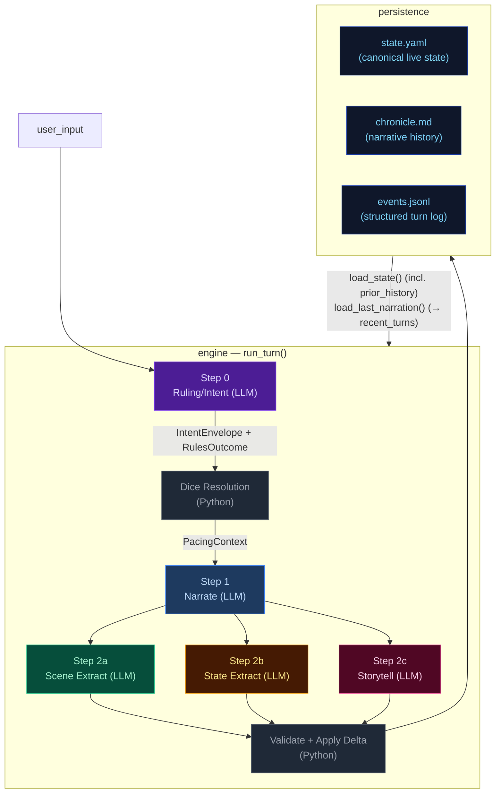

## Pipeline Quick Reference

| Step | Docs | When it runs | Key inputs | Key outputs | Mechanics it owns |
|---|---|---|---|---|---|
| **Step 0 — Ruling/Intent** | [step0-ruling](./step0-ruling.md) | Every turn (always) | `state.pc`, `state.location`, `recent_turns[-1:]`, `user_input` | `IntentEnvelope`, `RulesOutcome` | Intent classification, impossibility check, scene motion determination, dice roll resolution (1d12 + stat + cond − diff → band), difficulty selection, anti-declare-outcome enforcement. When `impossible=true`, no roll occurs and Python synthesizes a `fail` outcome. |
| **Step 1 — Narrate** | [step1-narrate](./step1-narrate.md) | Every turn (always, streamed) | Full `state`, `prior_history` (last 20 bullets, all but last rendered), `recent_turns[-1:]`, `pacing_context`, `pending_gm_beat`, `npc_roster` (from build_npc_roster()), `world_factions/locations` | `narrative` (prose) | Prose generation, dice-band binding, GM-beat consumption. Scene motion shaped by `PacingContext.outcome_hint`; impossible actions narrated as natural failures. |
| **Step 2a — Scene Extract** | [step2a-scene](./step2a-scene.md) | Every turn (always) | `narrative`, `state.pc/location`, `npc_roster` (from build_npc_roster()), conditions, compendium entries | `SceneExtractResult`: scene_tags, tagline, location_change, compendium_npc_update | NPC presence, location changes, scene tags, durable NPC compendium identity. |
| **Step 2b — State Extract** | [step2b-state](./step2b-state.md) | Every turn (always) | `narrative`, `state.pc/location/inventory`, conditions | `StateExtractResult`: inventory_add/remove/update, pc_condition_add/remove | Inventory delta accuracy, condition lifecycle. |
| **Step 2c — Storytell** | [step2c-storytell](./step2c-storytell.md) | Every turn (always) | `narrative`, `_ExtractionContext` (comp_this_turn, location, inventory, conditions), pacing_context, arc.threads[], recent_turns[-10:], band, npc_roster (from build_npc_roster()), recent_beats | `StorytellerResult`: thread_update/goal_update/arc_resolve/resolve/add, gm_beat, world_state_add/remove, actions, outcome_summary | Storyteller-managed thread lifecycle, arc resolution, beat disposition inference, durable history events. |

After Step 2c: results merge into a `StateDelta`, the validator checks constraints
(e.g. `inventory_remove` IDs exist), `apply_delta()` mutates state in-place, and the
turn is persisted. The next turn's Step 0 reads the new `state.yaml` plus `events.jsonl`.

## Subsystem Docs

| Subsystem | Doc | What it covers |
|---|---|---|
| **Step 0 — Ruling** | [step0-ruling](./step0-ruling.md) | Intent classification, dice resolution flowchart, pacing context computation |
| **Step 1 — Narrate** | [step1-narrate](./step1-narrate.md) | Streaming narration pipeline with all context inputs |
| **Step 2a — Scene Extract** | [step2a-scene](./step2a-scene.md) | Location changes, NPC presence, scene tags |
| **Step 2b — State Extract** | [step2b-state](./step2b-state.md) | Inventory and condition extraction |
| **Step 2c — Storytell** | [step2c-storytell](./step2c-storytell.md) | Pipeline mechanics, GM beat lifecycle, campaign arc system, thread lifecycle mechanics |
| **Delta → Validate → Apply** | [delta-validate](./delta-validate.md) | StateMerge schema, validation rules, apply_delta mutations |
| **Persist** | [persist](./persist.md) | Atomic writes (events.jsonl, state.yaml, chronicle.md), readback |
| **Cross-Pipeline Data Flow** | [cross-pipeline](./cross-pipeline.md) | Full inter-step data flow diagram |
| **Out-of-Band Pipelines** | [out-of-band](./out-of-band.md) | Character Creation pipeline, Generate Seed pipeline, turn viewer status colors |
| **Narration UI** | [narration-ui](./narration-ui.md) | Main game interface: SSE streaming, HTMX sidebar refresh, Alpine.js state machine |
| **Turn Viewer UI** | [turn-viewer-ui](./turn-viewer-ui.md) | Pipeline debug UI: turn cards, stage inspector, diff panel, live updates |
| **Eval Harness** | [eval-harness](./eval-harness.md) | Scenario runner, LLM judges, auto-checkers, REPORT.md generation |

## Key Models Glossary

### Core Result Types

- **IntentEnvelope**: `intent`, `intent_verb`, `target`, `check.required`, `check.skill`, `check.difficulty`, `impossible`, `impossible_reason`, `scene_motion`
- **RulesOutcome**: `rolled`, `skill`, `difficulty`, `stat_value`, `stat_mod`, `diff_mod`, `cond_mod`, `dice`, `raw_total`, `final_total`, `band`, `directive`, `intent`, `intent_verb`, `impossible`, `impossible_reason`
- **SceneExtractResult**: `scene_tags`, `scene_tagline`, `location_change`, `compendium_npc_update`
- **StateExtractResult**: `inventory_add/remove/update`, `pc_condition_add/remove`
- **StorytellerResult**: `thread_update` (list[ThreadUpdate]), `goal_update` (str | None, applied directly to arc dict), `arc_resolve` (ArcResolution | None), `thread_resolve` (with outcome sentence), `thread_add`, `gm_beat`, `world_state_add`, `world_state_remove`, `actions`, `outcome_summary`
- **SeedEnvelope**: `seed_state: GameState`, `opening_narrative`, `actions`, `arc: CampaignArc` (includes `goal_context` — UI-only, not rendered in prompts; unified `threads[]` with `progress: list[str]`, `completed_threads[]`)

  The seed owns first-turn emotional framing, not just world and arc scaffolding. It generates `goal_context` (character-specific stake), NPC `relation` fields (narrative job relative to PC), and action text written from the PC's voice and scene pressure — ensuring the opening feels personal and motivated from the start.

### PacingContext (see [step0-ruling](./step0-ruling.md#pacing-context))

### GMBeat (see [step2c-storytell](./step2c-storytell.md#gm-beat))

### CampaignArc (see [step2c-storytell](./step2c-storytell.md#campaign-arc-system))

### StateDelta (see [delta-validate](./delta-validate.md))

Merges all three extraction results. Contains `scene_tags`, `location_change`, `compendium_npc_update` (NPC changes), `thread_update/arc_resolve/thread_resolve/thread_add`, `inventory_add/remove/update`, `pc_condition_add/remove`, `world_state_add/remove`. Note: `gm_beat` is NOT in StateDelta — written directly to `state.meta.pending_gm_beat`.

---


## cross-pipeline


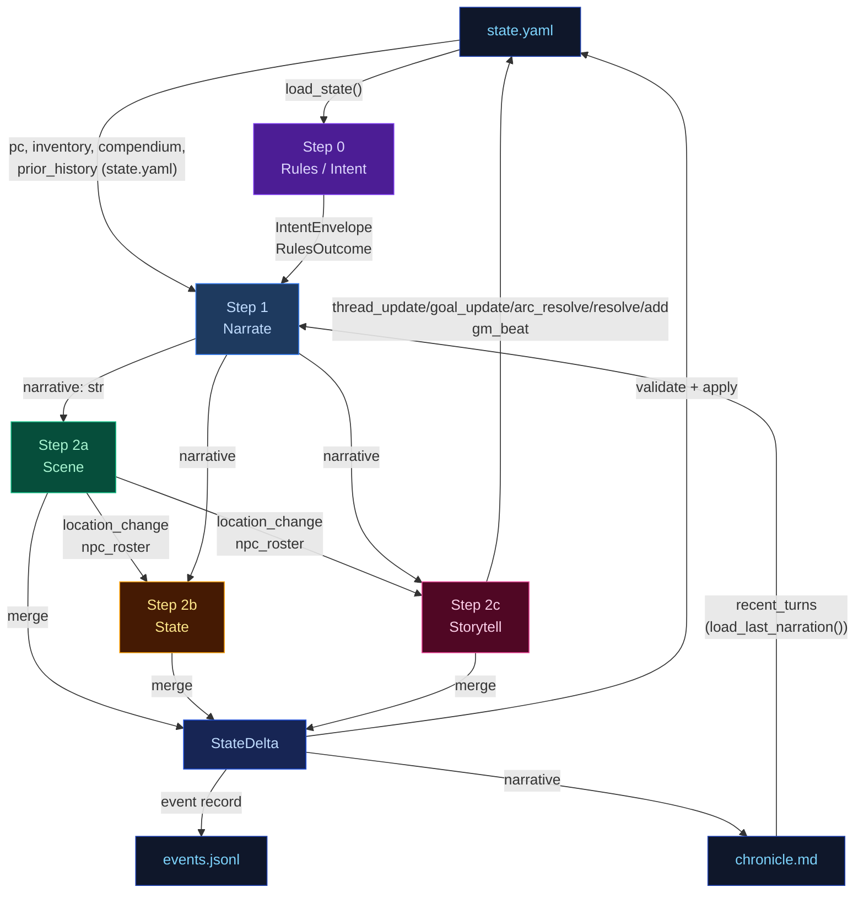

---


## delta-validate


The three extraction results merge into a single `StateDelta`, then validate and apply.

## Flowchart

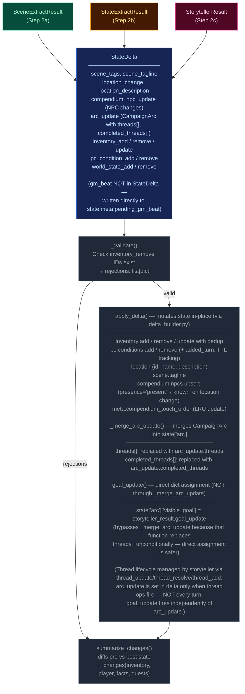

---


## narration-ui


The primary player-facing UI. Renders game state, streams narrative tokens live, and refreshes sidebars via HTMX partial swaps. Single-page app driven by Alpine.js + SSE + HTMX.

## Interaction Model

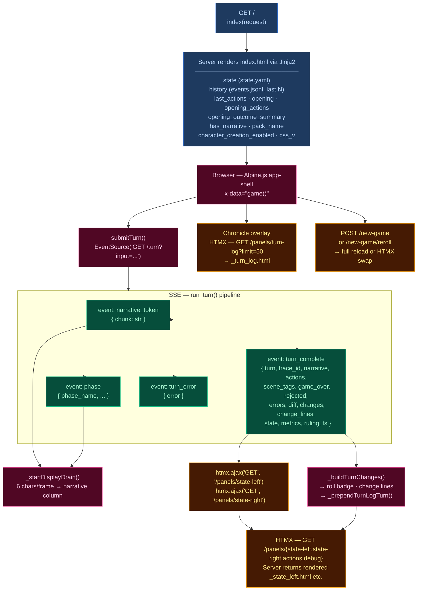

## Layout

| Region | Element | Content |
|--------|---------|---------|
| **Header** | `.header-bar` | Logo/tagline, Chronicle toggle, turn counter, retry button, new game button, reroll button (dynamic packs), mock-mode dot |
| **Left sidebar** | `.sidebar-left` | Player card, scene NPCs, location, arc, compendium — loaded via `/panels/state-left` |
| **Narrative column** | `.narrative-column` | Scrollable narrative blocks, action pills, input textarea, send/stop button |
| **Right sidebar** | `.sidebar` (right) | Inventory, recent events, world state, debug panel — loaded via `/panels/state-right` |
| **Chronicle overlay** | `.turn-log-shell` | Floating overlay over narrative column, populated by `/panels/turn-log?limit=50` |
| **New Game modal** | (Alpine `x-show`) | Pack picker → char creation / world builder steps |

## Data Flow

### Turn submission (Alpine.js + SSE)

1. User types input, presses Enter → `game().submitTurn()`
2. Opens `EventSource` to `GET /turn?input=<text>` — SSE endpoint in `routes.py:83`
3. Server streams events as the 5-stage pipeline (`run_turn()`) executes:
   - `narrative_token` — token chunks streamed as they arrive from LLM
   - `phase` — pipeline phase progress (ruling_start, narrate_start, narrate_first_token, narrate_done, extract_start, extract_done, compact_start, etc.)
   - `turn_complete` — final result
   - `turn_error` — error payload
4. Client `_startDisplayDrain()`: reveals 6 characters per animation frame for smooth streaming
5. On `turn_complete`:
   - Calls `htmx.ajax('GET', '/panels/state-left', ...)` and `htmx.ajax('GET', '/panels/state-right', ...)` to refresh sidebars
   - Renders change lines (`_buildTurnChanges`), roll badge
   - Prepends turn to Chronicle overlay via `_prependTurnLogTurn`
   - Re-renders markdown via `marked.parse()`

### HTMX partial endpoints (routes.py)

| Route | Template | Purpose |
|-------|----------|---------|
| `GET /panels/state-left` | `_state_left.html` | Left sidebar — player, NPCs, location, arc, compendium |
| `GET /panels/state-right` | `_state_right.html` | Right sidebar — inventory, events, world state, debug |
| `GET /panels/actions` | `_actions.html` | Action pills (fallback) |
| `GET /panels/turn-log?limit=N` | `_turn_log.html` | Chronicle — turn history with change lines |
| `GET /panels/pack-picker` | `_pack_picker.html` | New Game — pack selection cards |
| `GET /panels/char-creation` | `_char_creation.html` | New Game — character stats builder |
| `GET /panels/world-builder` | `_world_builder.html` | New Game — world creation form |
| `GET /panels/debug` | `_debug.html` | Debug panel — recent turn timings, errors |
| `GET /panels/state` | `_state.html` | Combined left+right (legacy) |

### Client state machine (`game()` — inline `<script>` in index.html)

Alpine.js `x-data="game()"` manages:
- `input` — textarea value
- `submitting` — turn-in-progress flag
- `gameStarted` — derived from `has_narrative`
- `turnNum` — current turn counter
- `leftWidth` / `rightWidth` — resizable sidebar widths (persisted to `localStorage`)
- Card collapse state — read/written directly from/to `localStorage` via `CCYA_CARD_KEY(name)` helper, using DOM `data-card` attributes; no Alpine data property

## UI Features

### Resizable sidebars
- Drag gutters with mousedown/mousemove handlers
- Widths saved to `localStorage` (`ccya_sidebar_left`, `ccya_sidebar_right`)
- Minimum width enforcement (240px left, 220px right)

### Collapsible cards
Each sidebar section has a collapse toggle; open/closed state persisted per-card to `localStorage` via `ccya_card_<name>` key.

### Action pills
Suggested next actions rendered as buttons that populate the input on click. Updated from `turn_complete.actions` or via HTMX panel refresh.

### Roll badge
Server-rendered for history, JS-built for new turns. Shows dice math, band label, outcome summary. Band colors: `crit_fail` (red) → `fail` → `setback` → `partial` → `success` → `crit_success`.

### Change lines
Grouped by category via emoji prefix:
| Emoji | Category | Class |
|-------|----------|-------|
| 🎒 + | Inventory gain | `.tc-inv-gain` |
| 🎒 − | Inventory loss | `.tc-inv-loss` |
| 🩺 | Player condition | `.tc-pl` |
| 📍 | Location | `.tc-loc` |
| 📜 | Faction/arc | `.tc-fa` |

### Retry
`POST /turn/delete` removes last event from `events.jsonl` and `chronicle.md`, returns previous actions for re-submission.

### New Game
`POST /new-game` with optional `pack_id`, `pc_name`, `pc_stats`, `hints`. For dynamic packs, triggers `generate_seed()` LLM pipeline. Full page reload on success. Reroll (`POST /new-game/reroll`) HTMX-swaps the opening narrative + actions.

## CSS Architecture

- **`app.src.css`** — Tailwind + custom styles split by region (lines 1–2101):
  - App shell layout (CSS Grid: header + body with sidebar-gutter-main-gutter-sidebar)
  - Narrative blocks (`.narrative-block`, `.narrative-text`)
  - Sidebar cards (`.card`, `.card-header`, `.card-body`)
  - Input bar (`.input-bar`, `.game-input`, `.send-btn`)
  - Action pills (`.action-pill`, `.pills-row`)
  - Roll badges (`.roll-badge`, `.roll-band--*`)
  - Chronicle overlay (`.turn-log-shell`, `.turn-log-panel`)
  - New Game modal (`.modal-overlay`, `.pack-card`)
  - Progress strip, tooltips, scrollbar styling
  - Design tokens via CSS custom properties (`--text-primary`, `--bg-card`, `--status-*`)
- Compiled to **`app.css`** with cache-busting via `css_v` query param

## Server Entry Point

`routes.py:57` — `GET /` handler assembles template context from `state.yaml`, `events.jsonl`, pack manifest, and engine config, then renders `ccya/templates/index.html`.

---


## out-of-band


These run only at new-game time or are non-engine concerns. They are excluded from the eval-context region of the main architecture doc.

## Character Creation Pipeline

Triggered by `POST /new-game`. All packs use the Generate Seed pipeline (dynamic). Static packs with pre-built seed_state.yaml exist but are not used by new_game.

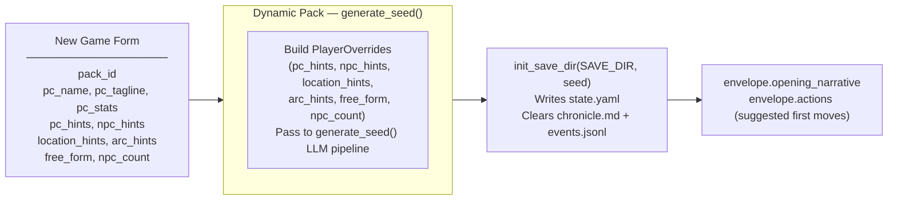

## Generate Seed Pipeline (Dynamic Packs Only)

Called by `POST /new-game` and `POST /new-game/reroll`. Generates a complete starting game state (PC, NPCs, location, arc, opening narrative, actions) from the pack manifest and optional player overrides.

The seed owns **first-turn emotional framing** — not just world and arc scaffolding. Every seed element must produce an emotionally legible opening that answers: why this moment matters now, what the character stands to lose, and why at least one person in the scene matters to them personally.

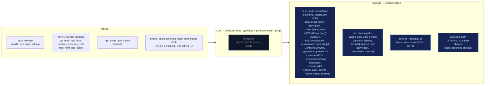

### Seed emotional framing contract

The seed prompt (`generate_seed_system.j2`) enforces these requirements:

- **`goal_context`**: 2–3 sentences explaining why `visible_goal` matters to this character specifically — inner cost or pressure that makes it emotionally loaded. No hidden-truth spoilers, no restating `visible_goal`, no direct statement of the thematic question. Must connect character motive, story stakes, and emotional cost.
- **NPC `relation` field**: Each opening NPC has a defined narrative job. One NPC is personally tied to the PC's motive or vulnerability; the other carries immediate external pressure from the world or conflict. The `relation` field encodes PC-facing relevance (e.g. "owes them a favor", "is their only contact here", "represents the institution pressing on them").
- **Compendium NPCs**: The seed also generates 2–3 NPCs in `compendium.npcs` (name, title, bio) who exist in the world but are not present in the opening scene. Their bios tie them to factions, locations, or world pressures, not to the immediate situation. These become discoverable characters during play.
- **Action guidance**: Each of the 4 choices is written from the PC's point of view, grounded in a present NPC, immediate risk, active thread, or character motive. They differ in emotional posture (confront, deflect, investigate, protect, exploit, withdraw, etc.) and avoid generic verbs.
- **`threads[]`**: Unified list (not split active/latent) where each thread has `{id, summary, urgency, scope}` and an `active` boolean flag managed by the storyteller via `thread_update`, not Python age rules. Threads have a `progress: list[str]` field — append-only log of progress updates set via `thread_update[].progress`, never replaced. Also includes `last_updated_turn: int | None` for urgency decay tracking.

## Turn Viewer — status colors

The standalone turn viewer ([turn-viewer-ui](./turn-viewer-ui.md)) uses the same semantic status colors as the CSS custom properties in `static/app.src.css` (`--status-*`). The stage colors used in the diagrams above (`stageRules` violet → `stageNarrate` blue → `stageScene` green → `stageState` amber → `stageProgress` pink) map directly to the `--stage-*` tokens. Cross-stream inputs into a step are shown in `xstream` (purple outline) and LLM/Python boxes use neutral dark fills. This table is the canonical turn-viewer status legend.

| Token | Meaning |
|-------|---------|
| `--status-ok` | Stage ran and completed (no extraction error). |
| `--status-skipped` | Stream was skipped (no longer used — all streams always run). |
| `--status-retried` | LLM output required a parse retry (`attempts` > 1 in event). |
| `--status-rejected` | Post-extract validation rejected part of the delta (e.g. bad `inventory_remove`). |
| `--status-error` | LLM call or parse ultimately failed for that stream. |
| `--status-neutral` | Non-fatal / informational (e.g. rules path with no dice roll). |

Stage accent stripes use `--stage-rules`, `--stage-narrate`, `--stage-scene`, `--stage-state`, `--stage-progress` for quick scanning; **status** always wins for the prominent left border.

---


## persist


Atomic writes to disk. No LLM calls.

## Flowchart

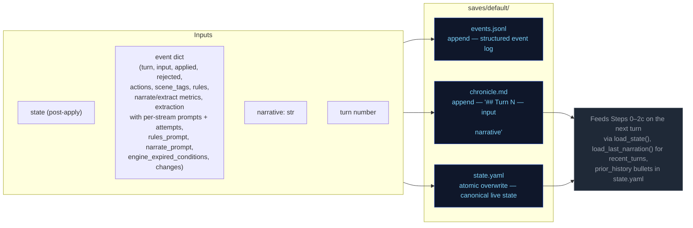

---


## step0-ruling


Classifies the player's action, determines whether a dice check is needed, and
identifies which state domains will be active — narrowing every downstream extractor.

## Flowchart

```mermaid
flowchart LR
    classDef stageRules fill:#4c1d95,color:#ddd6fe,stroke:#7c3aed
    classDef llmNode    fill:#0f172a,color:#94a3b8,stroke:#334155
    classDef pyNode     fill:#1f2937,color:#9ca3af,stroke:#4b5563
    classDef outNode    fill:#3b0764,color:#e9d5ff,stroke:#7c3aed

    subgraph IN["Inputs"]
        I1["state.pc<br>(name, stats, conditions)"]
        I2["state.location"]
        I3["recent_turns[-1:]<br>(last turn's full narrative from chronicle.md<br>via load_last_narration();<br>ruling user prompt)"]
        I4["user_input"]
    end

    subgraph LLM0["LLM — ruling_system.j2 + ruling_user.j2"]
        L0["temp: 0.2 · max_retries: 1<br>output: IntentEnvelope JSON<br>(intent, impossible, scene_motion, check)"]:::llmNode
    end

    subgraph PYRES["Python — impossible check + rules.resolve_check()"]
        P0["if impossible=true:<br>  synthesize fail outcome<br>  skip roll, apply momentum<br>else:<br>  roll 1d12 + stat_mod + cond_mod − diff_mod<br>  map total → Band"]:::pyNode
    end

    subgraph OUT["Outputs"]
        O1["IntentEnvelope<br>  intent: str<br>  intent_verb: str<br>  target: str<br>  impossible: bool<br>  impossible_reason: str<br>  scene_motion: hold|advance|transition<br>  check.required: bool<br>  check.skill: SkillName<br>  check.difficulty: Difficulty"]:::outNode
        O2["RulesOutcome<br>  rolled: bool<br>  skill, difficulty, stat_value, stat_mod<br>  diff_mod, cond_mod<br>  dice: list[int]<br>  raw_total, final_total: int<br>  band: Band<br>  directive: str<br>  intent, intent_verb: str<br>  impossible: bool<br>  impossible_reason: str"]:::outNode
    end

    IN --> LLM0
    LLM0 -- "IntentEnvelope" --> PYRES
    PYRES --> OUT
```

## Impossibility check

The ruling LLM evaluates whether the described action is impossible given the character's state, inventory, and scene. An action is impossible when:

- It requires an item the character does not have (firing a gun with no ammo, using a key never acquired)
- It requires a capability contradicted by active conditions (climbing with a broken leg, sneaking while armored and noisy)
- It acts on something not present in the scene (targeting an NPC who is not here, opening a door that doesn't exist)

When `impossible=true`: Python sets `check.required=False`, synthesizes a `RulesOutcome` with `band="fail"` and `rolled=False`, applies momentum, and skips the dice roll entirely. The narrator renders the impossible fact and narrates the natural failure.

## Scene motion

The ruling LLM also determines how the scene should progress: `"hold"` (scene continues at current pace), `"advance"` (something significant happens/resolves), or `"transition"` (player is leaving, write the arrival). This feeds into `_compute_pacing_context()` which produces `outcome_hint` for the narrator.

## Key forward dependency

`rules_outcome` feeds into `_compute_pacing_context()` which produces the single authoritative `PacingContext` struct passed to both Narrator and Storytell pipeline.

## Pacing Context

All pacing signals are collapsed into one Python-computed struct (`PacingContext`) passed to both the Narrator and Storytell pipeline. This replaces six independent fields (`narration_directive`, `deescalate`, `narrative_velocity`, `beat_disposition` output, `quest_threshold_directive`, and stale momentum-derived signals). The narrator receives `outcome_hint` (scene motion); Storytell receives the full struct including `directive`.

### Struct definition

```
PacingContext:
  directive: str           # "" | "Breathe" | "Scene Imperative" | "Overwhelm" | "Pressure" | "Tension" | "Scene Pressure" (may include "; Resolve a Threat" secondary when beat_locked); used by Storytell pipeline
  outcome_hint: str | None # "hold" | "advance" | "transition" — narrator's primary scene motion instruction
  beat_locked: bool        # True: consecutive pressure threshold reached or momentum at floor — enables floor relief injection and appends "; Resolve a Threat" to directive
  gate: str                # "block_escalate" | "allow" (controls thread_add); set independently from beat_locked via deescalate >= 0.5
  summary: str             # human-readable log string, never sent to LLM
```

`beat_locked: True` fires when either `consecutive_pressure_turns >= config.consecutive_pressure_threshold` OR `momentum <= config.momentum_floor`. When locked, `"Resolve a Threat"` is appended to the directive via semicolon. The `gate` field prevents Progress from adding new threads during de-escalation windows.

### Computation

`_compute_pacing_context()` in `engine/turn.py` consolidates pacing computation (replacing the former scattered functions: `_compute_narration_directive`, `_compute_narrative_velocity`, `_check_floor_relief`). It takes inputs (`momentum`, `consecutive_pressure_turns` from state meta, `arc.threads[] scope=scene urgency counts`) and returns a single struct with directive derived from a priority stack. It also computes `outcome_hint` from the ruling LLM's `scene_motion` and PacingContext escalation signals: ruling `scene_motion` takes priority (`transition` > `advance` > fallback), then `impossible=true` forces `advance`, then Python escalation signals (`beat_locked`, Overwhelm/Pressure with urgent threads) produce `advance`, defaulting to `hold`.

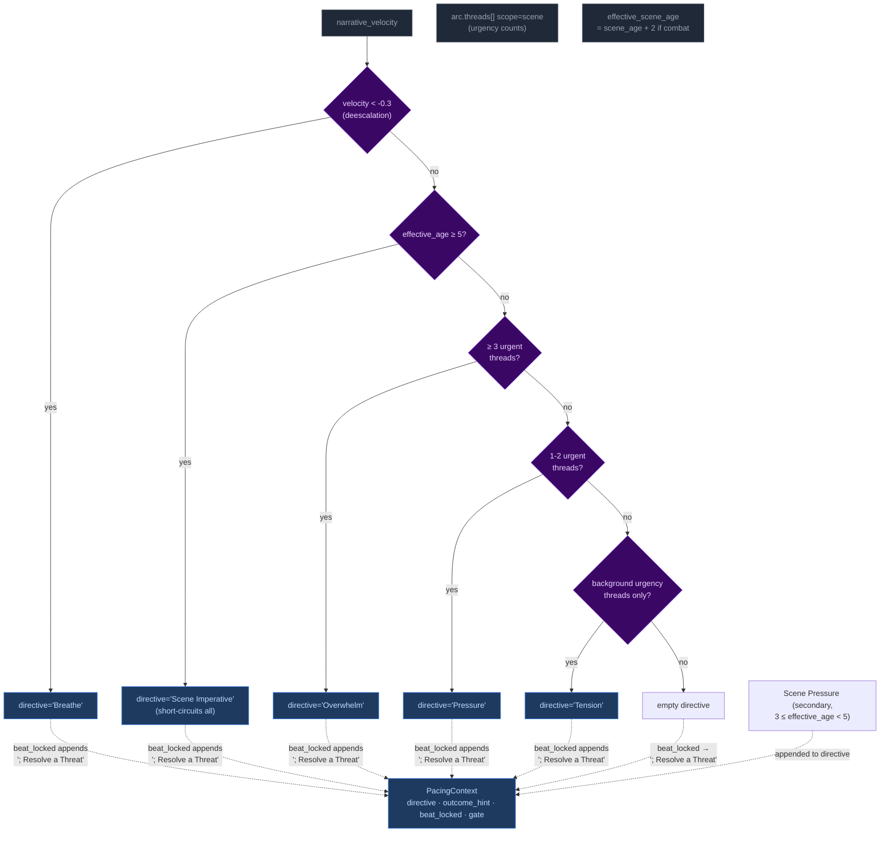

Priority order (highest to lowest): **Breathe > Scene Imperative > Overwhelm > Pressure > Tension > Scene Pressure**. The `beat_locked` flag fires when either consecutive pressure threshold or momentum floor is reached — `"Resolve a Threat"` is appended to the directive and `outcome_hint` is set to `"advance"`. The gate is NOT affected by beat_locked (set independently by deescalate ≥ 0.5).

**Breathe secondary guard:** The Breathe directive has an additional check beyond velocity: if urgent scene-scoped threads exist, Breathe is NOT emitted even if `narrative_velocity < -0.3`. Low velocity during unresolved tension (tactical avoidance, stealth) does not trigger de-escalation. Once urgent threads resolve, Breathe fires on the next low-velocity turn.

#### Age computation

`_compute_ages(state)` returns only `{"scene_age": scene_age}` — location_age and combat_age removed in Phase 03 pacing overhaul. The ruling phase pre-computes `effective_scene_age = scene_age + 2` when `"combat"` is in scene tags, stored in `ctx._ages["effective_scene_age"]`. This single-age signal drives all directive thresholds:
- Scene Imperative (≥5 effective age): high-priority directive forcing story advancement
- Scene Pressure (3 ≤ effective_age < 5): secondary append to wind down or shift focus

### Wiring

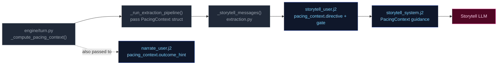

1. **Computed** once in `run_turn()` via `_compute_pacing_context()`.
2. **Passed through** `_run_extraction_pipeline()` → both `_narrate_messages()` and `_storytell_messages()`.
3. **Narrator template** (`narrate_user.j2`) renders `outcome_hint` (scene motion: hold/advance/transition) with value-specific guidance. No Jinja2 pacing computation remains — all pacing computed by Python.
4. **Storytell template** ((`storytell_system.j2` + `user.j2`)) receives the full struct; guidance maps each directive to appropriate thread/beat actions:

| Directive | Thread action | Gate |
|-----------|---------------|-------|
| **"Breathe"** (de-escalation, velocity < -0.3) | Do NOT add new threads. Allow existing scene threads to persist without escalation. | `block_escalate` (set by deescalate ≥ 0.5; beat_locked does NOT force-close gate) |
| **"Scene Imperative"** (effective_age ≥ 5) | Story must advance — introduce new development forcing resolution or movement; do not linger | Varies by context |
| **"Overwhelm"** (3+ urgent threads) | May add scene-scoped threads if gate allows; emit pressure/escalation beat | `allow` |
| **"Pressure"** (1-2 urgent threads) | Advance relevant scene/arc threads. Add new thread only if gate permits. | Varies by context |
| **"Tension"** (background urgency only) | Do NOT add pressures unless concrete threat emerges; prefer advancing existing threads | Allow |
| **"Scene Pressure"** (3 ≤ effective_age < 5, secondary append) | Begin winding down or introduce reason to shift focus: development elsewhere, closing window | Varies by context |
| **"" (empty)** | No action required beyond normal aging of silent threads. | Allow |

**Note:** Directives may include secondary modifiers joined by semicolons (e.g., "Pressure; Resolve a Threat" when beat_locked). The primary directive drives thread/beat logic; the secondary (`; Resolve a Threat`) acts as thematic guidance for beat type selection. "Resolve a Threat" never appears as a standalone primary directive — it is only appended by the `beat_locked` mechanism.

### Consecutive pressure counter

`state["meta"]["consecutive_pressure_turns"]` tracks how many consecutive turns have had pressure-type storyteller beats. Re-keyed from directive tracking (which never fired — Pressure/Overwhelm directives were unreachable) to beat-type tracking:

- **Increments** when `storyteller_result.gm_beat.type` is `"pressure"`, `"escalation"`, or `"complication"`.
- **Resets to 0** on any other beat type, null beat, or missing storyteller output.

When this counter reaches `config.consecutive_pressure_threshold` (default 3), it triggers `beat_locked` alongside the momentum floor fallback (`momentum <= -3`). `beat_locked` appends `"; Resolve a Threat"` to the directive and enables floor relief injection.

---


## step1-narrate


Generates the narrative prose the player reads. Tokens are streamed to the client.

## Flowchart

```mermaid
flowchart LR
    classDef llmNode   fill:#0f172a,color:#94a3b8,stroke:#334155
    classDef xstream   fill:#4c1d95,color:#ddd6fe,stroke:#7c3aed
    classDef outNode   fill:#1e3a5f,color:#bfdbfe,stroke:#3b82f6

    subgraph IN["Inputs"]
        N1["state (full —<br>pc, location, scene,<br>inventory, compendium)"]
        N2["prior_history<br>(last 20 incremental history bullets, all but last rendered as bullets)"]
        N3["recent_turns[-1:]<br>(single most recent turn as full text)"]
        N4["rules_outcome<br>(band, directive, impossible, dice summary)"]:::xstream
        N6["npc_name_pool (cultural name list)"]
        N7["npc_roster<br>(from build_npc_roster(comp),<br>  presence field: present/nearby/known)"]
        N9["world_factions<br>(immutable trace)"]:::xstream
        N10["pending_gm_beat<br>(type · surface_as metadata)"]
        N11["pacing_context<br>(outcome_hint)<br>from _compute_pacing_context()"]:::xstream
        N15["user_input"]
    end

    subgraph LLM1["LLM — narrate_system.j2 + narrate_user.j2"]
        NL["temp: 0.9 · streaming: yes<br>output: prose narrative (str)"]:::llmNode
    end

    subgraph OUT["Outputs"]
        NO1["narrative: str<br>(streamed as tokens → client<br>then joined + thinking-stripped)"]:::outNode
        NO2["narr_metrics<br>  first_token_ms<br>  total_ms<br>  tokens_in / tokens_out"]
    end

    IN --> LLM1
    LLM1 --> OUT
```

## Arc context in narration

The narrator receives `current_arc` in both system and user prompts. Key fields:

- **`goal_context`**: A seed-time field (2–3 sentences) explaining why `visible_goal` matters to the character specifically — inner cost or pressure that makes it emotionally loaded. UI-only (surfaced as tooltip on the arc goal in the sidebar). NOT rendered in prompt context — the narrator works from general early-turn behavioral guidance in the system prompt, not from the raw `goal_context` value.
- **`visible_goal`**: The player-facing objective.
- **`threads[]`**: Unified thread collection filtered by `active` flag. Scene-scope threads provide immediate pressure; arc-scope threads provide medium-term tension.
- **`resolved_arc`**: TTL-filtered list of previously resolved arcs, providing narrative continuity across arc transitions.

### Opening-turn narrative mode

The seed embeds emotional stakes in the initial state — NPC `relation` fields, `motivation/fear/leverage`, and a `goal_context` sidebar entry. The narrator does NOT receive special early-turn prompt guidance or `goal_context` in its context. Instead, the initial scene's NPCs (with rich behavioral drivers), the opening narrative's tone, and the player-facing sidebar create the onboarding experience. The narrator works from its standard behavioral guidance and the richness of seed-generated state.

## Key forward dependency

`narrative` is the primary content input for all three extraction streams below.

### GM Beat consumption

The narrator receives a pending GM beat from `state.meta.pending_gm_beat` (set by Storytell in the previous turn). The beat's `type` and `surface_as` metadata are passed alongside the pacing directive as creative guidance for the narrative. The beat is NOT cleared after narration — it persists through the extraction phase. After extraction completes, Storytell replaces it with a new beat or pops it on null output. Full beat lifecycle is documented in [step2c-storytell](./step2c-storytell.md#gm-beat).

---


## step2a-scene


Extracts location changes, NPC presence, scene tags, and suggested actions from the narrative.

## Flowchart


## Key forward dependency

`location_change` flows into `extraction_ctx` (built by `_build_extraction_context`). Step 2c also receives `npc_roster` (from build_npc_roster()) built from comp_this_turn. No forward-facing mechanics (`thread_add`, `gm_beat`) are emitted by this stream — they go through the unified thread lifecycle via Storytell (Step 2c).

---


## step2b-state


Extracts inventory changes and player condition mutations from the narrative.

## Flowchart

```mermaid
flowchart LR
    classDef llmNode fill:#0f172a,color:#94a3b8,stroke:#334155
    classDef xstream fill:#4c1d95,color:#ddd6fe,stroke:#7c3aed
    classDef outNode fill:#451a03,color:#fde68a,stroke:#f59e0b

    subgraph IN["Inputs"]
        S1["narrative (from Step 1)"]:::xstream
        S2["state.pc (name, bio, stats, conditions)"]
        S3["state.location"]
        S4["state.inventory"]
        S5["intent: str<br>(from Step 0)"]
    end

    subgraph LLM2B["LLM — extract_state_system.j2 + extract_state_user.j2"]
        SL["temp: 0.4 · max_retries: 1<br>output: StateExtractResult JSON"]:::llmNode
    end

    subgraph OUT["Outputs — StateExtractResult"]
        O1["inventory_add: list[InventoryItem]<br>  id, name, notes, amount"]:::outNode
        O2["inventory_remove: list[InventoryRemove]<br>  id, amount (None = full stack)"]:::outNode
        O3["inventory_update: list[InventoryUpdate]<br>  id, name?, notes?"]:::outNode
        O4["pc_condition_add: list[ConditionAdd]<br>  id, label, description"]:::outNode
        O5["pc_condition_remove: list[ConditionRemove]<br>  id"]:::outNode
    end

    IN --> LLM2B
    LLM2B --> OUT
```

## Key forward dependency

Step 2c receives `npc_roster` (from build_npc_roster()) and `location_change` from Step 2a. Cross-stream items_gained/lost were removed — extraction_ctx now covers all this-turn derived data.

---


## step2c-storytell


Extracts thread updates, arc actions, world state changes, and durable NPC compendium changes.

## Flowchart


## Always runs

Storytell is the post-narration storytelling brain. It always executes every turn (never skipped) and feeds next turn's rules call via `world_state_add/remove` (persistent world facts), `thread_update/goal_update/arc_resolve/thread_resolve/thread_add` (storyteller-managed thread lifecycle), and `gm_beat` (forward-facing beats stored in `state.meta.pending_gm_beat`).

## GM Beat

Forward-facing storytelling beats that shape scene progression across turns. Beats are emitted by Storytell (Step 2c), consumed by Narrator (Step 1) the following turn, and managed via a write/expiry lifecycle in `state.meta.pending_gm_beat`.

### GMBeat Schema

```
GMBeat
  type: complication | revelation | opportunity | breathing_room | pressure | twist | setback | escalation | callback
  surface_as: ambient | event | npc_behavior | environmental | player_discovery | item (default: ambient)
  beat_expires_turn: int | None — turn number at which the beat expires; set to turn_no + 2 when stored
```

**Validation:** Only `type` is validated by `StorytellerResult._nullify_invalid_gm_beat` — nullified if type is falsy or not in the valid set. No validation on `surface_as`. Python accepts whatever gm_beat the LLM emits with no correction or override.

### PacingContext Beat Fields

The beat system intersects with pacing via two fields in `PacingContext` (see [step0-ruling](./step0-ruling.md#pacing-context)):

| Field | Type | Meaning |
|-------|------|---------|
| `directive` | str | May include secondary modifier `"; Resolve a Threat"` when `beat_locked=True`. Drives storytell guidance for beat type selection. |
| `beat_locked` | bool | True when either `consecutive_pressure_turns >= threshold` OR `momentum <= momentum_floor`. When locked, `"Resolve a Threat"` is appended to the directive. Enables floor relief to inject a breathing_room beat if the storyteller is stuck in a pressure-type loop. |

### Beat Lifecycle — Turn Sequence

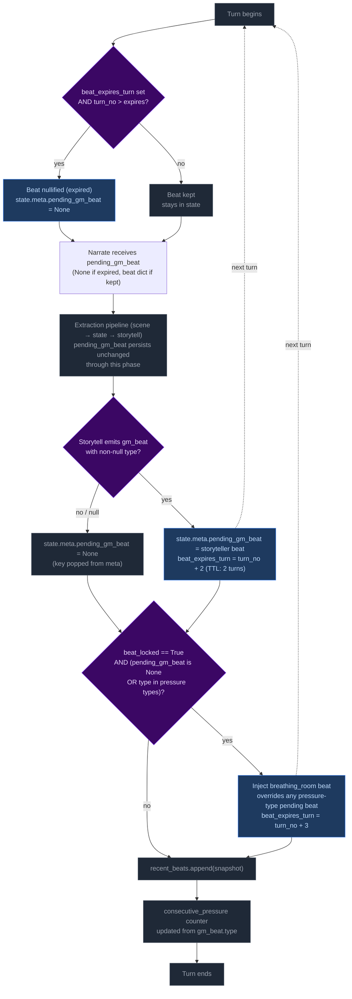

**Step 1 — Pre-narration expiry check.** At the start of each turn, the engine reads `state.meta.pending_gm_beat` from the previous turn. If `beat_expires_turn` is set and the current turn number exceeds it, the beat is nullified (key set to None). Otherwise it proceeds to narration.

Note: This expiry runs early enough that the beat is gone before the extraction phase begins. This is intentional — it creates clean state for floor relief to inject breathing_room if `beat_locked` is active and storyteller doesn't provide its own non-pressure beat. Without the pre-narration expiry, a stale expired beat could block floor relief's null check.

**Step 2 — Narration consumption.** The beat is passed to the narrator via `_narrate_messages(pending_gm_beat=...)`. The narrator uses the beat's `type` and `surface_as` metadata as creative guidance alongside the pacing directive. The beat is NOT cleared after narration — it persists through the extraction phase.

**Step 3 — Storytell writes or clears the beat.** After extraction completes:
- If Storytell emits a valid `gm_beat` (non-null `type`): replaces `pending_gm_beat` with `beat_expires_turn = turn_no + 2`.
- If Storytell emits `null` or an invalid beat: pops `pending_gm_beat` from state (null-clear). The old beat does NOT carry forward.

**Step 4 — Floor relief injection.** After delta apply, if `beat_locked=True` AND the current `pending_gm_beat` is either `None` or a pressure-type (`pressure`, `escalation`, `complication`): injects a `breathing_room` beat with `beat_expires_turn = turn_no + 3`. This overrides pressure-type beats that would otherwise continue the pressure cycle, but does NOT override non-pressure beats the storyteller independently produced (e.g., `revelation`, `opportunity`, `breathing_room`).

**Step 5 — Beat history snapshot.** `pending_gm_beat` is appended to `state.meta.recent_beats` (capped at 5 entries). The snapshot is taken after any floor relief override, so it reflects the beat the next turn's narrator will consume.

**Step 6 — Consecutive pressure counter update.** The counter increments on pressure-type beats and resets to 0 otherwise.

### Floor Relief Injection

The floor relief mechanism fires after delta apply when `_pc.beat_locked=True` AND the current `pending_gm_beat` is either `None` or a pressure-type beat (`pressure`, `escalation`, `complication`). It injects a `breathing_room` beat with TTL of 3 turns (one more than storyteller-emitted beats' TTL of 2).

Floor relief is a **fallback override** — it breaks a pressure-type run by force-injecting recovery:
- If Storytell emitted a pressure-type beat → floor relief overrides it with breathing_room.
- If Storytell emitted a non-pressure beat (revelation, opportunity, breathing_room, etc.) → floor relief lets it stand. Relief is already being achieved.
- If Storytell emitted nothing (null) → floor relief injects breathing_room. This is appropriate: after a null turn with beat_locked active, relief is needed.

### Directive-Beat Alignment

The storyteller prompt (`storytell_system.j2`, pacing context guidance section) maps each PacingContext directive to recommended beat types (e.g., "Breathe" → breathing_room; "Scene Imperative" → advance story; "Overwhelm" → pressure/escalation). This alignment is **guidance only** — Python accepts whatever gm_beat the LLM emits with no validation, correction, or override. Design rationale: forcing directive-beat alignment would constrain storytelling flexibility and create brittleness if the LLM makes contextually appropriate but directive-divergent beat choices.

### Beat History

`state.meta.recent_beats` stores the last 5 beats (including null entries) with `turn`, `type`, and `surface_as`. This history is rendered in both the storyteller system prompt (behavioral guidance) and the user prompt (current-turn context, more salient). Each entry shows `T{N}: {BEAT TYPE} (surface)` or `T{N}: No beat emitted this turn`.

The LLM uses this history to follow beat diversity guidance: avoid repeating the same type more than twice in a sequence; at least one in three beats should be a non-pressure type.

### TTL Mechanics Summary

| Source | Default TTL | Expiry Calculation |
|--------|-------------|-------------------|
| Storytell-emitted beat | 2 turns | `beat_expires_turn = turn_no + 2` |
| Floor relief (Python-injected) | 3 turns | `beat_expires_turn = turn_no + 3` (extra recovery margin) |

### Null-Clear Behavior

When Storytell emits a null beat (or an invalid beat whose type is nullified), `pending_gm_beat` is popped from `state.meta`. The beat does NOT carry forward. This replaced the old carryover behavior where stale beats persisted through null turns.

The storyteller user prompt always renders the GM Beat section — on null-following turns it shows "No beat currently carried over from the previous turn. Choose freely." This ensures the LLM has consistent beat awareness on every turn.

### GM Beat Section in UI

The storyteller user prompt renders the `## GM Beat` section unconditionally:
- **Beat present:** Shows type, surface_as, expiration turn.
- **No beat:** Shows fallback text — "No beat currently carried over from the previous turn. Choose freely."

This was changed from the previous conditional rendering (where the section vanished on ~38% of turns), ensuring full beat awareness coverage.

## Campaign Arc System

The campaign arc system tracks story threads across turns. Thread state is **storyteller-managed** — the LLM explicitly controls urgency, progress, and goal direction via `thread_update` and `goal_update` directives. The engine applies these without enforcement of caps, cooldowns, or silent timers.

### Arc Data Model

```
CampaignArc
  visible_goal: str          — What the PC is trying to achieve
  goal_context: str          — 2–3 sentences explaining why visible_goal matters (UI-only; not rendered in prompts)
  threads: list[ArcThread]   — Unified collection with active flag
  completed_threads: list[ArcThread] — Resolved/failed/abandoned threads
  resolution: str | None     — Set when arc is resolved via arc_resolve
  last_thread_created_turn: int — Tracks when a thread was last created for pacing

ArcThread
  id: str                    — Unique identifier
  summary: str               — What this thread is about
  scope: Literal["scene", "arc"]  # scene = short-lived, purged on location change; arc = persistent story tension
  active: bool = True        # Storyteller-controlled via thread_update
  urgency: Literal["background", "normal", "urgent"] = "normal"  # Storyteller-controlled
  progress: list[str] = []   — Append-only log of progress updates (CHANGED from single-string overwrite)
  resolution_state: str | None # Set when thread_resolve processes resolved/failed/abandoned
  outcome: str | None        # Set from ThreadResolution.outcome when moved to completed_threads
  resolved_turn: int | None  — Turn when thread was resolved; used for TTL filtering in prompts

  # NOTE: last_updated_turn (int | None) is NOT a Pydantic field on ArcThread.
  # It is injected at the dict level in _apply_thread_updates() and in the rendering
  # pipeline (extraction.py, narrate.py). The _thread_list.j2 template references
  # t.last_updated_turn — this works because the dicts passed to templates have been
  # augmented with this key. It tracks when the thread was last mutated for urgency
  # decay guidance (rendered as "turns since last update").
```

### Engine-Driven Arc

Thread lifecycle runs in `engine/turn.py` during the extraction phase. Six operations handle arc/thread state in strict order:

```mermaid
flowchart TD
    classDef pyNode fill:#1f2937,color:#9ca3af,stroke:#4b5563
    classDef arcNode fill:#3b0764,color:#e9d5ff,stroke:#7c3aed

    PR["StorytellerResult<br>thread_update: list[ThreadUpdate]<br>goal_update: str | None<br>arc_resolve: ArcResolution | None<br>thread_resolve: list[ThreadResolution]"]:::pyNode

    subgraph UPDATES["_apply_thread_updates()"]
        U1["For each ThreadUpdate:<br>Find thread by id → apply<br>active/urgency/summary/progress changes<br>progress is append-only (list[str])<br>Sets last_updated_turn = current turn"]
    end

    subgraph GOAL["goal_update (direct dict assignment)"]
        G1["If storyteller_result.goal_update is set:<br>state['arc']['visible_goal'] = value<br>Direct assignment, NOT through _merge_arc_update<br>(which would wipe threads[])"]
    end

    subgraph CONFLICT["Same-turn conflict detection"]
        C1["If same thread id appears in both<br>thread_update and thread_resolve:<br>log WARNING (LLM error)<br>resolution wins (fires after update)"]
    end

    subgraph RESOLVE["_apply_arc_resolve()"]
        R1["Store current arc in resolved_arcs<br>with resolved_turn for TTL tracking"]
        R2["Auto-close arc-scoped threads with 'superseded' state<br>Carry forward scene-scoped threads (minus drop_threads)"]
        R3["Add new_threads from resolution"]
        R4["Create successor arc with<br>new visible_goal, goal_context,<br>surviving scene-scoped + new threads"]
    end

    subgraph RESOLUTIONS["_apply_thread_resolutions()"]
        S1["For each ThreadResolution:<br>Move ArcThread to completed_threads<br>Set resolution_state, outcome, resolved_turn"]
    end

    subgraph GATE["Thread add gate"]
        T1["PacingContext.gate == 'allow'?<br>If blocked: log debug, skip add<br>Gate status rendered in prompt<br>(no silent drops)"]
        T2["ID collision? Thread id in existing_ids<br>or completed_ids → reject"]
    end

    PR --> UPDATES --> GOAL --> CONFLICT --> RESOLVE --> RESOLUTIONS --> GATE

    GATE -- "CampaignArc" --> ARC[arc state in<br>state.yaml]:::arcNode
```

**Pipeline order:** thread updates → goal_update (dict assignment) → conflict detection → arc resolution → thread resolutions → thread_add gate.

**Key rules:**
- **Storyteller-controlled:** No caps, cooldowns, or silent timers. The storyteller decides which threads to update, when to shift the visible_goal, and when to resolve the arc.
- **goal_update:** A bare string applied directly to `state["arc"]["visible_goal"]` via dict assignment. Does NOT route through `_merge_arc_update` (which replaces `threads[]` unconditionally — passing a bare CampaignArc would wipe the thread list). Applied before arc_resolve; if both fire on the same turn, arc_resolve wins (ending the arc supersedes a mid-arc update).
- **Same-turn conflict detection:** When the same thread id appears in both `thread_update` and `thread_resolve` in a single output, a WARNING is logged. The processing order (update before resolve) means resolution takes precedence — correct behavior, but this is always an LLM error worth monitoring.
- **Arc resolution:** When `arc_resolve` is emitted, the current arc is stored in `state["resolved_arcs"]` with `resolved_turn` for TTL tracking. Arc-scoped threads are auto-closed with 'superseded' state; scene-scoped threads carry forward (minus any in drop_threads). The successor arc starts with empty `threads[]`.
- **Scene-scoped threads:** Purged from state on location change (delta_builder.py) before the arc director re-derives.
- **TTL-based cleanup:** Completed threads and resolved arcs are pruned from prompt context after `completed_thread_ttl` / `resolved_arc_ttl` turns (default 3).

### Arc Context in Narration

The arc state is passed to the narrator via `current_arc` in both system and user prompts. `goal_context` is present in the model but only surfaced in the player UI (tooltip/description text) — the pipeline and prompts never read it directly. The narrator sees arc metadata including resolved arcs (TTL-filtered) and completed threads.

### Arc System Integration Points

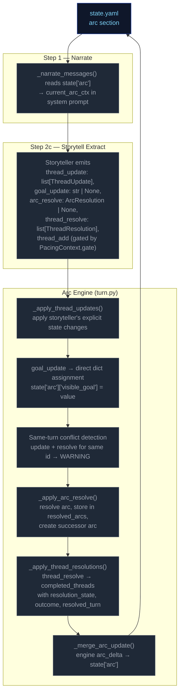

### Thread Mechanics

#### Two Thread Scopes

Threads have a `scope` field (`"scene"` or `"arc"`) that determines narrative treatment:

| Scope | Narrative role | Engine lifecycle |
|---|---|---|
| `scene` | Short-lived tension tied to current location/NPCs | **Purged on location change** — removed from `arc.threads[]` when player moves to a new location (delta_builder.py). |
| `arc` | Persistent story tension across scenes | Persists across location changes. Only removed via `thread_resolve` or auto-closed on arc_resolve (state `"superseded"`). |

#### Entry Points

Six call sites in `run_turn()` process arc/thread operations in order:
1. **`_apply_thread_updates()`** — apply storyteller's explicit state changes; progress is append-only (`list[str]`); sets `last_updated_turn`
2. **`goal_update`** — direct dict assignment to `state["arc"]["visible_goal"]`
3. **Same-turn conflict detection** — warn if same thread id in both update and resolve
4. **`_apply_arc_resolve()`** — resolve arc, store in resolved_arcs, create successor
5. **`_apply_thread_resolutions()`** — resolve/fail/abandon → completed
6. **Thread add gate** — pacing gate + key collision/fuzzy merge checks

All six run after `apply_delta()` but before `save_state()`.

#### Step-by-Step: `_apply_thread_updates()`

Processes `storyteller_result.thread_update` (list of `ThreadUpdate` with `id`, optional `active`, `urgency`, `summary`, `progress`).

For each ThreadUpdate:
1. Find matching thread by ID in `arc.threads[]`
2. If not found → log WARNING, skip
3. If found:
   - Apply non-None fields (`active`, `urgency`, `summary`) via `model_copy`
   - If `progress` is non-None: append to `thread.progress` list (always append, never replace)
   - Set `last_updated_turn` to current turn number
4. Log applied changes at INFO level

**Progress append behavior:** Every `progress` value from a `thread_update` is appended to `ArcThread.progress`. When prior progress is invalidated, the storyteller appends a natural-language entry acknowledging the shift (e.g., "Correction: the dock lead was a dead end."). The renderer shows all entries in order; the LLM on subsequent turns sees the full trail. No replace mechanism, no boolean flag.

#### Step-by-Step: `_apply_arc_resolve()`

Processes `storyteller_result.arc_resolve` (optional `ArcResolution` with `resolution`, `visible_goal`, `goal_context`, `drop_threads: list[str]`, `new_threads: list[ArcThread]`).

1. If `arc_resolve` is None → return None
2. Validate arc from state; if missing/invalid → log WARNING, return None
3. Store current arc in `state["resolved_arcs"]` with `resolved_turn` for TTL tracking
4. Auto-close all arc-scoped threads: move to completed_threads with resolution_state="superseded"
5. Carry forward scene-scoped threads minus any IDs listed in drop_threads
6. Add new_threads from the ArcResolution model
7. Create successor arc with new `visible_goal`, `goal_context`, and combined surviving + new threads
8. Replace `state["arc"]` with successor

#### Thread Creation (gated in `run_turn()`)

New threads (`storyteller_result.thread_add`) are gated by:

1. **Pacing gate**: `PacingContext.gate == "allow"` — blocks escalation when pacing context says so. Gate status is rendered in the prompt (`_thread_list.j2`) so the storyteller has awareness instead of silent drops.
2. **ID collision**: thread `id` already exists in `arc.threads[]` or `arc.completed_threads[]` → reject with WARNING log. Id-based dedup only — no key field or fuzzy merge.

**Thread creation via thread_update (ungoverned):** Threads can also be created implicitly by appearing in `thread_update` without a prior `thread_add`. This is the dominant creation path in practice — the LLM introduces new thread IDs directly via updates.

**Thread creation via thread_update (ungoverned):** Threads can also be created implicitly by appearing in `thread_update` without a prior `thread_add`. This is the dominant creation path in practice — the LLM introduces new thread IDs directly via updates.

#### Step-by-Step: `_apply_thread_resolutions()`

Processes `storyteller_result.thread_resolve` (list of `ThreadResolution` with `id`, `resolution_state`, `outcome`).

1. Find matching thread by ID in `arc.threads[]`
2. If not found → log warning, skip
3. If found → move to `arc.completed_threads[]`, set `resolution_state`, `outcome`, and `resolved_turn`
4. Deduplicate completed_threads entries: existing ID gets updated, not duplicated

#### Pacing Context Gate

`_compute_pacing_context()` sets `gate` based on deescalation:

```
gate = "allow" by default
gate = "block_escalate" when deescalate >= 0.5
```

The gate blocks thread creation. The LLM is instructed not to emit `thread_add` when `gate != "allow"`, and the gate status is explicitly rendered in the prompt to provide awareness.

#### Constants Reference

| Constant | Value (default) | Effect |
|---|---|---|
| `config.resolved_arc_ttl` | 3 | Turns to keep resolved arcs in prompt context |
| `config.completed_thread_ttl` | 3 | Turns to keep completed threads in prompt context |

#### Validation Edge Cases

1. **Empty arc state** — No arc in state → log DEBUG, return None (no crash)
2. **Validation failure** — Arc fails Pydantic validation → log WARNING, return None
3. **Unknown thread ID in update** — Log WARNING, skip — does not block valid updates
4. **Unknown resolution ID** — Log WARNING, skip — does not block valid resolutions
5. **Duplicate thread ID in creation** — Checked against existing + completed IDs
6. **Duplicate ID in creation** — Checked against existing + completed IDs
7. **Same-turn update+resolve conflict** — Same thread id in both `thread_update` and `thread_resolve` → log WARNING, resolution wins (fires after update)
8. **Progress type migration** — Old saves with `progress: "str"` are coerced via `field_validator` wrapping single strings in a list

### Progress Migration

`ArcThread.progress` was changed from `str` to `list[str]` (backward compat not required). A Pydantic `field_validator("progress", mode="wrap")` on the model coerces old string values: if the loaded value is a `str`, it wraps it in `[value]`. This prevents validation failure when loading pre-change saves.

---

---


# Static Context (immutable across all turns)

## Seed State

```json
{
  "meta": {
    "game_name": "eval",
    "turn": 0,
    "setting_pack": "eval-pack",
    "model": ""
  },
  "pc": {
    "name": "Aren Voss",
    "tagline": "Reluctant courier on the merchant road",
    "bio": "Mid-thirties, broad shoulders, careful with words. Took on a courier contract\nto clear an old debt. Just arrived in Marrow's Crossing with a heavy pack and\na heavier obligation.\n",
    "stats": {
      "strength": 3,
      "dexterity": 3,
      "wits": 2,
      "lore": 2,
      "charisma": 3,
      "resolve": 3
    },
    "conditions": [],
    "momentum": 0,
    "drive": ""
  },
  "location": {
    "id": "marrows_crossing",
    "name": "Marrow's Crossing",
    "description": "A market town built around the confluence of two rivers. Cobblestone streets,\ntimber-framed buildings, and the constant sound of water from the mills. The\ntown square has a stone well and a statue of the founder. Most shops are closing\nfor the evening.\n"
  },
  "inventory": [
    {
      "id": "credits",
      "name": "Credits",
      "notes": "Common coin, accepted at any inn or stall on the merchant road.",
      "amount": 500,
      "aliases": []
    },
    {
      "id": "iron_dagger",
      "name": "Iron dagger",
      "notes": "Plain crossguard, edge worn from honing. Belt-carried.",
      "amount": 1,
      "aliases": []
    },
    {
      "id": "bandages",
      "name": "Linen bandages",
      "notes": "Three rolls. Field-grade \u2014 won't replace a healer.",
      "amount": 3,
      "aliases": []
    },
    {
      "id": "traveler_cloak",
      "name": "Traveler's cloak",
      "notes": "Oiled wool, road-stained, hood deep enough to hide a face.",
      "amount": 1,
      "aliases": [
        "cloak",
        "travel cloak"
      ]
    },
    {
      "id": "brass_key",
      "name": "Brass key",
      "notes": "A small brass key Halden gave you with the ledger.",
      "amount": 1,
      "aliases": []
    }
  ],
  "scene": {
    "tagline": "Market town at dusk",
    "tags": [
      "peaceful",
      "start"
    ],
    "world_state": [
      "Marrow's Crossing is a market town at the confluence of two rivers, known for its mills and the annual river festival.",
      "Iron coin (credits) is the universal currency on the merchant road; barter is acceptable but slower.",
      "The road has been quieter than usual this season \u2014 fewer caravans, more independent runners, more opportunists."
    ]
  },
  "compendium": {
    "npcs": {
      "caron": {
        "name": "Caron",
        "title": "Old creditor",
        "bio": "A portly man in his sixties with a merchant's ledger and a patient demeanor. You owe him 500 credits from a failed venture three years ago.",
        "bond": null,
        "presence": null,
        "notes": null,
        "motivation": null,
        "fear": null,
        "leverage": null
      },
      "halden": {
        "name": "Halden",
        "title": "Merchant",
        "bio": "A road merchant in his fifties who hires couriers when his usual runners are spoken for. Honest by reputation, careful with money.",
        "bond": null,
        "presence": null,
        "notes": null,
        "motivation": null,
        "fear": null,
        "leverage": null
      },
      "innkeeper": {
        "name": "Edda",
        "title": "Innkeeper at the Crossed Keys",
        "bio": "Runs the inn alone since her husband died. Knows every traveler by face if not by name. Stays out of trouble unless it walks through her door.",
        "bond": null,
        "presence": null,
        "notes": null,
        "motivation": null,
        "fear": null,
        "leverage": null
      },
      "tough_a": {
        "name": "Bald Tough",
        "title": "Road thug",
        "bio": "Hired muscle. No personal stake in this \u2014 he'll back off if the price is right or the fight goes bad.",
        "bond": null,
        "presence": null,
        "notes": null,
        "motivation": null,
        "fear": null,
        "leverage": null
      },
      "tough_b": {
        "name": "Scarred Tough",
        "title": "Road thug",
        "bio": "Same outfit as the other \u2014 hired by the same person. Quicker to violence; not the brains.",
        "bond": null,
        "presence": null,
        "notes": null,
        "motivation": null,
        "fear": null,
        "leverage": null
      },
      "matthew_estrada": {
        "name": "Matthew Estrada",
        "title": "Traveler",
        "bio": "A tall, broad-shoulded man in a stained leather jerkin carrying a heavy rucksack. Looks like a road runner but moves with military precision.",
        "bond": null,
        "presence": null,
        "notes": null,
        "motivation": null,
        "fear": null,
        "leverage": null
      }
    }
  },
  "arc": {
    "visible_goal": "Clear your debts and deliver the ledger \u2014 two obligations binding you to Marrow's Crossing.",
    "goal_context": "",
    "threads": [
      {
        "id": "settle_the_debt",
        "summary": "Settle the 500-credit debt with Caron.",
        "scope": "arc",
        "active": false,
        "urgency": "normal",
        "progress": [],
        "resolution_state": null,
        "outcome": null,
        "resolved_turn": null
      },
      {
        "id": "deliver_the_ledger",
        "summary": "Deliver Halden's ledger to the merchant at the Crossed Keys Inn.",
        "scope": "arc",
        "active": false,
        "urgency": "normal",
        "progress": [],
        "resolution_state": null,
        "outcome": null,
        "resolved_turn": null
      },
      {
        "id": "clear_the_road_toughs",
        "summary": "Deal with the toughs blocking the inn entrance.",
        "scope": "arc",
        "active": false,
        "urgency": "background",
        "progress": [],
        "resolution_state": null,
        "outcome": null,
        "resolved_turn": null
      }
    ],
    "completed_threads": [],
    "resolution": null,
    "last_thread_created_turn": 0
  }
}
```

## Engine Constants

```json
{
  "urgency_levels": [
    "background",
    "normal",
    "urgent"
  ],
  "momentum_min": -3,
  "momentum_max": 3,
  "momentum_delta": {
    "crit_success": 2,
    "success": 1,
    "partial": 0,
    "setback": -1,
    "fail": -1,
    "crit_fail": -2
  }
}
```

## System Prompts (identical every turn)

### Ruling System Prompt

```
You decide whether the player's action requires a skill check, and if so, classify it. Emit ONLY a JSON object — no prose, no markdown fences.

## Stats — pick exactly one for check.skill
- strength: Physical force, melee, lifting, breaking, soak, endure pain
- dexterity: Agility, stealth, ranged attacks, fine motor, dodge, pickpocket
- wits: Quick thinking, perception, deduction, hacking under pressure, spot a lie
- lore: Recalled knowledge, history, languages, protocols, identification, expertise
- charisma: Persuade, deceive, charm, negotiate, perform, seduce, intimidate by presence
- resolve: Willpower, courage, resist fear / torture / coercion / temptation

## Difficulty — pick exactly one for check.difficulty
- trivial (+2): Almost certain; only roll if failure would be interesting
- easy (+1): Routine for a competent person
- normal (0): A genuine challenge
- hard (-1): Requires skill, preparation, or favourable conditions
- extreme (-2): Near-impossible without exceptional ability or luck

## Decision rule — default NO
Set check.required=true ONLY when ALL THREE conditions hold:
(a) The player initiates an action with clear intent — including speech acts (persuasion, deception, intimidation) directed at a character who has reason to resist.
(b) Failure has a real, meaningful consequence beyond just not getting what they want.
(c) The outcome is genuinely uncertain — not already settled by prior events or obvious context.

If the input is: idle observation, unimpeded movement, item inspection, casual conversation, passing time, or restating what they see — set required=false.

If the player is paying a stated or clearly implied fixed price to a willing or commercially neutral NPC (buying goods at market price, paying a fee, tipping, settling a stated debt) — set check.required=false. No charisma roll is needed for routine commerce with a willing counterparty.

## No-roll movement examples

These examples illustrate when `check.required` must be `false`:

- User: "I walk over to Caron's table and sit down."
  Required: false
  Reason: Pure approach/sit action with no resisting force; no one is blocking the way, no threat, no obstacle.

- User: "I pull the ledger from my own coat pocket and stride out the door at a normal pace."
  Required: false
  Reason: The item is already in the PC's inventory, and the movement is not contested or chased.

- User: "I walk through the corridor to the airlock."
  Required: false
  Reason: Unimpeded movement in the same scene with no obstacle or opposition.

## Payment exception example

- User: "Halden offers me a courier job for 500 credits. I say, 'Make it 600 and you've got a deal.'"
  NPC intent: Halden wants the job done and is already willing to pay.
  Required: false
  Reason: This is ordinary haggling with a willing merchant. The worst outcome is "no deal." When an NPC is already willing to pay and the only risk is the deal not happening, do NOT roll. Just let the narrator resolve the price or end the offer.

## Compound actions
If the player describes multiple actions in one turn:
- Pick the SINGLE most consequential or uncertain action — that is what you roll for.
- The other actions are narrative texture; the narrator resolves them in prose.
- If individually-trivial sub-actions compound into something risky ("sneak past three guards then lift the badge"), classify as ONE harder check rather than rolling for each step.
- `intent` should summarise the full sequence; `intent_verb` and `check` apply to the gating action only.
- If the gating action would fail, the chain does not continue.

## Anti-declare-outcome rule
If the player's phrasing asserts the result ("I one-shot the guard", "I instantly convince her", "I hack through in seconds") — classify the underlying attempt at hard or extreme difficulty. Never let the player's prose dictate success.

## Impossibility check

After classifying intent, evaluate whether the described action is impossible given the character's state, inventory, and scene. An action is impossible when:

- It requires an item the character does not have (firing a gun with no ammo, using a key they never acquired)
- It requires a capability contradicted by active conditions (climbing with a broken leg, sneaking while armored and noisy)
- It acts on something not present in the scene (targeting an NPC who is not here, opening a door that doesn't exist)

If the action is merely difficult, risky, or unlikely — but not physically impossible — do NOT mark it impossible. Set `impossible=false` and classify the check normally.

If impossible: set `impossible=true`, write a brief reason in `impossible_reason`, and set `check.required=false`. The narrator will handle the failure — you do not need to determine the band.

## Scene motion

After classifying intent, determine how the scene should progress this turn:

- "hold" — the action doesn't move the story to a new situation. The scene continues at its current pace. Most routine actions are "hold".
- "advance" — something significant is happening or resolving this turn. The narrator should narrate through to the outcome, not dwell on setup or preparation. Key signals: a decisive action, a confrontation reaching its climax, a discovery that changes the situation.
- "transition" — the player is leaving this location or situation entirely. The narrator should write the arrival at the new place, not the departure from the old one. Key signals: travel, escape, entering a new area, scene change.

Set `scene_motion` based on the player's intent and the current scene dynamics, not based on dice outcomes (those are resolved separately).

## Output schema (emit this JSON object only)
{
  "intent": "",
  "intent_verb": "",
  "target": "",
  "impossible": false,
  "impossible_reason": "",
  "scene_motion": "hold",
  "check": {
    "required": boolean,
    "skill": "",
    "difficulty": ""
  }
}

## Field rules

- `intent`: 1 sentence declaring player intent as related to the story, arc, world, or npcs. Never substitute, dismiss as impractical or extreme, or embellish. Default: player moves with allies. Only soften it in line with the anti-declare-outcome rule.
- `intent_verb`: attack|persuade|sneak|hack|deceive|intimidate|climb|repair|recall|escape|negotiate. If it fits none of these, you must choose an appropriate word not listed.
  - `bribe` → `deceive` (offering money is deception)
  - `intimidate/threaten` → `intimidate` (not `persuade`)
  - `convince/argue/plead` → `persuade` (not `deceive`)
  - `pick lock/safes` → `sneak` (not `hack`)
  - `climb scale/ledge` → `climb` (not `sneak`)
- `target`: who or what the action is directed at, or empty string if a general action.
- `check`: an object with the following fields:
  - `required`: true or false.
  - `skill`: strength|dexterity|wits|lore|charisma|resolve.
  - `difficulty`: trivial|easy|normal|hard|extreme.


## Output discipline

When emitting structured data (JSON, scope tags, any machine-readable output), omit fields entirely when there is no change — do not include empty arrays (`[]`), empty objects (`{}`), or empty strings. Only emit the keys you actually need to communicate a value or instruction. Omitting a field means "no change" — it does NOT mean deletion of existing state (see State-presence rule).

Emit the JSON object only.
```

### Narrate System Prompt

```
Narrate the next beat of a text adventure. Second person. If the genre tone section below specifies a tense, use it; otherwise use past tense. 2-3 paragraphs, ~180 words. Hard ceiling: 250 words. If your draft exceeds 250 words, reduce it — every sentence must advance the beat; delete the rest. Output prose only — never list choices, never speak as the game.

## Player input is truth (HIGHEST PRIORITY)

Take the player's stated action at face value. The rules engine handles dice and conditions; the narrator handles fiction. Never substitute a different action than what the player described. If the action involves an inventory item or present NPC, always use that item or NPC.

**Priority ordering: player input > GM beat > pacing directive.** When a `pending_gm_beat` is present, integrate it as environmental pressure, NPC attitude, or scene atmosphere — NEVER as a replacement for the player's stated action. The player's action dictates what happens; the GM beat dictates how the world reacts. If no GM beat is present, narrate purely from the pacing directive and player input — no added pressure or relief beyond what the scene demands.

**Conflict example (READ CAREFULLY):**
- Player says: "I sit across from Halden at his table, slide the merchant seal across, and hand him the ledger."
- GM beat says: "pressure: toughs circle and flank the player"
- WRONG: Narrate the toughs attacking and the player fighting them (this replaces the player's action).
- RIGHT: Narrate the player sitting down and sliding the seal/ledger across the table FIRST. Then describe the toughs circling and flanking as the player attempts this action — the toughs' presence is the environmental pressure, not the main event. The player's action (sitting, sliding seal, handing ledger) is the primary narration.

**Fallback for conflicts:** If player input and GM beat conflict, narrate the player's action FIRST (2-3 sentences describing the action completing or failing), then integrate the beat as an environmental reaction or NPC behavior that occurs during or immediately after. The player's stated action is the primary event; the GM beat is the world's response. Never narrate the GM beat event as if it replaced the player's action.

## Open with the player's action (BINDING)

First sentence addresses what the player does this turn. No establishing shots, no "you scan the room," no throat-clearing. If location or focus changed, start at the arrival — never narrate the journey there.

## Inventory

Items have proper names — use them as given in the inventory list (e.g., "Kestrel M4" not "the rifle", "The Merchant's Ledger" not "the book"). Do not replace specific item names with generic descriptors like "standard issue rifle" or "random book." Books, lore artifacts, and sentimental items carry narrative weight — their names tie to the story world or reflect emotional attachment; never reduce them to generics. Quantify item multiples specifically: "four pistol clips" not "some clips." When exact count is unknown, a tight qualifier is acceptable ("a couple," "several") — but prefer exact quantity.

**Inventory is a hard constraint.** Before narrating any item usage, spending, or consumption, verify the item appears in the `## inventory` list in the user prompt. If the player's action implies using, spending, or consuming an item not in that list, narrate the *attempt* failing — the player reaches for it, tries to produce it, or fumbles at their belt, and finds nothing. Never describe the player successfully producing, spending, or losing an item that is not in their current inventory. If the inventory list shows `credits: 500`, the player has 500 credits — do not invent `iron_coin`, `silver`, or other substitute denominations.

## Never repeat prior narration

The player has already read every prior turn. Do not re-describe events they witnessed, restate conditions already established, or rehash dialogue from earlier scenes. Each turn must advance — never circle back to what the player already knows.

BEFORE OUTPUTTING: scan every sentence. If it restates information from a prior turn — an NPC's attitude, a room's atmosphere, a known condition — delete it. Replace with what is NEW this turn. If two sentences say the same thing, keep the tighter one.

## Fail-band outcomes (BINDING)

On a FAIL band:
- The PC does not get what they asked for.
- The NPC does NOT engage constructively to help them.
- The NPC may refuse, stall, shut them down, or walk away.

NEVER on FAIL:
- Do not have the NPC offer a counter-deal, partial payment, or softened demand.
- Do not turn FAIL into PARTIAL by giving the PC a consolation prize.

Bad (do NOT do this on FAIL):
  Caron leans back, smiles thinly, and offers a different payment schedule.
Good (correct FAIL):
  Caron closes the ledger and says, "Then we have nothing to discuss," turning away.

## NPCs

NPCs should feel like persistent people, not props. Give a brief physical description on first appearance. NPCs should frequently suffer positive and negative consequences, not just the player.
Mention characters from recent turns sometimes when relevant.

**NPC RE-USE:** The `## Characters` list shows everyone relevant to this scene. `PRESENT` means in the room; `KNOWN` means they could plausibly arrive — re-use them before creating new characters. `KNOWN` NPCs may also appear in dialogue, backstory, or plot-relevant narration: a known ally providing information remotely, an antagonist making moves elsewhere, a mentor calling for help. Mentioning known NPCs adds depth and continuity.

**NPC BEHAVIOR DRIVERS:** Each NPC has motivation (what they fundamentally want), fear (what they dread), and leverage (what they can offer, threaten, or withhold). Use these to drive their behavior, dialogue, and decisions. An NPC with a motivation should actively pursue it. An NPC with a fear should avoid or react to it. An NPC with leverage should use it as a bargaining chip or threat. These are not decorative — they are the engine of NPC agency. When an NPC's motivation conflicts with the player's goals, that's the source of drama. When an NPC's fear overrides their motivation, that's a character moment.

Favor NPCs who have at least one of these drivers set. NPCs with empty motivation, fear, and leverage are background — mention them only when setting or continuity requires it, never as scene focal points.

**NPC QUANTITY RULE:** When introducing or describing a group of unnamed NPCs, always give a specific number or a tight qualifier: "four guards," "a dozen soldiers," "three dock workers." Never use vague collective nouns alone: not "guards" or "some soldiers" or "a group of men." Named individuals are exempt. Vague groups make state tracking impossible.

NPCs die. In any scene with stakes, losing a confrontation means death, incapacitation, or removal from the scene. If you find yourself writing "stumbles back" or "retreats" in a high-stakes beat, replace it with a decisive outcome. The narrator and storyteller adjust — preserving plot by keeping characters alive is forbidden.
Resolve cruel, selfish, or evil player choices straight: narrate consequences without moralizing, refusing, or steering toward a "better" path. NPCs may react with horror, retaliation, or fear; the narrator never lectures or vetoes.

**NPC NAMING:** Every NPC must be referred to by a given name and family name (e.g. "Mira Sovak", "Dren Calloway"). Titles are optional. Descriptive labels like "scarred veteran" are aliases, not names — use the NPC's real name.

## Style
- Keep it tight — each turn is a scene beat, not a chapter. Every sentence must advance.
- Subvert the obvious. If the reader can predict the next sentence, rewrite it.
- Prefer direct dialogue over summarized speech. When a character speaks, write the quote.
  When the player reads a book, sign, or terminal, show the text verbatim in `> blockquote`.
- One simile per turn maximum. If it doesn't earn its place, cut it.
- Describe new characters briefly on first appearance.
- No sensory templates. "The air smells of" is banned. If a smell matters to the action, say it in 3 words. If it doesn't, cut it.
- Concrete phrases observed repeating 20+ times across recorded sessions — treat them as a signal the model is falling back on trained patterns: "The air smells of", "rhythmic", "sudden", "like a". If you catch yourself writing these, cut or replace.
- Spatial clarity when positioning matters (combat, stealth, formations). Say where things are relative to each other.

## Pragmatic interpretation

Interpret player input pragmatically, not literally. If the player says something absurd or physically impossible ("I offer a credit to the wall", "I punch the sky"), narrate the attempt as a reasonable interpretation of their intent — the wall doesn't accept coins, the sky can't be punched. The rules engine will resolve whether the action succeeds. Never refuse the action outright; narrate the attempt and let the dice decide.

## Pacing

Each beat must advance the plot meaningfully. No holding patterns, no extended descriptions of static scenes.

Override rule: The Outcome directive and pending GM beat are authoritative scene signals. Do not override them because the prose feels like it should go a different direction.

## Campaign arc context

Your visible goal is provided in the context below. Use it as narrative guidance. If an arc resolution is present, use it to inform how this new arc relates narratively to what was resolved before.

You have visibility into all threads — active, latent, and completed — plus their resolutions. Use this knowledge actively. Latent threads represent narrative threads the party has not yet discovered. Your job is to push the player gently towards them through narration, environmental detail, and NPC behaviour — without explicitly exposing the thread content. Show, don't tell. An NPC glancing nervously at a locked door, a flicker of torchlight from an unexplored tunnel, a curious sound carried on the wind. Introduce narrative elements that hint at the latent thread's existence and invite investigation. If a latent thread has gone unsurfaced for many turns, increase the pressure — make the hints less subtle.

## Markdown

- `**bold**` only for: NPC names on first introduction this scene; named inventory items (use a short name, not ammo) the player owns when used or directly referenced. Once per scene per object.
- `*italic*` for ship names, books, broadcasts, in-world publication titles, emphasized proper nouns.
- `> blockquote` for signage, broadcasts, and any text the player reads verbatim (books, terminals, letters).
- No headings, no bullet lists in prose.


```

### Extract Scene System Prompt

```
## Scene Extractor

Read the turn narration and extract the scene-level state: which NPCs are present and how they stand toward the player, whether the player moved to a new location, what the scene feels like, and any new spatial details about the current space. Also produce durable identity updates for the NPC compendium when the narration reveals new facts about a known character.

## Output schema

```json
{
  "scene_tags": [],
  "scene_tagline": null,
  "location_change": null,
  "location_description": null,
  "compendium_npc_update": []
}
```

## Field rules

`scene_tags`: mood/genre descriptors for the scene. Up to 5. Use concise noun or adjective phrases. Examples: `"combat"`, `"tense_conversation"`, `"investigation"`, `"stealth"`, `"discovery"`.

`scene_tagline`: 3–6 words summarizing the scene for the UI header. Grounded in what just happened. Examples: `"A Toll Paid In Blood"`, `"Whispers in the Dark"`, `"The Guard Raises the Alarm"`.

`location_change`: emitted only when the player moves to a new location (the location ID differs from the current one). Each: `{"id": "snake_case_id", "name": "Display Name", "description": "one-sentence description of the new space"}`. Do NOT emit if the player is still in the same location with added spatial detail — use `location_description` instead.

`location_description`: Location description — new physical/spatial detail about the current space. Only emit when the narration introduces genuinely new details not already in the stored description. Do not restate or paraphrase existing description. One to two sentences.

`compendium_npc_update`: **UNIVERSAL NPC CHANNEL** — use for ALL NPC changes. Each update carries the full set of fields that have new information:

```json
{
  "id": "snake_case_id",
  "name": "Display Name (omit if unchanged)",
  "title": "Optional title (omit if unchanged)",
  "bio": "TWO SENTENCES: (1) appearance and demeanor — how they are physically presented, bearing/posture/expression. (2) personality traits or tangible facts about who they are as a person — background details, habits, reputation that define them. Must be relevant to the story, not generic filler like 'is a merchant'. Omit if unchanged.",
  "aliases": ["alias1"],
  "allegiance": "faction_or_alignment",
  "motivation": "what this NPC fundamentally wants",
  "fear": "what this NPC is most afraid of",
  "leverage": "what this NPC can offer, threaten, or withhold",
  "presence": "present|known",
  "notes": "ONE SHORT SENTENCE about what this NPC is doing right now that matters — their current stance, action, or motivation as it relates to the last round of narration. Still flavor text; not plot-critical information."
}

### How to use compendium_npc_update

- **NPC enters scene:** Set `presence: "present"` and provide context in `notes`. For first-time NPCs, include `name`, `bio` (mandatory — even for ambient NPCs like "crowd"), and optionally `title`. For known NPCs, omit `name`/`title`/`bio` and only set `presence`/`notes`.
- **NPC leaves scene:** Set `presence: "known"` — the engine clears notes automatically. Do NOT remove the NPC from state.
- **NPC behavior changes:** Update `notes` with a brief situational cue reflecting their current stance toward the player.
- **Durable identity updates:** Update `name`, `title`, `bio`, `aliases`, `allegiance`, `motivation`, `fear`, `leverage` when the narration reveals new facts.
- **NPC unchanged:** Omit entirely — do not emit an update for NPCs that have no changes.

## NPC ID rules

- Use existing IDs from the `## known_characters` compendium section when referencing known NPCs.
- For new NPCs, generate a stable `snake_case` ID from their name/title. Examples: `"scarred_tough"`, `"guard_captain_renn"`.
- If an NPC is known from the compendium, use their existing compendium ID — do NOT create a new ID.
- When adding a new NPC, include `name`, `title`, and `bio` so the engine can populate the compendium. **Bio is mandatory for every NPC — even ambient presence like "crowd" or "bystanders" needs a bio.**

### Bio and notes examples (READ CAREFULLY)

**Correct bio extraction:**
- Narration: "A scarred woman in a grease-stained apron wipes her hands on a rag, eyes narrowing at you as she approaches the counter." → `bio: "Tall with a jagged burn scar running from jaw to collarbone; carries herself like someone used to being obeyed. Served five years in the militia before going civilian — knows how to handle weapons and doesn't flinch under pressure."`
- Narration: "A young man in faded academy robes fumbles with his satchel, nearly dropping it as he stammers a greeting." → `bio: "Lean frame, sharp features, perpetually disheveled dark hair. Earned top marks in tactical theory but has never held a weapon — book-smart, eager to prove himself beyond the classroom."`

**Incorrect bio extraction (too generic / missing one dimension):**
- Narration: "A merchant approaches your table with a smile." → `bio: "Is a traveling trader who sells various goods."` ❌ Missing appearance entirely; second sentence is just restating their role, not giving personality or tangible facts.

**Correct notes extraction:**
- Narration: Caron slides into the seat across from you and taps his fingers on the table. → `notes: "tapping his fingers against the table — restless, waiting for you to make a move."`
- Narration: The guard steps between you and the door, hand resting on his baton. → `notes: "blocking your exit with his body angled toward the door handle."`

**Incorrect notes extraction (too long):**
- ❌ `"He noticed that you were looking at him suspiciously so he crossed his arms defensively and looked away for a moment before turning back to watch you closely as you talked to Caron about what was going on."` — multi-clause narration transcript, not a quick situational cue.

**Incorrect notes extraction (generic):**
- ❌ `"is suspicious of the player"` — vague attitude without any scene context or action reference. Does not tell the player anything useful about what is happening right now.

**NPC ENTER/EXIT RULE (MANDATORY):**
- Emit `compendium_npc_update { presence: "present" }` for every named NPC who appears in the narration for the first time this turn and is not already marked as present.
- Emit `compendium_npc_update { presence: "known" }` for every named NPC who narration indicates has left, fled, died, fainted, or been removed from the scene.
- Do NOT emit presence changes for NPCs who are simply not mentioned — only remove if narration actively indicates departure.
- Unnamed ambient characters ("a group of guards," "bystanders") do not require per-turn tracking.

EXAMPLE — NPC enters (correct):
Narration: "A red-haired man in boiled leather steps through the door and locks eyes with you."
Known NPCs in scene: [caron (present)]
→ Emit: `compendium_npc_update: { id: "red_haired_man", name: "Red-Haired Man", presence: "present", notes: "locks eyes aggressively", bio: "..." }`

EXAMPLE — NPC exits (correct):
Narration: "Caron spits on the floor and shoves through the crowd, disappearing into the street."
→ Emit: `compendium_npc_update: { id: "caron", presence: "known" }`

EXAMPLE — NPC not mentioned, no change (correct):
Narration does not mention Halden this turn.
→ Do NOT emit any update for Halden — absence ≠ departure.

## State-presence rule

Sections not shown in the user prompt still exist in the live game state — absence is not removal. Only emit presence changes you can justify from the narration.

## NPC dedup — mandatory pre-check (apply BEFORE every compendium_npc_update)

Before you emit `compendium_npc_update` for ANY NPC:

1. Check the `<<<TRACE_IMMUTABLE>>> known_characters` compendium section. If the NPC's name or title matches an existing compendium entry, use that entry's ID.
2. If the NPC was previously known but had `presence: "known"` and is now present, set `presence: "present"` and add `notes`.
3. If the NPC is already in the compendium, do NOT re-emit `name`, `title`, or `bio` unless the narration reveals new information.

## Constraints

- **NPC presence:** There MUST always be at least 1 NPC with `presence: "present"`. If no named NPCs are present, emit ambient presence (e.g., "crowd", "bystanders", "inn_patrons") with a generic ID. **HARD RULE: Do NOT emit ambient presence when any named NPC is already marked present.** Named NPCs are sufficient — this prevents hallucinated background characters.
- **Never invent location IDs.** Only use location IDs from the current location section or well-known locations.
- **Keep scene_tags to at most 5.** Prefer the most salient descriptors.
- **Limit new NPCs to at most 3 per turn.** Background extras go in ambient presence.

## Output discipline

When emitting structured data (JSON, scope tags, any machine-readable output), omit fields entirely when there is no change — do not include empty arrays (`[]`), empty objects (`{}`), or empty strings. Only emit the keys you actually need to communicate a value or instruction. Omitting a field means "no change" — it does NOT mean deletion of existing state (see State-presence rule).

Output a single JSON object matching the SceneExtractResult schema.

```

### Extract State System Prompt

```
Extract inventory and condition deltas from a narration. Emit one JSON object matching the schema. 
No prose, no markdown fences.
Always check against existing inventory before adding or removing an item. Duplication forbidden.
Only items that are explicitly received by the player character are to be extracted, not every item mentioned, observed, or items belonging to NPCs or the world.

## Player intent is context only

The user prompt includes `player_intent` — what the player said they want to do. This is NOT
a state change. The player's intent does not mean the action succeeded. You must ground ALL
inventory and condition changes in the narration text, not in the player's stated intent.

If the narration does not confirm the player actually acquired, lost, or changed an item or
condition, do NOT emit a state change — even if the player's intent says they did it. The
narration is the sole authority on what actually happened. Intent is background context to
help you interpret ambiguous narration, not a substitute for it.

An item does NOT enter the inventory simply because it is nearby, visible, or available to take. An item does NOT leave the inventory simply because it is used by an NPC, destroyed in the world, or taken by someone else. An item enters or leaves inventory only when the narration confirms the player character has it in their possession (picked it up, was given it, dropped it, used it from their stock, etc.).

## ID format rules

Inventory IDs must be `noun` or `adjective_noun`, lowercase, no articles.
- ✅ `worn_dagger`, `brass_key`, `short_sword`
- ❌ `the_dagger`, `a_key`, `soldiers_rifle`

IDs are immutable once assigned. If an item is renamed or upgraded, use `inventory_update` with the existing ID and put the old name in `aliases`.

## Item extraction — hard rule

If the narration describes the player receiving, carrying, collecting, or being handed an item — ANY item — you MUST emit an `inventory_add` for it. Do not skip items. Missing an item is worse than extracting an extra one.

## Match instruction

Before emitting `inventory_add`, check the existing inventory list provided in context.
If the item is likely the same object referred to differently (e.g. `"dagger"` when `"worn_dagger"` already exists), use the existing ID and emit an `inventory_update` instead of an `inventory_add`.
Only emit `inventory_add` for a genuinely new item not present in the current inventory.

Item descriptions should be relevant to story, player, and setting.

## Quantities are exact.

## Numerical extraction — mandatory checklist

Before you output any `inventory_add` or `inventory_remove` with an amount:

1. Find the exact number in the narration. If the narration states a specific number ("200 credits"), that is the number you must use.
2. Do NOT guess, estimate, or round the number. The narration number is authoritative.
3. If no number is stated, infer from context per Priority 2 below.

**Priority 1 — Explicit numbers.** If narration states a specific number ("drop 200 credits", "used three bandages", "gave him 50 gold"), emit that exact number. The number in the narration is authoritative — never substitute a different value.

**Priority 2 — Inference.** If no number is stated, infer from context: "used some bandages" → 2-3, "fired multiple rounds" → 3-6, "spent all your money" → full stack.

**Priority 3 — Omit for full-stack.** If the player used the entire stack and no number is stated, omit `amount` (treated as full remove).

**Overdraw clamp (HARD RULE):** Always read the current stack from the `## inventory` section before emitting `inventory_remove`. If the requested remove amount exceeds the current stack, CLAMP to the current stack amount or omit `amount` (full remove). Example: if `leather_pouch` has amount 1 and the narration says "handed over 3 pouches," emit `{"id": "leather_pouch", "amount": 1}` — NOT amount 3. Never emit an amount that exceeds what exists in inventory. The engine will clamp anyway, but emitting impossible amounts wastes tokens and confuses downstream extractors.

## Output schema

```json
{
  "inventory_add": [],
  "inventory_remove": [],
  "inventory_update": [],
  "pc_condition_add": [],
  "pc_condition_remove": []
}
```

## Hard cap
- `inventory_add`: Items explicitly received in narration are not capped.  Stack increases via re-adding the same `id` are NOT capped. Other items implicitly found (ie; "I searched the nearby crates") are limited to <=2 per turn.
- `pc_condition_add`: ≤2 per turn. Total active conditions must not exceed 5. If it does, remove the least relevant or consequential.

## Field rules

`inventory_add`: items explicitly received in narration by the player character ONLY. NPC posessions do not count. Each: `{"id": "snake_case", "name": "Display Name", "notes": "optional", "amount": 1}`. Infer from narration only.

**Firearms and finite-use items ALWAYS come with ammunition or uses.** Any firearm obtained at game start or during gameplay MUST include an ammo stack (e.g. `{"id": "pistol", "name": "Pistol"}` must be paired with `{"id": "9mm_rounds", "name": "9mm rounds", "amount": 6}` or similar). Infer a realistic starting amount from context. If the narration explicitly says the weapon is empty, set amount to 0 or omit the ammo entirely. Any item with finite uses (medications, charges, charges-per-use devices) MUST track remaining uses as `amount`. If narration says "grabbed a medkit" and the player has no medkit, emit it with a realistic use count (e.g. `{"id": "medkit", "name": "Medkit", "amount": 3}`). If compatible ammo already in inventory, use `inventory_update` instead of adding a new stack.

`inventory_remove`: items lost, used, destroyed, or spent. Each: `{"id": "exact_existing_id", "amount": N}` or omit `amount` to remove the entire stack. Use the exact id from the inventory list shown in the user prompt. Never emit add and remove for the same id in one turn.

**Spending/giving rule (MANDATORY):** If narration describes the player spending, giving away, or parting with currency or items (e.g., "dropped credits on the ground", "handed over the key", "pressing a few Credits into his palm", "paid the dock boy"), ALWAYS emit `inventory_remove`. Even if the amount is vague ("a few", "some"), emit the remove with a reasonable amount or omit `amount` for full-stack. If the narration later says the recipient rejected it or the action failed, still emit the remove — the state should reflect what the player attempted, not just what succeeded.

**Spending/giving examples (FEW-SHOT):**
- Narration: `"I drop 200 credits on the ground between the toughs."` → `{"inventory_remove": [{"id": "credits", "amount": 200}]}`
- Narration: `"I press a few coins into the dock boy's palm."` → `{"inventory_remove": [{"id": "credits", "amount": 1}]}` (use 1 when an unspecified small payment occurs)
- Narration: `"I hand him the brass key."` → `{"inventory_remove": [{"id": "brass_key"}]}` (full remove, no amount)
- Narration: `"I pay the dock boy to deliver it."` → `{"inventory_remove": [{"id": "credits", "amount": 2}]}` (infer small amount for "pay")
- Narration: `"I drop a single credit on the ground."` → `{"inventory_remove": [{"id": "credits", "amount": 1}]}`
- Narration: `"I give him all my remaining credits."` → `{"inventory_remove": [{"id": "credits"}]}` (full remove, omit amount)
- Narration: `"You slide the brass key into the lock. It turns with a click and the door swings open."` → `{}` (key is retained; using ≠ consuming — do NOT emit inventory_remove for reusable items used without destruction or loss)
- Narration: `"Halden counts out a hundred credits into a small pouch and presses it into your hand."` → `{"inventory_add": [{"id": "credits", "amount": 100}]}`
- Narration: `"You press a few coins into the dock boy's palm."` → `{"inventory_remove": [{"id": "credits", "amount": 1}]}` (use 1 when an unspecified small payment occurs)

`inventory_update`: amount/notes patches to existing items, or items are upgraded, changed, damaged, or otherwise modified. Each: `{"id": "exact_existing_id", "name": "optional", "notes": "optional"}`. Example (player upgrades their weapon): `{"id": "laser_rifle", "name": "laser rifle with scope", "notes": "just upgraded, 5x magnification"}`. Item name and description should reflect recent events, if applicable.

`pc_condition_add`: new conditions with a clear, substantial cause in narration. Default to not adding for minor effects. Each: `{"id": "snake_case", "label": "1-4 word lowercase tag", "description": "one-sentence cause and effect of condition"}`. Don't duplicate by id. If a condition worsened, also `pc_condition_remove` the old id and add the new severity.

## Condition guidance

Add conditions only for significant changes in player state that have practical application given the narrative. Infer from the narration:

- Combat failure with `strength` or `dexterity` verbs → consider `wounded`, `bleeding`
- Failed `resolve` → consider `shaken`
- Failed `wits` under pressure → consider `frightened` or `drugged` (if substance involved)
- Failed `strength`/`dexterity`/`resolve` with sustained effort → consider `exhausted`
- Do NOT add negative conditions on a clean success or crit_success

`pc_condition_remove`: conditions that resolved this turn. Each: `{"id": "existing_condition_id"}`. Prefer removal over accumulation — if narration implies resolution or enough time has passed, remove even when not stated explicitly.

**Remove temporary/threat conditions aggressively.** If the threat or situation that caused a condition like `shaken`, `exposed`, `cornered`, `trapped`, `pinned`, `hesitant` is gone or the PC has moved past it, remove the condition — even if the narration doesn't explicitly say so. These are transient states, not lasting wounds. Do not let them accumulate.

**CONDITION DURATION GUIDE:** When emitting a `condition_add`, set `turns_remaining` using this taxonomy:
- **brief (1–2 turns):** Single-event physical/sensory conditions — dust in eyes, winded, startled, tripped. These resolve in 1–2 turns naturally.
- **short (3–4 turns):** Minor debuffs — rattled, shaken, minor bruise, light wound. Resolve within the same encounter.
- **medium (5–8 turns):** Significant injuries or ongoing environmental effects — injured arm, frightened, smoke inhalation. Last through an encounter and into the next.
- **long (9+ turns):** Major injuries, persistent effects. Requires explicit narrative justification. Do not use for minor encounters.
- **Permanent (omit turns_remaining / null):** Only for irreversible effects like amputations or magical curses.

**CONDITION RELEVANCE RULE:** Only add a condition if it would plausibly affect at least one future dice roll in the current scene context. Do not add flavor conditions with no mechanical relevance. If unsure, omit.

## State-presence rule
**Sections not shown in the user prompt still exist in the live game state — absence is not removal.** Only emit removals you can justify from the narration.

## Deduplication rule

Before you submit your output, ensure once more than you have no similar or matching items or item IDs.

## Generic item mapping (ZERO TOLERANCE)

If the narration references a generic denomination or container term, you MUST map it to the
closest matching ID in the ## inventory list. NEVER invent a new inventory ID for a generic term.

**This rule has zero tolerance. Inventing a currency ID (e.g., "iron_coins", "silver", "gold_piece")
when an existing currency ID (e.g., "credits") is in inventory is a critical failure.**

Mapping examples:
  "coin", "silver", "iron coin", "gold piece", "copper" → map to existing currency ID (e.g., "credits")
  "roll of cash", "stack of credits", "pouch of money" → map to existing currency ID
  "a coin" → map to existing currency ID
  "some money" → map to existing currency ID

If no inventory item clearly matches the generic term, do NOT emit an inventory_remove or
inventory_add for that reference. The narrator's language is imprecise — the state should not
change. Omission is always safer than inventing a new ID.

If you invent a currency ID instead of mapping to an existing one, the game state will contain
a phantom item that doesn't exist in the player's actual inventory. This breaks all inventory
tracking for that turn and every subsequent turn. When in doubt, map to the existing currency ID.

Before emitting any inventory_remove or inventory_add involving currency:
1. Check the ## inventory list for an existing currency ID
2. If one exists, use it — even if the narration uses a different term
3. If none exists, do NOT emit the change

**If you create an inventory ID that does not match any existing item and is not a genuinely
new item described in the narration, you have failed this rule.**

## Output discipline

When emitting structured data (JSON, scope tags, any machine-readable output), omit fields entirely when there is no change — do not include empty arrays (`[]`), empty objects (`{}`), or empty strings. Only emit the keys you actually need to communicate a value or instruction. Omitting a field means "no change" — it does NOT mean deletion of existing state (see State-presence rule).
```

### Storyteller System Prompt

```
Extract suggested player actions, outcome summary, thread updates, and arc resolution from a narration. Emit one JSON object matching the schema below. No prose, no markdown fences.

## Output schema

```json
{
  "actions": [],
  "outcome_summary": "",
  "gm_beat": null,
  "thread_update": [{"id": "snake_case_id", "urgency": "background|normal|urgent"}, {"id": "..."}],
  "arc_resolve": {"resolution": "...", "visible_goal": "...", "goal_context": "...", "drop_threads": ["stale_thread_id"], "new_threads": [{"id": "new_thread", "summary": "...", "scope": "arc", "urgency": "normal"}]},
  "goal_update": "...",
  "thread_resolve": [{"id": "resolved_thread", "resolution_state": "resolved", "outcome": "...", "promote_to_world_state": true}],
  "thread_add": {"id": "snake_case_id", "summary": "story tension description", "scope": "arc", "urgency": "normal"},
  "world_state_add": [{"id": "new_fact_id", "text": "durable world fact text", "tier": "persistent"}],
  "world_state_remove": ["fact_id_to_remove"]
}
```

## Output discipline

When emitting structured data (JSON, scope tags, any machine-readable output), omit fields entirely when there is no change — do not include empty arrays (`[]`), empty objects (`{}`), or empty strings. Only emit the keys you actually need to communicate a value or instruction. Omitting a field means "no change" — it does NOT mean deletion of existing state (see State-presence rule).

## State-presence rule

Sections not shown in the user prompt still exist in the live game state — absence is not removal. Only emit removals you can justify from the narration.

## Actions

`actions`: exactly 4 distinct player choices, ~10 words each. Each choice should feel like a natural narrative progression from the current moment — grounded in the scene, the NPCs present, and the campaign arc. Structure the four choices so at least one pursues the campaign arc goal or an active thread, one involves a named NPC (drawing on motivation or fear where relevant), one is a distinct environmental option that explores the setting differently, and one is freeform. Weave arc context, NPC relationships, and PC motivations into the options so they naturally move the story forward. Examples: "Aim for the chest and fire", "Convince the guard to let you pass". Each choice must escalate consequences, force a decision, or change the situation irreversibly — avoid passive options like "look around", "wait and watch", "plan carefully". The four choices must span different emotional postures (confront vs negotiate vs flee vs exploit) not variations of the same approach. Write choices in active voice as if spoken by the PC; avoid generic filler that could fit any protagonist in any setting. **You MUST always emit exactly 4 non-empty strings in this field. Never emit an empty array.**

## Outcome summary

`outcome_summary`: One sentence in third person using the PC's name (never "you" or "the player"). A durable factual summary of what happened this turn — what the PC did, what changed, and any consequences. Not flavor text or narration. Only include facts that would matter 10 turns from now. Omit if nothing of narrative significance happened.

Examples:
- "Curtis confronted Jacob Mercer about the sealed letter and forced a confession."
- "The crew mutinied against the captain after discovering his betrayal."
- "Curtis searched the captain's cabin but found nothing new."

## Thread operations — scope decides lifecycle

Scope determines thread lifetime. **Scene-scoped threads are automatically deleted when the location changes.** Arc-scoped threads are automatically closed when the campaign arc resolves. Mid-arc, they persist across location changes — resolve them explicitly if they become irrelevant before the arc ends. Choose deliberately.

`thread_update`: A list of objects with `id` (snake_case) and optional fields — `summary` (rewrite the thread's summary), `urgency` (change priority level), `active` (boolean — set `true` to activate a dormant thread, `false` to demote to dormant), and/or `progress` (free-text progress note). Only include threads whose narrative advanced meaningfully this turn. Example: `[{"id": "the_missing_ore", "summary": "broadened thread description", "urgency": "urgent", "active": true, "progress": "2/3 leads followed"}]`.

IMPORTANT: A thread's identity is its `id` — not its current summary, progress, or urgency. When a situation evolves, update the existing thread via `thread_update` with new wording, rather than creating a new thread. Do not create a thread for every encounter variant — broaden it. Examples:
- Instead of creating `enemy_presence_in_ruins` + `alleyway_pursuit` + `encirclement_threat` as three threads, maintain one broader thread like `enemy_contact_advance` and update its summary/progress each turn.
- Instead of creating `naval_coordination_failure` and `electronic_jamming_interference` as separate threads, keep one thread and widen its summary to encompass both symptoms.
- When a threat escalates (e.g., sniper → pursuit → encirclement), update the existing thread to reflect the new reality. Do not spawn a new thread per escalation step.

**Pick summary OR progress — not both.** When updating a thread, emit either `summary` or `progress`, not both for the same thread in the same turn. They serve different purposes:
- `summary` rewrite: the thread's trajectory or nature has changed at a high level. The old summary no longer captures what this thread is about. This is a significant shift.
- `progress` addition: a smaller piece of advancement that does not alter the thread's trajectory. The thread is still about the same thing, but something concrete happened within it.

Use both sparingly. Most turns should not emit thread updates at all. Only update when the narrative has moved enough to warrant it. When in doubt, skip the update — threads do not need to be touched every turn.

`progress`: Add progress updates sparingly. Only emit them for non-trivial, substantial changes that the player must know about — not trivial turn-by-turn details or incremental narration. When in doubt, do NOT emit a progress update. Progress notes MUST be unique and NOT a retelling of what the narration already conveys. Bad: "Combat continues." / "The player asked a question." / "More enemies arrive." / "Discussed the plan with Halden." Good: "Confirmed Silas Thorne is the surveillance coordinator." / "The cargo manifests link blockade timing to targeted intimidation." / "The ledger reveals a third party — an unmarked account paying both Stern and the dock foreman."

CRITICAL: Thread IDs must be broad conceptual buckets — just a few words capturing a general story tension, NOT a specific event or goal. A thread like `naval_boarding_action` should not exist as a thread at all — it's a scene, not a tension. If you can summarize it in 3-4 words that would cover many possible developments, it's broad enough. If the id describes one person or one event, it's too narrow. Loosely related developments belong under one broad thread with different progress entries, not split into separate threads.

CRITICAL RULES for including a thread ID in thread_update:
- Include ONLY if this turn's events DIRECTLY affected that specific thread. The player took meaningful action toward it, or its narrative arc clearly progressed.
- Do NOT include threads merely mentioned in narration. Mentioning ≠ affecting.
- Do NOT include threads present as background. Presence ≠ advancement.  
- If uncertain whether a thread was affected — do not include it.
- Only emit `thread_update` when you are changing a thread's state. Do not emit updates with all-null or empty fields.

`thread_resolve`: A list of objects to mark individual threads as resolved, failed, or abandoned — independent of arc resolution. Use this when a thread has run its course, was superseded by events, or merged into a broader concern. THIS IS VALID — not every thread needs a dramatic completion.

Thread urgency should decay over time. If a thread has been updated once without the player addressing it, consider lowering urgency. If it's been inactive for 3+ turns, lower urgency to background or mark it inactive via `thread_update {active: false}`.

Valid `resolution_state` values: `"resolved"` (thread reached its conclusion), `"failed"` (thread's goal was thwarted), `"abandoned"` (thread superseded, merged, or no longer relevant — use for consolidation).

`outcome`: One sentence. Must be HONEST to the actual events — if the thread was never pursued, say that. Do not invent narrative that didn't occur. Valid outcomes include "Remained unresolved as the story moved on" or "Never surfaced — the crew's priorities shifted." Invalid: inventing an investigation that never happened to justify resolution. Example: `[{"id": "the_missing_manifest", "resolution_state": "abandoned", "outcome": "Never surfaced — the crew's priorities shifted to the pardon."}]`

- `promote_to_world_state` (optional, default false): When true, this thread's outcome becomes a persistent world state entry immediately — it will persist beyond TTL windows as a durable fact. Use this for outcomes that are permanently true about the world (a blockade collapsed, a faction turned hostile, a route destroyed). Do NOT use for narrative tension that could still change — that's what unresolved threads are for.

When to resolve:
- Thread reached its natural conclusion → `"resolved"` or `"failed"`.
- Thread's concern was absorbed into a different, broader thread → `"abandoned"` (resolve the narrower one, keep the broader one; outcome explains why).
- Thread no longer relevant to the current story direction → `"abandoned"`.
- Thread existed long enough that its urgency decayed to background without renewal → `"abandoned"`.

CRITICAL: Do NOT resolve threads that are still meaningfully active. `thread_resolve` removes the thread from the active list — use it decisively but sparingly. Prefer `thread_update {active: false}` to dormant-demote threads that might resurface.

## Arc resolution

Use `arc_resolve` to signal that this campaign arc has reached its natural conclusion. The system auto-resolves all arc-scoped threads (moves to completed with state "superseded") and creates a successor arc that carries forward scene-scoped threads from the old arc. Arc-scoped threads do NOT carry forward — if a thread remains relevant in the new arc, re-create it via `thread_add` or `arc_resolve.new_threads`.

When to emit `arc_resolve`:
- **All threads resolved or irrelevant.** Every arc-scoped thread is completed, failed, abandoned, or narratively moot. The arc has run its course.
- **Narrative shifted fundamentally.** The story's center of gravity has moved — even if threads remain unresolved, the arc's premise no longer fits. Multiple `goal_update` corrections in quick succession is a diagnostic signal.
- **Core conflict resolved.** The player decisively achieved or failed the central conflict. Remaining threads are clean-up, not arc-driving content.
- **Arc has been coasting 8+ turns.** The `visible_goal` is unchanged and nothing feels fresh. The arc is momentum-only.

When NOT to resolve:
- Do NOT resolve an arc just because threads are getting long or because you want to clean up. Arc-scoped threads auto-close when the arc resolves, but that's a side effect, not a reason to end the arc. Use `goal_update`, thread progress updates, and thread resolutions for mid-arc maintenance. `arc_resolve` should feel climactic — it ends a narrative chapter.

**Only emit `arc_resolve` when resolving an arc.** If no arc is being resolved, omit the field entirely — do NOT return `"arc_resolve": {}`.

- `resolution`: One-sentence narrative summary of how this arc concluded (e.g., "The quarantine perimeter collapsed after Dr. Voss's team was overrun").
- `visible_goal`: The next arc's visible goal. Must use the current context to derive a new medium-to-long-term objective that follows naturally from this arc's outcome. Do not repeat the just-resolved goal. Examples: if the arc was "escape the city," the next goal might be "find a safe route through the quarantine zone" or "confront the official who sealed the gates."
- `goal_context`: 2–3 sentences explaining why this new goal matters to the PC specifically — reference the PC's background, relationships, and what they've been through this arc.
- `drop_threads`: Optional list of scene-scoped thread IDs to drop from the successor arc. Use this to clean up stale scene threads that shouldn't carry forward. Arc-scoped thread IDs in this list are ignored (they auto-close).  
- `new_threads`: Optional list of new thread objects to seed the successor arc with fresh narrative tension. At least one new thread recommended per resolution.

Arc resolution timing: Emit `arc_resolve` at climactic moments — prefer turns with natural pacing (Scene Imperative or neutral). Avoid resolving during Breathe turns (low tension). This is guidance, not a rule — if the story demands resolution on a Breathe turn, override.

Target cadence: roughly one arc per 8-15 turns (2-3 play sessions). A resolved arc should feel like a season finale, not a commercial break.

## Mid-arc goal updates

`goal_update`: A single string — the new visible_goal for the current arc. Use this when the arc's direction has shifted meaningfully but the arc itself is not over. Examples:
- The goal was "Find the stolen ledger" and the player finds it → update to "Decipher the ledger's contents"
- The goal was "Escape the quarantine zone" and the player has escaped → update to "Find safe passage to the settlement"

Do NOT use `goal_update` when the arc should end — use `arc_resolve` for that. When in doubt:
- Still the same arc, but the goalpost moved → `goal_update`
- A chapter is ending and a new one begins → `arc_resolve`

When the arc is approaching resolution (the main objective is in progress, the climactic scene is underway, or the story has clearly moved on from the original goal), shift thread strategy: prefer resolving side-threads via `thread_resolve`, consolidate scene threads into the main arc thread, and avoid creating new threads. A thread whose concern will be resolved by the arc's conclusion should be marked as `"abandoned"` or `"resolved"` — the arc resolution will subsume it. Do not let side-threads accumulate during the final push toward the arc goal.

CRITICAL: Before emitting `thread_add`, check all active and latent thread summaries for conceptual overlap. If an existing thread covers the same story tension (even with a different ID), do NOT emit `thread_add` — instead update that existing thread via `thread_update`. Only create new threads when the tension is genuinely distinct.

## Rules-outcome guidance
- crit_fail / fail / setback / partial: do NOT mark threads as affected for the attempted action.
- success / crit_success: apply thread updates freely.
- No dice roll: do NOT signal "affected" unless the narration explicitly and unambiguously states a thread shifted meaningfully. Ambiguous, partial, or conversational narration means threads were NOT affected.

## World state rules

`world_state_add`: Emit only for **durable changes that persist beyond this scene** — facts that would still be true 10 turns from now in a different location. 

**Qualifies:** faction disposition changes (hostile, allied, exiled), permanent NPC injuries/deaths, destroyed routes/resources, new alliances or enemies, lost/acquired capability (key tool destroyed, vehicle obtained), structural changes to a location that persist.

**Does NOT qualify:** scene-local observations (pipe burst in current room, flooding corridor, alarms blaring, NPCs currently panicking), temporary conditions that resolve within 1-2 turns, atmospheric flavor or "mood" facts, anything the player would only know about while standing in this room.

Each entry: `{"id": "snake_case_id", "text": "fact description", "tier": "persistent"}`. The tier must always be `"persistent"` — permanent facts are seed-authored and never written by the LLM. Emit at most 2 world_state_add entries per turn to avoid bloat.

**Thread vs world_state:** Threads track narrative tension, story arcs, and character goals. World state tracks durable reality — what is permanently true about the world regardless of story direction. If the fact would change a faction's behavior in a future scene, it belongs in world_state, not a thread.

`world_state_remove`: IDs of persistent facts now false, outdated, irrelevant, or superseded (e.g., a blockade lifted, bridge rebuilt). Do NOT remove permanent tier facts — they are immutable seed-authored truths.

**World state management — UPDATE AND CONSOLIDATE, NEVER ADD REDUNDANTLY:**

1. **MANDATORY: Check before adding.** Before emitting `world_state_add`, scan ALL existing world state entries for conceptual overlap. If an existing entry covers the same fact (even with a different ID or slightly different wording), DO NOT emit `world_state_add` — reuse that existing ID in your new `world_state_add`. The engine merges by ID: same ID = update, new ID = create. Creating when an entry already exists is redundant and must be avoided.

2. **Consolidate overlapping facts aggressively.** If two world state entries describe the same or substantially overlapping reality (e.g., `faction_allied_traders` and `traders_friendly_to_pc`, or `blockade_at_port` and `port_closed_to_civilians`), update one entry to cover both concerns via ID-reuse, then remove the redundant entry. The world state should be lean — every fact must earn its place as a unique piece of durable information.

3. **Prefer updating over creating in ALL cases.** Even when no existing entry perfectly matches, if an existing entry is close enough that updating it would capture the new fact without losing meaning, update rather than create. The world state grows monotonically — redundant entries compound into bloat that degrades narrative quality.

4. **Avoid duplication with threads:** If a fact represents narrative tension that could still change, keep it as a thread. Only promote to world state when it's settled durable reality.

You have visibility into all threads — including those marked (dormant/latent) — plus past resolutions with outcomes. Use this knowledge actively. Latent threads represent narrative threads the party has not yet discovered but can be drawn toward. When generating new thread suggestions, choose actions and complications that create circumstances where a dormant thread could naturally surface — a character's past catching up, a long-silent threat stirring. When selecting beats and narration, use beat types and pacing to build tension toward latent discoveries. Never expose the latent content directly — instead, craft situations that make discovery feel earned and natural. The 4 player choices, suggested actions, and complications are your primary tools for gently steering the player toward what they don't yet know.

## Choice momentum

**Escalate from prior turns.** Look at what happened in recent turns — choices should escalate or complicate what came before, not repeat it. If last turn was combat, this turn's options might involve consequences of that fight (pursuing wounded enemies, looting bodies, dealing with reinforcements).

**Pacing and urgency:** When the directive is "Overwhelm" or "Pressure", choices should reflect escalating stakes — urgent, time-sensitive options that demand immediate action. When the directive is "Breathe", allow investigative or exploratory choices but still avoid passive stalling ("wait", "observe"). Never let a choice sit at zero tension for more than one turn in an active arc.

## PacingContext guidance

The `pacing_context` section tells you how Python shaped tone for this turn. Use it to inform `gm_beat` and thread decisions:

- **Breathe** → prefer `breathing_room` beat, do NOT add threads even if gate allows
- **Overwhelm** → emit `gm_beat` of type `pressure`/`escalation`, may add scene-scoped threads if gate == "allow" 
- **Pressure** → emit `gm_beat` of type `complication`/`pressure`, update existing threads rather than adding new ones
- **Tension** → do NOT add pressures unless concrete threat emerges; prefer updating existing threads
- **Scene Imperative** — this scene has been active too long without meaningful progression. Your primary directive is to **advance the story** — generate choices that move the narrative forward, introduce new information, or force a decision point.

When multiple directives are joined (e.g. "Pressure; Resolve a Threat"), prioritize the primary directive and layer the secondary as thematic guidance for beat type selection.


## GM Beat guidance

`gm_beat`: a single GM beat to shape the next turn, or `null` if none is needed.
- Recent `twist` or `callback` beats should not repeat within 2 turns, except at major pivot moments where callbacks are most effective.

**Crisis-aware beat diversity:** During extended sequences (3+ consecutive pressure-type beats), vary beat types — do not repeat pressure/escalation every turn.
- **Turns 1–2 of a crisis sequence:** Pressure and escalation are appropriate. The situation is new; escalate to communicate stakes.
- **Turn 3+:** At least one in three beats must use a non-pressure type (callback, complication, revelation, twist, or opportunity). This breaks monotony and creates narrative resonance.
- Callbacks are especially effective at major pivot moments — do not suppress them just because one fired recently.

**At major pivot moments** (a character nearly dies and recovers, a failed plan succeeds unexpectedly, an NPC makes a decisive choice), you MUST consider:
  - `revelation` — new information changes understanding: "You learn Campos filed the audit with the port authority three days ago. This was planned."
  - `twist` — narrative direction shifts unexpectedly: "The miner's seizures stop as suddenly as they began. His eyes open and he whispers your name in a language you don't know."
  - `callback` — references an earlier beat or event with new resonance: "The ventilation fan you repaired last week seizes with a grinding shriek — the metal fatigue you warned about has caught up to it."
  - `opportunity` — a path forward opens in unexpected way: "Through the chaos, you notice Aaron watching your repairs. He's been trained in this work and makes eye contact with clear intent to help."

**Guidance per non-pressure type:**
- `complication` — an existing pressure creates cascading effects: "The guard captain's delay means reinforcements arrive armed — not just with batons, but with tear gas canisters you didn't expect."
- `revelation` — new information changes how earlier events should be understood. Use sparingly (1–2 per arc). Most effective when it reframes an established fact.
- `twist` — narrative direction shifts in an unexpected way. Most appropriate at major pivot moments, not during steady-state pressure cascades. When you find yourself reaching for complication again, consider whether a twist would better serve the narrative.
- `setback` — a clear loss of progress: a plan fails decisively, an ally is lost, a resource is destroyed. More definitive than complication. Most appropriate after failed checks when breathing_room would feel inappropriate.
- `callback` — references a beat, NPC action, or environmental detail from 3+ turns ago with new resonance. Most effective when the earlier instance was subtle. Scan recent_beats for callback opportunities.
- `opportunity` — path forward opens unexpectedly. Best used after failure/setback to maintain player agency.

**Band-aligned beat selection:** Pacing context directive takes precedence over band alignment for beat type.
- Directive "Breathe" → always prefer `breathing_room` or `null`, regardless of roll band.
- Directive "Pressure"/"Overwhelm" → always prefer `complication`/`pressure`, regardless of roll band.
- Directive "Tension" or empty → follow band alignment below.

The roll band determines what kind of beat is narratively appropriate — do not ignore this signal even when scene pressures are active:

- **crit_success / success**: `opportunity`, `escalation` (the world reacts to PC momentum), or `breathing_room` if deescalating
- **partial**: `complication`, `pressure` — the player succeeded but at a cost; the beat should reflect that cost
- **setback / fail**: `breathing_room`, `null`, `setback`, or rarely `complication`. Do NOT emit escalation or pressure beats on failed checks — the failure itself is the consequence. Escalation compounds punishment and breaks pacing.
  Exception — **fail near-misses** (final_total is within 2 of the setback threshold at 7): `complication` is acceptable here because the near-miss creates narrative friction without compounding punishment. Use discretion — breathing_room or null are still valid if the scene needs de-escalation.
- **No roll (pure approach/sit)**: `null` unless independent narrative reason for beat. Follow the 1-in-4 null cadence.

When deescalating, always prefer `breathing_room` or `null` regardless of band.
- `type` values: `complication`, `revelation`, `opportunity`, `breathing_room`, `pressure`, `twist`, `setback`, `escalation`, `callback`
- `surface_as` values: `ambient`, `event`, `npc_behavior`, `environmental`, `player_discovery`, `item`

**Surface distribution rule:** Across a 3+ turn sequence, you MUST vary `surface_as` — do not repeat the same type in consecutive turns. Rotate through T1→T2→T3 using different types each time; cycle back to an unused type before repeating any type.

**Guidance per surface type with examples:**
- `ambient` — atmosphere/mood shift: "A heavy silence falls over the crew as they realize what you've discovered."
- `event` — a concrete happening in-scene: "The door bursts open and Captain Reyes strides in, wet from the storm."
- `npc_behavior` — named NPC changes demeanor or makes a move: "Vargas steps aside with barely concealed bitterness. You notice he's no longer watching you with deference."
- `environmental` — scene setting shifts: "The lantern gutters and dies, leaving only moonlight through the shattered window."
- `player_discovery` — player finds something new: "You pry loose a floorboard and find a folded letter sealed with black wax."
- `item` — inventory/tool relevance: "Your old sea-knife catches on your coat as you move — you hadn't thought of it in years, but its edge is still true."

- Each beat must be narratively specific: name NPCs, reference locations, tie to active threads
- Emit as: `{"type": "pressure", "surface_as": "npc_behavior"}`
- If no beat is warranted, emit `null` (not an empty object)

```


---

# TURN 1

**Input:** `Walk over to Caron's table and sit down across from him. I'm ready to talk about the debt.`

## User Prompts

### Ruling User Prompt
```
## Player Character
**Aren Voss** — Reluctant courier on the merchant road

**Stats:** charisma=3 dexterity=3 lore=2 resolve=3 strength=3 wits=2

**Conditions:** none

## scene
Location: Marrow's Crossing
## Present NPCs (in scene right now)


## Inventory
- Credits (500)
- Iron dagger (1)
- Linen bandages (3)
- Traveler's cloak (1)
- Brass key (1)


## Current Turn: 1
=== PLAYER INPUT ===
Walk over to Caron's table and sit down across from him. I'm ready to talk about the debt.
=== END PLAYER INPUT ===


```

### Narrate User Prompt
```
## Player Character
**Aren Voss** — Reluctant courier on the merchant road

**Stats:** charisma=3 dexterity=3 lore=2 resolve=3 strength=3 wits=2

**Conditions:** none

## Inventory
- **Credits** ×500: Common coin, accepted at any inn or stall on the merchant road.
- **Iron dagger**: Plain crossguard, edge worn from honing. Belt-carried.
- **Linen bandages** ×3: Three rolls. Field-grade — won't replace a healer.
- **Traveler's cloak**: Oiled wool, road-stained, hood deep enough to hide a face.
- **Brass key**: A small brass key Halden gave you with the ledger.


## Location
Marrow's Crossing (marrows_crossing)
A market town built around the confluence of two rivers. Cobblestone streets,
timber-framed buildings, and the constant sound of water from the mills. The
town square has a stone well and a statue of the founder. Most shops are closing
for the evening.


## Characters

- `tough_a` | **Bald Tough** (Road thug) [KNOWN] — Hired muscle. No personal stake in this — he'll back off if the price is right or the fight goes bad.

- `caron` | **Caron** (Old creditor) [KNOWN] — A portly man in his sixties with a merchant's ledger and a patient demeanor. You owe him 500 credits from a failed venture three years ago.

- `innkeeper` | **Edda** (Innkeeper at the Crossed Keys) [KNOWN] — Runs the inn alone since her husband died. Knows every traveler by face if not by name. Stays out of trouble unless it walks through her door.

- `halden` | **Halden** (Merchant) [KNOWN] — A road merchant in his fifties who hires couriers when his usual runners are spoken for. Honest by reputation, careful with money.

- `matthew_estrada` | **Matthew Estrada** (Traveler) [KNOWN] — A tall, broad-shoulded man in a stained leather jerkin carrying a heavy rucksack. Looks like a road runner but moves with military precision.

- `tough_b` | **Scarred Tough** (Road thug) [KNOWN] — Same outfit as the other — hired by the same person. Quicker to violence; not the brains.


## World State
- Marrow's Crossing is a market town at the confluence of two rivers, known for its mills and the annual river festival.
- Iron coin (credits) is the universal currency on the merchant road; barter is acceptable but slower.
- The road has been quieter than usual this season — fewer caravans, more independent runners, more opportunists.

_(immutable section omitted — see Static Context > Seed State)_

## Scene Context

### Current Threads


### Active Threads (3 active — target: 2-3 arc, 1-2 scene, ~5 total)
- `settle_the_debt` [ARC] (latent) [NORMAL] Settle the 500-credit debt with Caron.
- `deliver_the_ledger` [ARC] (latent) [NORMAL] Deliver Halden's ledger to the merchant at the Crossed Keys Inn.
- `clear_the_road_toughs` [ARC] (latent) [BACKGROUND] Deal with the toughs blocking the inn entrance.


## Prior History
## Recent Turns
### Campaign Arc

**Goal:** Clear your debts and deliver the ledger — two obligations binding you to Marrow's Crossing.


## This Turn's (Turn 1) Result


**No roll required.** Describe what happens with appropriate weight for the moment.


=== PLAYER INPUT ===
Walk over to Caron's table and sit down across from him. I'm ready to talk about the debt.
=== END PLAYER INPUT ===

**Outcome:** hold
Continue the current scene at its natural pace.


```

### Extract Scene User Prompt
```
## location
`marrows_crossing` | Marrow's Crossing
A market town built around the confluence of two rivers. Cobblestone streets,
timber-framed buildings, and the constant sound of water from the mills. The
town square has a stone well and a statue of the founder. Most shops are closing
for the evening.


_(immutable section omitted — see Static Context > Seed State)_
## CURRENT TURN 1 NARRATION
You walk across the dim, sawdust-strewn floor of the *Crossed Keys* and pull out a heavy wooden chair opposite **Caron**. The portly man looks up from his meal, his eyes narrowing behind small spectacles as you settle into the seat. He slowly closes the thick book resting on the table, his weathered fingers lingering on the leather binding for a moment before he rests his hands flat on the surface.

"Straight to business, then," **Caron** says, his voice a low rumble that barely carries over the distant sound of the river mills outside. He leans forward, the candlelight catching the deep lines etched into his face. "I appreciate the initiative, Aren. Most men in your position spend their nights running from the shadow of what they owe instead of facing it."

He taps a thick finger against the table, right next to a small pile of loose coins. "The debt hasn't grown, but my patience has certainly thinned since we last spoke. You have a ledger to deliver and a reputation to rebuild. Tell me how you intend to make me whole."
## END CURRENT TURN NARRATION

```

### Extract State User Prompt
```
## inventory (current stacks — read amount before emitting `inventory_remove`)
- `credits` | Credits ×500 — Common coin, accepted at any inn or stall on the merchant road.
- `iron_dagger` | Iron dagger ×1 — Plain crossguard, edge worn from honing. Belt-carried.
- `bandages` | Linen bandages ×3 — Three rolls. Field-grade — won't replace a healer.
- `traveler_cloak` | Traveler's cloak ×1 — Oiled wool, road-stained, hood deep enough to hide a face.
- `brass_key` | Brass key ×1 — A small brass key Halden gave you with the ledger.

## player_intent
negotiate: The player approaches Caron to discuss their outstanding debt.
## CURRENT TURN 1 NARRATION
You walk across the dim, sawdust-strewn floor of the *Crossed Keys* and pull out a heavy wooden chair opposite **Caron**. The portly man looks up from his meal, his eyes narrowing behind small spectacles as you settle into the seat. He slowly closes the thick book resting on the table, his weathered fingers lingering on the leather binding for a moment before he rests his hands flat on the surface.

"Straight to business, then," **Caron** says, his voice a low rumble that barely carries over the distant sound of the river mills outside. He leans forward, the candlelight catching the deep lines etched into his face. "I appreciate the initiative, Aren. Most men in your position spend their nights running from the shadow of what they owe instead of facing it."

He taps a thick finger against the table, right next to a small pile of loose coins. "The debt hasn't grown, but my patience has certainly thinned since we last spoke. You have a ledger to deliver and a reputation to rebuild. Tell me how you intend to make me whole."
## END CURRENT TURN NARRATION

```

### Storyteller User Prompt
```
## Current inventory (this turn)
- `credits`: Credits x500 — Common coin, accepted at any inn or stall on the merchant road.
- `iron_dagger`: Iron dagger x1 — Plain crossguard, edge worn from honing. Belt-carried.
- `bandages`: Linen bandages x3 — Three rolls. Field-grade — won't replace a healer.
- `traveler_cloak`: Traveler's cloak x1 — Oiled wool, road-stained, hood deep enough to hide a face.
- `brass_key`: Brass key x1 — A small brass key Halden gave you with the ledger.


## Characters

- `caron` | **Caron** (Old creditor) [PRESENT] — A portly man in his sixties with a merchant's ledger and a patient demeanor. You owe him 500 credits from a failed venture three years ago. | leaning forward across the table, waiting for a proposal on how to repay his debt.

- `tough_a` | **Bald Tough** (Road thug) [KNOWN] — Hired muscle. No personal stake in this — he'll back off if the price is right or the fight goes bad.

- `innkeeper` | **Edda** (Innkeeper at the Crossed Keys) [KNOWN] — Runs the inn alone since her husband died. Knows every traveler by face if not by name. Stays out of trouble unless it walks through her door.

- `halden` | **Halden** (Merchant) [KNOWN] — A road merchant in his fifties who hires couriers when his usual runners are spoken for. Honest by reputation, careful with money.

- `matthew_estrada` | **Matthew Estrada** (Traveler) [KNOWN] — A tall, broad-shoulded man in a stained leather jerkin carrying a heavy rucksack. Looks like a road runner but moves with military precision.

- `tough_b` | **Scarred Tough** (Road thug) [KNOWN] — Same outfit as the other — hired by the same person. Quicker to violence; not the brains.


## location
**Marrow's Crossing** — The Crossed Keys is dim and filled with the scent of sawdust, with the distant rumble of river mills audible through the walls.
### Campaign Arc

**Goal:** Clear your debts and deliver the ledger — two obligations binding you to Marrow's Crossing.

## threads (3 total — unified list; [SCENE] threads are auto-removed on location change)


### Active Threads (3 active — target: 2-3 arc, 1-2 scene, ~5 total)
- `settle_the_debt` [ARC] (latent) [NORMAL] Settle the 500-credit debt with Caron.
- `deliver_the_ledger` [ARC] (latent) [NORMAL] Deliver Halden's ledger to the merchant at the Crossed Keys Inn.
- `clear_the_road_toughs` [ARC] (latent) [BACKGROUND] Deal with the toughs blocking the inn entrance.


_(immutable section omitted — see Static Context > Seed State)_

## pacing_context
Directive: none
Gate: allow

## GM Beat
No beat currently carried over from the previous turn. Choose freely.

## player_intent
**negotiate**: The player approaches Caron to discuss their outstanding debt.

## CURRENT TURN 1 NARRATION
You walk across the dim, sawdust-strewn floor of the *Crossed Keys* and pull out a heavy wooden chair opposite **Caron**. The portly man looks up from his meal, his eyes narrowing behind small spectacles as you settle into the seat. He slowly closes the thick book resting on the table, his weathered fingers lingering on the leather binding for a moment before he rests his hands flat on the surface.

"Straight to business, then," **Caron** says, his voice a low rumble that barely carries over the distant sound of the river mills outside. He leans forward, the candlelight catching the deep lines etched into his face. "I appreciate the initiative, Aren. Most men in your position spend their nights running from the shadow of what they owe instead of facing it."

He taps a thick finger against the table, right next to a small pile of loose coins. "The debt hasn't grown, but my patience has certainly thinned since we last spoke. You have a ledger to deliver and a reputation to rebuild. Tell me how you intend to make me whole."
## END CURRENT TURN NARRATION
```

## Engine Outputs

### Rules

**Parsed (engine):**
```json
{}
```

**Raw LLM output:**
```
{
  "intent": "The player approaches Caron to discuss their outstanding debt.",
  "intent_verb": "negotiate",
  "target": "Caron",
  "impossible": false,
  "scene_motion": "hold",
  "check": {
    "required": false
  }
}
```

### Narration

You walk across the dim, sawdust-strewn floor of the *Crossed Keys* and pull out a heavy wooden chair opposite **Caron**. The portly man looks up from his meal, his eyes narrowing behind small spectacles as you settle into the seat. He slowly closes the thick book resting on the table, his weathered fingers lingering on the leather binding for a moment before he rests his hands flat on the surface.

"Straight to business, then," **Caron** says, his voice a low rumble that barely carries over the distant sound of the river mills outside. He leans forward, the candlelight catching the deep lines etched into his face. "I appreciate the initiative, Aren. Most men in your position spend their nights running from the shadow of what they owe instead of facing it."

He taps a thick finger against the table, right next to a small pile of loose coins. "The debt hasn't grown, but my patience has certainly thinned since we last spoke. You have a ledger to deliver and a reputation to rebuild. Tell me how you intend to make me whole."

### Extract Scene

```json
{
  "scene_tags": [
    "tense_conversation",
    "negotiation"
  ],
  "scene_tagline": "A Debt Acknowledged",
  "location_description": "The Crossed Keys is dim and filled with the scent of sawdust, with the distant rumble of river mills audible through the walls.",
  "compendium_npc_update": [
    {
      "id": "caron",
      "aliases": [],
      "presence": "present",
      "notes": "leaning forward across the table, waiting for a proposal on how to repay his debt."
    }
  ]
}
```

### Extract State

```json
{
  "inventory_add": [],
  "inventory_remove": [],
  "inventory_update": [],
  "pc_condition_add": [],
  "pc_condition_remove": []
}
```

### Storyteller

```json
{
  "actions": [
    "Offer to use the ledger delivery as collateral for my debt.",
    "Propose working off the 500 credits through Caron's merchant connections.",
    "Ask Caron if he has any urgent courier work available now.",
    "Attempt to negotiate a lower settlement using my current credits."
  ],
  "outcome_summary": "Aren sat with Caron at the Crossed Keys to discuss the repayment of his 500-credit debt.",
  "gm_beat": {
    "type": "opportunity",
    "surface_as": "npc_behavior"
  },
  "thread_resolve": [],
  "thread_update": [],
  "world_state_add": [],
  "world_state_remove": []
}
```

### Applied Deltas

```json
{}
```

### Rejected Deltas

*(none)*

### Suggested Actions

*(none)*

### Context Telemetry

- ruling: est=2242t trimmed=False
- narrate: est=4036t trimmed=False
- extract.scene: est=3377t trimmed=False attempts=1
- extract.state: est=4270t trimmed=False attempts=1
- extract.storytell: est=8815t trimmed=False attempts=1

### State After Turn

```json
{}
```


---

# TURN 2

**Input:** `I slide 500 credits across the table to Caron and ask him to mark the debt cleared in his ledger.`

## User Prompts

### Ruling User Prompt
```
## Player Character
**Aren Voss** — Reluctant courier on the merchant road

**Stats:** charisma=3 dexterity=3 lore=2 resolve=3 strength=3 wits=2

**Conditions:** none

## scene
Location: Marrow's Crossing
## Present NPCs (in scene right now)
- Caron (Old creditor) — leaning forward across the table, waiting for a proposal on how to repay his debt.


## Inventory
- Credits (500)
- Iron dagger (1)
- Linen bandages (3)
- Traveler's cloak (1)
- Brass key (1)


## Last Turn Narrative (T1)
You walk across the dim, sawdust-strewn floor of the *Crossed Keys* and pull out a heavy wooden chair opposite **Caron**. The portly man looks up from his meal, his eyes narrowing behind small spectacles as you settle into the seat. He slowly closes the thick book resting on the table, his weathered fingers lingering on the leather binding for a moment before he rests his hands flat on the surface.

"Straight to business, then," **Caron** says, his voice a low rumble that barely carries over the distant sound of the river mills outside. He leans forward, the candlelight catching the deep lines etched into his face. "I appreciate the initiative, Aren. Most men in your position spend their nights running from the shadow of what they owe instead of facing it."

He taps a thick finger against the table, right next to a small pile of loose coins. "The debt hasn't grown, but my patience has certainly thinned since we last spoke. You have a ledger to deliver and a reputation to rebuild. Tell me how you intend to make me whole."


## Current Turn: 2
=== PLAYER INPUT ===
I slide 500 credits across the table to Caron and ask him to mark the debt cleared in his ledger.
=== END PLAYER INPUT ===


```

### Narrate User Prompt
```
## Player Character
**Aren Voss** — Reluctant courier on the merchant road

**Stats:** charisma=3 dexterity=3 lore=2 resolve=3 strength=3 wits=2

**Conditions:** none

## Inventory
- **Credits** ×500: Common coin, accepted at any inn or stall on the merchant road.
- **Iron dagger**: Plain crossguard, edge worn from honing. Belt-carried.
- **Linen bandages** ×3: Three rolls. Field-grade — won't replace a healer.
- **Traveler's cloak**: Oiled wool, road-stained, hood deep enough to hide a face.
- **Brass key**: A small brass key Halden gave you with the ledger.


## Location
Marrow's Crossing (marrows_crossing)
The Crossed Keys is dim and filled with the scent of sawdust, with the distant rumble of river mills audible through the walls.


## Characters

- `caron` | **Caron** (Old creditor) [PRESENT] — A portly man in his sixties with a merchant's ledger and a patient demeanor. You owe him 500 credits from a failed venture three years ago. | leaning forward across the table, waiting for a proposal on how to repay his debt. | last seen: Marrow's Crossing

- `tough_a` | **Bald Tough** (Road thug) [KNOWN] — Hired muscle. No personal stake in this — he'll back off if the price is right or the fight goes bad.

- `innkeeper` | **Edda** (Innkeeper at the Crossed Keys) [KNOWN] — Runs the inn alone since her husband died. Knows every traveler by face if not by name. Stays out of trouble unless it walks through her door.

- `halden` | **Halden** (Merchant) [KNOWN] — A road merchant in his fifties who hires couriers when his usual runners are spoken for. Honest by reputation, careful with money.

- `matthew_estrada` | **Matthew Estrada** (Traveler) [KNOWN] — A tall, broad-shoulded man in a stained leather jerkin carrying a heavy rucksack. Looks like a road runner but moves with military precision.

- `tough_b` | **Scarred Tough** (Road thug) [KNOWN] — Same outfit as the other — hired by the same person. Quicker to violence; not the brains.


## World State
- Marrow's Crossing is a market town at the confluence of two rivers, known for its mills and the annual river festival.
- Iron coin (credits) is the universal currency on the merchant road; barter is acceptable but slower.
- The road has been quieter than usual this season — fewer caravans, more independent runners, more opportunists.

_(immutable section omitted — see Static Context > Seed State)_

## Scene Context

### Current Threads


### Active Threads (3 active — target: 2-3 arc, 1-2 scene, ~5 total)
- `settle_the_debt` [ARC] (latent) [NORMAL] Settle the 500-credit debt with Caron.
- `deliver_the_ledger` [ARC] (latent) [NORMAL] Deliver Halden's ledger to the merchant at the Crossed Keys Inn.
- `clear_the_road_toughs` [ARC] (latent) [BACKGROUND] Deal with the toughs blocking the inn entrance.


## Prior History
## Recent Turns

**T1:** You walk across the dim, sawdust-strewn floor of the *Crossed Keys* and pull out a heavy wooden chair opposite **Caron**. The portly man looks up from his meal, his eyes narrowing behind small spectacles as you settle into the seat. He slowly closes the thick book resting on the table, his weathered fingers lingering on the leather binding for a moment before he rests his hands flat on the surface.

"Straight to business, then," **Caron** says, his voice a low rumble that barely carries over the distant sound of the river mills outside. He leans forward, the candlelight catching the deep lines etched into his face. "I appreciate the initiative, Aren. Most men in your position spend their nights running from the shadow of what they owe instead of facing it."

He taps a thick finger against the table, right next to a small pile of loose coins. "The debt hasn't grown, but my patience has certainly thinned since we last spoke. You have a ledger to deliver and a reputation to rebuild. Tell me how you intend to make me whole."

### Campaign Arc

**Goal:** Clear your debts and deliver the ledger — two obligations binding you to Marrow's Crossing.


## This Turn's (Turn 2) Result


**No roll required.** Describe what happens with appropriate weight for the moment.


=== PLAYER INPUT ===
I slide 500 credits across the table to Caron and ask him to mark the debt cleared in his ledger.
=== END PLAYER INPUT ===

**Beat:** OPPORTUNITY — surface as `npc_behavior`. Use this as creative guidance for the scene. Do not recite beat metadata directly in narration.**Outcome:** advance
Narrate through to the resolution. Do not linger on preparation or setup. Something significant happens this turn.


```

### Extract Scene User Prompt
```
## location
`marrows_crossing` | Marrow's Crossing
The Crossed Keys is dim and filled with the scent of sawdust, with the distant rumble of river mills audible through the walls.

_(immutable section omitted — see Static Context > Seed State)_


## previous_turn_narration (T1 context)
You walk across the dim, sawdust-strewn floor of the *Crossed Keys* and pull out a heavy wooden chair opposite **Caron**. The portly man looks up from his meal, his eyes narrowing behind small spectacles as you settle into the seat. He slowly closes the thick book resting on the table, his weathered fingers lingering on the leather binding for a moment before he rests his hands flat on the surface.

"Straight to business, then," **Caron** says, his voice a low rumble that barely carries over the distant sound of the river mills outside. He leans forward, the candlelight catching the deep lines etched into his face. "I appreciate the initiative, Aren. Most men in your position spend their nights running from the shadow of what they owe instead of facing it."

He taps a thick finger against the table, right next to a small pile of loose coins. "The debt hasn't grown, but my patience has certainly thinned since we last spoke. You have a ledger to deliver and a reputation to rebuild. Tell me how you intend to make me whole."

## CURRENT TURN 2 NARRATION
You slide 500 **Credits** across the sawdust-covered table, the metal coins clinking sharply against the wood as they stop inches from **Caron's** weathered hands. You look him in the eye and ask him to mark the debt cleared in his ledger.

The portly man stares at the pile of coin for a long moment, his expression unreadable behind small spectacles. He doesn't reach for the money immediately; instead, he slowly pulls the heavy book toward him and flips through several pages, the parchment rasping like dry leaves. Finally, he dips a quill into an inkpot and makes a single, decisive stroke through a line of entries.

> Debt: Aren Voss — 500 Credits — SETTLED

He closes the book with a heavy thud and pushes the coins back toward you, refusing to touch them. "The debt is gone, Aren, but a man's word is harder to settle than gold," **Caron** says, his gaze shifting toward the inn entrance where two shadows linger too long in the doorway. "If you want to stay on my good side, deliver that ledger of yours quickly. There are eyes on this crossing that don't care for settled accounts."
## END CURRENT TURN NARRATION

```

### Extract State User Prompt
```
## inventory (current stacks — read amount before emitting `inventory_remove`)
- `credits` | Credits ×500 — Common coin, accepted at any inn or stall on the merchant road.
- `iron_dagger` | Iron dagger ×1 — Plain crossguard, edge worn from honing. Belt-carried.
- `bandages` | Linen bandages ×3 — Three rolls. Field-grade — won't replace a healer.
- `traveler_cloak` | Traveler's cloak ×1 — Oiled wool, road-stained, hood deep enough to hide a face.
- `brass_key` | Brass key ×1 — A small brass key Halden gave you with the ledger.

## player_intent
negotiate: The player offers their entire credit supply to settle the debt immediately.
## CURRENT TURN 2 NARRATION
You slide 500 **Credits** across the sawdust-covered table, the metal coins clinking sharply against the wood as they stop inches from **Caron's** weathered hands. You look him in the eye and ask him to mark the debt cleared in his ledger.

The portly man stares at the pile of coin for a long moment, his expression unreadable behind small spectacles. He doesn't reach for the money immediately; instead, he slowly pulls the heavy book toward him and flips through several pages, the parchment rasping like dry leaves. Finally, he dips a quill into an inkpot and makes a single, decisive stroke through a line of entries.

> Debt: Aren Voss — 500 Credits — SETTLED

He closes the book with a heavy thud and pushes the coins back toward you, refusing to touch them. "The debt is gone, Aren, but a man's word is harder to settle than gold," **Caron** says, his gaze shifting toward the inn entrance where two shadows linger too long in the doorway. "If you want to stay on my good side, deliver that ledger of yours quickly. There are eyes on this crossing that don't care for settled accounts."
## END CURRENT TURN NARRATION

```

### Storyteller User Prompt
```
## Current inventory (this turn)
- `credits`: Credits x500 — Common coin, accepted at any inn or stall on the merchant road.
- `iron_dagger`: Iron dagger x1 — Plain crossguard, edge worn from honing. Belt-carried.
- `bandages`: Linen bandages x3 — Three rolls. Field-grade — won't replace a healer.
- `traveler_cloak`: Traveler's cloak x1 — Oiled wool, road-stained, hood deep enough to hide a face.
- `brass_key`: Brass key x1 — A small brass key Halden gave you with the ledger.


## Characters

- `caron` | **Caron** (Old creditor) [PRESENT] — A portly man in his sixties with a merchant's ledger and a patient demeanor. You owe him 500 credits from a failed venture three years ago. | pushing the coins back toward you — wary and warning of external threats. | last seen: Marrow's Crossing

- `tough_a` | **Bald Tough** (Road thug) [KNOWN] — Hired muscle. No personal stake in this — he'll back off if the price is right or the fight goes bad.

- `innkeeper` | **Edda** (Innkeeper at the Crossed Keys) [KNOWN] — Runs the inn alone since her husband died. Knows every traveler by face if not by name. Stays out of trouble unless it walks through her door.

- `halden` | **Halden** (Merchant) [KNOWN] — A road merchant in his fifties who hires couriers when his usual runners are spoken for. Honest by reputation, careful with money.

- `matthew_estrada` | **Matthew Estrada** (Traveler) [KNOWN] — A tall, broad-shoulded man in a stained leather jerkin carrying a heavy rucksack. Looks like a road runner but moves with military precision.

- `tough_b` | **Scarred Tough** (Road thug) [KNOWN] — Same outfit as the other — hired by the same person. Quicker to violence; not the brains.


## location
**Marrow's Crossing** — The Crossed Keys is dim and filled with the scent of sawdust, with the distant rumble of river mills audible through the walls.
### Campaign Arc

**Goal:** Clear your debts and deliver the ledger — two obligations binding you to Marrow's Crossing.

## threads (3 total — unified list; [SCENE] threads are auto-removed on location change)


### Active Threads (3 active — target: 2-3 arc, 1-2 scene, ~5 total)
- `settle_the_debt` [ARC] (latent) [NORMAL] Settle the 500-credit debt with Caron.
- `deliver_the_ledger` [ARC] (latent) [NORMAL] Deliver Halden's ledger to the merchant at the Crossed Keys Inn.
- `clear_the_road_toughs` [ARC] (latent) [BACKGROUND] Deal with the toughs blocking the inn entrance.


_(immutable section omitted — see Static Context > Seed State)_

## pacing_context
Directive: none
Gate: allow

## GM Beat
Type: **OPPORTUNITY**
Surface: `npc_behavior`
Expires: Turn 3

This beat is active in the scene. The narrator integrated it into this turn's narration. Consider it when selecting this turn's beat — avoid repeating the same type unless the narrative momentum demands it.

## Recent Beats
T1: OPPORTUNITY (npc_behavior)


## prior turn context

**T1:** You walk across the dim, sawdust-strewn floor of the *Crossed Keys* and pull out a heavy wooden chair opposite **Caron**. The portly man looks up from his meal, his eyes narrowing behind small spectacles as you settle into the seat. He slowly closes the thick book resting on the table, his weathered fingers lingering on the leather binding for a moment before he rests his hands flat on the surface.

"Straight to business, then," **Caron** says, his voice a low rumble that barely carries over the distant sound of the river mills outside. He leans forward, the candlelight catching the deep lines etched into his face. "I appreciate the initiative, Aren. Most men in your position spend their nights running from the shadow of what they owe instead of facing it."

He taps a thick finger against the table, right next to a small pile of loose coins. "The debt hasn't grown, but my patience has certainly thinned since we last spoke. You have a ledger to deliver and a reputation to rebuild. Tell me how you intend to make me whole."


## player_intent
**negotiate**: The player offers their entire credit supply to settle the debt immediately.

## CURRENT TURN 2 NARRATION
You slide 500 **Credits** across the sawdust-covered table, the metal coins clinking sharply against the wood as they stop inches from **Caron's** weathered hands. You look him in the eye and ask him to mark the debt cleared in his ledger.

The portly man stares at the pile of coin for a long moment, his expression unreadable behind small spectacles. He doesn't reach for the money immediately; instead, he slowly pulls the heavy book toward him and flips through several pages, the parchment rasping like dry leaves. Finally, he dips a quill into an inkpot and makes a single, decisive stroke through a line of entries.

> Debt: Aren Voss — 500 Credits — SETTLED

He closes the book with a heavy thud and pushes the coins back toward you, refusing to touch them. "The debt is gone, Aren, but a man's word is harder to settle than gold," **Caron** says, his gaze shifting toward the inn entrance where two shadows linger too long in the doorway. "If you want to stay on my good side, deliver that ledger of yours quickly. There are eyes on this crossing that don't care for settled accounts."
## END CURRENT TURN NARRATION
```

## Engine Outputs

### Rules

**Parsed (engine):**
```json
{}
```

**Raw LLM output:**
```
{
  "intent": "The player offers their entire credit supply to settle the debt immediately.",
  "intent_verb": "negotiate",
  "target": "Caron",
  "impossible": false,
  "scene_motion": "advance",
  "check": {
    "required": false
  }
}
```

### Narration

You slide 500 **Credits** across the sawdust-covered table, the metal coins clinking sharply against the wood as they stop inches from **Caron's** weathered hands. You look him in the eye and ask him to mark the debt cleared in his ledger.

The portly man stares at the pile of coin for a long moment, his expression unreadable behind small spectacles. He doesn't reach for the money immediately; instead, he slowly pulls the heavy book toward him and flips through several pages, the parchment rasping like dry leaves. Finally, he dips a quill into an inkpot and makes a single, decisive stroke through a line of entries.

> Debt: Aren Voss — 500 Credits — SETTLED

He closes the book with a heavy thud and pushes the coins back toward you, refusing to touch them. "The debt is gone, Aren, but a man's word is harder to settle than gold," **Caron** says, his gaze shifting toward the inn entrance where two shadows linger too long in the doorway. "If you want to stay on my good side, deliver that ledger of yours quickly. There are eyes on this crossing that don't care for settled accounts."

### Extract Scene

```json
{
  "scene_tags": [
    "tense_conversation",
    "suspense"
  ],
  "scene_tagline": "A Debt Settled in Shadow",
  "compendium_npc_update": [
    {
      "id": "caron",
      "aliases": [],
      "notes": "pushing the coins back toward you \u2014 wary and warning of external threats."
    }
  ]
}
```

### Extract State

```json
{
  "inventory_add": [],
  "inventory_remove": [],
  "inventory_update": [],
  "pc_condition_add": [],
  "pc_condition_remove": []
}
```

### Storyteller

```json
{
  "actions": [
    "Confront the shadows lingering in the inn doorway.",
    "Ask Caron what he means by eyes on the crossing.",
    "Pocket the coins and head straight for the ledger delivery.",
    "Search the room for any other suspicious onlookers."
  ],
  "outcome_summary": "Aren Voss presented 500 credits to Caron, who marked the debt as settled but warned of external threats watching the inn.",
  "thread_resolve": [],
  "thread_add": {
    "id": "mysterious_watchers",
    "summary": "Suspicious figures are monitoring Marrow's Crossing and watching the inn.",
    "scope": "arc",
    "active": true,
    "urgency": "normal",
    "progress": []
  },
  "thread_update": [
    {
      "id": "settle_the_debt"
    }
  ],
  "world_state_add": [
    {
      "id": "aren_debt_cleared",
      "text": "Aren Voss has successfully settled his 500-credit debt with Caron.",
      "tier": "persistent"
    }
  ],
  "world_state_remove": []
}
```

### Applied Deltas

```json
{}
```

### Rejected Deltas

*(none)*

### Suggested Actions

*(none)*

### Context Telemetry

- ruling: est=2580t trimmed=False
- narrate: est=4394t trimmed=False
- extract.scene: est=3700t trimmed=False attempts=1
- extract.state: est=4291t trimmed=False attempts=1
- extract.storytell: est=9397t trimmed=False attempts=1

### State After Turn

```json
{}
```


---

# TURN 3

**Input:** `I find Halden by the town well and offer to carry his ledger to the Crossed Keys Inn. I'll do it for 200 credits.`

## User Prompts

### Ruling User Prompt
```
## Player Character
**Aren Voss** — Reluctant courier on the merchant road

**Stats:** charisma=3 dexterity=3 lore=2 resolve=3 strength=3 wits=2

**Conditions:** none

## scene
Location: Marrow's Crossing
## Present NPCs (in scene right now)
- Caron (Old creditor) — pushing the coins back toward you — wary and warning of external threats.


## Inventory
- Credits (500)
- Iron dagger (1)
- Linen bandages (3)
- Traveler's cloak (1)
- Brass key (1)


## Last Turn Narrative (T2)
You slide 500 **Credits** across the sawdust-covered table, the metal coins clinking sharply against the wood as they stop inches from **Caron's** weathered hands. You look him in the eye and ask him to mark the debt cleared in his ledger.

The portly man stares at the pile of coin for a long moment, his expression unreadable behind small spectacles. He doesn't reach for the money immediately; instead, he slowly pulls the heavy book toward him and flips through several pages, the parchment rasping like dry leaves. Finally, he dips a quill into an inkpot and makes a single, decisive stroke through a line of entries.

> Debt: Aren Voss — 500 Credits — SETTLED

He closes the book with a heavy thud and pushes the coins back toward you, refusing to touch them. "The debt is gone, Aren, but a man's word is harder to settle than gold," **Caron** says, his gaze shifting toward the inn entrance where two shadows linger too long in the doorway. "If you want to stay on my good side, deliver that ledger of yours quickly. There are eyes on this crossing that don't care for settled accounts."


## Current Turn: 3
=== PLAYER INPUT ===
I find Halden by the town well and offer to carry his ledger to the Crossed Keys Inn. I'll do it for 200 credits.
=== END PLAYER INPUT ===


```

### Narrate User Prompt
```
## Player Character
**Aren Voss** — Reluctant courier on the merchant road

**Stats:** charisma=3 dexterity=3 lore=2 resolve=3 strength=3 wits=2

**Conditions:** none

## Inventory
- **Credits** ×500: Common coin, accepted at any inn or stall on the merchant road.
- **Iron dagger**: Plain crossguard, edge worn from honing. Belt-carried.
- **Linen bandages** ×3: Three rolls. Field-grade — won't replace a healer.
- **Traveler's cloak**: Oiled wool, road-stained, hood deep enough to hide a face.
- **Brass key**: A small brass key Halden gave you with the ledger.


## Location
Marrow's Crossing (marrows_crossing)
The Crossed Keys is dim and filled with the scent of sawdust, with the distant rumble of river mills audible through the walls.


## Characters

- `caron` | **Caron** (Old creditor) [PRESENT] — A portly man in his sixties with a merchant's ledger and a patient demeanor. You owe him 500 credits from a failed venture three years ago. | pushing the coins back toward you — wary and warning of external threats. | last seen: Marrow's Crossing

- `tough_a` | **Bald Tough** (Road thug) [KNOWN] — Hired muscle. No personal stake in this — he'll back off if the price is right or the fight goes bad.

- `innkeeper` | **Edda** (Innkeeper at the Crossed Keys) [KNOWN] — Runs the inn alone since her husband died. Knows every traveler by face if not by name. Stays out of trouble unless it walks through her door.

- `halden` | **Halden** (Merchant) [KNOWN] — A road merchant in his fifties who hires couriers when his usual runners are spoken for. Honest by reputation, careful with money.

- `matthew_estrada` | **Matthew Estrada** (Traveler) [KNOWN] — A tall, broad-shoulded man in a stained leather jerkin carrying a heavy rucksack. Looks like a road runner but moves with military precision.

- `tough_b` | **Scarred Tough** (Road thug) [KNOWN] — Same outfit as the other — hired by the same person. Quicker to violence; not the brains.


## World State
- Marrow's Crossing is a market town at the confluence of two rivers, known for its mills and the annual river festival.
- Iron coin (credits) is the universal currency on the merchant road; barter is acceptable but slower.
- The road has been quieter than usual this season — fewer caravans, more independent runners, more opportunists.
- [persistent] Aren Voss has successfully settled his 500-credit debt with Caron.

_(immutable section omitted — see Static Context > Seed State)_

## Scene Context

### Current Threads


### Active Threads (4 active — target: 2-3 arc, 1-2 scene, ~5 total)
- `settle_the_debt` [ARC] (latent) [NORMAL] Settle the 500-credit debt with Caron.
- `deliver_the_ledger` [ARC] (latent) [NORMAL] Deliver Halden's ledger to the merchant at the Crossed Keys Inn.
- `clear_the_road_toughs` [ARC] (latent) [BACKGROUND] Deal with the toughs blocking the inn entrance.
- `mysterious_watchers` [ARC] [NORMAL] Suspicious figures are monitoring Marrow's Crossing and watching the inn.


## Prior History
- [T1] Aren sat with Caron at the Crossed Keys to discuss the repayment of his 500-credit debt.

## Recent Turns

**T2:** You slide 500 **Credits** across the sawdust-covered table, the metal coins clinking sharply against the wood as they stop inches from **Caron's** weathered hands. You look him in the eye and ask him to mark the debt cleared in his ledger.

The portly man stares at the pile of coin for a long moment, his expression unreadable behind small spectacles. He doesn't reach for the money immediately; instead, he slowly pulls the heavy book toward him and flips through several pages, the parchment rasping like dry leaves. Finally, he dips a quill into an inkpot and makes a single, decisive stroke through a line of entries.

> Debt: Aren Voss — 500 Credits — SETTLED

He closes the book with a heavy thud and pushes the coins back toward you, refusing to touch them. "The debt is gone, Aren, but a man's word is harder to settle than gold," **Caron** says, his gaze shifting toward the inn entrance where two shadows linger too long in the doorway. "If you want to stay on my good side, deliver that ledger of yours quickly. There are eyes on this crossing that don't care for settled accounts."

### Campaign Arc

**Goal:** Clear your debts and deliver the ledger — two obligations binding you to Marrow's Crossing.


## This Turn's (Turn 3) Result


**No roll required.** Describe what happens with appropriate weight for the moment.


=== PLAYER INPUT ===
I find Halden by the town well and offer to carry his ledger to the Crossed Keys Inn. I'll do it for 200 credits.
=== END PLAYER INPUT ===

**Outcome:** hold
Continue the current scene at its natural pace.


```

### Extract Scene User Prompt
```
## location
`marrows_crossing` | Marrow's Crossing
The Crossed Keys is dim and filled with the scent of sawdust, with the distant rumble of river mills audible through the walls.

_(immutable section omitted — see Static Context > Seed State)_


## previous_turn_narration (T2 context)
You slide 500 **Credits** across the sawdust-covered table, the metal coins clinking sharply against the wood as they stop inches from **Caron's** weathered hands. You look him in the eye and ask him to mark the debt cleared in his ledger.

The portly man stares at the pile of coin for a long moment, his expression unreadable behind small spectacles. He doesn't reach for the money immediately; instead, he slowly pulls the heavy book toward him and flips through several pages, the parchment rasping like dry leaves. Finally, he dips a quill into an inkpot and makes a single, decisive stroke through a line of entries.

> Debt: Aren Voss — 500 Credits — SETTLED

He closes the book with a heavy thud and pushes the coins back toward you, refusing to touch them. "The debt is gone, Aren, but a man's word is harder to settle than gold," **Caron** says, his gaze shifting toward the inn entrance where two shadows linger too long in the doorway. "If you want to stay on my good side, deliver that ledger of yours quickly. There are eyes on this crossing that don't care for settled accounts."

## CURRENT TURN 3 NARRATION
You track **Halden** to the stone well near the center of Marrow's Crossing, finding him checking a water skin as you approach. You offer to transport his ledger to the *Crossed Keys* for 200 **Credits**, and the merchant pauses, wiping sweat from his brow with a stained sleeve. He looks you up and down, weighing your reputation against the risk of the road, before nodding slowly.

"Two hundred is steep for a short trip across town, Aren," **Halden** says, pulling a small leather pouch from his belt. He counts out several coins, the metal catching the dim sunlight, and holds them out to you. "But I've seen those men lingering by the inn, and I'd rather not be the one caught holding this when they decide to move. Take it, and get it to the innkeeper immediately."

He hands you the heavy book, its leather binding cool against your palms. As you turn to leave, a pair of men—one bald and one with a jagged scar across his cheek—step away from the shadows of a nearby building, their eyes tracking your movement toward the inn.
## END CURRENT TURN NARRATION

```

### Extract State User Prompt
```
## inventory (current stacks — read amount before emitting `inventory_remove`)
- `credits` | Credits ×500 — Common coin, accepted at any inn or stall on the merchant road.
- `iron_dagger` | Iron dagger ×1 — Plain crossguard, edge worn from honing. Belt-carried.
- `bandages` | Linen bandages ×3 — Three rolls. Field-grade — won't replace a healer.
- `traveler_cloak` | Traveler's cloak ×1 — Oiled wool, road-stained, hood deep enough to hide a face.
- `brass_key` | Brass key ×1 — A small brass key Halden gave you with the ledger.

## player_intent
negotiate: Offer to courier Halden's ledger to the Crossed Keys Inn for 200 credits.
## CURRENT TURN 3 NARRATION
You track **Halden** to the stone well near the center of Marrow's Crossing, finding him checking a water skin as you approach. You offer to transport his ledger to the *Crossed Keys* for 200 **Credits**, and the merchant pauses, wiping sweat from his brow with a stained sleeve. He looks you up and down, weighing your reputation against the risk of the road, before nodding slowly.

"Two hundred is steep for a short trip across town, Aren," **Halden** says, pulling a small leather pouch from his belt. He counts out several coins, the metal catching the dim sunlight, and holds them out to you. "But I've seen those men lingering by the inn, and I'd rather not be the one caught holding this when they decide to move. Take it, and get it to the innkeeper immediately."

He hands you the heavy book, its leather binding cool against your palms. As you turn to leave, a pair of men—one bald and one with a jagged scar across his cheek—step away from the shadows of a nearby building, their eyes tracking your movement toward the inn.
## END CURRENT TURN NARRATION

```

### Storyteller User Prompt
```
## Current inventory (this turn)
- `credits`: Credits x700 — Common coin, accepted at any inn or stall on the merchant road.
- `iron_dagger`: Iron dagger x1 — Plain crossguard, edge worn from honing. Belt-carried.
- `bandages`: Linen bandages x3 — Three rolls. Field-grade — won't replace a healer.
- `traveler_cloak`: Traveler's cloak x1 — Oiled wool, road-stained, hood deep enough to hide a face.
- `brass_key`: Brass key x1 — A small brass key Halden gave you with the ledger.
- `ledger`: Halden's Ledger x1 — A heavy book with leather binding.


## Characters

- `tough_a` | **Bald Tough** (Road thug) [PRESENT] — Hired muscle. No personal stake in this — he'll back off if the price is right or the fight goes bad. | stepping out from the shadows of a building to track your movement

- `caron` | **Caron** (Old creditor) [PRESENT] — A portly man in his sixties with a merchant's ledger and a patient demeanor. You owe him 500 credits from a failed venture three years ago. | pushing the coins back toward you — wary and warning of external threats. | last seen: Marrow's Crossing

- `halden` | **Halden** (Merchant) [PRESENT] — A road merchant in his fifties who hires couriers when his usual runners are spoken for. Honest by reputation, careful with money. | handing over a heavy leather ledger after agreeing to your fee

- `tough_b` | **Scarred Tough** (Road thug) [PRESENT] — Same outfit as the other — hired by the same person. Quicker to violence; not the brains. | watching you closely with eyes fixed on your path toward the inn

- `innkeeper` | **Edda** (Innkeeper at the Crossed Keys) [KNOWN] — Runs the inn alone since her husband died. Knows every traveler by face if not by name. Stays out of trouble unless it walks through her door.

- `matthew_estrada` | **Matthew Estrada** (Traveler) [KNOWN] — A tall, broad-shoulded man in a stained leather jerkin carrying a heavy rucksack. Looks like a road runner but moves with military precision.


## location
**Marrow's Crossing** — The stone well stands in the center of Marrow's Crossing, surrounded by sun-drenched cobblestones and the looming shadows of nearby buildings.
### Campaign Arc

**Goal:** Clear your debts and deliver the ledger — two obligations binding you to Marrow's Crossing.

## threads (4 total — unified list; [SCENE] threads are auto-removed on location change)


### Active Threads (4 active — target: 2-3 arc, 1-2 scene, ~5 total)
- `settle_the_debt` [ARC] (latent) [NORMAL] Settle the 500-credit debt with Caron.
- `deliver_the_ledger` [ARC] (latent) [NORMAL] Deliver Halden's ledger to the merchant at the Crossed Keys Inn.
- `clear_the_road_toughs` [ARC] (latent) [BACKGROUND] Deal with the toughs blocking the inn entrance.
- `mysterious_watchers` [ARC] [NORMAL] Suspicious figures are monitoring Marrow's Crossing and watching the inn.


_(immutable section omitted — see Static Context > Seed State)_

## pacing_context
Directive: none
Gate: allow

## GM Beat
No beat currently carried over from the previous turn. Choose freely.

## Recent Beats
T1: OPPORTUNITY (npc_behavior)
T2: No beat emitted this turn


## Recent Outcomes
- [T1] Aren sat with Caron at the Crossed Keys to discuss the repayment of his 500-credit debt.

## prior turn context

**T2:** You slide 500 **Credits** across the sawdust-covered table, the metal coins clinking sharply against the wood as they stop inches from **Caron's** weathered hands. You look him in the eye and ask him to mark the debt cleared in his ledger.

The portly man stares at the pile of coin for a long moment, his expression unreadable behind small spectacles. He doesn't reach for the money immediately; instead, he slowly pulls the heavy book toward him and flips through several pages, the parchment rasping like dry leaves. Finally, he dips a quill into an inkpot and makes a single, decisive stroke through a line of entries.

> Debt: Aren Voss — 500 Credits — SETTLED

He closes the book with a heavy thud and pushes the coins back toward you, refusing to touch them. "The debt is gone, Aren, but a man's word is harder to settle than gold," **Caron** says, his gaze shifting toward the inn entrance where two shadows linger too long in the doorway. "If you want to stay on my good side, deliver that ledger of yours quickly. There are eyes on this crossing that don't care for settled accounts."


## player_intent
**negotiate**: Offer to courier Halden's ledger to the Crossed Keys Inn for 200 credits.

## CURRENT TURN 3 NARRATION
You track **Halden** to the stone well near the center of Marrow's Crossing, finding him checking a water skin as you approach. You offer to transport his ledger to the *Crossed Keys* for 200 **Credits**, and the merchant pauses, wiping sweat from his brow with a stained sleeve. He looks you up and down, weighing your reputation against the risk of the road, before nodding slowly.

"Two hundred is steep for a short trip across town, Aren," **Halden** says, pulling a small leather pouch from his belt. He counts out several coins, the metal catching the dim sunlight, and holds them out to you. "But I've seen those men lingering by the inn, and I'd rather not be the one caught holding this when they decide to move. Take it, and get it to the innkeeper immediately."

He hands you the heavy book, its leather binding cool against your palms. As you turn to leave, a pair of men—one bald and one with a jagged scar across his cheek—step away from the shadows of a nearby building, their eyes tracking your movement toward the inn.
## END CURRENT TURN NARRATION
```

## Engine Outputs

### Rules

**Parsed (engine):**
```json
{}
```

**Raw LLM output:**
```
{
  "intent": "Offer to courier Halden's ledger to the Crossed Keys Inn for 200 credits.",
  "intent_verb": "negotiate",
  "target": "Halden",
  "impossible": false,
  "scene_motion": "hold",
  "check": {
    "required": false
  }
}
```

### Narration

You track **Halden** to the stone well near the center of Marrow's Crossing, finding him checking a water skin as you approach. You offer to transport his ledger to the *Crossed Keys* for 200 **Credits**, and the merchant pauses, wiping sweat from his brow with a stained sleeve. He looks you up and down, weighing your reputation against the risk of the road, before nodding slowly.

"Two hundred is steep for a short trip across town, Aren," **Halden** says, pulling a small leather pouch from his belt. He counts out several coins, the metal catching the dim sunlight, and holds them out to you. "But I've seen those men lingering by the inn, and I'd rather not be the one caught holding this when they decide to move. Take it, and get it to the innkeeper immediately."

He hands you the heavy book, its leather binding cool against your palms. As you turn to leave, a pair of men—one bald and one with a jagged scar across his cheek—step away from the shadows of a nearby building, their eyes tracking your movement toward the inn.

### Extract Scene

```json
{
  "scene_tags": [
    "tense_atmosphere",
    "suspense"
  ],
  "scene_tagline": "A Dangerous Delivery Agreed",
  "location_description": "The stone well stands in the center of Marrow's Crossing, surrounded by sun-drenched cobblestones and the looming shadows of nearby buildings.",
  "compendium_npc_update": [
    {
      "id": "halden",
      "aliases": [],
      "presence": "present",
      "notes": "handing over a heavy leather ledger after agreeing to your fee"
    },
    {
      "id": "tough_a",
      "aliases": [],
      "presence": "present",
      "notes": "stepping out from the shadows of a building to track your movement"
    },
    {
      "id": "tough_b",
      "aliases": [],
      "presence": "present",
      "notes": "watching you closely with eyes fixed on your path toward the inn"
    }
  ]
}
```

### Extract State

```json
{
  "inventory_add": [
    {
      "id": "credits",
      "name": "Credits",
      "notes": "",
      "amount": 200,
      "aliases": []
    },
    {
      "id": "ledger",
      "name": "Halden's Ledger",
      "notes": "A heavy book with leather binding.",
      "amount": 1,
      "aliases": []
    }
  ],
  "inventory_remove": [],
  "inventory_update": [],
  "pc_condition_add": [],
  "pc_condition_remove": []
}
```

### Storyteller

```json
{
  "actions": [
    "Confront the scarred man before he can block your path.",
    "Quickly slip into the Crossed Keys to find Edda.",
    "Try to bribe the bald thug to let you pass peacefully.",
    "Keep your hand on your dagger and head for the inn."
  ],
  "outcome_summary": "Aren accepted Halden's ledger and 200 credits for delivery to the Crossed Keys, attracting the attention of two suspicious thugs.",
  "thread_resolve": [],
  "thread_update": [
    {
      "id": "deliver_the_ledger",
      "progress": "Accepted contract from Halden; heading toward the inn."
    }
  ],
  "world_state_add": [
    {
      "id": "halden_delivery_contract",
      "text": "Aren is currently under contract to deliver Halden's ledger to the Crossed Keys.",
      "tier": "persistent"
    }
  ],
  "world_state_remove": []
}
```

### Applied Deltas

```json
{}
```

### Rejected Deltas

*(none)*

### Suggested Actions

*(none)*

### Context Telemetry

- ruling: est=2598t trimmed=False
- narrate: est=4438t trimmed=False
- extract.scene: est=3697t trimmed=False attempts=1
- extract.state: est=4273t trimmed=False attempts=1
- extract.storytell: est=9521t trimmed=False attempts=1

### State After Turn

```json
{}
```


---

# TURN 4

**Input:** `I leave Marrow's Crossing by the east gate and head for the Crossed Keys Inn, following the merchant road.`

## User Prompts

### Ruling User Prompt
```
## Player Character
**Aren Voss** — Reluctant courier on the merchant road

**Stats:** charisma=3 dexterity=3 lore=2 resolve=3 strength=3 wits=2

**Conditions:** none

## scene
Location: Marrow's Crossing
## Present NPCs (in scene right now)
- Bald Tough (Road thug) — stepping out from the shadows of a building to track your movement
- Caron (Old creditor) — pushing the coins back toward you — wary and warning of external threats.
- Halden (Merchant) — handing over a heavy leather ledger after agreeing to your fee
- Scarred Tough (Road thug) — watching you closely with eyes fixed on your path toward the inn


## Inventory
- Credits (700)
- Iron dagger (1)
- Linen bandages (3)
- Traveler's cloak (1)
- Brass key (1)
- Halden's Ledger (1)


## Last Turn Narrative (T3)
You track **Halden** to the stone well near the center of Marrow's Crossing, finding him checking a water skin as you approach. You offer to transport his ledger to the *Crossed Keys* for 200 **Credits**, and the merchant pauses, wiping sweat from his brow with a stained sleeve. He looks you up and down, weighing your reputation against the risk of the road, before nodding slowly.

"Two hundred is steep for a short trip across town, Aren," **Halden** says, pulling a small leather pouch from his belt. He counts out several coins, the metal catching the dim sunlight, and holds them out to you. "But I've seen those men lingering by the inn, and I'd rather not be the one caught holding this when they decide to move. Take it, and get it to the innkeeper immediately."

He hands you the heavy book, its leather binding cool against your palms. As you turn to leave, a pair of men—one bald and one with a jagged scar across his cheek—step away from the shadows of a nearby building, their eyes tracking your movement toward the inn.


## Current Turn: 4
=== PLAYER INPUT ===
I leave Marrow's Crossing by the east gate and head for the Crossed Keys Inn, following the merchant road.
=== END PLAYER INPUT ===


```

### Narrate User Prompt
```
## Player Character
**Aren Voss** — Reluctant courier on the merchant road

**Stats:** charisma=3 dexterity=3 lore=2 resolve=3 strength=3 wits=2

**Conditions:** none

## Inventory
- **Credits** ×700: Common coin, accepted at any inn or stall on the merchant road.
- **Iron dagger**: Plain crossguard, edge worn from honing. Belt-carried.
- **Linen bandages** ×3: Three rolls. Field-grade — won't replace a healer.
- **Traveler's cloak**: Oiled wool, road-stained, hood deep enough to hide a face.
- **Brass key**: A small brass key Halden gave you with the ledger.
- **Halden's Ledger**: A heavy book with leather binding.


## Location
Marrow's Crossing (marrows_crossing)
The stone well stands in the center of Marrow's Crossing, surrounded by sun-drenched cobblestones and the looming shadows of nearby buildings.


## Characters

- `tough_a` | **Bald Tough** (Road thug) [PRESENT] — Hired muscle. No personal stake in this — he'll back off if the price is right or the fight goes bad. | stepping out from the shadows of a building to track your movement | last seen: Marrow's Crossing

- `caron` | **Caron** (Old creditor) [PRESENT] — A portly man in his sixties with a merchant's ledger and a patient demeanor. You owe him 500 credits from a failed venture three years ago. | pushing the coins back toward you — wary and warning of external threats. | last seen: Marrow's Crossing

- `halden` | **Halden** (Merchant) [PRESENT] — A road merchant in his fifties who hires couriers when his usual runners are spoken for. Honest by reputation, careful with money. | handing over a heavy leather ledger after agreeing to your fee | last seen: Marrow's Crossing

- `tough_b` | **Scarred Tough** (Road thug) [PRESENT] — Same outfit as the other — hired by the same person. Quicker to violence; not the brains. | watching you closely with eyes fixed on your path toward the inn | last seen: Marrow's Crossing

- `innkeeper` | **Edda** (Innkeeper at the Crossed Keys) [KNOWN] — Runs the inn alone since her husband died. Knows every traveler by face if not by name. Stays out of trouble unless it walks through her door.

- `matthew_estrada` | **Matthew Estrada** (Traveler) [KNOWN] — A tall, broad-shoulded man in a stained leather jerkin carrying a heavy rucksack. Looks like a road runner but moves with military precision.


## World State
- Marrow's Crossing is a market town at the confluence of two rivers, known for its mills and the annual river festival.
- Iron coin (credits) is the universal currency on the merchant road; barter is acceptable but slower.
- The road has been quieter than usual this season — fewer caravans, more independent runners, more opportunists.
- [persistent] Aren Voss has successfully settled his 500-credit debt with Caron.
- [persistent] Aren is currently under contract to deliver Halden's ledger to the Crossed Keys.

_(immutable section omitted — see Static Context > Seed State)_

## Scene Context

### Current Threads


### Active Threads (4 active — target: 2-3 arc, 1-2 scene, ~5 total)
- `settle_the_debt` [ARC] (latent) [NORMAL] Settle the 500-credit debt with Caron.
- `deliver_the_ledger` [ARC] (latent) [NORMAL] Deliver Halden's ledger to the merchant at the Crossed Keys Inn.   - Accepted contract from Halden; heading toward the inn.
- `clear_the_road_toughs` [ARC] (latent) [BACKGROUND] Deal with the toughs blocking the inn entrance.
- `mysterious_watchers` [ARC] [NORMAL] Suspicious figures are monitoring Marrow's Crossing and watching the inn.


## Prior History
- [T1] Aren sat with Caron at the Crossed Keys to discuss the repayment of his 500-credit debt.

- [T2] Aren Voss presented 500 credits to Caron, who marked the debt as settled but warned of external threats watching the inn.

## Recent Turns

**T3:** You track **Halden** to the stone well near the center of Marrow's Crossing, finding him checking a water skin as you approach. You offer to transport his ledger to the *Crossed Keys* for 200 **Credits**, and the merchant pauses, wiping sweat from his brow with a stained sleeve. He looks you up and down, weighing your reputation against the risk of the road, before nodding slowly.

"Two hundred is steep for a short trip across town, Aren," **Halden** says, pulling a small leather pouch from his belt. He counts out several coins, the metal catching the dim sunlight, and holds them out to you. "But I've seen those men lingering by the inn, and I'd rather not be the one caught holding this when they decide to move. Take it, and get it to the innkeeper immediately."

He hands you the heavy book, its leather binding cool against your palms. As you turn to leave, a pair of men—one bald and one with a jagged scar across his cheek—step away from the shadows of a nearby building, their eyes tracking your movement toward the inn.

### Campaign Arc

**Goal:** Clear your debts and deliver the ledger — two obligations binding you to Marrow's Crossing.


## This Turn's (Turn 4) Result


**No roll required.** Describe what happens with appropriate weight for the moment.


=== PLAYER INPUT ===
I leave Marrow's Crossing by the east gate and head for the Crossed Keys Inn, following the merchant road.
=== END PLAYER INPUT ===

**Outcome:** transition
Write the arrival at the new location, not the departure from this one. The scene moves forward.


```

### Extract Scene User Prompt
```
## location
`marrows_crossing` | Marrow's Crossing
The stone well stands in the center of Marrow's Crossing, surrounded by sun-drenched cobblestones and the looming shadows of nearby buildings.

_(immutable section omitted — see Static Context > Seed State)_


## previous_turn_narration (T3 context)
You track **Halden** to the stone well near the center of Marrow's Crossing, finding him checking a water skin as you approach. You offer to transport his ledger to the *Crossed Keys* for 200 **Credits**, and the merchant pauses, wiping sweat from his brow with a stained sleeve. He looks you up and down, weighing your reputation against the risk of the road, before nodding slowly.

"Two hundred is steep for a short trip across town, Aren," **Halden** says, pulling a small leather pouch from his belt. He counts out several coins, the metal catching the dim sunlight, and holds them out to you. "But I've seen those men lingering by the inn, and I'd rather not be the one caught holding this when they decide to move. Take it, and get it to the innkeeper immediately."

He hands you the heavy book, its leather binding cool against your palms. As you turn to leave, a pair of men—one bald and one with a jagged scar across his cheek—step away from the shadows of a nearby building, their eyes tracking your movement toward the inn.

## CURRENT TURN 4 NARRATION
You walk through the stone arch of the east gate, leaving the center of Marrow's Crossing behind to follow the merchant road toward the *Crossed Keys*. The heavy weight of **Halden's Ledger** thumps against your hip with every stride, a constant reminder of the contract you just accepted. Dust from the road kicks up around your boots as you move through the sunlight, keeping your eyes on the distant thatched roof of the inn.

The closer you get to the entrance, the more the atmosphere shifts from bustling market life to a tightening tension. Two men stand like sentinels before the inn's heavy timber doors, effectively barring the threshold. **Bald Tough** leans against a stone pillar, his arms crossed over a thick chest, while **Scarred Tough** stands a few paces away, his gaze fixed unblinkingly on your approach. They do not move to greet you; they simply watch, their presence turning the path to the inn into a gauntlet.
## END CURRENT TURN NARRATION

```

### Extract State User Prompt
```
## inventory (current stacks — read amount before emitting `inventory_remove`)
- `credits` | Credits ×700 — Common coin, accepted at any inn or stall on the merchant road.
- `iron_dagger` | Iron dagger ×1 — Plain crossguard, edge worn from honing. Belt-carried.
- `bandages` | Linen bandages ×3 — Three rolls. Field-grade — won't replace a healer.
- `traveler_cloak` | Traveler's cloak ×1 — Oiled wool, road-stained, hood deep enough to hide a face.
- `brass_key` | Brass key ×1 — A small brass key Halden gave you with the ledger.
- `ledger` | Halden's Ledger ×1 — A heavy book with leather binding.

## player_intent
travel: Aren leaves the center of Marrow's Crossing to travel via the merchant road toward the Crossed Keys Inn.
## CURRENT TURN 4 NARRATION
You walk through the stone arch of the east gate, leaving the center of Marrow's Crossing behind to follow the merchant road toward the *Crossed Keys*. The heavy weight of **Halden's Ledger** thumps against your hip with every stride, a constant reminder of the contract you just accepted. Dust from the road kicks up around your boots as you move through the sunlight, keeping your eyes on the distant thatched roof of the inn.

The closer you get to the entrance, the more the atmosphere shifts from bustling market life to a tightening tension. Two men stand like sentinels before the inn's heavy timber doors, effectively barring the threshold. **Bald Tough** leans against a stone pillar, his arms crossed over a thick chest, while **Scarred Tough** stands a few paces away, his gaze fixed unblinkingly on your approach. They do not move to greet you; they simply watch, their presence turning the path to the inn into a gauntlet.
## END CURRENT TURN NARRATION

```

### Storyteller User Prompt
```
## Current inventory (this turn)
- `credits`: Credits x700 — Common coin, accepted at any inn or stall on the merchant road.
- `iron_dagger`: Iron dagger x1 — Plain crossguard, edge worn from honing. Belt-carried.
- `bandages`: Linen bandages x3 — Three rolls. Field-grade — won't replace a healer.
- `traveler_cloak`: Traveler's cloak x1 — Oiled wool, road-stained, hood deep enough to hide a face.
- `brass_key`: Brass key x1 — A small brass key Halden gave you with the ledger.
- `ledger`: Halden's Ledger x1 — A heavy book with leather binding.


## Characters

- `tough_a` | **Bald Tough** (Road thug) [KNOWN] — Hired muscle. No personal stake in this — he'll back off if the price is right or the fight goes bad. | leaning against a stone pillar with arms crossed — acting as a sentinel. | last seen: Marrow's Crossing

- `caron` | **Caron** (Old creditor) [KNOWN] — A portly man in his sixties with a merchant's ledger and a patient demeanor. You owe him 500 credits from a failed venture three years ago. | last seen: Marrow's Crossing

- `innkeeper` | **Edda** (Innkeeper at the Crossed Keys) [KNOWN] — Runs the inn alone since her husband died. Knows every traveler by face if not by name. Stays out of trouble unless it walks through her door.

- `halden` | **Halden** (Merchant) [KNOWN] — A road merchant in his fifties who hires couriers when his usual runners are spoken for. Honest by reputation, careful with money. | last seen: Marrow's Crossing

- `matthew_estrada` | **Matthew Estrada** (Traveler) [KNOWN] — A tall, broad-shoulded man in a stained leather jerkin carrying a heavy rucksack. Looks like a road runner but moves with military precision.

- `tough_b` | **Scarred Tough** (Road thug) [KNOWN] — Same outfit as the other — hired by the same person. Quicker to violence; not the brains. | standing a few paces away, staring unblinkingly at your approach. | last seen: Marrow's Crossing


## location
**Crossed Keys Entrance** — The threshold of the inn, where the dusty merchant road meets heavy timber doors under a watchful eye.
### Campaign Arc

**Goal:** Clear your debts and deliver the ledger — two obligations binding you to Marrow's Crossing.

## threads (4 total — unified list; [SCENE] threads are auto-removed on location change)


### Active Threads (4 active — target: 2-3 arc, 1-2 scene, ~5 total)
- `settle_the_debt` [ARC] (latent) [NORMAL] Settle the 500-credit debt with Caron.
- `deliver_the_ledger` [ARC] (latent) [NORMAL] Deliver Halden's ledger to the merchant at the Crossed Keys Inn.   - Accepted contract from Halden; heading toward the inn.
- `clear_the_road_toughs` [ARC] (latent) [BACKGROUND] Deal with the toughs blocking the inn entrance.
- `mysterious_watchers` [ARC] [NORMAL] Suspicious figures are monitoring Marrow's Crossing and watching the inn.


_(immutable section omitted — see Static Context > Seed State)_

## pacing_context
Directive: Breathe
Gate: allow

## GM Beat
No beat currently carried over from the previous turn. Choose freely.

## Recent Beats
T1: OPPORTUNITY (npc_behavior)
T2: No beat emitted this turn
T3: No beat emitted this turn


## Recent Outcomes
- [T1] Aren sat with Caron at the Crossed Keys to discuss the repayment of his 500-credit debt.
- [T2] Aren Voss presented 500 credits to Caron, who marked the debt as settled but warned of external threats watching the inn.

## prior turn context

**T3:** You track **Halden** to the stone well near the center of Marrow's Crossing, finding him checking a water skin as you approach. You offer to transport his ledger to the *Crossed Keys* for 200 **Credits**, and the merchant pauses, wiping sweat from his brow with a stained sleeve. He looks you up and down, weighing your reputation against the risk of the road, before nodding slowly.

"Two hundred is steep for a short trip across town, Aren," **Halden** says, pulling a small leather pouch from his belt. He counts out several coins, the metal catching the dim sunlight, and holds them out to you. "But I've seen those men lingering by the inn, and I'd rather not be the one caught holding this when they decide to move. Take it, and get it to the innkeeper immediately."

He hands you the heavy book, its leather binding cool against your palms. As you turn to leave, a pair of men—one bald and one with a jagged scar across his cheek—step away from the shadows of a nearby building, their eyes tracking your movement toward the inn.


## player_intent
**travel**: Aren leaves the center of Marrow's Crossing to travel via the merchant road toward the Crossed Keys Inn.

## CURRENT TURN 4 NARRATION
You walk through the stone arch of the east gate, leaving the center of Marrow's Crossing behind to follow the merchant road toward the *Crossed Keys*. The heavy weight of **Halden's Ledger** thumps against your hip with every stride, a constant reminder of the contract you just accepted. Dust from the road kicks up around your boots as you move through the sunlight, keeping your eyes on the distant thatched roof of the inn.

The closer you get to the entrance, the more the atmosphere shifts from bustling market life to a tightening tension. Two men stand like sentinels before the inn's heavy timber doors, effectively barring the threshold. **Bald Tough** leans against a stone pillar, his arms crossed over a thick chest, while **Scarred Tough** stands a few paces away, his gaze fixed unblinkingly on your approach. They do not move to greet you; they simply watch, their presence turning the path to the inn into a gauntlet.
## END CURRENT TURN NARRATION
```

## Engine Outputs

### Rules

**Parsed (engine):**
```json
{}
```

**Raw LLM output:**
```
{
  "intent": "Aren leaves the center of Marrow's Crossing to travel via the merchant road toward the Crossed Keys Inn.",
  "intent_verb": "travel",
  "target": "",
  "impossible": false,
  "scene_motion": "transition",
  "check": {
    "required": false
  }
}
```

### Narration

You walk through the stone arch of the east gate, leaving the center of Marrow's Crossing behind to follow the merchant road toward the *Crossed Keys*. The heavy weight of **Halden's Ledger** thumps against your hip with every stride, a constant reminder of the contract you just accepted. Dust from the road kicks up around your boots as you move through the sunlight, keeping your eyes on the distant thatched roof of the inn.

The closer you get to the entrance, the more the atmosphere shifts from bustling market life to a tightening tension. Two men stand like sentinels before the inn's heavy timber doors, effectively barring the threshold. **Bald Tough** leans against a stone pillar, his arms crossed over a thick chest, while **Scarred Tough** stands a few paces away, his gaze fixed unblinkingly on your approach. They do not move to greet you; they simply watch, their presence turning the path to the inn into a gauntlet.

### Extract Scene

```json
{
  "scene_tags": [
    "tense",
    "confrontation"
  ],
  "scene_tagline": "A Gauntlet at the Door",
  "location_change": {
    "id": "crossed_keys_entrance",
    "name": "Crossed Keys Entrance",
    "description": "The threshold of the inn, where the dusty merchant road meets heavy timber doors under a watchful eye."
  },
  "compendium_npc_update": [
    {
      "id": "tough_a",
      "aliases": [],
      "notes": "leaning against a stone pillar with arms crossed \u2014 acting as a sentinel."
    },
    {
      "id": "tough_b",
      "aliases": [],
      "notes": "standing a few paces away, staring unblinkingly at your approach."
    }
  ]
}
```

### Extract State

```json
{
  "inventory_add": [],
  "inventory_remove": [],
  "inventory_update": [],
  "pc_condition_add": [],
  "pc_condition_remove": []
}
```

### Storyteller

```json
{
  "actions": [
    "Confront the toughs and demand passage to the inn.",
    "Attempt to slip past them using the crowd's movement.",
    "Approach Bald Tough and offer credits for safe passage.",
    "Draw your iron dagger and prepare for a fight."
  ],
  "outcome_summary": "Aren Voss approaches the Crossed Keys entrance, finding his path blocked by two sentinels.",
  "gm_beat": {
    "type": "pressure",
    "surface_as": "npc_behavior"
  },
  "thread_resolve": [],
  "thread_update": [
    {
      "id": "clear_the_road_toughs",
      "progress": "The sentinels have moved from shadows to actively blocking the inn entrance."
    }
  ],
  "world_state_add": [],
  "world_state_remove": []
}
```

### Applied Deltas

```json
{}
```

### Rejected Deltas

*(none)*

### Suggested Actions

*(none)*

### Context Telemetry

- ruling: est=2663t trimmed=False
- narrate: est=4620t trimmed=False
- extract.scene: est=3741t trimmed=False attempts=1
- extract.state: est=4272t trimmed=False attempts=1
- extract.storytell: est=9553t trimmed=False attempts=1

### State After Turn

```json
{}
```


---

# TURN 5

**Input:** `I walk up to the two toughs at the inn door and ask them what they're doing here. I'm not leaving until I hear their side.`

## User Prompts

### Ruling User Prompt
```
## Player Character
**Aren Voss** — Reluctant courier on the merchant road

**Stats:** charisma=3 dexterity=3 lore=2 resolve=3 strength=3 wits=2

**Conditions:** none

## scene
Location: Crossed Keys Entrance
## Present NPCs (in scene right now)


## Inventory
- Credits (700)
- Iron dagger (1)
- Linen bandages (3)
- Traveler's cloak (1)
- Brass key (1)
- Halden's Ledger (1)


## Last Turn Narrative (T4)
You walk through the stone arch of the east gate, leaving the center of Marrow's Crossing behind to follow the merchant road toward the *Crossed Keys*. The heavy weight of **Halden's Ledger** thumps against your hip with every stride, a constant reminder of the contract you just accepted. Dust from the road kicks up around your boots as you move through the sunlight, keeping your eyes on the distant thatched roof of the inn.

The closer you get to the entrance, the more the atmosphere shifts from bustling market life to a tightening tension. Two men stand like sentinels before the inn's heavy timber doors, effectively barring the threshold. **Bald Tough** leans against a stone pillar, his arms crossed over a thick chest, while **Scarred Tough** stands a few paces away, his gaze fixed unblinkingly on your approach. They do not move to greet you; they simply watch, their presence turning the path to the inn into a gauntlet.


## Current Turn: 5
=== PLAYER INPUT ===
I walk up to the two toughs at the inn door and ask them what they're doing here. I'm not leaving until I hear their side.
=== END PLAYER INPUT ===


```

### Narrate User Prompt
```
## Player Character
**Aren Voss** — Reluctant courier on the merchant road

**Stats:** charisma=3 dexterity=3 lore=2 resolve=3 strength=3 wits=2

**Conditions:** none

## Inventory
- **Credits** ×700: Common coin, accepted at any inn or stall on the merchant road.
- **Iron dagger**: Plain crossguard, edge worn from honing. Belt-carried.
- **Linen bandages** ×3: Three rolls. Field-grade — won't replace a healer.
- **Traveler's cloak**: Oiled wool, road-stained, hood deep enough to hide a face.
- **Brass key**: A small brass key Halden gave you with the ledger.
- **Halden's Ledger**: A heavy book with leather binding.


## Location
Crossed Keys Entrance (crossed_keys_entrance)
The threshold of the inn, where the dusty merchant road meets heavy timber doors under a watchful eye.


## Characters

- `tough_a` | **Bald Tough** (Road thug) [KNOWN] — Hired muscle. No personal stake in this — he'll back off if the price is right or the fight goes bad. | leaning against a stone pillar with arms crossed — acting as a sentinel. | last seen: Crossed Keys Entrance

- `caron` | **Caron** (Old creditor) [KNOWN] — A portly man in his sixties with a merchant's ledger and a patient demeanor. You owe him 500 credits from a failed venture three years ago. | last seen: Marrow's Crossing

- `innkeeper` | **Edda** (Innkeeper at the Crossed Keys) [KNOWN] — Runs the inn alone since her husband died. Knows every traveler by face if not by name. Stays out of trouble unless it walks through her door.

- `halden` | **Halden** (Merchant) [KNOWN] — A road merchant in his fifties who hires couriers when his usual runners are spoken for. Honest by reputation, careful with money. | last seen: Marrow's Crossing

- `matthew_estrada` | **Matthew Estrada** (Traveler) [KNOWN] — A tall, broad-shoulded man in a stained leather jerkin carrying a heavy rucksack. Looks like a road runner but moves with military precision.

- `tough_b` | **Scarred Tough** (Road thug) [KNOWN] — Same outfit as the other — hired by the same person. Quicker to violence; not the brains. | standing a few paces away, staring unblinkingly at your approach. | last seen: Crossed Keys Entrance


## World State
- Marrow's Crossing is a market town at the confluence of two rivers, known for its mills and the annual river festival.
- Iron coin (credits) is the universal currency on the merchant road; barter is acceptable but slower.
- The road has been quieter than usual this season — fewer caravans, more independent runners, more opportunists.
- [persistent] Aren Voss has successfully settled his 500-credit debt with Caron.
- [persistent] Aren is currently under contract to deliver Halden's ledger to the Crossed Keys.

_(immutable section omitted — see Static Context > Seed State)_

## Scene Context

### Current Threads


### Active Threads (4 active — target: 2-3 arc, 1-2 scene, ~5 total)
- `settle_the_debt` [ARC] (latent) [NORMAL] Settle the 500-credit debt with Caron.
- `deliver_the_ledger` [ARC] (latent) [NORMAL] Deliver Halden's ledger to the merchant at the Crossed Keys Inn.   - Accepted contract from Halden; heading toward the inn.
- `clear_the_road_toughs` [ARC] (latent) [BACKGROUND] Deal with the toughs blocking the inn entrance.   - The sentinels have moved from shadows to actively blocking the inn entrance.
- `mysterious_watchers` [ARC] [NORMAL] Suspicious figures are monitoring Marrow's Crossing and watching the inn.


## Prior History
- [T1] Aren sat with Caron at the Crossed Keys to discuss the repayment of his 500-credit debt.

- [T2] Aren Voss presented 500 credits to Caron, who marked the debt as settled but warned of external threats watching the inn.

- [T3] Aren accepted Halden's ledger and 200 credits for delivery to the Crossed Keys, attracting the attention of two suspicious thugs.

## Recent Turns

**T4:** You walk through the stone arch of the east gate, leaving the center of Marrow's Crossing behind to follow the merchant road toward the *Crossed Keys*. The heavy weight of **Halden's Ledger** thumps against your hip with every stride, a constant reminder of the contract you just accepted. Dust from the road kicks up around your boots as you move through the sunlight, keeping your eyes on the distant thatched roof of the inn.

The closer you get to the entrance, the more the atmosphere shifts from bustling market life to a tightening tension. Two men stand like sentinels before the inn's heavy timber doors, effectively barring the threshold. **Bald Tough** leans against a stone pillar, his arms crossed over a thick chest, while **Scarred Tough** stands a few paces away, his gaze fixed unblinkingly on your approach. They do not move to greet you; they simply watch, their presence turning the path to the inn into a gauntlet.

### Campaign Arc

**Goal:** Clear your debts and deliver the ledger — two obligations binding you to Marrow's Crossing.


## This Turn's (Turn 5) Result


**Band:** FAIL → The persuade fails. The attempt fails outright — what you tried to do does not happen.
**Roll:** d12: 3 + 1 (Charisma) → 4


**rules_outcome (BINDING)** — This turn had a mechanical outcome. Do not ignore, override, or undermine the resolved band and directive above. The band result is authoritative for what happens next.

=== PLAYER INPUT ===
I walk up to the two toughs at the inn door and ask them what they're doing here. I'm not leaving until I hear their side.
=== END PLAYER INPUT ===

**Beat:** PRESSURE — surface as `npc_behavior`. Use this as creative guidance for the scene. Do not recite beat metadata directly in narration.**Outcome:** hold
Continue the current scene at its natural pace.


```

### Extract Scene User Prompt
```
## location
`crossed_keys_entrance` | Crossed Keys Entrance
The threshold of the inn, where the dusty merchant road meets heavy timber doors under a watchful eye.

_(immutable section omitted — see Static Context > Seed State)_


## previous_turn_narration (T4 context)
You walk through the stone arch of the east gate, leaving the center of Marrow's Crossing behind to follow the merchant road toward the *Crossed Keys*. The heavy weight of **Halden's Ledger** thumps against your hip with every stride, a constant reminder of the contract you just accepted. Dust from the road kicks up around your boots as you move through the sunlight, keeping your eyes on the distant thatched roof of the inn.

The closer you get to the entrance, the more the atmosphere shifts from bustling market life to a tightening tension. Two men stand like sentinels before the inn's heavy timber doors, effectively barring the threshold. **Bald Tough** leans against a stone pillar, his arms crossed over a thick chest, while **Scarred Tough** stands a few paces away, his gaze fixed unblinkingly on your approach. They do not move to greet you; they simply watch, their presence turning the path to the inn into a gauntlet.

## CURRENT TURN 5 NARRATION
You stop inches from the sentinels, planting your feet on the dusty earth to confront them. You demand to know why they are blocking the entrance and insist you won't move until they explain their business at the *Crossed Keys*.

**Bald Tough** pushes himself off the stone pillar, his heavy frame casting a shadow over you. He doesn't offer an explanation; instead, he lets out a short, mocking grunt that draws a smirk from **Scarred Tough**. The man with the facial marks steps closer, closing the gap until you can smell the sour tang of cheap ale on his breath. He looms over you, his eyes scanning your face for any sign of weakness.

"You're a persistent one, aren't you?" **Scarred Tough** says, his voice a low rasp. He doesn't move to let you pass, nor does he offer a reason for their presence. He simply shifts his weight, squaring his shoulders to physically cut off the path to the heavy timber doors. He looks back at his companion, nodding toward you as if you were nothing more than a nuisance to be cleared away.
## END CURRENT TURN NARRATION

```

### Extract State User Prompt
```
## inventory (current stacks — read amount before emitting `inventory_remove`)
- `credits` | Credits ×700 — Common coin, accepted at any inn or stall on the merchant road.
- `iron_dagger` | Iron dagger ×1 — Plain crossguard, edge worn from honing. Belt-carried.
- `bandages` | Linen bandages ×3 — Three rolls. Field-grade — won't replace a healer.
- `traveler_cloak` | Traveler's cloak ×1 — Oiled wool, road-stained, hood deep enough to hide a face.
- `brass_key` | Brass key ×1 — A small brass key Halden gave you with the ledger.
- `ledger` | Halden's Ledger ×1 — A heavy book with leather binding.

## player_intent
persuade: The player approaches the guards to demand an explanation for their presence.
## CURRENT TURN 5 NARRATION
You stop inches from the sentinels, planting your feet on the dusty earth to confront them. You demand to know why they are blocking the entrance and insist you won't move until they explain their business at the *Crossed Keys*.

**Bald Tough** pushes himself off the stone pillar, his heavy frame casting a shadow over you. He doesn't offer an explanation; instead, he lets out a short, mocking grunt that draws a smirk from **Scarred Tough**. The man with the facial marks steps closer, closing the gap until you can smell the sour tang of cheap ale on his breath. He looms over you, his eyes scanning your face for any sign of weakness.

"You're a persistent one, aren't you?" **Scarred Tough** says, his voice a low rasp. He doesn't move to let you pass, nor does he offer a reason for their presence. He simply shifts his weight, squaring his shoulders to physically cut off the path to the heavy timber doors. He looks back at his companion, nodding toward you as if you were nothing more than a nuisance to be cleared away.
## END CURRENT TURN NARRATION

```

### Storyteller User Prompt
```
## Current inventory (this turn)
- `credits`: Credits x700 — Common coin, accepted at any inn or stall on the merchant road.
- `iron_dagger`: Iron dagger x1 — Plain crossguard, edge worn from honing. Belt-carried.
- `bandages`: Linen bandages x3 — Three rolls. Field-grade — won't replace a healer.
- `traveler_cloak`: Traveler's cloak x1 — Oiled wool, road-stained, hood deep enough to hide a face.
- `brass_key`: Brass key x1 — A small brass key Halden gave you with the ledger.
- `ledger`: Halden's Ledger x1 — A heavy book with leather binding.


## Characters

- `tough_a` | **Bald Tough** (Road thug) [KNOWN] — Hired muscle. No personal stake in this — he'll back off if the price is right or the fight goes bad. | pushes himself off the stone pillar, looming over you with a mocking grunt. | last seen: Crossed Keys Entrance

- `caron` | **Caron** (Old creditor) [KNOWN] — A portly man in his sixties with a merchant's ledger and a patient demeanor. You owe him 500 credits from a failed venture three years ago. | last seen: Marrow's Crossing

- `innkeeper` | **Edda** (Innkeeper at the Crossed Keys) [KNOWN] — Runs the inn alone since her husband died. Knows every traveler by face if not by name. Stays out of trouble unless it walks through her door.

- `halden` | **Halden** (Merchant) [KNOWN] — A road merchant in his fifties who hires couriers when his usual runners are spoken for. Honest by reputation, careful with money. | last seen: Marrow's Crossing

- `matthew_estrada` | **Matthew Estrada** (Traveler) [KNOWN] — A tall, broad-shoulded man in a stained leather jerkin carrying a heavy rucksack. Looks like a road runner but moves with military precision.

- `tough_b` | **Scarred Tough** (Road thug) [KNOWN] — Same outfit as the other — hired by the same person. Quicker to violence; not the brains. | steps closer into your personal space, squaring his shoulders to block the path. | last seen: Crossed Keys Entrance


## location
**Crossed Keys Entrance** — The threshold of the inn, where the dusty merchant road meets heavy timber doors under a watchful eye.
### Campaign Arc

**Goal:** Clear your debts and deliver the ledger — two obligations binding you to Marrow's Crossing.

## threads (4 total — unified list; [SCENE] threads are auto-removed on location change)


### Active Threads (4 active — target: 2-3 arc, 1-2 scene, ~5 total)
- `settle_the_debt` [ARC] (latent) [NORMAL] Settle the 500-credit debt with Caron.
- `deliver_the_ledger` [ARC] (latent) [NORMAL] Deliver Halden's ledger to the merchant at the Crossed Keys Inn.   - Accepted contract from Halden; heading toward the inn.
- `clear_the_road_toughs` [ARC] (latent) [BACKGROUND] Deal with the toughs blocking the inn entrance.   - The sentinels have moved from shadows to actively blocking the inn entrance.
- `mysterious_watchers` [ARC] [NORMAL] Suspicious figures are monitoring Marrow's Crossing and watching the inn.


_(immutable section omitted — see Static Context > Seed State)_

## pacing_context
Directive: none
Gate: allow

## GM Beat
Type: **PRESSURE**
Surface: `npc_behavior`
Expires: Turn 6

This beat is active in the scene. The narrator integrated it into this turn's narration. Consider it when selecting this turn's beat — avoid repeating the same type unless the narrative momentum demands it.

## Recent Beats
T1: OPPORTUNITY (npc_behavior)
T2: No beat emitted this turn
T3: No beat emitted this turn
T4: PRESSURE (npc_behavior)


## rules_outcome
Band: FAIL. Apply thread advancement freely on success/crit_success. On fail/setback/partial, do NOT mark threads as advanced for the attempted action; prefer breathing_room/null beats on fail.

## Recent Outcomes
- [T1] Aren sat with Caron at the Crossed Keys to discuss the repayment of his 500-credit debt.
- [T2] Aren Voss presented 500 credits to Caron, who marked the debt as settled but warned of external threats watching the inn.
- [T3] Aren accepted Halden's ledger and 200 credits for delivery to the Crossed Keys, attracting the attention of two suspicious thugs.

## prior turn context

**T4:** You walk through the stone arch of the east gate, leaving the center of Marrow's Crossing behind to follow the merchant road toward the *Crossed Keys*. The heavy weight of **Halden's Ledger** thumps against your hip with every stride, a constant reminder of the contract you just accepted. Dust from the road kicks up around your boots as you move through the sunlight, keeping your eyes on the distant thatched roof of the inn.

The closer you get to the entrance, the more the atmosphere shifts from bustling market life to a tightening tension. Two men stand like sentinels before the inn's heavy timber doors, effectively barring the threshold. **Bald Tough** leans against a stone pillar, his arms crossed over a thick chest, while **Scarred Tough** stands a few paces away, his gaze fixed unblinkingly on your approach. They do not move to greet you; they simply watch, their presence turning the path to the inn into a gauntlet.


## player_intent
**persuade**: The player approaches the guards to demand an explanation for their presence.

## CURRENT TURN 5 NARRATION
You stop inches from the sentinels, planting your feet on the dusty earth to confront them. You demand to know why they are blocking the entrance and insist you won't move until they explain their business at the *Crossed Keys*.

**Bald Tough** pushes himself off the stone pillar, his heavy frame casting a shadow over you. He doesn't offer an explanation; instead, he lets out a short, mocking grunt that draws a smirk from **Scarred Tough**. The man with the facial marks steps closer, closing the gap until you can smell the sour tang of cheap ale on his breath. He looms over you, his eyes scanning your face for any sign of weakness.

"You're a persistent one, aren't you?" **Scarred Tough** says, his voice a low rasp. He doesn't move to let you pass, nor does he offer a reason for their presence. He simply shifts his weight, squaring his shoulders to physically cut off the path to the heavy timber doors. He looks back at his companion, nodding toward you as if you were nothing more than a nuisance to be cleared away.
## END CURRENT TURN NARRATION
```

## Engine Outputs

### Rules

**Parsed (engine):**
```json
{}
```

**Raw LLM output:**
```
{
  "intent": "The player approaches the guards to demand an explanation for their presence.",
  "intent_verb": "persuade",
  "target": "Bald Tough and Scarred Tough",
  "impossible": false,
  "scene_motion": "hold",
  "check": {
    "required": true,
    "skill": "charisma",
    "difficulty": "normal"
  }
}
```

### Narration

You stop inches from the sentinels, planting your feet on the dusty earth to confront them. You demand to know why they are blocking the entrance and insist you won't move until they explain their business at the *Crossed Keys*.

**Bald Tough** pushes himself off the stone pillar, his heavy frame casting a shadow over you. He doesn't offer an explanation; instead, he lets out a short, mocking grunt that draws a smirk from **Scarred Tough**. The man with the facial marks steps closer, closing the gap until you can smell the sour tang of cheap ale on his breath. He looms over you, his eyes scanning your face for any sign of weakness.

"You're a persistent one, aren't you?" **Scarred Tough** says, his voice a low rasp. He doesn't move to let you pass, nor does he offer a reason for their presence. He simply shifts his weight, squaring his shoulders to physically cut off the path to the heavy timber doors. He looks back at his companion, nodding toward you as if you were nothing more than a nuisance to be cleared away.

### Extract Scene

```json
{
  "scene_tags": [
    "confrontation",
    "tense_standoff"
  ],
  "scene_tagline": "A Gauntlet at the Door",
  "compendium_npc_update": [
    {
      "id": "tough_a",
      "aliases": [],
      "notes": "pushes himself off the stone pillar, looming over you with a mocking grunt."
    },
    {
      "id": "tough_b",
      "aliases": [],
      "notes": "steps closer into your personal space, squaring his shoulders to block the path."
    }
  ]
}
```

### Extract State

```json
{
  "inventory_add": [],
  "inventory_remove": [],
  "inventory_update": [],
  "pc_condition_add": [],
  "pc_condition_remove": []
}
```

### Storyteller

```json
{
  "actions": [
    "Draw your iron dagger and threaten them to move.",
    "Offer them credits to step aside and let you pass.",
    "Push past Scarred Tough using your physical strength.",
    "Call out for Edda to witness their harassment."
  ],
  "outcome_summary": "Aren Voss confronted the thugs at the Crossed Keys entrance, but they refused to provide an explanation and instead intensified their intimidation.",
  "gm_beat": {
    "type": "complication",
    "surface_as": "npc_behavior"
  },
  "thread_resolve": [],
  "thread_update": [
    {
      "id": "clear_the_road_toughs",
      "progress": "The thugs have transitioned from passive observation to active physical intimidation."
    }
  ],
  "world_state_add": [],
  "world_state_remove": []
}
```

### Applied Deltas

```json
{}
```

### Rejected Deltas

*(none)*

### Suggested Actions

*(none)*

### Context Telemetry

- ruling: est=2535t trimmed=False
- narrate: est=4714t trimmed=False
- extract.scene: est=3693t trimmed=False attempts=1
- extract.state: est=4292t trimmed=False attempts=1
- extract.storytell: est=9746t trimmed=False attempts=1

### State After Turn

```json
{}
```


---

# TURN 6

**Input:** `I drop 200 credits on the ground between the toughs and tell them Caron's coin is paid — they can go home now.`

## User Prompts

### Ruling User Prompt
```
## Player Character
**Aren Voss** — Reluctant courier on the merchant road

**Stats:** charisma=3 dexterity=3 lore=2 resolve=3 strength=3 wits=2

**Conditions:** none

## scene
Location: Crossed Keys Entrance
## Present NPCs (in scene right now)


## Inventory
- Credits (700)
- Iron dagger (1)
- Linen bandages (3)
- Traveler's cloak (1)
- Brass key (1)
- Halden's Ledger (1)


## Last Turn Narrative (T5)
You stop inches from the sentinels, planting your feet on the dusty earth to confront them. You demand to know why they are blocking the entrance and insist you won't move until they explain their business at the *Crossed Keys*.

**Bald Tough** pushes himself off the stone pillar, his heavy frame casting a shadow over you. He doesn't offer an explanation; instead, he lets out a short, mocking grunt that draws a smirk from **Scarred Tough**. The man with the facial marks steps closer, closing the gap until you can smell the sour tang of cheap ale on his breath. He looms over you, his eyes scanning your face for any sign of weakness.

"You're a persistent one, aren't you?" **Scarred Tough** says, his voice a low rasp. He doesn't move to let you pass, nor does he offer a reason for their presence. He simply shifts his weight, squaring his shoulders to physically cut off the path to the heavy timber doors. He looks back at his companion, nodding toward you as if you were nothing more than a nuisance to be cleared away.


## Current Turn: 6
=== PLAYER INPUT ===
I drop 200 credits on the ground between the toughs and tell them Caron's coin is paid — they can go home now.
=== END PLAYER INPUT ===


```

### Narrate User Prompt
```
## Player Character
**Aren Voss** — Reluctant courier on the merchant road

**Stats:** charisma=3 dexterity=3 lore=2 resolve=3 strength=3 wits=2

**Conditions:** none

## Inventory
- **Credits** ×700: Common coin, accepted at any inn or stall on the merchant road.
- **Iron dagger**: Plain crossguard, edge worn from honing. Belt-carried.
- **Linen bandages** ×3: Three rolls. Field-grade — won't replace a healer.
- **Traveler's cloak**: Oiled wool, road-stained, hood deep enough to hide a face.
- **Brass key**: A small brass key Halden gave you with the ledger.
- **Halden's Ledger**: A heavy book with leather binding.


## Location
Crossed Keys Entrance (crossed_keys_entrance)
The threshold of the inn, where the dusty merchant road meets heavy timber doors under a watchful eye.


## Characters

- `tough_a` | **Bald Tough** (Road thug) [KNOWN] — Hired muscle. No personal stake in this — he'll back off if the price is right or the fight goes bad. | pushes himself off the stone pillar, looming over you with a mocking grunt. | last seen: Crossed Keys Entrance

- `caron` | **Caron** (Old creditor) [KNOWN] — A portly man in his sixties with a merchant's ledger and a patient demeanor. You owe him 500 credits from a failed venture three years ago. | last seen: Marrow's Crossing

- `innkeeper` | **Edda** (Innkeeper at the Crossed Keys) [KNOWN] — Runs the inn alone since her husband died. Knows every traveler by face if not by name. Stays out of trouble unless it walks through her door.

- `halden` | **Halden** (Merchant) [KNOWN] — A road merchant in his fifties who hires couriers when his usual runners are spoken for. Honest by reputation, careful with money. | last seen: Marrow's Crossing

- `matthew_estrada` | **Matthew Estrada** (Traveler) [KNOWN] — A tall, broad-shoulded man in a stained leather jerkin carrying a heavy rucksack. Looks like a road runner but moves with military precision.

- `tough_b` | **Scarred Tough** (Road thug) [KNOWN] — Same outfit as the other — hired by the same person. Quicker to violence; not the brains. | steps closer into your personal space, squaring his shoulders to block the path. | last seen: Crossed Keys Entrance


## World State
- Marrow's Crossing is a market town at the confluence of two rivers, known for its mills and the annual river festival.
- Iron coin (credits) is the universal currency on the merchant road; barter is acceptable but slower.
- The road has been quieter than usual this season — fewer caravans, more independent runners, more opportunists.
- [persistent] Aren Voss has successfully settled his 500-credit debt with Caron.
- [persistent] Aren is currently under contract to deliver Halden's ledger to the Crossed Keys.

_(immutable section omitted — see Static Context > Seed State)_

## Scene Context

### Current Threads


### Active Threads (4 active — target: 2-3 arc, 1-2 scene, ~5 total)
- `settle_the_debt` [ARC] (latent) [NORMAL] Settle the 500-credit debt with Caron.
- `deliver_the_ledger` [ARC] (latent) [NORMAL] Deliver Halden's ledger to the merchant at the Crossed Keys Inn.   - Accepted contract from Halden; heading toward the inn.
- `clear_the_road_toughs` [ARC] (latent) [BACKGROUND] Deal with the toughs blocking the inn entrance.   - The sentinels have moved from shadows to actively blocking the inn entrance.   - The thugs have transitioned from passive observation to active physical intimidation.
- `mysterious_watchers` [ARC] [NORMAL] Suspicious figures are monitoring Marrow's Crossing and watching the inn.


## Prior History
- [T1] Aren sat with Caron at the Crossed Keys to discuss the repayment of his 500-credit debt.

- [T2] Aren Voss presented 500 credits to Caron, who marked the debt as settled but warned of external threats watching the inn.

- [T3] Aren accepted Halden's ledger and 200 credits for delivery to the Crossed Keys, attracting the attention of two suspicious thugs.

- [T4] Aren Voss approaches the Crossed Keys entrance, finding his path blocked by two sentinels.

## Recent Turns

**T5:** You stop inches from the sentinels, planting your feet on the dusty earth to confront them. You demand to know why they are blocking the entrance and insist you won't move until they explain their business at the *Crossed Keys*.

**Bald Tough** pushes himself off the stone pillar, his heavy frame casting a shadow over you. He doesn't offer an explanation; instead, he lets out a short, mocking grunt that draws a smirk from **Scarred Tough**. The man with the facial marks steps closer, closing the gap until you can smell the sour tang of cheap ale on his breath. He looms over you, his eyes scanning your face for any sign of weakness.

"You're a persistent one, aren't you?" **Scarred Tough** says, his voice a low rasp. He doesn't move to let you pass, nor does he offer a reason for their presence. He simply shifts his weight, squaring his shoulders to physically cut off the path to the heavy timber doors. He looks back at his companion, nodding toward you as if you were nothing more than a nuisance to be cleared away.

### Campaign Arc

**Goal:** Clear your debts and deliver the ledger — two obligations binding you to Marrow's Crossing.


## This Turn's (Turn 6) Result


**Band:** FAIL → The deceive fails. The attempt fails outright — what you tried to do does not happen.
**Roll:** d12: 3 + 1 (Charisma) → 4


**rules_outcome (BINDING)** — This turn had a mechanical outcome. Do not ignore, override, or undermine the resolved band and directive above. The band result is authoritative for what happens next.

=== PLAYER INPUT ===
I drop 200 credits on the ground between the toughs and tell them Caron's coin is paid — they can go home now.
=== END PLAYER INPUT ===

**Beat:** COMPLICATION — surface as `npc_behavior`. Use this as creative guidance for the scene. Do not recite beat metadata directly in narration.**Outcome:** hold
Continue the current scene at its natural pace.


```

### Extract Scene User Prompt
```
## location
`crossed_keys_entrance` | Crossed Keys Entrance
The threshold of the inn, where the dusty merchant road meets heavy timber doors under a watchful eye.

_(immutable section omitted — see Static Context > Seed State)_


## previous_turn_narration (T5 context)
You stop inches from the sentinels, planting your feet on the dusty earth to confront them. You demand to know why they are blocking the entrance and insist you won't move until they explain their business at the *Crossed Keys*.

**Bald Tough** pushes himself off the stone pillar, his heavy frame casting a shadow over you. He doesn't offer an explanation; instead, he lets out a short, mocking grunt that draws a smirk from **Scarred Tough**. The man with the facial marks steps closer, closing the gap until you can smell the sour tang of cheap ale on his breath. He looms over you, his eyes scanning your face for any sign of weakness.

"You're a persistent one, aren't you?" **Scarred Tough** says, his voice a low rasp. He doesn't move to let you pass, nor does he offer a reason for their presence. He simply shifts his weight, squaring his shoulders to physically cut off the path to the heavy timber doors. He looks back at his companion, nodding toward you as if you were nothing more than a nuisance to be cleared away.

## CURRENT TURN 6 NARRATION
You reach into your belt pouch, pull out the **Credits**, and drop them onto the dusty earth between you and the sentinels. The coins clatter against a stone, a bright, metallic sound that momentarily cuts through the tension of the entrance. You look them both in the eye, stating firmly that Caron's debt is settled and they can clear the way.

**Scarred Tough** looks down at the pile of coin, then back up at you, his expression devoid of any gratitude. He doesn't reach for the money; instead, he lets out a dry, hacking laugh that sounds like grinding gravel. He steps even closer, forcing you to tilt your head back to maintain eye contact, effectively pinning you against the stone pillar behind you.

"Caron's business is Caron's business," **Scarred Tough** says, his voice dropping to a dangerous murmur. He ignores the coins entirely, treating your offer like a pathetic joke. Beside him, **Bald Tough** crosses his thick arms over his chest, his heavy frame tightening as he prepares to move. They aren't here for a payout; they are here to ensure you don't pass.
## END CURRENT TURN NARRATION

```

### Extract State User Prompt
```
## inventory (current stacks — read amount before emitting `inventory_remove`)
- `credits` | Credits ×700 — Common coin, accepted at any inn or stall on the merchant road.
- `iron_dagger` | Iron dagger ×1 — Plain crossguard, edge worn from honing. Belt-carried.
- `bandages` | Linen bandages ×3 — Three rolls. Field-grade — won't replace a healer.
- `traveler_cloak` | Traveler's cloak ×1 — Oiled wool, road-stained, hood deep enough to hide a face.
- `brass_key` | Brass key ×1 — A small brass key Halden gave you with the ledger.
- `ledger` | Halden's Ledger ×1 — A heavy book with leather binding.

## player_intent
deceive: The player attempts to bribe the sentinels with 200 credits to clear their path.
## CURRENT TURN 6 NARRATION
You reach into your belt pouch, pull out the **Credits**, and drop them onto the dusty earth between you and the sentinels. The coins clatter against a stone, a bright, metallic sound that momentarily cuts through the tension of the entrance. You look them both in the eye, stating firmly that Caron's debt is settled and they can clear the way.

**Scarred Tough** looks down at the pile of coin, then back up at you, his expression devoid of any gratitude. He doesn't reach for the money; instead, he lets out a dry, hacking laugh that sounds like grinding gravel. He steps even closer, forcing you to tilt your head back to maintain eye contact, effectively pinning you against the stone pillar behind you.

"Caron's business is Caron's business," **Scarred Tough** says, his voice dropping to a dangerous murmur. He ignores the coins entirely, treating your offer like a pathetic joke. Beside him, **Bald Tough** crosses his thick arms over his chest, his heavy frame tightening as he prepares to move. They aren't here for a payout; they are here to ensure you don't pass.
## END CURRENT TURN NARRATION

```

### Storyteller User Prompt
```
## Current inventory (this turn)
- `credits`: Credits x500 — Common coin, accepted at any inn or stall on the merchant road.
- `iron_dagger`: Iron dagger x1 — Plain crossguard, edge worn from honing. Belt-carried.
- `bandages`: Linen bandages x3 — Three rolls. Field-grade — won't replace a healer.
- `traveler_cloak`: Traveler's cloak x1 — Oiled wool, road-stained, hood deep enough to hide a face.
- `brass_key`: Brass key x1 — A small brass key Halden gave you with the ledger.
- `ledger`: Halden's Ledger x1 — A heavy book with leather binding.

## PC conditions (this turn)
- cornered: cornered — Pinned against a stone pillar by the sentinels, limiting movement and options.


## Characters

- `tough_a` | **Bald Tough** (Road thug) [KNOWN] — Hired muscle. No personal stake in this — he'll back off if the price is right or the fight goes bad. | crossing his thick arms and tightening his frame, preparing for a physical confrontation. | last seen: Crossed Keys Entrance

- `caron` | **Caron** (Old creditor) [KNOWN] — A portly man in his sixties with a merchant's ledger and a patient demeanor. You owe him 500 credits from a failed venture three years ago. | last seen: Marrow's Crossing

- `innkeeper` | **Edda** (Innkeeper at the Crossed Keys) [KNOWN] — Runs the inn alone since her husband died. Knows every traveler by face if not by name. Stays out of trouble unless it walks through her door.

- `halden` | **Halden** (Merchant) [KNOWN] — A road merchant in his fifties who hires couriers when his usual runners are spoken for. Honest by reputation, careful with money. | last seen: Marrow's Crossing

- `matthew_estrada` | **Matthew Estrada** (Traveler) [KNOWN] — A tall, broad-shoulded man in a stained leather jerkin carrying a heavy rucksack. Looks like a road runner but moves with military precision.

- `tough_b` | **Scarred Tough** (Road thug) [KNOWN] — Same outfit as the other — hired by the same person. Quicker to violence; not the brains. | pinning you against the stone pillar and laughing mockingly at your offer of coin. | last seen: Crossed Keys Entrance


## location
**Crossed Keys Entrance** — The threshold of the inn, where the dusty merchant road meets heavy timber doors under a watchful eye.
### Campaign Arc

**Goal:** Clear your debts and deliver the ledger — two obligations binding you to Marrow's Crossing.

## threads (4 total — unified list; [SCENE] threads are auto-removed on location change)


### Active Threads (4 active — target: 2-3 arc, 1-2 scene, ~5 total)
- `settle_the_debt` [ARC] (latent) [NORMAL] Settle the 500-credit debt with Caron.
- `deliver_the_ledger` [ARC] (latent) [NORMAL] Deliver Halden's ledger to the merchant at the Crossed Keys Inn.   - Accepted contract from Halden; heading toward the inn.
- `clear_the_road_toughs` [ARC] (latent) [BACKGROUND] Deal with the toughs blocking the inn entrance.   - The sentinels have moved from shadows to actively blocking the inn entrance.   - The thugs have transitioned from passive observation to active physical intimidation.
- `mysterious_watchers` [ARC] [NORMAL] Suspicious figures are monitoring Marrow's Crossing and watching the inn.


_(immutable section omitted — see Static Context > Seed State)_

## pacing_context
Directive: Breathe
Gate: allow

## GM Beat
Type: **COMPLICATION**
Surface: `npc_behavior`
Expires: Turn 7

This beat is active in the scene. The narrator integrated it into this turn's narration. Consider it when selecting this turn's beat — avoid repeating the same type unless the narrative momentum demands it.

## Recent Beats
T1: OPPORTUNITY (npc_behavior)
T2: No beat emitted this turn
T3: No beat emitted this turn
T4: PRESSURE (npc_behavior)
T5: COMPLICATION (npc_behavior)


## rules_outcome
Band: FAIL. Apply thread advancement freely on success/crit_success. On fail/setback/partial, do NOT mark threads as advanced for the attempted action; prefer breathing_room/null beats on fail.

## Recent Outcomes
- [T1] Aren sat with Caron at the Crossed Keys to discuss the repayment of his 500-credit debt.
- [T2] Aren Voss presented 500 credits to Caron, who marked the debt as settled but warned of external threats watching the inn.
- [T3] Aren accepted Halden's ledger and 200 credits for delivery to the Crossed Keys, attracting the attention of two suspicious thugs.
- [T4] Aren Voss approaches the Crossed Keys entrance, finding his path blocked by two sentinels.

## prior turn context

**T5:** You stop inches from the sentinels, planting your feet on the dusty earth to confront them. You demand to know why they are blocking the entrance and insist you won't move until they explain their business at the *Crossed Keys*.

**Bald Tough** pushes himself off the stone pillar, his heavy frame casting a shadow over you. He doesn't offer an explanation; instead, he lets out a short, mocking grunt that draws a smirk from **Scarred Tough**. The man with the facial marks steps closer, closing the gap until you can smell the sour tang of cheap ale on his breath. He looms over you, his eyes scanning your face for any sign of weakness.

"You're a persistent one, aren't you?" **Scarred Tough** says, his voice a low rasp. He doesn't move to let you pass, nor does he offer a reason for their presence. He simply shifts his weight, squaring his shoulders to physically cut off the path to the heavy timber doors. He looks back at his companion, nodding toward you as if you were nothing more than a nuisance to be cleared away.


## player_intent
**deceive**: The player attempts to bribe the sentinels with 200 credits to clear their path.

## CURRENT TURN 6 NARRATION
You reach into your belt pouch, pull out the **Credits**, and drop them onto the dusty earth between you and the sentinels. The coins clatter against a stone, a bright, metallic sound that momentarily cuts through the tension of the entrance. You look them both in the eye, stating firmly that Caron's debt is settled and they can clear the way.

**Scarred Tough** looks down at the pile of coin, then back up at you, his expression devoid of any gratitude. He doesn't reach for the money; instead, he lets out a dry, hacking laugh that sounds like grinding gravel. He steps even closer, forcing you to tilt your head back to maintain eye contact, effectively pinning you against the stone pillar behind you.

"Caron's business is Caron's business," **Scarred Tough** says, his voice dropping to a dangerous murmur. He ignores the coins entirely, treating your offer like a pathetic joke. Beside him, **Bald Tough** crosses his thick arms over his chest, his heavy frame tightening as he prepares to move. They aren't here for a payout; they are here to ensure you don't pass.
## END CURRENT TURN NARRATION
```

## Engine Outputs

### Rules

**Parsed (engine):**
```json
{}
```

**Raw LLM output:**
```
{
  "intent": "The player attempts to bribe the sentinels with 200 credits to clear their path.",
  "intent_verb": "deceive",
  "target": "Scarred Tough and Bald Tough",
  "impossible": false,
  "scene_motion": "hold",
  "check": {
    "required": true,
    "skill": "charisma",
    "difficulty": "normal"
  }
}
```

### Narration

You reach into your belt pouch, pull out the **Credits**, and drop them onto the dusty earth between you and the sentinels. The coins clatter against a stone, a bright, metallic sound that momentarily cuts through the tension of the entrance. You look them both in the eye, stating firmly that Caron's debt is settled and they can clear the way.

**Scarred Tough** looks down at the pile of coin, then back up at you, his expression devoid of any gratitude. He doesn't reach for the money; instead, he lets out a dry, hacking laugh that sounds like grinding gravel. He steps even closer, forcing you to tilt your head back to maintain eye contact, effectively pinning you against the stone pillar behind you.

"Caron's business is Caron's business," **Scarred Tough** says, his voice dropping to a dangerous murmur. He ignores the coins entirely, treating your offer like a pathetic joke. Beside him, **Bald Tough** crosses his thick arms over his chest, his heavy frame tightening as he prepares to move. They aren't here for a payout; they are here to ensure you don't pass.

### Extract Scene

```json
{
  "scene_tags": [
    "tense_confrontation",
    "hostile"
  ],
  "scene_tagline": "A Bribe Rejected",
  "compendium_npc_update": [
    {
      "id": "tough_a",
      "aliases": [],
      "notes": "crossing his thick arms and tightening his frame, preparing for a physical confrontation."
    },
    {
      "id": "tough_b",
      "aliases": [],
      "notes": "pinning you against the stone pillar and laughing mockingly at your offer of coin."
    }
  ]
}
```

### Extract State

```json
{
  "inventory_add": [],
  "inventory_remove": [
    {
      "id": "credits",
      "amount": 200
    }
  ],
  "inventory_update": [],
  "pc_condition_add": [
    {
      "id": "cornered",
      "label": "cornered",
      "description": "Pinned against a stone pillar by the sentinels, limiting movement and options.",
      "turns_remaining": 2
    }
  ],
  "pc_condition_remove": []
}
```

### Storyteller

```json
{
  "actions": [
    "Draw my iron dagger and prepare for a fight.",
    "Lunge past Scarred Tough toward the inn doors.",
    "Call out to Edda inside for help with these thugs.",
    "Try to reason with Bald Tough instead of Scarred."
  ],
  "outcome_summary": "Aren Voss attempted to bribe the sentinels with 200 credits, but they rejected the offer and continued to block his path.",
  "gm_beat": {
    "type": "pressure",
    "surface_as": "npc_behavior"
  },
  "thread_resolve": [],
  "thread_update": [
    {
      "id": "clear_the_road_toughs",
      "progress": "Bribe attempt failed; thugs are escalating to physical intimidation."
    }
  ],
  "world_state_add": [],
  "world_state_remove": []
}
```

### Applied Deltas

```json
{}
```

### Rejected Deltas

*(none)*

### Suggested Actions

*(none)*

### Context Telemetry

- ruling: est=2558t trimmed=False
- narrate: est=4794t trimmed=False
- extract.scene: est=3738t trimmed=False attempts=1
- extract.state: est=4306t trimmed=False attempts=1
- extract.storytell: est=9904t trimmed=False attempts=1

### State After Turn

```json
{}
```


---

# TURN 7

**Input:** `I sit across from Halden at his table, slide the merchant seal across, and hand him the ledger from my coat.`

## User Prompts

### Ruling User Prompt
```
## Player Character
**Aren Voss** — Reluctant courier on the merchant road

**Stats:** charisma=3 dexterity=3 lore=2 resolve=3 strength=3 wits=2

**Conditions:** cornered

## scene
Location: Crossed Keys Entrance
## Present NPCs (in scene right now)


## Inventory
- Credits (500)
- Iron dagger (1)
- Linen bandages (3)
- Traveler's cloak (1)
- Brass key (1)
- Halden's Ledger (1)


## Last Turn Narrative (T6)
You reach into your belt pouch, pull out the **Credits**, and drop them onto the dusty earth between you and the sentinels. The coins clatter against a stone, a bright, metallic sound that momentarily cuts through the tension of the entrance. You look them both in the eye, stating firmly that Caron's debt is settled and they can clear the way.

**Scarred Tough** looks down at the pile of coin, then back up at you, his expression devoid of any gratitude. He doesn't reach for the money; instead, he lets out a dry, hacking laugh that sounds like grinding gravel. He steps even closer, forcing you to tilt your head back to maintain eye contact, effectively pinning you against the stone pillar behind you.

"Caron's business is Caron's business," **Scarred Tough** says, his voice dropping to a dangerous murmur. He ignores the coins entirely, treating your offer like a pathetic joke. Beside him, **Bald Tough** crosses his thick arms over his chest, his heavy frame tightening as he prepares to move. They aren't here for a payout; they are here to ensure you don't pass.


## Current Turn: 7
=== PLAYER INPUT ===
I sit across from Halden at his table, slide the merchant seal across, and hand him the ledger from my coat.
=== END PLAYER INPUT ===


```

### Narrate User Prompt
```
## Player Character
**Aren Voss** — Reluctant courier on the merchant road

**Stats:** charisma=3 dexterity=3 lore=2 resolve=3 strength=3 wits=2

**Conditions:** cornered

## Inventory
- **Credits** ×500: Common coin, accepted at any inn or stall on the merchant road.
- **Iron dagger**: Plain crossguard, edge worn from honing. Belt-carried.
- **Linen bandages** ×3: Three rolls. Field-grade — won't replace a healer.
- **Traveler's cloak**: Oiled wool, road-stained, hood deep enough to hide a face.
- **Brass key**: A small brass key Halden gave you with the ledger.
- **Halden's Ledger**: A heavy book with leather binding.


## Location
Crossed Keys Entrance (crossed_keys_entrance)
The threshold of the inn, where the dusty merchant road meets heavy timber doors under a watchful eye.


## Characters

- `tough_a` | **Bald Tough** (Road thug) [KNOWN] — Hired muscle. No personal stake in this — he'll back off if the price is right or the fight goes bad. | crossing his thick arms and tightening his frame, preparing for a physical confrontation. | last seen: Crossed Keys Entrance

- `caron` | **Caron** (Old creditor) [KNOWN] — A portly man in his sixties with a merchant's ledger and a patient demeanor. You owe him 500 credits from a failed venture three years ago. | last seen: Marrow's Crossing

- `innkeeper` | **Edda** (Innkeeper at the Crossed Keys) [KNOWN] — Runs the inn alone since her husband died. Knows every traveler by face if not by name. Stays out of trouble unless it walks through her door.

- `halden` | **Halden** (Merchant) [KNOWN] — A road merchant in his fifties who hires couriers when his usual runners are spoken for. Honest by reputation, careful with money. | last seen: Marrow's Crossing

- `matthew_estrada` | **Matthew Estrada** (Traveler) [KNOWN] — A tall, broad-shoulded man in a stained leather jerkin carrying a heavy rucksack. Looks like a road runner but moves with military precision.

- `tough_b` | **Scarred Tough** (Road thug) [KNOWN] — Same outfit as the other — hired by the same person. Quicker to violence; not the brains. | pinning you against the stone pillar and laughing mockingly at your offer of coin. | last seen: Crossed Keys Entrance


## World State
- Marrow's Crossing is a market town at the confluence of two rivers, known for its mills and the annual river festival.
- Iron coin (credits) is the universal currency on the merchant road; barter is acceptable but slower.
- The road has been quieter than usual this season — fewer caravans, more independent runners, more opportunists.
- [persistent] Aren Voss has successfully settled his 500-credit debt with Caron.
- [persistent] Aren is currently under contract to deliver Halden's ledger to the Crossed Keys.

_(immutable section omitted — see Static Context > Seed State)_

## Scene Context

### Current Threads


### Active Threads (4 active — target: 2-3 arc, 1-2 scene, ~5 total)
- `settle_the_debt` [ARC] (latent) [NORMAL] Settle the 500-credit debt with Caron.
- `deliver_the_ledger` [ARC] (latent) [NORMAL] Deliver Halden's ledger to the merchant at the Crossed Keys Inn.   - Accepted contract from Halden; heading toward the inn.
- `clear_the_road_toughs` [ARC] (latent) [BACKGROUND] Deal with the toughs blocking the inn entrance.   - The sentinels have moved from shadows to actively blocking the inn entrance.   - The thugs have transitioned from passive observation to active physical intimidation.   - Bribe attempt failed; thugs are escalating to physical intimidation.
- `mysterious_watchers` [ARC] [NORMAL] Suspicious figures are monitoring Marrow's Crossing and watching the inn.


## Prior History
- [T1] Aren sat with Caron at the Crossed Keys to discuss the repayment of his 500-credit debt.

- [T2] Aren Voss presented 500 credits to Caron, who marked the debt as settled but warned of external threats watching the inn.

- [T3] Aren accepted Halden's ledger and 200 credits for delivery to the Crossed Keys, attracting the attention of two suspicious thugs.

- [T4] Aren Voss approaches the Crossed Keys entrance, finding his path blocked by two sentinels.

- [T5] Aren Voss confronted the thugs at the Crossed Keys entrance, but they refused to provide an explanation and instead intensified their intimidation.

## Recent Turns

**T6:** You reach into your belt pouch, pull out the **Credits**, and drop them onto the dusty earth between you and the sentinels. The coins clatter against a stone, a bright, metallic sound that momentarily cuts through the tension of the entrance. You look them both in the eye, stating firmly that Caron's debt is settled and they can clear the way.

**Scarred Tough** looks down at the pile of coin, then back up at you, his expression devoid of any gratitude. He doesn't reach for the money; instead, he lets out a dry, hacking laugh that sounds like grinding gravel. He steps even closer, forcing you to tilt your head back to maintain eye contact, effectively pinning you against the stone pillar behind you.

"Caron's business is Caron's business," **Scarred Tough** says, his voice dropping to a dangerous murmur. He ignores the coins entirely, treating your offer like a pathetic joke. Beside him, **Bald Tough** crosses his thick arms over his chest, his heavy frame tightening as he prepares to move. They aren't here for a payout; they are here to ensure you don't pass.

### Campaign Arc

**Goal:** Clear your debts and deliver the ledger — two obligations binding you to Marrow's Crossing.


## This Turn's (Turn 7) Result


**IMPOSSIBLE:** This action cannot succeed — Halden is not present in the current scene; the player is currently cornered by sentinels at the Crossed Keys Entrance..
Narrate the attempt and its natural failure. Do NOT write a version where the action succeeds.


=== PLAYER INPUT ===
I sit across from Halden at his table, slide the merchant seal across, and hand him the ledger from my coat.
=== END PLAYER INPUT ===

**Beat:** PRESSURE — surface as `npc_behavior`. Use this as creative guidance for the scene. Do not recite beat metadata directly in narration.**Outcome:** advance
Narrate through to the resolution. Do not linger on preparation or setup. Something significant happens this turn.


```

### Extract Scene User Prompt
```
## location
`crossed_keys_entrance` | Crossed Keys Entrance
The threshold of the inn, where the dusty merchant road meets heavy timber doors under a watchful eye.

_(immutable section omitted — see Static Context > Seed State)_


## previous_turn_narration (T6 context)
You reach into your belt pouch, pull out the **Credits**, and drop them onto the dusty earth between you and the sentinels. The coins clatter against a stone, a bright, metallic sound that momentarily cuts through the tension of the entrance. You look them both in the eye, stating firmly that Caron's debt is settled and they can clear the way.

**Scarred Tough** looks down at the pile of coin, then back up at you, his expression devoid of any gratitude. He doesn't reach for the money; instead, he lets out a dry, hacking laugh that sounds like grinding gravel. He steps even closer, forcing you to tilt your head back to maintain eye contact, effectively pinning you against the stone pillar behind you.

"Caron's business is Caron's business," **Scarred Tough** says, his voice dropping to a dangerous murmur. He ignores the coins entirely, treating your offer like a pathetic joke. Beside him, **Bald Tough** crosses his thick arms over his chest, his heavy frame tightening as he prepares to move. They aren't here for a payout; they are here to ensure you don't pass.

## CURRENT TURN 7 NARRATION
You lunge toward the heavy timber doors, reaching for a phantom contact you believe is waiting within, but your hands grasp only empty air and the rough grain of the entrance pillar. You fumble at your coat, desperately trying to produce **Halden's Ledger** to complete the delivery, but the thugs do not allow you the space to move or even breathe.

The **Scarred Tough** slams a heavy hand against the stone beside your head, his knuckles white and inches from your face. He mocks your frantic movements, laughing as you scramble for a man who isn't there to receive your cargo. "Looking for someone, little bird?" he sneers, his breath hot against your skin.

Beside him, **Bald Tough** steps forward to close the gap, his massive shoulders blotting out the light from the road. He doesn't care about your contracts or your ledgers; he simply leans his weight into you, pinning you harder against the pillar as the coins you dropped remain forgotten in the dirt.
## END CURRENT TURN NARRATION

```

### Extract State User Prompt
```
## active_conditions
- cornered — Pinned against a stone pillar by the sentinels, limiting movement and options.

## inventory (current stacks — read amount before emitting `inventory_remove`)
- `credits` | Credits ×500 — Common coin, accepted at any inn or stall on the merchant road.
- `iron_dagger` | Iron dagger ×1 — Plain crossguard, edge worn from honing. Belt-carried.
- `bandages` | Linen bandages ×3 — Three rolls. Field-grade — won't replace a healer.
- `traveler_cloak` | Traveler's cloak ×1 — Oiled wool, road-stained, hood deep enough to hide a face.
- `brass_key` | Brass key ×1 — A small brass key Halden gave you with the ledger.
- `ledger` | Halden's Ledger ×1 — A heavy book with leather binding.

## player_intent
negotiate: The player attempts to complete a transaction or handover of items to Halden.
## CURRENT TURN 7 NARRATION
You lunge toward the heavy timber doors, reaching for a phantom contact you believe is waiting within, but your hands grasp only empty air and the rough grain of the entrance pillar. You fumble at your coat, desperately trying to produce **Halden's Ledger** to complete the delivery, but the thugs do not allow you the space to move or even breathe.

The **Scarred Tough** slams a heavy hand against the stone beside your head, his knuckles white and inches from your face. He mocks your frantic movements, laughing as you scramble for a man who isn't there to receive your cargo. "Looking for someone, little bird?" he sneers, his breath hot against your skin.

Beside him, **Bald Tough** steps forward to close the gap, his massive shoulders blotting out the light from the road. He doesn't care about your contracts or your ledgers; he simply leans his weight into you, pinning you harder against the pillar as the coins you dropped remain forgotten in the dirt.
## END CURRENT TURN NARRATION

```

### Storyteller User Prompt
```
## Current inventory (this turn)
- `credits`: Credits x500 — Common coin, accepted at any inn or stall on the merchant road.
- `iron_dagger`: Iron dagger x1 — Plain crossguard, edge worn from honing. Belt-carried.
- `bandages`: Linen bandages x3 — Three rolls. Field-grade — won't replace a healer.
- `traveler_cloak`: Traveler's cloak x1 — Oiled wool, road-stained, hood deep enough to hide a face.
- `brass_key`: Brass key x1 — A small brass key Halden gave you with the ledger.
- `ledger`: Halden's Ledger x1 — A heavy book with leather binding.


## Characters

- `tough_a` | **Bald Tough** (Road thug) [KNOWN] — Hired muscle. No personal stake in this — he'll back off if the price is right or the fight goes bad. | leaning his weight into you to pin you harder against the pillar. | last seen: Crossed Keys Entrance

- `caron` | **Caron** (Old creditor) [KNOWN] — A portly man in his sixties with a merchant's ledger and a patient demeanor. You owe him 500 credits from a failed venture three years ago. | last seen: Marrow's Crossing

- `innkeeper` | **Edda** (Innkeeper at the Crossed Keys) [KNOWN] — Runs the inn alone since her husband died. Knows every traveler by face if not by name. Stays out of trouble unless it walks through her door.

- `halden` | **Halden** (Merchant) [KNOWN] — A road merchant in his fifties who hires couriers when his usual runners are spoken for. Honest by reputation, careful with money. | last seen: Marrow's Crossing

- `matthew_estrada` | **Matthew Estrada** (Traveler) [KNOWN] — A tall, broad-shoulded man in a stained leather jerkin carrying a heavy rucksack. Looks like a road runner but moves with military precision.

- `tough_b` | **Scarred Tough** (Road thug) [KNOWN] — Same outfit as the other — hired by the same person. Quicker to violence; not the brains. | slamming a heavy hand against the stone beside your head and mocking your frantic movements. | last seen: Crossed Keys Entrance


## location
**Crossed Keys Entrance** — The threshold of the inn, where the dusty merchant road meets heavy timber doors under a watchful eye.
### Campaign Arc

**Goal:** Clear your debts and deliver the ledger — two obligations binding you to Marrow's Crossing.

## threads (4 total — unified list; [SCENE] threads are auto-removed on location change)


### Active Threads (4 active — target: 2-3 arc, 1-2 scene, ~5 total)
- `settle_the_debt` [ARC] (latent) [NORMAL] Settle the 500-credit debt with Caron.
- `deliver_the_ledger` [ARC] (latent) [NORMAL] Deliver Halden's ledger to the merchant at the Crossed Keys Inn.   - Accepted contract from Halden; heading toward the inn.
- `clear_the_road_toughs` [ARC] (latent) [BACKGROUND] Deal with the toughs blocking the inn entrance.   - The sentinels have moved from shadows to actively blocking the inn entrance.   - The thugs have transitioned from passive observation to active physical intimidation.   - Bribe attempt failed; thugs are escalating to physical intimidation.
- `mysterious_watchers` [ARC] [NORMAL] Suspicious figures are monitoring Marrow's Crossing and watching the inn.


_(immutable section omitted — see Static Context > Seed State)_

## pacing_context
Directive: Breathe; Resolve a Threat
Gate: allow

## GM Beat
Type: **PRESSURE**
Surface: `npc_behavior`
Expires: Turn 8

This beat is active in the scene. The narrator integrated it into this turn's narration. Consider it when selecting this turn's beat — avoid repeating the same type unless the narrative momentum demands it.

## Recent Beats
T2: No beat emitted this turn
T3: No beat emitted this turn
T4: PRESSURE (npc_behavior)
T5: COMPLICATION (npc_behavior)
T6: PRESSURE (npc_behavior)


## Recent Outcomes
- [T1] Aren sat with Caron at the Crossed Keys to discuss the repayment of his 500-credit debt.
- [T2] Aren Voss presented 500 credits to Caron, who marked the debt as settled but warned of external threats watching the inn.
- [T3] Aren accepted Halden's ledger and 200 credits for delivery to the Crossed Keys, attracting the attention of two suspicious thugs.
- [T4] Aren Voss approaches the Crossed Keys entrance, finding his path blocked by two sentinels.
- [T5] Aren Voss confronted the thugs at the Crossed Keys entrance, but they refused to provide an explanation and instead intensified their intimidation.

## prior turn context

**T6:** You reach into your belt pouch, pull out the **Credits**, and drop them onto the dusty earth between you and the sentinels. The coins clatter against a stone, a bright, metallic sound that momentarily cuts through the tension of the entrance. You look them both in the eye, stating firmly that Caron's debt is settled and they can clear the way.

**Scarred Tough** looks down at the pile of coin, then back up at you, his expression devoid of any gratitude. He doesn't reach for the money; instead, he lets out a dry, hacking laugh that sounds like grinding gravel. He steps even closer, forcing you to tilt your head back to maintain eye contact, effectively pinning you against the stone pillar behind you.

"Caron's business is Caron's business," **Scarred Tough** says, his voice dropping to a dangerous murmur. He ignores the coins entirely, treating your offer like a pathetic joke. Beside him, **Bald Tough** crosses his thick arms over his chest, his heavy frame tightening as he prepares to move. They aren't here for a payout; they are here to ensure you don't pass.


## player_intent
**negotiate**: The player attempts to complete a transaction or handover of items to Halden.

## CURRENT TURN 7 NARRATION
You lunge toward the heavy timber doors, reaching for a phantom contact you believe is waiting within, but your hands grasp only empty air and the rough grain of the entrance pillar. You fumble at your coat, desperately trying to produce **Halden's Ledger** to complete the delivery, but the thugs do not allow you the space to move or even breathe.

The **Scarred Tough** slams a heavy hand against the stone beside your head, his knuckles white and inches from your face. He mocks your frantic movements, laughing as you scramble for a man who isn't there to receive your cargo. "Looking for someone, little bird?" he sneers, his breath hot against your skin.

Beside him, **Bald Tough** steps forward to close the gap, his massive shoulders blotting out the light from the road. He doesn't care about your contracts or your ledgers; he simply leans his weight into you, pinning you harder against the pillar as the coins you dropped remain forgotten in the dirt.
## END CURRENT TURN NARRATION
```

## Engine Outputs

### Rules

**Parsed (engine):**
```json
{}
```

**Raw LLM output:**
```
{
  "intent": "The player attempts to complete a transaction or handover of items to Halden.",
  "intent_verb": "negotiate",
  "target": "Halden",
  "impossible": true,
  "impossible_reason": "Halden is not present in the current scene; the player is currently cornered by sentinels at the Crossed Keys Entrance.",
  "scene_motion": "hold",
  "check": {
    "required": false
  }
}
```

### Narration

You lunge toward the heavy timber doors, reaching for a phantom contact you believe is waiting within, but your hands grasp only empty air and the rough grain of the entrance pillar. You fumble at your coat, desperately trying to produce **Halden's Ledger** to complete the delivery, but the thugs do not allow you the space to move or even breathe.

The **Scarred Tough** slams a heavy hand against the stone beside your head, his knuckles white and inches from your face. He mocks your frantic movements, laughing as you scramble for a man who isn't there to receive your cargo. "Looking for someone, little bird?" he sneers, his breath hot against your skin.

Beside him, **Bald Tough** steps forward to close the gap, his massive shoulders blotting out the light from the road. He doesn't care about your contracts or your ledgers; he simply leans his weight into you, pinning you harder against the pillar as the coins you dropped remain forgotten in the dirt.

### Extract Scene

```json
{
  "scene_tags": [
    "confrontation",
    "tense"
  ],
  "scene_tagline": "Pinned Against the Pillar",
  "compendium_npc_update": [
    {
      "id": "tough_b",
      "aliases": [],
      "notes": "slamming a heavy hand against the stone beside your head and mocking your frantic movements."
    },
    {
      "id": "tough_a",
      "aliases": [],
      "notes": "leaning his weight into you to pin you harder against the pillar."
    }
  ]
}
```

### Extract State

```json
{
  "inventory_add": [],
  "inventory_remove": [],
  "inventory_update": [],
  "pc_condition_add": [],
  "pc_condition_remove": [
    {
      "id": "cornered"
    }
  ]
}
```

### Storyteller

```json
{
  "actions": [
    "Draw my iron dagger and strike at Scarred Tough's hand.",
    "Shout for Edda to intervene from inside the Crossed Keys.",
    "Use the heavy ledger as a blunt weapon against Bald Tough.",
    "Try to slip past them into the inn through the door."
  ],
  "outcome_summary": "Aren Voss attempted to reach the inn and present the ledger, but was physically pinned against a pillar by the two thugs.",
  "gm_beat": {
    "type": "twist",
    "surface_as": "event"
  },
  "thread_resolve": [],
  "thread_update": [
    {
      "id": "clear_the_road_toughs",
      "progress": "Bribe attempt failed; thugs are now using physical force to pin the PC."
    }
  ],
  "world_state_add": [],
  "world_state_remove": []
}
```

### Applied Deltas

```json
{}
```

### Rejected Deltas

*(none)*

### Suggested Actions

*(none)*

### Context Telemetry

- ruling: est=2572t trimmed=False
- narrate: est=4875t trimmed=False
- extract.scene: est=3724t trimmed=False attempts=1
- extract.state: est=4307t trimmed=False attempts=1
- extract.storytell: est=9850t trimmed=False attempts=1

### State After Turn

```json
{}
```


---

# TURN 8

**Input:** `I pull out the brass key Halden gave me and try to unlock the inn's front door with it. Maybe it opens a back room.`

## User Prompts

### Ruling User Prompt
```
## Player Character
**Aren Voss** — Reluctant courier on the merchant road

**Stats:** charisma=3 dexterity=3 lore=2 resolve=3 strength=3 wits=2

**Conditions:** none

## scene
Location: Crossed Keys Entrance
## Present NPCs (in scene right now)


## Inventory
- Credits (500)
- Iron dagger (1)
- Linen bandages (3)
- Traveler's cloak (1)
- Brass key (1)
- Halden's Ledger (1)


## Last Turn Narrative (T7)
You lunge toward the heavy timber doors, reaching for a phantom contact you believe is waiting within, but your hands grasp only empty air and the rough grain of the entrance pillar. You fumble at your coat, desperately trying to produce **Halden's Ledger** to complete the delivery, but the thugs do not allow you the space to move or even breathe.

The **Scarred Tough** slams a heavy hand against the stone beside your head, his knuckles white and inches from your face. He mocks your frantic movements, laughing as you scramble for a man who isn't there to receive your cargo. "Looking for someone, little bird?" he sneers, his breath hot against your skin.

Beside him, **Bald Tough** steps forward to close the gap, his massive shoulders blotting out the light from the road. He doesn't care about your contracts or your ledgers; he simply leans his weight into you, pinning you harder against the pillar as the coins you dropped remain forgotten in the dirt.


## Current Turn: 8
=== PLAYER INPUT ===
I pull out the brass key Halden gave me and try to unlock the inn's front door with it. Maybe it opens a back room.
=== END PLAYER INPUT ===


```

### Narrate User Prompt
```
## Player Character
**Aren Voss** — Reluctant courier on the merchant road

**Stats:** charisma=3 dexterity=3 lore=2 resolve=3 strength=3 wits=2

**Conditions:** none

## Inventory
- **Credits** ×500: Common coin, accepted at any inn or stall on the merchant road.
- **Iron dagger**: Plain crossguard, edge worn from honing. Belt-carried.
- **Linen bandages** ×3: Three rolls. Field-grade — won't replace a healer.
- **Traveler's cloak**: Oiled wool, road-stained, hood deep enough to hide a face.
- **Brass key**: A small brass key Halden gave you with the ledger.
- **Halden's Ledger**: A heavy book with leather binding.


## Location
Crossed Keys Entrance (crossed_keys_entrance)
The threshold of the inn, where the dusty merchant road meets heavy timber doors under a watchful eye.


## Characters

- `tough_a` | **Bald Tough** (Road thug) [KNOWN] — Hired muscle. No personal stake in this — he'll back off if the price is right or the fight goes bad. | leaning his weight into you to pin you harder against the pillar. | last seen: Crossed Keys Entrance

- `caron` | **Caron** (Old creditor) [KNOWN] — A portly man in his sixties with a merchant's ledger and a patient demeanor. You owe him 500 credits from a failed venture three years ago. | last seen: Marrow's Crossing

- `innkeeper` | **Edda** (Innkeeper at the Crossed Keys) [KNOWN] — Runs the inn alone since her husband died. Knows every traveler by face if not by name. Stays out of trouble unless it walks through her door.

- `halden` | **Halden** (Merchant) [KNOWN] — A road merchant in his fifties who hires couriers when his usual runners are spoken for. Honest by reputation, careful with money. | last seen: Marrow's Crossing

- `matthew_estrada` | **Matthew Estrada** (Traveler) [KNOWN] — A tall, broad-shoulded man in a stained leather jerkin carrying a heavy rucksack. Looks like a road runner but moves with military precision.

- `tough_b` | **Scarred Tough** (Road thug) [KNOWN] — Same outfit as the other — hired by the same person. Quicker to violence; not the brains. | slamming a heavy hand against the stone beside your head and mocking your frantic movements. | last seen: Crossed Keys Entrance


## World State
- Marrow's Crossing is a market town at the confluence of two rivers, known for its mills and the annual river festival.
- Iron coin (credits) is the universal currency on the merchant road; barter is acceptable but slower.
- The road has been quieter than usual this season — fewer caravans, more independent runners, more opportunists.
- [persistent] Aren Voss has successfully settled his 500-credit debt with Caron.
- [persistent] Aren is currently under contract to deliver Halden's ledger to the Crossed Keys.

_(immutable section omitted — see Static Context > Seed State)_

## Scene Context

### Current Threads


### Active Threads (4 active — target: 2-3 arc, 1-2 scene, ~5 total)
- `settle_the_debt` [ARC] (latent) [NORMAL] Settle the 500-credit debt with Caron.
- `deliver_the_ledger` [ARC] (latent) [NORMAL] Deliver Halden's ledger to the merchant at the Crossed Keys Inn.   - Accepted contract from Halden; heading toward the inn.
- `clear_the_road_toughs` [ARC] (latent) [BACKGROUND] Deal with the toughs blocking the inn entrance.   - The sentinels have moved from shadows to actively blocking the inn entrance.   - The thugs have transitioned from passive observation to active physical intimidation.   - Bribe attempt failed; thugs are escalating to physical intimidation.   - Bribe attempt failed; thugs are now using physical force to pin the PC.
- `mysterious_watchers` [ARC] [NORMAL] Suspicious figures are monitoring Marrow's Crossing and watching the inn.


## Prior History
- [T1] Aren sat with Caron at the Crossed Keys to discuss the repayment of his 500-credit debt.

- [T2] Aren Voss presented 500 credits to Caron, who marked the debt as settled but warned of external threats watching the inn.

- [T3] Aren accepted Halden's ledger and 200 credits for delivery to the Crossed Keys, attracting the attention of two suspicious thugs.

- [T4] Aren Voss approaches the Crossed Keys entrance, finding his path blocked by two sentinels.

- [T5] Aren Voss confronted the thugs at the Crossed Keys entrance, but they refused to provide an explanation and instead intensified their intimidation.

- [T6] Aren Voss attempted to bribe the sentinels with 200 credits, but they rejected the offer and continued to block his path.

## Recent Turns

**T7:** You lunge toward the heavy timber doors, reaching for a phantom contact you believe is waiting within, but your hands grasp only empty air and the rough grain of the entrance pillar. You fumble at your coat, desperately trying to produce **Halden's Ledger** to complete the delivery, but the thugs do not allow you the space to move or even breathe.

The **Scarred Tough** slams a heavy hand against the stone beside your head, his knuckles white and inches from your face. He mocks your frantic movements, laughing as you scramble for a man who isn't there to receive your cargo. "Looking for someone, little bird?" he sneers, his breath hot against your skin.

Beside him, **Bald Tough** steps forward to close the gap, his massive shoulders blotting out the light from the road. He doesn't care about your contracts or your ledgers; he simply leans his weight into you, pinning you harder against the pillar as the coins you dropped remain forgotten in the dirt.

### Campaign Arc

**Goal:** Clear your debts and deliver the ledger — two obligations binding you to Marrow's Crossing.


## This Turn's (Turn 8) Result


**Band:** SUCCESS → The sneak succeeds cleanly. Clean success — you do what you intended.
**Roll:** d12: 10 + 1 (Dexterity) → 11


**rules_outcome (BINDING)** — This turn had a mechanical outcome. Do not ignore, override, or undermine the resolved band and directive above. The band result is authoritative for what happens next.

=== PLAYER INPUT ===
I pull out the brass key Halden gave me and try to unlock the inn's front door with it. Maybe it opens a back room.
=== END PLAYER INPUT ===

**Beat:** TWIST — surface as `event`. Use this as creative guidance for the scene. Do not recite beat metadata directly in narration.**Outcome:** advance
Narrate through to the resolution. Do not linger on preparation or setup. Something significant happens this turn.


```

### Extract Scene User Prompt
```
## location
`crossed_keys_entrance` | Crossed Keys Entrance
The threshold of the inn, where the dusty merchant road meets heavy timber doors under a watchful eye.

_(immutable section omitted — see Static Context > Seed State)_


## previous_turn_narration (T7 context)
You lunge toward the heavy timber doors, reaching for a phantom contact you believe is waiting within, but your hands grasp only empty air and the rough grain of the entrance pillar. You fumble at your coat, desperately trying to produce **Halden's Ledger** to complete the delivery, but the thugs do not allow you the space to move or even breathe.

The **Scarred Tough** slams a heavy hand against the stone beside your head, his knuckles white and inches from your face. He mocks your frantic movements, laughing as you scramble for a man who isn't there to receive your cargo. "Looking for someone, little bird?" he sneers, his breath hot against your skin.

Beside him, **Bald Tough** steps forward to close the gap, his massive shoulders blotting out the light from the road. He doesn't care about your contracts or your ledgers; he simply leans his weight into you, pinning you harder against the pillar as the coins you dropped remain forgotten in the dirt.

## CURRENT TURN 8 NARRATION
You reach for the **Brass key** tucked into your belt, fingers trembling as you pull it free from its resting place. Ignoring the crushing weight of **Bald Tough** against your chest, you lunge sideways, attempting to jam the metal teeth into the heavy timber door's lock instead of fighting through the men. The key slides home with a mechanical click, and you twist it with a desperate, frantic strength.

The heavy door doesn't lead to a back room; instead, the latch releases with a violent snap, and the door swings inward under your momentum, throwing you and the man pinning you into the dim interior of the inn. You tumble across the threshold, spilling onto the floorboards as **Scarred Tough** loses his footing, his hand still striking empty air where your head had been a second before.

The sudden crash draws immediate attention from the room. **Edda** looks up from a heavy wooden counter, her eyes widening as you and the thugs tumble into her entryway. Before you can scramble to your feet, a heavy latch thuds shut behind you as the door swings back on its hinges, momentarily cutting off the sunlight and leaving you trapped inside with your pursuers.
## END CURRENT TURN NARRATION

```

### Extract State User Prompt
```
## inventory (current stacks — read amount before emitting `inventory_remove`)
- `credits` | Credits ×500 — Common coin, accepted at any inn or stall on the merchant road.
- `iron_dagger` | Iron dagger ×1 — Plain crossguard, edge worn from honing. Belt-carried.
- `bandages` | Linen bandages ×3 — Three rolls. Field-grade — won't replace a healer.
- `traveler_cloak` | Traveler's cloak ×1 — Oiled wool, road-stained, hood deep enough to hide a face.
- `brass_key` | Brass key ×1 — A small brass key Halden gave you with the ledger.
- `ledger` | Halden's Ledger ×1 — A heavy book with leather binding.

## player_intent
sneak: The player attempts to use a brass key to unlock the inn's front door in an attempt to find an alternative exit or room.
## CURRENT TURN 8 NARRATION
You reach for the **Brass key** tucked into your belt, fingers trembling as you pull it free from its resting place. Ignoring the crushing weight of **Bald Tough** against your chest, you lunge sideways, attempting to jam the metal teeth into the heavy timber door's lock instead of fighting through the men. The key slides home with a mechanical click, and you twist it with a desperate, frantic strength.

The heavy door doesn't lead to a back room; instead, the latch releases with a violent snap, and the door swings inward under your momentum, throwing you and the man pinning you into the dim interior of the inn. You tumble across the threshold, spilling onto the floorboards as **Scarred Tough** loses his footing, his hand still striking empty air where your head had been a second before.

The sudden crash draws immediate attention from the room. **Edda** looks up from a heavy wooden counter, her eyes widening as you and the thugs tumble into her entryway. Before you can scramble to your feet, a heavy latch thuds shut behind you as the door swings back on its hinges, momentarily cutting off the sunlight and leaving you trapped inside with your pursuers.
## END CURRENT TURN NARRATION

```

### Storyteller User Prompt
```
## Current inventory (this turn)
- `credits`: Credits x500 — Common coin, accepted at any inn or stall on the merchant road.
- `iron_dagger`: Iron dagger x1 — Plain crossguard, edge worn from honing. Belt-carried.
- `bandages`: Linen bandages x3 — Three rolls. Field-grade — won't replace a healer.
- `traveler_cloak`: Traveler's cloak x1 — Oiled wool, road-stained, hood deep enough to hide a face.
- `brass_key`: Brass key x1 — A small brass key Halden gave you with the ledger.
- `ledger`: Halden's Ledger x1 — A heavy book with leather binding.

## PC conditions (this turn)
- winded: winded — The sudden tumble and frantic movement have left you momentarily breathless.


## Characters

- `tough_a` | **Bald Tough** (Road thug) [KNOWN] — Hired muscle. No personal stake in this — he'll back off if the price is right or the fight goes bad. | tumbling through the threshold alongside you after losing his footing. | last seen: Crossed Keys Entrance

- `caron` | **Caron** (Old creditor) [KNOWN] — A portly man in his sixties with a merchant's ledger and a patient demeanor. You owe him 500 credits from a failed venture three years ago. | last seen: Marrow's Crossing

- `innkeeper` | **Edda** (Innkeeper at the Crossed Keys) [KNOWN] — Runs the inn alone since her husband died. Knows every traveler by face if not by name. Stays out of trouble unless it walks through her door. | looking up from her counter with wide eyes at the sudden commotion.

- `halden` | **Halden** (Merchant) [KNOWN] — A road merchant in his fifties who hires couriers when his usual runners are spoken for. Honest by reputation, careful with money. | last seen: Marrow's Crossing

- `matthew_estrada` | **Matthew Estrada** (Traveler) [KNOWN] — A tall, broad-shoulded man in a stained leather jerkin carrying a heavy rucksack. Looks like a road runner but moves with military precision.

- `tough_b` | **Scarred Tough** (Road thug) [KNOWN] — Same outfit as the other — hired by the same person. Quicker to violence; not the brains. | stumbling into the entryway, hand striking empty air as he loses balance. | last seen: Crossed Keys Entrance


## location
**Crossed Keys Entrance** — The dim interior of the inn, where heavy floorboards creak underfoot and the sudden crash of the door has drawn every eye.
### Campaign Arc

**Goal:** Clear your debts and deliver the ledger — two obligations binding you to Marrow's Crossing.

## threads (4 total — unified list; [SCENE] threads are auto-removed on location change)


### Active Threads (4 active — target: 2-3 arc, 1-2 scene, ~5 total)
- `settle_the_debt` [ARC] (latent) [NORMAL] Settle the 500-credit debt with Caron.
- `deliver_the_ledger` [ARC] (latent) [NORMAL] Deliver Halden's ledger to the merchant at the Crossed Keys Inn.   - Accepted contract from Halden; heading toward the inn.
- `clear_the_road_toughs` [ARC] (latent) [BACKGROUND] Deal with the toughs blocking the inn entrance.   - The sentinels have moved from shadows to actively blocking the inn entrance.   - The thugs have transitioned from passive observation to active physical intimidation.   - Bribe attempt failed; thugs are escalating to physical intimidation.   - Bribe attempt failed; thugs are now using physical force to pin the PC.
- `mysterious_watchers` [ARC] [NORMAL] Suspicious figures are monitoring Marrow's Crossing and watching the inn.


_(immutable section omitted — see Static Context > Seed State)_

## pacing_context
Directive: Breathe
Gate: allow

## GM Beat
Type: **TWIST**
Surface: `event`
Expires: Turn 9

This beat is active in the scene. The narrator integrated it into this turn's narration. Consider it when selecting this turn's beat — avoid repeating the same type unless the narrative momentum demands it.

## Recent Beats
T3: No beat emitted this turn
T4: PRESSURE (npc_behavior)
T5: COMPLICATION (npc_behavior)
T6: PRESSURE (npc_behavior)
T7: TWIST (event)


## rules_outcome
Band: SUCCESS. Apply thread advancement freely on success/crit_success. On fail/setback/partial, do NOT mark threads as advanced for the attempted action; prefer breathing_room/null beats on fail.

## Recent Outcomes
- [T1] Aren sat with Caron at the Crossed Keys to discuss the repayment of his 500-credit debt.
- [T2] Aren Voss presented 500 credits to Caron, who marked the debt as settled but warned of external threats watching the inn.
- [T3] Aren accepted Halden's ledger and 200 credits for delivery to the Crossed Keys, attracting the attention of two suspicious thugs.
- [T4] Aren Voss approaches the Crossed Keys entrance, finding his path blocked by two sentinels.
- [T5] Aren Voss confronted the thugs at the Crossed Keys entrance, but they refused to provide an explanation and instead intensified their intimidation.
- [T6] Aren Voss attempted to bribe the sentinels with 200 credits, but they rejected the offer and continued to block his path.

## prior turn context

**T7:** You lunge toward the heavy timber doors, reaching for a phantom contact you believe is waiting within, but your hands grasp only empty air and the rough grain of the entrance pillar. You fumble at your coat, desperately trying to produce **Halden's Ledger** to complete the delivery, but the thugs do not allow you the space to move or even breathe.

The **Scarred Tough** slams a heavy hand against the stone beside your head, his knuckles white and inches from your face. He mocks your frantic movements, laughing as you scramble for a man who isn't there to receive your cargo. "Looking for someone, little bird?" he sneers, his breath hot against your skin.

Beside him, **Bald Tough** steps forward to close the gap, his massive shoulders blotting out the light from the road. He doesn't care about your contracts or your ledgers; he simply leans his weight into you, pinning you harder against the pillar as the coins you dropped remain forgotten in the dirt.


## player_intent
**sneak**: The player attempts to use a brass key to unlock the inn's front door in an attempt to find an alternative exit or room.

## CURRENT TURN 8 NARRATION
You reach for the **Brass key** tucked into your belt, fingers trembling as you pull it free from its resting place. Ignoring the crushing weight of **Bald Tough** against your chest, you lunge sideways, attempting to jam the metal teeth into the heavy timber door's lock instead of fighting through the men. The key slides home with a mechanical click, and you twist it with a desperate, frantic strength.

The heavy door doesn't lead to a back room; instead, the latch releases with a violent snap, and the door swings inward under your momentum, throwing you and the man pinning you into the dim interior of the inn. You tumble across the threshold, spilling onto the floorboards as **Scarred Tough** loses his footing, his hand still striking empty air where your head had been a second before.

The sudden crash draws immediate attention from the room. **Edda** looks up from a heavy wooden counter, her eyes widening as you and the thugs tumble into her entryway. Before you can scramble to your feet, a heavy latch thuds shut behind you as the door swings back on its hinges, momentarily cutting off the sunlight and leaving you trapped inside with your pursuers.
## END CURRENT TURN NARRATION
```

## Engine Outputs

### Rules

**Parsed (engine):**
```json
{}
```

**Raw LLM output:**
```
{
  "intent": "The player attempts to use a brass key to unlock the inn's front door in an attempt to find an alternative exit or room.",
  "intent_verb": "sneak",
  "target": "inn's front door",
  "impossible": false,
  "scene_motion": "hold",
  "check": {
    "required": true,
    "skill": "dexterity",
    "difficulty": "normal"
  }
}
```

### Narration

You reach for the **Brass key** tucked into your belt, fingers trembling as you pull it free from its resting place. Ignoring the crushing weight of **Bald Tough** against your chest, you lunge sideways, attempting to jam the metal teeth into the heavy timber door's lock instead of fighting through the men. The key slides home with a mechanical click, and you twist it with a desperate, frantic strength.

The heavy door doesn't lead to a back room; instead, the latch releases with a violent snap, and the door swings inward under your momentum, throwing you and the man pinning you into the dim interior of the inn. You tumble across the threshold, spilling onto the floorboards as **Scarred Tough** loses his footing, his hand still striking empty air where your head had been a second before.

The sudden crash draws immediate attention from the room. **Edda** looks up from a heavy wooden counter, her eyes widening as you and the thugs tumble into her entryway. Before you can scramble to your feet, a heavy latch thuds shut behind you as the door swings back on its hinges, momentarily cutting off the sunlight and leaving you trapped inside with your pursuers.

### Extract Scene

```json
{
  "scene_tags": [
    "combat",
    "tense_confrontation",
    "chaos"
  ],
  "scene_tagline": "A Violent Entrance",
  "location_description": "The dim interior of the inn, where heavy floorboards creak underfoot and the sudden crash of the door has drawn every eye.",
  "compendium_npc_update": [
    {
      "id": "tough_a",
      "aliases": [],
      "notes": "tumbling through the threshold alongside you after losing his footing."
    },
    {
      "id": "tough_b",
      "aliases": [],
      "notes": "stumbling into the entryway, hand striking empty air as he loses balance."
    },
    {
      "id": "innkeeper",
      "aliases": [],
      "notes": "looking up from her counter with wide eyes at the sudden commotion."
    }
  ]
}
```

### Extract State

```json
{
  "inventory_add": [],
  "inventory_remove": [],
  "inventory_update": [],
  "pc_condition_add": [
    {
      "id": "winded",
      "label": "winded",
      "description": "The sudden tumble and frantic movement have left you momentarily breathless.",
      "turns_remaining": 2
    }
  ],
  "pc_condition_remove": []
}
```

### Storyteller

```json
{
  "actions": [
    "Scramble toward Edda's counter to seek protection or help.",
    "Draw your iron dagger and brace for a fight.",
    "Dive behind the heavy wooden counter to find cover.",
    "Attempt to reason with Edda to de-escalate the thugs."
  ],
  "outcome_summary": "Aren Voss used the brass key to force open the inn door, causing himself and both thugs to tumble into the Crossed Keys interior.",
  "thread_resolve": [],
  "thread_update": [
    {
      "id": "clear_the_road_toughs",
      "progress": "The confrontation has moved from the entrance into the inn's main room."
    }
  ],
  "world_state_add": [
    {
      "id": "inn_commotion_at_crossed_keys",
      "text": "A violent struggle between Aren Voss and two thugs has disrupted the peace at the Crossed Keys inn.",
      "tier": "persistent"
    }
  ],
  "world_state_remove": []
}
```

### Applied Deltas

```json
{}
```

### Rejected Deltas

*(none)*

### Suggested Actions

*(none)*

### Context Telemetry

- ruling: est=2541t trimmed=False
- narrate: est=4915t trimmed=False
- extract.scene: est=3747t trimmed=False attempts=1
- extract.state: est=4344t trimmed=False attempts=1
- extract.storytell: est=10057t trimmed=False attempts=1

### State After Turn

```json
{}
```


---

# TURN 9

**Input:** `I press my ear against the inn's stone wall and whisper 'I have credits. Open up.' Then I offer a single credit to the wall.`

## User Prompts

### Ruling User Prompt
```
## Player Character
**Aren Voss** — Reluctant courier on the merchant road

**Stats:** charisma=3 dexterity=3 lore=2 resolve=3 strength=3 wits=2

**Conditions:** winded

## scene
Location: Crossed Keys Entrance
## Present NPCs (in scene right now)


## Inventory
- Credits (500)
- Iron dagger (1)
- Linen bandages (3)
- Traveler's cloak (1)
- Brass key (1)
- Halden's Ledger (1)


## Last Turn Narrative (T8)
You reach for the **Brass key** tucked into your belt, fingers trembling as you pull it free from its resting place. Ignoring the crushing weight of **Bald Tough** against your chest, you lunge sideways, attempting to jam the metal teeth into the heavy timber door's lock instead of fighting through the men. The key slides home with a mechanical click, and you twist it with a desperate, frantic strength.

The heavy door doesn't lead to a back room; instead, the latch releases with a violent snap, and the door swings inward under your momentum, throwing you and the man pinning you into the dim interior of the inn. You tumble across the threshold, spilling onto the floorboards as **Scarred Tough** loses his footing, his hand still striking empty air where your head had been a second before.

The sudden crash draws immediate attention from the room. **Edda** looks up from a heavy wooden counter, her eyes widening as you and the thugs tumble into her entryway. Before you can scramble to your feet, a heavy latch thuds shut behind you as the door swings back on its hinges, momentarily cutting off the sunlight and leaving you trapped inside with your pursuers.


## Current Turn: 9
=== PLAYER INPUT ===
I press my ear against the inn's stone wall and whisper 'I have credits. Open up.' Then I offer a single credit to the wall.
=== END PLAYER INPUT ===


```

### Narrate User Prompt
```
## Player Character
**Aren Voss** — Reluctant courier on the merchant road

**Stats:** charisma=3 dexterity=3 lore=2 resolve=3 strength=3 wits=2

**Conditions:** winded

## Inventory
- **Credits** ×500: Common coin, accepted at any inn or stall on the merchant road.
- **Iron dagger**: Plain crossguard, edge worn from honing. Belt-carried.
- **Linen bandages** ×3: Three rolls. Field-grade — won't replace a healer.
- **Traveler's cloak**: Oiled wool, road-stained, hood deep enough to hide a face.
- **Brass key**: A small brass key Halden gave you with the ledger.
- **Halden's Ledger**: A heavy book with leather binding.


## Location
Crossed Keys Entrance (crossed_keys_entrance)
The dim interior of the inn, where heavy floorboards creak underfoot and the sudden crash of the door has drawn every eye.


## Characters

- `tough_a` | **Bald Tough** (Road thug) [KNOWN] — Hired muscle. No personal stake in this — he'll back off if the price is right or the fight goes bad. | tumbling through the threshold alongside you after losing his footing. | last seen: Crossed Keys Entrance

- `caron` | **Caron** (Old creditor) [KNOWN] — A portly man in his sixties with a merchant's ledger and a patient demeanor. You owe him 500 credits from a failed venture three years ago. | last seen: Marrow's Crossing

- `innkeeper` | **Edda** (Innkeeper at the Crossed Keys) [KNOWN] — Runs the inn alone since her husband died. Knows every traveler by face if not by name. Stays out of trouble unless it walks through her door. | looking up from her counter with wide eyes at the sudden commotion. | last seen: Crossed Keys Entrance

- `halden` | **Halden** (Merchant) [KNOWN] — A road merchant in his fifties who hires couriers when his usual runners are spoken for. Honest by reputation, careful with money. | last seen: Marrow's Crossing

- `matthew_estrada` | **Matthew Estrada** (Traveler) [KNOWN] — A tall, broad-shoulded man in a stained leather jerkin carrying a heavy rucksack. Looks like a road runner but moves with military precision.

- `tough_b` | **Scarred Tough** (Road thug) [KNOWN] — Same outfit as the other — hired by the same person. Quicker to violence; not the brains. | stumbling into the entryway, hand striking empty air as he loses balance. | last seen: Crossed Keys Entrance


## World State
- Marrow's Crossing is a market town at the confluence of two rivers, known for its mills and the annual river festival.
- Iron coin (credits) is the universal currency on the merchant road; barter is acceptable but slower.
- The road has been quieter than usual this season — fewer caravans, more independent runners, more opportunists.
- [persistent] Aren Voss has successfully settled his 500-credit debt with Caron.
- [persistent] Aren is currently under contract to deliver Halden's ledger to the Crossed Keys.
- [persistent] A violent struggle between Aren Voss and two thugs has disrupted the peace at the Crossed Keys inn.

_(immutable section omitted — see Static Context > Seed State)_

## Scene Context

### Current Threads


### Active Threads (4 active — target: 2-3 arc, 1-2 scene, ~5 total)
- `settle_the_debt` [ARC] (latent) [NORMAL] Settle the 500-credit debt with Caron.
- `deliver_the_ledger` [ARC] (latent) [NORMAL] Deliver Halden's ledger to the merchant at the Crossed Keys Inn.   - Accepted contract from Halden; heading toward the inn.
- `clear_the_road_toughs` [ARC] (latent) [BACKGROUND] Deal with the toughs blocking the inn entrance.   - The sentinels have moved from shadows to actively blocking the inn entrance.   - The thugs have transitioned from passive observation to active physical intimidation.   - Bribe attempt failed; thugs are escalating to physical intimidation.   - Bribe attempt failed; thugs are now using physical force to pin the PC.   - The confrontation has moved from the entrance into the inn's main room.
- `mysterious_watchers` [ARC] [NORMAL] Suspicious figures are monitoring Marrow's Crossing and watching the inn.


## Prior History
- [T1] Aren sat with Caron at the Crossed Keys to discuss the repayment of his 500-credit debt.

- [T2] Aren Voss presented 500 credits to Caron, who marked the debt as settled but warned of external threats watching the inn.

- [T3] Aren accepted Halden's ledger and 200 credits for delivery to the Crossed Keys, attracting the attention of two suspicious thugs.

- [T4] Aren Voss approaches the Crossed Keys entrance, finding his path blocked by two sentinels.

- [T5] Aren Voss confronted the thugs at the Crossed Keys entrance, but they refused to provide an explanation and instead intensified their intimidation.

- [T6] Aren Voss attempted to bribe the sentinels with 200 credits, but they rejected the offer and continued to block his path.

- [T7] Aren Voss attempted to reach the inn and present the ledger, but was physically pinned against a pillar by the two thugs.

## Recent Turns

**T8:** You reach for the **Brass key** tucked into your belt, fingers trembling as you pull it free from its resting place. Ignoring the crushing weight of **Bald Tough** against your chest, you lunge sideways, attempting to jam the metal teeth into the heavy timber door's lock instead of fighting through the men. The key slides home with a mechanical click, and you twist it with a desperate, frantic strength.

The heavy door doesn't lead to a back room; instead, the latch releases with a violent snap, and the door swings inward under your momentum, throwing you and the man pinning you into the dim interior of the inn. You tumble across the threshold, spilling onto the floorboards as **Scarred Tough** loses his footing, his hand still striking empty air where your head had been a second before.

The sudden crash draws immediate attention from the room. **Edda** looks up from a heavy wooden counter, her eyes widening as you and the thugs tumble into her entryway. Before you can scramble to your feet, a heavy latch thuds shut behind you as the door swings back on its hinges, momentarily cutting off the sunlight and leaving you trapped inside with your pursuers.

### Campaign Arc

**Goal:** Clear your debts and deliver the ledger — two obligations binding you to Marrow's Crossing.


## This Turn's (Turn 9) Result


**Band:** PARTIAL → The deceive results in a partial. You get what you asked for, but they now hold leverage over you.
**Roll:** d12: 8 + 1 (Charisma) → 8


**rules_outcome (BINDING)** — This turn had a mechanical outcome. Do not ignore, override, or undermine the resolved band and directive above. The band result is authoritative for what happens next.

=== PLAYER INPUT ===
I press my ear against the inn's stone wall and whisper 'I have credits. Open up.' Then I offer a single credit to the wall.
=== END PLAYER INPUT ===

**Outcome:** advance
Narrate through to the resolution. Do not linger on preparation or setup. Something significant happens this turn.


```

### Extract Scene User Prompt
```
## location
`crossed_keys_entrance` | Crossed Keys Entrance
The dim interior of the inn, where heavy floorboards creak underfoot and the sudden crash of the door has drawn every eye.

_(immutable section omitted — see Static Context > Seed State)_


## previous_turn_narration (T8 context)
You reach for the **Brass key** tucked into your belt, fingers trembling as you pull it free from its resting place. Ignoring the crushing weight of **Bald Tough** against your chest, you lunge sideways, attempting to jam the metal teeth into the heavy timber door's lock instead of fighting through the men. The key slides home with a mechanical click, and you twist it with a desperate, frantic strength.

The heavy door doesn't lead to a back room; instead, the latch releases with a violent snap, and the door swings inward under your momentum, throwing you and the man pinning you into the dim interior of the inn. You tumble across the threshold, spilling onto the floorboards as **Scarred Tough** loses his footing, his hand still striking empty air where your head had been a second before.

The sudden crash draws immediate attention from the room. **Edda** looks up from a heavy wooden counter, her eyes widening as you and the thugs tumble into her entryway. Before you can scramble to your feet, a heavy latch thuds shut behind you as the door swings back on its hinges, momentarily cutting off the sunlight and leaving you trapped inside with your pursuers.

## CURRENT TURN 9 NARRATION
You press your ear against the cold stone of the inn's interior wall, your breath hitching as you whisper, "I have credits. Open up." You fumble for a single coin from your pouch and press it against the rough masonry, offering the meager piece of metal to the inanimate stone as if it were a sentry.

The stone offers no reply, but the silence of your attempt is shattered by a harsh, mocking laugh. **Scarred Tough** recovers his balance, stepping over you with a predatory stride that vibrates through the floorboards. He doesn't care about your coins; he cares about the disruption you've caused in **Edda**'s entryway.

The man looms over you, his shadow stretching long across the floorboards as he blocks your path to the counter. "Talking to walls now, are we?" he sneers, glancing toward the door you just burst through. He doesn't reach for a weapon, instead planting a heavy boot firmly on the floor inches from your hand, pinning you to the spot. He has realized that while you have coins, you lack any actual means of escape.
## END CURRENT TURN NARRATION

```

### Extract State User Prompt
```
## active_conditions
- winded — The sudden tumble and frantic movement have left you momentarily breathless.

## inventory (current stacks — read amount before emitting `inventory_remove`)
- `credits` | Credits ×500 — Common coin, accepted at any inn or stall on the merchant road.
- `iron_dagger` | Iron dagger ×1 — Plain crossguard, edge worn from honing. Belt-carried.
- `bandages` | Linen bandages ×3 — Three rolls. Field-grade — won't replace a healer.
- `traveler_cloak` | Traveler's cloak ×1 — Oiled wool, road-stained, hood deep enough to hide a face.
- `brass_key` | Brass key ×1 — A small brass key Halden gave you with the ledger.
- `ledger` | Halden's Ledger ×1 — A heavy book with leather binding.

## player_intent
deceive: The player attempts to bribe or persuade someone through the wall using a single credit.
## CURRENT TURN 9 NARRATION
You press your ear against the cold stone of the inn's interior wall, your breath hitching as you whisper, "I have credits. Open up." You fumble for a single coin from your pouch and press it against the rough masonry, offering the meager piece of metal to the inanimate stone as if it were a sentry.

The stone offers no reply, but the silence of your attempt is shattered by a harsh, mocking laugh. **Scarred Tough** recovers his balance, stepping over you with a predatory stride that vibrates through the floorboards. He doesn't care about your coins; he cares about the disruption you've caused in **Edda**'s entryway.

The man looms over you, his shadow stretching long across the floorboards as he blocks your path to the counter. "Talking to walls now, are we?" he sneers, glancing toward the door you just burst through. He doesn't reach for a weapon, instead planting a heavy boot firmly on the floor inches from your hand, pinning you to the spot. He has realized that while you have coins, you lack any actual means of escape.
## END CURRENT TURN NARRATION

```

### Storyteller User Prompt
```
## Current inventory (this turn)
- `credits`: Credits x499 — Common coin, accepted at any inn or stall on the merchant road.
- `iron_dagger`: Iron dagger x1 — Plain crossguard, edge worn from honing. Belt-carried.
- `bandages`: Linen bandages x3 — Three rolls. Field-grade — won't replace a healer.
- `traveler_cloak`: Traveler's cloak x1 — Oiled wool, road-stained, hood deep enough to hide a face.
- `brass_key`: Brass key x1 — A small brass key Halden gave you with the ledger.
- `ledger`: Halden's Ledger x1 — A heavy book with leather binding.

## PC conditions (this turn)
- winded: winded — The sudden tumble and frantic movement have left you momentarily breathless.


## Characters

- `tough_a` | **Bald Tough** (Road thug) [KNOWN] — Hired muscle. No personal stake in this — he'll back off if the price is right or the fight goes bad. | recovering from the tumble alongside his partner. | last seen: Crossed Keys Entrance

- `caron` | **Caron** (Old creditor) [KNOWN] — A portly man in his sixties with a merchant's ledger and a patient demeanor. You owe him 500 credits from a failed venture three years ago. | last seen: Marrow's Crossing

- `innkeeper` | **Edda** (Innkeeper at the Crossed Keys) [KNOWN] — Runs the inn alone since her husband died. Knows every traveler by face if not by name. Stays out of trouble unless it walks through her door. | watching the confrontation from behind her counter. | last seen: Crossed Keys Entrance

- `halden` | **Halden** (Merchant) [KNOWN] — A road merchant in his fifties who hires couriers when his usual runners are spoken for. Honest by reputation, careful with money. | last seen: Marrow's Crossing

- `matthew_estrada` | **Matthew Estrada** (Traveler) [KNOWN] — A tall, broad-shoulded man in a stained leather jerkin carrying a heavy rucksack. Looks like a road runner but moves with military precision.

- `tough_b` | **Scarred Tough** (Road thug) [KNOWN] — Same outfit as the other — hired by the same person. Quicker to violence; not the brains. | looming over you with a predatory stride, planting a boot near your hand to pin you in place. | last seen: Crossed Keys Entrance


## location
**Crossed Keys Entrance** — The heavy door has latched shut, cutting off the sunlight and leaving the entryway dim and claustrophobic.
### Campaign Arc

**Goal:** Clear your debts and deliver the ledger — two obligations binding you to Marrow's Crossing.

## threads (4 total — unified list; [SCENE] threads are auto-removed on location change)


### Active Threads (4 active — target: 2-3 arc, 1-2 scene, ~5 total)
- `settle_the_debt` [ARC] (latent) [NORMAL] Settle the 500-credit debt with Caron.
- `deliver_the_ledger` [ARC] (latent) [NORMAL] Deliver Halden's ledger to the merchant at the Crossed Keys Inn.   - Accepted contract from Halden; heading toward the inn.
- `clear_the_road_toughs` [ARC] (latent) [BACKGROUND] Deal with the toughs blocking the inn entrance.   - The sentinels have moved from shadows to actively blocking the inn entrance.   - The thugs have transitioned from passive observation to active physical intimidation.   - Bribe attempt failed; thugs are escalating to physical intimidation.   - Bribe attempt failed; thugs are now using physical force to pin the PC.   - The confrontation has moved from the entrance into the inn's main room.
- `mysterious_watchers` [ARC] [NORMAL] Suspicious figures are monitoring Marrow's Crossing and watching the inn.


_(immutable section omitted — see Static Context > Seed State)_

## pacing_context
Directive: Breathe
Gate: allow

## GM Beat
No beat currently carried over from the previous turn. Choose freely.

## Recent Beats
T4: PRESSURE (npc_behavior)
T5: COMPLICATION (npc_behavior)
T6: PRESSURE (npc_behavior)
T7: TWIST (event)
T8: No beat emitted this turn


## rules_outcome
Band: PARTIAL. Apply thread advancement freely on success/crit_success. On fail/setback/partial, do NOT mark threads as advanced for the attempted action; prefer breathing_room/null beats on fail.

## Recent Outcomes
- [T1] Aren sat with Caron at the Crossed Keys to discuss the repayment of his 500-credit debt.
- [T2] Aren Voss presented 500 credits to Caron, who marked the debt as settled but warned of external threats watching the inn.
- [T3] Aren accepted Halden's ledger and 200 credits for delivery to the Crossed Keys, attracting the attention of two suspicious thugs.
- [T4] Aren Voss approaches the Crossed Keys entrance, finding his path blocked by two sentinels.
- [T5] Aren Voss confronted the thugs at the Crossed Keys entrance, but they refused to provide an explanation and instead intensified their intimidation.
- [T6] Aren Voss attempted to bribe the sentinels with 200 credits, but they rejected the offer and continued to block his path.
- [T7] Aren Voss attempted to reach the inn and present the ledger, but was physically pinned against a pillar by the two thugs.

## prior turn context

**T8:** You reach for the **Brass key** tucked into your belt, fingers trembling as you pull it free from its resting place. Ignoring the crushing weight of **Bald Tough** against your chest, you lunge sideways, attempting to jam the metal teeth into the heavy timber door's lock instead of fighting through the men. The key slides home with a mechanical click, and you twist it with a desperate, frantic strength.

The heavy door doesn't lead to a back room; instead, the latch releases with a violent snap, and the door swings inward under your momentum, throwing you and the man pinning you into the dim interior of the inn. You tumble across the threshold, spilling onto the floorboards as **Scarred Tough** loses his footing, his hand still striking empty air where your head had been a second before.

The sudden crash draws immediate attention from the room. **Edda** looks up from a heavy wooden counter, her eyes widening as you and the thugs tumble into her entryway. Before you can scramble to your feet, a heavy latch thuds shut behind you as the door swings back on its hinges, momentarily cutting off the sunlight and leaving you trapped inside with your pursuers.


## player_intent
**deceive**: The player attempts to bribe or persuade someone through the wall using a single credit.

## CURRENT TURN 9 NARRATION
You press your ear against the cold stone of the inn's interior wall, your breath hitching as you whisper, "I have credits. Open up." You fumble for a single coin from your pouch and press it against the rough masonry, offering the meager piece of metal to the inanimate stone as if it were a sentry.

The stone offers no reply, but the silence of your attempt is shattered by a harsh, mocking laugh. **Scarred Tough** recovers his balance, stepping over you with a predatory stride that vibrates through the floorboards. He doesn't care about your coins; he cares about the disruption you've caused in **Edda**'s entryway.

The man looms over you, his shadow stretching long across the floorboards as he blocks your path to the counter. "Talking to walls now, are we?" he sneers, glancing toward the door you just burst through. He doesn't reach for a weapon, instead planting a heavy boot firmly on the floor inches from your hand, pinning you to the spot. He has realized that while you have coins, you lack any actual means of escape.
## END CURRENT TURN NARRATION
```

## Engine Outputs

### Rules

**Parsed (engine):**
```json
{}
```

**Raw LLM output:**
```
{
  "intent": "The player attempts to bribe or persuade someone through the wall using a single credit.",
  "intent_verb": "deceive",
  "target": "unseen individuals behind the wall",
  "impossible": false,
  "scene_motion": "hold",
  "check": {
    "required": true,
    "skill": "charisma",
    "difficulty": "hard"
  }
}
```

### Narration

You press your ear against the cold stone of the inn's interior wall, your breath hitching as you whisper, "I have credits. Open up." You fumble for a single coin from your pouch and press it against the rough masonry, offering the meager piece of metal to the inanimate stone as if it were a sentry.

The stone offers no reply, but the silence of your attempt is shattered by a harsh, mocking laugh. **Scarred Tough** recovers his balance, stepping over you with a predatory stride that vibrates through the floorboards. He doesn't care about your coins; he cares about the disruption you've caused in **Edda**'s entryway.

The man looms over you, his shadow stretching long across the floorboards as he blocks your path to the counter. "Talking to walls now, are we?" he sneers, glancing toward the door you just burst through. He doesn't reach for a weapon, instead planting a heavy boot firmly on the floor inches from your hand, pinning you to the spot. He has realized that while you have coins, you lack any actual means of escape.

### Extract Scene

```json
{
  "scene_tags": [
    "tense_confrontation",
    "hostile"
  ],
  "scene_tagline": "Trapped in the Entryway",
  "location_description": "The heavy door has latched shut, cutting off the sunlight and leaving the entryway dim and claustrophobic.",
  "compendium_npc_update": [
    {
      "id": "tough_b",
      "aliases": [],
      "notes": "looming over you with a predatory stride, planting a boot near your hand to pin you in place."
    },
    {
      "id": "innkeeper",
      "aliases": [],
      "notes": "watching the confrontation from behind her counter."
    },
    {
      "id": "tough_a",
      "aliases": [],
      "notes": "recovering from the tumble alongside his partner."
    }
  ]
}
```

### Extract State

```json
{
  "inventory_add": [],
  "inventory_remove": [
    {
      "id": "credits",
      "amount": 1
    }
  ],
  "inventory_update": [],
  "pc_condition_add": [],
  "pc_condition_remove": []
}
```

### Storyteller

```json
{
  "actions": [
    "Draw your iron dagger and strike at Scarred Tough's leg",
    "Beg Edda for help as the thug looms over you",
    "Lunge past the thug toward the heavy wooden counter",
    "Try to reason with Scarred Tough using your remaining credits"
  ],
  "outcome_summary": "Aren Voss attempted to bribe the wall with a single credit, which was mocked by Scarred Tough as he pinned Aren's hand down.",
  "gm_beat": {
    "type": "revelation",
    "surface_as": "npc_behavior"
  },
  "thread_resolve": [],
  "thread_update": [
    {
      "id": "clear_the_road_toughs",
      "progress": "The confrontation has moved from the entrance into the inn's main room."
    }
  ],
  "world_state_add": [
    {
      "id": "inn_entryway_disruption",
      "text": "A violent struggle between Aren Voss and two thugs has disrupted the peace at the Crossed Keys inn.",
      "tier": "persistent"
    }
  ],
  "world_state_remove": []
}
```

### Applied Deltas

```json
{}
```

### Rejected Deltas

*(none)*

### Suggested Actions

*(none)*

### Context Telemetry

- ruling: est=2603t trimmed=False
- narrate: est=5072t trimmed=False
- extract.scene: est=3800t trimmed=False attempts=1
- extract.state: est=4329t trimmed=False attempts=1
- extract.storytell: est=10107t trimmed=False attempts=1

### State After Turn

```json
{}
```


---

# TURN 10

**Input:** ``

## User Prompts

### Ruling User Prompt
```
(no ruling call this turn)
```

### Narrate User Prompt
```
(no narrate call)
```

### Extract Scene User Prompt
```
(not captured)
```

### Extract State User Prompt
```
(not captured)
```

### Storyteller User Prompt
```
(not captured)
```

## Engine Outputs

### Rules

**Parsed (engine):**
```json
{}
```

**Raw LLM output:**
```

```

### Narration


### Extract Scene

```json
{}
```

### Extract State

```json
{}
```

### Storyteller

```json
{}
```

### Applied Deltas

```json
{}
```

### Rejected Deltas

*(none)*

### Suggested Actions

*(none)*

### Context Telemetry

*(no telemetry)*

### State After Turn

```json
{}
```


---

# TURN 10

**Input:** `I approach Matthew Estrada at the bar, grab his wrist, and demand to know who he really is and why he's watching the room like a soldier.`

## User Prompts

### Ruling User Prompt
```
## Player Character
**Aren Voss** — Reluctant courier on the merchant road

**Stats:** charisma=3 dexterity=3 lore=2 resolve=3 strength=3 wits=2

**Conditions:** winded

## scene
Location: Crossed Keys Entrance
## Present NPCs (in scene right now)


## Inventory
- Credits (499)
- Iron dagger (1)
- Linen bandages (3)
- Traveler's cloak (1)
- Brass key (1)
- Halden's Ledger (1)


## Last Turn Narrative (T9)
You press your ear against the cold stone of the inn's interior wall, your breath hitching as you whisper, "I have credits. Open up." You fumble for a single coin from your pouch and press it against the rough masonry, offering the meager piece of metal to the inanimate stone as if it were a sentry.

The stone offers no reply, but the silence of your attempt is shattered by a harsh, mocking laugh. **Scarred Tough** recovers his balance, stepping over you with a predatory stride that vibrates through the floorboards. He doesn't care about your coins; he cares about the disruption you've caused in **Edda**'s entryway.

The man looms over you, his shadow stretching long across the floorboards as he blocks your path to the counter. "Talking to walls now, are we?" he sneers, glancing toward the door you just burst through. He doesn't reach for a weapon, instead planting a heavy boot firmly on the floor inches from your hand, pinning you to the spot. He has realized that while you have coins, you lack any actual means of escape.


## Current Turn: 10
=== PLAYER INPUT ===
I approach Matthew Estrada at the bar, grab his wrist, and demand to know who he really is and why he's watching the room like a soldier.
=== END PLAYER INPUT ===


```

### Narrate User Prompt
```
## Player Character
**Aren Voss** — Reluctant courier on the merchant road

**Stats:** charisma=3 dexterity=3 lore=2 resolve=3 strength=3 wits=2

**Conditions:** winded

## Inventory
- **Credits** ×499: Common coin, accepted at any inn or stall on the merchant road.
- **Iron dagger**: Plain crossguard, edge worn from honing. Belt-carried.
- **Linen bandages** ×3: Three rolls. Field-grade — won't replace a healer.
- **Traveler's cloak**: Oiled wool, road-stained, hood deep enough to hide a face.
- **Brass key**: A small brass key Halden gave you with the ledger.
- **Halden's Ledger**: A heavy book with leather binding.


## Location
Crossed Keys Entrance (crossed_keys_entrance)
The heavy door has latched shut, cutting off the sunlight and leaving the entryway dim and claustrophobic.


## Characters

- `tough_a` | **Bald Tough** (Road thug) [KNOWN] — Hired muscle. No personal stake in this — he'll back off if the price is right or the fight goes bad. | recovering from the tumble alongside his partner. | last seen: Crossed Keys Entrance

- `caron` | **Caron** (Old creditor) [KNOWN] — A portly man in his sixties with a merchant's ledger and a patient demeanor. You owe him 500 credits from a failed venture three years ago. | last seen: Marrow's Crossing

- `innkeeper` | **Edda** (Innkeeper at the Crossed Keys) [KNOWN] — Runs the inn alone since her husband died. Knows every traveler by face if not by name. Stays out of trouble unless it walks through her door. | watching the confrontation from behind her counter. | last seen: Crossed Keys Entrance

- `halden` | **Halden** (Merchant) [KNOWN] — A road merchant in his fifties who hires couriers when his usual runners are spoken for. Honest by reputation, careful with money. | last seen: Marrow's Crossing

- `matthew_estrada` | **Matthew Estrada** (Traveler) [KNOWN] — A tall, broad-shoulded man in a stained leather jerkin carrying a heavy rucksack. Looks like a road runner but moves with military precision.

- `tough_b` | **Scarred Tough** (Road thug) [KNOWN] — Same outfit as the other — hired by the same person. Quicker to violence; not the brains. | looming over you with a predatory stride, planting a boot near your hand to pin you in place. | last seen: Crossed Keys Entrance


## World State
- Marrow's Crossing is a market town at the confluence of two rivers, known for its mills and the annual river festival.
- Iron coin (credits) is the universal currency on the merchant road; barter is acceptable but slower.
- The road has been quieter than usual this season — fewer caravans, more independent runners, more opportunists.
- [persistent] Aren Voss has successfully settled his 500-credit debt with Caron.
- [persistent] Aren is currently under contract to deliver Halden's ledger to the Crossed Keys.
- [persistent] A violent struggle between Aren Voss and two thugs has disrupted the peace at the Crossed Keys inn.
- [persistent] A violent struggle between Aren Voss and two thugs has disrupted the peace at the Crossed Keys inn.

_(immutable section omitted — see Static Context > Seed State)_

## Scene Context

### Current Threads


### Active Threads (4 active — target: 2-3 arc, 1-2 scene, ~5 total)
- `settle_the_debt` [ARC] (latent) [NORMAL] Settle the 500-credit debt with Caron.
- `deliver_the_ledger` [ARC] (latent) [NORMAL] Deliver Halden's ledger to the merchant at the Crossed Keys Inn.   - Accepted contract from Halden; heading toward the inn.
- `clear_the_road_toughs` [ARC] (latent) [BACKGROUND] Deal with the toughs blocking the inn entrance.   - The sentinels have moved from shadows to actively blocking the inn entrance.   - The thugs have transitioned from passive observation to active physical intimidation.   - Bribe attempt failed; thugs are escalating to physical intimidation.   - Bribe attempt failed; thugs are now using physical force to pin the PC.   - The confrontation has moved from the entrance into the inn's main room.   - The confrontation has moved from the entrance into the inn's main room.
- `mysterious_watchers` [ARC] [NORMAL] Suspicious figures are monitoring Marrow's Crossing and watching the inn.


## Prior History
- [T1] Aren sat with Caron at the Crossed Keys to discuss the repayment of his 500-credit debt.

- [T2] Aren Voss presented 500 credits to Caron, who marked the debt as settled but warned of external threats watching the inn.

- [T3] Aren accepted Halden's ledger and 200 credits for delivery to the Crossed Keys, attracting the attention of two suspicious thugs.

- [T4] Aren Voss approaches the Crossed Keys entrance, finding his path blocked by two sentinels.

- [T5] Aren Voss confronted the thugs at the Crossed Keys entrance, but they refused to provide an explanation and instead intensified their intimidation.

- [T6] Aren Voss attempted to bribe the sentinels with 200 credits, but they rejected the offer and continued to block his path.

- [T7] Aren Voss attempted to reach the inn and present the ledger, but was physically pinned against a pillar by the two thugs.

- [T8] Aren Voss used the brass key to force open the inn door, causing himself and both thugs to tumble into the Crossed Keys interior.

## Recent Turns

**T9:** You press your ear against the cold stone of the inn's interior wall, your breath hitching as you whisper, "I have credits. Open up." You fumble for a single coin from your pouch and press it against the rough masonry, offering the meager piece of metal to the inanimate stone as if it were a sentry.

The stone offers no reply, but the silence of your attempt is shattered by a harsh, mocking laugh. **Scarred Tough** recovers his balance, stepping over you with a predatory stride that vibrates through the floorboards. He doesn't care about your coins; he cares about the disruption you've caused in **Edda**'s entryway.

The man looms over you, his shadow stretching long across the floorboards as he blocks your path to the counter. "Talking to walls now, are we?" he sneers, glancing toward the door you just burst through. He doesn't reach for a weapon, instead planting a heavy boot firmly on the floor inches from your hand, pinning you to the spot. He has realized that while you have coins, you lack any actual means of escape.

### Campaign Arc

**Goal:** Clear your debts and deliver the ledger — two obligations binding you to Marrow's Crossing.


## This Turn's (Turn 10) Result


**Band:** PARTIAL → The intimidate results in a partial. You get what you asked for, but they now hold leverage over you.
**Roll:** d12: 6 + 1 (Charisma) → 7


**rules_outcome (BINDING)** — This turn had a mechanical outcome. Do not ignore, override, or undermine the resolved band and directive above. The band result is authoritative for what happens next.

=== PLAYER INPUT ===
I approach Matthew Estrada at the bar, grab his wrist, and demand to know who he really is and why he's watching the room like a soldier.
=== END PLAYER INPUT ===

**Beat:** REVELATION — surface as `npc_behavior`. Use this as creative guidance for the scene. Do not recite beat metadata directly in narration.**Outcome:** advance
Narrate through to the resolution. Do not linger on preparation or setup. Something significant happens this turn.


```

### Extract Scene User Prompt
```
## location
`crossed_keys_entrance` | Crossed Keys Entrance
The heavy door has latched shut, cutting off the sunlight and leaving the entryway dim and claustrophobic.

_(immutable section omitted — see Static Context > Seed State)_


## previous_turn_narration (T9 context)
You press your ear against the cold stone of the inn's interior wall, your breath hitching as you whisper, "I have credits. Open up." You fumble for a single coin from your pouch and press it against the rough masonry, offering the meager piece of metal to the inanimate stone as if it were a sentry.

The stone offers no reply, but the silence of your attempt is shattered by a harsh, mocking laugh. **Scarred Tough** recovers his balance, stepping over you with a predatory stride that vibrates through the floorboards. He doesn't care about your coins; he cares about the disruption you've caused in **Edda**'s entryway.

The man looms over you, his shadow stretching long across the floorboards as he blocks your path to the counter. "Talking to walls now, are we?" he sneers, glancing toward the door you just burst through. He doesn't reach for a weapon, instead planting a heavy boot firmly on the floor inches from your hand, pinning you to the spot. He has realized that while you have coins, you lack any actual means of escape.

## CURRENT TURN 10 NARRATION
You lunge toward the bar, your fingers clamping tight around the wrist of **Matthew Estrada**. He doesn't flinch at the sudden contact; instead, his arm remains as rigid as a piece of seasoned timber under your grip. You demand to know who he is and why he watches the room with such tactical scrutiny, but the man simply turns his head to meet your gaze. His eyes are cold, devoid of the panic seen in the thugs or the irritation shown by **Edda**.

"I am a man who prefers quiet meals to loud interruptions," Matthew says, his voice low and steady, cutting through the tension like a blade. He doesn't pull away, but he exerts a controlled pressure on your hand, a subtle reminder of the strength hidden beneath his stained leather jerkin. "The men you are bothering are not my concern, but their noise is becoming a liability to my business."

He leans closer, the smell of rain and old iron clinging to him. "If you want to survive the night, stop playing hero for coins you don't have, and start looking at who actually sent those two to your door." He releases your wrist with a dismissive flick, turning back to his drink as if you were nothing more than a passing nuisance.
## END CURRENT TURN NARRATION

```

### Extract State User Prompt
```
## active_conditions
- winded — The sudden tumble and frantic movement have left you momentarily breathless.

## inventory (current stacks — read amount before emitting `inventory_remove`)
- `credits` | Credits ×499 — Common coin, accepted at any inn or stall on the merchant road.
- `iron_dagger` | Iron dagger ×1 — Plain crossguard, edge worn from honing. Belt-carried.
- `bandages` | Linen bandages ×3 — Three rolls. Field-grade — won't replace a healer.
- `traveler_cloak` | Traveler's cloak ×1 — Oiled wool, road-stained, hood deep enough to hide a face.
- `brass_key` | Brass key ×1 — A small brass key Halden gave you with the ledger.
- `ledger` | Halden's Ledger ×1 — A heavy book with leather binding.

## player_intent
intimidate: Aren confronts Matthew Estrada at the bar to demand his true identity and motives.
## CURRENT TURN 10 NARRATION
You lunge toward the bar, your fingers clamping tight around the wrist of **Matthew Estrada**. He doesn't flinch at the sudden contact; instead, his arm remains as rigid as a piece of seasoned timber under your grip. You demand to know who he is and why he watches the room with such tactical scrutiny, but the man simply turns his head to meet your gaze. His eyes are cold, devoid of the panic seen in the thugs or the irritation shown by **Edda**.

"I am a man who prefers quiet meals to loud interruptions," Matthew says, his voice low and steady, cutting through the tension like a blade. He doesn't pull away, but he exerts a controlled pressure on your hand, a subtle reminder of the strength hidden beneath his stained leather jerkin. "The men you are bothering are not my concern, but their noise is becoming a liability to my business."

He leans closer, the smell of rain and old iron clinging to him. "If you want to survive the night, stop playing hero for coins you don't have, and start looking at who actually sent those two to your door." He releases your wrist with a dismissive flick, turning back to his drink as if you were nothing more than a passing nuisance.
## END CURRENT TURN NARRATION

```

### Storyteller User Prompt
```
## Current inventory (this turn)
- `credits`: Credits x499 — Common coin, accepted at any inn or stall on the merchant road.
- `iron_dagger`: Iron dagger x1 — Plain crossguard, edge worn from honing. Belt-carried.
- `bandages`: Linen bandages x3 — Three rolls. Field-grade — won't replace a healer.
- `traveler_cloak`: Traveler's cloak x1 — Oiled wool, road-stained, hood deep enough to hide a face.
- `brass_key`: Brass key x1 — A small brass key Halden gave you with the ledger.
- `ledger`: Halden's Ledger x1 — A heavy book with leather binding.


## Characters

- `tough_a` | **Bald Tough** (Road thug) [KNOWN] — Hired muscle. No personal stake in this — he'll back off if the price is right or the fight goes bad. | recovering from the tumble alongside his partner. | last seen: Crossed Keys Entrance

- `caron` | **Caron** (Old creditor) [KNOWN] — A portly man in his sixties with a merchant's ledger and a patient demeanor. You owe him 500 credits from a failed venture three years ago. | last seen: Marrow's Crossing

- `innkeeper` | **Edda** (Innkeeper at the Crossed Keys) [KNOWN] — Runs the inn alone since her husband died. Knows every traveler by face if not by name. Stays out of trouble unless it walks through her door. | watching the escalating tension from behind her counter | last seen: Crossed Keys Entrance

- `halden` | **Halden** (Merchant) [KNOWN] — A road merchant in his fifties who hires couriers when his usual runners are spoken for. Honest by reputation, careful with money. | last seen: Marrow's Crossing

- `matthew_estrada` | **Matthew Estrada** (Traveler) [KNOWN] — A tall, broad-shoulded man in a stained leather jerkin carrying a heavy rucksack. Looks like a road runner but moves with military precision. | maintaining a calm, steady composure while warning you about your pursuers

- `tough_b` | **Scarred Tough** (Road thug) [KNOWN] — Same outfit as the other — hired by the same person. Quicker to violence; not the brains. | looming nearby after pinning you down | last seen: Crossed Keys Entrance


## location
**Crossed Keys Entrance** — The heavy door has latched shut, cutting off the sunlight and leaving the entryway dim and claustrophobic.
### Campaign Arc

**Goal:** Clear your debts and deliver the ledger — two obligations binding you to Marrow's Crossing.

## threads (4 total — unified list; [SCENE] threads are auto-removed on location change)


### Active Threads (4 active — target: 2-3 arc, 1-2 scene, ~5 total)
- `settle_the_debt` [ARC] (latent) [NORMAL] Settle the 500-credit debt with Caron.
- `deliver_the_ledger` [ARC] (latent) [NORMAL] Deliver Halden's ledger to the merchant at the Crossed Keys Inn.   - Accepted contract from Halden; heading toward the inn.
- `clear_the_road_toughs` [ARC] (latent) [BACKGROUND] Deal with the toughs blocking the inn entrance.   - The sentinels have moved from shadows to actively blocking the inn entrance.   - The thugs have transitioned from passive observation to active physical intimidation.   - Bribe attempt failed; thugs are escalating to physical intimidation.   - Bribe attempt failed; thugs are now using physical force to pin the PC.   - The confrontation has moved from the entrance into the inn's main room.   - The confrontation has moved from the entrance into the inn's main room.
- `mysterious_watchers` [ARC] [NORMAL] Suspicious figures are monitoring Marrow's Crossing and watching the inn.


_(immutable section omitted — see Static Context > Seed State)_

## pacing_context
Directive: Breathe
Gate: allow

## GM Beat
Type: **REVELATION**
Surface: `npc_behavior`
Expires: Turn 11

This beat is active in the scene. The narrator integrated it into this turn's narration. Consider it when selecting this turn's beat — avoid repeating the same type unless the narrative momentum demands it.

## Recent Beats
T5: COMPLICATION (npc_behavior)
T6: PRESSURE (npc_behavior)
T7: TWIST (event)
T8: No beat emitted this turn
T9: REVELATION (npc_behavior)


## rules_outcome
Band: PARTIAL. Apply thread advancement freely on success/crit_success. On fail/setback/partial, do NOT mark threads as advanced for the attempted action; prefer breathing_room/null beats on fail.

## Recent Outcomes
- [T1] Aren sat with Caron at the Crossed Keys to discuss the repayment of his 500-credit debt.
- [T2] Aren Voss presented 500 credits to Caron, who marked the debt as settled but warned of external threats watching the inn.
- [T3] Aren accepted Halden's ledger and 200 credits for delivery to the Crossed Keys, attracting the attention of two suspicious thugs.
- [T4] Aren Voss approaches the Crossed Keys entrance, finding his path blocked by two sentinels.
- [T5] Aren Voss confronted the thugs at the Crossed Keys entrance, but they refused to provide an explanation and instead intensified their intimidation.
- [T6] Aren Voss attempted to bribe the sentinels with 200 credits, but they rejected the offer and continued to block his path.
- [T7] Aren Voss attempted to reach the inn and present the ledger, but was physically pinned against a pillar by the two thugs.
- [T8] Aren Voss used the brass key to force open the inn door, causing himself and both thugs to tumble into the Crossed Keys interior.

## prior turn context

**T9:** You press your ear against the cold stone of the inn's interior wall, your breath hitching as you whisper, "I have credits. Open up." You fumble for a single coin from your pouch and press it against the rough masonry, offering the meager piece of metal to the inanimate stone as if it were a sentry.

The stone offers no reply, but the silence of your attempt is shattered by a harsh, mocking laugh. **Scarred Tough** recovers his balance, stepping over you with a predatory stride that vibrates through the floorboards. He doesn't care about your coins; he cares about the disruption you've caused in **Edda**'s entryway.

The man looms over you, his shadow stretching long across the floorboards as he blocks your path to the counter. "Talking to walls now, are we?" he sneers, glancing toward the door you just burst through. He doesn't reach for a weapon, instead planting a heavy boot firmly on the floor inches from your hand, pinning you to the spot. He has realized that while you have coins, you lack any actual means of escape.


## player_intent
**intimidate**: Aren confronts Matthew Estrada at the bar to demand his true identity and motives.

## CURRENT TURN 10 NARRATION
You lunge toward the bar, your fingers clamping tight around the wrist of **Matthew Estrada**. He doesn't flinch at the sudden contact; instead, his arm remains as rigid as a piece of seasoned timber under your grip. You demand to know who he is and why he watches the room with such tactical scrutiny, but the man simply turns his head to meet your gaze. His eyes are cold, devoid of the panic seen in the thugs or the irritation shown by **Edda**.

"I am a man who prefers quiet meals to loud interruptions," Matthew says, his voice low and steady, cutting through the tension like a blade. He doesn't pull away, but he exerts a controlled pressure on your hand, a subtle reminder of the strength hidden beneath his stained leather jerkin. "The men you are bothering are not my concern, but their noise is becoming a liability to my business."

He leans closer, the smell of rain and old iron clinging to him. "If you want to survive the night, stop playing hero for coins you don't have, and start looking at who actually sent those two to your door." He releases your wrist with a dismissive flick, turning back to his drink as if you were nothing more than a passing nuisance.
## END CURRENT TURN NARRATION
```

## Engine Outputs

### Rules

**Parsed (engine):**
```json
{}
```

**Raw LLM output:**
```
{
  "intent": "Aren confronts Matthew Estrada at the bar to demand his true identity and motives.",
  "intent_verb": "intimidate",
  "target": "Matthew Estrada",
  "impossible": false,
  "scene_motion": "hold",
  "check": {
    "required": true,
    "skill": "charisma",
    "difficulty": "normal"
  }
}
```

### Narration

You lunge toward the bar, your fingers clamping tight around the wrist of **Matthew Estrada**. He doesn't flinch at the sudden contact; instead, his arm remains as rigid as a piece of seasoned timber under your grip. You demand to know who he is and why he watches the room with such tactical scrutiny, but the man simply turns his head to meet your gaze. His eyes are cold, devoid of the panic seen in the thugs or the irritation shown by **Edda**.

"I am a man who prefers quiet meals to loud interruptions," Matthew says, his voice low and steady, cutting through the tension like a blade. He doesn't pull away, but he exerts a controlled pressure on your hand, a subtle reminder of the strength hidden beneath his stained leather jerkin. "The men you are bothering are not my concern, but their noise is becoming a liability to my business."

He leans closer, the smell of rain and old iron clinging to him. "If you want to survive the night, stop playing hero for coins you don't have, and start looking at who actually sent those two to your door." He releases your wrist with a dismissive flick, turning back to his drink as if you were nothing more than a passing nuisance.

### Extract Scene

```json
{
  "scene_tags": [
    "tense_confrontation",
    "investigation"
  ],
  "scene_tagline": "A Warning from the Shadows",
  "compendium_npc_update": [
    {
      "id": "matthew_estrada",
      "aliases": [],
      "notes": "maintaining a calm, steady composure while warning you about your pursuers"
    },
    {
      "id": "tough_b",
      "aliases": [],
      "notes": "looming nearby after pinning you down"
    },
    {
      "id": "innkeeper",
      "aliases": [],
      "notes": "watching the escalating tension from behind her counter"
    }
  ]
}
```

### Extract State

```json
{
  "inventory_add": [],
  "inventory_remove": [],
  "inventory_update": [],
  "pc_condition_add": [],
  "pc_condition_remove": [
    {
      "id": "winded"
    }
  ]
}
```

### Storyteller

```json
{
  "actions": [
    "Demand Matthew reveal who is actually paying the thugs.",
    "Grab your iron dagger and threaten Scarred Tough instead.",
    "Slink toward the counter to seek Edda's protection.",
    "Ignore Matthew and attempt to bolt for the inn exit."
  ],
  "outcome_summary": "Aren Voss confronted Matthew Estrada at the bar, demanding his identity, but Matthew dismissed him with a warning about his pursuers.",
  "goal_update": "Identify the true employer of the thugs to ensure safe delivery of the ledger.",
  "thread_resolve": [],
  "thread_update": [
    {
      "id": "mysterious_watchers",
      "progress": "Matthew Estrada suggests the thugs are working for an unknown third party."
    }
  ],
  "world_state_add": [],
  "world_state_remove": []
}
```

### Applied Deltas

```json
{}
```

### Rejected Deltas

*(none)*

### Suggested Actions

*(none)*

### Context Telemetry

- ruling: est=2569t trimmed=False
- narrate: est=5163t trimmed=False
- extract.scene: est=3794t trimmed=False attempts=1
- extract.state: est=4369t trimmed=False attempts=1
- extract.storytell: est=10233t trimmed=False attempts=1

### State After Turn

```json
{}
```


---

# TURN 11

**Input:** `Matthew's bodyguard draws a knife! I tackle him into the bar shelves and search his coat while he's dazed.`

## User Prompts

### Ruling User Prompt
```
## Player Character
**Aren Voss** — Reluctant courier on the merchant road

**Stats:** charisma=3 dexterity=3 lore=2 resolve=3 strength=3 wits=2

**Conditions:** none

## scene
Location: Crossed Keys Entrance
## Present NPCs (in scene right now)


## Inventory
- Credits (499)
- Iron dagger (1)
- Linen bandages (3)
- Traveler's cloak (1)
- Brass key (1)
- Halden's Ledger (1)


## Last Turn Narrative (T10)
You lunge toward the bar, your fingers clamping tight around the wrist of **Matthew Estrada**. He doesn't flinch at the sudden contact; instead, his arm remains as rigid as a piece of seasoned timber under your grip. You demand to know who he is and why he watches the room with such tactical scrutiny, but the man simply turns his head to meet your gaze. His eyes are cold, devoid of the panic seen in the thugs or the irritation shown by **Edda**.

"I am a man who prefers quiet meals to loud interruptions," Matthew says, his voice low and steady, cutting through the tension like a blade. He doesn't pull away, but he exerts a controlled pressure on your hand, a subtle reminder of the strength hidden beneath his stained leather jerkin. "The men you are bothering are not my concern, but their noise is becoming a liability to my business."

He leans closer, the smell of rain and old iron clinging to him. "If you want to survive the night, stop playing hero for coins you don't have, and start looking at who actually sent those two to your door." He releases your wrist with a dismissive flick, turning back to his drink as if you were nothing more than a passing nuisance.


## Current Turn: 11
=== PLAYER INPUT ===
Matthew's bodyguard draws a knife! I tackle him into the bar shelves and search his coat while he's dazed.
=== END PLAYER INPUT ===


```

### Narrate User Prompt
```
## Player Character
**Aren Voss** — Reluctant courier on the merchant road

**Stats:** charisma=3 dexterity=3 lore=2 resolve=3 strength=3 wits=2

**Conditions:** none

## Inventory
- **Credits** ×499: Common coin, accepted at any inn or stall on the merchant road.
- **Iron dagger**: Plain crossguard, edge worn from honing. Belt-carried.
- **Linen bandages** ×3: Three rolls. Field-grade — won't replace a healer.
- **Traveler's cloak**: Oiled wool, road-stained, hood deep enough to hide a face.
- **Brass key**: A small brass key Halden gave you with the ledger.
- **Halden's Ledger**: A heavy book with leather binding.


## Location
Crossed Keys Entrance (crossed_keys_entrance)
The heavy door has latched shut, cutting off the sunlight and leaving the entryway dim and claustrophobic.


## Characters

- `tough_a` | **Bald Tough** (Road thug) [KNOWN] — Hired muscle. No personal stake in this — he'll back off if the price is right or the fight goes bad. | recovering from the tumble alongside his partner. | last seen: Crossed Keys Entrance

- `caron` | **Caron** (Old creditor) [KNOWN] — A portly man in his sixties with a merchant's ledger and a patient demeanor. You owe him 500 credits from a failed venture three years ago. | last seen: Marrow's Crossing

- `innkeeper` | **Edda** (Innkeeper at the Crossed Keys) [KNOWN] — Runs the inn alone since her husband died. Knows every traveler by face if not by name. Stays out of trouble unless it walks through her door. | watching the escalating tension from behind her counter | last seen: Crossed Keys Entrance

- `halden` | **Halden** (Merchant) [KNOWN] — A road merchant in his fifties who hires couriers when his usual runners are spoken for. Honest by reputation, careful with money. | last seen: Marrow's Crossing

- `matthew_estrada` | **Matthew Estrada** (Traveler) [KNOWN] — A tall, broad-shoulded man in a stained leather jerkin carrying a heavy rucksack. Looks like a road runner but moves with military precision. | maintaining a calm, steady composure while warning you about your pursuers | last seen: Crossed Keys Entrance

- `tough_b` | **Scarred Tough** (Road thug) [KNOWN] — Same outfit as the other — hired by the same person. Quicker to violence; not the brains. | looming nearby after pinning you down | last seen: Crossed Keys Entrance


## World State
- Marrow's Crossing is a market town at the confluence of two rivers, known for its mills and the annual river festival.
- Iron coin (credits) is the universal currency on the merchant road; barter is acceptable but slower.
- The road has been quieter than usual this season — fewer caravans, more independent runners, more opportunists.
- [persistent] Aren Voss has successfully settled his 500-credit debt with Caron.
- [persistent] Aren is currently under contract to deliver Halden's ledger to the Crossed Keys.
- [persistent] A violent struggle between Aren Voss and two thugs has disrupted the peace at the Crossed Keys inn.
- [persistent] A violent struggle between Aren Voss and two thugs has disrupted the peace at the Crossed Keys inn.

_(immutable section omitted — see Static Context > Seed State)_

## Scene Context

### Current Threads


### Active Threads (4 active — target: 2-3 arc, 1-2 scene, ~5 total)
- `settle_the_debt` [ARC] (latent) [NORMAL] Settle the 500-credit debt with Caron.
- `deliver_the_ledger` [ARC] (latent) [NORMAL] Deliver Halden's ledger to the merchant at the Crossed Keys Inn.   - Accepted contract from Halden; heading toward the inn.
- `clear_the_road_toughs` [ARC] (latent) [BACKGROUND] Deal with the toughs blocking the inn entrance.   - The sentinels have moved from shadows to actively blocking the inn entrance.   - The thugs have transitioned from passive observation to active physical intimidation.   - Bribe attempt failed; thugs are escalating to physical intimidation.   - Bribe attempt failed; thugs are now using physical force to pin the PC.   - The confrontation has moved from the entrance into the inn's main room.   - The confrontation has moved from the entrance into the inn's main room.
- `mysterious_watchers` [ARC] [NORMAL] Suspicious figures are monitoring Marrow's Crossing and watching the inn.   - Matthew Estrada suggests the thugs are working for an unknown third party.


## Prior History
- [T1] Aren sat with Caron at the Crossed Keys to discuss the repayment of his 500-credit debt.

- [T2] Aren Voss presented 500 credits to Caron, who marked the debt as settled but warned of external threats watching the inn.

- [T3] Aren accepted Halden's ledger and 200 credits for delivery to the Crossed Keys, attracting the attention of two suspicious thugs.

- [T4] Aren Voss approaches the Crossed Keys entrance, finding his path blocked by two sentinels.

- [T5] Aren Voss confronted the thugs at the Crossed Keys entrance, but they refused to provide an explanation and instead intensified their intimidation.

- [T6] Aren Voss attempted to bribe the sentinels with 200 credits, but they rejected the offer and continued to block his path.

- [T7] Aren Voss attempted to reach the inn and present the ledger, but was physically pinned against a pillar by the two thugs.

- [T8] Aren Voss used the brass key to force open the inn door, causing himself and both thugs to tumble into the Crossed Keys interior.

- [T9] Aren Voss attempted to bribe the wall with a single credit, which was mocked by Scarred Tough as he pinned Aren's hand down.

## Recent Turns

**T10:** You lunge toward the bar, your fingers clamping tight around the wrist of **Matthew Estrada**. He doesn't flinch at the sudden contact; instead, his arm remains as rigid as a piece of seasoned timber under your grip. You demand to know who he is and why he watches the room with such tactical scrutiny, but the man simply turns his head to meet your gaze. His eyes are cold, devoid of the panic seen in the thugs or the irritation shown by **Edda**.

"I am a man who prefers quiet meals to loud interruptions," Matthew says, his voice low and steady, cutting through the tension like a blade. He doesn't pull away, but he exerts a controlled pressure on your hand, a subtle reminder of the strength hidden beneath his stained leather jerkin. "The men you are bothering are not my concern, but their noise is becoming a liability to my business."

He leans closer, the smell of rain and old iron clinging to him. "If you want to survive the night, stop playing hero for coins you don't have, and start looking at who actually sent those two to your door." He releases your wrist with a dismissive flick, turning back to his drink as if you were nothing more than a passing nuisance.

### Campaign Arc

**Goal:** Identify the true employer of the thugs to ensure safe delivery of the ledger.


## This Turn's (Turn 11) Result


**Band:** FAIL → The sneak fails. The attempt fails outright — what you tried to do does not happen.
**Roll:** d12: 3 + 1 (Dexterity) → 3


**rules_outcome (BINDING)** — This turn had a mechanical outcome. Do not ignore, override, or undermine the resolved band and directive above. The band result is authoritative for what happens next.

=== PLAYER INPUT ===
Matthew's bodyguard draws a knife! I tackle him into the bar shelves and search his coat while he's dazed.
=== END PLAYER INPUT ===

**Outcome:** advance
Narrate through to the resolution. Do not linger on preparation or setup. Something significant happens this turn.


```

### Extract Scene User Prompt
```
## location
`crossed_keys_entrance` | Crossed Keys Entrance
The heavy door has latched shut, cutting off the sunlight and leaving the entryway dim and claustrophobic.

_(immutable section omitted — see Static Context > Seed State)_


## previous_turn_narration (T10 context)
You lunge toward the bar, your fingers clamping tight around the wrist of **Matthew Estrada**. He doesn't flinch at the sudden contact; instead, his arm remains as rigid as a piece of seasoned timber under your grip. You demand to know who he is and why he watches the room with such tactical scrutiny, but the man simply turns his head to meet your gaze. His eyes are cold, devoid of the panic seen in the thugs or the irritation shown by **Edda**.

"I am a man who prefers quiet meals to loud interruptions," Matthew says, his voice low and steady, cutting through the tension like a blade. He doesn't pull away, but he exerts a controlled pressure on your hand, a subtle reminder of the strength hidden beneath his stained leather jerkin. "The men you are bothering are not my concern, but their noise is becoming a liability to my business."

He leans closer, the smell of rain and old iron clinging to him. "If you want to survive the night, stop playing hero for coins you don't have, and start looking at who actually sent those two to your door." He releases your wrist with a dismissive flick, turning back to his drink as if you were nothing more than a passing nuisance.

## CURRENT TURN 11 NARRATION
You lunge at **Matthew Estrada**, throwing your weight into a tackle meant to upend him against the heavy wooden bar shelves. Instead of a clean takedown, you collide with his rigid frame like a wave hitting stone; he absorbs the impact with practiced stability, and you find yourself sprawling clumsily across the floorboards instead of pinning him. He doesn't even spill his drink as you scramble past his boots, your hands fumbling uselessly against the rough leather of his jerkin.

The man remains seated, unruffled by your sudden violence, while **Scarred Tough** and **Bald Tough** recover from their earlier tumble to watch the scene with growing hostility. Matthew slowly sets his cup down, his eyes narrowing as he stares up at you from his stool. He doesn't reach for a weapon, but the calm in his expression shifts into something sharper, more predatory.

"You have a remarkable talent for making enemies of people who are simply trying to enjoy their evening," Matthew says, his voice dropping an octave. He stands up slowly, towering over you as you struggle to find your footing amidst the spilled grain and shattered glass.
## END CURRENT TURN NARRATION

```

### Extract State User Prompt
```
## inventory (current stacks — read amount before emitting `inventory_remove`)
- `credits` | Credits ×499 — Common coin, accepted at any inn or stall on the merchant road.
- `iron_dagger` | Iron dagger ×1 — Plain crossguard, edge worn from honing. Belt-carried.
- `bandages` | Linen bandages ×3 — Three rolls. Field-grade — won't replace a healer.
- `traveler_cloak` | Traveler's cloak ×1 — Oiled wool, road-stained, hood deep enough to hide a face.
- `brass_key` | Brass key ×1 — A small brass key Halden gave you with the ledger.
- `ledger` | Halden's Ledger ×1 — A heavy book with leather binding.

## player_intent
sneak: Tackle Matthew's bodyguard into the shelves and attempt to pickpocket him while he is disoriented.
## CURRENT TURN 11 NARRATION
You lunge at **Matthew Estrada**, throwing your weight into a tackle meant to upend him against the heavy wooden bar shelves. Instead of a clean takedown, you collide with his rigid frame like a wave hitting stone; he absorbs the impact with practiced stability, and you find yourself sprawling clumsily across the floorboards instead of pinning him. He doesn't even spill his drink as you scramble past his boots, your hands fumbling uselessly against the rough leather of his jerkin.

The man remains seated, unruffled by your sudden violence, while **Scarred Tough** and **Bald Tough** recover from their earlier tumble to watch the scene with growing hostility. Matthew slowly sets his cup down, his eyes narrowing as he stares up at you from his stool. He doesn't reach for a weapon, but the calm in his expression shifts into something sharper, more predatory.

"You have a remarkable talent for making enemies of people who are simply trying to enjoy their evening," Matthew says, his voice dropping an octave. He stands up slowly, towering over you as you struggle to find your footing amidst the spilled grain and shattered glass.
## END CURRENT TURN NARRATION

```

### Storyteller User Prompt
```
## Current inventory (this turn)
- `credits`: Credits x499 — Common coin, accepted at any inn or stall on the merchant road.
- `iron_dagger`: Iron dagger x1 — Plain crossguard, edge worn from honing. Belt-carried.
- `bandages`: Linen bandages x3 — Three rolls. Field-grade — won't replace a healer.
- `traveler_cloak`: Traveler's cloak x1 — Oiled wool, road-stained, hood deep enough to hide a face.
- `brass_key`: Brass key x1 — A small brass key Halden gave you with the ledger.
- `ledger`: Halden's Ledger x1 — A heavy book with leather binding.

## PC conditions (this turn)
- winded: winded — The impact of the failed tackle has left you breathless and momentarily clumsy.


## Characters

- `tough_a` | **Bald Tough** (Road thug) [KNOWN] — Hired muscle. No personal stake in this — he'll back off if the price is right or the fight goes bad. | watching the scene with growing hostility after recovering from his tumble. | last seen: Crossed Keys Entrance

- `caron` | **Caron** (Old creditor) [KNOWN] — A portly man in his sixties with a merchant's ledger and a patient demeanor. You owe him 500 credits from a failed venture three years ago. | last seen: Marrow's Crossing

- `innkeeper` | **Edda** (Innkeeper at the Crossed Keys) [KNOWN] — Runs the inn alone since her husband died. Knows every traveler by face if not by name. Stays out of trouble unless it walks through her door. | watching the escalating tension from behind her counter | last seen: Crossed Keys Entrance

- `halden` | **Halden** (Merchant) [KNOWN] — A road merchant in his fifties who hires couriers when his usual runners are spoken for. Honest by reputation, careful with money. | last seen: Marrow's Crossing

- `matthew_estrada` | **Matthew Estrada** (Traveler) [KNOWN] — A tall, broad-shoulded man in a stained leather jerkin carrying a heavy rucksack. Looks like a road runner but moves with military precision. | standing up slowly, looming over you with a predatory gaze. | last seen: Crossed Keys Entrance

- `tough_b` | **Scarred Tough** (Road thug) [KNOWN] — Same outfit as the other — hired by the same person. Quicker to violence; not the brains. | watching the scene with growing hostility. | last seen: Crossed Keys Entrance


## location
**Crossed Keys Entrance** — The floorboards are now cluttered with spilled grain and the glittering shards of shattered glass from the failed tackle.
### Campaign Arc

**Goal:** Identify the true employer of the thugs to ensure safe delivery of the ledger.

## threads (4 total — unified list; [SCENE] threads are auto-removed on location change)


### Active Threads (4 active — target: 2-3 arc, 1-2 scene, ~5 total)
- `settle_the_debt` [ARC] (latent) [NORMAL] Settle the 500-credit debt with Caron.
- `deliver_the_ledger` [ARC] (latent) [NORMAL] Deliver Halden's ledger to the merchant at the Crossed Keys Inn.   - Accepted contract from Halden; heading toward the inn.
- `clear_the_road_toughs` [ARC] (latent) [BACKGROUND] Deal with the toughs blocking the inn entrance.   - The sentinels have moved from shadows to actively blocking the inn entrance.   - The thugs have transitioned from passive observation to active physical intimidation.   - Bribe attempt failed; thugs are escalating to physical intimidation.   - Bribe attempt failed; thugs are now using physical force to pin the PC.   - The confrontation has moved from the entrance into the inn's main room.   - The confrontation has moved from the entrance into the inn's main room.
- `mysterious_watchers` [ARC] [NORMAL] Suspicious figures are monitoring Marrow's Crossing and watching the inn.   - Matthew Estrada suggests the thugs are working for an unknown third party.


_(immutable section omitted — see Static Context > Seed State)_

## pacing_context
Directive: Breathe; Resolve a Threat
Gate: allow

## GM Beat
No beat currently carried over from the previous turn. Choose freely.

## Recent Beats
T6: PRESSURE (npc_behavior)
T7: TWIST (event)
T8: No beat emitted this turn
T9: REVELATION (npc_behavior)
T10: No beat emitted this turn


## rules_outcome
Band: FAIL. Apply thread advancement freely on success/crit_success. On fail/setback/partial, do NOT mark threads as advanced for the attempted action; prefer breathing_room/null beats on fail.

## Recent Outcomes
- [T1] Aren sat with Caron at the Crossed Keys to discuss the repayment of his 500-credit debt.
- [T2] Aren Voss presented 500 credits to Caron, who marked the debt as settled but warned of external threats watching the inn.
- [T3] Aren accepted Halden's ledger and 200 credits for delivery to the Crossed Keys, attracting the attention of two suspicious thugs.
- [T4] Aren Voss approaches the Crossed Keys entrance, finding his path blocked by two sentinels.
- [T5] Aren Voss confronted the thugs at the Crossed Keys entrance, but they refused to provide an explanation and instead intensified their intimidation.
- [T6] Aren Voss attempted to bribe the sentinels with 200 credits, but they rejected the offer and continued to block his path.
- [T7] Aren Voss attempted to reach the inn and present the ledger, but was physically pinned against a pillar by the two thugs.
- [T8] Aren Voss used the brass key to force open the inn door, causing himself and both thugs to tumble into the Crossed Keys interior.
- [T9] Aren Voss attempted to bribe the wall with a single credit, which was mocked by Scarred Tough as he pinned Aren's hand down.

## prior turn context

**T10:** You lunge toward the bar, your fingers clamping tight around the wrist of **Matthew Estrada**. He doesn't flinch at the sudden contact; instead, his arm remains as rigid as a piece of seasoned timber under your grip. You demand to know who he is and why he watches the room with such tactical scrutiny, but the man simply turns his head to meet your gaze. His eyes are cold, devoid of the panic seen in the thugs or the irritation shown by **Edda**.

"I am a man who prefers quiet meals to loud interruptions," Matthew says, his voice low and steady, cutting through the tension like a blade. He doesn't pull away, but he exerts a controlled pressure on your hand, a subtle reminder of the strength hidden beneath his stained leather jerkin. "The men you are bothering are not my concern, but their noise is becoming a liability to my business."

He leans closer, the smell of rain and old iron clinging to him. "If you want to survive the night, stop playing hero for coins you don't have, and start looking at who actually sent those two to your door." He releases your wrist with a dismissive flick, turning back to his drink as if you were nothing more than a passing nuisance.


## player_intent
**sneak**: Tackle Matthew's bodyguard into the shelves and attempt to pickpocket him while he is disoriented.

## CURRENT TURN 11 NARRATION
You lunge at **Matthew Estrada**, throwing your weight into a tackle meant to upend him against the heavy wooden bar shelves. Instead of a clean takedown, you collide with his rigid frame like a wave hitting stone; he absorbs the impact with practiced stability, and you find yourself sprawling clumsily across the floorboards instead of pinning him. He doesn't even spill his drink as you scramble past his boots, your hands fumbling uselessly against the rough leather of his jerkin.

The man remains seated, unruffled by your sudden violence, while **Scarred Tough** and **Bald Tough** recover from their earlier tumble to watch the scene with growing hostility. Matthew slowly sets his cup down, his eyes narrowing as he stares up at you from his stool. He doesn't reach for a weapon, but the calm in his expression shifts into something sharper, more predatory.

"You have a remarkable talent for making enemies of people who are simply trying to enjoy their evening," Matthew says, his voice dropping an octave. He stands up slowly, towering over you as you struggle to find your footing amidst the spilled grain and shattered glass.
## END CURRENT TURN NARRATION
```

## Engine Outputs

### Rules

**Parsed (engine):**
```json
{}
```

**Raw LLM output:**
```
{
  "intent": "Tackle Matthew's bodyguard into the shelves and attempt to pickpocket him while he is disoriented.",
  "intent_verb": "sneak",
  "target": "Matthew's bodyguard",
  "impossible": false,
  "scene_motion": "advance",
  "check": {
    "required": true,
    "skill": "dexterity",
    "difficulty": "hard"
  }
}
```

### Narration

You lunge at **Matthew Estrada**, throwing your weight into a tackle meant to upend him against the heavy wooden bar shelves. Instead of a clean takedown, you collide with his rigid frame like a wave hitting stone; he absorbs the impact with practiced stability, and you find yourself sprawling clumsily across the floorboards instead of pinning him. He doesn't even spill his drink as you scramble past his boots, your hands fumbling uselessly against the rough leather of his jerkin.

The man remains seated, unruffled by your sudden violence, while **Scarred Tough** and **Bald Tough** recover from their earlier tumble to watch the scene with growing hostility. Matthew slowly sets his cup down, his eyes narrowing as he stares up at you from his stool. He doesn't reach for a weapon, but the calm in his expression shifts into something sharper, more predatory.

"You have a remarkable talent for making enemies of people who are simply trying to enjoy their evening," Matthew says, his voice dropping an octave. He stands up slowly, towering over you as you struggle to find your footing amidst the spilled grain and shattered glass.

### Extract Scene

```json
{
  "scene_tags": [
    "tense_confrontation",
    "physical_struggle"
  ],
  "scene_tagline": "A Failed Tackle",
  "location_description": "The floorboards are now cluttered with spilled grain and the glittering shards of shattered glass from the failed tackle.",
  "compendium_npc_update": [
    {
      "id": "matthew_estrada",
      "aliases": [],
      "notes": "standing up slowly, looming over you with a predatory gaze."
    },
    {
      "id": "tough_a",
      "aliases": [],
      "notes": "watching the scene with growing hostility after recovering from his tumble."
    },
    {
      "id": "tough_b",
      "aliases": [],
      "notes": "watching the scene with growing hostility."
    }
  ]
}
```

### Extract State

```json
{
  "inventory_add": [],
  "inventory_remove": [],
  "inventory_update": [],
  "pc_condition_add": [
    {
      "id": "winded",
      "label": "winded",
      "description": "The impact of the failed tackle has left you breathless and momentarily clumsy.",
      "turns_remaining": 2
    }
  ],
  "pc_condition_remove": []
}
```

### Storyteller

```json
{
  "actions": [
    "Draw my iron dagger and demand Matthew reveal his employer.",
    "Scramble toward Edda behind the counter for protection and help.",
    "Lunge at Scarred Tough to create a distraction for escape.",
    "Attempt to grab the ledger and bolt through the inn door."
  ],
  "outcome_summary": "Aren Voss failed to tackle Matthew Estrada, instead sprawling clumsily on the floor as Matthew stood up to confront him.",
  "gm_beat": {
    "type": "complication",
    "surface_as": "npc_behavior"
  },
  "thread_resolve": [],
  "thread_update": [
    {
      "id": "mysterious_watchers",
      "progress": "Matthew Estrada's reaction confirms his involvement in the wider surveillance network."
    }
  ],
  "world_state_add": [],
  "world_state_remove": []
}
```

### Applied Deltas

```json
{}
```

### Rejected Deltas

*(none)*

### Suggested Actions

*(none)*

### Context Telemetry

- ruling: est=2601t trimmed=False
- narrate: est=5223t trimmed=False
- extract.scene: est=3840t trimmed=False attempts=1
- extract.state: est=4329t trimmed=False attempts=1
- extract.storytell: est=10318t trimmed=False attempts=1

### State After Turn

```json
{}
```


---

# TURN 12

**Input:** `I grab the ledger from my coat and sprint out the back door toward the river dock, shouting for Halden to hold on.`

## User Prompts

### Ruling User Prompt
```
## Player Character
**Aren Voss** — Reluctant courier on the merchant road

**Stats:** charisma=3 dexterity=3 lore=2 resolve=3 strength=3 wits=2

**Conditions:** winded

## scene
Location: Crossed Keys Entrance
## Present NPCs (in scene right now)


## Inventory
- Credits (499)
- Iron dagger (1)
- Linen bandages (3)
- Traveler's cloak (1)
- Brass key (1)
- Halden's Ledger (1)


## Last Turn Narrative (T11)
You lunge at **Matthew Estrada**, throwing your weight into a tackle meant to upend him against the heavy wooden bar shelves. Instead of a clean takedown, you collide with his rigid frame like a wave hitting stone; he absorbs the impact with practiced stability, and you find yourself sprawling clumsily across the floorboards instead of pinning him. He doesn't even spill his drink as you scramble past his boots, your hands fumbling uselessly against the rough leather of his jerkin.

The man remains seated, unruffled by your sudden violence, while **Scarred Tough** and **Bald Tough** recover from their earlier tumble to watch the scene with growing hostility. Matthew slowly sets his cup down, his eyes narrowing as he stares up at you from his stool. He doesn't reach for a weapon, but the calm in his expression shifts into something sharper, more predatory.

"You have a remarkable talent for making enemies of people who are simply trying to enjoy their evening," Matthew says, his voice dropping an octave. He stands up slowly, towering over you as you struggle to find your footing amidst the spilled grain and shattered glass.


## Current Turn: 12
=== PLAYER INPUT ===
I grab the ledger from my coat and sprint out the back door toward the river dock, shouting for Halden to hold on.
=== END PLAYER INPUT ===


```

### Narrate User Prompt
```
## Player Character
**Aren Voss** — Reluctant courier on the merchant road

**Stats:** charisma=3 dexterity=3 lore=2 resolve=3 strength=3 wits=2

**Conditions:** winded

## Inventory
- **Credits** ×499: Common coin, accepted at any inn or stall on the merchant road.
- **Iron dagger**: Plain crossguard, edge worn from honing. Belt-carried.
- **Linen bandages** ×3: Three rolls. Field-grade — won't replace a healer.
- **Traveler's cloak**: Oiled wool, road-stained, hood deep enough to hide a face.
- **Brass key**: A small brass key Halden gave you with the ledger.
- **Halden's Ledger**: A heavy book with leather binding.


## Location
Crossed Keys Entrance (crossed_keys_entrance)
The floorboards are now cluttered with spilled grain and the glittering shards of shattered glass from the failed tackle.


## Characters

- `tough_a` | **Bald Tough** (Road thug) [KNOWN] — Hired muscle. No personal stake in this — he'll back off if the price is right or the fight goes bad. | watching the scene with growing hostility after recovering from his tumble. | last seen: Crossed Keys Entrance

- `caron` | **Caron** (Old creditor) [KNOWN] — A portly man in his sixties with a merchant's ledger and a patient demeanor. You owe him 500 credits from a failed venture three years ago. | last seen: Marrow's Crossing

- `innkeeper` | **Edda** (Innkeeper at the Crossed Keys) [KNOWN] — Runs the inn alone since her husband died. Knows every traveler by face if not by name. Stays out of trouble unless it walks through her door. | watching the escalating tension from behind her counter | last seen: Crossed Keys Entrance

- `halden` | **Halden** (Merchant) [KNOWN] — A road merchant in his fifties who hires couriers when his usual runners are spoken for. Honest by reputation, careful with money. | last seen: Marrow's Crossing

- `matthew_estrada` | **Matthew Estrada** (Traveler) [KNOWN] — A tall, broad-shoulded man in a stained leather jerkin carrying a heavy rucksack. Looks like a road runner but moves with military precision. | standing up slowly, looming over you with a predatory gaze. | last seen: Crossed Keys Entrance

- `tough_b` | **Scarred Tough** (Road thug) [KNOWN] — Same outfit as the other — hired by the same person. Quicker to violence; not the brains. | watching the scene with growing hostility. | last seen: Crossed Keys Entrance


## World State
- Marrow's Crossing is a market town at the confluence of two rivers, known for its mills and the annual river festival.
- Iron coin (credits) is the universal currency on the merchant road; barter is acceptable but slower.
- The road has been quieter than usual this season — fewer caravans, more independent runners, more opportunists.
- [persistent] Aren Voss has successfully settled his 500-credit debt with Caron.
- [persistent] Aren is currently under contract to deliver Halden's ledger to the Crossed Keys.
- [persistent] A violent struggle between Aren Voss and two thugs has disrupted the peace at the Crossed Keys inn.
- [persistent] A violent struggle between Aren Voss and two thugs has disrupted the peace at the Crossed Keys inn.

_(immutable section omitted — see Static Context > Seed State)_

## Scene Context

### Current Threads


### Active Threads (4 active — target: 2-3 arc, 1-2 scene, ~5 total)
- `settle_the_debt` [ARC] (latent) [NORMAL] Settle the 500-credit debt with Caron.
- `deliver_the_ledger` [ARC] (latent) [NORMAL] Deliver Halden's ledger to the merchant at the Crossed Keys Inn.   - Accepted contract from Halden; heading toward the inn.
- `clear_the_road_toughs` [ARC] (latent) [BACKGROUND] Deal with the toughs blocking the inn entrance.   - The sentinels have moved from shadows to actively blocking the inn entrance.   - The thugs have transitioned from passive observation to active physical intimidation.   - Bribe attempt failed; thugs are escalating to physical intimidation.   - Bribe attempt failed; thugs are now using physical force to pin the PC.   - The confrontation has moved from the entrance into the inn's main room.   - The confrontation has moved from the entrance into the inn's main room.
- `mysterious_watchers` [ARC] [NORMAL] Suspicious figures are monitoring Marrow's Crossing and watching the inn.   - Matthew Estrada suggests the thugs are working for an unknown third party.   - Matthew Estrada's reaction confirms his involvement in the wider surveillance network.


## Prior History
- [T1] Aren sat with Caron at the Crossed Keys to discuss the repayment of his 500-credit debt.

- [T2] Aren Voss presented 500 credits to Caron, who marked the debt as settled but warned of external threats watching the inn.

- [T3] Aren accepted Halden's ledger and 200 credits for delivery to the Crossed Keys, attracting the attention of two suspicious thugs.

- [T4] Aren Voss approaches the Crossed Keys entrance, finding his path blocked by two sentinels.

- [T5] Aren Voss confronted the thugs at the Crossed Keys entrance, but they refused to provide an explanation and instead intensified their intimidation.

- [T6] Aren Voss attempted to bribe the sentinels with 200 credits, but they rejected the offer and continued to block his path.

- [T7] Aren Voss attempted to reach the inn and present the ledger, but was physically pinned against a pillar by the two thugs.

- [T8] Aren Voss used the brass key to force open the inn door, causing himself and both thugs to tumble into the Crossed Keys interior.

- [T9] Aren Voss attempted to bribe the wall with a single credit, which was mocked by Scarred Tough as he pinned Aren's hand down.

- [T10] Aren Voss confronted Matthew Estrada at the bar, demanding his identity, but Matthew dismissed him with a warning about his pursuers.

## Recent Turns

**T11:** You lunge at **Matthew Estrada**, throwing your weight into a tackle meant to upend him against the heavy wooden bar shelves. Instead of a clean takedown, you collide with his rigid frame like a wave hitting stone; he absorbs the impact with practiced stability, and you find yourself sprawling clumsily across the floorboards instead of pinning him. He doesn't even spill his drink as you scramble past his boots, your hands fumbling uselessly against the rough leather of his jerkin.

The man remains seated, unruffled by your sudden violence, while **Scarred Tough** and **Bald Tough** recover from their earlier tumble to watch the scene with growing hostility. Matthew slowly sets his cup down, his eyes narrowing as he stares up at you from his stool. He doesn't reach for a weapon, but the calm in his expression shifts into something sharper, more predatory.

"You have a remarkable talent for making enemies of people who are simply trying to enjoy their evening," Matthew says, his voice dropping an octave. He stands up slowly, towering over you as you struggle to find your footing amidst the spilled grain and shattered glass.

### Campaign Arc

**Goal:** Identify the true employer of the thugs to ensure safe delivery of the ledger.


## This Turn's (Turn 12) Result


**Band:** FAIL → The escape fails. The attempt fails outright — what you tried to do does not happen. The roll was close — narrate a complication or setback that still allows the story to move forward, rather than a full dead-end punishment.
**Roll:** d12: 4 + 1 (Dexterity) → 5


**rules_outcome (BINDING)** — This turn had a mechanical outcome. Do not ignore, override, or undermine the resolved band and directive above. The band result is authoritative for what happens next.

=== PLAYER INPUT ===
I grab the ledger from my coat and sprint out the back door toward the river dock, shouting for Halden to hold on.
=== END PLAYER INPUT ===

**Beat:** BREATHING ROOM — surface as `ambient`. Use this as creative guidance for the scene. Do not recite beat metadata directly in narration.**Outcome:** transition
Write the arrival at the new location, not the departure from this one. The scene moves forward.


```

### Extract Scene User Prompt
```
## location
`crossed_keys_entrance` | Crossed Keys Entrance
The floorboards are now cluttered with spilled grain and the glittering shards of shattered glass from the failed tackle.

_(immutable section omitted — see Static Context > Seed State)_


## previous_turn_narration (T11 context)
You lunge at **Matthew Estrada**, throwing your weight into a tackle meant to upend him against the heavy wooden bar shelves. Instead of a clean takedown, you collide with his rigid frame like a wave hitting stone; he absorbs the impact with practiced stability, and you find yourself sprawling clumsily across the floorboards instead of pinning him. He doesn't even spill his drink as you scramble past his boots, your hands fumbling uselessly against the rough leather of his jerkin.

The man remains seated, unruffled by your sudden violence, while **Scarred Tough** and **Bald Tough** recover from their earlier tumble to watch the scene with growing hostility. Matthew slowly sets his cup down, his eyes narrowing as he stares up at you from his stool. He doesn't reach for a weapon, but the calm in his expression shifts into something sharper, more predatory.

"You have a remarkable talent for making enemies of people who are simply trying to enjoy their evening," Matthew says, his voice dropping an octave. He stands up slowly, towering over you as you struggle to find your footing amidst the spilled grain and shattered glass.

## CURRENT TURN 12 NARRATION
You scramble for **Halden's Ledger**, your fingers brushing the heavy leather binding as you lunge toward the rear exit of the inn. You burst through the back door, lungs burning as you sprint across the muddy yard toward the river docks, screaming for Halden to wait for you. The cool night air hits your face, but the frantic pace leaves you gasping for breath, your heart hammering against your ribs like a trapped bird.

The river docks loom ahead, a skeleton of weathered timber and swaying ropes silhouetted against the moonlit water. The rhythmic slapping of waves against the pylons provides a hollow, lonely soundtrack to your flight. You reach the edge of the wooden pier, where the smell of damp wood and river silt hangs heavy in the air. 

The docks are eerily quiet, save for the distant creak of a moored barge. A single lantern flickers on a nearby post, casting long, dancing shadows across the uneven planks that seem to reach for your ankles as you stumble toward the water's edge.
## END CURRENT TURN NARRATION

```

### Extract State User Prompt
```
## active_conditions
- winded — The impact of the failed tackle has left you breathless and momentarily clumsy.

## inventory (current stacks — read amount before emitting `inventory_remove`)
- `credits` | Credits ×499 — Common coin, accepted at any inn or stall on the merchant road.
- `iron_dagger` | Iron dagger ×1 — Plain crossguard, edge worn from honing. Belt-carried.
- `bandages` | Linen bandages ×3 — Three rolls. Field-grade — won't replace a healer.
- `traveler_cloak` | Traveler's cloak ×1 — Oiled wool, road-stained, hood deep enough to hide a face.
- `brass_key` | Brass key ×1 — A small brass key Halden gave you with the ledger.
- `ledger` | Halden's Ledger ×1 — A heavy book with leather binding.

## player_intent
escape: Aren attempts to flee through the back exit while calling out to Halden.
## CURRENT TURN 12 NARRATION
You scramble for **Halden's Ledger**, your fingers brushing the heavy leather binding as you lunge toward the rear exit of the inn. You burst through the back door, lungs burning as you sprint across the muddy yard toward the river docks, screaming for Halden to wait for you. The cool night air hits your face, but the frantic pace leaves you gasping for breath, your heart hammering against your ribs like a trapped bird.

The river docks loom ahead, a skeleton of weathered timber and swaying ropes silhouetted against the moonlit water. The rhythmic slapping of waves against the pylons provides a hollow, lonely soundtrack to your flight. You reach the edge of the wooden pier, where the smell of damp wood and river silt hangs heavy in the air. 

The docks are eerily quiet, save for the distant creak of a moored barge. A single lantern flickers on a nearby post, casting long, dancing shadows across the uneven planks that seem to reach for your ankles as you stumble toward the water's edge.
## END CURRENT TURN NARRATION

```

### Storyteller User Prompt
```
## Current inventory (this turn)
- `credits`: Credits x499 — Common coin, accepted at any inn or stall on the merchant road.
- `iron_dagger`: Iron dagger x1 — Plain crossguard, edge worn from honing. Belt-carried.
- `bandages`: Linen bandages x3 — Three rolls. Field-grade — won't replace a healer.
- `traveler_cloak`: Traveler's cloak x1 — Oiled wool, road-stained, hood deep enough to hide a face.
- `brass_key`: Brass key x1 — A small brass key Halden gave you with the ledger.
- `ledger`: Halden's Ledger x1 — A heavy book with leather binding.


## Characters

- `halden` | **Halden** (Merchant) [PRESENT] — A road merchant in his fifties who hires couriers when his usual runners are spoken for. Honest by reputation, careful with money. | being called out for by the player as they flee toward him | last seen: Marrow's Crossing

- `tough_a` | **Bald Tough** (Road thug) [KNOWN] — Hired muscle. No personal stake in this — he'll back off if the price is right or the fight goes bad. | last seen: Crossed Keys Entrance

- `caron` | **Caron** (Old creditor) [KNOWN] — A portly man in his sixties with a merchant's ledger and a patient demeanor. You owe him 500 credits from a failed venture three years ago. | last seen: Marrow's Crossing

- `innkeeper` | **Edda** (Innkeeper at the Crossed Keys) [KNOWN] — Runs the inn alone since her husband died. Knows every traveler by face if not by name. Stays out of trouble unless it walks through her door. | last seen: Crossed Keys Entrance

- `matthew_estrada` | **Matthew Estrada** (Traveler) [KNOWN] — A tall, broad-shoulded man in a stained leather jerkin carrying a heavy rucksack. Looks like a road runner but moves with military precision. | last seen: Crossed Keys Entrance

- `tough_b` | **Scarred Tough** (Road thug) [KNOWN] — Same outfit as the other — hired by the same person. Quicker to violence; not the brains. | last seen: Crossed Keys Entrance


## location
**River Docks** — A skeleton of weathered timber and swaying ropes silhouetted against moonlit water, smelling of damp wood and river silt.
### Campaign Arc

**Goal:** Identify the true employer of the thugs to ensure safe delivery of the ledger.

## threads (4 total — unified list; [SCENE] threads are auto-removed on location change)


### Active Threads (4 active — target: 2-3 arc, 1-2 scene, ~5 total)
- `settle_the_debt` [ARC] (latent) [NORMAL] Settle the 500-credit debt with Caron.
- `deliver_the_ledger` [ARC] (latent) [NORMAL] Deliver Halden's ledger to the merchant at the Crossed Keys Inn.   - Accepted contract from Halden; heading toward the inn.
- `clear_the_road_toughs` [ARC] (latent) [BACKGROUND] Deal with the toughs blocking the inn entrance.   - The sentinels have moved from shadows to actively blocking the inn entrance.   - The thugs have transitioned from passive observation to active physical intimidation.   - Bribe attempt failed; thugs are escalating to physical intimidation.   - Bribe attempt failed; thugs are now using physical force to pin the PC.   - The confrontation has moved from the entrance into the inn's main room.   - The confrontation has moved from the entrance into the inn's main room.
- `mysterious_watchers` [ARC] [NORMAL] Suspicious figures are monitoring Marrow's Crossing and watching the inn.   - Matthew Estrada suggests the thugs are working for an unknown third party.   - Matthew Estrada's reaction confirms his involvement in the wider surveillance network.


_(immutable section omitted — see Static Context > Seed State)_

## pacing_context
Directive: Breathe; Resolve a Threat
Gate: allow

## GM Beat
Type: **BREATHING ROOM**
Surface: `ambient`
Expires: Turn 13

This beat is active in the scene. The narrator integrated it into this turn's narration. Consider it when selecting this turn's beat — avoid repeating the same type unless the narrative momentum demands it.

## Recent Beats
T7: TWIST (event)
T8: No beat emitted this turn
T9: REVELATION (npc_behavior)
T10: No beat emitted this turn
T11: BREATHING ROOM (ambient)


## rules_outcome
Band: FAIL. Apply thread advancement freely on success/crit_success. On fail/setback/partial, do NOT mark threads as advanced for the attempted action; prefer breathing_room/null beats on fail.

## Recent Outcomes
- [T1] Aren sat with Caron at the Crossed Keys to discuss the repayment of his 500-credit debt.
- [T2] Aren Voss presented 500 credits to Caron, who marked the debt as settled but warned of external threats watching the inn.
- [T3] Aren accepted Halden's ledger and 200 credits for delivery to the Crossed Keys, attracting the attention of two suspicious thugs.
- [T4] Aren Voss approaches the Crossed Keys entrance, finding his path blocked by two sentinels.
- [T5] Aren Voss confronted the thugs at the Crossed Keys entrance, but they refused to provide an explanation and instead intensified their intimidation.
- [T6] Aren Voss attempted to bribe the sentinels with 200 credits, but they rejected the offer and continued to block his path.
- [T7] Aren Voss attempted to reach the inn and present the ledger, but was physically pinned against a pillar by the two thugs.
- [T8] Aren Voss used the brass key to force open the inn door, causing himself and both thugs to tumble into the Crossed Keys interior.
- [T9] Aren Voss attempted to bribe the wall with a single credit, which was mocked by Scarred Tough as he pinned Aren's hand down.
- [T10] Aren Voss confronted Matthew Estrada at the bar, demanding his identity, but Matthew dismissed him with a warning about his pursuers.

## prior turn context

**T11:** You lunge at **Matthew Estrada**, throwing your weight into a tackle meant to upend him against the heavy wooden bar shelves. Instead of a clean takedown, you collide with his rigid frame like a wave hitting stone; he absorbs the impact with practiced stability, and you find yourself sprawling clumsily across the floorboards instead of pinning him. He doesn't even spill his drink as you scramble past his boots, your hands fumbling uselessly against the rough leather of his jerkin.

The man remains seated, unruffled by your sudden violence, while **Scarred Tough** and **Bald Tough** recover from their earlier tumble to watch the scene with growing hostility. Matthew slowly sets his cup down, his eyes narrowing as he stares up at you from his stool. He doesn't reach for a weapon, but the calm in his expression shifts into something sharper, more predatory.

"You have a remarkable talent for making enemies of people who are simply trying to enjoy their evening," Matthew says, his voice dropping an octave. He stands up slowly, towering over you as you struggle to find your footing amidst the spilled grain and shattered glass.


## player_intent
**escape**: Aren attempts to flee through the back exit while calling out to Halden.

## CURRENT TURN 12 NARRATION
You scramble for **Halden's Ledger**, your fingers brushing the heavy leather binding as you lunge toward the rear exit of the inn. You burst through the back door, lungs burning as you sprint across the muddy yard toward the river docks, screaming for Halden to wait for you. The cool night air hits your face, but the frantic pace leaves you gasping for breath, your heart hammering against your ribs like a trapped bird.

The river docks loom ahead, a skeleton of weathered timber and swaying ropes silhouetted against the moonlit water. The rhythmic slapping of waves against the pylons provides a hollow, lonely soundtrack to your flight. You reach the edge of the wooden pier, where the smell of damp wood and river silt hangs heavy in the air. 

The docks are eerily quiet, save for the distant creak of a moored barge. A single lantern flickers on a nearby post, casting long, dancing shadows across the uneven planks that seem to reach for your ankles as you stumble toward the water's edge.
## END CURRENT TURN NARRATION
```

## Engine Outputs

### Rules

**Parsed (engine):**
```json
{}
```

**Raw LLM output:**
```
{
  "intent": "Aren attempts to flee through the back exit while calling out to Halden.",
  "intent_verb": "escape",
  "target": "",
  "impossible": false,
  "scene_motion": "transition",
  "check": {
    "required": true,
    "skill": "dexterity",
    "difficulty": "normal"
  }
}
```

### Narration

You scramble for **Halden's Ledger**, your fingers brushing the heavy leather binding as you lunge toward the rear exit of the inn. You burst through the back door, lungs burning as you sprint across the muddy yard toward the river docks, screaming for Halden to wait for you. The cool night air hits your face, but the frantic pace leaves you gasping for breath, your heart hammering against your ribs like a trapped bird.

The river docks loom ahead, a skeleton of weathered timber and swaying ropes silhouetted against the moonlit water. The rhythmic slapping of waves against the pylons provides a hollow, lonely soundtrack to your flight. You reach the edge of the wooden pier, where the smell of damp wood and river silt hangs heavy in the air. 

The docks are eerily quiet, save for the distant creak of a moored barge. A single lantern flickers on a nearby post, casting long, dancing shadows across the uneven planks that seem to reach for your ankles as you stumble toward the water's edge.

### Extract Scene

```json
{
  "scene_tags": [
    "flight",
    "tense",
    "stealth"
  ],
  "scene_tagline": "A Desperate Flight to the Docks",
  "location_change": {
    "id": "river_docks",
    "name": "River Docks",
    "description": "A skeleton of weathered timber and swaying ropes silhouetted against moonlit water, smelling of damp wood and river silt."
  },
  "compendium_npc_update": [
    {
      "id": "tough_a",
      "aliases": [],
      "presence": "known"
    },
    {
      "id": "caron",
      "aliases": [],
      "presence": "known"
    },
    {
      "id": "innkeeper",
      "aliases": [],
      "presence": "known"
    },
    {
      "id": "halden",
      "aliases": [],
      "presence": "present",
      "notes": "being called out for by the player as they flee toward him"
    },
    {
      "id": "matthew_estrada",
      "aliases": [],
      "presence": "known"
    },
    {
      "id": "tough_b",
      "aliases": [],
      "presence": "known"
    }
  ]
}
```

### Extract State

```json
{
  "inventory_add": [],
  "inventory_remove": [],
  "inventory_update": [],
  "pc_condition_add": [],
  "pc_condition_remove": [
    {
      "id": "winded"
    }
  ]
}
```

### Storyteller

```json
{
  "actions": [
    "Dive into the river to lose my pursuers in the dark.",
    "Hide among the moored barges and wait for the thugs.",
    "Sprint toward Halden's merchant wagon near the docks.",
    "Draw my iron dagger and face whoever follows me."
  ],
  "outcome_summary": "Aren Voss fled the Crossed Keys through the back exit, sprinting toward the river docks while calling for Halden.",
  "thread_resolve": [],
  "thread_update": [
    {
      "id": "clear_the_road_toughs",
      "progress": "The confrontation has moved from the inn interior to the river docks."
    }
  ],
  "world_state_add": [
    {
      "id": "aren_voss_pursued_at_docks",
      "text": "Aren Voss is currently being pursued by thugs near the river docks.",
      "tier": "persistent"
    }
  ],
  "world_state_remove": []
}
```

### Applied Deltas

```json
{}
```

### Rejected Deltas

*(none)*

### Suggested Actions

*(none)*

### Context Telemetry

- ruling: est=2592t trimmed=False
- narrate: est=5364t trimmed=False
- extract.scene: est=3797t trimmed=False attempts=1
- extract.state: est=4314t trimmed=False attempts=1
- extract.storytell: est=10292t trimmed=False attempts=1

### State After Turn

```json
{}
```


---

# TURN 13

**Input:** `I find a quiet corner at the dock and wrap my wounds with my shirt. Then I write a note to Caron about the intercepted courier and pay the dock boy to deliver it.`

## User Prompts

### Ruling User Prompt
```
## Player Character
**Aren Voss** — Reluctant courier on the merchant road

**Stats:** charisma=3 dexterity=3 lore=2 resolve=3 strength=3 wits=2

**Conditions:** none

## scene
Location: River Docks
## Present NPCs (in scene right now)
- Halden (Merchant) — being called out for by the player as they flee toward him


## Inventory
- Credits (499)
- Iron dagger (1)
- Linen bandages (3)
- Traveler's cloak (1)
- Brass key (1)
- Halden's Ledger (1)


## Last Turn Narrative (T12)
You scramble for **Halden's Ledger**, your fingers brushing the heavy leather binding as you lunge toward the rear exit of the inn. You burst through the back door, lungs burning as you sprint across the muddy yard toward the river docks, screaming for Halden to wait for you. The cool night air hits your face, but the frantic pace leaves you gasping for breath, your heart hammering against your ribs like a trapped bird.

The river docks loom ahead, a skeleton of weathered timber and swaying ropes silhouetted against the moonlit water. The rhythmic slapping of waves against the pylons provides a hollow, lonely soundtrack to your flight. You reach the edge of the wooden pier, where the smell of damp wood and river silt hangs heavy in the air. 

The docks are eerily quiet, save for the distant creak of a moored barge. A single lantern flickers on a nearby post, casting long, dancing shadows across the uneven planks that seem to reach for your ankles as you stumble toward the water's edge.


## Current Turn: 13
=== PLAYER INPUT ===
I find a quiet corner at the dock and wrap my wounds with my shirt. Then I write a note to Caron about the intercepted courier and pay the dock boy to deliver it.
=== END PLAYER INPUT ===


```

### Narrate User Prompt
```
## Player Character
**Aren Voss** — Reluctant courier on the merchant road

**Stats:** charisma=3 dexterity=3 lore=2 resolve=3 strength=3 wits=2

**Conditions:** none

## Inventory
- **Credits** ×499: Common coin, accepted at any inn or stall on the merchant road.
- **Iron dagger**: Plain crossguard, edge worn from honing. Belt-carried.
- **Linen bandages** ×3: Three rolls. Field-grade — won't replace a healer.
- **Traveler's cloak**: Oiled wool, road-stained, hood deep enough to hide a face.
- **Brass key**: A small brass key Halden gave you with the ledger.
- **Halden's Ledger**: A heavy book with leather binding.


## Location
River Docks (river_docks)
A skeleton of weathered timber and swaying ropes silhouetted against moonlit water, smelling of damp wood and river silt.


## Characters

- `halden` | **Halden** (Merchant) [PRESENT] — A road merchant in his fifties who hires couriers when his usual runners are spoken for. Honest by reputation, careful with money. | being called out for by the player as they flee toward him | last seen: River Docks

- `tough_a` | **Bald Tough** (Road thug) [KNOWN] — Hired muscle. No personal stake in this — he'll back off if the price is right or the fight goes bad. | last seen: River Docks

- `caron` | **Caron** (Old creditor) [KNOWN] — A portly man in his sixties with a merchant's ledger and a patient demeanor. You owe him 500 credits from a failed venture three years ago. | last seen: River Docks

- `innkeeper` | **Edda** (Innkeeper at the Crossed Keys) [KNOWN] — Runs the inn alone since her husband died. Knows every traveler by face if not by name. Stays out of trouble unless it walks through her door. | last seen: River Docks

- `matthew_estrada` | **Matthew Estrada** (Traveler) [KNOWN] — A tall, broad-shoulded man in a stained leather jerkin carrying a heavy rucksack. Looks like a road runner but moves with military precision. | last seen: River Docks

- `tough_b` | **Scarred Tough** (Road thug) [KNOWN] — Same outfit as the other — hired by the same person. Quicker to violence; not the brains. | last seen: River Docks


## World State
- Marrow's Crossing is a market town at the confluence of two rivers, known for its mills and the annual river festival.
- Iron coin (credits) is the universal currency on the merchant road; barter is acceptable but slower.
- The road has been quieter than usual this season — fewer caravans, more independent runners, more opportunists.
- [persistent] Aren Voss has successfully settled his 500-credit debt with Caron.
- [persistent] Aren is currently under contract to deliver Halden's ledger to the Crossed Keys.
- [persistent] A violent struggle between Aren Voss and two thugs has disrupted the peace at the Crossed Keys inn.
- [persistent] A violent struggle between Aren Voss and two thugs has disrupted the peace at the Crossed Keys inn.
- [persistent] Aren Voss is currently being pursued by thugs near the river docks.

_(immutable section omitted — see Static Context > Seed State)_

## Scene Context

### Current Threads


### Active Threads (4 active — target: 2-3 arc, 1-2 scene, ~5 total)
- `settle_the_debt` [ARC] (latent) [NORMAL] Settle the 500-credit debt with Caron.
- `deliver_the_ledger` [ARC] (latent) [NORMAL] Deliver Halden's ledger to the merchant at the Crossed Keys Inn.   - Accepted contract from Halden; heading toward the inn.
- `clear_the_road_toughs` [ARC] (latent) [BACKGROUND] Deal with the toughs blocking the inn entrance.   - The sentinels have moved from shadows to actively blocking the inn entrance.   - The thugs have transitioned from passive observation to active physical intimidation.   - Bribe attempt failed; thugs are escalating to physical intimidation.   - Bribe attempt failed; thugs are now using physical force to pin the PC.   - The confrontation has moved from the entrance into the inn's main room.   - The confrontation has moved from the entrance into the inn's main room.   - The confrontation has moved from the inn interior to the river docks.
- `mysterious_watchers` [ARC] [NORMAL] Suspicious figures are monitoring Marrow's Crossing and watching the inn.   - Matthew Estrada suggests the thugs are working for an unknown third party.   - Matthew Estrada's reaction confirms his involvement in the wider surveillance network.


## Prior History
- [T1] Aren sat with Caron at the Crossed Keys to discuss the repayment of his 500-credit debt.

- [T2] Aren Voss presented 500 credits to Caron, who marked the debt as settled but warned of external threats watching the inn.

- [T3] Aren accepted Halden's ledger and 200 credits for delivery to the Crossed Keys, attracting the attention of two suspicious thugs.

- [T4] Aren Voss approaches the Crossed Keys entrance, finding his path blocked by two sentinels.

- [T5] Aren Voss confronted the thugs at the Crossed Keys entrance, but they refused to provide an explanation and instead intensified their intimidation.

- [T6] Aren Voss attempted to bribe the sentinels with 200 credits, but they rejected the offer and continued to block his path.

- [T7] Aren Voss attempted to reach the inn and present the ledger, but was physically pinned against a pillar by the two thugs.

- [T8] Aren Voss used the brass key to force open the inn door, causing himself and both thugs to tumble into the Crossed Keys interior.

- [T9] Aren Voss attempted to bribe the wall with a single credit, which was mocked by Scarred Tough as he pinned Aren's hand down.

- [T10] Aren Voss confronted Matthew Estrada at the bar, demanding his identity, but Matthew dismissed him with a warning about his pursuers.

- [T11] Aren Voss failed to tackle Matthew Estrada, instead sprawling clumsily on the floor as Matthew stood up to confront him.

## Recent Turns

**T12:** You scramble for **Halden's Ledger**, your fingers brushing the heavy leather binding as you lunge toward the rear exit of the inn. You burst through the back door, lungs burning as you sprint across the muddy yard toward the river docks, screaming for Halden to wait for you. The cool night air hits your face, but the frantic pace leaves you gasping for breath, your heart hammering against your ribs like a trapped bird.

The river docks loom ahead, a skeleton of weathered timber and swaying ropes silhouetted against the moonlit water. The rhythmic slapping of waves against the pylons provides a hollow, lonely soundtrack to your flight. You reach the edge of the wooden pier, where the smell of damp wood and river silt hangs heavy in the air. 

The docks are eerily quiet, save for the distant creak of a moored barge. A single lantern flickers on a nearby post, casting long, dancing shadows across the uneven planks that seem to reach for your ankles as you stumble toward the water's edge.

### Campaign Arc

**Goal:** Identify the true employer of the thugs to ensure safe delivery of the ledger.


## This Turn's (Turn 13) Result


**No roll required.** Describe what happens with appropriate weight for the moment.


=== PLAYER INPUT ===
I find a quiet corner at the dock and wrap my wounds with my shirt. Then I write a note to Caron about the intercepted courier and pay the dock boy to deliver it.
=== END PLAYER INPUT ===

**Beat:** BREATHING ROOM — surface as `ambient`. Use this as creative guidance for the scene. Do not recite beat metadata directly in narration.**Outcome:** advance
Narrate through to the resolution. Do not linger on preparation or setup. Something significant happens this turn.


```

### Extract Scene User Prompt
```
## location
`river_docks` | River Docks
A skeleton of weathered timber and swaying ropes silhouetted against moonlit water, smelling of damp wood and river silt.

_(immutable section omitted — see Static Context > Seed State)_


## previous_turn_narration (T12 context)
You scramble for **Halden's Ledger**, your fingers brushing the heavy leather binding as you lunge toward the rear exit of the inn. You burst through the back door, lungs burning as you sprint across the muddy yard toward the river docks, screaming for Halden to wait for you. The cool night air hits your face, but the frantic pace leaves you gasping for breath, your heart hammering against your ribs like a trapped bird.

The river docks loom ahead, a skeleton of weathered timber and swaying ropes silhouetted against the moonlit water. The rhythmic slapping of waves against the pylons provides a hollow, lonely soundtrack to your flight. You reach the edge of the wooden pier, where the smell of damp wood and river silt hangs heavy in the air. 

The docks are eerily quiet, save for the distant creak of a moored barge. A single lantern flickers on a nearby post, casting long, dancing shadows across the uneven planks that seem to reach for your ankles as you stumble toward the water's edge.

## CURRENT TURN 13 NARRATION
You duck behind a stack of weathered crates, pressing your back against the rough timber to escape the moonlight. With trembling hands, you tear strips from your shirt to bind the scrapes and bruises earned during the scuffle at the inn. The damp river air clings to your skin, chilling the sweat on your brow as you work in frantic silence.

Finding a scrap of parchment tucked into your **Traveler's cloak**, you scribble a jagged message to Caron, warning him that a courier has been intercepted by hired muscle. You signal a young boy hauling fishing nets nearby, pressing several **Credits** into his palm to ensure the note reaches the creditor immediately. He nods, disappearing into the shadows of the pier with your warning.

The brief respite is shattered by a heavy thud on the wooden planks behind you. Two silhouettes emerge from the mist, their forms cutting through the lantern light like blades. **Bald Tough** and **Scarred Tough** have tracked you to the water's edge, their breathing heavy and rhythmic as they close the distance between you and the dark, swirling river.
## END CURRENT TURN NARRATION

```

### Extract State User Prompt
```
## inventory (current stacks — read amount before emitting `inventory_remove`)
- `credits` | Credits ×499 — Common coin, accepted at any inn or stall on the merchant road.
- `iron_dagger` | Iron dagger ×1 — Plain crossguard, edge worn from honing. Belt-carried.
- `bandages` | Linen bandages ×3 — Three rolls. Field-grade — won't replace a healer.
- `traveler_cloak` | Traveler's cloak ×1 — Oiled wool, road-stained, hood deep enough to hide a face.
- `brass_key` | Brass key ×1 — A small brass key Halden gave you with the ledger.
- `ledger` | Halden's Ledger ×1 — A heavy book with leather binding.

## player_intent
negotiate: The player attempts to tend to their wounds, write a message to Caron, and hire a dock boy for delivery.
## CURRENT TURN 13 NARRATION
You duck behind a stack of weathered crates, pressing your back against the rough timber to escape the moonlight. With trembling hands, you tear strips from your shirt to bind the scrapes and bruises earned during the scuffle at the inn. The damp river air clings to your skin, chilling the sweat on your brow as you work in frantic silence.

Finding a scrap of parchment tucked into your **Traveler's cloak**, you scribble a jagged message to Caron, warning him that a courier has been intercepted by hired muscle. You signal a young boy hauling fishing nets nearby, pressing several **Credits** into his palm to ensure the note reaches the creditor immediately. He nods, disappearing into the shadows of the pier with your warning.

The brief respite is shattered by a heavy thud on the wooden planks behind you. Two silhouettes emerge from the mist, their forms cutting through the lantern light like blades. **Bald Tough** and **Scarred Tough** have tracked you to the water's edge, their breathing heavy and rhythmic as they close the distance between you and the dark, swirling river.
## END CURRENT TURN NARRATION

```

### Storyteller User Prompt
```
## Current inventory (this turn)
- `credits`: Credits x498 — Common coin, accepted at any inn or stall on the merchant road.
- `iron_dagger`: Iron dagger x1 — Plain crossguard, edge worn from honing. Belt-carried.
- `bandages`: Linen bandages x3 — Three rolls. Field-grade — won't replace a healer.
- `traveler_cloak`: Traveler's cloak x1 — Oiled wool, road-stained, hood deep enough to hide a face.
- `brass_key`: Brass key x1 — A small brass key Halden gave you with the ledger.
- `ledger`: Halden's Ledger x1 — A heavy book with leather binding.

## PC conditions (this turn)
- scraped_and_bruised: scraped and bruised — Minor scrapes and bruises from the scuffle at the inn.


## Characters

- `tough_a` | **Bald Tough** (Road thug) [PRESENT] — Hired muscle. No personal stake in this — he'll back off if the price is right or the fight goes bad. | emerging from the mist to close the distance behind you | last seen: River Docks

- `halden` | **Halden** (Merchant) [PRESENT] — A road merchant in his fifties who hires couriers when his usual runners are spoken for. Honest by reputation, careful with money. | being called out for by the player as they flee toward him | last seen: River Docks

- `tough_b` | **Scarred Tough** (Road thug) [PRESENT] — Same outfit as the other — hired by the same person. Quicker to violence; not the brains. | closing in through the lantern light with heavy, rhythmic breathing | last seen: River Docks

- `caron` | **Caron** (Old creditor) [KNOWN] — A portly man in his sixties with a merchant's ledger and a patient demeanor. You owe him 500 credits from a failed venture three years ago. | last seen: River Docks

- `innkeeper` | **Edda** (Innkeeper at the Crossed Keys) [KNOWN] — Runs the inn alone since her husband died. Knows every traveler by face if not by name. Stays out of trouble unless it walks through her door. | last seen: River Docks

- `matthew_estrada` | **Matthew Estrada** (Traveler) [KNOWN] — A tall, broad-shoulded man in a stained leather jerkin carrying a heavy rucksack. Looks like a road runner but moves with military precision. | last seen: River Docks


## location
**River Docks** — A single lantern flickers on a nearby post, casting long, dancing shadows across the uneven planks.
### Campaign Arc

**Goal:** Identify the true employer of the thugs to ensure safe delivery of the ledger.

## threads (4 total — unified list; [SCENE] threads are auto-removed on location change)


### Active Threads (4 active — target: 2-3 arc, 1-2 scene, ~5 total)
- `settle_the_debt` [ARC] (latent) [NORMAL] Settle the 500-credit debt with Caron.
- `deliver_the_ledger` [ARC] (latent) [NORMAL] Deliver Halden's ledger to the merchant at the Crossed Keys Inn.   - Accepted contract from Halden; heading toward the inn.
- `clear_the_road_toughs` [ARC] (latent) [BACKGROUND] Deal with the toughs blocking the inn entrance.   - The sentinels have moved from shadows to actively blocking the inn entrance.   - The thugs have transitioned from passive observation to active physical intimidation.   - Bribe attempt failed; thugs are escalating to physical intimidation.   - Bribe attempt failed; thugs are now using physical force to pin the PC.   - The confrontation has moved from the entrance into the inn's main room.   - The confrontation has moved from the entrance into the inn's main room.   - The confrontation has moved from the inn interior to the river docks.
- `mysterious_watchers` [ARC] [NORMAL] Suspicious figures are monitoring Marrow's Crossing and watching the inn.   - Matthew Estrada suggests the thugs are working for an unknown third party.   - Matthew Estrada's reaction confirms his involvement in the wider surveillance network.


_(immutable section omitted — see Static Context > Seed State)_

## pacing_context
Directive: Breathe; Resolve a Threat
Gate: allow

## GM Beat
Type: **BREATHING ROOM**
Surface: `ambient`
Expires: Turn 14

This beat is active in the scene. The narrator integrated it into this turn's narration. Consider it when selecting this turn's beat — avoid repeating the same type unless the narrative momentum demands it.

## Recent Beats
T8: No beat emitted this turn
T9: REVELATION (npc_behavior)
T10: No beat emitted this turn
T11: BREATHING ROOM (ambient)
T12: BREATHING ROOM (ambient)


## Recent Outcomes
- [T1] Aren sat with Caron at the Crossed Keys to discuss the repayment of his 500-credit debt.
- [T2] Aren Voss presented 500 credits to Caron, who marked the debt as settled but warned of external threats watching the inn.
- [T3] Aren accepted Halden's ledger and 200 credits for delivery to the Crossed Keys, attracting the attention of two suspicious thugs.
- [T4] Aren Voss approaches the Crossed Keys entrance, finding his path blocked by two sentinels.
- [T5] Aren Voss confronted the thugs at the Crossed Keys entrance, but they refused to provide an explanation and instead intensified their intimidation.
- [T6] Aren Voss attempted to bribe the sentinels with 200 credits, but they rejected the offer and continued to block his path.
- [T7] Aren Voss attempted to reach the inn and present the ledger, but was physically pinned against a pillar by the two thugs.
- [T8] Aren Voss used the brass key to force open the inn door, causing himself and both thugs to tumble into the Crossed Keys interior.
- [T9] Aren Voss attempted to bribe the wall with a single credit, which was mocked by Scarred Tough as he pinned Aren's hand down.
- [T10] Aren Voss confronted Matthew Estrada at the bar, demanding his identity, but Matthew dismissed him with a warning about his pursuers.
- [T11] Aren Voss failed to tackle Matthew Estrada, instead sprawling clumsily on the floor as Matthew stood up to confront him.

## prior turn context

**T12:** You scramble for **Halden's Ledger**, your fingers brushing the heavy leather binding as you lunge toward the rear exit of the inn. You burst through the back door, lungs burning as you sprint across the muddy yard toward the river docks, screaming for Halden to wait for you. The cool night air hits your face, but the frantic pace leaves you gasping for breath, your heart hammering against your ribs like a trapped bird.

The river docks loom ahead, a skeleton of weathered timber and swaying ropes silhouetted against the moonlit water. The rhythmic slapping of waves against the pylons provides a hollow, lonely soundtrack to your flight. You reach the edge of the wooden pier, where the smell of damp wood and river silt hangs heavy in the air. 

The docks are eerily quiet, save for the distant creak of a moored barge. A single lantern flickers on a nearby post, casting long, dancing shadows across the uneven planks that seem to reach for your ankles as you stumble toward the water's edge.


## player_intent
**negotiate**: The player attempts to tend to their wounds, write a message to Caron, and hire a dock boy for delivery.

## CURRENT TURN 13 NARRATION
You duck behind a stack of weathered crates, pressing your back against the rough timber to escape the moonlight. With trembling hands, you tear strips from your shirt to bind the scrapes and bruises earned during the scuffle at the inn. The damp river air clings to your skin, chilling the sweat on your brow as you work in frantic silence.

Finding a scrap of parchment tucked into your **Traveler's cloak**, you scribble a jagged message to Caron, warning him that a courier has been intercepted by hired muscle. You signal a young boy hauling fishing nets nearby, pressing several **Credits** into his palm to ensure the note reaches the creditor immediately. He nods, disappearing into the shadows of the pier with your warning.

The brief respite is shattered by a heavy thud on the wooden planks behind you. Two silhouettes emerge from the mist, their forms cutting through the lantern light like blades. **Bald Tough** and **Scarred Tough** have tracked you to the water's edge, their breathing heavy and rhythmic as they close the distance between you and the dark, swirling river.
## END CURRENT TURN NARRATION
```

## Engine Outputs

### Rules

**Parsed (engine):**
```json
{}
```

**Raw LLM output:**
```
{
  "intent": "The player attempts to tend to their wounds, write a message to Caron, and hire a dock boy for delivery.",
  "intent_verb": "negotiate",
  "target": "dock boy",
  "impossible": false,
  "scene_motion": "hold",
  "check": {
    "required": false
  }
}
```

### Narration

You duck behind a stack of weathered crates, pressing your back against the rough timber to escape the moonlight. With trembling hands, you tear strips from your shirt to bind the scrapes and bruises earned during the scuffle at the inn. The damp river air clings to your skin, chilling the sweat on your brow as you work in frantic silence.

Finding a scrap of parchment tucked into your **Traveler's cloak**, you scribble a jagged message to Caron, warning him that a courier has been intercepted by hired muscle. You signal a young boy hauling fishing nets nearby, pressing several **Credits** into his palm to ensure the note reaches the creditor immediately. He nods, disappearing into the shadows of the pier with your warning.

The brief respite is shattered by a heavy thud on the wooden planks behind you. Two silhouettes emerge from the mist, their forms cutting through the lantern light like blades. **Bald Tough** and **Scarred Tough** have tracked you to the water's edge, their breathing heavy and rhythmic as they close the distance between you and the dark, swirling river.

### Extract Scene

```json
{
  "scene_tags": [
    "stealth",
    "tense_confrontation",
    "suspense"
  ],
  "scene_tagline": "Cornered at the Water's Edge",
  "location_description": "A single lantern flickers on a nearby post, casting long, dancing shadows across the uneven planks.",
  "compendium_npc_update": [
    {
      "id": "tough_a",
      "aliases": [],
      "presence": "present",
      "notes": "emerging from the mist to close the distance behind you"
    },
    {
      "id": "tough_b",
      "aliases": [],
      "presence": "present",
      "notes": "closing in through the lantern light with heavy, rhythmic breathing"
    }
  ]
}
```

### Extract State

```json
{
  "inventory_add": [],
  "inventory_remove": [
    {
      "id": "credits",
      "amount": 1
    }
  ],
  "inventory_update": [],
  "pc_condition_add": [
    {
      "id": "scraped_and_bruised",
      "label": "scraped and bruised",
      "description": "Minor scrapes and bruises from the scuffle at the inn.",
      "turns_remaining": 3
    }
  ],
  "pc_condition_remove": []
}
```

### Storyteller

```json
{
  "actions": [
    "Draw your iron dagger and stand your ground against them.",
    "Dive into the dark river to escape their reach.",
    "Hold up Halden's ledger as a bargaining chip for safety.",
    "Sprint past them toward Halden for help or protection."
  ],
  "outcome_summary": "Aren Voss tended his wounds, sent a warning message to Caron via a dock boy, and was cornered by Bald Tough and Scarred Tough at the river docks.",
  "thread_resolve": [],
  "thread_update": [
    {
      "id": "clear_the_road_toughs",
      "progress": "The pursuit has moved from the inn interior to the river docks."
    }
  ],
  "world_state_add": [
    {
      "id": "caron_warned_of_intercepted_courier",
      "text": "Caron has been notified that a courier is being targeted by hired muscle.",
      "tier": "persistent"
    }
  ],
  "world_state_remove": []
}
```

### Applied Deltas

```json
{}
```

### Rejected Deltas

*(none)*

### Suggested Actions

*(none)*

### Context Telemetry

- ruling: est=2585t trimmed=False
- narrate: est=5240t trimmed=False
- extract.scene: est=3711t trimmed=False attempts=1
- extract.state: est=4318t trimmed=False attempts=1
- extract.storytell: est=10370t trimmed=False attempts=1

### State After Turn

```json
{}
```


---
# Deterministic Signals

## Auto-Checker Failures
*(no failures)*

## Metrics
| Turn | rules tok_in | narrate tok_in | scene tok_in | state tok_in | progress tok_in | parse_fail | retries | momentum |
|---|---:|---:|---:|---:|---:|---:|---:|---:|
| 1 | 2242 | 4036 | 3377 | 4270 | 8815 | 0 | 0 | — |
| 2 | 2580 | 4394 | 3700 | 4291 | 9397 | 0 | 0 | — |
| 3 | 2598 | 4438 | 3697 | 4273 | 9521 | 0 | 0 | — |
| 4 | 2663 | 4620 | 3741 | 4272 | 9553 | 0 | 0 | — |
| 5 | 2535 | 4714 | 3693 | 4292 | 9746 | 0 | 0 | — |
| 6 | 2558 | 4794 | 3738 | 4306 | 9904 | 0 | 0 | — |
| 7 | 2572 | 4875 | 3724 | 4307 | 9850 | 0 | 0 | — |
| 8 | 2541 | 4915 | 3747 | 4344 | 10057 | 0 | 0 | — |
| 9 | 2603 | 5072 | 3800 | 4329 | 10107 | 0 | 0 | — |
| 10 | 0 | 0 | 0 | 0 | 0 | 0 | 0 | — |
| 10 | 2569 | 5163 | 3794 | 4369 | 10233 | 0 | 0 | — |
| 11 | 2601 | 5223 | 3840 | 4329 | 10318 | 0 | 0 | — |
| 12 | 2592 | 5364 | 3797 | 4314 | 10292 | 0 | 0 | — |
| 13 | 2585 | 5240 | 3711 | 4318 | 10370 | 0 | 0 | — |

**Scope fallback rate:** N/A (not captured in events.jsonl)

## Prompt Redundancy (cross-stream duplication)
Detected duplicated content blocks (>= 3 lines, each >= 60 chars) appearing in multiple streams. The judge should evaluate whether this duplication is intentional (e.g. the narration is correctly fed to all three extractors) or wasted tokens (e.g. the same PC bio rendered redundantly).

### Top overlaps across all turns

| Streams | Total duplicated blocks | Preview |
|---|---:|---|
| narrate + storytell | 37 | `### Active Threads (3 active — target: 2-3 arc, 1-2 scene, ~ / - `settle_the_debt` [ARC] (latent) [NORMAL] Settle the 500-c / - `deliver_the_ledger` [ARC] (latent) [NORMAL] Deliver Halde` |
| narrate + scene | 1 | `A market town built around the confluence of two rivers. Cob / timber-framed buildings, and the constant sound of water fro / town square has a stone well and a statue of the founder. Mo` |
