# Engine Design Reference (EVAL_CONTEXT from ARCHITECTURE.md)

---

# ENGINE DESIGN REFERENCE (read this first — it is what the engine is supposed to do)

The following is extracted from the project's architecture subdocuments under docs/architecture/. It defines the 5-pipeline engine you are judging. Use it to understand which pipeline owns which mechanic, where data flows, and what the design intent is. When you find something the implementation does that contradicts this design, call it out as a mechanical failure.

## OVERVIEW


CCYA is a local-LLM-backed text RPG engine. Every player turn drives a five-step
pipeline (Rules → Narrate → Scene Extract → State Extract → Storytell) with
a pure-Python validation+persist tail. Two additional LLM pipelines handle new-game
creation: **Character Creation** (static packs) and **Generate Seed** (dynamic packs).

## Pipeline Diagram

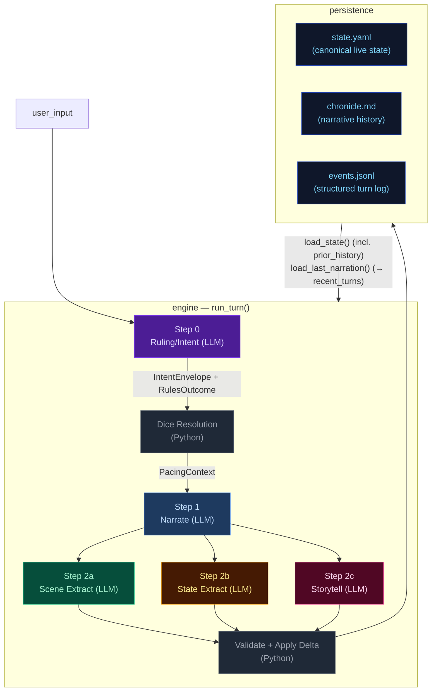

## Pipeline Quick Reference

| Step | Docs | When it runs | Key inputs | Key outputs | Mechanics it owns |
|---|---|---|---|---|---|
| **Step 0 — Ruling/Intent** | [step0-ruling](./step0-ruling.md) | Every turn (always) | `state.pc`, `state.location`, `recent_turns[-1:]`, `user_input` | `IntentEnvelope`, `RulesOutcome` | Intent classification, impossibility check, scene motion determination, dice roll resolution (1d12 + stat + cond − diff → band), difficulty selection, anti-declare-outcome enforcement. When `impossible=true`, no roll occurs and Python synthesizes a `fail` outcome. |
| **Step 1 — Narrate** | [step1-narrate](./step1-narrate.md) | Every turn (always, streamed) | Full `state`, `prior_history` (last 20 bullets, all but last rendered), `recent_turns[-1:]`, `pacing_context`, `pending_gm_beat`, `npc_roster` (from build_npc_roster()), `world_factions/locations` | `narrative` (prose) | Prose generation, dice-band binding, GM-beat consumption. Scene motion shaped by `PacingContext.outcome_hint`; impossible actions narrated as natural failures. |
| **Step 2a — Scene Extract** | [step2a-scene](./step2a-scene.md) | Every turn (always) | `narrative`, `state.pc/location`, `npc_roster` (from build_npc_roster()), conditions, compendium entries | `SceneExtractResult`: scene_tags, tagline, location_change, compendium_npc_update | NPC presence, location changes, scene tags, durable NPC compendium identity. |
| **Step 2b — State Extract** | [step2b-state](./step2b-state.md) | Every turn (always) | `narrative`, `state.pc/location/inventory`, conditions | `StateExtractResult`: inventory_add/remove/update, pc_condition_add/remove | Inventory delta accuracy, condition lifecycle. |
| **Step 2c — Storytell** | [step2c-storytell](./step2c-storytell.md) | Every turn (always) | `narrative`, `_ExtractionContext` (comp_this_turn, location, inventory, conditions), pacing_context, arc.threads[], recent_turns[-10:], band, npc_roster (from build_npc_roster()), recent_beats | `StorytellerResult`: thread_update/goal_update/arc_resolve/resolve/add, gm_beat, world_state_add/remove, actions, outcome_summary | Storyteller-managed thread lifecycle, arc resolution, beat disposition inference, durable history events. |

After Step 2c: results merge into a `StateDelta`, the validator checks constraints
(e.g. `inventory_remove` IDs exist), `apply_delta()` mutates state in-place, and the
turn is persisted. The next turn's Step 0 reads the new `state.yaml` plus `events.jsonl`.

## Subsystem Docs

| Subsystem | Doc | What it covers |
|---|---|---|
| **Step 0 — Ruling** | [step0-ruling](./step0-ruling.md) | Intent classification, dice resolution flowchart, pacing context computation |
| **Step 1 — Narrate** | [step1-narrate](./step1-narrate.md) | Streaming narration pipeline with all context inputs |
| **Step 2a — Scene Extract** | [step2a-scene](./step2a-scene.md) | Location changes, NPC presence, scene tags |
| **Step 2b — State Extract** | [step2b-state](./step2b-state.md) | Inventory and condition extraction |
| **Step 2c — Storytell** | [step2c-storytell](./step2c-storytell.md) | Pipeline mechanics, GM beat lifecycle, campaign arc system, thread lifecycle mechanics |
| **Delta → Validate → Apply** | [delta-validate](./delta-validate.md) | StateMerge schema, validation rules, apply_delta mutations |
| **Persist** | [persist](./persist.md) | Atomic writes (events.jsonl, state.yaml, chronicle.md), readback |
| **Cross-Pipeline Data Flow** | [cross-pipeline](./cross-pipeline.md) | Full inter-step data flow diagram |
| **Out-of-Band Pipelines** | [out-of-band](./out-of-band.md) | Character Creation pipeline, Generate Seed pipeline, turn viewer status colors |
| **Narration UI** | [narration-ui](./narration-ui.md) | Main game interface: SSE streaming, HTMX sidebar refresh, Alpine.js state machine |
| **Turn Viewer UI** | [turn-viewer-ui](./turn-viewer-ui.md) | Pipeline debug UI: turn cards, stage inspector, diff panel, live updates |
| **Eval Harness** | [eval-harness](./eval-harness.md) | Scenario runner, LLM judges, auto-checkers, REPORT.md generation |

## Key Models Glossary

### Core Result Types

- **IntentEnvelope**: `intent`, `intent_verb`, `target`, `check.required`, `check.skill`, `check.difficulty`, `impossible`, `impossible_reason`, `scene_motion`
- **RulesOutcome**: `rolled`, `skill`, `difficulty`, `stat_value`, `stat_mod`, `diff_mod`, `cond_mod`, `dice`, `raw_total`, `final_total`, `band`, `directive`, `intent`, `intent_verb`, `impossible`, `impossible_reason`
- **SceneExtractResult**: `scene_tags`, `scene_tagline`, `location_change`, `compendium_npc_update`
- **StateExtractResult**: `inventory_add/remove/update`, `pc_condition_add/remove`
- **StorytellerResult**: `thread_update` (list[ThreadUpdate]), `goal_update` (str | None, applied directly to arc dict), `arc_resolve` (ArcResolution | None), `thread_resolve` (with outcome sentence), `thread_add`, `gm_beat`, `world_state_add`, `world_state_remove`, `actions`, `outcome_summary`
- **SeedEnvelope**: `seed_state: GameState`, `opening_narrative`, `actions`, `arc: CampaignArc` (includes `goal_context` — UI-only, not rendered in prompts; unified `threads[]` with `progress: list[str]`, `completed_threads[]`)

  The seed owns first-turn emotional framing, not just world and arc scaffolding. It generates `goal_context` (character-specific stake), NPC `relation` fields (narrative job relative to PC), and action text written from the PC's voice and scene pressure — ensuring the opening feels personal and motivated from the start.

### PacingContext (see [step0-ruling](./step0-ruling.md#pacing-context))

### GMBeat (see [step2c-storytell](./step2c-storytell.md#gm-beat))

### CampaignArc (see [step2c-storytell](./step2c-storytell.md#campaign-arc-system))

### StateDelta (see [delta-validate](./delta-validate.md))

Merges all three extraction results. Contains `scene_tags`, `location_change`, `compendium_npc_update` (NPC changes), `thread_update/arc_resolve/thread_resolve/thread_add`, `inventory_add/remove/update`, `pc_condition_add/remove`, `world_state_add/remove`. Note: `gm_beat` is NOT in StateDelta — written directly to `state.meta.pending_gm_beat`.

---


## cross-pipeline


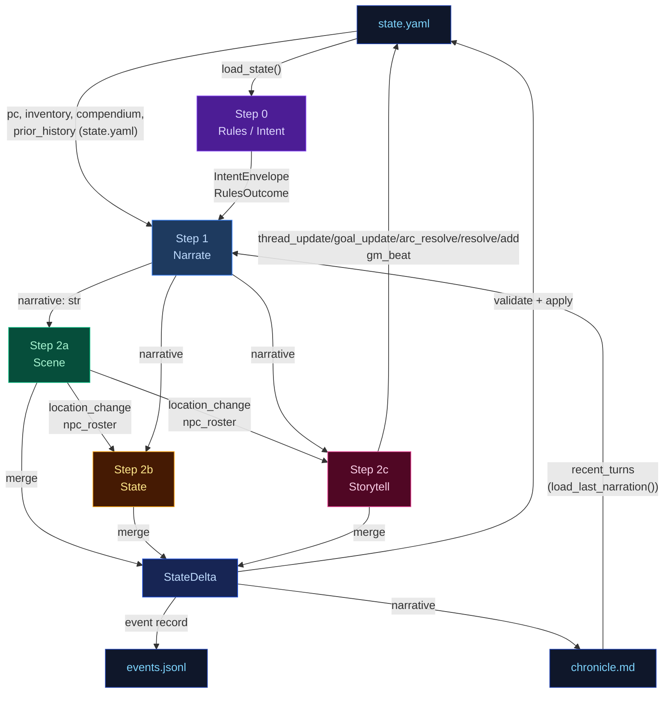

---


## delta-validate


The three extraction results merge into a single `StateDelta`, then validate and apply.

## Flowchart

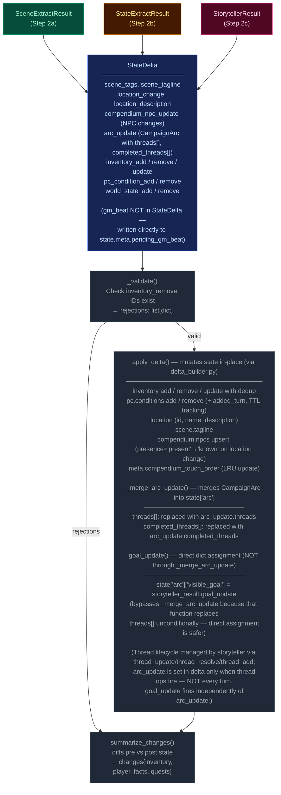

---


## narration-ui


The primary player-facing UI. Renders game state, streams narrative tokens live, and refreshes sidebars via HTMX partial swaps. Single-page app driven by Alpine.js + SSE + HTMX.

## Interaction Model

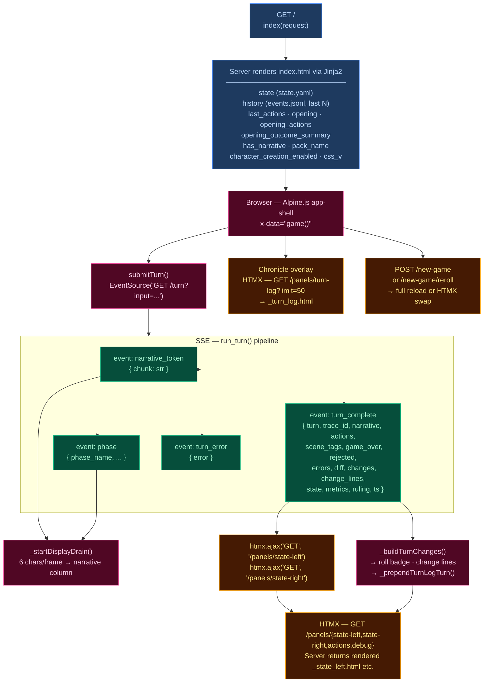

## Layout

| Region | Element | Content |
|--------|---------|---------|
| **Header** | `.header-bar` | Logo/tagline, Chronicle toggle, turn counter, retry button, new game button, reroll button (dynamic packs), mock-mode dot |
| **Left sidebar** | `.sidebar-left` | Player card, scene NPCs, location, arc, compendium — loaded via `/panels/state-left` |
| **Narrative column** | `.narrative-column` | Scrollable narrative blocks, action pills, input textarea, send/stop button |
| **Right sidebar** | `.sidebar` (right) | Inventory, recent events, world state, debug panel — loaded via `/panels/state-right` |
| **Chronicle overlay** | `.turn-log-shell` | Floating overlay over narrative column, populated by `/panels/turn-log?limit=50` |
| **New Game modal** | (Alpine `x-show`) | Pack picker → char creation / world builder steps |

## Data Flow

### Turn submission (Alpine.js + SSE)

1. User types input, presses Enter → `game().submitTurn()`
2. Opens `EventSource` to `GET /turn?input=<text>` — SSE endpoint in `routes.py:83`
3. Server streams events as the 5-stage pipeline (`run_turn()`) executes:
   - `narrative_token` — token chunks streamed as they arrive from LLM
   - `phase` — pipeline phase progress (ruling_start, narrate_start, narrate_first_token, narrate_done, extract_start, extract_done, compact_start, etc.)
   - `turn_complete` — final result
   - `turn_error` — error payload
4. Client `_startDisplayDrain()`: reveals 6 characters per animation frame for smooth streaming
5. On `turn_complete`:
   - Calls `htmx.ajax('GET', '/panels/state-left', ...)` and `htmx.ajax('GET', '/panels/state-right', ...)` to refresh sidebars
   - Renders change lines (`_buildTurnChanges`), roll badge
   - Prepends turn to Chronicle overlay via `_prependTurnLogTurn`
   - Re-renders markdown via `marked.parse()`

### HTMX partial endpoints (routes.py)

| Route | Template | Purpose |
|-------|----------|---------|
| `GET /panels/state-left` | `_state_left.html` | Left sidebar — player, NPCs, location, arc, compendium |
| `GET /panels/state-right` | `_state_right.html` | Right sidebar — inventory, events, world state, debug |
| `GET /panels/actions` | `_actions.html` | Action pills (fallback) |
| `GET /panels/turn-log?limit=N` | `_turn_log.html` | Chronicle — turn history with change lines |
| `GET /panels/pack-picker` | `_pack_picker.html` | New Game — pack selection cards |
| `GET /panels/char-creation` | `_char_creation.html` | New Game — character stats builder |
| `GET /panels/world-builder` | `_world_builder.html` | New Game — world creation form |
| `GET /panels/debug` | `_debug.html` | Debug panel — recent turn timings, errors |
| `GET /panels/state` | `_state.html` | Combined left+right (legacy) |

### Client state machine (`game()` — inline `<script>` in index.html)

Alpine.js `x-data="game()"` manages:
- `input` — textarea value
- `submitting` — turn-in-progress flag
- `gameStarted` — derived from `has_narrative`
- `turnNum` — current turn counter
- `leftWidth` / `rightWidth` — resizable sidebar widths (persisted to `localStorage`)
- Card collapse state — read/written directly from/to `localStorage` via `CCYA_CARD_KEY(name)` helper, using DOM `data-card` attributes; no Alpine data property

## UI Features

### Resizable sidebars
- Drag gutters with mousedown/mousemove handlers
- Widths saved to `localStorage` (`ccya_sidebar_left`, `ccya_sidebar_right`)
- Minimum width enforcement (240px left, 220px right)

### Collapsible cards
Each sidebar section has a collapse toggle; open/closed state persisted per-card to `localStorage` via `ccya_card_<name>` key.

### Action pills
Suggested next actions rendered as buttons that populate the input on click. Updated from `turn_complete.actions` or via HTMX panel refresh.

### Roll badge
Server-rendered for history, JS-built for new turns. Shows dice math, band label, outcome summary. Band colors: `crit_fail` (red) → `fail` → `setback` → `partial` → `success` → `crit_success`.

### Change lines
Grouped by category via emoji prefix:
| Emoji | Category | Class |
|-------|----------|-------|
| 🎒 + | Inventory gain | `.tc-inv-gain` |
| 🎒 − | Inventory loss | `.tc-inv-loss` |
| 🩺 | Player condition | `.tc-pl` |
| 📍 | Location | `.tc-loc` |
| 📜 | Faction/arc | `.tc-fa` |

### Retry
`POST /turn/delete` removes last event from `events.jsonl` and `chronicle.md`, returns previous actions for re-submission.

### New Game
`POST /new-game` with optional `pack_id`, `pc_name`, `pc_stats`, `hints`. For dynamic packs, triggers `generate_seed()` LLM pipeline. Full page reload on success. Reroll (`POST /new-game/reroll`) HTMX-swaps the opening narrative + actions.

## CSS Architecture

- **`app.src.css`** — Tailwind + custom styles split by region (lines 1–2101):
  - App shell layout (CSS Grid: header + body with sidebar-gutter-main-gutter-sidebar)
  - Narrative blocks (`.narrative-block`, `.narrative-text`)
  - Sidebar cards (`.card`, `.card-header`, `.card-body`)
  - Input bar (`.input-bar`, `.game-input`, `.send-btn`)
  - Action pills (`.action-pill`, `.pills-row`)
  - Roll badges (`.roll-badge`, `.roll-band--*`)
  - Chronicle overlay (`.turn-log-shell`, `.turn-log-panel`)
  - New Game modal (`.modal-overlay`, `.pack-card`)
  - Progress strip, tooltips, scrollbar styling
  - Design tokens via CSS custom properties (`--text-primary`, `--bg-card`, `--status-*`)
- Compiled to **`app.css`** with cache-busting via `css_v` query param

## Server Entry Point

`routes.py:57` — `GET /` handler assembles template context from `state.yaml`, `events.jsonl`, pack manifest, and engine config, then renders `ccya/templates/index.html`.

---


## out-of-band


These run only at new-game time or are non-engine concerns. They are excluded from the eval-context region of the main architecture doc.

## Character Creation Pipeline

Triggered by `POST /new-game`. All packs use the Generate Seed pipeline (dynamic). Static packs with pre-built seed_state.yaml exist but are not used by new_game.

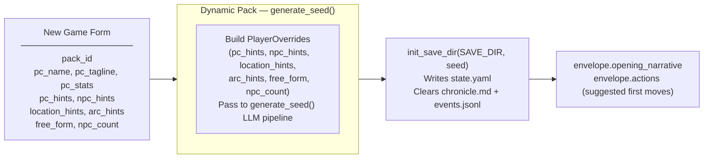

## Generate Seed Pipeline (Dynamic Packs Only)

Called by `POST /new-game` and `POST /new-game/reroll`. Generates a complete starting game state (PC, NPCs, location, arc, opening narrative, actions) from the pack manifest and optional player overrides.

The seed owns **first-turn emotional framing** — not just world and arc scaffolding. Every seed element must produce an emotionally legible opening that answers: why this moment matters now, what the character stands to lose, and why at least one person in the scene matters to them personally.

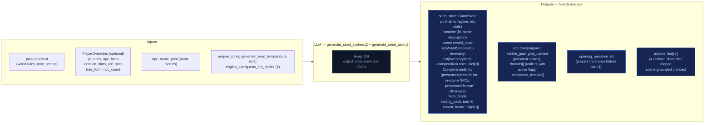

### Seed emotional framing contract

The seed prompt (`generate_seed_system.j2`) enforces these requirements:

- **`goal_context`**: 2–3 sentences explaining why `visible_goal` matters to this character specifically — inner cost or pressure that makes it emotionally loaded. No hidden-truth spoilers, no restating `visible_goal`, no direct statement of the thematic question. Must connect character motive, story stakes, and emotional cost.
- **NPC `relation` field**: Each opening NPC has a defined narrative job. One NPC is personally tied to the PC's motive or vulnerability; the other carries immediate external pressure from the world or conflict. The `relation` field encodes PC-facing relevance (e.g. "owes them a favor", "is their only contact here", "represents the institution pressing on them").
- **Compendium NPCs**: The seed also generates 2–3 NPCs in `compendium.npcs` (name, title, bio) who exist in the world but are not present in the opening scene. Their bios tie them to factions, locations, or world pressures, not to the immediate situation. These become discoverable characters during play.
- **Action guidance**: Each of the 4 choices is written from the PC's point of view, grounded in a present NPC, immediate risk, active thread, or character motive. They differ in emotional posture (confront, deflect, investigate, protect, exploit, withdraw, etc.) and avoid generic verbs.
- **`threads[]`**: Unified list (not split active/latent) where each thread has `{id, summary, urgency, scope}` and an `active` boolean flag managed by the storyteller via `thread_update`, not Python age rules. Threads have a `progress: list[str]` field — append-only log of progress updates set via `thread_update[].progress`, never replaced. Also includes `last_updated_turn: int | None` for urgency decay tracking.

## Turn Viewer — status colors

The standalone turn viewer ([turn-viewer-ui](./turn-viewer-ui.md)) uses the same semantic status colors as the CSS custom properties in `static/app.src.css` (`--status-*`). The stage colors used in the diagrams above (`stageRules` violet → `stageNarrate` blue → `stageScene` green → `stageState` amber → `stageProgress` pink) map directly to the `--stage-*` tokens. Cross-stream inputs into a step are shown in `xstream` (purple outline) and LLM/Python boxes use neutral dark fills. This table is the canonical turn-viewer status legend.

| Token | Meaning |
|-------|---------|
| `--status-ok` | Stage ran and completed (no extraction error). |
| `--status-skipped` | Stream was skipped (no longer used — all streams always run). |
| `--status-retried` | LLM output required a parse retry (`attempts` > 1 in event). |
| `--status-rejected` | Post-extract validation rejected part of the delta (e.g. bad `inventory_remove`). |
| `--status-error` | LLM call or parse ultimately failed for that stream. |
| `--status-neutral` | Non-fatal / informational (e.g. rules path with no dice roll). |

Stage accent stripes use `--stage-rules`, `--stage-narrate`, `--stage-scene`, `--stage-state`, `--stage-progress` for quick scanning; **status** always wins for the prominent left border.

---


## persist


Atomic writes to disk. No LLM calls.

## Flowchart

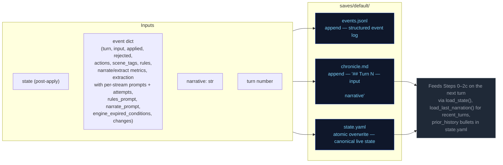

---


## step0-ruling


Classifies the player's action, determines whether a dice check is needed, and
identifies which state domains will be active — narrowing every downstream extractor.

## Flowchart

```mermaid
flowchart LR
    classDef stageRules fill:#4c1d95,color:#ddd6fe,stroke:#7c3aed
    classDef llmNode    fill:#0f172a,color:#94a3b8,stroke:#334155
    classDef pyNode     fill:#1f2937,color:#9ca3af,stroke:#4b5563
    classDef outNode    fill:#3b0764,color:#e9d5ff,stroke:#7c3aed

    subgraph IN["Inputs"]
        I1["state.pc<br>(name, stats, conditions)"]
        I2["state.location"]
        I3["recent_turns[-1:]<br>(last turn's full narrative from chronicle.md<br>via load_last_narration();<br>ruling user prompt)"]
        I4["user_input"]
    end

    subgraph LLM0["LLM — ruling_system.j2 + ruling_user.j2"]
        L0["temp: 0.2 · max_retries: 1<br>output: IntentEnvelope JSON<br>(intent, impossible, scene_motion, check)"]:::llmNode
    end

    subgraph PYRES["Python — impossible check + rules.resolve_check()"]
        P0["if impossible=true:<br>  synthesize fail outcome<br>  skip roll, apply momentum<br>else:<br>  roll 1d12 + stat_mod + cond_mod − diff_mod<br>  map total → Band"]:::pyNode
    end

    subgraph OUT["Outputs"]
        O1["IntentEnvelope<br>  intent: str<br>  intent_verb: str<br>  target: str<br>  impossible: bool<br>  impossible_reason: str<br>  scene_motion: hold|advance|transition<br>  check.required: bool<br>  check.skill: SkillName<br>  check.difficulty: Difficulty"]:::outNode
        O2["RulesOutcome<br>  rolled: bool<br>  skill, difficulty, stat_value, stat_mod<br>  diff_mod, cond_mod<br>  dice: list[int]<br>  raw_total, final_total: int<br>  band: Band<br>  directive: str<br>  intent, intent_verb: str<br>  impossible: bool<br>  impossible_reason: str"]:::outNode
    end

    IN --> LLM0
    LLM0 -- "IntentEnvelope" --> PYRES
    PYRES --> OUT
```

## Impossibility check

The ruling LLM evaluates whether the described action is impossible given the character's state, inventory, and scene. An action is impossible when:

- It requires an item the character does not have (firing a gun with no ammo, using a key never acquired)
- It requires a capability contradicted by active conditions (climbing with a broken leg, sneaking while armored and noisy)
- It acts on something not present in the scene (targeting an NPC who is not here, opening a door that doesn't exist)

When `impossible=true`: Python sets `check.required=False`, synthesizes a `RulesOutcome` with `band="fail"` and `rolled=False`, applies momentum, and skips the dice roll entirely. The narrator renders the impossible fact and narrates the natural failure.

## Scene motion

The ruling LLM also determines how the scene should progress: `"hold"` (scene continues at current pace), `"advance"` (something significant happens/resolves), or `"transition"` (player is leaving, write the arrival). This feeds into `_compute_pacing_context()` which produces `outcome_hint` for the narrator.

## Key forward dependency

`rules_outcome` feeds into `_compute_pacing_context()` which produces the single authoritative `PacingContext` struct passed to both Narrator and Storytell pipeline.

## Pacing Context

All pacing signals are collapsed into one Python-computed struct (`PacingContext`) passed to both the Narrator and Storytell pipeline. This replaces six independent fields (`narration_directive`, `deescalate`, `narrative_velocity`, `beat_disposition` output, `quest_threshold_directive`, and stale momentum-derived signals). The narrator receives `outcome_hint` (scene motion); Storytell receives the full struct including `directive`.

### Struct definition

```
PacingContext:
  directive: str           # "" | "Breathe" | "Scene Imperative" | "Overwhelm" | "Pressure" | "Tension" | "Scene Pressure" (may include "; Resolve a Threat" secondary when beat_locked); used by Storytell pipeline
  outcome_hint: str | None # "hold" | "advance" | "transition" — narrator's primary scene motion instruction
  beat_locked: bool        # True: consecutive pressure threshold reached or momentum at floor — enables floor relief injection and appends "; Resolve a Threat" to directive
  gate: str                # "block_escalate" | "allow" (controls thread_add); set independently from beat_locked via deescalate >= 0.5
  summary: str             # human-readable log string, never sent to LLM
```

`beat_locked: True` fires when either `consecutive_pressure_turns >= config.consecutive_pressure_threshold` OR `momentum <= config.momentum_floor`. When locked, `"Resolve a Threat"` is appended to the directive via semicolon. The `gate` field prevents Progress from adding new threads during de-escalation windows.

### Computation

`_compute_pacing_context()` in `engine/turn.py` consolidates pacing computation (replacing the former scattered functions: `_compute_narration_directive`, `_compute_narrative_velocity`, `_check_floor_relief`). It takes inputs (`momentum`, `consecutive_pressure_turns` from state meta, `arc.threads[] scope=scene urgency counts`) and returns a single struct with directive derived from a priority stack. It also computes `outcome_hint` from the ruling LLM's `scene_motion` and PacingContext escalation signals: ruling `scene_motion` takes priority (`transition` > `advance` > fallback), then `impossible=true` forces `advance`, then Python escalation signals (`beat_locked`, Overwhelm/Pressure with urgent threads) produce `advance`, defaulting to `hold`.

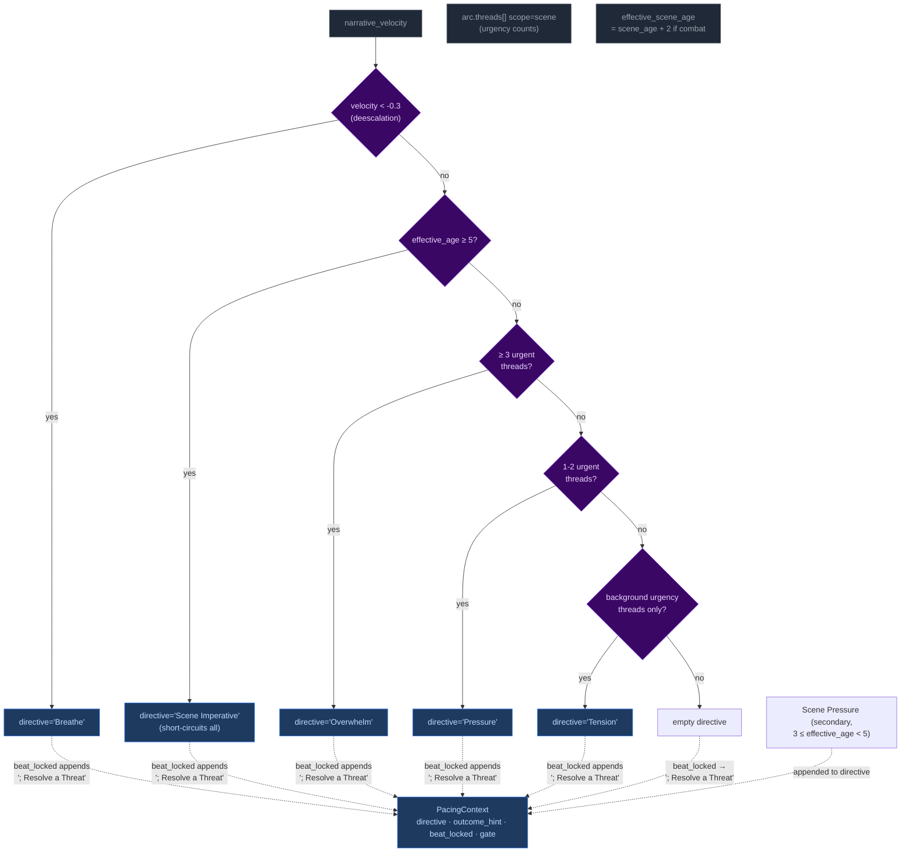

Priority order (highest to lowest): **Breathe > Scene Imperative > Overwhelm > Pressure > Tension > Scene Pressure**. The `beat_locked` flag fires when either consecutive pressure threshold or momentum floor is reached — `"Resolve a Threat"` is appended to the directive and `outcome_hint` is set to `"advance"`. The gate is NOT affected by beat_locked (set independently by deescalate ≥ 0.5).

**Breathe secondary guard:** The Breathe directive has an additional check beyond velocity: if urgent scene-scoped threads exist, Breathe is NOT emitted even if `narrative_velocity < -0.3`. Low velocity during unresolved tension (tactical avoidance, stealth) does not trigger de-escalation. Once urgent threads resolve, Breathe fires on the next low-velocity turn.

#### Age computation

`_compute_ages(state)` returns only `{"scene_age": scene_age}` — location_age and combat_age removed in Phase 03 pacing overhaul. The ruling phase pre-computes `effective_scene_age = scene_age + 2` when `"combat"` is in scene tags, stored in `ctx._ages["effective_scene_age"]`. This single-age signal drives all directive thresholds:
- Scene Imperative (≥5 effective age): high-priority directive forcing story advancement
- Scene Pressure (3 ≤ effective_age < 5): secondary append to wind down or shift focus

### Wiring

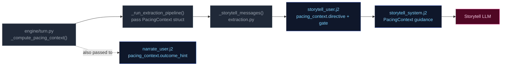

1. **Computed** once in `run_turn()` via `_compute_pacing_context()`.
2. **Passed through** `_run_extraction_pipeline()` → both `_narrate_messages()` and `_storytell_messages()`.
3. **Narrator template** (`narrate_user.j2`) renders `outcome_hint` (scene motion: hold/advance/transition) with value-specific guidance. No Jinja2 pacing computation remains — all pacing computed by Python.
4. **Storytell template** ((`storytell_system.j2` + `user.j2`)) receives the full struct; guidance maps each directive to appropriate thread/beat actions:

| Directive | Thread action | Gate |
|-----------|---------------|-------|
| **"Breathe"** (de-escalation, velocity < -0.3) | Do NOT add new threads. Allow existing scene threads to persist without escalation. | `block_escalate` (set by deescalate ≥ 0.5; beat_locked does NOT force-close gate) |
| **"Scene Imperative"** (effective_age ≥ 5) | Story must advance — introduce new development forcing resolution or movement; do not linger | Varies by context |
| **"Overwhelm"** (3+ urgent threads) | May add scene-scoped threads if gate allows; emit pressure/escalation beat | `allow` |
| **"Pressure"** (1-2 urgent threads) | Advance relevant scene/arc threads. Add new thread only if gate permits. | Varies by context |
| **"Tension"** (background urgency only) | Do NOT add pressures unless concrete threat emerges; prefer advancing existing threads | Allow |
| **"Scene Pressure"** (3 ≤ effective_age < 5, secondary append) | Begin winding down or introduce reason to shift focus: development elsewhere, closing window | Varies by context |
| **"" (empty)** | No action required beyond normal aging of silent threads. | Allow |

**Note:** Directives may include secondary modifiers joined by semicolons (e.g., "Pressure; Resolve a Threat" when beat_locked). The primary directive drives thread/beat logic; the secondary (`; Resolve a Threat`) acts as thematic guidance for beat type selection. "Resolve a Threat" never appears as a standalone primary directive — it is only appended by the `beat_locked` mechanism.

### Consecutive pressure counter

`state["meta"]["consecutive_pressure_turns"]` tracks how many consecutive turns have had pressure-type storyteller beats. Re-keyed from directive tracking (which never fired — Pressure/Overwhelm directives were unreachable) to beat-type tracking:

- **Increments** when `storyteller_result.gm_beat.type` is `"pressure"`, `"escalation"`, or `"complication"`.
- **Resets to 0** on any other beat type, null beat, or missing storyteller output.

When this counter reaches `config.consecutive_pressure_threshold` (default 3), it triggers `beat_locked` alongside the momentum floor fallback (`momentum <= -3`). `beat_locked` appends `"; Resolve a Threat"` to the directive and enables floor relief injection.

---


## step1-narrate


Generates the narrative prose the player reads. Tokens are streamed to the client.

## Flowchart

```mermaid
flowchart LR
    classDef llmNode   fill:#0f172a,color:#94a3b8,stroke:#334155
    classDef xstream   fill:#4c1d95,color:#ddd6fe,stroke:#7c3aed
    classDef outNode   fill:#1e3a5f,color:#bfdbfe,stroke:#3b82f6

    subgraph IN["Inputs"]
        N1["state (full —<br>pc, location, scene,<br>inventory, compendium)"]
        N2["prior_history<br>(last 20 incremental history bullets, all but last rendered as bullets)"]
        N3["recent_turns[-1:]<br>(single most recent turn as full text)"]
        N4["rules_outcome<br>(band, directive, impossible, dice summary)"]:::xstream
        N6["npc_name_pool (cultural name list)"]
        N7["npc_roster<br>(from build_npc_roster(comp),<br>  presence field: present/nearby/known)"]
        N9["world_factions<br>(immutable trace)"]:::xstream
        N10["pending_gm_beat<br>(type · surface_as metadata)"]
        N11["pacing_context<br>(outcome_hint)<br>from _compute_pacing_context()"]:::xstream
        N15["user_input"]
    end

    subgraph LLM1["LLM — narrate_system.j2 + narrate_user.j2"]
        NL["temp: 0.9 · streaming: yes<br>output: prose narrative (str)"]:::llmNode
    end

    subgraph OUT["Outputs"]
        NO1["narrative: str<br>(streamed as tokens → client<br>then joined + thinking-stripped)"]:::outNode
        NO2["narr_metrics<br>  first_token_ms<br>  total_ms<br>  tokens_in / tokens_out"]
    end

    IN --> LLM1
    LLM1 --> OUT
```

## Arc context in narration

The narrator receives `current_arc` in both system and user prompts. Key fields:

- **`goal_context`**: A seed-time field (2–3 sentences) explaining why `visible_goal` matters to the character specifically — inner cost or pressure that makes it emotionally loaded. UI-only (surfaced as tooltip on the arc goal in the sidebar). NOT rendered in prompt context — the narrator works from general early-turn behavioral guidance in the system prompt, not from the raw `goal_context` value.
- **`visible_goal`**: The player-facing objective.
- **`threads[]`**: Unified thread collection filtered by `active` flag. Scene-scope threads provide immediate pressure; arc-scope threads provide medium-term tension.
- **`resolved_arc`**: TTL-filtered list of previously resolved arcs, providing narrative continuity across arc transitions.

### Opening-turn narrative mode

The seed embeds emotional stakes in the initial state — NPC `relation` fields, `motivation/fear/leverage`, and a `goal_context` sidebar entry. The narrator does NOT receive special early-turn prompt guidance or `goal_context` in its context. Instead, the initial scene's NPCs (with rich behavioral drivers), the opening narrative's tone, and the player-facing sidebar create the onboarding experience. The narrator works from its standard behavioral guidance and the richness of seed-generated state.

## Key forward dependency

`narrative` is the primary content input for all three extraction streams below.

### GM Beat consumption

The narrator receives a pending GM beat from `state.meta.pending_gm_beat` (set by Storytell in the previous turn). The beat's `type` and `surface_as` metadata are passed alongside the pacing directive as creative guidance for the narrative. The beat is NOT cleared after narration — it persists through the extraction phase. After extraction completes, Storytell replaces it with a new beat or pops it on null output. Full beat lifecycle is documented in [step2c-storytell](./step2c-storytell.md#gm-beat).

---


## step2a-scene


Extracts location changes, NPC presence, scene tags, and suggested actions from the narrative.

## Flowchart

```mermaid
flowchart LR
    classDef llmNode fill:#0f172a,color:#94a3b8,stroke:#334155
    classDef xstream fill:#4c1d95,color:#ddd6fe,stroke:#7c3aed
    classDef outNode fill:#064e3b,color:#a7f3d0,stroke:#10b981

    subgraph IN["Inputs"]
        S1["narrative (from Step 1)"]:::xstream
        S2["state.pc (name, tagline, bio, stats)"]
        S3["state.location"]
        S4["compendium.npcs[presence='present']"]
        S5["state.pc.conditions"]
        S6["npc_roster<br>(from build_npc_roster(), filtered by presence field)"]
        S7["recent_turns[-1:]<br>(T-1 prior narration)"]
    end

    subgraph LLM2A["LLM — extract_scene_system.j2 + extract_scene_user.j2"]
        SL["temp: 0.4 · max_retries: 1<br>output: SceneExtractResult JSON"]:::llmNode
    end

    subgraph OUT["Outputs — SceneExtractResult"]
        O1["scene_tags: list[str]"]:::outNode
        O2["scene_tagline: str (3–6 words for UI header)"]:::outNode
        O3["location_change: LocationRef | None<br>  id, name, description"]:::outNode
        O4["location_description: str | None"]:::outNode
        O5["compendium_npc_update<br>  durable identity changes (presence, notes, bio upserts)"]:::outNode
    end

    IN --> LLM2A
    LLM2A --> OUT
```

## Key forward dependency

`location_change` flows into `extraction_ctx` (built by `_build_extraction_context`). Step 2c also receives `npc_roster` (from build_npc_roster()) built from comp_this_turn. No forward-facing mechanics (`thread_add`, `gm_beat`) are emitted by this stream — they go through the unified thread lifecycle via Storytell (Step 2c).

---


## step2b-state


Extracts inventory changes and player condition mutations from the narrative.

## Flowchart

```mermaid
flowchart LR
    classDef llmNode fill:#0f172a,color:#94a3b8,stroke:#334155
    classDef xstream fill:#4c1d95,color:#ddd6fe,stroke:#7c3aed
    classDef outNode fill:#451a03,color:#fde68a,stroke:#f59e0b

    subgraph IN["Inputs"]
        S1["narrative (from Step 1)"]:::xstream
        S2["state.pc (name, bio, stats, conditions)"]
        S3["state.location"]
        S4["state.inventory"]
        S5["intent: str<br>(from Step 0)"]
    end

    subgraph LLM2B["LLM — extract_state_system.j2 + extract_state_user.j2"]
        SL["temp: 0.4 · max_retries: 1<br>output: StateExtractResult JSON"]:::llmNode
    end

    subgraph OUT["Outputs — StateExtractResult"]
        O1["inventory_add: list[InventoryItem]<br>  id, name, notes, amount"]:::outNode
        O2["inventory_remove: list[InventoryRemove]<br>  id, amount (None = full stack)"]:::outNode
        O3["inventory_update: list[InventoryUpdate]<br>  id, name?, notes?"]:::outNode
        O4["pc_condition_add: list[ConditionAdd]<br>  id, label, description"]:::outNode
        O5["pc_condition_remove: list[ConditionRemove]<br>  id"]:::outNode
    end

    IN --> LLM2B
    LLM2B --> OUT
```

## Key forward dependency

Step 2c receives `npc_roster` (from build_npc_roster()) and `location_change` from Step 2a. Cross-stream items_gained/lost were removed — extraction_ctx now covers all this-turn derived data.

---


## step2c-storytell


Extracts thread updates, arc actions, world state changes, and durable NPC compendium changes.

## Flowchart

```mermaid
flowchart LR
    classDef llmNode fill:#0f172a,color:#94a3b8,stroke:#334155
    classDef xstream fill:#4c1d95,color:#ddd6fe,stroke:#7c3aed
    classDef outNode fill:#500724,color:#fbcfe8,stroke:#ec4899

    subgraph IN["Inputs"]
        S1["narrative (from Step 1)"]:::xstream
        S2["_ExtractionContext<br>(comp_this_turn, location,<br>inventory, conditions)<br>built by _build_extraction_context()"]:::xstream
        S3["npc_roster<br>(from build_npc_roster())"]:::xstream
        S4["pacing_context<br>(directive · gate · beat_locked)"]:::xstream
        S5["arc.threads[]<br>(unified scope=scene + scope=arc)"]:::xstream
        S6["rules_outcome"]:::xstream
        S7["intent (from Step 0)"]:::xstream
        S8["recent_turns[-10:]<br>(prior narration, last 10 turns)"]:::xstream
        S9["prior_history[:-1]<br>(all history bullets except last,<br>already shown as full text)"]:::xstream
        S10["recent_beats<br>(beat history for diversity)"]:::xstream
    end

    subgraph LLM2C["LLM — storytell_system.j2 + storytell_user.j2"]
        SL["temp: 0.4 · max_retries: 1<br>output: StorytellerResult JSON"]:::llmNode
    end

    subgraph OUT["Outputs — StorytellerResult"]
        O1["thread_update: list[ThreadUpdate]<br>  id + urgency/active/summary/progress changes"]:::outNode
        O1b["goal_update: str | None<br>  new visible_goal, mid-arc pivot<br>  applied directly to arc dict"]:::outNode
        O1c["arc_resolve: ArcResolution | None<br>  resolution, visible_goal,<br>goal_context, drop_threads, new_threads"]:::outNode
        O2["thread_resolve: list[ThreadResolution]<br>  id + resolution_state<br>(resolved/failed/abandoned)"]:::outNode
        O3["thread_add: ArcThread | None<br>  new thread, gated by PacingContext.gate"]:::outNode
        O4["world_state_add: list[WorldStateFact]<br>  id, text, tier"]:::outNode
        O5["world_state_remove: list[str]<br>  ids to remove from persistent tier"]:::outNode
        O6["actions: list[str]<br>  exactly 4 suggested player choices"]:::outNode
        O7["outcome_summary: str<br>  1–2 sentence narrative recap"]:::outNode
        O8["gm_beat: GMBeat | None<br>  forward-facing storytelling beat"]:::outNode
    end

    IN --> LLM2C
    LLM2C --> OUT
```

## Always runs

Storytell is the post-narration storytelling brain. It always executes every turn (never skipped) and feeds next turn's rules call via `world_state_add/remove` (persistent world facts), `thread_update/goal_update/arc_resolve/thread_resolve/thread_add` (storyteller-managed thread lifecycle), and `gm_beat` (forward-facing beats stored in `state.meta.pending_gm_beat`).

## GM Beat

Forward-facing storytelling beats that shape scene progression across turns. Beats are emitted by Storytell (Step 2c), consumed by Narrator (Step 1) the following turn, and managed via a write/expiry lifecycle in `state.meta.pending_gm_beat`.

### GMBeat Schema

```
GMBeat
  type: complication | revelation | opportunity | breathing_room | pressure | twist | setback | escalation | callback
  surface_as: ambient | event | npc_behavior | environmental | player_discovery | item (default: ambient)
  beat_expires_turn: int | None — turn number at which the beat expires; set to turn_no + 2 when stored
```

**Validation:** Only `type` is validated by `StorytellerResult._nullify_invalid_gm_beat` — nullified if type is falsy or not in the valid set. No validation on `surface_as`. Python accepts whatever gm_beat the LLM emits with no correction or override.

### PacingContext Beat Fields

The beat system intersects with pacing via two fields in `PacingContext` (see [step0-ruling](./step0-ruling.md#pacing-context)):

| Field | Type | Meaning |
|-------|------|---------|
| `directive` | str | May include secondary modifier `"; Resolve a Threat"` when `beat_locked=True`. Drives storytell guidance for beat type selection. |
| `beat_locked` | bool | True when either `consecutive_pressure_turns >= threshold` OR `momentum <= momentum_floor`. When locked, `"Resolve a Threat"` is appended to the directive. Enables floor relief to inject a breathing_room beat if the storyteller is stuck in a pressure-type loop. |

### Beat Lifecycle — Turn Sequence

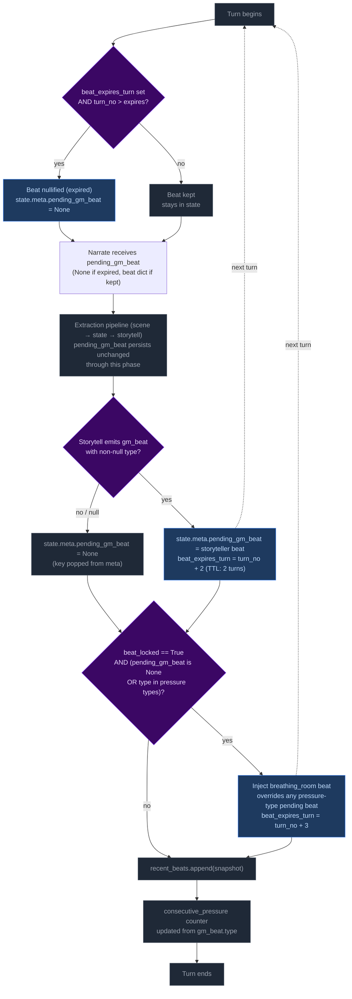

**Step 1 — Pre-narration expiry check.** At the start of each turn, the engine reads `state.meta.pending_gm_beat` from the previous turn. If `beat_expires_turn` is set and the current turn number exceeds it, the beat is nullified (key set to None). Otherwise it proceeds to narration.

Note: This expiry runs early enough that the beat is gone before the extraction phase begins. This is intentional — it creates clean state for floor relief to inject breathing_room if `beat_locked` is active and storyteller doesn't provide its own non-pressure beat. Without the pre-narration expiry, a stale expired beat could block floor relief's null check.

**Step 2 — Narration consumption.** The beat is passed to the narrator via `_narrate_messages(pending_gm_beat=...)`. The narrator uses the beat's `type` and `surface_as` metadata as creative guidance alongside the pacing directive. The beat is NOT cleared after narration — it persists through the extraction phase.

**Step 3 — Storytell writes or clears the beat.** After extraction completes:
- If Storytell emits a valid `gm_beat` (non-null `type`): replaces `pending_gm_beat` with `beat_expires_turn = turn_no + 2`.
- If Storytell emits `null` or an invalid beat: pops `pending_gm_beat` from state (null-clear). The old beat does NOT carry forward.

**Step 4 — Floor relief injection.** After delta apply, if `beat_locked=True` AND the current `pending_gm_beat` is either `None` or a pressure-type (`pressure`, `escalation`, `complication`): injects a `breathing_room` beat with `beat_expires_turn = turn_no + 3`. This overrides pressure-type beats that would otherwise continue the pressure cycle, but does NOT override non-pressure beats the storyteller independently produced (e.g., `revelation`, `opportunity`, `breathing_room`).

**Step 5 — Beat history snapshot.** `pending_gm_beat` is appended to `state.meta.recent_beats` (capped at 5 entries). The snapshot is taken after any floor relief override, so it reflects the beat the next turn's narrator will consume.

**Step 6 — Consecutive pressure counter update.** The counter increments on pressure-type beats and resets to 0 otherwise.

### Floor Relief Injection

The floor relief mechanism fires after delta apply when `_pc.beat_locked=True` AND the current `pending_gm_beat` is either `None` or a pressure-type beat (`pressure`, `escalation`, `complication`). It injects a `breathing_room` beat with TTL of 3 turns (one more than storyteller-emitted beats' TTL of 2).

Floor relief is a **fallback override** — it breaks a pressure-type run by force-injecting recovery:
- If Storytell emitted a pressure-type beat → floor relief overrides it with breathing_room.
- If Storytell emitted a non-pressure beat (revelation, opportunity, breathing_room, etc.) → floor relief lets it stand. Relief is already being achieved.
- If Storytell emitted nothing (null) → floor relief injects breathing_room. This is appropriate: after a null turn with beat_locked active, relief is needed.

### Directive-Beat Alignment

The storyteller prompt (`storytell_system.j2`, pacing context guidance section) maps each PacingContext directive to recommended beat types (e.g., "Breathe" → breathing_room; "Scene Imperative" → advance story; "Overwhelm" → pressure/escalation). This alignment is **guidance only** — Python accepts whatever gm_beat the LLM emits with no validation, correction, or override. Design rationale: forcing directive-beat alignment would constrain storytelling flexibility and create brittleness if the LLM makes contextually appropriate but directive-divergent beat choices.

### Beat History

`state.meta.recent_beats` stores the last 5 beats (including null entries) with `turn`, `type`, and `surface_as`. This history is rendered in both the storyteller system prompt (behavioral guidance) and the user prompt (current-turn context, more salient). Each entry shows `T{N}: {BEAT TYPE} (surface)` or `T{N}: No beat emitted this turn`.

The LLM uses this history to follow beat diversity guidance: avoid repeating the same type more than twice in a sequence; at least one in three beats should be a non-pressure type.

### TTL Mechanics Summary

| Source | Default TTL | Expiry Calculation |
|--------|-------------|-------------------|
| Storytell-emitted beat | 2 turns | `beat_expires_turn = turn_no + 2` |
| Floor relief (Python-injected) | 3 turns | `beat_expires_turn = turn_no + 3` (extra recovery margin) |

### Null-Clear Behavior

When Storytell emits a null beat (or an invalid beat whose type is nullified), `pending_gm_beat` is popped from `state.meta`. The beat does NOT carry forward. This replaced the old carryover behavior where stale beats persisted through null turns.

The storyteller user prompt always renders the GM Beat section — on null-following turns it shows "No beat currently carried over from the previous turn. Choose freely." This ensures the LLM has consistent beat awareness on every turn.

### GM Beat Section in UI

The storyteller user prompt renders the `## GM Beat` section unconditionally:
- **Beat present:** Shows type, surface_as, expiration turn.
- **No beat:** Shows fallback text — "No beat currently carried over from the previous turn. Choose freely."

This was changed from the previous conditional rendering (where the section vanished on ~38% of turns), ensuring full beat awareness coverage.

## Campaign Arc System

The campaign arc system tracks story threads across turns. Thread state is **storyteller-managed** — the LLM explicitly controls urgency, progress, and goal direction via `thread_update` and `goal_update` directives. The engine applies these without enforcement of caps, cooldowns, or silent timers.

### Arc Data Model

```
CampaignArc
  visible_goal: str          — What the PC is trying to achieve
  goal_context: str          — 2–3 sentences explaining why visible_goal matters (UI-only; not rendered in prompts)
  threads: list[ArcThread]   — Unified collection with active flag
  completed_threads: list[ArcThread] — Resolved/failed/abandoned threads
  resolution: str | None     — Set when arc is resolved via arc_resolve
  last_thread_created_turn: int — Tracks when a thread was last created for pacing

ArcThread
  id: str                    — Unique identifier
  summary: str               — What this thread is about
  scope: Literal["scene", "arc"]  # scene = short-lived, purged on location change; arc = persistent story tension
  active: bool = True        # Storyteller-controlled via thread_update
  urgency: Literal["background", "normal", "urgent"] = "normal"  # Storyteller-controlled
  progress: list[str] = []   — Append-only log of progress updates (CHANGED from single-string overwrite)
  resolution_state: str | None # Set when thread_resolve processes resolved/failed/abandoned
  outcome: str | None        # Set from ThreadResolution.outcome when moved to completed_threads
  resolved_turn: int | None  — Turn when thread was resolved; used for TTL filtering in prompts

  # NOTE: last_updated_turn (int | None) is NOT a Pydantic field on ArcThread.
  # It is injected at the dict level in _apply_thread_updates() and in the rendering
  # pipeline (extraction.py, narrate.py). The _thread_list.j2 template references
  # t.last_updated_turn — this works because the dicts passed to templates have been
  # augmented with this key. It tracks when the thread was last mutated for urgency
  # decay guidance (rendered as "turns since last update").
```

### Engine-Driven Arc

Thread lifecycle runs in `engine/turn.py` during the extraction phase. Six operations handle arc/thread state in strict order:

```mermaid
flowchart TD
    classDef pyNode fill:#1f2937,color:#9ca3af,stroke:#4b5563
    classDef arcNode fill:#3b0764,color:#e9d5ff,stroke:#7c3aed

    PR["StorytellerResult<br>thread_update: list[ThreadUpdate]<br>goal_update: str | None<br>arc_resolve: ArcResolution | None<br>thread_resolve: list[ThreadResolution]"]:::pyNode

    subgraph UPDATES["_apply_thread_updates()"]
        U1["For each ThreadUpdate:<br>Find thread by id → apply<br>active/urgency/summary/progress changes<br>progress is append-only (list[str])<br>Sets last_updated_turn = current turn"]
    end

    subgraph GOAL["goal_update (direct dict assignment)"]
        G1["If storyteller_result.goal_update is set:<br>state['arc']['visible_goal'] = value<br>Direct assignment, NOT through _merge_arc_update<br>(which would wipe threads[])"]
    end

    subgraph CONFLICT["Same-turn conflict detection"]
        C1["If same thread id appears in both<br>thread_update and thread_resolve:<br>log WARNING (LLM error)<br>resolution wins (fires after update)"]
    end

    subgraph RESOLVE["_apply_arc_resolve()"]
        R1["Store current arc in resolved_arcs<br>with resolved_turn for TTL tracking"]
        R2["Auto-close arc-scoped threads with 'superseded' state<br>Carry forward scene-scoped threads (minus drop_threads)"]
        R3["Add new_threads from resolution"]
        R4["Create successor arc with<br>new visible_goal, goal_context,<br>surviving scene-scoped + new threads"]
    end

    subgraph RESOLUTIONS["_apply_thread_resolutions()"]
        S1["For each ThreadResolution:<br>Move ArcThread to completed_threads<br>Set resolution_state, outcome, resolved_turn"]
    end

    subgraph GATE["Thread add gate"]
        T1["PacingContext.gate == 'allow'?<br>If blocked: log debug, skip add<br>Gate status rendered in prompt<br>(no silent drops)"]
        T2["ID collision? Thread id in existing_ids<br>or completed_ids → reject"]
    end

    PR --> UPDATES --> GOAL --> CONFLICT --> RESOLVE --> RESOLUTIONS --> GATE

    GATE -- "CampaignArc" --> ARC[arc state in<br>state.yaml]:::arcNode
```

**Pipeline order:** thread updates → goal_update (dict assignment) → conflict detection → arc resolution → thread resolutions → thread_add gate.

**Key rules:**
- **Storyteller-controlled:** No caps, cooldowns, or silent timers. The storyteller decides which threads to update, when to shift the visible_goal, and when to resolve the arc.
- **goal_update:** A bare string applied directly to `state["arc"]["visible_goal"]` via dict assignment. Does NOT route through `_merge_arc_update` (which replaces `threads[]` unconditionally — passing a bare CampaignArc would wipe the thread list). Applied before arc_resolve; if both fire on the same turn, arc_resolve wins (ending the arc supersedes a mid-arc update).
- **Same-turn conflict detection:** When the same thread id appears in both `thread_update` and `thread_resolve` in a single output, a WARNING is logged. The processing order (update before resolve) means resolution takes precedence — correct behavior, but this is always an LLM error worth monitoring.
- **Arc resolution:** When `arc_resolve` is emitted, the current arc is stored in `state["resolved_arcs"]` with `resolved_turn` for TTL tracking. Arc-scoped threads are auto-closed with 'superseded' state; scene-scoped threads carry forward (minus any in drop_threads). The successor arc starts with empty `threads[]`.
- **Scene-scoped threads:** Purged from state on location change (delta_builder.py) before the arc director re-derives.
- **TTL-based cleanup:** Completed threads and resolved arcs are pruned from prompt context after `completed_thread_ttl` / `resolved_arc_ttl` turns (default 3).

### Arc Context in Narration

The arc state is passed to the narrator via `current_arc` in both system and user prompts. `goal_context` is present in the model but only surfaced in the player UI (tooltip/description text) — the pipeline and prompts never read it directly. The narrator sees arc metadata including resolved arcs (TTL-filtered) and completed threads.

### Arc System Integration Points

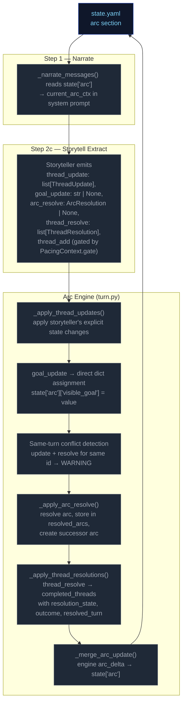

### Thread Mechanics

#### Two Thread Scopes

Threads have a `scope` field (`"scene"` or `"arc"`) that determines narrative treatment:

| Scope | Narrative role | Engine lifecycle |
|---|---|---|
| `scene` | Short-lived tension tied to current location/NPCs | **Purged on location change** — removed from `arc.threads[]` when player moves to a new location (delta_builder.py). |
| `arc` | Persistent story tension across scenes | Persists across location changes. Only removed via `thread_resolve` or auto-closed on arc_resolve (state `"superseded"`). |

#### Entry Points

Six call sites in `run_turn()` process arc/thread operations in order:
1. **`_apply_thread_updates()`** — apply storyteller's explicit state changes; progress is append-only (`list[str]`); sets `last_updated_turn`
2. **`goal_update`** — direct dict assignment to `state["arc"]["visible_goal"]`
3. **Same-turn conflict detection** — warn if same thread id in both update and resolve
4. **`_apply_arc_resolve()`** — resolve arc, store in resolved_arcs, create successor
5. **`_apply_thread_resolutions()`** — resolve/fail/abandon → completed
6. **Thread add gate** — pacing gate + key collision/fuzzy merge checks

All six run after `apply_delta()` but before `save_state()`.

#### Step-by-Step: `_apply_thread_updates()`

Processes `storyteller_result.thread_update` (list of `ThreadUpdate` with `id`, optional `active`, `urgency`, `summary`, `progress`).

For each ThreadUpdate:
1. Find matching thread by ID in `arc.threads[]`
2. If not found → log WARNING, skip
3. If found:
   - Apply non-None fields (`active`, `urgency`, `summary`) via `model_copy`
   - If `progress` is non-None: append to `thread.progress` list (always append, never replace)
   - Set `last_updated_turn` to current turn number
4. Log applied changes at INFO level

**Progress append behavior:** Every `progress` value from a `thread_update` is appended to `ArcThread.progress`. When prior progress is invalidated, the storyteller appends a natural-language entry acknowledging the shift (e.g., "Correction: the dock lead was a dead end."). The renderer shows all entries in order; the LLM on subsequent turns sees the full trail. No replace mechanism, no boolean flag.

#### Step-by-Step: `_apply_arc_resolve()`

Processes `storyteller_result.arc_resolve` (optional `ArcResolution` with `resolution`, `visible_goal`, `goal_context`, `drop_threads: list[str]`, `new_threads: list[ArcThread]`).

1. If `arc_resolve` is None → return None
2. Validate arc from state; if missing/invalid → log WARNING, return None
3. Store current arc in `state["resolved_arcs"]` with `resolved_turn` for TTL tracking
4. Auto-close all arc-scoped threads: move to completed_threads with resolution_state="superseded"
5. Carry forward scene-scoped threads minus any IDs listed in drop_threads
6. Add new_threads from the ArcResolution model
7. Create successor arc with new `visible_goal`, `goal_context`, and combined surviving + new threads
8. Replace `state["arc"]` with successor

#### Thread Creation (gated in `run_turn()`)

New threads (`storyteller_result.thread_add`) are gated by:

1. **Pacing gate**: `PacingContext.gate == "allow"` — blocks escalation when pacing context says so. Gate status is rendered in the prompt (`_thread_list.j2`) so the storyteller has awareness instead of silent drops.
2. **ID collision**: thread `id` already exists in `arc.threads[]` or `arc.completed_threads[]` → reject with WARNING log. Id-based dedup only — no key field or fuzzy merge.

**Thread creation via thread_update (ungoverned):** Threads can also be created implicitly by appearing in `thread_update` without a prior `thread_add`. This is the dominant creation path in practice — the LLM introduces new thread IDs directly via updates.

**Thread creation via thread_update (ungoverned):** Threads can also be created implicitly by appearing in `thread_update` without a prior `thread_add`. This is the dominant creation path in practice — the LLM introduces new thread IDs directly via updates.

#### Step-by-Step: `_apply_thread_resolutions()`

Processes `storyteller_result.thread_resolve` (list of `ThreadResolution` with `id`, `resolution_state`, `outcome`).

1. Find matching thread by ID in `arc.threads[]`
2. If not found → log warning, skip
3. If found → move to `arc.completed_threads[]`, set `resolution_state`, `outcome`, and `resolved_turn`
4. Deduplicate completed_threads entries: existing ID gets updated, not duplicated

#### Pacing Context Gate

`_compute_pacing_context()` sets `gate` based on deescalation:

```
gate = "allow" by default
gate = "block_escalate" when deescalate >= 0.5
```

The gate blocks thread creation. The LLM is instructed not to emit `thread_add` when `gate != "allow"`, and the gate status is explicitly rendered in the prompt to provide awareness.

#### Constants Reference

| Constant | Value (default) | Effect |
|---|---|---|
| `config.resolved_arc_ttl` | 3 | Turns to keep resolved arcs in prompt context |
| `config.completed_thread_ttl` | 3 | Turns to keep completed threads in prompt context |

#### Validation Edge Cases

1. **Empty arc state** — No arc in state → log DEBUG, return None (no crash)
2. **Validation failure** — Arc fails Pydantic validation → log WARNING, return None
3. **Unknown thread ID in update** — Log WARNING, skip — does not block valid updates
4. **Unknown resolution ID** — Log WARNING, skip — does not block valid resolutions
5. **Duplicate thread ID in creation** — Checked against existing + completed IDs
6. **Duplicate ID in creation** — Checked against existing + completed IDs
7. **Same-turn update+resolve conflict** — Same thread id in both `thread_update` and `thread_resolve` → log WARNING, resolution wins (fires after update)
8. **Progress type migration** — Old saves with `progress: "str"` are coerced via `field_validator` wrapping single strings in a list

### Progress Migration

`ArcThread.progress` was changed from `str` to `list[str]` (backward compat not required). A Pydantic `field_validator("progress", mode="wrap")` on the model coerces old string values: if the loaded value is a `str`, it wraps it in `[value]`. This prevents validation failure when loading pre-change saves.

---

---


# Static Context (immutable across all turns)

## Seed State

```json
{
  "meta": {
    "game_name": "eval",
    "turn": 0,
    "setting_pack": "eval-pack",
    "model": ""
  },
  "pc": {
    "name": "Aren Voss",
    "tagline": "Reluctant courier on the merchant road",
    "bio": "Mid-thirties, broad shoulders, careful with words. Took on a courier contract\nto clear an old debt. Just arrived in Marrow's Crossing with a heavy pack and\na heavier obligation.\n",
    "stats": {
      "strength": 3,
      "dexterity": 3,
      "wits": 2,
      "lore": 2,
      "charisma": 3,
      "resolve": 3
    },
    "conditions": [],
    "momentum": 0,
    "drive": ""
  },
  "location": {
    "id": "marrows_crossing",
    "name": "Marrow's Crossing",
    "description": "A market town built around the confluence of two rivers. Cobblestone streets,\ntimber-framed buildings, and the constant sound of water from the mills. The\ntown square has a stone well and a statue of the founder. Most shops are closing\nfor the evening.\n"
  },
  "inventory": [
    {
      "id": "credits",
      "name": "Credits",
      "notes": "Common coin, accepted at any inn or stall on the merchant road.",
      "amount": 500,
      "aliases": []
    },
    {
      "id": "iron_dagger",
      "name": "Iron dagger",
      "notes": "Plain crossguard, edge worn from honing. Belt-carried.",
      "amount": 1,
      "aliases": []
    },
    {
      "id": "bandages",
      "name": "Linen bandages",
      "notes": "Three rolls. Field-grade \u2014 won't replace a healer.",
      "amount": 3,
      "aliases": []
    },
    {
      "id": "traveler_cloak",
      "name": "Traveler's cloak",
      "notes": "Oiled wool, road-stained, hood deep enough to hide a face.",
      "amount": 1,
      "aliases": [
        "cloak",
        "travel cloak"
      ]
    },
    {
      "id": "brass_key",
      "name": "Brass key",
      "notes": "A small brass key Halden gave you with the ledger.",
      "amount": 1,
      "aliases": []
    }
  ],
  "scene": {
    "tagline": "Market town at dusk",
    "tags": [
      "peaceful",
      "start"
    ],
    "world_state": [
      "Marrow's Crossing is a market town at the confluence of two rivers, known for its mills and the annual river festival.",
      "Iron coin (credits) is the universal currency on the merchant road; barter is acceptable but slower.",
      "The road has been quieter than usual this season \u2014 fewer caravans, more independent runners, more opportunists."
    ]
  },
  "compendium": {
    "npcs": {
      "caron": {
        "name": "Caron",
        "title": "Old creditor",
        "bio": "A portly man in his sixties with a merchant's ledger and a patient demeanor. You owe him 500 credits from a failed venture three years ago.",
        "bond": null,
        "presence": null,
        "notes": null,
        "motivation": null,
        "fear": null,
        "leverage": null
      },
      "halden": {
        "name": "Halden",
        "title": "Merchant",
        "bio": "A road merchant in his fifties who hires couriers when his usual runners are spoken for. Honest by reputation, careful with money.",
        "bond": null,
        "presence": null,
        "notes": null,
        "motivation": null,
        "fear": null,
        "leverage": null
      },
      "innkeeper": {
        "name": "Edda",
        "title": "Innkeeper at the Crossed Keys",
        "bio": "Runs the inn alone since her husband died. Knows every traveler by face if not by name. Stays out of trouble unless it walks through her door.",
        "bond": null,
        "presence": null,
        "notes": null,
        "motivation": null,
        "fear": null,
        "leverage": null
      },
      "tough_a": {
        "name": "Bald Tough",
        "title": "Road thug",
        "bio": "Hired muscle. No personal stake in this \u2014 he'll back off if the price is right or the fight goes bad.",
        "bond": null,
        "presence": null,
        "notes": null,
        "motivation": null,
        "fear": null,
        "leverage": null
      },
      "tough_b": {
        "name": "Scarred Tough",
        "title": "Road thug",
        "bio": "Same outfit as the other \u2014 hired by the same person. Quicker to violence; not the brains.",
        "bond": null,
        "presence": null,
        "notes": null,
        "motivation": null,
        "fear": null,
        "leverage": null
      },
      "matthew_estrada": {
        "name": "Matthew Estrada",
        "title": "Traveler",
        "bio": "A tall, broad-shoulded man in a stained leather jerkin carrying a heavy rucksack. Looks like a road runner but moves with military precision.",
        "bond": null,
        "presence": null,
        "notes": null,
        "motivation": null,
        "fear": null,
        "leverage": null
      }
    }
  },
  "arc": {
    "visible_goal": "Clear your debts and deliver the ledger \u2014 two obligations binding you to Marrow's Crossing.",
    "goal_context": "",
    "threads": [
      {
        "id": "settle_the_debt",
        "summary": "Settle the 500-credit debt with Caron.",
        "scope": "arc",
        "active": false,
        "urgency": "normal",
        "progress": [],
        "resolution_state": null,
        "outcome": null,
        "resolved_turn": null
      },
      {
        "id": "deliver_the_ledger",
        "summary": "Deliver Halden's ledger to the merchant at the Crossed Keys Inn.",
        "scope": "arc",
        "active": false,
        "urgency": "normal",
        "progress": [],
        "resolution_state": null,
        "outcome": null,
        "resolved_turn": null
      },
      {
        "id": "clear_the_road_toughs",
        "summary": "Deal with the toughs blocking the inn entrance.",
        "scope": "arc",
        "active": false,
        "urgency": "background",
        "progress": [],
        "resolution_state": null,
        "outcome": null,
        "resolved_turn": null
      }
    ],
    "completed_threads": [],
    "resolution": null,
    "last_thread_created_turn": 0
  }
}
```

## Engine Constants

```json
{
  "urgency_levels": [
    "background",
    "normal",
    "urgent"
  ],
  "momentum_min": -3,
  "momentum_max": 3,
  "momentum_delta": {
    "crit_success": 2,
    "success": 1,
    "partial": 0,
    "setback": -1,
    "fail": -1,
    "crit_fail": -2
  }
}
```

## System Prompts (identical every turn)

### Ruling System Prompt

```
(not captured this run)
```

### Narrate System Prompt

```
(not captured this run)
```

### Extract Scene System Prompt

```
(not captured this run)
```

### Extract State System Prompt

```
(not captured this run)
```

### Storyteller System Prompt

```
(not captured this run)
```


---

# TURN 1

**Input:** `Walk over to Caron's table and sit down across from him. I'm ready to talk about the debt.`

## User Prompts

### Ruling User Prompt
```
(no ruling call this turn)
```

### Narrate User Prompt
```
(no narrate call)
```

### Extract Scene User Prompt
```
(not captured)
```

### Extract State User Prompt
```
(not captured)
```

### Storyteller User Prompt
```
(not captured)
```

## Engine Outputs

### Rules

**Parsed (engine):**
```json
{
  "intent_verb": "negotiate",
  "intent": "The player approaches Caron to discuss their outstanding debt.",
  "rolled": false,
  "total_ms": 10199.0,
  "tokens_in": 1923,
  "tokens_out": 73,
  "outcome_summary": "Aren sat with Caron at the Crossed Keys to discuss the repayment of his 500-credit debt."
}
```

**Raw LLM output:**
```

```

### Narration


### Extract Scene

```json
{
  "scene_tags": [
    "tense_conversation",
    "negotiation"
  ],
  "scene_tagline": "A Debt Acknowledged",
  "location_description": "The Crossed Keys is dim and filled with the scent of sawdust, with the distant rumble of river mills audible through the walls.",
  "compendium_npc_update": [
    {
      "id": "caron",
      "aliases": [],
      "presence": "present",
      "notes": "leaning forward across the table, waiting for a proposal on how to repay his debt."
    }
  ]
}
```

### Extract State

```json
{
  "inventory_add": [],
  "inventory_remove": [],
  "inventory_update": [],
  "pc_condition_add": [],
  "pc_condition_remove": []
}
```

### Storyteller

```json
{
  "actions": [
    "Offer to use the ledger delivery as collateral for my debt.",
    "Propose working off the 500 credits through Caron's merchant connections.",
    "Ask Caron if he has any urgent courier work available now.",
    "Attempt to negotiate a lower settlement using my current credits."
  ],
  "outcome_summary": "Aren sat with Caron at the Crossed Keys to discuss the repayment of his 500-credit debt.",
  "gm_beat": {
    "type": "opportunity",
    "surface_as": "npc_behavior"
  },
  "thread_resolve": [],
  "thread_update": [],
  "world_state_add": [],
  "world_state_remove": []
}
```

### Applied Deltas

```json
{
  "inventory_add": [],
  "inventory_remove": [],
  "inventory_update": [],
  "location_description": "The Crossed Keys is dim and filled with the scent of sawdust, with the distant rumble of river mills audible through the walls.",
  "pc_condition_add": [],
  "pc_condition_remove": [],
  "scene_tags": [
    "tense_conversation",
    "negotiation"
  ],
  "scene_tagline": "A Debt Acknowledged",
  "compendium_npc_update": [
    {
      "id": "caron",
      "aliases": [],
      "presence": "present",
      "notes": "leaning forward across the table, waiting for a proposal on how to repay his debt."
    }
  ],
  "actions": [
    "Offer to use the ledger delivery as collateral for my debt.",
    "Propose working off the 500 credits through Caron's merchant connections.",
    "Ask Caron if he has any urgent courier work available now.",
    "Attempt to negotiate a lower settlement using my current credits."
  ],
  "world_state_add": [],
  "world_state_remove": []
}
```

### Rejected Deltas

*(none)*

### Suggested Actions

*(none)*

### Context Telemetry

*(no telemetry)*

### State After Turn

```json
{
  "arc": {
    "completed_threads": [],
    "goal_context": "",
    "last_thread_created_turn": 0,
    "resolution": null,
    "threads": [
      {
        "active": false,
        "id": "settle_the_debt",
        "outcome": null,
        "progress": [],
        "resolution_state": null,
        "resolved_turn": null,
        "scope": "arc",
        "summary": "Settle the 500-credit debt with Caron.",
        "urgency": "normal"
      },
      {
        "active": false,
        "id": "deliver_the_ledger",
        "outcome": null,
        "progress": [],
        "resolution_state": null,
        "resolved_turn": null,
        "scope": "arc",
        "summary": "Deliver Halden's ledger to the merchant at the Crossed Keys Inn.",
        "urgency": "normal"
      },
      {
        "active": false,
        "id": "clear_the_road_toughs",
        "outcome": null,
        "progress": [],
        "resolution_state": null,
        "resolved_turn": null,
        "scope": "arc",
        "summary": "Deal with the toughs blocking the inn entrance.",
        "urgency": "background"
      }
    ],
    "visible_goal": "Clear your debts and deliver the ledger \u2014 two obligations binding you to Marrow's Crossing."
  },
  "compendium": {
    "npcs": {
      "caron": {
        "bio": "A portly man in his sixties with a merchant's ledger and a patient demeanor. You owe him 500 credits from a failed venture three years ago.",
        "bond": null,
        "fear": null,
        "last_seen": {
          "location_id": "marrows_crossing",
          "location_name": "Marrow's Crossing",
          "turn": 1
        },
        "leverage": null,
        "motivation": null,
        "name": "Caron",
        "notes": "leaning forward across the table, waiting for a proposal on how to repay his debt.",
        "presence": "present",
        "title": "Old creditor"
      },
      "halden": {
        "bio": "A road merchant in his fifties who hires couriers when his usual runners are spoken for. Honest by reputation, careful with money.",
        "bond": null,
        "fear": null,
        "leverage": null,
        "motivation": null,
        "name": "Halden",
        "notes": null,
        "presence": null,
        "title": "Merchant"
      },
      "innkeeper": {
        "bio": "Runs the inn alone since her husband died. Knows every traveler by face if not by name. Stays out of trouble unless it walks through her door.",
        "bond": null,
        "fear": null,
        "leverage": null,
        "motivation": null,
        "name": "Edda",
        "notes": null,
        "presence": null,
        "title": "Innkeeper at the Crossed Keys"
      },
      "matthew_estrada": {
        "bio": "A tall, broad-shoulded man in a stained leather jerkin carrying a heavy rucksack. Looks like a road runner but moves with military precision.",
        "bond": null,
        "fear": null,
        "leverage": null,
        "motivation": null,
        "name": "Matthew Estrada",
        "notes": null,
        "presence": null,
        "title": "Traveler"
      },
      "tough_a": {
        "bio": "Hired muscle. No personal stake in this \u2014 he'll back off if the price is right or the fight goes bad.",
        "bond": null,
        "fear": null,
        "leverage": null,
        "motivation": null,
        "name": "Bald Tough",
        "notes": null,
        "presence": null,
        "title": "Road thug"
      },
      "tough_b": {
        "bio": "Same outfit as the other \u2014 hired by the same person. Quicker to violence; not the brains.",
        "bond": null,
        "fear": null,
        "leverage": null,
        "motivation": null,
        "name": "Scarred Tough",
        "notes": null,
        "presence": null,
        "title": "Road thug"
      }
    }
  },
  "inventory": [
    {
      "aliases": [],
      "amount": 500,
      "id": "credits",
      "name": "Credits",
      "notes": "Common coin, accepted at any inn or stall on the merchant road."
    },
    {
      "aliases": [],
      "amount": 1,
      "id": "iron_dagger",
      "name": "Iron dagger",
      "notes": "Plain crossguard, edge worn from honing. Belt-carried."
    },
    {
      "aliases": [],
      "amount": 3,
      "id": "bandages",
      "name": "Linen bandages",
      "notes": "Three rolls. Field-grade \u2014 won't replace a healer."
    },
    {
      "aliases": [
        "cloak",
        "travel cloak"
      ],
      "amount": 1,
      "id": "traveler_cloak",
      "name": "Traveler's cloak",
      "notes": "Oiled wool, road-stained, hood deep enough to hide a face."
    },
    {
      "aliases": [],
      "amount": 1,
      "id": "brass_key",
      "name": "Brass key",
      "notes": "A small brass key Halden gave you with the ledger."
    }
  ],
  "location": {
    "description": "The Crossed Keys is dim and filled with the scent of sawdust, with the distant rumble of river mills audible through the walls.",
    "id": "marrows_crossing",
    "name": "Marrow's Crossing"
  },
  "meta": {
    "compendium_touch_order": [
      "caron"
    ],
    "consecutive_pressure_turns": 0,
    "game_name": "eval",
    "model": "",
    "pending_gm_beat": {
      "beat_expires_turn": 3,
      "surface_as": "npc_behavior",
      "type": "opportunity"
    },
    "prior_history": [
      "- [T1] Aren sat with Caron at the Crossed Keys to discuss the repayment of his 500-credit debt."
    ],
    "recent_beats": [
      {
        "surface_as": "npc_behavior",
        "turn": 1,
        "type": "opportunity"
      }
    ],
    "setting_pack": "eval-pack",
    "turn": 1
  },
  "pc": {
    "actions": [
      "Offer to use the ledger delivery as collateral for my debt.",
      "Propose working off the 500 credits through Caron's merchant connections.",
      "Ask Caron if he has any urgent courier work available now.",
      "Attempt to negotiate a lower settlement using my current credits."
    ],
    "bio": "Mid-thirties, broad shoulders, careful with words. Took on a courier contract\nto clear an old debt. Just arrived in Marrow's Crossing with a heavy pack and\na heavier obligation.\n",
    "conditions": [],
    "drive": "",
    "momentum": 0,
    "name": "Aren Voss",
    "stats": {
      "charisma": 3,
      "dexterity": 3,
      "lore": 2,
      "resolve": 3,
      "strength": 3,
      "wits": 2
    },
    "tagline": "Reluctant courier on the merchant road"
  },
  "scene": {
    "tagline": "A Debt Acknowledged",
    "tags": [
      "tense_conversation",
      "negotiation"
    ],
    "world_state": [
      "Marrow's Crossing is a market town at the confluence of two rivers, known for its mills and the annual river festival.",
      "Iron coin (credits) is the universal currency on the merchant road; barter is acceptable but slower.",
      "The road has been quieter than usual this season \u2014 fewer caravans, more independent runners, more opportunists."
    ]
  },
  "schema_version": 1
}
```


---

# TURN 2

**Input:** `I slide 500 credits across the table to Caron and ask him to mark the debt cleared in his ledger.`

## User Prompts

### Ruling User Prompt
```
(no ruling call this turn)
```

### Narrate User Prompt
```
(no narrate call)
```

### Extract Scene User Prompt
```
(not captured)
```

### Extract State User Prompt
```
(not captured)
```

### Storyteller User Prompt
```
(not captured)
```

## Engine Outputs

### Rules

**Parsed (engine):**
```json
{
  "intent_verb": "negotiate",
  "intent": "The player offers their entire credit supply to settle the debt immediately.",
  "rolled": false,
  "total_ms": 2975.8,
  "tokens_in": 2182,
  "tokens_out": 75,
  "outcome_summary": "Aren Voss presented 500 credits to Caron, who marked the debt as settled but warned of external threats watching the inn."
}
```

**Raw LLM output:**
```

```

### Narration


### Extract Scene

```json
{
  "scene_tags": [
    "tense_conversation",
    "suspense"
  ],
  "scene_tagline": "A Debt Settled in Shadow",
  "compendium_npc_update": [
    {
      "id": "caron",
      "aliases": [],
      "notes": "pushing the coins back toward you \u2014 wary and warning of external threats."
    }
  ]
}
```

### Extract State

```json
{
  "inventory_add": [],
  "inventory_remove": [],
  "inventory_update": [],
  "pc_condition_add": [],
  "pc_condition_remove": []
}
```

### Storyteller

```json
{
  "actions": [
    "Confront the shadows lingering in the inn doorway.",
    "Ask Caron what he means by eyes on the crossing.",
    "Pocket the coins and head straight for the ledger delivery.",
    "Search the room for any other suspicious onlookers."
  ],
  "outcome_summary": "Aren Voss presented 500 credits to Caron, who marked the debt as settled but warned of external threats watching the inn.",
  "thread_resolve": [],
  "thread_add": {
    "id": "mysterious_watchers",
    "summary": "Suspicious figures are monitoring Marrow's Crossing and watching the inn.",
    "scope": "arc",
    "active": true,
    "urgency": "normal",
    "progress": []
  },
  "thread_update": [
    {
      "id": "settle_the_debt"
    }
  ],
  "world_state_add": [
    {
      "id": "aren_debt_cleared",
      "text": "Aren Voss has successfully settled his 500-credit debt with Caron.",
      "tier": "persistent"
    }
  ],
  "world_state_remove": []
}
```

### Applied Deltas

```json
{
  "inventory_add": [],
  "inventory_remove": [],
  "inventory_update": [],
  "pc_condition_add": [],
  "pc_condition_remove": [],
  "scene_tags": [
    "tense_conversation",
    "suspense"
  ],
  "scene_tagline": "A Debt Settled in Shadow",
  "compendium_npc_update": [
    {
      "id": "caron",
      "aliases": [],
      "notes": "pushing the coins back toward you \u2014 wary and warning of external threats."
    }
  ],
  "actions": [
    "Confront the shadows lingering in the inn doorway.",
    "Ask Caron what he means by eyes on the crossing.",
    "Pocket the coins and head straight for the ledger delivery.",
    "Search the room for any other suspicious onlookers."
  ],
  "world_state_add": [
    {
      "id": "aren_debt_cleared",
      "text": "Aren Voss has successfully settled his 500-credit debt with Caron.",
      "tier": "persistent"
    }
  ],
  "world_state_remove": []
}
```

### Rejected Deltas

*(none)*

### Suggested Actions

*(none)*

### Context Telemetry

*(no telemetry)*

### State After Turn

*(diff vs previous turn — full snapshot only on first and last turns)*

```json
{
  "arc": {
    "last_thread_created_turn": {
      "from": 0,
      "to": 2
    },
    "threads": {
      "added": [
        {
          "active": true,
          "id": "mysterious_watchers",
          "progress": [],
          "scope": "arc",
          "summary": "Suspicious figures are monitoring Marrow's Crossing and watching the inn.",
          "urgency": "normal"
        }
      ],
      "changed": [
        {
          "from": {
            "active": false,
            "id": "settle_the_debt",
            "outcome": null,
            "progress": [],
            "resolution_state": null,
            "resolved_turn": null,
            "scope": "arc",
            "summary": "Settle the 500-credit debt with Caron.",
            "urgency": "normal"
          },
          "to": {
            "active": false,
            "id": "settle_the_debt",
            "progress": [],
            "scope": "arc",
            "summary": "Settle the 500-credit debt with Caron.",
            "urgency": "normal"
          }
        },
        {
          "from": {
            "active": false,
            "id": "deliver_the_ledger",
            "outcome": null,
            "progress": [],
            "resolution_state": null,
            "resolved_turn": null,
            "scope": "arc",
            "summary": "Deliver Halden's ledger to the merchant at the Crossed Keys Inn.",
            "urgency": "normal"
          },
          "to": {
            "active": false,
            "id": "deliver_the_ledger",
            "progress": [],
            "scope": "arc",
            "summary": "Deliver Halden's ledger to the merchant at the Crossed Keys Inn.",
            "urgency": "normal"
          }
        },
        {
          "from": {
            "active": false,
            "id": "clear_the_road_toughs",
            "outcome": null,
            "progress": [],
            "resolution_state": null,
            "resolved_turn": null,
            "scope": "arc",
            "summary": "Deal with the toughs blocking the inn entrance.",
            "urgency": "background"
          },
          "to": {
            "active": false,
            "id": "clear_the_road_toughs",
            "progress": [],
            "scope": "arc",
            "summary": "Deal with the toughs blocking the inn entrance.",
            "urgency": "background"
          }
        }
      ]
    }
  },
  "compendium": {
    "npcs": {
      "caron": {
        "last_seen": {
          "turn": {
            "from": 1,
            "to": 2
          }
        },
        "notes": {
          "from": "leaning forward across the table, waiting for a proposal on how to repay his debt.",
          "to": "pushing the coins back toward you \u2014 wary and warning of external threats."
        }
      }
    }
  },
  "meta": {
    "last_thread_created_turn": {
      "from": null,
      "to": 2
    },
    "pending_gm_beat": {
      "from": {
        "beat_expires_turn": 3,
        "surface_as": "npc_behavior",
        "type": "opportunity"
      },
      "to": null
    },
    "prior_history": {
      "added": [
        "- [T2] Aren Voss presented 500 credits to Caron, who marked the debt as settled but warned of external threats watching the inn."
      ],
      "removed": []
    },
    "recent_beats": {
      "added": [
        [
          [
            "surface_as",
            null
          ],
          [
            "turn",
            2
          ],
          [
            "type",
            null
          ]
        ]
      ],
      "removed": []
    },
    "turn": {
      "from": 1,
      "to": 2
    }
  },
  "pc": {
    "actions": {
      "added": [
        "Search the room for any other suspicious onlookers.",
        "Confront the shadows lingering in the inn doorway.",
        "Ask Caron what he means by eyes on the crossing.",
        "Pocket the coins and head straight for the ledger delivery."
      ],
      "removed": [
        "Attempt to negotiate a lower settlement using my current credits.",
        "Propose working off the 500 credits through Caron's merchant connections.",
        "Offer to use the ledger delivery as collateral for my debt.",
        "Ask Caron if he has any urgent courier work available now."
      ]
    }
  },
  "scene": {
    "tagline": {
      "from": "A Debt Acknowledged",
      "to": "A Debt Settled in Shadow"
    },
    "tags": {
      "added": [
        "suspense"
      ],
      "removed": [
        "negotiation"
      ]
    },
    "world_state": {
      "added": [
        [
          [
            "id",
            "aren_debt_cleared"
          ],
          [
            "text",
            "Aren Voss has successfully settled his 500-credit debt with Caron."
          ],
          [
            "tier",
            "persistent"
          ]
        ]
      ],
      "removed": []
    }
  }
}
```


---

# TURN 3

**Input:** `I find Halden by the town well and offer to carry his ledger to the Crossed Keys Inn. I'll do it for 200 credits.`

## User Prompts

### Ruling User Prompt
```
(no ruling call this turn)
```

### Narrate User Prompt
```
(no narrate call)
```

### Extract Scene User Prompt
```
(not captured)
```

### Extract State User Prompt
```
(not captured)
```

### Storyteller User Prompt
```
(not captured)
```

## Engine Outputs

### Rules

**Parsed (engine):**
```json
{
  "intent_verb": "negotiate",
  "intent": "Offer to courier Halden's ledger to the Crossed Keys Inn for 200 credits.",
  "rolled": false,
  "total_ms": 3249.5,
  "tokens_in": 2217,
  "tokens_out": 82,
  "outcome_summary": "Aren accepted Halden's ledger and 200 credits for delivery to the Crossed Keys, attracting the attention of two suspicious thugs."
}
```

**Raw LLM output:**
```

```

### Narration


### Extract Scene

```json
{
  "scene_tags": [
    "tense_atmosphere",
    "suspense"
  ],
  "scene_tagline": "A Dangerous Delivery Agreed",
  "location_description": "The stone well stands in the center of Marrow's Crossing, surrounded by sun-drenched cobblestones and the looming shadows of nearby buildings.",
  "compendium_npc_update": [
    {
      "id": "halden",
      "aliases": [],
      "presence": "present",
      "notes": "handing over a heavy leather ledger after agreeing to your fee"
    },
    {
      "id": "tough_a",
      "aliases": [],
      "presence": "present",
      "notes": "stepping out from the shadows of a building to track your movement"
    },
    {
      "id": "tough_b",
      "aliases": [],
      "presence": "present",
      "notes": "watching you closely with eyes fixed on your path toward the inn"
    }
  ]
}
```

### Extract State

```json
{
  "inventory_add": [
    {
      "id": "credits",
      "name": "Credits",
      "notes": "",
      "amount": 200,
      "aliases": []
    },
    {
      "id": "ledger",
      "name": "Halden's Ledger",
      "notes": "A heavy book with leather binding.",
      "amount": 1,
      "aliases": []
    }
  ],
  "inventory_remove": [],
  "inventory_update": [],
  "pc_condition_add": [],
  "pc_condition_remove": []
}
```

### Storyteller

```json
{
  "actions": [
    "Confront the scarred man before he can block your path.",
    "Quickly slip into the Crossed Keys to find Edda.",
    "Try to bribe the bald thug to let you pass peacefully.",
    "Keep your hand on your dagger and head for the inn."
  ],
  "outcome_summary": "Aren accepted Halden's ledger and 200 credits for delivery to the Crossed Keys, attracting the attention of two suspicious thugs.",
  "thread_resolve": [],
  "thread_update": [
    {
      "id": "deliver_the_ledger",
      "progress": "Accepted contract from Halden; heading toward the inn."
    }
  ],
  "world_state_add": [
    {
      "id": "halden_delivery_contract",
      "text": "Aren is currently under contract to deliver Halden's ledger to the Crossed Keys.",
      "tier": "persistent"
    }
  ],
  "world_state_remove": []
}
```

### Applied Deltas

```json
{
  "inventory_add": [
    {
      "id": "credits",
      "name": "Credits",
      "notes": "",
      "amount": 200,
      "aliases": []
    },
    {
      "id": "ledger",
      "name": "Halden's Ledger",
      "notes": "A heavy book with leather binding.",
      "amount": 1,
      "aliases": []
    }
  ],
  "inventory_remove": [],
  "inventory_update": [],
  "location_description": "The stone well stands in the center of Marrow's Crossing, surrounded by sun-drenched cobblestones and the looming shadows of nearby buildings.",
  "pc_condition_add": [],
  "pc_condition_remove": [],
  "scene_tags": [
    "tense_atmosphere",
    "suspense"
  ],
  "scene_tagline": "A Dangerous Delivery Agreed",
  "compendium_npc_update": [
    {
      "id": "halden",
      "aliases": [],
      "presence": "present",
      "notes": "handing over a heavy leather ledger after agreeing to your fee"
    },
    {
      "id": "tough_a",
      "aliases": [],
      "presence": "present",
      "notes": "stepping out from the shadows of a building to track your movement"
    },
    {
      "id": "tough_b",
      "aliases": [],
      "presence": "present",
      "notes": "watching you closely with eyes fixed on your path toward the inn"
    }
  ],
  "actions": [
    "Confront the scarred man before he can block your path.",
    "Quickly slip into the Crossed Keys to find Edda.",
    "Try to bribe the bald thug to let you pass peacefully.",
    "Keep your hand on your dagger and head for the inn."
  ],
  "world_state_add": [
    {
      "id": "halden_delivery_contract",
      "text": "Aren is currently under contract to deliver Halden's ledger to the Crossed Keys.",
      "tier": "persistent"
    }
  ],
  "world_state_remove": []
}
```

### Rejected Deltas

*(none)*

### Suggested Actions

*(none)*

### Context Telemetry

*(no telemetry)*

### State After Turn

*(diff vs previous turn — full snapshot only on first and last turns)*

```json
{
  "arc": {
    "threads": {
      "changed": [
        {
          "from": {
            "active": false,
            "id": "deliver_the_ledger",
            "progress": [],
            "scope": "arc",
            "summary": "Deliver Halden's ledger to the merchant at the Crossed Keys Inn.",
            "urgency": "normal"
          },
          "to": {
            "active": false,
            "id": "deliver_the_ledger",
            "progress": [
              "Accepted contract from Halden; heading toward the inn."
            ],
            "scope": "arc",
            "summary": "Deliver Halden's ledger to the merchant at the Crossed Keys Inn.",
            "urgency": "normal"
          }
        }
      ]
    }
  },
  "compendium": {
    "npcs": {
      "halden": {
        "last_seen": {
          "from": null,
          "to": {
            "location_id": "marrows_crossing",
            "location_name": "Marrow's Crossing",
            "turn": 3
          }
        },
        "notes": {
          "from": null,
          "to": "handing over a heavy leather ledger after agreeing to your fee"
        },
        "presence": {
          "from": null,
          "to": "present"
        }
      },
      "tough_a": {
        "last_seen": {
          "from": null,
          "to": {
            "location_id": "marrows_crossing",
            "location_name": "Marrow's Crossing",
            "turn": 3
          }
        },
        "notes": {
          "from": null,
          "to": "stepping out from the shadows of a building to track your movement"
        },
        "presence": {
          "from": null,
          "to": "present"
        }
      },
      "tough_b": {
        "last_seen": {
          "from": null,
          "to": {
            "location_id": "marrows_crossing",
            "location_name": "Marrow's Crossing",
            "turn": 3
          }
        },
        "notes": {
          "from": null,
          "to": "watching you closely with eyes fixed on your path toward the inn"
        },
        "presence": {
          "from": null,
          "to": "present"
        }
      }
    }
  },
  "inventory": {
    "added": [
      {
        "amount": 1,
        "id": "ledger",
        "name": "Halden's Ledger",
        "notes": "A heavy book with leather binding."
      }
    ],
    "changed": [
      {
        "from": {
          "aliases": [],
          "amount": 500,
          "id": "credits",
          "name": "Credits",
          "notes": "Common coin, accepted at any inn or stall on the merchant road."
        },
        "to": {
          "aliases": [],
          "amount": 700,
          "id": "credits",
          "name": "Credits",
          "notes": "Common coin, accepted at any inn or stall on the merchant road."
        }
      }
    ]
  },
  "location": {
    "description": {
      "from": "The Crossed Keys is dim and filled with the scent of sawdust, with the distant rumble of river mills audible through the walls.",
      "to": "The stone well stands in the center of Marrow's Crossing, surrounded by sun-drenched cobblestones and the looming shadows of nearby buildings."
    }
  },
  "meta": {
    "compendium_touch_order": {
      "added": [
        "tough_a",
        "tough_b",
        "halden"
      ],
      "removed": []
    },
    "prior_history": {
      "added": [
        "- [T3] Aren accepted Halden's ledger and 200 credits for delivery to the Crossed Keys, attracting the attention of two suspicious thugs."
      ],
      "removed": []
    },
    "recent_beats": {
      "added": [
        [
          [
            "surface_as",
            null
          ],
          [
            "turn",
            3
          ],
          [
            "type",
            null
          ]
        ]
      ],
      "removed": []
    },
    "turn": {
      "from": 2,
      "to": 3
    }
  },
  "pc": {
    "actions": {
      "added": [
        "Quickly slip into the Crossed Keys to find Edda.",
        "Keep your hand on your dagger and head for the inn.",
        "Try to bribe the bald thug to let you pass peacefully.",
        "Confront the scarred man before he can block your path."
      ],
      "removed": [
        "Search the room for any other suspicious onlookers.",
        "Confront the shadows lingering in the inn doorway.",
        "Ask Caron what he means by eyes on the crossing.",
        "Pocket the coins and head straight for the ledger delivery."
      ]
    }
  },
  "scene": {
    "tagline": {
      "from": "A Debt Settled in Shadow",
      "to": "A Dangerous Delivery Agreed"
    },
    "tags": {
      "added": [
        "tense_atmosphere"
      ],
      "removed": [
        "tense_conversation"
      ]
    },
    "world_state": {
      "added": [
        [
          [
            "id",
            "halden_delivery_contract"
          ],
          [
            "text",
            "Aren is currently under contract to deliver Halden's ledger to the Crossed Keys."
          ],
          [
            "tier",
            "persistent"
          ]
        ]
      ],
      "removed": []
    }
  }
}
```


---

# TURN 4

**Input:** `I leave Marrow's Crossing by the east gate and head for the Crossed Keys Inn, following the merchant road.`

## User Prompts

### Ruling User Prompt
```
(no ruling call this turn)
```

### Narrate User Prompt
```
(no narrate call)
```

### Extract Scene User Prompt
```
(not captured)
```

### Extract State User Prompt
```
(not captured)
```

### Storyteller User Prompt
```
(not captured)
```

## Engine Outputs

### Rules

**Parsed (engine):**
```json
{
  "intent_verb": "travel",
  "intent": "Aren leaves the center of Marrow's Crossing to travel via the merchant road toward the Crossed Keys Inn.",
  "rolled": false,
  "total_ms": 3180.4,
  "tokens_in": 2265,
  "tokens_out": 80,
  "outcome_summary": "Aren Voss approaches the Crossed Keys entrance, finding his path blocked by two sentinels."
}
```

**Raw LLM output:**
```

```

### Narration


### Extract Scene

```json
{
  "scene_tags": [
    "tense",
    "confrontation"
  ],
  "scene_tagline": "A Gauntlet at the Door",
  "location_change": {
    "id": "crossed_keys_entrance",
    "name": "Crossed Keys Entrance",
    "description": "The threshold of the inn, where the dusty merchant road meets heavy timber doors under a watchful eye."
  },
  "compendium_npc_update": [
    {
      "id": "tough_a",
      "aliases": [],
      "notes": "leaning against a stone pillar with arms crossed \u2014 acting as a sentinel."
    },
    {
      "id": "tough_b",
      "aliases": [],
      "notes": "standing a few paces away, staring unblinkingly at your approach."
    }
  ]
}
```

### Extract State

```json
{
  "inventory_add": [],
  "inventory_remove": [],
  "inventory_update": [],
  "pc_condition_add": [],
  "pc_condition_remove": []
}
```

### Storyteller

```json
{
  "actions": [
    "Confront the toughs and demand passage to the inn.",
    "Attempt to slip past them using the crowd's movement.",
    "Approach Bald Tough and offer credits for safe passage.",
    "Draw your iron dagger and prepare for a fight."
  ],
  "outcome_summary": "Aren Voss approaches the Crossed Keys entrance, finding his path blocked by two sentinels.",
  "gm_beat": {
    "type": "pressure",
    "surface_as": "npc_behavior"
  },
  "thread_resolve": [],
  "thread_update": [
    {
      "id": "clear_the_road_toughs",
      "progress": "The sentinels have moved from shadows to actively blocking the inn entrance."
    }
  ],
  "world_state_add": [],
  "world_state_remove": []
}
```

### Applied Deltas

```json
{
  "inventory_add": [],
  "inventory_remove": [],
  "inventory_update": [],
  "location_change": {
    "id": "crossed_keys_entrance",
    "name": "Crossed Keys Entrance",
    "description": "The threshold of the inn, where the dusty merchant road meets heavy timber doors under a watchful eye."
  },
  "pc_condition_add": [],
  "pc_condition_remove": [],
  "scene_tags": [
    "tense",
    "confrontation"
  ],
  "scene_tagline": "A Gauntlet at the Door",
  "compendium_npc_update": [
    {
      "id": "tough_a",
      "aliases": [],
      "notes": "leaning against a stone pillar with arms crossed \u2014 acting as a sentinel."
    },
    {
      "id": "tough_b",
      "aliases": [],
      "notes": "standing a few paces away, staring unblinkingly at your approach."
    }
  ],
  "actions": [
    "Confront the toughs and demand passage to the inn.",
    "Attempt to slip past them using the crowd's movement.",
    "Approach Bald Tough and offer credits for safe passage.",
    "Draw your iron dagger and prepare for a fight."
  ],
  "world_state_add": [],
  "world_state_remove": []
}
```

### Rejected Deltas

*(none)*

### Suggested Actions

*(none)*

### Context Telemetry

*(no telemetry)*

### State After Turn

*(diff vs previous turn — full snapshot only on first and last turns)*

```json
{
  "arc": {
    "threads": {
      "changed": [
        {
          "from": {
            "active": false,
            "id": "clear_the_road_toughs",
            "progress": [],
            "scope": "arc",
            "summary": "Deal with the toughs blocking the inn entrance.",
            "urgency": "background"
          },
          "to": {
            "active": false,
            "id": "clear_the_road_toughs",
            "progress": [
              "The sentinels have moved from shadows to actively blocking the inn entrance."
            ],
            "scope": "arc",
            "summary": "Deal with the toughs blocking the inn entrance.",
            "urgency": "background"
          }
        }
      ]
    }
  },
  "compendium": {
    "npcs": {
      "caron": {
        "notes": {
          "from": "pushing the coins back toward you \u2014 wary and warning of external threats.",
          "to": null
        },
        "presence": {
          "from": "present",
          "to": "known"
        }
      },
      "halden": {
        "notes": {
          "from": "handing over a heavy leather ledger after agreeing to your fee",
          "to": null
        },
        "presence": {
          "from": "present",
          "to": "known"
        }
      },
      "tough_a": {
        "last_seen": {
          "location_id": {
            "from": "marrows_crossing",
            "to": "crossed_keys_entrance"
          },
          "location_name": {
            "from": "Marrow's Crossing",
            "to": "Crossed Keys Entrance"
          },
          "turn": {
            "from": 3,
            "to": 4
          }
        },
        "notes": {
          "from": "stepping out from the shadows of a building to track your movement",
          "to": "leaning against a stone pillar with arms crossed \u2014 acting as a sentinel."
        },
        "presence": {
          "from": "present",
          "to": "known"
        }
      },
      "tough_b": {
        "last_seen": {
          "location_id": {
            "from": "marrows_crossing",
            "to": "crossed_keys_entrance"
          },
          "location_name": {
            "from": "Marrow's Crossing",
            "to": "Crossed Keys Entrance"
          },
          "turn": {
            "from": 3,
            "to": 4
          }
        },
        "notes": {
          "from": "watching you closely with eyes fixed on your path toward the inn",
          "to": "standing a few paces away, staring unblinkingly at your approach."
        },
        "presence": {
          "from": "present",
          "to": "known"
        }
      }
    }
  },
  "location": {
    "description": {
      "from": "The stone well stands in the center of Marrow's Crossing, surrounded by sun-drenched cobblestones and the looming shadows of nearby buildings.",
      "to": "The threshold of the inn, where the dusty merchant road meets heavy timber doors under a watchful eye."
    },
    "id": {
      "from": "marrows_crossing",
      "to": "crossed_keys_entrance"
    },
    "name": {
      "from": "Marrow's Crossing",
      "to": "Crossed Keys Entrance"
    }
  },
  "meta": {
    "consecutive_pressure_turns": {
      "from": 0,
      "to": 1
    },
    "pending_gm_beat": {
      "from": null,
      "to": {
        "beat_expires_turn": 6,
        "surface_as": "npc_behavior",
        "type": "pressure"
      }
    },
    "prior_history": {
      "added": [
        "- [T4] Aren Voss approaches the Crossed Keys entrance, finding his path blocked by two sentinels."
      ],
      "removed": []
    },
    "recent_beats": {
      "added": [
        [
          [
            "surface_as",
            "npc_behavior"
          ],
          [
            "turn",
            4
          ],
          [
            "type",
            "pressure"
          ]
        ]
      ],
      "removed": []
    },
    "turn": {
      "from": 3,
      "to": 4
    }
  },
  "pc": {
    "actions": {
      "added": [
        "Attempt to slip past them using the crowd's movement.",
        "Confront the toughs and demand passage to the inn.",
        "Approach Bald Tough and offer credits for safe passage.",
        "Draw your iron dagger and prepare for a fight."
      ],
      "removed": [
        "Quickly slip into the Crossed Keys to find Edda.",
        "Keep your hand on your dagger and head for the inn.",
        "Try to bribe the bald thug to let you pass peacefully.",
        "Confront the scarred man before he can block your path."
      ]
    }
  },
  "scene": {
    "location_entered_turn": {
      "from": null,
      "to": 3
    },
    "tagline": {
      "from": "A Dangerous Delivery Agreed",
      "to": "A Gauntlet at the Door"
    },
    "tags": {
      "added": [
        "confrontation",
        "tense"
      ],
      "removed": [
        "tense_atmosphere",
        "suspense"
      ]
    },
    "turn_entered": {
      "from": null,
      "to": 3
    }
  }
}
```


---

# TURN 5

**Input:** `I walk up to the two toughs at the inn door and ask them what they're doing here. I'm not leaving until I hear their side.`

## User Prompts

### Ruling User Prompt
```
(no ruling call this turn)
```

### Narrate User Prompt
```
(no narrate call)
```

### Extract Scene User Prompt
```
(not captured)
```

### Extract State User Prompt
```
(not captured)
```

### Storyteller User Prompt
```
(not captured)
```

## Engine Outputs

### Rules

**Parsed (engine):**
```json
{
  "intent_verb": "persuade",
  "intent": "The player approaches the guards to demand an explanation for their presence.",
  "rolled": true,
  "total_ms": 3355.3,
  "tokens_in": 2149,
  "tokens_out": 97,
  "outcome_summary": "Aren Voss confronted the thugs at the Crossed Keys entrance, but they refused to provide an explanation and instead intensified their intimidation.",
  "skill": "charisma",
  "difficulty": "normal",
  "dice": [
    3
  ],
  "stat_mod": 1,
  "diff_mod": 0,
  "cond_mod": 0,
  "raw_total": 3,
  "final_total": 4,
  "band": "fail",
  "momentum_before": 0,
  "momentum_after": -1,
  "momentum_delta": -1
}
```

**Raw LLM output:**
```

```

### Narration


### Extract Scene

```json
{
  "scene_tags": [
    "confrontation",
    "tense_standoff"
  ],
  "scene_tagline": "A Gauntlet at the Door",
  "compendium_npc_update": [
    {
      "id": "tough_a",
      "aliases": [],
      "notes": "pushes himself off the stone pillar, looming over you with a mocking grunt."
    },
    {
      "id": "tough_b",
      "aliases": [],
      "notes": "steps closer into your personal space, squaring his shoulders to block the path."
    }
  ]
}
```

### Extract State

```json
{
  "inventory_add": [],
  "inventory_remove": [],
  "inventory_update": [],
  "pc_condition_add": [],
  "pc_condition_remove": []
}
```

### Storyteller

```json
{
  "actions": [
    "Draw your iron dagger and threaten them to move.",
    "Offer them credits to step aside and let you pass.",
    "Push past Scarred Tough using your physical strength.",
    "Call out for Edda to witness their harassment."
  ],
  "outcome_summary": "Aren Voss confronted the thugs at the Crossed Keys entrance, but they refused to provide an explanation and instead intensified their intimidation.",
  "gm_beat": {
    "type": "complication",
    "surface_as": "npc_behavior"
  },
  "thread_resolve": [],
  "thread_update": [
    {
      "id": "clear_the_road_toughs",
      "progress": "The thugs have transitioned from passive observation to active physical intimidation."
    }
  ],
  "world_state_add": [],
  "world_state_remove": []
}
```

### Applied Deltas

```json
{
  "inventory_add": [],
  "inventory_remove": [],
  "inventory_update": [],
  "pc_condition_add": [],
  "pc_condition_remove": [],
  "scene_tags": [
    "confrontation",
    "tense_standoff"
  ],
  "scene_tagline": "A Gauntlet at the Door",
  "compendium_npc_update": [
    {
      "id": "tough_a",
      "aliases": [],
      "notes": "pushes himself off the stone pillar, looming over you with a mocking grunt."
    },
    {
      "id": "tough_b",
      "aliases": [],
      "notes": "steps closer into your personal space, squaring his shoulders to block the path."
    }
  ],
  "actions": [
    "Draw your iron dagger and threaten them to move.",
    "Offer them credits to step aside and let you pass.",
    "Push past Scarred Tough using your physical strength.",
    "Call out for Edda to witness their harassment."
  ],
  "world_state_add": [],
  "world_state_remove": []
}
```

### Rejected Deltas

*(none)*

### Suggested Actions

*(none)*

### Context Telemetry

*(no telemetry)*

### State After Turn

*(diff vs previous turn — full snapshot only on first and last turns)*

```json
{
  "arc": {
    "threads": {
      "changed": [
        {
          "from": {
            "active": false,
            "id": "clear_the_road_toughs",
            "progress": [
              "The sentinels have moved from shadows to actively blocking the inn entrance."
            ],
            "scope": "arc",
            "summary": "Deal with the toughs blocking the inn entrance.",
            "urgency": "background"
          },
          "to": {
            "active": false,
            "id": "clear_the_road_toughs",
            "progress": [
              "The sentinels have moved from shadows to actively blocking the inn entrance.",
              "The thugs have transitioned from passive observation to active physical intimidation."
            ],
            "scope": "arc",
            "summary": "Deal with the toughs blocking the inn entrance.",
            "urgency": "background"
          }
        }
      ]
    }
  },
  "compendium": {
    "npcs": {
      "tough_a": {
        "last_seen": {
          "turn": {
            "from": 4,
            "to": 5
          }
        },
        "notes": {
          "from": "leaning against a stone pillar with arms crossed \u2014 acting as a sentinel.",
          "to": "pushes himself off the stone pillar, looming over you with a mocking grunt."
        }
      },
      "tough_b": {
        "last_seen": {
          "turn": {
            "from": 4,
            "to": 5
          }
        },
        "notes": {
          "from": "standing a few paces away, staring unblinkingly at your approach.",
          "to": "steps closer into your personal space, squaring his shoulders to block the path."
        }
      }
    }
  },
  "meta": {
    "consecutive_pressure_turns": {
      "from": 1,
      "to": 2
    },
    "pending_gm_beat": {
      "beat_expires_turn": {
        "from": 6,
        "to": 7
      },
      "type": {
        "from": "pressure",
        "to": "complication"
      }
    },
    "prior_history": {
      "added": [
        "- [T5] Aren Voss confronted the thugs at the Crossed Keys entrance, but they refused to provide an explanation and instead intensified their intimidation."
      ],
      "removed": []
    },
    "recent_beats": {
      "added": [
        [
          [
            "surface_as",
            "npc_behavior"
          ],
          [
            "turn",
            5
          ],
          [
            "type",
            "complication"
          ]
        ]
      ],
      "removed": []
    },
    "turn": {
      "from": 4,
      "to": 5
    }
  },
  "pc": {
    "actions": {
      "added": [
        "Draw your iron dagger and threaten them to move.",
        "Call out for Edda to witness their harassment.",
        "Offer them credits to step aside and let you pass.",
        "Push past Scarred Tough using your physical strength."
      ],
      "removed": [
        "Attempt to slip past them using the crowd's movement.",
        "Confront the toughs and demand passage to the inn.",
        "Approach Bald Tough and offer credits for safe passage.",
        "Draw your iron dagger and prepare for a fight."
      ]
    },
    "momentum": {
      "from": 0,
      "to": -1
    }
  },
  "scene": {
    "tags": {
      "added": [
        "tense_standoff"
      ],
      "removed": [
        "tense"
      ]
    }
  }
}
```


---

# TURN 6

**Input:** `I drop 200 credits on the ground between the toughs and tell them Caron's coin is paid — they can go home now.`

## User Prompts

### Ruling User Prompt
```
(no ruling call this turn)
```

### Narrate User Prompt
```
(no narrate call)
```

### Extract Scene User Prompt
```
(not captured)
```

### Extract State User Prompt
```
(not captured)
```

### Storyteller User Prompt
```
(not captured)
```

## Engine Outputs

### Rules

**Parsed (engine):**
```json
{
  "intent_verb": "deceive",
  "intent": "The player attempts to bribe the sentinels with 200 credits to clear their path.",
  "rolled": true,
  "total_ms": 3545.5,
  "tokens_in": 2179,
  "tokens_out": 104,
  "outcome_summary": "Aren Voss attempted to bribe the sentinels with 200 credits, but they rejected the offer and continued to block his path.",
  "skill": "charisma",
  "difficulty": "normal",
  "dice": [
    3
  ],
  "stat_mod": 1,
  "diff_mod": 0,
  "cond_mod": 0,
  "raw_total": 3,
  "final_total": 4,
  "band": "fail",
  "momentum_before": -1,
  "momentum_after": -2,
  "momentum_delta": -1
}
```

**Raw LLM output:**
```

```

### Narration


### Extract Scene

```json
{
  "scene_tags": [
    "tense_confrontation",
    "hostile"
  ],
  "scene_tagline": "A Bribe Rejected",
  "compendium_npc_update": [
    {
      "id": "tough_a",
      "aliases": [],
      "notes": "crossing his thick arms and tightening his frame, preparing for a physical confrontation."
    },
    {
      "id": "tough_b",
      "aliases": [],
      "notes": "pinning you against the stone pillar and laughing mockingly at your offer of coin."
    }
  ]
}
```

### Extract State

```json
{
  "inventory_add": [],
  "inventory_remove": [
    {
      "id": "credits",
      "amount": 200
    }
  ],
  "inventory_update": [],
  "pc_condition_add": [
    {
      "id": "cornered",
      "label": "cornered",
      "description": "Pinned against a stone pillar by the sentinels, limiting movement and options.",
      "turns_remaining": 2
    }
  ],
  "pc_condition_remove": []
}
```

### Storyteller

```json
{
  "actions": [
    "Draw my iron dagger and prepare for a fight.",
    "Lunge past Scarred Tough toward the inn doors.",
    "Call out to Edda inside for help with these thugs.",
    "Try to reason with Bald Tough instead of Scarred."
  ],
  "outcome_summary": "Aren Voss attempted to bribe the sentinels with 200 credits, but they rejected the offer and continued to block his path.",
  "gm_beat": {
    "type": "pressure",
    "surface_as": "npc_behavior"
  },
  "thread_resolve": [],
  "thread_update": [
    {
      "id": "clear_the_road_toughs",
      "progress": "Bribe attempt failed; thugs are escalating to physical intimidation."
    }
  ],
  "world_state_add": [],
  "world_state_remove": []
}
```

### Applied Deltas

```json
{
  "inventory_add": [],
  "inventory_remove": [
    {
      "id": "credits",
      "amount": 200
    }
  ],
  "inventory_update": [],
  "pc_condition_add": [
    {
      "id": "cornered",
      "label": "cornered",
      "description": "Pinned against a stone pillar by the sentinels, limiting movement and options.",
      "turns_remaining": 2
    }
  ],
  "pc_condition_remove": [],
  "scene_tags": [
    "tense_confrontation",
    "hostile"
  ],
  "scene_tagline": "A Bribe Rejected",
  "compendium_npc_update": [
    {
      "id": "tough_a",
      "aliases": [],
      "notes": "crossing his thick arms and tightening his frame, preparing for a physical confrontation."
    },
    {
      "id": "tough_b",
      "aliases": [],
      "notes": "pinning you against the stone pillar and laughing mockingly at your offer of coin."
    }
  ],
  "actions": [
    "Draw my iron dagger and prepare for a fight.",
    "Lunge past Scarred Tough toward the inn doors.",
    "Call out to Edda inside for help with these thugs.",
    "Try to reason with Bald Tough instead of Scarred."
  ],
  "world_state_add": [],
  "world_state_remove": []
}
```

### Rejected Deltas

*(none)*

### Suggested Actions

*(none)*

### Context Telemetry

*(no telemetry)*

### State After Turn

*(diff vs previous turn — full snapshot only on first and last turns)*

```json
{
  "arc": {
    "threads": {
      "changed": [
        {
          "from": {
            "active": false,
            "id": "clear_the_road_toughs",
            "progress": [
              "The sentinels have moved from shadows to actively blocking the inn entrance.",
              "The thugs have transitioned from passive observation to active physical intimidation."
            ],
            "scope": "arc",
            "summary": "Deal with the toughs blocking the inn entrance.",
            "urgency": "background"
          },
          "to": {
            "active": false,
            "id": "clear_the_road_toughs",
            "progress": [
              "The sentinels have moved from shadows to actively blocking the inn entrance.",
              "The thugs have transitioned from passive observation to active physical intimidation.",
              "Bribe attempt failed; thugs are escalating to physical intimidation."
            ],
            "scope": "arc",
            "summary": "Deal with the toughs blocking the inn entrance.",
            "urgency": "background"
          }
        }
      ]
    }
  },
  "compendium": {
    "npcs": {
      "tough_a": {
        "last_seen": {
          "turn": {
            "from": 5,
            "to": 6
          }
        },
        "notes": {
          "from": "pushes himself off the stone pillar, looming over you with a mocking grunt.",
          "to": "crossing his thick arms and tightening his frame, preparing for a physical confrontation."
        }
      },
      "tough_b": {
        "last_seen": {
          "turn": {
            "from": 5,
            "to": 6
          }
        },
        "notes": {
          "from": "steps closer into your personal space, squaring his shoulders to block the path.",
          "to": "pinning you against the stone pillar and laughing mockingly at your offer of coin."
        }
      }
    }
  },
  "inventory": {
    "changed": [
      {
        "from": {
          "aliases": [],
          "amount": 700,
          "id": "credits",
          "name": "Credits",
          "notes": "Common coin, accepted at any inn or stall on the merchant road."
        },
        "to": {
          "aliases": [],
          "amount": 500,
          "id": "credits",
          "name": "Credits",
          "notes": "Common coin, accepted at any inn or stall on the merchant road."
        }
      }
    ]
  },
  "meta": {
    "consecutive_pressure_turns": {
      "from": 2,
      "to": 3
    },
    "pending_gm_beat": {
      "beat_expires_turn": {
        "from": 7,
        "to": 8
      },
      "type": {
        "from": "complication",
        "to": "pressure"
      }
    },
    "prior_history": {
      "added": [
        "- [T6] Aren Voss attempted to bribe the sentinels with 200 credits, but they rejected the offer and continued to block his path."
      ],
      "removed": []
    },
    "recent_beats": {
      "added": [
        [
          [
            "surface_as",
            "npc_behavior"
          ],
          [
            "turn",
            6
          ],
          [
            "type",
            "pressure"
          ]
        ]
      ],
      "removed": [
        [
          [
            "surface_as",
            "npc_behavior"
          ],
          [
            "turn",
            1
          ],
          [
            "type",
            "opportunity"
          ]
        ]
      ]
    },
    "turn": {
      "from": 5,
      "to": 6
    }
  },
  "pc": {
    "actions": {
      "added": [
        "Call out to Edda inside for help with these thugs.",
        "Try to reason with Bald Tough instead of Scarred.",
        "Draw my iron dagger and prepare for a fight.",
        "Lunge past Scarred Tough toward the inn doors."
      ],
      "removed": [
        "Draw your iron dagger and threaten them to move.",
        "Call out for Edda to witness their harassment.",
        "Offer them credits to step aside and let you pass.",
        "Push past Scarred Tough using your physical strength."
      ]
    },
    "conditions": {
      "added": [
        {
          "added_turn": 5,
          "description": "Pinned against a stone pillar by the sentinels, limiting movement and options.",
          "id": "cornered",
          "label": "cornered",
          "turns_remaining": 2
        }
      ]
    },
    "momentum": {
      "from": -1,
      "to": -2
    }
  },
  "scene": {
    "tagline": {
      "from": "A Gauntlet at the Door",
      "to": "A Bribe Rejected"
    },
    "tags": {
      "added": [
        "tense_confrontation",
        "hostile"
      ],
      "removed": [
        "confrontation",
        "tense_standoff"
      ]
    }
  }
}
```


---

# TURN 7

**Input:** `I sit across from Halden at his table, slide the merchant seal across, and hand him the ledger from my coat.`

## User Prompts

### Ruling User Prompt
```
(no ruling call this turn)
```

### Narrate User Prompt
```
(no narrate call)
```

### Extract Scene User Prompt
```
(not captured)
```

### Extract State User Prompt
```
(not captured)
```

### Storyteller User Prompt
```
(not captured)
```

## Engine Outputs

### Rules

**Parsed (engine):**
```json
{
  "intent_verb": "negotiate",
  "intent": "The player attempts to complete a transaction or handover of items to Halden.",
  "rolled": false,
  "total_ms": 3952.0,
  "tokens_in": 2185,
  "tokens_out": 111,
  "outcome_summary": "Aren Voss attempted to reach the inn and present the ledger, but was physically pinned against a pillar by the two thugs."
}
```

**Raw LLM output:**
```

```

### Narration


### Extract Scene

```json
{
  "scene_tags": [
    "confrontation",
    "tense"
  ],
  "scene_tagline": "Pinned Against the Pillar",
  "compendium_npc_update": [
    {
      "id": "tough_b",
      "aliases": [],
      "notes": "slamming a heavy hand against the stone beside your head and mocking your frantic movements."
    },
    {
      "id": "tough_a",
      "aliases": [],
      "notes": "leaning his weight into you to pin you harder against the pillar."
    }
  ]
}
```

### Extract State

```json
{
  "inventory_add": [],
  "inventory_remove": [],
  "inventory_update": [],
  "pc_condition_add": [],
  "pc_condition_remove": [
    {
      "id": "cornered"
    }
  ]
}
```

### Storyteller

```json
{
  "actions": [
    "Draw my iron dagger and strike at Scarred Tough's hand.",
    "Shout for Edda to intervene from inside the Crossed Keys.",
    "Use the heavy ledger as a blunt weapon against Bald Tough.",
    "Try to slip past them into the inn through the door."
  ],
  "outcome_summary": "Aren Voss attempted to reach the inn and present the ledger, but was physically pinned against a pillar by the two thugs.",
  "gm_beat": {
    "type": "twist",
    "surface_as": "event"
  },
  "thread_resolve": [],
  "thread_update": [
    {
      "id": "clear_the_road_toughs",
      "progress": "Bribe attempt failed; thugs are now using physical force to pin the PC."
    }
  ],
  "world_state_add": [],
  "world_state_remove": []
}
```

### Applied Deltas

```json
{
  "inventory_add": [],
  "inventory_remove": [],
  "inventory_update": [],
  "pc_condition_add": [],
  "pc_condition_remove": [
    {
      "id": "cornered"
    }
  ],
  "scene_tags": [
    "confrontation",
    "tense"
  ],
  "scene_tagline": "Pinned Against the Pillar",
  "compendium_npc_update": [
    {
      "id": "tough_b",
      "aliases": [],
      "notes": "slamming a heavy hand against the stone beside your head and mocking your frantic movements."
    },
    {
      "id": "tough_a",
      "aliases": [],
      "notes": "leaning his weight into you to pin you harder against the pillar."
    }
  ],
  "actions": [
    "Draw my iron dagger and strike at Scarred Tough's hand.",
    "Shout for Edda to intervene from inside the Crossed Keys.",
    "Use the heavy ledger as a blunt weapon against Bald Tough.",
    "Try to slip past them into the inn through the door."
  ],
  "world_state_add": [],
  "world_state_remove": []
}
```

### Rejected Deltas

*(none)*

### Suggested Actions

*(none)*

### Context Telemetry

*(no telemetry)*

### State After Turn

*(diff vs previous turn — full snapshot only on first and last turns)*

```json
{
  "arc": {
    "threads": {
      "changed": [
        {
          "from": {
            "active": false,
            "id": "clear_the_road_toughs",
            "progress": [
              "The sentinels have moved from shadows to actively blocking the inn entrance.",
              "The thugs have transitioned from passive observation to active physical intimidation.",
              "Bribe attempt failed; thugs are escalating to physical intimidation."
            ],
            "scope": "arc",
            "summary": "Deal with the toughs blocking the inn entrance.",
            "urgency": "background"
          },
          "to": {
            "active": false,
            "id": "clear_the_road_toughs",
            "progress": [
              "The sentinels have moved from shadows to actively blocking the inn entrance.",
              "The thugs have transitioned from passive observation to active physical intimidation.",
              "Bribe attempt failed; thugs are escalating to physical intimidation.",
              "Bribe attempt failed; thugs are now using physical force to pin the PC."
            ],
            "scope": "arc",
            "summary": "Deal with the toughs blocking the inn entrance.",
            "urgency": "background"
          }
        }
      ]
    }
  },
  "compendium": {
    "npcs": {
      "tough_a": {
        "last_seen": {
          "turn": {
            "from": 6,
            "to": 7
          }
        },
        "notes": {
          "from": "crossing his thick arms and tightening his frame, preparing for a physical confrontation.",
          "to": "leaning his weight into you to pin you harder against the pillar."
        }
      },
      "tough_b": {
        "last_seen": {
          "turn": {
            "from": 6,
            "to": 7
          }
        },
        "notes": {
          "from": "pinning you against the stone pillar and laughing mockingly at your offer of coin.",
          "to": "slamming a heavy hand against the stone beside your head and mocking your frantic movements."
        }
      }
    }
  },
  "meta": {
    "consecutive_pressure_turns": {
      "from": 3,
      "to": 0
    },
    "pending_gm_beat": {
      "beat_expires_turn": {
        "from": 8,
        "to": 9
      },
      "surface_as": {
        "from": "npc_behavior",
        "to": "event"
      },
      "type": {
        "from": "pressure",
        "to": "twist"
      }
    },
    "prior_history": {
      "added": [
        "- [T7] Aren Voss attempted to reach the inn and present the ledger, but was physically pinned against a pillar by the two thugs."
      ],
      "removed": []
    },
    "recent_beats": {
      "added": [
        [
          [
            "surface_as",
            "event"
          ],
          [
            "turn",
            7
          ],
          [
            "type",
            "twist"
          ]
        ]
      ],
      "removed": [
        [
          [
            "surface_as",
            null
          ],
          [
            "turn",
            2
          ],
          [
            "type",
            null
          ]
        ]
      ]
    },
    "turn": {
      "from": 6,
      "to": 7
    }
  },
  "pc": {
    "actions": {
      "added": [
        "Shout for Edda to intervene from inside the Crossed Keys.",
        "Draw my iron dagger and strike at Scarred Tough's hand.",
        "Use the heavy ledger as a blunt weapon against Bald Tough.",
        "Try to slip past them into the inn through the door."
      ],
      "removed": [
        "Call out to Edda inside for help with these thugs.",
        "Try to reason with Bald Tough instead of Scarred.",
        "Draw my iron dagger and prepare for a fight.",
        "Lunge past Scarred Tough toward the inn doors."
      ]
    },
    "conditions": {
      "removed": [
        {
          "added_turn": 5,
          "description": "Pinned against a stone pillar by the sentinels, limiting movement and options.",
          "id": "cornered",
          "label": "cornered",
          "turns_remaining": 2
        }
      ]
    },
    "momentum": {
      "from": -2,
      "to": -3
    }
  },
  "scene": {
    "tagline": {
      "from": "A Bribe Rejected",
      "to": "Pinned Against the Pillar"
    },
    "tags": {
      "added": [
        "confrontation",
        "tense"
      ],
      "removed": [
        "tense_confrontation",
        "hostile"
      ]
    }
  }
}
```


---

# TURN 8

**Input:** `I pull out the brass key Halden gave me and try to unlock the inn's front door with it. Maybe it opens a back room.`

## User Prompts

### Ruling User Prompt
```
(no ruling call this turn)
```

### Narrate User Prompt
```
(no narrate call)
```

### Extract Scene User Prompt
```
(not captured)
```

### Extract State User Prompt
```
(not captured)
```

### Storyteller User Prompt
```
(not captured)
```

## Engine Outputs

### Rules

**Parsed (engine):**
```json
{
  "intent_verb": "sneak",
  "intent": "The player attempts to use a brass key to unlock the inn's front door in an attempt to find an alternative exit or room.",
  "rolled": true,
  "total_ms": 3883.5,
  "tokens_in": 2153,
  "tokens_out": 110,
  "outcome_summary": "Aren Voss used the brass key to force open the inn door, causing himself and both thugs to tumble into the Crossed Keys interior.",
  "skill": "dexterity",
  "difficulty": "normal",
  "dice": [
    10
  ],
  "stat_mod": 1,
  "diff_mod": 0,
  "cond_mod": 0,
  "raw_total": 10,
  "final_total": 11,
  "band": "success",
  "momentum_before": -3,
  "momentum_after": -2,
  "momentum_delta": 1
}
```

**Raw LLM output:**
```

```

### Narration


### Extract Scene

```json
{
  "scene_tags": [
    "combat",
    "tense_confrontation",
    "chaos"
  ],
  "scene_tagline": "A Violent Entrance",
  "location_description": "The dim interior of the inn, where heavy floorboards creak underfoot and the sudden crash of the door has drawn every eye.",
  "compendium_npc_update": [
    {
      "id": "tough_a",
      "aliases": [],
      "notes": "tumbling through the threshold alongside you after losing his footing."
    },
    {
      "id": "tough_b",
      "aliases": [],
      "notes": "stumbling into the entryway, hand striking empty air as he loses balance."
    },
    {
      "id": "innkeeper",
      "aliases": [],
      "notes": "looking up from her counter with wide eyes at the sudden commotion."
    }
  ]
}
```

### Extract State

```json
{
  "inventory_add": [],
  "inventory_remove": [],
  "inventory_update": [],
  "pc_condition_add": [
    {
      "id": "winded",
      "label": "winded",
      "description": "The sudden tumble and frantic movement have left you momentarily breathless.",
      "turns_remaining": 2
    }
  ],
  "pc_condition_remove": []
}
```

### Storyteller

```json
{
  "actions": [
    "Scramble toward Edda's counter to seek protection or help.",
    "Draw your iron dagger and brace for a fight.",
    "Dive behind the heavy wooden counter to find cover.",
    "Attempt to reason with Edda to de-escalate the thugs."
  ],
  "outcome_summary": "Aren Voss used the brass key to force open the inn door, causing himself and both thugs to tumble into the Crossed Keys interior.",
  "thread_resolve": [],
  "thread_update": [
    {
      "id": "clear_the_road_toughs",
      "progress": "The confrontation has moved from the entrance into the inn's main room."
    }
  ],
  "world_state_add": [
    {
      "id": "inn_commotion_at_crossed_keys",
      "text": "A violent struggle between Aren Voss and two thugs has disrupted the peace at the Crossed Keys inn.",
      "tier": "persistent"
    }
  ],
  "world_state_remove": []
}
```

### Applied Deltas

```json
{
  "inventory_add": [],
  "inventory_remove": [],
  "inventory_update": [],
  "location_description": "The dim interior of the inn, where heavy floorboards creak underfoot and the sudden crash of the door has drawn every eye.",
  "pc_condition_add": [
    {
      "id": "winded",
      "label": "winded",
      "description": "The sudden tumble and frantic movement have left you momentarily breathless.",
      "turns_remaining": 2
    }
  ],
  "pc_condition_remove": [],
  "scene_tags": [
    "combat",
    "tense_confrontation",
    "chaos"
  ],
  "scene_tagline": "A Violent Entrance",
  "compendium_npc_update": [
    {
      "id": "tough_a",
      "aliases": [],
      "notes": "tumbling through the threshold alongside you after losing his footing."
    },
    {
      "id": "tough_b",
      "aliases": [],
      "notes": "stumbling into the entryway, hand striking empty air as he loses balance."
    },
    {
      "id": "innkeeper",
      "aliases": [],
      "notes": "looking up from her counter with wide eyes at the sudden commotion."
    }
  ],
  "actions": [
    "Scramble toward Edda's counter to seek protection or help.",
    "Draw your iron dagger and brace for a fight.",
    "Dive behind the heavy wooden counter to find cover.",
    "Attempt to reason with Edda to de-escalate the thugs."
  ],
  "world_state_add": [
    {
      "id": "inn_commotion_at_crossed_keys",
      "text": "A violent struggle between Aren Voss and two thugs has disrupted the peace at the Crossed Keys inn.",
      "tier": "persistent"
    }
  ],
  "world_state_remove": []
}
```

### Rejected Deltas

*(none)*

### Suggested Actions

*(none)*

### Context Telemetry

*(no telemetry)*

### State After Turn

*(diff vs previous turn — full snapshot only on first and last turns)*

```json
{
  "arc": {
    "threads": {
      "changed": [
        {
          "from": {
            "active": false,
            "id": "clear_the_road_toughs",
            "progress": [
              "The sentinels have moved from shadows to actively blocking the inn entrance.",
              "The thugs have transitioned from passive observation to active physical intimidation.",
              "Bribe attempt failed; thugs are escalating to physical intimidation.",
              "Bribe attempt failed; thugs are now using physical force to pin the PC."
            ],
            "scope": "arc",
            "summary": "Deal with the toughs blocking the inn entrance.",
            "urgency": "background"
          },
          "to": {
            "active": false,
            "id": "clear_the_road_toughs",
            "progress": [
              "The sentinels have moved from shadows to actively blocking the inn entrance.",
              "The thugs have transitioned from passive observation to active physical intimidation.",
              "Bribe attempt failed; thugs are escalating to physical intimidation.",
              "Bribe attempt failed; thugs are now using physical force to pin the PC.",
              "The confrontation has moved from the entrance into the inn's main room."
            ],
            "scope": "arc",
            "summary": "Deal with the toughs blocking the inn entrance.",
            "urgency": "background"
          }
        }
      ]
    }
  },
  "compendium": {
    "npcs": {
      "innkeeper": {
        "last_seen": {
          "from": null,
          "to": {
            "location_id": "crossed_keys_entrance",
            "location_name": "Crossed Keys Entrance",
            "turn": 8
          }
        },
        "notes": {
          "from": null,
          "to": "looking up from her counter with wide eyes at the sudden commotion."
        }
      },
      "tough_a": {
        "last_seen": {
          "turn": {
            "from": 7,
            "to": 8
          }
        },
        "notes": {
          "from": "leaning his weight into you to pin you harder against the pillar.",
          "to": "tumbling through the threshold alongside you after losing his footing."
        }
      },
      "tough_b": {
        "last_seen": {
          "turn": {
            "from": 7,
            "to": 8
          }
        },
        "notes": {
          "from": "slamming a heavy hand against the stone beside your head and mocking your frantic movements.",
          "to": "stumbling into the entryway, hand striking empty air as he loses balance."
        }
      }
    }
  },
  "location": {
    "description": {
      "from": "The threshold of the inn, where the dusty merchant road meets heavy timber doors under a watchful eye.",
      "to": "The dim interior of the inn, where heavy floorboards creak underfoot and the sudden crash of the door has drawn every eye."
    }
  },
  "meta": {
    "pending_gm_beat": {
      "from": {
        "beat_expires_turn": 9,
        "surface_as": "event",
        "type": "twist"
      },
      "to": null
    },
    "prior_history": {
      "added": [
        "- [T8] Aren Voss used the brass key to force open the inn door, causing himself and both thugs to tumble into the Crossed Keys interior."
      ],
      "removed": []
    },
    "recent_beats": {
      "added": [
        [
          [
            "surface_as",
            null
          ],
          [
            "turn",
            8
          ],
          [
            "type",
            null
          ]
        ]
      ],
      "removed": [
        [
          [
            "surface_as",
            null
          ],
          [
            "turn",
            3
          ],
          [
            "type",
            null
          ]
        ]
      ]
    },
    "turn": {
      "from": 7,
      "to": 8
    }
  },
  "pc": {
    "actions": {
      "added": [
        "Attempt to reason with Edda to de-escalate the thugs.",
        "Draw your iron dagger and brace for a fight.",
        "Scramble toward Edda's counter to seek protection or help.",
        "Dive behind the heavy wooden counter to find cover."
      ],
      "removed": [
        "Shout for Edda to intervene from inside the Crossed Keys.",
        "Draw my iron dagger and strike at Scarred Tough's hand.",
        "Use the heavy ledger as a blunt weapon against Bald Tough.",
        "Try to slip past them into the inn through the door."
      ]
    },
    "conditions": {
      "added": [
        {
          "added_turn": 7,
          "description": "The sudden tumble and frantic movement have left you momentarily breathless.",
          "id": "winded",
          "label": "winded",
          "turns_remaining": 2
        }
      ]
    },
    "momentum": {
      "from": -3,
      "to": -2
    }
  },
  "scene": {
    "tagline": {
      "from": "Pinned Against the Pillar",
      "to": "A Violent Entrance"
    },
    "tags": {
      "added": [
        "combat",
        "chaos",
        "tense_confrontation"
      ],
      "removed": [
        "confrontation",
        "tense"
      ]
    },
    "world_state": {
      "added": [
        [
          [
            "id",
            "inn_commotion_at_crossed_keys"
          ],
          [
            "text",
            "A violent struggle between Aren Voss and two thugs has disrupted the peace at the Crossed Keys inn."
          ],
          [
            "tier",
            "persistent"
          ]
        ]
      ],
      "removed": []
    }
  }
}
```


---

# TURN 9

**Input:** `I press my ear against the inn's stone wall and whisper 'I have credits. Open up.' Then I offer a single credit to the wall.`

## User Prompts

### Ruling User Prompt
```
(no ruling call this turn)
```

### Narrate User Prompt
```
(no narrate call)
```

### Extract Scene User Prompt
```
(not captured)
```

### Extract State User Prompt
```
(not captured)
```

### Storyteller User Prompt
```
(not captured)
```

## Engine Outputs

### Rules

**Parsed (engine):**
```json
{
  "intent_verb": "deceive",
  "intent": "The player attempts to bribe or persuade someone through the wall using a single credit.",
  "rolled": true,
  "total_ms": 3595.8,
  "tokens_in": 2191,
  "tokens_out": 100,
  "outcome_summary": "Aren Voss attempted to bribe the wall with a single credit, which was mocked by Scarred Tough as he pinned Aren's hand down.",
  "skill": "charisma",
  "difficulty": "hard",
  "dice": [
    8
  ],
  "stat_mod": 1,
  "diff_mod": -1,
  "cond_mod": 0,
  "raw_total": 8,
  "final_total": 8,
  "band": "partial",
  "momentum_before": -2,
  "momentum_after": -2,
  "momentum_delta": 0
}
```

**Raw LLM output:**
```

```

### Narration


### Extract Scene

```json
{
  "scene_tags": [
    "tense_confrontation",
    "hostile"
  ],
  "scene_tagline": "Trapped in the Entryway",
  "location_description": "The heavy door has latched shut, cutting off the sunlight and leaving the entryway dim and claustrophobic.",
  "compendium_npc_update": [
    {
      "id": "tough_b",
      "aliases": [],
      "notes": "looming over you with a predatory stride, planting a boot near your hand to pin you in place."
    },
    {
      "id": "innkeeper",
      "aliases": [],
      "notes": "watching the confrontation from behind her counter."
    },
    {
      "id": "tough_a",
      "aliases": [],
      "notes": "recovering from the tumble alongside his partner."
    }
  ]
}
```

### Extract State

```json
{
  "inventory_add": [],
  "inventory_remove": [
    {
      "id": "credits",
      "amount": 1
    }
  ],
  "inventory_update": [],
  "pc_condition_add": [],
  "pc_condition_remove": []
}
```

### Storyteller

```json
{
  "actions": [
    "Draw your iron dagger and strike at Scarred Tough's leg",
    "Beg Edda for help as the thug looms over you",
    "Lunge past the thug toward the heavy wooden counter",
    "Try to reason with Scarred Tough using your remaining credits"
  ],
  "outcome_summary": "Aren Voss attempted to bribe the wall with a single credit, which was mocked by Scarred Tough as he pinned Aren's hand down.",
  "gm_beat": {
    "type": "revelation",
    "surface_as": "npc_behavior"
  },
  "thread_resolve": [],
  "thread_update": [
    {
      "id": "clear_the_road_toughs",
      "progress": "The confrontation has moved from the entrance into the inn's main room."
    }
  ],
  "world_state_add": [
    {
      "id": "inn_entryway_disruption",
      "text": "A violent struggle between Aren Voss and two thugs has disrupted the peace at the Crossed Keys inn.",
      "tier": "persistent"
    }
  ],
  "world_state_remove": []
}
```

### Applied Deltas

```json
{
  "inventory_add": [],
  "inventory_remove": [
    {
      "id": "credits",
      "amount": 1
    }
  ],
  "inventory_update": [],
  "location_description": "The heavy door has latched shut, cutting off the sunlight and leaving the entryway dim and claustrophobic.",
  "pc_condition_add": [],
  "pc_condition_remove": [],
  "scene_tags": [
    "tense_confrontation",
    "hostile"
  ],
  "scene_tagline": "Trapped in the Entryway",
  "compendium_npc_update": [
    {
      "id": "tough_b",
      "aliases": [],
      "notes": "looming over you with a predatory stride, planting a boot near your hand to pin you in place."
    },
    {
      "id": "innkeeper",
      "aliases": [],
      "notes": "watching the confrontation from behind her counter."
    },
    {
      "id": "tough_a",
      "aliases": [],
      "notes": "recovering from the tumble alongside his partner."
    }
  ],
  "actions": [
    "Draw your iron dagger and strike at Scarred Tough's leg",
    "Beg Edda for help as the thug looms over you",
    "Lunge past the thug toward the heavy wooden counter",
    "Try to reason with Scarred Tough using your remaining credits"
  ],
  "world_state_add": [
    {
      "id": "inn_entryway_disruption",
      "text": "A violent struggle between Aren Voss and two thugs has disrupted the peace at the Crossed Keys inn.",
      "tier": "persistent"
    }
  ],
  "world_state_remove": []
}
```

### Rejected Deltas

*(none)*

### Suggested Actions

*(none)*

### Context Telemetry

*(no telemetry)*

### State After Turn

*(diff vs previous turn — full snapshot only on first and last turns)*

```json
{
  "arc": {
    "threads": {
      "changed": [
        {
          "from": {
            "active": false,
            "id": "clear_the_road_toughs",
            "progress": [
              "The sentinels have moved from shadows to actively blocking the inn entrance.",
              "The thugs have transitioned from passive observation to active physical intimidation.",
              "Bribe attempt failed; thugs are escalating to physical intimidation.",
              "Bribe attempt failed; thugs are now using physical force to pin the PC.",
              "The confrontation has moved from the entrance into the inn's main room."
            ],
            "scope": "arc",
            "summary": "Deal with the toughs blocking the inn entrance.",
            "urgency": "background"
          },
          "to": {
            "active": false,
            "id": "clear_the_road_toughs",
            "progress": [
              "The sentinels have moved from shadows to actively blocking the inn entrance.",
              "The thugs have transitioned from passive observation to active physical intimidation.",
              "Bribe attempt failed; thugs are escalating to physical intimidation.",
              "Bribe attempt failed; thugs are now using physical force to pin the PC.",
              "The confrontation has moved from the entrance into the inn's main room.",
              "The confrontation has moved from the entrance into the inn's main room."
            ],
            "scope": "arc",
            "summary": "Deal with the toughs blocking the inn entrance.",
            "urgency": "background"
          }
        }
      ]
    }
  },
  "compendium": {
    "npcs": {
      "innkeeper": {
        "last_seen": {
          "turn": {
            "from": 8,
            "to": 9
          }
        },
        "notes": {
          "from": "looking up from her counter with wide eyes at the sudden commotion.",
          "to": "watching the confrontation from behind her counter."
        }
      },
      "tough_a": {
        "last_seen": {
          "turn": {
            "from": 8,
            "to": 9
          }
        },
        "notes": {
          "from": "tumbling through the threshold alongside you after losing his footing.",
          "to": "recovering from the tumble alongside his partner."
        }
      },
      "tough_b": {
        "last_seen": {
          "turn": {
            "from": 8,
            "to": 9
          }
        },
        "notes": {
          "from": "stumbling into the entryway, hand striking empty air as he loses balance.",
          "to": "looming over you with a predatory stride, planting a boot near your hand to pin you in place."
        }
      }
    }
  },
  "inventory": {
    "changed": [
      {
        "from": {
          "aliases": [],
          "amount": 500,
          "id": "credits",
          "name": "Credits",
          "notes": "Common coin, accepted at any inn or stall on the merchant road."
        },
        "to": {
          "aliases": [],
          "amount": 499,
          "id": "credits",
          "name": "Credits",
          "notes": "Common coin, accepted at any inn or stall on the merchant road."
        }
      }
    ]
  },
  "location": {
    "description": {
      "from": "The dim interior of the inn, where heavy floorboards creak underfoot and the sudden crash of the door has drawn every eye.",
      "to": "The heavy door has latched shut, cutting off the sunlight and leaving the entryway dim and claustrophobic."
    }
  },
  "meta": {
    "pending_gm_beat": {
      "from": null,
      "to": {
        "beat_expires_turn": 11,
        "surface_as": "npc_behavior",
        "type": "revelation"
      }
    },
    "prior_history": {
      "added": [
        "- [T9] Aren Voss attempted to bribe the wall with a single credit, which was mocked by Scarred Tough as he pinned Aren's hand down."
      ],
      "removed": []
    },
    "recent_beats": {
      "added": [
        [
          [
            "surface_as",
            "npc_behavior"
          ],
          [
            "turn",
            9
          ],
          [
            "type",
            "revelation"
          ]
        ]
      ],
      "removed": [
        [
          [
            "surface_as",
            "npc_behavior"
          ],
          [
            "turn",
            4
          ],
          [
            "type",
            "pressure"
          ]
        ]
      ]
    },
    "turn": {
      "from": 8,
      "to": 9
    }
  },
  "pc": {
    "actions": {
      "added": [
        "Beg Edda for help as the thug looms over you",
        "Lunge past the thug toward the heavy wooden counter",
        "Try to reason with Scarred Tough using your remaining credits",
        "Draw your iron dagger and strike at Scarred Tough's leg"
      ],
      "removed": [
        "Attempt to reason with Edda to de-escalate the thugs.",
        "Draw your iron dagger and brace for a fight.",
        "Scramble toward Edda's counter to seek protection or help.",
        "Dive behind the heavy wooden counter to find cover."
      ]
    },
    "conditions": {
      "changed": [
        {
          "from": {
            "added_turn": 7,
            "description": "The sudden tumble and frantic movement have left you momentarily breathless.",
            "id": "winded",
            "label": "winded",
            "turns_remaining": 2
          },
          "to": {
            "added_turn": 7,
            "description": "The sudden tumble and frantic movement have left you momentarily breathless.",
            "id": "winded",
            "label": "winded",
            "turns_remaining": 1
          }
        }
      ]
    }
  },
  "scene": {
    "tagline": {
      "from": "A Violent Entrance",
      "to": "Trapped in the Entryway"
    },
    "tags": {
      "added": [
        "hostile"
      ],
      "removed": [
        "combat",
        "chaos"
      ]
    },
    "world_state": {
      "added": [
        [
          [
            "id",
            "inn_entryway_disruption"
          ],
          [
            "text",
            "A violent struggle between Aren Voss and two thugs has disrupted the peace at the Crossed Keys inn."
          ],
          [
            "tier",
            "persistent"
          ]
        ]
      ],
      "removed": []
    }
  }
}
```


---

# TURN 10

**Input:** ``

## User Prompts

### Ruling User Prompt
```
(no ruling call this turn)
```

### Narrate User Prompt
```
(no narrate call)
```

### Extract Scene User Prompt
```
(not captured)
```

### Extract State User Prompt
```
(not captured)
```

### Storyteller User Prompt
```
(not captured)
```

## Engine Outputs

### Rules

**Parsed (engine):**
```json
{}
```

**Raw LLM output:**
```

```

### Narration


### Extract Scene

```json
{}
```

### Extract State

```json
{}
```

### Storyteller

```json
{}
```

### Applied Deltas

```json
{}
```

### Rejected Deltas

*(none)*

### Suggested Actions

*(none)*

### Context Telemetry

*(no telemetry)*

### State After Turn

*(diff vs previous turn — full snapshot only on first and last turns)*

```json
{
  "arc": {
    "threads": {
      "changed": [
        {
          "from": {
            "active": true,
            "id": "mysterious_watchers",
            "progress": [],
            "scope": "arc",
            "summary": "Suspicious figures are monitoring Marrow's Crossing and watching the inn.",
            "urgency": "normal"
          },
          "to": {
            "active": true,
            "id": "mysterious_watchers",
            "progress": [
              "Matthew Estrada suggests the thugs are working for an unknown third party."
            ],
            "scope": "arc",
            "summary": "Suspicious figures are monitoring Marrow's Crossing and watching the inn.",
            "urgency": "normal"
          }
        }
      ]
    },
    "visible_goal": {
      "from": "Clear your debts and deliver the ledger \u2014 two obligations binding you to Marrow's Crossing.",
      "to": "Identify the true employer of the thugs to ensure safe delivery of the ledger."
    }
  },
  "compendium": {
    "npcs": {
      "innkeeper": {
        "last_seen": {
          "turn": {
            "from": 9,
            "to": 10
          }
        },
        "notes": {
          "from": "watching the confrontation from behind her counter.",
          "to": "watching the escalating tension from behind her counter"
        }
      },
      "matthew_estrada": {
        "last_seen": {
          "from": null,
          "to": {
            "location_id": "crossed_keys_entrance",
            "location_name": "Crossed Keys Entrance",
            "turn": 10
          }
        },
        "notes": {
          "from": null,
          "to": "maintaining a calm, steady composure while warning you about your pursuers"
        }
      },
      "tough_b": {
        "last_seen": {
          "turn": {
            "from": 9,
            "to": 10
          }
        },
        "notes": {
          "from": "looming over you with a predatory stride, planting a boot near your hand to pin you in place.",
          "to": "looming nearby after pinning you down"
        }
      }
    }
  },
  "meta": {
    "pending_gm_beat": {
      "from": {
        "beat_expires_turn": 11,
        "surface_as": "npc_behavior",
        "type": "revelation"
      },
      "to": null
    },
    "prior_history": {
      "added": [
        "- [T10] Aren Voss confronted Matthew Estrada at the bar, demanding his identity, but Matthew dismissed him with a warning about his pursuers."
      ],
      "removed": []
    },
    "recent_beats": {
      "added": [
        [
          [
            "surface_as",
            null
          ],
          [
            "turn",
            10
          ],
          [
            "type",
            null
          ]
        ]
      ],
      "removed": [
        [
          [
            "surface_as",
            "npc_behavior"
          ],
          [
            "turn",
            5
          ],
          [
            "type",
            "complication"
          ]
        ]
      ]
    },
    "turn": {
      "from": 9,
      "to": 10
    }
  },
  "pc": {
    "actions": {
      "added": [
        "Grab your iron dagger and threaten Scarred Tough instead.",
        "Demand Matthew reveal who is actually paying the thugs.",
        "Slink toward the counter to seek Edda's protection.",
        "Ignore Matthew and attempt to bolt for the inn exit."
      ],
      "removed": [
        "Beg Edda for help as the thug looms over you",
        "Lunge past the thug toward the heavy wooden counter",
        "Try to reason with Scarred Tough using your remaining credits",
        "Draw your iron dagger and strike at Scarred Tough's leg"
      ]
    },
    "conditions": {
      "removed": [
        {
          "added_turn": 7,
          "description": "The sudden tumble and frantic movement have left you momentarily breathless.",
          "id": "winded",
          "label": "winded",
          "turns_remaining": 1
        }
      ]
    }
  },
  "scene": {
    "tagline": {
      "from": "Trapped in the Entryway",
      "to": "A Warning from the Shadows"
    },
    "tags": {
      "added": [
        "investigation"
      ],
      "removed": [
        "hostile"
      ]
    }
  }
}
```


---

# TURN 10

**Input:** `I approach Matthew Estrada at the bar, grab his wrist, and demand to know who he really is and why he's watching the room like a soldier.`

## User Prompts

### Ruling User Prompt
```
(no ruling call this turn)
```

### Narrate User Prompt
```
(no narrate call)
```

### Extract Scene User Prompt
```
(not captured)
```

### Extract State User Prompt
```
(not captured)
```

### Storyteller User Prompt
```
(not captured)
```

## Engine Outputs

### Rules

**Parsed (engine):**
```json
{
  "intent_verb": "intimidate",
  "intent": "Aren confronts Matthew Estrada at the bar to demand his true identity and motives.",
  "rolled": true,
  "total_ms": 3387.1,
  "tokens_in": 2181,
  "tokens_out": 95,
  "outcome_summary": "Aren Voss confronted Matthew Estrada at the bar, demanding his identity, but Matthew dismissed him with a warning about his pursuers.",
  "skill": "charisma",
  "difficulty": "normal",
  "dice": [
    6
  ],
  "stat_mod": 1,
  "diff_mod": 0,
  "cond_mod": 0,
  "raw_total": 6,
  "final_total": 7,
  "band": "partial",
  "momentum_before": -2,
  "momentum_after": -2,
  "momentum_delta": 0
}
```

**Raw LLM output:**
```

```

### Narration


### Extract Scene

```json
{
  "scene_tags": [
    "tense_confrontation",
    "investigation"
  ],
  "scene_tagline": "A Warning from the Shadows",
  "compendium_npc_update": [
    {
      "id": "matthew_estrada",
      "aliases": [],
      "notes": "maintaining a calm, steady composure while warning you about your pursuers"
    },
    {
      "id": "tough_b",
      "aliases": [],
      "notes": "looming nearby after pinning you down"
    },
    {
      "id": "innkeeper",
      "aliases": [],
      "notes": "watching the escalating tension from behind her counter"
    }
  ]
}
```

### Extract State

```json
{
  "inventory_add": [],
  "inventory_remove": [],
  "inventory_update": [],
  "pc_condition_add": [],
  "pc_condition_remove": [
    {
      "id": "winded"
    }
  ]
}
```

### Storyteller

```json
{
  "actions": [
    "Demand Matthew reveal who is actually paying the thugs.",
    "Grab your iron dagger and threaten Scarred Tough instead.",
    "Slink toward the counter to seek Edda's protection.",
    "Ignore Matthew and attempt to bolt for the inn exit."
  ],
  "outcome_summary": "Aren Voss confronted Matthew Estrada at the bar, demanding his identity, but Matthew dismissed him with a warning about his pursuers.",
  "goal_update": "Identify the true employer of the thugs to ensure safe delivery of the ledger.",
  "thread_resolve": [],
  "thread_update": [
    {
      "id": "mysterious_watchers",
      "progress": "Matthew Estrada suggests the thugs are working for an unknown third party."
    }
  ],
  "world_state_add": [],
  "world_state_remove": []
}
```

### Applied Deltas

```json
{
  "inventory_add": [],
  "inventory_remove": [],
  "inventory_update": [],
  "pc_condition_add": [],
  "pc_condition_remove": [
    {
      "id": "winded"
    }
  ],
  "scene_tags": [
    "tense_confrontation",
    "investigation"
  ],
  "scene_tagline": "A Warning from the Shadows",
  "compendium_npc_update": [
    {
      "id": "matthew_estrada",
      "aliases": [],
      "notes": "maintaining a calm, steady composure while warning you about your pursuers"
    },
    {
      "id": "tough_b",
      "aliases": [],
      "notes": "looming nearby after pinning you down"
    },
    {
      "id": "innkeeper",
      "aliases": [],
      "notes": "watching the escalating tension from behind her counter"
    }
  ],
  "actions": [
    "Demand Matthew reveal who is actually paying the thugs.",
    "Grab your iron dagger and threaten Scarred Tough instead.",
    "Slink toward the counter to seek Edda's protection.",
    "Ignore Matthew and attempt to bolt for the inn exit."
  ],
  "world_state_add": [],
  "world_state_remove": []
}
```

### Rejected Deltas

*(none)*

### Suggested Actions

*(none)*

### Context Telemetry

*(no telemetry)*

### State After Turn

*(diff vs previous turn — full snapshot only on first and last turns)*

```json
{
  "arc": {
    "threads": {
      "changed": [
        {
          "from": {
            "active": true,
            "id": "mysterious_watchers",
            "progress": [
              "Matthew Estrada suggests the thugs are working for an unknown third party."
            ],
            "scope": "arc",
            "summary": "Suspicious figures are monitoring Marrow's Crossing and watching the inn.",
            "urgency": "normal"
          },
          "to": {
            "active": true,
            "id": "mysterious_watchers",
            "progress": [
              "Matthew Estrada suggests the thugs are working for an unknown third party.",
              "Matthew Estrada's reaction confirms his involvement in the wider surveillance network."
            ],
            "scope": "arc",
            "summary": "Suspicious figures are monitoring Marrow's Crossing and watching the inn.",
            "urgency": "normal"
          }
        }
      ]
    }
  },
  "compendium": {
    "npcs": {
      "matthew_estrada": {
        "last_seen": {
          "turn": {
            "from": 10,
            "to": 11
          }
        },
        "notes": {
          "from": "maintaining a calm, steady composure while warning you about your pursuers",
          "to": "standing up slowly, looming over you with a predatory gaze."
        }
      },
      "tough_a": {
        "last_seen": {
          "turn": {
            "from": 9,
            "to": 11
          }
        },
        "notes": {
          "from": "recovering from the tumble alongside his partner.",
          "to": "watching the scene with growing hostility after recovering from his tumble."
        }
      },
      "tough_b": {
        "last_seen": {
          "turn": {
            "from": 10,
            "to": 11
          }
        },
        "notes": {
          "from": "looming nearby after pinning you down",
          "to": "watching the scene with growing hostility."
        }
      }
    }
  },
  "location": {
    "description": {
      "from": "The heavy door has latched shut, cutting off the sunlight and leaving the entryway dim and claustrophobic.",
      "to": "The floorboards are now cluttered with spilled grain and the glittering shards of shattered glass from the failed tackle."
    }
  },
  "meta": {
    "consecutive_pressure_turns": {
      "from": 0,
      "to": 1
    },
    "pending_gm_beat": {
      "from": null,
      "to": {
        "beat_expires_turn": 13,
        "surface_as": "ambient",
        "type": "breathing_room"
      }
    },
    "prior_history": {
      "added": [
        "- [T11] Aren Voss failed to tackle Matthew Estrada, instead sprawling clumsily on the floor as Matthew stood up to confront him."
      ],
      "removed": []
    },
    "recent_beats": {
      "added": [
        [
          [
            "surface_as",
            "ambient"
          ],
          [
            "turn",
            11
          ],
          [
            "type",
            "breathing_room"
          ]
        ]
      ],
      "removed": [
        [
          [
            "surface_as",
            "npc_behavior"
          ],
          [
            "turn",
            6
          ],
          [
            "type",
            "pressure"
          ]
        ]
      ]
    },
    "turn": {
      "from": 10,
      "to": 11
    }
  },
  "pc": {
    "actions": {
      "added": [
        "Draw my iron dagger and demand Matthew reveal his employer.",
        "Lunge at Scarred Tough to create a distraction for escape.",
        "Attempt to grab the ledger and bolt through the inn door.",
        "Scramble toward Edda behind the counter for protection and help."
      ],
      "removed": [
        "Grab your iron dagger and threaten Scarred Tough instead.",
        "Demand Matthew reveal who is actually paying the thugs.",
        "Slink toward the counter to seek Edda's protection.",
        "Ignore Matthew and attempt to bolt for the inn exit."
      ]
    },
    "conditions": {
      "added": [
        {
          "added_turn": 10,
          "description": "The impact of the failed tackle has left you breathless and momentarily clumsy.",
          "id": "winded",
          "label": "winded",
          "turns_remaining": 2
        }
      ]
    },
    "momentum": {
      "from": -2,
      "to": -3
    }
  },
  "scene": {
    "tagline": {
      "from": "A Warning from the Shadows",
      "to": "A Failed Tackle"
    },
    "tags": {
      "added": [
        "physical_struggle"
      ],
      "removed": [
        "investigation"
      ]
    }
  }
}
```


---

# TURN 11

**Input:** `Matthew's bodyguard draws a knife! I tackle him into the bar shelves and search his coat while he's dazed.`

## User Prompts

### Ruling User Prompt
```
(no ruling call this turn)
```

### Narrate User Prompt
```
(no narrate call)
```

### Extract Scene User Prompt
```
(not captured)
```

### Extract State User Prompt
```
(not captured)
```

### Storyteller User Prompt
```
(not captured)
```

## Engine Outputs

### Rules

**Parsed (engine):**
```json
{
  "intent_verb": "sneak",
  "intent": "Tackle Matthew's bodyguard into the shelves and attempt to pickpocket him while he is disoriented.",
  "rolled": true,
  "total_ms": 3502.4,
  "tokens_in": 2202,
  "tokens_out": 103,
  "outcome_summary": "Aren Voss failed to tackle Matthew Estrada, instead sprawling clumsily on the floor as Matthew stood up to confront him.",
  "skill": "dexterity",
  "difficulty": "hard",
  "dice": [
    3
  ],
  "stat_mod": 1,
  "diff_mod": -1,
  "cond_mod": 0,
  "raw_total": 3,
  "final_total": 3,
  "band": "fail",
  "momentum_before": -2,
  "momentum_after": -3,
  "momentum_delta": -1
}
```

**Raw LLM output:**
```

```

### Narration


### Extract Scene

```json
{
  "scene_tags": [
    "tense_confrontation",
    "physical_struggle"
  ],
  "scene_tagline": "A Failed Tackle",
  "location_description": "The floorboards are now cluttered with spilled grain and the glittering shards of shattered glass from the failed tackle.",
  "compendium_npc_update": [
    {
      "id": "matthew_estrada",
      "aliases": [],
      "notes": "standing up slowly, looming over you with a predatory gaze."
    },
    {
      "id": "tough_a",
      "aliases": [],
      "notes": "watching the scene with growing hostility after recovering from his tumble."
    },
    {
      "id": "tough_b",
      "aliases": [],
      "notes": "watching the scene with growing hostility."
    }
  ]
}
```

### Extract State

```json
{
  "inventory_add": [],
  "inventory_remove": [],
  "inventory_update": [],
  "pc_condition_add": [
    {
      "id": "winded",
      "label": "winded",
      "description": "The impact of the failed tackle has left you breathless and momentarily clumsy.",
      "turns_remaining": 2
    }
  ],
  "pc_condition_remove": []
}
```

### Storyteller

```json
{
  "actions": [
    "Draw my iron dagger and demand Matthew reveal his employer.",
    "Scramble toward Edda behind the counter for protection and help.",
    "Lunge at Scarred Tough to create a distraction for escape.",
    "Attempt to grab the ledger and bolt through the inn door."
  ],
  "outcome_summary": "Aren Voss failed to tackle Matthew Estrada, instead sprawling clumsily on the floor as Matthew stood up to confront him.",
  "gm_beat": {
    "type": "complication",
    "surface_as": "npc_behavior"
  },
  "thread_resolve": [],
  "thread_update": [
    {
      "id": "mysterious_watchers",
      "progress": "Matthew Estrada's reaction confirms his involvement in the wider surveillance network."
    }
  ],
  "world_state_add": [],
  "world_state_remove": []
}
```

### Applied Deltas

```json
{
  "inventory_add": [],
  "inventory_remove": [],
  "inventory_update": [],
  "location_description": "The floorboards are now cluttered with spilled grain and the glittering shards of shattered glass from the failed tackle.",
  "pc_condition_add": [
    {
      "id": "winded",
      "label": "winded",
      "description": "The impact of the failed tackle has left you breathless and momentarily clumsy.",
      "turns_remaining": 2
    }
  ],
  "pc_condition_remove": [],
  "scene_tags": [
    "tense_confrontation",
    "physical_struggle"
  ],
  "scene_tagline": "A Failed Tackle",
  "compendium_npc_update": [
    {
      "id": "matthew_estrada",
      "aliases": [],
      "notes": "standing up slowly, looming over you with a predatory gaze."
    },
    {
      "id": "tough_a",
      "aliases": [],
      "notes": "watching the scene with growing hostility after recovering from his tumble."
    },
    {
      "id": "tough_b",
      "aliases": [],
      "notes": "watching the scene with growing hostility."
    }
  ],
  "actions": [
    "Draw my iron dagger and demand Matthew reveal his employer.",
    "Scramble toward Edda behind the counter for protection and help.",
    "Lunge at Scarred Tough to create a distraction for escape.",
    "Attempt to grab the ledger and bolt through the inn door."
  ],
  "world_state_add": [],
  "world_state_remove": []
}
```

### Rejected Deltas

*(none)*

### Suggested Actions

*(none)*

### Context Telemetry

*(no telemetry)*

### State After Turn

*(diff vs previous turn — full snapshot only on first and last turns)*

```json
{
  "arc": {
    "threads": {
      "changed": [
        {
          "from": {
            "active": false,
            "id": "clear_the_road_toughs",
            "progress": [
              "The sentinels have moved from shadows to actively blocking the inn entrance.",
              "The thugs have transitioned from passive observation to active physical intimidation.",
              "Bribe attempt failed; thugs are escalating to physical intimidation.",
              "Bribe attempt failed; thugs are now using physical force to pin the PC.",
              "The confrontation has moved from the entrance into the inn's main room.",
              "The confrontation has moved from the entrance into the inn's main room."
            ],
            "scope": "arc",
            "summary": "Deal with the toughs blocking the inn entrance.",
            "urgency": "background"
          },
          "to": {
            "active": false,
            "id": "clear_the_road_toughs",
            "progress": [
              "The sentinels have moved from shadows to actively blocking the inn entrance.",
              "The thugs have transitioned from passive observation to active physical intimidation.",
              "Bribe attempt failed; thugs are escalating to physical intimidation.",
              "Bribe attempt failed; thugs are now using physical force to pin the PC.",
              "The confrontation has moved from the entrance into the inn's main room.",
              "The confrontation has moved from the entrance into the inn's main room.",
              "The confrontation has moved from the inn interior to the river docks."
            ],
            "scope": "arc",
            "summary": "Deal with the toughs blocking the inn entrance.",
            "urgency": "background"
          }
        }
      ]
    }
  },
  "compendium": {
    "npcs": {
      "caron": {
        "last_seen": {
          "location_id": {
            "from": "marrows_crossing",
            "to": "river_docks"
          },
          "location_name": {
            "from": "Marrow's Crossing",
            "to": "River Docks"
          },
          "turn": {
            "from": 2,
            "to": 12
          }
        }
      },
      "halden": {
        "last_seen": {
          "location_id": {
            "from": "marrows_crossing",
            "to": "river_docks"
          },
          "location_name": {
            "from": "Marrow's Crossing",
            "to": "River Docks"
          },
          "turn": {
            "from": 3,
            "to": 12
          }
        },
        "notes": {
          "from": null,
          "to": "being called out for by the player as they flee toward him"
        },
        "presence": {
          "from": "known",
          "to": "present"
        }
      },
      "innkeeper": {
        "last_seen": {
          "location_id": {
            "from": "crossed_keys_entrance",
            "to": "river_docks"
          },
          "location_name": {
            "from": "Crossed Keys Entrance",
            "to": "River Docks"
          },
          "turn": {
            "from": 10,
            "to": 12
          }
        },
        "notes": {
          "from": "watching the escalating tension from behind her counter",
          "to": null
        },
        "presence": {
          "from": null,
          "to": "known"
        }
      },
      "matthew_estrada": {
        "last_seen": {
          "location_id": {
            "from": "crossed_keys_entrance",
            "to": "river_docks"
          },
          "location_name": {
            "from": "Crossed Keys Entrance",
            "to": "River Docks"
          },
          "turn": {
            "from": 11,
            "to": 12
          }
        },
        "notes": {
          "from": "standing up slowly, looming over you with a predatory gaze.",
          "to": null
        },
        "presence": {
          "from": null,
          "to": "known"
        }
      },
      "tough_a": {
        "last_seen": {
          "location_id": {
            "from": "crossed_keys_entrance",
            "to": "river_docks"
          },
          "location_name": {
            "from": "Crossed Keys Entrance",
            "to": "River Docks"
          },
          "turn": {
            "from": 11,
            "to": 12
          }
        },
        "notes": {
          "from": "watching the scene with growing hostility after recovering from his tumble.",
          "to": null
        }
      },
      "tough_b": {
        "last_seen": {
          "location_id": {
            "from": "crossed_keys_entrance",
            "to": "river_docks"
          },
          "location_name": {
            "from": "Crossed Keys Entrance",
            "to": "River Docks"
          },
          "turn": {
            "from": 11,
            "to": 12
          }
        },
        "notes": {
          "from": "watching the scene with growing hostility.",
          "to": null
        }
      }
    }
  },
  "location": {
    "description": {
      "from": "The floorboards are now cluttered with spilled grain and the glittering shards of shattered glass from the failed tackle.",
      "to": "A skeleton of weathered timber and swaying ropes silhouetted against moonlit water, smelling of damp wood and river silt."
    },
    "id": {
      "from": "crossed_keys_entrance",
      "to": "river_docks"
    },
    "name": {
      "from": "Crossed Keys Entrance",
      "to": "River Docks"
    }
  },
  "meta": {
    "compendium_touch_order": {},
    "consecutive_pressure_turns": {
      "from": 1,
      "to": 0
    },
    "pending_gm_beat": {
      "beat_expires_turn": {
        "from": 13,
        "to": 14
      }
    },
    "prior_history": {
      "added": [
        "- [T12] Aren Voss fled the Crossed Keys through the back exit, sprinting toward the river docks while calling for Halden."
      ],
      "removed": []
    },
    "recent_beats": {
      "added": [
        [
          [
            "surface_as",
            "ambient"
          ],
          [
            "turn",
            12
          ],
          [
            "type",
            "breathing_room"
          ]
        ]
      ],
      "removed": [
        [
          [
            "surface_as",
            "event"
          ],
          [
            "turn",
            7
          ],
          [
            "type",
            "twist"
          ]
        ]
      ]
    },
    "turn": {
      "from": 11,
      "to": 12
    }
  },
  "pc": {
    "actions": {
      "added": [
        "Sprint toward Halden's merchant wagon near the docks.",
        "Dive into the river to lose my pursuers in the dark.",
        "Draw my iron dagger and face whoever follows me.",
        "Hide among the moored barges and wait for the thugs."
      ],
      "removed": [
        "Draw my iron dagger and demand Matthew reveal his employer.",
        "Lunge at Scarred Tough to create a distraction for escape.",
        "Attempt to grab the ledger and bolt through the inn door.",
        "Scramble toward Edda behind the counter for protection and help."
      ]
    },
    "conditions": {
      "removed": [
        {
          "added_turn": 10,
          "description": "The impact of the failed tackle has left you breathless and momentarily clumsy.",
          "id": "winded",
          "label": "winded",
          "turns_remaining": 2
        }
      ]
    }
  },
  "scene": {
    "location_entered_turn": {
      "from": 3,
      "to": 11
    },
    "tagline": {
      "from": "A Failed Tackle",
      "to": "A Desperate Flight to the Docks"
    },
    "tags": {
      "added": [
        "stealth",
        "flight",
        "tense"
      ],
      "removed": [
        "physical_struggle",
        "tense_confrontation"
      ]
    },
    "turn_entered": {
      "from": 3,
      "to": 11
    },
    "world_state": {
      "added": [
        [
          [
            "id",
            "aren_voss_pursued_at_docks"
          ],
          [
            "text",
            "Aren Voss is currently being pursued by thugs near the river docks."
          ],
          [
            "tier",
            "persistent"
          ]
        ]
      ],
      "removed": []
    }
  }
}
```


---

# TURN 12

**Input:** `I grab the ledger from my coat and sprint out the back door toward the river dock, shouting for Halden to hold on.`

## User Prompts

### Ruling User Prompt
```
(no ruling call this turn)
```

### Narrate User Prompt
```
(no narrate call)
```

### Extract Scene User Prompt
```
(not captured)
```

### Extract State User Prompt
```
(not captured)
```

### Storyteller User Prompt
```
(not captured)
```

## Engine Outputs

### Rules

**Parsed (engine):**
```json
{
  "intent_verb": "escape",
  "intent": "Aren attempts to flee through the back exit while calling out to Halden.",
  "rolled": true,
  "total_ms": 3271.6,
  "tokens_in": 2178,
  "tokens_out": 92,
  "outcome_summary": "Aren Voss fled the Crossed Keys through the back exit, sprinting toward the river docks while calling for Halden.",
  "skill": "dexterity",
  "difficulty": "normal",
  "dice": [
    4
  ],
  "stat_mod": 1,
  "diff_mod": 0,
  "cond_mod": 0,
  "raw_total": 4,
  "final_total": 5,
  "band": "fail",
  "momentum_before": -3,
  "momentum_after": -3,
  "momentum_delta": 0
}
```

**Raw LLM output:**
```

```

### Narration


### Extract Scene

```json
{
  "scene_tags": [
    "flight",
    "tense",
    "stealth"
  ],
  "scene_tagline": "A Desperate Flight to the Docks",
  "location_change": {
    "id": "river_docks",
    "name": "River Docks",
    "description": "A skeleton of weathered timber and swaying ropes silhouetted against moonlit water, smelling of damp wood and river silt."
  },
  "compendium_npc_update": [
    {
      "id": "tough_a",
      "aliases": [],
      "presence": "known"
    },
    {
      "id": "caron",
      "aliases": [],
      "presence": "known"
    },
    {
      "id": "innkeeper",
      "aliases": [],
      "presence": "known"
    },
    {
      "id": "halden",
      "aliases": [],
      "presence": "present",
      "notes": "being called out for by the player as they flee toward him"
    },
    {
      "id": "matthew_estrada",
      "aliases": [],
      "presence": "known"
    },
    {
      "id": "tough_b",
      "aliases": [],
      "presence": "known"
    }
  ]
}
```

### Extract State

```json
{
  "inventory_add": [],
  "inventory_remove": [],
  "inventory_update": [],
  "pc_condition_add": [],
  "pc_condition_remove": [
    {
      "id": "winded"
    }
  ]
}
```

### Storyteller

```json
{
  "actions": [
    "Dive into the river to lose my pursuers in the dark.",
    "Hide among the moored barges and wait for the thugs.",
    "Sprint toward Halden's merchant wagon near the docks.",
    "Draw my iron dagger and face whoever follows me."
  ],
  "outcome_summary": "Aren Voss fled the Crossed Keys through the back exit, sprinting toward the river docks while calling for Halden.",
  "thread_resolve": [],
  "thread_update": [
    {
      "id": "clear_the_road_toughs",
      "progress": "The confrontation has moved from the inn interior to the river docks."
    }
  ],
  "world_state_add": [
    {
      "id": "aren_voss_pursued_at_docks",
      "text": "Aren Voss is currently being pursued by thugs near the river docks.",
      "tier": "persistent"
    }
  ],
  "world_state_remove": []
}
```

### Applied Deltas

```json
{
  "inventory_add": [],
  "inventory_remove": [],
  "inventory_update": [],
  "location_change": {
    "id": "river_docks",
    "name": "River Docks",
    "description": "A skeleton of weathered timber and swaying ropes silhouetted against moonlit water, smelling of damp wood and river silt."
  },
  "pc_condition_add": [],
  "pc_condition_remove": [
    {
      "id": "winded"
    }
  ],
  "scene_tags": [
    "flight",
    "tense",
    "stealth"
  ],
  "scene_tagline": "A Desperate Flight to the Docks",
  "compendium_npc_update": [
    {
      "id": "tough_a",
      "aliases": [],
      "presence": "known"
    },
    {
      "id": "caron",
      "aliases": [],
      "presence": "known"
    },
    {
      "id": "innkeeper",
      "aliases": [],
      "presence": "known"
    },
    {
      "id": "halden",
      "aliases": [],
      "presence": "present",
      "notes": "being called out for by the player as they flee toward him"
    },
    {
      "id": "matthew_estrada",
      "aliases": [],
      "presence": "known"
    },
    {
      "id": "tough_b",
      "aliases": [],
      "presence": "known"
    }
  ],
  "actions": [
    "Dive into the river to lose my pursuers in the dark.",
    "Hide among the moored barges and wait for the thugs.",
    "Sprint toward Halden's merchant wagon near the docks.",
    "Draw my iron dagger and face whoever follows me."
  ],
  "world_state_add": [
    {
      "id": "aren_voss_pursued_at_docks",
      "text": "Aren Voss is currently being pursued by thugs near the river docks.",
      "tier": "persistent"
    }
  ],
  "world_state_remove": []
}
```

### Rejected Deltas

*(none)*

### Suggested Actions

*(none)*

### Context Telemetry

*(no telemetry)*

### State After Turn

*(diff vs previous turn — full snapshot only on first and last turns)*

```json
{
  "arc": {
    "threads": {
      "changed": [
        {
          "from": {
            "active": false,
            "id": "clear_the_road_toughs",
            "progress": [
              "The sentinels have moved from shadows to actively blocking the inn entrance.",
              "The thugs have transitioned from passive observation to active physical intimidation.",
              "Bribe attempt failed; thugs are escalating to physical intimidation.",
              "Bribe attempt failed; thugs are now using physical force to pin the PC.",
              "The confrontation has moved from the entrance into the inn's main room.",
              "The confrontation has moved from the entrance into the inn's main room.",
              "The confrontation has moved from the inn interior to the river docks."
            ],
            "scope": "arc",
            "summary": "Deal with the toughs blocking the inn entrance.",
            "urgency": "background"
          },
          "to": {
            "active": false,
            "id": "clear_the_road_toughs",
            "progress": [
              "The sentinels have moved from shadows to actively blocking the inn entrance.",
              "The thugs have transitioned from passive observation to active physical intimidation.",
              "Bribe attempt failed; thugs are escalating to physical intimidation.",
              "Bribe attempt failed; thugs are now using physical force to pin the PC.",
              "The confrontation has moved from the entrance into the inn's main room.",
              "The confrontation has moved from the entrance into the inn's main room.",
              "The confrontation has moved from the inn interior to the river docks.",
              "The pursuit has moved from the inn interior to the river docks."
            ],
            "scope": "arc",
            "summary": "Deal with the toughs blocking the inn entrance.",
            "urgency": "background"
          }
        }
      ]
    }
  },
  "compendium": {
    "npcs": {
      "tough_a": {
        "last_seen": {
          "turn": {
            "from": 12,
            "to": 13
          }
        },
        "notes": {
          "from": null,
          "to": "emerging from the mist to close the distance behind you"
        },
        "presence": {
          "from": "known",
          "to": "present"
        }
      },
      "tough_b": {
        "last_seen": {
          "turn": {
            "from": 12,
            "to": 13
          }
        },
        "notes": {
          "from": null,
          "to": "closing in through the lantern light with heavy, rhythmic breathing"
        },
        "presence": {
          "from": "known",
          "to": "present"
        }
      }
    }
  },
  "inventory": {
    "changed": [
      {
        "from": {
          "aliases": [],
          "amount": 499,
          "id": "credits",
          "name": "Credits",
          "notes": "Common coin, accepted at any inn or stall on the merchant road."
        },
        "to": {
          "aliases": [],
          "amount": 498,
          "id": "credits",
          "name": "Credits",
          "notes": "Common coin, accepted at any inn or stall on the merchant road."
        }
      }
    ]
  },
  "location": {
    "description": {
      "from": "A skeleton of weathered timber and swaying ropes silhouetted against moonlit water, smelling of damp wood and river silt.",
      "to": "A single lantern flickers on a nearby post, casting long, dancing shadows across the uneven planks."
    }
  },
  "meta": {
    "compendium_touch_order": {},
    "pending_gm_beat": {
      "beat_expires_turn": {
        "from": 14,
        "to": 15
      }
    },
    "prior_history": {
      "added": [
        "- [T13] Aren Voss tended his wounds, sent a warning message to Caron via a dock boy, and was cornered by Bald Tough and Scarred Tough at the river docks."
      ],
      "removed": []
    },
    "recent_beats": {
      "added": [
        [
          [
            "surface_as",
            "ambient"
          ],
          [
            "turn",
            13
          ],
          [
            "type",
            "breathing_room"
          ]
        ]
      ],
      "removed": [
        [
          [
            "surface_as",
            null
          ],
          [
            "turn",
            8
          ],
          [
            "type",
            null
          ]
        ]
      ]
    },
    "turn": {
      "from": 12,
      "to": 13
    }
  },
  "pc": {
    "actions": {
      "added": [
        "Dive into the dark river to escape their reach.",
        "Sprint past them toward Halden for help or protection.",
        "Hold up Halden's ledger as a bargaining chip for safety.",
        "Draw your iron dagger and stand your ground against them."
      ],
      "removed": [
        "Sprint toward Halden's merchant wagon near the docks.",
        "Dive into the river to lose my pursuers in the dark.",
        "Draw my iron dagger and face whoever follows me.",
        "Hide among the moored barges and wait for the thugs."
      ]
    },
    "conditions": {
      "added": [
        {
          "added_turn": 12,
          "description": "Minor scrapes and bruises from the scuffle at the inn.",
          "id": "scraped_and_bruised",
          "label": "scraped and bruised",
          "turns_remaining": 3
        }
      ]
    }
  },
  "scene": {
    "tagline": {
      "from": "A Desperate Flight to the Docks",
      "to": "Cornered at the Water's Edge"
    },
    "tags": {
      "added": [
        "tense_confrontation",
        "suspense"
      ],
      "removed": [
        "flight",
        "tense"
      ]
    },
    "world_state": {
      "added": [
        [
          [
            "id",
            "caron_warned_of_intercepted_courier"
          ],
          [
            "text",
            "Caron has been notified that a courier is being targeted by hired muscle."
          ],
          [
            "tier",
            "persistent"
          ]
        ]
      ],
      "removed": []
    }
  }
}
```


---

# TURN 13

**Input:** `I find a quiet corner at the dock and wrap my wounds with my shirt. Then I write a note to Caron about the intercepted courier and pay the dock boy to deliver it.`

## User Prompts

### Ruling User Prompt
```
(no ruling call this turn)
```

### Narrate User Prompt
```
(no narrate call)
```

### Extract Scene User Prompt
```
(not captured)
```

### Extract State User Prompt
```
(not captured)
```

### Storyteller User Prompt
```
(not captured)
```

## Engine Outputs

### Rules

**Parsed (engine):**
```json
{
  "intent_verb": "negotiate",
  "intent": "The player attempts to tend to their wounds, write a message to Caron, and hire a dock boy for delivery.",
  "rolled": false,
  "total_ms": 3173.0,
  "tokens_in": 2187,
  "tokens_out": 86,
  "outcome_summary": "Aren Voss tended his wounds, sent a warning message to Caron via a dock boy, and was cornered by Bald Tough and Scarred Tough at the river docks."
}
```

**Raw LLM output:**
```

```

### Narration


### Extract Scene

```json
{
  "scene_tags": [
    "stealth",
    "tense_confrontation",
    "suspense"
  ],
  "scene_tagline": "Cornered at the Water's Edge",
  "location_description": "A single lantern flickers on a nearby post, casting long, dancing shadows across the uneven planks.",
  "compendium_npc_update": [
    {
      "id": "tough_a",
      "aliases": [],
      "presence": "present",
      "notes": "emerging from the mist to close the distance behind you"
    },
    {
      "id": "tough_b",
      "aliases": [],
      "presence": "present",
      "notes": "closing in through the lantern light with heavy, rhythmic breathing"
    }
  ]
}
```

### Extract State

```json
{
  "inventory_add": [],
  "inventory_remove": [
    {
      "id": "credits",
      "amount": 1
    }
  ],
  "inventory_update": [],
  "pc_condition_add": [
    {
      "id": "scraped_and_bruised",
      "label": "scraped and bruised",
      "description": "Minor scrapes and bruises from the scuffle at the inn.",
      "turns_remaining": 3
    }
  ],
  "pc_condition_remove": []
}
```

### Storyteller

```json
{
  "actions": [
    "Draw your iron dagger and stand your ground against them.",
    "Dive into the dark river to escape their reach.",
    "Hold up Halden's ledger as a bargaining chip for safety.",
    "Sprint past them toward Halden for help or protection."
  ],
  "outcome_summary": "Aren Voss tended his wounds, sent a warning message to Caron via a dock boy, and was cornered by Bald Tough and Scarred Tough at the river docks.",
  "thread_resolve": [],
  "thread_update": [
    {
      "id": "clear_the_road_toughs",
      "progress": "The pursuit has moved from the inn interior to the river docks."
    }
  ],
  "world_state_add": [
    {
      "id": "caron_warned_of_intercepted_courier",
      "text": "Caron has been notified that a courier is being targeted by hired muscle.",
      "tier": "persistent"
    }
  ],
  "world_state_remove": []
}
```

### Applied Deltas

```json
{
  "inventory_add": [],
  "inventory_remove": [
    {
      "id": "credits",
      "amount": 1
    }
  ],
  "inventory_update": [],
  "location_description": "A single lantern flickers on a nearby post, casting long, dancing shadows across the uneven planks.",
  "pc_condition_add": [
    {
      "id": "scraped_and_bruised",
      "label": "scraped and bruised",
      "description": "Minor scrapes and bruises from the scuffle at the inn.",
      "turns_remaining": 3
    }
  ],
  "pc_condition_remove": [],
  "scene_tags": [
    "stealth",
    "tense_confrontation",
    "suspense"
  ],
  "scene_tagline": "Cornered at the Water's Edge",
  "compendium_npc_update": [
    {
      "id": "tough_a",
      "aliases": [],
      "presence": "present",
      "notes": "emerging from the mist to close the distance behind you"
    },
    {
      "id": "tough_b",
      "aliases": [],
      "presence": "present",
      "notes": "closing in through the lantern light with heavy, rhythmic breathing"
    }
  ],
  "actions": [
    "Draw your iron dagger and stand your ground against them.",
    "Dive into the dark river to escape their reach.",
    "Hold up Halden's ledger as a bargaining chip for safety.",
    "Sprint past them toward Halden for help or protection."
  ],
  "world_state_add": [
    {
      "id": "caron_warned_of_intercepted_courier",
      "text": "Caron has been notified that a courier is being targeted by hired muscle.",
      "tier": "persistent"
    }
  ],
  "world_state_remove": []
}
```

### Rejected Deltas

*(none)*

### Suggested Actions

*(none)*

### Context Telemetry

*(no telemetry)*

### State After Turn

```json
{
  "arc": {
    "completed_threads": [],
    "goal_context": "",
    "last_thread_created_turn": 2,
    "resolution": null,
    "threads": [
      {
        "active": false,
        "id": "settle_the_debt",
        "progress": [],
        "scope": "arc",
        "summary": "Settle the 500-credit debt with Caron.",
        "urgency": "normal"
      },
      {
        "active": false,
        "id": "deliver_the_ledger",
        "progress": [
          "Accepted contract from Halden; heading toward the inn."
        ],
        "scope": "arc",
        "summary": "Deliver Halden's ledger to the merchant at the Crossed Keys Inn.",
        "urgency": "normal"
      },
      {
        "active": false,
        "id": "clear_the_road_toughs",
        "progress": [
          "The sentinels have moved from shadows to actively blocking the inn entrance.",
          "The thugs have transitioned from passive observation to active physical intimidation.",
          "Bribe attempt failed; thugs are escalating to physical intimidation.",
          "Bribe attempt failed; thugs are now using physical force to pin the PC.",
          "The confrontation has moved from the entrance into the inn's main room.",
          "The confrontation has moved from the entrance into the inn's main room.",
          "The confrontation has moved from the inn interior to the river docks."
        ],
        "scope": "arc",
        "summary": "Deal with the toughs blocking the inn entrance.",
        "urgency": "background"
      },
      {
        "active": true,
        "id": "mysterious_watchers",
        "progress": [
          "Matthew Estrada suggests the thugs are working for an unknown third party.",
          "Matthew Estrada's reaction confirms his involvement in the wider surveillance network."
        ],
        "scope": "arc",
        "summary": "Suspicious figures are monitoring Marrow's Crossing and watching the inn.",
        "urgency": "normal"
      }
    ],
    "visible_goal": "Identify the true employer of the thugs to ensure safe delivery of the ledger."
  },
  "compendium": {
    "npcs": {
      "caron": {
        "bio": "A portly man in his sixties with a merchant's ledger and a patient demeanor. You owe him 500 credits from a failed venture three years ago.",
        "bond": null,
        "fear": null,
        "last_seen": {
          "location_id": "river_docks",
          "location_name": "River Docks",
          "turn": 12
        },
        "leverage": null,
        "motivation": null,
        "name": "Caron",
        "presence": "known",
        "title": "Old creditor"
      },
      "halden": {
        "bio": "A road merchant in his fifties who hires couriers when his usual runners are spoken for. Honest by reputation, careful with money.",
        "bond": null,
        "fear": null,
        "last_seen": {
          "location_id": "river_docks",
          "location_name": "River Docks",
          "turn": 12
        },
        "leverage": null,
        "motivation": null,
        "name": "Halden",
        "notes": "being called out for by the player as they flee toward him",
        "presence": "present",
        "title": "Merchant"
      },
      "innkeeper": {
        "bio": "Runs the inn alone since her husband died. Knows every traveler by face if not by name. Stays out of trouble unless it walks through her door.",
        "bond": null,
        "fear": null,
        "last_seen": {
          "location_id": "river_docks",
          "location_name": "River Docks",
          "turn": 12
        },
        "leverage": null,
        "motivation": null,
        "name": "Edda",
        "presence": "known",
        "title": "Innkeeper at the Crossed Keys"
      },
      "matthew_estrada": {
        "bio": "A tall, broad-shoulded man in a stained leather jerkin carrying a heavy rucksack. Looks like a road runner but moves with military precision.",
        "bond": null,
        "fear": null,
        "last_seen": {
          "location_id": "river_docks",
          "location_name": "River Docks",
          "turn": 12
        },
        "leverage": null,
        "motivation": null,
        "name": "Matthew Estrada",
        "presence": "known",
        "title": "Traveler"
      },
      "tough_a": {
        "bio": "Hired muscle. No personal stake in this \u2014 he'll back off if the price is right or the fight goes bad.",
        "bond": null,
        "fear": null,
        "last_seen": {
          "location_id": "river_docks",
          "location_name": "River Docks",
          "turn": 12
        },
        "leverage": null,
        "motivation": null,
        "name": "Bald Tough",
        "presence": "known",
        "title": "Road thug"
      },
      "tough_b": {
        "bio": "Same outfit as the other \u2014 hired by the same person. Quicker to violence; not the brains.",
        "bond": null,
        "fear": null,
        "last_seen": {
          "location_id": "river_docks",
          "location_name": "River Docks",
          "turn": 12
        },
        "leverage": null,
        "motivation": null,
        "name": "Scarred Tough",
        "presence": "known",
        "title": "Road thug"
      }
    }
  },
  "inventory": [
    {
      "aliases": [],
      "amount": 499,
      "id": "credits",
      "name": "Credits",
      "notes": "Common coin, accepted at any inn or stall on the merchant road."
    },
    {
      "aliases": [],
      "amount": 1,
      "id": "iron_dagger",
      "name": "Iron dagger",
      "notes": "Plain crossguard, edge worn from honing. Belt-carried."
    },
    {
      "aliases": [],
      "amount": 3,
      "id": "bandages",
      "name": "Linen bandages",
      "notes": "Three rolls. Field-grade \u2014 won't replace a healer."
    },
    {
      "aliases": [
        "cloak",
        "travel cloak"
      ],
      "amount": 1,
      "id": "traveler_cloak",
      "name": "Traveler's cloak",
      "notes": "Oiled wool, road-stained, hood deep enough to hide a face."
    },
    {
      "aliases": [],
      "amount": 1,
      "id": "brass_key",
      "name": "Brass key",
      "notes": "A small brass key Halden gave you with the ledger."
    },
    {
      "amount": 1,
      "id": "ledger",
      "name": "Halden's Ledger",
      "notes": "A heavy book with leather binding."
    }
  ],
  "location": {
    "description": "A skeleton of weathered timber and swaying ropes silhouetted against moonlit water, smelling of damp wood and river silt.",
    "id": "river_docks",
    "name": "River Docks"
  },
  "meta": {
    "compendium_touch_order": [
      "caron",
      "tough_a",
      "tough_b",
      "halden"
    ],
    "consecutive_pressure_turns": 0,
    "game_name": "eval",
    "last_thread_created_turn": 2,
    "model": "",
    "pending_gm_beat": {
      "beat_expires_turn": 14,
      "surface_as": "ambient",
      "type": "breathing_room"
    },
    "prior_history": [
      "- [T1] Aren sat with Caron at the Crossed Keys to discuss the repayment of his 500-credit debt.",
      "- [T2] Aren Voss presented 500 credits to Caron, who marked the debt as settled but warned of external threats watching the inn.",
      "- [T3] Aren accepted Halden's ledger and 200 credits for delivery to the Crossed Keys, attracting the attention of two suspicious thugs.",
      "- [T4] Aren Voss approaches the Crossed Keys entrance, finding his path blocked by two sentinels.",
      "- [T5] Aren Voss confronted the thugs at the Crossed Keys entrance, but they refused to provide an explanation and instead intensified their intimidation.",
      "- [T6] Aren Voss attempted to bribe the sentinels with 200 credits, but they rejected the offer and continued to block his path.",
      "- [T7] Aren Voss attempted to reach the inn and present the ledger, but was physically pinned against a pillar by the two thugs.",
      "- [T8] Aren Voss used the brass key to force open the inn door, causing himself and both thugs to tumble into the Crossed Keys interior.",
      "- [T9] Aren Voss attempted to bribe the wall with a single credit, which was mocked by Scarred Tough as he pinned Aren's hand down.",
      "- [T10] Aren Voss confronted Matthew Estrada at the bar, demanding his identity, but Matthew dismissed him with a warning about his pursuers.",
      "- [T11] Aren Voss failed to tackle Matthew Estrada, instead sprawling clumsily on the floor as Matthew stood up to confront him.",
      "- [T12] Aren Voss fled the Crossed Keys through the back exit, sprinting toward the river docks while calling for Halden."
    ],
    "recent_beats": [
      {
        "surface_as": null,
        "turn": 8,
        "type": null
      },
      {
        "surface_as": "npc_behavior",
        "turn": 9,
        "type": "revelation"
      },
      {
        "surface_as": null,
        "turn": 10,
        "type": null
      },
      {
        "surface_as": "ambient",
        "turn": 11,
        "type": "breathing_room"
      },
      {
        "surface_as": "ambient",
        "turn": 12,
        "type": "breathing_room"
      }
    ],
    "setting_pack": "eval-pack",
    "turn": 12
  },
  "pc": {
    "actions": [
      "Dive into the river to lose my pursuers in the dark.",
      "Hide among the moored barges and wait for the thugs.",
      "Sprint toward Halden's merchant wagon near the docks.",
      "Draw my iron dagger and face whoever follows me."
    ],
    "bio": "Mid-thirties, broad shoulders, careful with words. Took on a courier contract\nto clear an old debt. Just arrived in Marrow's Crossing with a heavy pack and\na heavier obligation.\n",
    "conditions": [],
    "drive": "",
    "momentum": -3,
    "name": "Aren Voss",
    "stats": {
      "charisma": 3,
      "dexterity": 3,
      "lore": 2,
      "resolve": 3,
      "strength": 3,
      "wits": 2
    },
    "tagline": "Reluctant courier on the merchant road"
  },
  "scene": {
    "location_entered_turn": 11,
    "tagline": "A Desperate Flight to the Docks",
    "tags": [
      "flight",
      "tense",
      "stealth"
    ],
    "turn_entered": 11,
    "world_state": [
      "Marrow's Crossing is a market town at the confluence of two rivers, known for its mills and the annual river festival.",
      "Iron coin (credits) is the universal currency on the merchant road; barter is acceptable but slower.",
      "The road has been quieter than usual this season \u2014 fewer caravans, more independent runners, more opportunists.",
      {
        "id": "aren_debt_cleared",
        "text": "Aren Voss has successfully settled his 500-credit debt with Caron.",
        "tier": "persistent"
      },
      {
        "id": "halden_delivery_contract",
        "text": "Aren is currently under contract to deliver Halden's ledger to the Crossed Keys.",
        "tier": "persistent"
      },
      {
        "id": "inn_commotion_at_crossed_keys",
        "text": "A violent struggle between Aren Voss and two thugs has disrupted the peace at the Crossed Keys inn.",
        "tier": "persistent"
      },
      {
        "id": "inn_entryway_disruption",
        "text": "A violent struggle between Aren Voss and two thugs has disrupted the peace at the Crossed Keys inn.",
        "tier": "persistent"
      },
      {
        "id": "aren_voss_pursued_at_docks",
        "text": "Aren Voss is currently being pursued by thugs near the river docks.",
        "tier": "persistent"
      }
    ]
  },
  "schema_version": 1
}
```


---
# Deterministic Signals

## Auto-Checker Failures
| Turn | Assertion | Detail |
|---|---|---|
| 4 | `universal.npc_mention.extracted` | narration mentions names not in compendium_npc_update or known: ['Marrow'] |
| 6 | `universal.pacing.beat_locked_dual_trigger` | beat_locked=False but expected True (momentum=0, floor=-3, consecutive_pressure_turns=3, threshold=3) |
| 6 | `universal.conditions.orphan` | conditions with no CONDITION_MODS entry: ['cornered'] |
| 7 | `universal.pacing.beat_locked_dual_trigger` | beat_locked=True but expected False (momentum=0, floor=-3, consecutive_pressure_turns=0, threshold=3) |
| 8 | `universal.conditions.orphan` | conditions with no CONDITION_MODS entry: ['winded'] |
| 9 | `universal.conditions.orphan` | conditions with no CONDITION_MODS entry: ['winded'] |
| 10 | `universal.storytell.actions_quality` | actions has 0 entries (expected 4) |
| 10 | `universal.momentum.band_delta` | band=partial expected delta +0 but got -1 (prev=-2 cur=-3) |
| 10 | `universal.pacing.consecutive_pressure_tracking` | gm_beat.type=None (not pressure) but consecutive_pressure_turns=1 (expected 0) |
| 10 | `universal.conditions.orphan` | conditions with no CONDITION_MODS entry: ['winded'] |
| 11 | `universal.pacing.consecutive_pressure_tracking` | gm_beat.type='complication' (pressure type) but consecutive_pressure_turns=0 (expected >= 1) |
| 11 | `universal.pacing.beat_locked_dual_trigger` | beat_locked=True but expected False (momentum=0, floor=-3, consecutive_pressure_turns=0, threshold=3) |
| 12 | `universal.location_change.applied` | location_change emitted but state.location.id unchanged: river_docks |
| 12 | `universal.pacing.beat_locked_dual_trigger` | beat_locked=True but expected False (momentum=0, floor=-3, consecutive_pressure_turns=0, threshold=3) |
| 12 | `universal.conditions.orphan` | conditions with no CONDITION_MODS entry: ['scraped_and_bruised'] |
| 13 | `universal.pacing.beat_locked_dual_trigger` | beat_locked=True but expected False (momentum=0, floor=-3, consecutive_pressure_turns=0, threshold=3) |

## Metrics
| Turn | rules tok_in | narrate tok_in | scene tok_in | state tok_in | progress tok_in | parse_fail | retries | momentum |
|---|---:|---:|---:|---:|---:|---:|---:|---:|
| 1 | 2242 | 4036 | 3377 | 4270 | 8815 | 0 | 0 | — |
| 2 | 2580 | 4394 | 3700 | 4291 | 9397 | 0 | 0 | — |
| 3 | 2598 | 4438 | 3697 | 4273 | 9521 | 0 | 0 | — |
| 4 | 2663 | 4620 | 3741 | 4272 | 9553 | 0 | 0 | — |
| 5 | 2535 | 4714 | 3693 | 4292 | 9746 | 0 | 0 | — |
| 6 | 2558 | 4794 | 3738 | 4306 | 9904 | 0 | 0 | — |
| 7 | 2572 | 4875 | 3724 | 4307 | 9850 | 0 | 0 | — |
| 8 | 2541 | 4915 | 3747 | 4344 | 10057 | 0 | 0 | — |
| 9 | 2603 | 5072 | 3800 | 4329 | 10107 | 0 | 0 | — |
| 10 | 0 | 0 | 0 | 0 | 0 | 0 | 0 | — |
| 10 | 2569 | 5163 | 3794 | 4369 | 10233 | 0 | 0 | — |
| 11 | 2601 | 5223 | 3840 | 4329 | 10318 | 0 | 0 | — |
| 12 | 2592 | 5364 | 3797 | 4314 | 10292 | 0 | 0 | — |
| 13 | 2585 | 5240 | 3711 | 4318 | 10370 | 0 | 0 | — |

**Scope fallback rate:** N/A (not captured in events.jsonl)
