# Engine Design Reference (EVAL_CONTEXT from ARCHITECTURE.md)

---

# ENGINE DESIGN REFERENCE (read this first — it is what the engine is supposed to do)

The following is extracted from the project's architecture subdocuments under docs/architecture/. It defines the 5-pipeline engine you are judging. Use it to understand which pipeline owns which mechanic, where data flows, and what the design intent is. When you find something the implementation does that contradicts this design, call it out as a mechanical failure.

## OVERVIEW


CCYA is a local-LLM-backed text RPG engine. Every player turn drives a five-step
pipeline (Rules → Narrate → Scene Extract → State Extract → Storytell) with
a pure-Python validation+persist tail. Two additional LLM pipelines handle new-game
creation: **Character Creation** (static packs) and **Generate Seed** (dynamic packs).

## Pipeline Diagram

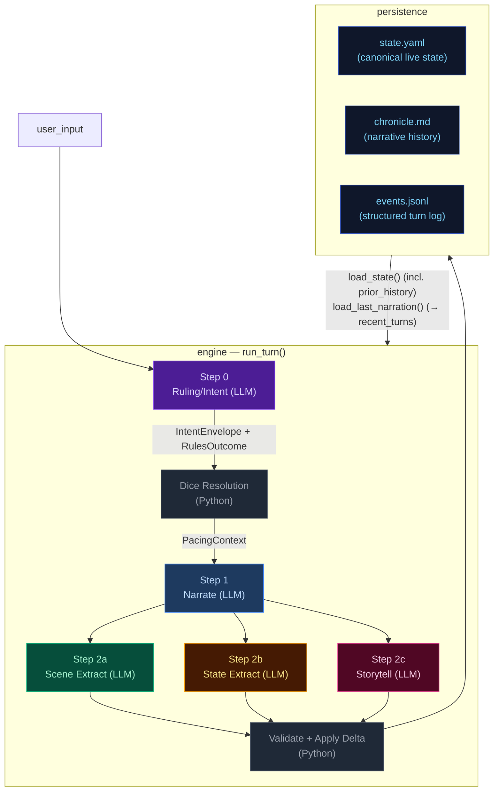

## Pipeline Quick Reference

| Step | Docs | When it runs | Key inputs | Key outputs | Mechanics it owns |
|---|---|---|---|---|---|
| **Step 0 — Ruling/Intent** | [step0-ruling](./step0-ruling.md) | Every turn (always) | `state.pc`, `state.location`, `recent_turns[-1:]`, `user_input` | `IntentEnvelope`, `RulesOutcome` | Intent classification, impossibility check, scene motion determination, dice roll resolution (1d12 + stat + cond − diff → band), difficulty selection, anti-declare-outcome enforcement. When `impossible=true`, no roll occurs and Python synthesizes a `fail` outcome. |
| **Step 1 — Narrate** | [step1-narrate](./step1-narrate.md) | Every turn (always, streamed) | Full `state`, `prior_history` (last 20 bullets, all but last rendered), `recent_turns[-1:]`, `pacing_context`, `pending_gm_beat`, `npc_roster` (from build_npc_roster()), `world_factions/locations` | `narrative` (prose) | Prose generation, dice-band binding, GM-beat consumption. Scene motion shaped by `PacingContext.outcome_hint`; impossible actions narrated as natural failures. |
| **Step 2a — Scene Extract** | [step2a-scene](./step2a-scene.md) | Every turn (always) | `narrative`, `state.pc/location`, `npc_roster` (from build_npc_roster()), conditions, compendium entries | `SceneExtractResult`: scene_tags, tagline, location_change, compendium_npc_update | NPC presence, location changes, scene tags, durable NPC compendium identity. |
| **Step 2b — State Extract** | [step2b-state](./step2b-state.md) | Every turn (always) | `narrative`, `state.pc/location/inventory`, conditions | `StateExtractResult`: inventory_add/remove/update, pc_condition_add/remove | Inventory delta accuracy, condition lifecycle. |
| **Step 2c — Storytell** | [step2c-storytell](./step2c-storytell.md) | Every turn (always) | `narrative`, `_ExtractionContext` (comp_this_turn, location, inventory, conditions), pacing_context, arc.threads[], recent_turns[-10:], band, npc_roster (from build_npc_roster()), recent_beats | `StorytellerResult`: thread_update/goal_update/arc_resolve/resolve/add, gm_beat, world_state_add/remove, actions, outcome_summary | Storyteller-managed thread lifecycle, arc resolution, beat disposition inference, durable history events. |

After Step 2c: results merge into a `StateDelta`, the validator checks constraints
(e.g. `inventory_remove` IDs exist), `apply_delta()` mutates state in-place, and the
turn is persisted. The next turn's Step 0 reads the new `state.yaml` plus `events.jsonl`.

## Subsystem Docs

| Subsystem | Doc | What it covers |
|---|---|---|
| **Step 0 — Ruling** | [step0-ruling](./step0-ruling.md) | Intent classification, dice resolution flowchart, pacing context computation |
| **Step 1 — Narrate** | [step1-narrate](./step1-narrate.md) | Streaming narration pipeline with all context inputs |
| **Step 2a — Scene Extract** | [step2a-scene](./step2a-scene.md) | Location changes, NPC presence, scene tags |
| **Step 2b — State Extract** | [step2b-state](./step2b-state.md) | Inventory and condition extraction |
| **Step 2c — Storytell** | [step2c-storytell](./step2c-storytell.md) | Pipeline mechanics, GM beat lifecycle, campaign arc system, thread lifecycle mechanics |
| **Delta → Validate → Apply** | [delta-validate](./delta-validate.md) | StateMerge schema, validation rules, apply_delta mutations |
| **Persist** | [persist](./persist.md) | Atomic writes (events.jsonl, state.yaml, chronicle.md), readback |
| **Cross-Pipeline Data Flow** | [cross-pipeline](./cross-pipeline.md) | Full inter-step data flow diagram |
| **Out-of-Band Pipelines** | [out-of-band](./out-of-band.md) | Character Creation pipeline, Generate Seed pipeline, turn viewer status colors |
| **Narration UI** | [narration-ui](./narration-ui.md) | Main game interface: SSE streaming, HTMX sidebar refresh, Alpine.js state machine |
| **Turn Viewer UI** | [turn-viewer-ui](./turn-viewer-ui.md) | Pipeline debug UI: turn cards, stage inspector, diff panel, live updates |
| **Eval Harness** | [eval-harness](./eval-harness.md) | Scenario runner, LLM judges, auto-checkers, REPORT.md generation |

## Key Models Glossary

### Core Result Types

- **IntentEnvelope**: `intent`, `intent_verb`, `target`, `check.required`, `check.skill`, `check.difficulty`, `impossible`, `impossible_reason`, `scene_motion`
- **RulesOutcome**: `rolled`, `skill`, `difficulty`, `stat_value`, `stat_mod`, `diff_mod`, `cond_mod`, `dice`, `raw_total`, `final_total`, `band`, `directive`, `intent`, `intent_verb`, `impossible`, `impossible_reason`
- **SceneExtractResult**: `scene_tags`, `scene_tagline`, `location_change`, `compendium_npc_update`
- **StateExtractResult**: `inventory_add/remove/update`, `pc_condition_add/remove`
- **StorytellerResult**: `thread_update` (list[ThreadUpdate]), `goal_update` (str | None, applied directly to arc dict), `arc_resolve` (ArcResolution | None), `thread_resolve` (with outcome sentence), `thread_add`, `gm_beat`, `world_state_add`, `world_state_remove`, `actions`, `outcome_summary`
- **SeedEnvelope**: `seed_state: GameState`, `opening_narrative`, `actions`, `arc: CampaignArc` (includes `goal_context` — UI-only, not rendered in prompts; unified `threads[]` with `progress: list[str]`, `completed_threads[]`)

  The seed owns first-turn emotional framing, not just world and arc scaffolding. It generates `goal_context` (character-specific stake), NPC `relation` fields (narrative job relative to PC), and action text written from the PC's voice and scene pressure — ensuring the opening feels personal and motivated from the start.

### PacingContext (see [step0-ruling](./step0-ruling.md#pacing-context))

### GMBeat (see [step2c-storytell](./step2c-storytell.md#gm-beat))

### CampaignArc (see [step2c-storytell](./step2c-storytell.md#campaign-arc-system))

### StateDelta (see [delta-validate](./delta-validate.md))

Merges all three extraction results. Contains `scene_tags`, `location_change`, `compendium_npc_update` (NPC changes), `thread_update/arc_resolve/thread_resolve/thread_add`, `inventory_add/remove/update`, `pc_condition_add/remove`, `world_state_add/remove`. Note: `gm_beat` is NOT in StateDelta — written directly to `state.meta.pending_gm_beat`.

---


## cross-pipeline


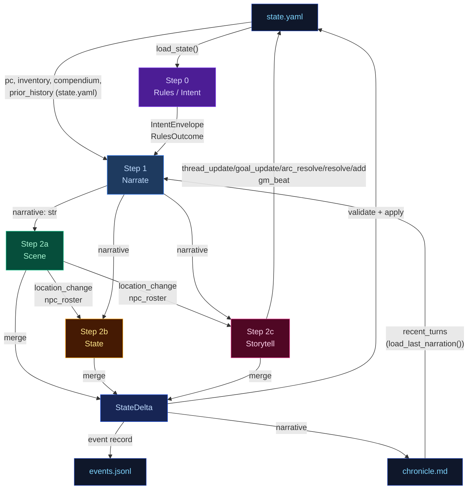

---


## delta-validate


The three extraction results merge into a single `StateDelta`, then validate and apply.

## Flowchart

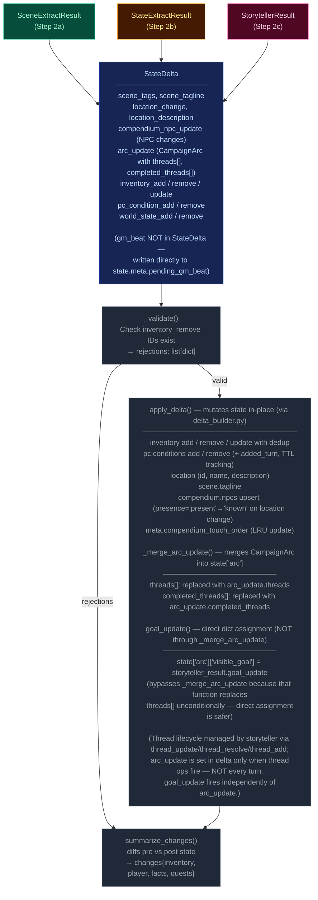

---


## narration-ui


The primary player-facing UI. Renders game state, streams narrative tokens live, and refreshes sidebars via HTMX partial swaps. Single-page app driven by Alpine.js + SSE + HTMX.

## Interaction Model

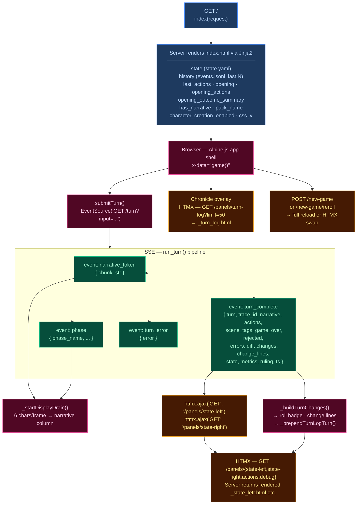

## Layout

| Region | Element | Content |
|--------|---------|---------|
| **Header** | `.header-bar` | Logo/tagline, Chronicle toggle, turn counter, retry button, new game button, reroll button (dynamic packs), mock-mode dot |
| **Left sidebar** | `.sidebar-left` | Player card, scene NPCs, location, arc, compendium — loaded via `/panels/state-left` |
| **Narrative column** | `.narrative-column` | Scrollable narrative blocks, action pills, input textarea, send/stop button |
| **Right sidebar** | `.sidebar` (right) | Inventory, recent events, world state, debug panel — loaded via `/panels/state-right` |
| **Chronicle overlay** | `.turn-log-shell` | Floating overlay over narrative column, populated by `/panels/turn-log?limit=50` |
| **New Game modal** | (Alpine `x-show`) | Pack picker → char creation / world builder steps |

## Data Flow

### Turn submission (Alpine.js + SSE)

1. User types input, presses Enter → `game().submitTurn()`
2. Opens `EventSource` to `GET /turn?input=<text>` — SSE endpoint in `routes.py:83`
3. Server streams events as the 5-stage pipeline (`run_turn()`) executes:
   - `narrative_token` — token chunks streamed as they arrive from LLM
   - `phase` — pipeline phase progress (ruling_start, narrate_start, narrate_first_token, narrate_done, extract_start, extract_done, compact_start, etc.)
   - `turn_complete` — final result
   - `turn_error` — error payload
4. Client `_startDisplayDrain()`: reveals 6 characters per animation frame for smooth streaming
5. On `turn_complete`:
   - Calls `htmx.ajax('GET', '/panels/state-left', ...)` and `htmx.ajax('GET', '/panels/state-right', ...)` to refresh sidebars
   - Renders change lines (`_buildTurnChanges`), roll badge
   - Prepends turn to Chronicle overlay via `_prependTurnLogTurn`
   - Re-renders markdown via `marked.parse()`

### HTMX partial endpoints (routes.py)

| Route | Template | Purpose |
|-------|----------|---------|
| `GET /panels/state-left` | `_state_left.html` | Left sidebar — player, NPCs, location, arc, compendium |
| `GET /panels/state-right` | `_state_right.html` | Right sidebar — inventory, events, world state, debug |
| `GET /panels/actions` | `_actions.html` | Action pills (fallback) |
| `GET /panels/turn-log?limit=N` | `_turn_log.html` | Chronicle — turn history with change lines |
| `GET /panels/pack-picker` | `_pack_picker.html` | New Game — pack selection cards |
| `GET /panels/char-creation` | `_char_creation.html` | New Game — character stats builder |
| `GET /panels/world-builder` | `_world_builder.html` | New Game — world creation form |
| `GET /panels/debug` | `_debug.html` | Debug panel — recent turn timings, errors |
| `GET /panels/state` | `_state.html` | Combined left+right (legacy) |

### Client state machine (`game()` — inline `<script>` in index.html)

Alpine.js `x-data="game()"` manages:
- `input` — textarea value
- `submitting` — turn-in-progress flag
- `gameStarted` — derived from `has_narrative`
- `turnNum` — current turn counter
- `leftWidth` / `rightWidth` — resizable sidebar widths (persisted to `localStorage`)
- Card collapse state — read/written directly from/to `localStorage` via `CCYA_CARD_KEY(name)` helper, using DOM `data-card` attributes; no Alpine data property

## UI Features

### Resizable sidebars
- Drag gutters with mousedown/mousemove handlers
- Widths saved to `localStorage` (`ccya_sidebar_left`, `ccya_sidebar_right`)
- Minimum width enforcement (240px left, 220px right)

### Collapsible cards
Each sidebar section has a collapse toggle; open/closed state persisted per-card to `localStorage` via `ccya_card_<name>` key.

### Action pills
Suggested next actions rendered as buttons that populate the input on click. Updated from `turn_complete.actions` or via HTMX panel refresh.

### Roll badge
Server-rendered for history, JS-built for new turns. Shows dice math, band label, outcome summary. Band colors: `crit_fail` (red) → `fail` → `setback` → `partial` → `success` → `crit_success`.

### Change lines
Grouped by category via emoji prefix:
| Emoji | Category | Class |
|-------|----------|-------|
| 🎒 + | Inventory gain | `.tc-inv-gain` |
| 🎒 − | Inventory loss | `.tc-inv-loss` |
| 🩺 | Player condition | `.tc-pl` |
| 📍 | Location | `.tc-loc` |
| 📜 | Faction/arc | `.tc-fa` |

### Retry
`POST /turn/delete` removes last event from `events.jsonl` and `chronicle.md`, returns previous actions for re-submission.

### New Game
`POST /new-game` with optional `pack_id`, `pc_name`, `pc_stats`, `hints`. For dynamic packs, triggers `generate_seed()` LLM pipeline. Full page reload on success. Reroll (`POST /new-game/reroll`) HTMX-swaps the opening narrative + actions.

## CSS Architecture

- **`app.src.css`** — Tailwind + custom styles split by region (lines 1–2101):
  - App shell layout (CSS Grid: header + body with sidebar-gutter-main-gutter-sidebar)
  - Narrative blocks (`.narrative-block`, `.narrative-text`)
  - Sidebar cards (`.card`, `.card-header`, `.card-body`)
  - Input bar (`.input-bar`, `.game-input`, `.send-btn`)
  - Action pills (`.action-pill`, `.pills-row`)
  - Roll badges (`.roll-badge`, `.roll-band--*`)
  - Chronicle overlay (`.turn-log-shell`, `.turn-log-panel`)
  - New Game modal (`.modal-overlay`, `.pack-card`)
  - Progress strip, tooltips, scrollbar styling
  - Design tokens via CSS custom properties (`--text-primary`, `--bg-card`, `--status-*`)
- Compiled to **`app.css`** with cache-busting via `css_v` query param

## Server Entry Point

`routes.py:57` — `GET /` handler assembles template context from `state.yaml`, `events.jsonl`, pack manifest, and engine config, then renders `ccya/templates/index.html`.

---


## out-of-band


These run only at new-game time or are non-engine concerns. They are excluded from the eval-context region of the main architecture doc.

## Character Creation Pipeline

Triggered by `POST /new-game`. All packs use the Generate Seed pipeline (dynamic). Static packs with pre-built seed_state.yaml exist but are not used by new_game.

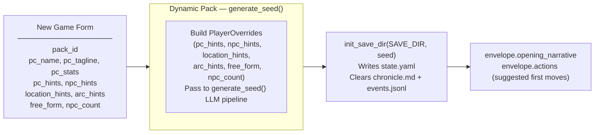

## Generate Seed Pipeline (Dynamic Packs Only)

Called by `POST /new-game` and `POST /new-game/reroll`. Generates a complete starting game state (PC, NPCs, location, arc, opening narrative, actions) from the pack manifest and optional player overrides.

The seed owns **first-turn emotional framing** — not just world and arc scaffolding. Every seed element must produce an emotionally legible opening that answers: why this moment matters now, what the character stands to lose, and why at least one person in the scene matters to them personally.

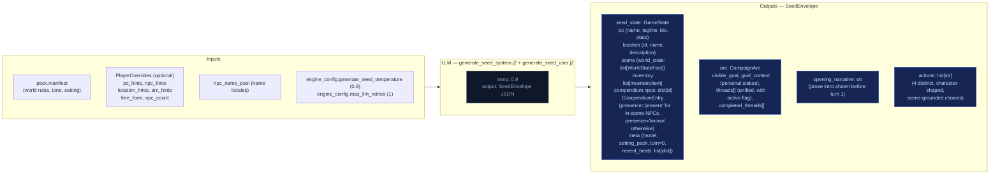

### Seed emotional framing contract

The seed prompt (`generate_seed_system.j2`) enforces these requirements:

- **`goal_context`**: 2–3 sentences explaining why `visible_goal` matters to this character specifically — inner cost or pressure that makes it emotionally loaded. No hidden-truth spoilers, no restating `visible_goal`, no direct statement of the thematic question. Must connect character motive, story stakes, and emotional cost.
- **NPC `relation` field**: Each opening NPC has a defined narrative job. One NPC is personally tied to the PC's motive or vulnerability; the other carries immediate external pressure from the world or conflict. The `relation` field encodes PC-facing relevance (e.g. "owes them a favor", "is their only contact here", "represents the institution pressing on them").
- **Compendium NPCs**: The seed also generates 2–3 NPCs in `compendium.npcs` (name, title, bio) who exist in the world but are not present in the opening scene. Their bios tie them to factions, locations, or world pressures, not to the immediate situation. These become discoverable characters during play.
- **Action guidance**: Each of the 4 choices is written from the PC's point of view, grounded in a present NPC, immediate risk, active thread, or character motive. They differ in emotional posture (confront, deflect, investigate, protect, exploit, withdraw, etc.) and avoid generic verbs.
- **`threads[]`**: Unified list (not split active/latent) where each thread has `{id, summary, urgency, scope}` and an `active` boolean flag managed by the storyteller via `thread_update`, not Python age rules. Threads have a `progress: list[str]` field — append-only log of progress updates set via `thread_update[].progress`, never replaced. Also includes `last_updated_turn: int | None` for urgency decay tracking.

## Turn Viewer — status colors

The standalone turn viewer ([turn-viewer-ui](./turn-viewer-ui.md)) uses the same semantic status colors as the CSS custom properties in `static/app.src.css` (`--status-*`). The stage colors used in the diagrams above (`stageRules` violet → `stageNarrate` blue → `stageScene` green → `stageState` amber → `stageProgress` pink) map directly to the `--stage-*` tokens. Cross-stream inputs into a step are shown in `xstream` (purple outline) and LLM/Python boxes use neutral dark fills. This table is the canonical turn-viewer status legend.

| Token | Meaning |
|-------|---------|
| `--status-ok` | Stage ran and completed (no extraction error). |
| `--status-skipped` | Stream was skipped (no longer used — all streams always run). |
| `--status-retried` | LLM output required a parse retry (`attempts` > 1 in event). |
| `--status-rejected` | Post-extract validation rejected part of the delta (e.g. bad `inventory_remove`). |
| `--status-error` | LLM call or parse ultimately failed for that stream. |
| `--status-neutral` | Non-fatal / informational (e.g. rules path with no dice roll). |

Stage accent stripes use `--stage-rules`, `--stage-narrate`, `--stage-scene`, `--stage-state`, `--stage-progress` for quick scanning; **status** always wins for the prominent left border.

---


## persist


Atomic writes to disk. No LLM calls.

## Flowchart

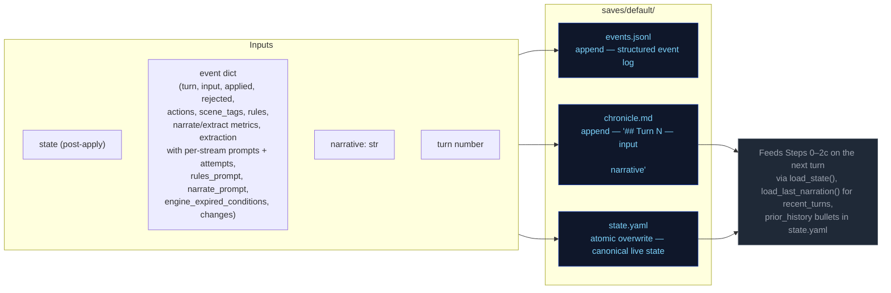

---


## step0-ruling


Classifies the player's action, determines whether a dice check is needed, and
identifies which state domains will be active — narrowing every downstream extractor.

## Flowchart

```mermaid
flowchart LR
    classDef stageRules fill:#4c1d95,color:#ddd6fe,stroke:#7c3aed
    classDef llmNode    fill:#0f172a,color:#94a3b8,stroke:#334155
    classDef pyNode     fill:#1f2937,color:#9ca3af,stroke:#4b5563
    classDef outNode    fill:#3b0764,color:#e9d5ff,stroke:#7c3aed

    subgraph IN["Inputs"]
        I1["state.pc<br>(name, stats, conditions)"]
        I2["state.location"]
        I3["recent_turns[-1:]<br>(last turn's full narrative from chronicle.md<br>via load_last_narration();<br>ruling user prompt)"]
        I4["user_input"]
    end

    subgraph LLM0["LLM — ruling_system.j2 + ruling_user.j2"]
        L0["temp: 0.2 · max_retries: 1<br>output: IntentEnvelope JSON<br>(intent, impossible, scene_motion, check)"]:::llmNode
    end

    subgraph PYRES["Python — impossible check + rules.resolve_check()"]
        P0["if impossible=true:<br>  synthesize fail outcome<br>  skip roll, apply momentum<br>else:<br>  roll 1d12 + stat_mod + cond_mod − diff_mod<br>  map total → Band"]:::pyNode
    end

    subgraph OUT["Outputs"]
        O1["IntentEnvelope<br>  intent: str<br>  intent_verb: str<br>  target: str<br>  impossible: bool<br>  impossible_reason: str<br>  scene_motion: hold|advance|transition<br>  check.required: bool<br>  check.skill: SkillName<br>  check.difficulty: Difficulty"]:::outNode
        O2["RulesOutcome<br>  rolled: bool<br>  skill, difficulty, stat_value, stat_mod<br>  diff_mod, cond_mod<br>  dice: list[int]<br>  raw_total, final_total: int<br>  band: Band<br>  directive: str<br>  intent, intent_verb: str<br>  impossible: bool<br>  impossible_reason: str"]:::outNode
    end

    IN --> LLM0
    LLM0 -- "IntentEnvelope" --> PYRES
    PYRES --> OUT
```

## Impossibility check

The ruling LLM evaluates whether the described action is impossible given the character's state, inventory, and scene. An action is impossible when:

- It requires an item the character does not have (firing a gun with no ammo, using a key never acquired)
- It requires a capability contradicted by active conditions (climbing with a broken leg, sneaking while armored and noisy)
- It acts on something not present in the scene (targeting an NPC who is not here, opening a door that doesn't exist)

When `impossible=true`: Python sets `check.required=False`, synthesizes a `RulesOutcome` with `band="fail"` and `rolled=False`, applies momentum, and skips the dice roll entirely. The narrator renders the impossible fact and narrates the natural failure.

## Scene motion

The ruling LLM also determines how the scene should progress: `"hold"` (scene continues at current pace), `"advance"` (something significant happens/resolves), or `"transition"` (player is leaving, write the arrival). This feeds into `_compute_pacing_context()` which produces `outcome_hint` for the narrator.

## Key forward dependency

`rules_outcome` feeds into `_compute_pacing_context()` which produces the single authoritative `PacingContext` struct passed to both Narrator and Storytell pipeline.

## Pacing Context

All pacing signals are collapsed into one Python-computed struct (`PacingContext`) passed to both the Narrator and Storytell pipeline. This replaces six independent fields (`narration_directive`, `deescalate`, `narrative_velocity`, `beat_disposition` output, `quest_threshold_directive`, and stale momentum-derived signals). The narrator receives `outcome_hint` (scene motion); Storytell receives the full struct including `directive`.

### Struct definition

```
PacingContext:
  directive: str           # "" | "Breathe" | "Scene Imperative" | "Overwhelm" | "Pressure" | "Tension" | "Scene Pressure" (may include "; Resolve a Threat" secondary when beat_locked); used by Storytell pipeline
  outcome_hint: str | None # "hold" | "advance" | "transition" — narrator's primary scene motion instruction
  beat_locked: bool        # True: consecutive pressure threshold reached or momentum at floor — enables floor relief injection and appends "; Resolve a Threat" to directive
  gate: str                # "block_escalate" | "allow" (controls thread_add); set independently from beat_locked via deescalate >= 0.5
  summary: str             # human-readable log string, never sent to LLM
```

`beat_locked: True` fires when either `consecutive_pressure_turns >= config.consecutive_pressure_threshold` OR `momentum <= config.momentum_floor`. When locked, `"Resolve a Threat"` is appended to the directive via semicolon. The `gate` field prevents Progress from adding new threads during de-escalation windows.

### Computation

`_compute_pacing_context()` in `engine/turn.py` consolidates pacing computation (replacing the former scattered functions: `_compute_narration_directive`, `_compute_narrative_velocity`, `_check_floor_relief`). It takes inputs (`momentum`, `consecutive_pressure_turns` from state meta, `arc.threads[] scope=scene urgency counts`) and returns a single struct with directive derived from a priority stack. It also computes `outcome_hint` from the ruling LLM's `scene_motion` and PacingContext escalation signals: ruling `scene_motion` takes priority (`transition` > `advance` > fallback), then `impossible=true` forces `advance`, then Python escalation signals (`beat_locked`, Overwhelm/Pressure with urgent threads) produce `advance`, defaulting to `hold`.

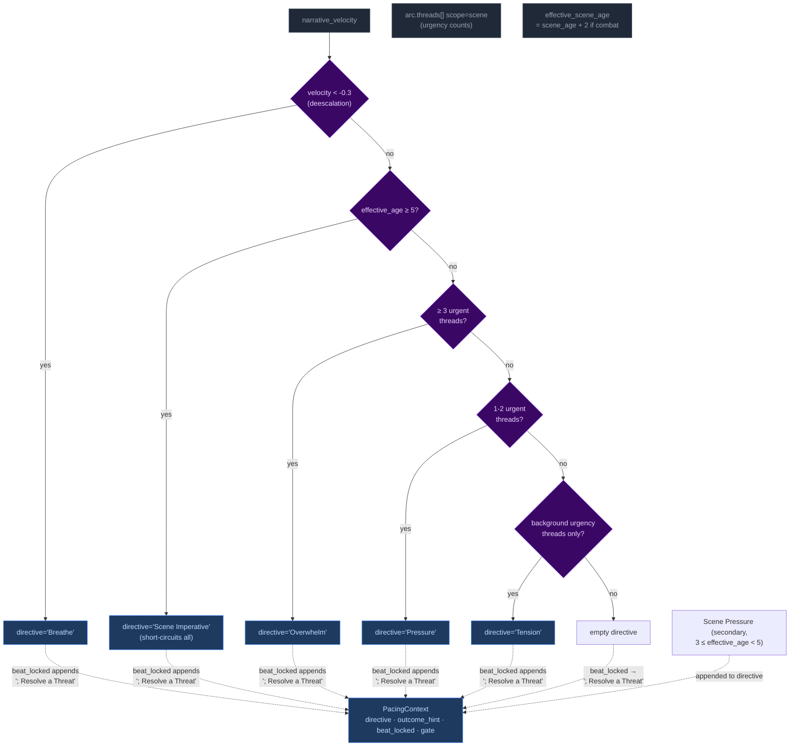

Priority order (highest to lowest): **Breathe > Scene Imperative > Overwhelm > Pressure > Tension > Scene Pressure**. The `beat_locked` flag fires when either consecutive pressure threshold or momentum floor is reached — `"Resolve a Threat"` is appended to the directive and `outcome_hint` is set to `"advance"`. The gate is NOT affected by beat_locked (set independently by deescalate ≥ 0.5).

**Breathe secondary guard:** The Breathe directive has an additional check beyond velocity: if urgent scene-scoped threads exist, Breathe is NOT emitted even if `narrative_velocity < -0.3`. Low velocity during unresolved tension (tactical avoidance, stealth) does not trigger de-escalation. Once urgent threads resolve, Breathe fires on the next low-velocity turn.

#### Age computation

`_compute_ages(state)` returns only `{"scene_age": scene_age}` — location_age and combat_age removed in Phase 03 pacing overhaul. The ruling phase pre-computes `effective_scene_age = scene_age + 2` when `"combat"` is in scene tags, stored in `ctx._ages["effective_scene_age"]`. This single-age signal drives all directive thresholds:
- Scene Imperative (≥5 effective age): high-priority directive forcing story advancement
- Scene Pressure (3 ≤ effective_age < 5): secondary append to wind down or shift focus

### Wiring

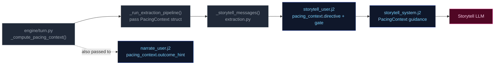

1. **Computed** once in `run_turn()` via `_compute_pacing_context()`.
2. **Passed through** `_run_extraction_pipeline()` → both `_narrate_messages()` and `_storytell_messages()`.
3. **Narrator template** (`narrate_user.j2`) renders `outcome_hint` (scene motion: hold/advance/transition) with value-specific guidance. No Jinja2 pacing computation remains — all pacing computed by Python.
4. **Storytell template** ((`storytell_system.j2` + `user.j2`)) receives the full struct; guidance maps each directive to appropriate thread/beat actions:

| Directive | Thread action | Gate |
|-----------|---------------|-------|
| **"Breathe"** (de-escalation, velocity < -0.3) | Do NOT add new threads. Allow existing scene threads to persist without escalation. | `block_escalate` (set by deescalate ≥ 0.5; beat_locked does NOT force-close gate) |
| **"Scene Imperative"** (effective_age ≥ 5) | Story must advance — introduce new development forcing resolution or movement; do not linger | Varies by context |
| **"Overwhelm"** (3+ urgent threads) | May add scene-scoped threads if gate allows; emit pressure/escalation beat | `allow` |
| **"Pressure"** (1-2 urgent threads) | Advance relevant scene/arc threads. Add new thread only if gate permits. | Varies by context |
| **"Tension"** (background urgency only) | Do NOT add pressures unless concrete threat emerges; prefer advancing existing threads | Allow |
| **"Scene Pressure"** (3 ≤ effective_age < 5, secondary append) | Begin winding down or introduce reason to shift focus: development elsewhere, closing window | Varies by context |
| **"" (empty)** | No action required beyond normal aging of silent threads. | Allow |

**Note:** Directives may include secondary modifiers joined by semicolons (e.g., "Pressure; Resolve a Threat" when beat_locked). The primary directive drives thread/beat logic; the secondary (`; Resolve a Threat`) acts as thematic guidance for beat type selection. "Resolve a Threat" never appears as a standalone primary directive — it is only appended by the `beat_locked` mechanism.

### Consecutive pressure counter

`state["meta"]["consecutive_pressure_turns"]` tracks how many consecutive turns have had pressure-type storyteller beats. Re-keyed from directive tracking (which never fired — Pressure/Overwhelm directives were unreachable) to beat-type tracking:

- **Increments** when `storyteller_result.gm_beat.type` is `"pressure"`, `"escalation"`, or `"complication"`.
- **Resets to 0** on any other beat type, null beat, or missing storyteller output.

When this counter reaches `config.consecutive_pressure_threshold` (default 3), it triggers `beat_locked` alongside the momentum floor fallback (`momentum <= -3`). `beat_locked` appends `"; Resolve a Threat"` to the directive and enables floor relief injection.

---


## step1-narrate


Generates the narrative prose the player reads. Tokens are streamed to the client.

## Flowchart

```mermaid
flowchart LR
    classDef llmNode   fill:#0f172a,color:#94a3b8,stroke:#334155
    classDef xstream   fill:#4c1d95,color:#ddd6fe,stroke:#7c3aed
    classDef outNode   fill:#1e3a5f,color:#bfdbfe,stroke:#3b82f6

    subgraph IN["Inputs"]
        N1["state (full —<br>pc, location, scene,<br>inventory, compendium)"]
        N2["prior_history<br>(last 20 incremental history bullets, all but last rendered as bullets)"]
        N3["recent_turns[-1:]<br>(single most recent turn as full text)"]
        N4["rules_outcome<br>(band, directive, impossible, dice summary)"]:::xstream
        N6["npc_name_pool (cultural name list)"]
        N7["npc_roster<br>(from build_npc_roster(comp),<br>  presence field: present/nearby/known)"]
        N9["world_factions<br>(immutable trace)"]:::xstream
        N10["pending_gm_beat<br>(type · surface_as metadata)"]
        N11["pacing_context<br>(outcome_hint)<br>from _compute_pacing_context()"]:::xstream
        N15["user_input"]
    end

    subgraph LLM1["LLM — narrate_system.j2 + narrate_user.j2"]
        NL["temp: 0.9 · streaming: yes<br>output: prose narrative (str)"]:::llmNode
    end

    subgraph OUT["Outputs"]
        NO1["narrative: str<br>(streamed as tokens → client<br>then joined + thinking-stripped)"]:::outNode
        NO2["narr_metrics<br>  first_token_ms<br>  total_ms<br>  tokens_in / tokens_out"]
    end

    IN --> LLM1
    LLM1 --> OUT
```

## Arc context in narration

The narrator receives `current_arc` in both system and user prompts. Key fields:

- **`goal_context`**: A seed-time field (2–3 sentences) explaining why `visible_goal` matters to the character specifically — inner cost or pressure that makes it emotionally loaded. UI-only (surfaced as tooltip on the arc goal in the sidebar). NOT rendered in prompt context — the narrator works from general early-turn behavioral guidance in the system prompt, not from the raw `goal_context` value.
- **`visible_goal`**: The player-facing objective.
- **`threads[]`**: Unified thread collection filtered by `active` flag. Scene-scope threads provide immediate pressure; arc-scope threads provide medium-term tension.
- **`resolved_arc`**: TTL-filtered list of previously resolved arcs, providing narrative continuity across arc transitions.

### Opening-turn narrative mode

The seed embeds emotional stakes in the initial state — NPC `relation` fields, `motivation/fear/leverage`, and a `goal_context` sidebar entry. The narrator does NOT receive special early-turn prompt guidance or `goal_context` in its context. Instead, the initial scene's NPCs (with rich behavioral drivers), the opening narrative's tone, and the player-facing sidebar create the onboarding experience. The narrator works from its standard behavioral guidance and the richness of seed-generated state.

## Key forward dependency

`narrative` is the primary content input for all three extraction streams below.

### GM Beat consumption

The narrator receives a pending GM beat from `state.meta.pending_gm_beat` (set by Storytell in the previous turn). The beat's `type` and `surface_as` metadata are passed alongside the pacing directive as creative guidance for the narrative. The beat is NOT cleared after narration — it persists through the extraction phase. After extraction completes, Storytell replaces it with a new beat or pops it on null output. Full beat lifecycle is documented in [step2c-storytell](./step2c-storytell.md#gm-beat).

---


## step2a-scene


Extracts location changes, NPC presence, scene tags, and suggested actions from the narrative.

## Flowchart

```mermaid
flowchart LR
    classDef llmNode fill:#0f172a,color:#94a3b8,stroke:#334155
    classDef xstream fill:#4c1d95,color:#ddd6fe,stroke:#7c3aed
    classDef outNode fill:#064e3b,color:#a7f3d0,stroke:#10b981

    subgraph IN["Inputs"]
        S1["narrative (from Step 1)"]:::xstream
        S2["state.pc (name, tagline, bio, stats)"]
        S3["state.location"]
        S4["compendium.npcs[presence='present']"]
        S5["state.pc.conditions"]
        S6["npc_roster<br>(from build_npc_roster(), filtered by presence field)"]
        S7["recent_turns[-1:]<br>(T-1 prior narration)"]
    end

    subgraph LLM2A["LLM — extract_scene_system.j2 + extract_scene_user.j2"]
        SL["temp: 0.4 · max_retries: 1<br>output: SceneExtractResult JSON"]:::llmNode
    end

    subgraph OUT["Outputs — SceneExtractResult"]
        O1["scene_tags: list[str]"]:::outNode
        O2["scene_tagline: str (3–6 words for UI header)"]:::outNode
        O3["location_change: LocationRef | None<br>  id, name, description"]:::outNode
        O4["location_description: str | None"]:::outNode
        O5["compendium_npc_update<br>  durable identity changes (presence, notes, bio upserts)"]:::outNode
    end

    IN --> LLM2A
    LLM2A --> OUT
```

## Key forward dependency

`location_change` flows into `extraction_ctx` (built by `_build_extraction_context`). Step 2c also receives `npc_roster` (from build_npc_roster()) built from comp_this_turn. No forward-facing mechanics (`thread_add`, `gm_beat`) are emitted by this stream — they go through the unified thread lifecycle via Storytell (Step 2c).

---


## step2b-state


Extracts inventory changes and player condition mutations from the narrative.

## Flowchart

```mermaid
flowchart LR
    classDef llmNode fill:#0f172a,color:#94a3b8,stroke:#334155
    classDef xstream fill:#4c1d95,color:#ddd6fe,stroke:#7c3aed
    classDef outNode fill:#451a03,color:#fde68a,stroke:#f59e0b

    subgraph IN["Inputs"]
        S1["narrative (from Step 1)"]:::xstream
        S2["state.pc (name, bio, stats, conditions)"]
        S3["state.location"]
        S4["state.inventory"]
        S5["intent: str<br>(from Step 0)"]
    end

    subgraph LLM2B["LLM — extract_state_system.j2 + extract_state_user.j2"]
        SL["temp: 0.4 · max_retries: 1<br>output: StateExtractResult JSON"]:::llmNode
    end

    subgraph OUT["Outputs — StateExtractResult"]
        O1["inventory_add: list[InventoryItem]<br>  id, name, notes, amount"]:::outNode
        O2["inventory_remove: list[InventoryRemove]<br>  id, amount (None = full stack)"]:::outNode
        O3["inventory_update: list[InventoryUpdate]<br>  id, name?, notes?"]:::outNode
        O4["pc_condition_add: list[ConditionAdd]<br>  id, label, description"]:::outNode
        O5["pc_condition_remove: list[ConditionRemove]<br>  id"]:::outNode
    end

    IN --> LLM2B
    LLM2B --> OUT
```

## Key forward dependency

Step 2c receives `npc_roster` (from build_npc_roster()) and `location_change` from Step 2a. Cross-stream items_gained/lost were removed — extraction_ctx now covers all this-turn derived data.

---


## step2c-storytell


Extracts thread updates, arc actions, world state changes, and durable NPC compendium changes.

## Flowchart


## Always runs

Storytell is the post-narration storytelling brain. It always executes every turn (never skipped) and feeds next turn's rules call via `world_state_add/remove` (persistent world facts), `thread_update/goal_update/arc_resolve/thread_resolve/thread_add` (storyteller-managed thread lifecycle), and `gm_beat` (forward-facing beats stored in `state.meta.pending_gm_beat`).

## GM Beat

Forward-facing storytelling beats that shape scene progression across turns. Beats are emitted by Storytell (Step 2c), consumed by Narrator (Step 1) the following turn, and managed via a write/expiry lifecycle in `state.meta.pending_gm_beat`.

### GMBeat Schema

```
GMBeat
  type: complication | revelation | opportunity | breathing_room | pressure | twist | setback | escalation | callback
  surface_as: ambient | event | npc_behavior | environmental | player_discovery | item (default: ambient)
  beat_expires_turn: int | None — turn number at which the beat expires; set to turn_no + 2 when stored
```

**Validation:** Only `type` is validated by `StorytellerResult._nullify_invalid_gm_beat` — nullified if type is falsy or not in the valid set. No validation on `surface_as`. Python accepts whatever gm_beat the LLM emits with no correction or override.

### PacingContext Beat Fields

The beat system intersects with pacing via two fields in `PacingContext` (see [step0-ruling](./step0-ruling.md#pacing-context)):

| Field | Type | Meaning |
|-------|------|---------|
| `directive` | str | May include secondary modifier `"; Resolve a Threat"` when `beat_locked=True`. Drives storytell guidance for beat type selection. |
| `beat_locked` | bool | True when either `consecutive_pressure_turns >= threshold` OR `momentum <= momentum_floor`. When locked, `"Resolve a Threat"` is appended to the directive. Enables floor relief to inject a breathing_room beat if the storyteller is stuck in a pressure-type loop. |

### Beat Lifecycle — Turn Sequence

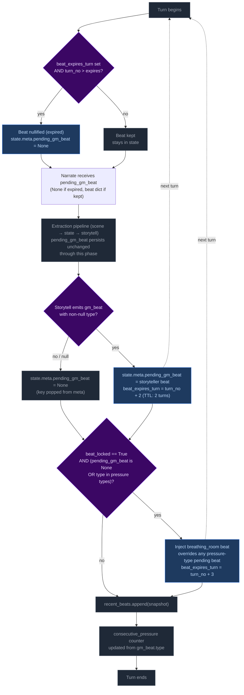

**Step 1 — Pre-narration expiry check.** At the start of each turn, the engine reads `state.meta.pending_gm_beat` from the previous turn. If `beat_expires_turn` is set and the current turn number exceeds it, the beat is nullified (key set to None). Otherwise it proceeds to narration.

Note: This expiry runs early enough that the beat is gone before the extraction phase begins. This is intentional — it creates clean state for floor relief to inject breathing_room if `beat_locked` is active and storyteller doesn't provide its own non-pressure beat. Without the pre-narration expiry, a stale expired beat could block floor relief's null check.

**Step 2 — Narration consumption.** The beat is passed to the narrator via `_narrate_messages(pending_gm_beat=...)`. The narrator uses the beat's `type` and `surface_as` metadata as creative guidance alongside the pacing directive. The beat is NOT cleared after narration — it persists through the extraction phase.

**Step 3 — Storytell writes or clears the beat.** After extraction completes:
- If Storytell emits a valid `gm_beat` (non-null `type`): replaces `pending_gm_beat` with `beat_expires_turn = turn_no + 2`.
- If Storytell emits `null` or an invalid beat: pops `pending_gm_beat` from state (null-clear). The old beat does NOT carry forward.

**Step 4 — Floor relief injection.** After delta apply, if `beat_locked=True` AND the current `pending_gm_beat` is either `None` or a pressure-type (`pressure`, `escalation`, `complication`): injects a `breathing_room` beat with `beat_expires_turn = turn_no + 3`. This overrides pressure-type beats that would otherwise continue the pressure cycle, but does NOT override non-pressure beats the storyteller independently produced (e.g., `revelation`, `opportunity`, `breathing_room`).

**Step 5 — Beat history snapshot.** `pending_gm_beat` is appended to `state.meta.recent_beats` (capped at 5 entries). The snapshot is taken after any floor relief override, so it reflects the beat the next turn's narrator will consume.

**Step 6 — Consecutive pressure counter update.** The counter increments on pressure-type beats and resets to 0 otherwise.

### Floor Relief Injection

The floor relief mechanism fires after delta apply when `_pc.beat_locked=True` AND the current `pending_gm_beat` is either `None` or a pressure-type beat (`pressure`, `escalation`, `complication`). It injects a `breathing_room` beat with TTL of 3 turns (one more than storyteller-emitted beats' TTL of 2).

Floor relief is a **fallback override** — it breaks a pressure-type run by force-injecting recovery:
- If Storytell emitted a pressure-type beat → floor relief overrides it with breathing_room.
- If Storytell emitted a non-pressure beat (revelation, opportunity, breathing_room, etc.) → floor relief lets it stand. Relief is already being achieved.
- If Storytell emitted nothing (null) → floor relief injects breathing_room. This is appropriate: after a null turn with beat_locked active, relief is needed.

### Directive-Beat Alignment

The storyteller prompt (`storytell_system.j2`, pacing context guidance section) maps each PacingContext directive to recommended beat types (e.g., "Breathe" → breathing_room; "Scene Imperative" → advance story; "Overwhelm" → pressure/escalation). This alignment is **guidance only** — Python accepts whatever gm_beat the LLM emits with no validation, correction, or override. Design rationale: forcing directive-beat alignment would constrain storytelling flexibility and create brittleness if the LLM makes contextually appropriate but directive-divergent beat choices.

### Beat History

`state.meta.recent_beats` stores the last 5 beats (including null entries) with `turn`, `type`, and `surface_as`. This history is rendered in both the storyteller system prompt (behavioral guidance) and the user prompt (current-turn context, more salient). Each entry shows `T{N}: {BEAT TYPE} (surface)` or `T{N}: No beat emitted this turn`.

The LLM uses this history to follow beat diversity guidance: avoid repeating the same type more than twice in a sequence; at least one in three beats should be a non-pressure type.

### TTL Mechanics Summary

| Source | Default TTL | Expiry Calculation |
|--------|-------------|-------------------|
| Storytell-emitted beat | 2 turns | `beat_expires_turn = turn_no + 2` |
| Floor relief (Python-injected) | 3 turns | `beat_expires_turn = turn_no + 3` (extra recovery margin) |

### Null-Clear Behavior

When Storytell emits a null beat (or an invalid beat whose type is nullified), `pending_gm_beat` is popped from `state.meta`. The beat does NOT carry forward. This replaced the old carryover behavior where stale beats persisted through null turns.

The storyteller user prompt always renders the GM Beat section — on null-following turns it shows "No beat currently carried over from the previous turn. Choose freely." This ensures the LLM has consistent beat awareness on every turn.

### GM Beat Section in UI

The storyteller user prompt renders the `## GM Beat` section unconditionally:
- **Beat present:** Shows type, surface_as, expiration turn.
- **No beat:** Shows fallback text — "No beat currently carried over from the previous turn. Choose freely."

This was changed from the previous conditional rendering (where the section vanished on ~38% of turns), ensuring full beat awareness coverage.

## Campaign Arc System

The campaign arc system tracks story threads across turns. Thread state is **storyteller-managed** — the LLM explicitly controls urgency, progress, and goal direction via `thread_update` and `goal_update` directives. The engine applies these without enforcement of caps, cooldowns, or silent timers.

### Arc Data Model

```
CampaignArc
  visible_goal: str          — What the PC is trying to achieve
  goal_context: str          — 2–3 sentences explaining why visible_goal matters (UI-only; not rendered in prompts)
  threads: list[ArcThread]   — Unified collection with active flag
  completed_threads: list[ArcThread] — Resolved/failed/abandoned threads
  resolution: str | None     — Set when arc is resolved via arc_resolve
  last_thread_created_turn: int — Tracks when a thread was last created for pacing

ArcThread
  id: str                    — Unique identifier
  summary: str               — What this thread is about
  scope: Literal["scene", "arc"]  # scene = short-lived, purged on location change; arc = persistent story tension
  active: bool = True        # Storyteller-controlled via thread_update
  urgency: Literal["background", "normal", "urgent"] = "normal"  # Storyteller-controlled
  progress: list[str] = []   — Append-only log of progress updates (CHANGED from single-string overwrite)
  resolution_state: str | None # Set when thread_resolve processes resolved/failed/abandoned
  outcome: str | None        # Set from ThreadResolution.outcome when moved to completed_threads
  resolved_turn: int | None  — Turn when thread was resolved; used for TTL filtering in prompts

  # NOTE: last_updated_turn (int | None) is NOT a Pydantic field on ArcThread.
  # It is injected at the dict level in _apply_thread_updates() and in the rendering
  # pipeline (extraction.py, narrate.py). The _thread_list.j2 template references
  # t.last_updated_turn — this works because the dicts passed to templates have been
  # augmented with this key. It tracks when the thread was last mutated for urgency
  # decay guidance (rendered as "turns since last update").
```

### Engine-Driven Arc

Thread lifecycle runs in `engine/turn.py` during the extraction phase. Six operations handle arc/thread state in strict order:

```mermaid
flowchart TD
    classDef pyNode fill:#1f2937,color:#9ca3af,stroke:#4b5563
    classDef arcNode fill:#3b0764,color:#e9d5ff,stroke:#7c3aed

    PR["StorytellerResult<br>thread_update: list[ThreadUpdate]<br>goal_update: str | None<br>arc_resolve: ArcResolution | None<br>thread_resolve: list[ThreadResolution]"]:::pyNode

    subgraph UPDATES["_apply_thread_updates()"]
        U1["For each ThreadUpdate:<br>Find thread by id → apply<br>active/urgency/summary/progress changes<br>progress is append-only (list[str])<br>Sets last_updated_turn = current turn"]
    end

    subgraph GOAL["goal_update (direct dict assignment)"]
        G1["If storyteller_result.goal_update is set:<br>state['arc']['visible_goal'] = value<br>Direct assignment, NOT through _merge_arc_update<br>(which would wipe threads[])"]
    end

    subgraph CONFLICT["Same-turn conflict detection"]
        C1["If same thread id appears in both<br>thread_update and thread_resolve:<br>log WARNING (LLM error)<br>resolution wins (fires after update)"]
    end

    subgraph RESOLVE["_apply_arc_resolve()"]
        R1["Store current arc in resolved_arcs<br>with resolved_turn for TTL tracking"]
        R2["Auto-close arc-scoped threads with 'superseded' state<br>Carry forward scene-scoped threads (minus drop_threads)"]
        R3["Add new_threads from resolution"]
        R4["Create successor arc with<br>new visible_goal, goal_context,<br>surviving scene-scoped + new threads"]
    end

    subgraph RESOLUTIONS["_apply_thread_resolutions()"]
        S1["For each ThreadResolution:<br>Move ArcThread to completed_threads<br>Set resolution_state, outcome, resolved_turn"]
    end

    subgraph GATE["Thread add gate"]
        T1["PacingContext.gate == 'allow'?<br>If blocked: log debug, skip add<br>Gate status rendered in prompt<br>(no silent drops)"]
        T2["ID collision? Thread id in existing_ids<br>or completed_ids → reject"]
    end

    PR --> UPDATES --> GOAL --> CONFLICT --> RESOLVE --> RESOLUTIONS --> GATE

    GATE -- "CampaignArc" --> ARC[arc state in<br>state.yaml]:::arcNode
```

**Pipeline order:** thread updates → goal_update (dict assignment) → conflict detection → arc resolution → thread resolutions → thread_add gate.

**Key rules:**
- **Storyteller-controlled:** No caps, cooldowns, or silent timers. The storyteller decides which threads to update, when to shift the visible_goal, and when to resolve the arc.
- **goal_update:** A bare string applied directly to `state["arc"]["visible_goal"]` via dict assignment. Does NOT route through `_merge_arc_update` (which replaces `threads[]` unconditionally — passing a bare CampaignArc would wipe the thread list). Applied before arc_resolve; if both fire on the same turn, arc_resolve wins (ending the arc supersedes a mid-arc update).
- **Same-turn conflict detection:** When the same thread id appears in both `thread_update` and `thread_resolve` in a single output, a WARNING is logged. The processing order (update before resolve) means resolution takes precedence — correct behavior, but this is always an LLM error worth monitoring.
- **Arc resolution:** When `arc_resolve` is emitted, the current arc is stored in `state["resolved_arcs"]` with `resolved_turn` for TTL tracking. Arc-scoped threads are auto-closed with 'superseded' state; scene-scoped threads carry forward (minus any in drop_threads). The successor arc starts with empty `threads[]`.
- **Scene-scoped threads:** Purged from state on location change (delta_builder.py) before the arc director re-derives.
- **TTL-based cleanup:** Completed threads and resolved arcs are pruned from prompt context after `completed_thread_ttl` / `resolved_arc_ttl` turns (default 3).

### Arc Context in Narration

The arc state is passed to the narrator via `current_arc` in both system and user prompts. `goal_context` is present in the model but only surfaced in the player UI (tooltip/description text) — the pipeline and prompts never read it directly. The narrator sees arc metadata including resolved arcs (TTL-filtered) and completed threads.

### Arc System Integration Points

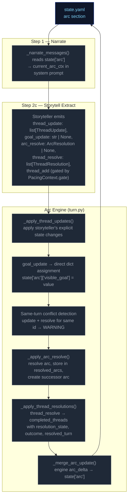

### Thread Mechanics

#### Two Thread Scopes

Threads have a `scope` field (`"scene"` or `"arc"`) that determines narrative treatment:

| Scope | Narrative role | Engine lifecycle |
|---|---|---|
| `scene` | Short-lived tension tied to current location/NPCs | **Purged on location change** — removed from `arc.threads[]` when player moves to a new location (delta_builder.py). |
| `arc` | Persistent story tension across scenes | Persists across location changes. Only removed via `thread_resolve` or auto-closed on arc_resolve (state `"superseded"`). |

#### Entry Points

Six call sites in `run_turn()` process arc/thread operations in order:
1. **`_apply_thread_updates()`** — apply storyteller's explicit state changes; progress is append-only (`list[str]`); sets `last_updated_turn`
2. **`goal_update`** — direct dict assignment to `state["arc"]["visible_goal"]`
3. **Same-turn conflict detection** — warn if same thread id in both update and resolve
4. **`_apply_arc_resolve()`** — resolve arc, store in resolved_arcs, create successor
5. **`_apply_thread_resolutions()`** — resolve/fail/abandon → completed
6. **Thread add gate** — pacing gate + key collision/fuzzy merge checks

All six run after `apply_delta()` but before `save_state()`.

#### Step-by-Step: `_apply_thread_updates()`

Processes `storyteller_result.thread_update` (list of `ThreadUpdate` with `id`, optional `active`, `urgency`, `summary`, `progress`).

For each ThreadUpdate:
1. Find matching thread by ID in `arc.threads[]`
2. If not found → log WARNING, skip
3. If found:
   - Apply non-None fields (`active`, `urgency`, `summary`) via `model_copy`
   - If `progress` is non-None: append to `thread.progress` list (always append, never replace)
   - Set `last_updated_turn` to current turn number
4. Log applied changes at INFO level

**Progress append behavior:** Every `progress` value from a `thread_update` is appended to `ArcThread.progress`. When prior progress is invalidated, the storyteller appends a natural-language entry acknowledging the shift (e.g., "Correction: the dock lead was a dead end."). The renderer shows all entries in order; the LLM on subsequent turns sees the full trail. No replace mechanism, no boolean flag.

#### Step-by-Step: `_apply_arc_resolve()`

Processes `storyteller_result.arc_resolve` (optional `ArcResolution` with `resolution`, `visible_goal`, `goal_context`, `drop_threads: list[str]`, `new_threads: list[ArcThread]`).

1. If `arc_resolve` is None → return None
2. Validate arc from state; if missing/invalid → log WARNING, return None
3. Store current arc in `state["resolved_arcs"]` with `resolved_turn` for TTL tracking
4. Auto-close all arc-scoped threads: move to completed_threads with resolution_state="superseded"
5. Carry forward scene-scoped threads minus any IDs listed in drop_threads
6. Add new_threads from the ArcResolution model
7. Create successor arc with new `visible_goal`, `goal_context`, and combined surviving + new threads
8. Replace `state["arc"]` with successor

#### Thread Creation (gated in `run_turn()`)

New threads (`storyteller_result.thread_add`) are gated by:

1. **Pacing gate**: `PacingContext.gate == "allow"` — blocks escalation when pacing context says so. Gate status is rendered in the prompt (`_thread_list.j2`) so the storyteller has awareness instead of silent drops.
2. **ID collision**: thread `id` already exists in `arc.threads[]` or `arc.completed_threads[]` → reject with WARNING log. Id-based dedup only — no key field or fuzzy merge.

**Thread creation via thread_update (ungoverned):** Threads can also be created implicitly by appearing in `thread_update` without a prior `thread_add`. This is the dominant creation path in practice — the LLM introduces new thread IDs directly via updates.

**Thread creation via thread_update (ungoverned):** Threads can also be created implicitly by appearing in `thread_update` without a prior `thread_add`. This is the dominant creation path in practice — the LLM introduces new thread IDs directly via updates.

#### Step-by-Step: `_apply_thread_resolutions()`

Processes `storyteller_result.thread_resolve` (list of `ThreadResolution` with `id`, `resolution_state`, `outcome`).

1. Find matching thread by ID in `arc.threads[]`
2. If not found → log warning, skip
3. If found → move to `arc.completed_threads[]`, set `resolution_state`, `outcome`, and `resolved_turn`
4. Deduplicate completed_threads entries: existing ID gets updated, not duplicated

#### Pacing Context Gate

`_compute_pacing_context()` sets `gate` based on deescalation:

```
gate = "allow" by default
gate = "block_escalate" when deescalate >= 0.5
```

The gate blocks thread creation. The LLM is instructed not to emit `thread_add` when `gate != "allow"`, and the gate status is explicitly rendered in the prompt to provide awareness.

#### Constants Reference

| Constant | Value (default) | Effect |
|---|---|---|
| `config.resolved_arc_ttl` | 3 | Turns to keep resolved arcs in prompt context |
| `config.completed_thread_ttl` | 3 | Turns to keep completed threads in prompt context |

#### Validation Edge Cases

1. **Empty arc state** — No arc in state → log DEBUG, return None (no crash)
2. **Validation failure** — Arc fails Pydantic validation → log WARNING, return None
3. **Unknown thread ID in update** — Log WARNING, skip — does not block valid updates
4. **Unknown resolution ID** — Log WARNING, skip — does not block valid resolutions
5. **Duplicate thread ID in creation** — Checked against existing + completed IDs
6. **Duplicate ID in creation** — Checked against existing + completed IDs
7. **Same-turn update+resolve conflict** — Same thread id in both `thread_update` and `thread_resolve` → log WARNING, resolution wins (fires after update)
8. **Progress type migration** — Old saves with `progress: "str"` are coerced via `field_validator` wrapping single strings in a list

### Progress Migration

`ArcThread.progress` was changed from `str` to `list[str]` (backward compat not required). A Pydantic `field_validator("progress", mode="wrap")` on the model coerces old string values: if the loaded value is a `str`, it wraps it in `[value]`. This prevents validation failure when loading pre-change saves.

---

---


# Static Context (immutable across all turns)

## Seed State

```json
{
  "meta": {
    "game_name": "eval",
    "turn": 0,
    "setting_pack": "eval-pack",
    "model": ""
  },
  "pc": {
    "name": "Aren Voss",
    "tagline": "Reluctant courier on the merchant road",
    "bio": "Mid-thirties, broad shoulders, careful with words. Took on a courier contract\nto clear an old debt. Just arrived in Marrow's Crossing with a heavy pack and\na heavier obligation.\n",
    "stats": {
      "strength": 3,
      "dexterity": 3,
      "wits": 2,
      "lore": 2,
      "charisma": 3,
      "resolve": 3
    },
    "conditions": [],
    "momentum": 0,
    "drive": ""
  },
  "location": {
    "id": "marrows_crossing",
    "name": "Marrow's Crossing",
    "description": "A market town built around the confluence of two rivers. Cobblestone streets,\ntimber-framed buildings, and the constant sound of water from the mills. The\ntown square has a stone well and a statue of the founder. Most shops are closing\nfor the evening.\n"
  },
  "inventory": [
    {
      "id": "credits",
      "name": "Credits",
      "notes": "Common coin, accepted at any inn or stall on the merchant road.",
      "amount": 500,
      "aliases": []
    },
    {
      "id": "iron_dagger",
      "name": "Iron dagger",
      "notes": "Plain crossguard, edge worn from honing. Belt-carried.",
      "amount": 1,
      "aliases": []
    },
    {
      "id": "bandages",
      "name": "Linen bandages",
      "notes": "Three rolls. Field-grade \u2014 won't replace a healer.",
      "amount": 3,
      "aliases": []
    },
    {
      "id": "traveler_cloak",
      "name": "Traveler's cloak",
      "notes": "Oiled wool, road-stained, hood deep enough to hide a face.",
      "amount": 1,
      "aliases": [
        "cloak",
        "travel cloak"
      ]
    },
    {
      "id": "brass_key",
      "name": "Brass key",
      "notes": "A small brass key Halden gave you with the ledger.",
      "amount": 1,
      "aliases": []
    }
  ],
  "scene": {
    "tagline": "Market town at dusk",
    "tags": [
      "peaceful",
      "start"
    ],
    "world_state": [
      "Marrow's Crossing is a market town at the confluence of two rivers, known for its mills and the annual river festival.",
      "Iron coin (credits) is the universal currency on the merchant road; barter is acceptable but slower.",
      "The road has been quieter than usual this season \u2014 fewer caravans, more independent runners, more opportunists."
    ]
  },
  "compendium": {
    "npcs": {
      "caron": {
        "name": "Caron",
        "title": "Old creditor",
        "bio": "A portly man in his sixties with a merchant's ledger and a patient demeanor. You owe him 500 credits from a failed venture three years ago.",
        "bond": null,
        "presence": null,
        "notes": null,
        "motivation": null,
        "fear": null,
        "leverage": null
      },
      "halden": {
        "name": "Halden",
        "title": "Merchant",
        "bio": "A road merchant in his fifties who hires couriers when his usual runners are spoken for. Honest by reputation, careful with money.",
        "bond": null,
        "presence": null,
        "notes": null,
        "motivation": null,
        "fear": null,
        "leverage": null
      },
      "innkeeper": {
        "name": "Edda",
        "title": "Innkeeper at the Crossed Keys",
        "bio": "Runs the inn alone since her husband died. Knows every traveler by face if not by name. Stays out of trouble unless it walks through her door.",
        "bond": null,
        "presence": null,
        "notes": null,
        "motivation": null,
        "fear": null,
        "leverage": null
      },
      "tough_a": {
        "name": "Bald Tough",
        "title": "Road thug",
        "bio": "Hired muscle. No personal stake in this \u2014 he'll back off if the price is right or the fight goes bad.",
        "bond": null,
        "presence": null,
        "notes": null,
        "motivation": null,
        "fear": null,
        "leverage": null
      },
      "tough_b": {
        "name": "Scarred Tough",
        "title": "Road thug",
        "bio": "Same outfit as the other \u2014 hired by the same person. Quicker to violence; not the brains.",
        "bond": null,
        "presence": null,
        "notes": null,
        "motivation": null,
        "fear": null,
        "leverage": null
      },
      "matthew_estrada": {
        "name": "Matthew Estrada",
        "title": "Traveler",
        "bio": "A tall, broad-shoulded man in a stained leather jerkin carrying a heavy rucksack. Looks like a road runner but moves with military precision.",
        "bond": null,
        "presence": null,
        "notes": null,
        "motivation": null,
        "fear": null,
        "leverage": null
      }
    }
  },
  "arc": {
    "visible_goal": "Clear your debts and deliver the ledger \u2014 two obligations binding you to Marrow's Crossing.",
    "goal_context": "",
    "threads": [
      {
        "id": "settle_the_debt",
        "summary": "Settle the 500-credit debt with Caron.",
        "scope": "arc",
        "active": false,
        "urgency": "normal",
        "progress": [],
        "resolution_state": null,
        "outcome": null,
        "resolved_turn": null
      },
      {
        "id": "deliver_the_ledger",
        "summary": "Deliver Halden's ledger to the merchant at the Crossed Keys Inn.",
        "scope": "arc",
        "active": false,
        "urgency": "normal",
        "progress": [],
        "resolution_state": null,
        "outcome": null,
        "resolved_turn": null
      },
      {
        "id": "clear_the_road_toughs",
        "summary": "Deal with the toughs blocking the inn entrance.",
        "scope": "arc",
        "active": false,
        "urgency": "background",
        "progress": [],
        "resolution_state": null,
        "outcome": null,
        "resolved_turn": null
      }
    ],
    "completed_threads": [],
    "resolution": null,
    "last_thread_created_turn": 0
  }
}
```

## Engine Constants

```json
{
  "urgency_levels": [
    "background",
    "normal",
    "urgent"
  ],
  "momentum_min": -3,
  "momentum_max": 3,
  "momentum_delta": {
    "crit_success": 2,
    "success": 1,
    "partial": 0,
    "setback": -1,
    "fail": -1,
    "crit_fail": -2
  }
}
```

## System Prompts (identical every turn)

### Ruling System Prompt

```
(not captured this run)
```

### Narrate System Prompt

```
(not captured this run)
```

### Extract Scene System Prompt

```
(not captured this run)
```

### Extract State System Prompt

```
(not captured this run)
```

### Storyteller System Prompt

```
(not captured this run)
```


---

# TURN 1

**Input:** `Walk over to Caron's table and sit down across from him. I'm ready to talk about the debt.`

## User Prompts

### Ruling User Prompt
```
(no ruling call this turn)
```

### Narrate User Prompt
```
(no narrate call)
```

### Extract Scene User Prompt
```
(not captured)
```

### Extract State User Prompt
```
(not captured)
```

### Storyteller User Prompt
```
(not captured)
```

## Engine Outputs

### Rules

**Parsed (engine):**
```json
{
  "intent_verb": "negotiate",
  "intent": "The player approaches Caron to discuss their debt.",
  "rolled": false,
  "total_ms": 10428.5,
  "tokens_in": 1923,
  "tokens_out": 72,
  "outcome_summary": "Aren Voss sat across from Caron to confront his outstanding debt of 500 credits."
}
```

**Raw LLM output:**
```

```

### Narration


### Extract Scene

```json
{
  "scene_tags": [
    "tense_conversation",
    "confrontation"
  ],
  "scene_tagline": "A Debt Reclaimed",
  "location_description": "The dimming light of the tavern casts long shadows against the timber walls, while the low drone of the river mills outside intensifies the silence.",
  "compendium_npc_update": [
    {
      "id": "caron",
      "aliases": [],
      "presence": "present",
      "notes": "closing his ledger and leaning forward expectantly \u2014 waiting for a confrontation."
    }
  ]
}
```

### Extract State

```json
{
  "inventory_add": [],
  "inventory_remove": [],
  "inventory_update": [],
  "pc_condition_add": [],
  "pc_condition_remove": []
}
```

### Storyteller

```json
{
  "actions": [
    "Offer Caron the ledger as partial payment for the debt.",
    "Propose a new work contract to earn off the 500 credits.",
    "Demand more time to settle by showing him Halden's ledger.",
    "Ask Caron if he knows why the roads have grown quiet."
  ],
  "outcome_summary": "Aren Voss sat across from Caron to confront his outstanding debt of 500 credits.",
  "gm_beat": {
    "type": "opportunity",
    "surface_as": "npc_behavior"
  },
  "thread_resolve": [],
  "thread_update": [],
  "world_state_add": [],
  "world_state_remove": []
}
```

### Applied Deltas

```json
{
  "inventory_add": [],
  "inventory_remove": [],
  "inventory_update": [],
  "location_description": "The dimming light of the tavern casts long shadows against the timber walls, while the low drone of the river mills outside intensifies the silence.",
  "pc_condition_add": [],
  "pc_condition_remove": [],
  "scene_tags": [
    "tense_conversation",
    "confrontation"
  ],
  "scene_tagline": "A Debt Reclaimed",
  "compendium_npc_update": [
    {
      "id": "caron",
      "aliases": [],
      "presence": "present",
      "notes": "closing his ledger and leaning forward expectantly \u2014 waiting for a confrontation."
    }
  ],
  "actions": [
    "Offer Caron the ledger as partial payment for the debt.",
    "Propose a new work contract to earn off the 500 credits.",
    "Demand more time to settle by showing him Halden's ledger.",
    "Ask Caron if he knows why the roads have grown quiet."
  ],
  "world_state_add": [],
  "world_state_remove": []
}
```

### Rejected Deltas

*(none)*

### Suggested Actions

*(none)*

### Context Telemetry

*(no telemetry)*

### State After Turn

```json
{
  "arc": {
    "completed_threads": [],
    "goal_context": "",
    "last_thread_created_turn": 0,
    "resolution": null,
    "threads": [
      {
        "active": false,
        "id": "settle_the_debt",
        "outcome": null,
        "progress": [],
        "resolution_state": null,
        "resolved_turn": null,
        "scope": "arc",
        "summary": "Settle the 500-credit debt with Caron.",
        "urgency": "normal"
      },
      {
        "active": false,
        "id": "deliver_the_ledger",
        "outcome": null,
        "progress": [],
        "resolution_state": null,
        "resolved_turn": null,
        "scope": "arc",
        "summary": "Deliver Halden's ledger to the merchant at the Crossed Keys Inn.",
        "urgency": "normal"
      },
      {
        "active": false,
        "id": "clear_the_road_toughs",
        "outcome": null,
        "progress": [],
        "resolution_state": null,
        "resolved_turn": null,
        "scope": "arc",
        "summary": "Deal with the toughs blocking the inn entrance.",
        "urgency": "background"
      }
    ],
    "visible_goal": "Clear your debts and deliver the ledger \u2014 two obligations binding you to Marrow's Crossing."
  },
  "compendium": {
    "npcs": {
      "caron": {
        "bio": "A portly man in his sixties with a merchant's ledger and a patient demeanor. You owe him 500 credits from a failed venture three years ago.",
        "bond": null,
        "fear": null,
        "last_seen": {
          "location_id": "marrows_crossing",
          "location_name": "Marrow's Crossing",
          "turn": 1
        },
        "leverage": null,
        "motivation": null,
        "name": "Caron",
        "notes": "closing his ledger and leaning forward expectantly \u2014 waiting for a confrontation.",
        "presence": "present",
        "title": "Old creditor"
      },
      "halden": {
        "bio": "A road merchant in his fifties who hires couriers when his usual runners are spoken for. Honest by reputation, careful with money.",
        "bond": null,
        "fear": null,
        "leverage": null,
        "motivation": null,
        "name": "Halden",
        "notes": null,
        "presence": null,
        "title": "Merchant"
      },
      "innkeeper": {
        "bio": "Runs the inn alone since her husband died. Knows every traveler by face if not by name. Stays out of trouble unless it walks through her door.",
        "bond": null,
        "fear": null,
        "leverage": null,
        "motivation": null,
        "name": "Edda",
        "notes": null,
        "presence": null,
        "title": "Innkeeper at the Crossed Keys"
      },
      "matthew_estrada": {
        "bio": "A tall, broad-shoulded man in a stained leather jerkin carrying a heavy rucksack. Looks like a road runner but moves with military precision.",
        "bond": null,
        "fear": null,
        "leverage": null,
        "motivation": null,
        "name": "Matthew Estrada",
        "notes": null,
        "presence": null,
        "title": "Traveler"
      },
      "tough_a": {
        "bio": "Hired muscle. No personal stake in this \u2014 he'll back off if the price is right or the fight goes bad.",
        "bond": null,
        "fear": null,
        "leverage": null,
        "motivation": null,
        "name": "Bald Tough",
        "notes": null,
        "presence": null,
        "title": "Road thug"
      },
      "tough_b": {
        "bio": "Same outfit as the other \u2014 hired by the same person. Quicker to violence; not the brains.",
        "bond": null,
        "fear": null,
        "leverage": null,
        "motivation": null,
        "name": "Scarred Tough",
        "notes": null,
        "presence": null,
        "title": "Road thug"
      }
    }
  },
  "inventory": [
    {
      "aliases": [],
      "amount": 500,
      "id": "credits",
      "name": "Credits",
      "notes": "Common coin, accepted at any inn or stall on the merchant road."
    },
    {
      "aliases": [],
      "amount": 1,
      "id": "iron_dagger",
      "name": "Iron dagger",
      "notes": "Plain crossguard, edge worn from honing. Belt-carried."
    },
    {
      "aliases": [],
      "amount": 3,
      "id": "bandages",
      "name": "Linen bandages",
      "notes": "Three rolls. Field-grade \u2014 won't replace a healer."
    },
    {
      "aliases": [
        "cloak",
        "travel cloak"
      ],
      "amount": 1,
      "id": "traveler_cloak",
      "name": "Traveler's cloak",
      "notes": "Oiled wool, road-stained, hood deep enough to hide a face."
    },
    {
      "aliases": [],
      "amount": 1,
      "id": "brass_key",
      "name": "Brass key",
      "notes": "A small brass key Halden gave you with the ledger."
    }
  ],
  "location": {
    "description": "The dimming light of the tavern casts long shadows against the timber walls, while the low drone of the river mills outside intensifies the silence.",
    "id": "marrows_crossing",
    "name": "Marrow's Crossing"
  },
  "meta": {
    "compendium_touch_order": [
      "caron"
    ],
    "consecutive_pressure_turns": 0,
    "game_name": "eval",
    "model": "",
    "pending_gm_beat": {
      "beat_expires_turn": 3,
      "surface_as": "npc_behavior",
      "type": "opportunity"
    },
    "prior_history": [
      "- [T1] Aren Voss sat across from Caron to confront his outstanding debt of 500 credits."
    ],
    "recent_beats": [
      {
        "surface_as": "npc_behavior",
        "turn": 1,
        "type": "opportunity"
      }
    ],
    "setting_pack": "eval-pack",
    "turn": 1
  },
  "pc": {
    "actions": [
      "Offer Caron the ledger as partial payment for the debt.",
      "Propose a new work contract to earn off the 500 credits.",
      "Demand more time to settle by showing him Halden's ledger.",
      "Ask Caron if he knows why the roads have grown quiet."
    ],
    "bio": "Mid-thirties, broad shoulders, careful with words. Took on a courier contract\nto clear an old debt. Just arrived in Marrow's Crossing with a heavy pack and\na heavier obligation.\n",
    "conditions": [],
    "drive": "",
    "momentum": 0,
    "name": "Aren Voss",
    "stats": {
      "charisma": 3,
      "dexterity": 3,
      "lore": 2,
      "resolve": 3,
      "strength": 3,
      "wits": 2
    },
    "tagline": "Reluctant courier on the merchant road"
  },
  "scene": {
    "tagline": "A Debt Reclaimed",
    "tags": [
      "tense_conversation",
      "confrontation"
    ],
    "world_state": [
      "Marrow's Crossing is a market town at the confluence of two rivers, known for its mills and the annual river festival.",
      "Iron coin (credits) is the universal currency on the merchant road; barter is acceptable but slower.",
      "The road has been quieter than usual this season \u2014 fewer caravans, more independent runners, more opportunists."
    ]
  },
  "schema_version": 1
}
```


---

# TURN 2

**Input:** `I slide 500 credits across the table to Caron and ask him to mark the debt cleared in his ledger.`

## User Prompts

### Ruling User Prompt
```
(no ruling call this turn)
```

### Narrate User Prompt
```
(no narrate call)
```

### Extract Scene User Prompt
```
(not captured)
```

### Extract State User Prompt
```
(not captured)
```

### Storyteller User Prompt
```
(not captured)
```

## Engine Outputs

### Rules

**Parsed (engine):**
```json
{
  "intent_verb": "negotiate",
  "intent": "The player attempts to settle their debt with Caron using their current credit balance.",
  "rolled": false,
  "total_ms": 3040.7,
  "tokens_in": 2165,
  "tokens_out": 78,
  "outcome_summary": "Aren Voss settled his 500-credit debt by paying Caron in full, officially clearing his slate."
}
```

**Raw LLM output:**
```

```

### Narration


### Extract Scene

```json
{
  "scene_tags": [
    "tense_conversation",
    "resolution"
  ],
  "scene_tagline": "A Debt Settled in Coin",
  "compendium_npc_update": [
    {
      "id": "caron",
      "aliases": [],
      "notes": "tapping a thick finger against his ledger \u2014 satisfied and knowing."
    }
  ]
}
```

### Extract State

```json
{
  "inventory_add": [],
  "inventory_remove": [
    {
      "id": "credits",
      "amount": 500
    }
  ],
  "inventory_update": [],
  "pc_condition_add": [],
  "pc_condition_remove": []
}
```

### Storyteller

```json
{
  "actions": [
    "Take the coins back and head to the inn",
    "Ask Caron why he thinks the road will get harder",
    "Offer more credits to see if he has other work",
    "Leave the coin as a gesture of goodwill"
  ],
  "outcome_summary": "Aren Voss settled his 500-credit debt by paying Caron in full, officially clearing his slate.",
  "thread_resolve": [
    {
      "id": "settle_the_debt",
      "resolution_state": "resolved",
      "outcome": "The debt was paid in full with 500 credits.",
      "promote_to_world_state": true
    }
  ],
  "thread_update": [],
  "world_state_add": [
    {
      "id": "debt_cleared_caron",
      "text": "Aren Voss has successfully settled his 500-credit debt with Caron.",
      "tier": "persistent"
    }
  ],
  "world_state_remove": []
}
```

### Applied Deltas

```json
{
  "inventory_add": [],
  "inventory_remove": [
    {
      "id": "credits",
      "amount": 500
    }
  ],
  "inventory_update": [],
  "pc_condition_add": [],
  "pc_condition_remove": [],
  "scene_tags": [
    "tense_conversation",
    "resolution"
  ],
  "scene_tagline": "A Debt Settled in Coin",
  "compendium_npc_update": [
    {
      "id": "caron",
      "aliases": [],
      "notes": "tapping a thick finger against his ledger \u2014 satisfied and knowing."
    }
  ],
  "actions": [
    "Take the coins back and head to the inn",
    "Ask Caron why he thinks the road will get harder",
    "Offer more credits to see if he has other work",
    "Leave the coin as a gesture of goodwill"
  ],
  "world_state_add": [
    {
      "id": "debt_cleared_caron",
      "text": "Aren Voss has successfully settled his 500-credit debt with Caron.",
      "tier": "persistent"
    }
  ],
  "world_state_remove": []
}
```

### Rejected Deltas

*(none)*

### Suggested Actions

*(none)*

### Context Telemetry

*(no telemetry)*

### State After Turn

*(diff vs previous turn — full snapshot only on first and last turns)*

```json
{
  "arc": {
    "completed_threads": {
      "added": [
        {
          "active": false,
          "id": "settle_the_debt",
          "outcome": "The debt was paid in full with 500 credits.",
          "progress": [],
          "resolution_state": "resolved",
          "resolved_turn": 2,
          "scope": "arc",
          "summary": "Settle the 500-credit debt with Caron.",
          "urgency": "normal"
        }
      ]
    },
    "threads": {
      "removed": [
        {
          "active": false,
          "id": "settle_the_debt",
          "outcome": null,
          "progress": [],
          "resolution_state": null,
          "resolved_turn": null,
          "scope": "arc",
          "summary": "Settle the 500-credit debt with Caron.",
          "urgency": "normal"
        }
      ],
      "changed": [
        {
          "from": {
            "active": false,
            "id": "deliver_the_ledger",
            "outcome": null,
            "progress": [],
            "resolution_state": null,
            "resolved_turn": null,
            "scope": "arc",
            "summary": "Deliver Halden's ledger to the merchant at the Crossed Keys Inn.",
            "urgency": "normal"
          },
          "to": {
            "active": false,
            "id": "deliver_the_ledger",
            "progress": [],
            "scope": "arc",
            "summary": "Deliver Halden's ledger to the merchant at the Crossed Keys Inn.",
            "urgency": "normal"
          }
        },
        {
          "from": {
            "active": false,
            "id": "clear_the_road_toughs",
            "outcome": null,
            "progress": [],
            "resolution_state": null,
            "resolved_turn": null,
            "scope": "arc",
            "summary": "Deal with the toughs blocking the inn entrance.",
            "urgency": "background"
          },
          "to": {
            "active": false,
            "id": "clear_the_road_toughs",
            "progress": [],
            "scope": "arc",
            "summary": "Deal with the toughs blocking the inn entrance.",
            "urgency": "background"
          }
        }
      ]
    }
  },
  "compendium": {
    "npcs": {
      "caron": {
        "last_seen": {
          "turn": {
            "from": 1,
            "to": 2
          }
        },
        "notes": {
          "from": "closing his ledger and leaning forward expectantly \u2014 waiting for a confrontation.",
          "to": "tapping a thick finger against his ledger \u2014 satisfied and knowing."
        }
      }
    }
  },
  "inventory": {
    "removed": [
      {
        "aliases": [],
        "amount": 500,
        "id": "credits",
        "name": "Credits",
        "notes": "Common coin, accepted at any inn or stall on the merchant road."
      }
    ]
  },
  "meta": {
    "pending_gm_beat": {
      "from": {
        "beat_expires_turn": 3,
        "surface_as": "npc_behavior",
        "type": "opportunity"
      },
      "to": null
    },
    "prior_history": {
      "added": [
        "- [T2] Aren Voss settled his 500-credit debt by paying Caron in full, officially clearing his slate."
      ],
      "removed": []
    },
    "recent_beats": {
      "added": [
        [
          [
            "surface_as",
            null
          ],
          [
            "turn",
            2
          ],
          [
            "type",
            null
          ]
        ]
      ],
      "removed": []
    },
    "turn": {
      "from": 1,
      "to": 2
    }
  },
  "pc": {
    "actions": {
      "added": [
        "Ask Caron why he thinks the road will get harder",
        "Take the coins back and head to the inn",
        "Offer more credits to see if he has other work",
        "Leave the coin as a gesture of goodwill"
      ],
      "removed": [
        "Propose a new work contract to earn off the 500 credits.",
        "Demand more time to settle by showing him Halden's ledger.",
        "Offer Caron the ledger as partial payment for the debt.",
        "Ask Caron if he knows why the roads have grown quiet."
      ]
    }
  },
  "scene": {
    "tagline": {
      "from": "A Debt Reclaimed",
      "to": "A Debt Settled in Coin"
    },
    "tags": {
      "added": [
        "resolution"
      ],
      "removed": [
        "confrontation"
      ]
    },
    "world_state": {
      "added": [
        [
          [
            "id",
            "settle_the_debt"
          ],
          [
            "text",
            "The debt was paid in full with 500 credits."
          ],
          [
            "tier",
            "persistent"
          ]
        ],
        [
          [
            "id",
            "debt_cleared_caron"
          ],
          [
            "text",
            "Aren Voss has successfully settled his 500-credit debt with Caron."
          ],
          [
            "tier",
            "persistent"
          ]
        ]
      ],
      "removed": []
    }
  }
}
```


---

# TURN 3

**Input:** `I find Halden by the town well and offer to carry his ledger to the Crossed Keys Inn. I'll do it for 200 credits.`

## User Prompts

### Ruling User Prompt
```
(no ruling call this turn)
```

### Narrate User Prompt
```
(no narrate call)
```

### Extract Scene User Prompt
```
(not captured)
```

### Extract State User Prompt
```
(not captured)
```

### Storyteller User Prompt
```
(not captured)
```

## Engine Outputs

### Rules

**Parsed (engine):**
```json
{
  "intent_verb": "negotiate",
  "intent": "The player offers to perform a courier job for Halden for 200 credits.",
  "rolled": false,
  "total_ms": 3127.9,
  "tokens_in": 2179,
  "tokens_out": 80,
  "outcome_summary": "Aren Voss negotiated a courier contract with Halden, agreeing to a split payment of 100 credits upfront and 100 upon successful delivery of the ledger."
}
```

**Raw LLM output:**
```

```

### Narration


### Extract Scene

```json
{
  "scene_tags": [
    "negotiation",
    "tense_atmosphere"
  ],
  "scene_tagline": "A Risky Contract Offered",
  "location_description": "The town well features a stone lip where water gurgles rhythmically against the masonry.",
  "compendium_npc_update": [
    {
      "id": "halden",
      "aliases": [],
      "presence": "present",
      "notes": "weighing iron coins in his palm \u2014 negotiating terms of a risky delivery."
    }
  ]
}
```

### Extract State

```json
{
  "inventory_add": [
    {
      "id": "credits",
      "name": "Credits",
      "notes": "",
      "amount": 100,
      "aliases": []
    }
  ],
  "inventory_remove": [],
  "inventory_update": [],
  "pc_condition_add": [],
  "pc_condition_remove": []
}
```

### Storyteller

```json
{
  "actions": [
    "Accept Halden's terms and take the hundred credits now.",
    "Demand more upfront by citing the danger of the thugs.",
    "Ask Halden for more intel on the toughness of the guards.",
    "Walk toward the Crossed Keys to scout the entrance first."
  ],
  "outcome_summary": "Aren Voss negotiated a courier contract with Halden, agreeing to a split payment of 100 credits upfront and 100 upon successful delivery of the ledger.",
  "thread_resolve": [],
  "thread_update": [
    {
      "id": "deliver_the_ledger",
      "progress": "Negotiated terms for delivery: 100 credits upfront, 100 on completion."
    }
  ],
  "world_state_add": [
    {
      "id": "halden_courier_contract",
      "text": "Aren Voss is under contract to deliver Halden's ledger to the Crossed Keys for a total of 200 credits.",
      "tier": "persistent"
    }
  ],
  "world_state_remove": []
}
```

### Applied Deltas

```json
{
  "inventory_add": [
    {
      "id": "credits",
      "name": "Credits",
      "notes": "",
      "amount": 100,
      "aliases": []
    }
  ],
  "inventory_remove": [],
  "inventory_update": [],
  "location_description": "The town well features a stone lip where water gurgles rhythmically against the masonry.",
  "pc_condition_add": [],
  "pc_condition_remove": [],
  "scene_tags": [
    "negotiation",
    "tense_atmosphere"
  ],
  "scene_tagline": "A Risky Contract Offered",
  "compendium_npc_update": [
    {
      "id": "halden",
      "aliases": [],
      "presence": "present",
      "notes": "weighing iron coins in his palm \u2014 negotiating terms of a risky delivery."
    }
  ],
  "actions": [
    "Accept Halden's terms and take the hundred credits now.",
    "Demand more upfront by citing the danger of the thugs.",
    "Ask Halden for more intel on the toughness of the guards.",
    "Walk toward the Crossed Keys to scout the entrance first."
  ],
  "world_state_add": [
    {
      "id": "halden_courier_contract",
      "text": "Aren Voss is under contract to deliver Halden's ledger to the Crossed Keys for a total of 200 credits.",
      "tier": "persistent"
    }
  ],
  "world_state_remove": []
}
```

### Rejected Deltas

*(none)*

### Suggested Actions

*(none)*

### Context Telemetry

*(no telemetry)*

### State After Turn

*(diff vs previous turn — full snapshot only on first and last turns)*

```json
{
  "arc": {
    "threads": {
      "changed": [
        {
          "from": {
            "active": false,
            "id": "deliver_the_ledger",
            "progress": [],
            "scope": "arc",
            "summary": "Deliver Halden's ledger to the merchant at the Crossed Keys Inn.",
            "urgency": "normal"
          },
          "to": {
            "active": false,
            "id": "deliver_the_ledger",
            "progress": [
              "Negotiated terms for delivery: 100 credits upfront, 100 on completion."
            ],
            "scope": "arc",
            "summary": "Deliver Halden's ledger to the merchant at the Crossed Keys Inn.",
            "urgency": "normal"
          }
        }
      ]
    }
  },
  "compendium": {
    "npcs": {
      "halden": {
        "last_seen": {
          "from": null,
          "to": {
            "location_id": "marrows_crossing",
            "location_name": "Marrow's Crossing",
            "turn": 3
          }
        },
        "notes": {
          "from": null,
          "to": "weighing iron coins in his palm \u2014 negotiating terms of a risky delivery."
        },
        "presence": {
          "from": null,
          "to": "present"
        }
      }
    }
  },
  "inventory": {
    "added": [
      {
        "amount": 100,
        "id": "credits",
        "name": "Credits",
        "notes": ""
      }
    ]
  },
  "location": {
    "description": {
      "from": "The dimming light of the tavern casts long shadows against the timber walls, while the low drone of the river mills outside intensifies the silence.",
      "to": "The town well features a stone lip where water gurgles rhythmically against the masonry."
    }
  },
  "meta": {
    "compendium_touch_order": {
      "added": [
        "halden"
      ],
      "removed": []
    },
    "prior_history": {
      "added": [
        "- [T3] Aren Voss negotiated a courier contract with Halden, agreeing to a split payment of 100 credits upfront and 100 upon successful delivery of the ledger."
      ],
      "removed": []
    },
    "recent_beats": {
      "added": [
        [
          [
            "surface_as",
            null
          ],
          [
            "turn",
            3
          ],
          [
            "type",
            null
          ]
        ]
      ],
      "removed": []
    },
    "turn": {
      "from": 2,
      "to": 3
    }
  },
  "pc": {
    "actions": {
      "added": [
        "Walk toward the Crossed Keys to scout the entrance first.",
        "Demand more upfront by citing the danger of the thugs.",
        "Ask Halden for more intel on the toughness of the guards.",
        "Accept Halden's terms and take the hundred credits now."
      ],
      "removed": [
        "Ask Caron why he thinks the road will get harder",
        "Take the coins back and head to the inn",
        "Offer more credits to see if he has other work",
        "Leave the coin as a gesture of goodwill"
      ]
    }
  },
  "scene": {
    "tagline": {
      "from": "A Debt Settled in Coin",
      "to": "A Risky Contract Offered"
    },
    "tags": {
      "added": [
        "negotiation",
        "tense_atmosphere"
      ],
      "removed": [
        "tense_conversation",
        "resolution"
      ]
    },
    "world_state": {
      "added": [
        [
          [
            "id",
            "halden_courier_contract"
          ],
          [
            "text",
            "Aren Voss is under contract to deliver Halden's ledger to the Crossed Keys for a total of 200 credits."
          ],
          [
            "tier",
            "persistent"
          ]
        ]
      ],
      "removed": []
    }
  }
}
```


---

# TURN 4

**Input:** `I leave Marrow's Crossing by the east gate and head for the Crossed Keys Inn, following the merchant road.`

## User Prompts

### Ruling User Prompt
```
(no ruling call this turn)
```

### Narrate User Prompt
```
(no narrate call)
```

### Extract Scene User Prompt
```
(not captured)
```

### Extract State User Prompt
```
(not captured)
```

### Storyteller User Prompt
```
(not captured)
```

## Engine Outputs

### Rules

**Parsed (engine):**
```json
{
  "intent_verb": "travel",
  "intent": "The player travels from Marrow's Crossing toward the Crossed Keys Inn via the merchant road.",
  "rolled": false,
  "total_ms": 2997.7,
  "tokens_in": 2225,
  "tokens_out": 62,
  "outcome_summary": "Aren Voss approached the Crossed Keys Inn and found his path blocked by two hired toughs."
}
```

**Raw LLM output:**
```

```

### Narration


### Extract Scene

```json
{
  "scene_tags": [
    "tense_confrontation",
    "suspense"
  ],
  "scene_tagline": "Shadows at the Threshold",
  "location_change": {
    "id": "crossed_keys_entrance",
    "name": "Crossed Keys Entrance",
    "description": "The entrance to the inn where candlelight spills from windows onto a dirt path near the river mills."
  },
  "compendium_npc_update": [
    {
      "id": "tough_a",
      "aliases": [],
      "presence": "present",
      "notes": "leaning heavily against the doorframe, blocking the entrance"
    },
    {
      "id": "tough_b",
      "aliases": [],
      "presence": "present",
      "notes": "stops pacing and fixes a sharp gaze on you to block the path"
    }
  ]
}
```

### Extract State

```json
{
  "inventory_add": [],
  "inventory_remove": [],
  "inventory_update": [],
  "pc_condition_add": [],
  "pc_condition_remove": []
}
```

### Storyteller

```json
{
  "actions": [
    "Offer them twenty credits to step aside and let me pass.",
    "Draw your iron dagger and demand they clear the entrance.",
    "Try to slip past the scarred man while he is distracted.",
    "Call out to Edda inside for help with these thugs."
  ],
  "outcome_summary": "Aren Voss approached the Crossed Keys Inn and found his path blocked by two hired toughs.",
  "gm_beat": {
    "type": "pressure",
    "surface_as": "npc_behavior"
  },
  "thread_resolve": [],
  "thread_update": [
    {
      "id": "clear_the_road_toughs",
      "urgency": "urgent",
      "progress": "Confronted the thugs blocking the inn entrance."
    }
  ],
  "world_state_add": [],
  "world_state_remove": []
}
```

### Applied Deltas

```json
{
  "inventory_add": [],
  "inventory_remove": [],
  "inventory_update": [],
  "location_change": {
    "id": "crossed_keys_entrance",
    "name": "Crossed Keys Entrance",
    "description": "The entrance to the inn where candlelight spills from windows onto a dirt path near the river mills."
  },
  "pc_condition_add": [],
  "pc_condition_remove": [],
  "scene_tags": [
    "tense_confrontation",
    "suspense"
  ],
  "scene_tagline": "Shadows at the Threshold",
  "compendium_npc_update": [
    {
      "id": "tough_a",
      "aliases": [],
      "presence": "present",
      "notes": "leaning heavily against the doorframe, blocking the entrance"
    },
    {
      "id": "tough_b",
      "aliases": [],
      "presence": "present",
      "notes": "stops pacing and fixes a sharp gaze on you to block the path"
    }
  ],
  "actions": [
    "Offer them twenty credits to step aside and let me pass.",
    "Draw your iron dagger and demand they clear the entrance.",
    "Try to slip past the scarred man while he is distracted.",
    "Call out to Edda inside for help with these thugs."
  ],
  "world_state_add": [],
  "world_state_remove": []
}
```

### Rejected Deltas

*(none)*

### Suggested Actions

*(none)*

### Context Telemetry

*(no telemetry)*

### State After Turn

*(diff vs previous turn — full snapshot only on first and last turns)*

```json
{
  "arc": {
    "threads": {
      "changed": [
        {
          "from": {
            "active": false,
            "id": "clear_the_road_toughs",
            "progress": [],
            "scope": "arc",
            "summary": "Deal with the toughs blocking the inn entrance.",
            "urgency": "background"
          },
          "to": {
            "active": false,
            "id": "clear_the_road_toughs",
            "progress": [
              "Confronted the thugs blocking the inn entrance."
            ],
            "scope": "arc",
            "summary": "Deal with the toughs blocking the inn entrance.",
            "urgency": "urgent"
          }
        }
      ]
    }
  },
  "compendium": {
    "npcs": {
      "caron": {
        "notes": {
          "from": "tapping a thick finger against his ledger \u2014 satisfied and knowing.",
          "to": null
        },
        "presence": {
          "from": "present",
          "to": "known"
        }
      },
      "halden": {
        "notes": {
          "from": "weighing iron coins in his palm \u2014 negotiating terms of a risky delivery.",
          "to": null
        },
        "presence": {
          "from": "present",
          "to": "known"
        }
      },
      "tough_a": {
        "last_seen": {
          "from": null,
          "to": {
            "location_id": "crossed_keys_entrance",
            "location_name": "Crossed Keys Entrance",
            "turn": 4
          }
        },
        "notes": {
          "from": null,
          "to": "leaning heavily against the doorframe, blocking the entrance"
        },
        "presence": {
          "from": null,
          "to": "present"
        }
      },
      "tough_b": {
        "last_seen": {
          "from": null,
          "to": {
            "location_id": "crossed_keys_entrance",
            "location_name": "Crossed Keys Entrance",
            "turn": 4
          }
        },
        "notes": {
          "from": null,
          "to": "stops pacing and fixes a sharp gaze on you to block the path"
        },
        "presence": {
          "from": null,
          "to": "present"
        }
      }
    }
  },
  "location": {
    "description": {
      "from": "The town well features a stone lip where water gurgles rhythmically against the masonry.",
      "to": "The entrance to the inn where candlelight spills from windows onto a dirt path near the river mills."
    },
    "id": {
      "from": "marrows_crossing",
      "to": "crossed_keys_entrance"
    },
    "name": {
      "from": "Marrow's Crossing",
      "to": "Crossed Keys Entrance"
    }
  },
  "meta": {
    "compendium_touch_order": {
      "added": [
        "tough_a",
        "tough_b"
      ],
      "removed": []
    },
    "consecutive_pressure_turns": {
      "from": 0,
      "to": 1
    },
    "pending_gm_beat": {
      "from": null,
      "to": {
        "beat_expires_turn": 6,
        "surface_as": "npc_behavior",
        "type": "pressure"
      }
    },
    "prior_history": {
      "added": [
        "- [T4] Aren Voss approached the Crossed Keys Inn and found his path blocked by two hired toughs."
      ],
      "removed": []
    },
    "recent_beats": {
      "added": [
        [
          [
            "surface_as",
            "npc_behavior"
          ],
          [
            "turn",
            4
          ],
          [
            "type",
            "pressure"
          ]
        ]
      ],
      "removed": []
    },
    "turn": {
      "from": 3,
      "to": 4
    }
  },
  "pc": {
    "actions": {
      "added": [
        "Draw your iron dagger and demand they clear the entrance.",
        "Call out to Edda inside for help with these thugs.",
        "Offer them twenty credits to step aside and let me pass.",
        "Try to slip past the scarred man while he is distracted."
      ],
      "removed": [
        "Walk toward the Crossed Keys to scout the entrance first.",
        "Demand more upfront by citing the danger of the thugs.",
        "Ask Halden for more intel on the toughness of the guards.",
        "Accept Halden's terms and take the hundred credits now."
      ]
    }
  },
  "scene": {
    "location_entered_turn": {
      "from": null,
      "to": 3
    },
    "tagline": {
      "from": "A Risky Contract Offered",
      "to": "Shadows at the Threshold"
    },
    "tags": {
      "added": [
        "suspense",
        "tense_confrontation"
      ],
      "removed": [
        "negotiation",
        "tense_atmosphere"
      ]
    },
    "turn_entered": {
      "from": null,
      "to": 3
    }
  }
}
```


---

# TURN 5

**Input:** `I walk up to the two toughs at the inn door and ask them what they're doing here. I'm not leaving until I hear their side.`

## User Prompts

### Ruling User Prompt
```
(no ruling call this turn)
```

### Narrate User Prompt
```
(no narrate call)
```

### Extract Scene User Prompt
```
(not captured)
```

### Extract State User Prompt
```
(not captured)
```

### Storyteller User Prompt
```
(not captured)
```

## Engine Outputs

### Rules

**Parsed (engine):**
```json
{
  "intent_verb": "persuade",
  "intent": "The player approaches the thugs and demands an explanation for their presence, refusing to leave without answers.",
  "rolled": true,
  "total_ms": 3963.6,
  "tokens_in": 2179,
  "tokens_out": 103,
  "outcome_summary": "Aren Voss demanded an explanation from the thugs, causing the Scarred Tough to draw his knife and the Bald Tough to flank him.",
  "skill": "charisma",
  "difficulty": "normal",
  "dice": [
    1
  ],
  "stat_mod": 1,
  "diff_mod": 0,
  "cond_mod": 0,
  "raw_total": 1,
  "final_total": 2,
  "band": "fail",
  "momentum_before": 0,
  "momentum_after": -1,
  "momentum_delta": -1
}
```

**Raw LLM output:**
```

```

### Narration


### Extract Scene

```json
{
  "scene_tags": [
    "confrontation",
    "tense_standoff",
    "imminent_combat"
  ],
  "scene_tagline": "A Predatory Stillness",
  "compendium_npc_update": [
    {
      "id": "tough_a",
      "aliases": [],
      "notes": "shifting weight and eyeing your coin purse \u2014 preparing to flank you."
    },
    {
      "id": "tough_b",
      "aliases": [],
      "notes": "reaching for his knife with whitening knuckles \u2014 adopting a predatory stillness."
    }
  ]
}
```

### Extract State

```json
{
  "inventory_add": [],
  "inventory_remove": [],
  "inventory_update": [],
  "pc_condition_add": [],
  "pc_condition_remove": []
}
```

### Storyteller

```json
{
  "actions": [
    "Draw your iron dagger and brace for their attack.",
    "Quickly offer them credits to let you pass peacefully.",
    "Back away toward the river mills to find a different entrance.",
    "Shout for Edda to come out and witness their intimidation."
  ],
  "outcome_summary": "Aren Voss demanded an explanation from the thugs, causing the Scarred Tough to draw his knife and the Bald Tough to flank him.",
  "gm_beat": {
    "type": "complication",
    "surface_as": "npc_behavior"
  },
  "thread_resolve": [],
  "thread_update": [],
  "world_state_add": [],
  "world_state_remove": []
}
```

### Applied Deltas

```json
{
  "inventory_add": [],
  "inventory_remove": [],
  "inventory_update": [],
  "pc_condition_add": [],
  "pc_condition_remove": [],
  "scene_tags": [
    "confrontation",
    "tense_standoff",
    "imminent_combat"
  ],
  "scene_tagline": "A Predatory Stillness",
  "compendium_npc_update": [
    {
      "id": "tough_a",
      "aliases": [],
      "notes": "shifting weight and eyeing your coin purse \u2014 preparing to flank you."
    },
    {
      "id": "tough_b",
      "aliases": [],
      "notes": "reaching for his knife with whitening knuckles \u2014 adopting a predatory stillness."
    }
  ],
  "actions": [
    "Draw your iron dagger and brace for their attack.",
    "Quickly offer them credits to let you pass peacefully.",
    "Back away toward the river mills to find a different entrance.",
    "Shout for Edda to come out and witness their intimidation."
  ],
  "world_state_add": [],
  "world_state_remove": []
}
```

### Rejected Deltas

*(none)*

### Suggested Actions

*(none)*

### Context Telemetry

*(no telemetry)*

### State After Turn

*(diff vs previous turn — full snapshot only on first and last turns)*

```json
{
  "compendium": {
    "npcs": {
      "tough_a": {
        "last_seen": {
          "turn": {
            "from": 4,
            "to": 5
          }
        },
        "notes": {
          "from": "leaning heavily against the doorframe, blocking the entrance",
          "to": "shifting weight and eyeing your coin purse \u2014 preparing to flank you."
        }
      },
      "tough_b": {
        "last_seen": {
          "turn": {
            "from": 4,
            "to": 5
          }
        },
        "notes": {
          "from": "stops pacing and fixes a sharp gaze on you to block the path",
          "to": "reaching for his knife with whitening knuckles \u2014 adopting a predatory stillness."
        }
      }
    }
  },
  "meta": {
    "consecutive_pressure_turns": {
      "from": 1,
      "to": 2
    },
    "pending_gm_beat": {
      "beat_expires_turn": {
        "from": 6,
        "to": 7
      },
      "type": {
        "from": "pressure",
        "to": "complication"
      }
    },
    "prior_history": {
      "added": [
        "- [T5] Aren Voss demanded an explanation from the thugs, causing the Scarred Tough to draw his knife and the Bald Tough to flank him."
      ],
      "removed": []
    },
    "recent_beats": {
      "added": [
        [
          [
            "surface_as",
            "npc_behavior"
          ],
          [
            "turn",
            5
          ],
          [
            "type",
            "complication"
          ]
        ]
      ],
      "removed": []
    },
    "turn": {
      "from": 4,
      "to": 5
    }
  },
  "pc": {
    "actions": {
      "added": [
        "Draw your iron dagger and brace for their attack.",
        "Quickly offer them credits to let you pass peacefully.",
        "Shout for Edda to come out and witness their intimidation.",
        "Back away toward the river mills to find a different entrance."
      ],
      "removed": [
        "Draw your iron dagger and demand they clear the entrance.",
        "Call out to Edda inside for help with these thugs.",
        "Offer them twenty credits to step aside and let me pass.",
        "Try to slip past the scarred man while he is distracted."
      ]
    },
    "momentum": {
      "from": 0,
      "to": -1
    }
  },
  "scene": {
    "tagline": {
      "from": "Shadows at the Threshold",
      "to": "A Predatory Stillness"
    },
    "tags": {
      "added": [
        "imminent_combat",
        "confrontation",
        "tense_standoff"
      ],
      "removed": [
        "suspense",
        "tense_confrontation"
      ]
    }
  }
}
```


---

# TURN 6

**Input:** `I drop 200 credits on the ground between the toughs and tell them Caron's coin is paid — they can go home now.`

## User Prompts

### Ruling User Prompt
```
(no ruling call this turn)
```

### Narrate User Prompt
```
(no narrate call)
```

### Extract Scene User Prompt
```
(not captured)
```

### Extract State User Prompt
```
(not captured)
```

### Storyteller User Prompt
```
(not captured)
```

## Engine Outputs

### Rules

**Parsed (engine):**
```json
{
  "intent_verb": "deceive",
  "intent": "The player attempts to bribe the thugs with 200 credits to avoid a confrontation.",
  "rolled": false,
  "total_ms": 4488.6,
  "tokens_in": 2178,
  "tokens_out": 118,
  "outcome_summary": "Aren Voss attempted to bribe the thugs with 200 credits but failed, leaving him with only a small handful of coins as the Scarred Tough lunges and the Bald Tough flanks him."
}
```

**Raw LLM output:**
```

```

### Narration


### Extract Scene

```json
{
  "scene_tags": [
    "combat",
    "tense_confrontation"
  ],
  "scene_tagline": "A Failed Bribe",
  "compendium_npc_update": [
    {
      "id": "tough_a",
      "aliases": [],
      "notes": "stepping closer to cast a shadow over you and beginning a wide arc to your left to cut off your retreat."
    },
    {
      "id": "tough_b",
      "aliases": [],
      "notes": "lunging forward with his knife partially drawn to close the distance."
    }
  ]
}
```

### Extract State

```json
{
  "inventory_add": [],
  "inventory_remove": [
    {
      "id": "credits",
      "amount": 5
    }
  ],
  "inventory_update": [],
  "pc_condition_add": [],
  "pc_condition_remove": []
}
```

### Storyteller

```json
{
  "actions": [
    "Draw my iron dagger and parry the Scarred Tough's lunge.",
    "Kick the pile of coins toward them to create a distraction.",
    "Sprint past the Bald Tough toward the inn entrance instead.",
    "Shout for Edda to call for help from inside the inn."
  ],
  "outcome_summary": "Aren Voss attempted to bribe the thugs with 200 credits but failed, leaving him with only a small handful of coins as the Scarred Tough lunges and the Bald Tough flanks him.",
  "gm_beat": {
    "type": "pressure",
    "surface_as": "event"
  },
  "thread_resolve": [],
  "thread_update": [
    {
      "id": "clear_the_road_toughs",
      "progress": "Bribe failed; combat is now imminent."
    }
  ],
  "world_state_add": [],
  "world_state_remove": []
}
```

### Applied Deltas

```json
{
  "inventory_add": [],
  "inventory_remove": [
    {
      "id": "credits",
      "amount": 5
    }
  ],
  "inventory_update": [],
  "pc_condition_add": [],
  "pc_condition_remove": [],
  "scene_tags": [
    "combat",
    "tense_confrontation"
  ],
  "scene_tagline": "A Failed Bribe",
  "compendium_npc_update": [
    {
      "id": "tough_a",
      "aliases": [],
      "notes": "stepping closer to cast a shadow over you and beginning a wide arc to your left to cut off your retreat."
    },
    {
      "id": "tough_b",
      "aliases": [],
      "notes": "lunging forward with his knife partially drawn to close the distance."
    }
  ],
  "actions": [
    "Draw my iron dagger and parry the Scarred Tough's lunge.",
    "Kick the pile of coins toward them to create a distraction.",
    "Sprint past the Bald Tough toward the inn entrance instead.",
    "Shout for Edda to call for help from inside the inn."
  ],
  "world_state_add": [],
  "world_state_remove": []
}
```

### Rejected Deltas

*(none)*

### Suggested Actions

*(none)*

### Context Telemetry

*(no telemetry)*

### State After Turn

*(diff vs previous turn — full snapshot only on first and last turns)*

```json
{
  "arc": {
    "threads": {
      "changed": [
        {
          "from": {
            "active": false,
            "id": "clear_the_road_toughs",
            "progress": [
              "Confronted the thugs blocking the inn entrance."
            ],
            "scope": "arc",
            "summary": "Deal with the toughs blocking the inn entrance.",
            "urgency": "urgent"
          },
          "to": {
            "active": false,
            "id": "clear_the_road_toughs",
            "progress": [
              "Confronted the thugs blocking the inn entrance.",
              "Bribe failed; combat is now imminent."
            ],
            "scope": "arc",
            "summary": "Deal with the toughs blocking the inn entrance.",
            "urgency": "urgent"
          }
        }
      ]
    }
  },
  "compendium": {
    "npcs": {
      "tough_a": {
        "last_seen": {
          "turn": {
            "from": 5,
            "to": 6
          }
        },
        "notes": {
          "from": "shifting weight and eyeing your coin purse \u2014 preparing to flank you.",
          "to": "stepping closer to cast a shadow over you and beginning a wide arc to your left to cut off your retreat."
        }
      },
      "tough_b": {
        "last_seen": {
          "turn": {
            "from": 5,
            "to": 6
          }
        },
        "notes": {
          "from": "reaching for his knife with whitening knuckles \u2014 adopting a predatory stillness.",
          "to": "lunging forward with his knife partially drawn to close the distance."
        }
      }
    }
  },
  "inventory": {
    "changed": [
      {
        "from": {
          "amount": 100,
          "id": "credits",
          "name": "Credits",
          "notes": ""
        },
        "to": {
          "amount": 95,
          "id": "credits",
          "name": "Credits",
          "notes": ""
        }
      }
    ]
  },
  "meta": {
    "consecutive_pressure_turns": {
      "from": 2,
      "to": 3
    },
    "pending_gm_beat": {
      "beat_expires_turn": {
        "from": 7,
        "to": 8
      },
      "surface_as": {
        "from": "npc_behavior",
        "to": "event"
      },
      "type": {
        "from": "complication",
        "to": "pressure"
      }
    },
    "prior_history": {
      "added": [
        "- [T6] Aren Voss attempted to bribe the thugs with 200 credits but failed, leaving him with only a small handful of coins as the Scarred Tough lunges and the Bald Tough flanks him."
      ],
      "removed": []
    },
    "recent_beats": {
      "added": [
        [
          [
            "surface_as",
            "event"
          ],
          [
            "turn",
            6
          ],
          [
            "type",
            "pressure"
          ]
        ]
      ],
      "removed": [
        [
          [
            "surface_as",
            "npc_behavior"
          ],
          [
            "turn",
            1
          ],
          [
            "type",
            "opportunity"
          ]
        ]
      ]
    },
    "turn": {
      "from": 5,
      "to": 6
    }
  },
  "pc": {
    "actions": {
      "added": [
        "Draw my iron dagger and parry the Scarred Tough's lunge.",
        "Shout for Edda to call for help from inside the inn.",
        "Kick the pile of coins toward them to create a distraction.",
        "Sprint past the Bald Tough toward the inn entrance instead."
      ],
      "removed": [
        "Draw your iron dagger and brace for their attack.",
        "Quickly offer them credits to let you pass peacefully.",
        "Shout for Edda to come out and witness their intimidation.",
        "Back away toward the river mills to find a different entrance."
      ]
    },
    "momentum": {
      "from": -1,
      "to": -2
    }
  },
  "scene": {
    "tagline": {
      "from": "A Predatory Stillness",
      "to": "A Failed Bribe"
    },
    "tags": {
      "added": [
        "combat",
        "tense_confrontation"
      ],
      "removed": [
        "imminent_combat",
        "confrontation",
        "tense_standoff"
      ]
    }
  }
}
```


---

# TURN 7

**Input:** `I sit across from Halden at his table, slide the merchant seal across, and hand him the ledger from my coat.`

## User Prompts

### Ruling User Prompt
```
(no ruling call this turn)
```

### Narrate User Prompt
```
(no narrate call)
```

### Extract Scene User Prompt
```
(not captured)
```

### Extract State User Prompt
```
(not captured)
```

### Storyteller User Prompt
```
(not captured)
```

## Engine Outputs

### Rules

**Parsed (engine):**
```json
{
  "intent_verb": "negotiate",
  "intent": "The player attempts to complete a transaction or deliver documents to Halden.",
  "rolled": false,
  "total_ms": 4371.1,
  "tokens_in": 2210,
  "tokens_out": 122,
  "outcome_summary": "Aren Voss failed to present the ledger or bribe the thugs, resulting in an immediate physical assault by the Scarred and Bald Toughs."
}
```

**Raw LLM output:**
```

```

### Narration


### Extract Scene

```json
{
  "scene_tags": [
    "combat",
    "tense",
    "violent"
  ],
  "scene_tagline": "A Deadly Circle Closes",
  "location_description": "The flickering candlelight from the inn windows casts long, dancing shadows across the dirt path as the attackers tighten their perimeter.",
  "compendium_npc_update": [
    {
      "id": "tough_b",
      "aliases": [],
      "notes": "lunging forward with a blade whistling toward your midsection"
    },
    {
      "id": "tough_a",
      "aliases": [],
      "notes": "looming over you to block the path toward the inn"
    }
  ]
}
```

### Extract State

```json
{
  "inventory_add": [],
  "inventory_remove": [],
  "inventory_update": [],
  "pc_condition_add": [],
  "pc_condition_remove": []
}
```

### Storyteller

```json
{
  "actions": [
    "Draw my iron dagger to parry the Scarred Tough's blade",
    "Dodge the lunge and try to shove Bald Tough aside",
    "Sprint toward the inn entrance to find Edda's help",
    "Throw a handful of coins at the Scarred Tough's face"
  ],
  "outcome_summary": "Aren Voss failed to present the ledger or bribe the thugs, resulting in an immediate physical assault by the Scarred and Bald Toughs.",
  "gm_beat": {
    "type": "escalation",
    "surface_as": "event"
  },
  "thread_resolve": [],
  "thread_update": [
    {
      "id": "clear_the_road_toughs",
      "progress": "Combat has transitioned from a failed bribe to an active physical assault."
    }
  ],
  "world_state_add": [],
  "world_state_remove": []
}
```

### Applied Deltas

```json
{
  "inventory_add": [],
  "inventory_remove": [],
  "inventory_update": [],
  "location_description": "The flickering candlelight from the inn windows casts long, dancing shadows across the dirt path as the attackers tighten their perimeter.",
  "pc_condition_add": [],
  "pc_condition_remove": [],
  "scene_tags": [
    "combat",
    "tense",
    "violent"
  ],
  "scene_tagline": "A Deadly Circle Closes",
  "compendium_npc_update": [
    {
      "id": "tough_b",
      "aliases": [],
      "notes": "lunging forward with a blade whistling toward your midsection"
    },
    {
      "id": "tough_a",
      "aliases": [],
      "notes": "looming over you to block the path toward the inn"
    }
  ],
  "actions": [
    "Draw my iron dagger to parry the Scarred Tough's blade",
    "Dodge the lunge and try to shove Bald Tough aside",
    "Sprint toward the inn entrance to find Edda's help",
    "Throw a handful of coins at the Scarred Tough's face"
  ],
  "world_state_add": [],
  "world_state_remove": []
}
```

### Rejected Deltas

*(none)*

### Suggested Actions

*(none)*

### Context Telemetry

*(no telemetry)*

### State After Turn

*(diff vs previous turn — full snapshot only on first and last turns)*

```json
{
  "arc": {
    "threads": {
      "changed": [
        {
          "from": {
            "active": false,
            "id": "clear_the_road_toughs",
            "progress": [
              "Confronted the thugs blocking the inn entrance.",
              "Bribe failed; combat is now imminent."
            ],
            "scope": "arc",
            "summary": "Deal with the toughs blocking the inn entrance.",
            "urgency": "urgent"
          },
          "to": {
            "active": false,
            "id": "clear_the_road_toughs",
            "progress": [
              "Confronted the thugs blocking the inn entrance.",
              "Bribe failed; combat is now imminent.",
              "Combat has transitioned from a failed bribe to an active physical assault."
            ],
            "scope": "arc",
            "summary": "Deal with the toughs blocking the inn entrance.",
            "urgency": "urgent"
          }
        }
      ]
    }
  },
  "compendium": {
    "npcs": {
      "tough_a": {
        "last_seen": {
          "turn": {
            "from": 6,
            "to": 7
          }
        },
        "notes": {
          "from": "stepping closer to cast a shadow over you and beginning a wide arc to your left to cut off your retreat.",
          "to": "looming over you to block the path toward the inn"
        }
      },
      "tough_b": {
        "last_seen": {
          "turn": {
            "from": 6,
            "to": 7
          }
        },
        "notes": {
          "from": "lunging forward with his knife partially drawn to close the distance.",
          "to": "lunging forward with a blade whistling toward your midsection"
        }
      }
    }
  },
  "location": {
    "description": {
      "from": "The entrance to the inn where candlelight spills from windows onto a dirt path near the river mills.",
      "to": "The flickering candlelight from the inn windows casts long, dancing shadows across the dirt path as the attackers tighten their perimeter."
    }
  },
  "meta": {
    "consecutive_pressure_turns": {
      "from": 3,
      "to": 4
    },
    "pending_gm_beat": {
      "beat_expires_turn": {
        "from": 8,
        "to": 9
      },
      "surface_as": {
        "from": "event",
        "to": "ambient"
      },
      "type": {
        "from": "pressure",
        "to": "breathing_room"
      }
    },
    "prior_history": {
      "added": [
        "- [T7] Aren Voss failed to present the ledger or bribe the thugs, resulting in an immediate physical assault by the Scarred and Bald Toughs."
      ],
      "removed": []
    },
    "recent_beats": {
      "added": [
        [
          [
            "surface_as",
            "ambient"
          ],
          [
            "turn",
            7
          ],
          [
            "type",
            "breathing_room"
          ]
        ]
      ],
      "removed": [
        [
          [
            "surface_as",
            null
          ],
          [
            "turn",
            2
          ],
          [
            "type",
            null
          ]
        ]
      ]
    },
    "turn": {
      "from": 6,
      "to": 7
    }
  },
  "pc": {
    "actions": {
      "added": [
        "Dodge the lunge and try to shove Bald Tough aside",
        "Draw my iron dagger to parry the Scarred Tough's blade",
        "Throw a handful of coins at the Scarred Tough's face",
        "Sprint toward the inn entrance to find Edda's help"
      ],
      "removed": [
        "Draw my iron dagger and parry the Scarred Tough's lunge.",
        "Shout for Edda to call for help from inside the inn.",
        "Kick the pile of coins toward them to create a distraction.",
        "Sprint past the Bald Tough toward the inn entrance instead."
      ]
    },
    "momentum": {
      "from": -2,
      "to": -3
    }
  },
  "scene": {
    "tagline": {
      "from": "A Failed Bribe",
      "to": "A Deadly Circle Closes"
    },
    "tags": {
      "added": [
        "violent",
        "tense"
      ],
      "removed": [
        "tense_confrontation"
      ]
    }
  }
}
```


---

# TURN 8

**Input:** `I pull out the brass key Halden gave me and try to unlock the inn's front door with it. Maybe it opens a back room.`

## User Prompts

### Ruling User Prompt
```
(no ruling call this turn)
```

### Narrate User Prompt
```
(no narrate call)
```

### Extract Scene User Prompt
```
(not captured)
```

### Extract State User Prompt
```
(not captured)
```

### Storyteller User Prompt
```
(not captured)
```

## Engine Outputs

### Rules

**Parsed (engine):**
```json
{
  "intent_verb": "sneak",
  "intent": "The player attempts to use a brass key to unlock the inn's door to escape the attackers.",
  "rolled": true,
  "total_ms": 3724.5,
  "tokens_in": 2169,
  "tokens_out": 103,
  "outcome_summary": "Aren Voss failed to unlock the inn door with the brass key, alerting someone inside while being cornered by both thugs.",
  "skill": "dexterity",
  "difficulty": "hard",
  "dice": [
    6
  ],
  "stat_mod": 1,
  "diff_mod": -1,
  "cond_mod": 0,
  "raw_total": 6,
  "final_total": 6,
  "band": "setback",
  "momentum_before": -3,
  "momentum_after": -3,
  "momentum_delta": 0
}
```

**Raw LLM output:**
```

```

### Narration


### Extract Scene

```json
{
  "scene_tags": [
    "combat",
    "tense",
    "desperate"
  ],
  "scene_tagline": "A Jammed Lock and Closing Shadows",
  "location_description": "The sound of metal scraping against the lock echoes loudly against nearby stone walls, drawing attention from the inn's upper floors.",
  "compendium_npc_update": [
    {
      "id": "tough_b",
      "aliases": [],
      "notes": "recovering from a missed strike with a predatory grin, preparing to drive his blade home"
    },
    {
      "id": "tough_a",
      "aliases": [],
      "notes": "stepping closer to cut off the exit toward the threshold"
    }
  ]
}
```

### Extract State

```json
{
  "inventory_add": [],
  "inventory_remove": [],
  "inventory_update": [],
  "pc_condition_add": [
    {
      "id": "shaken",
      "label": "shaken",
      "description": "The loud noise of the failed lock attempt and the sudden realization of being spotted has rattled your nerves.",
      "turns_remaining": 3
    }
  ],
  "pc_condition_remove": []
}
```

### Storyteller

```json
{
  "actions": [
    "Draw my iron dagger and brace for the Scarred Tough's strike.",
    "Spin away from the door to face the Bald Tough head-on.",
    "Shout for Edda to call for help from the upper window.",
    "Abandon the lock and charge the Scarred Tough to disrupt his momentum."
  ],
  "outcome_summary": "Aren Voss failed to unlock the inn door with the brass key, alerting someone inside while being cornered by both thugs.",
  "gm_beat": {
    "type": "complication",
    "surface_as": "event"
  },
  "thread_resolve": [],
  "thread_update": [
    {
      "id": "clear_the_road_toughs",
      "progress": "The failed lock attempt has alerted someone inside the inn."
    }
  ],
  "world_state_add": [],
  "world_state_remove": []
}
```

### Applied Deltas

```json
{
  "inventory_add": [],
  "inventory_remove": [],
  "inventory_update": [],
  "location_description": "The sound of metal scraping against the lock echoes loudly against nearby stone walls, drawing attention from the inn's upper floors.",
  "pc_condition_add": [
    {
      "id": "shaken",
      "label": "shaken",
      "description": "The loud noise of the failed lock attempt and the sudden realization of being spotted has rattled your nerves.",
      "turns_remaining": 3
    }
  ],
  "pc_condition_remove": [],
  "scene_tags": [
    "combat",
    "tense",
    "desperate"
  ],
  "scene_tagline": "A Jammed Lock and Closing Shadows",
  "compendium_npc_update": [
    {
      "id": "tough_b",
      "aliases": [],
      "notes": "recovering from a missed strike with a predatory grin, preparing to drive his blade home"
    },
    {
      "id": "tough_a",
      "aliases": [],
      "notes": "stepping closer to cut off the exit toward the threshold"
    }
  ],
  "actions": [
    "Draw my iron dagger and brace for the Scarred Tough's strike.",
    "Spin away from the door to face the Bald Tough head-on.",
    "Shout for Edda to call for help from the upper window.",
    "Abandon the lock and charge the Scarred Tough to disrupt his momentum."
  ],
  "world_state_add": [],
  "world_state_remove": []
}
```

### Rejected Deltas

*(none)*

### Suggested Actions

*(none)*

### Context Telemetry

*(no telemetry)*

### State After Turn

*(diff vs previous turn — full snapshot only on first and last turns)*

```json
{
  "arc": {
    "threads": {
      "changed": [
        {
          "from": {
            "active": false,
            "id": "clear_the_road_toughs",
            "progress": [
              "Confronted the thugs blocking the inn entrance.",
              "Bribe failed; combat is now imminent.",
              "Combat has transitioned from a failed bribe to an active physical assault."
            ],
            "scope": "arc",
            "summary": "Deal with the toughs blocking the inn entrance.",
            "urgency": "urgent"
          },
          "to": {
            "active": false,
            "id": "clear_the_road_toughs",
            "progress": [
              "Confronted the thugs blocking the inn entrance.",
              "Bribe failed; combat is now imminent.",
              "Combat has transitioned from a failed bribe to an active physical assault.",
              "The failed lock attempt has alerted someone inside the inn."
            ],
            "scope": "arc",
            "summary": "Deal with the toughs blocking the inn entrance.",
            "urgency": "urgent"
          }
        }
      ]
    }
  },
  "compendium": {
    "npcs": {
      "tough_a": {
        "last_seen": {
          "turn": {
            "from": 7,
            "to": 8
          }
        },
        "notes": {
          "from": "looming over you to block the path toward the inn",
          "to": "stepping closer to cut off the exit toward the threshold"
        }
      },
      "tough_b": {
        "last_seen": {
          "turn": {
            "from": 7,
            "to": 8
          }
        },
        "notes": {
          "from": "lunging forward with a blade whistling toward your midsection",
          "to": "recovering from a missed strike with a predatory grin, preparing to drive his blade home"
        }
      }
    }
  },
  "location": {
    "description": {
      "from": "The flickering candlelight from the inn windows casts long, dancing shadows across the dirt path as the attackers tighten their perimeter.",
      "to": "The sound of metal scraping against the lock echoes loudly against nearby stone walls, drawing attention from the inn's upper floors."
    }
  },
  "meta": {
    "consecutive_pressure_turns": {
      "from": 4,
      "to": 5
    },
    "pending_gm_beat": {
      "beat_expires_turn": {
        "from": 9,
        "to": 10
      }
    },
    "prior_history": {
      "added": [
        "- [T8] Aren Voss failed to unlock the inn door with the brass key, alerting someone inside while being cornered by both thugs."
      ],
      "removed": []
    },
    "recent_beats": {
      "added": [
        [
          [
            "surface_as",
            "ambient"
          ],
          [
            "turn",
            8
          ],
          [
            "type",
            "breathing_room"
          ]
        ]
      ],
      "removed": [
        [
          [
            "surface_as",
            null
          ],
          [
            "turn",
            3
          ],
          [
            "type",
            null
          ]
        ]
      ]
    },
    "turn": {
      "from": 7,
      "to": 8
    }
  },
  "pc": {
    "actions": {
      "added": [
        "Shout for Edda to call for help from the upper window.",
        "Draw my iron dagger and brace for the Scarred Tough's strike.",
        "Spin away from the door to face the Bald Tough head-on.",
        "Abandon the lock and charge the Scarred Tough to disrupt his momentum."
      ],
      "removed": [
        "Dodge the lunge and try to shove Bald Tough aside",
        "Draw my iron dagger to parry the Scarred Tough's blade",
        "Throw a handful of coins at the Scarred Tough's face",
        "Sprint toward the inn entrance to find Edda's help"
      ]
    },
    "conditions": {
      "added": [
        {
          "added_turn": 7,
          "description": "The loud noise of the failed lock attempt and the sudden realization of being spotted has rattled your nerves.",
          "id": "shaken",
          "label": "shaken",
          "turns_remaining": 3
        }
      ]
    }
  },
  "scene": {
    "tagline": {
      "from": "A Deadly Circle Closes",
      "to": "A Jammed Lock and Closing Shadows"
    },
    "tags": {
      "added": [
        "desperate"
      ],
      "removed": [
        "violent"
      ]
    }
  }
}
```


---

# TURN 9

**Input:** `I press my ear against the inn's stone wall and whisper 'I have credits. Open up.' Then I offer a single credit to the wall.`

## User Prompts

### Ruling User Prompt
```
(no ruling call this turn)
```

### Narrate User Prompt
```
(no narrate call)
```

### Extract Scene User Prompt
```
(not captured)
```

### Extract State User Prompt
```
(not captured)
```

### Storyteller User Prompt
```
(not captured)
```

## Engine Outputs

### Rules

**Parsed (engine):**
```json
{
  "intent_verb": "deceive",
  "intent": "The player attempts to bribe someone inside the inn through the wall to open the door.",
  "rolled": true,
  "total_ms": 3635.6,
  "tokens_in": 2223,
  "tokens_out": 101,
  "outcome_summary": "Aren Voss attempted to bribe someone inside the inn, but the Bald Tough pinned him against the wall while the Scarred Tough lunged with a blade.",
  "skill": "charisma",
  "difficulty": "normal",
  "dice": [
    7
  ],
  "stat_mod": 1,
  "diff_mod": 0,
  "cond_mod": 0,
  "raw_total": 7,
  "final_total": 8,
  "band": "partial",
  "momentum_before": -3,
  "momentum_after": -3,
  "momentum_delta": 0
}
```

**Raw LLM output:**
```

```

### Narration


### Extract Scene

```json
{
  "scene_tags": [
    "combat",
    "tense",
    "desperate"
  ],
  "scene_tagline": "Pinned Against the Wall",
  "location_description": "The rough stone wall of the inn vibrates with the heavy footsteps of someone moving within.",
  "compendium_npc_update": [
    {
      "id": "tough_a",
      "aliases": [],
      "notes": "grabbing your shoulder to jerk you away from the wall and into the open path."
    },
    {
      "id": "tough_b",
      "aliases": [],
      "notes": "lunging forward with a blade whistling toward your midsection."
    }
  ]
}
```

### Extract State

```json
{
  "inventory_add": [],
  "inventory_remove": [
    {
      "id": "credits",
      "amount": 1
    }
  ],
  "inventory_update": [],
  "pc_condition_add": [],
  "pc_condition_remove": [
    {
      "id": "shaken"
    }
  ]
}
```

### Storyteller

```json
{
  "actions": [
    "Draw my iron dagger and strike at the Scarred Tough.",
    "Spin away from Bald Tough's grip to avoid being pinned.",
    "Shout for Edda to intervene before the thugs strike.",
    "Dodge the blade and try to scramble toward the window."
  ],
  "outcome_summary": "Aren Voss attempted to bribe someone inside the inn, but the Bald Tough pinned him against the wall while the Scarred Tough lunged with a blade.",
  "gm_beat": {
    "type": "complication",
    "surface_as": "npc_behavior"
  },
  "thread_resolve": [],
  "thread_update": [
    {
      "id": "clear_the_road_toughs",
      "progress": "The failed bribe and botched lock attempt have escalated to a direct physical assault."
    }
  ],
  "world_state_add": [],
  "world_state_remove": []
}
```

### Applied Deltas

```json
{
  "inventory_add": [],
  "inventory_remove": [
    {
      "id": "credits",
      "amount": 1
    }
  ],
  "inventory_update": [],
  "location_description": "The rough stone wall of the inn vibrates with the heavy footsteps of someone moving within.",
  "pc_condition_add": [],
  "pc_condition_remove": [
    {
      "id": "shaken"
    }
  ],
  "scene_tags": [
    "combat",
    "tense",
    "desperate"
  ],
  "scene_tagline": "Pinned Against the Wall",
  "compendium_npc_update": [
    {
      "id": "tough_a",
      "aliases": [],
      "notes": "grabbing your shoulder to jerk you away from the wall and into the open path."
    },
    {
      "id": "tough_b",
      "aliases": [],
      "notes": "lunging forward with a blade whistling toward your midsection."
    }
  ],
  "actions": [
    "Draw my iron dagger and strike at the Scarred Tough.",
    "Spin away from Bald Tough's grip to avoid being pinned.",
    "Shout for Edda to intervene before the thugs strike.",
    "Dodge the blade and try to scramble toward the window."
  ],
  "world_state_add": [],
  "world_state_remove": []
}
```

### Rejected Deltas

*(none)*

### Suggested Actions

*(none)*

### Context Telemetry

*(no telemetry)*

### State After Turn

*(diff vs previous turn — full snapshot only on first and last turns)*

```json
{
  "arc": {
    "threads": {
      "changed": [
        {
          "from": {
            "active": false,
            "id": "clear_the_road_toughs",
            "progress": [
              "Confronted the thugs blocking the inn entrance.",
              "Bribe failed; combat is now imminent.",
              "Combat has transitioned from a failed bribe to an active physical assault.",
              "The failed lock attempt has alerted someone inside the inn."
            ],
            "scope": "arc",
            "summary": "Deal with the toughs blocking the inn entrance.",
            "urgency": "urgent"
          },
          "to": {
            "active": false,
            "id": "clear_the_road_toughs",
            "progress": [
              "Confronted the thugs blocking the inn entrance.",
              "Bribe failed; combat is now imminent.",
              "Combat has transitioned from a failed bribe to an active physical assault.",
              "The failed lock attempt has alerted someone inside the inn.",
              "The failed bribe and botched lock attempt have escalated to a direct physical assault."
            ],
            "scope": "arc",
            "summary": "Deal with the toughs blocking the inn entrance.",
            "urgency": "urgent"
          }
        }
      ]
    }
  },
  "compendium": {
    "npcs": {
      "tough_a": {
        "last_seen": {
          "turn": {
            "from": 8,
            "to": 9
          }
        },
        "notes": {
          "from": "stepping closer to cut off the exit toward the threshold",
          "to": "grabbing your shoulder to jerk you away from the wall and into the open path."
        }
      },
      "tough_b": {
        "last_seen": {
          "turn": {
            "from": 8,
            "to": 9
          }
        },
        "notes": {
          "from": "recovering from a missed strike with a predatory grin, preparing to drive his blade home",
          "to": "lunging forward with a blade whistling toward your midsection."
        }
      }
    }
  },
  "inventory": {
    "changed": [
      {
        "from": {
          "amount": 95,
          "id": "credits",
          "name": "Credits",
          "notes": ""
        },
        "to": {
          "amount": 94,
          "id": "credits",
          "name": "Credits",
          "notes": ""
        }
      }
    ]
  },
  "location": {
    "description": {
      "from": "The sound of metal scraping against the lock echoes loudly against nearby stone walls, drawing attention from the inn's upper floors.",
      "to": "The rough stone wall of the inn vibrates with the heavy footsteps of someone moving within."
    }
  },
  "meta": {
    "consecutive_pressure_turns": {
      "from": 5,
      "to": 6
    },
    "pending_gm_beat": {
      "beat_expires_turn": {
        "from": 10,
        "to": 11
      }
    },
    "prior_history": {
      "added": [
        "- [T9] Aren Voss attempted to bribe someone inside the inn, but the Bald Tough pinned him against the wall while the Scarred Tough lunged with a blade."
      ],
      "removed": []
    },
    "recent_beats": {
      "added": [
        [
          [
            "surface_as",
            "ambient"
          ],
          [
            "turn",
            9
          ],
          [
            "type",
            "breathing_room"
          ]
        ]
      ],
      "removed": [
        [
          [
            "surface_as",
            "npc_behavior"
          ],
          [
            "turn",
            4
          ],
          [
            "type",
            "pressure"
          ]
        ]
      ]
    },
    "turn": {
      "from": 8,
      "to": 9
    }
  },
  "pc": {
    "actions": {
      "added": [
        "Shout for Edda to intervene before the thugs strike.",
        "Dodge the blade and try to scramble toward the window.",
        "Spin away from Bald Tough's grip to avoid being pinned.",
        "Draw my iron dagger and strike at the Scarred Tough."
      ],
      "removed": [
        "Shout for Edda to call for help from the upper window.",
        "Draw my iron dagger and brace for the Scarred Tough's strike.",
        "Spin away from the door to face the Bald Tough head-on.",
        "Abandon the lock and charge the Scarred Tough to disrupt his momentum."
      ]
    },
    "conditions": {
      "removed": [
        {
          "added_turn": 7,
          "description": "The loud noise of the failed lock attempt and the sudden realization of being spotted has rattled your nerves.",
          "id": "shaken",
          "label": "shaken",
          "turns_remaining": 3
        }
      ]
    }
  },
  "scene": {
    "tagline": {
      "from": "A Jammed Lock and Closing Shadows",
      "to": "Pinned Against the Wall"
    }
  }
}
```


---

# TURN 10

**Input:** `I approach Matthew Estrada at the bar, grab his wrist, and demand to know who he really is and why he's watching the room like a soldier.`

## User Prompts

### Ruling User Prompt
```
(no ruling call this turn)
```

### Narrate User Prompt
```
(no narrate call)
```

### Extract Scene User Prompt
```
(not captured)
```

### Extract State User Prompt
```
(not captured)
```

### Storyteller User Prompt
```
(not captured)
```

## Engine Outputs

### Rules

**Parsed (engine):**
```json
{
  "intent_verb": "intimidate",
  "intent": "Confront Matthew Estrada to uncover his true identity and motives.",
  "rolled": false,
  "total_ms": 3676.4,
  "tokens_in": 2218,
  "tokens_out": 106,
  "outcome_summary": "Aren Voss was wrenched away from the inn entrance by the Bald Tough and narrowly avoided a midsection strike from the Scarred Tough."
}
```

**Raw LLM output:**
```

```

### Narration


### Extract Scene

```json
{
  "scene_tags": [
    "combat",
    "tense",
    "desperate"
  ],
  "scene_tagline": "Caught Between Steel and Stone",
  "location_description": "The doorway of the inn stands as a narrow barrier between the safety of the interior and the violent confrontation in the street.",
  "compendium_npc_update": [
    {
      "id": "tough_a",
      "aliases": [],
      "notes": "wrenching your body away from the threshold to leave you exposed."
    },
    {
      "id": "tough_b",
      "aliases": [],
      "notes": "driving a blade toward your midsection with a guttural grunt."
    }
  ]
}
```

### Extract State

```json
{
  "inventory_add": [],
  "inventory_remove": [],
  "inventory_update": [],
  "pc_condition_add": [
    {
      "id": "unsteady",
      "label": "unsteady",
      "description": "The sudden jerk from the Bald Tough has left you reeling and off-balance.",
      "turns_remaining": 2
    }
  ],
  "pc_condition_remove": []
}
```

### Storyteller

```json
{
  "actions": [
    "Draw my iron dagger and parry the Scarred Tough's blade",
    "Shout for Edda to intervene while shoving the Bald Tough away",
    "Dive toward the street to create distance from both attackers",
    "Try to grab the Bald Tough's arm to stabilize myself"
  ],
  "outcome_summary": "Aren Voss was wrenched away from the inn entrance by the Bald Tough and narrowly avoided a midsection strike from the Scarred Tough.",
  "gm_beat": {
    "type": "complication",
    "surface_as": "event"
  },
  "thread_resolve": [],
  "thread_update": [
    {
      "id": "clear_the_road_toughs",
      "progress": "The physical assault has escalated to a direct melee engagement."
    }
  ],
  "world_state_add": [],
  "world_state_remove": []
}
```

### Applied Deltas

```json
{
  "inventory_add": [],
  "inventory_remove": [],
  "inventory_update": [],
  "location_description": "The doorway of the inn stands as a narrow barrier between the safety of the interior and the violent confrontation in the street.",
  "pc_condition_add": [
    {
      "id": "unsteady",
      "label": "unsteady",
      "description": "The sudden jerk from the Bald Tough has left you reeling and off-balance.",
      "turns_remaining": 2
    }
  ],
  "pc_condition_remove": [],
  "scene_tags": [
    "combat",
    "tense",
    "desperate"
  ],
  "scene_tagline": "Caught Between Steel and Stone",
  "compendium_npc_update": [
    {
      "id": "tough_a",
      "aliases": [],
      "notes": "wrenching your body away from the threshold to leave you exposed."
    },
    {
      "id": "tough_b",
      "aliases": [],
      "notes": "driving a blade toward your midsection with a guttural grunt."
    }
  ],
  "actions": [
    "Draw my iron dagger and parry the Scarred Tough's blade",
    "Shout for Edda to intervene while shoving the Bald Tough away",
    "Dive toward the street to create distance from both attackers",
    "Try to grab the Bald Tough's arm to stabilize myself"
  ],
  "world_state_add": [],
  "world_state_remove": []
}
```

### Rejected Deltas

*(none)*

### Suggested Actions

*(none)*

### Context Telemetry

*(no telemetry)*

### State After Turn

*(diff vs previous turn — full snapshot only on first and last turns)*

```json
{
  "arc": {
    "threads": {
      "changed": [
        {
          "from": {
            "active": false,
            "id": "clear_the_road_toughs",
            "progress": [
              "Confronted the thugs blocking the inn entrance.",
              "Bribe failed; combat is now imminent.",
              "Combat has transitioned from a failed bribe to an active physical assault.",
              "The failed lock attempt has alerted someone inside the inn.",
              "The failed bribe and botched lock attempt have escalated to a direct physical assault."
            ],
            "scope": "arc",
            "summary": "Deal with the toughs blocking the inn entrance.",
            "urgency": "urgent"
          },
          "to": {
            "active": false,
            "id": "clear_the_road_toughs",
            "progress": [
              "Confronted the thugs blocking the inn entrance.",
              "Bribe failed; combat is now imminent.",
              "Combat has transitioned from a failed bribe to an active physical assault.",
              "The failed lock attempt has alerted someone inside the inn.",
              "The failed bribe and botched lock attempt have escalated to a direct physical assault.",
              "The physical assault has escalated to a direct melee engagement."
            ],
            "scope": "arc",
            "summary": "Deal with the toughs blocking the inn entrance.",
            "urgency": "urgent"
          }
        }
      ]
    }
  },
  "compendium": {
    "npcs": {
      "tough_a": {
        "last_seen": {
          "turn": {
            "from": 9,
            "to": 10
          }
        },
        "notes": {
          "from": "grabbing your shoulder to jerk you away from the wall and into the open path.",
          "to": "wrenching your body away from the threshold to leave you exposed."
        }
      },
      "tough_b": {
        "last_seen": {
          "turn": {
            "from": 9,
            "to": 10
          }
        },
        "notes": {
          "from": "lunging forward with a blade whistling toward your midsection.",
          "to": "driving a blade toward your midsection with a guttural grunt."
        }
      }
    }
  },
  "location": {
    "description": {
      "from": "The rough stone wall of the inn vibrates with the heavy footsteps of someone moving within.",
      "to": "The doorway of the inn stands as a narrow barrier between the safety of the interior and the violent confrontation in the street."
    }
  },
  "meta": {
    "consecutive_pressure_turns": {
      "from": 6,
      "to": 7
    },
    "pending_gm_beat": {
      "beat_expires_turn": {
        "from": 11,
        "to": 12
      }
    },
    "prior_history": {
      "added": [
        "- [T10] Aren Voss was wrenched away from the inn entrance by the Bald Tough and narrowly avoided a midsection strike from the Scarred Tough."
      ],
      "removed": []
    },
    "recent_beats": {
      "added": [
        [
          [
            "surface_as",
            "ambient"
          ],
          [
            "turn",
            10
          ],
          [
            "type",
            "breathing_room"
          ]
        ]
      ],
      "removed": [
        [
          [
            "surface_as",
            "npc_behavior"
          ],
          [
            "turn",
            5
          ],
          [
            "type",
            "complication"
          ]
        ]
      ]
    },
    "turn": {
      "from": 9,
      "to": 10
    }
  },
  "pc": {
    "actions": {
      "added": [
        "Draw my iron dagger and parry the Scarred Tough's blade",
        "Try to grab the Bald Tough's arm to stabilize myself",
        "Dive toward the street to create distance from both attackers",
        "Shout for Edda to intervene while shoving the Bald Tough away"
      ],
      "removed": [
        "Shout for Edda to intervene before the thugs strike.",
        "Dodge the blade and try to scramble toward the window.",
        "Spin away from Bald Tough's grip to avoid being pinned.",
        "Draw my iron dagger and strike at the Scarred Tough."
      ]
    },
    "conditions": {
      "added": [
        {
          "added_turn": 9,
          "description": "The sudden jerk from the Bald Tough has left you reeling and off-balance.",
          "id": "unsteady",
          "label": "unsteady",
          "turns_remaining": 2
        }
      ]
    }
  },
  "scene": {
    "tagline": {
      "from": "Pinned Against the Wall",
      "to": "Caught Between Steel and Stone"
    }
  }
}
```


---

# TURN 11

**Input:** `Matthew's bodyguard draws a knife! I tackle him into the bar shelves and search his coat while he's dazed.`

## User Prompts

### Ruling User Prompt
```
(no ruling call this turn)
```

### Narrate User Prompt
```
(no narrate call)
```

### Extract Scene User Prompt
```
(not captured)
```

### Extract State User Prompt
```
(not captured)
```

### Storyteller User Prompt
```
(not captured)
```

## Engine Outputs

### Rules

**Parsed (engine):**
```json
{
  "intent_verb": "sneak",
  "intent": "Tackle the Scarred Tough into the bar shelves and attempt to pickpocket him while he is disoriented.",
  "rolled": true,
  "total_ms": 3561.0,
  "tokens_in": 2200,
  "tokens_out": 103,
  "outcome_summary": "Aren Voss tackled Matthew Estrada into the bar wreckage, successfully looting a heavy pouch of credits from his jerkin while drawing the attention of the thugs.",
  "skill": "dexterity",
  "difficulty": "hard",
  "dice": [
    12
  ],
  "stat_mod": 1,
  "diff_mod": -1,
  "cond_mod": 0,
  "raw_total": 12,
  "final_total": 12,
  "band": "crit_success",
  "momentum_before": -3,
  "momentum_after": -1,
  "momentum_delta": 2
}
```

**Raw LLM output:**
```

```

### Narration


### Extract Scene

```json
{
  "scene_tags": [
    "combat",
    "chaos",
    "tense"
  ],
  "scene_tagline": "A Desperate Scramble Inside",
  "location_description": "The interior of the inn is now a mess of shattered glass and spilled spirits where Matthew Estrada lies amidst broken bottles and fruit jars.",
  "compendium_npc_update": [
    {
      "id": "matthew_estrada",
      "aliases": [],
      "presence": "present",
      "notes": "slumped against the bar wreckage, dazed and clutching at his eyes"
    },
    {
      "id": "tough_a",
      "aliases": [],
      "notes": "breaking pursuit to turn toward the interior with murderous intent"
    },
    {
      "id": "tough_b",
      "aliases": [],
      "notes": "turning away from the player to face the commotion inside the inn"
    }
  ]
}
```

### Extract State

```json
{
  "inventory_add": [
    {
      "id": "credits",
      "name": "Credits",
      "notes": "A heavy, clinking pouch found on Matthew Estrada",
      "amount": 10,
      "aliases": []
    }
  ],
  "inventory_remove": [],
  "inventory_update": [],
  "pc_condition_add": [],
  "pc_condition_remove": [
    {
      "id": "unsteady"
    }
  ]
}
```

### Storyteller

```json
{
  "actions": [
    "Drive Matthew into the bar to create a barrier between us.",
    "Brandish my iron dagger and threaten the thugs entering the inn.",
    "Grab the credit pouch and scramble toward the back exit.",
    "Use the shattered glass and spilled spirits to trip the thugs."
  ],
  "outcome_summary": "Aren Voss tackled Matthew Estrada into the bar wreckage, successfully looting a heavy pouch of credits from his jerkin while drawing the attention of the thugs.",
  "thread_resolve": [],
  "thread_update": [
    {
      "id": "clear_the_road_toughs",
      "progress": "The combat has shifted location from the entrance to the inn's interior."
    }
  ],
  "world_state_add": [
    {
      "id": "matthew_estrada_looted",
      "text": "Aren Voss has acquired a heavy pouch of credits from Matthew Estrada.",
      "tier": "persistent"
    }
  ],
  "world_state_remove": []
}
```

### Applied Deltas

```json
{
  "inventory_add": [
    {
      "id": "credits",
      "name": "Credits",
      "notes": "A heavy, clinking pouch found on Matthew Estrada",
      "amount": 10,
      "aliases": []
    }
  ],
  "inventory_remove": [],
  "inventory_update": [],
  "location_description": "The interior of the inn is now a mess of shattered glass and spilled spirits where Matthew Estrada lies amidst broken bottles and fruit jars.",
  "pc_condition_add": [],
  "pc_condition_remove": [
    {
      "id": "unsteady"
    }
  ],
  "scene_tags": [
    "combat",
    "chaos",
    "tense"
  ],
  "scene_tagline": "A Desperate Scramble Inside",
  "compendium_npc_update": [
    {
      "id": "matthew_estrada",
      "aliases": [],
      "presence": "present",
      "notes": "slumped against the bar wreckage, dazed and clutching at his eyes"
    },
    {
      "id": "tough_a",
      "aliases": [],
      "notes": "breaking pursuit to turn toward the interior with murderous intent"
    },
    {
      "id": "tough_b",
      "aliases": [],
      "notes": "turning away from the player to face the commotion inside the inn"
    }
  ],
  "actions": [
    "Drive Matthew into the bar to create a barrier between us.",
    "Brandish my iron dagger and threaten the thugs entering the inn.",
    "Grab the credit pouch and scramble toward the back exit.",
    "Use the shattered glass and spilled spirits to trip the thugs."
  ],
  "world_state_add": [
    {
      "id": "matthew_estrada_looted",
      "text": "Aren Voss has acquired a heavy pouch of credits from Matthew Estrada.",
      "tier": "persistent"
    }
  ],
  "world_state_remove": []
}
```

### Rejected Deltas

*(none)*

### Suggested Actions

*(none)*

### Context Telemetry

*(no telemetry)*

### State After Turn

*(diff vs previous turn — full snapshot only on first and last turns)*

```json
{
  "arc": {
    "threads": {
      "changed": [
        {
          "from": {
            "active": false,
            "id": "clear_the_road_toughs",
            "progress": [
              "Confronted the thugs blocking the inn entrance.",
              "Bribe failed; combat is now imminent.",
              "Combat has transitioned from a failed bribe to an active physical assault.",
              "The failed lock attempt has alerted someone inside the inn.",
              "The failed bribe and botched lock attempt have escalated to a direct physical assault.",
              "The physical assault has escalated to a direct melee engagement."
            ],
            "scope": "arc",
            "summary": "Deal with the toughs blocking the inn entrance.",
            "urgency": "urgent"
          },
          "to": {
            "active": false,
            "id": "clear_the_road_toughs",
            "progress": [
              "Confronted the thugs blocking the inn entrance.",
              "Bribe failed; combat is now imminent.",
              "Combat has transitioned from a failed bribe to an active physical assault.",
              "The failed lock attempt has alerted someone inside the inn.",
              "The failed bribe and botched lock attempt have escalated to a direct physical assault.",
              "The physical assault has escalated to a direct melee engagement.",
              "The combat has shifted location from the entrance to the inn's interior."
            ],
            "scope": "arc",
            "summary": "Deal with the toughs blocking the inn entrance.",
            "urgency": "urgent"
          }
        }
      ]
    }
  },
  "compendium": {
    "npcs": {
      "matthew_estrada": {
        "last_seen": {
          "from": null,
          "to": {
            "location_id": "crossed_keys_entrance",
            "location_name": "Crossed Keys Entrance",
            "turn": 11
          }
        },
        "notes": {
          "from": null,
          "to": "slumped against the bar wreckage, dazed and clutching at his eyes"
        },
        "presence": {
          "from": null,
          "to": "present"
        }
      },
      "tough_a": {
        "last_seen": {
          "turn": {
            "from": 10,
            "to": 11
          }
        },
        "notes": {
          "from": "wrenching your body away from the threshold to leave you exposed.",
          "to": "breaking pursuit to turn toward the interior with murderous intent"
        }
      },
      "tough_b": {
        "last_seen": {
          "turn": {
            "from": 10,
            "to": 11
          }
        },
        "notes": {
          "from": "driving a blade toward your midsection with a guttural grunt.",
          "to": "turning away from the player to face the commotion inside the inn"
        }
      }
    }
  },
  "inventory": {
    "changed": [
      {
        "from": {
          "amount": 94,
          "id": "credits",
          "name": "Credits",
          "notes": ""
        },
        "to": {
          "amount": 104,
          "id": "credits",
          "name": "Credits",
          "notes": "A heavy, clinking pouch found on Matthew Estrada"
        }
      }
    ]
  },
  "location": {
    "description": {
      "from": "The doorway of the inn stands as a narrow barrier between the safety of the interior and the violent confrontation in the street.",
      "to": "The interior of the inn is now a mess of shattered glass and spilled spirits where Matthew Estrada lies amidst broken bottles and fruit jars."
    }
  },
  "meta": {
    "compendium_touch_order": {
      "added": [
        "matthew_estrada"
      ],
      "removed": []
    },
    "consecutive_pressure_turns": {
      "from": 7,
      "to": 0
    },
    "pending_gm_beat": {
      "beat_expires_turn": {
        "from": 12,
        "to": 13
      }
    },
    "prior_history": {
      "added": [
        "- [T11] Aren Voss tackled Matthew Estrada into the bar wreckage, successfully looting a heavy pouch of credits from his jerkin while drawing the attention of the thugs."
      ],
      "removed": []
    },
    "recent_beats": {
      "added": [
        [
          [
            "surface_as",
            "ambient"
          ],
          [
            "turn",
            11
          ],
          [
            "type",
            "breathing_room"
          ]
        ]
      ],
      "removed": [
        [
          [
            "surface_as",
            "event"
          ],
          [
            "turn",
            6
          ],
          [
            "type",
            "pressure"
          ]
        ]
      ]
    },
    "turn": {
      "from": 10,
      "to": 11
    }
  },
  "pc": {
    "actions": {
      "added": [
        "Use the shattered glass and spilled spirits to trip the thugs.",
        "Brandish my iron dagger and threaten the thugs entering the inn.",
        "Drive Matthew into the bar to create a barrier between us.",
        "Grab the credit pouch and scramble toward the back exit."
      ],
      "removed": [
        "Draw my iron dagger and parry the Scarred Tough's blade",
        "Try to grab the Bald Tough's arm to stabilize myself",
        "Dive toward the street to create distance from both attackers",
        "Shout for Edda to intervene while shoving the Bald Tough away"
      ]
    },
    "conditions": {
      "removed": [
        {
          "added_turn": 9,
          "description": "The sudden jerk from the Bald Tough has left you reeling and off-balance.",
          "id": "unsteady",
          "label": "unsteady",
          "turns_remaining": 2
        }
      ]
    },
    "momentum": {
      "from": -3,
      "to": -1
    }
  },
  "scene": {
    "tagline": {
      "from": "Caught Between Steel and Stone",
      "to": "A Desperate Scramble Inside"
    },
    "tags": {
      "added": [
        "chaos"
      ],
      "removed": [
        "desperate"
      ]
    },
    "world_state": {
      "added": [
        [
          [
            "id",
            "matthew_estrada_looted"
          ],
          [
            "text",
            "Aren Voss has acquired a heavy pouch of credits from Matthew Estrada."
          ],
          [
            "tier",
            "persistent"
          ]
        ]
      ],
      "removed": []
    }
  }
}
```


---

# TURN 12

**Input:** `I grab the ledger from my coat and sprint out the back door toward the river dock, shouting for Halden to hold on.`

## User Prompts

### Ruling User Prompt
```
(no ruling call this turn)
```

### Narrate User Prompt
```
(no narrate call)
```

### Extract Scene User Prompt
```
(not captured)
```

### Extract State User Prompt
```
(not captured)
```

### Storyteller User Prompt
```
(not captured)
```

## Engine Outputs

### Rules

**Parsed (engine):**
```json
{
  "intent_verb": "escape",
  "intent": "The player attempts to flee through the back exit toward the river docks while calling out to Halden.",
  "rolled": true,
  "total_ms": 3523.4,
  "tokens_in": 2185,
  "tokens_out": 104,
  "outcome_summary": "Aren Voss failed to find the ledger while fleeing into the alleyway and found the back exit barred by a pantry door.",
  "skill": "dexterity",
  "difficulty": "normal",
  "dice": [
    3
  ],
  "stat_mod": 1,
  "diff_mod": 0,
  "cond_mod": 0,
  "raw_total": 3,
  "final_total": 4,
  "band": "fail",
  "momentum_before": -1,
  "momentum_after": -2,
  "momentum_delta": -1
}
```

**Raw LLM output:**
```

```

### Narration


### Extract Scene

```json
{
  "scene_tags": [
    "escape",
    "tense",
    "pursuit"
  ],
  "scene_tagline": "A Desperate Flight to the Docks",
  "location_change": {
    "id": "inn_alleyway",
    "name": "Inn Alleyway",
    "description": "A narrow, dim alleyway smelling of damp wood and river mist, leading toward the splintered docks."
  },
  "compendium_npc_update": [
    {
      "id": "tough_a",
      "aliases": [],
      "notes": "closing the distance from the inn toward the rear exit"
    },
    {
      "id": "tough_b",
      "aliases": [],
      "notes": "closing the distance from the inn toward the rear exit"
    }
  ]
}
```

### Extract State

```json
{
  "inventory_add": [],
  "inventory_remove": [
    {
      "id": "ledger",
      "amount": 1
    }
  ],
  "inventory_update": [],
  "pc_condition_add": [],
  "pc_condition_remove": []
}
```

### Storyteller

```json
{
  "actions": [
    "Sprint toward the splintered docks to lose them in the mist",
    "Barricade the pantry door to slow the thugs' pursuit",
    "Hide behind a stack of rotting crates and wait for them",
    "Shout for Halden again, hoping he hears from a window"
  ],
  "outcome_summary": "Aren Voss failed to find the ledger while fleeing into the alleyway and found the back exit barred by a pantry door.",
  "gm_beat": {
    "type": "opportunity",
    "surface_as": "environmental"
  },
  "thread_resolve": [],
  "thread_update": [
    {
      "id": "clear_the_road_toughs",
      "progress": "The pursuit has moved from the inn entrance to the rear alleyway."
    }
  ],
  "world_state_add": [
    {
      "id": "pursuit_in_alleyway",
      "text": "The thugs have successfully cornered Aren Voss in the inn's rear alleyway.",
      "tier": "persistent"
    }
  ],
  "world_state_remove": []
}
```

### Applied Deltas

```json
{
  "inventory_add": [],
  "inventory_remove": [
    {
      "id": "ledger",
      "amount": 1
    }
  ],
  "inventory_update": [],
  "location_change": {
    "id": "inn_alleyway",
    "name": "Inn Alleyway",
    "description": "A narrow, dim alleyway smelling of damp wood and river mist, leading toward the splintered docks."
  },
  "pc_condition_add": [],
  "pc_condition_remove": [],
  "scene_tags": [
    "escape",
    "tense",
    "pursuit"
  ],
  "scene_tagline": "A Desperate Flight to the Docks",
  "compendium_npc_update": [
    {
      "id": "tough_a",
      "aliases": [],
      "notes": "closing the distance from the inn toward the rear exit"
    },
    {
      "id": "tough_b",
      "aliases": [],
      "notes": "closing the distance from the inn toward the rear exit"
    }
  ],
  "actions": [
    "Sprint toward the splintered docks to lose them in the mist",
    "Barricade the pantry door to slow the thugs' pursuit",
    "Hide behind a stack of rotting crates and wait for them",
    "Shout for Halden again, hoping he hears from a window"
  ],
  "world_state_add": [
    {
      "id": "pursuit_in_alleyway",
      "text": "The thugs have successfully cornered Aren Voss in the inn's rear alleyway.",
      "tier": "persistent"
    }
  ],
  "world_state_remove": []
}
```

### Rejected Deltas

*(none)*

### Suggested Actions

*(none)*

### Context Telemetry

*(no telemetry)*

### State After Turn

*(diff vs previous turn — full snapshot only on first and last turns)*

```json
{
  "arc": {
    "threads": {
      "changed": [
        {
          "from": {
            "active": false,
            "id": "clear_the_road_toughs",
            "progress": [
              "Confronted the thugs blocking the inn entrance.",
              "Bribe failed; combat is now imminent.",
              "Combat has transitioned from a failed bribe to an active physical assault.",
              "The failed lock attempt has alerted someone inside the inn.",
              "The failed bribe and botched lock attempt have escalated to a direct physical assault.",
              "The physical assault has escalated to a direct melee engagement.",
              "The combat has shifted location from the entrance to the inn's interior."
            ],
            "scope": "arc",
            "summary": "Deal with the toughs blocking the inn entrance.",
            "urgency": "urgent"
          },
          "to": {
            "active": false,
            "id": "clear_the_road_toughs",
            "progress": [
              "Confronted the thugs blocking the inn entrance.",
              "Bribe failed; combat is now imminent.",
              "Combat has transitioned from a failed bribe to an active physical assault.",
              "The failed lock attempt has alerted someone inside the inn.",
              "The failed bribe and botched lock attempt have escalated to a direct physical assault.",
              "The physical assault has escalated to a direct melee engagement.",
              "The combat has shifted location from the entrance to the inn's interior.",
              "The pursuit has moved from the inn entrance to the rear alleyway."
            ],
            "scope": "arc",
            "summary": "Deal with the toughs blocking the inn entrance.",
            "urgency": "urgent"
          }
        }
      ]
    }
  },
  "compendium": {
    "npcs": {
      "matthew_estrada": {
        "notes": {
          "from": "slumped against the bar wreckage, dazed and clutching at his eyes",
          "to": null
        },
        "presence": {
          "from": "present",
          "to": "known"
        }
      },
      "tough_a": {
        "last_seen": {
          "location_id": {
            "from": "crossed_keys_entrance",
            "to": "inn_alleyway"
          },
          "location_name": {
            "from": "Crossed Keys Entrance",
            "to": "Inn Alleyway"
          },
          "turn": {
            "from": 11,
            "to": 12
          }
        },
        "notes": {
          "from": "breaking pursuit to turn toward the interior with murderous intent",
          "to": "closing the distance from the inn toward the rear exit"
        },
        "presence": {
          "from": "present",
          "to": "known"
        }
      },
      "tough_b": {
        "last_seen": {
          "location_id": {
            "from": "crossed_keys_entrance",
            "to": "inn_alleyway"
          },
          "location_name": {
            "from": "Crossed Keys Entrance",
            "to": "Inn Alleyway"
          },
          "turn": {
            "from": 11,
            "to": 12
          }
        },
        "notes": {
          "from": "turning away from the player to face the commotion inside the inn",
          "to": "closing the distance from the inn toward the rear exit"
        },
        "presence": {
          "from": "present",
          "to": "known"
        }
      }
    }
  },
  "location": {
    "description": {
      "from": "The interior of the inn is now a mess of shattered glass and spilled spirits where Matthew Estrada lies amidst broken bottles and fruit jars.",
      "to": "A narrow, dim alleyway smelling of damp wood and river mist, leading toward the splintered docks."
    },
    "id": {
      "from": "crossed_keys_entrance",
      "to": "inn_alleyway"
    },
    "name": {
      "from": "Crossed Keys Entrance",
      "to": "Inn Alleyway"
    }
  },
  "meta": {
    "pending_gm_beat": {
      "beat_expires_turn": {
        "from": 13,
        "to": 14
      },
      "surface_as": {
        "from": "ambient",
        "to": "environmental"
      },
      "type": {
        "from": "breathing_room",
        "to": "opportunity"
      }
    },
    "prior_history": {
      "added": [
        "- [T12] Aren Voss failed to find the ledger while fleeing into the alleyway and found the back exit barred by a pantry door."
      ],
      "removed": []
    },
    "recent_beats": {
      "added": [
        [
          [
            "surface_as",
            "environmental"
          ],
          [
            "turn",
            12
          ],
          [
            "type",
            "opportunity"
          ]
        ]
      ],
      "removed": [
        [
          [
            "surface_as",
            "ambient"
          ],
          [
            "turn",
            7
          ],
          [
            "type",
            "breathing_room"
          ]
        ]
      ]
    },
    "turn": {
      "from": 11,
      "to": 12
    }
  },
  "pc": {
    "actions": {
      "added": [
        "Barricade the pantry door to slow the thugs' pursuit",
        "Shout for Halden again, hoping he hears from a window",
        "Hide behind a stack of rotting crates and wait for them",
        "Sprint toward the splintered docks to lose them in the mist"
      ],
      "removed": [
        "Use the shattered glass and spilled spirits to trip the thugs.",
        "Brandish my iron dagger and threaten the thugs entering the inn.",
        "Drive Matthew into the bar to create a barrier between us.",
        "Grab the credit pouch and scramble toward the back exit."
      ]
    },
    "momentum": {
      "from": -1,
      "to": -2
    }
  },
  "scene": {
    "location_entered_turn": {
      "from": 3,
      "to": 11
    },
    "tagline": {
      "from": "A Desperate Scramble Inside",
      "to": "A Desperate Flight to the Docks"
    },
    "tags": {
      "added": [
        "pursuit",
        "escape"
      ],
      "removed": [
        "combat",
        "chaos"
      ]
    },
    "turn_entered": {
      "from": 3,
      "to": 11
    },
    "world_state": {
      "added": [
        [
          [
            "id",
            "pursuit_in_alleyway"
          ],
          [
            "text",
            "The thugs have successfully cornered Aren Voss in the inn's rear alleyway."
          ],
          [
            "tier",
            "persistent"
          ]
        ]
      ],
      "removed": []
    }
  }
}
```


---

# TURN 13

**Input:** `I find a quiet corner at the dock and wrap my wounds with my shirt. Then I write a note to Caron about the intercepted courier and pay the dock boy to deliver it.`

## User Prompts

### Ruling User Prompt
```
(no ruling call this turn)
```

### Narrate User Prompt
```
(no narrate call)
```

### Extract Scene User Prompt
```
(not captured)
```

### Extract State User Prompt
```
(not captured)
```

### Storyteller User Prompt
```
(not captured)
```

## Engine Outputs

### Rules

**Parsed (engine):**
```json
{
  "intent_verb": "negotiate",
  "intent": "The player attempts to tend to their wounds, write a message, and hire a dock boy for delivery.",
  "rolled": false,
  "total_ms": 3111.1,
  "tokens_in": 2140,
  "tokens_out": 83,
  "outcome_summary": "Aren Voss bandaged his wounds, sent a message to Caron via a dock boy, and was cornered in the alleyway by the Bald and Scarred Toughs."
}
```

**Raw LLM output:**
```

```

### Narration


### Extract Scene

```json
{
  "scene_tags": [
    "tense",
    "stealth",
    "pursuit"
  ],
  "scene_tagline": "The Thugs Emerge from Shadows",
  "location_description": "The splintered docks loom through the mist, where the rhythmic slapping of river water against rotting pilings punctuates the silence.",
  "compendium_npc_update": [
    {
      "id": "dock_boy",
      "name": "Dock Boy",
      "bio": "A small child around twelve years old with grease-stained hands and a quiet demeanor. Used to working the docks, he is observant and knows how to move through the fog without being noticed.",
      "aliases": [],
      "presence": "present",
      "notes": "mending a fraying net nearby before slipping away into the fog"
    },
    {
      "id": "tough_a",
      "aliases": [],
      "presence": "present",
      "notes": "emerging from the shadows of the doorway to close the distance"
    },
    {
      "id": "tough_b",
      "aliases": [],
      "presence": "present",
      "notes": "emerging from the shadows of the doorway to close the distance"
    }
  ]
}
```

### Extract State

```json
{
  "inventory_add": [],
  "inventory_remove": [
    {
      "id": "credits",
      "amount": 2
    }
  ],
  "inventory_update": [],
  "pc_condition_add": [
    {
      "id": "wounded",
      "label": "wounded",
      "description": "stinging lacerations on your side from a recent struggle",
      "turns_remaining": 5
    }
  ],
  "pc_condition_remove": []
}
```

### Storyteller

```json
{
  "actions": [
    "Draw my iron dagger and stand to face them.",
    "Throw a handful of coins to distract them and flee.",
    "Dive into the dark river water to escape pursuit.",
    "Try to reason with the Bald Tough to stop."
  ],
  "outcome_summary": "Aren Voss bandaged his wounds, sent a message to Caron via a dock boy, and was cornered in the alleyway by the Bald and Scarred Toughs.",
  "thread_resolve": [],
  "thread_update": [
    {
      "id": "clear_the_road_toughs",
      "progress": "The thugs have exited the inn and are pursuing Aren into the rear alleyway."
    }
  ],
  "world_state_add": [
    {
      "id": "message_to_caron_sent",
      "text": "Aren Voss sent a frantic message to Caron regarding the intercepted courier.",
      "tier": "persistent"
    }
  ],
  "world_state_remove": []
}
```

### Applied Deltas

```json
{
  "inventory_add": [],
  "inventory_remove": [
    {
      "id": "credits",
      "amount": 2
    }
  ],
  "inventory_update": [],
  "location_description": "The splintered docks loom through the mist, where the rhythmic slapping of river water against rotting pilings punctuates the silence.",
  "pc_condition_add": [
    {
      "id": "wounded",
      "label": "wounded",
      "description": "stinging lacerations on your side from a recent struggle",
      "turns_remaining": 5
    }
  ],
  "pc_condition_remove": [],
  "scene_tags": [
    "tense",
    "stealth",
    "pursuit"
  ],
  "scene_tagline": "The Thugs Emerge from Shadows",
  "compendium_npc_update": [
    {
      "id": "dock_boy",
      "name": "Dock Boy",
      "bio": "A small child around twelve years old with grease-stained hands and a quiet demeanor. Used to working the docks, he is observant and knows how to move through the fog without being noticed.",
      "aliases": [],
      "presence": "present",
      "notes": "mending a fraying net nearby before slipping away into the fog"
    },
    {
      "id": "tough_a",
      "aliases": [],
      "presence": "present",
      "notes": "emerging from the shadows of the doorway to close the distance"
    },
    {
      "id": "tough_b",
      "aliases": [],
      "presence": "present",
      "notes": "emerging from the shadows of the doorway to close the distance"
    }
  ],
  "actions": [
    "Draw my iron dagger and stand to face them.",
    "Throw a handful of coins to distract them and flee.",
    "Dive into the dark river water to escape pursuit.",
    "Try to reason with the Bald Tough to stop."
  ],
  "world_state_add": [
    {
      "id": "message_to_caron_sent",
      "text": "Aren Voss sent a frantic message to Caron regarding the intercepted courier.",
      "tier": "persistent"
    }
  ],
  "world_state_remove": []
}
```

### Rejected Deltas

*(none)*

### Suggested Actions

*(none)*

### Context Telemetry

*(no telemetry)*

### State After Turn

```json
{
  "arc": {
    "completed_threads": [
      {
        "active": false,
        "id": "settle_the_debt",
        "outcome": "The debt was paid in full with 500 credits.",
        "progress": [],
        "resolution_state": "resolved",
        "resolved_turn": 2,
        "scope": "arc",
        "summary": "Settle the 500-credit debt with Caron.",
        "urgency": "normal"
      }
    ],
    "goal_context": "",
    "last_thread_created_turn": 0,
    "resolution": null,
    "threads": [
      {
        "active": false,
        "id": "deliver_the_ledger",
        "progress": [
          "Negotiated terms for delivery: 100 credits upfront, 100 on completion."
        ],
        "scope": "arc",
        "summary": "Deliver Halden's ledger to the merchant at the Crossed Keys Inn.",
        "urgency": "normal"
      },
      {
        "active": false,
        "id": "clear_the_road_toughs",
        "progress": [
          "Confronted the thugs blocking the inn entrance.",
          "Bribe failed; combat is now imminent.",
          "Combat has transitioned from a failed bribe to an active physical assault.",
          "The failed lock attempt has alerted someone inside the inn.",
          "The failed bribe and botched lock attempt have escalated to a direct physical assault.",
          "The physical assault has escalated to a direct melee engagement.",
          "The combat has shifted location from the entrance to the inn's interior.",
          "The pursuit has moved from the inn entrance to the rear alleyway.",
          "The thugs have exited the inn and are pursuing Aren into the rear alleyway."
        ],
        "scope": "arc",
        "summary": "Deal with the toughs blocking the inn entrance.",
        "urgency": "urgent"
      }
    ],
    "visible_goal": "Clear your debts and deliver the ledger \u2014 two obligations binding you to Marrow's Crossing."
  },
  "compendium": {
    "npcs": {
      "caron": {
        "bio": "A portly man in his sixties with a merchant's ledger and a patient demeanor. You owe him 500 credits from a failed venture three years ago.",
        "bond": null,
        "fear": null,
        "last_seen": {
          "location_id": "marrows_crossing",
          "location_name": "Marrow's Crossing",
          "turn": 2
        },
        "leverage": null,
        "motivation": null,
        "name": "Caron",
        "presence": "known",
        "title": "Old creditor"
      },
      "dock_boy": {
        "bio": "A small child around twelve years old with grease-stained hands and a quiet demeanor. Used to working the docks, he is observant and knows how to move through the fog without being noticed.",
        "first_seen_turn": 12,
        "last_seen": {
          "location_id": "inn_alleyway",
          "location_name": "Inn Alleyway",
          "turn": 13
        },
        "name": "Dock Boy",
        "notes": "mending a fraying net nearby before slipping away into the fog",
        "presence": "present"
      },
      "halden": {
        "bio": "A road merchant in his fifties who hires couriers when his usual runners are spoken for. Honest by reputation, careful with money.",
        "bond": null,
        "fear": null,
        "last_seen": {
          "location_id": "marrows_crossing",
          "location_name": "Marrow's Crossing",
          "turn": 3
        },
        "leverage": null,
        "motivation": null,
        "name": "Halden",
        "presence": "known",
        "title": "Merchant"
      },
      "innkeeper": {
        "bio": "Runs the inn alone since her husband died. Knows every traveler by face if not by name. Stays out of trouble unless it walks through her door.",
        "bond": null,
        "fear": null,
        "leverage": null,
        "motivation": null,
        "name": "Edda",
        "notes": null,
        "presence": null,
        "title": "Innkeeper at the Crossed Keys"
      },
      "matthew_estrada": {
        "bio": "A tall, broad-shoulded man in a stained leather jerkin carrying a heavy rucksack. Looks like a road runner but moves with military precision.",
        "bond": null,
        "fear": null,
        "last_seen": {
          "location_id": "crossed_keys_entrance",
          "location_name": "Crossed Keys Entrance",
          "turn": 11
        },
        "leverage": null,
        "motivation": null,
        "name": "Matthew Estrada",
        "presence": "known",
        "title": "Traveler"
      },
      "tough_a": {
        "bio": "Hired muscle. No personal stake in this \u2014 he'll back off if the price is right or the fight goes bad.",
        "bond": null,
        "fear": null,
        "last_seen": {
          "location_id": "inn_alleyway",
          "location_name": "Inn Alleyway",
          "turn": 13
        },
        "leverage": null,
        "motivation": null,
        "name": "Bald Tough",
        "notes": "emerging from the shadows of the doorway to close the distance",
        "presence": "present",
        "title": "Road thug"
      },
      "tough_b": {
        "bio": "Same outfit as the other \u2014 hired by the same person. Quicker to violence; not the brains.",
        "bond": null,
        "fear": null,
        "last_seen": {
          "location_id": "inn_alleyway",
          "location_name": "Inn Alleyway",
          "turn": 13
        },
        "leverage": null,
        "motivation": null,
        "name": "Scarred Tough",
        "notes": "emerging from the shadows of the doorway to close the distance",
        "presence": "present",
        "title": "Road thug"
      }
    }
  },
  "inventory": [
    {
      "amount": 102,
      "id": "credits",
      "name": "Credits",
      "notes": "A heavy, clinking pouch found on Matthew Estrada"
    },
    {
      "aliases": [],
      "amount": 1,
      "id": "iron_dagger",
      "name": "Iron dagger",
      "notes": "Plain crossguard, edge worn from honing. Belt-carried."
    },
    {
      "aliases": [],
      "amount": 3,
      "id": "bandages",
      "name": "Linen bandages",
      "notes": "Three rolls. Field-grade \u2014 won't replace a healer."
    },
    {
      "aliases": [
        "cloak",
        "travel cloak"
      ],
      "amount": 1,
      "id": "traveler_cloak",
      "name": "Traveler's cloak",
      "notes": "Oiled wool, road-stained, hood deep enough to hide a face."
    },
    {
      "aliases": [],
      "amount": 1,
      "id": "brass_key",
      "name": "Brass key",
      "notes": "A small brass key Halden gave you with the ledger."
    }
  ],
  "location": {
    "description": "The splintered docks loom through the mist, where the rhythmic slapping of river water against rotting pilings punctuates the silence.",
    "id": "inn_alleyway",
    "name": "Inn Alleyway"
  },
  "meta": {
    "compendium_touch_order": [
      "caron",
      "halden",
      "matthew_estrada",
      "dock_boy",
      "tough_a",
      "tough_b"
    ],
    "consecutive_pressure_turns": 0,
    "game_name": "eval",
    "model": "",
    "prior_history": [
      "- [T1] Aren Voss sat across from Caron to confront his outstanding debt of 500 credits.",
      "- [T2] Aren Voss settled his 500-credit debt by paying Caron in full, officially clearing his slate.",
      "- [T3] Aren Voss negotiated a courier contract with Halden, agreeing to a split payment of 100 credits upfront and 100 upon successful delivery of the ledger.",
      "- [T4] Aren Voss approached the Crossed Keys Inn and found his path blocked by two hired toughs.",
      "- [T5] Aren Voss demanded an explanation from the thugs, causing the Scarred Tough to draw his knife and the Bald Tough to flank him.",
      "- [T6] Aren Voss attempted to bribe the thugs with 200 credits but failed, leaving him with only a small handful of coins as the Scarred Tough lunges and the Bald Tough flanks him.",
      "- [T7] Aren Voss failed to present the ledger or bribe the thugs, resulting in an immediate physical assault by the Scarred and Bald Toughs.",
      "- [T8] Aren Voss failed to unlock the inn door with the brass key, alerting someone inside while being cornered by both thugs.",
      "- [T9] Aren Voss attempted to bribe someone inside the inn, but the Bald Tough pinned him against the wall while the Scarred Tough lunged with a blade.",
      "- [T10] Aren Voss was wrenched away from the inn entrance by the Bald Tough and narrowly avoided a midsection strike from the Scarred Tough.",
      "- [T11] Aren Voss tackled Matthew Estrada into the bar wreckage, successfully looting a heavy pouch of credits from his jerkin while drawing the attention of the thugs.",
      "- [T12] Aren Voss failed to find the ledger while fleeing into the alleyway and found the back exit barred by a pantry door.",
      "- [T13] Aren Voss bandaged his wounds, sent a message to Caron via a dock boy, and was cornered in the alleyway by the Bald and Scarred Toughs."
    ],
    "recent_beats": [
      {
        "surface_as": "ambient",
        "turn": 9,
        "type": "breathing_room"
      },
      {
        "surface_as": "ambient",
        "turn": 10,
        "type": "breathing_room"
      },
      {
        "surface_as": "ambient",
        "turn": 11,
        "type": "breathing_room"
      },
      {
        "surface_as": "environmental",
        "turn": 12,
        "type": "opportunity"
      },
      {
        "surface_as": null,
        "turn": 13,
        "type": null
      }
    ],
    "setting_pack": "eval-pack",
    "turn": 13
  },
  "pc": {
    "actions": [
      "Draw my iron dagger and stand to face them.",
      "Throw a handful of coins to distract them and flee.",
      "Dive into the dark river water to escape pursuit.",
      "Try to reason with the Bald Tough to stop."
    ],
    "bio": "Mid-thirties, broad shoulders, careful with words. Took on a courier contract\nto clear an old debt. Just arrived in Marrow's Crossing with a heavy pack and\na heavier obligation.\n",
    "conditions": [
      {
        "added_turn": 12,
        "description": "stinging lacerations on your side from a recent struggle",
        "id": "wounded",
        "label": "wounded",
        "turns_remaining": 5
      }
    ],
    "drive": "",
    "momentum": -2,
    "name": "Aren Voss",
    "stats": {
      "charisma": 3,
      "dexterity": 3,
      "lore": 2,
      "resolve": 3,
      "strength": 3,
      "wits": 2
    },
    "tagline": "Reluctant courier on the merchant road"
  },
  "scene": {
    "location_entered_turn": 11,
    "tagline": "The Thugs Emerge from Shadows",
    "tags": [
      "tense",
      "stealth",
      "pursuit"
    ],
    "turn_entered": 11,
    "world_state": [
      "Marrow's Crossing is a market town at the confluence of two rivers, known for its mills and the annual river festival.",
      "Iron coin (credits) is the universal currency on the merchant road; barter is acceptable but slower.",
      "The road has been quieter than usual this season \u2014 fewer caravans, more independent runners, more opportunists.",
      {
        "id": "debt_cleared_caron",
        "text": "Aren Voss has successfully settled his 500-credit debt with Caron.",
        "tier": "persistent"
      },
      {
        "id": "settle_the_debt",
        "text": "The debt was paid in full with 500 credits.",
        "tier": "persistent"
      },
      {
        "id": "halden_courier_contract",
        "text": "Aren Voss is under contract to deliver Halden's ledger to the Crossed Keys for a total of 200 credits.",
        "tier": "persistent"
      },
      {
        "id": "matthew_estrada_looted",
        "text": "Aren Voss has acquired a heavy pouch of credits from Matthew Estrada.",
        "tier": "persistent"
      },
      {
        "id": "pursuit_in_alleyway",
        "text": "The thugs have successfully cornered Aren Voss in the inn's rear alleyway.",
        "tier": "persistent"
      },
      {
        "id": "message_to_caron_sent",
        "text": "Aren Voss sent a frantic message to Caron regarding the intercepted courier.",
        "tier": "persistent"
      }
    ]
  },
  "schema_version": 1
}
```


---
# Deterministic Signals

## Auto-Checker Failures
| Turn | Assertion | Detail |
|---|---|---|
| 4 | `universal.npc_mention.extracted` | narration mentions names not in compendium_npc_update or known: ['Marrow'] |
| 9 | `universal.npc_mention.extracted` | narration mentions names not in compendium_npc_update or known: ['Above'] |
| 10 | `universal.conditions.orphan` | conditions with no CONDITION_MODS entry: ['unsteady'] |
| 12 | `universal.inventory.remove_existence` | removed non-existent item(s): ['ledger'] |

## Metrics
| Turn | rules tok_in | narrate tok_in | scene tok_in | state tok_in | progress tok_in | parse_fail | retries | momentum |
|---|---:|---:|---:|---:|---:|---:|---:|---:|
| 1 | 2242 | 4036 | 3360 | 4250 | 8800 | 0 | 0 | — |
| 2 | 2562 | 4363 | 3662 | 4268 | 9334 | 0 | 0 | — |
| 3 | 2565 | 4377 | 3701 | 4273 | 9386 | 0 | 0 | — |
| 4 | 2631 | 4528 | 3695 | 4230 | 9476 | 0 | 0 | — |
| 5 | 2578 | 4659 | 3650 | 4226 | 9636 | 0 | 0 | — |
| 6 | 2573 | 4645 | 3683 | 4252 | 9646 | 0 | 0 | — |
| 7 | 2614 | 4761 | 3707 | 4232 | 9702 | 0 | 0 | — |
| 8 | 2580 | 4820 | 3743 | 4297 | 9945 | 0 | 0 | — |
| 9 | 2655 | 4954 | 3784 | 4308 | 9983 | 0 | 0 | — |
| 10 | 2627 | 4948 | 3732 | 4253 | 9984 | 0 | 0 | — |
| 11 | 2606 | 5032 | 3708 | 4271 | 10092 | 0 | 0 | — |
| 12 | 2615 | 5134 | 3719 | 4253 | 10117 | 0 | 0 | — |
| 13 | 2543 | 5102 | 3692 | 4278 | 10310 | 0 | 0 | — |

**Scope fallback rate:** N/A (not captured in events.jsonl)
