# Engine Design Reference (EVAL_CONTEXT from ARCHITECTURE.md)

---

# ENGINE DESIGN REFERENCE (read this first — it is what the engine is supposed to do)

The following is extracted from the project's architecture subdocuments under docs/architecture/. It defines the 5-pipeline engine you are judging. Use it to understand which pipeline owns which mechanic, where data flows, and what the design intent is. When you find something the implementation does that contradicts this design, call it out as a mechanical failure.

## OVERVIEW


CCYA is a local-LLM-backed text RPG engine. Every player turn drives a five-step
pipeline (Rules → Narrate → Scene Extract → State Extract → Storytell) with
a pure-Python validation+persist tail. Two additional LLM pipelines handle new-game
creation: **Character Creation** (static packs) and **Generate Seed** (dynamic packs).

## Pipeline Diagram

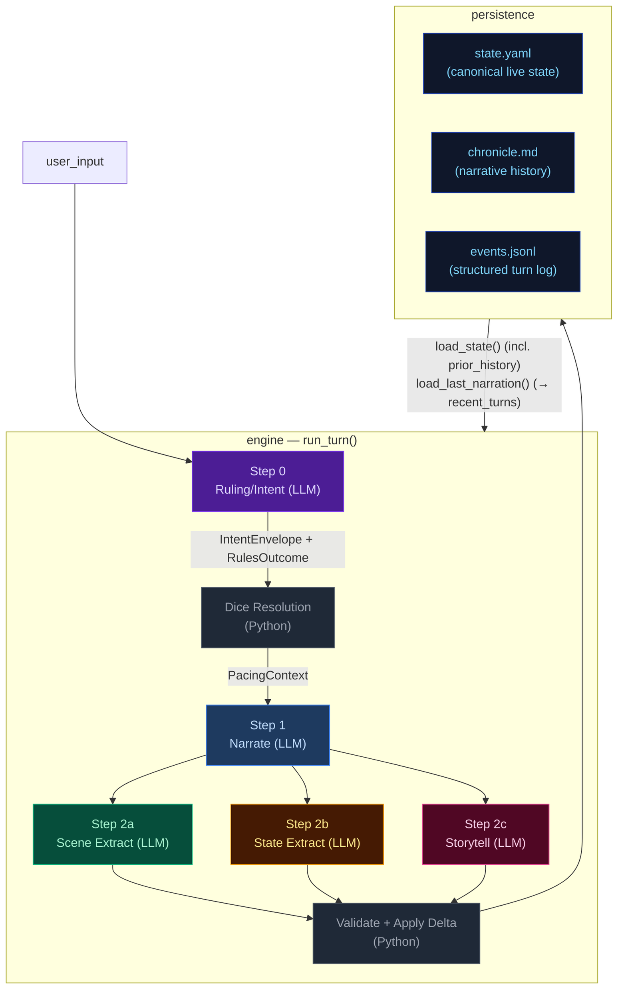

## Pipeline Quick Reference

| Step | Docs | When it runs | Key inputs | Key outputs | Mechanics it owns |
|---|---|---|---|---|---|
| **Step 0 — Ruling/Intent** | [step0-ruling](./step0-ruling.md) | Every turn (always) | `state.pc`, `state.location`, `recent_turns[-1:]`, `user_input` | `IntentEnvelope`, `RulesOutcome` | Intent classification, impossibility check, scene motion determination, dice roll resolution (1d12 + stat + cond − diff → band), difficulty selection, anti-declare-outcome enforcement. When `impossible=true`, no roll occurs and Python synthesizes a `fail` outcome. |
| **Step 1 — Narrate** | [step1-narrate](./step1-narrate.md) | Every turn (always, streamed) | Full `state`, `prior_history` (last 20 bullets, all but last rendered), `recent_turns[-1:]`, `pacing_context`, `pending_gm_beat`, `npc_roster` (from build_npc_roster()), `world_factions/locations` | `narrative` (prose) | Prose generation, dice-band binding, GM-beat consumption. Scene motion shaped by `PacingContext.outcome_hint`; impossible actions narrated as natural failures. |
| **Step 2a — Scene Extract** | [step2a-scene](./step2a-scene.md) | Every turn (always) | `narrative`, `state.pc/location`, `npc_roster` (from build_npc_roster()), conditions, compendium entries | `SceneExtractResult`: scene_tags, tagline, location_change, compendium_npc_update | NPC presence, location changes, scene tags, durable NPC compendium identity. |
| **Step 2b — State Extract** | [step2b-state](./step2b-state.md) | Every turn (always) | `narrative`, `state.pc/location/inventory`, conditions | `StateExtractResult`: inventory_add/remove/update, pc_condition_add/remove | Inventory delta accuracy, condition lifecycle. |
| **Step 2c — Storytell** | [step2c-storytell](./step2c-storytell.md) | Every turn (always) | `narrative`, `_ExtractionContext` (comp_this_turn, location, inventory, conditions), pacing_context, arc.threads[], recent_turns[-10:], band, npc_roster (from build_npc_roster()), recent_beats | `StorytellerResult`: thread_update/goal_update/arc_resolve/resolve/add, gm_beat, world_state_add/remove, actions, outcome_summary | Storyteller-managed thread lifecycle, arc resolution, beat disposition inference, durable history events. |

After Step 2c: results merge into a `StateDelta`, the validator checks constraints
(e.g. `inventory_remove` IDs exist), `apply_delta()` mutates state in-place, and the
turn is persisted. The next turn's Step 0 reads the new `state.yaml` plus `events.jsonl`.

## Subsystem Docs

| Subsystem | Doc | What it covers |
|---|---|---|
| **Step 0 — Ruling** | [step0-ruling](./step0-ruling.md) | Intent classification, dice resolution flowchart, pacing context computation |
| **Step 1 — Narrate** | [step1-narrate](./step1-narrate.md) | Streaming narration pipeline with all context inputs |
| **Step 2a — Scene Extract** | [step2a-scene](./step2a-scene.md) | Location changes, NPC presence, scene tags |
| **Step 2b — State Extract** | [step2b-state](./step2b-state.md) | Inventory and condition extraction |
| **Step 2c — Storytell** | [step2c-storytell](./step2c-storytell.md) | Pipeline mechanics, GM beat lifecycle, campaign arc system, thread lifecycle mechanics |
| **Delta → Validate → Apply** | [delta-validate](./delta-validate.md) | StateMerge schema, validation rules, apply_delta mutations |
| **Persist** | [persist](./persist.md) | Atomic writes (events.jsonl, state.yaml, chronicle.md), readback |
| **Cross-Pipeline Data Flow** | [cross-pipeline](./cross-pipeline.md) | Full inter-step data flow diagram |
| **Out-of-Band Pipelines** | [out-of-band](./out-of-band.md) | Character Creation pipeline, Generate Seed pipeline, turn viewer status colors |
| **Narration UI** | [narration-ui](./narration-ui.md) | Main game interface: SSE streaming, HTMX sidebar refresh, Alpine.js state machine |
| **Turn Viewer UI** | [turn-viewer-ui](./turn-viewer-ui.md) | Pipeline debug UI: turn cards, stage inspector, diff panel, live updates |
| **Eval Harness** | [eval-harness](./eval-harness.md) | Scenario runner, LLM judges, auto-checkers, REPORT.md generation |

## Key Models Glossary

### Core Result Types

- **IntentEnvelope**: `intent`, `intent_verb`, `target`, `check.required`, `check.skill`, `check.difficulty`, `impossible`, `impossible_reason`, `scene_motion`
- **RulesOutcome**: `rolled`, `skill`, `difficulty`, `stat_value`, `stat_mod`, `diff_mod`, `cond_mod`, `dice`, `raw_total`, `final_total`, `band`, `directive`, `intent`, `intent_verb`, `impossible`, `impossible_reason`
- **SceneExtractResult**: `scene_tags`, `scene_tagline`, `location_change`, `compendium_npc_update`
- **StateExtractResult**: `inventory_add/remove/update`, `pc_condition_add/remove`
- **StorytellerResult**: `thread_update` (list[ThreadUpdate]), `goal_update` (str | None, applied directly to arc dict), `arc_resolve` (ArcResolution | None), `thread_resolve` (with outcome sentence), `thread_add`, `gm_beat`, `world_state_add`, `world_state_remove`, `actions`, `outcome_summary`
- **SeedEnvelope**: `seed_state: GameState`, `opening_narrative`, `actions`, `arc: CampaignArc` (includes `goal_context` — UI-only, not rendered in prompts; unified `threads[]` with `progress: list[str]`, `completed_threads[]`)

  The seed owns first-turn emotional framing, not just world and arc scaffolding. It generates `goal_context` (character-specific stake), NPC `relation` fields (narrative job relative to PC), and action text written from the PC's voice and scene pressure — ensuring the opening feels personal and motivated from the start.

### PacingContext (see [step0-ruling](./step0-ruling.md#pacing-context))

### GMBeat (see [step2c-storytell](./step2c-storytell.md#gm-beat))

### CampaignArc (see [step2c-storytell](./step2c-storytell.md#campaign-arc-system))

### StateDelta (see [delta-validate](./delta-validate.md))

Merges all three extraction results. Contains `scene_tags`, `location_change`, `compendium_npc_update` (NPC changes), `thread_update/arc_resolve/thread_resolve/thread_add`, `inventory_add/remove/update`, `pc_condition_add/remove`, `world_state_add/remove`. Note: `gm_beat` is NOT in StateDelta — written directly to `state.meta.pending_gm_beat`.

---


## cross-pipeline


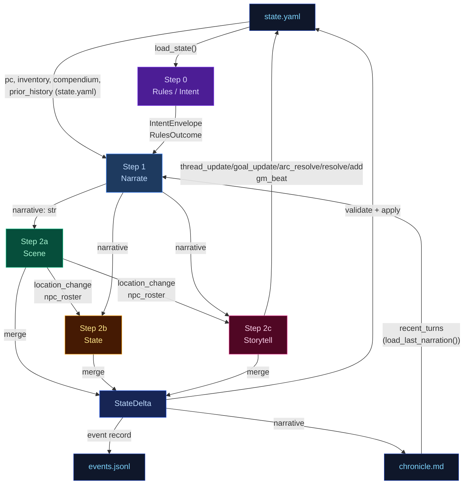

---


## delta-validate


The three extraction results merge into a single `StateDelta`, then validate and apply.

## Flowchart

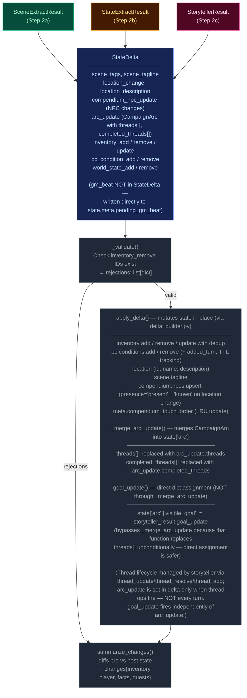

---


## narration-ui


The primary player-facing UI. Renders game state, streams narrative tokens live, and refreshes sidebars via HTMX partial swaps. Single-page app driven by Alpine.js + SSE + HTMX.

## Interaction Model

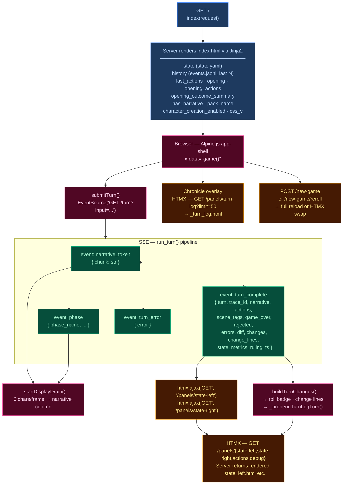

## Layout

| Region | Element | Content |
|--------|---------|---------|
| **Header** | `.header-bar` | Logo/tagline, Chronicle toggle, turn counter, retry button, new game button, reroll button (dynamic packs), mock-mode dot |
| **Left sidebar** | `.sidebar-left` | Player card, scene NPCs, location, arc, compendium — loaded via `/panels/state-left` |
| **Narrative column** | `.narrative-column` | Scrollable narrative blocks, action pills, input textarea, send/stop button |
| **Right sidebar** | `.sidebar` (right) | Inventory, recent events, world state, debug panel — loaded via `/panels/state-right` |
| **Chronicle overlay** | `.turn-log-shell` | Floating overlay over narrative column, populated by `/panels/turn-log?limit=50` |
| **New Game modal** | (Alpine `x-show`) | Pack picker → char creation / world builder steps |

## Data Flow

### Turn submission (Alpine.js + SSE)

1. User types input, presses Enter → `game().submitTurn()`
2. Opens `EventSource` to `GET /turn?input=<text>` — SSE endpoint in `routes.py:83`
3. Server streams events as the 5-stage pipeline (`run_turn()`) executes:
   - `narrative_token` — token chunks streamed as they arrive from LLM
   - `phase` — pipeline phase progress (ruling_start, narrate_start, narrate_first_token, narrate_done, extract_start, extract_done, compact_start, etc.)
   - `turn_complete` — final result
   - `turn_error` — error payload
4. Client `_startDisplayDrain()`: reveals 6 characters per animation frame for smooth streaming
5. On `turn_complete`:
   - Calls `htmx.ajax('GET', '/panels/state-left', ...)` and `htmx.ajax('GET', '/panels/state-right', ...)` to refresh sidebars
   - Renders change lines (`_buildTurnChanges`), roll badge
   - Prepends turn to Chronicle overlay via `_prependTurnLogTurn`
   - Re-renders markdown via `marked.parse()`

### HTMX partial endpoints (routes.py)

| Route | Template | Purpose |
|-------|----------|---------|
| `GET /panels/state-left` | `_state_left.html` | Left sidebar — player, NPCs, location, arc, compendium |
| `GET /panels/state-right` | `_state_right.html` | Right sidebar — inventory, events, world state, debug |
| `GET /panels/actions` | `_actions.html` | Action pills (fallback) |
| `GET /panels/turn-log?limit=N` | `_turn_log.html` | Chronicle — turn history with change lines |
| `GET /panels/pack-picker` | `_pack_picker.html` | New Game — pack selection cards |
| `GET /panels/char-creation` | `_char_creation.html` | New Game — character stats builder |
| `GET /panels/world-builder` | `_world_builder.html` | New Game — world creation form |
| `GET /panels/debug` | `_debug.html` | Debug panel — recent turn timings, errors |
| `GET /panels/state` | `_state.html` | Combined left+right (legacy) |

### Client state machine (`game()` — inline `<script>` in index.html)

Alpine.js `x-data="game()"` manages:
- `input` — textarea value
- `submitting` — turn-in-progress flag
- `gameStarted` — derived from `has_narrative`
- `turnNum` — current turn counter
- `leftWidth` / `rightWidth` — resizable sidebar widths (persisted to `localStorage`)
- Card collapse state — read/written directly from/to `localStorage` via `CCYA_CARD_KEY(name)` helper, using DOM `data-card` attributes; no Alpine data property

## UI Features

### Resizable sidebars
- Drag gutters with mousedown/mousemove handlers
- Widths saved to `localStorage` (`ccya_sidebar_left`, `ccya_sidebar_right`)
- Minimum width enforcement (240px left, 220px right)

### Collapsible cards
Each sidebar section has a collapse toggle; open/closed state persisted per-card to `localStorage` via `ccya_card_<name>` key.

### Action pills
Suggested next actions rendered as buttons that populate the input on click. Updated from `turn_complete.actions` or via HTMX panel refresh.

### Roll badge
Server-rendered for history, JS-built for new turns. Shows dice math, band label, outcome summary. Band colors: `crit_fail` (red) → `fail` → `setback` → `partial` → `success` → `crit_success`.

### Change lines
Grouped by category via emoji prefix:
| Emoji | Category | Class |
|-------|----------|-------|
| 🎒 + | Inventory gain | `.tc-inv-gain` |
| 🎒 − | Inventory loss | `.tc-inv-loss` |
| 🩺 | Player condition | `.tc-pl` |
| 📍 | Location | `.tc-loc` |
| 📜 | Faction/arc | `.tc-fa` |

### Retry
`POST /turn/delete` removes last event from `events.jsonl` and `chronicle.md`, returns previous actions for re-submission.

### New Game
`POST /new-game` with optional `pack_id`, `pc_name`, `pc_stats`, `hints`. For dynamic packs, triggers `generate_seed()` LLM pipeline. Full page reload on success. Reroll (`POST /new-game/reroll`) HTMX-swaps the opening narrative + actions.

## CSS Architecture

- **`app.src.css`** — Tailwind + custom styles split by region (lines 1–2101):
  - App shell layout (CSS Grid: header + body with sidebar-gutter-main-gutter-sidebar)
  - Narrative blocks (`.narrative-block`, `.narrative-text`)
  - Sidebar cards (`.card`, `.card-header`, `.card-body`)
  - Input bar (`.input-bar`, `.game-input`, `.send-btn`)
  - Action pills (`.action-pill`, `.pills-row`)
  - Roll badges (`.roll-badge`, `.roll-band--*`)
  - Chronicle overlay (`.turn-log-shell`, `.turn-log-panel`)
  - New Game modal (`.modal-overlay`, `.pack-card`)
  - Progress strip, tooltips, scrollbar styling
  - Design tokens via CSS custom properties (`--text-primary`, `--bg-card`, `--status-*`)
- Compiled to **`app.css`** with cache-busting via `css_v` query param

## Server Entry Point

`routes.py:57` — `GET /` handler assembles template context from `state.yaml`, `events.jsonl`, pack manifest, and engine config, then renders `ccya/templates/index.html`.

---


## out-of-band


These run only at new-game time or are non-engine concerns. They are excluded from the eval-context region of the main architecture doc.

## Character Creation Pipeline

Triggered by `POST /new-game`. All packs use the Generate Seed pipeline (dynamic). Static packs with pre-built seed_state.yaml exist but are not used by new_game.

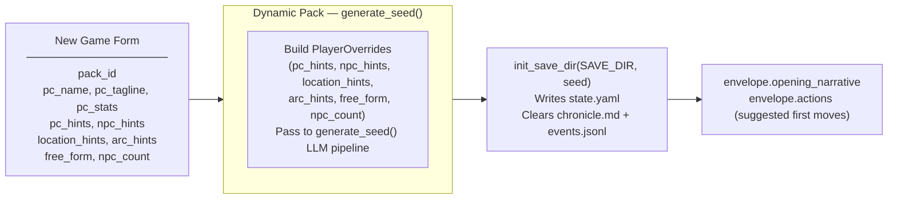

## Generate Seed Pipeline (Dynamic Packs Only)

Called by `POST /new-game` and `POST /new-game/reroll`. Generates a complete starting game state (PC, NPCs, location, arc, opening narrative, actions) from the pack manifest and optional player overrides.

The seed owns **first-turn emotional framing** — not just world and arc scaffolding. Every seed element must produce an emotionally legible opening that answers: why this moment matters now, what the character stands to lose, and why at least one person in the scene matters to them personally.

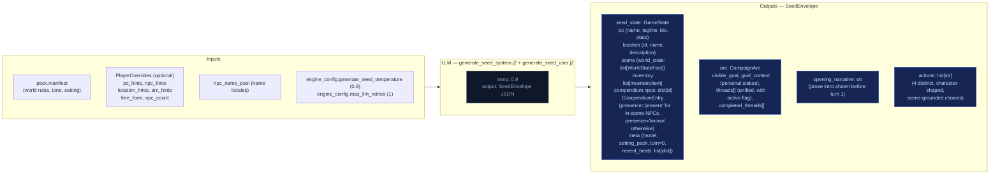

### Seed emotional framing contract

The seed prompt (`generate_seed_system.j2`) enforces these requirements:

- **`goal_context`**: 2–3 sentences explaining why `visible_goal` matters to this character specifically — inner cost or pressure that makes it emotionally loaded. No hidden-truth spoilers, no restating `visible_goal`, no direct statement of the thematic question. Must connect character motive, story stakes, and emotional cost.
- **NPC `relation` field**: Each opening NPC has a defined narrative job. One NPC is personally tied to the PC's motive or vulnerability; the other carries immediate external pressure from the world or conflict. The `relation` field encodes PC-facing relevance (e.g. "owes them a favor", "is their only contact here", "represents the institution pressing on them").
- **Compendium NPCs**: The seed also generates 2–3 NPCs in `compendium.npcs` (name, title, bio) who exist in the world but are not present in the opening scene. Their bios tie them to factions, locations, or world pressures, not to the immediate situation. These become discoverable characters during play.
- **Action guidance**: Each of the 4 choices is written from the PC's point of view, grounded in a present NPC, immediate risk, active thread, or character motive. They differ in emotional posture (confront, deflect, investigate, protect, exploit, withdraw, etc.) and avoid generic verbs.
- **`threads[]`**: Unified list (not split active/latent) where each thread has `{id, summary, urgency, scope}` and an `active` boolean flag managed by the storyteller via `thread_update`, not Python age rules. Threads have a `progress: list[str]` field — append-only log of progress updates set via `thread_update[].progress`, never replaced. Also includes `last_updated_turn: int | None` for urgency decay tracking.

## Turn Viewer — status colors

The standalone turn viewer ([turn-viewer-ui](./turn-viewer-ui.md)) uses the same semantic status colors as the CSS custom properties in `static/app.src.css` (`--status-*`). The stage colors used in the diagrams above (`stageRules` violet → `stageNarrate` blue → `stageScene` green → `stageState` amber → `stageProgress` pink) map directly to the `--stage-*` tokens. Cross-stream inputs into a step are shown in `xstream` (purple outline) and LLM/Python boxes use neutral dark fills. This table is the canonical turn-viewer status legend.

| Token | Meaning |
|-------|---------|
| `--status-ok` | Stage ran and completed (no extraction error). |
| `--status-skipped` | Stream was skipped (no longer used — all streams always run). |
| `--status-retried` | LLM output required a parse retry (`attempts` > 1 in event). |
| `--status-rejected` | Post-extract validation rejected part of the delta (e.g. bad `inventory_remove`). |
| `--status-error` | LLM call or parse ultimately failed for that stream. |
| `--status-neutral` | Non-fatal / informational (e.g. rules path with no dice roll). |

Stage accent stripes use `--stage-rules`, `--stage-narrate`, `--stage-scene`, `--stage-state`, `--stage-progress` for quick scanning; **status** always wins for the prominent left border.

---


## persist


Atomic writes to disk. No LLM calls.

## Flowchart

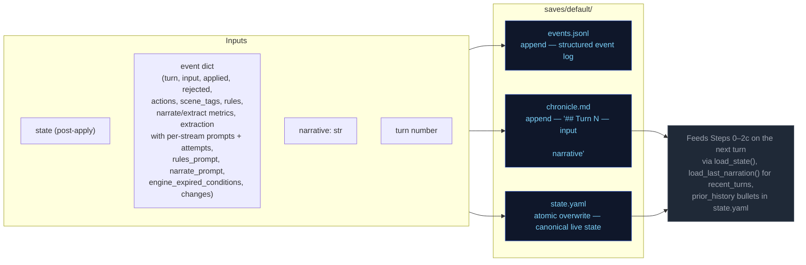

---


## step0-ruling


Classifies the player's action, determines whether a dice check is needed, and
identifies which state domains will be active — narrowing every downstream extractor.

## Flowchart

```mermaid
flowchart LR
    classDef stageRules fill:#4c1d95,color:#ddd6fe,stroke:#7c3aed
    classDef llmNode    fill:#0f172a,color:#94a3b8,stroke:#334155
    classDef pyNode     fill:#1f2937,color:#9ca3af,stroke:#4b5563
    classDef outNode    fill:#3b0764,color:#e9d5ff,stroke:#7c3aed

    subgraph IN["Inputs"]
        I1["state.pc<br>(name, stats, conditions)"]
        I2["state.location"]
        I3["recent_turns[-1:]<br>(last turn's full narrative from chronicle.md<br>via load_last_narration();<br>ruling user prompt)"]
        I4["user_input"]
    end

    subgraph LLM0["LLM — ruling_system.j2 + ruling_user.j2"]
        L0["temp: 0.2 · max_retries: 1<br>output: IntentEnvelope JSON<br>(intent, impossible, scene_motion, check)"]:::llmNode
    end

    subgraph PYRES["Python — impossible check + rules.resolve_check()"]
        P0["if impossible=true:<br>  synthesize fail outcome<br>  skip roll, apply momentum<br>else:<br>  roll 1d12 + stat_mod + cond_mod − diff_mod<br>  map total → Band"]:::pyNode
    end

    subgraph OUT["Outputs"]
        O1["IntentEnvelope<br>  intent: str<br>  intent_verb: str<br>  target: str<br>  impossible: bool<br>  impossible_reason: str<br>  scene_motion: hold|advance|transition<br>  check.required: bool<br>  check.skill: SkillName<br>  check.difficulty: Difficulty"]:::outNode
        O2["RulesOutcome<br>  rolled: bool<br>  skill, difficulty, stat_value, stat_mod<br>  diff_mod, cond_mod<br>  dice: list[int]<br>  raw_total, final_total: int<br>  band: Band<br>  directive: str<br>  intent, intent_verb: str<br>  impossible: bool<br>  impossible_reason: str"]:::outNode
    end

    IN --> LLM0
    LLM0 -- "IntentEnvelope" --> PYRES
    PYRES --> OUT
```

## Impossibility check

The ruling LLM evaluates whether the described action is impossible given the character's state, inventory, and scene. An action is impossible when:

- It requires an item the character does not have (firing a gun with no ammo, using a key never acquired)
- It requires a capability contradicted by active conditions (climbing with a broken leg, sneaking while armored and noisy)
- It acts on something not present in the scene (targeting an NPC who is not here, opening a door that doesn't exist)

When `impossible=true`: Python sets `check.required=False`, synthesizes a `RulesOutcome` with `band="fail"` and `rolled=False`, applies momentum, and skips the dice roll entirely. The narrator renders the impossible fact and narrates the natural failure.

## Scene motion

The ruling LLM also determines how the scene should progress: `"hold"` (scene continues at current pace), `"advance"` (something significant happens/resolves), or `"transition"` (player is leaving, write the arrival). This feeds into `_compute_pacing_context()` which produces `outcome_hint` for the narrator.

## Key forward dependency

`rules_outcome` feeds into `_compute_pacing_context()` which produces the single authoritative `PacingContext` struct passed to both Narrator and Storytell pipeline.

## Pacing Context

All pacing signals are collapsed into one Python-computed struct (`PacingContext`) passed to both the Narrator and Storytell pipeline. This replaces six independent fields (`narration_directive`, `deescalate`, `narrative_velocity`, `beat_disposition` output, `quest_threshold_directive`, and stale momentum-derived signals). The narrator receives `outcome_hint` (scene motion); Storytell receives the full struct including `directive`.

### Struct definition

```
PacingContext:
  directive: str           # "" | "Breathe" | "Scene Imperative" | "Overwhelm" | "Pressure" | "Tension" | "Scene Pressure" (may include "; Resolve a Threat" secondary when beat_locked); used by Storytell pipeline
  outcome_hint: str | None # "hold" | "advance" | "transition" — narrator's primary scene motion instruction
  beat_locked: bool        # True: consecutive pressure threshold reached or momentum at floor — enables floor relief injection and appends "; Resolve a Threat" to directive
  gate: str                # "block_escalate" | "allow" (controls thread_add); set independently from beat_locked via deescalate >= 0.5
  summary: str             # human-readable log string, never sent to LLM
```

`beat_locked: True` fires when either `consecutive_pressure_turns >= config.consecutive_pressure_threshold` OR `momentum <= config.momentum_floor`. When locked, `"Resolve a Threat"` is appended to the directive via semicolon. The `gate` field prevents Progress from adding new threads during de-escalation windows.

### Computation

`_compute_pacing_context()` in `engine/turn.py` consolidates pacing computation (replacing the former scattered functions: `_compute_narration_directive`, `_compute_narrative_velocity`, `_check_floor_relief`). It takes inputs (`momentum`, `consecutive_pressure_turns` from state meta, `arc.threads[] scope=scene urgency counts`) and returns a single struct with directive derived from a priority stack. It also computes `outcome_hint` from the ruling LLM's `scene_motion` and PacingContext escalation signals: ruling `scene_motion` takes priority (`transition` > `advance` > fallback), then `impossible=true` forces `advance`, then Python escalation signals (`beat_locked`, Overwhelm/Pressure with urgent threads) produce `advance`, defaulting to `hold`.

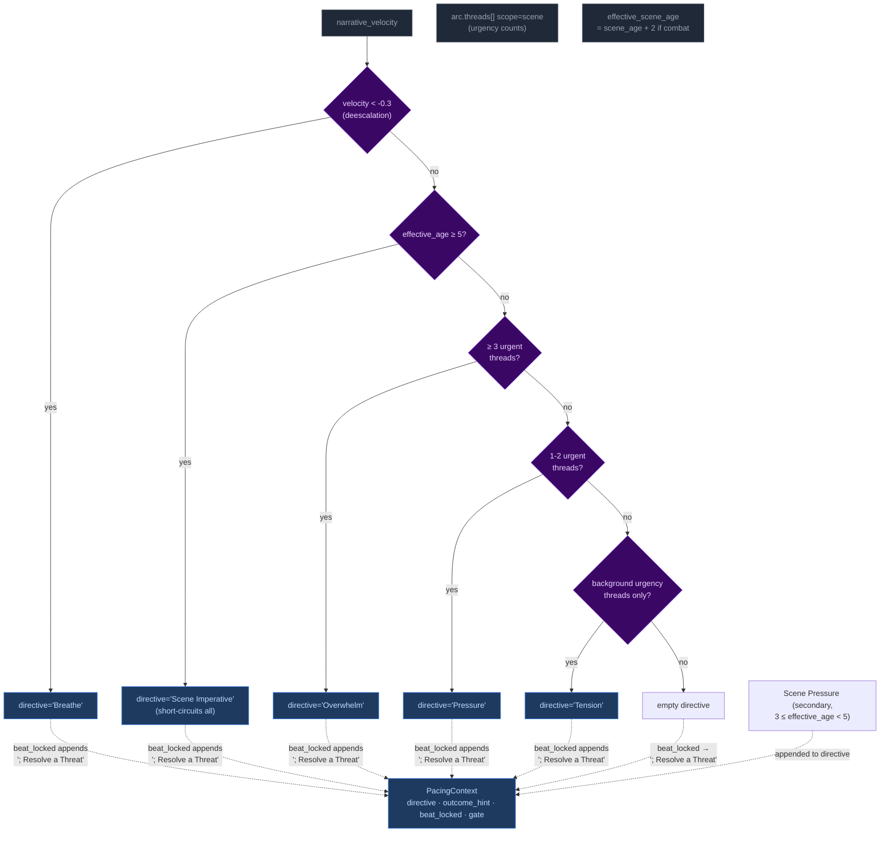

Priority order (highest to lowest): **Breathe > Scene Imperative > Overwhelm > Pressure > Tension > Scene Pressure**. The `beat_locked` flag fires when either consecutive pressure threshold or momentum floor is reached — `"Resolve a Threat"` is appended to the directive and `outcome_hint` is set to `"advance"`. The gate is NOT affected by beat_locked (set independently by deescalate ≥ 0.5).

**Breathe secondary guard:** The Breathe directive has an additional check beyond velocity: if urgent scene-scoped threads exist, Breathe is NOT emitted even if `narrative_velocity < -0.3`. Low velocity during unresolved tension (tactical avoidance, stealth) does not trigger de-escalation. Once urgent threads resolve, Breathe fires on the next low-velocity turn.

#### Age computation

`_compute_ages(state)` returns only `{"scene_age": scene_age}` — location_age and combat_age removed in Phase 03 pacing overhaul. The ruling phase pre-computes `effective_scene_age = scene_age + 2` when `"combat"` is in scene tags, stored in `ctx._ages["effective_scene_age"]`. This single-age signal drives all directive thresholds:
- Scene Imperative (≥5 effective age): high-priority directive forcing story advancement
- Scene Pressure (3 ≤ effective_age < 5): secondary append to wind down or shift focus

### Wiring

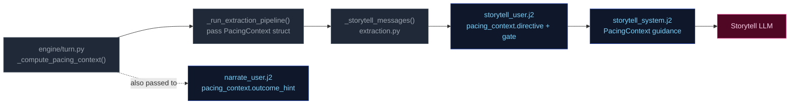

1. **Computed** once in `run_turn()` via `_compute_pacing_context()`.
2. **Passed through** `_run_extraction_pipeline()` → both `_narrate_messages()` and `_storytell_messages()`.
3. **Narrator template** (`narrate_user.j2`) renders `outcome_hint` (scene motion: hold/advance/transition) with value-specific guidance. No Jinja2 pacing computation remains — all pacing computed by Python.
4. **Storytell template** ((`storytell_system.j2` + `user.j2`)) receives the full struct; guidance maps each directive to appropriate thread/beat actions:

| Directive | Thread action | Gate |
|-----------|---------------|-------|
| **"Breathe"** (de-escalation, velocity < -0.3) | Do NOT add new threads. Allow existing scene threads to persist without escalation. | `block_escalate` (set by deescalate ≥ 0.5; beat_locked does NOT force-close gate) |
| **"Scene Imperative"** (effective_age ≥ 5) | Story must advance — introduce new development forcing resolution or movement; do not linger | Varies by context |
| **"Overwhelm"** (3+ urgent threads) | May add scene-scoped threads if gate allows; emit pressure/escalation beat | `allow` |
| **"Pressure"** (1-2 urgent threads) | Advance relevant scene/arc threads. Add new thread only if gate permits. | Varies by context |
| **"Tension"** (background urgency only) | Do NOT add pressures unless concrete threat emerges; prefer advancing existing threads | Allow |
| **"Scene Pressure"** (3 ≤ effective_age < 5, secondary append) | Begin winding down or introduce reason to shift focus: development elsewhere, closing window | Varies by context |
| **"" (empty)** | No action required beyond normal aging of silent threads. | Allow |

**Note:** Directives may include secondary modifiers joined by semicolons (e.g., "Pressure; Resolve a Threat" when beat_locked). The primary directive drives thread/beat logic; the secondary (`; Resolve a Threat`) acts as thematic guidance for beat type selection. "Resolve a Threat" never appears as a standalone primary directive — it is only appended by the `beat_locked` mechanism.

### Consecutive pressure counter

`state["meta"]["consecutive_pressure_turns"]` tracks how many consecutive turns have had pressure-type storyteller beats. Re-keyed from directive tracking (which never fired — Pressure/Overwhelm directives were unreachable) to beat-type tracking:

- **Increments** when `storyteller_result.gm_beat.type` is `"pressure"`, `"escalation"`, or `"complication"`.
- **Resets to 0** on any other beat type, null beat, or missing storyteller output.

When this counter reaches `config.consecutive_pressure_threshold` (default 3), it triggers `beat_locked` alongside the momentum floor fallback (`momentum <= -3`). `beat_locked` appends `"; Resolve a Threat"` to the directive and enables floor relief injection.

---


## step1-narrate


Generates the narrative prose the player reads. Tokens are streamed to the client.

## Flowchart

```mermaid
flowchart LR
    classDef llmNode   fill:#0f172a,color:#94a3b8,stroke:#334155
    classDef xstream   fill:#4c1d95,color:#ddd6fe,stroke:#7c3aed
    classDef outNode   fill:#1e3a5f,color:#bfdbfe,stroke:#3b82f6

    subgraph IN["Inputs"]
        N1["state (full —<br>pc, location, scene,<br>inventory, compendium)"]
        N2["prior_history<br>(last 20 incremental history bullets, all but last rendered as bullets)"]
        N3["recent_turns[-1:]<br>(single most recent turn as full text)"]
        N4["rules_outcome<br>(band, directive, impossible, dice summary)"]:::xstream
        N6["npc_name_pool (cultural name list)"]
        N7["npc_roster<br>(from build_npc_roster(comp),<br>  presence field: present/nearby/known)"]
        N9["world_factions<br>(immutable trace)"]:::xstream
        N10["pending_gm_beat<br>(type · surface_as metadata)"]
        N11["pacing_context<br>(outcome_hint)<br>from _compute_pacing_context()"]:::xstream
        N15["user_input"]
    end

    subgraph LLM1["LLM — narrate_system.j2 + narrate_user.j2"]
        NL["temp: 0.9 · streaming: yes<br>output: prose narrative (str)"]:::llmNode
    end

    subgraph OUT["Outputs"]
        NO1["narrative: str<br>(streamed as tokens → client<br>then joined + thinking-stripped)"]:::outNode
        NO2["narr_metrics<br>  first_token_ms<br>  total_ms<br>  tokens_in / tokens_out"]
    end

    IN --> LLM1
    LLM1 --> OUT
```

## Arc context in narration

The narrator receives `current_arc` in both system and user prompts. Key fields:

- **`goal_context`**: A seed-time field (2–3 sentences) explaining why `visible_goal` matters to the character specifically — inner cost or pressure that makes it emotionally loaded. UI-only (surfaced as tooltip on the arc goal in the sidebar). NOT rendered in prompt context — the narrator works from general early-turn behavioral guidance in the system prompt, not from the raw `goal_context` value.
- **`visible_goal`**: The player-facing objective.
- **`threads[]`**: Unified thread collection filtered by `active` flag. Scene-scope threads provide immediate pressure; arc-scope threads provide medium-term tension.
- **`resolved_arc`**: TTL-filtered list of previously resolved arcs, providing narrative continuity across arc transitions.

### Opening-turn narrative mode

The seed embeds emotional stakes in the initial state — NPC `relation` fields, `motivation/fear/leverage`, and a `goal_context` sidebar entry. The narrator does NOT receive special early-turn prompt guidance or `goal_context` in its context. Instead, the initial scene's NPCs (with rich behavioral drivers), the opening narrative's tone, and the player-facing sidebar create the onboarding experience. The narrator works from its standard behavioral guidance and the richness of seed-generated state.

## Key forward dependency

`narrative` is the primary content input for all three extraction streams below.

### GM Beat consumption

The narrator receives a pending GM beat from `state.meta.pending_gm_beat` (set by Storytell in the previous turn). The beat's `type` and `surface_as` metadata are passed alongside the pacing directive as creative guidance for the narrative. The beat is NOT cleared after narration — it persists through the extraction phase. After extraction completes, Storytell replaces it with a new beat or pops it on null output. Full beat lifecycle is documented in [step2c-storytell](./step2c-storytell.md#gm-beat).

---


## step2a-scene


Extracts location changes, NPC presence, scene tags, and suggested actions from the narrative.

## Flowchart

```mermaid
flowchart LR
    classDef llmNode fill:#0f172a,color:#94a3b8,stroke:#334155
    classDef xstream fill:#4c1d95,color:#ddd6fe,stroke:#7c3aed
    classDef outNode fill:#064e3b,color:#a7f3d0,stroke:#10b981

    subgraph IN["Inputs"]
        S1["narrative (from Step 1)"]:::xstream
        S2["state.pc (name, tagline, bio, stats)"]
        S3["state.location"]
        S4["compendium.npcs[presence='present']"]
        S5["state.pc.conditions"]
        S6["npc_roster<br>(from build_npc_roster(), filtered by presence field)"]
        S7["recent_turns[-1:]<br>(T-1 prior narration)"]
    end

    subgraph LLM2A["LLM — extract_scene_system.j2 + extract_scene_user.j2"]
        SL["temp: 0.4 · max_retries: 1<br>output: SceneExtractResult JSON"]:::llmNode
    end

    subgraph OUT["Outputs — SceneExtractResult"]
        O1["scene_tags: list[str]"]:::outNode
        O2["scene_tagline: str (3–6 words for UI header)"]:::outNode
        O3["location_change: LocationRef | None<br>  id, name, description"]:::outNode
        O4["location_description: str | None"]:::outNode
        O5["compendium_npc_update<br>  durable identity changes (presence, notes, bio upserts)"]:::outNode
    end

    IN --> LLM2A
    LLM2A --> OUT
```

## Key forward dependency

`location_change` flows into `extraction_ctx` (built by `_build_extraction_context`). Step 2c also receives `npc_roster` (from build_npc_roster()) built from comp_this_turn. No forward-facing mechanics (`thread_add`, `gm_beat`) are emitted by this stream — they go through the unified thread lifecycle via Storytell (Step 2c).

---


## step2b-state


Extracts inventory changes and player condition mutations from the narrative.

## Flowchart

```mermaid
flowchart LR
    classDef llmNode fill:#0f172a,color:#94a3b8,stroke:#334155
    classDef xstream fill:#4c1d95,color:#ddd6fe,stroke:#7c3aed
    classDef outNode fill:#451a03,color:#fde68a,stroke:#f59e0b

    subgraph IN["Inputs"]
        S1["narrative (from Step 1)"]:::xstream
        S2["state.pc (name, bio, stats, conditions)"]
        S3["state.location"]
        S4["state.inventory"]
        S5["intent: str<br>(from Step 0)"]
    end

    subgraph LLM2B["LLM — extract_state_system.j2 + extract_state_user.j2"]
        SL["temp: 0.4 · max_retries: 1<br>output: StateExtractResult JSON"]:::llmNode
    end

    subgraph OUT["Outputs — StateExtractResult"]
        O1["inventory_add: list[InventoryItem]<br>  id, name, notes, amount"]:::outNode
        O2["inventory_remove: list[InventoryRemove]<br>  id, amount (None = full stack)"]:::outNode
        O3["inventory_update: list[InventoryUpdate]<br>  id, name?, notes?"]:::outNode
        O4["pc_condition_add: list[ConditionAdd]<br>  id, label, description"]:::outNode
        O5["pc_condition_remove: list[ConditionRemove]<br>  id"]:::outNode
    end

    IN --> LLM2B
    LLM2B --> OUT
```

## Key forward dependency

Step 2c receives `npc_roster` (from build_npc_roster()) and `location_change` from Step 2a. Cross-stream items_gained/lost were removed — extraction_ctx now covers all this-turn derived data.

---


## step2c-storytell


Extracts thread updates, arc actions, world state changes, and durable NPC compendium changes.

## Flowchart

```mermaid
flowchart LR
    classDef llmNode fill:#0f172a,color:#94a3b8,stroke:#334155
    classDef xstream fill:#4c1d95,color:#ddd6fe,stroke:#7c3aed
    classDef outNode fill:#500724,color:#fbcfe8,stroke:#ec4899

    subgraph IN["Inputs"]
        S1["narrative (from Step 1)"]:::xstream
        S2["_ExtractionContext<br>(comp_this_turn, location,<br>inventory, conditions)<br>built by _build_extraction_context()"]:::xstream
        S3["npc_roster<br>(from build_npc_roster())"]:::xstream
        S4["pacing_context<br>(directive · gate · beat_locked)"]:::xstream
        S5["arc.threads[]<br>(unified scope=scene + scope=arc)"]:::xstream
        S6["rules_outcome"]:::xstream
        S7["intent (from Step 0)"]:::xstream
        S8["recent_turns[-10:]<br>(prior narration, last 10 turns)"]:::xstream
        S9["prior_history[:-1]<br>(all history bullets except last,<br>already shown as full text)"]:::xstream
        S10["recent_beats<br>(beat history for diversity)"]:::xstream
    end

    subgraph LLM2C["LLM — storytell_system.j2 + storytell_user.j2"]
        SL["temp: 0.4 · max_retries: 1<br>output: StorytellerResult JSON"]:::llmNode
    end

    subgraph OUT["Outputs — StorytellerResult"]
        O1["thread_update: list[ThreadUpdate]<br>  id + urgency/active/summary/progress changes"]:::outNode
        O1b["goal_update: str | None<br>  new visible_goal, mid-arc pivot<br>  applied directly to arc dict"]:::outNode
        O1c["arc_resolve: ArcResolution | None<br>  resolution, visible_goal,<br>goal_context, drop_threads, new_threads"]:::outNode
        O2["thread_resolve: list[ThreadResolution]<br>  id + resolution_state<br>(resolved/failed/abandoned)"]:::outNode
        O3["thread_add: ArcThread | None<br>  new thread, gated by PacingContext.gate"]:::outNode
        O4["world_state_add: list[WorldStateFact]<br>  id, text, tier"]:::outNode
        O5["world_state_remove: list[str]<br>  ids to remove from persistent tier"]:::outNode
        O6["actions: list[str]<br>  exactly 4 suggested player choices"]:::outNode
        O7["outcome_summary: str<br>  1–2 sentence narrative recap"]:::outNode
        O8["gm_beat: GMBeat | None<br>  forward-facing storytelling beat"]:::outNode
    end

    IN --> LLM2C
    LLM2C --> OUT
```

## Always runs

Storytell is the post-narration storytelling brain. It always executes every turn (never skipped) and feeds next turn's rules call via `world_state_add/remove` (persistent world facts), `thread_update/goal_update/arc_resolve/thread_resolve/thread_add` (storyteller-managed thread lifecycle), and `gm_beat` (forward-facing beats stored in `state.meta.pending_gm_beat`).

## GM Beat

Forward-facing storytelling beats that shape scene progression across turns. Beats are emitted by Storytell (Step 2c), consumed by Narrator (Step 1) the following turn, and managed via a write/expiry lifecycle in `state.meta.pending_gm_beat`.

### GMBeat Schema

```
GMBeat
  type: complication | revelation | opportunity | breathing_room | pressure | twist | setback | escalation | callback
  surface_as: ambient | event | npc_behavior | environmental | player_discovery | item (default: ambient)
  beat_expires_turn: int | None — turn number at which the beat expires; set to turn_no + 2 when stored
```

**Validation:** Only `type` is validated by `StorytellerResult._nullify_invalid_gm_beat` — nullified if type is falsy or not in the valid set. No validation on `surface_as`. Python accepts whatever gm_beat the LLM emits with no correction or override.

### PacingContext Beat Fields

The beat system intersects with pacing via two fields in `PacingContext` (see [step0-ruling](./step0-ruling.md#pacing-context)):

| Field | Type | Meaning |
|-------|------|---------|
| `directive` | str | May include secondary modifier `"; Resolve a Threat"` when `beat_locked=True`. Drives storytell guidance for beat type selection. |
| `beat_locked` | bool | True when either `consecutive_pressure_turns >= threshold` OR `momentum <= momentum_floor`. When locked, `"Resolve a Threat"` is appended to the directive. Enables floor relief to inject a breathing_room beat if the storyteller is stuck in a pressure-type loop. |

### Beat Lifecycle — Turn Sequence

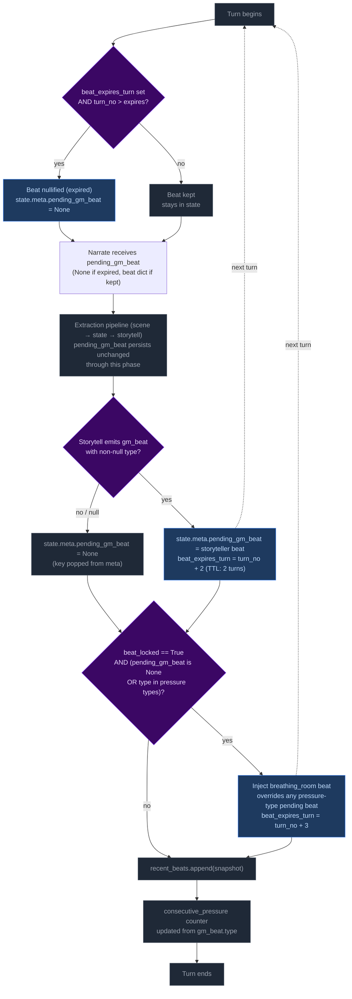

**Step 1 — Pre-narration expiry check.** At the start of each turn, the engine reads `state.meta.pending_gm_beat` from the previous turn. If `beat_expires_turn` is set and the current turn number exceeds it, the beat is nullified (key set to None). Otherwise it proceeds to narration.

Note: This expiry runs early enough that the beat is gone before the extraction phase begins. This is intentional — it creates clean state for floor relief to inject breathing_room if `beat_locked` is active and storyteller doesn't provide its own non-pressure beat. Without the pre-narration expiry, a stale expired beat could block floor relief's null check.

**Step 2 — Narration consumption.** The beat is passed to the narrator via `_narrate_messages(pending_gm_beat=...)`. The narrator uses the beat's `type` and `surface_as` metadata as creative guidance alongside the pacing directive. The beat is NOT cleared after narration — it persists through the extraction phase.

**Step 3 — Storytell writes or clears the beat.** After extraction completes:
- If Storytell emits a valid `gm_beat` (non-null `type`): replaces `pending_gm_beat` with `beat_expires_turn = turn_no + 2`.
- If Storytell emits `null` or an invalid beat: pops `pending_gm_beat` from state (null-clear). The old beat does NOT carry forward.

**Step 4 — Floor relief injection.** After delta apply, if `beat_locked=True` AND the current `pending_gm_beat` is either `None` or a pressure-type (`pressure`, `escalation`, `complication`): injects a `breathing_room` beat with `beat_expires_turn = turn_no + 3`. This overrides pressure-type beats that would otherwise continue the pressure cycle, but does NOT override non-pressure beats the storyteller independently produced (e.g., `revelation`, `opportunity`, `breathing_room`).

**Step 5 — Beat history snapshot.** `pending_gm_beat` is appended to `state.meta.recent_beats` (capped at 5 entries). The snapshot is taken after any floor relief override, so it reflects the beat the next turn's narrator will consume.

**Step 6 — Consecutive pressure counter update.** The counter increments on pressure-type beats and resets to 0 otherwise.

### Floor Relief Injection

The floor relief mechanism fires after delta apply when `_pc.beat_locked=True` AND the current `pending_gm_beat` is either `None` or a pressure-type beat (`pressure`, `escalation`, `complication`). It injects a `breathing_room` beat with TTL of 3 turns (one more than storyteller-emitted beats' TTL of 2).

Floor relief is a **fallback override** — it breaks a pressure-type run by force-injecting recovery:
- If Storytell emitted a pressure-type beat → floor relief overrides it with breathing_room.
- If Storytell emitted a non-pressure beat (revelation, opportunity, breathing_room, etc.) → floor relief lets it stand. Relief is already being achieved.
- If Storytell emitted nothing (null) → floor relief injects breathing_room. This is appropriate: after a null turn with beat_locked active, relief is needed.

### Directive-Beat Alignment

The storyteller prompt (`storytell_system.j2`, pacing context guidance section) maps each PacingContext directive to recommended beat types (e.g., "Breathe" → breathing_room; "Scene Imperative" → advance story; "Overwhelm" → pressure/escalation). This alignment is **guidance only** — Python accepts whatever gm_beat the LLM emits with no validation, correction, or override. Design rationale: forcing directive-beat alignment would constrain storytelling flexibility and create brittleness if the LLM makes contextually appropriate but directive-divergent beat choices.

### Beat History

`state.meta.recent_beats` stores the last 5 beats (including null entries) with `turn`, `type`, and `surface_as`. This history is rendered in both the storyteller system prompt (behavioral guidance) and the user prompt (current-turn context, more salient). Each entry shows `T{N}: {BEAT TYPE} (surface)` or `T{N}: No beat emitted this turn`.

The LLM uses this history to follow beat diversity guidance: avoid repeating the same type more than twice in a sequence; at least one in three beats should be a non-pressure type.

### TTL Mechanics Summary

| Source | Default TTL | Expiry Calculation |
|--------|-------------|-------------------|
| Storytell-emitted beat | 2 turns | `beat_expires_turn = turn_no + 2` |
| Floor relief (Python-injected) | 3 turns | `beat_expires_turn = turn_no + 3` (extra recovery margin) |

### Null-Clear Behavior

When Storytell emits a null beat (or an invalid beat whose type is nullified), `pending_gm_beat` is popped from `state.meta`. The beat does NOT carry forward. This replaced the old carryover behavior where stale beats persisted through null turns.

The storyteller user prompt always renders the GM Beat section — on null-following turns it shows "No beat currently carried over from the previous turn. Choose freely." This ensures the LLM has consistent beat awareness on every turn.

### GM Beat Section in UI

The storyteller user prompt renders the `## GM Beat` section unconditionally:
- **Beat present:** Shows type, surface_as, expiration turn.
- **No beat:** Shows fallback text — "No beat currently carried over from the previous turn. Choose freely."

This was changed from the previous conditional rendering (where the section vanished on ~38% of turns), ensuring full beat awareness coverage.

## Campaign Arc System

The campaign arc system tracks story threads across turns. Thread state is **storyteller-managed** — the LLM explicitly controls urgency, progress, and goal direction via `thread_update` and `goal_update` directives. The engine applies these without enforcement of caps, cooldowns, or silent timers.

### Arc Data Model

```
CampaignArc
  visible_goal: str          — What the PC is trying to achieve
  goal_context: str          — 2–3 sentences explaining why visible_goal matters (UI-only; not rendered in prompts)
  threads: list[ArcThread]   — Unified collection with active flag
  completed_threads: list[ArcThread] — Resolved/failed/abandoned threads
  resolution: str | None     — Set when arc is resolved via arc_resolve
  last_thread_created_turn: int — Tracks when a thread was last created for pacing

ArcThread
  id: str                    — Unique identifier
  summary: str               — What this thread is about
  scope: Literal["scene", "arc"]  # scene = short-lived, purged on location change; arc = persistent story tension
  active: bool = True        # Storyteller-controlled via thread_update
  urgency: Literal["background", "normal", "urgent"] = "normal"  # Storyteller-controlled
  progress: list[str] = []   — Append-only log of progress updates (CHANGED from single-string overwrite)
  resolution_state: str | None # Set when thread_resolve processes resolved/failed/abandoned
  outcome: str | None        # Set from ThreadResolution.outcome when moved to completed_threads
  resolved_turn: int | None  — Turn when thread was resolved; used for TTL filtering in prompts

  # NOTE: last_updated_turn (int | None) is NOT a Pydantic field on ArcThread.
  # It is injected at the dict level in _apply_thread_updates() and in the rendering
  # pipeline (extraction.py, narrate.py). The _thread_list.j2 template references
  # t.last_updated_turn — this works because the dicts passed to templates have been
  # augmented with this key. It tracks when the thread was last mutated for urgency
  # decay guidance (rendered as "turns since last update").
```

### Engine-Driven Arc

Thread lifecycle runs in `engine/turn.py` during the extraction phase. Six operations handle arc/thread state in strict order:

```mermaid
flowchart TD
    classDef pyNode fill:#1f2937,color:#9ca3af,stroke:#4b5563
    classDef arcNode fill:#3b0764,color:#e9d5ff,stroke:#7c3aed

    PR["StorytellerResult<br>thread_update: list[ThreadUpdate]<br>goal_update: str | None<br>arc_resolve: ArcResolution | None<br>thread_resolve: list[ThreadResolution]"]:::pyNode

    subgraph UPDATES["_apply_thread_updates()"]
        U1["For each ThreadUpdate:<br>Find thread by id → apply<br>active/urgency/summary/progress changes<br>progress is append-only (list[str])<br>Sets last_updated_turn = current turn"]
    end

    subgraph GOAL["goal_update (direct dict assignment)"]
        G1["If storyteller_result.goal_update is set:<br>state['arc']['visible_goal'] = value<br>Direct assignment, NOT through _merge_arc_update<br>(which would wipe threads[])"]
    end

    subgraph CONFLICT["Same-turn conflict detection"]
        C1["If same thread id appears in both<br>thread_update and thread_resolve:<br>log WARNING (LLM error)<br>resolution wins (fires after update)"]
    end

    subgraph RESOLVE["_apply_arc_resolve()"]
        R1["Store current arc in resolved_arcs<br>with resolved_turn for TTL tracking"]
        R2["Auto-close arc-scoped threads with 'superseded' state<br>Carry forward scene-scoped threads (minus drop_threads)"]
        R3["Add new_threads from resolution"]
        R4["Create successor arc with<br>new visible_goal, goal_context,<br>surviving scene-scoped + new threads"]
    end

    subgraph RESOLUTIONS["_apply_thread_resolutions()"]
        S1["For each ThreadResolution:<br>Move ArcThread to completed_threads<br>Set resolution_state, outcome, resolved_turn"]
    end

    subgraph GATE["Thread add gate"]
        T1["PacingContext.gate == 'allow'?<br>If blocked: log debug, skip add<br>Gate status rendered in prompt<br>(no silent drops)"]
        T2["ID collision? Thread id in existing_ids<br>or completed_ids → reject"]
    end

    PR --> UPDATES --> GOAL --> CONFLICT --> RESOLVE --> RESOLUTIONS --> GATE

    GATE -- "CampaignArc" --> ARC[arc state in<br>state.yaml]:::arcNode
```

**Pipeline order:** thread updates → goal_update (dict assignment) → conflict detection → arc resolution → thread resolutions → thread_add gate.

**Key rules:**
- **Storyteller-controlled:** No caps, cooldowns, or silent timers. The storyteller decides which threads to update, when to shift the visible_goal, and when to resolve the arc.
- **goal_update:** A bare string applied directly to `state["arc"]["visible_goal"]` via dict assignment. Does NOT route through `_merge_arc_update` (which replaces `threads[]` unconditionally — passing a bare CampaignArc would wipe the thread list). Applied before arc_resolve; if both fire on the same turn, arc_resolve wins (ending the arc supersedes a mid-arc update).
- **Same-turn conflict detection:** When the same thread id appears in both `thread_update` and `thread_resolve` in a single output, a WARNING is logged. The processing order (update before resolve) means resolution takes precedence — correct behavior, but this is always an LLM error worth monitoring.
- **Arc resolution:** When `arc_resolve` is emitted, the current arc is stored in `state["resolved_arcs"]` with `resolved_turn` for TTL tracking. Arc-scoped threads are auto-closed with 'superseded' state; scene-scoped threads carry forward (minus any in drop_threads). The successor arc starts with empty `threads[]`.
- **Scene-scoped threads:** Purged from state on location change (delta_builder.py) before the arc director re-derives.
- **TTL-based cleanup:** Completed threads and resolved arcs are pruned from prompt context after `completed_thread_ttl` / `resolved_arc_ttl` turns (default 3).

### Arc Context in Narration

The arc state is passed to the narrator via `current_arc` in both system and user prompts. `goal_context` is present in the model but only surfaced in the player UI (tooltip/description text) — the pipeline and prompts never read it directly. The narrator sees arc metadata including resolved arcs (TTL-filtered) and completed threads.

### Arc System Integration Points

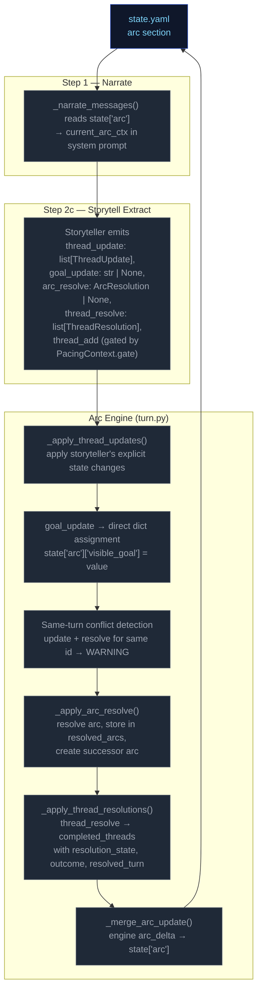

### Thread Mechanics

#### Two Thread Scopes

Threads have a `scope` field (`"scene"` or `"arc"`) that determines narrative treatment:

| Scope | Narrative role | Engine lifecycle |
|---|---|---|
| `scene` | Short-lived tension tied to current location/NPCs | **Purged on location change** — removed from `arc.threads[]` when player moves to a new location (delta_builder.py). |
| `arc` | Persistent story tension across scenes | Persists across location changes. Only removed via `thread_resolve` or auto-closed on arc_resolve (state `"superseded"`). |

#### Entry Points

Six call sites in `run_turn()` process arc/thread operations in order:
1. **`_apply_thread_updates()`** — apply storyteller's explicit state changes; progress is append-only (`list[str]`); sets `last_updated_turn`
2. **`goal_update`** — direct dict assignment to `state["arc"]["visible_goal"]`
3. **Same-turn conflict detection** — warn if same thread id in both update and resolve
4. **`_apply_arc_resolve()`** — resolve arc, store in resolved_arcs, create successor
5. **`_apply_thread_resolutions()`** — resolve/fail/abandon → completed
6. **Thread add gate** — pacing gate + key collision/fuzzy merge checks

All six run after `apply_delta()` but before `save_state()`.

#### Step-by-Step: `_apply_thread_updates()`

Processes `storyteller_result.thread_update` (list of `ThreadUpdate` with `id`, optional `active`, `urgency`, `summary`, `progress`).

For each ThreadUpdate:
1. Find matching thread by ID in `arc.threads[]`
2. If not found → log WARNING, skip
3. If found:
   - Apply non-None fields (`active`, `urgency`, `summary`) via `model_copy`
   - If `progress` is non-None: append to `thread.progress` list (always append, never replace)
   - Set `last_updated_turn` to current turn number
4. Log applied changes at INFO level

**Progress append behavior:** Every `progress` value from a `thread_update` is appended to `ArcThread.progress`. When prior progress is invalidated, the storyteller appends a natural-language entry acknowledging the shift (e.g., "Correction: the dock lead was a dead end."). The renderer shows all entries in order; the LLM on subsequent turns sees the full trail. No replace mechanism, no boolean flag.

#### Step-by-Step: `_apply_arc_resolve()`

Processes `storyteller_result.arc_resolve` (optional `ArcResolution` with `resolution`, `visible_goal`, `goal_context`, `drop_threads: list[str]`, `new_threads: list[ArcThread]`).

1. If `arc_resolve` is None → return None
2. Validate arc from state; if missing/invalid → log WARNING, return None
3. Store current arc in `state["resolved_arcs"]` with `resolved_turn` for TTL tracking
4. Auto-close all arc-scoped threads: move to completed_threads with resolution_state="superseded"
5. Carry forward scene-scoped threads minus any IDs listed in drop_threads
6. Add new_threads from the ArcResolution model
7. Create successor arc with new `visible_goal`, `goal_context`, and combined surviving + new threads
8. Replace `state["arc"]` with successor

#### Thread Creation (gated in `run_turn()`)

New threads (`storyteller_result.thread_add`) are gated by:

1. **Pacing gate**: `PacingContext.gate == "allow"` — blocks escalation when pacing context says so. Gate status is rendered in the prompt (`_thread_list.j2`) so the storyteller has awareness instead of silent drops.
2. **ID collision**: thread `id` already exists in `arc.threads[]` or `arc.completed_threads[]` → reject with WARNING log. Id-based dedup only — no key field or fuzzy merge.

**Thread creation via thread_update (ungoverned):** Threads can also be created implicitly by appearing in `thread_update` without a prior `thread_add`. This is the dominant creation path in practice — the LLM introduces new thread IDs directly via updates.

**Thread creation via thread_update (ungoverned):** Threads can also be created implicitly by appearing in `thread_update` without a prior `thread_add`. This is the dominant creation path in practice — the LLM introduces new thread IDs directly via updates.

#### Step-by-Step: `_apply_thread_resolutions()`

Processes `storyteller_result.thread_resolve` (list of `ThreadResolution` with `id`, `resolution_state`, `outcome`).

1. Find matching thread by ID in `arc.threads[]`
2. If not found → log warning, skip
3. If found → move to `arc.completed_threads[]`, set `resolution_state`, `outcome`, and `resolved_turn`
4. Deduplicate completed_threads entries: existing ID gets updated, not duplicated

#### Pacing Context Gate

`_compute_pacing_context()` sets `gate` based on deescalation:

```
gate = "allow" by default
gate = "block_escalate" when deescalate >= 0.5
```

The gate blocks thread creation. The LLM is instructed not to emit `thread_add` when `gate != "allow"`, and the gate status is explicitly rendered in the prompt to provide awareness.

#### Constants Reference

| Constant | Value (default) | Effect |
|---|---|---|
| `config.resolved_arc_ttl` | 3 | Turns to keep resolved arcs in prompt context |
| `config.completed_thread_ttl` | 3 | Turns to keep completed threads in prompt context |

#### Validation Edge Cases

1. **Empty arc state** — No arc in state → log DEBUG, return None (no crash)
2. **Validation failure** — Arc fails Pydantic validation → log WARNING, return None
3. **Unknown thread ID in update** — Log WARNING, skip — does not block valid updates
4. **Unknown resolution ID** — Log WARNING, skip — does not block valid resolutions
5. **Duplicate thread ID in creation** — Checked against existing + completed IDs
6. **Duplicate ID in creation** — Checked against existing + completed IDs
7. **Same-turn update+resolve conflict** — Same thread id in both `thread_update` and `thread_resolve` → log WARNING, resolution wins (fires after update)
8. **Progress type migration** — Old saves with `progress: "str"` are coerced via `field_validator` wrapping single strings in a list

### Progress Migration

`ArcThread.progress` was changed from `str` to `list[str]` (backward compat not required). A Pydantic `field_validator("progress", mode="wrap")` on the model coerces old string values: if the loaded value is a `str`, it wraps it in `[value]`. This prevents validation failure when loading pre-change saves.

---

---


# Static Context (immutable across all turns)

## Seed State

```json
{
  "meta": {
    "game_name": "eval",
    "turn": 0,
    "setting_pack": "eval-pack",
    "model": ""
  },
  "pc": {
    "name": "Aren Voss",
    "tagline": "Reluctant courier on the merchant road",
    "bio": "Mid-thirties, broad shoulders, careful with words. Took on a courier contract\nto clear an old debt. Just arrived in Marrow's Crossing with a heavy pack and\na heavier obligation.\n",
    "stats": {
      "strength": 3,
      "dexterity": 3,
      "wits": 2,
      "lore": 2,
      "charisma": 3,
      "resolve": 3
    },
    "conditions": [],
    "momentum": 0,
    "drive": ""
  },
  "location": {
    "id": "marrows_crossing",
    "name": "Marrow's Crossing",
    "description": "A market town built around the confluence of two rivers. Cobblestone streets,\ntimber-framed buildings, and the constant sound of water from the mills. The\ntown square has a stone well and a statue of the founder. Most shops are closing\nfor the evening.\n"
  },
  "inventory": [
    {
      "id": "credits",
      "name": "Credits",
      "notes": "Common coin, accepted at any inn or stall on the merchant road.",
      "amount": 500,
      "aliases": []
    },
    {
      "id": "iron_dagger",
      "name": "Iron dagger",
      "notes": "Plain crossguard, edge worn from honing. Belt-carried.",
      "amount": 1,
      "aliases": []
    },
    {
      "id": "bandages",
      "name": "Linen bandages",
      "notes": "Three rolls. Field-grade \u2014 won't replace a healer.",
      "amount": 3,
      "aliases": []
    },
    {
      "id": "traveler_cloak",
      "name": "Traveler's cloak",
      "notes": "Oiled wool, road-stained, hood deep enough to hide a face.",
      "amount": 1,
      "aliases": [
        "cloak",
        "travel cloak"
      ]
    },
    {
      "id": "brass_key",
      "name": "Brass key",
      "notes": "A small brass key Halden gave you with the ledger.",
      "amount": 1,
      "aliases": []
    }
  ],
  "scene": {
    "tagline": "Market town at dusk",
    "tags": [
      "peaceful",
      "start"
    ],
    "world_state": [
      "Marrow's Crossing is a market town at the confluence of two rivers, known for its mills and the annual river festival.",
      "Iron coin (credits) is the universal currency on the merchant road; barter is acceptable but slower.",
      "The road has been quieter than usual this season \u2014 fewer caravans, more independent runners, more opportunists."
    ]
  },
  "compendium": {
    "npcs": {
      "caron": {
        "name": "Caron",
        "title": "Old creditor",
        "bio": "A portly man in his sixties with a merchant's ledger and a patient demeanor. You owe him 500 credits from a failed venture three years ago.",
        "bond": null,
        "presence": null,
        "notes": null,
        "motivation": null,
        "fear": null,
        "leverage": null
      },
      "halden": {
        "name": "Halden",
        "title": "Merchant",
        "bio": "A road merchant in his fifties who hires couriers when his usual runners are spoken for. Honest by reputation, careful with money.",
        "bond": null,
        "presence": null,
        "notes": null,
        "motivation": null,
        "fear": null,
        "leverage": null
      },
      "innkeeper": {
        "name": "Edda",
        "title": "Innkeeper at the Crossed Keys",
        "bio": "Runs the inn alone since her husband died. Knows every traveler by face if not by name. Stays out of trouble unless it walks through her door.",
        "bond": null,
        "presence": null,
        "notes": null,
        "motivation": null,
        "fear": null,
        "leverage": null
      },
      "tough_a": {
        "name": "Bald Tough",
        "title": "Road thug",
        "bio": "Hired muscle. No personal stake in this \u2014 he'll back off if the price is right or the fight goes bad.",
        "bond": null,
        "presence": null,
        "notes": null,
        "motivation": null,
        "fear": null,
        "leverage": null
      },
      "tough_b": {
        "name": "Scarred Tough",
        "title": "Road thug",
        "bio": "Same outfit as the other \u2014 hired by the same person. Quicker to violence; not the brains.",
        "bond": null,
        "presence": null,
        "notes": null,
        "motivation": null,
        "fear": null,
        "leverage": null
      },
      "matthew_estrada": {
        "name": "Matthew Estrada",
        "title": "Traveler",
        "bio": "A tall, broad-shoulded man in a stained leather jerkin carrying a heavy rucksack. Looks like a road runner but moves with military precision.",
        "bond": null,
        "presence": null,
        "notes": null,
        "motivation": null,
        "fear": null,
        "leverage": null
      }
    }
  },
  "arc": {
    "visible_goal": "Clear your debts and deliver the ledger \u2014 two obligations binding you to Marrow's Crossing.",
    "goal_context": "",
    "threads": [
      {
        "id": "settle_the_debt",
        "summary": "Settle the 500-credit debt with Caron.",
        "scope": "arc",
        "active": false,
        "urgency": "normal",
        "progress": [],
        "resolution_state": null,
        "outcome": null,
        "resolved_turn": null
      },
      {
        "id": "deliver_the_ledger",
        "summary": "Deliver Halden's ledger to the merchant at the Crossed Keys Inn.",
        "scope": "arc",
        "active": false,
        "urgency": "normal",
        "progress": [],
        "resolution_state": null,
        "outcome": null,
        "resolved_turn": null
      },
      {
        "id": "clear_the_road_toughs",
        "summary": "Deal with the toughs blocking the inn entrance.",
        "scope": "arc",
        "active": false,
        "urgency": "background",
        "progress": [],
        "resolution_state": null,
        "outcome": null,
        "resolved_turn": null
      }
    ],
    "completed_threads": [],
    "resolution": null,
    "last_thread_created_turn": 0
  }
}
```

## Engine Constants

```json
{
  "urgency_levels": [
    "background",
    "normal",
    "urgent"
  ],
  "momentum_min": -3,
  "momentum_max": 3,
  "momentum_delta": {
    "crit_success": 2,
    "success": 1,
    "partial": 0,
    "setback": -1,
    "fail": -1,
    "crit_fail": -2
  }
}
```

## System Prompts (identical every turn)

### Ruling System Prompt

```
(not captured this run)
```

### Narrate System Prompt

```
(not captured this run)
```

### Extract Scene System Prompt

```
(not captured this run)
```

### Extract State System Prompt

```
(not captured this run)
```

### Storyteller System Prompt

```
(not captured this run)
```


---

# TURN 1

**Input:** `Walk over to Caron's table and sit down across from him. I'm ready to talk about the debt.`

## User Prompts

### Ruling User Prompt
```
(no ruling call this turn)
```

### Narrate User Prompt
```
(no narrate call)
```

### Extract Scene User Prompt
```
(not captured)
```

### Extract State User Prompt
```
(not captured)
```

### Storyteller User Prompt
```
(not captured)
```

## Engine Outputs

### Rules

**Parsed (engine):**
```json
{
  "intent_verb": "negotiate",
  "intent": "The player approaches Caron to discuss their outstanding debt.",
  "rolled": false,
  "total_ms": 10162.9,
  "tokens_in": 1923,
  "tokens_out": 73,
  "outcome_summary": "Aren Voss sat with Caron at the Crossed Keys Inn to begin negotiations regarding his 500-credit debt."
}
```

**Raw LLM output:**
```

```

### Narration


### Extract Scene

```json
{
  "scene_tags": [
    "tense_conversation",
    "confrontation"
  ],
  "scene_tagline": "A Debt Long Overdue",
  "location_description": "The interior of the Crossed Keys Inn, where flickering candlelight casts long shadows across the creaking floorboards.",
  "compendium_npc_update": [
    {
      "id": "caron",
      "aliases": [],
      "notes": "leaning forward under candlelight, tapping his finger against his ledger while waiting for a payment plan."
    },
    {
      "id": "tough_a",
      "aliases": [],
      "notes": "lingering by the inn entrance, tracking your movements with predatory interest."
    },
    {
      "id": "tough_b",
      "aliases": [],
      "notes": "standing near the door, watching you with idle, predatory interest."
    }
  ]
}
```

### Extract State

```json
{
  "inventory_add": [],
  "inventory_remove": [],
  "inventory_update": [],
  "pc_condition_add": [],
  "pc_condition_remove": []
}
```

### Storyteller

```json
{
  "actions": [
    "Offer to work off the debt through Halden's delivery.",
    "Propose a structured payment plan using future courier earnings.",
    "Attempt to intimidate Caron by mentioning the thugs outside.",
    "Ask Caron if he has any immediate, high-paying jobs."
  ],
  "outcome_summary": "Aren Voss sat with Caron at the Crossed Keys Inn to begin negotiations regarding his 500-credit debt.",
  "thread_resolve": [],
  "thread_update": [
    {
      "id": "settle_the_debt",
      "urgency": "normal",
      "progress": "Negotiations have commenced with Caron."
    }
  ],
  "world_state_add": [],
  "world_state_remove": []
}
```

### Applied Deltas

```json
{
  "inventory_add": [],
  "inventory_remove": [],
  "inventory_update": [],
  "location_description": "The interior of the Crossed Keys Inn, where flickering candlelight casts long shadows across the creaking floorboards.",
  "pc_condition_add": [],
  "pc_condition_remove": [],
  "scene_tags": [
    "tense_conversation",
    "confrontation"
  ],
  "scene_tagline": "A Debt Long Overdue",
  "compendium_npc_update": [
    {
      "id": "caron",
      "aliases": [],
      "notes": "leaning forward under candlelight, tapping his finger against his ledger while waiting for a payment plan."
    },
    {
      "id": "tough_a",
      "aliases": [],
      "notes": "lingering by the inn entrance, tracking your movements with predatory interest."
    },
    {
      "id": "tough_b",
      "aliases": [],
      "notes": "standing near the door, watching you with idle, predatory interest."
    }
  ],
  "actions": [
    "Offer to work off the debt through Halden's delivery.",
    "Propose a structured payment plan using future courier earnings.",
    "Attempt to intimidate Caron by mentioning the thugs outside.",
    "Ask Caron if he has any immediate, high-paying jobs."
  ],
  "world_state_add": [],
  "world_state_remove": []
}
```

### Rejected Deltas

*(none)*

### Suggested Actions

*(none)*

### Context Telemetry

*(no telemetry)*

### State After Turn

```json
{
  "arc": {
    "completed_threads": [],
    "goal_context": "",
    "last_thread_created_turn": 0,
    "resolution": null,
    "threads": [
      {
        "active": false,
        "id": "settle_the_debt",
        "progress": [
          "Negotiations have commenced with Caron."
        ],
        "scope": "arc",
        "summary": "Settle the 500-credit debt with Caron.",
        "urgency": "normal"
      },
      {
        "active": false,
        "id": "deliver_the_ledger",
        "progress": [],
        "scope": "arc",
        "summary": "Deliver Halden's ledger to the merchant at the Crossed Keys Inn.",
        "urgency": "normal"
      },
      {
        "active": false,
        "id": "clear_the_road_toughs",
        "progress": [],
        "scope": "arc",
        "summary": "Deal with the toughs blocking the inn entrance.",
        "urgency": "background"
      }
    ],
    "visible_goal": "Clear your debts and deliver the ledger \u2014 two obligations binding you to Marrow's Crossing."
  },
  "compendium": {
    "npcs": {
      "caron": {
        "bio": "A portly man in his sixties with a merchant's ledger and a patient demeanor. You owe him 500 credits from a failed venture three years ago.",
        "bond": null,
        "fear": null,
        "last_seen": {
          "location_id": "marrows_crossing",
          "location_name": "Marrow's Crossing",
          "turn": 1
        },
        "leverage": null,
        "motivation": null,
        "name": "Caron",
        "notes": "leaning forward under candlelight, tapping his finger against his ledger while waiting for a payment plan.",
        "presence": null,
        "title": "Old creditor"
      },
      "halden": {
        "bio": "A road merchant in his fifties who hires couriers when his usual runners are spoken for. Honest by reputation, careful with money.",
        "bond": null,
        "fear": null,
        "leverage": null,
        "motivation": null,
        "name": "Halden",
        "notes": null,
        "presence": null,
        "title": "Merchant"
      },
      "innkeeper": {
        "bio": "Runs the inn alone since her husband died. Knows every traveler by face if not by name. Stays out of trouble unless it walks through her door.",
        "bond": null,
        "fear": null,
        "leverage": null,
        "motivation": null,
        "name": "Edda",
        "notes": null,
        "presence": null,
        "title": "Innkeeper at the Crossed Keys"
      },
      "matthew_estrada": {
        "bio": "A tall, broad-shoulded man in a stained leather jerkin carrying a heavy rucksack. Looks like a road runner but moves with military precision.",
        "bond": null,
        "fear": null,
        "leverage": null,
        "motivation": null,
        "name": "Matthew Estrada",
        "notes": null,
        "presence": null,
        "title": "Traveler"
      },
      "tough_a": {
        "bio": "Hired muscle. No personal stake in this \u2014 he'll back off if the price is right or the fight goes bad.",
        "bond": null,
        "fear": null,
        "last_seen": {
          "location_id": "marrows_crossing",
          "location_name": "Marrow's Crossing",
          "turn": 1
        },
        "leverage": null,
        "motivation": null,
        "name": "Bald Tough",
        "notes": "lingering by the inn entrance, tracking your movements with predatory interest.",
        "presence": null,
        "title": "Road thug"
      },
      "tough_b": {
        "bio": "Same outfit as the other \u2014 hired by the same person. Quicker to violence; not the brains.",
        "bond": null,
        "fear": null,
        "last_seen": {
          "location_id": "marrows_crossing",
          "location_name": "Marrow's Crossing",
          "turn": 1
        },
        "leverage": null,
        "motivation": null,
        "name": "Scarred Tough",
        "notes": "standing near the door, watching you with idle, predatory interest.",
        "presence": null,
        "title": "Road thug"
      }
    }
  },
  "inventory": [
    {
      "aliases": [],
      "amount": 500,
      "id": "credits",
      "name": "Credits",
      "notes": "Common coin, accepted at any inn or stall on the merchant road."
    },
    {
      "aliases": [],
      "amount": 1,
      "id": "iron_dagger",
      "name": "Iron dagger",
      "notes": "Plain crossguard, edge worn from honing. Belt-carried."
    },
    {
      "aliases": [],
      "amount": 3,
      "id": "bandages",
      "name": "Linen bandages",
      "notes": "Three rolls. Field-grade \u2014 won't replace a healer."
    },
    {
      "aliases": [
        "cloak",
        "travel cloak"
      ],
      "amount": 1,
      "id": "traveler_cloak",
      "name": "Traveler's cloak",
      "notes": "Oiled wool, road-stained, hood deep enough to hide a face."
    },
    {
      "aliases": [],
      "amount": 1,
      "id": "brass_key",
      "name": "Brass key",
      "notes": "A small brass key Halden gave you with the ledger."
    }
  ],
  "location": {
    "description": "The interior of the Crossed Keys Inn, where flickering candlelight casts long shadows across the creaking floorboards.",
    "id": "marrows_crossing",
    "name": "Marrow's Crossing"
  },
  "meta": {
    "consecutive_pressure_turns": 0,
    "game_name": "eval",
    "model": "",
    "prior_history": [
      "- [T1] Aren Voss sat with Caron at the Crossed Keys Inn to begin negotiations regarding his 500-credit debt."
    ],
    "recent_beats": [
      {
        "surface_as": null,
        "turn": 1,
        "type": null
      }
    ],
    "setting_pack": "eval-pack",
    "turn": 1
  },
  "pc": {
    "actions": [
      "Offer to work off the debt through Halden's delivery.",
      "Propose a structured payment plan using future courier earnings.",
      "Attempt to intimidate Caron by mentioning the thugs outside.",
      "Ask Caron if he has any immediate, high-paying jobs."
    ],
    "bio": "Mid-thirties, broad shoulders, careful with words. Took on a courier contract\nto clear an old debt. Just arrived in Marrow's Crossing with a heavy pack and\na heavier obligation.\n",
    "conditions": [],
    "drive": "",
    "momentum": 0,
    "name": "Aren Voss",
    "stats": {
      "charisma": 3,
      "dexterity": 3,
      "lore": 2,
      "resolve": 3,
      "strength": 3,
      "wits": 2
    },
    "tagline": "Reluctant courier on the merchant road"
  },
  "scene": {
    "tagline": "A Debt Long Overdue",
    "tags": [
      "tense_conversation",
      "confrontation"
    ],
    "world_state": [
      "Marrow's Crossing is a market town at the confluence of two rivers, known for its mills and the annual river festival.",
      "Iron coin (credits) is the universal currency on the merchant road; barter is acceptable but slower.",
      "The road has been quieter than usual this season \u2014 fewer caravans, more independent runners, more opportunists."
    ]
  },
  "schema_version": 1
}
```


---

# TURN 2

**Input:** `I slide 500 credits across the table to Caron and ask him to mark the debt cleared in his ledger.`

## User Prompts

### Ruling User Prompt
```
(no ruling call this turn)
```

### Narrate User Prompt
```
(no narrate call)
```

### Extract Scene User Prompt
```
(not captured)
```

### Extract State User Prompt
```
(not captured)
```

### Storyteller User Prompt
```
(not captured)
```

## Engine Outputs

### Rules

**Parsed (engine):**
```json
{
  "intent_verb": "negotiate",
  "intent": "The player offers 500 credits to Caron to settle their debt.",
  "rolled": false,
  "total_ms": 3026.5,
  "tokens_in": 2177,
  "tokens_out": 78,
  "outcome_summary": "Aren Voss settled his 500-credit debt with Caron, resulting in the merchant crossing out the entry in his ledger."
}
```

**Raw LLM output:**
```

```

### Narration


### Extract Scene

```json
{
  "scene_tags": [
    "tense_transaction",
    "relief"
  ],
  "scene_tagline": "The Debt Is Settled",
  "compendium_npc_update": [
    {
      "id": "caron",
      "aliases": [],
      "notes": "closing his ledger with a thud and tucking it under his arm \u2014 debt settled, but remains wary."
    },
    {
      "id": "tough_a",
      "aliases": [],
      "notes": "standing motionless by the door, watching the transaction conclude."
    },
    {
      "id": "tough_b",
      "aliases": [],
      "notes": "remaining at their post by the entrance, eyes fixed on you."
    }
  ]
}
```

### Extract State

```json
{
  "inventory_add": [],
  "inventory_remove": [
    {
      "id": "credits",
      "amount": 500
    }
  ],
  "inventory_update": [],
  "pc_condition_add": [],
  "pc_condition_remove": []
}
```

### Storyteller

```json
{
  "actions": [
    "Ask Caron if he knows who hired the thugs.",
    "Hand Halden's ledger to Caron as a gesture of goodwill.",
    "Walk past the thugs toward the inn exit confidently.",
    "Demand that the thugs leave the entrance immediately."
  ],
  "outcome_summary": "Aren Voss settled his 500-credit debt with Caron, resulting in the merchant crossing out the entry in his ledger.",
  "thread_resolve": [
    {
      "id": "settle_the_debt",
      "resolution_state": "resolved",
      "outcome": "The debt was fully repaid with 500 credits.",
      "promote_to_world_state": true
    }
  ],
  "thread_update": [
    {
      "id": "settle_the_debt",
      "progress": "Debt of 500 credits successfully paid to Caron."
    }
  ],
  "world_state_add": [
    {
      "id": "debt_settled_caron",
      "text": "Aren Voss has officially settled his 500-credit debt with Caron.",
      "tier": "persistent"
    }
  ],
  "world_state_remove": []
}
```

### Applied Deltas

```json
{
  "inventory_add": [],
  "inventory_remove": [
    {
      "id": "credits",
      "amount": 500
    }
  ],
  "inventory_update": [],
  "pc_condition_add": [],
  "pc_condition_remove": [],
  "scene_tags": [
    "tense_transaction",
    "relief"
  ],
  "scene_tagline": "The Debt Is Settled",
  "compendium_npc_update": [
    {
      "id": "caron",
      "aliases": [],
      "notes": "closing his ledger with a thud and tucking it under his arm \u2014 debt settled, but remains wary."
    },
    {
      "id": "tough_a",
      "aliases": [],
      "notes": "standing motionless by the door, watching the transaction conclude."
    },
    {
      "id": "tough_b",
      "aliases": [],
      "notes": "remaining at their post by the entrance, eyes fixed on you."
    }
  ],
  "actions": [
    "Ask Caron if he knows who hired the thugs.",
    "Hand Halden's ledger to Caron as a gesture of goodwill.",
    "Walk past the thugs toward the inn exit confidently.",
    "Demand that the thugs leave the entrance immediately."
  ],
  "world_state_add": [
    {
      "id": "debt_settled_caron",
      "text": "Aren Voss has officially settled his 500-credit debt with Caron.",
      "tier": "persistent"
    }
  ],
  "world_state_remove": []
}
```

### Rejected Deltas

*(none)*

### Suggested Actions

*(none)*

### Context Telemetry

*(no telemetry)*

### State After Turn

*(diff vs previous turn — full snapshot only on first and last turns)*

```json
{
  "arc": {
    "completed_threads": {
      "added": [
        {
          "active": false,
          "id": "settle_the_debt",
          "outcome": "The debt was fully repaid with 500 credits.",
          "progress": [
            "Negotiations have commenced with Caron.",
            "Debt of 500 credits successfully paid to Caron."
          ],
          "resolution_state": "resolved",
          "resolved_turn": 2,
          "scope": "arc",
          "summary": "Settle the 500-credit debt with Caron.",
          "urgency": "normal"
        }
      ]
    },
    "threads": {
      "removed": [
        {
          "active": false,
          "id": "settle_the_debt",
          "progress": [
            "Negotiations have commenced with Caron."
          ],
          "scope": "arc",
          "summary": "Settle the 500-credit debt with Caron.",
          "urgency": "normal"
        }
      ]
    }
  },
  "compendium": {
    "npcs": {
      "caron": {
        "last_seen": {
          "turn": {
            "from": 1,
            "to": 2
          }
        },
        "notes": {
          "from": "leaning forward under candlelight, tapping his finger against his ledger while waiting for a payment plan.",
          "to": "closing his ledger with a thud and tucking it under his arm \u2014 debt settled, but remains wary."
        }
      },
      "tough_a": {
        "last_seen": {
          "turn": {
            "from": 1,
            "to": 2
          }
        },
        "notes": {
          "from": "lingering by the inn entrance, tracking your movements with predatory interest.",
          "to": "standing motionless by the door, watching the transaction conclude."
        }
      },
      "tough_b": {
        "last_seen": {
          "turn": {
            "from": 1,
            "to": 2
          }
        },
        "notes": {
          "from": "standing near the door, watching you with idle, predatory interest.",
          "to": "remaining at their post by the entrance, eyes fixed on you."
        }
      }
    }
  },
  "inventory": {
    "removed": [
      {
        "aliases": [],
        "amount": 500,
        "id": "credits",
        "name": "Credits",
        "notes": "Common coin, accepted at any inn or stall on the merchant road."
      }
    ]
  },
  "meta": {
    "prior_history": {
      "added": [
        "- [T2] Aren Voss settled his 500-credit debt with Caron, resulting in the merchant crossing out the entry in his ledger."
      ],
      "removed": []
    },
    "recent_beats": {
      "added": [
        [
          [
            "surface_as",
            null
          ],
          [
            "turn",
            2
          ],
          [
            "type",
            null
          ]
        ]
      ],
      "removed": []
    },
    "turn": {
      "from": 1,
      "to": 2
    }
  },
  "pc": {
    "actions": {
      "added": [
        "Ask Caron if he knows who hired the thugs.",
        "Demand that the thugs leave the entrance immediately.",
        "Hand Halden's ledger to Caron as a gesture of goodwill.",
        "Walk past the thugs toward the inn exit confidently."
      ],
      "removed": [
        "Propose a structured payment plan using future courier earnings.",
        "Ask Caron if he has any immediate, high-paying jobs.",
        "Attempt to intimidate Caron by mentioning the thugs outside.",
        "Offer to work off the debt through Halden's delivery."
      ]
    }
  },
  "scene": {
    "tagline": {
      "from": "A Debt Long Overdue",
      "to": "The Debt Is Settled"
    },
    "tags": {
      "added": [
        "relief",
        "tense_transaction"
      ],
      "removed": [
        "tense_conversation",
        "confrontation"
      ]
    },
    "world_state": {
      "added": [
        [
          [
            "id",
            "debt_settled_caron"
          ],
          [
            "text",
            "Aren Voss has officially settled his 500-credit debt with Caron."
          ],
          [
            "tier",
            "persistent"
          ]
        ],
        [
          [
            "id",
            "settle_the_debt"
          ],
          [
            "text",
            "The debt was fully repaid with 500 credits."
          ],
          [
            "tier",
            "persistent"
          ]
        ]
      ],
      "removed": []
    }
  }
}
```


---

# TURN 3

**Input:** `I find Halden by the town well and offer to carry his ledger to the Crossed Keys Inn. I'll do it for 200 credits.`

## User Prompts

### Ruling User Prompt
```
(no ruling call this turn)
```

### Narrate User Prompt
```
(no narrate call)
```

### Extract Scene User Prompt
```
(not captured)
```

### Extract State User Prompt
```
(not captured)
```

### Storyteller User Prompt
```
(not captured)
```

## Engine Outputs

### Rules

**Parsed (engine):**
```json
{
  "intent_verb": "negotiate",
  "intent": "Offer to perform a courier job for Halden for 200 credits.",
  "rolled": false,
  "total_ms": 3140.5,
  "tokens_in": 2203,
  "tokens_out": 78,
  "outcome_summary": "Aren Voss negotiated with Halden by the town well, proposing a 200-credit courier job to deliver his ledger."
}
```

**Raw LLM output:**
```

```

### Narration


### Extract Scene

```json
{
  "scene_tags": [
    "negotiation",
    "night",
    "tense_atmosphere"
  ],
  "scene_tagline": "A Risky Proposition",
  "location_change": {
    "id": "marrows_crossing_well",
    "name": "The Town Well",
    "description": "A stone basin in the center of the muddy paths, where the rhythmic splash of buckets echoes under the pale moonlight."
  },
  "compendium_npc_update": [
    {
      "id": "halden",
      "aliases": [],
      "presence": "present",
      "notes": "weighing the cost of a reliable runner against the risk of the road"
    },
    {
      "id": "tough_a",
      "aliases": [],
      "presence": "known"
    },
    {
      "id": "tough_b",
      "aliases": [],
      "presence": "known"
    },
    {
      "id": "caron",
      "aliases": [],
      "presence": "known"
    }
  ]
}
```

### Extract State

```json
{
  "inventory_add": [],
  "inventory_remove": [],
  "inventory_update": [],
  "pc_condition_add": [],
  "pc_condition_remove": []
}
```

### Storyteller

```json
{
  "actions": [
    "Assure Halden of my reliability and accept the job.",
    "Demand more credits to offset the risk of the thugs.",
    "Ask Halden if he knows why the roads are restless.",
    "Suggest a faster route through the riverside mills."
  ],
  "outcome_summary": "Aren Voss negotiated with Halden by the town well, proposing a 200-credit courier job to deliver his ledger.",
  "thread_resolve": [],
  "thread_add": {
    "id": "road_instability",
    "summary": "The roads around Marrow's Crossing have become increasingly dangerous.",
    "scope": "arc",
    "active": true,
    "urgency": "normal",
    "progress": []
  },
  "thread_update": [
    {
      "id": "deliver_the_ledger",
      "progress": "Negotiated terms with Halden; waiting for final agreement."
    }
  ],
  "world_state_add": [],
  "world_state_remove": []
}
```

### Applied Deltas

```json
{
  "inventory_add": [],
  "inventory_remove": [],
  "inventory_update": [],
  "location_change": {
    "id": "marrows_crossing_well",
    "name": "The Town Well",
    "description": "A stone basin in the center of the muddy paths, where the rhythmic splash of buckets echoes under the pale moonlight."
  },
  "pc_condition_add": [],
  "pc_condition_remove": [],
  "scene_tags": [
    "negotiation",
    "night",
    "tense_atmosphere"
  ],
  "scene_tagline": "A Risky Proposition",
  "compendium_npc_update": [
    {
      "id": "halden",
      "aliases": [],
      "presence": "present",
      "notes": "weighing the cost of a reliable runner against the risk of the road"
    },
    {
      "id": "tough_a",
      "aliases": [],
      "presence": "known"
    },
    {
      "id": "tough_b",
      "aliases": [],
      "presence": "known"
    },
    {
      "id": "caron",
      "aliases": [],
      "presence": "known"
    }
  ],
  "actions": [
    "Assure Halden of my reliability and accept the job.",
    "Demand more credits to offset the risk of the thugs.",
    "Ask Halden if he knows why the roads are restless.",
    "Suggest a faster route through the riverside mills."
  ],
  "world_state_add": [],
  "world_state_remove": []
}
```

### Rejected Deltas

*(none)*

### Suggested Actions

*(none)*

### Context Telemetry

*(no telemetry)*

### State After Turn

*(diff vs previous turn — full snapshot only on first and last turns)*

```json
{
  "arc": {
    "last_thread_created_turn": {
      "from": 0,
      "to": 3
    },
    "threads": {
      "added": [
        {
          "active": true,
          "id": "road_instability",
          "progress": [],
          "scope": "arc",
          "summary": "The roads around Marrow's Crossing have become increasingly dangerous.",
          "urgency": "normal"
        }
      ],
      "changed": [
        {
          "from": {
            "active": false,
            "id": "deliver_the_ledger",
            "progress": [],
            "scope": "arc",
            "summary": "Deliver Halden's ledger to the merchant at the Crossed Keys Inn.",
            "urgency": "normal"
          },
          "to": {
            "active": false,
            "id": "deliver_the_ledger",
            "progress": [
              "Negotiated terms with Halden; waiting for final agreement."
            ],
            "scope": "arc",
            "summary": "Deliver Halden's ledger to the merchant at the Crossed Keys Inn.",
            "urgency": "normal"
          }
        }
      ]
    }
  },
  "compendium": {
    "npcs": {
      "caron": {
        "last_seen": {
          "location_id": {
            "from": "marrows_crossing",
            "to": "marrows_crossing_well"
          },
          "location_name": {
            "from": "Marrow's Crossing",
            "to": "The Town Well"
          },
          "turn": {
            "from": 2,
            "to": 3
          }
        },
        "notes": {
          "from": "closing his ledger with a thud and tucking it under his arm \u2014 debt settled, but remains wary.",
          "to": null
        },
        "presence": {
          "from": null,
          "to": "known"
        }
      },
      "halden": {
        "last_seen": {
          "from": null,
          "to": {
            "location_id": "marrows_crossing_well",
            "location_name": "The Town Well",
            "turn": 3
          }
        },
        "notes": {
          "from": null,
          "to": "weighing the cost of a reliable runner against the risk of the road"
        },
        "presence": {
          "from": null,
          "to": "present"
        }
      },
      "tough_a": {
        "last_seen": {
          "location_id": {
            "from": "marrows_crossing",
            "to": "marrows_crossing_well"
          },
          "location_name": {
            "from": "Marrow's Crossing",
            "to": "The Town Well"
          },
          "turn": {
            "from": 2,
            "to": 3
          }
        },
        "notes": {
          "from": "standing motionless by the door, watching the transaction conclude.",
          "to": null
        },
        "presence": {
          "from": null,
          "to": "known"
        }
      },
      "tough_b": {
        "last_seen": {
          "location_id": {
            "from": "marrows_crossing",
            "to": "marrows_crossing_well"
          },
          "location_name": {
            "from": "Marrow's Crossing",
            "to": "The Town Well"
          },
          "turn": {
            "from": 2,
            "to": 3
          }
        },
        "notes": {
          "from": "remaining at their post by the entrance, eyes fixed on you.",
          "to": null
        },
        "presence": {
          "from": null,
          "to": "known"
        }
      }
    }
  },
  "location": {
    "description": {
      "from": "The interior of the Crossed Keys Inn, where flickering candlelight casts long shadows across the creaking floorboards.",
      "to": "A stone basin in the center of the muddy paths, where the rhythmic splash of buckets echoes under the pale moonlight."
    },
    "id": {
      "from": "marrows_crossing",
      "to": "marrows_crossing_well"
    },
    "name": {
      "from": "Marrow's Crossing",
      "to": "The Town Well"
    }
  },
  "meta": {
    "compendium_touch_order": {
      "from": null,
      "to": [
        "halden"
      ]
    },
    "last_thread_created_turn": {
      "from": null,
      "to": 3
    },
    "prior_history": {
      "added": [
        "- [T3] Aren Voss negotiated with Halden by the town well, proposing a 200-credit courier job to deliver his ledger."
      ],
      "removed": []
    },
    "recent_beats": {
      "added": [
        [
          [
            "surface_as",
            null
          ],
          [
            "turn",
            3
          ],
          [
            "type",
            null
          ]
        ]
      ],
      "removed": []
    },
    "turn": {
      "from": 2,
      "to": 3
    }
  },
  "pc": {
    "actions": {
      "added": [
        "Suggest a faster route through the riverside mills.",
        "Demand more credits to offset the risk of the thugs.",
        "Assure Halden of my reliability and accept the job.",
        "Ask Halden if he knows why the roads are restless."
      ],
      "removed": [
        "Ask Caron if he knows who hired the thugs.",
        "Demand that the thugs leave the entrance immediately.",
        "Hand Halden's ledger to Caron as a gesture of goodwill.",
        "Walk past the thugs toward the inn exit confidently."
      ]
    }
  },
  "scene": {
    "location_entered_turn": {
      "from": null,
      "to": 2
    },
    "tagline": {
      "from": "The Debt Is Settled",
      "to": "A Risky Proposition"
    },
    "tags": {
      "added": [
        "tense_atmosphere",
        "night",
        "negotiation"
      ],
      "removed": [
        "relief",
        "tense_transaction"
      ]
    },
    "turn_entered": {
      "from": null,
      "to": 2
    }
  }
}
```


---

# TURN 4

**Input:** `I leave Marrow's Crossing by the east gate and head for the Crossed Keys Inn, following the merchant road.`

## User Prompts

### Ruling User Prompt
```
(no ruling call this turn)
```

### Narrate User Prompt
```
(no narrate call)
```

### Extract Scene User Prompt
```
(not captured)
```

### Extract State User Prompt
```
(not captured)
```

### Storyteller User Prompt
```
(not captured)
```

## Engine Outputs

### Rules

**Parsed (engine):**
```json
{
  "intent_verb": "travel",
  "intent": "The player travels from the town well toward the inn via the merchant road.",
  "rolled": false,
  "total_ms": 2755.2,
  "tokens_in": 2176,
  "tokens_out": 58,
  "outcome_summary": "Aren Voss approached the Crossed Keys Inn but was intercepted by Bald Tough and Scarred Tough blocking the entrance."
}
```

**Raw LLM output:**
```

```

### Narration


### Extract Scene

```json
{
  "scene_tags": [
    "confrontation",
    "tense",
    "impending_conflict"
  ],
  "scene_tagline": "The Path is Blocked",
  "location_description": "The wooden porch of the Crossed Keys Inn, where the warm light from within contrasts with the dark, looming silhouettes of the surrounding trees.",
  "compendium_npc_update": [
    {
      "id": "tough_a",
      "aliases": [],
      "presence": "present",
      "notes": "resting a hand on his knife hilt while blocking the inn entrance"
    },
    {
      "id": "tough_b",
      "aliases": [],
      "presence": "present",
      "notes": "narrowing eyes and stepping sideways to intercept your path"
    }
  ]
}
```

### Extract State

```json
{
  "inventory_add": [],
  "inventory_remove": [],
  "inventory_update": [],
  "pc_condition_add": [],
  "pc_condition_remove": []
}
```

### Storyteller

```json
{
  "actions": [
    "Try to bribe Bald Tough to let you pass.",
    "Draw your iron dagger and demand they move aside.",
    "Attempt to slip past Scarred Tough through the side entrance.",
    "Ask Halden to intervene and speak for you."
  ],
  "outcome_summary": "Aren Voss approached the Crossed Keys Inn but was intercepted by Bald Tough and Scarred Tough blocking the entrance.",
  "gm_beat": {
    "type": "complication",
    "surface_as": "npc_behavior"
  },
  "thread_resolve": [],
  "thread_update": [
    {
      "id": "clear_the_road_toughs",
      "progress": "The thugs have moved from the shadows to actively blocking the inn entrance."
    }
  ],
  "world_state_add": [],
  "world_state_remove": []
}
```

### Applied Deltas

```json
{
  "inventory_add": [],
  "inventory_remove": [],
  "inventory_update": [],
  "location_description": "The wooden porch of the Crossed Keys Inn, where the warm light from within contrasts with the dark, looming silhouettes of the surrounding trees.",
  "pc_condition_add": [],
  "pc_condition_remove": [],
  "scene_tags": [
    "confrontation",
    "tense",
    "impending_conflict"
  ],
  "scene_tagline": "The Path is Blocked",
  "compendium_npc_update": [
    {
      "id": "tough_a",
      "aliases": [],
      "presence": "present",
      "notes": "resting a hand on his knife hilt while blocking the inn entrance"
    },
    {
      "id": "tough_b",
      "aliases": [],
      "presence": "present",
      "notes": "narrowing eyes and stepping sideways to intercept your path"
    }
  ],
  "actions": [
    "Try to bribe Bald Tough to let you pass.",
    "Draw your iron dagger and demand they move aside.",
    "Attempt to slip past Scarred Tough through the side entrance.",
    "Ask Halden to intervene and speak for you."
  ],
  "world_state_add": [],
  "world_state_remove": []
}
```

### Rejected Deltas

*(none)*

### Suggested Actions

*(none)*

### Context Telemetry

*(no telemetry)*

### State After Turn

*(diff vs previous turn — full snapshot only on first and last turns)*

```json
{
  "arc": {
    "threads": {
      "changed": [
        {
          "from": {
            "active": false,
            "id": "clear_the_road_toughs",
            "progress": [],
            "scope": "arc",
            "summary": "Deal with the toughs blocking the inn entrance.",
            "urgency": "background"
          },
          "to": {
            "active": false,
            "id": "clear_the_road_toughs",
            "progress": [
              "The thugs have moved from the shadows to actively blocking the inn entrance."
            ],
            "scope": "arc",
            "summary": "Deal with the toughs blocking the inn entrance.",
            "urgency": "background"
          }
        }
      ]
    }
  },
  "compendium": {
    "npcs": {
      "tough_a": {
        "last_seen": {
          "turn": {
            "from": 3,
            "to": 4
          }
        },
        "notes": {
          "from": null,
          "to": "resting a hand on his knife hilt while blocking the inn entrance"
        },
        "presence": {
          "from": "known",
          "to": "present"
        }
      },
      "tough_b": {
        "last_seen": {
          "turn": {
            "from": 3,
            "to": 4
          }
        },
        "notes": {
          "from": null,
          "to": "narrowing eyes and stepping sideways to intercept your path"
        },
        "presence": {
          "from": "known",
          "to": "present"
        }
      }
    }
  },
  "location": {
    "description": {
      "from": "A stone basin in the center of the muddy paths, where the rhythmic splash of buckets echoes under the pale moonlight.",
      "to": "The wooden porch of the Crossed Keys Inn, where the warm light from within contrasts with the dark, looming silhouettes of the surrounding trees."
    }
  },
  "meta": {
    "compendium_touch_order": {
      "added": [
        "tough_b",
        "tough_a"
      ],
      "removed": []
    },
    "consecutive_pressure_turns": {
      "from": 0,
      "to": 1
    },
    "pending_gm_beat": {
      "from": null,
      "to": {
        "beat_expires_turn": 6,
        "surface_as": "npc_behavior",
        "type": "complication"
      }
    },
    "prior_history": {
      "added": [
        "- [T4] Aren Voss approached the Crossed Keys Inn but was intercepted by Bald Tough and Scarred Tough blocking the entrance."
      ],
      "removed": []
    },
    "recent_beats": {
      "added": [
        [
          [
            "surface_as",
            "npc_behavior"
          ],
          [
            "turn",
            4
          ],
          [
            "type",
            "complication"
          ]
        ]
      ],
      "removed": []
    },
    "turn": {
      "from": 3,
      "to": 4
    }
  },
  "pc": {
    "actions": {
      "added": [
        "Ask Halden to intervene and speak for you.",
        "Try to bribe Bald Tough to let you pass.",
        "Attempt to slip past Scarred Tough through the side entrance.",
        "Draw your iron dagger and demand they move aside."
      ],
      "removed": [
        "Suggest a faster route through the riverside mills.",
        "Demand more credits to offset the risk of the thugs.",
        "Assure Halden of my reliability and accept the job.",
        "Ask Halden if he knows why the roads are restless."
      ]
    }
  },
  "scene": {
    "tagline": {
      "from": "A Risky Proposition",
      "to": "The Path is Blocked"
    },
    "tags": {
      "added": [
        "confrontation",
        "impending_conflict",
        "tense"
      ],
      "removed": [
        "tense_atmosphere",
        "night",
        "negotiation"
      ]
    }
  }
}
```


---

# TURN 5

**Input:** `I walk up to the two toughs at the inn door and ask them what they're doing here. I'm not leaving until I hear their side.`

## User Prompts

### Ruling User Prompt
```
(no ruling call this turn)
```

### Narrate User Prompt
```
(no narrate call)
```

### Extract Scene User Prompt
```
(not captured)
```

### Extract State User Prompt
```
(not captured)
```

### Storyteller User Prompt
```
(not captured)
```

## Engine Outputs

### Rules

**Parsed (engine):**
```json
{
  "intent_verb": "persuade",
  "intent": "The player confronts the two thugs to demand an explanation for their presence blocking the entrance.",
  "rolled": true,
  "total_ms": 3476.4,
  "tokens_in": 2210,
  "tokens_out": 101,
  "outcome_summary": "Aren Voss confronted the thugs blocking the Crossed Keys Inn, learning they have orders to restrict access to certain travelers.",
  "skill": "charisma",
  "difficulty": "normal",
  "dice": [
    11
  ],
  "stat_mod": 1,
  "diff_mod": 0,
  "cond_mod": 0,
  "raw_total": 11,
  "final_total": 12,
  "band": "crit_success",
  "momentum_before": 0,
  "momentum_after": 2,
  "momentum_delta": 2
}
```

**Raw LLM output:**
```

```

### Narration


### Extract Scene

```json
{
  "scene_tags": [
    "confrontation",
    "tense_conversation"
  ],
  "scene_tagline": "The Inn is Closed",
  "compendium_npc_update": [
    {
      "id": "tough_a",
      "aliases": [],
      "notes": "relaxing his stance slightly while waiting for a signal from his companion"
    },
    {
      "id": "tough_b",
      "aliases": [],
      "notes": "coiled and assessing the player's satchel for potential trouble"
    }
  ]
}
```

### Extract State

```json
{
  "inventory_add": [],
  "inventory_remove": [],
  "inventory_update": [],
  "pc_condition_add": [],
  "pc_condition_remove": []
}
```

### Storyteller

```json
{
  "actions": [
    "Show Halden's ledger to prove I am an authorized courier.",
    "Threaten Bald Tough with the iron dagger if he doesn't move.",
    "Offer a portion of the courier fee to let me pass.",
    "Push past Scarred Tough and force my way into the inn."
  ],
  "outcome_summary": "Aren Voss confronted the thugs blocking the Crossed Keys Inn, learning they have orders to restrict access to certain travelers.",
  "thread_resolve": [],
  "thread_update": [
    {
      "id": "clear_the_road_toughs",
      "progress": "The thugs have identified themselves as gatekeepers for an unknown boss."
    }
  ],
  "world_state_add": [],
  "world_state_remove": []
}
```

### Applied Deltas

```json
{
  "inventory_add": [],
  "inventory_remove": [],
  "inventory_update": [],
  "pc_condition_add": [],
  "pc_condition_remove": [],
  "scene_tags": [
    "confrontation",
    "tense_conversation"
  ],
  "scene_tagline": "The Inn is Closed",
  "compendium_npc_update": [
    {
      "id": "tough_a",
      "aliases": [],
      "notes": "relaxing his stance slightly while waiting for a signal from his companion"
    },
    {
      "id": "tough_b",
      "aliases": [],
      "notes": "coiled and assessing the player's satchel for potential trouble"
    }
  ],
  "actions": [
    "Show Halden's ledger to prove I am an authorized courier.",
    "Threaten Bald Tough with the iron dagger if he doesn't move.",
    "Offer a portion of the courier fee to let me pass.",
    "Push past Scarred Tough and force my way into the inn."
  ],
  "world_state_add": [],
  "world_state_remove": []
}
```

### Rejected Deltas

*(none)*

### Suggested Actions

*(none)*

### Context Telemetry

*(no telemetry)*

### State After Turn

*(diff vs previous turn — full snapshot only on first and last turns)*

```json
{
  "arc": {
    "threads": {
      "changed": [
        {
          "from": {
            "active": false,
            "id": "clear_the_road_toughs",
            "progress": [
              "The thugs have moved from the shadows to actively blocking the inn entrance."
            ],
            "scope": "arc",
            "summary": "Deal with the toughs blocking the inn entrance.",
            "urgency": "background"
          },
          "to": {
            "active": false,
            "id": "clear_the_road_toughs",
            "progress": [
              "The thugs have moved from the shadows to actively blocking the inn entrance.",
              "The thugs have identified themselves as gatekeepers for an unknown boss."
            ],
            "scope": "arc",
            "summary": "Deal with the toughs blocking the inn entrance.",
            "urgency": "background"
          }
        }
      ]
    }
  },
  "compendium": {
    "npcs": {
      "tough_a": {
        "last_seen": {
          "turn": {
            "from": 4,
            "to": 5
          }
        },
        "notes": {
          "from": "resting a hand on his knife hilt while blocking the inn entrance",
          "to": "relaxing his stance slightly while waiting for a signal from his companion"
        }
      },
      "tough_b": {
        "last_seen": {
          "turn": {
            "from": 4,
            "to": 5
          }
        },
        "notes": {
          "from": "narrowing eyes and stepping sideways to intercept your path",
          "to": "coiled and assessing the player's satchel for potential trouble"
        }
      }
    }
  },
  "meta": {
    "consecutive_pressure_turns": {
      "from": 1,
      "to": 0
    },
    "pending_gm_beat": {
      "from": {
        "beat_expires_turn": 6,
        "surface_as": "npc_behavior",
        "type": "complication"
      },
      "to": null
    },
    "prior_history": {
      "added": [
        "- [T5] Aren Voss confronted the thugs blocking the Crossed Keys Inn, learning they have orders to restrict access to certain travelers."
      ],
      "removed": []
    },
    "recent_beats": {
      "added": [
        [
          [
            "surface_as",
            null
          ],
          [
            "turn",
            5
          ],
          [
            "type",
            null
          ]
        ]
      ],
      "removed": []
    },
    "turn": {
      "from": 4,
      "to": 5
    }
  },
  "pc": {
    "actions": {
      "added": [
        "Threaten Bald Tough with the iron dagger if he doesn't move.",
        "Offer a portion of the courier fee to let me pass.",
        "Push past Scarred Tough and force my way into the inn.",
        "Show Halden's ledger to prove I am an authorized courier."
      ],
      "removed": [
        "Ask Halden to intervene and speak for you.",
        "Try to bribe Bald Tough to let you pass.",
        "Attempt to slip past Scarred Tough through the side entrance.",
        "Draw your iron dagger and demand they move aside."
      ]
    },
    "momentum": {
      "from": 0,
      "to": 2
    }
  },
  "scene": {
    "tagline": {
      "from": "The Path is Blocked",
      "to": "The Inn is Closed"
    },
    "tags": {
      "added": [
        "tense_conversation"
      ],
      "removed": [
        "impending_conflict",
        "tense"
      ]
    }
  }
}
```


---

# TURN 6

**Input:** `I drop 200 credits on the ground between the toughs and tell them Caron's coin is paid — they can go home now.`

## User Prompts

### Ruling User Prompt
```
(no ruling call this turn)
```

### Narrate User Prompt
```
(no narrate call)
```

### Extract Scene User Prompt
```
(not captured)
```

### Extract State User Prompt
```
(not captured)
```

### Storyteller User Prompt
```
(not captured)
```

## Engine Outputs

### Rules

**Parsed (engine):**
```json
{
  "intent_verb": "deceive",
  "intent": "The player attempts to bribe the thugs with 200 credits to clear their path.",
  "rolled": true,
  "total_ms": 3452.1,
  "tokens_in": 2201,
  "tokens_out": 102,
  "outcome_summary": "Aren Voss bribed the thugs with 200 credits, successfully clearing the path to the Crossed Keys Inn.",
  "skill": "charisma",
  "difficulty": "normal",
  "dice": [
    11
  ],
  "stat_mod": 1,
  "diff_mod": 0,
  "cond_mod": 0,
  "raw_total": 11,
  "final_total": 12,
  "band": "crit_success",
  "momentum_before": 2,
  "momentum_after": 3,
  "momentum_delta": 1
}
```

**Raw LLM output:**
```

```

### Narration


### Extract Scene

```json
{
  "scene_tags": [
    "negotiation",
    "bribery",
    "tense_release"
  ],
  "scene_tagline": "A Bribe to Clear the Path",
  "compendium_npc_update": [
    {
      "id": "tough_b",
      "aliases": [],
      "notes": "stooping to snatch up the coins with a greedy grin"
    },
    {
      "id": "tough_a",
      "aliases": [],
      "notes": "stepping aside and gesturing toward the inn door dismissively"
    }
  ]
}
```

### Extract State

```json
{
  "inventory_add": [],
  "inventory_remove": [
    {
      "id": "credits",
      "amount": 200
    }
  ],
  "inventory_update": [],
  "pc_condition_add": [],
  "pc_condition_remove": []
}
```

### Storyteller

```json
{
  "actions": [
    "Enter the inn and find Halden immediately",
    "Confront Bald Tough about who their boss is",
    "Scan the crowd inside for any suspicious watchers",
    "Search the porch area for more dropped coins"
  ],
  "outcome_summary": "Aren Voss bribed the thugs with 200 credits, successfully clearing the path to the Crossed Keys Inn.",
  "gm_beat": {
    "type": "revelation",
    "surface_as": "npc_behavior"
  },
  "thread_resolve": [
    {
      "id": "clear_the_road_toughs",
      "resolution_state": "resolved",
      "outcome": "The thugs accepted a bribe and allowed passage into the inn.",
      "promote_to_world_state": true
    }
  ],
  "thread_update": [
    {
      "id": "clear_the_road_toughs",
      "progress": "Bribed the thugs to gain access to the inn."
    }
  ],
  "world_state_add": [
    {
      "id": "inn_access_bribed",
      "text": "The thugs at the Crossed Keys Inn can be bribed to allow passage.",
      "tier": "persistent"
    }
  ],
  "world_state_remove": []
}
```

### Applied Deltas

```json
{
  "inventory_add": [],
  "inventory_remove": [
    {
      "id": "credits",
      "amount": 200
    }
  ],
  "inventory_update": [],
  "pc_condition_add": [],
  "pc_condition_remove": [],
  "scene_tags": [
    "negotiation",
    "bribery",
    "tense_release"
  ],
  "scene_tagline": "A Bribe to Clear the Path",
  "compendium_npc_update": [
    {
      "id": "tough_b",
      "aliases": [],
      "notes": "stooping to snatch up the coins with a greedy grin"
    },
    {
      "id": "tough_a",
      "aliases": [],
      "notes": "stepping aside and gesturing toward the inn door dismissively"
    }
  ],
  "actions": [
    "Enter the inn and find Halden immediately",
    "Confront Bald Tough about who their boss is",
    "Scan the crowd inside for any suspicious watchers",
    "Search the porch area for more dropped coins"
  ],
  "world_state_add": [
    {
      "id": "inn_access_bribed",
      "text": "The thugs at the Crossed Keys Inn can be bribed to allow passage.",
      "tier": "persistent"
    }
  ],
  "world_state_remove": []
}
```

### Rejected Deltas

*(none)*

### Suggested Actions

*(none)*

### Context Telemetry

*(no telemetry)*

### State After Turn

*(diff vs previous turn — full snapshot only on first and last turns)*

```json
{
  "arc": {
    "completed_threads": {
      "added": [
        {
          "active": false,
          "id": "clear_the_road_toughs",
          "outcome": "The thugs accepted a bribe and allowed passage into the inn.",
          "progress": [
            "The thugs have moved from the shadows to actively blocking the inn entrance.",
            "The thugs have identified themselves as gatekeepers for an unknown boss.",
            "Bribed the thugs to gain access to the inn."
          ],
          "resolution_state": "resolved",
          "resolved_turn": 6,
          "scope": "arc",
          "summary": "Deal with the toughs blocking the inn entrance.",
          "urgency": "background"
        }
      ]
    },
    "threads": {
      "removed": [
        {
          "active": false,
          "id": "clear_the_road_toughs",
          "progress": [
            "The thugs have moved from the shadows to actively blocking the inn entrance.",
            "The thugs have identified themselves as gatekeepers for an unknown boss."
          ],
          "scope": "arc",
          "summary": "Deal with the toughs blocking the inn entrance.",
          "urgency": "background"
        }
      ]
    }
  },
  "compendium": {
    "npcs": {
      "tough_a": {
        "last_seen": {
          "turn": {
            "from": 5,
            "to": 6
          }
        },
        "notes": {
          "from": "relaxing his stance slightly while waiting for a signal from his companion",
          "to": "stepping aside and gesturing toward the inn door dismissively"
        }
      },
      "tough_b": {
        "last_seen": {
          "turn": {
            "from": 5,
            "to": 6
          }
        },
        "notes": {
          "from": "coiled and assessing the player's satchel for potential trouble",
          "to": "stooping to snatch up the coins with a greedy grin"
        }
      }
    }
  },
  "meta": {
    "pending_gm_beat": {
      "from": null,
      "to": {
        "beat_expires_turn": 8,
        "surface_as": "npc_behavior",
        "type": "revelation"
      }
    },
    "prior_history": {
      "added": [
        "- [T6] Aren Voss bribed the thugs with 200 credits, successfully clearing the path to the Crossed Keys Inn."
      ],
      "removed": []
    },
    "recent_beats": {
      "added": [
        [
          [
            "surface_as",
            "npc_behavior"
          ],
          [
            "turn",
            6
          ],
          [
            "type",
            "revelation"
          ]
        ]
      ],
      "removed": [
        [
          [
            "surface_as",
            null
          ],
          [
            "turn",
            1
          ],
          [
            "type",
            null
          ]
        ]
      ]
    },
    "turn": {
      "from": 5,
      "to": 6
    }
  },
  "pc": {
    "actions": {
      "added": [
        "Enter the inn and find Halden immediately",
        "Search the porch area for more dropped coins",
        "Scan the crowd inside for any suspicious watchers",
        "Confront Bald Tough about who their boss is"
      ],
      "removed": [
        "Threaten Bald Tough with the iron dagger if he doesn't move.",
        "Offer a portion of the courier fee to let me pass.",
        "Push past Scarred Tough and force my way into the inn.",
        "Show Halden's ledger to prove I am an authorized courier."
      ]
    },
    "momentum": {
      "from": 2,
      "to": 3
    }
  },
  "scene": {
    "tagline": {
      "from": "The Inn is Closed",
      "to": "A Bribe to Clear the Path"
    },
    "tags": {
      "added": [
        "tense_release",
        "negotiation",
        "bribery"
      ],
      "removed": [
        "tense_conversation",
        "confrontation"
      ]
    },
    "world_state": {
      "added": [
        [
          [
            "id",
            "clear_the_road_toughs"
          ],
          [
            "text",
            "The thugs accepted a bribe and allowed passage into the inn."
          ],
          [
            "tier",
            "persistent"
          ]
        ],
        [
          [
            "id",
            "inn_access_bribed"
          ],
          [
            "text",
            "The thugs at the Crossed Keys Inn can be bribed to allow passage."
          ],
          [
            "tier",
            "persistent"
          ]
        ]
      ],
      "removed": []
    }
  }
}
```


---

# TURN 7

**Input:** `I sit across from Halden at his table, slide the merchant seal across, and hand him the ledger from my coat.`

## User Prompts

### Ruling User Prompt
```
(no ruling call this turn)
```

### Narrate User Prompt
```
(no narrate call)
```

### Extract Scene User Prompt
```
(not captured)
```

### Extract State User Prompt
```
(not captured)
```

### Storyteller User Prompt
```
(not captured)
```

## Engine Outputs

### Rules

**Parsed (engine):**
```json
{
  "intent_verb": "negotiate",
  "intent": "The player delivers the merchant seal and ledger to Halden to finalize their business.",
  "rolled": false,
  "total_ms": 3117.1,
  "tokens_in": 2239,
  "tokens_out": 78,
  "outcome_summary": "Aren Voss delivered the ledger and merchant seal to Halden, only to be warned that the thugs were marking the ledger's arrival."
}
```

**Raw LLM output:**
```

```

### Narration


### Extract Scene

```json
{
  "scene_tags": [
    "tense_conversation",
    "suspense"
  ],
  "scene_tagline": "A Warning in the Shadows",
  "location_description": "The interior of the Crossed Keys Inn, where a warm hearth fights against long, skeletal shadows cast by candlelight.",
  "compendium_npc_update": [
    {
      "id": "tough_a",
      "aliases": [],
      "presence": "known"
    },
    {
      "id": "tough_b",
      "aliases": [],
      "presence": "known"
    }
  ]
}
```

### Extract State

```json
{
  "inventory_add": [],
  "inventory_remove": [
    {
      "id": "merchant_seal"
    },
    {
      "id": "ledger"
    }
  ],
  "inventory_update": [],
  "pc_condition_add": [],
  "pc_condition_remove": []
}
```

### Storyteller

```json
{
  "actions": [
    "Ask Halden who specifically is hunting for his ledger.",
    "Demand Halden pay extra for the increased personal risk.",
    "Scan the inn patrons to identify potential watchers or spies.",
    "Leave immediately through the back exit to avoid the porch."
  ],
  "outcome_summary": "Aren Voss delivered the ledger and merchant seal to Halden, only to be warned that the thugs were marking the ledger's arrival.",
  "thread_resolve": [],
  "thread_add": {
    "id": "ledger_pursuit",
    "summary": "Unknown entities are actively tracking the movement of Halden's ledger.",
    "scope": "arc",
    "active": true,
    "urgency": "urgent",
    "progress": []
  },
  "thread_update": [
    {
      "id": "deliver_the_ledger",
      "progress": "Ledger handed to Halden; new threat of pursuit identified."
    }
  ],
  "world_state_add": [],
  "world_state_remove": []
}
```

### Applied Deltas

```json
{
  "inventory_add": [],
  "inventory_remove": [
    {
      "id": "merchant_seal"
    },
    {
      "id": "ledger"
    }
  ],
  "inventory_update": [],
  "location_description": "The interior of the Crossed Keys Inn, where a warm hearth fights against long, skeletal shadows cast by candlelight.",
  "pc_condition_add": [],
  "pc_condition_remove": [],
  "scene_tags": [
    "tense_conversation",
    "suspense"
  ],
  "scene_tagline": "A Warning in the Shadows",
  "compendium_npc_update": [
    {
      "id": "tough_a",
      "aliases": [],
      "presence": "known"
    },
    {
      "id": "tough_b",
      "aliases": [],
      "presence": "known"
    }
  ],
  "actions": [
    "Ask Halden who specifically is hunting for his ledger.",
    "Demand Halden pay extra for the increased personal risk.",
    "Scan the inn patrons to identify potential watchers or spies.",
    "Leave immediately through the back exit to avoid the porch."
  ],
  "world_state_add": [],
  "world_state_remove": []
}
```

### Rejected Deltas

*(none)*

### Suggested Actions

*(none)*

### Context Telemetry

*(no telemetry)*

### State After Turn

*(diff vs previous turn — full snapshot only on first and last turns)*

```json
{
  "arc": {
    "last_thread_created_turn": {
      "from": 3,
      "to": 7
    },
    "threads": {
      "added": [
        {
          "active": true,
          "id": "ledger_pursuit",
          "progress": [],
          "scope": "arc",
          "summary": "Unknown entities are actively tracking the movement of Halden's ledger.",
          "urgency": "urgent"
        }
      ],
      "changed": [
        {
          "from": {
            "active": false,
            "id": "deliver_the_ledger",
            "progress": [
              "Negotiated terms with Halden; waiting for final agreement."
            ],
            "scope": "arc",
            "summary": "Deliver Halden's ledger to the merchant at the Crossed Keys Inn.",
            "urgency": "normal"
          },
          "to": {
            "active": false,
            "id": "deliver_the_ledger",
            "progress": [
              "Negotiated terms with Halden; waiting for final agreement.",
              "Ledger handed to Halden; new threat of pursuit identified."
            ],
            "scope": "arc",
            "summary": "Deliver Halden's ledger to the merchant at the Crossed Keys Inn.",
            "urgency": "normal"
          }
        }
      ]
    }
  },
  "compendium": {
    "npcs": {
      "tough_a": {
        "last_seen": {
          "turn": {
            "from": 6,
            "to": 7
          }
        },
        "notes": {
          "from": "stepping aside and gesturing toward the inn door dismissively",
          "to": null
        },
        "presence": {
          "from": "present",
          "to": "known"
        }
      },
      "tough_b": {
        "last_seen": {
          "turn": {
            "from": 6,
            "to": 7
          }
        },
        "notes": {
          "from": "stooping to snatch up the coins with a greedy grin",
          "to": null
        },
        "presence": {
          "from": "present",
          "to": "known"
        }
      }
    }
  },
  "location": {
    "description": {
      "from": "The wooden porch of the Crossed Keys Inn, where the warm light from within contrasts with the dark, looming silhouettes of the surrounding trees.",
      "to": "The interior of the Crossed Keys Inn, where a warm hearth fights against long, skeletal shadows cast by candlelight."
    }
  },
  "meta": {
    "last_thread_created_turn": {
      "from": 3,
      "to": 7
    },
    "pending_gm_beat": {
      "from": {
        "beat_expires_turn": 8,
        "surface_as": "npc_behavior",
        "type": "revelation"
      },
      "to": null
    },
    "prior_history": {
      "added": [
        "- [T7] Aren Voss delivered the ledger and merchant seal to Halden, only to be warned that the thugs were marking the ledger's arrival."
      ],
      "removed": []
    },
    "recent_beats": {
      "added": [
        [
          [
            "surface_as",
            null
          ],
          [
            "turn",
            7
          ],
          [
            "type",
            null
          ]
        ]
      ],
      "removed": [
        [
          [
            "surface_as",
            null
          ],
          [
            "turn",
            2
          ],
          [
            "type",
            null
          ]
        ]
      ]
    },
    "turn": {
      "from": 6,
      "to": 7
    }
  },
  "pc": {
    "actions": {
      "added": [
        "Scan the inn patrons to identify potential watchers or spies.",
        "Ask Halden who specifically is hunting for his ledger.",
        "Leave immediately through the back exit to avoid the porch.",
        "Demand Halden pay extra for the increased personal risk."
      ],
      "removed": [
        "Enter the inn and find Halden immediately",
        "Search the porch area for more dropped coins",
        "Scan the crowd inside for any suspicious watchers",
        "Confront Bald Tough about who their boss is"
      ]
    }
  },
  "scene": {
    "tagline": {
      "from": "A Bribe to Clear the Path",
      "to": "A Warning in the Shadows"
    },
    "tags": {
      "added": [
        "tense_conversation",
        "suspense"
      ],
      "removed": [
        "tense_release",
        "negotiation",
        "bribery"
      ]
    }
  }
}
```


---

# TURN 8

**Input:** `I pull out the brass key Halden gave me and try to unlock the inn's front door with it. Maybe it opens a back room.`

## User Prompts

### Ruling User Prompt
```
(no ruling call this turn)
```

### Narrate User Prompt
```
(no narrate call)
```

### Extract Scene User Prompt
```
(not captured)
```

### Extract State User Prompt
```
(not captured)
```

### Storyteller User Prompt
```
(not captured)
```

## Engine Outputs

### Rules

**Parsed (engine):**
```json
{
  "intent_verb": "sneak",
  "intent": "The player attempts to use the brass key to find an alternative exit or a back room through the inn's doors.",
  "rolled": true,
  "total_ms": 3782.4,
  "tokens_in": 2188,
  "tokens_out": 110,
  "outcome_summary": "Aren Voss used the brass key to enter the cellar, discovering a hidden figure hiding behind grain sacks.",
  "skill": "dexterity",
  "difficulty": "easy",
  "dice": [
    10
  ],
  "stat_mod": 1,
  "diff_mod": 1,
  "cond_mod": 0,
  "raw_total": 10,
  "final_total": 12,
  "band": "crit_success",
  "momentum_before": 3,
  "momentum_after": 3,
  "momentum_delta": 0
}
```

**Raw LLM output:**
```

```

### Narration


### Extract Scene

```json
{
  "scene_tags": [
    "stealth",
    "suspense",
    "discovery"
  ],
  "scene_tagline": "Shadows in the Cellar",
  "location_change": {
    "id": "crossed_keys_cellar",
    "name": "Crossed Keys Cellar",
    "description": "A dimly lit storage space smelling of dried hops and damp stone, filled with heavy barrels and crates."
  },
  "compendium_npc_update": [
    {
      "id": "cellar_dweller",
      "name": "Pale Stranger",
      "title": "Hidden Figure",
      "bio": "A pale-faced individual partially obscured by shadows and grain sacks. Their expression is one of sudden alarm or surprise at being discovered.",
      "aliases": [],
      "presence": "present",
      "notes": "peering out from behind a stack of grain sacks with wide eyes"
    },
    {
      "id": "halden",
      "aliases": [],
      "presence": "known",
      "notes": "remains in the main taproom, preoccupied with the ledger"
    }
  ]
}
```

### Extract State

```json
{
  "inventory_add": [],
  "inventory_remove": [],
  "inventory_update": [],
  "pc_condition_add": [],
  "pc_condition_remove": []
}
```

### Storyteller

```json
{
  "actions": [
    "Confront the Pale Stranger and demand to know their purpose.",
    "Quietly slip past the stranger toward the reinforced door.",
    "Draw your iron dagger and prepare for a sudden ambush.",
    "Whisper a plea for help, hoping they aren't an enemy."
  ],
  "outcome_summary": "Aren Voss used the brass key to enter the cellar, discovering a hidden figure hiding behind grain sacks.",
  "gm_beat": {
    "type": "revelation",
    "surface_as": "player_discovery"
  },
  "thread_resolve": [],
  "thread_add": {
    "id": "cellar_secret",
    "summary": "A mysterious figure is hiding in the Crossed Keys cellar.",
    "scope": "scene",
    "active": true,
    "urgency": "normal",
    "progress": []
  },
  "thread_update": [
    {
      "id": "ledger_pursuit",
      "progress": "The ledger's arrival has triggered immediate pursuit within the inn."
    }
  ],
  "world_state_add": [],
  "world_state_remove": []
}
```

### Applied Deltas

```json
{
  "inventory_add": [],
  "inventory_remove": [],
  "inventory_update": [],
  "location_change": {
    "id": "crossed_keys_cellar",
    "name": "Crossed Keys Cellar",
    "description": "A dimly lit storage space smelling of dried hops and damp stone, filled with heavy barrels and crates."
  },
  "pc_condition_add": [],
  "pc_condition_remove": [],
  "scene_tags": [
    "stealth",
    "suspense",
    "discovery"
  ],
  "scene_tagline": "Shadows in the Cellar",
  "compendium_npc_update": [
    {
      "id": "cellar_dweller",
      "name": "Pale Stranger",
      "title": "Hidden Figure",
      "bio": "A pale-faced individual partially obscured by shadows and grain sacks. Their expression is one of sudden alarm or surprise at being discovered.",
      "aliases": [],
      "presence": "present",
      "notes": "peering out from behind a stack of grain sacks with wide eyes"
    },
    {
      "id": "halden",
      "aliases": [],
      "presence": "known",
      "notes": "remains in the main taproom, preoccupied with the ledger"
    }
  ],
  "actions": [
    "Confront the Pale Stranger and demand to know their purpose.",
    "Quietly slip past the stranger toward the reinforced door.",
    "Draw your iron dagger and prepare for a sudden ambush.",
    "Whisper a plea for help, hoping they aren't an enemy."
  ],
  "world_state_add": [],
  "world_state_remove": []
}
```

### Rejected Deltas

*(none)*

### Suggested Actions

*(none)*

### Context Telemetry

*(no telemetry)*

### State After Turn

*(diff vs previous turn — full snapshot only on first and last turns)*

```json
{
  "arc": {
    "last_thread_created_turn": {
      "from": 7,
      "to": 8
    },
    "threads": {
      "added": [
        {
          "active": true,
          "id": "cellar_secret",
          "progress": [],
          "scope": "scene",
          "summary": "A mysterious figure is hiding in the Crossed Keys cellar.",
          "urgency": "normal"
        }
      ],
      "changed": [
        {
          "from": {
            "active": true,
            "id": "ledger_pursuit",
            "progress": [],
            "scope": "arc",
            "summary": "Unknown entities are actively tracking the movement of Halden's ledger.",
            "urgency": "urgent"
          },
          "to": {
            "active": true,
            "id": "ledger_pursuit",
            "progress": [
              "The ledger's arrival has triggered immediate pursuit within the inn."
            ],
            "scope": "arc",
            "summary": "Unknown entities are actively tracking the movement of Halden's ledger.",
            "urgency": "urgent"
          }
        }
      ]
    }
  },
  "compendium": {
    "npcs": {
      "cellar_dweller": {
        "from": null,
        "to": {
          "bio": "A pale-faced individual partially obscured by shadows and grain sacks. Their expression is one of sudden alarm or surprise at being discovered.",
          "first_seen_turn": 7,
          "last_seen": {
            "location_id": "crossed_keys_cellar",
            "location_name": "Crossed Keys Cellar",
            "turn": 8
          },
          "name": "Pale Stranger",
          "notes": "peering out from behind a stack of grain sacks with wide eyes",
          "presence": "present",
          "title": "Hidden Figure"
        }
      },
      "halden": {
        "last_seen": {
          "location_id": {
            "from": "marrows_crossing_well",
            "to": "crossed_keys_cellar"
          },
          "location_name": {
            "from": "The Town Well",
            "to": "Crossed Keys Cellar"
          },
          "turn": {
            "from": 3,
            "to": 8
          }
        },
        "notes": {
          "from": "weighing the cost of a reliable runner against the risk of the road",
          "to": "remains in the main taproom, preoccupied with the ledger"
        },
        "presence": {
          "from": "present",
          "to": "known"
        }
      }
    }
  },
  "location": {
    "description": {
      "from": "The interior of the Crossed Keys Inn, where a warm hearth fights against long, skeletal shadows cast by candlelight.",
      "to": "A dimly lit storage space smelling of dried hops and damp stone, filled with heavy barrels and crates."
    },
    "id": {
      "from": "marrows_crossing_well",
      "to": "crossed_keys_cellar"
    },
    "name": {
      "from": "The Town Well",
      "to": "Crossed Keys Cellar"
    }
  },
  "meta": {
    "compendium_touch_order": {
      "added": [
        "cellar_dweller"
      ],
      "removed": []
    },
    "last_thread_created_turn": {
      "from": 7,
      "to": 8
    },
    "pending_gm_beat": {
      "from": null,
      "to": {
        "beat_expires_turn": 10,
        "surface_as": "player_discovery",
        "type": "revelation"
      }
    },
    "prior_history": {
      "added": [
        "- [T8] Aren Voss used the brass key to enter the cellar, discovering a hidden figure hiding behind grain sacks."
      ],
      "removed": []
    },
    "recent_beats": {
      "added": [
        [
          [
            "surface_as",
            "player_discovery"
          ],
          [
            "turn",
            8
          ],
          [
            "type",
            "revelation"
          ]
        ]
      ],
      "removed": [
        [
          [
            "surface_as",
            null
          ],
          [
            "turn",
            3
          ],
          [
            "type",
            null
          ]
        ]
      ]
    },
    "turn": {
      "from": 7,
      "to": 8
    }
  },
  "pc": {
    "actions": {
      "added": [
        "Whisper a plea for help, hoping they aren't an enemy.",
        "Quietly slip past the stranger toward the reinforced door.",
        "Draw your iron dagger and prepare for a sudden ambush.",
        "Confront the Pale Stranger and demand to know their purpose."
      ],
      "removed": [
        "Scan the inn patrons to identify potential watchers or spies.",
        "Ask Halden who specifically is hunting for his ledger.",
        "Leave immediately through the back exit to avoid the porch.",
        "Demand Halden pay extra for the increased personal risk."
      ]
    }
  },
  "scene": {
    "location_entered_turn": {
      "from": 2,
      "to": 7
    },
    "tagline": {
      "from": "A Warning in the Shadows",
      "to": "Shadows in the Cellar"
    },
    "tags": {
      "added": [
        "stealth",
        "discovery"
      ],
      "removed": [
        "tense_conversation"
      ]
    },
    "turn_entered": {
      "from": 2,
      "to": 7
    }
  }
}
```


---

# TURN 9

**Input:** `I press my ear against the inn's stone wall and whisper 'I have credits. Open up.' Then I offer a single credit to the wall.`

## User Prompts

### Ruling User Prompt
```
(no ruling call this turn)
```

### Narrate User Prompt
```
(no narrate call)
```

### Extract Scene User Prompt
```
(not captured)
```

### Extract State User Prompt
```
(not captured)
```

### Storyteller User Prompt
```
(not captured)
```

## Engine Outputs

### Rules

**Parsed (engine):**
```json
{
  "intent_verb": "persuade",
  "intent": "The player attempts to bribe or persuade an unseen entity behind the wall using a single credit.",
  "rolled": true,
  "total_ms": 3586.5,
  "tokens_in": 2166,
  "tokens_out": 102,
  "outcome_summary": "Aren Voss attempted to bribe the Pale Stranger with a single coin, but the stranger remained silent and hid further in the shadows.",
  "skill": "charisma",
  "difficulty": "normal",
  "dice": [
    8
  ],
  "stat_mod": 1,
  "diff_mod": 0,
  "cond_mod": 0,
  "raw_total": 8,
  "final_total": 9,
  "band": "success",
  "momentum_before": 3,
  "momentum_after": 3,
  "momentum_delta": 0
}
```

**Raw LLM output:**
```

```

### Narration


### Extract Scene

```json
{
  "scene_tags": [
    "tense_conversation",
    "stealth"
  ],
  "scene_tagline": "A Hollow Clink in the Dark",
  "compendium_npc_update": [
    {
      "id": "cellar_dweller",
      "aliases": [],
      "notes": "pressing their back harder against the wall, attempting to hide in the shadows."
    }
  ]
}
```

### Extract State

```json
{
  "inventory_add": [],
  "inventory_remove": [
    {
      "id": "credits",
      "amount": 1
    }
  ],
  "inventory_update": [],
  "pc_condition_add": [],
  "pc_condition_remove": []
}
```

### Storyteller

```json
{
  "actions": [
    "Draw your iron dagger and demand they show themselves.",
    "Offer more credits if they promise to help you hide.",
    "Quietly search the nearby crates for a place to hide.",
    "Call out to Halden above to draw attention to the cellar."
  ],
  "outcome_summary": "Aren Voss attempted to bribe the Pale Stranger with a single coin, but the stranger remained silent and hid further in the shadows.",
  "thread_resolve": [],
  "thread_update": [
    {
      "id": "cellar_secret",
      "progress": "The Pale Stranger has been spotted and is actively hiding."
    }
  ],
  "world_state_add": [],
  "world_state_remove": []
}
```

### Applied Deltas

```json
{
  "inventory_add": [],
  "inventory_remove": [
    {
      "id": "credits",
      "amount": 1
    }
  ],
  "inventory_update": [],
  "pc_condition_add": [],
  "pc_condition_remove": [],
  "scene_tags": [
    "tense_conversation",
    "stealth"
  ],
  "scene_tagline": "A Hollow Clink in the Dark",
  "compendium_npc_update": [
    {
      "id": "cellar_dweller",
      "aliases": [],
      "notes": "pressing their back harder against the wall, attempting to hide in the shadows."
    }
  ],
  "actions": [
    "Draw your iron dagger and demand they show themselves.",
    "Offer more credits if they promise to help you hide.",
    "Quietly search the nearby crates for a place to hide.",
    "Call out to Halden above to draw attention to the cellar."
  ],
  "world_state_add": [],
  "world_state_remove": []
}
```

### Rejected Deltas

*(none)*

### Suggested Actions

*(none)*

### Context Telemetry

*(no telemetry)*

### State After Turn

*(diff vs previous turn — full snapshot only on first and last turns)*

```json
{
  "arc": {
    "threads": {
      "changed": [
        {
          "from": {
            "active": true,
            "id": "cellar_secret",
            "progress": [],
            "scope": "scene",
            "summary": "A mysterious figure is hiding in the Crossed Keys cellar.",
            "urgency": "normal"
          },
          "to": {
            "active": true,
            "id": "cellar_secret",
            "progress": [
              "The Pale Stranger has been spotted and is actively hiding."
            ],
            "scope": "scene",
            "summary": "A mysterious figure is hiding in the Crossed Keys cellar.",
            "urgency": "normal"
          }
        }
      ]
    }
  },
  "compendium": {
    "npcs": {
      "cellar_dweller": {
        "last_seen": {
          "turn": {
            "from": 8,
            "to": 9
          }
        },
        "notes": {
          "from": "peering out from behind a stack of grain sacks with wide eyes",
          "to": "pressing their back harder against the wall, attempting to hide in the shadows."
        }
      }
    }
  },
  "meta": {
    "pending_gm_beat": {
      "from": {
        "beat_expires_turn": 10,
        "surface_as": "player_discovery",
        "type": "revelation"
      },
      "to": null
    },
    "prior_history": {
      "added": [
        "- [T9] Aren Voss attempted to bribe the Pale Stranger with a single coin, but the stranger remained silent and hid further in the shadows."
      ],
      "removed": []
    },
    "recent_beats": {
      "added": [
        [
          [
            "surface_as",
            null
          ],
          [
            "turn",
            9
          ],
          [
            "type",
            null
          ]
        ]
      ],
      "removed": [
        [
          [
            "surface_as",
            "npc_behavior"
          ],
          [
            "turn",
            4
          ],
          [
            "type",
            "complication"
          ]
        ]
      ]
    },
    "turn": {
      "from": 8,
      "to": 9
    }
  },
  "pc": {
    "actions": {
      "added": [
        "Quietly search the nearby crates for a place to hide.",
        "Call out to Halden above to draw attention to the cellar.",
        "Draw your iron dagger and demand they show themselves.",
        "Offer more credits if they promise to help you hide."
      ],
      "removed": [
        "Whisper a plea for help, hoping they aren't an enemy.",
        "Quietly slip past the stranger toward the reinforced door.",
        "Draw your iron dagger and prepare for a sudden ambush.",
        "Confront the Pale Stranger and demand to know their purpose."
      ]
    }
  },
  "scene": {
    "tagline": {
      "from": "Shadows in the Cellar",
      "to": "A Hollow Clink in the Dark"
    },
    "tags": {
      "added": [
        "tense_conversation"
      ],
      "removed": [
        "suspense",
        "discovery"
      ]
    }
  }
}
```


---

# TURN 10

**Input:** `I approach Matthew Estrada at the bar, grab his wrist, and demand to know who he really is and why he's watching the room like a soldier.`

## User Prompts

### Ruling User Prompt
```
(no ruling call this turn)
```

### Narrate User Prompt
```
(no narrate call)
```

### Extract Scene User Prompt
```
(not captured)
```

### Extract State User Prompt
```
(not captured)
```

### Storyteller User Prompt
```
(not captured)
```

## Engine Outputs

### Rules

**Parsed (engine):**
```json
{
  "intent_verb": "intimidate",
  "intent": "Confront Matthew Estrada to uncover his true identity and motives.",
  "rolled": true,
  "total_ms": 3355.3,
  "tokens_in": 2130,
  "tokens_out": 92,
  "outcome_summary": "Matthew Estrada remained calm under Aren Voss's physical confrontation, subtly warning him to watch his back.",
  "skill": "charisma",
  "difficulty": "normal",
  "dice": [
    10
  ],
  "stat_mod": 1,
  "diff_mod": 0,
  "cond_mod": 0,
  "raw_total": 10,
  "final_total": 11,
  "band": "success",
  "momentum_before": 3,
  "momentum_after": 3,
  "momentum_delta": 0
}
```

**Raw LLM output:**
```

```

### Narration


### Extract Scene

```json
{
  "scene_tags": [
    "confrontation",
    "tense_conversation"
  ],
  "scene_tagline": "A Soldier's Calm Gaze",
  "location_description": "The taproom is filled with the ambient noise of travelers and the rhythmic thud of footsteps on floorboards.",
  "compendium_npc_update": [
    {
      "id": "cellar_dweller",
      "aliases": [],
      "presence": "known"
    },
    {
      "id": "matthew_estrada",
      "aliases": [],
      "presence": "present",
      "notes": "remaining unnervingly calm while being gripped by the wrist, hand hovering near his rucksack."
    }
  ]
}
```

### Extract State

```json
{
  "inventory_add": [],
  "inventory_remove": [],
  "inventory_update": [],
  "pc_condition_add": [],
  "pc_condition_remove": []
}
```

### Storyteller

```json
{
  "actions": [
    "Release his wrist and demand he identify himself clearly.",
    "Threaten him with the iron dagger if he won't speak.",
    "Scan the taproom for any sign of his hidden allies.",
    "Ask him what he knows about the ledger pursuit."
  ],
  "outcome_summary": "Matthew Estrada remained calm under Aren Voss's physical confrontation, subtly warning him to watch his back.",
  "gm_beat": {
    "type": "revelation",
    "surface_as": "npc_behavior"
  },
  "thread_resolve": [
    {
      "id": "cellar_secret",
      "resolution_state": "abandoned",
      "outcome": "The investigation moved from the cellar to a direct confrontation in the taproom.",
      "promote_to_world_state": false
    }
  ],
  "thread_update": [
    {
      "id": "ledger_pursuit",
      "progress": "Matthew Estrada's presence suggests the pursuit has entered the inn."
    }
  ],
  "world_state_add": [
    {
      "id": "matthew_estrada_presence",
      "text": "Matthew Estrada is present at the Crossed Keys, acting as a potential observer or threat.",
      "tier": "persistent"
    }
  ],
  "world_state_remove": []
}
```

### Applied Deltas

```json
{
  "inventory_add": [],
  "inventory_remove": [],
  "inventory_update": [],
  "location_description": "The taproom is filled with the ambient noise of travelers and the rhythmic thud of footsteps on floorboards.",
  "pc_condition_add": [],
  "pc_condition_remove": [],
  "scene_tags": [
    "confrontation",
    "tense_conversation"
  ],
  "scene_tagline": "A Soldier's Calm Gaze",
  "compendium_npc_update": [
    {
      "id": "cellar_dweller",
      "aliases": [],
      "presence": "known"
    },
    {
      "id": "matthew_estrada",
      "aliases": [],
      "presence": "present",
      "notes": "remaining unnervingly calm while being gripped by the wrist, hand hovering near his rucksack."
    }
  ],
  "actions": [
    "Release his wrist and demand he identify himself clearly.",
    "Threaten him with the iron dagger if he won't speak.",
    "Scan the taproom for any sign of his hidden allies.",
    "Ask him what he knows about the ledger pursuit."
  ],
  "world_state_add": [
    {
      "id": "matthew_estrada_presence",
      "text": "Matthew Estrada is present at the Crossed Keys, acting as a potential observer or threat.",
      "tier": "persistent"
    }
  ],
  "world_state_remove": []
}
```

### Rejected Deltas

*(none)*

### Suggested Actions

*(none)*

### Context Telemetry

*(no telemetry)*

### State After Turn

*(diff vs previous turn — full snapshot only on first and last turns)*

```json
{
  "arc": {
    "completed_threads": {
      "added": [
        {
          "active": true,
          "id": "cellar_secret",
          "outcome": "The investigation moved from the cellar to a direct confrontation in the taproom.",
          "progress": [
            "The Pale Stranger has been spotted and is actively hiding."
          ],
          "resolution_state": "abandoned",
          "resolved_turn": 10,
          "scope": "scene",
          "summary": "A mysterious figure is hiding in the Crossed Keys cellar.",
          "urgency": "normal"
        }
      ]
    },
    "threads": {
      "removed": [
        {
          "active": true,
          "id": "cellar_secret",
          "progress": [
            "The Pale Stranger has been spotted and is actively hiding."
          ],
          "scope": "scene",
          "summary": "A mysterious figure is hiding in the Crossed Keys cellar.",
          "urgency": "normal"
        }
      ],
      "changed": [
        {
          "from": {
            "active": true,
            "id": "ledger_pursuit",
            "progress": [
              "The ledger's arrival has triggered immediate pursuit within the inn."
            ],
            "scope": "arc",
            "summary": "Unknown entities are actively tracking the movement of Halden's ledger.",
            "urgency": "urgent"
          },
          "to": {
            "active": true,
            "id": "ledger_pursuit",
            "progress": [
              "The ledger's arrival has triggered immediate pursuit within the inn.",
              "Matthew Estrada's presence suggests the pursuit has entered the inn."
            ],
            "scope": "arc",
            "summary": "Unknown entities are actively tracking the movement of Halden's ledger.",
            "urgency": "urgent"
          }
        }
      ]
    }
  },
  "compendium": {
    "npcs": {
      "cellar_dweller": {
        "last_seen": {
          "turn": {
            "from": 9,
            "to": 10
          }
        },
        "notes": {
          "from": "pressing their back harder against the wall, attempting to hide in the shadows.",
          "to": null
        },
        "presence": {
          "from": "present",
          "to": "known"
        }
      },
      "matthew_estrada": {
        "last_seen": {
          "from": null,
          "to": {
            "location_id": "crossed_keys_cellar",
            "location_name": "Crossed Keys Cellar",
            "turn": 10
          }
        },
        "notes": {
          "from": null,
          "to": "remaining unnervingly calm while being gripped by the wrist, hand hovering near his rucksack."
        },
        "presence": {
          "from": null,
          "to": "present"
        }
      }
    }
  },
  "location": {
    "description": {
      "from": "A dimly lit storage space smelling of dried hops and damp stone, filled with heavy barrels and crates.",
      "to": "The taproom is filled with the ambient noise of travelers and the rhythmic thud of footsteps on floorboards."
    }
  },
  "meta": {
    "compendium_touch_order": {
      "added": [
        "matthew_estrada"
      ],
      "removed": []
    },
    "pending_gm_beat": {
      "from": null,
      "to": {
        "beat_expires_turn": 12,
        "surface_as": "npc_behavior",
        "type": "revelation"
      }
    },
    "prior_history": {
      "added": [
        "- [T10] Matthew Estrada remained calm under Aren Voss's physical confrontation, subtly warning him to watch his back."
      ],
      "removed": []
    },
    "recent_beats": {
      "added": [
        [
          [
            "surface_as",
            "npc_behavior"
          ],
          [
            "turn",
            10
          ],
          [
            "type",
            "revelation"
          ]
        ]
      ],
      "removed": [
        [
          [
            "surface_as",
            null
          ],
          [
            "turn",
            5
          ],
          [
            "type",
            null
          ]
        ]
      ]
    },
    "turn": {
      "from": 9,
      "to": 10
    }
  },
  "pc": {
    "actions": {
      "added": [
        "Scan the taproom for any sign of his hidden allies.",
        "Release his wrist and demand he identify himself clearly.",
        "Threaten him with the iron dagger if he won't speak.",
        "Ask him what he knows about the ledger pursuit."
      ],
      "removed": [
        "Quietly search the nearby crates for a place to hide.",
        "Call out to Halden above to draw attention to the cellar.",
        "Draw your iron dagger and demand they show themselves.",
        "Offer more credits if they promise to help you hide."
      ]
    }
  },
  "scene": {
    "tagline": {
      "from": "A Hollow Clink in the Dark",
      "to": "A Soldier's Calm Gaze"
    },
    "tags": {
      "added": [
        "confrontation"
      ],
      "removed": [
        "stealth"
      ]
    },
    "world_state": {
      "added": [
        [
          [
            "id",
            "matthew_estrada_presence"
          ],
          [
            "text",
            "Matthew Estrada is present at the Crossed Keys, acting as a potential observer or threat."
          ],
          [
            "tier",
            "persistent"
          ]
        ]
      ],
      "removed": []
    }
  }
}
```


---

# TURN 11

**Input:** `Matthew's bodyguard draws a knife! I tackle him into the bar shelves and search his coat while he's dazed.`

## User Prompts

### Ruling User Prompt
```
(no ruling call this turn)
```

### Narrate User Prompt
```
(no narrate call)
```

### Extract Scene User Prompt
```
(not captured)
```

### Extract State User Prompt
```
(not captured)
```

### Storyteller User Prompt
```
(not captured)
```

## Engine Outputs

### Rules

**Parsed (engine):**
```json
{
  "intent_verb": "attack",
  "intent": "Tackle Matthew's bodyguard to incapacitate him and search his coat.",
  "rolled": true,
  "total_ms": 3352.8,
  "tokens_in": 2170,
  "tokens_out": 95,
  "outcome_summary": "Aren Voss tackled Matthew Estrada, pinning him against the bar and successfully stealing a wax-sealed parchment cylinder from his jerkin.",
  "skill": "strength",
  "difficulty": "normal",
  "dice": [
    11
  ],
  "stat_mod": 1,
  "diff_mod": 0,
  "cond_mod": 0,
  "raw_total": 11,
  "final_total": 12,
  "band": "crit_success",
  "momentum_before": 3,
  "momentum_after": 3,
  "momentum_delta": 0
}
```

**Raw LLM output:**
```

```

### Narration


### Extract Scene

```json
{
  "scene_tags": [
    "combat",
    "tense_confrontation",
    "chaos"
  ],
  "scene_tagline": "A Shaken Soldier and Rising Threats",
  "location_description": "The area behind the bar is now a mess of shattered glass, spilled ale, and splintered timber from the collision.",
  "compendium_npc_update": [
    {
      "id": "matthew_estrada",
      "aliases": [],
      "notes": "pinned against the splintering timber behind the bar, dazed by the impact."
    },
    {
      "id": "tough_a",
      "aliases": [],
      "presence": "present",
      "notes": "rising from his stool with a hand moving toward his weapon hilt."
    },
    {
      "id": "tough_b",
      "aliases": [],
      "presence": "present",
      "notes": "closing the distance toward the bar, hand on his weapon hilt."
    }
  ]
}
```

### Extract State

```json
{
  "inventory_add": [
    {
      "id": "parchment_cylinder",
      "name": "Wax-sealed parchment cylinder",
      "notes": "A collection of rolled parchments bound by silk cord.",
      "amount": 1,
      "aliases": []
    }
  ],
  "inventory_remove": [],
  "inventory_update": [],
  "pc_condition_add": [],
  "pc_condition_remove": []
}
```

### Storyteller

```json
{
  "actions": [
    "Brandish the stolen cylinder at the thugs to demand a truce",
    "Drive your iron dagger into Matthew's side while he's pinned",
    "Leap over the bar to create distance between you and the thugs",
    "Shout for Edda to intervene before the thugs draw their weapons"
  ],
  "outcome_summary": "Aren Voss tackled Matthew Estrada, pinning him against the bar and successfully stealing a wax-sealed parchment cylinder from his jerkin.",
  "thread_resolve": [],
  "thread_update": [
    {
      "id": "ledger_pursuit",
      "progress": "The pursuit has escalated into a physical confrontation at the bar."
    }
  ],
  "world_state_add": [
    {
      "id": "stolen_parchment_cylinder",
      "text": "Aren Voss possesses a wax-sealed parchment cylinder stolen from Matthew Estrada.",
      "tier": "persistent"
    }
  ],
  "world_state_remove": []
}
```

### Applied Deltas

```json
{
  "inventory_add": [
    {
      "id": "parchment_cylinder",
      "name": "Wax-sealed parchment cylinder",
      "notes": "A collection of rolled parchments bound by silk cord.",
      "amount": 1,
      "aliases": []
    }
  ],
  "inventory_remove": [],
  "inventory_update": [],
  "location_description": "The area behind the bar is now a mess of shattered glass, spilled ale, and splintered timber from the collision.",
  "pc_condition_add": [],
  "pc_condition_remove": [],
  "scene_tags": [
    "combat",
    "tense_confrontation",
    "chaos"
  ],
  "scene_tagline": "A Shaken Soldier and Rising Threats",
  "compendium_npc_update": [
    {
      "id": "matthew_estrada",
      "aliases": [],
      "notes": "pinned against the splintering timber behind the bar, dazed by the impact."
    },
    {
      "id": "tough_a",
      "aliases": [],
      "presence": "present",
      "notes": "rising from his stool with a hand moving toward his weapon hilt."
    },
    {
      "id": "tough_b",
      "aliases": [],
      "presence": "present",
      "notes": "closing the distance toward the bar, hand on his weapon hilt."
    }
  ],
  "actions": [
    "Brandish the stolen cylinder at the thugs to demand a truce",
    "Drive your iron dagger into Matthew's side while he's pinned",
    "Leap over the bar to create distance between you and the thugs",
    "Shout for Edda to intervene before the thugs draw their weapons"
  ],
  "world_state_add": [
    {
      "id": "stolen_parchment_cylinder",
      "text": "Aren Voss possesses a wax-sealed parchment cylinder stolen from Matthew Estrada.",
      "tier": "persistent"
    }
  ],
  "world_state_remove": []
}
```

### Rejected Deltas

*(none)*

### Suggested Actions

*(none)*

### Context Telemetry

*(no telemetry)*

### State After Turn

*(diff vs previous turn — full snapshot only on first and last turns)*

```json
{
  "arc": {
    "threads": {
      "changed": [
        {
          "from": {
            "active": true,
            "id": "ledger_pursuit",
            "progress": [
              "The ledger's arrival has triggered immediate pursuit within the inn.",
              "Matthew Estrada's presence suggests the pursuit has entered the inn."
            ],
            "scope": "arc",
            "summary": "Unknown entities are actively tracking the movement of Halden's ledger.",
            "urgency": "urgent"
          },
          "to": {
            "active": true,
            "id": "ledger_pursuit",
            "progress": [
              "The ledger's arrival has triggered immediate pursuit within the inn.",
              "Matthew Estrada's presence suggests the pursuit has entered the inn.",
              "The pursuit has escalated into a physical confrontation at the bar."
            ],
            "scope": "arc",
            "summary": "Unknown entities are actively tracking the movement of Halden's ledger.",
            "urgency": "urgent"
          }
        }
      ]
    }
  },
  "compendium": {
    "npcs": {
      "matthew_estrada": {
        "last_seen": {
          "turn": {
            "from": 10,
            "to": 11
          }
        },
        "notes": {
          "from": "remaining unnervingly calm while being gripped by the wrist, hand hovering near his rucksack.",
          "to": "pinned against the splintering timber behind the bar, dazed by the impact."
        }
      },
      "tough_a": {
        "last_seen": {
          "location_id": {
            "from": "marrows_crossing_well",
            "to": "crossed_keys_cellar"
          },
          "location_name": {
            "from": "The Town Well",
            "to": "Crossed Keys Cellar"
          },
          "turn": {
            "from": 7,
            "to": 11
          }
        },
        "notes": {
          "from": null,
          "to": "rising from his stool with a hand moving toward his weapon hilt."
        },
        "presence": {
          "from": "known",
          "to": "present"
        }
      },
      "tough_b": {
        "last_seen": {
          "location_id": {
            "from": "marrows_crossing_well",
            "to": "crossed_keys_cellar"
          },
          "location_name": {
            "from": "The Town Well",
            "to": "Crossed Keys Cellar"
          },
          "turn": {
            "from": 7,
            "to": 11
          }
        },
        "notes": {
          "from": null,
          "to": "closing the distance toward the bar, hand on his weapon hilt."
        },
        "presence": {
          "from": "known",
          "to": "present"
        }
      }
    }
  },
  "inventory": {
    "added": [
      {
        "amount": 1,
        "id": "parchment_cylinder",
        "name": "Wax-sealed parchment cylinder",
        "notes": "A collection of rolled parchments bound by silk cord."
      }
    ]
  },
  "location": {
    "description": {
      "from": "The taproom is filled with the ambient noise of travelers and the rhythmic thud of footsteps on floorboards.",
      "to": "The area behind the bar is now a mess of shattered glass, spilled ale, and splintered timber from the collision."
    }
  },
  "meta": {
    "compendium_touch_order": {},
    "pending_gm_beat": {
      "from": {
        "beat_expires_turn": 12,
        "surface_as": "npc_behavior",
        "type": "revelation"
      },
      "to": null
    },
    "prior_history": {
      "added": [
        "- [T11] Aren Voss tackled Matthew Estrada, pinning him against the bar and successfully stealing a wax-sealed parchment cylinder from his jerkin."
      ],
      "removed": []
    },
    "recent_beats": {
      "added": [
        [
          [
            "surface_as",
            null
          ],
          [
            "turn",
            11
          ],
          [
            "type",
            null
          ]
        ]
      ],
      "removed": [
        [
          [
            "surface_as",
            "npc_behavior"
          ],
          [
            "turn",
            6
          ],
          [
            "type",
            "revelation"
          ]
        ]
      ]
    },
    "turn": {
      "from": 10,
      "to": 11
    }
  },
  "pc": {
    "actions": {
      "added": [
        "Brandish the stolen cylinder at the thugs to demand a truce",
        "Shout for Edda to intervene before the thugs draw their weapons",
        "Drive your iron dagger into Matthew's side while he's pinned",
        "Leap over the bar to create distance between you and the thugs"
      ],
      "removed": [
        "Scan the taproom for any sign of his hidden allies.",
        "Release his wrist and demand he identify himself clearly.",
        "Threaten him with the iron dagger if he won't speak.",
        "Ask him what he knows about the ledger pursuit."
      ]
    }
  },
  "scene": {
    "tagline": {
      "from": "A Soldier's Calm Gaze",
      "to": "A Shaken Soldier and Rising Threats"
    },
    "tags": {
      "added": [
        "tense_confrontation",
        "combat",
        "chaos"
      ],
      "removed": [
        "tense_conversation",
        "confrontation"
      ]
    },
    "world_state": {
      "added": [
        [
          [
            "id",
            "stolen_parchment_cylinder"
          ],
          [
            "text",
            "Aren Voss possesses a wax-sealed parchment cylinder stolen from Matthew Estrada."
          ],
          [
            "tier",
            "persistent"
          ]
        ]
      ],
      "removed": []
    }
  }
}
```


---

# TURN 12

**Input:** `I grab the ledger from my coat and sprint out the back door toward the river dock, shouting for Halden to hold on.`

## User Prompts

### Ruling User Prompt
```
(no ruling call this turn)
```

### Narrate User Prompt
```
(no narrate call)
```

### Extract Scene User Prompt
```
(not captured)
```

### Extract State User Prompt
```
(not captured)
```

### Storyteller User Prompt
```
(not captured)
```

## Engine Outputs

### Rules

**Parsed (engine):**
```json
{
  "intent_verb": "escape",
  "intent": "Aren attempts to flee through the back door toward the river docks while calling out to Halden.",
  "rolled": true,
  "total_ms": 3394.1,
  "tokens_in": 2244,
  "tokens_out": 96,
  "outcome_summary": "Aren Voss fled the Crossed Keys cellar and reached the river docks, narrowly avoiding the thugs but encountering a suspicious man with a mallet.",
  "skill": "dexterity",
  "difficulty": "normal",
  "dice": [
    12
  ],
  "stat_mod": 1,
  "diff_mod": 0,
  "cond_mod": 0,
  "raw_total": 12,
  "final_total": 13,
  "band": "crit_success",
  "momentum_before": 3,
  "momentum_after": 3,
  "momentum_delta": 0
}
```

**Raw LLM output:**
```

```

### Narration


### Extract Scene

```json
{
  "scene_tags": [
    "escape",
    "tense",
    "stealth"
  ],
  "scene_tagline": "A Desperate Dash to the Docks",
  "location_change": {
    "id": "river_docks",
    "name": "River Docks",
    "description": "A labyrinthine expanse of slick cobblestones, stacked crates, and coiled ropes shrouded in heavy river mist."
  },
  "compendium_npc_update": [
    {
      "id": "tough_a",
      "aliases": [],
      "presence": "known"
    },
    {
      "id": "matthew_estrada",
      "aliases": [],
      "presence": "known"
    },
    {
      "id": "tough_b",
      "aliases": [],
      "presence": "known"
    },
    {
      "id": "oilskin_man",
      "name": "Oilskin Man",
      "bio": "A solitary figure clad in a heavy, water-resistant oilskin coat. He carries himself with the cautious stillness of a dockworker, though his sudden movement suggests he is more observant than he appears.",
      "aliases": [],
      "presence": "present",
      "notes": "turning sharply toward the player with a hand reaching for a heavy mallet."
    }
  ]
}
```

### Extract State

```json
{
  "inventory_add": [],
  "inventory_remove": [],
  "inventory_update": [],
  "pc_condition_add": [],
  "pc_condition_remove": []
}
```

### Storyteller

```json
{
  "actions": [
    "Demand the Oilskin Man let you pass through the docks",
    "Sprint past the man and dive into a passing skiff",
    "Draw your iron dagger and threaten him to stay back",
    "Try to hide the cylinder and blend into the dock mist"
  ],
  "outcome_summary": "Aren Voss fled the Crossed Keys cellar and reached the river docks, narrowly avoiding the thugs but encountering a suspicious man with a mallet.",
  "gm_beat": {
    "type": "complication",
    "surface_as": "npc_behavior"
  },
  "thread_resolve": [],
  "thread_add": {
    "id": "dockside_confrontation",
    "summary": "A suspicious figure with a mallet has intercepted Aren's escape route at the pier.",
    "scope": "scene",
    "active": true,
    "urgency": "urgent",
    "progress": []
  },
  "thread_update": [
    {
      "id": "ledger_pursuit",
      "progress": "The pursuit has moved from the inn to the river docks."
    }
  ],
  "world_state_add": [],
  "world_state_remove": []
}
```

### Applied Deltas

```json
{
  "inventory_add": [],
  "inventory_remove": [],
  "inventory_update": [],
  "location_change": {
    "id": "river_docks",
    "name": "River Docks",
    "description": "A labyrinthine expanse of slick cobblestones, stacked crates, and coiled ropes shrouded in heavy river mist."
  },
  "pc_condition_add": [],
  "pc_condition_remove": [],
  "scene_tags": [
    "escape",
    "tense",
    "stealth"
  ],
  "scene_tagline": "A Desperate Dash to the Docks",
  "compendium_npc_update": [
    {
      "id": "tough_a",
      "aliases": [],
      "presence": "known"
    },
    {
      "id": "matthew_estrada",
      "aliases": [],
      "presence": "known"
    },
    {
      "id": "tough_b",
      "aliases": [],
      "presence": "known"
    },
    {
      "id": "oilskin_man",
      "name": "Oilskin Man",
      "bio": "A solitary figure clad in a heavy, water-resistant oilskin coat. He carries himself with the cautious stillness of a dockworker, though his sudden movement suggests he is more observant than he appears.",
      "aliases": [],
      "presence": "present",
      "notes": "turning sharply toward the player with a hand reaching for a heavy mallet."
    }
  ],
  "actions": [
    "Demand the Oilskin Man let you pass through the docks",
    "Sprint past the man and dive into a passing skiff",
    "Draw your iron dagger and threaten him to stay back",
    "Try to hide the cylinder and blend into the dock mist"
  ],
  "world_state_add": [],
  "world_state_remove": []
}
```

### Rejected Deltas

*(none)*

### Suggested Actions

*(none)*

### Context Telemetry

*(no telemetry)*

### State After Turn

*(diff vs previous turn — full snapshot only on first and last turns)*

```json
{
  "arc": {
    "last_thread_created_turn": {
      "from": 8,
      "to": 12
    },
    "threads": {
      "added": [
        {
          "active": true,
          "id": "dockside_confrontation",
          "progress": [],
          "scope": "scene",
          "summary": "A suspicious figure with a mallet has intercepted Aren's escape route at the pier.",
          "urgency": "urgent"
        }
      ],
      "changed": [
        {
          "from": {
            "active": true,
            "id": "ledger_pursuit",
            "progress": [
              "The ledger's arrival has triggered immediate pursuit within the inn.",
              "Matthew Estrada's presence suggests the pursuit has entered the inn.",
              "The pursuit has escalated into a physical confrontation at the bar."
            ],
            "scope": "arc",
            "summary": "Unknown entities are actively tracking the movement of Halden's ledger.",
            "urgency": "urgent"
          },
          "to": {
            "active": true,
            "id": "ledger_pursuit",
            "progress": [
              "The ledger's arrival has triggered immediate pursuit within the inn.",
              "Matthew Estrada's presence suggests the pursuit has entered the inn.",
              "The pursuit has escalated into a physical confrontation at the bar.",
              "The pursuit has moved from the inn to the river docks."
            ],
            "scope": "arc",
            "summary": "Unknown entities are actively tracking the movement of Halden's ledger.",
            "urgency": "urgent"
          }
        }
      ]
    }
  },
  "compendium": {
    "npcs": {
      "matthew_estrada": {
        "last_seen": {
          "location_id": {
            "from": "crossed_keys_cellar",
            "to": "river_docks"
          },
          "location_name": {
            "from": "Crossed Keys Cellar",
            "to": "River Docks"
          },
          "turn": {
            "from": 11,
            "to": 12
          }
        },
        "notes": {
          "from": "pinned against the splintering timber behind the bar, dazed by the impact.",
          "to": null
        },
        "presence": {
          "from": "present",
          "to": "known"
        }
      },
      "oilskin_man": {
        "from": null,
        "to": {
          "bio": "A solitary figure clad in a heavy, water-resistant oilskin coat. He carries himself with the cautious stillness of a dockworker, though his sudden movement suggests he is more observant than he appears.",
          "first_seen_turn": 11,
          "last_seen": {
            "location_id": "river_docks",
            "location_name": "River Docks",
            "turn": 12
          },
          "name": "Oilskin Man",
          "notes": "turning sharply toward the player with a hand reaching for a heavy mallet.",
          "presence": "present"
        }
      },
      "tough_a": {
        "last_seen": {
          "location_id": {
            "from": "crossed_keys_cellar",
            "to": "river_docks"
          },
          "location_name": {
            "from": "Crossed Keys Cellar",
            "to": "River Docks"
          },
          "turn": {
            "from": 11,
            "to": 12
          }
        },
        "notes": {
          "from": "rising from his stool with a hand moving toward his weapon hilt.",
          "to": null
        },
        "presence": {
          "from": "present",
          "to": "known"
        }
      },
      "tough_b": {
        "last_seen": {
          "location_id": {
            "from": "crossed_keys_cellar",
            "to": "river_docks"
          },
          "location_name": {
            "from": "Crossed Keys Cellar",
            "to": "River Docks"
          },
          "turn": {
            "from": 11,
            "to": 12
          }
        },
        "notes": {
          "from": "closing the distance toward the bar, hand on his weapon hilt.",
          "to": null
        },
        "presence": {
          "from": "present",
          "to": "known"
        }
      }
    }
  },
  "location": {
    "description": {
      "from": "The area behind the bar is now a mess of shattered glass, spilled ale, and splintered timber from the collision.",
      "to": "A labyrinthine expanse of slick cobblestones, stacked crates, and coiled ropes shrouded in heavy river mist."
    },
    "id": {
      "from": "crossed_keys_cellar",
      "to": "river_docks"
    },
    "name": {
      "from": "Crossed Keys Cellar",
      "to": "River Docks"
    }
  },
  "meta": {
    "compendium_touch_order": {
      "added": [
        "oilskin_man"
      ],
      "removed": []
    },
    "consecutive_pressure_turns": {
      "from": 0,
      "to": 1
    },
    "last_thread_created_turn": {
      "from": 8,
      "to": 12
    },
    "pending_gm_beat": {
      "from": null,
      "to": {
        "beat_expires_turn": 14,
        "surface_as": "npc_behavior",
        "type": "complication"
      }
    },
    "prior_history": {
      "added": [
        "- [T12] Aren Voss fled the Crossed Keys cellar and reached the river docks, narrowly avoiding the thugs but encountering a suspicious man with a mallet."
      ],
      "removed": []
    },
    "recent_beats": {
      "added": [
        [
          [
            "surface_as",
            "npc_behavior"
          ],
          [
            "turn",
            12
          ],
          [
            "type",
            "complication"
          ]
        ]
      ],
      "removed": [
        [
          [
            "surface_as",
            null
          ],
          [
            "turn",
            7
          ],
          [
            "type",
            null
          ]
        ]
      ]
    },
    "turn": {
      "from": 11,
      "to": 12
    }
  },
  "pc": {
    "actions": {
      "added": [
        "Demand the Oilskin Man let you pass through the docks",
        "Try to hide the cylinder and blend into the dock mist",
        "Draw your iron dagger and threaten him to stay back",
        "Sprint past the man and dive into a passing skiff"
      ],
      "removed": [
        "Brandish the stolen cylinder at the thugs to demand a truce",
        "Shout for Edda to intervene before the thugs draw their weapons",
        "Drive your iron dagger into Matthew's side while he's pinned",
        "Leap over the bar to create distance between you and the thugs"
      ]
    }
  },
  "scene": {
    "location_entered_turn": {
      "from": 7,
      "to": 11
    },
    "tagline": {
      "from": "A Shaken Soldier and Rising Threats",
      "to": "A Desperate Dash to the Docks"
    },
    "tags": {
      "added": [
        "stealth",
        "escape",
        "tense"
      ],
      "removed": [
        "tense_confrontation",
        "combat",
        "chaos"
      ]
    },
    "turn_entered": {
      "from": 7,
      "to": 11
    }
  }
}
```


---

# TURN 13

**Input:** `I find a quiet corner at the dock and wrap my wounds with my shirt. Then I write a note to Caron about the intercepted courier and pay the dock boy to deliver it.`

## User Prompts

### Ruling User Prompt
```
(no ruling call this turn)
```

### Narrate User Prompt
```
(no narrate call)
```

### Extract Scene User Prompt
```
(not captured)
```

### Extract State User Prompt
```
(not captured)
```

### Storyteller User Prompt
```
(not captured)
```

## Engine Outputs

### Rules

**Parsed (engine):**
```json
{
  "intent_verb": "negotiate",
  "intent": "The player attempts to tend to their wounds, write a message, and hire a dock boy for delivery.",
  "rolled": false,
  "total_ms": 3118.4,
  "tokens_in": 2190,
  "tokens_out": 83,
  "outcome_summary": "Aren Voss sent a frantic message to Caron via a dock boy and was cornered by the Oilskin Man and two thugs behind a stack of crates."
}
```

**Raw LLM output:**
```

```

### Narration


### Extract Scene

```json
{
  "scene_tags": [
    "tense",
    "confrontation",
    "stealth",
    "danger"
  ],
  "scene_tagline": "Cornered at the Docks",
  "location_description": "The area behind the rotting crates is damp and claustrophobic, offering little more than a temporary shield from the approaching figures.",
  "compendium_npc_update": [
    {
      "id": "oilskin_man",
      "aliases": [],
      "presence": "present",
      "notes": "moving with silent, predatory purpose toward the player's hiding spot while wielding a heavy mallet"
    },
    {
      "id": "tough_a",
      "aliases": [],
      "presence": "present",
      "notes": "emerging from the mist alongside his companion, looking grim and focused on reclaiming the stolen goods"
    },
    {
      "id": "tough_b",
      "aliases": [],
      "presence": "present",
      "notes": "advancing through the fog with a grim expression to cut off the player's exit"
    }
  ]
}
```

### Extract State

```json
{
  "inventory_add": [],
  "inventory_remove": [
    {
      "id": "credits",
      "amount": 1
    }
  ],
  "inventory_update": [],
  "pc_condition_add": [
    {
      "id": "wounded",
      "label": "wounded",
      "description": "Raw scrapes from a scuffle with Estrada causing blood loss and discomfort.",
      "turns_remaining": 3
    }
  ],
  "pc_condition_remove": []
}
```

### Storyteller

```json
{
  "actions": [
    "Brandish my iron dagger and demand they state their business",
    "Attempt to slip past the Oilskin Man into the river",
    "Throw a heavy crate at the thugs to create a distraction",
    "Surrender the parchment cylinder in exchange for safe passage"
  ],
  "outcome_summary": "Aren Voss sent a frantic message to Caron via a dock boy and was cornered by the Oilskin Man and two thugs behind a stack of crates.",
  "thread_resolve": [],
  "thread_update": [
    {
      "id": "ledger_pursuit",
      "progress": "The pursuit has moved from the inn to the river docks, involving specialized muscle."
    }
  ],
  "world_state_add": [
    {
      "id": "caron_notified_of_danger",
      "text": "Caron has received a frantic message from Aren Voss regarding the danger at the inn.",
      "tier": "persistent"
    }
  ],
  "world_state_remove": []
}
```

### Applied Deltas

```json
{
  "inventory_add": [],
  "inventory_remove": [
    {
      "id": "credits",
      "amount": 1
    }
  ],
  "inventory_update": [],
  "location_description": "The area behind the rotting crates is damp and claustrophobic, offering little more than a temporary shield from the approaching figures.",
  "pc_condition_add": [
    {
      "id": "wounded",
      "label": "wounded",
      "description": "Raw scrapes from a scuffle with Estrada causing blood loss and discomfort.",
      "turns_remaining": 3
    }
  ],
  "pc_condition_remove": [],
  "scene_tags": [
    "tense",
    "confrontation",
    "stealth",
    "danger"
  ],
  "scene_tagline": "Cornered at the Docks",
  "compendium_npc_update": [
    {
      "id": "oilskin_man",
      "aliases": [],
      "presence": "present",
      "notes": "moving with silent, predatory purpose toward the player's hiding spot while wielding a heavy mallet"
    },
    {
      "id": "tough_a",
      "aliases": [],
      "presence": "present",
      "notes": "emerging from the mist alongside his companion, looking grim and focused on reclaiming the stolen goods"
    },
    {
      "id": "tough_b",
      "aliases": [],
      "presence": "present",
      "notes": "advancing through the fog with a grim expression to cut off the player's exit"
    }
  ],
  "actions": [
    "Brandish my iron dagger and demand they state their business",
    "Attempt to slip past the Oilskin Man into the river",
    "Throw a heavy crate at the thugs to create a distraction",
    "Surrender the parchment cylinder in exchange for safe passage"
  ],
  "world_state_add": [
    {
      "id": "caron_notified_of_danger",
      "text": "Caron has received a frantic message from Aren Voss regarding the danger at the inn.",
      "tier": "persistent"
    }
  ],
  "world_state_remove": []
}
```

### Rejected Deltas

*(none)*

### Suggested Actions

*(none)*

### Context Telemetry

*(no telemetry)*

### State After Turn

```json
{
  "arc": {
    "completed_threads": [
      {
        "active": false,
        "id": "settle_the_debt",
        "outcome": "The debt was fully repaid with 500 credits.",
        "progress": [
          "Negotiations have commenced with Caron.",
          "Debt of 500 credits successfully paid to Caron."
        ],
        "resolution_state": "resolved",
        "resolved_turn": 2,
        "scope": "arc",
        "summary": "Settle the 500-credit debt with Caron.",
        "urgency": "normal"
      },
      {
        "active": false,
        "id": "clear_the_road_toughs",
        "outcome": "The thugs accepted a bribe and allowed passage into the inn.",
        "progress": [
          "The thugs have moved from the shadows to actively blocking the inn entrance.",
          "The thugs have identified themselves as gatekeepers for an unknown boss.",
          "Bribed the thugs to gain access to the inn."
        ],
        "resolution_state": "resolved",
        "resolved_turn": 6,
        "scope": "arc",
        "summary": "Deal with the toughs blocking the inn entrance.",
        "urgency": "background"
      },
      {
        "active": true,
        "id": "cellar_secret",
        "outcome": "The investigation moved from the cellar to a direct confrontation in the taproom.",
        "progress": [
          "The Pale Stranger has been spotted and is actively hiding."
        ],
        "resolution_state": "abandoned",
        "resolved_turn": 10,
        "scope": "scene",
        "summary": "A mysterious figure is hiding in the Crossed Keys cellar.",
        "urgency": "normal"
      }
    ],
    "goal_context": "",
    "last_thread_created_turn": 12,
    "resolution": null,
    "threads": [
      {
        "active": false,
        "id": "deliver_the_ledger",
        "progress": [
          "Negotiated terms with Halden; waiting for final agreement.",
          "Ledger handed to Halden; new threat of pursuit identified."
        ],
        "scope": "arc",
        "summary": "Deliver Halden's ledger to the merchant at the Crossed Keys Inn.",
        "urgency": "normal"
      },
      {
        "active": true,
        "id": "road_instability",
        "progress": [],
        "scope": "arc",
        "summary": "The roads around Marrow's Crossing have become increasingly dangerous.",
        "urgency": "normal"
      },
      {
        "active": true,
        "id": "ledger_pursuit",
        "progress": [
          "The ledger's arrival has triggered immediate pursuit within the inn.",
          "Matthew Estrada's presence suggests the pursuit has entered the inn.",
          "The pursuit has escalated into a physical confrontation at the bar.",
          "The pursuit has moved from the inn to the river docks.",
          "The pursuit has moved from the inn to the river docks, involving specialized muscle."
        ],
        "scope": "arc",
        "summary": "Unknown entities are actively tracking the movement of Halden's ledger.",
        "urgency": "urgent"
      },
      {
        "active": true,
        "id": "dockside_confrontation",
        "progress": [],
        "scope": "scene",
        "summary": "A suspicious figure with a mallet has intercepted Aren's escape route at the pier.",
        "urgency": "urgent"
      }
    ],
    "visible_goal": "Clear your debts and deliver the ledger \u2014 two obligations binding you to Marrow's Crossing."
  },
  "compendium": {
    "npcs": {
      "caron": {
        "bio": "A portly man in his sixties with a merchant's ledger and a patient demeanor. You owe him 500 credits from a failed venture three years ago.",
        "bond": null,
        "fear": null,
        "last_seen": {
          "location_id": "marrows_crossing_well",
          "location_name": "The Town Well",
          "turn": 3
        },
        "leverage": null,
        "motivation": null,
        "name": "Caron",
        "presence": "known",
        "title": "Old creditor"
      },
      "cellar_dweller": {
        "bio": "A pale-faced individual partially obscured by shadows and grain sacks. Their expression is one of sudden alarm or surprise at being discovered.",
        "first_seen_turn": 7,
        "last_seen": {
          "location_id": "crossed_keys_cellar",
          "location_name": "Crossed Keys Cellar",
          "turn": 10
        },
        "name": "Pale Stranger",
        "presence": "known",
        "title": "Hidden Figure"
      },
      "halden": {
        "bio": "A road merchant in his fifties who hires couriers when his usual runners are spoken for. Honest by reputation, careful with money.",
        "bond": null,
        "fear": null,
        "last_seen": {
          "location_id": "crossed_keys_cellar",
          "location_name": "Crossed Keys Cellar",
          "turn": 8
        },
        "leverage": null,
        "motivation": null,
        "name": "Halden",
        "notes": "remains in the main taproom, preoccupied with the ledger",
        "presence": "known",
        "title": "Merchant"
      },
      "innkeeper": {
        "bio": "Runs the inn alone since her husband died. Knows every traveler by face if not by name. Stays out of trouble unless it walks through her door.",
        "bond": null,
        "fear": null,
        "leverage": null,
        "motivation": null,
        "name": "Edda",
        "notes": null,
        "presence": null,
        "title": "Innkeeper at the Crossed Keys"
      },
      "matthew_estrada": {
        "bio": "A tall, broad-shoulded man in a stained leather jerkin carrying a heavy rucksack. Looks like a road runner but moves with military precision.",
        "bond": null,
        "fear": null,
        "last_seen": {
          "location_id": "river_docks",
          "location_name": "River Docks",
          "turn": 12
        },
        "leverage": null,
        "motivation": null,
        "name": "Matthew Estrada",
        "presence": "known",
        "title": "Traveler"
      },
      "oilskin_man": {
        "bio": "A solitary figure clad in a heavy, water-resistant oilskin coat. He carries himself with the cautious stillness of a dockworker, though his sudden movement suggests he is more observant than he appears.",
        "first_seen_turn": 11,
        "last_seen": {
          "location_id": "river_docks",
          "location_name": "River Docks",
          "turn": 13
        },
        "name": "Oilskin Man",
        "notes": "moving with silent, predatory purpose toward the player's hiding spot while wielding a heavy mallet",
        "presence": "present"
      },
      "tough_a": {
        "bio": "Hired muscle. No personal stake in this \u2014 he'll back off if the price is right or the fight goes bad.",
        "bond": null,
        "fear": null,
        "last_seen": {
          "location_id": "river_docks",
          "location_name": "River Docks",
          "turn": 13
        },
        "leverage": null,
        "motivation": null,
        "name": "Bald Tough",
        "notes": "emerging from the mist alongside his companion, looking grim and focused on reclaiming the stolen goods",
        "presence": "present",
        "title": "Road thug"
      },
      "tough_b": {
        "bio": "Same outfit as the other \u2014 hired by the same person. Quicker to violence; not the brains.",
        "bond": null,
        "fear": null,
        "last_seen": {
          "location_id": "river_docks",
          "location_name": "River Docks",
          "turn": 13
        },
        "leverage": null,
        "motivation": null,
        "name": "Scarred Tough",
        "notes": "advancing through the fog with a grim expression to cut off the player's exit",
        "presence": "present",
        "title": "Road thug"
      }
    }
  },
  "inventory": [
    {
      "aliases": [],
      "amount": 1,
      "id": "iron_dagger",
      "name": "Iron dagger",
      "notes": "Plain crossguard, edge worn from honing. Belt-carried."
    },
    {
      "aliases": [],
      "amount": 3,
      "id": "bandages",
      "name": "Linen bandages",
      "notes": "Three rolls. Field-grade \u2014 won't replace a healer."
    },
    {
      "aliases": [
        "cloak",
        "travel cloak"
      ],
      "amount": 1,
      "id": "traveler_cloak",
      "name": "Traveler's cloak",
      "notes": "Oiled wool, road-stained, hood deep enough to hide a face."
    },
    {
      "aliases": [],
      "amount": 1,
      "id": "brass_key",
      "name": "Brass key",
      "notes": "A small brass key Halden gave you with the ledger."
    },
    {
      "amount": 1,
      "id": "parchment_cylinder",
      "name": "Wax-sealed parchment cylinder",
      "notes": "A collection of rolled parchments bound by silk cord."
    }
  ],
  "location": {
    "description": "The area behind the rotting crates is damp and claustrophobic, offering little more than a temporary shield from the approaching figures.",
    "id": "river_docks",
    "name": "River Docks"
  },
  "meta": {
    "compendium_touch_order": [
      "halden",
      "cellar_dweller",
      "matthew_estrada",
      "oilskin_man",
      "tough_a",
      "tough_b"
    ],
    "consecutive_pressure_turns": 0,
    "game_name": "eval",
    "last_thread_created_turn": 12,
    "model": "",
    "prior_history": [
      "- [T1] Aren Voss sat with Caron at the Crossed Keys Inn to begin negotiations regarding his 500-credit debt.",
      "- [T2] Aren Voss settled his 500-credit debt with Caron, resulting in the merchant crossing out the entry in his ledger.",
      "- [T3] Aren Voss negotiated with Halden by the town well, proposing a 200-credit courier job to deliver his ledger.",
      "- [T4] Aren Voss approached the Crossed Keys Inn but was intercepted by Bald Tough and Scarred Tough blocking the entrance.",
      "- [T5] Aren Voss confronted the thugs blocking the Crossed Keys Inn, learning they have orders to restrict access to certain travelers.",
      "- [T6] Aren Voss bribed the thugs with 200 credits, successfully clearing the path to the Crossed Keys Inn.",
      "- [T7] Aren Voss delivered the ledger and merchant seal to Halden, only to be warned that the thugs were marking the ledger's arrival.",
      "- [T8] Aren Voss used the brass key to enter the cellar, discovering a hidden figure hiding behind grain sacks.",
      "- [T9] Aren Voss attempted to bribe the Pale Stranger with a single coin, but the stranger remained silent and hid further in the shadows.",
      "- [T10] Matthew Estrada remained calm under Aren Voss's physical confrontation, subtly warning him to watch his back.",
      "- [T11] Aren Voss tackled Matthew Estrada, pinning him against the bar and successfully stealing a wax-sealed parchment cylinder from his jerkin.",
      "- [T12] Aren Voss fled the Crossed Keys cellar and reached the river docks, narrowly avoiding the thugs but encountering a suspicious man with a mallet.",
      "- [T13] Aren Voss sent a frantic message to Caron via a dock boy and was cornered by the Oilskin Man and two thugs behind a stack of crates."
    ],
    "recent_beats": [
      {
        "surface_as": null,
        "turn": 9,
        "type": null
      },
      {
        "surface_as": "npc_behavior",
        "turn": 10,
        "type": "revelation"
      },
      {
        "surface_as": null,
        "turn": 11,
        "type": null
      },
      {
        "surface_as": "npc_behavior",
        "turn": 12,
        "type": "complication"
      },
      {
        "surface_as": null,
        "turn": 13,
        "type": null
      }
    ],
    "setting_pack": "eval-pack",
    "turn": 13
  },
  "pc": {
    "actions": [
      "Brandish my iron dagger and demand they state their business",
      "Attempt to slip past the Oilskin Man into the river",
      "Throw a heavy crate at the thugs to create a distraction",
      "Surrender the parchment cylinder in exchange for safe passage"
    ],
    "bio": "Mid-thirties, broad shoulders, careful with words. Took on a courier contract\nto clear an old debt. Just arrived in Marrow's Crossing with a heavy pack and\na heavier obligation.\n",
    "conditions": [
      {
        "added_turn": 12,
        "description": "Raw scrapes from a scuffle with Estrada causing blood loss and discomfort.",
        "id": "wounded",
        "label": "wounded",
        "turns_remaining": 3
      }
    ],
    "drive": "",
    "momentum": 3,
    "name": "Aren Voss",
    "stats": {
      "charisma": 3,
      "dexterity": 3,
      "lore": 2,
      "resolve": 3,
      "strength": 3,
      "wits": 2
    },
    "tagline": "Reluctant courier on the merchant road"
  },
  "scene": {
    "location_entered_turn": 11,
    "tagline": "Cornered at the Docks",
    "tags": [
      "tense",
      "confrontation",
      "stealth",
      "danger"
    ],
    "turn_entered": 11,
    "world_state": [
      "Marrow's Crossing is a market town at the confluence of two rivers, known for its mills and the annual river festival.",
      "Iron coin (credits) is the universal currency on the merchant road; barter is acceptable but slower.",
      "The road has been quieter than usual this season \u2014 fewer caravans, more independent runners, more opportunists.",
      {
        "id": "debt_settled_caron",
        "text": "Aren Voss has officially settled his 500-credit debt with Caron.",
        "tier": "persistent"
      },
      {
        "id": "settle_the_debt",
        "text": "The debt was fully repaid with 500 credits.",
        "tier": "persistent"
      },
      {
        "id": "inn_access_bribed",
        "text": "The thugs at the Crossed Keys Inn can be bribed to allow passage.",
        "tier": "persistent"
      },
      {
        "id": "clear_the_road_toughs",
        "text": "The thugs accepted a bribe and allowed passage into the inn.",
        "tier": "persistent"
      },
      {
        "id": "matthew_estrada_presence",
        "text": "Matthew Estrada is present at the Crossed Keys, acting as a potential observer or threat.",
        "tier": "persistent"
      },
      {
        "id": "stolen_parchment_cylinder",
        "text": "Aren Voss possesses a wax-sealed parchment cylinder stolen from Matthew Estrada.",
        "tier": "persistent"
      },
      {
        "id": "caron_notified_of_danger",
        "text": "Caron has received a frantic message from Aren Voss regarding the danger at the inn.",
        "tier": "persistent"
      }
    ]
  },
  "schema_version": 1
}
```


---
# Deterministic Signals

## Auto-Checker Failures
| Turn | Assertion | Detail |
|---|---|---|
| 2 | `universal.npc_mention.extracted` | narration mentions names not in compendium_npc_update or known: ['Slowly'] |
| 2 | `universal.thread_update.valid_id` | thread_update references unknown thread ID(s): ['settle_the_debt'] |
| 3 | `universal.npc_mention.extracted` | narration mentions names not in compendium_npc_update or known: ['Marrow'] |
| 4 | `universal.npc_mention.extracted` | narration mentions names not in compendium_npc_update or known: ['Marrow'] |
| 6 | `universal.inventory.remove_existence` | removed non-existent item(s): ['credits'] |
| 6 | `universal.thread_update.valid_id` | thread_update references unknown thread ID(s): ['clear_the_road_toughs'] |
| 7 | `universal.inventory.remove_existence` | removed non-existent item(s): ['merchant_seal', 'ledger'] |
| 9 | `universal.inventory.remove_existence` | removed non-existent item(s): ['credits'] |
| 12 | `universal.npc_mention.extracted` | narration mentions names not in compendium_npc_update or known: ['Ahead'] |
| 13 | `universal.inventory.remove_existence` | removed non-existent item(s): ['credits'] |

## Metrics
| Turn | rules tok_in | narrate tok_in | scene tok_in | state tok_in | progress tok_in | parse_fail | retries | momentum |
|---|---:|---:|---:|---:|---:|---:|---:|---:|
| 1 | 2242 | 4036 | 3391 | 4285 | 8876 | 0 | 0 | — |
| 2 | 2563 | 4424 | 3800 | 4308 | 9408 | 0 | 0 | — |
| 3 | 2587 | 4484 | 3775 | 4242 | 9398 | 0 | 0 | — |
| 4 | 2570 | 4499 | 3693 | 4243 | 9505 | 0 | 0 | — |
| 5 | 2623 | 4715 | 3702 | 4217 | 9675 | 0 | 0 | — |
| 6 | 2590 | 4686 | 3734 | 4272 | 9702 | 0 | 0 | — |
| 7 | 2644 | 4746 | 3776 | 4262 | 9721 | 0 | 0 | — |
| 8 | 2585 | 4805 | 3707 | 4254 | 9868 | 0 | 0 | — |
| 9 | 2578 | 4983 | 3725 | 4199 | 9954 | 0 | 0 | — |
| 10 | 2535 | 4913 | 3710 | 4223 | 9916 | 0 | 0 | — |
| 11 | 2561 | 5107 | 3810 | 4276 | 10191 | 0 | 0 | — |
| 12 | 2674 | 5261 | 3878 | 4292 | 10287 | 0 | 0 | — |
| 13 | 2605 | 5339 | 3878 | 4291 | 10456 | 0 | 0 | — |

**Scope fallback rate:** N/A (not captured in events.jsonl)
