# Engine Design Reference (EVAL_CONTEXT from ARCHITECTURE.md)

---

# ENGINE DESIGN REFERENCE (read this first — it is what the engine is supposed to do)

The following is extracted from the project's architecture subdocuments under docs/architecture/. It defines the 5-pipeline engine you are judging. Use it to understand which pipeline owns which mechanic, where data flows, and what the design intent is. When you find something the implementation does that contradicts this design, call it out as a mechanical failure.

## OVERVIEW


CCYA is a local-LLM-backed text RPG engine. Every player turn drives a five-step
pipeline (Rules → Narrate → Scene Extract → State Extract → Storytell) with
a pure-Python validation+persist tail. Two additional LLM pipelines handle new-game
creation: **Character Creation** (static packs) and **Generate Seed** (dynamic packs).

## Pipeline Diagram

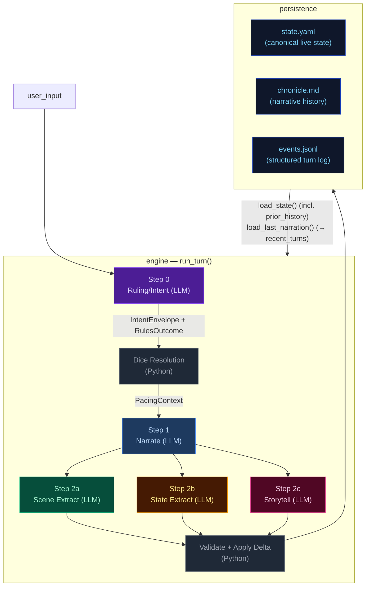

## Pipeline Quick Reference

| Step | Docs | When it runs | Key inputs | Key outputs | Mechanics it owns |
|---|---|---|---|---|---|
| **Step 0 — Ruling/Intent** | [step0-ruling](./step0-ruling.md) | Every turn (always) | `state.pc`, `state.location`, `recent_turns[-1:]`, `user_input` | `IntentEnvelope`, `RulesOutcome` | Intent classification, impossibility check, scene motion determination, dice roll resolution (1d12 + stat + cond − diff → band), difficulty selection, anti-declare-outcome enforcement. When `impossible=true`, no roll occurs and Python synthesizes a `fail` outcome. |
| **Step 1 — Narrate** | [step1-narrate](./step1-narrate.md) | Every turn (always, streamed) | Full `state`, `prior_history` (last 20 bullets, all but last rendered), `recent_turns[-1:]`, `pacing_context`, `pending_gm_beat`, `npc_roster` (from build_npc_roster()), `world_factions/locations` | `narrative` (prose) | Prose generation, dice-band binding, GM-beat consumption. Scene motion shaped by `PacingContext.outcome_hint`; impossible actions narrated as natural failures. |
| **Step 2a — Scene Extract** | [step2a-scene](./step2a-scene.md) | Every turn (always) | `narrative`, `state.pc/location`, `npc_roster` (from build_npc_roster()), conditions, compendium entries | `SceneExtractResult`: scene_tags, tagline, location_change, compendium_npc_update | NPC presence, location changes, scene tags, durable NPC compendium identity. |
| **Step 2b — State Extract** | [step2b-state](./step2b-state.md) | Every turn (always) | `narrative`, `state.pc/location/inventory`, conditions | `StateExtractResult`: inventory_add/remove/update, pc_condition_add/remove | Inventory delta accuracy, condition lifecycle. |
| **Step 2c — Storytell** | [step2c-storytell](./step2c-storytell.md) | Every turn (always) | `narrative`, `_ExtractionContext` (comp_this_turn, location, inventory, conditions), pacing_context, arc.threads[], recent_turns[-10:], band, npc_roster (from build_npc_roster()), recent_beats | `StorytellerResult`: thread_update/goal_update/arc_resolve/resolve/add, gm_beat, actions, outcome_summary | Storyteller-managed thread lifecycle, arc resolution, beat disposition inference, durable history events. |

After Step 2c: results merge into a `StateDelta`, the validator checks constraints
(e.g. `inventory_remove` IDs exist), `apply_delta()` mutates state in-place, and the
turn is persisted. The next turn's Step 0 reads the new `state.yaml` plus `events.jsonl`.

## Subsystem Docs

| Subsystem | Doc | What it covers |
|---|---|---|
| **Step 0 — Ruling** | [step0-ruling](./step0-ruling.md) | Intent classification, dice resolution flowchart, pacing context computation |
| **Step 1 — Narrate** | [step1-narrate](./step1-narrate.md) | Streaming narration pipeline with all context inputs |
| **Step 2a — Scene Extract** | [step2a-scene](./step2a-scene.md) | Location changes, NPC presence, scene tags |
| **Step 2b — State Extract** | [step2b-state](./step2b-state.md) | Inventory and condition extraction |
| **Step 2c — Storytell** | [step2c-storytell](./step2c-storytell.md) | Pipeline mechanics, GM beat lifecycle, campaign arc system, thread lifecycle mechanics |
| **Delta → Validate → Apply** | [delta-validate](./delta-validate.md) | StateMerge schema, validation rules, apply_delta mutations |
| **Persist** | [persist](./persist.md) | Atomic writes (events.jsonl, state.yaml, chronicle.md), readback |
| **Cross-Pipeline Data Flow** | [cross-pipeline](./cross-pipeline.md) | Full inter-step data flow diagram |
| **Out-of-Band Pipelines** | [out-of-band](./out-of-band.md) | Character Creation pipeline, Generate Seed pipeline, turn viewer status colors |
| **Narration UI** | [narration-ui](./narration-ui.md) | Main game interface: SSE streaming, HTMX sidebar refresh, Alpine.js state machine |
| **Turn Viewer UI** | [turn-viewer-ui](./turn-viewer-ui.md) | Pipeline debug UI: turn cards, stage inspector, diff panel, live updates |
| **Eval Harness** | [eval-harness](./eval-harness.md) | Scenario runner, LLM judges, auto-checkers, REPORT.md generation |

## Key Models Glossary

### Core Result Types

- **IntentEnvelope**: `intent`, `intent_verb`, `target`, `check.required`, `check.skill`, `check.difficulty`, `impossible`, `impossible_reason`, `scene_motion`
- **RulesOutcome**: `rolled`, `skill`, `difficulty`, `stat_value`, `stat_mod`, `diff_mod`, `cond_mod`, `dice`, `raw_total`, `final_total`, `band`, `directive`, `intent`, `intent_verb`, `impossible`, `impossible_reason`
- **SceneExtractResult**: `scene_tags`, `scene_tagline`, `location_change`, `compendium_npc_update`
- **StateExtractResult**: `inventory_add/remove/update`, `pc_condition_add/remove`
- **StorytellerResult**: `thread_update` (list[ThreadUpdate]), `goal_update` (str | None, applied directly to arc dict), `arc_resolve` (ArcResolution | None), `thread_resolve` (with outcome sentence + promote_to_world_state flag), `thread_add`, `gm_beat`, `actions`, `outcome_summary`
- **SeedEnvelope**: `seed_state: GameState`, `opening_narrative`, `actions`, `arc: CampaignArc` (includes `goal_context` — UI-only, not rendered in prompts; unified `threads[]` with `progress: list[ProgressEntry]`, `completed_threads[]`)

  The seed owns first-turn emotional framing, not just world and arc scaffolding. It generates `goal_context` (character-specific stake), NPC `relation` fields (narrative job relative to PC), and action text written from the PC's voice and scene pressure — ensuring the opening feels personal and motivated from the start.

### PacingContext (see [step0-ruling](./step0-ruling.md#pacing-context))

### GMBeat (see [step2c-storytell](./step2c-storytell.md#gm-beat))

### CampaignArc (see [step2c-storytell](./step2c-storytell.md#campaign-arc-system))

### StateDelta (see [delta-validate](./delta-validate.md))

Merges all three extraction results. Contains `scene_tags`, `location_change`, `compendium_npc_update` (NPC changes), `thread_update/arc_resolve/thread_resolve/thread_add`, `inventory_add/remove/update`, `pc_condition_add/remove`. Note: `gm_beat` is NOT in StateDelta — written directly to `state.meta.pending_gm_beat`.

---


## cross-pipeline


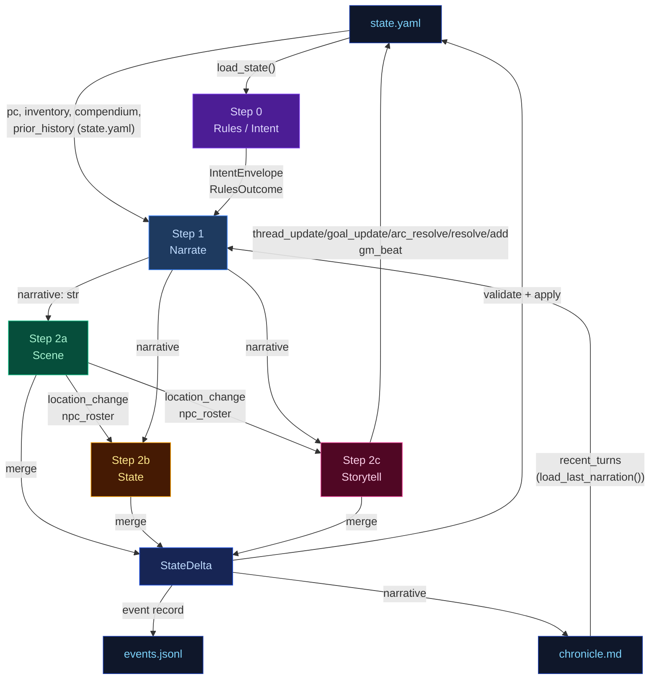

---


## delta-validate


The three extraction results merge into a single `StateDelta`, then validate and apply.

## Flowchart

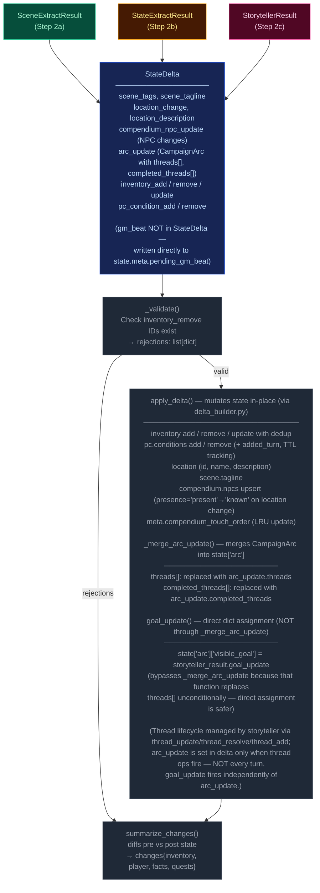

---


## narration-ui


The primary player-facing UI. Renders game state, streams narrative tokens live, and refreshes sidebars via HTMX partial swaps. Single-page app driven by Alpine.js + SSE + HTMX.

## Interaction Model

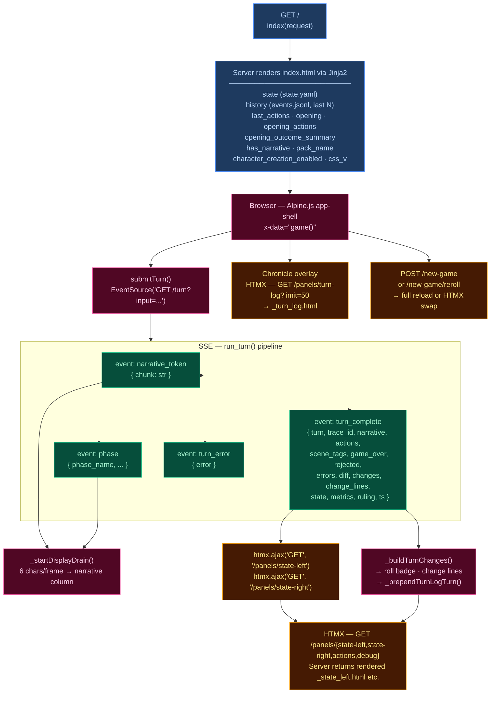

## Layout

| Region | Element | Content |
|--------|---------|---------|
| **Header** | `.header-bar` | Logo/tagline, Chronicle toggle, turn counter, retry button, new game button, reroll button (dynamic packs), mock-mode dot |
| **Left sidebar** | `.sidebar-left` | Player card, scene NPCs, location, arc, compendium — loaded via `/panels/state-left` |
| **Narrative column** | `.narrative-column` | Scrollable narrative blocks, action pills, input textarea, send/stop button |
| **Right sidebar** | `.sidebar` (right) | Inventory, recent events, world state, debug panel — loaded via `/panels/state-right` |
| **Chronicle overlay** | `.turn-log-shell` | Floating overlay over narrative column, populated by `/panels/turn-log?limit=50` |
| **New Game modal** | (Alpine `x-show`) | Pack picker → char creation / world builder steps |

## Data Flow

### Turn submission (Alpine.js + SSE)

1. User types input, presses Enter → `game().submitTurn()`
2. Opens `EventSource` to `GET /turn?input=<text>` — SSE endpoint in `routes.py:83`
3. Server streams events as the 5-stage pipeline (`run_turn()`) executes:
   - `narrative_token` — token chunks streamed as they arrive from LLM
    - `phase` — pipeline phase progress (ruling_start, narrate_start, narrate_first_token, narrate_done, extract_start, extract_done, sanitize_start, sanitize_done, persist)
   - `turn_complete` — final result
   - `turn_error` — error payload
4. Client `_startDisplayDrain()`: reveals 6 characters per animation frame for smooth streaming
5. On `turn_complete`:
   - Calls `htmx.ajax('GET', '/panels/state-left', ...)` and `htmx.ajax('GET', '/panels/state-right', ...)` to refresh sidebars
   - Renders change lines (`_buildTurnChanges`), roll badge
   - Prepends turn to Chronicle overlay via `_prependTurnLogTurn`
   - Re-renders markdown via `marked.parse()`

### HTMX partial endpoints (routes.py)

| Route | Template | Purpose |
|-------|----------|---------|
| `GET /panels/state-left` | `_state_left.html` | Left sidebar — player, NPCs, location, arc, compendium |
| `GET /panels/state-right` | `_state_right.html` | Right sidebar — inventory, events, world state, debug |
| `GET /panels/actions` | `_actions.html` | Action pills (fallback) |
| `GET /panels/turn-log?limit=N` | `_turn_log.html` | Chronicle — turn history with change lines |
| `GET /panels/pack-picker` | `_pack_picker.html` | New Game — pack selection cards |
| `GET /panels/char-creation` | `_char_creation.html` | New Game — character stats builder |
| `GET /panels/world-builder` | `_world_builder.html` | New Game — world creation form |
| `GET /panels/debug` | `_debug.html` | Debug panel — recent turn timings, errors |
| `GET /panels/state` | `_state.html` | Combined left+right (legacy) |

### Client state machine (`game()` — inline `<script>` in index.html)

Alpine.js `x-data="game()"` manages:
- `input` — textarea value
- `submitting` — turn-in-progress flag
- `gameStarted` — derived from `has_narrative`
- `turnNum` — current turn counter
- `leftWidth` / `rightWidth` — resizable sidebar widths (persisted to `localStorage`)
- Card collapse state — read/written directly from/to `localStorage` via `CCYA_CARD_KEY(name)` helper, using DOM `data-card` attributes; no Alpine data property

## UI Features

### Resizable sidebars
- Drag gutters with mousedown/mousemove handlers
- Widths saved to `localStorage` (`ccya_sidebar_left`, `ccya_sidebar_right`)
- Minimum width enforcement (240px left, 220px right)
- **Reset button** in sidebar footer: restores viewport-aware defaults (left 320px, right 280px) on click
- **Ultrawide override** (≥2561px viewport): `--sidebar-w: min(512px, 38vw)` — sidebar defaults to 2x standard width. Sidebar text scaled ~25% smaller via explicit `.sidebar-card-header`, `.stat-row`, `.npc-notes-inline`, `.inventory-item`, etc. overrides in the ultrawide media query.

### Collapsible cards
Each sidebar section has a collapse toggle; open/closed state persisted per-card to `localStorage` via `ccya_card_<name>` key.

### Action pills
Suggested next actions rendered as buttons that populate the input on click. Updated from `turn_complete.actions` or via HTMX panel refresh.

### Roll badge
Server-rendered for history, JS-built for new turns. Shows dice math, band label, outcome summary. Band colors: `crit_fail` (red) → `fail` → `setback` → `partial` → `success` → `crit_success`.

### Change lines
Grouped by category via emoji prefix:
| Emoji | Category | Class |
|-------|----------|-------|
| 🎒 + | Inventory gain | `.tc-inv-gain` |
| 🎒 − | Inventory loss | `.tc-inv-loss` |
| 🩺 | Player condition | `.tc-pl` |
| 📍 | Location | `.tc-loc` |
| 📜 | Faction/arc | `.tc-fa` |

### Retry
`POST /turn/delete` removes last event from `events.jsonl` and `chronicle.md`, returns previous actions for re-submission.

### New Game
`POST /new-game` with optional `pack_id`, `pc_name`, `pc_stats`, `hints`. For dynamic packs, triggers `generate_seed()` LLM pipeline. Full page reload on success. Reroll (`POST /new-game/reroll`) HTMX-swaps the opening narrative + actions.

## CSS Architecture

- **`app.src.css`** — Tailwind + custom styles split by region:
  - App shell layout (CSS Grid: header + body with sidebar-gutter-main-gutter-sidebar)
  - Narrative blocks (`.narrative-block`, `.narrative-text`)
  - Sidebar cards (`.card`, `.card-header`, `.card-body`)
  - Input bar (`.input-bar`, `.game-input`, `.send-btn`)
  - Action pills (`.action-pill`, `.pills-row`)
  - Roll badges (`.roll-badge`, `.roll-band--*`)
  - Chronicle overlay (`.turn-log-shell`, `.turn-log-panel`)
  - New Game modal (`.modal-overlay`, `.pack-card`)
  - Progress strip, tooltips, scrollbar styling
  - Design tokens via CSS custom properties (`--text-primary`, `--bg-card`, `--status-*`)
- **Fluid typography**: 3-tier `@media` breakpoints set `html { font-size: clamp(...) }`:
  | Viewport | Font size clamp | Applicable to |
  |---|---|---|
  | 769–1400px | `clamp(15px, 1vw, 17px)` | Tablet/small desktop |
  | 1401–2560px | `clamp(22px, 1.56vw, 26px)` | Standard desktop |
  | ≥2561px | `clamp(24px, 1.5vw, 27px)` | Ultrawide (also sets `--sidebar-w: min(512px, 38vw)`) |
  - Font sizes throughout are in `rem` units, scaling proportionally with the base.
- **Location panel fix**: Hardcoded `px` font sizes replaced with `rem` units to respect fluid base.
- Compiled to **`app.css`** with cache-busting via `css_v` query param

## Server Entry Point

`routes.py:57` — `GET /` handler assembles template context from `state.yaml`, `events.jsonl`, pack manifest, and engine config, then renders `ccya/templates/index.html`.

---


## out-of-band


These run only at new-game time or are non-engine concerns. They are excluded from the eval-context region of the main architecture doc.

## Character Creation Pipeline

Triggered by `POST /new-game`. All packs use the Generate Seed pipeline (dynamic). Static packs with pre-built seed_state.yaml exist but are not used by new_game.

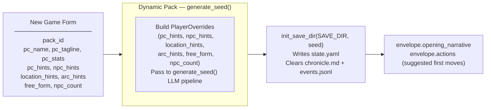

## Generate Seed Pipeline (Dynamic Packs Only)

Called by `POST /new-game` and `POST /new-game/reroll`. Generates a complete starting game state (PC, NPCs, location, arc, opening narrative, actions) from the pack manifest and optional player overrides.

The seed owns **first-turn emotional framing** — not just world and arc scaffolding. Every seed element must produce an emotionally legible opening that answers: why this moment matters now, what the character stands to lose, and why at least one person in the scene matters to them personally.

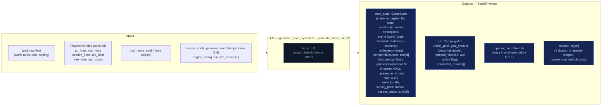

### Seed emotional framing contract

The seed prompt (`generate_seed_system.j2`) enforces these requirements:

- **`goal_context`**: 2–3 sentences explaining why `visible_goal` matters to this character specifically — inner cost or pressure that makes it emotionally loaded. No hidden-truth spoilers, no restating `visible_goal`, no direct statement of the thematic question. Must connect character motive, story stakes, and emotional cost.
- **NPC `relation` field**: Each opening NPC has a defined narrative job. One NPC is personally tied to the PC's motive or vulnerability; the other carries immediate external pressure from the world or conflict. The `relation` field encodes PC-facing relevance (e.g. "owes them a favor", "is their only contact here", "represents the institution pressing on them").
- **Compendium NPCs**: The seed also generates 2–3 NPCs in `compendium.npcs` (name, title, bio) who exist in the world but are not present in the opening scene. Their bios tie them to factions, locations, or world pressures, not to the immediate situation. These become discoverable characters during play.
- **Action guidance**: Each of the 4 choices is written from the PC's point of view, grounded in a present NPC, immediate risk, active thread, or character motive. They differ in emotional posture (confront, deflect, investigate, protect, exploit, withdraw, etc.) and avoid generic verbs.
- **`threads[]`**: Unified list (not split active/latent) where each thread has `{id, summary, urgency, scope}` and an `active` boolean flag managed by the storyteller via `thread_update`, not Python age rules. Threads have a `progress: list[str]` field — append-only log of progress updates set via `thread_update[].progress`, never replaced. Also includes `last_updated_turn: int | None` for urgency decay tracking.

## Turn Viewer — status colors

The standalone turn viewer ([turn-viewer-ui](./turn-viewer-ui.md)) uses the same semantic status colors as the CSS custom properties in `static/app.src.css` (`--status-*`). The stage colors used in the diagrams above (`stageRules` violet → `stageNarrate` blue → `stageScene` green → `stageState` amber → `stageProgress` pink) map directly to the `--stage-*` tokens. Cross-stream inputs into a step are shown in `xstream` (purple outline) and LLM/Python boxes use neutral dark fills. This table is the canonical turn-viewer status legend.

| Token | Meaning |
|-------|---------|
| `--status-ok` | Stage ran and completed (no extraction error). |
| `--status-skipped` | Stream was skipped (no longer used — all streams always run). |
| `--status-retried` | LLM output required a parse retry (`attempts` > 1 in event). |
| `--status-rejected` | Post-extract validation rejected part of the delta (e.g. bad `inventory_remove`). |
| `--status-error` | LLM call or parse ultimately failed for that stream. |
| `--status-neutral` | Non-fatal / informational (e.g. rules path with no dice roll). |

Stage accent stripes use `--stage-rules`, `--stage-narrate`, `--stage-scene`, `--stage-state`, `--stage-progress` for quick scanning; **status** always wins for the prominent left border.

---


## persist


Atomic writes to disk. No LLM calls.

## Flowchart

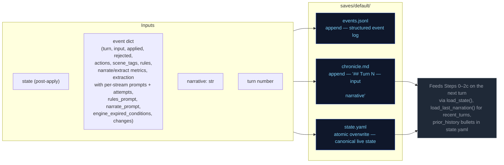

---


## step0-ruling


Classifies the player's action, determines whether a dice check is needed, and
identifies which state domains will be active — narrowing every downstream extractor.

## Flowchart

```mermaid
flowchart LR
    classDef stageRules fill:#4c1d95,color:#ddd6fe,stroke:#7c3aed
    classDef llmNode    fill:#0f172a,color:#94a3b8,stroke:#334155
    classDef pyNode     fill:#1f2937,color:#9ca3af,stroke:#4b5563
    classDef outNode    fill:#3b0764,color:#e9d5ff,stroke:#7c3aed

    subgraph IN["Inputs"]
        I1["state.pc<br>(name, stats, conditions)"]
        I2["state.location"]
        I3["recent_turns[-1:]<br>(last turn's full narrative from chronicle.md<br>via load_last_narration();<br>ruling user prompt)"]
        I4["user_input"]
    end

    subgraph LLM0["LLM — ruling_system.j2 + ruling_user.j2"]
        L0["temp: 0.2 · max_retries: 1<br>output: IntentEnvelope JSON<br>(intent, impossible, scene_motion, check)"]:::llmNode
    end

    subgraph PYRES["Python — impossible check + rules.resolve_check()"]
        P0["if impossible=true:<br>  synthesize fail outcome<br>  skip roll, apply momentum<br>else:<br>  roll 1d12 + stat_mod + cond_mod − diff_mod<br>  map total → Band"]:::pyNode
    end

    subgraph OUT["Outputs"]
        O1["IntentEnvelope<br>  intent: str<br>  intent_verb: str<br>  target: str<br>  impossible: bool<br>  impossible_reason: str<br>  scene_motion: hold|advance|transition<br>  check.required: bool<br>  check.skill: SkillName<br>  check.difficulty: Difficulty"]:::outNode
        O2["RulesOutcome<br>  rolled: bool<br>  skill, difficulty, stat_value, stat_mod<br>  diff_mod, cond_mod<br>  dice: list[int]<br>  raw_total, final_total: int<br>  band: Band<br>  directive: str<br>  intent, intent_verb: str<br>  impossible: bool<br>  impossible_reason: str"]:::outNode
    end

    IN --> LLM0
    LLM0 -- "IntentEnvelope" --> PYRES
    PYRES --> OUT
```

## Impossibility check

The ruling LLM evaluates whether the described action is impossible given the character's state, inventory, and scene. An action is impossible when:

- It requires an item the character does not have (firing a gun with no ammo, using a key never acquired)
- It requires a capability contradicted by active conditions (climbing with a broken leg, sneaking while armored and noisy)
- It acts on something not present in the scene (targeting an NPC who is not here, opening a door that doesn't exist)

When `impossible=true`: Python sets `check.required=False`, synthesizes a `RulesOutcome` with `band="fail"` and `rolled=False`, applies momentum, and skips the dice roll entirely. The narrator renders the impossible fact and narrates the natural failure.

## Scene motion

The ruling LLM also determines how the scene should progress: `"hold"` (scene continues at current pace), `"advance"` (something significant happens/resolves), or `"transition"` (player is leaving, write the arrival). This feeds into `_compute_pacing_context()` which produces `outcome_hint` for the narrator.

## Key forward dependency

`rules_outcome` feeds into `_compute_pacing_context()` which produces the single authoritative `PacingContext` struct passed to both Narrator and Storytell pipeline.

## Pacing Context

All pacing signals are collapsed into one Python-computed struct (`PacingContext`) passed to both the Narrator and Storytell pipeline. This replaces six independent fields (`narration_directive`, `deescalate`, `narrative_velocity`, `beat_disposition` output, `quest_threshold_directive`, and stale momentum-derived signals). The narrator receives `outcome_hint` (scene motion); Storytell receives the full struct including `directive`.

### Struct definition

```
PacingContext:
  directive: str           # "" | "Breathe" | "Scene Imperative" | "Overwhelm" | "Pressure" | "Tension" | "Scene Pressure" (may include "; Resolve a Threat" secondary when beat_locked); used by Storytell pipeline
  outcome_hint: str | None # "hold" | "advance" | "transition" — narrator's primary scene motion instruction
  beat_locked: bool        # True: consecutive pressure threshold reached or momentum at floor — enables floor relief injection and appends "; Resolve a Threat" to directive
  gate: str                # "block_escalate" | "allow" (controls thread_add); set independently from beat_locked via deescalate >= 0.5
  summary: str             # human-readable log string, never sent to LLM
```

`beat_locked: True` fires when either `consecutive_pressure_turns >= config.consecutive_pressure_threshold` OR `momentum <= config.momentum_floor`. When locked, `"Resolve a Threat"` is appended to the directive via semicolon. The `gate` field prevents Progress from adding new threads during de-escalation windows.

### Computation

`_compute_pacing_context()` in `engine/turn.py` consolidates pacing computation (replacing the former scattered functions: `_compute_narration_directive`, `_compute_narrative_velocity`, `_check_floor_relief`). It takes inputs (`momentum`, `consecutive_pressure_turns` from state meta, `arc.threads[] scope=scene urgency counts`) and returns a single struct with directive derived from a priority stack. It also computes `outcome_hint` from the ruling LLM's `scene_motion` and PacingContext escalation signals: ruling `scene_motion` takes priority (`transition` > `advance` > fallback), then `impossible=true` forces `advance`, then Python escalation signals (`beat_locked`, Overwhelm/Pressure with urgent threads) produce `advance`, defaulting to `hold`.

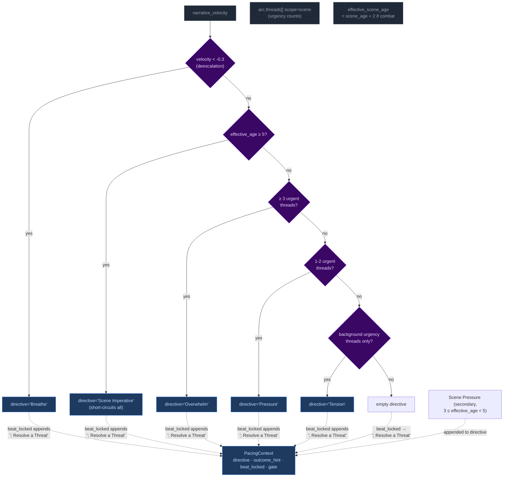

Priority order (highest to lowest): **Breathe > Scene Imperative > Overwhelm > Pressure > Tension > Scene Pressure**. The `beat_locked` flag fires when either consecutive pressure threshold or momentum floor is reached — `"Resolve a Threat"` is appended to the directive and `outcome_hint` is set to `"advance"`. The gate is NOT affected by beat_locked (set independently by deescalate ≥ 0.5).

**Breathe secondary guard:** The Breathe directive has an additional check beyond velocity: if urgent scene-scoped threads exist, Breathe is NOT emitted even if `narrative_velocity < -0.3`. Low velocity during unresolved tension (tactical avoidance, stealth) does not trigger de-escalation. Once urgent threads resolve, Breathe fires on the next low-velocity turn.

#### Age computation

`_compute_ages(state)` returns only `{"scene_age": scene_age}` — location_age and combat_age removed in Phase 03 pacing overhaul. The ruling phase pre-computes `effective_scene_age = scene_age + 2` when `"combat"` is in scene tags, stored in `ctx._ages["effective_scene_age"]`. This single-age signal drives all directive thresholds:
- Scene Imperative (≥5 effective age): high-priority directive forcing story advancement
- Scene Pressure (3 ≤ effective_age < 5): secondary append to wind down or shift focus

### Wiring

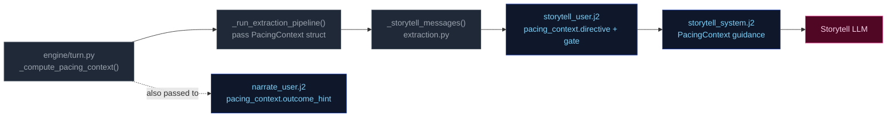

1. **Computed** once in `run_turn()` via `_compute_pacing_context()`.
2. **Passed through** `_run_extraction_pipeline()` → both `_narrate_messages()` and `_storytell_messages()`.
3. **Narrator template** (`narrate_user.j2`) renders `outcome_hint` (scene motion: hold/advance/transition) with value-specific guidance. No Jinja2 pacing computation remains — all pacing computed by Python.
4. **Storytell template** ((`storytell_system.j2` + `user.j2`)) receives the full struct; guidance maps each directive to appropriate thread/beat actions:

| Directive | Thread action | Gate |
|-----------|---------------|-------|
| **"Breathe"** (de-escalation, velocity < -0.3) | Do NOT add new threads. Allow existing scene threads to persist without escalation. | `block_escalate` (set by deescalate ≥ 0.5; beat_locked does NOT force-close gate) |
| **"Scene Imperative"** (effective_age ≥ 5) | Story must advance — introduce new development forcing resolution or movement; do not linger | Varies by context |
| **"Overwhelm"** (3+ urgent threads) | May add scene-scoped threads if gate allows; emit pressure/escalation beat | `allow` |
| **"Pressure"** (1-2 urgent threads) | Advance relevant scene/arc threads. Add new thread only if gate permits. | Varies by context |
| **"Tension"** (background urgency only) | Do NOT add pressures unless concrete threat emerges; prefer advancing existing threads | Allow |
| **"Scene Pressure"** (3 ≤ effective_age < 5, secondary append) | Begin winding down or introduce reason to shift focus: development elsewhere, closing window | Varies by context |
| **"" (empty)** | No action required beyond normal aging of silent threads. | Allow |

**Note:** Directives may include secondary modifiers joined by semicolons (e.g., "Pressure; Resolve a Threat" when beat_locked). The primary directive drives thread/beat logic; the secondary (`; Resolve a Threat`) acts as thematic guidance for beat type selection. "Resolve a Threat" never appears as a standalone primary directive — it is only appended by the `beat_locked` mechanism.

### Consecutive pressure counter

`state["meta"]["consecutive_pressure_turns"]` tracks how many consecutive turns have had pressure-type storyteller beats. Re-keyed from directive tracking (which never fired — Pressure/Overwhelm directives were unreachable) to beat-type tracking:

- **Increments** when `storyteller_result.gm_beat.type` is `"pressure"`, `"escalation"`, or `"complication"`.
- **Resets to 0** on any other beat type, null beat, or missing storyteller output.

When this counter reaches `config.consecutive_pressure_threshold` (default 3), it triggers `beat_locked` alongside the momentum floor fallback (`momentum <= -3`). `beat_locked` appends `"; Resolve a Threat"` to the directive and enables floor relief injection.

---


## step1-narrate


Generates the narrative prose the player reads. Tokens are streamed to the client.

## Flowchart

```mermaid
flowchart LR
    classDef llmNode   fill:#0f172a,color:#94a3b8,stroke:#334155
    classDef xstream   fill:#4c1d95,color:#ddd6fe,stroke:#7c3aed
    classDef outNode   fill:#1e3a5f,color:#bfdbfe,stroke:#3b82f6

    subgraph IN["Inputs"]
        N1["state (full —<br>pc, location, scene,<br>inventory, compendium)"]
        N2["prior_history<br>(last 20 incremental history bullets, all but last rendered as bullets)"]
        N3["recent_turns[-1:]<br>(single most recent turn as full text)"]
        N4["rules_outcome<br>(band, directive, impossible, dice summary)"]:::xstream
        N6["npc_name_pool (cultural name list)"]
        N7["npc_roster<br>(from build_npc_roster(comp),<br>  presence field: present/nearby/known)"]
        N9["world_factions<br>(immutable trace)"]:::xstream
        N10["pending_gm_beat<br>(type · surface_as metadata)"]
        N11["pacing_context<br>(outcome_hint)<br>from _compute_pacing_context()"]:::xstream
        N15["user_input"]
    end

    subgraph LLM1["LLM — narrate_system.j2 + narrate_user.j2"]
        NL["temp: 0.9 · streaming: yes<br>output: prose narrative (str)"]:::llmNode
    end

    subgraph OUT["Outputs"]
        NO1["narrative: str<br>(streamed as tokens → client<br>then joined + thinking-stripped)"]:::outNode
        NO2["narr_metrics<br>  first_token_ms<br>  total_ms<br>  tokens_in / tokens_out"]
    end

    IN --> LLM1
    LLM1 --> OUT
```

## Arc context in narration

The narrator receives `current_arc` in both system and user prompts. Key fields:

- **`goal_context`**: A seed-time field (2–3 sentences) explaining why `visible_goal` matters to the character specifically — inner cost or pressure that makes it emotionally loaded. UI-only (surfaced as tooltip on the arc goal in the sidebar). NOT rendered in prompt context — the narrator works from general early-turn behavioral guidance in the system prompt, not from the raw `goal_context` value.
- **`visible_goal`**: The player-facing objective.
- **`threads[]`**: Unified thread collection filtered by `active` flag. Scene-scope threads provide immediate pressure; arc-scope threads provide medium-term tension.
- **`resolved_arc`**: TTL-filtered list of previously resolved arcs, providing narrative continuity across arc transitions.

### Opening-turn narrative mode

The seed embeds emotional stakes in the initial state — NPC `relation` fields, `motivation/fear/leverage`, and a `goal_context` sidebar entry. The narrator does NOT receive special early-turn prompt guidance or `goal_context` in its context. Instead, the initial scene's NPCs (with rich behavioral drivers), the opening narrative's tone, and the player-facing sidebar create the onboarding experience. The narrator works from its standard behavioral guidance and the richness of seed-generated state.

## Key forward dependency

`narrative` is the primary content input for all three extraction streams below.

### GM Beat consumption

The narrator receives a pending GM beat from `state.meta.pending_gm_beat` (set by Storytell in the previous turn). The beat's `type` and `surface_as` metadata are passed alongside the pacing directive as creative guidance for the narrative. The beat is NOT cleared after narration — it persists through the extraction phase. After extraction completes, Storytell replaces it with a new beat or pops it on null output. Full beat lifecycle is documented in [step2c-storytell](./step2c-storytell.md#gm-beat).

---


## step2a-scene


Extracts location changes, NPC presence, scene tags, and suggested actions from the narrative.

## Flowchart


## Key forward dependency

`location_change` flows into `extraction_ctx` (built by `_build_extraction_context`). Step 2c also receives `npc_roster` (from build_npc_roster()) built from comp_this_turn. No forward-facing mechanics (`thread_add`, `gm_beat`) are emitted by this stream — they go through the unified thread lifecycle via Storytell (Step 2c).

---


## step2b-state


Extracts inventory changes and player condition mutations from the narrative.

## Flowchart

```mermaid
flowchart LR
    classDef llmNode fill:#0f172a,color:#94a3b8,stroke:#334155
    classDef xstream fill:#4c1d95,color:#ddd6fe,stroke:#7c3aed
    classDef outNode fill:#451a03,color:#fde68a,stroke:#f59e0b

    subgraph IN["Inputs"]
        S1["narrative (from Step 1)"]:::xstream
        S2["state.pc (name, bio, stats, conditions)"]
        S3["state.location"]
        S4["state.inventory"]
        S5["intent: str<br>(from Step 0)"]
    end

    subgraph LLM2B["LLM — extract_state_system.j2 + extract_state_user.j2"]
        SL["temp: 0.4 · max_retries: 1<br>output: StateExtractResult JSON"]:::llmNode
    end

    subgraph OUT["Outputs — StateExtractResult"]
        O1["inventory_add: list[InventoryItem]<br>  id, name, notes, amount"]:::outNode
        O2["inventory_remove: list[InventoryRemove]<br>  id, amount (None = full stack)"]:::outNode
        O3["inventory_update: list[InventoryUpdate]<br>  id, name?, notes?"]:::outNode
        O4["pc_condition_add: list[ConditionAdd]<br>  id, label, description"]:::outNode
        O5["pc_condition_remove: list[ConditionRemove]<br>  id"]:::outNode
    end

    IN --> LLM2B
    LLM2B --> OUT
```

## Key forward dependency

Step 2c receives `npc_roster` (from build_npc_roster()) and `location_change` from Step 2a. Cross-stream items_gained/lost were removed — extraction_ctx now covers all this-turn derived data.

---


## step2c-storytell


Extracts thread updates, arc actions, and durable NPC compendium changes. World state changes happen only via thread resolution `promote_to_world_state`.

## Flowchart


## Always runs

Storytell is the post-narration storytelling brain. It always executes every turn (never skipped) and feeds next turn's rules call via `thread_update/goal_update/arc_resolve/thread_resolve/thread_add` (storyteller-managed thread lifecycle), and `gm_beat` (forward-facing beats stored in `state.meta.pending_gm_beat`). World state changes are promotion-only — emitted via `thread_resolve[].promote_to_world_state`.

## GM Beat

Forward-facing storytelling beats that shape scene progression across turns. Beats are emitted by Storytell (Step 2c), consumed by Narrator (Step 1) the following turn, and managed via a write/expiry lifecycle in `state.meta.pending_gm_beat`.

### GMBeat Schema

```
GMBeat
  type: complication | revelation | opportunity | breathing_room | pressure | twist | setback | escalation | callback
  surface_as: ambient | event | npc_behavior | environmental | player_discovery | item (default: ambient)
  beat_expires_turn: int | None — turn number at which the beat expires; set to turn_no + 2 when stored
```

**Validation:** Only `type` is validated by `StorytellerResult._nullify_invalid_gm_beat` — nullified if type is falsy or not in the valid set. No validation on `surface_as`. Python accepts whatever gm_beat the LLM emits with no correction or override.

### PacingContext Beat Fields

The beat system intersects with pacing via two fields in `PacingContext` (see [step0-ruling](./step0-ruling.md#pacing-context)):

| Field | Type | Meaning |
|-------|------|---------|
| `directive` | str | May include secondary modifier `"; Resolve a Threat"` when `beat_locked=True`. Drives storytell guidance for beat type selection. |
| `beat_locked` | bool | True when either `consecutive_pressure_turns >= threshold` OR `momentum <= momentum_floor`. When locked, `"Resolve a Threat"` is appended to the directive. Enables floor relief to inject a breathing_room beat if the storyteller is stuck in a pressure-type loop. |

### Beat Lifecycle — Turn Sequence

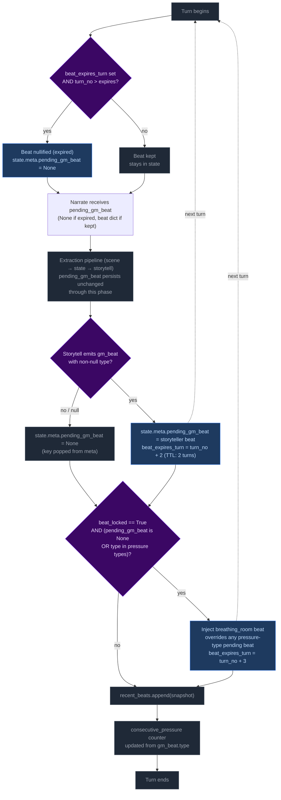

**Step 1 — Pre-narration expiry check.** At the start of each turn, the engine reads `state.meta.pending_gm_beat` from the previous turn. If `beat_expires_turn` is set and the current turn number exceeds it, the beat is nullified (key set to None). Otherwise it proceeds to narration.

Note: This expiry runs early enough that the beat is gone before the extraction phase begins. This is intentional — it creates clean state for floor relief to inject breathing_room if `beat_locked` is active and storyteller doesn't provide its own non-pressure beat. Without the pre-narration expiry, a stale expired beat could block floor relief's null check.

**Step 2 — Narration consumption.** The beat is passed to the narrator via `_narrate_messages(pending_gm_beat=...)`. The narrator uses the beat's `type` and `surface_as` metadata as creative guidance alongside the pacing directive. The beat is NOT cleared after narration — it persists through the extraction phase.

**Step 3 — Storytell writes or clears the beat.** After extraction completes:
- If Storytell emits a valid `gm_beat` (non-null `type`): replaces `pending_gm_beat` with `beat_expires_turn = turn_no + 2`.
- If Storytell emits `null` or an invalid beat: pops `pending_gm_beat` from state (null-clear). The old beat does NOT carry forward.

**Step 4 — Floor relief injection.** After delta apply, if `beat_locked=True` AND the current `pending_gm_beat` is either `None` or a pressure-type (`pressure`, `escalation`, `complication`): injects a `breathing_room` beat with `beat_expires_turn = turn_no + 3`. This overrides pressure-type beats that would otherwise continue the pressure cycle, but does NOT override non-pressure beats the storyteller independently produced (e.g., `revelation`, `opportunity`, `breathing_room`).

**Step 5 — Beat history snapshot.** `pending_gm_beat` is appended to `state.meta.recent_beats` (capped at 5 entries). The snapshot is taken after any floor relief override, so it reflects the beat the next turn's narrator will consume.

**Step 6 — Consecutive pressure counter update.** The counter increments on pressure-type beats and resets to 0 otherwise.

### Floor Relief Injection

The floor relief mechanism fires after delta apply when `_pc.beat_locked=True` AND the current `pending_gm_beat` is either `None` or a pressure-type beat (`pressure`, `escalation`, `complication`). It injects a `breathing_room` beat with TTL of 3 turns (one more than storyteller-emitted beats' TTL of 2).

Floor relief is a **fallback override** — it breaks a pressure-type run by force-injecting recovery:
- If Storytell emitted a pressure-type beat → floor relief overrides it with breathing_room.
- If Storytell emitted a non-pressure beat (revelation, opportunity, breathing_room, etc.) → floor relief lets it stand. Relief is already being achieved.
- If Storytell emitted nothing (null) → floor relief injects breathing_room. This is appropriate: after a null turn with beat_locked active, relief is needed.

### Directive-Beat Alignment

The storyteller prompt (`storytell_system.j2`, pacing context guidance section) maps each PacingContext directive to recommended beat types (e.g., "Breathe" → breathing_room; "Scene Imperative" → advance story; "Overwhelm" → pressure/escalation). This alignment is **guidance only** — Python accepts whatever gm_beat the LLM emits with no validation, correction, or override. Design rationale: forcing directive-beat alignment would constrain storytelling flexibility and create brittleness if the LLM makes contextually appropriate but directive-divergent beat choices.

### Beat History

`state.meta.recent_beats` stores the last 5 beats (including null entries) with `turn`, `type`, and `surface_as`. This history is rendered in both the storyteller system prompt (behavioral guidance) and the user prompt (current-turn context, more salient). Each entry shows `T{N}: {BEAT TYPE} (surface)` or `T{N}: No beat emitted this turn`.

The LLM uses this history to follow beat diversity guidance: avoid repeating the same type more than twice in a sequence; at least one in three beats should be a non-pressure type.

### TTL Mechanics Summary

| Source | Default TTL | Expiry Calculation |
|--------|-------------|-------------------|
| Storytell-emitted beat | 2 turns | `beat_expires_turn = turn_no + 2` |
| Floor relief (Python-injected) | 3 turns | `beat_expires_turn = turn_no + 3` (extra recovery margin) |

### Null-Clear Behavior

When Storytell emits a null beat (or an invalid beat whose type is nullified), `pending_gm_beat` is popped from `state.meta`. The beat does NOT carry forward. This replaced the old carryover behavior where stale beats persisted through null turns.

The storyteller user prompt always renders the GM Beat section — on null-following turns it shows "No beat currently carried over from the previous turn. Choose freely." This ensures the LLM has consistent beat awareness on every turn.

### GM Beat Section in UI

The storyteller user prompt renders the `## GM Beat` section unconditionally:
- **Beat present:** Shows type, surface_as, expiration turn.
- **No beat:** Shows fallback text — "No beat currently carried over from the previous turn. Choose freely."

This was changed from the previous conditional rendering (where the section vanished on ~38% of turns), ensuring full beat awareness coverage.

## Campaign Arc System

The campaign arc system tracks story threads across turns. Thread state is **storyteller-managed** — the LLM explicitly controls urgency, progress, and goal direction via `thread_update` and `goal_update` directives. The engine applies these without enforcement of caps, cooldowns, or silent timers.

### Arc Data Model

```
CampaignArc
  visible_goal: str          — What the PC is trying to achieve
  goal_context: str          — 2–3 sentences explaining why visible_goal matters (UI-only; not rendered in prompts)
  threads: list[ArcThread]   — Unified collection with active flag
  completed_threads: list[ArcThread] — Resolved/failed/abandoned threads
  resolution: str | None     — Set when arc is resolved via arc_resolve
  last_thread_created_turn: int — Tracks when a thread was last created for pacing

ProgressEntry
  kind: Literal["advancement", "setback", "shift"] = "advancement"
  text: str

ArcThread
  id: str                    — Unique identifier
  summary: str               — What this thread is about
  scope: Literal["scene", "arc"]  # scene = short-lived, purged on location change; arc = persistent story tension
  active: bool = True        # Storyteller-controlled via thread_update; engine may auto-demote via auto-latent
  urgency: Literal["background", "normal", "urgent"] = "normal"  # Storyteller-controlled
  progress: list[ProgressEntry] = []   — Append-only log of structured progress updates
  resolution_state: str | None # Set when thread_resolve processes resolved/failed/abandoned
  outcome: str | None        # Set from ThreadResolution.outcome when moved to completed_threads
  resolved_turn: int | None  — Turn when thread was resolved; used for TTL filtering in prompts
  last_updated_turn: int | None — Turn when thread was last updated via thread_update; used for auto-latent demotion and staleness display
```

### Engine-Driven Arc

Thread lifecycle runs in `engine/turn.py` during the extraction phase. Seven operations handle arc/thread state in strict order:

```mermaid
flowchart TD
    classDef pyNode fill:#1f2937,color:#9ca3af,stroke:#4b5563
    classDef arcNode fill:#3b0764,color:#e9d5ff,stroke:#7c3aed

    PR["StorytellerResult<br>thread_update: list[ThreadUpdate]<br>goal_update: str | None<br>arc_resolve: ArcResolution | None<br>thread_resolve: list[ThreadResolution]"]:::pyNode

    subgraph UPDATES["_apply_thread_updates(config)"]
        U1["For each ThreadUpdate:<br>Find thread by id → apply<br>active/urgency/summary/progress changes<br>progress is append-only (list[ProgressEntry])<br>Progress dedup via difflib (≥50% overlap → reject)<br>Sets last_updated_turn = current turn"]
        U2["Auto-latent demotion:<br>threads untouched for thread_stale_threshold turns<br>→ active: false"]
    end

    subgraph GOAL["goal_update (direct dict assignment)"]
        G1["If storyteller_result.goal_update is set:<br>state['arc']['visible_goal'] = value<br>Direct assignment, NOT through _merge_arc_update<br>(which would wipe threads[])"]
    end

    subgraph CONFLICT["Same-turn conflict detection"]
        C1["If same thread id appears in both<br>thread_update and thread_resolve:<br>log WARNING (LLM error)<br>resolution wins (fires after update)"]
    end

    subgraph RESOLVE["_apply_arc_resolve()"]
        R1["Store current arc in resolved_arcs<br>with resolved_turn for TTL tracking"]
        R2["Auto-close arc-scoped threads with 'superseded' state<br>Carry forward scene-scoped threads (minus drop_threads)"]
        R3["Add new_threads from resolution"]
        R4["Create successor arc with<br>new visible_goal, goal_context,<br>surviving scene-scoped + new threads"]
    end

    subgraph RESOLUTIONS["_apply_thread_resolutions()"]
        S1["For each ThreadResolution:<br>Move ArcThread to completed_threads<br>Set resolution_state, outcome, resolved_turn"]
    end

    subgraph GATE["Thread add gate (with cap eviction)"]
        T1["PacingContext.gate == 'allow'?<br>If blocked: log debug, skip add<br>Gate status rendered in prompt<br>(no silent drops)"]
        T2["ID collision? Thread id in existing_ids<br>or completed_ids → reject"]
        T3["Thread cap: if active > thread_max_active<br>→ evict oldest active thread (set active: false)"]
    end

    PR --> UPDATES --> GOAL --> CONFLICT --> RESOLVE --> RESOLUTIONS --> GATE

    GATE -- "CampaignArc" --> ARC[arc state in<br>state.yaml]:::arcNode
```

**Pipeline order:** thread updates → goal_update (dict assignment) → conflict detection → arc resolution → thread resolutions → thread_add gate.

**Key rules:**
- **Engine-enforced thread governance:** The engine enforces three controls that constrain storyteller thread management:
  - **Auto-latent demotion:** Threads untouched for `config.thread_stale_threshold` turns (default 3) are automatically set to `active: false`. This prevents stale threads from lingering as active prompts. Only fires when updates are actually applied this turn.
  - **Thread cap eviction:** After thread_add, if active thread count exceeds `config.thread_max_active` (default 5), the oldest active thread (by `last_updated_turn`) is evicted to `active: false`. This prevents unbounded thread accumulation.
  - **Progress dedup:** New progress entries are compared against the last entry via `difflib.SequenceMatcher`. ≥50% textual overlap causes rejection with a WARNING log. This filters out near-duplicate LLM output.
- **goal_update:** A bare string applied directly to `state["arc"]["visible_goal"]` via dict assignment. Does NOT route through `_merge_arc_update` (which replaces `threads[]` unconditionally — passing a bare CampaignArc would wipe the thread list). Applied before arc_resolve; if both fire on the same turn, arc_resolve wins (ending the arc supersedes a mid-arc update).
- **Same-turn conflict detection:** When the same thread id appears in both `thread_update` and `thread_resolve` in a single output, a WARNING is logged. The processing order (update before resolve) means resolution takes precedence — correct behavior, but this is always an LLM error worth monitoring.
- **Arc resolution:** When `arc_resolve` is emitted, the current arc is stored in `state["resolved_arcs"]` with `resolved_turn` for TTL tracking. Arc-scoped threads are auto-closed with 'superseded' state; scene-scoped threads carry forward (minus any in drop_threads). The successor arc starts with empty `threads[]`.
- **Scene-scoped threads:** Purged from state on location change (delta_builder.py) before the arc director re-derives.
- **TTL-based cleanup:** Completed threads and resolved arcs are pruned from prompt context after `completed_thread_ttl` / `resolved_arc_ttl` turns (default 3). The `arc_ttl` is wired from `config.arc_memory_ttl` (not hardcoded).

### Arc Context in Narration

The arc state is passed to the narrator via `current_arc` in both system and user prompts. `goal_context` is present in the model but only surfaced in the player UI (tooltip/description text) — the pipeline and prompts never read it directly. The narrator sees arc metadata including resolved arcs (TTL-filtered) and completed threads.

### Arc System Integration Points

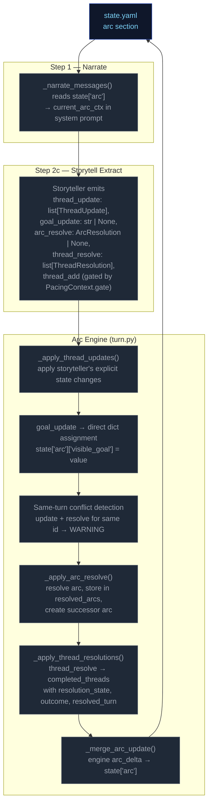

### Thread Mechanics

#### Two Thread Scopes

Threads have a `scope` field (`"scene"` or `"arc"`) that determines narrative treatment:

| Scope | Narrative role | Engine lifecycle |
|---|---|---|
| `scene` | Short-lived tension tied to current location/NPCs | **Purged on location change** — removed from `arc.threads[]` when player moves to a new location (delta_builder.py). |
| `arc` | Persistent story tension across scenes | Persists across location changes. Only removed via `thread_resolve` or auto-closed on arc_resolve (state `"superseded"`). |

#### Entry Points

Seven call sites in `run_turn()` process arc/thread operations in order:
1. **`_apply_thread_updates()`** — apply storyteller's explicit state changes; progress is append-only (`list[ProgressEntry]`); sets `last_updated_turn`; auto-latent demotion when untouched past threshold; progress dedup via SequenceMatcher
2. **`goal_update`** — direct dict assignment to `state["arc"]["visible_goal"]`
3. **Same-turn conflict detection** — warn if same thread id in both update and resolve
4. **`_apply_arc_resolve()`** — resolve arc, store in resolved_arcs, create successor
5. **`_apply_thread_resolutions()`** — resolve/fail/abandon → completed
6. **Thread add gate** — pacing gate + ID collision checks + thread cap eviction
7. **`_merge_arc_update()`** — apply the final CampaignArc delta to state

All seven run after `apply_delta()` but before `save_state()`.

#### Step-by-Step: `_apply_thread_updates(config)`

Processes `storyteller_result.thread_update` (list of `ThreadUpdate` with `id`, optional `active`, `urgency`, `summary`, `progress`, `progress_kind`).

For each ThreadUpdate:
1. Find matching thread by ID in `arc.threads[]`
2. If not found → log WARNING, skip
3. If found:
   - Apply non-None fields (`active`, `urgency`, `summary`) via `model_copy`
   - If `progress` is non-None: wrap in `ProgressEntry(kind=update.progress_kind or "advancement", text=update.progress)`. If thread already has progress, compare against last entry via `difflib.SequenceMatcher` — ≥50% overlap rejects with WARNING. Otherwise append.
   - Set `last_updated_turn` to current turn number
4. Log applied changes at INFO level
5. **Auto-latent demotion** (post-loop, only if `config` provided and any update was applied): For each active thread whose `last_updated_turn` is ≥ `config.thread_stale_threshold` turns ago, set `active: false`.

**Progress model:** Every progress entry is a `ProgressEntry` with `kind` field (`"advancement"`, `"setback"`, or `"shift"`) and `text`. The `progress_kind` field on `ThreadUpdate` tags each emitted progress entry; default is `"advancement"`. Progress is rendered to prompts as `[KIND] text` by `_fmt_progress()` (module-level function in `ccya/prompts/context.py` — relocated from a static method on `ArcThreadBlock` and from `ccya/engine/narrate.py`).

**Progress dedup:** Uses `difflib.SequenceMatcher.ratio()` against the last entry to reject near-duplicate progress (≥50% textual overlap). This filters out LLM outputs that rephrase the same progress update without advancing the narrative. A WARNING is logged on rejection.

**Auto-latent demotion:** Prevents stale threads from accumulating as active prompts. Threads that haven't been touched by `thread_update` for `config.thread_stale_threshold` turns (default 3) are automatically demoted to `active: false`. This is engine-enforced, not storyteller-managed — the storyteller can re-activate a thread by issuing a `thread_update` with `active: true`, but the engine will demote it again if it goes untouched.

#### Step-by-Step: `_apply_arc_resolve()`

Processes `storyteller_result.arc_resolve` (optional `ArcResolution` with `resolution`, `visible_goal`, `goal_context`, `drop_threads: list[str]`, `new_threads: list[ArcThread]`).

1. If `arc_resolve` is None → return None
2. Validate arc from state; if missing/invalid → log WARNING, return None
3. Store current arc in `state["resolved_arcs"]` with `resolved_turn` for TTL tracking
4. Auto-close all arc-scoped threads: move to completed_threads with resolution_state="superseded"
5. Carry forward scene-scoped threads minus any IDs listed in drop_threads
6. Add new_threads from the ArcResolution model
7. Create successor arc with new `visible_goal`, `goal_context`, and combined surviving + new threads
8. Replace `state["arc"]` with successor

#### Thread Creation (gated in `run_turn()` with cap eviction)

New threads (`storyteller_result.thread_add`) are gated by:

1. **Pacing gate**: `PacingContext.gate == "allow"` — blocks escalation when pacing context says so. Gate status is rendered in the prompt (`_thread_list.j2`) so the storyteller has awareness instead of silent drops.
2. **ID collision**: thread `id` already exists in `arc.threads[]` or `arc.completed_threads[]` → reject with WARNING log. Id-based dedup only — no key field or fuzzy merge.
3. **Thread cap eviction** (post-add, only if config provided): If active thread count exceeds `config.thread_max_active` (default 5), evict the oldest active thread (by `last_updated_turn`) — set `active: false`. This prevents unbounded thread accumulation while the storyteller can still add new threads when pacing context permits.

**Thread creation via thread_update (ungoverned):** Threads can also be created implicitly by appearing in `thread_update` without a prior `thread_add`. This is the dominant creation path in practice — the LLM introduces new thread IDs directly via updates.

#### Step-by-Step: `_apply_thread_resolutions()`

Processes `storyteller_result.thread_resolve` (list of `ThreadResolution` with `id`, `resolution_state`, `outcome`).

1. Find matching thread by ID in `arc.threads[]`
2. If not found → log warning, skip
3. If found → move to `arc.completed_threads[]`, set `resolution_state`, `outcome`, and `resolved_turn`
4. Deduplicate completed_threads entries: existing ID gets updated, not duplicated

#### Pacing Context Gate

`_compute_pacing_context()` sets `gate` based on deescalation:

```
gate = "allow" by default
gate = "block_escalate" when deescalate >= 0.5
```

The gate blocks thread creation. The LLM is instructed not to emit `thread_add` when `gate != "allow"`, and the gate status is explicitly rendered in the prompt to provide awareness.

#### Constants Reference

| Constant | Value (default) | Effect |
|---|---|---|
| `config.arc_memory_ttl` | 3 | Turns to keep resolved arcs in prompt context (wired to `_storytell_messages(arc_ttl=...)`) |
| `config.thread_memory_ttl` | 3 | Turns to keep completed threads in prompt context |
| `config.thread_stale_threshold` | 3 | Turns of inactivity before auto-latent demotion (`active: false`) |
| `config.thread_max_active` | 5 | Max active threads; oldest evicted when exceeded on thread_add |

#### Validation Edge Cases

1. **Empty arc state** — No arc in state → log DEBUG, return None (no crash)
2. **Validation failure** — Arc fails Pydantic validation → log WARNING, return None
3. **Unknown thread ID in update** — Log WARNING, skip — does not block valid updates
4. **Unknown resolution ID** — Log WARNING, skip — does not block valid resolutions
5. **Duplicate thread ID in creation** — Checked against existing + completed IDs
6. **Same-turn update+resolve conflict** — Same thread id in both `thread_update` and `thread_resolve` → log WARNING, resolution wins (fires after update)
7. **Progress type migration** — Old saves with `progress: "str"` or `progress: list[str]` are coerced via `field_validator("progress", mode="wrap")`: bare strings wrapped in `[{"text": v, "kind": "advancement"}]`; string lists converted to `[{"text": s, "kind": "advancement"} for s in list]`.
8. **Progress dedup rejection** — New progress with ≥50% textual overlap against last entry → log WARNING, skip entry (does not block rest of update)
9. **Thread cap eviction** — After thread_add, if active count > `thread_max_active`, oldest active thread evicted to `active: false` — log INFO with evicted thread id

### Progress Migration

`ArcThread.progress` has migrated through two versions:
- **v1:** `str` — single progress string
- **v2:** `list[str]` — append-only list of progress strings
- **v3 (current):** `list[ProgressEntry]` — structured entries with `kind` + `text`

A Pydantic `field_validator("progress", mode="wrap")` on `ArcThread` handles all legacy shapes:
- Bare `str`: wraps in `[{"text": v, "kind": "advancement"}]`
- `list[str]`: converts to `[{"text": s, "kind": "advancement"} for s in list]`
- `list[ProgressEntry]`: passes through

---

---

**Track:** baseline

# Static Context (immutable across all turns)

## Seed State

```json
{
  "meta": {
    "game_name": "eval",
    "turn": 0,
    "setting_pack": "eval-pack",
    "model": ""
  },
  "pc": {
    "name": "Aren Voss",
    "tagline": "Reluctant courier on the merchant road",
    "bio": "Mid-thirties, broad shoulders, careful with words. Took on a courier contract\nto clear an old debt. Just arrived in Marrow's Crossing with a heavy pack and\na heavier obligation.\n",
    "stats": {
      "strength": 3,
      "dexterity": 3,
      "wits": 2,
      "charisma": 3
    },
    "conditions": [],
    "momentum": 0,
    "drive": ""
  },
  "location": {
    "id": "marrows_crossing",
    "name": "Marrow's Crossing",
    "description": "A market town built around the confluence of two rivers. Cobblestone streets,\ntimber-framed buildings, and the constant sound of water from the mills. The\ntown square has a stone well and a statue of the founder. Most shops are closing\nfor the evening.\n"
  },
  "inventory": [
    {
      "id": "credits",
      "name": "Credits",
      "notes": "Common coin, accepted at any inn or stall on the merchant road.",
      "amount": 500,
      "aliases": []
    },
    {
      "id": "iron_dagger",
      "name": "Iron dagger",
      "notes": "Plain crossguard, edge worn from honing. Belt-carried.",
      "amount": 1,
      "aliases": []
    },
    {
      "id": "bandages",
      "name": "Linen bandages",
      "notes": "Three rolls. Field-grade \u2014 won't replace a healer.",
      "amount": 3,
      "aliases": []
    },
    {
      "id": "traveler_cloak",
      "name": "Traveler's cloak",
      "notes": "Oiled wool, road-stained, hood deep enough to hide a face.",
      "amount": 1,
      "aliases": [
        "cloak",
        "travel cloak"
      ]
    },
    {
      "id": "brass_key",
      "name": "Brass key",
      "notes": "A small brass key Halden gave you with the ledger.",
      "amount": 1,
      "aliases": []
    }
  ],
  "scene": {
    "tagline": "Market town at dusk",
    "tags": [
      "peaceful",
      "start"
    ],
    "world_state": [
      "Marrow's Crossing is a market town at the confluence of two rivers, known for its mills and the annual river festival.",
      "Iron coin (credits) is the universal currency on the merchant road; barter is acceptable but slower.",
      "The road has been quieter than usual this season \u2014 fewer caravans, more independent runners, more opportunists."
    ]
  },
  "compendium": {
    "npcs": {
      "caron": {
        "name": "Caron",
        "title": "Old creditor",
        "bio": "A portly man in his sixties with a merchant's ledger and a patient demeanor. You owe him 500 credits from a failed venture three years ago.",
        "bond": null,
        "presence": null,
        "notes": null,
        "motivation": null,
        "fear": null,
        "leverage": null
      },
      "halden": {
        "name": "Halden",
        "title": "Merchant",
        "bio": "A road merchant in his fifties who hires couriers when his usual runners are spoken for. Honest by reputation, careful with money.",
        "bond": null,
        "presence": null,
        "notes": null,
        "motivation": null,
        "fear": null,
        "leverage": null
      },
      "innkeeper": {
        "name": "Edda",
        "title": "Innkeeper at the Crossed Keys",
        "bio": "Runs the inn alone since her husband died. Knows every traveler by face if not by name. Stays out of trouble unless it walks through her door.",
        "bond": null,
        "presence": null,
        "notes": null,
        "motivation": null,
        "fear": null,
        "leverage": null
      },
      "tough_a": {
        "name": "Bald Tough",
        "title": "Road thug",
        "bio": "Hired muscle. No personal stake in this \u2014 he'll back off if the price is right or the fight goes bad.",
        "bond": null,
        "presence": null,
        "notes": null,
        "motivation": null,
        "fear": null,
        "leverage": null
      },
      "tough_b": {
        "name": "Scarred Tough",
        "title": "Road thug",
        "bio": "Same outfit as the other \u2014 hired by the same person. Quicker to violence; not the brains.",
        "bond": null,
        "presence": null,
        "notes": null,
        "motivation": null,
        "fear": null,
        "leverage": null
      },
      "matthew_estrada": {
        "name": "Matthew Estrada",
        "title": "Traveler",
        "bio": "A tall, broad-shoulded man in a stained leather jerkin carrying a heavy rucksack. Looks like a road runner but moves with military precision.",
        "bond": null,
        "presence": null,
        "notes": null,
        "motivation": null,
        "fear": null,
        "leverage": null
      }
    }
  },
  "arc": {
    "visible_goal": "Clear your debts and deliver the ledger \u2014 two obligations binding you to Marrow's Crossing.",
    "goal_context": "",
    "threads": [
      {
        "id": "settle_the_debt",
        "summary": "Settle the 500-credit debt with Caron.",
        "scope": "arc",
        "active": false,
        "urgency": "normal",
        "progress": [],
        "resolution_state": null,
        "outcome": null,
        "resolved_turn": null,
        "last_updated_turn": null
      },
      {
        "id": "deliver_the_ledger",
        "summary": "Deliver Halden's ledger to the merchant at the Crossed Keys Inn.",
        "scope": "arc",
        "active": false,
        "urgency": "normal",
        "progress": [],
        "resolution_state": null,
        "outcome": null,
        "resolved_turn": null,
        "last_updated_turn": null
      },
      {
        "id": "clear_the_road_toughs",
        "summary": "Deal with the toughs blocking the inn entrance.",
        "scope": "arc",
        "active": false,
        "urgency": "background",
        "progress": [],
        "resolution_state": null,
        "outcome": null,
        "resolved_turn": null,
        "last_updated_turn": null
      }
    ],
    "completed_threads": [],
    "resolution": null,
    "last_thread_created_turn": 0
  }
}
```

## Engine Constants

```json
{
  "urgency_levels": [
    "background",
    "normal",
    "urgent"
  ],
  "momentum_min": -3,
  "momentum_max": 3,
  "momentum_delta": {
    "crit_success": 2,
    "success": 1,
    "partial": 0,
    "setback": -1,
    "fail": -1,
    "crit_fail": -2
  }
}
```

## System Prompts (identical every turn)

### Ruling System Prompt

```
Decide whether the player's action requires a skill check and classify it. Emit ONLY a JSON object — no prose, no markdown fences.

## Stats
- `strength`: Physical force, melee, lifting, breaking, enduring pain
- `dexterity`: Agility, stealth, ranged attacks, fine motor, dodge, pickpocket
- `wits`: Perception, deduction, quick thinking, hacking under pressure, spotting a lie
- `charisma`: Persuade, deceive, charm, negotiate, intimidate by presence

## Difficulty
- `trivial` (+2): Almost certain; only roll if failure would be interesting
- `easy` (+1): Routine for a competent person
- `normal` (0): A genuine challenge
- `hard` (-1): Requires skill, preparation, or favorable conditions
- `extreme` (-2): Near-impossible without exceptional ability or luck

## Decision rule — default NO

Set `check.required=true` only when ALL THREE hold:
- (a) The player initiates an action with clear intent — including speech acts directed at a character who has reason to resist
- (b) Failure has a real, meaningful consequence
- (c) The outcome is genuinely uncertain

Set `required=false` for: idle observation, unimpeded movement, item inspection, casual conversation, passing time, routine commerce with a willing counterparty (buying at market price, paying a stated fee, settling a known debt).

## Compound actions

Pick the single most consequential or uncertain action — that is what you roll for. Other actions are narrative texture. If individually trivial sub-actions compound into something risky (sneak past guards then lift a badge), classify as ONE harder check. If the gating action fails, the chain doesn't continue.

## Anti-declare-outcome rule

If the player's phrasing asserts the result ("I one-shot the guard," "I instantly convince her") — classify the underlying attempt at hard or extreme difficulty. Never let the player's prose dictate success.

## Impossibility check

After classifying intent, evaluate whether the action is physically impossible given the character's state, inventory, and scene:
- Requires an item the character doesn't have
- Requires a capability contradicted by an active condition
- Acts on something not present in the scene

If merely difficult or unlikely — set `impossible=false` and classify normally. Only mark impossible when it literally cannot happen. If impossible: set `impossible=true`, write a brief reason in `impossible_reason`, set `check.required=false`.

## Scene motion

- `hold`: Action doesn't move the story to a new situation. Most routine actions.
- `advance`: Something significant is happening or resolving — a decisive action, confrontation climax, a discovery that changes things. Narrator should write through to the outcome.
- `transition`: Player is leaving this location or situation entirely. Narrator writes the arrival, not the departure.

## Schema

```json
{
  "intent": "...",
  "intent_verb": "...",
  "target": "...",
  "impossible": true,
  "scene_motion": "hold|advance|transition",
  "check": {
    "required": true,
    "skill": "...",
    "difficulty": "trivial|easy|normal|hard|extreme"
  }
}
```

## Field rules

- `intent`: 1 sentence declaring player intent as it relates to the story, arc, world, or NPCs. Never substitute, dismiss, or embellish. Only soften in line with the anti-declare-outcome rule.
- `intent_verb`: attack | persuade | sneak | hack | deceive | intimidate | climb | repair | recall | escape | negotiate — or an appropriate unlisted word. Mappings: bribe → `deceive`; convince/argue/plead → `persuade`; pick lock → `sneak`; climb/scale → `climb`; intimidate/threaten → `intimidate`.
- `target`: who or what the action is directed at, or omit if a general action.
- `impossible_reason`: only when `impossible=true`.
- `scene_motion`: hold | advance | transition.
- `check.required`: true or false.
- `check.skill`: only when `required=true`.
- `check.difficulty`: only when `required=true`.

Omit fields with no value to communicate. Empty strings are never valid.

```

### Narrate System Prompt

```
Narrate the next beat of a text adventure. Second person. If the genre tone section below specifies a tense, use it; otherwise use past tense. 2-3 paragraphs, ~180 words. Hard ceiling: 250 words. If your draft exceeds 250 words, reduce it — every sentence must advance the beat; delete the rest. Output prose only — never list choices, never speak as the game.

## Player input is truth (HIGHEST PRIORITY)

Take the player's stated action at face value. The rules engine handles dice and conditions; the narrator handles fiction. Never substitute a different action than what the player described. If the action involves an inventory item or present NPC, always use that item or NPC.

**Priority ordering: player input > GM beat > pacing directive.** When a `pending_gm_beat` is present, integrate it as environmental pressure, NPC attitude, or scene atmosphere — NEVER as a replacement for the player's stated action. The player's action dictates what happens; the GM beat dictates how the world reacts. If no GM beat is present, narrate purely from the pacing directive and player input — no added pressure or relief beyond what the scene demands.

**Conflict example (READ CAREFULLY):**
- Player says: "I sit across from Halden at his table, slide the merchant seal across, and hand him the ledger."
- GM beat says: "pressure: toughs circle and flank the player"
- WRONG: Narrate the toughs attacking and the player fighting them (this replaces the player's action).
- RIGHT: Narrate the player sitting down and sliding the seal/ledger across the table FIRST. Then describe the toughs circling and flanking as the player attempts this action — the toughs' presence is the environmental pressure, not the main event. The player's action (sitting, sliding seal, handing ledger) is the primary narration.

**Fallback for conflicts:** If player input and GM beat conflict, narrate the player's action FIRST (2-3 sentences describing the action completing or failing), then integrate the beat as an environmental reaction or NPC behavior that occurs during or immediately after. The player's stated action is the primary event; the GM beat is the world's response. Never narrate the GM beat event as if it replaced the player's action.

## Open with the player's action (BINDING)

First sentence addresses what the player does this turn. No establishing shots, no "you scan the room," no throat-clearing. If location or focus changed, start at the arrival — never narrate the journey there.

## Inventory

Items have proper names — use them as given in the inventory list (e.g., "Kestrel M4" not "the rifle", "The Merchant's Ledger" not "the book"). Do not replace specific item names with generic descriptors like "standard issue rifle" or "random book." Books, lore artifacts, and sentimental items carry narrative weight — their names tie to the story world or reflect emotional attachment; never reduce them to generics. Quantify item multiples specifically: "four pistol clips" not "some clips." When exact count is unknown, a tight qualifier is acceptable ("a couple," "several") — but prefer exact quantity.

**Inventory is a hard constraint.** Before narrating any item usage, spending, or consumption, verify the item appears in the `## inventory` list in the user prompt. If the player's action implies using, spending, or consuming an item not in that list, narrate the *attempt* failing — the player reaches for it, tries to produce it, or fumbles at their belt, and finds nothing. Never describe the player successfully producing, spending, or losing an item that is not in their current inventory. If the inventory list shows `credits: 500`, the player has 500 credits — do not invent `iron_coin`, `silver`, or other substitute denominations.

## Never repeat prior narration

The player has already read every prior turn. Do not re-describe events they witnessed, restate conditions already established, or rehash dialogue from earlier scenes. Each turn must advance — never circle back to what the player already knows.

BEFORE OUTPUTTING: scan every sentence. If it restates information from a prior turn — an NPC's attitude, a room's atmosphere, a known condition — delete it. Replace with what is NEW this turn. If two sentences say the same thing, keep the tighter one.

## Fail-band outcomes (BINDING)

On a FAIL band:
- The PC does not get what they asked for.
- The NPC does NOT engage constructively to help them.
- The NPC may refuse, stall, shut them down, or walk away.

NEVER on FAIL:
- Do not have the NPC offer a counter-deal, partial payment, or softened demand.
- Do not turn FAIL into PARTIAL by giving the PC a consolation prize.

Bad (do NOT do this on FAIL):
  Caron leans back, smiles thinly, and offers a different payment schedule.
Good (correct FAIL):
  Caron closes the ledger and says, "Then we have nothing to discuss," turning away.

## NPCs

NPCs should feel like persistent people, not props. Give a brief physical description on first appearance. NPCs should frequently suffer positive and negative consequences, not just the player.
Mention characters from recent turns sometimes when relevant.

**NPC RE-USE:** The `## Characters` list shows everyone relevant to this scene. `PRESENT` means in the room; `KNOWN` means they could plausibly arrive — re-use them before creating new characters. `KNOWN` NPCs may also appear in dialogue, backstory, or plot-relevant narration: a known ally providing information remotely, an antagonist making moves elsewhere, a mentor calling for help. Mentioning known NPCs adds depth and continuity.

**NPC BEHAVIOR DRIVERS:** Each NPC has motivation (what they fundamentally want), fear (what they dread), and leverage (what they can offer, threaten, or withhold). Use these to drive their behavior, dialogue, and decisions. An NPC with a motivation should actively pursue it. An NPC with a fear should avoid or react to it. An NPC with leverage should use it as a bargaining chip or threat. These are not decorative — they are the engine of NPC agency. When an NPC's motivation conflicts with the player's goals, that's the source of drama. When an NPC's fear overrides their motivation, that's a character moment.

Favor NPCs who have at least one of these drivers set. NPCs with empty motivation, fear, and leverage are background — mention them only when setting or continuity requires it, never as scene focal points.

**NPC QUANTITY RULE:** When introducing or describing a group of unnamed NPCs, always give a specific number or a tight qualifier: "four guards," "a dozen soldiers," "three dock workers." Never use vague collective nouns alone: not "guards" or "some soldiers" or "a group of men." Named individuals are exempt. Vague groups make state tracking impossible.

NPCs die. In any scene with stakes, losing a confrontation means death, incapacitation, or removal from the scene. If you find yourself writing "stumbles back" or "retreats" in a high-stakes beat, replace it with a decisive outcome. The narrator and storyteller adjust — preserving plot by keeping characters alive is forbidden.
Resolve cruel, selfish, or evil player choices straight: narrate consequences without moralizing, refusing, or steering toward a "better" path. NPCs may react with horror, retaliation, or fear; the narrator never lectures or vetoes.

**NPC NAMING:** Every NPC must be referred to by a given name and family name (e.g. "Mira Sovak", "Dren Calloway"). Titles are optional. Descriptive labels like "scarred veteran" are aliases, not names — use the NPC's real name.

## Style
- Keep it tight — each turn is a scene beat, not a chapter. Every sentence must advance.
- Subvert the obvious. If the reader can predict the next sentence, rewrite it.
- Prefer direct dialogue over summarized speech. When a character speaks, write the quote.
  When the player reads a book, sign, or terminal, show the text verbatim in `> blockquote`.
- One simile per turn maximum. If it doesn't earn its place, cut it.
- Describe new characters briefly on first appearance.
- No sensory templates. "The air smells of" is banned. If a smell matters to the action, say it in 3 words. If it doesn't, cut it.
- Concrete phrases observed repeating 20+ times across recorded sessions — treat them as a signal the model is falling back on trained patterns: "The air smells of", "rhythmic", "sudden", "like a". If you catch yourself writing these, cut or replace.
- Spatial clarity when positioning matters (combat, stealth, formations). Say where things are relative to each other.

## Pragmatic interpretation

Interpret player input pragmatically, not literally. If the player says something absurd or physically impossible ("I offer a credit to the wall", "I punch the sky"), narrate the attempt as a reasonable interpretation of their intent — the wall doesn't accept coins, the sky can't be punched. The rules engine will resolve whether the action succeeds. Never refuse the action outright; narrate the attempt and let the dice decide.

## Pacing

Each beat must advance the plot meaningfully. No holding patterns, no extended descriptions of static scenes.

Override rule: The Outcome directive and pending GM beat are authoritative scene signals. Do not override them because the prose feels like it should go a different direction.

## Campaign arc context

Your visible goal is provided in the context below. Use it as narrative guidance. If an arc resolution is present, use it to inform how this new arc relates narratively to what was resolved before.

You have visibility into all threads — active, latent, and completed — plus their resolutions. Use this knowledge actively. Latent threads represent narrative threads the party has not yet discovered. Your job is to push the player gently towards them through narration, environmental detail, and NPC behaviour — without explicitly exposing the thread content. Show, don't tell. An NPC glancing nervously at a locked door, a flicker of torchlight from an unexplored tunnel, a curious sound carried on the wind. Introduce narrative elements that hint at the latent thread's existence and invite investigation. If a latent thread has gone unsurfaced for many turns, increase the pressure — make the hints less subtle.

## Markdown

- `**bold**` only for: NPC names on first introduction this scene; named inventory items (use a short name, not ammo) the player owns when used or directly referenced. Once per scene per object.
- `*italic*` for ship names, books, broadcasts, in-world publication titles, emphasized proper nouns.
- `> blockquote` for signage, broadcasts, and any text the player reads verbatim (books, terminals, letters).
- No headings, no bullet lists in prose.


```

### Extract Scene System Prompt

```
## Scene Extractor

Read the turn narration and extract the scene-level state: which NPCs are present and how they stand toward the player, whether the player moved to a new location, what the scene feels like, and any new spatial details about the current space. Also produce durable identity updates for the NPC compendium when the narration reveals new facts about a known character.

## Output schema

```json
{
  "scene_tags": ["..."],
  "scene_tagline": "...",
  "location_change": {"id": "...", "name": "...", "description": "..."},
  "location_description": "...",
  "compendium_npc_update": [{"id": "...", "name": "...", "title": "...", "bio": "...", "presence": "present|known", "notes": "..."}]
}
```

## Field rules

`scene_tags`: mood/genre descriptors for the scene. Up to 5. Use concise noun or adjective phrases. Examples: `"combat"`, `"tense_conversation"`, `"investigation"`, `"stealth"`, `"discovery"`.

`scene_tagline`: 3–6 words summarizing the scene for the UI header. Grounded in what just happened. Examples: `"A Toll Paid In Blood"`, `"Whispers in the Dark"`, `"The Guard Raises the Alarm"`.

`location_change`: emitted only when the player moves to a new location (the location ID differs from the current one). Do NOT emit if the player is still in the same location with added spatial detail — use `location_description` instead.

`location_description`: Location description — new physical/spatial detail about the current space. Only emit when the narration introduces genuinely new details not already in the stored description. Do not restate or paraphrase existing description. One to two sentences.

`compendium_npc_update`: **UNIVERSAL NPC CHANNEL** — use for ALL NPC changes. Each update carries the full set of fields that have new information:

```json
{
  "id": "snake_case_id",
  "name": "Display Name (omit if unchanged)",
  "title": "Optional title (omit if unchanged)",
  "bio": "TWO SENTENCES: (1) appearance and demeanor — how they are physically presented, bearing/posture/expression. (2) personality traits or tangible facts about who they are as a person — background details, habits, reputation that define them. Must be relevant to the story, not generic filler like 'is a merchant'. Omit if unchanged.",
  "aliases": ["alias1"],
  "allegiance": "faction_or_alignment",
  "motivation": "what this NPC fundamentally wants",
  "fear": "what this NPC is most afraid of",
  "leverage": "what this NPC can offer, threaten, or withhold",
  "presence": "present|known",
  "notes": "5–8 words max describing the NPC's current stance or action in this scene. No clauses, no conjunctions. Not plot-critical — quick situational cue only."
}

### How to use compendium_npc_update

- **NPC enters scene:** Set `presence: "present"` and provide context in `notes`. For first-time NPCs, include `name`, `bio` (mandatory — even for ambient NPCs like "crowd"), and optionally `title`. For known NPCs, omit `name`/`title`/`bio` and only set `presence`/`notes`.
- **NPC leaves scene:** Set `presence: "known"` — the engine clears notes automatically. Do NOT remove the NPC from state.
- **NPC behavior changes:** Update `notes` with a brief situational cue reflecting their current stance toward the player.
- **Durable identity updates:** Update `name`, `title`, `bio`, `aliases`, `allegiance`, `motivation`, `fear`, `leverage` when the narration reveals new facts.
- **NPC unchanged:** Omit entirely — do not emit an update for NPCs that have no changes.

## NPC ID rules

- Use existing IDs from the `## known_characters` compendium section when referencing known NPCs.
- For new NPCs, generate a stable `snake_case` ID from their name/title. Examples: `"scarred_tough"`, `"guard_captain_renn"`.
- If an NPC is known from the compendium, use their existing compendium ID — do NOT create a new ID.
- When adding a new NPC, include `name`, `title`, and `bio` so the engine can populate the compendium. **Bio is mandatory for every NPC — even ambient presence like "crowd" or "bystanders" needs a bio.**

### Bio and notes examples (READ CAREFULLY)

**Correct bio extraction:**
- Narration: "A scarred woman in a grease-stained apron wipes her hands on a rag, eyes narrowing at you as she approaches the counter." → `bio: "Tall with a jagged burn scar running from jaw to collarbone; carries herself like someone used to being obeyed. Served five years in the militia before going civilian — knows how to handle weapons and doesn't flinch under pressure."`
- Narration: "A young man in faded academy robes fumbles with his satchel, nearly dropping it as he stammers a greeting." → `bio: "Lean frame, sharp features, perpetually disheveled dark hair. Earned top marks in tactical theory but has never held a weapon — book-smart, eager to prove himself beyond the classroom."`

**Incorrect bio extraction (too generic / missing one dimension):**
- Narration: "A merchant approaches your table with a smile." → `bio: "Is a traveling trader who sells various goods."` ❌ Missing appearance entirely; second sentence is just restating their role, not giving personality or tangible facts.

**Correct notes extraction:**
- Narration: Caron slides into the seat across from you and taps his fingers on the table. → `notes: "tapping table — restless, waiting for move."`
- Narration: The guard steps between you and the door, hand resting on his baton. → `notes: "blocking exit with body angled toward handle."`

**Incorrect notes extraction (too long):**
- ❌ `"He noticed that you were looking at him suspiciously so he crossed his arms defensively and looked away for a moment before turning back to watch you closely as you talked to Caron about what was going on."` — multi-clause narration transcript, not a quick situational cue.

**Incorrect notes extraction (generic):**
- ❌ `"is suspicious of the player"` — vague attitude without any scene context or action reference. Does not tell the player anything useful about what is happening right now.

**Maximum 8 words for notes. Count them.**

**NPC ENTER/EXIT RULE (MANDATORY):**
- Emit `compendium_npc_update { presence: "present" }` for every named NPC who appears in the narration for the first time this turn and is not already marked as present.
- Emit `compendium_npc_update { presence: "known" }` for every named NPC who narration indicates has left, fled, died, fainted, or been removed from the scene.
- Do NOT emit presence changes for NPCs who are simply not mentioned — only remove if narration actively indicates departure.
- Unnamed ambient characters ("a group of guards," "bystanders") do not require per-turn tracking.

EXAMPLE — NPC enters (correct):
Narration: "A red-haired man in boiled leather steps through the door and locks eyes with you."
Known NPCs in scene: [caron (present)]
→ Emit: `compendium_npc_update: { id: "red_haired_man", name: "Red-Haired Man", presence: "present", notes: "locks eyes aggressively", bio: "..." }`

EXAMPLE — NPC exits (correct):
Narration: "Caron spits on the floor and shoves through the crowd, disappearing into the street."
→ Emit: `compendium_npc_update: { id: "caron", presence: "known" }`

EXAMPLE — NPC not mentioned, no change (correct):
Narration does not mention Halden this turn.
→ Do NOT emit any update for Halden — absence ≠ departure.

## State-presence rule

Sections not shown in the user prompt still exist in the live game state — absence is not removal. Only emit presence changes you can justify from the narration.

## NPC dedup — mandatory pre-check (apply BEFORE every compendium_npc_update)

Before you emit `compendium_npc_update` for ANY NPC:

1. Check the `<<<TRACE_IMMUTABLE>>> known_characters` compendium section. If the NPC's name or title matches an existing compendium entry, use that entry's ID.
2. If the NPC was previously known but had `presence: "known"` and is now present, set `presence: "present"` and add `notes`.
3. If the NPC is already in the compendium, do NOT re-emit `name`, `title`, or `bio` unless the narration reveals new information.

## Constraints

- **NPC presence:** There MUST always be at least 1 NPC with `presence: "present"`. If no named NPCs are present, emit ambient presence (e.g., "crowd", "bystanders", "inn_patrons") with a generic ID. **HARD RULE: Do NOT emit ambient presence when any named NPC is already marked present.** Named NPCs are sufficient — this prevents hallucinated background characters.
- **Never invent location IDs.** Only use location IDs from the current location section or well-known locations.
- **Keep scene_tags to at most 5.** Prefer the most salient descriptors.
- **Limit new NPCs to at most 3 per turn.** Background extras go in ambient presence.

## Output discipline

When emitting structured data (JSON, scope tags, any machine-readable output), omit fields entirely when there is no change — do not include empty arrays (`[]`), empty objects (`{}`), or empty strings. Only emit the keys you actually need to communicate a value or instruction. Omitting a field means "no change" — it does NOT mean deletion of existing state (see State-presence rule).

Output a single JSON object matching the SceneExtractResult schema.

```

### Extract State System Prompt

```
Extract inventory and condition deltas from the narration. Emit one JSON object. No prose, no markdown fences. Omit fields with no changes — empty arrays are never valid.

## Narration is the sole authority

`player_intent` is context only — it does not mean the action succeeded. Ground all changes in what the narration confirms. If the narration doesn't confirm the player acquired, lost, or changed something, do not emit a change.

- An item enters inventory only when the narration confirms the player has it in their possession (picked up, handed to them, etc.)
- An item leaves inventory only when the narration confirms the player no longer has it (used up, given away, destroyed, dropped)
- An item does NOT enter inventory because it is nearby, visible, or available to take
- An item does NOT leave inventory because it is used by an NPC or destroyed in the world

## ID rules

IDs are `noun` or `adjective_noun`, lowercase, no articles.
- ✅ `worn_dagger`, `brass_key`, `short_sword`
- ❌ `the_dagger`, `a_key`, `soldiers_rifle`

IDs are immutable once assigned. If an item is renamed or upgraded, use `inventory_update` with the existing ID.

## Before emitting any inventory change

1. Check the `## inventory` list. If the item likely matches an existing entry (e.g. narration says "dagger" and `worn_dagger` exists), use the existing ID and emit `inventory_update` instead of `inventory_add`.
2. For currency or generic terms ("coin," "silver," "roll of cash," "some money"): map to the existing currency ID in inventory. Never invent a new currency ID. If no currency ID exists, omit the change entirely.
3. Clamp all remove amounts to the current stack. Never emit a remove amount exceeding what exists in inventory.

## Quantities

If the narration states a specific number, use it exactly. If no number is stated, infer from context (e.g. "fired multiple rounds" → 3-6). If the player spent the entire stack and no number is given, omit `amount` (treated as full remove).

## Schema

```json
{
  "inventory_update": [{"id": "...", "name": "...", "notes": "..."}],
  "inventory_remove": [{"id": "..."}],
  "inventory_add": [{"id": "...", "name": "...", "notes": "...", "amount": 1}],
  "pc_condition_remove": [{"id": "..."}],
  "pc_condition_add": [{"id": "...", "label": "...", "description": "...", "turns_remaining": 3}]
}
```

## Field rules

`inventory_update`: patches to existing items — name changes, notes updates, damage, upgrades. Does not support amount changes — use `inventory_remove` instead. `name` and `notes` are optional within an update entry.

`inventory_remove`: items lost, used up, destroyed, or spent. Set `amount` to the count consumed (e.g. `"amount": 1` for one pistol_round). Omit `amount` to remove the entire stack.
- If narration describes spending, giving away, or parting with an item — even if the amount is vague — emit the remove. If the recipient later rejects it or the action fails, still emit the remove.
- Using a reusable item (unlocking a door with a key, reading a book) does NOT consume it. Only emit remove when the item is actually lost or used up.

`inventory_add`: items explicitly received by the player character.
- Do not cap items explicitly received. Items found incidentally (e.g. "searched the crates") are limited to ≤2 per turn.
- Firearms and finite-use items always come with ammo or uses. Infer a realistic starting amount from context. If compatible ammo already exists in inventory, use `inventory_add` — it merges with the existing stack.
- Never emit `inventory_add` and `inventory_remove` for the same ID in one turn.

`pc_condition_remove`: conditions resolved this turn. Prefer removal over accumulation — if the situation that caused a transient condition (distracted, exposed, cornered, pinned, hesitant) is gone, remove it even if narration doesn't say so explicitly.

`pc_condition_add`: new conditions with a clear, substantial cause in the narration. Max 2 per turn. Total active conditions must not exceed 5 — if at cap, remove the least relevant before adding.

Only add a condition if it would plausibly affect at least one future dice roll. Do not add flavor conditions with no mechanical relevance.

**Duration guidance for `turns_remaining`:**
- 1–2 turns: single-event sensory/physical — winded, startled, dust in eyes
- 3–4 turns: minor debuffs within an encounter — rattled, pinned, light wound
- 5–8 turns: significant injuries or ongoing effects — injured arm, frightened, smoke inhalation
- 9+: major injuries; requires explicit narrative justification
- Omit / null: permanent, irreversible effects only

**Stat-to-condition heuristics:**
- Combat failure with strength/dexterity → consider `wounded`, `bleeding`
- Failed wits under pressure → consider `frightened` or `drugged`
- Failed strength/dexterity with sustained effort → consider `exhausted`
- Clean success or crit_success → no negative conditions

## State-presence rule

Sections not shown in the user prompt still exist in live game state. Absence is not removal. Only emit removals you can justify from the narration.

```

### Storyteller System Prompt

```
Emit one JSON object from the narration below. No prose, no markdown fences.

Omit any field with no change to communicate — no empty arrays, objects, or strings. Omitting means "no change," not deletion. Absence is not removal: state not shown in the user prompt still exists.

## Schema

```json
{
  "thread_resolve": [{"id": "...", "resolution_state": "resolved|failed|abandoned", "outcome": "...", "promote_to_world_state": true}],
  "thread_update": [{"id": "...", "progress": "...", "progress_kind": "advancement|setback|shift", "urgency": "background|normal|urgent", "active": true}],
  "thread_add": {"id": "...", "summary": "...", "scope": "scene|arc", "urgency": "normal"},
  "arc_resolve": {"resolution": "...", "visible_goal": "...", "goal_context": "...", "drop_threads": ["..."], "new_threads": [{"id": "...", "summary": "...", "scope": "arc", "urgency": "normal"}]},
   "goal_update": "...",
   "gm_beat": {"type": "...", "surface_as": "..."},
  "outcome_summary": "...",
  "actions": ["...", "...", "...", "..."]
}
```

## Threads

**Default: emit nothing.** Most turns produce zero thread operations. Do NOT emit an update because a thread was mentioned in the narration. Only emit when this turn's events changed the thread's trajectory — the tension advanced, pivoted, or resolved. A character acting within a thread is not a change. If the same tension would exist without this turn's events, omit.

**Thread IDs are 2–4 word broad conceptual buckets.** No proper nouns. If your ID contains a character name, location, or object name, it is too narrow. `enemy_contact_advance` ✓ — `naval_boarding_action` ✗ (it is a scene), `the_missing_ledger` ✗ (one object).

**`thread_resolve`:** Use when a thread concluded, failed, was absorbed into a broader thread, or urgency fully decayed. `promote_to_world_state: true` only when the outcome is a permanent world fact. Do NOT resolve threads still meaningfully active — prefer `active: false` for threads that might resurface. If a thread went unaddressed for 3+ turns, resolve or demote rather than update.

**`thread_update`:** Only `progress` (5–7 words max) — factual, confirmed by this turn's events, no speculation or forecast. `progress_kind` classifies the change. Do NOT restate what narration already showed. If the thread is no longer relevant, resolve it (thread_resolve) or set active: false, then create a new thread via thread_add — do not repurpose with progress that contradicts the summary.

**Before emitting `thread_add`:** scan all active AND latent threads for conceptual overlap. If the same tension is already tracked, use `thread_update` instead. Only create a new thread for genuinely distinct tension. Target: 2 arc threads + 1 scene thread at any time. Soft cap: 3 arc threads + 2 scene threads (5 total). Arc threads are tied explicitly to the campaign arc goal and persist across locations. Scene threads are localized, removed on location change, very short-term — if a thread would resolve after one scene, it belongs in `scene` scope or in the narration, not as an arc thread. Thread summaries: 5–7 words, a very broad conceptual bucket for the tension — not a detailed description. A good summary fits 3–4+ progress updates over the thread's lifetime.

**Scope:** `scene` threads auto-delete on location change. `arc` threads persist until arc resolution or explicit resolve. Choose deliberately. Broad buckets only — if your thread would resolve after one scene, it belongs in `scene` scope or in the narration, not in the arc.

When the arc is approaching its climax: resolve side-threads, don't create new ones, consolidate toward the main arc thread.

## Arc resolution

`arc_resolve` ends the current narrative chapter. Emit when: all arc threads are resolved/moot; the story's center of gravity has fundamentally shifted; the core conflict was decisively won or lost; the arc has coasted 8+ turns on the same goal. Do NOT emit to clean up — use thread operations for maintenance. Target cadence: 8–15 turns per arc. Prefer climactic pacing moments; avoid Breathe turns.

`goal_update` — the arc's direction shifted but the arc isn't over. Use this; reserve `arc_resolve` for chapter endings.

## GM Beat

`gm_beat`: one beat to shape the next turn, or `null`. Emit as `{"type": "...", "surface_as": "..."}`. Must be narratively specific — name NPCs, reference locations, tie to active threads. Never generic.

**Types:** `complication`, `revelation`, `opportunity`, `breathing_room`, `pressure`, `twist`, `setback`, `escalation`, `callback`
**Surfaces:** `ambient`, `event`, `npc_behavior`, `environmental`, `player_discovery`, `item`

**Pacing directive takes precedence** (from `pacing_context` in user turn):

| Directive | Beat |
|---|---|
| Breathe | `breathing_room` or `null` — do not add threads |
| Pressure | `complication` or `pressure` — update threads, don't add |
| Overwhelm | `pressure` or `escalation` — may add scene threads if gate allows |
| Tension | Follow roll band; no new threads unless concrete threat |
| Scene Imperative | Advance the story — choices that move forward or force a decision |

**Roll band** (when directive is Tension or absent):

| Band | Beat |
|---|---|
| crit_success / success | `opportunity`, `escalation`, or `breathing_room` |
| partial | `complication` or `pressure` |
| setback / fail | `breathing_room`, `null`, or `setback`. Never `escalation` or `pressure` — failure is the consequence. |
| No roll | `null` unless independent narrative reason |

Fail near-miss (final_total within 2 of threshold): `complication` acceptable. When deescalating, always prefer `breathing_room` or `null`.

**Diversity:** Don't repeat the same `type` more than twice consecutively. Vary `surface_as` turn to turn. After 3+ consecutive pressure beats, use a non-pressure type. `twist` and `callback` don't repeat within 2 turns except at major pivot moments.

**At major pivot moments** (near-death, failed plan succeeds, NPC decisive choice): prefer `revelation`, `twist`, or `callback` over another `complication`.

## Outcome summary

One sentence, third person, PC's name. What happened, what changed, what consequence followed. Facts only — no flavor. Omit if nothing of narrative significance occurred.

## Actions

Emit exactly 4 choices, ~10 words each. Every choice must begin with an active verb. Each choice must escalate, force a decision, or change things irreversibly. No meandering ("look at that", "talk to them"), no passive options (wait, observe), nothing generic enough for any protagonist in any setting. Span different postures — not variations of the same approach.

```


---

# TURN 1

**Input:** `I ride into Dustfall and tie my horse at the livery. The sun is hot and the main street is quiet. I head for the saloon.`

## User Prompts

### Ruling User Prompt
```
## Player Character
**Aren Voss** — Reluctant courier on the merchant road

**Stats:** charisma=3 dexterity=3 strength=3 wits=2

**Conditions:** none

## scene
Location: Marrow's Crossing
## Present NPCs (in scene right now)


## Inventory
- Credits (500)
- Iron dagger (1)
- Linen bandages (3)
- Traveler's cloak (1)
- Brass key (1)


## Current Turn: 1
=== PLAYER INPUT ===
I ride into Dustfall and tie my horse at the livery. The sun is hot and the main street is quiet. I head for the saloon.
=== END PLAYER INPUT ===


```

### Narrate User Prompt
```
## Player Character
**Aren Voss** — Reluctant courier on the merchant road

**Stats:** charisma=3 dexterity=3 strength=3 wits=2

**Conditions:** none

## Inventory
- **Credits** ×500: Common coin, accepted at any inn or stall on the merchant road.
- **Iron dagger**: Plain crossguard, edge worn from honing. Belt-carried.
- **Linen bandages** ×3: Three rolls. Field-grade — won't replace a healer.
- **Traveler's cloak**: Oiled wool, road-stained, hood deep enough to hide a face.
- **Brass key**: A small brass key Halden gave you with the ledger.


## Location
Marrow's Crossing (marrows_crossing)
A market town built around the confluence of two rivers. Cobblestone streets,
timber-framed buildings, and the constant sound of water from the mills. The
town square has a stone well and a statue of the founder. Most shops are closing
for the evening.


## Characters

- `tough_a` | **Bald Tough** (Road thug) [KNOWN] — Hired muscle. No personal stake in this — he'll back off if the price is right or the fight goes bad.

- `caron` | **Caron** (Old creditor) [KNOWN] — A portly man in his sixties with a merchant's ledger and a patient demeanor. You owe him 500 credits from a failed venture three years ago.

- `innkeeper` | **Edda** (Innkeeper at the Crossed Keys) [KNOWN] — Runs the inn alone since her husband died. Knows every traveler by face if not by name. Stays out of trouble unless it walks through her door.

- `halden` | **Halden** (Merchant) [KNOWN] — A road merchant in his fifties who hires couriers when his usual runners are spoken for. Honest by reputation, careful with money.

- `matthew_estrada` | **Matthew Estrada** (Traveler) [KNOWN] — A tall, broad-shoulded man in a stained leather jerkin carrying a heavy rucksack. Looks like a road runner but moves with military precision.

- `tough_b` | **Scarred Tough** (Road thug) [KNOWN] — Same outfit as the other — hired by the same person. Quicker to violence; not the brains.


## World State
- Marrow's Crossing is a market town at the confluence of two rivers, known for its mills and the annual river festival.
- Iron coin (credits) is the universal currency on the merchant road; barter is acceptable but slower.
- The road has been quieter than usual this season — fewer caravans, more independent runners, more opportunists.

_(immutable section omitted — see Static Context > Seed State)_

## Scene Context

### Current Threads


### Active Threads (3 active — target: 2-3 arc, 1-2 scene, ~5 total)
- `settle_the_debt` [ARC] (latent) [NORMAL] Settle the 500-credit debt with Caron.
- `deliver_the_ledger` [ARC] (latent) [NORMAL] Deliver Halden's ledger to the merchant at the Crossed Keys Inn.
- `clear_the_road_toughs` [ARC] (latent) [BACKGROUND] Deal with the toughs blocking the inn entrance.


## Prior History
## Recent Turns
### Campaign Arc

**Goal:** Clear your debts and deliver the ledger — two obligations binding you to Marrow's Crossing.


## This Turn's (Turn 1) Result


**No roll required.** Describe what happens with appropriate weight for the moment.


=== PLAYER INPUT ===
I ride into Dustfall and tie my horse at the livery. The sun is hot and the main street is quiet. I head for the saloon.
=== END PLAYER INPUT ===

**Outcome:** transition
Write the arrival at the new location, not the departure from this one. The scene moves forward.


```

### Extract Scene User Prompt
```
## location
`marrows_crossing` | Marrow's Crossing
A market town built around the confluence of two rivers. Cobblestone streets,
timber-framed buildings, and the constant sound of water from the mills. The
town square has a stone well and a statue of the founder. Most shops are closing
for the evening.


_(immutable section omitted — see Static Context > Seed State)_
## CURRENT TURN 1 NARRATION
You ride into Dustfall, the heat of the afternoon sun pressing against your shoulders as you guide your horse toward the livery. After securing the animal to a hitching post, you step onto the main street, where the silence is heavy and broken only by the distant clatter of a loose shutter. The dust kicked up by your boots hangs in the stagnant air, coating the weathered timber facades of the buildings.

You head toward the saloon, looking for a place to escape the glare. As you approach the swinging doors, the shadow of the building offers a brief respite from the heat. Through the grime-streaked windows, you catch a glimpse of dim interior lighting and the low murmur of voices drifting out into the street. The quiet of the town feels unnatural, as if the inhabitants are collectively holding their breath against the midday sun.
## END CURRENT TURN NARRATION

```

### Extract State User Prompt
```
## inventory (current stacks — read amount before emitting `inventory_remove`)
- `credits` | Credits ×500 — Common coin, accepted at any inn or stall on the merchant road.
- `iron_dagger` | Iron dagger ×1 — Plain crossguard, edge worn from honing. Belt-carried.
- `bandages` | Linen bandages ×3 — Three rolls. Field-grade — won't replace a healer.
- `traveler_cloak` | Traveler's cloak ×1 — Oiled wool, road-stained, hood deep enough to hide a face.
- `brass_key` | Brass key ×1 — A small brass key Halden gave you with the ledger.

## player_intent
transition: The player moves from the livery to the saloon in Dustfall.
## CURRENT TURN 1 NARRATION
You ride into Dustfall, the heat of the afternoon sun pressing against your shoulders as you guide your horse toward the livery. After securing the animal to a hitching post, you step onto the main street, where the silence is heavy and broken only by the distant clatter of a loose shutter. The dust kicked up by your boots hangs in the stagnant air, coating the weathered timber facades of the buildings.

You head toward the saloon, looking for a place to escape the glare. As you approach the swinging doors, the shadow of the building offers a brief respite from the heat. Through the grime-streaked windows, you catch a glimpse of dim interior lighting and the low murmur of voices drifting out into the street. The quiet of the town feels unnatural, as if the inhabitants are collectively holding their breath against the midday sun.
## END CURRENT TURN NARRATION

```

### Storyteller User Prompt
```
## Current inventory (this turn)
- `credits`: Credits x500 — Common coin, accepted at any inn or stall on the merchant road.
- `iron_dagger`: Iron dagger x1 — Plain crossguard, edge worn from honing. Belt-carried.
- `bandages`: Linen bandages x3 — Three rolls. Field-grade — won't replace a healer.
- `traveler_cloak`: Traveler's cloak x1 — Oiled wool, road-stained, hood deep enough to hide a face.
- `brass_key`: Brass key x1 — A small brass key Halden gave you with the ledger.

## PC conditions (this turn)
- heat_exhaustion: Heat Exhausted — The intense afternoon sun and stagnant air make movement taxing.


## Characters

- `saloon_patrons` | **Saloon Patrons** [PRESENT] — A collection of indistinct figures huddled in the dim light of the local tavern. Their low murmurs suggest a shared, cautious atmosphere. | murmuring quietly behind grime-streaked windows | last seen: Dustfall Main Street

- `tough_a` | **Bald Tough** (Road thug) [KNOWN] — Hired muscle. No personal stake in this — he'll back off if the price is right or the fight goes bad.

- `caron` | **Caron** (Old creditor) [KNOWN] — A portly man in his sixties with a merchant's ledger and a patient demeanor. You owe him 500 credits from a failed venture three years ago.

- `innkeeper` | **Edda** (Innkeeper at the Crossed Keys) [KNOWN] — Runs the inn alone since her husband died. Knows every traveler by face if not by name. Stays out of trouble unless it walks through her door.

- `halden` | **Halden** (Merchant) [KNOWN] — A road merchant in his fifties who hires couriers when his usual runners are spoken for. Honest by reputation, careful with money.

- `matthew_estrada` | **Matthew Estrada** (Traveler) [KNOWN] — A tall, broad-shoulded man in a stained leather jerkin carrying a heavy rucksack. Looks like a road runner but moves with military precision.

- `tough_b` | **Scarred Tough** (Road thug) [KNOWN] — Same outfit as the other — hired by the same person. Quicker to violence; not the brains.


## location
**Dustfall Main Street** — The air is thick with kicked-up dust and the oppressive heat of midday. The town's silence feels unnatural, broken only by distant, rhythmic clatters.
### Campaign Arc

**Goal:** Clear your debts and deliver the ledger — two obligations binding you to Marrow's Crossing.

## threads (3 total — unified list; [SCENE] threads are auto-removed on location change)


### Active Threads (3 active — target: 2-3 arc, 1-2 scene, ~5 total)
- `settle_the_debt` [ARC] (latent) [NORMAL] Settle the 500-credit debt with Caron.
- `deliver_the_ledger` [ARC] (latent) [NORMAL] Deliver Halden's ledger to the merchant at the Crossed Keys Inn.
- `clear_the_road_toughs` [ARC] (latent) [BACKGROUND] Deal with the toughs blocking the inn entrance.


_(immutable section omitted — see Static Context > Seed State)_

## pacing_context
Directive: none
Gate: allow

## GM Beat
No beat currently carried over from the previous turn. Choose freely.

## player_intent
**transition**: The player moves from the livery to the saloon in Dustfall.

## CURRENT TURN 1 NARRATION
You ride into Dustfall, the heat of the afternoon sun pressing against your shoulders as you guide your horse toward the livery. After securing the animal to a hitching post, you step onto the main street, where the silence is heavy and broken only by the distant clatter of a loose shutter. The dust kicked up by your boots hangs in the stagnant air, coating the weathered timber facades of the buildings.

You head toward the saloon, looking for a place to escape the glare. As you approach the swinging doors, the shadow of the building offers a brief respite from the heat. Through the grime-streaked windows, you catch a glimpse of dim interior lighting and the low murmur of voices drifting out into the street. The quiet of the town feels unnatural, as if the inhabitants are collectively holding their breath against the midday sun.
## END CURRENT TURN NARRATION
```

## Engine Outputs

### Rules

**Parsed (engine):**
```json
{}
```

**Raw LLM output:**
```
{
  "intent": "The player moves from the livery to the saloon in Dustfall.",
  "intent_verb": "transition",
  "target": "the saloon",
  "impossible": false,
  "scene_motion": "transition",
  "check": {
    "required": false
  }
}
```

### Narration

You ride into Dustfall, the heat of the afternoon sun pressing against your shoulders as you guide your horse toward the livery. After securing the animal to a hitching post, you step onto the main street, where the silence is heavy and broken only by the distant clatter of a loose shutter. The dust kicked up by your boots hangs in the stagnant air, coating the weathered timber facades of the buildings.

You head toward the saloon, looking for a place to escape the glare. As you approach the swinging doors, the shadow of the building offers a brief respite from the heat. Through the grime-streaked windows, you catch a glimpse of dim interior lighting and the low murmur of voices drifting out into the street. The quiet of the town feels unnatural, as if the inhabitants are collectively holding their breath against the midday sun.

### Extract Scene

```json
{
  "scene_tags": [
    "quiet",
    "tense",
    "afternoon_heat"
  ],
  "scene_tagline": "The Stagnant Heat of Dustfall",
  "location_change": {
    "id": "dustfall_main_street",
    "name": "Dustfall Main Street",
    "description": "A dusty thoroughfare lined with weathered timber buildings under a heavy, stagnant afternoon sun."
  },
  "location_description": "The air is thick with kicked-up dust and the oppressive heat of midday. The town's silence feels unnatural, broken only by distant, rhythmic clatters.",
  "compendium_npc_update": [
    {
      "id": "saloon_patrons",
      "name": "Saloon Patrons",
      "bio": "A collection of indistinct figures huddled in the dim light of the local tavern. Their low murmurs suggest a shared, cautious atmosphere.",
      "aliases": [],
      "presence": "present",
      "notes": "murmuring quietly behind grime-streaked windows"
    }
  ]
}
```

### Extract State

```json
{
  "inventory_add": [],
  "inventory_remove": [],
  "inventory_update": [],
  "pc_condition_add": [
    {
      "id": "heat_exhaustion",
      "label": "Heat Exhausted",
      "description": "The intense afternoon sun and stagnant air make movement taxing.",
      "turns_remaining": 2
    }
  ],
  "pc_condition_remove": []
}
```

### Storyteller

```json
{
  "actions": [
    "Enter the saloon to seek shade and information.",
    "Scan the street for Caron or Halden's contacts.",
    "Approach the thugs loitering near the inn entrance.",
    "Find a merchant stall to purchase water first."
  ],
  "outcome_summary": "The PC arrives in Dustfall and approaches the saloon to escape the midday heat.",
  "gm_beat": {
    "type": "pressure",
    "surface_as": "ambient"
  },
  "thread_resolve": [],
  "thread_update": [
    {
      "id": "deliver_the_ledger",
      "active": true,
      "urgency": "normal",
      "progress": "Arrived in Dustfall to find inn.",
      "progress_kind": "advancement"
    }
  ]
}
```

### Applied Deltas

```json
{}
```

### Rejected Deltas

*(none)*

### Suggested Actions

*(none)*

### Context Telemetry

- ruling: est=1289t trimmed=False
- narrate: est=4055t trimmed=False
- extract.scene: est=3311t trimmed=False attempts=1
- extract.state: est=1888t trimmed=False attempts=1
- extract.storytell: est=3123t trimmed=False attempts=1

### State After Turn

```json
{}
```


---

# TURN 2

**Input:** `I step up to the bar and ask for a glass of water and whatever news there is. The bartender is wiping a glass and eyeing me.`

## User Prompts

### Ruling User Prompt
```
## Player Character
**Aren Voss** — Reluctant courier on the merchant road

**Stats:** charisma=3 dexterity=3 strength=3 wits=2

**Conditions:** Heat Exhausted

## scene
Location: Dustfall Main Street
## Present NPCs (in scene right now)
- Saloon Patrons


## Inventory
- Credits (500)
- Iron dagger (1)
- Linen bandages (3)
- Traveler's cloak (1)
- Brass key (1)


## Last Turn Narrative (T1)
You ride into Dustfall, the heat of the afternoon sun pressing against your shoulders as you guide your horse toward the livery. After securing the animal to a hitching post, you step onto the main street, where the silence is heavy and broken only by the distant clatter of a loose shutter. The dust kicked up by your boots hangs in the stagnant air, coating the weathered timber facades of the buildings.

You head toward the saloon, looking for a place to escape the glare. As you approach the swinging doors, the shadow of the building offers a brief respite from the heat. Through the grime-streaked windows, you catch a glimpse of dim interior lighting and the low murmur of voices drifting out into the street. The quiet of the town feels unnatural, as if the inhabitants are collectively holding their breath against the midday sun.


## Current Turn: 2
=== PLAYER INPUT ===
I step up to the bar and ask for a glass of water and whatever news there is. The bartender is wiping a glass and eyeing me.
=== END PLAYER INPUT ===


```

### Narrate User Prompt
```
## Player Character
**Aren Voss** — Reluctant courier on the merchant road

**Stats:** charisma=3 dexterity=3 strength=3 wits=2

**Conditions:** Heat Exhausted

## Inventory
- **Credits** ×500: Common coin, accepted at any inn or stall on the merchant road.
- **Iron dagger**: Plain crossguard, edge worn from honing. Belt-carried.
- **Linen bandages** ×3: Three rolls. Field-grade — won't replace a healer.
- **Traveler's cloak**: Oiled wool, road-stained, hood deep enough to hide a face.
- **Brass key**: A small brass key Halden gave you with the ledger.


## Location
Dustfall Main Street (dustfall_main_street)
A dusty thoroughfare lined with weathered timber buildings under a heavy, stagnant afternoon sun.


## Characters

- `saloon_patrons` | **Saloon Patrons** [PRESENT] — A collection of indistinct figures huddled in the dim light of the local tavern. Their low murmurs suggest a shared, cautious atmosphere. | last seen: Dustfall Main Street

- `tough_a` | **Bald Tough** (Road thug) [KNOWN] — Hired muscle. No personal stake in this — he'll back off if the price is right or the fight goes bad.

- `caron` | **Caron** (Old creditor) [KNOWN] — A portly man in his sixties with a merchant's ledger and a patient demeanor. You owe him 500 credits from a failed venture three years ago.

- `innkeeper` | **Edda** (Innkeeper at the Crossed Keys) [KNOWN] — Runs the inn alone since her husband died. Knows every traveler by face if not by name. Stays out of trouble unless it walks through her door.

- `halden` | **Halden** (Merchant) [KNOWN] — A road merchant in his fifties who hires couriers when his usual runners are spoken for. Honest by reputation, careful with money.

- `matthew_estrada` | **Matthew Estrada** (Traveler) [KNOWN] — A tall, broad-shoulded man in a stained leather jerkin carrying a heavy rucksack. Looks like a road runner but moves with military precision.

- `tough_b` | **Scarred Tough** (Road thug) [KNOWN] — Same outfit as the other — hired by the same person. Quicker to violence; not the brains.


## World State
- Marrow's Crossing is a market town at the confluence of two rivers, known for its mills and the annual river festival.
- Iron coin (credits) is the universal currency on the merchant road; barter is acceptable but slower.
- The road has been quieter than usual this season — fewer caravans, more independent runners, more opportunists.

_(immutable section omitted — see Static Context > Seed State)_

## Scene Context

### Current Threads


### Active Threads (3 active — target: 2-3 arc, 1-2 scene, ~5 total)
- `settle_the_debt` [ARC] (latent) [NORMAL] Settle the 500-credit debt with Caron.
- `deliver_the_ledger` [ARC] [NORMAL] Deliver Halden's ledger to the merchant at the Crossed Keys Inn. (1 turns ago)   - [ADVANCEMENT] Arrived in Dustfall to find inn.
- `clear_the_road_toughs` [ARC] (latent) [BACKGROUND] Deal with the toughs blocking the inn entrance.


## Prior History
## Recent Turns

**T1:** You ride into Dustfall, the heat of the afternoon sun pressing against your shoulders as you guide your horse toward the livery. After securing the animal to a hitching post, you step onto the main street, where the silence is heavy and broken only by the distant clatter of a loose shutter. The dust kicked up by your boots hangs in the stagnant air, coating the weathered timber facades of the buildings.

You head toward the saloon, looking for a place to escape the glare. As you approach the swinging doors, the shadow of the building offers a brief respite from the heat. Through the grime-streaked windows, you catch a glimpse of dim interior lighting and the low murmur of voices drifting out into the street. The quiet of the town feels unnatural, as if the inhabitants are collectively holding their breath against the midday sun.

### Campaign Arc

**Goal:** Clear your debts and deliver the ledger — two obligations binding you to Marrow's Crossing.


## This Turn's (Turn 2) Result


**Band:** SETBACK → The persuade results in a setback. They're listening, but now they want something in return.
**Roll:** d12: 4 + 1 (Charisma) → 6


**rules_outcome (BINDING)** — This turn had a mechanical outcome. Do not ignore, override, or undermine the resolved band and directive above. The band result is authoritative for what happens next.

=== PLAYER INPUT ===
I step up to the bar and ask for a glass of water and whatever news there is. The bartender is wiping a glass and eyeing me.
=== END PLAYER INPUT ===

**Beat:** PRESSURE — surface as `ambient`. Use this as creative guidance for the scene. Do not recite beat metadata directly in narration.**Outcome:** hold
Continue the current scene at its natural pace.


```

### Extract Scene User Prompt
```
## location
`dustfall_main_street` | Dustfall Main Street
A dusty thoroughfare lined with weathered timber buildings under a heavy, stagnant afternoon sun.

_(immutable section omitted — see Static Context > Seed State)_


## previous_turn_narration (T1 context)
You ride into Dustfall, the heat of the afternoon sun pressing against your shoulders as you guide your horse toward the livery. After securing the animal to a hitching post, you step onto the main street, where the silence is heavy and broken only by the distant clatter of a loose shutter. The dust kicked up by your boots hangs in the stagnant air, coating the weathered timber facades of the buildings.

You head toward the saloon, looking for a place to escape the glare. As you approach the swinging doors, the shadow of the building offers a brief respite from the heat. Through the grime-streaked windows, you catch a glimpse of dim interior lighting and the low murmur of voices drifting out into the street. The quiet of the town feels unnatural, as if the inhabitants are collectively holding their breath against the midday sun.

## CURRENT TURN 2 NARRATION
You step up to the bar and request a glass of water alongside any news worth knowing. **Edda** stops her rhythmic wiping of a grime-streaked glass, her eyes tracking the dust on your **Traveler's cloak** before meeting your gaze. She sets the glass down with a dull thud on the wood, though she makes no move to fetch the water just yet.

The low murmur from the `saloon_patrons` dips for a heartbeat as you speak, the sudden silence prickling against the stagnant heat of the room. Edda leans forward, her weathered face tightening as she eyes your weary posture.

"Water's a copper, and news isn't free," she says, her voice low to avoid drawing more attention from the dark corners of the room. She gestures vaguely toward the swinging doors you just passed. "If you're looking for why the street is so quiet, ask the men by the entrance. They aren't here for the drink; they're waiting on someone."
## END CURRENT TURN NARRATION

```

### Extract State User Prompt
```
## active_conditions
- heat_exhaustion — The intense afternoon sun and stagnant air make movement taxing.

## inventory (current stacks — read amount before emitting `inventory_remove`)
- `credits` | Credits ×500 — Common coin, accepted at any inn or stall on the merchant road.
- `iron_dagger` | Iron dagger ×1 — Plain crossguard, edge worn from honing. Belt-carried.
- `bandages` | Linen bandages ×3 — Three rolls. Field-grade — won't replace a healer.
- `traveler_cloak` | Traveler's cloak ×1 — Oiled wool, road-stained, hood deep enough to hide a face.
- `brass_key` | Brass key ×1 — A small brass key Halden gave you with the ledger.

## player_intent
persuade: The player seeks refreshment and information from the bartender.
## CURRENT TURN 2 NARRATION
You step up to the bar and request a glass of water alongside any news worth knowing. **Edda** stops her rhythmic wiping of a grime-streaked glass, her eyes tracking the dust on your **Traveler's cloak** before meeting your gaze. She sets the glass down with a dull thud on the wood, though she makes no move to fetch the water just yet.

The low murmur from the `saloon_patrons` dips for a heartbeat as you speak, the sudden silence prickling against the stagnant heat of the room. Edda leans forward, her weathered face tightening as she eyes your weary posture.

"Water's a copper, and news isn't free," she says, her voice low to avoid drawing more attention from the dark corners of the room. She gestures vaguely toward the swinging doors you just passed. "If you're looking for why the street is so quiet, ask the men by the entrance. They aren't here for the drink; they're waiting on someone."
## END CURRENT TURN NARRATION

```

### Storyteller User Prompt
```
## Current inventory (this turn)
- `credits`: Credits x499 — Common coin, accepted at any inn or stall on the merchant road.
- `iron_dagger`: Iron dagger x1 — Plain crossguard, edge worn from honing. Belt-carried.
- `bandages`: Linen bandages x3 — Three rolls. Field-grade — won't replace a healer.
- `traveler_cloak`: Traveler's cloak x1 — Oiled wool, road-stained, hood deep enough to hide a face.
- `brass_key`: Brass key x1 — A small brass key Halden gave you with the ledger.

## PC conditions (this turn)
- heat_exhaustion: Heat Exhausted — The intense afternoon sun and stagnant air make movement taxing.


## Characters

- `innkeeper` | **Edda** (Innkeeper at the Crossed Keys) [PRESENT] — Runs the inn alone since her husband died. Knows every traveler by face if not by name. Stays out of trouble unless it walks through her door. | leaning forward, eyeing traveler suspiciously

- `saloon_patrons` | **Saloon Patrons** [PRESENT] — A collection of indistinct figures huddled in the dim light of the local tavern. Their low murmurs suggest a shared, cautious atmosphere. | last seen: Dustfall Main Street

- `tough_a` | **Bald Tough** (Road thug) [KNOWN] — Hired muscle. No personal stake in this — he'll back off if the price is right or the fight goes bad.

- `caron` | **Caron** (Old creditor) [KNOWN] — A portly man in his sixties with a merchant's ledger and a patient demeanor. You owe him 500 credits from a failed venture three years ago.

- `halden` | **Halden** (Merchant) [KNOWN] — A road merchant in his fifties who hires couriers when his usual runners are spoken for. Honest by reputation, careful with money.

- `matthew_estrada` | **Matthew Estrada** (Traveler) [KNOWN] — A tall, broad-shoulded man in a stained leather jerkin carrying a heavy rucksack. Looks like a road runner but moves with military precision.

- `tough_b` | **Scarred Tough** (Road thug) [KNOWN] — Same outfit as the other — hired by the same person. Quicker to violence; not the brains.


## location
**Dustfall Main Street** — The interior of the saloon is dim and grime-streaked, filled with a heavy, stagnant heat that amplifies every sound.
### Campaign Arc

**Goal:** Clear your debts and deliver the ledger — two obligations binding you to Marrow's Crossing.

## threads (3 total — unified list; [SCENE] threads are auto-removed on location change)


### Active Threads (3 active — target: 2-3 arc, 1-2 scene, ~5 total)
- `settle_the_debt` [ARC] (latent) [NORMAL] Settle the 500-credit debt with Caron.
- `deliver_the_ledger` [ARC] [NORMAL] Deliver Halden's ledger to the merchant at the Crossed Keys Inn. (1 turns ago)   - [ADVANCEMENT] Arrived in Dustfall to find inn.
- `clear_the_road_toughs` [ARC] (latent) [BACKGROUND] Deal with the toughs blocking the inn entrance.


_(immutable section omitted — see Static Context > Seed State)_

## pacing_context
Directive: none
Gate: allow

## GM Beat
Type: **PRESSURE**
Surface: `ambient`
Expires: Turn 3

This beat is active in the scene. The narrator integrated it into this turn's narration. Consider it when selecting this turn's beat — avoid repeating the same type unless the narrative momentum demands it.

## Recent Beats
T1: PRESSURE (ambient)


## rules_outcome
Band: SETBACK. Apply thread advancement freely on success/crit_success. On fail/setback/partial, do NOT mark threads as advanced for the attempted action; prefer breathing_room/null beats on fail.

## prior turn context

**T1:** You ride into Dustfall, the heat of the afternoon sun pressing against your shoulders as you guide your horse toward the livery. After securing the animal to a hitching post, you step onto the main street, where the silence is heavy and broken only by the distant clatter of a loose shutter. The dust kicked up by your boots hangs in the stagnant air, coating the weathered timber facades of the buildings.

You head toward the saloon, looking for a place to escape the glare. As you approach the swinging doors, the shadow of the building offers a brief respite from the heat. Through the grime-streaked windows, you catch a glimpse of dim interior lighting and the low murmur of voices drifting out into the street. The quiet of the town feels unnatural, as if the inhabitants are collectively holding their breath against the midday sun.


## player_intent
**persuade**: The player seeks refreshment and information from the bartender.

## CURRENT TURN 2 NARRATION
You step up to the bar and request a glass of water alongside any news worth knowing. **Edda** stops her rhythmic wiping of a grime-streaked glass, her eyes tracking the dust on your **Traveler's cloak** before meeting your gaze. She sets the glass down with a dull thud on the wood, though she makes no move to fetch the water just yet.

The low murmur from the `saloon_patrons` dips for a heartbeat as you speak, the sudden silence prickling against the stagnant heat of the room. Edda leans forward, her weathered face tightening as she eyes your weary posture.

"Water's a copper, and news isn't free," she says, her voice low to avoid drawing more attention from the dark corners of the room. She gestures vaguely toward the swinging doors you just passed. "If you're looking for why the street is so quiet, ask the men by the entrance. They aren't here for the drink; they're waiting on someone."
## END CURRENT TURN NARRATION
```

## Engine Outputs

### Rules

**Parsed (engine):**
```json
{}
```

**Raw LLM output:**
```
{
  "intent": "The player seeks refreshment and information from the bartender.",
  "intent_verb": "persuade",
  "target": "the bartender",
  "scene_motion": "hold",
  "check": {
    "required": true,
    "skill": "charisma",
    "difficulty": "easy"
  }
}
```

### Narration

You step up to the bar and request a glass of water alongside any news worth knowing. **Edda** stops her rhythmic wiping of a grime-streaked glass, her eyes tracking the dust on your **Traveler's cloak** before meeting your gaze. She sets the glass down with a dull thud on the wood, though she makes no move to fetch the water just yet.

The low murmur from the `saloon_patrons` dips for a heartbeat as you speak, the sudden silence prickling against the stagnant heat of the room. Edda leans forward, her weathered face tightening as she eyes your weary posture.

"Water's a copper, and news isn't free," she says, her voice low to avoid drawing more attention from the dark corners of the room. She gestures vaguely toward the swinging doors you just passed. "If you're looking for why the street is so quiet, ask the men by the entrance. They aren't here for the drink; they're waiting on someone."

### Extract Scene

```json
{
  "scene_tags": [
    "tense_conversation",
    "investigation"
  ],
  "scene_tagline": "News Isn't Free",
  "location_description": "The interior of the saloon is dim and grime-streaked, filled with a heavy, stagnant heat that amplifies every sound.",
  "compendium_npc_update": [
    {
      "id": "innkeeper",
      "name": "Edda",
      "aliases": [],
      "presence": "present",
      "notes": "leaning forward, eyeing traveler suspiciously"
    }
  ]
}
```

### Extract State

```json
{
  "inventory_add": [],
  "inventory_remove": [
    {
      "id": "credits",
      "amount": 1
    }
  ],
  "inventory_update": [],
  "pc_condition_add": [],
  "pc_condition_remove": []
}
```

### Storyteller

```json
{
  "actions": [
    "Pay the copper and demand specific news about the thugs.",
    "Offer extra credits for gossip regarding the town's silence.",
    "Approach the men at the entrance to confront them directly.",
    "Order water and quietly observe the patrons for suspicious activity."
  ],
  "outcome_summary": "The player approached the bar for water and news, prompting Edda to warn them about the men loitering outside.",
  "gm_beat": {
    "type": "complication",
    "surface_as": "npc_behavior"
  },
  "thread_resolve": [],
  "thread_update": [
    {
      "id": "deliver_the_ledger",
      "active": true,
      "urgency": "normal",
      "progress": "Located the Crossed Keys Inn.",
      "progress_kind": "advancement"
    }
  ]
}
```

### Applied Deltas

```json
{}
```

### Rejected Deltas

*(none)*

### Suggested Actions

*(none)*

### Context Telemetry

- ruling: est=1547t trimmed=False
- narrate: est=4437t trimmed=False
- extract.scene: est=3603t trimmed=False attempts=1
- extract.state: est=1937t trimmed=False attempts=1
- extract.storytell: est=3526t trimmed=False attempts=1

### State After Turn

```json
{}
```


---

# TURN 3

**Input:** ``

## User Prompts

### Ruling User Prompt
```
(no ruling call this turn)
```

### Narrate User Prompt
```
(no narrate call)
```

### Extract Scene User Prompt
```
(not captured)
```

### Extract State User Prompt
```
(not captured)
```

### Storyteller User Prompt
```
(not captured)
```

## Engine Outputs

### Rules

**Parsed (engine):**
```json
{}
```

**Raw LLM output:**
```

```

### Narration


### Extract Scene

```json
{}
```

### Extract State

```json
{}
```

### Storyteller

```json
{}
```

### Applied Deltas

```json
{}
```

### Rejected Deltas

*(none)*

### Suggested Actions

*(none)*

### Context Telemetry

*(no telemetry)*

### State After Turn

```json
{}
```


---

# TURN 3

**Input:** `I lean on the bar and ask what happened to Old Man Harker. The bartender seems reluctant but starts talking.`

## User Prompts

### Ruling User Prompt
```
## Player Character
**Aren Voss** — Reluctant courier on the merchant road

**Stats:** charisma=3 dexterity=3 strength=3 wits=2

**Conditions:** Heat Exhausted

## scene
Location: Dustfall Main Street
## Present NPCs (in scene right now)
- Edda (Innkeeper at the Crossed Keys)
- Saloon Patrons


## Inventory
- Credits (499)
- Iron dagger (1)
- Linen bandages (3)
- Traveler's cloak (1)
- Brass key (1)


## Last Turn Narrative (T2)
You step up to the bar and request a glass of water alongside any news worth knowing. **Edda** stops her rhythmic wiping of a grime-streaked glass, her eyes tracking the dust on your **Traveler's cloak** before meeting your gaze. She sets the glass down with a dull thud on the wood, though she makes no move to fetch the water just yet.

The low murmur from the `saloon_patrons` dips for a heartbeat as you speak, the sudden silence prickling against the stagnant heat of the room. Edda leans forward, her weathered face tightening as she eyes your weary posture.

"Water's a copper, and news isn't free," she says, her voice low to avoid drawing more attention from the dark corners of the room. She gestures vaguely toward the swinging doors you just passed. "If you're looking for why the street is so quiet, ask the men by the entrance. They aren't here for the drink; they're waiting on someone."


## Current Turn: 3
=== PLAYER INPUT ===
I lean on the bar and ask what happened to Old Man Harker. The bartender seems reluctant but starts talking.
=== END PLAYER INPUT ===


```

### Narrate User Prompt
```
## Player Character
**Aren Voss** — Reluctant courier on the merchant road

**Stats:** charisma=3 dexterity=3 strength=3 wits=2

**Conditions:** Heat Exhausted

## Inventory
- **Credits** ×499: Common coin, accepted at any inn or stall on the merchant road.
- **Iron dagger**: Plain crossguard, edge worn from honing. Belt-carried.
- **Linen bandages** ×3: Three rolls. Field-grade — won't replace a healer.
- **Traveler's cloak**: Oiled wool, road-stained, hood deep enough to hide a face.
- **Brass key**: A small brass key Halden gave you with the ledger.


## Location
Dustfall Main Street (dustfall_main_street)
The interior of the saloon is dim and grime-streaked, filled with a heavy, stagnant heat that amplifies every sound.


## Characters

- `innkeeper` | **Edda** (Innkeeper at the Crossed Keys) [PRESENT] — Runs the inn alone since her husband died. Knows every traveler by face if not by name. Stays out of trouble unless it walks through her door. | last seen: Dustfall Main Street

- `saloon_patrons` | **Saloon Patrons** [PRESENT] — A collection of indistinct figures huddled in the dim light of the local tavern. Their low murmurs suggest a shared, cautious atmosphere. | last seen: Dustfall Main Street

- `tough_a` | **Bald Tough** (Road thug) [KNOWN] — Hired muscle. No personal stake in this — he'll back off if the price is right or the fight goes bad.

- `caron` | **Caron** (Old creditor) [KNOWN] — A portly man in his sixties with a merchant's ledger and a patient demeanor. You owe him 500 credits from a failed venture three years ago.

- `halden` | **Halden** (Merchant) [KNOWN] — A road merchant in his fifties who hires couriers when his usual runners are spoken for. Honest by reputation, careful with money.

- `matthew_estrada` | **Matthew Estrada** (Traveler) [KNOWN] — A tall, broad-shoulded man in a stained leather jerkin carrying a heavy rucksack. Looks like a road runner but moves with military precision.

- `tough_b` | **Scarred Tough** (Road thug) [KNOWN] — Same outfit as the other — hired by the same person. Quicker to violence; not the brains.


## World State
- Marrow's Crossing is a market town at the confluence of two rivers, known for its mills and the annual river festival.
- Iron coin (credits) is the universal currency on the merchant road; barter is acceptable but slower.
- The road has been quieter than usual this season — fewer caravans, more independent runners, more opportunists.

_(immutable section omitted — see Static Context > Seed State)_

## Scene Context

### Current Threads


### Active Threads (3 active — target: 2-3 arc, 1-2 scene, ~5 total)
- `settle_the_debt` [ARC] (latent) [NORMAL] Settle the 500-credit debt with Caron.
- `deliver_the_ledger` [ARC] [NORMAL] Deliver Halden's ledger to the merchant at the Crossed Keys Inn. (1 turns ago)   - [ADVANCEMENT] Arrived in Dustfall to find inn.   - [ADVANCEMENT] Located the Crossed Keys Inn.
- `clear_the_road_toughs` [ARC] (latent) [BACKGROUND] Deal with the toughs blocking the inn entrance.


## Prior History
- [T1] The PC arrives in Dustfall and approaches the saloon to escape the midday heat.

## Recent Turns

**T2:** You step up to the bar and request a glass of water alongside any news worth knowing. **Edda** stops her rhythmic wiping of a grime-streaked glass, her eyes tracking the dust on your **Traveler's cloak** before meeting your gaze. She sets the glass down with a dull thud on the wood, though she makes no move to fetch the water just yet.

The low murmur from the `saloon_patrons` dips for a heartbeat as you speak, the sudden silence prickling against the stagnant heat of the room. Edda leans forward, her weathered face tightening as she eyes your weary posture.

"Water's a copper, and news isn't free," she says, her voice low to avoid drawing more attention from the dark corners of the room. She gestures vaguely toward the swinging doors you just passed. "If you're looking for why the street is so quiet, ask the men by the entrance. They aren't here for the drink; they're waiting on someone."

### Campaign Arc

**Goal:** Clear your debts and deliver the ledger — two obligations binding you to Marrow's Crossing.


## This Turn's (Turn 3) Result


**Band:** FAIL → The persuade fails. The attempt fails outright — what you tried to do does not happen.
**Roll:** d12: 3 + 1 (Charisma) → 4


**rules_outcome (BINDING)** — This turn had a mechanical outcome. Do not ignore, override, or undermine the resolved band and directive above. The band result is authoritative for what happens next.

=== PLAYER INPUT ===
I lean on the bar and ask what happened to Old Man Harker. The bartender seems reluctant but starts talking.
=== END PLAYER INPUT ===

**Beat:** COMPLICATION — surface as `npc_behavior`. Use this as creative guidance for the scene. Do not recite beat metadata directly in narration.**Outcome:** hold
Continue the current scene at its natural pace.


```

### Extract Scene User Prompt
```
## location
`dustfall_main_street` | Dustfall Main Street
The interior of the saloon is dim and grime-streaked, filled with a heavy, stagnant heat that amplifies every sound.

_(immutable section omitted — see Static Context > Seed State)_


## previous_turn_narration (T2 context)
You step up to the bar and request a glass of water alongside any news worth knowing. **Edda** stops her rhythmic wiping of a grime-streaked glass, her eyes tracking the dust on your **Traveler's cloak** before meeting your gaze. She sets the glass down with a dull thud on the wood, though she makes no move to fetch the water just yet.

The low murmur from the `saloon_patrons` dips for a heartbeat as you speak, the sudden silence prickling against the stagnant heat of the room. Edda leans forward, her weathered face tightening as she eyes your weary posture.

"Water's a copper, and news isn't free," she says, her voice low to avoid drawing more attention from the dark corners of the room. She gestures vaguely toward the swinging doors you just passed. "If you're looking for why the street is so quiet, ask the men by the entrance. They aren't here for the drink; they're waiting on someone."

## CURRENT TURN 3 NARRATION
You lean heavily against the grime-streaked wood of the bar, your weight pressing into the countertop as you ask about Old Man Harker. **Edda** pauses, her hand hovering near the glass she was polishing. She looks toward the swinging doors, then back at you, her eyes narrowing with a flicker of something like pity or perhaps just exhaustion.

"Harker?" she repeats, her voice dropping to a dry whisper that barely carries over the low murmur of the `saloon_patrons`. She shakes her head once, a sharp, decisive movement. "Keep your voice down if you value your skin. He didn't just vanish; he was taken. Word is those men by the door were looking for him before they settled in to wait."

She turns away abruptly to grab a rag, cutting the conversation short. As she moves toward the far end of the bar, two figures near the entrance shift in their seats. The movement is subtle, but the sudden tension in the room makes the stagnant heat feel even heavier.
## END CURRENT TURN NARRATION

```

### Extract State User Prompt
```
## active_conditions
- heat_exhaustion — The intense afternoon sun and stagnant air make movement taxing.

## inventory (current stacks — read amount before emitting `inventory_remove`)
- `credits` | Credits ×499 — Common coin, accepted at any inn or stall on the merchant road.
- `iron_dagger` | Iron dagger ×1 — Plain crossguard, edge worn from honing. Belt-carried.
- `bandages` | Linen bandages ×3 — Three rolls. Field-grade — won't replace a healer.
- `traveler_cloak` | Traveler's cloak ×1 — Oiled wool, road-stained, hood deep enough to hide a face.
- `brass_key` | Brass key ×1 — A small brass key Halden gave you with the ledger.

## player_intent
persuade: The player seeks information regarding Old Man Harker from Edda.
## CURRENT TURN 3 NARRATION
You lean heavily against the grime-streaked wood of the bar, your weight pressing into the countertop as you ask about Old Man Harker. **Edda** pauses, her hand hovering near the glass she was polishing. She looks toward the swinging doors, then back at you, her eyes narrowing with a flicker of something like pity or perhaps just exhaustion.

"Harker?" she repeats, her voice dropping to a dry whisper that barely carries over the low murmur of the `saloon_patrons`. She shakes her head once, a sharp, decisive movement. "Keep your voice down if you value your skin. He didn't just vanish; he was taken. Word is those men by the door were looking for him before they settled in to wait."

She turns away abruptly to grab a rag, cutting the conversation short. As she moves toward the far end of the bar, two figures near the entrance shift in their seats. The movement is subtle, but the sudden tension in the room makes the stagnant heat feel even heavier.
## END CURRENT TURN NARRATION

```

### Storyteller User Prompt
```
## Current inventory (this turn)
- `credits`: Credits x499 — Common coin, accepted at any inn or stall on the merchant road.
- `iron_dagger`: Iron dagger x1 — Plain crossguard, edge worn from honing. Belt-carried.
- `bandages`: Linen bandages x3 — Three rolls. Field-grade — won't replace a healer.
- `traveler_cloak`: Traveler's cloak x1 — Oiled wool, road-stained, hood deep enough to hide a face.
- `brass_key`: Brass key x1 — A small brass key Halden gave you with the ledger.

## PC conditions (this turn)
- heat_exhaustion: Heat Exhausted — The intense afternoon sun and stagnant air make movement taxing.
- rattled: Rattled — The sudden tension and warning from Edda have left you on edge.


## Characters

- `innkeeper` | **Edda** (Innkeeper at the Crossed Keys) [PRESENT] — Runs the inn alone since her husband died. Knows every traveler by face if not by name. Stays out of trouble unless it walks through her door. | whispering warnings about Harker | last seen: Dustfall Main Street

- `saloon_patrons` | **Saloon Patrons** [PRESENT] — A collection of indistinct figures huddled in the dim light of the local tavern. Their low murmurs suggest a shared, cautious atmosphere. | shifting uneasily in the dim light | last seen: Dustfall Main Street

- `tough_a` | **Bald Tough** (Road thug) [KNOWN] — Hired muscle. No personal stake in this — he'll back off if the price is right or the fight goes bad.

- `caron` | **Caron** (Old creditor) [KNOWN] — A portly man in his sixties with a merchant's ledger and a patient demeanor. You owe him 500 credits from a failed venture three years ago.

- `halden` | **Halden** (Merchant) [KNOWN] — A road merchant in his fifties who hires couriers when his usual runners are spoken for. Honest by reputation, careful with money.

- `matthew_estrada` | **Matthew Estrada** (Traveler) [KNOWN] — A tall, broad-shoulded man in a stained leather jerkin carrying a heavy rucksack. Looks like a road runner but moves with military precision.

- `tough_b` | **Scarred Tough** (Road thug) [KNOWN] — Same outfit as the other — hired by the same person. Quicker to violence; not the brains.


## location
**Dustfall Main Street** — The air in the saloon feels heavier, thick with unspoken tension as patrons shift uneasily near the entrance.
### Campaign Arc

**Goal:** Clear your debts and deliver the ledger — two obligations binding you to Marrow's Crossing.

## threads (3 total — unified list; [SCENE] threads are auto-removed on location change)


### Active Threads (3 active — target: 2-3 arc, 1-2 scene, ~5 total)
- `settle_the_debt` [ARC] (latent) [NORMAL] Settle the 500-credit debt with Caron.
- `deliver_the_ledger` [ARC] [NORMAL] Deliver Halden's ledger to the merchant at the Crossed Keys Inn. (1 turns ago)   - [ADVANCEMENT] Arrived in Dustfall to find inn.   - [ADVANCEMENT] Located the Crossed Keys Inn.
- `clear_the_road_toughs` [ARC] (latent) [BACKGROUND] Deal with the toughs blocking the inn entrance.


_(immutable section omitted — see Static Context > Seed State)_

## pacing_context
Directive: Breathe
Gate: allow

## GM Beat
Type: **COMPLICATION**
Surface: `npc_behavior`
Expires: Turn 4

This beat is active in the scene. The narrator integrated it into this turn's narration. Consider it when selecting this turn's beat — avoid repeating the same type unless the narrative momentum demands it.

## Recent Beats
T1: PRESSURE (ambient)
T2: COMPLICATION (npc_behavior)


## rules_outcome
Band: FAIL. Apply thread advancement freely on success/crit_success. On fail/setback/partial, do NOT mark threads as advanced for the attempted action; prefer breathing_room/null beats on fail.

## Recent Outcomes
- [T1] The PC arrives in Dustfall and approaches the saloon to escape the midday heat.

## prior turn context

**T2:** You step up to the bar and request a glass of water alongside any news worth knowing. **Edda** stops her rhythmic wiping of a grime-streaked glass, her eyes tracking the dust on your **Traveler's cloak** before meeting your gaze. She sets the glass down with a dull thud on the wood, though she makes no move to fetch the water just yet.

The low murmur from the `saloon_patrons` dips for a heartbeat as you speak, the sudden silence prickling against the stagnant heat of the room. Edda leans forward, her weathered face tightening as she eyes your weary posture.

"Water's a copper, and news isn't free," she says, her voice low to avoid drawing more attention from the dark corners of the room. She gestures vaguely toward the swinging doors you just passed. "If you're looking for why the street is so quiet, ask the men by the entrance. They aren't here for the drink; they're waiting on someone."


## player_intent
**persuade**: The player seeks information regarding Old Man Harker from Edda.

## CURRENT TURN 3 NARRATION
You lean heavily against the grime-streaked wood of the bar, your weight pressing into the countertop as you ask about Old Man Harker. **Edda** pauses, her hand hovering near the glass she was polishing. She looks toward the swinging doors, then back at you, her eyes narrowing with a flicker of something like pity or perhaps just exhaustion.

"Harker?" she repeats, her voice dropping to a dry whisper that barely carries over the low murmur of the `saloon_patrons`. She shakes her head once, a sharp, decisive movement. "Keep your voice down if you value your skin. He didn't just vanish; he was taken. Word is those men by the door were looking for him before they settled in to wait."

She turns away abruptly to grab a rag, cutting the conversation short. As she moves toward the far end of the bar, two figures near the entrance shift in their seats. The movement is subtle, but the sudden tension in the room makes the stagnant heat feel even heavier.
## END CURRENT TURN NARRATION
```

## Engine Outputs

### Rules

**Parsed (engine):**
```json
{}
```

**Raw LLM output:**
```
{
  "intent": "The player seeks information regarding Old Man Harker from Edda.",
  "intent_verb": "persuade",
  "target": "Edda",
  "scene_motion": "hold",
  "check": {
    "required": true,
    "skill": "charisma",
    "difficulty": "normal"
  }
}
```

### Narration

You lean heavily against the grime-streaked wood of the bar, your weight pressing into the countertop as you ask about Old Man Harker. **Edda** pauses, her hand hovering near the glass she was polishing. She looks toward the swinging doors, then back at you, her eyes narrowing with a flicker of something like pity or perhaps just exhaustion.

"Harker?" she repeats, her voice dropping to a dry whisper that barely carries over the low murmur of the `saloon_patrons`. She shakes her head once, a sharp, decisive movement. "Keep your voice down if you value your skin. He didn't just vanish; he was taken. Word is those men by the door were looking for him before they settled in to wait."

She turns away abruptly to grab a rag, cutting the conversation short. As she moves toward the far end of the bar, two figures near the entrance shift in their seats. The movement is subtle, but the sudden tension in the room makes the stagnant heat feel even heavier.

### Extract Scene

```json
{
  "scene_tags": [
    "tense_conversation",
    "suspense"
  ],
  "scene_tagline": "Whispers of a Disappearance",
  "location_description": "The air in the saloon feels heavier, thick with unspoken tension as patrons shift uneasily near the entrance.",
  "compendium_npc_update": [
    {
      "id": "innkeeper",
      "aliases": [],
      "notes": "whispering warnings about Harker"
    },
    {
      "id": "saloon_patrons",
      "aliases": [],
      "notes": "shifting uneasily in the dim light"
    }
  ]
}
```

### Extract State

```json
{
  "inventory_add": [],
  "inventory_remove": [],
  "inventory_update": [],
  "pc_condition_add": [
    {
      "id": "rattled",
      "label": "Rattled",
      "description": "The sudden tension and warning from Edda have left you on edge.",
      "turns_remaining": 3
    }
  ],
  "pc_condition_remove": []
}
```

### Storyteller

```json
{
  "actions": [
    "Pay for the water and slip toward the exit quietly.",
    "Confront the shifting figures near the saloon entrance immediately.",
    "Offer Edda extra credits for more specific details on Harker.",
    "Scan the room to identify who is watching your reaction."
  ],
  "outcome_summary": "Edda whispered that Harker was taken by the thugs waiting outside, causing the patrons to react with sudden tension.",
  "gm_beat": {
    "type": "pressure",
    "surface_as": "npc_behavior"
  },
  "thread_resolve": [],
  "thread_update": [
    {
      "id": "deliver_the_ledger",
      "active": true,
      "urgency": "normal",
      "progress": "Learned Harker was taken by thugs",
      "progress_kind": "shift"
    }
  ]
}
```

### Applied Deltas

```json
{}
```

### Rejected Deltas

*(none)*

### Suggested Actions

*(none)*

### Context Telemetry

- ruling: est=1571t trimmed=False
- narrate: est=4508t trimmed=False
- extract.scene: est=3653t trimmed=False attempts=1
- extract.state: est=1954t trimmed=False attempts=1
- extract.storytell: est=3654t trimmed=False attempts=1

### State After Turn

```json
{}
```


---

# TURN 4

**Input:** `I head over to the assay office to see if Harker filed any claims recently. I knock on the door and introduce myself.`

## User Prompts

### Ruling User Prompt
```
## Player Character
**Aren Voss** — Reluctant courier on the merchant road

**Stats:** charisma=3 dexterity=3 strength=3 wits=2

**Conditions:** Rattled

## scene
Location: Dustfall Main Street
## Present NPCs (in scene right now)
- Edda (Innkeeper at the Crossed Keys)
- Saloon Patrons


## Inventory
- Credits (499)
- Iron dagger (1)
- Linen bandages (3)
- Traveler's cloak (1)
- Brass key (1)


## Last Turn Narrative (T3)
You lean heavily against the grime-streaked wood of the bar, your weight pressing into the countertop as you ask about Old Man Harker. **Edda** pauses, her hand hovering near the glass she was polishing. She looks toward the swinging doors, then back at you, her eyes narrowing with a flicker of something like pity or perhaps just exhaustion.

"Harker?" she repeats, her voice dropping to a dry whisper that barely carries over the low murmur of the `saloon_patrons`. She shakes her head once, a sharp, decisive movement. "Keep your voice down if you value your skin. He didn't just vanish; he was taken. Word is those men by the door were looking for him before they settled in to wait."

She turns away abruptly to grab a rag, cutting the conversation short. As she moves toward the far end of the bar, two figures near the entrance shift in their seats. The movement is subtle, but the sudden tension in the room makes the stagnant heat feel even heavier.


## Current Turn: 4
=== PLAYER INPUT ===
I head over to the assay office to see if Harker filed any claims recently. I knock on the door and introduce myself.
=== END PLAYER INPUT ===


```

### Narrate User Prompt
```
## Player Character
**Aren Voss** — Reluctant courier on the merchant road

**Stats:** charisma=3 dexterity=3 strength=3 wits=2

**Conditions:** Rattled

## Inventory
- **Credits** ×499: Common coin, accepted at any inn or stall on the merchant road.
- **Iron dagger**: Plain crossguard, edge worn from honing. Belt-carried.
- **Linen bandages** ×3: Three rolls. Field-grade — won't replace a healer.
- **Traveler's cloak**: Oiled wool, road-stained, hood deep enough to hide a face.
- **Brass key**: A small brass key Halden gave you with the ledger.


## Location
Dustfall Main Street (dustfall_main_street)
The air in the saloon feels heavier, thick with unspoken tension as patrons shift uneasily near the entrance.


## Characters

- `innkeeper` | **Edda** (Innkeeper at the Crossed Keys) [PRESENT] — Runs the inn alone since her husband died. Knows every traveler by face if not by name. Stays out of trouble unless it walks through her door. | last seen: Dustfall Main Street

- `saloon_patrons` | **Saloon Patrons** [PRESENT] — A collection of indistinct figures huddled in the dim light of the local tavern. Their low murmurs suggest a shared, cautious atmosphere. | last seen: Dustfall Main Street

- `tough_a` | **Bald Tough** (Road thug) [KNOWN] — Hired muscle. No personal stake in this — he'll back off if the price is right or the fight goes bad.

- `caron` | **Caron** (Old creditor) [KNOWN] — A portly man in his sixties with a merchant's ledger and a patient demeanor. You owe him 500 credits from a failed venture three years ago.

- `halden` | **Halden** (Merchant) [KNOWN] — A road merchant in his fifties who hires couriers when his usual runners are spoken for. Honest by reputation, careful with money.

- `matthew_estrada` | **Matthew Estrada** (Traveler) [KNOWN] — A tall, broad-shoulded man in a stained leather jerkin carrying a heavy rucksack. Looks like a road runner but moves with military precision.

- `tough_b` | **Scarred Tough** (Road thug) [KNOWN] — Same outfit as the other — hired by the same person. Quicker to violence; not the brains.


## World State
- Marrow's Crossing is a market town at the confluence of two rivers, known for its mills and the annual river festival.
- Iron coin (credits) is the universal currency on the merchant road; barter is acceptable but slower.
- The road has been quieter than usual this season — fewer caravans, more independent runners, more opportunists.

_(immutable section omitted — see Static Context > Seed State)_

## Scene Context

### Current Threads


### Active Threads (3 active — target: 2-3 arc, 1-2 scene, ~5 total)
- `settle_the_debt` [ARC] (latent) [NORMAL] Settle the 500-credit debt with Caron.
- `deliver_the_ledger` [ARC] [NORMAL] Deliver Halden's ledger to the merchant at the Crossed Keys Inn. (1 turns ago)   - [ADVANCEMENT] Arrived in Dustfall to find inn.   - [ADVANCEMENT] Located the Crossed Keys Inn.   - [SHIFT] Learned Harker was taken by thugs
- `clear_the_road_toughs` [ARC] (latent) [BACKGROUND] Deal with the toughs blocking the inn entrance.


## Prior History
- [T1] The PC arrives in Dustfall and approaches the saloon to escape the midday heat.

- [T2] The player approached the bar for water and news, prompting Edda to warn them about the men loitering outside.

## Recent Turns

**T3:** You lean heavily against the grime-streaked wood of the bar, your weight pressing into the countertop as you ask about Old Man Harker. **Edda** pauses, her hand hovering near the glass she was polishing. She looks toward the swinging doors, then back at you, her eyes narrowing with a flicker of something like pity or perhaps just exhaustion.

"Harker?" she repeats, her voice dropping to a dry whisper that barely carries over the low murmur of the `saloon_patrons`. She shakes her head once, a sharp, decisive movement. "Keep your voice down if you value your skin. He didn't just vanish; he was taken. Word is those men by the door were looking for him before they settled in to wait."

She turns away abruptly to grab a rag, cutting the conversation short. As she moves toward the far end of the bar, two figures near the entrance shift in their seats. The movement is subtle, but the sudden tension in the room makes the stagnant heat feel even heavier.

### Campaign Arc

**Goal:** Clear your debts and deliver the ledger — two obligations binding you to Marrow's Crossing.


## This Turn's (Turn 4) Result


**No roll required.** Describe what happens with appropriate weight for the moment.


=== PLAYER INPUT ===
I head over to the assay office to see if Harker filed any claims recently. I knock on the door and introduce myself.
=== END PLAYER INPUT ===

**Beat:** PRESSURE — surface as `npc_behavior`. Use this as creative guidance for the scene. Do not recite beat metadata directly in narration.**Outcome:** transition
Write the arrival at the new location, not the departure from this one. The scene moves forward.


```

### Extract Scene User Prompt
```
## location
`dustfall_main_street` | Dustfall Main Street
The air in the saloon feels heavier, thick with unspoken tension as patrons shift uneasily near the entrance.

_(immutable section omitted — see Static Context > Seed State)_


## previous_turn_narration (T3 context)
You lean heavily against the grime-streaked wood of the bar, your weight pressing into the countertop as you ask about Old Man Harker. **Edda** pauses, her hand hovering near the glass she was polishing. She looks toward the swinging doors, then back at you, her eyes narrowing with a flicker of something like pity or perhaps just exhaustion.

"Harker?" she repeats, her voice dropping to a dry whisper that barely carries over the low murmur of the `saloon_patrons`. She shakes her head once, a sharp, decisive movement. "Keep your voice down if you value your skin. He didn't just vanish; he was taken. Word is those men by the door were looking for him before they settled in to wait."

She turns away abruptly to grab a rag, cutting the conversation short. As she moves toward the far end of the bar, two figures near the entrance shift in their seats. The movement is subtle, but the sudden tension in the room makes the stagnant heat feel even heavier.

## CURRENT TURN 4 NARRATION
You step out of the saloon and cross the dusty street toward the assay office, leaving the heavy atmosphere of the tavern behind. The building is a squat stone structure with reinforced windows, looking far more permanent than the surrounding timber shops. You approach the heavy oak door and knock firmly, calling out your name to announce your presence.

A small sliding hatch near the center of the door creaks open. A pair of tired, bloodshot eyes peer through the gap, followed by the face of a man with deep-set wrinkles and ink-stained fingers. He looks you up and down, his gaze lingering on your road-worn **Traveler's cloak** before he sighs heavily.

"Claims? We don't just hand those out to every traveler drifting through Dustfall," the man says, his voice raspy from years of breathing dust and parchment. He leans closer to the slit, his eyes narrowing as he scans the street behind you toward the saloon. "If you're looking for Harker, you're wasting my time. He wasn't here filing paperwork; he was looking for someone, and he didn't look like a man with honest intentions."
## END CURRENT TURN NARRATION

```

### Extract State User Prompt
```
## active_conditions
- rattled — The sudden tension and warning from Edda have left you on edge.

## inventory (current stacks — read amount before emitting `inventory_remove`)
- `credits` | Credits ×499 — Common coin, accepted at any inn or stall on the merchant road.
- `iron_dagger` | Iron dagger ×1 — Plain crossguard, edge worn from honing. Belt-carried.
- `bandages` | Linen bandages ×3 — Three rolls. Field-grade — won't replace a healer.
- `traveler_cloak` | Traveler's cloak ×1 — Oiled wool, road-stained, hood deep enough to hide a face.
- `brass_key` | Brass key ×1 — A small brass key Halden gave you with the ledger.

## player_intent
persuade: The player seeks information regarding Harker's recent activities by visiting the assay office.
## CURRENT TURN 4 NARRATION
You step out of the saloon and cross the dusty street toward the assay office, leaving the heavy atmosphere of the tavern behind. The building is a squat stone structure with reinforced windows, looking far more permanent than the surrounding timber shops. You approach the heavy oak door and knock firmly, calling out your name to announce your presence.

A small sliding hatch near the center of the door creaks open. A pair of tired, bloodshot eyes peer through the gap, followed by the face of a man with deep-set wrinkles and ink-stained fingers. He looks you up and down, his gaze lingering on your road-worn **Traveler's cloak** before he sighs heavily.

"Claims? We don't just hand those out to every traveler drifting through Dustfall," the man says, his voice raspy from years of breathing dust and parchment. He leans closer to the slit, his eyes narrowing as he scans the street behind you toward the saloon. "If you're looking for Harker, you're wasting my time. He wasn't here filing paperwork; he was looking for someone, and he didn't look like a man with honest intentions."
## END CURRENT TURN NARRATION

```

### Storyteller User Prompt
```
## Current inventory (this turn)
- `credits`: Credits x499 — Common coin, accepted at any inn or stall on the merchant road.
- `iron_dagger`: Iron dagger x1 — Plain crossguard, edge worn from honing. Belt-carried.
- `bandages`: Linen bandages x3 — Three rolls. Field-grade — won't replace a healer.
- `traveler_cloak`: Traveler's cloak x1 — Oiled wool, road-stained, hood deep enough to hide a face.
- `brass_key`: Brass key x1 — A small brass key Halden gave you with the ledger.


## Characters

- `assay_clerk` | **Assay Clerk** (Clerk of the Assay Office) [PRESENT] — A man with deep-set wrinkles and ink-stained fingers, possessing a weary and cynical demeanor. He has spent years breathing in dust and parchment, leaving him with a raspy voice and little patience for travelers. | peering through hatch with bloodshot eyes | last seen: Assay Office

- `tough_a` | **Bald Tough** (Road thug) [KNOWN] — Hired muscle. No personal stake in this — he'll back off if the price is right or the fight goes bad.

- `caron` | **Caron** (Old creditor) [KNOWN] — A portly man in his sixties with a merchant's ledger and a patient demeanor. You owe him 500 credits from a failed venture three years ago.

- `innkeeper` | **Edda** (Innkeeper at the Crossed Keys) [KNOWN] — Runs the inn alone since her husband died. Knows every traveler by face if not by name. Stays out of trouble unless it walks through her door. | last seen: Dustfall Main Street

- `halden` | **Halden** (Merchant) [KNOWN] — A road merchant in his fifties who hires couriers when his usual runners are spoken for. Honest by reputation, careful with money.

- `matthew_estrada` | **Matthew Estrada** (Traveler) [KNOWN] — A tall, broad-shoulded man in a stained leather jerkin carrying a heavy rucksack. Looks like a road runner but moves with military precision.

- `saloon_patrons` | **Saloon Patrons** [KNOWN] — A collection of indistinct figures huddled in the dim light of the local tavern. Their low murmurs suggest a shared, cautious atmosphere. | last seen: Dustfall Main Street

- `tough_b` | **Scarred Tough** (Road thug) [KNOWN] — Same outfit as the other — hired by the same person. Quicker to violence; not the brains.


## location
**Assay Office** — A squat stone structure with reinforced windows, built for permanence and security.
### Campaign Arc

**Goal:** Clear your debts and deliver the ledger — two obligations binding you to Marrow's Crossing.

## threads (3 total — unified list; [SCENE] threads are auto-removed on location change)


### Active Threads (3 active — target: 2-3 arc, 1-2 scene, ~5 total)
- `settle_the_debt` [ARC] (latent) [NORMAL] Settle the 500-credit debt with Caron.
- `deliver_the_ledger` [ARC] [NORMAL] Deliver Halden's ledger to the merchant at the Crossed Keys Inn. (1 turns ago)   - [ADVANCEMENT] Arrived in Dustfall to find inn.   - [ADVANCEMENT] Located the Crossed Keys Inn.   - [SHIFT] Learned Harker was taken by thugs
- `clear_the_road_toughs` [ARC] (latent) [BACKGROUND] Deal with the toughs blocking the inn entrance.


_(immutable section omitted — see Static Context > Seed State)_

## pacing_context
Directive: Breathe; Resolve a Threat
Gate: allow

## GM Beat
Type: **PRESSURE**
Surface: `npc_behavior`
Expires: Turn 5

This beat is active in the scene. The narrator integrated it into this turn's narration. Consider it when selecting this turn's beat — avoid repeating the same type unless the narrative momentum demands it.

## Recent Beats
T1: PRESSURE (ambient)
T2: COMPLICATION (npc_behavior)
T3: PRESSURE (npc_behavior)


## Recent Outcomes
- [T1] The PC arrives in Dustfall and approaches the saloon to escape the midday heat.
- [T2] The player approached the bar for water and news, prompting Edda to warn them about the men loitering outside.

## prior turn context

**T3:** You lean heavily against the grime-streaked wood of the bar, your weight pressing into the countertop as you ask about Old Man Harker. **Edda** pauses, her hand hovering near the glass she was polishing. She looks toward the swinging doors, then back at you, her eyes narrowing with a flicker of something like pity or perhaps just exhaustion.

"Harker?" she repeats, her voice dropping to a dry whisper that barely carries over the low murmur of the `saloon_patrons`. She shakes her head once, a sharp, decisive movement. "Keep your voice down if you value your skin. He didn't just vanish; he was taken. Word is those men by the door were looking for him before they settled in to wait."

She turns away abruptly to grab a rag, cutting the conversation short. As she moves toward the far end of the bar, two figures near the entrance shift in their seats. The movement is subtle, but the sudden tension in the room makes the stagnant heat feel even heavier.


## player_intent
**persuade**: The player seeks information regarding Harker's recent activities by visiting the assay office.

## CURRENT TURN 4 NARRATION
You step out of the saloon and cross the dusty street toward the assay office, leaving the heavy atmosphere of the tavern behind. The building is a squat stone structure with reinforced windows, looking far more permanent than the surrounding timber shops. You approach the heavy oak door and knock firmly, calling out your name to announce your presence.

A small sliding hatch near the center of the door creaks open. A pair of tired, bloodshot eyes peer through the gap, followed by the face of a man with deep-set wrinkles and ink-stained fingers. He looks you up and down, his gaze lingering on your road-worn **Traveler's cloak** before he sighs heavily.

"Claims? We don't just hand those out to every traveler drifting through Dustfall," the man says, his voice raspy from years of breathing dust and parchment. He leans closer to the slit, his eyes narrowing as he scans the street behind you toward the saloon. "If you're looking for Harker, you're wasting my time. He wasn't here filing paperwork; he was looking for someone, and he didn't look like a man with honest intentions."
## END CURRENT TURN NARRATION
```

## Engine Outputs

### Rules

**Parsed (engine):**
```json
{}
```

**Raw LLM output:**
```
{
  "intent": "The player seeks information regarding Harker's recent activities by visiting the assay office.",
  "intent_verb": "persuade",
  "target": "Assay Office Clerk",
  "scene_motion": "transition",
  "check": {
    "required": false
  }
}
```

### Narration

You step out of the saloon and cross the dusty street toward the assay office, leaving the heavy atmosphere of the tavern behind. The building is a squat stone structure with reinforced windows, looking far more permanent than the surrounding timber shops. You approach the heavy oak door and knock firmly, calling out your name to announce your presence.

A small sliding hatch near the center of the door creaks open. A pair of tired, bloodshot eyes peer through the gap, followed by the face of a man with deep-set wrinkles and ink-stained fingers. He looks you up and down, his gaze lingering on your road-worn **Traveler's cloak** before he sighs heavily.

"Claims? We don't just hand those out to every traveler drifting through Dustfall," the man says, his voice raspy from years of breathing dust and parchment. He leans closer to the slit, his eyes narrowing as he scans the street behind you toward the saloon. "If you're looking for Harker, you're wasting my time. He wasn't here filing paperwork; he was looking for someone, and he didn't look like a man with honest intentions."

### Extract Scene

```json
{
  "scene_tags": [
    "investigation",
    "tense_conversation"
  ],
  "scene_tagline": "A Skeptical Clerk",
  "location_change": {
    "id": "assay_office",
    "name": "Assay Office",
    "description": "A squat stone structure with reinforced windows, built for permanence and security."
  },
  "compendium_npc_update": [
    {
      "id": "assay_clerk",
      "name": "Assay Clerk",
      "title": "Clerk of the Assay Office",
      "bio": "A man with deep-set wrinkles and ink-stained fingers, possessing a weary and cynical demeanor. He has spent years breathing in dust and parchment, leaving him with a raspy voice and little patience for travelers.",
      "aliases": [],
      "presence": "present",
      "notes": "peering through hatch with bloodshot eyes"
    },
    {
      "id": "innkeeper",
      "aliases": [],
      "presence": "known"
    },
    {
      "id": "saloon_patrons",
      "aliases": [],
      "presence": "known"
    }
  ]
}
```

### Extract State

```json
{
  "inventory_add": [],
  "inventory_remove": [],
  "inventory_update": [],
  "pc_condition_add": [],
  "pc_condition_remove": [
    {
      "id": "rattled"
    }
  ]
}
```

### Storyteller

```json
{
  "actions": [
    "Bribe the clerk for more specific details on Harker's business.",
    "Demand to see official records regarding Harker's recent filings.",
    "Inquire if anyone else has been looking for him lately.",
    "Leave the office to track the thugs near the saloon."
  ],
  "outcome_summary": "The PC approached the Assay Office to find Harker, only for the clerk to reveal that Harker was acting suspiciously before his disappearance.",
  "gm_beat": {
    "type": "revelation",
    "surface_as": "npc_behavior"
  },
  "thread_resolve": [],
  "thread_update": [
    {
      "id": "deliver_the_ledger",
      "active": true,
      "urgency": "normal",
      "progress": "Inquired about Harker at the Assay Office",
      "progress_kind": "advancement"
    }
  ]
}
```

### Applied Deltas

```json
{}
```

### Rejected Deltas

*(none)*

### Suggested Actions

*(none)*

### Context Telemetry

- ruling: est=1588t trimmed=False
- narrate: est=4509t trimmed=False
- extract.scene: est=3705t trimmed=False attempts=1
- extract.state: est=1998t trimmed=False attempts=1
- extract.storytell: est=3725t trimmed=False attempts=1

### State After Turn

```json
{}
```


---

# TURN 5

**Input:** `I walk to the sheriff's office and ask if he's filed a missing person report for Harker. I want to see if the law is involved.`

## User Prompts

### Ruling User Prompt
```
## Player Character
**Aren Voss** — Reluctant courier on the merchant road

**Stats:** charisma=3 dexterity=3 strength=3 wits=2

**Conditions:** none

## scene
Location: Assay Office
## Present NPCs (in scene right now)
- Assay Clerk (Clerk of the Assay Office)


## Inventory
- Credits (499)
- Iron dagger (1)
- Linen bandages (3)
- Traveler's cloak (1)
- Brass key (1)


## Last Turn Narrative (T4)
You step out of the saloon and cross the dusty street toward the assay office, leaving the heavy atmosphere of the tavern behind. The building is a squat stone structure with reinforced windows, looking far more permanent than the surrounding timber shops. You approach the heavy oak door and knock firmly, calling out your name to announce your presence.

A small sliding hatch near the center of the door creaks open. A pair of tired, bloodshot eyes peer through the gap, followed by the face of a man with deep-set wrinkles and ink-stained fingers. He looks you up and down, his gaze lingering on your road-worn **Traveler's cloak** before he sighs heavily.

"Claims? We don't just hand those out to every traveler drifting through Dustfall," the man says, his voice raspy from years of breathing dust and parchment. He leans closer to the slit, his eyes narrowing as he scans the street behind you toward the saloon. "If you're looking for Harker, you're wasting my time. He wasn't here filing paperwork; he was looking for someone, and he didn't look like a man with honest intentions."


## Current Turn: 5
=== PLAYER INPUT ===
I walk to the sheriff's office and ask if he's filed a missing person report for Harker. I want to see if the law is involved.
=== END PLAYER INPUT ===


```

### Narrate User Prompt
```
## Player Character
**Aren Voss** — Reluctant courier on the merchant road

**Stats:** charisma=3 dexterity=3 strength=3 wits=2

**Conditions:** none

## Inventory
- **Credits** ×499: Common coin, accepted at any inn or stall on the merchant road.
- **Iron dagger**: Plain crossguard, edge worn from honing. Belt-carried.
- **Linen bandages** ×3: Three rolls. Field-grade — won't replace a healer.
- **Traveler's cloak**: Oiled wool, road-stained, hood deep enough to hide a face.
- **Brass key**: A small brass key Halden gave you with the ledger.


## Location
Assay Office (assay_office)
A squat stone structure with reinforced windows, built for permanence and security.


## Characters

- `assay_clerk` | **Assay Clerk** (Clerk of the Assay Office) [PRESENT] — A man with deep-set wrinkles and ink-stained fingers, possessing a weary and cynical demeanor. He has spent years breathing in dust and parchment, leaving him with a raspy voice and little patience for travelers. | last seen: Assay Office

- `tough_a` | **Bald Tough** (Road thug) [KNOWN] — Hired muscle. No personal stake in this — he'll back off if the price is right or the fight goes bad.

- `caron` | **Caron** (Old creditor) [KNOWN] — A portly man in his sixties with a merchant's ledger and a patient demeanor. You owe him 500 credits from a failed venture three years ago.

- `innkeeper` | **Edda** (Innkeeper at the Crossed Keys) [KNOWN] — Runs the inn alone since her husband died. Knows every traveler by face if not by name. Stays out of trouble unless it walks through her door. | last seen: Assay Office

- `halden` | **Halden** (Merchant) [KNOWN] — A road merchant in his fifties who hires couriers when his usual runners are spoken for. Honest by reputation, careful with money.

- `matthew_estrada` | **Matthew Estrada** (Traveler) [KNOWN] — A tall, broad-shoulded man in a stained leather jerkin carrying a heavy rucksack. Looks like a road runner but moves with military precision.

- `saloon_patrons` | **Saloon Patrons** [KNOWN] — A collection of indistinct figures huddled in the dim light of the local tavern. Their low murmurs suggest a shared, cautious atmosphere. | last seen: Assay Office

- `tough_b` | **Scarred Tough** (Road thug) [KNOWN] — Same outfit as the other — hired by the same person. Quicker to violence; not the brains.


## World State
- Marrow's Crossing is a market town at the confluence of two rivers, known for its mills and the annual river festival.
- Iron coin (credits) is the universal currency on the merchant road; barter is acceptable but slower.
- The road has been quieter than usual this season — fewer caravans, more independent runners, more opportunists.

_(immutable section omitted — see Static Context > Seed State)_

## Scene Context

### Current Threads


### Active Threads (3 active — target: 2-3 arc, 1-2 scene, ~5 total)
- `settle_the_debt` [ARC] (latent) [NORMAL] Settle the 500-credit debt with Caron.
- `deliver_the_ledger` [ARC] [NORMAL] Deliver Halden's ledger to the merchant at the Crossed Keys Inn. (1 turns ago)   - [ADVANCEMENT] Arrived in Dustfall to find inn.   - [ADVANCEMENT] Located the Crossed Keys Inn.   - [SHIFT] Learned Harker was taken by thugs   - [ADVANCEMENT] Inquired about Harker at the Assay Office
- `clear_the_road_toughs` [ARC] (latent) [BACKGROUND] Deal with the toughs blocking the inn entrance.


## Prior History
- [T1] The PC arrives in Dustfall and approaches the saloon to escape the midday heat.

- [T2] The player approached the bar for water and news, prompting Edda to warn them about the men loitering outside.

- [T3] Edda whispered that Harker was taken by the thugs waiting outside, causing the patrons to react with sudden tension.

## Recent Turns

**T4:** You step out of the saloon and cross the dusty street toward the assay office, leaving the heavy atmosphere of the tavern behind. The building is a squat stone structure with reinforced windows, looking far more permanent than the surrounding timber shops. You approach the heavy oak door and knock firmly, calling out your name to announce your presence.

A small sliding hatch near the center of the door creaks open. A pair of tired, bloodshot eyes peer through the gap, followed by the face of a man with deep-set wrinkles and ink-stained fingers. He looks you up and down, his gaze lingering on your road-worn **Traveler's cloak** before he sighs heavily.

"Claims? We don't just hand those out to every traveler drifting through Dustfall," the man says, his voice raspy from years of breathing dust and parchment. He leans closer to the slit, his eyes narrowing as he scans the street behind you toward the saloon. "If you're looking for Harker, you're wasting my time. He wasn't here filing paperwork; he was looking for someone, and he didn't look like a man with honest intentions."

### Campaign Arc

**Goal:** Clear your debts and deliver the ledger — two obligations binding you to Marrow's Crossing.


## This Turn's (Turn 5) Result


**No roll required.** Describe what happens with appropriate weight for the moment.


=== PLAYER INPUT ===
I walk to the sheriff's office and ask if he's filed a missing person report for Harker. I want to see if the law is involved.
=== END PLAYER INPUT ===

**Beat:** REVELATION — surface as `npc_behavior`. Use this as creative guidance for the scene. Do not recite beat metadata directly in narration.**Outcome:** transition
Write the arrival at the new location, not the departure from this one. The scene moves forward.


```

### Extract Scene User Prompt
```
## location
`assay_office` | Assay Office
A squat stone structure with reinforced windows, built for permanence and security.

_(immutable section omitted — see Static Context > Seed State)_


## previous_turn_narration (T4 context)
You step out of the saloon and cross the dusty street toward the assay office, leaving the heavy atmosphere of the tavern behind. The building is a squat stone structure with reinforced windows, looking far more permanent than the surrounding timber shops. You approach the heavy oak door and knock firmly, calling out your name to announce your presence.

A small sliding hatch near the center of the door creaks open. A pair of tired, bloodshot eyes peer through the gap, followed by the face of a man with deep-set wrinkles and ink-stained fingers. He looks you up and down, his gaze lingering on your road-worn **Traveler's cloak** before he sighs heavily.

"Claims? We don't just hand those out to every traveler drifting through Dustfall," the man says, his voice raspy from years of breathing dust and parchment. He leans closer to the slit, his eyes narrowing as he scans the street behind you toward the saloon. "If you're looking for Harker, you're wasting my time. He wasn't here filing paperwork; he was looking for someone, and he didn't look like a man with honest intentions."

## CURRENT TURN 5 NARRATION
You turn away from the Assay Office and stride toward the sheriff's station, a low-slung building of dark timber situated near the center of the market square. As you push through the heavy door, the scent of stale tobacco and wet leather greets you. Behind a scarred desk sits **Sheriff Silas Vance**, a man with a jaw like a granite slab and eyes that have seen too many road disputes to be easily impressed. He doesn't look up from his ledger when you approach, his quill scratching rhythmically against the parchment.

"A missing person report for Harker?" Vance asks, finally setting the quill down with a deliberate click. He leans back, his chair creaking under his weight. "Nothing's been filed. Not by his kin, and not by anyone else in Dustfall." He eyes you with a flicker of suspicion, his gaze drifting toward the window facing the saloon. "In this town, people don't go missing; they just decide to be somewhere else. If you're looking for justice, you're looking in the wrong place. People around here prefer to keep their business between themselves and the dirt."
## END CURRENT TURN NARRATION

```

### Extract State User Prompt
```
## inventory (current stacks — read amount before emitting `inventory_remove`)
- `credits` | Credits ×499 — Common coin, accepted at any inn or stall on the merchant road.
- `iron_dagger` | Iron dagger ×1 — Plain crossguard, edge worn from honing. Belt-carried.
- `bandages` | Linen bandages ×3 — Three rolls. Field-grade — won't replace a healer.
- `traveler_cloak` | Traveler's cloak ×1 — Oiled wool, road-stained, hood deep enough to hide a face.
- `brass_key` | Brass key ×1 — A small brass key Halden gave you with the ledger.

## player_intent
persuade: The player wants to visit the sheriff's office to inquire about any official reports regarding Harker's disappearance.
## CURRENT TURN 5 NARRATION
You turn away from the Assay Office and stride toward the sheriff's station, a low-slung building of dark timber situated near the center of the market square. As you push through the heavy door, the scent of stale tobacco and wet leather greets you. Behind a scarred desk sits **Sheriff Silas Vance**, a man with a jaw like a granite slab and eyes that have seen too many road disputes to be easily impressed. He doesn't look up from his ledger when you approach, his quill scratching rhythmically against the parchment.

"A missing person report for Harker?" Vance asks, finally setting the quill down with a deliberate click. He leans back, his chair creaking under his weight. "Nothing's been filed. Not by his kin, and not by anyone else in Dustfall." He eyes you with a flicker of suspicion, his gaze drifting toward the window facing the saloon. "In this town, people don't go missing; they just decide to be somewhere else. If you're looking for justice, you're looking in the wrong place. People around here prefer to keep their business between themselves and the dirt."
## END CURRENT TURN NARRATION

```

### Storyteller User Prompt
```
## Current inventory (this turn)
- `credits`: Credits x499 — Common coin, accepted at any inn or stall on the merchant road.
- `iron_dagger`: Iron dagger x1 — Plain crossguard, edge worn from honing. Belt-carried.
- `bandages`: Linen bandages x3 — Three rolls. Field-grade — won't replace a healer.
- `traveler_cloak`: Traveler's cloak x1 — Oiled wool, road-stained, hood deep enough to hide a face.
- `brass_key`: Brass key x1 — A small brass key Halden gave you with the ledger.


## Characters

- `sheriff_silas_vance` | **Sheriff Silas Vance** (Sheriff of Dustfall) [PRESENT] — Possesses a jaw like a granite slab and eyes hardened by years of road disputes. He is unimpressed by travelers and maintains a cynical, detached attitude toward local disappearances. | leaning back, eyeing you suspiciously | last seen: Sheriff's Station

- `assay_clerk` | **Assay Clerk** (Clerk of the Assay Office) [KNOWN] — A man with deep-set wrinkles and ink-stained fingers, possessing a weary and cynical demeanor. He has spent years breathing in dust and parchment, leaving him with a raspy voice and little patience for travelers. | last seen: Assay Office

- `tough_a` | **Bald Tough** (Road thug) [KNOWN] — Hired muscle. No personal stake in this — he'll back off if the price is right or the fight goes bad.

- `caron` | **Caron** (Old creditor) [KNOWN] — A portly man in his sixties with a merchant's ledger and a patient demeanor. You owe him 500 credits from a failed venture three years ago.

- `innkeeper` | **Edda** (Innkeeper at the Crossed Keys) [KNOWN] — Runs the inn alone since her husband died. Knows every traveler by face if not by name. Stays out of trouble unless it walks through her door. | last seen: Assay Office

- `halden` | **Halden** (Merchant) [KNOWN] — A road merchant in his fifties who hires couriers when his usual runners are spoken for. Honest by reputation, careful with money.

- `matthew_estrada` | **Matthew Estrada** (Traveler) [KNOWN] — A tall, broad-shoulded man in a stained leather jerkin carrying a heavy rucksack. Looks like a road runner but moves with military precision.

- `saloon_patrons` | **Saloon Patrons** [KNOWN] — A collection of indistinct figures huddled in the dim light of the local tavern. Their low murmurs suggest a shared, cautious atmosphere. | last seen: Assay Office

- `tough_b` | **Scarred Tough** (Road thug) [KNOWN] — Same outfit as the other — hired by the same person. Quicker to violence; not the brains.


## location
**Sheriff's Station** — A low-slung building of dark timber near the market square, smelling of stale tobacco and wet leather.
### Campaign Arc

**Goal:** Clear your debts and deliver the ledger — two obligations binding you to Marrow's Crossing.

## threads (3 total — unified list; [SCENE] threads are auto-removed on location change)


### Active Threads (3 active — target: 2-3 arc, 1-2 scene, ~5 total)
- `settle_the_debt` [ARC] (latent) [NORMAL] Settle the 500-credit debt with Caron.
- `deliver_the_ledger` [ARC] [NORMAL] Deliver Halden's ledger to the merchant at the Crossed Keys Inn. (1 turns ago)   - [ADVANCEMENT] Arrived in Dustfall to find inn.   - [ADVANCEMENT] Located the Crossed Keys Inn.   - [SHIFT] Learned Harker was taken by thugs   - [ADVANCEMENT] Inquired about Harker at the Assay Office
- `clear_the_road_toughs` [ARC] (latent) [BACKGROUND] Deal with the toughs blocking the inn entrance.


_(immutable section omitted — see Static Context > Seed State)_

## pacing_context
Directive: Breathe
Gate: allow

## GM Beat
Type: **REVELATION**
Surface: `npc_behavior`
Expires: Turn 6

This beat is active in the scene. The narrator integrated it into this turn's narration. Consider it when selecting this turn's beat — avoid repeating the same type unless the narrative momentum demands it.

## Recent Beats
T1: PRESSURE (ambient)
T2: COMPLICATION (npc_behavior)
T3: PRESSURE (npc_behavior)
T4: REVELATION (npc_behavior)


## Recent Outcomes
- [T1] The PC arrives in Dustfall and approaches the saloon to escape the midday heat.
- [T2] The player approached the bar for water and news, prompting Edda to warn them about the men loitering outside.
- [T3] Edda whispered that Harker was taken by the thugs waiting outside, causing the patrons to react with sudden tension.

## prior turn context

**T4:** You step out of the saloon and cross the dusty street toward the assay office, leaving the heavy atmosphere of the tavern behind. The building is a squat stone structure with reinforced windows, looking far more permanent than the surrounding timber shops. You approach the heavy oak door and knock firmly, calling out your name to announce your presence.

A small sliding hatch near the center of the door creaks open. A pair of tired, bloodshot eyes peer through the gap, followed by the face of a man with deep-set wrinkles and ink-stained fingers. He looks you up and down, his gaze lingering on your road-worn **Traveler's cloak** before he sighs heavily.

"Claims? We don't just hand those out to every traveler drifting through Dustfall," the man says, his voice raspy from years of breathing dust and parchment. He leans closer to the slit, his eyes narrowing as he scans the street behind you toward the saloon. "If you're looking for Harker, you're wasting my time. He wasn't here filing paperwork; he was looking for someone, and he didn't look like a man with honest intentions."


## player_intent
**persuade**: The player wants to visit the sheriff's office to inquire about any official reports regarding Harker's disappearance.

## CURRENT TURN 5 NARRATION
You turn away from the Assay Office and stride toward the sheriff's station, a low-slung building of dark timber situated near the center of the market square. As you push through the heavy door, the scent of stale tobacco and wet leather greets you. Behind a scarred desk sits **Sheriff Silas Vance**, a man with a jaw like a granite slab and eyes that have seen too many road disputes to be easily impressed. He doesn't look up from his ledger when you approach, his quill scratching rhythmically against the parchment.

"A missing person report for Harker?" Vance asks, finally setting the quill down with a deliberate click. He leans back, his chair creaking under his weight. "Nothing's been filed. Not by his kin, and not by anyone else in Dustfall." He eyes you with a flicker of suspicion, his gaze drifting toward the window facing the saloon. "In this town, people don't go missing; they just decide to be somewhere else. If you're looking for justice, you're looking in the wrong place. People around here prefer to keep their business between themselves and the dirt."
## END CURRENT TURN NARRATION
```

## Engine Outputs

### Rules

**Parsed (engine):**
```json
{}
```

**Raw LLM output:**
```
{
  "intent": "The player wants to visit the sheriff's office to inquire about any official reports regarding Harker's disappearance.",
  "intent_verb": "persuade",
  "target": "Sheriff",
  "scene_motion": "transition",
  "check": {
    "required": false
  }
}
```

### Narration

You turn away from the Assay Office and stride toward the sheriff's station, a low-slung building of dark timber situated near the center of the market square. As you push through the heavy door, the scent of stale tobacco and wet leather greets you. Behind a scarred desk sits **Sheriff Silas Vance**, a man with a jaw like a granite slab and eyes that have seen too many road disputes to be easily impressed. He doesn't look up from his ledger when you approach, his quill scratching rhythmically against the parchment.

"A missing person report for Harker?" Vance asks, finally setting the quill down with a deliberate click. He leans back, his chair creaking under his weight. "Nothing's been filed. Not by his kin, and not by anyone else in Dustfall." He eyes you with a flicker of suspicion, his gaze drifting toward the window facing the saloon. "In this town, people don't go missing; they just decide to be somewhere else. If you're looking for justice, you're looking in the wrong place. People around here prefer to keep their business between themselves and the dirt."

### Extract Scene

```json
{
  "scene_tags": [
    "investigation",
    "tense_conversation"
  ],
  "scene_tagline": "The Sheriff's Cynical Dismissal",
  "location_change": {
    "id": "sheriff_station",
    "name": "Sheriff's Station",
    "description": "A low-slung building of dark timber near the market square, smelling of stale tobacco and wet leather."
  },
  "compendium_npc_update": [
    {
      "id": "sheriff_silas_vance",
      "name": "Sheriff Silas Vance",
      "title": "Sheriff of Dustfall",
      "bio": "Possesses a jaw like a granite slab and eyes hardened by years of road disputes. He is unimpressed by travelers and maintains a cynical, detached attitude toward local disappearances.",
      "aliases": [],
      "presence": "present",
      "notes": "leaning back, eyeing you suspiciously"
    },
    {
      "id": "assay_clerk",
      "aliases": [],
      "presence": "known"
    }
  ]
}
```

### Extract State

```json
{
  "inventory_add": [],
  "inventory_remove": [],
  "inventory_update": [],
  "pc_condition_add": [],
  "pc_condition_remove": []
}
```

### Storyteller

```json
{
  "actions": [
    "Press Vance for information on the thugs outside.",
    "Offer credits to incentivize a more thorough search.",
    "Demand to see any recent reports of road disturbances.",
    "Leave the station to confront the thugs directly."
  ],
  "outcome_summary": "The PC learned from Sheriff Vance that no official missing person report has been filed for Harker.",
  "thread_resolve": [],
  "thread_update": [
    {
      "id": "deliver_the_ledger",
      "active": true,
      "urgency": "normal",
      "progress": "Inquired about Harker at Assay Office",
      "progress_kind": "advancement"
    }
  ]
}
```

### Applied Deltas

```json
{}
```

### Rejected Deltas

*(none)*

### Suggested Actions

*(none)*

### Context Telemetry

- ruling: est=1622t trimmed=False
- narrate: est=4678t trimmed=False
- extract.scene: est=3811t trimmed=False attempts=1
- extract.state: est=1973t trimmed=False attempts=1
- extract.storytell: est=3909t trimmed=False attempts=1

### State After Turn

```json
{}
```


---

# TURN 5

**Input:** ``

## User Prompts

### Ruling User Prompt
```
(no ruling call this turn)
```

### Narrate User Prompt
```
(no narrate call)
```

### Extract Scene User Prompt
```
(not captured)
```

### Extract State User Prompt
```
(not captured)
```

### Storyteller User Prompt
```
(not captured)
```

## Engine Outputs

### Rules

**Parsed (engine):**
```json
{}
```

**Raw LLM output:**
```

```

### Narration


### Extract Scene

```json
{}
```

### Extract State

```json
{}
```

### Storyteller

```json
{}
```

### Applied Deltas

```json
{}
```

### Rejected Deltas

*(none)*

### Suggested Actions

*(none)*

### Context Telemetry

*(no telemetry)*

### State After Turn

```json
{}
```


---

# TURN 6

**Input:** `The sheriff gives me Harker's cabin key. I walk to the edge of town and let myself in. The place is dusty and cold.`

## User Prompts

### Ruling User Prompt
```
## Player Character
**Aren Voss** — Reluctant courier on the merchant road

**Stats:** charisma=3 dexterity=3 strength=3 wits=2

**Conditions:** none

## scene
Location: Sheriff's Station
## Present NPCs (in scene right now)
- Sheriff Silas Vance (Sheriff of Dustfall)


## Inventory
- Credits (499)
- Iron dagger (1)
- Linen bandages (3)
- Traveler's cloak (1)
- Brass key (1)


## Last Turn Narrative (T5)
You turn away from the Assay Office and stride toward the sheriff's station, a low-slung building of dark timber situated near the center of the market square. As you push through the heavy door, the scent of stale tobacco and wet leather greets you. Behind a scarred desk sits **Sheriff Silas Vance**, a man with a jaw like a granite slab and eyes that have seen too many road disputes to be easily impressed. He doesn't look up from his ledger when you approach, his quill scratching rhythmically against the parchment.

"A missing person report for Harker?" Vance asks, finally setting the quill down with a deliberate click. He leans back, his chair creaking under his weight. "Nothing's been filed. Not by his kin, and not by anyone else in Dustfall." He eyes you with a flicker of suspicion, his gaze drifting toward the window facing the saloon. "In this town, people don't go missing; they just decide to be somewhere else. If you're looking for justice, you're looking in the wrong place. People around here prefer to keep their business between themselves and the dirt."


## Current Turn: 6
=== PLAYER INPUT ===
The sheriff gives me Harker's cabin key. I walk to the edge of town and let myself in. The place is dusty and cold.
=== END PLAYER INPUT ===


```

### Narrate User Prompt
```
## Player Character
**Aren Voss** — Reluctant courier on the merchant road

**Stats:** charisma=3 dexterity=3 strength=3 wits=2

**Conditions:** none

## Inventory
- **Credits** ×499: Common coin, accepted at any inn or stall on the merchant road.
- **Iron dagger**: Plain crossguard, edge worn from honing. Belt-carried.
- **Linen bandages** ×3: Three rolls. Field-grade — won't replace a healer.
- **Traveler's cloak**: Oiled wool, road-stained, hood deep enough to hide a face.
- **Brass key**: A small brass key Halden gave you with the ledger.


## Location
Sheriff's Station (sheriff_station)
A low-slung building of dark timber near the market square, smelling of stale tobacco and wet leather.


## Characters

- `sheriff_silas_vance` | **Sheriff Silas Vance** (Sheriff of Dustfall) [PRESENT] — Possesses a jaw like a granite slab and eyes hardened by years of road disputes. He is unimpressed by travelers and maintains a cynical, detached attitude toward local disappearances. | last seen: Sheriff's Station

- `assay_clerk` | **Assay Clerk** (Clerk of the Assay Office) [KNOWN] — A man with deep-set wrinkles and ink-stained fingers, possessing a weary and cynical demeanor. He has spent years breathing in dust and parchment, leaving him with a raspy voice and little patience for travelers. | last seen: Sheriff's Station

- `tough_a` | **Bald Tough** (Road thug) [KNOWN] — Hired muscle. No personal stake in this — he'll back off if the price is right or the fight goes bad.

- `caron` | **Caron** (Old creditor) [KNOWN] — A portly man in his sixties with a merchant's ledger and a patient demeanor. You owe him 500 credits from a failed venture three years ago.

- `innkeeper` | **Edda** (Innkeeper at the Crossed Keys) [KNOWN] — Runs the inn alone since her husband died. Knows every traveler by face if not by name. Stays out of trouble unless it walks through her door. | last seen: Assay Office

- `halden` | **Halden** (Merchant) [KNOWN] — A road merchant in his fifties who hires couriers when his usual runners are spoken for. Honest by reputation, careful with money.

- `matthew_estrada` | **Matthew Estrada** (Traveler) [KNOWN] — A tall, broad-shoulded man in a stained leather jerkin carrying a heavy rucksack. Looks like a road runner but moves with military precision.

- `saloon_patrons` | **Saloon Patrons** [KNOWN] — A collection of indistinct figures huddled in the dim light of the local tavern. Their low murmurs suggest a shared, cautious atmosphere. | last seen: Assay Office

- `tough_b` | **Scarred Tough** (Road thug) [KNOWN] — Same outfit as the other — hired by the same person. Quicker to violence; not the brains.


## World State
- Marrow's Crossing is a market town at the confluence of two rivers, known for its mills and the annual river festival.
- Iron coin (credits) is the universal currency on the merchant road; barter is acceptable but slower.
- The road has been quieter than usual this season — fewer caravans, more independent runners, more opportunists.

_(immutable section omitted — see Static Context > Seed State)_

## Scene Context

### Current Threads


### Active Threads (4 active — target: 2-3 arc, 1-2 scene, ~5 total)
- `settle_the_debt` [ARC] (latent) [NORMAL] Settle the 500-credit debt with Caron.
- `deliver_the_ledger` [ARC] [NORMAL] Deliver Halden's ledger to the merchant at the Crossed Keys Inn. (1 turns ago)   - [ADVANCEMENT] Arrived in Dustfall to find inn.   - [ADVANCEMENT] Located the Crossed Keys Inn.   - [ADVANCEMENT] Learned Harker was taken by thugs.   - [ADVANCEMENT] Inquired about Harker at Assay Office.   - [ADVANCEMENT] Confirmed no missing report with Sheriff.
- `clear_the_road_toughs` [ARC] (latent) [BACKGROUND] Deal with the toughs blocking the inn entrance.
- `find_old_man_harker` [ARC] [NORMAL] Investigate the disappearance of Old Man Harker.


## Prior History
- [T1] The PC arrives in Dustfall and approaches the saloon to escape the midday heat.

- [T2] The player approached the bar for water and news, prompting Edda to warn them about the men loitering outside.

- [T3] Edda whispered that Harker was taken by the thugs waiting outside, causing the patrons to react with sudden tension.

- [T4] The PC approached the Assay Office to find Harker, only for the clerk to reveal that Harker was acting suspiciously before his disappearance.

## Recent Turns

**T5:** You turn away from the Assay Office and stride toward the sheriff's station, a low-slung building of dark timber situated near the center of the market square. As you push through the heavy door, the scent of stale tobacco and wet leather greets you. Behind a scarred desk sits **Sheriff Silas Vance**, a man with a jaw like a granite slab and eyes that have seen too many road disputes to be easily impressed. He doesn't look up from his ledger when you approach, his quill scratching rhythmically against the parchment.

"A missing person report for Harker?" Vance asks, finally setting the quill down with a deliberate click. He leans back, his chair creaking under his weight. "Nothing's been filed. Not by his kin, and not by anyone else in Dustfall." He eyes you with a flicker of suspicion, his gaze drifting toward the window facing the saloon. "In this town, people don't go missing; they just decide to be somewhere else. If you're looking for justice, you're looking in the wrong place. People around here prefer to keep their business between themselves and the dirt."

### Campaign Arc

**Goal:** Clear your debts and deliver the ledger — two obligations binding you to Marrow's Crossing.


## This Turn's (Turn 6) Result


**No roll required.** Describe what happens with appropriate weight for the moment.


=== PLAYER INPUT ===
The sheriff gives me Harker's cabin key. I walk to the edge of town and let myself in. The place is dusty and cold.
=== END PLAYER INPUT ===

**Outcome:** transition
Write the arrival at the new location, not the departure from this one. The scene moves forward.


```

### Extract Scene User Prompt
```
## location
`sheriff_station` | Sheriff's Station
A low-slung building of dark timber near the market square, smelling of stale tobacco and wet leather.

_(immutable section omitted — see Static Context > Seed State)_


## previous_turn_narration (T5 context)
You turn away from the Assay Office and stride toward the sheriff's station, a low-slung building of dark timber situated near the center of the market square. As you push through the heavy door, the scent of stale tobacco and wet leather greets you. Behind a scarred desk sits **Sheriff Silas Vance**, a man with a jaw like a granite slab and eyes that have seen too many road disputes to be easily impressed. He doesn't look up from his ledger when you approach, his quill scratching rhythmically against the parchment.

"A missing person report for Harker?" Vance asks, finally setting the quill down with a deliberate click. He leans back, his chair creaking under his weight. "Nothing's been filed. Not by his kin, and not by anyone else in Dustfall." He eyes you with a flicker of suspicion, his gaze drifting toward the window facing the saloon. "In this town, people don't go missing; they just decide to be somewhere else. If you're looking for justice, you're looking in the wrong place. People around here prefer to keep their business between themselves and the dirt."

## CURRENT TURN 6 NARRATION
**Sheriff Silas Vance** reaches into a drawer and produces a rusted iron key, sliding it across the scarred desk toward you. "Found this near the riverbank yesterday," he says, his voice flat. "If it's his, take it and leave me be."

You step away from the station and trek toward the outskirts of Dustfall, where the timber buildings thin into scrubland and skeletal trees. The cabin sits isolated on a rise, its dark wood weathered to a silver-grey by the wind. You fit the key into the lock; it turns with a heavy, metallic thud that echoes in the quiet air.

Inside, the cabin is a tomb of stagnant dust and biting cold. A layer of fine grey powder coats the small table and the single chair, undisturbed by recent life. The hearth contains nothing but cold ash, and the silence of the room feels heavy, as if the very walls are holding their breath. Through a grime-streaked window, you can see the distant, hazy outline of the market square.
## END CURRENT TURN NARRATION

```

### Extract State User Prompt
```
## inventory (current stacks — read amount before emitting `inventory_remove`)
- `credits` | Credits ×499 — Common coin, accepted at any inn or stall on the merchant road.
- `iron_dagger` | Iron dagger ×1 — Plain crossguard, edge worn from honing. Belt-carried.
- `bandages` | Linen bandages ×3 — Three rolls. Field-grade — won't replace a healer.
- `traveler_cloak` | Traveler's cloak ×1 — Oiled wool, road-stained, hood deep enough to hide a face.
- `brass_key` | Brass key ×1 — A small brass key Halden gave you with the ledger.

## player_intent
sneak: The player attempts to enter Harker's cabin using a key provided by the Sheriff.
## CURRENT TURN 6 NARRATION
**Sheriff Silas Vance** reaches into a drawer and produces a rusted iron key, sliding it across the scarred desk toward you. "Found this near the riverbank yesterday," he says, his voice flat. "If it's his, take it and leave me be."

You step away from the station and trek toward the outskirts of Dustfall, where the timber buildings thin into scrubland and skeletal trees. The cabin sits isolated on a rise, its dark wood weathered to a silver-grey by the wind. You fit the key into the lock; it turns with a heavy, metallic thud that echoes in the quiet air.

Inside, the cabin is a tomb of stagnant dust and biting cold. A layer of fine grey powder coats the small table and the single chair, undisturbed by recent life. The hearth contains nothing but cold ash, and the silence of the room feels heavy, as if the very walls are holding their breath. Through a grime-streaked window, you can see the distant, hazy outline of the market square.
## END CURRENT TURN NARRATION

```

### Storyteller User Prompt
```
## Current inventory (this turn)
- `credits`: Credits x499 — Common coin, accepted at any inn or stall on the merchant road.
- `iron_dagger`: Iron dagger x1 — Plain crossguard, edge worn from honing. Belt-carried.
- `bandages`: Linen bandages x3 — Three rolls. Field-grade — won't replace a healer.
- `traveler_cloak`: Traveler's cloak x1 — Oiled wool, road-stained, hood deep enough to hide a face.
- `brass_key`: Brass key x1 — A small brass key Halden gave you with the ledger.
- `rusted_iron_key`: rusted iron key x1 — Found near the riverbank, used to unlock Harker's cabin.


## Characters

- `assay_clerk` | **Assay Clerk** (Clerk of the Assay Office) [KNOWN] — A man with deep-set wrinkles and ink-stained fingers, possessing a weary and cynical demeanor. He has spent years breathing in dust and parchment, leaving him with a raspy voice and little patience for travelers. | last seen: Sheriff's Station

- `tough_a` | **Bald Tough** (Road thug) [KNOWN] — Hired muscle. No personal stake in this — he'll back off if the price is right or the fight goes bad.

- `caron` | **Caron** (Old creditor) [KNOWN] — A portly man in his sixties with a merchant's ledger and a patient demeanor. You owe him 500 credits from a failed venture three years ago.

- `innkeeper` | **Edda** (Innkeeper at the Crossed Keys) [KNOWN] — Runs the inn alone since her husband died. Knows every traveler by face if not by name. Stays out of trouble unless it walks through her door. | last seen: Assay Office

- `halden` | **Halden** (Merchant) [KNOWN] — A road merchant in his fifties who hires couriers when his usual runners are spoken for. Honest by reputation, careful with money.

- `matthew_estrada` | **Matthew Estrada** (Traveler) [KNOWN] — A tall, broad-shoulded man in a stained leather jerkin carrying a heavy rucksack. Looks like a road runner but moves with military precision.

- `saloon_patrons` | **Saloon Patrons** [KNOWN] — A collection of indistinct figures huddled in the dim light of the local tavern. Their low murmurs suggest a shared, cautious atmosphere. | last seen: Assay Office

- `tough_b` | **Scarred Tough** (Road thug) [KNOWN] — Same outfit as the other — hired by the same person. Quicker to violence; not the brains.

- `sheriff_silas_vance` | **Sheriff Silas Vance** (Sheriff of Dustfall) [KNOWN] — Possesses a jaw like a granite slab and eyes hardened by years of road disputes. He is unimpressed by travelers and maintains a cynical, detached attitude toward local disappearances. | slides rusted key across desk | last seen: Sheriff's Station


## location
**Isolated Cabin** — The cabin's interior is a tomb of biting cold and heavy silence, featuring a small table coated in undisturbed grey powder and a hearth containing only cold ash.
### Campaign Arc

**Goal:** Clear your debts and deliver the ledger — two obligations binding you to Marrow's Crossing.

## threads (4 total — unified list; [SCENE] threads are auto-removed on location change)


### Active Threads (4 active — target: 2-3 arc, 1-2 scene, ~5 total)
- `settle_the_debt` [ARC] (latent) [NORMAL] Settle the 500-credit debt with Caron.
- `deliver_the_ledger` [ARC] [NORMAL] Deliver Halden's ledger to the merchant at the Crossed Keys Inn. (1 turns ago)   - [ADVANCEMENT] Arrived in Dustfall to find inn.   - [ADVANCEMENT] Located the Crossed Keys Inn.   - [ADVANCEMENT] Learned Harker was taken by thugs.   - [ADVANCEMENT] Inquired about Harker at Assay Office.   - [ADVANCEMENT] Confirmed no missing report with Sheriff.
- `clear_the_road_toughs` [ARC] (latent) [BACKGROUND] Deal with the toughs blocking the inn entrance.
- `find_old_man_harker` [ARC] [NORMAL] Investigate the disappearance of Old Man Harker.


_(immutable section omitted — see Static Context > Seed State)_

## pacing_context
Directive: Breathe
Gate: allow

## GM Beat
No beat currently carried over from the previous turn. Choose freely.

## Recent Beats
T1: PRESSURE (ambient)
T2: COMPLICATION (npc_behavior)
T3: PRESSURE (npc_behavior)
T4: REVELATION (npc_behavior)
T5: No beat emitted this turn


## Recent Outcomes
- [T1] The PC arrives in Dustfall and approaches the saloon to escape the midday heat.
- [T2] The player approached the bar for water and news, prompting Edda to warn them about the men loitering outside.
- [T3] Edda whispered that Harker was taken by the thugs waiting outside, causing the patrons to react with sudden tension.
- [T4] The PC approached the Assay Office to find Harker, only for the clerk to reveal that Harker was acting suspiciously before his disappearance.

## prior turn context

**T5:** You turn away from the Assay Office and stride toward the sheriff's station, a low-slung building of dark timber situated near the center of the market square. As you push through the heavy door, the scent of stale tobacco and wet leather greets you. Behind a scarred desk sits **Sheriff Silas Vance**, a man with a jaw like a granite slab and eyes that have seen too many road disputes to be easily impressed. He doesn't look up from his ledger when you approach, his quill scratching rhythmically against the parchment.

"A missing person report for Harker?" Vance asks, finally setting the quill down with a deliberate click. He leans back, his chair creaking under his weight. "Nothing's been filed. Not by his kin, and not by anyone else in Dustfall." He eyes you with a flicker of suspicion, his gaze drifting toward the window facing the saloon. "In this town, people don't go missing; they just decide to be somewhere else. If you're looking for justice, you're looking in the wrong place. People around here prefer to keep their business between themselves and the dirt."


## player_intent
**sneak**: The player attempts to enter Harker's cabin using a key provided by the Sheriff.

## CURRENT TURN 6 NARRATION
**Sheriff Silas Vance** reaches into a drawer and produces a rusted iron key, sliding it across the scarred desk toward you. "Found this near the riverbank yesterday," he says, his voice flat. "If it's his, take it and leave me be."

You step away from the station and trek toward the outskirts of Dustfall, where the timber buildings thin into scrubland and skeletal trees. The cabin sits isolated on a rise, its dark wood weathered to a silver-grey by the wind. You fit the key into the lock; it turns with a heavy, metallic thud that echoes in the quiet air.

Inside, the cabin is a tomb of stagnant dust and biting cold. A layer of fine grey powder coats the small table and the single chair, undisturbed by recent life. The hearth contains nothing but cold ash, and the silence of the room feels heavy, as if the very walls are holding their breath. Through a grime-streaked window, you can see the distant, hazy outline of the market square.
## END CURRENT TURN NARRATION
```

## Engine Outputs

### Rules

**Parsed (engine):**
```json
{}
```

**Raw LLM output:**
```
{
  "intent": "The player attempts to enter Harker's cabin using a key provided by the Sheriff.",
  "intent_verb": "sneak",
  "target": "Harker's cabin",
  "impossible": false,
  "scene_motion": "transition",
  "check": {
    "required": false
  }
}
```

### Narration

**Sheriff Silas Vance** reaches into a drawer and produces a rusted iron key, sliding it across the scarred desk toward you. "Found this near the riverbank yesterday," he says, his voice flat. "If it's his, take it and leave me be."

You step away from the station and trek toward the outskirts of Dustfall, where the timber buildings thin into scrubland and skeletal trees. The cabin sits isolated on a rise, its dark wood weathered to a silver-grey by the wind. You fit the key into the lock; it turns with a heavy, metallic thud that echoes in the quiet air.

Inside, the cabin is a tomb of stagnant dust and biting cold. A layer of fine grey powder coats the small table and the single chair, undisturbed by recent life. The hearth contains nothing but cold ash, and the silence of the room feels heavy, as if the very walls are holding their breath. Through a grime-streaked window, you can see the distant, hazy outline of the market square.

### Extract Scene

```json
{
  "scene_tags": [
    "investigation",
    "discovery",
    "tense_silence",
    "isolation"
  ],
  "scene_tagline": "A Key to the Past",
  "location_change": {
    "id": "isolated_cabin",
    "name": "Isolated Cabin",
    "description": "A weathered, silver-grey timber cabin sitting on a rise amidst scrubland and skeletal trees. The interior is cold, filled with stagnant dust and a layer of fine grey powder."
  },
  "location_description": "The cabin's interior is a tomb of biting cold and heavy silence, featuring a small table coated in undisturbed grey powder and a hearth containing only cold ash.",
  "compendium_npc_update": [
    {
      "id": "sheriff_silas_vance",
      "aliases": [],
      "presence": "known",
      "notes": "slides rusted key across desk"
    }
  ]
}
```

### Extract State

```json
{
  "inventory_add": [
    {
      "id": "rusted_iron_key",
      "name": "rusted iron key",
      "notes": "Found near the riverbank, used to unlock Harker's cabin.",
      "amount": 1,
      "aliases": []
    }
  ],
  "inventory_remove": [],
  "inventory_update": [],
  "pc_condition_add": [],
  "pc_condition_remove": []
}
```

### Storyteller

```json
{
  "actions": [
    "Search the dusty table for any remaining personal effects.",
    "Inspect the cold hearth for hidden compartments or ash residue.",
    "Peer through the grime-streaked window to scan the surroundings.",
    "Check the floorboards for signs of a struggle or tracks."
  ],
  "outcome_summary": "The player used the rusted key provided by Sheriff Vance to enter Harker's abandoned, dust-covered cabin.",
  "gm_beat": {
    "type": "breathing_room",
    "surface_as": "environmental"
  },
  "thread_resolve": [],
  "thread_update": [
    {
      "id": "find_old_man_harker",
      "active": true,
      "urgency": "normal",
      "progress": "Located Harker's isolated cabin.",
      "progress_kind": "advancement"
    }
  ]
}
```

### Applied Deltas

```json
{}
```

### Rejected Deltas

*(none)*

### Suggested Actions

*(none)*

### Context Telemetry

- ruling: est=1618t trimmed=False
- narrate: est=4808t trimmed=False
- extract.scene: est=3864t trimmed=False attempts=1
- extract.state: est=1923t trimmed=False attempts=1
- extract.storytell: est=3936t trimmed=False attempts=1

### State After Turn

```json
{}
```


---

# TURN 7

**Input:** `I look through Harker's desk and find a locked tin box. I pry it open with my knife and find a map with markings near Red Canyon.`

## User Prompts

### Ruling User Prompt
```
## Player Character
**Aren Voss** — Reluctant courier on the merchant road

**Stats:** charisma=3 dexterity=3 strength=3 wits=2

**Conditions:** none

## scene
Location: Isolated Cabin
## Present NPCs (in scene right now)


## Inventory
- Credits (499)
- Iron dagger (1)
- Linen bandages (3)
- Traveler's cloak (1)
- Brass key (1)
- Rusted iron key (1)


## Last Turn Narrative (T6)
**Sheriff Silas Vance** reaches into a drawer and produces a rusted iron key, sliding it across the scarred desk toward you. "Found this near the riverbank yesterday," he says, his voice flat. "If it's his, take it and leave me be."

You step away from the station and trek toward the outskirts of Dustfall, where the timber buildings thin into scrubland and skeletal trees. The cabin sits isolated on a rise, its dark wood weathered to a silver-grey by the wind. You fit the key into the lock; it turns with a heavy, metallic thud that echoes in the quiet air.

Inside, the cabin is a tomb of stagnant dust and biting cold. A layer of fine grey powder coats the small table and the single chair, undisturbed by recent life. The hearth contains nothing but cold ash, and the silence of the room feels heavy, as if the very walls are holding their breath. Through a grime-streaked window, you can see the distant, hazy outline of the market square.


## Current Turn: 7
=== PLAYER INPUT ===
I look through Harker's desk and find a locked tin box. I pry it open with my knife and find a map with markings near Red Canyon.
=== END PLAYER INPUT ===


```

### Narrate User Prompt
```
## Player Character
**Aren Voss** — Reluctant courier on the merchant road

**Stats:** charisma=3 dexterity=3 strength=3 wits=2

**Conditions:** none

## Inventory
- **Credits** ×499: Common coin, accepted at any inn or stall on the merchant road.
- **Iron dagger**: Plain crossguard, edge worn from honing. Belt-carried.
- **Linen bandages** ×3: Three rolls. Field-grade — won't replace a healer.
- **Traveler's cloak**: Oiled wool, road-stained, hood deep enough to hide a face.
- **Brass key**: A small brass key Halden gave you with the ledger.
- **Rusted iron key**: Found near the riverbank, used to unlock Harker's cabin.


## Location
Isolated Cabin (isolated_cabin)
A weathered, silver-grey timber cabin sitting on a rise amidst scrubland and skeletal trees. The interior is cold, filled with stagnant dust and a layer of fine grey powder.


## Characters

- `assay_clerk` | **Assay Clerk** (Clerk of the Assay Office) [KNOWN] — A man with deep-set wrinkles and ink-stained fingers, possessing a weary and cynical demeanor. He has spent years breathing in dust and parchment, leaving him with a raspy voice and little patience for travelers. | last seen: Sheriff's Station

- `tough_a` | **Bald Tough** (Road thug) [KNOWN] — Hired muscle. No personal stake in this — he'll back off if the price is right or the fight goes bad.

- `caron` | **Caron** (Old creditor) [KNOWN] — A portly man in his sixties with a merchant's ledger and a patient demeanor. You owe him 500 credits from a failed venture three years ago.

- `innkeeper` | **Edda** (Innkeeper at the Crossed Keys) [KNOWN] — Runs the inn alone since her husband died. Knows every traveler by face if not by name. Stays out of trouble unless it walks through her door. | last seen: Assay Office

- `halden` | **Halden** (Merchant) [KNOWN] — A road merchant in his fifties who hires couriers when his usual runners are spoken for. Honest by reputation, careful with money.

- `matthew_estrada` | **Matthew Estrada** (Traveler) [KNOWN] — A tall, broad-shoulded man in a stained leather jerkin carrying a heavy rucksack. Looks like a road runner but moves with military precision.

- `saloon_patrons` | **Saloon Patrons** [KNOWN] — A collection of indistinct figures huddled in the dim light of the local tavern. Their low murmurs suggest a shared, cautious atmosphere. | last seen: Assay Office

- `tough_b` | **Scarred Tough** (Road thug) [KNOWN] — Same outfit as the other — hired by the same person. Quicker to violence; not the brains.

- `sheriff_silas_vance` | **Sheriff Silas Vance** (Sheriff of Dustfall) [KNOWN] — Possesses a jaw like a granite slab and eyes hardened by years of road disputes. He is unimpressed by travelers and maintains a cynical, detached attitude toward local disappearances. | last seen: Isolated Cabin


## World State
- Marrow's Crossing is a market town at the confluence of two rivers, known for its mills and the annual river festival.
- Iron coin (credits) is the universal currency on the merchant road; barter is acceptable but slower.
- The road has been quieter than usual this season — fewer caravans, more independent runners, more opportunists.

_(immutable section omitted — see Static Context > Seed State)_

## Scene Context

### Current Threads


### Active Threads (4 active — target: 2-3 arc, 1-2 scene, ~5 total)
- `settle_the_debt` [ARC] (latent) [NORMAL] Settle the 500-credit debt with Caron.
- `deliver_the_ledger` [ARC] [NORMAL] Deliver Halden's ledger to the merchant at the Crossed Keys Inn. (2 turns ago)   - [ADVANCEMENT] Arrived in Dustfall to find inn.   - [ADVANCEMENT] Located the Crossed Keys Inn.   - [ADVANCEMENT] Learned Harker was taken by thugs.   - [ADVANCEMENT] Inquired about Harker at Assay Office.   - [ADVANCEMENT] Confirmed no missing report with Sheriff.
- `clear_the_road_toughs` [ARC] (latent) [BACKGROUND] Deal with the toughs blocking the inn entrance.
- `find_old_man_harker` [ARC] [NORMAL] Investigate the disappearance of Old Man Harker. (1 turns ago)   - [ADVANCEMENT] Located Harker's isolated cabin.


## Prior History
- [T1] The PC arrives in Dustfall and approaches the saloon to escape the midday heat.

- [T2] The player approached the bar for water and news, prompting Edda to warn them about the men loitering outside.

- [T3] Edda whispered that Harker was taken by the thugs waiting outside, causing the patrons to react with sudden tension.

- [T4] The PC approached the Assay Office to find Harker, only for the clerk to reveal that Harker was acting suspiciously before his disappearance.

- [T5] The PC learned from Sheriff Vance that no official missing person report has been filed for Harker.

## Recent Turns

**T6:** **Sheriff Silas Vance** reaches into a drawer and produces a rusted iron key, sliding it across the scarred desk toward you. "Found this near the riverbank yesterday," he says, his voice flat. "If it's his, take it and leave me be."

You step away from the station and trek toward the outskirts of Dustfall, where the timber buildings thin into scrubland and skeletal trees. The cabin sits isolated on a rise, its dark wood weathered to a silver-grey by the wind. You fit the key into the lock; it turns with a heavy, metallic thud that echoes in the quiet air.

Inside, the cabin is a tomb of stagnant dust and biting cold. A layer of fine grey powder coats the small table and the single chair, undisturbed by recent life. The hearth contains nothing but cold ash, and the silence of the room feels heavy, as if the very walls are holding their breath. Through a grime-streaked window, you can see the distant, hazy outline of the market square.

### Campaign Arc

**Goal:** Clear your debts and deliver the ledger — two obligations binding you to Marrow's Crossing.


## This Turn's (Turn 7) Result


**Band:** SUCCESS → The sneak succeeds cleanly. Clean success — you do what you intended.
**Roll:** d12: 9 + 1 (Strength) → 10


**rules_outcome (BINDING)** — This turn had a mechanical outcome. Do not ignore, override, or undermine the resolved band and directive above. The band result is authoritative for what happens next.

=== PLAYER INPUT ===
I look through Harker's desk and find a locked tin box. I pry it open with my knife and find a map with markings near Red Canyon.
=== END PLAYER INPUT ===

**Beat:** BREATHING ROOM — surface as `environmental`. Use this as creative guidance for the scene. Do not recite beat metadata directly in narration.**Outcome:** advance
Narrate through to the resolution. Do not linger on preparation or setup. Something significant happens this turn.


```

### Extract Scene User Prompt
```
## location
`isolated_cabin` | Isolated Cabin
A weathered, silver-grey timber cabin sitting on a rise amidst scrubland and skeletal trees. The interior is cold, filled with stagnant dust and a layer of fine grey powder.

_(immutable section omitted — see Static Context > Seed State)_


## previous_turn_narration (T6 context)
**Sheriff Silas Vance** reaches into a drawer and produces a rusted iron key, sliding it across the scarred desk toward you. "Found this near the riverbank yesterday," he says, his voice flat. "If it's his, take it and leave me be."

You step away from the station and trek toward the outskirts of Dustfall, where the timber buildings thin into scrubland and skeletal trees. The cabin sits isolated on a rise, its dark wood weathered to a silver-grey by the wind. You fit the key into the lock; it turns with a heavy, metallic thud that echoes in the quiet air.

Inside, the cabin is a tomb of stagnant dust and biting cold. A layer of fine grey powder coats the small table and the single chair, undisturbed by recent life. The hearth contains nothing but cold ash, and the silence of the room feels heavy, as if the very walls are holding their breath. Through a grime-streaked window, you can see the distant, hazy outline of the market square.

## CURRENT TURN 7 NARRATION
You wedge the tip of your **Iron dagger** into the seam of the small tin box resting atop the desk. With a sharp, straining heave, the metal casing groans and snaps open, exposing its contents to the stale cabin air. Inside lies a weathered parchment map, its edges curled and brittle from years of neglect.

You spread the paper across the dust-coated table, tracing the hand-drawn lines that snake away from Dustfall toward the jagged geography of the south. Your eyes settle on a cluster of dark, deliberate ink markings concentrated near the mouth of Red Canyon. The symbols are cramped and urgent, looking less like landmarks and more like a frantic set of directions or warnings.

A sudden, sharp crack of a dry branch breaking outside sends a jolt through the silence. Through the grime-streaked window, you catch a fleeting shadow moving between the skeletal trees near the cabin's edge. The stillness of the room is gone, replaced by the prickling sensation of being watched from the scrubland.
## END CURRENT TURN NARRATION

```

### Extract State User Prompt
```
## inventory (current stacks — read amount before emitting `inventory_remove`)
- `credits` | Credits ×499 — Common coin, accepted at any inn or stall on the merchant road.
- `iron_dagger` | Iron dagger ×1 — Plain crossguard, edge worn from honing. Belt-carried.
- `bandages` | Linen bandages ×3 — Three rolls. Field-grade — won't replace a healer.
- `traveler_cloak` | Traveler's cloak ×1 — Oiled wool, road-stained, hood deep enough to hide a face.
- `brass_key` | Brass key ×1 — A small brass key Halden gave you with the ledger.
- `rusted_iron_key` | Rusted iron key ×1 — Found near the riverbank, used to unlock Harker's cabin.

## player_intent
sneak: The player attempts to force open a locked tin box using an iron dagger to retrieve its contents.
## CURRENT TURN 7 NARRATION
You wedge the tip of your **Iron dagger** into the seam of the small tin box resting atop the desk. With a sharp, straining heave, the metal casing groans and snaps open, exposing its contents to the stale cabin air. Inside lies a weathered parchment map, its edges curled and brittle from years of neglect.

You spread the paper across the dust-coated table, tracing the hand-drawn lines that snake away from Dustfall toward the jagged geography of the south. Your eyes settle on a cluster of dark, deliberate ink markings concentrated near the mouth of Red Canyon. The symbols are cramped and urgent, looking less like landmarks and more like a frantic set of directions or warnings.

A sudden, sharp crack of a dry branch breaking outside sends a jolt through the silence. Through the grime-streaked window, you catch a fleeting shadow moving between the skeletal trees near the cabin's edge. The stillness of the room is gone, replaced by the prickling sensation of being watched from the scrubland.
## END CURRENT TURN NARRATION

```

### Storyteller User Prompt
```
## Current inventory (this turn)
- `credits`: Credits x499 — Common coin, accepted at any inn or stall on the merchant road.
- `iron_dagger`: iron dagger x1 — tip slightly bent from prying open a tin box
- `bandages`: Linen bandages x3 — Three rolls. Field-grade — won't replace a healer.
- `traveler_cloak`: Traveler's cloak x1 — Oiled wool, road-stained, hood deep enough to hide a face.
- `brass_key`: Brass key x1 — A small brass key Halden gave you with the ledger.
- `rusted_iron_key`: Rusted iron key x1 — Found near the riverbank, used to unlock Harker's cabin.
- `parchment_map`: weathered parchment map x1 — shows hand-drawn lines snaking south toward Red Canyon; contains urgent markings

## PC conditions (this turn)
- startled: startled — A sudden noise has broken your concentration and heightened your senses.


## Characters

- `unknown_stalker` | **Unknown Stalker** (Shadowy Figure) [PRESENT] — An indistinct silhouette moving through the brush. Too fast to identify, leaving only the sound of snapping branches and a sense of being watched. | moving between trees near cabin edge | last seen: Isolated Cabin

- `assay_clerk` | **Assay Clerk** (Clerk of the Assay Office) [KNOWN] — A man with deep-set wrinkles and ink-stained fingers, possessing a weary and cynical demeanor. He has spent years breathing in dust and parchment, leaving him with a raspy voice and little patience for travelers. | last seen: Sheriff's Station

- `tough_a` | **Bald Tough** (Road thug) [KNOWN] — Hired muscle. No personal stake in this — he'll back off if the price is right or the fight goes bad.

- `caron` | **Caron** (Old creditor) [KNOWN] — A portly man in his sixties with a merchant's ledger and a patient demeanor. You owe him 500 credits from a failed venture three years ago.

- `innkeeper` | **Edda** (Innkeeper at the Crossed Keys) [KNOWN] — Runs the inn alone since her husband died. Knows every traveler by face if not by name. Stays out of trouble unless it walks through her door. | last seen: Assay Office

- `halden` | **Halden** (Merchant) [KNOWN] — A road merchant in his fifties who hires couriers when his usual runners are spoken for. Honest by reputation, careful with money.

- `matthew_estrada` | **Matthew Estrada** (Traveler) [KNOWN] — A tall, broad-shoulded man in a stained leather jerkin carrying a heavy rucksack. Looks like a road runner but moves with military precision.

- `saloon_patrons` | **Saloon Patrons** [KNOWN] — A collection of indistinct figures huddled in the dim light of the local tavern. Their low murmurs suggest a shared, cautious atmosphere. | last seen: Assay Office

- `tough_b` | **Scarred Tough** (Road thug) [KNOWN] — Same outfit as the other — hired by the same person. Quicker to violence; not the brains.

- `sheriff_silas_vance` | **Sheriff Silas Vance** (Sheriff of Dustfall) [KNOWN] — Possesses a jaw like a granite slab and eyes hardened by years of road disputes. He is unimpressed by travelers and maintains a cynical, detached attitude toward local disappearances. | last seen: Isolated Cabin


## location
**Isolated Cabin** — The cabin's interior is dominated by a small desk holding a broken tin box and a brittle, hand-drawn map. A grime-streaked window offers a view of the skeletal trees and scrubland surrounding the rise.
### Campaign Arc

**Goal:** Clear your debts and deliver the ledger — two obligations binding you to Marrow's Crossing.

## threads (4 total — unified list; [SCENE] threads are auto-removed on location change)


### Active Threads (4 active — target: 2-3 arc, 1-2 scene, ~5 total)
- `settle_the_debt` [ARC] (latent) [NORMAL] Settle the 500-credit debt with Caron.
- `deliver_the_ledger` [ARC] [NORMAL] Deliver Halden's ledger to the merchant at the Crossed Keys Inn. (2 turns ago)   - [ADVANCEMENT] Arrived in Dustfall to find inn.   - [ADVANCEMENT] Located the Crossed Keys Inn.   - [ADVANCEMENT] Learned Harker was taken by thugs.   - [ADVANCEMENT] Inquired about Harker at Assay Office.   - [ADVANCEMENT] Confirmed no missing report with Sheriff.
- `clear_the_road_toughs` [ARC] (latent) [BACKGROUND] Deal with the toughs blocking the inn entrance.
- `find_old_man_harker` [ARC] [NORMAL] Investigate the disappearance of Old Man Harker. (1 turns ago)   - [ADVANCEMENT] Located Harker's isolated cabin.


_(immutable section omitted — see Static Context > Seed State)_

## pacing_context
Directive: none
Gate: allow

## GM Beat
Type: **BREATHING ROOM**
Surface: `environmental`
Expires: Turn 8

This beat is active in the scene. The narrator integrated it into this turn's narration. Consider it when selecting this turn's beat — avoid repeating the same type unless the narrative momentum demands it.

## Recent Beats
T2: COMPLICATION (npc_behavior)
T3: PRESSURE (npc_behavior)
T4: REVELATION (npc_behavior)
T5: No beat emitted this turn
T6: BREATHING ROOM (environmental)


## rules_outcome
Band: SUCCESS. Apply thread advancement freely on success/crit_success. On fail/setback/partial, do NOT mark threads as advanced for the attempted action; prefer breathing_room/null beats on fail.

## Recent Outcomes
- [T1] The PC arrives in Dustfall and approaches the saloon to escape the midday heat.
- [T2] The player approached the bar for water and news, prompting Edda to warn them about the men loitering outside.
- [T3] Edda whispered that Harker was taken by the thugs waiting outside, causing the patrons to react with sudden tension.
- [T4] The PC approached the Assay Office to find Harker, only for the clerk to reveal that Harker was acting suspiciously before his disappearance.
- [T5] The PC learned from Sheriff Vance that no official missing person report has been filed for Harker.

## prior turn context

**T6:** **Sheriff Silas Vance** reaches into a drawer and produces a rusted iron key, sliding it across the scarred desk toward you. "Found this near the riverbank yesterday," he says, his voice flat. "If it's his, take it and leave me be."

You step away from the station and trek toward the outskirts of Dustfall, where the timber buildings thin into scrubland and skeletal trees. The cabin sits isolated on a rise, its dark wood weathered to a silver-grey by the wind. You fit the key into the lock; it turns with a heavy, metallic thud that echoes in the quiet air.

Inside, the cabin is a tomb of stagnant dust and biting cold. A layer of fine grey powder coats the small table and the single chair, undisturbed by recent life. The hearth contains nothing but cold ash, and the silence of the room feels heavy, as if the very walls are holding their breath. Through a grime-streaked window, you can see the distant, hazy outline of the market square.


## player_intent
**sneak**: The player attempts to force open a locked tin box using an iron dagger to retrieve its contents.

## CURRENT TURN 7 NARRATION
You wedge the tip of your **Iron dagger** into the seam of the small tin box resting atop the desk. With a sharp, straining heave, the metal casing groans and snaps open, exposing its contents to the stale cabin air. Inside lies a weathered parchment map, its edges curled and brittle from years of neglect.

You spread the paper across the dust-coated table, tracing the hand-drawn lines that snake away from Dustfall toward the jagged geography of the south. Your eyes settle on a cluster of dark, deliberate ink markings concentrated near the mouth of Red Canyon. The symbols are cramped and urgent, looking less like landmarks and more like a frantic set of directions or warnings.

A sudden, sharp crack of a dry branch breaking outside sends a jolt through the silence. Through the grime-streaked window, you catch a fleeting shadow moving between the skeletal trees near the cabin's edge. The stillness of the room is gone, replaced by the prickling sensation of being watched from the scrubland.
## END CURRENT TURN NARRATION
```

## Engine Outputs

### Rules

**Parsed (engine):**
```json
{}
```

**Raw LLM output:**
```
{
  "intent": "The player attempts to force open a locked tin box using an iron dagger to retrieve its contents.",
  "intent_verb": "sneak",
  "target": "locked tin box",
  "impossible": false,
  "scene_motion": "advance",
  "check": {
    "required": true,
    "skill": "strength",
    "difficulty": "normal"
  }
}
```

### Narration

You wedge the tip of your **Iron dagger** into the seam of the small tin box resting atop the desk. With a sharp, straining heave, the metal casing groans and snaps open, exposing its contents to the stale cabin air. Inside lies a weathered parchment map, its edges curled and brittle from years of neglect.

You spread the paper across the dust-coated table, tracing the hand-drawn lines that snake away from Dustfall toward the jagged geography of the south. Your eyes settle on a cluster of dark, deliberate ink markings concentrated near the mouth of Red Canyon. The symbols are cramped and urgent, looking less like landmarks and more like a frantic set of directions or warnings.

A sudden, sharp crack of a dry branch breaking outside sends a jolt through the silence. Through the grime-streaked window, you catch a fleeting shadow moving between the skeletal trees near the cabin's edge. The stillness of the room is gone, replaced by the prickling sensation of being watched from the scrubland.

### Extract Scene

```json
{
  "scene_tags": [
    "discovery",
    "tense",
    "suspense"
  ],
  "scene_tagline": "Shadows in the Scrubland",
  "location_description": "The cabin's interior is dominated by a small desk holding a broken tin box and a brittle, hand-drawn map. A grime-streaked window offers a view of the skeletal trees and scrubland surrounding the rise.",
  "compendium_npc_update": [
    {
      "id": "unknown_stalker",
      "name": "Unknown Stalker",
      "title": "Shadowy Figure",
      "bio": "An indistinct silhouette moving through the brush. Too fast to identify, leaving only the sound of snapping branches and a sense of being watched.",
      "aliases": [],
      "presence": "present",
      "notes": "moving between trees near cabin edge"
    }
  ]
}
```

### Extract State

```json
{
  "inventory_add": [
    {
      "id": "parchment_map",
      "name": "weathered parchment map",
      "notes": "shows hand-drawn lines snaking south toward Red Canyon; contains urgent markings",
      "amount": 1,
      "aliases": []
    }
  ],
  "inventory_remove": [],
  "inventory_update": [
    {
      "id": "iron_dagger",
      "name": "iron dagger",
      "notes": "tip slightly bent from prying open a tin box"
    }
  ],
  "pc_condition_add": [
    {
      "id": "startled",
      "label": "startled",
      "description": "A sudden noise has broken your concentration and heightened your senses.",
      "turns_remaining": 2
    }
  ],
  "pc_condition_remove": []
}
```

### Storyteller

```json
{
  "actions": [
    "Draw your iron dagger and peer through the window.",
    "Grab the parchment map and flee toward the town.",
    "Hide beneath the desk and wait for the shadow.",
    "Shout into the brush to confront the watcher."
  ],
  "outcome_summary": "The PC successfully pried open the tin box to find a map of Red Canyon, only to be startled by a shadow moving outside the cabin.",
  "gm_beat": {
    "type": "complication",
    "surface_as": "npc_behavior"
  },
  "thread_resolve": [],
  "thread_update": [
    {
      "id": "find_old_man_harker",
      "active": true,
      "urgency": "normal",
      "progress": "Located Harker's cabin and found map",
      "progress_kind": "advancement"
    }
  ]
}
```

### Applied Deltas

```json
{}
```

### Rejected Deltas

*(none)*

### Suggested Actions

*(none)*

### Context Telemetry

- ruling: est=1577t trimmed=False
- narrate: est=4981t trimmed=False
- extract.scene: est=3860t trimmed=False attempts=1
- extract.state: est=1973t trimmed=False attempts=1
- extract.storytell: est=4244t trimmed=False attempts=1

### State After Turn

```json
{}
```


---

# TURN 8

**Input:** `I head back to the general store to buy supplies — dried meat, water canteen, rope. The clerk rings me up.`

## User Prompts

### Ruling User Prompt
```
## Player Character
**Aren Voss** — Reluctant courier on the merchant road

**Stats:** charisma=3 dexterity=3 strength=3 wits=2

**Conditions:** startled

## scene
Location: Isolated Cabin
## Present NPCs (in scene right now)
- Unknown Stalker (Shadowy Figure)


## Inventory
- Credits (499)
- Iron dagger (1)
- Linen bandages (3)
- Traveler's cloak (1)
- Brass key (1)
- Rusted iron key (1)
- Weathered parchment map (1)


## Last Turn Narrative (T7)
You wedge the tip of your **Iron dagger** into the seam of the small tin box resting atop the desk. With a sharp, straining heave, the metal casing groans and snaps open, exposing its contents to the stale cabin air. Inside lies a weathered parchment map, its edges curled and brittle from years of neglect.

You spread the paper across the dust-coated table, tracing the hand-drawn lines that snake away from Dustfall toward the jagged geography of the south. Your eyes settle on a cluster of dark, deliberate ink markings concentrated near the mouth of Red Canyon. The symbols are cramped and urgent, looking less like landmarks and more like a frantic set of directions or warnings.

A sudden, sharp crack of a dry branch breaking outside sends a jolt through the silence. Through the grime-streaked window, you catch a fleeting shadow moving between the skeletal trees near the cabin's edge. The stillness of the room is gone, replaced by the prickling sensation of being watched from the scrubland.


## Current Turn: 8
=== PLAYER INPUT ===
I head back to the general store to buy supplies — dried meat, water canteen, rope. The clerk rings me up.
=== END PLAYER INPUT ===


```

### Narrate User Prompt
```
## Player Character
**Aren Voss** — Reluctant courier on the merchant road

**Stats:** charisma=3 dexterity=3 strength=3 wits=2

**Conditions:** startled

## Inventory
- **Credits** ×499: Common coin, accepted at any inn or stall on the merchant road.
- **Iron dagger**: tip slightly bent from prying open a tin box
- **Linen bandages** ×3: Three rolls. Field-grade — won't replace a healer.
- **Traveler's cloak**: Oiled wool, road-stained, hood deep enough to hide a face.
- **Brass key**: A small brass key Halden gave you with the ledger.
- **Rusted iron key**: Found near the riverbank, used to unlock Harker's cabin.
- **Weathered parchment map**: shows hand-drawn lines snaking south toward Red Canyon; contains urgent markings


## Location
Isolated Cabin (isolated_cabin)
The cabin's interior is dominated by a small desk holding a broken tin box and a brittle, hand-drawn map. A grime-streaked window offers a view of the skeletal trees and scrubland surrounding the rise.


## Characters

- `unknown_stalker` | **Unknown Stalker** (Shadowy Figure) [PRESENT] — An indistinct silhouette moving through the brush. Too fast to identify, leaving only the sound of snapping branches and a sense of being watched. | last seen: Isolated Cabin

- `assay_clerk` | **Assay Clerk** (Clerk of the Assay Office) [KNOWN] — A man with deep-set wrinkles and ink-stained fingers, possessing a weary and cynical demeanor. He has spent years breathing in dust and parchment, leaving him with a raspy voice and little patience for travelers. | last seen: Sheriff's Station

- `tough_a` | **Bald Tough** (Road thug) [KNOWN] — Hired muscle. No personal stake in this — he'll back off if the price is right or the fight goes bad.

- `caron` | **Caron** (Old creditor) [KNOWN] — A portly man in his sixties with a merchant's ledger and a patient demeanor. You owe him 500 credits from a failed venture three years ago.

- `innkeeper` | **Edda** (Innkeeper at the Crossed Keys) [KNOWN] — Runs the inn alone since her husband died. Knows every traveler by face if not by name. Stays out of trouble unless it walks through her door. | last seen: Assay Office

- `halden` | **Halden** (Merchant) [KNOWN] — A road merchant in his fifties who hires couriers when his usual runners are spoken for. Honest by reputation, careful with money.

- `matthew_estrada` | **Matthew Estrada** (Traveler) [KNOWN] — A tall, broad-shoulded man in a stained leather jerkin carrying a heavy rucksack. Looks like a road runner but moves with military precision.

- `saloon_patrons` | **Saloon Patrons** [KNOWN] — A collection of indistinct figures huddled in the dim light of the local tavern. Their low murmurs suggest a shared, cautious atmosphere. | last seen: Assay Office

- `tough_b` | **Scarred Tough** (Road thug) [KNOWN] — Same outfit as the other — hired by the same person. Quicker to violence; not the brains.

- `sheriff_silas_vance` | **Sheriff Silas Vance** (Sheriff of Dustfall) [KNOWN] — Possesses a jaw like a granite slab and eyes hardened by years of road disputes. He is unimpressed by travelers and maintains a cynical, detached attitude toward local disappearances. | last seen: Isolated Cabin


## World State
- Marrow's Crossing is a market town at the confluence of two rivers, known for its mills and the annual river festival.
- Iron coin (credits) is the universal currency on the merchant road; barter is acceptable but slower.
- The road has been quieter than usual this season — fewer caravans, more independent runners, more opportunists.

_(immutable section omitted — see Static Context > Seed State)_

## Scene Context

### Current Threads


### Active Threads (4 active — target: 2-3 arc, 1-2 scene, ~5 total)
- `settle_the_debt` [ARC] (latent) [NORMAL] Settle the 500-credit debt with Caron.
- `deliver_the_ledger` [ARC] [NORMAL] Deliver Halden's ledger to the merchant at the Crossed Keys Inn. (3 turns ago)   - [ADVANCEMENT] Arrived in Dustfall to find inn.   - [ADVANCEMENT] Located the Crossed Keys Inn.   - [ADVANCEMENT] Learned Harker was taken by thugs.   - [ADVANCEMENT] Inquired about Harker at Assay Office.   - [ADVANCEMENT] Confirmed no missing report with Sheriff.
- `clear_the_road_toughs` [ARC] (latent) [BACKGROUND] Deal with the toughs blocking the inn entrance.
- `find_old_man_harker` [ARC] [NORMAL] Investigate the disappearance of Old Man Harker. (1 turns ago)   - [ADVANCEMENT] Located Harker's isolated cabin.


## Prior History
- [T1] The PC arrives in Dustfall and approaches the saloon to escape the midday heat.

- [T2] The player approached the bar for water and news, prompting Edda to warn them about the men loitering outside.

- [T3] Edda whispered that Harker was taken by the thugs waiting outside, causing the patrons to react with sudden tension.

- [T4] The PC approached the Assay Office to find Harker, only for the clerk to reveal that Harker was acting suspiciously before his disappearance.

- [T5] The PC learned from Sheriff Vance that no official missing person report has been filed for Harker.

- [T6] The player used the rusted key provided by Sheriff Vance to enter Harker's abandoned, dust-covered cabin.

## Recent Turns

**T7:** You wedge the tip of your **Iron dagger** into the seam of the small tin box resting atop the desk. With a sharp, straining heave, the metal casing groans and snaps open, exposing its contents to the stale cabin air. Inside lies a weathered parchment map, its edges curled and brittle from years of neglect.

You spread the paper across the dust-coated table, tracing the hand-drawn lines that snake away from Dustfall toward the jagged geography of the south. Your eyes settle on a cluster of dark, deliberate ink markings concentrated near the mouth of Red Canyon. The symbols are cramped and urgent, looking less like landmarks and more like a frantic set of directions or warnings.

A sudden, sharp crack of a dry branch breaking outside sends a jolt through the silence. Through the grime-streaked window, you catch a fleeting shadow moving between the skeletal trees near the cabin's edge. The stillness of the room is gone, replaced by the prickling sensation of being watched from the scrubland.

### Campaign Arc

**Goal:** Clear your debts and deliver the ledger — two obligations binding you to Marrow's Crossing.


## This Turn's (Turn 8) Result


**No roll required.** Describe what happens with appropriate weight for the moment.


=== PLAYER INPUT ===
I head back to the general store to buy supplies — dried meat, water canteen, rope. The clerk rings me up.
=== END PLAYER INPUT ===

**Beat:** COMPLICATION — surface as `npc_behavior`. Use this as creative guidance for the scene. Do not recite beat metadata directly in narration.**Outcome:** transition
Write the arrival at the new location, not the departure from this one. The scene moves forward.


```

### Extract Scene User Prompt
```
## location
`isolated_cabin` | Isolated Cabin
The cabin's interior is dominated by a small desk holding a broken tin box and a brittle, hand-drawn map. A grime-streaked window offers a view of the skeletal trees and scrubland surrounding the rise.

_(immutable section omitted — see Static Context > Seed State)_


## previous_turn_narration (T7 context)
You wedge the tip of your **Iron dagger** into the seam of the small tin box resting atop the desk. With a sharp, straining heave, the metal casing groans and snaps open, exposing its contents to the stale cabin air. Inside lies a weathered parchment map, its edges curled and brittle from years of neglect.

You spread the paper across the dust-coated table, tracing the hand-drawn lines that snake away from Dustfall toward the jagged geography of the south. Your eyes settle on a cluster of dark, deliberate ink markings concentrated near the mouth of Red Canyon. The symbols are cramped and urgent, looking less like landmarks and more like a frantic set of directions or warnings.

A sudden, sharp crack of a dry branch breaking outside sends a jolt through the silence. Through the grime-streaked window, you catch a fleeting shadow moving between the skeletal trees near the cabin's edge. The stillness of the room is gone, replaced by the prickling sensation of being watched from the scrubland.

## CURRENT TURN 8 NARRATION
You step out of the cabin and trek back toward the center of Dustfall, the weight of the **Weathered parchment map** tucked securely away. The dusty street leads you straight to the general store, where the bell above the door chiming announces your arrival.

**Amy Holly**, a woman with hair tied in a practical knot and eyes that have seen too many desperate travelers, greets you from behind the counter. She moves with a brisk, efficient rhythm as you request dried meat, a water canteen, and a coil of rope. As she gathers the items and begins to ring them up on her heavy brass register, the bell chimes again.

Two men enter, their presence immediately chilling the air. They wear the same rugged, mismatched gear seen near the inn—**Bald Tough** and **Scarred Tough**. They don't approach the counter; instead, they lean against a display of grain sacks, their eyes scanning the shop with predatory intent. The Bald Tough nudges his companion, nodding toward you as Amy Holly’s hands pause over the ledger, her gaze flickering nervously between your face and the men at the door.
## END CURRENT TURN NARRATION

```

### Extract State User Prompt
```
## active_conditions
- startled — A sudden noise has broken your concentration and heightened your senses.

## inventory (current stacks — read amount before emitting `inventory_remove`)
- `credits` | Credits ×499 — Common coin, accepted at any inn or stall on the merchant road.
- `iron_dagger` | Iron dagger ×1 — tip slightly bent from prying open a tin box
- `bandages` | Linen bandages ×3 — Three rolls. Field-grade — won't replace a healer.
- `traveler_cloak` | Traveler's cloak ×1 — Oiled wool, road-stained, hood deep enough to hide a face.
- `brass_key` | Brass key ×1 — A small brass key Halden gave you with the ledger.
- `rusted_iron_key` | Rusted iron key ×1 — Found near the riverbank, used to unlock Harker's cabin.
- `parchment_map` | Weathered parchment map ×1 — shows hand-drawn lines snaking south toward Red Canyon; contains urgent markings

## player_intent
negotiate: The player attempts to purchase essential survival supplies from a merchant.
## CURRENT TURN 8 NARRATION
You step out of the cabin and trek back toward the center of Dustfall, the weight of the **Weathered parchment map** tucked securely away. The dusty street leads you straight to the general store, where the bell above the door chiming announces your arrival.

**Amy Holly**, a woman with hair tied in a practical knot and eyes that have seen too many desperate travelers, greets you from behind the counter. She moves with a brisk, efficient rhythm as you request dried meat, a water canteen, and a coil of rope. As she gathers the items and begins to ring them up on her heavy brass register, the bell chimes again.

Two men enter, their presence immediately chilling the air. They wear the same rugged, mismatched gear seen near the inn—**Bald Tough** and **Scarred Tough**. They don't approach the counter; instead, they lean against a display of grain sacks, their eyes scanning the shop with predatory intent. The Bald Tough nudges his companion, nodding toward you as Amy Holly’s hands pause over the ledger, her gaze flickering nervously between your face and the men at the door.
## END CURRENT TURN NARRATION

```

### Storyteller User Prompt
```
## Current inventory (this turn)
- `credits`: Credits x484 — Common coin, accepted at any inn or stall on the merchant road.
- `iron_dagger`: Iron dagger x1 — tip slightly bent from prying open a tin box
- `bandages`: Linen bandages x3 — Three rolls. Field-grade — won't replace a healer.
- `traveler_cloak`: Traveler's cloak x1 — Oiled wool, road-stained, hood deep enough to hide a face.
- `brass_key`: Brass key x1 — A small brass key Halden gave you with the ledger.
- `rusted_iron_key`: Rusted iron key x1 — Found near the riverbank, used to unlock Harker's cabin.
- `parchment_map`: Weathered parchment map x1 — shows hand-drawn lines snaking south toward Red Canyon; contains urgent markings
- `dried_meat`: Dried meat x1 — Salted and preserved for travel.
- `water_canteen`: Water canteen x1 — Leather-bound, filled with fresh water.
- `rope_coil`: Coil of rope x1 — Sturdy hemp rope.

## PC conditions (this turn)
- threatened: Threatened — The predatory gaze of the men at the door makes you feel watched and unsafe.


## Characters

- `amy_holly` | **Amy Holly** (General Storekeeper) [PRESENT] — A woman with hair tied in a practical knot and eyes that have seen too many desperate travelers. Moves with a brisk, efficient rhythm and maintains a watchful eye on her shop. | nervously watching the thugs | last seen: General Store

- `tough_a` | **Bald Tough** (Road thug) [PRESENT] — Hired muscle. No personal stake in this — he'll back off if the price is right or the fight goes bad. | leaning against grain sacks

- `tough_b` | **Scarred Tough** (Road thug) [PRESENT] — Same outfit as the other — hired by the same person. Quicker to violence; not the brains. | scanning shop with predatory intent

- `assay_clerk` | **Assay Clerk** (Clerk of the Assay Office) [KNOWN] — A man with deep-set wrinkles and ink-stained fingers, possessing a weary and cynical demeanor. He has spent years breathing in dust and parchment, leaving him with a raspy voice and little patience for travelers. | last seen: Sheriff's Station

- `caron` | **Caron** (Old creditor) [KNOWN] — A portly man in his sixties with a merchant's ledger and a patient demeanor. You owe him 500 credits from a failed venture three years ago.

- `innkeeper` | **Edda** (Innkeeper at the Crossed Keys) [KNOWN] — Runs the inn alone since her husband died. Knows every traveler by face if not by name. Stays out of trouble unless it walks through her door. | last seen: Assay Office

- `halden` | **Halden** (Merchant) [KNOWN] — A road merchant in his fifties who hires couriers when his usual runners are spoken for. Honest by reputation, careful with money.

- `matthew_estrada` | **Matthew Estrada** (Traveler) [KNOWN] — A tall, broad-shoulded man in a stained leather jerkin carrying a heavy rucksack. Looks like a road runner but moves with military precision.

- `saloon_patrons` | **Saloon Patrons** [KNOWN] — A collection of indistinct figures huddled in the dim light of the local tavern. Their low murmurs suggest a shared, cautious atmosphere. | last seen: Assay Office

- `sheriff_silas_vance` | **Sheriff Silas Vance** (Sheriff of Dustfall) [KNOWN] — Possesses a jaw like a granite slab and eyes hardened by years of road disputes. He is unimpressed by travelers and maintains a cynical, detached attitude toward local disappearances. | last seen: Isolated Cabin


## location
**General Store** — A dusty shop filled with sacks of grain and various supplies, marked by a heavy brass register and a chiming door bell.
### Campaign Arc

**Goal:** Clear your debts and deliver the ledger — two obligations binding you to Marrow's Crossing.

## threads (4 total — unified list; [SCENE] threads are auto-removed on location change)


### Active Threads (4 active — target: 2-3 arc, 1-2 scene, ~5 total)
- `settle_the_debt` [ARC] (latent) [NORMAL] Settle the 500-credit debt with Caron.
- `deliver_the_ledger` [ARC] [NORMAL] Deliver Halden's ledger to the merchant at the Crossed Keys Inn. (3 turns ago)   - [ADVANCEMENT] Arrived in Dustfall to find inn.   - [ADVANCEMENT] Located the Crossed Keys Inn.   - [ADVANCEMENT] Learned Harker was taken by thugs.   - [ADVANCEMENT] Inquired about Harker at Assay Office.   - [ADVANCEMENT] Confirmed no missing report with Sheriff.
- `clear_the_road_toughs` [ARC] (latent) [BACKGROUND] Deal with the toughs blocking the inn entrance.
- `find_old_man_harker` [ARC] [NORMAL] Investigate the disappearance of Old Man Harker. (1 turns ago)   - [ADVANCEMENT] Located Harker's isolated cabin.


_(immutable section omitted — see Static Context > Seed State)_

## pacing_context
Directive: none
Gate: allow

## GM Beat
Type: **COMPLICATION**
Surface: `npc_behavior`
Expires: Turn 9

This beat is active in the scene. The narrator integrated it into this turn's narration. Consider it when selecting this turn's beat — avoid repeating the same type unless the narrative momentum demands it.

## Recent Beats
T3: PRESSURE (npc_behavior)
T4: REVELATION (npc_behavior)
T5: No beat emitted this turn
T6: BREATHING ROOM (environmental)
T7: COMPLICATION (npc_behavior)


## Recent Outcomes
- [T1] The PC arrives in Dustfall and approaches the saloon to escape the midday heat.
- [T2] The player approached the bar for water and news, prompting Edda to warn them about the men loitering outside.
- [T3] Edda whispered that Harker was taken by the thugs waiting outside, causing the patrons to react with sudden tension.
- [T4] The PC approached the Assay Office to find Harker, only for the clerk to reveal that Harker was acting suspiciously before his disappearance.
- [T5] The PC learned from Sheriff Vance that no official missing person report has been filed for Harker.
- [T6] The player used the rusted key provided by Sheriff Vance to enter Harker's abandoned, dust-covered cabin.

## prior turn context

**T7:** You wedge the tip of your **Iron dagger** into the seam of the small tin box resting atop the desk. With a sharp, straining heave, the metal casing groans and snaps open, exposing its contents to the stale cabin air. Inside lies a weathered parchment map, its edges curled and brittle from years of neglect.

You spread the paper across the dust-coated table, tracing the hand-drawn lines that snake away from Dustfall toward the jagged geography of the south. Your eyes settle on a cluster of dark, deliberate ink markings concentrated near the mouth of Red Canyon. The symbols are cramped and urgent, looking less like landmarks and more like a frantic set of directions or warnings.

A sudden, sharp crack of a dry branch breaking outside sends a jolt through the silence. Through the grime-streaked window, you catch a fleeting shadow moving between the skeletal trees near the cabin's edge. The stillness of the room is gone, replaced by the prickling sensation of being watched from the scrubland.


## player_intent
**negotiate**: The player attempts to purchase essential survival supplies from a merchant.

## CURRENT TURN 8 NARRATION
You step out of the cabin and trek back toward the center of Dustfall, the weight of the **Weathered parchment map** tucked securely away. The dusty street leads you straight to the general store, where the bell above the door chiming announces your arrival.

**Amy Holly**, a woman with hair tied in a practical knot and eyes that have seen too many desperate travelers, greets you from behind the counter. She moves with a brisk, efficient rhythm as you request dried meat, a water canteen, and a coil of rope. As she gathers the items and begins to ring them up on her heavy brass register, the bell chimes again.

Two men enter, their presence immediately chilling the air. They wear the same rugged, mismatched gear seen near the inn—**Bald Tough** and **Scarred Tough**. They don't approach the counter; instead, they lean against a display of grain sacks, their eyes scanning the shop with predatory intent. The Bald Tough nudges his companion, nodding toward you as Amy Holly’s hands pause over the ledger, her gaze flickering nervously between your face and the men at the door.
## END CURRENT TURN NARRATION
```

## Engine Outputs

### Rules

**Parsed (engine):**
```json
{}
```

**Raw LLM output:**
```
{
  "intent": "The player attempts to purchase essential survival supplies from a merchant.",
  "intent_verb": "negotiate",
  "target": "clerk",
  "impossible": false,
  "scene_motion": "transition",
  "check": {
    "required": false
  }
}
```

### Narration

You step out of the cabin and trek back toward the center of Dustfall, the weight of the **Weathered parchment map** tucked securely away. The dusty street leads you straight to the general store, where the bell above the door chiming announces your arrival.

**Amy Holly**, a woman with hair tied in a practical knot and eyes that have seen too many desperate travelers, greets you from behind the counter. She moves with a brisk, efficient rhythm as you request dried meat, a water canteen, and a coil of rope. As she gathers the items and begins to ring them up on her heavy brass register, the bell chimes again.

Two men enter, their presence immediately chilling the air. They wear the same rugged, mismatched gear seen near the inn—**Bald Tough** and **Scarred Tough**. They don't approach the counter; instead, they lean against a display of grain sacks, their eyes scanning the shop with predatory intent. The Bald Tough nudges his companion, nodding toward you as Amy Holly’s hands pause over the ledger, her gaze flickering nervously between your face and the men at the door.

### Extract Scene

```json
{
  "scene_tags": [
    "tense_atmosphere",
    "confrontation"
  ],
  "scene_tagline": "Predators in the General Store",
  "location_change": {
    "id": "general_store",
    "name": "General Store",
    "description": "A dusty shop filled with sacks of grain and various supplies, marked by a heavy brass register and a chiming door bell."
  },
  "compendium_npc_update": [
    {
      "id": "amy_holly",
      "name": "Amy Holly",
      "title": "General Storekeeper",
      "bio": "A woman with hair tied in a practical knot and eyes that have seen too many desperate travelers. Moves with a brisk, efficient rhythm and maintains a watchful eye on her shop.",
      "aliases": [],
      "presence": "present",
      "notes": "nervously watching the thugs"
    },
    {
      "id": "tough_a",
      "aliases": [],
      "presence": "present",
      "notes": "leaning against grain sacks"
    },
    {
      "id": "tough_b",
      "aliases": [],
      "presence": "present",
      "notes": "scanning shop with predatory intent"
    }
  ]
}
```

### Extract State

```json
{
  "inventory_add": [
    {
      "id": "dried_meat",
      "name": "Dried meat",
      "notes": "Salted and preserved for travel.",
      "amount": 1,
      "aliases": []
    },
    {
      "id": "water_canteen",
      "name": "Water canteen",
      "notes": "Leather-bound, filled with fresh water.",
      "amount": 1,
      "aliases": []
    },
    {
      "id": "rope_coil",
      "name": "Coil of rope",
      "notes": "Sturdy hemp rope.",
      "amount": 1,
      "aliases": []
    }
  ],
  "inventory_remove": [
    {
      "id": "credits",
      "amount": 15
    }
  ],
  "inventory_update": [],
  "pc_condition_add": [
    {
      "id": "threatened",
      "label": "Threatened",
      "description": "The predatory gaze of the men at the door makes you feel watched and unsafe.",
      "turns_remaining": 3
    }
  ],
  "pc_condition_remove": [
    {
      "id": "startled"
    }
  ]
}
```

### Storyteller

```json
{
  "actions": [
    "Pay Amy Holly and exit quickly to avoid confrontation.",
    "Confront the thugs directly to demand their business here.",
    "Attempt to de-escalate by offering credits for information.",
    "Grab supplies and hide behind the heavy grain sacks."
  ],
  "outcome_summary": "The PC returns to the general store for supplies, only to be cornered by the thugs they previously observed near the inn.",
  "gm_beat": {
    "type": "pressure",
    "surface_as": "npc_behavior"
  },
  "thread_resolve": [],
  "thread_add": {
    "id": "store_confrontation",
    "summary": "Avoid or resolve thugs in store",
    "scope": "scene",
    "active": true,
    "urgency": "urgent",
    "progress": []
  },
  "thread_update": [
    {
      "id": "deliver_the_ledger",
      "active": true,
      "urgency": "normal",
      "progress": "Arrived in Dustfall to find inn.",
      "progress_kind": "advancement"
    }
  ]
}
```

### Applied Deltas

```json
{}
```

### Rejected Deltas

*(none)*

### Suggested Actions

*(none)*

### Context Telemetry

- ruling: est=1606t trimmed=False
- narrate: est=5056t trimmed=False
- extract.scene: est=3979t trimmed=False attempts=1
- extract.state: est=2057t trimmed=False attempts=1
- extract.storytell: est=4307t trimmed=False attempts=1

### State After Turn

```json
{}
```


---

# TURN 9

**Input:** `I saddle up and ride out to Red Canyon. The trail is rough and the sun is starting to set. I keep an eye on the canyon walls.`

## User Prompts

### Ruling User Prompt
```
## Player Character
**Aren Voss** — Reluctant courier on the merchant road

**Stats:** charisma=3 dexterity=3 strength=3 wits=2

**Conditions:** Threatened

## scene
Location: General Store
## Present NPCs (in scene right now)
- Amy Holly (General Storekeeper)
- Bald Tough (Road thug)
- Scarred Tough (Road thug)


## Inventory
- Credits (484)
- Iron dagger (1)
- Linen bandages (3)
- Traveler's cloak (1)
- Brass key (1)
- Rusted iron key (1)
- Weathered parchment map (1)
- Dried meat (1)
- Water canteen (1)
- Coil of rope (1)


## Last Turn Narrative (T8)
You step out of the cabin and trek back toward the center of Dustfall, the weight of the **Weathered parchment map** tucked securely away. The dusty street leads you straight to the general store, where the bell above the door chiming announces your arrival.

**Amy Holly**, a woman with hair tied in a practical knot and eyes that have seen too many desperate travelers, greets you from behind the counter. She moves with a brisk, efficient rhythm as you request dried meat, a water canteen, and a coil of rope. As she gathers the items and begins to ring them up on her heavy brass register, the bell chimes again.

Two men enter, their presence immediately chilling the air. They wear the same rugged, mismatched gear seen near the inn—**Bald Tough** and **Scarred Tough**. They don't approach the counter; instead, they lean against a display of grain sacks, their eyes scanning the shop with predatory intent. The Bald Tough nudges his companion, nodding toward you as Amy Holly’s hands pause over the ledger, her gaze flickering nervously between your face and the men at the door.


## Current Turn: 9
=== PLAYER INPUT ===
I saddle up and ride out to Red Canyon. The trail is rough and the sun is starting to set. I keep an eye on the canyon walls.
=== END PLAYER INPUT ===


```

### Narrate User Prompt
```
## Player Character
**Aren Voss** — Reluctant courier on the merchant road

**Stats:** charisma=3 dexterity=3 strength=3 wits=2

**Conditions:** Threatened

## Inventory
- **Credits** ×484: Common coin, accepted at any inn or stall on the merchant road.
- **Iron dagger**: tip slightly bent from prying open a tin box
- **Linen bandages** ×3: Three rolls. Field-grade — won't replace a healer.
- **Traveler's cloak**: Oiled wool, road-stained, hood deep enough to hide a face.
- **Brass key**: A small brass key Halden gave you with the ledger.
- **Rusted iron key**: Found near the riverbank, used to unlock Harker's cabin.
- **Weathered parchment map**: shows hand-drawn lines snaking south toward Red Canyon; contains urgent markings
- **Dried meat**: Salted and preserved for travel.
- **Water canteen**: Leather-bound, filled with fresh water.
- **Coil of rope**: Sturdy hemp rope.


## Location
General Store (general_store)
A dusty shop filled with sacks of grain and various supplies, marked by a heavy brass register and a chiming door bell.


## Characters

- `amy_holly` | **Amy Holly** (General Storekeeper) [PRESENT] — A woman with hair tied in a practical knot and eyes that have seen too many desperate travelers. Moves with a brisk, efficient rhythm and maintains a watchful eye on her shop. | last seen: General Store

- `tough_a` | **Bald Tough** (Road thug) [PRESENT] — Hired muscle. No personal stake in this — he'll back off if the price is right or the fight goes bad. | last seen: General Store

- `tough_b` | **Scarred Tough** (Road thug) [PRESENT] — Same outfit as the other — hired by the same person. Quicker to violence; not the brains. | last seen: General Store

- `assay_clerk` | **Assay Clerk** (Clerk of the Assay Office) [KNOWN] — A man with deep-set wrinkles and ink-stained fingers, possessing a weary and cynical demeanor. He has spent years breathing in dust and parchment, leaving him with a raspy voice and little patience for travelers. | last seen: Sheriff's Station

- `caron` | **Caron** (Old creditor) [KNOWN] — A portly man in his sixties with a merchant's ledger and a patient demeanor. You owe him 500 credits from a failed venture three years ago.

- `innkeeper` | **Edda** (Innkeeper at the Crossed Keys) [KNOWN] — Runs the inn alone since her husband died. Knows every traveler by face if not by name. Stays out of trouble unless it walks through her door. | last seen: Assay Office

- `halden` | **Halden** (Merchant) [KNOWN] — A road merchant in his fifties who hires couriers when his usual runners are spoken for. Honest by reputation, careful with money.

- `matthew_estrada` | **Matthew Estrada** (Traveler) [KNOWN] — A tall, broad-shoulded man in a stained leather jerkin carrying a heavy rucksack. Looks like a road runner but moves with military precision.

- `saloon_patrons` | **Saloon Patrons** [KNOWN] — A collection of indistinct figures huddled in the dim light of the local tavern. Their low murmurs suggest a shared, cautious atmosphere. | last seen: Assay Office

- `sheriff_silas_vance` | **Sheriff Silas Vance** (Sheriff of Dustfall) [KNOWN] — Possesses a jaw like a granite slab and eyes hardened by years of road disputes. He is unimpressed by travelers and maintains a cynical, detached attitude toward local disappearances. | last seen: Isolated Cabin


## World State
- Marrow's Crossing is a market town at the confluence of two rivers, known for its mills and the annual river festival.
- Iron coin (credits) is the universal currency on the merchant road; barter is acceptable but slower.
- The road has been quieter than usual this season — fewer caravans, more independent runners, more opportunists.

_(immutable section omitted — see Static Context > Seed State)_

## Scene Context

### Current Threads


### Active Threads (5 active — target: 2-3 arc, 1-2 scene, ~5 total)
- `settle_the_debt` [ARC] (latent) [NORMAL] Settle the 500-credit debt with Caron.
- `deliver_the_ledger` [ARC] [NORMAL] Deliver Halden's ledger to the merchant at the Crossed Keys Inn. (1 turns ago)   - [ADVANCEMENT] Arrived in Dustfall to find inn.   - [ADVANCEMENT] Located the Crossed Keys Inn.   - [ADVANCEMENT] Learned Harker was taken by thugs.   - [ADVANCEMENT] Inquired about Harker at Assay Office.   - [ADVANCEMENT] Confirmed no missing report with Sheriff.   - [ADVANCEMENT] Arrived in Dustfall to find inn.
- `clear_the_road_toughs` [ARC] (latent) [BACKGROUND] Deal with the toughs blocking the inn entrance.
- `find_old_man_harker` [ARC] [NORMAL] Investigate the disappearance of Old Man Harker. (2 turns ago)   - [ADVANCEMENT] Located Harker's isolated cabin.
- `store_confrontation` [SCENE] [URGENT] Avoid or resolve thugs in store


## Prior History
- [T1] The PC arrives in Dustfall and approaches the saloon to escape the midday heat.

- [T2] The player approached the bar for water and news, prompting Edda to warn them about the men loitering outside.

- [T3] Edda whispered that Harker was taken by the thugs waiting outside, causing the patrons to react with sudden tension.

- [T4] The PC approached the Assay Office to find Harker, only for the clerk to reveal that Harker was acting suspiciously before his disappearance.

- [T5] The PC learned from Sheriff Vance that no official missing person report has been filed for Harker.

- [T6] The player used the rusted key provided by Sheriff Vance to enter Harker's abandoned, dust-covered cabin.

- [T7] The PC successfully pried open the tin box to find a map of Red Canyon, only to be startled by a shadow moving outside the cabin.

## Recent Turns

**T8:** You step out of the cabin and trek back toward the center of Dustfall, the weight of the **Weathered parchment map** tucked securely away. The dusty street leads you straight to the general store, where the bell above the door chiming announces your arrival.

**Amy Holly**, a woman with hair tied in a practical knot and eyes that have seen too many desperate travelers, greets you from behind the counter. She moves with a brisk, efficient rhythm as you request dried meat, a water canteen, and a coil of rope. As she gathers the items and begins to ring them up on her heavy brass register, the bell chimes again.

Two men enter, their presence immediately chilling the air. They wear the same rugged, mismatched gear seen near the inn—**Bald Tough** and **Scarred Tough**. They don't approach the counter; instead, they lean against a display of grain sacks, their eyes scanning the shop with predatory intent. The Bald Tough nudges his companion, nodding toward you as Amy Holly’s hands pause over the ledger, her gaze flickering nervously between your face and the men at the door.

### Campaign Arc

**Goal:** Clear your debts and deliver the ledger — two obligations binding you to Marrow's Crossing.


## This Turn's (Turn 9) Result


**No roll required.** Describe what happens with appropriate weight for the moment.


=== PLAYER INPUT ===
I saddle up and ride out to Red Canyon. The trail is rough and the sun is starting to set. I keep an eye on the canyon walls.
=== END PLAYER INPUT ===

**Beat:** PRESSURE — surface as `npc_behavior`. Use this as creative guidance for the scene. Do not recite beat metadata directly in narration.**Outcome:** transition
Write the arrival at the new location, not the departure from this one. The scene moves forward.


```

### Extract Scene User Prompt
```
## location
`general_store` | General Store
A dusty shop filled with sacks of grain and various supplies, marked by a heavy brass register and a chiming door bell.

_(immutable section omitted — see Static Context > Seed State)_


## previous_turn_narration (T8 context)
You step out of the cabin and trek back toward the center of Dustfall, the weight of the **Weathered parchment map** tucked securely away. The dusty street leads you straight to the general store, where the bell above the door chiming announces your arrival.

**Amy Holly**, a woman with hair tied in a practical knot and eyes that have seen too many desperate travelers, greets you from behind the counter. She moves with a brisk, efficient rhythm as you request dried meat, a water canteen, and a coil of rope. As she gathers the items and begins to ring them up on her heavy brass register, the bell chimes again.

Two men enter, their presence immediately chilling the air. They wear the same rugged, mismatched gear seen near the inn—**Bald Tough** and **Scarred Tough**. They don't approach the counter; instead, they lean against a display of grain sacks, their eyes scanning the shop with predatory intent. The Bald Tough nudges his companion, nodding toward you as Amy Holly’s hands pause over the ledger, her gaze flickering nervously between your face and the men at the door.

## CURRENT TURN 9 NARRATION
You mount your horse and ride out of Dustfall, leaving the tension of the general store behind as you steer toward the jagged horizon. The trail toward Red Canyon turns brutal, a winding path of loose shale and steep inclines that tests the animal's footing. As the sun dips below the rim, casting long, skeletal shadows across the canyon floor, you keep your eyes fixed on the high walls above.

The orange glow of twilight reveals more than just stone; movement flickers in the crevices of the cliffs. You catch the glint of something metallic near a ledge—a sudden, sharp reflection that vanishes as quickly as it appeared. The silence of the canyon is heavy, broken only by the rhythmic striking of hooves against rock and the unsettling feeling of eyes watching from the dark overhangs. As you descend deeper into the gorge, the walls seem to lean inward, narrowing the path and cutting off the last of the fading light.
## END CURRENT TURN NARRATION

```

### Extract State User Prompt
```
## active_conditions
- threatened — The predatory gaze of the men at the door makes you feel watched and unsafe.

## inventory (current stacks — read amount before emitting `inventory_remove`)
- `credits` | Credits ×484 — Common coin, accepted at any inn or stall on the merchant road.
- `iron_dagger` | Iron dagger ×1 — tip slightly bent from prying open a tin box
- `bandages` | Linen bandages ×3 — Three rolls. Field-grade — won't replace a healer.
- `traveler_cloak` | Traveler's cloak ×1 — Oiled wool, road-stained, hood deep enough to hide a face.
- `brass_key` | Brass key ×1 — A small brass key Halden gave you with the ledger.
- `rusted_iron_key` | Rusted iron key ×1 — Found near the riverbank, used to unlock Harker's cabin.
- `parchment_map` | Weathered parchment map ×1 — shows hand-drawn lines snaking south toward Red Canyon; contains urgent markings
- `dried_meat` | Dried meat ×1 — Salted and preserved for travel.
- `water_canteen` | Water canteen ×1 — Leather-bound, filled with fresh water.
- `rope_coil` | Coil of rope ×1 — Sturdy hemp rope.

## player_intent
escape: The player attempts to travel to Red Canyon while remaining vigilant of potential threats from the canyon walls.
## CURRENT TURN 9 NARRATION
You mount your horse and ride out of Dustfall, leaving the tension of the general store behind as you steer toward the jagged horizon. The trail toward Red Canyon turns brutal, a winding path of loose shale and steep inclines that tests the animal's footing. As the sun dips below the rim, casting long, skeletal shadows across the canyon floor, you keep your eyes fixed on the high walls above.

The orange glow of twilight reveals more than just stone; movement flickers in the crevices of the cliffs. You catch the glint of something metallic near a ledge—a sudden, sharp reflection that vanishes as quickly as it appeared. The silence of the canyon is heavy, broken only by the rhythmic striking of hooves against rock and the unsettling feeling of eyes watching from the dark overhangs. As you descend deeper into the gorge, the walls seem to lean inward, narrowing the path and cutting off the last of the fading light.
## END CURRENT TURN NARRATION

```

### Storyteller User Prompt
```
## Current inventory (this turn)
- `credits`: Credits x484 — Common coin, accepted at any inn or stall on the merchant road.
- `iron_dagger`: Iron dagger x1 — tip slightly bent from prying open a tin box
- `bandages`: Linen bandages x3 — Three rolls. Field-grade — won't replace a healer.
- `traveler_cloak`: Traveler's cloak x1 — Oiled wool, road-stained, hood deep enough to hide a face.
- `brass_key`: Brass key x1 — A small brass key Halden gave you with the ledger.
- `rusted_iron_key`: Rusted iron key x1 — Found near the riverbank, used to unlock Harker's cabin.
- `parchment_map`: Weathered parchment map x1 — shows hand-drawn lines snaking south toward Red Canyon; contains urgent markings
- `dried_meat`: Dried meat x1 — Salted and preserved for travel.
- `water_canteen`: Water canteen x1 — Leather-bound, filled with fresh water.
- `rope_coil`: Coil of rope x1 — Sturdy hemp rope.


## Characters

- `amy_holly` | **Amy Holly** (General Storekeeper) [KNOWN] — A woman with hair tied in a practical knot and eyes that have seen too many desperate travelers. Moves with a brisk, efficient rhythm and maintains a watchful eye on her shop. | last seen: General Store

- `assay_clerk` | **Assay Clerk** (Clerk of the Assay Office) [KNOWN] — A man with deep-set wrinkles and ink-stained fingers, possessing a weary and cynical demeanor. He has spent years breathing in dust and parchment, leaving him with a raspy voice and little patience for travelers. | last seen: Sheriff's Station

- `tough_a` | **Bald Tough** (Road thug) [KNOWN] — Hired muscle. No personal stake in this — he'll back off if the price is right or the fight goes bad. | last seen: General Store

- `caron` | **Caron** (Old creditor) [KNOWN] — A portly man in his sixties with a merchant's ledger and a patient demeanor. You owe him 500 credits from a failed venture three years ago.

- `innkeeper` | **Edda** (Innkeeper at the Crossed Keys) [KNOWN] — Runs the inn alone since her husband died. Knows every traveler by face if not by name. Stays out of trouble unless it walks through her door. | last seen: Assay Office

- `halden` | **Halden** (Merchant) [KNOWN] — A road merchant in his fifties who hires couriers when his usual runners are spoken for. Honest by reputation, careful with money.

- `matthew_estrada` | **Matthew Estrada** (Traveler) [KNOWN] — A tall, broad-shoulded man in a stained leather jerkin carrying a heavy rucksack. Looks like a road runner but moves with military precision.

- `saloon_patrons` | **Saloon Patrons** [KNOWN] — A collection of indistinct figures huddled in the dim light of the local tavern. Their low murmurs suggest a shared, cautious atmosphere. | last seen: Assay Office

- `tough_b` | **Scarred Tough** (Road thug) [KNOWN] — Same outfit as the other — hired by the same person. Quicker to violence; not the brains. | last seen: General Store

- `sheriff_silas_vance` | **Sheriff Silas Vance** (Sheriff of Dustfall) [KNOWN] — Possesses a jaw like a granite slab and eyes hardened by years of road disputes. He is unimpressed by travelers and maintains a cynical, detached attitude toward local disappearances. | last seen: Isolated Cabin


## location
**Red Canyon** — A brutal, winding path of loose shale and steep inclines flanked by high, jagged cliffs. The gorge narrows as it descends, creating a sense of claustrophobia under the orange twilight.
### Campaign Arc

**Goal:** Clear your debts and deliver the ledger — two obligations binding you to Marrow's Crossing.

## threads (5 total — unified list; [SCENE] threads are auto-removed on location change)


### Active Threads (5 active — target: 2-3 arc, 1-2 scene, ~5 total)
- `settle_the_debt` [ARC] (latent) [NORMAL] Settle the 500-credit debt with Caron.
- `deliver_the_ledger` [ARC] [NORMAL] Deliver Halden's ledger to the merchant at the Crossed Keys Inn. (1 turns ago)   - [ADVANCEMENT] Arrived in Dustfall to find inn.   - [ADVANCEMENT] Located the Crossed Keys Inn.   - [ADVANCEMENT] Learned Harker was taken by thugs.   - [ADVANCEMENT] Inquired about Harker at Assay Office.   - [ADVANCEMENT] Confirmed no missing report with Sheriff.   - [ADVANCEMENT] Arrived in Dustfall to find inn.
- `clear_the_road_toughs` [ARC] (latent) [BACKGROUND] Deal with the toughs blocking the inn entrance.
- `find_old_man_harker` [ARC] [NORMAL] Investigate the disappearance of Old Man Harker. (2 turns ago)   - [ADVANCEMENT] Located Harker's isolated cabin.
- `store_confrontation` [SCENE] [URGENT] Avoid or resolve thugs in store


_(immutable section omitted — see Static Context > Seed State)_

## pacing_context
Directive: Pressure
Gate: allow

## GM Beat
Type: **PRESSURE**
Surface: `npc_behavior`
Expires: Turn 10

This beat is active in the scene. The narrator integrated it into this turn's narration. Consider it when selecting this turn's beat — avoid repeating the same type unless the narrative momentum demands it.

## Recent Beats
T4: REVELATION (npc_behavior)
T5: No beat emitted this turn
T6: BREATHING ROOM (environmental)
T7: COMPLICATION (npc_behavior)
T8: PRESSURE (npc_behavior)


## Recent Outcomes
- [T1] The PC arrives in Dustfall and approaches the saloon to escape the midday heat.
- [T2] The player approached the bar for water and news, prompting Edda to warn them about the men loitering outside.
- [T3] Edda whispered that Harker was taken by the thugs waiting outside, causing the patrons to react with sudden tension.
- [T4] The PC approached the Assay Office to find Harker, only for the clerk to reveal that Harker was acting suspiciously before his disappearance.
- [T5] The PC learned from Sheriff Vance that no official missing person report has been filed for Harker.
- [T6] The player used the rusted key provided by Sheriff Vance to enter Harker's abandoned, dust-covered cabin.
- [T7] The PC successfully pried open the tin box to find a map of Red Canyon, only to be startled by a shadow moving outside the cabin.

## prior turn context

**T8:** You step out of the cabin and trek back toward the center of Dustfall, the weight of the **Weathered parchment map** tucked securely away. The dusty street leads you straight to the general store, where the bell above the door chiming announces your arrival.

**Amy Holly**, a woman with hair tied in a practical knot and eyes that have seen too many desperate travelers, greets you from behind the counter. She moves with a brisk, efficient rhythm as you request dried meat, a water canteen, and a coil of rope. As she gathers the items and begins to ring them up on her heavy brass register, the bell chimes again.

Two men enter, their presence immediately chilling the air. They wear the same rugged, mismatched gear seen near the inn—**Bald Tough** and **Scarred Tough**. They don't approach the counter; instead, they lean against a display of grain sacks, their eyes scanning the shop with predatory intent. The Bald Tough nudges his companion, nodding toward you as Amy Holly’s hands pause over the ledger, her gaze flickering nervously between your face and the men at the door.


## player_intent
**escape**: The player attempts to travel to Red Canyon while remaining vigilant of potential threats from the canyon walls.

## CURRENT TURN 9 NARRATION
You mount your horse and ride out of Dustfall, leaving the tension of the general store behind as you steer toward the jagged horizon. The trail toward Red Canyon turns brutal, a winding path of loose shale and steep inclines that tests the animal's footing. As the sun dips below the rim, casting long, skeletal shadows across the canyon floor, you keep your eyes fixed on the high walls above.

The orange glow of twilight reveals more than just stone; movement flickers in the crevices of the cliffs. You catch the glint of something metallic near a ledge—a sudden, sharp reflection that vanishes as quickly as it appeared. The silence of the canyon is heavy, broken only by the rhythmic striking of hooves against rock and the unsettling feeling of eyes watching from the dark overhangs. As you descend deeper into the gorge, the walls seem to lean inward, narrowing the path and cutting off the last of the fading light.
## END CURRENT TURN NARRATION
```

## Engine Outputs

### Rules

**Parsed (engine):**
```json
{}
```

**Raw LLM output:**
```
{
  "intent": "The player attempts to travel to Red Canyon while remaining vigilant of potential threats from the canyon walls.",
  "intent_verb": "escape",
  "target": "Red Canyon trail",
  "impossible": false,
  "scene_motion": "transition",
  "check": {
    "required": false
  }
}
```

### Narration

You mount your horse and ride out of Dustfall, leaving the tension of the general store behind as you steer toward the jagged horizon. The trail toward Red Canyon turns brutal, a winding path of loose shale and steep inclines that tests the animal's footing. As the sun dips below the rim, casting long, skeletal shadows across the canyon floor, you keep your eyes fixed on the high walls above.

The orange glow of twilight reveals more than just stone; movement flickers in the crevices of the cliffs. You catch the glint of something metallic near a ledge—a sudden, sharp reflection that vanishes as quickly as it appeared. The silence of the canyon is heavy, broken only by the rhythmic striking of hooves against rock and the unsettling feeling of eyes watching from the dark overhangs. As you descend deeper into the gorge, the walls seem to lean inward, narrowing the path and cutting off the last of the fading light.

### Extract Scene

```json
{
  "scene_tags": [
    "exploration",
    "tense",
    "discovery"
  ],
  "scene_tagline": "Shadows in the Red Canyon",
  "location_change": {
    "id": "red_canyon",
    "name": "Red Canyon",
    "description": "A brutal, winding path of loose shale and steep inclines flanked by high, jagged cliffs. The gorge narrows as it descends, creating a sense of claustrophobia under the orange twilight."
  },
  "compendium_npc_update": [
    {
      "id": "amy_holly",
      "aliases": [],
      "presence": "known"
    },
    {
      "id": "tough_a",
      "aliases": [],
      "presence": "known"
    },
    {
      "id": "tough_b",
      "aliases": [],
      "presence": "known"
    }
  ]
}
```

### Extract State

```json
{
  "inventory_add": [],
  "inventory_remove": [],
  "inventory_update": [],
  "pc_condition_add": [],
  "pc_condition_remove": [
    {
      "id": "threatened"
    }
  ]
}
```

### Storyteller

```json
{
  "actions": [
    "Draw your iron dagger and scan the high ledges.",
    "Accelerate your horse's pace to clear the narrow gorge.",
    "Seek immediate cover behind a large rock formation.",
    "Signal for silence and listen for approaching footsteps."
  ],
  "outcome_summary": "The PC escapes Dustfall and enters the narrowing Red Canyon, noticing suspicious metallic glints in the cliffside shadows.",
  "gm_beat": {
    "type": "pressure",
    "surface_as": "environmental"
  },
  "thread_resolve": [
    {
      "id": "store_confrontation",
      "resolution_state": "resolved",
      "outcome": "The PC successfully evaded the thugs by fleeing Dustfall.",
      "promote_to_world_state": false
    }
  ],
  "thread_add": {
    "id": "canyon_ambush_threat",
    "summary": "Unknown watchers in Red Canyon cliffs",
    "scope": "scene",
    "active": true,
    "urgency": "urgent",
    "progress": []
  },
  "thread_update": [
    {
      "id": "find_old_man_harker",
      "active": true,
      "urgency": "normal",
      "progress": "Tracing map toward Red Canyon gorge",
      "progress_kind": "advancement"
    }
  ]
}
```

### Applied Deltas

```json
{}
```

### Rejected Deltas

*(none)*

### Suggested Actions

*(none)*

### Context Telemetry

- ruling: est=1666t trimmed=False
- narrate: est=5204t trimmed=False
- extract.scene: est=3955t trimmed=False attempts=1
- extract.state: est=2078t trimmed=False attempts=1
- extract.storytell: est=4334t trimmed=False attempts=1

### State After Turn

```json
{}
```


---

# TURN 10

**Input:** `I find a camp at the base of the canyon wall. Two men are sitting by a fire, and I see Harker's hat on one of them. I step into the firelight.`

## User Prompts

### Ruling User Prompt
```
## Player Character
**Aren Voss** — Reluctant courier on the merchant road

**Stats:** charisma=3 dexterity=3 strength=3 wits=2

**Conditions:** none

## scene
Location: Red Canyon
## Present NPCs (in scene right now)


## Inventory
- Credits (484)
- Iron dagger (1)
- Linen bandages (3)
- Traveler's cloak (1)
- Brass key (1)
- Rusted iron key (1)
- Weathered parchment map (1)
- Dried meat (1)
- Water canteen (1)
- Coil of rope (1)


## Last Turn Narrative (T9)
You mount your horse and ride out of Dustfall, leaving the tension of the general store behind as you steer toward the jagged horizon. The trail toward Red Canyon turns brutal, a winding path of loose shale and steep inclines that tests the animal's footing. As the sun dips below the rim, casting long, skeletal shadows across the canyon floor, you keep your eyes fixed on the high walls above.

The orange glow of twilight reveals more than just stone; movement flickers in the crevices of the cliffs. You catch the glint of something metallic near a ledge—a sudden, sharp reflection that vanishes as quickly as it appeared. The silence of the canyon is heavy, broken only by the rhythmic striking of hooves against rock and the unsettling feeling of eyes watching from the dark overhangs. As you descend deeper into the gorge, the walls seem to lean inward, narrowing the path and cutting off the last of the fading light.


## Current Turn: 10
=== PLAYER INPUT ===
I find a camp at the base of the canyon wall. Two men are sitting by a fire, and I see Harker's hat on one of them. I step into the firelight.
=== END PLAYER INPUT ===


```

### Narrate User Prompt
```
## Player Character
**Aren Voss** — Reluctant courier on the merchant road

**Stats:** charisma=3 dexterity=3 strength=3 wits=2

**Conditions:** none

## Inventory
- **Credits** ×484: Common coin, accepted at any inn or stall on the merchant road.
- **Iron dagger**: tip slightly bent from prying open a tin box
- **Linen bandages** ×3: Three rolls. Field-grade — won't replace a healer.
- **Traveler's cloak**: Oiled wool, road-stained, hood deep enough to hide a face.
- **Brass key**: A small brass key Halden gave you with the ledger.
- **Rusted iron key**: Found near the riverbank, used to unlock Harker's cabin.
- **Weathered parchment map**: shows hand-drawn lines snaking south toward Red Canyon; contains urgent markings
- **Dried meat**: Salted and preserved for travel.
- **Water canteen**: Leather-bound, filled with fresh water.
- **Coil of rope**: Sturdy hemp rope.


## Location
Red Canyon (red_canyon)
A brutal, winding path of loose shale and steep inclines flanked by high, jagged cliffs. The gorge narrows as it descends, creating a sense of claustrophobia under the orange twilight.


## Characters

- `amy_holly` | **Amy Holly** (General Storekeeper) [KNOWN] — A woman with hair tied in a practical knot and eyes that have seen too many desperate travelers. Moves with a brisk, efficient rhythm and maintains a watchful eye on her shop. | last seen: Red Canyon

- `assay_clerk` | **Assay Clerk** (Clerk of the Assay Office) [KNOWN] — A man with deep-set wrinkles and ink-stained fingers, possessing a weary and cynical demeanor. He has spent years breathing in dust and parchment, leaving him with a raspy voice and little patience for travelers. | last seen: Sheriff's Station

- `tough_a` | **Bald Tough** (Road thug) [KNOWN] — Hired muscle. No personal stake in this — he'll back off if the price is right or the fight goes bad. | last seen: Red Canyon

- `caron` | **Caron** (Old creditor) [KNOWN] — A portly man in his sixties with a merchant's ledger and a patient demeanor. You owe him 500 credits from a failed venture three years ago.

- `innkeeper` | **Edda** (Innkeeper at the Crossed Keys) [KNOWN] — Runs the inn alone since her husband died. Knows every traveler by face if not by name. Stays out of trouble unless it walks through her door. | last seen: Assay Office

- `halden` | **Halden** (Merchant) [KNOWN] — A road merchant in his fifties who hires couriers when his usual runners are spoken for. Honest by reputation, careful with money.

- `matthew_estrada` | **Matthew Estrada** (Traveler) [KNOWN] — A tall, broad-shoulded man in a stained leather jerkin carrying a heavy rucksack. Looks like a road runner but moves with military precision.

- `saloon_patrons` | **Saloon Patrons** [KNOWN] — A collection of indistinct figures huddled in the dim light of the local tavern. Their low murmurs suggest a shared, cautious atmosphere. | last seen: Assay Office

- `tough_b` | **Scarred Tough** (Road thug) [KNOWN] — Same outfit as the other — hired by the same person. Quicker to violence; not the brains. | last seen: Red Canyon

- `sheriff_silas_vance` | **Sheriff Silas Vance** (Sheriff of Dustfall) [KNOWN] — Possesses a jaw like a granite slab and eyes hardened by years of road disputes. He is unimpressed by travelers and maintains a cynical, detached attitude toward local disappearances. | last seen: Isolated Cabin


## World State
- Marrow's Crossing is a market town at the confluence of two rivers, known for its mills and the annual river festival.
- Iron coin (credits) is the universal currency on the merchant road; barter is acceptable but slower.
- The road has been quieter than usual this season — fewer caravans, more independent runners, more opportunists.

_(immutable section omitted — see Static Context > Seed State)_

## Scene Context

### Current Threads


### Active Threads (5 active — target: 2-3 arc, 1-2 scene, ~5 total) **Gate: blocked** — new threads will not be added this turn
- `settle_the_debt` [ARC] (latent) [NORMAL] Settle the 500-credit debt with Caron.
- `deliver_the_ledger` [ARC] [NORMAL] Deliver Halden's ledger to the merchant at the Crossed Keys Inn. (2 turns ago)   - [ADVANCEMENT] Arrived in Dustfall to find inn.   - [ADVANCEMENT] Located the Crossed Keys Inn.   - [ADVANCEMENT] Learned Harker was taken by thugs.   - [ADVANCEMENT] Inquired about Harker at Assay Office.   - [ADVANCEMENT] Confirmed no missing report with Sheriff.   - [ADVANCEMENT] Arrived in Dustfall to find inn.
- `clear_the_road_toughs` [ARC] (latent) [BACKGROUND] Deal with the toughs blocking the inn entrance.
- `find_old_man_harker` [ARC] [NORMAL] Investigate the disappearance of Old Man Harker. (1 turns ago)   - [ADVANCEMENT] Located Harker's isolated cabin.   - [ADVANCEMENT] Tracing map toward Red Canyon gorge
- `canyon_ambush_threat` [SCENE] [URGENT] Unknown watchers in Red Canyon cliffs


## Prior History
- [T1] The PC arrives in Dustfall and approaches the saloon to escape the midday heat.

- [T2] The player approached the bar for water and news, prompting Edda to warn them about the men loitering outside.

- [T3] Edda whispered that Harker was taken by the thugs waiting outside, causing the patrons to react with sudden tension.

- [T4] The PC approached the Assay Office to find Harker, only for the clerk to reveal that Harker was acting suspiciously before his disappearance.

- [T5] The PC learned from Sheriff Vance that no official missing person report has been filed for Harker.

- [T6] The player used the rusted key provided by Sheriff Vance to enter Harker's abandoned, dust-covered cabin.

- [T7] The PC successfully pried open the tin box to find a map of Red Canyon, only to be startled by a shadow moving outside the cabin.

- [T8] The PC returns to the general store for supplies, only to be cornered by the thugs they previously observed near the inn.

## Recent Turns

**T9:** You mount your horse and ride out of Dustfall, leaving the tension of the general store behind as you steer toward the jagged horizon. The trail toward Red Canyon turns brutal, a winding path of loose shale and steep inclines that tests the animal's footing. As the sun dips below the rim, casting long, skeletal shadows across the canyon floor, you keep your eyes fixed on the high walls above.

The orange glow of twilight reveals more than just stone; movement flickers in the crevices of the cliffs. You catch the glint of something metallic near a ledge—a sudden, sharp reflection that vanishes as quickly as it appeared. The silence of the canyon is heavy, broken only by the rhythmic striking of hooves against rock and the unsettling feeling of eyes watching from the dark overhangs. As you descend deeper into the gorge, the walls seem to lean inward, narrowing the path and cutting off the last of the fading light.

### Campaign Arc

**Goal:** Clear your debts and deliver the ledger — two obligations binding you to Marrow's Crossing.


## This Turn's (Turn 10) Result


**Band:** SUCCESS → The persuade succeeds cleanly. Clean success — you do what you intended.
**Roll:** d12: 9 + 1 (Charisma) → 10


**rules_outcome (BINDING)** — This turn had a mechanical outcome. Do not ignore, override, or undermine the resolved band and directive above. The band result is authoritative for what happens next.

=== PLAYER INPUT ===
I find a camp at the base of the canyon wall. Two men are sitting by a fire, and I see Harker's hat on one of them. I step into the firelight.
=== END PLAYER INPUT ===

**Beat:** PRESSURE — surface as `environmental`. Use this as creative guidance for the scene. Do not recite beat metadata directly in narration.**Outcome:** advance
Narrate through to the resolution. Do not linger on preparation or setup. Something significant happens this turn.


```

### Extract Scene User Prompt
```
## location
`red_canyon` | Red Canyon
A brutal, winding path of loose shale and steep inclines flanked by high, jagged cliffs. The gorge narrows as it descends, creating a sense of claustrophobia under the orange twilight.

_(immutable section omitted — see Static Context > Seed State)_


## previous_turn_narration (T9 context)
You mount your horse and ride out of Dustfall, leaving the tension of the general store behind as you steer toward the jagged horizon. The trail toward Red Canyon turns brutal, a winding path of loose shale and steep inclines that tests the animal's footing. As the sun dips below the rim, casting long, skeletal shadows across the canyon floor, you keep your eyes fixed on the high walls above.

The orange glow of twilight reveals more than just stone; movement flickers in the crevices of the cliffs. You catch the glint of something metallic near a ledge—a sudden, sharp reflection that vanishes as quickly as it appeared. The silence of the canyon is heavy, broken only by the rhythmic striking of hooves against rock and the unsettling feeling of eyes watching from the dark overhangs. As you descend deeper into the gorge, the walls seem to lean inward, narrowing the path and cutting off the last of the fading light.

## CURRENT TURN 10 NARRATION
You step into the flickering orange glow of the campfire, your eyes immediately locking onto a weathered felt hat resting atop a crate near the flames. **Bald Tough** and **Scarred Tough** look up from the heat, their silhouettes cutting sharp shapes against the canyon wall. The fire crackles between you, casting dancing shadows that make the jagged cliffs above feel like they are closing in.

"You're a long way from Dustfall, courier," **Bald Tough** says, his voice low and grating like grinding stones. He reaches toward the edge of the light, his hand hovering near a heavy club resting by his thigh. Beside him, **Scarred Tough** shifts his weight, eyes narrowing as he tracks your movement. He nudges the hat—the one you recognized as Harker's—further into the center of the camp with a calloused foot.

The silence of the canyon presses in on the small circle of light, leaving the dark crevices above feeling even more predatory. The two men don't stand to greet you; they simply watch, waiting to see if you are a traveler looking for trade or a nuisance to be dealt with.
## END CURRENT TURN NARRATION

```

### Extract State User Prompt
```
## inventory (current stacks — read amount before emitting `inventory_remove`)
- `credits` | Credits ×484 — Common coin, accepted at any inn or stall on the merchant road.
- `iron_dagger` | Iron dagger ×1 — tip slightly bent from prying open a tin box
- `bandages` | Linen bandages ×3 — Three rolls. Field-grade — won't replace a healer.
- `traveler_cloak` | Traveler's cloak ×1 — Oiled wool, road-stained, hood deep enough to hide a face.
- `brass_key` | Brass key ×1 — A small brass key Halden gave you with the ledger.
- `rusted_iron_key` | Rusted iron key ×1 — Found near the riverbank, used to unlock Harker's cabin.
- `parchment_map` | Weathered parchment map ×1 — shows hand-drawn lines snaking south toward Red Canyon; contains urgent markings
- `dried_meat` | Dried meat ×1 — Salted and preserved for travel.
- `water_canteen` | Water canteen ×1 — Leather-bound, filled with fresh water.
- `rope_coil` | Coil of rope ×1 — Sturdy hemp rope.

## player_intent
persuade: The player approaches a campfire containing two men, one of whom is wearing Harker's hat, to confront or interact with them.
## CURRENT TURN 10 NARRATION
You step into the flickering orange glow of the campfire, your eyes immediately locking onto a weathered felt hat resting atop a crate near the flames. **Bald Tough** and **Scarred Tough** look up from the heat, their silhouettes cutting sharp shapes against the canyon wall. The fire crackles between you, casting dancing shadows that make the jagged cliffs above feel like they are closing in.

"You're a long way from Dustfall, courier," **Bald Tough** says, his voice low and grating like grinding stones. He reaches toward the edge of the light, his hand hovering near a heavy club resting by his thigh. Beside him, **Scarred Tough** shifts his weight, eyes narrowing as he tracks your movement. He nudges the hat—the one you recognized as Harker's—further into the center of the camp with a calloused foot.

The silence of the canyon presses in on the small circle of light, leaving the dark crevices above feeling even more predatory. The two men don't stand to greet you; they simply watch, waiting to see if you are a traveler looking for trade or a nuisance to be dealt with.
## END CURRENT TURN NARRATION

```

### Storyteller User Prompt
```
## Current inventory (this turn)
- `credits`: Credits x484 — Common coin, accepted at any inn or stall on the merchant road.
- `iron_dagger`: Iron dagger x1 — tip slightly bent from prying open a tin box
- `bandages`: Linen bandages x3 — Three rolls. Field-grade — won't replace a healer.
- `traveler_cloak`: Traveler's cloak x1 — Oiled wool, road-stained, hood deep enough to hide a face.
- `brass_key`: Brass key x1 — A small brass key Halden gave you with the ledger.
- `rusted_iron_key`: Rusted iron key x1 — Found near the riverbank, used to unlock Harker's cabin.
- `parchment_map`: Weathered parchment map x1 — shows hand-drawn lines snaking south toward Red Canyon; contains urgent markings
- `dried_meat`: Dried meat x1 — Salted and preserved for travel.
- `water_canteen`: Water canteen x1 — Leather-bound, filled with fresh water.
- `rope_coil`: Coil of rope x1 — Sturdy hemp rope.

## PC conditions (this turn)
- rattled: Rattled — The sudden confrontation and the predatory atmosphere of the canyon leave you feeling unsettled.


## Characters

- `tough_a` | **Bald Tough** (Road thug) [PRESENT] — Hired muscle. No personal stake in this — he'll back off if the price is right or the fight goes bad. | hand hovering near heavy club | last seen: Red Canyon

- `tough_b` | **Scarred Tough** (Road thug) [PRESENT] — Same outfit as the other — hired by the same person. Quicker to violence; not the brains. | tracking player movement with narrowed eyes | last seen: Red Canyon

- `amy_holly` | **Amy Holly** (General Storekeeper) [KNOWN] — A woman with hair tied in a practical knot and eyes that have seen too many desperate travelers. Moves with a brisk, efficient rhythm and maintains a watchful eye on her shop. | last seen: Red Canyon

- `assay_clerk` | **Assay Clerk** (Clerk of the Assay Office) [KNOWN] — A man with deep-set wrinkles and ink-stained fingers, possessing a weary and cynical demeanor. He has spent years breathing in dust and parchment, leaving him with a raspy voice and little patience for travelers. | last seen: Sheriff's Station

- `caron` | **Caron** (Old creditor) [KNOWN] — A portly man in his sixties with a merchant's ledger and a patient demeanor. You owe him 500 credits from a failed venture three years ago.

- `innkeeper` | **Edda** (Innkeeper at the Crossed Keys) [KNOWN] — Runs the inn alone since her husband died. Knows every traveler by face if not by name. Stays out of trouble unless it walks through her door. | last seen: Assay Office

- `halden` | **Halden** (Merchant) [KNOWN] — A road merchant in his fifties who hires couriers when his usual runners are spoken for. Honest by reputation, careful with money.

- `matthew_estrada` | **Matthew Estrada** (Traveler) [KNOWN] — A tall, broad-shoulded man in a stained leather jerkin carrying a heavy rucksack. Looks like a road runner but moves with military precision.

- `saloon_patrons` | **Saloon Patrons** [KNOWN] — A collection of indistinct figures huddled in the dim light of the local tavern. Their low murmurs suggest a shared, cautious atmosphere. | last seen: Assay Office

- `sheriff_silas_vance` | **Sheriff Silas Vance** (Sheriff of Dustfall) [KNOWN] — Possesses a jaw like a granite slab and eyes hardened by years of road disputes. He is unimpressed by travelers and maintains a cynical, detached attitude toward local disappearances. | last seen: Isolated Cabin


## location
**Red Canyon** — A small campfire circle provides a flickering pocket of light against the encroaching darkness of the canyon walls.
### Campaign Arc

**Goal:** Clear your debts and deliver the ledger — two obligations binding you to Marrow's Crossing.

## threads (5 total — unified list; [SCENE] threads are auto-removed on location change)


### Active Threads (5 active — target: 2-3 arc, 1-2 scene, ~5 total) **Gate: blocked** — new threads will not be added this turn
- `settle_the_debt` [ARC] (latent) [NORMAL] Settle the 500-credit debt with Caron.
- `deliver_the_ledger` [ARC] [NORMAL] Deliver Halden's ledger to the merchant at the Crossed Keys Inn. (2 turns ago)   - [ADVANCEMENT] Arrived in Dustfall to find inn.   - [ADVANCEMENT] Located the Crossed Keys Inn.   - [ADVANCEMENT] Learned Harker was taken by thugs.   - [ADVANCEMENT] Inquired about Harker at Assay Office.   - [ADVANCEMENT] Confirmed no missing report with Sheriff.   - [ADVANCEMENT] Arrived in Dustfall to find inn.
- `clear_the_road_toughs` [ARC] (latent) [BACKGROUND] Deal with the toughs blocking the inn entrance.
- `find_old_man_harker` [ARC] [NORMAL] Investigate the disappearance of Old Man Harker. (1 turns ago)   - [ADVANCEMENT] Located Harker's isolated cabin.   - [ADVANCEMENT] Tracing map toward Red Canyon gorge
- `canyon_ambush_threat` [SCENE] [URGENT] Unknown watchers in Red Canyon cliffs


_(immutable section omitted — see Static Context > Seed State)_

## pacing_context
Directive: Pressure; Resolve a Threat
Gate: block_escalate

## GM Beat
Type: **PRESSURE**
Surface: `environmental`
Expires: Turn 11

This beat is active in the scene. The narrator integrated it into this turn's narration. Consider it when selecting this turn's beat — avoid repeating the same type unless the narrative momentum demands it.

## Recent Beats
T5: No beat emitted this turn
T6: BREATHING ROOM (environmental)
T7: COMPLICATION (npc_behavior)
T8: PRESSURE (npc_behavior)
T9: PRESSURE (environmental)


## rules_outcome
Band: SUCCESS. Apply thread advancement freely on success/crit_success. On fail/setback/partial, do NOT mark threads as advanced for the attempted action; prefer breathing_room/null beats on fail.

## Recent Outcomes
- [T1] The PC arrives in Dustfall and approaches the saloon to escape the midday heat.
- [T2] The player approached the bar for water and news, prompting Edda to warn them about the men loitering outside.
- [T3] Edda whispered that Harker was taken by the thugs waiting outside, causing the patrons to react with sudden tension.
- [T4] The PC approached the Assay Office to find Harker, only for the clerk to reveal that Harker was acting suspiciously before his disappearance.
- [T5] The PC learned from Sheriff Vance that no official missing person report has been filed for Harker.
- [T6] The player used the rusted key provided by Sheriff Vance to enter Harker's abandoned, dust-covered cabin.
- [T7] The PC successfully pried open the tin box to find a map of Red Canyon, only to be startled by a shadow moving outside the cabin.
- [T8] The PC returns to the general store for supplies, only to be cornered by the thugs they previously observed near the inn.

## prior turn context

**T9:** You mount your horse and ride out of Dustfall, leaving the tension of the general store behind as you steer toward the jagged horizon. The trail toward Red Canyon turns brutal, a winding path of loose shale and steep inclines that tests the animal's footing. As the sun dips below the rim, casting long, skeletal shadows across the canyon floor, you keep your eyes fixed on the high walls above.

The orange glow of twilight reveals more than just stone; movement flickers in the crevices of the cliffs. You catch the glint of something metallic near a ledge—a sudden, sharp reflection that vanishes as quickly as it appeared. The silence of the canyon is heavy, broken only by the rhythmic striking of hooves against rock and the unsettling feeling of eyes watching from the dark overhangs. As you descend deeper into the gorge, the walls seem to lean inward, narrowing the path and cutting off the last of the fading light.


## player_intent
**persuade**: The player approaches a campfire containing two men, one of whom is wearing Harker's hat, to confront or interact with them.

## CURRENT TURN 10 NARRATION
You step into the flickering orange glow of the campfire, your eyes immediately locking onto a weathered felt hat resting atop a crate near the flames. **Bald Tough** and **Scarred Tough** look up from the heat, their silhouettes cutting sharp shapes against the canyon wall. The fire crackles between you, casting dancing shadows that make the jagged cliffs above feel like they are closing in.

"You're a long way from Dustfall, courier," **Bald Tough** says, his voice low and grating like grinding stones. He reaches toward the edge of the light, his hand hovering near a heavy club resting by his thigh. Beside him, **Scarred Tough** shifts his weight, eyes narrowing as he tracks your movement. He nudges the hat—the one you recognized as Harker's—further into the center of the camp with a calloused foot.

The silence of the canyon presses in on the small circle of light, leaving the dark crevices above feeling even more predatory. The two men don't stand to greet you; they simply watch, waiting to see if you are a traveler looking for trade or a nuisance to be dealt with.
## END CURRENT TURN NARRATION
```

## Engine Outputs

### Rules

**Parsed (engine):**
```json
{}
```

**Raw LLM output:**
```
{
  "intent": "The player approaches a campfire containing two men, one of whom is wearing Harker's hat, to confront or interact with them.",
  "intent_verb": "persuade",
  "target": "the two men at the campfire",
  "scene_motion": "advance",
  "check": {
    "required": true,
    "skill": "charisma",
    "difficulty": "normal"
  }
}
```

### Narration

You step into the flickering orange glow of the campfire, your eyes immediately locking onto a weathered felt hat resting atop a crate near the flames. **Bald Tough** and **Scarred Tough** look up from the heat, their silhouettes cutting sharp shapes against the canyon wall. The fire crackles between you, casting dancing shadows that make the jagged cliffs above feel like they are closing in.

"You're a long way from Dustfall, courier," **Bald Tough** says, his voice low and grating like grinding stones. He reaches toward the edge of the light, his hand hovering near a heavy club resting by his thigh. Beside him, **Scarred Tough** shifts his weight, eyes narrowing as he tracks your movement. He nudges the hat—the one you recognized as Harker's—further into the center of the camp with a calloused foot.

The silence of the canyon presses in on the small circle of light, leaving the dark crevices above feeling even more predatory. The two men don't stand to greet you; they simply watch, waiting to see if you are a traveler looking for trade or a nuisance to be dealt with.

### Extract Scene

```json
{
  "scene_tags": [
    "tense_confrontation",
    "suspenseful"
  ],
  "scene_tagline": "Shadows at the Campfire",
  "location_description": "A small campfire circle provides a flickering pocket of light against the encroaching darkness of the canyon walls.",
  "compendium_npc_update": [
    {
      "id": "tough_a",
      "aliases": [],
      "presence": "present",
      "notes": "hand hovering near heavy club"
    },
    {
      "id": "tough_b",
      "aliases": [],
      "presence": "present",
      "notes": "tracking player movement with narrowed eyes"
    }
  ]
}
```

### Extract State

```json
{
  "inventory_add": [],
  "inventory_remove": [],
  "inventory_update": [],
  "pc_condition_add": [
    {
      "id": "rattled",
      "label": "Rattled",
      "description": "The sudden confrontation and the predatory atmosphere of the canyon leave you feeling unsettled.",
      "turns_remaining": 3
    }
  ],
  "pc_condition_remove": []
}
```

### Storyteller

```json
{
  "actions": [
    "Demand they return Harker immediately or face your blade.",
    "Offer credits to learn where they have taken him.",
    "Attempt to steal the hat quietly while they are distracted.",
    "Draw your dagger and prepare for a sudden ambush."
  ],
  "outcome_summary": "The PC confronts the thugs at their campfire and discovers Harker's hat among their belongings.",
  "gm_beat": {
    "type": "complication",
    "surface_as": "npc_behavior"
  },
  "thread_resolve": [],
  "thread_update": [
    {
      "id": "canyon_ambush_threat",
      "active": true,
      "urgency": "urgent",
      "progress": "Confronted thugs holding Harker's hat",
      "progress_kind": "advancement"
    }
  ]
}
```

### Applied Deltas

```json
{}
```

### Rejected Deltas

*(none)*

### Suggested Actions

*(none)*

### Context Telemetry

- ruling: est=1598t trimmed=False
- narrate: est=5318t trimmed=False
- extract.scene: est=3967t trimmed=False attempts=1
- extract.state: est=2096t trimmed=False attempts=1
- extract.storytell: est=4522t trimmed=False attempts=1

### State After Turn

```json
{}
```


---

# TURN 10

**Input:** ``

## User Prompts

### Ruling User Prompt
```
(no ruling call this turn)
```

### Narrate User Prompt
```
(no narrate call)
```

### Extract Scene User Prompt
```
(not captured)
```

### Extract State User Prompt
```
(not captured)
```

### Storyteller User Prompt
```
(not captured)
```

## Engine Outputs

### Rules

**Parsed (engine):**
```json
{}
```

**Raw LLM output:**
```

```

### Narration


### Extract Scene

```json
{}
```

### Extract State

```json
{}
```

### Storyteller

```json
{}
```

### Applied Deltas

```json
{}
```

### Rejected Deltas

*(none)*

### Suggested Actions

*(none)*

### Context Telemetry

*(no telemetry)*

### State After Turn

```json
{}
```


---

# TURN 11

**Input:** `The men surrender. I find Harker tied up in a nearby cave. He's bruised but alive. I cut him loose and give him water.`

## User Prompts

### Ruling User Prompt
```
## Player Character
**Aren Voss** — Reluctant courier on the merchant road

**Stats:** charisma=3 dexterity=3 strength=3 wits=2

**Conditions:** Rattled

## scene
Location: Red Canyon
## Present NPCs (in scene right now)
- Bald Tough (Road thug)
- Scarred Tough (Road thug)


## Inventory
- Credits (484)
- Iron dagger (1)
- Linen bandages (3)
- Traveler's cloak (1)
- Brass key (1)
- Rusted iron key (1)
- Weathered parchment map (1)
- Dried meat (1)
- Water canteen (1)
- Coil of rope (1)


## Last Turn Narrative (T10)
You step into the flickering orange glow of the campfire, your eyes immediately locking onto a weathered felt hat resting atop a crate near the flames. **Bald Tough** and **Scarred Tough** look up from the heat, their silhouettes cutting sharp shapes against the canyon wall. The fire crackles between you, casting dancing shadows that make the jagged cliffs above feel like they are closing in.

"You're a long way from Dustfall, courier," **Bald Tough** says, his voice low and grating like grinding stones. He reaches toward the edge of the light, his hand hovering near a heavy club resting by his thigh. Beside him, **Scarred Tough** shifts his weight, eyes narrowing as he tracks your movement. He nudges the hat—the one you recognized as Harker's—further into the center of the camp with a calloused foot.

The silence of the canyon presses in on the small circle of light, leaving the dark crevices above feeling even more predatory. The two men don't stand to greet you; they simply watch, waiting to see if you are a traveler looking for trade or a nuisance to be dealt with.


## Current Turn: 11
=== PLAYER INPUT ===
The men surrender. I find Harker tied up in a nearby cave. He's bruised but alive. I cut him loose and give him water.
=== END PLAYER INPUT ===


```

### Narrate User Prompt
```
## Player Character
**Aren Voss** — Reluctant courier on the merchant road

**Stats:** charisma=3 dexterity=3 strength=3 wits=2

**Conditions:** Rattled

## Inventory
- **Credits** ×484: Common coin, accepted at any inn or stall on the merchant road.
- **Iron dagger**: tip slightly bent from prying open a tin box
- **Linen bandages** ×3: Three rolls. Field-grade — won't replace a healer.
- **Traveler's cloak**: Oiled wool, road-stained, hood deep enough to hide a face.
- **Brass key**: A small brass key Halden gave you with the ledger.
- **Rusted iron key**: Found near the riverbank, used to unlock Harker's cabin.
- **Weathered parchment map**: shows hand-drawn lines snaking south toward Red Canyon; contains urgent markings
- **Dried meat**: Salted and preserved for travel.
- **Water canteen**: Leather-bound, filled with fresh water.
- **Coil of rope**: Sturdy hemp rope.


## Location
Red Canyon (red_canyon)
A small campfire circle provides a flickering pocket of light against the encroaching darkness of the canyon walls.


## Characters

- `tough_a` | **Bald Tough** (Road thug) [PRESENT] — Hired muscle. No personal stake in this — he'll back off if the price is right or the fight goes bad. | last seen: Red Canyon

- `tough_b` | **Scarred Tough** (Road thug) [PRESENT] — Same outfit as the other — hired by the same person. Quicker to violence; not the brains. | last seen: Red Canyon

- `amy_holly` | **Amy Holly** (General Storekeeper) [KNOWN] — A woman with hair tied in a practical knot and eyes that have seen too many desperate travelers. Moves with a brisk, efficient rhythm and maintains a watchful eye on her shop. | last seen: Red Canyon

- `assay_clerk` | **Assay Clerk** (Clerk of the Assay Office) [KNOWN] — A man with deep-set wrinkles and ink-stained fingers, possessing a weary and cynical demeanor. He has spent years breathing in dust and parchment, leaving him with a raspy voice and little patience for travelers. | last seen: Sheriff's Station

- `caron` | **Caron** (Old creditor) [KNOWN] — A portly man in his sixties with a merchant's ledger and a patient demeanor. You owe him 500 credits from a failed venture three years ago.

- `innkeeper` | **Edda** (Innkeeper at the Crossed Keys) [KNOWN] — Runs the inn alone since her husband died. Knows every traveler by face if not by name. Stays out of trouble unless it walks through her door. | last seen: Assay Office

- `halden` | **Halden** (Merchant) [KNOWN] — A road merchant in his fifties who hires couriers when his usual runners are spoken for. Honest by reputation, careful with money.

- `matthew_estrada` | **Matthew Estrada** (Traveler) [KNOWN] — A tall, broad-shoulded man in a stained leather jerkin carrying a heavy rucksack. Looks like a road runner but moves with military precision.

- `saloon_patrons` | **Saloon Patrons** [KNOWN] — A collection of indistinct figures huddled in the dim light of the local tavern. Their low murmurs suggest a shared, cautious atmosphere. | last seen: Assay Office

- `sheriff_silas_vance` | **Sheriff Silas Vance** (Sheriff of Dustfall) [KNOWN] — Possesses a jaw like a granite slab and eyes hardened by years of road disputes. He is unimpressed by travelers and maintains a cynical, detached attitude toward local disappearances. | last seen: Isolated Cabin


## World State
- Marrow's Crossing is a market town at the confluence of two rivers, known for its mills and the annual river festival.
- Iron coin (credits) is the universal currency on the merchant road; barter is acceptable but slower.
- The road has been quieter than usual this season — fewer caravans, more independent runners, more opportunists.

_(immutable section omitted — see Static Context > Seed State)_

## Scene Context

### Current Threads


### Active Threads (5 active — target: 2-3 arc, 1-2 scene, ~5 total)
- `settle_the_debt` [ARC] (latent) [NORMAL] Settle the 500-credit debt with Caron.
- `deliver_the_ledger` [ARC] (latent) [NORMAL] Deliver Halden's ledger to the merchant at the Crossed Keys Inn. (3 turns ago)   - [ADVANCEMENT] Arrived in Dustfall to find inn.   - [ADVANCEMENT] Located the Crossed Keys Inn.   - [ADVANCEMENT] Learned Harker was taken by thugs.   - [ADVANCEMENT] Inquired about Harker at Assay Office.   - [ADVANCEMENT] Confirmed no missing report with Sheriff.
- `clear_the_road_toughs` [ARC] (latent) [BACKGROUND] Deal with the toughs blocking the inn entrance.
- `find_old_man_harker` [ARC] [NORMAL] Investigate the disappearance of Old Man Harker. (2 turns ago)   - [ADVANCEMENT] Located Harker's isolated cabin.   - [ADVANCEMENT] Found map inside locked tin box.   - [ADVANCEMENT] Discovered thugs with Harker's hat.
- `canyon_ambush_threat` [SCENE] [URGENT] Unknown watchers in Red Canyon cliffs (1 turns ago)   - [ADVANCEMENT] Confronted thugs at canyon campfire.


## Prior History
- [T1] The PC arrives in Dustfall and approaches the saloon to escape the midday heat.

- [T2] The player approached the bar for water and news, prompting Edda to warn them about the men loitering outside.

- [T3] Edda whispered that Harker was taken by the thugs waiting outside, causing the patrons to react with sudden tension.

- [T4] The PC approached the Assay Office to find Harker, only for the clerk to reveal that Harker was acting suspiciously before his disappearance.

- [T5] The PC learned from Sheriff Vance that no official missing person report has been filed for Harker.

- [T6] The player used the rusted key provided by Sheriff Vance to enter Harker's abandoned, dust-covered cabin.

- [T7] The PC successfully pried open the tin box to find a map of Red Canyon, only to be startled by a shadow moving outside the cabin.

- [T8] The PC returns to the general store for supplies, only to be cornered by the thugs they previously observed near the inn.

- [T9] The PC escapes Dustfall and enters the narrowing Red Canyon, noticing suspicious metallic glints in the cliffside shadows.

## Recent Turns

**T10:** You step into the flickering orange glow of the campfire, your eyes immediately locking onto a weathered felt hat resting atop a crate near the flames. **Bald Tough** and **Scarred Tough** look up from the heat, their silhouettes cutting sharp shapes against the canyon wall. The fire crackles between you, casting dancing shadows that make the jagged cliffs above feel like they are closing in.

"You're a long way from Dustfall, courier," **Bald Tough** says, his voice low and grating like grinding stones. He reaches toward the edge of the light, his hand hovering near a heavy club resting by his thigh. Beside him, **Scarred Tough** shifts his weight, eyes narrowing as he tracks your movement. He nudges the hat—the one you recognized as Harker's—further into the center of the camp with a calloused foot.

The silence of the canyon presses in on the small circle of light, leaving the dark crevices above feeling even more predatory. The two men don't stand to greet you; they simply watch, waiting to see if you are a traveler looking for trade or a nuisance to be dealt with.

### Campaign Arc

**Goal:** Clear your debts and deliver the ledger — two obligations binding you to Marrow's Crossing.


## This Turn's (Turn 11) Result


**Band:** PARTIAL → The persuade results in a partial. You get what you asked for, but they now hold leverage over you.
**Roll:** d12: 8 + 1 (Charisma) → 8


**rules_outcome (BINDING)** — This turn had a mechanical outcome. Do not ignore, override, or undermine the resolved band and directive above. The band result is authoritative for what happens next.

=== PLAYER INPUT ===
The men surrender. I find Harker tied up in a nearby cave. He's bruised but alive. I cut him loose and give him water.
=== END PLAYER INPUT ===

**Beat:** BREATHING ROOM — surface as `ambient`. Use this as creative guidance for the scene. Do not recite beat metadata directly in narration.**Outcome:** advance
Narrate through to the resolution. Do not linger on preparation or setup. Something significant happens this turn.


```

### Extract Scene User Prompt
```
## location
`red_canyon` | Red Canyon
A small campfire circle provides a flickering pocket of light against the encroaching darkness of the canyon walls.

_(immutable section omitted — see Static Context > Seed State)_


## previous_turn_narration (T10 context)
You step into the flickering orange glow of the campfire, your eyes immediately locking onto a weathered felt hat resting atop a crate near the flames. **Bald Tough** and **Scarred Tough** look up from the heat, their silhouettes cutting sharp shapes against the canyon wall. The fire crackles between you, casting dancing shadows that make the jagged cliffs above feel like they are closing in.

"You're a long way from Dustfall, courier," **Bald Tough** says, his voice low and grating like grinding stones. He reaches toward the edge of the light, his hand hovering near a heavy club resting by his thigh. Beside him, **Scarred Tough** shifts his weight, eyes narrowing as he tracks your movement. He nudges the hat—the one you recognized as Harker's—further into the center of the camp with a calloused foot.

The silence of the canyon presses in on the small circle of light, leaving the dark crevices above feeling even more predatory. The two men don't stand to greet you; they simply watch, waiting to see if you are a traveler looking for trade or a nuisance to be dealt with.

## CURRENT TURN 11 NARRATION
**Bald Tough** and **Scarred Tough** slowly stand, hands raised away from their weapons in a tense, begrudging surrender. They step back toward the edge of the campfire's reach, eyes glinting with a predatory intelligence that suggests they aren't letting you go for free—they are simply letting you proceed so they can follow.

You push past them toward the dark mouth of a nearby cave, where the smell of stale sweat and fear hangs heavy. Inside, you find **Old Man Harker** slumped against the damp stone, his face a mask of purple bruises and dried blood. He groans as you draw your **Iron dagger** to saw through the thick cords binding his wrists. Once the ropes fall away, you uncork your **Water canteen** and press it to his parched lips. He gulps the liquid greedily, coughing as the water spills down his chin and onto his tattered shirt.

As he settles into a shaky breath, the silence of the canyon feels heavier than before. Through the cave entrance, you can see the two thugs watching from the campfire, their silhouettes motionless against the orange glow. They haven't moved to stop you, but they remain poised like vultures waiting for the meal to be ready.
## END CURRENT TURN NARRATION

```

### Extract State User Prompt
```
## active_conditions
- rattled — The sudden confrontation and the predatory atmosphere of the canyon leave you feeling unsettled.

## inventory (current stacks — read amount before emitting `inventory_remove`)
- `credits` | Credits ×484 — Common coin, accepted at any inn or stall on the merchant road.
- `iron_dagger` | Iron dagger ×1 — tip slightly bent from prying open a tin box
- `bandages` | Linen bandages ×3 — Three rolls. Field-grade — won't replace a healer.
- `traveler_cloak` | Traveler's cloak ×1 — Oiled wool, road-stained, hood deep enough to hide a face.
- `brass_key` | Brass key ×1 — A small brass key Halden gave you with the ledger.
- `rusted_iron_key` | Rusted iron key ×1 — Found near the riverbank, used to unlock Harker's cabin.
- `parchment_map` | Weathered parchment map ×1 — shows hand-drawn lines snaking south toward Red Canyon; contains urgent markings
- `dried_meat` | Dried meat ×1 — Salted and preserved for travel.
- `water_canteen` | Water canteen ×1 — Leather-bound, filled with fresh water.
- `rope_coil` | Coil of rope ×1 — Sturdy hemp rope.

## player_intent
persuade: The player attempts to force the thugs into surrendering so they can rescue Harker.
## CURRENT TURN 11 NARRATION
**Bald Tough** and **Scarred Tough** slowly stand, hands raised away from their weapons in a tense, begrudging surrender. They step back toward the edge of the campfire's reach, eyes glinting with a predatory intelligence that suggests they aren't letting you go for free—they are simply letting you proceed so they can follow.

You push past them toward the dark mouth of a nearby cave, where the smell of stale sweat and fear hangs heavy. Inside, you find **Old Man Harker** slumped against the damp stone, his face a mask of purple bruises and dried blood. He groans as you draw your **Iron dagger** to saw through the thick cords binding his wrists. Once the ropes fall away, you uncork your **Water canteen** and press it to his parched lips. He gulps the liquid greedily, coughing as the water spills down his chin and onto his tattered shirt.

As he settles into a shaky breath, the silence of the canyon feels heavier than before. Through the cave entrance, you can see the two thugs watching from the campfire, their silhouettes motionless against the orange glow. They haven't moved to stop you, but they remain poised like vultures waiting for the meal to be ready.
## END CURRENT TURN NARRATION

```

### Storyteller User Prompt
```
## Current inventory (this turn)
- `credits`: Credits x484 — Common coin, accepted at any inn or stall on the merchant road.
- `iron_dagger`: Iron dagger x1 — tip slightly bent from prying open a tin box
- `bandages`: Linen bandages x3 — Three rolls. Field-grade — won't replace a healer.
- `traveler_cloak`: Traveler's cloak x1 — Oiled wool, road-stained, hood deep enough to hide a face.
- `brass_key`: Brass key x1 — A small brass key Halden gave you with the ledger.
- `rusted_iron_key`: Rusted iron key x1 — Found near the riverbank, used to unlock Harker's cabin.
- `parchment_map`: Weathered parchment map x1 — shows hand-drawn lines snaking south toward Red Canyon; contains urgent markings
- `dried_meat`: Dried meat x1 — Salted and preserved for travel.
- `water_canteen`: Water canteen x1 — Partially empty after sharing with Harker
- `rope_coil`: Coil of rope x1 — Sturdy hemp rope.


## Characters

- `tough_a` | **Bald Tough** (Road thug) [PRESENT] — Hired muscle. No personal stake in this — he'll back off if the price is right or the fight goes bad. | watching from campfire like vultures | last seen: Red Canyon

- `old_man_harker` | **Old Man Harker** (Injured Traveler) [PRESENT] — A man with a face marked by purple bruises and dried blood, appearing battered and exhausted. He was found bound and near death in a canyon cave. | slumped against stone, recovering from bindings | last seen: Red Canyon

- `tough_b` | **Scarred Tough** (Road thug) [PRESENT] — Same outfit as the other — hired by the same person. Quicker to violence; not the brains. | watching from campfire like vultures | last seen: Red Canyon

- `amy_holly` | **Amy Holly** (General Storekeeper) [KNOWN] — A woman with hair tied in a practical knot and eyes that have seen too many desperate travelers. Moves with a brisk, efficient rhythm and maintains a watchful eye on her shop. | last seen: Red Canyon

- `assay_clerk` | **Assay Clerk** (Clerk of the Assay Office) [KNOWN] — A man with deep-set wrinkles and ink-stained fingers, possessing a weary and cynical demeanor. He has spent years breathing in dust and parchment, leaving him with a raspy voice and little patience for travelers. | last seen: Sheriff's Station

- `caron` | **Caron** (Old creditor) [KNOWN] — A portly man in his sixties with a merchant's ledger and a patient demeanor. You owe him 500 credits from a failed venture three years ago.

- `innkeeper` | **Edda** (Innkeeper at the Crossed Keys) [KNOWN] — Runs the inn alone since her husband died. Knows every traveler by face if not by name. Stays out of trouble unless it walks through her door. | last seen: Assay Office

- `halden` | **Halden** (Merchant) [KNOWN] — A road merchant in his fifties who hires couriers when his usual runners are spoken for. Honest by reputation, careful with money.

- `matthew_estrada` | **Matthew Estrada** (Traveler) [KNOWN] — A tall, broad-shoulded man in a stained leather jerkin carrying a heavy rucksack. Looks like a road runner but moves with military precision.

- `saloon_patrons` | **Saloon Patrons** [KNOWN] — A collection of indistinct figures huddled in the dim light of the local tavern. Their low murmurs suggest a shared, cautious atmosphere. | last seen: Assay Office


## location
**Red Canyon** — The cave interior is damp and smells of stale sweat and fear, offering a claustrophobic contrast to the open canyon.
### Campaign Arc

**Goal:** Clear your debts and deliver the ledger — two obligations binding you to Marrow's Crossing.

## threads (5 total — unified list; [SCENE] threads are auto-removed on location change)


### Active Threads (5 active — target: 2-3 arc, 1-2 scene, ~5 total)
- `settle_the_debt` [ARC] (latent) [NORMAL] Settle the 500-credit debt with Caron.
- `deliver_the_ledger` [ARC] (latent) [NORMAL] Deliver Halden's ledger to the merchant at the Crossed Keys Inn. (3 turns ago)   - [ADVANCEMENT] Arrived in Dustfall to find inn.   - [ADVANCEMENT] Located the Crossed Keys Inn.   - [ADVANCEMENT] Learned Harker was taken by thugs.   - [ADVANCEMENT] Inquired about Harker at Assay Office.   - [ADVANCEMENT] Confirmed no missing report with Sheriff.
- `clear_the_road_toughs` [ARC] (latent) [BACKGROUND] Deal with the toughs blocking the inn entrance.
- `find_old_man_harker` [ARC] [NORMAL] Investigate the disappearance of Old Man Harker. (2 turns ago)   - [ADVANCEMENT] Located Harker's isolated cabin.   - [ADVANCEMENT] Found map inside locked tin box.   - [ADVANCEMENT] Discovered thugs with Harker's hat.
- `canyon_ambush_threat` [SCENE] [URGENT] Unknown watchers in Red Canyon cliffs (1 turns ago)   - [ADVANCEMENT] Confronted thugs at canyon campfire.


_(immutable section omitted — see Static Context > Seed State)_

## pacing_context
Directive: Pressure
Gate: allow

## GM Beat
Type: **BREATHING ROOM**
Surface: `ambient`
Expires: Turn 12

This beat is active in the scene. The narrator integrated it into this turn's narration. Consider it when selecting this turn's beat — avoid repeating the same type unless the narrative momentum demands it.

## Recent Beats
T6: BREATHING ROOM (environmental)
T7: COMPLICATION (npc_behavior)
T8: PRESSURE (npc_behavior)
T9: PRESSURE (environmental)
T10: BREATHING ROOM (ambient)


## rules_outcome
Band: PARTIAL. Apply thread advancement freely on success/crit_success. On fail/setback/partial, do NOT mark threads as advanced for the attempted action; prefer breathing_room/null beats on fail.

## Recent Outcomes
- [T1] The PC arrives in Dustfall and approaches the saloon to escape the midday heat.
- [T2] The player approached the bar for water and news, prompting Edda to warn them about the men loitering outside.
- [T3] Edda whispered that Harker was taken by the thugs waiting outside, causing the patrons to react with sudden tension.
- [T4] The PC approached the Assay Office to find Harker, only for the clerk to reveal that Harker was acting suspiciously before his disappearance.
- [T5] The PC learned from Sheriff Vance that no official missing person report has been filed for Harker.
- [T6] The player used the rusted key provided by Sheriff Vance to enter Harker's abandoned, dust-covered cabin.
- [T7] The PC successfully pried open the tin box to find a map of Red Canyon, only to be startled by a shadow moving outside the cabin.
- [T8] The PC returns to the general store for supplies, only to be cornered by the thugs they previously observed near the inn.
- [T9] The PC escapes Dustfall and enters the narrowing Red Canyon, noticing suspicious metallic glints in the cliffside shadows.

## prior turn context

**T10:** You step into the flickering orange glow of the campfire, your eyes immediately locking onto a weathered felt hat resting atop a crate near the flames. **Bald Tough** and **Scarred Tough** look up from the heat, their silhouettes cutting sharp shapes against the canyon wall. The fire crackles between you, casting dancing shadows that make the jagged cliffs above feel like they are closing in.

"You're a long way from Dustfall, courier," **Bald Tough** says, his voice low and grating like grinding stones. He reaches toward the edge of the light, his hand hovering near a heavy club resting by his thigh. Beside him, **Scarred Tough** shifts his weight, eyes narrowing as he tracks your movement. He nudges the hat—the one you recognized as Harker's—further into the center of the camp with a calloused foot.

The silence of the canyon presses in on the small circle of light, leaving the dark crevices above feeling even more predatory. The two men don't stand to greet you; they simply watch, waiting to see if you are a traveler looking for trade or a nuisance to be dealt with.


## player_intent
**persuade**: The player attempts to force the thugs into surrendering so they can rescue Harker.

## CURRENT TURN 11 NARRATION
**Bald Tough** and **Scarred Tough** slowly stand, hands raised away from their weapons in a tense, begrudging surrender. They step back toward the edge of the campfire's reach, eyes glinting with a predatory intelligence that suggests they aren't letting you go for free—they are simply letting you proceed so they can follow.

You push past them toward the dark mouth of a nearby cave, where the smell of stale sweat and fear hangs heavy. Inside, you find **Old Man Harker** slumped against the damp stone, his face a mask of purple bruises and dried blood. He groans as you draw your **Iron dagger** to saw through the thick cords binding his wrists. Once the ropes fall away, you uncork your **Water canteen** and press it to his parched lips. He gulps the liquid greedily, coughing as the water spills down his chin and onto his tattered shirt.

As he settles into a shaky breath, the silence of the canyon feels heavier than before. Through the cave entrance, you can see the two thugs watching from the campfire, their silhouettes motionless against the orange glow. They haven't moved to stop you, but they remain poised like vultures waiting for the meal to be ready.
## END CURRENT TURN NARRATION
```

## Engine Outputs

### Rules

**Parsed (engine):**
```json
{}
```

**Raw LLM output:**
```
{
  "intent": "The player attempts to force the thugs into surrendering so they can rescue Harker.",
  "intent_verb": "persuade",
  "target": "Bald Tough and Scarred Tough",
  "scene_motion": "advance",
  "check": {
    "required": true,
    "skill": "charisma",
    "difficulty": "hard"
  }
}
```

### Narration

**Bald Tough** and **Scarred Tough** slowly stand, hands raised away from their weapons in a tense, begrudging surrender. They step back toward the edge of the campfire's reach, eyes glinting with a predatory intelligence that suggests they aren't letting you go for free—they are simply letting you proceed so they can follow.

You push past them toward the dark mouth of a nearby cave, where the smell of stale sweat and fear hangs heavy. Inside, you find **Old Man Harker** slumped against the damp stone, his face a mask of purple bruises and dried blood. He groans as you draw your **Iron dagger** to saw through the thick cords binding his wrists. Once the ropes fall away, you uncork your **Water canteen** and press it to his parched lips. He gulps the liquid greedily, coughing as the water spills down his chin and onto his tattered shirt.

As he settles into a shaky breath, the silence of the canyon feels heavier than before. Through the cave entrance, you can see the two thugs watching from the campfire, their silhouettes motionless against the orange glow. They haven't moved to stop you, but they remain poised like vultures waiting for the meal to be ready.

### Extract Scene

```json
{
  "scene_tags": [
    "tense_discovery",
    "rescue",
    "suspenseful"
  ],
  "scene_tagline": "A Rescue in the Dark",
  "location_description": "The cave interior is damp and smells of stale sweat and fear, offering a claustrophobic contrast to the open canyon.",
  "compendium_npc_update": [
    {
      "id": "tough_a",
      "aliases": [],
      "notes": "watching from campfire like vultures"
    },
    {
      "id": "tough_b",
      "aliases": [],
      "notes": "watching from campfire like vultures"
    },
    {
      "id": "old_man_harker",
      "name": "Old Man Harker",
      "title": "Injured Traveler",
      "bio": "A man with a face marked by purple bruises and dried blood, appearing battered and exhausted. He was found bound and near death in a canyon cave.",
      "aliases": [],
      "presence": "present",
      "notes": "slumped against stone, recovering from bindings"
    }
  ]
}
```

### Extract State

```json
{
  "inventory_add": [],
  "inventory_remove": [],
  "inventory_update": [
    {
      "id": "water_canteen",
      "name": "Water canteen",
      "notes": "Partially empty after sharing with Harker"
    }
  ],
  "pc_condition_add": [],
  "pc_condition_remove": [
    {
      "id": "rattled"
    }
  ]
}
```

### Storyteller

```json
{
  "actions": [
    "Drag Harker toward the canyon exit immediately.",
    "Demand the thugs hand over their weapons now.",
    "Hide inside the cave to ambush the watchers.",
    "Use the map to find a secret exit."
  ],
  "outcome_summary": "The PC successfully persuaded the thugs to stand down and freed Old Man Harker from his bindings in the canyon cave.",
  "gm_beat": {
    "type": "pressure",
    "surface_as": "npc_behavior"
  },
  "thread_resolve": [
    {
      "id": "canyon_ambush_threat",
      "resolution_state": "resolved",
      "outcome": "Thugs surrendered and allowed the rescue of Harker.",
      "promote_to_world_state": true
    }
  ],
  "thread_add": {
    "id": "thug_pursuit_tension",
    "summary": "Thugs following the PC and Harker",
    "scope": "scene",
    "active": true,
    "urgency": "urgent",
    "progress": []
  },
  "thread_update": [
    {
      "id": "find_old_man_harker",
      "active": true,
      "urgency": "normal",
      "progress": "Located and freed a battered Harker in cave.",
      "progress_kind": "advancement"
    }
  ]
}
```

### Applied Deltas

```json
{}
```

### Rejected Deltas

*(none)*

### Suggested Actions

*(none)*

### Context Telemetry

- ruling: est=1653t trimmed=False
- narrate: est=5391t trimmed=False
- extract.scene: est=4021t trimmed=False attempts=1
- extract.state: est=2147t trimmed=False attempts=1
- extract.storytell: est=4574t trimmed=False attempts=1

### State After Turn

```json
{}
```


---

# TURN 12

**Input:** `Harker and I ride back to Dustfall together. He's quiet but grateful. The town lights come into view as dusk settles.`

## User Prompts

### Ruling User Prompt
```
## Player Character
**Aren Voss** — Reluctant courier on the merchant road

**Stats:** charisma=3 dexterity=3 strength=3 wits=2

**Conditions:** none

## scene
Location: Red Canyon
## Present NPCs (in scene right now)
- Bald Tough (Road thug)
- Old Man Harker (Injured Traveler)
- Scarred Tough (Road thug)


## Inventory
- Credits (484)
- Iron dagger (1)
- Linen bandages (3)
- Traveler's cloak (1)
- Brass key (1)
- Rusted iron key (1)
- Weathered parchment map (1)
- Dried meat (1)
- Water canteen (1)
- Coil of rope (1)


## Last Turn Narrative (T11)
**Bald Tough** and **Scarred Tough** slowly stand, hands raised away from their weapons in a tense, begrudging surrender. They step back toward the edge of the campfire's reach, eyes glinting with a predatory intelligence that suggests they aren't letting you go for free—they are simply letting you proceed so they can follow.

You push past them toward the dark mouth of a nearby cave, where the smell of stale sweat and fear hangs heavy. Inside, you find **Old Man Harker** slumped against the damp stone, his face a mask of purple bruises and dried blood. He groans as you draw your **Iron dagger** to saw through the thick cords binding his wrists. Once the ropes fall away, you uncork your **Water canteen** and press it to his parched lips. He gulps the liquid greedily, coughing as the water spills down his chin and onto his tattered shirt.

As he settles into a shaky breath, the silence of the canyon feels heavier than before. Through the cave entrance, you can see the two thugs watching from the campfire, their silhouettes motionless against the orange glow. They haven't moved to stop you, but they remain poised like vultures waiting for the meal to be ready.


## Current Turn: 12
=== PLAYER INPUT ===
Harker and I ride back to Dustfall together. He's quiet but grateful. The town lights come into view as dusk settles.
=== END PLAYER INPUT ===


```

### Narrate User Prompt
```
## Player Character
**Aren Voss** — Reluctant courier on the merchant road

**Stats:** charisma=3 dexterity=3 strength=3 wits=2

**Conditions:** none

## Inventory
- **Credits** ×484: Common coin, accepted at any inn or stall on the merchant road.
- **Iron dagger**: tip slightly bent from prying open a tin box
- **Linen bandages** ×3: Three rolls. Field-grade — won't replace a healer.
- **Traveler's cloak**: Oiled wool, road-stained, hood deep enough to hide a face.
- **Brass key**: A small brass key Halden gave you with the ledger.
- **Rusted iron key**: Found near the riverbank, used to unlock Harker's cabin.
- **Weathered parchment map**: shows hand-drawn lines snaking south toward Red Canyon; contains urgent markings
- **Dried meat**: Salted and preserved for travel.
- **Water canteen**: Partially empty after sharing with Harker
- **Coil of rope**: Sturdy hemp rope.


## Location
Red Canyon (red_canyon)
The cave interior is damp and smells of stale sweat and fear, offering a claustrophobic contrast to the open canyon.


## Characters

- `tough_a` | **Bald Tough** (Road thug) [PRESENT] — Hired muscle. No personal stake in this — he'll back off if the price is right or the fight goes bad. | last seen: Red Canyon

- `old_man_harker` | **Old Man Harker** (Injured Traveler) [PRESENT] — A man with a face marked by purple bruises and dried blood, appearing battered and exhausted. He was found bound and near death in a canyon cave. | last seen: Red Canyon

- `tough_b` | **Scarred Tough** (Road thug) [PRESENT] — Same outfit as the other — hired by the same person. Quicker to violence; not the brains. | last seen: Red Canyon

- `amy_holly` | **Amy Holly** (General Storekeeper) [KNOWN] — A woman with hair tied in a practical knot and eyes that have seen too many desperate travelers. Moves with a brisk, efficient rhythm and maintains a watchful eye on her shop. | last seen: Red Canyon

- `assay_clerk` | **Assay Clerk** (Clerk of the Assay Office) [KNOWN] — A man with deep-set wrinkles and ink-stained fingers, possessing a weary and cynical demeanor. He has spent years breathing in dust and parchment, leaving him with a raspy voice and little patience for travelers. | last seen: Sheriff's Station

- `caron` | **Caron** (Old creditor) [KNOWN] — A portly man in his sixties with a merchant's ledger and a patient demeanor. You owe him 500 credits from a failed venture three years ago.

- `innkeeper` | **Edda** (Innkeeper at the Crossed Keys) [KNOWN] — Runs the inn alone since her husband died. Knows every traveler by face if not by name. Stays out of trouble unless it walks through her door. | last seen: Assay Office

- `halden` | **Halden** (Merchant) [KNOWN] — A road merchant in his fifties who hires couriers when his usual runners are spoken for. Honest by reputation, careful with money.

- `matthew_estrada` | **Matthew Estrada** (Traveler) [KNOWN] — A tall, broad-shoulded man in a stained leather jerkin carrying a heavy rucksack. Looks like a road runner but moves with military precision.

- `saloon_patrons` | **Saloon Patrons** [KNOWN] — A collection of indistinct figures huddled in the dim light of the local tavern. Their low murmurs suggest a shared, cautious atmosphere. | last seen: Assay Office


## World State
- Marrow's Crossing is a market town at the confluence of two rivers, known for its mills and the annual river festival.
- Iron coin (credits) is the universal currency on the merchant road; barter is acceptable but slower.
- The road has been quieter than usual this season — fewer caravans, more independent runners, more opportunists.
- [persistent] Thugs surrendered and allowed the rescue of Harker.

_(immutable section omitted — see Static Context > Seed State)_

## Scene Context

### Current Threads


### Active Threads (5 active — target: 2-3 arc, 1-2 scene, ~5 total)
- `settle_the_debt` [ARC] (latent) [NORMAL] Settle the 500-credit debt with Caron.
- `deliver_the_ledger` [ARC] (latent) [NORMAL] Deliver Halden's ledger to the merchant at the Crossed Keys Inn. (4 turns ago)   - [ADVANCEMENT] Arrived in Dustfall to find inn.   - [ADVANCEMENT] Located the Crossed Keys Inn.   - [ADVANCEMENT] Learned Harker was taken by thugs.   - [ADVANCEMENT] Inquired about Harker at Assay Office.   - [ADVANCEMENT] Confirmed no missing report with Sheriff.
- `clear_the_road_toughs` [ARC] (latent) [BACKGROUND] Deal with the toughs blocking the inn entrance.
- `find_old_man_harker` [ARC] [NORMAL] Investigate the disappearance of Old Man Harker. (1 turns ago)   - [ADVANCEMENT] Located Harker's isolated cabin.   - [ADVANCEMENT] Found map inside locked tin box.   - [ADVANCEMENT] Discovered thugs with Harker's hat.   - [ADVANCEMENT] Located and freed a battered Harker in cave.
- `thug_pursuit_tension` [SCENE] [URGENT] Thugs following the PC and Harker


## Prior History
- [T1] The PC arrives in Dustfall and approaches the saloon to escape the midday heat.

- [T2] The player approached the bar for water and news, prompting Edda to warn them about the men loitering outside.

- [T3] Edda whispered that Harker was taken by the thugs waiting outside, causing the patrons to react with sudden tension.

- [T4] The PC approached the Assay Office to find Harker, only for the clerk to reveal that Harker was acting suspiciously before his disappearance.

- [T5] The PC learned from Sheriff Vance that no official missing person report has been filed for Harker.

- [T6] The player used the rusted key provided by Sheriff Vance to enter Harker's abandoned, dust-covered cabin.

- [T7] The PC successfully pried open the tin box to find a map of Red Canyon, only to be startled by a shadow moving outside the cabin.

- [T8] The PC returns to the general store for supplies, only to be cornered by the thugs they previously observed near the inn.

- [T9] The PC escapes Dustfall and enters the narrowing Red Canyon, noticing suspicious metallic glints in the cliffside shadows.

- [T10] The PC confronts the thugs at their campfire and discovers Harker's hat among their belongings.

## Recent Turns

**T11:** **Bald Tough** and **Scarred Tough** slowly stand, hands raised away from their weapons in a tense, begrudging surrender. They step back toward the edge of the campfire's reach, eyes glinting with a predatory intelligence that suggests they aren't letting you go for free—they are simply letting you proceed so they can follow.

You push past them toward the dark mouth of a nearby cave, where the smell of stale sweat and fear hangs heavy. Inside, you find **Old Man Harker** slumped against the damp stone, his face a mask of purple bruises and dried blood. He groans as you draw your **Iron dagger** to saw through the thick cords binding his wrists. Once the ropes fall away, you uncork your **Water canteen** and press it to his parched lips. He gulps the liquid greedily, coughing as the water spills down his chin and onto his tattered shirt.

As he settles into a shaky breath, the silence of the canyon feels heavier than before. Through the cave entrance, you can see the two thugs watching from the campfire, their silhouettes motionless against the orange glow. They haven't moved to stop you, but they remain poised like vultures waiting for the meal to be ready.

### Campaign Arc

**Goal:** Clear your debts and deliver the ledger — two obligations binding you to Marrow's Crossing.


### Past Resolutions
- `canyon_ambush_threat` [resolved] Thugs surrendered and allowed the rescue of Harker.


## This Turn's (Turn 12) Result


**No roll required.** Describe what happens with appropriate weight for the moment.


=== PLAYER INPUT ===
Harker and I ride back to Dustfall together. He's quiet but grateful. The town lights come into view as dusk settles.
=== END PLAYER INPUT ===

**Beat:** PRESSURE — surface as `npc_behavior`. Use this as creative guidance for the scene. Do not recite beat metadata directly in narration.**Outcome:** transition
Write the arrival at the new location, not the departure from this one. The scene moves forward.


```

### Extract Scene User Prompt
```
## location
`red_canyon` | Red Canyon
The cave interior is damp and smells of stale sweat and fear, offering a claustrophobic contrast to the open canyon.

_(immutable section omitted — see Static Context > Seed State)_


## previous_turn_narration (T11 context)
**Bald Tough** and **Scarred Tough** slowly stand, hands raised away from their weapons in a tense, begrudging surrender. They step back toward the edge of the campfire's reach, eyes glinting with a predatory intelligence that suggests they aren't letting you go for free—they are simply letting you proceed so they can follow.

You push past them toward the dark mouth of a nearby cave, where the smell of stale sweat and fear hangs heavy. Inside, you find **Old Man Harker** slumped against the damp stone, his face a mask of purple bruises and dried blood. He groans as you draw your **Iron dagger** to saw through the thick cords binding his wrists. Once the ropes fall away, you uncork your **Water canteen** and press it to his parched lips. He gulps the liquid greedily, coughing as the water spills down his chin and onto his tattered shirt.

As he settles into a shaky breath, the silence of the canyon feels heavier than before. Through the cave entrance, you can see the two thugs watching from the campfire, their silhouettes motionless against the orange glow. They haven't moved to stop you, but they remain poised like vultures waiting for the meal to be ready.

## CURRENT TURN 12 NARRATION
You guide the horse steadily toward Dustfall, keeping a watchful eye on the canyon rim behind you. **Old Man Harker** sits slumped in the saddle, his breathing shallow and ragged, though he offers a brief, trembling nod of thanks when you catch his gaze. He says little, his eyes fixed on the darkening horizon as the orange glow of the campfire fades into the distance.

The flickering lights of Dustfall emerge from the twilight like grounded stars against the canyon walls. As you approach the town limits, the familiar sounds of evening—the distant ring of a blacksmith's hammer and the low murmur of voices near the tavern—drift toward you through the cooling air. The transition from the oppressive silence of the canyon to the lived-in bustle of the settlement feels jarringly abrupt.

Even as you descend toward the main street, the weight of the journey lingers. You notice a pair of figures leaning against a hitching post near the edge of town, their silhouettes cutting sharp lines against the dim streetlamps. They aren't moving toward you to welcome you; they simply stand there, watching your approach with a stillness that suggests they have been waiting for your return.
## END CURRENT TURN NARRATION

```

### Extract State User Prompt
```
## inventory (current stacks — read amount before emitting `inventory_remove`)
- `credits` | Credits ×484 — Common coin, accepted at any inn or stall on the merchant road.
- `iron_dagger` | Iron dagger ×1 — tip slightly bent from prying open a tin box
- `bandages` | Linen bandages ×3 — Three rolls. Field-grade — won't replace a healer.
- `traveler_cloak` | Traveler's cloak ×1 — Oiled wool, road-stained, hood deep enough to hide a face.
- `brass_key` | Brass key ×1 — A small brass key Halden gave you with the ledger.
- `rusted_iron_key` | Rusted iron key ×1 — Found near the riverbank, used to unlock Harker's cabin.
- `parchment_map` | Weathered parchment map ×1 — shows hand-drawn lines snaking south toward Red Canyon; contains urgent markings
- `dried_meat` | Dried meat ×1 — Salted and preserved for travel.
- `water_canteen` | Water canteen ×1 — Partially empty after sharing with Harker
- `rope_coil` | Coil of rope ×1 — Sturdy hemp rope.

## player_intent
escape: Aren Voss escorts the injured Old Man Harker safely back to the town of Dustfall.
## CURRENT TURN 12 NARRATION
You guide the horse steadily toward Dustfall, keeping a watchful eye on the canyon rim behind you. **Old Man Harker** sits slumped in the saddle, his breathing shallow and ragged, though he offers a brief, trembling nod of thanks when you catch his gaze. He says little, his eyes fixed on the darkening horizon as the orange glow of the campfire fades into the distance.

The flickering lights of Dustfall emerge from the twilight like grounded stars against the canyon walls. As you approach the town limits, the familiar sounds of evening—the distant ring of a blacksmith's hammer and the low murmur of voices near the tavern—drift toward you through the cooling air. The transition from the oppressive silence of the canyon to the lived-in bustle of the settlement feels jarringly abrupt.

Even as you descend toward the main street, the weight of the journey lingers. You notice a pair of figures leaning against a hitching post near the edge of town, their silhouettes cutting sharp lines against the dim streetlamps. They aren't moving toward you to welcome you; they simply stand there, watching your approach with a stillness that suggests they have been waiting for your return.
## END CURRENT TURN NARRATION

```

### Storyteller User Prompt
```
## Current inventory (this turn)
- `credits`: Credits x484 — Common coin, accepted at any inn or stall on the merchant road.
- `iron_dagger`: Iron dagger x1 — tip slightly bent from prying open a tin box
- `bandages`: Linen bandages x3 — Three rolls. Field-grade — won't replace a healer.
- `traveler_cloak`: Traveler's cloak x1 — Oiled wool, road-stained, hood deep enough to hide a face.
- `brass_key`: Brass key x1 — A small brass key Halden gave you with the ledger.
- `rusted_iron_key`: Rusted iron key x1 — Found near the riverbank, used to unlock Harker's cabin.
- `parchment_map`: Weathered parchment map x1 — shows hand-drawn lines snaking south toward Red Canyon; contains urgent markings
- `dried_meat`: Dried meat x1 — Salted and preserved for travel.
- `water_canteen`: Water canteen x1 — Partially empty after sharing with Harker
- `rope_coil`: Coil of rope x1 — Sturdy hemp rope.

## PC conditions (this turn)
- watched: Watched — Two mysterious figures are observing your approach to Dustfall with unsettling stillness.


## Characters

- `dustfall_watchers` | **Dustfall Watchers** [PRESENT] — Two indistinct silhouettes leaning against a hitching post. They maintain a motionless, watchful posture that suggests intent and familiarity with your arrival. | watching approach from hitching post | last seen: Dustfall Main Street

- `amy_holly` | **Amy Holly** (General Storekeeper) [KNOWN] — A woman with hair tied in a practical knot and eyes that have seen too many desperate travelers. Moves with a brisk, efficient rhythm and maintains a watchful eye on her shop. | last seen: Red Canyon

- `assay_clerk` | **Assay Clerk** (Clerk of the Assay Office) [KNOWN] — A man with deep-set wrinkles and ink-stained fingers, possessing a weary and cynical demeanor. He has spent years breathing in dust and parchment, leaving him with a raspy voice and little patience for travelers. | last seen: Sheriff's Station

- `tough_a` | **Bald Tough** (Road thug) [KNOWN] — Hired muscle. No personal stake in this — he'll back off if the price is right or the fight goes bad. | last seen: Red Canyon

- `caron` | **Caron** (Old creditor) [KNOWN] — A portly man in his sixties with a merchant's ledger and a patient demeanor. You owe him 500 credits from a failed venture three years ago.

- `innkeeper` | **Edda** (Innkeeper at the Crossed Keys) [KNOWN] — Runs the inn alone since her husband died. Knows every traveler by face if not by name. Stays out of trouble unless it walks through her door. | last seen: Assay Office

- `halden` | **Halden** (Merchant) [KNOWN] — A road merchant in his fifties who hires couriers when his usual runners are spoken for. Honest by reputation, careful with money.

- `matthew_estrada` | **Matthew Estrada** (Traveler) [KNOWN] — A tall, broad-shoulded man in a stained leather jerkin carrying a heavy rucksack. Looks like a road runner but moves with military precision.

- `old_man_harker` | **Old Man Harker** (Injured Traveler) [KNOWN] — A man with a face marked by purple bruises and dried blood, appearing battered and exhausted. He was found bound and near death in a canyon cave. | last seen: Red Canyon

- `saloon_patrons` | **Saloon Patrons** [KNOWN] — A collection of indistinct figures huddled in the dim light of the local tavern. Their low murmurs suggest a shared, cautious atmosphere. | last seen: Assay Office


## location
**Dustfall Main Street** — The town is illuminated by dim streetlamps and flickering lights, transitioning from the quiet canyon to a lived-in bustle.
### Campaign Arc

**Goal:** Clear your debts and deliver the ledger — two obligations binding you to Marrow's Crossing.

## threads (5 total — unified list; [SCENE] threads are auto-removed on location change)


### Active Threads (5 active — target: 2-3 arc, 1-2 scene, ~5 total)
- `settle_the_debt` [ARC] (latent) [NORMAL] Settle the 500-credit debt with Caron.
- `deliver_the_ledger` [ARC] (latent) [NORMAL] Deliver Halden's ledger to the merchant at the Crossed Keys Inn. (4 turns ago)   - [ADVANCEMENT] Arrived in Dustfall to find inn.   - [ADVANCEMENT] Located the Crossed Keys Inn.   - [ADVANCEMENT] Learned Harker was taken by thugs.   - [ADVANCEMENT] Inquired about Harker at Assay Office.   - [ADVANCEMENT] Confirmed no missing report with Sheriff.
- `clear_the_road_toughs` [ARC] (latent) [BACKGROUND] Deal with the toughs blocking the inn entrance.
- `find_old_man_harker` [ARC] [NORMAL] Investigate the disappearance of Old Man Harker. (1 turns ago)   - [ADVANCEMENT] Located Harker's isolated cabin.   - [ADVANCEMENT] Found map inside locked tin box.   - [ADVANCEMENT] Discovered thugs with Harker's hat.   - [ADVANCEMENT] Located and freed a battered Harker in cave.
- `thug_pursuit_tension` [SCENE] [URGENT] Thugs following the PC and Harker


_(immutable section omitted — see Static Context > Seed State)_

## pacing_context
Directive: Pressure; Scene Pressure
Gate: allow

## GM Beat
Type: **PRESSURE**
Surface: `npc_behavior`
Expires: Turn 13

This beat is active in the scene. The narrator integrated it into this turn's narration. Consider it when selecting this turn's beat — avoid repeating the same type unless the narrative momentum demands it.

## Recent Beats
T7: COMPLICATION (npc_behavior)
T8: PRESSURE (npc_behavior)
T9: PRESSURE (environmental)
T10: BREATHING ROOM (ambient)
T11: PRESSURE (npc_behavior)


## Recent Outcomes
- [T1] The PC arrives in Dustfall and approaches the saloon to escape the midday heat.
- [T2] The player approached the bar for water and news, prompting Edda to warn them about the men loitering outside.
- [T3] Edda whispered that Harker was taken by the thugs waiting outside, causing the patrons to react with sudden tension.
- [T4] The PC approached the Assay Office to find Harker, only for the clerk to reveal that Harker was acting suspiciously before his disappearance.
- [T5] The PC learned from Sheriff Vance that no official missing person report has been filed for Harker.
- [T6] The player used the rusted key provided by Sheriff Vance to enter Harker's abandoned, dust-covered cabin.
- [T7] The PC successfully pried open the tin box to find a map of Red Canyon, only to be startled by a shadow moving outside the cabin.
- [T8] The PC returns to the general store for supplies, only to be cornered by the thugs they previously observed near the inn.
- [T9] The PC escapes Dustfall and enters the narrowing Red Canyon, noticing suspicious metallic glints in the cliffside shadows.
- [T10] The PC confronts the thugs at their campfire and discovers Harker's hat among their belongings.

## prior turn context

**T11:** **Bald Tough** and **Scarred Tough** slowly stand, hands raised away from their weapons in a tense, begrudging surrender. They step back toward the edge of the campfire's reach, eyes glinting with a predatory intelligence that suggests they aren't letting you go for free—they are simply letting you proceed so they can follow.

You push past them toward the dark mouth of a nearby cave, where the smell of stale sweat and fear hangs heavy. Inside, you find **Old Man Harker** slumped against the damp stone, his face a mask of purple bruises and dried blood. He groans as you draw your **Iron dagger** to saw through the thick cords binding his wrists. Once the ropes fall away, you uncork your **Water canteen** and press it to his parched lips. He gulps the liquid greedily, coughing as the water spills down his chin and onto his tattered shirt.

As he settles into a shaky breath, the silence of the canyon feels heavier than before. Through the cave entrance, you can see the two thugs watching from the campfire, their silhouettes motionless against the orange glow. They haven't moved to stop you, but they remain poised like vultures waiting for the meal to be ready.


## player_intent
**escape**: Aren Voss escorts the injured Old Man Harker safely back to the town of Dustfall.

## CURRENT TURN 12 NARRATION
You guide the horse steadily toward Dustfall, keeping a watchful eye on the canyon rim behind you. **Old Man Harker** sits slumped in the saddle, his breathing shallow and ragged, though he offers a brief, trembling nod of thanks when you catch his gaze. He says little, his eyes fixed on the darkening horizon as the orange glow of the campfire fades into the distance.

The flickering lights of Dustfall emerge from the twilight like grounded stars against the canyon walls. As you approach the town limits, the familiar sounds of evening—the distant ring of a blacksmith's hammer and the low murmur of voices near the tavern—drift toward you through the cooling air. The transition from the oppressive silence of the canyon to the lived-in bustle of the settlement feels jarringly abrupt.

Even as you descend toward the main street, the weight of the journey lingers. You notice a pair of figures leaning against a hitching post near the edge of town, their silhouettes cutting sharp lines against the dim streetlamps. They aren't moving toward you to welcome you; they simply stand there, watching your approach with a stillness that suggests they have been waiting for your return.
## END CURRENT TURN NARRATION
```

## Engine Outputs

### Rules

**Parsed (engine):**
```json
{}
```

**Raw LLM output:**
```
{
  "intent": "Aren Voss escorts the injured Old Man Harker safely back to the town of Dustfall.",
  "intent_verb": "escape",
  "target": "the thugs and the canyon environment",
  "impossible": false,
  "scene_motion": "transition",
  "check": {
    "required": false
  }
}
```

### Narration

You guide the horse steadily toward Dustfall, keeping a watchful eye on the canyon rim behind you. **Old Man Harker** sits slumped in the saddle, his breathing shallow and ragged, though he offers a brief, trembling nod of thanks when you catch his gaze. He says little, his eyes fixed on the darkening horizon as the orange glow of the campfire fades into the distance.

The flickering lights of Dustfall emerge from the twilight like grounded stars against the canyon walls. As you approach the town limits, the familiar sounds of evening—the distant ring of a blacksmith's hammer and the low murmur of voices near the tavern—drift toward you through the cooling air. The transition from the oppressive silence of the canyon to the lived-in bustle of the settlement feels jarringly abrupt.

Even as you descend toward the main street, the weight of the journey lingers. You notice a pair of figures leaning against a hitching post near the edge of town, their silhouettes cutting sharp lines against the dim streetlamps. They aren't moving toward you to welcome you; they simply stand there, watching your approach with a stillness that suggests they have been waiting for your return.

### Extract Scene

```json
{
  "scene_tags": [
    "arrival",
    "tense_observation",
    "twilight"
  ],
  "scene_tagline": "Arrival at Dustfall",
  "location_change": {
    "id": "dustfall_main_street",
    "name": "Dustfall Main Street",
    "description": "A settlement nestled against canyon walls, where the evening air carries the ring of blacksmith hammers and the low murmur of tavern voices."
  },
  "location_description": "The town is illuminated by dim streetlamps and flickering lights, transitioning from the quiet canyon to a lived-in bustle.",
  "compendium_npc_update": [
    {
      "id": "tough_a",
      "aliases": [],
      "presence": "known"
    },
    {
      "id": "tough_b",
      "aliases": [],
      "presence": "known"
    },
    {
      "id": "dustfall_watchers",
      "name": "Dustfall Watchers",
      "bio": "Two indistinct silhouettes leaning against a hitching post. They maintain a motionless, watchful posture that suggests intent and familiarity with your arrival.",
      "aliases": [],
      "presence": "present",
      "notes": "watching approach from hitching post"
    }
  ]
}
```

### Extract State

```json
{
  "inventory_add": [],
  "inventory_remove": [],
  "inventory_update": [],
  "pc_condition_add": [
    {
      "id": "watched",
      "label": "Watched",
      "description": "Two mysterious figures are observing your approach to Dustfall with unsettling stillness.",
      "turns_remaining": 3
    }
  ],
  "pc_condition_remove": []
}
```

### Storyteller

```json
{
  "actions": [
    "Confront the silent watchers leaning against the hitching post.",
    "Seek immediate medical aid for Harker at the Crossed Keys.",
    "Avoid the watchers and head straight for the Assay Office.",
    "Ride directly to the inn to deliver the ledger."
  ],
  "outcome_summary": "Aren Voss successfully escorts the injured Harker back to Dustfall, only to find mysterious watchers waiting at the town limits.",
  "gm_beat": {
    "type": "pressure",
    "surface_as": "npc_behavior"
  },
  "thread_resolve": [
    {
      "id": "thug_pursuit_tension",
      "resolution_state": "resolved",
      "outcome": "Thugs were bypassed in the canyon, but watchers await in town.",
      "promote_to_world_state": false
    }
  ],
  "thread_update": [
    {
      "id": "find_old_man_harker",
      "active": true,
      "urgency": "normal",
      "progress": "Successfully rescued Harker from the canyon cave.",
      "progress_kind": "advancement"
    }
  ]
}
```

### Applied Deltas

```json
{}
```

### Rejected Deltas

*(none)*

### Suggested Actions

*(none)*

### Context Telemetry

- ruling: est=1688t trimmed=False
- narrate: est=5394t trimmed=False
- extract.scene: est=4035t trimmed=False attempts=1
- extract.state: est=2112t trimmed=False attempts=1
- extract.storytell: est=4632t trimmed=False attempts=1

### State After Turn

```json
{}
```


---

# TURN 13

**Input:** `I walk Harker to the doc's office and then head to the saloon. The bartender sets a whiskey on the bar and nods. I drink it slow.`

## User Prompts

### Ruling User Prompt
```
## Player Character
**Aren Voss** — Reluctant courier on the merchant road

**Stats:** charisma=3 dexterity=3 strength=3 wits=2

**Conditions:** Watched

## scene
Location: Dustfall Main Street
## Present NPCs (in scene right now)
- Dustfall Watchers


## Inventory
- Credits (484)
- Iron dagger (1)
- Linen bandages (3)
- Traveler's cloak (1)
- Brass key (1)
- Rusted iron key (1)
- Weathered parchment map (1)
- Dried meat (1)
- Water canteen (1)
- Coil of rope (1)


## Last Turn Narrative (T12)
You guide the horse steadily toward Dustfall, keeping a watchful eye on the canyon rim behind you. **Old Man Harker** sits slumped in the saddle, his breathing shallow and ragged, though he offers a brief, trembling nod of thanks when you catch his gaze. He says little, his eyes fixed on the darkening horizon as the orange glow of the campfire fades into the distance.

The flickering lights of Dustfall emerge from the twilight like grounded stars against the canyon walls. As you approach the town limits, the familiar sounds of evening—the distant ring of a blacksmith's hammer and the low murmur of voices near the tavern—drift toward you through the cooling air. The transition from the oppressive silence of the canyon to the lived-in bustle of the settlement feels jarringly abrupt.

Even as you descend toward the main street, the weight of the journey lingers. You notice a pair of figures leaning against a hitching post near the edge of town, their silhouettes cutting sharp lines against the dim streetlamps. They aren't moving toward you to welcome you; they simply stand there, watching your approach with a stillness that suggests they have been waiting for your return.


## Current Turn: 13
=== PLAYER INPUT ===
I walk Harker to the doc's office and then head to the saloon. The bartender sets a whiskey on the bar and nods. I drink it slow.
=== END PLAYER INPUT ===


```

### Narrate User Prompt
```
## Player Character
**Aren Voss** — Reluctant courier on the merchant road

**Stats:** charisma=3 dexterity=3 strength=3 wits=2

**Conditions:** Watched

## Inventory
- **Credits** ×484: Common coin, accepted at any inn or stall on the merchant road.
- **Iron dagger**: tip slightly bent from prying open a tin box
- **Linen bandages** ×3: Three rolls. Field-grade — won't replace a healer.
- **Traveler's cloak**: Oiled wool, road-stained, hood deep enough to hide a face.
- **Brass key**: A small brass key Halden gave you with the ledger.
- **Rusted iron key**: Found near the riverbank, used to unlock Harker's cabin.
- **Weathered parchment map**: shows hand-drawn lines snaking south toward Red Canyon; contains urgent markings
- **Dried meat**: Salted and preserved for travel.
- **Water canteen**: Partially empty after sharing with Harker
- **Coil of rope**: Sturdy hemp rope.


## Location
Dustfall Main Street (dustfall_main_street)
A settlement nestled against canyon walls, where the evening air carries the ring of blacksmith hammers and the low murmur of tavern voices.


## Characters

- `dustfall_watchers` | **Dustfall Watchers** [PRESENT] — Two indistinct silhouettes leaning against a hitching post. They maintain a motionless, watchful posture that suggests intent and familiarity with your arrival. | last seen: Dustfall Main Street

- `amy_holly` | **Amy Holly** (General Storekeeper) [KNOWN] — A woman with hair tied in a practical knot and eyes that have seen too many desperate travelers. Moves with a brisk, efficient rhythm and maintains a watchful eye on her shop. | last seen: Red Canyon

- `assay_clerk` | **Assay Clerk** (Clerk of the Assay Office) [KNOWN] — A man with deep-set wrinkles and ink-stained fingers, possessing a weary and cynical demeanor. He has spent years breathing in dust and parchment, leaving him with a raspy voice and little patience for travelers. | last seen: Sheriff's Station

- `tough_a` | **Bald Tough** (Road thug) [KNOWN] — Hired muscle. No personal stake in this — he'll back off if the price is right or the fight goes bad. | last seen: Dustfall Main Street

- `caron` | **Caron** (Old creditor) [KNOWN] — A portly man in his sixties with a merchant's ledger and a patient demeanor. You owe him 500 credits from a failed venture three years ago.

- `innkeeper` | **Edda** (Innkeeper at the Crossed Keys) [KNOWN] — Runs the inn alone since her husband died. Knows every traveler by face if not by name. Stays out of trouble unless it walks through her door. | last seen: Assay Office

- `halden` | **Halden** (Merchant) [KNOWN] — A road merchant in his fifties who hires couriers when his usual runners are spoken for. Honest by reputation, careful with money.

- `matthew_estrada` | **Matthew Estrada** (Traveler) [KNOWN] — A tall, broad-shoulded man in a stained leather jerkin carrying a heavy rucksack. Looks like a road runner but moves with military precision.

- `old_man_harker` | **Old Man Harker** (Injured Traveler) [KNOWN] — A man with a face marked by purple bruises and dried blood, appearing battered and exhausted. He was found bound and near death in a canyon cave. | last seen: Red Canyon

- `saloon_patrons` | **Saloon Patrons** [KNOWN] — A collection of indistinct figures huddled in the dim light of the local tavern. Their low murmurs suggest a shared, cautious atmosphere. | last seen: Assay Office


## World State
- Marrow's Crossing is a market town at the confluence of two rivers, known for its mills and the annual river festival.
- Iron coin (credits) is the universal currency on the merchant road; barter is acceptable but slower.
- The road has been quieter than usual this season — fewer caravans, more independent runners, more opportunists.
- [persistent] Thugs surrendered and allowed the rescue of Harker.

_(immutable section omitted — see Static Context > Seed State)_

## Scene Context

### Current Threads


### Active Threads (4 active — target: 2-3 arc, 1-2 scene, ~5 total)
- `settle_the_debt` [ARC] (latent) [NORMAL] Settle the 500-credit debt with Caron.
- `deliver_the_ledger` [ARC] (latent) [NORMAL] Deliver Halden's ledger to the merchant at the Crossed Keys Inn. (5 turns ago)   - [ADVANCEMENT] Arrived in Dustfall to find inn.   - [ADVANCEMENT] Located the Crossed Keys Inn.   - [ADVANCEMENT] Learned Harker was taken by thugs.   - [ADVANCEMENT] Inquired about Harker at Assay Office.   - [ADVANCEMENT] Confirmed no missing report with Sheriff.
- `clear_the_road_toughs` [ARC] (latent) [BACKGROUND] Deal with the toughs blocking the inn entrance.
- `find_old_man_harker` [ARC] [NORMAL] Investigate the disappearance of Old Man Harker. (1 turns ago)   - [ADVANCEMENT] Located Harker's isolated cabin.   - [ADVANCEMENT] Found map inside locked tin box.   - [ADVANCEMENT] Discovered thugs with Harker's hat.   - [ADVANCEMENT] Located and freed a battered Harker in cave.   - [ADVANCEMENT] Successfully rescued Harker from the canyon cave.


## Prior History
- [T1] The PC arrives in Dustfall and approaches the saloon to escape the midday heat.

- [T2] The player approached the bar for water and news, prompting Edda to warn them about the men loitering outside.

- [T3] Edda whispered that Harker was taken by the thugs waiting outside, causing the patrons to react with sudden tension.

- [T4] The PC approached the Assay Office to find Harker, only for the clerk to reveal that Harker was acting suspiciously before his disappearance.

- [T5] The PC learned from Sheriff Vance that no official missing person report has been filed for Harker.

- [T6] The player used the rusted key provided by Sheriff Vance to enter Harker's abandoned, dust-covered cabin.

- [T7] The PC successfully pried open the tin box to find a map of Red Canyon, only to be startled by a shadow moving outside the cabin.

- [T8] The PC returns to the general store for supplies, only to be cornered by the thugs they previously observed near the inn.

- [T9] The PC escapes Dustfall and enters the narrowing Red Canyon, noticing suspicious metallic glints in the cliffside shadows.

- [T10] The PC confronts the thugs at their campfire and discovers Harker's hat among their belongings.

- [T11] The PC successfully persuaded the thugs to stand down and freed Old Man Harker from his bindings in the canyon cave.

## Recent Turns

**T12:** You guide the horse steadily toward Dustfall, keeping a watchful eye on the canyon rim behind you. **Old Man Harker** sits slumped in the saddle, his breathing shallow and ragged, though he offers a brief, trembling nod of thanks when you catch his gaze. He says little, his eyes fixed on the darkening horizon as the orange glow of the campfire fades into the distance.

The flickering lights of Dustfall emerge from the twilight like grounded stars against the canyon walls. As you approach the town limits, the familiar sounds of evening—the distant ring of a blacksmith's hammer and the low murmur of voices near the tavern—drift toward you through the cooling air. The transition from the oppressive silence of the canyon to the lived-in bustle of the settlement feels jarringly abrupt.

Even as you descend toward the main street, the weight of the journey lingers. You notice a pair of figures leaning against a hitching post near the edge of town, their silhouettes cutting sharp lines against the dim streetlamps. They aren't moving toward you to welcome you; they simply stand there, watching your approach with a stillness that suggests they have been waiting for your return.

### Campaign Arc

**Goal:** Clear your debts and deliver the ledger — two obligations binding you to Marrow's Crossing.


### Past Resolutions
- `canyon_ambush_threat` [resolved] Thugs surrendered and allowed the rescue of Harker.


## This Turn's (Turn 13) Result


**No roll required.** Describe what happens with appropriate weight for the moment.


=== PLAYER INPUT ===
I walk Harker to the doc's office and then head to the saloon. The bartender sets a whiskey on the bar and nods. I drink it slow.
=== END PLAYER INPUT ===

**Beat:** PRESSURE — surface as `npc_behavior`. Use this as creative guidance for the scene. Do not recite beat metadata directly in narration.**Outcome:** transition
Write the arrival at the new location, not the departure from this one. The scene moves forward.


```

### Extract Scene User Prompt
```
## location
`dustfall_main_street` | Dustfall Main Street
A settlement nestled against canyon walls, where the evening air carries the ring of blacksmith hammers and the low murmur of tavern voices.

_(immutable section omitted — see Static Context > Seed State)_


## previous_turn_narration (T12 context)
You guide the horse steadily toward Dustfall, keeping a watchful eye on the canyon rim behind you. **Old Man Harker** sits slumped in the saddle, his breathing shallow and ragged, though he offers a brief, trembling nod of thanks when you catch his gaze. He says little, his eyes fixed on the darkening horizon as the orange glow of the campfire fades into the distance.

The flickering lights of Dustfall emerge from the twilight like grounded stars against the canyon walls. As you approach the town limits, the familiar sounds of evening—the distant ring of a blacksmith's hammer and the low murmur of voices near the tavern—drift toward you through the cooling air. The transition from the oppressive silence of the canyon to the lived-in bustle of the settlement feels jarringly abrupt.

Even as you descend toward the main street, the weight of the journey lingers. You notice a pair of figures leaning against a hitching post near the edge of town, their silhouettes cutting sharp lines against the dim streetlamps. They aren't moving toward you to welcome you; they simply stand there, watching your approach with a stillness that suggests they have been waiting for your return.

## CURRENT TURN 13 NARRATION
You guide **Old Man Harker** toward the medical station, his weight leaning heavily against you as his boots drag through the dust. He mutters incoherent fragments of a name—something about the canyon—before the local healer takes him from your arms to begin treating his wounds.

Once the burden is lifted, you turn toward the dim glow of the saloon. The heavy timber door creaks open, releasing a wave of stale heat and the low, rhythmic murmur of the patrons. You find a stool at the far end of the bar, away from the center of the room where shadows pool like spilled ink. 

**Edda** slides a glass of whiskey toward you without needing to be asked, her eyes flicking briefly toward the door before she settles into her work. You take a slow swallow, letting the sharp burn of the spirits settle in your chest. As you drink, the atmosphere shifts; the low chatter near the hearth dies down as two figures near the entrance turn their heads in unison, watching you through the haze of lamp smoke.
## END CURRENT TURN NARRATION

```

### Extract State User Prompt
```
## active_conditions
- watched — Two mysterious figures are observing your approach to Dustfall with unsettling stillness.

## inventory (current stacks — read amount before emitting `inventory_remove`)
- `credits` | Credits ×484 — Common coin, accepted at any inn or stall on the merchant road.
- `iron_dagger` | Iron dagger ×1 — tip slightly bent from prying open a tin box
- `bandages` | Linen bandages ×3 — Three rolls. Field-grade — won't replace a healer.
- `traveler_cloak` | Traveler's cloak ×1 — Oiled wool, road-stained, hood deep enough to hide a face.
- `brass_key` | Brass key ×1 — A small brass key Halden gave you with the ledger.
- `rusted_iron_key` | Rusted iron key ×1 — Found near the riverbank, used to unlock Harker's cabin.
- `parchment_map` | Weathered parchment map ×1 — shows hand-drawn lines snaking south toward Red Canyon; contains urgent markings
- `dried_meat` | Dried meat ×1 — Salted and preserved for travel.
- `water_canteen` | Water canteen ×1 — Partially empty after sharing with Harker
- `rope_coil` | Coil of rope ×1 — Sturdy hemp rope.

## player_intent
repair: The player intends to seek medical attention for Old Man Harker and then consume alcohol at the saloon.
## CURRENT TURN 13 NARRATION
You guide **Old Man Harker** toward the medical station, his weight leaning heavily against you as his boots drag through the dust. He mutters incoherent fragments of a name—something about the canyon—before the local healer takes him from your arms to begin treating his wounds.

Once the burden is lifted, you turn toward the dim glow of the saloon. The heavy timber door creaks open, releasing a wave of stale heat and the low, rhythmic murmur of the patrons. You find a stool at the far end of the bar, away from the center of the room where shadows pool like spilled ink. 

**Edda** slides a glass of whiskey toward you without needing to be asked, her eyes flicking briefly toward the door before she settles into her work. You take a slow swallow, letting the sharp burn of the spirits settle in your chest. As you drink, the atmosphere shifts; the low chatter near the hearth dies down as two figures near the entrance turn their heads in unison, watching you through the haze of lamp smoke.
## END CURRENT TURN NARRATION

```

### Storyteller User Prompt
```
## Current inventory (this turn)
- `credits`: Credits x484 — Common coin, accepted at any inn or stall on the merchant road.
- `iron_dagger`: Iron dagger x1 — tip slightly bent from prying open a tin box
- `bandages`: Linen bandages x3 — Three rolls. Field-grade — won't replace a healer.
- `traveler_cloak`: Traveler's cloak x1 — Oiled wool, road-stained, hood deep enough to hide a face.
- `brass_key`: Brass key x1 — A small brass key Halden gave you with the ledger.
- `rusted_iron_key`: Rusted iron key x1 — Found near the riverbank, used to unlock Harker's cabin.
- `parchment_map`: Weathered parchment map x1 — shows hand-drawn lines snaking south toward Red Canyon; contains urgent markings
- `dried_meat`: Dried meat x1 — Salted and preserved for travel.
- `water_canteen`: Water canteen x1 — Partially empty after sharing with Harker
- `rope_coil`: Coil of rope x1 — Sturdy hemp rope.

## PC conditions (this turn)
- watched: Watched — Two mysterious figures are observing your approach to Dustfall with unsettling stillness.


## Characters

- `dustfall_watchers` | **Dustfall Watchers** [PRESENT] — Two indistinct silhouettes leaning against a hitching post. They maintain a motionless, watchful posture that suggests intent and familiarity with your arrival. | last seen: Dustfall Main Street

- `innkeeper` | **Edda** (Innkeeper at the Crossed Keys) [PRESENT] — Runs the inn alone since her husband died. Knows every traveler by face if not by name. Stays out of trouble unless it walks through her door. | sliding whiskey across the bar | last seen: Assay Office

- `amy_holly` | **Amy Holly** (General Storekeeper) [KNOWN] — A woman with hair tied in a practical knot and eyes that have seen too many desperate travelers. Moves with a brisk, efficient rhythm and maintains a watchful eye on her shop. | last seen: Red Canyon

- `assay_clerk` | **Assay Clerk** (Clerk of the Assay Office) [KNOWN] — A man with deep-set wrinkles and ink-stained fingers, possessing a weary and cynical demeanor. He has spent years breathing in dust and parchment, leaving him with a raspy voice and little patience for travelers. | last seen: Sheriff's Station

- `tough_a` | **Bald Tough** (Road thug) [KNOWN] — Hired muscle. No personal stake in this — he'll back off if the price is right or the fight goes bad. | last seen: Dustfall Main Street

- `caron` | **Caron** (Old creditor) [KNOWN] — A portly man in his sixties with a merchant's ledger and a patient demeanor. You owe him 500 credits from a failed venture three years ago.

- `halden` | **Halden** (Merchant) [KNOWN] — A road merchant in his fifties who hires couriers when his usual runners are spoken for. Honest by reputation, careful with money.

- `matthew_estrada` | **Matthew Estrada** (Traveler) [KNOWN] — A tall, broad-shoulded man in a stained leather jerkin carrying a heavy rucksack. Looks like a road runner but moves with military precision.

- `old_man_harker` | **Old Man Harker** (Injured Traveler) [KNOWN] — A man with a face marked by purple bruises and dried blood, appearing battered and exhausted. He was found bound and near death in a canyon cave. | last seen: Red Canyon

- `saloon_patrons` | **Saloon Patrons** [KNOWN] — A collection of indistinct figures huddled in the dim light of the local tavern. Their low murmurs suggest a shared, cautious atmosphere. | last seen: Assay Office


## location
**Dustfall Main Street** — The saloon is filled with stale heat and pools of ink-like shadows, where lamp smoke hangs heavy in the air.
### Campaign Arc

**Goal:** Clear your debts and deliver the ledger — two obligations binding you to Marrow's Crossing.

## threads (4 total — unified list; [SCENE] threads are auto-removed on location change)


### Active Threads (4 active — target: 2-3 arc, 1-2 scene, ~5 total)
- `settle_the_debt` [ARC] (latent) [NORMAL] Settle the 500-credit debt with Caron.
- `deliver_the_ledger` [ARC] (latent) [NORMAL] Deliver Halden's ledger to the merchant at the Crossed Keys Inn. (5 turns ago)   - [ADVANCEMENT] Arrived in Dustfall to find inn.   - [ADVANCEMENT] Located the Crossed Keys Inn.   - [ADVANCEMENT] Learned Harker was taken by thugs.   - [ADVANCEMENT] Inquired about Harker at Assay Office.   - [ADVANCEMENT] Confirmed no missing report with Sheriff.
- `clear_the_road_toughs` [ARC] (latent) [BACKGROUND] Deal with the toughs blocking the inn entrance.
- `find_old_man_harker` [ARC] [NORMAL] Investigate the disappearance of Old Man Harker. (1 turns ago)   - [ADVANCEMENT] Located Harker's isolated cabin.   - [ADVANCEMENT] Found map inside locked tin box.   - [ADVANCEMENT] Discovered thugs with Harker's hat.   - [ADVANCEMENT] Located and freed a battered Harker in cave.   - [ADVANCEMENT] Successfully rescued Harker from the canyon cave.


_(immutable section omitted — see Static Context > Seed State)_

## pacing_context
Directive: none
Gate: allow

## GM Beat
Type: **PRESSURE**
Surface: `npc_behavior`
Expires: Turn 14

This beat is active in the scene. The narrator integrated it into this turn's narration. Consider it when selecting this turn's beat — avoid repeating the same type unless the narrative momentum demands it.

## Recent Beats
T8: PRESSURE (npc_behavior)
T9: PRESSURE (environmental)
T10: BREATHING ROOM (ambient)
T11: PRESSURE (npc_behavior)
T12: PRESSURE (npc_behavior)


## Recent Outcomes
- [T1] The PC arrives in Dustfall and approaches the saloon to escape the midday heat.
- [T2] The player approached the bar for water and news, prompting Edda to warn them about the men loitering outside.
- [T3] Edda whispered that Harker was taken by the thugs waiting outside, causing the patrons to react with sudden tension.
- [T4] The PC approached the Assay Office to find Harker, only for the clerk to reveal that Harker was acting suspiciously before his disappearance.
- [T5] The PC learned from Sheriff Vance that no official missing person report has been filed for Harker.
- [T6] The player used the rusted key provided by Sheriff Vance to enter Harker's abandoned, dust-covered cabin.
- [T7] The PC successfully pried open the tin box to find a map of Red Canyon, only to be startled by a shadow moving outside the cabin.
- [T8] The PC returns to the general store for supplies, only to be cornered by the thugs they previously observed near the inn.
- [T9] The PC escapes Dustfall and enters the narrowing Red Canyon, noticing suspicious metallic glints in the cliffside shadows.
- [T10] The PC confronts the thugs at their campfire and discovers Harker's hat among their belongings.
- [T11] The PC successfully persuaded the thugs to stand down and freed Old Man Harker from his bindings in the canyon cave.

## prior turn context

**T12:** You guide the horse steadily toward Dustfall, keeping a watchful eye on the canyon rim behind you. **Old Man Harker** sits slumped in the saddle, his breathing shallow and ragged, though he offers a brief, trembling nod of thanks when you catch his gaze. He says little, his eyes fixed on the darkening horizon as the orange glow of the campfire fades into the distance.

The flickering lights of Dustfall emerge from the twilight like grounded stars against the canyon walls. As you approach the town limits, the familiar sounds of evening—the distant ring of a blacksmith's hammer and the low murmur of voices near the tavern—drift toward you through the cooling air. The transition from the oppressive silence of the canyon to the lived-in bustle of the settlement feels jarringly abrupt.

Even as you descend toward the main street, the weight of the journey lingers. You notice a pair of figures leaning against a hitching post near the edge of town, their silhouettes cutting sharp lines against the dim streetlamps. They aren't moving toward you to welcome you; they simply stand there, watching your approach with a stillness that suggests they have been waiting for your return.


## player_intent
**repair**: The player intends to seek medical attention for Old Man Harker and then consume alcohol at the saloon.

## CURRENT TURN 13 NARRATION
You guide **Old Man Harker** toward the medical station, his weight leaning heavily against you as his boots drag through the dust. He mutters incoherent fragments of a name—something about the canyon—before the local healer takes him from your arms to begin treating his wounds.

Once the burden is lifted, you turn toward the dim glow of the saloon. The heavy timber door creaks open, releasing a wave of stale heat and the low, rhythmic murmur of the patrons. You find a stool at the far end of the bar, away from the center of the room where shadows pool like spilled ink. 

**Edda** slides a glass of whiskey toward you without needing to be asked, her eyes flicking briefly toward the door before she settles into her work. You take a slow swallow, letting the sharp burn of the spirits settle in your chest. As you drink, the atmosphere shifts; the low chatter near the hearth dies down as two figures near the entrance turn their heads in unison, watching you through the haze of lamp smoke.
## END CURRENT TURN NARRATION
```

## Engine Outputs

### Rules

**Parsed (engine):**
```json
{}
```

**Raw LLM output:**
```
{
  "intent": "The player intends to seek medical attention for Old Man Harker and then consume alcohol at the saloon.",
  "intent_verb": "repair",
  "target": "Old Man Harker",
  "scene_motion": "transition",
  "check": {
    "required": false
  }
}
```

### Narration

You guide **Old Man Harker** toward the medical station, his weight leaning heavily against you as his boots drag through the dust. He mutters incoherent fragments of a name—something about the canyon—before the local healer takes him from your arms to begin treating his wounds.

Once the burden is lifted, you turn toward the dim glow of the saloon. The heavy timber door creaks open, releasing a wave of stale heat and the low, rhythmic murmur of the patrons. You find a stool at the far end of the bar, away from the center of the room where shadows pool like spilled ink. 

**Edda** slides a glass of whiskey toward you without needing to be asked, her eyes flicking briefly toward the door before she settles into her work. You take a slow swallow, letting the sharp burn of the spirits settle in your chest. As you drink, the atmosphere shifts; the low chatter near the hearth dies down as two figures near the entrance turn their heads in unison, watching you through the haze of lamp smoke.


### Extract Scene

```json
{
  "scene_tags": [
    "tense_atmosphere",
    "discovery"
  ],
  "scene_tagline": "A Drink in the Shadows",
  "location_description": "The saloon is filled with stale heat and pools of ink-like shadows, where lamp smoke hangs heavy in the air.",
  "compendium_npc_update": [
    {
      "id": "old_man_harker",
      "aliases": [],
      "presence": "known"
    },
    {
      "id": "innkeeper",
      "aliases": [],
      "presence": "present",
      "notes": "sliding whiskey across the bar"
    }
  ]
}
```

### Extract State

```json
{
  "inventory_add": [
    {
      "id": "whiskey_glass",
      "name": "Whiskey glass",
      "notes": "A single serving of sharp, stinging spirits.",
      "amount": 1,
      "aliases": []
    }
  ],
  "inventory_remove": [
    {
      "id": "whiskey_glass",
      "amount": 1
    }
  ],
  "inventory_update": [],
  "pc_condition_add": [],
  "pc_condition_remove": []
}
```

### Storyteller

```json
{
  "actions": [
    "Confront the figures watching you from the saloon entrance.",
    "Inquire with Edda about the men outside the inn.",
    "Scan the room for anyone familiar from your journey.",
    "Pay for the whiskey and exit to find the watchers."
  ],
  "outcome_summary": "The PC delivers Harker to the healer and retreats to the saloon for whiskey, only to find themselves being watched by newcomers.",
  "gm_beat": {
    "type": "pressure",
    "surface_as": "npc_behavior"
  },
  "thread_resolve": [],
  "thread_update": [
    {
      "id": "find_old_man_harker",
      "active": true,
      "urgency": "normal",
      "progress": "Harker delivered to local healer for treatment",
      "progress_kind": "advancement"
    }
  ]
}
```

### Applied Deltas

```json
{}
```

### Rejected Deltas

```json
[
  {
    "field": "inventory_remove",
    "kind": "missing_target",
    "value": "whiskey_glass",
    "reason": "Item 'whiskey_glass' not found in inventory"
  }
]
```

### Suggested Actions

*(none)*

### Context Telemetry

- ruling: est=1679t trimmed=False
- narrate: est=5474t trimmed=False
- extract.scene: est=4022t trimmed=False attempts=1
- extract.state: est=2100t trimmed=False attempts=1
- extract.storytell: est=4612t trimmed=False attempts=1

### State After Turn

```json
{}
```


---
# Deterministic Signals

## Auto-Checker Failures
*(no failures)*

## Metrics
| Turn | rules tok_in | narrate tok_in | scene tok_in | state tok_in | progress tok_in | parse_fail | retries | momentum |
|---|---:|---:|---:|---:|---:|---:|---:|---:|
| 1 | 1289 | 4055 | 3311 | 1888 | 3123 | 0 | 0 | — |
| 2 | 1547 | 4437 | 3603 | 1937 | 3526 | 0 | 0 | — |
| 3 | 0 | 0 | 0 | 0 | 0 | 0 | 0 | — |
| 3 | 1571 | 4508 | 3653 | 1954 | 3654 | 0 | 0 | — |
| 4 | 1588 | 4509 | 3705 | 1998 | 3725 | 0 | 0 | — |
| 5 | 1622 | 4678 | 3811 | 1973 | 3909 | 0 | 0 | — |
| 5 | 0 | 0 | 0 | 0 | 0 | 0 | 0 | — |
| 6 | 1618 | 4808 | 3864 | 1923 | 3936 | 0 | 0 | — |
| 7 | 1577 | 4981 | 3860 | 1973 | 4244 | 0 | 0 | — |
| 8 | 1606 | 5056 | 3979 | 2057 | 4307 | 0 | 0 | — |
| 9 | 1666 | 5204 | 3955 | 2078 | 4334 | 0 | 0 | — |
| 10 | 1598 | 5318 | 3967 | 2096 | 4522 | 0 | 0 | — |
| 10 | 0 | 0 | 0 | 0 | 0 | 0 | 0 | — |
| 11 | 1653 | 5391 | 4021 | 2147 | 4574 | 0 | 0 | — |
| 12 | 1688 | 5394 | 4035 | 2112 | 4632 | 0 | 0 | — |
| 13 | 1679 | 5474 | 4022 | 2100 | 4612 | 0 | 0 | — |

**Scope fallback rate:** N/A (not captured in events.jsonl)

## Prompt Redundancy (cross-stream duplication)
Detected duplicated content blocks (>= 3 lines, each >= 60 chars) appearing in multiple streams. The judge should evaluate whether this duplication is intentional (e.g. the narration is correctly fed to all three extractors) or wasted tokens (e.g. the same PC bio rendered redundantly).

### Top overlaps across all turns

| Streams | Total duplicated blocks | Preview |
|---|---:|---|
| narrate + storytell | 38 | `### Active Threads (3 active — target: 2-3 arc, 1-2 scene, ~ / - `settle_the_debt` [ARC] (latent) [NORMAL] Settle the 500-c / - `deliver_the_ledger` [ARC] (latent) [NORMAL] Deliver Halde` |
| narrate + scene | 1 | `A market town built around the confluence of two rivers. Cob / timber-framed buildings, and the constant sound of water fro / town square has a stone well and a statue of the founder. Mo` |
