# Engine Design Reference (EVAL_CONTEXT from ARCHITECTURE.md)

---

# ENGINE DESIGN REFERENCE (read this first — it is what the engine is supposed to do)

The following is extracted from the project's architecture subdocuments under docs/architecture/. It defines the 5-pipeline engine you are judging. Use it to understand which pipeline owns which mechanic, where data flows, and what the design intent is. When you find something the implementation does that contradicts this design, call it out as a mechanical failure.

## OVERVIEW


CCYA is a local-LLM-backed text RPG engine. Every player turn drives a five-step
pipeline (Rules → Narrate → Scene Extract → State Extract → Storytell) with
a pure-Python validation+persist tail. Two additional LLM pipelines handle new-game
creation: **Character Creation** (static packs) and **Generate Seed** (dynamic packs).

## Pipeline Diagram

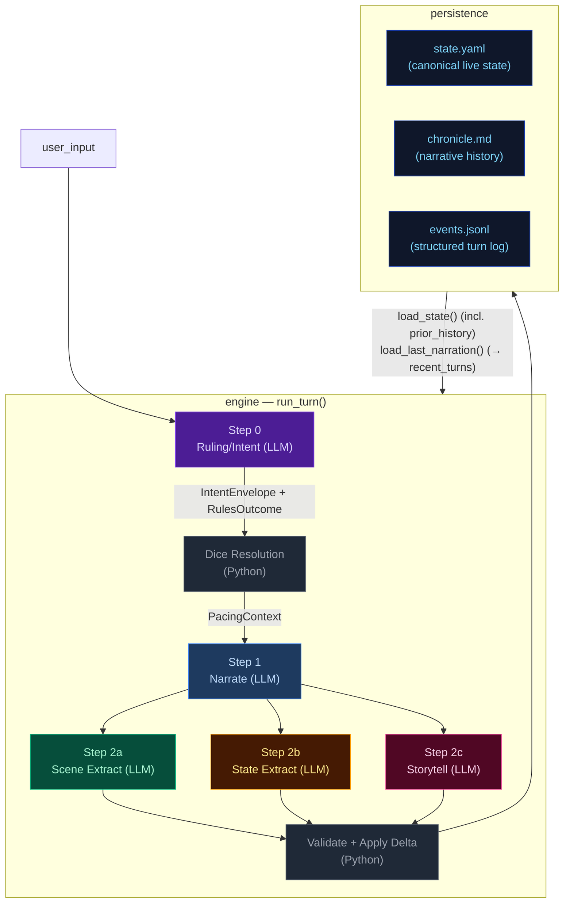

## Pipeline Quick Reference

| Step | Docs | When it runs | Key inputs | Key outputs | Mechanics it owns |
|---|---|---|---|---|---|
| **Step 0 — Ruling/Intent** | [step0-ruling](./step0-ruling.md) | Every turn (always) | `state.pc`, `state.location`, `recent_turns[-1:]`, `user_input` | `IntentEnvelope`, `RulesOutcome` | Intent classification, impossibility check, scene motion determination, dice roll resolution (1d12 + stat + cond − diff → band), difficulty selection, anti-declare-outcome enforcement. When `impossible=true`, no roll occurs and Python synthesizes a `fail` outcome. |
| **Step 1 — Narrate** | [step1-narrate](./step1-narrate.md) | Every turn (always, streamed) | Full `state`, `prior_history` (last 20 bullets, all but last rendered), `recent_turns[-1:]`, `pacing_context`, `pending_gm_beat`, `npc_roster` (from build_npc_roster()), `world_factions/locations` | `narrative` (prose) | Prose generation, dice-band binding, GM-beat consumption. Scene motion shaped by `PacingContext.outcome_hint`; impossible actions narrated as natural failures. |
| **Step 2a — Scene Extract** | [step2a-scene](./step2a-scene.md) | Every turn (always) | `narrative`, `state.pc/location`, `npc_roster` (from build_npc_roster()), conditions, compendium entries | `SceneExtractResult`: scene_tags, tagline, location_change, compendium_npc_update | NPC presence, location changes, scene tags, durable NPC compendium identity. |
| **Step 2b — State Extract** | [step2b-state](./step2b-state.md) | Every turn (always) | `narrative`, `state.pc/location/inventory`, conditions | `StateExtractResult`: inventory_add/remove/update, pc_condition_add/remove | Inventory delta accuracy, condition lifecycle. |
| **Step 2c — Storytell** | [step2c-storytell](./step2c-storytell.md) | Every turn (always) | `narrative`, `_ExtractionContext` (comp_this_turn, location, inventory, conditions), pacing_context, arc.threads[], recent_turns[-10:], band, npc_roster (from build_npc_roster()), recent_beats | `StorytellerResult`: thread_update/goal_update/arc_resolve/resolve/add, gm_beat, actions, outcome_summary | Storyteller-managed thread lifecycle, arc resolution, beat disposition inference, durable history events. |

After Step 2c: results merge into a `StateDelta`, the validator checks constraints
(e.g. `inventory_remove` IDs exist), `apply_delta()` mutates state in-place, and the
turn is persisted. The next turn's Step 0 reads the new `state.yaml` plus `events.jsonl`.

## Subsystem Docs

| Subsystem | Doc | What it covers |
|---|---|---|
| **Step 0 — Ruling** | [step0-ruling](./step0-ruling.md) | Intent classification, dice resolution flowchart, pacing context computation |
| **Step 1 — Narrate** | [step1-narrate](./step1-narrate.md) | Streaming narration pipeline with all context inputs |
| **Step 2a — Scene Extract** | [step2a-scene](./step2a-scene.md) | Location changes, NPC presence, scene tags |
| **Step 2b — State Extract** | [step2b-state](./step2b-state.md) | Inventory and condition extraction |
| **Step 2c — Storytell** | [step2c-storytell](./step2c-storytell.md) | Pipeline mechanics, GM beat lifecycle, campaign arc system, thread lifecycle mechanics |
| **Delta → Validate → Apply** | [delta-validate](./delta-validate.md) | StateMerge schema, validation rules, apply_delta mutations |
| **Persist** | [persist](./persist.md) | Atomic writes (events.jsonl, state.yaml, chronicle.md), readback |
| **Cross-Pipeline Data Flow** | [cross-pipeline](./cross-pipeline.md) | Full inter-step data flow diagram |
| **Out-of-Band Pipelines** | [out-of-band](./out-of-band.md) | Character Creation pipeline, Generate Seed pipeline, turn viewer status colors |
| **Narration UI** | [narration-ui](./narration-ui.md) | Main game interface: SSE streaming, HTMX sidebar refresh, Alpine.js state machine |
| **Turn Viewer UI** | [turn-viewer-ui](./turn-viewer-ui.md) | Pipeline debug UI: turn cards, stage inspector, diff panel, live updates |
| **Eval Harness** | [eval-harness](./eval-harness.md) | Scenario runner, LLM judges, auto-checkers, REPORT.md generation |

## Key Models Glossary

### Core Result Types

- **IntentEnvelope**: `intent`, `intent_verb`, `target`, `check.required`, `check.skill`, `check.difficulty`, `impossible`, `impossible_reason`, `scene_motion`
- **RulesOutcome**: `rolled`, `skill`, `difficulty`, `stat_value`, `stat_mod`, `diff_mod`, `cond_mod`, `dice`, `raw_total`, `final_total`, `band`, `directive`, `intent`, `intent_verb`, `impossible`, `impossible_reason`
- **SceneExtractResult**: `scene_tags`, `scene_tagline`, `location_change`, `compendium_npc_update`
- **StateExtractResult**: `inventory_add/remove/update`, `pc_condition_add/remove`
- **StorytellerResult**: `thread_update` (list[ThreadUpdate]), `goal_update` (str | None, applied directly to arc dict), `arc_resolve` (ArcResolution | None), `thread_resolve` (with outcome sentence + promote_to_world_state flag), `thread_add`, `gm_beat`, `actions`, `outcome_summary`
- **SeedEnvelope**: `seed_state: GameState`, `opening_narrative`, `actions`, `arc: CampaignArc` (includes `goal_context` — UI-only, not rendered in prompts; unified `threads[]` with `progress: list[ProgressEntry]`, `completed_threads[]`)

  The seed owns first-turn emotional framing, not just world and arc scaffolding. It generates `goal_context` (character-specific stake), NPC `relation` fields (narrative job relative to PC), and action text written from the PC's voice and scene pressure — ensuring the opening feels personal and motivated from the start.

### PacingContext (see [step0-ruling](./step0-ruling.md#pacing-context))

### GMBeat (see [step2c-storytell](./step2c-storytell.md#gm-beat))

### CampaignArc (see [step2c-storytell](./step2c-storytell.md#campaign-arc-system))

### StateDelta (see [delta-validate](./delta-validate.md))

Merges all three extraction results. Contains `scene_tags`, `location_change`, `compendium_npc_update` (NPC changes), `thread_update/arc_resolve/thread_resolve/thread_add`, `inventory_add/remove/update`, `pc_condition_add/remove`. Note: `gm_beat` is NOT in StateDelta — written directly to `state.meta.pending_gm_beat`.

---


## cross-pipeline


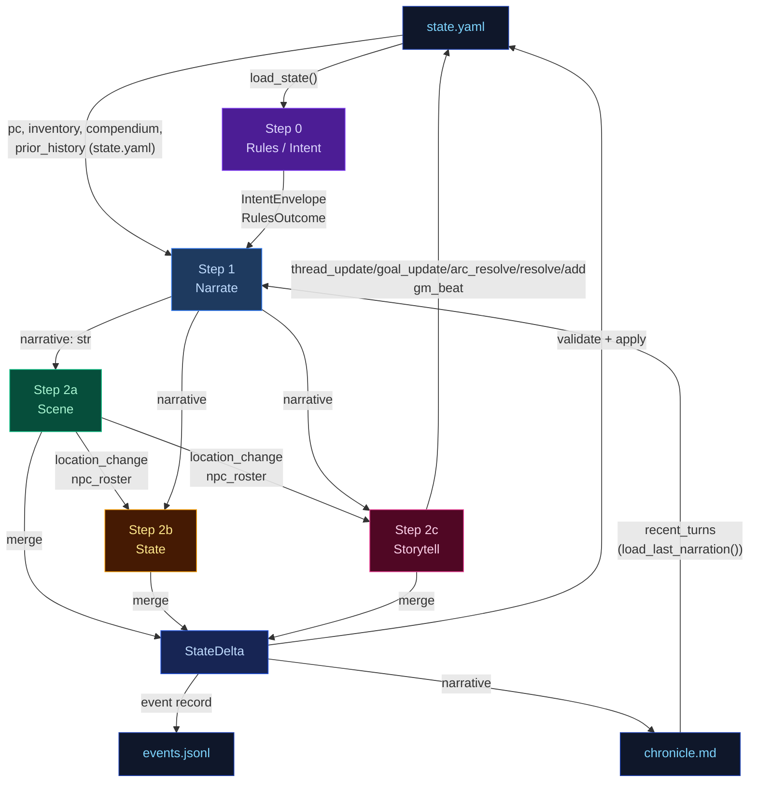

---


## delta-validate


The three extraction results merge into a single `StateDelta`, then validate and apply.

## Flowchart

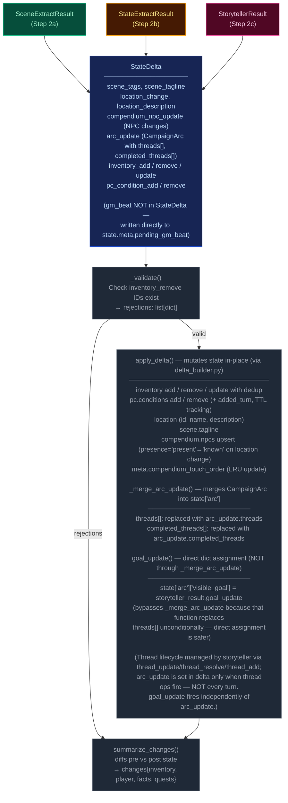

---


## narration-ui


The primary player-facing UI. Renders game state, streams narrative tokens live, and refreshes sidebars via HTMX partial swaps. Single-page app driven by Alpine.js + SSE + HTMX.

## Interaction Model

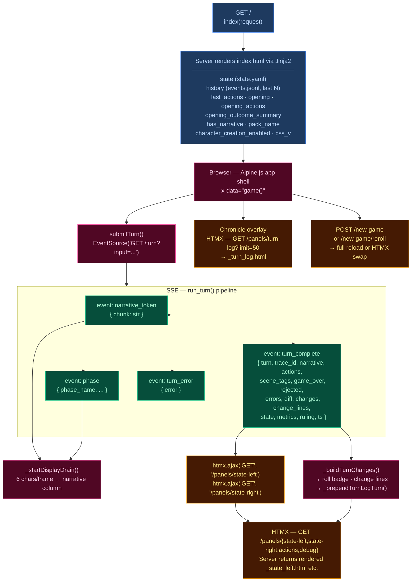

## Layout

| Region | Element | Content |
|--------|---------|---------|
| **Header** | `.header-bar` | Logo/tagline, Chronicle toggle, turn counter, retry button, new game button, reroll button (dynamic packs), mock-mode dot |
| **Left sidebar** | `.sidebar-left` | Player card, scene NPCs, location, arc, compendium — loaded via `/panels/state-left` |
| **Narrative column** | `.narrative-column` | Scrollable narrative blocks, action pills, input textarea, send/stop button |
| **Right sidebar** | `.sidebar` (right) | Inventory, recent events, world state, debug panel — loaded via `/panels/state-right` |
| **Chronicle overlay** | `.turn-log-shell` | Floating overlay over narrative column, populated by `/panels/turn-log?limit=50` |
| **New Game modal** | (Alpine `x-show`) | Pack picker → char creation / world builder steps |

## Data Flow

### Turn submission (Alpine.js + SSE)

1. User types input, presses Enter → `game().submitTurn()`
2. Opens `EventSource` to `GET /turn?input=<text>` — SSE endpoint in `routes.py:83`
3. Server streams events as the 5-stage pipeline (`run_turn()`) executes:
   - `narrative_token` — token chunks streamed as they arrive from LLM
    - `phase` — pipeline phase progress (ruling_start, narrate_start, narrate_first_token, narrate_done, extract_start, extract_done, sanitize_start, sanitize_done, persist)
   - `turn_complete` — final result
   - `turn_error` — error payload
4. Client `_startDisplayDrain()`: reveals 6 characters per animation frame for smooth streaming
5. On `turn_complete`:
   - Calls `htmx.ajax('GET', '/panels/state-left', ...)` and `htmx.ajax('GET', '/panels/state-right', ...)` to refresh sidebars
   - Renders change lines (`_buildTurnChanges`), roll badge
   - Prepends turn to Chronicle overlay via `_prependTurnLogTurn`
   - Re-renders markdown via `marked.parse()`

### HTMX partial endpoints (routes.py)

| Route | Template | Purpose |
|-------|----------|---------|
| `GET /panels/state-left` | `_state_left.html` | Left sidebar — player, NPCs, location, arc, compendium |
| `GET /panels/state-right` | `_state_right.html` | Right sidebar — inventory, events, world state, debug |
| `GET /panels/actions` | `_actions.html` | Action pills (fallback) |
| `GET /panels/turn-log?limit=N` | `_turn_log.html` | Chronicle — turn history with change lines |
| `GET /panels/pack-picker` | `_pack_picker.html` | New Game — pack selection cards |
| `GET /panels/char-creation` | `_char_creation.html` | New Game — character stats builder |
| `GET /panels/world-builder` | `_world_builder.html` | New Game — world creation form |
| `GET /panels/debug` | `_debug.html` | Debug panel — recent turn timings, errors |
| `GET /panels/state` | `_state.html` | Combined left+right (legacy) |

### Client state machine (`game()` — inline `<script>` in index.html)

Alpine.js `x-data="game()"` manages:
- `input` — textarea value
- `submitting` — turn-in-progress flag
- `gameStarted` — derived from `has_narrative`
- `turnNum` — current turn counter
- `leftWidth` / `rightWidth` — resizable sidebar widths (persisted to `localStorage`)
- Card collapse state — read/written directly from/to `localStorage` via `CCYA_CARD_KEY(name)` helper, using DOM `data-card` attributes; no Alpine data property

## UI Features

### Resizable sidebars
- Drag gutters with mousedown/mousemove handlers
- Widths saved to `localStorage` (`ccya_sidebar_left`, `ccya_sidebar_right`)
- Minimum width enforcement (240px left, 220px right)
- **Reset button** in sidebar footer: restores viewport-aware defaults (left 320px, right 280px) on click
- **Ultrawide override** (≥2561px viewport): `--sidebar-w: min(512px, 38vw)` — sidebar defaults to 2x standard width. Sidebar text scaled ~25% smaller via explicit `.sidebar-card-header`, `.stat-row`, `.npc-notes-inline`, `.inventory-item`, etc. overrides in the ultrawide media query.

### Collapsible cards
Each sidebar section has a collapse toggle; open/closed state persisted per-card to `localStorage` via `ccya_card_<name>` key.

### Action pills
Suggested next actions rendered as buttons that populate the input on click. Updated from `turn_complete.actions` or via HTMX panel refresh.

### Roll badge
Server-rendered for history, JS-built for new turns. Shows dice math, band label, outcome summary. Band colors: `crit_fail` (red) → `fail` → `setback` → `partial` → `success` → `crit_success`.

### Change lines
Grouped by category via emoji prefix:
| Emoji | Category | Class |
|-------|----------|-------|
| 🎒 + | Inventory gain | `.tc-inv-gain` |
| 🎒 − | Inventory loss | `.tc-inv-loss` |
| 🩺 | Player condition | `.tc-pl` |
| 📍 | Location | `.tc-loc` |
| 📜 | Faction/arc | `.tc-fa` |

### Retry
`POST /turn/delete` removes last event from `events.jsonl` and `chronicle.md`, returns previous actions for re-submission.

### New Game
`POST /new-game` with optional `pack_id`, `pc_name`, `pc_stats`, `hints`. For dynamic packs, triggers `generate_seed()` LLM pipeline. Full page reload on success. Reroll (`POST /new-game/reroll`) HTMX-swaps the opening narrative + actions.

## CSS Architecture

- **`app.src.css`** — Tailwind + custom styles split by region:
  - App shell layout (CSS Grid: header + body with sidebar-gutter-main-gutter-sidebar)
  - Narrative blocks (`.narrative-block`, `.narrative-text`)
  - Sidebar cards (`.card`, `.card-header`, `.card-body`)
  - Input bar (`.input-bar`, `.game-input`, `.send-btn`)
  - Action pills (`.action-pill`, `.pills-row`)
  - Roll badges (`.roll-badge`, `.roll-band--*`)
  - Chronicle overlay (`.turn-log-shell`, `.turn-log-panel`)
  - New Game modal (`.modal-overlay`, `.pack-card`)
  - Progress strip, tooltips, scrollbar styling
  - Design tokens via CSS custom properties (`--text-primary`, `--bg-card`, `--status-*`)
- **Fluid typography**: 3-tier `@media` breakpoints set `html { font-size: clamp(...) }`:
  | Viewport | Font size clamp | Applicable to |
  |---|---|---|
  | 769–1400px | `clamp(15px, 1vw, 17px)` | Tablet/small desktop |
  | 1401–2560px | `clamp(22px, 1.56vw, 26px)` | Standard desktop |
  | ≥2561px | `clamp(24px, 1.5vw, 27px)` | Ultrawide (also sets `--sidebar-w: min(512px, 38vw)`) |
  - Font sizes throughout are in `rem` units, scaling proportionally with the base.
- **Location panel fix**: Hardcoded `px` font sizes replaced with `rem` units to respect fluid base.
- Compiled to **`app.css`** with cache-busting via `css_v` query param

## Server Entry Point

`routes.py:57` — `GET /` handler assembles template context from `state.yaml`, `events.jsonl`, pack manifest, and engine config, then renders `ccya/templates/index.html`.

---


## out-of-band


These run only at new-game time or are non-engine concerns. They are excluded from the eval-context region of the main architecture doc.

## Character Creation Pipeline

Triggered by `POST /new-game`. All packs use the Generate Seed pipeline (dynamic). Static packs with pre-built seed_state.yaml exist but are not used by new_game.

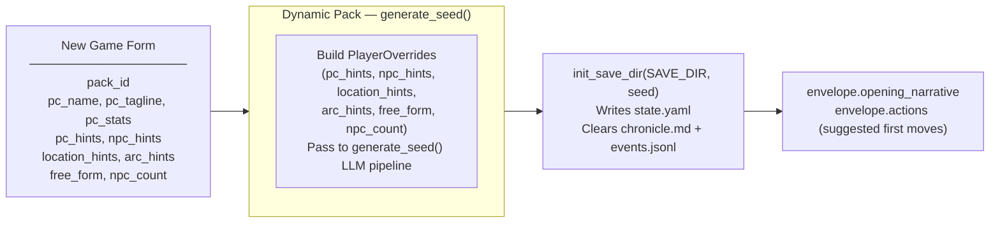

## Generate Seed Pipeline (Dynamic Packs Only)

Called by `POST /new-game` and `POST /new-game/reroll`. Generates a complete starting game state (PC, NPCs, location, arc, opening narrative, actions) from the pack manifest and optional player overrides.

The seed owns **first-turn emotional framing** — not just world and arc scaffolding. Every seed element must produce an emotionally legible opening that answers: why this moment matters now, what the character stands to lose, and why at least one person in the scene matters to them personally.

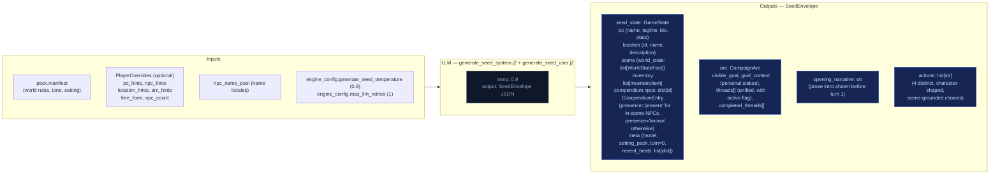

### Seed emotional framing contract

The seed prompt (`generate_seed_system.j2`) enforces these requirements:

- **`goal_context`**: 2–3 sentences explaining why `visible_goal` matters to this character specifically — inner cost or pressure that makes it emotionally loaded. No hidden-truth spoilers, no restating `visible_goal`, no direct statement of the thematic question. Must connect character motive, story stakes, and emotional cost.
- **NPC `relation` field**: Each opening NPC has a defined narrative job. One NPC is personally tied to the PC's motive or vulnerability; the other carries immediate external pressure from the world or conflict. The `relation` field encodes PC-facing relevance (e.g. "owes them a favor", "is their only contact here", "represents the institution pressing on them").
- **Compendium NPCs**: The seed also generates 2–3 NPCs in `compendium.npcs` (name, title, bio) who exist in the world but are not present in the opening scene. Their bios tie them to factions, locations, or world pressures, not to the immediate situation. These become discoverable characters during play.
- **Action guidance**: Each of the 4 choices is written from the PC's point of view, grounded in a present NPC, immediate risk, active thread, or character motive. They differ in emotional posture (confront, deflect, investigate, protect, exploit, withdraw, etc.) and avoid generic verbs.
- **`threads[]`**: Unified list (not split active/latent) where each thread has `{id, summary, urgency, scope}` and an `active` boolean flag managed by the storyteller via `thread_update`, not Python age rules. Threads have a `progress: list[str]` field — append-only log of progress updates set via `thread_update[].progress`, never replaced. Also includes `last_updated_turn: int | None` for urgency decay tracking.

## Turn Viewer — status colors

The standalone turn viewer ([turn-viewer-ui](./turn-viewer-ui.md)) uses the same semantic status colors as the CSS custom properties in `static/app.src.css` (`--status-*`). The stage colors used in the diagrams above (`stageRules` violet → `stageNarrate` blue → `stageScene` green → `stageState` amber → `stageProgress` pink) map directly to the `--stage-*` tokens. Cross-stream inputs into a step are shown in `xstream` (purple outline) and LLM/Python boxes use neutral dark fills. This table is the canonical turn-viewer status legend.

| Token | Meaning |
|-------|---------|
| `--status-ok` | Stage ran and completed (no extraction error). |
| `--status-skipped` | Stream was skipped (no longer used — all streams always run). |
| `--status-retried` | LLM output required a parse retry (`attempts` > 1 in event). |
| `--status-rejected` | Post-extract validation rejected part of the delta (e.g. bad `inventory_remove`). |
| `--status-error` | LLM call or parse ultimately failed for that stream. |
| `--status-neutral` | Non-fatal / informational (e.g. rules path with no dice roll). |

Stage accent stripes use `--stage-rules`, `--stage-narrate`, `--stage-scene`, `--stage-state`, `--stage-progress` for quick scanning; **status** always wins for the prominent left border.

---


## persist


Atomic writes to disk. No LLM calls.

## Flowchart

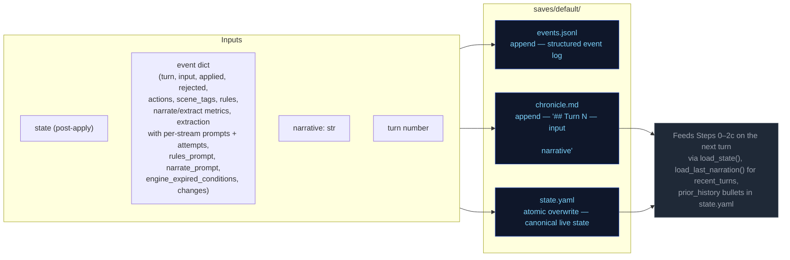

---


## step0-ruling


Classifies the player's action, determines whether a dice check is needed, and
identifies which state domains will be active — narrowing every downstream extractor.

## Flowchart

```mermaid
flowchart LR
    classDef stageRules fill:#4c1d95,color:#ddd6fe,stroke:#7c3aed
    classDef llmNode    fill:#0f172a,color:#94a3b8,stroke:#334155
    classDef pyNode     fill:#1f2937,color:#9ca3af,stroke:#4b5563
    classDef outNode    fill:#3b0764,color:#e9d5ff,stroke:#7c3aed

    subgraph IN["Inputs"]
        I1["state.pc<br>(name, stats, conditions)"]
        I2["state.location"]
        I3["recent_turns[-1:]<br>(last turn's full narrative from chronicle.md<br>via load_last_narration();<br>ruling user prompt)"]
        I4["user_input"]
    end

    subgraph LLM0["LLM — ruling_system.j2 + ruling_user.j2"]
        L0["temp: 0.2 · max_retries: 1<br>output: IntentEnvelope JSON<br>(intent, impossible, scene_motion, check)"]:::llmNode
    end

    subgraph PYRES["Python — impossible check + rules.resolve_check()"]
        P0["if impossible=true:<br>  synthesize fail outcome<br>  skip roll, apply momentum<br>else:<br>  roll 1d12 + stat_mod + cond_mod − diff_mod<br>  map total → Band"]:::pyNode
    end

    subgraph OUT["Outputs"]
        O1["IntentEnvelope<br>  intent: str<br>  intent_verb: str<br>  target: str<br>  impossible: bool<br>  impossible_reason: str<br>  scene_motion: hold|advance|transition<br>  check.required: bool<br>  check.skill: SkillName<br>  check.difficulty: Difficulty"]:::outNode
        O2["RulesOutcome<br>  rolled: bool<br>  skill, difficulty, stat_value, stat_mod<br>  diff_mod, cond_mod<br>  dice: list[int]<br>  raw_total, final_total: int<br>  band: Band<br>  directive: str<br>  intent, intent_verb: str<br>  impossible: bool<br>  impossible_reason: str"]:::outNode
    end

    IN --> LLM0
    LLM0 -- "IntentEnvelope" --> PYRES
    PYRES --> OUT
```

## Impossibility check

The ruling LLM evaluates whether the described action is impossible given the character's state, inventory, and scene. An action is impossible when:

- It requires an item the character does not have (firing a gun with no ammo, using a key never acquired)
- It requires a capability contradicted by active conditions (climbing with a broken leg, sneaking while armored and noisy)
- It acts on something not present in the scene (targeting an NPC who is not here, opening a door that doesn't exist)

When `impossible=true`: Python sets `check.required=False`, synthesizes a `RulesOutcome` with `band="fail"` and `rolled=False`, applies momentum, and skips the dice roll entirely. The narrator renders the impossible fact and narrates the natural failure.

## Scene motion

The ruling LLM also determines how the scene should progress: `"hold"` (scene continues at current pace), `"advance"` (something significant happens/resolves), or `"transition"` (player is leaving, write the arrival). This feeds into `_compute_pacing_context()` which produces `outcome_hint` for the narrator.

## Key forward dependency

`rules_outcome` feeds into `_compute_pacing_context()` which produces the single authoritative `PacingContext` struct passed to both Narrator and Storytell pipeline.

## Pacing Context

All pacing signals are collapsed into one Python-computed struct (`PacingContext`) passed to both the Narrator and Storytell pipeline. This replaces six independent fields (`narration_directive`, `deescalate`, `narrative_velocity`, `beat_disposition` output, `quest_threshold_directive`, and stale momentum-derived signals). The narrator receives `outcome_hint` (scene motion); Storytell receives the full struct including `directive`.

### Struct definition

```
PacingContext:
  directive: str           # "" | "Breathe" | "Scene Imperative" | "Overwhelm" | "Pressure" | "Tension" | "Scene Pressure" (may include "; Resolve a Threat" secondary when beat_locked); used by Storytell pipeline
  outcome_hint: str | None # "hold" | "advance" | "transition" — narrator's primary scene motion instruction
  beat_locked: bool        # True: consecutive pressure threshold reached or momentum at floor — enables floor relief injection (when not from momentum) and may append "; Resolve a Threat" to directive (except when directive="Breathe")
  gate: str                # "block_escalate" | "allow" (controls thread_add); set independently from beat_locked via deescalate >= 0.5
  summary: str             # human-readable log string, never sent to LLM
```

`beat_locked: True` fires when either `consecutive_pressure_turns >= config.consecutive_pressure_threshold` OR `momentum <= config.momentum_floor`. When locked, `"Resolve a Threat"` is appended to the directive via semicolon (except when directive="Breathe"). The `gate` field prevents Progress from adding new threads during de-escalation windows.

### Computation

`_compute_pacing_context()` in `engine/turn.py` consolidates pacing computation (replacing the former scattered functions: `_compute_narration_directive`, `_compute_narrative_velocity`, `_check_floor_relief`). It takes inputs (`momentum`, `consecutive_pressure_turns` from state meta, `arc.threads[] scope=scene urgency counts`) and returns a single struct with directive derived from a priority stack. It also computes `outcome_hint` from the ruling LLM's `scene_motion` and PacingContext escalation signals: ruling `scene_motion` takes priority (`transition` > `advance` > fallback), then `impossible=true` forces `advance`, then Python escalation signals (`beat_locked`, Overwhelm/Pressure with urgent threads) produce `advance`, defaulting to `hold`.

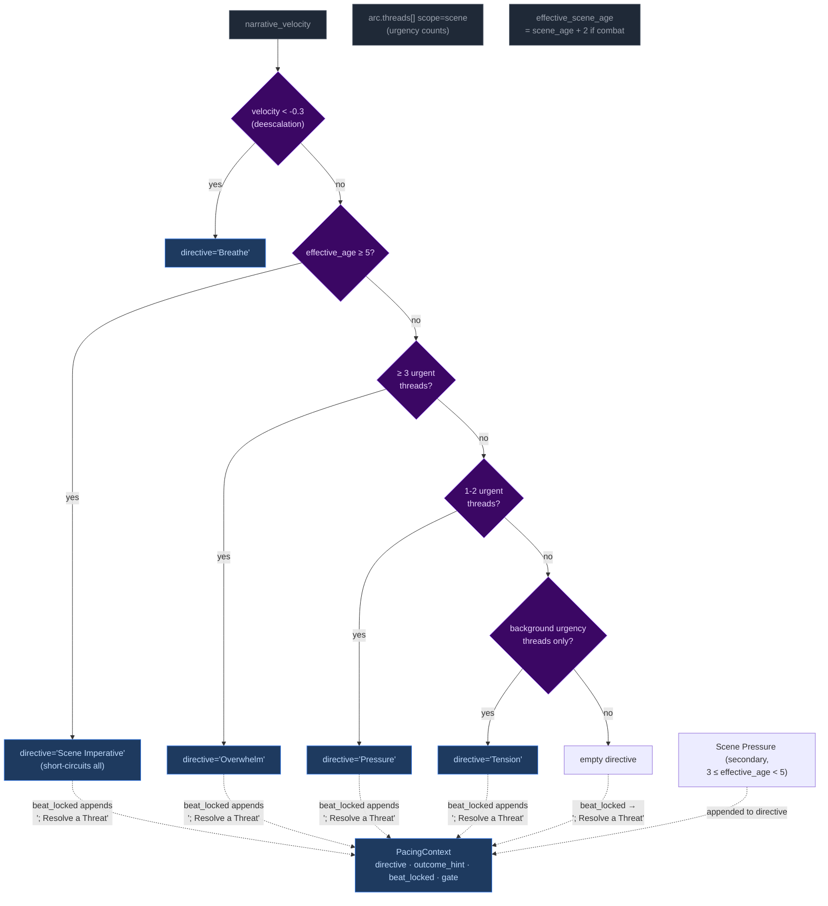

Priority order (highest to lowest): **Breathe > Scene Imperative > Overwhelm > Pressure > Tension > Scene Pressure**. The `beat_locked` flag fires when either consecutive pressure threshold or momentum floor is reached — `"Resolve a Threat"` is appended to the directive (except when directive="Breathe") and `outcome_hint` is set to `"advance"`. Floor relief injection only fires when beat_locked stems from consecutive_pressure, not from momentum_floor. The gate is NOT affected by beat_locked (set independently by deescalate ≥ 0.5).

**Breathe secondary guard:** The Breathe directive has an additional check beyond velocity: if urgent scene-scoped threads exist, Breathe is NOT emitted even if `narrative_velocity < -0.3`. Low velocity during unresolved tension (tactical avoidance, stealth) does not trigger de-escalation. Once urgent threads resolve, Breathe fires on the next low-velocity turn.

#### Age computation

`_compute_ages(state)` returns only `{"scene_age": scene_age}` — location_age and combat_age removed in Phase 03 pacing overhaul. The ruling phase pre-computes `effective_scene_age = scene_age + 2` when `"combat"` is in scene tags, stored in `ctx._ages["effective_scene_age"]`. This single-age signal drives all directive thresholds:
- Scene Imperative (≥5 effective age): high-priority directive forcing story advancement
- Scene Pressure (3 ≤ effective_age < 5): secondary append to wind down or shift focus

### Wiring

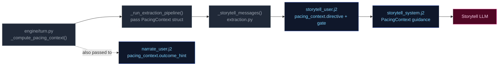

1. **Computed** once in `run_turn()` via `_compute_pacing_context()`.
2. **Passed through** `_run_extraction_pipeline()` → both `_narrate_messages()` and `_storytell_messages()`.
3. **Narrator template** (`narrate_user.j2`) renders `outcome_hint` (scene motion: hold/advance/transition) with value-specific guidance. No Jinja2 pacing computation remains — all pacing computed by Python.
4. **Storytell template** ((`storytell_system.j2` + `user.j2`)) receives the full struct; guidance maps each directive to appropriate thread/beat actions:

| Directive | Thread action | Gate |
|-----------|---------------|-------|
| **"Breathe"** (de-escalation, velocity < -0.3) | Do NOT add new threads. Allow existing scene threads to persist without escalation. | `block_escalate` (set by deescalate ≥ 0.5; beat_locked does NOT force-close gate) |
| **"Scene Imperative"** (effective_age ≥ 5) | Story must advance — introduce new development forcing resolution or movement; do not linger | Varies by context |
| **"Overwhelm"** (3+ urgent threads) | May add scene-scoped threads if gate allows; emit pressure/escalation beat | `allow` |
| **"Pressure"** (1-2 urgent threads) | Advance relevant scene/arc threads. Add new thread only if gate permits. | Varies by context |
| **"Tension"** (background urgency only) | Do NOT add pressures unless concrete threat emerges; prefer advancing existing threads | Allow |
| **"Scene Pressure"** (3 ≤ effective_age < 5, secondary append) | Begin winding down or introduce reason to shift focus: development elsewhere, closing window | Varies by context |
| **"" (empty)** | No action required beyond normal aging of silent threads. | Allow |

**Note:** Directives may include secondary modifiers joined by semicolons (e.g., "Pressure; Resolve a Threat" when beat_locked). The primary directive drives thread/beat logic; the secondary (`; Resolve a Threat`) acts as thematic guidance for beat type selection. "Resolve a Threat" never appears as a standalone primary directive — it is only appended by the `beat_locked` mechanism (except Breathe, which never receives this append regardless of beat_locked state).

### Consecutive pressure counter

`state["meta"]["consecutive_pressure_turns"]` tracks how many consecutive turns have had pressure-type storyteller beats. Re-keyed from directive tracking (which never fired — Pressure/Overwhelm directives were unreachable) to beat-type tracking:

- **Increments** when `storyteller_result.gm_beat.type` is `"pressure"`, `"escalation"`, or `"complication"`.
- **Resets to 0** on any other beat type, null beat, or missing storyteller output.

When this counter reaches `config.consecutive_pressure_threshold` (default 3), it triggers `beat_locked` alongside the momentum floor fallback (`momentum <= -3`). `beat_locked` appends `"; Resolve a Threat"` to the directive (except when directive="Breathe") and enables floor relief injection (when not from momentum).

---


## step1-narrate


Generates the narrative prose the player reads. Tokens are streamed to the client.

## Flowchart

```mermaid
flowchart LR
    classDef llmNode   fill:#0f172a,color:#94a3b8,stroke:#334155
    classDef xstream   fill:#4c1d95,color:#ddd6fe,stroke:#7c3aed
    classDef outNode   fill:#1e3a5f,color:#bfdbfe,stroke:#3b82f6

    subgraph IN["Inputs"]
        N1["state (full —<br>pc, location, scene,<br>inventory, compendium)"]
        N2["prior_history<br>(last 20 incremental history bullets, all but last rendered as bullets)"]
        N3["recent_turns[-1:]<br>(single most recent turn as full text)"]
        N4["rules_outcome<br>(band, directive, impossible, dice summary)"]:::xstream
        N6["npc_name_pool (cultural name list)"]
        N7["npc_roster<br>(from build_npc_roster(comp),<br>  presence field: present/nearby/known)"]
        N9["world_factions<br>(immutable trace)"]:::xstream
        N10["pending_gm_beat<br>(type · surface_as metadata)"]
        N11["pacing_context<br>(outcome_hint)<br>from _compute_pacing_context()"]:::xstream
        N15["user_input"]
    end

    subgraph LLM1["LLM — narrate_system.j2 + narrate_user.j2"]
        NL["temp: 0.9 · streaming: yes<br>output: prose narrative (str)"]:::llmNode
    end

    subgraph OUT["Outputs"]
        NO1["narrative: str<br>(streamed as tokens → client<br>then joined + thinking-stripped)"]:::outNode
        NO2["narr_metrics<br>  first_token_ms<br>  total_ms<br>  tokens_in / tokens_out"]
    end

    IN --> LLM1
    LLM1 --> OUT
```

## Arc context in narration

The narrator receives `current_arc` in both system and user prompts. Key fields:

- **`goal_context`**: A seed-time field (2–3 sentences) explaining why `visible_goal` matters to the character specifically — inner cost or pressure that makes it emotionally loaded. UI-only (surfaced as tooltip on the arc goal in the sidebar). NOT rendered in prompt context — the narrator works from general early-turn behavioral guidance in the system prompt, not from the raw `goal_context` value.
- **`visible_goal`**: The player-facing objective.
- **`threads[]`**: Unified thread collection filtered by `active` flag. Scene-scope threads provide immediate pressure; arc-scope threads provide medium-term tension.
- **`resolved_arc`**: TTL-filtered list of previously resolved arcs, providing narrative continuity across arc transitions.

### Opening-turn narrative mode

The seed embeds emotional stakes in the initial state — NPC `relation` fields, `motivation/fear/leverage`, and a `goal_context` sidebar entry. The narrator does NOT receive special early-turn prompt guidance or `goal_context` in its context. Instead, the initial scene's NPCs (with rich behavioral drivers), the opening narrative's tone, and the player-facing sidebar create the onboarding experience. The narrator works from its standard behavioral guidance and the richness of seed-generated state.

## Key forward dependency

`narrative` is the primary content input for all three extraction streams below.

### GM Beat consumption

The narrator receives a pending GM beat from `state.meta.pending_gm_beat` (set by Storytell in the previous turn). The beat's `type` and `surface_as` metadata are passed alongside the pacing directive as creative guidance for the narrative. The beat is NOT cleared after narration — it persists through the extraction phase. After extraction completes, Storytell replaces it with a new beat or pops it on null output. Full beat lifecycle is documented in [step2c-storytell](./step2c-storytell.md#gm-beat).

---


## step2a-scene


Extracts location changes, NPC presence, scene tags, and suggested actions from the narrative.

## Flowchart


## Key forward dependency

`location_change` flows into `extraction_ctx` (built by `_build_extraction_context`). Step 2c also receives `npc_roster` (from build_npc_roster()) built from comp_this_turn. No forward-facing mechanics (`thread_add`, `gm_beat`) are emitted by this stream — they go through the unified thread lifecycle via Storytell (Step 2c).

---


## step2b-state


Extracts inventory changes and player condition mutations from the narrative.

## Flowchart

```mermaid
flowchart LR
    classDef llmNode fill:#0f172a,color:#94a3b8,stroke:#334155
    classDef xstream fill:#4c1d95,color:#ddd6fe,stroke:#7c3aed
    classDef outNode fill:#451a03,color:#fde68a,stroke:#f59e0b

    subgraph IN["Inputs"]
        S1["narrative (from Step 1)"]:::xstream
        S2["state.pc (name, bio, stats, conditions)"]
        S3["state.location"]
        S4["state.inventory"]
        S5["intent: str<br>(from Step 0)"]
    end

    subgraph LLM2B["LLM — extract_state_system.j2 + extract_state_user.j2"]
        SL["temp: 0.4 · max_retries: 1<br>output: StateExtractResult JSON"]:::llmNode
    end

    subgraph OUT["Outputs — StateExtractResult"]
        O1["inventory_add: list[InventoryItem]<br>  id, name, notes, amount"]:::outNode
        O2["inventory_remove: list[InventoryRemove]<br>  id, amount (None = full stack)"]:::outNode
        O3["inventory_update: list[InventoryUpdate]<br>  id, name?, notes?"]:::outNode
        O4["pc_condition_add: list[ConditionAdd]<br>  id, label, description"]:::outNode
        O5["pc_condition_remove: list[ConditionRemove]<br>  id"]:::outNode
    end

    IN --> LLM2B
    LLM2B --> OUT
```

## Key forward dependency

Step 2c receives `npc_roster` (from build_npc_roster()) and `location_change` from Step 2a. Cross-stream items_gained/lost were removed — extraction_ctx now covers all this-turn derived data.

---


## step2c-storytell


Extracts thread updates, arc actions, and durable NPC compendium changes. World state changes happen only via thread resolution `promote_to_world_state`.

## Flowchart


## Always runs

Storytell is the post-narration storytelling brain. It always executes every turn (never skipped) and feeds next turn's rules call via `thread_update/goal_update/arc_resolve/thread_resolve/thread_add` (storyteller-managed thread lifecycle), and `gm_beat` (forward-facing beats stored in `state.meta.pending_gm_beat`). World state changes are promotion-only — emitted via `thread_resolve[].promote_to_world_state`.

## GM Beat

Forward-facing storytelling beats that shape scene progression across turns. Beats are emitted by Storytell (Step 2c), consumed by Narrator (Step 1) the following turn, and managed via a write/expiry lifecycle in `state.meta.pending_gm_beat`.

### GMBeat Schema

```
GMBeat
  type: complication | revelation | opportunity | breathing_room | pressure | twist | setback | escalation | callback
  surface_as: ambient | event | npc_behavior | environmental | player_discovery | item (default: ambient)
  beat_expires_turn: int | None — turn number at which the beat expires; set to turn_no + 2 when stored
```

**Validation:** Only `type` is validated by `StorytellerResult._nullify_invalid_gm_beat` — nullified if type is falsy or not in the valid set. No validation on `surface_as`. Python accepts whatever gm_beat the LLM emits with no correction or override.

### PacingContext Beat Fields

The beat system intersects with pacing via two fields in `PacingContext` (see [step0-ruling](./step0-ruling.md#pacing-context)):

| Field | Type | Meaning |
|-------|------|---------|
| `directive` | str | May include secondary modifier `"; Resolve a Threat"` when `beat_locked=True` (except Breathe). Drives storytell guidance for beat type selection. |
| `beat_locked` | bool | True when either `consecutive_pressure_turns >= threshold` OR `momentum <= momentum_floor`. When locked, `"Resolve a Threat"` is appended to the directive (except Breathe). Enables floor relief to inject a breathing_room beat if the storyteller is stuck in a pressure-type loop (only when not from momentum floor). |

### Beat Lifecycle — Turn Sequence

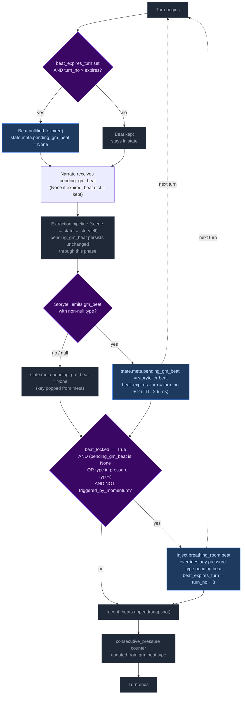

**Step 1 — Pre-narration expiry check.** At the start of each turn, the engine reads `state.meta.pending_gm_beat` from the previous turn. If `beat_expires_turn` is set and the current turn number exceeds it, the beat is nullified (key set to None). Otherwise it proceeds to narration.

Note: This expiry runs early enough that the beat is gone before the extraction phase begins. This is intentional — it creates clean state for floor relief to inject breathing_room if `beat_locked` is active and storyteller doesn't provide its own non-pressure beat. Without the pre-narration expiry, a stale expired beat could block floor relief's null check.

**Step 2 — Narration consumption.** The beat is passed to the narrator via `_narrate_messages(pending_gm_beat=...)`. The narrator uses the beat's `type` and `surface_as` metadata as creative guidance alongside the pacing directive. The beat is NOT cleared after narration — it persists through the extraction phase.

**Step 3 — Storytell writes or clears the beat.** After extraction completes:
- If Storytell emits a valid `gm_beat` (non-null `type`): replaces `pending_gm_beat` with `beat_expires_turn = turn_no + 2`.
- If Storytell emits `null` or an invalid beat: pops `pending_gm_beat` from state (null-clear). The old beat does NOT carry forward.

**Step 4 — Floor relief injection.** After delta apply, if `beat_locked=True` AND the current `pending_gm_beat` is either `None` or a pressure-type (`pressure`, `escalation`, `complication`) AND the beat was NOT triggered by momentum floor: injects a `breathing_room` beat with `beat_expires_turn = turn_no + 3`. This overrides pressure-type beats that would otherwise continue the pressure cycle, but does NOT override non-pressure beats the storyteller independently produced (e.g., `revelation`, `opportunity`, `breathing_room`).

**Step 5 — Beat history snapshot.** `pending_gm_beat` is appended to `state.meta.recent_beats` (capped at 5 entries). The snapshot is taken after any floor relief override, so it reflects the beat the next turn's narrator will consume.

**Step 6 — Consecutive pressure counter update.** The counter increments on pressure-type beats and resets to 0 otherwise.

### Floor Relief Injection

The floor relief mechanism fires after delta apply when `_pc.beat_locked=True` AND the current `pending_gm_beat` is either `None` or a pressure-type beat (`pressure`, `escalation`, `complication`) AND NOT triggered by momentum floor. It injects a `breathing_room` beat with TTL of 3 turns (one more than storyteller-emitted beats' TTL of 2).

Floor relief is a **fallback override** — it breaks a pressure-type run by force-injecting recovery:
- If Storytell emitted a pressure-type beat → floor relief overrides it with breathing_room.
- If Storytell emitted a non-pressure beat (revelation, opportunity, breathing_room, etc.) → floor relief lets it stand. Relief is already being achieved.
- If Storytell emitted nothing (null) → floor relief injects breathing_room. This is appropriate: after a null turn with beat_locked active, relief is needed.

### Directive-Beat Alignment

The storyteller prompt (`storytell_system.j2`, pacing context guidance section) maps each PacingContext directive to recommended beat types (e.g., "Breathe" → breathing_room; "Scene Imperative" → advance story; "Overwhelm" → pressure/escalation). This alignment is **guidance only** — Python accepts whatever gm_beat the LLM emits with no validation, correction, or override. Design rationale: forcing directive-beat alignment would constrain storytelling flexibility and create brittleness if the LLM makes contextually appropriate but directive-divergent beat choices.

### Beat History

`state.meta.recent_beats` stores the last 5 beats (including null entries) with `turn`, `type`, and `surface_as`. This history is rendered in both the storyteller system prompt (behavioral guidance) and the user prompt (current-turn context, more salient). Each entry shows `T{N}: {BEAT TYPE} (surface)` or `T{N}: No beat emitted this turn`.

The LLM uses this history to follow beat diversity guidance: avoid repeating the same type more than twice in a sequence; at least one in three beats should be a non-pressure type.

### TTL Mechanics Summary

| Source | Default TTL | Expiry Calculation |
|--------|-------------|-------------------|
| Storytell-emitted beat | 2 turns | `beat_expires_turn = turn_no + 2` |
| Floor relief (Python-injected) | 3 turns | `beat_expires_turn = turn_no + 3` (extra recovery margin) |

### Null-Clear Behavior

When Storytell emits a null beat (or an invalid beat whose type is nullified), `pending_gm_beat` is popped from `state.meta`. The beat does NOT carry forward. This replaced the old carryover behavior where stale beats persisted through null turns.

The storyteller user prompt always renders the GM Beat section — on null-following turns it shows "No beat currently carried over from the previous turn. Choose freely." This ensures the LLM has consistent beat awareness on every turn.

### GM Beat Section in UI

The storyteller user prompt renders the `## GM Beat` section unconditionally:
- **Beat present:** Shows type, surface_as, expiration turn.
- **No beat:** Shows fallback text — "No beat currently carried over from the previous turn. Choose freely."

This was changed from the previous conditional rendering (where the section vanished on ~38% of turns), ensuring full beat awareness coverage.

## Campaign Arc System

The campaign arc system tracks story threads across turns. Thread state is **storyteller-managed** — the LLM explicitly controls urgency, progress, and goal direction via `thread_update` and `goal_update` directives. The engine applies these without enforcement of caps, cooldowns, or silent timers.

### Arc Data Model

```
CampaignArc
  visible_goal: str          — What the PC is trying to achieve
  goal_context: str          — 2–3 sentences explaining why visible_goal matters (UI-only; not rendered in prompts)
  threads: list[ArcThread]   — Unified collection with active flag
  completed_threads: list[ArcThread] — Resolved/failed/abandoned threads
  resolution: str | None     — Set when arc is resolved via arc_resolve
  last_thread_created_turn: int — Tracks when a thread was last created for pacing

ProgressEntry
  kind: Literal["advancement", "setback", "shift"] = "advancement"
  text: str

ArcThread
  id: str                    — Unique identifier
  summary: str               — What this thread is about
  scope: Literal["scene", "arc"]  # scene = short-lived, purged on location change; arc = persistent story tension
  active: bool = True        # Storyteller-controlled via thread_update; engine may auto-demote via auto-latent or decay to latent/removed
  urgency: Literal["background", "normal", "urgent"] = "normal"  # Storyteller-controlled; Python enforces stepwise decay (urgent→normal→background) after N turns at same level
  progress: list[ProgressEntry] = []   — Append-only log of structured progress updates
  resolution_state: str | None # Set when thread_resolve processes resolved/failed/abandoned
  outcome: str | None        # Set from ThreadResolution.outcome when moved to completed_threads
  resolved_turn: int | None  — Turn when thread was resolved; used for TTL filtering in prompts
  last_updated_turn: int | None — Turn when thread was last updated via thread_update; used for auto-latent demotion and staleness display
  added_turn: int | None     — Turn when thread was created (thread_add or seed); enables age calculations for decay/expiration passes
  urgency_set_turn: int | None — Turn when urgency was last set; enables Python-side urgency decay pass to measure how long a thread has been at its current level
```

### Engine-Driven Arc

Thread lifecycle runs in `engine/turn.py` during the extraction phase. Seven operations handle arc/thread state in strict order:

```mermaid
flowchart TD
    classDef pyNode fill:#1f2937,color:#9ca3af,stroke:#4b5563
    classDef arcNode fill:#3b0764,color:#e9d5ff,stroke:#7c3aed

    PR["StorytellerResult<br>thread_update: list[ThreadUpdate]<br>goal_update: str | None<br>arc_resolve: ArcResolution | None<br>thread_resolve: list[ThreadResolution]"]:::pyNode

    subgraph UPDATES["_apply_thread_updates(config)"]
        U1["For each ThreadUpdate:<br>Find thread by id → apply<br>active/urgency/summary/progress changes<br>progress is append-only (list[ProgressEntry])<br>Progress dedup via difflib (≥50% overlap → reject)<br>Sets last_updated_turn = current turn"]
        U2["Auto-latent demotion:<br>threads untouched for thread_stale_threshold turns<br>→ active: false"]
        U3["Urgency decay pass:<br>for each active thread with urgency_set_turn,<br>If age >= thread_urgency_max_age:<br>  urgent → normal, then normal → background<br>Sets urgency_set_turn = current turn on demotion"]
        U4["Scene-scoped two-stage lifecycle:<br>(a) Active scene threads silent ≥ threshold turns → latent (active: false; urgency handled by decay pass above)<br>(b) Latent scene threads unsurfaced ≥ 2× threshold turns → removed from arc.threads[]<br>Only applies to scope=scene threads"]
    end

    subgraph GOAL["goal_update (direct dict assignment)"]
        G1["If storyteller_result.goal_update is set:<br>state['arc']['visible_goal'] = value<br>Direct assignment, NOT through _merge_arc_update<br>(which would wipe threads[])"]
    end

    subgraph CONFLICT["Same-turn conflict detection"]
        C1["If same thread id appears in both<br>thread_update and thread_resolve:<br>log WARNING (LLM error)<br>resolution wins (fires after update)"]
    end

    subgraph RESOLVE["_apply_arc_resolve()"]
        R1["Store current arc in resolved_arcs<br>with resolved_turn for TTL tracking"]
        R2["Auto-close arc-scoped threads with 'superseded' state<br>Carry forward scene-scoped threads (minus drop_threads)"]
        R3["Add new_threads from resolution"]
        R4["Create successor arc with<br>new visible_goal, goal_context,<br>surviving scene-scoped + new threads"]
    end

    subgraph RESOLUTIONS["_apply_thread_resolutions()"]
        S1["For each ThreadResolution:<br>Move ArcThread to completed_threads<br>Set resolution_state, outcome, resolved_turn"]
    end

    subgraph GATE["Thread add gate (with cap eviction)"]
        T1["PacingContext.gate == 'allow'?<br>If blocked: log debug, skip add<br>Gate status rendered in prompt<br>(no silent drops)"]
        T2["ID collision? Thread id in existing_ids<br>or completed_ids → reject"]
        T3["Thread cap: if active > thread_max_active<br>→ evict oldest active thread (set active: false)"]
    end

    PR --> UPDATES --> GOAL --> CONFLICT --> RESOLVE --> RESOLUTIONS --> GATE

    GATE -- "CampaignArc" --> ARC[arc state in<br>state.yaml]:::arcNode
```

**Pipeline order:** thread updates → goal_update (dict assignment) → conflict detection → arc resolution → thread resolutions → thread_add gate.

**Key rules:**
- **Engine-enforced thread governance:** The engine enforces five controls that constrain storyteller thread management:
  - **Auto-latent demotion:** Threads untouched for `config.thread_stale_threshold` turns (default 3) are automatically set to `active: false`. This prevents stale threads from lingering as active prompts. Fires every turn after thread_updates loop completes (not gated on mutation).
  - **Thread cap eviction:** After thread_add, if active thread count exceeds `config.thread_max_active` (default 5), the oldest active thread (by `last_updated_turn`) is evicted to `active: false`. This prevents unbounded thread accumulation.
  - **Progress dedup:** New progress entries are compared against the last entry via `difflib.SequenceMatcher`. ≥50% textual overlap causes rejection with a WARNING log. This filters out near-duplicate LLM output.
  - **Urgency decay (Python-side floor):** Threads that have been at their current urgency level for >= `thread_urgency_max_age` turns (default 8) are demoted stepwise: urgent → normal, then normal → background. Only applies to active threads with `urgency_set_turn` set. Does not send signals to the LLM — it is a structural floor preventing indefinite stagnation at any urgency level.
   - **Scene-scoped two-stage expiration:** Scene-scoped (`scope=scene`) threads follow an additional lifecycle: (a) after `scene_thread_expire_silent_turns` turns (default 5) without being advanced, they go latent (`active: false`; urgency handled by the decay pass above). (b) If a latent scene thread remains unsurfaced for another `scene_thread_expire_silent_turns` turns (total 2× threshold), it is removed entirely from `arc.threads[]`. This gives scene threads a soft landing — visible to prompts while latent, then purged if never discovered.
- **goal_update:** A bare string applied directly to `state["arc"]["visible_goal"]` via dict assignment. Does NOT route through `_merge_arc_update` (which replaces `threads[]` unconditionally — passing a bare CampaignArc would wipe the thread list). Applied before arc_resolve; if both fire on the same turn, arc_resolve wins (ending the arc supersedes a mid-arc update).
- **Same-turn conflict detection:** When the same thread id appears in both `thread_update` and `thread_resolve` in a single output, a WARNING is logged. The processing order (update before resolve) means resolution takes precedence — correct behavior, but this is always an LLM error worth monitoring.
- **Arc resolution:** When `arc_resolve` is emitted, the current arc is stored in `state["resolved_arcs"]` with `resolved_turn` for TTL tracking. Arc-scoped threads are auto-closed with 'superseded' state; scene-scoped threads carry forward (minus any in drop_threads). The successor arc starts with empty `threads[]`.
- **Scene-scoped threads:** Purged from state on location change (delta_builder.py) before the arc director re-derives.
- **TTL-based cleanup:** Completed threads and resolved arcs are pruned from prompt context after `completed_thread_ttl` / `resolved_arc_ttl` turns (default 3). The `arc_ttl` is wired from `config.arc_memory_ttl` (not hardcoded).

### Arc Context in Narration

The arc state is passed to the narrator via `current_arc` in both system and user prompts. `goal_context` is present in the model but only surfaced in the player UI (tooltip/description text) — the pipeline and prompts never read it directly. The narrator sees arc metadata including resolved arcs (TTL-filtered) and completed threads.

### Arc System Integration Points

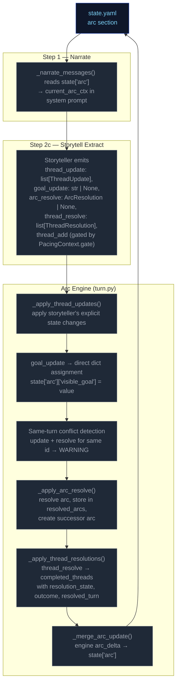

### Thread Mechanics

#### Two Thread Scopes

Threads have a `scope` field (`"scene"` or `"arc"`) that determines narrative treatment:

| Scope | Narrative role | Engine lifecycle |
|---|---|---|
| `scene` | Short-lived tension tied to current location/NPCs | **Purged on location change** — removed from `arc.threads[]` when player moves to a new location (delta_builder.py). **Two-stage expiration:** active→latent after 5 silent turns (`active: false`; urgency handled by decay pass above); latent→removed entirely after 10 total unsurfaced turns. |
| `arc` | Persistent story tension across scenes | Persists across location changes. Only removed via `thread_resolve` or auto-closed on arc_resolve (state `"superseded"`). Subject to auto-latent demotion and urgency decay like all threads. |

#### Entry Points

Seven call sites in `run_turn()` process arc/thread operations in order:
1. **`_apply_thread_updates()`** — apply storyteller's explicit state changes; progress is append-only (`list[ProgressEntry]`); sets `last_updated_turn`; auto-latent demotion when untouched past threshold; urgency decay (stepwise urgent→normal→background after N turns at same level); scene-scoped two-stage expiration (active→latent, latent→removed). Progress dedup via SequenceMatcher
2. **`goal_update`** — direct dict assignment to `state["arc"]["visible_goal"]`
3. **Same-turn conflict detection** — warn if same thread id in both update and resolve
4. **`_apply_arc_resolve()`** — resolve arc, store in resolved_arcs, create successor
5. **`_apply_thread_resolutions()`** — resolve/fail/abandon → completed
6. **Thread add gate** — pacing gate + ID collision checks + thread cap eviction
7. **`_merge_arc_update()`** — apply the final CampaignArc delta to state

All seven run after `apply_delta()` but before `save_state()`.

#### Step-by-Step: `_apply_thread_updates(config)`

Processes `storyteller_result.thread_update` (list of `ThreadUpdate` with `id`, optional `active`, `urgency`, `summary`, `progress`, `progress_kind`).

For each ThreadUpdate:
1. Find matching thread by ID in `arc.threads[]`
2. If not found → log WARNING, skip
3. If found:
   - Apply non-None fields (`active`, `urgency`, `summary`) via `model_copy`
   - If `progress` is non-None: wrap in `ProgressEntry(kind=update.progress_kind or "advancement", text=update.progress)`. If thread already has progress, compare against last entry via `difflib.SequenceMatcher` — ≥50% overlap rejects with WARNING. Otherwise append.
    - Set `last_updated_turn` to current turn number
 4. Log applied changes at INFO level
 5. **Auto-latent demotion** (post-loop, after every thread_updates loop): For each active thread whose `last_updated_turn` is ≥ `config.thread_stale_threshold` turns ago, set `active: false`.
 6. **Urgency decay pass**: For each active thread with `urgency_set_turn` set, if age (`turn_no - urgency_set_turn`) >= `thread_urgency_max_age`, demote stepwise (urgent→normal, normal→background). Sets `urgency_set_turn = current turn` on demotion. Skips threads without `urgency_set_turn` (pre-existing data degrades gracefully).
  7. **Scene-scoped two-stage expiration**: For each scene-scoped (`scope=scene`) thread: (a) If active and silent for >= `scene_thread_expire_silent_turns` turns, set `active=False`. Urgency is handled by the urgency decay pass above — this step does not override it. (b) If latent and unsurfaced for >= 2× threshold total, remove from `arc.threads[]`. Skips threads without turn context (`last_seen_turn` or `added_turn`).

**Progress model:** Every progress entry is a `ProgressEntry` with `kind` field (`"advancement"`, `"setback"`, or `"shift"`) and `text`. The `progress_kind` field on `ThreadUpdate` tags each emitted progress entry; default is `"advancement"`. Progress is rendered to prompts as `[KIND] text` by `_fmt_progress()` (module-level function in `ccya/prompts/context.py` — relocated from a static method on `ArcThreadBlock` and from `ccya/engine/narrate.py`).

**Progress dedup:** Uses `difflib.SequenceMatcher.ratio()` against the last entry to reject near-duplicate progress (≥50% textual overlap). This filters out LLM outputs that rephrase the same progress update without advancing the narrative. A WARNING is logged on rejection.

**Auto-latent demotion:** Prevents stale threads from accumulating as active prompts. Threads that haven't been touched by `thread_update` for `config.thread_stale_threshold` turns (default 3) are automatically demoted to `active: false`. This is engine-enforced, not storyteller-managed — the storyteller can re-activate a thread by issuing a `thread_update` with `active: true`, but the engine will demote it again if it goes untouched. Fires every turn (not gated on mutation) so stale active threads reliably get `active=false` after 3 turns of no updates.

#### Step-by-Step: `_apply_arc_resolve()`

Processes `storyteller_result.arc_resolve` (optional `ArcResolution` with `resolution`, `visible_goal`, `goal_context`, `drop_threads: list[str]`, `new_threads: list[ArcThread]`).

1. If `arc_resolve` is None → return None
2. Validate arc from state; if missing/invalid → log WARNING, return None
3. Store current arc in `state["resolved_arcs"]` with `resolved_turn` for TTL tracking
4. Auto-close all arc-scoped threads: move to completed_threads with resolution_state="superseded"
5. Carry forward scene-scoped threads minus any IDs listed in drop_threads
6. Add new_threads from the ArcResolution model
7. Create successor arc with new `visible_goal`, `goal_context`, and combined surviving + new threads
8. Replace `state["arc"]` with successor

#### Thread Creation (gated in `run_turn()` with cap eviction)

New threads (`storyteller_result.thread_add`) are gated by:

1. **Pacing gate**: `PacingContext.gate == "allow"` — blocks escalation when pacing context says so. Gate status is rendered in the prompt (`_thread_list.j2`) so the storyteller has awareness instead of silent drops.
2. **ID collision**: thread `id` already exists in `arc.threads[]` or `arc.completed_threads[]` → reject with WARNING log. Id-based dedup only — no key field or fuzzy merge.
3. **Thread cap eviction** (post-add, only if config provided): If active thread count exceeds `config.thread_max_active` (default 5), evict the oldest active thread (by `last_updated_turn`) — set `active: false`. This prevents unbounded thread accumulation while the storyteller can still add new threads when pacing context permits.

**Thread creation via thread_update (ungoverned):** Threads can also be created implicitly by appearing in `thread_update` without a prior `thread_add`. This is the dominant creation path in practice — the LLM introduces new thread IDs directly via updates.

#### Step-by-Step: `_apply_thread_resolutions()`

Processes `storyteller_result.thread_resolve` (list of `ThreadResolution` with `id`, `resolution_state`, `outcome`).

1. Find matching thread by ID in `arc.threads[]`
2. If not found → log warning, skip
3. If found → move to `arc.completed_threads[]`, set `resolution_state`, `outcome`, and `resolved_turn`
4. Deduplicate completed_threads entries: existing ID gets updated, not duplicated

#### Pacing Context Gate

`_compute_pacing_context()` sets `gate` based on deescalation:

```
gate = "allow" by default
gate = "block_escalate" when deescalate >= 0.5
```

The gate blocks thread creation. The LLM is instructed not to emit `thread_add` when `gate != "allow"`, and the gate status is explicitly rendered in the prompt to provide awareness.

#### Constants Reference

| Constant | Value (default) | Effect |
|---|---|---|
| `config.arc_memory_ttl` | 3 | Turns to keep resolved arcs in prompt context (wired to `_storytell_messages(arc_ttl=...)`) |
| `config.thread_memory_ttl` | 3 | Turns to keep completed threads in prompt context |
| `config.thread_stale_threshold` | 3 | Turns of inactivity before auto-latent demotion (`active: false`) |
| `config.thread_max_active` | 5 | Max active threads; oldest evicted when exceeded on thread_add |
| `config.thread_urgency_max_age` | 8 | Turns at same urgency level before Python-side stepwise decay (urgent→normal→background) |
| `config.scene_thread_expire_silent_turns` | 5 | Scene-scoped thread expiration threshold: active→latent after this many silent turns; latent→removed after 2× this value unsurfaced |
| `config.track_scene_thread_progress` | True | Whether scene-scoped threads receive progress tracking (enables completion via Python) |

#### Validation Edge Cases

1. **Empty arc state** — No arc in state → log DEBUG, return None (no crash)
2. **Validation failure** — Arc fails Pydantic validation → log WARNING, return None
3. **Unknown thread ID in update** — Log WARNING, skip — does not block valid updates
4. **Unknown resolution ID** — Log WARNING, skip — does not block valid resolutions
5. **Duplicate thread ID in creation** — Checked against existing + completed IDs
6. **Same-turn update+resolve conflict** — Same thread id in both `thread_update` and `thread_resolve` → log WARNING, resolution wins (fires after update)
7. **Progress type migration** — Old saves with `progress: "str"` or `progress: list[str]` are coerced via `field_validator("progress", mode="wrap")`: bare strings wrapped in `[{"text": v, "kind": "advancement"}]`; string lists converted to `[{"text": s, "kind": "advancement"} for s in list]`.
8. **Progress dedup rejection** — New progress with ≥50% textual overlap against last entry → log WARNING, skip entry (does not block rest of update)
9. **Thread cap eviction** — After thread_add, if active count > `thread_max_active`, oldest active thread evicted to `active: false` — log INFO with evicted thread id

### Progress Migration

`ArcThread.progress` has migrated through two versions:
- **v1:** `str` — single progress string
- **v2:** `list[str]` — append-only list of progress strings
- **v3 (current):** `list[ProgressEntry]` — structured entries with `kind` + `text`

A Pydantic `field_validator("progress", mode="wrap")` on `ArcThread` handles all legacy shapes:
- Bare `str`: wraps in `[{"text": v, "kind": "advancement"}]`
- `list[str]`: converts to `[{"text": s, "kind": "advancement"} for s in list]`
- `list[ProgressEntry]`: passes through

---

---

**Track:** baseline

# Static Context (immutable across all turns)

## Seed State

```json
{
  "meta": {
    "game_name": "eval",
    "turn": 0,
    "setting_pack": "eval-pack",
    "model": ""
  },
  "pc": {
    "name": "Aren Voss",
    "tagline": "Reluctant courier on the merchant road",
    "bio": "Mid-thirties, broad shoulders, careful with words. Took on a courier contract\nto clear an old debt. Just arrived in Marrow's Crossing with a heavy pack and\na heavier obligation.\n",
    "stats": {
      "strength": 3,
      "dexterity": 3,
      "wits": 2,
      "charisma": 3
    },
    "conditions": [],
    "momentum": 0,
    "drive": ""
  },
  "location": {
    "id": "marrows_crossing",
    "name": "Marrow's Crossing",
    "description": "A market town built around the confluence of two rivers. Cobblestone streets,\ntimber-framed buildings, and the constant sound of water from the mills. The\ntown square has a stone well and a statue of the founder. Most shops are closing\nfor the evening.\n"
  },
  "inventory": [
    {
      "id": "credits",
      "name": "Credits",
      "notes": "Common coin, accepted at any inn or stall on the merchant road.",
      "amount": 500,
      "aliases": []
    },
    {
      "id": "iron_dagger",
      "name": "Iron dagger",
      "notes": "Plain crossguard, edge worn from honing. Belt-carried.",
      "amount": 1,
      "aliases": []
    },
    {
      "id": "bandages",
      "name": "Linen bandages",
      "notes": "Three rolls. Field-grade \u2014 won't replace a healer.",
      "amount": 3,
      "aliases": []
    },
    {
      "id": "traveler_cloak",
      "name": "Traveler's cloak",
      "notes": "Oiled wool, road-stained, hood deep enough to hide a face.",
      "amount": 1,
      "aliases": [
        "cloak",
        "travel cloak"
      ]
    },
    {
      "id": "brass_key",
      "name": "Brass key",
      "notes": "A small brass key Halden gave you with the ledger.",
      "amount": 1,
      "aliases": []
    }
  ],
  "scene": {
    "tagline": "Market town at dusk",
    "tags": [
      "peaceful",
      "start"
    ],
    "world_state": [
      "Marrow's Crossing is a market town at the confluence of two rivers, known for its mills and the annual river festival.",
      "Iron coin (credits) is the universal currency on the merchant road; barter is acceptable but slower.",
      "The road has been quieter than usual this season \u2014 fewer caravans, more independent runners, more opportunists."
    ]
  },
  "compendium": {
    "npcs": {
      "caron": {
        "name": "Caron",
        "title": "Old creditor",
        "bio": "A portly man in his sixties with a merchant's ledger and a patient demeanor. You owe him 500 credits from a failed venture three years ago.",
        "bond": null,
        "presence": null,
        "notes": null,
        "motivation": null,
        "fear": null,
        "leverage": null
      },
      "halden": {
        "name": "Halden",
        "title": "Merchant",
        "bio": "A road merchant in his fifties who hires couriers when his usual runners are spoken for. Honest by reputation, careful with money.",
        "bond": null,
        "presence": null,
        "notes": null,
        "motivation": null,
        "fear": null,
        "leverage": null
      },
      "innkeeper": {
        "name": "Edda",
        "title": "Innkeeper at the Crossed Keys",
        "bio": "Runs the inn alone since her husband died. Knows every traveler by face if not by name. Stays out of trouble unless it walks through her door.",
        "bond": null,
        "presence": null,
        "notes": null,
        "motivation": null,
        "fear": null,
        "leverage": null
      },
      "tough_a": {
        "name": "Bald Tough",
        "title": "Road thug",
        "bio": "Hired muscle. No personal stake in this \u2014 he'll back off if the price is right or the fight goes bad.",
        "bond": null,
        "presence": null,
        "notes": null,
        "motivation": null,
        "fear": null,
        "leverage": null
      },
      "tough_b": {
        "name": "Scarred Tough",
        "title": "Road thug",
        "bio": "Same outfit as the other \u2014 hired by the same person. Quicker to violence; not the brains.",
        "bond": null,
        "presence": null,
        "notes": null,
        "motivation": null,
        "fear": null,
        "leverage": null
      },
      "matthew_estrada": {
        "name": "Matthew Estrada",
        "title": "Traveler",
        "bio": "A tall, broad-shoulded man in a stained leather jerkin carrying a heavy rucksack. Looks like a road runner but moves with military precision.",
        "bond": null,
        "presence": null,
        "notes": null,
        "motivation": null,
        "fear": null,
        "leverage": null
      }
    }
  },
  "arc": {
    "visible_goal": "Clear your debts and deliver the ledger \u2014 two obligations binding you to Marrow's Crossing.",
    "goal_context": "",
    "threads": [
      {
        "id": "settle_the_debt",
        "summary": "Settle the 500-credit debt with Caron.",
        "scope": "arc",
        "active": false,
        "urgency": "normal",
        "progress": [],
        "resolution_state": null,
        "outcome": null,
        "resolved_turn": null,
        "last_updated_turn": null,
        "added_turn": null,
        "urgency_set_turn": null
      },
      {
        "id": "deliver_the_ledger",
        "summary": "Deliver Halden's ledger to the merchant at the Crossed Keys Inn.",
        "scope": "arc",
        "active": false,
        "urgency": "normal",
        "progress": [],
        "resolution_state": null,
        "outcome": null,
        "resolved_turn": null,
        "last_updated_turn": null,
        "added_turn": null,
        "urgency_set_turn": null
      },
      {
        "id": "clear_the_road_toughs",
        "summary": "Deal with the toughs blocking the inn entrance.",
        "scope": "arc",
        "active": false,
        "urgency": "background",
        "progress": [],
        "resolution_state": null,
        "outcome": null,
        "resolved_turn": null,
        "last_updated_turn": null,
        "added_turn": null,
        "urgency_set_turn": null
      }
    ],
    "completed_threads": [],
    "resolution": null,
    "last_thread_created_turn": 0
  }
}
```

## Engine Constants

```json
{
  "urgency_levels": [
    "background",
    "normal",
    "urgent"
  ],
  "momentum_min": -3,
  "momentum_max": 3,
  "momentum_delta": {
    "crit_success": 2,
    "success": 1,
    "partial": 0,
    "setback": -1,
    "fail": -1,
    "crit_fail": -2
  }
}
```

## System Prompts (identical every turn)

### Ruling System Prompt

```
(not captured this run)
```

### Narrate System Prompt

```
(not captured this run)
```

### Extract Scene System Prompt

```
(not captured this run)
```

### Extract State System Prompt

```
(not captured this run)
```

### Storyteller System Prompt

```
(not captured this run)
```


---

# TURN 1

**Input:** `I ride into Dustfall and tie my horse at the livery. The sun is hot and the main street is quiet. I head for the saloon.`

## User Prompts

### Ruling User Prompt
```
(no ruling call this turn)
```

### Narrate User Prompt
```
(no narrate call)
```

### Extract Scene User Prompt
```
(not captured)
```

### Extract State User Prompt
```
(not captured)
```

### Storyteller User Prompt
```
(not captured)
```

## Engine Outputs

### Rules

**Parsed (engine):**
```json
{
  "intent_verb": "transition",
  "intent": "The player moves from the livery to the saloon in Dustfall.",
  "rolled": false,
  "total_ms": 11078.4,
  "tokens_in": 1117,
  "tokens_out": 75,
  "outcome_summary": ""
}
```

**Raw LLM output:**
```

```

### Narration


### Extract Scene

```json
{
  "scene_tags": [
    "tense_atmosphere",
    "discovery"
  ],
  "scene_tagline": "Seeking Shade in Dustfall",
  "location_change": {
    "id": "dustfall_saloon",
    "name": "Dustfall Saloon",
    "description": "A dim, cool interior smelling of spilled ale and sawdust. The air is heavy, providing a sharp contrast to the midday heat outside."
  },
  "location_description": "The saloon is dimly lit with scarred wooden tables and a few wary patrons scattered throughout the shade.",
  "compendium_npc_update": [
    {
      "id": "matthew_estrada",
      "aliases": [],
      "presence": "present",
      "notes": "staring into mug, coiled posture"
    },
    {
      "id": "saloon_patrons",
      "name": "Saloon Patrons",
      "bio": "A handful of weary travelers and locals scattered among the tables. They possess a practiced, wary indifference toward newcomers.",
      "aliases": [],
      "presence": "present",
      "notes": "watching entrance with wary indifference"
    }
  ]
}
```

### Extract State

```json
{
  "inventory_add": [
    {
      "id": "horse",
      "name": "horse",
      "notes": "Secured to a timber post in the stables.",
      "amount": 1,
      "aliases": []
    }
  ],
  "inventory_remove": [],
  "inventory_update": [],
  "pc_condition_add": [],
  "pc_condition_remove": []
}
```

### Storyteller

```json
{
  "actions": [
    "Approach Matthew Estrada to gauge his military-like alertness.",
    "Order a drink to observe the patrons' wary indifference.",
    "Scan the room for the hired muscle mentioned earlier.",
    "Search for Edda to gather intelligence on the town."
  ],
  "outcome_summary": "",
  "gm_beat": {
    "type": "pressure",
    "surface_as": "npc_behavior"
  },
  "thread_resolve": [],
  "thread_update": [
    {
      "id": "clear_the_road_toughs",
      "active": true,
      "urgency": "background",
      "progress": "arrived at Dustfall Saloon",
      "progress_kind": "shift"
    }
  ]
}
```

### Applied Deltas

```json
{
  "inventory_add": [
    {
      "id": "horse",
      "name": "Horse",
      "notes": "Secured to a timber post in the stables.",
      "amount": 1,
      "aliases": []
    }
  ],
  "inventory_remove": [],
  "inventory_update": [],
  "location_change": {
    "id": "dustfall_saloon",
    "name": "Dustfall Saloon",
    "description": "A dim, cool interior smelling of spilled ale and sawdust. The air is heavy, providing a sharp contrast to the midday heat outside."
  },
  "location_description": "The saloon is dimly lit with scarred wooden tables and a few wary patrons scattered throughout the shade.",
  "pc_condition_add": [],
  "pc_condition_remove": [],
  "scene_tags": [
    "tense_atmosphere",
    "discovery"
  ],
  "scene_tagline": "Seeking Shade in Dustfall",
  "compendium_npc_update": [
    {
      "id": "matthew_estrada",
      "aliases": [],
      "presence": "present",
      "notes": "staring into mug, coiled posture"
    },
    {
      "id": "saloon_patrons",
      "name": "Saloon Patrons",
      "bio": "A handful of weary travelers and locals scattered among the tables. They possess a practiced, wary indifference toward newcomers.",
      "aliases": [],
      "presence": "present",
      "notes": "watching entrance with wary indifference"
    }
  ],
  "actions": [
    "Approach Matthew Estrada to gauge his military-like alertness.",
    "Order a drink to observe the patrons' wary indifference.",
    "Scan the room for the hired muscle mentioned earlier.",
    "Search for Edda to gather intelligence on the town."
  ]
}
```

### Rejected Deltas

*(none)*

### Suggested Actions

*(none)*

### Context Telemetry

*(no telemetry)*

### State After Turn

```json
{
  "arc": {
    "completed_threads": [],
    "goal_context": "",
    "last_thread_created_turn": 0,
    "resolution": null,
    "threads": [
      {
        "active": false,
        "added_turn": null,
        "id": "settle_the_debt",
        "last_updated_turn": null,
        "outcome": null,
        "progress": [],
        "resolution_state": null,
        "resolved_turn": null,
        "scope": "arc",
        "summary": "Settle the 500-credit debt with Caron.",
        "urgency": "normal",
        "urgency_set_turn": null
      },
      {
        "active": false,
        "added_turn": null,
        "id": "deliver_the_ledger",
        "last_updated_turn": null,
        "outcome": null,
        "progress": [],
        "resolution_state": null,
        "resolved_turn": null,
        "scope": "arc",
        "summary": "Deliver Halden's ledger to the merchant at the Crossed Keys Inn.",
        "urgency": "normal",
        "urgency_set_turn": null
      },
      {
        "active": false,
        "added_turn": null,
        "id": "clear_the_road_toughs",
        "last_updated_turn": null,
        "outcome": null,
        "progress": [],
        "resolution_state": null,
        "resolved_turn": null,
        "scope": "arc",
        "summary": "Deal with the toughs blocking the inn entrance.",
        "urgency": "background",
        "urgency_set_turn": null
      }
    ],
    "visible_goal": "Clear your debts and deliver the ledger \u2014 two obligations binding you to Marrow's Crossing."
  },
  "compendium": {
    "npcs": {
      "caron": {
        "bio": "A portly man in his sixties with a merchant's ledger and a patient demeanor. You owe him 500 credits from a failed venture three years ago.",
        "bond": null,
        "fear": null,
        "leverage": null,
        "motivation": null,
        "name": "Caron",
        "notes": null,
        "presence": null,
        "title": "Old creditor"
      },
      "halden": {
        "bio": "A road merchant in his fifties who hires couriers when his usual runners are spoken for. Honest by reputation, careful with money.",
        "bond": null,
        "fear": null,
        "leverage": null,
        "motivation": null,
        "name": "Halden",
        "notes": null,
        "presence": null,
        "title": "Merchant"
      },
      "innkeeper": {
        "bio": "Runs the inn alone since her husband died. Knows every traveler by face if not by name. Stays out of trouble unless it walks through her door.",
        "bond": null,
        "fear": null,
        "leverage": null,
        "motivation": null,
        "name": "Edda",
        "notes": null,
        "presence": null,
        "title": "Innkeeper at the Crossed Keys"
      },
      "matthew_estrada": {
        "bio": "A tall, broad-shoulded man in a stained leather jerkin carrying a heavy rucksack. Looks like a road runner but moves with military precision.",
        "bond": null,
        "fear": null,
        "leverage": null,
        "motivation": null,
        "name": "Matthew Estrada",
        "notes": null,
        "presence": null,
        "title": "Traveler"
      },
      "tough_a": {
        "bio": "Hired muscle. No personal stake in this \u2014 he'll back off if the price is right or the fight goes bad.",
        "bond": null,
        "fear": null,
        "leverage": null,
        "motivation": null,
        "name": "Bald Tough",
        "notes": null,
        "presence": null,
        "title": "Road thug"
      },
      "tough_b": {
        "bio": "Same outfit as the other \u2014 hired by the same person. Quicker to violence; not the brains.",
        "bond": null,
        "fear": null,
        "leverage": null,
        "motivation": null,
        "name": "Scarred Tough",
        "notes": null,
        "presence": null,
        "title": "Road thug"
      }
    }
  },
  "inventory": [
    {
      "aliases": [],
      "amount": 500,
      "id": "credits",
      "name": "Credits",
      "notes": "Common coin, accepted at any inn or stall on the merchant road."
    },
    {
      "aliases": [],
      "amount": 1,
      "id": "iron_dagger",
      "name": "Iron dagger",
      "notes": "Plain crossguard, edge worn from honing. Belt-carried."
    },
    {
      "aliases": [],
      "amount": 3,
      "id": "bandages",
      "name": "Linen bandages",
      "notes": "Three rolls. Field-grade \u2014 won't replace a healer."
    },
    {
      "aliases": [
        "cloak",
        "travel cloak"
      ],
      "amount": 1,
      "id": "traveler_cloak",
      "name": "Traveler's cloak",
      "notes": "Oiled wool, road-stained, hood deep enough to hide a face."
    },
    {
      "aliases": [],
      "amount": 1,
      "id": "brass_key",
      "name": "Brass key",
      "notes": "A small brass key Halden gave you with the ledger."
    }
  ],
  "location": {
    "description": "A market town built around the confluence of two rivers. Cobblestone streets,\ntimber-framed buildings, and the constant sound of water from the mills. The\ntown square has a stone well and a statue of the founder. Most shops are closing\nfor the evening.\n",
    "id": "marrows_crossing",
    "name": "Marrow's Crossing"
  },
  "meta": {
    "game_name": "eval",
    "model": "",
    "setting_pack": "eval-pack",
    "turn": 0
  },
  "pc": {
    "bio": "Mid-thirties, broad shoulders, careful with words. Took on a courier contract\nto clear an old debt. Just arrived in Marrow's Crossing with a heavy pack and\na heavier obligation.\n",
    "conditions": [],
    "drive": "",
    "momentum": 0,
    "name": "Aren Voss",
    "stats": {
      "charisma": 3,
      "dexterity": 3,
      "strength": 3,
      "wits": 2
    },
    "tagline": "Reluctant courier on the merchant road"
  },
  "scene": {
    "tagline": "Market town at dusk",
    "tags": [
      "peaceful",
      "start"
    ],
    "world_state": [
      "Marrow's Crossing is a market town at the confluence of two rivers, known for its mills and the annual river festival.",
      "Iron coin (credits) is the universal currency on the merchant road; barter is acceptable but slower.",
      "The road has been quieter than usual this season \u2014 fewer caravans, more independent runners, more opportunists."
    ]
  },
  "schema_version": 1
}
```


---

# TURN 2

**Input:** `I step up to the bar and ask for a glass of water and whatever news there is. The bartender is wiping a glass and eyeing me.`

## User Prompts

### Ruling User Prompt
```
(no ruling call this turn)
```

### Narrate User Prompt
```
(no narrate call)
```

### Extract Scene User Prompt
```
(not captured)
```

### Extract State User Prompt
```
(not captured)
```

### Storyteller User Prompt
```
(not captured)
```

## Engine Outputs

### Rules

**Parsed (engine):**
```json
{
  "intent_verb": "persuade",
  "intent": "The player seeks refreshment and information from the bartender.",
  "rolled": false,
  "total_ms": 2296.0,
  "tokens_in": 1313,
  "tokens_out": 66,
  "outcome_summary": "Matthew Estrada watches the exchange from the corner as the bartender hints at strange road activity."
}
```

**Raw LLM output:**
```

```

### Narration


### Extract Scene

```json
{
  "scene_tags": [
    "tense_conversation",
    "mystery"
  ],
  "scene_tagline": "News Costs a Copper",
  "location_description": "The bar is made of scarred, dark wood, and the bartender works with rhythmic, deliberate motions.",
  "compendium_npc_update": [
    {
      "id": "bartender_dustfall",
      "name": "Bartender",
      "title": "Saloon Bartender",
      "bio": "A man with a low, rasping voice and steady, unblinking eyes. He maintains a stoic, business-like demeanor, offering information only for a price.",
      "aliases": [],
      "presence": "present",
      "notes": "leaning forward over the bar"
    }
  ]
}
```

### Extract State

```json
{
  "inventory_add": [],
  "inventory_remove": [
    {
      "id": "credits",
      "amount": 1
    }
  ],
  "inventory_update": [],
  "pc_condition_add": [],
  "pc_condition_remove": []
}
```

### Storyteller

```json
{
  "actions": [
    "Pay a copper to ask about the missing travelers.",
    "Offer more credits for specific names or locations.",
    "Watch Matthew Estrada's reaction to the bartender's news.",
    "Order a stronger drink to loosen the bartender's tongue."
  ],
  "outcome_summary": "Matthew Estrada watches the exchange from the corner as the bartender hints at strange road activity.",
  "gm_beat": {
    "type": "complication",
    "surface_as": "npc_behavior"
  },
  "thread_resolve": [],
  "thread_update": [
    {
      "id": "clear_the_road_toughs",
      "active": true,
      "urgency": "background",
      "progress": "arrived at Dustfall Saloon",
      "progress_kind": "shift"
    }
  ]
}
```

### Applied Deltas

```json
{
  "inventory_add": [],
  "inventory_remove": [
    {
      "id": "credits",
      "amount": 1
    }
  ],
  "inventory_update": [],
  "location_description": "The bar is made of scarred, dark wood, and the bartender works with rhythmic, deliberate motions.",
  "pc_condition_add": [],
  "pc_condition_remove": [],
  "scene_tags": [
    "tense_conversation",
    "mystery"
  ],
  "scene_tagline": "News Costs a Copper",
  "compendium_npc_update": [
    {
      "id": "bartender_dustfall",
      "name": "Bartender",
      "title": "Saloon Bartender",
      "bio": "A man with a low, rasping voice and steady, unblinking eyes. He maintains a stoic, business-like demeanor, offering information only for a price.",
      "aliases": [],
      "presence": "present",
      "notes": "leaning forward over the bar"
    }
  ],
  "actions": [
    "Pay a copper to ask about the missing travelers.",
    "Offer more credits for specific names or locations.",
    "Watch Matthew Estrada's reaction to the bartender's news.",
    "Order a stronger drink to loosen the bartender's tongue."
  ]
}
```

### Rejected Deltas

*(none)*

### Suggested Actions

*(none)*

### Context Telemetry

*(no telemetry)*

### State After Turn

*(diff vs previous turn — full snapshot only on first and last turns)*

```json
{
  "arc": {
    "threads": {
      "changed": [
        {
          "from": {
            "active": false,
            "added_turn": null,
            "id": "settle_the_debt",
            "last_updated_turn": null,
            "outcome": null,
            "progress": [],
            "resolution_state": null,
            "resolved_turn": null,
            "scope": "arc",
            "summary": "Settle the 500-credit debt with Caron.",
            "urgency": "normal",
            "urgency_set_turn": null
          },
          "to": {
            "active": false,
            "id": "settle_the_debt",
            "progress": [],
            "scope": "arc",
            "summary": "Settle the 500-credit debt with Caron.",
            "urgency": "normal"
          }
        },
        {
          "from": {
            "active": false,
            "added_turn": null,
            "id": "deliver_the_ledger",
            "last_updated_turn": null,
            "outcome": null,
            "progress": [],
            "resolution_state": null,
            "resolved_turn": null,
            "scope": "arc",
            "summary": "Deliver Halden's ledger to the merchant at the Crossed Keys Inn.",
            "urgency": "normal",
            "urgency_set_turn": null
          },
          "to": {
            "active": false,
            "id": "deliver_the_ledger",
            "progress": [],
            "scope": "arc",
            "summary": "Deliver Halden's ledger to the merchant at the Crossed Keys Inn.",
            "urgency": "normal"
          }
        },
        {
          "from": {
            "active": false,
            "added_turn": null,
            "id": "clear_the_road_toughs",
            "last_updated_turn": null,
            "outcome": null,
            "progress": [],
            "resolution_state": null,
            "resolved_turn": null,
            "scope": "arc",
            "summary": "Deal with the toughs blocking the inn entrance.",
            "urgency": "background",
            "urgency_set_turn": null
          },
          "to": {
            "active": true,
            "id": "clear_the_road_toughs",
            "last_updated_turn": 1,
            "progress": [
              {
                "kind": "shift",
                "text": "arrived at Dustfall Saloon"
              }
            ],
            "scope": "arc",
            "summary": "Deal with the toughs blocking the inn entrance.",
            "urgency": "background"
          }
        }
      ]
    }
  },
  "compendium": {
    "npcs": {
      "matthew_estrada": {
        "last_seen": {
          "from": null,
          "to": {
            "location_id": "dustfall_saloon",
            "location_name": "Dustfall Saloon",
            "turn": 1
          }
        },
        "notes": {
          "from": null,
          "to": "staring into mug, coiled posture"
        },
        "presence": {
          "from": null,
          "to": "present"
        }
      },
      "saloon_patrons": {
        "from": null,
        "to": {
          "bio": "A handful of weary travelers and locals scattered among the tables. They possess a practiced, wary indifference toward newcomers.",
          "first_seen_turn": 0,
          "last_seen": {
            "location_id": "dustfall_saloon",
            "location_name": "Dustfall Saloon",
            "turn": 1
          },
          "name": "Saloon Patrons",
          "notes": "watching entrance with wary indifference",
          "presence": "present"
        }
      }
    }
  },
  "inventory": {
    "added": [
      {
        "amount": 1,
        "id": "horse",
        "name": "Horse",
        "notes": "Secured to a timber post in the stables."
      }
    ]
  },
  "location": {
    "description": {
      "from": "A market town built around the confluence of two rivers. Cobblestone streets,\ntimber-framed buildings, and the constant sound of water from the mills. The\ntown square has a stone well and a statue of the founder. Most shops are closing\nfor the evening.\n",
      "to": "A dim, cool interior smelling of spilled ale and sawdust. The air is heavy, providing a sharp contrast to the midday heat outside."
    },
    "id": {
      "from": "marrows_crossing",
      "to": "dustfall_saloon"
    },
    "name": {
      "from": "Marrow's Crossing",
      "to": "Dustfall Saloon"
    }
  },
  "meta": {
    "compendium_touch_order": {
      "from": null,
      "to": [
        "matthew_estrada",
        "saloon_patrons"
      ]
    },
    "consecutive_pressure_turns": {
      "from": null,
      "to": 1
    },
    "pending_gm_beat": {
      "from": null,
      "to": {
        "beat_expires_turn": 3,
        "surface_as": "npc_behavior",
        "type": "pressure"
      }
    },
    "recent_beats": {
      "from": null,
      "to": [
        {
          "surface_as": "npc_behavior",
          "turn": 1,
          "type": "pressure"
        }
      ]
    },
    "turn": {
      "from": 0,
      "to": 1
    }
  },
  "pc": {
    "actions": {
      "from": null,
      "to": [
        "Approach Matthew Estrada to gauge his military-like alertness.",
        "Order a drink to observe the patrons' wary indifference.",
        "Scan the room for the hired muscle mentioned earlier.",
        "Search for Edda to gather intelligence on the town."
      ]
    }
  },
  "scene": {
    "location_entered_turn": {
      "from": null,
      "to": 0
    },
    "tagline": {
      "from": "Market town at dusk",
      "to": "Seeking Shade in Dustfall"
    },
    "tags": {
      "added": [
        "discovery",
        "tense_atmosphere"
      ],
      "removed": [
        "peaceful",
        "start"
      ]
    },
    "turn_entered": {
      "from": null,
      "to": 0
    }
  }
}
```


---

# TURN 3

**Input:** `I lean on the bar and ask what happened to Old Man Harker. The bartender seems reluctant but starts talking.`

## User Prompts

### Ruling User Prompt
```
(no ruling call this turn)
```

### Narrate User Prompt
```
(no narrate call)
```

### Extract Scene User Prompt
```
(not captured)
```

### Extract State User Prompt
```
(not captured)
```

### Storyteller User Prompt
```
(not captured)
```

## Engine Outputs

### Rules

**Parsed (engine):**
```json
{
  "intent_verb": "persuade",
  "intent": "The player seeks information about a specific person, Old Man Harker, from a reluctant bartender.",
  "rolled": true,
  "total_ms": 2804.3,
  "tokens_in": 1364,
  "tokens_out": 92,
  "outcome_summary": "Matthew learns from the bartender that Old Man Harker's wagon was found abandoned near the river bend.",
  "skill": "charisma",
  "difficulty": "normal",
  "dice": [
    8
  ],
  "stat_mod": 1,
  "diff_mod": 0,
  "cond_mod": 0,
  "raw_total": 8,
  "final_total": 9,
  "band": "success",
  "momentum_before": 0,
  "momentum_after": 1,
  "momentum_delta": 1
}
```

**Raw LLM output:**
```

```

### Narration


### Extract Scene

```json
{
  "scene_tags": [
    "tense_conversation",
    "mystery"
  ],
  "scene_tagline": "Whispers of a Vanishing Man",
  "location_description": "The bartender's shadow stretches long across the scarred counter as he leans in close.",
  "compendium_npc_update": [
    {
      "id": "bartender_dustfall",
      "aliases": [],
      "notes": "leaning closer, grimacing at inquiry"
    }
  ]
}
```

### Extract State

```json
{
  "inventory_add": [],
  "inventory_remove": [],
  "inventory_update": [],
  "pc_condition_add": [
    {
      "id": "unsettled",
      "label": "Unsettled",
      "description": "The bartender's grim news and suspicious behavior leaves you feeling uneasy.",
      "turns_remaining": 2
    }
  ],
  "pc_condition_remove": []
}
```

### Storyteller

```json
{
  "actions": [
    "Offer extra credits for more specific details on Harker.",
    "Question the bartender about anyone else vanishing recently.",
    "Scan the saloon patrons for suspicious or knowing glances.",
    "Head north toward the river to investigate the wagon."
  ],
  "outcome_summary": "Matthew learns from the bartender that Old Man Harker's wagon was found abandoned near the river bend.",
  "gm_beat": {
    "type": "revelation",
    "surface_as": "ambient"
  },
  "thread_resolve": [],
  "thread_update": [
    {
      "id": "deliver_the_ledger",
      "active": true,
      "urgency": "normal",
      "progress": "Learned of Harker's mysterious disappearance",
      "progress_kind": "advancement"
    }
  ]
}
```

### Applied Deltas

```json
{
  "inventory_add": [],
  "inventory_remove": [],
  "inventory_update": [],
  "location_description": "The bartender's shadow stretches long across the scarred counter as he leans in close.",
  "pc_condition_add": [
    {
      "id": "unsettled",
      "label": "Unsettled",
      "description": "The bartender's grim news and suspicious behavior leaves you feeling uneasy.",
      "turns_remaining": 2
    }
  ],
  "pc_condition_remove": [],
  "scene_tags": [
    "tense_conversation",
    "mystery"
  ],
  "scene_tagline": "Whispers of a Vanishing Man",
  "compendium_npc_update": [
    {
      "id": "bartender_dustfall",
      "aliases": [],
      "notes": "leaning closer, grimacing at inquiry"
    }
  ],
  "actions": [
    "Offer extra credits for more specific details on Harker.",
    "Question the bartender about anyone else vanishing recently.",
    "Scan the saloon patrons for suspicious or knowing glances.",
    "Head north toward the river to investigate the wagon."
  ]
}
```

### Rejected Deltas

*(none)*

### Suggested Actions

*(none)*

### Context Telemetry

*(no telemetry)*

### State After Turn

*(diff vs previous turn — full snapshot only on first and last turns)*

```json
{
  "arc": {
    "threads": {
      "changed": [
        {
          "from": {
            "active": true,
            "id": "clear_the_road_toughs",
            "last_updated_turn": 1,
            "progress": [
              {
                "kind": "shift",
                "text": "arrived at Dustfall Saloon"
              }
            ],
            "scope": "arc",
            "summary": "Deal with the toughs blocking the inn entrance.",
            "urgency": "background"
          },
          "to": {
            "active": true,
            "id": "clear_the_road_toughs",
            "last_updated_turn": 2,
            "progress": [
              {
                "kind": "shift",
                "text": "arrived at Dustfall Saloon"
              }
            ],
            "scope": "arc",
            "summary": "Deal with the toughs blocking the inn entrance.",
            "urgency": "background"
          }
        }
      ]
    }
  },
  "compendium": {
    "npcs": {
      "bartender_dustfall": {
        "from": null,
        "to": {
          "bio": "A man with a low, rasping voice and steady, unblinking eyes. He maintains a stoic, business-like demeanor, offering information only for a price.",
          "first_seen_turn": 1,
          "last_seen": {
            "location_id": "dustfall_saloon",
            "location_name": "Dustfall Saloon",
            "turn": 2
          },
          "name": "Bartender",
          "notes": "leaning forward over the bar",
          "presence": "present",
          "title": "Saloon Bartender"
        }
      },
      "matthew_estrada": {
        "notes": {
          "from": "staring into mug, coiled posture",
          "to": null
        }
      },
      "saloon_patrons": {
        "notes": {
          "from": "watching entrance with wary indifference",
          "to": null
        }
      }
    }
  },
  "inventory": {
    "changed": [
      {
        "from": {
          "aliases": [],
          "amount": 500,
          "id": "credits",
          "name": "Credits",
          "notes": "Common coin, accepted at any inn or stall on the merchant road."
        },
        "to": {
          "aliases": [],
          "amount": 499,
          "id": "credits",
          "name": "Credits",
          "notes": "Common coin, accepted at any inn or stall on the merchant road."
        }
      }
    ]
  },
  "location": {
    "description": {
      "from": "A dim, cool interior smelling of spilled ale and sawdust. The air is heavy, providing a sharp contrast to the midday heat outside.",
      "to": "The bar is made of scarred, dark wood, and the bartender works with rhythmic, deliberate motions."
    }
  },
  "meta": {
    "compendium_touch_order": {
      "added": [
        "bartender_dustfall"
      ],
      "removed": []
    },
    "consecutive_pressure_turns": {
      "from": 1,
      "to": 2
    },
    "pending_gm_beat": {
      "beat_expires_turn": {
        "from": 3,
        "to": 4
      },
      "type": {
        "from": "pressure",
        "to": "complication"
      }
    },
    "prior_history": {
      "from": null,
      "to": [
        "- [T2] Matthew Estrada watches the exchange from the corner as the bartender hints at strange road activity."
      ]
    },
    "recent_beats": {
      "added": [
        [
          [
            "surface_as",
            "npc_behavior"
          ],
          [
            "turn",
            2
          ],
          [
            "type",
            "complication"
          ]
        ]
      ],
      "removed": []
    },
    "turn": {
      "from": 1,
      "to": 2
    }
  },
  "pc": {
    "actions": {
      "added": [
        "Pay a copper to ask about the missing travelers.",
        "Order a stronger drink to loosen the bartender's tongue.",
        "Watch Matthew Estrada's reaction to the bartender's news.",
        "Offer more credits for specific names or locations."
      ],
      "removed": [
        "Order a drink to observe the patrons' wary indifference.",
        "Scan the room for the hired muscle mentioned earlier.",
        "Search for Edda to gather intelligence on the town.",
        "Approach Matthew Estrada to gauge his military-like alertness."
      ]
    }
  },
  "scene": {
    "tagline": {
      "from": "Seeking Shade in Dustfall",
      "to": "News Costs a Copper"
    },
    "tags": {
      "added": [
        "tense_conversation",
        "mystery"
      ],
      "removed": [
        "discovery",
        "tense_atmosphere"
      ]
    }
  }
}
```


---

# TURN 4

**Input:** `I head over to the assay office to see if Harker filed any claims recently. I knock on the door and introduce myself.`

## User Prompts

### Ruling User Prompt
```
(no ruling call this turn)
```

### Narrate User Prompt
```
(no narrate call)
```

### Extract Scene User Prompt
```
(not captured)
```

### Extract State User Prompt
```
(not captured)
```

### Storyteller User Prompt
```
(not captured)
```

## Engine Outputs

### Rules

**Parsed (engine):**
```json
{
  "intent_verb": "persuade",
  "intent": "The player seeks information about Old Man Harker by visiting the assay office and introducing themselves.",
  "rolled": false,
  "total_ms": 2473.1,
  "tokens_in": 1375,
  "tokens_out": 76,
  "outcome_summary": "Silas Vance admits he is busy with an audit but allows entry to the Assay Office."
}
```

**Raw LLM output:**
```

```

### Narration


### Extract Scene

```json
{
  "scene_tags": [
    "investigation",
    "tense_conversation"
  ],
  "scene_tagline": "A Meeting at the Assay Office",
  "location_change": {
    "id": "assay_office",
    "name": "Assay Office",
    "description": "A quiet, cramped space smelling of dried ink and old parchment, filled with cluttered desks and leather-bound volumes."
  },
  "compendium_npc_update": [
    {
      "id": "silas_vance",
      "name": "Silas Vance",
      "title": "Assay Clerk",
      "bio": "A thin man with ink-stained fingers and thick, wire-rimmed spectacles. Wears a weathered waistcoat and appears perpetually preoccupied with disorganized paperwork.",
      "aliases": [],
      "presence": "present",
      "notes": "gesturing toward cluttered desk"
    },
    {
      "id": "bartender_dustfall",
      "aliases": [],
      "presence": "known"
    },
    {
      "id": "matthew_estrada",
      "aliases": [],
      "presence": "known"
    },
    {
      "id": "saloon_patrons",
      "aliases": [],
      "presence": "known"
    }
  ]
}
```

### Extract State

```json
{
  "inventory_add": [],
  "inventory_remove": [],
  "inventory_update": [],
  "pc_condition_add": [],
  "pc_condition_remove": [
    {
      "id": "unsettled"
    }
  ]
}
```

### Storyteller

```json
{
  "actions": [
    "Inquire if Silas has records regarding Harker's missing wagon.",
    "Offer credits to expedite a search through recent filings.",
    "Ask about unusual river activity mentioned by the bartender.",
    "Search the disorganized desk for any unclaimed merchant reports."
  ],
  "outcome_summary": "Silas Vance admits he is busy with an audit but allows entry to the Assay Office.",
  "gm_beat": {
    "type": "opportunity",
    "surface_as": "npc_behavior"
  },
  "thread_resolve": [],
  "thread_update": [
    {
      "id": "deliver_the_ledger",
      "active": true,
      "urgency": "normal",
      "progress": "Investigating Harker's disappearance near the river.",
      "progress_kind": "advancement"
    }
  ]
}
```

### Applied Deltas

```json
{
  "inventory_add": [],
  "inventory_remove": [],
  "inventory_update": [],
  "location_change": {
    "id": "assay_office",
    "name": "Assay Office",
    "description": "A quiet, cramped space smelling of dried ink and old parchment, filled with cluttered desks and leather-bound volumes."
  },
  "pc_condition_add": [],
  "pc_condition_remove": [
    {
      "id": "unsettled"
    }
  ],
  "scene_tags": [
    "investigation",
    "tense_conversation"
  ],
  "scene_tagline": "A Meeting at the Assay Office",
  "compendium_npc_update": [
    {
      "id": "silas_vance",
      "name": "Silas Vance",
      "title": "Assay Clerk",
      "bio": "A thin man with ink-stained fingers and thick, wire-rimmed spectacles. Wears a weathered waistcoat and appears perpetually preoccupied with disorganized paperwork.",
      "aliases": [],
      "presence": "present",
      "notes": "gesturing toward cluttered desk"
    },
    {
      "id": "bartender_dustfall",
      "aliases": [],
      "presence": "known"
    },
    {
      "id": "matthew_estrada",
      "aliases": [],
      "presence": "known"
    },
    {
      "id": "saloon_patrons",
      "aliases": [],
      "presence": "known"
    }
  ],
  "actions": [
    "Inquire if Silas has records regarding Harker's missing wagon.",
    "Offer credits to expedite a search through recent filings.",
    "Ask about unusual river activity mentioned by the bartender.",
    "Search the disorganized desk for any unclaimed merchant reports."
  ]
}
```

### Rejected Deltas

*(none)*

### Suggested Actions

*(none)*

### Context Telemetry

*(no telemetry)*

### State After Turn

*(diff vs previous turn — full snapshot only on first and last turns)*

```json
{
  "arc": {
    "threads": {
      "changed": [
        {
          "from": {
            "active": false,
            "id": "deliver_the_ledger",
            "progress": [],
            "scope": "arc",
            "summary": "Deliver Halden's ledger to the merchant at the Crossed Keys Inn.",
            "urgency": "normal"
          },
          "to": {
            "active": true,
            "id": "deliver_the_ledger",
            "last_updated_turn": 3,
            "progress": [
              {
                "kind": "advancement",
                "text": "Learned of Harker's mysterious disappearance"
              }
            ],
            "scope": "arc",
            "summary": "Deliver Halden's ledger to the merchant at the Crossed Keys Inn.",
            "urgency": "normal"
          }
        }
      ]
    }
  },
  "compendium": {
    "npcs": {
      "bartender_dustfall": {
        "last_seen": {
          "turn": {
            "from": 2,
            "to": 3
          }
        },
        "notes": {
          "from": "leaning forward over the bar",
          "to": "leaning closer, grimacing at inquiry"
        }
      }
    }
  },
  "location": {
    "description": {
      "from": "The bar is made of scarred, dark wood, and the bartender works with rhythmic, deliberate motions.",
      "to": "The bartender's shadow stretches long across the scarred counter as he leans in close."
    }
  },
  "meta": {
    "consecutive_pressure_turns": {
      "from": 2,
      "to": 0
    },
    "pending_gm_beat": {
      "beat_expires_turn": {
        "from": 4,
        "to": 5
      },
      "surface_as": {
        "from": "npc_behavior",
        "to": "ambient"
      },
      "type": {
        "from": "complication",
        "to": "revelation"
      }
    },
    "prior_history": {
      "added": [
        "- [T3] Matthew learns from the bartender that Old Man Harker's wagon was found abandoned near the river bend."
      ],
      "removed": []
    },
    "recent_beats": {
      "added": [
        [
          [
            "surface_as",
            "ambient"
          ],
          [
            "turn",
            3
          ],
          [
            "type",
            "revelation"
          ]
        ]
      ],
      "removed": []
    },
    "turn": {
      "from": 2,
      "to": 3
    }
  },
  "pc": {
    "actions": {
      "added": [
        "Question the bartender about anyone else vanishing recently.",
        "Scan the saloon patrons for suspicious or knowing glances.",
        "Offer extra credits for more specific details on Harker.",
        "Head north toward the river to investigate the wagon."
      ],
      "removed": [
        "Pay a copper to ask about the missing travelers.",
        "Order a stronger drink to loosen the bartender's tongue.",
        "Watch Matthew Estrada's reaction to the bartender's news.",
        "Offer more credits for specific names or locations."
      ]
    },
    "conditions": {
      "added": [
        {
          "added_turn": 2,
          "description": "The bartender's grim news and suspicious behavior leaves you feeling uneasy.",
          "id": "unsettled",
          "label": "Unsettled",
          "turns_remaining": 2
        }
      ]
    },
    "momentum": {
      "from": 0,
      "to": 1
    }
  },
  "scene": {
    "tagline": {
      "from": "News Costs a Copper",
      "to": "Whispers of a Vanishing Man"
    }
  }
}
```


---

# TURN 5

**Input:** `I walk to the sheriff's office and ask if he's filed a missing person report for Harker. I want to see if the law is involved.`

## User Prompts

### Ruling User Prompt
```
(no ruling call this turn)
```

### Narrate User Prompt
```
(no narrate call)
```

### Extract Scene User Prompt
```
(not captured)
```

### Extract State User Prompt
```
(not captured)
```

### Storyteller User Prompt
```
(not captured)
```

## Engine Outputs

### Rules

**Parsed (engine):**
```json
{
  "intent_verb": "persuade",
  "intent": "The player intends to find out if a missing person report has been filed for Harker at the sheriff's office.",
  "rolled": false,
  "total_ms": 3342.3,
  "tokens_in": 1359,
  "tokens_out": 86,
  "outcome_summary": "The deputy confirms a missing person report exists for Harker but dismisses the case as a cold lead."
}
```

**Raw LLM output:**
```

```

### Narration


### Extract Scene

```json
{
  "scene_tags": [
    "investigation",
    "tense_conversation"
  ],
  "scene_tagline": "A Cold Lead in the Sheriff's Office",
  "location_change": {
    "id": "sheriffs_office",
    "name": "Sheriff's Office",
    "description": "A cool, imposing stone building smelling of beeswax and gun oil."
  },
  "compendium_npc_update": [
    {
      "id": "deputy_miller_thorne",
      "name": "Deputy Miller Thorne",
      "title": "Sheriff's Deputy",
      "bio": "A barrel-chested man with a weary, intense gaze that suggests years of bureaucratic fatigue. He moves with a rhythmic, mechanical efficiency and possesses a low, rumbling voice.",
      "aliases": [],
      "presence": "present",
      "notes": "leaning back, tapping parchment rhythmically"
    },
    {
      "id": "silas_vance",
      "aliases": [],
      "presence": "known"
    }
  ]
}
```

### Extract State

```json
{
  "inventory_add": [],
  "inventory_remove": [],
  "inventory_update": [],
  "pc_condition_add": [
    {
      "id": "fatigued",
      "label": "Fatigued",
      "description": "The deputy's fatigue is noted, but the player character has not experienced a mechanical cause for a condition."
    }
  ],
  "pc_condition_remove": []
}
```

### Storyteller

```json
{
  "actions": [
    "Offer information about the abandoned wagon to gain interest.",
    "Demand access to the official missing persons files.",
    "Inquire if any other travelers reported similar sightings.",
    "Bribe Thorne with credits to investigate the river bend."
  ],
  "outcome_summary": "The deputy confirms a missing person report exists for Harker but dismisses the case as a cold lead.",
  "gm_beat": {
    "type": "pressure",
    "surface_as": "npc_behavior"
  },
  "thread_resolve": [],
  "thread_update": [
    {
      "id": "deliver_the_ledger",
      "active": true,
      "urgency": "normal",
      "progress": "Confirmed Harker's disappearance is an official report.",
      "progress_kind": "advancement"
    }
  ]
}
```

### Applied Deltas

```json
{
  "inventory_add": [],
  "inventory_remove": [],
  "inventory_update": [],
  "location_change": {
    "id": "sheriffs_office",
    "name": "Sheriff's Office",
    "description": "A cool, imposing stone building smelling of beeswax and gun oil."
  },
  "pc_condition_add": [
    {
      "id": "fatigued",
      "label": "Fatigued",
      "description": "The deputy's fatigue is noted, but the player character has not experienced a mechanical cause for a condition."
    }
  ],
  "pc_condition_remove": [],
  "scene_tags": [
    "investigation",
    "tense_conversation"
  ],
  "scene_tagline": "A Cold Lead in the Sheriff's Office",
  "compendium_npc_update": [
    {
      "id": "deputy_miller_thorne",
      "name": "Deputy Miller Thorne",
      "title": "Sheriff's Deputy",
      "bio": "A barrel-chested man with a weary, intense gaze that suggests years of bureaucratic fatigue. He moves with a rhythmic, mechanical efficiency and possesses a low, rumbling voice.",
      "aliases": [],
      "presence": "present",
      "notes": "leaning back, tapping parchment rhythmically"
    },
    {
      "id": "silas_vance",
      "aliases": [],
      "presence": "known"
    }
  ],
  "actions": [
    "Offer information about the abandoned wagon to gain interest.",
    "Demand access to the official missing persons files.",
    "Inquire if any other travelers reported similar sightings.",
    "Bribe Thorne with credits to investigate the river bend."
  ]
}
```

### Rejected Deltas

*(none)*

### Suggested Actions

*(none)*

### Context Telemetry

*(no telemetry)*

### State After Turn

*(diff vs previous turn — full snapshot only on first and last turns)*

```json
{
  "arc": {
    "threads": {
      "changed": [
        {
          "from": {
            "active": true,
            "id": "deliver_the_ledger",
            "last_updated_turn": 3,
            "progress": [
              {
                "kind": "advancement",
                "text": "Learned of Harker's mysterious disappearance"
              }
            ],
            "scope": "arc",
            "summary": "Deliver Halden's ledger to the merchant at the Crossed Keys Inn.",
            "urgency": "normal"
          },
          "to": {
            "active": true,
            "id": "deliver_the_ledger",
            "last_updated_turn": 4,
            "progress": [
              {
                "kind": "advancement",
                "text": "Learned of Harker's mysterious disappearance"
              }
            ],
            "scope": "arc",
            "summary": "Deliver Halden's ledger to the merchant at the Crossed Keys Inn.",
            "urgency": "normal"
          }
        }
      ]
    }
  },
  "compendium": {
    "npcs": {
      "bartender_dustfall": {
        "last_seen": {
          "location_id": {
            "from": "dustfall_saloon",
            "to": "assay_office"
          },
          "location_name": {
            "from": "Dustfall Saloon",
            "to": "Assay Office"
          },
          "turn": {
            "from": 3,
            "to": 4
          }
        },
        "notes": {
          "from": "leaning closer, grimacing at inquiry",
          "to": null
        },
        "presence": {
          "from": "present",
          "to": "known"
        }
      },
      "matthew_estrada": {
        "last_seen": {
          "location_id": {
            "from": "dustfall_saloon",
            "to": "assay_office"
          },
          "location_name": {
            "from": "Dustfall Saloon",
            "to": "Assay Office"
          },
          "turn": {
            "from": 1,
            "to": 4
          }
        },
        "presence": {
          "from": "present",
          "to": "known"
        }
      },
      "saloon_patrons": {
        "last_seen": {
          "location_id": {
            "from": "dustfall_saloon",
            "to": "assay_office"
          },
          "location_name": {
            "from": "Dustfall Saloon",
            "to": "Assay Office"
          },
          "turn": {
            "from": 1,
            "to": 4
          }
        },
        "presence": {
          "from": "present",
          "to": "known"
        }
      },
      "silas_vance": {
        "from": null,
        "to": {
          "bio": "A thin man with ink-stained fingers and thick, wire-rimmed spectacles. Wears a weathered waistcoat and appears perpetually preoccupied with disorganized paperwork.",
          "first_seen_turn": 3,
          "last_seen": {
            "location_id": "assay_office",
            "location_name": "Assay Office",
            "turn": 4
          },
          "name": "Silas Vance",
          "notes": "gesturing toward cluttered desk",
          "presence": "present",
          "title": "Assay Clerk"
        }
      }
    }
  },
  "location": {
    "description": {
      "from": "The bartender's shadow stretches long across the scarred counter as he leans in close.",
      "to": "A quiet, cramped space smelling of dried ink and old parchment, filled with cluttered desks and leather-bound volumes."
    },
    "id": {
      "from": "dustfall_saloon",
      "to": "assay_office"
    },
    "name": {
      "from": "Dustfall Saloon",
      "to": "Assay Office"
    }
  },
  "meta": {
    "compendium_touch_order": {
      "added": [
        "silas_vance"
      ],
      "removed": []
    },
    "pending_gm_beat": {
      "beat_expires_turn": {
        "from": 5,
        "to": 6
      },
      "surface_as": {
        "from": "ambient",
        "to": "npc_behavior"
      },
      "type": {
        "from": "revelation",
        "to": "opportunity"
      }
    },
    "prior_history": {
      "added": [
        "- [T4] Silas Vance admits he is busy with an audit but allows entry to the Assay Office."
      ],
      "removed": []
    },
    "recent_beats": {
      "added": [
        [
          [
            "surface_as",
            "npc_behavior"
          ],
          [
            "turn",
            4
          ],
          [
            "type",
            "opportunity"
          ]
        ]
      ],
      "removed": []
    },
    "turn": {
      "from": 3,
      "to": 4
    }
  },
  "pc": {
    "actions": {
      "added": [
        "Offer credits to expedite a search through recent filings.",
        "Ask about unusual river activity mentioned by the bartender.",
        "Inquire if Silas has records regarding Harker's missing wagon.",
        "Search the disorganized desk for any unclaimed merchant reports."
      ],
      "removed": [
        "Question the bartender about anyone else vanishing recently.",
        "Scan the saloon patrons for suspicious or knowing glances.",
        "Offer extra credits for more specific details on Harker.",
        "Head north toward the river to investigate the wagon."
      ]
    },
    "conditions": {
      "removed": [
        {
          "added_turn": 2,
          "description": "The bartender's grim news and suspicious behavior leaves you feeling uneasy.",
          "id": "unsettled",
          "label": "Unsettled",
          "turns_remaining": 2
        }
      ]
    }
  },
  "scene": {
    "location_entered_turn": {
      "from": 0,
      "to": 3
    },
    "tagline": {
      "from": "Whispers of a Vanishing Man",
      "to": "A Meeting at the Assay Office"
    },
    "tags": {
      "added": [
        "investigation"
      ],
      "removed": [
        "mystery"
      ]
    },
    "turn_entered": {
      "from": 0,
      "to": 3
    }
  }
}
```


---

# TURN 5

**Input:** ``

## User Prompts

### Ruling User Prompt
```
(no ruling call this turn)
```

### Narrate User Prompt
```
(no narrate call)
```

### Extract Scene User Prompt
```
(not captured)
```

### Extract State User Prompt
```
(not captured)
```

### Storyteller User Prompt
```
(not captured)
```

## Engine Outputs

### Rules

**Parsed (engine):**
```json
{}
```

**Raw LLM output:**
```

```

### Narration


### Extract Scene

```json
{}
```

### Extract State

```json
{}
```

### Storyteller

```json
{}
```

### Applied Deltas

```json
{}
```

### Rejected Deltas

*(none)*

### Suggested Actions

*(none)*

### Context Telemetry

*(no telemetry)*

### State After Turn

*(diff vs previous turn — full snapshot only on first and last turns)*

```json
{
  "arc": {
    "goal_context": {
      "from": "",
      "to": "The player is currently in Dustfall/Marrow's Crossing investigating the mysterious disappearance of Old Man Harker, which may be linked to the strange road activity."
    },
    "last_thread_created_turn": {
      "from": 0,
      "to": 5
    },
    "threads": {
      "added": [
        {
          "active": true,
          "id": "investigate_harker_disappearance",
          "last_updated_turn": 6,
          "progress": [
            {
              "kind": "advancement",
              "text": "Located abandoned cabin on north ridge"
            }
          ],
          "scope": "arc",
          "summary": "Investigate the disappearance of Old Man Harker.",
          "urgency": "normal"
        }
      ],
      "changed": [
        {
          "from": {
            "active": true,
            "id": "deliver_the_ledger",
            "last_updated_turn": 4,
            "progress": [
              {
                "kind": "advancement",
                "text": "Learned of Harker's mysterious disappearance"
              }
            ],
            "scope": "arc",
            "summary": "Deliver Halden's ledger to the merchant at the Crossed Keys Inn.",
            "urgency": "normal"
          },
          "to": {
            "active": true,
            "id": "deliver_the_ledger",
            "last_updated_turn": 5,
            "progress": [
              {
                "kind": "advancement",
                "text": "Learned of Harker's mysterious disappearance"
              }
            ],
            "scope": "arc",
            "summary": "Deliver Halden's ledger to the merchant at the Crossed Keys Inn.",
            "urgency": "normal"
          }
        },
        {
          "from": {
            "active": true,
            "id": "clear_the_road_toughs",
            "last_updated_turn": 2,
            "progress": [
              {
                "kind": "shift",
                "text": "arrived at Dustfall Saloon"
              }
            ],
            "scope": "arc",
            "summary": "Deal with the toughs blocking the inn entrance.",
            "urgency": "background"
          },
          "to": {
            "active": false,
            "id": "clear_the_road_toughs",
            "last_updated_turn": 5,
            "progress": [
              {
                "kind": "shift",
                "text": "arrived at Dustfall Saloon"
              }
            ],
            "scope": "arc",
            "summary": "Deal with the toughs blocking the inn entrance.",
            "urgency": "background"
          }
        }
      ]
    },
    "visible_goal": {
      "from": "Clear your debts and deliver the ledger \u2014 two obligations binding you to Marrow's Crossing.",
      "to": "Investigate Harker's disappearance while managing your obligations."
    }
  },
  "compendium": {
    "npcs": {
      "cabin_interior_ambience": {
        "from": null,
        "to": {
          "bio": "An empty, decaying structure filled with stagnant dust and the smell of rot. It offers no warmth or life to those who enter.",
          "first_seen_turn": 5,
          "last_seen": {
            "location_id": "north_ridge_cabin",
            "location_name": "North Ridge Cabin",
            "turn": 6
          },
          "name": "Cabin Interior",
          "notes": "silent and smelling of rot",
          "presence": "present"
        }
      },
      "deputy_miller_thorne": {
        "from": null,
        "to": {
          "bio": "A barrel-chested man with a weary, intense gaze that suggests years of bureaucratic fatigue. He moves with a rhythmic, mechanical efficiency and possesses a low, rumbling voice.",
          "first_seen_turn": 4,
          "last_seen": {
            "location_id": "north_ridge_cabin",
            "location_name": "North Ridge Cabin",
            "turn": 6
          },
          "name": "Deputy Miller Thorne",
          "notes": "sliding key across desk",
          "presence": "known",
          "title": "Sheriff's Deputy"
        }
      },
      "silas_vance": {
        "last_seen": {
          "location_id": {
            "from": "assay_office",
            "to": "sheriffs_office"
          },
          "location_name": {
            "from": "Assay Office",
            "to": "Sheriff's Office"
          },
          "turn": {
            "from": 4,
            "to": 5
          }
        },
        "notes": {
          "from": "gesturing toward cluttered desk",
          "to": null
        },
        "presence": {
          "from": "present",
          "to": "known"
        }
      }
    }
  },
  "inventory": {
    "added": [
      {
        "amount": 1,
        "id": "iron_key",
        "name": "Iron key",
        "notes": "A heavy, rusted key provided by Deputy Thorne."
      }
    ]
  },
  "location": {
    "description": {
      "from": "A quiet, cramped space smelling of dried ink and old parchment, filled with cluttered desks and leather-bound volumes.",
      "to": "A sagging timber frame structure hunched against grey trees, smelling of damp rot and ancient ash."
    },
    "id": {
      "from": "assay_office",
      "to": "north_ridge_cabin"
    },
    "name": {
      "from": "Assay Office",
      "to": "North Ridge Cabin"
    }
  },
  "meta": {
    "compendium_touch_order": {
      "added": [
        "cabin_interior_ambience",
        "deputy_miller_thorne"
      ],
      "removed": []
    },
    "consecutive_pressure_turns": {
      "from": 0,
      "to": 2
    },
    "pending_gm_beat": {
      "beat_expires_turn": {
        "from": 6,
        "to": 8
      },
      "surface_as": {
        "from": "npc_behavior",
        "to": "environmental"
      },
      "type": {
        "from": "opportunity",
        "to": "complication"
      }
    },
    "prior_history": {
      "added": [
        "- [T5] The deputy confirms a missing person report exists for Harker but dismisses the case as a cold lead.",
        "- [T6] Silas Vance provides an iron key to the north ridge cabin, leading the player to the abandoned structure."
      ],
      "removed": []
    },
    "recent_beats": {
      "added": [
        [
          [
            "surface_as",
            "environmental"
          ],
          [
            "turn",
            6
          ],
          [
            "type",
            "complication"
          ]
        ],
        [
          [
            "surface_as",
            "npc_behavior"
          ],
          [
            "turn",
            5
          ],
          [
            "type",
            "pressure"
          ]
        ]
      ],
      "removed": [
        [
          [
            "surface_as",
            "npc_behavior"
          ],
          [
            "turn",
            1
          ],
          [
            "type",
            "pressure"
          ]
        ]
      ]
    },
    "turn": {
      "from": 4,
      "to": 6
    }
  },
  "pc": {
    "actions": {
      "added": [
        "Examine the window frames for forced entry marks.",
        "Call out into the silence to test the acoustics.",
        "Search the floorboards for hidden compartments or dropped items.",
        "Inspect the hearth for signs of a recent fire."
      ],
      "removed": [
        "Offer credits to expedite a search through recent filings.",
        "Ask about unusual river activity mentioned by the bartender.",
        "Inquire if Silas has records regarding Harker's missing wagon.",
        "Search the disorganized desk for any unclaimed merchant reports."
      ]
    },
    "conditions": {
      "added": [
        {
          "added_turn": 4,
          "description": "The deputy's fatigue is noted, but the player character has not experienced a mechanical cause for a condition.",
          "id": "fatigued",
          "label": "Fatigued",
          "turns_remaining": 9
        },
        {
          "added_turn": 5,
          "description": "Stagnant dust from the cabin floor has coated your throat and irritated your senses.",
          "id": "dust_in_eyes",
          "label": "dust in eyes",
          "turns_remaining": 2
        }
      ]
    }
  },
  "scene": {
    "location_entered_turn": {
      "from": 3,
      "to": 5
    },
    "tagline": {
      "from": "A Meeting at the Assay Office",
      "to": "The Cabin on the North Ridge"
    },
    "tags": {
      "added": [
        "tense",
        "exploration"
      ],
      "removed": [
        "tense_conversation"
      ]
    },
    "turn_entered": {
      "from": 3,
      "to": 5
    }
  }
}
```


---

# TURN 6

**Input:** `The sheriff gives me Harker's cabin key. I walk to the edge of town and let myself in. The place is dusty and cold.`

## User Prompts

### Ruling User Prompt
```
(no ruling call this turn)
```

### Narrate User Prompt
```
(no narrate call)
```

### Extract Scene User Prompt
```
(not captured)
```

### Extract State User Prompt
```
(not captured)
```

### Storyteller User Prompt
```
(not captured)
```

## Engine Outputs

### Rules

**Parsed (engine):**
```json
{
  "intent_verb": "transition",
  "intent": "The player intends to travel to Harker's cabin using a key provided by the deputy and enter the premises.",
  "rolled": false,
  "total_ms": 3257.7,
  "tokens_in": 1405,
  "tokens_out": 80,
  "outcome_summary": "Silas Vance provides an iron key to the north ridge cabin, leading the player to the abandoned structure."
}
```

**Raw LLM output:**
```

```

### Narration


### Extract Scene

```json
{
  "scene_tags": [
    "investigation",
    "exploration",
    "tense"
  ],
  "scene_tagline": "The Cabin on the North Ridge",
  "location_change": {
    "id": "north_ridge_cabin",
    "name": "North Ridge Cabin",
    "description": "A sagging timber frame structure hunched against grey trees, smelling of damp rot and ancient ash."
  },
  "location_description": "The interior is a hollow shell filled with stagnant dust and cold air that amplifies every footstep.",
  "compendium_npc_update": [
    {
      "id": "deputy_miller_thorne",
      "aliases": [],
      "notes": "sliding key across desk"
    },
    {
      "id": "cabin_interior_ambience",
      "name": "Cabin Interior",
      "bio": "An empty, decaying structure filled with stagnant dust and the smell of rot. It offers no warmth or life to those who enter.",
      "aliases": [],
      "presence": "present",
      "notes": "silent and smelling of rot"
    }
  ]
}
```

### Extract State

```json
{
  "inventory_add": [
    {
      "id": "iron_key",
      "name": "iron key",
      "notes": "A heavy, rusted key provided by Deputy Thorne.",
      "amount": 1,
      "aliases": []
    }
  ],
  "inventory_remove": [],
  "inventory_update": [],
  "pc_condition_add": [
    {
      "id": "dust_in_eyes",
      "label": "dust in eyes",
      "description": "Stagnant dust from the cabin floor has coated your throat and irritated your senses.",
      "turns_remaining": 2
    }
  ],
  "pc_condition_remove": []
}
```

### Storyteller

```json
{
  "actions": [
    "Search the floorboards for hidden compartments or dropped items.",
    "Inspect the hearth for signs of a recent fire.",
    "Examine the window frames for forced entry marks.",
    "Call out into the silence to test the acoustics."
  ],
  "outcome_summary": "Silas Vance provides an iron key to the north ridge cabin, leading the player to the abandoned structure.",
  "gm_beat": {
    "type": "complication",
    "surface_as": "environmental"
  },
  "thread_resolve": [],
  "thread_update": [
    {
      "id": "investigate_harker_disappearance",
      "active": true,
      "urgency": "normal",
      "progress": "Located abandoned cabin on north ridge",
      "progress_kind": "advancement"
    }
  ]
}
```

### Applied Deltas

```json
{
  "inventory_add": [
    {
      "id": "iron_key",
      "name": "Iron key",
      "notes": "A heavy, rusted key provided by Deputy Thorne.",
      "amount": 1,
      "aliases": []
    }
  ],
  "inventory_remove": [],
  "inventory_update": [],
  "location_change": {
    "id": "north_ridge_cabin",
    "name": "North Ridge Cabin",
    "description": "A sagging timber frame structure hunched against grey trees, smelling of damp rot and ancient ash."
  },
  "location_description": "The interior is a hollow shell filled with stagnant dust and cold air that amplifies every footstep.",
  "pc_condition_add": [
    {
      "id": "dust_in_eyes",
      "label": "dust in eyes",
      "description": "Stagnant dust from the cabin floor has coated your throat and irritated your senses.",
      "turns_remaining": 2
    }
  ],
  "pc_condition_remove": [],
  "scene_tags": [
    "investigation",
    "exploration",
    "tense"
  ],
  "scene_tagline": "The Cabin on the North Ridge",
  "compendium_npc_update": [
    {
      "id": "deputy_miller_thorne",
      "aliases": [],
      "notes": "sliding key across desk"
    },
    {
      "id": "cabin_interior_ambience",
      "name": "Cabin Interior",
      "bio": "An empty, decaying structure filled with stagnant dust and the smell of rot. It offers no warmth or life to those who enter.",
      "aliases": [],
      "presence": "present",
      "notes": "silent and smelling of rot"
    }
  ],
  "actions": [
    "Search the floorboards for hidden compartments or dropped items.",
    "Inspect the hearth for signs of a recent fire.",
    "Examine the window frames for forced entry marks.",
    "Call out into the silence to test the acoustics."
  ]
}
```

### Rejected Deltas

*(none)*

### Suggested Actions

*(none)*

### Context Telemetry

*(no telemetry)*

### State After Turn

*(diff vs previous turn — full snapshot only on first and last turns)*

```json
{
  "arc": {
    "threads": {
      "changed": [
        {
          "from": {
            "active": false,
            "id": "settle_the_debt",
            "progress": [],
            "scope": "arc",
            "summary": "Settle the 500-credit debt with Caron.",
            "urgency": "normal"
          },
          "to": {
            "active": false,
            "added_turn": null,
            "id": "settle_the_debt",
            "last_updated_turn": null,
            "outcome": null,
            "progress": [],
            "resolution_state": null,
            "resolved_turn": null,
            "scope": "arc",
            "summary": "Settle the 500-credit debt with Caron.",
            "urgency": "normal",
            "urgency_set_turn": null
          }
        },
        {
          "from": {
            "active": true,
            "id": "deliver_the_ledger",
            "last_updated_turn": 5,
            "progress": [
              {
                "kind": "advancement",
                "text": "Learned of Harker's mysterious disappearance"
              }
            ],
            "scope": "arc",
            "summary": "Deliver Halden's ledger to the merchant at the Crossed Keys Inn.",
            "urgency": "normal"
          },
          "to": {
            "active": true,
            "added_turn": null,
            "id": "deliver_the_ledger",
            "last_updated_turn": 5,
            "outcome": null,
            "progress": [
              {
                "kind": "advancement",
                "text": "Learned of Harker's mysterious disappearance"
              }
            ],
            "resolution_state": null,
            "resolved_turn": null,
            "scope": "arc",
            "summary": "Deliver Halden's ledger to the merchant at the Crossed Keys Inn.",
            "urgency": "normal",
            "urgency_set_turn": null
          }
        },
        {
          "from": {
            "active": false,
            "id": "clear_the_road_toughs",
            "last_updated_turn": 5,
            "progress": [
              {
                "kind": "shift",
                "text": "arrived at Dustfall Saloon"
              }
            ],
            "scope": "arc",
            "summary": "Deal with the toughs blocking the inn entrance.",
            "urgency": "background"
          },
          "to": {
            "active": false,
            "added_turn": null,
            "id": "clear_the_road_toughs",
            "last_updated_turn": 5,
            "outcome": null,
            "progress": [
              {
                "kind": "shift",
                "text": "arrived at Dustfall Saloon"
              }
            ],
            "resolution_state": null,
            "resolved_turn": null,
            "scope": "arc",
            "summary": "Deal with the toughs blocking the inn entrance.",
            "urgency": "background",
            "urgency_set_turn": null
          }
        },
        {
          "from": {
            "active": true,
            "id": "investigate_harker_disappearance",
            "last_updated_turn": 6,
            "progress": [
              {
                "kind": "advancement",
                "text": "Located abandoned cabin on north ridge"
              }
            ],
            "scope": "arc",
            "summary": "Investigate the disappearance of Old Man Harker.",
            "urgency": "normal"
          },
          "to": {
            "active": true,
            "added_turn": null,
            "id": "investigate_harker_disappearance",
            "last_updated_turn": null,
            "outcome": null,
            "progress": [],
            "resolution_state": null,
            "resolved_turn": null,
            "scope": "arc",
            "summary": "Investigate the disappearance of Old Man Harker.",
            "urgency": "normal",
            "urgency_set_turn": null
          }
        }
      ]
    }
  },
  "compendium": {
    "npcs": {
      "cabin_interior_ambience": {
        "from": {
          "bio": "An empty, decaying structure filled with stagnant dust and the smell of rot. It offers no warmth or life to those who enter.",
          "first_seen_turn": 5,
          "last_seen": {
            "location_id": "north_ridge_cabin",
            "location_name": "North Ridge Cabin",
            "turn": 6
          },
          "name": "Cabin Interior",
          "notes": "silent and smelling of rot",
          "presence": "present"
        },
        "to": null
      },
      "deputy_miller_thorne": {
        "last_seen": {
          "location_id": {
            "from": "north_ridge_cabin",
            "to": "sheriffs_office"
          },
          "location_name": {
            "from": "North Ridge Cabin",
            "to": "Sheriff's Office"
          },
          "turn": {
            "from": 6,
            "to": 5
          }
        },
        "notes": {
          "from": "sliding key across desk",
          "to": "leaning back, tapping parchment rhythmically"
        },
        "presence": {
          "from": "known",
          "to": "present"
        }
      }
    }
  },
  "inventory": {
    "removed": [
      {
        "amount": 1,
        "id": "iron_key",
        "name": "Iron key",
        "notes": "A heavy, rusted key provided by Deputy Thorne."
      }
    ]
  },
  "location": {
    "description": {
      "from": "A sagging timber frame structure hunched against grey trees, smelling of damp rot and ancient ash.",
      "to": "A cool, imposing stone building smelling of beeswax and gun oil."
    },
    "id": {
      "from": "north_ridge_cabin",
      "to": "sheriffs_office"
    },
    "name": {
      "from": "North Ridge Cabin",
      "to": "Sheriff's Office"
    }
  },
  "meta": {
    "compendium_touch_order": {
      "added": [],
      "removed": [
        "cabin_interior_ambience"
      ]
    },
    "consecutive_pressure_turns": {
      "from": 2,
      "to": 1
    },
    "pending_gm_beat": {
      "beat_expires_turn": {
        "from": 8,
        "to": 7
      },
      "surface_as": {
        "from": "environmental",
        "to": "npc_behavior"
      },
      "type": {
        "from": "complication",
        "to": "pressure"
      }
    },
    "prior_history": {
      "added": [],
      "removed": [
        "- [T6] Silas Vance provides an iron key to the north ridge cabin, leading the player to the abandoned structure."
      ]
    },
    "recent_beats": {
      "added": [
        [
          [
            "surface_as",
            "npc_behavior"
          ],
          [
            "turn",
            1
          ],
          [
            "type",
            "pressure"
          ]
        ]
      ],
      "removed": [
        [
          [
            "surface_as",
            "environmental"
          ],
          [
            "turn",
            6
          ],
          [
            "type",
            "complication"
          ]
        ]
      ]
    },
    "turn": {
      "from": 6,
      "to": 5
    }
  },
  "pc": {
    "actions": {
      "added": [
        "Offer information about the abandoned wagon to gain interest.",
        "Inquire if any other travelers reported similar sightings.",
        "Bribe Thorne with credits to investigate the river bend.",
        "Demand access to the official missing persons files."
      ],
      "removed": [
        "Examine the window frames for forced entry marks.",
        "Call out into the silence to test the acoustics.",
        "Search the floorboards for hidden compartments or dropped items.",
        "Inspect the hearth for signs of a recent fire."
      ]
    },
    "conditions": {
      "removed": [
        {
          "added_turn": 5,
          "description": "Stagnant dust from the cabin floor has coated your throat and irritated your senses.",
          "id": "dust_in_eyes",
          "label": "dust in eyes",
          "turns_remaining": 2
        }
      ],
      "changed": [
        {
          "from": {
            "added_turn": 4,
            "description": "The deputy's fatigue is noted, but the player character has not experienced a mechanical cause for a condition.",
            "id": "fatigued",
            "label": "Fatigued",
            "turns_remaining": 9
          },
          "to": {
            "added_turn": 4,
            "description": "The deputy's fatigue is noted, but the player character has not experienced a mechanical cause for a condition.",
            "id": "fatigued",
            "label": "Fatigued",
            "turns_remaining": 10
          }
        }
      ]
    }
  },
  "scene": {
    "location_entered_turn": {
      "from": 5,
      "to": 4
    },
    "tagline": {
      "from": "The Cabin on the North Ridge",
      "to": "A Cold Lead in the Sheriff's Office"
    },
    "tags": {
      "added": [
        "tense_conversation"
      ],
      "removed": [
        "tense",
        "exploration"
      ]
    },
    "turn_entered": {
      "from": 5,
      "to": 4
    }
  }
}
```


---

# TURN 7

**Input:** `I look through Harker's desk and find a locked tin box. I pry it open with my knife and find a map with markings near Red Canyon.`

## User Prompts

### Ruling User Prompt
```
(no ruling call this turn)
```

### Narrate User Prompt
```
(no narrate call)
```

### Extract Scene User Prompt
```
(not captured)
```

### Extract State User Prompt
```
(not captured)
```

### Storyteller User Prompt
```
(not captured)
```

## Engine Outputs

### Rules

**Parsed (engine):**
```json
{
  "intent_verb": "sneak",
  "intent": "The player attempts to force open a locked tin box using an iron dagger to retrieve its contents.",
  "rolled": true,
  "total_ms": 3434.6,
  "tokens_in": 1354,
  "tokens_out": 98,
  "outcome_summary": "The attempt to pry open the tin box failed, leaving a scratch on the metal and alerting an unseen watcher in the cabin.",
  "skill": "strength",
  "difficulty": "normal",
  "dice": [
    1
  ],
  "stat_mod": 1,
  "diff_mod": 0,
  "cond_mod": 0,
  "raw_total": 1,
  "final_total": 2,
  "band": "fail",
  "momentum_before": 1,
  "momentum_after": 0,
  "momentum_delta": -1
}
```

**Raw LLM output:**
```

```

### Narration


### Extract Scene

```json
{
  "scene_tags": [
    "suspense",
    "tension"
  ],
  "scene_tagline": "Something Watches from the Shadows",
  "location_description": "The stagnant air shifts, carrying a sudden, sharp scent of wet wool and unwashed skin through the hollow shell.",
  "compendium_npc_update": [
    {
      "id": "unseen_watcher",
      "name": "Unseen Watcher",
      "bio": "An obscured figure lurking in the cabin's shadows. Smells of wet wool and unwashed skin, suggesting a traveler or scavenger.",
      "aliases": [],
      "presence": "present",
      "notes": "watching from the shadows"
    }
  ]
}
```

### Extract State

```json
{
  "inventory_add": [],
  "inventory_remove": [],
  "inventory_update": [
    {
      "id": "iron_dagger",
      "name": "iron dagger",
      "notes": "edge shows a shallow scratch from prying a tin box"
    }
  ],
  "pc_condition_add": [
    {
      "id": "startled",
      "label": "startled",
      "description": "The sudden sound and presence behind you has broken your concentration.",
      "turns_remaining": 2
    }
  ],
  "pc_condition_remove": []
}
```

### Storyteller

```json
{
  "actions": [
    "Spin around and brandish the iron dagger at the shadows.",
    "Freeze silently and scan the room for the source of the scent.",
    "Grab the tin box and bolt toward the cabin exit.",
    "Call out a challenge to whoever is lurking in the dark."
  ],
  "outcome_summary": "The attempt to pry open the tin box failed, leaving a scratch on the metal and alerting an unseen watcher in the cabin.",
  "gm_beat": {
    "type": "complication",
    "surface_as": "environmental"
  },
  "thread_resolve": [],
  "thread_update": [
    {
      "id": "investigate_harker_disappearance",
      "active": true,
      "urgency": "normal",
      "progress": "Searching abandoned cabin for clues",
      "progress_kind": "advancement"
    }
  ]
}
```

### Applied Deltas

```json
{
  "inventory_add": [],
  "inventory_remove": [],
  "inventory_update": [
    {
      "id": "iron_dagger",
      "name": "Iron dagger",
      "notes": "edge shows a shallow scratch from prying a tin box"
    }
  ],
  "location_description": "The stagnant air shifts, carrying a sudden, sharp scent of wet wool and unwashed skin through the hollow shell.",
  "pc_condition_add": [
    {
      "id": "startled",
      "label": "startled",
      "description": "The sudden sound and presence behind you has broken your concentration.",
      "turns_remaining": 2
    }
  ],
  "pc_condition_remove": [],
  "scene_tags": [
    "suspense",
    "tension"
  ],
  "scene_tagline": "Something Watches from the Shadows",
  "compendium_npc_update": [
    {
      "id": "unseen_watcher",
      "name": "Unseen Watcher",
      "bio": "An obscured figure lurking in the cabin's shadows. Smells of wet wool and unwashed skin, suggesting a traveler or scavenger.",
      "aliases": [],
      "presence": "present",
      "notes": "watching from the shadows"
    }
  ],
  "actions": [
    "Spin around and brandish the iron dagger at the shadows.",
    "Freeze silently and scan the room for the source of the scent.",
    "Grab the tin box and bolt toward the cabin exit.",
    "Call out a challenge to whoever is lurking in the dark."
  ]
}
```

### Rejected Deltas

*(none)*

### Suggested Actions

*(none)*

### Context Telemetry

*(no telemetry)*

### State After Turn

*(diff vs previous turn — full snapshot only on first and last turns)*

```json
{
  "arc": {
    "threads": {
      "changed": [
        {
          "from": {
            "active": false,
            "added_turn": null,
            "id": "settle_the_debt",
            "last_updated_turn": null,
            "outcome": null,
            "progress": [],
            "resolution_state": null,
            "resolved_turn": null,
            "scope": "arc",
            "summary": "Settle the 500-credit debt with Caron.",
            "urgency": "normal",
            "urgency_set_turn": null
          },
          "to": {
            "active": false,
            "id": "settle_the_debt",
            "progress": [],
            "scope": "arc",
            "summary": "Settle the 500-credit debt with Caron.",
            "urgency": "normal"
          }
        },
        {
          "from": {
            "active": true,
            "added_turn": null,
            "id": "deliver_the_ledger",
            "last_updated_turn": 5,
            "outcome": null,
            "progress": [
              {
                "kind": "advancement",
                "text": "Learned of Harker's mysterious disappearance"
              }
            ],
            "resolution_state": null,
            "resolved_turn": null,
            "scope": "arc",
            "summary": "Deliver Halden's ledger to the merchant at the Crossed Keys Inn.",
            "urgency": "normal",
            "urgency_set_turn": null
          },
          "to": {
            "active": true,
            "id": "deliver_the_ledger",
            "last_updated_turn": 5,
            "progress": [
              {
                "kind": "advancement",
                "text": "Learned of Harker's mysterious disappearance"
              }
            ],
            "scope": "arc",
            "summary": "Deliver Halden's ledger to the merchant at the Crossed Keys Inn.",
            "urgency": "normal"
          }
        },
        {
          "from": {
            "active": false,
            "added_turn": null,
            "id": "clear_the_road_toughs",
            "last_updated_turn": 5,
            "outcome": null,
            "progress": [
              {
                "kind": "shift",
                "text": "arrived at Dustfall Saloon"
              }
            ],
            "resolution_state": null,
            "resolved_turn": null,
            "scope": "arc",
            "summary": "Deal with the toughs blocking the inn entrance.",
            "urgency": "background",
            "urgency_set_turn": null
          },
          "to": {
            "active": false,
            "id": "clear_the_road_toughs",
            "last_updated_turn": 5,
            "progress": [
              {
                "kind": "shift",
                "text": "arrived at Dustfall Saloon"
              }
            ],
            "scope": "arc",
            "summary": "Deal with the toughs blocking the inn entrance.",
            "urgency": "background"
          }
        },
        {
          "from": {
            "active": true,
            "added_turn": null,
            "id": "investigate_harker_disappearance",
            "last_updated_turn": null,
            "outcome": null,
            "progress": [],
            "resolution_state": null,
            "resolved_turn": null,
            "scope": "arc",
            "summary": "Investigate the disappearance of Old Man Harker.",
            "urgency": "normal",
            "urgency_set_turn": null
          },
          "to": {
            "active": true,
            "id": "investigate_harker_disappearance",
            "last_updated_turn": 6,
            "progress": [
              {
                "kind": "advancement",
                "text": "Located abandoned cabin on north ridge"
              }
            ],
            "scope": "arc",
            "summary": "Investigate the disappearance of Old Man Harker.",
            "urgency": "normal"
          }
        }
      ]
    }
  },
  "compendium": {
    "npcs": {
      "cabin_interior_ambience": {
        "from": null,
        "to": {
          "bio": "An empty, decaying structure filled with stagnant dust and the smell of rot. It offers no warmth or life to those who enter.",
          "first_seen_turn": 5,
          "last_seen": {
            "location_id": "north_ridge_cabin",
            "location_name": "North Ridge Cabin",
            "turn": 6
          },
          "name": "Cabin Interior",
          "notes": "silent and smelling of rot",
          "presence": "present"
        }
      },
      "deputy_miller_thorne": {
        "last_seen": {
          "location_id": {
            "from": "sheriffs_office",
            "to": "north_ridge_cabin"
          },
          "location_name": {
            "from": "Sheriff's Office",
            "to": "North Ridge Cabin"
          },
          "turn": {
            "from": 5,
            "to": 6
          }
        },
        "notes": {
          "from": "leaning back, tapping parchment rhythmically",
          "to": "sliding key across desk"
        },
        "presence": {
          "from": "present",
          "to": "known"
        }
      }
    }
  },
  "inventory": {
    "added": [
      {
        "amount": 1,
        "id": "iron_key",
        "name": "Iron key",
        "notes": "A heavy, rusted key provided by Deputy Thorne."
      }
    ]
  },
  "location": {
    "description": {
      "from": "A cool, imposing stone building smelling of beeswax and gun oil.",
      "to": "A sagging timber frame structure hunched against grey trees, smelling of damp rot and ancient ash."
    },
    "id": {
      "from": "sheriffs_office",
      "to": "north_ridge_cabin"
    },
    "name": {
      "from": "Sheriff's Office",
      "to": "North Ridge Cabin"
    }
  },
  "meta": {
    "compendium_touch_order": {
      "added": [
        "cabin_interior_ambience"
      ],
      "removed": []
    },
    "consecutive_pressure_turns": {
      "from": 1,
      "to": 2
    },
    "pending_gm_beat": {
      "beat_expires_turn": {
        "from": 7,
        "to": 8
      },
      "surface_as": {
        "from": "npc_behavior",
        "to": "environmental"
      },
      "type": {
        "from": "pressure",
        "to": "complication"
      }
    },
    "prior_history": {
      "added": [
        "- [T6] Silas Vance provides an iron key to the north ridge cabin, leading the player to the abandoned structure."
      ],
      "removed": []
    },
    "recent_beats": {
      "added": [
        [
          [
            "surface_as",
            "environmental"
          ],
          [
            "turn",
            6
          ],
          [
            "type",
            "complication"
          ]
        ]
      ],
      "removed": [
        [
          [
            "surface_as",
            "npc_behavior"
          ],
          [
            "turn",
            1
          ],
          [
            "type",
            "pressure"
          ]
        ]
      ]
    },
    "turn": {
      "from": 5,
      "to": 6
    }
  },
  "pc": {
    "actions": {
      "added": [
        "Examine the window frames for forced entry marks.",
        "Call out into the silence to test the acoustics.",
        "Search the floorboards for hidden compartments or dropped items.",
        "Inspect the hearth for signs of a recent fire."
      ],
      "removed": [
        "Offer information about the abandoned wagon to gain interest.",
        "Inquire if any other travelers reported similar sightings.",
        "Bribe Thorne with credits to investigate the river bend.",
        "Demand access to the official missing persons files."
      ]
    },
    "conditions": {
      "added": [
        {
          "added_turn": 5,
          "description": "Stagnant dust from the cabin floor has coated your throat and irritated your senses.",
          "id": "dust_in_eyes",
          "label": "dust in eyes",
          "turns_remaining": 2
        }
      ],
      "changed": [
        {
          "from": {
            "added_turn": 4,
            "description": "The deputy's fatigue is noted, but the player character has not experienced a mechanical cause for a condition.",
            "id": "fatigued",
            "label": "Fatigued",
            "turns_remaining": 10
          },
          "to": {
            "added_turn": 4,
            "description": "The deputy's fatigue is noted, but the player character has not experienced a mechanical cause for a condition.",
            "id": "fatigued",
            "label": "Fatigued",
            "turns_remaining": 9
          }
        }
      ]
    }
  },
  "scene": {
    "location_entered_turn": {
      "from": 4,
      "to": 5
    },
    "tagline": {
      "from": "A Cold Lead in the Sheriff's Office",
      "to": "The Cabin on the North Ridge"
    },
    "tags": {
      "added": [
        "tense",
        "exploration"
      ],
      "removed": [
        "tense_conversation"
      ]
    },
    "turn_entered": {
      "from": 4,
      "to": 5
    }
  }
}
```


---

# TURN 8

**Input:** ``

## User Prompts

### Ruling User Prompt
```
(no ruling call this turn)
```

### Narrate User Prompt
```
(no narrate call)
```

### Extract Scene User Prompt
```
(not captured)
```

### Extract State User Prompt
```
(not captured)
```

### Storyteller User Prompt
```
(not captured)
```

## Engine Outputs

### Rules

**Parsed (engine):**
```json
{}
```

**Raw LLM output:**
```

```

### Narration


### Extract Scene

```json
{}
```

### Extract State

```json
{}
```

### Storyteller

```json
{}
```

### Applied Deltas

```json
{}
```

### Rejected Deltas

*(none)*

### Suggested Actions

*(none)*

### Context Telemetry

*(no telemetry)*

### State After Turn

*(diff vs previous turn — full snapshot only on first and last turns)*

```json
{
  "arc": {
    "last_thread_created_turn": {
      "from": 5,
      "to": 8
    },
    "threads": {
      "changed": [
        {
          "from": {
            "active": true,
            "id": "deliver_the_ledger",
            "last_updated_turn": 5,
            "progress": [
              {
                "kind": "advancement",
                "text": "Learned of Harker's mysterious disappearance"
              }
            ],
            "scope": "arc",
            "summary": "Deliver Halden's ledger to the merchant at the Crossed Keys Inn.",
            "urgency": "normal"
          },
          "to": {
            "active": false,
            "id": "deliver_the_ledger",
            "last_updated_turn": 8,
            "progress": [
              {
                "kind": "advancement",
                "text": "Learned of Harker's mysterious disappearance"
              }
            ],
            "scope": "arc",
            "summary": "Deliver Halden's ledger to the merchant at the Crossed Keys Inn.",
            "urgency": "normal"
          }
        },
        {
          "from": {
            "active": true,
            "id": "investigate_harker_disappearance",
            "last_updated_turn": 6,
            "progress": [
              {
                "kind": "advancement",
                "text": "Located abandoned cabin on north ridge"
              }
            ],
            "scope": "arc",
            "summary": "Investigate the disappearance of Old Man Harker.",
            "urgency": "normal"
          },
          "to": {
            "active": true,
            "id": "investigate_harker_disappearance",
            "last_updated_turn": 8,
            "progress": [
              {
                "kind": "advancement",
                "text": "Located abandoned cabin on north ridge"
              },
              {
                "kind": "advancement",
                "text": "Witnessed panicked travelers fleeing Marrow's Crossing"
              }
            ],
            "scope": "arc",
            "summary": "Investigate the disappearance of Old Man Harker.",
            "urgency": "normal"
          }
        }
      ]
    }
  },
  "compendium": {
    "npcs": {
      "cabin_interior_ambience": {
        "notes": {
          "from": "silent and smelling of rot",
          "to": null
        },
        "presence": {
          "from": "present",
          "to": "known"
        }
      },
      "deputy_miller_thorne": {
        "notes": {
          "from": "sliding key across desk",
          "to": null
        }
      },
      "elara_vance": {
        "from": null,
        "to": {
          "bio": "Sharp, bird-like features with hair pulled into a tight, practical braid. Efficient and rhythmic in her movements, she manages the store's commerce with practiced precision.",
          "first_seen_turn": 7,
          "last_seen": {
            "location_id": "red_canyon_plateau",
            "location_name": "Red Canyon Overlook",
            "turn": 9
          },
          "name": "Elara Vance",
          "presence": "known",
          "title": "General Storekeeper"
        }
      },
      "panicked_travelers": {
        "from": null,
        "to": {
          "bio": "A group of three individuals appearing disheveled and wide-eyed. They exhibit signs of extreme distress and are fleeing toward the back exit.",
          "first_seen_turn": 7,
          "last_seen": {
            "location_id": "red_canyon_plateau",
            "location_name": "Red Canyon Overlook",
            "turn": 9
          },
          "name": "Panicked Travelers",
          "presence": "known"
        }
      },
      "unseen_watcher": {
        "from": null,
        "to": {
          "bio": "An obscured figure lurking in the cabin's shadows. Smells of wet wool and unwashed skin, suggesting a traveler or scavenger.",
          "first_seen_turn": 6,
          "last_seen": {
            "location_id": "north_ridge_cabin",
            "location_name": "North Ridge Cabin",
            "turn": 7
          },
          "name": "Unseen Watcher",
          "presence": "known"
        }
      }
    }
  },
  "inventory": {
    "added": [
      {
        "amount": 1,
        "id": "dried_meat",
        "name": "Dried meat",
        "notes": "Salted venison strips wrapped in coarse paper."
      },
      {
        "amount": 1,
        "id": "water_canteen",
        "name": "Water canteen",
        "notes": "Standard leather canteen filled with water."
      },
      {
        "amount": 1,
        "id": "hempen_rope",
        "name": "Hempen rope",
        "notes": "A coil of sturdy hempen rope."
      }
    ],
    "changed": [
      {
        "from": {
          "aliases": [],
          "amount": 1,
          "id": "iron_dagger",
          "name": "Iron dagger",
          "notes": "Plain crossguard, edge worn from honing. Belt-carried."
        },
        "to": {
          "aliases": [],
          "amount": 1,
          "id": "iron_dagger",
          "name": "Iron dagger",
          "notes": "edge shows a shallow scratch from prying a tin box"
        }
      }
    ]
  },
  "location": {
    "description": {
      "from": "A sagging timber frame structure hunched against grey trees, smelling of damp rot and ancient ash.",
      "to": "A small, flat plateau serving as a natural overlook above the canyon floor. The air is cool and carries a dry, metallic scent from the red earth."
    },
    "id": {
      "from": "north_ridge_cabin",
      "to": "red_canyon_plateau"
    },
    "name": {
      "from": "North Ridge Cabin",
      "to": "Red Canyon Overlook"
    }
  },
  "meta": {
    "compendium_touch_order": {
      "added": [
        "elara_vance",
        "panicked_travelers",
        "unseen_watcher"
      ],
      "removed": []
    },
    "consecutive_pressure_turns": {
      "from": 2,
      "to": 0
    },
    "last_thread_created_turn": {
      "from": null,
      "to": 8
    },
    "pending_gm_beat": {
      "from": {
        "beat_expires_turn": 8,
        "surface_as": "environmental",
        "type": "complication"
      },
      "to": null
    },
    "prior_history": {
      "added": [
        "- [T7] The attempt to pry open the tin box failed, leaving a scratch on the metal and alerting an unseen watcher in the cabin.",
        "- [T8] Silas Vance purchases supplies as panicked travelers flee through the general store.",
        "- [T9] The player leaves Marrow's Crossing behind, riding toward Red Canyon as the sun sets."
      ],
      "removed": []
    },
    "recent_beats": {
      "added": [
        [
          [
            "surface_as",
            "environmental"
          ],
          [
            "turn",
            7
          ],
          [
            "type",
            "complication"
          ]
        ],
        [
          [
            "surface_as",
            null
          ],
          [
            "turn",
            9
          ],
          [
            "type",
            null
          ]
        ],
        [
          [
            "surface_as",
            "ambient"
          ],
          [
            "turn",
            8
          ],
          [
            "type",
            "breathing_room"
          ]
        ]
      ],
      "removed": [
        [
          [
            "surface_as",
            "ambient"
          ],
          [
            "turn",
            3
          ],
          [
            "type",
            "revelation"
          ]
        ],
        [
          [
            "surface_as",
            "npc_behavior"
          ],
          [
            "turn",
            2
          ],
          [
            "type",
            "complication"
          ]
        ],
        [
          [
            "surface_as",
            "npc_behavior"
          ],
          [
            "turn",
            4
          ],
          [
            "type",
            "opportunity"
          ]
        ]
      ]
    },
    "turn": {
      "from": 6,
      "to": 9
    }
  },
  "pc": {
    "actions": {
      "added": [
        "Scout the canyon crevices for any signs of movement.",
        "Push through the darkness to reach the canyon floor.",
        "Set up a secure camp on the plateau overlook.",
        "Scan the horizon for smoke or distant traveler signals."
      ],
      "removed": [
        "Examine the window frames for forced entry marks.",
        "Call out into the silence to test the acoustics.",
        "Search the floorboards for hidden compartments or dropped items.",
        "Inspect the hearth for signs of a recent fire."
      ]
    },
    "conditions": {
      "removed": [
        {
          "added_turn": 5,
          "description": "Stagnant dust from the cabin floor has coated your throat and irritated your senses.",
          "id": "dust_in_eyes",
          "label": "dust in eyes",
          "turns_remaining": 2
        }
      ],
      "changed": [
        {
          "from": {
            "added_turn": 4,
            "description": "The deputy's fatigue is noted, but the player character has not experienced a mechanical cause for a condition.",
            "id": "fatigued",
            "label": "Fatigued",
            "turns_remaining": 9
          },
          "to": {
            "added_turn": 4,
            "description": "The deputy's fatigue is noted, but the player character has not experienced a mechanical cause for a condition.",
            "id": "fatigued",
            "label": "Fatigued",
            "turns_remaining": 6
          }
        }
      ]
    },
    "momentum": {
      "from": 1,
      "to": 0
    }
  },
  "scene": {
    "location_entered_turn": {
      "from": 5,
      "to": 8
    },
    "tagline": {
      "from": "The Cabin on the North Ridge",
      "to": "Ascending the Red Canyon"
    },
    "tags": {
      "added": [
        "tense_atmosphere",
        "wilderness"
      ],
      "removed": [
        "tense",
        "investigation"
      ]
    },
    "turn_entered": {
      "from": 5,
      "to": 8
    }
  }
}
```


---

# TURN 8

**Input:** `I head back to the general store to buy supplies — dried meat, water canteen, rope. The clerk rings me up.`

## User Prompts

### Ruling User Prompt
```
(no ruling call this turn)
```

### Narrate User Prompt
```
(no narrate call)
```

### Extract Scene User Prompt
```
(not captured)
```

### Extract State User Prompt
```
(not captured)
```

### Storyteller User Prompt
```
(not captured)
```

## Engine Outputs

### Rules

**Parsed (engine):**
```json
{
  "intent_verb": "negotiate",
  "intent": "The player intends to purchase food, water, and rope from a merchant.",
  "rolled": false,
  "total_ms": 2937.4,
  "tokens_in": 1313,
  "tokens_out": 77,
  "outcome_summary": "Silas Vance purchases supplies as panicked travelers flee through the general store."
}
```

**Raw LLM output:**
```

```

### Narration


### Extract Scene

```json
{
  "scene_tags": [
    "tension",
    "chaos",
    "discovery"
  ],
  "scene_tagline": "Panic Erupts in Marrow's Crossing",
  "location_change": {
    "id": "marrows_crossing_general_store",
    "name": "Marrow's Crossing General Store",
    "description": "A bustling shop filled with the scent of dried meats and hemp, now thick with kicked-up dust from fleeing travelers."
  },
  "compendium_npc_update": [
    {
      "id": "elara_vance",
      "name": "Elara Vance",
      "title": "General Storekeeper",
      "bio": "Sharp, bird-like features with hair pulled into a tight, practical braid. Efficient and rhythmic in her movements, she manages the store's commerce with practiced precision.",
      "aliases": [],
      "presence": "present",
      "notes": "tapping counter rhythmically"
    },
    {
      "id": "panicked_travelers",
      "name": "Panicked Travelers",
      "bio": "A group of three individuals appearing disheveled and wide-eyed. They exhibit signs of extreme distress and are fleeing toward the back exit.",
      "aliases": [],
      "presence": "present",
      "notes": "scrambling toward back exit"
    }
  ]
}
```

### Extract State

```json
{
  "inventory_add": [
    {
      "id": "dried_meat",
      "name": "dried meat",
      "notes": "Salted venison strips wrapped in coarse paper.",
      "amount": 1,
      "aliases": []
    },
    {
      "id": "water_canteen",
      "name": "water canteen",
      "notes": "Standard leather canteen filled with water.",
      "amount": 1,
      "aliases": []
    },
    {
      "id": "hempen_rope",
      "name": "hempen rope",
      "notes": "A coil of sturdy hempen rope.",
      "amount": 1,
      "aliases": []
    }
  ],
  "inventory_remove": [],
  "inventory_update": [],
  "pc_condition_add": [],
  "pc_condition_remove": [
    {
      "id": "dust_in_eyes"
    }
  ]
}
```

### Storyteller

```json
{
  "actions": [
    "Chase the fleeing travelers to see what they fear.",
    "Demand Elara Vance explain the sudden commotion outside.",
    "Pay for supplies quickly and exit to investigate the street.",
    "Barricade the store entrance to protect yourself from the chaos."
  ],
  "outcome_summary": "Silas Vance purchases supplies as panicked travelers flee through the general store.",
  "gm_beat": {
    "type": "pressure",
    "surface_as": "event"
  },
  "thread_resolve": [],
  "thread_add": {
    "id": "unrest_in_marrow_crossing",
    "summary": "Investigate cause of sudden local panic",
    "scope": "scene",
    "active": true,
    "urgency": "urgent",
    "progress": []
  },
  "thread_update": [
    {
      "id": "investigate_harker_disappearance",
      "active": true,
      "urgency": "normal",
      "progress": "Witnessed panicked travelers fleeing Marrow's Crossing",
      "progress_kind": "advancement"
    }
  ]
}
```

### Applied Deltas

```json
{
  "inventory_add": [
    {
      "id": "dried_meat",
      "name": "Dried meat",
      "notes": "Salted venison strips wrapped in coarse paper.",
      "amount": 1,
      "aliases": []
    },
    {
      "id": "water_canteen",
      "name": "Water canteen",
      "notes": "Standard leather canteen filled with water.",
      "amount": 1,
      "aliases": []
    },
    {
      "id": "hempen_rope",
      "name": "Hempen rope",
      "notes": "A coil of sturdy hempen rope.",
      "amount": 1,
      "aliases": []
    }
  ],
  "inventory_remove": [],
  "inventory_update": [],
  "location_change": {
    "id": "marrows_crossing_general_store",
    "name": "Marrow's Crossing General Store",
    "description": "A bustling shop filled with the scent of dried meats and hemp, now thick with kicked-up dust from fleeing travelers."
  },
  "pc_condition_add": [],
  "pc_condition_remove": [
    {
      "id": "dust_in_eyes"
    }
  ],
  "scene_tags": [
    "tension",
    "chaos",
    "discovery"
  ],
  "scene_tagline": "Panic Erupts in Marrow's Crossing",
  "compendium_npc_update": [
    {
      "id": "elara_vance",
      "name": "Elara Vance",
      "title": "General Storekeeper",
      "bio": "Sharp, bird-like features with hair pulled into a tight, practical braid. Efficient and rhythmic in her movements, she manages the store's commerce with practiced precision.",
      "aliases": [],
      "presence": "present",
      "notes": "tapping counter rhythmically"
    },
    {
      "id": "panicked_travelers",
      "name": "Panicked Travelers",
      "bio": "A group of three individuals appearing disheveled and wide-eyed. They exhibit signs of extreme distress and are fleeing toward the back exit.",
      "aliases": [],
      "presence": "present",
      "notes": "scrambling toward back exit"
    }
  ],
  "actions": [
    "Chase the fleeing travelers to see what they fear.",
    "Demand Elara Vance explain the sudden commotion outside.",
    "Pay for supplies quickly and exit to investigate the street.",
    "Barricade the store entrance to protect yourself from the chaos."
  ]
}
```

### Rejected Deltas

*(none)*

### Suggested Actions

*(none)*

### Context Telemetry

*(no telemetry)*

### State After Turn

*(diff vs previous turn — full snapshot only on first and last turns)*

```json
{
  "arc": {
    "last_thread_created_turn": {
      "from": 8,
      "to": 5
    },
    "threads": {
      "changed": [
        {
          "from": {
            "active": false,
            "id": "deliver_the_ledger",
            "last_updated_turn": 8,
            "progress": [
              {
                "kind": "advancement",
                "text": "Learned of Harker's mysterious disappearance"
              }
            ],
            "scope": "arc",
            "summary": "Deliver Halden's ledger to the merchant at the Crossed Keys Inn.",
            "urgency": "normal"
          },
          "to": {
            "active": true,
            "id": "deliver_the_ledger",
            "last_updated_turn": 5,
            "progress": [
              {
                "kind": "advancement",
                "text": "Learned of Harker's mysterious disappearance"
              }
            ],
            "scope": "arc",
            "summary": "Deliver Halden's ledger to the merchant at the Crossed Keys Inn.",
            "urgency": "normal"
          }
        },
        {
          "from": {
            "active": true,
            "id": "investigate_harker_disappearance",
            "last_updated_turn": 8,
            "progress": [
              {
                "kind": "advancement",
                "text": "Located abandoned cabin on north ridge"
              },
              {
                "kind": "advancement",
                "text": "Witnessed panicked travelers fleeing Marrow's Crossing"
              }
            ],
            "scope": "arc",
            "summary": "Investigate the disappearance of Old Man Harker.",
            "urgency": "normal"
          },
          "to": {
            "active": true,
            "id": "investigate_harker_disappearance",
            "last_updated_turn": 7,
            "progress": [
              {
                "kind": "advancement",
                "text": "Located abandoned cabin on north ridge"
              }
            ],
            "scope": "arc",
            "summary": "Investigate the disappearance of Old Man Harker.",
            "urgency": "normal"
          }
        }
      ]
    }
  },
  "compendium": {
    "npcs": {
      "cabin_interior_ambience": {
        "presence": {
          "from": "known",
          "to": "present"
        }
      },
      "elara_vance": {
        "from": {
          "bio": "Sharp, bird-like features with hair pulled into a tight, practical braid. Efficient and rhythmic in her movements, she manages the store's commerce with practiced precision.",
          "first_seen_turn": 7,
          "last_seen": {
            "location_id": "red_canyon_plateau",
            "location_name": "Red Canyon Overlook",
            "turn": 9
          },
          "name": "Elara Vance",
          "presence": "known",
          "title": "General Storekeeper"
        },
        "to": null
      },
      "panicked_travelers": {
        "from": {
          "bio": "A group of three individuals appearing disheveled and wide-eyed. They exhibit signs of extreme distress and are fleeing toward the back exit.",
          "first_seen_turn": 7,
          "last_seen": {
            "location_id": "red_canyon_plateau",
            "location_name": "Red Canyon Overlook",
            "turn": 9
          },
          "name": "Panicked Travelers",
          "presence": "known"
        },
        "to": null
      },
      "unseen_watcher": {
        "notes": {
          "from": null,
          "to": "watching from the shadows"
        },
        "presence": {
          "from": "known",
          "to": "present"
        }
      }
    }
  },
  "inventory": {
    "removed": [
      {
        "amount": 1,
        "id": "dried_meat",
        "name": "Dried meat",
        "notes": "Salted venison strips wrapped in coarse paper."
      },
      {
        "amount": 1,
        "id": "water_canteen",
        "name": "Water canteen",
        "notes": "Standard leather canteen filled with water."
      },
      {
        "amount": 1,
        "id": "hempen_rope",
        "name": "Hempen rope",
        "notes": "A coil of sturdy hempen rope."
      }
    ]
  },
  "location": {
    "description": {
      "from": "A small, flat plateau serving as a natural overlook above the canyon floor. The air is cool and carries a dry, metallic scent from the red earth.",
      "to": "The stagnant air shifts, carrying a sudden, sharp scent of wet wool and unwashed skin through the hollow shell."
    },
    "id": {
      "from": "red_canyon_plateau",
      "to": "north_ridge_cabin"
    },
    "name": {
      "from": "Red Canyon Overlook",
      "to": "North Ridge Cabin"
    }
  },
  "meta": {
    "compendium_touch_order": {
      "added": [],
      "removed": [
        "elara_vance",
        "panicked_travelers"
      ]
    },
    "consecutive_pressure_turns": {
      "from": 0,
      "to": 3
    },
    "last_thread_created_turn": {
      "from": 8,
      "to": null
    },
    "pending_gm_beat": {
      "from": null,
      "to": {
        "beat_expires_turn": 9,
        "surface_as": "environmental",
        "type": "complication"
      }
    },
    "prior_history": {
      "added": [],
      "removed": [
        "- [T8] Silas Vance purchases supplies as panicked travelers flee through the general store.",
        "- [T9] The player leaves Marrow's Crossing behind, riding toward Red Canyon as the sun sets."
      ]
    },
    "recent_beats": {
      "added": [
        [
          [
            "surface_as",
            "ambient"
          ],
          [
            "turn",
            3
          ],
          [
            "type",
            "revelation"
          ]
        ],
        [
          [
            "surface_as",
            "npc_behavior"
          ],
          [
            "turn",
            4
          ],
          [
            "type",
            "opportunity"
          ]
        ]
      ],
      "removed": [
        [
          [
            "surface_as",
            null
          ],
          [
            "turn",
            9
          ],
          [
            "type",
            null
          ]
        ],
        [
          [
            "surface_as",
            "ambient"
          ],
          [
            "turn",
            8
          ],
          [
            "type",
            "breathing_room"
          ]
        ]
      ]
    },
    "turn": {
      "from": 9,
      "to": 7
    }
  },
  "pc": {
    "actions": {
      "added": [
        "Grab the tin box and bolt toward the cabin exit.",
        "Call out a challenge to whoever is lurking in the dark.",
        "Freeze silently and scan the room for the source of the scent.",
        "Spin around and brandish the iron dagger at the shadows."
      ],
      "removed": [
        "Scout the canyon crevices for any signs of movement.",
        "Push through the darkness to reach the canyon floor.",
        "Set up a secure camp on the plateau overlook.",
        "Scan the horizon for smoke or distant traveler signals."
      ]
    },
    "conditions": {
      "added": [
        {
          "added_turn": 5,
          "description": "Stagnant dust from the cabin floor has coated your throat and irritated your senses.",
          "id": "dust_in_eyes",
          "label": "dust in eyes",
          "turns_remaining": 1
        },
        {
          "added_turn": 6,
          "description": "The sudden sound and presence behind you has broken your concentration.",
          "id": "startled",
          "label": "startled",
          "turns_remaining": 2
        }
      ],
      "changed": [
        {
          "from": {
            "added_turn": 4,
            "description": "The deputy's fatigue is noted, but the player character has not experienced a mechanical cause for a condition.",
            "id": "fatigued",
            "label": "Fatigued",
            "turns_remaining": 6
          },
          "to": {
            "added_turn": 4,
            "description": "The deputy's fatigue is noted, but the player character has not experienced a mechanical cause for a condition.",
            "id": "fatigued",
            "label": "Fatigued",
            "turns_remaining": 8
          }
        }
      ]
    }
  },
  "scene": {
    "location_entered_turn": {
      "from": 8,
      "to": 5
    },
    "tagline": {
      "from": "Ascending the Red Canyon",
      "to": "Something Watches from the Shadows"
    },
    "tags": {
      "added": [
        "suspense",
        "tension"
      ],
      "removed": [
        "tense_atmosphere",
        "exploration",
        "wilderness"
      ]
    },
    "turn_entered": {
      "from": 8,
      "to": 5
    }
  }
}
```


---

# TURN 9

**Input:** ``

## User Prompts

### Ruling User Prompt
```
(no ruling call this turn)
```

### Narrate User Prompt
```
(no narrate call)
```

### Extract Scene User Prompt
```
(not captured)
```

### Extract State User Prompt
```
(not captured)
```

### Storyteller User Prompt
```
(not captured)
```

## Engine Outputs

### Rules

**Parsed (engine):**
```json
{}
```

**Raw LLM output:**
```

```

### Narration


### Extract Scene

```json
{}
```

### Extract State

```json
{}
```

### Storyteller

```json
{}
```

### Applied Deltas

```json
{}
```

### Rejected Deltas

*(none)*

### Suggested Actions

*(none)*

### Context Telemetry

*(no telemetry)*

### State After Turn

*(diff vs previous turn — full snapshot only on first and last turns)*

```json
{
  "arc": {
    "goal_context": {
      "from": "The player is currently in Dustfall/Marrow's Crossing investigating the mysterious disappearance of Old Man Harker, which may be linked to the strange road activity.",
      "to": "The player has tracked a lead to Red Canyon and discovered James Calloway in possession of Old Man Harker's hat near a campfire."
    },
    "last_thread_created_turn": {
      "from": 5,
      "to": 11
    },
    "threads": {
      "added": [
        {
          "active": true,
          "added_turn": 11,
          "id": "confrontation_at_overlook",
          "progress": [],
          "scope": "scene",
          "summary": "Hostile standoff at the canyon campfire",
          "urgency": "urgent",
          "urgency_set_turn": 11
        }
      ],
      "changed": [
        {
          "from": {
            "active": true,
            "id": "deliver_the_ledger",
            "last_updated_turn": 5,
            "progress": [
              {
                "kind": "advancement",
                "text": "Learned of Harker's mysterious disappearance"
              }
            ],
            "scope": "arc",
            "summary": "Deliver Halden's ledger to the merchant at the Crossed Keys Inn.",
            "urgency": "normal"
          },
          "to": {
            "active": false,
            "id": "deliver_the_ledger",
            "last_updated_turn": 8,
            "progress": [
              {
                "kind": "advancement",
                "text": "Learned of Harker's mysterious disappearance"
              }
            ],
            "scope": "arc",
            "summary": "Deliver Halden's ledger to the merchant at the Crossed Keys Inn.",
            "urgency": "normal"
          }
        },
        {
          "from": {
            "active": true,
            "id": "investigate_harker_disappearance",
            "last_updated_turn": 7,
            "progress": [
              {
                "kind": "advancement",
                "text": "Located abandoned cabin on north ridge"
              }
            ],
            "scope": "arc",
            "summary": "Investigate the disappearance of Old Man Harker.",
            "urgency": "normal"
          },
          "to": {
            "active": true,
            "id": "investigate_harker_disappearance",
            "last_updated_turn": 11,
            "progress": [
              {
                "kind": "advancement",
                "text": "Located abandoned cabin on north ridge"
              },
              {
                "kind": "advancement",
                "text": "Witnessed panicked travelers fleeing Marrow's Crossing"
              },
              {
                "kind": "advancement",
                "text": "Spotted Harker's hat with travelers"
              },
              {
                "kind": "advancement",
                "text": "Confronted travelers holding Harker's hat"
              }
            ],
            "scope": "arc",
            "summary": "Investigate the disappearance of Old Man Harker.",
            "urgency": "normal"
          }
        }
      ]
    },
    "visible_goal": {
      "from": "Investigate Harker's disappearance while managing your obligations.",
      "to": "Confront the travelers at Red Canyon regarding Harker's hat."
    }
  },
  "compendium": {
    "npcs": {
      "cabin_interior_ambience": {
        "presence": {
          "from": "present",
          "to": "known"
        }
      },
      "elara_vance": {
        "from": null,
        "to": {
          "bio": "Sharp, bird-like features with hair pulled into a tight, practical braid. Efficient and rhythmic in her movements, she manages the store's commerce with practiced precision.",
          "first_seen_turn": 7,
          "last_seen": {
            "location_id": "red_canyon_plateau",
            "location_name": "Red Canyon Overlook",
            "turn": 9
          },
          "name": "Elara Vance",
          "presence": "known",
          "title": "General Storekeeper"
        }
      },
      "james_calloway": {
        "from": null,
        "to": {
          "bio": "Leans against jagged rocks with a cold, predatory alertness. He possesses a low, grating voice and shows a protective instinct over his belongings.",
          "first_seen_turn": 9,
          "last_seen": {
            "location_id": "red_canyon_plateau",
            "location_name": "Red Canyon Overlook",
            "turn": 11
          },
          "name": "James Calloway",
          "notes": "standing and looming aggressively",
          "presence": "present",
          "title": "Campfire Companion"
        }
      },
      "joel_vance": {
        "from": null,
        "to": {
          "bio": "Wears a battered leather vest and maintains a watchful, nervous energy. His eyes constantly dart toward nearby crevices, suggesting a habit of scanning for threats.",
          "first_seen_turn": 9,
          "last_seen": {
            "location_id": "red_canyon_plateau",
            "location_name": "Red Canyon Overlook",
            "turn": 11
          },
          "name": "Joel Vance",
          "notes": "coiled, flanking the player",
          "presence": "present",
          "title": "Campfire Companion"
        }
      },
      "panicked_travelers": {
        "from": null,
        "to": {
          "bio": "A group of three individuals appearing disheveled and wide-eyed. They exhibit signs of extreme distress and are fleeing toward the back exit.",
          "first_seen_turn": 7,
          "last_seen": {
            "location_id": "red_canyon_plateau",
            "location_name": "Red Canyon Overlook",
            "turn": 9
          },
          "name": "Panicked Travelers",
          "presence": "known"
        }
      },
      "unseen_watcher": {
        "notes": {
          "from": "watching from the shadows",
          "to": null
        },
        "presence": {
          "from": "present",
          "to": "known"
        }
      }
    }
  },
  "inventory": {
    "added": [
      {
        "amount": 1,
        "id": "dried_meat",
        "name": "Dried meat",
        "notes": "Salted venison strips wrapped in coarse paper."
      },
      {
        "amount": 1,
        "id": "water_canteen",
        "name": "Water canteen",
        "notes": "Standard leather canteen filled with water."
      },
      {
        "amount": 1,
        "id": "hempen_rope",
        "name": "Hempen rope",
        "notes": "A coil of sturdy hempen rope."
      }
    ]
  },
  "location": {
    "description": {
      "from": "The stagnant air shifts, carrying a sudden, sharp scent of wet wool and unwashed skin through the hollow shell.",
      "to": "The campfire crackles loudly in a heavy silence, casting flickering light that fails to penetrate the dark shadows of the canyon walls."
    },
    "id": {
      "from": "north_ridge_cabin",
      "to": "red_canyon_plateau"
    },
    "name": {
      "from": "North Ridge Cabin",
      "to": "Red Canyon Overlook"
    }
  },
  "meta": {
    "compendium_touch_order": {
      "added": [
        "elara_vance",
        "panicked_travelers",
        "james_calloway",
        "joel_vance"
      ],
      "removed": []
    },
    "consecutive_pressure_turns": {
      "from": 3,
      "to": 2
    },
    "last_thread_created_turn": {
      "from": null,
      "to": 11
    },
    "pending_gm_beat": {
      "beat_expires_turn": {
        "from": 9,
        "to": 13
      },
      "surface_as": {
        "from": "environmental",
        "to": "npc_behavior"
      }
    },
    "prior_history": {
      "added": [
        "- [T8] Silas Vance purchases supplies as panicked travelers flee through the general store.",
        "- [T10] The player approaches a campfire and discovers James Calloway in possession of Harker's silt-stained hat.",
        "- [T11] Matthew's attempt to intimidate the travelers failed, leaving him cornered by James and Joel.",
        "- [T9] The player leaves Marrow's Crossing behind, riding toward Red Canyon as the sun sets."
      ],
      "removed": []
    },
    "recent_beats": {
      "added": [
        [
          [
            "surface_as",
            "npc_behavior"
          ],
          [
            "turn",
            11
          ],
          [
            "type",
            "complication"
          ]
        ],
        [
          [
            "surface_as",
            null
          ],
          [
            "turn",
            9
          ],
          [
            "type",
            null
          ]
        ],
        [
          [
            "surface_as",
            "ambient"
          ],
          [
            "turn",
            8
          ],
          [
            "type",
            "breathing_room"
          ]
        ],
        [
          [
            "surface_as",
            "npc_behavior"
          ],
          [
            "turn",
            10
          ],
          [
            "type",
            "pressure"
          ]
        ]
      ],
      "removed": [
        [
          [
            "surface_as",
            "ambient"
          ],
          [
            "turn",
            3
          ],
          [
            "type",
            "revelation"
          ]
        ],
        [
          [
            "surface_as",
            "environmental"
          ],
          [
            "turn",
            6
          ],
          [
            "type",
            "complication"
          ]
        ],
        [
          [
            "surface_as",
            "npc_behavior"
          ],
          [
            "turn",
            5
          ],
          [
            "type",
            "pressure"
          ]
        ],
        [
          [
            "surface_as",
            "npc_behavior"
          ],
          [
            "turn",
            4
          ],
          [
            "type",
            "opportunity"
          ]
        ]
      ]
    },
    "turn": {
      "from": 7,
      "to": 11
    }
  },
  "pc": {
    "actions": {
      "added": [
        "Lunge at James to seize the stolen hat.",
        "Demand they reveal Harker's location or face death.",
        "Back toward the crevice to find a tactical exit.",
        "Drive the dagger toward Joel to break the flank."
      ],
      "removed": [
        "Grab the tin box and bolt toward the cabin exit.",
        "Call out a challenge to whoever is lurking in the dark.",
        "Freeze silently and scan the room for the source of the scent.",
        "Spin around and brandish the iron dagger at the shadows."
      ]
    },
    "conditions": {
      "added": [
        {
          "added_turn": 9,
          "description": "The sudden hostility of the men has left you on edge.",
          "id": "rattled",
          "label": "Rattled",
          "turns_remaining": 2
        },
        {
          "added_turn": 10,
          "description": "Trapped against the jagged rocks by two hostile men.",
          "id": "cornered",
          "label": "cornered",
          "turns_remaining": 3
        }
      ],
      "removed": [
        {
          "added_turn": 5,
          "description": "Stagnant dust from the cabin floor has coated your throat and irritated your senses.",
          "id": "dust_in_eyes",
          "label": "dust in eyes",
          "turns_remaining": 1
        },
        {
          "added_turn": 6,
          "description": "The sudden sound and presence behind you has broken your concentration.",
          "id": "startled",
          "label": "startled",
          "turns_remaining": 2
        }
      ],
      "changed": [
        {
          "from": {
            "added_turn": 4,
            "description": "The deputy's fatigue is noted, but the player character has not experienced a mechanical cause for a condition.",
            "id": "fatigued",
            "label": "Fatigued",
            "turns_remaining": 8
          },
          "to": {
            "added_turn": 4,
            "description": "The deputy's fatigue is noted, but the player character has not experienced a mechanical cause for a condition.",
            "id": "fatigued",
            "label": "Fatigued",
            "turns_remaining": 4
          }
        }
      ]
    },
    "momentum": {
      "from": 0,
      "to": -2
    }
  },
  "scene": {
    "location_entered_turn": {
      "from": 5,
      "to": 8
    },
    "tagline": {
      "from": "Something Watches from the Shadows",
      "to": "A Standoff by the Fire"
    },
    "tags": {
      "added": [
        "combat",
        "hostile",
        "tense_confrontation"
      ],
      "removed": [
        "suspense",
        "tension"
      ]
    },
    "turn_entered": {
      "from": 5,
      "to": 8
    }
  }
}
```


---

# TURN 9

**Input:** `I saddle up and ride out to Red Canyon. The trail is rough and the sun is starting to set. I keep an eye on the canyon walls.`

## User Prompts

### Ruling User Prompt
```
(no ruling call this turn)
```

### Narrate User Prompt
```
(no narrate call)
```

### Extract Scene User Prompt
```
(not captured)
```

### Extract State User Prompt
```
(not captured)
```

### Storyteller User Prompt
```
(not captured)
```

## Engine Outputs

### Rules

**Parsed (engine):**
```json
{
  "intent_verb": "escape",
  "intent": "The player intends to mount their horse and travel toward Red Canyon while remaining vigilant of potential threats from the canyon walls.",
  "rolled": false,
  "total_ms": 2908.5,
  "tokens_in": 1405,
  "tokens_out": 87,
  "outcome_summary": "The player leaves Marrow's Crossing behind, riding toward Red Canyon as the sun sets."
}
```

**Raw LLM output:**
```

```

### Narration


### Extract Scene

```json
{
  "scene_tags": [
    "exploration",
    "wilderness",
    "tense_atmosphere"
  ],
  "scene_tagline": "Ascending the Red Canyon",
  "location_change": {
    "id": "red_canyon_plateau",
    "name": "Red Canyon Overlook",
    "description": "A small, flat plateau serving as a natural overlook above the canyon floor. The air is cool and carries a dry, metallic scent from the red earth."
  },
  "location_description": "The trail narrows to a single track of packed silt amidst tightening canyon walls. Long shadows stretch across the path as the sun dips behind western peaks.",
  "compendium_npc_update": [
    {
      "id": "elara_vance",
      "aliases": [],
      "presence": "known"
    },
    {
      "id": "panicked_travelers",
      "aliases": [],
      "presence": "known"
    }
  ]
}
```

### Extract State

```json
{
  "inventory_add": [],
  "inventory_remove": [],
  "inventory_update": [],
  "pc_condition_add": [],
  "pc_condition_remove": [
    {
      "id": "startled"
    }
  ]
}
```

### Storyteller

```json
{
  "actions": [
    "Scout the canyon crevices for any signs of movement.",
    "Set up a secure camp on the plateau overlook.",
    "Push through the darkness to reach the canyon floor.",
    "Scan the horizon for smoke or distant traveler signals."
  ],
  "outcome_summary": "The player leaves Marrow's Crossing behind, riding toward Red Canyon as the sun sets.",
  "thread_resolve": [],
  "thread_update": [
    {
      "id": "unrest_in_marrow_crossing",
      "active": false,
      "urgency": "urgent",
      "progress": "left town during sudden panic",
      "progress_kind": "shift"
    }
  ]
}
```

### Applied Deltas

```json
{
  "inventory_add": [],
  "inventory_remove": [],
  "inventory_update": [],
  "location_change": {
    "id": "red_canyon_plateau",
    "name": "Red Canyon Overlook",
    "description": "A small, flat plateau serving as a natural overlook above the canyon floor. The air is cool and carries a dry, metallic scent from the red earth."
  },
  "location_description": "The trail narrows to a single track of packed silt amidst tightening canyon walls. Long shadows stretch across the path as the sun dips behind western peaks.",
  "pc_condition_add": [],
  "pc_condition_remove": [
    {
      "id": "startled"
    }
  ],
  "scene_tags": [
    "exploration",
    "wilderness",
    "tense_atmosphere"
  ],
  "scene_tagline": "Ascending the Red Canyon",
  "compendium_npc_update": [
    {
      "id": "elara_vance",
      "aliases": [],
      "presence": "known"
    },
    {
      "id": "panicked_travelers",
      "aliases": [],
      "presence": "known"
    }
  ],
  "actions": [
    "Scout the canyon crevices for any signs of movement.",
    "Set up a secure camp on the plateau overlook.",
    "Push through the darkness to reach the canyon floor.",
    "Scan the horizon for smoke or distant traveler signals."
  ]
}
```

### Rejected Deltas

*(none)*

### Suggested Actions

*(none)*

### Context Telemetry

*(no telemetry)*

### State After Turn

*(diff vs previous turn — full snapshot only on first and last turns)*

```json
{
  "arc": {
    "goal_context": {
      "from": "The player has tracked a lead to Red Canyon and discovered James Calloway in possession of Old Man Harker's hat near a campfire.",
      "to": "The player is currently in Dustfall/Marrow's Crossing investigating the mysterious disappearance of Old Man Harker, which may be linked to the strange road activity."
    },
    "last_thread_created_turn": {
      "from": 11,
      "to": 8
    },
    "threads": {
      "added": [
        {
          "active": true,
          "added_turn": 8,
          "id": "unrest_in_marrow_crossing",
          "progress": [],
          "scope": "scene",
          "summary": "Investigate cause of sudden local panic",
          "urgency": "urgent",
          "urgency_set_turn": 8
        }
      ],
      "removed": [
        {
          "active": true,
          "added_turn": 11,
          "id": "confrontation_at_overlook",
          "progress": [],
          "scope": "scene",
          "summary": "Hostile standoff at the canyon campfire",
          "urgency": "urgent",
          "urgency_set_turn": 11
        }
      ],
      "changed": [
        {
          "from": {
            "active": true,
            "id": "investigate_harker_disappearance",
            "last_updated_turn": 11,
            "progress": [
              {
                "kind": "advancement",
                "text": "Located abandoned cabin on north ridge"
              },
              {
                "kind": "advancement",
                "text": "Witnessed panicked travelers fleeing Marrow's Crossing"
              },
              {
                "kind": "advancement",
                "text": "Spotted Harker's hat with travelers"
              },
              {
                "kind": "advancement",
                "text": "Confronted travelers holding Harker's hat"
              }
            ],
            "scope": "arc",
            "summary": "Investigate the disappearance of Old Man Harker.",
            "urgency": "normal"
          },
          "to": {
            "active": true,
            "id": "investigate_harker_disappearance",
            "last_updated_turn": 8,
            "progress": [
              {
                "kind": "advancement",
                "text": "Located abandoned cabin on north ridge"
              },
              {
                "kind": "advancement",
                "text": "Witnessed panicked travelers fleeing Marrow's Crossing"
              }
            ],
            "scope": "arc",
            "summary": "Investigate the disappearance of Old Man Harker.",
            "urgency": "normal"
          }
        }
      ]
    },
    "visible_goal": {
      "from": "Confront the travelers at Red Canyon regarding Harker's hat.",
      "to": "Investigate Harker's disappearance while managing your obligations."
    }
  },
  "compendium": {
    "npcs": {
      "elara_vance": {
        "last_seen": {
          "location_id": {
            "from": "red_canyon_plateau",
            "to": "marrows_crossing_general_store"
          },
          "location_name": {
            "from": "Red Canyon Overlook",
            "to": "Marrow's Crossing General Store"
          },
          "turn": {
            "from": 9,
            "to": 8
          }
        },
        "notes": {
          "from": null,
          "to": "tapping counter rhythmically"
        },
        "presence": {
          "from": "known",
          "to": "present"
        }
      },
      "james_calloway": {
        "from": {
          "bio": "Leans against jagged rocks with a cold, predatory alertness. He possesses a low, grating voice and shows a protective instinct over his belongings.",
          "first_seen_turn": 9,
          "last_seen": {
            "location_id": "red_canyon_plateau",
            "location_name": "Red Canyon Overlook",
            "turn": 11
          },
          "name": "James Calloway",
          "notes": "standing and looming aggressively",
          "presence": "present",
          "title": "Campfire Companion"
        },
        "to": null
      },
      "joel_vance": {
        "from": {
          "bio": "Wears a battered leather vest and maintains a watchful, nervous energy. His eyes constantly dart toward nearby crevices, suggesting a habit of scanning for threats.",
          "first_seen_turn": 9,
          "last_seen": {
            "location_id": "red_canyon_plateau",
            "location_name": "Red Canyon Overlook",
            "turn": 11
          },
          "name": "Joel Vance",
          "notes": "coiled, flanking the player",
          "presence": "present",
          "title": "Campfire Companion"
        },
        "to": null
      },
      "panicked_travelers": {
        "last_seen": {
          "location_id": {
            "from": "red_canyon_plateau",
            "to": "marrows_crossing_general_store"
          },
          "location_name": {
            "from": "Red Canyon Overlook",
            "to": "Marrow's Crossing General Store"
          },
          "turn": {
            "from": 9,
            "to": 8
          }
        },
        "notes": {
          "from": null,
          "to": "scrambling toward back exit"
        },
        "presence": {
          "from": "known",
          "to": "present"
        }
      }
    }
  },
  "location": {
    "description": {
      "from": "The campfire crackles loudly in a heavy silence, casting flickering light that fails to penetrate the dark shadows of the canyon walls.",
      "to": "A bustling shop filled with the scent of dried meats and hemp, now thick with kicked-up dust from fleeing travelers."
    },
    "id": {
      "from": "red_canyon_plateau",
      "to": "marrows_crossing_general_store"
    },
    "name": {
      "from": "Red Canyon Overlook",
      "to": "Marrow's Crossing General Store"
    }
  },
  "meta": {
    "compendium_touch_order": {
      "added": [],
      "removed": [
        "james_calloway",
        "joel_vance"
      ]
    },
    "consecutive_pressure_turns": {
      "from": 2,
      "to": 0
    },
    "last_thread_created_turn": {
      "from": 11,
      "to": 8
    },
    "pending_gm_beat": {
      "beat_expires_turn": {
        "from": 13,
        "to": 10
      },
      "surface_as": {
        "from": "npc_behavior",
        "to": "ambient"
      },
      "type": {
        "from": "complication",
        "to": "breathing_room"
      }
    },
    "prior_history": {
      "added": [],
      "removed": [
        "- [T10] The player approaches a campfire and discovers James Calloway in possession of Harker's silt-stained hat.",
        "- [T11] Matthew's attempt to intimidate the travelers failed, leaving him cornered by James and Joel.",
        "- [T9] The player leaves Marrow's Crossing behind, riding toward Red Canyon as the sun sets."
      ]
    },
    "recent_beats": {
      "added": [
        [
          [
            "surface_as",
            "environmental"
          ],
          [
            "turn",
            6
          ],
          [
            "type",
            "complication"
          ]
        ],
        [
          [
            "surface_as",
            "npc_behavior"
          ],
          [
            "turn",
            5
          ],
          [
            "type",
            "pressure"
          ]
        ],
        [
          [
            "surface_as",
            "npc_behavior"
          ],
          [
            "turn",
            4
          ],
          [
            "type",
            "opportunity"
          ]
        ]
      ],
      "removed": [
        [
          [
            "surface_as",
            "npc_behavior"
          ],
          [
            "turn",
            11
          ],
          [
            "type",
            "complication"
          ]
        ],
        [
          [
            "surface_as",
            null
          ],
          [
            "turn",
            9
          ],
          [
            "type",
            null
          ]
        ],
        [
          [
            "surface_as",
            "npc_behavior"
          ],
          [
            "turn",
            10
          ],
          [
            "type",
            "pressure"
          ]
        ]
      ]
    },
    "turn": {
      "from": 11,
      "to": 8
    }
  },
  "pc": {
    "actions": {
      "added": [
        "Barricade the store entrance to protect yourself from the chaos.",
        "Pay for supplies quickly and exit to investigate the street.",
        "Chase the fleeing travelers to see what they fear.",
        "Demand Elara Vance explain the sudden commotion outside."
      ],
      "removed": [
        "Lunge at James to seize the stolen hat.",
        "Demand they reveal Harker's location or face death.",
        "Back toward the crevice to find a tactical exit.",
        "Drive the dagger toward Joel to break the flank."
      ]
    },
    "conditions": {
      "added": [
        {
          "added_turn": 6,
          "description": "The sudden sound and presence behind you has broken your concentration.",
          "id": "startled",
          "label": "startled",
          "turns_remaining": 1
        }
      ],
      "removed": [
        {
          "added_turn": 9,
          "description": "The sudden hostility of the men has left you on edge.",
          "id": "rattled",
          "label": "Rattled",
          "turns_remaining": 2
        },
        {
          "added_turn": 10,
          "description": "Trapped against the jagged rocks by two hostile men.",
          "id": "cornered",
          "label": "cornered",
          "turns_remaining": 3
        }
      ],
      "changed": [
        {
          "from": {
            "added_turn": 4,
            "description": "The deputy's fatigue is noted, but the player character has not experienced a mechanical cause for a condition.",
            "id": "fatigued",
            "label": "Fatigued",
            "turns_remaining": 4
          },
          "to": {
            "added_turn": 4,
            "description": "The deputy's fatigue is noted, but the player character has not experienced a mechanical cause for a condition.",
            "id": "fatigued",
            "label": "Fatigued",
            "turns_remaining": 7
          }
        }
      ]
    },
    "momentum": {
      "from": -2,
      "to": 0
    }
  },
  "scene": {
    "location_entered_turn": {
      "from": 8,
      "to": 7
    },
    "tagline": {
      "from": "A Standoff by the Fire",
      "to": "Panic Erupts in Marrow's Crossing"
    },
    "tags": {
      "added": [
        "discovery",
        "chaos",
        "tension"
      ],
      "removed": [
        "combat",
        "hostile",
        "tense_confrontation"
      ]
    },
    "turn_entered": {
      "from": 8,
      "to": 7
    }
  }
}
```


---

# TURN 10

**Input:** `I find a camp at the base of the canyon wall. Two men are sitting by a fire, and I see Harker's hat on one of them. I step into the firelight.`

## User Prompts

### Ruling User Prompt
```
(no ruling call this turn)
```

### Narrate User Prompt
```
(no narrate call)
```

### Extract Scene User Prompt
```
(not captured)
```

### Extract State User Prompt
```
(not captured)
```

### Storyteller User Prompt
```
(not captured)
```

## Engine Outputs

### Rules

**Parsed (engine):**
```json
{
  "intent_verb": "persuade",
  "intent": "The player approaches a campfire where two men are sitting, one of whom appears to have Harker's hat.",
  "rolled": true,
  "total_ms": 2925.9,
  "tokens_in": 1398,
  "tokens_out": 100,
  "outcome_summary": "The player approaches a campfire and discovers James Calloway in possession of Harker's silt-stained hat.",
  "skill": "charisma",
  "difficulty": "normal",
  "dice": [
    2
  ],
  "stat_mod": 1,
  "diff_mod": 0,
  "cond_mod": 0,
  "raw_total": 2,
  "final_total": 3,
  "band": "fail",
  "momentum_before": 0,
  "momentum_after": -1,
  "momentum_delta": -1
}
```

**Raw LLM output:**
```

```

### Narration


### Extract Scene

```json
{
  "scene_tags": [
    "tense_encounter",
    "suspicion"
  ],
  "scene_tagline": "Shadows by the Campfire",
  "location_description": "A small campfire crackles in a circle of orange light, casting long shadows across the red silt and loose shale.",
  "compendium_npc_update": [
    {
      "id": "joel_vance",
      "name": "Joel Vance",
      "title": "Campfire Companion",
      "bio": "Wears a battered leather vest and maintains a watchful, nervous energy. His eyes constantly dart toward nearby crevices, suggesting a habit of scanning for threats.",
      "aliases": [],
      "presence": "present",
      "notes": "watching crevice with unblinking stare"
    },
    {
      "id": "james_calloway",
      "name": "James Calloway",
      "title": "Campfire Companion",
      "bio": "Leans against jagged rocks with a cold, predatory alertness. He possesses a low, grating voice and shows a protective instinct over his belongings.",
      "aliases": [],
      "presence": "present",
      "notes": "coiled posture shielding a stolen hat"
    }
  ]
}
```

### Extract State

```json
{
  "inventory_add": [],
  "inventory_remove": [],
  "inventory_update": [],
  "pc_condition_add": [
    {
      "id": "rattled",
      "label": "Rattled",
      "description": "The sudden hostility of the men has left you on edge.",
      "turns_remaining": 3
    }
  ],
  "pc_condition_remove": []
}
```

### Storyteller

```json
{
  "actions": [
    "Demand the return of the hat from James Calloway.",
    "Offer credits to purchase the stolen felt hat.",
    "Question the men about their presence near the canyon.",
    "Draw your iron dagger to intimidate the seated men."
  ],
  "outcome_summary": "The player approaches a campfire and discovers James Calloway in possession of Harker's silt-stained hat.",
  "gm_beat": {
    "type": "pressure",
    "surface_as": "npc_behavior"
  },
  "thread_resolve": [],
  "thread_update": [
    {
      "id": "investigate_harker_disappearance",
      "active": true,
      "urgency": "normal",
      "progress": "Spotted Harker's hat with travelers",
      "progress_kind": "advancement"
    }
  ]
}
```

### Applied Deltas

```json
{
  "inventory_add": [],
  "inventory_remove": [],
  "inventory_update": [],
  "location_description": "A small campfire crackles in a circle of orange light, casting long shadows across the red silt and loose shale.",
  "pc_condition_add": [
    {
      "id": "rattled",
      "label": "Rattled",
      "description": "The sudden hostility of the men has left you on edge.",
      "turns_remaining": 3
    }
  ],
  "pc_condition_remove": [],
  "scene_tags": [
    "tense_encounter",
    "suspicion"
  ],
  "scene_tagline": "Shadows by the Campfire",
  "compendium_npc_update": [
    {
      "id": "joel_vance",
      "name": "Joel Vance",
      "title": "Campfire Companion",
      "bio": "Wears a battered leather vest and maintains a watchful, nervous energy. His eyes constantly dart toward nearby crevices, suggesting a habit of scanning for threats.",
      "aliases": [],
      "presence": "present",
      "notes": "watching crevice with unblinking stare"
    },
    {
      "id": "james_calloway",
      "name": "James Calloway",
      "title": "Campfire Companion",
      "bio": "Leans against jagged rocks with a cold, predatory alertness. He possesses a low, grating voice and shows a protective instinct over his belongings.",
      "aliases": [],
      "presence": "present",
      "notes": "coiled posture shielding a stolen hat"
    }
  ],
  "actions": [
    "Demand the return of the hat from James Calloway.",
    "Offer credits to purchase the stolen felt hat.",
    "Question the men about their presence near the canyon.",
    "Draw your iron dagger to intimidate the seated men."
  ]
}
```

### Rejected Deltas

*(none)*

### Suggested Actions

*(none)*

### Context Telemetry

*(no telemetry)*

### State After Turn

*(diff vs previous turn — full snapshot only on first and last turns)*

```json
{
  "arc": {
    "threads": {
      "removed": [
        {
          "active": true,
          "added_turn": 8,
          "id": "unrest_in_marrow_crossing",
          "progress": [],
          "scope": "scene",
          "summary": "Investigate cause of sudden local panic",
          "urgency": "urgent",
          "urgency_set_turn": 8
        }
      ]
    }
  },
  "compendium": {
    "npcs": {
      "elara_vance": {
        "last_seen": {
          "location_id": {
            "from": "marrows_crossing_general_store",
            "to": "red_canyon_plateau"
          },
          "location_name": {
            "from": "Marrow's Crossing General Store",
            "to": "Red Canyon Overlook"
          },
          "turn": {
            "from": 8,
            "to": 9
          }
        },
        "notes": {
          "from": "tapping counter rhythmically",
          "to": null
        },
        "presence": {
          "from": "present",
          "to": "known"
        }
      },
      "panicked_travelers": {
        "last_seen": {
          "location_id": {
            "from": "marrows_crossing_general_store",
            "to": "red_canyon_plateau"
          },
          "location_name": {
            "from": "Marrow's Crossing General Store",
            "to": "Red Canyon Overlook"
          },
          "turn": {
            "from": 8,
            "to": 9
          }
        },
        "notes": {
          "from": "scrambling toward back exit",
          "to": null
        },
        "presence": {
          "from": "present",
          "to": "known"
        }
      }
    }
  },
  "location": {
    "description": {
      "from": "A bustling shop filled with the scent of dried meats and hemp, now thick with kicked-up dust from fleeing travelers.",
      "to": "A small, flat plateau serving as a natural overlook above the canyon floor. The air is cool and carries a dry, metallic scent from the red earth."
    },
    "id": {
      "from": "marrows_crossing_general_store",
      "to": "red_canyon_plateau"
    },
    "name": {
      "from": "Marrow's Crossing General Store",
      "to": "Red Canyon Overlook"
    }
  },
  "meta": {
    "pending_gm_beat": {
      "from": {
        "beat_expires_turn": 10,
        "surface_as": "ambient",
        "type": "breathing_room"
      },
      "to": null
    },
    "prior_history": {
      "added": [
        "- [T9] The player leaves Marrow's Crossing behind, riding toward Red Canyon as the sun sets."
      ],
      "removed": []
    },
    "recent_beats": {
      "added": [
        [
          [
            "surface_as",
            null
          ],
          [
            "turn",
            9
          ],
          [
            "type",
            null
          ]
        ]
      ],
      "removed": [
        [
          [
            "surface_as",
            "npc_behavior"
          ],
          [
            "turn",
            4
          ],
          [
            "type",
            "opportunity"
          ]
        ]
      ]
    },
    "turn": {
      "from": 8,
      "to": 9
    }
  },
  "pc": {
    "actions": {
      "added": [
        "Scout the canyon crevices for any signs of movement.",
        "Push through the darkness to reach the canyon floor.",
        "Set up a secure camp on the plateau overlook.",
        "Scan the horizon for smoke or distant traveler signals."
      ],
      "removed": [
        "Barricade the store entrance to protect yourself from the chaos.",
        "Pay for supplies quickly and exit to investigate the street.",
        "Chase the fleeing travelers to see what they fear.",
        "Demand Elara Vance explain the sudden commotion outside."
      ]
    },
    "conditions": {
      "removed": [
        {
          "added_turn": 6,
          "description": "The sudden sound and presence behind you has broken your concentration.",
          "id": "startled",
          "label": "startled",
          "turns_remaining": 1
        }
      ],
      "changed": [
        {
          "from": {
            "added_turn": 4,
            "description": "The deputy's fatigue is noted, but the player character has not experienced a mechanical cause for a condition.",
            "id": "fatigued",
            "label": "Fatigued",
            "turns_remaining": 7
          },
          "to": {
            "added_turn": 4,
            "description": "The deputy's fatigue is noted, but the player character has not experienced a mechanical cause for a condition.",
            "id": "fatigued",
            "label": "Fatigued",
            "turns_remaining": 6
          }
        }
      ]
    }
  },
  "scene": {
    "location_entered_turn": {
      "from": 7,
      "to": 8
    },
    "tagline": {
      "from": "Panic Erupts in Marrow's Crossing",
      "to": "Ascending the Red Canyon"
    },
    "tags": {
      "added": [
        "tense_atmosphere",
        "exploration",
        "wilderness"
      ],
      "removed": [
        "discovery",
        "chaos",
        "tension"
      ]
    },
    "turn_entered": {
      "from": 7,
      "to": 8
    }
  }
}
```


---

# TURN 10

**Input:** ``

## User Prompts

### Ruling User Prompt
```
(no ruling call this turn)
```

### Narrate User Prompt
```
(no narrate call)
```

### Extract Scene User Prompt
```
(not captured)
```

### Extract State User Prompt
```
(not captured)
```

### Storyteller User Prompt
```
(not captured)
```

## Engine Outputs

### Rules

**Parsed (engine):**
```json
{}
```

**Raw LLM output:**
```

```

### Narration


### Extract Scene

```json
{}
```

### Extract State

```json
{}
```

### Storyteller

```json
{}
```

### Applied Deltas

```json
{}
```

### Rejected Deltas

*(none)*

### Suggested Actions

*(none)*

### Context Telemetry

*(no telemetry)*

### State After Turn

*(diff vs previous turn — full snapshot only on first and last turns)*

```json
{
  "arc": {
    "from": {
      "completed_threads": [],
      "goal_context": "The player is currently in Dustfall/Marrow's Crossing investigating the mysterious disappearance of Old Man Harker, which may be linked to the strange road activity.",
      "last_thread_created_turn": 8,
      "resolution": null,
      "threads": [
        {
          "active": false,
          "id": "settle_the_debt",
          "progress": [],
          "scope": "arc",
          "summary": "Settle the 500-credit debt with Caron.",
          "urgency": "normal"
        },
        {
          "active": false,
          "id": "deliver_the_ledger",
          "last_updated_turn": 8,
          "progress": [
            {
              "kind": "advancement",
              "text": "Learned of Harker's mysterious disappearance"
            }
          ],
          "scope": "arc",
          "summary": "Deliver Halden's ledger to the merchant at the Crossed Keys Inn.",
          "urgency": "normal"
        },
        {
          "active": false,
          "id": "clear_the_road_toughs",
          "last_updated_turn": 5,
          "progress": [
            {
              "kind": "shift",
              "text": "arrived at Dustfall Saloon"
            }
          ],
          "scope": "arc",
          "summary": "Deal with the toughs blocking the inn entrance.",
          "urgency": "background"
        },
        {
          "active": true,
          "id": "investigate_harker_disappearance",
          "last_updated_turn": 8,
          "progress": [
            {
              "kind": "advancement",
              "text": "Located abandoned cabin on north ridge"
            },
            {
              "kind": "advancement",
              "text": "Witnessed panicked travelers fleeing Marrow's Crossing"
            }
          ],
          "scope": "arc",
          "summary": "Investigate the disappearance of Old Man Harker.",
          "urgency": "normal"
        }
      ],
      "visible_goal": "Investigate Harker's disappearance while managing your obligations."
    },
    "to": null
  },
  "compendium": {
    "from": {
      "npcs": {
        "bartender_dustfall": {
          "bio": "A man with a low, rasping voice and steady, unblinking eyes. He maintains a stoic, business-like demeanor, offering information only for a price.",
          "first_seen_turn": 1,
          "last_seen": {
            "location_id": "assay_office",
            "location_name": "Assay Office",
            "turn": 4
          },
          "name": "Bartender",
          "presence": "known",
          "title": "Saloon Bartender"
        },
        "cabin_interior_ambience": {
          "bio": "An empty, decaying structure filled with stagnant dust and the smell of rot. It offers no warmth or life to those who enter.",
          "first_seen_turn": 5,
          "last_seen": {
            "location_id": "north_ridge_cabin",
            "location_name": "North Ridge Cabin",
            "turn": 6
          },
          "name": "Cabin Interior",
          "presence": "known"
        },
        "caron": {
          "bio": "A portly man in his sixties with a merchant's ledger and a patient demeanor. You owe him 500 credits from a failed venture three years ago.",
          "bond": null,
          "fear": null,
          "leverage": null,
          "motivation": null,
          "name": "Caron",
          "presence": null,
          "title": "Old creditor"
        },
        "deputy_miller_thorne": {
          "bio": "A barrel-chested man with a weary, intense gaze that suggests years of bureaucratic fatigue. He moves with a rhythmic, mechanical efficiency and possesses a low, rumbling voice.",
          "first_seen_turn": 4,
          "last_seen": {
            "location_id": "north_ridge_cabin",
            "location_name": "North Ridge Cabin",
            "turn": 6
          },
          "name": "Deputy Miller Thorne",
          "presence": "known",
          "title": "Sheriff's Deputy"
        },
        "elara_vance": {
          "bio": "Sharp, bird-like features with hair pulled into a tight, practical braid. Efficient and rhythmic in her movements, she manages the store's commerce with practiced precision.",
          "first_seen_turn": 7,
          "last_seen": {
            "location_id": "red_canyon_plateau",
            "location_name": "Red Canyon Overlook",
            "turn": 9
          },
          "name": "Elara Vance",
          "presence": "known",
          "title": "General Storekeeper"
        },
        "halden": {
          "bio": "A road merchant in his fifties who hires couriers when his usual runners are spoken for. Honest by reputation, careful with money.",
          "bond": null,
          "fear": null,
          "leverage": null,
          "motivation": null,
          "name": "Halden",
          "presence": null,
          "title": "Merchant"
        },
        "innkeeper": {
          "bio": "Runs the inn alone since her husband died. Knows every traveler by face if not by name. Stays out of trouble unless it walks through her door.",
          "bond": null,
          "fear": null,
          "leverage": null,
          "motivation": null,
          "name": "Edda",
          "presence": null,
          "title": "Innkeeper at the Crossed Keys"
        },
        "matthew_estrada": {
          "bio": "A tall, broad-shoulded man in a stained leather jerkin carrying a heavy rucksack. Looks like a road runner but moves with military precision.",
          "bond": null,
          "fear": null,
          "last_seen": {
            "location_id": "assay_office",
            "location_name": "Assay Office",
            "turn": 4
          },
          "leverage": null,
          "motivation": null,
          "name": "Matthew Estrada",
          "presence": "known",
          "title": "Traveler"
        },
        "panicked_travelers": {
          "bio": "A group of three individuals appearing disheveled and wide-eyed. They exhibit signs of extreme distress and are fleeing toward the back exit.",
          "first_seen_turn": 7,
          "last_seen": {
            "location_id": "red_canyon_plateau",
            "location_name": "Red Canyon Overlook",
            "turn": 9
          },
          "name": "Panicked Travelers",
          "presence": "known"
        },
        "saloon_patrons": {
          "bio": "A handful of weary travelers and locals scattered among the tables. They possess a practiced, wary indifference toward newcomers.",
          "first_seen_turn": 0,
          "last_seen": {
            "location_id": "assay_office",
            "location_name": "Assay Office",
            "turn": 4
          },
          "name": "Saloon Patrons",
          "presence": "known"
        },
        "silas_vance": {
          "bio": "A thin man with ink-stained fingers and thick, wire-rimmed spectacles. Wears a weathered waistcoat and appears perpetually preoccupied with disorganized paperwork.",
          "first_seen_turn": 3,
          "last_seen": {
            "location_id": "sheriffs_office",
            "location_name": "Sheriff's Office",
            "turn": 5
          },
          "name": "Silas Vance",
          "presence": "known",
          "title": "Assay Clerk"
        },
        "tough_a": {
          "bio": "Hired muscle. No personal stake in this \u2014 he'll back off if the price is right or the fight goes bad.",
          "bond": null,
          "fear": null,
          "leverage": null,
          "motivation": null,
          "name": "Bald Tough",
          "presence": null,
          "title": "Road thug"
        },
        "tough_b": {
          "bio": "Same outfit as the other \u2014 hired by the same person. Quicker to violence; not the brains.",
          "bond": null,
          "fear": null,
          "leverage": null,
          "motivation": null,
          "name": "Scarred Tough",
          "presence": null,
          "title": "Road thug"
        },
        "unseen_watcher": {
          "bio": "An obscured figure lurking in the cabin's shadows. Smells of wet wool and unwashed skin, suggesting a traveler or scavenger.",
          "first_seen_turn": 6,
          "last_seen": {
            "location_id": "north_ridge_cabin",
            "location_name": "North Ridge Cabin",
            "turn": 7
          },
          "name": "Unseen Watcher",
          "presence": "known"
        }
      }
    },
    "to": null
  },
  "inventory": {
    "from": [
      {
        "aliases": [],
        "amount": 499,
        "id": "credits",
        "name": "Credits",
        "notes": "Common coin, accepted at any inn or stall on the merchant road."
      },
      {
        "aliases": [],
        "amount": 1,
        "id": "iron_dagger",
        "name": "Iron dagger",
        "notes": "edge shows a shallow scratch from prying a tin box"
      },
      {
        "aliases": [],
        "amount": 3,
        "id": "bandages",
        "name": "Linen bandages",
        "notes": "Three rolls. Field-grade \u2014 won't replace a healer."
      },
      {
        "aliases": [
          "cloak",
          "travel cloak"
        ],
        "amount": 1,
        "id": "traveler_cloak",
        "name": "Traveler's cloak",
        "notes": "Oiled wool, road-stained, hood deep enough to hide a face."
      },
      {
        "aliases": [],
        "amount": 1,
        "id": "brass_key",
        "name": "Brass key",
        "notes": "A small brass key Halden gave you with the ledger."
      },
      {
        "amount": 1,
        "id": "horse",
        "name": "Horse",
        "notes": "Secured to a timber post in the stables."
      },
      {
        "amount": 1,
        "id": "iron_key",
        "name": "Iron key",
        "notes": "A heavy, rusted key provided by Deputy Thorne."
      },
      {
        "amount": 1,
        "id": "dried_meat",
        "name": "Dried meat",
        "notes": "Salted venison strips wrapped in coarse paper."
      },
      {
        "amount": 1,
        "id": "water_canteen",
        "name": "Water canteen",
        "notes": "Standard leather canteen filled with water."
      },
      {
        "amount": 1,
        "id": "hempen_rope",
        "name": "Hempen rope",
        "notes": "A coil of sturdy hempen rope."
      }
    ],
    "to": null
  },
  "location": {
    "from": {
      "description": "A small, flat plateau serving as a natural overlook above the canyon floor. The air is cool and carries a dry, metallic scent from the red earth.",
      "id": "red_canyon_plateau",
      "name": "Red Canyon Overlook"
    },
    "to": null
  },
  "meta": {
    "from": {
      "compendium_touch_order": [
        "matthew_estrada",
        "saloon_patrons",
        "bartender_dustfall",
        "silas_vance",
        "deputy_miller_thorne",
        "cabin_interior_ambience",
        "unseen_watcher",
        "elara_vance",
        "panicked_travelers"
      ],
      "consecutive_pressure_turns": 0,
      "game_name": "eval",
      "last_thread_created_turn": 8,
      "model": "",
      "prior_history": [
        "- [T2] Matthew Estrada watches the exchange from the corner as the bartender hints at strange road activity.",
        "- [T3] Matthew learns from the bartender that Old Man Harker's wagon was found abandoned near the river bend.",
        "- [T4] Silas Vance admits he is busy with an audit but allows entry to the Assay Office.",
        "- [T5] The deputy confirms a missing person report exists for Harker but dismisses the case as a cold lead.",
        "- [T6] Silas Vance provides an iron key to the north ridge cabin, leading the player to the abandoned structure.",
        "- [T7] The attempt to pry open the tin box failed, leaving a scratch on the metal and alerting an unseen watcher in the cabin.",
        "- [T8] Silas Vance purchases supplies as panicked travelers flee through the general store.",
        "- [T9] The player leaves Marrow's Crossing behind, riding toward Red Canyon as the sun sets."
      ],
      "recent_beats": [
        {
          "surface_as": "npc_behavior",
          "turn": 5,
          "type": "pressure"
        },
        {
          "surface_as": "environmental",
          "turn": 6,
          "type": "complication"
        },
        {
          "surface_as": "environmental",
          "turn": 7,
          "type": "complication"
        },
        {
          "surface_as": "ambient",
          "turn": 8,
          "type": "breathing_room"
        },
        {
          "surface_as": null,
          "turn": 9,
          "type": null
        }
      ],
      "setting_pack": "eval-pack",
      "turn": 9
    },
    "to": null
  },
  "pc": {
    "from": {
      "actions": [
        "Scout the canyon crevices for any signs of movement.",
        "Set up a secure camp on the plateau overlook.",
        "Push through the darkness to reach the canyon floor.",
        "Scan the horizon for smoke or distant traveler signals."
      ],
      "bio": "Mid-thirties, broad shoulders, careful with words. Took on a courier contract\nto clear an old debt. Just arrived in Marrow's Crossing with a heavy pack and\na heavier obligation.\n",
      "conditions": [
        {
          "added_turn": 4,
          "description": "The deputy's fatigue is noted, but the player character has not experienced a mechanical cause for a condition.",
          "id": "fatigued",
          "label": "Fatigued",
          "turns_remaining": 6
        }
      ],
      "drive": "",
      "momentum": 0,
      "name": "Aren Voss",
      "stats": {
        "charisma": 3,
        "dexterity": 3,
        "strength": 3,
        "wits": 2
      },
      "tagline": "Reluctant courier on the merchant road"
    },
    "to": null
  },
  "scene": {
    "from": {
      "location_entered_turn": 8,
      "tagline": "Ascending the Red Canyon",
      "tags": [
        "exploration",
        "wilderness",
        "tense_atmosphere"
      ],
      "turn_entered": 8,
      "world_state": [
        "Marrow's Crossing is a market town at the confluence of two rivers, known for its mills and the annual river festival.",
        "Iron coin (credits) is the universal currency on the merchant road; barter is acceptable but slower.",
        "The road has been quieter than usual this season \u2014 fewer caravans, more independent runners, more opportunists."
      ]
    },
    "to": null
  },
  "schema_version": {
    "from": 1,
    "to": null
  }
}
```


---

# TURN 11

**Input:** `The men surrender. I find Harker tied up in a nearby cave. He's bruised but alive. I cut him loose and give him water.`

## User Prompts

### Ruling User Prompt
```
(no ruling call this turn)
```

### Narrate User Prompt
```
(no narrate call)
```

### Extract Scene User Prompt
```
(not captured)
```

### Extract State User Prompt
```
(not captured)
```

### Storyteller User Prompt
```
(not captured)
```

## Engine Outputs

### Rules

**Parsed (engine):**
```json
{
  "intent_verb": "intimidate",
  "intent": "The player attempts to force the two men to surrender and then rescue Old Man Harker from a nearby cave.",
  "rolled": false,
  "total_ms": 3306.3,
  "tokens_in": 1431,
  "tokens_out": 124,
  "outcome_summary": "Matthew's attempt to intimidate the travelers failed, leaving him cornered by James and Joel."
}
```

**Raw LLM output:**
```

```

### Narration


### Extract Scene

```json
{
  "scene_tags": [
    "combat",
    "tense_confrontation",
    "hostile"
  ],
  "scene_tagline": "A Standoff by the Fire",
  "location_description": "The campfire crackles loudly in a heavy silence, casting flickering light that fails to penetrate the dark shadows of the canyon walls.",
  "compendium_npc_update": [
    {
      "id": "james_calloway",
      "aliases": [],
      "notes": "standing and looming aggressively"
    },
    {
      "id": "joel_vance",
      "aliases": [],
      "notes": "coiled, flanking the player"
    }
  ]
}
```

### Extract State

```json
{
  "inventory_add": [],
  "inventory_remove": [],
  "inventory_update": [],
  "pc_condition_add": [
    {
      "id": "cornered",
      "label": "cornered",
      "description": "Trapped against the jagged rocks by two hostile men.",
      "turns_remaining": 3
    }
  ],
  "pc_condition_remove": []
}
```

### Storyteller

```json
{
  "actions": [
    "Lunge at James to seize the stolen hat.",
    "Drive the dagger toward Joel to break the flank.",
    "Demand they reveal Harker's location or face death.",
    "Back toward the crevice to find a tactical exit."
  ],
  "outcome_summary": "Matthew's attempt to intimidate the travelers failed, leaving him cornered by James and Joel.",
  "gm_beat": {
    "type": "complication",
    "surface_as": "npc_behavior"
  },
  "thread_resolve": [],
  "thread_add": {
    "id": "confrontation_at_overlook",
    "summary": "Hostile standoff at the canyon campfire",
    "scope": "scene",
    "active": true,
    "urgency": "urgent",
    "progress": []
  },
  "thread_update": [
    {
      "id": "investigate_harker_disappearance",
      "active": true,
      "urgency": "normal",
      "progress": "Confronted travelers holding Harker's hat",
      "progress_kind": "advancement"
    }
  ]
}
```

### Applied Deltas

```json
{
  "inventory_add": [],
  "inventory_remove": [],
  "inventory_update": [],
  "location_description": "The campfire crackles loudly in a heavy silence, casting flickering light that fails to penetrate the dark shadows of the canyon walls.",
  "pc_condition_add": [
    {
      "id": "cornered",
      "label": "cornered",
      "description": "Trapped against the jagged rocks by two hostile men.",
      "turns_remaining": 3
    }
  ],
  "pc_condition_remove": [],
  "scene_tags": [
    "combat",
    "tense_confrontation",
    "hostile"
  ],
  "scene_tagline": "A Standoff by the Fire",
  "compendium_npc_update": [
    {
      "id": "james_calloway",
      "aliases": [],
      "notes": "standing and looming aggressively"
    },
    {
      "id": "joel_vance",
      "aliases": [],
      "notes": "coiled, flanking the player"
    }
  ],
  "actions": [
    "Lunge at James to seize the stolen hat.",
    "Drive the dagger toward Joel to break the flank.",
    "Demand they reveal Harker's location or face death.",
    "Back toward the crevice to find a tactical exit."
  ]
}
```

### Rejected Deltas

*(none)*

### Suggested Actions

*(none)*

### Context Telemetry

*(no telemetry)*

### State After Turn

*(diff vs previous turn — full snapshot only on first and last turns)*

```json
{
  "arc": {
    "goal_context": {
      "from": "The player is currently in Dustfall/Marrow's Crossing investigating the mysterious disappearance of Old Man Harker, which may be linked to the strange road activity.",
      "to": "The player has tracked a lead to Red Canyon and discovered James Calloway in possession of Old Man Harker's hat near a campfire."
    },
    "threads": {
      "changed": [
        {
          "from": {
            "active": false,
            "id": "settle_the_debt",
            "progress": [],
            "scope": "arc",
            "summary": "Settle the 500-credit debt with Caron.",
            "urgency": "normal"
          },
          "to": {
            "active": false,
            "added_turn": null,
            "id": "settle_the_debt",
            "last_updated_turn": null,
            "outcome": null,
            "progress": [],
            "resolution_state": null,
            "resolved_turn": null,
            "scope": "arc",
            "summary": "Settle the 500-credit debt with Caron.",
            "urgency": "normal",
            "urgency_set_turn": null
          }
        },
        {
          "from": {
            "active": false,
            "id": "deliver_the_ledger",
            "last_updated_turn": 8,
            "progress": [
              {
                "kind": "advancement",
                "text": "Learned of Harker's mysterious disappearance"
              }
            ],
            "scope": "arc",
            "summary": "Deliver Halden's ledger to the merchant at the Crossed Keys Inn.",
            "urgency": "normal"
          },
          "to": {
            "active": false,
            "added_turn": null,
            "id": "deliver_the_ledger",
            "last_updated_turn": 8,
            "outcome": null,
            "progress": [
              {
                "kind": "advancement",
                "text": "Learned of Harker's mysterious disappearance"
              }
            ],
            "resolution_state": null,
            "resolved_turn": null,
            "scope": "arc",
            "summary": "Deliver Halden's ledger to the merchant at the Crossed Keys Inn.",
            "urgency": "normal",
            "urgency_set_turn": null
          }
        },
        {
          "from": {
            "active": false,
            "id": "clear_the_road_toughs",
            "last_updated_turn": 5,
            "progress": [
              {
                "kind": "shift",
                "text": "arrived at Dustfall Saloon"
              }
            ],
            "scope": "arc",
            "summary": "Deal with the toughs blocking the inn entrance.",
            "urgency": "background"
          },
          "to": {
            "active": false,
            "added_turn": null,
            "id": "clear_the_road_toughs",
            "last_updated_turn": 5,
            "outcome": null,
            "progress": [
              {
                "kind": "shift",
                "text": "arrived at Dustfall Saloon"
              }
            ],
            "resolution_state": null,
            "resolved_turn": null,
            "scope": "arc",
            "summary": "Deal with the toughs blocking the inn entrance.",
            "urgency": "background",
            "urgency_set_turn": null
          }
        },
        {
          "from": {
            "active": true,
            "id": "investigate_harker_disappearance",
            "last_updated_turn": 8,
            "progress": [
              {
                "kind": "advancement",
                "text": "Located abandoned cabin on north ridge"
              },
              {
                "kind": "advancement",
                "text": "Witnessed panicked travelers fleeing Marrow's Crossing"
              }
            ],
            "scope": "arc",
            "summary": "Investigate the disappearance of Old Man Harker.",
            "urgency": "normal"
          },
          "to": {
            "active": true,
            "added_turn": null,
            "id": "investigate_harker_disappearance",
            "last_updated_turn": 10,
            "outcome": null,
            "progress": [
              {
                "kind": "advancement",
                "text": "Located abandoned cabin on north ridge"
              },
              {
                "kind": "advancement",
                "text": "Witnessed panicked travelers fleeing Marrow's Crossing"
              },
              {
                "kind": "advancement",
                "text": "Spotted Harker's hat with travelers"
              }
            ],
            "resolution_state": null,
            "resolved_turn": null,
            "scope": "arc",
            "summary": "Investigate the disappearance of Old Man Harker.",
            "urgency": "normal",
            "urgency_set_turn": null
          }
        }
      ]
    },
    "visible_goal": {
      "from": "Investigate Harker's disappearance while managing your obligations.",
      "to": "Confront the travelers at Red Canyon regarding Harker's hat."
    }
  },
  "compendium": {
    "npcs": {
      "james_calloway": {
        "from": null,
        "to": {
          "bio": "Leans against jagged rocks with a cold, predatory alertness. He possesses a low, grating voice and shows a protective instinct over his belongings.",
          "first_seen_turn": 9,
          "last_seen": {
            "location_id": "red_canyon_plateau",
            "location_name": "Red Canyon Overlook",
            "turn": 10
          },
          "name": "James Calloway",
          "notes": "coiled posture shielding a stolen hat",
          "presence": "present",
          "title": "Campfire Companion"
        }
      },
      "joel_vance": {
        "from": null,
        "to": {
          "bio": "Wears a battered leather vest and maintains a watchful, nervous energy. His eyes constantly dart toward nearby crevices, suggesting a habit of scanning for threats.",
          "first_seen_turn": 9,
          "last_seen": {
            "location_id": "red_canyon_plateau",
            "location_name": "Red Canyon Overlook",
            "turn": 10
          },
          "name": "Joel Vance",
          "notes": "watching crevice with unblinking stare",
          "presence": "present",
          "title": "Campfire Companion"
        }
      }
    }
  },
  "location": {
    "description": {
      "from": "A small, flat plateau serving as a natural overlook above the canyon floor. The air is cool and carries a dry, metallic scent from the red earth.",
      "to": "A small campfire crackles in a circle of orange light, casting long shadows across the red silt and loose shale."
    }
  },
  "meta": {
    "compendium_touch_order": {
      "added": [
        "james_calloway",
        "joel_vance"
      ],
      "removed": []
    },
    "consecutive_pressure_turns": {
      "from": 0,
      "to": 1
    },
    "pending_gm_beat": {
      "from": null,
      "to": {
        "beat_expires_turn": 12,
        "surface_as": "npc_behavior",
        "type": "pressure"
      }
    },
    "prior_history": {
      "added": [
        "- [T10] The player approaches a campfire and discovers James Calloway in possession of Harker's silt-stained hat."
      ],
      "removed": []
    },
    "recent_beats": {
      "added": [
        [
          [
            "surface_as",
            "npc_behavior"
          ],
          [
            "turn",
            10
          ],
          [
            "type",
            "pressure"
          ]
        ]
      ],
      "removed": [
        [
          [
            "surface_as",
            "npc_behavior"
          ],
          [
            "turn",
            5
          ],
          [
            "type",
            "pressure"
          ]
        ]
      ]
    },
    "turn": {
      "from": 9,
      "to": 10
    }
  },
  "pc": {
    "actions": {
      "added": [
        "Question the men about their presence near the canyon.",
        "Offer credits to purchase the stolen felt hat.",
        "Draw your iron dagger to intimidate the seated men.",
        "Demand the return of the hat from James Calloway."
      ],
      "removed": [
        "Scout the canyon crevices for any signs of movement.",
        "Push through the darkness to reach the canyon floor.",
        "Set up a secure camp on the plateau overlook.",
        "Scan the horizon for smoke or distant traveler signals."
      ]
    },
    "conditions": {
      "added": [
        {
          "added_turn": 9,
          "description": "The sudden hostility of the men has left you on edge.",
          "id": "rattled",
          "label": "Rattled",
          "turns_remaining": 3
        }
      ],
      "changed": [
        {
          "from": {
            "added_turn": 4,
            "description": "The deputy's fatigue is noted, but the player character has not experienced a mechanical cause for a condition.",
            "id": "fatigued",
            "label": "Fatigued",
            "turns_remaining": 6
          },
          "to": {
            "added_turn": 4,
            "description": "The deputy's fatigue is noted, but the player character has not experienced a mechanical cause for a condition.",
            "id": "fatigued",
            "label": "Fatigued",
            "turns_remaining": 5
          }
        }
      ]
    },
    "momentum": {
      "from": 0,
      "to": -1
    }
  },
  "scene": {
    "tagline": {
      "from": "Ascending the Red Canyon",
      "to": "Shadows by the Campfire"
    },
    "tags": {
      "added": [
        "suspicion",
        "tense_encounter"
      ],
      "removed": [
        "tense_atmosphere",
        "exploration",
        "wilderness"
      ]
    }
  }
}
```


---

# TURN 12

**Input:** `Harker and I ride back to Dustfall together. He's quiet but grateful. The town lights come into view as dusk settles.`

## User Prompts

### Ruling User Prompt
```
(no ruling call this turn)
```

### Narrate User Prompt
```
(no narrate call)
```

### Extract Scene User Prompt
```
(not captured)
```

### Extract State User Prompt
```
(not captured)
```

### Storyteller User Prompt
```
(not captured)
```

## Engine Outputs

### Rules

**Parsed (engine):**
```json
{
  "intent_verb": "transition",
  "intent": "The player intends to travel with Harker back to the town of Dustfall.",
  "rolled": false,
  "total_ms": 3154.3,
  "tokens_in": 1416,
  "tokens_out": 115,
  "outcome_summary": "The player realizes Harker is not in the shadows and is forced into a violent physical confrontation with James Calloway."
}
```

**Raw LLM output:**
```

```

### Narration


### Extract Scene

```json
{
  "scene_tags": [
    "combat",
    "tense_confrontation",
    "hostile"
  ],
  "scene_tagline": "A Violent Ambush Unfolds",
  "location_description": "The campfire's light dances erratically against the canyon walls, casting long, distorted shadows that seem to close in from every side.",
  "compendium_npc_update": [
    {
      "id": "james_calloway",
      "aliases": [],
      "notes": "lunging forward with violent intent"
    },
    {
      "id": "joel_vance",
      "aliases": [],
      "notes": "tightening grip on wooden club"
    }
  ]
}
```

### Extract State

```json
{
  "inventory_add": [
    {
      "id": "stolen_hat",
      "name": "Stolen hat",
      "notes": "A hat belonging to Old Man Harker.",
      "amount": 1,
      "aliases": []
    }
  ],
  "inventory_remove": [],
  "inventory_update": [],
  "pc_condition_add": [],
  "pc_condition_remove": [
    {
      "id": "cornered"
    }
  ]
}
```

### Storyteller

```json
{
  "actions": [
    "Parry James's lunge using the iron dagger's guard.",
    "Dive toward the campfire to create a blinding smoke screen.",
    "Lash out at Joel Vance to break his flanking position.",
    "Sprint for the horse to escape the canyon ambush."
  ],
  "outcome_summary": "The player realizes Harker is not in the shadows and is forced into a violent physical confrontation with James Calloway.",
  "gm_beat": {
    "type": "escalation",
    "surface_as": "npc_behavior"
  },
  "thread_resolve": [
    {
      "id": "investigate_harker_disappearance",
      "resolution_state": "failed",
      "outcome": "Harker was not found at the overlook; only thieves were present.",
      "promote_to_world_state": false
    }
  ],
  "thread_update": [
    {
      "id": "confrontation_at_overlook",
      "active": true,
      "urgency": "urgent",
      "progress": "James Calloway lunges with violent intent",
      "progress_kind": "advancement"
    }
  ]
}
```

### Applied Deltas

```json
{
  "inventory_add": [
    {
      "id": "stolen_hat",
      "name": "Stolen hat",
      "notes": "A hat belonging to Old Man Harker.",
      "amount": 1,
      "aliases": []
    }
  ],
  "inventory_remove": [],
  "inventory_update": [],
  "location_description": "The campfire's light dances erratically against the canyon walls, casting long, distorted shadows that seem to close in from every side.",
  "pc_condition_add": [],
  "pc_condition_remove": [
    {
      "id": "cornered"
    }
  ],
  "scene_tags": [
    "combat",
    "tense_confrontation",
    "hostile"
  ],
  "scene_tagline": "A Violent Ambush Unfolds",
  "compendium_npc_update": [
    {
      "id": "james_calloway",
      "aliases": [],
      "notes": "lunging forward with violent intent"
    },
    {
      "id": "joel_vance",
      "aliases": [],
      "notes": "tightening grip on wooden club"
    }
  ],
  "actions": [
    "Parry James's lunge using the iron dagger's guard.",
    "Dive toward the campfire to create a blinding smoke screen.",
    "Lash out at Joel Vance to break his flanking position.",
    "Sprint for the horse to escape the canyon ambush."
  ]
}
```

### Rejected Deltas

*(none)*

### Suggested Actions

*(none)*

### Context Telemetry

*(no telemetry)*

### State After Turn

*(diff vs previous turn — full snapshot only on first and last turns)*

```json
{
  "arc": {
    "last_thread_created_turn": {
      "from": 8,
      "to": 11
    },
    "threads": {
      "added": [
        {
          "active": true,
          "added_turn": 11,
          "id": "confrontation_at_overlook",
          "progress": [],
          "scope": "scene",
          "summary": "Hostile standoff at the canyon campfire",
          "urgency": "urgent",
          "urgency_set_turn": 11
        }
      ],
      "changed": [
        {
          "from": {
            "active": false,
            "added_turn": null,
            "id": "settle_the_debt",
            "last_updated_turn": null,
            "outcome": null,
            "progress": [],
            "resolution_state": null,
            "resolved_turn": null,
            "scope": "arc",
            "summary": "Settle the 500-credit debt with Caron.",
            "urgency": "normal",
            "urgency_set_turn": null
          },
          "to": {
            "active": false,
            "id": "settle_the_debt",
            "progress": [],
            "scope": "arc",
            "summary": "Settle the 500-credit debt with Caron.",
            "urgency": "normal"
          }
        },
        {
          "from": {
            "active": false,
            "added_turn": null,
            "id": "deliver_the_ledger",
            "last_updated_turn": 8,
            "outcome": null,
            "progress": [
              {
                "kind": "advancement",
                "text": "Learned of Harker's mysterious disappearance"
              }
            ],
            "resolution_state": null,
            "resolved_turn": null,
            "scope": "arc",
            "summary": "Deliver Halden's ledger to the merchant at the Crossed Keys Inn.",
            "urgency": "normal",
            "urgency_set_turn": null
          },
          "to": {
            "active": false,
            "id": "deliver_the_ledger",
            "last_updated_turn": 8,
            "progress": [
              {
                "kind": "advancement",
                "text": "Learned of Harker's mysterious disappearance"
              }
            ],
            "scope": "arc",
            "summary": "Deliver Halden's ledger to the merchant at the Crossed Keys Inn.",
            "urgency": "normal"
          }
        },
        {
          "from": {
            "active": false,
            "added_turn": null,
            "id": "clear_the_road_toughs",
            "last_updated_turn": 5,
            "outcome": null,
            "progress": [
              {
                "kind": "shift",
                "text": "arrived at Dustfall Saloon"
              }
            ],
            "resolution_state": null,
            "resolved_turn": null,
            "scope": "arc",
            "summary": "Deal with the toughs blocking the inn entrance.",
            "urgency": "background",
            "urgency_set_turn": null
          },
          "to": {
            "active": false,
            "id": "clear_the_road_toughs",
            "last_updated_turn": 5,
            "progress": [
              {
                "kind": "shift",
                "text": "arrived at Dustfall Saloon"
              }
            ],
            "scope": "arc",
            "summary": "Deal with the toughs blocking the inn entrance.",
            "urgency": "background"
          }
        },
        {
          "from": {
            "active": true,
            "added_turn": null,
            "id": "investigate_harker_disappearance",
            "last_updated_turn": 10,
            "outcome": null,
            "progress": [
              {
                "kind": "advancement",
                "text": "Located abandoned cabin on north ridge"
              },
              {
                "kind": "advancement",
                "text": "Witnessed panicked travelers fleeing Marrow's Crossing"
              },
              {
                "kind": "advancement",
                "text": "Spotted Harker's hat with travelers"
              }
            ],
            "resolution_state": null,
            "resolved_turn": null,
            "scope": "arc",
            "summary": "Investigate the disappearance of Old Man Harker.",
            "urgency": "normal",
            "urgency_set_turn": null
          },
          "to": {
            "active": true,
            "id": "investigate_harker_disappearance",
            "last_updated_turn": 11,
            "progress": [
              {
                "kind": "advancement",
                "text": "Located abandoned cabin on north ridge"
              },
              {
                "kind": "advancement",
                "text": "Witnessed panicked travelers fleeing Marrow's Crossing"
              },
              {
                "kind": "advancement",
                "text": "Spotted Harker's hat with travelers"
              },
              {
                "kind": "advancement",
                "text": "Confronted travelers holding Harker's hat"
              }
            ],
            "scope": "arc",
            "summary": "Investigate the disappearance of Old Man Harker.",
            "urgency": "normal"
          }
        }
      ]
    }
  },
  "compendium": {
    "npcs": {
      "james_calloway": {
        "last_seen": {
          "turn": {
            "from": 10,
            "to": 11
          }
        },
        "notes": {
          "from": "coiled posture shielding a stolen hat",
          "to": "standing and looming aggressively"
        }
      },
      "joel_vance": {
        "last_seen": {
          "turn": {
            "from": 10,
            "to": 11
          }
        },
        "notes": {
          "from": "watching crevice with unblinking stare",
          "to": "coiled, flanking the player"
        }
      }
    }
  },
  "location": {
    "description": {
      "from": "A small campfire crackles in a circle of orange light, casting long shadows across the red silt and loose shale.",
      "to": "The campfire crackles loudly in a heavy silence, casting flickering light that fails to penetrate the dark shadows of the canyon walls."
    }
  },
  "meta": {
    "consecutive_pressure_turns": {
      "from": 1,
      "to": 2
    },
    "last_thread_created_turn": {
      "from": 8,
      "to": 11
    },
    "pending_gm_beat": {
      "beat_expires_turn": {
        "from": 12,
        "to": 13
      },
      "type": {
        "from": "pressure",
        "to": "complication"
      }
    },
    "prior_history": {
      "added": [
        "- [T11] Matthew's attempt to intimidate the travelers failed, leaving him cornered by James and Joel."
      ],
      "removed": []
    },
    "recent_beats": {
      "added": [
        [
          [
            "surface_as",
            "npc_behavior"
          ],
          [
            "turn",
            11
          ],
          [
            "type",
            "complication"
          ]
        ]
      ],
      "removed": [
        [
          [
            "surface_as",
            "environmental"
          ],
          [
            "turn",
            6
          ],
          [
            "type",
            "complication"
          ]
        ]
      ]
    },
    "turn": {
      "from": 10,
      "to": 11
    }
  },
  "pc": {
    "actions": {
      "added": [
        "Lunge at James to seize the stolen hat.",
        "Demand they reveal Harker's location or face death.",
        "Back toward the crevice to find a tactical exit.",
        "Drive the dagger toward Joel to break the flank."
      ],
      "removed": [
        "Question the men about their presence near the canyon.",
        "Offer credits to purchase the stolen felt hat.",
        "Draw your iron dagger to intimidate the seated men.",
        "Demand the return of the hat from James Calloway."
      ]
    },
    "conditions": {
      "added": [
        {
          "added_turn": 10,
          "description": "Trapped against the jagged rocks by two hostile men.",
          "id": "cornered",
          "label": "cornered",
          "turns_remaining": 3
        }
      ],
      "changed": [
        {
          "from": {
            "added_turn": 4,
            "description": "The deputy's fatigue is noted, but the player character has not experienced a mechanical cause for a condition.",
            "id": "fatigued",
            "label": "Fatigued",
            "turns_remaining": 5
          },
          "to": {
            "added_turn": 4,
            "description": "The deputy's fatigue is noted, but the player character has not experienced a mechanical cause for a condition.",
            "id": "fatigued",
            "label": "Fatigued",
            "turns_remaining": 4
          }
        },
        {
          "from": {
            "added_turn": 9,
            "description": "The sudden hostility of the men has left you on edge.",
            "id": "rattled",
            "label": "Rattled",
            "turns_remaining": 3
          },
          "to": {
            "added_turn": 9,
            "description": "The sudden hostility of the men has left you on edge.",
            "id": "rattled",
            "label": "Rattled",
            "turns_remaining": 2
          }
        }
      ]
    },
    "momentum": {
      "from": -1,
      "to": -2
    }
  },
  "scene": {
    "tagline": {
      "from": "Shadows by the Campfire",
      "to": "A Standoff by the Fire"
    },
    "tags": {
      "added": [
        "combat",
        "hostile",
        "tense_confrontation"
      ],
      "removed": [
        "suspicion",
        "tense_encounter"
      ]
    }
  }
}
```


---

# TURN 13

**Input:** ``

## User Prompts

### Ruling User Prompt
```
(no ruling call this turn)
```

### Narrate User Prompt
```
(no narrate call)
```

### Extract Scene User Prompt
```
(not captured)
```

### Extract State User Prompt
```
(not captured)
```

### Storyteller User Prompt
```
(not captured)
```

## Engine Outputs

### Rules

**Parsed (engine):**
```json
{}
```

**Raw LLM output:**
```

```

### Narration


### Extract Scene

```json
{}
```

### Extract State

```json
{}
```

### Storyteller

```json
{}
```

### Applied Deltas

```json
{}
```

### Rejected Deltas

*(none)*

### Suggested Actions

*(none)*

### Context Telemetry

*(no telemetry)*

### State After Turn

*(diff vs previous turn — full snapshot only on first and last turns)*

```json
{
  "arc": {
    "from": {
      "completed_threads": [],
      "goal_context": "The player has tracked a lead to Red Canyon and discovered James Calloway in possession of Old Man Harker's hat near a campfire.",
      "last_thread_created_turn": 11,
      "resolution": null,
      "threads": [
        {
          "active": false,
          "id": "settle_the_debt",
          "progress": [],
          "scope": "arc",
          "summary": "Settle the 500-credit debt with Caron.",
          "urgency": "normal"
        },
        {
          "active": false,
          "id": "deliver_the_ledger",
          "last_updated_turn": 8,
          "progress": [
            {
              "kind": "advancement",
              "text": "Learned of Harker's mysterious disappearance"
            }
          ],
          "scope": "arc",
          "summary": "Deliver Halden's ledger to the merchant at the Crossed Keys Inn.",
          "urgency": "normal"
        },
        {
          "active": false,
          "id": "clear_the_road_toughs",
          "last_updated_turn": 5,
          "progress": [
            {
              "kind": "shift",
              "text": "arrived at Dustfall Saloon"
            }
          ],
          "scope": "arc",
          "summary": "Deal with the toughs blocking the inn entrance.",
          "urgency": "background"
        },
        {
          "active": true,
          "id": "investigate_harker_disappearance",
          "last_updated_turn": 11,
          "progress": [
            {
              "kind": "advancement",
              "text": "Located abandoned cabin on north ridge"
            },
            {
              "kind": "advancement",
              "text": "Witnessed panicked travelers fleeing Marrow's Crossing"
            },
            {
              "kind": "advancement",
              "text": "Spotted Harker's hat with travelers"
            },
            {
              "kind": "advancement",
              "text": "Confronted travelers holding Harker's hat"
            }
          ],
          "scope": "arc",
          "summary": "Investigate the disappearance of Old Man Harker.",
          "urgency": "normal"
        },
        {
          "active": true,
          "added_turn": 11,
          "id": "confrontation_at_overlook",
          "progress": [],
          "scope": "scene",
          "summary": "Hostile standoff at the canyon campfire",
          "urgency": "urgent",
          "urgency_set_turn": 11
        }
      ],
      "visible_goal": "Confront the travelers at Red Canyon regarding Harker's hat."
    },
    "to": null
  },
  "compendium": {
    "from": {
      "npcs": {
        "bartender_dustfall": {
          "bio": "A man with a low, rasping voice and steady, unblinking eyes. He maintains a stoic, business-like demeanor, offering information only for a price.",
          "first_seen_turn": 1,
          "last_seen": {
            "location_id": "assay_office",
            "location_name": "Assay Office",
            "turn": 4
          },
          "name": "Bartender",
          "presence": "known",
          "title": "Saloon Bartender"
        },
        "cabin_interior_ambience": {
          "bio": "An empty, decaying structure filled with stagnant dust and the smell of rot. It offers no warmth or life to those who enter.",
          "first_seen_turn": 5,
          "last_seen": {
            "location_id": "north_ridge_cabin",
            "location_name": "North Ridge Cabin",
            "turn": 6
          },
          "name": "Cabin Interior",
          "presence": "known"
        },
        "caron": {
          "bio": "A portly man in his sixties with a merchant's ledger and a patient demeanor. You owe him 500 credits from a failed venture three years ago.",
          "bond": null,
          "fear": null,
          "leverage": null,
          "motivation": null,
          "name": "Caron",
          "presence": null,
          "title": "Old creditor"
        },
        "deputy_miller_thorne": {
          "bio": "A barrel-chested man with a weary, intense gaze that suggests years of bureaucratic fatigue. He moves with a rhythmic, mechanical efficiency and possesses a low, rumbling voice.",
          "first_seen_turn": 4,
          "last_seen": {
            "location_id": "north_ridge_cabin",
            "location_name": "North Ridge Cabin",
            "turn": 6
          },
          "name": "Deputy Miller Thorne",
          "presence": "known",
          "title": "Sheriff's Deputy"
        },
        "elara_vance": {
          "bio": "Sharp, bird-like features with hair pulled into a tight, practical braid. Efficient and rhythmic in her movements, she manages the store's commerce with practiced precision.",
          "first_seen_turn": 7,
          "last_seen": {
            "location_id": "red_canyon_plateau",
            "location_name": "Red Canyon Overlook",
            "turn": 9
          },
          "name": "Elara Vance",
          "presence": "known",
          "title": "General Storekeeper"
        },
        "halden": {
          "bio": "A road merchant in his fifties who hires couriers when his usual runners are spoken for. Honest by reputation, careful with money.",
          "bond": null,
          "fear": null,
          "leverage": null,
          "motivation": null,
          "name": "Halden",
          "presence": null,
          "title": "Merchant"
        },
        "innkeeper": {
          "bio": "Runs the inn alone since her husband died. Knows every traveler by face if not by name. Stays out of trouble unless it walks through her door.",
          "bond": null,
          "fear": null,
          "leverage": null,
          "motivation": null,
          "name": "Edda",
          "presence": null,
          "title": "Innkeeper at the Crossed Keys"
        },
        "james_calloway": {
          "bio": "Leans against jagged rocks with a cold, predatory alertness. He possesses a low, grating voice and shows a protective instinct over his belongings.",
          "first_seen_turn": 9,
          "last_seen": {
            "location_id": "red_canyon_plateau",
            "location_name": "Red Canyon Overlook",
            "turn": 11
          },
          "name": "James Calloway",
          "notes": "standing and looming aggressively",
          "presence": "present",
          "title": "Campfire Companion"
        },
        "joel_vance": {
          "bio": "Wears a battered leather vest and maintains a watchful, nervous energy. His eyes constantly dart toward nearby crevices, suggesting a habit of scanning for threats.",
          "first_seen_turn": 9,
          "last_seen": {
            "location_id": "red_canyon_plateau",
            "location_name": "Red Canyon Overlook",
            "turn": 11
          },
          "name": "Joel Vance",
          "notes": "coiled, flanking the player",
          "presence": "present",
          "title": "Campfire Companion"
        },
        "matthew_estrada": {
          "bio": "A tall, broad-shoulded man in a stained leather jerkin carrying a heavy rucksack. Looks like a road runner but moves with military precision.",
          "bond": null,
          "fear": null,
          "last_seen": {
            "location_id": "assay_office",
            "location_name": "Assay Office",
            "turn": 4
          },
          "leverage": null,
          "motivation": null,
          "name": "Matthew Estrada",
          "presence": "known",
          "title": "Traveler"
        },
        "panicked_travelers": {
          "bio": "A group of three individuals appearing disheveled and wide-eyed. They exhibit signs of extreme distress and are fleeing toward the back exit.",
          "first_seen_turn": 7,
          "last_seen": {
            "location_id": "red_canyon_plateau",
            "location_name": "Red Canyon Overlook",
            "turn": 9
          },
          "name": "Panicked Travelers",
          "presence": "known"
        },
        "saloon_patrons": {
          "bio": "A handful of weary travelers and locals scattered among the tables. They possess a practiced, wary indifference toward newcomers.",
          "first_seen_turn": 0,
          "last_seen": {
            "location_id": "assay_office",
            "location_name": "Assay Office",
            "turn": 4
          },
          "name": "Saloon Patrons",
          "presence": "known"
        },
        "silas_vance": {
          "bio": "A thin man with ink-stained fingers and thick, wire-rimmed spectacles. Wears a weathered waistcoat and appears perpetually preoccupied with disorganized paperwork.",
          "first_seen_turn": 3,
          "last_seen": {
            "location_id": "sheriffs_office",
            "location_name": "Sheriff's Office",
            "turn": 5
          },
          "name": "Silas Vance",
          "presence": "known",
          "title": "Assay Clerk"
        },
        "tough_a": {
          "bio": "Hired muscle. No personal stake in this \u2014 he'll back off if the price is right or the fight goes bad.",
          "bond": null,
          "fear": null,
          "leverage": null,
          "motivation": null,
          "name": "Bald Tough",
          "presence": null,
          "title": "Road thug"
        },
        "tough_b": {
          "bio": "Same outfit as the other \u2014 hired by the same person. Quicker to violence; not the brains.",
          "bond": null,
          "fear": null,
          "leverage": null,
          "motivation": null,
          "name": "Scarred Tough",
          "presence": null,
          "title": "Road thug"
        },
        "unseen_watcher": {
          "bio": "An obscured figure lurking in the cabin's shadows. Smells of wet wool and unwashed skin, suggesting a traveler or scavenger.",
          "first_seen_turn": 6,
          "last_seen": {
            "location_id": "north_ridge_cabin",
            "location_name": "North Ridge Cabin",
            "turn": 7
          },
          "name": "Unseen Watcher",
          "presence": "known"
        }
      }
    },
    "to": null
  },
  "inventory": {
    "from": [
      {
        "aliases": [],
        "amount": 499,
        "id": "credits",
        "name": "Credits",
        "notes": "Common coin, accepted at any inn or stall on the merchant road."
      },
      {
        "aliases": [],
        "amount": 1,
        "id": "iron_dagger",
        "name": "Iron dagger",
        "notes": "edge shows a shallow scratch from prying a tin box"
      },
      {
        "aliases": [],
        "amount": 3,
        "id": "bandages",
        "name": "Linen bandages",
        "notes": "Three rolls. Field-grade \u2014 won't replace a healer."
      },
      {
        "aliases": [
          "cloak",
          "travel cloak"
        ],
        "amount": 1,
        "id": "traveler_cloak",
        "name": "Traveler's cloak",
        "notes": "Oiled wool, road-stained, hood deep enough to hide a face."
      },
      {
        "aliases": [],
        "amount": 1,
        "id": "brass_key",
        "name": "Brass key",
        "notes": "A small brass key Halden gave you with the ledger."
      },
      {
        "amount": 1,
        "id": "horse",
        "name": "Horse",
        "notes": "Secured to a timber post in the stables."
      },
      {
        "amount": 1,
        "id": "iron_key",
        "name": "Iron key",
        "notes": "A heavy, rusted key provided by Deputy Thorne."
      },
      {
        "amount": 1,
        "id": "dried_meat",
        "name": "Dried meat",
        "notes": "Salted venison strips wrapped in coarse paper."
      },
      {
        "amount": 1,
        "id": "water_canteen",
        "name": "Water canteen",
        "notes": "Standard leather canteen filled with water."
      },
      {
        "amount": 1,
        "id": "hempen_rope",
        "name": "Hempen rope",
        "notes": "A coil of sturdy hempen rope."
      }
    ],
    "to": null
  },
  "location": {
    "from": {
      "description": "The campfire crackles loudly in a heavy silence, casting flickering light that fails to penetrate the dark shadows of the canyon walls.",
      "id": "red_canyon_plateau",
      "name": "Red Canyon Overlook"
    },
    "to": null
  },
  "meta": {
    "from": {
      "compendium_touch_order": [
        "matthew_estrada",
        "saloon_patrons",
        "bartender_dustfall",
        "silas_vance",
        "deputy_miller_thorne",
        "cabin_interior_ambience",
        "unseen_watcher",
        "elara_vance",
        "panicked_travelers",
        "joel_vance",
        "james_calloway"
      ],
      "consecutive_pressure_turns": 2,
      "game_name": "eval",
      "last_thread_created_turn": 11,
      "model": "",
      "pending_gm_beat": {
        "beat_expires_turn": 13,
        "surface_as": "npc_behavior",
        "type": "complication"
      },
      "prior_history": [
        "- [T2] Matthew Estrada watches the exchange from the corner as the bartender hints at strange road activity.",
        "- [T3] Matthew learns from the bartender that Old Man Harker's wagon was found abandoned near the river bend.",
        "- [T4] Silas Vance admits he is busy with an audit but allows entry to the Assay Office.",
        "- [T5] The deputy confirms a missing person report exists for Harker but dismisses the case as a cold lead.",
        "- [T6] Silas Vance provides an iron key to the north ridge cabin, leading the player to the abandoned structure.",
        "- [T7] The attempt to pry open the tin box failed, leaving a scratch on the metal and alerting an unseen watcher in the cabin.",
        "- [T8] Silas Vance purchases supplies as panicked travelers flee through the general store.",
        "- [T9] The player leaves Marrow's Crossing behind, riding toward Red Canyon as the sun sets.",
        "- [T10] The player approaches a campfire and discovers James Calloway in possession of Harker's silt-stained hat.",
        "- [T11] Matthew's attempt to intimidate the travelers failed, leaving him cornered by James and Joel."
      ],
      "recent_beats": [
        {
          "surface_as": "environmental",
          "turn": 7,
          "type": "complication"
        },
        {
          "surface_as": "ambient",
          "turn": 8,
          "type": "breathing_room"
        },
        {
          "surface_as": null,
          "turn": 9,
          "type": null
        },
        {
          "surface_as": "npc_behavior",
          "turn": 10,
          "type": "pressure"
        },
        {
          "surface_as": "npc_behavior",
          "turn": 11,
          "type": "complication"
        }
      ],
      "setting_pack": "eval-pack",
      "turn": 11
    },
    "to": null
  },
  "pc": {
    "from": {
      "actions": [
        "Lunge at James to seize the stolen hat.",
        "Drive the dagger toward Joel to break the flank.",
        "Demand they reveal Harker's location or face death.",
        "Back toward the crevice to find a tactical exit."
      ],
      "bio": "Mid-thirties, broad shoulders, careful with words. Took on a courier contract\nto clear an old debt. Just arrived in Marrow's Crossing with a heavy pack and\na heavier obligation.\n",
      "conditions": [
        {
          "added_turn": 4,
          "description": "The deputy's fatigue is noted, but the player character has not experienced a mechanical cause for a condition.",
          "id": "fatigued",
          "label": "Fatigued",
          "turns_remaining": 4
        },
        {
          "added_turn": 9,
          "description": "The sudden hostility of the men has left you on edge.",
          "id": "rattled",
          "label": "Rattled",
          "turns_remaining": 2
        },
        {
          "added_turn": 10,
          "description": "Trapped against the jagged rocks by two hostile men.",
          "id": "cornered",
          "label": "cornered",
          "turns_remaining": 3
        }
      ],
      "drive": "",
      "momentum": -2,
      "name": "Aren Voss",
      "stats": {
        "charisma": 3,
        "dexterity": 3,
        "strength": 3,
        "wits": 2
      },
      "tagline": "Reluctant courier on the merchant road"
    },
    "to": null
  },
  "scene": {
    "from": {
      "location_entered_turn": 8,
      "tagline": "A Standoff by the Fire",
      "tags": [
        "combat",
        "tense_confrontation",
        "hostile"
      ],
      "turn_entered": 8,
      "world_state": [
        "Marrow's Crossing is a market town at the confluence of two rivers, known for its mills and the annual river festival.",
        "Iron coin (credits) is the universal currency on the merchant road; barter is acceptable but slower.",
        "The road has been quieter than usual this season \u2014 fewer caravans, more independent runners, more opportunists."
      ]
    },
    "to": null
  },
  "schema_version": {
    "from": 1,
    "to": null
  }
}
```


---

# TURN 13

**Input:** `I walk Harker to the doc's office and then head to the saloon. The bartender sets a whiskey on the bar and nods. I drink it slow.`

## User Prompts

### Ruling User Prompt
```
(no ruling call this turn)
```

### Narrate User Prompt
```
(no narrate call)
```

### Extract Scene User Prompt
```
(not captured)
```

### Extract State User Prompt
```
(not captured)
```

### Storyteller User Prompt
```
(not captured)
```

## Engine Outputs

### Rules

**Parsed (engine):**
```json
{
  "intent_verb": "act",
  "intent": "The player attempts to move an NPC (Harker) who is not present in the scene to a new location.",
  "rolled": false,
  "total_ms": 3069.7,
  "tokens_in": 1384,
  "tokens_out": 112,
  "outcome_summary": "Matthew flees the canyon confrontation and seeks refuge at the Dustfall Saloon."
}
```

**Raw LLM output:**
```

```

### Narration


### Extract Scene

```json
{
  "scene_tags": [
    "tense_atmosphere",
    "refuge"
  ],
  "scene_tagline": "Seeking Refuge in Dustfall Saloon",
  "location_change": {
    "id": "dustfall_saloon",
    "name": "Dustfall Saloon",
    "description": "A dim, stifling taproom filled with the smell of sawdust and cheap spirits. Muffled town sounds drift in from the street through heavy doors."
  },
  "compendium_npc_update": [
    {
      "id": "james_calloway",
      "aliases": [],
      "presence": "known"
    },
    {
      "id": "joel_vance",
      "aliases": [],
      "presence": "known"
    },
    {
      "id": "bartender_dustfall",
      "aliases": [],
      "presence": "present",
      "notes": "sliding whiskey across bar"
    }
  ]
}
```

### Extract State

```json
{
  "inventory_add": [
    {
      "id": "whiskey",
      "name": "Whiskey",
      "notes": "A single glass provided by the bartender.",
      "amount": 1,
      "aliases": []
    }
  ],
  "inventory_remove": [],
  "inventory_update": [],
  "pc_condition_add": [],
  "pc_condition_remove": [
    {
      "id": "rattled"
    }
  ]
}
```

### Storyteller

```json
{
  "actions": [
    "Question the bartender about the men from the canyon.",
    "Scan the saloon for any familiar or suspicious faces.",
    "Purchase more supplies to prepare for a potential pursuit.",
    "Search for information regarding Old Man Harker's whereabouts."
  ],
  "outcome_summary": "Matthew flees the canyon confrontation and seeks refuge at the Dustfall Saloon.",
  "gm_beat": {
    "type": "complication",
    "surface_as": "npc_behavior"
  },
  "thread_resolve": [
    {
      "id": "confrontation_at_overlook",
      "resolution_state": "abandoned",
      "outcome": "The player fled the canyon encounter to seek refuge in town.",
      "promote_to_world_state": false
    }
  ],
  "thread_add": {
    "id": "saloon_social_tension",
    "summary": "Navigating tensions within the Dustfall Saloon",
    "scope": "scene",
    "active": true,
    "urgency": "normal",
    "progress": []
  },
  "thread_update": [
    {
      "id": "clear_the_road_toughs",
      "active": true,
      "urgency": "background",
      "progress": "arrived at Dustfall Saloon seeking refuge",
      "progress_kind": "shift"
    }
  ]
}
```

### Applied Deltas

```json
{
  "inventory_add": [
    {
      "id": "whiskey",
      "name": "Whiskey",
      "notes": "A single glass provided by the bartender.",
      "amount": 1,
      "aliases": []
    }
  ],
  "inventory_remove": [],
  "inventory_update": [],
  "location_change": {
    "id": "dustfall_saloon",
    "name": "Dustfall Saloon",
    "description": "A dim, stifling taproom filled with the smell of sawdust and cheap spirits. Muffled town sounds drift in from the street through heavy doors."
  },
  "pc_condition_add": [],
  "pc_condition_remove": [
    {
      "id": "rattled"
    }
  ],
  "scene_tags": [
    "tense_atmosphere",
    "refuge"
  ],
  "scene_tagline": "Seeking Refuge in Dustfall Saloon",
  "compendium_npc_update": [
    {
      "id": "james_calloway",
      "aliases": [],
      "presence": "known"
    },
    {
      "id": "joel_vance",
      "aliases": [],
      "presence": "known"
    },
    {
      "id": "bartender_dustfall",
      "aliases": [],
      "presence": "present",
      "notes": "sliding whiskey across bar"
    }
  ],
  "actions": [
    "Question the bartender about the men from the canyon.",
    "Scan the saloon for any familiar or suspicious faces.",
    "Purchase more supplies to prepare for a potential pursuit.",
    "Search for information regarding Old Man Harker's whereabouts."
  ]
}
```

### Rejected Deltas

*(none)*

### Suggested Actions

*(none)*

### Context Telemetry

*(no telemetry)*

### State After Turn

```json
{
  "arc": {
    "completed_threads": [
      {
        "active": true,
        "id": "investigate_harker_disappearance",
        "last_updated_turn": 11,
        "outcome": "Harker was not found at the overlook; only thieves were present.",
        "progress": [
          {
            "kind": "advancement",
            "text": "Located abandoned cabin on north ridge"
          },
          {
            "kind": "advancement",
            "text": "Witnessed panicked travelers fleeing Marrow's Crossing"
          },
          {
            "kind": "advancement",
            "text": "Spotted Harker's hat with travelers"
          },
          {
            "kind": "advancement",
            "text": "Confronted travelers holding Harker's hat"
          }
        ],
        "resolution_state": "failed",
        "resolved_turn": 12,
        "scope": "arc",
        "summary": "Investigate the disappearance of Old Man Harker.",
        "urgency": "normal"
      }
    ],
    "goal_context": "The player has tracked a lead to Red Canyon and discovered James Calloway in possession of Old Man Harker's hat near a campfire.",
    "last_thread_created_turn": 11,
    "resolution": null,
    "threads": [
      {
        "active": false,
        "id": "settle_the_debt",
        "progress": [],
        "scope": "arc",
        "summary": "Settle the 500-credit debt with Caron.",
        "urgency": "normal"
      },
      {
        "active": false,
        "id": "deliver_the_ledger",
        "last_updated_turn": 8,
        "progress": [
          {
            "kind": "advancement",
            "text": "Learned of Harker's mysterious disappearance"
          }
        ],
        "scope": "arc",
        "summary": "Deliver Halden's ledger to the merchant at the Crossed Keys Inn.",
        "urgency": "normal"
      },
      {
        "active": false,
        "id": "clear_the_road_toughs",
        "last_updated_turn": 5,
        "progress": [
          {
            "kind": "shift",
            "text": "arrived at Dustfall Saloon"
          }
        ],
        "scope": "arc",
        "summary": "Deal with the toughs blocking the inn entrance.",
        "urgency": "background"
      },
      {
        "active": true,
        "added_turn": 11,
        "id": "confrontation_at_overlook",
        "last_updated_turn": 12,
        "progress": [
          {
            "kind": "advancement",
            "text": "James Calloway lunges with violent intent"
          }
        ],
        "scope": "scene",
        "summary": "Hostile standoff at the canyon campfire",
        "urgency": "urgent",
        "urgency_set_turn": 11
      }
    ],
    "visible_goal": "Confront the travelers at Red Canyon regarding Harker's hat."
  },
  "compendium": {
    "npcs": {
      "bartender_dustfall": {
        "bio": "A man with a low, rasping voice and steady, unblinking eyes. He maintains a stoic, business-like demeanor, offering information only for a price.",
        "first_seen_turn": 1,
        "last_seen": {
          "location_id": "assay_office",
          "location_name": "Assay Office",
          "turn": 4
        },
        "name": "Bartender",
        "presence": "known",
        "title": "Saloon Bartender"
      },
      "cabin_interior_ambience": {
        "bio": "An empty, decaying structure filled with stagnant dust and the smell of rot. It offers no warmth or life to those who enter.",
        "first_seen_turn": 5,
        "last_seen": {
          "location_id": "north_ridge_cabin",
          "location_name": "North Ridge Cabin",
          "turn": 6
        },
        "name": "Cabin Interior",
        "presence": "known"
      },
      "caron": {
        "bio": "A portly man in his sixties with a merchant's ledger and a patient demeanor. You owe him 500 credits from a failed venture three years ago.",
        "bond": null,
        "fear": null,
        "leverage": null,
        "motivation": null,
        "name": "Caron",
        "presence": null,
        "title": "Old creditor"
      },
      "deputy_miller_thorne": {
        "bio": "A barrel-chested man with a weary, intense gaze that suggests years of bureaucratic fatigue. He moves with a rhythmic, mechanical efficiency and possesses a low, rumbling voice.",
        "first_seen_turn": 4,
        "last_seen": {
          "location_id": "north_ridge_cabin",
          "location_name": "North Ridge Cabin",
          "turn": 6
        },
        "name": "Deputy Miller Thorne",
        "presence": "known",
        "title": "Sheriff's Deputy"
      },
      "elara_vance": {
        "bio": "Sharp, bird-like features with hair pulled into a tight, practical braid. Efficient and rhythmic in her movements, she manages the store's commerce with practiced precision.",
        "first_seen_turn": 7,
        "last_seen": {
          "location_id": "red_canyon_plateau",
          "location_name": "Red Canyon Overlook",
          "turn": 9
        },
        "name": "Elara Vance",
        "presence": "known",
        "title": "General Storekeeper"
      },
      "halden": {
        "bio": "A road merchant in his fifties who hires couriers when his usual runners are spoken for. Honest by reputation, careful with money.",
        "bond": null,
        "fear": null,
        "leverage": null,
        "motivation": null,
        "name": "Halden",
        "presence": null,
        "title": "Merchant"
      },
      "innkeeper": {
        "bio": "Runs the inn alone since her husband died. Knows every traveler by face if not by name. Stays out of trouble unless it walks through her door.",
        "bond": null,
        "fear": null,
        "leverage": null,
        "motivation": null,
        "name": "Edda",
        "presence": null,
        "title": "Innkeeper at the Crossed Keys"
      },
      "james_calloway": {
        "bio": "Leans against jagged rocks with a cold, predatory alertness. He possesses a low, grating voice and shows a protective instinct over his belongings.",
        "first_seen_turn": 9,
        "last_seen": {
          "location_id": "red_canyon_plateau",
          "location_name": "Red Canyon Overlook",
          "turn": 12
        },
        "name": "James Calloway",
        "notes": "lunging forward with violent intent",
        "presence": "present",
        "title": "Campfire Companion"
      },
      "joel_vance": {
        "bio": "Wears a battered leather vest and maintains a watchful, nervous energy. His eyes constantly dart toward nearby crevices, suggesting a habit of scanning for threats.",
        "first_seen_turn": 9,
        "last_seen": {
          "location_id": "red_canyon_plateau",
          "location_name": "Red Canyon Overlook",
          "turn": 12
        },
        "name": "Joel Vance",
        "notes": "tightening grip on wooden club",
        "presence": "present",
        "title": "Campfire Companion"
      },
      "matthew_estrada": {
        "bio": "A tall, broad-shoulded man in a stained leather jerkin carrying a heavy rucksack. Looks like a road runner but moves with military precision.",
        "bond": null,
        "fear": null,
        "last_seen": {
          "location_id": "assay_office",
          "location_name": "Assay Office",
          "turn": 4
        },
        "leverage": null,
        "motivation": null,
        "name": "Matthew Estrada",
        "presence": "known",
        "title": "Traveler"
      },
      "panicked_travelers": {
        "bio": "A group of three individuals appearing disheveled and wide-eyed. They exhibit signs of extreme distress and are fleeing toward the back exit.",
        "first_seen_turn": 7,
        "last_seen": {
          "location_id": "red_canyon_plateau",
          "location_name": "Red Canyon Overlook",
          "turn": 9
        },
        "name": "Panicked Travelers",
        "presence": "known"
      },
      "saloon_patrons": {
        "bio": "A handful of weary travelers and locals scattered among the tables. They possess a practiced, wary indifference toward newcomers.",
        "first_seen_turn": 0,
        "last_seen": {
          "location_id": "assay_office",
          "location_name": "Assay Office",
          "turn": 4
        },
        "name": "Saloon Patrons",
        "presence": "known"
      },
      "silas_vance": {
        "bio": "A thin man with ink-stained fingers and thick, wire-rimmed spectacles. Wears a weathered waistcoat and appears perpetually preoccupied with disorganized paperwork.",
        "first_seen_turn": 3,
        "last_seen": {
          "location_id": "sheriffs_office",
          "location_name": "Sheriff's Office",
          "turn": 5
        },
        "name": "Silas Vance",
        "presence": "known",
        "title": "Assay Clerk"
      },
      "tough_a": {
        "bio": "Hired muscle. No personal stake in this \u2014 he'll back off if the price is right or the fight goes bad.",
        "bond": null,
        "fear": null,
        "leverage": null,
        "motivation": null,
        "name": "Bald Tough",
        "presence": null,
        "title": "Road thug"
      },
      "tough_b": {
        "bio": "Same outfit as the other \u2014 hired by the same person. Quicker to violence; not the brains.",
        "bond": null,
        "fear": null,
        "leverage": null,
        "motivation": null,
        "name": "Scarred Tough",
        "presence": null,
        "title": "Road thug"
      },
      "unseen_watcher": {
        "bio": "An obscured figure lurking in the cabin's shadows. Smells of wet wool and unwashed skin, suggesting a traveler or scavenger.",
        "first_seen_turn": 6,
        "last_seen": {
          "location_id": "north_ridge_cabin",
          "location_name": "North Ridge Cabin",
          "turn": 7
        },
        "name": "Unseen Watcher",
        "presence": "known"
      }
    }
  },
  "inventory": [
    {
      "aliases": [],
      "amount": 499,
      "id": "credits",
      "name": "Credits",
      "notes": "Common coin, accepted at any inn or stall on the merchant road."
    },
    {
      "aliases": [],
      "amount": 1,
      "id": "iron_dagger",
      "name": "Iron dagger",
      "notes": "edge shows a shallow scratch from prying a tin box"
    },
    {
      "aliases": [],
      "amount": 3,
      "id": "bandages",
      "name": "Linen bandages",
      "notes": "Three rolls. Field-grade \u2014 won't replace a healer."
    },
    {
      "aliases": [
        "cloak",
        "travel cloak"
      ],
      "amount": 1,
      "id": "traveler_cloak",
      "name": "Traveler's cloak",
      "notes": "Oiled wool, road-stained, hood deep enough to hide a face."
    },
    {
      "aliases": [],
      "amount": 1,
      "id": "brass_key",
      "name": "Brass key",
      "notes": "A small brass key Halden gave you with the ledger."
    },
    {
      "amount": 1,
      "id": "horse",
      "name": "Horse",
      "notes": "Secured to a timber post in the stables."
    },
    {
      "amount": 1,
      "id": "iron_key",
      "name": "Iron key",
      "notes": "A heavy, rusted key provided by Deputy Thorne."
    },
    {
      "amount": 1,
      "id": "dried_meat",
      "name": "Dried meat",
      "notes": "Salted venison strips wrapped in coarse paper."
    },
    {
      "amount": 1,
      "id": "water_canteen",
      "name": "Water canteen",
      "notes": "Standard leather canteen filled with water."
    },
    {
      "amount": 1,
      "id": "hempen_rope",
      "name": "Hempen rope",
      "notes": "A coil of sturdy hempen rope."
    },
    {
      "amount": 1,
      "id": "stolen_hat",
      "name": "Stolen hat",
      "notes": "A hat belonging to Old Man Harker."
    }
  ],
  "location": {
    "description": "The campfire's light dances erratically against the canyon walls, casting long, distorted shadows that seem to close in from every side.",
    "id": "red_canyon_plateau",
    "name": "Red Canyon Overlook"
  },
  "meta": {
    "compendium_touch_order": [
      "matthew_estrada",
      "saloon_patrons",
      "bartender_dustfall",
      "silas_vance",
      "deputy_miller_thorne",
      "cabin_interior_ambience",
      "unseen_watcher",
      "elara_vance",
      "panicked_travelers",
      "joel_vance",
      "james_calloway"
    ],
    "consecutive_pressure_turns": 3,
    "game_name": "eval",
    "last_thread_created_turn": 11,
    "model": "",
    "pending_gm_beat": {
      "beat_expires_turn": 14,
      "surface_as": "npc_behavior",
      "type": "escalation"
    },
    "prior_history": [
      "- [T2] Matthew Estrada watches the exchange from the corner as the bartender hints at strange road activity.",
      "- [T3] Matthew learns from the bartender that Old Man Harker's wagon was found abandoned near the river bend.",
      "- [T4] Silas Vance admits he is busy with an audit but allows entry to the Assay Office.",
      "- [T5] The deputy confirms a missing person report exists for Harker but dismisses the case as a cold lead.",
      "- [T6] Silas Vance provides an iron key to the north ridge cabin, leading the player to the abandoned structure.",
      "- [T7] The attempt to pry open the tin box failed, leaving a scratch on the metal and alerting an unseen watcher in the cabin.",
      "- [T8] Silas Vance purchases supplies as panicked travelers flee through the general store.",
      "- [T9] The player leaves Marrow's Crossing behind, riding toward Red Canyon as the sun sets.",
      "- [T10] The player approaches a campfire and discovers James Calloway in possession of Harker's silt-stained hat.",
      "- [T11] Matthew's attempt to intimidate the travelers failed, leaving him cornered by James and Joel.",
      "- [T12] The player realizes Harker is not in the shadows and is forced into a violent physical confrontation with James Calloway."
    ],
    "recent_beats": [
      {
        "surface_as": "ambient",
        "turn": 8,
        "type": "breathing_room"
      },
      {
        "surface_as": null,
        "turn": 9,
        "type": null
      },
      {
        "surface_as": "npc_behavior",
        "turn": 10,
        "type": "pressure"
      },
      {
        "surface_as": "npc_behavior",
        "turn": 11,
        "type": "complication"
      },
      {
        "surface_as": "npc_behavior",
        "turn": 12,
        "type": "escalation"
      }
    ],
    "setting_pack": "eval-pack",
    "turn": 12
  },
  "pc": {
    "actions": [
      "Parry James's lunge using the iron dagger's guard.",
      "Dive toward the campfire to create a blinding smoke screen.",
      "Lash out at Joel Vance to break his flanking position.",
      "Sprint for the horse to escape the canyon ambush."
    ],
    "bio": "Mid-thirties, broad shoulders, careful with words. Took on a courier contract\nto clear an old debt. Just arrived in Marrow's Crossing with a heavy pack and\na heavier obligation.\n",
    "conditions": [
      {
        "added_turn": 4,
        "description": "The deputy's fatigue is noted, but the player character has not experienced a mechanical cause for a condition.",
        "id": "fatigued",
        "label": "Fatigued",
        "turns_remaining": 3
      },
      {
        "added_turn": 9,
        "description": "The sudden hostility of the men has left you on edge.",
        "id": "rattled",
        "label": "Rattled",
        "turns_remaining": 1
      }
    ],
    "drive": "",
    "momentum": -3,
    "name": "Aren Voss",
    "stats": {
      "charisma": 3,
      "dexterity": 3,
      "strength": 3,
      "wits": 2
    },
    "tagline": "Reluctant courier on the merchant road"
  },
  "scene": {
    "location_entered_turn": 8,
    "tagline": "A Violent Ambush Unfolds",
    "tags": [
      "combat",
      "tense_confrontation",
      "hostile"
    ],
    "turn_entered": 8,
    "world_state": [
      "Marrow's Crossing is a market town at the confluence of two rivers, known for its mills and the annual river festival.",
      "Iron coin (credits) is the universal currency on the merchant road; barter is acceptable but slower.",
      "The road has been quieter than usual this season \u2014 fewer caravans, more independent runners, more opportunists."
    ]
  },
  "schema_version": 1
}
```


---
# Deterministic Signals

## Auto-Checker Failures
| Turn | Assertion | Detail |
|---|---|---|
| 4 | `universal.conditions.orphan` | conditions with no CONDITION_MODS entry: ['unsettled'] |
| 5 | `universal.storytell.actions_quality` | actions has 0 entries (expected 4) |
| 5 | `universal.pacing.consecutive_pressure_tracking` | gm_beat.type=None (not pressure) but consecutive_pressure_turns=2 (expected 0) |
| 5 | `universal.conditions.orphan` | conditions with no CONDITION_MODS entry: ['fatigued', 'dust_in_eyes'] |
| 6 | `universal.location_change.applied` | location_change emitted but post-turn location.id unchanged: north_ridge_cabin |
| 6 | `universal.conditions.orphan` | conditions with no CONDITION_MODS entry: ['fatigued'] |
| 7 | `universal.conditions.orphan` | conditions with no CONDITION_MODS entry: ['fatigued', 'dust_in_eyes'] |
| 8 | `universal.storytell.actions_quality` | actions has 0 entries (expected 4) |
| 8 | `universal.conditions.orphan` | conditions with no CONDITION_MODS entry: ['fatigued'] |
| 8 | `universal.pacing.consecutive_pressure_tracking` | gm_beat.type='pressure' (pressure type) but consecutive_pressure_turns=0 (expected >= 1) |
| 8 | `universal.conditions.orphan` | conditions with no CONDITION_MODS entry: ['fatigued', 'dust_in_eyes', 'startled'] |
| 9 | `universal.storytell.actions_quality` | actions has 0 entries (expected 4) |
| 9 | `universal.pacing.consecutive_pressure_tracking` | gm_beat.type=None (not pressure) but consecutive_pressure_turns=2 (expected 0) |
| 9 | `universal.conditions.orphan` | conditions with no CONDITION_MODS entry: ['fatigued', 'rattled', 'cornered'] |
| 9 | `universal.location_change.applied` | location_change emitted but post-turn location.id unchanged: red_canyon_plateau |
| 9 | `universal.conditions.orphan` | conditions with no CONDITION_MODS entry: ['fatigued', 'startled'] |
| 10 | `universal.conditions.orphan` | conditions with no CONDITION_MODS entry: ['fatigued'] |
| 10 | `universal.storytell.actions_quality` | actions has 0 entries (expected 4) |
| 11 | `universal.conditions.orphan` | conditions with no CONDITION_MODS entry: ['fatigued', 'rattled'] |
| 12 | `universal.pacing.floor_relief` | beat_locked=True, storytell_type='escalation' but pending_gm_beat.type='escalation' (expected 'breathing_room') |
| 12 | `universal.conditions.orphan` | conditions with no CONDITION_MODS entry: ['fatigued', 'rattled', 'cornered'] |
| 13 | `universal.storytell.actions_quality` | actions has 0 entries (expected 4) |
| 13 | `universal.pacing.floor_relief` | beat_locked=True, storytell_type='complication' but pending_gm_beat.type='complication' (expected 'breathing_room') |
| 13 | `universal.conditions.orphan` | conditions with no CONDITION_MODS entry: ['fatigued', 'rattled'] |

## Metrics
| Turn | rules tok_in | narrate tok_in | scene tok_in | state tok_in | progress tok_in | parse_fail | retries | momentum |
|---|---:|---:|---:|---:|---:|---:|---:|---:|
| 1 | 1289 | 4055 | 3342 | 1877 | 3083 | 0 | 0 | — |
| 2 | 1543 | 4373 | 3669 | 1948 | 3519 | 0 | 0 | — |
| 3 | 1599 | 4554 | 3786 | 1962 | 3693 | 0 | 0 | — |
| 4 | 1608 | 4552 | 3785 | 1994 | 3740 | 0 | 0 | — |
| 5 | 1592 | 4664 | 3893 | 1998 | 3930 | 0 | 0 | — |
| 5 | 0 | 0 | 0 | 0 | 0 | 0 | 0 | — |
| 6 | 1632 | 4815 | 3943 | 1984 | 4024 | 0 | 0 | — |
| 7 | 1580 | 4914 | 3850 | 1994 | 4082 | 0 | 0 | — |
| 8 | 0 | 0 | 0 | 0 | 0 | 0 | 0 | — |
| 8 | 1545 | 4850 | 3910 | 2085 | 4168 | 0 | 0 | — |
| 9 | 0 | 0 | 0 | 0 | 0 | 0 | 0 | — |
| 9 | 1647 | 5106 | 4044 | 2156 | 4323 | 0 | 0 | — |
| 10 | 1647 | 5154 | 4057 | 2125 | 4377 | 0 | 0 | — |
| 10 | 0 | 0 | 0 | 0 | 0 | 0 | 0 | — |
| 11 | 1666 | 5228 | 4048 | 2128 | 4424 | 0 | 0 | — |
| 12 | 1650 | 5285 | 3995 | 2095 | 4438 | 0 | 0 | — |
| 13 | 0 | 0 | 0 | 0 | 0 | 0 | 0 | — |
| 13 | 1614 | 5243 | 3978 | 2125 | 4357 | 0 | 0 | — |

**Scope fallback rate:** N/A (not captured in events.jsonl)
