# Engine Design Reference (EVAL_CONTEXT from ARCHITECTURE.md)

---

# ENGINE DESIGN REFERENCE (read this first — it is what the engine is supposed to do)

The following is extracted from the project's architecture subdocuments under docs/architecture/. It defines the 5-pipeline engine you are judging. Use it to understand which pipeline owns which mechanic, where data flows, and what the design intent is. When you find something the implementation does that contradicts this design, call it out as a mechanical failure.

## OVERVIEW


CCYA is a local-LLM-backed text RPG engine. Every player turn drives a five-step
pipeline (Rules → Narrate → Scene Extract → State Extract → Storytell) with
a pure-Python validation+persist tail. Two additional LLM pipelines handle new-game
creation: **Character Creation** (static packs) and **Generate Seed** (dynamic packs).

## Pipeline Diagram

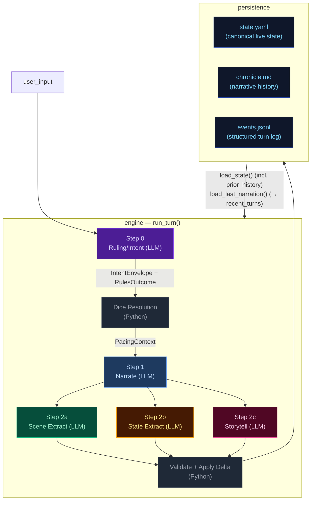

## Pipeline Quick Reference

| Step | Docs | When it runs | Key inputs | Key outputs | Mechanics it owns |
|---|---|---|---|---|---|
| **Step 0 — Ruling/Intent** | [step0-ruling](./step0-ruling.md) | Every turn (always) | `state.pc`, `state.location`, `recent_turns[-1:]`, `user_input` | `IntentEnvelope`, `RulesOutcome` | Intent classification, impossibility check, scene motion determination, dice roll resolution (1d12 + stat + cond − diff → band), difficulty selection, anti-declare-outcome enforcement. When `impossible=true`, no roll occurs and Python synthesizes a `fail` outcome. |
| **Step 1 — Narrate** | [step1-narrate](./step1-narrate.md) | Every turn (always, streamed) | Full `state`, `prior_history` (last 20 bullets, all but last rendered), `recent_turns[-1:]`, `pacing_context`, `pending_gm_beat`, `npc_roster` (from build_npc_roster()), `world_factions/locations` | `narrative` (prose) | Prose generation, dice-band binding, GM-beat consumption. Scene motion shaped by `PacingContext.outcome_hint`; impossible actions narrated as natural failures. |
| **Step 2a — Scene Extract** | [step2a-scene](./step2a-scene.md) | Every turn (always) | `narrative`, `state.pc/location`, `npc_roster` (from build_npc_roster()), conditions, compendium entries | `SceneExtractResult`: scene_tags, tagline, location_change, compendium_npc_update | NPC presence, location changes, scene tags, durable NPC compendium identity. |
| **Step 2b — State Extract** | [step2b-state](./step2b-state.md) | Every turn (always) | `narrative`, `state.pc/location/inventory`, conditions | `StateExtractResult`: inventory_add/remove/update, pc_condition_add/remove | Inventory delta accuracy, condition lifecycle. |
| **Step 2c — Storytell** | [step2c-storytell](./step2c-storytell.md) | Every turn (always) | `narrative`, `_ExtractionContext` (comp_this_turn, location, inventory, conditions), pacing_context, arc.threads[], recent_turns[-10:], band, npc_roster (from build_npc_roster()), recent_beats | `StorytellerResult`: thread_update/goal_update/arc_resolve/resolve/add, gm_beat, actions, outcome_summary | Storyteller-managed thread lifecycle, arc resolution, beat disposition inference, durable history events. |

After Step 2c: results merge into a `StateDelta`, the validator checks constraints
(e.g. `inventory_remove` IDs exist), `apply_delta()` mutates state in-place, and the
turn is persisted. The next turn's Step 0 reads the new `state.yaml` plus `events.jsonl`.

## Subsystem Docs

| Subsystem | Doc | What it covers |
|---|---|---|
| **Step 0 — Ruling** | [step0-ruling](./step0-ruling.md) | Intent classification, dice resolution flowchart, pacing context computation |
| **Step 1 — Narrate** | [step1-narrate](./step1-narrate.md) | Streaming narration pipeline with all context inputs |
| **Step 2a — Scene Extract** | [step2a-scene](./step2a-scene.md) | Location changes, NPC presence, scene tags |
| **Step 2b — State Extract** | [step2b-state](./step2b-state.md) | Inventory and condition extraction |
| **Step 2c — Storytell** | [step2c-storytell](./step2c-storytell.md) | Pipeline mechanics, GM beat lifecycle, campaign arc system, thread lifecycle mechanics |
| **Delta → Validate → Apply** | [delta-validate](./delta-validate.md) | StateMerge schema, validation rules, apply_delta mutations |
| **Persist** | [persist](./persist.md) | Atomic writes (events.jsonl, state.yaml, chronicle.md), readback |
| **Cross-Pipeline Data Flow** | [cross-pipeline](./cross-pipeline.md) | Full inter-step data flow diagram |
| **Out-of-Band Pipelines** | [out-of-band](./out-of-band.md) | Character Creation pipeline, Generate Seed pipeline, turn viewer status colors |
| **Narration UI** | [narration-ui](./narration-ui.md) | Main game interface: SSE streaming, HTMX sidebar refresh, Alpine.js state machine |
| **Turn Viewer UI** | [turn-viewer-ui](./turn-viewer-ui.md) | Pipeline debug UI: turn cards, stage inspector, diff panel, live updates |
| **Eval Harness** | [eval-harness](./eval-harness.md) | Scenario runner, LLM judges, auto-checkers, REPORT.md generation |

## Key Models Glossary

### Core Result Types

- **IntentEnvelope**: `intent`, `intent_verb`, `target`, `check.required`, `check.skill`, `check.difficulty`, `impossible`, `impossible_reason`, `scene_motion`
- **RulesOutcome**: `rolled`, `skill`, `difficulty`, `stat_value`, `stat_mod`, `diff_mod`, `cond_mod`, `dice`, `raw_total`, `final_total`, `band`, `directive`, `intent`, `intent_verb`, `impossible`, `impossible_reason`
- **SceneExtractResult**: `scene_tags`, `scene_tagline`, `location_change`, `compendium_npc_update`
- **StateExtractResult**: `inventory_add/remove/update`, `pc_condition_add/remove`
- **StorytellerResult**: `thread_update` (list[ThreadUpdate]), `goal_update` (str | None, applied directly to arc dict), `arc_resolve` (ArcResolution | None), `thread_resolve` (with outcome sentence + promote_to_world_state flag), `thread_add`, `gm_beat`, `actions`, `outcome_summary`
- **SeedEnvelope**: `seed_state: GameState`, `opening_narrative`, `actions`, `arc: CampaignArc` (includes `goal_context` — UI-only, not rendered in prompts; unified `threads[]` with `progress: list[ProgressEntry]`, `completed_threads[]`)

  The seed owns first-turn emotional framing, not just world and arc scaffolding. It generates `goal_context` (character-specific stake), NPC `relation` fields (narrative job relative to PC), and action text written from the PC's voice and scene pressure — ensuring the opening feels personal and motivated from the start.

### PacingContext (see [step0-ruling](./step0-ruling.md#pacing-context))

### GMBeat (see [step2c-storytell](./step2c-storytell.md#gm-beat))

### CampaignArc (see [step2c-storytell](./step2c-storytell.md#campaign-arc-system))

### StateDelta (see [delta-validate](./delta-validate.md))

Merges all three extraction results. Contains `scene_tags`, `location_change`, `compendium_npc_update` (NPC changes), `thread_update/arc_resolve/thread_resolve/thread_add`, `inventory_add/remove/update`, `pc_condition_add/remove`. Note: `gm_beat` is NOT in StateDelta — written directly to `state.meta.pending_gm_beat`.

---


## cross-pipeline


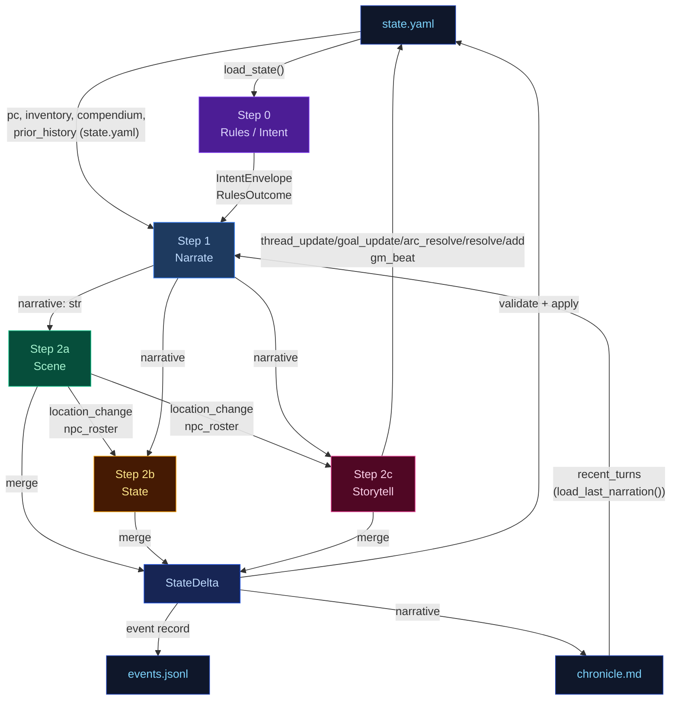

---


## delta-validate


The three extraction results merge into a single `StateDelta`, then validate and apply.

## Flowchart

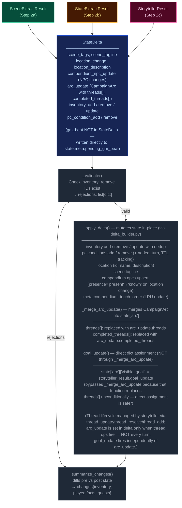

---


## narration-ui


The primary player-facing UI. Renders game state, streams narrative tokens live, and refreshes sidebars via HTMX partial swaps. Single-page app driven by Alpine.js + SSE + HTMX.

## Interaction Model

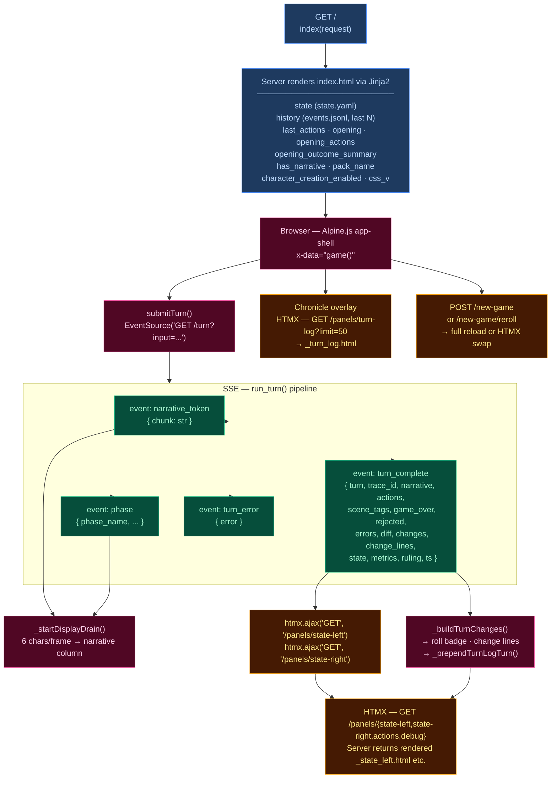

## Layout

| Region | Element | Content |
|--------|---------|---------|
| **Header** | `.header-bar` | Logo/tagline, Chronicle toggle, turn counter, retry button, new game button, reroll button (dynamic packs), mock-mode dot |
| **Left sidebar** | `.sidebar-left` | Player card, scene NPCs, location, arc, compendium — loaded via `/panels/state-left` |
| **Narrative column** | `.narrative-column` | Scrollable narrative blocks, action pills, input textarea, send/stop button |
| **Right sidebar** | `.sidebar` (right) | Inventory, recent events, world state, debug panel — loaded via `/panels/state-right` |
| **Chronicle overlay** | `.turn-log-shell` | Floating overlay over narrative column, populated by `/panels/turn-log?limit=50` |
| **New Game modal** | (Alpine `x-show`) | Pack picker → char creation / world builder steps |

## Data Flow

### Turn submission (Alpine.js + SSE)

1. User types input, presses Enter → `game().submitTurn()`
2. Opens `EventSource` to `GET /turn?input=<text>` — SSE endpoint in `routes.py:83`
3. Server streams events as the 5-stage pipeline (`run_turn()`) executes:
   - `narrative_token` — token chunks streamed as they arrive from LLM
    - `phase` — pipeline phase progress (ruling_start, narrate_start, narrate_first_token, narrate_done, extract_start, extract_done, sanitize_start, sanitize_done, persist)
   - `turn_complete` — final result
   - `turn_error` — error payload
4. Client `_startDisplayDrain()`: reveals 6 characters per animation frame for smooth streaming
5. On `turn_complete`:
   - Calls `htmx.ajax('GET', '/panels/state-left', ...)` and `htmx.ajax('GET', '/panels/state-right', ...)` to refresh sidebars
   - Renders change lines (`_buildTurnChanges`), roll badge
   - Prepends turn to Chronicle overlay via `_prependTurnLogTurn`
   - Re-renders markdown via `marked.parse()`

### HTMX partial endpoints (routes.py)

| Route | Template | Purpose |
|-------|----------|---------|
| `GET /panels/state-left` | `_state_left.html` | Left sidebar — player, NPCs, location, arc, compendium |
| `GET /panels/state-right` | `_state_right.html` | Right sidebar — inventory, events, world state, debug |
| `GET /panels/actions` | `_actions.html` | Action pills (fallback) |
| `GET /panels/turn-log?limit=N` | `_turn_log.html` | Chronicle — turn history with change lines |
| `GET /panels/pack-picker` | `_pack_picker.html` | New Game — pack selection cards |
| `GET /panels/char-creation` | `_char_creation.html` | New Game — character stats builder |
| `GET /panels/world-builder` | `_world_builder.html` | New Game — world creation form |
| `GET /panels/debug` | `_debug.html` | Debug panel — recent turn timings, errors |
| `GET /panels/state` | `_state.html` | Combined left+right (legacy) |

### Client state machine (`game()` — inline `<script>` in index.html)

Alpine.js `x-data="game()"` manages:
- `input` — textarea value
- `submitting` — turn-in-progress flag
- `gameStarted` — derived from `has_narrative`
- `turnNum` — current turn counter
- `leftWidth` / `rightWidth` — resizable sidebar widths (persisted to `localStorage`)
- Card collapse state — read/written directly from/to `localStorage` via `CCYA_CARD_KEY(name)` helper, using DOM `data-card` attributes; no Alpine data property

## UI Features

### Resizable sidebars
- Drag gutters with mousedown/mousemove handlers
- Widths saved to `localStorage` (`ccya_sidebar_left`, `ccya_sidebar_right`)
- Minimum width enforcement (240px left, 220px right)
- **Reset button** in sidebar footer: restores viewport-aware defaults (left 320px, right 280px) on click
- **Ultrawide override** (≥2561px viewport): `--sidebar-w: min(512px, 38vw)` — sidebar defaults to 2x standard width. Sidebar text scaled ~25% smaller via explicit `.sidebar-card-header`, `.stat-row`, `.npc-notes-inline`, `.inventory-item`, etc. overrides in the ultrawide media query.

### Collapsible cards
Each sidebar section has a collapse toggle; open/closed state persisted per-card to `localStorage` via `ccya_card_<name>` key.

### Action pills
Suggested next actions rendered as buttons that populate the input on click. Updated from `turn_complete.actions` or via HTMX panel refresh.

### Roll badge
Server-rendered for history, JS-built for new turns. Shows dice math, band label, outcome summary. Band colors: `crit_fail` (red) → `fail` → `setback` → `partial` → `success` → `crit_success`.

### Change lines
Grouped by category via emoji prefix:
| Emoji | Category | Class |
|-------|----------|-------|
| 🎒 + | Inventory gain | `.tc-inv-gain` |
| 🎒 − | Inventory loss | `.tc-inv-loss` |
| 🩺 | Player condition | `.tc-pl` |
| 📍 | Location | `.tc-loc` |
| 📜 | Faction/arc | `.tc-fa` |

### Retry
`POST /turn/delete` removes last event from `events.jsonl` and `chronicle.md`, returns previous actions for re-submission.

### New Game
`POST /new-game` with optional `pack_id`, `pc_name`, `pc_stats`, `hints`. For dynamic packs, triggers `generate_seed()` LLM pipeline. Full page reload on success. Reroll (`POST /new-game/reroll`) HTMX-swaps the opening narrative + actions.

## CSS Architecture

- **`app.src.css`** — Tailwind + custom styles split by region:
  - App shell layout (CSS Grid: header + body with sidebar-gutter-main-gutter-sidebar)
  - Narrative blocks (`.narrative-block`, `.narrative-text`)
  - Sidebar cards (`.card`, `.card-header`, `.card-body`)
  - Input bar (`.input-bar`, `.game-input`, `.send-btn`)
  - Action pills (`.action-pill`, `.pills-row`)
  - Roll badges (`.roll-badge`, `.roll-band--*`)
  - Chronicle overlay (`.turn-log-shell`, `.turn-log-panel`)
  - New Game modal (`.modal-overlay`, `.pack-card`)
  - Progress strip, tooltips, scrollbar styling
  - Design tokens via CSS custom properties (`--text-primary`, `--bg-card`, `--status-*`)
- **Fluid typography**: 3-tier `@media` breakpoints set `html { font-size: clamp(...) }`:
  | Viewport | Font size clamp | Applicable to |
  |---|---|---|
  | 769–1400px | `clamp(15px, 1vw, 17px)` | Tablet/small desktop |
  | 1401–2560px | `clamp(22px, 1.56vw, 26px)` | Standard desktop |
  | ≥2561px | `clamp(24px, 1.5vw, 27px)` | Ultrawide (also sets `--sidebar-w: min(512px, 38vw)`) |
  - Font sizes throughout are in `rem` units, scaling proportionally with the base.
- **Location panel fix**: Hardcoded `px` font sizes replaced with `rem` units to respect fluid base.
- Compiled to **`app.css`** with cache-busting via `css_v` query param

## Server Entry Point

`routes.py:57` — `GET /` handler assembles template context from `state.yaml`, `events.jsonl`, pack manifest, and engine config, then renders `ccya/templates/index.html`.

---


## out-of-band


These run only at new-game time or are non-engine concerns. They are excluded from the eval-context region of the main architecture doc.

## Character Creation Pipeline

Triggered by `POST /new-game`. All packs use the Generate Seed pipeline (dynamic). Static packs with pre-built seed_state.yaml exist but are not used by new_game.

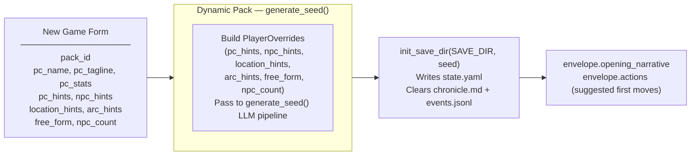

## Generate Seed Pipeline (Dynamic Packs Only)

Called by `POST /new-game` and `POST /new-game/reroll`. Generates a complete starting game state (PC, NPCs, location, arc, opening narrative, actions) from the pack manifest and optional player overrides.

The seed owns **first-turn emotional framing** — not just world and arc scaffolding. Every seed element must produce an emotionally legible opening that answers: why this moment matters now, what the character stands to lose, and why at least one person in the scene matters to them personally.

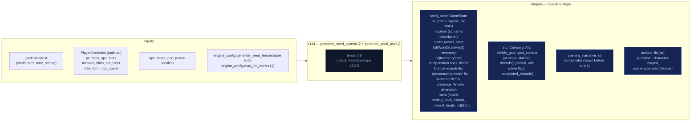

### Seed emotional framing contract

The seed prompt (`generate_seed_system.j2`) enforces these requirements:

- **`goal_context`**: 2–3 sentences explaining why `visible_goal` matters to this character specifically — inner cost or pressure that makes it emotionally loaded. No hidden-truth spoilers, no restating `visible_goal`, no direct statement of the thematic question. Must connect character motive, story stakes, and emotional cost.
- **NPC `relation` field**: Each opening NPC has a defined narrative job. One NPC is personally tied to the PC's motive or vulnerability; the other carries immediate external pressure from the world or conflict. The `relation` field encodes PC-facing relevance (e.g. "owes them a favor", "is their only contact here", "represents the institution pressing on them").
- **Compendium NPCs**: The seed also generates 2–3 NPCs in `compendium.npcs` (name, title, bio) who exist in the world but are not present in the opening scene. Their bios tie them to factions, locations, or world pressures, not to the immediate situation. These become discoverable characters during play.
- **Action guidance**: Each of the 4 choices is written from the PC's point of view, grounded in a present NPC, immediate risk, active thread, or character motive. They differ in emotional posture (confront, deflect, investigate, protect, exploit, withdraw, etc.) and avoid generic verbs.
- **`threads[]`**: Unified list (not split active/latent) where each thread has `{id, summary, urgency, scope}` and an `active` boolean flag managed by the storyteller via `thread_update`, not Python age rules. Threads have a `progress: list[str]` field — append-only log of progress updates set via `thread_update[].progress`, never replaced. Also includes `last_updated_turn: int | None` for urgency decay tracking.

## Turn Viewer — status colors

The standalone turn viewer ([turn-viewer-ui](./turn-viewer-ui.md)) uses the same semantic status colors as the CSS custom properties in `static/app.src.css` (`--status-*`). The stage colors used in the diagrams above (`stageRules` violet → `stageNarrate` blue → `stageScene` green → `stageState` amber → `stageProgress` pink) map directly to the `--stage-*` tokens. Cross-stream inputs into a step are shown in `xstream` (purple outline) and LLM/Python boxes use neutral dark fills. This table is the canonical turn-viewer status legend.

| Token | Meaning |
|-------|---------|
| `--status-ok` | Stage ran and completed (no extraction error). |
| `--status-skipped` | Stream was skipped (no longer used — all streams always run). |
| `--status-retried` | LLM output required a parse retry (`attempts` > 1 in event). |
| `--status-rejected` | Post-extract validation rejected part of the delta (e.g. bad `inventory_remove`). |
| `--status-error` | LLM call or parse ultimately failed for that stream. |
| `--status-neutral` | Non-fatal / informational (e.g. rules path with no dice roll). |

Stage accent stripes use `--stage-rules`, `--stage-narrate`, `--stage-scene`, `--stage-state`, `--stage-progress` for quick scanning; **status** always wins for the prominent left border.

---


## persist


Atomic writes to disk. No LLM calls.

## Flowchart

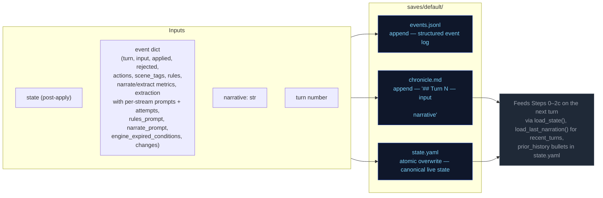

---


## step0-ruling


Classifies the player's action, determines whether a dice check is needed, and
identifies which state domains will be active — narrowing every downstream extractor.

## Flowchart

```mermaid
flowchart LR
    classDef stageRules fill:#4c1d95,color:#ddd6fe,stroke:#7c3aed
    classDef llmNode    fill:#0f172a,color:#94a3b8,stroke:#334155
    classDef pyNode     fill:#1f2937,color:#9ca3af,stroke:#4b5563
    classDef outNode    fill:#3b0764,color:#e9d5ff,stroke:#7c3aed

    subgraph IN["Inputs"]
        I1["state.pc<br>(name, stats, conditions)"]
        I2["state.location"]
        I3["recent_turns[-1:]<br>(last turn's full narrative from chronicle.md<br>via load_last_narration();<br>ruling user prompt)"]
        I4["user_input"]
    end

    subgraph LLM0["LLM — ruling_system.j2 + ruling_user.j2"]
        L0["temp: 0.2 · max_retries: 1<br>output: IntentEnvelope JSON<br>(intent, impossible, scene_motion, check)"]:::llmNode
    end

    subgraph PYRES["Python — impossible check + rules.resolve_check()"]
        P0["if impossible=true:<br>  synthesize fail outcome<br>  skip roll, apply momentum<br>else:<br>  roll 1d12 + stat_mod + cond_mod − diff_mod<br>  map total → Band"]:::pyNode
    end

    subgraph OUT["Outputs"]
        O1["IntentEnvelope<br>  intent: str<br>  intent_verb: str<br>  target: str<br>  impossible: bool<br>  impossible_reason: str<br>  scene_motion: hold|advance|transition<br>  check.required: bool<br>  check.skill: SkillName<br>  check.difficulty: Difficulty"]:::outNode
        O2["RulesOutcome<br>  rolled: bool<br>  skill, difficulty, stat_value, stat_mod<br>  diff_mod, cond_mod<br>  dice: list[int]<br>  raw_total, final_total: int<br>  band: Band<br>  directive: str<br>  intent, intent_verb: str<br>  impossible: bool<br>  impossible_reason: str"]:::outNode
    end

    IN --> LLM0
    LLM0 -- "IntentEnvelope" --> PYRES
    PYRES --> OUT
```

## Impossibility check

The ruling LLM evaluates whether the described action is impossible given the character's state, inventory, and scene. An action is impossible when:

- It requires an item the character does not have (firing a gun with no ammo, using a key never acquired)
- It requires a capability contradicted by active conditions (climbing with a broken leg, sneaking while armored and noisy)
- It acts on something not present in the scene (targeting an NPC who is not here, opening a door that doesn't exist)

When `impossible=true`: Python sets `check.required=False`, synthesizes a `RulesOutcome` with `band="fail"` and `rolled=False`, applies momentum, and skips the dice roll entirely. The narrator renders the impossible fact and narrates the natural failure.

## Scene motion

The ruling LLM also determines how the scene should progress: `"hold"` (scene continues at current pace), `"advance"` (something significant happens/resolves), or `"transition"` (player is leaving, write the arrival). This feeds into `_compute_pacing_context()` which produces `outcome_hint` for the narrator.

## Key forward dependency

`rules_outcome` feeds into `_compute_pacing_context()` which produces the single authoritative `PacingContext` struct passed to both Narrator and Storytell pipeline.

## Pacing Context

All pacing signals are collapsed into one Python-computed struct (`PacingContext`) passed to both the Narrator and Storytell pipeline. This replaces six independent fields (`narration_directive`, `deescalate`, `narrative_velocity`, `beat_disposition` output, `quest_threshold_directive`, and stale momentum-derived signals). The narrator receives `outcome_hint` (scene motion); Storytell receives the full struct including `directive`.

### Struct definition

```
PacingContext:
  directive: str           # "" | "Breathe" | "Scene Imperative" | "Overwhelm" | "Pressure" | "Tension" | "Scene Pressure" (may include "; Resolve a Threat" secondary when beat_locked); used by Storytell pipeline
  outcome_hint: str | None # "hold" | "advance" | "transition" — narrator's primary scene motion instruction
  beat_locked: bool        # True: consecutive pressure threshold reached or momentum at floor — enables floor relief injection (when not from momentum) and may append "; Resolve a Threat" to directive (except when directive="Breathe")
  gate: str                # "block_escalate" | "allow" (controls thread_add); set independently from beat_locked via deescalate >= 0.5
  summary: str             # human-readable log string, never sent to LLM
```

`beat_locked: True` fires when either `consecutive_pressure_turns >= config.consecutive_pressure_threshold` OR `momentum <= config.momentum_floor`. When locked, `"Resolve a Threat"` is appended to the directive via semicolon (except when directive="Breathe"). The `gate` field prevents Progress from adding new threads during de-escalation windows.

### Computation

`_compute_pacing_context()` in `engine/turn.py` consolidates pacing computation (replacing the former scattered functions: `_compute_narration_directive`, `_compute_narrative_velocity`, `_check_floor_relief`). It takes inputs (`momentum`, `consecutive_pressure_turns` from state meta, `arc.threads[] scope=scene urgency counts`) and returns a single struct with directive derived from a priority stack. It also computes `outcome_hint` from the ruling LLM's `scene_motion` and PacingContext escalation signals: ruling `scene_motion` takes priority (`transition` > `advance` > fallback), then `impossible=true` forces `advance`, then Python escalation signals (`beat_locked`, Overwhelm/Pressure with urgent threads) produce `advance`, defaulting to `hold`.

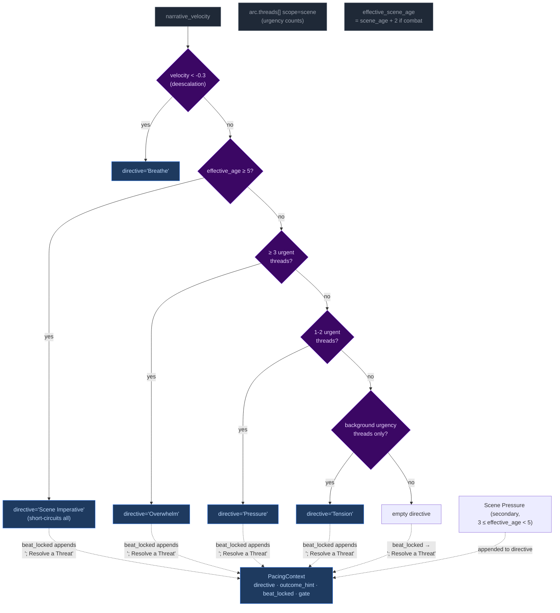

Priority order (highest to lowest): **Breathe > Scene Imperative > Overwhelm > Pressure > Tension > Scene Pressure**. The `beat_locked` flag fires when either consecutive pressure threshold or momentum floor is reached — `"Resolve a Threat"` is appended to the directive (except when directive="Breathe") and `outcome_hint` is set to `"advance"`. Floor relief injection only fires when beat_locked stems from consecutive_pressure, not from momentum_floor. The gate is NOT affected by beat_locked (set independently by deescalate ≥ 0.5).

**Breathe secondary guard:** The Breathe directive has an additional check beyond velocity: if urgent scene-scoped threads exist, Breathe is NOT emitted even if `narrative_velocity < -0.3`. Low velocity during unresolved tension (tactical avoidance, stealth) does not trigger de-escalation. Once urgent threads resolve, Breathe fires on the next low-velocity turn.

#### Age computation

`_compute_ages(state)` returns only `{"scene_age": scene_age}` — location_age and combat_age removed in Phase 03 pacing overhaul. The ruling phase pre-computes `effective_scene_age = scene_age + 2` when `"combat"` is in scene tags, stored in `ctx._ages["effective_scene_age"]`. This single-age signal drives all directive thresholds:
- Scene Imperative (≥5 effective age): high-priority directive forcing story advancement
- Scene Pressure (3 ≤ effective_age < 5): secondary append to wind down or shift focus

### Wiring

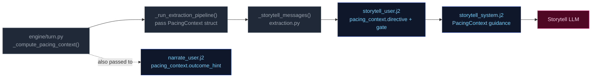

1. **Computed** once in `run_turn()` via `_compute_pacing_context()`.
2. **Passed through** `_run_extraction_pipeline()` → both `_narrate_messages()` and `_storytell_messages()`.
3. **Narrator template** (`narrate_user.j2`) renders `outcome_hint` (scene motion: hold/advance/transition) with value-specific guidance. No Jinja2 pacing computation remains — all pacing computed by Python.
4. **Storytell template** ((`storytell_system.j2` + `user.j2`)) receives the full struct; guidance maps each directive to appropriate thread/beat actions:

| Directive | Thread action | Gate |
|-----------|---------------|-------|
| **"Breathe"** (de-escalation, velocity < -0.3) | Do NOT add new threads. Allow existing scene threads to persist without escalation. | `block_escalate` (set by deescalate ≥ 0.5; beat_locked does NOT force-close gate) |
| **"Scene Imperative"** (effective_age ≥ 5) | Story must advance — introduce new development forcing resolution or movement; do not linger | Varies by context |
| **"Overwhelm"** (3+ urgent threads) | May add scene-scoped threads if gate allows; emit pressure/escalation beat | `allow` |
| **"Pressure"** (1-2 urgent threads) | Advance relevant scene/arc threads. Add new thread only if gate permits. | Varies by context |
| **"Tension"** (background urgency only) | Do NOT add pressures unless concrete threat emerges; prefer advancing existing threads | Allow |
| **"Scene Pressure"** (3 ≤ effective_age < 5, secondary append) | Begin winding down or introduce reason to shift focus: development elsewhere, closing window | Varies by context |
| **"" (empty)** | No action required beyond normal aging of silent threads. | Allow |

**Note:** Directives may include secondary modifiers joined by semicolons (e.g., "Pressure; Resolve a Threat" when beat_locked). The primary directive drives thread/beat logic; the secondary (`; Resolve a Threat`) acts as thematic guidance for beat type selection. "Resolve a Threat" never appears as a standalone primary directive — it is only appended by the `beat_locked` mechanism (except Breathe, which never receives this append regardless of beat_locked state).

### Consecutive pressure counter

`state["meta"]["consecutive_pressure_turns"]` tracks how many consecutive turns have had pressure-type storyteller beats. Re-keyed from directive tracking (which never fired — Pressure/Overwhelm directives were unreachable) to beat-type tracking:

- **Increments** when `storyteller_result.gm_beat.type` is `"pressure"`, `"escalation"`, or `"complication"`.
- **Resets to 0** on any other beat type, null beat, or missing storyteller output.

When this counter reaches `config.consecutive_pressure_threshold` (default 3), it triggers `beat_locked` alongside the momentum floor fallback (`momentum <= -3`). `beat_locked` appends `"; Resolve a Threat"` to the directive (except when directive="Breathe") and enables floor relief injection (when not from momentum).

---


## step1-narrate


Generates the narrative prose the player reads. Tokens are streamed to the client.

## Flowchart

```mermaid
flowchart LR
    classDef llmNode   fill:#0f172a,color:#94a3b8,stroke:#334155
    classDef xstream   fill:#4c1d95,color:#ddd6fe,stroke:#7c3aed
    classDef outNode   fill:#1e3a5f,color:#bfdbfe,stroke:#3b82f6

    subgraph IN["Inputs"]
        N1["state (full —<br>pc, location, scene,<br>inventory, compendium)"]
        N2["prior_history<br>(last 20 incremental history bullets, all but last rendered as bullets)"]
        N3["recent_turns[-1:]<br>(single most recent turn as full text)"]
        N4["rules_outcome<br>(band, directive, impossible, dice summary)"]:::xstream
        N6["npc_name_pool (cultural name list)"]
        N7["npc_roster<br>(from build_npc_roster(comp),<br>  presence field: present/nearby/known)"]
        N9["world_factions<br>(immutable trace)"]:::xstream
        N10["pending_gm_beat<br>(type · surface_as metadata)"]
        N11["pacing_context<br>(outcome_hint)<br>from _compute_pacing_context()"]:::xstream
        N15["user_input"]
    end

    subgraph LLM1["LLM — narrate_system.j2 + narrate_user.j2"]
        NL["temp: 0.9 · streaming: yes<br>output: prose narrative (str)"]:::llmNode
    end

    subgraph OUT["Outputs"]
        NO1["narrative: str<br>(streamed as tokens → client<br>then joined + thinking-stripped)"]:::outNode
        NO2["narr_metrics<br>  first_token_ms<br>  total_ms<br>  tokens_in / tokens_out"]
    end

    IN --> LLM1
    LLM1 --> OUT
```

## Arc context in narration

The narrator receives `current_arc` in both system and user prompts. Key fields:

- **`goal_context`**: A seed-time field (2–3 sentences) explaining why `visible_goal` matters to the character specifically — inner cost or pressure that makes it emotionally loaded. UI-only (surfaced as tooltip on the arc goal in the sidebar). NOT rendered in prompt context — the narrator works from general early-turn behavioral guidance in the system prompt, not from the raw `goal_context` value.
- **`visible_goal`**: The player-facing objective.
- **`threads[]`**: Unified thread collection filtered by `active` flag. Scene-scope threads provide immediate pressure; arc-scope threads provide medium-term tension.
- **`resolved_arc`**: TTL-filtered list of previously resolved arcs, providing narrative continuity across arc transitions.

### Opening-turn narrative mode

The seed embeds emotional stakes in the initial state — NPC `relation` fields, `motivation/fear/leverage`, and a `goal_context` sidebar entry. The narrator does NOT receive special early-turn prompt guidance or `goal_context` in its context. Instead, the initial scene's NPCs (with rich behavioral drivers), the opening narrative's tone, and the player-facing sidebar create the onboarding experience. The narrator works from its standard behavioral guidance and the richness of seed-generated state.

## Key forward dependency

`narrative` is the primary content input for all three extraction streams below.

### GM Beat consumption

The narrator receives a pending GM beat from `state.meta.pending_gm_beat` (set by Storytell in the previous turn). The beat's `type` and `surface_as` metadata are passed alongside the pacing directive as creative guidance for the narrative. The beat is NOT cleared after narration — it persists through the extraction phase. After extraction completes, Storytell replaces it with a new beat or pops it on null output. Full beat lifecycle is documented in [step2c-storytell](./step2c-storytell.md#gm-beat).

---


## step2a-scene


Extracts location changes, NPC presence, scene tags, and suggested actions from the narrative.

## Flowchart


## Key forward dependency

`location_change` flows into `extraction_ctx` (built by `_build_extraction_context`). Step 2c also receives `npc_roster` (from build_npc_roster()) built from comp_this_turn. No forward-facing mechanics (`thread_add`, `gm_beat`) are emitted by this stream — they go through the unified thread lifecycle via Storytell (Step 2c).

---


## step2b-state


Extracts inventory changes and player condition mutations from the narrative.

## Flowchart

```mermaid
flowchart LR
    classDef llmNode fill:#0f172a,color:#94a3b8,stroke:#334155
    classDef xstream fill:#4c1d95,color:#ddd6fe,stroke:#7c3aed
    classDef outNode fill:#451a03,color:#fde68a,stroke:#f59e0b

    subgraph IN["Inputs"]
        S1["narrative (from Step 1)"]:::xstream
        S2["state.pc (name, bio, stats, conditions)"]
        S3["state.location"]
        S4["state.inventory"]
        S5["intent: str<br>(from Step 0)"]
    end

    subgraph LLM2B["LLM — extract_state_system.j2 + extract_state_user.j2"]
        SL["temp: 0.4 · max_retries: 1<br>output: StateExtractResult JSON"]:::llmNode
    end

    subgraph OUT["Outputs — StateExtractResult"]
        O1["inventory_add: list[InventoryItem]<br>  id, name, notes, amount"]:::outNode
        O2["inventory_remove: list[InventoryRemove]<br>  id, amount (None = full stack)"]:::outNode
        O3["inventory_update: list[InventoryUpdate]<br>  id, name?, notes?"]:::outNode
        O4["pc_condition_add: list[ConditionAdd]<br>  id, label, description"]:::outNode
        O5["pc_condition_remove: list[ConditionRemove]<br>  id"]:::outNode
    end

    IN --> LLM2B
    LLM2B --> OUT
```

## Key forward dependency

Step 2c receives `npc_roster` (from build_npc_roster()) and `location_change` from Step 2a. Cross-stream items_gained/lost were removed — extraction_ctx now covers all this-turn derived data.

---


## step2c-storytell


Extracts thread updates, arc actions, and durable NPC compendium changes. World state changes happen only via thread resolution `promote_to_world_state`.

## Flowchart


## Always runs

Storytell is the post-narration storytelling brain. It always executes every turn (never skipped) and feeds next turn's rules call via `thread_update/goal_update/arc_resolve/thread_resolve/thread_add` (storyteller-managed thread lifecycle), and `gm_beat` (forward-facing beats stored in `state.meta.pending_gm_beat`). World state changes are promotion-only — emitted via `thread_resolve[].promote_to_world_state`.

## GM Beat

Forward-facing storytelling beats that shape scene progression across turns. Beats are emitted by Storytell (Step 2c), consumed by Narrator (Step 1) the following turn, and managed via a write/expiry lifecycle in `state.meta.pending_gm_beat`.

### GMBeat Schema

```
GMBeat
  type: complication | revelation | opportunity | breathing_room | pressure | twist | setback | escalation | callback
  surface_as: ambient | event | npc_behavior | environmental | player_discovery | item (default: ambient)
  beat_expires_turn: int | None — turn number at which the beat expires; set to turn_no + 2 when stored
```

**Validation:** Only `type` is validated by `StorytellerResult._nullify_invalid_gm_beat` — nullified if type is falsy or not in the valid set. No validation on `surface_as`. Python accepts whatever gm_beat the LLM emits with no correction or override.

### PacingContext Beat Fields

The beat system intersects with pacing via two fields in `PacingContext` (see [step0-ruling](./step0-ruling.md#pacing-context)):

| Field | Type | Meaning |
|-------|------|---------|
| `directive` | str | May include secondary modifier `"; Resolve a Threat"` when `beat_locked=True` (except Breathe). Drives storytell guidance for beat type selection. |
| `beat_locked` | bool | True when either `consecutive_pressure_turns >= threshold` OR `momentum <= momentum_floor`. When locked, `"Resolve a Threat"` is appended to the directive (except Breathe). Enables floor relief to inject a breathing_room beat if the storyteller is stuck in a pressure-type loop (only when not from momentum floor). |

### Beat Lifecycle — Turn Sequence

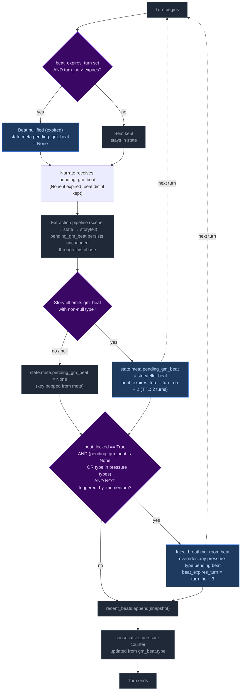

**Step 1 — Pre-narration expiry check.** At the start of each turn, the engine reads `state.meta.pending_gm_beat` from the previous turn. If `beat_expires_turn` is set and the current turn number exceeds it, the beat is nullified (key set to None). Otherwise it proceeds to narration.

Note: This expiry runs early enough that the beat is gone before the extraction phase begins. This is intentional — it creates clean state for floor relief to inject breathing_room if `beat_locked` is active and storyteller doesn't provide its own non-pressure beat. Without the pre-narration expiry, a stale expired beat could block floor relief's null check.

**Step 2 — Narration consumption.** The beat is passed to the narrator via `_narrate_messages(pending_gm_beat=...)`. The narrator uses the beat's `type` and `surface_as` metadata as creative guidance alongside the pacing directive. The beat is NOT cleared after narration — it persists through the extraction phase.

**Step 3 — Storytell writes or clears the beat.** After extraction completes:
- If Storytell emits a valid `gm_beat` (non-null `type`): replaces `pending_gm_beat` with `beat_expires_turn = turn_no + 2`.
- If Storytell emits `null` or an invalid beat: pops `pending_gm_beat` from state (null-clear). The old beat does NOT carry forward.

**Step 4 — Floor relief injection.** After delta apply, if `beat_locked=True` AND the current `pending_gm_beat` is either `None` or a pressure-type (`pressure`, `escalation`, `complication`) AND the beat was NOT triggered by momentum floor: injects a `breathing_room` beat with `beat_expires_turn = turn_no + 3`. This overrides pressure-type beats that would otherwise continue the pressure cycle, but does NOT override non-pressure beats the storyteller independently produced (e.g., `revelation`, `opportunity`, `breathing_room`).

**Step 5 — Beat history snapshot.** `pending_gm_beat` is appended to `state.meta.recent_beats` (capped at 5 entries). The snapshot is taken after any floor relief override, so it reflects the beat the next turn's narrator will consume.

**Step 6 — Consecutive pressure counter update.** The counter increments on pressure-type beats and resets to 0 otherwise.

### Floor Relief Injection

The floor relief mechanism fires after delta apply when `_pc.beat_locked=True` AND the current `pending_gm_beat` is either `None` or a pressure-type beat (`pressure`, `escalation`, `complication`) AND NOT triggered by momentum floor. It injects a `breathing_room` beat with TTL of 3 turns (one more than storyteller-emitted beats' TTL of 2).

Floor relief is a **fallback override** — it breaks a pressure-type run by force-injecting recovery:
- If Storytell emitted a pressure-type beat → floor relief overrides it with breathing_room.
- If Storytell emitted a non-pressure beat (revelation, opportunity, breathing_room, etc.) → floor relief lets it stand. Relief is already being achieved.
- If Storytell emitted nothing (null) → floor relief injects breathing_room. This is appropriate: after a null turn with beat_locked active, relief is needed.

### Directive-Beat Alignment

The storyteller prompt (`storytell_system.j2`, pacing context guidance section) maps each PacingContext directive to recommended beat types (e.g., "Breathe" → breathing_room; "Scene Imperative" → advance story; "Overwhelm" → pressure/escalation). This alignment is **guidance only** — Python accepts whatever gm_beat the LLM emits with no validation, correction, or override. Design rationale: forcing directive-beat alignment would constrain storytelling flexibility and create brittleness if the LLM makes contextually appropriate but directive-divergent beat choices.

### Beat History

`state.meta.recent_beats` stores the last 5 beats (including null entries) with `turn`, `type`, and `surface_as`. This history is rendered in both the storyteller system prompt (behavioral guidance) and the user prompt (current-turn context, more salient). Each entry shows `T{N}: {BEAT TYPE} (surface)` or `T{N}: No beat emitted this turn`.

The LLM uses this history to follow beat diversity guidance: avoid repeating the same type more than twice in a sequence; at least one in three beats should be a non-pressure type.

### TTL Mechanics Summary

| Source | Default TTL | Expiry Calculation |
|--------|-------------|-------------------|
| Storytell-emitted beat | 2 turns | `beat_expires_turn = turn_no + 2` |
| Floor relief (Python-injected) | 3 turns | `beat_expires_turn = turn_no + 3` (extra recovery margin) |

### Null-Clear Behavior

When Storytell emits a null beat (or an invalid beat whose type is nullified), `pending_gm_beat` is popped from `state.meta`. The beat does NOT carry forward. This replaced the old carryover behavior where stale beats persisted through null turns.

The storyteller user prompt always renders the GM Beat section — on null-following turns it shows "No beat currently carried over from the previous turn. Choose freely." This ensures the LLM has consistent beat awareness on every turn.

### GM Beat Section in UI

The storyteller user prompt renders the `## GM Beat` section unconditionally:
- **Beat present:** Shows type, surface_as, expiration turn.
- **No beat:** Shows fallback text — "No beat currently carried over from the previous turn. Choose freely."

This was changed from the previous conditional rendering (where the section vanished on ~38% of turns), ensuring full beat awareness coverage.

## Campaign Arc System

The campaign arc system tracks story threads across turns. Thread state is **storyteller-managed** — the LLM explicitly controls urgency, progress, and goal direction via `thread_update` and `goal_update` directives. The engine applies these without enforcement of caps, cooldowns, or silent timers.

### Arc Data Model

```
CampaignArc
  visible_goal: str          — What the PC is trying to achieve
  goal_context: str          — 2–3 sentences explaining why visible_goal matters (UI-only; not rendered in prompts)
  threads: list[ArcThread]   — Unified collection with active flag
  completed_threads: list[ArcThread] — Resolved/failed/abandoned threads
  resolution: str | None     — Set when arc is resolved via arc_resolve
  last_thread_created_turn: int — Tracks when a thread was last created for pacing

ProgressEntry
  kind: Literal["advancement", "setback", "shift"] = "advancement"
  text: str

ArcThread
  id: str                    — Unique identifier
  summary: str               — What this thread is about
  scope: Literal["scene", "arc"]  # scene = short-lived, purged on location change; arc = persistent story tension
  active: bool = True        # Storyteller-controlled via thread_update; engine may auto-demote via auto-latent or decay to latent/removed
  urgency: Literal["background", "normal", "urgent"] = "normal"  # Storyteller-controlled; Python enforces stepwise decay (urgent→normal→background) after N turns at same level
  progress: list[ProgressEntry] = []   — Append-only log of structured progress updates
  resolution_state: str | None # Set when thread_resolve processes resolved/failed/abandoned
  outcome: str | None        # Set from ThreadResolution.outcome when moved to completed_threads
  resolved_turn: int | None  — Turn when thread was resolved; used for TTL filtering in prompts
  last_updated_turn: int | None — Turn when thread was last updated via thread_update; used for auto-latent demotion and staleness display
  added_turn: int | None     — Turn when thread was created (thread_add or seed); enables age calculations for decay/expiration passes
  urgency_set_turn: int | None — Turn when urgency was last set; enables Python-side urgency decay pass to measure how long a thread has been at its current level
```

### Engine-Driven Arc

Thread lifecycle runs in `engine/turn.py` during the extraction phase. Seven operations handle arc/thread state in strict order:

```mermaid
flowchart TD
    classDef pyNode fill:#1f2937,color:#9ca3af,stroke:#4b5563
    classDef arcNode fill:#3b0764,color:#e9d5ff,stroke:#7c3aed

    PR["StorytellerResult<br>thread_update: list[ThreadUpdate]<br>goal_update: str | None<br>arc_resolve: ArcResolution | None<br>thread_resolve: list[ThreadResolution]"]:::pyNode

    subgraph UPDATES["_apply_thread_updates(config)"]
        U1["For each ThreadUpdate:<br>Find thread by id → apply<br>active/urgency/summary/progress changes<br>progress is append-only (list[ProgressEntry])<br>Progress dedup via difflib (≥50% overlap → reject)<br>Sets last_updated_turn = current turn"]
        U2["Auto-latent demotion:<br>threads untouched for thread_stale_threshold turns<br>→ active: false"]
        U3["Urgency decay pass:<br>for each active thread with urgency_set_turn,<br>If age >= thread_urgency_max_age:<br>  urgent → normal, then normal → background<br>Sets urgency_set_turn = current turn on demotion"]
        U4["Scene-scoped two-stage lifecycle:<br>(a) Active scene threads silent ≥ threshold turns → latent (active: false; urgency handled by decay pass above)<br>(b) Latent scene threads unsurfaced ≥ 2× threshold turns → removed from arc.threads[]<br>Only applies to scope=scene threads"]
    end

    subgraph GOAL["goal_update (direct dict assignment)"]
        G1["If storyteller_result.goal_update is set:<br>state['arc']['visible_goal'] = value<br>Direct assignment, NOT through _merge_arc_update<br>(which would wipe threads[])"]
    end

    subgraph CONFLICT["Same-turn conflict detection"]
        C1["If same thread id appears in both<br>thread_update and thread_resolve:<br>log WARNING (LLM error)<br>resolution wins (fires after update)"]
    end

    subgraph RESOLVE["_apply_arc_resolve()"]
        R1["Store current arc in resolved_arcs<br>with resolved_turn for TTL tracking"]
        R2["Auto-close arc-scoped threads with 'superseded' state<br>Carry forward scene-scoped threads (minus drop_threads)"]
        R3["Add new_threads from resolution"]
        R4["Create successor arc with<br>new visible_goal, goal_context,<br>surviving scene-scoped + new threads"]
    end

    subgraph RESOLUTIONS["_apply_thread_resolutions()"]
        S1["For each ThreadResolution:<br>Move ArcThread to completed_threads<br>Set resolution_state, outcome, resolved_turn"]
    end

    subgraph GATE["Thread add gate (with cap eviction)"]
        T1["PacingContext.gate == 'allow'?<br>If blocked: log debug, skip add<br>Gate status rendered in prompt<br>(no silent drops)"]
        T2["ID collision? Thread id in existing_ids<br>or completed_ids → reject"]
        T3["Thread cap: if active > thread_max_active<br>→ evict oldest active thread (set active: false)"]
    end

    PR --> UPDATES --> GOAL --> CONFLICT --> RESOLVE --> RESOLUTIONS --> GATE

    GATE -- "CampaignArc" --> ARC[arc state in<br>state.yaml]:::arcNode
```

**Pipeline order:** thread updates → goal_update (dict assignment) → conflict detection → arc resolution → thread resolutions → thread_add gate.

**Key rules:**
- **Engine-enforced thread governance:** The engine enforces five controls that constrain storyteller thread management:
  - **Auto-latent demotion:** Threads untouched for `config.thread_stale_threshold` turns (default 3) are automatically set to `active: false`. This prevents stale threads from lingering as active prompts. Fires every turn after thread_updates loop completes (not gated on mutation).
  - **Thread cap eviction:** After thread_add, if active thread count exceeds `config.thread_max_active` (default 5), the oldest active thread (by `last_updated_turn`) is evicted to `active: false`. This prevents unbounded thread accumulation.
  - **Progress dedup:** New progress entries are compared against the last entry via `difflib.SequenceMatcher`. ≥50% textual overlap causes rejection with a WARNING log. This filters out near-duplicate LLM output.
  - **Urgency decay (Python-side floor):** Threads that have been at their current urgency level for >= `thread_urgency_max_age` turns (default 8) are demoted stepwise: urgent → normal, then normal → background. Only applies to active threads with `urgency_set_turn` set. Does not send signals to the LLM — it is a structural floor preventing indefinite stagnation at any urgency level.
   - **Scene-scoped two-stage expiration:** Scene-scoped (`scope=scene`) threads follow an additional lifecycle: (a) after `scene_thread_expire_silent_turns` turns (default 5) without being advanced, they go latent (`active: false`; urgency handled by the decay pass above). (b) If a latent scene thread remains unsurfaced for another `scene_thread_expire_silent_turns` turns (total 2× threshold), it is removed entirely from `arc.threads[]`. This gives scene threads a soft landing — visible to prompts while latent, then purged if never discovered.
- **goal_update:** A bare string applied directly to `state["arc"]["visible_goal"]` via dict assignment. Does NOT route through `_merge_arc_update` (which replaces `threads[]` unconditionally — passing a bare CampaignArc would wipe the thread list). Applied before arc_resolve; if both fire on the same turn, arc_resolve wins (ending the arc supersedes a mid-arc update).
- **Same-turn conflict detection:** When the same thread id appears in both `thread_update` and `thread_resolve` in a single output, a WARNING is logged. The processing order (update before resolve) means resolution takes precedence — correct behavior, but this is always an LLM error worth monitoring.
- **Arc resolution:** When `arc_resolve` is emitted, the current arc is stored in `state["resolved_arcs"]` with `resolved_turn` for TTL tracking. Arc-scoped threads are auto-closed with 'superseded' state; scene-scoped threads carry forward (minus any in drop_threads). The successor arc starts with empty `threads[]`.
- **Scene-scoped threads:** Purged from state on location change (delta_builder.py) before the arc director re-derives.
- **TTL-based cleanup:** Completed threads and resolved arcs are pruned from prompt context after `completed_thread_ttl` / `resolved_arc_ttl` turns (default 3). The `arc_ttl` is wired from `config.arc_memory_ttl` (not hardcoded).

### Arc Context in Narration

The arc state is passed to the narrator via `current_arc` in both system and user prompts. `goal_context` is present in the model but only surfaced in the player UI (tooltip/description text) — the pipeline and prompts never read it directly. The narrator sees arc metadata including resolved arcs (TTL-filtered) and completed threads.

### Arc System Integration Points

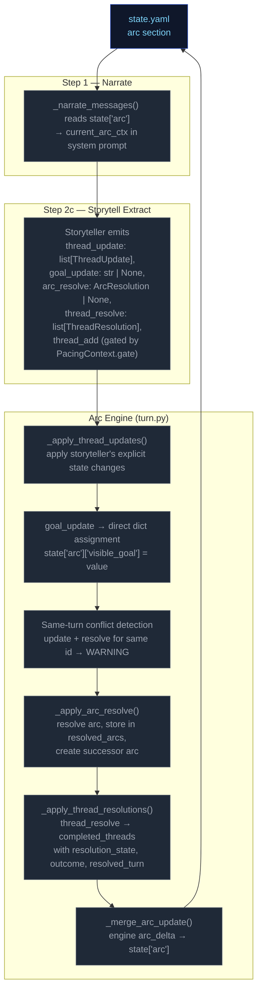

### Thread Mechanics

#### Two Thread Scopes

Threads have a `scope` field (`"scene"` or `"arc"`) that determines narrative treatment:

| Scope | Narrative role | Engine lifecycle |
|---|---|---|
| `scene` | Short-lived tension tied to current location/NPCs | **Purged on location change** — removed from `arc.threads[]` when player moves to a new location (delta_builder.py). **Two-stage expiration:** active→latent after 5 silent turns (`active: false`; urgency handled by decay pass above); latent→removed entirely after 10 total unsurfaced turns. |
| `arc` | Persistent story tension across scenes | Persists across location changes. Only removed via `thread_resolve` or auto-closed on arc_resolve (state `"superseded"`). Subject to auto-latent demotion and urgency decay like all threads. |

#### Entry Points

Seven call sites in `run_turn()` process arc/thread operations in order:
1. **`_apply_thread_updates()`** — apply storyteller's explicit state changes; progress is append-only (`list[ProgressEntry]`); sets `last_updated_turn`; auto-latent demotion when untouched past threshold; urgency decay (stepwise urgent→normal→background after N turns at same level); scene-scoped two-stage expiration (active→latent, latent→removed). Progress dedup via SequenceMatcher
2. **`goal_update`** — direct dict assignment to `state["arc"]["visible_goal"]`
3. **Same-turn conflict detection** — warn if same thread id in both update and resolve
4. **`_apply_arc_resolve()`** — resolve arc, store in resolved_arcs, create successor
5. **`_apply_thread_resolutions()`** — resolve/fail/abandon → completed
6. **Thread add gate** — pacing gate + ID collision checks + thread cap eviction
7. **`_merge_arc_update()`** — apply the final CampaignArc delta to state

All seven run after `apply_delta()` but before `save_state()`.

#### Step-by-Step: `_apply_thread_updates(config)`

Processes `storyteller_result.thread_update` (list of `ThreadUpdate` with `id`, optional `active`, `urgency`, `summary`, `progress`, `progress_kind`).

For each ThreadUpdate:
1. Find matching thread by ID in `arc.threads[]`
2. If not found → log WARNING, skip
3. If found:
   - Apply non-None fields (`active`, `urgency`, `summary`) via `model_copy`
   - If `progress` is non-None: wrap in `ProgressEntry(kind=update.progress_kind or "advancement", text=update.progress)`. If thread already has progress, compare against last entry via `difflib.SequenceMatcher` — ≥50% overlap rejects with WARNING. Otherwise append.
    - Set `last_updated_turn` to current turn number
 4. Log applied changes at INFO level
 5. **Auto-latent demotion** (post-loop, after every thread_updates loop): For each active thread whose `last_updated_turn` is ≥ `config.thread_stale_threshold` turns ago, set `active: false`.
 6. **Urgency decay pass**: For each active thread with `urgency_set_turn` set, if age (`turn_no - urgency_set_turn`) >= `thread_urgency_max_age`, demote stepwise (urgent→normal, normal→background). Sets `urgency_set_turn = current turn` on demotion. Skips threads without `urgency_set_turn` (pre-existing data degrades gracefully).
  7. **Scene-scoped two-stage expiration**: For each scene-scoped (`scope=scene`) thread: (a) If active and silent for >= `scene_thread_expire_silent_turns` turns, set `active=False`. Urgency is handled by the urgency decay pass above — this step does not override it. (b) If latent and unsurfaced for >= 2× threshold total, remove from `arc.threads[]`. Skips threads without turn context (`last_seen_turn` or `added_turn`).

**Progress model:** Every progress entry is a `ProgressEntry` with `kind` field (`"advancement"`, `"setback"`, or `"shift"`) and `text`. The `progress_kind` field on `ThreadUpdate` tags each emitted progress entry; default is `"advancement"`. Progress is rendered to prompts as `[KIND] text` by `_fmt_progress()` (module-level function in `ccya/prompts/context.py` — relocated from a static method on `ArcThreadBlock` and from `ccya/engine/narrate.py`).

**Progress dedup:** Uses `difflib.SequenceMatcher.ratio()` against the last entry to reject near-duplicate progress (≥50% textual overlap). This filters out LLM outputs that rephrase the same progress update without advancing the narrative. A WARNING is logged on rejection.

**Auto-latent demotion:** Prevents stale threads from accumulating as active prompts. Threads that haven't been touched by `thread_update` for `config.thread_stale_threshold` turns (default 3) are automatically demoted to `active: false`. This is engine-enforced, not storyteller-managed — the storyteller can re-activate a thread by issuing a `thread_update` with `active: true`, but the engine will demote it again if it goes untouched. Fires every turn (not gated on mutation) so stale active threads reliably get `active=false` after 3 turns of no updates.

#### Step-by-Step: `_apply_arc_resolve()`

Processes `storyteller_result.arc_resolve` (optional `ArcResolution` with `resolution`, `visible_goal`, `goal_context`, `drop_threads: list[str]`, `new_threads: list[ArcThread]`).

1. If `arc_resolve` is None → return None
2. Validate arc from state; if missing/invalid → log WARNING, return None
3. Store current arc in `state["resolved_arcs"]` with `resolved_turn` for TTL tracking
4. Auto-close all arc-scoped threads: move to completed_threads with resolution_state="superseded"
5. Carry forward scene-scoped threads minus any IDs listed in drop_threads
6. Add new_threads from the ArcResolution model
7. Create successor arc with new `visible_goal`, `goal_context`, and combined surviving + new threads
8. Replace `state["arc"]` with successor

#### Thread Creation (gated in `run_turn()` with cap eviction)

New threads (`storyteller_result.thread_add`) are gated by:

1. **Pacing gate**: `PacingContext.gate == "allow"` — blocks escalation when pacing context says so. Gate status is rendered in the prompt (`_thread_list.j2`) so the storyteller has awareness instead of silent drops.
2. **ID collision**: thread `id` already exists in `arc.threads[]` or `arc.completed_threads[]` → reject with WARNING log. Id-based dedup only — no key field or fuzzy merge.
3. **Thread cap eviction** (post-add, only if config provided): If active thread count exceeds `config.thread_max_active` (default 5), evict the oldest active thread (by `last_updated_turn`) — set `active: false`. This prevents unbounded thread accumulation while the storyteller can still add new threads when pacing context permits.

**Thread creation via thread_update (ungoverned):** Threads can also be created implicitly by appearing in `thread_update` without a prior `thread_add`. This is the dominant creation path in practice — the LLM introduces new thread IDs directly via updates.

#### Step-by-Step: `_apply_thread_resolutions()`

Processes `storyteller_result.thread_resolve` (list of `ThreadResolution` with `id`, `resolution_state`, `outcome`).

1. Find matching thread by ID in `arc.threads[]`
2. If not found → log warning, skip
3. If found → move to `arc.completed_threads[]`, set `resolution_state`, `outcome`, and `resolved_turn`
4. Deduplicate completed_threads entries: existing ID gets updated, not duplicated

#### Pacing Context Gate

`_compute_pacing_context()` sets `gate` based on deescalation:

```
gate = "allow" by default
gate = "block_escalate" when deescalate >= 0.5
```

The gate blocks thread creation. The LLM is instructed not to emit `thread_add` when `gate != "allow"`, and the gate status is explicitly rendered in the prompt to provide awareness.

#### Constants Reference

| Constant | Value (default) | Effect |
|---|---|---|
| `config.arc_memory_ttl` | 3 | Turns to keep resolved arcs in prompt context (wired to `_storytell_messages(arc_ttl=...)`) |
| `config.thread_memory_ttl` | 3 | Turns to keep completed threads in prompt context |
| `config.thread_stale_threshold` | 3 | Turns of inactivity before auto-latent demotion (`active: false`) |
| `config.thread_max_active` | 5 | Max active threads; oldest evicted when exceeded on thread_add |
| `config.thread_urgency_max_age` | 8 | Turns at same urgency level before Python-side stepwise decay (urgent→normal→background) |
| `config.scene_thread_expire_silent_turns` | 5 | Scene-scoped thread expiration threshold: active→latent after this many silent turns; latent→removed after 2× this value unsurfaced |
| `config.track_scene_thread_progress` | True | Whether scene-scoped threads receive progress tracking (enables completion via Python) |

#### Validation Edge Cases

1. **Empty arc state** — No arc in state → log DEBUG, return None (no crash)
2. **Validation failure** — Arc fails Pydantic validation → log WARNING, return None
3. **Unknown thread ID in update** — Log WARNING, skip — does not block valid updates
4. **Unknown resolution ID** — Log WARNING, skip — does not block valid resolutions
5. **Duplicate thread ID in creation** — Checked against existing + completed IDs
6. **Same-turn update+resolve conflict** — Same thread id in both `thread_update` and `thread_resolve` → log WARNING, resolution wins (fires after update)
7. **Progress type migration** — Old saves with `progress: "str"` or `progress: list[str]` are coerced via `field_validator("progress", mode="wrap")`: bare strings wrapped in `[{"text": v, "kind": "advancement"}]`; string lists converted to `[{"text": s, "kind": "advancement"} for s in list]`.
8. **Progress dedup rejection** — New progress with ≥50% textual overlap against last entry → log WARNING, skip entry (does not block rest of update)
9. **Thread cap eviction** — After thread_add, if active count > `thread_max_active`, oldest active thread evicted to `active: false` — log INFO with evicted thread id

### Progress Migration

`ArcThread.progress` has migrated through two versions:
- **v1:** `str` — single progress string
- **v2:** `list[str]` — append-only list of progress strings
- **v3 (current):** `list[ProgressEntry]` — structured entries with `kind` + `text`

A Pydantic `field_validator("progress", mode="wrap")` on `ArcThread` handles all legacy shapes:
- Bare `str`: wraps in `[{"text": v, "kind": "advancement"}]`
- `list[str]`: converts to `[{"text": s, "kind": "advancement"} for s in list]`
- `list[ProgressEntry]`: passes through

---

---

**Track:** baseline

# Static Context (immutable across all turns)

## Seed State

```json
{
  "meta": {
    "game_name": "eval",
    "turn": 0,
    "setting_pack": "eval-pack",
    "model": ""
  },
  "pc": {
    "name": "Aren Voss",
    "tagline": "Reluctant courier on the merchant road",
    "bio": "Mid-thirties, broad shoulders, careful with words. Took on a courier contract\nto clear an old debt. Just arrived in Marrow's Crossing with a heavy pack and\na heavier obligation.\n",
    "stats": {
      "strength": 3,
      "dexterity": 3,
      "wits": 2,
      "charisma": 3
    },
    "conditions": [],
    "momentum": 0,
    "drive": ""
  },
  "location": {
    "id": "marrows_crossing",
    "name": "Marrow's Crossing",
    "description": "A market town built around the confluence of two rivers. Cobblestone streets,\ntimber-framed buildings, and the constant sound of water from the mills. The\ntown square has a stone well and a statue of the founder. Most shops are closing\nfor the evening.\n"
  },
  "inventory": [
    {
      "id": "credits",
      "name": "Credits",
      "notes": "Common coin, accepted at any inn or stall on the merchant road.",
      "amount": 500,
      "aliases": []
    },
    {
      "id": "iron_dagger",
      "name": "Iron dagger",
      "notes": "Plain crossguard, edge worn from honing. Belt-carried.",
      "amount": 1,
      "aliases": []
    },
    {
      "id": "bandages",
      "name": "Linen bandages",
      "notes": "Three rolls. Field-grade \u2014 won't replace a healer.",
      "amount": 3,
      "aliases": []
    },
    {
      "id": "traveler_cloak",
      "name": "Traveler's cloak",
      "notes": "Oiled wool, road-stained, hood deep enough to hide a face.",
      "amount": 1,
      "aliases": [
        "cloak",
        "travel cloak"
      ]
    },
    {
      "id": "brass_key",
      "name": "Brass key",
      "notes": "A small brass key Halden gave you with the ledger.",
      "amount": 1,
      "aliases": []
    }
  ],
  "scene": {
    "tagline": "Market town at dusk",
    "tags": [
      "peaceful",
      "start"
    ],
    "world_state": [
      "Marrow's Crossing is a market town at the confluence of two rivers, known for its mills and the annual river festival.",
      "Iron coin (credits) is the universal currency on the merchant road; barter is acceptable but slower.",
      "The road has been quieter than usual this season \u2014 fewer caravans, more independent runners, more opportunists."
    ]
  },
  "compendium": {
    "npcs": {
      "caron": {
        "name": "Caron",
        "title": "Old creditor",
        "bio": "A portly man in his sixties with a merchant's ledger and a patient demeanor. You owe him 500 credits from a failed venture three years ago.",
        "bond": null,
        "presence": null,
        "notes": null,
        "motivation": null,
        "fear": null,
        "leverage": null
      },
      "halden": {
        "name": "Halden",
        "title": "Merchant",
        "bio": "A road merchant in his fifties who hires couriers when his usual runners are spoken for. Honest by reputation, careful with money.",
        "bond": null,
        "presence": null,
        "notes": null,
        "motivation": null,
        "fear": null,
        "leverage": null
      },
      "innkeeper": {
        "name": "Edda",
        "title": "Innkeeper at the Crossed Keys",
        "bio": "Runs the inn alone since her husband died. Knows every traveler by face if not by name. Stays out of trouble unless it walks through her door.",
        "bond": null,
        "presence": null,
        "notes": null,
        "motivation": null,
        "fear": null,
        "leverage": null
      },
      "tough_a": {
        "name": "Bald Tough",
        "title": "Road thug",
        "bio": "Hired muscle. No personal stake in this \u2014 he'll back off if the price is right or the fight goes bad.",
        "bond": null,
        "presence": null,
        "notes": null,
        "motivation": null,
        "fear": null,
        "leverage": null
      },
      "tough_b": {
        "name": "Scarred Tough",
        "title": "Road thug",
        "bio": "Same outfit as the other \u2014 hired by the same person. Quicker to violence; not the brains.",
        "bond": null,
        "presence": null,
        "notes": null,
        "motivation": null,
        "fear": null,
        "leverage": null
      },
      "matthew_estrada": {
        "name": "Matthew Estrada",
        "title": "Traveler",
        "bio": "A tall, broad-shoulded man in a stained leather jerkin carrying a heavy rucksack. Looks like a road runner but moves with military precision.",
        "bond": null,
        "presence": null,
        "notes": null,
        "motivation": null,
        "fear": null,
        "leverage": null
      }
    }
  },
  "arc": {
    "visible_goal": "Clear your debts and deliver the ledger \u2014 two obligations binding you to Marrow's Crossing.",
    "goal_context": "",
    "threads": [
      {
        "id": "settle_the_debt",
        "summary": "Settle the 500-credit debt with Caron.",
        "scope": "arc",
        "active": false,
        "urgency": "normal",
        "progress": [],
        "resolution_state": null,
        "outcome": null,
        "resolved_turn": null,
        "last_updated_turn": null,
        "added_turn": null,
        "urgency_set_turn": null
      },
      {
        "id": "deliver_the_ledger",
        "summary": "Deliver Halden's ledger to the merchant at the Crossed Keys Inn.",
        "scope": "arc",
        "active": false,
        "urgency": "normal",
        "progress": [],
        "resolution_state": null,
        "outcome": null,
        "resolved_turn": null,
        "last_updated_turn": null,
        "added_turn": null,
        "urgency_set_turn": null
      },
      {
        "id": "clear_the_road_toughs",
        "summary": "Deal with the toughs blocking the inn entrance.",
        "scope": "arc",
        "active": false,
        "urgency": "background",
        "progress": [],
        "resolution_state": null,
        "outcome": null,
        "resolved_turn": null,
        "last_updated_turn": null,
        "added_turn": null,
        "urgency_set_turn": null
      }
    ],
    "completed_threads": [],
    "resolution": null,
    "last_thread_created_turn": 0
  }
}
```

## Engine Constants

```json
{
  "urgency_levels": [
    "background",
    "normal",
    "urgent"
  ],
  "momentum_min": -3,
  "momentum_max": 3,
  "momentum_delta": {
    "crit_success": 2,
    "success": 1,
    "partial": 0,
    "setback": -1,
    "fail": -1,
    "crit_fail": -2
  }
}
```

## System Prompts (identical every turn)

### Ruling System Prompt

```
(not captured this run)
```

### Narrate System Prompt

```
(not captured this run)
```

### Extract Scene System Prompt

```
(not captured this run)
```

### Extract State System Prompt

```
(not captured this run)
```

### Storyteller System Prompt

```
(not captured this run)
```


---

# TURN 1

**Input:** `I ride into Dustfall and tie my horse at the livery. The sun is hot and the main street is quiet. I head for the saloon.`

## User Prompts

### Ruling User Prompt
```
(no ruling call this turn)
```

### Narrate User Prompt
```
(no narrate call)
```

### Extract Scene User Prompt
```
(not captured)
```

### Extract State User Prompt
```
(not captured)
```

### Storyteller User Prompt
```
(not captured)
```

## Engine Outputs

### Rules

**Parsed (engine):**
```json
{
  "intent_verb": "transition",
  "intent": "The player moves from the livery to the saloon in Dustfall.",
  "rolled": false,
  "total_ms": 10479.5,
  "tokens_in": 1117,
  "tokens_out": 74,
  "outcome_summary": "The PC enters the Dustfall Saloon to escape the midday heat."
}
```

**Raw LLM output:**
```

```

### Narration


### Extract Scene

```json
{
  "scene_tags": [
    "quiet",
    "oppressive_heat",
    "weary_atmosphere"
  ],
  "scene_tagline": "Seeking Refuge from the Heat",
  "location_change": {
    "id": "dustfall_saloon",
    "name": "Dustfall Saloon",
    "description": "A dim, cool taproom smelling of stale ale and sawdust, providing a stark contrast to the sun-scorched streets outside."
  },
  "location_description": "The interior is dimly lit, offering relief from the midday glare, with several patrons seated at scarred wooden tables.",
  "compendium_npc_update": [
    {
      "id": "innkeeper",
      "name": "Edda",
      "bio": "Graying hair and a sharp, observant gaze; moves with methodical, slow precision. Runs the inn alone since her husband died and stays out of trouble unless it walks through her door.",
      "aliases": [],
      "presence": "present",
      "notes": "methodically wiping a glass behind the bar"
    },
    {
      "id": "saloon_patrons",
      "name": "Saloon Patrons",
      "bio": "A small group of weary-looking locals sitting at wooden tables. They possess a sense of indifference and exhaustion from the heat.",
      "aliases": [],
      "presence": "present",
      "notes": "watching entrance with weary indifference"
    }
  ]
}
```

### Extract State

```json
{
  "inventory_add": [],
  "inventory_remove": [],
  "inventory_update": [],
  "pc_condition_add": [
    {
      "id": "heat_exhaustion",
      "label": "Heat Exhaustion",
      "description": "The punishing midday sun has left you feeling drained and overheated.",
      "turns_remaining": 2
    }
  ],
  "pc_condition_remove": []
}
```

### Storyteller

```json
{
  "actions": [
    "Order a cold drink to combat the mounting heat exhaustion.",
    "Question Edda about the current state of the merchant road.",
    "Scan the weary patrons for news regarding Caron's whereabouts.",
    "Search for any sign of the hired thugs near the entrance."
  ],
  "outcome_summary": "The PC enters the Dustfall Saloon to escape the midday heat.",
  "gm_beat": {
    "type": "opportunity",
    "surface_as": "npc_behavior"
  },
  "thread_resolve": [],
  "thread_update": [
    {
      "id": "deliver_the_ledger",
      "active": true,
      "urgency": "normal",
      "progress": "Arrived in Dustfall to find the innkeeper.",
      "progress_kind": "advancement"
    }
  ]
}
```

### Applied Deltas

```json
{
  "inventory_add": [],
  "inventory_remove": [],
  "inventory_update": [],
  "location_change": {
    "id": "dustfall_saloon",
    "name": "Dustfall Saloon",
    "description": "A dim, cool taproom smelling of stale ale and sawdust, providing a stark contrast to the sun-scorched streets outside."
  },
  "location_description": "The interior is dimly lit, offering relief from the midday glare, with several patrons seated at scarred wooden tables.",
  "pc_condition_add": [
    {
      "id": "heat_exhaustion",
      "label": "Heat Exhaustion",
      "description": "The punishing midday sun has left you feeling drained and overheated.",
      "turns_remaining": 2
    }
  ],
  "pc_condition_remove": [],
  "scene_tags": [
    "quiet",
    "oppressive_heat",
    "weary_atmosphere"
  ],
  "scene_tagline": "Seeking Refuge from the Heat",
  "compendium_npc_update": [
    {
      "id": "innkeeper",
      "name": "Edda",
      "bio": "Graying hair and a sharp, observant gaze; moves with methodical, slow precision. Runs the inn alone since her husband died and stays out of trouble unless it walks through her door.",
      "aliases": [],
      "presence": "present",
      "notes": "methodically wiping a glass behind the bar"
    },
    {
      "id": "saloon_patrons",
      "name": "Saloon Patrons",
      "bio": "A small group of weary-looking locals sitting at wooden tables. They possess a sense of indifference and exhaustion from the heat.",
      "aliases": [],
      "presence": "present",
      "notes": "watching entrance with weary indifference"
    }
  ],
  "actions": [
    "Order a cold drink to combat the mounting heat exhaustion.",
    "Question Edda about the current state of the merchant road.",
    "Scan the weary patrons for news regarding Caron's whereabouts.",
    "Search for any sign of the hired thugs near the entrance."
  ]
}
```

### Rejected Deltas

*(none)*

### Suggested Actions

*(none)*

### Context Telemetry

*(no telemetry)*

### State After Turn

```json
{
  "arc": {
    "completed_threads": [],
    "goal_context": "",
    "last_thread_created_turn": 0,
    "resolution": null,
    "threads": [
      {
        "active": false,
        "added_turn": null,
        "id": "settle_the_debt",
        "last_updated_turn": null,
        "outcome": null,
        "progress": [],
        "resolution_state": null,
        "resolved_turn": null,
        "scope": "arc",
        "summary": "Settle the 500-credit debt with Caron.",
        "urgency": "normal",
        "urgency_set_turn": null
      },
      {
        "active": false,
        "added_turn": null,
        "id": "deliver_the_ledger",
        "last_updated_turn": null,
        "outcome": null,
        "progress": [],
        "resolution_state": null,
        "resolved_turn": null,
        "scope": "arc",
        "summary": "Deliver Halden's ledger to the merchant at the Crossed Keys Inn.",
        "urgency": "normal",
        "urgency_set_turn": null
      },
      {
        "active": false,
        "added_turn": null,
        "id": "clear_the_road_toughs",
        "last_updated_turn": null,
        "outcome": null,
        "progress": [],
        "resolution_state": null,
        "resolved_turn": null,
        "scope": "arc",
        "summary": "Deal with the toughs blocking the inn entrance.",
        "urgency": "background",
        "urgency_set_turn": null
      }
    ],
    "visible_goal": "Clear your debts and deliver the ledger \u2014 two obligations binding you to Marrow's Crossing."
  },
  "compendium": {
    "npcs": {
      "caron": {
        "bio": "A portly man in his sixties with a merchant's ledger and a patient demeanor. You owe him 500 credits from a failed venture three years ago.",
        "bond": null,
        "fear": null,
        "leverage": null,
        "motivation": null,
        "name": "Caron",
        "notes": null,
        "presence": null,
        "title": "Old creditor"
      },
      "halden": {
        "bio": "A road merchant in his fifties who hires couriers when his usual runners are spoken for. Honest by reputation, careful with money.",
        "bond": null,
        "fear": null,
        "leverage": null,
        "motivation": null,
        "name": "Halden",
        "notes": null,
        "presence": null,
        "title": "Merchant"
      },
      "innkeeper": {
        "bio": "Runs the inn alone since her husband died. Knows every traveler by face if not by name. Stays out of trouble unless it walks through her door.",
        "bond": null,
        "fear": null,
        "leverage": null,
        "motivation": null,
        "name": "Edda",
        "notes": null,
        "presence": null,
        "title": "Innkeeper at the Crossed Keys"
      },
      "matthew_estrada": {
        "bio": "A tall, broad-shoulded man in a stained leather jerkin carrying a heavy rucksack. Looks like a road runner but moves with military precision.",
        "bond": null,
        "fear": null,
        "leverage": null,
        "motivation": null,
        "name": "Matthew Estrada",
        "notes": null,
        "presence": null,
        "title": "Traveler"
      },
      "tough_a": {
        "bio": "Hired muscle. No personal stake in this \u2014 he'll back off if the price is right or the fight goes bad.",
        "bond": null,
        "fear": null,
        "leverage": null,
        "motivation": null,
        "name": "Bald Tough",
        "notes": null,
        "presence": null,
        "title": "Road thug"
      },
      "tough_b": {
        "bio": "Same outfit as the other \u2014 hired by the same person. Quicker to violence; not the brains.",
        "bond": null,
        "fear": null,
        "leverage": null,
        "motivation": null,
        "name": "Scarred Tough",
        "notes": null,
        "presence": null,
        "title": "Road thug"
      }
    }
  },
  "inventory": [
    {
      "aliases": [],
      "amount": 500,
      "id": "credits",
      "name": "Credits",
      "notes": "Common coin, accepted at any inn or stall on the merchant road."
    },
    {
      "aliases": [],
      "amount": 1,
      "id": "iron_dagger",
      "name": "Iron dagger",
      "notes": "Plain crossguard, edge worn from honing. Belt-carried."
    },
    {
      "aliases": [],
      "amount": 3,
      "id": "bandages",
      "name": "Linen bandages",
      "notes": "Three rolls. Field-grade \u2014 won't replace a healer."
    },
    {
      "aliases": [
        "cloak",
        "travel cloak"
      ],
      "amount": 1,
      "id": "traveler_cloak",
      "name": "Traveler's cloak",
      "notes": "Oiled wool, road-stained, hood deep enough to hide a face."
    },
    {
      "aliases": [],
      "amount": 1,
      "id": "brass_key",
      "name": "Brass key",
      "notes": "A small brass key Halden gave you with the ledger."
    }
  ],
  "location": {
    "description": "A market town built around the confluence of two rivers. Cobblestone streets,\ntimber-framed buildings, and the constant sound of water from the mills. The\ntown square has a stone well and a statue of the founder. Most shops are closing\nfor the evening.\n",
    "id": "marrows_crossing",
    "name": "Marrow's Crossing"
  },
  "meta": {
    "game_name": "eval",
    "model": "",
    "setting_pack": "eval-pack",
    "turn": 0
  },
  "pc": {
    "bio": "Mid-thirties, broad shoulders, careful with words. Took on a courier contract\nto clear an old debt. Just arrived in Marrow's Crossing with a heavy pack and\na heavier obligation.\n",
    "conditions": [],
    "drive": "",
    "momentum": 0,
    "name": "Aren Voss",
    "stats": {
      "charisma": 3,
      "dexterity": 3,
      "strength": 3,
      "wits": 2
    },
    "tagline": "Reluctant courier on the merchant road"
  },
  "scene": {
    "tagline": "Market town at dusk",
    "tags": [
      "peaceful",
      "start"
    ],
    "world_state": [
      "Marrow's Crossing is a market town at the confluence of two rivers, known for its mills and the annual river festival.",
      "Iron coin (credits) is the universal currency on the merchant road; barter is acceptable but slower.",
      "The road has been quieter than usual this season \u2014 fewer caravans, more independent runners, more opportunists."
    ]
  },
  "schema_version": 1
}
```


---

# TURN 2

**Input:** `I step up to the bar and ask for a glass of water and whatever news there is. The bartender is wiping a glass and eyeing me.`

## User Prompts

### Ruling User Prompt
```
(no ruling call this turn)
```

### Narrate User Prompt
```
(no narrate call)
```

### Extract Scene User Prompt
```
(not captured)
```

### Extract State User Prompt
```
(not captured)
```

### Storyteller User Prompt
```
(not captured)
```

## Engine Outputs

### Rules

**Parsed (engine):**
```json
{
  "intent_verb": "persuade",
  "intent": "The player seeks refreshment and information from the innkeeper.",
  "rolled": false,
  "total_ms": 3076.9,
  "tokens_in": 1313,
  "tokens_out": 67,
  "outcome_summary": "The PC purchased water from Edda and learned of restless travelers on the northern road."
}
```

**Raw LLM output:**
```

```

### Narration


### Extract Scene

```json
{
  "scene_tags": [
    "tense_conversation",
    "investigation"
  ],
  "scene_tagline": "Water and Whispers",
  "location_description": "The bar counter is scarred from years of use, and a chipped earthenware mug sits before you.",
  "compendium_npc_update": [
    {
      "id": "innkeeper",
      "aliases": [],
      "notes": "leaning on counter, watching entrance"
    },
    {
      "id": "saloon_patrons",
      "aliases": [],
      "notes": "shifting nervously at a nearby table"
    }
  ]
}
```

### Extract State

```json
{
  "inventory_add": [],
  "inventory_remove": [
    {
      "id": "credits",
      "amount": 1
    }
  ],
  "inventory_update": [],
  "pc_condition_add": [],
  "pc_condition_remove": []
}
```

### Storyteller

```json
{
  "actions": [
    "Pay Edda for the water and ask about the restless travelers.",
    "Question the nervous patron about why they are watching the door.",
    "Offer a copper more to see if Edda knows who is blocking the inn.",
    "Scan the saloon patrons for anyone matching the description of restless travelers."
  ],
  "outcome_summary": "The PC purchased water from Edda and learned of restless travelers on the northern road.",
  "gm_beat": {
    "type": "opportunity",
    "surface_as": "npc_behavior"
  },
  "thread_resolve": [],
  "thread_update": [
    {
      "id": "deliver_the_ledger",
      "active": true,
      "urgency": "normal",
      "progress": "Seeking information from Edda at the saloon",
      "progress_kind": "advancement"
    }
  ]
}
```

### Applied Deltas

```json
{
  "inventory_add": [],
  "inventory_remove": [
    {
      "id": "credits",
      "amount": 1
    }
  ],
  "inventory_update": [],
  "location_description": "The bar counter is scarred from years of use, and a chipped earthenware mug sits before you.",
  "pc_condition_add": [],
  "pc_condition_remove": [],
  "scene_tags": [
    "tense_conversation",
    "investigation"
  ],
  "scene_tagline": "Water and Whispers",
  "compendium_npc_update": [
    {
      "id": "innkeeper",
      "aliases": [],
      "notes": "leaning on counter, watching entrance"
    },
    {
      "id": "saloon_patrons",
      "aliases": [],
      "notes": "shifting nervously at a nearby table"
    }
  ],
  "actions": [
    "Pay Edda for the water and ask about the restless travelers.",
    "Question the nervous patron about why they are watching the door.",
    "Offer a copper more to see if Edda knows who is blocking the inn.",
    "Scan the saloon patrons for anyone matching the description of restless travelers."
  ]
}
```

### Rejected Deltas

*(none)*

### Suggested Actions

*(none)*

### Context Telemetry

*(no telemetry)*

### State After Turn

*(diff vs previous turn — full snapshot only on first and last turns)*

```json
{
  "arc": {
    "threads": {
      "changed": [
        {
          "from": {
            "active": false,
            "added_turn": null,
            "id": "settle_the_debt",
            "last_updated_turn": null,
            "outcome": null,
            "progress": [],
            "resolution_state": null,
            "resolved_turn": null,
            "scope": "arc",
            "summary": "Settle the 500-credit debt with Caron.",
            "urgency": "normal",
            "urgency_set_turn": null
          },
          "to": {
            "active": false,
            "id": "settle_the_debt",
            "progress": [],
            "scope": "arc",
            "summary": "Settle the 500-credit debt with Caron.",
            "urgency": "normal"
          }
        },
        {
          "from": {
            "active": false,
            "added_turn": null,
            "id": "deliver_the_ledger",
            "last_updated_turn": null,
            "outcome": null,
            "progress": [],
            "resolution_state": null,
            "resolved_turn": null,
            "scope": "arc",
            "summary": "Deliver Halden's ledger to the merchant at the Crossed Keys Inn.",
            "urgency": "normal",
            "urgency_set_turn": null
          },
          "to": {
            "active": true,
            "id": "deliver_the_ledger",
            "last_updated_turn": 1,
            "progress": [
              {
                "kind": "advancement",
                "text": "Arrived in Dustfall to find the innkeeper."
              }
            ],
            "scope": "arc",
            "summary": "Deliver Halden's ledger to the merchant at the Crossed Keys Inn.",
            "urgency": "normal"
          }
        },
        {
          "from": {
            "active": false,
            "added_turn": null,
            "id": "clear_the_road_toughs",
            "last_updated_turn": null,
            "outcome": null,
            "progress": [],
            "resolution_state": null,
            "resolved_turn": null,
            "scope": "arc",
            "summary": "Deal with the toughs blocking the inn entrance.",
            "urgency": "background",
            "urgency_set_turn": null
          },
          "to": {
            "active": false,
            "id": "clear_the_road_toughs",
            "progress": [],
            "scope": "arc",
            "summary": "Deal with the toughs blocking the inn entrance.",
            "urgency": "background"
          }
        }
      ]
    }
  },
  "compendium": {
    "npcs": {
      "innkeeper": {
        "bio": {
          "from": "Runs the inn alone since her husband died. Knows every traveler by face if not by name. Stays out of trouble unless it walks through her door.",
          "to": "Graying hair and a sharp, observant gaze; moves with methodical, slow precision. Runs the inn alone since her husband died and stays out of trouble unless it walks through her door."
        },
        "last_seen": {
          "from": null,
          "to": {
            "location_id": "dustfall_saloon",
            "location_name": "Dustfall Saloon",
            "turn": 1
          }
        },
        "notes": {
          "from": null,
          "to": "methodically wiping a glass behind the bar"
        },
        "presence": {
          "from": null,
          "to": "present"
        }
      },
      "saloon_patrons": {
        "from": null,
        "to": {
          "bio": "A small group of weary-looking locals sitting at wooden tables. They possess a sense of indifference and exhaustion from the heat.",
          "first_seen_turn": 0,
          "last_seen": {
            "location_id": "dustfall_saloon",
            "location_name": "Dustfall Saloon",
            "turn": 1
          },
          "name": "Saloon Patrons",
          "notes": "watching entrance with weary indifference",
          "presence": "present"
        }
      }
    }
  },
  "location": {
    "description": {
      "from": "A market town built around the confluence of two rivers. Cobblestone streets,\ntimber-framed buildings, and the constant sound of water from the mills. The\ntown square has a stone well and a statue of the founder. Most shops are closing\nfor the evening.\n",
      "to": "A dim, cool taproom smelling of stale ale and sawdust, providing a stark contrast to the sun-scorched streets outside."
    },
    "id": {
      "from": "marrows_crossing",
      "to": "dustfall_saloon"
    },
    "name": {
      "from": "Marrow's Crossing",
      "to": "Dustfall Saloon"
    }
  },
  "meta": {
    "compendium_touch_order": {
      "from": null,
      "to": [
        "innkeeper",
        "saloon_patrons"
      ]
    },
    "consecutive_pressure_turns": {
      "from": null,
      "to": 0
    },
    "pending_gm_beat": {
      "from": null,
      "to": {
        "beat_expires_turn": 3,
        "surface_as": "npc_behavior",
        "type": "opportunity"
      }
    },
    "prior_history": {
      "from": null,
      "to": [
        "- [T1] The PC enters the Dustfall Saloon to escape the midday heat."
      ]
    },
    "recent_beats": {
      "from": null,
      "to": [
        {
          "surface_as": "npc_behavior",
          "turn": 1,
          "type": "opportunity"
        }
      ]
    },
    "turn": {
      "from": 0,
      "to": 1
    }
  },
  "pc": {
    "actions": {
      "from": null,
      "to": [
        "Order a cold drink to combat the mounting heat exhaustion.",
        "Question Edda about the current state of the merchant road.",
        "Scan the weary patrons for news regarding Caron's whereabouts.",
        "Search for any sign of the hired thugs near the entrance."
      ]
    },
    "conditions": {
      "added": [
        {
          "added_turn": 0,
          "description": "The punishing midday sun has left you feeling drained and overheated.",
          "id": "heat_exhaustion",
          "label": "Heat Exhaustion",
          "turns_remaining": 2
        }
      ]
    }
  },
  "scene": {
    "location_entered_turn": {
      "from": null,
      "to": 0
    },
    "tagline": {
      "from": "Market town at dusk",
      "to": "Seeking Refuge from the Heat"
    },
    "tags": {
      "added": [
        "quiet",
        "weary_atmosphere",
        "oppressive_heat"
      ],
      "removed": [
        "start",
        "peaceful"
      ]
    },
    "turn_entered": {
      "from": null,
      "to": 0
    }
  }
}
```


---

# TURN 3

**Input:** ``

## User Prompts

### Ruling User Prompt
```
(no ruling call this turn)
```

### Narrate User Prompt
```
(no narrate call)
```

### Extract Scene User Prompt
```
(not captured)
```

### Extract State User Prompt
```
(not captured)
```

### Storyteller User Prompt
```
(not captured)
```

## Engine Outputs

### Rules

**Parsed (engine):**
```json
{}
```

**Raw LLM output:**
```

```

### Narration


### Extract Scene

```json
{}
```

### Extract State

```json
{}
```

### Storyteller

```json
{}
```

### Applied Deltas

```json
{}
```

### Rejected Deltas

*(none)*

### Suggested Actions

*(none)*

### Context Telemetry

*(no telemetry)*

### State After Turn

*(diff vs previous turn — full snapshot only on first and last turns)*

```json
{
  "arc": {
    "threads": {
      "changed": [
        {
          "from": {
            "active": true,
            "id": "deliver_the_ledger",
            "last_updated_turn": 1,
            "progress": [
              {
                "kind": "advancement",
                "text": "Arrived in Dustfall to find the innkeeper."
              }
            ],
            "scope": "arc",
            "summary": "Deliver Halden's ledger to the merchant at the Crossed Keys Inn.",
            "urgency": "normal"
          },
          "to": {
            "active": true,
            "id": "deliver_the_ledger",
            "last_updated_turn": 3,
            "progress": [
              {
                "kind": "advancement",
                "text": "Arrived in Dustfall to find the innkeeper."
              },
              {
                "kind": "advancement",
                "text": "Seeking information from Edda at the saloon"
              },
              {
                "kind": "advancement",
                "text": "Gathering intel on Harker's disappearance"
              }
            ],
            "scope": "arc",
            "summary": "Deliver Halden's ledger to the merchant at the Crossed Keys Inn.",
            "urgency": "normal"
          }
        }
      ]
    }
  },
  "compendium": {
    "npcs": {
      "innkeeper": {
        "last_seen": {
          "turn": {
            "from": 1,
            "to": 3
          }
        },
        "notes": {
          "from": "methodically wiping a glass behind the bar",
          "to": "leaning in, waiting for payment"
        }
      },
      "saloon_patrons": {
        "last_seen": {
          "turn": {
            "from": 1,
            "to": 3
          }
        },
        "notes": {
          "from": "watching entrance with weary indifference",
          "to": "falling into uneasy silence"
        }
      }
    }
  },
  "inventory": {
    "changed": [
      {
        "from": {
          "aliases": [],
          "amount": 500,
          "id": "credits",
          "name": "Credits",
          "notes": "Common coin, accepted at any inn or stall on the merchant road."
        },
        "to": {
          "aliases": [],
          "amount": 499,
          "id": "credits",
          "name": "Credits",
          "notes": "Common coin, accepted at any inn or stall on the merchant road."
        }
      }
    ]
  },
  "location": {
    "description": {
      "from": "A dim, cool taproom smelling of stale ale and sawdust, providing a stark contrast to the sun-scorched streets outside.",
      "to": "The dim light of the saloon catches the dust motes dancing between you and the bar, emphasizing the heavy silence that has fallen over the room."
    }
  },
  "meta": {
    "consecutive_pressure_turns": {
      "from": 0,
      "to": 1
    },
    "pending_gm_beat": {
      "beat_expires_turn": {
        "from": 3,
        "to": 5
      },
      "type": {
        "from": "opportunity",
        "to": "pressure"
      }
    },
    "prior_history": {
      "added": [
        "- [T2] The PC purchased water from Edda and learned of restless travelers on the northern road.",
        "- [T3] Edda reveals Harker likely traveled north with suspicious travelers but demands payment for the information."
      ],
      "removed": []
    },
    "recent_beats": {
      "added": [
        [
          [
            "surface_as",
            "npc_behavior"
          ],
          [
            "turn",
            2
          ],
          [
            "type",
            "opportunity"
          ]
        ],
        [
          [
            "surface_as",
            "npc_behavior"
          ],
          [
            "turn",
            3
          ],
          [
            "type",
            "pressure"
          ]
        ]
      ],
      "removed": []
    },
    "turn": {
      "from": 1,
      "to": 3
    }
  },
  "pc": {
    "actions": {
      "added": [
        "Threaten Edda to reveal what she knows for free.",
        "Question the silent patrons about the suspicious travelers.",
        "Leave the saloon to scout the north road.",
        "Offer Edda extra credits for more specific details."
      ],
      "removed": [
        "Question Edda about the current state of the merchant road.",
        "Scan the weary patrons for news regarding Caron's whereabouts.",
        "Search for any sign of the hired thugs near the entrance.",
        "Order a cold drink to combat the mounting heat exhaustion."
      ]
    },
    "conditions": {
      "removed": [
        {
          "added_turn": 0,
          "description": "The punishing midday sun has left you feeling drained and overheated.",
          "id": "heat_exhaustion",
          "label": "Heat Exhaustion",
          "turns_remaining": 2
        }
      ]
    },
    "momentum": {
      "from": 0,
      "to": -1
    }
  },
  "scene": {
    "tagline": {
      "from": "Seeking Refuge from the Heat",
      "to": "Information Comes At A Price"
    },
    "tags": {
      "added": [
        "tense_conversation",
        "investigation"
      ],
      "removed": [
        "quiet",
        "weary_atmosphere",
        "oppressive_heat"
      ]
    }
  }
}
```


---

# TURN 3

**Input:** `I lean on the bar and ask what happened to Old Man Harker. The bartender seems reluctant but starts talking.`

## User Prompts

### Ruling User Prompt
```
(no ruling call this turn)
```

### Narrate User Prompt
```
(no narrate call)
```

### Extract Scene User Prompt
```
(not captured)
```

### Extract State User Prompt
```
(not captured)
```

### Storyteller User Prompt
```
(not captured)
```

## Engine Outputs

### Rules

**Parsed (engine):**
```json
{
  "intent_verb": "persuade",
  "intent": "The player seeks information regarding the whereabouts or fate of Old Man Harker from Edda.",
  "rolled": true,
  "total_ms": 3361.6,
  "tokens_in": 1356,
  "tokens_out": 91,
  "outcome_summary": "Edda reveals Harker likely traveled north with suspicious travelers but demands payment for the information.",
  "skill": "charisma",
  "difficulty": "normal",
  "dice": [
    5
  ],
  "stat_mod": 1,
  "diff_mod": 0,
  "cond_mod": 0,
  "raw_total": 5,
  "final_total": 6,
  "band": "setback",
  "momentum_before": 0,
  "momentum_after": -1,
  "momentum_delta": -1
}
```

**Raw LLM output:**
```

```

### Narration


### Extract Scene

```json
{
  "scene_tags": [
    "tense_conversation",
    "investigation"
  ],
  "scene_tagline": "Information Comes At A Price",
  "location_description": "The dim light of the saloon catches the dust motes dancing between you and the bar, emphasizing the heavy silence that has fallen over the room.",
  "compendium_npc_update": [
    {
      "id": "innkeeper",
      "aliases": [],
      "notes": "leaning in, waiting for payment"
    },
    {
      "id": "saloon_patrons",
      "aliases": [],
      "notes": "falling into uneasy silence"
    }
  ]
}
```

### Extract State

```json
{
  "inventory_add": [],
  "inventory_remove": [],
  "inventory_update": [],
  "pc_condition_add": [],
  "pc_condition_remove": [
    {
      "id": "heat_exhaustion"
    }
  ]
}
```

### Storyteller

```json
{
  "actions": [
    "Offer Edda extra credits for more specific details.",
    "Threaten Edda to reveal what she knows for free.",
    "Question the silent patrons about the suspicious travelers.",
    "Leave the saloon to scout the north road."
  ],
  "outcome_summary": "Edda reveals Harker likely traveled north with suspicious travelers but demands payment for the information.",
  "gm_beat": {
    "type": "pressure",
    "surface_as": "npc_behavior"
  },
  "thread_resolve": [],
  "thread_update": [
    {
      "id": "deliver_the_ledger",
      "active": true,
      "urgency": "normal",
      "progress": "Gathering intel on Harker's disappearance",
      "progress_kind": "advancement"
    }
  ]
}
```

### Applied Deltas

```json
{
  "inventory_add": [],
  "inventory_remove": [],
  "inventory_update": [],
  "location_description": "The dim light of the saloon catches the dust motes dancing between you and the bar, emphasizing the heavy silence that has fallen over the room.",
  "pc_condition_add": [],
  "pc_condition_remove": [
    {
      "id": "heat_exhaustion"
    }
  ],
  "scene_tags": [
    "tense_conversation",
    "investigation"
  ],
  "scene_tagline": "Information Comes At A Price",
  "compendium_npc_update": [
    {
      "id": "innkeeper",
      "aliases": [],
      "notes": "leaning in, waiting for payment"
    },
    {
      "id": "saloon_patrons",
      "aliases": [],
      "notes": "falling into uneasy silence"
    }
  ],
  "actions": [
    "Offer Edda extra credits for more specific details.",
    "Threaten Edda to reveal what she knows for free.",
    "Question the silent patrons about the suspicious travelers.",
    "Leave the saloon to scout the north road."
  ]
}
```

### Rejected Deltas

*(none)*

### Suggested Actions

*(none)*

### Context Telemetry

*(no telemetry)*

### State After Turn

*(diff vs previous turn — full snapshot only on first and last turns)*

```json
{
  "arc": {
    "threads": {
      "changed": [
        {
          "from": {
            "active": true,
            "id": "deliver_the_ledger",
            "last_updated_turn": 3,
            "progress": [
              {
                "kind": "advancement",
                "text": "Arrived in Dustfall to find the innkeeper."
              },
              {
                "kind": "advancement",
                "text": "Seeking information from Edda at the saloon"
              },
              {
                "kind": "advancement",
                "text": "Gathering intel on Harker's disappearance"
              }
            ],
            "scope": "arc",
            "summary": "Deliver Halden's ledger to the merchant at the Crossed Keys Inn.",
            "urgency": "normal"
          },
          "to": {
            "active": true,
            "id": "deliver_the_ledger",
            "last_updated_turn": 2,
            "progress": [
              {
                "kind": "advancement",
                "text": "Arrived in Dustfall to find the innkeeper."
              },
              {
                "kind": "advancement",
                "text": "Seeking information from Edda at the saloon"
              }
            ],
            "scope": "arc",
            "summary": "Deliver Halden's ledger to the merchant at the Crossed Keys Inn.",
            "urgency": "normal"
          }
        }
      ]
    }
  },
  "compendium": {
    "npcs": {
      "innkeeper": {
        "last_seen": {
          "turn": {
            "from": 3,
            "to": 2
          }
        },
        "notes": {
          "from": "leaning in, waiting for payment",
          "to": "leaning on counter, watching entrance"
        }
      },
      "saloon_patrons": {
        "last_seen": {
          "turn": {
            "from": 3,
            "to": 2
          }
        },
        "notes": {
          "from": "falling into uneasy silence",
          "to": "shifting nervously at a nearby table"
        }
      }
    }
  },
  "location": {
    "description": {
      "from": "The dim light of the saloon catches the dust motes dancing between you and the bar, emphasizing the heavy silence that has fallen over the room.",
      "to": "The bar counter is scarred from years of use, and a chipped earthenware mug sits before you."
    }
  },
  "meta": {
    "consecutive_pressure_turns": {
      "from": 1,
      "to": 0
    },
    "pending_gm_beat": {
      "beat_expires_turn": {
        "from": 5,
        "to": 4
      },
      "type": {
        "from": "pressure",
        "to": "opportunity"
      }
    },
    "prior_history": {
      "added": [],
      "removed": [
        "- [T3] Edda reveals Harker likely traveled north with suspicious travelers but demands payment for the information."
      ]
    },
    "recent_beats": {
      "added": [],
      "removed": [
        [
          [
            "surface_as",
            "npc_behavior"
          ],
          [
            "turn",
            3
          ],
          [
            "type",
            "pressure"
          ]
        ]
      ]
    },
    "turn": {
      "from": 3,
      "to": 2
    }
  },
  "pc": {
    "actions": {
      "added": [
        "Pay Edda for the water and ask about the restless travelers.",
        "Question the nervous patron about why they are watching the door.",
        "Offer a copper more to see if Edda knows who is blocking the inn.",
        "Scan the saloon patrons for anyone matching the description of restless travelers."
      ],
      "removed": [
        "Threaten Edda to reveal what she knows for free.",
        "Question the silent patrons about the suspicious travelers.",
        "Leave the saloon to scout the north road.",
        "Offer Edda extra credits for more specific details."
      ]
    },
    "conditions": {
      "added": [
        {
          "added_turn": 0,
          "description": "The punishing midday sun has left you feeling drained and overheated.",
          "id": "heat_exhaustion",
          "label": "Heat Exhaustion",
          "turns_remaining": 1
        }
      ]
    },
    "momentum": {
      "from": -1,
      "to": 0
    }
  },
  "scene": {
    "tagline": {
      "from": "Information Comes At A Price",
      "to": "Water and Whispers"
    }
  }
}
```


---

# TURN 4

**Input:** `I head over to the assay office to see if Harker filed any claims recently. I knock on the door and introduce myself.`

## User Prompts

### Ruling User Prompt
```
(no ruling call this turn)
```

### Narrate User Prompt
```
(no narrate call)
```

### Extract Scene User Prompt
```
(not captured)
```

### Extract State User Prompt
```
(not captured)
```

### Storyteller User Prompt
```
(not captured)
```

## Engine Outputs

### Rules

**Parsed (engine):**
```json
{
  "intent_verb": "recall",
  "intent": "The player seeks to investigate Old Man Harker's recent activities by checking for any newly filed claims at the assay office.",
  "rolled": false,
  "total_ms": 3011.2,
  "tokens_in": 1388,
  "tokens_out": 81,
  "outcome_summary": "Aren Voss enters the Assay Office to investigate Old Man Harker's disappearance through official claims, facing Silas Vance's suspicion."
}
```

**Raw LLM output:**
```

```

### Narration


### Extract Scene

```json
{
  "scene_tags": [
    "investigation",
    "tense_conversation"
  ],
  "scene_tagline": "A Suspicious Welcome",
  "location_change": {
    "id": "assay_office",
    "name": "Assay Office",
    "description": "A squat stone building with a cramped, paper-choked interior that smells of old ink and dry parchment."
  },
  "compendium_npc_update": [
    {
      "id": "silas_vance",
      "name": "Silas Vance",
      "title": "Assay Clerk",
      "bio": "Thin frame with ink-stained fingers and eyes perpetually squinted against the light. Wears a heavy leather apron and speaks with a raspy, suspicious tone.",
      "aliases": [],
      "presence": "present",
      "notes": "gestures inward with a suspicious gaze"
    },
    {
      "id": "innkeeper",
      "aliases": [],
      "presence": "known"
    },
    {
      "id": "saloon_patrons",
      "aliases": [],
      "presence": "known"
    }
  ]
}
```

### Extract State

```json
{
  "inventory_add": [],
  "inventory_remove": [],
  "inventory_update": [
    {
      "id": "iron_dagger",
      "name": "Iron dagger",
      "notes": "Plain crossguard, edge worn from honing. Belt-carried."
    }
  ],
  "pc_condition_add": [],
  "pc_condition_remove": []
}
```

### Storyteller

```json
{
  "actions": [
    "Bribe Silas Vance to access private claim records",
    "Demand access using Halden's ledger as leverage",
    "Search for Harker's name among public filings",
    "Inquire about recent suspicious deaths or missing persons"
  ],
  "outcome_summary": "Aren Voss enters the Assay Office to investigate Old Man Harker's disappearance through official claims, facing Silas Vance's suspicion.",
  "gm_beat": {
    "type": "complication",
    "surface_as": "npc_behavior"
  },
  "thread_resolve": [],
  "thread_update": [
    {
      "id": "deliver_the_ledger",
      "active": true,
      "urgency": "normal",
      "progress": "Investigating Harker's disappearance via assay records",
      "progress_kind": "advancement"
    }
  ]
}
```

### Applied Deltas

```json
{
  "inventory_add": [],
  "inventory_remove": [],
  "inventory_update": [
    {
      "id": "iron_dagger",
      "name": "Iron dagger",
      "notes": "Plain crossguard, edge worn from honing. Belt-carried."
    }
  ],
  "location_change": {
    "id": "assay_office",
    "name": "Assay Office",
    "description": "A squat stone building with a cramped, paper-choked interior that smells of old ink and dry parchment."
  },
  "pc_condition_add": [],
  "pc_condition_remove": [],
  "scene_tags": [
    "investigation",
    "tense_conversation"
  ],
  "scene_tagline": "A Suspicious Welcome",
  "compendium_npc_update": [
    {
      "id": "silas_vance",
      "name": "Silas Vance",
      "title": "Assay Clerk",
      "bio": "Thin frame with ink-stained fingers and eyes perpetually squinted against the light. Wears a heavy leather apron and speaks with a raspy, suspicious tone.",
      "aliases": [],
      "presence": "present",
      "notes": "gestures inward with a suspicious gaze"
    },
    {
      "id": "innkeeper",
      "aliases": [],
      "presence": "known"
    },
    {
      "id": "saloon_patrons",
      "aliases": [],
      "presence": "known"
    }
  ],
  "actions": [
    "Bribe Silas Vance to access private claim records",
    "Demand access using Halden's ledger as leverage",
    "Search for Harker's name among public filings",
    "Inquire about recent suspicious deaths or missing persons"
  ]
}
```

### Rejected Deltas

*(none)*

### Suggested Actions

*(none)*

### Context Telemetry

*(no telemetry)*

### State After Turn

*(diff vs previous turn — full snapshot only on first and last turns)*

```json
{
  "arc": {
    "threads": {
      "changed": [
        {
          "from": {
            "active": true,
            "id": "deliver_the_ledger",
            "last_updated_turn": 2,
            "progress": [
              {
                "kind": "advancement",
                "text": "Arrived in Dustfall to find the innkeeper."
              },
              {
                "kind": "advancement",
                "text": "Seeking information from Edda at the saloon"
              }
            ],
            "scope": "arc",
            "summary": "Deliver Halden's ledger to the merchant at the Crossed Keys Inn.",
            "urgency": "normal"
          },
          "to": {
            "active": true,
            "id": "deliver_the_ledger",
            "last_updated_turn": 3,
            "progress": [
              {
                "kind": "advancement",
                "text": "Arrived in Dustfall to find the innkeeper."
              },
              {
                "kind": "advancement",
                "text": "Seeking information from Edda at the saloon"
              },
              {
                "kind": "advancement",
                "text": "Gathering intel on Harker's disappearance"
              }
            ],
            "scope": "arc",
            "summary": "Deliver Halden's ledger to the merchant at the Crossed Keys Inn.",
            "urgency": "normal"
          }
        }
      ]
    }
  },
  "compendium": {
    "npcs": {
      "innkeeper": {
        "last_seen": {
          "turn": {
            "from": 2,
            "to": 3
          }
        },
        "notes": {
          "from": "leaning on counter, watching entrance",
          "to": "leaning in, waiting for payment"
        }
      },
      "saloon_patrons": {
        "last_seen": {
          "turn": {
            "from": 2,
            "to": 3
          }
        },
        "notes": {
          "from": "shifting nervously at a nearby table",
          "to": "falling into uneasy silence"
        }
      }
    }
  },
  "location": {
    "description": {
      "from": "The bar counter is scarred from years of use, and a chipped earthenware mug sits before you.",
      "to": "The dim light of the saloon catches the dust motes dancing between you and the bar, emphasizing the heavy silence that has fallen over the room."
    }
  },
  "meta": {
    "consecutive_pressure_turns": {
      "from": 0,
      "to": 1
    },
    "pending_gm_beat": {
      "beat_expires_turn": {
        "from": 4,
        "to": 5
      },
      "type": {
        "from": "opportunity",
        "to": "pressure"
      }
    },
    "prior_history": {
      "added": [
        "- [T3] Edda reveals Harker likely traveled north with suspicious travelers but demands payment for the information."
      ],
      "removed": []
    },
    "recent_beats": {
      "added": [
        [
          [
            "surface_as",
            "npc_behavior"
          ],
          [
            "turn",
            3
          ],
          [
            "type",
            "pressure"
          ]
        ]
      ],
      "removed": []
    },
    "turn": {
      "from": 2,
      "to": 3
    }
  },
  "pc": {
    "actions": {
      "added": [
        "Threaten Edda to reveal what she knows for free.",
        "Question the silent patrons about the suspicious travelers.",
        "Leave the saloon to scout the north road.",
        "Offer Edda extra credits for more specific details."
      ],
      "removed": [
        "Pay Edda for the water and ask about the restless travelers.",
        "Question the nervous patron about why they are watching the door.",
        "Offer a copper more to see if Edda knows who is blocking the inn.",
        "Scan the saloon patrons for anyone matching the description of restless travelers."
      ]
    },
    "conditions": {
      "removed": [
        {
          "added_turn": 0,
          "description": "The punishing midday sun has left you feeling drained and overheated.",
          "id": "heat_exhaustion",
          "label": "Heat Exhaustion",
          "turns_remaining": 1
        }
      ]
    },
    "momentum": {
      "from": 0,
      "to": -1
    }
  },
  "scene": {
    "tagline": {
      "from": "Water and Whispers",
      "to": "Information Comes At A Price"
    }
  }
}
```


---

# TURN 5

**Input:** `I walk to the sheriff's office and ask if he's filed a missing person report for Harker. I want to see if the law is involved.`

## User Prompts

### Ruling User Prompt
```
(no ruling call this turn)
```

### Narrate User Prompt
```
(no narrate call)
```

### Extract Scene User Prompt
```
(not captured)
```

### Extract State User Prompt
```
(not captured)
```

### Storyteller User Prompt
```
(not captured)
```

## Engine Outputs

### Rules

**Parsed (engine):**
```json
{
  "intent_verb": "persuade",
  "intent": "The player wants to inquire at the sheriff's office regarding whether a missing person report has been filed for Harker to determine the level of official investigation.",
  "rolled": true,
  "total_ms": 3341.4,
  "tokens_in": 1384,
  "tokens_out": 104,
  "outcome_summary": "Thomas Miller dismisses Aren Voss's inquiry about Harker, stating no official report exists without a body or theft.",
  "skill": "charisma",
  "difficulty": "easy",
  "dice": [
    1
  ],
  "stat_mod": 1,
  "diff_mod": 1,
  "cond_mod": 0,
  "raw_total": 1,
  "final_total": 3,
  "band": "fail",
  "momentum_before": -1,
  "momentum_after": -2,
  "momentum_delta": -1
}
```

**Raw LLM output:**
```

```

### Narration


### Extract Scene

```json
{
  "scene_tags": [
    "investigation",
    "tense_conversation"
  ],
  "scene_tagline": "A Dismissive Deputy",
  "location_change": {
    "id": "sheriffs_station",
    "name": "Sheriff's Station",
    "description": "A low-slung building of gray timber and iron reinforcements, dimly lit and smelling of old ink."
  },
  "compendium_npc_update": [
    {
      "id": "thomas_miller",
      "name": "Thomas Miller",
      "title": "Deputy",
      "bio": "Weary-eyed man with bloodshot eyes from long hours of ledger work. Carries himself with a cynical, irritated demeanor and shows little patience for trivial inquiries.",
      "aliases": [],
      "presence": "present",
      "notes": "leaning back dismissively in chair"
    },
    {
      "id": "silas_vance",
      "aliases": [],
      "presence": "known"
    }
  ]
}
```

### Extract State

```json
{
  "inventory_add": [],
  "inventory_remove": [],
  "inventory_update": [],
  "pc_condition_add": [
    {
      "id": "rattled",
      "label": "Rattled",
      "description": "The deputy's hostility and dismissiveness have left you feeling unsettled.",
      "turns_remaining": 2
    }
  ],
  "pc_condition_remove": []
}
```

### Storyteller

```json
{
  "actions": [
    "Offer credits to bribe Miller for access to records",
    "Demand to see the ledger of recent missing persons",
    "Search the station for clues while Miller is distracted",
    "Leave the station to find witnesses near the assay office"
  ],
  "outcome_summary": "Thomas Miller dismisses Aren Voss's inquiry about Harker, stating no official report exists without a body or theft.",
  "thread_resolve": [],
  "thread_update": [
    {
      "id": "deliver_the_ledger",
      "active": true,
      "urgency": "normal",
      "progress": "Official investigation into Harker is non-existent",
      "progress_kind": "shift"
    }
  ]
}
```

### Applied Deltas

```json
{
  "inventory_add": [],
  "inventory_remove": [],
  "inventory_update": [],
  "location_change": {
    "id": "sheriffs_station",
    "name": "Sheriff's Station",
    "description": "A low-slung building of gray timber and iron reinforcements, dimly lit and smelling of old ink."
  },
  "pc_condition_add": [
    {
      "id": "rattled",
      "label": "Rattled",
      "description": "The deputy's hostility and dismissiveness have left you feeling unsettled.",
      "turns_remaining": 2
    }
  ],
  "pc_condition_remove": [],
  "scene_tags": [
    "investigation",
    "tense_conversation"
  ],
  "scene_tagline": "A Dismissive Deputy",
  "compendium_npc_update": [
    {
      "id": "thomas_miller",
      "name": "Thomas Miller",
      "title": "Deputy",
      "bio": "Weary-eyed man with bloodshot eyes from long hours of ledger work. Carries himself with a cynical, irritated demeanor and shows little patience for trivial inquiries.",
      "aliases": [],
      "presence": "present",
      "notes": "leaning back dismissively in chair"
    },
    {
      "id": "silas_vance",
      "aliases": [],
      "presence": "known"
    }
  ],
  "actions": [
    "Offer credits to bribe Miller for access to records",
    "Demand to see the ledger of recent missing persons",
    "Search the station for clues while Miller is distracted",
    "Leave the station to find witnesses near the assay office"
  ]
}
```

### Rejected Deltas

*(none)*

### Suggested Actions

*(none)*

### Context Telemetry

*(no telemetry)*

### State After Turn

*(diff vs previous turn — full snapshot only on first and last turns)*

```json
{
  "arc": {
    "threads": {
      "changed": [
        {
          "from": {
            "active": true,
            "id": "deliver_the_ledger",
            "last_updated_turn": 3,
            "progress": [
              {
                "kind": "advancement",
                "text": "Arrived in Dustfall to find the innkeeper."
              },
              {
                "kind": "advancement",
                "text": "Seeking information from Edda at the saloon"
              },
              {
                "kind": "advancement",
                "text": "Gathering intel on Harker's disappearance"
              }
            ],
            "scope": "arc",
            "summary": "Deliver Halden's ledger to the merchant at the Crossed Keys Inn.",
            "urgency": "normal"
          },
          "to": {
            "active": true,
            "id": "deliver_the_ledger",
            "last_updated_turn": 4,
            "progress": [
              {
                "kind": "advancement",
                "text": "Arrived in Dustfall to find the innkeeper."
              },
              {
                "kind": "advancement",
                "text": "Seeking information from Edda at the saloon"
              },
              {
                "kind": "advancement",
                "text": "Gathering intel on Harker's disappearance"
              }
            ],
            "scope": "arc",
            "summary": "Deliver Halden's ledger to the merchant at the Crossed Keys Inn.",
            "urgency": "normal"
          }
        }
      ]
    }
  },
  "compendium": {
    "npcs": {
      "innkeeper": {
        "last_seen": {
          "location_id": {
            "from": "dustfall_saloon",
            "to": "assay_office"
          },
          "location_name": {
            "from": "Dustfall Saloon",
            "to": "Assay Office"
          },
          "turn": {
            "from": 3,
            "to": 4
          }
        },
        "notes": {
          "from": "leaning in, waiting for payment",
          "to": null
        },
        "presence": {
          "from": "present",
          "to": "known"
        }
      },
      "saloon_patrons": {
        "last_seen": {
          "location_id": {
            "from": "dustfall_saloon",
            "to": "assay_office"
          },
          "location_name": {
            "from": "Dustfall Saloon",
            "to": "Assay Office"
          },
          "turn": {
            "from": 3,
            "to": 4
          }
        },
        "notes": {
          "from": "falling into uneasy silence",
          "to": null
        },
        "presence": {
          "from": "present",
          "to": "known"
        }
      },
      "silas_vance": {
        "from": null,
        "to": {
          "bio": "Thin frame with ink-stained fingers and eyes perpetually squinted against the light. Wears a heavy leather apron and speaks with a raspy, suspicious tone.",
          "first_seen_turn": 3,
          "last_seen": {
            "location_id": "assay_office",
            "location_name": "Assay Office",
            "turn": 4
          },
          "name": "Silas Vance",
          "notes": "gestures inward with a suspicious gaze",
          "presence": "present",
          "title": "Assay Clerk"
        }
      }
    }
  },
  "location": {
    "description": {
      "from": "The dim light of the saloon catches the dust motes dancing between you and the bar, emphasizing the heavy silence that has fallen over the room.",
      "to": "A squat stone building with a cramped, paper-choked interior that smells of old ink and dry parchment."
    },
    "id": {
      "from": "dustfall_saloon",
      "to": "assay_office"
    },
    "name": {
      "from": "Dustfall Saloon",
      "to": "Assay Office"
    }
  },
  "meta": {
    "compendium_touch_order": {
      "added": [
        "silas_vance"
      ],
      "removed": []
    },
    "consecutive_pressure_turns": {
      "from": 1,
      "to": 2
    },
    "pending_gm_beat": {
      "beat_expires_turn": {
        "from": 5,
        "to": 6
      },
      "type": {
        "from": "pressure",
        "to": "complication"
      }
    },
    "prior_history": {
      "added": [
        "- [T4] Aren Voss enters the Assay Office to investigate Old Man Harker's disappearance through official claims, facing Silas Vance's suspicion."
      ],
      "removed": []
    },
    "recent_beats": {
      "added": [
        [
          [
            "surface_as",
            "npc_behavior"
          ],
          [
            "turn",
            4
          ],
          [
            "type",
            "complication"
          ]
        ]
      ],
      "removed": []
    },
    "turn": {
      "from": 3,
      "to": 4
    }
  },
  "pc": {
    "actions": {
      "added": [
        "Search for Harker's name among public filings",
        "Bribe Silas Vance to access private claim records",
        "Demand access using Halden's ledger as leverage",
        "Inquire about recent suspicious deaths or missing persons"
      ],
      "removed": [
        "Threaten Edda to reveal what she knows for free.",
        "Question the silent patrons about the suspicious travelers.",
        "Leave the saloon to scout the north road.",
        "Offer Edda extra credits for more specific details."
      ]
    }
  },
  "scene": {
    "location_entered_turn": {
      "from": 0,
      "to": 3
    },
    "tagline": {
      "from": "Information Comes At A Price",
      "to": "A Suspicious Welcome"
    },
    "tags": {},
    "turn_entered": {
      "from": 0,
      "to": 3
    }
  }
}
```


---

# TURN 5

**Input:** ``

## User Prompts

### Ruling User Prompt
```
(no ruling call this turn)
```

### Narrate User Prompt
```
(no narrate call)
```

### Extract Scene User Prompt
```
(not captured)
```

### Extract State User Prompt
```
(not captured)
```

### Storyteller User Prompt
```
(not captured)
```

## Engine Outputs

### Rules

**Parsed (engine):**
```json
{}
```

**Raw LLM output:**
```

```

### Narration


### Extract Scene

```json
{}
```

### Extract State

```json
{}
```

### Storyteller

```json
{}
```

### Applied Deltas

```json
{}
```

### Rejected Deltas

*(none)*

### Suggested Actions

*(none)*

### Context Telemetry

*(no telemetry)*

### State After Turn

*(diff vs previous turn — full snapshot only on first and last turns)*

```json
{
  "arc": {
    "last_thread_created_turn": {
      "from": 0,
      "to": 5
    },
    "threads": {
      "added": [
        {
          "active": true,
          "id": "investigate_harker_disappearance",
          "last_updated_turn": 7,
          "progress": [
            {
              "kind": "setback",
              "text": "Official law enforcement refuses to investigate"
            },
            {
              "kind": "setback",
              "text": "failed to find clues in station"
            }
          ],
          "scope": "arc",
          "summary": "Find out what happened to Old Man Harker.",
          "urgency": "normal"
        }
      ],
      "changed": [
        {
          "from": {
            "active": true,
            "id": "deliver_the_ledger",
            "last_updated_turn": 4,
            "progress": [
              {
                "kind": "advancement",
                "text": "Arrived in Dustfall to find the innkeeper."
              },
              {
                "kind": "advancement",
                "text": "Seeking information from Edda at the saloon"
              },
              {
                "kind": "advancement",
                "text": "Gathering intel on Harker's disappearance"
              }
            ],
            "scope": "arc",
            "summary": "Deliver Halden's ledger to the merchant at the Crossed Keys Inn.",
            "urgency": "normal"
          },
          "to": {
            "active": true,
            "id": "deliver_the_ledger",
            "last_updated_turn": 5,
            "progress": [
              {
                "kind": "advancement",
                "text": "Arrived in Dustfall for the innkeeper."
              },
              {
                "kind": "advancement",
                "text": "Learned Harker went north with travelers."
              },
              {
                "kind": "advancement",
                "text": "Assay office refused to share claims."
              },
              {
                "kind": "advancement",
                "text": "Sheriff's office has no missing report."
              }
            ],
            "scope": "arc",
            "summary": "Deliver Halden's ledger to the merchant at the Crossed Keys Inn.",
            "urgency": "normal"
          }
        }
      ]
    }
  },
  "compendium": {
    "npcs": {
      "abandoned_cabin_presence": {
        "from": null,
        "to": {
          "bio": "A silent, grit-covered structure on the edge of town. It sits isolated against the treeline, offering no immediate signs of life.",
          "first_seen_turn": 5,
          "last_seen": {
            "location_id": "outskirts_cabin",
            "location_name": "Abandoned Cabin",
            "turn": 6
          },
          "name": "Abandoned Cabin",
          "presence": "present"
        }
      },
      "silas_vance": {
        "last_seen": {
          "location_id": {
            "from": "assay_office",
            "to": "sheriffs_station"
          },
          "location_name": {
            "from": "Assay Office",
            "to": "Sheriff's Station"
          },
          "turn": {
            "from": 4,
            "to": 5
          }
        },
        "notes": {
          "from": "gestures inward with a suspicious gaze",
          "to": null
        },
        "presence": {
          "from": "present",
          "to": "known"
        }
      },
      "thomas_miller": {
        "from": null,
        "to": {
          "bio": "Weary-eyed man with bloodshot eyes from long hours of ledger work. Carries himself with a cynical, irritated demeanor and shows little patience for trivial inquiries.",
          "first_seen_turn": 4,
          "last_seen": {
            "location_id": "outskirts_cabin",
            "location_name": "Abandoned Cabin",
            "turn": 7
          },
          "name": "Thomas Miller",
          "notes": "watching you struggle with the box",
          "presence": "present",
          "title": "Deputy"
        }
      }
    }
  },
  "inventory": {
    "changed": [
      {
        "from": {
          "aliases": [],
          "amount": 1,
          "id": "iron_dagger",
          "name": "Iron dagger",
          "notes": "Plain crossguard, edge worn from honing. Belt-carried."
        },
        "to": {
          "aliases": [],
          "amount": 1,
          "id": "iron_dagger",
          "name": "Iron dagger",
          "notes": "blunt tip scratched from prying at a lock"
        }
      }
    ]
  },
  "location": {
    "description": {
      "from": "A squat stone building with a cramped, paper-choked interior that smells of old ink and dry parchment.",
      "to": "The desk is cluttered with inkwells and half-finished ledgers, acting as a barrier between you and the deputy."
    },
    "id": {
      "from": "assay_office",
      "to": "outskirts_cabin"
    },
    "name": {
      "from": "Assay Office",
      "to": "Abandoned Cabin"
    }
  },
  "meta": {
    "compendium_touch_order": {
      "added": [
        "abandoned_cabin_presence",
        "thomas_miller"
      ],
      "removed": []
    },
    "consecutive_pressure_turns": {
      "from": 2,
      "to": 1
    },
    "pending_gm_beat": {
      "beat_expires_turn": {
        "from": 6,
        "to": 9
      },
      "type": {
        "from": "complication",
        "to": "pressure"
      }
    },
    "prior_history": {
      "added": [
        "- [T5] Thomas Miller dismisses Aren Voss's inquiry about Harker, stating no official report exists without a body or theft.",
        "- [T7] Aren Voss failed to pry open the locked tin box in the deputy's desk.",
        "- [T6] Aren Voss failed to obtain any official information regarding Harker's disappearance from Deputy Miller."
      ],
      "removed": []
    },
    "recent_beats": {
      "added": [
        [
          [
            "surface_as",
            null
          ],
          [
            "turn",
            5
          ],
          [
            "type",
            null
          ]
        ],
        [
          [
            "surface_as",
            "environmental"
          ],
          [
            "turn",
            6
          ],
          [
            "type",
            "breathing_room"
          ]
        ],
        [
          [
            "surface_as",
            "npc_behavior"
          ],
          [
            "turn",
            7
          ],
          [
            "type",
            "pressure"
          ]
        ]
      ],
      "removed": [
        [
          [
            "surface_as",
            "npc_behavior"
          ],
          [
            "turn",
            2
          ],
          [
            "type",
            "opportunity"
          ]
        ],
        [
          [
            "surface_as",
            "npc_behavior"
          ],
          [
            "turn",
            1
          ],
          [
            "type",
            "opportunity"
          ]
        ]
      ]
    },
    "turn": {
      "from": 4,
      "to": 7
    }
  },
  "pc": {
    "actions": {
      "added": [
        "Demand Miller explain why a locked box is hidden.",
        "Attempt to bribe the deputy for the brass key.",
        "Surrender the dagger and apologize to Thomas Miller immediately.",
        "Leave the station to search the abandoned cabin instead."
      ],
      "removed": [
        "Search for Harker's name among public filings",
        "Bribe Silas Vance to access private claim records",
        "Demand access using Halden's ledger as leverage",
        "Inquire about recent suspicious deaths or missing persons"
      ]
    },
    "momentum": {
      "from": -1,
      "to": -3
    }
  },
  "scene": {
    "location_entered_turn": {
      "from": 3,
      "to": 5
    },
    "tagline": {
      "from": "A Suspicious Welcome",
      "to": "A Stubbornly Sealed Box"
    },
    "tags": {
      "added": [
        "tense_moment"
      ],
      "removed": [
        "tense_conversation"
      ]
    },
    "turn_entered": {
      "from": 3,
      "to": 5
    }
  }
}
```


---

# TURN 6

**Input:** `The sheriff gives me Harker's cabin key. I walk to the edge of town and let myself in. The place is dusty and cold.`

## User Prompts

### Ruling User Prompt
```
(no ruling call this turn)
```

### Narrate User Prompt
```
(no narrate call)
```

### Extract Scene User Prompt
```
(not captured)
```

### Extract State User Prompt
```
(not captured)
```

### Storyteller User Prompt
```
(not captured)
```

## Engine Outputs

### Rules

**Parsed (engine):**
```json
{
  "intent_verb": "sneak",
  "intent": "The player attempts to enter Harker's cabin using a key provided by the deputy.",
  "rolled": false,
  "total_ms": 3491.8,
  "tokens_in": 1373,
  "tokens_out": 111,
  "outcome_summary": "Aren Voss failed to obtain any official information regarding Harker's disappearance from Deputy Miller."
}
```

**Raw LLM output:**
```

```

### Narration


### Extract Scene

```json
{
  "scene_tags": [
    "investigation",
    "frustration",
    "discovery"
  ],
  "scene_tagline": "No Leads in the Dust",
  "location_change": {
    "id": "outskirts_cabin",
    "name": "Abandoned Cabin",
    "description": "A small, isolated structure huddled against the treeline with grit-coated windows and a heavy silence."
  },
  "location_description": "The settlement gives way to scrubland and tall, dry grass surrounding a quiet, abandoned cabin.",
  "compendium_npc_update": [
    {
      "id": "thomas_miller",
      "aliases": [],
      "presence": "known",
      "notes": "dismissive and uncooperative"
    },
    {
      "id": "abandoned_cabin_presence",
      "name": "Abandoned Cabin",
      "bio": "A silent, grit-covered structure on the edge of town. It sits isolated against the treeline, offering no immediate signs of life.",
      "aliases": [],
      "presence": "present",
      "notes": "silent and obscured by grit"
    }
  ]
}
```

### Extract State

```json
{
  "inventory_add": [],
  "inventory_remove": [],
  "inventory_update": [],
  "pc_condition_add": [],
  "pc_condition_remove": [
    {
      "id": "rattled"
    }
  ]
}
```

### Storyteller

```json
{
  "actions": [
    "Pick the lock on the cabin door quietly.",
    "Search the perimeter for fresh tracks or signs.",
    "Peer through the grit-covered windows for clues.",
    "Check the surrounding scrubland for hidden caches."
  ],
  "outcome_summary": "Aren Voss failed to obtain any official information regarding Harker's disappearance from Deputy Miller.",
  "gm_beat": {
    "type": "breathing_room",
    "surface_as": "environmental"
  },
  "thread_resolve": [],
  "thread_update": [
    {
      "id": "investigate_harker_disappearance",
      "active": true,
      "urgency": "normal",
      "progress": "Official law enforcement refuses to investigate",
      "progress_kind": "setback"
    }
  ]
}
```

### Applied Deltas

```json
{
  "inventory_add": [],
  "inventory_remove": [],
  "inventory_update": [],
  "location_change": {
    "id": "outskirts_cabin",
    "name": "Abandoned Cabin",
    "description": "A small, isolated structure huddled against the treeline with grit-coated windows and a heavy silence."
  },
  "location_description": "The settlement gives way to scrubland and tall, dry grass surrounding a quiet, abandoned cabin.",
  "pc_condition_add": [],
  "pc_condition_remove": [
    {
      "id": "rattled"
    }
  ],
  "scene_tags": [
    "investigation",
    "frustration",
    "discovery"
  ],
  "scene_tagline": "No Leads in the Dust",
  "compendium_npc_update": [
    {
      "id": "thomas_miller",
      "aliases": [],
      "presence": "known",
      "notes": "dismissive and uncooperative"
    },
    {
      "id": "abandoned_cabin_presence",
      "name": "Abandoned Cabin",
      "bio": "A silent, grit-covered structure on the edge of town. It sits isolated against the treeline, offering no immediate signs of life.",
      "aliases": [],
      "presence": "present",
      "notes": "silent and obscured by grit"
    }
  ],
  "actions": [
    "Pick the lock on the cabin door quietly.",
    "Search the perimeter for fresh tracks or signs.",
    "Peer through the grit-covered windows for clues.",
    "Check the surrounding scrubland for hidden caches."
  ]
}
```

### Rejected Deltas

*(none)*

### Suggested Actions

*(none)*

### Context Telemetry

*(no telemetry)*

### State After Turn

*(diff vs previous turn — full snapshot only on first and last turns)*

```json
{
  "arc": {
    "threads": {
      "changed": [
        {
          "from": {
            "active": false,
            "id": "settle_the_debt",
            "progress": [],
            "scope": "arc",
            "summary": "Settle the 500-credit debt with Caron.",
            "urgency": "normal"
          },
          "to": {
            "active": false,
            "added_turn": null,
            "id": "settle_the_debt",
            "last_updated_turn": null,
            "outcome": null,
            "progress": [],
            "resolution_state": null,
            "resolved_turn": null,
            "scope": "arc",
            "summary": "Settle the 500-credit debt with Caron.",
            "urgency": "normal",
            "urgency_set_turn": null
          }
        },
        {
          "from": {
            "active": true,
            "id": "deliver_the_ledger",
            "last_updated_turn": 5,
            "progress": [
              {
                "kind": "advancement",
                "text": "Arrived in Dustfall for the innkeeper."
              },
              {
                "kind": "advancement",
                "text": "Learned Harker went north with travelers."
              },
              {
                "kind": "advancement",
                "text": "Assay office refused to share claims."
              },
              {
                "kind": "advancement",
                "text": "Sheriff's office has no missing report."
              }
            ],
            "scope": "arc",
            "summary": "Deliver Halden's ledger to the merchant at the Crossed Keys Inn.",
            "urgency": "normal"
          },
          "to": {
            "active": true,
            "added_turn": null,
            "id": "deliver_the_ledger",
            "last_updated_turn": 5,
            "outcome": null,
            "progress": [
              {
                "kind": "advancement",
                "text": "Arrived in Dustfall for the innkeeper."
              },
              {
                "kind": "advancement",
                "text": "Learned Harker went north with travelers."
              },
              {
                "kind": "advancement",
                "text": "Assay office refused to share claims."
              },
              {
                "kind": "advancement",
                "text": "Sheriff's office has no missing report."
              }
            ],
            "resolution_state": null,
            "resolved_turn": null,
            "scope": "arc",
            "summary": "Deliver Halden's ledger to the merchant at the Crossed Keys Inn.",
            "urgency": "normal",
            "urgency_set_turn": null
          }
        },
        {
          "from": {
            "active": false,
            "id": "clear_the_road_toughs",
            "progress": [],
            "scope": "arc",
            "summary": "Deal with the toughs blocking the inn entrance.",
            "urgency": "background"
          },
          "to": {
            "active": false,
            "added_turn": null,
            "id": "clear_the_road_toughs",
            "last_updated_turn": null,
            "outcome": null,
            "progress": [],
            "resolution_state": null,
            "resolved_turn": null,
            "scope": "arc",
            "summary": "Deal with the toughs blocking the inn entrance.",
            "urgency": "background",
            "urgency_set_turn": null
          }
        },
        {
          "from": {
            "active": true,
            "id": "investigate_harker_disappearance",
            "last_updated_turn": 7,
            "progress": [
              {
                "kind": "setback",
                "text": "Official law enforcement refuses to investigate"
              },
              {
                "kind": "setback",
                "text": "failed to find clues in station"
              }
            ],
            "scope": "arc",
            "summary": "Find out what happened to Old Man Harker.",
            "urgency": "normal"
          },
          "to": {
            "active": true,
            "added_turn": null,
            "id": "investigate_harker_disappearance",
            "last_updated_turn": null,
            "outcome": null,
            "progress": [],
            "resolution_state": null,
            "resolved_turn": null,
            "scope": "arc",
            "summary": "Find out what happened to Old Man Harker.",
            "urgency": "normal",
            "urgency_set_turn": null
          }
        }
      ]
    }
  },
  "compendium": {
    "npcs": {
      "abandoned_cabin_presence": {
        "from": {
          "bio": "A silent, grit-covered structure on the edge of town. It sits isolated against the treeline, offering no immediate signs of life.",
          "first_seen_turn": 5,
          "last_seen": {
            "location_id": "outskirts_cabin",
            "location_name": "Abandoned Cabin",
            "turn": 6
          },
          "name": "Abandoned Cabin",
          "presence": "present"
        },
        "to": null
      },
      "thomas_miller": {
        "last_seen": {
          "location_id": {
            "from": "outskirts_cabin",
            "to": "sheriffs_station"
          },
          "location_name": {
            "from": "Abandoned Cabin",
            "to": "Sheriff's Station"
          },
          "turn": {
            "from": 7,
            "to": 5
          }
        },
        "notes": {
          "from": "watching you struggle with the box",
          "to": "leaning back dismissively in chair"
        }
      }
    }
  },
  "inventory": {
    "changed": [
      {
        "from": {
          "aliases": [],
          "amount": 1,
          "id": "iron_dagger",
          "name": "Iron dagger",
          "notes": "blunt tip scratched from prying at a lock"
        },
        "to": {
          "aliases": [],
          "amount": 1,
          "id": "iron_dagger",
          "name": "Iron dagger",
          "notes": "Plain crossguard, edge worn from honing. Belt-carried."
        }
      }
    ]
  },
  "location": {
    "description": {
      "from": "The desk is cluttered with inkwells and half-finished ledgers, acting as a barrier between you and the deputy.",
      "to": "A low-slung building of gray timber and iron reinforcements, dimly lit and smelling of old ink."
    },
    "id": {
      "from": "outskirts_cabin",
      "to": "sheriffs_station"
    },
    "name": {
      "from": "Abandoned Cabin",
      "to": "Sheriff's Station"
    }
  },
  "meta": {
    "compendium_touch_order": {
      "added": [],
      "removed": [
        "abandoned_cabin_presence"
      ]
    },
    "consecutive_pressure_turns": {
      "from": 1,
      "to": 0
    },
    "pending_gm_beat": {
      "from": {
        "beat_expires_turn": 9,
        "surface_as": "npc_behavior",
        "type": "pressure"
      },
      "to": null
    },
    "prior_history": {
      "added": [],
      "removed": [
        "- [T7] Aren Voss failed to pry open the locked tin box in the deputy's desk.",
        "- [T6] Aren Voss failed to obtain any official information regarding Harker's disappearance from Deputy Miller."
      ]
    },
    "recent_beats": {
      "added": [
        [
          [
            "surface_as",
            "npc_behavior"
          ],
          [
            "turn",
            2
          ],
          [
            "type",
            "opportunity"
          ]
        ],
        [
          [
            "surface_as",
            "npc_behavior"
          ],
          [
            "turn",
            1
          ],
          [
            "type",
            "opportunity"
          ]
        ]
      ],
      "removed": [
        [
          [
            "surface_as",
            "environmental"
          ],
          [
            "turn",
            6
          ],
          [
            "type",
            "breathing_room"
          ]
        ],
        [
          [
            "surface_as",
            "npc_behavior"
          ],
          [
            "turn",
            7
          ],
          [
            "type",
            "pressure"
          ]
        ]
      ]
    },
    "turn": {
      "from": 7,
      "to": 5
    }
  },
  "pc": {
    "actions": {
      "added": [
        "Search the station for clues while Miller is distracted",
        "Offer credits to bribe Miller for access to records",
        "Leave the station to find witnesses near the assay office",
        "Demand to see the ledger of recent missing persons"
      ],
      "removed": [
        "Demand Miller explain why a locked box is hidden.",
        "Attempt to bribe the deputy for the brass key.",
        "Surrender the dagger and apologize to Thomas Miller immediately.",
        "Leave the station to search the abandoned cabin instead."
      ]
    },
    "conditions": {
      "added": [
        {
          "added_turn": 4,
          "description": "The deputy's hostility and dismissiveness have left you feeling unsettled.",
          "id": "rattled",
          "label": "Rattled",
          "turns_remaining": 2
        }
      ]
    },
    "momentum": {
      "from": -3,
      "to": -2
    }
  },
  "scene": {
    "location_entered_turn": {
      "from": 5,
      "to": 4
    },
    "tagline": {
      "from": "A Stubbornly Sealed Box",
      "to": "A Dismissive Deputy"
    },
    "tags": {
      "added": [
        "tense_conversation"
      ],
      "removed": [
        "tense_moment"
      ]
    },
    "turn_entered": {
      "from": 5,
      "to": 4
    }
  }
}
```


---

# TURN 7

**Input:** `I look through Harker's desk and find a locked tin box. I pry it open with my knife and find a map with markings near Red Canyon.`

## User Prompts

### Ruling User Prompt
```
(no ruling call this turn)
```

### Narrate User Prompt
```
(no narrate call)
```

### Extract Scene User Prompt
```
(not captured)
```

### Extract State User Prompt
```
(not captured)
```

### Storyteller User Prompt
```
(not captured)
```

## Engine Outputs

### Rules

**Parsed (engine):**
```json
{
  "intent_verb": "sneak",
  "intent": "The player attempts to force open a locked tin box using an iron dagger to search for information.",
  "rolled": true,
  "total_ms": 3169.4,
  "tokens_in": 1369,
  "tokens_out": 98,
  "outcome_summary": "Aren Voss failed to pry open the locked tin box in the deputy's desk.",
  "skill": "strength",
  "difficulty": "normal",
  "dice": [
    2
  ],
  "stat_mod": 1,
  "diff_mod": 0,
  "cond_mod": 0,
  "raw_total": 2,
  "final_total": 3,
  "band": "fail",
  "momentum_before": -3,
  "momentum_after": -3,
  "momentum_delta": 0
}
```

**Raw LLM output:**
```

```

### Narration


### Extract Scene

```json
{
  "scene_tags": [
    "investigation",
    "tense_moment"
  ],
  "scene_tagline": "A Stubbornly Sealed Box",
  "location_description": "The desk is cluttered with inkwells and half-finished ledgers, acting as a barrier between you and the deputy.",
  "compendium_npc_update": [
    {
      "id": "thomas_miller",
      "aliases": [],
      "presence": "present",
      "notes": "watching you struggle with the box"
    }
  ]
}
```

### Extract State

```json
{
  "inventory_add": [],
  "inventory_remove": [],
  "inventory_update": [
    {
      "id": "iron_dagger",
      "name": "iron dagger",
      "notes": "blunt tip scratched from prying at a lock"
    }
  ],
  "pc_condition_add": [],
  "pc_condition_remove": []
}
```

### Storyteller

```json
{
  "actions": [
    "Surrender the dagger and apologize to Thomas Miller immediately.",
    "Demand Miller explain why a locked box is hidden.",
    "Attempt to bribe the deputy for the brass key.",
    "Leave the station to search the abandoned cabin instead."
  ],
  "outcome_summary": "Aren Voss failed to pry open the locked tin box in the deputy's desk.",
  "gm_beat": {
    "type": "pressure",
    "surface_as": "npc_behavior"
  },
  "thread_resolve": [],
  "thread_update": [
    {
      "id": "investigate_harker_disappearance",
      "active": true,
      "urgency": "normal",
      "progress": "failed to find clues in station",
      "progress_kind": "setback"
    }
  ]
}
```

### Applied Deltas

```json
{
  "inventory_add": [],
  "inventory_remove": [],
  "inventory_update": [
    {
      "id": "iron_dagger",
      "name": "Iron dagger",
      "notes": "blunt tip scratched from prying at a lock"
    }
  ],
  "location_description": "The desk is cluttered with inkwells and half-finished ledgers, acting as a barrier between you and the deputy.",
  "pc_condition_add": [],
  "pc_condition_remove": [],
  "scene_tags": [
    "investigation",
    "tense_moment"
  ],
  "scene_tagline": "A Stubbornly Sealed Box",
  "compendium_npc_update": [
    {
      "id": "thomas_miller",
      "aliases": [],
      "presence": "present",
      "notes": "watching you struggle with the box"
    }
  ],
  "actions": [
    "Surrender the dagger and apologize to Thomas Miller immediately.",
    "Demand Miller explain why a locked box is hidden.",
    "Attempt to bribe the deputy for the brass key.",
    "Leave the station to search the abandoned cabin instead."
  ]
}
```

### Rejected Deltas

*(none)*

### Suggested Actions

*(none)*

### Context Telemetry

*(no telemetry)*

### State After Turn

*(diff vs previous turn — full snapshot only on first and last turns)*

```json
{
  "arc": {
    "threads": {
      "changed": [
        {
          "from": {
            "active": false,
            "added_turn": null,
            "id": "settle_the_debt",
            "last_updated_turn": null,
            "outcome": null,
            "progress": [],
            "resolution_state": null,
            "resolved_turn": null,
            "scope": "arc",
            "summary": "Settle the 500-credit debt with Caron.",
            "urgency": "normal",
            "urgency_set_turn": null
          },
          "to": {
            "active": false,
            "id": "settle_the_debt",
            "progress": [],
            "scope": "arc",
            "summary": "Settle the 500-credit debt with Caron.",
            "urgency": "normal"
          }
        },
        {
          "from": {
            "active": true,
            "added_turn": null,
            "id": "deliver_the_ledger",
            "last_updated_turn": 5,
            "outcome": null,
            "progress": [
              {
                "kind": "advancement",
                "text": "Arrived in Dustfall for the innkeeper."
              },
              {
                "kind": "advancement",
                "text": "Learned Harker went north with travelers."
              },
              {
                "kind": "advancement",
                "text": "Assay office refused to share claims."
              },
              {
                "kind": "advancement",
                "text": "Sheriff's office has no missing report."
              }
            ],
            "resolution_state": null,
            "resolved_turn": null,
            "scope": "arc",
            "summary": "Deliver Halden's ledger to the merchant at the Crossed Keys Inn.",
            "urgency": "normal",
            "urgency_set_turn": null
          },
          "to": {
            "active": true,
            "id": "deliver_the_ledger",
            "last_updated_turn": 5,
            "progress": [
              {
                "kind": "advancement",
                "text": "Arrived in Dustfall for the innkeeper."
              },
              {
                "kind": "advancement",
                "text": "Learned Harker went north with travelers."
              },
              {
                "kind": "advancement",
                "text": "Assay office refused to share claims."
              },
              {
                "kind": "advancement",
                "text": "Sheriff's office has no missing report."
              }
            ],
            "scope": "arc",
            "summary": "Deliver Halden's ledger to the merchant at the Crossed Keys Inn.",
            "urgency": "normal"
          }
        },
        {
          "from": {
            "active": false,
            "added_turn": null,
            "id": "clear_the_road_toughs",
            "last_updated_turn": null,
            "outcome": null,
            "progress": [],
            "resolution_state": null,
            "resolved_turn": null,
            "scope": "arc",
            "summary": "Deal with the toughs blocking the inn entrance.",
            "urgency": "background",
            "urgency_set_turn": null
          },
          "to": {
            "active": false,
            "id": "clear_the_road_toughs",
            "progress": [],
            "scope": "arc",
            "summary": "Deal with the toughs blocking the inn entrance.",
            "urgency": "background"
          }
        },
        {
          "from": {
            "active": true,
            "added_turn": null,
            "id": "investigate_harker_disappearance",
            "last_updated_turn": null,
            "outcome": null,
            "progress": [],
            "resolution_state": null,
            "resolved_turn": null,
            "scope": "arc",
            "summary": "Find out what happened to Old Man Harker.",
            "urgency": "normal",
            "urgency_set_turn": null
          },
          "to": {
            "active": true,
            "id": "investigate_harker_disappearance",
            "last_updated_turn": 6,
            "progress": [
              {
                "kind": "setback",
                "text": "Official law enforcement refuses to investigate"
              }
            ],
            "scope": "arc",
            "summary": "Find out what happened to Old Man Harker.",
            "urgency": "normal"
          }
        }
      ]
    }
  },
  "compendium": {
    "npcs": {
      "abandoned_cabin_presence": {
        "from": null,
        "to": {
          "bio": "A silent, grit-covered structure on the edge of town. It sits isolated against the treeline, offering no immediate signs of life.",
          "first_seen_turn": 5,
          "last_seen": {
            "location_id": "outskirts_cabin",
            "location_name": "Abandoned Cabin",
            "turn": 6
          },
          "name": "Abandoned Cabin",
          "notes": "silent and obscured by grit",
          "presence": "present"
        }
      },
      "thomas_miller": {
        "last_seen": {
          "location_id": {
            "from": "sheriffs_station",
            "to": "outskirts_cabin"
          },
          "location_name": {
            "from": "Sheriff's Station",
            "to": "Abandoned Cabin"
          },
          "turn": {
            "from": 5,
            "to": 6
          }
        },
        "notes": {
          "from": "leaning back dismissively in chair",
          "to": "dismissive and uncooperative"
        },
        "presence": {
          "from": "present",
          "to": "known"
        }
      }
    }
  },
  "location": {
    "description": {
      "from": "A low-slung building of gray timber and iron reinforcements, dimly lit and smelling of old ink.",
      "to": "A small, isolated structure huddled against the treeline with grit-coated windows and a heavy silence."
    },
    "id": {
      "from": "sheriffs_station",
      "to": "outskirts_cabin"
    },
    "name": {
      "from": "Sheriff's Station",
      "to": "Abandoned Cabin"
    }
  },
  "meta": {
    "compendium_touch_order": {
      "added": [
        "abandoned_cabin_presence"
      ],
      "removed": []
    },
    "pending_gm_beat": {
      "from": null,
      "to": {
        "beat_expires_turn": 8,
        "surface_as": "environmental",
        "type": "breathing_room"
      }
    },
    "prior_history": {
      "added": [
        "- [T6] Aren Voss failed to obtain any official information regarding Harker's disappearance from Deputy Miller."
      ],
      "removed": []
    },
    "recent_beats": {
      "added": [
        [
          [
            "surface_as",
            "environmental"
          ],
          [
            "turn",
            6
          ],
          [
            "type",
            "breathing_room"
          ]
        ]
      ],
      "removed": [
        [
          [
            "surface_as",
            "npc_behavior"
          ],
          [
            "turn",
            1
          ],
          [
            "type",
            "opportunity"
          ]
        ]
      ]
    },
    "turn": {
      "from": 5,
      "to": 6
    }
  },
  "pc": {
    "actions": {
      "added": [
        "Peer through the grit-covered windows for clues.",
        "Search the perimeter for fresh tracks or signs.",
        "Pick the lock on the cabin door quietly.",
        "Check the surrounding scrubland for hidden caches."
      ],
      "removed": [
        "Search the station for clues while Miller is distracted",
        "Offer credits to bribe Miller for access to records",
        "Leave the station to find witnesses near the assay office",
        "Demand to see the ledger of recent missing persons"
      ]
    },
    "conditions": {
      "removed": [
        {
          "added_turn": 4,
          "description": "The deputy's hostility and dismissiveness have left you feeling unsettled.",
          "id": "rattled",
          "label": "Rattled",
          "turns_remaining": 2
        }
      ]
    },
    "momentum": {
      "from": -2,
      "to": -3
    }
  },
  "scene": {
    "location_entered_turn": {
      "from": 4,
      "to": 5
    },
    "tagline": {
      "from": "A Dismissive Deputy",
      "to": "No Leads in the Dust"
    },
    "tags": {
      "added": [
        "frustration",
        "discovery"
      ],
      "removed": [
        "tense_conversation"
      ]
    },
    "turn_entered": {
      "from": 4,
      "to": 5
    }
  }
}
```


---

# TURN 8

**Input:** `I head back to the general store to buy supplies — dried meat, water canteen, rope. The clerk rings me up.`

## User Prompts

### Ruling User Prompt
```
(no ruling call this turn)
```

### Narrate User Prompt
```
(no narrate call)
```

### Extract Scene User Prompt
```
(not captured)
```

### Extract State User Prompt
```
(not captured)
```

### Storyteller User Prompt
```
(not captured)
```

## Engine Outputs

### Rules

**Parsed (engine):**
```json
{
  "intent_verb": "negotiate",
  "intent": "The player intends to purchase essential survival supplies from a merchant.",
  "rolled": false,
  "total_ms": 2762.5,
  "tokens_in": 1363,
  "tokens_out": 74,
  "outcome_summary": "Aren Voss purchased dried meat, a water canteen, and hemp rope from Silas Vance."
}
```

**Raw LLM output:**
```

```

### Narration


### Extract Scene

```json
{
  "scene_tags": [
    "investigation",
    "tense_interaction"
  ],
  "scene_tagline": "A Transaction in Marrow's Crossing",
  "location_change": {
    "id": "general_store",
    "name": "General Store",
    "description": "A cramped shop filled with the scent of dried goods and hemp, where a bell chimes upon entry."
  },
  "location_description": "The store is cluttered with bundles of dried meat, leather canteens, and coils of rope behind a wooden counter.",
  "compendium_npc_update": [
    {
      "id": "silas_vance",
      "aliases": [],
      "presence": "present",
      "notes": "ringing up supplies \u2014 restless, watching door."
    }
  ]
}
```

### Extract State

```json
{
  "inventory_add": [
    {
      "id": "dried_meat",
      "name": "Dried meat",
      "notes": "Bundles of preserved meat",
      "amount": 2,
      "aliases": []
    },
    {
      "id": "water_canteen",
      "name": "Leather water canteen",
      "notes": "Filled with fresh water",
      "amount": 1,
      "aliases": []
    },
    {
      "id": "hemp_rope",
      "name": "Coil of hemp rope",
      "notes": "",
      "amount": 1,
      "aliases": []
    }
  ],
  "inventory_remove": [],
  "inventory_update": [],
  "pc_condition_add": [],
  "pc_condition_remove": []
}
```

### Storyteller

```json
{
  "actions": [
    "Question Silas about his restless behavior near the door.",
    "Offer extra credits to bribe Silas for local gossip.",
    "Scan the street through the window for suspicious figures.",
    "Leave quickly to avoid further scrutiny from the clerk."
  ],
  "outcome_summary": "Aren Voss purchased dried meat, a water canteen, and hemp rope from Silas Vance.",
  "gm_beat": {
    "type": "complication",
    "surface_as": "npc_behavior"
  },
  "thread_resolve": [],
  "thread_update": [
    {
      "id": "deliver_the_ledger",
      "active": true,
      "urgency": "normal",
      "progress": "Gathering supplies for the journey ahead",
      "progress_kind": "advancement"
    }
  ]
}
```

### Applied Deltas

```json
{
  "inventory_add": [
    {
      "id": "dried_meat",
      "name": "Dried meat",
      "notes": "Bundles of preserved meat",
      "amount": 2,
      "aliases": []
    },
    {
      "id": "water_canteen",
      "name": "Leather water canteen",
      "notes": "Filled with fresh water",
      "amount": 1,
      "aliases": []
    },
    {
      "id": "hemp_rope",
      "name": "Coil of hemp rope",
      "notes": "",
      "amount": 1,
      "aliases": []
    }
  ],
  "inventory_remove": [],
  "inventory_update": [],
  "location_change": {
    "id": "general_store",
    "name": "General Store",
    "description": "A cramped shop filled with the scent of dried goods and hemp, where a bell chimes upon entry."
  },
  "location_description": "The store is cluttered with bundles of dried meat, leather canteens, and coils of rope behind a wooden counter.",
  "pc_condition_add": [],
  "pc_condition_remove": [],
  "scene_tags": [
    "investigation",
    "tense_interaction"
  ],
  "scene_tagline": "A Transaction in Marrow's Crossing",
  "compendium_npc_update": [
    {
      "id": "silas_vance",
      "aliases": [],
      "presence": "present",
      "notes": "ringing up supplies \u2014 restless, watching door."
    }
  ],
  "actions": [
    "Question Silas about his restless behavior near the door.",
    "Offer extra credits to bribe Silas for local gossip.",
    "Scan the street through the window for suspicious figures.",
    "Leave quickly to avoid further scrutiny from the clerk."
  ]
}
```

### Rejected Deltas

*(none)*

### Suggested Actions

*(none)*

### Context Telemetry

*(no telemetry)*

### State After Turn

*(diff vs previous turn — full snapshot only on first and last turns)*

```json
{
  "arc": {
    "threads": {
      "changed": [
        {
          "from": {
            "active": true,
            "id": "investigate_harker_disappearance",
            "last_updated_turn": 6,
            "progress": [
              {
                "kind": "setback",
                "text": "Official law enforcement refuses to investigate"
              }
            ],
            "scope": "arc",
            "summary": "Find out what happened to Old Man Harker.",
            "urgency": "normal"
          },
          "to": {
            "active": true,
            "id": "investigate_harker_disappearance",
            "last_updated_turn": 7,
            "progress": [
              {
                "kind": "setback",
                "text": "Official law enforcement refuses to investigate"
              },
              {
                "kind": "setback",
                "text": "failed to find clues in station"
              }
            ],
            "scope": "arc",
            "summary": "Find out what happened to Old Man Harker.",
            "urgency": "normal"
          }
        }
      ]
    }
  },
  "compendium": {
    "npcs": {
      "abandoned_cabin_presence": {
        "notes": {
          "from": "silent and obscured by grit",
          "to": null
        }
      },
      "thomas_miller": {
        "last_seen": {
          "turn": {
            "from": 6,
            "to": 7
          }
        },
        "notes": {
          "from": "dismissive and uncooperative",
          "to": "watching you struggle with the box"
        },
        "presence": {
          "from": "known",
          "to": "present"
        }
      }
    }
  },
  "inventory": {
    "changed": [
      {
        "from": {
          "aliases": [],
          "amount": 1,
          "id": "iron_dagger",
          "name": "Iron dagger",
          "notes": "Plain crossguard, edge worn from honing. Belt-carried."
        },
        "to": {
          "aliases": [],
          "amount": 1,
          "id": "iron_dagger",
          "name": "Iron dagger",
          "notes": "blunt tip scratched from prying at a lock"
        }
      }
    ]
  },
  "location": {
    "description": {
      "from": "A small, isolated structure huddled against the treeline with grit-coated windows and a heavy silence.",
      "to": "The desk is cluttered with inkwells and half-finished ledgers, acting as a barrier between you and the deputy."
    }
  },
  "meta": {
    "compendium_touch_order": {},
    "consecutive_pressure_turns": {
      "from": 0,
      "to": 1
    },
    "pending_gm_beat": {
      "beat_expires_turn": {
        "from": 8,
        "to": 9
      },
      "surface_as": {
        "from": "environmental",
        "to": "npc_behavior"
      },
      "type": {
        "from": "breathing_room",
        "to": "pressure"
      }
    },
    "prior_history": {
      "added": [
        "- [T7] Aren Voss failed to pry open the locked tin box in the deputy's desk."
      ],
      "removed": []
    },
    "recent_beats": {
      "added": [
        [
          [
            "surface_as",
            "npc_behavior"
          ],
          [
            "turn",
            7
          ],
          [
            "type",
            "pressure"
          ]
        ]
      ],
      "removed": [
        [
          [
            "surface_as",
            "npc_behavior"
          ],
          [
            "turn",
            2
          ],
          [
            "type",
            "opportunity"
          ]
        ]
      ]
    },
    "turn": {
      "from": 6,
      "to": 7
    }
  },
  "pc": {
    "actions": {
      "added": [
        "Demand Miller explain why a locked box is hidden.",
        "Attempt to bribe the deputy for the brass key.",
        "Surrender the dagger and apologize to Thomas Miller immediately.",
        "Leave the station to search the abandoned cabin instead."
      ],
      "removed": [
        "Peer through the grit-covered windows for clues.",
        "Search the perimeter for fresh tracks or signs.",
        "Pick the lock on the cabin door quietly.",
        "Check the surrounding scrubland for hidden caches."
      ]
    }
  },
  "scene": {
    "tagline": {
      "from": "No Leads in the Dust",
      "to": "A Stubbornly Sealed Box"
    },
    "tags": {
      "added": [
        "tense_moment"
      ],
      "removed": [
        "frustration",
        "discovery"
      ]
    }
  }
}
```


---

# TURN 9

**Input:** `I saddle up and ride out to Red Canyon. The trail is rough and the sun is starting to set. I keep an eye on the canyon walls.`

## User Prompts

### Ruling User Prompt
```
(no ruling call this turn)
```

### Narrate User Prompt
```
(no narrate call)
```

### Extract Scene User Prompt
```
(not captured)
```

### Extract State User Prompt
```
(not captured)
```

### Storyteller User Prompt
```
(not captured)
```

## Engine Outputs

### Rules

**Parsed (engine):**
```json
{
  "intent_verb": "escape",
  "intent": "The player intends to travel from Marrow's Crossing toward Red Canyon while remaining vigilant of their surroundings.",
  "rolled": false,
  "total_ms": 2999.1,
  "tokens_in": 1406,
  "tokens_out": 85,
  "outcome_summary": "Aren Voss enters Red Canyon and is immediately ambushed by two hired thugs blocking the trail."
}
```

**Raw LLM output:**
```

```

### Narration


### Extract Scene

```json
{
  "scene_tags": [
    "confrontation",
    "tense",
    "ambush"
  ],
  "scene_tagline": "Shadows Block the Trail",
  "location_change": {
    "id": "red_canyon",
    "name": "Red Canyon",
    "description": "A narrow, jagged gorge with rising walls of bruised-purple stone and a floor of loose shale. The air is biting and cold, echoing with the whistle of wind through cliff cracks."
  },
  "compendium_npc_update": [
    {
      "id": "tough_a",
      "aliases": [],
      "presence": "present",
      "notes": "hand on blade hilt"
    },
    {
      "id": "tough_b",
      "aliases": [],
      "presence": "present",
      "notes": "glinting eyes, blocking path"
    }
  ]
}
```

### Extract State

```json
{
  "inventory_add": [],
  "inventory_remove": [],
  "inventory_update": [],
  "pc_condition_add": [
    {
      "id": "chilled",
      "label": "Chilled",
      "description": "The biting temperature of the canyon makes movement difficult and focus harder.",
      "turns_remaining": 3
    }
  ],
  "pc_condition_remove": []
}
```

### Storyteller

```json
{
  "actions": [
    "Draw your iron dagger and demand their purpose.",
    "Attempt to ride past them through the narrow gap.",
    "Offer credits to bribe them for safe passage.",
    "Search the high ridges for a third hidden attacker."
  ],
  "outcome_summary": "Aren Voss enters Red Canyon and is immediately ambushed by two hired thugs blocking the trail.",
  "gm_beat": {
    "type": "pressure",
    "surface_as": "npc_behavior"
  },
  "thread_resolve": [],
  "thread_add": {
    "id": "canyon_ambush",
    "summary": "Survive the road thugs' ambush",
    "scope": "scene",
    "active": true,
    "urgency": "urgent",
    "progress": []
  },
  "thread_update": [
    {
      "id": "deliver_the_ledger",
      "active": true,
      "urgency": "normal",
      "progress": "Traveling through Red Canyon toward destination",
      "progress_kind": "shift"
    }
  ]
}
```

### Applied Deltas

```json
{
  "inventory_add": [],
  "inventory_remove": [],
  "inventory_update": [],
  "location_change": {
    "id": "red_canyon",
    "name": "Red Canyon",
    "description": "A narrow, jagged gorge with rising walls of bruised-purple stone and a floor of loose shale. The air is biting and cold, echoing with the whistle of wind through cliff cracks."
  },
  "pc_condition_add": [
    {
      "id": "chilled",
      "label": "Chilled",
      "description": "The biting temperature of the canyon makes movement difficult and focus harder.",
      "turns_remaining": 3
    }
  ],
  "pc_condition_remove": [],
  "scene_tags": [
    "confrontation",
    "tense",
    "ambush"
  ],
  "scene_tagline": "Shadows Block the Trail",
  "compendium_npc_update": [
    {
      "id": "tough_a",
      "aliases": [],
      "presence": "present",
      "notes": "hand on blade hilt"
    },
    {
      "id": "tough_b",
      "aliases": [],
      "presence": "present",
      "notes": "glinting eyes, blocking path"
    }
  ],
  "actions": [
    "Draw your iron dagger and demand their purpose.",
    "Attempt to ride past them through the narrow gap.",
    "Offer credits to bribe them for safe passage.",
    "Search the high ridges for a third hidden attacker."
  ]
}
```

### Rejected Deltas

*(none)*

### Suggested Actions

*(none)*

### Context Telemetry

*(no telemetry)*

### State After Turn

*(diff vs previous turn — full snapshot only on first and last turns)*

```json
{
  "arc": {
    "threads": {
      "changed": [
        {
          "from": {
            "active": true,
            "id": "deliver_the_ledger",
            "last_updated_turn": 5,
            "progress": [
              {
                "kind": "advancement",
                "text": "Arrived in Dustfall for the innkeeper."
              },
              {
                "kind": "advancement",
                "text": "Learned Harker went north with travelers."
              },
              {
                "kind": "advancement",
                "text": "Assay office refused to share claims."
              },
              {
                "kind": "advancement",
                "text": "Sheriff's office has no missing report."
              }
            ],
            "scope": "arc",
            "summary": "Deliver Halden's ledger to the merchant at the Crossed Keys Inn.",
            "urgency": "normal"
          },
          "to": {
            "active": true,
            "id": "deliver_the_ledger",
            "last_updated_turn": 8,
            "progress": [
              {
                "kind": "advancement",
                "text": "Arrived in Dustfall for the innkeeper."
              },
              {
                "kind": "advancement",
                "text": "Learned Harker went north with travelers."
              },
              {
                "kind": "advancement",
                "text": "Assay office refused to share claims."
              },
              {
                "kind": "advancement",
                "text": "Sheriff's office has no missing report."
              },
              {
                "kind": "advancement",
                "text": "Gathering supplies for the journey ahead"
              }
            ],
            "scope": "arc",
            "summary": "Deliver Halden's ledger to the merchant at the Crossed Keys Inn.",
            "urgency": "normal"
          }
        }
      ]
    }
  },
  "compendium": {
    "npcs": {
      "abandoned_cabin_presence": {
        "presence": {
          "from": "present",
          "to": "known"
        }
      },
      "silas_vance": {
        "last_seen": {
          "location_id": {
            "from": "sheriffs_station",
            "to": "general_store"
          },
          "location_name": {
            "from": "Sheriff's Station",
            "to": "General Store"
          },
          "turn": {
            "from": 5,
            "to": 8
          }
        },
        "notes": {
          "from": null,
          "to": "ringing up supplies \u2014 restless, watching door."
        },
        "presence": {
          "from": "known",
          "to": "present"
        }
      },
      "thomas_miller": {
        "notes": {
          "from": "watching you struggle with the box",
          "to": null
        },
        "presence": {
          "from": "present",
          "to": "known"
        }
      }
    }
  },
  "inventory": {
    "added": [
      {
        "amount": 2,
        "id": "dried_meat",
        "name": "Dried meat",
        "notes": "Bundles of preserved meat"
      },
      {
        "amount": 1,
        "id": "water_canteen",
        "name": "Leather water canteen",
        "notes": "Filled with fresh water"
      },
      {
        "amount": 1,
        "id": "hemp_rope",
        "name": "Coil of hemp rope",
        "notes": ""
      }
    ]
  },
  "location": {
    "description": {
      "from": "The desk is cluttered with inkwells and half-finished ledgers, acting as a barrier between you and the deputy.",
      "to": "A cramped shop filled with the scent of dried goods and hemp, where a bell chimes upon entry."
    },
    "id": {
      "from": "outskirts_cabin",
      "to": "general_store"
    },
    "name": {
      "from": "Abandoned Cabin",
      "to": "General Store"
    }
  },
  "meta": {
    "compendium_touch_order": {},
    "consecutive_pressure_turns": {
      "from": 1,
      "to": 2
    },
    "pending_gm_beat": {
      "beat_expires_turn": {
        "from": 9,
        "to": 10
      },
      "type": {
        "from": "pressure",
        "to": "complication"
      }
    },
    "prior_history": {
      "added": [
        "- [T8] Aren Voss purchased dried meat, a water canteen, and hemp rope from Silas Vance."
      ],
      "removed": []
    },
    "recent_beats": {
      "added": [
        [
          [
            "surface_as",
            "npc_behavior"
          ],
          [
            "turn",
            8
          ],
          [
            "type",
            "complication"
          ]
        ]
      ],
      "removed": [
        [
          [
            "surface_as",
            "npc_behavior"
          ],
          [
            "turn",
            3
          ],
          [
            "type",
            "pressure"
          ]
        ]
      ]
    },
    "turn": {
      "from": 7,
      "to": 8
    }
  },
  "pc": {
    "actions": {
      "added": [
        "Scan the street through the window for suspicious figures.",
        "Offer extra credits to bribe Silas for local gossip.",
        "Question Silas about his restless behavior near the door.",
        "Leave quickly to avoid further scrutiny from the clerk."
      ],
      "removed": [
        "Demand Miller explain why a locked box is hidden.",
        "Attempt to bribe the deputy for the brass key.",
        "Surrender the dagger and apologize to Thomas Miller immediately.",
        "Leave the station to search the abandoned cabin instead."
      ]
    }
  },
  "scene": {
    "location_entered_turn": {
      "from": 5,
      "to": 7
    },
    "tagline": {
      "from": "A Stubbornly Sealed Box",
      "to": "A Transaction in Marrow's Crossing"
    },
    "tags": {
      "added": [
        "tense_interaction"
      ],
      "removed": [
        "tense_moment"
      ]
    },
    "turn_entered": {
      "from": 5,
      "to": 7
    }
  }
}
```


---

# TURN 10

**Input:** `I find a camp at the base of the canyon wall. Two men are sitting by a fire, and I see Harker's hat on one of them. I step into the firelight.`

## User Prompts

### Ruling User Prompt
```
(no ruling call this turn)
```

### Narrate User Prompt
```
(no narrate call)
```

### Extract Scene User Prompt
```
(not captured)
```

### Extract State User Prompt
```
(not captured)
```

### Storyteller User Prompt
```
(not captured)
```

## Engine Outputs

### Rules

**Parsed (engine):**
```json
{
  "intent_verb": "persuade",
  "intent": "The player approaches the campfire to confront or interact with the two men, noticing an item belonging to Harker.",
  "rolled": true,
  "total_ms": 3364.2,
  "tokens_in": 1402,
  "tokens_out": 106,
  "outcome_summary": "Aren Voss successfully negotiated passage through the canyon thugs and recovered Old Man Harker's hat.",
  "skill": "charisma",
  "difficulty": "normal",
  "dice": [
    9
  ],
  "stat_mod": 1,
  "diff_mod": 0,
  "cond_mod": 0,
  "raw_total": 9,
  "final_total": 10,
  "band": "success",
  "momentum_before": -3,
  "momentum_after": -1,
  "momentum_delta": 2
}
```

**Raw LLM output:**
```

```

### Narration


### Extract Scene

```json
{
  "scene_tags": [
    "tense_negotiation",
    "confrontation",
    "discovery"
  ],
  "scene_tagline": "A Tense Standoff Broken",
  "location_description": "The base of the canyon wall features a small, flickering campfire that casts long, dancing shadows against the bruised-purple stone.",
  "compendium_npc_update": [
    {
      "id": "tough_a",
      "aliases": [],
      "notes": "standing aside after reluctant agreement"
    },
    {
      "id": "tough_b",
      "aliases": [],
      "notes": "spitting into fire, glancing at cliffs"
    }
  ]
}
```

### Extract State

```json
{
  "inventory_add": [],
  "inventory_remove": [],
  "inventory_update": [],
  "pc_condition_add": [],
  "pc_condition_remove": [
    {
      "id": "chilled"
    }
  ]
}
```

### Storyteller

```json
{
  "actions": [
    "Seize the salt-stained hat from the campfire shadows.",
    "Demand information about Harker's fate from the toughs.",
    "Threaten the Bald Tough to reveal their employer.",
    "Search the campsite for remaining supplies or clues."
  ],
  "outcome_summary": "Aren Voss successfully negotiated passage through the canyon thugs and recovered Old Man Harker's hat.",
  "thread_resolve": [
    {
      "id": "canyon_ambush",
      "resolution_state": "resolved",
      "outcome": "Negotiated passage by leveraging presence and avoiding combat.",
      "promote_to_world_state": false
    }
  ],
  "thread_update": [
    {
      "id": "investigate_harker_disappearance",
      "active": true,
      "urgency": "normal",
      "progress": "Recovered Harker's hat at the canyon camp.",
      "progress_kind": "advancement"
    }
  ]
}
```

### Applied Deltas

```json
{
  "inventory_add": [],
  "inventory_remove": [],
  "inventory_update": [],
  "location_description": "The base of the canyon wall features a small, flickering campfire that casts long, dancing shadows against the bruised-purple stone.",
  "pc_condition_add": [],
  "pc_condition_remove": [
    {
      "id": "chilled"
    }
  ],
  "scene_tags": [
    "tense_negotiation",
    "confrontation",
    "discovery"
  ],
  "scene_tagline": "A Tense Standoff Broken",
  "compendium_npc_update": [
    {
      "id": "tough_a",
      "aliases": [],
      "notes": "standing aside after reluctant agreement"
    },
    {
      "id": "tough_b",
      "aliases": [],
      "notes": "spitting into fire, glancing at cliffs"
    }
  ],
  "actions": [
    "Seize the salt-stained hat from the campfire shadows.",
    "Demand information about Harker's fate from the toughs.",
    "Threaten the Bald Tough to reveal their employer.",
    "Search the campsite for remaining supplies or clues."
  ]
}
```

### Rejected Deltas

*(none)*

### Suggested Actions

*(none)*

### Context Telemetry

*(no telemetry)*

### State After Turn

*(diff vs previous turn — full snapshot only on first and last turns)*

```json
{
  "arc": {
    "last_thread_created_turn": {
      "from": 5,
      "to": 9
    },
    "threads": {
      "added": [
        {
          "active": true,
          "added_turn": 9,
          "id": "canyon_ambush",
          "progress": [],
          "scope": "scene",
          "summary": "Survive the road thugs' ambush",
          "urgency": "urgent",
          "urgency_set_turn": 9
        }
      ],
      "changed": [
        {
          "from": {
            "active": true,
            "id": "deliver_the_ledger",
            "last_updated_turn": 8,
            "progress": [
              {
                "kind": "advancement",
                "text": "Arrived in Dustfall for the innkeeper."
              },
              {
                "kind": "advancement",
                "text": "Learned Harker went north with travelers."
              },
              {
                "kind": "advancement",
                "text": "Assay office refused to share claims."
              },
              {
                "kind": "advancement",
                "text": "Sheriff's office has no missing report."
              },
              {
                "kind": "advancement",
                "text": "Gathering supplies for the journey ahead"
              }
            ],
            "scope": "arc",
            "summary": "Deliver Halden's ledger to the merchant at the Crossed Keys Inn.",
            "urgency": "normal"
          },
          "to": {
            "active": true,
            "id": "deliver_the_ledger",
            "last_updated_turn": 9,
            "progress": [
              {
                "kind": "advancement",
                "text": "Arrived in Dustfall for the innkeeper."
              },
              {
                "kind": "advancement",
                "text": "Learned Harker went north with travelers."
              },
              {
                "kind": "advancement",
                "text": "Assay office refused to share claims."
              },
              {
                "kind": "advancement",
                "text": "Sheriff's office has no missing report."
              },
              {
                "kind": "advancement",
                "text": "Gathering supplies for the journey ahead"
              },
              {
                "kind": "shift",
                "text": "Traveling through Red Canyon toward destination"
              }
            ],
            "scope": "arc",
            "summary": "Deliver Halden's ledger to the merchant at the Crossed Keys Inn.",
            "urgency": "normal"
          }
        }
      ]
    }
  },
  "compendium": {
    "npcs": {
      "silas_vance": {
        "notes": {
          "from": "ringing up supplies \u2014 restless, watching door.",
          "to": null
        },
        "presence": {
          "from": "present",
          "to": "known"
        }
      },
      "tough_a": {
        "last_seen": {
          "from": null,
          "to": {
            "location_id": "red_canyon",
            "location_name": "Red Canyon",
            "turn": 9
          }
        },
        "notes": {
          "from": null,
          "to": "hand on blade hilt"
        },
        "presence": {
          "from": null,
          "to": "present"
        }
      },
      "tough_b": {
        "last_seen": {
          "from": null,
          "to": {
            "location_id": "red_canyon",
            "location_name": "Red Canyon",
            "turn": 9
          }
        },
        "notes": {
          "from": null,
          "to": "glinting eyes, blocking path"
        },
        "presence": {
          "from": null,
          "to": "present"
        }
      }
    }
  },
  "location": {
    "description": {
      "from": "A cramped shop filled with the scent of dried goods and hemp, where a bell chimes upon entry.",
      "to": "A narrow, jagged gorge with rising walls of bruised-purple stone and a floor of loose shale. The air is biting and cold, echoing with the whistle of wind through cliff cracks."
    },
    "id": {
      "from": "general_store",
      "to": "red_canyon"
    },
    "name": {
      "from": "General Store",
      "to": "Red Canyon"
    }
  },
  "meta": {
    "compendium_touch_order": {
      "added": [
        "tough_a",
        "tough_b"
      ],
      "removed": []
    },
    "consecutive_pressure_turns": {
      "from": 2,
      "to": 3
    },
    "last_thread_created_turn": {
      "from": null,
      "to": 9
    },
    "pending_gm_beat": {
      "beat_expires_turn": {
        "from": 10,
        "to": 11
      },
      "type": {
        "from": "complication",
        "to": "pressure"
      }
    },
    "prior_history": {
      "added": [
        "- [T9] Aren Voss enters Red Canyon and is immediately ambushed by two hired thugs blocking the trail."
      ],
      "removed": []
    },
    "recent_beats": {
      "added": [
        [
          [
            "surface_as",
            "npc_behavior"
          ],
          [
            "turn",
            9
          ],
          [
            "type",
            "pressure"
          ]
        ]
      ],
      "removed": [
        [
          [
            "surface_as",
            "npc_behavior"
          ],
          [
            "turn",
            4
          ],
          [
            "type",
            "complication"
          ]
        ]
      ]
    },
    "turn": {
      "from": 8,
      "to": 9
    }
  },
  "pc": {
    "actions": {
      "added": [
        "Offer credits to bribe them for safe passage.",
        "Attempt to ride past them through the narrow gap.",
        "Draw your iron dagger and demand their purpose.",
        "Search the high ridges for a third hidden attacker."
      ],
      "removed": [
        "Scan the street through the window for suspicious figures.",
        "Offer extra credits to bribe Silas for local gossip.",
        "Question Silas about his restless behavior near the door.",
        "Leave quickly to avoid further scrutiny from the clerk."
      ]
    },
    "conditions": {
      "added": [
        {
          "added_turn": 8,
          "description": "The biting temperature of the canyon makes movement difficult and focus harder.",
          "id": "chilled",
          "label": "Chilled",
          "turns_remaining": 3
        }
      ]
    }
  },
  "scene": {
    "location_entered_turn": {
      "from": 7,
      "to": 8
    },
    "tagline": {
      "from": "A Transaction in Marrow's Crossing",
      "to": "Shadows Block the Trail"
    },
    "tags": {
      "added": [
        "confrontation",
        "tense",
        "ambush"
      ],
      "removed": [
        "investigation",
        "tense_interaction"
      ]
    },
    "turn_entered": {
      "from": 7,
      "to": 8
    }
  }
}
```


---

# TURN 10

**Input:** ``

## User Prompts

### Ruling User Prompt
```
(no ruling call this turn)
```

### Narrate User Prompt
```
(no narrate call)
```

### Extract Scene User Prompt
```
(not captured)
```

### Extract State User Prompt
```
(not captured)
```

### Storyteller User Prompt
```
(not captured)
```

## Engine Outputs

### Rules

**Parsed (engine):**
```json
{}
```

**Raw LLM output:**
```

```

### Narration


### Extract Scene

```json
{}
```

### Extract State

```json
{}
```

### Storyteller

```json
{}
```

### Applied Deltas

```json
{}
```

### Rejected Deltas

*(none)*

### Suggested Actions

*(none)*

### Context Telemetry

*(no telemetry)*

### State After Turn

*(diff vs previous turn — full snapshot only on first and last turns)*

```json
{
  "arc": {
    "completed_threads": {
      "added": [
        {
          "active": true,
          "added_turn": 9,
          "id": "canyon_ambush",
          "outcome": "Negotiated passage by leveraging presence and avoiding combat.",
          "progress": [],
          "resolution_state": "resolved",
          "resolved_turn": 10,
          "scope": "scene",
          "summary": "Survive the road thugs' ambush",
          "urgency": "urgent",
          "urgency_set_turn": 9
        }
      ]
    },
    "goal_context": {
      "from": "",
      "to": "The PC has found Harker's hat at a canyon camp, suggesting the investigation into his disappearance is now a primary focus alongside existing financial obligations."
    },
    "last_thread_created_turn": {
      "from": 9,
      "to": 10
    },
    "threads": {
      "added": [
        {
          "active": true,
          "id": "unlock_the_tin_box",
          "progress": [],
          "scope": "arc",
          "summary": "Find a way to open the locked tin box from the station.",
          "urgency": "normal"
        }
      ],
      "removed": [
        {
          "active": true,
          "added_turn": 9,
          "id": "canyon_ambush",
          "progress": [],
          "scope": "scene",
          "summary": "Survive the road thugs' ambush",
          "urgency": "urgent",
          "urgency_set_turn": 9
        }
      ],
      "changed": [
        {
          "from": {
            "active": true,
            "id": "deliver_the_ledger",
            "last_updated_turn": 9,
            "progress": [
              {
                "kind": "advancement",
                "text": "Arrived in Dustfall for the innkeeper."
              },
              {
                "kind": "advancement",
                "text": "Learned Harker went north with travelers."
              },
              {
                "kind": "advancement",
                "text": "Assay office refused to share claims."
              },
              {
                "kind": "advancement",
                "text": "Sheriff's office has no missing report."
              },
              {
                "kind": "advancement",
                "text": "Gathering supplies for the journey ahead"
              },
              {
                "kind": "shift",
                "text": "Traveling through Red Canyon toward destination"
              }
            ],
            "scope": "arc",
            "summary": "Deliver Halden's ledger to the merchant at the Crossed Keys Inn.",
            "urgency": "normal"
          },
          "to": {
            "active": false,
            "id": "deliver_the_ledger",
            "last_updated_turn": 9,
            "progress": [
              {
                "kind": "shift",
                "text": "Arrived in Dustfall for the innkeeper."
              },
              {
                "kind": "shift",
                "text": "Learned Harker went north with travelers."
              },
              {
                "kind": "shift",
                "text": "Assay office refused to share claims."
              },
              {
                "kind": "shift",
                "text": "Sheriff's office has no missing report."
              },
              {
                "kind": "shift",
                "text": "Purchased supplies at general store."
              },
              {
                "kind": "shift",
                "text": "Traveled through Red Canyon."
              }
            ],
            "scope": "arc",
            "summary": "Deliver Halden's ledger to the merchant at the Crossed Keys Inn.",
            "urgency": "normal"
          }
        },
        {
          "from": {
            "active": true,
            "id": "investigate_harker_disappearance",
            "last_updated_turn": 7,
            "progress": [
              {
                "kind": "setback",
                "text": "Official law enforcement refuses to investigate"
              },
              {
                "kind": "setback",
                "text": "failed to find clues in station"
              }
            ],
            "scope": "arc",
            "summary": "Find out what happened to Old Man Harker.",
            "urgency": "normal"
          },
          "to": {
            "active": true,
            "id": "investigate_harker_disappearance",
            "last_updated_turn": 13,
            "progress": [
              {
                "kind": "advancement",
                "text": "Official law enforcement refuses to investigate."
              },
              {
                "kind": "advancement",
                "text": "Failed to pry open locked box."
              },
              {
                "kind": "advancement",
                "text": "Recovered Harker's hat at canyon camp."
              },
              {
                "kind": "advancement",
                "text": "Harker rescued and reveals box motive"
              }
            ],
            "scope": "arc",
            "summary": "Find out what happened to Old Man Harker.",
            "urgency": "normal"
          }
        }
      ]
    },
    "visible_goal": {
      "from": "Clear your debts and deliver the ledger \u2014 two obligations binding you to Marrow's Crossing.",
      "to": "Investigate Harker's disappearance and settle your debts."
    }
  },
  "compendium": {
    "npcs": {
      "old_man_harker": {
        "from": null,
        "to": {
          "bio": "An elderly man with a face marked by dark bruises and dried blood. He appears physically broken and traumatized, possessing a desperate strength when driven by fear.",
          "first_seen_turn": 10,
          "last_seen": {
            "location_id": "dustfall_outskirts",
            "location_name": "Dustfall Outskirts",
            "turn": 13
          },
          "name": "Old Man Harker",
          "presence": "known",
          "title": "Prisoner"
        }
      },
      "scarred_traveler": {
        "from": null,
        "to": {
          "bio": "A man with a jagged scar cutting through his eyebrow and an unsettlingly observant gaze. He moves with the quiet stillness of someone accustomed to watching for trouble.",
          "first_seen_turn": 12,
          "last_seen": {
            "location_id": "dustfall_outskirts",
            "location_name": "Dustfall Outskirts",
            "turn": 13
          },
          "name": "Scarred Traveler",
          "notes": "watching player intently from back table",
          "presence": "present"
        }
      },
      "tough_a": {
        "last_seen": {
          "turn": {
            "from": 9,
            "to": 11
          }
        },
        "notes": {
          "from": "hand on blade hilt",
          "to": null
        },
        "presence": {
          "from": "present",
          "to": "known"
        }
      },
      "tough_b": {
        "last_seen": {
          "turn": {
            "from": 9,
            "to": 11
          }
        },
        "notes": {
          "from": "glinting eyes, blocking path",
          "to": null
        },
        "presence": {
          "from": "present",
          "to": "known"
        }
      }
    }
  },
  "inventory": {
    "added": [
      {
        "amount": 1,
        "id": "whiskey_glass",
        "name": "Glass of whiskey",
        "notes": "A single serving of whiskey from the bartender"
      }
    ],
    "changed": [
      {
        "from": {
          "amount": 1,
          "id": "water_canteen",
          "name": "Leather water canteen",
          "notes": "Filled with fresh water"
        },
        "to": {
          "amount": 1,
          "id": "water_canteen",
          "name": "Leather water canteen",
          "notes": "Partially empty after sharing with Harker"
        }
      }
    ]
  },
  "location": {
    "description": {
      "from": "A narrow, jagged gorge with rising walls of bruised-purple stone and a floor of loose shale. The air is biting and cold, echoing with the whistle of wind through cliff cracks.",
      "to": "The saloon interior is thick with the scent of stale ale and pipe smoke, dimly lit by hanging lanterns that leave the corners in twisting shadow."
    },
    "id": {
      "from": "red_canyon",
      "to": "dustfall_outskirts"
    },
    "name": {
      "from": "Red Canyon",
      "to": "Dustfall Outskirts"
    }
  },
  "meta": {
    "compendium_touch_order": {
      "added": [
        "scarred_traveler",
        "old_man_harker"
      ],
      "removed": []
    },
    "consecutive_pressure_turns": {
      "from": 3,
      "to": 0
    },
    "pending_gm_beat": {
      "beat_expires_turn": {
        "from": 11,
        "to": 15
      },
      "type": {
        "from": "pressure",
        "to": "revelation"
      }
    },
    "prior_history": {
      "added": [
        "- [T10] Aren Voss successfully negotiated passage through the canyon thugs and recovered Old Man Harker's hat.",
        "- [T12] Aren Voss guides a traumatized Harker back to Dustfall, learning the tin box contains something potentially catastrophic.",
        "- [T11] Aren Voss rescues Old Man Harker from the cave and learns the thugs were seeking the contents of the tin box.",
        "- [T13] Aren Voss settles Harker near the deputy's office and enters the saloon, drawing the intense scrutiny of a scarred traveler."
      ],
      "removed": []
    },
    "recent_beats": {
      "added": [
        [
          [
            "surface_as",
            "npc_behavior"
          ],
          [
            "turn",
            12
          ],
          [
            "type",
            "revelation"
          ]
        ],
        [
          [
            "surface_as",
            "ambient"
          ],
          [
            "turn",
            10
          ],
          [
            "type",
            "breathing_room"
          ]
        ],
        [
          [
            "surface_as",
            "npc_behavior"
          ],
          [
            "turn",
            11
          ],
          [
            "type",
            "revelation"
          ]
        ],
        [
          [
            "surface_as",
            "npc_behavior"
          ],
          [
            "turn",
            13
          ],
          [
            "type",
            "revelation"
          ]
        ]
      ],
      "removed": [
        [
          [
            "surface_as",
            null
          ],
          [
            "turn",
            5
          ],
          [
            "type",
            null
          ]
        ],
        [
          [
            "surface_as",
            "environmental"
          ],
          [
            "turn",
            6
          ],
          [
            "type",
            "breathing_room"
          ]
        ],
        [
          [
            "surface_as",
            "npc_behavior"
          ],
          [
            "turn",
            7
          ],
          [
            "type",
            "pressure"
          ]
        ],
        [
          [
            "surface_as",
            "npc_behavior"
          ],
          [
            "turn",
            8
          ],
          [
            "type",
            "complication"
          ]
        ]
      ]
    },
    "turn": {
      "from": 9,
      "to": 13
    }
  },
  "pc": {
    "actions": {
      "added": [
        "Search for Edda to report Harker's condition.",
        "Confront the scarred traveler about his sudden silence.",
        "Question the travelers huddled over the map.",
        "Order another whiskey to observe the room quietly."
      ],
      "removed": [
        "Offer credits to bribe them for safe passage.",
        "Attempt to ride past them through the narrow gap.",
        "Draw your iron dagger and demand their purpose.",
        "Search the high ridges for a third hidden attacker."
      ]
    },
    "conditions": {
      "removed": [
        {
          "added_turn": 8,
          "description": "The biting temperature of the canyon makes movement difficult and focus harder.",
          "id": "chilled",
          "label": "Chilled",
          "turns_remaining": 3
        }
      ]
    },
    "momentum": {
      "from": -3,
      "to": -1
    }
  },
  "scene": {
    "location_entered_turn": {
      "from": 8,
      "to": 11
    },
    "tagline": {
      "from": "Shadows Block the Trail",
      "to": "A Brittle Silence"
    },
    "tags": {
      "added": [
        "investigation",
        "tense_atmosphere",
        "suspicion"
      ],
      "removed": [
        "confrontation",
        "tense",
        "ambush"
      ]
    },
    "turn_entered": {
      "from": 8,
      "to": 11
    }
  }
}
```


---

# TURN 11

**Input:** `The men surrender. I find Harker tied up in a nearby cave. He's bruised but alive. I cut him loose and give him water.`

## User Prompts

### Ruling User Prompt
```
(no ruling call this turn)
```

### Narrate User Prompt
```
(no narrate call)
```

### Extract Scene User Prompt
```
(not captured)
```

### Extract State User Prompt
```
(not captured)
```

### Storyteller User Prompt
```
(not captured)
```

## Engine Outputs

### Rules

**Parsed (engine):**
```json
{
  "intent_verb": "repair",
  "intent": "Aren Voss finds the captive Old Man Harker in a nearby cave, frees him from his bonds, and provides medical aid.",
  "rolled": true,
  "total_ms": 3439.3,
  "tokens_in": 1413,
  "tokens_out": 107,
  "outcome_summary": "Aren Voss rescues Old Man Harker from the cave and learns the thugs were seeking the contents of the tin box.",
  "skill": "dexterity",
  "difficulty": "easy",
  "dice": [
    6
  ],
  "stat_mod": 1,
  "diff_mod": 1,
  "cond_mod": 0,
  "raw_total": 6,
  "final_total": 8,
  "band": "partial",
  "momentum_before": -1,
  "momentum_after": -1,
  "momentum_delta": 0
}
```

**Raw LLM output:**
```

```

### Narration


### Extract Scene

```json
{
  "scene_tags": [
    "discovery",
    "tense_rescue",
    "investigation"
  ],
  "scene_tagline": "A Prisoner in the Dark",
  "location_description": "The cave interior is damp and claustrophobic, with jagged stone walls that swallow the light from the dying campfire outside.",
  "compendium_npc_update": [
    {
      "id": "old_man_harker",
      "name": "Old Man Harker",
      "title": "Prisoner",
      "bio": "An elderly man with a face marked by dark bruises and dried blood. He appears physically broken and traumatized, possessing a desperate strength when driven by fear.",
      "aliases": [],
      "presence": "present",
      "notes": "clutching sleeve with trembling hands"
    },
    {
      "id": "tough_a",
      "aliases": [],
      "presence": "known",
      "notes": ""
    },
    {
      "id": "tough_b",
      "aliases": [],
      "presence": "known",
      "notes": ""
    }
  ]
}
```

### Extract State

```json
{
  "inventory_add": [],
  "inventory_remove": [],
  "inventory_update": [
    {
      "id": "water_canteen",
      "name": "Leather water canteen",
      "notes": "Partially empty after sharing with Harker"
    }
  ],
  "pc_condition_add": [],
  "pc_condition_remove": []
}
```

### Storyteller

```json
{
  "actions": [
    "Question Harker about the specific contents of the box",
    "Search the thugs' camp for any remaining clues",
    "Tend to Harker's wounds using the linen bandages",
    "Move quickly toward Dustfall before the thugs return"
  ],
  "outcome_summary": "Aren Voss rescues Old Man Harker from the cave and learns the thugs were seeking the contents of the tin box.",
  "gm_beat": {
    "type": "revelation",
    "surface_as": "npc_behavior"
  },
  "thread_resolve": [],
  "thread_update": [
    {
      "id": "investigate_harker_disappearance",
      "active": true,
      "urgency": "normal",
      "progress": "Harker rescued and reveals box motive",
      "progress_kind": "advancement"
    }
  ]
}
```

### Applied Deltas

```json
{
  "inventory_add": [],
  "inventory_remove": [],
  "inventory_update": [
    {
      "id": "water_canteen",
      "name": "Leather water canteen",
      "notes": "Partially empty after sharing with Harker"
    }
  ],
  "location_description": "The cave interior is damp and claustrophobic, with jagged stone walls that swallow the light from the dying campfire outside.",
  "pc_condition_add": [],
  "pc_condition_remove": [],
  "scene_tags": [
    "discovery",
    "tense_rescue",
    "investigation"
  ],
  "scene_tagline": "A Prisoner in the Dark",
  "compendium_npc_update": [
    {
      "id": "old_man_harker",
      "name": "Old Man Harker",
      "title": "Prisoner",
      "bio": "An elderly man with a face marked by dark bruises and dried blood. He appears physically broken and traumatized, possessing a desperate strength when driven by fear.",
      "aliases": [],
      "presence": "present",
      "notes": "clutching sleeve with trembling hands"
    },
    {
      "id": "tough_a",
      "aliases": [],
      "presence": "known",
      "notes": ""
    },
    {
      "id": "tough_b",
      "aliases": [],
      "presence": "known",
      "notes": ""
    }
  ],
  "actions": [
    "Question Harker about the specific contents of the box",
    "Search the thugs' camp for any remaining clues",
    "Tend to Harker's wounds using the linen bandages",
    "Move quickly toward Dustfall before the thugs return"
  ]
}
```

### Rejected Deltas

*(none)*

### Suggested Actions

*(none)*

### Context Telemetry

*(no telemetry)*

### State After Turn

*(diff vs previous turn — full snapshot only on first and last turns)*

```json
{
  "arc": {
    "completed_threads": {
      "changed": [
        {
          "from": {
            "active": true,
            "added_turn": 9,
            "id": "canyon_ambush",
            "outcome": "Negotiated passage by leveraging presence and avoiding combat.",
            "progress": [],
            "resolution_state": "resolved",
            "resolved_turn": 10,
            "scope": "scene",
            "summary": "Survive the road thugs' ambush",
            "urgency": "urgent",
            "urgency_set_turn": 9
          },
          "to": {
            "active": true,
            "added_turn": 9,
            "id": "canyon_ambush",
            "last_updated_turn": null,
            "outcome": "Negotiated passage by leveraging presence and avoiding combat.",
            "progress": [],
            "resolution_state": "resolved",
            "resolved_turn": 10,
            "scope": "scene",
            "summary": "Survive the road thugs' ambush",
            "urgency": "urgent",
            "urgency_set_turn": 9
          }
        }
      ]
    },
    "threads": {
      "changed": [
        {
          "from": {
            "active": false,
            "id": "settle_the_debt",
            "progress": [],
            "scope": "arc",
            "summary": "Settle the 500-credit debt with Caron.",
            "urgency": "normal"
          },
          "to": {
            "active": false,
            "added_turn": null,
            "id": "settle_the_debt",
            "last_updated_turn": null,
            "outcome": null,
            "progress": [],
            "resolution_state": null,
            "resolved_turn": null,
            "scope": "arc",
            "summary": "Settle the 500-credit debt with Caron.",
            "urgency": "normal",
            "urgency_set_turn": null
          }
        },
        {
          "from": {
            "active": false,
            "id": "deliver_the_ledger",
            "last_updated_turn": 9,
            "progress": [
              {
                "kind": "shift",
                "text": "Arrived in Dustfall for the innkeeper."
              },
              {
                "kind": "shift",
                "text": "Learned Harker went north with travelers."
              },
              {
                "kind": "shift",
                "text": "Assay office refused to share claims."
              },
              {
                "kind": "shift",
                "text": "Sheriff's office has no missing report."
              },
              {
                "kind": "shift",
                "text": "Purchased supplies at general store."
              },
              {
                "kind": "shift",
                "text": "Traveled through Red Canyon."
              }
            ],
            "scope": "arc",
            "summary": "Deliver Halden's ledger to the merchant at the Crossed Keys Inn.",
            "urgency": "normal"
          },
          "to": {
            "active": false,
            "added_turn": null,
            "id": "deliver_the_ledger",
            "last_updated_turn": 9,
            "outcome": null,
            "progress": [
              {
                "kind": "shift",
                "text": "Arrived in Dustfall for the innkeeper."
              },
              {
                "kind": "shift",
                "text": "Learned Harker went north with travelers."
              },
              {
                "kind": "shift",
                "text": "Assay office refused to share claims."
              },
              {
                "kind": "shift",
                "text": "Sheriff's office has no missing report."
              },
              {
                "kind": "shift",
                "text": "Purchased supplies at general store."
              },
              {
                "kind": "shift",
                "text": "Traveled through Red Canyon."
              }
            ],
            "resolution_state": null,
            "resolved_turn": null,
            "scope": "arc",
            "summary": "Deliver Halden's ledger to the merchant at the Crossed Keys Inn.",
            "urgency": "normal",
            "urgency_set_turn": null
          }
        },
        {
          "from": {
            "active": false,
            "id": "clear_the_road_toughs",
            "progress": [],
            "scope": "arc",
            "summary": "Deal with the toughs blocking the inn entrance.",
            "urgency": "background"
          },
          "to": {
            "active": false,
            "added_turn": null,
            "id": "clear_the_road_toughs",
            "last_updated_turn": null,
            "outcome": null,
            "progress": [],
            "resolution_state": null,
            "resolved_turn": null,
            "scope": "arc",
            "summary": "Deal with the toughs blocking the inn entrance.",
            "urgency": "background",
            "urgency_set_turn": null
          }
        },
        {
          "from": {
            "active": true,
            "id": "investigate_harker_disappearance",
            "last_updated_turn": 13,
            "progress": [
              {
                "kind": "advancement",
                "text": "Official law enforcement refuses to investigate."
              },
              {
                "kind": "advancement",
                "text": "Failed to pry open locked box."
              },
              {
                "kind": "advancement",
                "text": "Recovered Harker's hat at canyon camp."
              },
              {
                "kind": "advancement",
                "text": "Harker rescued and reveals box motive"
              }
            ],
            "scope": "arc",
            "summary": "Find out what happened to Old Man Harker.",
            "urgency": "normal"
          },
          "to": {
            "active": true,
            "added_turn": null,
            "id": "investigate_harker_disappearance",
            "last_updated_turn": 10,
            "outcome": null,
            "progress": [
              {
                "kind": "advancement",
                "text": "Official law enforcement refuses to investigate."
              },
              {
                "kind": "advancement",
                "text": "Failed to pry open locked box."
              },
              {
                "kind": "advancement",
                "text": "Recovered Harker's hat at canyon camp."
              }
            ],
            "resolution_state": null,
            "resolved_turn": null,
            "scope": "arc",
            "summary": "Find out what happened to Old Man Harker.",
            "urgency": "normal",
            "urgency_set_turn": null
          }
        },
        {
          "from": {
            "active": true,
            "id": "unlock_the_tin_box",
            "progress": [],
            "scope": "arc",
            "summary": "Find a way to open the locked tin box from the station.",
            "urgency": "normal"
          },
          "to": {
            "active": true,
            "added_turn": null,
            "id": "unlock_the_tin_box",
            "last_updated_turn": null,
            "outcome": null,
            "progress": [],
            "resolution_state": null,
            "resolved_turn": null,
            "scope": "arc",
            "summary": "Find a way to open the locked tin box from the station.",
            "urgency": "normal",
            "urgency_set_turn": null
          }
        }
      ]
    }
  },
  "compendium": {
    "npcs": {
      "old_man_harker": {
        "from": {
          "bio": "An elderly man with a face marked by dark bruises and dried blood. He appears physically broken and traumatized, possessing a desperate strength when driven by fear.",
          "first_seen_turn": 10,
          "last_seen": {
            "location_id": "dustfall_outskirts",
            "location_name": "Dustfall Outskirts",
            "turn": 13
          },
          "name": "Old Man Harker",
          "presence": "known",
          "title": "Prisoner"
        },
        "to": null
      },
      "scarred_traveler": {
        "from": {
          "bio": "A man with a jagged scar cutting through his eyebrow and an unsettlingly observant gaze. He moves with the quiet stillness of someone accustomed to watching for trouble.",
          "first_seen_turn": 12,
          "last_seen": {
            "location_id": "dustfall_outskirts",
            "location_name": "Dustfall Outskirts",
            "turn": 13
          },
          "name": "Scarred Traveler",
          "notes": "watching player intently from back table",
          "presence": "present"
        },
        "to": null
      },
      "tough_a": {
        "last_seen": {
          "turn": {
            "from": 11,
            "to": 10
          }
        },
        "notes": {
          "from": null,
          "to": "standing aside after reluctant agreement"
        },
        "presence": {
          "from": "known",
          "to": "present"
        }
      },
      "tough_b": {
        "last_seen": {
          "turn": {
            "from": 11,
            "to": 10
          }
        },
        "notes": {
          "from": null,
          "to": "spitting into fire, glancing at cliffs"
        },
        "presence": {
          "from": "known",
          "to": "present"
        }
      }
    }
  },
  "inventory": {
    "removed": [
      {
        "amount": 1,
        "id": "whiskey_glass",
        "name": "Glass of whiskey",
        "notes": "A single serving of whiskey from the bartender"
      }
    ],
    "changed": [
      {
        "from": {
          "amount": 1,
          "id": "water_canteen",
          "name": "Leather water canteen",
          "notes": "Partially empty after sharing with Harker"
        },
        "to": {
          "amount": 1,
          "id": "water_canteen",
          "name": "Leather water canteen",
          "notes": "Filled with fresh water"
        }
      }
    ]
  },
  "location": {
    "description": {
      "from": "The saloon interior is thick with the scent of stale ale and pipe smoke, dimly lit by hanging lanterns that leave the corners in twisting shadow.",
      "to": "The base of the canyon wall features a small, flickering campfire that casts long, dancing shadows against the bruised-purple stone."
    },
    "id": {
      "from": "dustfall_outskirts",
      "to": "red_canyon"
    },
    "name": {
      "from": "Dustfall Outskirts",
      "to": "Red Canyon"
    }
  },
  "meta": {
    "compendium_touch_order": {
      "added": [],
      "removed": [
        "scarred_traveler",
        "old_man_harker"
      ]
    },
    "pending_gm_beat": {
      "beat_expires_turn": {
        "from": 15,
        "to": 12
      },
      "surface_as": {
        "from": "npc_behavior",
        "to": "ambient"
      },
      "type": {
        "from": "revelation",
        "to": "breathing_room"
      }
    },
    "prior_history": {
      "added": [],
      "removed": [
        "- [T12] Aren Voss guides a traumatized Harker back to Dustfall, learning the tin box contains something potentially catastrophic.",
        "- [T11] Aren Voss rescues Old Man Harker from the cave and learns the thugs were seeking the contents of the tin box.",
        "- [T13] Aren Voss settles Harker near the deputy's office and enters the saloon, drawing the intense scrutiny of a scarred traveler."
      ]
    },
    "recent_beats": {
      "added": [
        [
          [
            "surface_as",
            "environmental"
          ],
          [
            "turn",
            6
          ],
          [
            "type",
            "breathing_room"
          ]
        ],
        [
          [
            "surface_as",
            "npc_behavior"
          ],
          [
            "turn",
            7
          ],
          [
            "type",
            "pressure"
          ]
        ],
        [
          [
            "surface_as",
            "npc_behavior"
          ],
          [
            "turn",
            8
          ],
          [
            "type",
            "complication"
          ]
        ]
      ],
      "removed": [
        [
          [
            "surface_as",
            "npc_behavior"
          ],
          [
            "turn",
            12
          ],
          [
            "type",
            "revelation"
          ]
        ],
        [
          [
            "surface_as",
            "npc_behavior"
          ],
          [
            "turn",
            11
          ],
          [
            "type",
            "revelation"
          ]
        ],
        [
          [
            "surface_as",
            "npc_behavior"
          ],
          [
            "turn",
            13
          ],
          [
            "type",
            "revelation"
          ]
        ]
      ]
    },
    "turn": {
      "from": 13,
      "to": 10
    }
  },
  "pc": {
    "actions": {
      "added": [
        "Threaten the Bald Tough to reveal their employer.",
        "Seize the salt-stained hat from the campfire shadows.",
        "Search the campsite for remaining supplies or clues.",
        "Demand information about Harker's fate from the toughs."
      ],
      "removed": [
        "Search for Edda to report Harker's condition.",
        "Confront the scarred traveler about his sudden silence.",
        "Question the travelers huddled over the map.",
        "Order another whiskey to observe the room quietly."
      ]
    }
  },
  "scene": {
    "location_entered_turn": {
      "from": 11,
      "to": 8
    },
    "tagline": {
      "from": "A Brittle Silence",
      "to": "A Tense Standoff Broken"
    },
    "tags": {
      "added": [
        "tense_negotiation",
        "confrontation",
        "discovery"
      ],
      "removed": [
        "investigation",
        "tense_atmosphere",
        "suspicion"
      ]
    },
    "turn_entered": {
      "from": 11,
      "to": 8
    }
  }
}
```


---

# TURN 12

**Input:** `Harker and I ride back to Dustfall together. He's quiet but grateful. The town lights come into view as dusk settles.`

## User Prompts

### Ruling User Prompt
```
(no ruling call this turn)
```

### Narrate User Prompt
```
(no narrate call)
```

### Extract Scene User Prompt
```
(not captured)
```

### Extract State User Prompt
```
(not captured)
```

### Storyteller User Prompt
```
(not captured)
```

## Engine Outputs

### Rules

**Parsed (engine):**
```json
{
  "intent_verb": "transition",
  "intent": "The player intends to travel from the Red Canyon to the town of Dustfall with Old Man Harker.",
  "rolled": false,
  "total_ms": 2790.1,
  "tokens_in": 1384,
  "tokens_out": 82,
  "outcome_summary": "Aren Voss guides a traumatized Harker back to Dustfall, learning the tin box contains something potentially catastrophic."
}
```

**Raw LLM output:**
```

```

### Narration


### Extract Scene

```json
{
  "scene_tags": [
    "travel",
    "tense_conversation",
    "suspense"
  ],
  "scene_tagline": "Whispers of a Burning Secret",
  "location_change": {
    "id": "dustfall_outskirts",
    "name": "Dustfall Outskirts",
    "description": "The grit-covered streets are lined with saloons casting long, dancing shadows under flickering lanterns as evening settles over the town."
  },
  "compendium_npc_update": [
    {
      "id": "old_man_harker",
      "aliases": [],
      "presence": "present",
      "notes": "clutching reins with quiet gratitude"
    }
  ]
}
```

### Extract State

```json
{
  "inventory_add": [],
  "inventory_remove": [],
  "inventory_update": [
    {
      "id": "spare_horse",
      "name": "spare horse",
      "notes": "Secured for the trek to Dustfall"
    }
  ],
  "pc_condition_add": [],
  "pc_condition_remove": []
}
```

### Storyteller

```json
{
  "actions": [
    "Seek Edda at the Crossed Keys for safe harbor",
    "Confront Silas Vance about the stolen tin box",
    "Find Caron to discuss the mounting debt",
    "Search for the thugs near the saloon entrance"
  ],
  "outcome_summary": "Aren Voss guides a traumatized Harker back to Dustfall, learning the tin box contains something potentially catastrophic.",
  "gm_beat": {
    "type": "revelation",
    "surface_as": "npc_behavior"
  },
  "thread_resolve": [],
  "thread_update": [
    {
      "id": "investigate_harker_disappearance",
      "active": true,
      "urgency": "normal",
      "progress": "Harker reveals box contains dangerous secrets",
      "progress_kind": "advancement"
    }
  ]
}
```

### Applied Deltas

```json
{
  "inventory_add": [],
  "inventory_remove": [],
  "inventory_update": [
    {
      "id": "spare_horse",
      "name": "Spare horse",
      "notes": "Secured for the trek to Dustfall"
    }
  ],
  "location_change": {
    "id": "dustfall_outskirts",
    "name": "Dustfall Outskirts",
    "description": "The grit-covered streets are lined with saloons casting long, dancing shadows under flickering lanterns as evening settles over the town."
  },
  "pc_condition_add": [],
  "pc_condition_remove": [],
  "scene_tags": [
    "travel",
    "tense_conversation",
    "suspense"
  ],
  "scene_tagline": "Whispers of a Burning Secret",
  "compendium_npc_update": [
    {
      "id": "old_man_harker",
      "aliases": [],
      "presence": "present",
      "notes": "clutching reins with quiet gratitude"
    }
  ],
  "actions": [
    "Seek Edda at the Crossed Keys for safe harbor",
    "Confront Silas Vance about the stolen tin box",
    "Find Caron to discuss the mounting debt",
    "Search for the thugs near the saloon entrance"
  ]
}
```

### Rejected Deltas

*(none)*

### Suggested Actions

*(none)*

### Context Telemetry

*(no telemetry)*

### State After Turn

*(diff vs previous turn — full snapshot only on first and last turns)*

```json
{
  "arc": {
    "completed_threads": {
      "changed": [
        {
          "from": {
            "active": true,
            "added_turn": 9,
            "id": "canyon_ambush",
            "last_updated_turn": null,
            "outcome": "Negotiated passage by leveraging presence and avoiding combat.",
            "progress": [],
            "resolution_state": "resolved",
            "resolved_turn": 10,
            "scope": "scene",
            "summary": "Survive the road thugs' ambush",
            "urgency": "urgent",
            "urgency_set_turn": 9
          },
          "to": {
            "active": true,
            "added_turn": 9,
            "id": "canyon_ambush",
            "outcome": "Negotiated passage by leveraging presence and avoiding combat.",
            "progress": [],
            "resolution_state": "resolved",
            "resolved_turn": 10,
            "scope": "scene",
            "summary": "Survive the road thugs' ambush",
            "urgency": "urgent",
            "urgency_set_turn": 9
          }
        }
      ]
    },
    "threads": {
      "changed": [
        {
          "from": {
            "active": false,
            "added_turn": null,
            "id": "settle_the_debt",
            "last_updated_turn": null,
            "outcome": null,
            "progress": [],
            "resolution_state": null,
            "resolved_turn": null,
            "scope": "arc",
            "summary": "Settle the 500-credit debt with Caron.",
            "urgency": "normal",
            "urgency_set_turn": null
          },
          "to": {
            "active": false,
            "id": "settle_the_debt",
            "progress": [],
            "scope": "arc",
            "summary": "Settle the 500-credit debt with Caron.",
            "urgency": "normal"
          }
        },
        {
          "from": {
            "active": false,
            "added_turn": null,
            "id": "deliver_the_ledger",
            "last_updated_turn": 9,
            "outcome": null,
            "progress": [
              {
                "kind": "shift",
                "text": "Arrived in Dustfall for the innkeeper."
              },
              {
                "kind": "shift",
                "text": "Learned Harker went north with travelers."
              },
              {
                "kind": "shift",
                "text": "Assay office refused to share claims."
              },
              {
                "kind": "shift",
                "text": "Sheriff's office has no missing report."
              },
              {
                "kind": "shift",
                "text": "Purchased supplies at general store."
              },
              {
                "kind": "shift",
                "text": "Traveled through Red Canyon."
              }
            ],
            "resolution_state": null,
            "resolved_turn": null,
            "scope": "arc",
            "summary": "Deliver Halden's ledger to the merchant at the Crossed Keys Inn.",
            "urgency": "normal",
            "urgency_set_turn": null
          },
          "to": {
            "active": false,
            "id": "deliver_the_ledger",
            "last_updated_turn": 9,
            "progress": [
              {
                "kind": "shift",
                "text": "Arrived in Dustfall for the innkeeper."
              },
              {
                "kind": "shift",
                "text": "Learned Harker went north with travelers."
              },
              {
                "kind": "shift",
                "text": "Assay office refused to share claims."
              },
              {
                "kind": "shift",
                "text": "Sheriff's office has no missing report."
              },
              {
                "kind": "shift",
                "text": "Purchased supplies at general store."
              },
              {
                "kind": "shift",
                "text": "Traveled through Red Canyon."
              }
            ],
            "scope": "arc",
            "summary": "Deliver Halden's ledger to the merchant at the Crossed Keys Inn.",
            "urgency": "normal"
          }
        },
        {
          "from": {
            "active": false,
            "added_turn": null,
            "id": "clear_the_road_toughs",
            "last_updated_turn": null,
            "outcome": null,
            "progress": [],
            "resolution_state": null,
            "resolved_turn": null,
            "scope": "arc",
            "summary": "Deal with the toughs blocking the inn entrance.",
            "urgency": "background",
            "urgency_set_turn": null
          },
          "to": {
            "active": false,
            "id": "clear_the_road_toughs",
            "progress": [],
            "scope": "arc",
            "summary": "Deal with the toughs blocking the inn entrance.",
            "urgency": "background"
          }
        },
        {
          "from": {
            "active": true,
            "added_turn": null,
            "id": "investigate_harker_disappearance",
            "last_updated_turn": 10,
            "outcome": null,
            "progress": [
              {
                "kind": "advancement",
                "text": "Official law enforcement refuses to investigate."
              },
              {
                "kind": "advancement",
                "text": "Failed to pry open locked box."
              },
              {
                "kind": "advancement",
                "text": "Recovered Harker's hat at canyon camp."
              }
            ],
            "resolution_state": null,
            "resolved_turn": null,
            "scope": "arc",
            "summary": "Find out what happened to Old Man Harker.",
            "urgency": "normal",
            "urgency_set_turn": null
          },
          "to": {
            "active": true,
            "id": "investigate_harker_disappearance",
            "last_updated_turn": 11,
            "progress": [
              {
                "kind": "advancement",
                "text": "Official law enforcement refuses to investigate."
              },
              {
                "kind": "advancement",
                "text": "Failed to pry open locked box."
              },
              {
                "kind": "advancement",
                "text": "Recovered Harker's hat at canyon camp."
              },
              {
                "kind": "advancement",
                "text": "Harker rescued and reveals box motive"
              }
            ],
            "scope": "arc",
            "summary": "Find out what happened to Old Man Harker.",
            "urgency": "normal"
          }
        },
        {
          "from": {
            "active": true,
            "added_turn": null,
            "id": "unlock_the_tin_box",
            "last_updated_turn": null,
            "outcome": null,
            "progress": [],
            "resolution_state": null,
            "resolved_turn": null,
            "scope": "arc",
            "summary": "Find a way to open the locked tin box from the station.",
            "urgency": "normal",
            "urgency_set_turn": null
          },
          "to": {
            "active": true,
            "id": "unlock_the_tin_box",
            "progress": [],
            "scope": "arc",
            "summary": "Find a way to open the locked tin box from the station.",
            "urgency": "normal"
          }
        }
      ]
    }
  },
  "compendium": {
    "npcs": {
      "old_man_harker": {
        "from": null,
        "to": {
          "bio": "An elderly man with a face marked by dark bruises and dried blood. He appears physically broken and traumatized, possessing a desperate strength when driven by fear.",
          "first_seen_turn": 10,
          "last_seen": {
            "location_id": "red_canyon",
            "location_name": "Red Canyon",
            "turn": 11
          },
          "name": "Old Man Harker",
          "notes": "clutching sleeve with trembling hands",
          "presence": "present",
          "title": "Prisoner"
        }
      },
      "tough_a": {
        "last_seen": {
          "turn": {
            "from": 10,
            "to": 11
          }
        },
        "notes": {
          "from": "standing aside after reluctant agreement",
          "to": ""
        },
        "presence": {
          "from": "present",
          "to": "known"
        }
      },
      "tough_b": {
        "last_seen": {
          "turn": {
            "from": 10,
            "to": 11
          }
        },
        "notes": {
          "from": "spitting into fire, glancing at cliffs",
          "to": ""
        },
        "presence": {
          "from": "present",
          "to": "known"
        }
      }
    }
  },
  "inventory": {
    "changed": [
      {
        "from": {
          "amount": 1,
          "id": "water_canteen",
          "name": "Leather water canteen",
          "notes": "Filled with fresh water"
        },
        "to": {
          "amount": 1,
          "id": "water_canteen",
          "name": "Leather water canteen",
          "notes": "Partially empty after sharing with Harker"
        }
      }
    ]
  },
  "location": {
    "description": {
      "from": "The base of the canyon wall features a small, flickering campfire that casts long, dancing shadows against the bruised-purple stone.",
      "to": "The cave interior is damp and claustrophobic, with jagged stone walls that swallow the light from the dying campfire outside."
    }
  },
  "meta": {
    "compendium_touch_order": {
      "added": [
        "old_man_harker"
      ],
      "removed": []
    },
    "pending_gm_beat": {
      "beat_expires_turn": {
        "from": 12,
        "to": 13
      },
      "surface_as": {
        "from": "ambient",
        "to": "npc_behavior"
      },
      "type": {
        "from": "breathing_room",
        "to": "revelation"
      }
    },
    "prior_history": {
      "added": [
        "- [T11] Aren Voss rescues Old Man Harker from the cave and learns the thugs were seeking the contents of the tin box."
      ],
      "removed": []
    },
    "recent_beats": {
      "added": [
        [
          [
            "surface_as",
            "npc_behavior"
          ],
          [
            "turn",
            11
          ],
          [
            "type",
            "revelation"
          ]
        ]
      ],
      "removed": [
        [
          [
            "surface_as",
            "environmental"
          ],
          [
            "turn",
            6
          ],
          [
            "type",
            "breathing_room"
          ]
        ]
      ]
    },
    "turn": {
      "from": 10,
      "to": 11
    }
  },
  "pc": {
    "actions": {
      "added": [
        "Question Harker about the specific contents of the box",
        "Move quickly toward Dustfall before the thugs return",
        "Search the thugs' camp for any remaining clues",
        "Tend to Harker's wounds using the linen bandages"
      ],
      "removed": [
        "Threaten the Bald Tough to reveal their employer.",
        "Seize the salt-stained hat from the campfire shadows.",
        "Search the campsite for remaining supplies or clues.",
        "Demand information about Harker's fate from the toughs."
      ]
    }
  },
  "scene": {
    "tagline": {
      "from": "A Tense Standoff Broken",
      "to": "A Prisoner in the Dark"
    },
    "tags": {
      "added": [
        "investigation",
        "tense_rescue"
      ],
      "removed": [
        "confrontation",
        "tense_negotiation"
      ]
    }
  }
}
```


---

# TURN 13

**Input:** `I walk Harker to the doc's office and then head to the saloon. The bartender sets a whiskey on the bar and nods. I drink it slow.`

## User Prompts

### Ruling User Prompt
```
(no ruling call this turn)
```

### Narrate User Prompt
```
(no narrate call)
```

### Extract Scene User Prompt
```
(not captured)
```

### Extract State User Prompt
```
(not captured)
```

### Storyteller User Prompt
```
(not captured)
```

## Engine Outputs

### Rules

**Parsed (engine):**
```json
{
  "intent_verb": "transition",
  "intent": "The player moves Harker to medical assistance and then seeks leisure at the saloon.",
  "rolled": false,
  "total_ms": 2600.7,
  "tokens_in": 1391,
  "tokens_out": 72,
  "outcome_summary": "Aren Voss settles Harker near the deputy's office and enters the saloon, drawing the intense scrutiny of a scarred traveler."
}
```

**Raw LLM output:**
```

```

### Narration


### Extract Scene

```json
{
  "scene_tags": [
    "tense_atmosphere",
    "investigation",
    "suspicion"
  ],
  "scene_tagline": "A Brittle Silence",
  "location_description": "The saloon interior is thick with the scent of stale ale and pipe smoke, dimly lit by hanging lanterns that leave the corners in twisting shadow.",
  "compendium_npc_update": [
    {
      "id": "old_man_harker",
      "aliases": [],
      "presence": "known"
    },
    {
      "id": "scarred_traveler",
      "name": "Scarred Traveler",
      "bio": "A man with a jagged scar cutting through his eyebrow and an unsettlingly observant gaze. He moves with the quiet stillness of someone accustomed to watching for trouble.",
      "aliases": [],
      "presence": "present",
      "notes": "watching player intently from back table"
    }
  ]
}
```

### Extract State

```json
{
  "inventory_add": [
    {
      "id": "whiskey_glass",
      "name": "Glass of whiskey",
      "notes": "A single serving of whiskey from the bartender",
      "amount": 1,
      "aliases": []
    }
  ],
  "inventory_remove": [],
  "inventory_update": [],
  "pc_condition_add": [],
  "pc_condition_remove": []
}
```

### Storyteller

```json
{
  "actions": [
    "Confront the scarred traveler about his sudden silence.",
    "Question the travelers huddled over the map.",
    "Order another whiskey to observe the room quietly.",
    "Search for Edda to report Harker's condition."
  ],
  "outcome_summary": "Aren Voss settles Harker near the deputy's office and enters the saloon, drawing the intense scrutiny of a scarred traveler.",
  "gm_beat": {
    "type": "revelation",
    "surface_as": "npc_behavior"
  },
  "thread_resolve": [],
  "thread_update": [
    {
      "id": "investigate_harker_disappearance",
      "active": true,
      "urgency": "normal",
      "progress": "Harker reveals box's dangerous contents",
      "progress_kind": "advancement"
    }
  ]
}
```

### Applied Deltas

```json
{
  "inventory_add": [
    {
      "id": "whiskey_glass",
      "name": "Glass of whiskey",
      "notes": "A single serving of whiskey from the bartender",
      "amount": 1,
      "aliases": []
    }
  ],
  "inventory_remove": [],
  "inventory_update": [],
  "location_description": "The saloon interior is thick with the scent of stale ale and pipe smoke, dimly lit by hanging lanterns that leave the corners in twisting shadow.",
  "pc_condition_add": [],
  "pc_condition_remove": [],
  "scene_tags": [
    "tense_atmosphere",
    "investigation",
    "suspicion"
  ],
  "scene_tagline": "A Brittle Silence",
  "compendium_npc_update": [
    {
      "id": "old_man_harker",
      "aliases": [],
      "presence": "known"
    },
    {
      "id": "scarred_traveler",
      "name": "Scarred Traveler",
      "bio": "A man with a jagged scar cutting through his eyebrow and an unsettlingly observant gaze. He moves with the quiet stillness of someone accustomed to watching for trouble.",
      "aliases": [],
      "presence": "present",
      "notes": "watching player intently from back table"
    }
  ],
  "actions": [
    "Confront the scarred traveler about his sudden silence.",
    "Question the travelers huddled over the map.",
    "Order another whiskey to observe the room quietly.",
    "Search for Edda to report Harker's condition."
  ]
}
```

### Rejected Deltas

*(none)*

### Suggested Actions

*(none)*

### Context Telemetry

*(no telemetry)*

### State After Turn

```json
{
  "arc": {
    "completed_threads": [
      {
        "active": true,
        "added_turn": 9,
        "id": "canyon_ambush",
        "outcome": "Negotiated passage by leveraging presence and avoiding combat.",
        "progress": [],
        "resolution_state": "resolved",
        "resolved_turn": 10,
        "scope": "scene",
        "summary": "Survive the road thugs' ambush",
        "urgency": "urgent",
        "urgency_set_turn": 9
      }
    ],
    "goal_context": "The PC has found Harker's hat at a canyon camp, suggesting the investigation into his disappearance is now a primary focus alongside existing financial obligations.",
    "last_thread_created_turn": 10,
    "resolution": null,
    "threads": [
      {
        "active": false,
        "id": "settle_the_debt",
        "progress": [],
        "scope": "arc",
        "summary": "Settle the 500-credit debt with Caron.",
        "urgency": "normal"
      },
      {
        "active": false,
        "id": "deliver_the_ledger",
        "last_updated_turn": 9,
        "progress": [
          {
            "kind": "shift",
            "text": "Arrived in Dustfall for the innkeeper."
          },
          {
            "kind": "shift",
            "text": "Learned Harker went north with travelers."
          },
          {
            "kind": "shift",
            "text": "Assay office refused to share claims."
          },
          {
            "kind": "shift",
            "text": "Sheriff's office has no missing report."
          },
          {
            "kind": "shift",
            "text": "Purchased supplies at general store."
          },
          {
            "kind": "shift",
            "text": "Traveled through Red Canyon."
          }
        ],
        "scope": "arc",
        "summary": "Deliver Halden's ledger to the merchant at the Crossed Keys Inn.",
        "urgency": "normal"
      },
      {
        "active": false,
        "id": "clear_the_road_toughs",
        "progress": [],
        "scope": "arc",
        "summary": "Deal with the toughs blocking the inn entrance.",
        "urgency": "background"
      },
      {
        "active": true,
        "id": "investigate_harker_disappearance",
        "last_updated_turn": 12,
        "progress": [
          {
            "kind": "advancement",
            "text": "Official law enforcement refuses to investigate."
          },
          {
            "kind": "advancement",
            "text": "Failed to pry open locked box."
          },
          {
            "kind": "advancement",
            "text": "Recovered Harker's hat at canyon camp."
          },
          {
            "kind": "advancement",
            "text": "Harker rescued and reveals box motive"
          }
        ],
        "scope": "arc",
        "summary": "Find out what happened to Old Man Harker.",
        "urgency": "normal"
      },
      {
        "active": true,
        "id": "unlock_the_tin_box",
        "progress": [],
        "scope": "arc",
        "summary": "Find a way to open the locked tin box from the station.",
        "urgency": "normal"
      }
    ],
    "visible_goal": "Investigate Harker's disappearance and settle your debts."
  },
  "compendium": {
    "npcs": {
      "abandoned_cabin_presence": {
        "bio": "A silent, grit-covered structure on the edge of town. It sits isolated against the treeline, offering no immediate signs of life.",
        "first_seen_turn": 5,
        "last_seen": {
          "location_id": "outskirts_cabin",
          "location_name": "Abandoned Cabin",
          "turn": 6
        },
        "name": "Abandoned Cabin",
        "presence": "known"
      },
      "caron": {
        "bio": "A portly man in his sixties with a merchant's ledger and a patient demeanor. You owe him 500 credits from a failed venture three years ago.",
        "bond": null,
        "fear": null,
        "leverage": null,
        "motivation": null,
        "name": "Caron",
        "presence": null,
        "title": "Old creditor"
      },
      "halden": {
        "bio": "A road merchant in his fifties who hires couriers when his usual runners are spoken for. Honest by reputation, careful with money.",
        "bond": null,
        "fear": null,
        "leverage": null,
        "motivation": null,
        "name": "Halden",
        "presence": null,
        "title": "Merchant"
      },
      "innkeeper": {
        "bio": "Graying hair and a sharp, observant gaze; moves with methodical, slow precision. Runs the inn alone since her husband died and stays out of trouble unless it walks through her door.",
        "bond": null,
        "fear": null,
        "last_seen": {
          "location_id": "assay_office",
          "location_name": "Assay Office",
          "turn": 4
        },
        "leverage": null,
        "motivation": null,
        "name": "Edda",
        "presence": "known",
        "title": "Innkeeper at the Crossed Keys"
      },
      "matthew_estrada": {
        "bio": "A tall, broad-shoulded man in a stained leather jerkin carrying a heavy rucksack. Looks like a road runner but moves with military precision.",
        "bond": null,
        "fear": null,
        "leverage": null,
        "motivation": null,
        "name": "Matthew Estrada",
        "presence": null,
        "title": "Traveler"
      },
      "old_man_harker": {
        "bio": "An elderly man with a face marked by dark bruises and dried blood. He appears physically broken and traumatized, possessing a desperate strength when driven by fear.",
        "first_seen_turn": 10,
        "last_seen": {
          "location_id": "dustfall_outskirts",
          "location_name": "Dustfall Outskirts",
          "turn": 12
        },
        "name": "Old Man Harker",
        "notes": "clutching reins with quiet gratitude",
        "presence": "present",
        "title": "Prisoner"
      },
      "saloon_patrons": {
        "bio": "A small group of weary-looking locals sitting at wooden tables. They possess a sense of indifference and exhaustion from the heat.",
        "first_seen_turn": 0,
        "last_seen": {
          "location_id": "assay_office",
          "location_name": "Assay Office",
          "turn": 4
        },
        "name": "Saloon Patrons",
        "presence": "known"
      },
      "silas_vance": {
        "bio": "Thin frame with ink-stained fingers and eyes perpetually squinted against the light. Wears a heavy leather apron and speaks with a raspy, suspicious tone.",
        "first_seen_turn": 3,
        "last_seen": {
          "location_id": "general_store",
          "location_name": "General Store",
          "turn": 8
        },
        "name": "Silas Vance",
        "presence": "known",
        "title": "Assay Clerk"
      },
      "thomas_miller": {
        "bio": "Weary-eyed man with bloodshot eyes from long hours of ledger work. Carries himself with a cynical, irritated demeanor and shows little patience for trivial inquiries.",
        "first_seen_turn": 4,
        "last_seen": {
          "location_id": "outskirts_cabin",
          "location_name": "Abandoned Cabin",
          "turn": 7
        },
        "name": "Thomas Miller",
        "presence": "known",
        "title": "Deputy"
      },
      "tough_a": {
        "bio": "Hired muscle. No personal stake in this \u2014 he'll back off if the price is right or the fight goes bad.",
        "bond": null,
        "fear": null,
        "last_seen": {
          "location_id": "red_canyon",
          "location_name": "Red Canyon",
          "turn": 11
        },
        "leverage": null,
        "motivation": null,
        "name": "Bald Tough",
        "presence": "known",
        "title": "Road thug"
      },
      "tough_b": {
        "bio": "Same outfit as the other \u2014 hired by the same person. Quicker to violence; not the brains.",
        "bond": null,
        "fear": null,
        "last_seen": {
          "location_id": "red_canyon",
          "location_name": "Red Canyon",
          "turn": 11
        },
        "leverage": null,
        "motivation": null,
        "name": "Scarred Tough",
        "presence": "known",
        "title": "Road thug"
      }
    }
  },
  "inventory": [
    {
      "aliases": [],
      "amount": 499,
      "id": "credits",
      "name": "Credits",
      "notes": "Common coin, accepted at any inn or stall on the merchant road."
    },
    {
      "aliases": [],
      "amount": 1,
      "id": "iron_dagger",
      "name": "Iron dagger",
      "notes": "blunt tip scratched from prying at a lock"
    },
    {
      "aliases": [],
      "amount": 3,
      "id": "bandages",
      "name": "Linen bandages",
      "notes": "Three rolls. Field-grade \u2014 won't replace a healer."
    },
    {
      "aliases": [
        "cloak",
        "travel cloak"
      ],
      "amount": 1,
      "id": "traveler_cloak",
      "name": "Traveler's cloak",
      "notes": "Oiled wool, road-stained, hood deep enough to hide a face."
    },
    {
      "aliases": [],
      "amount": 1,
      "id": "brass_key",
      "name": "Brass key",
      "notes": "A small brass key Halden gave you with the ledger."
    },
    {
      "amount": 2,
      "id": "dried_meat",
      "name": "Dried meat",
      "notes": "Bundles of preserved meat"
    },
    {
      "amount": 1,
      "id": "water_canteen",
      "name": "Leather water canteen",
      "notes": "Partially empty after sharing with Harker"
    },
    {
      "amount": 1,
      "id": "hemp_rope",
      "name": "Coil of hemp rope",
      "notes": ""
    }
  ],
  "location": {
    "description": "The grit-covered streets are lined with saloons casting long, dancing shadows under flickering lanterns as evening settles over the town.",
    "id": "dustfall_outskirts",
    "name": "Dustfall Outskirts"
  },
  "meta": {
    "compendium_touch_order": [
      "innkeeper",
      "saloon_patrons",
      "abandoned_cabin_presence",
      "thomas_miller",
      "silas_vance",
      "tough_a",
      "tough_b",
      "old_man_harker"
    ],
    "consecutive_pressure_turns": 0,
    "game_name": "eval",
    "last_thread_created_turn": 9,
    "model": "",
    "pending_gm_beat": {
      "beat_expires_turn": 14,
      "surface_as": "npc_behavior",
      "type": "revelation"
    },
    "prior_history": [
      "- [T1] The PC enters the Dustfall Saloon to escape the midday heat.",
      "- [T2] The PC purchased water from Edda and learned of restless travelers on the northern road.",
      "- [T3] Edda reveals Harker likely traveled north with suspicious travelers but demands payment for the information.",
      "- [T4] Aren Voss enters the Assay Office to investigate Old Man Harker's disappearance through official claims, facing Silas Vance's suspicion.",
      "- [T5] Thomas Miller dismisses Aren Voss's inquiry about Harker, stating no official report exists without a body or theft.",
      "- [T6] Aren Voss failed to obtain any official information regarding Harker's disappearance from Deputy Miller.",
      "- [T7] Aren Voss failed to pry open the locked tin box in the deputy's desk.",
      "- [T8] Aren Voss purchased dried meat, a water canteen, and hemp rope from Silas Vance.",
      "- [T9] Aren Voss enters Red Canyon and is immediately ambushed by two hired thugs blocking the trail.",
      "- [T10] Aren Voss successfully negotiated passage through the canyon thugs and recovered Old Man Harker's hat.",
      "- [T11] Aren Voss rescues Old Man Harker from the cave and learns the thugs were seeking the contents of the tin box.",
      "- [T12] Aren Voss guides a traumatized Harker back to Dustfall, learning the tin box contains something potentially catastrophic."
    ],
    "recent_beats": [
      {
        "surface_as": "npc_behavior",
        "turn": 8,
        "type": "complication"
      },
      {
        "surface_as": "npc_behavior",
        "turn": 9,
        "type": "pressure"
      },
      {
        "surface_as": "ambient",
        "turn": 10,
        "type": "breathing_room"
      },
      {
        "surface_as": "npc_behavior",
        "turn": 11,
        "type": "revelation"
      },
      {
        "surface_as": "npc_behavior",
        "turn": 12,
        "type": "revelation"
      }
    ],
    "setting_pack": "eval-pack",
    "turn": 12
  },
  "pc": {
    "actions": [
      "Seek Edda at the Crossed Keys for safe harbor",
      "Confront Silas Vance about the stolen tin box",
      "Find Caron to discuss the mounting debt",
      "Search for the thugs near the saloon entrance"
    ],
    "bio": "Mid-thirties, broad shoulders, careful with words. Took on a courier contract\nto clear an old debt. Just arrived in Marrow's Crossing with a heavy pack and\na heavier obligation.\n",
    "conditions": [],
    "drive": "",
    "momentum": -1,
    "name": "Aren Voss",
    "stats": {
      "charisma": 3,
      "dexterity": 3,
      "strength": 3,
      "wits": 2
    },
    "tagline": "Reluctant courier on the merchant road"
  },
  "scene": {
    "location_entered_turn": 11,
    "tagline": "Whispers of a Burning Secret",
    "tags": [
      "travel",
      "tense_conversation",
      "suspense"
    ],
    "turn_entered": 11,
    "world_state": [
      "Marrow's Crossing is a market town at the confluence of two rivers, known for its mills and the annual river festival.",
      "Iron coin (credits) is the universal currency on the merchant road; barter is acceptable but slower.",
      "The road has been quieter than usual this season \u2014 fewer caravans, more independent runners, more opportunists."
    ]
  },
  "schema_version": 1
}
```


---
# Deterministic Signals

## Auto-Checker Failures
| Turn | Assertion | Detail |
|---|---|---|
| 2 | `universal.conditions.orphan` | conditions with no CONDITION_MODS entry: ['heat_exhaustion'] |
| 3 | `universal.storytell.actions_quality` | actions has 0 entries (expected 4) |
| 3 | `universal.pacing.consecutive_pressure_tracking` | gm_beat.type=None (not pressure) but consecutive_pressure_turns=1 (expected 0) |
| 3 | `universal.conditions.orphan` | conditions with no CONDITION_MODS entry: ['heat_exhaustion'] |
| 5 | `universal.storytell.actions_quality` | actions has 0 entries (expected 4) |
| 5 | `universal.pacing.consecutive_pressure_tracking` | gm_beat.type=None (not pressure) but consecutive_pressure_turns=1 (expected 0) |
| 5 | `universal.pacing.beat_locked_dual_trigger` | momentum=-3 at floor -3, but beat_locked=False — engine should have fired floor relief |
| 6 | `universal.location_change.applied` | location_change emitted but post-turn location.id unchanged: outskirts_cabin |
| 6 | `universal.conditions.orphan` | conditions with no CONDITION_MODS entry: ['rattled'] |
| 7 | `universal.pacing.floor_relief` | beat_locked=True, storytell_type='pressure' but pending_gm_beat.type='pressure' (expected 'breathing_room') |
| 8 | `universal.pacing.floor_relief` | beat_locked=True, storytell_type='complication' but pending_gm_beat.type='complication' (expected 'breathing_room') |
| 9 | `universal.pacing.floor_relief` | beat_locked=True, storytell_type='pressure' but pending_gm_beat.type='pressure' (expected 'breathing_room') |
| 10 | `universal.conditions.orphan` | conditions with no CONDITION_MODS entry: ['chilled'] |
| 10 | `universal.storytell.actions_quality` | actions has 0 entries (expected 4) |

## Metrics
| Turn | rules tok_in | narrate tok_in | scene tok_in | state tok_in | progress tok_in | parse_fail | retries | momentum |
|---|---:|---:|---:|---:|---:|---:|---:|---:|
| 1 | 1289 | 4055 | 3339 | 1874 | 3120 | 0 | 0 | — |
| 2 | 1542 | 4372 | 3685 | 1973 | 3510 | 0 | 0 | — |
| 3 | 0 | 0 | 0 | 0 | 0 | 0 | 0 | — |
| 3 | 1604 | 4543 | 3764 | 2000 | 3688 | 0 | 0 | — |
| 4 | 1623 | 4558 | 3805 | 1985 | 3766 | 0 | 0 | — |
| 5 | 1625 | 4732 | 3865 | 1998 | 3994 | 0 | 0 | — |
| 5 | 0 | 0 | 0 | 0 | 0 | 0 | 0 | — |
| 6 | 1624 | 4815 | 3930 | 1992 | 3964 | 0 | 0 | — |
| 7 | 1614 | 5003 | 3998 | 1982 | 4145 | 0 | 0 | — |
| 8 | 1629 | 4977 | 4028 | 1984 | 4197 | 0 | 0 | — |
| 9 | 1661 | 5064 | 4009 | 2020 | 4294 | 0 | 0 | — |
| 10 | 1651 | 5234 | 4040 | 2070 | 4407 | 0 | 0 | — |
| 10 | 0 | 0 | 0 | 0 | 0 | 0 | 0 | — |
| 11 | 1660 | 5295 | 4015 | 2006 | 4392 | 0 | 0 | — |
| 12 | 1623 | 5225 | 3983 | 2008 | 4351 | 0 | 0 | — |
| 13 | 1630 | 5274 | 3998 | 2009 | 4421 | 0 | 0 | — |

**Scope fallback rate:** N/A (not captured in events.jsonl)
