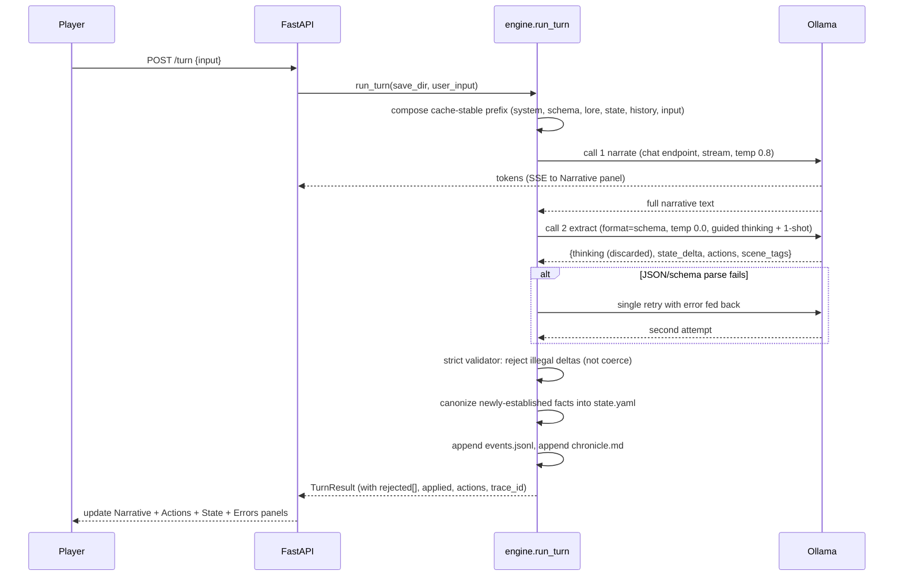

# ccya MVP scaffold

A thin, extensible MVP for a choose-your-own-adventure game backed by a local Ollama model. Convention over framework: no plugin system, no event bus, no rules engine. Four small disciplines keep every likely future feature additive.

## Architecture at a glance

```mermaid
flowchart TB
    Player[Player input]
    subgraph Browser[Single page UI]
        Narrative[Narrative stream - SSE]
        Actions[Action buttons]
        StatePanel[State side panel]
        ErrorsPanel[Errors panel - collapsible]
    end
    subgraph Server[FastAPI server]
        Routes[server.py routes + SSE]
        Engine[engine.py turn runner]
        OllamaClient[ollama.py thin client]
        StateIO[state.py YAML + JSONL IO]
        Logger[logging - JSONL to file + SSE]
    end
    subgraph Files[Flat files]
        Config[(config.yaml)]
        SaveState[(saves/default/state.yaml)]
        Events[(saves/default/events.jsonl)]
        Chronicle[(saves/default/chronicle.md)]
        LogFile[(logs/llm-g.log)], Logger→ErrorsPanel
    end
    Ollama[Ollama localhost:11434]

    Player --> Routes
    Routes --> Engine
    Engine --> OllamaClient
    OllamaClient --> Ollama
    Ollama -- "call 1: narrative tokens" --> OllamaClient
    OllamaClient -- "streams to" --> Narrative
    Ollama -- "call 2: JSON" --> OllamaClient
    Engine --> StateIO
    StateIO --> SaveState
    StateIO --> Events
    StateIO --> Chronicle
    Engine --> StateIO
    Engine --> Logger
    Logger --> LogFile
    Logger --> ErrorsPanel
    SaveState --> StatePanel
    Engine -- "suggested actions" --> Actions
    Config --> Routes
```

## File layout

```
ccya/
  pyproject.toml
  Makefile
  README.md
  config.yaml
  .gitignore
  ccya/
    __init__.py
    __main__.py
    server.py
    engine.py
    ollama.py
    state.py
    models.py
    logging_setup.py
    prompts/
      narrate.j2
      extract.j2
      sections/
        _pc.j2
        _location.j2
        _inventory.j2
        _quests.j2
        _recent.j2
    templates/
      index.html
      _actions.html
      _state.html
      _errors.html
      _debug.html
    static/
      app.css
      app.js
  saves/
    default/
      state.yaml
      events.jsonl
      chronicle.md
  packs/
    hard-scifi-demo/
      seed_state.yaml
      opening_scene.md
  logs/
    .gitkeep
  tests/
    test_engine_smoke.py
```

## Data model: `saves/default/state.yaml`

Flat, nested YAML. Single source of truth. Hand-editable. Adding fields is just adding keys.

```yaml
meta:
  game_name: default
  turn: 0
  setting_pack: hard-scifi-demo
  model: gemma4:26b          # recorded on new game; warn on load if config differs
pc:
  name: Vex Aurelian
  concept: ex-corporate salvage pilot
  stats: {body: 2, mind: 3, tech: 3, social: 1}
  conditions: []
location:
  id: docking-ring-7
  name: Docking Ring 7
  description: Low-grav commercial berth, half-lit, smelling of ozone.
inventory:
  - id: hand-terminal
    name: Hand terminal
    notes: Cracked screen, works.
  - id: vac-rated-jacket
    name: Vac-rated jacket
quests:
  - id: the-quiet-signal
    title: The Quiet Signal
    status: active
    objectives:
      - description: Find out who paid for your last salvage run
        done: false
scene:
  tags: [dialogue, exploration]
  present_npcs: []
  established_facts: []     # last ~10 (config: established_facts_max) narrator-established facts; feeds back into next turn's prefix
```

## Turn pipeline (two calls)



- Call 1 uses Ollama's `/api/chat` endpoint with `stream=true`; tokens go to the narrative panel via SSE. `temperature: 0.8`.
- Call 2 uses `/api/chat` with `format: <json_schema>` (Pydantic-derived via `model_json_schema()`) and `temperature: 0.0`.
- Both calls pass `keep_alive: "60m"` and a consistent `num_ctx` from config so Ollama can reuse the KV cache across turns.
- Prompt prefix is ordered **most stable first** to maximize prefix-cache hits (see "Prompt composition order" below).
- Call 2 prompts the model through a small guided-thinking checklist inside `<thinking>…</thinking>` before emitting JSON. The thinking block is parsed out and discarded.
- **Single automatic retry only on JSON-schema failure** of call 2. The validator error is fed back in a second prompt; one attempt, then give up. No retry on semantic delta rejection (that's a state-truth decision the player should see).
- **Strict delta validator**: illegal deltas (remove non-existent item, move to non-existent location, etc.) are rejected, not coerced. Rejections surface in `TurnResult.rejected` with reasons and render in the debug panel keyed by `trace_id`.
- **Newly-established facts are canonized immediately**: if the extract call introduces a new door, NPC name, or discovered item, it lands in `state.yaml` this turn so next turn's prefix is consistent with what the narrator just said. Mitigates the "mystery behind the door" ungrounding problem.
- On unrecoverable failure: narrative preserved, state unchanged, inline nudge with the turn's `trace_id`, full trace in `logs/llm-g.log`.

### `TurnResult` shape

```python
@dataclass
class TurnResult:
    turn: int
    trace_id: str
    narrative: str
    state_delta: dict
    applied: dict                 # what actually applied after validation
    rejected: list[dict]          # rejected deltas + reasons
    actions: list[str]            # suggested actions for next turn
    scene_tags: list[str]
    established_facts: list[str]  # facts canonized this turn
    metrics: dict                 # {narrate: {...}, extract: {...}}
    errors: list[dict]
```

Engine returns this; `server.py` writes files + pushes UI updates. No hidden side effects in `engine.run_turn`.

## API surface

- `GET /` — render `index.html` with current state.
- `POST /turn` — body: `{input: str}`. Triggers `engine.run_turn`. Returns SSE stream of: narrative tokens, then a final `turn_complete` event with actions/state/errors HTML fragments.
- `POST /new-game` — reset `saves/default/` from `packs/<setting_pack>/seed_state.yaml`.
- `GET /panels/state` — Jinja partial `_state.html` (HTMX refresh target).
- `GET /panels/actions` — Jinja partial `_actions.html`.
- `GET /panels/errors` — Jinja partial `_errors.html`.
- `GET /healthz` — `{ollama: ok|fail, model: ...}`.

## Prompt structure

### Prompt composition order (cache-stable)

Prefix is assembled in this fixed order, most stable → most volatile. Anything above the world-state line is byte-identical across most turns, so Ollama's KV-cache reuse fires.

| # | Section | Role | Changes when |
|---|---|---|---|
| 1 | System rules + narrative style | `system` | Source edit only |
| 2 | JSON schema as a fenced code block (call 2 only) | `system` | Source edit only |
| 3 | Setting pack static lore | `system` | New game |
| 4 | `world_state.yaml` rendered via `sections/*.j2` | `user` | Every turn |
| 5 | `chronicle.md` tail (budget-capped, see config) | `user` | Every turn |
| 6 | Last N turns as role-alternating `assistant`/`user` pairs | history | Every turn |
| 7 | Current player input | `user` | Every turn |

Roles follow the Intra pattern: `system` = stable rules, `user` = immediate task, `assistant` = past narrative.

### narrate.j2 (call 1)

```jinja
You are the narrator of a text adventure. Write the next beat based on the current state and the player's action.







## Player action
{{ user_input }}

## Style
- Second person. Present tense. 3-6 short paragraphs.
- No meta commentary. Do not list choices; narrate only.
- Do not contradict established state. If the action requires new information, invent something plausible and let the world record it.
- Do not introduce significant new items gratuitously. Inventory is finite.
```

### extract.j2 (call 2)

Single-purpose prompt. Schema is rendered inline (grounding) **and** passed to Ollama's `format:` (constraint). Pydantic-derived via `model_json_schema()`.

```jinja
You are the state extractor. Given the narrative that just occurred, emit the state changes in JSON that exactly matches the schema below.

## Schema
```{{ "```" }}json
{{ schema_json }}
{{ "```" }}

## Guided thinking
Silently consider: items, location, quest progress, PC conditions, and newly established facts.
Inside <thinking>...</thinking>, write only what actually changed this turn, as short bullets.
If nothing changed, write "no material changes" and emit an empty state_delta.
Then emit JSON. Nothing outside <thinking> except the JSON.

## Example
<thinking>
- Inventory: hand-terminal transferred to Mira.
- New fact: Mira agreed to examine the ident hash privately.
</thinking>
{"state_delta": {"inventory_remove": ["hand-terminal"], "established_facts": ["Mira agreed to examine the ident hash privately."]}, "actions": ["Ask Mira what she wants it for", "Walk to the concourse", "Offer her your jacket too"], "scene_tags": ["dialogue"]}
   "established_facts": ["A door appears."],

## Recent narrative
{{ narrative }}
```

### Pydantic schema sketch

```python
class StateDelta(BaseModel):
    inventory_add: list[InventoryItem] = Field(default_factory=list, max_length=6)
    inventory_remove: list[str] = Field(default_factory=list)
    location_change: LocationRef | None = None
    quest_updates: list[QuestUpdate] = Field(default_factory=list)
    pc_condition_add: list[str] = Field(default_factory=list)
    pc_condition_remove: list[str] = Field(default_factory=list)
    established_facts: list[str] = Field(default_factory=list)  # canonized immediately

class ExtractResult(BaseModel):
    state_delta: StateDelta
    actions: list[str] = Field(min_length=3, max_length=5)
    scene_tags: list[str] = Field(default_factory=list)
```

Passed to Ollama via `format=ExtractResult.model_json_schema()`. Adding a mechanic = add a field to `StateDelta` + a section include. Monoliths stay small.

### Entity ID convention

IDs closely match human titles: `the-quiet-signal` ↔ "The Quiet Signal", `docking-ring-7` ↔ "Docking Ring 7". No abstract IDs like `quest_007`. The model never has to translate between the text it writes and the IDs in state.

## Config — `config.yaml`

```yaml
ollama:
  host: http://localhost:11434
  model: gemma4:26b
  keep_alive: "60m"           # keep model loaded so prefix cache survives between turns
  num_ctx: 32768              # constant across all calls; changing this invalidates cache
  request_timeout_s: 180
  narrate_temperature: 0.8
  extract_temperature: 0.0
  max_extract_retries: 1      # single retry on JSON/schema failure only

game:
  default_save: default
  setting_pack: hard-scifi-demo
  window_turns: 6                       # recent turns kept raw in prefix
  chronicle_prefix_budget_tokens: 1500  # cap on chronicle.md tail injected into prefix
  established_facts_max: 10             # how many recent narrator-established facts ride in the prefix
  warmup_on_start: true                 # fire a silent 1-token chat call on startup to pre-load the model

server:
  bind_host: 127.0.0.1
  bind_port: 8765

logging:
  file: logs/llm-g.log
  level: INFO

debug:
  panel: true
```

## Logging and error UX

- `logging_setup.py` configures stdlib `logging` with a `RotatingFileHandler` writing JSONL to `logs/llm-g.log` (fields: `ts`, `level`, `trace_id`, `event`, ...).
- Every turn gets a `trace_id` (uuid4) attached to all its records.
- `tail -f logs/llm-g.log | jq .` is the primary dev trace.
- Errors are also pushed on the same SSE stream to the `_errors.html` panel with the `trace_id` visible (copy button).
- On LLM/schema failure: narrative preserved, state unchanged, inline notice in narrative "*That action didn't resolve. Trace `<id>` — try rephrasing.*"

## Makefile

```makefile
.PHONY: install run dev fmt lint test css clean new-game

install:
	uv sync

run:
	uv run ccya

dev:
	uv run uvicorn ccya.server:app --reload --host 127.0.0.1 --port 8765

fmt:
	uv run ruff format .

lint:
	uv run ruff check .

test:
	uv run pytest -q

css:
	./scripts/tailwindcss -i ccya/static/app.src.css -o ccya/static/app.css --minify

new-game:
	uv run python -m ccya --new-game

clean:
	rm -rf .venv dist build *.egg-info __pycache__ .pytest_cache
```

`pyproject.toml` declares `[project.scripts] ccya = "ccya.__main__:main"` so `uv run ccya` starts the server and opens the browser.

## Four day-one disciplines (the only "framework")

These take ~50 LOC of discipline, no abstractions, and make future work additive.

1. Parameterize save path everywhere: `engine.run_turn(save_dir: Path, user_input: str) -> TurnResult`. `server.py` reads `save_dir` from config. Adding save slots later = pass a different path.
2. `engine.run_turn` returns a `TurnResult`; file writes happen in `server.py` (or a small helper). No hidden side effects.
3. Prompt templates stay short and use ``. New mechanics add sections, never bloat monoliths.
4. `ollama.chat(model: str, ...)` takes model per call. Even with one config slot today, the call site passes it explicitly. Adding `summarizer_model`, `embedding_model` later is additive.

## Reliability measures (small-local-model friendly)

Concrete techniques layered onto the two-call pipeline. Each is a handful of lines; together they compound.

1. **Cache-stable prefix ordering** — system rules → schema → setting lore → state → chronicle tail → recent turns → user input. See the table under "Prompt composition order".
2. **`keep_alive: "60m"` + constant `num_ctx`** — model stays loaded between turns; KV cache across turns survives.
3. **Per-call temperature** — narrate `0.8`, extract `0.0`.
4. **Schema passed both ways** — Pydantic `model_json_schema()` fed to Ollama's `format:` *and* rendered inline in `extract.j2`.
5. **Guided thinking (positive-only)** — extract prompt asks the model to silently consider each category, then write only the actual changes as short bullets inside `<thinking>…</thinking>` before emitting JSON. The schema's defaults (empty arrays / null) provide structural completeness, so we don't need the thinking block to enumerate unchanged categories.
6. **One-shot example** — single worked narrative-to-JSON example in `extract.j2`.
7. **Role structure** — `/api/chat` with `system` = stable rules, `assistant` = past turns, `user` = current task.
8. **Strict delta validator** — illegal deltas rejected with reasons, never coerced; `TurnResult.rejected` surfaces in debug panel.
9. **Single retry on schema failure only** — validator error fed back in a second prompt; one attempt; no retry on semantic rejection.
10. **Fact canonization** — `state_delta.established_facts` applied immediately so next turn's prefix matches what the narrator just said.
11. **Inventory soft cap** — `max_length=6` on per-turn `inventory_add`; style rule against gratuitous item introduction.
12. **Entity IDs match titles** — `the-quiet-signal` ↔ "The Quiet Signal"; no abstract IDs.
13. **Chronicle prefix budget** — tail of `chronicle.md` clipped to `chronicle_prefix_budget_tokens` before injection.
14. **Model identity stamped in state** — `meta.model` stamped on new game from config. No mismatch warning yet.
15. **Trace-id everywhere** — per turn, attached to every log record. Errors panel shows trace_id with copy button.
16. **Established-facts feedback loop** — canonized facts land in `scene.established_facts` this turn and ride into next turn's prefix via `_recent.j2`. Capped at `established_facts_max` from config (default 10). Dedupe via normalized match. Older facts fall off into `chronicle.md`.
17. **Write-ordering and atomic state write** — each turn writes in this order: (1) append line to `events.jsonl` (source of truth for replay), (2) atomic replace of `state.yaml` (`state.yaml.tmp` + `os.replace`), (3) append to `chronicle.md`. A crash between (1) and (2) is recoverable from the event log; a crash between (2) and (3) at worst loses a chronicle line, not state.
18. **Turn-in-flight guard** — engine has `_EventLock` per save. Server checks lock and returns `409 Conflict` on concurrent `POST /turn`. UI also disables submit via Alpine.js (double protection).
19. **Startup warmup** — on server boot, if `warmup_on_start`, fire a silent 1-token chat call so the model is resident before the first player turn. `keep_alive` holds it there.
20. **Retry-feedback prompt** — on call-2 schema failure, the single retry's user message appends: `"Your previous output failed to parse: <error, 200 chars max>. Re-emit JSON matching the schema. No prose outside <thinking>."` Keeps the rest of the prompt identical.
21. **Per-turn metrics in `events.jsonl`** — each turn record carries `narrate: {tokens_in, tokens_out, first_token_ms, total_ms}`, `extract: {retries, total_ms, tokens_in, tokens_out}`, plus `established_facts[]`. `jq` over the log is the first-line diagnostic tool.

## Deferred (not in MVP, documented so they don't creep in)

- Module / plugin framework
- Event bus
- Panel registry
- Chronicle LLM summarizer (MVP = dumb append)
- Rules resolver / dice
- RAG over lore packets (sqlite-vec)
- World-sim faction ticks
- Multi-model config slots (summarizer, embedder, intent)
- Multi save-slot UI
- Vision / multimodal
- Token streaming of structural output (narrative streams; JSON does not)
- Intent-parse pre-call (third tiny call to normalize/sanitize player input; Intra pattern)
- Autonomous lorebook management agent (Aventuras pattern)
- NPC perspective filtering (per-NPC view of event log)
- Golden-turn eval harness running against live Ollama (`make eval`)
- Regex/heuristic input sanitizer (length cap, strip meta-injection markers; cheap substitute for intent-parse)
- Health-status dot in the UI header driven by `/healthz`
- `chronicle.md` file rotation when it exceeds an outer size cap
- Client-side turn cancel on navigate-away (propagate `asyncio.CancelledError` to the Ollama request)
- Structured NPC updates in the delta (`npc_updates` field — dispositions, etc.)
- Streaming-parse of the extract response to start applying deltas before it finishes

Each is individually additive per the impact-vs-risk table established in planning; none block by being absent.

Note: call 1 and call 2 have different system prompts (call 2 includes the schema), so they occupy separate prefix-cache slots in Ollama. Turn-over-turn caching on `narrate` dominates the win; `extract` pays a smaller prefix cost each time. Acceptable, documented, no action.

## Starter content (`packs/hard-scifi-demo/`)

- `seed_state.yaml` — initial `state.yaml` (shape above), seeding one PC, one location, one quest, a couple of inventory items.
- `opening_scene.md` — short opening beat the engine shows as turn 0 before the first player input (loaded into the narrative panel on new game without an LLM call).

## Dependencies (pinned in `pyproject.toml`)

- `fastapi`, `uvicorn[standard]`
- `jinja2`, `pyyaml`
- `httpx` (for Ollama HTTP)
- `pydantic`
- `sse-starlette` (clean SSE support on FastAPI)
- `python-multipart` (FastAPI form parsing)
- Dev: `ruff`, `pytest`

Tailwind via the standalone CLI only. The generated `ccya/static/app.css` is **committed** so first-time clones run without the CLI; `make css` rebuilds it. No CDN fallback. Alpine.js and HTMX vendored as single files under `ccya/static/vendor/` so the app runs offline.

## `events.jsonl` record shape

One line per turn, written **before** `state.yaml` so replay from the log is always possible.

```json
{
  "ts": "2026-04-18T17:22:09Z",
  "trace_id": "9f3e...-...",
  "turn": 3,
  "input": "I show Mira the hand terminal...",
  "narrative": "Mira leans against the berth's cable-post...",
  "applied": {"quest_updates": [...], "established_facts": [...]},
  "rejected": [],
  "actions": ["Head to The Pale Room", "..."],
  "scene_tags": ["dialogue", "intrigue"],
    "established_facts": ["A door appears."],
  "narrate": {"tokens_in": 1142, "tokens_out": 184, "first_token_ms": 480, "total_ms": 6420},
  "extract": {"tokens_in": 1380, "tokens_out": 248, "retries": 0, "total_ms": 3110}
}
```

## Smoke test

`tests/test_engine_smoke.py` uses a fake `ollama.chat` that returns canned narrative + canned JSON. Verifies:

- `run_turn` returns a `TurnResult` with expected fields and timing metrics.
- State delta applies correctly to a temp `state.yaml` via atomic replace.
- Invalid deltas are rejected and surfaced in `rejected`, not applied.
- Chronicle and events log get appended; event line is written before state replace.
- `scene.established_facts` from the delta lands in state and rides into the next turn's composed prefix; dedupes on repeat.
- Eviction trims to `established_facts_max` with oldest fact demoted to chronicle.
- **Schema-failure retry**: first fake response returns malformed JSON; engine retries once with the error fed back; second response succeeds and applies normally.
- **Chronicle prefix budget**: when `chronicle.md` exceeds the configured token budget, only the tail within budget reaches the prefix.
- **ID convention**: validator rejects deltas referencing unknown IDs with a clear reason.
- **Turn-in-flight guard**: a second concurrent `run_turn` against the same save raises (server would translate to 409).

No real Ollama needed for CI.

## Done criteria for MVP

1. `make install && make run` starts the server; browser opens `127.0.0.1:8765`. Server fires a startup warmup call before accepting traffic.
2. With Ollama running locally and `config.yaml:ollama.model` pulled, a new game shows the opening scene.
3. Player types an action; narrative streams in; state/actions/errors panels update after the second call. Submit disabled while turn in flight (server 409 guard + client Alpine.js).
4. `saves/default/state.yaml` reflects applied deltas; `events.jsonl` record lands before state is replaced; `chronicle.md` grows; `meta.model` stamped on new game.
5. A narrator-established fact appearing on turn N is visible in the composed prefix on turn N+1 (verifiable via debug panel or log).
6. Killing Ollama mid-turn shows a visible error with a trace id that appears in `logs/llm-g.log` and the errors panel (with copy button). State is unchanged.
7. A malformed extract response on one turn triggers a single silent retry; the second attempt succeeds and the turn completes normally; `retries: 1` shows in the events line.
8. `/healthz` returns a useful status (Ollama reachable, model present).
9. `make test` passes offline.

## References

- [Ollama — Structured outputs](https://docs.ollama.com/capabilities/structured-outputs) — schema handling, `format:` param, temperature advice.
- [Ollama prompt caching guide (Leanpub)](https://leanpub.com/read/ollama/prompt-caching) — `keep_alive`, byte-exact prefix, `num_ctx` consistency.
- [Gemma 3 27B model card](https://huggingface.co/google/gemma-3-27b-it) — chat template and no-system-role caveat.
- [Gemma production guardrails + self-healing (dev.to)](https://dev.to/system_rationale/part-3-making-gemma-4-agents-production-ready-guardrails-structured-outputs-and-self-healing-575n) — retry-with-error pattern.
- [Ian Bicking — Intra design notes](https://ianbicking.org/blog/2025/06/intra-llm-text-adventure.html) — guided thinking, minimize indirection, role usage, ungrounded-fact problem, inventory inflation.
- [StateAct (arXiv 2410.02810)](https://arxiv.org/abs/2410.02810v2) — state-tracking + CoT few-shot.
- [AutoHarness (arXiv 2603.03329)](https://arxiv.org/pdf/2603.03329) — strict move validation in game environments.
- Related OSS for later inspiration: [Ollama Dungeon](https://github.com/cyberofficial/Ollama-Dungeon), [YIKES](https://github.com/psema4/yikes), [Aventuras](https://github.com/AventurasTeam/Aventuras).