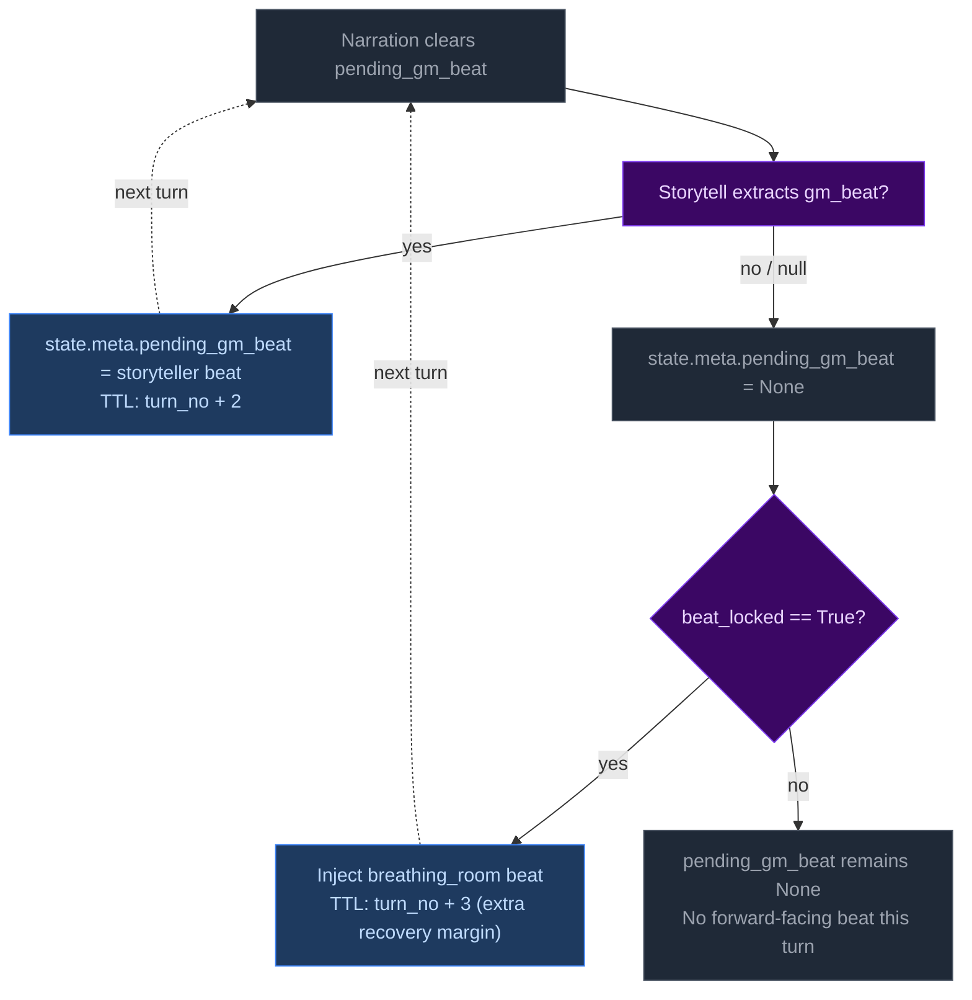

# Plan 7: Pacing Interaction Documentation

## Status
`completed`

## Phases

1 phase: document the interaction model between Python-computed pacing signals (PacingContext directive, beat_locked, gate) and LLM-emitted beats (gm_beat via storyteller_result), including floor relief injection semantics.

## Issue

The mechanics for pressures + deescalation + pending_gm_beat work correctly in code but lack documentation explaining how they interact. Three specific gaps exist:

1. **Floor relief vs storyteller beat interaction:** When `beat_locked=True` (floor relief fires due to momentum at floor), Python injects a breathing_room beat into `state.meta.pending_gm_beat` AFTER extraction (`turn.py:1263-1269`). But if the storyteller LLM also emitted its own gm_beat during this same turn, which wins? The code checks `_pc.beat_locked and not state.get("meta", {}).get("pending_gm_beat")` — floor relief only fires when no beat exists. This means: storyteller beats take priority; floor relief is a fallback that only injects if the LLM didn't already provide one. This design decision isn't documented anywhere.

2. **Beat clearing semantics:** After narration consumes `pending_gm_beat`, it's cleared (`turn.py:1128`). Then storyteller extracts and may emit a new beat (lines 1168-1175) or clear it to None (line 1178). The interaction between "LLM emits nothing" vs "LLM explicitly nullifies" is identical in code but semantically different — neither is documented.

3. **Pacing directive vs beat type alignment:** The storyteller prompt (`storytell_system.j2:54-65`) maps each PacingContext directive to recommended beat types, but the documentation doesn't explain what happens when the LLM ignores this guidance and emits a beat that contradicts the directive (e.g., "Breathe" directive with an escalation-type beat). The code accepts whatever the LLM emits — there's no validation or correction.

## Solution

Add three subsections to `docs/architecture/step2c-progress.md` covering: floor relief injection semantics, beat clearing/nullification behavior, and directive-beat alignment expectations. This is documentation-only work with zero code changes.

## Firm decisions

1. Floor relief beats are a **fallback mechanism** — they only inject when the storyteller LLM didn't emit its own beat. The design intent: floor relief guarantees that low-momentum turns get narrative breathing room, but doesn't override explicit storytelling direction from the LLM.
2. "LLM emits nothing" and "LLM explicitly nullifies" are functionally identical — both result in `pending_gm_beat = None` at line 1178. The documentation should note this equivalence rather than treating them as distinct behaviors.
3. Directive-beat alignment is **guidance only** — the storyteller prompt recommends beat types per directive but Python accepts whatever the LLM emits. No validation or correction occurs. This is by design: forcing alignment would constrain storytelling flexibility.

## Non-goals

- Does not modify any code in turn.py, extraction.py, or prompt templates.
- Does not add runtime validation of beat type vs directive alignment.
- Does not change floor relief injection logic or timing.
- Does not rewrite existing architecture docs — only adds to step2c-progress.md.

## Risks, Ambiguities, and Blockers

**Ambiguity:** Should the documentation mention that `beat_expires_turn` is set to `turn_no + 3` for floor relief beats vs `turn_no + 2` for storyteller-emitted beats? Yes — this difference in TTL (extra turn of lifetime) reflects design intent: floor relief beats get slightly longer duration because they represent systemic recovery rather than narrative events.

**Risk:** Minimal. This is documentation-only work. The only risk is documenting behavior that changes during plan execution, but Plans 1-6 don't modify any beat or pacing logic.

**Blocker:** None. No source code reads required beyond what's already referenced in existing architecture docs.

---

## Implementation: Pacing Interaction Documentation

### Context files to load
- `docs/architecture/step2c-progress.md` — current beat lifecycle documentation (lines 57-68)
- `ccya/engine/turn.py` — floor relief injection at lines 1263-1269; storyteller beat handling at lines 1168-1178; narration clearing at line 1128

### Detailed steps

#### Step 7.1 — Add "Beat Injection Priority" subsection to step2c-progress.md

**File:** `docs/architecture/step2c-progress.md`

**What:** After the existing "Beat lifecycle" section (lines 57-68), add a new subsection titled **"Floor relief injection priority"** that documents:
1. The floor relief mechanism fires when `_pc.beat_locked=True` AND no beat exists in `state.meta.pending_gm_beat` at extraction completion time (`turn.py:1263`).
2. Floor relief beats are **fallback only** — they inject a breathing_room beat with TTL of 3 turns (one more than storyteller-emitted beats' TTL of 2) when the LLM didn't already provide one.
3. If the storyteller emits any gm_beat during extraction, floor relief does NOT fire because `pending_gm_beat` is already set by that point. The LLM's beat takes priority over Python-injected recovery signals.

Include a flowchart showing:

**Why:** The floor relief interaction with storyteller beats is the most ambiguous aspect of the pacing system. Currently only visible in source code comments (`turn.py:1263` says "Inject floor relief beat via PacingContext.beat_locked") but not documented as intended behavior. This subsection makes explicit that: (a) LLM beats take priority; (b) floor relief is a safety net for low-momentum turns; (c) the extra TTL on floor relief beats reflects design intent for recovery margin.

**Validation:** No code changes — documentation only. Verify flowchart renders correctly in Markdown viewers supporting Mermaid. Cross-reference with existing beat lifecycle section to ensure no contradictions.

#### Step 7.2 — Add "Directive-beat alignment" subsection to step2c-progress.md

**File:** `docs/architecture/step2c-progress.md`

**What:** After the floor relief injection priority subsection, add a brief note documenting:
- The storyteller prompt (`storytell_system.j2:54-65`) maps each PacingContext directive to recommended beat types (e.g., "Breathe" → breathing_room; "Overwhelm" → pressure/escalation).
- This alignment is **guidance only** — Python accepts whatever gm_beat the LLM emits. No validation, correction, or override occurs at runtime.
- Design rationale: forcing directive-beat alignment would constrain storytelling flexibility and create brittleness if the LLM makes contextually appropriate but directive-divergent beat choices.

Keep this to 3-4 sentences — it's a brief note rather than a full subsection given its narrow scope.

**Why:** The storyteller prompt already documents directive-to-beat mappings, but the architecture docs don't mention that Python doesn't enforce them. This prevents future developers from assuming there's runtime validation or adding unnecessary correction logic.

**Validation:** Documentation only. No code changes to verify. Cross-reference with `storytell_system.j2:54-65` for accuracy of directive-to-beat mappings referenced in documentation.

### Tests to write or update

No tests needed — this is pure documentation work. Manual verification via reading the updated doc file and confirming flowchart renders correctly.

### REPOMAP updates required

None. This plan only modifies `docs/architecture/step2c-progress.md` which already exists in the architecture docs referenced by repomap.md line 69-70. No new files or modules introduced.
