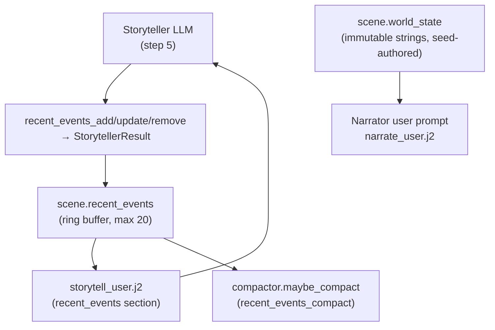
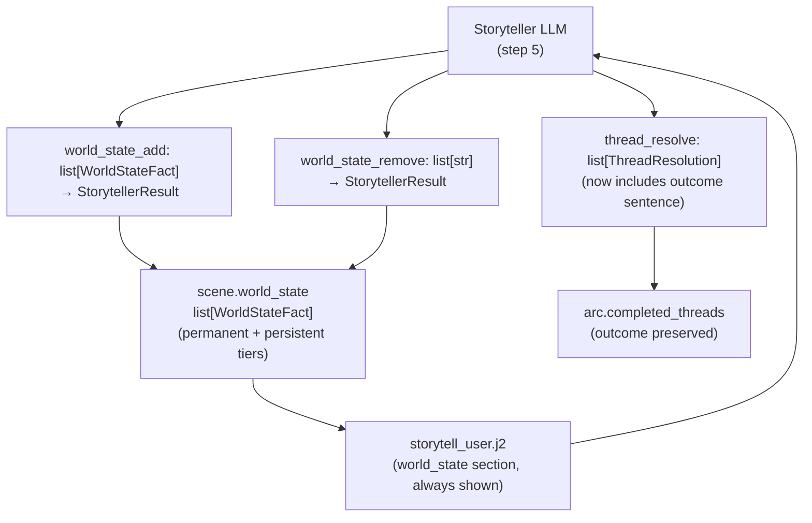

# World State & History Redesign

## Purpose

This document is the design authority for plans implementing the removal of `recent_events`, the promotion of `world_state` to a mutable tiered structure, and the addition of mandatory outcome sentences to `ThreadResolution`. It covers all models, delta logic, prompt templates, compaction, and state migration affected by these changes.

---

## Current State — What Exists

### `recent_events` Ring Buffer

`scene.recent_events` is a list of `{id, text, turn}` dicts managed as a FIFO ring buffer (default max 20, configurable via `recent_events_max` in `EngineConfig`). It is written by the Storyteller extractor via `StorytellerResult.recent_events_add/update/remove`, applied in `delta_builder.apply_delta`, compacted by `compactor.maybe_compact` via `CompactorSanitizationResult.recent_events_compact`, and fed back into the Storyteller prompt via `storytell_user.j2`.

The Narrator does not receive `recent_events` — it receives `prior_history` (compacted turn bullets) and `recent_turns` (verbatim narration for the last N turns).

### `world_state` — Immutable Flat List

`scene.world_state` is a list of plain strings authored at seed time and never mutated during play. It is rendered into `sections/_world_state.j2` (a flat bullet list) and included in the Narrator user prompt via `narrate_user.j2` under an `<<<TRACE_IMMUTABLE_START>>>` marker. The Storyteller receives `world_state` only when `all_threads` is empty, via `storytell_user.j2`.

### `ThreadResolution` — Label Only

`ThreadResolution` in `models.py` carries `id: str` and `resolution_state: Literal["resolved", "failed", "abandoned"]`. Resolved threads are moved to `arc.completed_threads` via `_apply_thread_resolutions()` in `engine/turn.py`. The `resolution_state` label is preserved on the completed thread for eval rubrics and narrative context, but no prose outcome is recorded.

### Data Flow



### Problems with Current State

- `recent_events` duplicates information already in `recent_turns` (verbatim narration) and `prior_history` (compacted chronicle). The Storyteller has the current turn's narration and one prior turn's narration; `recent_events` compensates by recapping what the LLM already wrote.
- Because the Storyteller's history context is thin, small models fill `recent_events` with prose restatements of the narration rather than durable world facts — producing the exact duplication it was intended to avoid.
- Permanent world changes — a destroyed bridge, a lost mission-critical object, a dead NPC — have no appropriate home. They do not belong in arc threads (forward-looking plot machinery), conditions (PC-scoped), or `recent_events` (expires, narrative-flavored, ring-buffered).
- `world_state` is completely inert after seed. There is no mechanism for the LLM to record durable environmental facts discovered or created during play.
- `ThreadResolution` carries only a label. When a thread completes, no record is made of *how* it resolved — who did what, what the cost was, what the outcome meant. Completed thread context is lost except for what happens to be in `prior_history`.
- `CompactorSanitizationResult.recent_events_compact` adds compaction complexity for a field being removed.
- The inventory durability gate in `delta_builder.apply_delta` currently uses `delta.recent_events_add` as a loot-gain signal. This dependency must be replaced before `recent_events` can be removed.

---

## Target State — What It Becomes

### `world_state` as a Tiered Mutable Structure

`scene.world_state` becomes a list of `WorldStateFact` objects with two tiers:

- `permanent`: seed-authored, never written or removed by the LLM.
- `persistent`: LLM-authored at runtime via `world_state_add`; survives compaction indefinitely; removable via `world_state_remove`.

The Storyteller may emit `world_state_add` entries only when a fact satisfies: *it would still be true 10 turns from now in a different location*. Capability changes (destroyed routes, lost objects, dead key NPCs) qualify. Scene-local observations do not.

The Narrator and Storyteller both receive the full `world_state` list without tier-gating. Prompt templates render permanent and persistent facts in a single list, distinguished by a subtle label only if needed for LLM clarity.

### `ThreadResolution` with Mandatory Outcome

`ThreadResolution` gains a required `outcome: str` field — one past-tense sentence written by the Storyteller at resolution time. This sentence is stored on the completed `ArcThread` as `outcome: str | None` (nullable for legacy threads, required for new resolutions). Completed threads with outcomes are available to future Storyteller calls for thread generation context.

### `recent_events` Removed

`scene.recent_events` is deleted from state. All delta fields (`recent_events_add`, `recent_events_update`, `recent_events_remove`), the ring buffer logic in `delta_builder.apply_delta`, the compaction field `recent_events_compact`, prompt rendering in `storytell_user.j2`, and the `recent_events_max` config key are removed. The `TurnResult.recent_events` and `TurnResult.recent_events_evicted` dataclass fields are removed.

### Inventory Durability Gate Replacement

The loot-gain signal currently drawn from `delta.recent_events_add` in `delta_builder.apply_delta` is replaced by checking `delta.actions` alone, which already carries Storyteller-generated action text and is not being removed.

### Simplified Data Flow



---

## Decision Table

| Decision | What | Why |
|---|---|---|
| Remove `recent_events` entirely | Delete `scene.recent_events`, all delta ops, ring buffer logic, compaction field, prompt rendering, config key, and TurnResult fields | It duplicates context the Storyteller already receives and incentivizes prose restatement rather than durable fact capture |
| Add `world_state.persistent` tier | `scene.world_state` becomes `list[WorldStateFact]` with `tier: "permanent" \| "persistent"` | Permanent capability changes need a home that survives compaction and is queryable by all LLM calls |
| Storyteller writes `world_state_add` | New field on `StorytellerResult`; strict prompt constraint: emit only for post-location-change permanent facts | Gives the Storyteller a correct write target for world mutations instead of abusing `recent_events` |
| Storyteller writes `world_state_remove` | New field on `StorytellerResult`; removes by ID | Facts can be superseded (blockade lifted, bridge rebuilt) |
| `ThreadResolution.outcome` required | One past-tense sentence; stored on `ArcThread.outcome` in `completed_threads` | Completed thread context informs future thread generation; writing at resolution time maximises accuracy |
| Completed thread outcomes visible to Storyteller | `storytell_user.j2` renders `arc.completed_threads` with outcome sentences | Continuity: the Storyteller knows how past plot lines ended when generating new ones |
| Inventory durability gate uses `actions` only | Remove `recent_events_add` reference in `delta_builder.apply_delta`; use `delta.actions` as loot signal | `recent_events_add` is being removed; `actions` already carries equivalent context |
| `world_state` always shown to Storyteller | Remove the `if not all_threads` gate in `storytell_user.j2` | World facts are always relevant context, not a fallback for empty thread lists |
| [OPEN] Hard cap on `world_state_add` per turn | Whether to enforce a max of 1–2 `persistent` entries per turn in Python or rely solely on prompt constraint | Small models may abuse the new write target, recreating ring-buffer bloat under a new name. A Python cap (e.g., `max_length=2`) is a simple safeguard but may block legitimate multi-fact turns |
| [OPEN] Completed thread outcomes in Narrator | Whether `narrate_user.j2` should also render `arc.completed_threads` with outcomes | Adds continuity for the Narrator at the cost of additional tokens; the chronicle tail already carries some of this context implicitly |

---

## What Is Removed

| Removed | From | Notes |
|---|---|---|
| `scene.recent_events` | `state.yaml` schema, `ccya/state/io.py` | Deleted with no replacement |
| `RecentEvent` model | `ccya/models.py` | Deleted with no replacement |
| `RecentEventUpdate` model | `ccya/models.py` | Deleted with no replacement |
| `StateDelta.recent_events_add` | `ccya/models.py` | Deleted with no replacement |
| `StateDelta.recent_events_remove` | `ccya/models.py` | Deleted with no replacement |
| `StateDelta.recent_events_update` | `ccya/models.py` | Deleted with no replacement |
| `StorytellerResult.recent_events_add` | `ccya/models.py` | Deleted with no replacement |
| `StorytellerResult.recent_events_update` | `ccya/models.py` | Deleted with no replacement |
| `StorytellerResult.recent_events_remove` | `ccya/models.py` | Deleted with no replacement |
| `CompactorSanitizationResult.recent_events_compact` | `ccya/models.py` | Deleted with no replacement |
| `CompactorRecentEventCompact` model | `ccya/models.py` | Deleted with no replacement |
| `recent_events` ring buffer logic | `ccya/state/delta_builder.apply_delta` | ~40 lines including corrupt-entry cleanup, sort, eviction |
| `recent_events_add` loot-gate reference | `ccya/state/delta_builder.apply_delta` | Replace with `delta.actions` check only |
| `apply_delta` `recent_events_max` parameter | `ccya/state/delta.py`, `ccya/state/delta_builder.py` | Signature simplification |
| `recent_events_max` config key | `ccya/engine/config.py`, `config.yaml` | Deleted with no replacement |
| `recent_events_compact` compaction logic | `ccya/engine/compactor.py` | Remove compaction handling for this field |
| `recent_events` section in `storytell_user.j2` | `ccya/prompts/storytell_user.j2` | Replace with `world_state` section (always shown) |
| `## RECENT EVENTS` section in `compact_user.j2` | `ccya/prompts/compact_user.j2` | Deleted with no replacement |
| `recent_events_compact` in `compact_system.j2` | `ccya/prompts/compact_system.j2` | Remove from sanitization instructions |
| `TurnResult.recent_events` | `ccya/models.py` | Deleted with no replacement |
| `TurnResult.recent_events_evicted` | `ccya/models.py` | Deleted with no replacement |
| `recent_events` from `_state_right.html` | `ccya/templates/_state_right.html` | Remove UI rendering |
| `recent_events` turn-stamp auto-checker | `ccya/eval/universal_asserts.py` | Remove checker; update repomap entry |

---

## What Is Unchanged

- `world.world_state` as a pack-level concept (pack YAML) — only `scene.world_state` in runtime state changes shape
- `prior_history` — compacted turn bullets; compaction logic for this field is unchanged
- `recent_turns` — verbatim narration window; unchanged
- Arc thread lifecycle (`ArcThread`, `_apply_thread_signals`, `_candidate_to_latent_thread`) — unchanged except for the new `outcome` field on `ArcThread` and `ThreadResolution`
- `thread_advance`, `thread_add` — unchanged
- `outcome_summary` on `StorytellerResult` — unchanged; this is a per-turn UI summary, not the same as the new thread outcome sentence
- NPC scene management, compendium, inventory, conditions, momentum — all unchanged
- `maybe_compact` chronicle compaction — the `prior_history` / chronicle path is unchanged; only the `recent_events_compact` path is removed
- Narrator prompt structure (`narrate_user.j2`, `narrate_system.j2`) — `world_state` rendering via `sections/_world_state.j2` is unchanged in position; the template itself is updated to handle the new `WorldStateFact` shape
- Eval judge rubrics that do not reference `recent_events` — unchanged
- `compaction.md` and `default.md` eval rubrics — `recent_events_compact` rows are removed; everything else is unchanged

---

## Migration Notes

Existing `state.yaml` files will have `scene.recent_events` as a list of dicts and `scene.world_state` as a list of strings. The migration function `_migrate_state` in `ccya/state/io.py` must:

1. **Drop `scene.recent_events`**: remove the key entirely if present.
2. **Promote `scene.world_state` strings to `WorldStateFact` objects**: for each string entry, emit `{"id": <slugified text>, "text": <string>, "tier": "permanent"}`. A simple slug function (lowercase, spaces to underscores, truncated to 40 chars) suffices.

No migration is needed for `arc.completed_threads` — existing threads simply lack an `outcome` field, which is nullable on the model.

---

## New Model Shapes

```python
class WorldStateFact(BaseModel):
    id: str
    text: str
    tier: Literal["permanent", "persistent"] = "permanent"
```

```python
# ThreadResolution — add outcome field
class ThreadResolution(BaseModel):
    id: str
    resolution_state: Literal["resolved", "failed", "abandoned"]
    outcome: str  # required; one past-tense sentence written at resolution time
```

```python
# ArcThread — add outcome field for completed threads
class ArcThread(BaseModel):
    # ... existing fields unchanged ...
    outcome: str | None = None  # set when thread_resolve processes this thread; None on legacy/active threads
```

```python
# StorytellerResult — replace recent_events_* with world_state_*
class StorytellerResult(BaseModel):
    world_state_add: list[WorldStateFact] = Field(default_factory=list, max_length=2)
    world_state_remove: list[str] = Field(default_factory=list)  # list of WorldStateFact ids
    actions: list[str] = Field(default_factory=list)
    outcome_summary: str = ""
    gm_beat: GMBeat | None = None
    thread_advance: list[str] = Field(default_factory=list)
    thread_resolve: list[ThreadResolution] = Field(default_factory=list)
    thread_add: ArcThread | None = None
```

```python
# StateDelta — replace recent_events_* with world_state_*
class StateDelta(BaseModel):
    # ... inventory, location, conditions, scene_tags, compendium unchanged ...
    world_state_add: list[WorldStateFact] = Field(default_factory=list, max_length=2)
    world_state_remove: list[str] = Field(default_factory=list)
    actions: list[str] = Field(default_factory=list, max_length=10)
    arc_update: CampaignArc | None = None
    # recent_events_add, recent_events_update, recent_events_remove: REMOVED
```

```python
# TurnResult dataclass — remove recent_events fields
@dataclass
class TurnResult:
    turn: int
    trace_id: str
    narrative: str
    state_delta: dict[str, Any]
    applied: dict[str, Any] = field(default_factory=dict)
    rejected: list[dict[str, Any]] = field(default_factory=list)
    actions: list[str] = field(default_factory=list)
    scene_tags: list[str] = field(default_factory=list)
    diff: list[str] = field(default_factory=list)
    changes: dict[str, Any] = field(default_factory=dict)
    metrics: dict[str, Any] = field(default_factory=dict)
    errors: list[dict[str, Any]] = field(default_factory=list)
    ruling: dict[str, Any] = field(default_factory=dict)
    outcome_summary: str = field(default="")
    ts: str = field(default="")
    # recent_events and recent_events_evicted: REMOVED
```

---

## Prompt Token Impact

**`storytell_user.j2`**
- Removed: `## recent_events` section — up to 20 entries × ~15 tokens each = **~300 tokens removed** at a full buffer
- Added: `## world_state` section always shown — replaces conditional `world_state` block; net change depends on `persistent` fact accumulation; a typical game with 3–5 persistent facts adds ~75–100 tokens, lower than the removed `recent_events` section at any non-trivial turn count
- Added: `## completed_threads` with outcome sentences — ~20 tokens per completed thread [OPEN: whether to include in narrator; not in storyteller at this point unless resolved]

**`narrate_user.j2`**
- No change: `world_state` section already present; template updated to handle `WorldStateFact` objects vs strings but content unchanged unless persistent facts are added

**`compact_user.j2`**
- Removed: `## RECENT EVENTS` section — up to 20 entries = **~300 tokens removed** from each compaction prompt call

**`compact_system.j2`**
- Removed: `recent_events_compact` instruction paragraph — ~40 tokens

**Net per-turn Storyteller prompt reduction:** ~200–300 tokens at mid-game (when `recent_events` had accumulated 10–15 entries), approaching 0 in early turns (first 2–3 turns when the buffer was sparse anyway).

---

## Context for Implementing LLMs

- **`ccya/models.py`** — All Pydantic models. `StorytellerResult`, `StateDelta`, `ThreadResolution`, `ArcThread`, `TurnResult`, `RecentEvent`, `RecentEventUpdate`, `CompactorSanitizationResult`, `CompactorRecentEventCompact` are all touched. Read in full before starting any phase.
- **`ccya/state/delta_builder.py`** — `apply_delta` contains the `recent_events` ring buffer logic (~40 lines) and the inventory durability gate that references `delta.recent_events_add`. Both sections must be changed together. Also contains `_merge_arc_update` which writes `completed_threads` — relevant to the `outcome` field migration.
- **`ccya/state/delta.py`** — Thin wrapper over `delta_builder`; `apply_delta` signature changes (`recent_events_max` parameter removed).
- **`ccya/state/io.py`** — `_migrate_state` must be updated with the two migration steps described above.
- **`ccya/engine/config.py`** — `EngineConfig.recent_events_max` field removed; `config.yaml` updated.
- **`ccya/engine/compactor.py`** — `maybe_compact` references `recent_events_count` and applies `recent_events_compact`; both removed.
- **`ccya/engine/extraction.py`** — Builds Storyteller prompt context; reads `scene.recent_events` to pass to template. This read is removed; `scene.world_state` is already read here.
- **`ccya/engine/changes.py`** — `summarize_changes` / `format_change_lines` reference `recent_events_add` and `recent_events_remove`; both removed.
- **`ccya/prompts/storytell_user.j2`** — Remove `recent_events` section; add `world_state` always-shown section; add `completed_threads` section with outcomes. The `world_state` conditional gate (`if not all_threads`) is removed.
- **`ccya/prompts/storytell_system.j2`** — JSON schema example updated: remove `recent_events_*` fields, add `world_state_add` / `world_state_remove`, add `outcome` to `thread_resolve` example. Instruction text for `world_state_add` must include the "still true 10 turns from now in a different location" constraint and the `max_length=2` per turn rule.
- **`ccya/prompts/compact_user.j2`** and **`ccya/prompts/compact_system.j2`** — Remove `recent_events` sections.
- **`ccya/prompts/sections/_world_state.j2`** — Update to render `WorldStateFact` objects (access `.text`) instead of plain strings. Optionally label `persistent` entries distinctly.
- **`ccya/templates/_state_right.html`** — Remove `recent_events` UI rendering. Consider adding `world_state` persistent facts to the sidebar.
- **`ccya/eval/universal_asserts.py`** — Remove `recent_events` turn-stamp auto-checker. Update repomap description for this file.
- **`docs/repomap.md`** — Update `TurnResult` dataclass entry, `StorytellerResult` extraction field routing section, `apply_delta` signature entry, `EngineConfig` constants section, `universal_asserts.py` checker count.
- **`evals/rubrics/compaction.md`** and **`evals/rubrics/default.md`** — Remove `recent_events_compact` rows.
